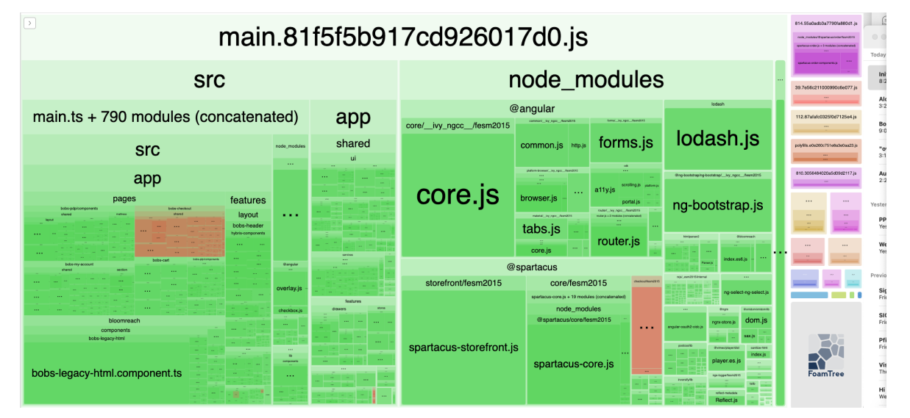
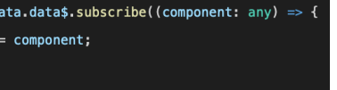
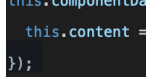
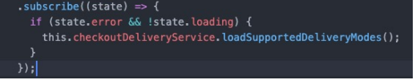
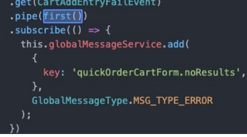
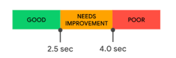
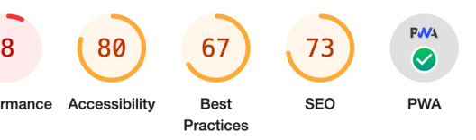

# Bob'S Discount Performance

Omnia Ibrahim, SAP August 29, 2023

# Agenda

- Upgrade Workshop (Monday) - **Performance Workshop (Tuesday)**
- **Followup** - **Architecture Discussion** - **Performance Best Practices**
- Best Practices (Wednesday) - Follow up and Open Questions (Thursday) - Code Review & Read out (TBD)

# Follow-Up

- Bloomreach library updates - Current version supports Angular 12 and Spartacus 4.x - Evaluating current compatibility with Angular 15/CS v6.x in progress - Consider long-term compatibility if libraries are not continuously updated

# Architecture Discussion

- Bloomreach
- Overview of current usage - Plans to expand?

- **bobs-component-library**
- Built as a separate library from application - Background
- Areas of concern
- Performance - Upgradability - Code maintainability Performance Best Practices

# App Navigation

Click on link -> entire app is reloaded

 Impact - Low performance of frontend - Increased load on API endpoints - Unreliable tracking - Use **routerLink** for all internal links

# App Navigation

## Bobs50Imagewithcaratcomponent

 
 <a [href]="imageCarat.linkUrl"
 [target]="imageCarat.openInNewTab ?

'_blank' : '_self' " > {{ imageCarat.linkText }} </a> . . . 
 

<a [routerLink]=imageCarat.linkUrl">

## Bobslogocomponent

<bobs-generic-link class="bob-logo-link-wrapper" *ngIf="href; else noWrap" routerLink="/"
 (click)="reloadPage()"
 [title]="title" > <ng-container *ngTemplateOutlet="noWrap"> </ng-container> </bobs-generic-link> reloadPage() { if (window) { window.location.href = '/'; } }

# Feature Modules

- A feature module delivers a cohesive set of functionality focused on a specific application need - By default, NgModules are eagerly loaded. - Lazy loading allows modules to be loaded as needed. - Helps keep initial bundle sizes smaller and decrease load times

# Code Splitting

Done at application build time In Angular, lazy-loading is route based (chunk for homepage, product page, etc) Composable Storefront is CMS based so application logic for each route cannot be decided at build time
- Component lazy-loading - CMS-driven lazy loading of feature modules cmsComponents: { SimpleResponsiveBannerComponent: { }

# Lazy Loading | Cms Components

 component: () => import('./lazy/lazy.component').then(m => m.LazyComponent)

# Lazy Loading | Feature Modules

Lazy loading of the feature module is triggered by the CMS requested a component when the implementation is covered by the relevant feature configuration
{ featureModules: { organization: { module: () => import('@spartacus/my-account/organization').then( (m) => m.OrganizationModule ), cmsComponents: [ 'OrderApprovalListComponent', 'ManageBudgetsListComponent', 'ManageCostCentersListComponent', 'ManagePermissionsListComponent', 'ManageUnitsListComponent', 'ManageUserGroupsListComponent', 'ManageUsersListComponent', ], }, }, }

# Feature Modules | Proxy Facades

@Injectable({
 providedIn: 'root',
 useFactory: () => facadeFactory({ facade: WishListFacade, feature: CART_WISH_LIST_CORE_FEATURE, methods: [ 'createWishList', 'getWishList', 'loadWishList', 'addEntry', 'removeEntry'', 'getWishListLoading', ], async: true, }), }) export abstract class WishListFacade { abstract createWishList(…): void; abstract getWishList(): Observable<Cart>; … }
export class WishListService implements WishListFacade { … createWishList(userId: string, name?: string, description?: string): void { this.store.dispatch( new WishListActions.CreateWishList({ userId, name, description }) ); } getWishList(): Observable<Cart> { ... } … } export const facadeProviders: Provider[] = [ WishListService, { provide: WishListFacade, useExisting: WishListService, }, ];

Main Bundle Lazy-Loaded

# Feature Modules | Proxy Facades

| import { WishListFacade } from '@spartacus/cart/wish-list/root'; … constructor(  protected wishListFacade: WishListFacade,   … ) {} … add(product: Product): void {  if (product.code) {  this.wishListFacade.addEntry(product.code);   } }   |
|-----------------------------------------------------------------------------------------------------------------------------------------------------------------------------------------------------------------------------------------------|

Any component or service can inject lightweight proxy token

| Triggers the loading of the feature  module & implementation is injected   |
|----------------------------------------------------------------------------|

# Feature Modules

When creating an application using schematics, various feature modules are created.

| app                                          | import { NgModule } from '@angular/core';                     |                                                                       |                                  |                |
|----------------------------------------------|---------------------------------------------------------------|-----------------------------------------------------------------------|----------------------------------|----------------|
| spartacus                                    | o                                                             | import { checkoutTranslationChunksConfig, checkoutTranslations } from |                                  |                |
| o                                            | import { CheckoutRootModule, CHECKOUT_FEATURE } from "@s      |                                                                       |                                  |                |
| > features                                   | import { CmsConfig, I18nConfig, provideConfig } from "@sparta |                                                                       |                                  |                |
| > asm                                        | o                                                             |                                                                       |                                  |                |
| > cart                                       | o                                                             | Selection                                                             |                                  |                |
| declarations: [],                            |                                                               |                                                                       |                                  |                |
| efeature module ts                           | Root modules are                                              |                                                                       |                                  |                |
| neckoutRootModule                            |                                                               |                                                                       |                                  |                |
| order                                        | o                                                             |                                                                       |                                  |                |
| ' product                                    | o                                                             | statically imported                                                   |                                  |                |
| 1                                            | oviders: [provideConfig(<CmsConfig>{                          |                                                                       |                                  |                |
| o                                            |                                                               |                                                                       |                                  |                |
| > smartedit                                  | featureModules:                                               |                                                                       |                                  |                |
| > storefinder                                | o                                                             | 13                                                                    |                                  |                |
| > tracking                                   | o                                                             | 14                                                                    | odule: () {                      | Dynamic import |
| eckout/base').then((m) => m.CheckoutModule), |                                                               |                                                                       |                                  |                |
| o                                            | 15                                                            |                                                                       |                                  |                |
| > USER                                       | 16                                                            |                                                                       |                                  |                |
| s spartacus-configuration.module.ts          | U                                                             | 17                                                                    |                                  |                |
| spartacus-features.module.ts                 | s                                                             | 18                                                                    |                                  |                |
| s                                            | 19                                                            |                                                                       |                                  |                |
| spartacus.module.ts                          | rovideConfig(<I18nConfig                                      |                                                                       |                                  |                |
| 20                                           | i18n:                                                         |                                                                       |                                  |                |
| app.component.html                           | M                                                             | 21                                                                    | resources: checkoutTranslations, |                |
| app.component.scss                           | 22                                                            | chunks: checkoutTranslationChunksConfig,                              |                                  |                |
| 23                                           |                                                               |                                                                       |                                  |                |
| is app.component.ts                          | 24                                                            |                                                                       |                                  |                |
| M                                            |                                                               |                                                                       |                                  |                |
| U                                            | export class CheckoutFeatureModule { }                        |                                                                       |                                  |                |
| assets                                       |                                                               |                                                                       |                                  |                |

Root modules are statically imported

# Mixing Static & Dynamic Imports

## Initial (Ordermodule Is Lazy-Loaded)

| Initial Chunk Files                                                      |                                                                 |
|--------------------------------------------------------------------------|-----------------------------------------------------------------|
| provideConfig(<CmsConfig>{                                               | vendor.js                                                       |
| styles.css, styles.js                                                    |                                                                 |
| featureModules: {                                                        | pppooool                                                        |
| main.js                                                                  |                                                                 |
| [ORDER FEATURE]: {                                                       | runtime.js                                                      |
| module: () =>                                                            | Lazy Chunk Files                                                |
| import('@spartacus/order').then(                                         | node_modules_spartacus_order_fesm2020_spartacus-order_mjs.js    |
| node_modules_spartacus_checkout_fesm2020_spartacus-checkout-base_mjs.js  |                                                                 |
| node_modules_spartacus_asm_fesm2020_spartacus-asm_mjs.js                 |                                                                 |
| (m)m.OrderModule                                                         | node_modules_spartacus_cart_fesm2020_spartacus-cart-base_mjs.js |
| node_modules_spartacus_cart_fesm2020_spartacus-cart-saved-cart_mjs.js    |                                                                 |
| node_modules_spartacus_user_fesm2020_spartacus-user-profile_mjs.js       |                                                                 |
| l                                                                        | nnnee_                                                          |
| nnnnee                                                                   |                                                                 |
| l                                                                        | ddde                                                            |
| node_modules_spartacus_cart_fesm2020_spartacus-cart-import-export_mjs.js |                                                                 |

## Add Static Import

Initial Chunk Files vendor.js styles.css, styles.js polyfills.js main.js runtime.js Names vendor

| Names                        |
|------------------------------|
| sssseeer                     |
| spartacus-asm                |
| spartacus-cart-base          |
| spartacus-cart-saved-cart    |
| spartacus-user-profile       |
| spartacus-storefinder        |
| spartacus-cart-quick-order   |
| spartacus-cart-base          |
| spartacus-cart-import-export |

ss polyfills nain runtime Initial Total Names spartacus-order spartacus-checkout-base spartacus-asm spartacus-cart-base spartacus-cart-saved-cart spartacus-user-profile spartacus-storefinder spartacus-cart-quick-order spartacus-cart-base spartacus-cart-import-export Name 8 vendor ss pppooolllliiiiiiiiiiiiiiiiiiiiiiiiiiiiiiiiiiiiiiiiiiiiiiiiiiiiiiii   ppppooo mmmmmmmmmmm | runtime | Initial Total 7.26 MB

| imports:         |
|------------------|
| OrderRootModule, |
| OrderModule      |

7.92 NB

| Lazy Chunk Files   |
|--------------------|
| nnnneeee           |
| nnnee_             |
| nnnnee             |
| nnnee_             |
| nnnnee             |
| nnneeeer           |
| nnneee             |
| dd                 |
| nnnnee             |

| Raw Size    |
|-------------|
| 6.00 MB     |
| 900.34 kB   |
| 314.82 kB 1 |
| 62.04 kB 1  |
| 14.10 kB    |

| 380,41 kB   |
|-------------|
| 318.40 kB   |
| 213.59 kB   |
| 199.57 kB   |
| | 176.69 kB |
| 150.48 kB   |
| 147.31 kR   |

| Raw Size   |
|------------|
| 6.65 MB    |
| 900.34 kB  |
| 314.82 kB  |
| 61.88 kB   |
| 14.10 kB   |

| Ran Size   |
|------------|
| 392.92 kB  |
| 30.41 kB   |
| 318.40 kB  |
| 213.59 kB  |
| 199.57 kB  |
| 176.69 kB  |
| 150.48 kB  |
| 147.31 kB  |
| 107.16 kB  |

# Strategies For Balanced Code Splitting

Granularity:

Low High

§ No lazy loaded features/components
§ Large main bundles § Decreased performance on initial page load
§ No distinct features
§ Multiple related components/services in each chunk
§ Split based on usage and logical features
§ Optimized initial page load § Optimal code organization by bundle
§ Each component bundled 

separately
§ Increased network traffic § Overhead for filler code § No distinct features

# Lazy Loading Best Practices

§ Never statically load a module you are attempting to lazy load. This will break lazy loading and cause the builder to include the module's code in the main chunk rather than a separate chunk
§ Group modules based on customer journeys. For example, code specific to a "My Account" section visible only to logged in users
§ If elements of a module are forcing the module to be immediately loaded before others are needed, reconsider grouping
§ Monitor bundle sizes during development. If the main or vendor bundle increases size dramatically, that may suggest code splitting is not working properly, and code should be refactored

# Webpack Analyzer

18

# Performance | Changedetectionstrategy

ChangeDetectionStrategy.Default
- Automatically updates the view when there is a change in the data model.

- Less performant
@Component({ … changeDetection: ChangeDetectionStrategy.OnPush })
ChangeDetectionStrategy.OnPush
- View updates when:
- Input reference changed - Component DOM events emit - Async pipe in template emits - Change detection manually triggered
- Improved performance 8 components use OnPush strategy. Not set in remaining custom/extended components.

# Performance | Changedetectionstrategy

storeInfo: any; storeInfo$ = this.localStorageService.myData$; … ngOnInit(): void { this.activeSubscription.add( this.storeInfo$.subscribe((res: any) => { this.storeInfo = res; this.changeDetectorRefs.detectChanges(); }) ); … } … ngOnDestroy(): void { … this.activeSubscription.unsubscribe(); }
storeInfo$ = this.localStorageService.myData$; <ng-container *ngIf="storeInfo$ | async as storeInfo">

# Deferred Loading

- Defer loading of components not in viewport
- High impact on time to interactive scores and customer experience
- High impact for content-rich pages such as homepage
- Outlets ProductDetailsPageTemplate: {

 pageFold: 'Summary', slots: [ 'Summary', 'BuyBobTopSection', 'BuyBobBottomSection', 'VariantSelector', 'goofProofProtection', 'BobsOrientation', 'PdpContentTopSection', 'PdpContentMiddleSection', 'PdpContentBottomSection', ], },

An **Observable** is a stream of events or data - HTTP responses - User input - Navigation events A **Subscription** is an object that represents a disposable resource, usually the execution of an Observable Improper handling of subscriptions can lead to bad performance and memory leaks as well as confusing and hard to maintain code

- In many cases, explicit subscription can be avoided by using the **AsyncPipe** in templates. This 

pipe automatically subscribes and unsubscribes when a component is created and destroyed

.

 rxJs operators may be used to unsubscribe after the required values are emitted.

this.activeCartService
.getActiveCartId()
.pipe(take(1)
.subscribe((activeCartId) => (cartId = activeCartId));
this.checkoutDeliveryService
.getLoadSupportedDeliveryModeProcess()
.pipe(takeWhile((state) => state?.success === false))

this.eventService

.get(CartAddEntryFailEvent)

- Be careful with subscriptions in components that are never destroyed
- AppComponent - Header Components
- Footer Components

# Core Web Vitals

Largest Contentful Paint 

 Measures *loading* performance. To provide a good user experience, LCP should occur within **2.5 seconds** of when the page first starts loading.

First Input Delay (FID)

 Measures *interactivity*. To provide a good user experience, pages should have a FID of 100 milliseconds or less.

Cumulative Layout Shift

 Measures *visual stability*. To provide a good user experience, pages should maintain a CLS of **0.1.** or less.

Time to First Byte (TTFB) - First Contentful Paint (FCP) - Total Blocking Time (TBT) - Time to Interactive (TTI)

# Lighthouse | Homepage

Performance Values are estimated and may vary. The performance score is calculated directly from these metrics. See calculator.

- 50-89
- 90-100 D 0-49

# Ssr Coding Guidelines

§ Do not access global objects that are available in the browser, such as window, document, navigator because they do not exist on the server
§ Limit or avoid using setTimeout as it slows down the server-side rendering process § Don't manipulate nativeElement directly. Use Renderer2 and related methods § Enable Transfer State Functionality. This allows the client to reuse data retrieved from XHR requests on the server and reduces duplicate calls
§ Avoid memory leaks caused by unsubscribed subscriptions
  29 Questions?

l

口

# Thank You.

Contact information:
Name Email
© 2023 SAP SE or an SAP affiliate company. All rights reserved. See Legal Notice on www.sap.com/legal-notice for use terms, disclaimers, disclosures, or restrictions related to this material.

