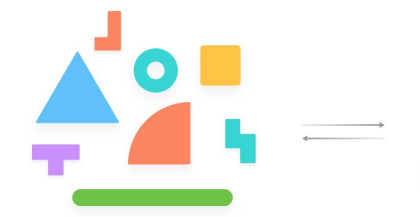
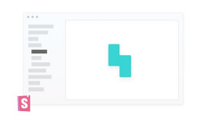
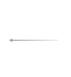
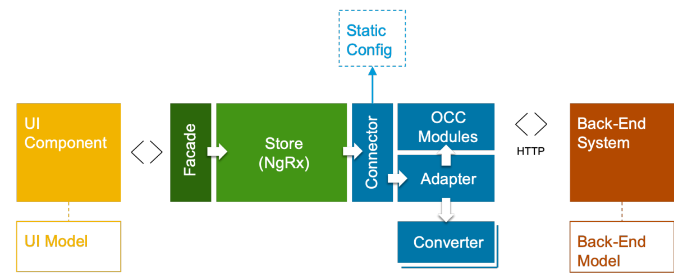
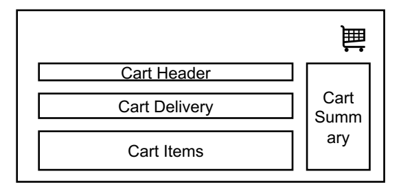
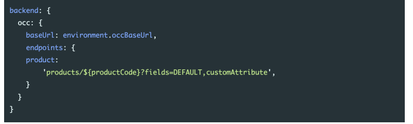
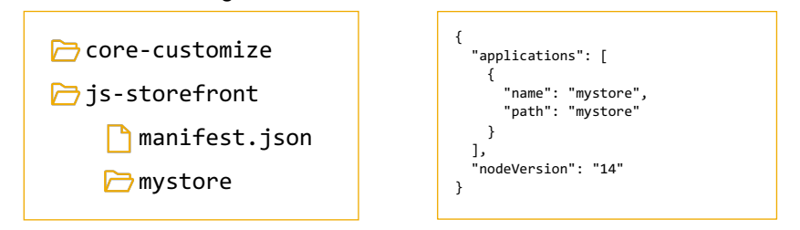
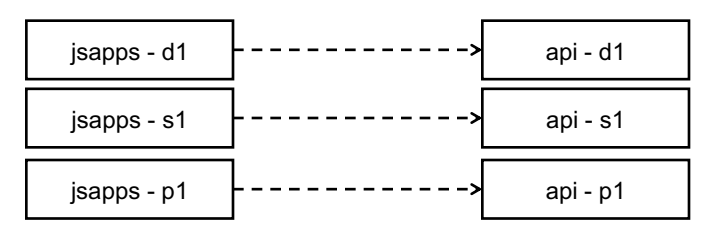

# Bob'S Discount Best Practices

Omnia Ibrahim, SAP August 30, 2023

# Agenda

- Upgrade Workshop (Monday) - Performance Workshop (Tuesday)
- Best Practices **(Wednesday)**
- Approach - **Discussion** - Refactoring **Libraries** - **Development Best Practices**
- Follow up and Open Questions (Thursday) - Code Review & Read out (TBD)

# Approach | Discussion

## - Storybook

- How is it currently used in the development process? - Concerns
- Performance (Increased code, increased DOM size) - Maintainability

Refactoring libraries

# Bobs Component Libraries | Migrating

- Move files from /projects/bobs-component-library/src/lib to **/src/app**
- Clean up directory structure and move under appropriate places
- Shared/ui - Shared/services - Delete public-api.ts
- Remove libraries from package.json - Clean up targets in angular.json ("bob-component-library")

# Bobs Component Libraries | Refactoring

.

Refactor BobsContentSliderComponent
.

Template is currently 681 lines long
.

Duplicated code
.

Difficult to manage
.

Error prone
< 
<ng-container *ngFor="let i of result; let x = index">
n-container *ngTf="x <= 3">
9 seconds ago - Uncommitted chang bb (click)="selected(x)"
(keypress)="keySelected(x)"
[i]="i" [x]="x"
[selectedIndex]=''selectedIndex''
</bobs-content-slider-thumbnail-btn>
</ng-container>
nnneeeerrrrreeeerrrreeeerrreeeerrreeeerrreeeerrreeerrreeerrreeerrreeerrreeerrreeerrreeerrreeerrrreee bb
(click)="selected(x)"
(keypress)="keySelected(x)"
[i]="i"
[x]="x"
[selectedIndex]="selectedIndex"
</bobs-content-slider-thumbnail-btn>
</ng-container>
g-container *ngIf="x >= 4 && displayMoreInModal && inModal === 'true'">
bbs-
(click)="selected(x)"
(keypress)="keySelected(x)"
[i]="i"
[x]="x"
[selectedIndex]=''selectedIndex''
bbs=content=slider=thumbnail=btn>

# Bobs Component Libraries | Refactoring

- **bobs-content-slider-elements.component.ts**
- File contains 6 components - Remove unnecessary components - Refactor remaining components into separate files Development best practices

# Spartacus Architecture

To maintain code modularity and maintainability, follow the standard Spartacus architecture: The component layer's role is to display the UI and respond to user interactions. Only logic pertaining to the view should be included here. Application logic should be delegated to the façade layer.

The adapter layer is responsible for loading and submitting data to a source system. HTTP calls should only be made from this layer. Use converters to convert data from the back end to the UI and vice versa. § **Normalize** is the conversion from back-end models to UI models § **Serialize** is the conversion of UI models to back-end models, in the case of submitting data to the back end.

# Spartacus Architecture

# Spartacus Architecture | Components

.

Several components make API calls
.

Move to adapter layer
.

API calls are also made from service and adapter classes ts bobs-checkout-add-gift-card.component.ts src/app/po TS bobs-checkout-payment-tab.component.ts src/app/pa ts_bobs-card-finance.component.ts_src/app/pages/bobs-
TS bobs-card-payment.component.ts src/app/pages/bobs ts bobs-finance-card-payment.component.ts src/app/pag Ts bobs-gift-card-payment-list.component.ts src/app/pag TS bobs-account-address.component.ts src/app/pages/bo ts bobs-account-finance-wallet.component.ts src/app/pa ts bobs-finance-tile.component.ts src/app/pages/bobs-my ts bobs-wallet-gift-card-section.component.ts src/app/po ts bobs-wallet-list-card.component.ts src/app/pages/bobs ts bobs-add-new-card.component.ts src/app/pages/bobs Ts bobs-pdp-summary.component.ts src/app/pages/bobs TS bobs-star-rating.component.ts src/app/shared/ui/utilities

# Spartacus Architecture | Components

- Avoid code duplication that leads to reduced maintainability and reliability
- Components are created/destroyed during customer journey
- Logic that runs after API responds may not run if component is destroyed

# Spartacus Architecture | State Management

- Composable Storefront uses a combination of NgRx and Command/Query - Use Command/Query when possible, for new features - easier to implement - State management ensures consistency and optimizes performance - Supports modularity

  13

§ Use standard OCC API endpoints whenever possible § Use OccConfig to modify existing API configuration § For new custom endpoints, add as custom configuration
§ Use OccEndpointService.getUrl(…) method to get the URL from configuration This ensures that any future changes to the OCC configuration can be applied in a single location.

let url = this.apiService.constructUrl([
'users',
user,
'carts' crtId,
'paymentdetails' let url = this.occEndpoints.buildUrl(
`users/${this.cartUser}/payments/versatile`,
queryParams: { fields: 'DEFAULT' },

## Backend: {

ICCIAL
Brian Gamboc-Javiniar, 2 years ago - feat: Saved cart feature endpoints: {
svvvvvvvvvvvv
'/users/${userId}/carts?savedCartsOnly=true&fields=carts(DEFAULT,potentialPro ssseee restoreSavedCart: '/users/${userId}/carts/${cartId}/restoresavedcart',
cloneSavedCart:
'/users/${userId}/carts/${cartId}/clonesavedcart?name=${saveCartName}',
this.occEndpointsService.buildUrl('cart', {
urlParams: { userId, cartId 
}
15

§ Do not hardcode "current" for userId
§ Use *userIdService.takeUserId()* § Use of 'current' breaks ASM functionality, as backend retrieves the agent, not customer
§ Do not hardcode "current" for cartId
§ Leads to extraneous calls to carts API 
- Custom API endpoints that are to be run for a specific user should include /users/{userId} 
- Used by backend to identify the user and load in session
  16

let editUrl = this.apiService.constructUrl([
'users',
ADITHYA.RANJITH, 6 months ago - Merged current',
'payments' this.editFormData.id, this.activeSubscription.add( this.apiService
.putData(editUrl, this.editFormData)
.subscribe((response: any) => {
if (response) {
this.logger.debug('submitFinanceForm', response);
this.onclose.emit(true);

## This.Activesubscription.Add(

forkJoin([
this.authService.isUserLoggedIn().pipe(take(1)),
this.authTokenService.loadClientAuthenticationToken().pipe(take(1)
]).subscribe(([isUserLoggedIn, clientAuthenticationToken]) => {
if (isUserLoggedIn) {
this.userId = 'current';
else R
this.userId = 'anonymous';
Yves Winkler, 2 months ago •
let secureSessionUrl = this.apiService.constructUrl([
'users',
this.userId,
'payments',
'financing',
let token = clientAuthenticationToken?.access_token; this.handleCheckoutFlowApplyView(secureSessionUrl, token);
this.changeDetectorRefs.detectChanges();

# Container Components

- Many components have simple templates and just act as containers - Pass around events and data from parent and child components - Increased DOM size - Decreased maintainability - Increased bundle sizes - 488 component classes

# Container Components | Bobsdrawerlink

| @Component({  selector: 'bobs-drawer-link',  templateUrl: './bobs-drawer-link.component.html',  styleUrls: ['./bobs-drawer-link.component.scss'], }) export class BobsDrawerLinkComponent {  // eslint-disable-next-line no-useless-constructor  constructor(public bobsDrawerService: BobsDrawerService) {}   | <a  class="bobs-drawer-link"  [attr.aria-label]="ariaLabel"  (click)="this.bobsDrawerService.activeDrawer.next(this.url)" >  <ng-content></ng-content> </a>                                                                                                                                                                                                                                          |
|----------------------------------------------------------------------------------------------------------------------------------------------------------------------------------------------------------------------------------------------------------------------------------------------------------------|------------------------------------------------------------------------------------------------------------------------------------------------------------------------------------------------------------------------------------------------------------------------------------------------------------------------------------------------------------------------------------------------------|
| @Input() ariaLabel: string = '';  @Input() icon: string = '';  @Input() hasIcon!: boolean;  @Input() url!: string; }                                                                                                                                                                                           | <ng-container *ngIf="cart$ | async as cart">  <bobs-drawer-link  (click)="url()"  [ariaLabel]="'miniCart.item'"  class="bobs-header-cart-icon"  *ngIf="cart"   >  <bobs-icon [icon]="icon" [withBadge]="false"[ariaLabel]="ariaLabel">  </bobs-icon>    {{ cart?.deliveryItemsQuantity }}    </bobs-drawer-link> </ng-container> |
| Used in two places - BobsHeaderIconHybrisComponent - BobsProductCardHybrisComponent                                                                                                                                                                                                                            |                                                                                                                                                                                                                                                                                                                                                                                                      |

# Container Components | Bobstoggleswitchcomponent

- Passes data and events as Inputs and Outputs - Only adds a span as container - Uses **<mat-slide-toggle>** - Many of the fields not used by the implementation - Can be removed and replaced with direct use of
<mat-slide-toggle>

# Code Duplication

export interface Toggle { label: string; value: any; checked: boolean; }

 <ng-container *ngFor="let toggle of toggle_list">

<bobs-toggle-switch [checked]="toggle.checked"></bobs-toggle-switch> {{ toggle.label }}: {{ toggle.value }} 
 </ng-container> 
 
 <ng-container *ngFor="let toggle of toggle_list"> 
 <bobs-toggle-switch [checked]="toggle.checked"></bobs-toggle-switch> {{ toggle.label }}: {{ toggle.value }} 
 </ng-container> 

# Hardcoding

<strong>Add a gift card & check balances</strong>
 showModal(wishlistData: BobsWishlist) { this.wishlistCode = wishlistData.code; this.deleteWishListTitle = `
Are you sure you want to delete <b>${wishlistData.name}</b>?
`; this.isRemoveItem = true; } <bobs-generic-link class="protector-link" >About mattress   protectors</bobs-generic-link >

# Spartacus Development | Seo

You can improve the SEO of your storefront with the following best practices: § Enable server-side rendering to ensure that all of your pages are properly indexed. § Have a valid and consistent robots.txt file to allow robots to crawl your website. § Ensure your meta attributes and tags are appropriately set across your pages. The Spartacus implementation of SEO meets the following requirements: § Indexable and sharable pages § Fast loading pages § Controls Search Engine Results Page (SERP),stateful URLs, title, description § Controls meta tags § Controls bot visits (robots)FOLLOW, NOFOLLOW, INDEX, NOINDEX

# Spartacus Development | Seo

§ Shareable, bookmarkable, crawlable, readable URLs

 § Configurable for site context and product/category structure § Can be configured to match an existing solution § https://store.com/speakers/en/USD/product/SPK-4534/1123245 § https://store.com/speakers/en/USD/Portable-Wireless-Speaker/p/1123245 § https://store.com/speakers/en/USD/cart

# Spartacus Development | Seo

Spartacus supports SEO Page Attributes (HTML tags and meta tags): § Page Title - sets Window tab title in browser § Page Description § Page Headings § Image Data § Robot Tags § Canonical URLs Configurable by page type § Content page - "FAQ" § Product page - "Digital Camera Tripod | Tripods | Kodak" § Search results page - "123 results for 'tripod'"

# Spartacus Development | Best Practices

§ Don't force page refreshes or redirects (you navigate through site using routes not pages) § Follow standard Spartacus architecture
§ Components - UI Layer, interaction and view related logic only § Services - Façade layer § Adapters - Connect to OCC and other APIs § Convertors - normalize/serialize backend data to UI model

# Spartacus Deployment In Ccv2

§ Spartacus applications are to be placed in the js-storefront directory of the code repository § When an application and manifest file are present, it will be detected by the build process § The build process will reuse an existing image for Commerce or Spartacus if one exists (ie. If code in a particular component has not changed).

§ It will always redeploy both Spartacus and Commerce with each deployment (if there is no change it will reuse the existing build

# Spartacus Deployment In Ccv2

§ When deploying a new build, the new JS Storefront aspect is deployed only after the new API 
aspect has started successfully
§ The API endpoint is injected into the storefront at deployment through a meta tag, so you can deploy the same build to multiple environments
<meta name="occ-backend-base-url" content="OCC_BACKEND_BASE_URL_VALUE" />

# Spartacus Deployment In Ccv2

§ An endpoint is automatically generated for **JS Storefront** with default properties

## Https://Jsapps.<Subscription>-<Env>-Public.Modelt.Cc.Commerce.Ondemand.Com 

§ Edit the endpoint in portal to set it to your domain name and add a new certificate
§ Create a CNAME record with your domain host provider to the domain entered in Cloud Portal
§ From the Environments page, select a production environment that has a deployed build and a monitored endpoint.

§ Click Go Live. § Type YES and click Confirm to confirm that you want the environment to go live.

# Reference App Structure Configuration Module

The SpartacusConfigurationModule contains all global Spartacus configuration entries.

Feature-specific configurations can be kept either in feature modules, or in the SpartacusConfigurationModule.

Keeping them in feature modules helps to maintain a good separation of concerns, so it is generally recommended, but there is nothing against keeping feature-specific configurations in the SpartacusConfigurationModule if it helps to solve specific issues (for example, by using an env flag to change the configuration).

import { NgModule } from '@angular/core';
import { provideConfig } from '@spartacus/core';
import {
layoutConfig, mediaConfig, from '@spartacus/storefront';
@NgModule({
providers: [
provideConfig(layoutConfig),
provideConfig(mediaConfig),
provideConfig({
bckend: {
oooooo baseUrl: 'https://my.custom.occ.url.com' s context:
urlParameters: ['baseSite', 'language', 'currency'],
baseSite: ['electronics-spa',],
.

pwa:   4 enbled: true, adToHomeScreen: true, s
),
1, export class SpartacusConfigurationModule {}

## File Structure:

§ Start small but keep in mind where the app is heading down the road. § Have a near term view of implementation and a long term vision. § Put all of the app's code in a folder named src. § Consider creating a folder for a component when it has multiple accompanying files (.ts, .html, .css and .spec). § Keep a flat folder structure as long as possible. § Consider creating sub-folders when a folder reaches seven or more files.

## File Names:

§ Use consistent names for all symbols. § Follow a pattern that describes the symbol's feature then its type. The recommended pattern is feature.type.ts. § Use dashes to separate words in the descriptive name. § Use dots to separate the descriptive name from the type. § Use conventional type names including .service, .component, .pipe, .module, and .directive. Invent additional type names if you must but take care not to create too many.

§ Give the filename the conventional suffix (such as .component.ts, .directive.ts, .module.ts, .pipe.ts, or .service.ts) for a file of that type.

## Class Names:

§ Use upper camel case for class names. § Use consistent type names for all components following a pattern that describes the component's feature then its type. A recommended pattern is feature.type.ts.

§ Use consistent names for all assets named after what they represent. § Match the name of the symbol to the name of the file. § Append the symbol name with the conventional suffix (such as Component, Directive, Module, Pipe, or Service) for a thing of that type.

## Components:

§ Consider giving components an element selector, as opposed to attribute or class selectors § Extract templates and styles into a separate file, when more than 3 lines. § Name the template file [component-name].component.html, where [component-name] is the component name. § Name the style file [component-name].component.css, where [component-name] is the component name. § Specify component-relative URLs, prefixed with ./. § Use the @Input() and @Output() class decorators instead of the inputs and outputs properties of the @Directive and @Component metadata:
§ Consider placing @Input() or @Output() on the same line as the property it decorates. § Avoid input and output aliases except when it serves an important purpose. § Place properties up top followed by methods. § Place private members after public members, alphabetized. § Limit logic in a component to only that required for the view. All other logic should be delegated to services. § Move reusable logic to services and keep components simple and focused on their intended purpose. § Name events without the prefix on. § Name event handler methods with the prefix on followed by the event name.

§ Put presentation logic in the component class, and not in the template. 

## Services:

§ Use services as singletons within the same injector. Use them for sharing data and functionality. § Create services with a single responsibility that is encapsulated by its context. § Create a new service once the service begins to exceed that singular purpose. § Provide a service with the app root injector in the @Injectable decorator of the service. § Use the @Injectable() class decorator instead of the @Inject parameter decorator when using types as tokens for the dependencies of a service.

## Directives:

§ Use attribute directives when you have presentation logic without a template. § Consider preferring the @HostListener and @HostBinding to the host property of the @Directive and @Component decorators. § Be consistent in your choice. § Use lower camel case for naming the selectors of directives. § Use a custom prefix for the selector of directives (e.g, the prefix toh from Tour of Heroes). § Spell non-element selectors in lower camel case unless the selector is meant to match a native HTML attribute. 

## Modules:

§ Create an NgModule for all distinct features in an application; for example, a Heroes feature. § Place the feature module in the same named folder as the feature area; for example, in app/heroes. § Name the feature module file reflecting the name of the feature area and folder; for example, app/heroes/heroes.module.ts. § Name the feature module symbol reflecting the name of the feature area, folder, and file; for example, app/heroes/heroes.module.ts defines HeroesModule.

§ Create a feature module named SharedModule in a shared folder; for example, app/shared/shared.module.ts defines SharedModule. § Declare components, directives, and pipes in a shared module when those items will be re-used and referenced by the components declared in other feature modules.

## Modules (Continued):

§ Consider using the name SharedModule when the contents of a shared module are referenced across the entire application. § Consider not providing services in shared modules. Services are usually singletons that are provided once for the entire application or in a particular feature module. There are exceptions, however. For example, in the sample code that follows, notice that the SharedModule provides FilterTextService. This is acceptable here because the service is stateless;that is, the consumers of the service aren't impacted by new instances.

§ Import all modules required by the assets in the SharedModule; for example, CommonModule and FormsModule. § Export all symbols from the SharedModule that other feature modules need to use. § Avoid specifying app-wide singleton providers in a SharedModule. Intentional singletons are OK. Take care.

Questions?

l

口

# Thank You.

Contact information:
Name Email
© 2023 SAP SE or an SAP affiliate company. All rights reserved. See Legal Notice on www.sap.com/legal-notice for use terms, disclaimers, disclosures, or restrictions related to this material.

