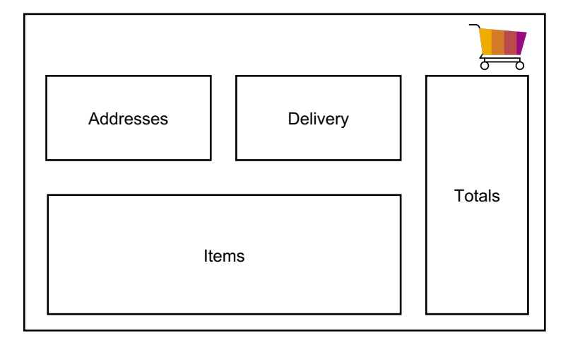
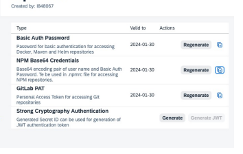
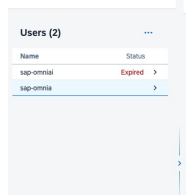
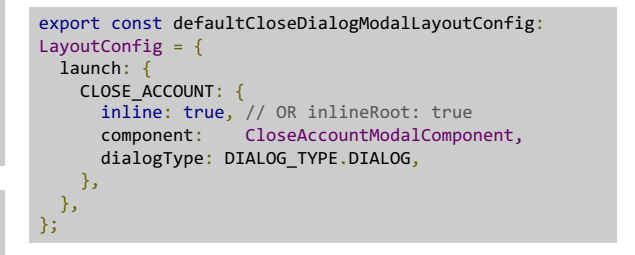
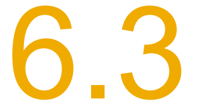
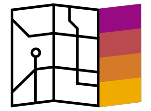

# Bob'S Discount Advisory & Review Service

Omnia Ibrahim, SAP August 28, 2023

# Agenda

- **Upgrade Workshop (Monday)**
- **Overview** - **What's new in Composable Storefront v5.x and v6.x** - **Upgrade Steps & Assessment**
- **Roadmap**
- Performance Workshop (Tuesday) - Best Practices (Wednesday) - Follow up and Open Questions (Thursday) - Code Review & Read out (TBD)

# But First….

- **Current plans to upgrade SAP Commerce?**

"commerceSuiteVersion": "2011.17",

Upgrade Overview

# Upgrades - Overview

- SAP will publish update releases for the composable storefront on a continuous basis. These updates may contain bug fixes, feature updates, or a combination of both.

- Composable Storefront library update releases remain current for a minimum of six months after the publication of the core libraries, unless otherwise indicated.

- For example, the core composable storefront 5.0 libraries were released in November 2022 and are considered current until May 2023.

- A "roll-forward" approach is used, meaning only the latest update release of the libraries will receive bug fixes and new features.

- Customers are strongly encouraged to regularly upgrade to the latest update release.

| Type of Update  Release   | Details                                                                                                                                                        |
|---------------------------|----------------------------------------------------------------------------------------------------------------------------------------------------------------|
| Bug Fix:                  | Contains backwards-compatible bug fixes. Published approximately every week, as needed.                                                                        |
| Minor:                    | Contains new functionality that is backwards-compatible. Published approximately eight times per year.                                                         |
| Major:                    | Contain bug fixes and new functionality, some of which are not compatible with a previous update release. Published approximately two to three times per year. |

# Spartacus Vs Composable Storefront

- Composable storefront (project "Spartacus") libraries are now published to the Repo-Based Shipment Channel for SAP Commerce Cloud customers.

- Libraries are no longer published to npmjs.com.

- Credentials are required to download the 5.0+ libraries
- Composable Storefront is still **open source**. 

# What'S New?

# What'S New In Composable Storefront 5.0 (Nov 23, 2022)

- Angular framework updated to Angular 14 - Cart functionality, such as base cart and wish list, moved to the cart library - **Commands and queries** implemented in checkout library - Screen readers and other accessibility improvements have been added. - Support has been added for PDF and video components that were introduced in version 2205 of SAP Commerce Cloud.

- The following user experience improvements were added: add to cart from saved cart, clear cart, scroll to top button, show password in password form field, add to cart from carousel.

- The following Configurable Products Integration improvements were added: retract User Selections and numeric attributes with interval domain

# What'S New In Composable Storefront 5.X

5.1 (January 2023)
- Support for multi-site isolation - B2B Unit-Level Order View - B2B Payment Controls - B2B Account Summary for Commerce Organization - B2B Checkout and ASM fix (due to cost center) - Estimated delivery schedules for cart entries for S/4HANA based Order Management
- B2B Registration - B2B Order Listings: purchase order and cost center display
- ASM Anonymous Cart Binding - ASM Customer List - New events: add cart voucher, remove cart voucher 5.1 (February 2023)
- Customer Service and Ticketing - B2B Reorder - New Mobile Phone Number in Shipping Address Form
- Improvements to Configurable Products: Show Prices for Options; Display Delta Prices

# What'S New In Composable Storefront 6.0

- Framework update: Angular 15 - SSR: Configurable Timeouts for Outgoing HTTP Requests - Buy Online, Pick Up in Store (BOPiS) - Checkout Modularization - Future Stock
- SAP Customer Data Cloud Integration uses composable storefront to provide both SAP Customer Data Cloud screen- sets and native screen-sets
- Menu with Highlighted Navigation on the Overview Page - Start a New Default Configuration After Abandoning a Previous Configuration - Replace and Add New Custom Attribute Components - Conflict Handling for AVC Configurable Products - Santorini now the default storefront theme

# What'S New In Composable Storefront 6.X

6.1 (June 2023)
- ASM: Customer Account Creation - ASM: Customer Lists, more data included - SSR: Lazy loaded translations - Configurable products: Quantity stepper at the bottom of the configuration page
- Configurable products: New message 'Conflicts have been resolved
- SAP Customer Data Cloud: Manage B2B Organization Units, and Registration of New Organizations 6.2 (July 2023)
- SSR: Standardized Logging - ASM: Deep Links - Configurable Products: UI Validation for Interval Attributes
- Configurable Products: New Styling for Mandatory Input
- SAP Customer Data Cloud: Consents and ReConsents for B2C Customers

## 6.3 (August 2023)

- Integration with SAP Personalization Connectivity - SAP Customer Data Cloud: Registration of New Organizations

# Commands And Queries

- A robust and simplified way to handle state (loading and caching), and to execute actions against the back end system.

- Will replace NgRx for default composable storefront libraries - Leverages Composable Storefront events framework - Checkout modules were switched over to the command and query approach in Composable Storefront v5. - Commands - an action that can change the state of the system (usually through REST call) - Queries - expose some state of the system, usually by fetching it from the back end

# State Management

- Performance - Consistency - Modularity - Asynchronous - Responsiveness

# Commands And Queries | Commands

protected updateCommand: Command<{ details: User }> = this.command.create( (payload) => this.userIdService.takeUserId(true).pipe( switchMap((uid) => this.userProfileConnector.update(uid, payload.details) ), { strategy: CommandStrategy.Queue, } );
Parallel - executes commands in parallel Queue - queue commands and executes them in order (default) CancelPrevious - starts new execution and cancels previous ErrorPrevious - starts new execution and throws error for the previous 

# Commands And Queries | Queries

protected titleQuery: Query<Title[]> = this.query.create( () => this.userProfileConnector.getTitles(), { reloadOn: [LanguageSetEvent],
 }
);
reloadOn - When events emits, reload data (ex. language/currency change) resetOn - When event emits, immedietly clear data and reload (ex. Order placed)
getTitles(): Observable <Title[]> { return this.titleQuery.get(); }
Upgrade Steps & Assessment

d

S

# Upgrade Steps | Overview

comment out funcionality
assign to multiple developers

# Schematics - Migrations

Schematics, a building block of the Angular CLI, are executable sets of instructions that perform manipulations on existing files or generate files/content. Migration schematic is run each time a newer version of your library is added to the consuming 

 application via 'ng update <library>'

# Upgrade Steps | Upgrade Angular

- Upgrade to Angular 13 (ng update @angular/core@13 @angular/cli@13)
- Use –force to force unmatched dependencies - Use –allow-dirty to avoid commiting each change to repo
- Upgrade to Angular Material 13 (ng update @angular/material@13) - Upgrade to Angular 14 (ng update @angular/core@14 @angular/cli@14) - Upgrade to Angular Material 14 (ng update @angular/material@14)
  19

# Upgrade Steps | Upgrade Dependencies

- ng update @nguniversal/express-engine@13 –force - ng update @nguniversal/express-engine@14 –force - ng update @angular-eslint/schematics@14 - Ng update @ng-bootstrap/ng-bootstrap@13

## And To Devdependencies:

- "@angular-devkit/core": "^14.2.12", - "@schematics/angular": "^14.2.12", - "jsonc-parser": "^3.0.0", - "parse5": "^6.0.1",

# Upgrade Steps | Rbsc

- https://ui.repositories.cloud.sap/www/webapp/users/ - Log in with S-user account that has appropriate 

licenses
- Add User
- Copy generated NPM Base65 - Create .npmrc in root of Composable Storefront project
@spartacus:registry=https://73554900100900004337.npmsrv.base.repositories.cloud.sap/ //73554900100900004337.npmsrv.base.repositories.cloud.sap/:_auth=<npmcredentialsfromrbsc> always-auth=true

# Upgrade Steps | Composable Storefront 5.0

- ng update @spartacus/schematics@5.0.0 - If command fails before completing, remove changes, fix cause of error, and rerun - If command is successful, but only updates package.json try:
- ng update @spartacus/schematics --migrate-only --verbose --from=4.3.1 --
to=5 Updates dependencies, package.json files, creates TODOs all over files

# Upgrade Steps | Composable Storefront 5.0

- Fix compilation errors - Use TODOs as a guide - Where fix is unclear, comment out functionality and add your own TODO with custom label (ie. 

TODO:Bobs:UPG
- Fix/comment out errors on initial load and add TODOs - Check in code and assign tickets - Major areas
- Modals - Proxy Facades - Checkout and Order Refactoring - Removal of NG Bootstrap - Styling

# Modals

ModalService, ModalDirective, ModalDirectiveOptions, ModalDirectiveService, ModalOptions and **ModalRef** have been removed from composable storefront 5.0. Replace it with the **LaunchDialogService,** which can be imported from @spartacus/storefront.

# Upgrade V5 -> V6

Repeat upgrade steps to upgrade from v5 to v6 Update is much less time-intensive

Can run dependency updates before features fixes 6.3

  25 Risks Bloomreach libraries are dependent on @spartacus libraries 4.x
"@bloomreach/brx-spartacus-library": "^1.1.0", "@bloomreach/ng-sdk": "^15.4.5", "@bloomreach/segmentation": "^0.0.13",
Roadmap

# Roadmap

https://roadmaps.sap.com/board?PRODUCT=73554900100800002822&range=CURRENT-LAST\#Q3%202023

# Angular 17

Framework update to Angular 16: - Improvements to server-side rendering and hydration, such as **nondestructive hydration** - Optional use of zone.js - For standalone components, improvements to documentation and schematics - Addition of dependency-injection debugging APIs - Improved creation of JS bundles - More information on Angular road map plans here: https://angular.io/guide/roadmap

# Nondestructive Hydration

- Introduced in Angular 16 - Fixes issues related to the destruction and repainting of the DOM such as flickering - Improvements in Core Web Vitals - Reuse of DOM structures that were rendered by the server
  30

## Tomorrow

- Performance Workshop - Core Web Vitals, Performance Analysis - Best Practices - Current Issues
  31 Questions?

l

