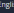

# Storefront Development Guide

Storefront Development Guide The Storefront Development Guide contains topics related to developing, customizing and extending your composable storefront.

Accessibility This is a landing page for accessibility (a11y) topics. This includes the following:
Accessibility Compliance Accessibility Best Practices Keyboard Focus Accessibility Compliance Composable storefront ensures accessibility by adhering to the success criteria of the Web Content Accessibility Guidelines (WCAG) 2.1 . The following sections describe the extent to which composable storefront complies with the WCAG criteria.

Core Theme Accessibility Starting with version 5.0, composable storefront features comply with the following success criteria of the Web Content Accessibility Guidelines (WCAG) 2.1 :
1.3.2, Level A, Meaningful sequence. 1.3.3, Level A, Two Senses Concept. 1.3.4, Level AA, Orientation.

1.3.5, Level AA, Identify Input Purpose.

1.4.1, Level A, Use of color. 1.4.3, Level AA, Minimum Contrast. 1.4.4, Level AA, Text Resizing up to 200 percent. 1.4.5, Level AA, Images of text. 1.4.10, Level AA, Reow. 1.4.11, Level AA, Non-Text Contrast. 2.4.5, Level AA, Multiple Ways to Find Content. 2.5.2, Level A, Pointer Cancellation. 2.5.3, Level A, Label in Name. 3.2.4, Level AA, Consistent Use of Identical UI-Elements.

Core theme accessibility is mostly theme-related. Both the Sparta and Santorini themes in composable storefront conform to the standards listed above.

 Note When customizing either of these themes, it is possible for your customizations to remove conformance with the WCAG criteria.

## Keyboard Accessibility

Starting with version 2.0, composable storefront features comply with the following success criteria of the Web Content Accessibility Guidelines (WCAG) 2.1 :
2.1.1, Level A, Keyboard 2.1.2, Level A, No Keyboard Trap 2.4.1, Level A, Bypass Blocks 2.4.3, Level A, Focus Order 2.4.7, Level AA, Focus Visible 3.2.3, Level AA, Consistent Navigation When combined all together, these criteria provide composable storefront with keyboard accessibility.

## Screen Reader Accessibility

Starting with version 5.0, composable storefront features comply with the following success criteria of the Web Content Accessibility Guidelines (WCAG) 2.1 :
1.1.1, Level A, Non-Text Content 1.3.1, Level A, Info and Relationships 2.4.2, Level A, Page Titled 2.4.4, Level A, Link Purpose 2.4.6, Level AA, Headings and Labels This is   For more    the SAP Help  2 2.5.3, Level A, Label in Name 3.3.2, Level A, Labels or Instructions 3.1.1, Level A, Language of Page 3.2.1, Level A, On Focus 3.2.2, Level A, On Input 3.3.1, Level A, Error Identication 3.3.3, Level AA, Error Suggestion 3.3.4, Level AA, Error Prevention 4.1.1, Level A, Parsing 4.1.2, Level A, Name, Role, Value 4.1.3, Level AA, Status Messages When combined all together, these criteria provide composable storefront with screen reader accessibility.

## Media Accessibility

Starting with version 5.0, composable storefront includes a video player. This feature complies with the following success criteria of the Web Content Accessibility Guidelines (WCAG) 2.1 :
1.4.2, Level A, Animation, Audio and Video Control 2.2.2, Level A, Hide controls 2.3.1, Level A, Avoidance of Flickering and Flashing Content Other Accessibility Conformance In accordance with the WCAG 2.1 denition of conformance, if there is no content to which a success criterion applies, the success criterion is satised. As a result, the following criteria are satised because they do not apply to composable storefront:
1.2.4, Level AA, Captions (Live) 2.1.4, Level A, Character Key Shortcuts 2.5.4, Level A, Motion Actuation For more information, see Understanding Conformance in the World Wide Web Consortium (W3C) documentation.

## Accessibility Best Practices

This is a landing page for grouping together topics about accessibility (a11y) best practices.

Accessibility Compliance Composable storefront ensures accessibility by adhering to the success criteria of the Web Content Accessibility Guidelines (WCAG) 2.1 in the following categories:
Core Theme Accessibility Keyboard Accessibility Screen Reader Accessibility Media Accessibility Other Accessibility Conformance When you are developing new features or xing regressions, it is recommended that you include the following features and best practices in your implementation to continue to comply with the relevant accessibility criteria:
Keyboard Accessibility Keyboard Focus If you are a contributor to the composable storefront project, it is also important to ensure you run end-to-end tests for accessibility.

## Common Keyboard Interactions

The following table lists many of the most common UI components, and the standard keystrokes for interacting with those components.

Component Keystrokes Any focusable element Tab moves focus to the next focusable element

Link Enter activates the link

| Shift + Tab moves the focus to the previous focusable element (navigates backwards)   |
|---------------------------------------------------------------------------------------|

Button Enter or Spacebar activates the button Checkbox Spacebar checks or unchecks a checkbox

This is   For more    the SAP Help  3

| 5/22/2024 Component   | Keystrokes                                                                                                                                                                                                                                                       |
|-----------------------|------------------------------------------------------------------------------------------------------------------------------------------------------------------------------------------------------------------------------------------------------------------|
| Radio buttons group   | Tab moves the focus to the rst or selected radio button of a group, and throughout groups only ↑ ↓ or ← → navigates and selects options within a group                                                                                                           |
| Select menu           | Tab moves the focus to the <select> eld Spacebar expands ↑ ↓ navigates between the menu options                                                                                                                                                                  |
| Autocomplete          | Type to display options ↑ ↓ navigates to an option Enter selects an option                                                                                                                                                                                       |
| Dialog                | Esc closes the dialog                                                                                                                                                                                                                                            |
| Slider                | ↑ ↓ or ← → increases or decreases the slider value Home moves to the slider to the rst value End moves the slider to the last value                                                                                                                              |
| Tab group             | Tab moves the focus into the group of tabs, and also moves the focus into the selected tab ↑ ↓ or ← → navigates, selects, and activates the previous or next tab Enter or Spacebar activates the tab (this is optional when arrows are only used for navigation) |
| Tree menu             | ↑ ↓ navigates to the previous or next menu option ← → expands or collapses the submenu, and moves up or down one level                                                                                                                                           |
| Scroll                | ↑ ↓ scrolls vertically ← → scrolls horizontally Spacebar or Shift + Spacebar scrolls by page                                                                                                                                                                     |
|  Note                |                                                                                                                                                                                                                                                                  |

 Note A focusable element is an element that receives visible focus, either natively or through conguration.

 Note Composable storefront follows the WAI-ARIA Authoring Practices 1.1 . For more component examples, see the WAI-ARIA Authoring Practices documentation, and the "Keyboard Interactions" subsections for each component.

## Web Browser Setup For Keyboard Navigation

On macOS, both the Safari and Firefox web browsers do not have tabbing enabled by default. The following sections describe how to enable tabbing in these browsers.

## Enabling Tabbing In Firefox

The following steps describe how to enable tabbing for Firefox on macOS.

Procedure 1. In Firefox, select Preferences in the Firefox menu, or select Settings in the Open Application Menu in the top right of the browser window, and in the General settings section, scroll down to Browsing.

2. Uncheck the Always use the cursor keys to navigate within pages checkbox. 3. In the Mac System Preferences, open the Keyboard preferences, and then select the Shortcuts tab. 4. In the bottom of the Shortcuts pane, check the Use keyboard navigation to move focus between controls checkbox.

## Enabling Tabbing In Safari

The following steps describe how to enable tabbing for Safari on macOS.

Procedure 1. In Safari, select Preferences in the Safari menu, then select the Advanced tab.

2. In the Accessibility section, check the Press Tab to highlight each item on a webpage checkbox. 3. In the Mac System Preferences, open the Keyboard preferences, and then select the Shortcuts tab. 4. In the bottom of the Shortcuts pane, check the Use keyboard navigation to move focus between controls checkbox.

## Keyboard Accessibility

You can make your storefront website keyboard accessible by following correct HTML semantics and general "best practices" in your code. Good keyboard accessibility means that a user can navigate your website with a keyboard, from top to bottom (and back), from the rst interactable element to the last. You can achieve this by implementing consistent navigation, a correct tabbing order, a visual focus indicator that is easily seen, and by avoiding focus traps.

This is   For more    the SAP Help  4

## Html Attributes And Events

To successfully implement keyboard accessibility, you need to use HTML attributes with the correct HTML elements. Also, when implementing an event, such as a click or a keydown, if you try to force a "wrong" element to act like an interactable element, it can lead to problems with your site's keyboard accessibility. The following are examples of HTML attributes with correct HTML elements:
<input disabled />,
<button tabindex="0">, <button (click)="foo($event)"></button>
The following are examples of HTML attributes and elements that should be avoided:

, 

<li role="checkbox" (keyup)="bar($event)"></li>

## Focus Management

Proper focus management is essential to providing an uninterrupted and consistent keyboard ow. For more information, see Keyboard Focus.

## Css Styles

There is not a lot in CSS that can break accessibility. However, you should be careful about the following CSS properties:
order: The order property changes the visual order of elements, even though the DOM order stays the same. The DOM order is used in keyboarding, so if you change the order using the order property, the tabbing order that is seen by the user will not correct.

display/opacity: If an element has a display: none property, it is excluded from tabbing. However, elements with an opacity: 0 property can still be accessed with the keyboard.

There are other properties that do not exclude elements from being accessible. For more information, see Writing CSS with Accessibility in Mind .

outline: If you change the outline property, it may break accessibility in composable storefront, because the default visual focus indicator in composable storefront depends on the outline property. Accordingly, it is important to avoid setting the outline property to a value such as 0 or none.

## Keyboard Focus

The cxFocus directive handles keyboard-specic features in composable storefront related to focus management. These features are essential for keyboard-only users.

The keyboard features are used for a host element, and for the focusable elements of the inner DOM of the host element. Focusable elements are HTML elements that receive focus when you use the keyboard. For example, by tabbing through the experience, focusable elements are highlighted and provide access to key features, such as "open product", "add to cart", and so on.

There are many keyboard focus features. While most of these features work in isolation, there is often a correlation between them. This is why all features are handled by a single cxFocus directive. The directive ensures that the features do not conict, and that they work well together.

The various features of the cxFocus directive are documented separately, as follows:

| Feature                                                                                                                                                                                                                                                                                                                                                                     | Description                                         |
|-----------------------------------------------------------------------------------------------------------------------------------------------------------------------------------------------------------------------------------------------------------------------------------------------------------------------------------------------------------------------------|-----------------------------------------------------|
| Visible Focus                                                                                                                                                                                                                                                                                                                                                               | Limits the visible focus to keyboard users only.    |
| Persist Focus                                                                                                                                                                                                                                                                                                                                                               | Refocuses an element based on its last focus state. |
| Escape Focus Traps the focus of an element when the user presses the ESC key. Auto Focus Provides auto focus in a single-page experience. Trap Focus Traps the focus of a group of focusable elements, so that focus returns to the rst element after leaving the last element. Lock Focus Locks and unlocks the focus of the focusable child elements of the host element. |                                                     |

All features have separate conguration typings, but all congurations are accessible through the FocusConfig.

The various features can be used with a single directive. The following is an example:

## Visible Focus

One of the main requirements for accessibility is a clear visual indication of focused elements in the UI. A clear focus indication helps sighted keyboard users with orientation in the storefront. In composable storefront, focusable elements are styled with a blue outline. This appearance can be further customized in the CSS layer if you prefer to have an alternative effect for certain elements.

Avoiding Visible Focus Visible focus might be considered best practice for users who have limited vision, but it is typically not the experience that "mouse users" would expect. When the mouse is used to navigate through the experience, having such a dominant focus effect could be considered awkward, and does not contribute to a nice UI for those who have good vision.

That being said, if the "mouse user" temporarily switches to the keyboard, the visible focus then actually contributes to the experience in a positive way. The Web industry seems to agree that a strong visible focus should be reserved for users who have limited vision. A keyboard-only focus style feature has been proposed, using the CSS
:focus-visible pseudo selector, next to the :focus selector. The intent is that you can style elements when the focus is driven by the keyboard, rather than the mouse. So far, the :focus-visible pseudo selector is only implemented in Firefox. For more information, see The Focus-Indicated Pseudo-class: ':focus-visible' .

Given that :focus-visible is not supported by all ever-green browsers, composable storefront provides an implementation to accomplish the same effect. If the user is using the mouse, the visible focus is hidden. If the user switches (temporarily) to the keyboard, the visible focus is enabled.

## Implementation

The appearance of the focus outline is driven by CSS. The usage of this style depends on the occurrence of the mouse-focus class. Without this class, the visual focus is not added to focused elements.

The mouse-focus class is part of the cxFocus directive, and is added by applying the directive to the three root elements in the cx-storefront component, as follows:
<header [cxFocus]="{ disableMouseFocus: true }">
 [...]
</header> <main [cxFocus]="{ disableMouseFocus: true }"> [...] </main> <footer [cxFocus]="{ disableMouseFocus: true }"> [...] </footer>
If you are not using the cx-storefront component, and you still want to leverage this behavior, you can use the cxFocus directive in your custom HTML.

## Persist Focus

The cxFocus directive provides persistence of the focused state. This is useful when a group of focusable elements get refocused, or even recreated. This happens often when the DOM is constructed with an *ngIf or *ngFor. Whenever the data is changed, the focus is naturally lost. To overcome this issue, the persisted focus is provided.

The focus state is based on a congured key. The key is used to store the focus state. The focus state can be part of an optional focus group, so that the state is shared and remembered for the given group.

To detect the persistence for a given element, the persistence key is stored on the element in the data-cx-focus data attribute. The following is an example:
<button data-cx-focus="myKey"></button>
Other keyboard focus directives can read and query this key to understand whether the element should retrieve focus. The persisted focus is used when an element is created, and it is explicitly used by the auto focus feature.

Extensibility The persisted focus logic is driven by the PersistFocusService. This service can be customized.

## Escape Focus

The cxFocus directive provides a feature to focus the host element when the ESC key is captured. This is useful for dialogs, as well as for larger parts of the UI that should trap the focus. When the ESC key is captured while the element is already focused, the event is let go, and will "bubble up" to the ancestor tree (this is how browsers treat certain UI events).

Composable storefront uses the escape focus for the so-called "skip links", for dialogs (such as modals), and for element groups that must be unlocked initially (for example, a facet).

Whenever the escape focus is handled, an output (esc) is emitted, so that additional logic can be applied if needed.

Conguration The escape focus only happens if it is congured. The following is an example of conguring the escape focus:

The focusOnDoubleEscape property can be used to force an auto focus in the case of a recurring escape key.

## Auto Focus

The cxFocus directive provides auto focus capabilities for a single-page experience. The native HTML5 autofocus attribute falls short in a single-page application experience, since this attribute is only applied when a page is loaded in the browser. In a single-page application, pages are built dynamically, and elements with an autofocus attribute are not focused automatically. Moreover, there are scenarios where the focus of an element should be driven dynamically. For example, when a dialog is opened, or a group of elements is "unlocked".

This is   For more    the SAP Help  6 The auto focus feature of the cxFocus directive focuses an element when the host element is focused. The element of choice that is focused is driven by conguration. Moreover, the previously focused element can be persisted, so that it will be refocused during the user session.

## Default Behavior

The default conguration (autofocus: true) selects the rst focusable element of the inner DOM of the host element. Focusable elements are elements that receive focus when you tab through the DOM. The focus is primarily driven by the semantic nature of the element, but can also be forced by using the tabindex attribute. In the below example, the rst focusable element is the close button:

 <button class="close"></button> <input class="value" /> 

The following are exceptions to the default behavior:
persisted focus focus by the native HTML5 autofocus attribute selected focus Auto Focus by Persisted Key If an element has been focused before, and a focus key is available, the element is refocused. The focusable element with a focus key is persisted, and is refocused when the host element is selected. The following is an example:

 <button class="close"></button> <input class="value" [cxFocus]="{ key: 'key-1' }" /> <input class="value" [cxFocus]="{ key: 'key-2' }" /> 

A congurable group of persisted, focusable elements can be used to distinguish the focus for certain parts of the UI. This allows you to maintain the focus for a dialog. The following is an example:

 <button [cxFocus]="{key: 'k-3'}">1</button> <button class="a" [cxFocus]="{key: 'k-2'}">a</button> <button [cxFocus]="{key: 'k-1'}">b</button> 
 
 <button [cxFocus]="{key: 'k-2'}">1</button>
 <button class="a" [cxFocus]="{key: 'k-1'}">a</button>
 <button [cxFocus]="{key: 'k-3'}">b</button> 

Auto Focus by the HTML5 autofocus Attribute If the inner DOM contains an element with the HTML5 autofocus attribute, this element is focused by default. The following is an example:

 <button class="close"></button> <input class="value" autofocus />

Auto Focus by CSS Selector The auto focus conguration also allows for a specic CSS selector, so that the focusable element is precisely selected from the inner DOM of the host element. In the following example, the rst name input is selected:

 <button class="close"></button> 
 <input class="firstname" /> <input class="lasttname" /> 
 

A special case is made for the host element itself, using the :host selector. This selector does not select from the inner DOM, but instead selects and focuses the host itself.

Extensibility The auto focus is driven by conguration, and the logic is mainly implemented in the AutoFocusService. You can further customize this service.

Trap Focus The cxFocus directive provides functionality to trap the focus of a group of focusable elements. Trap focus (that is, focus-trap) is often required in dialogs, such as modals. As long as the dialog is open, the focus should not leave the dialog when the user keeps tabbing through the focusable elements. Typically, when the focus leaves the last element, the focus should move to the rst element. And vice versa, when SHIFT + TAB is pressed, when the focus leaves the rst element, the last element should be focused.

This is   For more    the SAP Help  7 Trapping is driven by intercepting the keydown event for the TAB, SHIFT + TAB, arrow UP, and arrow DOWN keys.

Conguration The trap focus is congurable so that trapping works in both directions, or only for the start or the end of the group. The conguration is provided by the TrapFocusConfig typing and supports three modes.

Trap in Both Directions The default conguration traps the focus in both directions, at the start and at the end of the form. In the following form, the focus moves automatically to the rst element if the user presses TAB (or MOUSE DOWN) on the last element. And vice versa, if the rst element is focused, and the user presses SHIFT + TAB (or ARROW UP), the focus moves to the last element:
<form [cx-focus]="{ trap: true }"> <input name="first" /> <input name="second" /> <input name="last" /> </form>
Trap End When the trap conguration is set to end, the focus is only trapped at the end. This means that if the user presses SHIFT + TAB on the rst element, the focus is not trapped in the form. The following is an example:
<form [cx-focus]="{ trap: 'end' }"> <input name="first" /> <input name="second" /> <input name="last" /> </form>
Trap Start When the trap conguration is set to start, the focus is only trapped at the start. This means that if the user presses TAB on the last element, the focus is not trapped in the form. The following is an example:
<form [cx-focus]="{ trap: 'start' }"> <input name="first" /> <input name="second" /> <input name="last" /> </form>
Extensibility The trap focus logic is driven by the TrapFocusService. This service can be customized.

Lock Focus The cxFocus directive provides locking of the focusable elements of a host element. The focusable elements receive a tabindex of -1, so that the default tabbing in the browser is temporarily disabled.

The locked focus is used for groups of elements that should be skipped by keyboard users. A good example is a child navigation panel, or the facet navigation on the product listing page.

Keyboard users can skip larger groups of focusable elements, until they unlock the group by pressing the ENTER or SPACE key.

Locked elements leverage the auto focus feature, unless the auto focus conguration is explicitly set to false. This results in the rst focusable element being selected when the group is unlocked. For more information, see Auto Focus.

An unlocked group can be locked again by pressing the ESC key. The locked focus feature uses the escape focus feature, so that the host element is focused again when pressing ESC. For more information, see Escape Focus.

## Composable Storefront Api

The composable storefront API is the collection of modules, components, interfaces, classes, and so on, that you use to develop your composable storefront application.

 Note The composable storefront API is separate from the Commerce Cloud OCC REST APIs that the composable storefront consumes. For more information, see API Documentation and YAML Files.

Generating Composable Storefront API Documentation You can generate the API documentation for any version of composable storefront.

Prerequisites The API documentation is generated using a tool called Compodoc. To view the generated documentation, you need to serve it on a webserver. The following procedure provides an example of how to serve the documentation to a local webserver using Python, but any webserver, either local or remote, will work.

This is   For more    the SAP Help  8 It is also necessary to have a clone (that is, a local copy) of the "project Spartacus" GitHub repository on your computer. For more information on how to clone a repository, see Cloning a repository in the official GitHub documentation.

## Procedure

1. Open a shell app on your computer.

If you are on Windows, you can use the PowerShell or Command Prompt. If you on MacOS, you can use the Terminal. If you work with Visual Studio Code, you can use the integrated terminal in VS Code. For more information on using the VS Code integrated terminal, see the VS Code documentation .

2. Within the shell app of your choice, navigate to the directory on your local machine where you cloned the "project Spartacus" repository. 3. To generate the API documentation for a specic version of composable storefront, check out the relevant release using git tags.

For example, if you intend to generate the API documentation for composable storefront 2211.19.0, then switch to the 2211.19.0 release with the following command:
git checkout 2211.19.0 4. Generate the API documentation by running the following command:
npm run generate:docs The output is saved to a folder called documentation in the root of your repository.

5. You can now view the generated API documentation by serving it on a webserver.

The following steps describe how to view the documentation by starting a local webserver using Python, but you can use any webserver to host the documentation, either locally or remotely.

a. If you have Python 3.0 or newer installed on your computer, navigate to the newly-generated documentation folder in the root of your Spartacus repository by running the following command:
cd documentation b. Run the following command:
python3 -m http.server c. Open your web browser to the following address:
http://127.0.0.1:8000 The searchable and interactive composable storefront API documentation is now displayed.

## Architecture

The Architecture section groups together all topics related to composable storefront architecture. For information on end user features in the composable storefront, see Storefront Features. For information on which version of the composable storefront libraries or which version of SAP Commerce Cloud is required for a particular feature, see the Feature Compatibility Matrix.

Congurable Routing Conguring the Base URL
Extending Built-In Models Global Conguration in Composable Storefront Global Messages HTTP Error Handling Commands and Queries Launch Dialog Service Lazy Loading Proxy Facades Multi-Site Conguration Progressive Web Application Support Search Engine Optimization Session Management State Management

## Congurable Routing

In a single-page application, you control what the user sees by showing different views of the app. Composable storefront uses the Angular Router to take care of navigating from one view to another. The Router does this by treating each URL as an instruction to present a specic view. Composable storefront allows you to customize these URLs, giving you more control over SEO and storefront usability. Composable storefront includes default routes for accessing the different views, which you can use without any conguration. You also have the option to customize any route that you want in composable storefront.

Limitations Translation of routes in many languages is currently not supported.

Conguration of lazy-loaded routes is currently not supported.

Routing based on Angular's HashLocationStrategy is not supported.

This is   For more    the SAP Help  9 Secondary routes and named router outlets are currently not supported.

Further Reading Adding and Customizing Routes Route Conguration Congurable Router Links Disabling Standard Routes Route Aliases External Routes Early Login Adding and Customizing Routes Composable storefront includes default routes for accessing different views within your storefront app, but you can also add or customize any route that you want in composable storefront.

Page Types and Page Labels The CMS in SAP Commerce Cloud includes the following special page types: Product, Category, and Catalog. There is also a generic Content page type, which is used for all other kinds of pages, such as the login, order history, and FAQ pages.

 Note The Catalog page type is currently not supported in composable storefront.

Composable storefront denes the following Angular Routes by default:
Routes that contain the :productCode parameter are for Product pages Routes that contain the :categoryCode parameter or the :brandCode parameter are for Category pages Routes that contain the ** wildcard are for Content pages (in other words, the wildcard is for all pages that are not Product or Category pages)
Content pages have a congurable URL in the CMS, called a page label. However, the URLs for product, category, and brand pages can only be congured in composable storefront. For more information, see Route Conguration.

Adding a Content Page Route To add a new route, you simply add a new Content page in the CMS, and give it a page label that begins with a slash, such as /contact-us. The composable storefront wildcard route (**)
matches it without any conguration.

Customizing a Product or Category Page Route You can only congure Product and Category page routes in composable storefront.

Product page routes must contain the :productCode parameter to identify the product. Category page routes must contain the :categoryCode or :brandCode parameter to identify the category.

For SEO, you may want to include more parameters in your route. The following is an example ConfigModule that adds a product name to the Product page route:
routing: { routes: { product: { paths: ['product/:name/:productCode'] } } }
 Note The optional paramsMapping conguration can be used for properties that have a different name than the route parameter. For example, you may wish to map from product.code to
:productCode. For more information, see Congurable Router Links.

Adding a Content Page with Dynamic Parameters Angular routes can contain dynamic route parameters that are consumed by the logic of your Angular components. Although the SAP Commerce CMS does not support page labels with dynamic parameters, you can have dynamic parameters for Content pages in composable storefront.

In app.module.ts, you dene the URL path for your custom Angular Route with the path property, and you explicitly assign the CMS page label using the data property. The following is an example:
import { PageLayoutComponent, CmsPageGuard } from @spartacus/storefront;
/* ... */ imports: [ RouterModule.forChild([ { // path with a dynamic parameter:
This is   For more    the SAP Help  10 path: 'order/:orderCode',
 // page label without a parameter, starting with slash: data: { pageLabel: '/order' }, // the following are needed to display slots and components from the CMS: component: PageLayoutComponent, canActivate: [CmsPageGuard] } ]), ]
Adding Angular Child Routes for a Content Page Angular can display components for child routes inside a nested <router-outlet>. Although the SAP Commerce CMS does not support child pages, in composable storefront you can have child routes.

For example, you can congure child routes for your CMS component in the ConfigModule, as follows:
cmsComponents: { CustomComponentName: {
 component: CustomComponent, childRoutes: [ { path: 'some/nested/path', component: ChildCustomComponent, }, ], } }
 Note

Child routes for the Product and Category pages are not supported.

Conguring the Category Name in the Product Page Route (Advanced)
Only the rst-level properties of the product entity, such as code or name, can be used to build a URL. Unfortunately, something like product categories is not a rst-level property because the categories eld is an array of objects. To be able to include product categories in the URL, you need to map the elements of the categories array to the rst-level properties of the product entity. The following procedure describes how to create this mapping in the PRODUCT_NORMALIZER.

Procedure 1. Congure the product OCC endpoint so that the list scope contains the categories(code,name) eld.

The following is an example:
backend: { occ: { endpoints: { product: {
 list: // 
 'products/${productCode}?fields=categories(code,name),code,name,summary,price(formattedValue),images(DEFAULT, galleryIndex)', }, }, }, },
2. Provide a PRODUCT_NORMALIZER.

You can provide it in your app.module, as shown in the following example:
providers: [ { provide: PRODUCT_NORMALIZER, useClass: MyProductCategoriesNormalizer, multi: true, }, ]
3. Add your implementation with the mapping, as shown in the following example:
@Injectable()
export class MyProductCategoriesNormalizer implements Converter<Occ.Product, Product> { convert(source: Occ.Product, target?: any): any { if (source?.categories?.length) { target.category = source.categories[0].name; } return target; } }
Now the category eld is available in your product entity.

4. Congure the Product page route in your ConfigModule to contain the :category parameter, as shown in the following example:
routing: {
 routes: { product: { paths: ['product/:category/:name/:productCode'] } } }
 Note This is   For more    the SAP Help  11 It is a known issue that product entities returned by the OCC product search endpoint do not contain categories, so you may want to also generate URLs from product entities that do not include categories. In this case, you also need to congure the second, less specic route alias. The following is an example: routing: { routes: { product: { paths: ['product/:category/:name/:productCode', 'product/:name/:productCode'] } } }
Backwards Compatibility with Accelerators The SAP Commerce Accelerators use **/p/:productCode and **/c/:categoryCode as routes for the Product and Category pages, respectively. For backwards compatibility, composable storefront also matches these routes by numbering parameters.

For example, the URL /some-catalogue/some-category/p/1234 is recognized with the following the parameters:
{ productCode: '1234',
 param0: 'some-catalogue',
 param1: 'some-category', }
To give your parameters more semantic names, you can congure a route alias in the ConfigModule, as shown in the following example:
routing: { routes: { product: { paths: ['product/:name/:productCode', ':catalogue/:category/p/:productCode'] } } }
Avoiding Static URL Segments in the Product Page URL (Advanced)
To watch a video explainer of this topic, see Custom Angular URL Matchers in the Composable Storefront .

Angular, and composable storefront by extension, allows you to congure string patterns to match routes against URLs. An example is /product/:productCode, which has two segments. The rst segment, product, is a static segment that determines the URL is a product page type, and the second segment, :productCode, is a dynamic parameter.

However, there may be cases where you need to work with URL segments that contain both static and dynamic parts within a single segment. An example is /macbook-p, where mackbook is a dynamic product code, and -p is a static part that determines the URL is a product page type. In this case, you need to implement a custom Angular UrlMatcher. The following is an example:
/**
 * Matches pattern /:productCode-p
 * @param segments */ export function customProductUrlMatcher( segments: UrlSegment[] ): UrlMatchResult | null {
 // check if URL ends with -p if (segments.length === 1 && segments[0].path.endsWith('-p')) {
 // Remove last two characters (which are -p), and treat the rest as a product code const productCode = segments[0].path.slice(0, -2); return {
 consumed: segments, posParams: { productCode: new UrlSegment(productCode, {}) }, }; } return null; }
After setting up your UrlMatcher, you need to pass it to the composable storefront conguration of the product route. You can do this in the app.module, as follows:
ConfigModule.withConfig({ routing: { routes: { product: {
 matchers: [customProductUrlMatcher],
 paths: [':customProductCode'], }, }, }, }),
In the above example, paths is also congured, with the intention of producing links that have a shape of :productCode-p. To do this, the customProductCode attribute needs to be added to the product data, which can be done by implementing a custom PRODUCT_NORMALIZER. The following is an example:
@Injectable() export class CustomProductNormalizer implements Converter<Occ.Product, Product> {
 convert(source: Occ.Product, target?: Product): Product {
 target['customProductCode'] = source.code + '-p'; return target; } }
As you can see in the example above, the customProductCode is made by combining the original product code with the string -p.

This is   For more    the SAP Help  12 The nal step is to provide the PRODUCT_NORMALIZER. You can do this in the app.module, as follows:
providers: [ { provide: PRODUCT_NORMALIZER, useClass: CustomProductNormalizer, multi: true, }, ],
Expected CMS Page Labels for Content Pages Composable storefront expects the homepage page label to be congured in the CMS. For the B2C storefront recipe, the default list of expected CMS page labels is longer, as shown in the following example:
search /login /logout /login/register /login/forgot-password
/login/reset-password
/terms-and-conditions /cart /checkout
/checkout/delivery-address
/checkout/delivery-mode /checkout/payment-details /checkout/review-order /order-confirmation /my-account/order /my-account/orders /not-found Fixed CMS Page Labels For almost all Content Pages, composable storefront treats the URL as the CMS page label. This means that changing the conguration of the route in composable storefront also requires changing the page label in the CMS. However, as shown in the following table, there are a few exceptions, such as when a congurable URL for composable storefront is mapped to a xed CMS page label.

| composable storefront URL (congurable)                                           | Fixed CMS page label   |
|----------------------------------------------------------------------------------|------------------------|
| /search/:query (congurable cxRoute search)                                       | search                 |
| /my-account/order/:orderCode (congurable cxRoute orderDetails) /my-account/order |                        |

## Route Conguration

Composable storefront includes predened route congurations in default-routing-config.ts that allow you to run your storefront app without needing to congure any routes at all. However, all routes in composable storefront can be congured by importing ConfigModule.withConfig() with an object containing the routing property, and every part of the predened congurations can be extended or overwritten using ConfigModule.withConfig() as well.

The following is an example of extending a predened conguration:
ConfigModule.withConfig({
 routing: { routes: { product: { paths: [':productCode/custom/product-path'] } } } })
Predened congurations are extended and overwritten as follows:
objects extend predened objects values, such as primitives, arrays, and null, overwrite predened values When you extend a predened conguration, you must always use the route parameters from the predened conguration, such as the :productCode parameter in the product/:productCode path. If you omit a route parameter, the storefront's components could break. The following is an example of what you should not do:
ConfigModule.withConfig({ routing: { routes: { product: { paths: ['product/:productName'] } // overwritten without :productCode } } })
 Note The paths property takes the form of an array to support route aliases. For more information, see Route Aliases.

Working with Angular Routes This is   For more    the SAP Help  13 For Routes to be congurable, they need to be named the same in the data.cxRoute property and in the route keys in the conguration. The following example shows the data.cxRoute property dening the name of the route as 'product':
const routes: Routes = [ { data: { cxRoute: 'product' // the name of the route }, path: null, // it will be replaced by the path from config component: ProductPageComponent /* ... */
 }
];
And in the following example, product is again used as the name for the route:
ConfigModule.withConfig({ routing: { routes: { product: { // the name of the route paths: [/*...*/] }
 }
 } })
 Note The path property cannot be undefined. Angular requires a dened path at compilation time.

Child Routes or Nested Routes An Angular Route can contain children (also known as nested routes), as shown in the following example:
const routes: Routes = [ { data: { cxRoute: 'parent' // the name of the route }, children: [ { data: { cxRoute: 'child' // the name of the route }, /* ... */ } ], /* ... */
 }
];
In this case, you need to congure both the parent and the child routes, as shown in the following example:
ConfigModule.withConfig({ routing: { routes: { parent: { // the name of the route paths: ['parent-path'], }, child: { // the name of the route paths: ['child-path']
 },
 } } })

## Congurable Router Links

When you congure routes, the links to those routes must be congured accordingly. Congured router links can be automatically generated in HTML templates using the cxUrl pipe. This allows you to transform the name of the route and the params object into the congured path.

To make use of the cxUrl pipe, you need to import UrlModule into every module that uses congurable router links. By default, the output path array is absolute and contains a leading forward slash '/'. However, the output path does not contain a leading forward slash '/' when the input starts with an element that is not an object with a cxRoute property, such as the string './', or '../', or { not_cxRoute_property: ... }. Also note, a route that cannot be resolved from the route's name and parameters will return the root URL ['/'].

Router Links You can transform the name of the route and the params object as follows:
{ cxRoute: <route> } | cxUrl The following is an example:

This is   For more    the SAP Help  14 The following is an example of the related route conguration:
ConfigModule.withConfig({ routing: { routes: { cart: { paths: ['custom/cart-path'] } } } })
The result is the following congured router link:

Conguring Router Links with Parameters If you need to include parameters in the route, you can pass the route name and params objects, as shown in the following example:

The following is an example of the related route conguration:
ConfigModule.withConfig({ routing: {
 routes: {
 product: { paths: [':productCode/custom/product-path'] } } } })
The result is the following congured router link:

Additional Route Parameters You can congure additional route parameters to make a URL more specic, which can be useful for SEO.

The following is an example that adds a new :productName parameter:
ConfigModule.withConfig({ routing: { routes: {
 product: { 
 paths: [ // :productCode is an obligatory parameter because it is present in default URL // :productName is a new parameter ':productCode/custom/product-path/:productName' ] } } } })
You also need to include any additional parameters in { cxRoute: <route> }, otherwise the path cannot be generated.

The following is an example that adds the new productName parameter to { cxRoute: <route> }:

The result is the following congured router link:

## Linking To Nested Routes

The following is an example of the Angular Routes array that contains children routes:
const routes: Routes = [ { data: { cxRoute: 'parent' }, // route name children: [ { data: { cxRoute: 'child' }, // route name /* ... */ }, { data: { cxRoute: 'otherChild' }, // route name /* ... */ } ], /* ... */ } ];
When the Routes array contains child routes, the conguration should be as follows:
This is   For more    the SAP Help  15 ConfigModule.withConfig({ routing: { routes: { parent: { // route name paths: ['parent-path/:param1'], }, child: { // route name paths: ['child-path/:param2'], } otherChild: { // route name paths: ['other-child-path'],
 }
 }
 }
})
To generate the path of the parent and child routes, you need to pass them in an array, as shown in the following example:

The result is the following congured router link:

Conguring Relative Links If you are already in the context of the activated parent route, you may want to only generate a relative link to the child route. In this case, you need to pass './' in the beginning of the input array. The following is an example:

The result is the following congured router link:

Navigating Up the Routes Tree If you want to go, for example, one one level up in the routes tree, you need to pass ../ to the array. The following is an example:

The result is the following congured router link:

Objects Without the "cxRoute" Property Any element that is not an object with the cxRoute property is not transformed when router links are generated. The following is an example that includes an element that is not an object with the cxRoute property:

The result is the following router link:

If the rst element in the array is not an object with the cxRoute property, the output path array will not have the forward slash '/' element by default. The following is an example where the rst element in the array is not an object with the cxRoute property:

The result is the following router link:

Mapping Parameters When the properties of a params object do not match exactly with the names of the route parameters, you can map them by using the paramsMapping option in the conguration. In the following example, the params object does not contain the necessary productCode property, but it does have a code property:
This is   For more    the SAP Help  16

You can congure the paramsMapping as follows:
ConfigModule.withConfig({ routing: { routes: { product: { /* The 'productCode' route parameter will be filled with the value of the 'code' property of the 'params' object */
 paramsMapping: { productCode: 'code' }
 paths: [':productCode/custom/product-path']
 }
 } } })
The result is the following congured router link:

Programmatic API
Navigation to the Generated Path The RoutingService.go method called with { cxRoute: <route> } navigates to the generated path, similar to the routerLink with the cxUrl pipe in the HTML template.

ConfigModule.withConfig({ routing: { routes: { product: { paths: ['p/:productCode'] } } } })
You can then call the RoutingService.go method as follows:
routingService.go({ cxRoute: 'product', params: { productCode: 1234 } });
The result is that the router navigates to ['/', 'p', 1234].

Path Generation The SemanticPathService.transform method called with { cxRoute: <route> } returns the generated path, just like the cxUrl pipe in the HTML templates.

The following is an example conguration:
ConfigModule.withConfig({
 routing: {
 routes: { product: { paths: ['p/:productCode'] } } } })
You can then call the SemanticPathService.transform method as follows:
semanticPathService.transform({ cxRoute: 'product', params: { productCode: 1234 } });
The result is the following generated path:
['/', 'p', 1234]
Disabling Standard Routes Standard Angular routes in composable storefront, such as the route for the product details page, can be disabled through conguration. This can be useful, for example, when you want to provide custom routes instead. When you disable a route, the conguration of paths is used only to generate router links. For more information, see Congurable Router Links.

The following is an example of disabling the route for the product details page:
ConfigModule.withConfig({ routing: { routes: { product: { disabled: true, paths: /* ... */ }
This is   For more    the SAP Help  17 Note Composable storefront includes a number of predened paramsMapping congurations in default-routing-config.ts.

The following is an example conguration:

 }
 } })
You can also disable the generation of router links for a specic page by setting null for the route's name, or by setting null or [] for the route's paths, as shown in the following example:
ConfigModule.withConfig({ routing: { routes: { product: null, /* or product: { paths: null }
 or product: { paths: [] } */ } } })
With this conguration, the standard composable storefront route is not matched, and the resulting congurable router link for this page is a forward slash /.

## Route Aliases

Multiple route aliases can be congured in the paths array. Composable storefront then generates router links using the rst congured alias that can satisfy the parameters of the paths array with the params object. As a result, you need to order aliases from those that require the most specic parameters to those having the least parameters.

In the following example, the conguration has the route aliases in the correct order:
ConfigModule.withConfig({ routing: { routes: { product: { paths: [
 ':campaignName/p/:productCode', /* this will be used when the campaignName parameter is provided */
 'p/:productCode' /* this will be used otherwise */ ] } } } })
The following is an example where the campaignName parameter is provided:

The result is the following congured router link:

The following is an example where the campaignName parameter is not provided:

The result is the following congured router link:

## Wrong Order Of Aliases

When a path with less parameters, such as /p/:productCode, is listed in the conguration before a path that has the same number of parameters and more, such as :campaignName/p/:productCode, then the rst alias will always be used to generate the path, and the second alias will never be used.

In the following example, the conguration has the route aliases in the wrong order:
ConfigModule.withConfig({ routing: {
 routes: {
 product: { paths: [ /* WRONG: */ /* will always be used */ 'p/:productCode', /* will never be used, because (among others) it contains the same parameters as above */ ':campaignName/p/:productCode' ] } } } })
The following is an example where the campaignName parameter is provided:

This is   For more    the SAP Help  18 The following is an example where the campaignName parameter is not provided:

In both cases, the resulting congured router link is the same, and the campaignName parameter is not included:

## External Routes

As a single-page application (SPA), composable storefront makes use of the Angular routerLink directive that, by design, does not load pages from the back end. As a result, composable storefront typically allows you to navigate only within the application itself. In other words, composable storefront typically only loads views that are within the single-page application. However, if you are migrating to composable storefront step-by-step (and route-by-route) from a legacy storefront system, such as SAP Commerce Accelerator, the external routes feature in composable storefront allows you to use different systems to drive different parts of the storefront at the same time. With external routes, you can designate which routes to load from the back end, and you can even redirect routes to a different domain.

## Using Composable Storefront And Another System To Run A Single Storefront

To run a storefront at a single domain using composable storefront along with another system, you dene URL patterns to distinguish between the two storefront systems. These patterns should be applied in the back end server, in the composable storefront conguration, and in the Angular service worker (when PWA is enabled). The patterns should be applied as follows:
When accessing a deep link, the back end server should serve a composable storefront view, or it should serve a page from the other storefront system.

When using the Angular routerLink to navigate, composable storefront should activate a SPA route, or it should fully load the page from the back end. When PWA is enabled, the Angular service worker intercepts the navigation request. When fully loading (or reloading) a page, the service worker should return the cached index.html of the single-page application, or it should bypass the cache so that the back end can serve the page.

Conguring the Back End Server Conguring the URL patterns for the back end server depends on what technology you are using for your back end. Please refer to the relevant back end documentation for more information.

Conguring composable storefront You can provide a conguration with the URL patterns for internal routes by importing ConfigModule.withConfig().

The URL patterns use a limited glob format, as follows:
** matches 0 or more path segments * matches 0 or more characters, excluding /
? matches exactly one character, excluding / ! is a prex that marks the pattern as being negative, meaning that only URLs that do not match the pattern will be included Note Each URL pattern must start with / or !/.

In the following example, only the homepage, the cart, and the product details pages are rendered in the SPA, and all other URLs are loaded from the back end:
ConfigModule.withConfig({
 routing: { internal: [ '/', '/cart', '/product/*/*', '/**/p/**', ] } })
In the following example, any route can be rendered in the SPA, except for the homepage, the cart, and the product details pages:
ConfigModule.withConfig({
 routing: { internal: [ '/**', // wildcard // exceptions: '!/' '!/cart', '!/product/*/*', '!/**/p/**', ] } })
Conguration the Angular Service Worker Note You only need to congure the Angular service worker if PWA is enabled.

This is   For more    the SAP Help  19 To bypass the service worker cache and let the back end serve the response after a full page load (or a full page reload), you need to dene the navigationUrls property of your service worker's ngsw-config.json conguration, and you need to specify the URL patterns for the internal routes. The service worker conguration uses the same glob-like syntax as composable storefront, but the URL patterns for the service worker conguration also take into account the site context aspect of the URL, such as /electronics/en/USD/.... For more information on site context, see Multi-Site Conguration.

In the following examples, the URL patterns start with three congured segments for the site context. In the rst example, the homepage, the cart, and the product details pages are rendered in the SPA, and all other URLs are loaded from the back end:
// ngsw-config.json "navigationUrls": [
 // prefix /*/*/*/ handles the three site context URL segments
 '/*/*/*/', '/*/*/*/cart', '/*/*/*/product/*/*', '/*/*/*/**/p/**', ]
In the following example, any route can be rendered in the SPA, except for the homepage, the cart, and the product details pages:
// ngsw-config.json
"navigationUrls": [ // wildcard: "/**",
 // your custom exceptions with the prefix /*/*/*/:
 '!/*/*/*/', '!/*/*/*/cart', '!/*/*/*/product/*/*', '!/*/*/*/**/p/**', // re-define Angular's default exceptions: "!/**/*.*", // files with extensions
 "!/**/*__*", // paths containing __
 "!/**/*__*/**", ]
For more information, see Service worker conguration in the official Angular documentation.

Redirecting to a Different Domain If a part of your storefront is hosted on a different domain, then you need to redirect to the other domain for those parts of the storefront, instead of loading a page (or reloading a page). You can do this by extending the logic of ExternalRoutesGuard, which you can do by providing the internal routes conguration and the custom guard implementation in your app.module. The following is an example:
imports: [ ConfigModule.withConfig({ routing: { internal: [ /*...*/ ] } }) ], providers: [ { provide: ExternalRoutesGuard, useClass: CustomExternalRoutesGuard } ],
The following is an example of the relevant implementation:
@Injectable()
export class CustomExternalRoutesGuard extends ExternalRoutesGuard {
 protected redirect(_: ActivatedRouteSnapshot, state: RouterStateSnapshot) { const window = this.winRef.nativeWindow; if (window && window.location) { window.location.href = 'https://external-domain.com/' + state.url; } } }
 Note For specied URL patterns, the back end server should perform URL forwarding to a different domain. This is similar to using HTTP redirect codes for SEO (such as 301, 302, and so on).

Advanced Cases For advanced custom cases, such as multiple external routes hosted on multiple domains, you can extend the logic of the ExternalRoutesService.getRoutes() method to prepend custom Angular Routes with custom UrlMatcher functions and guards. For example, each Route can redirect to a different domain.

## Early Login

It is common practice for B2B stores to be password-protected, meaning that users need to log in before they can access the site. At the very least, a login page must be publicly accessible, and there can be other public pages as well, such as registration, help, and support pages. Other than these public pages, the rest of the B2B site requires authentication for the user to access it. The composable storefront early login feature allows you to make one or more pages of your site public, and to set the rest of the site as password-protected.

## Protecting Most Routes

This is   For more    the SAP Help  20 You can enable early login by providing a conguration, such as the following:
ConfigModule.withConfig({ routing: { protected: true, /* ... */ } })
This conguration requires a user to be logged in to access any CMS-driven route (that is, any route that has a CmsPageGuard), with the exception of the following routes, which are dened as public in default-routing-config.ts:
login register forgot password reset password Conguring Public Routes When the global protected conguration is set to true, you can still override this for individual routes and make them public by explicitly setting protected: false for the individual route's conguration. The following is an example:
ConfigModule.withConfig({
 routing: { protected: true, /* ... */ routes: { contact: { paths: ['contact'], protected: false // make the contact route public }, register: {
 protected: true // make the register route protected by overriding the protected: false configuration in default-routing-config.ts
 } } } })
In the above example, the global conguration is set to protected: true, so all routes on the site are password-protected, except those routes that are dened by default as public in default-routing-config.ts (in other words, the login, register, forgot password and reset password routes). Now that the site is protected, you can still make specic routes public, such as the route for the Contact Us page, which is made public in this example by setting the contact route to protected: false. As already mentioned, certain routes are dened as public in default-routing-config.ts. If you want to make any of these routes password-protected, you can explicitly override the default setting, as shown with the register route in the above example.

 Note If the the global protected conguration is set to false, all values for individual routes are ignored. In other words, you cannot protect individual routes when the global protected conguration is set to false.

## Protecting Individual Routes

The early login feature is not recommended for protecting individual routes, because it only allows you to allowlist public pages. If you want to protect only a small number of routes, it is better to use CMS guarded components instead. For more information, see Guarding Components.

Conguring the Base URL
You can congure the base URL with a special HTML meta tag, instead of hard coding it with provideConfig() in the composable storefront conguration. This allows you to deploy to different environments with only one compiled JavaScript application, because you only need to modify the meta tag of the index.html le for each environment. The following example shows how the meta tag can be congured in the index.html le:
<meta name="occ-backend-base-url" content="https://my-custom-backend-url:8080" />
Note: The value of the backend.occ.baseUrl from the provideConfig() in app.module.ts takes precedence over the value from the meta tag, so if you want the base URL to be driven dynamically by the meta tag, do not dene the baseUrl in the provideConfig().

Note: The content attribute of the meta tag is ignored in the following cases:
When it is an empty string, such as in the following example:
<meta name="occ-backend-base-url" content="" />
When it contains a special placeholder, such as in the following example:
<meta name="occ-backend-base-url" content="OCC_BACKEND_BASE_URL_VALUE" />

## Extending Built-In Models

TypeScript gives developers a lot of condence and safety, and speeds up development and library discovery. Where possible, composable storefront leverages the possibilities offered by TypeScript to provide a better developer experience. With composable storefront 2.1, you can take advantage of TypeScript's type augmentation capabilities.

This is   For more    the SAP Help  21 Composable storefront has already typed most of the common objects that are used across the whole codebase, such as Cart and Product (and many more). However, the shape of these models was dened by composable storefront, which prevented you from adding properties to already-dened models. This could lead to difficulties working with the extra elds you may have needed in your customizations. In future releases of composable storefront, more top-level exports will be added, which will allow you to augment them. For more information about type augmentation in general, see Module Augmentation in the TypeScript documentation.

## Augmenting Modules

Now that the CostCenter can be augmented, you can alter its shape to t your requirements. Let's say you need to display the originalCode eld to users. Even if you have already adjusted the endpoint conguration and entity normalizers, TypeScript still does not automatically suggest that the originalCode key is also present on that model. To add it to the TypeScript type, you have to declare a new property on a CostCenter interface. The following is an example:
declare module '@spartacus/core' { interface CostCenter { originalCode?: string; } }
The module name @spartacus/core must be set according to the same value that you use to reference the type. In this case, the module is @spartacus/core, and you import the type as follows:
import { CostCenter } from '@spartacus/core';
From now on, when you work on an object of type CostCenter, the TypeScript compiler suggests the originalCode property in autocomplete, and allows you to dene objects on this type normally, without having to hack the TypeScript with as CostCenter declarations.

 Note When you augment a module, the properties that you add should be optional, rather than required. You should not add required properties because new objects of this type may be constructed in the library code, and then you will get errors from the TypeScript compiler that there are missing properties in objects of augmented type.

 Note In any le where a module is augmented, there must be at least one import from the module. It can even be an unused import.

Augmentation in Feature Libraries You can also apply module augmentation techniques to feature libraries. To take an example from the composable storefront development team, we needed a CostCenter object for the @spartacus/organization library and the AdministrationCoreModule. However, we needed more properties than were dened in the @spartacus/core library.

Accordingly, we created a new cost-center.model.ts le where we could apply module augmentation. As with regular module augmentation, when augmenting a feature library, all properties should be optional. The following is an example:
import { Currency } from '@spartacus/core'; declare module '@spartacus/core' { interface CostCenter { activeFlag?: boolean; currency?: Currency; } }
Next, we needed to reference this le. In the le that exposes all the organization models that are in the public API (featurelibs/organization/administration/core/model/index.ts), we added an import of this augmented model. The following is an example:
import './cost-center.model';
After that, anyone can safely use the new properties in the @spartacus/organization library, as well as in the app build that is based on this library. You can also augment the module in the app with your own properties. All these declarations are combined together, and in your application, you can use all the properties that are declared in @spartacus/core, @spartacus/organization, and in your module augmentation.

 Note In each module augmentation declaration, you use the module name of the library that exposes the base type.

Augmenting Enums All of the examples above describe how to augment interfaces, but you can augment enum as well. In most cases, you use const enum to augment enum values. The following is an example:
declare module '@spartacus/core' { const enum ProductScope { BULK_PRICING = 'bulkPricing', } }
The only times when you do not want to use const enum are when you are enumerating over enum values, or when you are dynamically assigning the enum value, such as when you map a property from a back end response to an enum value. In these cases, you augment enum instead of const enum.

This is   For more    the SAP Help  22 When you augment const enum, the values are inlined during the TypeScript compilation, but when you augment enum, you need to explicitly provide a value for the underlying object, as well as the type. The following is an example:
declare module '@spartacus/core' { enum ProductScope { BULK_PRICING = 'bulkPricing', } } (ProductScope as any)['BULK_PRICING'] = 'bulkPricing';
Global Conguration in Composable Storefront Composable storefront uses a mechanism that provides global conguration during app initialization (that is, when the application is bootstrapped). This conguration does not change while the application is running. Each storefront module that uses this conguration usually provides typing with some defaults for its part of the conguration.

 Note The conguration in the main app module takes precedence over other congurations, and can be used to override any conguration that has been provided elsewhere.

Providing Global Congurations in Composable Storefront The following sections describe the different ways you can provide global conguration in composable storefront.

provideCong Using provideConfig is the preferred way for providing global conguration in composable storefront.

If you want to contribute to the global conguration using provideConfig, just add it to a providers array in an Angular module.

CongModule.withCong Using ConfigModule.withConfig is the legacy method of providing global conguration in composable storefront. Importing ConfigModule.withConfig(config: Config) is useful when you want to use the conguration in your module and contribute to it at the same time.

StorefrontLib.withCong Using StorefrontLib.withConfig is no longer supported in composable storefront.

CongModule.withCongFactory and provideCongFactory The ConfigModule.withConfigFactory and provideConfigFactory work the same as their counterparts (that is, ConfigModule.withConfig and provideConfig, respectively), but they use the factory instead of a plain object to provide the conguration. This is useful in the case of cong generation or cong composition.

## Modifying The Conguration At Runtime

The global conguration mechanism in composable storefront is not designed to modify the conguration after the application has started. If you need to modify the conguration at runtime (that is, after bootstrap), you can put the conguration in a store, or expose it in a service, ideally as an observable stream that can easily react to changes. However, the general recommendation is that any value that can change over time should be part of the application state, rather than part of the application conguration.

## Default Values

Each module typically provides a default conguration that is required for basic functionality. A default conguration is any conguration that is provided inside the related module. It usually contains reasonable defaults or congurations that are required for a module to operate. You do not need to provide defaults for all required congurations. For example, it may be difficult to choose reasonable defaults for some options. In this case, it is recommended to use cong validators to validate the conguration and warn (in development mode) if a required cong is missing.

 Note Using provideDefaultConfig and provideDefaultConfigFactory are the preferred ways to provide default congurations in libraries. Using provideDefaultConfig inside libraries helps avoid issues with the default conguration overwriting the one that is provided in the shell app (which can occur because of the order of the imports).

## Overriding Values

The composable storefront conguration mechanism is built upon, and subject to, the rules of the standard Angular Dependency Injection mechanism. Each conguration chunk, whether default or overriding, is provided separately by Angular's multi provider feature, and all chunks are merged in a factory that is used to inject the conguration.

How the Merging Process Works Each conguration chunk is a plain JS object that contributes to one global conguration object, using deep object merging. The benets of this solution are the following:
exibility This is   For more    the SAP Help  23 the ability to enhance the conguration in feature modules the ability to easily provide defaults in modules the ability to override any part on the conguration on top (in the shell app) the ability to set the conguration just before app bootstrap (for example, using meta tags)
 Note Deep merging works only for objects. Arrays are overwritten without merging.

The following are some examples of conguration merging:
Simple merge:
Chunk 1: { site: { occ-prefix: 'rest-api' } } Chunk 2: { site: { base-site: 'electronics' } } Merged: { site: { occ-prefix: 'rest-api', base-site: 'electronics' } }
Merge with overwrite:
Chunk 1: { site: { occ-prefix: 'rest-api' } } Chunk 2: { site: { base-site: 'electronics', occ-prefix: 'aaa' } } Merged: { site: { occ-prefix: 'aaa', base-site: 'electronics' } }
Array overwrite:
Chunk 1: { config-values: ['a', 'b' ] } Chunk 2: { config-values: ['c'] } Merged: { config-values: ['c'] }
The order in which chunks are merged depends on the order in which they were provided. This has the following implications:
With a conguration that is dened using the ConfigModule.withConfig import, the order of the imports also denes the order of the chunks. This also applies to modules that use ConfigModule.withConfig inside.

With direct providing (using provideConfig or a ConfigChunk token), this approach always overwrites the conguration from imported modules (both ConfigModule.forRoot() and feature modules with a default conguration). Each consecutive cong chunk that is provided directly is able to overwrite the previous one.

If the conguration is provided in a module that is two levels deep (for example, an imported module imports another module (a sub-module), which provides its conguration), then the submodule conguration must actually be provided before the parent module is imported, so that any conguration that is dened in the upper level can still override it, if necessary.

## Cong Validators

Cong validators can be used to implement runtime checks that warn you when the cong is not valid. For example, you can receive a warning if some part of the conguration is missing, or if some parts are mutually exclusive, or if some parts have incorrect values.

 Note By default, cong validators can only provide warnings in development mode.

The cong validator is a simple function that only returns a validation error message if a validation fails. Each cong validator should be provided using provideConfigValidator.

## Implementing Conguration In New Features

Using the techniques describes in the previous sections, you can use the composable storefront global conguration out of the box, without any specic prerequisites. However, the following best practices explain how to implement a feature module that uses and contributes to the global conguration:
Dene an abstract class for your part of the conguration.

It is recommended that you use an abstract class instead of an interface, not only to provide typings, but also to provide an injection token. This simplies conguration usage inside your module, and in some advanced scenarios, can facilitate separate conguration for your module.

By convention, all composable storefront modules use the config folder for this purpose, such as my-module/config/my-module-config.ts.

Dene defaults.

Export the default conguration, preferably as a const-typed plain object value.

By convention, all composable storefront modules use the config folder for this purpose, such as my-module/config/default-my-module-config.ts.

Provide the default to the conguration.

In your feature module, import ConfigModule.withConfig(), and pass the default cong there (for example, ConfigModule.withConfig(defaultMyModuleConfig),).

Provide global conguration using your typed abstract class.

This step is not technically needed, because you can always inject the global cong. However, it is recommended because it denes proper cong encapsulation, allows for easy injection, and provides type safety for your module. The following is an example:
{ provide: MyModuleConfig, useExisting: Config }
Add an interface to the storefrontConfiguration type.

If you are developing a core storefront feature and want to make your conguration options available to use with B2cStorefrontModule.withConfig(), import and include your new type to the global StorefrontModuleConfig type in projects/storefrontlib/src/lib/storefront-config.ts.

## Global Messages

There are several types of global messages that you can display in your storefront app. Each type of global message has its own default duration, which you can customize.

Composable storefront has the following predened global message types, which are dened in projects/core/src/global-message/models/global-message.model.ts:
export enum GlobalMessageType { MSG_TYPE_CONFIRMATION = '[GlobalMessage] Confirmation', MSG_TYPE_ERROR = '[GlobalMessage] Error', MSG_TYPE_INFO = '[GlobalMessage] Information', MSG_TYPE_WARNING = '[GlobalMessage] Warning', }
The global messages model is used in projects/core/src/global-message/config/global-message-config.ts to set the time after which the message should disappear. If you omit a particular type in the conguration, the messages for that type will not disappear. The following is an example of the global message cong:
export type GlobalMessageTypeConfig = { timeout?: number; }; @Injectable({ providedIn: 'root', useExisting: Config, }) export abstract class GlobalMessageConfig { globalMessages?: { [GlobalMessageType.MSG_TYPE_CONFIRMATION]?: GlobalMessageTypeConfig; [GlobalMessageType.MSG_TYPE_INFO]?: GlobalMessageTypeConfig; [GlobalMessageType.MSG_TYPE_ERROR]?: GlobalMessageTypeConfig;
 [GlobalMessageType.MSG_TYPE_WARNING]?: GlobalMessageTypeConfig;
 }; }

## Conguration

You can nd the default timeout values that composable storefront uses for global messages in projects/core/src/global-message/config/default-global-messageconfig.ts. The values are set in milliseconds.

If you wish to change any of the default timeout values, you should maintain consistency between the conguration keys and the enum by providing your customized cong using a factory provider. The following is an example:
export const yourGlobalMessageConfig: GlobalMessageConfig = { globalMessages: { [GlobalMessageType.MSG_TYPE_CONFIRMATION]: { timeout: 5000, }, [GlobalMessageType.MSG_TYPE_INFO]: { timeout: 7000, }, }, }
You then provide your customized cong as follows:
ConfigModule.withConfig(yourGlobalMessageConfig),

## Http Error Handling

Composable storefront is a decoupled JavaScript application that relies extensively on APIs to communicate with the back end. This communication takes place over HTTP, and whenever a request is made, there are many things that could go wrong, from simple network connectivity issues to very specic errors in the back end. As a result, every HTTP response from the back end contains a status. In some cases the status provides details about the error, while in other cases, the status just contains a status code (such as, 404 Not Found). Different errors are typically handled in different ways. Quite a number of errors should be shown to the end user, while others might only end up in the console logs. Composable storefront provides a number of "handlers" for standard error handling. You can customize these by overriding existing error handlers, or by adding new ones. Composable storefront evaluates error handlers in an HTTP interceptor, and uses the rst one that corresponds to the error response.

For full exibility, you can use the standard Angular dependency injection (DI) system to customize or add error handlers.

Status Codes Composable storefront supports standard error handlers for the following error status codes:
400 - BAD_REQUEST 403 - FORBIDDEN
404 - NOT_FOUND 409 - CONFLICT 502 - BAD_GATEWAY
This is   For more    the SAP Help  25 504 - GATEWAY_TIMEOUT
If no handler is available, the UNKNOWN handler is returned.

You can write custom code to add your own, custom status codes.

## Providing Custom Error Handlers

The following example shows a standard implementation for a forbidden status code.

@Injectable({ providedIn: "root" }) export class ForbiddenHandler extends HttpErrorHandler { responseStatus = HttpResponseStatus.FORBIDDEN; handleError() { this.globalMessageService.add( { key: 'httpHandlers.forbidden' }, // or just 'text' if you don't use i18n. GlobalMessageType.MSG_TYPE_ERROR ); }
}
The handler is registered in the DI system with the following snippet:
{ provide: HttpErrorHandler, useExisting: ForbiddenHandler, multi: true },
The handler is provided as a multi-provider for the HttpErrorHandler abstract super class. The useExisting property is explicitly used so that custom variants of the ForbiddenHandler can be injected.

Custom error handlers can be added in a similar fashion, either by adding new error handlers or by replacing existing ones.

If multiple handlers are provided, the rst handler with a match on the responseStatus is used. To ensure that custom-provided handlers are always used, the handlers are initially sorted in reverse order at runtime.

## Commands And Queries

Commands and queries provide a robust and simplied way to handle state (in other words, loading and caching), and to execute actions against the back end system. This is similar to the way that libraries such as React Query and SWR approach the problem of handling the state coming from the API in a single page application. A large part of the front end application state comes from the back end. Redux architecture, which is often used for state management, was not created with this type of state in mind, and requires a lot of boilerplate to support it. Different types of state require different solutions, and commands and queries are designed to handle the state coming from the API in composable storefront. In a lot of cases, commands and queries will replace NgRx for default composable storefront libraries, and will make most implementations simpler, with better, more consistent error handling, while also leveraging the composable storefront events framework.

## Commands Overview

Commands represent an action that can change the state of the system, usually by issuing a REST call to the back end. Commands can return a result, and can be executed while taking an execution strategy into consideration. Each command execution returns an observable, which emits (with an optional success result) and then completes when the command nishes, or throws an error when the command execution results in an error. Subscribing to the result observable does not determine command execution, so it is optional.

## Command Denition

A command can be dened as a property of a class by storing the result of the CommandService.create factory method call.

Commands have the following parameters:
a function that dispatches the command (usually a call to the connector) an options object (usually to specify a strategy)
The following is an example:
protected updateCommand: Command<{ details: User }> = this.command.create( (payload) => this.userIdService.takeUserId(true).pipe( switchMap((uid) => this.userProfileConnector.update(uid, payload.details) ), { strategy: CommandStrategy.Queue, }
);
The available strategies are the following:
Parallel executes all commands in parallel. Queue queues commands and executes them in order (this is the default strategy).

This is   For more    the SAP Help  26 CancelPrevious starts a new execution of the command and cancels the previous one if it has not nished (the result stream for the previous execution will complete without emission).

ErrorPrevious starts a new execution of the command and throws an error for the previous one if it has not nished (the result stream for the previous execution will throw an error).

Exposing Commands in Facade Services Commands are meant to be exposed as methods that calls can execute on the command class, and that return a result observable. As mentioned earlier, the call can simply invoke a method to execute the command. The following is an example:
update(details: User): Observable<unknown> { return this.updateCommand.execute({ details }); }
Subscribing to Commands Subscribing to the result observables does not determine command execution, so it is optional. However, there are still good reasons for subscribing to commands, such as the following:
To compose command streams with other streams (for example, by using switchMap to switch to another stream), you need to subscribe to the command, otherwise it will not work. In the following example, the switchMap runs because, in the nal line, there is a subscription to the update command:
this.userFacade .update({}) .pipe( switchMap(() => { // this would be ignored without a subscription return someStream$; }) )
 .subscribe();
Depending on your unit test setup, you could be mocking the command with a fake stream. This requires you to make a subscription for it to run.

Queries Overview Queries expose some state of the system, usually by fetching it from the back end, caching it for future use, and keeping it fresh by reloading it when needed. Each query exposes loading ags as part of the data stream. Loading of the data is automatically triggered by the rst subscriber to the query.

Query Denition A query can be dened as a property of a class by storing the result of the QueryService.create factory method call.

Queries have the following parameters:
a function that returns the value of the query (usually a call to the connector)
an options object (usually to specify triggers for reloading and resetting)
The following is an example:
protected titleQuery: Query<Title[]> = this.query.create( () => this.userProfileConnector.getTitles(), { reloadOn: [LanguageSetEvent], } );
The reloadOn and resetOn triggers accept events or Observable streams. Each emission of this kind of observable triggers a data reload (for reloadOn triggers) or a data reset (for resetOn triggers). The main difference between reload and reset is that reset clears the query state immediately, while reload just updates it when new data is loaded.

A good use case for the reload trigger is with language and currency change events. In this scenario, you would most likely want to update all language or currency dependent content as soon as these events occur, but without introducing layout ickering, and without showing loaders. With the reload trigger, queries are reloaded in the background after the language or currency change, while still showing current values. When you get a new response from the API in the correct language, the UI is updated with the new values, thereby providing a smooth user experience.

On the other hand, reset triggers are a great way to react to events that potentially introduce signicant changes in the back end state. One example would be with the OrderPlacedEvent, which is an event that indicates that the current cart was ordered, and that now it is empty. In this case, as soon as the OrderPlacedEvent event happens, the current cart state no longer seems valid, so it is safer to reset it to the value undefined, and load the cart data again with an updated API state (which would most likely be an empty cart).

Additionally, composable storefront can react to a state reset by showing a loading indicator on the cart component, while the app waits for the API response.

## Exposing Queries In Facade Services

Queries can either expose a single value as an observable, or they can expose the entire state, including loading and error ags. The following is an example of a query that exposes a single value as an observable:

getTitles(): Observable<Title[]> { return this.titleQuery.get(); }
The following is an example of a query that exposes the entire state, with loading and error ags included:
getTitlesState(): Observable<QueryState<Title[]>> { return this.titleQuery.getState(); }
Launch Dialog Service The LaunchDialogService facilitates the opening and rendering of dialog components within your storefront application. It provides methods for launching dialogs, managing the dialog lifecycle, and passing data to the rendered components.

Before using the LaunchDialogService, you need to import it into your component or service, as shown in the following example:
import { Injectable } from '@angular/core'; import { LaunchDialogService } from '@spartacus/storefront'; @Injectable() export class YourService { constructor(protected launchDialogService: LaunchDialogService) { // ...

 }
}
Launch Dialog Service Properties The LaunchDialogService exposes the following properties:
data$, which is an Observable that provides access to data updates.

dialogClose, which is an Observable that provides access to dialog close events.

You can subscribe to these Observables to receive data updates when dialogs are opened or closed, as shown in the following example:
// Accessing data updates this.launchDialogService.data$.subscribe((data) => { // Handle data updates here });
Launch Dialog Service Methods All of the LaunchDialogService methods are dened in launch-dialog-service.ts.

The following sections describe some of these methods in more detail.

Opening a Dialog To open a dialog using the LaunchDialogService, use the openDialog method. This method takes parameters such as the caller, the button's element reference (optional), the view container reference (optional), and data to pass to the dialog component.

this.launchDialogService.openDialog( caller: LAUNCH_CALLER, openElement?: ElementRef, vcr?: ViewContainerRef, data?: any ): Observable<any> | undefined; The following is description of the openDialog parameters:
caller is a unique identier for the dialog.

openElement is the button's element reference that triggers the dialog. This parameter is optional. vcr is the view container reference for inline rendering. This parameter is optional. data is the data to pass to the dialog component. This parameter is optional.

The following is an example of using the openDialog method:
import '@spartacus/storefront'; declare module '@spartacus/storefront' { const enum LAUNCH_CALLER { CUSTOM_ERROR = 'CUSTOM_ERROR', } }
this.launchDialogService.openDialog(LAUNCH_CALLER.CUSTOM_ERROR, buttonElementRef, viewContainerRef, dialogData)
 ?.pipe(take(1)) .subscribe((result) => { // Handle dialog result });

Opening a Dialog and Subscribing The openDialogAndSubscribe method opens a dialog and subscribes to the dialog in the service. This method is useful when the trigger component might get destroyed while the dialog is open.

The following is an example of using the openDialogAndSubscribe method:
this.launchDialogService.openDialogAndSubscribe(LAUNCH_CALLER.CUSTOM_ERROR, buttonElementRef, dialogData);
Closing a Dialog To close a dialog programmatically, you can use the closeDialog method, which accepts a reason for closing the dialog.

The following is an example:
this.launchDialogService.closeDialog('userClickedCloseButton');
If you need your dialog to react in a way that depends on the reason for closing, you can subscribe to dialogClose. The following is an example:
this.launchDialogService.dialogClose.subscribe((value: any) => { if (value === 'userClickedCloseButton') { // Do something }
});
Customization You can customize the behavior of the LaunchDialogService by implementing your own render strategies and conguration. The service is designed to be extensible and adaptable to the specic needs of your application.

Logging To help with debugging and logging, the service includes a built-in logger that can be accessed through the logger property, as shown in the following example:
const logger = this.launchDialogService.logger; logger.warn('This is a warning message.');
CSS Variables and Classes for Styling Modal Components The CSS variable and classes that are used for styling modal components are dened in modal.scss. The variables and classes provide a foundation for styling modal components, but you can customize their values to achieve your own visual appearance for the modals within your storefront application.

## Lazy Loading

Lazy loading, also known as code splitting, lets you divide your JavaScript code into multiple chunks. The result is that you do not have to load all the JavaScript of the full application when a user accesses the rst page. Instead, only the chunks that are required for the given page are loaded. While navigating the storefront, additional chunks are loaded when needed. Such an approach can substantially improve "Time To Interactive", especially in the case of complex web applications being accessed by low-end mobile devices.

Composable Storefront Approach to Lazy Loading Code splitting is a technique that has to be done at application build time. Code splitting provided by Angular is typically route-based, which means there is a chunk for the landing page, another chunk for the product page, and so on. Since composable storefront is mostly CMS driven, the actual application logic for each route cannot be decided at build time. Business users will eventually alter the page structure by introducing or removing components. This is why an alternative approach to lazy loading is required, which composable storefront provides in the following ways:
Lazy loading of CMS components CMS-driven lazy loading of feature modules General Concepts The following sections offer some important information about how lazy loading works in composable storefront.

Dening Dynamic Imports Only in the Main Application Dynamic imports, a technique that is used to facilitate lazy loading and that also allows code splitting, can only be used in the main application. It is not possible to dene dynamic imports in the prebuilt libraries. This is an unfortunate limitation, which results in some application code that must be added by customers. Although the amount of custom code is limited to the bare minimum, we'll add a feature in a future version of the schematics library to automatically add lazy-loaded modules.

Avoiding Static Imports for Lazy-Loaded Code This is   For more    the SAP Help  29 To make code spitting possible, your static JavaScript code (the main app bundle) should not have any static imports to code that you want to lazy load. The builder will notice that the code is already included, and as a result, will not generate a separate chunk for it. This is especially important in the case of importing symbols from libraries. At the time of writing (Angular 9 and Angular 10), mixing static imports with dynamic imports for the same library entry point, even for distinct symbols, will break lazy loading and tree shaking for this library entry point. If you were to do this, it would statically include the entire entry point in the build. For this reason, it is highly recommended that you create specic entry point for the code that has to be loaded statically, and separate entry points for the code that can be loaded lazily.

Conguration in Lazy-Loaded Modules If additional conguration is provided inside the lazy-loaded module, composable storefront merges it into the global application conguration to support lazy loading scenarios for existing components and services. In most cases, especially when lazy-loaded modules provide mostly default congurations, this works reliably. However, it can cause problems if it is overused, especially when two modules provide different congurations for the same part of the cong. Scenarios such as these can be xed by providing the necessary overrides in the main app.

This merging functionality is made possible by a compatibility mechanism that is enabled by default, but you can disable it with the disableConfigUpdates feature ag. If you are developing new modules that have to hook into congurations from lazy-loaded modules, you should use the ConfigurationService.unifiedConfig$ instead. This functionality is described in the following section.

Unied Conguration Unied conguration provides a way to get a global conguration that includes both the root conguration and the conguration from already-loaded lazy-loaded modules.

The ConfigurationService.unifiedConfig$ exposes the unied conguration as an observable that emits the new conguration each time it changes. This happens, for example, every time a lazy-loaded module with a provided conguration is loaded and instantiated. All conguration parts are merged in a strict order, where the actual conguration always overrides the default one, and the conguration dened in the root module (that is, the app shell) has precedence. The following is an example that shows the order in which different congurations provided in the root app and in two lazy-loaded modules are merged, where each subsequent item in the list can override the previous one:
default root conguration default conguration from lazy-loaded module 1 default conguration from lazy-loaded module 2 conguration from lazy-loaded module 1 conguration from lazy-loaded module 2 root conguration (always takes precedence)
Providers in Lazy-Loaded Modules Injection tokens provided in lazy-loaded modules are not visible to services provided in the root application. This applies especially to multi-provided tokens, such as HttpInterceptors, various handlers, and so on.

To mitigate this drawback, some composable storefront features, such as the PageMetaService (which consumes PageMetaResolver tokens), or the ConverterService (which mostly consumes adapter serializers and normalizers), use the unied injector under the hood. In doing so, they have access to lazy-loaded tokens and can leverage them for global features. For mechanisms that do not rely on the unied injector (for example, functionality from most non-composable storefront libraries, such as the core Angular libraries), it is recommended that you always eager load modules with these kinds of tokens.

For more information about eager loading, see the Angular documentation glossary .

Unied Injector The unied injector provides a way to inject a token, or multi-provided tokens, while taking into account the root injector and the injectors from lazy-loaded features. The injector exposes an observable that emits a new set of injectables for a specied token each time the status of the unied injector changes.

Avoiding Importing the HttpClientModule in Your Lazy-Loaded Modules In general, the HttpClientModule should be imported in the root application, not in the library. For example, if you import it inside a lazy-loaded library, all injectors from the root library will be invisible to HTTP calls originating from the lazy-loaded module.

Although technically it is possible to import the HttpClientModule in the library, in most cases it is not something that is expected, and it might cause errors that are difficult to explain, so please keep this in mind.

Lazy Loading of CMS Components Conguration of Lazy Loading CMS Components Lazy loading of CMS code is achieved by specifying a dynamic import in place of a statically-referenced components class in the CMS Mapping conguration. The following is an example:
{ cmsComponents: {
 SimpleResponsiveBannerComponent: {
 component: () => import('./lazy/lazy.component').then(m => m.LazyComponent) } } }
For more information on CMS mapping, see Customizing CMS Components.

Technical Details Support for dynamic imports in CMS component mapping is implemented using customizable component handlers (specically, the LazyComponentHandler).

It is possible to extend this handler to customize its behavior, to add special hooks, or different triggers, or to implement a completely new handler that can optionally reuse existing ones.

## Lazy Loading Of Modules

CMS-driven lazy loading of feature modules allows the following:
Lazy loading not only component code, but also the core part (including NgRx state) Loading a feature only once, when rst needed Providing shared, lazy-loaded dependency modules Lazy loading of the feature module is triggered by the CMS requesting a component when the implementation is covered by the relevant feature conguration.

Conguration of Lazy-Loaded Modules Conguration of the feature involves the following aspects:
The dynamic import of the feature module (which has to be dened in main application)
The information about what CMS components are covered by a specic feature (which can become part of the library and imported statically). This information is provided as an array of strings under the cmsComponents key. The following is an example:
{ featureModules: { organization: { module: () => import('@spartacus/my-account/organization').then( (m) => m.OrganizationModule
 ),
 cmsComponents: [ 'OrderApprovalListComponent', 'ManageBudgetsListComponent', 'ManageCostCentersListComponent', 'ManagePermissionsListComponent', 'ManageUnitsListComponent', 'ManageUserGroupsListComponent', 'ManageUsersListComponent', ], }, }, }
Component Mapping Conguration in Lazy-Loaded Modules Default CMS mapping conguration in lazy-loaded modules should be dened in exactly the same fashion as in statically-imported ones. Composable storefront is able to extract a CMS component mapping conguration from a lazy-loaded feature and use it to resolve component classes and factories covered by the feature. That is why it is possible and recommended to use the standard way of providing the default CMS mapping conguration inside a lazy-loaded module. As a result, the exact same module and library entry point can be imported dynamically or statically, depending on the needs, and it is still possible to overwrite a lazy-loaded CMS conguration from the application level by providing conguration overrides in the application.

Dening Shared-Dependency Modules It is possible to extract some logic to a shared, lazy-loaded module that can be dened as a lazy-loaded dependency for a feature module by providing an array of dynamic imports in the dependencies property of the feature conguration. The following is an example:
{ featureModules: { organization: { module: () => import('@spartacus/my-account/organization').then( (m) => m.OrganizationModule ), dependencies: [ () => import('@spartacus/storefinder/core').then( (m) => m.OrganizationModule
 ),
 // ,, ], }, }, }
Such unnamed dependency modules are instantiated only once, when lazy loading the rst feature that depends on it. Its providers contribute to the combined injector that is passed to the feature module, and as a result, all feature services and components have access to the services provided by the dependency modules.

Dependency Aliases For greater exibility, it is possible to use string aliases for both dependencies and for whole features. If one feature depends on another one, you can reference it as a dependency, as shown in the following example:
{ featureModules: { featureOne: { module: () =>
This is   For more    the SAP Help  31 import('./feature/feature-one.module.ts').then(
 (m) => m.FeatureOneModule ), }, featureTwo: { module: () => import('./feature/feature-two.module.ts').then( (m) => m.FeatureTwoModule ), dependencies: ['featureOne'] },
},
}
You can also alias the entire feature directly, as shown in the following example:
{ featureModules: { featureOne: { module: () => import('./feature/feature-one.module.ts').then( (m) => m.FeatureOneModule ), }, featureTwo: 'featureOne' }, }
In this case, featureTwo is just an alias of featureOne, so the same code is loaded and initialized only once, whenever either of these features is requested. This mechanism is used by default in composable storefront libraries to expose components and the core in one lazy-loaded chunk, without sacricing the possibility to easily split them up through simple conguration.

The following two examples are effectively equivalent, with the difference being the number of dynamic imports (and as a result, the number of lazy loaded chunks), and the ability to customize or replace selected parts by conguration only. The following is an example of the default approach:
{
 featureModules: { [USER_ACCOUNT_FEATURE]: { module: () => import('@spartacus/user/account').then((m) => m.UserAccountModule), }, // cmsComponents is a part of default config, provided by UserAccountRootModule // and usually can be ommited cmsComponents: [ 'LoginComponent', 'ReturningCustomerLoginComponent', 'ReturningCustomerRegisterComponent', ], }, // Core to Feature alias is a part of default config, provided by UserAccountRootModule
 // and usually can be ommited 
 [USER_ACCOUNT_CORE_FEATURE]: USER_ACCOUNT_FEATURE, // by default core is bundled together with components }
The following is an example of a decoupled approach that is easier to customize:
{ featureModules: { [USER_ACCOUNT_FEATURE]: { module: () => import('@spartacus/user/account/components').then((m) => m.UserAccountComponentsModule), }, // cmsComponents is a part of default config, bundled with UserAccountRootModule // and usually can be ommited cmsComponents: [
 'LoginComponent', 'ReturningCustomerLoginComponent', 'ReturningCustomerRegisterComponent', ], }, [USER_ACCOUNT_CORE_FEATURE]: { module: () => import('@spartacus/user/account/core').then((m) => m.UserAccountCoreModule), dependencies: [ () => import('@spartacus/user/account/occ').then( (m) => m.UserAccountOccModule ), ] 
},
}
Exposing Smart Proxy Facades From lazy loaded Features Proxy facades offer a exible way to expose core functionality from lazy-loaded feature modules in such a way that components consuming those facades do not have to know if it is lazy loaded and needs to be initialized, or not. Any access to a method or property of a proxy facade triggers the lazy loading and initialization of all related features. For more information, see Proxy Facades.

Combined Injector Any lazy-loaded module can inject (that is, have access to) services and tokens from the root application injector and the dependency modules injectors. This is possible because of the CombinedInjector that is created each time the feature module with dependencies is instantiated.

When a CMS component that is covered by a lazy-loaded module is instantiated, it can inject (that is, have access to) services from the following:
This is   For more    the SAP Help  32 The ModuleInjector hierarchy, starting from the feature module injector, and including dependency modules and the root injector The ElementInjector hierarchy, which is created implicitly at each DOM element Initializing Lazy Loaded Modules Composable storefront provides a MODULE_INITIALIZER that should be used instead of the Angular APP_INITIALIZER for initializing lazy-loaded modules. The APP_INITIALIZER
mechanism nishes initializing the application before any lazy loading occurs, so lazy-loaded features that may need to run initialization logic when they are loaded are unable to do so.

The MODULE_INITIALIZER injection token can be used to provide initialization functions in modules that are intended to be lazy loaded. The MODULE_INITIALIZER is supported by the composable storefront lazy loading mechanism, and as a result, initialization functions that are provided using the MODULE_INITIALIZER will run just before the module they are dened in is lazy loaded.

You congure a MODULE_INITIALIZER in the same way that you would congure an APP_INITIALIZER. The following is an example:
import { MODULE_INITIALIZER } from '@spartacus/core';
export function myFactoryFunction( dependencyOne: DependencyOne ) { const result = () => { // add initialization logic here };
 return result;
} @NgModule({ providers: [ { provide: MODULE_INITIALIZER, useFactory: myFactoryFunction, deps: [DependencyOne], multi: true,
},
 ], }) export class MyLazyLoadedModule {}
Although the primary use case for the MODULE_INITIALIZER is to run when a module is lazy loaded, the MODULE_INITIALIZER function still runs if the module it is dened in is congured to be loaded eagerly (that is, loaded when the app starts, which is the default method for importing modules). If an eager-loading conguration is applied on a module that is designed for lazy loading, the MODULE_INITIALIZER functions are run during the Angular app bootstrap sequence. An initialization function that is provided by the MODULE_INITIALIZER only runs when the module is loaded. This means that if a module is lazy loaded, the initialization function will run before the module is loaded, but it will not run when the app is initialized. If a module is congured for eager loading, the initialization function will only run when the app is initialized. If any of the initialization functions returns a promise, app initialization or module loading does not complete until the promise is resolved. If one promise is rejected, the app initialization or the module loading is interrupted. If an initialization function throws an error, the app initialization or module loading is also interrupted.

If a feature needs to apply initialization logic at the moment the app is loaded, feature libraries can still use the regular APP_INITIALIZER in their @spartacus/{featurename}/root entry point, which by convention is an entry point that is always eager loaded.

 Note The MODULE_INITIALIZER is a feature of the composable storefront lazy loading mechanism. It will not work for other lazy loading mechanisms, such as the default route-based lazy loading from Angular.

## Customizing Lazy Loaded Modules

To customize a lazy loaded module, you start by creating a custom feature module in your application code. In the implementation of this custom feature module, you statically import the original composable storefront feature module (which used to be lazy loaded), and then you import or provide all the customizations (for example, providing a custom service there). The following is an example:
// custom-rulebased-configurator.module.ts import { RulebasedConfiguratorModule } from '@spartacus/product-configurator/rulebased'; @NgModule({ imports: [RulebasedConfiguratorModule], // import the original composable storefront module providers: [ // provide customizations of classes from the original module here, such as the following: { provide: ConfiguratorCartService, useClass: CustomConfiguratorCartService } ] }) export class CustomRulebasedConfiguratorModule {}
You then provide a custom composable storefront conguration that contains the featureModules key for SOME_FEATURE_NAME. You point SOME_FEATURE_NAME to your custom feature module by referencing it with a dynamic import, such as import(./local/custom-feature.module.ts).then(m) => m.CustomFeatureModule).

You provide the conguration in a static module, such as the app module. The following is an example:
provideConfig({ featureModules: { [RULEBASED_PRODUCT_CONFIGURATOR_FEATURE]: { module: () => import('../custom-rulebased-configurator.module').then( This is   For more    the SAP Help  33 Once this is done, during the build, Webpack bundles a separate JS chunk for your custom feature module, which includes all the things it statically imports, as well as the customizations the custom feature module contains.

## Preparing Libraries To Work With Lazy Loading

Providing Fine-Grained Entry Points in Your Library Mixing static and dynamic imports from the same entry points breaks lazy loading and affects tree shaking, so any library that will be used directly in dynamic imports should expose negrained secondary entry points to optimize code splitting.

As a convention, composable storefront exposes root entry points for features, such as @spartacus/orgainzation/administration/root. This type of entry point contains all of the code that should not or cannot be lazy loaded. Modules from the root entry point should be imported statically in the root application, which means they will be eager loaded and will be available in the main application chunk.

For more information about support for secondary entry points in the Angular libraries, see Secondary Entry Points in the ng-packagr documentation on GitHub.

Separating Static Code from Lazy-Loaded Code When you work with Angular Dependency Injection, the list of providers in the injector should not change after the injector is initialized. This paradigm specically applies to any multi-provided tokens, to handlers, and especially to any Angular-native multi-provided tokens, such as HTTP_INTERCEPTOR, APP_INITIALIZER, and so on.

The result is that any multi-provided token in a lazy-loaded module will not be visible to modules and services that are provided in the root, or in other lazy-loaded chunks, with the exception of multi-provided tokens that are injected using the unied injector.

Some composable storefront features, such as PageMetaService or ConverterService, use the UnifiedInjector to be aware of tokens that can be lazy loaded, so that the global logic (such as SEO features) can work reliably even if the logic is lazy loaded with the feature. For example, the store locator page meta resolver can be lazy loaded with the store locator feature. The composable storefront conguration, which is also dened by providing conguration chunks, is treated a bit differently because of a compatibility mechanism that contributes congurations from lazy loading features to the global conguration. This mechanism can be disabled by a feature ag, and will be turned off by default in the future, in favor of the unied conguration feature. If there are issues with lazy-loaded providers not being visible by the root services, it is always possible to include this kind of code in a statically-linked module that is available upfront. It is recommended to create a separate entry point in your library (by convention, named root, such as my-library/root) that contains minimal code, that will be included in the main bundle, and that will be available from the beginning.

Simple Strategies for Optimized and Balanced Code Splitting Each business feature is a bit different, but in general, for a balanced approach you can consider the following:
Most features offer a range of UI components, and if you access one component, it is likely that other components will soon be needed as well. To minimize network traffic and the overhead of unnecessary granularity, you can consider bundling more than one component in the chunk. Most UI components for a feature usually require the core logic, such as facade services and adapters. In this case, you can consider lazy loading the core with the component. Some core services of a feature may also be used frequently by other features. In this case, you can consider splitting the core code from the UI components. Some parts of a feature are used very frequently (such as the cart icon component, which is used on every page), while some are used only in certain specic scenarios (such as the Cart Summary). To achieve an optimal experience, it is recommended to split the feature into logical parts based on the usage, and create separate entry points (and features) for the minimal, most needed parts, and another entry point for less frequently used code.

Wrapping Library Code in a Lazy-Loaded Module To address some specic customizations on top of a lazy-loaded library, it is possible to wrap static imports from one or more libraries into a single module that will be imported dynamically instead. This technique can also be an effective optimization strategy, because the builder will be able to use tree shaking for all of the static imports inside the module.

## Proxy Facades

Proxy facades are a exible mechanism that can abstract functionality from lazy-loadable feature modules, and this can be done for any part of the application, such as components, services, directives, and so on. In lazy-loaded congurations, a facade is dened as a very thin layer that is just an empty class with some metadata, and this facade dynamically creates a proxy to the facade implementation. As soon as any part of the code accesses any method or property of the proxy facade, the necessary feature is loaded and initialized under the hood, and the call is proxied to the actual implementation. By design, proxy facades are completely transparent for lazy loading and eager loading scenarios. For eager loading scenarios, when code is statically linked, the actual implementation overshadows the proxy provider, and is accessed directly without any proxy layer.

## Feature Modules

Feature modules allow you to encapsulate core business logic along with components, and to load them at once whenever any of the components is requested, or some logic is required. Proxy facades leverage feature module congurations to know which feature contains the implementation of the facade. Whenever properties of the feature are accessed or methods are called, the feature is loaded and initialized under the hood.

Dening Proxy Facades This section describes how to dene a proxy in a root entry point. As mentioned earlier, proxy facades are a very thin layer that is comprised of a JavaScript class and some metadata, which should be available in the root injector. This lightweight injector can then be used in any eager loaded or lazy loaded part of the application.

The following is an example of a UserAccountFacade proxy denition that has one get method and is implemented by the USER_ACCOUNT_CORE_FEATURE:
@Injectable({
 providedIn: 'root',
 useFactory: () => facadeFactory({ facade: UserAccountFacade, feature: USER_ACCOUNT_CORE_FEATURE, methods: ['get'], }), }) export abstract class UserAccountFacade { abstract get(): Observable<User | undefined>; }
This kind of module is part of an eager-loaded bundle (usually the root entry point, in the case of default composable storefront libraries), and the implementation (UserAccountService) is provided inside a lazy-loaded chunk (which is usually exposed in the core entry point). The following is an example of the implementation:
@Injectable()
export class UserAccountService implements UserAccountFacade {
 // ... get(): Observable<User | undefined> { // ... } }
The following is an example of the standard way to provide the implementation in a lazy-loaded chunk:
export const facadeProviders: Provider[] = [ UserAccountService, { provide: UserAccountFacade, useExisting: UserAccountService, }, ];
For convenience, the facade is provided both as a UserAccountFacade and as a UserAccountService. This makes overriding a bit easier (only the UserAccountService implementation has to be overridden), and facilitates eager-loading scenarios, where the UserAccountFacade provider will override the default facade proxy provider.

## Implementation Details

The FacadeFactory creates a simple facade proxy class that is based on the conguration of methods and properties. Accessing any property (which must be an Observable), or calling any method triggers the loading of the feature module that is referenced with the facade proxy. After the feature is loaded, the feature module injector is used to inject the facade implementation, which is provided inside the feature module under the same token as a facade proxy. Then the respective properties or methods from the implementation are called and handed over to the caller.

Facade factories can also be created with an async ag set to true. This sort of facade will briey delay passing calls to the facade implementation after the feature module was initialized, which allows for asynchronous facade initialization. This is a recommended setting when facades are using the NgRx store, which is initialized asynchronously.

## Default Approach In Composable Storefront

In composable storefront, facade proxies are dened by default in a root entry point, which means they are statically linked to the main bundle. As a result, with minimal overhead, any component or service can inject its lightweight proxy token without having to know if the facade is a part of any lazy-loaded or eager-loaded feature.

Usually, the facade denition references the feature_name_CORE feature, while by default, features are provided under feature_name features, and the feature_name_CORE is used as an alias for the feature_name. With this design, facade proxies work in the default conguration, where core, occ and components modules are bundled into one lazy-loaded module. On the other hand, it is very easy to split this module and load only the core part (without components) to achieve ne-grained lazy loading. This can be done by dening the conguration and lazy import for the feature_name_CORE feature.

## Extending And Customizing Facades Behind The Proxy

The recommended way to extend or customize a facade is to override its implementation service, which is done by providing it under the same token. To keep it lazy-loadable, it is possible to use the standard approach for extending and customizing lazy-loaded features, which is to wrap lazy-loaded modules inside a new custom module, with customized providers, and to then lazy load this module instead.

## Multi-Site Conguration

Every site that is dened in the CMS has its own context, which includes a base site ID, language properties, and currency properties. The context also denes how these attributes are persisted in the URL.

You can congure your application by dening static context properties, as described in Static Multi-Site Conguration. However, the recommended approach is to not congure the context property, and instead to allow composable storefront to automatically determine the context based on the URL patterns of your sites, as dened in the CMS. For more information, see Automatic Multi-Site Conguration.

This is   For more    the SAP Help  35

## Automatic Multi-Site Conguration

Every site that is dened in the CMS has its own context, which includes a base site ID, language properties, and currency properties. The context also denes how these attributes are persisted in the URL. You can allow composable storefront to automatically determine the context based on the URL patterns of your sites, as dened in the CMS. You can enable this automatic context conguration by simply not dening the context.baseSite property in spartacus-configuration.module.ts.

Before the application is initialized, composable storefront gets a list of the base sites from the back end, compares the current URL with the URL patterns of the sites that are dened in the CMS, and then identies the current base site, along with its languages, currencies, and URL encoding attributes.

## Mitigating The Initial Back End Call

The initial call to the back end for base sites can be slow, which affects the user experience. To address this, you can choose to cache the context using server-side rendering (SSR) or progressive web application (PWA) techniques.

Caching the Site Context with Server-Side Rendering The site can be identied during server-side rendering, and the context can be transferred to the browser using the Angular TransferState mechanism. To avoid making calls for base sites on the server side with every page request, the pages can be cached using a reverse proxy.

To allow the site to be identied on the server side, you need to provide the current request URL to composable storefront. You can do this by using the composable storefront decorator of the ngExpressEngine, which provides the SERVER_REQUEST_URL injection token under the hood. You can congure this in main.server.ts, as follows:
import { NgExpressEngineDecorator, ngExpressEngine as engine } from '@spartacus/setup/ssr'; export const ngExpressEngine = NgExpressEngineDecorator.get(engine);
Caching the Back End Response with Base Sites in PWA
When using PWA, the back end response that provides the base sites can be cached by the Angular service worker, by adding a conguration to the dataGroups array in your service worker conguration. The following is an example from ngsw-config.json:
{ // ... "dataGroups": [ // ... { "name": "basesites", "urls": [ "*/rest/v2/basesites?fields=baseSites\\(uid,defaultLanguage\\(isocode\\),urlEncodingAttributes,urlPatterns,stores\\(currencies\\(isocode\\),d ], "cacheConfig": { "maxSize": 1, "maxAge": "1d", // Set to 1 day. Customize this value according to your needs.

 "strategy": "performance"
 } } ] }
In the example above, the maxAge shows a value of one day. You can customize this value according to your needs. Note that you need to escape any parentheses with double backslashes \\, as shown in the urls conguration above. Also note that if you customize the endpoint URL in your application, you need to reect this in the urls conguration.

For more information, see the official Angular service worker conguration documentation.

## Important Notes

Base Sites and Storefronts When the base site is encoded in the URL parameters, composable storefront refers to the baseSite parameter, while the CMS refers to this parameter as a storefront. You should continue to use the storefront parameter name in the CMS, because composable storefront implicitly maps storefront to baseSite. Other parameters, such as language and currency, are not affected.

Writing URL Patterns in Java For historical reasons, regular expressions with URL patterns that are dened in the CMS are written in Java. However, these regular expressions are evaluated on the front end using JavaScript. You should continue to use Java regex in the CMS, and they will be implicitly converted to JavaScript in composable storefront. For example, for case-insensitivity, modiers such as
(?i) are mapped to /i.

 Note Although the existing mapping between Java regex and JavaScript should suffice for the most common cases, not all Java regex features are available in JavaScript, so it is important to verify that your URL patterns do not use Java regex features that are not available in JavaScript. Otherwise, any base site with the wrong URL pattern will not be recognized by composable storefront.

For more information, see this comparison of regular expression engines in Wikipedia , and also look at the implementation of the JavaRegExpConverter service in composable storefront.

Disabling a Base Site The back end endpoint returns a list of all base sites, without any information about whether the site is active or not, regardless of the options dened in the CMS, such as active, activeFrom, or activeTo. To disable a base site, you must remove the URL patterns for that base site. As an alternative, low-level workaround, you can set restrictions for calls to the database in the back end to lter only active sites.

## Local Development

When composable storefront identies the site from the URL, it is often the case that the URL is not localhost:4200 (which is the default URL for ng serve), but something more complex, such as electronics.localhost:4200. In this case, consider the following:
the URL patterns dened in the CMS need to take into account that the port :4200 is also a part of the URL your operating system needs to know the IP of the custom domains (such as 127.0.0.1 electronics.localhost), which you must add to your hosts le the local Webpack dev server needs to allow for domains other than localhost, so you need to pass either the host ag or the disable-host-check ag to the ng serve command. Otherwise the Webpack dev server will display Invalid Host Header in the browser. The following are examples:
ng serve --host electronics.localhost ng serve --disable-host-check

## Adding A Custom Context

The site context that is persisted in the URL might not be just a simple ISO code of the currency or language. For example, it could be a formatted language that uses uppercase letters, or underscores instead of dashes. In this case, a custom SiteContext<T> service can be implemented. It needs to be registered in ContextServiceMap and reected in the cong of context and context.urlParameters.

The following sections describe how to implement a custom context service. In the example that follows, the ISO language code is formatted in uppercase, but you can use this technique to implement any custom site context that you wish.

Creating a Service for a Custom Context The following is an example of creating a service for a custom context where the ISO language code is formatted in uppercase:
export function languageToCustom(lang: string): string { return lang && lang.toUpperCase(); } export function custom2Language(country: string): string { return country && country.toLowerCase(); } @Injectable({ providedIn: 'root' }) export class CustomContextService implements SiteContext<string> { constructor(protected langService: LanguageService) {} getActive(): Observable<string> { return this.langService.getActive().pipe(map(languageToCustom)); } setActive(country: string): void { this.langService.setActive(custom2Language(country)); } getAll(): Observable<string[]> { return this.langService .getAll() .pipe( map(languages => languages.map(lang => languageToCustom(lang.isocode))) );
 }
}
Conguring the Custom Context You need to ll the composable storefront conguration of context.custom with all possible valid values of the custom context. How you do this depends on whether you are using Automatic Multi-Site Conguration or Static Multi-Site Conguration. Each of these scenarios is described in the following sections.

## Automatic Context Conguration

If you are using automatic site conguration, can set up the composable storefront conguration of context.custom as follows:
Procedure 1. In Backoffice, open the WCMS > Website view and select the website that you want to update.

2. In the Properties tab, scroll down to URL Encoding Attributes and click the plus (+) button. 3. In the modal that appears, enter the name custom and click Add.

4. Save your changes and exit Backoffice.

5. In your composable storefront code, extend the dynamic conguration of context to contain the custom key, as shown in the following example:
@Injectable() export class CustomSiteContextConfigInitializer extends SiteContextConfigInitializer { protected getConfig(source: BaseSite): SiteContextConfig { // get the site context config const siteContextConfig = super.getConfig(source); // define possible values of custom context deriving from ISO languages codes const custom = siteContextConfig.context[LANGUAGE_CONTEXT_ID].map( This is   For more    the SAP Help  37 languageToCustom
 ); const config = { context: {...siteContextConfig.context, custom} } return config; } }
Static Context Conguration If you are using static context conguration, you need to populate the context.custom with all possible valid values of the custom context. The following is an example from spartacusconfiguration.module.ts:
providers: [ provideConfig({ context: { custom: ['EN', 'DE', 'JA', 'ZH'] } }) ]
Updating the Context Services Mapping After conguring your custom context, you need to provide the ContextServiceMap that contains the custom context service. You can provide this in your app module, as shown in the following example:
export function serviceMapFactory() { return { [LANGUAGE_CONTEXT_ID]: LanguageService, [CURRENCY_CONTEXT_ID]: CurrencyService, [BASE_SITE_CONTEXT_ID]: BaseSiteService, custom: CustomContextService,
 };
} @NgModule({ /* ... */ providers: [ { provide: ContextServiceMap, useFactory: serviceMapFactory, }, // version >= 3.2 { provide: SiteContextConfigInitializer, useClass: CustomSiteContextConfigInitializer, }, // version < 3.2
 {
 provide: OccConfigLoaderService, useClass: CustomOccConfigLoaderService, }, ], /*...*/
 Note If you have implemented a custom SiteContextConfigInitializer, this also needs to be provided, as shown in the example above.

You should now be able to see your URL with an uppercase ISO language code (for example, www.site.com/EN), while still being able to use standard lowercase languages in your application.

Theme Conguration You can add a theme to your SiteContextConfig, either automatically or statically.

Automatic Theme Conguration You can set the theme by using the automatic site conguration, as described in the following procedure.

Procedure 1. In Backoffice, open the WCMS > Website view.

2. Select the website that you want to update. 3. In the Properties tab, scroll down to Base Conguration and select the desired theme from the list.

The theme value is applied as a CSS class in the root component of the application. For example, if the theme value is sparta, you should be able to see it in <your-app class="... sparta ...">.

Static Theme Conguration You can statically conguring your theme, as shown in the following example:

providers: [ provideConfig({ context: { theme: ['your-theme-value'] } }) ]

## Static Multi-Site Conguration

You can congure your application by dening context properties, such as base site, language, and currency. When you append the values of these properties to the storefront URL, the storefront is congured based on these values.

For example, when you access https://localhost:4200/electronics-spa/en/USD/, the application loads the electronics-spa base site, sets the site language to English (en), and sets the currency to US dollars (USD). The context properties also set the default values for the language and currency drop-down lists, which you can use to change the context of the storefront dynamically.

## Context Properties

The context properties are located in app.module.ts.

The baseSite, language, and currency properties are arrays that take the rst element in the array as the default value.

For example, the language property is dened as follows:
context: { language: ['en', 'de', 'ja', 'zh'], ...

In this case, the rst element is en, so English is set as the default language for the application. The other elements in the array indicate the potential values that can be used by the application.

The urlParameters property takes the values of the other context properties to create the structure of the context that is appended to the storefront URL.

For example, if your storefront URL is https://localhost:4200, then it becomes https://localhost:4200/electronics-spa/en/USD/ with the following context conguration:
context: { baseSite: [ 'electronics-spa', //Selected by default because it is the first element in the list 'electronics', ], language: [ 'en'
 ],
 currency: [ 'USD' ], urlParameters: ['baseSite', 'language', 'currency'] }, ...

 Note You can change the structure of the context in the URL by changing the order of the elements in the urlParameters property. For example, if you change the urlParameters property to urlParameters: ['currency', 'language', 'baseSite'], then the URL becomes https://localhost:4200/USD/en/electronics-spa/.

## Enabling Context In The Storefront Url

By default, context does not appear in the composable storefront URL. You may wish to have context appear in the storefront URL as a way of optimizing SEO, or for maintaining URL compatibility with a previous storefront. For example, you might want search bots to classify different versions of a storefront based on the language and currency in the URL. Or you may be migrating to composable storefront from another storefront that includes context in the storefront URL, and you wish to maintain previously established page rankings.

To include the context in the URL, add the urlParameters property to the context property in app.modules.ts. The following is an example:
context: { baseSite: ['electronics-spa'], urlParameters: ['baseSite', 'language', 'currency'] },

## Progressive Web Application Support

You can add Progressive Web Application (PWA) support to your composable storefront app. Composable storefront also supports displaying a banner prompt that lets users install the progressive composable storefront app on their mobile or desktop devices. For more information, see the following:
Adding PWA Support to Composable Storefront Adding the Composable Storefront App to the Home Screen Adding PWA Support to Composable Storefront You can add Progressive Web Application (PWA) support to the composable storefront app. Composable storefront supports the latest major version of @angular/pwa.

Setting up PWA in Composable Storefront Procedure 1. Run the following command in the workspace of your Angular application:
ng add @angular/pwa --project <project-name>
2. Remove all service worker references from app.module.ts. 3. Build your app in prod mode, as follows:
ng build --prod The build generates the required les to register your service worker and serve your app in PWA mode.

 Note The composable storefront PWA module assumes a production===true ag, which is set using the environment.production le. You need to manually set this setting.

4. Deploy and serve your app using an HTTP server.

For testing purposes, we recommend that you install http-server as a dev dependency, and that you serve the app using http-server ./dist/your-app Double-check that the service worker is running and that the Add to Home Screen feature works. For more information, see Adding the Composable Storefront App to the Home Screen.

Limitations The default ng server (webpack devserver ) does not provide support for service workers. You must use a separate HTTP server to support PWA.

PWA is only supported in secure mode, so the HTTP server of your choice needs to serve composable storefront in secure (HTTPS) mode.

Adding the Composable Storefront App to the Home Screen The Add to Home Screen feature allows composable storefront to display a banner prompt that lets users install the progressive composable storefront app on their mobile or desktop devices. By default, the PWA conguration for composable storefront is the following:
export const defaultPWAModuleConfig: PWAModuleConfig = { pwa: { enabled: false, addToHomeScreen: false, }, };
To enable the Add to Home Screen feature, provide the conguration above in your app.module.ts le with both pwa parameters set to true, as follows:
pwa: { enabled: true, addToHomeScreen: true,
},
Once you provide the conguration above and recompile your app, you should see the following:

Make sure your shell app is running in PWA mode.

## Search Engine Optimization

This is a landing page for grouping together the Search Engine Optimization (SEO) topics. The SEO topics include the following:
SEO Capabilities HTML Tags Structured Data SEO Capabilities Search engine optimization (SEO) is an important element of the composable storefront framework. The implementation of SEO in composable storefront is focused on the architecture, rather than on features, so that a solid foundation exists for adding a wide range of SEO capabilities.

The SEO implementation in composable storefront includes the following:

## Stateful Urls

Composable storefront provides a URL with a stateful address for every piece of the storefront. This makes it easier for users to navigate the storefront, and also allows web crawlers to index each and every page. As a result, more pages can be shared through social media, bots, and search indexes. To serve stateful URLs for everything, composable storefront allow deep links to address any page. The URL routing conguration can also take into account a multi-site context, so that stateful URLs for special variants of the storefront can be launched and cached.

## Congurable Urls

You can congure URLs for content pages by using the pageLabel in the CMS (back end). These page labels cannot be localized.

You can congure URLs for non-content pages in composable storefront. These are mainly related to product and category pages. You can congure attributes, such as the product name, to be part of the URL. For example, the default conguration for a product page is storefront.com/product/1234, but you can congure the URL to include product-related data, such as the product or category title. Congurable URLs help to improve SEO in general, but can also be used to help migrate an existing solution to composable storefront: customers can keep their existing URLs, and congure the equivalent URLs in composable storefront. Note: The product code is used for resolving the product data from the back end. The rest of the URL can be congured for SEO purposes. Note: Some customers have product titles with special characters that will not work (for example, having a slash in the code or title). This might require special treatment of the attributes before or after they are used in the URL. Note that composable storefront does not include functionality for handling special characters.

## Indexable Pages

Server-side rendering (SSR) is a technique that renders the JavaScript logic on the server side, and then provides rich content in the response. The SSR response contains the full HTML that is required by web crawlers to index or retrieve data from the response. SSR is provided by composable storefront, and is planned to be a default deployment option in SAP Commerce Cloud. For more information on SSR, see Server-Side Rendering Coding Guidelines and Controlling Server-Side Rendering.

## Structured Data (Schema.Org)

Structured data is a standardized way of describing the page content of a website to make it easier for web crawlers and search engines to understand. Composable storefront supports various schemas natively. For more information, see Structured Data.

## Html Tags

HTML tags, and meta tags in particular, are used by search engines, social platforms, and crawlers to index page meta data into their platforms. Composable storefront provides various ways to resolve meta tags. For more information, see HTML Tags.

## Html Tags

HTML tags, and meta tags in particular, allow search engines, social platforms, and bots to use page meta data in their platforms. By carefully preparing meta tags, and evaluating their values on a regular basis, you can improve the page ranking, click-through-rate, and usability of a page. All of this can affect SEO and the user experience.

Page meta tags are written into the head of the HTML. In HTML5, you can use a variety of meta tag properties, such as title and description. These meta tags are used by search engines, social platforms and crawlers. Some social platforms have introduced their own sets of properties that are specic to their platforms. For example, Facebook uses the Open Graph protocol, which enables any web page to become a rich object in a social graph. Specic meta tags can be used to describe the experience on the social platform. The code snippet below shows a custom page description for Facebook:
<meta property="og:title" content="Custom title for Facebook" /> <meta property="og:description" content="Custom description for Facebook" />

## Structured Data (Schema.Org)

While page meta tags can be of great help to describe the page content, crawlers have started to leverage an alternative technique to better understand the content. This technique is called "structured data", and is also supported in composable storefront. You can use structured data and meta tags together on the same page. Each technique has its own specic purpose and use, with a fair amount of overlap. Crawlers use both techniques when they evaluate the page content. For more information on structured data in composable storefront, see Structured Data.

Supported Meta Tags Composable storefront supports the following meta tags, which can be further customized to meet your needs:

| content                                                                                                                                                                                                                                                                                                                                                                          | (meta) tag                                                                |
|----------------------------------------------------------------------------------------------------------------------------------------------------------------------------------------------------------------------------------------------------------------------------------------------------------------------------------------------------------------------------------|---------------------------------------------------------------------------|
| page title                                                                                                                                                                                                                                                                                                                                                                       | The page title is written in the <title> element in the head of the page. |
| page heading The page heading is added to the <h1> element inside the breadcrumb component. description The page description is added to the description meta tag. image The (product) image is added to the og:image meta tag. robot The robot values are written to the robots meta tag. canonicalUrl The canonical URL is added to a link with the rel="canonical" attribute. |                                                                           |

The actual creation of a tag, along with its value, depends on the page type. For example, the image tag is only added to the product details pages. For more information on the tags supported by composable storefront, including how data is resolved for each tag, see the related sections below.

## Customizing Meta Tags

The content that is used for meta tags is driven by back end (runtime) data wherever possible. The image tag for the product details page, for example, uses the main product image. Another example is the title for the product details page, which is constructed from the product title, the (rst) category, and the brand.

If you want to further customize the creation of meta tags, you can implement a custom PageMetaResolver and add it into your module's providers. The following is an example:
{ provide: PageMetaResolver, useExisting: YourCustomPageMetaResolver, multi: true, },
Page resolvers generate the content for the meta data for a specic page. The list of standard page resolvers can be further adjusted to meet your needs. From version 3.1 onwards, page resolvers are congurable, and this allows you to extend resolvers more easily to meet your needs. The resolvers are taken into account by the PageMetaService to construct the PageMeta object. The PageMeta object is primarily used by the SeoMetaService for the creation of the actual tags.

Most of the page meta data is used by crawlers and is therefore not of interest while a user is navigating your application. Accordingly, each meta data tag can be congured so that it is only created on the server (SSR). This simplies building the page, and therefore improves performance. However, if you want to debug the meta tags in development, you can use the pageMeta.enableInDevMode conguration ag.

Title Resolver Adding an HTML title tag to your page has the following advantages:
the page can be uniquely addressed in the browser (that is, through the browser history, bookmarks, tabs, and so on) the page title increases the ranking of the page in search engines the page title identies content in search engines Composable storefront provides a special resolver for pages that require a specic heading. The page title for a search engine result page (SERP) is not necessarily the same as the page heading shown in the UI. Let's look at the product title as an example. To achieve good results in the SERP, a product details page would typically disclose the product title, category, and brand, as follows:
Product Title | Main category | Brand However, such a title does not look good in the UI, so a different title is used for that. To support exibility, composable storefront uses a specic PageHeadingResolver that can be implemented in the page resolving logic.

Description Resolver Each page in the storefront can contain a description tag. The description tag is used in the search engine result page to improve the click-through-rate (CTR). It is not used to improve the page ranking. It is generally considered best practice to create a description tag for each page, although there are occasions when the search engine is more capable of generating the description based on the context.

Image Resolver To share pages with social media, such as Facebook, Twitter, Pinterest, and so on, it is important to provide the correct image in the meta tags. The Open Graph standard from Facebook is widely adopted for this purpose. The following tag can be used to tell social media to use a specic image:
<meta name="og:image" value="https:storefont.com/myimage" />
While it is possible to provide multiple images by replicating the tag with different values (for a gallery of images, for example), composable storefront only provides a solution for a single image. This is considered best practice for commerce storefronts.

You can implement the PageImageResolver to resolve a specic image for a specic page. The ProductPageMetaResolver demonstrates an implementation of the PageImageResolver by providing the main product image URL for the product details page.

Robots Tag You can use the robots meta tag to control whether or not a page is indexed by a search index. The robot information can guide the search index to indicate whether the page should be indexed and whether the links on the page should be followed. Most of the pages should be indexed and followed. However, some pages contain private information, or irrelevant content that should not be indexed. While the robot information can be resolved by page resolvers, composable storefront 3.1 introduces a standard page resolver that populates the page robot information provided by the CMS page data. If you are using SAP Commerce Cloud 2005 or newer, you can maintain robot information in the CMS. The following table lists the values that can be used to guide search engines:

| Value                                                                                         | Description                                                                      |
|-----------------------------------------------------------------------------------------------|----------------------------------------------------------------------------------|
| INDEX                                                                                         | Instructs the search engine to index the page                                    |
| NOINDEX                                                                                       | Instructs the search engine to not index the page                                |
| FOLLOW                                                                                        | Instructs the search engine to follow the links on the page for further indexing |
| NOFOLLOW Instructs the search engine to not follow the links on the page for further indexing |                                                                                  |

Composable storefront provides a separate PageRobotsResolver interface that you can use to control the robots meta tag. The PageMetaService uses FOLLOW, NOINDEX whenever no value is provided by the PageMeta. The CheckoutPageMetaResolver demonstrates the usage of the PageRobotsResolver and instructs search engines to not index the page nor follow any links on the page.

Canonical URLs Using the composable storefront canonical URLs feature could result in a breaking change if you already have a custom canonical URL in place. Accordingly, this feature will only be part of the default conguration starting from composable storefront 4.0. However, you can use this feature in 3.2 (or newer) by adding the following resolver conguration:
pageMeta: { resolvers: [ {
 property: 'canonicalUrl',
 method: 'resolveCanonicalUrl', disabledInCsr: true, }, ]; }
A canonical URL provides a single URL to a page, and this URL is used by crawlers to optimize the search index. When a page has a canonical URL, it help crawlers to avoid identifying the page as duplicated content. Without a canonical URL, subtle differences in (generated) URLs are considered duplicates, and this could impact the ranking of the page. URL variations might be introduced by external systems (such as social platforms), or they may be caused by the internal mechanism of the web application. The following are common examples of URL variations:
links to pages with query parameters from social platforms: the query parameters are different from user to user, but the actual page is the same.

product variations that only differ in the selected size or colour: the URL is different, but the content is 99.99% similar.

ltering product listing pages by using query or route parameters: the actual page content might be the same using various lters.

The following are a few common techniques for normalizing the URL:
always add https://, and avoid http:// always add www.

remove (certain) query parameters add a trailing slash to all URLs, except in the case of remaining query parameters The PageMetaConfig conguration allows you to congure these aspects of the canonical URL creation. The default conguration for composable storefront adds https, as well as the trailing slash, and removes the query parameters, as shown in the following example:
pageMeta: { canonicalUrl: { forceHttps: true, forceWww: false, removeQueryParams: true, forceTrailingSlash: true } }
The www subdomain is not added because you might use a subdomain for your storefront that composable storefront cannot detect in an efficient way.

The canonical resolver for the product details page uses the product data to indicate whether the canonical URL should be created for the current product or, in the case of a variant product, whether it should use the baseProduct for the creation of the canonical URL. Most likely, variations of the same products are very similar in terms of the product details page, and should be exposed as the base product to avoid duplicated content.

## Structured Data

Structured data is a standardized way of describing the page content of a website to make it easier for web crawlers and search engines to understand. For example, using HTML alone, an img element does not indicate whether the element represents a product or a person. When you use structured data, you provide various data sets to the page to make the content easier for web crawlers to classify. The data sets used in composable storefront are aligned with the standard schemas that are provided by the Schema.org community.

## Tag Managers

It is possible to use structured data in combination with a tag management system (TMS), but you can also use structured data to add various schemas to your HTML without using a TMS. For example, tag managers have great advantages over tags implemented by a development team, but there can also be certain disadvantages regarding the runtime performance and the governance of tags. Of course, the use of structured data is also optional. For more information, see Tag Management System.

## Schema Types

There are various standard schemas for the web that are maintained by the Schema.org community. Common schemas that are used on e-commerce websites including: WebSite, Organization, BreadcrumbList, Product, Review, Offer, and Rating. Other, custom schemas may also be suggested by certain crawlers. Composable storefront has implemented standard schemas for the following:
BreadcrumbList Product Review Offer Rating You can further enhance the generated schemas or introduce new schemas to the application as well.

Structured Data Vocabularies There are three vocabularies that can be used to describe structured data on a web page: RDFa, Microdata, and JSON-LD. Composable storefront uses JSON-LD because it is an easier format to generate, and it is decoupled from the actual UI components. The other vocabularies are tightly coupled with the UI components, which has a number of disadvantages.

## Implementation Of Json-Ld Schemas In Composable Storefront

The creation of the JSON-LD schemas is completely separated from the UI components, so that whenever you replace a UI component, you can still benet from the generated structured data. The schemas are only used by crawlers, so there is no need to build schemas for every page while end users are browsing the application. Therefore, the creation of schemas is limited to the Server-Side Rendering process. However, since developers are involved in evaluating and building the schemas, composable storefront also renders the schemas in development mode.

 Note To set up JSON-LD schemas in composable storefront, you need to import the JsonLdBuilderModule to your application.

## Schema Builders

The standard JSON-LD schemas are added to composable storefront during the initialization of the application. This is done in the StructuredDataModule, which is imported in the SeoModule.

The JsonLdBuilderModule provides the following standard schema builders to composable storefront using the SCHEMA_BUILDER:
ProductSchemaBuilder BreadcrumbSchemaBuilder You can extend the existing builders, or inject additional builders using the SCHEMA_BUILDER injection token.

Breadcrumb Schema Builder The BreadcrumbSchemaBuilder collects data from the PageMetaService and converts the data to the required schema model, as described in the BreadcrumbList specication .

Product Schema Builder The product schema structure consists of various parts, including the base product data, the price and stock (Offer), the product ratings (Rating), and the product reviews (Review).

The product schema is added by the ProductSchemaBuilder class. The actual data collection for the product schema is delegated to JsonLdBuilder builders, which can be injected using the JSONLD_PRODUCT_BUILDER token. The various product parts are added by using a list of product builders. These builders are added using the JSONLD_PRODUCT_BUILDER injection token.

## Json-Ld Directive

The JSON-LD schemas require a script tag in the HTML. Composable storefront uses the JsonLdDirective (with the [cxJsonLd] selector) to add the data to the document body. The directive bypasses strict XSS security, because otherwise composable storefront is not able to append a script tag that contains JavaScript. You can use the directive to add additional JSON-LD scripts if needed. For example, you could add product schema data for each product in a product list, such as the Product List Page, or a carousel.

The SCHEMA LD directives can be used with the following syntax:
hello
This is   For more    the SAP Help  44 This example JSON schema generates the following script tag:

 Note Composable storefront does not validate the JSON-LD schema that is generated inside the script tag.

## Session Management

Session management relates to managing user sessions, handling tokens, and performing authorizations. The following sections are intended to help you understand how session management works under the hood, how can you extend the underlying mechanism, and how you can interact with the auth module from outside of the composable storefront.

## Client Authentication And User Authentication

From the beginning, composable storefront has included both client authentication and user authentication. Although this is not typical for web applications, it is necessary for composable storefront to work with the OCC API.

Client authentication relates to the endpoints that work on behalf of logged-out users, such as registering, resetting a password, placing an order as a guest, and verifying an address. These endpoints require an access token to be sent with the request, and this access token needs to be retrieved by following the Client Credentials Flow that is dened by the OAuth specication. In other words, the Client Credentials Flow is needed for certain OCC requests, so you need to enable this ow in your OAuth client.

Caution: When you enable the Client Credentials Flow in your OAuth client, you should always use ROLE_CLIENT with the composable storefront OAuth client. You should never use ROLE_TRUSTED_CLIENT with the composable storefront because it will signicantly compromise the security of your application.

Meanwhile, user authentication is used for requests that are sent on behalf of specic user resources. For example, if you want to update your prole, you need to be logged in. When you log in, the server conrms your credentials and returns an access token to the application. This token is then used for all requests on your account, such as updating your prole, making cart modications, and checking out.

Prior to composable storefront 3.0, the code for both client authentication and user authentication was in the AuthModule, which included interceptors, services, and facade methods all mixed together. In composable storefront 3.0, the AuthModule still contains client and user authentication, but this is now the result of importing two modules, the UserAuthModule and the ClientAuthModule. Each module is responsible for one type of authentication.

This change is important because composable storefront is built to support OCC by default, but composable storefront is not limited to using OCC. The OCC API requires client credentials for some of the requests it receives, but this is not common for other APIs, and accordingly, the client and user authentication has been separated to make it easier to work with other APIs. For example, if you are using a different API that does not need client authentication, instead of using the AuthModule, you can import only the UserAuthModule and reduce the size of your nal bundle by not including the ClientAuthModule.

## User Authentication

This section takes a detailed look at the UserAuthModule, where most of the changes to session management were made.

The following diagram shows how the UserAuthModule works under the hood:

adding access tokens for user calls recovering from API auth errors (for example, refreshing tokens when access tokens expire)
persisting the tokens in browser storage Each of these steps is described in more detail in the following sections.

Authentication Flow Authenticating users is the main responsibility of this module. Previous versions of composable storefront used custom code to provide support for the Resource Owner Password Flow, but OAuth species additional ows that can be used in web applications. To support these additional ows, composable storefront 3.0 no longer uses its custom code for the Resource Owner Password Flow, and instead relies on the third party angular-oauth2-oidc library that is built for this purpose, and is also well-tested and certied.

The services that are involved in authenticating users are highlighted in the following diagram:

loginWithRedirect for the Implicit Flow or the Authorization Code Flow
The login method then interacts with the angular-oauth2-oidc library. However, this interaction always goes through the OAuthLibWrapperService, which is a layer for isolating external libraries from composable storefront code.

 Note If you want to access methods from a library that composable storefront does not expose, you should extend the OAuthLibWrapperService class.

The OAuthLibWrapperService class is also responsible for conguring the library. It uses the AuthConfigService to access the AuthConfig conguration provided in the application.

It is recommended that you always use the AuthConfigService if you need to read anything from the AuthConfig. This service is able to provide sensible defaults when some parts of the conguration are missing, and it gives you a few utilities out of the box, including one that detects OAuth ow based on your conguration.

The OAuthLibWrapperService is a relatively thin layer that provides a lot of exibility with the library. Composable storefront also provides the authentication.OAuthLibConfig conguration option, which allows you to pass any conguration option to the library. Client and endpoint congurations are available in the top-level authentication conguration. You can learn more about advanced conguration of the authentication ow by looking at the angular-oauth2-oidc library source code, as well as the angular-oauth2-oidc documentation
.

Storing Tokens and User Identiers After authentication, the tokens received from the library methods need to be stored somewhere. Previously, these tokens were kept in NgRx Store, but in composable storefront 3.0, there are dedicated services to keep the data. The library requires a storage mechanism with an API similar to localStorage or sessionStorage, and that was the main reason to switch from NgRx to services with a stream for keeping the data.

to be set after login or logout, as well as being required for user emulation when working with the Assisted Service Module (ASM). Prior to composable storefront 3.0, the user ID was kept in the same place as the tokens in NgRx, and because of that previous association, the user ID remains in the UserAuthModule. However, the tokens have now been separated from the user identier in this module. Tokens and their metadata are now stored with the AuthStorageService, while user IDs have their own, dedicated UserIdService.

The usual sequence for the authentication data ow is the following:
a user invokes login the authentication library perform the OAuth ow and receives tokens the authentication library directly sets the tokens in the AuthStorageService through the setItem and removeItem methods the AuthService is informed about the successful login the AuthService sets the user ID in the UserIdService for the logged-in user The UserIdService is part of a facade, because almost all services that interact with the OCC API require it. Previously, the user ID was exposed in the AuthService.getOccUserId. As a result, in composable storefront 3.0 it has been kept in the same facade, but in a different service and in a different method.

Access Tokens in API Calls and Error Recovery After logging in a user, and storing their access token and user ID, it is then possible to request some of the user's resources. To do so, it is necessary to pass an access token as a header in the request. In composable storefront, this is achieved with HTTP interceptors, as shown in the following diagram:

have the Authorization header, and does match the API path, the interceptor adds the header to the request. To make it easier to extend the interceptor, the composable storefront has its own AuthHttpHeaderService helper service. In most cases, extending this one service should be enough.

Apart from injecting the token, this interceptor is also responsible for handling errors that are related to authorization. In such cases, it tries to recover rst and retry the request, and if that is not possible, it completes the logout process and redirects the user to the login page. When a request fails because the access token has expired, the interceptor uses the refresh token (if it exists) to request a new access token, and then retries the failed request with the new token.

A second TokenRevocationInterceptor interceptor has a very specic role. For calls to revoke tokens on user logout, this interceptor adds an Authorization header. With a different OAuth server, you might not need to provide this header, and you can drop this interceptor from your own UserAuthModule.

Persisting Authentication Data in the Browser Storage After you log in, and your token has been stored and used for API calls, you refresh the page and suddenly you are no longer logged in. To avoid this problem, the AuthStatePersistenceService synchronizes the authentication data (such as tokens and user ID) in the browser storage, as shown in the following diagram.

## Assisted Service Module

Since version 1.3, composable storefront supports the Assisted Service Module (ASM), which allows customer support agents to emulate users and help them accomplish their goals. This feature is tightly coupled with the AuthModule because agents need to log in with OAuth ow and make updates using the customer's user ID. In previous versions of composable storefront, some parts of the implementation of this feature were placed in the AuthModule logic. One of the goals of the Session Management refactor was to make the AuthModule not aware of ASM at all. As a result, removing ASM from your application should be as simple as not including the AsmModule. No code should be left in different modules. With the new AuthModule structure, the ASM feature is now isolated.

The AuthService, AuthHttpHeaderService, and AuthStorageService were extended, and then provided in the AsmModule, as shown in the following example:
{
 provide: AuthStorageService, useExisting: AsmAuthStorageService, }, { provide: AuthService, useExisting: AsmAuthService, }, { provide: AuthHttpHeaderService, useExisting: AsmAuthHttpHeaderService, },
Along with these services, the composable storefront now has a CSAgentAuthService that is responsible for the CS agent login and logout process. The AsmAuthStorageService stores a bit more information than the original AuthStorageService, and this information must be persisted in browser as well, so the AsmStatePersistenceService was created to work alongside the AuthStatePersistenceService. Part of the data in AsmAuthStorageService is initialized by the AuthStatePersistenceService, and the rest is resolved by the AsmStatePersistenceService.

The AuthHttpHeaderService also had to be overridden because composable storefront needs to not only add the token to OCC calls, but also to ASM calls (for example, listing users that are available for emulation). The error handling for authentication errors also needed to be improved because composable storefront needs to handle agent requests differently than normal user requests (for example, logging out an agent instead of a regular user).

The AsmModule from @spartacus/core is a good example of how the new UserAuthModule can be modied and extended from the outside. Most of the patterns that are used in the AsmModule are the same patterns you would use if you wish to extend the UserAuthModule (for example, to provide services and inheritance, to build new services, or to assemble a few existing services).

## Complementary Components To The Authmodule

There are a few complementary components across the codebase to make authentication work as you would expect in a web application.

Composable storefront still relies on AuthGuard to protect pages that should only be available to logged in users, and NotAuthGuard for pages that are only for anonymous users. Using these guards consistently for all pages ensures correct redirects after successful login. The AuthRedirectService is called from these guards with information about the accessed page. As a result, when you log in, you are redirected to the page you were on (or tried to access) before logging in.

Another established pattern in composable storefront is the use of the logout route as the main mechanism for initializing the logout process for the user. The AuthService exposes the method to log out the user (coreLogout), but you need to be careful with the logout process, especially if you use protected routes. Instead, it is recommended that you redirect to the logout page every time you want to log out. This ow allows you to avoid typical logout problems, including redirect issues, as well as having users log out but still remain on a page that is only for authenticated users.

## Conguring Openid

This is   For more    the SAP Help  51 The KymaModule has been removed, but the functionality can be replicated by providing an appropriate authentication conguration. The KymaModule was responsible only for fetching a JWT token alongside the other tokens that are fetched during user login. This was accomplished by using a separate OAuth client and by calling the login endpoint two times with different clients. This can be done in one login call by using an OpenID-capable client and setting the proper response type and scope. The following is an example conguration to get both the access token and the id_token with the Resource Owner Password Flow:
authentication: { client_id: 'client4kyma', client_secret: 'secret', OAuthLibConfig: {
 responseType: 'id_token',
 scope: 'openid', customTokenParameters: ['id_token'], }, },
When you complete the login, you can then access the id_token with the OAuthLibWrapperService.getIdToken method.

## Conguring Authorization Code Flow Or Implicit Flow

Now that composable storefront uses the angular-oauth2-oidc library, it is possible to support the Authorization Code Flow and the Implicit Flow. These ows are very different from the Resource Owner Password Flow because the authentication part happens on the OAuth server login page rather than in composable storefront. When composable storefront redirects you to this page, you provide login and password information there, and if the credentials match, you are redirected back to the composable storefront application with the token (Implicit Flow) or code (Authorization Code Flow) as part of the URL. Then the composable storefront obtains the data from the URL and continues the login process (requests a token in the case of Authorization Code Flow, sets the user ID, dispatches the Login action, and redirects to the previously visited page).

You can congure this as follows:
authentication: { OAuthLibConfig: {
 responseType: 'token', // 'code' for Authorization Code Flow
 }, },
Apart from this conguration, you may need to update a few details for your OAuth client in Backoffice (such as allowing Implicit Flow or Authorization Code Flow, and setting the redirect URL of the application). Once these settings are in place, composable storefront will use the dened ow out of the box. The login route is congured in a way that detects the OAuth ow based on the conguration
(LoginGuard and LoginRouteModule). When it detects a ow other than the Resource Owner Password Flow, composable storefront saves the previous URL (to redirect to after login),
and redirects you to the OAuth server login page.

Composable storefront runs AuthService.checkOAuthParamsInUrl with APP_INITIALIZER on any route, so you can redirect to any composable storefront page from the OAuth server. It does not have to be a callback page, as it is usually done.

 Note The default OAuth server that is provided with SAP Commerce Cloud does not have great support for the Authorization Code Flow and the Implicit Flow (there is no way to log out a user from an external application, and no way to customize the login page), so for now it is expected that everyone using this OAuth server will continue to work with the Resource Owner Password Flow. However, if you use a different OAuth server (such as Auth0), you can switch to either of these ows.

 Note ASM login only works with the Resource Owner Password Flow for customer support agents.

## State Management

This is a landing page for grouping together State Management topics. The State Management topics include the following:
Loader Meta Reducer State Persistence SSR Transfer State

## Loader Meta Reducer

When a user interacts with a composable storefront, the storefront application often provides feedback, such as "Cart is loading", or "Fetching the user address failed", and so on. Composable storefront handles this kind of meta data for every separate application state, as well as for each relevant aspect of the application, such as cart, user information, product data, and so on. To handle this requirement efficiently across the codebase, composable storefront uses the loaderReducer. This reducer standardizes the handling of meta data across the whole state tree.

You can use it at any depth of the tree, wherever you need it. In addition to the reducer, composable storefront also provides utilities for actions and selectors.

## Applying The Meta Reducer

You can wrap a part of the state tree with the loader utility, as shown in the following example:
import { loaderReducer } from '@spartacus/core'; export const CART_DATA = '[Cart] Cart Data'; export function getReducers(): ActionReducerMap<CartsState> {
This is   For more    the SAP Help  52 return {
 active: loaderReducer<CartState>(CART_DATA, cartReducer), }; }
You provide a unique identier to the loaderReducer, which in this example is the CART_DATA variable. This identier is also used in actions to connect each action to a specic state tree. To maintain a simple state (that is, with one property), you do not have to provide a reducer. The loader success action sets the value with the passed payload.

## Dening The State Interface

To correctly set type denitions on your state, use the LoaderState interface, as shown in the following example:
import { LoaderState } from '@spartacus/core'; export const CART_FEATURE = 'cart'; export interface StateWithCart { [CART_FEATURE]: CartsState; } export interface CartsState { active: LoaderState<CartState>; } export interface CartState {
 content: Cart; entries: { [code: string]: OrderEntry }; // ... }
Creating Actions To manipulate meta data for the loading, success or error loading states, the actions that you create should extend the loader actions. It is very important to extend those actions, or to ensure that you set proper meta on the actions, preferably using the provided meta helpers. Note that if all of your actions implement the standard Action, the loader ags will not work correctly. The following is an example of how to create a set of actions for the cart:
import { StateLoaderActions } from '@spartacus/core'; // ... // action's result
// - loading flag => true export class LoadCart extends StateLoaderActions.LoaderLoadAction { readonly type = LOAD_CART; constructor(public payload: { userId: string; cartId: string }) { super(CART_DATA); } } // action's result
// - error flag => (provided error) || true // - loading flag => false // - success flag => false export class LoadCartFail extends StateLoaderActions.LoaderFailAction { readonly type = LOAD_CART_FAIL; constructor(public payload: any) { super(CART_DATA, payload);
 } }
// action's result
// - success flag => true // - loading flag => false // - error flag => false export class LoadCartSuccess extends StateLoaderActions.LoaderSuccessAction { readonly type = LOAD_CART_SUCCESS; constructor(public payload: any) { super(CART_DATA); } } // action's result
// - loading flag => false // - error flag => false // - success flag => false export class ClearCart extends StateLoaderActions.LoaderResetAction { readonly type = CLEAR_CART; constructor() { super(CART_DATA); } }
Working With Selectors When you apply the loader reducer, it changes the state shape with additional ags and a value that contains the wrapped state. As a result, the ngrx selectors need to be adjusted. Composable storefront provides utility functions for extracting the value key or meta data (loading, error, success).

The following are the available functions:
loaderValueSelector loaderLoadingSelector loaderErrorSelector loaderSuccessSelector This following is an example of selectors from the cart feature that makes use of these utility functions:
import { StateLoaderSelectors } from '@spartacus/core'; export const getCartsState: MemoizedSelector< StateWithCart, CartsState
> = createFeatureSelector<CartsState>(CART_FEATURE); export const getActiveCartState: MemoizedSelector< StateWithCart, LoaderState<CartState> > = createSelector( getCartsState, (cartsState: CartsState) => cartsState.active );
export const getCartState: MemoizedSelector<
 StateWithCart, CartState > = createSelector( getActiveCartState, state => StateLoaderSelectors.loaderValueSelector(state) ); export const getCartLoaded: MemoizedSelector< StateWithCart, boolean > = createSelector( getActiveCartState, state => StateLoaderSelectors.loaderSuccessSelector(state) &&
 !StateLoaderSelectors.loaderLoadingSelector(state) && !StateLoaderSelectors.loaderValueSelector(state).refresh
);

## State Persistence

Prior to composable storefront version 2.0, the only way to achieve state persistence was by using a simple, declarative mechanism called storageSync, which allowed you to provide properties keys to persist in the store. When you started your application, these persisted keys were used to set the initial state in the store. With composable storefront version 2.0 or newer, you can persist the state of your storefront application by using the StatePersistenceService, and specically, its syncWithStorage method. It is not as simple as storageSync, but it provides a lot more control using context and dedicated onRead callback.

You can pass the following options to the syncWithStorage function: key, state$, context$, storageType, and onRead.

These options work as follows:
key is used to distinguish one feature from another in storage. For example, to store the active cart id, you can use the cart key, and for the user session data, you can use the session key. state$ is an observable that emits a value every time you want to save the new value to the persistent storage. For example, to persist the active cart id every time the active cart id changes, this observable emits a new value.

context$ is an observable that describes a valid context for a particular state. For example, the active cart id is valid only for one base site. On different base sites, you want to use different carts. In this case, with context$, you would use an observable that emits the base site every time it changes.

storageType species the storage type that is used. By default, the storage type is local storage, but you can change this to session storage, for example. onRead is a callback that is invoked every time the context changes. To use the cart as an example, every time you change the base site, this callback is called with a value read from storage for that particular context. It will dispatch a value of undefined if there is nothing saved in storage.

Implementing Complete State Persistence for a Feature The following steps describe how to implement state persistence for a feature, using the cart as an example:
Procedure 1. Create a service for cart state persistence.

The following is an example:
// Import dependencies. @Injectable({ providedIn: 'root', }) export class MultiCartStatePersistenceService { constructor( protected statePersistenceService: StatePersistenceService, protected store: Store<StateWithMultiCart>, protected siteContextParamsService: SiteContextParamsService ) {} public sync() { this.statePersistenceService.syncWithStorage({ // We use this key to distinguish from other features.

 key: 'cart',
 state$: this.getCartState(), // The cart is only valid on one base site, so we use the base site as a context value.

 // For common cases (language/currency/base site) SiteContextParamsService.getValues might be useful. // If the persisted value does not depend on any context, you can skip the context$ parameter.

 // For more custom solutions, you might use anything here. context$: this.siteContextParamsService.getValues([BASE_SITE_CONTEXT_ID]),
This is   For more    the SAP Help  54

 // We point to our read callback, that will be called with the value restored from persisted storage.

 // We will restore the value on every context change. If context$ was not given, the onRead callback will be invoked only once, on appli onRead: (state) => this.onRead(state), }); } // Every time the active cart changes, we emit a new value here to trigger a save to storage. protected getCartState(): Observable<{ active: string }> { return this.store.pipe( select(MultiCartSelectors.getMultiCartState), filter((state) => !!state), // As an optimization, we try to emit only when necessary. distinctUntilKeyChanged('active'),
 map((state) => {
 return {
 active: state.active,
 }; }) ); } protected onRead(state: { active: string }) { // We always want to clear the cart state when we enter the base site. this.store.dispatch(new CartActions.ClearCartState()); // The state might be undefined, when there isn't any data in storage.

 // When the state is defined, its type will be the same as the inner type of the state$ observable.

 if (state) { // If we get the state, we want to point to the read active cart id. this.store.dispatch(new CartActions.SetActiveCartId(state.active));
 }
 } }
2. Provide the created service when the application is initialized.

The following is an example:
// Import dependencies.

// Create factory to invoke sync method.

export function cartStatePersistenceFactory( cartStatePersistenceService: MultiCartStatePersistenceService, configInit: ConfigInitializerService ) {
 const result = () =>
 // With async configuration we want to wait for stable configuration. // We have a dependency on the base site that is part of the context config. configInit.getStableConfig('context').then(() => { // Initialize state persistence mechanism. cartStatePersistenceService.sync(); }); return result; } // It is recommended to couple state persistence with its main feature module. @NgModule({ imports: [MultiCartStoreModule, CartEventModule], }) export class CartModule { static forRoot(): ModuleWithProviders<CartModule> {
 return {
 ngModule: CartModule, providers: [ // Other providers here. { // Run factory on APP_INITIALIZER provide: APP_INITIALIZER, useFactory: cartStatePersistenceFactory, deps: [MultiCartStatePersistenceService, ConfigInitializerService], multi: true, }, ], }; } }

## State Synchronization In Action

The following is an example description of state synchronization with an electronics and an apparel storefront. In this example, the state persistence service is set up as follows:
key: "cart" state$ : points to the active cart id selector context$: this.siteContextParamsService.getValues([BASE_SITE_CONTEXT_ID]) // The cart is valid only on the same base site onRead: function dispatches ClearCart action, and then SetActiveCartId when the id is read from storage State Synchronization Example The following describes an example ow of the state synchronization:
Procedure 1. Access the electronics base site for the rst time.

The onRead callback is invoked with undefined, because there was nothing under the spartacuselectronicscart key in local storage. In this implementation of onRead, the cart state is cleared by dispatching the ClearCart action.

2. Add something to the cart.

In the background, the cart is created, and the active cart id selector emits a new value. Now the active cart id is saved under the spartacuselectronicscart key in local storage.

3. Switch from the electronics to the apparel site, where there are a few items already added to the cart.

This is   For more    the SAP Help  55 The onRead callback is invoked with the active cart id for this site, which is read from the spartacusapparelcart key in storage. In this example implementation, the onRead clears the state and sets the active cart id. Then, ActiveCartService selects this id and loads the cart that was created in a previous session.

4. Return to the electronics site.

The same steps repeat. The onRead is invoked with the cart id from the electronics site, the apparel ngrx state is cleared, and the correct cart is loaded.

## Ssr Transfer State

Composable storefront runs XHR requests on the server, and then again on the client-side when the application bootstraps. To prevent unnecessary calls to the back end for the state that was already populated on the server, composable storefront includes part of the NgRx state with the server-side rendered HTML. You can congure the transfer of state for CMS and products (from NgRx store), as shown in the following example:
ConfigModule.withConfig({ state: { ssrTransfer: { keys: { products: true, cms: true
 }
 } } });
You can also narrow the conguration to specic state sub-parts, as shown in the following example:
ConfigModule.withConfig({ state: { ssrTransfer: { keys: { products: StateTransferType.TRANSFER_STATE, cms: StateTransferType.TRANSFER_STATE, },
 },
 } });
Customizing and Extending Composable Storefront This is a landing page for grouping together topics about customizing and extending composable storefront pages and component. These topics include the following:
Customizing CMS Components Creating New Pages and Components Extending Checkout Internationalization (i18n) Product Details Page Composable Storefront Components

## Customizing Cms Components

The composable storefront is based on JavaScript, and accordingly, it is composed of a large number of ne-grained JavaScript components. However, there is a special kind of component to render CMS content. CMS components are dynamically added at runtime. The CMS component type, provided by the back end, is mapped to an equivalent JavaScript component. The mapping is provided in a conguration that can be customized. This allows you to congure a custom component to render a specic CMS component. In addition, component-specic business logic can be customized. This requires an additional conguration where the custom service can be provided to the (default) component. With this setup, CMS components can be customized in the following ways:

| Scenario                                                                                                                                                          | Approach             | Example                                            |
|-------------------------------------------------------------------------------------------------------------------------------------------------------------------|----------------------|----------------------------------------------------|
| Customize style                                                                                                                                                   | Add custom CSS rules | Customize component style for the LanguageSelector |
| (out of scope for this doc)                                                                                                                                       |                      |                                                    |
| Replace component Congure a custom component Provide a custom BannerComponent Customize logic Congure a custom service Provide a custom SearchBoxComponentService |                      |                                                    |

## Conguring Custom Components

There are two types of components that can be congured: Angular components, and web components (for which we currently provide experimental support).

Custom Angular CMS Components You can provide a CMS component conguration using provideConfig. The following conguration shows how to congure a custom Angular component for the CMS BannerComponent:
provideConfig({ cmsComponents: { BannerComponent: { component: CustomBannerComponent; }
This is   For more    the SAP Help  56

 }
});
Lazy-Loaded CMS Components (Code Splitting)
It is possible to use dynamic imports in CMS mapping to achieve lazy-loaded CMS components and code splitting. The dynamic import should be dened as an arrow function, as shown in the following example:
provideConfig({
 cmsComponents: {
 BannerComponent: { component: () => import('./lazy-banner/lazy-banner.component').then( (m) => m.LazyBannerComponent ), } } });
 Note Resolving chunks for code splitting is done at build time, and depends on how the code is imported. If there is even one static import included in the main chunk, the code will be bundled statically, and separate chunks will not be generated.

Accessing CMS Data in CMS Components The CMS data that is related to a component is provided to the component by the CmsComponentData service during instantiation. The CmsComponentData service contains the component uid, and also data$, which is an observable to the component payload. By making use of the Angular dependency injection (DI) system, components and component-specic services can use the CmsComponentData.

The following is an example:
export class BannerComponent { constructor(protected component: CmsComponentData<CmsBannerComponent>) {} data$: Observable<CmsBannerComponent> = this.component.data$; } <ng-container *ngIf="data$ | async as data">
 Access data here, for example:
 <pre>{{ data | json }}</pre> </ng-container>
Using Web Components as CMS Components (Experimental Support)
Warning: This feature is experimental. Some functionality may not work as expected, and the API may mature or change in the future. Web components have a lot of benets, and as soon as some of the fundamentals of Angular are ready for this, composable storefront will most likely begin to use them. Some preparation has already been made to allow for loading web components, but the current recommendation is to use Angular components. To congure a web component as a CMS component, the conguration must consist of the path to the JS le (web component implementation) and its tag name, separated by a hash symbol
(\#). The following is an example:
provideConfig({
 cmsComponents: {
 BannerComponent: { component: 'path/to/banner/component/file.js\#custom-banner' } } });
If you prefer to load a web component implementation script eagerly, you can manually include it in your index.html le using the usual script tag, and skip it from the mapping conguration. The following is an example:
provideConfig({ cmsComponents: { BannerComponent: {
 component: '\#custom-banner'
 } } });
One JS le can contain more that one web component implementation, with each implementation used as a different CmsComponent.

This requires a separate build process to generate the JS chunk that holds the web component (or components), which is out of scope for this documentation.

Accessing API and CMS Data Web components do not have access to the application DI system, regardless of whether they are built in Angular or not. They are isolated from the core application and can only interact with inputs and outputs. Therefore, they cannot access CmsComponentData, and would also suffer from not being able to reuse any of the services provided by composable storefront.

For these reasons, composable storefront uses the cxApi input to provide web components with both component-related data, as well as a generic API to the core services of composable storefront.

Customizing Services Composable storefront CMS components that use (complex) business logic will delegate this to a service. This simplies extensibility, and is also recommended for the following reasons:
components only depend on a single service the service might have other dependencies a custom service can be provided for custom business logic Component services are designed to be non-singleton services, scoped to the component, so that they have direct access to the CmsComponentData provided in the component scope. This design does not work well with the Angular DI system, because the DI system does not provide a mechanism to override component services without changing the component. However, to congure a custom component service, you can provide a service in a similar fashion. The conguration is done in-line with the component conguration. In the following example, the SearchComponent is provided with a custom SearchBoxComponentService:
provideConfig({ cmsComponents: { SearchBoxComponent: { providers: [ { provide: SearchBoxComponentService, useClass: CustomSearchBoxComponentService, deps: [CmsComponentData, ProductSearchService, RoutingService] } ]; } }
});

## Guarding Components

It is often the case that certain routes should only be accessible under certain conditions (for example, the account details page should only be accessible to a user who is signed in). Accordingly, you can use Angular Route Guards to execute logic before loading a route (such as fetching data from the back end, or checking whether a user is authenticated), and then decide if the page should be opened, or whether composable storefront should redirect to another page. The content of each page is often CMS-driven, so composable storefront allows you to conguring guards for each CMS component. Immediately after loading the CMS components for a page from the back end, all the relevant guards for those components are executed. This allows composable storefront to redirect to another page if even a single guard requires it (for example, because of missing authentication).

 Note When many components on the same page have the same guard (such as AuthGuard), the guard is executed only once.

The following is an example of how to congure guards for a CMS component:
provideConfig({ cmsComponents: { CheckoutProgress: { component: CheckoutProgressComponent, guards: [AuthGuard, CartNotEmptyGuard], }, } });

## Controlling Server-Side Rendering

There may be cases where you do not want to use SSR to render all CMS components on the server. The following are some examples of when you should not render a CMS component on the server:
a CMS component requires personalized input and should not, or cannot, be rendered without this input a CMS component is not required for SSR output, and for performance reasons, it is removed from the rendering process a CMS component interacts with external services (latency) and is not relevant for indexing and social sharing.

Although it is possible to add conditional logic in a component to render (parts of) the view in SSR, composable storefront offers a conguration for components to make this more generic, and to avoid any specic logic in components. The following is an example:
provideConfig({ cmsComponents: { SearchBoxComponent: { disableSSR: true } } });
Placeholder Components For Angular or web components that do not need any data from CMS (for example, login), you can use the CMSFlexComponent as a placeholder. This CMS component contains the special flexType attribute. Composable storefront uses the flexType attribute in its CMS mapping instead of the original component type. In the same manner, the uid attribute of JspIncludeComponent is used in the CMS mapping instead of the original component type.

 Note It is recommended to use CMSFlexComponent instead of JspIncludeComponent because the uid attribute in JspIncludeComponent must be unique, which means you cannot have two instances of the same JspIncludeComponent.

## Handling Nested Cms Components

The CMS allows the creation of nested components inside so-called container components. An example of such a component is the TabPanelContainer, which is used in the product details page to display the tabs. In this case, the container contains the different tab components.

Composable storefront supports the dynamic rendering of nested components. This can be achieved by iterating over the list of child components and using the cxComponentWrapper directive to dynamically load each component. The list of child components is returned by the component container in the components eld. Using the list of uid attributes, it is possible to fetch their content using the getComponentData method of the CmsService.

The following example demonstrates how a container component TypeScript le and a container component HTML le are used together to render the tabs in the product details page:
// tab-paragraph-container.component.ts /*...*/ constructor( public componentData: CmsComponentData<CMSTabParagraphContainer>,
 private cmsService: CmsService ) {} components$: Observable<any[]> = this.componentData.data$.pipe( switchMap(data =>
 combineLatest( data.components.split(' ').map(component => this.cmsService.getComponentData<any>(component).pipe( map(tab => { return { ...tab, title: CMSTabParagraphContainer.tabs.${tab.uid}, //Custom mapping to pass additional data to the HTML. If not required the map can b
 }; })
 )
 ) ) ) ); <!-- tab-paragraph-container.component.html --> <ng-container *ngFor="let component of (components$ | async)"> <h3> {{ component.title | cxTranslate }} </h3> 
 <!-- Renders the child component-->
 <ng-template [cxComponentWrapper]="component"> </ng-template>
 
 </ng-container>
Creating New Pages and Components Composable storefront is a single-page application, but it still uses the concept of pages to distinguish the different views within the app. Composable storefront pages come from the CMS, and are constructed with slots and components. A page contains slots, and slots contain components. To organize common slots and components, composable storefront supports page templates. A page template contains a layout, as well as components that can be used globally, such as header and footer sections.

Composable storefront receives each page from the CMS with a list of slots and components, and this list is used to render the appropriate components.

 Note For information on replacing an existing component, see Conguring Custom Components.

Creating a New Page To create a new page in composable storefront, rst you need to create the relevant page in the CMS. For information on creating pages in the CMS, see Creating Pages. After you have created a new page in the CMS, composable storefront adds it automatically without any conguration. The URL of the page in composable storefront is the same as the CMS label.

Creating a New Component To create a new component in composable storefront, rst you need to create the relevant component in the CMS. For information on creating components in the CMS, see Creating Components from Component Types. After you have created a new component in the CMS, it needs to be mapped to a new Angular component. The following example shows how to map a new wish list component. In this case, the wish list component has the following le structure:
wishlist/ wishlist.component.html wishlist.component.scss wishlist.component.ts wishlist.module.ts You can then map the wish list component in wishlist.module.ts, as follows:
/*...*/ imports: [ ConfigModule.withConfig({ cmsComponents: { YOUR_NEW_COMPONENT_TYPE: { component: WishlistComponent // The class of your Angular component } } }) ]
This logic injects the WishlistComponent wherever it is placed in the CMS. For more details on working with CMS components, see Customizing CMS Components.

Static Pages You can also create a custom page with custom components by creating a static page. The following procedure describes how to create a static wish list page with a wish list component.

Procedure 1. Create a static page and a static route.

The following example creates a wish list page in wishlist-page.module.ts:
import { RouterModule, Routes } from '@angular/router'; import { CmsPageGuard } from '@spartacus/storefront'; /*...*/ const staticRoutes: Routes = [{ path: 'wishlist', component: WishlistPageComponent // Custom page component, canActivate: [CmsPageGuard] }]; /*...*/
imports: [RouterModule.forChild(staticRoutes)];
2. Add the component to the page, just as you would for any regular Angular component.

In the following example, the component is added in wishlist-page.component.html:
<!-- Selector of the component to use --> <wishlist-component></wishlist-component>

## Extending Checkout

The checkout feature in composable storefront is CMS-driven, which means every page in the checkout ow is based on CMS pages, slots and components. As a result, you can change the content of each page, add new components, convert the checkout into a single-step checkout, or create very sophisticated multi-step checkout ows with only a minimal amount of conguration in the storefront application.

## Routing And Conguration

In the checkout, you often have links from one step to another, which is the reason for registering each checkout page as a semantic page in the storefront conguration. The following is the default route conguration for checkout:
provideConfig({ routing: { routes: { checkout: { paths: ['checkout'], }, checkoutDeliveryAddress: { paths: ['checkout/delivery-address'] }, checkoutDeliveryMode: { paths: ['checkout/delivery-mode'] }, checkoutPaymentDetails: { paths: ['checkout/payment-details'] }, checkoutReviewOrder: { paths: ['checkout/review-order'] } }, }, }),
Although the default checkout has four steps, the default conguration denes ve semantic pages. This additional page has a general checkout route that is linked to from every component that should redirect to the checkout. From this general checkout page, composable storefront redirects to the correct checkout step. If you want to link to the checkout, always point to this general checkout page, regardless of how your checkout is set up. For example, with a multi-step checkout, you can use your CheckoutGuard to take care of redirecting to the correct checkout step. With a single-step checkout, you can set all components on this checkout route and remove the CheckoutGuard from the component conguration.

For more information about the CheckoutGuard, see CheckoutGuard.

Aside from the route conguration, you can also congure the checkout by dening the responsibility of each step, the route to the page, and the order of the steps. The following is the default conguration:
This is   For more    the SAP Help  60 provideConfig({ checkout: { steps: [ { id: 'deliveryAddress', name: 'checkoutProgress.deliveryAddress', routeName: 'checkoutDeliveryAddress', type: [CheckoutStepType.DELIVERY_ADDRESS], }, {
 id: 'deliveryMode',
 name: 'checkoutProgress.deliveryMode', routeName: 'checkoutDeliveryMode',
 type: [CheckoutStepType.DELIVERY_MODE],
 }, { id: 'paymentDetails', name: 'checkoutProgress.paymentDetails', routeName: 'checkoutPaymentDetails', type: [CheckoutStepType.PAYMENT_DETAILS], }, { id: 'reviewOrder', name: 'checkoutProgress.reviewOrder', routeName: 'checkoutReviewOrder', type: [CheckoutStepType.REVIEW_ORDER], }, ], }, }),
The attributes in the steps array work as follows:
The id attribute should have a unique value. You can use id when you need to identify a specic step in the conguration. The name attribute is used in the CheckoutProgress component to indicate which checkout steps have been completed. The name is also used as a translation key.

The routeName attribute species the semantic page for each step. The type attribute is used by the checkout guards. For more information, see Protecting Routes.

Also, the order of the steps in the steps array determines which steps are "previous" and "next" for the navigation buttons in the checkout ow. For example, based on the default conguration, the Back button for the delivery mode component points to the previous shippingAddress step, while the Next button points to the paymentDetails step. If you change the order of the steps in the conguration, the navigation buttons automatically update to link to the correct pages.

Components Every checkout component is a CMS component. Furthermore, in the default checkout, all components are Placeholder Components. Compared to other CMS components, these components have more guards dened in the conguration, but are otherwise identical to regular CMS components.

## Protecting Routes

The checkout uses component guards instead of page guards. You protect routes by applying guards in the CMS component mapping. Component guards have the same API as page guards. Composable storefront exposes the following guards as part of the checkout:
CheckoutStepsSetGuard CheckoutGuard CheckoutAuthGuard CartNotEmptyGuard NotCheckoutAuthGuard CheckoutStepsSetGuard As an example, if you wanted to restrict access to the Review Order page, so that it displays only when the delivery address, delivery mode and payment details were correctly set, you would set guards for the review order component to guards: [CheckoutStepsSetGuard].

provideDefaultConfig(<CmsConfig>{
 cmsComponents: {
 CustomCheckoutName: { component: CustomNameComponent, guards: [CheckoutStepsSetGuard], }, }, }),
Then, when you try to access the Review Order page, composable storefront rst checks the guards for every component on that page, and only displays the page if every guard returns true. If one of the guard returns false, or returns a redirect URL, composable storefront redirects to the provided URL.

CheckoutStepsSetGuard Example The following is an example scenario:
Procedure 1. A user sets the shipping address.

2. The user comes back to shop after a few days, and the browser auto-suggests the Review Order page from a previous order. 3. The user follows the suggestion.

4. The CheckoutStepsSetGuard of method isDeliveryAddress returns true.

5. The CheckoutStepsSetGuard of method isDeliveryModeSet returns checkout/delivery-mode redirect. 6. The CheckoutStepsSetGuard of method isPaymentDetailsSet returns checkout/payment-details redirect.

7. The user is redirected to the Delivery Mode selection page.

Note: Since composable storefront 2.1 and above, we have unied the guards to use CheckoutStepsSetGuard instead. With previous composable storefront versions, we depended on ShippingAddressSetGuard, DeliveryModeSetGuard, andPaymentDetailsSetGuard. The following is an example on how you can extend the CheckoutStepsSetGuard in order to change the behavior on what the function(s) would return.

@Injectable({ providedIn: 'root', }) export class CustomCheckoutStepsSetGuard extends CheckoutStepsSetGuard { constructor( protected checkoutStepService: CheckoutStepService, protected routingConfigService: RoutingConfigService, protected checkoutDeliveryAddressFacade: CheckoutDeliveryAddressFacade, protected checkoutPaymentFacade: CheckoutPaymentFacade, protected checkoutDeliveryModesFacade: CheckoutDeliveryModesFacade, protected router: Router ) { super( checkoutStepService, routingConfigService, checkoutDeliveryAddressFacade, checkoutPaymentFacade, checkoutDeliveryModesFacade, router ); } protected isDeliveryModeSet( step: CheckoutStep
 ): Observable<boolean | UrlTree> { // insert custom logic // ... } }
Note: make sure to place the dependency provider and have it use the CustomCheckoutStepsSetGuard in your module.

@NgModule({ ... providers: [ { provide: CheckoutStepsSetGuard, useClass: CustomCheckoutStepsSetGuard } ] }) export class SomeModuleName {}

## Checkoutguard

A special CheckoutGuard is responsible for redirecting to the correct step. The default implementation redirects every checkout request to the rst step. You can replace this with your own guard (for example, you could redirect users to the rst step that is not set). A custom example is provided in the Express Checkout section, below.

## Checkoutauthguard

CheckoutAuthGuard is responsible for handling guest and authenticated users to allow them to checkout. However, if they are an anonymous user, it will redirect the user to the login page.

## Cartnotemptyguard

CartNotEmptyGuard is responsible for redirecting the user if they are trying to visit a checkout route when there active cart is currently empty. If the active cart is empty, it redirects the user to homepage, else it will allow them to go through the checkout ow.

## Notcheckoutauthguard

NotCheckoutAuthGuard is responsible for redirecting the user if they are trying to visit the guest checkout login page. If the user is logged in, meaning he is authorized, then he would be redirected to the homepage, on the other hand, if the user logged in already as a guest, then he would be redirected to the cart page. Finally, If he is neither an authorized user or a guest user, then he will be able to visit the guest checkout login page as he is still an anonymous user.

## Conguring Where Guards Redirect To

In the checkout conguration, for each step, you specify a type attribute and the type of data that should be set. A guard looks for every step that contains the specic type and then redirects to this step.

For example, CheckoutStepsSetGuard searches the checkout conguration for every step with a type containing CheckoutStepType.deliveryAddress, CheckoutStepType.deliveryMode, CheckoutStepType.paymentDetails, CheckoutStepType.reviewOrder, then reads the step route and redirects to that page. Note that, on each checkout step, you can have multiple components. As a result, the type property is an array.

This is   For more    the SAP Help  62 CMS Catalog Content and Default Template In the default checkout, composable storefront uses a modied MultiStepCheckoutOrderSummaryPageTemplate. In addition to BodyContent and SideContent, composable storefront includes TopContent and BottomContent for 100% of the sections above and below the BodyContent and SideContent page slots.

For the default checkout ow, composable storefront includes an impex le with all pages, slots, components and relations congured. This impex is available as part of the spartacussampledata extension. For more information, see Spartacus Sample Data Extension.

Extensibility The following sections describe some common ways to modify the checkout. Of course, you can also extend checkout services and components like any other services and components that are shipped with the composable storefront libraries.

Changing the Order of the Checkout Flow The following scenario describes how to change the order of two steps. In the default conguration, the checkout ow starts with setting a shipping address, followed by setting the delivery mode, and nally by lling in the payment details. In this scenario, the conguration is modied so that the payment details step occurs before the delivery mode step.

To achieve this, you change the checkout conguration in the storefront conguration, and change the guards in the CMS components that are used on the checkout pages. The following is an example:
provideConfig({ ...restOfConfig, checkout: { // You must specify all of the steps (this configuration is not merged with the default one) steps: [ { id: 'deliveryAddress', name: 'checkoutProgress.deliveryAddress',
 routeName: 'checkoutDeliveryAddress',
 type: [CheckoutStepType.DELIVERY_ADDRESS], }, // Change the payment details step to be before the delivery mode { id: 'paymentDetails', name: 'checkoutProgress.paymentDetails', routeName: 'checkoutPaymentDetails', type: [CheckoutStepType.PAYMENT_DETAILS], }, { id: 'deliveryMode', name: 'checkoutProgress.deliveryMode', routeName: 'checkoutDeliveryMode', type: [CheckoutStepType.DELIVERY_MODE], },
 {
 id: 'reviewOrder', name: 'checkoutProgress.reviewOrder', routeName: 'checkoutReviewOrder', type: [CheckoutStepType.REVIEW_ORDER], }, ], }, cmsComponents: { CheckoutPaymentDetails: { component: PaymentMethodsComponent, // The default CheckoutPaymentDetails uses the DeliveryModeSetGuard, but in this case, the delivery mode details will not be set yet. // Instead, override the component guards with a new set that does not include the DeliveryModeSetGuard guards: [CheckoutAuthGuard, CartNotEmptyGuard, ShippingAddressSetGuard], },
 CheckoutDeliveryMode: {
 component: DeliveryModeComponent, // In the CheckoutDeliveryMode, we need to also check if the payment details are set, so we add the PaymentDetailsSetGuard guards: [ CheckoutAuthGuard, CartNotEmptyGuard, ShippingAddressSetGuard, PaymentDetailsSetGuard, ], }, }, }),
Adding Another Checkout Step To add an extra checkout step, the approach is similar to changing the order of the checkout ow: you provide the checkout conguration in the storefront conguration, and set the page, slots, and components in CMS. The following is an example:
provideConfig({ ...restOfConfig, routing: { routes: { // Create a route for your new checkout step checkoutCharity: { paths: ['checkout/charity'] }, }, },
 checkout: {
 steps: [ { id: 'shippingAddress', name: 'checkoutProgress.shippingAddress', routeName: 'checkoutShippingAddress', type: [CheckoutStepType.SHIPPING_ADDRESS], }, {
This is   For more    the SAP Help  63 id: 'deliveryMode',
 name: 'checkoutProgress.deliveryMode', routeName: 'checkoutDeliveryMode', type: [CheckoutStepType.DELIVERY_MODE], }, { id: 'paymentDetails', name: 'checkoutProgress.paymentDetails', routeName: 'checkoutPaymentDetails', type: [CheckoutStepType.PAYMENT_DETAILS], }, // Add the charity step here, before the review order step { id: 'charity',
 name: 'checkoutProgress.charity', // Provide translation for this key routeName: 'checkoutCharity', type: [], }, { id: 'reviewOrder', name: 'checkoutProgress.reviewOrder', routeName: 'checkoutReviewOrder', type: [CheckoutStepType.REVIEW_ORDER], }, ], },
}),

## Combining Checkout Steps

Combining checkout steps is also very similar to the previous examples. In most cases, the required steps are the following:
Congure new pages, slots, and components in CMS Adjust the conguration of the steps (for example, add/combine/remove steps) Map your own Angular components to the CMS components Review the component guards and adjust if needed Check for missing translations In addition to combining steps, the following example shows how to create a new component, which is very similar to the DeliveryModeComponent except that it has a Save button instead of a Next button. Note, this Save button only saves information, without a redirect.

provideConfig({ routing: { routes: { // Add a new route for the combined step checkoutDeliveryModePaymentDetails: { paths: ['checkout/delivery-and-payment'], }, }, }, checkout: { steps: [ { id: 'deliveryAddress', name: 'checkoutProgress.deliveryAddress', routeName: 'checkoutDeliveryAddress', type: [CheckoutStepType.DELIVERY_ADDRESS], }, // Replace two steps with one { id: 'deliveryModePaymentDetails', name: 'checkoutProgress.deliveryModePaymentDetails', // Provide translation for this key routeName: 'checkoutDeliveryModePaymentDetails',
 // This step sets both the delivery mode and the payment details, so you have to define both of these types type: [ CheckoutStepType.DELIVERY_MODE, CheckoutStepType.PAYMENT_DETAILS, ], }, { id: 'reviewOrder', name: 'checkoutProgress.reviewOrder', routeName: 'checkoutReviewOrder', type: [CheckoutStepType.REVIEW_ORDER], }, ], }, cmsComponents: {
 CheckoutPaymentDetails: {
 component: PaymentMethodsComponent, guards: [CheckoutAuthGuard, CartNotEmptyGuard], }, }, }),
 Note You can use this same approach to combine all the steps into a single-step checkout.

Express Checkout The following scenario describes how to provide express checkout for users who have previously ordered from this store. In this example, when the Express Checkout button is clicked, the user is brought directly to the Review Order page, which is populated with the default address, the default payment method, and the fastest shipping method.

Clicking the default checkout button redirects to the /checkout route. To invoke express checkout, you need to pass the additional express query param.

This is   For more    the SAP Help  64 The rst step in setting up express checkout is to create an ExpressCheckoutGuard. The following is an example:
import { Injectable } from '@angular/core'; import { CanActivate, Router, UrlTree, ActivatedRouteSnapshot, } from '@angular/router';
import { CheckoutConfig } from '../config/checkout-config';
import { RoutingConfigService } from '@spartacus/core'; @Injectable({
 providedIn: 'root',
}) export class ExpressCheckoutGuard implements CanActivate { constructor( private router: Router, private config: CheckoutConfig, private routingConfigService: RoutingConfigService, private checkoutConfigService: CheckoutConfigService ) {} canActivate(route: ActivatedRouteSnapshot): Observable<boolean | UrlTree> { // Check for the express query param if (route.queryParams.express) {
 // To avoid a long example, the following are only steps, instead of real code: // 1. Fetch the default delivery address, payment method and delivery mode. // 2. Set those defaults in the order. // 3. Watch for order details and return the review order URL. const checkoutStep: CheckoutStep =
 this.checkoutConfigService.getCheckoutStep( CheckoutStepType.REVIEW_ORDER ); return this.router.parseUrl( checkoutStep && this.routingConfigService.getRouteConfig(checkoutStep.routeName) .paths[0] );
 } else {
 // Redirect to the first step in the default checkout flow return of( this.router.parseUrl( this.routingConfigService.getRouteConfig( this.config.checkout.steps[0].routeName ).paths[0] ) ); } } }
Now that you have created the ExpressCheckoutGuard, you can use it in the Checkout Orchestrator. The following is an example:
provideConfig({ cmsComponents: { CheckoutOrchestrator: { component: CheckoutOrchestratorComponent, // Replace the CheckoutGuard with the ExpressCheckoutGuard for the Checkout Orchestrator guards: [CheckoutAuthGuard, CartNotEmptyGuard, ExpressCheckoutGuard], }, }, }),
Express checkout is now ready. The only steps that remain are to create express checkout links, and to place them on the page.

B2B Checkout In the composable storefront B2B storefront, the checkout includes the same steps as the B2C storefront, with the addition of a step for selecting the payment method. This step allows you to choose if you want to pay with an account or with a credit card, and also allows you to enter an optional PO number. With the credit card payment option, the B2B checkout is congured to work the same as the B2C checkout. With the account payment option, you can only select the addresses of cost centers that you are assigned to as a purchaser. Also, when you select the account payment option, it allows you to skip the payment details step.

Known Issues When you start the checkout process, if the screen is blank and seems to be stuck loading, it means that you are missing the payment method step from your CMS. To resolve this issue, make sure that you are using spartacussampledata version 5.0.0 or newer, and that you are using SAP Commerce Cloud 2105 or newer.

If you only want to add the payment method step, you can do so by running the following ImpEx:
$contentCatalog=powertools-spaContentCatalog $contentCV=catalogVersion(CatalogVersion.catalog(Catalog.id[default=$contentCatalog]),CatalogVersion.version[default=Online])[default=$contentCatalog INSERT_UPDATE ContentPage;$contentCV[unique=true];uid[unique=true];name;masterTemplate(uid,$contentCV);label;defaultPage[default='true'];approvalStat ;;CheckoutPaymentType;Checkout Payment Type Page;MultiStepCheckoutSummaryPageTemplate;/checkout/payment-type INSERT_UPDATE ContentSlot;$contentCV[unique=true];uid[unique=true];name;cmsComponents(uid, $contentCV)
;;BodyContentSlot-checkoutPaymentType;Checkout Payment Type Slot;CheckoutProgressComponent,CheckoutProgressMobileTopComponent,CheckoutPaymentTypeComp ;;SideContentSlot-checkoutPaymentType;Order Summary Slot;CheckoutOrderSummaryComponent INSERT_UPDATE CMSFlexComponent;$contentCV[unique=true];uid[unique=true];name;flexType ;;CheckoutPaymentTypeComponent;Checkout Payment Type Component;CheckoutPaymentType This is   For more    the SAP Help  65 Internationalization (i18n)
In a typical composable storefront, most of the content comes either from the CMS, or from the product content. However, for the storefront site labels (such as texts in buttons), the content is stored in separate les, and these can be localized (that is, translated).

Dependencies Composable storefront uses the i18next library for its translation mechanism, and uses i18next-http-backend for lazy loading of translation chunks. Both of these libraries have rich APIs, but composable storefront supports only parts of them, and treats them as implementation details. As a result, composable storefront does not support custom usage of i18next in your application.

Getting Started For a quick start, import the predened composable storefront translations (currently only in English) from @spartacus/assets, and register them with provideConfig. The following is an example:
import { translations, translationChunksConfig } from '@spartacus/assets';
// ... providers: [ provideConfig({
 i18n: {
 resources: translations, chunks: translationChunksConfig, }, }), ];
Adding Translations for Other Languages Instead of using the predened composable storefront translations, you can provide your own English translations, and add translations for other languages as well. The following is an example:
import { translations, translationChunksConfig } from '@spartacus/assets'; // ... providers: [ provideConfig({ i18n: { resources: {
 en: translations, // or YOUR_ENGLISH_TRANSLATIONS,
 de: YOUR_GERMAN_TRANSLATIONS, ... }, chunks: translationChunksConfig } }) ];
This compiles the translations into your application JS bundle. Although this is ne for a quick start, in production you would want to take advantage of lazy loading for translation chunks.

Overwriting Individual Translations To overwrite individual translations, the object with overwrites needs to be provided after the default translations. The following is an example:
// spartacus-configuration.module import { translations } from '@spartacus/assets'; // ... export const translationOverwrites = { en: { // lang cart: { // chunk cartDetails: { // keys (nested)
 proceedToCheckout: 'Proceed to Checkout',
 }, }, }, }; // ... providers: [ provideConfig({ i18n: { resources: translations }, }), provideConfig({ i18n: { resources: translationOverwrites }, }), ];
 Note Because of the underlying mechanisms that the composable storefront conguration relies on, i18n translation overwrites have to be congured in the same module as the translation that is overwritten. This is how the above example is structured. Conguring translation overwrites in a sub module will not work.

This is   For more    the SAP Help  66 Fallback Language If a translation is missing for a particular key, the storefront in production mode displays a non-breaking space character. To make it easier to catch missing keys, in development mode composable storefront displays the translation key preceded with the chunk's name and colon (for example, [common:form.confirm]).

To provide better a better user experience if a translation is missing, you can specify a fallback language. Setting the fallbackLang option ensures that, for every missing translation, the equivalent from the fallback language is used instead. The following is an example conguration with English as a fallback language:
import { translations, translationChunksConfig } from '@spartacus/assets'; // ... providers: [ provideConfig({ i18n: { resources: translations, chunks: translationChunksConfig, fallbackLang: 'en', }, }), ];
Lazy Loading Translations are structured by language and named chunks so that you can load translation resources for the current language and current page only. The following is an example of the structure for translation resources:
interface TranslationResources { [lang: string]: { [chunkName: string]: {
 [key: string]: any; // value or nested object with keys
 }; }; }
Lazy Loading From Local Project Assets The i18n.backend.loader cong property is introduced with composable storefront 6.1 and is recommended for better SSR performance, compared to the older i18n.backend.loadPath cong property. The older i18n.backend.loadPath cong property should only be used when storing translations in a remote endpoint.

To enable lazy loading of JSON translation assets stored in a local project, congure the i18n.backend.loader property as a function that returns a Promise with the translation chunk for the given language and chunk name. The following is an example:
providers: [ provideConfig({ i18n: { backend: { loader: (lng: string, ns: string) =>
 import(`../../assets/i18n-assets/${lng}/${ns}.json`),
 chunks: translationChunksConfig, }, }, }), ];
In the above example, the function is congured to return a Promise (in this case, an ES dynamic import) with the translation chunk. The ES dynamic import feature allows you to split the JSON les from the main JS bundle and have them loaded by Webpack only when needed. During the build process, Webpack wraps the JSON les into JS les. The following image from the Chrome DevTools Network tab shows the sample compiled JSON les loaded in the browser:
The following image shows the same build artifacts, but in a production build. The lenames are obfuscated and hashed by Webpack, similarly to other production build artifacts:
 Note When you are working in SSR mode and you include dynamic imports in the i18n.backend.loader, the build artifacts are loaded directly from the local le system by Webpack, which provides improved SSR performance compared to the previous i18n.backend.loadPath conguration property, which required a separate HTTP request to load local JSON les.

Lazy-Loading From a Remote Endpoint This is   For more    the SAP Help  67 If your translation assets are stored externally and you want to lazy load them from a remote endpoint, you set the i18n.backend.loadPath property to the URL of the relevant JSON les, using {{lng}} as a placeholder for language and {{ns}} as a placeholder for chunks, as shown in the following example:
providers: [ provideConfig({ i18n: { backend: { loadPath: 'https://example.com/{{lng}}/{{ns}}.json', }, chunks: translationChunksConfig, }, }),
];
It is theoretically possible to use a local path (without https://...) for loadPath, such as 'assets/i18n-assets/{{lng}}/{{ns}}.json'. However, this is not recommended in SSR because it causes translations to be loaded through HTTP requests, which results in unnecessary HTTP round trips from SSR to the ExpressJS server itself. For better performance in SSR, it is recommended that you use a dynamic import in the i18n.backend.loader cong, as described in the section above.

Predened JSON Translation Assets For composable storefront, you can nd the predened JSON les with translations in the /i18n-assets folder of @spartacus/assets. You need to serve these les, either from your own custom endpoint, or by copying them into the /assets folder of your Angular application. The following is an example:
cp ./node_modules/@spartacus/assets/i18n-assets ./src/assets -r Note: The ./src/assets path shown in this example is a standard path for apps created by Angular CLI. Your path to assets may be different. Note: None of the feature libraries, such as @spartacus/cart or @spartacus/checkout, have the predened JSON les with translations exported. If you want to use them, you need to create them manually. To track this issue, see GitHub issue \#9186 .

Deciding When to Create a New Chunk One chunk should group texts used for a single functionality in the user journey (for example, the product list or product details, the cart, the checkout, the My Account section, and so on). When new functionality is added, you should consider whether to add the relevant texts into an existing translation chunk, or to create a new chunk for it. Your decision will be subjective, and related to your CMS components structure, but it all comes down to optimization. If your chunks are too ne-grained, it may result in loading many JSON les only to display a single page. On the other hand, if your chunks are too coarse chunks, with unrelated parts, they will not be effective. When adding a feature with translation keys, consider the following:
Will it appear very often (for example, in the header), or only on some specic pages, such as the checkout? Will it appear only for signed in or privileged users (such as the My Account section) or will it appear for all users?

When a feature appears only under certain conditions, then it may be worth having a separate chunk for it.

Note: To maintain a smooth upgrade path, avoid adding custom keys to existing chunks in composable storefront. For more information, see Upgrading, below.

## Handling Translations In Html

To handle translations in HTML, you can use the cxTranslate pipe. The following is an example:
<input placeholder="{{ 'searchBox.searchHere' | cxTranslate }}" />
Conguring Chunks and Namespace Mapping Every key belongs to a namespace, and each namespace is encapsulated in a chunk (such as the i18n.chunks in the example below). A conguration is required to resolve which key belongs to which namespace and chunk. The following is an example:
providers: [ provideConfig({ i18n: { backend: { loadPath: 'assets/i18n-assets/{{lng}}/{{ns}}.json' }, chunks: {
 ...

 common: ['searchBox', 'sorting', ...], cart: ['cartDetails', 'cartItems', ...] product: ['productDetails', 'productList', ...] ... } } }) ];
The following is an example of the corresponding conguration in the common.ts le:
{ ...

 searchBox: {
 placeholder: 'Search here...' }, sorting: { date: 'Date', orderNumber: 'Order Number' }, ... }
This is   For more    the SAP Help  68 The following is an example of the corresponding conguration in the cart.ts le:
{ cartItems: { ... itemPrice: 'Item price', ... }, }
Note: If the key namespace and the chunk name are the same, no explicit chunk cong is needed for it. So there is no need for something like the following example:
chunks: [ myAddon: ['myAddon'] ]
Parameters You can also pass parameters into the translation pipe, for example:
{{ 'miniLogin.hello' | cxTranslate : { name: person.name } }} // resources {
 miniLogin: {
 hello: 'Hello, {{ name }}' } }
Special Parameter: count The count parameter is a special parameter of the translation pipe that is used for pluralization.

You can pass the count parameter to differ translations for the same key, depending on the integer value of count, and it takes the current language into consideration. Different languages have different plural rules. Some languages, such as English, have only two forms, singular and plural, but other languages may have more. The following is an example that shows how the pluralization rules and handled for different languages:
{{ 'miniCart.item' | cxTranslate : { count: cart.totalItem } }}
The following are the translation resources in the common.ts le for English:
{
 miniCart: {
 item: '{{count}} item currently in your cart', item_other: '{{count}} items currently in your cart' } }
For languages with more than two plural forms, numeric suffixes are used, such as _0, _1, ... _5, and so on. The following are the translation resources in the cart.ts le for Polish, which has three rules for pluralization:
{ miniCart: { item: 'Masz {{ count }} przedmiot w koszyku', item_2: 'Masz {{ count }} przedmioty w koszyku',
 item_5: 'Masz {{ count }} przedmiotów w koszyku',
 } }
For more information about the special count parameter, see Plurals in the official i18next documentation.

For more information about different pluralization rules, seeIntl.PluralRules on the Mozilla developer site. You can also use this small tool to help you gure out the correct plural suffixes for different languages:https://jsddle.net/jamuhl/3sL01fn0/\#tabs=result Special Parameter: context The context parameter is a special parameter of the translation pipe that is used for conditional translations.

You can pass the special context parameter to differ translations for the same key depending on the string value of context. It is useful for translating enum values from the back end. The following is an example:
{{ 'order.status' | cxTranslate : { context: order.status } }}
The following are the relevant translation resources:
{ order: {
 status_processing: 'In process...',
 status_completed: 'Completed', status_cancelled: 'Cancelled', } }
For more information about the special context parameter, see Context in the official i18next documentation.

This is   For more    the SAP Help  69 Unsupported Special Parameters At the time of writing, there are a number of special parameters that interfere with the i18next translation mechanism, and composable storefront does not support them. These unsupported special parameters including the following: defaultValue, replace, lng, lngs, fallbackLng, ns, keySeparator, nsSeparator, returnObjects, joinArrays, postProcess, interpolation, skipInterpolation There may be other unsupported special parameters that are not listed here. For the full list, see the official i18next documentation .

## Using Translations In Typescript Code

If you need to make use of translations before the template, inject the translation service, as shown in the follow example:
import { TranslationService } from '@spartacus/core'; constructor( private translation: TranslationService ) {} getPaymentCardContent(payment: PaymentDetails): Observable<Card> { return combineLatest([
 this.translation.translate('paymentForm.payment'),
 this.translation.translate('paymentCard.expires', { month: payment.expiryMonth, year: payment.expiryYear, }), ]).pipe( map(([textTitle, textExpires]) => {
 return { title: textTitle, textBold: payment.accountHolderName, text: [payment.cardType.name, payment.cardNumber, textExpires], }; }) ); }
The translation is observable, so you must also add an async pipe to the template. The following is an example:
<cx-card [content]="getPaymentCardContent(order.paymentInfo) | async" ></cx-card>
Best Practices In components, it is a best practice to use the cxTranslate pipe in the HTML template pipe, rather than the TranslationService in the TypeScript logic, unless there is a strong reason for using TranslationService. The disadvantages of using TranslationService are the following:
it introduces an unnecessary constructor dependency to the component TypeScript class it might introduce unnecessary methods and RxJs Observable logic to the component TypeScript class Upgrading When new features are released in composable storefront, new JSON les are published with predened translations, and any differences need to be taken into account in the JSON les that have been translated into other languages.

For easier upgrades, we recommend to not add any custom keys in the composable storefront namespaces. A safer approach is to create custom chunks and namespaces for your custom features. Otherwise, with every new version of composable storefront that ships with new translations, you will have to add your custom keys to new composable storefront JSON les.

Extending Translations When you add new, custom features and you want to add new translations, there is the risk that a future release of the composable storefront library (or some other library from the composable storefront ecosystem) will include a similar feature with the same translation key. To avoid conicts with keys, you can prex your feature keys with your app or library abbreviation.

For example, a library called Super Library that has a custom feature could have the following key:
{{ 'slCustomFeature.subKey' | cxTranslate }} { slCustomFeature: { subKey: 'value', } }
Localizing and Formatting Dates You can format a date for the active language using a special pipe in the HTML template. The following is an example:
{{ order.created | cxDate }}
The cxDate pipe is just a wrapper of Angular's date pipe, so it accepts the same arguments (that is, format and timezone). The following is an example:

{{ order.created | cxDate: 'longDate' }}
Note: The cxDate pipe uses Angular's locale data, which only comes with English by default. For other locales, you need to register them explicitly in your app.module. The following is an example from the app.module:
import localeDe from '@angular/common/locales/de'; import localeJa from '@angular/common/locales/ja'; registerLocaleData(localeDe); registerLocaleData(localeJa);
Note: If a locale is not registered for the active language, the cxDate pipe will fall back to English.

For more information about registering locales, see Format data based on locale in the official Angular documentation.

For more information about Angular's date pipe, see DatePipe in the official Angular documentation.

Product Details Page The Product Details Page (PDP) is driven entirely by CMS, and as a result, every composable storefront Angular component on the PDP page is mapped to a CMS component.

The default CMS structure in the electronics-spa content catalog is as follows:
{TopHeaderSlot} {Summary} | ProductIntroComponent ProductImagesComponent | ProductSummaryComponent | ProductVariantSelectorComponent | ProductAddToCartComponent
{UpSelling}
ProductReferencesComponent {Tabs} TabPanelContainer Tabs The tabs slot contains the TabPanelContainer component container, which itself contains the ProductDetailsTabComponent, ProductSpecsTabComponent, ProductReviewsTabComponent and deliveryTab.

Composable storefront renders the tabs found in the container, so tabs can be added, removed, or reordered inside the container, and the changes appear in composable storefront.

 Note The title of each tab is located in the composable storefront translations. As a result, when you add a new tab, you also need to add the title on the composable storefront side. Tab titles should be provided in the tabs property of the TabPanelContainer, and should be formatted as follows:
TabPanelContainer: { tabs: { NEW_TAB_ID: 'My new Tab', }, },
The NEW_TAB_ID is the id of the new tab, and the string associated with it (in this example, My new Tab) is the title that is displayed in composable storefront.

## Conguring The Pdp Page

You can congure the PDP page using either SmartEdit or Backoffice, including adding new components, removing existing ones, or reordering the components or slots. For composable storefront congurations, the components listed above can be mapped to new, custom components using the method described in the Custom Angular CMS Components section of Customizing CMS Components. In addition to CMS mapping, you can also use outlets to add or replace certain components on the page. The labels of the outlets are the same as the names of the slots and components listed above. For more information, see Using Outlets to Override Page Templates.

 Note When using outlets on the PDP page, it might be necessary to provide custom CSS to align the new elements correctly.

Enabling Promotions on the PDP Page You can display relevent promotions on the Product Details Page (PDP).

Product Details Page has a showPromotionsInPDP feature ag that allows you to enable or disable the feature, as follows:
features: { showPromotionsInPDP:true }
Displaying promotions on the Product Details Page is disabled by default.

This is   For more    the SAP Help  71

## Composable Storefront Components

This is a landing page for composable storefront components topics. This includes the following topics:
Banner Component Carousel Component Media Component Pagination Component Password Visibility Component Popover Component Searchbox Component Split View Component Table Component Banner Component The banner component is used to render different banners that are created in the CMS. Banners contain one or multiple images, as well as some optional content, such as a header. A banner is often used to link to other content.

## Cms Component Binding

There are multiple banner component types in the CMS, as follows:
BannerComponent SimpleBannerComponent SimpleResponsiveBannerComponent There is also a RotatingImagesComponent, which is a so-called container component. A container component holds multiple components. The RotatingImagesComponent is used to render multiple BannerComponent components in a carousel.

The different banner component types have been created for historical reasons, but there is not much to distinguish them anymore: in composable storefront, there is only component implementation for banners. Composable storefront renders the banner media using the media component, which includes lazy loading and loading specic media for specic dimensions. For more information, see Media Component. The CMS banner component is mapped to the composable storefront implementation as follows:
<CmsConfig>{ cmsComponents: { SimpleResponsiveBannerComponent: { component: BannerComponent }, BannerComponent: { component: BannerComponent }, SimpleBannerComponent: { component: BannerComponent }
 }
}
You can use a similar component mapping to congure an alternative banner implementation. If you introduce an alternative component, you must map all the CMS banner component types to your new component implementation, similar to the conguration above.

## Adaptive And Responsive Images

The banner component supports both responsive images and adaptive images. Responsive images are simply driven by CSS rules, which allow you to reuse the same images across different devices and screen sizes. Adaptive images can be used simultaneously, and are driven by the images provided by the back end. The back end provides different media items according to the media format. The cx-media component adds the different formats in a srcset so that the browser can decide when to use which image. Media items are rendered in the cx-media component. For more information, see Media Component.

## Component Data

The banner component renders the following properties:

| Cong                                                                                                                                                                                                                                                                                                                                                                                      | Description                             |
|-------------------------------------------------------------------------------------------------------------------------------------------------------------------------------------------------------------------------------------------------------------------------------------------------------------------------------------------------------------------------------------------|-----------------------------------------|
| urlLink                                                                                                                                                                                                                                                                                                                                                                                   | A link to an internal or external page. |
| external If set to true, the URL will not use the Angular routerLink, but an ordinary href instead. media The media contains different media items for each format, so that an optimized media item can be used for the given space and usage. headline The headline is rendered as a paragraph tag before the media. content The content is rendered in a paragraph tag below the media. |                                         |

This is   For more    the SAP Help  72 Note Some of these properties might not be available, depending on the banner component type you receive from the back end.

Component Logic There is no component logic in the banner component. The component simply renders component data. You can use the injected component data (of type CmsBannerComponent) to access the component data.

Component Styling The component styles are provided by the %cx-banner placeholder selector in the styles library. The media style is made available in the default sparta theme. You can opt out of the banner styles by adding the selector to the list of skipComponentStyles.

Adding a New Banner Using ImpEx You can use ImpEx to create a banner component by exporting the following ImpEx header statement in the Hybris Administration Console:
INSERT_UPDATE BannerComponent;$contentCV[unique=true];uid[unique=true];name;headline;media(code, $contentCV);slots(uid,$contentCV);
The following is an ImpEx example that you can use to create a banner component with a headline and an image on the electronics storefront homepage:
INSERT_UPDATE BannerComponent;$contentCV[unique=true];uid[unique=true];name;headline;media(code, $contentCV);slots(uid,$contentCV); ;;MyBannerComponent4;My Banner Component 4;My headline;Elec_240x180_HomeKid_EN_01_240W.jpg;Section1Slot-Homepage Alternatively, you can modify the sample data scripts, adding the ImpEx statement above to the cms-responsive-content.impex le under hybris/bin/custom/spartacussampledata/resources/spartacussampledata/import/contentCatalogs/electronicsContentCatalog.

Known Limitations The banner component currently only renders images, including SVGs. There is no support yet for video.

Carousel Component The carousel component provides a generic UI component for displaying list items in a carousel. The component is not tied to specic items, such as products, pages, categories, or images. The focus of the component is on the sliding layout, and on the navigation elements that allow users to access the different slides. The carousel component is highly reusable, and is used by various CMS components, such as the following:
ProductCarouselComponent: a carousel of products. ProductReferenceComponent: a carousel of products that is used to show product references, such as upselling, cross selling, related accessories, and so on. ProductImageComponent: a carousel of product images on the Product Details page.

RotatingImageComponent: a carousel of (banner) components that is typically used to slide _hero images_ on the landing page.

## Flexible Template For Carousel Items

The exibility of the carousel component to render any item is driven by the input template that is used to render a given item. The carousel component delegates the rendering of the actual item to the given template. The following is an example of handing over a template:
<cx-carousel title="Example Carousel Usage" [items]="items$ | async" [template]="carouselItem"> </cx-carousel> <ng-template \#carouselItem let-item="item"> <!-- custom template implemention for the items goes here... --> </ng-template>
With this setup, the carousel component can serve the rendering of any carousel item, as long as the overarching UI ts the carousel design.

Slides The carousel component works with the concept of slides. A slide holds one or more items. While the rendering of the carousel item is the concern of the "calling" component, the carousel component takes care of creating the slides and the required navigation.

Slide Navigation There are two types of navigation for the carousel, as follows:
Previous and Next buttons Slide Indicator Buttons, which are optional The buttons use icons by default, but the icons are congurable. This is a result of both the way composable storefront implements its Icon Library, as well as the fact that there is an input for icons available in the component, as shown in the following example:
This is   For more    the SAP Help  73

@Input() indicatorIcon = ICON_TYPE.CIRCLE; @Input() previousIcon = ICON_TYPE.CARET_LEFT; @Input() nextIcon = ICON_TYPE.CARET_RIGHT;
When there are no slides to navigate, the buttons do not appear. When a button interaction is not available (for example, there is no previous button on the rst slide), the button moves into a disabled state. Additionally, the indicatorIcon navigation can be turned off completely by setting the hideIndicators to true.

Responsive Calculation of Items in Each Slide The number of carousel items in each slide is calculated. The calculation is driven by the minimum width per item and the available space.

The given item width (itemWidth) can be specied in pixels or percentages. The calculation for the number of items per slide uses this itemWidth and the host element clientWidth. This makes the carousel reusable in different layouts (such as a one-column grid or a two-column grid), and enables the carousel to be fully responsive at the same time.

Conguring Slide Actions You can congure the actions for a slide in the ProductCarouselComponent. For example, you can add an Add to Cart button to each slide to make it more efficient for customers to add certain recommended products to their cart. You can congure which CMS components render with a product, as shown in the following example:
provideConfig({
 cmsComponents: { ProductCarouselComponent: { data: { composition: { inner: [ // Names of your CMS components here, such as "ProductAddToCartComponent", "ConfigureProductComponent", and so on. ] }
 }
 } } })
To get the data for a specic product, your CMS component must inject the ProductListItemContext to retrieve the relevant data.

Media Component The media component is a low-level component that is used to render a single media item. Although the back end could provide any type of media for a media item, the media component is currently limited to render images only. The type of image is not limited to a technical format, such as png or jpg. Every image format that can be rendered in an image element is supported, including svg. The media component renders specic images for different screen sizes and resolutions, so that each user has an optimized version of the image.

There are two main types of images that are rendered in composable storefront: product images and content images. Both types use the same technical implementation, but the semantics of the content is slightly different for each.

 Note Icons are a special type of image and are not rendered with the media component. For more information, see Icon Library.

Responsive Media The image structure that is used in SAP Commerce Cloud consists of a media container that holds multiple media items. The media items inside a container are distinguished by a media format. The media format is used to provide the same media for various different screen sizes or placements. The media formats for product images and for content images are different, and their use also differs.

Product Images Product images are driven by product data. Product images are used in a large number of components, such as in the product listing and product details pages, as well as in components that are used for cart and order data, and also in components such as carousels, wish lists, interests, and so on. However, the product image data source is always the same, regardless of the component. Different product images for different screen sizes are typically generated based on the same source image. This results in a media container that holds a number of media items that only differ in pixel size, but are equal in terms of content and proportions. The media formats for product images can be congured in both the back end and the front end. The following list shows the (default) formats that are used in the sample data and in the composable storefront conguration:
cartIcon thumbnail product zoom Content Images Content images are driven by CMS component data. Media items are used in different banner components. Unlike product images, banner images are often manually optimized for various screen sizes. This means that a content manager uploads alternative images to the banner for each media format. The technical structure is the same for product and banner media, but the This is   For more    the SAP Help  74 formats are different. The following list shows the (default) formats that are used in the sample data and in the composable storefront conguration:
mobile tablet desktop widescreen For more information, see Banner Component.

Localized Media SAP Commerce Cloud supports localized media, which means that different media items can be used for different languages. This is sometimes used for content images that contain localized text. Localized media works transparently for the media component. Whenever the site context changes in composable storefront (including for languages), the CMS and product data are cleared from the state, which results in a reload of the data for the given context.

## Implementation Details

The cx-media media component renders images with the native picture HTML element. To support an optimized image for the given element, a container with multiple images is expected.

The various images in the container are evaluated by their media format and compared to a media format conguration in composable storefront.

The picture element allows the specication of multiple image sources within nested source elements, facilitating precise control over which image is displayed, based on the browser's current conditions.

The srcset attribute enables the browser to choose from multiple image resolutions and sizes, ensuring that the best tting image is selected for the user's device, leading to faster load times and improved visual quality. While the picture element offers extensive customization for image selection based on various factors, it maintains compatibility by including an img element as a fallback. This ensures that an image is displayed even in scenarios where no source elements match, or if the browser does not support the picture element. With this approach, you do not need to provide a specic format for the media component, although you can do this with the format input.

The srcset attribute also supports the pixel density descriptor, but it is (currently) not supported in composable storefront. The pixel density descriptor can be used to select different images for different devices. For example, an image width descriptor of 400 px might be rendered on retina devices at a maximum of 200 px, because these devices double the pixels to provide an optimized image resolution for their device screens.

The mapping from an image format to the srcset width descriptor is driven by the media conguration in composable storefront. The main image src and the various image descriptions for the srcset are collected by the MediaService. This service compares the images from the media container with a conguration set of media formats and their sizes. The matching sizes are collected and sorted, and the srcset is generated for the picture element, so that the browser can select and download the correct image.

You can provide a custom conguration using the MediaConfig typing. The following is an example of the default media conguration:
export const mediaConfig: MediaConfig = { mediaFormats: { // banner formats mobile: { width: 400 }, tablet: { width: 1070 }, desktop: { width: 1140 }, widescreen: { width: 1400 }, // product formats cartIcon: { width: 65 }, thumbnail: { width: 96 }, product: { width: 284 }, zoom: { width: 515 }, },
};

## Using The Img Element Instead Of The Picture Element

To enable the legacy approach of using  tags by default, you need to provide MediaConfig in the SpartacusConfigurationModule, and set useLegacyMediaComponent to true. The following is an example:
provideConfig(<MediaConfig>{ useLegacyMediaComponent: true, })

## Missing Media

Whenever a media item is unavailable, the img element is not written in the DOM. The cx-media host element will get an is-missing class, so that the correct style can be applied by CSS.

In this scenario, composable storefront provides an empty image through the background image. If no matching image format is available in the media container, nor in the media conguration, composable storefront takes a random image from the container. This might not be an accurate format, but at least it helps to show content.

## Image Lazy Loading

Images can be created with a lazy loading strategy, as follows:

This lazy loading strategy is a relatively new browser capability that was adopted recently in various browsers . The lazy loading strategy is used to defer the loading of the image if it is not in the viewport. When the user scrolls down the page, the image is loaded automatically. While composable storefront offers more advanced techniques to lazy load full portions of the page, using deferred loading and above-the-fold loading, these techniques do not apply to a server-Side rendered page. In this case, users who access the storefront for the rst time will not benet from the deferred loading technique, so all page content is loaded at once. This is where image lazy loading provides an additional performance improvement. The lazy loading strategy is not enabled by default, but can be congured using the following conguration:
provideConfig({
 imageLoadingStrategy: ImageLoadingStrategy.LAZY
} as MediaConfig)
For more information, see Deferred Loading and Above-the-Fold Loading.

## Seo

To ensure that crawlers get an optimized image from the img element, the main src of the img element is provided with the largest image available. This is done in MediaService.resolveBestFormat(), and you can further customize this behavior if needed.

Note that the actual image for the page is not driven by the img element, because crawlers will use other sources to indicate the image. Composable storefront supports both page meta tags (for example, 'og:image') and structural data (json-ld) to provide that data to crawlers. For more information, see HTML Tags and Structured Data.

Another important aspect for SEO is the usage of the alternative (alt) text for images. The alt text is automatically selected by the MediaService if it is available in the media container data. However, you can also input a custom alt text through the component input.

## Pagination Component Note

Improvements to this feature are introduced with version 2.0 of the composable storefront libraries.

The pagination component is a low-level component that is used to navigate through page results. It is used in various other components, including the Product List, Order History, and Store Finder components. Each customer has different pagination requirements, especially with regards to the precise navigation options that you use. The pagination component is very exible and can be adjusted to meet your needs, either through conguration, or by using custom styles. For the Product List in particular, the pagination component can be replaced by the innite scroll feature. For more information, see Innite Scroll.

## Pagination Structure

The pagination component is comprised of anchor links. The anchor links can be used as href links, or as action links (such as onclick events). The type of anchor links that are rendered depends on the number of total pages, as well as the conguration that is applied. If you apply the full structure, the following pagination navigation is available:
« ‹ 1 ... 5 (6) 7 ... 11 › »
The example above contains the follow navigation links:
start: « previous: ‹
rst: 1 gap: ... page range, with the current page centered whenever possible: 5 (6) 7 gap: ... last: 11 next: › end: »

## Pagination Conguration

You can congure various options for the pagination component, which allows you to reuse the component across the application. Despite this large number of options, the default conguration in composable storefront uses only a limited feature set: a start link, the page range, and an end link. This appears as follows:
« 1 2 3 »
The following list provides a description of each option that is available in the pagination component:

addStart adds a link to skip to the start of the pages. The default is set to true.
addPrevious adds a link to the previous page. The default is set to false. addFirst adds a link to the rst page. The default is set to false.

This is   For more    the SAP Help  76 addDots adds a gap with dots to indicate hidden pages. The default is set to false. rangeCount sets the range of pages that are directly accessible in the pagination. The default is set to 3. addLast adds a link to the last page. The default is set to false.

addNext adds a link to the previous page. The default is set to false. addEnd adds a link to skip to the end of the pages. The default is set to true.

In addition, the position of the navigation links can be specied, which allows you to separate them from the pages. Although you can achieve this entirely with CSS rules, when considering accessibility, a preferred approach is to provide the actual, required DOM. All of the labels that are used in the navigation can be congured as well.

## Pagination Styling

The pagination component selector is cx-pagination, and is comprised of anchor links.

Selectors Each navigation option in the pagination component is rendered as an anchor link with a specic CSS selector (class), as follows:
a.start a.previous a.rst a.gap a.page a.page.current a.last a.next a.end Hiding Navigation in a Specic Instance of the Navigation Component Although the pagination component is very exible, the conguration options that have been described so far are applied globally to all instances of the pagination component. If you need to hide navigation options for a specic instance, you can apply CSS rules to hide the navigation options for that instance. The following example shows a global conguration for the pagination, with a rst page, a last page, and a gap with dots in between:
ConfigModule.withConfig({ pagination: { addFirst: true, addLast: true, addDots: true } });
You can then use CSS rules to suppress these options for a specic instance, such as the store nder search results. The following is an example:
cx-store-finder-search-result { cx-pagination {
 a.gap, a.first, a.last { display: none; } } }
Component Usage The pagination component can be used by any UI that needs to navigate a list of things. The pagination component emits an onclick event to the viewPageEvent output, which you can use to take further action. The following code snippet shows a simple example of pagination with action links.

<cx-pagination [pagination]="pagination" (viewPageEvent)="doPaginationYourself($event)" ></cx-pagination>
Alternatively, you can pass in a pageRoute and optional queryParam to generate specic anchor links. The queryParam is often used to generate the pagination parameter. When defaultPage is passed in, the queryParam is removed when the current page is equal to the default page. This cleans up the URL nicely.

The following code snippet shows a simple example of pagination with anchor links.

<cx-pagination [pagination]="model" queryParam="currentPage" [defaultPage]="0" ></cx-pagination>

Password Visibility Component When users enter a password, the password visibility component allows users to toggle between hiding the input text with asterisks (*), or seeing the password in plain text.

Adding a Password Visibility Toggle to a Password Input Field The password visibility component can be added to any <input> HTML element of type password.

Procedure 1. Import the PasswordVisibilityToggleModule into the relevant component module, as shown in the following example:
@NgModule({ imports: [PasswordVisibilityToggleModule] })
2. Insert the cxPasswordVisibilitySwitch directive in an <input> HTML element to bind the password visibility component to the target input, as shown in the following example:
<input type="password" cxPasswordVisibilitySwitch />
Enabling the Password Visibility Toggle By default, all password inputs in the composable storefront libraries use the password visibility toggle. This feature can be disabled by providing a conguration for the FormConfig, as shown in the following example:
@NgModule({
 providers: [ provideConfig(<FormConfig>{ form: { passwordVisibilityToggle: false, }, }), ], })
 Note This is a global conguration. When it is provided, it enables or disables all password visibility toggles across the storefront. Also, if this feature is disabled, the cxPasswordVisibilitySwitch directive does not create the password visibility toggle component in the template.

Extending the Password Visibility Toggle The password visibility component has two states, showState and hideState. You can congure these states using the icon, inputType, and ariaLabel properties of the PasswordInputState interface.

Popover Component The popover component allows you to display a transient view that contains additional content, such as a note, whenever a user clicks on a control element.

Adding a Popover to a UI Element The popover component can be used by any UI element that needs to display some additional content near the element. The following steps describe how to add a popover to a UI element.

Procedure 1. Import the PopoverModule into the relevant component module, as shown in the following example:
@NgModule({
 imports: [PopoverModule] })
2. Bind the popover to the UI element.

In the following example, the popover is bound to a button that displays a string after it is clicked:
<button [cxPopover]="'Welcome popover!'"> Example Button </button>
It is also possible to pass an <ng-template> reference into a popover instead of a string. The following example shows how to make template content render inside the popover:
<ng-template \#myTemplate> <h1>Welcome {{ name }}!</h1> </ng-template> <button [cxPopover]="myTemplate"> Example Button </button>

Conguration You can use the cxPopoverOptions conguration object to modify the appearance and behavior of the popover component.

The following example creates a customized popover that appears at the bottom of the button it is bound to:
<button
 [cxPopover]="'Welcome Popover!'"
 [cxPopoverOptions]="{ placement: 'bottom' }"
>
 Example Button </button>
You can congure the popover component with the following options:
placement is of type PopoverPosition and indicates the preferred placement of the popover. You can see all of the possible placement values in popover.model.ts. The default is 'top'.

autoPositioning is a boolean that indicates if the popover should try to nd a better placement if there is not enough space in the viewport for the preferred position. This value is ignored if placement is set to 'auto'. The default value is true. disable is a boolean that prevents the popover open function from running. The default is false.

class is a string for a custom class name that is passed to the popover component. This is useful for custom CSS styling. The default is 'cx-popover'. displayCloseButton is a boolean that indicates if a "close" button is displayed in the popover. The default is false.

appendToBody is a boolean that indicates if the popover component is appended to the DOM just before the closing 'body' tag. The default is false. positionOnScroll is a boolean that indicates if the popover should be repositioned on a scroll event. The default is false.

## Events

The following is a description of the events the popover component can emit:
openPopover is emitted after the popover open method is triggered. closePopover is emitted after the popover close method is triggered.

Any function can be passed with these events. The following is an example:
<button [cxPopover]="'Welcome Popover!'" (openPopover)="exampleMethod()" (closePopover)="exampleMethod()"
>
 Example Button </button>

## Auto Positioning

By default, the popover component uses the PositioningService for placement adjustments.

For example, if the placement option is set to 'left', it means the preferred popover position is on the left of the UI element, and if there is not enough space in the viewport on the left side to render the popover properly, the service changes the position automatically and renders the popover in the best available position.

You can turn this behavior off by setting autoPositioning to false.

Accessibility The popover component is fully keyboard accessible. A popover can be opened when the Enter key is pressed, and closed when the Escape key is pressed. If a popover is appended to the DOM using the appendToBody conguration option, autofocus is set on the popover area when the popover is opened. The user is "trapped" inside the popover area and can navigate all of the focusable elements within the popover, until it is closed. After the popover is closed, focus returns to the UI element that triggered the opening of the popover.

## Known Limitations

Popovers cannot currently be triggered on mouse hover. Also, it is only possible to display one popover at a time. If you open a popover, any previously opened popover will close.

Searchbox Component The searchbox component allows you to search the product catalog using typeahead search (also known as autocomplete or autosuggest search). The searchbox component allows you to search through the product catalog without leaving the page. Search results are fetch-as-you-type, and persist once you navigate to a product details page or a listing page.

The back end returns product items as well as product suggestions.

Component Mapping By default, the searchbox component is congured in the CMS as part of a page template. The CMS structure allows you to dene the position and behavior of the searchbox with complete exibility. However, this exibility is not required for most customers, because in most storefronts, the searchbox is in the header of the page.

The CMS searchbox component is mapped to a JS component as follows:
<CmsConfig>{

 cmsComponents: { SearchBoxComponent: { component: SearchBoxComponent } } }
You can use the component mapping to congure an alternative searchbox implementation.

## Component Conguration

The CMS component data provides several conguration properties that can be used to inuence the behavior of the searchbox. You can use the CmsSearchBoxComponent componenttyping for type safety. Whenever the searchbox is provided by the CMS structure, the conguration is provided with the CMS component data. However, if the searchbox is used without CMS
data, the default values are used, as follows:

| Cong                      | Default   |
|---------------------------|-----------|
| displayProducts           | true      |
| maxProducts               | 5         |
| displaySuggestions        | true      |
| maxSuggestions            | 5         |
| displayProductImages true |           |

For more information about modifying the component data, see Search Box Component.

Component Logic To keep the component clean, a component-specic SearchBoxComponentService is used for the search behavior. This avoids lengthy component logic, but allows for more exibility when you want to customize the logic. This service is responsible for executing the search for products and suggestions, unless the search is congured to not search for products and suggestions at all.

The SearchBoxComponentService uses the SearchboxService, which is a facade on top of the state management layer.

Component Styling The component styles are provided by the %cx-searchbox placeholder selector in the styles library. The searchbox style is available in the default sparta theme.

Known Limitations The search conguration in SAP Commerce Cloud allows for a redirect conguration. This conguration is not yet implemented in composable storefront. The searchbox only searches products and product suggestions. There is no search for categories, pages, or other content types.

Recent Searches The searchbox provides a Recent Searches tab that allows you to check previously used search terms. Recent Searches is a feature that is integrated into the search box if you have Intelligent Selling Services congured for your tenant. You can access up to ve previously used search terms directly related to or ltered by your current search entry. This convenient addition streamlines the search experience, allowing you to quickly revisit recent queries.

## Split View Component

The split view component manages the presentation of hierarchical content on a page. A split view consists of a multi-column interface that shows two or more views in parallel. Split views are useful for navigating multiple levels of content hierarchy, such as traversing a list to view each item in the list. A good example of where composable storefront uses the split view component is in B2B Commerce Organization (also known as My Company). Entities, such as business units, budgets and cost centers, are presented as lists of items that can be opened and edited. The split view component offers a convenient UI that allows you to go through the lists and edit them as needed.

## Components

The split view component is itself built from two components: the SplitViewComponent is used as a root element for the split view, and it can host multiple ViewComponent elements. The following is an example:
This is   For more    the SAP Help  80

<cx-split-view> <cx-view></cx-view> <cx-view></cx-view> </cx-split-view>
The actual content of both components is very exible, and you do not have to nest ViewComponent elements as direct children under the SplitViewComponent. This is particularly useful when views are created from child routes, or from other child components. The following fragment illustrates such a DOM structure:
<cx-split-view> 
 <cx-view></cx-view>
 

 <router-outlet></router-outlet> <my-component> <cx-view></cx-view> </my-component> </cx-split-view>
Component Interaction The SplitViewComponent does not interact directly with nested cx-view elements, and does not need any information about the underlying views, other than to keep track of the last visible view component number. This information is exposed by the SplitViewService. The cx-view elements interact with the SplitViewService to register themselves and to toggle their visible state.

The SplitViewService is provided to each SplitViewComponent so that the various views and their corresponding states can be isolated from other SplitViewComponent components. This allows you to have multiple, independent split views in the application.

## Styling

The split view layout is driven by CSS Flexbox. To avoid breaking the content ow of nested ex items, it is important that any elements that wrap the cx-view elements are removed from the Flexbox. This can be achieved by using the CSS display property with the contents value. The following is an example:
.wrapper { display: contents; }
Split View Animation The split view component uses an animation to show or hide view elements by sliding them in and out when their visible state is toggled. The animations are driven by CSS animations, which you can further customize.

Special behavior is introduced if a route-driven split view is closed. The split view that is part of the route is destroyed instantly by the Angular router, which would prevent an animation. To prevent destroying the element before the animation is nished, the ViewComponent.toggle() is triggered, while the actual router link event is delayed by 500 milliseconds.

## Conguring The Column Size

You can congure the number of active parallel views using CSS variables. The default number is set to 2, so that a two-column layout is used. This ts nicely with the relatively small layout that comes with the composable storefront style library. However, if you prefer to use a wider layout that makes use of three columns, you can increase the maximum number of columns by changing the CSS variable. The following is an example:
:root { --cx-max-views: 3; }
Using CSS variables provides a lot of exibility. You can specify different maximum views per screen size, as well as specic maximum view size congurations for individual split view components. Composable storefront defaults to a two-column view for tablets and larger screens, and a single-column view for mobile screens.

Gutter You can specify a gutter to add a margin between split view elements. The gutter is driven by a CSS variable, which provides a lot of exibility for conguring various split views. The default gutter is set to 40px, as shown in the following example:
:root { --cx-split-gutter: 40px; }
Table Component The table component is a low-level component for rendering tabular data, using the standard HTML <table> element. While HTML tables can have very complex structures, the table component implementation is fairly limited.

The main purpose of the table component is to allow you to generate tables based on the header conguration, and to provide a mechanism to customize the rendering of table cells. The table component supports various layout orientations, as well as responsive congurations for table denitions.

This is   For more    the SAP Help  81 Table Cell Conguration Table congurations are dened by a table type. The type is a unique key that is used to identify the table conguration from the TableConfig.

The TableConfig contains a global conguration for all tables, as well as type-specic congurations. The global conguration denes the default components to render the header and data cells. These components can be overridden in type-specic congurations. The following is a basic example of a table conguration, which provides the cell denition for the "budget" table:
provideConfig({
 table: {
 budget: { cells: ['name', 'active', 'amount', 'dateRange', 'unit'], } } } as TableConfig)
Table Layout Conguration The table can be rendered in the following different layout orientations:
VERTICAL renders the table vertically, with a heading on top of the table. HORIZONTAL renders the table horizontally, with the header on the left side of the table.

VERTICAL_STACKED renders multiple tables with a horizontal layout, each table containing a single item, and each stacked one on top of the other. The following is an example:

The vertical layout is the default layout. A layout conguration can be provided for each table type, as shown in the following example:
provideConfig({ table: { budget: { cells: ['name', 'active', 'amount', 'dateRange', 'unit'], options: {
 layout: TableLayout.VERTICAL,
 } }
 }
} as TableConfig)
Responsive Table Conguration Table congurations can be further congured for each breakpoint, to change the table for each screen size. A mobile-rst approach is used, and cascades to larger screen size(s) to keep the conguration as simple as possible.

The following example demonstrates building a conguration on top of the preceding conguration. First, my-table is dened, and then it is redened as md for medium-sized (tablet)
screens:
provideConfig({
 table: {
 'budget': { cells: ['name', 'active', 'amount', 'dateRange', 'unit'] options: { layout: TableLayout.VERTICAL }, md: { cells: ['name', 'unit'] options: { layout: TableLayout.HORIZONTAL
 }
 } } } } as TableConfig)
Cell Renderers One of the key features of the table component is the ability to provide (custom) cell components for cell rendering. While a default component is provided for both header and data cells, custom components can be congured to change the rendering. You can congure the rendering of headers and data cells separately. The following example demonstrates how cell rendering can be congured:
provideConfig({ table: { 'budget': { cells: ['name', 'active', 'amount', 'dateRange', 'unit'] options: { headerComponent: BudgetHeaderCellComponent, cells: { name: { dataComponent: BudgetNameDataCellComponent, }, active: { headerComponent: BudgetActiveHeaderComponent,
 }
 } } } } } as TableConfig)
Cell Outlets Aside from conguration, the table component can be customized with Outlets. Outlets are used to customize existing UI elements without changing existing component logic or templates.

The table component generates an outlet for each cell, so that customizations can be done by both outlet templates and components. Outlet references are concatenated from the table type and header key. The following snippet shows an outlet generated for the table header name of the budget table:
<th> <template cxOutlet="table.budget.header.name"> </template> </th>
Similarly, the data cells (<td>) are generated with the table.budget.data.name outlet template reference. The cell context is injected in the outlets, so that template or component logic can pick up the provided cell data. The outlet is typed with either TableHeaderOutletContext or TableDataOutletContext, which are exported in the public API.

## Localized Table Headers

Table headers are rendered by default with the TableHeaderCellComponent. This component renders the eld label from the conguration, if it is available. If there is no eld label provided, an i18n label is expected. The i18n label is taken from fieldOptions.i18nKey, but if this is also not provided, it will fall back to the following concatenated label:
This is   For more    the SAP Help  83

[i18nRoot].[cell-name]
The i18nRoot is part of the outlet context, which is driven by the TableComponent.i18nRoot input. This rather complex setup improves the exibility and reusability of the table component.

## Customizing Back End Communication

This is a landing page for backend communication-related topics. This includes the following topics:
Connecting to Other Systems Loading Scopes

## Connecting To Other Systems

The system landscape of a SAP Commerce Cloud solution is made up of various systems, which are typically orchestrated on various application layers, including the front end. Composable storefront connects to SAP SAP Commerce Cloud APIs by default, but the underlying framework can be used to work with other systems as well. This is done by so-called "connectors", which can be added to connect to other systems.

## Component Data Binding

Composable storefront delivers view logic that binds to (complex) commerce data and logic in the SAP Commerce Cloud back end. Angular provides standards for data binding, and relies on

 reactive programming as the best-practice, standard pattern for data binding. The following best practices are used for data binding in composable storefront:
UI components bind to observable data from the back end, using the standard Angular async pipe.

UI components do not store response data from observables locally, which means destroy logic can be avoided. RxJS pipeable logic can be applied to implement any logic when data is observed. Back-end data is stored in a central data store, provided by a state management system. Composable storefront uses NgRx. The complexity of the state management system is hidden by a facade layer to provide a simple API to component developers. You can congure the back-end system by using connector, adapter, and converter logic. Customers can provide alternative implementations to work with a specic back end.

This data binding design involves multiple layers, as follows:
UI components: The UI layer is only concerned with the view logic of the UI. The UI components observe data provided by the facade layer. Facade layer: The facade layer hides the complexity of the in-memory data store (NgRx). This layer is designed to simplify your development, and let you focus on custom view logic. In-memory store: Composable storefront uses NgRx Store for state management. NgRx is considered complex, and it is recommended that you use the facade layer.

Back-end connector: The back-end connector is called by NgRx effects, and returns the response from the back end in the required UI model. The connector delegates to an adapter, which interacts with a back-end system.

Although this is a fairly complex setup, you do not need to worry about most layers. When you want to connect a UI component to an alternative data source, you can customize some low-level layers without being concerned with the facade layer or the data store. Only if alternative client-side business logic is required would you then provide additional logic (most likely, close to the UI layer).

## Connector Logic

The connector logic sits between the in-memory data store and the back end. A specic connector is used for each domain to offload the connection to a back-end system. For example, the product connector takes care of loading the product details. To provide optimal exibility, there are three entities involved in connecting to a back-end system: a connector, an adapter, and a converter. Note, however, that not all entities are necessarily involved when you work with a third-party system.

This is   For more    the SAP Help  84 This is a common pattern across different frameworks and technology stacks, although different names are used (for example, populator or serializer instead of converter). A ne-grained setup helps to separate concerns, and simplies further customization. That being said, when you bind to an alternative data source, nothing stops you from further simplifying your setup.

Connector The connector orchestrates the connection to a source system. The connector layer could be considered over-engineered, because there are occasions where standard data is provided, even in the case of switching to an alternative system. A real example use-case of the connector is when structured CMS data is loaded: composable storefront can be set up to add static CMS data without relying on a back end at all, or as a fall-back in case the CMS does not provide sufficient data. The main task of the connector is to delegate the loading and conversion of back-end data to the adapter.

## Adapter

The adapter layer is responsible for loading and submitting data to a source system. By default, composable storefront works with OCC, the standard REST API of SAP Commerce Cloud. The adapters (and converters) are shipped and provided in separate modules, so that they become optional in the nal build, in case you wish to work with an alternative system.

The endpoints used in OCC adapters can be congured, so that the customization of composable storefront can be very light-weight. Only if you work with another system might it be necessary to provide a custom adapter.

For more information on OCC endpoint conguration, see Conguring Endpoints, below.

Converter Converters are used to convert data from the back end to the UI, and vice versa. Composable storefront uses the following to distinguish the two ows:
Normalize is the conversion from back-end models to UI models Serialize is the conversion of UI models to back-end models, in the case of submitting data to the back end.

To provide optional conversion, the converters are so-called "multi-providers", which allows composable storefront to provide specic converters. A good example of an optional normalizer is the one that is used for the additional data required by SmartEdit integrations. This integration requires some additional attributes on the nal DOM. Composable storefront provides an optional converter that normalizes additional data from the back-end source to the UI model. Converters are optional: when no converter is found for the given domain, the source data is returned. Furthermore, whenever the back-end model is equal to the UI model, or in the case of a simple conversion, the adapter can easily take care of this.

Providing Custom Converters Converters in composable storefront use specic injector tokens that can also be used to provide custom converters.

For example, the product normalizer uses the PRODUCT_NORMALIZER token, and can be used as follows:
providers: [ { provide: PRODUCT_NORMALIZER, useClass: CustomProductNormalizer, multi: true } ]
Extending the UI Model When using a custom converter, it is possible to extend the UI model to provide type safety in the UI layer. Out-of-the-box, composable storefront includes a set of types that are used to provide type safety in the UI layer, and these types can be extended to add new elds provided by a custom system.

The following example demonstrates how to add the extra target eld to the Product model.

import { Product } from '@spartacus/core'; export interface CustomProduct extends Product { target?: string; }
This type can be used in custom converters and also in a custom product. The following is an example:
import { Injectable } from '@angular/core'; import { Converter, Occ } from '@spartacus/core'; @Injectable() export class CustomProductNormalizer implements Converter<Occ.Product, CustomProduct> { convert(source: any, target: any): CustomProduct { /*...*/ } }

Conguring Endpoints You can often congure the REST endpoints that are provided by OCC. For example, all endpoints have an optional eld parameter that determines the response data that is returned. While this conguration can also be driven by a (JAVA Spring) back-end conguration, doing this at runtime in the front end gives more exibility, and limits customizations in the back end.

Accordingly, you can congure the endpoints of OCC modules in composable storefront. The following code snippet shows a custom conguration for the product details endpoint:
backend: { occ: {
 baseUrl: environment.occBaseUrl, endpoints: { product: 'products/${productCode}?fields=DEFAULT,customAttribute', } } }
The OCC conguration is used in the OccEndpointsService. The service looks up the conguration, and applies parameters to the endpoint, if needed.

 Note The endpoints are type safe. As a result, the list of available endpoints is visible when adding the conguration.

 Note This feature requires a feature level of 1.1 or higher. The following conguration is required to enable it: features: { level: 1.1 }
Loading Scopes When composable storefront requests product data from the back end, the payload that is returned is often very large, and may be required in multiple places, such as in product carousels, the product details page, and so on. However, the complete payload is not necessarily required in all of these places. By breaking the payload into pieces, which we call scopes, you can specify which part of the payload is actually needed for each particular case. Composable storefront currently supports scopes for the loading of product data.

Using Default Product Scopes By default, composable storefront uses a number of predened scopes. The predened scopes include, but are not limited to, the following:
export enum ProductScope { LIST = 'list', DETAILS = 'details', ATTRIBUTES = 'attributes', VARIANTS = 'variants', }
It is recommended that you take advantage of these scopes when retrieving product data. The following is an example:
productService.get(code, ProductScope.LIST) // retrieves minimal product data, suitable for listing, carousel items, etc.

productService.get(code, ProductScope.DETAILS) // retrieves detailed product data, suitable for using in the product details page or for generating j Conguring the Payload for Scopes When you are working with the composable storefront OccProductAdapter, you can congure scope payloads by using the fields parameter in the endpoint conguration, under the backend.occ.endpoints.product key. The following is an example:
{ backend: { occ: { endpoints: { product: { list: 'products/${productCode}?fields=code,name,summary,price(formattedValue),images(DEFAULT,galleryIndex)', // ... attributes: 'products/${productCode}?fields=classifications', }, }, }, }, }
Composable storefront preprocesses these elds to optimize calls to the back end, especially to limit the number of calls if more that one scope is requested at the same time.

Ideally, fields descriptions should be as specic as possible, and aliases such as BASIC, DEFAULT and FULL should be avoided, where possible.

Dening Custom Loading Scopes You dene a custom product scope by adding a new endpoint conguration with the specied fields parameter. In the following example, a new price scope is dened and made available:
This is   For more    the SAP Help  86

{

 backend: {  price: 'products/${productCode}?fields=price(FULL)', }, }
With this conguration, you can now use your new scope simply by passing its name. For example, you can get price data for the product as follows:
productService.get(code, 'price');
Custom scopes work in the same way as default ones, which means they can be merged, included, have a specied maxAge, and so on.

## Merging Scopes

In some scenarios, it is benecial to get data for more than one scope at the same time.

You can do this by passing an array of scopes to the productService.get method. The following is an example:
productService.get(code, [ProductScope.DETAILS, ProductScope.ATTRIBUTES]) // returns a product payload with merged data for both scopes With this example, you should expect multiple emissions that, in certain cases, could initially contain partial payloads, because the observable instantly delivers data for all scopes that are loaded, and lazy loads the missing ones. Partial payloads for each scope are merged into one payload according to the order in which the scopes were provided. If scope payloads overlap, then the scope that was specied later in the array can overwrite parts of the payload that were provided earlier. It is always preferable to provide scope denitions that do not overlap with each other, but it is certainly acceptable to provide scope denitions that do overlap, as long as you are aware of the merging order.

## Scope Inclusions

Scope inclusions allow you to optimize the loading of data from multiple scopes. This can be illustrated with the following example:
you have the list scope, which contains only minimal data you have the details scope, which contains product details, including data that is available in the list scope Scope inclusion allows you to load additional, detailed data if the list scope is already loaded. One simple use case is navigating to the product details page after clicking on a carousel item.

You already have the basic product data available, which can be displayed instantly, and you only need to make a request for the missing details.

This is handled by removing payload parts from the details scope if they are already covered by the list scope, and by including the list scope in the details scope, as shown in the following example:

{ backend: {  include: ['list'] } },
 },
 }, }
This conguration always results in an optimal call, as follows:
If only the list scope is required, only the list scope is loaded. If the details scope is required, the list scope and the details scope are both loaded in one network request. If the details scope is required and the list scope is already available, only data from the details scope is loaded.

The payload that is dened for the main scope (in this case, the details scope) always takes precedence when merging scopes. This means that if one of the included scopes (in this case, the list scope) contains the same payload parts as the details scope, it will be effectively overwritten by data from the details scope.

It is possible to provide more than one scope in the include array conguration, and those scopes are merged according to the same rules and order as described in Merging Scopes.

## Keeping Scope Data Up To Date

Working with scopes allows you to load only the part of the data that you need, and to load it efficiently, which usually means only once per session or context change. For data that should be kept fresh and reloaded more often, you can use the maxAge parameter to take care of data reloads when the data becomes obsolete.

The maxAge is specied in seconds, and can be dened for a scope as shown in the following example:
{ backend: { loadingScopes: { product: { list: { maxAge: 60 }
This is   For more    the SAP Help  87 This conguration results in a list scope that reloads as soon as it becomes older than 60 seconds.

A reload only takes place when the scope is "in use", which is to say, when a certain piece of code is subscribed to that data scope. In many cases, this is when the data from the scope is actually being used on a page.

Reloading Triggers The reloadOn conguration allows you to reload a product when a specic event occurs. The following is an example:

{ backend: {  reloadOn: [MyEvent] }, }
In this example, the details scope is reloaded when MyEvent is emitted.

Performance Optimizations This is a landing page for performance-related topics. This includes the following topics:
Above-the-Fold Loading Deferred Loading Performance Best Practices Above-the-Fold Loading Above-the-fold loading is a technique that prioritizes the creation of components that are "above the fold". The term "above the fold" is traditionally known as the upper-half of a newspaper, where the most important stories are located. When this concept is transferred to the web, it refers to all the components that are placed at the top of the page, where the experience starts. Above-the-fold loading requires the following important ingredients:
Deferred loading, which is a technique that postpones the creation of components that are "below the fold". For more information, see Deferred Loading. The notion of the "page fold". The page fold is not static, and differs from device to device, from screen to screen, and even changes depending on the size of the browser. A couple of CSS rules that initially move components below the page fold.

## Page Fold Conguration

The page fold is congurable for each page template and breakpoint. The page fold conguration is only an indication to speed up the initial creation of page slots that are above the fold. All page slots are eventually rendered if they happen to be above the fold. You designate the page fold by assigning a page slot to the pageFold parameter. This page slot, and all previous, sibling page slots, are "above the fold". These page slots are prioritized ahead of page slots that are "below the fold".

The page fold is part of the LayoutConfig conguration. The page fold indicates the last page slot that should be rendered above the fold. The following example includes the page fold conguration for the LandingPage2Template page template:
LandingPage2Template: {

 pageFold: 'Section2B', slots: [ 'Section1', 'Section2A', 'Section2B', [...] ] }
If you need a conguration for specic breakpoints, you can congure the page fold for every breakpoint, as shown in the following example:
ProductDetailsPageTemplate: { md: { pageFold: 'UpSelling' }, xs: { pageFold: 'Summary' }, slots: [ 'Summary', 'UpSelling', [...] ] }
This is   For more    the SAP Help  88

## Css Conguration

By default, when page slots are loaded on the page, there is no minimum height available for the page slots or components. The actual height is only added when components are loaded, and the associated CSS rules are applied to the components. The page slots adjust their height automatically when components are loaded. Therefore, page slots do not have an initial height, which is why they initially end up in the viewport. This prevents the deferred loading technique from working, because it depends on content not being in the viewport. Given that content can be added at runtime, it is not possible to implement a (hard-coded) minimum height for page slots or components - it all depends on what the business will add at runtime. While this lack of minimum height could be lled up by so-called "ghost design" CSS rules, there will always be a gap between the ghost design and the actual content. Furthermore, ghost design rules require an implementation effort that might not be available. To make it possible to defer the loading of below-the-fold content, composable storefront marks page slots that are below the page fold while page slots above the fold are being loaded. All page slots are marked with a cx-pending class as long as all the inner components are not loaded. Additionally, the page fold slot has a page-fold class. With these two classes, composable storefront can apply various CSS rules to control deferred loading of below-the-fold content.

Moving Page Slots Below the Fold The following CSS shows all pending page slots after the pending page-fold, and moves them below the fold with a margin-top.

cx-page-slot.cx-pending.page-fold ~ cx-page-slot.cx-pending { margin-top: 100vh; }
Increasing Pending Slots Below the Fold The following CSS shows how all pending page slots after the page fold are given a minimum height so that they do not come into the viewport all at once.

cx-page-slot.page-fold ~ cx-page-slot.cx-pending { min-height: 100vh; }
There are a few additional CSS rules that enable deferred loading of below-the-fold content. Without these rules, the concept of "above the fold" will not work.

These CSS rules have been introduced with the Calydon theme in the 1.4 release. You can enable them by setting the calydon theme, as follows:
theme$: calydon;

## Deferred Loading

Deferred loading is a technique that is used to postpone the rendering of CMS components. Any component that is outside the viewport (that is, the area that is visible to the user) is not rendered in advance. This improves the initial rendering of the complete page. Deferred loading not only defers the creation of components, it also defers the loading of any component-specic data, such as media or back end calls. The following examples illustrate how deferred loading improves the page load:
The components used in the hamburger menu are deferred on mobile devices, since they are not inside the viewport when the menu is collapsed. This defers the creation of those components, as well as loading languages, currencies, navigation, and CMS links. Product reviews are loaded in the product review component. As long as the user has not tabbed or scrolled into the review component, those reviews are not loaded.

Carousel slides outside the viewport are deferred until the user "scrolls" to them. This not only reduces back end calls for additional carousel data (such as products), but it also defers the loading of images.

Deferred loading is currently driven mainly by page slots. As soon as a page slot enters the viewport, all components of the slot are rendered. Additionally, embedded components in container components benet from deferred loading.

## Enable Deferred Loading

Deferred loading is disabled by default. To enable deferred loading, you must congure the DeferLoadingStrategy in the LayoutConfig Conguration. The following strategies are available:
INSTANT (default) DEFER
In the following LayoutConfig example, the deferred loading feature is enabled:
b2cLayoutConfig: LayoutConfig = { deferredLoading: { strategy: DeferLoadingStrategy.DEFER, intersectionMargin: '50px', }, layoutSlots: { [...] } }
An optional intersectionMargin can be specied to control the so-called "bounding box" of the components before they intersect the viewport. Increasing the margin accelerates the loading of the page slot components before the slot intersects the viewport.

This is   For more    the SAP Help  89 Component Loading Strategy The deferred loading strategy can be customized per CMS component, using the CMS component conguration. This is required for some components that are structured in page slots outside the initial viewport, but which are moved into the viewport by component-specic CSS rules: as long as the component is not rendered, the CSS rules that move the component in the viewport are not applied. The consent banner component is a component that follows this pattern. The following example shows the conguration for the consent banner component, with its INSTANT
loading strategy:
ConfigModule.withConfig(<CmsConfig>{ cmsComponents: { AnonymousConsentManagementBannerComponent: {
 component: AnonymousConsentManagementBannerComponent, deferLoading: DeferLoadingStrategy.INSTANT } } });
 Note Components can also be congured to use the DEFER loading strategy while the global strategy is set to INSTANT.

Server-Side Rendering Deferred loading is not applied to server-side rendering, so that crawlers can receive the full DOM.

Related Techniques There are a number of related techniques to be aware of:
Lazy loading of JS chunks: Deferred loading does not lazy-load the component JS bundles. Deferred loading is only concerned with the creation or rendering of components. Above-the-fold loading: Deferred loading is tightly coupled to so-called "above-the-fold loading". For more information, see Above-the-Fold Loading.

Native lazy loading of images: Deferred loading is not related to the native lazy loading of images that has recently been implemented in some browsers. This new API is not yet fully supported, but could be used in combination with deferred loading for CMS components.

Performance Best Practices There are a number of best practices that you can follow to improve the performance of your composable storefront storefront, and which will also help improve your Google Lighthouse score
. By following these recommendations, you can also improve the results of your Google Core Web Vitals report, which focuses on page loading speed, page interactivity speed, and the visual stability of your website. The keys for achieving a "Grade A" performance report are the following:
Each page loads as fast as possible, including:
Web resources (CSS and JS les) Assets (fonts, images, and media) Asynchronous data (Ajax calls)
Users can interact with the page as quickly as possible There is no layout shifting (visible elements on the page shift or move as little as possible during page load)

## General Recommendations

The following best practices are highly recommended for improving the performance of your storefront application:
Minimize the number of synchronous and asynchronous HTTP requests as much as possible. Use HTTP compression whenever possible to improve transfer speed and to optimize bandwidth.

When loading third party scripts, use async or defer so that the browser's main thread does not get blocked.

Verify that the size of your assets is appropriate for the size of the user's screen. For example, you do not want to display desktop-size images on a viewport that requires mobile-size images.

When making calls to APIs, such as OCC, try requesting only the data that you need. OCC responses with fields=FULL contain a lot of data that you might not need. The bigger the response, the longer it takes to retrieve it and process it. The same practice applies to APIs that support pagination. Only load the CSS and Javascript that you need on each page. Use Above-the-Fold Loading when possible.

## Caching Recommendations

You can improve the performance of your storefront application with the following caching best practices:
Maintain a second level (L2) cache for all of the site assets, and also for the HTTP requests that can be cached, such as OCC calls for anonymous users that do not change very often. Ensure you have an appropriate browser cache policy for all of the assets of the page. Browser caching saves a lot of bandwidth and improves page load time (both initial and subsequent) when it is properly set and tuned.

Additional Recommendations The following recommendations can improve the performance of your composable storefront app signicantly:
This is   For more    the SAP Help  90 Split your JavaScript code into multiple chunks (a technique known as lazy loading) to load only the JavaScript chunks that you need for each page. Composable storefront has implemented lazy loading for a number of its own libraries, but you can further improve the performance of your storefront by using lazy loading techniques in your customized modules as well. Before implementing lazy loading in your customized modules, it is important to be aware of how lazy loading works in composable storefront. For more information, see Lazy Loading.

Take advantage of the SSR transfer state mechanism to avoid duplicated XHR calls. For more information, see SSR Transfer State.

Use inline fonts and CSS instead of loading them asynchronously.

SEO
You can improve the SEO of your storefront with the following best practices:
Enable server-side rendering to ensure that all of your pages are properly indexed.

Have a valid and consistent robots.txt le to allow robots to crawl your website.

Ensure your meta attributes and tags are appropriately set across your pages.

For more information, see Server-Side Rendering Optimization and SEO Capabilities.

Accessibility There are a few components and elements in composable storefront that are not yet fully compliant with accessibility. Where necessary, you can override these components and elements, which allows you to add missing aria attributes. It also allows you to rename elements to improve accessibility scoring.

## Pwa

Composable storefront is a Progressive Web Application out of the box. As a result, you can congure your service worker to cache resources that do not change often (such as resources, assets, and HXR requests), which will speed up subsequent page loads. You can also enable your storefront app to work offline. For more information, see Progressive Web Application Support.

Security Best Practices When you are developing your composable storefront, you can improve the security of your storefront application by implementing the security best practices described here and in the following topics:
Secure Authentication Content Security Policy Protection Against Denial of Service Attacks Token Revocation Secure Authentication A fundamental element of running a secure storefront with composable storefront is to deploy to a web server that provides and enforces encrypted communication through HTTPS.

Composable storefront does not enforce HTTPS through any kind of internal logic. This is a feature the web server must provide. User security can be vulnerable to threats if you deploy a composable storefront on a server that allows composable storefront to communicate using the unencrypted HTTP protocol. HTTPS encryption is especially important for user authentication and registration processes. Without the use of HTTPS, attackers may be able to exploit the transmission of user credentials.

## Content Security Policy

Content Security Policy is a tool that allows you to specify which locations and which types of resources are allowed to be loaded when your storefront is accessed through a web browser. You can use Content Security Policy to lock down your storefront app and mitigate the risk of content injection vulnerabilities, such as cross-site scripting (XSS), code injection, and clickjacking attacks, as well as reducing the privilege with which your storefront app executes. It is highly recommended that you follow the Content Security Policy best practices described here, as well as in Security Headers in Backoffice Framework. For more information about the W3C specication, see Content Security Policy on the Open Web Application Security Project documentation site.

## Target Policy

In the Content-Security-Policy security header, you can specify directives that dene loading behaviors for target resource types. The following are recommended directives and corresponding targets:
default-src 'self'; style-src 'self' 'unsafe-inline'; img-src 'self' Note Additional directives may be needed to ensure app functionality, such as adding source lists for script-src.

The following Content-Security-Policy headers are recommended to allow SmartEdit and other functionality to work with composable storefront, and to simultaneously help in preventing clickjacking:
This is   For more    the SAP Help  91 default-src 'self' 'unsafe-inline' {commerce-occ-api-host} {smartedit-host}; img-src 'self' {commerce-occ-api-host} data:;frame-src 'none'; frame-anc

## Working With Scripts

Scripts loaded from an allow-listed source using the <script> tag are still allowed. The following is an example:
<script src = "foo.js" type = "text/javascript" > </script >

## Using The Onclick Method

To handle events, you can set the event handler attributes of elements, or you can call element.addEventListener() from a script that has been loaded from an allow-listed site. The following is an example:
element.onclick = someFunction; element. addEventListener( "click" , someFunction, false ) ;

## Using The Setinterval Method

The following is an example of the recommended way to use the setInterval() method:
window.setInterval( myFunc, 10000 ) ;
Using the setTimeout Method The following is an example of the recommended way to use the setTimeout() method:
self.timers.invite2xxTimer = window.setTimeout(function() {invite2xxRetransmission(retransmissions)}, timeout);
Protection Against Denial of Service Attacks Composable storefront libraries do not offer any protection again Denial of Service (DOS) attacks. It is out of scope. Third-party libraries that are used by composable storefront are scanned regularly. If vulnerabilities are found, library versions are updated, or their usage goes through an internal security review process. Steps to prevent DOS attacks should be taken at the infrastructure level as part of deployment planning for SAP Commerce Cloud in a production environment. For more information, see Security Guide.

SAP Commerce Cloud also provides mechanisms for preventing brute force attacks on passwords. For more information, see User Account. Maximum login attempts can also be set for the authentication service. For more information, see OAuth2. For more information about DOS attacks, see Denial of Service in the Open Web Application Security Project documentation.

## Token Revocation

When a user signs out of the storefront, composable storefront requests the revocation of the user authentication token so that the OCC session is terminated. This is a security improvement. Token revocation works as follows:
When a customer signs out of the storefront, a token revocation request is sent. When an ASM customer support agent signs out, a token revocation request is sent. When a customer who is emulated with ASM signs out, a token revocation is not sent. The customer support agent's token is used in emulation sessions, so composable storefront only revokes the token when the agent signs out.

If the token revocation request fails, composable storefront fails silently, because there is no action it can make to recover. For example, requesting the revocation of an already-expired token results in an HTTP 401 response. Even if the server sends an error response, composable storefront will fail silently.

Requirements For the front end, you need version 1.4 or newer of the composable storefront libraries. For the back end, token revocation is available with version 1905.6 or newer of SAP Commerce Cloud. Composable storefront 1.4 can still be used with a SAP Commerce Cloud back end that is older than 1905.6, but in the front end, token revocation will fail silently if the back end does not support it.

Under the hood, a back end that does not support token revocation returns an HTTP 302 redirect response if it receives a token revocation request. If a request is sent to an authorizationrelated endpoint that does not exist, the back end returns a 302 redirect code that points to the login.jsp page.

Enabling Token Revocation This is   For more    the SAP Help  92 Token revocation is automatically enabled in composable storefront version 1.4 or newer. It cannot be disabled.

Conguring No additional conguration is required.

Extending No special extensibility is available for this feature.

Server-Side Rendering In composable storefront, server-side rendering allows you to render static versions of pages on the server side. This speeds up response times, assists with search engine optimization (SEO), and allows the application to render more quickly. After Angular has bootstrapped, users of your site will have the full experience.

Deciding Which Pages to Render With SSR
It is generally recommended to use server-side rendering for the following types of pages:
Pages that are crawled by site indexers or bots for SEO and search engine indexing Pages with static content that do not change frequently Pages that do not contain personalized content For more information, see Using SSR Only for Certain Pages.

Adding SSR Support Using Schematics (Recommended)
The recommended way to add SSR support to your composable storefront application is to use schematics. With a single command, all required les are added automatically, and all modications for SSR support are done automatically as well. To add SSR support to your composable storefront application, run the following command:
ng add @spartacus/schematics --ssr You have now added SSR support to your composable storefront application. No further steps are required.

Installation Steps for Internal Composable Storefront Development If you are involved in composable storefront internal development (for example, if you are contributing to the composable storefront core libraries), or if you wish to submit a pull request, you can perform the following steps, which describe how to run composable storefront in SSR mode using the composable storefront storefront app. You do not need to follow the steps in this section if your intention is to add SSR support to your composable storefront application. You can do that simply by running the schematics command, as described in Adding SSR Support Using Schematics (Recommended).

Procedure 1. Set the production server endpoint in your environment.prod.ts (dev mode) or app.module.ts (shell app mode), as follows:
environment = {
 occBaseUrl: 'https://[your_occ_endpoint]', };
2. Turn PWA off.

As soon as composable storefront is installed in PWA mode, a service worker is installed, and it serves a cached version of index.html, along with the js les. This results in SSR being completely skipped. The following steps describe how to turn off PWA:
a. Check that there are no service workers registered in your app. If you do nd any service workers, remove them. b. Turn PWA off in your app module conguration, as follows:
StorefrontModule.withConfig({ backend: { occ: { baseUrl: 'https://[your_enpdoint], }, }, pwa: { enabled: false, }, };
3. Rebuild your local composable storefront libraries by running the following command:
npm run build:libs 4. Build your local composable storefront shell app by running the following command:
npm run build --prod 5. Build the SSR version of your shell app by running the following command:
npm run build:ssr This is   For more    the SAP Help  93 npm run serve:ssr

## Recommended Setup For Server-Side Rendering

There are a number of recommendations and best practices you can consider when using server-side rendering with . Although there will always be exceptions, these recommendations should cover the most common implementation scenarios. The following diagram focuses only on the SSR aspect of a setup, and illustrates the typical, high-level ow from a user's request at one end, all the way to the OCC API server at the other end.

1. The starting point is the user's request, which is typically issued from a browser.

2. The request should hit a caching layer (such as a CDN), which might contain an application that is already server-side rendered application. In such cases, the response is very quick because the server returns the HTML that has already been rendered on the server side. The CDN typically stores the server-side rendered content for a certain period of time, depending on the business requirements. After the given period, the cache is invalidated. To ensure the invalidation is carried out smoothly, the CDN should ask for a fresh server-side render of the content before the cache is evicted, and to continue serving the existing cache while the new render is being performed. If this is not possible in the CDN you are using, the alternative would be to consider using some kind of a cache warm-up mechanism. There are tools that exist that can be used to perform the following actions:
When the cache is about to expire, the tool proactively triggers the SSR rendering Upon receiving the successful rendering result, the CDN's APIs are used to invalidate the existing cache The new (updated) SSR render is then sent to the CDN for caching 3. If the CDN does not have a cached SSR render, it forwards the request to a reverse proxy, such as a load balancer. 4. The reverse proxy decides which SSR node (in a cluster of nodes) it should forward the request to. 5. An SSR node receives the request and starts the render. The node issues OCC calls to the OCC API.

This is   For more    the SAP Help  94 It is not recommended to expose the SSR servers or nodes directly to users, because the rendering is slow and will not meet the expected response times.

6. The OCC API caching layer is responsible for caching the OCC API responses from the OCC API server. Usually, this means caching the responses of the GET and HEAD requests. If the OCC API caching layer already has the response in its cache, the response is returned immediately to the SSR node, without the request needing to reach the actual OCC API server.

This allows the SSR node to perform a render very quickly.

It is recommended that you set up some kind of a caching layer for the OCC API server, because processing request on the OCC API server is the most time-intensive aspect of serverside rendering.

7. If the OCC API caching layer does not contain a cached response for the given request, the caching layer forwards the request to the OCC server for processing.

Server-Side Rendering Coding Guidelines The following guidelines are highly recommended when working with server-side rendering (SSR).

Working with Global Objects Do not access global objects that are available in the browser. For example, do not use the window, document, navigator, and other browser types, because they do not exist on the server. If you try to use them, or any library that uses them, it will not work. For most cases, it is better to inject WindowRef and then do additional checks. For example, you can check if WindowRef.nativeWindow is dened.

Working with Timeouts Limit or avoid using setTimeout. It slows down the server-side rendering process and should be removed from the ngOnDestroy method of your components.

For RxJs timeouts, cancel their stream on success, because they can slow down rendering as well.

Manipulating the nativeElement Do not manipulate the nativeElement directly. Instead, use Renderer2 and related methods. We do this to ensure that, in any environment, we are able to change our view. The following is an example:
constructor(element: ElementRef, renderer: Renderer2) { renderer.setStyle(element.nativeElement, 'font-size', 'x-large'); }
Using Transfer State Functionality Using transfer state functionality is recommended. The application runs XHR requests on the server, and then again on the client-side, when the application bootstraps. Use a cache that is transferred from the server to the client. For more information, see SSR Transfer State.

Getting the Request URL and Origin In CCv2, or any other setup that uses proxy servers, the request origin may be modied on the y to something else, such as localhost or 127.0.0.1. Also, the document.location behaves differently in the browser as compared to SSR, where Angular Universal creates a DOM that is more limited in functionality.

When working with SSR, to get the request URL or the origin, you should use the composable storefront WindowRef.location.href or WindowRef.location.origin properties. This works with CSR as well.

 Note The WindowRef.location property in SSR is able to mimic only some properties of the Location interface, such as href and origin. However, when used with CSR, the WindowRef.location property exposes all of the properties of the Location interface because it points to the original document.location object.

## Avoiding Memory Leaks In Ssr

In the SSR server, there is one long-living Node.js process that handles all HTTP requests. On each request, this process bootstraps the Angular application, returns the HTML to the client, and cleans up the application's resources. If any subscription that was created in any Angular (singleton) service is not disposed of on app destroy, this subscription remains pending, even after the app is destroyed, and this causes a memory leak. In SSR, Angular calls ngOnDestroy for services, so it is a good place to unsubscribe any pending RxJs subscriptions at the end of life of the service.

Workaround for Known Issue in Composable Storefront 3.0.2 and Earlier In composable storefront 3.0.2 and earlier, when using CCv2 or any other setup that uses proxy servers, the SERVER_REQUEST_URL and SERVER_REQUEST_ORIGIN tokens return the localhost request origin instead of the real website domain. This has been xed in composable storefront 3.0.3.

If you are using composable storefront 3.0.2 or earlier, and you are unable to upgrade to the latest version of composable storefront, you can x this issue with the workaround described in a comment in GitHub issue 11016 .

Server-Side Rendering Optimization This is   For more    the SAP Help  95 Server-side rendering optimization allows you to ne tune your SSR setup, and gives you more ways to resolve potential issues related to memory and failover. Without SSR optimization, it is possible for the following to occur:
Pages do not render quickly enough, which leads to SSR using too much memory, and eventually it fails. A response is not received in time, and an HTTP 500 error is returned.

Although these scenarios are fairly rare, they usually occur when the system is under heavy load. Memory leaks are often the result of issues with the SSR implementation, while failover can happen when the SSR response is not cached. The SSR optimization engine addresses these issues as follows:
The optimization engine queues incoming requests.

The engine renders only a certain number of queued pages before the rest of the queue defaults to client-side rendering (CSR), unless you have set the reuseCurrentRendering option to ensure incoming requests wait for the current render to nish, instead of falling back to CSR. Pages are served in SSR mode if they can be rendered in a given time (that is, within the time that is specied by the timeout setting). If the engine falls back to CSR because the SSR render takes too long, once the SSR page is rendered, it is stored in memory and served with the subsequent request.

The CSR app is served with the Cache-Control:no-store header to ensure it is not cached by the caching layer. Note that CSR renders should never be cached.

If the render is taking too long to nish, the engine will release its concurrency slot and provide a warning about the hanging render.

 Caution Notications about hanging renders should be taken seriously because the optimization engine does not release the resources related to a hanging render. If the root of the problem is not addressed in the application code, the server's resources can quickly become depleted.

The rendered SSR pages should be cached (for example, using a CDN) to ensure subsequent requests do not hit the SSR server. This reduces the server load and reduces CSR fallbacks to the least amount possible. For more information, see Recommended Setup for Server-Side Rendering.

## Enabling The Ssr Optimization Engine

To enable the SSR optimization engine, use the NgExpressEngineDecorator decorator in your server.ts le. The following is an example:
import { NgExpressEngineDecorator, ngExpressEngine as engine } from '@spartacus/setup/ssr'; [...] const ngExpressEngine = NgExpressEngineDecorator.get(engine); [...] // In the app() function server.engine(
 'html', ngExpressEngine({ bootstrap: AppServerModule, }) );
By default, the SSR optimization engine uses the following conguration:
{ cacheSize: 3000, concurrency: 10, timeout: 3_000, forcedSsrTimeout: 60_000, maxRenderTime: 300_000, reuseCurrentRendering: true, debug: false, renderingStrategyResolver: defaultRenderingStrategyResolver( defaultRenderingStrategyResolverOptions ), logger: new DefaultExpressServerLogger(), }
The optimization engine can be congured by providing a conguration object as second parameter. The following is an example:
const ngExpressEngine = NgExpressEngineDecorator.get(engine, { timeout: 1000 });
The full list of parameters is described below.

## Conguring The Ssr Optimization Engine

You can congure the SSR optimization engine with a number of settings, which are described in the following sections.

timeout The timeout setting is a number that indicates the amount of time (in milliseconds) during which the SSR server tries to render a page, before falling back to CSR. Once the delay has expired, the server returns the index.html of the CSR, which does not contain any pre-rendered markup. The CSR app (index.html) is served with a Cache-Control:no-store header. As a result, it is not stored by the cache layer. SSR pages do not contain this header because it is preferable to cache SSR pages.

In the background, the SSR server continues to render the SSR version of the page. Once this rendering nishes, the page is placed in a local cache (in-memory) to be returned the next time it is requested. By default, the server clears the page from its cache after returning it for the rst time.

This is   For more    the SAP Help  96 A timeout value of 0 will instantly return the CSR page. The default value is 3000 milliseconds.

 Note It is strongly recommended that you use an additional layer, such as a CDN, to cache pages externally. For more information, see Recommended Setup for Server-Side Rendering.

cache The cache setting is a boolean that enables the built-in, in-memory cache for pre-rendered URLs. This option is not related to any kind of external caching layer, such as a CDN. Even when this value is set to false, the cache is used to temporarily store the pages that nish rendering after the CSR fallback, so they can be served with the next request (after which, the cache is cleared).

## Note

The in-memory cache should be used carefully to avoid running out of memory. Using the cacheSize setting can help avoid this. However, the in-memory cache *consumes the server's memory*, and if there are any memory leaks, this can cause the server to stall or even crash if the server runs out of memory.

It is generally recommended to not enable the cache setting because there are better ways to turn on the caching (such as using a CDN, for example).

cacheSize The cacheSize setting is a number that limits the cache size to a specic number of entries. This setting helps to keep memory usage under control. The cacheSize setting can also be used when the cache setting is set to false. This then limits the number of timed-out renders that are kept in a temporary cache and which are waiting to be served with the next request.

It is recommended that the cacheSize should be set according to the server's resources (such as the amount of available RAM). It is recommended that you set the cacheSize, regardless of whether the cache setting is disabled. The default cacheSize is set to 3000 entries. Before version 2211.19 of composable storefront, no default value was set, which could result in unlimited cached pages for those pages that fell back to CSR due to timeout. This could potentially lead to a memory leak. The default value is based on a few known values and a few assumptions. In SAP Commerce Cloud, the minimum pod size is 3 GB. To avoid processes from restarting, as a result of exceeding the default upper limit of 60% for memory usage, a safer, lower limit of 50% is set. Consequently, the usable memory that is available by default is calculated to be 3 GB multiplied by 50%, with a result of 1.5 GB. The next calculation considers a typical HTML page to have a size of approximately 350 KB. However, you may have even larger rendered HTML pages in your project. As a precaution, it is assumed that HTML pages could be up to 150% larger, resulting in a maximum page size of 525 KB. Accordingly, the calculation for the default cacheSize is 1.5 GB divided by 525 KB, leading to a result of 3070. This value is rounded down to provide the nal cacheSize default of 3000 entries.

## Concurrency

The concurrency setting is a number that indicates how many concurrent requests are treated before defaulting to CSR. Usually, when the concurrency increases (more renders being done at the same time) the slower the response is for each request. To ne-tune it and keep response time reasonable, you can limit the maximum number of concurrent requests. All requests that are unable to render because of this will fall back to CSR. If the reuseCurrentRendering is enabled, multiple requests for the same rendering key (which is the request URL, by default) will take up only one concurrency slot.

The default value is 10.

It is recommended that the concurrency be set according to the server's available resources (such as the speed of the CPU). A high concurrency number could have a negative impact on the performance because the CPU will try to render a large number of requests concurrently, which effectively slows down the response times.

## Ttl

The ttl (time to live) setting is a number that indicates the amount of time (in milliseconds) before a cached page is considered stale and needs to be rendered again on the next request.

This option is used regardless of whether the cache setting is enabled. It is recommended that ttl should be set according to your business needs, and for how long you want to keep stale renders in cache before evicting them. It is recommended that you set the ttl, regardless of whether the cache setting is enabled.

renderKeyResolver The renderKeyResolver setting is a function with the signature (req: Request) => string, which maps the current request to a specic render key. The renderKeyResolver allows you to override the default key generator so that you can differentiate between rendered pages with custom keys.

By default, renderKeyResolver uses the full request URL. It is recommended that you use the default composable storefront rendering key resolver, especially in cases where your domain contains base site information (such as my.site.au or my.site.rs, for example).

renderingStrategyResolver The renderingStrategyResolver setting is a function with the signature (req: Request) => RenderingStrategy, which allows you to dene custom rendering strategies for each request. The available RenderingStrategy strategies work as follows:
ALWAYS_CSR always returns client-side rendered pages DEFAULT is the default behavior, which obeys the provided SsrOptimizationOptions. ALWAYS_SSR attempts to always return the server-side rendered pages, with the exception of the forcedSsrTimeout setting, where the rendering falls back to CSR if the forcedSsrTimeout is exceeded.

This is   For more    the SAP Help  97 It is recommended that you provide a custom rendering strategy for cases where you want to serve SSR only to specic requests (such as serving SSR only to crawling bots, for example). For more information on the default rendering strategy resolver settings that are provided with composable storefront, see Using SSR Only for Certain Pages.

forcedSsrTimeout The forcedSsrTimeout setting is a number that indicates the time (in milliseconds) to wait for rendered pages when the render strategy for the request is set to ALWAYS_SSR. This prevents SSR rendering from blocking resources for too long if the server is under heavy load, or if the page contains errors.

The default value is 60000 milliseconds (that is, 60 seconds). It is recommended that you adjust the forcedSsrTimeout setting according to your needs.

maxRenderTime The maxRenderTime setting is the maximum amount of time expected for a render to complete. If the render exceeds this timeout, the concurrency slot is released, which allows the next request to be server-side rendered. However, this may not release the rendering resources for a render that has not completed, which may cause additional memory usage on the server. The maxRenderTime logs the renders that have exceeded the render time, which is useful for debugging. The value should always be higher than the values for the timeout and forcedSsrTimeout settings. For more information, see Incomplete Renders and Memory Leaks.

The default value is 300000 milliseconds (5 minutes). It is recommended that you experiment with the maxRenderTime to nd a value that meets to your needs.

reuseCurrentRendering The reuseCurrentRendering setting is a boolean that, when set to true, will make the subsequent requests for a rendering key wait for the current render, instead of immediately falling back to CSR when a render for the same rendering key is in progress. All pending requests for the same rendering key will take up only one concurrency slot, because there is only one actual rendering task being performed. Each request independently honors the timeout option. For example, consider the following setup, where the timeout is set to 3 seconds, and the given request takes 4 seconds to render. The ow is as follows:
The rst request arrives and triggers SSR. The second request for the same URL arrives 2 seconds after the rst one. Instead of falling back to CSR, it waits (with its own timeout) for the render of the rst request. The rst request times out after 3 seconds, and falls back to CSR. One second after the timeout, the current render nishes. The second request returns using SSR after only 2 seconds of waiting.

The default value is true. It is recommended that you enable reuseCurrentRendering because it can smartly provide server-side rendered content to multiple requests for the same URL. However, this might require more server resources, such as RAM.

debug The debug setting is a boolean that, when set to true, enables extra logs that are useful for troubleshooting SSR issues. In production environments, you should set debug to false to avoid an excessive number of logs. Regardless, the SSR timeout log will capture SSR rendering exceeded timeout... even if the debug ag is set to false.

The default value is false.

Is is recommended in production environment to turn off the debug ag.

logger The logger setting is an ExpressServerLogger implementation that improves logged messages by providing context and by structuring the messages in JSON format. For example, SSR
logs include the request's details, which are structured in JSON format.

The logger property is optional. By default, the DefaultExpressServerLogger is used. For more information, see Standardized SSR Logging.

## Troubleshooting

The following sections describe how to resolve potential issues with SSR.

Verifying That Your Storefront is Running in SSR Mode If you are encountering issues with SSR, a good rst step is to verify that your storefront is running in SSR mode. The following sections describe how to check if your storefront is rendering SSR pages correctly.

Using the Curl Command On Linux and MacOs, you can use the curl command to check if your storefront is running in SSR mode. Run the following command, replacing YOUR_SITE_URL with the URL of the site you want to test:
This should return an HTML markup response that contains rendered elements, such as the following:
curl YOUR_SITE_URL

[...] <app-root_nghost-sc293="" ng-version="10.1.6"><cx-storefront _ngcontent-sc293="" tabindex="0" s="LandingPage2Template stop-navigating"><cx-skip-li [...] </app-root>
If the <app-root> in your response is empty, it means SSR is not working correctly.

Using Your Web Browser's Network Tool You can use your web browser's network tool to check if your storefront is rendering pages in SSR mode, as described in the following steps:
Procedure 1. Open a new web browser tab and navigate to your storefront.

2. Open your web browser's developer tools, and then open the network tab. 3. Refresh the page if no requests are present.

4. Look for the very rst request, which will be a GET request for the page HTML.

5. Check if the response contains markup, such as the following example:
[...] <app-root_nghost-sc293="" ng-version="10.1.6"><cx-storefront _ngcontent-sc293="" tabindex="0" s="LandingPage2Template stop-navigating"><cx-skip [...] </app-root>
If the <app-root> in your response is empty, it means SSR is not working correctly.

Troubleshooting a Storefront That Is Not Running in SSR Mode If your storefront is not running in SSR mode, check the logs of your SSR server. This will be in your terminal if you are running SSR locally, or in Kibana if your storefront is hosted on SAP
Commerce Cloud. If you see errors, either locally or in Kibana, you can try debugging them, as described in Testing Locally, below. If you see the following, it means something is preventing the SSR render from completing:
SSR rendering exceeded timeout, falling back to CSR for ...

In this case, you can try increasing the timeout values of the SSR optimization engine to see if this solves the issue. For more information, see Conguring the SSR Optimization Engine.

If adjusting these values does not resolve the issue, it means the server cannot render the page. In this case, you can try the following:
Ensure your server has a valid certicate. For more information, see Testing SSR With a Self-Signed or Untrusted SSL Certicate. If your storefront is on hosted on SAP Commerce Cloud, check the IP restriction of your API. It is possible that the SSR server's IP is being blocked. If this is the case, you can try changing the conguration on the API to "Allow All" and see if that resolves the issue. If using a caching layer (such as a CDN), check if it blocked the SSR server's IP address due to possibly many requests coming from it.

If these solutions do not x the SSR rendering issue, there may be a problem in the code. Review the Server-Side Rendering Coding Guidelines, and review your custom code to ensure you are not using any browser functions that are not available with SSR.

SSR Issues with SAP Commerce Cloud in the Public Cloud If your SAP Commerce Cloud build is failing, check whether you have an error such as the following:
Execution failed for task ':buildJsApps' [...]
If so, run npm run build:ssr locally to get a more detailed error log.

Testing Locally If SSR is not functioning on your hosted SAP Commerce Cloud, you can try running your composable storefront application locally to pinpoint the issue, as follows:
Procedure 1. Ensure the baseUrl conguration in your app module is pointing to an accessible back end that has a valid certicate.

If you think certicate validity could be an issue, see Testing SSR With a Self-Signed or Untrusted SSL Certicate.

Note: At the end of these steps, before committing any code, make sure to undo the change in this step so that SAP Commerce Cloud can use the occ-backend-base-url from the index.html. For more information, see Conguring the Base URL.

2. Run npm run dev:ssr.

This allows you to run a "development" SSR server that will pick up the changes you make in your source code. Refer to Debugging a Server–Side Rendered Storefront for more information on debugging an SSR application.

Testing SSR With a Self-Signed or Untrusted SSL Certicate During development, it is possible to use self-signed certicates that, by default, are not supported by SSR. If you are using such a certicate, you can allow SSR to support it with the following steps:
Procedure 1. Run npm install -D cross-env.

This adds cross-env to your devDependencies.

2. Add the following script to your package.json:
"dev:ssr:dev": "cross-envNODE_TLS_REJECT_UNAUTHORIZED=0 ng runYOU_STORE_NAME:serve-ssr" Replace YOU_STORE_NAME with your storefront's name, as specied at the top of your package.json.

3. Run npm run dev:ssr:dev to start your storefront in SSR mode.

Note: Do not use NODE_TLS_REJECT_UNAUTHORIZED=0 in a production environment.

## The Url Or Routes Break Ssr

Often, a malformed URL can break the server-side rendering by preventing the SSR from nishing the rendering, which prevents the allocated resources from being released.

The following is an example of a malformed URL: http://localhost:4200/electronics-spa/en/USD/Brands/Canon/c/brand_10%20or%20(1,2)= (select*from(select%20name_const(CHAR(82,88,106,99,113,78,74,70,73,118,87),1),name_const(CHAR(82,88,106,99,113,78,74,70,73,118,87),1))a)%20- -%20and%201%3D1.

This is is usually the case when the initialNavigation Router setting is enabled. This is a bug in Angular's Router that never resolves the route when a NavigationError occurs. You can implement this workaround in your application, which uses Angular's private API.

If you are implementing the workaround, be aware of the following line from the workaround:
import { ..., ɵangular_packages_router_router_h as RouterInitializer } from '@angular/router';
The ɵangular_packages_router_router_h symbol that is used here may change in a future release of Angular.

## Incorrect Site Information Embedded In The Domain

If you are embedding the site information as part of the domain (for example, the language, currency, base-site, and so on), and your cache is set to true, then you might have stumbled upon an issues that can be illustrated with the following example:
A request for my.shop.ca triggers the render and successfully returns it to the client for the given site, which is ca in this case. The subsequent request for my.shop.rs hits the SSR node, but it wrongly receives the cached render for ca, instead of a render for rs.

To address this issue, upgrade to the latest patch version, or implement this workaround .

SSR Shows Only a Global Error Message If you are getting an SSR render which shows only a global error message, such as You are not authorized to perform this action. Please contact your administrator if you think this is a mistake, please check the following:
If the API server has the SSR server's IP on its allowed IP list. If you are using a caching layer (such as a CDN), make sure it allows the SSR server's IP address, which might get blocked at some point if there are many requests coming from it.

Detecting a Bot or Crawler A common requirement is to be able to detect when a request is coming from a bot or web crawler. The recommended way of doing this is to provide a custom renderingStrategyResolver setting, which allows you to inspect the request and, based on certain parameters, determine which rendering strategy to use.

The following is an example of how to set the renderingStrategyResolver, but it is just an example, and may or may not be complete, and may not match the requirements specic to your implementation:
import { Request } from 'express'; import {defaultRenderingStrategyResolver, defaultRenderingStrategyResolverOptions} from '@spartacus/setup/ssr'; const ssrOptions: SsrOptimizationOptions = { ..., renderingStrategyResolver: (req: Request) => req.get('User-Agent')?.match(/bot|crawl|slurp|spider|mediapartners/) ? RenderingStrategy.ALWAYS_SSR : };
Note the use of the defaultRenderingStrategyResolver in example above. If you intend to implement a custom rendering strategy, it is recommended that you use defaultRenderingStrategyResolver as a fallback.

## Using Ssr Only For Certain Pages

If you want to enable SSR only for certain pages, you can provide a custom renderingStrategyResolver function (as described in the previous section) that can inspect the requested URL, and return an appropriate rendering strategy.

Composable storefront also includes a default rendering strategy resolver that allows you to control the server-side rendering behavior of your storefront app on a per-request basis.

You can customize your SSR strategy by disabling SSR for specic URLs and query parameters. By conguring the excludedUrls and excludedParams properties in defaultRenderingStrategyResolverOptions, you can specify which URLs and query parameters should trigger SSR to be bypassed, and enable client-side rendering (CSR) instead.

This ne-grained control allows you to optimize SSR for your specic use cases, ensuring exibility and efficient management of your SSR rendering strategy.

The defaultRenderingStrategyResolver takes one parameter, RenderingStrategyResolverOptions, as follows:
const defaultRenderingStrategyResolver = (options: RenderingStrategyResolverOptions) => (req: Request) => RenderingStrategy The RenderingStrategyResolverOptions interface denes the following optional properties:
excludedUrls, which is an array of URLs that are disabled for SSR.

excludedParams, which is an array of query parameters that are disabled for SSR.

Determining the Rendering Strategy The defaultRenderingStrategyResolver function works as follows:
If the request matches any of the excluded query parameters dened in excludedParams, or if the request URL matches any of the excluded URLs dened in excludedUrls, then SSR is disabled for that request. In such cases, the function returns RenderingStrategy.ALWAYS_CSR. If the request does not meet any of the exclusion criteria, the default rendering strategy (RenderingStrategy.DEFAULT) is used, indicating that SSR should proceed as usual.

If the request contains the URL for SmartEdit, it falls back to CSR.

Default Conguration In composable storefront, the default conguration for defaultRenderingStrategyResolverOptions is dened as follows:
export const defaultRenderingStrategyResolverOptions: RenderingStrategyResolverOptions = { excludedUrls: ['checkout', 'my-account'], excludedParams: ['asm'], };
This conguration species that SSR is disabled for requests with URLs containing checkout or my-account, as well as for requests containing the query parameter asm. When composable storefront receives requests matching these criteria, SSR is bypassed and CSR is used instead.

 Note The cx-preview URL, which is used by SmartEdit, is not listed in the excludedUrls in the example above because the cx-preview URL is disabled by the defaultRenderingStrategyResolver, regardless of the options provided in defaultRenderingStrategyResolverOptions, .

The defaultRenderingStrategyResolver function is set as the value for the renderingStrategyResolver property in the composable storefront SSR optimization settings, as follows:
export const defaultSsrOptimizationOptions: SsrOptimizationOptions = { // Other SSR optimization options... renderingStrategyResolver: defaultRenderingStrategyResolver( defaultRenderingStrategyResolverOptions
 ),
};
This ensures that whenever composable storefront applies SSR optimization, the defaultRenderingStrategyResolver function determines the appropriate rendering strategy for each incoming request, based on the conguration that you have specied.

Incomplete Renders and Memory Leaks A Rendering of ${URL} was not able to complete. This might cause memory leaks! message may appear if you have the maxRenderTime setting enabled. This error message indicates that a render is hanging and may or may not complete at some point in the future. Unfortunately, composable storefront is not able to release the related resources from @angular/universal , which will likely lead to memory overow at some point. If you see this message, you can try the following:
There is a chance the render will complete at some point in the future. You can look for a message that says Rendering of ${URL} completed after the specified maxRenderTime, therefore it was ignored..

The OCC API may be slow to respond. If you are using a CDN in front of the API, check if the CDN has some kind of a rate limiter enabled for the SSR servers, or it may have even completely blocked the SSR server's IP addresses. For more information, see SSR Shows Only a Global Error Message.

Load Testing of SSR in Composable Storefront When you wish to do load testing of SSR in composable storefront, it is important to keep in mind the following potential issues while designing your load testing scenarios.

Working with reuseCurrentRendering If you have set reuseCurrentRendering to true in SsrOptimizationOptions (which is recommended), and you use the same URL multiple times in parallel for your load testing requests, the SSR in composable storefront will only perform a single rendering for that particular URL, despite the many parallel requests waiting for a response. To effectively perform load testing of SSR in composable storefront, you need to send multiple requests using a variety of different URLS, rather than using the same URL multiple times in parallel.

Working with concurrency The concurrency setting limits the number of renderings (in other words, actual computations) that can be performed at the same time. If there are already pending concurrency renderings happening in a NodeJS replica, then new requests with different URLs will instantly fall back to CSR instead of rendering through SSR. As a result, to effectively load test SSR in composable storefront, you should not send too many parallel requests for various URLs to a single NodeJS replica at the same time. If the number of URLs requested at the same time from a single replica is higher than its congured concurrency, then you can expect a higher rate of requests falling back to CSR. This is expected behavior, but it will not cause actual pressure on computations for SSR in composable storefront.

## Server-Side Rendering And Smartedit

Since the introduction of SSR in composable storefront, there have been issues when using SSR with SmartEdit. Although extensive efforts have been made to resolve these issues, it turns out that there is no tangible gain from implementing SSR in SmartEdit. SSR primarily targets the experience of end users (such as customers browsing a storefront), rather than merchants who use composable storefront with SmartEdit. Accordingly, it is recommended to disable SSR for SmartEdit.

By default, the OptimizedSsrEngine automatically disables SSR for SmartEdit. This is done by using the defaultRenderingStrategyResolver function to provide default options to renderingStrategyResolver. This ensures that SSR is disabled when SmartEdit is detected.

If you need to disable SSR for certain pages, it is recommended that you use defaultRenderingStrategyResolver, because it also takes care of disabling SSR in SmartEdit. However, if you are unable to use defaultRenderingStrategyResolver, you can still disable SmartEdit using the renderingStrategyResolver function. In this case, you disable SSR for SmartEdit by targeting the cx-preview route, which is used exclusively by SmartEdit. The following is an example of how you can disable SSR for SmartEdit in a custom renderingStrategyResolver le:
import { Request } from 'express'; import { RenderingStrategy } from './ssr-optimization-options'; const smartEditUrl = 'cx-preview';
export const customRenderingStrategyResolver = (request: Request): RenderingStrategy =>
 request.url.includes(smartEditUrl) ? RenderingStrategy.ALWAYS_CSR : RenderingStrategy.DEFAULT;
You then update your server.ts le, as shown in the following example:
const ssrOptions: SsrOptimizationOptions = { renderingStrategyResolver: customRenderingStrategyResolver }; const ngExpressEngine = NgExpressEngineDecorator.get(engine, ssrOptions);
Congurable Timeouts for Outgoing HTTP Requests in SSR
You can set a timeout for all outgoing HTTP requests, including those sent to the OCC back end. Conguring this timeout is particularly important for Server-Side Rendering (SSR), where longlasting outgoing requests can destabilize the SSR process if they take too long to return a response, or if they never return a response because of network issues.

When a request times out, the following warning is logged to the console:
Request to URL '${request.url}' exceeded expected time of ${timeoutValue}ms and was aborted.

Conguring Global Timeouts for Outgoing Requests In composable storefront 6.0 and newer, the default outgoing request timeout in SSR is set to 20 seconds. Composable storefront does not provide a default outgoing request timeout for the browser environment because browsers implement their own timeout mechanism. However, it is possible to congure specic timeouts for both the browser and the server runtime in composable storefront, as shown in the following example:
provideConfig({ backend: { timeout: { // values in milliseconds: browser: 60_000, // 60 seconds server: 10_000, // 10 seconds } } })
Note that setting a longer timeout value may increase the risk of SSR hanging for longer if a third party service is unreachable for an extended period of time. Conversely, setting a shorter timeout value may result in a higher rate of aborted requests, which could impact the reliability of your SSR application. It is recommended that you test and tune the timeout values to nd the optimal balance between reliability and performance for your use case.

Conguring Timeouts for Specic Outgoing Requests If you want a request to a particular endpoint to have a different timeout than the global one, you can set the timeout value for requests to that endpoint by using Angular's HttpContext class. The following is an example:
import { HttpContext } from '@angular/common/http';
import { HTTP_TIMEOUT_CONFIG } from @spartacus/core; This is   For more    the SAP Help  102

/* ... */
const context = new HttpContext().set( HTTP_TIMEOUT_CONFIG, { server: 15_000 } ) return this.httpClient.get('/some/api', { context });

## Setting Timeouts For Outgoing Requests In Older Versions Of Composable Storefront

If you are using a version of composable storefront that is older than 6.0, and you wish to add congurable timeouts for outgoing HTTP requests to your application, the original implementation of the HTTP interceptor that was released in composable storefront 6.0 may provide you with some ideas and inspiration for adding this feature to your own codebase.

## Standardized Ssr Logging

Standardized SSR logging enhances the debugging experience by letting you see the source of your log messages, as well as the context of the logs in the printed output. Furthermore, the content is formatted so that logs are easier to read and easier to parse for monitoring tools. Standardized SSR logging also provides tools that allow you to customize the logging experience.

To benet from all aspects of standardized SSR logging, you must do the following:
Use the LoggerService instead of the native console object in your custom code. For more information, see Using the LoggerService. Ensure that any third-party libraries you are using can be congured to use the composable storefront LoggerService. For more information, see Enabling Standardized Logs in Third-party Party Libraries.

Without standardized logging, the following issues arise:
Log messages are simply strings with little context about the rendered URL, making it difficult to connect log messages with the source of the logs. The format of the log messages is not standardized, which can make it difficult to read and understand the messages. Log messages that span multiple lines are not formatted correctly, and each line is treated as a separate log in the monitoring tools, which further complicates the log viewing experience. For example, this can be the case for multiline stack traces of errors.

These issues make it difficult to read and understand log messages, particularly when log messages are coming from multiple parallel server-side-renderings and NodeJS servers. With standardized SSR logging, these issues are avoided because you can easily identify the source of your log messages, and also read them more easily.

Composable storefront provides a default logger called DefaultExpressServerLogger that takes care of proper formatting, and recognizes whether the output should be humanreadable, or read by monitoring tools. The logger not only logs the messages, it also provides information about the related request that initiated the rendering process.

The following example shows how the logger creates logs in development mode by producing a multiline JSON output:
{

 "message": "Rendering started (/powertools-spa/en/USD/product/3788616/bt-dy-720-e)",
 "context": { "timestamp": "2023-06-19T23:34:37.845Z", // timestamp of the log  "url": "/powertools-spa/en/USD/product/3788616/bt-dy-720-e", // URL of the request "uuid": "1ef6d1d9-65c2-43c8-860e-32d0cb1bf698", // random UUID of the request "timeReceived": "2023-06-19T23:34:37.843Z" // timestamp when the request was received }
The following is an example of a log created for production purposes. It is a single line of JSON that can be read by monitoring tools:
{"message":"Rendering started (/powertools-spa/en/USD/product/3788616/bt-dy-720-e)","context":{"timestamp":"2023-06-19T23:34:37.845Z","request":{"url The following is an example of the log message in the monitoring tool:

## Standardized Logs In Error Handling

By default, composable storefront provides CxErrorHandler, which extends the default Angular ErrorHandler. All errors that occur during server-side rendering are passed by CxErrorHandler to the LoggerService, and these errors are logged with an appropriate context. For more information about the LoggerService, see Using the LoggerService.

 Note If you already provide in your application a custom Angular ErrorHandler, the composable storefront CxErrorHandler might overwrite (or be overwritten with) your own error handler (depending on the order of providers). In this case, it is recommended that your custom ErrorHandler should extend the composable storefront CxErrorHandler and use the super.handleError() method of the CxErrorHandler. This preserves the default composable storefront behavior, while also preserving the behavior of your custom ErrorHandler.

Enabling Standardized Logs in Third-party Party Libraries This is   For more    the SAP Help  103 To ensure that you have context and proper formatting for the logs that are output by third-party libraries in your application, it is recommended that you verify whether custom loggers can be provided, and that you use the LoggerService if possible. Otherwise, the logs from third-party libraries will be written in plain text, without the request's context and without proper formatting.

For example, composable storefront depends on the third-party library i18next and congures a custom logger plugin for i18next, so i18next prints all its logs using the composable storefront LoggerService.

Similarly, you should check which other third-party libraries are used in your application, and whether those libraries allow you to congure a custom logging strategy. If so, congure them to use the composable storefront LoggerService to ensure that the logs are written with proper context and formatting.

For more information about the LoggerService, see Using the LoggerService.

Customizing Standardized SSR Logging You can customize standardized SSR logging, and even provide a custom logger in place of the default one.

To implement a custom logger, you create a class that implements the ExpressServerLogger interface. It is recommended that you extend the DefaultExpressServerLogger class to expand its existing functionality.

After the custom logger class is created, it can be passed to the logger property in the conguration object. The following is an example:
import { NgExpressEngineDecorator, ngExpressEngine as engine } from '@spartacus/setup/ssr'; import { CustomExpressServerLogger } from './custom-express-server-logger'; [...] const ngExpressEngine = NgExpressEngineDecorator.get(engine, { // pass custom logger here logger: new CustomExpressServerLogger() });
[...]
The following is an example of a custom ExpressServerLogger implementation:
import { ExpressServerLogger } from '@spartacus/setup/ssr'; export class CustomExpressServerLogger implements ExpressServerLogger {
 //custom implementation of the log method log(message: string, context: ExpressServerLoggerContext): void {
 console.log({ message: [My Custom LOG]: ${message}, ...context });
 }
 // don't forget to also customize other methods, such as debug,info, warn and error
 [...]
}
Providing Additional Context to the Logs In a real-world example, you may wish to extend the context of your logs with a custom header, such as content-type, or host. The following is an example of a custom logger implementation that extends the DefaultExpressServerLogger class and adds more functionality to the built-in mapContext method:
import { DefaultExpressServerLogger, ExpressServerLoggerContext, } from '@spartacus/setup/ssr';
export class CustomExpressServerLogger extends DefaultExpressServerLogger { //extend output context with traceparent header protected override mapContext( context: ExpressServerLoggerContext ): Record<string, any> { const outputContext = super.mapContext(context); return { ...outputContext, request: { ...outputContext?.request, contentType: context.request?.get('content-type'), }, }; } }
 Note The DefaultExpressServerLogger does not include any sensitive data in the logs. However, when implementing your custom logger, you must exercise caution and be careful about the data being provided. It is your responsibility to ensure that no sensitive information is being used or exposed.

Integrating with Third-Party Loggers Note The following example should not be treated as a recommendation for working with any specic third-party logger. It is provided for demonstration purposes only.

The following is an example of how to integrate the third-party Pino logger:

import { DefaultExpressServerLogger, ExpressServerLoggerContext, } from '@spartacus/setup/ssr'; import { pino } from 'pino'; class CustomPinoLogger extends DefaultExpressServerLogger { protected pino = pino({ // custom configuration of the Pino logger }); info(message: string, context: ExpressServerLoggerContext): void { this.pino.info(this.mapContext(context), message);
 }
 log(message: string, context: ExpressServerLoggerContext): void { // Because the console.log() function is an alias for console.info(), we can use the same 'logger.info()' method for both log and info. For more this.pino.info(this.mapContext(context), message); } warn(message: string, context: ExpressServerLoggerContext): void { this.pino.warn(this.mapContext(context), message); } error(message: string, context: ExpressServerLoggerContext): void { this.pino.error(this.mapContext(context), message); }
 debug(message: string, context: ExpressServerLoggerContext): void {
 this.pino.debug(this.mapContext(context), message); } }
For more information about the API of the Pino library, see their API documentation . The following is an example of what the logs created by the Pino library look like:
{"level":30,"time":1687528211674,"pid":40850,"hostname":"SHMABCD1234567","options":{"concurrency":10,"timeout":3000,"forcedSsrTimeout":60000,"maxRend {"level":30,"time":1687528382249,"pid":40850,"hostname":"SHMABCD1234567","request":{"url":"/electronics-spa/en/USD/","uuid":"446d5d59-0111-471e-b6f3-
 Note The Pino library translates log levels to integer values .

## Using The Loggerservice

In your custom code, you must use the LoggerService instead of the native console object to benet from the enhanced logging functionality provided in composable storefront.

The following is an example of using the LoggerService:
import { LoggerService } from '@spartacus/core'; [...] constructor(protected logger: LoggerService) {} [...] this.logger.debug('Debug message');
LoggerService Behavior in the Browser By default, the LoggerService delegates messages to the native console object while preserving the default behavior of the console methods. This means that messages are displayed in the browser console with the same styling and behavior as the native console messages. You can also customize the behavior of the LoggerService by providing your own implementation of the LoggerService.

LoggerService Behavior in an SSR Context For server-side rendering, composable storefront overwrites the LoggerService with the ExpressLoggerService by default, which uses the DefaultExpressServerLogger for logging under the hood.

## Trace Context

In addition to standardized SSR logging, composable storefront offers support for the W3C Trace Context specication. Using the built-in parser in composable storefront, you can extract trace context information from incoming requests and include it in the logs generated during server-side rendering. This enhancement provides new opportunities for seamlessly linking logs with the traces of requests. It is now possible to link the logs displayed in one tool to the distributed trace presentation in another tool (for example, linking logs displayed in OpenSearch to the distributed trace presentation in Dynatrace).

## Note

Using the trace context standard has the potential to introduce security risks. To mitigate the risk of buffer overow and HTML injection attacks, third-party vendors using the traceparent header must follow best practices for parsing headers that could be malicious. It is important to be aware that traceparent may expose sensitive information, which could potentially facilitate more signicant attacks. Precautions should be taken accordingly. Enabling distributed tracing without adequate safeguards can leave systems vulnerable to denial-ofservice attacks, so tracing vendors should implement protective measures, such as handling authenticated and unauthenticated requests differently, and implementing rate limiters. While these particular risks are not specic to composable storefront itself, if you have concerns regarding the security of the traceparent header, you may want to consider creating your own ExpressServerLogger implementation that does not include traceContext values in the logs.

This is   For more    the SAP Help  105 For more information, see the W3C Trace Context - Security Considerations on the W3 website.

Attaching Trace Context to the Logs The following examples describe how to attach trace context to logs using Dynatrace, which is the default observability platform in SAP Commerce Cloud. However, composable storefront adheres to W3C standards for trace context, so the concepts described here should be applicable when working with comparable tools.

The traceContext property is automatically included in the logs if the incoming request contains the traceparent HTTP header. This seamless integration simplies the process of capturing trace context information.

The following is an example of a traceparent header:
traceparent: 00-0af7651916cd43dd8448eb211c80319c-b7ad6b7169203331-01 The following is an example of a log that contains the traceContext property with all information derived from the parsed traceparent HTTP header:
{ "message": "Rendering completed (/electronics-spa/en/USD/)", "context": { "timestamp": "2023-09-13T12:14:21.377Z", "request": { "url": "/electronics-spa/en/USD/", "uuid": "a076a5ba-7889-4c19-840e-395e89fde4b5", "timeReceived": "2023-09-13T12:14:13.450Z", "traceContext": {
 "version": "00",
 "traceId": "0af7651916cd43dd8448eb211c80319c", "parentId": "b7ad6b7169203331", "traceFlags": "01" } } } }
If the traceContext property does not appear in the logs, there are several potential reasons for this:
W3C Trace Context is not enabled in Dynatrace. Ensure that W3C Trace Context is enabled in your Dynatrace conguration. Without proper conguration, trace context information may not be collected.

Middleware ltering. Check if any middleware or components in your system are ltering out the traceparent header. If it is being removed or modied before reaching your application, the trace context information may not be captured.

Invalid traceparent header. Verify that the traceparent header value in the incoming request is valid and conforms to the W3C Trace Context specication. An invalid header may not be recognized and processed correctly.

Addressing these potential issues is essential to ensuring the correct inclusion of the traceContext property in your logs. The parser in composable storefront, which is designed to extract the trace context from the traceparent HTTP header, satises all security requirements specied in the W3C Trace Context standard. It meticulously examines each component of the header to verify its proper format. If the header is found to be invalid, the traceContext property is not appended to the logs.

The parser generates a log message that can be useful for troubleshooting. The following is an example:
{ "message": "Traceparent header has invalid length: 18. Expected 55 characters.", "context": { "timestamp": "2023-09-13T12:14:21.377Z", "request": { "url": "/electronics-spa/en/USD/" } } }
Connecting Logs to Distributed Traces The following procedure describes how to connect logs to distributed traces using OpenSearch Dashboards, which is the default monitoring tool for SAP Commerce Cloud. The steps may vary if you are using a different monitoring tool.

Context All logs generated by composable storefront can be seen in the OpenSearch Dashboards monitoring tool. The following is an example:
This is   For more    the SAP Help  106 OpenSearch allows you to format fields as hyperlinks. The following procedure describes how to configure clickable links that direct you from a specific log entry to a relate view in Dynatrace. This can be helpful when troubleshooting.

Procedure 1. Navigate to the main menu and select Stack Management.

The following is an example.

Stack Management / Index patterns

| 1 Home             | patterns                                                                  | 9 Create index pattern   |
|--------------------|---------------------------------------------------------------------------|--------------------------|
| Recently viewed    | hage the index patterns that help you retrieve your data from OpenSearch. |                          |
| 1                  | >                                                                         |                          |
| OpenSearch Plugins | e                                                                         |                          |
| ( 5 ) Management   | >                                                                         |                          |
| Dev Tools          |                                                                           |                          |
| Stack Management   |                                                                           |                          |
| ❏ Dock navigation  |                                                                           |                          |

2. In Stack Management, choose Index Patterns from the available options in the navigation on the left.

3. Select the pre-defined index pattern that corresponds to the log messages generated by your application, then locate the index where your application's logs are displayed.

The following is an example:

| OpenSearch Dashboards  ©                                                                                     |                                                                                        |                        |
|--------------------------------------------------------------------------------------------------------------|----------------------------------------------------------------------------------------|------------------------|
| Index Patterns                                                                                               | Index patterns                                                                         | ✓ Create index pattern |
| Saved Objects                                                                                                | Create and manage the index patterns that help you retrieve your data from OpenSearch. |                        |
| Advanced Settings                                                                                            | Q Search.                                                                              |                        |
| Pattern ↑                                                                                                    |                                                                                        |                        |
| logs-json-*                                                                                                  | Default                                                                                | < 1 2 >                |
| After selecting an index pattern, the associated field list is displayed, as shown in the following example: |                                                                                        |                        |

III
Stack Management / Index patterns / logs-json-*
OpenSearch Dashboards 

| logs-json-*              |
|--------------------------|
| Time field: '@timestamp' |

Default v e

This page lists every field in the logs-json-* index and the field's associated core type as recorded by OpenSearch. To change a field type, use the OpenSearch Mapping API ➪
Scripted fields (0)
Source filters (0)
Fields (2 / 749)

| ↑ traceContext.traceId                            | o      | All field types    |            |              |          |
|---------------------------------------------------|--------|--------------------|------------|--------------|----------|
| Name                                              | Type   | Format             | Searchable | Aggregatable | Excluded |
| logs.context.request.traceContext.traceId         | string | Url                | o          |              |          |
| logs.context.request.traceContext.traceId.keyword | string | o                  | .8         |              |          |
| Rows per page: 10                                 | 1      |                    |            |              |          |

4. Filter the fields by searching for the traceId field.

If you cannot find the traceld field, try refreshing the index pattern by clicking the small reload button located in the top-right corner of the screen.

5. Click the pencil button to edit the traceld field configuration.

6. In the Format dropdown list, select Url.

The following is an example:
III
Stack Management / Index patterns / logs-json-* / logs.context.request.traceContext.traceId OpenSearch Dashboards   Ø
Index Patterns Saved Objects logs-json-*

The URL template is a string that should include the base URL of your Dynatrace instance (or the observability platform you are using) and a placeholder for the eld value. This conguration enables the transformation of the eld into a hyperlink that links to the specied observability platform with the relevant eld value. After you have saved the eld conguration, you can return to the log view. You will notice that the traceId eld has been transformed into a hyperlink. Clicking on this link now directs you to the distributed trace view. The following is an example showing the traceID as a link:

## Debugging A Server–Side Rendered Storefront

If a runtime error occurs in your server-side rendered composable storefront application, the application only outputs a stacktrace in the console of the Node.js process, not in the browser, and it can sometimes be difficult to determine the cause of the error. Fortunately, you can use Node.js debugging to take advantage of standard debugging techniques, such as inspecting variables in the code, inspecting breakpoints, and so on.

## Debugging Node.Js In Vs Code

The following steps describe how to use Node.js debugging in Visual Studio Code.

Procedure 1. Build your composable storefront app and start the Node server with it.

2. In Visual Studio Code, open the Run view.

For more information, see Run view in the VS Code documentation.

3. If you have not already done so, create a new launch.json le and select Node.js as the environment.

For more information, see Launch congurations in the VS Code documentation.

4. In the new launch.json le, click Add Configuration and select Node.js: Attach to Process.

For more information, see Add a new conguration and Attaching to Node.js in the VS Code documentation.

5. Run the debugger using the Attach by Process ID conguration, and when asked to Pick the node.js process to attach to, select the process with a path to your composable storefront app, such as /dist/ssr/server.js.

For more information, see Getting started with Node.js debugging in VS Code on Visual Studio Code's official YouTube channel.

## Setting Breakpoints On Exceptions

Procedure 1. At the bottom of the Run view, expand the Breakpoints section and select the All exceptions checkbox.

2. Open the storefront app in a browser (for example, localhost:4200) and VS Code should stop on a line that throws a runtime error.

## Storefront Features

The Storefront Features section groups together all topics related to end user features in the composable storefront. For information on architectural features, see Architecture. For information on which version of the composable storefront libraries or which version of SAP Commerce Cloud is required for a particular feature, see the Feature Compatibility Matrix.

Anonymous Consent Applied Promotions Assisted Service Module The Assisted Service Module (ASM) enables customer service personnel to provide real-time customer sales and service support using the composable storefront.

B2B Account Summaries The account summaries feature allows you to review general information about a B2B organizational unit, including balances and aging summary of invoices. Here, you can also browse through a list of nancial documents for the unit.

This is   For more    the SAP Help  109 B2B Commerce Organization B2B Commerce Quotes B2B Organization User Registration B2B Reorder B2B Unit-Level Orders The unit-level orders functionality is meant for use as part of the B2B Commerce Organization. It allows authorized buyers to access information on orders placed by peers in the same root unit and its subunits down the organizational hierarchy. Bulk Pricing Buy Online, Pick Up in Store (BOPiS) The Buy Online, Pick Up in Store feature allows customers to collect their orders, fully or partially, from a store location and at a time that is most convenient for them. Cancellations and Returns Cart Import and Export Cart Validation Clear Cart Consignment Tracking Coupons Customer Coupons Customer Interests Customer Service The customer service feature allows users to create customer service requests and interact with customer support agents using messages. The feature is part of the Customer Service Module in SAP Commerce Cloud.

Event Service Express Checkout Future Stock Guest Checkout Image Zoom Innite Scroll Inventory Display Notication Preferences Quick Order Saved Cart The saved cart feature allows users to save one or more carts for later use. Users can benet from the saved cart feature to enhance their online shopping experience. Scheduled Replenishment Scroll Position Restoration Scroll to Top Selective Cart Skip Links Stock Notication Store Locator Tag Management System Text Field Congurator Template Variants Wish List Anonymous Consent Anonymous Consent Management gives anonymous users control over the tracking of their data. Anonymous users can grant or decline their consent for applications that collect and process personal data. For more, see Anonymous Consent Management.

Requirements Back End Requirements Anonymous consent uses an x-anonymous-consents custom header, which needs to be congured in the back end by adding it to certain properties. Add the x-anonymous-consents header to the following properties:
corsfilter.commercewebservices.allowedHeaders corsfilter.commercewebservices.exposedHeaders corsfilter.assistedservicewebservices.allowedHeaders - if ASM is being used corsfilter.assistedservicewebservices.exposedHeaders - if ASM is being used Consent Data Besides having consent dened on the back end, they need to be marked as exposed, which can be done by executing an ImpEx le similar to this:
$siteUid=electronics-spa INSERT_UPDATE ConsentTemplate;id[unique=true];name;description;version[unique=true];baseSite(uid)[unique=true,default=$siteUid];exposed ;PERSONALIZATION;"I approve to this sample PERSONALIZATION consent";"This is a sample personalization consent description that will need to be update ;MARKETING_NEWSLETTER;"I approve to this sample MARKETING consent";"This is a sample marketing consent description that will need to be updated or re
;STORE_USER_INFORMATION;"I approve to this sample STORE USER INFORMATION consent";"This is a sample store user information consent description that w Notice that the last column named exposed is set to true for the consents that should be exposed to the anonymous users.

CMS Components The anonymous consent banner, and the link in the footer that opens the anonymous consent dialog, are driven by CMS. To have these CMS components, an ImpEx similar to this can be used:
$contentCatalog=electronics-spaContentCatalog $contentCV=catalogVersion(CatalogVersion.catalog(Catalog.id[default=$contentCatalog]),CatalogVersion.version[default=Staged])[default=$contentCatalog INSERT_UPDATE CMSFlexComponent;$contentCV[unique=true];uid[unique=true];name;flexType;&componentRef;restrictions(uid,$contentCV) ;;AnonymousConsentManagementBannerComponent;Anonymous Consent Management Banner Component;AnonymousConsentManagementBannerComponent;AnonymousConsentM ;;AnonymousConsentOpenDialogComponent;Anonymous Consent Open Dialog Component;AnonymousConsentOpenDialogComponent;AnonymousConsentOpenDialogComponent Footer notice Previously, the footer-navigation.component.html was tightly coupled with the footer notice message, which is now a CMSParagraphComponent that should also be added like this:
$contentCatalog=electronics-spaContentCatalog $contentCV=catalogVersion(CatalogVersion.catalog(Catalog.id[default=$contentCatalog]),CatalogVersion.version[default=Staged])[default=$contentCatalog INSERT_UPDATE CMSParagraphComponent;$contentCV[unique=true];uid[unique=true];name;&componentRef; ;;NoticeTextParagraph;Notice Text Paragraph;NoticeTextParagraph; UPDATE ContentSlot;$contentCV[unique=true];uid[unique=true];cmsComponents(uid, $contentCV) ;;FooterSlot;FooterNavigationComponent,AnonymousConsentOpenDialogComponent,NoticeTextParagraph,AnonymousConsentManagementBannerComponent Along with the NoticeTextParagraph CMS component you should also update the localized properties les with a sample text such as this example:
CMSParagraphComponent.NoticeTextParagraph.content="
Copyright © 2020 SAP SE or an SAP affiliate company. All rights reserved.

After changing the *.properties les, don't forget to run ant build and the ant initialize commands.

Conguring Anonymous Consent Composable storefront offers some conguration options that are encapsulated in anonymousConsents conguration object. The following options are available:
registerConsent - specify a consent template ID that should be rendered on the registration page. By default, MARKETING_NEWSLETTER is being rendered. showLegalDescriptionInDialog - set to false if the legal description shouldn't be visible on the anonymous consents dialog. By default, this has true value. requiredConsents - specify an array of consent template IDs that are going to be required for the end users. These consents are given by default, and users can't toggle them. By default, this array is empty.

consentManagementPage.showAnonymousConsents - specify whether to show anonymous consents on the registered consent management page. By default, this is set to true, and setting it to false will hide all consents from consents management page that have exposed property set to true. In case you don't want to hide all anonymous consents from the consents management page, refer to consentManagementPage.hideConsents below.

consentManagementPage.hideConsents - an array of consent template IDs that should be hidden on the consents management page. By default, this array is empty, and adding consent template IDs to it will hide them from the consents management page.

Changing UI Labels You can customize any UI message on the banner or in the dialog by overriding the existing translation keys. For more information, see Internationalization (i18n).

## Extending Anonymous Consent

No special extensibility is available for this feature.

Known Limitations Any user who registers is considered a new user. A user who logs in during the same session will have their anonymous consents transferred to registered consents. To no longer be considered a new user, the user then needs to refresh the page or close the page to end the current session. More information on the progress of this limitation can be found in our Spartacus GitHub Issues .

 Note The MARKETING ag is always transferred between anonymous and registered users, unlike the rest of the anonymous consents. That is, if you consent to it as a registered user, it is a consent that is maintained even when you sign out and remain on the site as an anonymous user.

## Applied Promotions

In composable storefront, you can display information about the following types of applied promotions:
Cart promotions, which offer a discount on the entire cart - for example, a percentage or xed discount on the entire order. Product promotions, which offer a discount on specic products or a specic category of products. Total promotions, which combine all promotions to display the total amount the customer has saved.

## Enabling Applied Promotions

You can enable applied promotions using Backoffice. For more information, see the following:

Rule Builder Creating a Promotion Rule Publishing a Promotion Rule Displaying Applied Promotions In composable storefront, the PromotionService is used to obtain available promotions. The getOrderPromotions method retrieves order promotions, and the getProductPromotion method retrieves product promotions.

Applied promotions elements are available in the following:
the add-to-cart modal the cart details page the review submit component the checkout conrmation page the order history page You can use the following template to display existing order promotions:
<ng-container *ngIf="orderPromotions$ | async as orderPromotions"> <cx-promotions [promotions]="orderPromotions"></cx-promotions>
</ng-container>
With this template, if there are no promotions available, then no empty promotions elements are shown in the DOM.

The PromotionsComponent can display either product promotions or order promotions.

Assisted Service Module The Assisted Service Module (ASM) enables customer service personnel to provide real-time customer sales and service support using the composable storefront. For more information, see Assisted Service Module.

Requirements ASM in composable storefront requires the following SAP Commerce Cloud extensions:
assistedservicewebservices extension assistedservicestorefront AddOn Enabling ASM in Composable Storefront To enable ASM in composable storefront, you need to grant CMS permissions and congure CORS settings specic to ASM.

Enabling ASM Web Services API
To use the Assisted Service Module (ASM) to create an account for customers, you need to enable the related ASM Web Services API. For details, see Enabling ASM Web Services API to Support Creating an Account for Customers .

To use the Assisted Service Module (ASM) to view customer lists with additional data and functions, you need to enable the related ASM Web Services API. For details, see Enabling ASM Web Services API to Return More Data for Customer Lists. To use the Assisted Service Module (ASM) to view Customer 360 Degree View related data, you need to enable the related ASM Web Services API. For details, see Activating the ASM Web Services API to Return More Data for Customer 360 Degree View.

Enabling Unassign Customer Coupon OCC API
To use the Assisted Service Module (ASM) to unassign Customer Coupon for customers, you need to enable the related OCC API. For details, see Overriding Default API Endpoint Conguration.

Granting CMS Permissions The asagentgroup user group needs specic rights to read CMS data from OCC. If you start from scratch and initialize your SAP Commerce Cloud system with version 1905.5 or newer, the asagentgroup gets the required permissions to use CMS data through composable storefront and OCC. There is no further action to take.

However, if you upgrade SAP Commerce Cloud from a version that is older than 1905.5, you need to grant the asagentgroup permissions by importing the following ImpEx data through the ImpEx console:
\# Access rights for asagentgroup \# - These are needed for rendering (cmsoccaddon).

This is   For more    the SAP Help  112

$START_USERRIGHTS;;;;;;;;;
Type;UID;MemberOfGroups;Password;Target;read;change;create;remove;change_perm UserGroup;asagentgroup;;;;;;;; \# general ;;;;Item;+;;;;; ;;;;Type;+;;;;; \# access rights for Products, Store, Site and Catalogs ;;;;Product;+;;;;; ;;;;Category;+;;;;; ;;;;VariantType;+;;;;; ;;;;BaseSite;+;;;;; ;;;;BaseStore;+;;;;;
;;;;Catalog;+;;;;;
;;;;CatalogVersion;+;;;;; ;;;;ContentCatalog;+;;;;; ;;;;MediaContainer;+;-;-;-;-; ;;;;MediaContext;+;-;-;-;-; ;;;;MediaFormat;+;-;-;-;-; ;;;;MediaFormatMapping;+;-;-;-;-; \# cms2 items ;;;;CMSItem;+;-;-;-;-; $END_USERRIGHTS;;;;;

## Conguring Cors

The assistedservicewebservices extension requires CORS conguration. The CORS congurations for assistedservicewebservices have default values that are specied in the project.properties le of the assistedservicewebservices. The default values are the following:
corsfilter.assistedservicewebservices.allowedOrigins=http://localhost:4200 https://localhost:4200 corsfilter.assistedservicewebservices.allowedMethods=GET HEAD OPTIONS PATCH PUT POST DELETE corsfilter.assistedservicewebservices.allowedHeaders=origin content-type accept authorization The various CORS congurations for ASM that are required by the back end can be installed in the following ways:
using conguration properties to install them during a deployment using the SAP Commerce Cloud manifest le to install them during a deployment using an ImpEx script to install them at runtime using Backoffice to congure them manually at runtime The following sections describe how to update the CORS congurations for ASM through the local.properties le, the SAP SAP Commerce Cloud manifest le, and through ImpEx.

Local Properties File If you install the CORS lter conguration for ASM by properties, the following properties must be added to the corsfilter.assistedservicewebservices settings of your local.properties le:
corsfilter.assistedservicewebservices.allowedOriginPatterns=* corsfilter.assistedservicewebservices.allowedMethods=GET HEAD OPTIONS PATCH PUT POST DELETE corsfilter.assistedservicewebservices.allowedHeaders=origin content-type accept authorization cache-control if-none-match x-anonymous-consents x-prof corsfilter.assistedservicewebservices.exposedHeaders=x-anonymous-consents occ-personalization-id occ-personalization-time corsfilter.assistedservicewebservices.allowCredentials=true Note The wildcard conguration for allowedOriginPatterns is exible for development environments, but it is not secure. A more restrictive conguration is required for production use.

SAP Commerce Cloud Manifest Conguration If you install the CORS lter conguration for ASM using the SAP Commerce Cloud manifest le, add the following key-value pairs to the corsfilter.assistedservicewebservices settings of the manifest le:
{
"key": "corsfilter.assistedservicewebservices.allowedOriginPatterns", "value": "*"
}, {
"key": "corsfilter.assistedservicewebservices.allowedMethods", "value": "GET HEAD OPTIONS PATCH PUT POST DELETE"
}, {
"key": "corsfilter.assistedservicewebservices.allowedHeaders", "value": "origin content-type accept authorization cache-control if-none-match x-anonymous-consents x-profile-tag-debug x-consent-reference o
}, {
"key": "corsfilter.assistedservicewebservices.exposedHeaders", "value": "x-anonymous-consents occ-personalization-id occ-personalization-time"
} {
"key": "corsfilter.assistedservicewebservices.allowCredentials", "value": "true"
}
 Note The wildcard conguration for allowedOriginPatterns is exible for development environments, but it is not secure. A more restrictive conguration is required for production use.

ImpEx You can use the following ImpEx script if you want to install the CORS lter conguration for ASM during initialization, during an update, or manually with the Hybris Admin Console.

INSERT_UPDATE CorsConfigurationProperty;key[unique=true];value;context[default=assistedservicewebservices,unique=true] ;allowedOriginPatterns;* ;allowedMethods;GET HEAD OPTIONS PATCH PUT POST DELETE ;allowedHeaders;origin content-type accept authorization cache-control if-none-match x-anonymous-consents x-profile-tag-debug x-consent-reference occ ;allowCredentials;true ;exposedHeaders;x-anonymous-consents occ-personalization-id occ-personalization-time Note The wildcard conguration for allowedOriginPatterns is exible for development environments, but it is not secure. A more restrictive conguration is required for production use.

## Customizing The Cors Conguration

CORS congurations are customized by overriding the default conguration through your local.properties le. Since congurations are overridden in local.properties, if you want to add a conguration element without losing the default values, you need to add all of the default elements in addition to any new elements. For example, to add my-new-header to the allowedHeaders list, you need to provide all of the default headers as well as any custom headers in the allowedHeaders list. The following is an example that adds my-new-header to the default allowedHeaders list in the local.properties le:
corsfilter.assistedservicewebservices.allowedHeaders=origin content-type accept authorization my-new-header.

To customize allowedMethods or allowedHeaders, you should include to the default values along with your custom values.

To customize the allowedOrigins property of assistedservicewebservices, you need to override (that is, replace) the default value in your local.properties le with a host name that is relevant to your environment. The following is an example:
corsfilter.assistedservicewebservices.allowedOrigins=https://my-new-host:4200 For development purposes only, you can use allowedOriginPatterns and set the value to a wildcard (*), as shown in the following example:
corsfilter.assistedservicewebservices.allowedOriginPatterns=*
 Note This wildcard conguration is exible for development environments, but it is not secure. A more restrictive conguration is required for production use.

## Additional Cors Conguration For Customer Emulation

To enable customer emulation, you must add the sap-commerce-cloud-user-id header to the corsfilter.commercewebservices.allowedHeaders list. As described in previous sections, you can update the conguration in the local.properties le, in the SAP Commerce Cloud manifest le, or through ImpEx. The following is an example of the updated corsfilter.commercewebservices.allowedHeaders list in the local.properties le:
corsfilter.commercewebservices.allowedHeaders=origin content-type accept authorization cache-control if-none-match x-anonymous-consents x-profile-tag Additionally, in an AsmConfig provider, add a userIdHttpHeader.enable key with the value set to true. The following is an example:
provideConfig(<AsmConfig>{ asm: { userIdHttpHeader: { enable: true, }, }, }),
Now when requests are sent, the sap-commerce-cloud-user-id header has its value set to the emulated user's ID. This prevents ambiguity errors when making requests to OCC.

## Writing Asm-Compatible Code

To write ASM-compatible code, you need to use the takeUserId() function from the UserIdService to determine the userId that is used in OCC calls. This is typically done in a service that dispatches an action that contains the userId in the payload. Prior to official ASM support in composable storefront, in requests sent on behalf of an authenticated user, the OCC userId was the special "current" OCC user, which was represented by the OCC_USER_ID_CURRENT constant. This can be seen in the following example:
/** * Retrieves user's addresses */ loadAddresses(): void { this.store.dispatch(new UserActions.LoadUserAddresses(OCC_USER_ID_CURRENT)); }
With official ASM support in composable storefront, the correct way to determine the OCC userId is to call UserIdService.takeUserId(). Using the previous example as the starting point, composable storefront now determines the OCC userId as follows:
This is   For more    the SAP Help  114

/** * Retrieves user's addresses */ loadAddresses(): void { this.userIdService.takeUserId().subscribe((userId) => { this.store.dispatch(new UserActions.LoadUserAddresses(userId)); }); }
 Note If OCC_USER_ID_CURRENT is used directly in a service, it should likely be replaced by a call to takeUserId().

To support ASM in composable storefront, and potentially other features in the future, the facade services cannot simply use the "current" special userId when calling various actions. There needs to be some logic that is applied to determine the correct OCC userId to pass down to actions that trigger back end calls. As a result, the logic to determine the correct OCC userId is centralized in the takeUserId() function of the UserIdService.

Conguring the Session Timer Duration When a customer support agent signs in, a Session Timeout timer appears in the ASM UI. The default value is 600 seconds (10 minutes), but you can change the session timeout duration.

The following is an example:
provideConfig({
 asm: { agentSessionTimer: { startingDelayInSeconds: 720, }, }, });
In this example, the duration of the session timer has been set to 720 seconds (12 minutes).

Conguring the Number of Search Results The number of results in the ASM customer search can be customized. The following is an example:
provideConfig({ asm: {
 customerSearch: {
 maxResults: 20, }, }, });
Conguring the Customer List You can customize the columns of the customer list to display the customer information of your choosing. The customer list is an extensible list that allows customer support agents to display a list of customers that are assigned to them. You can congure the columns of the customer list depending on the type of information you want to display in the list.

The following is an example:
 customerList: { pageSize: 5, showAvatar: true, columns: [ { headerLocalizationKey: 'asm.customerList.tableHeader.customer', renderer: (customer) => { return customer.name ?? ''; }, actionType: CustomerListColumnActionType.START_SESSION, }, { headerLocalizationKey: 'asm.customerList.tableHeader.email', renderer: (customer) => { return customer.uid ?? ''; }, }, { headerLocalizationKey: 'asm.customerList.tableHeader.phone', renderer: (customer) => { return customer?.defaultAddress?.phone ?? ''; }, }, { headerLocalizationKey: 'asm.customerList.tableHeader.account', renderer: (customer) => { return customer?.orgUnit?.name ?? ''; }, }, { headerLocalizationKey: 'asm.customerList.tableHeader.order', icon: { symbol: ICON_TYPE.ORDER, captionLocalizationKey: 'asm.customerList.tableHeader.order', },
This is   For more    the SAP Help  115 actionType: CustomerListColumnActionType.ORDER_HISTORY,
 },
In this example, the columns displayed in the customer list are Customer, Email, Phone, Account, and Order. Selecting the value in the Customer column opens a new session on the storefront with ASM mode enabled and the customer and cart ID pre-lled. Selecting the value in the Order column navigates to the customer's order history.

## Conguring The Customer 360 View

You can congure the display of the different tabs that appear in the Customer 360 View. In the 360 Customer View modal window, a customer support agent can switch between any of the following tabs:
Overview Prole

| Activity Feedback Promotions Store Locations                                                                                                                                                                                                                                                                                                                                                                                                                                                                                                                                                                                                                                                                                                                                                                                                                                                                                                                                                                                                                                                                                                                                                                                                                                                                                                                                                                                                                                                                                                                                                                                                                                                                                                                                                                                                                                                                                                                                                                                                                                                                                                                                                                                                                                                                                                                                                                                                                                                                                                                                                                                                                               |
|----------------------------------------------------------------------------------------------------------------------------------------------------------------------------------------------------------------------------------------------------------------------------------------------------------------------------------------------------------------------------------------------------------------------------------------------------------------------------------------------------------------------------------------------------------------------------------------------------------------------------------------------------------------------------------------------------------------------------------------------------------------------------------------------------------------------------------------------------------------------------------------------------------------------------------------------------------------------------------------------------------------------------------------------------------------------------------------------------------------------------------------------------------------------------------------------------------------------------------------------------------------------------------------------------------------------------------------------------------------------------------------------------------------------------------------------------------------------------------------------------------------------------------------------------------------------------------------------------------------------------------------------------------------------------------------------------------------------------------------------------------------------------------------------------------------------------------------------------------------------------------------------------------------------------------------------------------------------------------------------------------------------------------------------------------------------------------------------------------------------------------------------------------------------------------------------------------------------------------------------------------------------------------------------------------------------------------------------------------------------------------------------------------------------------------------------------------------------------------------------------------------------------------------------------------------------------------------------------------------------------------------------------------------------------|
| Each tab contains different components, some of which have congurable parameters. The following components are available for each Customer 360 View tab: Tab Component Name Description Overview AsmCustomer360ActiveCartComponent Displays details about the customer's current active cart and its contents. AsmCustomer360SavedCartComponent Displays details about the customer's last saved cart and its contents. You can use the listSize parameter to congure the number of results in the list. AsmCustomer360ProductInterestsComponent Displays products the customer has registered as interest items. You can use the listSize parameter to congure the number of results in the list. Prole AsmCustomer360ProfileComponent Displays details about the customer, such as their billing address, delivery address, phone numbers, and saved payment methods. Activity AsmCustomer360ActivityComponent Displays a list of the customer's recent activity, such as the creation and updating of a cart. You can use the listSize parameter to congure the number of results in the list. You can use the pageSize parameter to congure the number of results displayed per page. Feedback AsmCustomer360SupportTicketsComponent Displays a list of support tickets created by the customer. You can use the listSize parameter to congure the number of results in the list. You can use the pageSize parameter to congure the number of results displayed per page. AsmCustomer360ProductReviewsComponent Displays a list of product reviews created by the customer. You can use the listSize parameter to congure the number of results in the list. You can use the pageSize parameter to congure the number of results displayed per page. Promotions AsmCustomer360CouponComponent Displays a list of coupons that can be redeemed by customers. AsmCustomer360PromotionComponent Displays a list of promotions that can be applied by customers. AsmCustomer360CustomerCouponComponent Displays a list of customer coupons that can be claimed by customers. You can use the assignable parameter to congure whether to show the list page that allows assigning coupons to customers. Store Locations AsmCustomer360MapComponent Displays a list of points of service closest to the agent and details about them. You can use the pageSize parameter to congure the number of results displayed per page. You can congure the tabs in the default-asm-customer-360-config.ts le. For example, you can modify the order in which the tabs appear in the modal window, as well as which components are displayed in each tab. The following is an example: |

asmCustomer360: { dateFormat: 'MM-dd-yyyy', dateTimeFormat: 'dd-MM-yy hh:mm a', tabs: [ { i18nNameKey: 'asmCustomer360.overviewTab', components: [ { component: AsmCustomer360ActiveCartComponent, requestData: { type: AsmCustomer360Type.ACTIVE_CART, },
This is   For more    the SAP Help  116
 },

 { component: AsmCustomer360SavedCartComponent, requestData: { type: AsmCustomer360Type.SAVED_CART, }, }, { component: AsmCustomer360ProductInterestsComponent, requestData: { type: AsmCustomer360Type.PRODUCT_INTEREST_LIST, }, }, ],
 },
 { i18nNameKey: 'asmCustomer360.profileTab', components: [ { component: AsmCustomer360ProfileComponent, requestData: { type: AsmCustomer360Type.CUSTOMER_PROFILE, }, }, ], }, { i18nNameKey: 'asmCustomer360.activityTab', components: [ { component: AsmCustomer360ActivityComponent, requestData: {
 type: AsmCustomer360Type.ACTIVITY_LIST,
 additionalRequestParameters: { listSize: 10, }, }, config: { pageSize: 5 }, }, ],
 }, {
 i18nNameKey: 'asmCustomer360.feedbackTab', components: [ { component: AsmCustomer360SupportTicketsComponent, requestData: { type: AsmCustomer360Type.SUPPORT_TICKET_LIST, additionalRequestParameters: { listSize: 10, }, }, config: { pageSize: 5 }, }, { component: AsmCustomer360ProductReviewsComponent, requestData: {
 type: AsmCustomer360Type.REVIEW_LIST, additionalRequestParameters: { listSize: 10, }, }, config: { pageSize: 5 }, }, ], }, { i18nNameKey: 'asmCustomer360.promotionsTab', components: [ { component: AsmCustomer360CouponComponent, requestData: {
 type: AsmCustomer360Type.COUPON_LIST,
 }, }, { component: AsmCustomer360PromotionComponent, requestData: { type: AsmCustomer360Type.PROMOTION_LIST, }, }, { component: AsmCustomer360CustomerCouponComponent, requestData: { type: AsmCustomer360Type.CUSTOMER_COUPON_LIST, additionalRequestParameters: { assignable: true, }, }, }, ], }, { i18nNameKey: 'asmCustomer360.storeLocationsTab', components: [ { component: AsmCustomer360MapComponent, requestData: { type: AsmCustomer360Type.STORE_LOCATION, }, config: { pageSize: 10, }, }, ], }, ], }

Invoking the ASM UI in the Storefront To invoke the ASM UI in the composable storefront, add the ?asm=true suffix to the URL.

For example, with the electronics sample store, you can invoke the ASM UI on the home page with the following URL:
https://{hostname}/electronics-spa/en/USD/?asm=true

## Extending

No special extensibility is available for this feature.

Limitations ASM customer emulation does not work with CMS content rules and restrictions in composable storefront. If there are content rules or restrictions that are normally applied based on a customer's ID, or the customer's group ID, these rules and restrictions are not applied during an ASM customer emulation. The CMS endpoints instead provide content based on what the customer support agent is permitted to see.

To display CMS content, composable storefront relies on the CMS endpoints from OCC. When requests are sent, the CMS endpoints do not accept a userId parameter that could dene the emulated user (that is, the customer). The CMS endpoints only recognize the authenticated user as the sender of requests, and in ASM customer emulation sessions, the authenticated user is the customer support agent. The following OCC CMS endpoints work only for the authenticated user:
/{baseSiteId}/cms/components
/{baseSiteId}/cms/components/{componentId} /{baseSiteId}/cms/pages /{baseSiteId}/cms/pages/{pageId}
/{baseSiteId}/cms/sitepages OCC CMS endpoints do not accept a userId parameter, so it is not possible for an emulated customer to trigger CMS rules and restrictions during an ASM emulation session.

B2B Account Summaries The account summaries feature allows you to review general information about a B2B organizational unit, including balances and aging summary of invoices. Here, you can also browse through a list of nancial documents for the unit.

For more information, see Account Summaries.

 Note This feature is introduced with version 5.1 of the composable storefront libraries.

Requirements Account summaries requires the following:
Composable storefront libraries version 5.1, or higher. Account summaries require the @spartacus/organization library, in particular, the @spartacus/organization/administration library, and the @spartacus/organization/account-summary library.

For more information, see Installing Additional Composable Storefront Libraries. SAP Commerce Cloud version 2211 or higher. The installation of the B2B Accelerator Module.

## Cms Components

Account summaries is CMS-driven and consists of the following CMS components:
ManageAccountSummaryListComponent AccountSummaryHeaderComponent AccountSummaryDocumentComponent You can congure account summaries by using SmartEdit to display the account summaries components in the composable storefront, or you can manually add them to content slots using ImpEx.

If you are using the Spartacus Sample Data Extension, the account summaries component(s) are already enabled. However, if you decide not to use the spartacussampledata extension, you can enable the account summaries responsive content and CMS components through ImpEx.

## Adding Cms Components Manually

You can add the various account summaries CMS components to the composable storefront using ImpEx.

This is   For more    the SAP Help  118 Context Note The $contentCV variable that is used throughout the following ImpEx examples, and which stores information about the content catalog, is dened as follows:
$contentCatalog=powertools-spaContentCatalog $contentCV=catalogVersion(CatalogVersion.catalog(Catalog.id[default=$contentCatalog]),CatalogVersion.version[default=Staged])[default=$contentCatalog Procedure 1. You can dene the Account Summaries tile with the following ImpEx:
INSERT_UPDATE BannerComponent;$contentCV[unique=true];uid[unique=true];name;urlLink;&componentRef; ;;AccountSummaryHomeLink;AccountSummary Home Link;/organization/account-summary;AccountSummaryHomeLink 2. You can add the Account Summaries tile to My Account My Company page's content slot:
INSERT_UPDATE ContentSlot;$contentCV[unique=true];uid[unique=true];name;cmsComponents(uid, $contentCV) ;;BodyContentSlot-MyCompany;My Company Slot;UnitsHomeLink,UsersHomeLink,CostCentersHomeLink,BudgetsHomeLink,PurchaseLimitsHomeLink,UserGroupsHo 3. You can add the Account Summaries unit summary page with the following ImpEx.

a. Create a Manage Account Summary List CMS component.

INSERT_UPDATE CMSFlexComponent;$contentCV[unique=true];uid[unique=true];name;flexType
;;ManageAccountSummaryListComponent;Manage Account Summary List Component;ManageAccountSummaryListComponent b. Create a new Manage Account Summary page.

INSERT_UPDATE ContentPage;$contentCV[unique=true];uid[unique=true];name;masterTemplate(uid,$contentCV);label;defaultPage[default='true'];a ;;ManageAccountSummary;Manage Account Summary Page;CompanyPageTemplate;/organization/account-summary c. Create a new Manage Account Summary slot.

INSERT_UPDATE ContentSlot;$contentCV[unique=true];uid[unique=true];name;cmsComponents(uid, $contentCV) ;;BodyContentSlot-ManageAccountSummary;Manage Account Summary Slot;ManageAccountSummaryListComponent d. Add the Manage Account Summary slot to the Manage Account Summary page.

INSERT_UPDATE ContentSlotForPage;$contentCV[unique=true];uid[unique=true];position[unique=true];page(uid,$contentCV)[unique=true];contentS ;;BodyContent-ManageAccountSummary;BodyContent;ManageAccountSummary;BodyContentSlot-ManageAccountSummary 4. You can add the Account Summary Details page with the following ImpEx.

a. Create an AccountSummary Header and an AccountSummary Documents CMS components.

INSERT_UPDATE CMSFlexComponent;$contentCV[unique=true];uid[unique=true];name;flexType
 ;;AccountSummaryHeaderComponent;AccountSummary Header;AccountSummaryHeaderComponent ;;AccountSummaryDocumentComponent;AccountSummary Documents;AccountSummaryDocumentComponent b. Create a new Account Summary Details page.

INSERT_UPDATE ContentPage;$contentCV[unique=true];uid[unique=true];name;masterTemplate(uid,$contentCV);label;defaultPage[default='true'];a ;;AccountSummaryDetails;Account Summmary Details Page;CompanyPageTemplate;/organization/account-summary/details c. Create a new Account Summary Details slot.

INSERT_UPDATE ContentSlot;$contentCV[unique=true];uid[unique=true];name;cmsComponents(uid, $contentCV) ;;BodyContentSlot-AccountSummaryDetails;Account SummaryDetails Slot;AccountSummaryHeaderComponent,AccountSummaryDocumentComponent d. Add the Account Summary Details slot to the Account Summary Details page.

INSERT_UPDATE ContentSlotForPage;$contentCV[unique=true];uid[unique=true];position[unique=true];page(uid,$contentCV)[unique=true];contentS ;;BodyContent-AccountSummaryDetails;BodyContent;AccountSummaryDetails;BodyContentSlot-AccountSummaryDetails

## Updating Responsive Content Manually

You can update the various user interface texts and images that provide navigation to the account summaries CMS components.

Context When you perform a fresh installation and an initialization of SAP Commerce Cloud with the composable storefront as described under Setting Up SAP Commerce Cloud for use with Composable Storefront, the spartacussampledata extension includes the responsive content required for the account summaries feature.

However, if you would like to update the responsive content of your existing installation, without reinitializing, you can perform the steps outlined in this procedure. The instructions below use the spartacussampledata root folder as an example, you can adapt the steps based on your existing project setup.

Procedure 1. Download the spartacussampledata.zip le as described in Spartacus Sample Data Extension, and extract the contents to your system.

2. Copy the account-summary.svg image used for the Account Summaries tile on the My Company homepage from spartacussampledata/resources/spartacussampledata/import/contentCatalogs/powertoolsContentCatalog/images/organization-home/ to the corresponding location in your existing project.

3. In your existing project, update the spartacussampledata/resources-lang/spartacussampledata/import/contentCatalogs/powertoolsContentCatalog/cmsresponsive-content_en.properties as follows:
a. Specify the default page titles.

This is   For more    the SAP Help  119 ContentPage.ManageAccountSummary.title=Account Summaries ContentPage.AccountSummaryDetails.title=Account Summary Details b. Specify the title and the text of the Account Summaries tile on the My Company homepage.

BannerComponent.AccountSummaryHomeLink.headline=Account Summaries BannerComponent.AccountSummaryHomeLink.content=Account summaries allow you to review general information about a unit, including balances BannerComponent.AccountSummaryHomeLink.media=AccountSummaryHomeLinkImageEn c. Update the image information and alternative text.

Media.AccountSummaryHomeLinkImageEn.path=$siteResource/images/organization-home/account-summary.svg Media.AccountSummaryHomeLinkImageEn.realfilename=account-summary.svg Media.AccountSummaryHomeLinkImageEn.altText=Account Summaries 4. Provide any required translations in the properties les for any additionally supported languages.

5. Ensure that . ./setantenv.sh has already been executed under the platform folder. 6. Go to the spartacussampledata root folder and perform a build:
% cd spartacussampledata % ant build 7. Locate the ImpEx le generated in the spartacussampledata/resources/spartacussampledata/import/contentCatalogs/powertoolsContentCatalog folder after executing the build.

For example, for the English content, this is the cms-responsive-content_en.impex le.

8. Open the Hybris Administration Console for your local SAP Commerce Cloud, in a web browser at the following address:
https://localhost:9002 9. Point to the Console tab, then click ImpEx Import.

10. Copy-paste the contents of the le into the Import content eld.

Alternatively, choose Import script Choose le to select and import the generated le. Perform this step for any additionally supported languages. The responsive content updates are imported into the staged catalog version. To use this data productively, you must synchronize the staged catalog version with the online catalog version.

## Using Account Summaries

The following sections describe how to use the account summaries feature in the composable storefront.

Procedure

To access the My Company menu, you must be logged in to the composable storefront as an administrator. For more information, see Creating the Buying Company's Administrator for the New Root Unit.

b. From the My Company homepage, access account summaries by clicking Account Summaries.

MODE
Enter product nam reasing a Hi, Linda Wolf My Acco VER DRILLS ANGLE GRIN
INDERS SCREWDRIVERS SANDERS MEASURING & LAYOUT TOOLS HAND TOOLS ✔ SAFETY S

c. Select a unit for which you want to display the account summary. Only the units assigned to you are displayed for selection.
ind a Store Hi, Linda Wolf AD
 Enter product name or SKU
a My Account Y
OWER DRILLS   ANGLE GRINDERS   SCREWDRIVERS   SANDERS   MEASURING & LAYOUT TOOLS   HAND TOOLS    SAFETY 
Home / Organization Account Summaries ALL ACCOUNT SUMMARIES (3)  O
EXPAND ALL
COLLAPSE ALL
UNIT

| Pronto (2)          |
|---------------------|
| Pronto Goods (0)    |
| Pronto Services (0) |

2. Review account summary details.

Once you have chosen a unit under [ ] My Account ➪ My Company ⟩ Account Summaries ] the Account Summary Details page for the unit is displayed. This page includes the followi This is custom documentation. For more information, please visit the SAP Help Portal o Account summary header, containing information about the unit and its outstanding balances. For information on the balance calculations, see Account Summaries,
- List of transactional documents for the chosen unit.

o When available, document attachments.

Find a Step Enter product name or SKU
a Hi, Linda Wol
My Account POWER DRILLS ANGLE GRINDERS SCREWDRIVERS SANDERS MEASURING & LAYOUT TOOLS HAND TOOLS ®
SAFETY
Home / Organization / Account Summaries

Status All

| Sort By                                                                              |  Created On Ascending    | -                 |               |                 |            |        |      |
|--------------------------------------------------------------------------------------|--------------------------|-------------------|---------------|-----------------|------------|--------|------|
| DOCUMENT NUMBER                                                                      | DOCUMENT TYPE            | CREATED ON        | DUE ON        | ORIGINAL AMOUNT | OEN AMOUNT | STATUS | [^-] |
| D                                                                                    |                          |                   |               |                 |            |        |      |
| POPG-00100006                                                                        | Purchase Order           | December 24, 2021 | $30.599.00    | $30,599.00      | Open       | r      |      |
| POPG-00006009                                                                        | Purchase Order           | December 24, 2021 | $17,199.00    | $17,199.00      | Open       |        |      |
| POPG-0000012                                                                         | Purchase Order           | December 26, 2021 | $21,799.00    | $21,799.00      | Open       | li     |      |
| POPG-0000015                                                                         | Purchase Order           | December 26, 2021 | $60,538.00    | $60,538.00      | Open       | r      |      |
| POPG-0000017                                                                         | $5.249.00                | li                |               |                 |            |        |      |
| Purchase Order                                                                       | December 26, 2021        | $5.249.00         | Open          |                 |            |        |      |
| POPG-0000000                                                                         | Purchase Order           | December 26, 2021 | $236,321.00   | $236,321.00     | Open       |        |      |
| POPG-000001                                                                          | Purchase Order           | February 10, 2022 | $2,925,819.00 | $2,925,819.00   | Open       |        |      |
| POPG-000002                                                                          | Purchase Order           | February 10, 2022 | $7,010,158.00 | $7,010,158.00   | Open       |        |      |
| POPG-000003                                                                          | Purchase Order           | February 10, 2022 | $8,237,513.00 | $8,237,513.00   | Open       |        |      |
| This is custom documentation. For more information, please visit the SAP Help Portal |                          |                   |               |                 |            |        |      |

POPG-000004

Oper i Note The Account Summary Details page will appear blank if there are no transactional documents associated to the chosen unit.

You can update the list of displayed documents using the available filters and sorting options. When a document has an attachment, you can download the attachment as a PDF (to be confirmed) by clicking the [] ( Download ) icon.

Documents Status All

| Sort By         | Created On Ascending   |                   |            |                 |             |        |    |
|-----------------|------------------------|-------------------|------------|-----------------|-------------|--------|----|
| DOCUMENT NUMBER | DOCUMENT TYPE          | CREATED ON        | DUE ON     | ORIGINAL AMOUNT | OPEN AMOUNT | STATUS | 1  |
| POPG-00100006   | Purchase Order         | December 24, 2021 | $30,599.00 | $30,599.00      | Open        |        |    |
|                 |                        |                   |            |                 |             |        |    |
| POPG-0006009    | Purchase Order         | December 24, 2021 | $17.199.00 | $17,199.00      | Open        |        |    |
| POPG-0000012    | Purchase Order         | December 26, 2021 | $21,799.00 | $21,799.00      | Open        | D      |    |

## B2B Commerce Organization

B2B Commerce Organization for composable storefront allows companies to manage purchases made through a composable storefront commerce web site.

The following sections describe how to customize and configure the composable storefront Organization feature library. For information about using B2B Commerce Organization i composable storefront, see B2B Commerce Organization Tutorial For in-depth information on this feature, see Commerce Organization .

Prerequisites B2B Commerce Organization requires the Organization feature library. For more information, see Installing Additional Composable Storefront Libraries.

Customizing Routes A number of default routes are defined for B2B Commerce Organization. You can see the routes in the config.ts files of the following components:
- budget - cost-center
- permission (also known as purchase limits)
- unit
- user
- user-group For example, the routes for budgets are defined in feature-libs/organization/administration/components/budget/budget.config.ts.

You can override these routes, as shown in the following example:
imports: [
B2bStorefrontModule.withConfig({
routing:
zation/budgets/custom-create'],
This is custom documentation. For more information, please visit the SAP Help Portal For more information on overriding routes, see Route Conguration.

## Customizing Cms Components

In the Organization library, you can override the following CMS components:
ManageBudgetsListComponent ManageCostCentersListComponent ManagePermissionsListComponent ManageUnitsListComponent ManageUsersListComponent ManageUserGroupsListComponent The following is an example:
imports: [
 // ...

 B2bStorefrontModule.withConfig({ // ... cmsComponents: { ManageBudgetsListComponent: { // ... childRoutes: { children: [
 {
 path: 'custom-create', component: MyFormComponent, }, // ... ], }, // ... }, }, )}, ]
All of the list components in the Organization library use split view, which means all the components inside the split view component are ordered in a nested hierarchy. As a result, even small changes require overwriting the entire conguration. For more information, see Split View Component.

For more information on overriding CMS congurations, see Customizing CMS Components.

Customizing Table Congurations All of the table congurations in the Organization library are listed in the OrganizationTableType enum in featurelibs/organization/administration/components/shared/organization.model.ts.

You can override any of these table congurations, as shown in the following example, which overrides the name cell in the orgBudget table with a previously prepared MyComponent data component:
export const myTableConfig: TableConfig = { table: { [OrganizationTableType.BUDGET]: { options: { cells: { name: { dataComponent: MyComponent, }, }, }, }, }, };
Now you can add the conguration to your providers list. The following is an example:
providers: [ //... provideConfig(myTableConfig) ],
For more information, see Table Component.

Cell Components Several implementations of CellComponent have been dened in the Organization library that apply to tables and subtables, as follows:
ToggleLinkCellComponent allows toggling of branches on the units list and sets styles for the depth level AssignCellComponent is used to allow assigning or unassigning of items ActiveLinkCellComponent displays the name and makes the whole row into a link This is   For more    the SAP Help  124 AmountCellComponent displays the budget combined with the currency DateRangeCellComponent displays the combined start and end date for budget LimitCellComponent shows the purchase limit, depending on orderApprovalPermissionType RolesCellComponent displays user roles in a specied way StatusCellComponent is used for displaying the colorable status of an active ag UnitCellComponent displays information about the unit of the current item LinkCellComponent provides a link for nested views (such as address) UnitUserRolesCellComponent is a personalized link for the open roles view

## Local Message Component

Messages in the Organization library similarly to global messages, but are displayed directly in the component of the subject they are related to. For normal cases, composable storefront uses NotificationMessageComponent to display information about the success or failure of an action. The ConfirmationMessageComponent is designed to ask a question that ensures users are aware of any consequences that may result from their actions. The ConfirmationMessageComponent is used in the ToggleStatusComponent and DeleteItemComponent, for example.

## Local Message Component

Messages in the Organization library similarly to global messages, but are displayed directly in the component of the subject they are related to. For normal cases, composable storefront uses NotificationMessageComponent to display information about the success or failure of an action. The ConfirmationMessageComponent is designed to ask a question that ensures users are aware of any consequences that may result from their actions. The ConfirmationMessageComponent is used in the ToggleStatusComponent and DeleteItemComponent, for example.

## Models

The following core models are used in the Organization library:
Address Currency B2BApprovalProcess B2BUserRole B2BUserRight OrderApprovalPermissionType The following core models are used for structure:
ListModel SearchConfig StateUtils The models are augmented from core models:
B2BUnit B2BUser CostCenter The following are dedicated models for the Organization library:
B2BUnitNode Budget Permission Period UserGroup The following models are use for processes:
LoadStatus OrganizationItemStatus The following model is used for components:
B2BUnitTreeNode OCC
You can see all the endpoints that the Organization library makes use of in feature-libs/organization/administration/occ/config/default-occ-organizationconfig.ts.

For more information, see Conguring Endpoints.

Adapters The following adapters are used in the Organization library:
BudgetAdapter OrgUnitAdapter UserGroupAdapter PermissionAdapter CostCenterAdapter B2BUserAdapter For more information, see Adapter.

## Converters

The Organization library uses the following core serializers:
ADDRESS_SERIALIZER COST_CENTER_SERIALIZER
The following are serializers in the Organization library:
BUDGET_SERIALIZER B2B_USER_SERIALIZER
B2BUNIT_SERIALIZER PERMISSION_SERIALIZER USER_GROUP_SERIALIZER
The Organization library uses the following core normalizers:
COST_CENTERS_NORMALIZER COST_CENTER_NORMALIZER
The following are normalizers in the Organization library:
BUDGET_NORMALIZER BUDGETS_NORMALIZER B2BUNIT_NORMALIZER
B2BUNIT_NODE_NORMALIZER B2BUNIT_NODE_LIST_NORMALIZER B2BUNIT_APPROVAL_PROCESSES_NORMALIZER USER_GROUP_NORMALIZER USER_GROUPS_NORMALIZER
PERMISSION_NORMALIZER PERMISSIONS_NORMALIZER
PERMISSION_TYPE_NORMALIZER PERMISSION_TYPES_NORMALIZER B2B_USER_NORMALIZER B2B_USERS_NORMALIZER
For more information, see Converter.

## Store

The following are standard behaviors in the Organization library:
Every PATCH and POST action cleans the entire state of the Organization library to ensure that composable storefront always has data that is up-to-date.

Components and their services have the responsibility of routing redirects. In facades, composable storefront tries to load data only if the data were not already loaded.

The following are exceptions:
composable storefront avoids cleaning users list when an approver is assigned or unassigned for a user. This is to avoid a race condition in split view. The ID is missing when a user is being created, and as a result, some routing redirects are applied directly in effects.

Composable storefront stores everything related to Organization in entities and lists of IDs separately. Associated data for a subsection is stored with its own feature, but for specic views, composable storefront uses a combination of ID and query parameters to store a list of IDs and other information.

You can see how this is implemented in composable storefront in feature-libs/organization/administration/core/store/organization-state.ts.

The following is an example of the user group structure:
userGroup: entities: entities: {edited-entity-a33xc5fnn: {…}, edited-entity-xi4yvmatz: {…}, edited-entity-f88ca37gt: {…}, edited-entity-cfew7374i: {…}, edited-ent list: entities: ?pageSize=10&currentPage=&sort=: error: false loading: false success: true value: {ids: Array<String>(10), pagination: {…}, sorts: Array(3)}
 customers:
 entities:
 edited-entity-a33xc5fnn?pageSize=10&currentPage=&sort=: {loading: false, error: false, success: true, value: {…}} edited-entity-a33xc5fnn?pageSize=2147483647&currentPage=&sort=: {loading: false, error: false, success: true, value: {…}} permissions: entities: edited-entity-a33xc5fnn?pageSize=10&currentPage=&sort=: {loading: false, error: false, success: true, value: {…}} edited-entity-a33xc5fnn?pageSize=2147483647&currentPage=&sort=: {loading: false, error: false, success: true, value: {…}}
The various elements in the structure are described as follows:
entities stores real user group objects, which are key mapped to status ags and values list stores a list of user groups IDs for specied pages, with keys based on query parameters, such as pagination and sorts customers stores IDs for a subsection, with keys based on the ID of the user group and query parameters permisions stores IDs for a subsection, with keys based on the ID of the user group and query parameters pageSize=2147483647 indicates that composable storefront fetches all possible items, up to the maximum safe Java integer For more information, see Loader Meta Reducer.

## Homepage

The Organization homepage contains a set of links that allow users to access all of the My Company functionality. All of the links on the Organization homepage correspond to standard banner components that are created in the back end.

## Adding A New Banner

The easiest way to add new links to the Organization homepage is to create a new Banner Component in Backoffice, as follows:
Procedure 1. Log in to Backoffice as an administrator.

2. In the left sidebar of Backoffice, select WCMS, and then Component.

A list of components is displayed.

3. Above the list of components, click on the down-arrow next to the plus (+) icon, select Abstract Banner Component, and then Banner Component.

The Create New Banner Component dialog is displayed.

4. Select the Catalog Version, provide an ID in the ID eld, and then click Done. 5. Select the new component.

It should appear at the top of the Components list, but you may have to refresh the view before it appears (for example, you could click on any other entry in the Backoffice navigation sidebar, and then return to Components).

6. Once you have selected your new component, click on the Administration tab. 7. In the Unbound section of the Administration tab, ll in the following elds:
Headline is the title of the link. Content is the text displayed below the link title. Media is a reference to a specic media object that has been added to the media library. In this case, it is used to dene a banner icon. For more information, see Adding a Custom Icon, below. URL link is the target URL address.

8. Click the Content Slots tab and select My Company Slot.

This allows you display the new banner by assigning it to an appropriate content slot.

## Hiding A Banner

The easiest way to hide a banner is to set the component visibility to False in Backoffice, as follows:
Procedure 1. Log in to Backoffice as an administrator.

2. In the left sidebar of Backoffice, select WCMS, and then Component.

A list of components is displayed.

3. Select the banner component assigned to My Company Slot that you want to hide.

This is   For more    the SAP Help  127 4. Click the Properties tab and set the Visible radio button to False.

Adding a Custom Icon You can upload any image le and use it as an icon in the banner link, as follows:
Procedure 1. Log in to Backoffice as an administrator.

2. In the left sidebar of Backoffice, select Multimedia, and then Media.

3. Click the plus (+) icon.

The Create New Media dialog appears.

4. Fill in the Identier eld, specify a Catalog version, and then click Next.

You now see the Content: Upload media content step.

5. Upload the image you want to use, click Next if you want to dene additional properties, then click Done.

When you are creating a new banner, you can now select this image in the Media eld to use as an icon in the banner link, as described in Adding a New Banner, above.

Styles If you want to override the default Organization styles, rst ensure that the organization.scss le is generated properly by schematics, or else you can add your own. Your angular.json le should include the following path in the build styles:
"styles": [ "src/styles.scss",
 "src/styles/spartacus/organization.scss"
],
In src/styles/spartacus/organization.scss, you should import the Organization styles, and then you can add your own styles below. The following is an example:
@import "@spartacus/organization"; // Your custom styles %organizationList { cx-org-toggle-link-cell { button.tree-item-toggle { background-color: blue; } }
}
For more information, see Component Styles.

Translations Organization translation resources can be overridden following the same rules as for other composable storefront chunks. The following is an example:
provideConfig({ i18n: {
 resources: organizationTranslations, chunks: organizationTranslationChunksConfig, }, }), provideConfig({ i18n: { resources: { en: { organization: { organization: { // general chunks enabled: 'Enabled', }, orgUserGroup: { // specified sub-feature chunks header: 'List of user groups ({{count}})', } }, }, }, }, }),
For more information, see Extending Translations.

B2B Commerce Quotes Commerce Quotes enable buyers to create quotes and negotiate the nal price of an order using the storefront. For more information on general quote scenario, see Commerce Quotes.

Requirements Using B2B Commerce Quote requires composable storefront version 2211.20 or higher.

The b2bocc extension from SAP Commerce Cloud is required to run the quote scenario in composable storefront.

This is   For more    the SAP Help  128 Enabling B2B Commerce Quotes To enable the Commerce Quotes feature, install the @spartacus/quote feature library. For more information, see Installing Additional Composable Storefront Libraries.

The Commerce Quotes feature is CMS-driven and consists of the following CMS components:
QuotesLink AccountMyQuotesComponent QuoteHeaderOverviewComponent QuoteLinksComponent QuoteItemsComponent QuoteCommentsComponent QuoteSummaryComponent QuoteRequestComponent QuoteCartGuardComponent It also contains two pages for the quote list and quote details.

 Note The QuoteCartGuardComponent must be attached to several existing pages to prevent certain navigations when the customer is editing a quote.

If you are using the Spartacus Sample Data Extension, the Commerce Quotes components are already enabled. However, if you decide not to use the spartacussampledata extension, you can enable the Commerce Quotes components with the following ImpEx:
$contentCatalog=<your catalog>
$contentCV=catalogVersion(CatalogVersion.catalog(Catalog.id[default=$contentCatalog]),CatalogVersion.version[default=Staged])[default=$contentCatalog
\#\#\#\#\#\# Quote Cart Guard \#\#\#\#\#\# INSERT_UPDATE CMSFlexComponent;$contentCV[unique=true];uid[unique=true];name;flexType;&componentRef ;;QuoteCartGuardComponent;Quote Cart Guard Component; QuoteCartGuardComponent; QuoteCartGuardComponent INSERT_UPDATE ContentSlot;$contentCV[unique=true];uid[unique=true];name;cmsComponents(uid, $contentCV) ;;BodyContentSlot-checkout;Checkout Orchestrator Slot;CheckoutOrchestratorComponent,QuoteCartGuardComponent ;;BodyContentSlot-checkoutPaymentType;Checkout Payment Type Slot;CheckoutProgressComponent,CheckoutProgressMobileTopComponent,CheckoutPaymentTypeComp ;;BodyContentSlot-checkoutDeliveryAddress;Checkout Delivery Address Slot;CheckoutProgressComponent,CheckoutProgressMobileTopComponent,CheckoutCostCen ;;BodyContentSlot-checkoutDeliveryMode;Checkout Delivery Mode Slot;CheckoutProgressComponent,CheckoutProgressMobileTopComponent,CheckoutDeliveryModeC ;;BodyContentSlot-checkoutReviewOrder;Checkout Review Order Slot;CheckoutProgressComponent,CheckoutProgressMobileTopComponent,CheckoutReviewOrderComp ;;TopContent-cartPage;Top content for Cart Slot;AddToSavedCartsComponent,CartComponent,ClearCartComponent,ImportExportOrderEntriesComponent,QuoteCart \#\#\#\#\#\# Quote Request Button \#\#\#\#\#\# INSERT_UPDATE CMSFlexComponent;$contentCV[unique=true];uid[unique=true];name;flexType;&componentRef ;;QuoteRequestComponent;Quotes Request Component;QuoteRequestComponent;QuoteRequestComponent INSERT_UPDATE ContentSlot;$contentCV[unique=true];uid[unique=true];cmsComponents(uid, $contentCV) ;;CenterRightContentSlot-cartPage;CartTotalsComponent,CartApplyCouponComponent,CartQuickOrderFormComponent,CartProceedToCheckoutComponent,QuoteReques \#\#\#\#\#\# Quotes \#\#\#\#\#\# \# Create additional Navigation Nodes INSERT_UPDATE CMSNavigationNode;uid[unique=true];$contentCV[unique=true];name;parent(uid, $contentCV);links(&linkRef);&nodeRef ;QuotesNavNode;;Quotes;MyAccountNavNode;;QuotesNavNode \# my-account dropdown for Quotes INSERT_UPDATE CMSLinkComponent;$contentCV[unique=true];uid[unique=true];name;url;&linkRef;&componentRef;target(code)[default='sameWindow'];restrictio
;;QuotesLink;Quotes Link;/my-account/quotes;QuotesLink;QuotesLink;;loggedInUser;Quotes \# connect link with node (quotes) INSERT_UPDATE CMSNavigationEntry;uid[unique=true];$contentCV[unique=true];name;navigationNode(&nodeRef);item(&linkRef); ;QuotesNavNodeEntry;;QuotesNavNodeEntry;QuotesNavNode; QuotesLink; \# quote list page INSERT_UPDATE ContentSlotForPage;$contentCV[unique=true];uid[unique=true];position[unique=true];page(uid,$contentCV)[unique=true][default='quote'];co ;;BodyContent-quote;BodyContent;;BodyContent-quote;;; INSERT_UPDATE ContentPage;$contentCV[unique=true];uid[unique=true];masterTemplate(uid,$contentCV);label ;;quote;AccountPageTemplate;/my-account/quotes UPDATE ContentPage;$contentCV[unique=true];uid[unique=true];name;title[lang=en]
;;quote;Quotes Page;"Quotes" INSERT_UPDATE CMSFlexComponent;$contentCV[unique=true];uid[unique=true];name;flexType ;;AccountMyQuotesComponent;Body content for Quotes Component;AccountMyQuotesComponent INSERT_UPDATE ContentSlot;$contentCV[unique=true];uid[unique=true];name;cmsComponents(uid, $contentCV) ;;BodyContent-quote;Body content for Quotes Slot;AccountMyQuotesComponent \# quote details page INSERT_UPDATE CMSFlexComponent;$contentCV[unique=true];uid[unique=true];name;flexType ;;QuoteHeaderOverviewComponent;Quote Header Overview Component;QuoteHeaderOverviewComponent ;;QuoteLinksComponent; Quote Links Component;QuoteLinksComponent ;;QuoteItemsComponent;Quote Items Component;QuoteItemsComponent ;;QuoteCommentsComponent;Quote Comments Component;QuoteCommentsComponent ;;QuoteSummaryComponent;Quote Summary Component;QuoteSummaryComponent INSERT_UPDATE ContentSlot;$contentCV[unique=true];uid[unique=true];name;cmsComponents(uid, $contentCV) ;;BodyContent-QuoteDetailsPageTemplate;Body content for Quote Details;QuoteLinksComponent,QuoteHeaderOverviewComponent,QuoteCommentsComponent,QuoteIt ;;CenterRightContent-QuoteDetailsPageTemplate;Center right content for Quote Details;QuoteSummaryComponent INSERT_UPDATE PageTemplate;$contentCV[unique=true];uid[unique=true];name;frontendTemplateName;restrictedPageTypes(code);active[default=true]
This is   For more    the SAP Help  129

;; QuoteDetailsPageTemplate;Quote Details Template;;ContentPage INSERT_UPDATE ContentPage;$contentCV[unique=true];uid[unique=true];masterTemplate(uid,$contentCV);label ;;quoteDetails;QuoteDetailsPageTemplate;/my-account/quote UPDATE ContentPage;$contentCV[unique=true];uid[unique=true];name;title[lang=en] ;;quoteDetails;Quote Details;"Quote Details" INSERT_UPDATE ContentSlotName;name[unique=true];template(uid,$contentCV)[unique=true][default='QuoteDetailsPageTemplate'];validComponentTypes(code);c ;TopHeaderSlot;;;wide ;SiteLogo;;;logo ;HeaderLinks;;;headerlinks ;SearchBox;;;searchbox
;MiniCart;;;minicart
;NavigationBar;;;navigation
;Footer;;;footer ;BottomHeaderSlot;;;wide ;BodyContent;;;; ;CenterRightContent;;;; INSERT_UPDATE ContentSlotForTemplate;$contentCV;uid[unique=true];position[unique=true];pageTemplate(uid,$contentCV)[unique=true][default='QuoteDetail ;;TopHeaderSlot-QuoteDetailsPageTemplate;TopHeaderSlot;;TopHeaderSlot;true ;;SiteLogo-QuoteDetailsPageTemplate;SiteLogo;;SiteLogoSlot;true ;;HeaderLinks-QuoteDetailsPageTemplate;HeaderLinks;;HeaderLinksSlot;true ;;SearchBox-QuoteDetailsPageTemplate;SearchBox;;SearchBoxSlot;true ;;MiniCart-QuoteDetailsPageTemplate;MiniCart;;MiniCartSlot;true ;;NavigationBar-QuoteDetailsPageTemplate;NavigationBar;;NavigationBarSlot;true ;;Footer-QuoteDetailsPageTemplate;Footer;;FooterSlot;true
;;BottomHeaderSlot-QuoteDetailsPageTemplate;BottomHeaderSlot;;BottomHeaderSlot;true
;;BodyContent-QuoteDetailsPageTemplate;BodyContent;;BodyContent-QuoteDetailsPageTemplate;true ;;CenterRightContent-QuoteDetailsPageTemplate;CenterRightContent;;CenterRightContent-QuoteDetailsPageTemplate;true
\# Sort the order of navigation nodes UPDATE CMSNavigationNode;uid[unique=true];$contentCV[unique=true];children(uid,$contentCV) ;MyAccountNavNode;;PersonalDetailsNavNode,UpdateEmailNavNode,PaymentDetailsNavNode,UpdatePasswordNavNode,OrderHistoryNavNode,UnitLevelOrderNavNode,Qu

## Conguring B2B Commerce Quotes

You can congure the following properties in your properties conguration le:
quote.conrmActionDialogMapping This property stores the conguration that controls which quote transitions require a conrmation and determines the appearance of the corresponding dialog. A conguration must be maintained for any combination of quote state and action that requires a conrmation dialog. If there is no conguration for a specic quote state and action, no conrmation dialog is displayed, and the action is executed immediately.

 Example 1 BUYER_OFFER: { 2 EDIT: { 
3 i18nKeyPrefix: 'quote.confirmDialog.buyer_offer.edit', 
4 showWarningNote: true, 5 showExpirationDate: true, 6 showSuccessMessage: false, 7 showOnlyWhenCartIsNotEmpty: false, 8 }, 9 },
The conguration above is applied when the quote is in the BUYER_OFFER state (line 1) and when the 'EDIT' action (line 2) is triggered. (line 3) denes the prex used for localizing all parts of the conrmation dialog. For example, the translation key for the title will be quote.confirmDialog.buyer_offer.edit.title. (lines 4 - 6) control the appearance of the conrmation dialog and determine whether certain parts are shown. (line 7) can be used to suppress the dialog if the cart is empty. Instead of providing a quote state at position (line 1), one can also provide one of the following keys.

1 ALL = 'ALL', 2 BUYER = 'BUYER', 3 SELLER = 'SELLER', 4 SELLERAPPROVER = 'SELLERAPPROVER',
(line 1) cong is applied to all quote states.

(line 2) cong is applied only to those states that are visible to the BUYER role on the UI.

(line 3) cong is applied only to those states that are visible to the SELLER role on the UI. (line 4) cong is applied only to those states that are visible to the APPROVER role on the UI.

If multiple congurations match, the more specic one will be selected. For example, if there are congurations for both BUYER.EDIT and BUYER_OFFER.EDIT, and the quote is currently in the BUYER_OFFER state, the BUYER_OFFER.EDIT conguration will be applied when the EDIT action is triggered.

quote.updateDebounceTime.expiryDate This property determines the time in milliseconds that elapses between the last user input and the submission of the entered date to the backend. By default, the time is set to 500 milliseconds. quote.truncateCardTileContentAfterNumChars This property determines the text length for the quote name and description.

By default, the text length is set to 100 characters.

If the length of the text exceeds the specied limit, the text will be shortened and a "more" link will appear at the end as shown in the gure. Clicking on the "more" link displays a popover containing the complete text.

This is   For more    the SAP Help  130

## B2B Dependency

The installation of the Commerce Quotes feature library triggers the activation of composable storefront B2B features.

## Commerce Quotes Cart Handling

If customers in the storefront edit a quote, the edited quote becomes the active cart. When they navigate to the cart or click on the mini cart icon, they are taken to the quotes page, where they can make changes to the quote header and items. Similarly, whenever customers try to navigate to the checkout page while editing a quote, they are redirected to the quote details page instead, unless the quote is in the Vendor Quote status and customers trigger the Accept and Checkout action. This is to prevent customers from editing quotes that have come back from the vendor and from going through checkout after having made changes to the vendor quote.

To achieve this behavior, there is a guard called QuoteCartGuard, which is available in the @spartacus/quote/components/cart-guard entry point. This guard becomes active when the QuoteCartGuardComponent is present on the current page. It checks if a quote is in edit mode and intercepts any attempts to navigate to the cart or checkout, redirecting the customer to the quote details page if necessary.

## B2B Organization User Registration

B2B Organization User Registration allows users to request a new account. Once registration is enabled, users can use a form to provide their information and submit their request for a new account.

New registrations are approved or rejected through the Backoffice Administration Cockpit by a merchant user who belongs to the b2bregistrationapprovergroup group.

For more information, see B2B Early Login User Experience.

Enabling B2B Organization User Registration You can enable B2B organization user registration by installing the @spartacus/organization feature library. For more information, see Installing Additional Composable Storefront Libraries.

CMS Components B2B organization user registration is CMS driven, and consists of the following CMS components:
OrganizationUserRegistrationComponent NoAccountParagraphComponent DisabledRegistrationParagraphComponent OrganizationUserRegistrationLink If you are using the Spartacus Sample Data Extension, the B2B organization user registration components are already enabled in composable storefront. However, if you decide not to use the extension, you can enable them through ImpEx.

Whether you use the sample data extension or the ImpEx examples provided below, the following CMS components have the visible property set to true by default:
OrganizationUserRegistrationComponent NoAccountParagraphComponent OrganizationUserRegistrationLink And by default, the DisabledRegistrationParagraphComponent has the visible property set to false. You can change the status of the visibility property for any of these components in Backoffice.

Adding CMS Components Using ImpEx This section describes how to add the various B2B organization user registration components to composable storefront using ImpEx.

 Note The $contentCV variable that is used throughout the following ImpEx examples, and which stores information about the content catalog, is dened as follows:
$contentCatalog=powertools-spaContentCatalog $contentCV=catalogVersion(CatalogVersion.catalog(Catalog.id[default=$contentCatalog]),CatalogVersion.version[default=Staged])[default=$contentCatalog You can enable the B2B Organization User Registration page and add the required content slot with the following ImpEx:
INSERT_UPDATE ContentPage;$contentCV[unique=true];uid[unique=true];name;masterTemplate(uid,$contentCV);label;defaultPage[default='true'];approvalStat ;;register;Register Page;AccountPageTemplate;/login/register INSERT_UPDATE ContentSlotForPage;$contentCV[unique=true];uid[unique=true];position[unique=true];page(uid,$contentCV)[unique=true];contentSlot(uid,$co ;;BodyContent-register;BodyContent;register;BodyContentSlot-register You can enable the Organization User Registration Component with the following ImpEx:
INSERT_UPDATE CMSFlexComponent;$contentCV[unique=true];uid[unique=true];name;flexType;&componentRef ;;OrganizationUserRegistrationComponent;Organization User Registration Component;OrganizationUserRegistrationComponent;OrganizationUserRegistrationCo INSERT_UPDATE ContentSlot;$contentCV[unique=true];uid[unique=true];name;active;cmsComponents(&componentRef) ;;BodyContentSlot-register;Body Content Slot for Register;true;OrganizationUserRegistrationComponent You can enable the No Account Paragraph Component with the following ImpEx:
INSERT_UPDATE CMSParagraphComponent;$contentCV[unique=true];uid[unique=true];name;content ;;NoAccountParagraphComponent;No Account Paragraph Component;"
Don't have an account?"
You can create the Organization User Registration Link component with the following ImpEx:
INSERT_UPDATE CMSLinkComponent;$contentCV[unique=true];uid[unique=true];name;url;styleClasses;&linkRef;&componentRef;target(code)[default='sameWindow ;;OrganizationUserRegistrationLink;Organization User Registration Link;/login/register;cx-organization-user-register-button;OrganizationUserRegistrat You can add the Disabled Registration Paragraph Component (which is inactive by default) with the following ImpEx:
INSERT_UPDATE CMSParagraphComponent;$contentCV[unique=true];uid[unique=true];name;visible;content
;;DisabledRegistrationParagraphComponent;Disabled Registration Paragraph Component;false;"You can request a login from your account representative. S
You add the ReturningCustomerLoginComponent, NoAccountParagraphComponent, OrganizationUserRegistrationLink, and DisabledRegistrationParagraphComponent to the Login page content slot with the following ImpEx:
UPDATE ContentSlot;$contentCV[unique=true];uid[unique=true];cmsComponents(uid, $contentCV) ;;LeftContentSlot-login;ReturningCustomerLoginComponent, NoAccountParagraphComponent, OrganizationUserRegistrationLink, DisabledRegistrationParagraph Disabling B2B Organization User Registration You can completely disable the user registration feature through Backoffice. You must disable the rendering of the registration form by setting the visibility to false for the OrganizationUserRegistrationComponent component, and you also need to set the visibility to false for the OrganizationUserRegistrationLink so that the register link is not visible to users.

There is also the option of displaying information to users that registration is not available. You can do this by setting the visibility to true for the DisabledRegistrationParagraphComponent paragraph component. The following is an example of what users see on the Login page when OrganizationUserRegistrationComponent and OrganizationUserRegistrationLink have visibility set to false, and the visibility for DisabledRegistrationParagraphComponent is set to true:
IMPORT_SPARTACUS_IMAGE_

## Limitations

The OrgUserRegistrationData API model for B2B registration only exposes the firstname, lastname, email and message elds. To be able to provide additional information to the approver, you can serialize all of the collected information in the form to the Message eld (such as Address and Phone number) and send this information as part of the message in the following format:
`Phone number: {{phoneNumber}}, Address: {{addressLine}} {{secondAddressLine}} {{city}} {{state}} {{postalCode}} {{country}}, Message: {{message}}`
Furthermore, this format can be easily replaced by overriding the messageToApproverTemplate translation key. For more information, see Overwriting Individual Translations.

B2B Reorder In the B2B storefront, you can use the Reorder button to add all of the items from a previous order to your cart. The Reorder button appears on the Order Details page, which you can access by selecting Order History from the My Account menu, and then selecting any order.

| The following is an example of the Reorder button, which appears by default at the bottom of the Order Details page:   |               |              |
|------------------------------------------------------------------------------------------------------------------------|---------------|--------------|
| DESCRIPTION                                                                                                            | TOTAL         | ACTIONS      |
| QTY                                                                                                                    |               |              |
|                                                                                                                        | DH40MR        |              |
| ID 3887130                                                                                                             | $872.00       | Buy It Again |
| 1                                                                                                                      |               |              |
| $872.00                                                                                                                |               |              |
| GBS 75 AE                                                                                                              |               |              |
| ID 4567173                                                                                                             | $206.00       |              |
| 1                                                                                                                      | Buy It Again  |              |
| $206.00                                                                                                                |               |              |
| GWS 24-230 LVI                                                                                                         |               |              |
| ID 4567181                                                                                                             | $210.00       | Buy It Again |
| 1                                                                                                                      |               |              |
| $210.00                                                                                                                |               |              |
| Export Product to CSV                                                                                                  | ORDER SUMMARY |              |
| Subtotal after                                                                                                         | $1,288.00     |              |
| discounts:                                                                                                             |               |              |
| Shipping:                                                                                                              | $7.49         |              |
| Sales Tax:                                                                                                             | $0.00         |              |
| Total:                                                                                                                 | $1,295.49     |              |

## Reorder

i Note When you use the reorder feature, the active cart is replaced by a new cart that contains only the items from the order you are viewing on the Order Details page. Any items t previously in your cart are effectively removed.

## Enabling Reorder

You can enable the reorder feature by installing the @spar tacus/or der feature library. For more information, see Installing Additional Composable Storefront Libraries, CMS Components The reorder feature is CMS driven, and consists of the AccountOrderDetailsReorderComponent CMS component.

You can configure the reorder feature by using SmartEdit to display the AccountOrderDetailsReorderComponent component in composable storefront, or you can manually add the component to a content slot using ImpEx.

lf you are using the Spartagus Sample Data Extension , the Account OrderDetailsReorderComponent component is already enabled. However, if you decide not to use the sample dat extension, you can enable the component through ImpEx.

Adding the CMS Component Manually This section describes how to add the AccountOrderDetailsReorderComponent CMS component to component to composable storefront using ImpEx.

i Note The Scont entCV variable that is used throughout the following ImpEx examples, and which stores information about the content catalog, is defined as follows:
This is custom documentation. For more information, please visit the SAP Help Portal
$contentCatalog=powertools -spacontentCatalog
$contentCv=catalogversion(CatalogVersion.catalog(Catalog.id[default=$contentCatalog]),CatalogVersion.version[default=Staged])[de You can create the AccountOrderDetailsReorderComponent CMS component with the following ImpEx INSERT_UPDATE_CMSFlexComponent; $comtentCV[unique=true]; uid[unique=true]; name; flexType;&componentRef
; ;AccountOrderDetailsReorderComponent;Account_Order_Details_Reorder_C
fou can add the AccountOrderDetailsReorderComponent CMS component to the BodyContent-orderdetail slot with the following ImpEx UPDATE ContentSlot;$contentCV[unique=true];uid[unique=true];cmsComponents(uid, $contentCV)[mode=append]
;;BodyContent-orderdetail;AccountOrderDetailsReorderComponent Configuring No special configuration is required Extending No special extensibility is available for this feature.

B2B Unit-Level Orders The unit-level orders functionality is meant for use as part of the B2B Commerce Organization. It allows authorized buyers to access information on orders placed by peers in unit and its subunits down the organizational hierarchy For more information, see B2B Unit-Level Orders i Note This feature is introduced with version 5.1 of the composable storefront libraries.

Architecture The following section presents feature highlights from the perspective of headless architecture:
Authorized B2B agents can access two custom content pages for the feature, both having pre-configured routes to history and details views An agent with the B2B Admin role can access the Rights and Roles panel to manage the View Unit-Level Orders right Calls to back-end SAP Commerce Cloud are made through OCC REST APIs to endpoints in the @spartacus/organization library.

By default, OAuth 2.0 protocol handles secure authentication Access to the database resources is read-only. Agents fetch information on nonpersonal orders of peers, including buyer details and B2B unit name, with two GET methods.

instance The following Technical Architecture Modeling (TAM) diagram shows the details of access and communication for the unit-level orders feature with the back-end SAP Commerce Clo

## Composable Storefront With Sap Commerce Cloud

This is custom documentation. For more information, please visit the SAP Help Portal

| Notation Legend                                 | Agents process information,    |                           |
|-------------------------------------------------|--------------------------------|---------------------------|
| Customer                                        | $                              | communicate via channels. |
| and access storages                             |                                |                           |
| Storages contain information                    |                                |                           |
| Storage                                         | accessed by agents             |                           |
| Channels are used to                            |                                |                           |
| A1                                              | transport information between  |                           |
| agents                                          |                                |                           |
| Request-Response                                |                                |                           |
| Channels show the direction                     |                                |                           |
| Client - Server                                 | of the request, indicating the |                           |
| triggering agent (= the Client)                 |                                |                           |
| Modifying Access: "A" can                       |                                |                           |
| read and write the storage                      |                                |                           |
| content                                         |                                |                           |
| Read-Only Access: "A" can                       |                                |                           |
| a →                                             | only read the storage content  |                           |
| - Only for authenticated users within the       |                                |                           |
| unitorderviewergroup ("View Unit-Level Orders") |                                |                           |

Requirements The unit-level orders feature requires:
SAP Commerce Cloud version 2211 or higher The installation of the B2B Accelerator Module, specically the following extensions:
b2bacceleratorfacades Extension b2bocc Extension b2bwebservicescommons Extension The installation of the B2B Commerce Module, specically the following extensions:
b2bcommerce Extension b2bcommercefacades Extension The installation of the @spartacus/organization library, version 5.1, or higher, and its dependencies For more information, see Installing Additional Composable Storefront Libraries.

## Cms Components

Unit-level orders are CMS-driven and consist of various CMS components that make up the two page views of the feature. The Unit-Level Orders History page consists of the following CMS component:
UnitLevelOrderHistoryComponent The Unit-Level Orders Details page consists of the following CMS components:
UnitLevelOrderDetailsOverviewComponent UnitLevelOrderDetailsItemsComponent ExportOrderEntriesComponent UnitLevelOrderDetailsTotalsComponent You can congure unit-level orders by using SmartEdit to display the unit-level orders components in the composable storefront, or you can manually add them to content slots using ImpEx.

If you're using the Spartacus Sample Data Extension, the unit-level orders components are already enabled. However, if you decide not to use the spartacussampledata extension, you can enable the unit-level CMS components through ImpEx.

## Adding Cms Components Manually

You can add various unit-level orders CMS components to the composable storefront using ImpEx.

Context Note The $contentCV variable that is used throughout the following ImpEx examples, and which stores information about the content catalog, is dened as follows:
$contentCatalog=powertools-spaContentCatalog $contentCV=catalogVersion(CatalogVersion.catalog(Catalog.id[default=$contentCatalog]),CatalogVersion.version[default=Staged])[default=$contentCatalog Procedure 1. Set up the Unit-Level Orders link with the following series of ImpEx import operations:
a. Dene the feature link.

INSERT_UPDATE CMSLinkComponent;$contentCV[unique=true];uid[unique=true];name;url;&linkRef;target(code)[default='sameWindow'];;UnitLevelOrd b. Add the feature link to the top navigation bar.

INSERT_UPDATE ContentSlot;$contentCV[unique=true];uid[unique=true];name;active;cmsComponents(uid,$contentCV);;SiteLinksSlot;Slot contains c. Add the feature link to a drop-down list under My Account.

INSERT_UPDATE CMSNavigationEntry;uid[unique=true];$contentCV[unique=true];name;navigationNode(&nodeRef);item(&linkRef);;UnitLevelOrderNavN
2. Create the Unit-Level Orders History page with the following series of ImpEx import operations:
a. Create a Unit Level Order History CMS component.

INSERT_UPDATE CMSFlexComponent;$contentCV[unique=true];uid[unique=true];name;flexType;&componentRef ;;UnitLevelOrderHistoryComponent;Unit Level Order History Component;UnitLevelOrderHistoryComponent;UnitLevelOrderHistoryComponent b. Create a new Unit-Level Order History page.

INSERT_UPDATE ContentPage;$contentCV[unique=true];uid[unique=true];name;masterTemplate(uid,$contentCV);label;defaultPage[default='true'];a ;;UnitLevelOrderPage;Unit Level Order Page;AccountPageTemplate;/my-account/unitLevelOrders This is   For more    the SAP Help  135 c. Create a new Unit-Level Order History slot.

INSERT_UPDATE ContentSlot;$contentCV[unique=true];uid[unique=true];cmsComponents(uid, $contentCV) ;;BodyContent-unitLevelOrder;UnitLevelOrderHistoryComponent d. Add the Unit-Level Order History slot to the Unit-Level Order History page.

INSERT_UPDATE ContentSlotForPage;$contentCV[unique=true];uid[unique=true];position[unique=true];page(uid,$contentCV)[unique=true];contentS ;;BodyContent-unitLevelOrder;BodyContent;UnitLevelOrderPage;BodyContent-unitLevelOrder 3. Create the Unit-Level Orders Details page with the following series of ImpEx import operations:
a. Create relevant CMS components: UnitLevelOrderDetailsOverviewComponent, UnitLevelOrderDetailsItemsComponent, ExportOrderEntriesComponent, and UnitLevelOrderDetailsTotalsComponent.

INSERT_UPDATE CMSFlexComponent;$contentCV[unique=true];uid[unique=true];name;flexType;&componentRef ;;UnitLevelOrderDetailsOverviewComponent;Unit Level Order Details Overview Component;UnitLevelOrderDetailsOverviewComponent;UnitLevelOrder ;;UnitLevelOrderDetailsItemsComponent;Unit Level Order Details Items Component;UnitLevelOrderDetailsItemsComponent;UnitLevelOrderDetailsIt ;;ExportOrderEntriesComponent;Export Order Entries Component;ExportOrderEntriesComponent;ExportOrderEntriesComponent ;;UnitLevelOrderDetailsTotalsComponent;Unit Level Order Details Totals Component;UnitLevelOrderDetailsTotalsComponent;UnitLevelOrderDetail b. Create a new Unit-Level Order Details page.

INSERT_UPDATE ContentPage;$contentCV[unique=true];uid[unique=true];name;masterTemplate(uid,$contentCV);label;defaultPage[default='true'];a ;;UnitLevelOrderDetailsPage;Unit Level Order Details Page;AccountPageTemplate;/my-account/unitLevelOrderDetails c. Create new slots for the Unit-Level Order Details page.

INSERT_UPDATE ContentSlot;$contentCV[unique=true];uid[unique=true];name;active;cmsComponents(uid, $contentCV);;;
;;SideContent-unit-level-order-details;Side Content Slot for Unit-Level Order Details;true;;;; ;;BodyContent-unit-level-order-details;Body Content Slot for Unit-Level Order Details;true;UnitLevelOrderDetailsOverviewComponent,UnitLeve d. Add the newly created slots to the Unit-Level Order Details page.

INSERT_UPDATE ContentSlotForPage;$contentCV[unique=true];uid[unique=true];position[unique=true];page(uid,$contentCV)[unique=true][default= ;;SideContent-unit-level-order-details;SideContent;;SideContent-unit-level-order-details;;; ;;BodyContent-unit-level-order-details;BodyContent;;BodyContent-unit-level-order-details;;;

## Enabling Unit-Level Orders

By default, unit-level orders are disabled in the back end, through the use of a feature ag, for all customers who install SAP Commerce Cloud manually, that is, without an installation script.

To enable the feature, change the value of the b2bcommerce.unitlevelorders.enabled property in hybris/bin/modules/b2b-commerce/b2bcommerce/project.properties to "true".

By default, unit-level orders are enabled in the back end, through the use of a feature ag, for all customers who install SAP Commerce Cloud based on the cx_old_occ recipe. Here, the b2bcommerce.unitlevelorders.enabled property in installer/recipes/cx_old_occ/build.gradle is set to "true". The same setting applies to all available recipes.

 Note

The feature ag is not implemented on the CMS level, which is why feature links always display in the top navigation bar and My Account dropdown. Still, there's a guard check in place that checks the existing access permission by calling userController.isMemberOfGroup(userGroup) and throws an insufficient permissions error for users without a proper authorization:
Disabling Unit-Level Orders To disable unit-level orders, you can revert the value of b2bcommerce.unitlevelorders.enabled to "false".

Conguring No special conguration is required.

Extending No special extensibility is available for this feature.

Limitations In both Units and Users workows, a B2B Administrator can only assign the right to view unit-level orders to individuals, not user groups. This is in line with a general rule that an admin of the composable storefront manages roles and rights only on the user level. Even if authorized Backoffice users can assign rights to user groups so that all group members inherit the respective permissions, such assignments aren't supported by and shown in the composable storefront. Therefore, to benet from unit-level orders, the right must always be assigned on a user-by-user basis.

The unit-level order details view doesn't include a dedicated component for Customer Approval Details because pertinent information is fetched through a different endpoint.

## Bulk Pricing

Bulk Pricing allows users to see potential savings for specic products when they are purchased in bulk. A pricing table is displayed on the product details page that lists the different price tiers for the product, based on the quantity that is purchased.

## Enabling Bulk Pricing

You can enable bulk pricing by selecting it as an option when installing the @spartacus/product feature library. For more information, see Installing Additional Composable Storefront Libraries. Bulk Pricing is driven by CMS. You can add the bulk pricing table to your product pages using ImpEx similar to the following:
$contentCatalog=powertools-spaContentCatalog $contentCV=catalogVersion(CatalogVersion.catalog(Catalog.id[default=$contentCatalog]),CatalogVersion.version[default=Online])[default=$contentCatalog INSERT_UPDATE ContentSlot;$contentCV[unique=true];uid[unique=true];name;cmsComponents(uid, $contentCV)
;;ProductSummarySlot;Summary for product details;ProductImagesComponent,ProductIntroComponent,ProductSummaryComponent,VariantSelector,BulkPricingTabl INSERT_UPDATE CMSFlexComponent;$contentCV[unique=true];uid[unique=true];name;flexType ;;BulkPricingTableComponent;BulkPricingTableComponent;BulkPricingTableComponent Conguring No special conguration is required.

Extending No special extensibility is available for this feature.

Buy Online, Pick Up in Store (BOPiS)
The Buy Online, Pick Up in Store feature allows customers to collect their orders, fully or partially, from a store location and at a time that is most convenient for them.

 Note This feature is intended to work only with composable storefront in a B2C context.

For high-level information targeted at business stakeholders, see Buy Online, Pick Up in Store (BOPiS). For information on setting up the BOPiS feature and creating point of service store locations in SAP Commerce Cloud, see Pickup In Store and Using Store Locator Service.

## Architecture

The following section presents feature highlights from the perspective of headless architecture:
Eager loading in modules is reduced to the minimum. Browser local storage is used for the preferred store selections. If BOPiS is part of the composable storefront, customers can always choose between the default Client-Side Rendering (CSR) and Server-Side Rendering (SSR).

Requirements The Buy Online, Pick Up in Store feature with pickup in store instructions and the option to save a preferred store requires:
SAP Commerce Cloud version 2211 or higher The installation of the Commerce Services Module, specically the following extensions:
commerceservices Extension for the data model commercefacades Extension for OCC
commercewebservicescommons Extension for OCC ycommercewebservices Extension for OCC
commercewebservices Extension for OCC commerceservicesbackoffice Extension for Backoffice The installation of the @spartacus/pickup-in-store library, version 6.0, or higher, and its dependencies This is   For more    the SAP Help  137 For more information, see Installing Additional Composable Storefront Libraries.

 Note The BOPiS feature without the enhancements of pickup in store instructions and an option to save a preferred store is supported starting from version 2105 of SAP Commerce Cloud back end.

CMS Components The Buy Online, Pick Up in Store feature is CMS-driven and consists of various CMS components that are added to the page views relevant for the feature. The BOPiS CMS components are included in several pages as follows:
MyPreferredStoreComponent is part of the Address Book page and the Store Finder page. CheckoutReviewPickupComponent is part of the Checkout Review Order page.

OrderConfirmationPickUpComponent is part of the Order Conrmation page.

You can congure the BOPiS feature by using SmartEdit to display the Buy Online, Pick Up in Store components in the composable storefront, or you can manually add them to content slots using ImpEx.

If you're using the Spartacus Sample Data Extension, the BOPiS components are already enabled. However, if you decide not to use the spartacussampledata extension, you can still enable the necessary CMS components through ImpEx.

Adding CMS Components Manually You can add the various BOPiS CMS components to the composable storefront using ImpEx.

Context Depending on the storefront context, the $contentCV variable that is used in the ImpEx examples, and which stores information about the content catalog, is dened as follows:
For the Electronics B2C storefront:
$contentCatalog=electronics-spaContentCatalog $contentCV=catalogVersion(CatalogVersion.catalog(Catalog.id[default=$contentCatalog]),CatalogVersion.version[default=Staged])[default=$contentC
For the Apparel B2C storefront:
$contentCatalog=apparel-uk-spaContentCatalog
$contentCV=catalogVersion(CatalogVersion.catalog(Catalog.id[default=$contentCatalog]),CatalogVersion.version[default=Staged])[default=$contentC
Procedure 1. Create the BOPiS CMS components: MyPreferredStoreComponent, CheckoutReviewPickupComponent, and OrderConfirmationPickUpComponent for all the pages concerned:
INSERT_UPDATE CMSFlexComponent;$contentCV[unique=true];uid[unique=true];name;flexType;&componentRef; ;;MyPreferredStoreComponent;My Preferred Store Component;MyPreferredStoreComponent;MyPreferredStoreComponent;
;;CheckoutReviewPickupComponent;CheckoutReviewPickupComponent;CheckoutReviewPickup;CheckoutReviewPickupComponent; ;;OrderConfirmationPickUpComponent;Order Confirmation Pickup Component;OrderConfirmationPickUpComponent;OrderConfirmationPickUpComponent 2. Update the content slots on the pages: Address Book, Store Finder, Checkout Review Order, and Order Conrmation with the BOPiS CMS components:
INSERT_UPDATE ContentSlot;$contentCV[unique=true];uid[unique=true];name;cmsComponents(uid, $contentCV) ;;BodyContent-address-book;Body Content Slot for Address Book;AccountAddressBookComponent,MyPreferredStoreComponent; ;;MiddleContent-StoreFinderPage;Middle Content Slot for Store Finder;MyPreferredStoreComponent,StoreFinderComponent; ;;BodyContentSlot-checkoutReviewOrder;Checkout Review Order Slot;CheckoutReviewPickupComponent; ;;BodyContent-orderConfirmation;Body Content Slot for Order Confirmation;OrderConfirmationPickUpComponent Enabling Buy Online, Pick Up in Store The Buy Online, Pick Up in Store feature has been implemented as a stand-alone feature library: @spartacus/pickup-in-store. Therefore, using the library is optional for the composable storefront application.

You can add BOPiS to your existing composable storefront application by running ng add @spartacus/pickup-in-store. The minimum back-end version of SAP Commerce Cloud is 2211.

 Note If you install the BOPiS feature using schematics, you need to additionally contribute to the global conguration through provideConfig by adding it to a providers array in the feature module, that is, in projects/storefrontapp/src/app/spartacus/features/pickup-in-store/pickup-in-store-feature.module.ts:
 provideConfig({ featureModules: { [ADD_TO_CART_FEATURE]: { dependencies: [PICKUP_IN_STORE_FEATURE], }, }, }), provideConfig({
This is   For more    the SAP Help  138 featureModules: {
 [CART_BASE_FEATURE]: { dependencies: [PICKUP_IN_STORE_FEATURE], }, }, })

## Disabling Buy Online, Pick Up In Store

The BOPiS feature is CMS-driven, so it can be disabled through the CMS by marking the components as inactive, or by removing the components completely from the page templates. For more information on deactivating components through SAP Commerce Cloud SmartEdit, see Hiding Components. For more information on removing components through SAP Commerce Cloud SmartEdit, see Removing Components. You can also remove the unwanted components by running REMOVE ImpEx operation in Administration Console. For more information on ImpEx, see ImpEx.

## Conguring

No special conguration is required on the composable storefront side. Some important settings specic to the Buy Online, Pick Up in Store feature can be managed in the back end, namely:
Specifying which stores are part of the pickup chain, and which locations are excluded Specifying which products are available for picking up in store To mark a store as BOPiS-enabled, you associate a specic point of service with a warehouse. A store without a warehouse entry doesn't support in-store pickup. To mark a product as being available for pickup, you associate a product with a warehouse that is associated with a point of service. For more information, see Warehousing Commerce Stock Service.

Extending No special extensibility is available for this feature.

## Limitations

Buy Online, Pick Up in Store is currently available for B2C storefronts only. The feature supports advance payment by card, but not cash payment upon collection in store, or payment from account. Currently, BOPiS isn't supported for saved cart entries or replenishment orders. There's no out-of-the-box possibility to differentiate between scenarios in which a pickup option can be either free or paid, based, for instance, on a threshold value of the order. Synchronization of the preferred store across multiple devices requires SAP Commerce Cloud 2211 or a later version.

## Cancellations And Returns

The Cancellations and Returns feature in composable storefront allows customers to request a complete or partial cancellation for an order that has been placed, or a return for an order that has already been received. This allows customers to bypass having to call a customer service agent to cancel or return an order that was placed. For more information, see Order Cancel Service and Return Service.

Back-End Requirements The Cancellations and Returns feature in composable storefront requires SAP Commerce Cloud version 2005.0 or newer. The minimum version of 2005.0 is required because earlier versions do not include the endpoints related to this feature. You should also consider installing Order Management in the back end. For more information, see Installing Order Management.

Enabling Cancellations and Returns in composable storefront The Cancellations and Returns feature is disabled by default in composable storefront.

Since the feature is CMS-driven, the only way to enable it is through the CMS. The following procedure describes the changes you should make to the spartacussampledata extension, or to your own, custom extension.

 Note All of the required CMS data is already included in the spartacussampledata extension.

This is   For more    the SAP Help  139 Enabling Cancellations and Returns through the CMS
Procedure 1. Import the following ImpEx to make the AccountOrderDetailsActionsComponent visible:
INSERT_UPDATE CMSFlexComponent;$contentCV[unique=true];uid[unique=true];visible

 ;;AccountOrderDetailsActionsComponent;true When this ImpEx is imported, the cancel or return action buttons are displayed on the Order Details page. The following is an example:

2. Add the All Orders and Returns tabs to the Order History page by importing the following ImpEx:
UPDATE ContentSlot;$contentCV[unique=true];uid[unique=true];cmsComponents(uid, $contentCV) ;;BodyContent-orders;AccountOrderHistoryTabContainer By replacing the AccountOrderHistoryComponent with the AccountOrderHistoryTabContainer component in the BodyContent-orders slot, you can then see tabs in the

Order History page, as follows:
These steps can also be done in Backoffice.

Conguring No special conguration is required.

Extending No special extensibility is available for this feature.

Cart Import and Export Cart import allows you to create a saved cart, or to update an active cart, by importing a CSV le that contains product codes and product quantities. Cart export allows you to download a CSV le that contains a list of all the items in your cart. You can export this list from the Cart Details page or from the Saved Cart Details page. Cart export works together with cart import, which means you can export a CSV le, make changes to it, and then reimport it back into the storefront.

 Note The exported CSV le always contains the product code and quantity columns. You can include additional columns by dening them in the conguration. For more information, see Adding Columns in the CSV File.

Enabling Cart Import and Export You can enable cart import and export by installing the @spartacus/cart feature library. For more information, see Installing Additional Composable Storefront Libraries.

Cart import and export is CMS-driven and consists of the following components:
ImportOrderEntriesComponent, which allows the link for importing order entries to be rendered.

ExportOrderEntriesComponent, which allows the link for exporting order entries to be rendered. ImportExportOrderEntriesComponent, which allows both import and export links to be rendered in a row.

If you are using the Spartacus Sample Data Extension, the cart import and export components are already enabled. However, if you decide not to use the spartacussampledata extension, you can enable the cart import and export components through ImpEx.

This is   For more    the SAP Help  140 Adding Cart Import and Export Components Through ImpEx The following are some ImpEx examples that you can use to add cart import and export components to different pages. After adding a component, you must also dene the route and context to enable the relevant functionality. For more information, see Dening the Route and Context for Custom Congurations.

 Note The $contentCV variable that is used throughout the following ImpEx examples, and which stores information about the content catalog, is dened as follows:
$contentCatalog=powertools-spaContentCatalog
$contentCV=catalogVersion(CatalogVersion.catalog(Catalog.id[default=$contentCatalog]),CatalogVersion.version[default=Staged])[default=$contentCatalog You can add the ImportOrderEntriesComponent to the Saved Carts page with the following ImpEx:
INSERT_UPDATE ContentSlot;$contentCV[unique=true];uid[unique=true];name;cmsComponents(uid, $contentCV) ;;BodyContent-saved-carts;Body content for Saved Carts History Slot;AccountSavedCartHistoryComponent,ImportOrderEntriesComponent You can add the ImportExportOrderEntriesComponent to the Saved Cart Details page with the following ImpEx:
INSERT_UPDATE ContentSlot;$contentCV[unique=true];uid[unique=true];name;cmsComponents(uid, $contentCV) ;;BodyContent-savedCartDetailsPage;Body content for Saved Carts Details Slot;SavedCartDetailsOverviewComponent,SavedCartDetailsItemsComponent,ImportE
You can add the ImportExportOrderEntriesComponent to the Cart page with the following ImpEx:
INSERT_UPDATE ContentSlot;$contentCV[unique=true];uid[unique=true];name;cmsComponents(uid, $contentCV) ;;TopContent-cartPage;Top content for Cart Slot;AddToSavedCartsComponent,CartComponent,SaveForLaterComponent,ImportExportOrderEntriesComponent You can add the ExportOrderEntriesComponent to the Review Order checkout page with the following ImpEx:
INSERT_UPDATE ContentSlot;$contentCV[unique=true];uid[unique=true];name;cmsComponents(uid, $contentCV)
;;BodyContentSlot-checkoutReviewOrder;Checkout Review Order Slot;CheckoutProgressComponent,CheckoutProgressMobileTopComponent,CheckoutReviewOrderComp Disabling Cart Import and Export In Backoffice, you can disable the rendering of the cart import or cart export links by removing the relevant component from the Content Slot that contains the component. You can also remove a cart import or cart export component through ImpEx. The following is an example of how to remove the cart import component from the Saved Cart History page using ImpEx. In this example, the ImpEx query overrides the Saved Cart History content slot and omits ImportOrderEntriesComponent, which has the effect of removing the component:
UPDATE ContentSlot;$contentCV[unique=true];uid[unique=true];name;cmsComponents(uid, $contentCV) ;;BodyContent-saved-carts;Body content for Saved Carts History Slot;AccountSavedCartHistoryComponent You can use the same query pattern to disable any cart import or cart export component using ImpEx.

Global Conguration The cart import and cart export features use a common conguration model. The following is an example:
export abstract class ImportExportConfig { cartImportExport?: { file: { separator: string; }; import?: ImportConfig; export: ExportConfig; }; }
In this model, the separator designates which character is used to separate the values in the exported le. The default separator is a comma (,).

In addition to the common conguration settings, you can congure settings that are related only to the import functionality or export functionality of the feature. For more information, see Conguring Cart Import and Conguring Cart Export.

Conguring Cart Import You can congure settings that are related only to the import functionality, such as special le rules and attributes. The following is an example from import-entries.config.ts:
export interface ImportConfig { fileValidity?: FileValidity; cartNameGeneration?: CartNameGeneration; }
You can change the validation of imported les by overwriting the settings of the fileValidaty property. The following is an example of the default settings for fileValidaty:
export const defaultImportExportConfig: ImportExportConfig = { cartImportExport: { import: { fileValidity: { maxSize: 1, maxEntries: {
This is   For more    the SAP Help  141
 [OrderEntriesSource.NEW_SAVED_CART]: 100,
 [OrderEntriesSource.SAVED_CART]: 100, [OrderEntriesSource.ACTIVE_CART]: 10, [OrderEntriesSource.QUICK_ORDER]: 10, }, allowedTypes: [ "application/vnd.openxmlformats-officedocument.spreadsheetml.sheet", "application/vnd.ms-excel", "text/csv", ".csv", ], }, }, },
};
The following is a description of the settings of the fileValidaty property:
maxSize determines the maximum size of the imported le in megabytes. maxEntries sets the limit for the number of imported entries that are allowed for each source that is specied with the OrderEntriesSource key.

allowedTypes is a string array that identies the le types and extensions that are allowed to be imported.

The ImportConfig also includes the CartNameGeneration property. By default, during import, the new saved cart name is taken from the imported le. This conguration is shown in the following example:
export const defaultImportExportConfig: ImportExportConfig = { cartImportExport: {
 import: {
 cartNameGeneration: { source: CartNameSource.FILE_NAME, }, }, }, };
However, the CartNameSource conguration provides different options for choosing the source of the saved cart name, as shown in the following example:
export enum CartNameSource { FILE_NAME = "fileName", DATE_TIME = "dateTime", }
If source: CartNameSource is set to DATE_TIME, each new saved cart name is generated using the current date. You can use the options of the fromDateOptions property to further congure how the cart name is generated, as follows:
export interface CartNameGeneration {
 fromDateOptions?: { prefix?: string; suffix?: string; mask?: string; }; }
The following is a description of the settings of the fromDateOptions property:
prefix adds text before the import date.

suffix adds text after the import date. mask is a pattern that transforms the current date according to a specied format.

Conguring Cart Export You can congure settings that are related only to the export functionality. The following is an example from export-entries.model.ts:
export interface ExportConfig { additionalColumns?: ExportColumn[]; messageEnabled?: boolean; downloadDelay?: number; fileOptions: ExportFileOptions; maxEntries?: number; }
The following is a description of the settings:
additionalColumns is an optional array that allows you to dene additional columns to include in the exported le. By default, the exported le contains additional name and price columns. For more information, see Adding Columns in the CSV File.

messageEnabled is a ag that determines if customers see a global message informing them about the start of the download process.

downloadDelay is a property that is dedicated to delaying the start of the download process. The main purpose of this property is avoid spamming customers by displaying the global message and the download pop-up at the same time.

fileOptions is metadata for the exported le. For more information about the available options, see the export-file-options.ts le in the composable storefront source code. maxEntries determines the maximum number of entries that can be included in the exported CSV le.

Adding Columns in the CSV File By default, the exported CSV le contains product code and quantity columns. You can add ExportColumn elements to the additionalColumns to dene which additional columns you want to include in the exported CSV le.

This is   For more    the SAP Help  142 The following is an example of the ExportColumn model:
export interface ExportColumn { name: Translatable; value: string; }
The following is a description of the properties of the ExportColumn model:
name is a Translatable object that is used to translate the column heading to the language that is currently set in the storefront. If the key value is provided, you must also have a representation of the key in the translation le.

value is a dot notation string that refers to a specic OrderEntry attribute. You can see the available attributes in the order.model.ts le in the composable storefront source code.

The following is an example of the default conguration for additionalColumns in composable storefront:
export: { additionalColumns: [ { name: { key: 'name', }, value: 'product.name', }, { name: { key: 'price',
 },
 value: 'totalPrice.formattedValue', }, ], },
Your exported CSV le can contain as many columns as you would like. It is also possible to change the order of the columns in the exported le by changing the order of the columns in the conguration, as shown in the following example:
export: { additionalColumns: [ { name: { key: 'stockStatus', }, value: 'product.stock.stockLevelStatus', }, { name: { key: 'name', },
 value: 'product.name',
 }, { name: { key: 'price', }, value: 'totalPrice.formattedValue', }, { name: { key: 'thumbnail', }, value: 'product.images.PRIMARY.thumbnail.url', }, ], },
Dening the Route and Context for Custom Congurations As mentioned in Enabling Cart Import and Export, this feature makes use of the ImportOrderEntriesComponent, the ExportOrderEntriesComponent and the ImportExportOrderEntriesComponent. If you have one of these CMS components registered on a page, you can use the cxContext property to dene your own routing conguration for the feature in the root module. You also need the page context that is provided by the routing, which you dene with the ORDER_ENTRIES_CONTEXT key.

You can use the following values to dene the context:
NewSavedCartOrderEntriesContext is used for creating a new saved cart.

SavedCartOrderEntriesContext is used for adding more products to an existing saved cart. It is based on the routing parameters of the savedCartId. ActiveCartOrderEntriesContext is used for importing and export products to and from the active cart. This context can be used on any page where the cart is active. For example, if you wanted to add an export link to the Review Order checkout page, you can simply provide the ActiveCartOrderEntriesContext context for the checkoutReviewOrder route. QuickOrderOrderEntriesContext is used to provide the context when using import or export functionality with Quick Order. OrderConfirmationOrderEntriesContext is used for exporting order entries from the order conrmation page.

OrderDetailsOrderEntriesContext is used for exporting products from an existing order on the order details page. It is based on the routing parameters of the orderCode.

The following is an example of how composable storefront denes the route and context for the cart import functionality on the Saved Cart Details page:
RouterModule.forChild([ { // @ts-ignore path: null, canActivate: [AuthGuard, CmsPageGuard], component: PageLayoutComponent, data: {
 cxRoute: 'savedCartsDetails', cxContext: { [ORDER_ENTRIES_CONTEXT]: SavedCartOrderEntriesContext, }, }, }, //...

Implementing Context for a Custom Page If you are setting up a custom page and want to include cart import or cart export functionality, you need to set the target destination for the import, or the source of the product entries for the export. You can do this by implementing one or both of the following interfaces in your context:
AddOrderEntriesContext is a context interface that determines the destination of the imported products. The implementation must include the addEntries method and the type property. GetOrderEntriesContext is a context interface that determines the source of the product entries to be exported. The implementation must include the getEntries method.

By default, if only one of the interfaces is implemented, the other function link is not displayed. Also note, the *Export to CSV* link is hidden if the order entries list is empty.

## Using Cart Import And Export In The Storefront

The following sections describe how the cart import and export feature works in the storefront.

Import Status The import logic processes the content of the CSV le one line at a time. You can see the import status in the Import Products status window. The import status can be one of the following:
success indicates the product code and quantity are valid, and that the product is not out of stock.

warning indicates the product code is valid, but that the quantity in the CSV le is higher than the amount that is available in stock. In this case, composable storefront imports the maximum available quantity for this product.

error indicates the product code and quantity are invalid, or that the product with the indicated SKU does not exist in the database.

 Note Products are imported one line at a time, so the process can be interrupted if your browser tab is closed before the import has completed, or if your internet connection is lost.

## Importing To A Saved Cart

The following steps require you to be logged in to the composable storefront.

Procedure 1. In the My Account menu, click Saved Carts.

The Saved Cart page appears.

2. Below the Saved Carts list, click Import Products.

The Import Products dialog appears.

3. Click Select File and choose the le to upload. 4. Provide a name for the cart in the Saved Cart Name eld, and an optional description in the Saved Cart Description eld, then click Upload.

The Import Products status window appears and updates the status of the import process as each line from the CSV le is processed.

5. When the process is complete, close the Import Products status window.

You can now see your newly added saved cart in the Saved Carts list. For more information about saved carts, see Saved Cart.

## Importing To An Active Cart

The Import Products link appears below the product entries in the cart page, or below the Suggestions when the cart is empty.

Procedure 1. Open the cart page and click Import Products.

The Import Products dialog appears.

2. Click Select File, choose the le to upload, then click Upload.

The Import Products status window appears and updates the status of the import process as each line from the CSV le is processed.

3. When the process is complete, close the Import Products status window.

You can now see the imported items in your cart.

Importing and Exporting with Quick Order This is   For more    the SAP Help  144 The quick order feature supports cart import and export. By default, cart import is enabled. The process for importing products with quick order is the same as importing products to an active cart (see Importing to an Active Cart).

 Note The quickOrderListLimit attribute affects the number of items you can add to the Quick Order page. If there are more products in the CSV le than are permitted by the limit, any products that exceed the limit are not added. For more information, see Quick Order.

Exporting from the Order Conrmation and Order Details Pages The OrderConfirmationOrderEntriesContext context is provided to allow you to add export functionality to the Order Conrmation page. The OrderDetailsOrderEntriesContext context is provided to allow you to add export functionality to the Order Details page.

For more information, see Dening the Route and Context for Custom Congurations.

Limitations Cart import and export works with most products, but is not supported by the Congurable Products Integration, nor the CPQ Congurable Products Integration.

Cart Validation The cart validation feature allows composable storefront to verify a user's cart at every step during checkout to ensure that the requested quantity of each item is available. If the quantity of an item is reduced, or an item is out of stock and no longer available, the user is redirected to the cart page, and composable storefront displays a global message about the change to the user's cart.

Requirements The cart validation feature requires SAP Commerce Cloud 2011 or newer.

Enabling Cart Validation To enable cart validation, set the enabled ag to true in the cart validation conguration. The following is an example:
cart: { validation: {
 enabled: true
 } }
Conguring Cart validation is enabled for every step in the checkout process. You can turn off validation for any individual step by removing the CartValidationGuard class from the CMS component conguration in the relevant checkout module.

Extending No special extensibility is available for this feature.

Clear Cart The clear cart feature allows users to quickly clear their active shopping cart. This feature works for both registered users and anonymous users.

Enabling Clear Cart Clear cart is CMS-driven and consists of one CMS component, called the ClearCartComponent.

You can enable the clear cart feature by installing the @spartacus/cart feature library and inserting the CMS component through ImpEx. If you are using version 5.0 or newer of the spartacussampledata extension, the ClearCartComponent is already enabled. If you wish to enable the clear cart feature and you are not using the spartacussampledata extension, you can create the clear cart CMS component using ImpEx, as described in the following section.

 Note The $contentCV variable that is used in the following ImpEx examples, and which stores information about the content catalog, is dened as follows:
$contentCatalog=powertools-spaContentCatalog $contentCV=catalogVersion(CatalogVersion.catalog(Catalog.id[default=$contentCatalog]),CatalogVersion.version[default=Staged])[default=$contentCatalog For more information about the spartacussampledata extension, see Spartacus Sample Data Extension.

This is   For more    the SAP Help  145 For more information about installing libraries, see Installing Additional Composable Storefront Libraries.

Adding the Clear Cart CMS Component Manually You can add the ClearCartComponent CMS component to composable storefront using ImpEx.

Procedure 1. Create the ClearCartComponent with the following ImpEx:
INSERT_UPDATE CMSFlexComponent;$contentCV[unique=true];uid[unique=true];name;flexType;&componentRef ;;ClearCartComponent;Clear Cart Component;ClearCartComponent;ClearCartComponent 2. Enable the ClearCartComponent by inserting the CMS component in the Cart Page slot with the following ImpEx:
INSERT_UPDATE ContentSlot;$contentCV[unique=true];uid[unique=true];name;cmsComponents(uid, $contentCV) ;;TopContentSlot-cartPage;Top content for Cart Slot;AddToSavedCartsComponent,CartComponent,ClearCartComponent,SaveForLaterComponent,ImportExpor Conguring No special conguration is needed for this feature.

Extending No special extensibility is available for this feature.

Consignment Tracking Customers can view consignment tracking information to know the real-time status of their packages. On the order details page, if the consignment shows its status as Shipped, a Track Package button is viewable for this consignment. Click the Track Package button to get the tracking information for the selected consignment.

Requirements The consignment tracking feature requires the consignmenttrackingoccaddon AddOn.

 Note You can use the consignmenttrackingmock extension to help with functional testing for consignment tracking. For more information, see consignmenttrackingmock Extension.

For more information in general about consignment tracking, see Consignment Tracking Architecture.

Enabling Consignment Tracking Consignment tracking has a consignmentTracking feature ag that allows you to enable or disable the feature, as follows:
features: { consignmentTracking: true }
Consignment tracking is enabled automatically for feature level 1.2 and above. For more information on feature ags and feature levels, see Feature Levels and Feature Flags.

Conguring No special conguration is required.

Extending No special extensibility is available for this feature.

Coupons The coupons feature allows you to create digital coupons that your customers can redeem for discounts on the storefront.

Requirements The coupon feature requires the following extensions:
This is   For more    the SAP Help  146 couponbackoffice Extension couponfacades Extension couponwebservices Extension For more information, see Coupon Architecture.

Enabling Coupons The coupon feature has corresponding CMS-component data in the back end that allows you to enable or disable the feature.

Conguring No special conguration is needed. Coupons are managed using Backoffice. For more information, see Coupon Module.

Extending No special extensibility is available for this feature.

Customer Coupons The Customer Coupons feature provides a range of functionality for promotion campaigns, such as allowing customers to claim a coupon using the coupon's campaign URL, turning on status notications for a coupon, allowing users to view their coupons in the My Coupons section, and applying usable coupons during checkout.

Requirements The Customer Coupons feature requires the customercouponoccaddon AddOn to work.

For more information, see Customer Coupon Architecture.

Enabling Customer Coupons The Customer Coupons feature has corresponding CMS-component data that allows you to enable or disable the feature. The conguration is provided in the MyCouponsModule.

Conguring No special conguration is needed. Customer coupons are managed using Backoffice. For more information, see Customer Coupon Management.

Extending No special extensibility is available for this feature.

Customer Interests The customer interests feature allows customers to register an interest for a specic product and then receive notications about the product, such as price-cut notications, back-in-stock notications, and so on. The feature also allows customers to manage their product interests on the My Interests page, which is accessed through the My Account menu, or by updating their interests directly on the relevant product details page.

Requirements The customer interests feature requires the following extensions:
customerinterestoccaddon AddOn For more information, see Customer Interests Architecture.

Enabling Customer Interests The customer interests feature has corresponding CMS-component data in the back end that allows you to enable or disable the feature. The conguration is provided in the MyInterestsModule.

Conguring This is   For more    the SAP Help  147 No special conguration is needed.

Extending No special extensibility is available for this feature.

Customer Service The customer service feature allows users to create customer service requests and interact with customer support agents using messages. The feature is part of the Customer Service Module in SAP Commerce Cloud. Users can access customer service on the composable storefront by logging in and navigating to My Account Customer Service . Users can perform the following actions:
Create a request.

View their requests.

Add messages and attachments to their requests. Change the status of their requests.

 Note The composable storefront and the back end allow users to upload only one attachment per message.

Once a request is open, a customer support agent provides assistance using the Backoffice Customer Support Cockpit until the request is complete.

Requirements Customer service requires SAP Commerce Cloud 2211, or newer.

The customerticketingocc Extension extension and its dependencies are also necessary.

Request Status Both the customer and the customer support agent (CSA) can change the request status in their respective application software. Customers use the composable storefront, while CSAs use the Backoffice Customer Support Cockpit.

Available Statuses This table presents the customer's action and the associated request status as it appears on the storefront.

| Storefront Action   | Status     | Status Denition                                                                                                                                   |
|---------------------|------------|---------------------------------------------------------------------------------------------------------------------------------------------------|
| Add                 | Open       | A new request                                                                                                                                     |
| Reopen Request      | In Process | A request that's being handled  Note A request also appears in process when a CSA replies to the customer and changes the status in the cockpit. |
| Close Request       | Closed     | A request that requires no further assistance                                                                                                     |

## Enabling Customer Service

You can enable the customer service feature by installing the @spartacus/customer-ticketing feature library. For more information, see Installing Additional Composable Storefront Libraries.

CMS Components Customer service is CMS-driven and consists of the following CMS components:
SupportTicketHistoryComponent SupportTicketUpdateComponent SupportTicketDetailsComponent SupportTicketReopenComponent SupportTicketCloseComponent You can congure customer service by using SmartEdit to display the customer service components in the composable storefront, or you can manually add them to content slots using ImpEx.

This is   For more    the SAP Help  148 If you're using the spartacussampledata extension, the customer service components are already enabled. However, if you decide not to use the spartacussampledata extension, you can enable the customer service components through ImpEx.

 Note The $contentCV variable that is used throughout the following ImpEx examples, and which stores information about the content catalog, is dened as follows:
$contentCatalog=powertools-spaContentCatalog $contentCV=catalogVersion(CatalogVersion.catalog(Catalog.id[default=$contentCatalog]),CatalogVersion.version[default=Staged])[default=$contentCata Adding Customer Service CMS Components Manually This section describes how to add customer service CMS components to the composable storefront using ImpEx. You can enable the Customer Service link in the My Account drop-down menu with the following ImpEx:
INSERT_UPDATE CMSLinkComponent;$contentCV[unique=true];uid[unique=true];name;url;&linkRef;&componentRef;target(code)[default='sameWindow'];restrictio ;;SupportTicketHistoryLink;Support Tickets Component Link;/my-account/support-tickets;SupportTicketHistoryLink;SupportTicketHistoryLink;;loggedInUser You can enable the Support Ticket page and the Support Ticket Details page with the following ImpEx:
INSERT_UPDATE ContentPage;$contentCV[unique=true];uid[unique=true];name;masterTemplate(uid,$contentCV);label;defaultPage[default='true'];approvalStat
;;support-tickets;support ticket page;AccountPageTemplate;/my-account/support-tickets ;;support-ticket-details;Support ticket details page;AccountPageTemplate;/my-account/support-ticket INSERT_UPDATE ContentSlotForPage;$contentCV[unique=true];uid[unique=true];position[unique=true];page(uid,$contentCV)[unique=true];contentSlot(uid,$co ;;BodyContent-support-tickets;BodyContent;support-tickets;BodyContentSlot-support-tickets ;;BodyContent-support-ticket-details;BodyContent;support-ticket-details;BodyContentSlot-support-ticket-details You can enable the support ticket components with the following ImpEx:
INSERT_UPDATE CMSFlexComponent;$contentCV[unique=true];uid[unique=true];name;flexType ;;SupportTicketHistoryComponent;Support Tickets Component;SupportTicketHistoryComponent INSERT_UPDATE ContentSlot;$contentCV[unique=true];uid[unique=true];name;active;cmsComponents(uid, $contentCV) ;;BodyContentSlot-support-tickets;Body Content Slot for My Account Support Tickets Page;true;SupportTicketHistoryComponent You can enable the support ticket details components with the following ImpEx:
INSERT_UPDATE CMSFlexComponent;$contentCV[unique=true];uid[unique=true];name;flexType ;;SupportTicketDetailsComponent;Support Ticket Details Component;SupportTicketDetailsComponent ;;SupportTicketReopenComponent;Support Ticket Reopen Component;SupportTicketReopenComponent ;;SupportTicketCloseComponent;Support Ticket Close Component;SupportTicketCloseComponent 
;;SupportTicketUpdateComponent;Support Ticket Update Component;SupportTicketUpdateComponent INSERT_UPDATE ContentSlot;$contentCV[unique=true];uid[unique=true];name;active;cmsComponents(uid, $contentCV) ;;BodyContentSlot-support-ticket-details;Body Content Slot for support ticket details;true;SupportTicketDetailsComponent,SupportTicketReopenComponent Conguring Customer Service You can congure the parameters of the customer service feature in the CustomerTicketingConfig le. The following example shows the congurable parameters for customerTicketing.

 customerTicketing: { attachmentRestrictions: { maxSize: MAX_SIZE_FOR_ATTACHMENT, allowedTypes: [ '.pdf', '.txt', '.png', '.jpg', '.jpeg', '.gif', '.doc', '.docx', '.html', '.htm', '.zip', ], }, inputCharactersLimit: MAX_INPUT_CHARACTERS, inputCharactersLimitForSubject: MAX_INPUT_CHARACTERS_FOR_SUBJECT, listViewPageSize: LIST_VIEW_PAGE_SIZE, }, 
The congurable parameters are dened as follows:
maxSize determines the maximum size of the attachment le in megabytes. By default, the limit is 10 MB. allowedTypes is a string array that identies the le types and extensions that can be uploaded as attachments.

inputCharactersLimit refers to the number of characters allowed in the message eld when creating, reopening, or closing a request. Messages also have that same character limit.

inputCharactersLimitForSubject refers to the number of characters allowed in the subject eld when adding a new request. listViewPageSize species the number of requests displayed at once in customer service. By default, customers view a maximum of 5 requests. If there are more than 5, customers view their requests as a paginated list on the Customer Service page.

This is   For more    the SAP Help  149 Extending Customer Service No special extensibility is available for this feature.

Related Information Customer Service Module customerticketingfacades Extension customerticketingocc Extension Spartacus Sample Data Extension Event Service The composable storefront event service provides a stream of events that you can consume without a tight integration to specic components or modules. The event system is used in the composable storefront to build integrations to third party systems, such as tag managers and web trackers. The event service also allows you to decouple certain components. For example, you might have a component that dispatches an event, and another component that reacts to this event, without requiring any hard dependency between the components.

The event service leverages RxJs Observables to drive the streams of events.

Event Types Events are driven by TypeScript classes, which are signatures for a given event and can be instantiated. The following is an example:
import { CxEvent } from "@spartacus/core";
export class CartAddEntryEvent extends CxEvent { cartId: string; userId: string; productCode: string; quantity: number; }
Observing Events To observe events of a given type, you can get the stream for the event type, and then subscribe to it whenever you need. The following is an example for the CartAddEntryEvent call:
constructor(events: EventService){} /* ... */ const result$ = this.events.get(CartAddEntrySuccessEvent); result$.subscribe((event) => console.log(event));
Pulling Additional Data From Facades If you need more data than what is contained in a particular event, you can combine this data with other streams. For example, you can collect additional data from facades. The following is an example of reacting to an "added to cart event", followed by waiting for the cart to be stable (because the OCC cart needs to be reloaded from the back end), and then appending all of the cart data to the data from the event:
constructor( events: EventService, cartService: ActiveCartService ){} /* ... */ const result$ = this.events.get(CartAddEntrySuccessEvent).pipe( // When the above event is captured, wait for the cart to be stable // (because OCC reloads the cart after any cart operation)... switchMap((event) => this.cartService.isStable().pipe(filter(Boolean), mapTo(event)) ), // Merge the state snapshot of the cart with the data from the event: withLatestFrom(this.cartService.getActive()), map(([event, cart]) => ({ ...event, cart })) );
No Performance Cost for Unused Events Since the event service leverages RxJs Observables, event streams are lazy. This means that no dened computations happen (such as pulling data from facades) until someone subscribes to the particular stream of events. The following is an example:
result$.subscribe((event) => { // < log the event (for example, to a tag manager) > });

## Registering Event Sources

In theory, any RxJs Observable can be a source of events as soon as it emits objects of the declared class type. In practice, there are some limitations, as described in Avoiding Certain Candidates for an Event Stream.

This is   For more    the SAP Help  150 The following is an example of how to register an RxJs Subject as a source of events of type CustomEvent:
const subject$ = new Subject<CustomEvent>(); const unregister = eventService.register(CustomEvent, subject$);
 Note It is possible to register multiple sources to a single event type, even without knowing it, because multiple decoupled features can attach sources to the same event type. The following is an example: eventService.register(CustomEvent, subject1$); eventService.register(CustomEvent, subject2$);
Avoiding Certain Candidates for an Event Stream Not all RxJs Observables are good candidates for an event stream. For example, the NgRx selectors are not good candidates for an event stream. The Observable of the NgRx selector replays the latest updated value at the moment of the subscription, regardless of when the value was updated. But a valid event stream should emit a value only when the actual event happens. Examples of candidates to avoid for event sources are the following Observables and their derivatives, including composable storefront facades that use the following under the hood:
NgRx state selectors BehaviorSubject and ReplaySubject from RxJs Observables with the piped operators replay() and shareReplay() from RxJs Observables created by the operators of() and from() from RxJs anything that emits a value simply because a subscription was made.

A pure RxJs Subject is a good candidate for the event source.

Avoiding Memory Leaks and Unregistering Event Sources To avoid memory leaks, every event source Observable should be unregistered from the EventService when it is no longer needed. To unregister an event source, you can call the "tear down" function that is returned by the register() method. The following is an example:
const unregister = eventService.register(CustomEvent, subject$); /* ... */
unregister(); // Calling the handler assigned from eventService.register(...) in the example above Note Completed Observables must be unregistered manually. They will not be unregistered automatically on stream completion.

Avoiding Certain Candidates for an Event Stream Not all RxJs Observables are good candidates for an event stream. For example, the NgRx selectors are not good candidates for an event stream. The Observable of the NgRx selector replays the latest updated value at the moment of the subscription, regardless of when the value was updated. But a valid event stream should emit a value only when the actual event happens. Examples of candidates to avoid for event sources are the following Observables and their derivatives, including composable storefront facades that use the following under the hood:
NgRx state selectors BehaviorSubject and ReplaySubject from RxJs Observables with the piped operators replay() and shareReplay() from RxJs Observables created by the operators of() and from() from RxJs anything that emits a value simply because a subscription was made.

A pure RxJs Subject is a good candidate for the event source.

Avoiding Memory Leaks and Unregistering Event Sources To avoid memory leaks, every event source Observable should be unregistered from the EventService when it is no longer needed. To unregister an event source, you can call the "tear down" function that is returned by the register() method. The following is an example:
const unregister = eventService.register(CustomEvent, subject$); /* ... */
unregister(); // Calling the handler assigned from eventService.register(...) in the example above Note Completed Observables must be unregistered manually. They will not be unregistered automatically on stream completion.

Dispatching Individual Events The register() method is intended to register RxJs Observables. However, event instances can also be dispatched individually, using the dispatch() method. For example, in your component logic, you could call the following:
This is   For more    the SAP Help  151 constructor(events: EventService){} /* ... */ onClick() { this.events.dispatch(new CustomUIEvent(...)); }

## Event Type Inheritance

Parent events allow you to group similar events under one common event. The parent event can be an abstract class or a regular class. By subscribing to the parent event, you get emissions from all of the child events that inherit it.

For example, PageEvent from @spartacus/storefrontlib is a parent event, and all of the child page events, such as HomePageEvent, CartPageEvent, and ProductDetailsPageEvent, inherit from this parent. If you subscribe to PageEvent, you will get emissions from all of the child page events that inherit from PageEvent. The following is an example:
eventService.get(PageEvent).subscribe(...) // receives all page events All events should inherit from the CxEvent that is in @spartacus/core, as shown in the following example:
import { CxEvent } from "@spartacus/core"; export class MyEvent extends CxEvent {...}
Although this is not required for events to work properly, if all events inherit from CxEvent, it allows you to observe all events at once, as shown in the following example:
eventService.get(CxEvent).subscribe(...) // receives all composable storefront events.

 Note Observing all composable storefront events at once may have signicant effects on performance, so it should be done with care.

Observing Events in Older Versions of Composable Storefront If you are using a version of composable storefront that is older than release 3.1, for every event that you wish to observe, you must subscribe to it individually, as shown in the following example:
eventService.get(HomePageEvent).subscribe(...), eventService.get(CartPageEvent).subscribe(...), eventService.get(ProductDetailsPageEvent).subscribe(.

## List Of Composable Storefront Events

| The following table lists all of the available events in the composable storefront, and where to nd them in the composable storefront source code. Name Path GetTicketQueryResetEvent feature-libs/customer-ticketing/root/events/customer-ticketing.events.ts GetTicketQueryReloadEvent feature-libs/customer-ticketing/root/events/customer-ticketing.events.ts GetTicketsQueryResetEvents feature-libs/customer-ticketing/root/events/customer-ticketing.events.ts GetTicketsQueryReloadEvents feature-libs/customer-ticketing/root/events/customer-ticketing.events.ts NewMessageEvent feature-libs/customer-ticketing/root/events/customer-ticketing.events.ts TicketReopenedEvent feature-libs/customer-ticketing/root/events/customer-ticketing.events.ts TicketClosedEvent feature-libs/customer-ticketing/root/events/customer-ticketing.events.ts GetTicketCategoryQueryResetEvent feature-libs/customer-ticketing/root/events/customer-ticketing.events.ts GetTicketCategoryQueryReloadEvent feature-libs/customer-ticketing/root/events/customer-ticketing.events.ts GetTicketAssociatedObjectsQueryResetEvent feature-libs/customer-ticketing/root/events/customer-ticketing.events.ts GetTicketAssociatedObjectsQueryReloadEvent feature-libs/customer-ticketing/root/events/customer-ticketing.events.ts TicketCreatedEvent feature-libs/customer-ticketing/root/events/customer-ticketing.events.ts CreateEvent feature-libs/customer-ticketing/root/events/customer-ticketing.events.ts UploadAttachmentSuccessEvent feature-libs/customer-ticketing/root/events/customer-ticketing.events.ts OrderEvent feature-libs/order/root/events/order.events.ts OrderPlacedEvent feature-libs/order/root/events/order.events.ts ReplenishmentOrderScheduledEvent feature-libs/order/root/events/order.events.ts DownloadOrderInvoicesEvent feature-libs/order/root/events/order.events.ts QuoteDetailsReloadQueryEvent feature-libs/quote/core/event/quote.events.ts CdcLoadUserTokenFailEvent integration-libs/cdc/root/events/cdc-event.ts CdcReConsentEvent integration-libs/cdc/root/events/cdc-event.ts   |
|-------------------------------------------------------------------------------------------------------------------------------------------------------------------------------------------------------------------------------------------------------------------------------------------------------------------------------------------------------------------------------------------------------------------------------------------------------------------------------------------------------------------------------------------------------------------------------------------------------------------------------------------------------------------------------------------------------------------------------------------------------------------------------------------------------------------------------------------------------------------------------------------------------------------------------------------------------------------------------------------------------------------------------------------------------------------------------------------------------------------------------------------------------------------------------------------------------------------------------------------------------------------------------------------------------------------------------------------------------------------------------------------------------------------------------------------------------------------------------------------------------------------------------------------------------------------------------------------------------------------------------------------------------------------------------------------------------------------------------------------------------------------------------------------------------------------------------------------------------------------------------------------------------------------------------------------------------------------------------------------------------------------------------------------------------------------------------------------------------------------------|

This is   For more    the SAP Help  152

| 5/22/2024 Name                                                                       | Path                                                          |
|--------------------------------------------------------------------------------------|---------------------------------------------------------------|
| HomePageEvent                                                                        | projects/storefrontlib/events/home/home-page.events.ts        |
| NavigationEvent                                                                      | projects/storefrontlib/events/navigation/navigation.event.ts  |
| PageEvent                                                                            | projects/storefrontlib/events/page/page.events.ts             |
| ProductDetailsPageEvent                                                              | projects/storefrontlib/events/product/product-page.events.ts  |
| CategoryPageResultsEvent                                                             | projects/storefrontlib/events/product/product-page.events.ts  |
| SearchPageResultsEvent                                                               | projects/storefrontlib/events/product/product-page.events.ts  |
| CartPageEvent                                                                        | feature-libs/cart/base/root/events/cart-page.events.ts        |
| CartEvent                                                                            | feature-libs/cart/base/root/events/cart.events.ts             |
| CreateCartEvent                                                                      | feature-libs/cart/base/root/events/cart.events.ts             |
| CreateCartSuccessEvent                                                               | feature-libs/cart/base/root/events/cart.events.ts             |
| CreateCartFailEvent                                                                  | feature-libs/cart/base/root/events/cart.events.ts             |
| CartAddEntryEvent                                                                    | feature-libs/cart/base/root/events/cart.events.ts             |
| CartAddEntrySuccessEvent                                                             | feature-libs/cart/base/root/events/cart.events.ts             |
| CartAddEntryFailEvent                                                                | feature-libs/cart/base/root/events/cart.events.ts             |
| CartRemoveEntryFailEvent                                                             | feature-libs/cart/base/root/events/cart.events.ts             |
| CartRemoveEntrySuccessEvent                                                          | feature-libs/cart/base/root/events/cart.events.ts             |
| CartUpdateEntrySuccessEvent                                                          | feature-libs/cart/base/root/events/cart.events.ts             |
| CartUpdateEntryFailEvent                                                             | feature-libs/cart/base/root/events/cart.events.ts             |
| CartUiEventAddToCart                                                                 | feature-libs/cart/base/root/events/cart.events.ts             |
| MergeCartSuccessEvent                                                                | feature-libs/cart/base/root/events/cart.events.ts             |
| LoadCartEvent                                                                        | feature-libs/cart/base/root/events/cart.events.ts             |
| RemoveCartEvent                                                                      | feature-libs/cart/base/root/events/cart.events.ts             |
| DeleteCartEvent                                                                      | feature-libs/cart/base/root/events/cart.events.ts             |
| DeleteCartSuccessEvent                                                               | feature-libs/cart/base/root/events/cart.events.ts             |
| DeleteCartFailEvent                                                                  | feature-libs/cart/base/root/events/cart.events.ts             |
| AddCartVoucherEvent                                                                  | feature-libs/cart/base/root/events/cart.events.ts             |
| AddCartVoucherSuccessEvent                                                           | feature-libs/cart/base/root/events/cart.events.ts             |
| AddCartVoucherFailEvent                                                              | feature-libs/cart/base/root/events/cart.events.ts             |
| RemoveCartVoucherEvent                                                               | feature-libs/cart/base/root/events/cart.events.ts             |
| RemoveCartVoucherSuccessEvent                                                        | feature-libs/cart/base/root/events/cart.events.ts             |
| RemoveCartVoucherFailEvent                                                           | feature-libs/cart/base/root/events/cart.events.ts             |
| SavedCartEvent                                                                       | feature-libs/cart/saved-cart/root/events/saved-cart.events.ts |
| SaveCartEvent                                                                        | feature-libs/cart/saved-cart/root/events/saved-cart.events.ts |
| SaveCartSuccessEvent                                                                 | feature-libs/cart/saved-cart/root/events/saved-cart.events.ts |
| SaveCartFailEvent                                                                    | feature-libs/cart/saved-cart/root/events/saved-cart.events.ts |
| RestoreSavedCartEvent                                                                | feature-libs/cart/saved-cart/root/events/saved-cart.events.ts |
| RestoreSavedCartSuccessEvent                                                         | feature-libs/cart/saved-cart/root/events/saved-cart.events.ts |
| RestoreSavedCartFailEvent                                                            | feature-libs/cart/saved-cart/root/events/saved-cart.events.ts |
| EditSavedCartEvent                                                                   | feature-libs/cart/saved-cart/root/events/saved-cart.events.ts |
| EditSavedCartSuccessEvent                                                            | feature-libs/cart/saved-cart/root/events/saved-cart.events.ts |
| EditSavedCartFailEvent                                                               | feature-libs/cart/saved-cart/root/events/saved-cart.events.ts |
| CloneSavedCartEvent                                                                  | feature-libs/cart/saved-cart/root/events/saved-cart.events.ts |
| CloneSavedCartSuccessEvent                                                           | feature-libs/cart/saved-cart/root/events/saved-cart.events.ts |
| CloneSavedCartFailEvent                                                              | feature-libs/cart/saved-cart/root/events/saved-cart.events.ts |
| CheckoutQueryReloadEvent                                                             | feature-libs/checkout/base/root/events/checkout.events.ts     |
| CheckoutQueryResetEvent                                                              | feature-libs/checkout/base/root/events/checkout.events.ts     |
| CheckoutEvent                                                                        | feature-libs/checkout/base/root/events/checkout.events.ts     |
| CheckoutDeliveryAddressEvent                                                         | feature-libs/checkout/base/root/events/checkout.events.ts     |
| CheckoutDeliveryAddressCreatedEvent                                                  | feature-libs/checkout/base/root/events/checkout.events.ts     |
| CheckoutDeliveryAddressSetEvent                                                      | feature-libs/checkout/base/root/events/checkout.events.ts     |
| CheckoutDeliveryAddressClearedEvent                                                  | feature-libs/checkout/base/root/events/checkout.events.ts     |
| This is custom documentation. For more information, please visit the SAP Help Portal | 153                                                           |

| 5/22/2024 Name                                                                                                                                                                                                                                                                                                                                                                                                                                                                                                                                                                                                                                                                                                                                                                                                                                                                                                                                                                                                                                                                                                                                                                                                                                                                                                                                                                                                                                                                                                                                                                                                                                                                                                                                                                                                                                                                                                                                                                                                                                                                                                                                                                                                                                                                                        | Path                                                      |
|-------------------------------------------------------------------------------------------------------------------------------------------------------------------------------------------------------------------------------------------------------------------------------------------------------------------------------------------------------------------------------------------------------------------------------------------------------------------------------------------------------------------------------------------------------------------------------------------------------------------------------------------------------------------------------------------------------------------------------------------------------------------------------------------------------------------------------------------------------------------------------------------------------------------------------------------------------------------------------------------------------------------------------------------------------------------------------------------------------------------------------------------------------------------------------------------------------------------------------------------------------------------------------------------------------------------------------------------------------------------------------------------------------------------------------------------------------------------------------------------------------------------------------------------------------------------------------------------------------------------------------------------------------------------------------------------------------------------------------------------------------------------------------------------------------------------------------------------------------------------------------------------------------------------------------------------------------------------------------------------------------------------------------------------------------------------------------------------------------------------------------------------------------------------------------------------------------------------------------------------------------------------------------------------------------|-----------------------------------------------------------|
| CheckoutDeliveryModeEvent                                                                                                                                                                                                                                                                                                                                                                                                                                                                                                                                                                                                                                                                                                                                                                                                                                                                                                                                                                                                                                                                                                                                                                                                                                                                                                                                                                                                                                                                                                                                                                                                                                                                                                                                                                                                                                                                                                                                                                                                                                                                                                                                                                                                                                                                             | feature-libs/checkout/base/root/events/checkout.events.ts |
| CheckoutDeliveryModeSetEvent                                                                                                                                                                                                                                                                                                                                                                                                                                                                                                                                                                                                                                                                                                                                                                                                                                                                                                                                                                                                                                                                                                                                                                                                                                                                                                                                                                                                                                                                                                                                                                                                                                                                                                                                                                                                                                                                                                                                                                                                                                                                                                                                                                                                                                                                          | feature-libs/checkout/base/root/events/checkout.events.ts |
| CheckoutDeliveryModeClearedEvent                                                                                                                                                                                                                                                                                                                                                                                                                                                                                                                                                                                                                                                                                                                                                                                                                                                                                                                                                                                                                                                                                                                                                                                                                                                                                                                                                                                                                                                                                                                                                                                                                                                                                                                                                                                                                                                                                                                                                                                                                                                                                                                                                                                                                                                                      | feature-libs/checkout/base/root/events/checkout.events.ts |
| CheckoutDeliveryModeClearedErrorEvent                                                                                                                                                                                                                                                                                                                                                                                                                                                                                                                                                                                                                                                                                                                                                                                                                                                                                                                                                                                                                                                                                                                                                                                                                                                                                                                                                                                                                                                                                                                                                                                                                                                                                                                                                                                                                                                                                                                                                                                                                                                                                                                                                                                                                                                                 | feature-libs/checkout/base/root/events/checkout.events.ts |
| CheckoutSupportedDeliveryModesQueryReloadEvent feature-libs/checkout/base/root/events/checkout.events.ts CheckoutSupportedDeliveryModesQueryResetEvent feature-libs/checkout/base/root/events/checkout.events.ts CheckoutPaymentDetailsEvent feature-libs/checkout/base/root/events/checkout.events.ts CheckoutPaymentDetailsCreatedEvent feature-libs/checkout/base/root/events/checkout.events.ts CheckoutPaymentDetailsSetEvent feature-libs/checkout/base/root/events/checkout.events.ts CheckoutPaymentCardTypesQueryReloadEvent feature-libs/checkout/base/root/events/checkout.events.ts CheckoutPaymentCardTypesQueryResetEvent feature-libs/checkout/base/root/events/checkout.events.ts UserAccountEvent feature-libs/user/account/root/events/user-account.events.ts UserAccountChangedEvent feature-libs/user/account/root/events/user-account.events.ts ModuleInitializedEvent projects/core/src/lazy-loading/events/module-initialized-event.ts FacetChangedEvent projects/core/src/product/event/product.events.ts LanguageSetEvent projects/core/src/site-context/events/site-context.events.ts CurrencySetEvent projects/core/src/site-context/events/site-context.events.ts UserAddressEvent projects/core/src/user/events/user.events.ts UpdateUserAddressEvent projects/core/src/user/events/user.events.ts DeleteUserAddressEvent projects/core/src/user/events/user.events.ts AddUserAddressEvent projects/core/src/user/events/user.events.ts LoadUserAddressesEvent projects/core/src/user/events/user.events.ts LoadUserPaymentMethodsEvent projects/core/src/user/events/user.events.ts SearchBoxSuggestionSelectedEvent projects/storefrontlib/cms-components/navigation/search-box/search-box.events.ts SearchBoxProductSelectedEvent projects/storefrontlib/cms-components/navigation/search-box/search-box.events.ts LogoutEvent projects/core/src/auth/user-auth/events/user-auth.events.ts LoginEvent projects/core/src/auth/user-auth/events/user-auth.events.ts ComponentEvent projects/storefrontlib/cms-structure/page/component/events/component.event.ts ComponentCreateEvent projects/storefrontlib/cms-structure/page/component/events/component.event.ts ComponentDestroyEvent projects/storefrontlib/cms-structure/page/component/events/component.event.ts |                                                           |

## Express Checkout

The express checkout feature in composable storefront allows customers to go directly to the Order Summary page when they click or tap Proceed to Checkout. Composable storefront uses default values from the customer's account, as well as from the composable storefront conguration, to set the values for delivery address, delivery mode, and payment method. When the customer arrives at the Order Summary page, they have the option to edit any of the values that have been automatically selected. The delivery address and payment method are set with values that are saved in the customer's account. Composable storefront uses a guard to check if the customer has at least one saved delivery address and one saved payment method. If not, the customer proceeds through the multi-step checkout. If more than one value is available for the delivery address or payment method, composable storefront uses the default value that is set in the customer's account. The delivery mode is automatically selected based on the settings that you congure in composable storefront.

## Enabling Express Checkout

To enable express checkout, you set the express ag to true in a conguration module, such as spartacus-configuration.module.ts. The following is an example:
provideConfig({ //... checkout: { //... express: true, }, });
By default, the express ag is set to false.

Conguring Express Checkout The conguration model for express checkout is dened in checkout.config.ts. This includes some default delivery mode preferences, as shown in the following example:

enum DeliveryModePreferences { FREE = 'FREE', LEAST_EXPENSIVE = 'LEAST_EXPENSIVE', // but not free MOST_EXPENSIVE = 'MOST_EXPENSIVE', }
You use the defaultDeliveryMode array to set the delivery modes in order of preference, as shown in the following example:
provideConfig({ //... checkout: {
 //...

 express: true, defaultDeliveryMode: [DeliveryModePreferences.FREE, DeliveryModePreferences.MOST_EXPENSIVE], }, });
You can also provide your own custom delivery codes, as shown in the following example:
provideConfig({ //... checkout: { //... express: true, defaultDeliveryMode: ['custom-code'], }, });
By default, the defaultDeliveryMode is set to DeliveryModePreferences.FREE.

Choosing the Delivery Mode During Checkout During express checkout, composable storefront chooses the rst match from the delivery modes that you have provided in the defaultDeliveryMode array.

To show how this works in practice, let's use the following example data:
const [FREE_CODE, STANDARD_CODE, PREMIUM_CODE] = [ 'free-gross', 'standard-gross', 'premium-gross', ]; const [freeMode, standardMode, premiumMode] = [ { deliveryCost: { value: 0 }, code: FREE_CODE }, { deliveryCost: { value: 2 }, code: STANDARD_CODE }, { deliveryCost: { value: 3 }, code: PREMIUM_CODE },
];
If you have set defaultDeliveryMode: [DeliveryModePreferences.FREE], you can expect the following behavior:
availableDeliveryModes: [freeMode, standardMode, premiumMode] result: FREE_CODE availableDeliveryModes: [standardMode, premiumMode] result: STANDARD_CODE availableDeliveryModes: [premiumMode]
result: PREMIUM_CODE
If you have set defaultDeliveryMode: [DeliveryModePreferences.LEAST_EXPENSIVE], you can expect the following behavior:
availableDeliveryModes: [freeMode, standardMode, premiumMode] result: STANDARD_CODE availableDeliveryModes: [standardMode, premiumMode] result: STANDARD_CODE availableDeliveryModes: [premiumMode] result: PREMIUM_CODE
If you have set defaultDeliveryMode: [DeliveryModePreferences.FREE, DeliveryModePreferences.MOST_EXPENSIVE], you can expect the following behavior:
availableDeliveryModes: [freeMode, standardMode, premiumMode] result: FREE_CODE availableDeliveryModes: [standardMode, premiumMode] result: PREMIUM_CODE availableDeliveryModes: [standardMode] result: STANDARD_CODE
If you are using a custom code and have set defaultDeliveryMode: [STANDARD_CODE], you can expect the following behavior:
availableDeliveryModes: [freeMode, standardMode, premiumMode] result: STANDARD_CODE
This is   For more    the SAP Help  155 Future Stock The future stock feature allows you to see the future availability of a product on the product details page. You need to be logged in to see it. When you click on the Future availability

button, an accordion expands and displays a list of future availabilities for the product. If the list is not available, the following message is displayed: "The product has no future availability information".

The following is an example of the Future Availability dropdown accordion that appears in the product summary:
Requirements The future stock feature requires SAP Commerce Cloud 2205 or newer.

Enabling Future Stock The future stock feature can be enabled by installing the @spartacus/product feature library. For more information, see Installing Additional Composable Storefront Libraries.

CMS Components The future stock feature is CMS driven, and consists of the FutureStockComponent CMS component.

You can congure the future stock feature by using SmartEdit to display the FutureStockComponent component in composable storefront, or you can manually add the component to a content slot using ImpEx.

If you are using the Spartacus Sample Data Extension, the FutureStockComponent component is already enabled. However, if you decide not to use the sample data extension, you can enable the component through ImpEx.

Adding the CMS Component Manually This section describes how to add the FutureStockComponent CMS component to composable storefront using ImpEx.

 Note The $contentCV variable that is used throughout the following ImpEx examples, and which stores information about the content catalog, is dened as follows:
$contentCatalog=powertools-spaContentCatalog
$contentCV=catalogVersion(CatalogVersion.catalog(Catalog.id[default=$contentCatalog]),CatalogVersion.version[default=Staged])[default=$contentCatalog You can create the FutureStockComponent CMS component with the following ImpEx:
This is   For more    the SAP Help  156 INSERT_UPDATE CMSFlexComponent;$contentCV[unique=true];uid[unique=true];name;flexType;&componentRef ;;FutureStockComponent;Future Stock Component;FutureStockComponent;FutureStockComponent You can add the FutureStockComponent CMS component to the ProductSummarySlot slot with the following ImpEx:
UPDATE ContentSlot;$contentCV[unique=true];uid[unique=true];cmsComponents(uid, $contentCV)[mode=append] ;;ProductSummarySlot;FutureStockComponent Conguring No special conguration is needed Extending Composable storefront supports guest checkout, which is a feature that allows users to check out without creating an account. After making a purchase, a guest user has the option to create an account with the email address they provided during checkout. If an account is created at this point, the account retains the order history of the user, as well as the personal details that were entered during the guest checkout process.

Enabling Guest Checkout Guest checkout is disabled by default, but can be enabled in spartacus-configuration.module.ts by setting the guest ag to true in the checkout conguration. You can enable guest checkout, as shown in the following example:
provideConfig({ checkout: { guest: true } })
Using Guest Checkout With Express Checkout Composable storefront allows you to enable guest checkout and express checkout at the same time. When both features are enabled, guest checkout is not affected by any congurations for express checkout because express checkout is only available to registered users who are signed in.

For more information on express checkout, see Express Checkout.

Extending Guest Checkout Guest checkout leverages the existing pages and components from the standard checkout, so you can extend guest checkout in the same way that you can extend the standard checkout feature. For more information, see Extending Checkout.

The image zoom feature allows you to display larger versions of the images on the product details page. When you click on the main image, an image zoom dialog appears and the mouse pointer turns into a magnifying glass. When you click the mouse again, an enlarged version of the image appears, and you can hover your mouse over the image and move it around to "zoom in" and focus on different areas of the image. For more information, see Managing Media in the SAP Commerce Cloud Product Cockpit.

Requirements Enabling Image Zoom Extending No special extensibility is available for this feature.

Innite Scroll This is   For more    the SAP Help  157 No special extensibility is available for this feature.

Guest Checkout Image Zoom The image zoom feature requires SAP Commerce Cloud 2011 or newer. Image zoom is enabled by default in version 4.2 and newer of the composable storefront libraries. Innite scroll is a web-design technique that loads content continuously as the user scrolls down the page, removing the need for using the Pagination Component. When innite scroll is enabled in composable storefront, it applies to the product search page, as well as the category pages in both the list and grid views. When innite scroll is disabled, composable storefront uses pagination instead. By default, innite scroll is disabled in composable storefront.

You can enable innite scroll with the following settings in app.module.ts:
view: { infiniteScroll: { active: true, productLimit: 500, showMoreButton: false, }, },
...

The view container contains all of the congurations that affect the display of the composable storefront, including the infiniteScroll container. The infiniteScroll container contains all of the congurations that affect the innite scroll feature.

Use the active property to enable and disable innite scroll. Innite scroll is enabled when active is set to true. If the value for active is empty, or set to false, all other infiniteScroll settings are ignored, and composable storefront uses pagination instead. Use the productLimit property to control the number of products a user can scroll through before they are prompted to load more items. For example, if the value for productLimit is set to 50, then a Show More button appears after the user has scrolled through 50 items. When the user presses the Show More button, the user can scroll through another 50 items before the button appears again. By limiting the number of products that are shown, you can prevent users from experiencing degraded browser performance, which could occur when displaying very large lists of products.

Note that if the value for productLimit is empty, or set to 0, then the productLimit property is disabled.

Use the showMoreButton property to explicitly set a display limit of 10 products before the Show More button appears. For example, if the showMoreButton property is set to true, a user sees a Show More button after scrolling through 10 items. When the user presses Show More, 10 more items are loaded, and this process is repeated until there are no more products to display. Note that if the value for showMoreButton is set to false, then a Show More button only appears when a user has viewed the number of products specied by the productLimit property. If the value for showMoreButton is set to true, then the value for productLimit is ignored.

## Inventory Display

When inventory display is enabled on a composable storefront B2B site, it allows sellers to control the maximum stock displayed for a given category or base site. For example, if there are 200 units of an item in stock, and B2B Inventory Display for the site is set to 25, then "25 in stock" is displayed, regardless of the actual stock number. For more information, see B2B Inventory Display. To make this functionality possible, changes were made to the following settings in composable storefront:
Previously, composable storefront only displayed either "in stock" or "out of stock". Composable storefront was updated to allow the display of actual stock numbers. This change works for any site (B2C or B2B).

It is then possible to set the inventory display eld for B2B sites in the back end to display the maximum stock number.

When the composable storefront inventory display feature is enabled, customers can see the quantity of items that are available for purchase (the actual number can be affected by the SAP Commerce Cloud B2B Inventory Display feature). When the composable storefront feature is disabled, customers see only that an item is either "In Stock" or "Out of Stock".

Enabling Inventory Display in Composable Storefront To enable inventory display, set the inventoryDisplay ag to true in app.module.ts, as shown in the following example:
provideConfig(<CmsConfig>{
 cmsComponents: { ProductAddToCartComponent: { data: { inventoryDisplay: true, }, }, }, }),
For more information, see Providing Global Congurations in Composable Storefront.

 Note Inventory display is disabled by default.

Enabling B2B Inventory Display Limits in the Back End Using Backoffice If the inventory display feature is disabled in composable storefront, setting a value in the back end has no effect on the front end. In other words, composable storefront will display "in stock" or "out of stock" only. For more information, see B2B Inventory Display.

Conguring No special conguration is needed for this feature.

Extending No special extensibility is available for this feature.

Notication Preferences The notication preferences feature allows customers to set their preferred channels for receiving notications. You can access the Notication Preference page from the My Account menu.

Requirements The notication preferences feature requires the following extension:
notificationoccaddon AddOn For more information, see Notication Architecture.

Enabling Notication Preference The notication preferences feature has corresponding CMS-component data in the back end that allows you to enable or disable the feature. The conguration is provided in the NotificationPreferenceModule.

Conguring No special conguration is needed.

Extending No special extensibility is available for this feature.

Quick Order The quick order feature allows users to quickly add multiple items to their cart. There is also the option to add a single product through the cart page quick form. For more information, see Quick Orders.

Enabling Quick Order You can enable quick order by installing the @spartacus/cart feature library. For more information, see Installing Additional Composable Storefront Libraries.

CMS Components Quick order is CMS-driven and consists of the following CMS components:
CartQuickOrderFormComponent QuickOrderComponent You can congure quick order by using SmartEdit to display the quick order components in composable storefront, or you can manually add them to content slots using ImpEx.

If you are using the Spartacus Sample Data Extension, the quick order components are already enabled. However, if you decide not to use the spartacussampledata extension, you can enable the quick order components through ImpEx.

 Note The $contentCV variable that is used throughout the following ImpEx examples, and which stores information about the content catalog, is dened as follows:
$contentCatalog=powertools-spaContentCatalog $contentCV=catalogVersion(CatalogVersion.catalog(Catalog.id[default=$contentCatalog]),CatalogVersion.version[default=Staged])[default=$contentCatalog Adding Quick Order CMS Components Manually This section describes how to add Quick Order CMS components to composable storefront using ImpEx. You can enable the Quick Order link in the My Account drop-down menu with the following ImpEx:
UPDATE CMSLinkComponent;$contentCV[unique=true];uid[unique=true];url ;;QuickOrderLink;/my-account/quick-order You can add the Quick Order link in the Quick Links panel with the following ImpEx:
INSERT_UPDATE ContentSlot;$contentCV[unique=true];uid[unique=true];name;active;cmsComponents(uid,$contentCV) ;;SiteLinksSlot;Slot contains some links;true;QuickOrderLink,OrdersLink,WishListLink,StoreFinderLink,ContactUsLink,HelpLink You can enable quick order by adding the Cart Quick Order Form component with the following ImpEx:
This is   For more    the SAP Help  159 INSERT_UPDATE CMSFlexComponent;$contentCV[unique=true];uid[unique=true];name;flexType;&componentRef ;;CartQuickOrderFormComponent;Cart Quick Order Form Component;CartQuickOrderFormComponent;CartQuickOrderFormComponent UPDATE ContentSlot;$contentCV[unique=true];uid[unique=true];cmsComponents(uid, $contentCV) ;;CenterRightContentSlot-cartPage;CartTotalsComponent,CartApplyCouponComponent,CartQuickOrderFormComponent You can also enable quick order by adding the Quick Order Page with the following ImpEx:
UPDATE ContentPage;$contentCV[unique=true];uid[unique=true];masterTemplate(uid,$contentCV);label ;;quickOrderPage;AccountPageTemplate;/my-account/quick-order INSERT_UPDATE ContentSlot;$contentCV[unique=true];uid[unique=true];name;active;cmsComponents(&componentRef)
;;BodyContentSlot-quickOrder;Body Content Slot for Quick Order;true;QuickOrderComponent INSERT_UPDATE ContentSlotForPage;$contentCV[unique=true];uid[unique=true];position[unique=true];page(uid,$contentCV)[unique=true];contentSlot(uid,$co ;;BodyContent-quickOrder;BodyContent;quickOrderPage;BodyContentSlot-quickOrder INSERT_UPDATE CMSFlexComponent;$contentCV[unique=true];uid[unique=true];name;flexType;&componentRef ;;QuickOrderComponent;Quick Order Component;QuickOrderComponent;QuickOrderComponent Conguring Quick Order It is possible to modify how many items you can add to the quick order list, and also modify the quick order form conguration, as described in the following sections.

Limiting the Quick Order List By default, you can add up to ten products to the quick order list, but you can modify this value by providing a different conguration. You can either add a new CMS component as a CmsQuickOrderComponent with a quickOrderListLimit attribute, or you can modify the default conguration, as shown in the following example:
provideConfig(<CmsConfig>{
 cmsComponents: {
 QuickOrderComponent: { data: { quickOrderListLimit: 15, } }, }, }),
In the above example, quickOrderListLimit is set to 15, which is the maximum number of products that can be added to the quick order list.

Modifying the Quick Order Form Conguration If you are using version 4.2 or newer of the composable storefront libraries, a suggestion box appears after you have entered three characters in the quick order form, and a maximum of ve products with images is displayed. These are defaults that you can modify by providing a different conguration, as shown in the following example:
provideConfig(<QuickOrderConfig>{ quickOrderForm: { searchForm: { displayProductImages: <yourValue>, maxProducts: <yourValue>, minCharactersBeforeRequest: <yourValue>, } } }),
The settings of the QuickOrderConfig are described as follows:
displayProductImages is a boolean that determines whether or not suggested products include product images. The default is true.

maxProducts is a number that determines the maximum number of suggested products to display. The default is 5. minCharactersBeforeRequest is a number that sets how many characters a user must enter before product suggestions are displayed. The default is 3.

Using Quick Order The following sections describe how to use the quick order feature in the composable storefront.

Using the Quick Order Form in the Cart Page Even if you are not logged in, you can add products to the cart using the quick order form in the Cart page, as follows:
Procedure 1. Add one or more items to your cart, then open the Cart page.

Below the Order Summary, the Cart Quick Order Form component appears below the Coupon form, as shown in the following example:

Englis

Quick Orde Find a Store

 Search here..

g Sign In / Registe POWER DRILLS   ANGLE GRINDERS   SCREWDRIVERS   SANDERS   MEASURING & LAYOUT TOOLS   HAND TOOLS    SAFETY   
Home Your Shopping Cart

| ORDER SUMMARY                     |                     |         |        |           |
|-----------------------------------|---------------------|---------|--------|-----------|
| Saved carts | Save cart for later | Subtotal after      | $149.00 |        |           |
| discounts:                        |                     |         |        |           |
| Cart #0001052                     | Estimated           | TBD     |        |           |
| DESCRIPTION                       | ITEM PRICE          | QTY     | TOTAL  | shipping: |
| Sales Tax:                        | $0.00               |         |        |           |
| HP126F2K                          | $149.00             | $149.00 | Total: | $149.00   |
| ID 3864520                        | Proceed To Checkout |         |        |           |
| Remove                            |                     |         |        |           |

| Have a coupon?   |       |
|------------------|-------|
| Promo code       | Apply |
| Quick Order      |       |
| Product Code     | 1     |
| Add To Cart      |       |

2. Add a product SKU and enter the desired quantity.

3. Click Add To Cart.

A global alert then appears and your current active cart is updated. The following is an example:

## The Quick Order Page

The Quick Order page provides a form for adding new products, and displays a list of products that have already been added. The list includes information about the products t added to the Quick Order page, such as the product image, name, availability, price, and quantity that you want to add to your cart. The following is an example:
English Quick Order Find a Ston

 Search here...

g Sign In / Registe POWER DRILLS   ANGLE GRINDERS   SCREWDRIVERS   SANDERS   MEASURING & LAYOUT TOOLS   HAND TOOLS    SAFETY    
Home Quick Order Add Products/SKUs You can add up to 10 valid SKU at a time.

Enter Product name or SKU

| PRODUCT    | PRICE      | QTY         |
|------------|------------|-------------|
| IXO        | $59.00     | Remove      |
| 2          |            |             |
| ID 3755207 |            |             |
| HP126F2K   | $149.00    | Remove      |
| ID 3864520 | Empty List | Add To Cart |

Adding Products with the Quick Order Page You can add products to the quick order list and then to your cart, as follo Procedure 1. Enter a product name or a product SKU in the form. You can also enter three or more characters and wait for product suggestions to appear, as shown in the following exampl

Search here g ign In / Registe

POWER DRILLS ANGLE GRINDERS SCREWDRIVERS SANDERS MEASURING & LAYOUT TOOLS HAND TOOLS ✔ SAFETY ✔
Quick Order

Add Products/SKUs You can add up to 10 valid SKU at a time.

| R           |            |            |
|-------------|------------|------------|
| Hammer 1735 |            |            |
| ID 3887493  |            |            |
| $67,00      | PRICE      | QTY        |
| Hammer 1740 |            |            |
| ID 3887499  |            |            |
| $35.00      | $59.00     | Remove     |
| 2           |            |            |
| Hammer 1755 |            |            |
| ID 3887506  |            |            |
| $9.00       | $149.00    | Remove     |
| Hammer 1765 |            |            |
| ID 3887513  |            |            |
| $120.00     |            |            |
| Hammer 1758 |            |            |
| ID 3887514  | Empty List | Ad To Cart |
| $92.00      |            |            |

I there is only one product in the suggestions, you can press [Enter] to add the product. If there is more that one product, you can select which product to add by clicking o navigating to the product using the arrow keys on your keyboard, and then confirming your selection by pressing (Enter). The newly-added product appears in the quick order list.

i Note The suggestions box appears below the form after a user enters three characters. You can change this default value by modifying the QuickOrderConfig. For more information, see Configuring Quick Order i Note The suggestion box only appears if you are using version 4.2 or newer of the composable storefront libraries. If you are using an older version, you can add products to the q list by entering a product SKU in the form and pressing  Enter 2. Click Add To Cart.

A global message informs you that the items have been added to the cart, and the quick order list is reset to an empty state, as shown in the following example:
hamme FO
FO
p स r Quick Orde Find a Sto

20

Search here..

a gn In / Re

POWER DRILLS ANGLE GRINDERS SCREWDRIVERS SANDERS MEASURING & LAYOUT TOOLS HAND TOOLS ✔ SAFETY ✔
Home Quick Order
✪ Quick order list has been added to the cart x Add Products/Skus You can add up to 10 valid SKU at a time.

d Enter Product SKU
Add To Cart I any product in the quick order list is out of stock, or if it was not possible to add the full quantity of a product to the cart, an error message is displayed at the top o in the following example:
CAD
Search here.

g en In / Re

POWER DRILLS ANGLE GRINDERS SCREWDRIVERS SANDERS MEASURING & LAYOUT TOOLS HAND TOOLS ✔ SAFETY ✔
 Home Quick Order
❏ Error proceeding to Cart. Please review these errors. ✔
- HP126F2K (\#3864520) is out of stock.

x A Warning proceeding to Cart. Please review these warnings. ^
- Quantity for IXO (\#3755207) was reduced to 3.

x Add Products/SKUs You can add up to 10 valid SKU at a time.

a Enter Product name or SKU
Add To Cart You can restore deleted products from the quick order list, as described in the following procedure.

Procedure 1. Add at least one product to the list, and then click Remove on any row.

A global message informs you that the product has been moved to the trash. This message disappears after ve seconds, which is the default timeout value. You can modify the timeout

value by overriding the hardDeleteTimeout property in the QuickOrderService.

2. Before the global message disappears, click Undo to restore the product.

The following is an example. After clicking Undo, the previously deleted product appears again in the quick order list.

## Importing And Exporting In The Quick Order Page

You can import a CSV le containing a list of products, and add these products to the quick order list. You can also export the products in the current quick order list to a CSV le.

The functionality for importing a CSV le into the quick order list is dependent on the quickOrderListLimit. If there are more products in the CSV le than are permitted by the limit, any products that exceed the limit are not added. For information on conguring the quickOrderListLimit, see Limiting the Quick Order List in Conguring Quick Order.

 Note To import and export in the Quick Order page, you need to enable cart import and export. For more information, see Cart Import and Export.

## Saved Cart

The saved cart feature allows users to save one or more carts for later use. Users can benet from the saved cart feature to enhance their online shopping experience.

For example, they can create a saved cart for items that they purchase on a regular basis, or they can create different saved carts for specic types of purchases.

For more information, see Multiple Saved Carts.

Enabling Saved Cart You can enable the saved cart feature by installing the @spartacus/cart feature library.

For more information, see Installing Additional Composable Storefront Libraries. The saved cart feature is CMS driven, and consists of the following CMS components:
AddToSavedCartsComponent AccountSavedCartHistoryComponent SavedCartDetailsOverviewComponent SavedCartDetailsItemsComponent SavedCartDetailsActionComponent You can congure the saved cart feature by using SmartEdit to display the saved cart components in composable storefront, or you can manually add them to content slots using ImpEx. If you are using the Spartacus Sample Data Extension, the saved cart components are already enabled. However, if you decide not to use the extension, you can enable them through ImpEx.

Adding CMS Components Manually You can add the various saved cart CMS components to composable storefront using ImpEx.

 Note The $contentCV variable that is used throughout the following ImpEx examples, and which stores information about the content catalog, is dened as follows:
$contentCatalog=powertools-spaContentCatalog $contentCV=catalogVersion(CatalogVersion.catalog(Catalog.id[default=$contentCatalog]),CatalogVersion.version[default=Staged])[default=$contentCatalog You can enable the Saved Carts link in the My Account drop-down menu with the following ImpEx:
INSERT_UPDATE CMSLinkComponent;$contentCV[unique=true];uid[unique=true];name;url;&linkRef;&componentRef;target(code)[default='sameWindow'];restrictio ;;SavedCartsLink;Saved Carts Link;/my-account/saved-carts;SavedCartsLink;SavedCartsLink;;loggedInUser You can enable the Saved Carts history page and Saved Carts Details page with the following ImpEx:
INSERT_UPDATE ContentPage;$contentCV[unique=true];uid[unique=true];label ;;saved-carts;/my-account/saved-carts ;;savedCartDetailsPage;/my-account/saved-cart You can enable the Saved Carts and Save Cart for Later buttons with the following ImpEx:
INSERT_UPDATE CMSFlexComponent;$contentCV[unique=true];uid[unique=true];name;flexType ;;AddToSavedCartsComponent;Add To Saved Carts Component;AddToSavedCartsComponent You can enable the saved cart history component with the following ImpEx:
INSERT_UPDATE CMSFlexComponent;$contentCV[unique=true];uid[unique=true];name;flexType ;;AccountSavedCartHistoryComponent;Account Saved Cart History Component;AccountSavedCartHistoryComponent INSERT_UPDATE ContentSlot;$contentCV[unique=true];uid[unique=true];name;cmsComponents(uid, $contentCV) ;;BodyContent-saved-carts;Body content for Saved Carts History Slot;AccountSavedCartHistoryComponent You can enable the saved cart details components with the following ImpEx:
INSERT_UPDATE CMSFlexComponent;$contentCV[unique=true];uid[unique=true];name;flexType
;;SavedCartDetailsOverviewComponent;Saved Cart Details Overview Component;SavedCartDetailsOverviewComponent ;;SavedCartDetailsItemsComponent;Saved Cart Details Items Component;SavedCartDetailsItemsComponent ;;SavedCartDetailsActionComponent;Saved Cart Details Action Component;SavedCartDetailsActionComponent INSERT_UPDATE ContentSlot;$contentCV[unique=true];uid[unique=true];name;cmsComponents(uid, $contentCV) ;;BodyContent-savedCartDetailsPage;Body content for Saved Carts Details Slot;SavedCartDetailsOverviewComponent,SavedCartDetailsItemsComponent,SavedCa User Interface The saved cart feature extends the Cart interface with name, description and saveTime.

When saving a cart, the name is required, and the description is optional. For detailed information on using the saved cart feature in the composable storefront, see Saved Cart User Interface.

Limitations The current implementation of the saved cart feature has a number of limitations. The saved cart feature does not currently work with the Congurable Products integration. The saved cart feature also currently does not allow you to add multiple products to the active cart from the Saved Cart Details page.

Scheduled Replenishment The scheduled replenishment feature allows you to set up orders that are fullled automatically on a recurring basis. For example, you might choose to set up an order that is fullled on the 15th day of every month. Each time a scheduled replenishment order is placed, the order shows up in the order history.

 Note The scheduled replenishment feature is for B2B storefronts only.

For more information, see Replenishment and Order Scheduling.

## Setting Up A Replenishment Order

Any order can become a replenishment order. On the last checkout step, in the Order Summary section, you have the option to auto replenish your order. If you choose to schedule a replenishment, you can select the schedule as follows:
Days: You can specify how often your order is replenished by choosing the number of days until the order is fullled again, from 1 to 30. Weeks: You can specify how often your order is replenished by choosing the number of weeks until the order is fullled again, from 1 to 12. You can also specify on which day of the week the order will be replenished. Months: You can specify how often your order is replenished by choosing Month, and then choosing on which day of the month the order will be replenished.

There is also a Start on eld that lets you specify the date for when the rst order will be fullled. Once you have scheduled your order, it will be fullled automatically starting from the date you have chosen, and will recur according to the schedule that you have set. To view your scheduled orders, choose Replenishment Orders under the My Account menu. On the Replenishment Orders page, you can see a list of all of your scheduled replenishment orders. The following is an example: When you select a replenishment, you open the Replenishment Order Details page, which provides all the details about the replenishment order, including what items are in the replenishment, and how often the replenishment has been fullled. You can cancel your replenishment at any time, either from the Replenishment Orders page, or from the Replenishment Order Details page.

## Cms Components

If you are using the spartacussampledata extension to build your storefront, it includes all of the CMS data that is required for the scheduled replenishment feature, and it is enabled by default. If you are not using the spartacussampledata extension, you need to enable the feature before using it. For more information, see Enabling Scheduled Replenishment.

Scheduled replenishment is CMS-driven, so you can choose to not display the order replenishment option in the nal step of checkout. You can also choose to not display replenishment orders on the Replenishment Orders page. The procedures in the following sections describe how to enable and disable scheduled replenishment using ImpEx, but you can also enable and disable the feature using Backoffice.

This is   For more    the SAP Help  168 Note The $contentCV variable, which stores information about the content catalog, and which is used throughout the ImpEx in the following procedures, is dened as follows:
$contentCatalog=powertools-spaContentCatalog $contentCV=catalogVersion(CatalogVersion.catalog(Catalog.id[default=$contentCatalog]),CatalogVersion.version[default=Staged])[default=$contentCatalog Enabling Scheduled Replenishment The following procedure describes how to enable the scheduled replenishment feature, which is necessary if you are not using the spartacussampledata extension to build your storefront.

Procedure 1. With the following ImpEx, add the cms component and content slot to enable the replenishment feature in the nal checkout step:
INSERT_UPDATE ContentSlot;$contentCV[unique=true];uid[unique=true];name;cmsComponents(uid, $contentCV) ;;SideContentSlot-checkoutReviewOrder;Checkout Place Order Slot;CheckoutOrderSummaryComponent,CheckoutScheduleReplenishmentOrderComponent,Check INSERT_UPDATE CMSFlexComponent;$contentCV[unique=true];uid[unique=true];name;flexType ;;CheckoutScheduleReplenishmentOrderComponent;CheckoutScheduleReplenishmentOrderComponent;CheckoutScheduleReplenishmentOrder 2. With the following ImpEx, enable access to the content page for the replenishment details, replenishment history, and replenishment order conrmation page:
UPDATE ContentPage;$contentCV[unique=true];uid[unique=true];label;pageStatus(code,itemtype(code))
;;my-replenishment-details;/my-account/my-replenishment;active:CmsPageStatus
;;my-replenishment-orders;/my-account/my-replenishments;active:CmsPageStatus ;;replenishmentConfirmationPage;/replenishment/confirmation;active:CmsPageStatus 3. With the following ImpEx, create the cms components and content slot for the replenishment details page:
INSERT_UPDATE CMSFlexComponent;$contentCV[unique=true];uid[unique=true];name;flexType ;;ReplenishmentDetailItemsComponent;Replenishment Detail Items Component;ReplenishmentDetailItemsComponent ;;ReplenishmentDetailTotalsComponent;Replenishment Detail Totals Component;ReplenishmentDetailTotalsComponent ;;ReplenishmentDetailShippingComponent;Replenishment Detail Shipping Component;ReplenishmentDetailShippingComponent
;;ReplenishmentDetailActionsComponent;Replenishment Detail Actions Component;ReplenishmentDetailActionsComponent
;;ReplenishmentDetailOrderHistoryComponent;Replenishment Detail Order History Component;ReplenishmentDetailOrderHistoryComponent INSERT_UPDATE ContentSlot;$contentCV[unique=true];uid[unique=true];cmsComponents(uid, $contentCV) ;;BodyContent-my-replenishment-details;ReplenishmentDetailShippingComponent,ReplenishmentDetailItemsComponent,ReplenishmentDetailTotalsComponen 4. With the following ImpEx, create the cms components and content slot for the replenishment history page:
INSERT_UPDATE CMSFlexComponent;$contentCV[unique=true];uid[unique=true];name;flexType ;;AccountReplenishmentHistoryComponent;Account Replenishment History Component;AccountReplenishmentHistoryComponent INSERT_UPDATE ContentSlot;$contentCV[unique=true];uid[unique=true];cmsComponents(uid, $contentCV) ;;BodyContent-my-replenishment-orders;AccountReplenishmentHistoryComponent 5. With the following ImpEx, create the cms components and content slot for the replenishment order conrmation page:
INSERT_UPDATE CMSFlexComponent;$contentCV[unique=true];uid[unique=true];name;flexType
;;ReplenishmentConfirmationMessageComponent;Replenishment Confirmation Message Component;ReplenishmentConfirmationMessageComponent ;;ReplenishmentConfirmationOverviewComponent;Replenishment Confirmation Overview Component;ReplenishmentConfirmationOverviewComponent ;;ReplenishmentConfirmationItemsComponent;Replenishment Confirmation Items Component;ReplenishmentConfirmationItemsComponent ;;ReplenishmentConfirmationShippingComponent;Replenishment Confirmation Shipping Component;ReplenishmentConfirmationShippingComponent ;;ReplenishmentConfirmationTotalsComponent;Replenishment Confirmation Totals Component;ReplenishmentConfirmationTotalsComponent ;;ReplenishmentConfirmationContinueButtonComponent;Replenishment Confirmation Continue Button Component;ReplenishmentConfirmationContinueButton INSERT_UPDATE ContentSlot;$contentCV[unique=true];uid[unique=true];cmsComponents(uid, $contentCV) ;;BodyContent-replenishmentConfirmation;ReplenishmentConfirmationMessageComponent,ReplenishmentConfirmationOverviewComponent,ReplenishmentConfi 6. With the following ImpEx, create the navigation node, navigation entry, and link that routes to the replenishment orders.

 Note The $lang variable is dened as any language code that is available to you.

INSERT_UPDATE CMSNavigationNode;uid[unique=true];$contentCV[unique=true];name;parent(uid, $contentCV);links(&linkRef);&nodeRef ;MyReplenishmentOrdersNavNode;;My Replenishment Orders;MyAccountNavNode;;MyReplenishmentOrdersNavNode INSERT_UPDATE CMSNavigationEntry;uid[unique=true];$contentCV[unique=true];name;navigationNode(&nodeRef);item(&linkRef); ;MyReplenishmentOrdersNavNodeEntry;;MyReplenishmentOrdersNavNodeEntry;MyReplenishmentOrdersNavNode;MyReplenishmentOrdersLink; INSERT_UPDATE CMSLinkComponent;$contentCV[unique=true];uid[unique=true];name;url;&linkRef;&componentRef;target(code)[default='sameWindow'];rest ;;MyReplenishmentOrdersLink;My Replenishment Orders Link;/my-account/my-replenishments;MyReplenishmentOrdersLink;MyReplenishmentOrdersLink;;log UPDATE CMSLinkComponent;$contentCV[unique=true];uid[unique=true];linkName[lang=$lang] ;;MyReplenishmentOrdersLink;"Replenishment Orders" Disabling Scheduled Replenishment You can disable the scheduled replenishment feature through the CMS, as described in the following procedure.

Procedure 1. With the following ImpEx, remove the cms component of the replenishment feature from the nal checkout step:
REMOVE CMSFlexComponent;uid[unique=true];$contentCV[unique=true] ;CheckoutScheduleReplenishmentOrderComponent; 2. With the following ImpEx, remove access to the content page for the replenishment details, replenishment history, and replenishment order conrmation page:
UPDATE ContentPage;$contentCV[unique=true];uid[unique=true];label;pageStatus(code,itemtype(code)) ;;my-replenishment-details;/my-account/my-replenishment;deleted:CmsPageStatus ;;my-replenishment-orders;/my-account/my-replenishments;deleted:CmsPageStatus ;;replenishmentConfirmationPage;/replenishment/confirmation;deleted:CmsPageStatus 3. With the following ImpEx, remove the navigation node, navigation entry, and link that routes to the replenishment orders:
This is   For more    the SAP Help  169 REMOVE CMSNavigationNode;uid[unique=true];$contentCV[unique=true] ;MyReplenishmentOrdersNavNode; REMOVE CMSNavigationEntry;uid[unique=true];$contentCV[unique=true]; ;MyReplenishmentOrdersNavNodeEntry; REMOVE CMSLinkComponent;$contentCV[unique=true];uid[unique=true] ;;MyReplenishmentOrdersLink Conguring No special conguration needed.

Extending No special extensibility available for this feature.

Scroll Position Restoration The composable storefront scroll position restoration feature uses the same mechanism that is used by the scrollPositionRestoration conguration option from the RouterModule of the @angular/router. However, composable storefront provides additional conguration options to make the scroll position restoration functionality more exible. For example, you can congure scroll position restoration so that users do not have their scroll position set to the top of the page when they visit child routes, or when query strings are appended to the URL.

Enabling Scroll Position Restoration You can enable scroll position restoration in one of two ways, as follows:
The composable storefront scroll position restoration feature is enabled when you import the AppRoutingModule from @spartacus/storefront in your AppModule. The following is an example:
@NgModule({ imports: [ BrowserModule, HttpClientModule, AppRoutingModule, // then the rest of your custom modules... ], ...

You can instead use Angular's built-in scroll position restoration from the ExtraOptions of the RouterModule by enabling the scrollPositionRestoration option. The following is an example:
@NgModule({ imports: [ BrowserModule, HttpClientModule, RouterModule.forRoot([], { anchorScrolling: 'enabled', relativeLinkResolution: 'corrected', initialNavigation: 'enabled', scrollPositionRestoration: 'enabled' }), // then the rest of your custom modules... ],
 ...

 Note You cannot have both options enabled at the same time in the AppModule.

Conguring The composable storefront scroll position restoration feature is enabled by default if the AppRoutingModule from @spartacus/storefront is imported to your AppModule.

You can congure the feature using OnNavigateConfig, which contains the following properties:
enableResetViewOnNavigate?: { active?: boolean; ignoreQueryString?: boolean; ignoreRoutes?: string[]; };
The properties are congured as follows:
active allows you to disable the custom composable storefront scroll position restoration functionality. If you have enabled the feature by importing the AppRoutingModule from
@spartacus/storefront in your AppModule, you do not need to set this value. ignoreQueryString allows you to avoid resetting the scroll position back to the top of the same page when query strings are appended to the URL, such as url? query=spartacus.

ignoreRoutes allows you to specify routes that should not scroll to the top of the page when the user visits a child route.

The following is an example conguration:
provideConfig(<OnNavigateConfig>{ enableResetViewOnNavigate: { ignoreQueryString: true, This is   For more    the SAP Help  170 ignoreRoutes: ['Open-Catalogue', 'product'],
 } }
 Note You can set the active ag to false to disable the custom composable storefront functionality, and instead enable the out-of-the-box mechanism from @angular/router. The following is an example: provideConfig(<OnNavigateConfig>{ enableResetViewOnNavigate: { active: false, }, }), { provide: ROUTER_CONFIGURATION, useValue: { scrollPositionRestoration: 'enabled' }, },
Scroll to Top The scroll to top feature provides a button that lets users quickly return to the top of the page they are viewing. Using CMS content slots, you can add the button to any page of your composable storefront.

Enabling Scroll to Top Scroll to top is CMS-driven and consists of one CMS component, called the ScrollToTopComponent. To enable the scroll to top feature in your storefront, add the ScrollToTopComponent to a content slot on each page where you wish to make the scroll to top button available. To add the scroll to top button to every page in your storefront, you can add the ScrollToTopComponent to a shared content slot, such as the footer.

If you are using version 5.0 or newer of the spartacussampledata extension, the ScrollToTopComponent is already enabled. If you wish to enable the scroll to top feature and you are not using the spartacussampledata extension, you can create the scroll to top CMS component using ImpEx, as described in the following section.

 Note The $contentCV variable that is used in the following ImpEx examples, and which stores information about the content catalog, is dened as follows:
$contentCatalog=powertools-spaContentCatalog $contentCV=catalogVersion(CatalogVersion.catalog(Catalog.id[default=$contentCatalog]),CatalogVersion.version[default=Staged])[default=$contentCatalog For more information about the spartacussampledata extension, see Spartacus Sample Data Extension.

Adding the Scroll to Top CMS Component Manually You can add the ScrollToTopComponent CMS component to composable storefront using ImpEx.

Procedure 1. Create the ScrollToTopComponent CMS component with the following ImpEx:
INSERT_UPDATE CMSFlexComponent;$contentCV[unique=true];uid[unique=true];name;flexType;&componentRef ;;ScrollToTopComponent;Scroll To Top Component;ScrollToTopComponent;ScrollToTopComponent 2. Add the ScrollToTopComponent to a content slot on each page where you wish to make the scroll to top button available.

For example, if you want to add the scroll to top button to every page of your storefront, you can use ImpEx to add the ScrollToTopComponent to the footer slot, as shown in the following:
INSERT_UPDATE ContentSlot;$contentCV[unique=true];uid[unique=true];cmsComponents(uid, $contentCV) ;;FooterSlot;FooterNavigationComponent,AnonymousConsentOpenDialogComponent,NoticeTextParagraph,AnonymousConsentManagementBannerComponent,Profil

## Conguring Scroll To Top

You can congure the scroll to top feature using the scrollBehavior and displayThreshold properties of the CmsScrollToTopComponent interface.

Conguring the Scroll Behavior You can adjust the experience of the scroll to top feature by setting the scroll behavior to smooth or auto. When the scroll behavior is set to smooth, the page scrolls quickly upward through the contents of the page until it reaches the top. When the scroll behavior is set to auto, the page jumps instantly from the current position to the top of the page. By default, the scrolling behavior is set to smooth, but you can change this value to auto, as shown in the following example:
provideConfig(<CmsConfig>{ cmsComponents: { ScrollToTopComponent: { data: { scrollBehavior: ScrollBehavior.AUTO, } },
This is   For more    the SAP Help  171

 },
}),
In the above example, ScrollBehavior.AUTO is part of the ScrollBehavior enum that is dened in cms.model.ts in the @spartacus/core library.

Conguring the Display Threshold For pages that have scroll to top enabled, the display threshold property determines how far down the page a user must scroll before the scroll to top button appears. By default, the display threshold is set to half the height of the page, but you can change this display threshold to an absolute number of pixels. For example, if you set the value to 1000, the scroll to top button appears only when the user has scrolled down 1000 pixels from the top of the page.

The following is an example of how to set the displayThreshold property to an absolute value of pixels:
provideConfig(<CmsConfig>{ cmsComponents: { ScrollToTopComponent: { data: { displayThreshold: 1000, } }, }, }),
In this example, the scroll to top button appears when the page's window.scrollY value reaches 1000.

 Note You can provide values for both the scrollBehavior and displayThreshold properties in a single conguration. The following is an example:
provideConfig(<CmsConfig>{ cmsComponents: {
 ScrollToTopComponent: { data: { scrollBehavior: ScrollBehavior.AUTO, displayThreshold: 1000, } }, }, }),

## Extending Scroll To Top

You can customize the scroll to top feature by modifying the action it performs. For example, you can replace the scroll to top button with a oating Cart icon that allows customers to access the cart from anywhere that the scroll to top button would have appeared. This customization is described in the following procedure.

Procedure 1. Create a new component.

a. To replace the existing component, create a new src/components/scroll-to-top directory inside your composable storefront app. b. Copy the existing component source les from spartacus/projects/storefrontlib/cms-components/navigation/scroll-to-top to the src/components/scroll-to-top directory.

c. In the scroll-to-top.component.ts and scroll-to-top.module.ts les, remove all lines that import relative paths.

d. In scroll-to-top.component.ts, add the following import:
import { CmsComponentData, ICON_TYPE, SelectFocusUtility } from '@spartacus/storefront';
e. In scroll-to-top.module.ts, add the following import:
import { IconModule } from '@spartacus/storefront';
2. Add Styling.

a. To add the default styling to the new component, add the following import to src/app/app.component.scss:
@import '@spartacus/styles';
b. In the component folder, create a new scroll-to-top.component.scss stylesheet, and add custom styling to it.

The following is an example:
:host { width: 82px; button > span { display: flex; justify-content: space-evenly; font-size: 20px; font-weight: bold; } }
c. Add the stylesheet to scroll-to-top.component.ts, as shown in the following example:
@Component({ [...], styleUrls: ["./scroll-to-top.component.scss"] })
3. Add the module dependencies.

This is   For more    the SAP Help  172 a. For the button's new behavior, import RouterModule and UrlModule in scroll-to-top.module.ts, as follows:
import { RouterModule } from '@angular/router'; import { ..., UrlModule } from '@spartacus/core';
b. Add the newly imported RouterModule and UrlModule to the module imports array in scroll-to-top.module.ts, as follows:
@NgModule({ imports: [..., RouterModule, UrlModule], [...] })
c. Import Observable and MiniCartComponentService in scroll-to-top.component.ts, as follows:
import { Observable } from 'rxjs'; import { MiniCartComponentService } from '@spartacus/cart/base/components/mini-cart';
d. Add the imported services to the constructor in scroll-to-top.component.ts, as follows:
export class ScrollToTopComponent implements OnInit { [...] constructor( [...], protected miniCartComponentService: MiniCartComponentService ) {} [...] }
e. Add a computed variable to scroll-to-top.component.ts, as follows:
[...] export class ScrollToTopComponent implements OnInit {
 [...] quantity$: Observable<number> = this.miniCartComponentService.getQuantity(); [...]
} [...]
4. Change the template in scroll-to-top.component.html.

a. Replace the iconTypes.CARET_UP iconType with iconTypes.CART. b. Replace the (click)="scrollToTop()" action with the new [routerLink]="{ cxRoute: 'cart' } | cxUrl" action.

c. Add the counter markup after the icon.

The following example demonstrates these changes to the template in scroll-to-top.component.html:
<button [attr.aria-label]="'navigation.scrollToTop' | cxTranslate" class="cx-scroll-to-top-btn" [routerLink]="{ cxRoute: 'cart' } | cxUrl" >  <cx-icon class="caret-up-icon" [type]="iconTypes.CART"></cx-icon>  {{ 'miniCart.count' | cxTranslate: { count: quantity$ | async } }}   </button>
5. Replace the existing component.

a. Remove the following import statement from src/app/spartacus/spartacus-features.module.ts:
import { [...], ScrollToTopModule, [...] } from "@spartacus/storefront";
b. In the same le, add the following import statement, which imports the new component:
import { ScrollToTopModule } from '../../components/scroll-to-top/scroll-to-top.module';
You now have a oating Cart icon that allows customers to access the cart from anywhere that the scroll to top button would have appeared.

## Selective Cart

The Selective Cart feature (also known as "save for later") allows customers to select which items in the cart they wish to purchase, and to leave other items in the cart for future consideration. This improves the shopping experience and increases the conversion rate.

## Requirements

The Selective Cart feature requires release 1905.11 of SAP Commerce Cloud.

The selectivecartaddon AddOn is also required.

For more information, see Selective Cart Architecture.

## Enabling Selective Cart

The Selective Cart feature has corresponding CMS-component data that allows you to enable or disable the feature.

Furthermore, you need to congure the selectiveCart in the cart conguration to enable or disable the feature. The following is an example:

Conguring No special conguration is needed.

Extending No special extensibility is available for this feature.

Skip Links Skip links allow users to quickly navigate to important areas of a page using the keyboard. You activate skip links by pressing the tab key when a page is loaded, and before any other user interaction takes place. When a user presses the tab key, a button appears at the top of the page, with the label "Skip to section". Each time the user presses the tab key, the text updates to indicate the next available section to skip to. The user can then select a section to skip to by pressing the return key. When all sections have been skipped through, pressing the tab key again closes the skip link button. Users can navigate forward and backward through the available skip links by using the tab key and shift+tab key combination, respectively. With skip links, users can access important content on a page without needing to tab through every element on a page to reach the specic element they wish to interact with.

## Conguring Skip Links

You can congure skip links with the SkipLinkConfig, which is dened in skip-link-config.ts. The SkipLinkConfig contains the following properties:
key: string identies the CMS component or slot. i18nKey: string is the title of the section that is being skipped to. target?: HTMLElement indicates the target element to be skipped to. Note, this property is not required in the SkipLinkConfig because the target is identied automatically by the key property.

position?: SkipLinkScrollPosition indicates a position to skip to that is either before or after the target element.

The following is an example conguration:
const exampleSkipLinkConfig: SkipLinkConfig = { skipLinks: [ { key: 'SiteContext', i18nKey: 'skipLink.labels.header', }, { key: 'BottomHeaderSlot', position: SkipLinkScrollPosition.AFTER, i18nKey: 'skipLink.labels.main',
 },
 { key: 'Footer',
 i18nKey: 'skipLink.labels.footer' }, ] };
Adding a Conguration to the Storefront Skip links can be congured by adding the conguration to the skipLinks setting in a cong module. The following is an example:
ExampleConfigModule.withConfig(<CmsConfig>{ ... skipLinks: exampleSkipLinkConfig ... });
 Note To deactivate all skip links, pass an empty array to the skipLinks setting, as follows:
skipLinks: []
Default Skip Link Conguration Composable storefront provides a default skip link conguration in default-skip-link-config.ts. You can override the defaults by setting skipLinks in the cong module in app.module.ts.

Stock Notication This is   For more    the SAP Help  174 The stock notication feature gives customers the option to register product interests, which allows them to receive a notication when a registered product is back in stock.

Requirements Stock notication requires the following extensions:
stocknotificationservices Extension customerinterestoccaddon AddOn notificationoccaddon AddOn For more information, see Stock Notication Architecture, Customer Interests Architecture and Notication Architecture.

 Note Stock notication only works when Notication Preferences and Customer Interests are already enabled.

Enabling Stock Notication Stock notication has corresponding CMS-component data in the back end that allows you to enable or disable the feature. The conguration is provided in the StockNotificationModule.

Conguring No special conguration is needed.

Extending No special extensibility is available for this feature.

Store Locator The composable storefront store locator feature helps customers nd brick-and-mortar retail locations. Customers can view a list of all stores, they can search for stores based on their location, or they can search for stores based on a postal code, a town, or an address that the customer provides. If the customer chooses to Use My Location, and allows their device to access their current location, a list of the nearest stores is displayed, sorted by distance in kilometers. By selecting any store in the list, the customer can view store details, such as address, phone number, opening hours, and store features. If the customer chooses to View All Stores, a list of all stores is displayed, sorted by country/region, and with the number of stores in each country/region shown in parentheses. When the customer selects a country/region, a list of all the stores in the selected country/region is displayed, along with the address for each store. Customers also have the option to Get Directions for a particular store, which opens Google Maps in a separate browser window with directions from the customer's location to the selected store. The customer can also search for the nearest stores by entering an address, a town, or a postal code in the search bar. The search results indicate the nearest stores, based on the location provided by the customer.

Enabling the Store Locator You can enable the store locator by installing the @spartacus/storefinder feature library. For more information, see Installing Additional Composable Storefront Libraries.

Conguring the Store Locator The store locator is congured in default-store-finder-config.ts, as follows:
googleMaps: { apiUrl: 'https://maps.googleapis.com/maps/api/js', apiKey: 'GOOGLE_MAPS_API_KEY', scale: 5, selectedMarkerScale: 17 The following is a description of the googleMaps parameters:
apiUrl takes the format of a string, and is the URL to Google Maps. apiKey take the format of a string, and is the unique Google Maps API key that belongs to the store owner. scale takes the format of a number, and sets the initial zoom when the map is displayed.

selectedMarkerScale takes the format of a number, and sets the zoom on the map when a store location is selected.

## Disabling The Store Locator

You can disable the store locator by removing the Find a Store link in the header, and by deleting the StoreFinder Page in Backoffice, as described in the following procedure:
Procedure 1. Log in to Backoffice as an administrator.

This is   For more    the SAP Help  175 2. In the left sidebar of Backoffice, select WCMS ––> Component.

3. Use the advanced search to nd component with ID: StoreFinderLink 4. Select the one in the appropriate catalog and set its visibility to: false.

This removes the Find a Store link from the header.

5. In the left sidebar of Backoffice, select WCMS ––> Page.

6. Use the search bar to search for storefinder.

7. Select the StoreFinder Page that you wish to disable. 8. In the StoreFinder Page panel, click the Page Status dropdown list and select Deleted. 9. Click Save.

You have now disabled the store locator. After you have disabled the store locator, if a customer tries to directly access the store locator URL, composable storefront returns a 404 error.

## Further Reading

Consult the SAP Help Portal for more information on the following topics:
ImpEx Backoffice & Backoffice Product Content Management Store Locator Conguration

## Tag Management System

The composable storefront tag management system (TMS) allows you to set up a tag manager, and to specify which composable storefront events should be passed to the congured TMS.

Both Google Tag Manager (GTM) and Adobe Experience Platform Launch (AEPL) are supported by composable storefront out-of-the-box, while other tag managers can easily be plugged in.

Composable storefront supports running multiple tag manager integrations in parallel, and you can decide which events should be collected by each of the supported tag management solutions.

 Note To work with the composable storefront tag management system, you should also be familiar with the composable storefront events service, which the TMS relies on. For more information, see Event Service.

Disclaimer The use of tag managers implies the execution of third-party scripts in real time within composable storefront. These scripts may contain malicious payloads. As a result, SAP cannot be held liable or responsible for the content or side effects that may be caused by the execution of third-party scripts within composable storefront. Development teams that are involved in the implementation of tag managers for composable storefronts should consult with business stakeholders to conrm compliance with local privacy and security laws, such as GDPR. For more information about third-party script security risks, see the Third Party JavaScript Management Cheat Sheet in the OWASP Cheat Sheet Series.

## Setup

If you are working with Google Tag Manager, you can provide the GTM ID through the gtmId conguration property. Composable storefront runs the _immediately invoked function expression_
(IIFE) that is provided by GTM, and this "injects" the GTM script into the DOM. For more details, see the Conguration section, below.

If you are working with Adobe Experience Platform Launch, you can provide the script URL through the scriptUrl conguration property, and composable storefront will use this URL to
"inject" the script into the DOM. For more details, see the Conguration section, below. If you do not provide any conguration properties, composable storefront assumes that you want to have control over the "injected" scripts, in which case, composable storefront simply starts collecting events and populating the data layer.

Although it is not possible to cover the set up instructions for every existing tag management solution, in many cases, the process requires you to specify a certain  <!-- End Google Tag Manager -->
For see additional setup examples with Google Analytics and AEPL, see Tag Management System Examples.

## Conguration

The following TMS conguration options are available:

debug is a boolean that enables the console log. It should only be enabled in development mode. dataLayerProperty is a string that names the data layer object. You only need to provide the dataLayerProperty if you are not using the default name for the data layer. events is an AbstractType<CxEvent>[] that lists all the event classes that are to be collected and pushed to the data layer.

collector is a Type<TmsCollector>, and is the custom collector service implementation. gtmId is only available for GTM. When you provide gtmId, composable storefront handles the script "injection" and bootstrapping for you.

scriptUrl is only available for AEPL. When you provide scriptUrl, composable storefront handles the script "injection" and bootstrapping for you.

To start collecting events, you need to import the BaseTmsModule.forRoot(), and provide a conguration. Optionally, you can import the AepModule or GtmModule to leverage default conguration in composable storefront. The following is an example of a full conguration:
import { NgModule } from '@angular/core'; import { CartAddEntrySuccessEvent, CartRemoveEntrySuccessEvent, provideConfig, } from '@spartacus/cart/base/root'; import { NavigationEvent } from '@spartacus/storefront'; import { AepModule } from '@spartacus/tracking/tms/aep'; import { BaseTmsModule, TmsConfig } from '@spartacus/tracking/tms/core'; import { GtmModule } from '@spartacus/tracking/tms/gtm'; @NgModule({ imports: [
 ...,
 BaseTmsModule.forRoot(), GtmModule, AepModule, ... ], providers: [ ...,
 provideConfig({ tagManager: {
 gtm: { gtmId: 'GTM-XXXXXXX', events: [NavigationEvent, CartAddEntrySuccessEvent], }, aep: { scriptUrl: '//assets.adobedtm.com/xxxxxxx/yyyyyyy/launch-zzzzzzz-development.min.js', events: [NavigationEvent, CartRemoveEntrySuccessEvent], }, }, } as TmsConfig), ], }) export class AppModule {}
In this example, composable storefront is only indicating which events should be collected by each of the congured TMS solutions. In this case, both GTM and AEPL are enabled to run in parallel.

Customization The example in the previous section makes use of the default conguration for integrating with both GTM and AEPL, and only includes a minimal amount of custom conguration. However, it is possible to adjust how composable storefront interacts with the data layer, as well as with events, as described in the following sections.

Data Layer Composable storefront uses the standard data layer object names and types for both of the supported tag management system solutions, as follows:
dataLayer: any[] for GTM digitalData: {[eventName: string]: any} for AEPL
For more information on these standard data layer objects, see the relevant GTM and AEPL documentation.

If you use a custom data layer object with the standard data structure, you can congure it using the dataLayerProperty conguration property.

If you are using a different data layer structure than the standard one, you can write your own collector. The following is an example:
import { Injectable } from "@angular/core"; import { CxEvent } from "@spartacus/core"; import { TmsCollector, TmsCollectorConfig, WindowObject, } from "@spartacus/tracking/tms/core"; @Injectable({ providedIn: "root" }) export class MyCollectorService implements TmsCollector { init(config: TmsCollectorConfig, window: WindowObject): void { window.myDataLayer = window.myDataLayer ?? []; } pushEvent<T extends CxEvent>( config: TmsCollectorConfig, window: WindowObject, event: T | any ): void { window.myDataLayer.push(event); } }
After you have written your collector, you congure it, as shown in the following example:
BaseTmsModule.forRoot({ tagManager: { gtm: { collector: MyCollectorService, events: [NavigationEvent, CartAddEntrySuccessEvent], }, ... }, }),
Events Payload Depending on which TMS client you are working with, the requirements for an event's payload can vary a lot. The default event payloads in composable storefront are intended to match the requirements for the most typical use cases. However, if the defaults do not meet your needs, you can re-map or adjust the payloads in a few different ways, as described in the following sections.

Creating a Custom Mapper To create a custom mapper for a specic TMS solution, you can create a custom collector (as shown in the Data Layer section, above), and then implement the map method, as shown in the following example:
import { Injectable } from "@angular/core";
import { CxEvent } from "@spartacus/core";
import { TmsCollector, TmsCollectorConfig, WindowObject, } from "@spartacus/tracking/tms/core";
@Injectable({ providedIn: "root" }) export class MyCollectorService implements TmsCollector { ... map?<T extends CxEvent>(event: T): T | object { // TODO: custom mapping logic goes here... } }
In the map method, you can use the instanceof check to indicate which events should be re-mapped. If you nd this logic becoming too complex, you can inject other services to your MyCollectorService, as needed.

Creating Custom Events You can create a custom event in composable storefront and re-map the data to t your data structure requirements simply by registering a new event source, as described in Registering Event Sources. The following is an example:
const eventSource = this.eventService.get(NavigationEvent).pipe( map((navigationEvent) => createFrom(CustomNavigationEvent, { // the next lines are example logic, not necessarily the actual page name and type pageName: navigationEvent.context.id, pageType: navigationEvent.context.type, })
 )
);
eventService.register(CustomEvent, eventSource);
In the example above, the composable storefront NavigationEvent is re-mapped to a CustomNavigationEvent. If you need to pull additional data, see Pulling Additional Data From Facades for more information.

 Note To bootstrap the logic, you need to inject your CustomNavigationEventBuilder somewhere, such as in a dummy module that is being imported, for example, to the AppModule.

If you use this approach, you need to pass your CustomNavigationEvent to the relevant cong array (such as tagManager.gtm.events or tagManager.aep.events), instead of the default NavigationEvent.

Overriding mapEvents() in the TMS Service If you wish to enrich all composable storefront events with some common data, you can do so by overriding mapEvents() in the TmsService.

## Tag Management System Examples

There are a number of popular solutions that you can integrate with the composable storefront tag management system (TMS). The following sections provide examples of how to set up composable storefront with some of most common TMS solutions, such as Google Tag Manager (GTM), Google Analytics (GA), and Adobe Experience Platform Launch (AEPL). As mentioned in the "Setup" section of the main Tag Management System documentation, if you are using GTM or AEPL, composable storefront can handle the script "injection" to the DOM for you. However, if you prefer to have more control over the process, or if you have a complex use case, you can use the examples in the following sections to implement the setup according to your needs.

## Google Tag Manager

This is   For more    the SAP Help  178 GTM requires an immediately invoked function expression (IIFE) to be included in the DOM, which you can do by adding a script to your index.html. The following is an example:
<!-- Google Tag Manager -->  <!-- End Google Tag Manager -->
For more information, see the Google Tag Manager documentation .

Google Analytics Google Analytics observes the same dataLayer as GTM, so you can set up GA in composable storefront the same way you set up GTM. In this case, you include a GA-specic script in your index.html. The following is an example:
<!-- Global site tag (gtag.js) - Google Analytics -->
 
For more information, see the Google Analytics documentation .

Google Tag Manager and Google Analytics Running both GTM and GA at the same time is possible in composable storefront, although you should be aware of the potential clashes that may arise. This section only focuses on enabling both solutions in composable storefront. Any description of potential issues when running GMT and GA at the same time is out-of-scope for this document. The following procedure describes how to set up GTM and GA to run in composable storefront at the same time.

Procedure 1. Set up GMT, as described in the Google Tag Manager section, above.

2. Set up GA, as described in the Google Analytics section, above.

3. Create a new collector service, such as ga-collector.service.

The logic should be similar to the logic in the composable storefront GtmCollectorService, so you can simply extend GtmCollectorService, as shown in the following example:
import { Injectable } from "@angular/core"; import { GtmCollectorService } from "@spartacus/tracking/tms/gtm"; @Injectable({ providedIn: "root" }) export class GaCollectorService extends GtmCollectorService {}
4. Congure the GaCollectorService with the other TMS solutions, as shown in the following example:
import { NgModule } from '@angular/core'; import { CartAddEntrySuccessEvent, CartRemoveEntrySuccessEvent, provideConfig, } from '@spartacus/core'; import { TmsConfig } from '@spartacus/tracking/tms/core'; import { GaCollectorService } from './ga-collector.service'; @NgModule({ imports: [ ..., ], providers: [ ..., provideConfig({ tagManager: { ..., ga: { collector: GaCollectorService, events: [...], }, }, } as TmsConfig), ], }) export class AppModule {}
You should now be able to run both GTM and GA in composable storefront at the same time.

Adobe Experience Platform Launch (AEPL)
This is   For more    the SAP Help  179 AEPL requires you to include a code snippet provided by AEPL, which you can add to your index.html. The code snippet should look something like the following example:

For more information, see the Adobe Experience Platform Launch documentation .

Text Field Congurator Template The Text Field Congurator Template allows you to add simple, text eld-based conguration forms to your products. For example, you can use this feature to allow your customers to enter a text for engraving.

Requirements The Text Field Congurator Template requires the following extension to work:
textfieldconfiguratortemplateocc For more information, see Text Field Congurator Template Module.

Enabling the Text Field Congurator You can enable the Text Field Congurator Template through the corresponding CMS component data in the back end that allows you to enable or disable this feature.

Conguring No additional conguration is required.

Extending No special extensibility is available for this feature.

Variants Variants are products that differ in some aspect from one another, but are based on the same basic model. An example for variants is color and size for t-shirts. When the variants feature is enabled in composable storefront, and products have been congured in SAP Commerce Cloud, then customers can select products in the storefront with the variant (or variants) of their choice.

 Note This feature does not currently support multi-dimensional product variants.

For more information, see the following:
Styles and Size Variants in the SAP Commerce Cloud Product Cockpit Modeling Product Variants Enabling Variants You enable variants by conguring a CMS component. The following is an example from product-variants.module.ts:
ConfigModule.withConfig(<CmsConfig>{ cmsComponents: { ProductVariantSelectorComponent: { component: ProductVariantSelectorComponent, guards: [ProductVariantGuard], }, }, }),
Products with variants need to have the ProductVariantSelectorComponent CMS component present in the /page response, and they need to be rendered on the page.

You can nd variant elements in locations such as the following:
Product Details pages Product List pages (for example, see the VariantStyleIconsComponent, and grid or list item components)
Cart items (for example, see the CartItemComponent)
Account pages, such as Order History, Order Page, Wish List, Cancellations and Returns, and so on.

By default, the spartacussampledata extension includes style and size variants in the apparel-spa storefront, and a color variant in the electronics-spa storefront.

This is   For more    the SAP Help  180 Adding a Custom Variant Type To create a custom variant type, you need to extend both the product model and the component template, as follows:
Procedure 1. Add the new VariantType in product.model.ts. The following is an example:
export enum VariantType { SIZE = 'ApparelSizeVariantProduct',
 STYLE = 'ApparelStyleVariantProduct',
 COLOR = 'ElectronicsColorVariantProduct', MY_CUSTOM_VARIANT = 'MyCustomVariant', // new variant type }
2. Add a new component for the new variant.

You can see how this has been done for the default variant types in composable storefront by looking at the following source les:
product-size-selector.component.html product-style-selector.component.html product-color-selector.component.html 3. Add the new variant type in the back end.

For more information, see Styles and Size Variants in the SAP Commerce Cloud Product Cockpit.

## About The Variant Guard

The ProductVariantGuard allows composable storefront to perform a redirect for products with variants under the following conditions:
When a selected variant cannot be purchased (because it is the base product), or it is not in stock, the ProductVariantGuard nds the "nearest" product variant with stock, and redirects to it. When a selected variant can be purchased (because it is not the base product), and it is in stock, no redirects are performed, and the Product Details page for the selected variant is displayed.

SEO Customizations When it comes to variants, there is the potential to have a lot of similar product pages, for example, in the case of a base product that has many sizes and colors.

There is no single way to address this issue. To provide a minimal, safe, and extensible setup in composable storefront, the robots.txt is set to FOLLOW, NOINDEX for products that cannot be purchased.

For more details, see ProductPageMetaResolver in the source code.

Disabling Variants The variants feature is CMS-driven, so it can be disabled through the CMS by marking the component as inactive, or by removing the component completely from the page template. In the app module, the conguration for the variants feature should also be removed.

Wish List The Wish List feature lets you save products for later viewing.

Usage You can add products to a wish list from the product details page. If you are not signed in, the "Add to Wish List" option will indicate that you need to be logged in before you can add a product to the wish list. Once you have added items to the wish list, you can view the contents of your wish list through the Wish list option in the My Account menu.

Customizing The wish list feature consists of the AddToWishListComponent and the WishListService component. Both of these components are CMS driven and can be congured in SmartEdit. You can also customize these components in composable storefront using CMS component mapping. For more information, see Customizing CMS Components.

## Limitations

A user cannot have more than one wish list. Furthermore, each wish list is tied to a specic user, so a wish list cannot be shared with other users. Finally, it is not possible to add a product to a wish list if that product is out of stock.

Disabling Wish Lists The wish list feature is enabled by default in composable storefront. The only way to disable wish lists is through the CMS. You can disable wish lists by making changes to the spartacussampledata extension, or to your custom AddOn, as follows:
Procedure 1. Remove the WishListLink by removing the following line from the relevant cms-responsive-content.impex les:
;;WishListLink;Wish List Link;/my-account/wishlist;WishListLink;WishListLink;;loggedInUser Note There is a cms-responsive-content.impex le for each base site.

2. Remove the link from the SiteLinksSlot by removing WishListLink from the following line in the relevant cms-responsive-content.impex les:
;;SiteLinksSlot;Slot contains some links;true;OrdersLink,WishListLink,StoreFinderLink,ContactUsLink,HelpLink 3. Remove the WishListNavNode by removing the following line from the relevant cms-responsive-content.impex les:
;WishListNavNode;;Wish List;MyAccountNavNode;;WishListNavNode 4. Remove the WishListNavNodeEntry by removing the following line from the relevant cms-responsive-content.impex les:
;WishListNavNodeEntry;;WishListNavNodeEntry;WishListNavNode;WishListLink; 5. Remove all references of WishListPage, BodyContentSlot-wishList, WishListComponent and AddToWishListComponent.

You can also do these steps in Backoffice.

## Styling And Page Layout

This is a landing page for grouping together topics about styling and page layout. These topics include the following:
CSS Architecture Directionality Icon Library Outlets Page Layout Skeleton Design Storefront Themes Composable storefront includes three storefront themes: the newer Santorini theme, and the legacy Sparta and Lambda themes. As a result of changes to the underlying HTML in the 6.0 release, the Sparta and Lambda themes are no longer compatible with composable storefront. Also, the Sparta and Lambda storefront themes have been deprecated and will be removed in a future major release.

## Css Architecture

This page provides a high level overview of the CSS architecture in composable storefront.

## Style Library

Composable storefront is provided as a set of standard components that are distributed in npm libraries. These libraries help to ensure that composable storefront remains both extensible and upgradable at the same time.

To deliver as much exibility as possible for styling, all of the CSS rules are provided in a separate @spartacus/styles library. This makes the styles completely optional, congurable, and extensible. You can extend or replace the standard styles, and also implement your own style rules. Additionally, an existing UI framework, such as Bootstrap, can be used in composable storefront without making it a hard-coded dependency.

## Style Versioning

Composable storefront libraries support semantic versioning, which means that breaking changes are not allowed during the life cycle of a major version. This is also true for the style library. A new style rule, or an adjusted rule, that would lead to a difference in the UI experience, is considered a breaking change. Composable storefront libraries are released with the assumption that customers are relying on the semantic versioning scheme, so breaking changes, such as implicit changes to the style library, will not be made during the life cycle of a major release. At the same time, it is likely that composable storefront will evolve from one minor version to the next. To allow for gradual changes in the style layer, new or adjusted style rules are added for a specic version, but these changes are not added in the style build process unless you explicitly opt in to receive these changes. You need to set a single variable to leverage the latest breaking styles changes. Note that non-breaking changes are added regardless.

## Conguring The Styling Version In A Composable Storefront App

A composable storefront app can declare the style version it wants to use by overriding the $styleVersion variable. By default, the $styleVersion value is the .0 version of the latest major version (such as, 3.0, 4.0, or 5.0). To use composable storefront version 4.3 as an example, the default $styleVersion in the styling library is 4.0.

When you install composable storefront using the schematics installer, the installer generates the line of style code that overrides the $styleVersion value. The installer sets the value to the composable storefront version being installed or to the feature level that is provided to the installer from the command line.

In version 5.1 and newer, the composable storefront installer denes the $styleVersion value in the <sourceRoot>/styles-config.scss le. In this le, if you install composable storefront 5.1, you will see the following line:
$styleVersion: 5.1; For composable storefront versions older than 5.1, the installer denes the $styleVersion value in the <sourceRoot>/styles.scss le. In this le, if you installed composable storefront 4.3, you would see the following line:
$styleVersion: 4.3; @import "~@spartacus/styles/index";
The $styleVersion override needs to happen before the style import.

Composable Storefront Backwards Compatible Style Upgrades When you upgrade composable storefront, the $styleVersion that your app uses is not updated. This is done to preserve backwards compatibility of the styling. You can choose to manually opt in to the updated styling, but be aware that these updates may contain breaking changes. To opt in to the updated styling, you need to manually update the $styleVersion value to the feature level you wish to use.

For composable storefront 5.1 and beyond, to update the style version, update the <sourceRoot>/styles-config.scss.

Prior to composable storefront 5.1, to update the style version, modify the <sourceRoot>/styles.scss and any other les where you might have $styleVersion overrides.

Conguring Styling Versioning for Feature Libraries for Composable Storefront 5.1 and Newer Starting from composable storefront 5.1, the styling conguration will propagate properly to the feature libraries.

The composable storefront installer creates a styles cong le <sourceRoot>/styles-config.scss that is used to dene or override styling cong variables. Once it is generated by the installer, the <sourceRoot>/styles-config.scss le contains the style version variable override. The following is an example:
$styleVersion: 5.1; The styles-config.scss le is then imported in all the feature style root les to propagate the conguration in all the feature libraries as well. By default these les are the following:
src/styles.scss src/styles/spartacus/*.scss When you use composable storefront schematics to install a feature, if <sourceRoot>/styles-config.scss exists, it will be imported into the corresponding src/styles/spartacus/*.scss le. If you upgraded from an earlier version of composable storefront and your app does not have the <sourceRoot>/styles-config.scss le, then the import is simply skipped and the pre-5.1 behavior prevails.

Using Styles Versioning After Upgrading an Existing App to Composable Storefront 5.1 The upgrade schematics do not create the <sourceRoot>/styles-config.scss le. By default, your upgraded app will keep the pre-5.1 setup as far as the styles conguration goes. Optionally, you can manually create the <sourceRoot>/styles-config.scss le and import it into the feature root style les. This manual process is explained below.

Conguring Styling Versioning for Feature Libraries for Composable Storefront Versions Older Than 5.1 If you use a composable storefront version that is older than version 5.1, the composable storefront installer initializes the $styleVersion value for the "core" or "main" styles le, <sourceRoot>/styles.scss. However, the installer does not propagate the $styleVersion override to the feature library styling les. Therefore, by default, the styling feature level of feature libraries will remain at the .0 version of the major version you are using.

If you wish to control the style version of a feature library that is used in your app, you need to manually propagate a $styleVersion override to the feature library styles root le. The composable storefront installer creates the feature libraries styling root les in the <sourceRoot>/styles/spartacus/ folder. In this folder, you should nd root styling les corresponding to the feature libraries you have installed, such as cart.scss or checkout.scss. These les initially contain one statement that imports the feature styles from the corresponding feature library. To propagate the feature level to the feature library, you need to override $styleVersion in each feature styling root le. The $styleVersion override needs to happen before the style import. As an example, the manually updated <sourceRoot>/styles/spartacus/cart.scss cart library style le would then contain the following:
$styleVersion: 4.3; @import "@spartacus/cart";
 Note The schematics command that installs one feature in an existing composable storefront app does not add the $styleVersion override to the feature root styling le. You need to add it manually afterwards.

To reduce the manual maintenance required, see the next section.

Creating a Style Cong File to Propagate Style Versioning for Composable Storefront Versions Older Than 5.1 Creating a style cong le to propagate style versioning is optional, but can be convenient.

Managing many copies of $styleVersion can become cumbersome and error prone. Instead of managing multiple $styleVersion overrides, you can create a styles-config.scss le next to the main styles.scss le in your <srcRoot> folder. The styles-config.scss le can be the central place where you dene the $styleVersion override.

The following is an example of the <sourceRoot>/styles-config.scss le:
$styleVersion: 4.3; Then, in styles.scss and in all the feature library les, you import styles-config.scss. The following is an example of the <sourceRoot>/styles.scss le:
@import "styles-config"; @import "@spartacus/styles/index";
For feature libraries, taking the cart style as an example, the <sourceRoot>/styles/spartacus/cart.scss le would also import styles-config.scss, as follows:
@import "../../styles-config"; @import "@spartacus/cart";
Afterwards, this allows you to manage the styles version in one centralized place.

Using useLatestStyles for Developer Environments Instead of overriding $styleVersion, you can set the boolean variable $useLatestStyles to true to always apply the latest styling version in your app. This can be useful for development, demos, or proofs of concept. The following is an example:
$useLatestStyles: true; Styles for Future Releases If for some reason there are styles dened for a version that is higher than the one that is currently installed, these styles will never apply. This is true regardless of the version dened in
$styleVersion or if $useLatestStyles is true.

For example, you could have a storefront app that is using the composable storefront 4.3 libraries, while in a feature library, there are styles dened for version 4.5 and above. Regardless of whether $styleVersion is set to 4.5 in the app or if $useLatestStyles is set to to true, the styles dened for version 4.5 and above will not display because 4.5 is higher than the current version of the composable storefront libraries that are being used, which is 4.3.

## Implementing Feature-Flagged Styles

You can handle breaking changes in styles by assigning them to named feature ags. This is done by using the useFeatureStyles($featureName) SCSS mixin together with calling the useFeatureStyles(featureName: string) TypeScript function in the component's constructor. The styles that are wrapped in the useFeatureStyles SCSS mixin then apply or not depending on the composable storefront { features: { ... } } global cong. The useFeatureStyles SCSS mixin accepts a feature ag name. If the feature ag name is undefined or false in the global composable storefront cong, then the styles wrapped in the useFeatureStyles SCSS mixin are not activated at runtime.

The following is an example of a style that requires a myFeature feature ag to be enabled for the style to be applied:
cx-some-component { ... ... .cx-some-element { background: yellow; @include useFeatureStyles('myFeature') { background: blue; } } ... ... }
 Note You must call the useFeatureStyles(feature) TypeScript function from @spartacus/core in the constructor of your styled component. Otherwise, the feature-agged styles might not be activated even if the ag is enabled in the composable storefront conguration.

The following is an example of how to call the useFeatureStyles(feature) function from @spartacus/core in the constructor of your styled component:
@Component({ selector: 'cx-some-component', ... }) export class SomeComponent { constructor() { useFeatureStyles('myFeature'); } ... }

Implementing Versioned Styles Note Starting with composable storefront 2211.21, implementing versioned styles is deprecated and superseded by Implementing Feature-Flagged Styles, described in the previous section.

Composable storefront developers can handle breaking changes in styles with the forVersion mixin. The styles wrapped in the forVersion mixin then apply or not depending on the $styleVersion variable (or $useLatestStyles).

The forVersion mixin accepts a version parameter. The version parameter is the minimum version at which the styles wrapped in the forVersion mixin will apply. If the application's style version is below the version specied by forVersion, the styles wrapped in forVersion are not present in the generated CSS and as a result, they do not apply.

The following example illustrates a style that requires a dened style version of 2.2 or above to apply:
cx-mini-cart { @include forVersion(2.2) { background: blue; } }
It is also possible to provide a version range for which a given style applies. The following example has a styling element that will only apply if the application's style version is at least 2.2, and not higher than 2.9.

cx-mini-cart {
 @include forVersion(2.2, 2.9) {
 background: blue; } }
 Note The optional style changes that are introduced in minor versions are typically included by default in the following major release.

## Css Technology

Composable storefront is developed with a combination of the following CSS techniques:
SASS , which is used as the pre-processing language, just like in most of today's UI frameworks. CSS custom properties , which are used for global theming. CSS post-processing , which is intended to be used to polyll any of the required syntax for older browsers.

View Encapsulation View encapsulation ensures the isolation of styles in a single DOM. View encapsulation can be used to ensure that the component style rules from one component do not interfere with other components. View encapsulation is standardized in a web component architecture, and is provided by the shadow DOM. For applications that do not leverage the shadow DOM, there are a few alternatives that are available, such as the following:
Emulated encapsulation: Angular provides emulated view encapsulation by adding a (random) component ID to the generated CSS, so that the CSS rules are tightly coupled with the component and will not interfere with other components.

BEM: BEM is an older technique that uses a very specic class name convention to make the component styles specic to the given element(s).

iFrames: This technique is only mentioned for completeness, but is not a viable option due to a number of disadvantages, including poor user experience.

None of the above techniques work for composable storefront. Angular's emulated encapsulation cannot be used because the component styles are provided by the style library. BEM is considered old-fashioned and complex. Moreover, a well dened, ne-grained component architecture does not need BEM to encapsulate the styles. Instead, the ne-grained component selectors are used to encapsulate the styling. For more information, see Component Styles, below.

## Global Theming

Global theming is organized with variables so that the theming is not hard coded. For variables, there are two common approaches that you can work with:
SASS variables CSS custom properties (in other words, CSS variables).

Composable storefront uses CSS variables for theming. CSS variables have the advantage of being runtime congurable. Moreover, they can pierce through the shadow DOM (that is, web components). Additionally, CSS variables are inherited and offer more exibility than SASS variables. Theming variables contribute to the so-called "contract" that composable storefront provides to customers. This contract is intended to be stable, and should rarely change. Only with major releases, composable storefront could introduce a new set of variables, but this is not considered best practice. To provide a stable set of variables, the CSS variables in composable storefront are mainly used for color schemes and font denitions. These can be considered as a set of the global theming denition. The following is an example of a CSS variable:
:root { --cx-color-primary: red; } cx-link {
This is   For more    the SAP Help  185 color: var(--cx-color-primary);
}
CSS variables can be customized on the root of the document, or for specic selectors.

Customizing Global Variables You can customize global variables in the styles.scss le. To avoid using the !important CSS property in the :root, it is recommended that you use the body selector instead. The following is an example:
// Always bump to the latest (breaking) styles during development. $useLatestStyles: true; @import '@spartacus/styles'; @import '@spartacus/styles/scss/theme/santorini'; body { --cx-color-primary: \#a7fff6; --cx-color-secondary: \#8aa39b; --cx-color-text: \#5c6f68; --cx-color-background: \#95d9c3; --cx-color-dark: \#a4f9c8; }

## Component Styles

Composable storefront consists of a large number of components that you can use to build your storefront experience. While commerce may be a commodity, styling is by nature a subjective topic. Not only the choices of colors and fonts, but also the real estate of components, as well as the backgrounds, the lines, and so on. No matter what composable storefront delivers, it will not represent your brand or corporate identity. For this reason, composable storefront is meant to be highly exible, so that you can extend component styles, or skip them entirely.

Since composable storefront components are built and distributed in libraries, component styles cannot be used. These styles would be pre-processed and baked into the component library.

This means that the CSS rules would not be optional, nor would they be easily customizable. Instead, component styles are delivered optionally in the styles library. You can use those styles, extend them, or completely skip them and build your CSS rules from scratch. The contract between the style library and the component library is done through the (unique) component selector.

Placeholder Selectors To make the CSS rules provided in the style library completely optional, the styles are wrapped in placeholder selectors. Placeholder selectors are a SASS technique that starts with a percentage, such as %cx-mini-cart. Placeholder selectors are not added to the nal CSS. Instead, they need to be explicitly extended to end up in the nal CSS.

The following is an example of a component style that uses a placeholder selector:
%cx-link { a { display: inline; padding: 0; margin: 0; color: currentColor; display: block; } }
While the placeholder selector can be safely imported, it will only affect the nal CSS if it has been used explicitly. The styling can therefore be extended as follows:
cx-link { @extend %cx-link !optional; a { color: red; } }
The optional ag ensures that the code will not break during the build, whenever a specic import is not part of the imported styles.

Composable storefront generates the component by iterating over the congured component selectors.

Note: The placeholder selector must be explicitly imported in the le where you extend the placeholder selector. Placeholder selectors are imported from the @spartacus/styles library.

Extending Default Styles With Placeholder Selectors You can extend the default composable storefront styles with placeholder selectors in the following ways:
You can extend the default style in your styles.scss, and then dene your custom styles in the component scss le.

The following is an example of styles.scss where custom-product-intro is the selector of the custom component:
// styles.scss $styleVersion: ...; @import "~@spartacus/styles/index"; custom-product-intro { @extend %cx-product-intro !optional; }
You then dene your custom styles in the component scss le, as shown in the following example:

// custom-product-intro.component.ts :host { .code { color: yellow; } }
In the example above, the custom-product-intro uses the style from composable storefront, but the color of the .code class now becomes yellow.

You can extend the placeholder selector and customize the style in the component scss le. The following is an example:
// custom-product-intro.component.ts
// Add the following import first (this import is required because most styles have a dependency on it) @import "~@spartacus/styles/scss/cxbase/mixins"; // Then import the default component style before extending it @import "~@spartacus/styles/scss/components/product/details/product-intro"; :host { .code { color: yellow; } @extend %cx-product-intro !optional; }
Skipping Specic Component Styles Component styles are optional because they are pulled in from the style library. Accordingly, you might want to disable some standard component styles entirely. To disable standard component styles, you can add the component selectors to the $skipComponentStyles list. The following is an example that demonstrates skipping two standard components from the style library:
$skipComponentStyles: (cx-product-carousel, cx-searchbox);
Skipping specic component styles might be benecial if you need to create styles from scratch and do not want to override specic style rules coming from the composable storefront style library.

Page Layout Styles Global theming and component styles are most important to render components on the page. However, the overall layout that orchestrates components on a page is another important style layer. For more information about this layer, see Page Layout.

## Directionality

The directionality feature provides support for bidirectional text and layout. You can congure composable storefront to use a left-to-right (LTR) orientation, or a right-to-left (RTL) orientation. Directionality is driven by language. Many languages are read from left to right, but some languages, such as Arabic and Hebrew, are read from right to left. In composable storefront, the direction of the UI reects the active language, so that directionality can work in a bidirectional experience. If your storefront contains both LTR and RTL languages, the active language is used to detect the direction automatically.

## Breaking Changes

The changes made to the DOM and CSS are considered breaking changes, so the directionality feature can only be used if you enable it with the 2.1 feature ag and the 2.1 CSS version. For more information about the CSS version, see Style Versioning.

Conguring Directionality You can congure directionality with the properties from the DirectionConfig interface. The default conguration contains the following properties:
const defaultDirectionConfig: DirectionConfig = { direction: { detect: true, default: DirectionMode.LTR, rtlLanguages: ["he", "ar"], }, };
With the default conguration, all languages are mapped to the LTR direction, except for Hebrew (he) and Arabic (ar). Additional RTL languages can be added with conguration. The default conguration should be suitable for most projects, but if you implement a storefront with an RTL orientation, you might consider changing the default direction to RTL and introducing some explicit LTR languages. The following is an example:
ConfigModule.withConfig({ direction: { default: DirectionMode.RTL, ltrLanguages: ['en'], }, } as DirectionConfig),
For more information on conguration, see Global Conguration in Composable Storefront.

Implementation Details The implementation for directionality is based on the the HTML5 dir attribute that is added to the html element, as follows:
<html dir="ltr"> ... </html>
The dir attribute can be added to multiple elements, but in composable storefront, only one direction is added, and that is to the html element. The HTML dir attribute then cascades the direction to all descendent elements, as well as to the CSS. The actual text and layout direction is driven by CSS. Modern CSS patterns and techniques are designed to work in a bidirectional setup. A good example is Flexbox, which uses logical locations for the layout, such as "start" and "end". Spatial locations, such as "left" and "right", should be avoided because they do not support bidirectional layouts. To control margins and padding, the style layer is build with logical properties. Instead of writing spatially-oriented margins and padding, logical properties allow you to write CSS rules that depend on the direction. The following shows an example of such properties:
.sample-1 { /* add a margin to the start of an element */ margin-inline-start: 10px; } .sample-2 { /* add a padding to the end of an element */ padding-inline-end: 10px; }
For more information on logical properties, see CSS Logical Properties and Values in the MDN Web Docs.

Icons Icons require special attention for RTL languages. While most icons are universal, regardless of the direction, some icons actually must be ipped. Those icons that _express a direction_ would typically require ipping. A good example is icons for navigating through a carousel of products. As soon as the direction ips, these icons should ip as well.

You can provide a list of icon types that should be ipped for a certain direction by using the flipDirection conguration. The default conguration takes care of ipping those icons that should be ipped, as follows:
export const defaultIconConfig: IconConfig = { icon: { flipDirection: { CARET_RIGHT: DirectionMode.RTL, CARET_LEFT: DirectionMode.RTL, }, }, };
The flipDirection conguration can be extended to match any non-composable storefront icons.

The ip direction is mapped to an icon CSS class (flip-at-ltr and flip-at-rtl). A CSS ip rule is added for all icons that should be ipped.

## Icon Library

Like most storefronts, composable storefront uses icons in the UI. You are welcome to use the composable storefront icons in your storefront, but of course, you can also replace them with other icons. The following sections describe how icons are integrated in the storefront, and also how you can replace them.

## Technical Icon Format

There are a a number of techniques to render icons on the web, including images, SVGs, fonts and native CSS. SVG sprites are considered best practice because they have the following advantages:
Scalability: Vector-based images remain crisp and clear at any resolution or size. Styling: SVG icons support transparency and styling by CSS. The styling can be applied within the SVG icons le, as well as in the outer DOM. Spriting: SVG icons can be combined in a single sprite le. The sprite can be created specically for the storefront so that an optimized le is created. Animations: composable storefront does not use animations in its icons, but the format allows for animations to be added.

Composable storefront is shipped as a library, so there is no straightforward approach to loading SVG les. Libraries are installed in the node_modules folder, and using SVG-based icons would require an import from an application location, such as the /assets folder. For this reason, composable storefront is congured by default to use a font-based setup for icons. This default conguration uses Font Awesome icons, which are added to the IconModule directly with the fontawesomeIconConfig. Note, this is not necessarily the best practice for production, because most standard font icon sets cover more icons than are needed for a storefront.

Icon Component Icons are added to the storefront with a component called the IconComponent. The icon component requires a specic type, as shown in the following example:
<cx-icon type="CART"></cx-icon>
The type is used to nd the relevant icon setup in the conguration. With this approach, the integration of icons in the UI is decoupled from the actual implementation. This makes it easy to replace icons without changing a UI component implementation.

Depending on the conguration, the icon component either creates an inline SVG fragment, or it adds class names to the cx-icon element to align with a font library. The CSS class names can also be used for a CSS-based icon solution, or even an image-based icons solution (using CSS background images).

This is   For more    the SAP Help  188 The icon types in composable storefront have been made typesafe by using the ICON_TYPE enumeration. The following is an example:
export enum ICON_TYPE { CART = 'cart', SEARCH = 'search', ... }
The enum is used when icons are added in the view. The following is an example:
<cx-icon [type]="iconType.CART"></cx-icon>
Icon Conguration Icons are congured in composable storefront using the ConfigModule. In the conguration, you can mix different technical icon formats in a single storefront. The following example demonstrates the usage of font-based icons (using Font Awesome) and SVG-based icons:
ConfigModule.withConfig(<IconConfig>{ icon: { symbols: { CART: "fas fa-shopping-cart", SEARCH: "glyphicon glyphicon-search", VISA: "fab fa-cc-visa", INFO: "info",
 WARNING: "warning",
 }, resources: [ {
 type: IconResourceType.LINK, url: "https://use.fontawesome.com/releases/v5.8.1/css/all.css", },
 { type: IconResourceType.SVG, url: "./assets/sprite.svg", types: [ICON_TYPE.INFO, ICON_TYPE.WARNING], }, ], }, });
The conguration above uses a setup that combines Bootstrap 3 Glyphicons, Font Awesome icons (both fas and fab), and SVG icons.

The Font Awesome icon set provides ready-to-use icons with dened classes, such as fab fa-cc-visa for the VISA icon. You can search for icons and nd their related class denitions on the Font Awesome website .

SVG-Based Icons To construct an SVG icon, the component creates an xlink to the SVG symbol. If a url is given for the icon type, the symbol is constructed using the URL and the symbol conguration. The setup shown in the previous section produces links to ./assets/sprite.svg\#info and ./assets/sprite.svg\#warning.

 Note To generate a font sprite for Font Awesome, you can use the fontawesome-svg-sprite-generator . This library can automatically generate a sprite with the Font Awesome icons that you are using in your storefront. It is also possible to give the icons a custom icon name.

Font-Based Icons To support font-based icons, the component simply adds the icon symbol to the list of style classes. The following is an example:
<cx-icon class="fas fa-shopping-cart"></cx-icon>
To load the font-related CSS le, a resource can be added for a specic icon type, or for all types (by leaving out types entirely). When a resource is added, the CSS le is linked to the DOM dynamically. Composable storefront ensures that the font is only loaded once.

## Directionality

With release 2.1 of the composable storefront libraries, right-to-left (RTL) text and layout direction is supported in addition to left-to-right (LTR) orientation. Most icons are designed for LTR and do not change for RTL orientation. Some icons, however, should ip when in RTL mode. For more information, see Directionality.

## Outlets

Outlets allow you to customize the standard UI that is provided by composable storefront by letting you plug custom UI into the standard composable storefront DOM. This is particularly helpful if the UI is not driven by CMS components, or if you wish to change a granular piece in the UI. Outlets use a string to reference a named outlet. The outlet names are either hard-coded in composable storefront, or driven by content. In the latter case, the outlets are driven by your CMS setup.

Template-Driven Outlets The basic syntax for adding UI is based on a TemplateRef that can be added by the ng-template component. The cxOutletRef is used to add a reference to an outlet. The following is an example:
This is   For more    the SAP Help  189

<ng-template cxOutletRef="header"> Custom UI replacing the header </ng-template>
The cxOutletRef directive is exported from the OutletRefModule. If you wish to use the directive in your application, make sure that you import this module. By default, the UI provided to the outlet replaces the default UI in composable storefront. By using the cxOutletPos, you can add custom UI before or after the standard UI.

The following is an example where the UI is added before the standard header in composable storefront:
<ng-template cxOutletRef="header" cxOutletPos="before">
 Custom UI added before the UI. </ng-template>
Alternatively, you can use OutletPosition.BEFORE or OutletPosition.AFTER.

Component-Driven Outlets While the usage of ng-template is convenient, it is limited when no TemplateRef is available. Also, there may be scenarios where you wish to add a component dynamically, outside the UI,
using TypeScript.

Instead of using a template, you can provide a component to the outlet service by using the provideOutlet provider.

In the following example, the CustomHeaderComponent is inserted in the header slot:
providers: [ ...,
 provideOutlet({ id: 'header',
 position: OutletPosition.REPLACE, component: CustomHeaderComponent, }), ]
The optional position eld behaves in the same way as the cxOutletPos, which is described in the Template-Driven Outlets section, above.

Stacked Outlets You can use an outlet reference multiple times. When this happens, the different outlets are stacked. This means that all UI for a given outlet reference is appended to the given outlet reference.

Whenever an outlet is created, the given context of the UI is injected into the outlet template. The context can be conveniently used in the template by using the let-[var] syntax. The following is an example:
<ng-template cxOutletRef="header" let-model> The context is directly available in the custom UI: {{model}} </ng-template>
Available Outlet References There are two categories of outlet references, as follows:
Data-driven (that is, CMS-driven) outlet references Software-driven outlet references CMS Outlet References Data-driven outlets are provided by the CMS structure. There are three types, as follows:
CMS Page layout name: Each page layout is available as an outlet reference. CMS page slot positions: Each slot position is an outlet reference. Since slot positions are not necessarily unique throughout the CMS structure, an outlet template might occur more then once. There is currently no standard technique available to limit the outlet for a specic position or page. CMS Component type: Each component type is available as an outlet. While component type-driven outlets can be used, it is generally considered best practice to leverage Customizing CMS Components for introducing custom component UI.

Software-Driven Outlet References There are a number of outlet references that are explicitly added to composable storefront. The following are the hard-coded sections:
cx-storefront: There is no outlet available for the overall storefront experience, or for adding UI to the header and footer. The cx-storefront can be useful when you wish to introduce additional UI to the storefront, either to replace UI, or to add it before or after.

cx-header: The cx-header wraps the <header> to allow for customizations of the header. header: The header wraps all page slots for the header section.

This is   For more    the SAP Help  190 Outlet Context Note: The context model depends on where outlets are used.

navigation: The navigation wraps all page slots for the navigation section. cx-footer: The cx-footer wraps the <footer> to allow for customizations of the footer.

footer: The footer wraps all page slots for the footer section.

Note: The cx-storefront, cx-header, and cx-footer outlet references are introduced with version 1.3 of the composable storefront libraries.

## Specic Sections On The Product Details Page

There are a number of outlet references that wrap specic sections of the Product Details page, as follows:
The PDP.INTRO wraps the introduction of the PDP. The PDP.PRICE wraps the price on the PDP.

The PDP.SHARE wraps the share on the PDP. The PDP.SUMMARY wraps the summary on the PDP.

## Deferred Loading

Outlets are driven by deferred loading of the composable storefront UI, which is a technique that is used to postpone the initial rendering of CMS components. Any component that is outside the viewport is not rendered in advance. For more information, see Deferred Loading.

## Page Layout

Composable storefront is based on a single-page application design pattern, but there are still pages that are rendered in the storefront. The concept of a "page" is key to the web and cannot be avoided: pages are identied by URLs, indexed by search engines, shared through social media, stored in browser history, and so on. Pages are fundamental to end users, and to the content creation process as well.

## Page Structure

Pages in CMS are constructed with slots and components. A page contains slots, and slots contain components. To organize common slots and components, composable storefront supports page templates. A page template contains layout and components that can be used globally, such as header and footer sections. The CMS provides the page structure, but it does not provide a clear layout denition. The page structure only provides an ordered list of components per slot, but the slots themselves do not have meta info on how they should be rendered in the layout.

To provide layout information to the view logic, composable storefront uses a LayoutConfig conguration object to render the page slots in a given order. Additionally, you can use CSS rules to provide a specic layout.

## Conguring The Layout

Composable storefront makes no distinction between page templates and page sections, and you can congure both with the LayoutConfig. As with any composable storefront conguration, you can provide the LayoutConfig to the ConfigModule.

For each template or section, the slots can be congured in a specic order. The following is an example:
const defaultLayoutConfig: LayoutConfig = { header: { slots: [ 'TopHeaderSlot', 'NavigationSlot' ] }, footer: { slots: ['FooterSlot'] }, LandingPageTemplate: { slots: [ 'Section1', 'Section2A', 'Section2B' ] } };
Note: To simplify the initial setup for projects, if the page layout conguration is incomplete, all page slots are rendered on the page. In addition, a warning is printed to the console, along with information about the available page slots that could be congured.

## Using Outlets To Override Page Templates

When page templates, slots or components are rendered dynamically rendered in composable storefront, outlets get added for each slot. Outlets can be use to replace part of a page template in composable storefront. The outlets for the slots are easy to nd as their label corresponds to name of the element being wrapped.

The following is an example of how to replace the ProductAddToCartComponent using an outlet:
<ng-template cxOutletRef="ProductAddToCartComponent"> 
Custom Title
 <custom-add-to-cart></custom-add-to-cart> </ng-template>
This is   For more    the SAP Help  191 Outlet Context Outlets contain a context which is an object containing various attributes that can be used within the outlet. The context is different per outlet based on the element it contains.

Page Template templateName$: Name of the template. (Observable)
slots$: Slots in the template. (Observable) sections$: Sections in the template. (Observable)
Slot components$: List of components in the slot. (Observable)
Component component: The component data as returned by the backend.

The following example demonstrates how to use the context to get the list of components within a slot:
<ng-template cxOutletRef="Section1" let-model> "Section1" position
 <pre>{{ model.components$ | async | json }}</pre>
</ng-template>
Outlet Position In addition to context the outlets have another attribute for positioning, cxOutletPos. This attibute allows the code from the outlet to be injected before, after or replace the reference.

If no value is specied the code will be replaced.

This following example demonstate addidng a label before the ProductDetailsPageTemplate:
<ng-template cxOutletRef="ProductDetailsPageTemplate" cxOutletPos="before"> 
 Campaign UI for Canon 
 </ng-template>
Note: Some slots have the same name therefore, their outlets have the same label. This can lead to code being injected in unwanted parts of the site. This is a known issue and the team is working on xing it.

## Css Layout Rules

While the slots of the page layout or section layout are rendered, the page template name is added as a CSS class. You can also select each and every slot by using the cx-page-slot or position name of the slot. You can use these CSS classes to map specic style rules to the layout in a loosely-coupled way. The CSS provided by composable storefront is optional, so that you can add new styles or modify existing ones. Because the page layout is driven by page template codes and position names, the layout is tightly coupled to the installation data of the back end. If you decide to add or replace page templates and slot positions, you need to adjust the relevant CSS rules as well.

## Choosing An Adaptive Or Responsive Layout

The composable storefront is implemented using responsive design, rather than adaptive design. For storefront software development, as well as for content production, responsive design is widely accepted as being faster to implement and more cost effective. However, nothing stops you from using an adaptive design approach in your composable storefront. The SAP Commerce Cloud back end supports multi-site implementations, and can be congured to have different content (catalogs) for different sites. Adaptive design in the UI layer can lead to an improved experience for the end user, both in terms of accessibility and performance. For both of these aspects, composable storefront allows for an adaptive conguration for each breakpoint. A specic slot conguration can be provided for each breakpoint. The sample conguration below shows an alternative slot conguration for extra-small (xs) screens, with a different order (to improve accessibility), and a limited number of slots (to improve performance).

const defaultLayoutConfig: LayoutConfig = { header: { slots: [ 'FirstSlot', 'SecondSlot', 'LastSlot' ], xs: [ 'LastSlot', 'FirstSlot' ] } };
Accessibility A responsive-only approach cannot address all use cases for accessibility, such as the ability to re-order components. You may also need to re-order components to optimize the user experience for different devices that access your storefront. The header in composable storefront is a good example: for large screens, all elements are visible, but on small devices, some of the components are hidden behind a hamburger menu, and some components are rearranged.

This is   For more    the SAP Help  192 Although CSS supports the re-ordering of DOM elements, both with flex-box and grid, the re-ordered DOM elements are not synchronized with the HTML tab system. This does not provide an optimal experience for people who use the tab system to navigate through the storefront. A slot conguration for each breakpoint solves this problem. The layout is (re)build for each breakpoint.

Performance A potential bottleneck with responsive design is the amount of content that is rendered on a mobile device. Especially on slower networks (such as 2G), there is a performance concern for storefronts that render all content immediately. While this could (and should) be solved at the back end, the layout conguration can be used to remove some of the content of the page.

Server-Side Rendering Special attention is required when pages are rendered on the server, using server-side rendering (SSR). Whenever the SSR process or the edge cache layers are not able to address the client device, the process should decide on the preferred breakpoint. A breakpoint that renders all content is better for search engines, and this would be typical for a desktop breakpoint. On the other hand, a breakpoint that is optimized for performance may provide a better experience for end users who are accessing the storefront on a mobile device. In composable storefront, all content is always rendered. There is an open ticket for improving the server-side rendering based on device detection, if possible, or else providing a standard viewport (mobile rst).

## Skeleton Design

Skeleton design, also known as ghost design, is a user experience technique that renders gray boxes on a page while the user is waiting for the real content to be loaded. This technique improves the sense of performance, and also avoids potential ickering of the UI. It often comes with an animation.

Composable storefront makes use of skeleton design only in a limited number of spaces. The skeleton design feature is fully compatible with other UX patterns, such as responsive design, theming, directionality, and so on. Skeleton design might make traditional progress bars obsolete, although the two can coexist. Composable storefront has not changed the progress bar loader, and there is no plan to remove it.

The following are some of the requirements that were taken into account while this feature was being developed:
Skeleton design should work on top of existing UX patterns, such as responsive design, theming, directionality, and so on. Multiple skeletons should be able to run in parallel. The animation should often include multiple elements, which means that a single animation goes from the left to the right of the outer element. If multiple skeletons are on the same page, it should be possible to have multiple skeleton animations. The animation should always go from left to right, even on a right-to-left oriented site.

## Rendering Skeleton Designs

There are various techniques that you can use to render skeleton designs, such as the following:
using an image (svg) to render a skeleton while loading the content using an special skeleton component to render a skeleton for a specic component using CSS to render a skeleton for an existing component Introducing specic skeleton images or components has various disadvantages. They can cause problems for the implementation and the performance, and they do not cope with other UX patterns. However, using a pure CSS solution on an existing component will work with all existing UX patterns, and will not add more complexity or performance drawbacks. This is done with the following techniques:
A ghost CSS class is added to the root element of the specic skeleton. If you use multiple isolated skeletons on a single page, those can work independently. Each ghost has its own skeleton animation.

The existing component DOM is used for the skeleton elements. No special DOM or specic ghost elements are introduced to build the skeletons.

The content stream (or streams) must be started with a ghost data set. Data streams in composable storefront are based on RxJS, which you can combine with a startWith operator. The startWith operator typically has an array of empty objects, and potential other elements, to mimic the data.

The component implementation should be prepared for empty elements. This is a good practice anyway, but might not be the case for existing components.

## Example

An example of skeleton design can be found in the organization feature. Most entities in the organization self-service are based on lists of items that can be managed by the user. These lists are implemented with the following techniques, which leverage the skeleton design feature in composable storefront:
using a ghost data set to mimic the list data adding the ghost CSS class to apply default skeleton styles adding bespoke CSS rules for specics to the organization list skeleton layout Standard CSS is then used to add the gray boxes with an animation. The rst two of these techniques are described in the following sections.

Starting with Ghost Data The data stream uses the startWith operator to obtain an initial ghost data set, as shown in the following example:
// ghost data to build an initial skeleton of the final data protected ghostData = { values: new Array(10) };
This is   For more    the SAP Help  193 getData(): Observable<T> { return this.service.getData().pipe( // start with the ghost data startWith(this.ghostData) ); }
In this case, the initial data set has an array of 10 list items, which are used to mimic the nal data. The nal data might have a larger or smaller list, and likely will introduce pagination, but for the skeleton, we only want to show the skeleton list.

Adding the **ghost** Class to the Outer Element There are various techniques to add the ghost class. For example, you can add the class and validate if the data is indeed the ghost data, as follows:
@HostBinding('class.ghost') hasGhostData = false; data$ = this.service.getData().pipe( tap((data) => { // verify if the emitted data is a ghost this.hasGhostData = this.service.hasGhostData(data); }) )

## Storefront Themes

Composable storefront includes three storefront themes: the newer Santorini theme, and the legacy Sparta and Lambda themes. As a result of changes to the underlying HTML in the 6.0

 release, the Sparta and Lambda themes are no longer compatible with composable storefront. Also, the Sparta and Lambda storefront themes have been deprecated and will be removed in a future major release.

The Santorini theme is enabled by default, but you can dynamically switch to another theme at any time, as described in the procedure further below.

The following is an example of a composable storefront product page with the Santorini theme enabled:
Changing the Storefront Theme Dynamically

Procedure 1. Log in to Backoffice and click WCMS -> Website.

2. Select the composable storefront site whose theme you are changing (for example, the composable storefront Electronics Site).

3. In the Properties panel that appears, scroll down to Base Conguration, and in the Theme dropdown list, select a new theme, such as <My-Theme>. 4. Click Save.

5. If you are enabling a theme called "My-Theme", in your styles.scss le, below the main composable storefront styles import, add the following import:
@import '~@spartacus/styles/scss/theme/my-theme; After you save the styles.scss le, the storefront refreshes with the new theme enabled.

Note: If you are creating a new storefront, you can use the schematics --theme= ag to specify the theme you want to apply to your storefront. This automatically adds the styles import to your styles.scss le. The following is an example of the schematics command for enabling a theme called "My-Theme" using the --theme ag:
ng add @spartacus/schematics --theme=my-theme If this ag is not set, the default Santorini theme is used.

Conguring No special conguration is needed.

Extending No special extensibility is available for this feature.