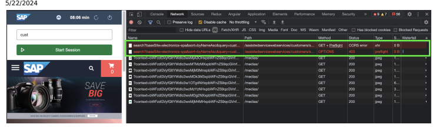
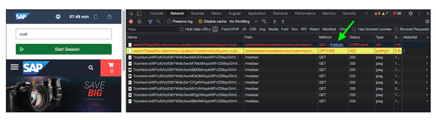
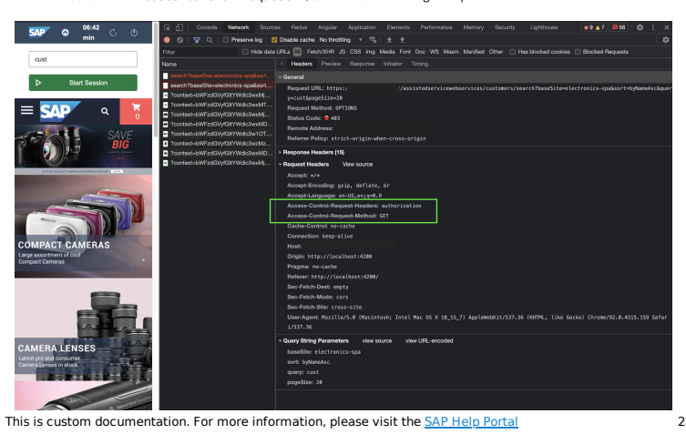
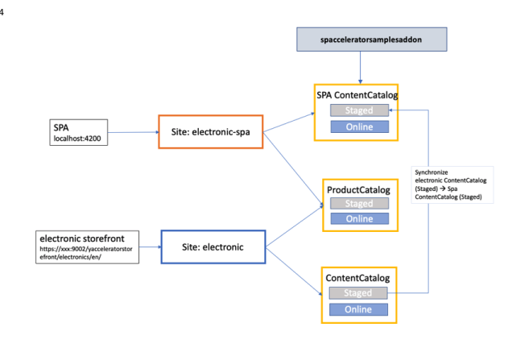
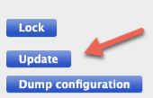
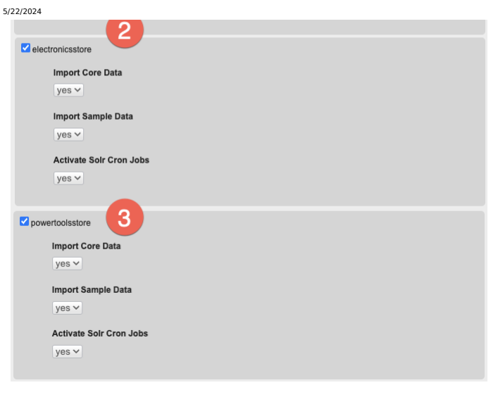
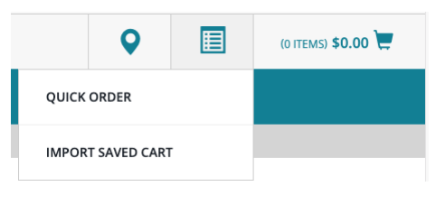

# Getting Started With Composable Storefront Libraries

If you are new to composable storefront, we recommend you rst read about the following:
Setting Up SAP Commerce Cloud for use with Composable Storefront

Cross-Origin Resource Sharing (CORS) Building the Composable Storefront From Libraries Schematics Reference App Structure

## Recommended Development Environment Cli Tools

There are a number of necessary CLI tools that you need to have installed in order to work with composable storefront, as follows:

Node: rst and foremost you need Node installed. To install it, refer to the official site . An alternative to installing a system-wide version of node is to use a Node version manager, such as nvm . This version manager also works on Windows via Windows Subsystem for Linux (WSL). If WSL is not available, nvm-windows can be used. The advantage of installing a Node version manager is that it provides an ability to easily switch to a different version of Node.

Package manager: the composable storefront team uses npm as a package manager solution. npm comes pre-installed with Node.

Angular CLI: to install it, run npm install -g @angular/cli.

## Versions

Your Angular development environment should include the following:
Angular CLI Version 17.0.0 is the minimum required. The most recent 17.x version is strongly recommended.

Node.js Version 20.9.0 is the minimum required. The most recent 20.x version is strongly recommended. npm Version 10.2.4 or newer.

## Editor

Composable storefront team recommends a highly extensible and open source editor, such as Visual Studio Code, which can be downloaded from the Visual Studio Code website .

## Vscode Settings

To share some common settings across team members, create .vscode folder in the root of your project, and inside of it create settings.json le. Settings added here are known as workspace settings.

Here are some recommended workspace settings that also help to avoid collision with the recommended code-formatter:
{ // Prettier uses single quotes.

This is   For more    the SAP Help  2

 "prettier.singleQuote": true, // Prettify on save "editor.formatOnSave": true, // prettier uses 2 spaces instead of 4 "editor.tabSize": 2, // organize imports on save "editor.codeActionsOnSave": { "source.organizeImports": true }, // Uses the project specific typescript version. "typescript.tsdk": "node_modules/typescript/lib" }

## Vscode Extensions

Here is a list of recommended extensions when working with composable storefront:
angular language services

ESLint prettier - code formatter Stylelint
There's no need to manually install these extensions - just create .vscode folder in the root of your project, and inside of it create extensions.json with the following content:
{ "recommendations": [ // Angular Language Service "Angular.ng-template", // Prettier - Code formatter "esbenp.prettier-vscode", // The ng lint command uses ESLint under the hood. "dbaeumer.vscode-eslint", // Modern CSS/SCSS/Less linter "stylelint.vscode-stylelint" ] }
VSCode will automatically prompt you to install the recommended extensions with just one click. This is also a nice way to have a consistent environment across team members. Some other notable extensions:

Inline HTML and CSS highlighter - natewallace.angular2-inline A more richer git support than VS Code's default one - eamodio.gitlens AI assisted IntelliSense - visualstudioexptteam.vscodeintellicode Languages support for the SAP Hybris import/export language ImpEx (unofficial) - simplyroba.impex-support Markdown linting and style checking for Visual Studio Code - davidanson.vscode-markdownlint

## Project Setup

After following the steps in Building the Composable Storefront From Libraries, it's time to set up the project.

## Code Formatting

As a code formatter, the composable storefront team prefers prettier . To install it as a dependency, run npm install prettier --include=dev. To share prettier settings with all team members, create .prettierrc le in the root of your project and paste the following:
{ "printWidth": 120, "singleQuote": true, "useTabs": false, "tabWidth": 2, "semi": true, "bracketSpacing": true, "trailingComma": "es5" }
Most of these options are prettier's defaults, but it's a good practice to have them explicitly dened.

To ignore some les from being formatted, create .prettierignore in the project's root, and ignore your les like so:
**/*.md To avoid collision between eslint and prettier, it is recommended to disable formatting rules from eslint. You can nd information on how to integrate Prettier and linters in the official Prettier documentation .

To run prettier you can add this script to package.json to scripts array: "prettier": "prettier --config
./.prettierrc --list-different \"src/**/*{.ts,.js,.json,.scss,.html}\"".

Note: You may have to change src to match the directory that you are using as a source directory.

To check for formatting violations run: npm run prettier.

## Linting

To check for linting violations, run ng lint.

## Final Steps

Finally, you may need to run npm install to install dependencies added to package.json.

## Setting Up Sap Commerce Cloud For Use With Composable Storefront

The following pages describe how to install and congure SAP Commerce Cloud for use with a composable storefront.

Installing SAP Commerce Cloud 2211 for use with Composable Storefront Installing SAP Commerce Cloud 2205 for use with Composable Storefront Installing SAP Commerce Cloud 2105 for use with Composable Storefront Cross-Origin Resource Sharing (CORS)

# Installing Sap Commerce Cloud 2211 For Use With Composable Storefront

SAP Commerce Cloud 2211 requires Java 17.

The following instructions describe how to install and congure SAP Commerce Cloud release 2211 for use with a composable storefront. In these instructions, SAP Commerce Cloud is installed to your local computer, so localhost is used in the browser URLs.

## Important Disclaimers

Starting with release 2005, SAP Commerce Cloud ships with all users inactive and without passwords. These users may need to be restored for certain back end functionality to work. For example, although you will be able to add products to cart and check out, certain users are required to fulll orders with Order Management as used in the default cx recipe. For more information, and for a sample ImpEx that enables such users, see Setting Passwords for Default Users.

Starting with release 1905, SAP Commerce Cloud ships without a default admin password. You must specify a password when running recipe commands. For more information, see Setting the Administrator Password with a Recipe. The sample custom properties le and OCC credentials supplied here are for evaluation purposes only. Aside from a default password, for example, the CORS settings are permissive to prevent access issues. We strongly recommend that a professional SAP Commerce Cloud administrator review these settings to suit your requirements, as they should not be used for production servers.

## Installation And Conguration Instructions

Summary:
Step 1: Download, unzip, and create the new recipe

Step 2: Build and initialize the recipe Step 3: Import OCC credentials Step 4: Update system and user credentials (optional)

## Step 1: Downloading, Unzipping, And Creating The New Recipe Procedure

1. Download and unzip the following les:
SAP Commerce Cloud 2211 from the Software Center . Spartacus sample data from the SAP Commerce Cloud Sample Repository Release page 2. Move the custom.properties le from spartacussampledata/resources/installer/customconfig to hybris-commerce-suite-2211/installer/customconfig.

The sample custom properties le is meant for development and evaluation purposes only. It is strongly recommend that you inspect this le's settings using a text editor. For more information, see Sample Conguration Properties in the Notes section, below.

3. In the hybris-commerce-suite-2211/installer/customconfig/custom.properties le, add the following line: acceleratorservices.payment.sopmock.enabled=true

This setting allows the checkout to work as expected in the default composable storefront sample stores. You only need to make this change to the custom.properties le if you are setting up a development or staging environment where you will be using a composable storefront sample store. In a prodution environment, you do not need to enable the mock payment service because you would integrate with a real payment service provider instead.

4. In hybris/bin:
Create the folder custom.

Move the entire spartacussampledata folder to hybris/bin/custom.

5. In the installer/recipes folder:
Duplicate the cx folder.

Change the name of the duplicate folder to cx-for-spa.

6. In the new cx-for-spa folder:
Open build.gradle with a text editor.

Uncomment // extName 'spartacussampledata' in the list of extensions.

Save and close the le.

## Step 2: Building And Initialize The New Recipe Procedure

1. Open a terminal or command prompt window inside the installer folder.

2. Set up the recipe using the following command:
./install.sh -r cx-for-spa If you are using Windows, change ./install.sh to install.bat.

The initialpassword.admin setting is no longer included in the sample custom properties le, but you can set an initial admin password on the command line for both the install and initialize commands of this recipe. For more information, see Setting the Administrator Password with a Recipe.

3. Initialize the system using the following command:
./install.sh -r cx-for-spa initialize 4. Start SAP Commerce Cloud using the following command:
./install.sh -r cx-for-spa start
(Using spartacussampledata and the full cx recipe, startup may take approximately 30 minutes, depending on your system.)
5. Verify that SAP Commerce Cloud is working. To do this, you can:
Display the Admin Console: https://localhost:9002 Display Backoffice: https://localhost:9002/backoffice (can take 15-20 seconds to start the rst time) Display the Accelerator Electronics storefront: https://localhost:9002/yacceleratorstorefront/?site=electronics This is   For more    the SAP Help  6 6. Verify that the composable storefront versions of the sample stores were created.

Display Backoffice. Go to WCMS > Website. You should see "-spa" versions of the sample stores.

## Step 3: Importing Occ Credentials

Composable storefront uses OCC REST API calls to get information from and make changes to the backend. To do this, the backend must be congured with certain credentials.

## Procedure

1. Open the Hybris Administration Console for your local SAP Commerce Cloud, in a web browser at the following address:
https://localhost:9002 2. Point to the Console tab, then click Impex Import. 3. Copy-paste the following code into the Import content eld.

INSERT_UPDATE OAuthClientDetails;clientId[unique=true] ;resourceIds ;scope ;authorizedGrantTy ;client-side ;hybris ;basic ;im ;mobile_android ;hybris ;basic ;au 4. Click the Import content button You can verify that the OAuth client has been successfully dened by entering the following curl command in a terminal or command prompt window:
curl -k -d "client_id=mobile_android&client_secret=secret&grant_type=client_credentials" -X PO
The curl command sends a POST request for an access token, using the client ID and password that you added to the back end. The command should return something similar to the following:
{ "access_token" : "550d9a25-87c8-4e76-af21-6174a1e56d5c", "token_type" : "bearer", "expires_in" : 41809, "scope" : "basic openid" }

## Step 4: Updating System And User Credentials (Optional)

You may need to enable users and passwords for certain functionality to work. See Setting Passwords for Default Users for more information.

## All Done

You can now start composable storefront. After you have congured SAP Commerce Cloud to accept OCC REST API calls, you can set up and start your storefront. See Building the Composable Storefront From Libraries for more information.

## Notes

General

Some of the steps in this procedure are derived from the documentation for installing SAP Commerce Cloud using recipes. For more information, see Installing SAP Commerce Cloud Using Installer Recipes. The default cx recipe is used to create the recipe for composable storefront. Among other extensions, the cx recipe uses the Order Management Services feature (OMS). If you make an order, OMS doesn't ship the order, so orders remain in processing. To ship the order, a Warehouse Agent must conrm order shipment. For more information, see Order Management Services Module.

## Spartacus Sample Data Extension

The Spartacus Sample Data extension contains sample data modications used by the composable storefront and by the project "Spartacus" open source software. The extension makes a copy of any existing sample stores, if present. You can also use you own sample data as long as it includes extensions that support OCC APIs like commercewebservices.

The Spartacus Sample Data extension copies data from the electronicsstore, apparelstore, or powertoolstore extensions. Note that the time to initialize is longer because SAP Commerce Cloud rst builds the standard stores, then the stores for composable storefront. If you do not need all sample stores, you can comment them out in your recipe's build.gradle le. At a minimum, one sample store is required.

For more information about the changes that are implemented with the Spartacus Sample Data extension, see Spartacus Sample Data Extension.

## Sample Conguration Properties

The sample custom properties le is meant for development and evaluation purposes only. Please be careful to at least review the following properties:
The admin password (initialpassword.admin) (default is nimda).

CORS settings as described further in this document, and in the composable storefront documentation.

| Setting                               | Description                                                                                                                                                                                                    |
|---------------------------------------|----------------------------------------------------------------------------------------------------------------------------------------------------------------------------------------------------------------|
| occ.rewrite.overlapping.paths.enabled | Denes if certain B2B OCC calls are prexed with 'org' to avoid endpoint conicts (the default is set to true to ensure that both B2C and B2B storefronts can run in parallel)                                    |
| sop.post.url                          | Denes where to send mock payment creation requests, so you can check out                                                                                                                                       |
| corslter*                             | Denes various CORS settings required for composable storefront functionality to work (see more information below) - note that the settings are permissive and should be changed to match your site conguration |
| mockup.payment.label.billTo*          | Denes extra state and phone number elds for payment, used by composable storefront                                                                                                                             |
| yacceleratorordermanagement.fraud*    | Increases the fraud score limits so you mock purchases are not cancelled                                                                                                                                       |
| task.polling.interval.min             | Denes how long the system waits to kick off a new task - smaller values speed up order processing                                                                                                              |
| build.parallel                        | Speeds up initialization if your system has multiple cores                                                                                                                                                     |

The following table summarizes the settings included in this le:

## Sample Occ Credentials

By default, SAP Commerce Cloud successfully replies to OCC REST API calls that do not require authentication. For example, you can do the following:
Display Open API documentation: https://localhost:9002/occ/v2/swagger-ui.html Display information about the Electronics base store:
https://localhost:9002/occ/v2/electronics/basestores/electronics To be able to register users and check out, SAP Commerce Cloud must be congured with a client ID and password. When required, your composable storefront sends this client ID and password when communicating with the back end.

When you import the OCC credentials ImpEx in Step 3: Importing OCC Credentials, you add the client ID
mobile_android and password (or secret): secret. The values for client ID and password are samples. You would use different values for your production environments. For more information on this topic, see Conguring OAuth Clients.

## Cors Settings

CORS settings are very important for security. We strongly recommend that a professional SAP Commerce Cloud administrator review these settings to suit your requirements, as the sample properties should not be used for production servers. CORS (Cross-Origin Resource Sharing) denes a way for a browser and a server to decide which cross-origin requests for restricted resources can or cannot be allowed. Certain composable storefront functionality, such as checkout and consent management, may not work properly if the CORS OCC REST API settings are not congured properly in SAP Commerce Cloud. You can add these settings using the Hybris Administration Console. Hover your mouse over the Platform tab, click Conguration, then update the CORS settings. For information on composable storefront and CORS settings, see Cross-Origin Resource Sharing (CORS). There are a number of other composable storefront features that also require additional CORS settings. For more information about CORS, see ycommercewebservices Extension.

## Troubleshooting

If SAP Commerce Cloud installer doesn't work, make sure there are no spaces in the path to the SAP Commerce Cloud folder. If composable storefront starts or partially starts, check all CORS settings. For more information, see Cross-Origin Resource Sharing (CORS).

## Installing Sap Commerce Cloud 2205 For Use With Composable Storefront Note

SAP Commerce Cloud 2205 requires Java 17.

The following instructions describe how to install and congure SAP Commerce Cloud release 2205 for use with a composable storefront. In these instructions, SAP Commerce Cloud is installed to your local computer, so localhost is used in the browser URLs.

## Important Disclaimers

Starting with release 2005, SAP Commerce Cloud ships with all users inactive and without passwords. These users may need to be restored for certain back end functionality to work. For example, although you will be able to add products to cart and check out, certain users are required to fulll orders with Order Management as used in the default cx recipe. For more information, and for a sample ImpEx that enables such users, see Setting Passwords for Default Users. Starting with release 1905, SAP Commerce Cloud ships without a default admin password. You must specify a password when running recipe commands, or you can specify a password in a le named custom.properties that is stored in CXCOMM*\installer\customconfig. The sample custom.properties le included in these instructions contains This is   For more    the SAP Help  9 the default password nimda. We strongly recommend you change this password to suit your requirements, as it should not be used for production servers.

The sample custom properties le and OCC credentials supplied here are for evaluation purposes only. Aside from a default password, for example, the CORS settings are permissive to prevent access issues. We strongly recommend that a professional SAP Commerce Cloud administrator review these settings to suit your requirements, as they should not be used for production servers.

## Installation And Conguration Instructions

Summary:
Step 1: Download, unzip, and create the new recipe

Step 2: Build and initialize the recipe Step 3: Import OCC credentials Step 4: Update system and user credentials (optional)

## Step 1: Downloading, Unzipping, And Creating The New Recipe Procedure

1. Download and unzip the following les:
SAP Commerce Cloud 2205 from the SAP Software Downloads web site Spartacus sample data from the SAP Commerce Cloud Sample Repository Release page 2. Move the custom.properties le from spartacussampledata/resources/installer/customconfig to hybris-commerce-suite-2205/installer/customconfig.

The sample custom properties le is meant for development and evaluation purposes only. It is strongly recommend that you inspect this le's settings using a text editor. For more information, see Sample Conguration Properties in the Notes section, below.

3. In hybris/bin:
Create the folder custom.

Move the entire spartacussampledata folder to hybris/bin/custom.

4. In the installer/recipes folder:
Duplicate the cx folder.

Change the name of the duplicate folder to cx-for-spa.

5. In the new cx-for-spa folder:
Open build.gradle with a text editor.

Uncomment // extName 'spartacussampledata' in the list of extensions.

Save and close the le.

## Step 2: Building And Initialize The New Recipe Procedure

This is   For more    the SAP Help  10 1. Open a terminal or command prompt window inside the installer folder.

2. Set up the recipe using the following command:
./install.sh -r cx-for-spa If you are using Windows, change ./install.sh to install.bat.

3. Initialize the system using the following command:
./install.sh -r cx-for-spa initialize 4. Start SAP Commerce Cloud using the following command:
./install.sh -r cx-for-spa start
(Using spartacussampledata and the full cx recipe, startup may take approximately 30 minutes, depending on your system.)
5. Verify that SAP Commerce Cloud is working. To do this, you can:
Display the Admin Console: https://localhost:9002 Display Backoffice: https://localhost:9002/backoffice (can take 15-20 seconds to start the rst time)

Display the Accelerator Electronics storefront: https://localhost:9002/yacceleratorstorefront/?site=electronics
6. Verify that the composable storefront versions of the sample stores were created.

Display Backoffice. Go to WCMS > Website. You should see "-spa" versions of the sample stores.

## Step 3: Importing Occ Credentials

Composable storefront uses OCC REST API calls to get information from and make changes to the backend. To do this, the backend must be congured with certain credentials.

## Procedure

1. Open the Hybris Administration Console for your local SAP Commerce Cloud, in a web browser at the following address:
https://localhost:9002 2. Point to the Console tab, then click Impex Import. 3. Copy-paste the following code into the Import content eld.

INSERT_UPDATE OAuthClientDetails;clientId[unique=true] ;resourceIds ;scope ;authorizedGrantTy ;client-side ;hybris ;basic ;im ;mobile_android ;hybris ;basic ;au 4. Click the Import content button You can verify that the OAuth client has been successfully dened by entering the following curl command in a terminal or command prompt window:
curl -k -d "client_id=mobile_android&client_secret=secret&grant_type=client_credentials" -X PO
The curl command sends a POST request for an access token, using the client ID and password that you added to the back end. The command should return something similar to the following:
{ "access_token" : "550d9a25-87c8-4e76-af21-6174a1e56d5c", "token_type" : "bearer", "expires_in" : 41809, This is   For more    the SAP Help  11

# Step 4: Updating System And User Credentials (Optional)

You may need to enable users and passwords for certain functionality to work.

See Setting Passwords for Default Users for more information.

## All Done

You can now start composable storefront. After you have congured SAP Commerce Cloud to accept OCC REST API calls, you can set up and start your storefront. See Building the Composable Storefront From Libraries for more information.

## Notes General

Some of the steps in this procedure are derived from the documentation for installing SAP Commerce Cloud using recipes. For more information, see Installing SAP Commerce Cloud Using Installer Recipes. The default cx recipe is used to create the recipe for composable storefront. Among other extensions, the cx recipe uses the Order Management Services feature (OMS). If you make an order, OMS doesn't ship the order, so orders remain in processing. To ship the order, a Warehouse Agent must conrm order shipment. For more information, see Order Management Services Module.

## Spartacus Sample Data Extension

The Spartacus Sample Data extension contains sample data modications used by the composable storefront and by the project "Spartacus" open source software. The extension makes a copy of any existing sample stores, if present. You can also use you own sample data as long as it includes extensions that support OCC APIs like commercewebservices.

The Spartacus Sample Data extension copies data from the electronicsstore, apparelstore, or powertoolstore extensions. Note that the time to initialize is longer because SAP Commerce Cloud rst builds the standard stores, then the stores for composable storefront. If you do not need all sample stores, you can comment them out in your recipe's build.gradle le. At a minimum, one sample store is required.

For more information about the changes that are implemented with the Spartacus Sample Data extension, see Spartacus Sample Data Extension.

## Sample Conguration Properties

The sample custom properties le is meant for development and evaluation purposes only. Please be careful to at least review the following properties:
The admin password (initialpassword.admin) (default is nimda).

CORS settings as described further in this document, and in the composable storefront documentation.

The following table summarizes the settings included in this le:

| Setting               | Description                                                 |
|-----------------------|-------------------------------------------------------------|
| initialpassword.admin | Admin password so you can access the console and Backoffice |

| 5/22/2024 Setting                     | Description                                                                                                                                                                                                    |
|---------------------------------------|----------------------------------------------------------------------------------------------------------------------------------------------------------------------------------------------------------------|
| occ.rewrite.overlapping.paths.enabled | Denes if certain B2B OCC calls are prexed with 'org' to avoid endpoint conicts (the default is set to true to ensure that both B2C and B2B storefronts can run in parallel)                                    |
| sop.post.url                          | Denes where to send mock payment creation requests, so you can check out                                                                                                                                       |
| corslter*                             | Denes various CORS settings required for composable storefront functionality to work (see more information below) - note that the settings are permissive and should be changed to match your site conguration |
| mockup.payment.label.billTo*          | Denes extra state and phone number elds for payment, used by composable storefront                                                                                                                             |
| yacceleratorordermanagement.fraud*    | Increases the fraud score limits so you mock purchases are not cancelled                                                                                                                                       |
| task.polling.interval.min             | Denes how long the system waits to kick off a new task - smaller values speed up order processing                                                                                                              |
| build.parallel                        | Speeds up initialization if your system has multiple cores                                                                                                                                                     |

## Sample Occ Credentials

By default, SAP Commerce Cloud successfully replies to OCC REST API calls that do not require authentication. For example, you can do the following:
Display Open API documentation: https://localhost:9002/occ/v2/swagger-ui.html

Display information about the Electronics base store:
https://localhost:9002/occ/v2/electronics/basestores/electronics
To be able to register users and check out, SAP Commerce Cloud must be congured with a client ID and password. When required, your composable storefront sends this client ID and password when communicating with the back end.

When you import the OCC credentials ImpEx in Step 3: Importing OCC Credentials, you add the client ID
mobile_android and password (or secret): secret. The values for client ID and password are samples. You would use different values for your production environments.
For more information on this topic, see Conguring OAuth Clients.

## Cors Settings

CORS settings are very important for security. We strongly recommend that a professional SAP Commerce Cloud administrator review these settings to suit your requirements, as the sample properties should not be used for production servers. CORS (Cross-Origin Resource Sharing) denes a way for a browser and a server to decide which cross-origin requests for restricted resources can or cannot be allowed. Certain composable storefront functionality, such as checkout and consent management, may not work properly if the CORS OCC REST API settings are not congured properly in SAP Commerce Cloud. You can add these settings using the Hybris Administration Console. Hover your mouse over the Platform tab, click Conguration, then update the CORS settings. For information on composable storefront and CORS settings, see Cross-Origin Resource Sharing (CORS). There are a number of other composable storefront features that also require additional CORS settings. For more information about CORS, see ycommercewebservices Extension.

## Troubleshooting

If SAP Commerce Cloud installer doesn't work, make sure there are no spaces in the path to the SAP Commerce Cloud folder.

## Installing Sap Commerce Cloud 2105 For Use With Composable Storefront

The following instructions describe how to install and congure SAP Commerce Cloud release 2105 for use with a composable storefront. In these instructions, SAP Commerce Cloud is installed to your local computer, so localhost is used in the browser URLs.

## Important Disclaimers

Starting with release 2005, SAP Commerce Cloud ships with all users inactive and without passwords. These users may need to be restored for certain back end functionality to work. For example, although you will be able to add products to cart and check out, certain users are required to fulll orders with Order Management as used in the default cx recipe. For more information, and for a sample ImpEx that enables such users, see Setting Passwords for Default Users.

Starting with release 1905, SAP Commerce Cloud ships without a default admin password. You must specify a password when running recipe commands, or you can specify a password in a le named custom.properties that is stored in CXCOMM*\installer\customconfig. The sample custom.properties le included in these instructions contains the default password nimda. We strongly recommend you change this password to suit your requirements, as it should not be used for production servers. The sample custom properties le and OCC credentials supplied here are for evaluation purposes only. Aside from a default password, for example, the CORS settings are permissive to prevent access issues. We strongly recommend that a professional SAP Commerce Cloud administrator review these settings to suit your requirements, as they should not be used for production servers.

## Installation And Conguration Instructions

Summary:
Step 1: Download, unzip, and create the new recipe

Step 2: Build and initialize the recipe Step 3: Import OCC credentials Step 4: Update system and user credentials (optional)

## Step 1: Downloading, Unzipping, And Creating The New Recipe Procedure

1. Download and unzip the following les:
SAP Commerce Cloud 2105 from the SAP Software Downloads web site Spartacus sample data from the SAP Commerce Cloud Sample Repository Release page 2. Move the custom.properties le from spartacussampledata/resources/installer/customconfig to hybris-commerce-suite-2105/installer/customconfig.

The sample custom properties le is meant for development and evaluation purposes only. It is strongly recommend that you inspect this le's settings using a text editor. For more information, see Sample Conguration Properties in the Notes section, below.

3. In hybris/bin:
Create the folder custom.

Move the entire spartacussampledata folder to hybris/bin/custom.

4. In the installer/recipes folder:
Duplicate the cx folder.

Change the name of the duplicate folder to cx-for-spa.

5. In the new cx-for-spa folder:
Open build.gradle with a text editor.

Uncomment // extName 'spartacussampledata' in the list of extensions.

Save and close the le.

## Step 2: Building And Initializing The New Recipe Procedure

1. Open a terminal or command prompt window inside the installer folder.

2. Set up the recipe using the following command:
./install.sh -r cx-for-spa If you are using Windows, change ./install.sh to install.bat.

3. Initialize the system using the following command:
./install.sh -r cx-for-spa initialize 4. Start SAP Commerce Cloud using the following command:
./install.sh -r cx-for-spa start
(Using spartacussampledata and the full cx recipe, startup may take approximately 30 minutes, depending on your system.)
5. Verify that SAP Commerce Cloud is working. To do this, you can:
Display the Admin Console: https://localhost:9002 Display Backoffice: https://localhost:9002/backoffice (can take 15-20 seconds to start the rst time) Display the Accelerator Electronics storefront: https://localhost:9002/yacceleratorstorefront/?site=electronics 6. Verify that the composable storefront versions of the sample stores were created.

Display Backoffice. Go to WCMS > Website. You should see "-spa" versions of the sample stores.

## Step 3: Importing Occ Credentials

Composable storefront uses OCC REST API calls to get information from and make changes to the backend. To do this, the backend must be congured with certain credentials.

## Procedure

1. Open the Hybris Administration Console for your local SAP Commerce Cloud, in a web browser at the following address:
This is   For more    the SAP Help  15 https://localhost:9002 2. Point to the Console tab, then click Impex Import. 3. Copy-paste the following code into the Import content eld.

INSERT_UPDATE OAuthClientDetails;clientId[unique=true] ;resourceIds ;scope ;authorizedGrantTy ;client-side ;hybris ;basic ;im ;mobile_android ;hybris ;basic ;au 4. Click the Import content button You can verify that the OAuth client has been successfully dened by entering the following curl command in a terminal or command prompt window:
curl -k -d "client_id=mobile_android&client_secret=secret&grant_type=client_credentials" -X PO
The curl command sends a POST request for an access token, using the client ID and password that you added to the back end. The command should return something similar to the following:
{ "access_token" : "550d9a25-87c8-4e76-af21-6174a1e56d5c", "token_type" : "bearer", "expires_in" : 41809, "scope" : "basic openid" }

## Step 4: Updating System And User Credentials (Optional)

You may need to enable users and passwords for certain functionality to work. See Setting Passwords for Default Users for more information.

## All Done

You can now start composable storefront. After you have congured SAP Commerce Cloud to accept OCC REST API calls, you can set up and start your storefront. See Building the Composable Storefront From Libraries for more information.

## Notes General

Some of the steps in this procedure are derived from the documentation for installing SAP Commerce Cloud using recipes. For more information, see Installing SAP Commerce Cloud Using Installer Recipes in the SAP Help Portal.

The default cx recipe is used to create the recipe for composable storefront. Among other extensions, the cx recipe uses the Order Management Services feature (OMS). If you make an order, OMS doesn't ship the order, so orders remain in processing. To ship the order, a Warehouse Agent must conrm order shipment. For more information, see the Order Management Services Module.

## Spartacus Sample Data Extension

The Spartacus Sample Data extension contains sample data modications used by the composable storefront and by the project "Spartacus" open source software. The extension makes a copy of any existing sample stores, if present. You can also use you own sample data as long as it includes extensions that support OCC APIs like commercewebservices.

The Spartacus Sample Data extension copies data from the electronicsstore, apparelstore, or powertoolstore extensions. Note that the time to initialize is longer because SAP Commerce Cloud rst builds the standard stores, then the stores for composable storefront. If you do not need all sample stores, you can comment them out in your recipe's build.gradle le. At a minimum, one sample store is required.

For more information about the changes that are implemented with the Spartacus sample data extension, see Spartacus Sample Data Extension.

## Sample Conguration Properties

The sample custom properties le is meant for development and evaluation purposes only. Please be careful to at least review the following properties:
The admin password (initialpassword.admin) (default is nimda).

CORS settings as described further in this document, and in the composable storefront documentation.
The following table summarizes the settings included in this le:

| Setting                               | Description                                                                                                                                                                                                    |
|---------------------------------------|----------------------------------------------------------------------------------------------------------------------------------------------------------------------------------------------------------------|
| initialpassword.admin                 | Admin password so you can access the console and Backoffice                                                                                                                                                    |
| occ.rewrite.overlapping.paths.enabled | Denes if certain B2B OCC calls are prexed with 'org' to avoid endpoint conicts (the default is set to true to ensure that both B2C and B2B storefronts can run in parallel)                                    |
| sop.post.url                          | Denes where to send mock payment creation requests, so you can check out                                                                                                                                       |
| corslter*                             | Denes various CORS settings required for composable storefront functionality to work (see more information below) - note that the settings are permissive and should be changed to match your site conguration |
| mockup.payment.label.billTo*          | Denes extra state and phone number elds for payment, used by composable storefront                                                                                                                             |
| yacceleratorordermanagement.fraud*    | Increases the fraud score limits so you mock purchases are not cancelled                                                                                                                                       |
| task.polling.interval.min             | Denes how long the system waits to kick off a new task - smaller values speed up order processing                                                                                                              |
| build.parallel                        | Speeds up initialization if your system has multiple cores                                                                                                                                                     |

## Sample Occ Credentials

By default, SAP Commerce Cloud successfully replies to OCC REST API calls that do not require authentication. For example, you can do the following:
Display Open API documentation: https://localhost:9002/occ/v2/swagger-ui.html

Display information about the Electronics base store:
https://localhost:9002/occ/v2/electronics/basestores/electronics
To be able to register users and check out, SAP Commerce Cloud must be congured with a client ID and password. When required, your composable storefront sends this client ID and password when communicating with the back end.

When you import the OCC credentials ImpEx in Step 3: Importing OCC Credentials, you add the client ID
mobile_android and password (or secret): secret. The values for client ID and password are samples. You would use different values for your production environments. For more information on this topic, see Conguring OAuth Clients.

## Cors Settings

CORS settings are very important for security. We strongly recommend that a professional SAP Commerce Cloud administrator review these settings to suit your requirements, as the sample properties should not be used for production servers. CORS (Cross-Origin Resource Sharing) denes a way for a browser and a server to decide which cross-origin requests for restricted resources can or cannot be allowed. Certain composable storefront functionality, such as checkout and consent management, may not work properly if the CORS OCC REST API settings are not congured properly in SAP Commerce Cloud.

You can add these settings using the Hybris Administration Console. Hover your mouse over the Platform tab, click Conguration, then update the CORS settings.
For information on composable storefront and CORS settings, see Cross-Origin Resource Sharing (CORS). There are a number of other composable storefront features that also require additional CORS settings. For more information about CORS, see ycommercewebservices Extension.

## Troubleshooting

If SAP Commerce Cloud installer doesn't work, make sure there are no spaces in the path to the SAP Commerce Cloud folder.

If composable storefront starts or partially starts, check all CORS settings. For more information, see Cross-Origin Resource Sharing (CORS).

## Cross-Origin Resource Sharing (Cors)

CORS is a standard mechanism on the web that enables cross-domain requests from web applications to reach servers on different domains. Cross-origin requests could also be thought of as "cross-domain requests". Browsers block cross-origin requests whenever the required HTTP headers are not available in the response. The response headers are dictated by the server, which is why the server must be set up to generate the correct headers. In the SAP Commerce Cloud back end, these headers can be congured in a generic fashion by using a CorsFilter. Project properties can be used to congure this for each node, or an ImpEx installation script can be used to install to each node. For more information, see Cross-Origin Resource Sharing Support.

## Cors Headers

You can use various CORS headers to specify whether the origin is allowed, with or without certain methods, headers, cookies, and so on. The following sections describe each of the congurations as they are related to composable storefront.

## Allowedorigins

In development, the allowed origins are often congured with an asterisk (*), which allowlists all clients, regardless of their domain. In a production environment, this should contain the different domains that are allowed to interact with the back end API.

In SAP Commerce Cloud version 2105 or newer, you cannot use the combination of the allowCredentials=true and allowedOrigins=* attributes. In these cases, use allowedOriginPatterns=* instead. For more information, see CrossOrigin Resource Sharing Support.

## Allowedmethods

The allowed headers must include all the HTTP methods that are allowed to be used. For composable storefront, the following methods should be congured:

GET HEAD OPTIONS PATCH PUT POST DELETE
If you use custom methods in your project, you should add these methods to this list.

## Allowedheaders

The allowed headers setting indicates the HTTP headers that are allowed for cross-origin requests. If these header are not allowed cross-origin, composable storefront will not get a response for a specic request. Most of the headers are standard headers, but there are a few headers that you might need that are feature specic. The following list provides an overview of all the headers that can be used.

| Header        | Description                                                                                                                                                                                                                                                                                                                                                     |
|---------------|-----------------------------------------------------------------------------------------------------------------------------------------------------------------------------------------------------------------------------------------------------------------------------------------------------------------------------------------------------------------|
| origin        | The origin request header indicates where a request originates from. This is sent by the browser with each crossorigin request, and must therefore be congured for all requests.                                                                                                                                                                                                                                                                                                                                                                 |
| content-type  | The content-type header is used to indicate the media type of the resource. It is not required for all APIs, but it is often used nonetheless.                                                                                                                                                                                                                  |
| accept        | The accept request header indicates the formats that can be read by the browser. It is sent pn a few occasions in composable storefront.                                                                                                                                                                                                                        |
| authorization | The authorization request header is used during authentication. Unless there is no login process, this must be congured.                                                                                                                                                                                                                                        |
| cache-control | The cache-control headers are used for various API requests.                                                                                                                                                                                                                                                                                                    |
| x-anonymousconsents               | The x-anonymous-consents header is required by the anonymous consent feature. If anonymous consent is not used, this conguration can be omitted. However, it is important to note that if you do not include this header, you must disable the anonymous consent feature. Otherwise, you might encounter problems with your storefront not displaying properly. |
| occpersonalizationid               | The occ-personalization-id header is required by the personalization feature. If you do not use the personalization feature, this header can be omitted. For more information, see Congure Personalization for Commerce Web Services.                                                                                                                           |
| occpersonalizationtime               | The occ-personalization-time header is required by the personalization feature. If you do not use the personalization feature, this header can be omitted. For more information, see Congure Personalization for Commerce Web Services.                                                                                                                         |
| x-prole-tagdebug               | The x-profile-tag-debug header is required by Intelligent Selling Services for SAP Commerce Cloud. It is used to instruct Intelligent Selling Services to produce a trace. If you do not use Intelligent Selling Services for SAP Commerce Cloud, this header can be omitted. For more information, see Intelligent Selling Services for SAP Commerce Cloud.    |
| x-consentreference               | The x-consent-reference header is required by Intelligent Selling Services for SAP Commerce Cloud. If you do not use Intelligent Selling Services for SAP Commerce Cloud, this header can be omitted. For more information, seeIntelligent Selling Services for SAP Commerce Cloud.                                                                             |

## Exposedheaders

Intelligent Selling Services for SAP Commerce Cloud requires a custom header to be exposed, which is the x-anonymousconsents header.

Personalization requires the occ-personalization-id and the occ-personalization-time headers to be exposed.

## Allowcredentials

Request credentials are concerned with cookies, authorization headers, or TLS client certicates. These are not allowed in cross-origin requests by default, which is why a request is blocked when the conguration is not applied. Composable storefront did not send cookies in version 1.x of the composable storefront libraries, but since version 2.0, cookies will be sent for each and every OCC request. This has also been patched to versions 1.4 and 1.5 of the composable storefront libraries. Sending cookies is required to gain "session affinity", which is also know as "sticky sessions". Session affinity means that the same server behind an API endpoint is used for all subsequent requests for the same session. Although the Commerce API is stateless, there are occasions when multiple parallel or sequential calls could fail. For example, an "add to cart" request followed by a "load cart" request could fail, because the rst request could end up at server 1, whereas the second request, immediately following after, could end up at server 2. The servers might not be fast enough to send around cache invalidation, which is why the second response might fail to catch the added item. An added advantage of session affinity is that the back end will gain performance improvements if requests for the same session are served by the same server.

For this reason, CCv2 exposes a response cookie (ROUTE) that indicates the processing server that was used to process the API
request. Whenever the client adds this cookie into the next request, the request is handled by the same server.

## Setting Up Cors

The various CORS congurations that are required by the back end can be installed in the following ways:
using conguration properties to install them during a deployment

using the SAP Commerce Cloud manifest le to install them during a deployment using an ImpEx script to install them at runtime using Backoffice to congure them manually at runtime
For each installation, it is important to note the following:

OCC is installed by a template extension with the name commercewebservices. However, you can rename the extension web application path, or generate a custom extension out of this. In the examples in the next sections, we assume the name is commercewebservices, but you should replace this if you have a custom name.

Most congurations apply to OCC only, but in case you use other APIs (such as the Assisted Service Module), you also need to congure CORS for these APIs as well. For more information, see Assisted Service Module.

## Local Properties File

If you install the CORS lter conguration by properties, the following properties must be added:
corsfilter.commercewebservices.allowedOriginPatterns=* corsfilter.commercewebservices.allowedMethods=GET HEAD OPTIONS PATCH PUT POST DELETE corsfilter.commercewebservices.allowedHeaders=origin content-type accept authorization cache-contro corsfilter.commercewebservices.exposedHeaders=x-anonymous-consents occ-personalization-id occ-perso corsfilter.commercewebservices.allowCredentials=true

The wildcard conguration for allowedOriginPatterns is exible for development environments, but it is not secure. A
more restrictive conguration is required for production use.

## Sap Commerce Cloud Manifest Conguration

If you install the CORS lter conguration using the SAP Commerce Cloud manifest le, add the following headers to the manifest le:
{
"key": "corsfilter.commercewebservices.allowedOriginPatterns", "value": "*"
}, {
"key": "corsfilter.commercewebservices.allowedMethods", "value": "GET HEAD OPTIONS PATCH PUT POST DELETE"
}, {
"key": "corsfilter.commercewebservices.allowedHeaders", "value": "origin content-type accept authorization cache-control if-none-match x-anonymous-
}, {
"key": "corsfilter.commercewebservices.exposedHeaders", "value": "x-anonymous-consents occ-personalization-id occ-personalization-time"
} {
"key": "corsfilter.commercewebservices.allowCredentials", "value": "true"
}

The wildcard conguration for allowedOriginPatterns is exible for development environments, but it is not secure. A
more restrictive conguration is required for production use.

## Impex

You can use the following ImpEx script if you want to install the CORS lter conguration during initialization, during an update, or manually with the Hybris Admin Console.

INSERT_UPDATE CorsConfigurationProperty;key[unique=true];value;context[default=commercewebservices, ;allowedOriginPatterns;* ;allowedMethods;GET HEAD OPTIONS PATCH PUT POST DELETE ;allowedHeaders;origin content-type accept authorization cache-control if-none-match x-anonymous-co ;allowCredentials;true ;exposedHeaders;x-anonymous-consents occ-personalization-id occ-personalization-time

The wildcard conguration for allowedOriginPatterns is exible for development environments, but it is not secure. A
more restrictive conguration is required for production use.

## Troubleshooting

When troubleshooting a possible CORS issue, the rst step is to determine if a CORS error is the source of the problem. If it is, you can determine what is causing the CORS error, and then resolve it.

## Determining If A Problem Is Caused By A Cors Issue

To determine if a problem is caused by a CORS issue, you can open the Network tab in your browser's development tools and try to reproduce the problem with the Network tab open. In the following example, there are two requests that are highlighted in red, and in the Status column, one of the requests is listed as having a CORS error:

## Determining The Cause Of A Cors Error

To support CORS, your browser makes a preight request to the server to verify that the server will allow the real request to go through. It is often the case that the CORS issue is the result of an error with the preight request. The preight request has the same URL as the real request, but the HTTP method is OPTIONS. Google Chrome offers a convenient Preight link in the

Method column of the Network tab. When you click on the Preight link of a request, the associated preight request is highlighted, as show in the following example: When you select the preight request, you can see detailed information about the headers. In the request header info, look for headers that start with Access-Control-Request-*, such as in the following example:

The error is often caused by the back end server not being congured to allow one of the elements that is listed in one of the Access-Control-Request-* headers.

## Resolving The Cors Error

If you see that a legitimate header or HTTP method is being used, you should be able to resolve the issue by adding the header or HTTP method to the server's CORS conguration.

HTTP headers need to be added to at least one of the corsfilter.*.allowedHeaders properties (that is, the one related to the back end extension that serves the request.)
HTTP methods are allowed by adding them to the corsfilter.*.allowedMethods. Again, which property you need to add depends on which back end extension serves the request.

To resolve the error in the above examples, you add the authorization header in the corsfilter.assistedservicewebservices.allowedHeaders back end conguration property.

To know which extension serves which URL, you can use the following table of URLS and their corresponding extensions for an out-of-the-box SAP Commerce Cloud deployment:

| Webservice URL                | Back End Extension Name    |
|-------------------------------|----------------------------|
| /authentication/*             | oauth2                     |
| /occ/v2/*                     | commercewebservices        |
| /assistedservicewebservices/* | assistedservicewebservices |

For more information, see Preight request in the MDN Web Docs.

## Setting Up The Composable Storefront

This section includes instructions for building a composable storefront application, as well as various reference pages to help you get set up with the composable storefront.

Reference App Structure Building the Composable Storefront From Libraries Using Composable Storefront with SAP Commerce Cloud in the Public Cloud SAP Commerce Cloud hosting service is used for both building and hosting JavaScript storefronts. As of late August 2023, the hosting service can build composable storefront 5.x, 6.x, and 2211.x (or later) using the libraries that are stored on the Repo-Based Shipment Channel (RBSC). Feature Levels and Feature Flags Schematics Spartacus Sample Data Extension Web Browser Support

## Reference App Structure Note

The reference app structure is introduced with version 3.1 of the composable storefront libraries.

This is   For more    the SAP Help  23 This recommended composable storefront app structure is intended to act as a reference for when you are setting up your own composable storefront application. Composable storefront is an Angular library, which means it can be used on its own in an Angular application, or it can be integrated into an existing Angular project. Conversely, you can add any other Angular solution or library to your composable storefront project. Composable storefront itself comes with several layers and concepts, as well as a number of smaller feature libraries that can be lazy loaded out of the box. Customizations and third-party code add further complexity, and you can end up with modules that are difficult to maintain because they mix too many of these elements together. This can be solved by dening and adhering to a standardized structure, such as the composable storefront reference app structure. Having a standardized structure also makes it easier to onboard new developers to your project, to handle external support cases, and to take care of audits. By using the composable storefront reference app structure, you benet the most from the automatic migrations that are available with each major composable storefront release, while also maintaining the exibility to add customizations, and to build new features on top of those customizations. Using the reference app structure also makes it possible to take advantage of code splitting for features that are moved into separate libraries after the 3.0 release.

## Structure Overview

The following is an example of the reference app structure:
AppModule (placed in the main app folder)
_application modules_
SpartacusModule (placed in the app/spartacus folder)
BaseStorefrontModule (imported from @spartacus/storefront)
SpartacusFeaturesModule (placed in the app/spartacus folder)
_feature related modules_ (placed in the app/spartacus/features folder)
SpartacusConfigurationModule(placed in the app/spartacus folder)

## Composable Storefront Module

Every Angular application has a root app module, usually named AppModule. In the reference app strcuture, this module includes application-wide imports, and avoids complex module imports related to composable storefront by handling only one SpartacusModule.

Both Angular Router and NgRx are used by composable storefront, but these affect the global application, so they are kept outside of the SpartacusModule and are imported directly in the AppModule.

The SpartacusModule is composed of the following:
The BaseStorefrontModule, which encapsulates core composable storefront imports that are usually required by most composable storefront applications. The BaseStorefrontModule is imported directly from
@spartacus/storefront.

The SpartacusFeaturesModule, which encapsulates composable storefront features.

The SpartacusConfigurationModule, which encapsulates the general composable storefront conguration.

This is   For more    the SAP Help  24 In most cases, the SpartacusModule does not get modied because changes are more often encapsulated in conguration modules or feature modules.

The following is an example of the SpartacusModule:
import { NgModule } from '@angular/core'; import { BaseStorefrontModule } from '@spartacus/storefront'; import { SpartacusConfigurationModule } from './spartacus-configuration.module'; import { SpartacusFeaturesModule } from './spartacus-features.module'; @NgModule({ imports: [ BaseStorefrontModule, SpartacusFeaturesModule, SpartacusConfigurationModule, ], exports: [BaseStorefrontModule], }) export class SpartacusModule {}

## Composable Storefront Conguration Module

The SpartacusConfigurationModule contains all global composable storefront conguration entries.

The following is an example:
import { NgModule } from '@angular/core'; import { provideConfig } from '@spartacus/core'; import { layoutConfig, mediaConfig, } from '@spartacus/storefront'; @NgModule({ providers: [ provideConfig(layoutConfig), provideConfig(mediaConfig), provideConfig({
 backend: {
 occ: { baseUrl: 'https://my.custom.occ.url.com', }, }, context: { urlParameters: ['baseSite', 'language', 'currency'], baseSite: ['electronics-spa',], }, pwa: { enabled: true, addToHomeScreen: true, }, }), ], }) export class SpartacusConfigurationModule {}
Feature-specic congurations can be kept either in feature modules, or in the SpartacusConfigurationModule. Keeping them in feature modules helps to maintain a good separation of concerns, so it is generally recommended, but there is nothing against keeping feature-specic congurations in the SpartacusConfigurationModule if it helps to solve specic issues
(for example, by using an env ag to change the conguration).

## Composable Storefront Features Module

The SpartacusFeaturesModule is intended to easily manage all non-core composable storefront features, both statically and though lazy loading. It serves as an entry point for all features, which are ideally wrapped into their own, separate feature modules.

With early 3.x minor releases, the SpartacusFeaturesModule may look bloated and busy, but with every consecutive release, it should become more concise as a result of efforts to move most of the features to separate libraries. The following is an example:
@NgModule({ imports: [ AuthModule.forRoot(), // Basic Cms Components HamburgerMenuModule, SiteContextSelectorModule, LinkModule, BannerModule, CmsParagraphModule, TabParagraphContainerModule, BannerCarouselModule, CategoryNavigationModule, NavigationModule, FooterNavigationModule, BreadcrumbModule, // Opt-in features // ExternalRoutesModule.forRoot(), JsonLdBuilderModule, // External features // TrackingFeatureModule, StorefinderFeatureModule, QualtricsFeatureModule, SmartEditFeatureModule, ], }) export class SpartacusFeaturesModule {}

## Specic Feature Modules

Ideally, one complete feature can be encapsulated into a specic feature module. The module can contain feature-related congurations as well as customizations. The following is an example of a feature module with a lazy-loaded conguration:
import { NgModule } from '@angular/core'; import { StoreFinderRootModule } from '@spartacus/storefinder/root'; import { provideConfig } from '@spartacus/core'; import { storeFinderTranslationChunksConfig, storeFinderTranslations, } from '@spartacus/storefinder/assets'; @NgModule({ imports: [StoreFinderRootModule], providers: [ provideConfig({ featureModules: { storeFinder: { module: () => import('@spartacus/storefinder').then((m) => m.StoreFinderModule), }, }, i18n: { resources: storeFinderTranslations, chunks: storeFinderTranslationChunksConfig, This is   For more    the SAP Help  26
 }, }), ], }) export class StorefinderFeatureModule {}

## Building The Composable Storefront From Libraries

The following instructions describe how to build a storefront application, for both B2C (Electronics, Apparel) and B2B (Powertools) sample stores.

The information presented here is for building a storefront application on your local computer. For information on building composable storefront using the SAP Commerce Cloud hosting service, see Using Composable Storefront with SAP Commerce Cloud in the Public Cloud. For information on working with a third-party hosting service, see Storefront Deployment and Hosting.

## Prerequisites

If you are using a version of SAP Commerce Cloud that is older than 2211, you will need the webApplicationInjector.js le that ships with your version of SAP Commerce Cloud. For more information, see Updating the Web Application Injector.

## Front End Development Requirements

Your Angular development environment should include the following:
Angular CLI Version 17.0.0 is the minimum required. The most recent 17.x version is strongly recommended.

Node.js Version 20.9.0 is the minimum required. The most recent 20.x version is strongly recommended. npm Version 10.2.4 or newer.

## Back End Server Requirements

Composable storefront uses SAP Commerce Cloud for its back end and makes use of the sample data. Composable storefront can only be used with SAP Commerce Cloud 2105 or newer; the latest release is recommended. The difference between releases is in the APIs and features available. Newer releases of SAP Commerce Cloud contain new OCC APIs. For example, the B2B Commerce Organization API was added in release 2005. For more information on which back end releases contain which APIs, see the Feature Compatibility Matrix. No matter the version, the latest patch is required, as important xes are often added that affect composable storefront. For more information, see Setting Up SAP Commerce Cloud for use with Composable Storefront.

## Creating A New Angular App

The following procedure describes how to create a new Angular application with the name mystore.

## Procedure

This is   For more    the SAP Help  27 1. Open a terminal or command prompt window at the location of your choice.

2. Using the Angular CLI, generate a new Angular application with the following command:
ng new mystore --style=scss --routing=false --standalone=false At the command prompt, you are asked the following question:
Do you want to enable Server-Side Rendering (SSR) and Static Site Generation 
(SSG/Prerendering)?

Even if you plan to use SSR with your storefront app, you will set this up later using the composable storefront schematics, so for now, the answer is "no".

3. Type N and press Enter .

The mystore folder and the new app are created.

4. Access the newly created mystore folder with the following command:
cd mystore

## Installing Composable Storefront Libraries From The Repository Based Shipment Channel

To install composable storefront, you need to set up your access to the composable storefront libraries in the Repository Based Shipment Channel (RBSC), as described in the following procedure.

## Prerequisites

You need the appropriate licenses to access the composable storefront libraries in RBSC. However, if you do not have the appropriate licenses, you can still build a composable storefront application by generating the libraries yourself from any version of the open source code in GitHub. For more information, see Self-Publishing Spartacus Libraries Using the Open Source Code .

## Procedure

1. Create an S-user for RBSC that has the appropriate licenses to download the composable storefront libraries.

2. Log into your S-user account at the following web address:
https://ui.repositories.cloud.sap/www/webapp/users/

When logged in to your S-user account, ensure that you can see the Composable Storefront License in the list of licenses. If the Composable Storefront License does not appear in this list, there will be an error when downloading the packages.

3. If you have not already done so, click on Add User and create a technical user.

4. In the root of your Angular application, create an .npmrc le with the following content:
@spartacus:registry=https://73554900100900004337.npmsrv.base.repositories.cloud.sap/ //73554900100900004337.npmsrv.base.repositories.cloud.sap/:_auth=<npmcredentialsfromrbsc> always-auth=true

The two slashes (//) at the start of the second line are required.

5. In the User Management tab of the RBSC website , select the technical user and copy the generated NPM Base64 Credentials.

6. In the .npmrc le, replace <npmcredentialsfromrbsc> with the NPM Base64 Credentials you copied from the RBSC website.
You can now proceed to Composable Storefront Project Setup.

## Composable Storefront Project Setup

The easiest way to start a new project is to use composable storefront schematics to quickly set up your application. For a full list of available parameters, see Schematics.

## Setting Up Your Project Using Schematics

Run the following command to install composable storefront using schematics:
ng add @spartacus/schematics@*<version>*
For example, you can install the latest official release of composable storefront with the following command:
ng add @spartacus/schematics@2211.23.0 When you run this command, you are asked to choose which features you would like to set up. Some of the features are already selected by default, but this is only a suggested setup. You can select and unselect the features that are relevant for your installation, although it is highly recommended to install the User - Account feature.

To verify which is the most recent version of composable storefront, see What's New in SAP Commerce Cloud, composable storefront.

Starting with version 2211.19, composable storefront has aligned its versioning with SAP Commerce Cloud. The previous release of composable storefront was version 6.8. For more information, see Changes to Release Numbering and Update Policies for Composable Storefront Starting in February 2024.

## Notes

Composable storefront does not support B2C and B2B storefronts running together in a single storefront application. If you install any of the B2B features, the B2C storefront will load but it will not work properly. If you select a feature that is for B2B storefronts, the schematics automatically add any required B2B congurations if they are missing. If you install any of the following features, your composable storefront storefront will automatically become a B2B storefront:
Organization - Adminstration Organization - Order Approval Product - Bulk Pricing
Product Configurator - CPQ Configurator This is   For more    the SAP Help  29

The schematics add the core composable storefront les and congurations that are needed to work with the SAP
Commerce Cloud sample stores.

To verify what versions of composable storefront libraries were installed, open package.json and look for
@spartacus.

To bypass the schematics prompts and install composable storefront with a predened set of features, you can use the -
-no-interactive ag. For more information, see Adding Composable Storefront Core Libraries and Features to Your Angular Project. With each release of composable storefront, existing features are moved out of the core libraries and into their own dedicated feature libraries. With time, the core libraries will shrink as features are extracted to their own, separate packages.

## Installing Dependencies

Install dependencies needed by your composable storefront app with the following command:
npm install

## Verifying The Base Url And Other Settings

Open the src\app\spartacus\spartacus-configuration.module.ts le, and check for any changes you want to make for your setup. For example, check:
baseUrl: Points to your SAP Commerce Cloud server.

features.level: Denes the compatibility level
context: Denes the site context such as base site, language, and currency.

To see the base site in the URL and add Apparel store support, change context to the following:
context: { urlParameters: ['baseSite', 'language', 'currency'], baseSite: ['electronics-spa','apparel-uk-spa'], currency: ['USD', 'GBP',] },
If using Powertools, add powertools-spa to the list in baseSite.

## Updating The Web Application Injector

For composable storefront to work with SmartEdit, your composable storefront application needs to use the webApplicationInjector.js le that is shipped with the version of SAP Commerce Cloud that you are using. In composable storefront 5.0 and newer, the webApplicationInjector.js le has been updated to work with SAP Commerce Cloud 2211. If you are using SAP Commerce Cloud 2211, then no action is required. However, if you are using an older version of SAP Commerce Cloud, then you need to replace the webApplicationInjector.js le in your composable storefront application with the webApplicationInjector.js le that is included with your version of SAP Commerce Cloud. For more information, see Web Application Injector.

## Starting Your Composable Storefront App

This is   For more    the SAP Help  30 npm start Your app will be compiled and then started.

To display your storefront, assuming everything is installed locally, browse to http://localhost:4200. If you installed Electronics sample data and the Spartacus sample data extension, the composable storefront for Electronics should appear.

If your storefront doesn't appear, likely you have to accept a privacy certicate. To do so, browse to https://localhost:9002/occ/v2/electronics/cms/pages (or ../rest/.. if using 1905), and then accept the privacy certicate. This step is necessary because your browser will block calls the app will make to localhost:9002 due to security settings. To see the browser message, right-click in your browser, select Inspect, then click Console.

You can display the Apparel storefront through this URL: http://localhost:4200/apparel-uk-spa/en/GBP
You can display the Powertools storefront through this URL: http://localhost:4200/powertools-spa/en/USD
Congratulations! You've built your rst composable storefront.

## Adding The Videomodule And Pdfmodule To Your Storefront App

The VideoModule and the PDFModule are not added by default when you install or upgrade your composable storefront app using schematics. However, you can add these modules manually, as described in the following procedure.

## Procedure

1. Open spartacus-storefront.module.ts and add the VideoModule and the PDFModule to the imports section. The following is an example:
@NgModule({ declarations: [], imports: [ ... VideoModule, PDFModule ]
2. Import the VideoModule and the PDFModule from the storefront library.

The following is an example:
import { VideoModule, PDFModule } from "@spartacus/storefront";
3. Save your spartacus-storefront.module.ts le.

## Known Issues

See the following SAP Notes for solutions to known issues:
Composable Storefront 2211.19 and newer: SSR dev server not working in newly created storefront apps Composable Storefront 2211.19 and newer: Server prerendering not working in newly created storefronts apps This is   For more    the SAP Help  31 Composable Storefront 2211.19 and 2211.20 with SSR: missing `build:ssr` script causes errors during the SAP Commerce Cloud build Composable Storefront 2211.19 and 2211.20 with SSR: OCC_BACKEND_BASE_URL_VALUE is not mapped to the proper value in newly installed apps

## Using Composable Storefront With Sap Commerce Cloud In The Public Cloud

SAP Commerce Cloud hosting service is used for both building and hosting JavaScript storefronts. As of late August 2023, the hosting service can build composable storefront 5.x, 6.x, and 2211.x (or later) using the libraries that are stored on the Repo- Based Shipment Channel (RBSC).

## Context

The latest steps for setting up composable storefront with SAP Commerce Cloud are now provided in Add Applications to JavaScript Storefronts.

Ensure that the .npmrc le does not appear in your code repository.

## Manually Uploading Composable Storefront To Sap Commerce Cloud In The Public Cloud

SAP Commerce Cloud hosting service is used for both building and hosting JavaScript storefronts. However, it is also possible to build your composable storefront app locally, and upload the compiled application to the SAP Commerce Cloud hosting service, as follows:

## Prerequisites

You must rst create a composable storefront app on your local machine. For more information, see Building the Composable Storefront From Libraries.

## Procedure

1. In your composable storefront project, run the following command:
npm run build A new dist folder is created in the root directory of your project.

2. Commit the dist folder to your code repository for SAP Commerce Cloud.

For more information, see Add Applications to JavaScript Storefronts.

## Feature Levels And Feature Flags

Each minor version of the composable storefront libraries includes new features, which are often improvements to existing components. These features are usually expected by users, but in some cases, these updates could be considered breaking changes, especially when you have built your own customizations on top of specic behaviors, or on top of the DOM structure.

This is   For more    the SAP Help  32

## Feature Levels

To maintain strict backwards compatibility, composable storefront includes congurable feature levels, which help to maintain predictable behavior while improving existing components. By default, the feature level is set to the latest major version (such as 1.0). To make use of new behaviors and improvements introduced in a minor version (such as 1.3), you can congure the feature level as shown in the following example:
{ features: { level: '1.3' } }

Each consecutive feature level contains all of the features from the previous feature level.

If you want your feature level to always be set to the most recent version, you can use the latest ag ('*'), as follows:
features: { level: '*' }
You can also disable a feature for a specic feature level by including an exclamation mark (!) before the version number. The following is an example:
<newComponent *cxFeatureLevel="'!1.1'"></newComponent>

## Feature Flags

Some important features can be selectively toggled using specic feature ags. The following is an example:
{ features: { someFeature: false } }
Feature ags can be linked to feature levels, which results in a feature being enabled by default if the dened feature level is available. You can congure the feature level and feature ags at the same time, as shown in the following example:
{ features: { level: '1.1', feature1: false, feature2: true } }

In this example, the feature level is set to 1.1. With feature1 set to false, if feature1 is normally a part of the version 1.1 feature set, you can selectively disable this feature while keeping the rest of the features from the 1.1 release. If feature2 is part of the 1.5 release, by setting it to true, you can enable it while otherwise only enabling the features from the 1.1 release.

It is recommended that you pay extra attention to testing your application if you are selectively enabling features. Although feature ags are used for a number of different composable storefront features, there is no guarantee that all functionalities will work for all possible combinations of feature ags and feature levels.

## Schematics

Composable storefront schematics allow you to install composable storefront libraries in your project. The following sections describe what the composable storefront schematics do, and also provide information about the various options and commands you can use with the schematics. If you are a developer and are looking for more technical information, see the README in the composable storefront schematics project.

## Prerequisites

Before using composable storefront schematics, ensure that you have all of the necessary prerequisites. Your Angular development environment should include the following:
Angular CLI Version 17.0.0 is the minimum required. The most recent 17.x version is strongly recommended.

Node.js Version 20.9.0 is the minimum required. The most recent 20.x version is strongly recommended. npm Version 10.2.4 or newer.

## Adding Composable Storefront Core Libraries And Features To Your Angular Project

You can add composable storefront core libraries and features to your Angular project by running the following command from your project root:
ng add @spartacus/schematics@latest

If you are using schematics to set up your composable storefront project for the rst time, there are important considerations to be aware of. For example, composable storefront does not support B2C and B2B storefronts running together in a single storefront application. For more information, see Setting Up Your Project Using Schematics.

The following is a description of the various options you can use with the ng add @spartacus/schematics@latest command:
baseUrl sets the base URL of your CX OCC back end.

baseSite is a comma-separated list of base site(s) to use with composable storefront.

currency is a comma-separated list of currencies to use in composable storefront.

language is a comma-separated list of languages to use in composable storefront.

urlParameters is a comma-separated list that represents the order of site-context parameters, such as
['baseSite', 'language', 'currency'], for example.

occPrefix sets the OCC API prex, such as /occ/v2/, for example.

useMetaTags determines whether or not to congure the baseUrl and mediaUrl in the meta tags from index.html.

featureLevel sets the application feature level. The default value is the same as the version of the composable storefront packages you are working with. For example, the featureLevel for @spartacus/schematics@3.2.0 is 3.2.

overwriteAppComponent overwrites the content of app.component.html. The default value is true.

pwa includes progressive web application (PWA) features when building the application.

ssr includes the server-side rendering (SSR) conguration.

lazy installs features with lazy loading congured for each of the feature modules. The default value is true.

project allows you to specify the project that you want to congure your composable storefront application in. The default is the workspace default project.

interactive allows you to bypass the schematics prompts and install composable storefront with a predened set of features.

theme allows you to import the CSS for a built-in theme, such as santorini. If you do not set a value for this parameter, the default Sparta theme is used.
The following is an example that generates an application that is ready to be used with the electronics storefront, that sets the baseUrl and the baseSite, and that also enables server-side rendering:
ng add @spartacus/schematics@latest --base-url https://spartacus-demo.eastus.cloudapp.azure.com:844 Another example is the following, which generates an application that is ready to be used with both an apparel storefront and an electronics storefront, that sets the baseUrl, baseSite, currency, and language, and also enables server-side rendering:
ng add @spartacus/schematics@latest --base-url https://spartacus-demo.eastus.cloudapp.azure.com:844 This next example bypasses the schematics prompts and installs composable storefront with a predened set of features:
ng add @spartacus/schematics@latest --base-url https://spartacus-demo.eastus.cloudapp.azure.com:844 To see which features are included when you use the --no-interactive ag, see schema.json .

## Additional Commands For Core Libraries And Features

By default, the ng add @spartacus/schematics command adds only a basic conguration of composable storefront. The following is a description of the commands you can use to extend your application:
ng g @spartacus/schematics:add-pwa adds a composable storefront-specic PWA module.

ng g @spartacus/schematics:add-ssr adds the SSR conguration.

ng g @spartacus/schematics:add-cms-component generates a CMS component, and adds the CMS
component mapping to the specied module, or to a newly-generated module, if no module is specied. For more information, see CMS Component Schematic, below.

## How Composable Storefront Schematics Work

This is   For more    the SAP Help  35

## Procedure

1. Adds the required dependencies.

2. Sets up composable storefront modules in the project and provides the default conguration. For more information, see Reference App Structure.

3. Imports composable storefront styles to main.scss.

4. Adds the cx-storefront component to your app.component.

5. Optionally updates index.html with the composable storefront URL endpoints in meta tags.

6. If the --ssr ag is included, the command does the following:

Adds server-side rendering dependencies. Provides additional les that are required for SSR.

## Cms Component Schematic

The following is a description of the available options for the CMS component schematic:

--declare-cms-module species which module the newly-generated CMS component is added to. If no module is specied, a new module is generated.

--cms-component-data, alias --cms, injects the CmsComponentData into the new component. By default, this option is set to true.

--cms-component-data-model, alias --cms-model, species the model class for the CmsComponentData, such as MyModel, for example. This argument is required if --cms-component-data is set to true.

--cms-component-data-model-path, alias --cms-model-path, species the import path for the CmsComponentData. The default is @spartacus/core.
Aside from these custom options, the add-cms-component supports almost all options that are available for the Angular component and module schematics. The full list can be seen in this schema.json le. The following Angular options are not supported:
Deprecated options.

The --module option for components. If you want to specify an existing module for a component, use --declarecms-module. The module option is only applied to the Angular module schematic.

The --skip-import option.

## Using The 'Add-Cms-Component' Schematic

The following are some examples of how the add-cms-component schematic can be used:

ng g @spartacus/schematics:add-cms-component myAwesomeCms --cms-model=MyModel generates the my-awesome-cms.component.ts component and the my-awesome-cms.module.ts module.

ng g @spartacus/schematics:add-cms-component myAwesomeCms --cms-model=MyModel --declarecms-module=my-cms-path/my-cms generates the my-awesome-cms.component.ts component and adds it to the specied CMS mapping for my-cms-path/my-cms.module.ts.

ng g @spartacus/schematics:add-cms-component myAwesomeCms --cms-model=MyModel --
module=app generates the my-awesome-cms.component.ts component and the my-awesome-cms.module.ts module, and imports them to the specied app.module.ts.
ng g @spartacus/schematics:add-cms-component myAwesomeCms --cms-model=MyModel --
module=app --declare-cms-module=my-cms-path/my-cms generates the my-awesome-cms.component.ts component and adds it to the specied my-cms-path/my-cms.module.ts module. It also imports mycms.module.ts to the specied app.module.ts.

## Installing Additional Composable Storefront Libraries

You need to rst install the composable storefront core libraries before you can install additional composable storefront libraries. For more information, see Adding Composable Storefront Core Libraries and Features to Your Angular Project, above.

To install additional composable storefront libraries using schematics, your app structure needs to match the composable storefront reference app structure. For more information, see Reference App Structure.

## Integration Libraries And Feature Libraries

During the initial set up of your storefront using schematics, you have the option to install a number of composable storefront features, which is done by installing the relevant integration or feature libraries. The following is a list of the integration libraries and feature libraries that you can install, along with information about what is included in each package.

@spartacus/asm includes the Assisted Service Module.

@spartacus/cart includes the Saved Cart, Quick Order, and Cart Import and Export features.

@spartacus/cdc includes the SAP Customer Data Cloud Integration.

@spartacus/cds includes the Intelligent Selling Services for SAP Commerce Cloud Integration.

@spartacus/order includes the Order History, Replenishment Order History, Cancellations and Returns, and the business logic to placing or scheduling an oder features.

@spartacus/organization includes the Organization Administration and Order Approval features. Both are required for B2B Commerce Organization to work. It also includes the supplementary B2B Unit-Level Orders feature that extends order history and details for B2B users.

@spartacus/pickup-in-store includes the Buy Online, Pick Up in Store (BOPiS) feature.

@spartacus/product includes the Bulk Pricing, Variants and Image Zoom features.

@spartacus/product-configurator includes the Congurable Products Integration.

@spartacus/qualtrics includes the Qualtrics Integration.

@spartacus/quote includes the B2B Commerce Quotes.

@spartacus/smartedit includes the SmartEdit Integration.

@spartacus/storefinder includes the Store Locator feature.

@spartacus/tracking includes the Tag Management System feature and the Personalization Integration.

@spartacus/user includes the Account and Prole features. The Account feature contains components such as the login form, and also exposes the general method for getting user details. The Prole feature is responsible for functionality such as closing an account, updating a prole, updating an email, updating a password, resetting a password, and registering. It is highly recommended to install both of these features.

@spartacus/checkout - includes basic checkout, b2b checkout, and b2b scheduled replenishment checkout functionalities.
If you do not install a particular integration library or feature library during the initial set up of your storefront, you can always install any of these libraries later on using schematics. The command to install a library is the following:
ng add <package-name>

For example, you can install the @spartacus/asm library with the following command:
ng add @spartacus/asm You can also include options when you use the ng add command, as follows:

lazy installs features with lazy loading congured for each of the feature modules within the library. The default is true.

project allows you to specify the project that you want to congure the composable storefront feature library in. The default is the workspace default project.
The following is an example of the ng add command that installs the tracking library without the conguration for lazy loading:
ng add @spartacus/tracking --no-lazy

## Spartacus Sample Data Extension

The spartacussampledata extension creates new WCMS base sites for the composable storefront that share the same product catalog with the default electronics, apparel, and powertools sites, but with content catalogs that have been modied specically for composable storefront requirements.

## Downloading The Spartacus Sample Data Extension

You can download the Spartacus sample data extension from the SAP Commerce Cloud Sample Repository Release page . For more information about installing the sample data extension, see Setting Up SAP Commerce Cloud for use with Composable Storefront.

## Overview

The following diagram demonstrates how the Electronics-Spa base site is created. The process is similar for all sample stores.

The ImpEx le paths in the following sections are to a spartacussampledata extension that has been installed with SAP
Commerce Cloud.

The spartacussampledata extension does the following:
Creates new base sites called electronics-spa, apparel-spa, and powertools-spa, if these sample stores are congured in your extensions.xml. See the site.impex le for each base site in the resources/spartacussampledata/import/stores folder for details.

Creates a new ContentCatalog and its catalogVersions (Staged and Online). See the catalog.impex le for each base site in the resources/spartacussampledata/import/contentCatalogs/ folder for details.

Creates a CatalogVersionSyncJob that can sync [samplestore]ContentCatalog:staged to
[samplestore]-spaContentCatalog:staged. See the sync.impex le for each base site in the resources/spartacussampledata/import/contentCatalogs folder for details.
The spartacussampledata extension includes the SpaSampleAddOnSampleDataImportService, which extends DefaultAddonSampleDataImportService. It overrides the default importContentCatalog function, so that during system initialization or system update, the importContentCatalog function does the following:
creates a new catalog synchronizes [samplestore]ContentCatalog:Staged to [samplestore]-spaContentCatalog:Staged

performs some cleaning imports the content catalog from impex
synchronizes spaContentCatalog:staged to :online

gives permission to the cmsmanager to do the synchronization imports email data
To ensure these actions are performed during a system update, you must check the box next to the relevant storefront(s) you wish to update before pressing Update in the *hybris administration console*, as shown in the following example:
This is   For more    the SAP Help  39

# () Hybris Administration Console

logout Platform Monitoring Maintenance

Console Update

SQL Scripts Database pool hybris Database URL HSQL Database Engine Database table prefix false Database name jdbc:hsqldb:file:/Users/i068150/hyb/CX_COMM_2005.2570004955/hybris/data/hsqldb/mydb;shutdown=true;hsqldb.tx=MVCC;hsqldb.log_size=256 Database user account SA
General settings TenantID
Master true
✔ Update running system ✔ Create essential data
  
Project data settings
❏ Init/Update All
❏ Toggle all
◄ apparelstore Import Core Data

 yes v Import Sample Data yes v Activate Solr Cron Jobs yes ✔
This is custom documentation. For more information, please visit the SAP Help Portal

## Cms Changes Specic To The Composable Storefront Project

As [samplestore]ContentCatalog:Staged is synchronized to [samplestore]-spaContentCatalog:Staged, the initial data is the same in both content catalogs. But, to make composable storefront work better, the -spa versions contain different CMS data. Changes are made on the [samplestore]-spaContentCatalog, which are described in the following sections.

## Removing Unused Pages, Content Slots And Cms Components

Composable storefront does not contain all of the pages that are found in Accelerator. The unused pages, content slots, and CMS components are removed from the [samplestore]-spaContentCatalog. You can check the cleaning.impex le for each base site in the resources/spartacussampledata/import/contentCatalogs/electronicsContentCatalog folder to see what is removed.

## Replacing The Jspincludecomponent With The Cmsflexcomponent

The JspIncludeComponent allows you to include JSP code when you provide the path of the JSP le that then gets inserted.

It does not make sense to have this type of component in the composable storefront Angular-based application. Instead, a new type of component, called CMSFlexComponent, was added to SAP Commerce Cloud. This component allows you to get selectors, and also includes code from our libraries in the Content Slot.

## Note Adding Data Into The Cmssitecontext Enum

The CmsSiteContext enum is a dynamic enumeration that contains the available site context. Composable storefront has two site contexts: language and currency. The following is an example from resources/spartacussampledata/import/contentCatalogs/electronicsContentCatalog/catalog.impex:
INSERT_UPDATE CmsSiteContext;code[unique=true];name[lang=$language] ;LANGUAGE;"language" ;CURRENCY;"currency"

## Replacing The Homepage Preview Image

The composable storefront homepage looks different from the legacy Accelerator storefront, so the preview image has been updated accordingly.

## Adding A Sitecontext Slot With New Components To Each Template

A new SiteContext slot has been added to the header in every template in composable storefront, and two new components, the LanguageComponent and CurrencyComponent, have been added into this SiteContext slot. The following is an example from resources/spartacussampledata/import/contentCatalogs/electronicsContentCatalog/cmsresponsive-content.impex:
INSERT_UPDATE CMSSiteContextComponent;$contentCV[unique=true];uid[unique=true];name;context(code);& ;;LanguageComponent;Site Languages;LANGUAGE;LanguageComponent ;;CurrencyComponent;Site Currencies;CURRENCY;CurrencyComponent INSERT_UPDATE ContentSlot;$contentCV[unique=true];uid[unique=true];name;active;cmsComponents(uid,$c ;;SiteContextSlot;Site Context Slot;true;LanguageComponent,CurrencyComponent

## Updating The Minicartslot

The MiniCartSlot in the electronicsContentCatalog contains two components: the OrderComponent and the

MiniCart. In composable storefront, the OrderComponent is not used anymore, so it was removed from the MiniCartSlot. The following image shows the MiniCart component in the MiniCartSlot:

## Adding Cmslink Components To A New Sitelinks Slot

The composable storefront header now contains HelpLink, ContactUsLink and SaleLink CMSlink components, which have been added to a new SiteLinks slot. Because this slot has been added in the header, the new SiteLinks slot has been This is   For more    the SAP Help  42

## Creating New Cms Pages

The following new CMS pages have been created with the spartacussampledata extension:
sale

help contactUs forgotPassword resetPassword register
The spartacussampledata extension also creates the necessary content slots and CMS components that are contained in these new pages.

## Adding More Content To The "Not Found" Page

Along with a banner image, the "Not Found" page now also includes links and text, as shown in the following image:

## Adding A Signoutlink In My Account

In the default content catalogs, the MyAccountNavNode does not have a child node for SignOut. To x this in composable storefront, the spartacussampledata extension adds a SignOutNavNode as a child of the MyAccountNavNode, and adds a SignOutLink to the SignOutNavNode.

## Updating The Breadcrumb In Composable Storefront

This is   For more    the SAP Help  43

## 

In the default content catalogs, the breadcrumbComponent is located in the NavigationBarSlot. The spartacussampledata extension moves this component from the NavigationBarSlot to the BottomHeaderSlot, and the BottomHeaderSlot is also added to every template. However, to avoid having a breadcrumb for the homepage and SLRCamerasCategoryPage, the BottomHeaderSlot is removed from the homepage and SLRCamerasCategoryPage templates.

## Updating Page Labels To Start With A Forward Slash

In composable storefront, page labels are used as the congurable URL for content pages, so these page labels need to start with a / forward slash. The following is an example of the update that the spartacussampledata extension makes to every content page:
UPDATE ContentPage;$contentCV[unique=true];uid[unique=true];label ;;login;/login

## Adjusting The Searchbox Component Conguration

The spartacussampledata extension adjusts the searchbox component conguration as follows:
INSERT_UPDATE SearchBoxComponent;uid;minCharactersBeforeRequest;maxProducts;maxSuggestions;waitTime ;SearchBox;0;5;5;0

## Making Cms Changes Related To Checkout

The spartacussampledata extension makes a number of CMS changes that are related to checkout. For more information, see Extending Checkout.

## Making The Product Details Page Cms-Driven

The spartacussampledata extension makes the ProductDetails template CMS-driven by adding another ProductSummarySlot slot, which contains the following CMS components:
ProductIntroComponent

ProductImagesComponent ProductSummaryComponent VariantSelector AddToCart

## Web Browser Support

Ideally, your storefront will render uniformly in any browser that is used by your customers. However, web browsers do not all support the same web standards, nor do they handle these standards in the same way. For example, there are different ways of interpreting a standard's specications, deliberate design decisions that result in different outcomes, as well as bugs that are unique to each browser. And for each browser that is supported, there is a resulting implementation effort that includes QA, architectural decisions, and technical decisions. In the end, a balance has to be struck between providing an excellent storefront experience, and supporting (as much as possible) the different web browsers that are out there. Composable storefront is designed to take advantage of the latest web platform standards, while also allowing you to run your composable storefront in as many different web browsers as possible. However, some older browsers do not support the latest standards, and as a result, these browsers are not supported by composable storefront. Composable storefront actively This is   For more    the SAP Help  44

## 

supports the same browsers that are supported by Angular , which means there are end-to-end tests and manual QA done for these browsers (though other browsers that are not supported by Angular may be supported "by accident" - for example, if a browser supports the latest web platform standards). Spartacus only supports those browsers that are supported by Angular because Spartacus follows standard Angular, the Spartacus libraries are kept as clean as possible by intentionally avoiding "browser quirks" in the library code, and there is no planned investment in automated tests of very old browsers. Although composable storefront might not support older browsers, there are some common techniques that make it possible to support these browsers. The following are some of the steps you can take to get an older browser to work with composable storefront:
Congure the TypeScript compiler to transpile to the appropriate version of JavaScript.

Add JavaScript polylls to provide some web features that are not included in older browsers. Leverage PostCSS to (automatically) add vendor prex style rules where browsers have not incorporated CSS standard syntax.

## Working With Ie11

IE11 is not supported by composable storefront. If your composable storefront needs to support IE11, consider the following:

Use JavaScript polylls to add missing browser capabilities. The polylls are prepared in a newly-rendered Angular CLI application, so it is typically only a matter of "uncommenting" some of these polylls. For more information, see Browser support in the official Angular documentation. Customize the composable storefront styles, or bring in a custom style layer.
Depending on your customizations, there might be other things to consider, such as third-party libraries that you may be leveraging, but that are not guaranteed to fully work with IE11.

The default composable storefront style library is not prepared for IE11. Since most customers will not use the composable storefront styles in the rst place, it is a typical custom effort to build your styles in such a way that they support the required browsers. The following are some of the standard CSS features that are used in composable storefront styles, and that will not work for IE11:

Custom properties, which are used in composable storefront themes, and which are not supported in IE11. For more information, see the browser support tables for custom properties on the Can I Use? website. Logical properties, which are used for bidirectional text and layout, and which are not supported in IE11. For more information, see the browser support tables for logical properties on the Can I Use? website.
The Angular framework that underlies composable storefront does support IE11. As a result, it is very likely that the application logic works awlessly with IE11, and the limitations for IE11 are only related to the composable storefront styles. That being said, composable storefront is not actively tested with IE11.

## Mobile And Tablet Support

Composable storefront supports the same browsers that are supported by Angular on mobile and tablet platforms.

## Ios Browsers

On iOS-based devices, composable storefront supports Safari, Chrome, and other browsers. Although not every browser is tested, composable storefront should work with any iOS browser because all iOS browsers use the Webkit-based iOS browser engine.

## Android Browsers

On Android-based devices, composable storefront is tested on Chrome, which is based on Chromium and the Blink layout engine. Any Android browser that uses the same engine will likely work with composable storefront. Other browsers using different browser engines are not tested, but those browsers that use Webkit should work as well.