# Adaptive Search Module

The Adaptive Search module brings you a new innovative approach to creating search congurations. Thanks to Search Proles you can create individual congurations for your search categories and merge them together. Conguring facets and boosting items is easy and intuitive with the new Adaptive Search perspective.

## Adaptive Search Module Features

The Adaptive Search module provides a range of features related to managing search proles. For example, you can create a category-aware prole that denes facets and boosts certain results within a specied product category.

Search Proles Search proles facilitate easy management of creating search congurations using facet, boost and sorting settings. Adaptive Search Perspective The Adaptive Search perspective allows you to create search proles with customized search congurations including facets and boosts to make searching more effective. Search Proles Conguration Use the Adaptive Search Perspective to easily congure your search proles by managing facets, boosts and sorts. Adaptive Search in Practice A user journey through the adaptive search showing the functionality, conguration, and activation options. Search Proles in Backoffice Administration Cockpit You can also use the Backoffice Administration Cockpit as a supplementary tool to create the proles and manage their options.

## Search Proles

Search proles facilitate easy management of creating search congurations using facet, boost and sorting settings.

Search prole conguration allows you to dene the following settings to be displayed on your storefront:

Facets and their order Sorting of the results Promoted items or collections
All of these settings are available under Adaptive Search perspective.

Adaptive Search includes the following search prole types:

Simple Search Prole: allows dening congurations that are category-independent. No matter which category you select, the facet and boost conguration stays global. Category Aware Search Prole: allows dening a facet/boost conguration for a selected category. You can set different facet and boost settings for each of the categories.
Search proles are catalog-aware, which allows you to create a search conguration for the future and work with the staged catalog version rst. If you create a prole for a staged catalog version, remember to synchronize it later. For more information on synchronization instructions, see Synchronize Search Proles.

## Prole Combination Options

With a single simple prole, your settings are mirrored on your storefront. You can also have more than one active proles at the same time. In this case, the result on your storefront is a combination of the active proles.

 You can nd more information about different prole combinations in the following sections.

The sections provide you with the general examples to illustrate the combination possibilities. The number of possible outcomes increases with the number of search proles and congurations.

Congurations within a Search Prole Explore the differences between a single conguration and several congurations dened within one search prole. Search Proles in an Activation Set Activation sets are used to activate the search proles you dene. To see your settings on the storefront, activate the search prole by creating an activation set. Search Proles in Personalization Search Proles can be assigned to specc target groups to personalize the search settings depending on the user visiting the storefront.

## Congurations Within A Search Prole

Explore the differences between a single conguration and several congurations dened within one search prole.

## Single Prole Conguration

If you congure just one simple prole and place it in the activation set, it will be displayed on the storefront in the same way as you see it in Adaptive Search.

## Several Congurations Within A Prole

If you have more than one conguration dened in your prole (for example for several categories), the dened settings are inherited between them.

FACETS

| BOSTS   |
|---------|

## Facets

| SORTS   |
|---------|

»

Add facets

| After inherited   |
|-------------------|

Promoted 0

Default 

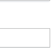

Excluded  0

|  Create new item   |
|--------------------|

The position of the current configuration depends on the option you choose for a particular category. You can select the option for facets, boost items and boost rules in the Adaptive Search perspective, in the configuration area.

## Facets

A
Add facets

| After inherited   |
|-------------------|
| After inherited   |
| Before inherited  |
| Remove inherited  |

This is custom documentation. For more information, please visit the SAP Help Portal Facets, Boost Items, and Sorts You have the following options:

After inherited (ADD_AFTER): the conguration is added after all of the parent congurations. Before inherited (ADD_BEFORE): the conguration is merged before all of the parent congurations. Remove inherited (REPLACE): the conguration replaces all the parent congurations.

## Boost Rules

The boost rules have only two options:
Keep inherited (ADD): current items are added to parent conguration. Remove inherited (REPLACE): current conguration replaces the parent conguration.

Unlike facets and boost items, boost rules are stacked upon each other. You can only add more boost rules to the inherited ones. Rearranging their order is possible but does not affect the result in any way.

## Default Options

If no option is dened straightforward, it's set according to the following default values dened in the project.properties le in the adaptivesearch extension:
adaptivesearch.merge.facets.default=ADD_AFTER
This is   For more    the SAP Help  6

adaptivesearch.merge.boostitems.default=ADD_AFTER
adaptivesearch.merge.boostrules.default=ADD
adaptivesearch.merge.sorts.default=ADD_AFTER

## Search Proles In An Activation Set

Activation sets are used to activate the search proles you dene. To see your settings on the storefront, activate the search prole by creating an activation set. Activation sets are listed in Backoffice Administration Cockpit under System Search and Navigation Search Prole Activation Sets . You can view and manage search proles in an activation set under Conguration tab. An activation set can include more than one prole. There can be simple proles with just one conguration or several category aware congurations. In that case, the search proles on the activation set are merged. If any category aware prole is present, its categories are internally merged rst. The proles are then merged with each other according to the activation list order. The nal result you see on the storefront includes a combined setting according to priority rules. For more details on prole activation, see Activate Search Proles.

The proles are combined according to the merging option set for the Global category, regardless of the option you've selected for the child categories.

For category aware proles, the merging happens as follows:

Prole 1 is merged internally according to the options set for each category.

Prole 2 is merged in the same way. Proles are merged according to the Global category.
This means that the categories from two different proles are also merged but according to the global category settings.

The proles shown in this example have different settings but are active at the same time, which results in a combination of the two being displayed on the storefront. To see how it works, see Adaptive Search in Practice.

## Search Proles In Personalization

Search Proles can be assigned to specc target groups to personalize the search settings depending on the user visiting the storefront. The gure explains how the Customizations and Target Groups work and how are the search proles combined before being displayed on the storefront:

Two customizations have target groups. Each target group has some search proles assigned. The proles for the Summer Campaign are in an activation set so will be combined into one result (see also Search Proles in an Activation Set). The Search Prole will be added to this combination, provided that both Customizations are active.

If there are more than one customization, the results for each of the customizations are combined together using only the add after option, regardless of what is set for the global category of the prole. For details, see Priority in Customizations and Variations For the same reason, if the same settings are dened for subsequent search proles (for example the same facets dened for Sunglasses and Burton items) the settings of the preceding search prole won't be overridden.

## Adaptive Search Perspective

The Adaptive Search perspective allows you to create search proles with customized search congurations including facets and boosts to make searching more effective. The Adaptive Search perspective is divided into several areas to help you create and congure your search prole in a userfriendly way. Before you start working with the perspective learn more about its features by reading Adaptive Search Perspective Features. Once you feel accustomed to the perspetive, it's time to get to work:
Create simple and category aware search proles within a selected navigation context: Dene Search Proles.

Dene the facet conguration by creating default, promoted and excluded facets: Facet Conguration Boost or bury selected items: Boosting Individual Items
Create and apply boost rules to promote more than item at a time: Boosts Conguration.

You can always have a look at the full user journey: Adaptive Search in Practice.

## Access Adaptive Search Perspective

This is   For more    the SAP Help  9 Access the Adaptive Search perspective to start using the features.

## Prerequisites

Anyone can access the Adaptive Search perspective, but to use the features provided, you must be assigned to the searchmanagergroup group

## Context

Perform the following steps to access the Adaptive Search perspective.

1. Log in to the Backoffice Administration Cockpit 2. Select the Adaptive Search perspective from the dropdown list.

## Results

You can now start working with the perspective. To read more about the perspective features go to Adaptive Search Perspective Features.

## Adaptive Search Perspective Features

The Adaptive Search Perspective provides the following features:
Navigation Context The navigation context area gives you information about the current context you are working in the Adaptive Search perspective. Categories Navigate through the categories and congure the search settings for them. Search Prole Context The categories you browse through are organized in a hierarchical order and create a specic search context. Search Bar and Results List Use the search bar to easily browse through the conguration results. Search Prole Conguration Area The conguration area allows you to dene the settings for facets, facet values, boost items, boost rules and sorts.

## Navigation Context

The navigation context area gives you information about the current context you are working in the Adaptive Search perspective. The navigation context area looks as follows:

 In this area you can dene the following items:

Index Conguration: allows you to choose the index conguration you have dened using the Backoffice Administration Cockpit. For details on how to create and manage an index conguration see Dene Search and Indexer Conguration.

Indexed Type: allows you to select a partithe selection of items for this eld is narrowed down based on the index conguration chosen. For details on how to create and manage an index conguration see Create and Congure Indexed Types. Catalog Version: this eld is lled in automatically, based on the index conguration chosen. Search Prole: the search prole you have created and activate. We can distinguish two search prole types:
Simple Search Pole, where the search conguration is dened only at the global level, no matter which category you are browsing, Category Aware Search Prole, where you can dene a separate conguration for each category. The categories are then merged together according to a chosen merging option.
Once a prole is selected, the navigation context is collapsed. You can see the current context in the Search Prole Context area. For details on managing the search proles see Search Proles.

The navigation context is not set by default when you access the Adaptive Search Perspective for the rst time.

## Categories

Navigate through the categories and congure the search settings for them. The categories panel is used to navigate through the available categories and dene the congurations for them.

 The categories are marked in the following way:
The number indicates categories with congurations. It includes the congurations on the parent category and the child categories.t The slider indicates that the category has been congured.

If you congure a category and want to remove the conguration, use the button. If you remove the settings manually, the category will still be marked as congured.

If you are working with a simple search prole you can only dene a conguration at the global level, regardless of the chosen category. If you are working with a category aware prole, you can dene a conguration for each category. For details on the search proles, see Dene Search Proles. The full category path is also displayed in the search bar.

## Search Prole Context

The categories you browse through are organized in a hierarchical order and create a specic search context. It may however happen that one category has more than one parent category, which results in having two different category paths. Before you move to the examples, let's differentiate between a category path and a category merging path. The category path lists all the parents of a selected category and usually so does the category merging path. However, if a category has more than one parent (like the one above) the merging path takes them all into consideration, creating a longer path. You can see both paths at the top of the adaptive search perspective:
This is   For more    the SAP Help  12 The Search prole context lists all the categories to be merged whereas search in category shows the path of the category you are currently browsing. To get to know how the system comes up with a search prole context path, have a look at the examples below:

As you can notice, category paths for the Sunglasses category differ when it comes to the parent categories.
Global Collections Sunglasses Global Categories Clothes Sunglasses
Knowing the parent categories of a selected category is essential to know which categories are to be merged to produce the overall result on the storefront. The interface is used to dene the category merging path.

/** * Implementations of this interface should build the category path. */ @FunctionalInterface public interface { /** * Returns the category path. * * @param searchQuery * - the search query * @param catalogVersions * - the catalog versions *
This is   For more    the SAP Help  13

 * @return the category path */ List<CategoryModel> resolveCategoryPath(SearchQuery searchQuery, List<CatalogVersionModel> cata }
The default implementation of the interface collects all the parent category congurations set for a specic catalog version and returns the category path in a form of a at list, so that all the parent congurations are included. The diagram below shows you that there can be two possible category merging paths:
Path 1: Global Collections Categories Clothes Suglasses Path 2: Global Categories Clothes Sunglasses

At this moment, the merging path is chosen by the system. To avoid confusion, the search prole conguration for a specic category is at this point always the same even if it has more than one parent. For example for Sunglasses the merging path is always Global Collections Categories Clothes Sunglasses no matter, which category path is selected by the user in the Categories area.

## Search Bar And Results List

Use the search bar to easily browse through the conguration results. You can use the search bar to browse through the results for a particuar category.

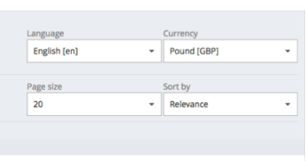

The results list shows you items included in a selected category. At the top you can see the promoted items (as well as promoted items inherited from the parent categories).

## Search Prole Conguration Area

The conguration area allows you to dene the settings for facets, facet values, boost items, boost rules and sorts. The Conguration Area provides you with the following options:

Facets: create, promote and exclude the facets as well as to apply a chosen merging option for the category. For details
facet conguration see Facet Conguration.

Boosts: create the boost rules and promote and exclude individual items. For details see Boosts Conguration and Boosting Individual Items. Sorts: create sorts to sort the result on the storefront. For details see Sorts Conguration. Group: create item groupings. For details see Grouping Conguration.

## Adaptive Search Icons Reference

The category-aware proles assume the inheritance of the settings between the parent and child congurations. The icons help you to easily distinguish between the different congurations and conguration relations. The gure below presents a sample conguration along with the icons. The meaning of the icons is described in the table.

FACETS
BOSTS
SORTS

## Facets

»

| Add facets      |       |     |
|-----------------|-------|-----|
| After inherited | p     |     |
| Promoted 0      |       |     |
| b               | Price | ..  |
| b               | Size  | 000 |
| Create new item |       |     |
| 4               |       |     |

| Default 0                                                               | 100             | 00   |     |
|-------------------------------------------------------------------------|-----------------|------|-----|
| b                                                                       | Brand           | 100  | 000 |
| b                                                                       | Category        |      |     |
| b                                                                       | Stvle           | 100  | 00  |
| t                                                                       | Create new item |      |     |
| Excluded  0                                                             |                 |      |     |
| Collection                                                              | 00              |      |     |
| S                                                                       |                 |      |     |
| S                                                                       | Colour          | 000  |     |
| t                                                                       | Create new item |      |     |
| lcon                                                                    | Description     |      |     |
| A promoted facet or boost item. The icon is also present on the         |                 |      |     |
| result list if an item was promoted.                                    |                 |      |     |
| The promoted configuration was inherited from the parent category.      |                 |      |     |
| This icon is also present on the result list if the configuration for a |                 |      |     |
| promoted boost item was inherited.                                      |                 |      |     |
| The parent configuration for a promoted facet or a boost item was       |                 |      |     |
| overridden by the current category settings. The icon is also           |                 |      |     |
| present on the result list if the inherited settings were overridden.   |                 |      |     |

| 7/11/2024 Icon   | Description A facet conguration dened outside the Adaptive Search was overriden and then promoted. A default facet. A default facet dened outside Adaptive Search (for example as part of the search and navigation default settings). A default facet inherited from the parent category. A facet conguration dened outside Adaptive Search was overridden by the current category conguration. An inherited facet conguration overridden by the current category conguration. A shaded facet or boost value means that the facet or boost does not apply to a selected category items. For example if a category does not a color value dened, the color facet will be shaded. An excluded facet or boost item. An inherited conguration for an excluded facet or boost item. An inherited conguration for an excluded facet or boost item overridden by the current category conguration. A facet conguration dened outside Adaptive Search was overriden and then excluded.   |
|------------------|-----------------------------------------------------------------------------------------------------------------------------------------------------------------------------------------------------------------------------------------------------------------------------------------------------------------------------------------------------------------------------------------------------------------------------------------------------------------------------------------------------------------------------------------------------------------------------------------------------------------------------------------------------------------------------------------------------------------------------------------------------------------------------------------------------------------------------------------------------------------------------------------------------------------------------------------------------------------------------------|

The values next to each default facet describe their priority and help you to establish the facet order. For details see Default Facets Priority.

## Dene Search Proles

A search prole holds facet and boost settings that create a search conguration. In order to dene your search conguration, you need to rst create a search prole. Without the prole created you cannot see the conguration areas for facets and boosts. Have a look at the Navigation Context area in which you can dene your prole.

The prole is always created in the navigation context of a specied index conguration, type and catalog version. For more information on the navigation context see Navigation Context.

## Creating A Simple Search Prole Context

Learn how to create a simple search prole.

1. In the Adaptive Search perspective go to Navigation Context and set it to the one you want to create your prole in.

2. Click Create new Search Prole and select Simple Search Prole.

A new window appears.

3. Provide the values for the elds.

Code: A unique code for your prole. Name: A chosen name for your prole (doesn't have to be unique)
4. Click Done to nish.

Your prole is added to the list. You can now select it.

## Creating A Category Aware Search Prole

Creating a category aware search prole looks almost the same as in the case of the simple search prole. To complete process go through the steps above, selecting Category Aware Search Prole in step 2. Once your Search Prole is created you can congure it easily by adding facets, boost items and boost rules. Learn more about the the options in Search Proles Conguration.

## Search Proles Conguration

Use the Adaptive Search Perspective to easily congure your search proles by managing facets, boosts and sorts. The Adaptive Search Perspective equips you with tools to effectively manage your search settings within a selected search prole. Click on the links below to get to know more about the options for facet and boost conguration.

Facet Conguration The facets conguration area helps you to easily create new facets, promote or exclude them as well as apply the merging option of your choice. Facet Values Conguration The ability to see and congure the facet values is useful when you want to promote or exclude not only the facet itself, but also the specic values (for example promote specic brands under the Brand facet). Boosts Conguration Create boost rules and boost items to promote single items and broader context such as for example a product range or a campaign.

This is   For more    the SAP Help  19 Sorts Conguration Solr sorts help you to sort the search results on the storefront according to dened sorting conditions. Grouping Conguration Grouping allows you to combine products based on a selected property. The search results return all products that match the selected property. Synchronize Search Proles Search proles are catalog version aware, to allow you working with a staged catalog for future purposes, for example for when planning a campaign. TheBackoffice Administration Cockpit enables you to easily synchronize selected search proles to make the information from the staged catalog available in the online one. Activate Search Proles Newly created search proles are not active by default, which means you cannot see your settings on the storefront. To allow your search proles to work and merge you need to create an activation list.

## Facet Conguration

The facets conguration area helps you to easily create new facets, promote or exclude them as well as apply the merging option of your choice. Look at the gure to check the facet conguration options:
FACETS
»
Add facets

| After inherited       |                     |          |     |     |
|-----------------------|---------------------|----------|-----|-----|
| Promoted 0            |                     |          |     |     |
| l                     | ★                   | Stores   | 000 |     |
| ★                     | Collection          | a        | 000 |     |
| l                     | ✔ Collections (350) |          |     |     |
| ✔ Surf (350)          |                     |          |     |     |
| ✔ T-Shirts (350)      |                     |          |     |     |
| T-Shirts men  (184)   |                     |          |     |     |
| T-Shirts youth  (101) |                     |          |     |     |
| Kids (101)            |                     |          |     |     |
| T-Shirts women  (65)  |                     |          |     |     |
| +                     | Create new item     |          |     |     |
| Default               | 4000                |          |     |     |
| p                     | (F)                 | Price    | 000 |     |
| l                     | (F)                 | Category | 100 | 000 |
| v                     | F                   | Size     | 100 | 000 |
| l                     | Brand               | 100      | 000 |     |
| F                     |                     |          |     |     |
| Create new item       |                     |          |     |     |
| +                     |                     |          |     |     |

 

Excluded 0 S
Style
+
 Create new item For the meaning of the icons, see Adaptive Search Icons Reference

| ltem                                                                                 | Name                                                                                      | Description   |
|--------------------------------------------------------------------------------------|-------------------------------------------------------------------------------------------|---------------|
| Add Facets                                                                           | options you choose among to add your category configuration before or after the inherited |               |
| 1                                                                                    | one, or to replace the inherited configuration.                                           |               |
| This is custom documentation. For more information, please visit the SAP Help Portal |                                                                                           |               |

21

| Item   | Name            | Description                                                                                                                                    |
|--------|-----------------|------------------------------------------------------------------------------------------------------------------------------------------------|
| 2      | Promoted Facets | a list of promoted facets to be displayed at the top of the facet list.                                                                        |
| 3      | Default Facets  | a list of facets dened for the conguration. You can reorder the facets using the values on the right. For details see Default Facets Priority. |
| 4      | Excluded Facets | a list of facets removed from the default list; not visible at the storefront.                                                                 |

Even if you haven't congured anything yet, there might be some facets present among the default ones. These are the facets dened in the Search Query Templates. If you don't want to see them, you can disable them as facets in the template.

Each facet can be expanded to display a list of facet values that can be promoted or excluded. For details, see Facet Values Conguration.

## Facet Types And Settings

When creating new facets you have three possible types to choose from:
Rene meaning that you can select one facet value only and if the item matches this value, it will be displayed.

Multiselect AND meaning that you can select one or more facet values and if the item matches all of them it will be displayed. Multiselect OR meaning that you can select one or more facet values at the same time and if the item matches any of them it will be displayed.
For details on creating facets see Adding Facets.

## Combining Inherited And Current Settings By Merging Categories

Depending on the option chosen, the category conguration for may be added after the parent category conguration, precede it or replace it (in such a way the settings for the parent category will be discarded). You have the following options to choose from:
after inherited

before inherited remove inherited
When you try switching a merging option to a different one, your choice will be reected in the list and on the storefront. For details on how merging options work, see Congurations within a Search Prole

## Default Facets Priority

The facets in the default facet list are listed according to priority determined by the numeric values. The priority helps you to organize your default facet list by rearranging the order.

The list includes both the inherited and the current configuration values. If you have several facets with the same priority on your list, their order is governed according to the merging option you choose. The example shows you that if you choose to add the new facets before inherited, and they all have the same priority, the new ones will be moved up. The inherited one at the top is first because of the higher priority defined for it.

The order is refleced on the storefront.

You can easily change the priority value using the inline editor. Click the value to change it, as shown below:

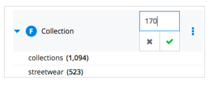

## Adding Facets

## Prerequisites

You have already created a search prole.

## Context

The wizard you can use to create facets is the same for promoted, default, and excluded facets. Follow the steps to create a default facet.

1. In the Adaptive Search Perspective go to Facets and create a Global category facet.

You can see a three lists of facets: promoted, default, and excluded. The wizards used to create new items are similar, so let's take an example of a default facet.

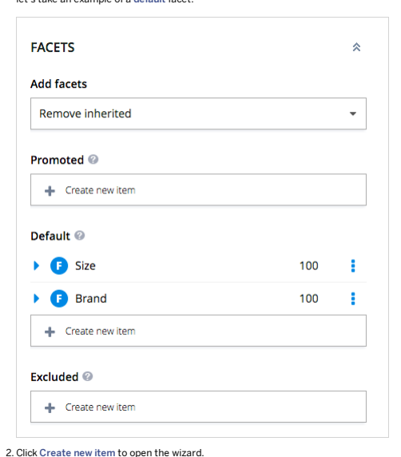

3. Let's create a default facet for Size. In the Essentials section ll in the elds as shown below.

## Create New Facet

X
ESSENTIAL
All required fields OPTIONAL
 Optional fields

| Index Property:   |
|-------------------|

size Facet Type:
Refine CANCEL
NEXT
DONE
o Index Property: index property the facet is created for. In this case, it is size.

o Facet Type: the type of the facet. It can be Refine, Multiselect OR, Multiselect AND.

4. Click Next to proceed. You can also finish defining the facet at this point and exit the wizard by clicking Done. 5. In the Optional section, you can define additional settings for your facet.

## Create New Facet

X
ESSENTIAL
 OPTIONAL
All required fields Optional fields Priority:
100

| Facet Values Sort Provider: 😊   |
|----------------------------------|
| Sort by displayed name           |

| Facet Values Display Name Provider:  Ø   |
|------------------------------------------|

Facet Top Values Provider:  Ø
defaultTopValuesProvider BACK

| CANCEL   |
|----------|

DONE

Value Providers for facet values provide additional settings:
o Facet Values Sort Provider: defines how the facets should be sorted, for example by displayed name or by numeric value.

This is custom documentation. For more information, please visit the SAP Help Portal Facet Values Display Name Provider: denes how the facet names should be displayed. If the display name provider is not selected the code will be displayed. Facet Top Values Provider: selects the top facet values to be displayed.

6. Click Done to nish.

The facet is now available on the list. Its default priority is 100, but you can change it to move the facet up and down the list.

7. Go to https://apparel-uk.local:9002/yacceleratorstorefront/en/ and check the facet.

8. Add more facets, for example for Price and Category.

## Results

You have created a facet conguration for a category. For details on managing the existing facets, see Managing Facets.

## Managing Facets

You can easily manage you facets by rearranging their order, promoting, or excluding them.

Open this video in a new window

## Ordering Default Facets

Use the priority values to reorder the default facets on the list. If there are more facets with the same priority, use the Move up | and | Move down | options to rearrange them.

## Menu Options

Use the options available in the menu to manage the facets.

## I Note

Available options may vary depending on factors such as facet type, inheritance, and priority.

This is custom documentation. For more information, please visit the SAP Help Portal FACETS

BOSTS

SORTS
Category 00 Create new item 

| Default 0                                               |                                                                   |       |
|---------------------------------------------------------|-------------------------------------------------------------------|-------|
| Stores                                                  | 10000                                                             | 00000 |
| Price                                                   | 4000                                                              |       |
| b                                                       | 2500                                                              | 000   |
| b                                                       | Colour                                                            |       |
| [categoryP…                                             | 100                                                               |       |
| Size                                                    | Edit                                                              |       |
| Collection                                              | Promote                                                           |       |
| Brand                                                   | Exclude                                                           |       |
| Create new item                                         | Move Up                                                           |       |
| Move Down                                               |                                                                   |       |
| Excluded 0                                              | Discard override                                                  |       |
| 0 Style                                                 |                                                                   |       |
| Facet Type                                              | Menu Options                                                      |       |
| Inherited                                               | Override (overrides the inherited configuration by creating a new |       |
| one using the parent settings)                          |                                                                   |       |
| Promoted                                                | - Edit (change the facet details and work with the facet          |       |
| values - for details, see Facet Values Configuration)   |                                                                   |       |
| - Set as default                                        |                                                                   |       |
| - Remove: for the newly created facet                   |                                                                   |       |
| - Discard override: (for promoted facets, which were    |                                                                   |       |
| inherited and then overridden)                          |                                                                   |       |
| Default                                                 | - Edit                                                            |       |
| - Promote                                               |                                                                   |       |
| - Exclude                                               |                                                                   |       |
| - Move up (for default facets with the same priority)   |                                                                   |       |
| - Move down (for default facets with the same priority) |                                                                   |       |
| - Remove                                                |                                                                   |       |
| - Discard override                                      |                                                                   |       |

| 7/11/2024 Facet Type   | Menu Options                                |
|------------------------|---------------------------------------------|
| Excluded               | Edit Set as default Remove Discard override |

## Facet Values Conguration

The ability to see and congure the facet values is useful when you want to promote or exclude not only the facet itself, but also the specic values (for example promote specic brands under the Brand facet).

## What Are Facet Values?

Facet values are the specic values available for each facet. For example, the Brand facet has facet values like Burton, Vans, Billabong. You can view and congure the facet values in the Adaptive Search Perspective.

 Similarly to the facets, facet values can be:
Promoted

Default
Excluded For details on the icons, see Adaptive Search Icons Reference.

## How Do Facet Values Behave Depending On Search Prole Types

Facet values behave in the following way:
Simple Prole: facet values are promoted/excluded globally - regardless of the category they were dened for. Category Aware Prole: you can promote/exclude the facet values for each category separately.

Facet values do not merge between the categories like facets. In case two proles are merged according to the order on the activation list (see Activate Search Proles), and both proles have facet values set for the same category, the conguration from the last prole on the list overrides the congurations above.

## Facet Values For Multiselect And Rene Facets

Depending on the facet type dened, the selected facet values behave differently:

For the Rene type of facet, the list of facet values is limited upon each click to narrow down the results, for example if you click the Accessories facet value, the list of facet values will be narrowed down to different accessory types. For the Multiselect facet type, you can choose several facet values linked with either OR or AND operator.

## Filtering Facet Values

The Adaptive Search perspective gives you the preview of how the facet values behave on the storefront. The search results for each facet value can be easily ltered out by selecting specic facet values. You can select couple of facet values at the same time and the number of applied lters will be displayed at the top, next to the facet. To disable the selection, click the facet value again or use the Remove Filters option from the menu to remove all the lters.

 While using the lters, be aware of the following behavior:

Applying lters on the facet values affects the number of default values available for selection. If you apply some lters to a selected facet, the list of default facet values available to promote or exclude may also get limited. This behavior
This is   For more    the SAP Help  30

2. As a result, the Brand facet has a limited list of default facet values, since these are the brands avaiable for the two categories. Unless the filters are removed, you can only promote or exclude these facet values for the Brand facet.

- Facet values are created based on their code, and their name is displayed with the help of the display name provider. If you promote a couple of facet values and save them you will see the proper names. However, when you apply the filters and want to edit the facet values again, be aware that some of the names may be changed to the codes. It's because the values are not included in Solr response, and the value provider is not applied. The codes are enclosed in brackets.

FACET CONFIGURATION
FACET VALUES
ADMINISTRATION
Promoted Values
[250000]
Snowwear women (157)

| [250100]   |
|------------|

Create new Promoted Facet Value

## Managing Facet Values

Use the dedicated Facet Values tab to define the order of the facet values.

FACET CONFIGURATION
 FACET VALUES 
ADMINISTRATION
CONFIGURE
&
Facet Values Display Name Provider ©
Facet Values Sort Provider ©

| -                           |    |
|-----------------------------|----|
| Facet Top Values Provider © |    |
| defaultTopValuesProvider    | P  |

Sort by displayed name VALUES ON STOREFRONT
»
Promoted Values

| Burton                            |
|-----------------------------------|
| Billabong                         |
| → Create new Promoted Facet Value |

Excluded Values Volcom
→ Create new Excluded Facet Value 1 1. Configure: the facet values providers available here apply to the entire list, and you can use them to define the appearance and number of the facet values. The facet display name provider is set by default to avoid displaying the code instead of the name for items whose names differ depending on the language.

| Facet Values with Display Name Provider   |  Facet Values without Display Name Provider   |               |
|-------------------------------------------|-----------------------------------------------|---------------|
| -                                         | :                                             |               |
| * Category                                | ..                                            | clothes (438) |
| Clothes (438)                             | tshirts (308)                                 |               |
| T-Shirts (308)                            | 250000 (248)                                  |               |
| Streetwear men  (248)                     | 20100 (173)                                   |               |
| T-Shirts men  (173)                       | 20000 (140)                                   |               |
| Snowwear women  (140)                     | 20000 (134)                                   |               |
| Accessories (134)                         | 190000 (119)                                  |               |
| Snowwear men  (119)                       | 270000 (111)                                  |               |
| Streetwear youth  (111)                   | 200100 (88)                                   |               |
| Snow Jackets women  (88)                  |                                               |               |

2. Values on the storefront: here you can directly promote or exclude selected facet values directly from the default facet values list. For details and instructions see:
This is custom documentation. For more information, please visit the SAP Help Portal Manage Facet Values Using Wizards

## Next Steps

For managing options for facet values see:

## Manage Facet Values Using Default List Prerequisites

Facet values can be promoted or excluded to establish their order on the storefront or hide them if not needed or desired. Use the Edit option to promote or exclude a facet value.

This is the recommended way of managing facet values. For an alternative way, see Manage Facet Values Using Wizards.

## Context

Promoting the facet values gives you the opprotunity to establish the order for the values, so you can draw the user's attention to the specic values.

1. Select a prole using the Navigation Context.

2. Navigate to Facets tab. 3. Select the facet you want to dene the values for. 4. Click Edit in the menu on the right.

CONFIGURATION

Add facets

Atter inherited Promoted 0 b 太 Burton (279)
Billabong (209)
Volcom (145)
Vans (60)
DC (58)
Show more…
 Create new item

5. In the new dialog go to Facet Values tab.

ADMINISTRATION
FACET CONFIGURATION
FACET VALUES
CONFIGURE
 Facet Values Display Name Provider Facet Values Sort Provider ©
Sort by displayed name Facet Top Values Provider ©
defaultTopValuesProvider VALUES ON STOREFRONT
Promoted Values Burton Billabong

| Volcom   |
|----------|

→ Create new Promoted Facet Value Excluded Values
→ Create new Excluded Facet Value 6. Go to the Default Values section.

7. Use the Promote action from the menu.

This is custom documentation. For more information, please visit the SAP Help Portal

| Set as Default   |
|------------------|
| Remove Filters   |
| Discard override |

The value is added to the promoted values list. If you added more than one facet value, you can rearrange them by dragging and dropping the items.

If the facet is of Rene type, the number of default values available for selection depends on the lters applied for the facet. If you select a couple of lters to limited the results, the list of the default facet values will also get shorter to include only the ltering results. If the facet values list was narrowed down to the point of showing the lters only, there will not be any default facet values available for selection. This rule does not apply to the mulitselect facets.

Facet values are created based on their code, and displayed with the help of the display name provider. If you promote a couple of facet values and save them everything works ne until the lters are selected. However, when you apply the lters want to edit the facet values again, be aware that some of the names may be changed to the codes. It's because the values do not come from Solr, and the value provider is not applied.

8. Click Save to nish.

## Manage Facet Values Using Wizards Context

You can use the alternative way to promote or exclude facet values, however it is not highly recommended.

1. Select a prole using the Navigation Context.

2. Navigate to Facets tab. 3. Select the facet you want to dene the values for. 4. Click Edit in the menu on the right. 5. In the new dialog go to Facet Values tab. 6. Click Create new Promoted Facet Value or Create new Excluded Facet Value . 7. Enter the code of the facet value in the dialog.

It needs to be the code not the name of the facet value, since the name may differ depending on the language. Hover over the facet value to get to know the code.

The facet value is added to the list of promoted or excluded facet values.

## Boosts Conguration

Create boost rules and boost items to promote single items and broader context such as for example a product range or a campaign. Thanks to boost rules, you can promote many items at a time, such as an entire category or a brand, using a wizard. Boost rules are available in the conguration area, next to facets and boost items.

FACETS
BOOST RULES
<<

## Boost Rules

Boost rules are used to promote all items that are attributed to a selected index property, for example all items beloning to one brand. The boost rules work according to the following rules:

- For simple profiles the settings are defined globally so the Add boost rules setting is ignored.

- For category aware profiles the boost rules are stacked one upon another (unlike facets and boost items that are merged with each other according to a merging strategy chosen). You can decide for each category to keep or remove the inherited boost rules.
For details on creating boost rules, see Create Boost Rules .

## Boost Items

In the boost items section you can promote and exclude single items. For details, see Boosting Individual Items.

## Create Boost Rules

Learn how to create and manage boost rules using the Adaptive Search perspective.

## Prerequisites

You have created a search prole.

## Context

Perform the following steps to add a boost rule for a specic brand.

## Procedure

Open this video in a new window 1. In the Adaptive Search perspective navigate to the Boost Rules tab in the conguration area.

2. Click Create new item to open the wizard.

## Create New Boost Rule

X

| ESSENTIAL           | ESSENTIAL           |
|---------------------|---------------------|
| All required fields | All required fields |
| Index Property:     |                     |
| brandName           |                     |

| CANCEL   | NEXT   |
|----------|--------|

Select the Index Property you want to create the rule for. In our example it is brandName .

3. Click Next to proceed.

4. Fill in the remaining mandatory fields.

## Create New Boost Rule

X

| ESSENTIAL           | ESSENTIAL           |      |
|---------------------|---------------------|------|
| All required fields | All required fields |      |
| Index Property:     |                     |      |
| brandName           |                     |      |
| Operator:           |                     |      |
| Matches             |                     |      |
| Value:  0           |                     |      |
| Burton              |                     |      |
| Boost Type: �       |                     |      |
| Multiplicative      |                     |      |
| Boost: 0            |                     |      |
| 2.00                |                     |      |
| BACK                | CANCEL              | DONE |

o Operator: depending on the rule, it can be matches for text values or an arithmetic operator for numeric values.

o Value: the index property value. In this example it is Burton, standing for the brand name.

o Boost Type: here you can choose between Multiplicative and Additive type. Let's choose Multiplicative . o Boost: the value the selected index property is boosted by. In this example, boost the value by 2.00.

This is custom documentation. For more information, please visit the SAP Help Portal 39 5. Click Done to nish.

Your new boost rule appears on the list. As you can see on the results lists, the items belonging to the Burton brand are boosted.

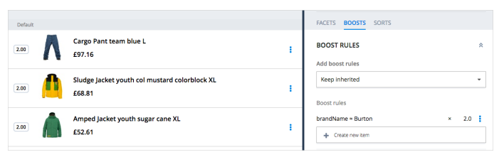

You can edit the boost rule details at any time, apart from the index property. Once a boost rule is created for a particular index property, it cannot be changed.

To remove a boost rule, use the Remove option from the menu.

## Results

Creating a boost rule for an index property brand makes it promoted among the results.

## Boosting Individual Items

Promote and exclude individual items with just a few clicks to make your items more visible or hidden away from the customer.

## Context

In addition to promoting several items at once, for example by promoting a brand or a collection, you can promote a specic item to make it more visible for the customer, or exclude it if it's out of stock. The Adaptive Search perspective allows you to boost or bury your items in the following ways:
1. Promote/exclude the items directly from the results.

2. Promote/exclude the items using dedicated wizards.

SAP Customer Experience

# Boosting A Single Item

Open this video in a new window
- To promote or exclude an item directly from the results list, use the menu on the right.

The item is automatically moved to the Promoted section of the results list and added to the list of Promoted boost items. Dragging and dropping feature and the menu options help you to rearrange the order of the items. You can also easily remove the item from the promoted list.

## I Note

You cannot rearrange the order between the inherited and current items. The position of inherited items depends on the merging option chosen.

Boosting Items using Wizards
.

 To use the wizard to add a promoted or excluded item, click the Create new item button to open the wizard and select the item you want to promote or exclude.

As a result, in addition to adding an entry to the boost item list, the promoted item appears in the promoted section of the results and the excluded item is removed from the list. When you log in to the storefront, you can also see the

Ordering and Highlighting the Promoted Items This is custom documentation. For more information, please visit the SAP Help Portal Edit the sort to show the boosted items always on top.

Promoted items follow the sorting rules. So even if they are promoted, it does not mean they always appear on top because they may be sorted, for example by name. To make sure that the boosted items are always on top, regardless of the sorting:
1. Go to Sorts on the menu on the right.

If you set the Highlight promoted items option to true, the items will be distinguished in Adaptive Search perspective and on the storefront.

## Sorts Conguration What Are Solr Sorts?

With the use of solr sorts you can sort the results according to price, name, relevance, and other depending on the sorts dened. You can dene the sorts in the Adaptive Search Perspective and use them directly on the storefront.

## Solr Sorts In Adaptive Search Vs Solr Sorts For Indexed Types

The Solr Sorts available for indexed types under System Search and Navigation Solr Facet Search Conguration Indexed Types Solr Sorts are default sorts available when you use the features provided by the Search and Navigation.

They are provided by default and available even if you do not use Adaptive Search. If you remove them from the list, they won't be available in Adaptive Search. The default sorts include:
Relevance

Top Rated Name (ascending order) Name (descending order) Price (ascending order) Price (descending order)
You can override each of them and dene your own settings. If you use Adaptive Search, the default sorts appear under the Sorts tab for each search prole. You can override them by creating new sorts with the same code.

This is   For more    the SAP Help  43

| 7/11/2024 Default Solr Sorts in Search and Navigation                                                                                                                                 | Solr Sorts in Adaptive Search                                                   |
|---------------------------------------------------------------------------------------------------------------------------------------------------------------------------------------|---------------------------------------------------------------------------------|
| Appear in Adaptive Search Perspective by default                                                                                                                                      | Can be created directly in Adaptive Search perspective separately for each      |
| and initially are the same for each prole.                                                                                                                                            | prole and category (if the prole is category aware).                            |
| Cannot be reordered among each other.                                                                                                                                                 | Can be reordered by dragging and dropping them.                                 |
| Can be overwritten when the solr sorts dened in                                                                                                                                       | Cannot be overwritten, it is impossible to create two sorts with the same code. |
| Adaptive Search have the same code.  Note The code for the default solr sort is not the same code as for the sorts created in Adaptive Search.Can be inherited among the categories. | Can be inherited among the categories.                                          |

## Solr Sorts In Adaptive Search

The Sorts tab in Adaptive Search allows you to create a set of sorts for your search proles:
Simple prole: created sorts are the same for all categories

Category aware prole: you can create a different set of sorts for each category, the categories are later on merged with each other to produce the nal result on the storefront.
For the meaning of the icons see Adaptive Search Icons Reference.

## Merging Sort Congurations For Categories And Proles

Similar to the facets solr sorts area has the following sections:

| Item   | Name           | Description                                                                                                                                                                                                                                                                   |
|--------|----------------|-------------------------------------------------------------------------------------------------------------------------------------------------------------------------------------------------------------------------------------------------------------------------------|
| 1      | Add Sorts      | options you choose among to add your category conguration before or after the inherited one, or to replace the inherited conguration.                                                                                                                                         |
| 2      | Promoted Sorts | a list of promoted sorts to be displayed at the top of the sort list.                                                                                                                                                                                                         |
| 3      | Default Sorts  | a list of default sorts dened for the conguration. You can prioritise the sorts using the values on the right, and move the sorts with the same priority using the menu options. In terms of merging, the sorts follow the same logic as the facets: Default Facets Priority. |
| 4      | Excluded Sorts | a list of sorts removed from the default list; not visible at the storefront.                                                                                                                                                                                                 |

This is   For more    the SAP Help  45 The sorts are merged together in the same way as facets. If the sorts are dened for a couple of categories, the settings are inherited from the parent prole to the child prole and the current settings are added to them according to the option chosen. For details, see Congurations within a Search Prole. For details on how to create solr sorts see Create Sorts.

## Create Sorts

The Sorts tab in Adaptive Search allows you to create a set of sorts for your search proles.

## Prerequisites

A category aware prole has already been created and selected in the Adaptive Search Perspective. A couple of default sorts are already present on the Sorts list.

## Context

Promoted, excluded and default sorts are created in the same way. As an example you are going to create a promoted sort.

1. Navigate to the Global category in the Categories tree.

2. Go to Sorts tab. 3. In the Promoted section, click Create new item .

Fill in the following elds:

| Item                     | Essential                                                                                                                                                                       | Description                                                                                     |
|--------------------------|---------------------------------------------------------------------------------------------------------------------------------------------------------------------------------|-------------------------------------------------------------------------------------------------|
| 1                        | Code                                                                                                                                                                            | an unique code for your sort. The code is displayed on the list of the sorts                    |
| Name                     | a chosen name for the sort. The name will be displayed on the storefront.                                                                                                       |                                                                                                 |
| Priority                 | the priority governing the order of the sorts. Visible only if the sort is set as default.                                                                                      |                                                                                                 |
| Sort Expressions         | a list of sort expressions used for sorting. See Step 4 for instructions on create a sort expression.                                                                           |                                                                                                 |
| 2                        | Show on Top                                                                                                                                                                     | if set to true, the promoted items are displayed at the top of the list, regardless of sorting. |
| Highlight Promoted Items | if set to true, promoted items are highlighted.  Note If show on top attribute is set to false, the items are still highligted even if place in the middle of the result list. |                                                                                                 |

## 4. Click Create New Sort Expression

Fill in the following elds:
Expression: the indexed property you want to create the sort for. Order: sorting order, ascending or descending.

## Create New Sort Expression

ESSENTIAL All required fields

| Expression:   |
|---------------|
| name          |
| Order:        |
| Ascending     |

CANCEL
 DONE
You can enter more than one field into the expression and it will work in the following way: If you add the name to the list first, and then for example the price, the items will be sorted by the name first and in case two or more items have the same name, they will be sorted by price.

## 5. Click Done To Finish.

The sort is now added to the list. It is listed by code, but the name is displayed on the storefront. You can edit it using the menu on the right.

## I Note

If there is a default sort present on the list and you create a sort with the same code, it will be overwritten.

6. If you want to change the order of the newly created sorts, simply drag and drop them.

7. Verify if the new sort is working by using the drop down above the search results list.

X
l'm looking for d BRANDS
STREETWEAR
SNOW
ACCESSORIES
YOUTH
HOME / CATEGORIES / ACCESSORIES

## Shop By Category

Beanies  (46) Belts  (27) Streetwear men  (27) Gloves  (26)
Snowwear men  (26) more categories…

## Shop By Price

£0-£19.99 (33) £20-£49.99 (104)
£50-£99.99 (1)

## Results

You have created a new sort. For managing options see Manage Sorts .

## Manage Sorts

To easily manage the sorts, use the menu on the right.

i Note Available options may vary depending on factors such as sort type, inheritance and priority.

| Sort Type          | Menu Options                                                                                                                                                                                                                         |
|--------------------|--------------------------------------------------------------------------------------------------------------------------------------------------------------------------------------------------------------------------------------|
| Inherited Promoted | Edit Set as default Remove: for the newly created sort Discard override: (for promoted sorts which were inherited and then overriden).Override (overrides the inherited conguration by creating a new one using the parent settings) |
| Default            | Edit Promote Exclude Move up (for default sorts with the same priority) Move down (for default sorts with the same priority) Remove Discard override                                                                                 |
| Excluded           | Edit Set as default Remove Discard override                                                                                                                                                                                          |

## Grouping Conguration

Grouping allows you to combine products based on a selected property. The search results return all products that match the selected property.

## How Does Grouping Work?

You can select to perform grouping for diverse products and/or similar products with their variants. Each product and its variants are treated as separate products by default. This results in each variant being displayed individually. However, you are able to change this display behaviour to group the variants. A common use case for variants is for a clothing storefront. You can set up grouping using the product ID or baseProductCode. When the customer clicks on any variant of the product ID, other variants will also be displayed. Customers can then scroll through each variant as they choose.

Grouping can be congured using a selected property, such as color. In this case all products that match that color property are returned. Results that are returned based on color may have very diverse product ID values.

## Grouping In Adaptive Search

Grouping works according to the following rules:

Simple proles: The settings are dened globally so the Replace setting on categories is ignored. The only exception is a Global category. In the Global category Inherit means that the old grouping that is congured in the Administration console, is still used. When Replace is set on the Global category then it will replace the old grouping. Category-aware proles: Groupings are either set or replaced because there can be only one active grouping set on the category. Categories can inherit or replace the grouping conguration from a parent category .
The Group Expression is a property that is not a TEXT property. The Group Limit denes the maximum item count in the

group.

The relevancy score is shown on the left and in this case it is 1.00. The value indicated in the blue bubble indicates how many items are grouped in that single result for that item.

## Synchronize Search Proles

Search proles are catalog version aware, to allow you working with a staged catalog for future purposes, for example for when planning a campaign. TheBackoffice Administration Cockpit enables you to easily synchronize selected search proles to make the information from the staged catalog available in the online one. Although the synchronization between the proles goes in one direction only (from staged to online), you can call the synchronization dialog on both catalogs. In such a case, the staged catalog is perceived by the system as the source, and the online catalog - as the target. The conrmation dialog provides you with the following information:

1. Proles to be synchronized.

2. Synchronization job to be executed. The icon on the right indicates if the prole is up to date ( ) or not yet synchronized ( ).

If you work just with the online prole without its staged counterpart, executing synchronization will result in removing the prole.

## Synchronize Search Proles In Adaptive Search Context

Perform the following steps to synchronize the prole congurations using the Adaptive Search perspective.

1. In the Search Prole Context and click the synchronization icon.

2. In the synchronization dialog, select the job (there is only on available). Click SYNC to perform synchronization. For details, see step 3 of the section above. The synchronization process is complete. Alternatively, you can double click the search prole in the naviagation context and use the button to synchronize the proles.

## Synchronize Search Proles In Backoffice Administration Cockpit

Context

1. In the Backoffice Administration Cockpit navigate to System Search and Navigation Search Proles On the right you can see the list of created proles along with their catalog version.

2. Select the prole you want to synchronize. Because the synchronization happens in one direction only, it does not matter if you choose a prole with a staged or online catalog version. An editor appears. To invoke the synchronization dialog, click the button.

3. In the synchronization dialog, select the synchronization job.

There is only one job available, due to the one directional nature of prole synchronization. Depending on the selected prole, the dialog includes either Pull from source or Push to target, however the executed process remains the same.

4. Click SYNC to synchronize the proles.

Synchronization is completed.

5. To conrm that the synchronization was successful navigate to the prole list.

If the proles were synchronized for the rst time, the Code and Name elds in the online version will be lled in with the values from the staged version.

6. Select a chosen prole and click the button.

You can see the icon next to the sync job.

## Check Synchronization Logs Context

To check the sychronization status of performed operation and see the logs, execute the described steps.

1. In the Adaptive Search Perspective, click the Processes icon. If there has been a process logged recently, there will be an orange dot next to it.

2. In the new window, you can check the progress of the operation. To display logs, click the Processes item on the right.

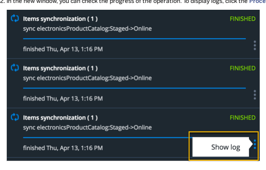

## Activate Search Proles

Newly created search proles are not active by default, which means you cannot see your settings on the storefront. To allow your search proles to work and merge you need to create an activation list.

## Prerequisites

You have already created some search proles. An activation set containing one online prole is available to you by default as part of sample data.

## Context

To activate Search Proles you need to create an activation set rst. Use the Backoffice Administration Cockpit to create the set and add the proles.

This is   For more    the SAP Help  55

## I Note

When a profile is activated using the activation set, the configuration is visible globally for all the users. If you want to activate a profile for a particular group of users, use personalization mode available in SmartEdit. For instructions, see Activate the Profile in Personalization Mode .

1. Navigate to | ⟩ System ⟩ Search and Navigation ⟩ Search Profile Activation Sets 〗. You can also use the search field to narrow down the results.

You can see the already created sets (if any) on the right.

2. To create a new Activation Set click the   -1-   button from the top menu.

A new window pops up. Provide the values for the fields.

## Create New Search Profile Activation Set

X
ESSENTIAL
All required fields

| Index Type:   |
|---------------|

| electronicsProductType   |
|--------------------------|

| Catalog Version:   |
|--------------------|

Electronics Product Catalog : Online CANCEL
 DONE
o Index Type: the index type you want to create the set for.

o Catalog Version: the catalog version you want to create the set for. The list is narrowed down once you select the index type.

3. Click Done to finish.

The set is added to the list. It is empty so you need to add the search profiles to it.

4. Click the newly created profile set.

An editor opens.

5. Go to the Details section.

i + - R
= E !!! 1 items Index Type Catalog Version electronicsProductType      Electronics Product Catalog : Online

6. Select the profile from the drop down menu or user the Reference Search window.

Only the proles that match the catalog and catalog version are available to choose from. If you choose the same catalog twice, the duplicate will be removed when saving.

The prole is added to the list.

7. Save your conguration by clicking Save.

8. If you have more search proles on the list you can easily change their priority by reordering in. Drag and drop the

proles to arrange them the way you want. The order in which the proles are added to the set denes their priority when it comes to merging. Read more about merging the proles and prole priority in Search Proles.
9. You can now view your prole settings on the storefront.

## Adaptive Search In Practice

A user journey through the adaptive search showing the functionality, conguration, and activation options.

The main goal of the scenario is to explore the features of adaptive search by creating, conguring, and activating the search proles. You will also have the possibility to check how the merging of the proles work in practice and to verify the conguration on the storefront. The diagram shows a simple scenario allowing you to smoothly go through the functionality Adaptive Search offers.

 The scenario includes the following proles and steps. They are independent, however we recommend to perform them in the described order to gain the full user experience.

If you wish to explore the Adaptive Search functionality but not necessarily create all the proles from scratch, you can use the sample data provided out of the box.

This is   For more    the SAP Help  58

## Scenario

| Get started with the basics    | Start with creating a default search prole to get acquainted with the basic adaptive search functionality. You can later on use it as a basic prole and just add more congurations on Top. Learn more about the search prole types, adding facets, boost values and boost items, and activate your prole. This will give you some ground for developing a campaign.   | Default Prole Conguration         |
|--------------------------------|-----------------------------------------------------------------------------------------------------------------------------------------------------------------------------------------------------------------------------------------------------------------------------------------------------------------------------------------------------------------------|-----------------------------------|
| Explore more by creating a     | The winter campaign prole                                                                                                                                                                                                                                                                                                                                             |                                   |
| campaign                       | shows you how to use a simple search prole to build a temporary campaign on top of the default prole you have already created. The prole is added to the activation set and as a result the customers may enjoy the winter campaign with a promoted winter collection and winter-related items.                                                                       | Winter Campaign Prole Conguration |
| Learn how to personalize the   | Thanks to functionality provided                                                                                                                                                                                                                                                                                                                                      |                                   |
| results for specic user groups | by SmartEdit, you can activate the search proles for a particular target group to give the customers even more personalized experience. The prole is activated on top of the previous conguration, but available only for the users belonging to a given target group. The regular users see the winter campaign.                                                     | Personalize Search Results        |

For presentation purposes, an online catalog version is used. It is however advised to use the staged prole and then synchronize it with the online version. Check the synchronization procedure details under: Synchronize Search Proles.

## Default Prole Conguration

In this step you will create a category aware search prole for the apparel storefront and add a search conguration.

## Recommendation

The search congurations for different categories are universal enough to treat this prole as a base for other proles, so you can easily add another prole on top of this default one to apply the campaign settings.

1. Start with creating and activating the prole: Create a Default Prole.

## Create A Default Prole Procedure

1. In the Adaptive Search perspective go to Navigation Context. For Index Conguration eld, select Apparel UK Solr Index from the drop-down list.

The Index Type and Catalog Version elds are lled in automatically.

2. In the Search Prole eld click Create new Search Prole. Select Category Aware Search Prole from the drop-down list. A wizard window pops up. Fill in the elds to add a unique Code and Name for your prole.

3. Click Done to nish.

Your prole is created but not active yet. Use the Backoffice Administration Cockpit to activate it.

4. In the Backoffice Administration Cockpit navigate to System Search and Navigation Search Prole Activation Sets
.

5. Use instructions in Activate Search Proles to create an Activation Set and activate your Default Search Prole.

While creating the Activation Set select apparel-ukProductType in the Index Type eld and Apparel Product Catalog: Online in the Catalog Version eld. Once you are done, the result should be as follows:

6. Visit the storefront at https://apparel-uk.local:9002/yacceleratorstorefront/en/.

At this point you can see some default settings coming from the search and navigation. Proceed with Congure the Default Prole to add a search conguration for your prole.

## Congure The Default Prole

Congure your default prole by adding facets and boost rules, as well as by promoting specic items. Because it is a category aware prole, you can dene a search conguration separately for each category. The congurations are inherited between the categories. You will rst dene settings for the global prole and then separately for one of the categories. Thanks to these tasks you will master the following:
how to create a list of facets and arrange their order,

how to promote a specic index property by creating a boost rule, how to promote individual items from the result list, how to create and manage sorts.
Use the links below to get to know more about dening search congurations for different categories.

Dene the Global Settings Dene the global settings for your default prole. Congure Category Settings Dene additional settings for a different category.

## Dene The Global Settings

Dene the global settings for your default prole.

For category aware proles, the Global category settings apply to all categories, but can be easily overwritten for each category. At this point you will create a global search conguration consisting of default facet settings and boost rules. You will also learn more about the sorts.

## Dene Default Facet Settings Context

Add the default facets to your search conguration.

For the purpose of clearer conguration, the sample facet settings were removed from the search query template. At any time you can set the facets back. For details, see Facet Settings.

1. In the Categories panel, navigate to the Global category.

2. Leave the default setting for Add facets eld. The selected option does not matter at this point, because it is the rst prole on the activation list and the Global setting is not used for merging.

3. Go to the Facets section. 4. In the Adaptive Search perspective go to the Facets tab. 5. In the Default section click Create new item to open a wizard.

Let's create a facet for a brand. In the Essential section in the elds as shown in the example:

 For the purpose of this task, we will use the Rene facet type, but you can settle for Multiselect as well.

6. Click Next to proceed.

| Create New Facet                                                                                                 | X               |      |
|------------------------------------------------------------------------------------------------------------------|-----------------|------|
| ESSENTIAL                                                                                                        | OPTIONAL        |      |
| All required fields                                                                                              | Optional fields |      |
| Priority:                                                                                                        |                 |      |
| 100                                                                                                              |                 |      |
| Facet Values Sort Provider: 😊                                                                                   |                 |      |
| Sort by displayed name                                                                                           |                 |      |
| Facet Values Display Name Provider:  Ø                                                                           |                 |      |
| Facet Top Values Provider:  Ø                                                                                    |                 |      |
| defaultTopValuesProvider                                                                                         |                 |      |
| BACK                                                                                                             | CANCEL          | DONE |
| Priority helps you to organize the default facet order. We want the brand to be the first, that's why it has the |                 |      |
| o                                                                                                                |                 |      |

priority of 140.

 Value providers help you to display the proper name for the facet values (if the name differs from the code), sort o them or limit their number.

7. Click Done to finish.

8. Add two more default facets: Price and Category. Remember to assign them the proper Priority values.

The result should be as follows:

## Promote Items With Boost Rules Context

Once you have the default facets in place, create a boost rule for the in stock items to make sure they appear first.

This is custom documentation. For more information, please visit the SAP Help Portal Procedure 1. Go to | ÞBoosts ⟩ Boost Rules    section.

2. Click Create new item to open the wizard.

3. In the Essential section, select the inStockFlag index property.

## Create New Boost Rule

X

| ESSENTIAL           | ESSENTIAL           |
|---------------------|---------------------|
| All required fields | All required fields |
| Index Property:     |                     |
| inStockFlag         | -                   |
| CANCEL              | NEXT                |

4. Click Next to proceed.

5. Provide additional values for your boost rule as shown in the figure:

## Create New Boost Rule

6. Click Done to finish.
You can notice in the result list that the in stock items were boosted.

## Ad Sorts

You can use different sorts to arrange the order of the items on the storefront. There are default sorts defined in Search and Navigation available in Adaptive Search out of the box, but you can easily override them and create your own.

X

| SORTS           |
|-----------------|
| Ad sorts        |
| After inherited |
| Promoted 0      |
| Create new item |
| +               |

Default 

| S Relevance           |                 |
|-----------------------|-----------------|
| Top Rated             |                 |
| Name (ascending)      |                 |
| Name (descending)     |                 |
| Price (lowest first)  |                 |
| Price (highest first) |                 |
| 4                     | Create new item |

Excluded  0

 Create new item

Just as the facets, you can promote and exclude the sorts as well as prioritize them. You can apply the sorts on the storefront bu also in Adaptive Search, when you want to preview the sorted results.

## Further Resources

- Facet Configuration

- Facet Values Configuration - Boosts Configuration - Sorts Configuration

## Configure Category Settings

Define additional settings for a different category.

If you navigate to the Categories category, you can see that the settings for facets and boost rules are inherited from the Global category.

FACETS

Add facets

| Atter inherited   |
|-------------------|
| Promoted 0        |
| Create new item   |

| Brand           |
|-----------------|
| Price           |
| Create new item |

To keep thinks simple, let's keep these settings in the configuration for Categories, but also let's promote specific items.

## Promote Specific Products With Boost Items Context

You have already promoted several items at once with the use of boost rules, time to promote specific items. The easiest way is to promote them right from the result list.

1. In the result list, find the item you want to promote and click the menu on the right.

2. Click Promote.

1.00

| Slip On Vans Classic Slip On checkerboard/black/pewter 7.0                                               |         |
|----------------------------------------------------------------------------------------------------------|---------|
| Comfy slip ons in subtle colours for understatement. With waffle rubber sole for good grip. Canvas upper | :       |
| £46.71                                                                                                   |         |
| T-Shirt Men Playboard Logo Tee irish green S                                                             |         |
| T-Shirt from Playboard with logo front print                                                             |         |
| £26.68                                                                                                   | Promote |
| Exclude                                                                                                  |         |
| T-Shirt Men Playboard Skull SS white XL                                                                  |         |
| T shirt with playboard skull logo on chest                                                               |         |
| £26.68                                                                                                   |         |

The item is moved to the Promoted section and also appears on the right.

3. Promote two more items. Your result should look similar to the following:

Boosted items follow the sorting applied. If the boosted items do not appear on top, check if the Show on Top flag is set to true for the sort you applied. If you want your promoted items highlighted, enable the Highlight Promoted option.

## Results

You have defined a search configuration with facets, boost rule and boosted items. Log in to  https://appareluk.local:9002/yacceleratorstorefront/en/ and navigate to|}Home ► Categories   The result should look as

## I Note

The configuration displayed on the storefront may differ depending on the chosen category. If the facet does not apply to a category, it won't be displayed. The same applies to boost items and rules.

In the next step, you will create a new campaign with winter items that you can apply on the top of the existing search profile:
Winter Campaign Profile Configuration .

## Winter Campaign Profile Configuration

Create and configure a winter campaign profile that can be activated on top of the basic profile.

Creating a Winter Campaign Prole Create a winter campaign prole to accommodate your search conguration. Conguring the Winter Campaign Prole Congure your winter campaign prole by reordering the facets and promoting the winter collection.

## Creating A Winter Campaign Prole

Create a winter campaign prole to accommodate your search conguration.

## Context

Follows the steps to create a - simple - Winter Campaign Prole. Creating a simple prole is similar to creating a categoryaware prole, because the only thing that differs is the prole type.

1. In Adaptive Search perspective, perform the steps from Create a Default Prole to create and activate the prole.

Remember to select the simple Prole type.

2. Use the instructions in Conguring the Winter Campaign Prole to congure the prole.

## Conguring The Winter Campaign Prole

Congure your winter campaign prole by reordering the facets and promoting the winter collection.

For simple proles, it doesn't matter which category you are browsing. If you create a conguration for a simple prole, it applies to all categories.

## Dening Facet Settings

Promote the Stores facet to make the search for the items available in stores a bit easier, as well as the Category facet, which will be used later on to promote the facet values.

1. Navigate to the Facets section.

2. Add the Stores facet with the priority of 150 to be sure it's on top. 3. Since this facet is the only one, the option chosen for Add facets does not matter that much. You can leave the default, After inherited value. The facet will still be placed at the top of the list.

4. By repeating the instructions from steps 1 to 3, add the Category facet with the priority of 170.

Your conguration should look as follows:

## Defining Facet Values

Promote specific facet values to make sure they are listed first. In this example we will promote specific categories.

1. Select Edit from the menu on the Category facet.

2. Go to Facet Values tab.

3. Go to Default list.

4. Look for Snowwear men and promote it using the Promote option from the menu. 5. In the same way as in Step 5, promote Snowwear women.

Your result should look as follows FACET CONFIGURATION
 FACET VALUES 
ADMINISTRATION

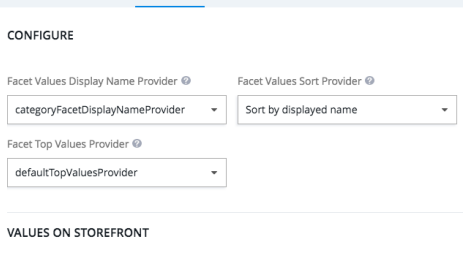

Excluded Values Create new Excluded Facet Value If you wish, you can change the order of the facet values by dragging and dropping them.

6. Save your configuration.

7. Come back to the main perspective and check the facet values. The promoted ones should be at the top.

## Define Boost Rules

With the proper boost rules in place, you can promote an entire collection of items. You can also influence the order in which the items from different categories appear in the results.

»

Procedure 1. Let's move to the boost rules. Go to Boosts Boost Rules section.

2. In the Add boost rules section select Keep inherited to keep the settings from the default prole and make sure the brand is still promoted.

3. Create a new boost rule for collectionName using the instructions in Promote Items with Boost Rules.

Use the following data:
Index Property: collectionName,

Operator: Matches, Value: Snow,
Boost Type: Multiplicative,

Boost: 1.50.

## Override Boost Rules

Override the existing boost rules to introduce your own.

1. To ignore the boost items from the previously congured default prole, select Remove inherited.

2. Add a couple of new promoted items (in our example we added two pairs of goggles) 3. Visit the storefront again.

## Results

The Winter Campaign is activated on the top of the default prole, so you can see how the changes are merged.

yellow: default search prole settings.

blue: winter campaign prole settings (they may overlap with the default prole).

## Personalize Search Results

You can activate the prole just for a specic group of users, making the search results personalized. Familiarity with personalization mode (for additional details, see Personalization Mode in SmartEdit). The customization and target group belongs to the sample data set available with SAP Commerce Cloud. Install the sample data to be able to use the customization or create your own customization using the instructions in Create a Customized Storefront. Let's assume you would like to have your Winter Campaign activated for your regular customers, but you would also to promote Burton brand for the customers you know are fans of it. The personalization mode available in SmartEdit gives you the opportunity to assign the already created search proles to particular target groups, such as for example Burton Lovers.

## Create Personalized Search Prole

In Adaptive Search perspective perform the steps from Create a Default Prole to create the prole. Remember to select the simple type.

Do not activate the prole using the standard activation set, since it will be activated in the personalization mode.

## Personalizing The Prole

Congure your personalized prole to target specic users.

Open this video in a new window 1. In the Facets section, create a promoted Brand facet. If you need additional instructions on creating facets, see how they were created for the default prole at Dene Default Facet Settings.

2. Click Edit to access the facet values settings. 3. Promote and Quiksilver, Vans, and DC brands and exclude Billabong. Save your settings. If you need additional instructions, see the facet values section in Conguring the Winter Campaign Prole. The result should look as follows:

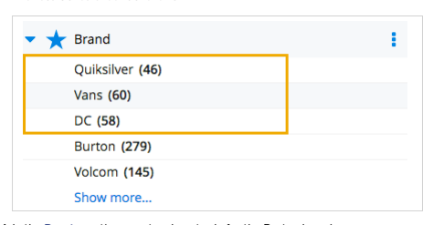

4. In the Boosts section, create a boost rule for the Burton brand.

Use the following data:
Index Property: brand,

Operator: Matches, Value: Burton, Boost Type: Multiplicative, Boost: 1.50.
The items from the Burton brand are promoted.

This is   For more    the SAP Help  74

# Activate The Profile In Personalization Mode

You can activate the profile just for a specific group of users, making the search results personalized.

1. In SmartEdit, navigate to ‖ Library ☭ Manage Library ‖ . This will give you access to customizations and target groups.

a. Commerce Customization Action: Allows you to select the action type. Currently two action types are supported:
Promotion and Search.

b. Search Prole: Appears when you select Search action type. Here you can choose the prole(s) you want to assign to a customization.

c. Manage and Prioritize Search Proles: Search proles are listed according to priority and merged and based on the rules dened for the Global category level in Adaptive Search (for details on merging and priority see Search Proles in an Activation Set). You can reorder the proles for a given target group by dragging and dropping them or with the use of menu buttons. The menu also allows you to delete a prole.
d. Selected Commerce Customizations: a list of all selected commerce customizations (may be of different types such as promotions).

5. Select Search in Commerce Customization. 6. Select BurtonLover prole from the list of proles. 7. Save your settings. 8. Visit the storefront and log in using the following credentials: burtonlover@hybris.com and the password dened for that user. The prole you have created is active on top of the default prole, which was activated using the activation set. Let's have a look at the difference between the basic and personalized content. The table below presents the content available to regular customer in comparison to the content available to a burton lover customer. The elements in blue correspond to the winter campaign/default search prole, whereas the elements in yellow to the burton lover prole.

Regular Customer Burton Lover Customer

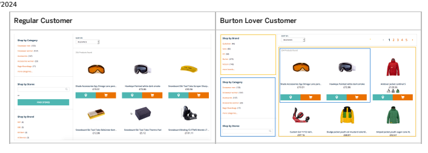

## Search Proles In Backoffice Administration Cockpit

You can also use the Backoffice Administration Cockpit as a supplementary tool to create the proles and manage their options.

It is highly recommended to congure the proles using Adaptive Search and resorting to the Backoffice Administration Cockpit only as a supplement.

## Create Search Proles In Backoffice Administration Cockpit

You can use the Backoffice Administration Cockpit to create the search proles.

## Context

Follow the steps below to create a search prole.

1. In Backoffice Administration Cockpit navigate to System Search and Navigation Search Proles You can see a list of already dened Search Proles (if any) on the right.

2. Click the button at the top of the window to select a prole type: either Category Aware Prole or Simple Prole.

The wizard for both prole types is the same. Fill in the elds with appropriate values.

## Create New Simple

X
ESSENTIAL
 All required fields Code:

| SimpleProfileExample   |
|------------------------|
| Name:                  |
| SimpleProfileExample   |
| Index Type:            |
| apparel-ukProductType  |

| o   |
|-----|

Catalog Version:

| Apparel UK Content Catalog : Online   |
|---------------------------------------|

| CANCEL   |
|----------|

o Code: a unique code for your profile.

o Name: a chosen name for the profile (doesn't have to be unique).

o Index Type: the index type the profile is created for. You can select the index type from the drop down menu.

o Catalog Version: a staged or online version of the catalog.

3. Click Done to finish.

If you go to the Adaptive Search perspective, you can select the profile from the list.

## Results

Your prole is now ready for conguration. If you want the conguration to be visible on the storefront, you need to activate the prole. You can nd the activation instructions in: Activate Search Proles.

## Clone A Search Prole

Cloning a selected search prole results in having a new prole with the same conguration, and a new name of your choice.

1. In Backoffice Administration Cockpit navigate to System Search and Navigation Search Proles and select a prole The conguration options and prole details are visible in the editor in the bottom section of the page.

2. Click the button.

The search prole is cloned.

Even if the original prole was in an activation set before the cloning, the new prole won't be included in any set.

3. Add a code and name of your choice. 4. Save the cloned prole.

# Add Search Prole Actions

An action represents a changed element of the customization that makes is more personalized

## Prerequisites

A search prole is already created. A customization is already created and available in SmartEdit.

## Context Recommendation

It is strongly recommended to use SmartEdit to congure the relation between variations and actions, using Backoffice Administration Cockpit as an additional tool.

Adding an action using Backoffice Administration Cockpit works in the same way as selecting the action type and the search prole in the Commerce Customization modal and assigning it to a target group however is not so intuitive since it requires knowing the exact details (like the code or id) of the prole.

1. Navigate to Personalization Actions Search Prol Action . Click the button in the top menu bar.

A new pop up window appears.

2. Provide the details of your new action.

This is   For more    the SAP Help  80

| Item   | Name   | Description   |
|--------|--------|---------------|

| Item   | Name                 | Description                                                                  |
|--------|----------------------|------------------------------------------------------------------------------|
| 1.     | Code                 | The unique code for the action.                                              |
| 2.     | Search Prole Code    | The code of the search prole you have entered when creating the prole.       |
| 3.     | Search Prole Catalog | The product catalog the search prole applies to.                             |
| 4.     | Variation            | The variation (target group) the search prole is supposed to be assigned to. |

3. Click Done to nish. Your action is added to the end of the list. If you click it, the editor opens so you can introduce changes to some of the elds if necessary. The Catalog Version eld is lled in automatically, based on the variation details.

4. To verify if the action was added properly, log in to SmartEdit and go to personalization mode. 5. Navigate to Library Manage Library . 6. Select the customization and the target group you created the action for (in our example it is the SummerSaleDefault target group/variation).

7. Use the more menu to access Commerce Customizations.

 8. The action is added to the target group.

If you remove it at this point, it is also removed from the Backoffice Administration Cockpit. For details on how to remove

 an action using the Backoffice Administration Cockpit see: Deleting Actions.

## Adaptive Search Module Architecture

The Adaptive Search module holds the functionality needed to create and congure the search proles.

This is   For more    the SAP Help  81

## Dependencies

The following UML displays the dependencies between all extensions providing the functionality:

Dependencies Diagram

## Recipes

For a complete list of SAP Commerce Cloud recipes that may include this module, see Installer Recipes . For a complete list of the SAP Commerce Cloud, integration extension pack recipes that may include this module, see Installer Recipe Reference .

## Extensions

The Adaptive Search module consists of the following extensions:

adaptivesearch Extension The adaptivesearchextension provides the implementation for the search proles functionality.

adaptivesearchwebservices Extension The adaptivesearchwebservices extension contains the /searchprofiles endpoint returing a list of search proles. adaptivesearchfacades Extension The adaptivesearchfacades integrates the adaptivesearch services acting as a layer between this extension and the adaptivesearch extension.

adaptivesearchbackoffice Extension The adaptivesearchbackoffice extension holds the Backoffice conguration for the Adaptive Search perspective in which you can create Search Proles and congure them using dedicated wizards and actions. adaptivesearchsamplesaddon Extension The adaptivesearchsamplesaddon AddOn provides sample data for the electronics and apparel storefronts.

adaptivesearchsolr Extension The adaptivesearchsolr extension acts as an integration layer between the Search Proles functionality delivered within the adaptivesearch extension and the Solr server responsible for indexing.

## Adaptivesearch Extension

The adaptivesearchextension provides the implementation for the search proles functionality.

Dependencies

Dependencies Diagram

## Adaptivesearchwebservices Extension

The adaptivesearchwebservices extension contains the /searchprofiles endpoint returing a list of search profiles.

Dependencies

## Adaptivesearchfacades Extension

The adaptivesearchfacades integrates the adaptivesearch services acting as a layer between this extension and the adaptivesearch extension.

Dependencies

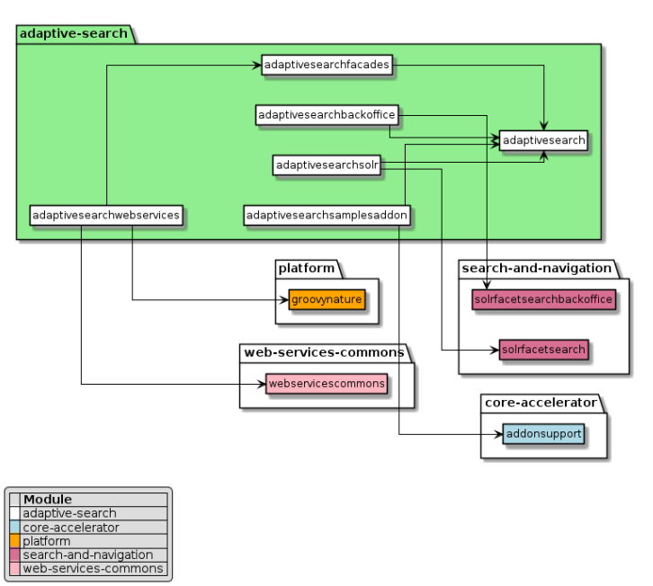

## Adaptivesearchbackoffice Extension

The adaptivesearchbackoffice extension holds the Backoffice configuration for the Adaptive Search perspective in which you can create Search Profiles and configure them using dedicated wizards and actions.

Dependencies

Dependencies Diagram

## Adaptivesearchsamplesaddon Extension

The adaptivesearchsamplesaddon AddOn provides sample data for the electronics and apparel storefronts.

## 1 Caution

This page refers to software that has been deprecated as part of the Accelerator UI and older OCC template extensions deprecation. For more information, see Deprecated Accelerator UIs and OCC Template Extensions - Deletion in SAP
Commerce Cloud 2211 .

## Dependencies

## Adaptivesearchsolr Extension

The adaptivesearchsolr extension acts as an integration layer between the Search Profiles functionality delivered within the adaptivesearch extension and the Solr server responsible for indexing.

Dependencies

## Adaptive Search Implementation

Use the implementation guides to install Adaptive Search module and learn more about the technical functionality it provides.

Installing Adaptive Search You can install adaptive search using dedicated recipes or manually by adding a set of extensions. Adaptive Search Data Model Explore the data model for Adaptive Search. Adaptive Search Actions Adaptive Search actions implementation allows you to add your own menu actions using the ActionsMenu component.

Adaptive Search Editors Adaptive Search editors are based on the congurable multi reference editor. It is an abstract editor that allows the user to display list components in a congurable manner. Search Prole Context This is   For more    the SAP Help  89 The search prole context provides the required context to be used during the search prole activation, calculation, and merging processes. Search Prole Activation Services and Strategies Activation of search proles requires the use of services and strategies which interact with each other. Search Prole Calculation and Merging The calculation and merging of search proles requires the use of specic strategies and that interact with each other.

Data Migration from Commerce Search to Adaptive Search If you are working with Commerce Search but want to move to Adaptive Search, you can migrate your data easily using ImpEx les.

## Installing Adaptive Search

You can install adaptive search using dedicated recipes or manually by adding a set of extensions. Once you install adaptive search, the system includes sample data with search proles and relations to the commerce customizations in personalization.

## Installing Adaptive Search Using Recipes

To perform a basic installation of adaptive search, follow the steps described in Installing SAP Commerce Cloud Using Installer Recipes. Adaptive search is included in the cx installation recipe.

## Extensions To Include When Performing A Manual Installation

If you are installing the SAP Commerce Cloud with Adaptive Search but are not using an installation recipe, include the necessary extensions in the localextensions.xml le. You can look up the details about the extensions in Adaptive Search Module Architecture and Personalization Search Module.

## Handling Third-Party Npm-Related Javascript Libraries

SAP no longer includes third-party npm-related JavaScript libraries in SAP Commerce Cloud. This impacts any extensions and addOns that use these libraries. To enable full build and test capabilities on these extensions and addOns, you must download the required libraries through npm. To download the required libraries for adaptive search and make sure the personalization-related features are working properly, do the following:
Ensure that ant is running.

Go to the $HYBRIS_BIN_DIR/platform directory.

Execute the ant npminstall command.
You can now execute any ant targets on your extensions or AddOns.

## Adaptive Search Data Model

Explore the data model for Adaptive Search. The diagram below presents the data model for Adaptive Search.

The data model for adaptive search is catalog version aware, however in some cases the index type is not catalog version aware. In those cases the catalogVersion attribute will be set to null.

## Recommendation

For a better viewing experience, right-click the image and select one of the available browser options, such as Open Image in

## Adaptive Search Actions

Adaptive Search actions implementation allows you to add your own menu actions using the ActionsMenu component.

The ActionMenu component extends the standard com.hybris.cockpitng.actions.CockpitAction component, which renders standard cockpit actions as menu items. The component consists of a button and a pop-up menu. Upon a click, the pop-up menu opens with the list of allowed actions. If none of the actions is allowed, the button is disabled.

## Creating A New Action Context

Follow the steps to implement the ActionMenu component and start using it.

1. Add the action conguration in the backoffice-config.xml le.

<context component="as-promoted-results-actions"> <y:actions xmlns:y="http://www.hybris.com/cockpit/config/hybris"> <y:group qualifier="common"> <y:action action-id="de.hybris.platform.adaptivesearchbackoffice.action.discardove <y:action action-id="de.hybris.platform.adaptivesearchbackoffice.action.overridep <y:action action-id="de.hybris.platform.adaptivesearchbackoffice.action.unpromote </y:group> </y:actions> </context>
2. Add the newly created component conguration to the *.zul le
<actionsmenu inputValue="${result}" config="as-promoted-results-actions" > <custom-attributes viewModel="${vm}" /> </actionsmenu>
3. The congurable multi reference editor renders the menu actions by default. By convention, a component name follows the context name + actions pattern as you can see below.

<editorArea:attribute qualifier="boostRules" editor="de.hybris.platform.adaptivesearchbackoffice.editor.configurablemultireference"> <editorArea:editor-parameter> <editorArea:name>dataHandler</editorArea:name> <editorArea:value>asBoostRulesDataHandler</editorArea:value> </editorArea:editor-parameter> <editorArea:editor-parameter> <editorArea:name>context</editorArea:name> <editorArea:value>as-boost-rules-editor</editorArea:value> </editorArea:editor-parameter> <editorArea:editor-parameter> <editorArea:name>sortable</editorArea:name> <editorArea:value>true</editorArea:value> </editorArea:editor-parameter> </editorArea:attribute> <context component="as-boost-rules-editor"> <list-view:list-view xmlns:list-view="http://www.hybris.com/cockpitng/component/listView"> <list-view:column qualifier="boostType" /> <list-view:column qualifier="boost" /> </list-view:list-view> </context> <context component="as-boost-rules-editor-actions"> <y:actions xmlns:y="http://www.hybris.com/cockpit/config/hybris"> <y:group qualifier="common"> <y:action action-id="de.hybris.platform.adaptivesearchbackoffice.action.deleterefe </y:group> </y:actions> </context>
For details on congurable multi reference editor see Adaptive Search Editors.

## Results

As a result a new action is present in the perspective.

## Adaptive Search Editors

Adaptive Search editors are based on the congurable multi reference editor. It is an abstract editor that allows the user to display list components in a congurable manner. The table below lists the parameters of the congurable multi reference editor.

| Parameter                                                    | Mandatory                                                                                              | Description                                                                                                                                                                                                                                                                                                                                                             | Example                                                                                                                                                             |
|--------------------------------------------------------------|--------------------------------------------------------------------------------------------------------|-------------------------------------------------------------------------------------------------------------------------------------------------------------------------------------------------------------------------------------------------------------------------------------------------------------------------------------------------------------------------|---------------------------------------------------------------------------------------------------------------------------------------------------------------------|
| dataHandler                                                  | yes                                                                                                    | This parameter holds the bean id for the data handler bean, so it can be used by the editor to provide the data.                                                                                                                                                                                                                                                        | <editorArea:editor-parameter> <editorArea:name>dataHandler</editorArea:name> <editorArea:value>asExcludedFacetsDataHandler</editorAr </editorArea:editor-parameter> |
| The data handler should implement the DataHandler interface. |                                                                                                        |                                                                                                                                                                                                                                                                                                                                                                         |                                                                                                                                                                     |
| listConfigContext                                            | The default Backoffice conguration to specify the columns, where the value is the name of the context. | <editorArea:editor-parameter> <editorArea:name>listConfigContext</editorArea:name> <editorArea:value>as-excluded-facets-editor</editorArea </editorArea:editor-parameter> <context type="asExcludedFacets" parent="AbstractAsConfigu <list-view:list-view xmlns:list-view="http://www.hybri <list-view:column qualifier="priority" /> </list-view:list-view> </context> |                                                                                                                                                                     |

| 7/11/2024 Parameter   | Mandatory                                                                                                                      | Description                                                                                                                                                     | Example   |
|-----------------------|--------------------------------------------------------------------------------------------------------------------------------|-----------------------------------------------------------------------------------------------------------------------------------------------------------------|-----------|
| isSortable            | If the value for this parameter is set to true,the drag and drop for this editor will be activated so the items can be sorted. | <editorArea:editor-parameter> <editorArea:name>isSortable</editorArea:name> <editorArea:value>true</editorArea:value> </editorArea:editor-parameter>            |           |
| inlineEditingParams   | This parameter is used to indicate which attributes should be enabled for inline editing. The list of attributes is commadelimited, for example: priority ,inResults                                                                                                                                | <editorArea:editor-parameter> <editorArea:name>inlineEditingParams</editorArea:nam <editorArea:value>priority</editorArea:value> </editorArea:editor-parameter> |           |

For instructions on how to create your own editor based on the congurable multi reference editor see Creating a New Editor

## Creating A New Editor

Learn how to create a new editor using the congurable multi reference editor.

1. Create a data bean for the editor data in the bean.xml, and make sure to extend the AbstractEditorData bean:
<bean class="de.hybris.platform.adaptivesearchbackoffice.editors.configurablemultireference.Ex extends="de.hybris.platform.adaptivesearchbackoffice.editors.configurablemultireference <property name="indexProperty" type="String" equals="true" /> <property name="priority" type="Integer" equals="true" /> </bean>
2. Extend the AbstractDataHandler class and provide implementation for the abstract methods as presented in the example below.

public class AsExcludedFacetsDataHandler extends AbstractDataHandler<ExcludedFacetEditorData, AsExcludedFacetData, AsExcludedFacetM { @Override public String getTypeCode() { return AsExcludedFacetModel._TYPECODE; } @Override protected void loadDataFromSearchResult(final Map<String, ExcludedFacetEditorData> excludedF final SearchResultData searchResult) { if (searchResult == null) { return; } final AsSearchProfileResultData searchProfileResult = searchResult.getSearchProfileResult if (searchProfileResult != null && MapUtils.isNotEmpty(searchProfileResult.getExcludedFace { for (final AsExcludedFacetData facetData : searchProfileResult.getExcludedFacets().value { excludedFacets.put(facetData.getUid(), convertFromData(facetData)); } } } @Override protected void loadDataFromInitialValue(final Map<String, ExcludedFacetEditorData> excludedF final List<AsExcludedFacetModel> initialValue) { if (CollectionUtils.isNotEmpty(initialValue)) { for (final AsExcludedFacetModel facetModel : initialValue) { excludedFacets.put(facetModel.getUid(), convertFromModel(facetModel)); } } } @Override public void addReference(final AsExcludedFacetModel model, final String uid) { model.setUid(uid); getListModel().add(convertFromModel(model)); } @Override protected ExcludedFacetEditorData convertFromModel(final AsExcludedFacetModel facetModel) { final ExcludedFacetEditorData excludedFacet = new ExcludedFacetEditorData(); excludedFacet.setUid(facetModel.getUid()); excludedFacet.setIndexProperty(facetModel.getIndexProperty()); excludedFacet.setLabel(facetModel.getIndexProperty()); excludedFacet.setPriority(facetModel.getPriority()); excludedFacet.setInResults(false); excludedFacet.setModel(facetModel); excludedFacet.setState(EditorState.CURRENT); return excludedFacet; } @Override protected ExcludedFacetEditorData convertFromData(final AsExcludedFacetData facetData)
This is   For more    the SAP Help  95
 { final ExcludedFacetEditorData excludedFacet = new ExcludedFacetEditorData(); excludedFacet.setUid(facetData.getUid()); excludedFacet.setIndexProperty(facetData.getIndexProperty()); excludedFacet.setLabel(facetData.getIndexProperty()); excludedFacet.setPriority(facetData.getPriority()); excludedFacet.setInResults(false); excludedFacet.setState(EditorState.INHERITED); return excludedFacet; } }
3. Declare the newly created data handler as a prototype spring bean as the data handler will be storing the editor model.

<alias name="defaultAsExcludedFacetsDataHandler" alias="asExcludedFacetsDataHandler" /> <bean id="defaultAsExcludedFacetsDataHandler" class="de.hybris.platform.adaptivesearchbackoffi 4. In order to use the editor a data handler must be provided. As an example conguration in the backoffice-cong.xml:
<editorArea:attribute qualifier="excludedFacets" editor="de.hybris.platform.adaptivesearchbackoffice.editor.configurablemultireference"> <editorArea:editor-parameter> <editorArea:name>dataHandler</editorArea:name> <editorArea:value>asExcludedFacetsDataHandler</editorArea:value> </editorArea:editor-parameter> </editorArea:attribute>

The dataHandler parameter is mandatory.

5. The previous conguration is enough to display the editor with two columns, the label and the action button to delete the item. In order to display more columns the default back office conguration can be used. The example below shows the conguration for displaying the priority column.

<context type="asExcludedFacets" parent="AbstractAsConfigurableSearchConfiguration" component= <list-view:list-view xmlns:list-view="http://www.hybris.com/cockpitng/component/listView"> <list-view:column qualifier="priority" /> </list-view:list-view> </context> <editorArea:attribute qualifier="excludedFacets" editor="de.hybris.platform.adaptivesearchbackoffice.editor.configurablemultireference"> <editorArea:editor-parameter> <editorArea:name>dataHandler</editorArea:name> <editorArea:value>asExcludedFacetsDataHandler</editorArea:value> </editorArea:editor-parameter> <editorArea:editor-parameter> <editorArea:name>listConfigContext</editorArea:name> <editorArea:value>as-excluded-facets</editorArea:value> </editorArea:editor-parameter> </editorArea:attribute>

Results The result of the conguration should be similar to the one below.

## Search Prole Context

The search prole context provides the required context to be used during the search prole activation, calculation, and merging processes. The search prole context is valuable because it includes the following in their current state:
Index conguration and index type

Catalog versions Category path Language and currency Search query and keywords

## Category Path Resolution

The current category path is not passed from the storefront or UI directly to Adaptive Search. For this reason, the current implementation intercepts the search query and tries to guess the category path instead. This process works as follows:

| Action Performed by Search Prole Context                                                                    | Result                                                                                                                          |
|-------------------------------------------------------------------------------------------------------------|---------------------------------------------------------------------------------------------------------------------------------|
| Check if there is a lter in the search query for a given index                                              | If yes, then the value is collected as a category code.                                                                         |
| property (by default "allCategories") Check if there is a facet lter or facet value in the search query for | If yes, then the value is collected as a category code.                                                                         |
| a given index property (by default "allCategories") Collects all the category codes.                        | Creates a at list with corresponding categories and super categories. Ensuring that the category hierarchy is always respected. |

This is   For more    the SAP Help  97 The index properties that are used can be changed by adding some properties to your local.properties file. The default values are shown in the following code sample.

adaptivesearch.categoryPathResolver.filter.indexProperty=allCategories adaptivesearch.categoryPathResolver.facetFilter.indexProperty=allCategories

## Search Prole Activation Services And Strategies

Activation of search proles requires the use of services and strategies which interact with each other. Have a look at the scenarios below to see the interactions between the services and strategies.

## Activating A Directly Specied List Of Search Proles

If the case assumes making a specic list of search proles active, the list of current search proles will be returned.

## Activating Search Proles In Context

In the case of activating the list of not directly specied search proles it depends on a given search context. As a result, the system goes through the activation strategies to discover which search proles should be active for a given context. The results returned from the different activation strategies are collected in a single list. The duplicates are not removed.

Below you can see the details of each service.
AsSearchProleActivationService This service is the main entry point for the activation process.

## Assearchproleactivationstrategy

Implementing this strategy allows for activation of the search proles.

## Mapping

For a new activation strategy to be recognized and used, it needs to be mapped. The <priority> property denes the order according to which the strategies are executed. A higher priority means that the strategy will be executed rst.

The defaultAsSearchProfileActivationMapping enables the default activation strategy. This strategy allows for the conguration of the list of active search proles in the database (AsSearchProfileActivationSet type).

<bean id="defaultAsSearchProfileActivationMapping" parent="asSearchProfileActivationMapping"> <property name="priority" value="100" /> <property name="activationStrategy" ref="asSearchProfileActivationStrategy" /> </bean>
For details on how to create an activation set for your proles see Search Proles in Backoffice Administration Cockpit.

## Default Activation Strategy

There is a default activation strategy that allows to congure the list of active search proles in the database
(AsSearchProfileActivationSet type).

<bean id="defaultAsSearchProfileActivationMapping" parent="asSearchProfileActivationMapping"> <property name="priority" value="100" /> <property name="activationStrategy" ref="asSearchProfileActivationStrategy" /> </bean>
A list of search proles can be set for each combination of a catalog version and index type.

$indexType=testIndexedType${testId} $catalogVersion=catalogVersion(catalog(id[default='hwcatalog']),version[default='Online'])[unique=t INSERT_UPDATE AsSimpleSearchProfile;code[unique=true];name;indexType[default=$indexType];$catalogVe ;searchProfile1;Simple Search Profile;;

INSERT_UPDATE AsSearchProfileActivationSet;indexType[default=$indexType][unique=true];$catalogVersi ;;;searchProfile1

## Search Prole Calculation And Merging

The calculation and merging of search proles requires the use of specic strategies and that interact with each other.

The calculation process has the following steps:
load: the data is loaded from the database and stored in memory in a format that is optimized for calculation; calculation: the data that was loaded in the load step is used to generate a search prole result; merge: different search prole results are merged into a single one.

Have a look at the diagram below to see the calculation process and how the services and strategies interact with each other.

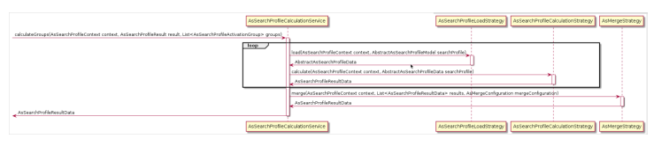

## Services

Below you can nd details of the services used in the process.

AsSearchProleCalculationService This service is the main entry point for the calculation process.

## Strategies

Below you can nd information about the strategies used in the process.

AsSearchProleLoadStrategy

This strategy loads the data from the database and transforms it into a format that is optimized for calculation and caching. Each search prole type has its own load strategy.

AsSearchProleCalculationStrategy

A strategy used for calculating search prole results. Each search prole type has its own calculation strategy.

AsMergeStrategy

A strategy used for merging search prole results. This strategy operates only on search prole results, and for this reason it does not depend on the search prole type.

## Mapping

You need to map the new load and calculation strategies so that they can be recognized and used. The <type> property denes the type for which the strategies will be used. The default mappings for the load and calculation strategies are as follows:
asSimpleSearchProfileMapping: denes load and calculation strategies for the AsSimpleSearchProfile type; asCategoryAwareSearchProfileMapping: denes load and calculation strategies for the AsCategoryAwareSearchProfile type.

Below you can see the conguration for both default mappings:
<bean id="asSimpleSearchProfileMapping" parent="asSearchProfileMapping">
 <property name="type" value="de.hybris.platform.adaptivesearch.model.AsSimpleSearchProfileModel
 <property name="loadStrategy" ref="asSimpleSearchProfileLoadStrategy" /> <property name="calculationStrategy" ref="asSimpleSearchProfileCalculationStrategy" /> <property name="searchConfigurationStrategy" ref="asSimpleSearchConfigurationStrategy" /> </bean> <bean id="asCategoryAwareSearchProfileMapping" parent="asSearchProfileMapping"> <property name="type" value="de.hybris.platform.adaptivesearch.model.AsCategoryAwareSearchProfi <property name="loadStrategy" ref="asCategoryAwareSearchProfileLoadStrategy" /> <property name="calculationStrategy" ref="asCategoryAwareSearchProfileCalculationStrategy" /> <property name="searchConfigurationStrategy" ref="asCategoryAwareSearchConfigurationStrategy" / </bean>

## Caching

For performance reasons, the load, calculation and merge strategies used during the calculation process have their results cached. This behavior can be changed by adding some properties to the local.properties le.

The default conguration looks as follows:
adaptivesearch.cache.enabled=true adaptivesearch.cache.load.enabled=true adaptivesearch.cache.calculation.enabled=true adaptivesearch.cache.merge.enabled=true regioncache.adaptivesearchregion.size=2000 regioncache.adaptivesearchregion.evictionpolicy=LRU regioncache.adaptivesearchregion.ttl=300 The subsections below provide more information about the strategies used for caching.

## Ascachestrategy

An abstract strategy used for interactions with the cache.

## Ascacheawarestrategy

Strategies that implement this interface can have the results cached. This strategy allows to generate a cache key that depends on the context.

## Data Migration From Commerce Search To Adaptive Search

If you are working with Commerce Search but want to move to Adaptive Search, you can migrate your data easily using ImpEx les. The data migration steps are based on ImpEx and cover only out-of-the-box SAP Commerce Cloud functionality. You can export:
facet congurations,

hero products, boost rules.
The following type mapping rules apply:
GlobalSolrSearchProfile > AsCategoryAwareSearchConfiguration

CategorySolrSearchProfile > AsCategoryAwareSearchConfiguration SolrFacetReconfiguration > AsFacet or AsExcludedFacet SolrHeroProductDefinition > AsPromotedItem SolrBoostRule > AsBoostRule: for the string based types, EQUAL_TO and CONTAINS operators are mapped to MATCH.

## Data Migration Instructions

Before starting, please make sure that you enabled both commercesearch and adaptivesearch extensions.

Only specic data will be exported/imported, however you can congure these settings using the following macros in the ImpEx scripts:
indexType: the indexed type identier.

catalogId and version: the catalog version.

searchProfile: the new search prole code.
In the ImpEx le it will look as follows:
$indexType=electronicsProductType $catalogId=electronicsProductCatalog $version=Online $searchProfile=commercesearch-electronics

## Category Path Resolution

The following must be added to the local.properties le to implement behavior that is similar to commercesearch.

adaptivesearch.categoryPathResolver.facetFilter.indexProperty=category For more details refer to the section Search Prole Context.

## Exporting Data From Commerce Search Context

Follow the steps below to export the data from Commerce Search.

1. Create an ImpEx le called commercesearch_export.impex and copy the following code into it. Don't forget to update the ImpEx macro denitions.

\#----------------------------------------------------------- "\#% impex.setLocale( new Locale( ""en"" , """" ) );" \#----------------------------------------------------------- $indexType=electronicsProductType $catalogId=electronicsProductCatalog $version=Online $searchProfile=commercesearch-electronics \#\#\# Search Configurations \#\#\# "\#% impex.setTargetFile( ""GlobalSearchConfiguration.csv"" );" insert GlobalSolrSearchProfile;&searchConfiguration "\#% impex.exportItemsFlexibleSearch( ""SELECT {SP:pk} FROM {GlobalSolrSearchProfile as SP},{So "\#% impex.setTargetFile( ""CategorySearchConfiguration.csv"" );"
insert CategorySolrSearchProfile;&searchConfiguration;categoryCode;solrFacetReconfigurations;b
"\#% impex.exportItemsFlexibleSearch( ""SELECT {SP:pk} FROM {CategorySolrSearchProfile as SP}, \#\#\# Facets \#\#\# "\#% impex.setTargetFile( ""Facet.csv"" );" insert SolrFacetReconfiguration2SolrSearchProfile;&facet;source(facet(name));source(priority) "\#% impex.exportItemsFlexibleSearch( ""SELECT {F2SP:PK} FROM {SolrFacetReconfiguration2SolrSea "\#% impex.setTargetFile( ""ExcludedFacet.csv"" );" insert SolrFacetReconfiguration2SolrSearchProfile;&excludedFacet;source(facet(name));source(p "\#% impex.exportItemsFlexibleSearch( ""SELECT {F2SP:PK} FROM {SolrFacetReconfiguration2SolrSea \#\#\# Boost Rules \#\#\# "\#% impex.setTargetFile( ""BoostRule.csv"" );" insert SolrBoostRule2SolrSearchProfile;&boostRule;source(solrIndexedProperty(name));source(sol "\#% impex.exportItemsFlexibleSearch( ""SELECT {BR2SP:PK} FROM {SolrBoostRule2SolrSearchProfile \#\#\# Boost Items \#\#\# "\#% impex.setTargetFile( ""PromotedItem.csv"" );" insert SolrHeroProductDef2ProductRelation;&promotedItem;target(code);source(category(code)) "\#% impex.exportItemsFlexibleSearch( ""SELECT {HP2P:PK} FROM {SolrHeroProductDef2ProductRelati This is   For more    the SAP Help  104 2. Open the SAP Commerce Cloud Administration Console (e.g.: https://localhost:9002/) and navigate to Console ImpEx Export Export content .

3. Copy the contents of the le created in Step 1 to the Export content eld. 4. Expand the settings and make sure Import validation mode is set to export_only. 5. Click Export content, to generate a zip le with the exported data. 6. Extract the zip le and check if the data is correct.

## Importing Data In Adaptive Search Context

Perform the following steps to import the data to Adaptive Search.

1. Replace the contents of the importscript.impex le, which was generated when exporting, with the following code.

Don't forget to update the ImpEx macro denitions.

\#----------------------------------------------------------- "\#% impex.setLocale( new Locale( ""en"" , """" ) );" "\#%
Map facetTypeMapping = new HashMap(); facetTypeMapping.put(""Refine"", ""REFINE""); facetTypeMapping.put(""MultiSelectAnd"", ""MULTISELECT_AND""); facetTypeMapping.put(""MultiSelectOr"", ""MULTISELECT_OR""); Map stringBoostOperatorMapping = new HashMap(); stringBoostOperatorMapping.put(""EQUAL_TO"", ""MATCH""); stringBoostOperatorMapping.put(""CONTAINS"", ""MATCH""); Map boostOperatorMapping = new HashMap(); boostOperatorMapping.put(""GREATER_THAN"", ""GREATER_THAN""); boostOperatorMapping.put(""GREATER_THAN_OR_EQUAL_TO"", ""GREATER_THAN_OR_EQUAL""); boostOperatorMapping.put(""LESS_THAN"", ""LESS_THAN""); boostOperatorMapping.put(""LESS_THAN_OR_EQUAL_TO"", ""LESS_THAN_OR_EQUAL"");
boostOperatorMapping.put(""EQUAL_TO"", ""EQUAL""); mapFacetType(facetType) {
return facetTypeMapping.get(facetType);
} mapBoostOperator(boostOperator, type) {
if (type.equals(""string"") || type.equals(""text"")) {
return stringBoostOperatorMapping.get(boostOperator);
} else {
return boostOperatorMapping.get(boostOperator);
}
} resolveFacetsMergeMode(facets) {
if (facets != null && !facets.isEmpty()) {
return ""REPLACE"";
} else {
return ""ADD_AFTER"";
}
} resolveBoostRulesMergeMode(boostRules) {
if (boostRules != null && !boostRules.isEmpty()) {
return ""REPLACE"";
} else {
return ""ADD"";
}
}
This is   For more    the SAP Help  105
" \#----------------------------------------------------------- $indexType=electronicsProductType $catalogId=electronicsProductCatalog $version=Online $searchProfile=commercesearch-electronics $catalogVersion=catalogVersion(catalog(id[default=$catalogId]),version[default=$version]) insert AsCategoryAwareSearchProfile;&searchProfile;code;name;indexType;$catalogVersion ;searchProfile;$searchProfile;$searchProfile;$indexType; \#\#\# Search Configurations \#\#\# insert AsCategoryAwareSearchConfiguration;&searchConfiguration;searchProfile(code,$catalogVers "\#% impex.includeExternalDataMedia( ""GlobalSearchConfiguration.csv"" , ""UTF-8"", ';', 1 , insert AsCategoryAwareSearchConfiguration;&searchConfiguration;category(code,$catalogVersion) "\#% beforeEach: line.put(7, resolveFacetsMergeMode(line.get(3))); line.put(8, resolveBoostRule "\#% impex.includeExternalDataMedia( ""CategorySearchConfiguration.csv"" , ""UTF-8"", ';', 1 \#\#\# Facets \#\#\# insert AsFacet;&facet;indexProperty;priority;facetType(code);valuesSortProvider;valuesDisplayN "\#% beforeEach: line.put(4, mapFacetType(line.get(4)));" "\#% impex.includeExternalDataMedia( ""Facet.csv"" , ""UTF-8"", ';', 1 , -1 );" insert AsExcludedFacet;&excludedFacet;indexProperty;priority;facetType(code);valuesSortProvide "\#% beforeEach: line.put(4, mapFacetType(line.get(4)));" "\#% impex.includeExternalDataMedia( ""ExcludedFacet.csv"" , ""UTF-8"", ';', 1 , -1 );" \#\#\# Boost Rules \#\#\# insert AsBoostRule;&boostRule;indexProperty;;operator(code);value;boost;searchConfiguration(&s "\#% beforeEach: line.put(4, mapBoostOperator(line.get(4), line.get(3)));" "\#% impex.includeExternalDataMedia( ""BoostRule.csv"" , ""UTF-8"", ';', 1 , -1 );" \#\#\# Boost Items \#\#\# insert_update AsCategoryAwareSearchConfiguration;;;category(code,$catalogVersion)[unique=true "\#% impex.includeExternalDataMedia( ""PromotedItem.csv"" , ""UTF-8"", ';', 1 , -1 );" insert AsPromotedItem;&promotedItem;item(Product.code,Product.$catalogVersion);searchConfigura "\#% impex.includeExternalDataMedia( ""PromotedItem.csv"" , ""UTF-8"", ';', 1 , -1 );"
2. Select the 7 les and compress them to a zip le.

Do not compress the enclosing folder, because the import will not work. Select the les manually and compress them.

3. Open the SAP Commerce Cloud Administration Console (https://localhost:9002/) and navigate to Console ImpEx Import Import script .

Q Type here

() hybris administration console

4. Select the file that you created in step 2.

5. Make sure Import validation mode is set to import_relaxed and Enable code execution is checked.

6. Click Import file to import the data to the system.

7. Go to the Adaptive Search perspective and check if the profile and relevant data were imported properly.

## Results

Data is present in the Adaptive Search.
