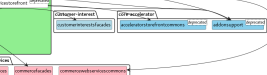
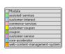
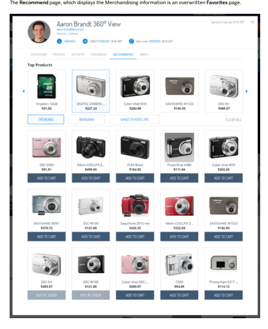

# Adaptive Search Module

The Adaptive Search module brings you a new innovative approach to creating search congurations. Thanks to Search Proles you can create individual congurations for your search categories and merge them together. Conguring facets and boosting items is easy and intuitive with the new Adaptive Search perspective.

## Assisted Services

Assisted Service Module enables customer service personnel to provide real-time customer sales and service support using the same storefront across the omni-channel framework. The assisted services integration module integrates the assisted services module with Intelligent Selling Services.

 Note To comply with general data privacy acts and industry-specic legislation in different countries, the shop must capture user's consent before using Assisted Services functions to process user's personal data.

Assisted Service Module Assisted Service Module (ASM) enables customer service personnel to provide real-time customer sales and service support using the same storefront across the omni-channel framework. Customer agents can provide support using ASM in in-store and virtual scenarios. Assisted Services Integration Module The Assisted Services Integration module integrates the Assisted Service Module with other services, for example, Intelligent Selling Services.

## Assisted Service Module

Assisted Service Module (ASM) enables customer service personnel to provide real-time customer sales and service support using the same storefront across the omni-channel framework. Customer agents can provide support using ASM in in-store and virtual scenarios.

Compatibility The Assisted Service Module supports the following Accelerator storefronts:
The ASM is compatible with the B2C Accelerator storefront, and is fully compatible with the responsive design of the storefront. The ASM is compatible with the SAP Commerce Cloud Telco and B2B Accelerator storefronts. However, it is recommended that you disable customer creation in the B2B Accelerator. For more information, see B2B Assisted Service. Multiple tabs or browsers are not supported. Financial Services

This is   For more    the SAP Help  2 assistedservicewebservices Extension Adding the CMS Component assistedservicestorefront AddOn assistedservicecustomerinterestsaddon AddOn assistedservicepromotionaddon Extension Additional Information Network

## Assisted Service Module Features

Assisted Service Module provides many features that allow the service support personnel to use the same storefront view their customer uses and deliver superior service. For example, customer service agent can create a new customer account on the customer's behalf. The module provides the following features:
Improved Customer Support The Assisted Service Module (ASM) enables organizations to offer a guided purchase process across all channels. ASM Additional Information Framework ASM Additional Information Framework (ASM-AIF) is a feature within Assisted Service Module, which displays additional information to a Customer Agent to help them provide better customer support.

Improved Customer Support The Assisted Service Module (ASM) enables organizations to offer a guided purchase process across all channels.

Use A customer wants to provide real-time customer sales and service support, using the same storefront across the omni-channel framework their customer uses, both physically in-store, and virtually online. The ASM allows a customer to nish the rest of their user journey, by pairing them with customer sales and service support personnel in real time.

 Example A customer encounters a problem when making a purchase or administering their account. They contact customer sales and service support personnel and give them their cart ID number or account name. The customer sales and service support personnel then use the ASM to nd and emulate the customer cart or account, that allows them to provide sales or account administration support.

The ASM integrates across the omni-channel landscape and allows Customer Service Agents to provide assisted sales and service support directly on top of the SAP Commerce Cloud Accelerator storefronts. Knowing who customers are and what they want, allows Customer Service Agents to engage more personally with products and services relevant to each customer's needs. The ASM's Customer 360º View integrates SAP Commerce Cloud, prole and merchandise data to provide real-time, personalized, and relevant customer and product information.

Features Providing Sales Support The customer support agent (CSA) uses the Assisted Service Module to help a customer in the product catalog, cart, and checkout ow, adding products to the cart and checking them out for the customer. Emulating Customer Accounts The customer support agent (CSA) uses the Assisted Service Module to nd and emulate a customer account or cart. If necessary, you can deactivate this feature. For more information, see Congure Account Emulation. Binding Anonymous Carts to Customer Accounts The customer support agent (CSA) uses the Assisted Service Module to help customers with their storefront experience. This section focuses on presenting the main functionality of the Assisted Service Module. Creating Accounts for Online Customers The customer support agent (CSA) uses the Assisted Service Module to help customers with their storefront experience. Looking Up Recent Sessions The customer support agent (CSA) uses the Assisted Service Module to help customers with their storefront experience. Providing Support for B2B Accelerator The customer support agent (CSA) uses the Assisted Service Module to support a customer within the My Company area. Customer List Framework Integration The Customer List Framework is a generic framework that can display different customer lists to customer support agents relative to different business applications. The customer records contain ASM deep links that take a CSA to the respective pages, for example, the customer's prole, cart, or orders. Deep Link Integration CSAs can enter the assisted service mode directly from the Customer Service Cockpit. The Launch ASM button is present in the navigation area, under the End Call button. For more information, see assistedservicestorefront AddOn. Built-in Security Measures The module is delivered with out-of-the-box security measures such as automatic logout after a certain length of time and automatic blocking of the account after too many failed log-in attempts. Agent Location The location of the CSA is displayed in the storefront. You can determine it during the process of creating an agent. For more information, see Conguring Agent Location.

Multi-Site Support This is   For more    the SAP Help  3 If you use Multi-Site feature, it limits visibility to customer support agents per site based on the following:
Customers Orders Carts Namely you can create employee groups and then associate them with a site or sites. This limits above data visibility between data-isolated sites to only those customer support agents authorized to see that data. The customer support agents can log in the isolated sites that they are authorized to access. For more information about Multi-Site feature, see SAP Commerce Cloud Multi-Site Support.

## Customer List Framework Integration

The Customer List Framework is a generic framework that can display different customer lists to Customer Support Agents relative to different business applications. The customer records within the customer lists contain ASM deep links that when clicked on by a CSA, take them to their respective pages such as the customer's prole, cart or orders page for example. This allows a CSA to prepare themselves with customer specic information before providing personalized support to the customer. Currently, the following implementations are available:

| Customer List Name                                              | Description                                                                                                                                                                                                                                                                                                                                                                                                   | Documentation Link                                           |
|-----------------------------------------------------------------|---------------------------------------------------------------------------------------------------------------------------------------------------------------------------------------------------------------------------------------------------------------------------------------------------------------------------------------------------------------------------------------------------------------|--------------------------------------------------------------|
| Current In-Store Customers                                      | Displays a list of customers that are currently in-store or in different places within a store as detected by one or multiple hardware devices so that a Customer Support Agent can review a customers prole and approach the customer prepared. By default the customer data is mocked, however in a real life implementation this data will come from a single, or multiple, physical in-store IoT devices. | assistedserviceservices Extension document, section Current InStore Customers                                                              |
| My Recent Customer Sessions                                     | Displays a list of customers whose sessions were recently started                                                                                                                                                                                                                                                                                                                                             | assistedservicefacades Extension document, section My Recent |
| by the Customer Support agent so that a Customer Support Agent  | Customer Sessions                                                                                                                                                                                                                                                                                                                                                                                             |                                                              |
| can quickly return to a previous customer support user journey. |                                                                                                                                                                                                                                                                                                                                                                                                               |                                                              |
| Pick-Up In-Store Customers                                      | Displays a list of customers who bought online and are picking their assistedserviceservices Extension document, section Pick-Up InStore Customers orders up in-store so a Customer Support Agent can prepare their order.                                                                                                                                                                                                                                                                                                                                                                                                               |                                                              |
|  Note                                                          |                                                                                                                                                                                                                                                                                                                                                                                                               |                                                              |

 Note For an technical overview of the generic Customer Lists Framework functionality, see the Customer Lists Framework section of the commercefacades Extension and commerceservices Extension documents.

In the assistedservicefacades-beans.xml le, the CustomerData bean is dened:
<bean class="de.hybris.platform.commercefacades.user.data.CustomerData">
<property name="defaultAddress" type="de.hybris.platform.commercefacades.user.data.AddressData"/> <property name="latestCart" type="String"/> <property name="profilePicture" type="de.hybris.platform.commercefacades.product.data.ImageData"/>
</bean>
In the context of the Customer Lists Framework, this means that in all the instances of lists implemented currently, the following is available:

| Option        | Description                                                                                                                                                                                                                                                                                                                                                                                                                                                                                                                           |
|---------------|---------------------------------------------------------------------------------------------------------------------------------------------------------------------------------------------------------------------------------------------------------------------------------------------------------------------------------------------------------------------------------------------------------------------------------------------------------------------------------------------------------------------------------------|
| Picture       | A prole picture for the customer. You can add the picture in Backoffice Administration Cockpit, in the Administration tab. By default, there are 4 sample customer images visible in the implementations of the Customer Lists Framework. The images are located in the assistedservicestorefront\resources\assistedservicestorefront\import\stores\electronics\images directory. For more information about the Customer Lists Framework, see the Customer Lists Framework section of the assistedservicefacades Extension document. |
| Cart link     | By clicking this link, the agent is able to emulate a customer and their cart.  Note This link is visible only when the customer has a cart session.                                                                                                                                                                                                                                                                                                                                                                                 |
| Order link    | By clicking this link, the agent is able to emulate a customer and their order.  Note This link is visible only when the customer has an order history.                                                                                                                                                                                                                                                                                                                                                                              |
| 360 View link | By clicking this link, the agent is redirected to the Overview tab of the Customer 360° View modal window. For more end-user information, see the Customer 360 Degree View document. For technical information, see the assistedservicefacades Extension and assistedservicestorefront AddOn documents.                                                                                                                                                                                                                               |

Autocomplete The getSuggestedCustomers(final String username) method returns a list of customers that is then displayed in the storefront. Upon entering the third character in the Customer Name/Email Address box, the system sends an AJAX call and the controller builds a JSONP response with the list of customers as shown in the AssistedServiceComponentController.java le in the /assistedservicestorefront/acceleratoraddon/web/src/de/hybris/platform/assistedservicestorefront/controllers/cms/ folder:
This is   For more    the SAP Help  4
@RequestMapping(value = "/autocomplete", method = RequestMethod.GET)
@ResponseBody public String autocomplete(@RequestParam("customerId") final String customerId, @RequestParam("callback") final String callback) {
final StringBuilder autocompleteResult = new StringBuilder(); try {
final List<CustomerModel> customers = assistedServiceFacade.getSuggestedCustomers(customerId); // because of jsonp callback parameter - I have to construct JSON manually ( autocompleteResult.append(callback).append("(["); if (CollectionUtils.isNotEmpty(customers)) {
for (final CustomerModel customer : customers)
{
autocompleteResult.append(getCustomerJSON(customer)); if (CollectionUtils.isNotEmpty(customer.getCarts())) {
autocompleteResult.append(", carts:["); Collection<CartModel> cartsForCustomer = assistedServiceFacade.getCartsForCustomer(customer); for (final CartModel cart : cartsForCustomer) {
cart.getCreationtime(); autocompleteResult.append("\"").append(cart.getCode()).append("\",");
} autocompleteResult.deleteCharAt(autocompleteResult.length() - 1); autocompleteResult.append("]");
} autocompleteResult.append("},");
} autocompleteResult.deleteCharAt(autocompleteResult.length() - 1);
} else {
autocompleteResult.append("{label:\"No results found\", value: \"\" }");
} autocompleteResult.append("])");
} catch (final AssistedServiceFacadeException e) {
// just do nothing and return empty string
} return autocompleteResult.toString();
}
Each customer entry on the list contains data that a customer service representative can use to authenticate the customer. This data is displayed in the following way:
Pattern Example Customer Name / customer@name.co / Account Creation Date / Last 4 Default Payment Method Digits Matt Viktor / matt.viktor@internet.com / 08/2014 / 5555 Note If there is no default payment method associated to the customer, four hyphens ---- are displayed.

## Deep Links

The Assisted Service Module supports sending and resolving deep links which allow CSA to start emulation instantly. There are several different cases of using a deep link to start the emulation:
Emulating customer, for example https://electronics.local:9002/yacceleratorstorefront/assisted-service/emulate?customerId=customerID
Emulating customer and cart, for example https://electronics.local:9002/yacceleratorstorefront/assisted-service/emulate? customerId=customerID&cartId=cartID Emulating anonymous cart, for example https://electronics.local:9002/yacceleratorstorefront/assisted-service/emulate?cartId=anonymousCartID https://electronics.local:9002/yacceleratorstorefront/assisted-service/emulate Not emulating a user, for example not emulating a user, for example https://electronics.local:9002/yacceleratorstorefront/assisted-service/emulate You can use the deep links in the following scenarios:
Sending auto-notication emails to CSAs Sending customers' questions to CSAs Not emulating a user, for example displaying a list of all customers, so that CSAs can start emulating the customer easily You can create the deep links by appending a mandatory customerID and a cartID, or the orderId parameter to the URL. When you append the orderId parameter, you can use either the order code or the order ID. The AssistedServiceRedirectStrategy interface allows you to modify the redirection behavior. Moreover, if a deep link does not have a cartId as a parameter, the ASM looks for the latest active cart and emulates it. Only when a customer has no carts, a new one is created. For more information, see the Conguring Deep Link Redirections section of the assistedservicestorefront AddOn document.

You can add the &fwd parameter to the URL, which is to redirect the customer to any path inside the accelerator, as those paths are relative to accelerator's root. No special conguration is needed. You just have to provide &fwd parameter in URL for ASM deep link. For example: *<host:local>*/yacceleratorstorefront/assisted-service/emulate? customerId=703a67be-c3c5-4b61-ab71-ed0e5a964f4f&fwd=/my-account/orders{} Customer Support Backoffice In the Customer Support Backoffice, there is an option to launch the assisted service mode. There are three emulation possibilities:
If no customer is selected, an anonymous assisted session opens. If a customer is selected, an assisted session emulating that customer opens and the assisted service agents is redirected to the My Account page. If a customer with a valid cart is selected, an assisted session emulating that customer and their cart opens and the assisted service agents is redirected to the Cart page.

This is   For more    the SAP Help  5 Properties

| Name                                                                                                                                | Description                                                                                        |
|-------------------------------------------------------------------------------------------------------------------------------------|----------------------------------------------------------------------------------------------------|
| <cscockpit.assistedservice.deeplink>                                                                                                | Enables and displays the Launch ASM button in the Customer Support Backoffice. Default value: true |
| <assistedservicestorefront.deeplink.link> Provides the emulation link to other extensions. Default value: /assisted-service/emulate |                                                                                                    |

 Note In the Customer Support Backoffice, the environment property website.<your_site>.https is used to compose the deep link. The property can be congured in local.properties le. Please ensure to use HTTPS protocol instead of HTTP protocol in the Base Site URL to avoid information leak.

Conguring Deep Link Redirections Whenever a customer service agent follows an ASM deep link, the link is evaluated relative to the redirection behavior. For more information on the deep links, see the Deep Links section of the assistedservicefacades Extension document. The default implementation of the AssistedServiceRedirectStrategy interface, the DefaultAssistedServiceRedirectStrategy class handles different redirection behaviors. You can congure the redirection behavior in the local.properties le:
assistedservicestorefront.redirect.customer_and_cart=/cart assistedservicestorefront.redirect.customer_only=/my-account assistedservicestorefront.redirect.error=/

| Property                                                                                                          | Description of the Redirection                                            | Default Value   |
|-------------------------------------------------------------------------------------------------------------------|---------------------------------------------------------------------------|-----------------|
| <assistedservicestorefront.redirect.customer_and_cart> To be followed when a logged-in customer has cart entries. | /cart                                                                     |                 |
| <assistedservicestorefront.redirect.customer_only>                                                                | To be followed when a logged-in customer has no cart entries.             | /my-account     |
| <assistedservicestorefront.redirect.error>                                                                        | To be followed when there is an anonymous user or when an error occurs. / |                 |

 Tip You can also change the redirection behavior by changing the properties on the y using the hac, or by implementing your custom implementation of the AssistedServiceRedirectStrategy inteface.

## Use Cases

The Assisted Service Module connects to the Accelerator storefronts providing new functionality. The ASM functions allow customer service agents to assist customers quicker and more efficiently directly on the storefront. The following scenarios help you use the Assisted Service Module:

| Use Cases for Customers Service Agents                     |                                                                       |
|------------------------------------------------------------|-----------------------------------------------------------------------|
| Name                                                       | Description                                                           |
| Emulating Customer Accounts                                | Describes how to emulate a customer account                           |
| (In-Store) Binding an Anonymous Cart to a Customer Account | Describes binding an in-store customer's account to an anonymous cart |
| Creating an Account for Customers                          | Describes creating an account for an online customer                  |
| Looking Up Recent Sessions                                 | Describes checking the recent sessions list                           |

## Emulating Customer Accounts

You use the Assisted Service Module to nd and emulate a customer account or cart.

Context ASM enables you to provide real-time customer sales and service support, using the same storefront across the omni-channel framework their customer uses, both physically in-store, and virtually online.

Procedure 1. Navigate to the storefront and add ?asm=true string to the URL visible in the address bar. The store front opens with ASM active.

2. Log in as a customer service agent to the ASM panel. 3. Find a specic customer by providing Customer Name/Email Address or Order ID Number. You can also select a customer from the CUSTOMERS list located at the top of the ASM
panel.

 Note Customer service agents cannot emulate the ASM session for a disabled customer. Disabled customers are excluded both from the customer list or customer search autocomplete panels.

4. To emulate a customer account, click the START SESSION button.

You can now create a payment method, add a delivery address, or perform the entire checkout process for the customer.

5. When you're ready, end the session by logging out of ASM in one of the following ways:
Close the ASM panel by choosing X button. This action causes the current session to nish and logs the asagent user out, but the customer stays logged in. Choose SIGN OUT. This action logs the asagent user out, but the customer stays logged in.

Choose END SESSION. This action ends the current ASM session. The panel remains open and the Osagent user is still logged in. The customer is logged out.

## Looking Up Recent Sessions

You use the Assisted Service Module to help customers with their storefront experience.

Context You use the Recent Sessions feature to view the list of the customers they recently emulated.

Procedure

Open this video in a new window 1. Log in to the Assisted Service Module by adding the ?asm=true string to the storefront URL visible in the address bar.

The ASM panel opens.

2. In the ASM panel, log in using your asagent credentials.

3. Click Customers. 4. From the dropdown menu, select My Recent Customer Sessions.

A list of recent customers appears.

5. Selects the customer's account.

The emulation starts.

(In-Store) Binding an Anonymous Cart to a Customer Account You use the Assisted Service Module to help customers with their storefront experience. This section focuses on presenting the main functionality of the Assisted Service Module.

This is   For more    the SAP Help  7 Context This scenario is valid for in-store, home, and office environments, where a CSM using the ASM is physically present to a customer.

 Note Do not use the following storefront links in combination with the ASM as errors may occur.

Sign In \ Register Sign Out Customers have already added the items they want to purchase to their cart, but have forgotten to log in beforehand. As there are many different items in the cart, logging in and adding them manually again is not an option. In order to help customers, you perform the following steps:
Procedure 1. On your own computer, log in to the storefront and add the ?asm=true parameter to the storefront URL in the address bar to activate the Assisted Service Module.

The ASM panel opens.

2. In the ASM panel, log in using your asagent credentials.

3. Enter the Cart ID in the Cart ID eld and click Start Session.

You see an emulated customer cart. If the cart is not assigned to any customer, the Customer View button is grayed out.

4. In the Customer ID eld, enter the customer account name.

The customer's name is populated to the Customer ID input eld.

5. Click Assign.

 Note There are several cart restrictions present in the Assisted Service Module:
A customer can only have one cart. If a customer has a cart already, assigning an anonymous cart overrides the previous cart. There is no possibility or need of binding a cart to an account if the cart is already bound to an account.

Results The account is bound to the cart. The customers can now see that the items they added to the anonymous cart before logging in are now bound to their account.

Creating an Account for Customers You use the Assisted Service Module to help customers with their storefront experience.

Context Note This user story is valid for online environment, where you are not physically present with a customer.

Customers are trying to buy their grandson a birthday present, but they need help and the online store keeps asking him for all kinds of information. The customers contact customer support to have someone help them.

Procedure

Open this video in a new window
1. Log in to the ASM by adding ?asm=true to the address bar This is   For more    the SAP Help  8 2. Enter your customer service agent credentials and click Sign In. 3. Enter the detail required to create the account in the Customer ID input eld, separated by a comma. 4. Click Create. The system redirects to the Account Homepage and a registration e-mail is sent to the customer.

 Note ASM expects customer data in the following format: Name Surname, email@domain. If the data you type into the Customer ID input eld does not match the expected pattern, the Create button remains inactive.

The customer's default currency and language are set relative to the session's currency and language. You can now create a new payment method, add a new delivery address, or perform the entire checkout process on the customer's behalf.

 Note Logging out of the ASM There are several ways to end an assisted service session:
Closing down the ASM window using the x button. This action causes the current session to nish and logs out the asagent user. Clicking the Sign Out button. This action logs out the asagent user. Clicking the End Session button. This action ends the current assisted service session but the ASM window does not close and the asagent user is still logged in.

 Note Do not use the following storefront links in combination with the ASM as errors may occur.

Sign In \ Register Sign Out 6. Instruct the customer to open the storefront once again and click Forgotten your password? and have them reset their password.

 Note If the customer wants to log into the storefront later, they have to request a new password using the Forgotten your password? link on the storefront. As soon as an CSA using the ASM creates an account on a customer's behalf, OOTB, they are sent an registration email with a forgot password link. This forgot password link lets them reset, or setup their password for the rst time.

## Placing An Order For A Calling Customer

As a customer support manager, you can place an order for a customer.

Procedure

Open this video in a new window 1. Log in as a Customer Support Manager.

2. Start a customer session. 3. Add the required items to the cart. 4. Click Check Out and complete the purchase.

Offering a Discount to a Calling Customer You create a discount coupon in the ASM module.

Procedure 1. Log in as Customer Support Agent.

2. Start a customer session. 3. Go to the Customer 360 Degree view. 4. Click Promotions. 5. Select a coupon and click Apply to Cart.

Managing Consent for Customers You can use the assisted service mode to give or withdraw consent for a customer.

Context Consent is given during registration. The customer decides whether to opt in. You can change user setting in the ASM mode.

Procedure

Open this video in a new window 1. Open a customer session.

2. Click My Account Consent Management . 3. Make the required changes.

ASM Additional Information Framework ASM Additional Information Framework (ASM-AIF) is a feature within Assisted Service Module, which displays additional information to a Customer Agent to help them provide better customer support.

Use Case The main functionality of ASM Additional Information Framework is the Customer 360° View. The Customer 360° View integrates with SAP Commerce Cloud backend, Intelligent Selling Services Foundation and SAP Hybris Merchandising information to provide real-time, relevant and personalized customer information.

ASM Additional Information Framework is a part of the cx recipe. For more information, see the Installing SAP Commerce Cloud Using Installer Recipes document.

 Note The Intelligent Selling Services Foundation integration is not congured within the cx recipe. This needs to be congured within the recipe manually. For the instructions on how to congure the ASM Additional Information Framework with Intelligent Selling Services Foundation, see the Installing Assisted Service Module with Intelligent Selling Services Foundation document.

Features This is   For more    the SAP Help  10 Customer 360 Degree View Clicking the Customer 360 Degree View button opens the 360 Degree View modal window, which provides the customer support agent with personalized customer-related information. Customer List The Customer List is searchable by name and account. Collapsible Header Assisted Service Module collapsible header enables a customer support agent to hide or show the ASM header on the storefront by choosing the chevron symbol. This allows a user to increase the browsing area on the storefront without closing Assisted Service Module.

Customer 360 Degree View Clicking the Customer 360 Degree View button opens the 360 Degree View modal window, which provides the Customer Support Agent with personalized customer-related information. In the 360 Degree View modal window, a Customer Support Agent can switch between any of the following tabs:
Overview Tab Prole Tab Activity Tab Feedback Tab Promotions Tab Maps Tab When a CSA clicks on a product or category link that takes them to the storefront from any of ASM Additional Information Framework tabs, upon clicking the 360 Customer View button, they are redirected back to the tab they were previously on.

 Note Integration with Intelligent Selling Services Foundation adds new to the set of default ASM Additional Information Framework tabs which are otherwise not available.

UI Overview Below you can nd an overview of the 360 Degree View modal window:

The Active Cart section displays the current session cart information, including cart ID and the rst 3 cart items. On click, the Customer Support Agent is redirected to the cart page. If the customer does not yet have a cart, the There are currently no Active Cart items information is displayed. For technical information, see the assistedservicestorefront AddOn document. The Latest Saved Cart section displays the latest saved cart, if a customer has one. The information displayed includes the cart ID, total cart value, and the rst 3 cart items. If there are no saved carts, the There are currently no Saved Cart items information is displayed. For technical information, see the assistedservicestorefront AddOn document.

This is   For more    the SAP Help  12 The Interests section displays up to 3 products which the customer has registered to receive notications about. For more information, see the customerinterestsaddon AddOn and assistedservicecustomerinterestsaddon AddOn documents.

 Note In the Active Cart, Latest Saved Cart, and Interests sections, product names are shortened to 25 characters. The entire product name is displayed when you hover your mouse pointer over the product image.

Related Information assistedservicefacades Extension Enhanced Overview Tab Prole Tab The Prole tab provides the Customer Support Agent with top-level address and payment information about the customer. The following information is displayed:
Billing Address Delivery Address Phone Numbers Saved Payment Methods If any of the information listed above is not available, it is not displayed or the - character is displayed. By default, the number of displayed saved payment methods is 3. For each payment method, last 4 digits, the month, and year of expiry is displayed. If there is no default billing address, the billing address from the last order is displayed. If present, phone number \#1 comes from the billing address data and phone number \#2 comes from the delivery address data. Below you can nd an overview of the Prole tab:

The Activity tab provides the Customer Support Agent with top-level information about the recent Cart. Ticket, Saved Cart and Order activity allowing the agent to assess the customer.

The following sections are displayed:
- General In the General section, the Customer Support Agent can see a list of 20 (maximum of 20, split into 2 pages with IO entries per page) recently changed items such as Saved Cart Support Tickets, etc. The items are displayed in order of the most recently updated. You can change the sorting of the list by clicking on different row headers.

Below you can find an overview of the Activity table

Signed up 35 minutes ago, 06–04–2017

## Aron Brandt 360° View

aron.brandt@customer.com Gliwice E$ Last order $547.39, 0001008, 06-04-2017 1 items added to cart 0001009
( )    Last ticket 0000001, 06-04-2017

| OVERVIEW       | PROFILE                         | ACTIVITY                             | FEEDBACK   | PROMOTIONS   | MAPS      |
|----------------|---------------------------------|--------------------------------------|------------|--------------|-----------|
| General        |                                 |                                      |            |              |           |
| TYPE           | ID                              | DESCRIPTION                          | STATUS     | CREATED      | UPDATED ▼ |
| 06-04-17 02:39 | 06-04-17 04:09                  |                                      |            |              |           |
| 0005001        | Cart items: 0/ Total Amount: $0 |                                      |            |              |           |
| Cart           | -                               | PM                                   | PM         |              |           |
| Saved          | 06-04-17 12:30                  | 06-04-17 12:53                       |            |              |           |
| 0002001        | Equipment for trip              | PM                                   | PM         |              |           |
| Cart           | 06-04-17 12:45                  | 06-04-17 12:45                       |            |              |           |
| Ticket         | 000000                          | Cannot find camera                   | New        | PM           | PM        |
| COMPLETEDPM    | 06-04-17 12:29                  |                                      |            |              |           |
| Order          | 0002000                         | Order items: 3/ Total Amount: $1,... | PM         |              |           |

Related Information assistedservicefacades Extension assistedservicestorefront AddOn Feedback Tab The Feedback tab provides the Customer Support Agent with information about the Support Tickets and Product Reviews of a customer.

The following sections are displayed:
- Support Tickets
- Product Reviews In the Support Tickets section, the Customer Support Agent can see a list of 10 (maximum of 10, split into 2 pages with 5 entries per page) Support Tickets. The items are di the most recently updated. You can change the sorting of the list by clicking on different row headers.

In the Product Reviews section, the Customer Support Agent can see a list of IO (maximum of IO, split into 2 pages with 5 entries per page) Product Reviews for the current us store. You can change the sorting of the list by clicking on different row headers.

Below you can find an overview of the Feedback tab:

Signed up 35 minutes ago, 86-04-2017 Aron Brandt 360° View aron.brandt@customer.com Gliwice
( 
ES Last order $547.39.0001008.06-04-2017
  

| OVERVIEW                                    | PROFILE            | ACTIVITY   | FEEDBACK   | PROMOTIONS        | MAPS              |
|---------------------------------------------|--------------------|------------|------------|-------------------|-------------------|
| Support Tickets                             | HEADLINE           | CATEGORY   | STATUS     | CREATED           | UPDATED  -        |
| ID                                          |                    |            |            |                   |                   |
| 000000                                      | Cannot find camera | Enquiry    | New        | 06-04-17 12:45 PM | 06-04-17 12:45 PM |
| Product Reviews                             |                    |            |            |                   |                   |
| There are currently no Product Review items |                    |            |            |                   |                   |

There are currently no Product Review items

## Promotions Tab

The Promotions tab provides the Customer Support Agent with information about the potential and applied promotions as well as coupons that can be applied to a cart.

The following sections are displayed:
- COUPONS
- PROMOTIONS
- CUSTOMER COUPONS
In the COUPONS section, the Customer Support Agent can see a list of coupons created in Backoffice particularly for customer support, which can be applied to a customer cart.

In the PROMOTIONS section, the Customer Support Agent can see a list of promotions that are already in customer cart either potential or applied.

 In the CUSTOMER COUPONS section, the Customer Support Agent can see a list of customer coupons created in Backoffice particularly for the customer. The AVAILABLE tab shows a customer coupons. The SENT tab shows customer coupons that are assigned to the customer. For more information about customer coupon assigning in ASM, see Customer Coupon, Assigning Below you can find an overview of the Promotions tab:

Related Information assistedservicepromotionaddon Extension assistedservicepromotionfacades Extension Maps Tab The Maps tab provides the Customer Support Agent with information about the points of service in the closest distance from the agent.

The following sections are displayed:
- Point of Service List
- Point of Service Details The Point of Service List displays a list of all points of service defined in the system. The list is sorted by distance, with points of service closest to the location of th the top.

i Note If an agent does not have a default location assigned, the list is sorted by distance to the location of the device the agent is using.

The Point of Service Details section displays details about a particular point of service selected from the Point Of Service List. The information includes:
- Address
- Opening hours
- Map
- Features The map visible in the Point of Service Details section displays directions from the Customer Support Agent's location to the point of service selected from the Point of Serv with a second second and the second of the second.

Signed up 35 minutes ago, 06-04-291

( ) 
Aron Brandt 360° View

ES Last order $547.39, 0001388 . 06-04-2017
..

OVERVIEW
PROFILE
ACTIVITY
FEEDBACK
PROMOTIONS

| 1 10 from 29 stores found        | Vaseda Dori                 |                   |               |
|----------------------------------|-----------------------------|-------------------|---------------|
| TOKIO HOTEL METROPOLITAN TOKYO   |                             |                   |               |
| SHINKAWA CHUO 2-20-4             | 2.7 KM                      |                   |               |
| TOKIO                            |                             |                   |               |
| TOKIO CERULEAN TOWER TOKYU HOTEL |                             |                   |               |
| SAKURAGAOKACHO SHIBUYA 26-01     | 6.3 KM                      |                   |               |
| TOKIO                            |                             |                   |               |
| SHINBASHI                        |                             |                   |               |
| HIBIYA DORI 20                   | 8.7 KM                      |                   |               |
| TOKIO                            |                             |                   |               |
| TOKIO PARK HOTEL TOKYO           |                             |                   |               |
| HIGASHI SHIMBASHI 01.07.2001     | 9.3 KM                      |                   |               |
| TOKIO                            |                             |                   |               |
| TOKIO FLEXSTAY NIPPORI INN       |                             |                   |               |
| HIGASHI-NIPPORI ARAKAWA 5-43-7   | 9.9 KM                      |                   |               |
| TOKIO                            |                             |                   |               |
| TOKIO DORMY INN TOKYO HATCHOBORI |                             |                   |               |
| SHINKAWA CHUO 2-20-4             | 10.5 KM                     | Mon               | 0:00 - 20:00  |
| TOKIO                            | Tue                         | 09:00 - 20:00     |               |
| KOTO                             | 09:00 - 20:00               |                   |               |
| Wed                              |                             |                   |               |
| SHIN-OHASHI DORI 10              | 13.4 KM                     | Thu               | 09:00 - 20:00 |
| TOKIO                            | Fri                         | 09:00 - 20:00     |               |
| kawasaki mets mizonokuchi hotel  | Sat                         | 10:00 - 20:00     |               |
| TAKATSU-KU 01.01.2005            | 13.4 KM                     | Sun               | Closed        |
| KAWASAKI                         |                             |                   |               |
| KAWASAKI METS KAWASAKI HOTEL     | Features                    |                   |               |
| HORIKAWA-CHO 26330               | 19.9 KM                     | Wheelchair Access |               |
| KAWASAKI                         | Buy Online Pick Up In Store |                   |               |
| Creche                           |                             |                   |               |

1- 10 from 29 stores found Assisted Service Module Customer List The Customer List is searchable by name and account. Search can be performed only when there are alpha characters in the searchox Overview The customer list search box is implemented as part of the customer list framework in a configurable way, and it can be used by any customer list. The customer list framework searchBox. The Customer list model contains a searchBoxEnabled attribute that can be turned on to true. By default, searchBoxEnabled is disabled. The searchBoxEnabled This is custom documentation. For more information, please visit the SAP Help Portal attribute can be enabled through ImpEx. The following is an example:
INSERT_UPDATE CustomerList;uid[unique=true];locname[lang=en];implementationType;priority;members(uid);additionalColumnsKeys;searchBoxEnabled ;b2bCustomerList;My Organization Customers;B2B;0;salesemployeegroup;UNIT;true When the searchbox is enabled, the search can be triggered by pressing enter or by clicking the magnifying glass icon to the right of the search bar. Beyond that, each customer list implementation must handle the user input from the search box in its own, specic way. The user input is passed along to the search strategy implementation through the parameter map. Use the key query to retrieve the value from the parameters map. There is placeholder text in the search box and the placeholder text is customizable using a localized property. The property key format is the following:
text.customerlist.{customerListId}.searchbox.label The customer list id is the id of the customer list in the database. By default, the customer lists are registered through ImpEx and you can refer to the ImpEx statement to retrieve the customer list id.

Example My Organization List text.customerlist.b2bCustomerList.searchbox.label=Search for Name or Account Assisted Service Module Collapsible Header Assisted Service Module collapsible header enables a customer support agent to hide or show the ASM header on the storefront by choosing the chevron symbol. This allows a user to increase the browsing area on the storefront without closing Assisted Service Module.

Hiding the Header To hide the ASM header, click the chevron arrow underneath the ASM header.

Hiding the ASM Header The header stays hidden even if you navigate to a different page on the storefront.

Showing the ASM Header To expand the ASM header, choose the chevron symbol.

 Note You can click and hold the chevron symbol and move it form left to right tochange its coordinates on the storefront. The coordinates are stored in an ASMcollapseBtn cookie, along with ASM header last status: hidden or shown. This opens Assisted Service Module with the chevron in the same position it was last dragged to by the user.

This is   For more    the SAP Help  18 Conguration To enable the ASM collapsible header, add the following functions to assistedservicestorefront.js:
function saveCollapseBtn(){ var pos = $(".js-ASM-collapseBtn").offset().left var parentWidth = $(".js-ASM-collapseBtn-wrapper").width(); var obj = { position: pos/(parentWidth/100), state: $("\#_asm").hasClass("asm-collapsed") };
 document.cookie = "ASMcollapseBtn=" + encodeURIComponent(JSON.stringify(obj))+"; path=/";
 } function readASMcollapseCookie() { var nameEQ = "ASMcollapseBtn="; var ca = document.cookie.split(';'); for (var i = 0; i < ca.length; i++) { var c = ca[i]; while (c.charAt(0) === ' ') c = c.substring(1, c.length); if (c.indexOf(nameEQ) === 0) return jQuery.parseJSON(decodeURIComponent(c.substring(nameEQ.length, c.length))); } return null; }
Make sure that the following is reected in assistedservicestorefront.css:
\#_asm \#_asm .collapseBtn-wrapper \#_asm .collapseBtn-wrapper:before \#_asm .collapseBtn-wrapper.active:before \#_asm .collapseBtn \#_asm .collapseBtn svg \#_asm .collapseBtn svg path \#_asm.asm-collapsed .collapseBtn svg \#_asm.asm-collapsed .ASM_header Assisted Service Module Architecture Assisted Service Module is a set of extensions providing a holistic guided purchase process in all channels.

Dependencies

 Recipes

For a complete list of SAP Commerce Cloud recipes that may include this module, see Installer Recipes. For a complete list of the SAP Commerce Cloud, integration extension pack recipes that may include this module, see Installer Recipe Reference.

Extensions The Assisted Service Module consists of the following extensions:
assistedserviceservices Extension The assistedserviceservices provides the services necessary to support Assisted Service Module related operations.

assistedservicefacades Extension The assistedservicefacades extension provides a data model and extension exposes all ASM-related functionality to higher-level layers.

assistedservicestorefront AddOn The assistedservicestorefront AddOn adds the Assisted Service Module functionality to the Accelerator storefronts.

assistedservicewebservices Extension The assistedservicewebservices extension has web calls to expose Assisted Service Module functionality to external systems through web services.

assistedservicepromotionaddon Extension The assistedservicepromotionaddon AddOn adds coupons and promotions functionality to the Assisted Service Module.

assistedservicepromotionfacades Extension The assistedservicepromotionfacades provides the facade layer logic for the promotions functionality within the Assisted Service Module.

assistedservicecustomerinterestsfacades Extension The assistedservicecustomerinterestsfacades extension is responsible for returning the product interests of a customer.

This is   For more    the SAP Help  19 assistedservicecustomerinterestsaddon AddOn The assistedservicecustomerinterestsaddon AddOn is responsible for returning stock level information from the customerinterestsaddon AddOn and rendering it in ASM
Additional Information Framework. ASM Additional Information Framework Architecture ASM Additional Information Framework architecture has been designed to be as generic as possible, so that different SAP backend and other 3rd party data can be easily integrated.

## Assistedserviceservices Extension

The assistedserviceservices provides the services necessary to support Assisted Service Module related operations.

 Note An SAP Commerce Cloud extension may provide functionality that is licensed through different SAP Commerce Cloud modules. Make sure to limit your implementation to the features dened in your contract license. In case of doubt, please contact your sales representative.

About the Extension Name Directory Related Module assistedserviceservices hybris/bin/assisted-services Assisted Service Module Dependencies

 Services The assistedserviceservices extension contains the following services:

AssistedServiceService This service is responsible for the following:
CustomerSupportEventService This service is responsible for the following:

| Getting a list of customers Binding a customer to an anonymous cart Creating a new customer Returning a collection of customer's carts Returning a customer Searching for the last modied cart Searching for an order Returning an ASM session Restoring carts to a user Returning Customer Support Agent's assigned store Registering the start and end of an ASM session Finding and returning the events for a given customer service agent   |
|--------------------------------------------------------------------------------------------------------------------------------------------------------------------------------------------------------------------------------------------------------------------------------------------------------------------------------------------------------------------------------------------------------------------------------------------------|

Data Access Objects The assistedserviceservices extension contains the following DAOs:

| Name   | Description   | Parameters   | Result   |
|--------|---------------|--------------|----------|

| 7/11/2024 Name                                                                                                                                                                                                                                                                                                                                                                                                                                                                                                                                                                                                                                                                                                                                                                                                                                                                                                                                                                                         | Description                                                                                                                                                                                                                                                                                                     | Parameters                                                                                                             | Result   |
|--------------------------------------------------------------------------------------------------------------------------------------------------------------------------------------------------------------------------------------------------------------------------------------------------------------------------------------------------------------------------------------------------------------------------------------------------------------------------------------------------------------------------------------------------------------------------------------------------------------------------------------------------------------------------------------------------------------------------------------------------------------------------------------------------------------------------------------------------------------------------------------------------------------------------------------------------------------------------------------------------------|-----------------------------------------------------------------------------------------------------------------------------------------------------------------------------------------------------------------------------------------------------------------------------------------------------------------|------------------------------------------------------------------------------------------------------------------------|----------|
| CustomerGroupDao                                                                                                                                                                                                                                                                                                                                                                                                                                                                                                                                                                                                                                                                                                                                                                                                                                                                                                                                                                                       | The default implementation of this interface handles the returning of paginated customers for a specic customer list and returning paginated customers for a specic list of points of service provided the customers have a consignment. The CustomerGroupDao object uses the following FlexibleSearch queries: | This DAO returns paginated lists of customers and handles the sorting of the returned lists.You can sort the lists by: |          |
| "SELECT {m." + CustomerModel.PK + "}, {m." + CustomerModel.NAME + "}" + " FROM {PrincipalGroupRelation as pg JOIN PrincipalGroup as p ON {pg.target} = {p.pk} JOIN " + CustomerModel._TYPECODE + " as m ON {pg.source} = {m." + CustomerModel.PK + "}}" + " WHERE {p.pk} in ( ?" + GROUPS_UID + " )" private final String CUSTOMERS_REP_CONSIGNMENT = "SELECT {cu." + CustomerModel.PK + "}, MAX({co." + ConsignmentModel.CREATIONTIME + "})" + " FROM {" + ConsignmentModel._TYPECODE + " as co " + " JOIN " + OrderModel._TYPECODE + " as o ON {o:" + OrderModel.PK + "} = {co:" + ConsignmentModel.ORDER + "} " + " JOIN " + CustomerModel._TYPECODE + " as cu ON {o:" + OrderModel.USER + "} = {cu:" + CustomerModel.PK + "} " + " JOIN " + ConsignmentStatus._TYPECODE + " as cs ON {co:" + ConsignmentModel.STATUS + "} = {cs:pk}} " + " WHERE {cs.code} = '" + DELIVERY_STATUS + "'" + " AND { co." + ConsignmentModel.DELIVERYPOINTOFSERVICE + "} in ( ?" + GROUPS_UID + " ) GROUP BY {cu.pk}" | Attribute to Sort By                                                                                                                                                                                                                                                                                            | Description                                                                                                            |          |
| Name                                                                                                                                                                                                                                                                                                                                                                                                                                                                                                                                                                                                                                                                                                                                                                                                                                                                                                                                                                                                   | Only in the In-Store Customers list.                                                                                                                                                                                                                                                                            |                                                                                                                        |          |
| Order Date                                                                                                                                                                                                                                                                                                                                                                                                                                                                                                                                                                                                                                                                                                                                                                                                                                                                                                                                                                                             | Only in the BuyOnline Pick-Up In Store Customers list.                                                                                                                                                                                                                                                          |                                                                                                                        |          |

Conguration Below, you can nd the information about the possible conguration options of the assistedserviceservices extension.

Advanced Conguration The default implementations of the AssistedServiceService and CustomerSupportEventService classes are referenced in the assistedserviceservices/resources/assistedserviceservices-spring.xml le:
<alias name="defaultAssistedServiceService" alias="assistedServiceService"/>
 <bean id="defaultAssistedServiceService" class="de.hybris.platform.assistedserviceservices.impl.DefaultAssistedServiceService"> <property name="modelService" ref="modelService"/> <property name="userService" ref="userService"/> <property name="baseSiteService" ref="baseSiteService"/> <property name="cartService" ref="cartService"/> <property name="sessionService" ref="sessionService"/> <property name="flexibleSearchService" ref="flexibleSearchService"/> <property name="pagedFlexibleSearchService" ref="pagedFlexibleSearchService"/>
 <property name="commerceCartService" ref="commerceCartService"/>
 <property name="customerAccountService" ref="customerAccountService"/> <property name="commonI18NService" ref="commonI18NService"/> </bean> <alias alias="commerceCustomerSupportService" name="defaultAsmCommerceCustomerSupportService"/> <bean id="defaultAsmCommerceCustomerSupportService" class="de.hybris.platform.assistedserviceservices.impl.DefaultCommerceCustomerSupportService" <property name="assistedServiceService" ref="assistedServiceService"/> </bean>
In addition, You can congure the following integrations:

| Current In-Store Customers   | A CSA working physically in a given store can look up the customers who are currently in that particular store. At the moment, the information about which customers are present in a given store is mocked and imported via an ImpEx le, but this data may come from any source, including an IoT device. As of now, the Customer Support agents and Points of Service are imported via the points-of-service.impex le of the assistedservicestorefront AddOn. For more information, see the points-of-service.impex section of assistedservicestorefront AddOn.                                                                                                                                                                                                                                                                                                                                                                                                                                                                                                                                                                                               |
|------------------------------|-----------------------------------------------------------------------------------------------------------------------------------------------------------------------------------------------------------------------------------------------------------------------------------------------------------------------------------------------------------------------------------------------------------------------------------------------------------------------------------------------------------------------------------------------------------------------------------------------------------------------------------------------------------------------------------------------------------------------------------------------------------------------------------------------------------------------------------------------------------------------------------------------------------------------------------------------------------------------------------------------------------------------------------------------------------------------------------------------------------------------------------------------------------------|
| Pick-Up In-Store Customers   | A CSA working physically in a given store can look up the customers who have purchased an item and are picking up their orders in-store. This allows the agents to prepare the orders in advance so that the customers can quickly pick them up when they arrive. From the technical perspective, it is the DefaultBopisCustomerListSearchStrategy class that is responsible for returning a list of CustomerModels. This strategy uses the CustomerGroupDao class to query the database. Both classes are registered as Spring beans and referenced in the assistedserviceservices/resources/assistedserviceservices-spring.xml le: <bean id="defaultBopisCustomerListSearchStrategy" class="de.hybris.platform.assistedserviceservices.strategy.DefaultBopisCustomerListSearchStrategy"> <property name="userService" ref="userService"/> <property name="customerGroupDao" ref="customerGroupDao"/> </bean> <bean id="defaultBopisCustomerListMergeDirective" depends-on="customerListSearchStrategyMap" parent="mapMergeDirective" > <property name="key" value="ASM_BOPIS"/> <property name="value" ref="defaultBopisCustomerListSearchStrategy"/> </bean> |

Third-Party Compatibility The ASM Additional Information Framework is compatible with Google Maps. If congured properly, in the Maps tab of ASM Additional Information Framework, a Google Map is displayed. For the description of the functionality, see the Maps Tab.

To activate the feature, you must specify a Google Maps API key in the local.properties le:
googleApiKey=yourKeyHere For information about Google API keys, see the https://developers.google.com/maps/documentation/javascript/get-api-key documentation.

Related Information assistedservicefacades Extension ticketsystem Extension About Customer Service Module assistedservicefacades Extension The assistedservicefacades extension provides a data model and extension exposes all ASM-related functionality to higher-level layers.

 Note An SAP Commerce Cloud extension may provide functionality that is licensed through different SAP Commerce Cloud modules. Make sure to limit your implementation to the features dened in your contract license. In case of doubt, please contact your sales representative.

 Note Compatibility:
The Assisted Service Module is compatible with the SAP Commerce Cloud B2C Accelerator storefront, and is fully compatible with the storefront's responsive design. The Assisted Service Module is also compatible with the SAP Commerce Cloud Telco and B2B Accelerator storefronts. However, it is recommended that you disable customer creation in the B2B Accelerator. For more information, see the B2B Assisted Service Module document. Multiple browser tabs or browser windows are not supported. The ASM does not support concurrent customer sessions.

About the Extension

| Name                   | Directory                                            | Related Module   |
|------------------------|------------------------------------------------------|------------------|
| assistedservicefacades | hybris/bin/assisted-services Assisted Service Module |                  |

Dependencies

 Facades and Populators

The DefaultAssistedServiceFacade is the default implementation of the AssistedServiceFacade interface. The AssistedServiceFacade uses the following methods:
Method Signature Description launchAssistedServiceMode() Launches the Assisted Service Module for the current session.

This is   For more    the SAP Help  22

| 7/11/2024 Method Signature                                                                                                                                                                                                                                                                                                                                                                                                                                                                                                                                                                                                                                                                                                                                                                                                                                                                                                                                                                                                                                                                                                                                                                                                                                                                                                                                                                                                                                                                                                                                                                                                                                                                                                                                                                                                                                                                                                                                                                                                                                                                                                                                                                                                                                                                                                                                                                                                                                                                                                                                                                                                                                                                                                                                                                                                                                                                                                                                                                                                                                                                                                                                                                                                                                                                                  | Description                                                                                    |
|-------------------------------------------------------------------------------------------------------------------------------------------------------------------------------------------------------------------------------------------------------------------------------------------------------------------------------------------------------------------------------------------------------------------------------------------------------------------------------------------------------------------------------------------------------------------------------------------------------------------------------------------------------------------------------------------------------------------------------------------------------------------------------------------------------------------------------------------------------------------------------------------------------------------------------------------------------------------------------------------------------------------------------------------------------------------------------------------------------------------------------------------------------------------------------------------------------------------------------------------------------------------------------------------------------------------------------------------------------------------------------------------------------------------------------------------------------------------------------------------------------------------------------------------------------------------------------------------------------------------------------------------------------------------------------------------------------------------------------------------------------------------------------------------------------------------------------------------------------------------------------------------------------------------------------------------------------------------------------------------------------------------------------------------------------------------------------------------------------------------------------------------------------------------------------------------------------------------------------------------------------------------------------------------------------------------------------------------------------------------------------------------------------------------------------------------------------------------------------------------------------------------------------------------------------------------------------------------------------------------------------------------------------------------------------------------------------------------------------------------------------------------------------------------------------------------------------------------------------------------------------------------------------------------------------------------------------------------------------------------------------------------------------------------------------------------------------------------------------------------------------------------------------------------------------------------------------------------------------------------------------------------------------------------------------------|------------------------------------------------------------------------------------------------|
| quitAssistedServiceMode()                                                                                                                                                                                                                                                                                                                                                                                                                                                                                                                                                                                                                                                                                                                                                                                                                                                                                                                                                                                                                                                                                                                                                                                                                                                                                                                                                                                                                                                                                                                                                                                                                                                                                                                                                                                                                                                                                                                                                                                                                                                                                                                                                                                                                                                                                                                                                                                                                                                                                                                                                                                                                                                                                                                                                                                                                                                                                                                                                                                                                                                                                                                                                                                                                                                                                   | Quits the Assisted Service Module (after logging out the CSA if they are logged into the ASM). |
| isAssistedServiceModeLaunched() loginAssistedServiceAgent(nal String                                                                                                                                                                                                                                                                                                                                                                                                                                                                                                                                                                                                                                                                                                                                                                                                                                                                                                                                                                                                                                                                                                                                                                                                                                                                                                                                                                                                                                                                                                                                                                                                                                                                                                                                                                                                                                                                                                                                                                                                                                                                                                                                                                                                                                                                                                                                                                                                                                                                                                                                                                                                                                                                                                                                                                                                                                                                                                                                                                                                                                                                                                                                                                                                                                        | Logs a CSA into the ASM using the given credentials.                                           |
| username, nal String password)  Note This method is deprecated. public void loginAssistedServiceAgentSAML(final String username, final String password) Logs a CSA into the ASM using provided SAML credentials. logoutAssistedServiceAgent() Checks whether the Assisted Service Module has been launched and logs the CSA out of the ASM. emulateCustomer(nal String customerId, nal Emulates the given customer or cart by attaching them to the current session. The method rst checks if, for the current session, either the customerId or cart String cartId) and checks if the customerId argument corresponds to a valid CustomerModel.  Note Security Rules Several security rules are enforced: You can only bind an anonymous cart to a customer It is not possible to bind a cart that is already assigned to a customer to another customer stopEmulateCustomer() Stops customer and/or cart emulation for the current session. getAssistedServiceSessionTimeout() Returns the backend session timeout for the CSAs ASM session in seconds. If you want to know how to congure this value, see the Assisted Service Session T section below. getAssistedServiceSessionTimerValue() Returns the ASM session timer that is displayed in the storefront in seconds. If you want to know how to congure this value, see the Assisted Service Session section below. getAssistedServiceSessionAttributes() Returns a map of Assisted Service Module's related session attributes. getSuggestedCustomerList(nal String Returns a list of customers whose ids start with the given input string or whose names contain the given input string. The search is performed using a FlexibleS username) with wildcards. DefaultAssistedServiceFacade @Override public List<CustomerData> getSuggestedCustomerList(final String username) throws AssistedServiceException { validateSession(); final PageableData pageableData = new PageableData(); pageableData.setCurrentPage(0); pageableData.setPageSize(Config.getInt(AssistedserviceservicesConstants.DEFAULT_SUGGESTED_CUSTOMERS_LIMI return this.getCustomers(username, pageableData); } For more information, see the FlexibleSearch document. emulateAfterLogin() Emulates the currently logged in customer's session when the ASM logs into the ASM. bindCustomerToCart(nal String customerId) Binds the customer with the given id to a currently emulated Assisted Service anonymous session cart.  Note Exceptions This method throws two exceptions: When the cart is already assigned to an account: DefaulsAssistedServiceFacade throw new AssistedServiceFacadeException("Only anonymous cart can be bound to customer."); DefaulsAssistedServiceFacade When the user ID does not exist: throw new AssistedServiceFacadeException("Unknown customer id. Cart will not be bound.", e); getCartListForCustomer(nal CustomerModel Returns a collection of customer's carts using a CommerceCartService method. customer) DefaultAssistedServiceFacade @Override public Collection<CartModel> getCartsForCustomer(final CustomerModel customer) { final BaseSiteModel paramBaseSiteModel = this.baseSiteService.getCurrentBaseSite(); return this.commerceCartService.getCartsForSiteAndUser(paramBaseSiteModel, customer); }Conguration |                                                                                                |

This is   For more    the SAP Help  23

Conguration

To support the ASM Additional Information Framework, the assistedservicefacades extension has been modied.

ASM Additional Information Framework (ASM-AIF) is a feature within Assisted Service Module, which supports displaying personalized customer-related information to customer support agents. To fully understand how the data is displayed and where it is taken from, we have to rst introduce 2 terms: Fragment and Section. A Fragment is a component responsible for obtaining the data using a proper data provider and displaying the data using a JSP or a CMS component. You can have an unlimited number of Fragments. A Section is a code representation of an ASM-AIF tab and holds a list of Fragments to be displayed. You can have an unlimited number of Sections.

Bean Conguration The Section and Fragment beans were added to the /assistedservicefacades/resources/assistedservicefacades-beans.xml le:
<bean class="de.hybris.platform.assistedservicefacades.customer360.Section">
<property name="title" type="java.lang.String"/> <property name="id" type="java.lang.String"/> <property name="fragments" type="java.util.List&lt;de.hybris.platform.assistedservicefacades.customer360.Fragment&gt;"/> <property name="priority" type="java.lang.Integer"/>
</bean> <bean class="de.hybris.platform.assistedservicefacades.customer360.Fragment">
<property name="title" type="java.lang.String"/> <property name="id" type="java.lang.String"/> <property name="jspPath" type="java.lang.String"/> <property name="data" type="java.lang.Object"/> <property name="priority" type="java.lang.Integer"/> <property name="properties" type="java.util.Map&lt;String,String>"/>
</bean>
Spring Conguration The /assistedservicefacades/resources/assistedservicefacades-spring.xml le has been extended with the denitions of the following beans:
<alias name="defaultAdditionalInformationFrameworkFacade" alias="additionalInformationFrameworkFacade"/> <bean id="defaultAdditionalInformationFrameworkFacade" class="de.hybris.platform.assistedservicefacades.customer360.impl.DefaultAdditionalInf
<property name="sections" ref="customer360Sections"/> <property name="modelProvidersMap" ref="customer360ModelProvidersMap"/> <property name="jspProvidersMap" ref="customer360JspProvidersMap"/>
</bean> <alias name="defaultCustomer360Sections" alias="customer360Sections"/> <util:list id="defaultCustomer360Sections" value-type="de.hybris.platform.assistedservicefacades.customer360.Section"/> <alias name="defaultCustomer360ModelProvidersMap" alias="customer360ModelProvidersMap"/> <util:map id="defaultCustomer360ModelProvidersMap" key-type="java.lang.String" value-type="de.hybris.platform.assistedservicefacades.customer
<alias name="defaultCustomer360JspProvidersMap" alias="customer360JspProvidersMap"/>
<util:map id="defaultCustomer360JspProvidersMap" key-type="java.lang.String" value-type="java.lang.String"/>
Priority Every Section and Fragment bean has a priority property, which is used to provide the correct order or Sections and the Fragments inside them. The items are ordered from 1 down, meaning the Section or Fragment with the lowest priority attribute comes before ones having a higher value of the priority attribute. To determine how Sections and Fragments should be ordered, two comparator classes have been introduced:

| Class Name                                                                                                                                                                                                            | Description                                                                                       |
|-----------------------------------------------------------------------------------------------------------------------------------------------------------------------------------------------------------------------|---------------------------------------------------------------------------------------------------|
| FragmentPriorityComparator                                                                                                                                                                                            | These comparator classes compare the values of the priority attributes of Fragments and Sections. |
| SectionPriorityComparator By default, the value of the priority attribute is set to 10 and its multiples, meaning the Fragment/Section, which is meant to be the rst has the priority value of 10, the second has the |                                                                                                   |

By default, the value of the priority attribute is set to 10 and its multiples, meaning the Fragment/Section, which is meant to be the rst has the priority value of 10, the second has the

value of 20, the third 30, and so on.

Java Conguration The following classes have been introduced:
Class Name Description

| 7/11/2024 Class Name                 | Description                                                                                                                                                                                                           |
|--------------------------------------|-----------------------------------------------------------------------------------------------------------------------------------------------------------------------------------------------------------------------|
| AdditionalInformationFrameworkFacade | Interface responsible for orchestrating: returning sections returning sections by ID returning fragments by ID The DefaultAdditionalInfromationFrameworkFacade class is the default implementation of this interface. |
| FragmentModelProvider                | Interface returning the fragment model, implemented by the CustomerProfileDataProvider, CustomerSummaryModelProvider, and TicketsModelProvider classes.                                                               |

## Assistedservicestorefront Addon

The assistedservicestorefront AddOn adds the Assisted Service Module functionality to the Accelerator storefronts.

 Caution This page refers to software that has been deprecated as part of the Accelerator UI and older OCC template extensions deprecation. For more information, see Deprecated Accelerator UIs and OCC Template Extensions - Deletion in SAP Commerce Cloud 2211.

 Note An SAP Commerce Cloud extension may provide functionality that is licensed through different SAP Commerce Cloud modules. Make sure to limit your implementation to the features dened in your contract license. In case of doubt, please contact your sales representative.

About the AddOn

Name Directory Related Module

assistedservicestorefront hybris/bin/assisted-services Assisted Service Module

Dependencies

ASM Subcomponents

The main ASM component is split into several smaller subcomponents. This allows for easier customization and greater extensibility. Below, you can nd a list of the ASM subcomponents:
asmBindComponent asmEmulateUserComponent asmFooterComponent asmLoginComponent asmHeaderComponent Apart from the asmFooterComponent and asmHeaderComponent, the subcomponents expose different parts of ASM functionality to the storefront. The asmFooterComponent and asmHeaderComponent are simple placeholders for your custom JSP code.

UI Enhancements AssistedServiceComponentRenderer The AssistedServiceComponentRenderer class handles displaying the Assisted Service component. Prior to displaying the component on the storefront, this class performs several checks:
Check if the <asm> parameter is present in the HTTP request Check if the session status is true Check if the cart is not empty Check if the asm status is false If all of the above checks pass, the ASM component is displayed in the storefront.

This is   For more    the SAP Help  25 SubscriptionFacadeReectionWrapper The SubscriptionFacadeReflectionWrapper class checks if the subscriptionFacade bean is present in the Spring context. If so, this class delegates updateProfile() calls to the subscriptionFacade bean. This class is injected via Spring and referenced in the assistedservicestorefront-web-spring.xml le:
<bean id="subscriptionFacadeWrapper" class="de.hybris.platform.assistedservicestorefront.util.SubscriptionFacadeReflectionWrapper"/>
Conguration ASM Additional Information Framework (ASM-AIF) is a feature within Assisted Service Module, which supports displaying personalized customer-related information to customer support agents. To fully understand how the data is displayed and where it is taken from, we have to rst introduce 2 terms: Fragment and Section. A Fragment is a component responsible for obtaining the data using a proper data provider and displaying the data using a JSP or a CMS component. You can have an unlimited number of Fragments. A Section is a code representation of an ASM-AIF tab and holds a list of Fragments to be displayed. You can have an unlimited number of Sections. To support this feature, the following components are used:

| To support this feature, the following components are used: Class Name Description Customer360ProfileFacade Interface responsible for returning a list of devices used by the customer from the current session. MockCustomer360ProfileFacade Default implementation of the Customer360ProfileFacade class. By default, the data displayed in the Devices Used and Favorite Colors sections of the Ove tab comes from this mock: public class MockCustomer360ProfileFacade implements Customer360ProfileFacade { @Override public List<DevicesUsedData getDevicesUsedData() { DevicesUsedData television = buildDevicesUsedData("Television", 20d); DevicesUsedData tablet = buildDevicesUsedData("Tablet", 20d); DevicesUsedData desktop = buildDevicesUsedData("Wide Desktop", 40d); DevicesUsedData mobile = buildDevicesUsedData("Mobile", 20d); return Lists.newArrayList(television, tablet, desktop, mobile); } @Override public List<FavoriteColorsData getFavoriteColorsData() { FavoriteColorsData red = buildFavoriteColorData("Red", "#EC7063", 12d); FavoriteColorsData blue = buildFavoriteColorData("Blue", "#3498DB", 5d); FavoriteColorsData yellow = buildFavoriteColorData("Yellow", "#F1C40F", 2d); FavoriteColorsData green = buildFavoriteColorData("Green", "#27AE60", 9d); return Lists.newArrayList(red, blue, yellow, green); } protected DevicesUsedData buildDevicesUsedData(final String deviceName, final double value) { DevicesUsedData d = new DevicesUsedData(); d.setDeviceName(deviceName); d.setValue(value); return d; } protected FavoriteColorsData buildFavoriteColorData(final String colorName, final String colorCode, final double va { FavoriteColorsData c = new FavoriteColorsData(); c.setColorCode(colorCode); c.setColorName(colorName); c.setValue(value); return c; }CustomerProfileDataProvider Implementation of the FragmentModelProvider interface responsible for returning CustomerProfileData objects. TicketsModelProvider Implementation of the FragmentModelProvider interface responsible for returning a list of tickets as GeneralActivityData objects. You can alter the num returned results by changing the value of the MAX_AMOUNT variable. By default, the number of returned results is 10. GeneralActivityModelProvider Class extending the TicketModelProvider, responsible for returning a list of orders and carts asGeneralActivityData objects. AdditionalInformationController Controller class responsible for handling Model classes requests for the entire customer 360 layout, sections, and fragments. For more information, see the AdditionalInformationController section of this document. CustomerCartModelProvider Provider reponsible for returning cart items. You can congure the number of items displayed by changing the AIF_OVERVIEW_CART_ITMES_TO_BE_DISPLAYED_DEFAULT = 3; constant. CustomerFavoritesDevicesProvider Provider responsible for returning customer's favorite devices. The device data is mocked and hard coded in the favoriteDevices.jsp le. CustomerFavoriteColorsProvider Provider responsible for returning customer's favorite colors. The color data is mocked and hard coded in the favoriteColors.jsp le.   |    |
|------------------------------------------------------------------------------------------------------------------------------------------------------------------------------------------------------------------------------------------------------------------------------------------------------------------------------------------------------------------------------------------------------------------------------------------------------------------------------------------------------------------------------------------------------------------------------------------------------------------------------------------------------------------------------------------------------------------------------------------------------------------------------------------------------------------------------------------------------------------------------------------------------------------------------------------------------------------------------------------------------------------------------------------------------------------------------------------------------------------------------------------------------------------------------------------------------------------------------------------------------------------------------------------------------------------------------------------------------------------------------------------------------------------------------------------------------------------------------------------------------------------------------------------------------------------------------------------------------------------------------------------------------------------------------------------------------------------------------------------------------------------------------------------------------------------------------------------------------------------------------------------------------------------------------------------------------------------------------------------------------------------------------------------------------------------------------------------------------------------------------------------------------------------------------------------------------------------------------------------------------------------------------------------------------------------------------------------------------------------------------------------------------------------------------------------------------------------------------------------------------------------------------------------------------------------------------------------------------------------------------------------------------------------------------------------------------------------------------------------------------------------------------------------------------------------------------------------------------------------------------------------------------------------------------------------------------------------------------------------------------------------------------------------------------------------------------------------------------------------------------------------------------------------------------------------------------------------------------------------|----|
| This is custom documentation. For more information, please visit the SAP Help Portal                                                                                                                                                                                                                                                                                                                                                                                                                                                                                                                                                                                                                                                                                                                                                                                                                                                                                                                                                                                                                                                                                                                                                                                                                                                                                                                                                                                                                                                                                                                                                                                                                                                                                                                                                                                                                                                                                                                                                                                                                                                                                                                                                                                                                                                                                                                                                                                                                                                                                                                                                                                                                                                                                                                                                                                                                                                                                                                                                                                                                                                                                                                                                     | 26 |

| Class Name                     | Description                                                    |
|--------------------------------|----------------------------------------------------------------|
| CustomerSavedCartModelProvider | Provider responsible for returning the last saved cart.        |
| ReviewsModelProvider           | Provider responsible for returning the product reviews.        |
| CustomerOverviewDataProvider   | Provider responsible for returning the customer overview data. |

Bean and Spring Conguration To support the ASM Additional Information Framework, fragment beans are dened in the /assistedservicestorefront/resources/assistedservicestorefront-beans.xml le. Moreover, Spring fragment beans are dened in the /assistedservicestorefront/resources/assistedservicestorefront-spring.xml le. Paths to the .jsps are dened in the assistedservicestorefront-web-spring.xml le. Providers take the listSize parameter to create the fragments. You can inuence the list size by changing the listSize property of a bean. If the list size is not an integer number, the an IllegalArgumentException is thrown.

 Note If you want to change the number of displayed saved payment methods, in the defaultCustomer360CustomerProfileDataPopulator bean, change the value of the paymentMethodsListSize property.

Priority Every Section and Fragment bean has a priority property, which is used to provide the correct order or Sections and the Fragments inside them. The items are ordered from 1 down, meaning the Section or Fragment with the lowest priority attribute comes before ones having a higher value of the priority attribute. For more information, see the assistedservicefacades Extension document.

JavaScript Conguration To support pagination and sorting, a new JS library, jquery.tablesorter, has been introduced. You can use this library in otherSAP Commerce Cloud modules as long as Assisted Service Module extensions are enabled in the localextensions.xml le. To support saving the state of ASM-AIF when switching to the storefront, the aifSelectLastSection() has been added to the assistedservicestorefront.js le.

AdditionalInformationController ASM was designed to read data from the backend and display it on the frontend. The AdditionalInformationController class allows for returning and posting data from the Assisted Service Module frontend to the SAP Commerce Cloud backend (or other third-party systems) to enable external server processing, validation and persistence of data provided by a CS agent.

The AdditionalInformationController class accepts requests over POST and GET HTTP methods, allowing the data provided on the frontend to be processed in the model layer. To support this behavior, the loadCustomer360Fragment method of the assistedservicestorefront.js le have been changed to accept requests regardless of their type.

Localization Every message and label visible in the ASM-AIF is localized. You can make changes to the localizations by editing the
/assistedservicestorefront/acceleratoraddon/web/webroot/WEB-INF/messages/base_en.properties le.

Google Maps API Integration In the Maps tab of ASM Additional Information Framework, a Google Map is displayed. For the description of the functionality, see the Maps Tab document.

Customer Support Agent's location is determined by the store they are assigned to. The StoreLocationProvider class contains the getModel() method, which returns the store the Customer Support Agent is assigned to.

The storeListForm.tag and asm.storefinder.js les are responsible for holding the CSS styles and rendering the store details data. To support the Google Maps integration, the AssistedServiceService class has the getAssistedServiceAgentStore() method which returns Customer Support Agent's assigned store. For more information, see the assistedserviceservices Extension document.

To introduce the Maps tab, a new storeLocationsFragment key is present in the customer360JspProvidersMap bean. The Section and Fragment responsible for displaying the Google Maps data are dened in the assistedservicestorefront-spring.xml le. For more information, see the ASM
Additional Information Framework Architecture document.

assistedservicewebservices Extension The assistedservicewebservices extension has web calls to expose Assisted Service Module functionality to external systems through web services.

 Note All REST calls are restricted to asagentgroup members.

About the Extension Name Directory Related Module assistedservicewebservices hybris/bin/assisted-services Assisted Service Module ASM webservices allow the agent to get CustomerLists, list of customers inside them, and customer emulating functionality. We use the OCC layer to achieve the commerce functionality on behalf of a customer through web services. The AS agent needs to log in with their credentials to retrieve the OAuth2 token. The emulated customer userID is taken from the request path. If the userID is not present in the request path, it's taken from the **sap-commerce-cloud-user-id** header.

For information about module's API, see Accessing the assistedservicewebservices API.

This is   For more    the SAP Help  27 Dependencies

 Controllers

 API Documentation

| Name                                                                                              | Description                                                          | Required Parameters   |
|---------------------------------------------------------------------------------------------------|----------------------------------------------------------------------|-----------------------|
| CustomerListsController                                                                           | Controller orchestrating returning customer lists.                   | baseSite              |
| CustomersController                                                                               | Controller orchestrating returning or creating customers.            | baseSite              |
| AssistedServiceCustomer360Controller                                                              | Controller orchestrating customer 360 assisted services.             | baseSite              |
| AgentController                                                                                   | Controller orchestrating returning agent point of service lists. n/a |                       |
| For more detailed description of the controllers, see the assistedservicewebservices API section. |                                                                      |                       |

 Note For detailed API documentation, see Accessing the assistedservicewebservices API.

Logging to OAuth using agent credentials starts the session, during which you can emulate customer account. You use the APIs from assistedservicewebservices extension to identify the customer via name or order number to emulate customer account. Then, you continue to use the ASM agent account to execute OCC calls on behalf of the emulated customer. For example: adding products to the cart, going through the checkout process, or lling in the address details.

 Remember For .../products/search endpoint, the userID is not taken from the request path. You have to add it as a header. Example of such case is in the table of ASM calls.

See the following table with examples of ASM REST calls:

| Description                                                                                        | REST calls                                                                          | Example   |
|----------------------------------------------------------------------------------------------------|-------------------------------------------------------------------------------------|-----------|
| Authorization as                                                                                   | POST                                                                                | Request   |
| asagent                                                                                            | https://\{host}/authorizationserver/oauth/token                                     | Content-Type: application/x-www-form-urlencoded Request body: username=<agentName>&password=<agentPwdResponse Key Access_token 1b56d3dc-8eb4-4993-8e18- e9d09ebd4226 Expires_in 43199 Refresh_token 6b10620c-5b9d-448b-903f705b95b8d75c Scope basicopenid Token_type bearer           |
| Get the list of                                                                                    | GET                                                                                 | Response  |
| available CustomerLists https://\{host}/assistedservicewebservices/customerlists?baseSite=someSite | Key                                                                                 | Value     |
| UserGroups                                                                                         | [{"uid":"instoreCustomers"},{"uid":"bopisCustom {"uid":"myRecentCustomerSessions"}] |           |

| 7/11/2024 Description                                                                | REST calls                                                                                                                                                                                                           | Example                                                                                                                                                                                                                                                                                                                                                                                                                                                                                                                                                                                                           |                                       |
|--------------------------------------------------------------------------------------|----------------------------------------------------------------------------------------------------------------------------------------------------------------------------------------------------------------------|-------------------------------------------------------------------------------------------------------------------------------------------------------------------------------------------------------------------------------------------------------------------------------------------------------------------------------------------------------------------------------------------------------------------------------------------------------------------------------------------------------------------------------------------------------------------------------------------------------------------|---------------------------------------|
| Get Customers                                                                        | GET                                                                                                                                                                                                                  |                                                                                                                                                                                                                                                                                                                                                                                                                                                                                                                                                                                                                   |                                       |
| from                                                                                 | https://\\{host}/assistedservicewebservices/customers/search?                                                                                                                                                        |                                                                                                                                                                                                                                                                                                                                                                                                                                                                                                                                                                                                                   |                                       |
| CustomerList                                                                         | customerListId=myRecentCustomerSessions&baseSite=electronics&query={query_string}                                                                                                                                    | Response Key                                                                                                                                                                                                                                                                                                                                                                                                                                                                                                                                                                                                      | Value                                 |
| Entries                                                                              | [{"name":"Aaron Customer","uid":"aaron.cu {"isocode":"JP"},"defaultAddress":false,"em 0005","id":"8796094791703","lastName":"C 0005","shippingAddress":true,"town":"Aizu {"url":"/medias/?context=xxxxx","format":"j |                                                                                                                                                                                                                                                                                                                                                                                                                                                                                                                                                                                                                   |                                       |
| Pagination                                                                           | {"pageSize":20,"sort":"byNameAsc","curren                                                                                                                                                                            |                                                                                                                                                                                                                                                                                                                                                                                                                                                                                                                                                                                                                   |                                       |
| Sorts                                                                                | [{"code":"byNameAsc","selected":true},{"co                                                                                                                                                                           |                                                                                                                                                                                                                                                                                                                                                                                                                                                                                                                                                                                                                   |                                       |
| Bind an                                                                              | POST                                                                                                                                                                                                                 | Request                                                                                                                                                                                                                                                                                                                                                                                                                                                                                                                                                                                                           |                                       |
| anonymous cart                                                                       | https://{host}/assistedservicewebservices/bind-cart?                                                                                                                                                                 | customerId=arron.customer@hybris.com&baseSite=electro                                                                                                                                                                                                                                                                                                                                                                                                                                                                                                                                                             |                                       |
| Get suggestions                                                                      | GET                                                                                                                                                                                                                  |                                                                                                                                                                                                                                                                                                                                                                                                                                                                                                                                                                                                                   |                                       |
| for autocomplete                                                                     | https://{host}/assistedservicewebservices/customers/customers/autocomplete? baseSite=electronics&customerQuery=ste                                                                                                   | Response [ {                                                                                                                                                                                                                                                                                                                                                                                                                                                                                                                                                                                                      | "email": "keenreviewer10@hybris.com", |
| ,                                                                                    | {                                                                                                                                                                                                                    | "email": "keenreviewer4@hybris.com",                                                                                                                                                                                                                                                                                                                                                                                                                                                                                                                                                                              |                                       |
| ]                                                                                    |                                                                                                                                                                                                                      |                                                                                                                                                                                                                                                                                                                                                                                                                                                                                                                                                                                                                   |                                       |
| Get a list of carts                                                                  | GET                                                                                                                                                                                                                  | Response                                                                                                                                                                                                                                                                                                                                                                                                                                                                                                                                                                                                          |                                       |
| https://{host}/occ/v2/electronics/users/a38e9b45-ad21-44ac-bf99-c7db6f205d45/carts   | {"carts": [...]}                                                                                                                                                                                                     |                                                                                                                                                                                                                                                                                                                                                                                                                                                                                                                                                                                                                   |                                       |
| Get a list of                                                                        | GET                                                                                                                                                                                                                  | Response                                                                                                                                                                                                                                                                                                                                                                                                                                                                                                                                                                                                          |                                       |
| products                                                                             | https://{host}/occ/v2/electronics/products/search? fields=products,pagination,sorts&query=:relevance:allCategories:270000&pageSize=10                                                                                | {"products": [...]}                                                                                                                                                                                                                                                                                                                                                                                                                                                                                                                                                                                               |                                       |
|                                                                                     | Remember                                                                                                                                                                                                             |                                                                                                                                                                                                                                                                                                                                                                                                                                                                                                                                                                                                                   |                                       |
| This request requires the sap-commerce-cloud-user-id header for it to work properly. |                                                                                                                                                                                                                      |                                                                                                                                                                                                                                                                                                                                                                                                                                                                                                                                                                                                                   |                                       |
| Search for                                                                           | POST                                                                                                                                                                                                                 | Request                                                                                                                                                                                                                                                                                                                                                                                                                                                                                                                                                                                                           |                                       |
| Customer 360                                                                         | https://{host}/assistedservicewebservices/electronics/users/a38e9b45-ad21-44acbf99-c7db6f205d45/customer360                                                                                                                                                                                                                      | { "customer360Queries": [ { "type": "c360StoreLocation" }, { "type": "c360ReviewList", "additionalRequestParameters": { "listSize": "10" } }, { "type": "c360CouponList" }, { "type": "c360PromotionList" }, { "type": "c360CustomerCouponList", "additionalRequestParameters": { "searchQuery": "Camera", "assignable": "true" } }, { "type": "c360CustomerProductInterestList", "additionalRequestParameters": { "listSize": "3" } }, { "type": "c360Cart" }, { "type": "c360SavedCart", "additionalRequestParameters": { "listSize": "6" } }, { "type": "c360Overview" }, { "type": "c360CustomerProfile" }, { |                                       |
| This is custom documentation. For more information, please visit the SAP Help Portal | 29                                                                                                                                                                                                                   |                                                                                                                                                                                                                                                                                                                                                                                                                                                                                                                                                                                                                   |                                       |

Description REST calls Example Response
"type": "c360ActivityList", "additionalRequestParameters": {
"listSize": "30"
}
}, {
"type": "c360TicketList", "additionalRequestParameters": {
"listSize": "10"
}
}
]
} {
"value": [
{
"type": "c360ReviewList", "reviews": [
{
"productName": "Flagship tripod with remote "productCode": "23355", "createdAt": "2022-09-12T12:56:57.624Z",
"updatedAt": "2022-09-12T12:56:57.624Z", "rating": 4.5, "reviewStatus": "approved", "reviewText": "This product is excellent"
}
]
}, {
"type": "c360StoreLocation", "address": "New York United States 10001"
}, {
"type": "c360Overview", "overview": {
"name": "John Doe", "cartSize": 5, "cartCode": "00001185", "latestOrderTotal": "$12.34", "latestOrderCode": "00001185", "latestOrderTime": "2022-09-12T12:56:57.624Z" "latestOpenedTicketId": "00000001", "latestOpenedTicketCreatedAt": "2022-09-12T12 "email": "johndoe@example.com", "signedUpAt": "2022-09-12T12:56:57.624Z", "address": {
"id": "string", "title": "string", "titleCode": "string", "firstName": "string", "lastName": "string", "companyName": "string", "line1": "string", "line2": "string", "town": "string", "region": {
"isocode": "string", "isocodeShort": "string", "countryIso": "string", "name": "string"
}, "district": "string", "postalCode": "string", "phone": "string", "cellphone": "string", "email": "string", "country": {
"isocode": "string", "name": "string"
}, "shippingAddress": true, "defaultAddress": true, "visibleInAddressBook": true, "formattedAddress": "string", "city": {
"isocode": "CN-11-1", "name": "Beijing"
}, "cityDistrict": {
"isocode": "string", "name": "Dongcheng District"
}
}, "userAvatar": {
"url": "/medias/?context=bWFzdGVyfHJvb3R8NT "format": "jpg" Description REST calls Example
}
}
}, {
"type": "c360PromotionList", "promotions": [
{
"code": "CSA_DISCOUNT_CART_ABOVE_1000_10_DI "name": "Activated 10% Discount for Cart Ov "message": "The cart total is over $1,000.0 "applied": true
}
]
}, {
"type": "c360CouponList", "coupons": [
{
"code": "CSA_COUPON_FREE_10_CAMERA", "name": "Free 10 shot camera coupon that ca "applied": true
}
]
}, {
"type": "c360CustomerCouponList", "customerCoupons": [
{
"code": "A480_20_OFF", "name": "Buy PowerShot A480 and get $20 off "description": "Buy a PowerShot A480 camera
}
]
}, {
"type": "c360CustomerProfile", "profile": {
"billingAddress": {
"id": "8796098854935", "line1": "Aizumicho", "line2": "1-4-6", "town": "Sunnyvale", "region": {
"isocode": "string", "isocodeShort": "string", "countryIso": "string", "name": "string"
}, "country": {
"isocode": "string", "name": "string"
}
}, "deliveryAddress": {
"id": "8796098854935", "line1": "Aizumicho", "line2": "1-4-6", "town": "Sunnyvale", "region": {
"isocode": "string", "isocodeShort": "string", "countryIso": "string", "name": "string"
}, "country": {
"isocode": "string", "name": "string"
}
}, "phone1": "090 0987 432", "phone2": "090 0987 653", "paymentDetails": [
{
"id": "8796125822999", "cardType": {
"code": "string", "name": "string"
}, "cardNumber": "************6182", "expiryMonth": "02", "expiryYear": "2999", "defaultPayment": true
}
]
}
}, {
"type": "c360CustomerProductInterestList", "customerProductInterests": [
{

| 7/11/2024 Description                                                                                                                                                                                                                                                                                                                                                                                                                                                                                                                                                                                                                                                                                                                                                                                                                                                                                                                                                                                                                                          | REST calls                                                                 | Example                                                    | "product": { "code": "string" }   |
|----------------------------------------------------------------------------------------------------------------------------------------------------------------------------------------------------------------------------------------------------------------------------------------------------------------------------------------------------------------------------------------------------------------------------------------------------------------------------------------------------------------------------------------------------------------------------------------------------------------------------------------------------------------------------------------------------------------------------------------------------------------------------------------------------------------------------------------------------------------------------------------------------------------------------------------------------------------------------------------------------------------------------------------------------------------|----------------------------------------------------------------------------|------------------------------------------------------------|-----------------------------------|
| }                                                                                                                                                                                                                                                                                                                                                                                                                                                                                                                                                                                                                                                                                                                                                                                                                                                                                                                                                                                                                                                              |                                                                            |                                                            |                                   |
| ]                                                                                                                                                                                                                                                                                                                                                                                                                                                                                                                                                                                                                                                                                                                                                                                                                                                                                                                                                                                                                                                              |                                                                            |                                                            |                                   |
| }, { "type": "c360ActivityList", "activities": [ { "type": { "code": "ORDER", "name": "Order" }, "associatedTypeId": "00000001", "description": "Order items: 1/ Total Amoun "status": { "code": "READY", "name": "Ready" }, "createdAt": "2023-07-10T06:03:19-04:00", "updatedAt": "2023-07-10T06:03:19-04:00" } ] }, { "type": "c360Cart", "cart": { "code": "00000001", "totalPrice": "$100.00", "totalItemCount": 1, "entries": [ { "quantity": 1, "basePrice": "$10.00", "totalPrice": "$10.00", "productCode": "23355" } ] } }, { "type": "c360SavedCart", "savedCart": { "code": "00000001", "totalPrice": "$100.00", "totalItemCount": 1, "entries": [ { "quantity": 1, "basePrice": "$10.00", "totalPrice": "$10.00", "productCode": "23355" } ] } }, { "type": "c360TicketList", "tickets": [ { "id": "00000000", "subject": "Ticket Subject 00000001", "category": { "code": "Enquiry", "name": "Enquiry" }, "status": { "code": "Open", "name": "Open" }, "createdAt": "2023-07-10T06:03:19-04:00", "updatedAt": "2023-07-10T06:03:19-04:00" } ] } |                                                                            |                                                            |                                   |
| ]                                                                                                                                                                                                                                                                                                                                                                                                                                                                                                                                                                                                                                                                                                                                                                                                                                                                                                                                                                                                                                                              |                                                                            |                                                            |                                   |
| }                                                                                                                                                                                                                                                                                                                                                                                                                                                                                                                                                                                                                                                                                                                                                                                                                                                                                                                                                                                                                                                              |                                                                            |                                                            |                                   |
| Retrive agent                                                                                                                                                                                                                                                                                                                                                                                                                                                                                                                                                                                                                                                                                                                                                                                                                                                                                                                                                                                                                                                  | GET                                                                        | Response                                                   |                                   |
| point of service                                                                                                                                                                                                                                                                                                                                                                                                                                                                                                                                                                                                                                                                                                                                                                                                                                                                                                                                                                                                                                               | https://{host}/assistedservicewebservices/agents/{agentId}/pointOfServices | { "pointOfServices": [ { "name": "Nakano", "id": "NAKA ] } |                                   |

Description REST calls Example Create customer POST

Response

{ "firstName": "Brande", "lastName": "Smith",

"emailAddress": "brande.smith@sap.com" }

{

"uid": "string", "name": "string", "defaultAddress": {

"id": "string", "title": "string", "titleCode": "string", "firstName": "string", "lastName": "string", "companyName": "string", "line1": "string", "line2": "string", "town": "string", "region": {

"isocode": "string", "isocodeShort": "string", "countryIso": "string",

"name": "string"

}, "district": "string", "postalCode": "string", "phone": "string", "cellphone": "string", "email": "string", "country": {

"isocode": "string", "name": "string"

}, "shippingAddress": true, "defaultAddress": true, "visibleInAddressBook": true, "formattedAddress": "string", "city": {

"isocode": "CN-11-1", "name": "Beijing"

}, "cityDistrict": {

"isocode": "string", "name": "Dongcheng District"

}

}, "titleCode": "string", "title": "string", "firstName": "string", "lastName": "string", "currency": {

"isocode": "string", "name": "string", "active": true, "symbol": "string"

}, "language": {

"isocode": "string", "name": "string", "nativeName": "string", "active": true

}, "displayUid": "string", "customerId": "string", "deactivationDate": "2023-07-10T00:04:11-04:00", "defaultPointOfServiceName": "Misato", "lastCartId": "000000001", "hasOrder": false, "userAvatar": {

"url": "/medias/?context=bWFzdGVyfHJvb3R8NTMyMDB8 "format": "jpg"

}, "orgUnit": "Rustic", "roles": [

"string"

], "approvers": [

"string"

], "selected": true, "active": true, "email": "mark.rivers@rustic-hw.com", "mobileNumber": "string", "emailLanguage": "string"

}

| https://{host}/assistedservicewebservices/customers   |
|-------------------------------------------------------|

assistedservicepromotionaddon Extension The assistedservicepromotionaddon AddOn adds coupons and promotions functionality to the Assisted Service Module.

 Caution This page refers to software that has been deprecated as part of the Accelerator UI and older OCC template extensions deprecation. For more information, see Deprecated Accelerator UIs and OCC Template Extensions - Deletion in SAP Commerce Cloud 2211.

The assistedservicepromotionaddon AddOn adds the presentation layer for the promotions functionality within the Assisted Service Module.

About the AddOn Name Directory Related Module assistedservicepromotionaddon hybris/bin/assisted-services Assisted Service Module

Dependencies

 UI Enhancements

CSACouponsFragment The assistedservicepromotionaddon provides the CSACouponsFragment fragment responsible for displaying the coupon-related information on the Promotions Tab. For more information, see Promotions Tab.

CSAPromotionsFragment The assistedservicepromotionaddon provides the CSAPromotionsFragment fragment responsible for displaying the promotion-related information on the Promotions Tab. For more information, see Promotions Tab.

assistedservicepromotionfacades Extension The assistedservicepromotionfacades provides the facade layer logic for the promotions functionality within the Assisted Service Module.

About the Extension Name Directory Related Module assistedservicepromotionfacades hybris/bin/assisted-services Assisted Service Module

Dependencies

 Facades and Populators

New providers and populators were created to help transfer and convert the data to the frontend:

Providers Populators CSACouponsModelProvider CSACouponDataPopulator CSAPromotionsModelProvider CSAPromoDataPopulator

Facade Description

AssistedServicePromotionFacade The AssistedServicePromotionFacade class calls the FlexibleSearchService for

business logic operations. For more information, see the assistedserviceservices Extension document.

POJOs The assistedservicepromotionfacades introduces the following POJOs: CSACouponData and CSAPromoData. For the description of those beans, see the assistedservicepromotionfacades-beans.xml.

Related Information assistedservicepromotionaddon Extension assistedservicecustomerinterestsfacades Extension The assistedservicecustomerinterestsfacades extension is responsible for returning the product interests of a customer.

 Note An SAP Commerce Cloud extension may provide functionality that is licensed through different SAP Commerce Cloud modules. Make sure to limit your implementation to the features dened in your contract license. In case of doubt, please contact your sales representative.

About the Extension CustomerInterestsDataProvider

| Name                                                                                         | Directory   | Related Module   |
|----------------------------------------------------------------------------------------------|-------------|------------------|
| assistedservicecustomerinterestsfacades hybris/bin/assisted-services Assisted Service Module |             |                  |

The CustomerInterestsDataProvider class is responsible for communicating with the customerinterestsfacades extension. The getModel(final Map<String, String> method calls the ProductInterestFacade class and returns a list of customer's product interests.

Dependencies

assistedservicecustomerinterestsaddon AddOn

The assistedservicecustomerinterestsaddon AddOn is responsible for returning stock level information from the customerinterestsaddon AddOn and rendering it in ASM
Additional Information Framework.

 Caution This page refers to software that has been deprecated as part of the Accelerator UI and older OCC template extensions deprecation. For more information, see Deprecated Accelerator UIs and OCC Template Extensions - Deletion in SAP Commerce Cloud 2211.

About the AddOn Dependencies

| Name                                                               | Directory               | Related Module   |
|--------------------------------------------------------------------|-------------------------|------------------|
| assistedservicecustomerinterestsaddon hybris/bin/assisted-services | Assisted Service Module |                  |

Conguration

Spring Conguration In terms of returning data, two important beans are dened in the assistedservicecustomerinterestsaddon AddOn:
customerInterestsFragmentJspMap in the /assistedservicecustomerinterestsaddon/resources/assistedservicecustomerinterestsaddon/web/spring/assistedservicecustomerinterestsaddon web-spring.xml le customerInterestsFragment in the /assistedservicecustomerinterestsaddon/resources/assistedservicecustomerinterestsaddon-spring.xml le The customerInterestsFragmentJspMap bean denes the path to the .jsp page. The customerInterestsFragment bean contains the fragment conguration.

## Asm Additional Information Framework Architecture

ASM Additional Information Framework architecture has been designed to be as generic as possible, so that different SAP backend and other 3rd party data can be easily integrated. ASM Additional Information Framework (ASM-AIF) is a feature within Assisted Service Module, which supports displaying personalized customer-related information to customer support agents. To fully understand how the data is displayed and where it is taken from, we have to rst introduce 2 terms: Fragment and Section. A Fragment is a component responsible for obtaining the data using a proper data provider and displaying the data using a JSP or a CMS component. You can have an unlimited number of Fragments. A Section is a code representation of an ASM-AIF tab and holds a list of Fragments to be displayed. You can have an unlimited number of Sections.

Module and Extensions Dependencies In the UML below, you can see that the Assisted Service Module is responsible for providing the ASM Additional Information Framework functionality.

 A JSP le denes how the data is rendered:

 <c:forEach items="${section.fragments}" var="fragment"> <asm:fragment id="${fragment.id}" title="${fragment.title}" sectionId="${section.id}"/> </c:forEach> 

The *facades extension denes which Sections and Fragments to use:
<alias name="defaultCustomer360Sections" alias="customer360Sections"/> <util:list id="defaultCustomer360Sections" value-type="de.hybris.platform.assistedservicefacades.customer360.Section"/> <alias name="defaultCustomer360ModelProvidersMap" alias="customer360ModelProvidersMap"/> <util:map id="defaultCustomer360ModelProvidersMap" key-type="java.lang.String" value-type="de.hybris.platform.assistedservicefacades.customer360.Frag <alias name="defaultCustomer360JspProvidersMap" alias="customer360JspProvidersMap"/> <util:map id="defaultCustomer360JspProvidersMap" key-type="java.lang.String" value-type="java.lang.String"/>
The *storefront AddOn denes the actual Sections and Fragments:
This is   For more    the SAP Help  36
<!-- <AIF Section> --> <!-- <Customer Details Section> --> <bean id="customerDetailsSection" class="de.hybris.platform.assistedservicefacades.customer360.Section"> <property name="title" value="text.customer360.customer_overview"/> <property name="id" value="customerDetailsSection"/> <property name="fragments" ref="customerDetailsFragments"/> </bean> <bean id="defaultCustomer360CustomerDetailsSectionMergeDirective" depends-on="customer360Sections" parent="listMergeDirective" > <property name="add" ref="customerDetailsSection" /> </bean> <util:list id="customerDetailsFragments" value-type="de.hybris.platform.assistedservicefacades.customer360.Fragment"> <ref bean="customerDetailsFragment"/> <ref bean="customerSummaryFragment"/> <ref bean="customerDevicesUsedAndFavoriteColorsFragment"/> </util:list> <bean id="customerDetailsFragment" class="de.hybris.platform.assistedservicefacades.customer360.Fragment"> <property name="id" value="customerDetailsFragment"/> </bean> <bean id="customerSummaryFragment" class="de.hybris.platform.assistedservicefacades.customer360.Fragment"> <property name="id" value="customerSummaryFragment"/> </bean> <bean id="defaultCustomer360CustomerDetailsProviderMap" depends-on="customer360ModelProvidersMap" parent="mapMergeDirective"> <property name="key" value="customerDetailsFragment"/> <property name="value" ref="customerProfileDataProvider" /> </bean> <bean id="defaultCustomer360CustomerSummaryProviderMap" depends-on="customer360ModelProvidersMap" parent="mapMergeDirective"> <property name="key" value="customerSummaryFragment"/> <property name="value" ref="customerSummaryModelProvider" /> </bean> <bean id="customerDevicesUsedAndFavoriteColorsFragment" class="de.hybris.platform.assistedservicefacades.customer360.Fragment"> <property name="id" value="customerDevicesUsedAndFavoriteColorsFragment"/> </bean> <alias name="mockCustomer360ProfileFacade" alias="customer360ProfileFacade"/> <bean id="mockCustomer360ProfileFacade" class="de.hybris.platform.assistedservicestorefront.customer360.impl.MockCustomer360ProfileFacade"> </bean> <!-- </Customer Details Section> --> <!-- <Activity Section> --> <bean id="activitySection" class="de.hybris.platform.assistedservicefacades.customer360.Section"> <property name="title" value="text.customer360.activity"/>
 <property name="id" value="activitySection"/>
 <property name="fragments" ref="activitySectionFragments"/> </bean> <bean id="defaultCustomer360CustomerActivitySectionMergeDirective" depends-on="customer360Sections" parent="listMergeDirective" > <property name="add" ref="activitySection" /> </bean> <util:list id="activitySectionFragments" value-type="de.hybris.platform.assistedservicefacades.customer360.Fragment"> <ref bean="generalActivityFragment"/> <ref bean="ticketsFragment"/> </util:list> <bean id="generalActivityFragment" class="de.hybris.platform.assistedservicefacades.customer360.Fragment"> <property name="id" value="generalActivityFragment"/> </bean> <bean id="ticketsFragment" class="de.hybris.platform.assistedservicefacades.customer360.Fragment"> <property name="id" value="ticketsFragment"/> </bean> <bean id="defaultCustomer360CustomerActivityProviderMap" depends-on="customer360ModelProvidersMap" parent="mapMergeDirective"> <property name="key" value="generalActivityFragment"/> <property name="value" ref="generalActivityModelProvider" /> </bean> <bean id="defaultCustomer360CustomerTicketsProviderMap" depends-on="customer360ModelProvidersMap" parent="mapMergeDirective"> <property name="key" value="ticketsFragment"/> <property name="value" ref="ticketsModelProvider" /> </bean> <!-- </Activity Details Section> -->

<!-- <Sales Summary Section> --> <bean id="salesSummarySection" class="de.hybris.platform.assistedservicefacades.customer360.Section"> <property name="title" value="text.customer360.sales_summary"/> <property name="id" value="salesSummarySection"/> <property name="fragments" ref="salesSummaryFragments"/> </bean> <bean id="defaultCustomer360CustomerSalesSummarySectionMergeDirective" depends-on="customer360Sections" parent="listMergeDirective" > <property name="add" ref="salesSummarySection" />
 </bean>
<util:list id="salesSummaryFragments" value-type="de.hybris.platform.assistedservicefacades.customer360.Fragment"> <ref bean="salesSummaryFragment"/> </util:list> <bean id="salesSummaryFragment" class="de.hybris.platform.assistedservicefacades.customer360.Fragment"> <property name="id" value="salesSummaryFragment"/> </bean> <!-- </Sales Summary Section> --> <alias name="defaultCustomerProfileDataProvider" alias="customerProfileDataProvider"/> <bean id="defaultCustomerProfileDataProvider" class="de.hybris.platform.assistedservicestorefront.customer360.data.providers.CustomerProfileDataProvi <property name="userService" ref="userService" /> <property name="addressConverter" ref="addressConverter" /> <property name="imageConverter" ref="imageConverter" /> </bean> <alias name="defaultGeneralActivityModelProvider" alias="generalActivityModelProvider"/> <bean id="defaultGeneralActivityModelProvider" class="de.hybris.platform.assistedservicestorefront.customer360.provider.GeneralActivityModelProvider" <property name="userService" ref="userService"/> <property name="ticketService" ref="ticketService"/> <property name="customerAccountService" ref="customerAccountService"/> <property name="baseStoreService" ref="baseStoreService"/> </bean> <alias name="defaultTicketsModelProvider" alias="ticketsModelProvider"/> <bean id="defaultTicketsModelProvider" class="de.hybris.platform.assistedservicestorefront.customer360.provider.TicketsModelProvider"> <property name="userService" ref="userService"/> <property name="ticketService" ref="ticketService"/> </bean> <alias name="defaultCustomerSummaryModelProvider" alias="customerSummaryModelProvider" /> <bean id="defaultCustomerSummaryModelProvider" class="de.hybris.platform.assistedservicestorefront.customer360.provider.CustomerSummaryModelProvider" <property name="userService" ref="userService"/> <property name="cartService" ref="cartService"/> <property name="customerAccountService" ref="customerAccountService"/> <property name="baseStoreService" ref="baseStoreService"/> </bean>
Sections and Fragments Below, you can nd a UML representation of the Section to Fragment relation:

Model and JSP Providers Each Fragment may be bound to their model provider and has to be bound with a path to a JSP. Model providers are dened and bound using a facade-level Spring map, while JSP paths are bound to Fragments simply using Spring:

To illustrate, the PersonalDetailsFragementPopulator is responsible for populating the PersonalDetails fragment on the 360 Customer View modal window. The populator extracts the data this fragment needs from models and other services and then creates a Customer360ObjectData for the model and use the DTO in a provided renderer. In your new integrationExample-module, you must dene your own sections/fragments or reuse known ones, then merge them in using list merge directives in Spring:
<bean id="InegrationMergeDirective" depends-on="customerDetailsFragments" parent="listMergeDirective"> <property name="add" ref="newFragment"/> </bean> <bean id="newFragment" class="de.hybris.platform.commerceservices.customer360.Fragment"> <property name="title" value="Some title"/> </bean>
Every Section should be independent, meaning each one is executed alone and requests data from the backend without depending on other sections.

 Note You should take parallelism into consideration.

Related Information assistedservicestorefront AddOn assistedservicefacades Extension Integrating a New CMS Page with ASM Additional Information Framework Integrating a New CMS Component with ASM Additional Information Framework There are specic requirements for conguring Assisted Service Module. In addition, this section provides tips for improving security.

General This section contains information about implementing the main features of ASM. Additional Information Network This section contains information about implementing the additional information framework features included in ASM.

General This section contains information about implementing the main features of ASM.

Installing ASM
You install the ASM module with the assistedstorefrontAddOn.

Context The assistedservicestorefront AddOn adds the Assisted Service Module functionality to the Accelerator storefronts.

For more information about the AddOn, see assistedservicestorefront AddOn. For information on how to use the Assisted Service Module, see Use Cases.

Procedure 1. Add the assistedservicestorefront AddOn to your localextensions.xml le, ensuring the listed required extensions are also included.

<extension dir="${HYBRIS_BIN_DIR}/bin/assisted-services/assistedservicestorefront"/>
2. Navigate to the hybris/bin/platform directory and call the following ant command:
ant addoninstall -Daddonnames="assistedservicestorefront" -DaddonStorefront.yacceleratorstorefront=<your_storefront>
This generates the properties in the project.properties le of the assistedservicestorefront AddOn.

This is   For more    the SAP Help  39 Assisted Service Module Implementation 3. If you have not built the platform already, build it. 4. Initialize the platform and start SAP Commerce Cloud Server. For more information, see the Installing B2C and B2B Accelerator Locally document.

## Conguration

This section contains information about conguring the main features of ASM.

## Congure Account Emulation

Context During an ASM session, the CSA can start the emulation by searching for either a cartID or an orderID. You can turn this feature off by changing the value of the assistedservicefacades.emulateOrder property to **false** inside the project.properties le.

Procedure 1. Go toassistedservicefacades/project.properties.

2. Edit the following parameters:
assistedservicefacades.emulateOrder=false 3. Save your entries.

## Enabling Agents To Use Web Services

You can create OAuth credentials to allow ASM agents to interact with ASM web services.

Context You can create the credentials in Backoffice or by importing an impex.

Procedure Create credentials using Backoffice.

1. Go to System OAuth OAuthClients .

2. Create an OAuth client with the following values:

| Property               | Value                                                                |
|------------------------|----------------------------------------------------------------------|
| Client ID              | asm                                                                  |
| Resource ID            | hybris                                                               |
| Scope                  | basic                                                                |
| Authorized Grant Types | authorization_code refresh_token password client_credentials         |
| Client Secret          | Enter the client secret that you want to use to access web services. |
| Authorities            | ROLE_TRUSTED_CLIENT                                                  |

Create credentials by importing an impex le.

1. import the following impex le:
$password = <the client secret that you want to use to access web services> \# No changes are necessary below INSERT_UPDATE OAuthClientDetails ;clientId[unique=true];resourceIds;scope;authorizedGrantTypes;clientSecret;authorities
 ;asm;hybris;basic;authorization_code,refresh_token,password,client_credentials;$password Results You can access web services using the client ID asm and the client secret that you have set.

Related Information Conguring OAuth Clients Working with ImpEx Make Customer Log Out When ASM Agent Logout Occurs When ASM Agent is emulating a Customer and then signs out from ASM or quits the ASM mode, the emulated customer will stay logged in. You can change this behavior by turning on the Customer logout feature.

Context To do this task, change the value of the assistedservicefacades.logoutCustomerWithAgentLogout property to **true** inside the project.properties le.

 Note The assistedservicefacades.logoutCustomerWithAgentLogout property has a default value set to false.

Procedure 1. Update your conguration to include the following parameters:
assistedservicefacades.logoutCustomerWithAgentLogout=true 2. Save your entries.

Results The current storefront session is logged out upon ASM Agent logout.

Conguring Agent Location The location of the CSA is displayed within the storefront. You can determine it during the process of creating an agent and set it up in:
Backoffice Administration Cockpit ImpEx le Look at the example of the points-of-service.impex le:
INSERT_UPDATE StoreEmployeeGroup;UID[unique=true];locname[lang=en];groups(uid);store(name) ;nakanostoreemployees;Nakano Store Employee Group;asagentgroup;Nakano ;ichikawastoreemployees;Ichikawa Store Employee Group;asagentgroup;Ichikawa INSERT_UPDATE Employee;name;groups(uid)[mode=append];password[default=$defaultPassword];uid[unique=true] ;Nakano Customer Support Agent;nakanostoreemployees;;customer.support@nakano.com ;Ichikawa Customer Support Agent;ichikawastoreemployees;;customer.support@ichikawa.com ;Nakano/Ichikawa Customer Support Manager;ichikawastoreemployees,nakanostoreemployees;;customer.support@manager.com ;Assisted Service Agent;ichikawastoreemployees,nakanostoreemployees;;asagent INSERT_UPDATE UserGroup;UID[unique=true];locname[lang=en]; ;POS_NAKANO;Nakano Store Customer Group; ;POS_ICHIKAWA;Ichikawa Store Customer Group; Every CSA is of type Employee. CSAs are assigned to groups of type StoreEmployeeGroup. It is the group, not an agent, whose location is determined.. In this example, the customer.support@nakano.com agent is assigned to the nakanostoreemployees group. This group of agents is assigned to a particular location, which is, in this case, Nakano. If an agent is assigned to more than one group, Multiple Store Assignments is displayed as the location.

## Conguring The Asm Session Timer

The assisted service session timer indicates how much time remains until the assisted service session ends.

Context By default, the assisted service session lasts for 10 minutes, but the timer is reset on every storefront interaction. After the session ends, the customer service representative can no longer emulate a customer or a cart session.

 Note To perform Assisted Service Module operations after the session has ended, you need to log in to the Assisted Service Module again.

You can congure how long the session lasts by changing values in the project.properties le.

Procedure 1. Go toassistedservicefacades/project.properties.

2. Edit the following parameters:
\# Defines the time after which the asagent is logged out of the ASM assistedservicefacades.agentsession.timeout=660 \# Defines the time which the timer counts down from in the storefront assistedservicefacades.agentsession.timer=600 This is   For more    the SAP Help  41 Note The values are given in seconds and the value of the assistedservicefacades.agentsession timer property must be less than the value of the assistedservicefacades.agentsession.timeout property.

3. Save your entries.

## Conguring Maximum Log In Attempts

You congure how many log-in attemps CSAs have before they are locked out of their account. The default maximum number of failed login attempts is 3. You can congure the maximum number of failed login attempts by adding the assistedservicefacades.bad-login-attempts property to the **local.properties** le and setting its value. The **isBruteForce()** method is responsible for deciding whether an agent's account is to be blocked:
DefaultAssistedServiceFacade private boolean isBruteForce(final UserModel asmAgent)
{
final int badAttemptNumber = bruteForceAttackCache.get(asmAgent.getUid()) != null ? bruteForceAttackCache.get( asmAgent.getUid()).intValue() + 1 : 1; int maxBadAttempts; try {
maxBadAttempts = Config.getInt(AssistedservicefacadesConstants.AS_BAD_ATTEMPTS_BEFORE_DISABLE, DEFAULT_MAX_BAD_ATTEMPTS);
} catch (final NumberFormatException e) {
LOG.warn(String.format("Bad or missing property [%s] value, using [" + DEFAULT_MAX_BAD_ATTEMPTS + "]", AssistedservicefacadesConstants.AS_BAD_ATTEMPTS_BEFORE_DISABLE)); maxBadAttempts = DEFAULT_MAX_BAD_ATTEMPTS;
} if (badAttemptNumber >= maxBadAttempts) {
LOG.info(String.format("Wrong password has been provided for agent [%s]. Attempt \#%d. Agent has been blocked.", asmAgent.getUid(), Integer.valueOf(badAttemptNumber))); return true;
} else {
if (LOG.isDebugEnabled())
{ 
LOG.debug(String.format("Wrong password has been provided for agent [%s]. Attempt \#%d", asmAgent.getUid(), Integer.valueOf(badAttemptNumber)));
} bruteForceAttackCache.put(asmAgent.getUid(), Integer.valueOf(badAttemptNumber));
} return false;
}

## Conguring User Tracking

The points-of-service.impex le contains the data necessary to support the functionality of displaying a list of users who are currently in a physical store.

Data about which customers are present in a given store is mocked up and imported via an ImpEx le, but this data may come from any source, including an IoT device.

To see a list of customers in a given store, you need to add an Assisted Service agent to a particular StoreEmployeeGroup, for example nakanostoreemployees:
INSERT_UPDATE Employee;name;groups(uid);password[default=$defaultPassword];uid[unique=true] ;Nakano Customer Support Agent;nakanostoreemployees;;customer.support@nakano.com ;Ichikawa Customer Support Agent;ichikawastoreemployees;;customer.support@ichikawa.com ;Nakano/Ichikawa Customer Support Manager;ichikawastoreemployees,nakanostoreemployees;;customer.support@manager.com Note If the StoreEmployeeGroup you want to add the Assisted Service agent to does not exist, make sure to create it beforehand.

Then, you need to create a UserGroup which will indicate that a particular customer is in the particular physical store. For the purpose of this example, the group is named POS_NAKANO:
INSERT_UPDATE UserGroup;UID[unique=true];locname[lang=en]; ;POS_NAKANO;Nakano Store Customer Group; ;POS_ICHIKAWA;Ichikawa Store Customer Group; Note Finding customers belonging to store is based on the naming convention of adding the POS_ prex before the store upper case name, for example POS_NAKANO.

To add a new In-store Customers list to the Customer Lists Framework, you need to import a new CustomerList into the system and assign the proper Assisted Service agents the permissions to see that list.

INSERT_UPDATE CustomerList;uid[unique=true];locname[lang=en];implementationType;priority;members(uid); ;asmInstoreCustomerList;"In-store Customers";"IN_STORE";1;customer.support@nakano.com,customer.support@ichikawa.com,customer.support@manager.com; When a customer is added to the POS_NAKANO group, the DefaultInStoreCustomerListSearchStrategy class populates the appropriate list. In this example, it is the "IN_STORE"
list.

This is   For more    the SAP Help  42 Additionally, when a customer is added to the particular group, his location is displayed within the storefront.

Conguring Error Messages for Duplicate Customer Accounts Upon the request of creating a new customer account, the system checks whether the e-mail address provided is not associated with an existing account. If so, an error message is displayed on the storefront. You can congure the error message by changing the appropriate value in the assistedservicestorefront/acceleratoraddon/web/webroot/WEBINF/messages/base.properties le.

\# put localizations or messages used in your web application into this file
\#
asm.login=Sign In asm.login.username.placeholder=Agent ID asm.login.password.placeholder=Password asm.login.error=User Name or Password incorrect asm.login.logged=Logged in as: asm.logout=Sign Out asm.logout.error=Error during logout asm.logo.keyLetterA= A asm.logo.cutTextA=ssisted asm.logo.keyLetterS=S asm.logo.cutTextS=ervice asm.logo.keyLetterM=M asm.logo.cutTextM=odule asm.emulate.start=Start asm.emulate.start.ending= Session asm.emulate.end=End asm.emulate.end.ending= Session asm.emulate.reset=Reset asm.emulate.error=Cart ID not found asm.emulate.username.label=Customer ID asm.emulate.username.placeholder=Customer Name/Email Address asm.emulate.cart.label=Cart ID asm.emulate.cart.placeholder=Cart ID Number asm.emulate.cart.bind=Assign asm.emulate.cart.bind.ending= Account to Cart asm.emulate.createAccount=Create asm.emulate.createAccount.ending= New Account asm.session.ends=Your session has been ended asm.session.inProgress=ASM Session In Progress asm.createCustomer.duplicate.error=Customer ID already exists asm.createCustomer.error=Error during customer creating

## Activating Responsive Behavior

Responsive Behavior For Accelerators that support a responsive User Interface, the ASM is fully responsive, that is, it adapts to the screen size of the device it is displayed on. ASM is responsive by default and there are no further conguration steps necessary to enable the responsive behavior.

Forcing Responsive Behavior You can force the responsive behavior of the storefront where the ASM is installed on so that you can see how the ASM looks like on screens of different size. To force the responsive behavior, edit the *<HYBRIS_CONFIG_DIR>*/local.properties le and add the following property:
commerceservices.default.desktop.ui.experience=responsive Conguring Maximum Length of Customer Name You can congure the maximum length of firstName and lastName when creating customers. When creating customers, for endpoint POST https://\{host}/assistedservicewebservices/customers, the request parameter of either firstName or lastName must not exceed 100 characters, which is default. Otherwise, error message is returned. However, you can congure the length by changing these two properties:
 Sample Code assistedservicewebservices.customers.firstname.max.length = 100 assistedservicewebservices.customers.lastname.max.length = 100 Security This section contains information about the security features provided by ASM.

Assisted Service Module Security Tips Because Assisted Service Module (ASM) allows a customer service representative to emulate a customer, security is of major importance.

 Caution This document presents an example security solution that should not be treated as best practice.

Below are some of the security measures built into the ASM, along with an example security framework recommendation that should be considered.

This is   For more    the SAP Help  43 ASM Security Measures and Features ASM contains built-in security measures, but you should not treat them as a complete security solution.

| ASM contains built-in security measures, but you should not treat them as a complete security solution. Security Measure Note The ASM is only accessible using HTTPS. For more information, see Spring Security. ASM login details are not cached. Action Required Even though the login details are not cached, they can still be saved in the browser. Be sure to disable the login/password saving functionality in the CSA's browser. It is not possible to pick up a cart belonging to another non-anonymous customer. Cart Hijacking Prevention For more information, see assistedservicefacades Extension. When searching for a customer, an ASM agent is presented with customer-specic information. An For more information, see the Autocomplete section of Customer List Framework Integration. agent can use this information to authenticate the customer. The ASM supports assigning different usergroups different permissions. For instance, a CSA (a member of the asagentgroup) has the permissions allowing them to access the My Account area on the behalf of a selected customer, but only their manager (a member of the asagentsalesmanagergroup) is able do nalize and place the actual order. The Assisted Service Module comes bundled with a default protection against brute force attacks. After typing an incorrect password three times, the CSA's account is locked and the following error is displayed: Your account has been locked. Please contact your system administrator.  Note Unlocking the Account The account can only be unlocked using Backoffice Administration Cockpit. Sessions automatically log off after a dened length of time. By default, the assisted service session lasts for 10 minutes, but the timer is reset on every storefront interaction. After the session ends, the customer service representative can no longer emulate a customer or a cart session. For more information, see Conguring the ASM Session Timer.   |
|--------------------------------------------------------------------------------------------------------------------------------------------------------------------------------------------------------------------------------------------------------------------------------------------------------------------------------------------------------------------------------------------------------------------------------------------------------------------------------------------------------------------------------------------------------------------------------------------------------------------------------------------------------------------------------------------------------------------------------------------------------------------------------------------------------------------------------------------------------------------------------------------------------------------------------------------------------------------------------------------------------------------------------------------------------------------------------------------------------------------------------------------------------------------------------------------------------------------------------------------------------------------------------------------------------------------------------------------------------------------------------------------------------------------------------------------------------------------------------------------------------------------------------------------------------------------------------------------------------------------------------------------------------------------------------------------------------------------------------------------------------------------------------------------------------------------------------------------------------------------------------------------------------------------------------------------------------------------------------------------|

## Restrictions

You can use the WCMS restrictions to display or hide information or functionality to the Customer Support (CS) Agent on the storefront. For example, you can display special pricing or hide sensitive customer data, such as a customer's payment method details from a CS Agent. For more information, see the Restrictions section of the assistedservicestorefront AddOn.

## Security Considerations

The ASM introduces very powerful functionality enabling the picking up of sessions and carts on a customer's behalf. In order to lower the risk of possible fraud and misuse of the ASM, it's advisable to only allow the ASM mode to be enabled within a client's VPN network. What is more, further validation of internal IP addresses using a reverse proxy mechanism as an auxiliary means of risk reduction is worth considering. You also have to ensure that the ASM is not indexed on search engines.

## Note

Action Required You have to ensure that the ASM URL: **yourdomain.com/yourstorefront/?asm=true** is not hard-coded into your webpage.

If the Login with Verication Token feature is activated, when the Customer Support Agent (CSA) emulates a customer in Assisted Service Module, no one-time verication token is required during the customer emulation. By design, the verication token will only be sent to the corresponding customer's mailbox during customer login, and the customer should never share this verication token to anyone else.

## Users In Assisted Service Module

There are several user groups within the Assisted Service Module. Depending on which user group a user is a member of, certain functionality may be limited or unavailable altogether. The following table describes the available, OOTB, example user groups, and their privileges:

| Usergroup                                                                                                                                                                                                                                                                                                                                                                                                                                                                                                                                               | Description                                                                                                                                                                                                |
|---------------------------------------------------------------------------------------------------------------------------------------------------------------------------------------------------------------------------------------------------------------------------------------------------------------------------------------------------------------------------------------------------------------------------------------------------------------------------------------------------------------------------------------------------------|------------------------------------------------------------------------------------------------------------------------------------------------------------------------------------------------------------|
| asagentgroup                                                                                                                                                                                                                                                                                                                                                                                                                                                                                                                                            | This is the default groups for all asm-agents, allowing its members to log in to the Assisted Service Mode and use it. Members of this group can provide sales and service support to a customer.          |
| asagentsalesgroup                                                                                                                                                                                                                                                                                                                                                                                                                                                                                                                                       | This group extends the asagentgroup group. Members of this group can provide sales and service support to a customer, but they cannot checkout a customer's cart, or authorize a customer's quote request. |
| asagentsalesmanagergroup This group extends the asagentgroup group. Members of this group can provide sales and service support to a customer, and they can checkout a customer's cart, or authorize a customer's quote request. nakanostoreemployees This group binds a CSA to a physical point of service. This group is used to demonstrate the functionality of the Customer Lists Framework. For more information, see the assistedservicefacades Extension document.  Note This usergroup is available for the electronicsstore storefront only. |                                                                                                                                                                                                            |

| Usergroup              | Description                                                                                                                                                                                                                                                                                       |
|------------------------|---------------------------------------------------------------------------------------------------------------------------------------------------------------------------------------------------------------------------------------------------------------------------------------------------|
| ichikawastoreemployees | This group binds a CSA to a physical point of service. This group is used to demonstrate the functionality of the Customer Lists Framework. For more information, see the assistedservicefacades Extension document.  Note This usergroup is available for the electronicsstore storefront only. |
| customermanagergroup   | The asagent user is assigned to this group to expose Assisted Service Module. For more information, see the assistedservicewebservices Extension document.                                                                                                                                        |

 Note For more information on user groups, see assistedservicestorefront AddOn.

Related Information OCC Calls Security

## Spring Security

Depending on whether the Assisted Service Module (ASM) is turned on or off, the assistedservicestorefront AddOn implements different access rules.

ASM off: Access to the pages takes place according to Spring security conguration of the storefront where the assistedservicestorefront AddOn is installed ASM on: Access to all pages takes place using a secure channel (HTTPS)
For this, the assistedservicestorefront AddOn provides the de.hybris.platform.assistedservicestorefront.aspect.ChannelDecisionAspect class. This aspect denes an advice around certain methods of Spring Security classes responsible for deciding whether to select a secure or a non-secure channel for an incoming request. If ASM is on, the advice executes custom logic. Otherwise, the regular logic is called as shown in the following example from de.hybris.platform.assistedservicestorefront.aspect.ChannelDecisionAspect:
@Around("execution(* org.springframework.security.web.access.channel.*.decide(..))") public void decideAround(final ProceedingJoinPoint joinPoint) throws Throwable {
if (isAssistedServiceMode(joinPoint))
 { if (joinPoint.getTarget() instanceof SecureChannelProcessor) { processSecureChannelProcessor(joinPoint); } if (joinPoint.getTarget() instanceof ChannelDecisionManagerImpl) { processChannelDecisionManager(joinPoint); } } else { // if the assisted service mode is off just call the regular logic joinPoint.proceed(); } }
In case the advice is executed around the decide() method of the Spring Security SecureChannelProcessor class, any non-secure request is redirected to HTTPS even if the requested resource is congured to require a non-secure channel as shown in the following example from de.hybris.platform.assistedservicestorefront.aspect.ChannelDecisionAspect:
private void processSecureChannelProcessor(final ProceedingJoinPoint joinPoint) throws IOException, ServletException {
final SecureChannelProcessor processor = (SecureChannelProcessor) joinPoint.getTarget(); final FilterInvocation invocation = (FilterInvocation) joinPoint.getArgs()[0]; /* redirect any insecure request to HTTPS independent of its config */ if (!invocation.getHttpRequest().isSecure()) {
processor.getEntryPoint().commence(invocation.getHttpRequest(), invocation.getHttpResponse());
}
}
For instances of ChannelDecisionManagerImpl, the advice makes sure that requests to resources congured to require "ANY_CHANNEL" are also processed by the ChannelProcessor. Therefore, the according attributes have to be ltered out:
private void processChannelDecisionManager(final ProceedingJoinPoint joinPoint) throws Throwable {
final Collection<ConfigAttribute> config = (Collection<ConfigAttribute>) joinPoint.getArgs()[1]; final Collection<ConfigAttribute> filteredConfig = new ArrayList(); /*
 * filter out all "ANY_CHANNEL" attributes, so that the ChannelDecisionManager delegates all invocations to its * ChannelProcessors
 */ for (final ConfigAttribute attribute : config) {
if (!"ANY_CHANNEL".equals(attribute.getAttribute())) {
filteredConfig.add(attribute);
}
} final Object[] args = { joinPoint.getArgs()[0], filteredConfig }; joinPoint.proceed(args);
}
For additional information, see Spring Security Accessing the assistedservicewebservices API
The assistedservicewebservices extension contains an extensible webservice API which you can test from your browser.

Context The Swagger tool has been used to provide testable REST API documentation. For information on how to access this documentation, see the section below.

Procedure 1. Start SAP Commerce Cloud Server.

2. In your browser, navigate to the http://<hostname>:*<port>*/assistedservicewebservices/swagger-ui.html address.

A documentation page relative to the assistedservicewebservices extension is displayed.

3. In the top right corner of the screen, click the Authorize button.

The Available Authorizations modal windows is displayed.

4. In the Available Authorizations modal window, ll in the following and click the Authorize button:
 Note Only users with ROLE_ASAGENTGROUP role are authorized to access the assistedservicewebservices APIs.

| Setting   | Value                                                                                                                       |
|-----------|-----------------------------------------------------------------------------------------------------------------------------|
| Username  | asagent                                                                                                                     |
| Password  | Your password.                                                                                                              |
| Type      | Enter the request body.                                                                                                     |
| ClientId  | asm                                                                                                                         |
| Secret    | Enter the client secret that you use to access web services. For more information, see Enabling Agents to Use Web Services. |
| Scope     | basic                                                                                                                       |

5. Click the Expand Operations link and try out a few calls.

## Adding The Cms Component

The storefront functionality of the Assisted Service Module is introduced by the use of ImpEx les contained in the assistedservicesstorefront AddOn.

CMS Component In order to add the Assisted Service Module CMS component to the TopHeaderSlot of all pages in a given storefront's content catalog, the assistedservicestorefront AddOn uses the /assistedservicestorefront/resources/assistedservicestorefront/import/contentCatalogs/*<storefront>*ContentCatalog/cms-content.impex ImpEx le to hook into the core data import. For more information see the yaddon Extension and ImpEx documents.

 Note If you want to add the ASM CMS component to your custom content catalog, change the value of <$contentCatalog> to the name of your custom content catalog. For example, to include the ASM CMS component to the apparel storefront, add it to the apparel content catalog, as shown in the following excerpt from the cms-content.impex le:
$contentCatalog=apparelContentCatalog The following excerpt is from the cms-content.impex le:
$defaultPassword=theUserPassword $storeUid=electronics $siteUid=electronics $jarResourceCms=jar:de.hybris.platform.assistedservicestorefront.constants.AssistedservicestorefrontConstants&/assistedservicestorefront/import/store INSERT_UPDATE StoreEmployeeGroup;UID[unique=true];locname[lang=en];store(name);groups[ignorenull=false,default= ] ;nakanostoreemployees;Nakano Store Employee Group;Nakano; ;ichikawastoreemployees;Ichikawa Store Employee Group;Ichikawa; INSERT_UPDATE Employee;name;password[default=$defaultPassword];uid[unique=true];groups[ignorenull=false,default= ] ;Nakano Customer Support Agent;;customer.support@nakano.com; ;Ichikawa Customer Support Agent;;customer.support@ichikawa.com; INSERT_UPDATE UserGroup;UID[unique=true];locname[lang=en];groups[ignorenull=false,default= ] ;POS_NAKANO;Nakano Store Customer Group; ;POS_ICHIKAWA;Ichikawa Store Customer Group; \# Media preparation section INSERT_UPDATE CatalogUnawareMedia;code[unique=true];mime;@media[translator=de.hybris.platform.impex.jalo.media.MediaDataTranslator][forceWrite=true] ;profile_pic_user_id_0_media;image/jpeg;$jarResourceCms/profile_userID-0.jpg ;profile_pic_user_id_1_media;image/jpeg;$jarResourceCms/profile_userID-1.jpg ;profile_pic_user_id_2_media;image/jpeg;$jarResourceCms/profile_userID-2.jpg ;profile_pic_user_id_3_media;image/jpeg;$jarResourceCms/profile_userID-3.jpg INSERT_UPDATE Customer;uid[unique=true];name;password[default=$defaultPassword];customerId;profilePicture(code);defaultShipmentAddress(owner(Customer ;"aaron.customer@hybris.com";"Aaron Customer";;"aaron.customer@hybris.com";profile_pic_user_id_0_media;aaron.customer@hybris.com:Aizumicho:1-4-6:160- ;"andrew.customer@hybris.com";"Andrew Customer";;"andrew.customer@hybris.com";profile_pic_user_id_1_media;andrew.customer@hybris.com:Akagishitamachi: ;"anette.customer@hybris.com";"Anette Customer";;"anette.customer@hybris.com";profile_pic_user_id_2_media;anette.customer@hybris.com:Akagimotomachi:1 This is   For more    the SAP Help  46

.

;"bridget.customer@hybris.com";"Bridget Customer";;"bridget.customer@hybris.com";profile_pic_user_id_3_media;bridget.customer@hybris.com:Agebacho:1-4
;"arnold.customer@hybris.com";"Arnold Customer";;"arnold.customer@hybris.com";;arnold.customer@hybris.com:Arakicho:1-4-6:160-0007:false; ;"anne.customer@hybris.com";"Anne Customer";;"anne.customer@hybris.com";;anne.customer@hybris.com:Ichigaya Kagacho:1-4-6:162-0062:false; ;"andrea.customer@hybris.com";"Andrea Customer";;"andrea.customer@hybris.com";;andrea.customer@hybris.com:Ichigaya Sadoharacho:1-4-6:162-0842:false; ;"brian.customer@hybris.com";"Brian Customer";;"brian.customer@hybris.com";;brian.customer@hybris.com:Ichigaya Takajomachi:1-4-6:162-0848:false; ;"bobby.customer@hybris.com";"Bobby Customer";;"bobby.customer@hybris.com";;bobby.customer@hybris.com:Iwatocho:1-4-6:162-0832:false; ;"anthony.customer@hybris.com";"Anthony Customer";;"anthony.customer@hybris.com";;anthony.customer@hybris.com:Okubo:1-4-6:169-0072:false; ;"bernard.customer@hybris.com";"Bernard Customer";;"bernard.customer@hybris.com";;bernard.customer@hybris.com:Kaitaicho:1-4-6:162-0802:false; INSERT_UPDATE PrincipalGroupRelation;source(uid)[unique=true];target(uid)[unique=true] ;nakanostoreemployees;asagentgroup ;ichikawastoreemployees;asagentgroup ;customer.support@nakano.com;nakanostoreemployees ;customer.support@ichikawa.com;ichikawastoreemployees
;asagent;ichikawastoreemployees
;asagent;nakanostoreemployees ;POS_NAKANO;customergroup ;POS_ICHIKAWA;customergroup ;aaron.customer@hybris.com;POS_NAKANO ;andrew.customer@hybris.com;POS_NAKANO ;anette.customer@hybris.com;POS_NAKANO ;bridget.customer@hybris.com;POS_NAKANO ;arnold.customer@hybris.com;POS_NAKANO ;anne.customer@hybris.com;POS_NAKANO ;andrea.customer@hybris.com;POS_NAKANO ;brian.customer@hybris.com;POS_NAKANO ;bobby.customer@hybris.com;POS_ICHIKAWA ;anthony.customer@hybris.com;POS_ICHIKAWA ;bernard.customer@hybris.com;POS_ICHIKAWA INSERT_UPDATE Address;owner(Customer.uid)[unique=true];streetname[unique=true];streetnumber[unique=true];postalcode[unique=true];duplicate[unique=tru ;aaron.customer@hybris.com;Aizumicho;1-4-6;160-0005;false;Aizumicho;JP;true;false;true;true;Aaron;Customer;aaron.customer@hybris.com;MALE;;090 0987 6 ;andrew.customer@hybris.com;Akagishitamachi;1-4-6;162-0803;false;Akagishitamachi;JP;true;false;true;true;Andrew;Customer;andrew.customer@hybris.com;M ;anette.customer@hybris.com;Akagimotomachi;1-4-6;162-0817;false;Akagimotomachi;JP;true;false;true;true;Anette;Customer;anette.customer@hybris.com;FEM ;bridget.customer@hybris.com;Agebacho;1-4-6;162-0824;false;Agebacho;JP;true;false;true;true;Bridget;Customer;bridget.customer@hybris.com;FEMALE;;090 ;arnold.customer@hybris.com;Arakicho;1-4-6;160-0007;false;Arakicho;JP;true;false;true;true;Arnold;Customer;arnold.customer@hybris.com;MALE;;090 01233 ;anne.customer@hybris.com;Ichigaya Kagacho;1-4-6;162-0062;false;Ichigaya Kagacho;JP;true;false;true;true;Anne;Customer;anne.customer@hybris.com;FEMAL ;andrea.customer@hybris.com;Ichigaya Sadoharacho;1-4-6;162-0842;false;Ichigaya Sadoharacho;JP;true;false;true;true;Andrea;Customer;andrea.customer@hy ;brian.customer@hybris.com;Ichigaya Takajomachi;1-4-6;162-0848;false;Ichigaya Takajomachi;JP;true;false;true;true;Brian;Customer;brian.customer@hybri ;bobby.customer@hybris.com;Iwatocho;1-4-6;162-0832;false;Iwatocho;JP;true;false;true;true;Bobby;Customer;bobby.customer@hybris.com;MALE;;090 12345 67 ;anthony.customer@hybris.com;Okubo;1-4-6;169-0072;false;Okubo;JP;true;false;true;true;Anthony;Customer;anthony.customer@hybris.com;MALE;;090 05253 54 ;bernard.customer@hybris.com;Kaitaicho;1-4-6;162-0802;false;Kaitaicho;JP;true;false;true;true;Bernard;Customer;bernard.customer@hybris.com;MALE;;090 INSERT_UPDATE CustomerList;uid[unique=true];locname[lang=en];implementationType;priority;members(uid)[mode=append]; ;instoreCustomers;"Current In-Store Customers";"IN_STORE";2;asagent,customer.support@nakano.com,customer.support@ichikawa.com; ;bopisCustomers;"Pick-Up In-Store Customers";"BOPIS";3;customer.support@nakano.com,customer.support@ichikawa.com,asagent; Usergroup The ASM supports assigning different usergroups different permissions. For instance, an assisted service agent (a member of the asagentgroup) has the permissions allowing them to access the My Account area on the behalf of a selected customer, but only their manager (a member of the asagentsalesmanagergroup) is able do nalize and place the actual order.The usergroups are added to the storefront by the assistedservicestorefront\resources\assistedservicestorefront\import\common\user-groups.impex le:
\# \# Import assisted service agent user \# $defaultPassword=theUserPassword $setPassword=@password[translator=de.hybris.platform.impex.jalo.translators. ConvertPlaintextToEncodedUserPasswordTranslator] INSERT_UPDATE UserGroup;UID[unique=true];groups(uid)[mode=append];locname[lang=en];description ;asagentgroup;;"Common Assisted Service Agent Group"; ;asagentsalesgroup;asagentgroup;"Assited Service Customer Support Agent"; "The ASM CS Support Agent can provide sales and service support to a customer, but may be restricted, so that they cannot checkout a customer's cart, or authorise a customer's quote request for example."
;asagentsalesmanagergroup;asagentsalesgroup;"Assited Service Customer Support Manager"; "The ASM CS Support Manager can do everything an 'ASM CS Support Agent' can do, and more, such as authorising a customer's quote request for example." INSERT_UPDATE Employee;uid[unique=true];$setPassword;name;description;groups(uid) ;asagent;;"Assisted Service Agent";"Assisted Service Agent";asagentsalesmanagergroup ;asagentsales;;"Assisted Service Sales Agent";"Assisted Service Sales Agent";asagentsalesgroup ;asagentmanager;;"Assisted Service CS Manager";"Assisted Service CS Manager";asagentsalesmanagergroup Note The asagent employee does not have a default currency assigned. Assigning one results in errors on storefronts using different currencies.

Restrictions In addition to assigning WCMS component restrictions, the Assisted Service Module allows you to assign restrictions for different usergroups on the URL level.

A new request lter AssistedServiceFilter class is added to the default request lter chain. This lter is injected via Spring and referenced in the assistedservicestorefrontweb-spring.xml le as the AssistedservicestorefrontFilterListMergeDirective bean.

The lter evaluates each request against the list of restrictions using the AssistedServicePathRestrictionEvaluator class. You can add new items to the list of restrictions used by the evaluator by adding them to the assistedServicePathRestrictionsList bean in the assistedservicestorefront-spring.xml le:
<alias name="defaultAssistedServicePathRestrictionsList" alias="assistedServicePathRestrictionsList" />
<util:list id="defaultAssistedServicePathRestrictionsList">
<ref bean="assistedServiceSalesGroupPathRestriction"/>
</util:list>
The AssistedServiceSalesGroupPathRestriction class extends the abstract AssistedServicePathRestriction class. The abstract class provides a set of methods used by all path restrictions, so make sure your custom restrictions extends this class. The AssistedServiceSalesGroupPathRestriction class contains the evaluate() method, which checks the URL against the list of restricted URLs for a given usergroup. You can congure the restricted paths in the defaultAsmSalesGroupRestrictedPaths bean in the assistedservicesstorefront-spring.xml le:
<alias name="defaultAsmSalesGroupRestrictedPathsList" alias="asmSalesGroupRestrictedPathsList" />
<util:list id="defaultAsmSalesGroupRestrictedPathsList" value-type="java.lang.String">
<value>/checkout/multi/summary/placeOrder</value>
</util:list>
When an assisted service agent who is a member of the asagentsalesgroup usergroup clicks the Place Order button, the URL is evaluated and prohibits the assisted service agent from placing the order and displays a warning at the top of the page: You do not have access rights to perform this action.

Default Assisted Service Agent Restrictions By default, all assisted service agents have restricted functionality on the Support Tickets page in order to prevent the assisted service agents from creating or updating customer's support tickets. Below, you can see a list of restrictions and the functionality they limit:
URL restriction on the Add Support Ticket page CMS restriction in the Add Message button The following restriction is responsible for limiting the Add Support Ticket functionality, as shown in the following example from the assistedservicesstorefront-spring.xml le:
<alias name="defaultAsmAllAgentsRestrictedPathsList" alias="asmAllAgentsRestrictedPathsList" /> <util:list id="defaultAsmAllAgentsRestrictedPathsList" value-type="java.lang.String"> <value>/my-account/add-support-ticket</value> <value>POST:/my-account/support-ticket/**</value> </util:list>
If an assisted service agent tries to create a customer's ticket, the You do not have access rights to perform this action error message is displayed.

If an assisted service agent tries to update a customer's ticket, a restriction placed in the Add Message button is triggered. Namely, the button is not displayed to an assisted service agent.

Adding Restrictions You can add restrictions in different ways to the assistedservicesstorefront AddOn.

Adding Path Restrictions to the AddOn Context You add a new path restriction to the asagentsalesgroup.

Procedure 1. Go to the assistedservicestorefront\resources\assistedservicestorefront\web\spring directory and open the assistedservicestorefront-webspring.xml le for editing.

2. In the assistedservicesstorefront-web-spring.xml le, add the new URL to the defaultAsmSalesGroupRestrictedPathsList bean denition:
<alias name="defaultAsmSalesGroupRestrictedPathsList" alias="asmSalesGroupRestrictedPathsList" />
<util:list id="defaultAsmSalesGroupRestrictedPathsList" value-type="java.lang.String">
<value>/checkout/multi/summary/placeOrder</value> <value>/your_custom_path</value>
</util:list>
Adding Path Restrictions to a Custom Extension Context You add a new path restriction to the asagentsalesgroup in your custom extension.

Procedure 1. Navigate to the *<yourcustomextensionname>*/resources directory and open the *<yourcustomextensionname>*-spring.xml le for editing.

2. Add your custom restriction bean denition to the *<yourcustomextensionname>*-spring.xml le:
<bean id="customSalesGroupRestrictedPathsListMergeDirective" depends-on="asmSalesGroupRestrictedPathsList" parent="listMergeDirective"> <property name="add" value="/your_new_restricted_path_here"/> </bean>
Adding Usergroups to a Path Restriction Procedure 1. Navigate to the assistedservicestorefront/resources directory and open the assistedservicestorefront-spring.xml le for editing.

2. In the assistedservicestrefront-spring.xml le, add your custom restriction bean:
<bean id="customRestrictionListMergeDirective" depends-on="assistedServicePathRestrictionsList" parent="listMergeDirective"> <property name="add" ref="yourCustomRestriction"/> </bean>
3. In the assistedservicestrefront-spring.xml le, add the bean denition of your custom restriction:
<bean id="yourCustomRestriction" parent="assistedServicePathRestriction" class="de.hybris.platform.assistedservicestorefront.restrictions.YourCustomRestriction">
<property name="paths" ref="asmSalesGroupRestrictedPathsList" />
</bean>
4. In the de.hybris.platform.assistedservicestorefront.restrictions package, create a new class for your custom restriction and implement your custom behavior there, for example:
public class YourCustomRestriction extends AssistedServicePathRestriction {
private final static Logger LOG = Logger.getLogger(YourCustomRestriction.class); private List<String> paths; @Override public boolean evaluate(final HttpServletRequest httpservletrequest, final HttpServletResponse httpservletresponse)
{
if (getPaths().contains(httpservletrequest.getServletPath())) {
if (getAssistedServiceFacade().isAssistedServiceAgentLoggedIn()) {
final UserGroupModel managerGroup = getUserService().getUserGroupForUID(
AssistedservicefacadesConstants.AS_MANAGER_AGENT_GROUP_UID);
final UserModel agent = getAssistedServiceFacade().getAsmSession().getAgent(); // restrict access in case agent is not in manager group if (!getUserService().isMemberOfGroup(agent, managerGroup)) {
try {
final String previousPage = (String) ObjectUtils.defaultIfNull(httpservletrequest.getHeader("ref httpservletresponse.sendRedirect(previousPage); getAssistedServiceFacade().getAsmSession().setFlashErrorMessage("asm.action.restricted"); LOG.debug(String.format("Agent [%s] is not allowed to proceed with page [%s], has been redirecte agent, httpservletrequest.getServletPath(), previousPage));
} catch (final IOException e) {
LOG.error("Failed to send redirect from AssistedServiceCheckoutPathRestriction class.");
} return false;
}
}
} return true;
} /** * @return the paths */ protected List<String> getPaths() {
return paths;
} /** * @param paths * the paths to set */ @Required public void setPaths(final List<String> paths)

{
this.paths = paths;
}
}
 Note The above example checks if the agent is not a part of the managerGroup. Make sure to implement your custom behavior.

Additional Information Network This section contains information about implementing the additional information framework features included in ASM.

Integrating a New CMS Page with ASM Additional Information Framework Integrating a new CMS page withASM Additional Information Framework can be done with minimal efforts. Follow the steps below, but rst make sure you meet all the prerequisites:
Download, build and initialize SAP Commerce Cloud using the cx recipe.

 Note For more information, see the Installing SAP Commerce Cloud Using Installer Recipes document.

This procedure is divided into the following sections:
1. Creating a New AddOn 2. Introducing a New AIF Section 3. Creating a Page Template Using ImpEx 4. Conguring and Adding a CMS Component to the Page 5. Testing Creating a New AddOn Creating an AddOn and referencing it in your localextensions.xml le is the rst step of integrating a new CMS component into ASM Additional Information Framework.

Context Follow the steps below:
Procedure 1. Navigate to the hybris/bin/platform directory.

2. Inside that directory, set the ant environment by opening the setantenv.bat le in your command prompt. 3. In the command prompt, run the ant extgen command and when prompted, type in the following parameters:

Do not close the command prompt.

4. Add the new AddOn to your localextensions.xml le. You can see an example below.

<extension dir="{HYBRIS_INSTALLATION}/hybris/bin/custom/aifwcms360addon"/>
5. Go back to the command prompt and install the AddOn by running the ant addoninstall -Daddonnames="aifwcms360addon" -
DaddonStorefront.yacceleratorstorefront="yacceleratorstorefront" command.

You created and installed a new, empty AddOn.

Related Information Introducing a New AIF Section Introducing a New AIF Section You must make your new AddOn dependent on the assistedservicefacades extension.

Context This is   For more    the SAP Help  50 Follow the steps below:
Procedure 1. Locate your new AddOn's extensioninfo.xml le and paste the code below. This adds the required extensions and dependencies.

<extensioninfo xmlns:xsi="http://www.w3.org/2001/XMLSchema-instance" xsi:noNamespaceSchemaLocation="extensioninfo.xsd"> <extension abstractclassprefix="Generated" classprefix="Aifwcms360addon" description="aifwcms360addon extension" managername="Aifwcms360addo
 <!-- you should add all required extensions to this list, except platform extensions which are automatically required --> 
 <requires-extension name="addonsupport"/> <!-- newly introduced dependency --> <requires-extension name="assistedservicefacades"/> <coremodule generated="true" manager="de.hybris.aifwcms360addon.jalo.Aifwcms360addonManager" packageroot="de.hybris.aifwcms360addon"/> <meta key="classpathgen" value="false"/> </extension> </extensioninfo>
2. Locate your new AddOn's aifwcms460addon-spring.xml le and introduce a new section, fragment, and a JSP renderer as shown in the code below.

For more information about sections and fragments, see the ASM Additional Information Framework Architecture document.

<beans xmlns="http://www.springframework.org/schema/beans" xmlns:xsi="http://www.w3.org/2001/XMLSchema-instance" xmlns:util="http://www.springframework.org/schema/util" xmlns:aop="http://www.springframework.org/schema/aop" xmlns:context="http://www.springframework.org/schema/context" xsi:schemaLocation="http://www.springframework.org/schema/beans http://www.springframework.org/schema/beans/spring-beans.xsd http://www.springframework.org/schema/util http://www.springframework.org/schema/util/spring-util.xsd http://www.springframework.org/schema/aop http://www.springframework.org/schema/aop/spring-aop.xsd http://www.springframework.org/schema/context http://www.springframework.org/schema/context/spring-context.xsd"> <context:annotation-config/> <bean id="aifwcms360addonCoreDataImportedEventListener" parent="abstractCoreDataImportedEventListener"> <property name="supportedChannels"> <list value-type="de.hybris.platform.commerceservices.enums.SiteChannel"> <value>B2C</value> <!-- <value>B2B</value> --> </list> </property> <property name="addonExtensionMetadata"> <bean class="de.hybris.platform.addonsupport.data.AddonExtensionMetadata"> <property name="suffixChannel" value="false"/>
 <property name="baseExtensionName" value="aifwcms360addon"/>
 </bean> </property> </bean> <bean id="aifwcms360addonSampleDataEventListener" parent="abstractGenericAddOnSampleDataEventListener" > <property name="extensionName" value="aifwcms360addon" /> </bean> <bean id="wcmsCustomer360DetailsSection" class="de.hybris.platform.assistedservicefacades.customer360.Section"> <property name="title" value="wcms.customer360.heading" /> <property name="id" value="wcmsCustomer360DetailsSection" /> <property name="fragments" ref="wcmsCustomer360Fragments" /> </bean> <bean id="defaultWCMSCustomer360CustomerDetailsSectionMergeDirective" depends-on="customer360Sections" parent="listMergeDirective" > <property name="add" ref="wcmsCustomer360DetailsSection" /> </bean> <util:list id="wcmsCustomer360Fragments" value-type="de.hybris.platform.assistedservicefacades.customer360.Fragment"> <ref bean="wcmsCustomer360Fragment" /> </util:list> <bean id="wcmsCustomer360Fragment" class="de.hybris.platform.assistedservicefacades.customer360.Fragment"> <property name="id" value="wcmsCustomer360Fragment" /> <property name="title" value="wcms.customer360.fragment.title"/> </bean> </beans>
3. In the aifwcms460addon-spring.xml le, add the mapping for the page responsible for calling the CMS page as shown in the code below.

 <bean depends-on="customer360JspProvidersMap" parent="mapMergeDirective"> <property name="key" value="wcmsCustomer360Fragment" /> <property name="value" value="addon:/aifwcms360addon/cms/wcmsCustomer360Page" /> </bean>
4. Navigate to the aifwcms360addon/acceleratoraddon/web/webroot/WEB-INF/views/responsive/cms/ directory and create a wcmsCustomer360Page.jsp le there, as shown in the code below.

This is   For more    the SAP Help  51
<%@ page trimDirectiveWhitespaces="true"%> <%@ taglib prefix="c" uri="http://java.sun.com/jsp/jstl/core"%> <%@ taglib prefix="spring" uri="http://www.springframework.org/tags"%> <%@ taglib prefix="fn" uri="http://java.sun.com/jsp/jstl/functions"%> <%@ taglib prefix="theme" tagdir="/WEB-INF/tags/shared/theme"%>  
Loading....

5. Navigate to the aifwcms360addon/resources/aifwcms360addon/import/cockpits/cmscockpit/structure-view/ContentPageTemplate directory and create a ContentPageTemplateWCMS360Template.vm le as shown in the code below. If there is no structure-view folder, create it manually.

 <table width="100%" cellspacing="0" style="margin:0;padding:0;table-layout:auto;border:1px solid \#1E4EBF;"> <tbody> <tr> <td colspan="4" class="structureViewSection"> <cockpit code="BodyContent" /> </td> </tr> </tbody> </table> 
 <cockpit code="editor" /> 
 

6. Navigate to the aifwcms360addon/acceleratoraddon/web/webroot/WEB-INF/views/responsive/pages/layout/ directory and create a contentLayoutWCMS360Page.jsp le there as shown in the code below. If there is no layout folder, create it manually.

<%@ page trimDirectiveWhitespaces="true" %> <%@ taglib prefix="template" tagdir="/WEB-INF/tags/responsive/template" %> <%@ taglib prefix="cms" uri="http://hybris.com/tld/cmstags" %> <cms:pageSlot position="BodyContent" var="feature"> <cms:component component="${feature}" /> </cms:pageSlot>
7. Navigate to the aifwcms360addon/acceleratoraddon/web/webroot/WEB-INF/messages/ directory and create a localization base.properties le there, as shown in the code below.

wcms.customer360.heading=Example WCMS Component wcms.customer360.fragment.title=Editable WCMS Component Related Information Creating a Page Template Using ImpEx Creating a Page Template Using ImpEx Using an ImpEx script is the easiest way of creating a page template.

Context Follow the steps below:

Procedure 1. Navigate the the aifwcms360addon/resources/aifwcms360addon/import/contentCatalogs/electronicsContentCatalog directory and edit the cmscontent.impex le:
\# ----------------------------------------------------------------------- \# [y] hybris Platform \# \# Copyright (c) 2000-2016 SAP SE or an SAP affiliate company. \# All rights reserved. \# \# This software is the confidential and proprietary information of SAP \# ("Confidential Information"). You shall not disclose such Confidential \# Information and shall use it only in accordance with the terms of the \# license agreement you entered into with SAP. \# ----------------------------------------------------------------------- $contentCatalog=electronicsContentCatalog $contentCV=catalogVersion(CatalogVersion.catalog(Catalog.id[default=$contentCatalog]),CatalogVersion.version[default=Staged])[default=$contentCa $jarResourceCms=jar:de.hybris.aifwcms360addon.constants.Aifwcms360addonConstants&/aifwcms360addon/import/cockpits/cmscockpit \# Create a new page template with only one slot for the WCMS Customer 360, no header, no footer INSERT_UPDATE PageTemplate;$contentCV[unique=true];uid[unique=true];name;frontendTemplateName;restrictedPageTypes(code);active[default=true] ;;ContentPageTemplateWCMS360;Content Page Template for WCMS Customer 360;addon:/aifwcms360addon/pages/layout/contentLayoutWCMS360Page;ContentPag UPDATE PageTemplate;$contentCV[unique=true];uid[unique=true];velocityTemplate[translator=de.hybris.platform.commerceservices.impex.impl.FileLoad ;;ContentPageTemplateWCMS360;$jarResourceCms/structure-view/ContentPageTemplateWCMS360Template.vm INSERT_UPDATE ContentSlotName;name[unique=true];template(uid,$contentCV)[unique=true][default='ContentPageTemplateWCMS360'];validComponentTypes ;BodyContent;;CMSParagraphComponent; INSERT_UPDATE ContentSlot;$contentCV[unique=true];uid[unique=true];name;active ;;BodyContent-customer360;Body Content Slot for Customer 360;true INSERT_UPDATE ContentSlotForTemplate;$contentCV;uid[unique=true];position[unique=true];pageTemplate(uid,$contentCV)[unique=true][default='Conten ;;BodyContent-ContentPageTemplateWCMS360;BodyContent;;BodyContent-customer360;true \# Insert content in the new page based on the page template for the WCMS customer 360 INSERT_UPDATE ContentPage;$contentCV[unique=true];uid[unique=true];name;masterTemplate(uid,$contentCV);label;defaultPage[default='true'];approva ;;customer360Page;Customer 360 Page;ContentPageTemplateWCMS360;/my-account/customer360 INSERT_UPDATE ContentSlotForPage;$contentCV[unique=true];uid[unique=true];position[unique=true];page(uid,$contentCV)[unique=true][default='custo ;;BodyContent-customer360;BodyContent;;BodyContent-customer360;;;
2. Navigate to the hybris/bin/platform directory. 3. Inside that directory, set the ant environment by opening the setantenv.bat le in your command prompt. 4. In the command prompt, run the ant clean all command. 5. Start the hybris server by opening the hybrisserver.bat le and navigate to the http://localhost:9001 address.

6. In SAP Commerce Cloud Administration Cockpit, go to Platform Update . 7. In the Project Data Settings screen area, select aifwcms360addon, and choose Update.

Related Information Conguring and Adding a CMS Component to the Page Conguring and Adding a CMS Component to the Page You must congure the page and the CMS component to have it displayed correctly on the storefront.

Procedure 1. Open SmartEdit.

2. From the Your Site page, select the Pages view of the staged version of the target content catalog. 3. In the Pages view, search for the Customer 360 page.

The Customer 360 page appears in the Pages list.

4. Click the Customer 360 page.

SmartEdit displays the page in the storefront.

5. Select Basic Edit or Advanced Edit from the Mode Selector.

SmartEdit displays the page in the selected edit mode.

6. Click Component in the menu bar to display the Add Component panel. 7. Select the Paragraph component type and drag it to the desired location in the page and drop it into place.

The Paragraph Editor appears.

8. Dene the properties of your Paragraph component. 9. Save your new component.

10. Synchronize the content slot or page.

For more information, see the following:
Synchronizing Pages Synchronizing Content Slots Related Information Testing SmartEdit Testing All the changes you made so far should be visible on the storefront.

Context Follow the steps below:
Procedure 1. Open the storefront and log in to the ASM.

2. Open the 360 Customer View modal window of any customer.

For more information, see the Customer 360 Degree View document.

3. Verify that you can see your new component.

Integrating a New CMS Component with ASM Additional Information Framework You can introduce custom behavior to ASM Additional Information Framework by integrating custom CMS components. Follow the steps below, but rst make sure you meet all the prerequisites:
Download, build and initialize SAP Commerce Cloud using the cx recipe.

 Note For more information, see the Installing SAP Commerce Cloud Using Installer Recipes document.

Create a new, empty AddOn with the name of aifexamplesaddon. For more information about creating an AddOn, see the Creating a New AddOn document.

This procedure is divided into the following sections:
1. Creating a New Section 2. Creating a New Fragment and Populating the Section 3. Creating a New JSP 4. Example Code Creating a New Section The rst step of introducing custom CMS component to ASM Additional Information Framework is to create a new section.

Context This is   For more    the SAP Help  54 Follow the steps below:
Procedure Navigate to the aifexamplesaddon/resources directory and edit the aifexamplesaddon-spring.xml le as per the code below.

<!-- We add new section to other section list, defined in ASM as <util:list id="customer360Sections" value-type="de.hybris.platform.assistedservicefacades.customer360.Section"> --> <bean id="customer360SectionsMergeDirective" depends-on="customer360Sections" parent="listMergeDirective" > <property name="add" ref="reviewsSection" /> </bean> <!-- New Section --> <bean id="reviewsSection" class="de.hybris.platform.assistedservicefacades.customer360.Section"> <property name="title" value="text.customer360.review"/> <property name="id" value="reviewsSection"/> <property name="fragments" ref="reviewsSectionFragments"/> </bean>
The code creates a new section for a popup whose title is taken from the text.customer360.review property of the ifexamplesaddon\acceleratoraddon\web\webroot\WEBINF\messages\base.properties le.

This section is simple and has only 3 values: an id, a title used as message-key for the title of the tab, and a list of fragments. You can nd the denition of the reviewsSectionFragments bean in the next part of this procedure, Creating a New Fragment and Populating the Section.

Related Information Creating a New Fragment and Populating the Section Creating a New Fragment and Populating the Section An empty ASM-AIF section is meaningless. The second step of introducing custom behavior is to populate the section with fragments.

Context Follow the steps below:
Procedure 1. Navigate to the aifexamplesaddon/resources directory and edit the aifexamplesaddon-spring.xml le as per the code below.

<!-- New Section's Fragments --> <util:list id="reviewsSectionFragments" value-type="de.hybris.platform.assistedservicefacades.customer360.Fragment"> <ref bean="reviewSectionFragment"/> <!-- ref for new Fragment --> </util:list> <bean id="reviewSectionFragment" class="de.hybris.platform.assistedservicefacades.customer360.Fragment"> <property name="id" value="reviewSectionFragment"/> </bean>
The fragment here is just a bean, it needs a value provider from the façade layer and a view. The view can be a JSP le or a CMS component. The data provider is the same for either of them.

2. Still in the aifexamplesaddon-spring.xml le, dene a data provider as per the code below.

<alias name="defaultSectionFragmentDataProvider" alias="reviewSectionFragmentDataProvider" /> <bean id="defaultSectionFragmentDataProvider" class="de.hybris.aifexamplesaddon.provider.CustomerReviewFragmentDataProvider"> <property name="userService" ref="userService"/> <property name="customerReviewConverter" ref="customerReviewConverter"/> </bean> <!-- We add New Data Provider to the Providers Map --> <bean depends-on="customer360ModelProvidersMap" parent="mapMergeDirective"> <property name="key" value="reviewSectionFragment" /> <property name="value" ref="reviewSectionFragmentDataProvider" /> </bean>
Your new CustomerReviewFragmentDataProvider class must implement de.hybris.platform.assistedservicefacades.customer360.FragmentModelProvider with only one method: getModel().

3. Navigate to the aifexamplesaddon/src folder and create the de.hybris.aifexamplesaddon.provider.FragmentModelProvider class as per the code below:
package de.hybris.aifexamplesaddon.provider; import de.hybris.platform.assistedservicefacades.customer360.FragmentModelProvider; import de.hybris.platform.converters.Converters; import de.hybris.platform.core.model.user.CustomerModel; import de.hybris.platform.servicelayer.dto.converter.Converter; This is   For more    the SAP Help  55 import de.hybris.platform.servicelayer.user.UserService; import org.springframework.beans.factory.annotation.Required; class CustomerReviewFragmentDataProvider implements FragmentModelProvider { private UserService userService; private Converter customerReviewConverter; @Override public Object getModel()
 {
 final CustomerModel currentUser = (CustomerModel) getUserService().getCurrentUser(); return Converters.convertAll(currentUser.getCustomerReviews(), customerReviewConverter); } protected UserService getUserService() { return userService; } @Required public void setUserService(final UserService userService) { this.userService = userService; } protected Converter getCustomerReviewConverter() { return customerReviewConverter; } @Required public void setCustomerReviewConverter(Converter customerReviewConverter) { this.customerReviewConverter = customerReviewConverter; } }
Related Information Creating a New JSP
Creating a New JSP
You must implement a presentation layer component to display your custom data.

Context In this example, you are implementing a .jsp le. Follow the steps below:
Procedure 1. Navigate to the aifexamplesaddon\acceleratoraddon\web\webroot\WEB-INF\views\responsive\fragments\customer360 directory and create the review.jsp le as per the example code.

<%@ page trimDirectiveWhitespaces="true"%> <%@ taglib prefix="c" uri="http://java.sun.com/jsp/jstl/core"%> <%@ taglib prefix="formElement" tagdir="/WEB-INF/tags/responsive/formElement"%> <%@ taglib prefix="form" uri="http://www.springframework.org/tags/form"%> <%@ taglib prefix="spring" uri="http://www.springframework.org/tags"%> <%@ taglib prefix="fn" uri="http://java.sun.com/jsp/jstl/functions"%> <%@ taglib prefix="fmt" uri="http://java.sun.com/jsp/jstl/fmt"%> 
 
 <h3><spring:theme code="text.customer360.review.heading" /></h3> <c:if test="${not empty fragmentData}"> <c:forEach items="${fragmentData}" var="review" varStatus="status"> <li class="review-entry"> 
${review.headline}
 
 
  
 
 
${review.comment}
 

This is   For more    the SAP Help  56
 <c:choose>
 <c:when test="${not empty review.alias}"> ${review.alias} </c:when> <c:otherwise> <spring:theme code="review.submitted.anonymous" /> </c:otherwise> </c:choose> <c:set var="reviewDate" value="${review.date}" />  (<fmt:formatDate value="${reviewDate}" pattern="dd/MM/yyyy" />)
 

 </li> </c:forEach> </c:if> 
 

2. Navigate to the /asmaifexamplesaddon/resources/asmaifexamplesaddon/web/spring directory and edit the asmaifexamplesaddon-web-spring.xml le as per the example code.

<!-- We add New Fragment's JPS link to the global jsp map for all fragments --> <bean depends-on="customer360JspProvidersMap" parent="mapMergeDirective"> <property name="key" value="reviewSectionFragment" /> <property name="value" value="addon:/aifexamplesaddon/fragments/customer360/review.jsp"/> </bean>
Data from data provider is accessible from your JSP with the fragmentData value.

Related Information Example Code Example Code See the example code which may help you implement your own CMS component. Below, you can nd the steps of creating an example implementation of a CMS component.

aifexamplesaddon-spring.xml Registering a new fragment in the aifexampleaddon-spring.xml le:
<bean id="customerBuddhaDayFragment" class="de.hybris.platform.assistedservicefacades.customer360.Fragment"> <property name="id" value="customerBuddhaDayFragment"/> </bean> <!-- New Section's Fragments --> <util:list id="reviewsSectionFragments" value-type="de.hybris.platform.assistedservicefacades.customer360.Fragment">
 <ref bean="reviewSectionFragment"/> <!-- from the previous example, delete if you don't have it -->
 <ref bean="customerBuddhaDayFragment"/> </util:list>
aifexamplesaddon-web-spring.xml Registering a new fragment in the aifexampleaddon-web-spring.xml le:
<!-- For CMS case we just add link for jsp with CMS components --> <bean depends-on="customer360JspProvidersMap" parent="mapMergeDirective"> <property name="key" value="customerBuddhaDayFragment" /> <property name="value" value="addon:/aifexamplesaddon/fragments/customer360/bDay" /> </bean>
bDay.jsp Creating a new bDay.jsp le in the aifexamplesaddon\acceleratoraddon\web\webroot\WEB-INF\views\responsive\fragments\customer360 directory:
<%@ taglib prefix="cms" uri="http://hybris.com/tld/cmstags" %> 
 
 <h3><spring:theme code="text.customer360.buddha.heading" /></h3> <cms:component uid="CustomerBuddhaDayComponent"/> 
 

items.xml Dening a new CMS component:
<itemtype code="CustomerBuddhaDayComponent" autocreate="true" generate="true" extends="SimpleCMSComponent" jaloclass="de.hybris.aifexamplesaddon.jalo.CustomerBuddhaDayComponent"> </itemtype>
Java Controller Creating a controller class, for example:
aifexamplesaddon\acceleratorddon\web\src\de\hybris\aifexamplesaddon\controllers\cms\CustomerBuddhaDayComponentController.java package de.hybris.aifexamplesaddon.controllers.cms; import de.hybris.aifexamplesaddon.controllers.AifexamplesaddonControllerConstants; import de.hybris.aifexamplesaddon.model.CustomerBuddhaDayComponentModel; import de.hybris.platform.addonsupport.controllers.cms.AbstractCMSAddOnComponentController; import de.hybris.platform.servicelayer.user.UserService; import org.apache.log4j.Logger; import org.springframework.stereotype.Controller; import org.springframework.ui.Model; import org.springframework.web.bind.annotation.RequestMapping; import sun.util.calendar.BaseCalendar; import javax.annotation.Resource; import javax.servlet.http.HttpServletRequest; import java.util.Calendar; import java.util.Date; import java.util.HashMap; import java.util.Map; /** * CMS controller for CustomerBuddhaDayComponent. */ @Controller("CustomerBuddhaDayComponentController") @RequestMapping(value = AifexamplesaddonControllerConstants.Actions.Cms.CustomerBuddhaDayComponent) public class CustomerBuddhaDayComponentController extends AbstractCMSAddOnComponentController<CustomerBuddhaDayComponentModel> { @Override protected void fillModel(HttpServletRequest httpServletRequest, Model model, CustomerBuddhaDayComponentModel asmFavoriteColorsComponentModel) { model.addAttribute("date", userService.getCurrentUser().getCreationtime()); model.addAttribute("color", dayColorsMap.get(userService.getCurrentUser().getCreationtime().getDay()-1)); } @Resource(name = "userService") private UserService userService; private Map<Integer, String> dayColorsMap = new HashMap<Integer, String>()
 {{ put(Calendar.MONDAY, "YELLOW"); put(Calendar.TUESDAY, "PINK"); put(Calendar.WEDNESDAY, "GREEN"); put(Calendar.THURSDAY, "ORANGE"); put(Calendar.FRIDAY, "BLUE"); put(Calendar.SATURDAY, "VIOLET"); put(Calendar.SUNDAY, "RED"); }}; }

## Assisted Services Integration Module

The Assisted Services Integration module integrates the Assisted Service Module with other services, for example, Intelligent Selling Services.

Assisted Service Module with Intelligent Selling Services Foundation Architecture

This is   For more    the SAP Help  58 yaasyproleconnect Extension Assisted Services Integration Features The ASI module provdes features that allow you to integrate assisted services with other products. The Assisted Services Integration module provides the following features:
Integration with Intelligent Selling Services Foundation Integration with Intelligent Selling Services Foundation provides additions to ASM Additional Information Framework.

Integration with Intelligent Selling Services Foundation Integration with Intelligent Selling Services Foundation provides additions to ASM Additional Information Framework. The extra functions provided by integrating with Intelligent Selling Services Foundation include changes to the Overview tab and the introduction of a Favorites tab. For more information, see the following chapters:
Enhanced Overview Tab Favorites Tab You can also overwrite the Favorites tab with a Recommend tab integrated with SAP Hybris Merchandising. For more information about the tab, see Recommend Tab.

Enhanced Overview Tab Integration with Intelligent Selling Services Foundation enhances the functionality that the Overview tab provides by displaying top-level information about the customer's favorite products

 and categories based on their storefront behavior. In addition to the sections that are normally visible on the Overview tab, the following sections are displayed:

This is   For more    the SAP Help  59

## Favorites Tab

Integration with Intelligent Selling Services Foundation adds the Favorites tab which displays the most recent products, categories, and brands a customer has viewed on the storefront.

## Recommend Tab

Integration with SAP Hybris Merchandising enhances the functionality of the Assisted Service Module by overwriting the Favorites tab. The new Recommend tab displays recommendations relative to a customer's Prole product and category affinities. The following sections are displayed:
Top Products Top Categories & Brands Recommendations The Top Products section displays 6 products the customer has recently displayed while browsing the storefront. The number under the product image represents how many times the customer has viewed the Product Details page. Clicking the product in the Top Products section redirects the Customer Support Agent to the respective Product Details page on the storefront. The Top Categories & Brands section displays 6 categories or brands the customer has recently displayed while browsing the storefront. The number below the image represents how many times the customer has viewed the item by clicking on its navigation link. If there is no recent data, the There are no Recent Categories and Brand items information is displayed. Clicking the category or brand in the Recent Categories & Brands section redirects the Customer Support Agent to the respective Category Details page.

 Note You can customize how many top products (or categories and brands) are displayed. For more information, see the assistedserviceyproleaddon Extension document.

The Recommendation section rst displays recommendations relevant to latest viewed product category - the rst one displayed in the Top Products section. By further clicking on another product, the recommendations change to match the category of the selected product. Recommendation engine works based on a category, not a product, so by clicking on a product, it is its category ID that the returned recommendations are based on.

This is   For more    the SAP Help  60

Assisted Service Module with Intelligent Selling Services Foundation Architecture You can integrate the Intelligent Selling Services Foundation functionality with the Assisted Service Module.

Overview The following UML displays the dependencies between all extensions providing the functionality:

Service Layer Assisted Service Module with Intelligent Selling Services Foundation does not have a Service Layer per se. The actual business logic comes from Intelligent Selling Services Foundation and ASM Additional Information Framework.

Recipes For a complete list of SAP Commerce Cloud recipes that may include this module, see Installer Recipes.

For a complete list of the SAP Commerce Cloud, integration extension pack recipes that may include this module, see Installer Recipe Reference.

Recommended Resources For more information, see the following documents:
Intelligent Selling Services Help assistedserviceyprolefacades Extension assistedservicefacades Extension assistedserviceservices Extension yaasyproleconnect Extension assistedservicestorefront AddOn assistedserviceyproleaddon Extension assistedserviceyproleaddon Extension The assistedserviceyprofileaddon AddOn is responsible for introducing the fragments necessary to display the affinity information.

assistedserviceyprolefacades Extension The assistedserviceyprofilefacades extension provides an API to retrieve affinity information from Intelligent Selling Services and converts Intelligent Selling Services data to DTOs understood by Assisted Service Module. yaasyproleconnect Extension The yaasyprofileconnect handles the communication between Assisted Service Module and Intelligent Selling Services Foundation.

assistedserviceyproleaddon Extension The assistedserviceyprofileaddon AddOn is responsible for introducing the fragments necessary to display the affinity information.

 Caution This page refers to software that has been deprecated as part of the Accelerator UI and older OCC template extensions deprecation. For more information, see Deprecated Accelerator UIs and OCC Template Extensions - Deletion in SAP Commerce Cloud 2211.

About the AddOn

| Name                             | Directory                                                         | Related Module   |
|----------------------------------|-------------------------------------------------------------------|------------------|
| assistedserviceyproleaddon AddOn | hybris/bin/assisted-services-integrations Assisted Service Module |                  |

Dependencies

 UI Enhancements The assistedserviceyprofileaddon works on the same storefronts as the assistedservicestorefrontaddon. For more information, see the assistedservicestorefront AddOn document.

Conguration In the assistedserviceyprofileaddon-spring.xml le, you can nd the denitions of the sections and fragments visible in the Customer 360° View modal window. By modifying the properties of the productAffinityFragment and categoriesAndBrandsAffinityFragment, you can inuence how many recent products are displayed. You can nd the bean denitions in the assistedserviceyprofileaddon\resources\assistedserviceyprofileaddon-spring.xml le.

This is   For more    the SAP Help  62 Providers take the listSize parameter to create the fragment responsible for displaying the recent products, categories and brands, and searches sections. If the list size is not an integer number, then an IllegalArgumentException is thrown. The properties map can be populated in two ways, using the following:
Spring fragment conguration Request parameters overriding the fragment conguration After validation, a new affinity parameter object is created. It is then up to the implementation of the YProfileAffinityFacade interface to return the actual products from Intelligent Selling Services Foundation. For more information about the recent products functionality, see Enhanced Overview Tab and assistedserviceyprolefacades Extension.

assistedserviceyprolefacades Extension The assistedserviceyprofilefacades extension provides an API to retrieve affinity information from Intelligent Selling Services and converts Intelligent Selling Services data to DTOs understood by Assisted Service Module.

 Note An SAP Commerce Cloud extension may provide functionality that is licensed through different SAP Commerce Cloud modules. Make sure to limit your implementation to the features dened in your contract license. In case of doubt, please contact your sales representative.

About the Extension

| Name                                                                                             | Directory   | Related Module   |
|--------------------------------------------------------------------------------------------------|-------------|------------------|
| assistedserviceyprofilefacades hybris/bin/assisted-services-integrations Assisted Service Module |             |                  |

Dependencies and Architecture The Assisted Service Module with Intelligent Selling Services Foundation integration, which the assistedserviceyprofilefacades extension is an integral part of, uses the Intelligent

Selling Services Foundation solution. Intelligent Selling Services Foundation is a service used to create, maintain, and continually extend customer proles from a range of data sources. For more information on the solution, see the Overview documentation.

Data Transfer Objects

| Name                                    | Parameters   |
|-----------------------------------------|--------------|
| ProductAffinityData                     | For the deniton of these DTOs, see the /assistedserviceyprofilefacades/resources/assistedserviceyprofilefacadesbeans.xml le.              |
| CategoryAffinityData TechnologyUsedData |              |

Facades and Populators

Data Returned from Intelligent Selling Services Foundation Assisted Service Module uses different kinds of data returned from Intelligent Selling Services Foundation:
Product Affinity Category Affinity Device Affinity Assisted Service Module - Intelligent Selling Services Foundation Communication Customer's affinity information is returned by the AsmProfileDataServiceClient interface - see the yaasyproleconnect Extension document for more information about this class. The returned data is wrapped into data transfer objects. For more information on the DTOs, see the Data Transfer Objects section of this document.

For information on the bean denitions of the DTO classes, see the /assistedserviceyprofilefacades/resources/assistedserviceyprofilefacades-beans.xml le. You should implement the actual business logic of returning the affinities in a class implementing the YProfileAffinityFacade interface. The DefaultYProfileAffinityFacade class contains the default implementation of the business logic. For more information, see the Facades section of this document.

## Yaasyproleconnect Extension

The yaasyprofileconnect handles the communication between Assisted Service Module and Intelligent Selling Services Foundation.

 Note An SAP Commerce Cloud extension may provide functionality that is licensed through different SAP Commerce Cloud modules. Make sure to limit your implementation to the features dened in your contract license. In case of doubt, please contact your sales representative.

About the Extension This is   For more    the SAP Help  64 Name Directory Related Module yaasyprofileconnect hybris/bin/assisted-services-integrations Assisted Service Module The yaasyprofileconnect extension allows for the communication between Assisted Service Module and Intelligent Selling Services Foundation. By obtaining data gathered by Intelligent Selling Services Foundation, a Customer Support Agent gains access to product, category, and device affinities of a given customer. This information allows a Customer Agent to gain insights into a customer's browsing habits to provide upsell opportunities.

Dependencies Diagram The yaasyprofileconnect extension requires the yaasconfiguration extension. Assisted Service Module depends on the yaasconnect extension in terms of communication with Intelligent Selling Services Foundation.

Service Layer The Assisted Service Integration module does not have its own service layer. The business logic comes from Context-Driven Services Foundation and ASM Additional Information Framework.

The yaasyprofileconnect extension does not introduce any new types.

Services AsmProleDataServiceClient The AsmProfileDataServiceClient interface returns all customer prole data. This client can retrieve all customer prole data, or some data items only, based on request parameters.

For more information about Prole Explorer, see the Prole Structure section of Overview .

The AsmProfileDataServiceClient uses the Charon library of the yaasconnect extension to send and receive data from Intelligent Selling Services Foundation via HTTP requests.

Inside the class, parameters dene what data and how it should be returned. For more information about Charon, see Secure HTTP Transactions.

Conguration Assisted Service Module uses different kinds of data returned from Intelligent Selling Services Foundation:
Product Affinity Category Affinity Device Affinity Product affinity is a metric containing the information about how many times a customer clicked on a product. Category affinity is a metric containing the information about how many times a customer clicked on a category. Device Affinity is a metric containing the information about the details of the device a customer used to access the storefront on, including:
operating system browser type device type Assisted Service Module - Intelligent Selling Services Foundation Communication Assisted Service Module depends on the yaasconnect extension in terms of communication with Intelligent Selling Services Foundation. The AsmProfileDataServiceClient interface returns customer's affinity information. The returned data is wrapped into data transfer objects:
Insights Affinity This is   For more    the SAP Help  65 ProductAffinityData CategoryAffinityData TechnologyUsedData You can nd the Insights and Affinity DTO denitions in the /yaasyprofileconnect/resources/yaasyprofileconnect-beans.xml le. For more information on the rest of the DTOs, see the assistedserviceyprolefacades Extension document.

Assisted Services Integration Implementation There are certain implementation considerations when installing the module.

Installing Assisted Service Module with Intelligent Selling Services Foundation The integration with Intelligent Selling Services Foundation is not available out of the box and you must perform several steps to integrate the two systems.

Installing Assisted Service Module with Intelligent Selling Services Foundation The integration with Intelligent Selling Services Foundation is not available out of the box and you must perform several steps to integrate the two systems.

Context To integrate Assisted Service Module with Intelligent Selling Services Foundation, follow the steps below:
Procedure 1. Navigate to the installer/recipes/cx directory and open the build.gradle le for editing.

2. In the build.gradle le, add the assistedserviceyprofileaddon extension and ensure that the reuired extensions are included.

extensions {
// add this extension extName 'assistedserviceyprofileaddon' // ensure that the following extensions are included extName 'yacceleratorordermanagement' extName 'profiletagaddon' extName 'profileservices' // below this line, there are extensions which were already listed //...

3. Still in the build.gradle le, locate the setup task denition and add the assistedserviceyprofileaddon AddOn to the list of installed AddOns.

pl.project.addons {
names "assistedserviceyprofileaddon,captchaaddon,liveeditaddon,commerceorgsamplesaddon,promotionenginesamplesadd smarteditaddon,consignmenttrackingaddon,consignmenttrackingmockaddon,notificationaddon,customerinterestsaddon,st template "yacceleratorstorefront" storeFronts "yacceleratorstorefront" platform pl
 }
4. Save the changes you made to the build.gradle le, navigate to the installer directory, and run the install.bat -r cx perform command. For more information about running recipe scripts, see the Installing SAP Commerce Cloud Using Installer Recipes document.

5. When the server has started, open SAP Commerce Cloud Administration Cockpit, go to Console ImpEx Import Import Content , and import your Intelligent Selling Services Foundation client conguration using ImpEx. The following code block is an example of how you can do this:
$client = <the ID of your SAP Commerce client which you created in CDS lounge> $clientsecret = <the secret you got for this client in CDS lounge> $region = <the region in which this tenant is created, e.g. us or eu or stage> $projectid = <the tenant ID, e.g. htv730339940> $profiletagconfigurl = <the URL of your Profile Tag configuration JSON, e.g. https://tag.static.us.context.cloud.sap/config/c2bbf760-462a-11e9-a $basesite = <the site within your SAP Commerce instance, which shall be configured for CDS, e.g. "electronics"> \# No changes necessary below this point $profiletagurl = https://tag.static.$region.context.cloud.sap/js/beta/profile-tag.js $edgeservice = https://$projectid.api.$region.context.cloud.sap/edge $oauthservice = https://$projectid.api.$region.context.cloud.sap/uaa/oauth $consentservice = https://$projectid.api.$region.context.cloud.sap/consent $profileservice = https://$projectid.api.$region.context.cloud.sap/profile $identityservice = https://$projectid.api.$region.context.cloud.sap/identity INSERT_UPDATE DestinationTarget;id[unique=true];destinationChannel(code)[default=ASM]
 ;$projectid;ASM
INSERT_UPDATE ConsumedOAuthCredential;id[unique=true];clientId;clientSecret;oAuthUrl
 ;$projectid.$client;$projectid.$client;$clientsecret;$oauthservice INSERT_UPDATE Endpoint;id[unique=true];version[unique=true];specUrl;name
 ;ProfileClient;v1;"empty";"Profile Client v1" ;ConsentServiceClient;v1;"empty";"Consent Service Client v1" ;ProfileTagUrl;v1;"empty";"Profile Tag Url v1" ;ProfileTagConfigUrl;v1;"empty";"Profile Tag Config Url v1" ;AsmProfileDataServiceClient;v1;"empty";"Asm Profile Data Service Client v1" ;AsmProfileIdentityServiceClient;v1;"empty";"Asm Profile Identity Service Client v1" INSERT_UPDATE ConsumedDestination;id[unique=true];url;additionalProperties(key,value)[map-delimiter=|];endpoint(id);destinationTarget(id)[defaul
 ;ProfileClient$basesite;$edgeservice;baseSite->$basesite|clientClassName->ProfileClient;Profil ;AsmProfileDataServiceClient;$profileservice;oauth.scope->cds.roles.customerec|baseSite->$base ;AsmProfileIdentityServiceClient;$identityservice;oauth.scope->cds.roles.customerec|baseSite->
This is   For more    the SAP Help  66 Note You can also use Backoffice Administration Cockpit to congure the connection to Intelligent Selling Services Foundation.

6. Include the following values in your ImpEx conguration:

| Field                | Value                                                                                                                   | Remarks                              |
|----------------------|-------------------------------------------------------------------------------------------------------------------------|--------------------------------------|
| $client              | Your client with the Commerce Cloud integration client role.                                                            | Used for authentication purposes     |
| $clientSecret        | The client secret created with the scopes for Intelligent Selling Services Foundation. Used for authentication purposes |                                      |
| $region              | The region of your tenant.                                                                                              | Used for authentication purposes     |
| $projectId           | The ID of your tenant, usually starting with htp or htv.                                                                | Used for authentication purposes     |
| $profiletagconfigurl | The URL of your Prole Tag conguration JSON.                                                                             | Used to enable the prole tag feature |
| $baseSite            | The ID of your SAP Commerce Cloud base site, such as apparel-uk.                                                        | Used to map a tenant to a base site  |
