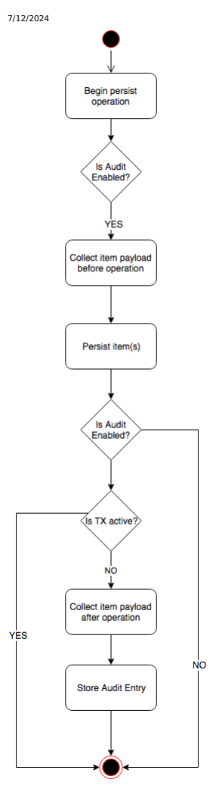
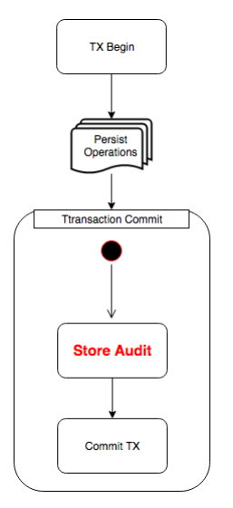
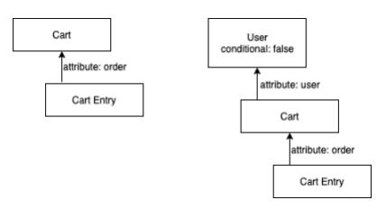
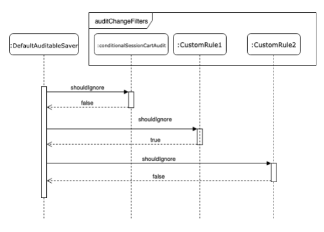

# Data Report And Audit

The Generic Data Report and the Generic Audit allow you to collect raw data about items and present it in a report. With the Generic Data Report, you can create reports reecting the current state of the data. With the Generic Audit, you can show how that data has changed over time. The topics covered include:
Preparing a Report Conguration To generate a report, create a special conguration to inform Platform which data about items, attributes, and relations from your SAP Commerce Cloud you want to collect and show in your report. Generating a Generic Report After you create and extend a report conguration, you can generate the nal report. Field Name Localization Platform resolves eld name localizations for data report views and allows you to customise the resolving algorithm. Generic Audit Generic audit tracks every persistence action, including creation, modication, and deletion for specied types. The audit is stored as a change log that allows you to see how an item changed over time.

## Preparing A Report Conguration

To generate a report, create a special conguration to inform Platform which data about items, attributes, and relations from your SAP Commerce Cloud you want to collect and show in your report.

This is   For more    the SAP Help  23 The conguration uses the XML format. You can create it from one or more XML les, covering one or more extensions. Each of your extensions can provide one or more XML conguration les. Dependent extensions can extend and contribute to the existing congurations provided by base extensions. During an initialization or a system update, all congurations are merged by a special name attribute. They are eventually stored in the database.

## Conguration File Naming Convention

Name your conguration les according to the <nameOfTheExtension>-<uniqueNameOfConfiguration>-audit.xml convention. For example, if your report conguration covers user-related items from a foobar extension, then you can choose a descriptive name for the <uniqueNameOfConfiguration> part - for example userdata. You must use the name of your extension for the <nameOfTheExtension> part. As a result, your conguration le name is foobar-userdataaudit.xml.

Store your conguration le in the resources directory of a given extension, in this example - inside the resources directory of the foobar extension.

## Conguration File Merging Mechanism

During an initialization or a system update, all extensions are scanned for report conguration les in the extension dependency order, and existing congurations are merged. Conguration les are merged by the same values of the name attribute found inside the conguration les. So, if your extension depends on another extension, and that extension provides a conguration, your extension can contribute to this conguration. For example, extension B depends on extension A, and extension A provides an a-someconfig-audit.xml conguration. Extension B can provide a b-someconfig-audit.xml conguration and extend the a-someconfig-audit.xml conguration. If both conguration les have the same name values, they are merged, and stored in the database. For more information about extending congurations, see Contributing to a Report Conguration.

## Creating Report Conguration

Start each conguration with <audit-report-config />, and provide a conguration name.

<audit-report-config name="sampleConfig">
</audit-report-config>
Write each conguration around one particular item type that your report logic starts from. To produce the whole report, provide a chosen item type as a report rootType, for example the User type.

<audit-report-config name="sampleConfig"> <given-root-type>User</given-root-type> </audit-report-config>
Dene how you want to present your root type in the nal report view.

<audit-report-config name="sampleConfig"> <given-root-type>User</given-root-type> <types> <type code="User" displayName="User"> </type> </types> </audit-report-config>
This is   For more    the SAP Help  24 The type is described through the <type /> tag. The tag has a displayName attribute that enables you to set up a humanreadable name for your type. In this case, you will see the name User in the report view.

To localize your User type name, use the displayKey attribute and provide a property key for it. In your local.properties le, provide a localization as the key value.

<audit-report-config name="sampleConfig">
 <given-root-type>User</given-root-type> <types> <type code="User" displayKey="type.user.name"> </type> </types> </audit-report-config>
For more information about how localized eld names are resolved in a report view, see Field Name Localization. So far, the report provides only an empty denition of your item type. To see some actual values in your report, you can add atomic attributes to your conguration.

Use the <atomic-attributes /> container tag with the <atomic-attribute /> tag to provide a conguration for each atomic attribute that you want to add to your report.

<audit-report-config name="sampleConfig"> <given-root-type>User</given-root-type> <types> <type code="User" displayName="User"> <atomic-attributes> <atomic-attribute qualifier="name" displayName="name"/> <atomic-attribute qualifier="uid" displayName="uid"/> </atomic-attributes> </type> </types> </audit-report-config>
The qualifier attribute of the <atomic-attribute /> tag refers to a real attribute qualier in the type denition.

The <atomic-attribute /> tag allows you to set up a localized name of an attribute through the displayKey tag attribute. For simplicity, this tutorial uses displayName only.

You can now produce your report for the User type. The report contains information about the name and uid attributes.

If you crawl from the rootType item (User in this case), you can get information about its related items. For example, your report can show information about all addresses, groups, and media items the User type has. To do it, use the <referenceattributes /> container tag to collect all references to other items the User type may have. This sample code shows how to collect addresses:
<audit-report-config name="sampleConfig"> <given-root-type>User</given-root-type> <types> <type code="User" displayName="User"> <atomic-attributes>
This is   For more    the SAP Help  25
 <atomic-attribute qualifier="name" displayName="name"/> <atomic-attribute qualifier="uid" displayName="uid"/> <atomic-attributes> <reference-attributes> <reference-attribute qualifier="defaultPaymentAddress" displayName="defaultPaymentA </reference-attributes> </type> </types> </audit-report-config>
By using the type attribute in <reference-attribute /> tag, you dene what type your referenced attribute is.

Add the Media, and PrincipalGroup references.

<audit-report-config name="sampleConfig"> <given-root-type>User</given-root-type> <types> <type code="User" displayName="User"> <atomic-attributes> <atomic-attribute qualifier="name" displayName="name"/> <atomic-attribute qualifier="uid" displayName="uid"/> <atomic-attributes> <reference-attributes> <reference-attribute qualifier="defaultPaymentAddress" displayName="defaultPaymentA <reference-attribute qualifier="profilepicture" displayName="profilepicture" type=" <reference-attribute qualifier="groups" displayName="groups" many="true" type="Prin </reference-attributes> </type> </types> </audit-report-config>
Now provide a more specic conguration for each of those types, that is for Address, Media, and PrincipalGroup. Do it as you did for the User type.

<audit-report-config name="sampleConfig"> <given-root-type>User</given-root-type> <types> <type code="User" displayName="User"> <atomic-attributes> <atomic-attribute qualifier="name" displayName="name"/> <atomic-attribute qualifier="uid" displayName="uid"/> <atomic-attributes> <reference-attributes> <reference-attribute qualifier="defaultPaymentAddress" displayName="defaultPaymentA <reference-attribute qualifier="profilepicture" displayName="profilepicture" type=" <reference-attribute qualifier="groups" displayName="groups" many="true" type="Prin </reference-attributes> </type> <type code="Address"> <atomic-attributes> <atomic-attribute qualifier="streetname" displayName="Street"/>
This is   For more    the SAP Help  26
 <atomic-attribute qualifier="town" displayName="City"/> </atomic-attributes> <reference-attributes> <reference-attribute qualifier="title" displayName="title" type="Title"/> </reference-attributes> </type> <type code="Media"> <atomic-attributes> <atomic-attribute qualifier="code" displayName="Profile picutre"/> </atomic-attributes> </type> <type code="PrincipalGroup"> <atomic-attributes> <atomic-attribute qualifier="maxbruteforceloginattempts" displayName="MaxBruteForce </atomic-attributes> </type> </types> </audit-report-config>
The Address type, just like the User type, has a reference to another item called Title. You can add a conguration for Title, too.

<audit-report-config name="sampleConfig"> <given-root-type>User</given-root-type> <types> <type code="User" displayName="User"> <atomic-attributes> <atomic-attribute qualifier="name" displayName="name"/> <atomic-attribute qualifier="uid" displayName="uid"/>
 <atomic-attributes>
 <reference-attributes> <reference-attribute qualifier="defaultPaymentAddress" displayName="defaultPaymentA <reference-attribute qualifier="profilepicture" displayName="profilepicture" type=" <reference-attribute qualifier="groups" displayName="groups" many="true" type="Prin </reference-attributes> </type> <type code="Address"> <atomic-attributes> <atomic-attribute qualifier="streetname" displayName="Street"/> <atomic-attribute qualifier="town" displayName="City"/> </atomic-attributes> <reference-attributes> <reference-attribute qualifier="title" displayName="title" type="Title"/> </reference-attributes> </type> <type code="Media"> <atomic-attributes> <atomic-attribute qualifier="code" displayName="Profile picutre"/> </atomic-attributes> </type> <type code="PrincipalGroup"> <atomic-attributes> <atomic-attribute qualifier="maxbruteforceloginattempts" displayName="MaxBruteForce </atomic-attributes> </type> <type code="Title"> <atomic-attributes> <atomic-attribute qualifier="code" displayName="code"/> <atomic-attribute qualifier="name" displayName="name"/> </atomic-attributes> </type> </types> </audit-report-config>
You have successfully prepared your report conguration. You can generate your report, or you can contribute to your conguration using a conguration from some other extension.

## Contributing To A Report Conguration

You can contribute to your existing conguration le from a conguration le of another extension, by adding, overriding, or removing elements of your existing conguration. The other conguration le allows you to add atomic attributes, or references. You can also add types to your existing conguration, replace, or even remove types you already congured.

Imagine that you saved some sample-sampleConfig-audit.xml conguration inside some sample extension. Now you create a new, dependent extension called dependent. You can use the type denitions of the dependent extension to extend the sample-sampleConfig-audit.xml conguration.

To contribute to an existing conguration, start from creating a dependent-sampleConfig-audit.xml conguration le inside the dependent extension.

## Dependent-Samplecong-Audit.Xml

<audit-report-config name="sampleConfig"> <given-root-type>User</given-root-type> <types> </types> <audit-report-config name="sampleConfig">

## Remember

Congurations found in the system across the whole, congured set of extensions are only merged if their name attribute values match.

## Examples

To add a new atomic attribute to the User type of the current conguration, append this attribute to the existing User type.

Use the mode attribute of the <type /> tag with append as the value.

dependent-sampleCong-audit.xml
<audit-report-config name="sampleConfig"> <given-root-type>User</given-root-type> <types> <type code="User" displayName="User" mode="append"> <atomic-attributes> <atomic-attribute qualifier="description" displayName="description" /> </atomic-attributes> </type> </types> <audit-report-config name="sampleConfig">
 Note The default value of the mode attribute is append. It is not necessary to set it up explicitly.

To completely replace a denition of a type, use the replace mode:

## Dependent-Samplecong-Audit.Xml

<audit-report-config name="sampleConfig"> <given-root-type>User</given-root-type> <types> <type code="User" displayName="User" mode="replace"> <atomic-attributes> <atomic-attribute qualifier="description" displayName="description" /> </atomic-attributes> </type> </types> <audit-report-config name="sampleConfig">
To remove a type, use remove:

## Dependent-Samplecong-Audit.Xml

<audit-report-config name="sampleConfig"> <given-root-type>User</given-root-type> <type code="Title" mode="remove" /> <audit-report-config name="sampleConfig">
 Note We don't recommend removing a rootType item denition.

## Virtual Attributes

Use virtual attributes to dene in a report conguration a dependency to another item even if it doesn't contain the proper reference attribute.

For virtual attributes, use the <virtual-attributes /> container and the <virtual-attribute /> tags. Since a virtual-attribute doesn't exist in an item denition from the type system point of view, you can only access a referenced type via a FlexibleSearch query. In a best case scenario, you can imagine that a referenced item has a foreign key eld which This is   For more    the SAP Help  29 keeps the PK of the current item. As an example, we use the User and Address types. Address contains the owner property.

owner is a type of Item, thus it can be an Address as well. In the code, you can see how to dene such a virtual attribute.

<audit-report-config name="sampleConfig"> <given-root-type>User</given-root-type> <types> <type code="User" displayName="User"> <virtual-attributes> <virtual-attribute expression="owner" type="Address" many="true" displayName="owned </virtual-attributes> </type> </types> </audit-report-config>
The example shows that there is no qualifier attribute because a virtual attribute doesn't exist in the type system. We use an attribute expression to provide a property name in the dependent Address type that contains the PK of the User type.

For a dependent type that has a reference to a parent type through an attribute of a type other than PK, you can use VirtualReferenceValuesExtractor. In our example conguration that uses VirtualReferenceValuesExtractor, there is a new custom CustomForeignKeyTest type. It has the key attribute. The key attribute consists of Order.code +
"_" + OrderEntry.entryNumber. It is really important that this foreign key represents one source (parent) item instance.

<type code="OrderEntry" displayName="OrderEntry"> <atomic-attributes> <atomic-attribute qualifier="entryNumber" displayName="entryNumber"/> <atomic-attribute qualifier="info" displayName="info"/> <atomic-attribute qualifier="quantity" displayName="quantity"/> </atomic-attributes> <reference-attributes> <reference-attribute qualifier="product" displayName="product" type="Product"/> <reference-attribute qualifier="unit" displayName="unit" type="Unit"/> </reference-attributes> <virtual-attributes> <virtual-attribute expression="key=beanName(orderCodeAndEntryValuesExtractor)" type="CustomForeignKeyTest" many="true" displayName="customChildren"/> </virtual-attributes> </type> <type code="CustomForeignKeyTest" displayName="CustomForeignKeyTest"> <atomic-attributes> <atomic-attribute qualifier="code" displayName="code"/> <atomic-attribute qualifier="key" displayName="key"/> </atomic-attributes> </type>
The CustomForeignKeyTest type is dened as a virtual attribute of the OrderEntry type. Instead of a simple qualier name key, we now have a key=beanName(orderCodeAndEntryValuesExtractor) expression. In the parentheses, we set the name of a Spring bean that implements VirtualReferenceValuesExtractor - the orderCodeAndEntryValuesExtractor bean.

During the extraction of type instances for a report, you have access to the audit records of types that are higher in the tree structure of your report cong (in our case we only have User, Order, and OrderEntry audit records).

Back to the bean denition. The API is dened as:
public interface VirtualReferenceValuesExtractor { <AUDITRECORD extends AuditRecordInternal> List<AUDITRECORD> extractValues(AuditRecordInternalPr }
This is   For more    the SAP Help  30 It contains one method that needs implementation - extractValues. The two arguments it requires are:

AuditRecordInternalProvider allows you to query for AuditRecords of a target type. It has only the List<AUDITRECORD> queryRecords(Set<Object> values) method. The method accepts a collection of values queried for a given qualier of a given target type (in our example the qualier is key, the target type is CustomForeignKeyTest, and the values will be a set of Strings equal to order.code + "_" +
orderEntry.entryNumber)
AuditTypeContext is the context for a target type. It contains properties with target type code, base (parent) type code, base (parent) PKs, and language ISO codes. In our example, the type is CustomForeignKeyTest, the baseType is OrderEntry, and basePKs contain a set with all OrderEntry PKs that belong to a User dened in the report).
It also contains a reference to the internal index of AuditRecords that have been already extracted for the report
(every type that is higher in hierarchy order than our CustomForeignKeyTest in the audit conguration), and methods to get those records from that index, for example getPayloads(final PK pk), getPayloads(final String type), getPayloads(final String type, final PK pk), and getPayloadsForBasePKs().

It is important to note that the implementation operates on generic types. Depending on the report generation phase, rst we gather all the records for the report, and in the second phase we use audit events created out of those records to generate report snapshots. In the rst phase, we use AuditRecords, and in the second - AuditEvents. They both extend AuditRecordInternal.

Here is a sample bean implementation:
public class OrderCodeAndEntryValuesExtractor implements VirtualReferenceValuesExtractor { @Override public <AUDITRECORD extends AuditRecordInternal> List<AUDITRECORD> extractValues( final AuditRecordInternalProvider<AUDITRECORD> provider, final AuditTypeContext<AUDITRECOR { final Set<AUDITRECORD> orderEntries = ctx.getPayloadsForBasePKs(); final Set<Object> values = new HashSet<>(); for (final AUDITRECORD entree : orderEntries) { final String entryNumber = entree.getAttribute("entrynumber").toString(); final String orderPKStr = entree.getAttribute("order").toString(); final PK orderPK = PK.parse(orderPKStr); final Set<AUDITRECORD> orders = ctx.getPayloads(orderPK); for (final AUDITRECORD order : orders) { values.add(order.getAttribute("code") + "_" + entryNumber); } } return provider.queryRecords(values); } }
We use the context to get all audit records for every OrderEntry that will be in the report - that is the gathering phase. In the report snapshot generation phase, there will only be one OrderEntry at a time of a given report tree node.

We iterate in a loop over every OrderEntry to get its entryNumber (use lowercase attribute names). Depending on the audit type, the getAttribute(final String key) method gets a before- or after-operation value of a given attribute. If you need a specic value of the attribute before or after the operation, you can use the getAttributeBeforeOperation(final String key) or getAttributeAfterOperation(final String key)
This is   For more    the SAP Help  31 methods. Take a look into the AuditRecordInternal interface for more API, and AuditRecord interface for a default behavior of the getAttribute method, depending on the audit type.

Every AuditRecord payload stores references for parent types (if they have any). In our case, OrderEntry stores a parent Order PK in the order attribute - serialized to a String. By using context, we get all the Order AuditRecords for that PK.

We iterate over every Order audit change and combine order code, "_", and order entry number, and store it in the set of values.

To the provider, we pass String values that serve as query parameters. We use the provider to pass a collection of order code and order entry numbers for which we make the queries. The query returns all CustomForeignKeyTest items whose key elds have the values we query for.

There is a special ReferencesResolver that uses a predened FlexibleSearch query to look for instances of the Address type, and for any records satisfying our conguration. See how to provide a custom ReferenceResolver implementation.

<audit-report-config name="sampleConfig"> <given-root-type>User</given-root-type> <types> <type code="User" displayName="User"> <virtual-attributes> <virtual-attribute type="SomeType" many="true" displayName="some type"> <resolves-by expression="some_custom_expression_known_to_underlying_resolver_im </virtual-attribute> </virtual-attributes> </type> </types> </audit-report-config>
In the example above we have added a new virtual-attribute that refers to SomeType and uses a custom resolver with a fooBar Spring Bean ID. It also uses a custom expression that is understandable for this specic ReferenceResolver implementation. Provide your implementation upfront by implementing the ReferencesResolver interface.

public interface ReferencesResolver { Collection<ResolveResult> resolve(AuditRecord baseRecord, Type typeToResolve, ResolvesBy resolve interface ResolveResult { PK getItemPk(); String getTypeCode(); Collection<AuditRecord> getRecords(); }

## Relation Attributes

To collect data with many-to-many relations, use the relation-attributes container tag in your XML conguration.

The relation-attributes container tag can contain many relation-attribute tags. Each tag can dene relations that are followed when you generate your report.

A relation-attribute tag should contain the names of the relation you want to follow (the name should be the same as in an ...-items.xml conguration) and the type that is resolved after following the relation. Additionally, you can set a name for displayName to display it as a description in your report.

| Attribute   | Required   | Description                                                                                                         |
|-------------|------------|---------------------------------------------------------------------------------------------------------------------|
| relation    | Yes        | The name of the relation in ...- items.xml that should be used when following a relation.                           |
| type        | Yes        | The type that is resolved after following the relation.                                                             |
| displayName | No         | The name to be used when creating a report.                                                                         |
| displayKey  | No         | The localized value key to be used when creating a report. The value is used as a displayName for a localized name. |

The data passed in the attributes is used by the resolver to gather the appropriate data you require in your report. The objects returned by following the relation are processed further. If there exists a report conguration provided for the type, it is consumed to create a full report.

## Resolving Relations

By default Platform uses the de.hybris.platform.audit.provider.internal.resolver.impl.ManyToManyReferencesResolver class to resolve a relation attribute. An object of this class is available as a Spring bean with a manyToManyReferencesResolver name. To dene a custom resolver, extend de.hybris.platform.audit.provider.internal.resolver.ReferencesResolver and register your implementation as a Spring bean. Next, pass the name of the bean in the resolves-by tag:
<relation-attributes> <relation-attribute relation="PrincipalGroupRelation" type="UserGroup" displayName="groups" > <resolves-by resolverBeanId="myCustomRelationAttributeResolver"/> </relation-attribute> </relation-attributes>

## Example

In the core-items.xml le, there is a relation dened that connects User (extends Principal) and UserGroup (extends PrincipalGroup). The relation has the PrincipalGroupRelation code.

## Core-Items.Xml

<items xmlns:xsi="http://www.w3.org/2001/XMLSchema-instance" xsi:noNamespaceSchemaLocation="items.x <!-- (...) --> <relations> <relation code="PrincipalGroupRelation" autocreate="true" generate="false" localized="false deployment="de.hybris.platform.persistence.link.PrincipalGroupRelation">
This is   For more    the SAP Help  33
 <sourceElement qualifier="members" type="Principal" collectiontype="set" cardinality="m <modifiers read="true" write="true" search="true" optional="true"/> </sourceElement> <targetElement qualifier="groups" type="PrincipalGroup" collectiontype="set" cardinalit ordered="false"> <modifiers read="true" write="true" search="true" optional="true"/> </targetElement> </relation> <!-- (...) --> </relations> <itemtypes> <itemtype code="Principal" extends="GenericItem" jaloclass="de.hybris.platform.jalo.security.Principal" autocreate="true" abstract="true" generate="true"> <!-- (...) --> </itemtype> <itemtype code="PrincipalGroup" extends="Principal" jaloclass="de.hybris.platform.jalo.security.PrincipalGroup" abstract="true" autocreate="true" generate="true"> <!-- (...) --> </itemtype> <itemtype code="User" extends="Principal" jaloclass="de.hybris.platform.jalo.user.User" autocreate="true" generate="true"> <!-- (...) --> </itemtype> <itemtype code="UserGroup" extends="PrincipalGroup" jaloclass="de.hybris.platform.jalo.user.UserGroup" autocreate="true" generate="true"> <!-- (...) --> </itemtype> <!-- (...) --> </itemtypes> </items>
PrincipalGroupRelation is passed as a relation attribute value in a report conguration XML le. Additionally, the UserGroup type is set in the type attribute. With that, the resolver gathers the data for UserGroups that are in a relation with a given user. The resolver then processes the UserGroup conguration to gather the specic data you require - in this example, the localized name of the group.

## User-Groups-Audit.Xml

<audit-report-config name="UserReport"> <given-root-type>User</given-root-type> <types> <type code="User" displayName="User"> <atomic-attributes> <atomic-attribute qualifier="name" displayName="name"/> <atomic-attribute qualifier="uid" displayName="uid"/> </atomic-attributes> <relation-attributes> <relation-attribute relation="principalGroupRelation" displayName="groups" many="tr type="UserGroup"/> </relation-attributes>
This is   For more    the SAP Help  34

 </type> <type code="UserGroup"> <atomic-attributes> <atomic-attribute qualifier="locName" displayName="locName"/> </atomic-attributes> </type> </types> </audit-report-config>

## Generating A Generic Report

After you create and extend a report conguration, you can generate the nal report.

## Generating A Report

To generate a report using an existing conguration, nd a unique code under which the conguration is stored in the database.

Additionally, use AuditViewService that provides the following interface:
public interface AuditViewService { Stream<ReportView> getViewOn(TypeAuditReportConfig config); }
In your conguration, your root type is User. Find a specic instance of the User type you want to generate the report for. Use the service with a proper User PK and the name of the conguration (in your case it is sampleConfig).

// Assuming you have UserService injected by Spring final UserModel user = userService.getUserForUID("sampleUser"); // Assuming you have AuditViewService injected by Spring final Stream<ReportView> report = auditViewService.getViewOn(TypeAuditReportConfig.builder().withCo

## Interpreting A Report

Each next ReportView in a produced Stream contains a specic view on the User and its related items that are described in the conguration sorted by time of changes.

You can call these methods on a ReportView object:
String getChangingUser() returns the name of the user who made the change

Date getTimestamp() returns the Date of the change Map<String, Object> getPayload() returns the whole payload of the changes. This Map could be a Map of Maps depending on a conguration, and you could easily convert it into a proper Json representation if needed.

## Field Name Localization

Platform resolves eld name localizations for data report views and allows you to customise the resolving algorithm.

Platform resolves localized eld names for the displayKey property with values provided either in conguration
(local.properties / project.properties) les or in language bundle les located in the resources/localization This is   For more    the SAP Help  35 directory. Platform checks whether the displayKey denitions are provided in the conguration les rst. If it cannot nd them there, it checks whether they are available in the language bundle les.

The resolving algorithm uses the AuditReportItemNameResolvable and AuditReportItemNameResolver interfaces.

AuditReportItemNameResolvable is implemented by all audit report XML elements and handles passing necessary information about element denitions to AuditReportItemNameResolver.

## Auditreportitemnameresolvable

public interface AuditReportItemNameResolvable { String getDisplayKey(); String getDisplayName(); String getDefaultName(); }
The AuditReportItemNameResolver interface has one method - getName. It takes as arguments a set of language ISO
codes you choose for report generation, and a report XML element denition.

## Auditreportitemnameresolver

/** * Interface which provides methods to resolve name for audit report items for the given configurat * Item. */ public interface AuditReportItemNameResolver { /** * Resolves AuditReportItemNameResolvable item's name * * @param langIsoCodes languages defined in audit configuration * @param item Item which name will be resolved based on provided details and the report * @return String representing name for the item * @see AuditReportItemNameResolvable */ String getName(final Set<String> langIsoCodes, final AuditReportItemNameResolvable item);
}

## Example Conguration

This example report conguration is created for an auditReportLocalization extension:
auditReportLocalization-testLocalization-audit.xml
<audit-report-config name="testLocalization"> <given-root-type>User</given-root-type> <types> <type code="User" displayKey="type.user.name"> <atomic-attributes> <atomic-attribute qualifier="name" displayName="Name comes first" displayKey="my.lo <atomic-attribute qualifier="uid" displayKey="my.localized.user.uid"/> </atomic-attributes> <relation-attributes> <relation-attribute relation="PrincipalGroupRelation" type="UserGroup" many="true"> <resolves-by resolverBeanId="manyToManyReferencesResolver"/> </relation-attribute> </relation-attributes> </type>
This is   For more    the SAP Help  36
 <type displayKey="my.localized.principal-group-relation" code="UserGroup"> <atomic-attributes> <atomic-attribute qualifier="locName" displayKey="type.principalgroup.locname.name" <atomic-attribute qualifier="description" /> <atomic-attribute qualifier="name" /> <atomic-attribute qualifier="uid" /> </atomic-attributes> </type> </types> </audit-report-config>
The key value for the user ID (uid) eld is provided in project.properties of the auditReportLocalization extension as my.localized.user.uid=Uid from Config.

These are example key values for the localized elds for the German language provided in resources/localization
(appropriate localized values for English and Spanish are also provided and you can see some of them in the output below as DE group name, ES group name):
my.localized.principal-group-relation=DE group name my.localized.user.name=DE name my.localized.user.uid=DE uid Platform resolves eld names as follows:

a eld name is resolved based on a provided displayName attribute; in the example, it is Name comes first; in the example, both displayName and displayKey are dened (for atomic-attribute qualifier=name for User)
but displayName takes precedence before displayKey when a displayKey is dened, Platform rst checks cong properties (local.properties /
project.properties) for appropriate key values; if no values are provided there, Platform searches for them in language bundle les
if neither of the above is dened, eld names are resolved based on their default names:
a type name is resolved to the type code; for example, a eld name for the User type is User

a virtual attribute name is resolved to the virtual attribute expression value; for example, for a <virtualattribute expression="owner"> expression, it is owner an atomic attribute name is resolved to the atomic attribute qualier value; for example, for <atomicattribute qualifier="description" />, it is description a reference attribute name is also resolved to the qualier value for a relation attribute, the default name is resolved based on the denition of the referenced type; for example, if a relation attribute is referenced by type="Address", then the default name is resolved by the denition of the Address type, with the same order for resolving names applying for the type (that is: displayName, or displayKey (with values provided in the cong properties), then, if neither is dened, the name is resolved as the type code, which is Address

## Generic Audit

Generic audit tracks every persistence action, including creation, modication, and deletion for specied types. The audit is stored as a change log that allows you to see how an item changed over time.

Auditing is enabled globally by default through the auditing.enabled=true property. To disable it, add auditing.enabled=false to your local.properties le.

With auditing enabled globally, you can enable it separately for each type you wish to track. The property that allows you to do it uses the audit.*<typecode>*.enabled=true naming convention. For example, to enable auditing for the User type, use audit.user.enabled=true. There are multiple item types enabled for auditing by default. Navigate to the
<HYBRIS_BIN_DIR>/platform/bin/platform/project.properties directory to see the list of such items.

This is   For more    the SAP Help  37 Generic audit collects data that you can provide to your customers through personal data reports, for example for the purposes of GDPR compliance. For more information, see Generating Personal Data Reports in Backoffice Framework.

You cannot exclude subtypes of a specied type from an audit. If you enable auditing for User, all of the User subtypes are audited as well. The following is invalid:
audit.user.enabled=true audit.employee.enabled=false The reason is that Employee extends User and it is impossible to audit Users and at the same time skip Employees.

You can specify what you want to audit on a ner level of granularity than type - for more information, see Change Log Filtering.

With many-to-many relations, enabling both sides of the relation isn't enough for the auditing feature to work automatically. Congure those relations separately in the same manner as you do for the source and target types.

## Audit Log Storage

SAP Commerce Cloud persists audit logs for types congured for auditing automatically. It uses a default storage implementation for that purpose.

Auditing consumes database space. SAP Commerce Cloud audits multiple item types by default. If you make changes in those items, it may affect database performance over time.

SAP Commerce Cloud provides a JDBC-based implementation of audit storage by default. For each type, a new corresponding table is created during initialization or update. The table name follows the <deploymentName><numericTypeCode>sn naming convention. For example, an audit table for the User type would be called users4sn.

A table for a standard type has the following structure:

| Field Name       | Type     | Description                                                                                                                 |
|------------------|----------|-----------------------------------------------------------------------------------------------------------------------------|
| ID               | bigint   | Record id                                                                                                                   |
| ITEMPK           | bigint   | Audited instance PK                                                                                                         |
| ITEMTYPEPK       | bigint   | Audited type PK (ComposedType)                                                                                              |
| timestamp        | datetime | Change timestamp                                                                                                            |
| currenttimestamp | datetime | Audit record timestamp                                                                                                      |
| changinguser     | varchar  | Author of the change                                                                                                        |
| context          | longtext | Additional context (JSON)                                                                                                   |
| payloadbefore    | longtext | The whole business payload of audited type before a persistence operation (JSON) Before INSERT, the payloadbefore is empty. |

| 7/12/2024 Field Name   | Type     | Description                                                                                                               |
|------------------------|----------|---------------------------------------------------------------------------------------------------------------------------|
| payloadafter           | longtext | The whole business payload of audited type after a persistence operation (JSON). After DELETE, the payloadafter is empty. |
| operationtype          | bigint   | 0 - deletion, 1 - creation, 2 - modication                                                                                |

A table for many-to-many-relation types has the same structure, plus three additional columns:

| Field Name   | Type   | Description    |
|--------------|--------|----------------|
| sourcePK     | bigint | Source item PK |
| targetPK     | bigint | Target item PK |
| languagePK   | bigint | Language PK    |

When auditing is enabled globally, audit tables are created up front, no matter whether a given type is congured for auditing or not. If it isn't congured, the table remains empty.

When you congure a type for auditing, each persistence operation to the type itself triggers the storing of an audit log. The framework does it automatically on each ModelService\#save and ModelService\#remove call. It doesn't require any further action or conguration. The following diagram shows the process for storing changes to a type:

This is custom documentation. For more information, please visit the SAP Help Portal In the following diagram, you can see how the same operation works when a transaction is in place:

The transaction is started and within it all operations such as creation, modication, and deletion are performed as in the rst diagram. Note that an audit storing action is delayed to the point when the transaction is committed.

## Searching For Audit Log Entries

SAP Commerce Cloud provides a dedicated service that allows you to search for audit log entries for a particular type using specic search rules (even in a JSON audit payload).

An audit log is not backed by the SAP Commerce Cloud type system. As a result, it isn't possible to use ModelService or FlexibleSearch to obtain the entries.

The service is congured in Spring with the ID readAuditGateway, and has the following interface:
public interface ReadAuditGateway { <T extends AuditRecord> Stream<T> search(AuditSearchQuery searchQuery); }
The interface returns a Stream of AuditRecord objects that is an object representation of an audit entry. An AuditSearchQuery object that is passed to the search method is the object that holds all the necessary information to perform the search query on an audit table. It allows you to search in standard type-related audit tables as well as in link-related audit tables.

The default implementation of audit is backed by JDBC. It is possible to implement a different persistence method since AuditSearchQuery only keeps information about the type to be searched together with a collection of SearchRule objects that dene which elds in the audit table or which attributes (values) in the audit table must be searched.

## Search Examples

The simplest query is a query for a type and a particular PK. To create such a query, rst prepare an AuditSearchQuery object using some existing PK. In this example, we use User as a type:

For convenience, AuditSearchQuery provides builders for building queries for standard types as well as for links.

// assuming User was found using UserService final UserModel user = userService.getUserForUID("someUser"); // build the audit search query final AuditSearchQuery query = AuditSearchQuery.forType("User").withPkSearchRules(user.getPk()).bui // do search final Stream<AuditRecord> records = readAuditGateway.search(query);
You can also search for more than one PK in one go:
// assuming User was found using UserService final UserModel user1 = userService.getUserForUID("someUser-1"); final UserModel user2 = userService.getUserForUID("someUser-2"); final UserModel user3 = userService.getUserForUID("someUser-3"); // build the audit search query final AuditSearchQuery query = AuditSearchQuery.forType("User").withPkSearchRules(user1.getPk(), us // do search final Stream<AuditRecord> records = readAuditGateway.search(query);
Although it is possible to create a query that reads the entire audit table into memory, it is not recommended as it may cause out-of-memory errors. Such a dangerous query can look like this:
final Stream<AuditRecord> records = readAuditGateway.search(AuditSearchQuery.forType("User").build( It is also possible to create a query that does a search within a JSON payload of an audit entry:
// assuming User was found using UserService final UserModel user = userService.getUserForUID("someUser"); // build the audit search query final AuditSearchQuery query = AuditSearchQuery.forType("User") .withPkSearchRules(user.getPk()) .withPayloadSearchRule("someFieldInPayload", "value") .withPayloadSearchRule("anotheFieldInPayload", "theOrherValue") .build(); // do search final Stream<AuditRecord> records = readAuditGateway.search(query);

## Removing Audit Log Entries

Generic audit allows you to remove existing audit log entries.

This service is congured in Spring with the ID writeAuditGateway, and has the following interface:
public interface WriteAuditGateway { void saveLinkAuditRecords(List<LinkAuditRecordCommand> cmdList);

 void saveTypeAuditRecords(List<TypeAuditRecordCommand> cmdList); int removeAuditRecordsForType(String type);
 int removeAuditRecordsForType(String type, PK pk); }
To remove audit log entries for a particular type and PK, use this code:
// assuming User was found using UserService final UserModel user = userService.getUserForUID("someUser"); writeAuditGateway.removeAuditRecordsForType("User", user.getPk());
If a particular item is marked as locked against further modications, it is not possible to remove its audit log entries. For more information about locking and unlocking items, see Item Locking Service.

## Audit Log And Generic Data Report

You can collect audit logs generated by generic audit and present such data in a form of report. It is possible thanks to the generic data report feature. You can do it in Backoffice or programmatically. You can include audit log data for each type in the nal generic data report by checking Audit in the Create New Audit Report Data wizard in Backoffice. For more information about the Create New Audit Report Data wizard, see Generating Personal Data Reports in Backoffice Framework. To do the same programmatically:
// assuming User was found using UserService final UserModel user = userService.getUserForUID("someUser");
// option withFullReport() enables audit data in the report final TypeAuditReportConfig config = TypeAuditReportConfig.builder() .withConfigName("PersonalDataReport") .withRootTypePk(user.getPk()) .withFullReport() .build(); final Stream<AuditView> report = auditViewService.getViewOn(config);
For more information, see Generic Data Report and Audit.

## Change Log Filtering

Generic audit allows you to congure auditing of data on a ner level of granularity than type. Narrowing down audited data to the data that you actually need prevents unnecessary database size growth.

When you use generic audit on per-type basis, you may decide to audit Carts and not to audit Users. As a result, all changes done to every cart are recorded and stored in the database. It may be a lot of data. Filtering allows you to dene ne-grained rules, where the decision whether to store an audit change is based on the change content itself. For example, in the default implementation of the change log ltering, instead of auditing all carts, only saved instances of carts are audited. For more information about it, see Conditional Session Cart Audit. You can lter audit changes using these approaches:
with the conditional audit, you use an XML le to dene generic ltering congurations that are ltering rules that specify what changes to audit with the AuditChangeFilter interface, you create customized ltering congurations programmatically

## Conditional Audit

With the conditional audit, you can congure what to lter without programming. The conditional audit uses a ltering conguration, which is a ltering rule, consisting of conditional audit groups. An audit group consists of a hierarchy of logically related types and an auditing condition. The hierarchy forms a tree structure. Each node in the type hierarchy has an attribute that denes how to traverse from the node to the parent. An auditing condition decides whether a change in data is audited or not. A condition is always evaluated on a root type. See the examples of Cart, and User conditional audit conguration structures:

In the Cart conguration example, Cart is the root type, and CartEntry is its child. This conguration applies to audit changes of both Cart and CartEntry. When a cart changes, that change is inspected against the conguration. A changed cart is of type Cart - it matches the type of the root in the conguration tree. Therefore, a condition set in that audit group can be evaluated directly on it. To inspect whether changes in Cart Entry can be audited, the audit group rst needs to obtain the cart data. It uses the congured order attribute to nd the appropriate cart, and evaluates the condition on it.

The User example extends the Cart example. User is the root type. It has the conditional=false attribute, which means that the audit group doesn't affect the audit changes made to a User instance itself. The User node is only added to the conguration because it an element of the condition used in the audit's group - specically, the conditional expression is evaluated on it. See this business scenario that uses the User conguration:
Assume that you want to audit some data of two specic customers (the Customer type). The customer ids are 001, and 002 respectively. You want to see how their carts (Cart) change, that is, what products (CartEntries) they add to their carts, in what quantity, and what products they remove from their carts before they eventually place their orders. You create an audit group that reects the relation between those types - the group consists of the Customer, Cart, and CartEntry types, it also has a condition. The condition states that Platform should only persist data changes made to carts and cart entries that belong to customers whose ids are 001, and 002. Since you don't want to audit changes made to the customers themselves, that is changes to the attributes of the Customer type, the Customer type isn't affected by the conguration thanks to the conditional=false attribute.

This is   For more    the SAP Help  44 This is the ltering conguration for this scenario:
<conditional-audit-config> <audit-group name="audit-carts-for-specific-users"> <condition>get('uid') == '001' or get('uid') == '002'</condition> <type code="Customer" conditional="false"> <type code="Cart" attribute="user"> <type code="CartEntry" attribute="order"/> </type> </type> </audit-group> </conditional-audit-config>

## Caution

The type traversal only supports one-to-many relations. Types can't be repeated in a conguration.

A condition is a SPEL expression. You can't rely on models for it. Instead, use the following method to access attributes:
public Object get(final String attribute)
An audit change is audited when the change states before or after a modication matches an audit group.

The following property enables full support for SpEL in audit condition evaluation. If false, only basic features such as calling methods and properties are supported. If true, full SpEL with static methods invocation and new object creation is supported:
audit.conditional.fullSpELSupport=false The default value is false. If full support is enabled, make sure that your conditions are not vulnerable to code injection.

## Xml Conguration

A conditional audit conguration starts with a single conditional-audit-config tag. Its children are audit-group elements that dene conditional audit groups.

| Element                                                                              | Attributes                                                                                                                                       | Description                                                       |
|--------------------------------------------------------------------------------------|--------------------------------------------------------------------------------------------------------------------------------------------------|-------------------------------------------------------------------|
| audit-group                                                                          | name                                                                                                                                             | Conditional audit group denition. Identied by the name parameter. |
| condition                                                                            | Denes a boolean expression that is executed on the root of a dened type hierarchy. If condition is false, a matching audit change isn't audited. |                                                                   |
| type                                                                                 | Type that forms an audit group tree.                                                                                                             |                                                                   |
| code                                                                                 | A typecode representing an item type, for example, the Cart type.                                                                                |                                                                   |
| attribute                                                                            | Determines whether an attribute is used to traverse from a type to its parent, for example, order for Cart Entry.                                |                                                                   |
| conditional                                                                          | Determines whether a type should be affected by an audit group. If false, the audit group isn't triggered for the given type.                    |                                                                   |
| This is custom documentation. For more information, please visit the SAP Help Portal | 45                                                                                                                                               |                                                                   |

| 7/12/2024 Element   | Attributes                                                                                                                         | Description   |
|---------------------|------------------------------------------------------------------------------------------------------------------------------------|---------------|
| subtypes            | Determines whether subtypes of a type should be affected by the audit group. If true, the rule is also triggered for the subtypes. |               |

Conguration le example:
<?xml version="1.0" encoding="UTF-8"?> <conditional-audit-config> <audit-group name="session-cart"> <condition>get('saveTime') != null</condition> <type code="Cart"> <type code="CartEntry" attribute="order"/> </type> </audit-group> </conditional-audit-config>
There can be more than one audit-group elements in a conguration. In such case, they're evaluated one by one.

You can use the subtypes attribute on a type tag to specify whether subtypes should be matched by this audit group.

<conditional-audit-config> <audit-group name="title-1"> <condition>!get('code').endsWith('audit1')</condition> <type code="Title"/> </audit-group> <audit-group name="title-2"> <condition>!get('code').endsWith('audit2')</condition> <type code="Title" subtypes="true"/> </audit-group> </conditional-audit-config>
A Type can have the conditional attribute. If it's false, audit changes of that Type aren't affected by this audit's group.

<?xml version="1.0" encoding="UTF-8"?> <conditional-audit-config> <audit-group name="order-entry-user"> <condition>get('code').endsWith('_audit')</condition> <type code="User" conditional="false"> <type code="Order" attribute="user"> <type code="OrderEntry" attribute="order"/> </type> </type> </audit-group> </conditional-audit-config>
All audit groups are enabled by default. You can disable them on runtime using a parameter:
audit.conditional.<audit-group name>.enabled=false

## Dening Conditional Audit Groups

Learn to dene conditional audit groups for the generic audit.

Context The example group audits all Title items except those that have codes ending with the no-audit suffix.

The group is enabled by default. You can disable it on runtime by setting the property:
audit.conditional.title-with-suffix.enabled=false

## Procedure

1. Create a conguration le and put it into a resource folder:
<?xml version="1.0" encoding="UTF-8"?> <conditional-audit-config> <audit-group name="title-with-suffix"> <condition>!get('code').endsWith('no-audit')</condition> <type code="Title"/> </audit-group> </conditional-audit-config>
2. Register a de.hybris.platform.persistence.audit.internal.conditional.ConditionalAuditChangeFilter Spring bean that references the conguration. Add the conguration to the auditChangeFilters list:
<bean name="titleWithSuffixConditionalAudit" class="de.hybris.platform.persistence.audit.inte <constructor-arg name="conditionalAuditConfigXml" value="title-with-suffix-audit.xml"/> <constructor-arg name="sldDataContainerProvider" ref="sldDataContainerProvider"/> <constructor-arg name="commonI18NService" ref="commonI18NService"/> <constructor-arg name="typeService" ref="typeService"/> </bean> <bean depends-on="auditChangeFilters" parent="listMergeDirective"> <property name="add" ref="titleWithSuffixConditionalAudit" /> </bean>

## Conditional Session Cart Audit

SAP Commerce Cloud comes with a precongured generic audit group that allows you to ignore session carts and audit stored carts only.

A session cart is a transient piece of data - it may change a lot before it is eventually persisted as an order. Due to those multiple changes, auditing session carts has a big impact on performance and database storage. In most cases, you may not need to store all those data changes.

All changes made to a cart or a cart entry are ignored unless the cart is saved. A cart is identied as stored if its saveTime attribute is not null. This attribute is set when a storefront user chooses to save their cart, and is set to null when the user restores a previously saved cart. Cart entries are only audited if they belong to a stored cart.

This group is based on conditional audit feature and dened by conditionalSessionCartAudit bean. Conditional audit conguration le is stored in audit/conditional-session-cart-audit.xml in the Platform core extension.

To enable a session cart audit, remove conditionalSessionCartAudit from the auditChangeFilters bean, or change the audit.conditional.session-cart.enabled property value to false:
audit.conditional.session-cart.enabled=false

## Auditchangefilter Interface Filtering

This is   For more    the SAP Help  47 The interface AuditChangeFilter allows you to implement audit ltering on an api level.

The de.hybris.platform.persistence.audit.AuditChangeFilter interface provides the ignoreAudit method: The ignoreAudit method returns true if AuditableChange shouldn't be stored in the database. The auditChangeFilters Spring bean (dened in servicelayer-spring.xml) is a list of audit change lters that are consulted every time a change is to be saved. AuditableChange isn't saved if any of the interface implementations in the list return true.

The diagram illustrates a scenario with three audit change lters. CustomRule1 lter returns true, so the change isn't audited.

Method parameter AuditableChange is a data container containing object state before and after audited operation. Use these values to determine if a given change should be saved. Since auditing is performed in low-level persistence layer, accessing models and using other high-level features, such as dynamic attributes, is not supported.

## Implementing The Auditchangefilter Interface

Learn how to implement the AuditChangeFilter interface to create custom audit ltering rules.

## Context

The example assumes that you want to audit only those Title items that were created this year.

## Procedure

1. Create a AuditTitlesCreatedThisYear class that implements the de.hybris.platform.persistence.audit.AuditChangeFilter interface:
This is   For more    the SAP Help  48 package de.hybris.platform.persistence.audit; import de.hybris.platform.core.model.user.TitleModel; import de.hybris.platform.directpersistence.cache.SLDDataContainer; import java.time.LocalDateTime; import java.time.ZoneId; import java.util.Date; public class AuditTitlesCreatedThisYear implements AuditChangeFilter { @Override public boolean ignoreAudit(final AuditableChange change) { final SLDDataContainer dataContainer = getDataContainer(change); if (dataContainer == null || !TitleModel._TYPECODE.equals(dataContainer.getTypeCode())) { return false; } final LocalDateTime creationTime = getCreationTime(dataContainer); return creationTime.getYear() < LocalDateTime.now().getYear(); } private LocalDateTime getCreationTime(final SLDDataContainer dataContainer) { final Date creationDate = (Date) dataContainer.getAttributeValue("creationtime", null).g return LocalDateTime.ofInstant(creationDate.toInstant(), ZoneId.systemDefault()); } private SLDDataContainer getDataContainer(final AuditableChange change) { return change.getAfter() != null ? change.getAfter() : change.getBefore(); } }
The class checks whether AuditableChange is related to a Title item. It then uses SLDDataContainer to get the creationtime attribute. If the Title creationtime year is lesser than current year, true is returned. It means that audit should not be executed.

2. Register the class as a Spring bean and add it to auditChangeFilters:
<?xml version="1.0" encoding="UTF-8"?> <beans xmlns="http://www.springframework.org/schema/beans" xmlns:xsi="http://www.w3.org/2001/XMLSchema-instance" xsi:schemaLocation="http://www.springframework.org/schema/beans http://www.springframework.org/schema/beans/spring-beans.xsd"> <bean class="de.hybris.platform.persistence.audit.AuditTitlesCreatedThisYear" name="auditT <bean depends-on="auditChangeFilters" parent="listMergeDirective"> <property name="add" ref="auditTitlesCreatedInThisYear" /> </bean> </beans>
listMergeDirective is used to add the auditTitlesCreatedInThisYear bean to auditChangeFilters.

## Generic Audit Properties

See the list of available generic audit properties with their default values.

Property Default Value

This is   For more    the SAP Help  49

| 7/12/2024 Property                                  | Default Value                                                                                                                                                                                                  |
|-----------------------------------------------------|----------------------------------------------------------------------------------------------------------------------------------------------------------------------------------------------------------------|
| auditing.enabled                                    | true                                                                                                                                                                                                           |
| auditing.alltypes.enabled                           | true                                                                                                                                                                                                           |
| auditing.blacklist                                  | itemsynctimestamp,joblog,logfile,jobmedia,task,                                                                                                                                                                |
| audit.<typeCode>.enabled                            | true for user, principalgrouprelation, abstractcont paymentinfo, paymentmode, product, quote, quoteentry userpasswordchangeaudit, cxusertosegment, cxsegme district, csticket, comment, employee, csagentgroup |
| audit.<typeCode>.blacklistedProperties              | Not applicable                                                                                                                                                                                                 |
| audit.user.blacklistedProperties                    | encodedpassword                                                                                                                                                                                                |
| audit.userpasswordchangeaudit.blacklistedProperties | encodedpassword                                                                                                                                                                                                |
| audit.blacklistedProperties.obfuscationValue        | ****                                                                                                                                                                                                           |
| audit.conditional.session-cart.enabled              | true                                                                                                                                                                                                           |
| audit.conditional.fullSpELSupport                   | false                                                                                                                                                                                                          |
| audit.write.jdbc.batch.size                         | 50                                                                                                                                                                                                             |
