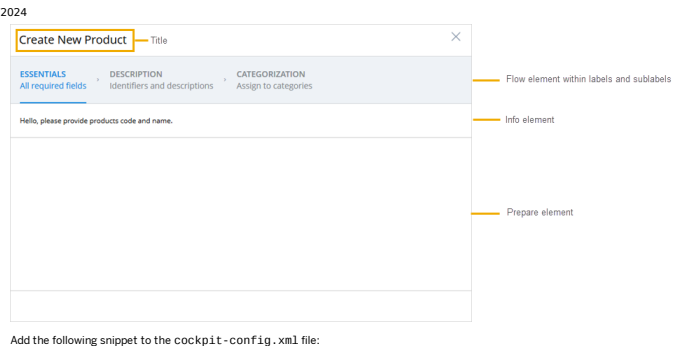
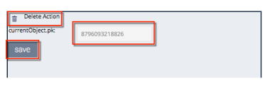
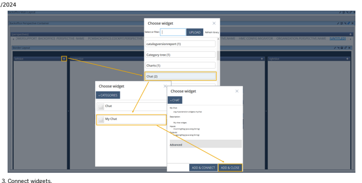
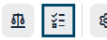

# Backend Administration
## Backoffice & Backoffice Product Content Management

Backoffice is a user-centric backend interface that enables business users to easily manage any kind of data within a SAP Commerce Cloud system. Backoffice Product Content Management is a user-centered design tooling that allows you to manage your product data.


## Backoffice Framework Concept

The goal of the Backoffice Framework is to simplify development of backoffice applications. It helps you create components that can be reused in all kinds of applications later on. When you design an application, the components can be modied without touching the code base.

## Support The Extension Concept

The SAP Commerce Cloud is based on a exible, modular concept that allows you to put new functionality into extensions. An extension is an encapsulated piece of SAP Commerce Cloud that can contain business logic and type denitions. Most of the time the functionality added to SAP Commerce Cloud by custom extensions needs business tooling. With the introduction of Backoffice Framework, SAP wants to enable you to easily contribute to the backoffice application build on top of the Backoffice Framework.The main difference to the Cockpit Framework is the outstanding exibility of the Backoffice Framework. By developing custom navigation and layout widgets the application developer can redene the whole layout of the backoffice application and is not bound to the application structure of the current cockpits with its Navigation, List View, Browser and Edit Sections.

## Orchestrate The Application Widget Library

One of the key concepts behind Backoffice Framework is the idea of an application made up of a set of widgets. Each widget is a stand-alone UI component for a clearly-dened purpose. All the widgets in the central widget library can then be used to assemble the backoffice application by conguration.

## 

Backoffice Framework comes with a steadily growing set of very generic and highly customizable widgets. They are all build using the ZK Framework as server-side rendering allows full access to the Spring application context of SAP Commerce Cloud. Nevertheless, the widget developer is not bound to using the ZK Framework when implementing custom widgets. Every widget is composed by a controller and a view.

The view can also be implemented using plain HTML, CSS, and JavaScript.

## Editors And Actions

Data manipulation operations are covered in the framework by an extensible set of editors. All types of data: simple elds, localized elds, relations, classications (with ranges and nesting) are supported out-of-the-box. For each attribute of an ItemType like simple text, type reference, media or any other there exists a default editor that can be used in views based on the ZK Framework. If the default editor does not support all of your requirements you can always provide a custom implementation of an editor. The effort is similar to writing a widget. For situations where you want to perform business logic or start a wizard ow the Backoffice Framework supports the actions concept. Similar to widgets actions consist of a view that can be just a linked text or even a button and logic that is executed when the action is activated. It is possible to even use the scripting functionalities of the Platform.

## Main Navigation

As one application never ts on one screen the Backoffice Framework supports structuring the application into perspectives and subperspectives. To access the specied perspectives and sub-perspectives the Backoffice Perspective Chooser widget is used in the default setup of the backoffice application. Any widget developer can easily create a custom navigation widget and overwrite the default application setup from within a custom backoffice extension.

## Set Of Default Layouts

Composing a perspective always requires positioning the widgets within the available viewport. To support this, the Backoffice Framework provides some predened layouts you can use. As a layout is also just a widget in itself adding custom layouts is as easy as adding a custom widget to the widget library.

## Widget Communication

Very often what is displayed in one widget depends on an action performed in another widget. For example, you select a product in a list. Based on the selected product a chart widget displays the sales volume of that product compared with the average of all products of the same category. To support this kind of communication between widgets the Backoffice Framework provides the socket connection concept.

## Congurable Wizards

An application developer can design a wizard just by conguration and connect it to an action which can then be reused throughout the whole application. For more information, see the Creating a Congurable Flow Wizard Widget.

## Congure The Application Central Conguration Repository

The wiring of all the widgets and the structure of the backoffice application is merged for all extensions based on the ybackoffice template in the widget.xml le. Additionally, the application developer can congure the layout and behavior for every widget instance in the application based on the documented conguration parameter for each widget type in the cockpit-config.xml le. For example, which tabs are shown for a given Type of the SAP Commerce Cloud Type System and how the attributes are grouped into sections and placed on panels can be done just by conguring an instance of the Editor Area widget.

## Role Based Layout

For every widget instance, the application developer can congure a list of authorities that are required to access this widget instance.

Furthermore in the cockpit-config.xml le the conguration for a widget instance or for a congurable wizard can differ for different authorities. This makes it easy for the application developer to create a custom experience for different user personas accessing the backoffice application.

## Why Another Ui Framework?

| 7/11/2024 Pros                                                                                                                                                                                                                                                                                                                                             | Cons                                                                                                                   |
|------------------------------------------------------------------------------------------------------------------------------------------------------------------------------------------------------------------------------------------------------------------------------------------------------------------------------------------------------------|------------------------------------------------------------------------------------------------------------------------|
| The SAP Commerce Cloud Type System is fully integrated in the Backoffice Framework. See Cockpit Data Integration Layer of the Backoffice Framework document.                                                                                                                                                                                               | No full exibility in using web technologies of your choice if you want to reuse existing widgets, actions, and layouts |
| You can build and add to an application without having to care about                                                                                                                                                                                                                                                                                       | For a transition time, there will be two UI framework technologies that need                                           |
| authentication, navigation, a role concept, and many other things                                                                                                                                                                                                                                                                                          | to be supported and partners need to have the skills to customize                                                      |
| A whole set of predened widgets, actions and layouts you can use to                                                                                                                                                                                                                                                                                        | Advanced customization requires good knowledge of coding in Java and of                                                |
| create your custom backoffice application just by conguration                                                                                                                                                                                                                                                                                              | the Spring Framework                                                                                                   |
| All tooling will be available in one application and it will be much easier to reuse UI components and build up customized or new perspectives Leverage the power of the existing widgets and layout with built-in responsiveness Testability: you can test widgets and other components in isolation from rest of the system Growing community of experts |                                                                                                                        |

Available Widgets Creating a Widget Structure of the Custom Backoffice Extension

## Backoffice Framework Architecture

SAP Commerce Cloud introduces Backoffice Framework: a widget-based framework that enables you to easily create business tools customized for specic organizational roles. The framework consists of a single Web application that consists of cockpit widgets, which can be deployed and congured at runtime. Backoffice Framework uses the ZK Framework as a basis. The ZK version used in the current SAP Commerce Cloud:
ZK Version 9.6.2

## What Is Backoffice Framework?

Backoffice Framework is a UI framework built in order to be a foundation for the third generation SAP Commerce Cloud backoffice tooling. It has been developed from scratch taking into account our experiences with the previous cockpit framework as well as feedback from partners.

## What Should It Do?

The goal of Backoffice Framework is to provide a powerful framework, which allows you to:
Create high-performance Web-based backoffice applications in an easy way

Reuse the components between applications Extend and customize your application Congure your application according to your needs Test it in an effortless way
From the architecture point of view, the key features are:
High modularity Loose dependency between components Clearly dened communication channels

## Approach

A new Backoffice Application has been created basing on Backoffice Framework to achieve the mentioned goals. The application is composed of building blocks of different shapes and different functionalities. By putting them together, you can build different applications with a set of functionalities that you need. Is a functionality missing in the out-of-the-box package? You can create your own building block that provides it and place it easily in your application. What is more important, the building block you create can be shared and reused in other applications as well.

Customizing ZK Framework Library Settings

## Backoffice Product Content Management

Backoffice Product Content Management is a user-centered design tooling that allows you to manage your product data.

Backoffice Product Content Management (aka Backoffice Product Cockpit, Backoffice Product Content Management) is built using the Backoffice Framework, which makes it highly congurable. Backoffice Product Content Management allows you to manage information about your products and catalog hierarchies using different views: Welcome Dashboard, The Products Search and Browse View, the Assortment View, Collaboration Center, and the Compare View.


## Backoffice Framework Module

Backoffice Framework Module delivers Backoffice Framework and a basic Backoffice Administration Cockpit. It provides the tools to administer the backend part of your business and build new applications on top of the Backoffice Framework.

Features Architecture Implementation


Backoffice Framework Module Features Widgets Editors and Actions Backoffice Framework - Technical Overview Backoffice Administration Cockpit - User Guide Backoffice Framework Hot Deployment AngularJS in Backoffice Framework Business Roles in Backoffice Drag and Drop Functionality in Backoffice Excel Export and Import in Backoffice Framework Personal Data Reporting Conguration in Backoffice Framework Report Denitions (ViewTypes) in Backoffice Administration Cockpit Resetting Backoffice Conguration widgets.xml Element Reference Validation Service in Backoffice Framework Disabling Backoffice Components Backoffice Framework Security Bookmark Support in Backoffice UI Conguration in the Backoffice Framework Testing in Backoffice Framework


platformbackoffice Extension
Backoffice Framework Module Implementation


Creating and Conguring Widgets Creating and Conguring Actions Creating and Conguring Editors Starting with Backoffice Framework Working with AngularJS in Backoffice Framework Working with Drag and Drop in Backoffice Framework Advanced Search Backoffice Framework Search API
Cockpit Data Integration Layer of the Backoffice Framework Default JSON Serialization of Platform Model Classes Bean Extenders Mechanism Handling Exception-Related Messages in Backoffice Modularity of Backoffice's web.xml Property Accessors and Method Resolvers Registering Application Event Listener Sass Integration Storing Data Using Widget Model Settings in local.properties and project.properties Conguring Backoffice Framework UI
JavaDocs

## Backoffice Framework Module Features

The Backoffice Framework module provides a range of features related to using Backoffice applications. For example, you can import or export Microsoft Excel les to ll your application with content.

Widgets The building blocks are called widgets. SAP Commerce Cloud applications also consist of components called widgets.

Editors and Actions Use editors and actions provided by Backoffice Framework or develop your own to enhance your application. Backoffice Framework - Technical Overview One of the key concepts behind Backoffice Framework is the idea of an application made up of a set of widgets. Each widget is a standalone, deployable component with a clearly-dened interface and a specic purpose. By combining and connecting widgets, an application can be designed and put together quickly using the application orchestrator. Backoffice Administration Cockpit - User Guide Learn how to manage SAP Commerce Cloud with Backoffice Administration Cockpit.

Backoffice Framework Hot Deployment This is   For more    the SAP Help  6 There are various tools and mechanisms that improve the performance of developers of Backoffice extensions. This page acts as a front-page to gather all of them in one place.

AngularJS in Backoffice Framework Backoffice Framework Framework provides the possibility to integrate the AngularJS library. This page holds the documentation concerning integration of AngularJS with Backoffice Framework. Business Roles in Backoffice You can restrict visibility of a specic instance of a widget for some users by setting relevant access restrictions for certain authority groups. This means that you can design Backoffice application that shows a different application mash-up to different business users, depending on their business roles.

Drag and Drop Functionality in Backoffice Drag and Drop functionality delivers an implementation for dragging and dropping behaviors for a selected use case. It allows the user to drag and drop elements which are inside or outside of, for example, a widget. Excel Export and Import in Backoffice Framework Using Backoffice Framework you can export your items to an Excel le, import the edited items, or create new ones. Personal Data Reporting Conguration in Backoffice Framework Technical details about creating audit reports in Backoffice Framework.

Resetting Backoffice Conguration While developing Backoffice Application, it might be very useful to reset the conguration les to defaults. There are two ways to do it.

Validation Service in Backoffice Framework The purpose of the validation framework is to verify data before you save it and to notify you about any violations to the constraint rules. You can validate a whole object or some specic attributes of an object.

Disabling Backoffice Components You can disable some components in your Backoffice installation. For instance, you might take a project decision not to use a scripting action at all. The backoffice.widget.library.blacklist setting allows you to globally turn off components in Backoffice.

Backoffice Framework Security Along with the security mechanisms provided by SAP Commerce Cloud Platform, Backoffice Framework provides additional security functionalities to ensure that your application is safe.

Bookmark Support in Backoffice Backoffice provides a generic mechanism for introducing bookmark support in the application. You can dene your own custom behavior how the bookmarks are handled.

UI Conguration in the Backoffice Framework You can congure the UI of your widget or of the entire Backoffice Administration Cockpit depending on the current role, type of item the widget is displaying, and other conditions.

Reverting Objects Created in Wizards Backoffice Framework offers exible conguration of wizard widgets. In some cases, it might be useful to add a possibility to revert objects created and saved during the series of steps.

Testing in Backoffice Framework Backoffice can be congured for testing purposes. It is possible to use a widget multiple times within the same perspective or to use the same widget in different perspectives/cockpits. In order to allow creating stable automated tests, stable ids of elements are required.

Click Tracking In order to further improve the functionality of SAP Commerce Cloud to better support your business needs, click tracking is enabled in Backoffice to collect the following data regarding your interaction with the system.

Deep Link Support in Backoffice Deep linking refers to hyperlinks that are opened outside an application, via a bookmark in a browser or a link from another application.

## Backoffice Framework Module Architecture

Backoffice Framework Module is a set of extensions providing functionalities necessary to build a Backoffice application.

Dependencies


Dependencies Diagram

## Recipes

Backoffice Framework Module is a part of many recipes.

For a complete list of SAP Commerce Cloud recipes that may include this module, see Installer Recipes.

For a complete list of the SAP Commerce Cloud, integration extension pack recipes that may include this module, see Installer Recipe Reference.

## Extensions

The Backoffice Framework Module consists of the following extensions:
backoffice ybackoffice platformbackoffice

backofficesolrsearch
backoffice Extension The backoffice extension provides a widget-based framework that enables you to easily create business tools customized for specic organizational roles. The framework consists of a single Web application that consists of cockpit widgets, which can be deployed and congured at runtime.

platformbackoffice Extension The platformbackoffice extension provides some of the editors and actions that enable you to manage SAP Commerce Cloud.

This is   For more    the SAP Help  8 ybackoffice Extension The ybackoffice extension is a template extension that is used to generate new backoffice nature extensions.

## Backoffice Extension

The backoffice extension provides a widget-based framework that enables you to easily create business tools customized for specic organizational roles. The framework consists of a single Web application that consists of cockpit widgets, which can be deployed and congured at runtime.

About the Extension

| Name       | Directory   | Related Module              |
|------------|-------------|-----------------------------|
| backoffice | hybris/bin/modules/backofficeframework/backoffice             | Backoffice Framework Module |

Dependencies


## Platformbackoffice Extension

The platformbackoffice extension provides some of the editors and actions that enable you to manage SAP Commerce Cloud.

An SAP Commerce Cloud extension may provide functionality that is licensed through different SAP Commerce Cloud modules. Make sure to limit your implementation to the features dened in your contract license. In case of doubt, please contact your sales representative.

## Customer-Support Related Functionality

In order for the Customer Support perspective to work, several changes have been introduced in the platformbackoffice extension.

## Creating A Customer

In order to support the creation of customers, the CustomerIdPrepareInterceptor class has been introduced. This class is responsible for setting the customerId parameter if it is empty.

## Dependencies


Dependencies

## Ybackoffice Extension

The ybackoffice extension is a template extension that is used to generate new backoffice nature extensions.

## About The Extension

| Name                                                                                 | Directory   | Related Module              |
|--------------------------------------------------------------------------------------|-------------|-----------------------------|
| ybackoffice                                                                          | hybris/bin/modules/backofficeframework/ybackoffice             | Backoffice Framework Module |
| This is custom documentation. For more information, please visit the SAP Help Portal | 10          |                             |

## Dependencies


## Backoffice Framework Module Implementation

You can congure the mechanisms provided by the Backoffice Framework Module, for example, add a custom behavior to drag and drop mechanism. In this way, you can target the Backoffice application to a specic business need.

Creating and Conguring Widgets Backoffice Framework is composed of building blocks of different shape and functionality. By putting them together, you can build different applications with the set of functionalities. These building blocks are widgets.

Creating and Conguring Actions Actions are special components provided by the Backoffice Framework that you can use inside your widgets. Creating and Conguring Editors Editors are special components provided by the Backoffice Framework that you can use inside your widgets in order to edit and manipulate data.

Starting with Backoffice Framework The best way to familiarize with any topic is to learn by practice. The following sections help you learn everything about developing a widget and orchestrating your Backoffice application.

Working with AngularJS in Backoffice Framework Learn how to integrate the AngularJs library with Backoffice Framework. Working with Drag and Drop in Backoffice Framework Learn how to congure the drag and drop functionality in Backoffice Framework.

Advanced Search Backoffice Framework Search API
This is   For more    the SAP Help  11 By default, the Advanced Search widget allows to use a single global operator when dening a search query. However, with the enhanced Advanced Backoffice Framework Search API, it is possible to set multiple conditions for search.

Cockpit Data Integration Layer of the Backoffice Framework Backoffice Framework provides generic widgets for working with data, including the ability to perform CRUD operations, modify permissions, and run searches. Examples of such widgets include Editor Area, List View, and Text Search. These widgets are independent from the underlying platform through their use of the Cockpit Data Integration abstraction layer.

Default JSON Serialization of Platform Model Classes All CockpitNG POJO classes that are used for widget communication are able to serialize to JSON. Additionally, Backoffice provides object mapper conguration for platform model classes - the classes which extend ItemModel.

Bean Extenders Mechanism While the user customizes the existing features or writes new features, there is often a need to modify a bean denition. In many cases, a common spring aliasing override is not enough. For such cases, the extenders mechanism has been introduced. Each one of the extenders is capable of amending any spring bean that is dened in the same, or in any, of parent spring contexts.

Handling Exception-Related Messages in Backoffice Error messages displayed to users after a failed operation or interaction that is causing an exception, are a cross-cutting concern and therefore have been unied in the Backoffice. There is a mechanism for converting exceptions into their textual representation.

Modularity of Backoffice's web.xml For the custom Backoffice extensions, there might be a requirement to extend the Backoffice web.xml le by adding a lter or a servlet. Backoffice supports modularity of the web.xml through the web-fragment.xml to fulll this need. This allows every Backoffice application to use own lters and servlets.

Property Accessors and Method Resolvers Backoffice Framework utilizes property accessors and method resolvers in the classication system. Registering Application Event Listener There is a mechanism to translate Platform application events into cockpit events, so that they can be handled by cockpit event queue. This solution allows you to hook into an application event in your Backoffice application, like for instance you can make one of your widgets aware of a session that a user changes. Sass Integration Backoffice provides support for Syntactically Awesome Style Sheets (Sass) scripting language, a CSS preprocessor that gives better experience in styling your application. Storing Data Using Widget Model The widget model is a place, where you should hold all data that dene the state of your widget.

Settings in local.properties and project.properties You can use additional settings in the local.properties or project.properties les that change the default behavior of Backoffice application. Conguring Backoffice Framework UI
Learn how to congure the UI of the Backoffice Framework application.

widgets.xml Element Reference The widgets.xml le keeps the application default conguration. It is loaded on the Web application startup.

Conguring Backoffice in Multi-Tenant Environments In multi-tenant conguration of Platform, Backoffice requires additional conguration to avoid clash of resources. Customizing ZK Framework Library Settings ZK Framework technology is used to build up Backoffice Framework components. Backoffice Framework provides you with a mechanism to change the default settings of ZK Library in your project.

Classication Metadata Endpoint You can fetch classication metadata using the OData REST endpoints.

## Creating And Conguring Widgets

Backoffice Framework is composed of building blocks of different shape and functionality. By putting them together, you can build different applications with the set of functionalities. These building blocks are widgets. Documentation concerning widgets usage and conguration:
Creating a Widget Testing a Widget Passing Data Between Widgets Parametrizing a Widget Creating Composed Widgets Creating a Congurable Flow Wizard Widget Extending a Widget in the Custom Backoffice-Based Application Creating a Reusable Widget Group for Use on Separate Host Machines Positioning Elements in a Widget within Conguration See available widgets:
Available Widgets

## Creating A Widget

A Web application created using Backoffice Framework consists of components called widgets. Widgets communicate with one another and may be also grouped together. Widgets are used by application designers who create the frontend application. This document describes all steps that should be performed in order to create a widget and add it to a frontend application. As an example, you are going to create a simple search widget made up of a text box and Search button.

To perform this tutorial, make sure you already have the myextension extension created. See Creating a Custom Backoffice Extension.

## Note Prototyping A Widget

You can change the behavior of the framework to make it easier to prototype a widget:
To make changes in ZUL les visible after page refresh, including changes to custom CSS les:
Change the following properties, then restart the server:
local.properties backoffice.cockpitng.additionalResourceLoader.enabled=true backoffice.cockpitng.uifactory.cache.enabled=false backoffice.cockpitng.widgetclassloader.resourcecache.enabled=false backoffice.cockpitng.resourceloader.resourcecache.enabled=false Updates to the localization les labels.properties and labels_<ISO_CODE>.properties les are not being reloaded and require the extension to be rebuilt. Additionally to create and modify a widget in a built and started environment, in the denition le of your widget, in the controller tag refer to groovy script that is to be the controller of your widget during widget prototyping.

## Creating A Widget Denition

To create a widget, you need to start by creating a widget denition. The denition of a widget is provided in definition.xml le.

1. In myextension/backoffice/resources/widgets directory create a new folder called mysearch.

2. In the mysearch folder, create a definition.xml le.

3. Add information about the search widget.

You can provide information like name, description, default title, author, and version. Each widget must have a unique ID made up of the extension and widget names. For this tutorial, the widget ID is org.myextension.widgets.mysearch.

denition.xml
<?xml version="1.0" encoding="UTF-8" standalone="yes" ?> <widget-definition id="org.myextension.widgets.mysearch" xmlns:xsi="http://www.w3.org/2001/XMLSchema-inst
<name>My Search</name> <description>My own search widget.</description>
<defaultTitle>Search</defaultTitle> <author>Me</author>
<version>0.1</version>
</widget-definition>

## Caution

Unique widget ID and unique folder name required When creating a new widget, remember to:
Give a unique ID for your widget. If you choose an ID that is already in use, the new widget doesn't appear in the application.

Give a unique name to the folder where you put the definition.xml le:
/your_extension/backoffice/resources/widgets/*<unique_name>*/. Placing a widget denition in a not unique folder results in incorrect widget behavior or not loading widget at all.

When you see similar entries in the logs, check the following in your setup:
[DefaultCockpitComponentDefinitionService] Duplicated component definition for {{your component id}}: 
if the widget denition ID is unique if the widget denition is placed in a unique folder

## Creating A Widget View

The view of this widget is dened in a ZK ZUL le.

## Context Note

You can explicitly declare the view le in definition.xml, for example, <view src="door.zul"/> in Creating and Using Virtual Sockets. Or you can name the view le after the last part of the widget ID dened in definition.xml, in this case, <widgetdefinition id="org.myextension.widgets.mysearch"> is dened in definition.xml, so you can name the view le as mysearch.zul.

In the mysearch.zul le, you dene all frontend components. For the search widget, you need two components: a text box and a button.

1. In the mysearch folder, create the mysearch.zul le.

2. Add the text box and button components, providing an ID for each, along with a button label.

Your mysearch.zul le should look more or less like the following example.

mysearch.zul
<widget xmlns:xsi="http://www.w3.org/2001/XMLSchema-instance" xsi:noNamespaceSchemaLocation="http://www.z
<style src="${wr}/default.css"/> <div>
<hlayout> <textbox id="searchInput"/> <button id="searchBtn" label="Search"/> </hlayout>
</div>
</widget>

## Deploying The Widget

Now, the newly created widget needs to get deployed.

1. Include your new extension:
a. Open the *<HYBRIS_CONFIG_DIR>*/localextensions.xml le.

b. Add the following line <extension name="myextension" />
c. Save the le.

2. Build your project:
a. Open a command prompt.

b. Navigate to the *<HYBRIS_BIN_DIR>*/platform directory.

c. Make sure that a compliant version is used:
On the Windows operating system, call the *<HYBRIS_BIN_DIR>*/platform/setantenv.bat le. Do not close the command prompt after this call as the settings are transient and would get lost if the command prompt is closed.

On the Unix operating system, call the *<HYBRIS_BIN_DIR>*/platform/setantenv.sh le, such as: .

./setantenv.sh.

d. Call ant clean all to build SAP Commerce Cloud.

3. Start the hybris Server.

Normal operation mode:
a. Navigate to the *<HYBRIS_BIN_DIR>*/platform directory.

b. To start the hybris Server:
On Windows systems call the hybrisserver.bat le. On Unix systems call the hybrisserver.sh le, such as: ./hybrisserver.sh Debug operation mode, requiring develop conguration template:
a. Navigate to the *<HYBRIS_BIN_DIR>*/platform directory.

b. To start the hybris Server:
On Windows systems run the hybrisserver.bat le with the debug parameter, such as hybrisserver.bat debug.

On Unix systems call the hybrisserver.sh le with the debug parameter, such as ./hybrisserver.sh debug.

Location of Conguration Files And Deployed Widgets The application conguration les as well as the deployed widgets are stored in the following les/locations:
cockpit-config.xml: The merged UI conguration of the entire Backoffice application. This le is stored as an Media item. You edit this le through the Application Orchestrator.

<HYBRIS_DATA_DIR>/backoffice/backoffice-widgets.xml: The complete application conguration. This le is updated whenever the widget structure is changed.

<HYBRIS_DATA_DIR>/backoffice/widgetlib/*.jar: The JAR les that you uploaded inside Backoffice application. <HYBRIS_DATA_DIR>/backoffice/widgetlib/deployed/*.jar: The JAR packaged widgets available in your widget repository (your grouped widgets, for example). This folder is not created if there are no les available.
For more information, see the following topics:
Application Orchestrator - End User Guide Backoffice Framework - Technical Overview

## Adding The Widget To An Application

After the widget has been deployed, you can add it to the application.

You can add widgets to the application with one of the following two methods:

Add through the Application Orchestrator mode: this method is temporary and the change will be reset after you trigger Reset Everything.

Add through the myextension-backoffice-widgets.xml le: This change will be permanently effective.

## Adding Through The Application Orchestrator Mode

1. Open the Backoffice application.

2. Switch to the Application Orchestrator by pressing F4 . 3. From the main tab on the top of the page, at its right-hand side, click the + button to add a new widget.

The Choose a widget wizard appears, which contains all available widgets. If required, click Refresh library to add new widgets.

4. Choose the My Search widget. As the new search wizard has no category assigned, you may nd it in the Uncategorized group.

You should see all information that you have provided in the widget denition.

The widget is now added to the frontend application.

5. Switch to the normal mode by pressing F4 again.

As you have not yet dened any logic, nothing happens when you type in text and press the Search button.

## Adding Through The Myextension-Backoffice-Widgets.Xml Le

1. To put myextension in the perspectives slot of the backofficeMainSlot widget, add the following code to the
/resources/myextension-backoffice-widgets.xml le:
<?xml version="1.0" encoding="UTF-8"?>
<widgets xmlns:xsi="http://www.w3.org/2001/XMLSchema-instance" xsi:noNamespaceSchemaLocation="http://www.hybris.com/schema/cockpitng/widgets.xsd"> <widget-extension widgetId="backofficeMainSlot"> <widget id="myextension" widgetDefinitionId="com.hybris.cockpitng.borderlayout" slotId="perspecti template="false" title="myextension">
 <widget id="mySearch" widgetDefinitionId="org.myextension.widgets.mysearch" slotId="leftSlot"
 </widget>
 </widget-extension>
</widgets>

The widget-extension tag provides you with a mechanism to extend the existing widgets and dene custom conguration.

2. Go to the Application Orchestrator view by pressing F4 . 3. In the Application Orchestrator view, expand the menu by clicking in the top-right corner. 4. From the expanded menu, select the Reset Everything option.

5. In the Reset Conguration pop-up window, click Yes.

## Implementing The Search Service

The widget requires implementing some logic. As the widget is responsible for search, the SearchService is to be implemented.

This is   For more    the SAP Help  16 Context Before creating controller, you must add a SearchService, which is used by your search widget.

1. Add a new class named SearchService to the src folder within the org.myextension package. The following code is an example implementation. SearchService.java package org.myextension; import java.util.ArrayList; import java.util.List; public class SearchService {
public List<String> search(final String text) {
List<String> result = new ArrayList<String>(); result.add(text);
result.add("Hello");
result.add("Cockpit NG"); result.add("Developer");
return result;
}
}
2. Add the new implementation to the Spring context le located in myextension/resources directory:
myextension-backoffice-spring.xml
<bean id="searchService" class="org.myextension.SearchService"></bean>

## Creating A Controller

The newly created widget requires a widget controller.

As you have not dened any action for the Search button, nothing happens if it is clicked. For this you need to create a controller.

1. In myextension/backoffice/src/org/myextension, create a controller with the following package name:
org.myextension.widgets.mysearch.

The controller should extend DefaultWidgetController. Name it MySearchController.

2. Add the implementation for the following actions:
When a search query is typed in the text box, it should trigger the search. When the Search button is pressed, the search for the search query should be executed.

MySearchController.java package org.myextension.widgets.mysearch; import java.util.List; import org.myextension.SearchService; import org.zkoss.zk.ui.event.Events; import org.zkoss.zk.ui.select.annotation.WireVariable; import org.zkoss.zul.Messagebox; import org.zkoss.zul.Textbox; import com.hybris.cockpitng.annotations.ViewEvent; This is   For more    the SAP Help  17 public class MySearchController extends DefaultWidgetController
{
private Textbox searchInput;
@WireVariable private SearchService searchService;
@ViewEvent(componentID = "searchBtn", eventName = Events.ON_CLICK)
public void doSearch() throws InterruptedException
{
List<String> result = searchService.search(searchInput.getText()); Messagebox.show(result.get(0));
}
}
3. Add a controller class in definition.xml (the one located in myextension/backoffice/resources/widgets/mysearch directory). denition.xml
<!-- ... -->
 <controller class="org.myextension.widgets.mysearch.MySearchController"/>
<!-- ... --> </widget-definition>
4. Rebuild the system like you did in the Deploying the Widget procedure. 5. Click the Search button.

A pop-up message appears with the same text that you typed into the text box.

## Localizing Widgets

Optionally, if you want to localize a widget to display some labels in different languages, you need to dene these labels in the relevant path.

1. Go to the myextension/backoffice/resources/widgets/MySearch directory.

2. Create labels folder with labels.properties and labels_*<ISO_CODE>*.properties les (for example labels_fr.properties) for each language you want a localized label for.

my.localized.key=My localized value

## Testing A Widget

Unit testing is a part of the development process where you can test the smallest testable components of an application, which are called units. These components are individually and independently examined for proper operation. In the Backoffice Application, you can test the components such as widgets, actions, or editors. Below you can nd a brief description how to test different aspects of the widget.

## Unit Testing

Unit testing of widgets is very important, especially if the test-driven development (TDD) methodology is used. To allow you to easily write your unit test, an abstract test class AbstractWidgetUnitTest is introduced. The class helps you to write black box tests of two avors:
Interacting with the input or output sockets as they are to be used in the production environment

Interacting with the UI elements such as buttons within the appropriate event listener's calls
The way the checks are done makes it easy to keep tests up-to-date, synchronized with the widget declaration. When only a declaration on a test instance becomes inconsistent with the widget's implementation, the test fails. The way the tests are implemented also enables you to follow the good practices such as using global constants for socket names instead of placing them directly in the code (which has signicant impact on refactoring). It also ts very well into the TDD methodology: the whole design of a widget and its interactions may be designed and expressed by the test before the implementation phase begins.

Testing with JUnit

## Example

The example describes how to handle testing with the Demo widget. The scenario assumes that we have a widget's denition within its controller. Let's assume that you want to test a sample widget that takes a String as its only input, and after the input is notied an output containing the String split by dots is being sent. Moreover, on demand (for example a user clicks a button) the size of last given output is sent to another output.

See the definition.xml le:
<widget-definition id="com.hybris.sample.demo" xmlns:xsi="http://www.w3.org/2001/XMLSchema-instance" xsi:noNa
<name>Demo</name>
<description>Demo</description>
<defaultTitle>Demo</defaultTitle> <author>demo</author> <version>0.1</version>
<sockets>
<input id="in" type="java.lang.String"/>
<output id="out" type="java.util.Collection[String]"/>
<output id="size" type="java,lang.Integer"/>
</sockets>
<view src="demo.zul"/> <controller class="com.hybris.sample.DemoWidgetController"/> <keywords>
<keyword>Demo</keyword>
</keywords>
</widget-definition>
Moreover, let's create the following intentionally buggy implementation of the widget's controller. In this case, the view of the widget is not considered at the moment:
DemoWidgetController class:
public class DemoWidgetController extends DefaultWidgetController {
private static final long serialVersionUID = 1L;
public static final String LAST_SIZE_BUTTON_ID = "lastSizeButton"; public static final String SIZE_SOCKET = "size"; public static final String OUT_SOCKET = "out";
public static final String IN_SOCKET = "in";
public static final String LAST_RESULT_SIZE = "lastResultSize";
@SocketEvent(socketId = IN_SOCKET)
public void inSocket(final String input) {
final String[] result = input.split("\\."); setValue(LAST_RESULT_SIZE, Integer.valueOf(result.length));
sendOutput(OUT_SOCKET, Lists.newArrayList(result));
} @ViewEvent(componentID = LAST_SIZE_BUTTON_ID, eventName = Events.ON_CLICK) public void sizeClicked()
{
final Integer size = getValue(LAST_RESULT_SIZE, Integer.class);
sendOutput(SIZE_SOCKET, size == null ? Integer.valueOf(0) : size);
}
}
This is   For more    the SAP Help  19

## Declaring A Widget Unit Test

To create a unit test for the Demo widget you should extend the class AbstractWidgetUnitTest.

Dene the basic declaration for the DemoWidgetTest class, which extends the AbstractWidgetUnitTest:
public class DemoWidgetTest extends AbstractWidgetUnitTest<DemoWidgetController>
{
private final DemoWidgetController controller = new DemoWidgetController();
@Override protected DemoWidgetController getWidgetController()
{
return controller;
}
}
By default, the above code enables a series of tests checking the consistency between the test declaration and the implementation of the following elements:
Sockets Commands

View events Global events
Additionally, there is a null-safe check executed against all declared inputs of the widget Of course, the test will fail for the sample widget because there is lack of sockets declarations, there is also an undeclared view event, and the widget's input is not null-safe.

## Annotations

Below, you can nd all annotations available for a developer to dene the widget's contract in test.

| Annotation                  | Description                                                                                                                                   |
|-----------------------------|-----------------------------------------------------------------------------------------------------------------------------------------------|
| @DeclaredInput              | Describes a single input socket of the tested widget. For example: @DeclaredInput(value = "socketId", socketType = String.class)              |
| @DeclaredInputs             | Aggregating annotation for @DeclaredInput.                                                                                                    |
| @DeclaredViewEvent          | Describes a single view event of the tested widget. For example: @DeclaredViewEvent(componentID = "componentId", eventName = Events.ON_CLICK) |
| @DeclaredViewEvents         | Aggregating annotation for @DeclaredViewEvent.                                                                                                |
| @DeclaredGlobalCockpitEvent | Describes a global event handled by the tested widget. For example: @DeclaredGlobalCockpitEvent(eventName="eventName", scope="scope")         |

This is   For more    the SAP Help  20

| 7/11/2024 Annotation         | Description                                                                                                                                                                                                                                                                                                                                                                                                                                                                                                                                                                                                                                                                                                                                                                                                                                                                                                                                                                                                         |
|------------------------------|---------------------------------------------------------------------------------------------------------------------------------------------------------------------------------------------------------------------------------------------------------------------------------------------------------------------------------------------------------------------------------------------------------------------------------------------------------------------------------------------------------------------------------------------------------------------------------------------------------------------------------------------------------------------------------------------------------------------------------------------------------------------------------------------------------------------------------------------------------------------------------------------------------------------------------------------------------------------------------------------------------------------|
| @DeclaredGlobalCockpitEvents | Aggregating annotation for @DeclaredGlobalCockpitEvent.                                                                                                                                                                                                                                                                                                                                                                                                                                                                                                                                                                                                                                                                                                                                                                                                                                                                                                                                                             |
| @DeclaredCommand             | Describes a command declared on the widget (Model View ViewModel (MVVM) architecture). If the command has some binding parameters, these parameters must be also declared using optional property of the annotation (@params) that holds a table of @DeclaredBindingParam's. For example: @DeclaredCommand(value="commandName", params= {@DeclaredBindingParam(qualifier="qualifier", type=String.class)}).                                                                                                                                                                                                                                                                                                                                                                                                                                                                                                                                                                                                         |
| @DeclaredCommands            | Aggregating annotation for @DeclaredCommand.                                                                                                                                                                                                                                                                                                                                                                                                                                                                                                                                                                                                                                                                                                                                                                                                                                                                                                                                                                        |
| @DeclaredBindingParam        | Used with @DeclaredCommand to describe a single binding parameter of a command. For example: @DeclaredBindingParam(qualifier="qualifier", type=String.class).                                                                                                                                                                                                                                                                                                                                                                                                                                                                                                                                                                                                                                                                                                                                                                                                                                                       |
| @NullSafeWidget              | By default, all widgets are assumed to be null-safe. It means that any valid object, including null, may be awlessly passed as a value of any socket input. If the widget is not null-safe, it may be indicated by annotating the test class with @NullSafeWidget(false). The annotation allows to dene a safety level: the values are constant integers declared on com.hybris.cockpitng.testing.annotation.NullSafeWidget: ALL: all options described below are used (default value). DEFAULT_VALUES: declared a null for references, empty collection for collections, default value for primitives and so on. PROXY_VALUES: if the argument is an interface, a dynamic proxy is generated for the argument. Any method on the interface may either return the default value of its return type, or throw an exception. PROXY_EXCEPTIONS: behaves the same way as PROXY_VALUES, but instead of returning a default value, it tries to throw the rst of the non-runtime exceptions declared on the method called. |
| @WiredVariableInject         | When a eld must be injected to the controller ,the eld to be injected must be annotated with @WiredVariableInject. If the Mockito framework is used and the injected dependency may be mocked in the same behavior, it is achieved by using combination of @Mock and @InjectMocks annotation on the injected dependency and the controller, respectively. For example: MyService declaration @WiredVariableInject(qualifier="optionalQualifier") private MyService myService = new MyService(); which (if applicable) is equal to: DemoWidgetController declaration @InjectMocks private final DemoWidgetController controller = new DemoWidgetController(); @Mock private MyService myService;                                                                                                                                                                                                                                                                                                                     |
| @SocketsAreJsonSerializable  | By default, all values sent through the widget sockets should be serializable and deserializable to/from JSON format (using Jackson). Tests check whether it is true in regards to the tested widget - all objects sent to a widget and sent from a widget are checked during the test if they could be serialized and deserialized to the JSON format. SocketsAreJsonSerializable allows to change this behavior. Additionally, it allows to specify additional JSON object mappers. Default behavior comes from the assumption that your widget can communicate with widgets written in JavaScript.                                                                                                                                                                                                                                                                                                                                                                                                               |

## Making Test Green Procedure

To make the test sample green you should implement it by adding the following snippet to your DemoWidgetTest class:
@NullSafeWidget(false) @DeclaredInput(value = DemoWidgetController.IN_SOCKET, socketType = String.class) @DeclaredViewEvent(componentID = DemoWidgetController.LAST_SIZE_BUTTON_ID, eventName = Events.ON_CLICK) public class DemoWidgetTest extends AbstractWidgetUnitTest<DemoWidgetController> {
private final DemoWidgetController controller = new DemoWidgetController();
@Override protected DemoWidgetController getWidgetController()
{
return controller;
}
}
As an alternative, you could make only the input socket null-safe and resign from annotating the test class with @NullSafeWidget(false).

## Interacting With The Widget And Behavior Testing

It is possible to simulate interactions with the widget.

The interactions are triggered by calling one of the execute*() methods shipped with the abstract unit test base class. The test provides also a few methods to test whether the widget answered with a socket event, one of the assertSocketOutput(..) methods, has the value set on its model, assertValueSet(...), or its model value is set at all, assertValueNotNull().

Because the underlying implementation uses Mockito's mocks for the framework internal classes, some interactions based on the model manipulations may be swallowed by the mocks. To give the developer full control of the test ow, the following protected elds, Mockito's mocks, are available:
widgetInstanceManager of type com.hybris.cockpitng.engine.WidgetInstanceManager

modelValueHandler of type com.hybris.cockpitng.core.ModelValueHandler widgetModel of type com.hybris.cockpitng.core.WidgetViewModel widgetSettings of type com.hybris.cockpitng.core.util.impl.TypedSettingsMap
Those protected elds should not be overused while the types they refer to are framework internal. Nevertheless, in some situations it may be the only way to guarantee that the test has the right ow.

By default, when only the modelValueHandler.setValue(String, Object>) is called, which is equivalent to the DefaultWidgetController.setValue(String, Object)), the corresponding getValue(String) method returns the last set value. The same rule applies to the widgetModel.setAttribute(String, Object) and the corresponding getter method.

Example test method using the described technique with our sample widget might be implemented as follows:
testSocketAndViewEvent method:

@Test public void testSocketAndViewEvent()
{
executeViewEvent(DemoWidgetController.LAST_SIZE_BUTTON_ID, Events.ON_CLICK); assertSocketOutput(DemoWidgetController.SIZE_SOCKET, Integer.valueOf(0));
executeInputSocketEvent(DemoWidgetController.IN_SOCKET, "dot.separated.string");
assertSocketOutput(DemoWidgetController.OUT_SOCKET, Lists.newArrayList("dot", "separated", "string")); assertValueSet(DemoWidgetController.LAST_RESULT_SIZE, Integer.valueOf(3)); executeViewEvent(DemoWidgetController.LAST_SIZE_BUTTON_ID, Events.ON_CLICK); assertSocketOutput(DemoWidgetController.SIZE_SOCKET, Integer.valueOf(3));
}

## Limitations

There are some limitations of widget unit testing.

Main limitations of the solution are:
No possibility to auto-check socket outputs. Testing of behavior dened in Java without cockpitng-based annotations, for example the anonymous classes for UI event handling.

## Testing Other Components

Backoffice Framework provides a possibility to test other components with widgets: actions and editor renderers.

## Testing Actions

The framework provides AbstractActionUnitTest class that can be extended to provide basic actions testing functionality. By default, the test checks:

If the implementation of the action provides a constructor without arguments or a default constructor (no constructor explicitly declared).

If the action is null-safe for example, it checks if the implementation can accept ActionContext initialized with just null and default values.

## Testing Editor Renderers

The framework provides the AbstractCockpitEditorRendererUnitTest class that can be extended to provide the basic editor renderers testing functionality. By default, the test checks:
If the implementation of the renderer provides a constructor without arguments or a default constructor (no constructor explicitly declared). Checks the null safety of the renderer in the same way as it is done for the widgets.

## Breadboard Testing

If you would like to test your widget through its view (and sockets), there is a dedicated Breadboard widget that enables you to do so.

Let's assume that the view le of the Demo widget introduced above is dened as follows:
demo-widget.zul
<zk xmlns="http://www.zkoss.org/2005/zul" xmlns:xsi="http://www.w3.org/2001/XMLSchema-instance" xmlns:h="http://www.w3.org/1999/xhtml" xmlns:zk="http://www.zkoss.org/2005/zk" xsi:schemaLocation="http://www.zkoss.org/2005/zul http://www.hybris.com/schema/cockpitng/zul/zul.xsd" xmlns:w="client"> <widget sclass="demo-widget" height="100%">
<button id="lastSizeButton" label="Try me!" />
</widget>
</zk>
As presented below, the Breadboard widget enables you to put any widget in it, in this case the Demo widget, and to interact with it by both:


sending socket events or using its view. In the case of more complex interactions, the input socket expression is implemented as a Groovy language script.

Breadboard Widget

## Passing Data Between Widgets

Widgets communicate with each other through sockets. This tutorial shows how you can pass data between widgets using widget sockets. As an example, you are going to create a simple chat widget, which is able to send out a message on an outgoing socket and receive a message on an incoming socket. For the sake of demonstrating how to use widget sockets, the chat widget is very simple. From a technical point of view, the chat widget should have one input and one output:
Input: Incoming message.

Output: A message sent out after clicking the button Send.
 Note Prototyping a Widget You can change behavior of the framework, to make it easier to prototype a widget:
To make changes in ZUL les visible after page refresh, including changes to custom CSS les:
Change the following properties, then restart the server:
local.properties backoffice.cockpitng.additionalResourceLoader.enabled=true backoffice.cockpitng.uifactory.cache.enabled=false backoffice.cockpitng.widgetclassloader.resourcecache.enabled=false backoffice.cockpitng.resourceloader.resourcecache.enabled=false
(Updates to labels.properties les are not affected and require the extension to be rebuilt.)

Additionally to create and modify a widget in a built and started environment, in the denition le of your widget, in the controller tag refer to groovy script that is to be the controller of your widget during widget prototyping.
To start this tutorial make sure you already have the myextension extension created. For information how to do that, see the Creating a Custom Backoffice Extension.

## Creating A Widget Denition

All details about a widget are dened in the definition.xml le.

The widget details from the definition.xml are used by application designers who create the frontend application using existing widgets.

1. In the myextension/backoffice/resources/widgets directory, create a folder called mychat.

2. In the mychat folder, create the definition.xml le.

3. Add information about the chat widget, like its name, description, default title, author, and version. Every widget should have a unique id, composed of the extension name and the widget name, in this case: org.myextension.widgets.mychat.

Unique Widget ID Remember to set the unique id for your widget. If you set an id that was already used, then your new widget does not appear on the list of widgets in the Choose a widget wizard.

definition.xml
<?xml version="1.0" encoding="UTF-8" standalone="yes" ?> <widget-definition id="org.myextension.widgets.mychat" xmlns:xsi="http://www.w3.org/2001/XMLSchema-instan <name>My Chat</name>
<description>My chat widget.</description>
<!-- ... --> <keywords>
<!-- keyword tag is used to define a category under which the widget is visible, when add
<keyword>Chat</keyword>
</keywords>
</widget-definition>
4. Dene the input and output for the widget using sockets tag. The input should be a message typed in a text box, whereas the output should be the same message that is sent when the Send button is pressed. Add the following snippet to the definition.xml:
<!-- ... -->
<sockets>
<input type="java.lang.String" id="incomingMsg"/>
<output type="java.lang.String" id="outgoingMsg"/>
</sockets>
<!-- ... -->

## Results

The nal definition.xml of the Chat widget should look as follows:
<?xml version="1.0" encoding="UTF-8" standalone="yes" ?>
<widget-definition id="org.myextension.widgets.mychat" xmlns:xsi="http://www.w3.org/2001/XMLSchema-instance" x
<name>My Chat</name>
<description>My chat widget.</description>
<sockets>
<input type="java.lang.String" id="incomingMsg"/> <output type="java.lang.String" id="outgoingMsg"/>
</sockets>
<keywords>
<keyword>Chat</keyword>
</keywords>
</widget-definition>

Backoffice Framework - Technical Overview

## Creating A Widget View

The view of this widget is dened in the ZK's ZUL le, named exactly as the last part of the widget ID as specied in the definition.xml, in this case mychat.zul.

In the ZUL le, you can dene all frontend components. For the chat widget, we need the following components: a text box, a button, and a label that displays the last received message.

1. In the mychat folder, create mychat.zul le.

2. Add the text box and the button components, provide an id for each of them, and the button label.

3. Your widget mychat le should look similar to the following mychat.zul.

This is   For more    the SAP Help  26
<?xml version="1.0" encoding="UTF-8" standalone="yes" ?> <widget xmlns:xsi="http://www.w3.org/2001/XMLSchema-instance" xsi:noNamespaceSchemaLocation="http://www.z
<div>
<textbox id="msgInput"/> <button id="sendBtn" label="Send"/>
</div>
<div>
<label id="lastMsgLabel" value="No message."></label>
</div>
</widget>
For more information on ZK components, see the List of ZK Components .

4. Add the view page to the definition.xml le:
```xml
 <widget-definition>
 <!-- ... --> <view src="mychat.zul" />
 <!-- ... --> </widget-definition> ```

## Creating A Controller

The Widget Controller contains the widget logic.

As you have not dened any action for the Send button, nothing happens.

To change that, you need a controller.

1. In the myextension/backoffice/src/org/myextension directory, create a controller with the following package name:
org.myextension.widgets.mychat. It should extend the DefaultWidgetController. Call it MyChatController.

MyChatController.java public class MyChatController extends DefaultWidgetController {
private Label lastMsgLabel; private Textbox msgInput;
@ViewEvent(componentID = "sendBtn", eventName = Events.ON_CLICK) public void sendMsg() {
sendOutput("outgoingMsg", msgInput.getText());
}
@SocketEvent(socketId = "incomingMsg")
public void updateTranscript(final String msg) {
lastMsgLabel.setValue(msg);
}
}

While sending data through a socket, remember that it all should be serializable and deserializable to JSON format using Jackson. If not, tests will fail by default (for more information, see Testing a Widget ).

This is   For more    the SAP Help  27
<!-- ... -->
 <controller class="org.myextension.widgets.mychat.MyChatController"/>
<!-- ... --> </widget-definition>

## Deploying A Widget

After creating the widget denition, view and controller class, deploy the widget.

1. Build your project:
a. Navigate to the *<HYBRIS_BIN_DIR>*/platform directory and open command prompt.

b. Make sure that a compliant version is used:
On the Windows operating system, call the *<HYBRIS_BIN_DIR>*/platform/setantenv.bat le. Do not close the command prompt after this call as the settings are transient and would get lost if the command prompt is closed.

On the Unix operating system, call the *<HYBRIS_BIN_DIR>*/platform/setantenv.sh le, such as: .

./setantenv.sh.

c. Call ant clean all to build SAP Commerce Cloud.

2. Start SAP Commerce Cloud Server.

Normal operation mode:
a. Navigate to the *<HYBRIS_BIN_DIR>*/platform directory.

b. To start the hybris Server:
On Windows systems, call the hybrisserver.bat le.

On Unix systems call the hybrisserver.sh le, such as: ./hybrisserver.sh.

Debug operation mode, requiring develop conguration template:
a. Navigate to the *<HYBRIS_BIN_DIR>*/platform directory.

b. To start the hybris Server:
On Windows systems run the hybrisserver.bat le with the debug parameter, such as hybrisserver.bat debug.

On Unix systems call the hybrisserver.sh le with the debug parameter, such as ./hybrisserver.sh debug.

## Note Location Of Conguration Files And Deployed Widgets

The application conguration les, as well as the deployed widgets, are stored in the following les/locations:
cockpit-config.xml: The merged UI conguration of the entire Backoffice application. This le is stored as a Media item.

You edit this le through the Application Orchestrator mode.

<HYBRIS_DATA_DIR>/backoffice/backoffice-widgets.xml: The complete application conguration. This le is updated whenever the widget structure is changed.

<HYBRIS_DATA_DIR>/backoffice/widgetlib/*.jar: The JAR les that you uploaded inside the Backofficeapplication.

<HYBRIS_DATA_DIR>/backoffice/widgetlib/deployed/*.jar: The JAR packaged widgets available in your widget repository (your grouped widgets, for example). This folder is not created if there are no les available.

For more information, see the following topics:
Application Orchestrator - End User Guide

## Adding The Widget To An Application

After the widget has been deployed, you can add it to the application.

You can add widgets to the application with one of the following two methods:

Add through the Application Orchestrator mode: this method is temporary and the change will be reset after you trigger Reset Everything.

Add through the myextension-backoffice-widgets.xml le: This change will be permanently effective.

## Adding Through The Application Orchestrator Mode

Using the Application Orchestrator mode, add two copies of your newly created chat widget inside a layout that allows multiple widgets.

The description on how to do it can be found in the Orchestrating Backoffice Application document.

## Adding Through The Myextension-Backoffice-Widgets.Xml Le

1. Add the following code to the /resources/myextension-backoffice-widgets.xml le:
<?xml version="1.0" encoding="UTF-8"?> <widgets xmlns:xsi="http://www.w3.org/2001/XMLSchema-instance" xsi:noNamespaceSchemaLocation="http://www.hybris.com/schema/cockpitng/widgets.xsd">
 <widget-extension widgetId="backofficeMainSlot">
 <widget id="myextension" widgetDefinitionId="com.hybris.cockpitng.borderlayout" slotId="perspecti template="false" title="myextension">
 <widget id="myChatLeft" widgetDefinitionId="org.myextension.widgets.mychat" slotId="leftSlot"
 <widget id="myChatRight" widgetDefinitionId="org.myextension.widgets.mychat" slotId="rightSlo
 </widget>
 </widget-extension>
 <widget-connection sourceWidgetId="myChatLeft" outputId="outgoingMsg" targetWidgetId="myChatRight" in
 <widget-connection sourceWidgetId="myChatRight" outputId="outgoingMsg" targetWidgetId="myChatLeft" in
</widgets>
2. Go to the Application Orchestrator view by pressing F4 . 3. In the Application Orchestrator view, expand the menu by clicking in the top-right corner. 4. From the expanded menu, select the Reset Everything option. 5. In the Reset Conguration pop-up window, click Yes.

## Parametrizing A Widget

Parametrizing a widget means that you can customize the widget using dened settings. You can access the settings from a view le or a controller of your widget.

To start this tutorial make sure you followed the steps described in Passing Data Between Widgets documentation.

This example focuses on extending simple Chat widget and adding two widget settings. The rst setting is responsible for dening whether the textbox can be expanded by a user. The second one is responsible for storing sent text in the history.

From a technical point of view, the Chat widget should have the two additional settings:
multiline: you can access this setting from the view le of the Chat widget.

This is   For more    the SAP Help  29 Note

## Prototyping A Widget

To make it easier to prototype a widget, you can change the behavior of the framework:
To make changes in ZUL les visible after page refresh (including changes to custom CSS les) do the following:
Change the following properties and restart the server:
local.properties backoffice.cockpitng.additionalResourceLoader.enabled=true backoffice.cockpitng.uifactory.cache.enabled=false backoffice.cockpitng.widgetclassloader.resourcecache.enabled=false backoffice.cockpitng.resourceloader.resourcecache.enabled=false Updates to labels.properties les are not affected and require rebuilding the extension.

To create and modify a widget in a built and started environment: in the controller tag (in the denition le of your widget) refer to groovy script that is the controller of your widget during widget prototyping.

## Moding A Widget Denition

To the existing definition.xml le of the Chat widget add two settings that make it possible to add one, additional, widget.

1. Add the following settings to your definition.xml le:
definition.xml
<!-- ... --> <settings>
<setting key="multi" type="Boolean" default-value="false"/>
<setting key="history" type="Boolean" default-value="false"/>
</settings> <widget-definition>
key: it is the name of the setting, displayed in the application orchestrator, and also an identier that you use to refer to a setting.

type: supported types are: String, Boolean, Integer, Double, ENUM()
2. In the end, your definition.xml le should look like this:
definition.xml
<?xml version="1.0" encoding="UTF-8" standalone="yes" ?>
<widget-definition id="org.myextension.widgets.mychat" xmlns:xsi="http://www.w3.org/2001/XMLSchema-instan
<name>My Chat</name> <description>My chat widget.</description>
<sockets>
<input type="java.lang.String" id="incomingMsg"/>
<output type="java.lang.String" id="outgoingMsg"/>
</sockets> <keywords>
<keyword>Chat</keyword>
</keywords>
<controller class="org.myextension.widgets.mychat.MyChatController"/>
<settings>
<setting key="multi" type="Boolean" default-value="false"/> <setting key="history" type="Boolean" default-value="false"/>
</settings>
</widget-definition>

## Accessing Settings From View File

In the existing ZUL le, add an additional textbox's attribute, called multiline. It enables or disables the possibility to expand the textbox.

This attribute holds a reference to multi setting.

1. Modify the textbox element in your widget view:
widgetid.zul
<!-- ... --> <textbox multiline="${widgetSettings.multi}" id="msgInput"/> </widget>
For more information on ZK components, see the List of ZK Components 2. In the end, the view denition of your Chat widget should look like this:
widgetid.zul
<?xml version="1.0" encoding="UTF-8" standalone="yes" ?>
<widget xmlns:xsi="http://www.w3.org/2001/XMLSchema-instance" xsi:noNamespaceSchemaLocation="http://www.z
<div>
<textbox multiline="${widgetSettings.multi}" id="msgInput"/>
<button id="sendBtn" label="Send"/>
</div> <div>
<label id="lastMsgLabel" value="No message."></label>
</div>
<widgetslot slotID="additionalArea" width="100%" height="100%"/>
</widget>

## Accessing Settings From Controller

In the existing MyChatController, modify a method that is responsible for sending out a written massage. First, access the setting and then you trigger storing the message in the history. Don't dene any real logic, but just display a message. It is only to demonstrate the functionality.

1. Modify the sendMsg method in the controller:
MyChatController.java if (this.getWidgetSettings().getBoolean("history"))
{
// put some logic here; Messagebox.show("Saved to history");
}
2. In the end, the controller should look like this:
MyChatController.java public class MyChatController extends DefaultWidgetController {
@WireVariable private Label lastMsgLabel;
@WireVariable private Textbox msgInput; @ViewEvent(componentID = "sendBtn", eventName = Events.ON_CLICK) public void sendMsg() {
sendOutput("outgoingMsg", msgInput.getText());
if (this.getWidgetSettings().getBoolean("history")) {
// put some logic here; Messagebox.show("Saved to history");
}
}
@SocketEvent(socketId = "incomingMsg")
public void updateTranscript(final String msg)
This is   For more    the SAP Help  31

## Starting Sap Commerce Cloud Server

Normal operation mode:
1. Navigate to the *<HYBRIS_BIN_DIR>*/platform directory.

2. To start the SAP Commerce Cloud server:
On Windows systems call the hybrisserver.bat le. On Unix systems call the hybrisserver.sh le, such as: ./hybrisserver.sh Debug operation mode, requiring develop conguration template:
1. Navigate to the *<HYBRIS_BIN_DIR>*/platform directory.

2. To start the SAP Commerce Cloud server:
On Windows, systems run the hybrisserver.bat le with the debug parameter, such as hybrisserver.bat debug.

On Unix, systems call the hybrisserver.sh le with the debug parameter, such as ./hybrisserver.sh debug.

## Settings In Application Orchestrator

Newly dened settings are now available to use in the application orchestrator:


Application Orchestrator - End User Guide Common Widget Settings

## Common Widget Settings

All of the widgets in Backoffice have some common settings. Access the settings from a view le or a controller of your widget.

Settings common in all widgets

| 7/11/2024 SSeettttiinngg   | TTyyppee   | DDeessccrriippttiioonn   |
|----------------------------|------------|--------------------------|

widgetStyleClass java.lang.String Allows adding a CSS class. Default value: empty.

widgetStyleAttribute java.lang.String Allows adding inline CSS style. Default value:

empty.

## Settings For Widgets Displayed In Modal Windows Creating Composed Widgets

| Setting   | Type             | Description                                         |
|-----------|------------------|-----------------------------------------------------|
| _width    | java.lang.String | Sets the html attribute width of the modal window.  |
| _height   | java.lang.String | Sets the html attribute height of the modal window. |

In Backoffice Framework, it is possible to create a widget that can be composed with one or more widgets. This tutorial explains how to achieve that.

As an example, you will extend simple chat widget, that you already created by following Passing Data Between Widgets. You will add to this widget a slot, to which you can add additional widget (for example you may want your user to use his chat with additional list of all users or some special widget that displays history of his conversations or both of them).

From a technical point of view, the chat widget should have additional slot:

widgetslot: This slot makes it possible to add and display one widget as a child component of main widget's view.

widgetchildren: This slot makes it possible to add and display more than one widget as a child component of main widget's view. All widgets added to this slot will appear depending on your settings, these can be tabs, lists, portal.

## Tip Application Layout

Dening a layout of an application, is creating a widget that accepts many different slots located in different parts of the screen. The framework is shipped together with some layout widgets, but if you want to create your own, then you need to make some slight modications.

Make sure you already have followed Passing Data Between Widgets.

## Note Prototyping A Widget

You can change behavior of the framework, to make it easier to prototype a widget:
To make changes in ZUL les visible after page refresh, including changes to custom CSS les:

Change the following properties, then restart the server:
local.properties
backoffice.cockpitng.additionalResourceLoader.enabled=true backoffice.cockpitng.uifactory.cache.enabled=false backoffice.cockpitng.widgetclassloader.resourcecache.enabled=false backoffice.cockpitng.resourceloader.resourcecache.enabled=false
(Updates to labels.properties les are not affected and require the extension to be rebuilt.)
This is   For more    the SAP Help  33 Additionally to create and modify a widget in a built and started environment, in the denition le of your widget, in the controller tag refer to groovy script that is to be the controller of your widget during widget prototyping.

## Modify A Widget View

To the existing ZUL le of the chat widget, add a widgetslot slot that makes it possible to add only one additional widget.

Add the following to your widget view:
widgetid.zul
<!-- ... -->
<widgetslot slotID="additionalArea" width="100%" height="100%"/>
 </widget>
For more information on ZK components, see the List of ZK Components The slotID is the name of the slot, displayed in the application orchestrator.

 Note widgetchildren To add widgetchildren instead of widgetslot slot, you need to add the following: widgetid.zul
<!-- ... -->
 <widgetchildren slotID="additionalArea" type="tab" width="100%" height="100%"/>
 </widget>
In the end, the view denition of the chat widget should look like that:
widgetid.zul
<?xml version="1.0" encoding="UTF-8" standalone="yes" ?>
<widget xmlns:xsi="http://www.w3.org/2001/XMLSchema-instance" xsi:noNamespaceSchemaLocation="http://www.zkoss.

<div>
<textbox id="msgInput"/> <button id="sendBtn" label="Send"/>
</div> <div>
<label id="lastMsgLabel" value="No message."></label>
</div>
<widgetslot slotID="additionalArea" width="100%" height="100%"/>
</widget>
The Chat widget with its additionalArea slot is rendered in the application orchestrator:

## Start Hybris Server

Normal operation mode:
1. Navigate to the *<HYBRIS_BIN_DIR>*/platform directory.

2. To start the hybris Server:
On Windows systems call the hybrisserver.bat le.

This is   For more    the SAP Help  34 Debug operation mode, requiring develop conguration template:
1. Navigate to the *<HYBRIS_BIN_DIR>*/platform directory.

2. To start the hybris Server:
On Windows systems run the hybrisserver.bat le with the debug parameter, such as hybrisserver.bat debug.

On Unix systems call the hybrisserver.sh le with the debug parameter, such as ./hybrisserver.sh debug.

Application Orchestrator - End User Guide

## Creating A Congurable Flow Wizard Widget

The Congurable Flow Wizard widget allows you to set up creation of any new item. Learn how to create your customized wizard following the example of creating a three-part wizard for a product.

Wizards are dened within cockpit-config.xml using the Application Orchestrator. To view the complete wizard-config.xsd schema, see the Congurable Flow Wizard Widget document.

## Three-Step Wizard Example

To create a Congurable Flow Wizard, follow three main steps of this procedure:

1. Creating Basic Wizard Structure


Figure: An example of the Congurable Flow Wizard widget while creating a product.

## Caution

When you want to set a custom wizard for references, use the create-wizard-no-save instead of the create-wizard. In the case of reference values, creation of nested elements with the create-wizard may lead to unexpected behavior. It's because the system saves the nested entity and conducts further persistence-related operations on the containing entities (or other references). For example, in the case of a jalo-based reference or part-of references, the saving of the referenced entity leads to marking the containing element with a This is   For more    the SAP Help  35 later modication timestamp. Product to Price relation is an example of such behavior. In this case, if the wizard saved each PriceRow immediately, consecutive creation of two PriceRows fails. Similarly, it is not possible to add a PriceRow, change some attribute of the containing Product, and then save the Product.

To avoid such issues, the **<wz:done>** tag cannot contain the **<wz:save>** element for the entities that should not be saved.

There is an established naming convention for such cases. Give the component name the -no-save suffix to easily distinguish congurations that save the entities in the nal step from the ones that don't.

Such conguration ensures that the created element is not yet saved and its persistence happens along with the reference-holding element. When you abandon saving the reference-holder, the newly created element is not saved either.

## Creating Basic Wizard Structure

Basic Wizard Structure denes the ow, step, prepare, info, and navigation elements.

1. Add the basic wizard structure:
a. A flow element.

b. One or more step elements.

c. A prepare element.

d. An info element.

e. Navigation elements.


The texts for @label and @sublabel like create.product.essential.label or create.product.essential.sublabel are dened in your Backoffice module i3-label.properties le. The label key consists of a widget Id: com.hybris.cockpitng.widgets.configurableflow and a label key, for example:
create.product.title. The i3-label.properties le can be found in the *<HYBRIS_BIN_DIR>*/modules/backofficeframework/backoffice/resources/cng/localization folder.

The following labels are used for this tutorial:
i3-label.properties com.hybris.cockpitng.widgets.configurableflow.create.product.title=Create New Product com.hybris.cockpitng.widgets.configurableflow.create.product.essential.label=Essentials com.hybris.cockpitng.widgets.configurableflow.create.product.essential.sublabel=All required fields com.hybris.cockpitng.widgets.configurableflow.create.product.essential.intro=Hello, please provide pro com.hybris.cockpitng.widgets.configurableflow.create.product.descriptions.label=Description This is   For more    the SAP Help  36 com.hybris.cockpitng.widgets.configurableflow.create.product.descriptions.sublabel=Describe the produc com.hybris.cockpitng.widgets.configurableflow.create.product.descriptions.intro=Hello, please provide com.hybris.cockpitng.widgets.configurableflow.create.product.categories.label=Categorization com.hybris.cockpitng.widgets.configurableflow.create.product.categories.sublabel=Assign to categories com.hybris.cockpitng.widgets.configurableflow.create.product.categories.intro=Please select which cate The labels for properties such as name and code are automatically resolved for a type and a qualier from the platform and are not provided through the Backoffice Framework.

a. To create a three-part wizard, the basic structure should resemble the following as dened in the cockpit-config.xml:
<context type="Product" component="create-wizard"> <wz:flow xmlns:wz="http://www.hybris.com/cockpitng/config/wizard-config" id="ProductWizard" <wz:step id="step1" label="create.product.essential.label" sublabel="create.product.ess
</wz:step>
 <wz:step id="step2" label="create.product.descriptions.label" sublabel="create.product.

</wz:step>
 <wz:step id="step3" label="create.product.categories.label" sublabel="create.product.ca
</wz:step>
 </wz:flow>
</context>
2. Using the prepare element, dene the object properties that you want to save or use in your wizard.

Properties dened with initialize are used for saving data.

Properties dened with assign are for temporary storage or for assigning a value as a SpEL expression. You can also pass a


value to the wizard using the context input socket (java.util.Map), which can provide a context map to the wizard as an input object. Such objects are prexed with ctx..

In the following example cockpit-config.xml, a newProduct of type Product is being initialized. The newProduct's default code is provided through a ctx property.

.. <wz:prepare id="productPrepare">
<wz:initialize property="newProduct" type="Product"/> <wz:assign property="newProduct.code" value="ctx.code"/>
</wz:prepare> ...

## Tip

To send the context info to the wizard, use the context socket input. The data in this map is stored in the widget model and Application Orchestrator can refer to the map entries using ctx. You can read the value in the conguration and assign to any other widget attributes. See also Passing Context Map to Congurable Flow Wizard.

3. Dene the introductory text for step1 using the info element, as shown in the following example:



...

<wz:step id="step1" label="create.product.essential.label" sublabel="create.product.essential.sublabel">
<wz:info id="step1.intro" position="top" label="create.product.essential.intro" />
</wz:step>
...

4. Add the properties you want to display to step1, below info.


As shown in the following example, step1 of this wizard is for essential information like code and name. The property elements are dened within a property-list with @root set to newProduct. If property-list is not used, the qualier for each property needs to be dened with its parent: newProduct.code and newProduct.catalogVersion.

Add the following snippet to the cockpit-config.xml:
...

<wz:step id="step1" label="create.product.essential.label" sublabel="create.product.essential.sublabel">
<wz:info id="step1.intro" position="top" label="create.product.essential.intro" /> <wz:content id="step1.content">
<wz:property-list root="newProduct">
<wz:property qualifier="code" type="java.lang.String"/> <wz:property qualifier="catalogVersion"/>
</wz:property-list>
</wz:content>
</wz:step>
...

5. Add your navigation elements after content.

For this wizard, the buttons Cancel, Next, and Done are to be available.

The Next and Done buttons should only be visible if the code eld is not empty and catalogVersion is not null. This is accomplished using the following SpEL expression:
!\#empty(newProduct.code) and newProduct.catalogVersion != null

When the user clicks the Done button, a newProduct of type Product is saved. The Done element contains the save element, which means that there is enough information to create the product at this time, and the wizard is closed.

In the second point above in this tutorial, a newProduct of type Product is only being initialized.


Your completed step should resemble the following example cockpit-config.xml:
...

 <wz:step id="step1" label="create.product.essential.label" sublabel="create.product.essential
<wz:info id="step1.intro" position="top" label="create.product.essential. <wz:content id="step1.content">
<wz:property-list root="newProduct">
<wz:property qualifier="code" type="java.lang.String"/>
<wz:property qualifier="catalogVersion"/>
</wz:property-list>
</wz:content>
<wz:navigation id="step1.navigation">
<wz:cancel/> <wz:next visible="!\#empty(newProduct.code) and newProduct.catalog
<wz:done visible="!\#empty(newProduct.code) and newProduct.catalog
<wz:save property="newProduct"/>
</wz:done>
</wz:navigation>
</wz:step>
...

Passing Context Map to Congurable Flow Wizard

## Setting Up Name And Description Of A Product

Dening the second step of the Congurable Flow Wizard widget is similar to the rst one.

The second step, which requests the name and description of the product, should be similar in structure to the rst, with the following differences:
Since the description is stored in rich text, the WYSIWYG editor com.hybris.cockpitng.editor.wysiwyg must be specied.


Procedure
Dene step2 in your widget by adding the following code snippet to your cockpit-config.xml conguration le:
...

<wz:step id="step2" label="create.product.descriptions.label" sublabel="create.product.descriptions.sublabel">
<wz:content id="step2.content">
<wz:info id="step2.intro" position="top" label="create.product.descriptions.intro" /> <wz:property-list root="newProduct">
<wz:property qualifier="name" type="java.lang.String"/>
<wz:property qualifier="description" type="java.lang.String" editor="com.hybris.cockpi
</wz:property-list>
</wz:content> <wz:navigation id="step2.navigation">
<wz:cancel/> <wz:back/>
<wz:next/>
<wz:done>
<wz:save property="newProduct"/>
</wz:done>
</wz:navigation>
</wz:step> ...

## Entering Supercategories

In the third step of the Congurable Flow Wizard widget, the Supercategories eld would be dened.

The third step requests that the user to enter supercategories but is otherwise similar to step 2.


Dene step3 in your widget by adding the following code snippet to your cockpit-config.xml conguration le:
...

<wz:step id="step3" label="create.product.categories.label" sublabel="create.product.categories.sublabel">
<wz:info id="step3.intro" label="create.product.categories.intro" position="top"/>
<wz:content id="step3.content">
<wz:property qualifier="newProduct.supercategories"/>
</wz:content>
<wz:navigation id="step3.navigation">
<wz:cancel/> <wz:back/>
<wz:done>
<wz:save property="newProduct"/>
</wz:done>
</wz:navigation>
</wz:step>
...

## Completing Widget Denition

After dening the steps of the Congurable Flow Wizard widget, you must complete the widget denition.

Your complete Congurable Flow Wizard widget denition should resemble the following example cockpit-config.xml:
<context type="Product" component="create-wizard"> <wz:flow xmlns:wz="http://www.hybris.com/cockpitng/config/wizard-config" id="ProductWizard" title="create.prod
<wz:prepare id="productPrepare">
<wz:initialize property="newProduct" type="Product"/>
<wz:assign property="newProduct.code" value="ctx.code"/>
</wz:prepare>
<wz:step id="step1" label="create.product.essential.label" sublabel="create.product.essential.sublabel This is   For more    the SAP Help  41
<wz:info id="step1.intro" label="create.product.essential.intro" position="top"/>
<wz:content id="step1.content">
<wz:property-list root="newProduct">
<wz:property qualifier="code" type="java.lang.String"/>
<wz:property qualifier="catalogVersion"/>
</wz:property-list>
</wz:content>
<wz:navigation id="step1.navigation">
<wz:cancel/>
<wz:next visible="!\#empty(newProduct.code) and (newProduct.catalogVersion!=null)"/> <wz:done visible="!\#empty(newProduct.code) and newProduct.catalogVersion !=null">
<wz:save property="newProduct"/>
</wz:done>
</wz:navigation>
</wz:step>
<wz:step id="step2" label="create.product.descriptions.label" sublabel="create.product.descriptions.su
<wz:content id="step2.content">
<wz:info id="step2.intro" label="create.product.descriptions.intro" position="top"/>
<wz:property-list root="newProduct">
<wz:property qualifier="name" type="java.lang.String"/>
<wz:property editor="com.hybris.cockpitng.editor.wysiwyg" qualifier="descripti
</wz:property-list>
</wz:content>
<wz:navigation id="step2.navigation">
<wz:cancel/>
<wz:back/> <wz:next/>
<wz:done>
<wz:save property="newProduct"/>
</wz:done>
</wz:navigation>
</wz:step> <wz:step id="step3" label="create.product.categories.label" sublabel="create.product.categories.sublab
<wz:info id="step3.intro" label="create.product.categories.intro" position="top"/> <wz:content id="step3.content">
<wz:property qualifier="newProduct.supercategories"/>
</wz:content>
<wz:navigation id="step3.navigation">
<wz:cancel/> <wz:back/> <wz:done>
<wz:save property="newProduct"/>
</wz:done>
</wz:navigation>
</wz:step>
</wz:flow> </context>

## Redirecting Flow Based On Step Data

In a more complex Congurable Flow Wizard widget, you may want to direct the user to a different step based on the content entered.

To redirect users to a different step basing on the content entered, add a condition to the navigation button.

In the following example, the Next button directs to a new step, step2alternate (the ID of the alternate step), should the product code be empty. For example, you may want to display a help screen recommending code prexes.

See the cockpit-config.xml:
...

<wz:next>
<wz:if expression="!\#empty(newProduct.code)" target="step2alternate" />
</wz:next> ...

## Extending A Widget In The Custom Backoffice-Based Application

In Backoffice Framework, you have access to the widgets library that you can easily use out-of-the-box. However, you may want to customize the default widget behavior or aspects of its design. That is the reason why you are able to extend a widget within the Backoffice Framework.

The below steps describe how to extend the Explorer Tree widget available in Backoffice application. First of all, you need to create a custom Backoffice-based application which you can customize then. If you go through the steps in the tutorial you will modify widget's design, add a socket output event and redene the controller class.

## Creating A Custom Backoffice Extension

To extend a widget, you need to start with creating custom Backoffice extension.

1. Open a command prompt.

2. Navigate to the *<HYBRIS_BIN_DIR>*/platform directory and call setantenv.bat. 3. In the same directory call ant extgen.

4. Follow the instructions that show up on the screen:
a. Type ybackoffice to use the proper template and press ENTER.

b. Type myextension for extension name and press ENTER.

c. Type org.myextension for package name and press ENTER.

d. Decide if you want a sample widget to be generated. If not, then do not forget to manually create a widgets folder in the myextension/backoffice/resources directory. Here you can add a new directory for each component that you create.

e. Decide if you want a sample style sheet to be generated. For more details, read Replacing Styles of Backoffice Application. New extension is generated in the following directory: *<HYBRIS_BIN_DIR>*/custom 5. Add the new extension to your localextensions.xml le ( config folder). To load all custom extensions automatically, add the following line to localextensions.xml, at the beginning of the le after other path statements: <path autoload="true" dir="${HYBRIS_BIN_DIR}/custom"/>

## Building Your Project

Start with your project in the Backoffice application.

1. Open a command prompt.

2. Navigate to the *<HYBRIS_BIN_DIR>*/platform directory.

3. Make sure that a compliant version is used:
On the Windows operating system, call the *<HYBRIS_BIN_DIR>*/platform/setantenv.bat le. Do not close the command prompt after this call as the settings are transient and are lost once the command prompt is closed.

This is   For more    the SAP Help  43 4. Call ant clean all to build SAP Commerce Cloud.

## Starting The Application Server

After building you project in Backoffice, you can start working in your application.

1. In a command prompt, navigate to the *<HYBRIS_BIN_DIR>*/platform directory.

2. Type hybrisserver.bat and press ENTER .

3. Open the Backoffice Application using, for example, this link http://localhost:9001/backoffice. The newly created myextension extension is just a place where you should create your custom components.

## Extending The Widget Denition

To extend a default widget, dene a new widget within the definition.xml le.

1. Create a widget folder in the myextension/backoffice/resources/widgets path, and place the definition.xml:

## Caution

Unique widget ID and unique folder name required When creating a new widget, remember to:
Give a unique ID for your widget. If you choose an ID that is already in use, the new widget doesn't appear in the application.

Give a unique name to the folder where you put the definition.xml le:
/your_extension/backoffice/resources/widgets/*<unique_name>*/. Placing a widget denition in a not unique folder results in incorrect widget behavior or not loading widget at all.

When you see similar entries in the logs, check the following in your setup:
[DefaultCockpitComponentDefinitionService] Duplicated component definition for {{your component id}}: 
if the widget denition ID is unique if the widget denition is placed in a unique folder

## Denition.Xml

<?xml version="1.0" encoding="UTF-8" standalone="yes"?>
<widget-definition id="com.hybris.extended.explorertree.custom" extends="com.hybris.cockpitng.widgets.com xmlns:xsi="http://www.w3.org/2001/XMLSchema-instance" xsi:noNamespaceSchemaLocation="http://www.hybris.com/schema/cockpitng/widget-definition.xsd">
 <name>Extended Explorer Tree</name> <defaultTitle>Extended Explorer Tree</defaultTitle> </widget-definition>
The denition denes a new widget that exists along with the one dened in the extends attributes, but redenes some of its properties.

| Attribute   | Value                                            | Description                                              |
|-------------|--------------------------------------------------|----------------------------------------------------------|
| id          | com.hybris.extended.explorertree.custom          | ID of a new widget, which is used in the widgets.xml le. |
| extends     | com.hybris.cockpitng.widgets.common.explorertree | A parent widget denition id.                             |

This is   For more    the SAP Help  44 Note If you omit the id attribute, it results in overwriting the old widget denition (widget denition with id placed in the extends argument).

If you add the id attribute, the denition is treated as a new one. You can't see its effects in widgets with the denition that has the id attribute visible in the extends attribute.

2. Create a CSS le in the root myextension/backoffice/resources/widgets/ widget's directory.

Follow on of the naming conventions for the CSS le:

it matches the last part of widget ID
it's named custom.css or default.css 3. Add the following code snippet to your newly created le. See an example:
@import url("/backoffice/widgetClasspathResource/widgets/explorerTreeWidget/explorertree.css"); 

## Overriding The Widget Denition

Backoffice Framework provides you a possibility to override your widgets' denitions.

To override a particular widget's denition, you need to create a separate widget denition. The widget denition should contain the ID of the widget to override set in the extends attribute and should not contain its own ID.

You can override the following elements in the widget denition:
widget controller

default title keywords
You can change widget input and output sockets. Then, the new sockets are added. This action does not remove parent sockets, but uses the merging mechanism instead of overriding.

You can also change widget settings. New widget settings are added to the parent settings. This action does not remove parent settings, but uses the merging mechanism instead of overriding. See example below:
<widget-definition xmlns:xsi="http://www.w3.org/2001/XMLSchema-instance" xsi:noNamespaceSchemaLocation="http://www.hybris.com/schema/cockpitng/widget-definition.xsd" extends="com.hybris.cockpitng.widgets.compare"> <name>WinnerCompareBackoffice Sample Widget</name>
<controller class="com.winnercomparebackoffice.widgets.WinnerCompareBackofficeController" />
</widget-definition>

## Modifying The Widget Design

To modify a widget's design you need to register an additional CSS le for your newly created widget, where you can add CSS-specic changes.

1. Create a custom.css le in the root widget's directory, myextension/backoffice/resources/widgets/.

2. Add the following code snippet to your custom.css:
@import url("/backoffice/widgetClasspathResource/widgets/explorerTreeWidget/explorertree.css"); .yw-explorerTree-filterTextbox{
This is   For more    the SAP Help  45 This implementation hides the lter box.

The CSS lename should match the last part of widget's id, in this example it's explorertree.css, or it should be named default.css.

## Extending The Widget Controller

Start with your widget controller class.

In this tutorial, you override a controller, rather than dene a new widget that differs only with a controller class. You may add an id attribute to the widget denition shown below to dene a new widget and leave the existing one without any changes.

1. Create a controller class for your CustomExplorerTreeController widget. This class is derived from the parent widget class ExplorerTreeController.

package com.hybris.cockpitng.widgets.common.explorertree; import org.zkoss.zk.ui.event.Event; import org.zkoss.zul.Treeitem; public class CustomExplorerTreeController extends ExplorerTreeController
{
 @Override public boolean handleTreeSelection(final Event event, final Treeitem treeItem)
 { //Overridden method body
 }
}
2. Register the newly created widget controller class in your definition.xml le.

definition.xml
<?xml version="1.0" encoding="UTF-8" standalone="yes"?> <widget-definition extends="com.hybris.cockpitng.widgets.common.explorertree" xmlns:xsi="http://www.w3.org/2001/XMLSchema-instance" xsi:noNamespaceSchemaLocation="http://www.hybris.com/schema/cockpitng/widget-definition.xs ...

 <controller class="com.hybris.cockpitng.widgets.common.explorertree.CustomExplorerTreeController" />
... </widget-definition>

## Redening The Widget Sockets

To add new sockets to your custom widget, add the corresponding socket declaration to the definition.xml le.

In this tutorial, you add sockets to the widget that already exists. If you wish, you can add an id attribute to the snippet shown in these steps to dene a new widget and leave the existing one without any changes.

Procedure The definition.xml merges the parent and child sockets. In this example, two input sockets and one output socket are added.

denition.xml
<?xml version="1.0" encoding="UTF-8" standalone="yes"?>
<widget-definition extends="com.hybris.cockpitng.widgets.common.explorertree" xmlns:xsi="http://www.w3.org/2001/XMLSchema-instance" xsi:noNamespaceSchemaLocation="http://www.hybris.com/schema/cockpitng/widget-definition.xsd">
 <name>Extended Explorer Tree</name> <defaultTitle>Extended Explorer Tree</defaultTitle> ...

 <sockets>
 <input id="myCustomInput" type="java.lang.String" /> <input id="setTreeContext" type="java.util.Collection" />
 <output id="myCustomOutput" type="java.lang.String" />
 </sockets> ...

</widget-definition>

## Rebuilding Your Project

Rebuild you project in Backoffice to include all the conguration changes.

1. Open a command shell.

2. Navigate to the *<HYBRIS_BIN_DIR>*/platform directory.

3. Call ant clean all to build SAP Commerce Cloud.

## Restarting The Application Server

Start the Backoffice application again after the rebuild.

1. Open a command prompt, and navigate to the *<HYBRIS_BIN_DIR>*/platform directory.

2. For Windows type hybrisserver.bat or ./hybrisserver.sh on Unix system and press ENTER .

3. Open the Backofficeapplication using, for example, this link http://localhost:9001/backoffice. The newly created myextension extension is just a place where you should create your custom components.

## Verifying The Denition.Xml File

Check the custom widget settings against the definition.xml le of your Backoffice project.

1. Press F4 on your keyboard.

2. Find Explorer Tree widget.

4. Verify the definition.xml le for your widget: click About tab in the pop-up window.

## Creating A Reusable Widget Group For Use On Separate Host Machines

In the Backoffice Application you can reuse a group of widgets within a single instance. Such group can only be used from a single host machine because the grouping is externalized as a jar le in the machine's lesystem. Widget groups can be made reusable for sharing with other developers and used on separate host machines.

1. From the Application Orchestrator, create the widget conguration that you want to reuse.

To make it easier to later copy the widget conguration, do not add the widget conguration from the main slot. Rather, add the widget conguration as a child of another widget.

For this example, a Border Layout containing two test widgets will be made into a reusable group.

The Border Layout widget was given the ID nonGroupedWidgetsContainer. The east slot was disabled.

InputTestWidget and OutputTestWidget were added to the remaining two slots and were given the IDs nonGroupedInput and nonGroupedOutput respectively.

The InputTestWidget's singleoutput socket was connected to the OutputTestWidget's genericInput socket.
The following screenshot illustrates the symbolic view for the example. The elements in the red box represent what will become the

 reusable widget group.

If you click the hybris logo  Show widgets.xml, part of the le should contain the nonGroupedWidgetsContainer widget conguration, with its two child widgets, nonGroupedInput and nonGroupedOutput, as shown in the following example. widgets.xml
...

<widget id="nonGroupedWidgetsContainer" widgetDefinitionId="com.hybris.cockpitng.borderlayout" slotId="ce
<widget id="nonGroupedInput" widgetDefinitionId="com.hybris.cockpitng.inputtestwidget" slotId="le
<setting key="defaultScript" value="" type="String"/> <setting key="socketDataType_$T" value="java.lang.Object" type="String"/> <setting key="widgetStyleAttribute" value="" type="String"/> <setting key="textAreaHeight" value="300" type="Integer"/> <setting key="widgetStyleClass" value="" type="String"/> <virtual-sockets/>
</widget>
<widget id="nonGroupedOutput" widgetDefinitionId="com.hybris.cockpitng.outputtestwidget" slotId="
<setting key="widgetStyleAttribute" value="" type="String"/> <setting key="widgetStyleClass" value="" type="String"/> <virtual-sockets/>
This is   For more    the SAP Help  48
</widget> <setting key="opaqueBG" value="true" type="String"/>
<setting key="southHeight" value="50px" type="String"/>
<setting key="widgetStyleAttribute" value="" type="String"/>
<setting key="northHeight" value="50px" type="String"/> <setting key="westBorder" value="none" type="String"/>
<setting key="northBorder" value="none" type="String"/> <setting key="eastDisabled" value="true" type="Boolean"/> <setting key="southBorder" value="none" type="String"/>
<setting key="southDisabled" value="true" type="Boolean"/>
<setting key="eastBorder" value="none" type="String"/>
<setting key="northDisabled" value="true" type="Boolean"/>
<setting key="eastWidth" value="25%" type="String"/> <setting key="westCollapsible" value="true" type="Boolean"/> <setting key="widgetStyleClass" value="" type="String"/>
<setting key="southCollapsible" value="true" type="Boolean"/>
<setting key="northCollapsible" value="true" type="Boolean"/> <setting key="border" value="none" type="String"/> <setting key="westWidth" value="300px" type="String"/>
<setting key="centerBorder" value="none" type="String"/>
<setting key="westDisabled" value="false" type="Boolean"/> <setting key="eastCollapsible" value="true" type="Boolean"/> <virtual-sockets/>
</widget>
The widgets.xml le should also list the socket connection denition after the widget denitions as follows: widgets.xml
... <widget-connection sourceWidgetId="nonGroupedInput" outputId="singleoutput" targetWidgetId="nonGroupedOut
...

2. Create the widget resources folder and add the definition.xml and widgets.xml les.

3. Add your widget denition to definition.xml. In the following example, the category dened through the keyword element is Groups, but you can use any category.

definition.xml
<?xml version="1.0" encoding="UTF-8" standalone="yes"?>
<widget-definition id="com.hybris.cockpitng.widgetgroupdemo">
 <sockets/> <name>Widget Group Demo</name> <description>Shows how to create reusable widget groups</description>
 <version>1.0</version> <keywords>
 <keyword>Groups</keyword>
 </keywords>
</widget-definition>
4. Copy the widget wiring for nonGroupedWidgetsContainer from Show widgets.xml, and paste itinto your newly-created widgets.xml le. Change the settings:
a. The widget parent ID should match the denition ID for the widget - in this example: widget id="com.hybris.cockpitng.widgetgroupdemo".

b. By convention, the widget parent's slotId should be set up to composedRootSlot.

widgets.xml
<?xml version="1.0" encoding="UTF-8" standalone="yes"?> <widgets>
<widget id="com.hybris.cockpitng.widgetgroupdemo" widgetDefinitionId="com.hybris.cockpitng.border
<widget id="nonGroupedInput" widgetDefinitionId="com.hybris.cockpitng.inputtestwidget" sl
<setting key="defaultScript" value="" type="String"/>
<setting key="widgetStyleAttribute" value="" type="String"/> <setting key="textAreaHeight" value="300" type="Integer"/> <setting key="widgetStyleClass" value="" type="String"/> <virtual-sockets/>
</widget>
<widget id="nonGroupedOutput" widgetDefinitionId="com.hybris.cockpitng.outputtestwidget" 
<setting key="widgetStyleAttribute" value="" type="String"/>
This is   For more    the SAP Help  49
<setting key="widgetStyleClass" value="" type="String"/>
<virtual-sockets/>
</widget>
<setting key="opaqueBG" value="true" type="String"/> <setting key="southHeight" value="50px" type="String"/>
<setting key="widgetStyleAttribute" value="" type="String"/> <setting key="northHeight" value="50px" type="String"/>
<setting key="westBorder" value="none" type="String"/>
<setting key="northBorder" value="none" type="String"/>
<setting key="eastDisabled" value="true" type="Boolean"/> <setting key="southBorder" value="none" type="String"/> <setting key="southDisabled" value="true" type="Boolean"/> <setting key="eastBorder" value="none" type="String"/>
<setting key="northDisabled" value="true" type="Boolean"/>
<setting key="eastWidth" value="25%" type="String"/>
<setting key="westCollapsible" value="true" type="Boolean"/>
<setting key="widgetStyleClass" value="" type="String"/> <setting key="southCollapsible" value="true" type="Boolean"/>
<setting key="northCollapsible" value="true" type="Boolean"/> <setting key="border" value="none" type="String"/>
<setting key="westWidth" value="300px" type="String"/> <setting key="centerBorder" value="none" type="String"/> <setting key="westDisabled" value="false" type="Boolean"/>
<setting key="eastCollapsible" value="true" type="Boolean"/> <virtual-sockets/>
</widget>
</widgets>
5. Copy the widget connection denition <widget-connection ... /> to the end of your widgets.xml le, between the closing
</widget> and </widgets> elements, as shown.

widgets.xml
<?xml version="1.0" encoding="UTF-8" standalone="yes"?>
<widgets>
<widget id="com.hybris.cockpitng.widgetgroupdemo" widgetDefinitionId="com.hybris.cockpitng.border
...

</widget>
 <widget-connection sourceWidgetId="nonGroupedInput" outputId="singleoutput" targetWidgetId="nonGroupedO
</widgets>
6. Rebuild your system.

You can now add the new group widget to your application.

To add the widget group from the Application Orchestrator, click the Add Widgets button, then look for your widget under the category specied in the definition.xml le. In this example Groups. Click the Add & close button in the Choose widget window.

In the following example, the reusable widget group was added to the right slot of a Border Layout widget and is automatically set to be a widget group. The individual parts of the widget group are visible but not editable until you ungroup the widget.


To add the widget group to another custom widget, use the widget group ID, as shown in the following example.
The settings that are specic to the widget group are preceded by a slash (/) and the widget group's ID.

widgets.xml
<widget id="groupingDemoSlot" widgetDefinitionId="com.hybris.cockpitng.borderlayout" slotId="grouping_dem
...

<widget id="groupedWidgetsContainer" widgetDefinitionId="com.hybris.cockpitng.widgetgroupdemo" sl
<setting key="/com.hybris.cockpitng.widgetgroupdemo/northHeight" value="50px" type="Strin
<setting key="/com.hybris.cockpitng.widgetgroupdemo/eastBorder" value="none" type="String
<setting key="/com.hybris.cockpitng.widgetgroupdemo/southHeight" value="50px" type="Strin <setting key="/com.hybris.cockpitng.widgetgroupdemo/northBorder" value="none" type="Strin <setting key="/com.hybris.cockpitng.widgetgroupdemo/opaqueBG" value="true" type="String"/ <setting key="/com.hybris.cockpitng.widgetgroupdemo/westCollapsible" value="true" type="B
<setting key="/com.hybris.cockpitng.widgetgroupdemo/westDisabled" value="false" type="Boo
<setting key="/com.hybris.cockpitng.widgetgroupdemo/westBorder" value="none" type="String <setting key="/com.hybris.cockpitng.widgetgroupdemo/southBorder" value="none" type="Strin
<setting key="/com.hybris.cockpitng.widgetgroupdemo/eastWidth" value="25%" type="String"/
<setting key="/com.hybris.cockpitng.widgetgroupdemo/westWidth" value="50%" type="String"/
<setting key="/com.hybris.cockpitng.widgetgroupdemo/southCollapsible" value="true" type=" <setting key="/com.hybris.cockpitng.widgetgroupdemo/eastDisabled" value="true" type="Bool <setting key="/com.hybris.cockpitng.widgetgroupdemo/centerBorder" value="none" type="Stri
<setting key="/com.hybris.cockpitng.widgetgroupdemo/northCollapsible" value="true" type="
<setting key="/com.hybris.cockpitng.widgetgroupdemo/southDisabled" value="true" type="Boo
<setting key="/com.hybris.cockpitng.widgetgroupdemo/border" value="none" type="String"/>
<setting key="/com.hybris.cockpitng.widgetgroupdemo/northDisabled" value="true" type="Boo
<setting key="/com.hybris.cockpitng.widgetgroupdemo/eastCollapsible" value="true" type="B
<setting key="widgetStyleAttribute" value="" type="String"/> <setting key="widgetStyleClass" value="" type="String"/> <virtual-sockets/>
</widget>
...

</widget>

## Positioning Elements In A Widget Within Conguration

In Backoffice Application, the Application Orchestrator can dene an order of collection elements displayed in the widget. Arranging elements along with merging mechanism enables you to arbitrarily order the elements in the widget.

You can set up position in the following widgets:
Editor Area widget: position of tabs, sections, panels, and attributes

Advanced Search widget: position of elds Collection Browser widget: position of columns.
This document presents a set of general rules saying how the elements are rst merged, and then, sorted. You can nd also a list with uses cases of positioning elements in the Editor Area widget.

## Positioning Elements

You can position the elements by introducing a two-step procedure. The procedure constitutes of two main steps: merging elements within given conguration and next sorting them. You can set up an order of the elements using a position attribute in your conguration le, cockpit-config.xml.

In the below description the following notation is used: A:= element A index := position of an element A in the input list A
x:= position of an element in the output list A(x):= element A placed on the position x in the output list A(null):= element A where its position is not specied

## Merging Conguration

Merging conguration is a rst step in the positioning elements procedure where the positions of elements set up in the parent and child context are checked, matched, and merged accordingly. Mind that the results obtained from the merging process are not displayed in the widget because they are only a preparation for processing taken place in the next step.

Elements dened in the parent and child context are merged according to the following rules:

All matching elements are merged in order of appearing in the parent context.

These elements which are not matched with the implementation in the parent context are displayed in the order of appearance.
A position of an element is determined accordingly:
A

A
If a position of an element, index , is not dened in the parent context but set up in the child context, the position of an element from child context is used If a position of an element, index , is set up in the parent context and also dened in the child context, the position from the child context is used If a position of an element, index , is implemented in the parent context but not in the child context, the position from the parent context is used If a position of an element, index , is neither dened in the parent context nor in the child context then the position of this element is undened. In this case, the position is determined by positions of other elements - an element is set up on the rst blank position.

A
A
Example:

| Merged Results                       |                              |                         |
|--------------------------------------|------------------------------|-------------------------|
| Elements dened in the parent context | A(null), B(7), C(0), E(102)  | 0. A(0) 1. B(4) 2. C(0) |
| Elements dened in the child context  | D(null), B(4), A(0), E(null) | 4. D(null) 3. E(102)    |

## Sorting Algorithm

The algorithm sorts the result according to the following set of rules:

| index < index && A(null) && B(null)                                                  |    | Element A is displayed before element B in the output list: A,B   |
|--------------------------------------------------------------------------------------|-----|-------------------------------------------------------------------|
| A                                                                                    | B   |                                                                   |
| A(x) && B(y) && x < y                                                                |    | Element A is displayed before element B in the output list: A,B   |
| This is custom documentation. For more information, please visit the SAP Help Portal | 52  |                                                                   |

| index < index && A(null) && B(null)        |    | Element A is displayed before element B in the output list: A,B   |
|--------------------------------------------|-----|-------------------------------------------------------------------|
| A                                          | B   |                                                                   |
| index < index && A(x) && B(x) && x != null |    | Element B appears before element A in the output list: B, A       |
| A                                          | B   |                                                                   |

Example:
If you take the elements from the example in the previous section, it leads to the following merged and sort results:

| Merged Results               | Merged and Sort Results      |         |
|------------------------------|------------------------------|---------|
| Elements dened in the parent | A(null), B(7), C(0), E(102)  | 0. A(0) |
| context                      | 0. C(0)                      |         |
| 1. B(4)                      | 1. A(0)                      |         |
| 2. C(0)                      | 2. D(null)                   |         |
| Elements dened in the child  | D(null), B(4), A(0), E(null) |         |
| context                      | 4. E(102)                    |         |
| 3. E(102)                    | 3. B(4)                      |         |
| 4. D(null)                   |                              |         |

## Displaying Elements In The Widget

Before elements are rendered and displayed in the application, the nal order of the elements in the collections is determined according to the rules implemented in the sorting algorithm. The conguration of the elements position, and how they are displayed in the widget, is presented in the following table:

The position attribute is not a mandatory eld. If you dene a position number, it must be a positive number. Although if you specify position eld for more than one element, the position numbers do not have to be consecutive numbers. This enables you to dene one of elements displayed always as the last one.

## No Position Conguration Dened

Conguration in cockpit-config.xml:
...

 <editorArea:section name="SectionA">
 <editorArea:attribute qualifier="attributeA"/>
 <editorArea:attribute qualifier="attributeB"/> </editorArea:section>
 ...

Position of Elements: All elements are displayed according to the attribute order implemented in the conguration le.

Sample conguration in cockpit-config.xml
... <editorArea:essentialSection columns="3" name="hmc.essential"> <editorArea:attribute qualifier="code"/> <editorArea:attribute qualifier="name"/> <editorArea:attribute qualifier="catalogVersion"/>
 <editorArea:attribute qualifier="approvalStatus"/>
</editorArea:essentialSection>
 ...

Example preview:
If you specify a position of an attribute. Conguration in cockpit-config.xml:
... <editorArea:section name="SectionA">
 <editorArea:attribute qualifier="attributeA"/>
 <editorArea:attribute qualifier="attributeB" position="0"/> </editorArea:section> ...

Position of Elements: The element with a specied position number is displayed on the place value indicated in the conguration le. The elements with blank position numbers are displayed on the rst not-dened value position. According to the following conguration, an attributeB is displayed before an attributeA.

Sample conguration in cockpit-config.xml
... <editorArea:essentialSection columns="3" name="hmc.essential"> <editorArea:attribute qualifier="code"/>
 <editorArea:attribute qualifier="name"/>
 <editorArea:attribute qualifier="catalogVersion" position="0"/>
 <editorArea:attribute qualifier="approvalStatus"/>
 </editorArea:essentialSection> ...

Example preview:


In case of merging conguration, where you have parent and child **context** and you do not specify a position of the elements.

Conguration in cockpit-config.xml
<context type="Product" component="editor-area" merge-by="type" parent="Item"> ... <editorArea:section name="SectionA"> <editorArea:attribute qualifier="attributeC"/> <editorArea:attribute qualifier="attributeD"/>
 </editorArea:section>
 ...

This is   For more    the SAP Help  54

</context>
<context type="Item" component="editor-area">
 ...

 <editorArea:section name="SectionA"> <editorArea:attribute qualifier="attributeA"/>
 <editorArea:attribute qualifier="attributeB"/> </editorArea:section> ...

</context>
Position of Elements:
Elements dened in the parent context are displayed before these ones declared in the child context. Within the presented conguration the elements are displayed accordingly: 0. attributeA
1. attributeB
2. attributeC
3. attributeD
Sample conguration in cockpit-config.xml
... <context merge-by="type" parent="GenericItem" type="Product" component="editor-area" module="platformbackoffic
 <editorArea:editorArea xmlns:editorArea="http://www.hybris.com/cockpitng/component/editorArea" xmlns:advan <editorArea:essentials>
 <editorArea:essentialSection columns="3" name="hmc.essential"> <editorArea:attribute qualifier="code"/> ...

</context>
....

<context type="GenericItem" component="editor-area" module="platformbackoffice"> <editorArea:editorArea xmlns:editorArea="http://www.hybris.com/cockpitng/component/editorArea" xmlns:advan
 <editorArea:essentials> <editorArea:essentialSection columns="3" name="hmc.essential"> <editorArea:attribute qualifier="catalogVersion"/>
 <editorArea:attribute qualifier="approvalStatus"/>
 </editorArea:essentialSection>
 </editorArea:essentials> 
 </editorArea:editorArea>
 </context> ...

Example preview:
The position of element A < the position of element B Conguration in cockpit-config.xml
... <editorArea:section name="SectionA"> <editorArea:attribute qualifier="attributeB" position="1"/>
 <editorArea:attribute qualifier="attributeA" position="0"/>
 </editorArea:section>
 ...

This is   For more    the SAP Help  55 Position of Elements: An attributeA is displayed before an attributeB.

Sample conguration in cockpit-config.xml:
... <editorArea:essentialSection columns="3" name="hmc.essential">
 <editorArea:attribute qualifier="code"/>
 <editorArea:attribute position="2" qualifier="name"/> <editorArea:attribute position="1" qualifier="catalogVersion"/>
 <editorArea:attribute qualifier="approvalStatus"/>
</editorArea:essentialSection>
 ...

Example preview:


If you set up the position of two elements within the same number.

If attributeA and attributeB are dened in the same context:
Conguration:
cockpit-config.xml
...

 <editorArea:section name="SectionA">
 <editorArea:attribute qualifier="attributeA" position="0"/>
 <editorArea:attribute qualifier="attributeB" position="0"/> </editorArea:section>
 ...

If an attributeA is dened in the parent context and attributeB is specied in the children context: Conguration in cockpit-cong.xml
<context type="Product" component="editor-area" merge-by="type" parent="Item"> ... <editorArea:section name="SectionA"> <editorArea:attribute qualifier="attributeB" position="0"/>
 </editorArea:section> ...

 </context> <context type="Item" component="editor-area"> ... <editorArea:section name="SectionA"> <editorArea:attribute qualifier="attributeA" position="0"/>
 </editorArea:section> ...

 </context>
Position of Elements:
Sample conguration in cockpit-config.xml
... <editorArea:essentialSection columns="3" name="hmc.essential">
 <editorArea:attribute qualifier="code" position="0"/>
 <editorArea:attribute qualifier="name"/> <editorArea:attribute qualifier="catalogVersion"/>
 <editorArea:attribute qualifier="approvalStatus" position="0"/>
 </editorArea:essentialSection>
 ...

Example preview:


An attributeB is displayed before an attributeA.

Sample conguration in cockpit-config.xml
... <context merge-by="type" parent="GenericItem" type="Product" component="editor-area" module="platformback <editorArea:editorArea xmlns:editorArea="http://www.hybris.com/cockpitng/component/editorArea" xmlns:
 <editorArea:essentials> <editorArea:essentialSection columns="3" name="hmc.essential">
 <editorArea:attribute qualifier="code" position="0"/>
 </editorArea:essentialSection> </editorArea:essentials> 
</context>
...

<context type="GenericItem" component="editor-area" module="platformbackoffice">
 <editorArea:editorArea xmlns:editorArea="http://www.hybris.com/cockpitng/component/editorArea" xmlns: <editorArea:essentials>
 <editorArea:essentialSection columns="3" name="hmc.essential">
 <editorArea:attribute qualifier="catalogVersion"/> <editorArea:attribute qualifier="approvalStatus" position="0"/>
 </editorArea:essentialSection>
 </editorArea:essentials> 
 </editorArea:editorArea>
</context>
 ...The attributeB is displayed before attributeA because it is defined later in the configuration file.

Example preview:


If you do not specify the position of an element, the element will be inserted into the rst blank place.

Conguration in cockpit-config.xml
... <editorArea:section name="SectionA"> <editorArea:attribute qualifier="attributeA" position="12"/>
 <editorArea:attribute qualifier="attributeB" position="50"/>
 <editorArea:attribute qualifier="attributeC" /> <editorArea:attribute qualifier="attributeD" /> <editorArea:attribute qualifier="attributeE" />
This is   For more    the SAP Help  57 Position of Elements:
Within the presented conguration the elements are displayed accordingly:
0. attributeC
1. attributeD 2. attributeE 3. attributeA 4. attributeB Sample conguration:
The attributeB is displayed before attributeA because of cockpit-config.xml conguration:
...

 <editorArea:essentialSection columns="3" name="hmc.essential">
 <editorArea:attribute qualifier="code" position="7"/>
 <editorArea:attribute qualifier="name" position="1"/> <editorArea:attribute qualifier="catalogVersion"/>
 <editorArea:attribute qualifier="approvalStatus"/> </editorArea:essentialSection> ...

Example preview:


Elements Positioning Exceptions In the positioning algorithm, you can nd examples when merging and sorting mechanism might seem to be tricky. Remember that positioning elements within conguration is a two-staged process:
1. The conguration is merged.

2. The sorting algorithm is applied on the collection.

Let's consider the example within the following conguration: cockpit-cong.xml
<context type="Item" component="editor-area">
 <editorArea:editorArea xmlns:editorArea="http://www.hybris.com/cockpitng/component/editorArea">
 <editorArea:tab merge-mode="" name="hmc.administration">
 <editorArea:section columns="3" name="hmc.section.metadata"> <editorArea:attribute qualifier="creationtime"/> <editorArea:attribute qualifier="owner" position="0"/> </editorArea:section> </editorArea:tab> </editorArea:editorArea> </context>
This is   For more    the SAP Help  58

<context type="Product" component="editor-area" merge-by="type" parent="Item">
 <editorArea:editorArea xmlns:editorArea="http://www.hybris.com/cockpitng/component/editorArea">
 <editorArea:tab name="hmc.administration">
 <editorArea:section initiallyOpened="true" name="hmc.section.metadata"> <editorArea:attribute position="0" qualifier="creationtime" />
 </editorArea:section> </editorArea:tab> </editorArea:editorArea>
</context>
Within the above code snippet, you might expect that the section hmc.section.metadata for the Product type would contain creationtime and owner attributes, respectively. However, you get the attributes displayed accordingly:
0. attributeA: owner 1. attributeB: creationtime

## Standard Procedure

Merging stage: The rst step is only merging the attributes in the section hmc.section.metadata.

| Before Merging                                                                                                                                                                                        | After Merging                                                                                                                                     |
|-------------------------------------------------------------------------------------------------------------------------------------------------------------------------------------------------------|---------------------------------------------------------------------------------------------------------------------------------------------------|
| cockpit-config.xml                                                                                                                                                                                    | cockpit-config.xml                                                                                                                                |
| <editorArea:section initiallyOpened="true" name="hmc.section.metadata"> <editorArea:attribute qualifier="creationtime"/> <editorArea:attribute qualifier="owner" position="0"/> </editorArea:section> | <editorArea:section initiallyOpened="true" <editorArea:attribute qualifier="creatio <editorArea:attribute qualifier="owner" </editorArea:section> |

Sorting stage: After performing sorting, you can get the following result:
0. attributeA: owner 1. attributeB: creationtime.

## Reversed Procedure

Merging stage: To position the attribute creationtime before the attribute owner, add an additional step in your conguration - remove the attribute creationtime and then add it again:

| Before Merging                                                                                                                                                                                                                   | After Merging                                                                                                                                     |
|----------------------------------------------------------------------------------------------------------------------------------------------------------------------------------------------------------------------------------|---------------------------------------------------------------------------------------------------------------------------------------------------|
| cockpit-config.xml                                                                                                                                                                                                               | cockpit-config.xml                                                                                                                                |
| <editorArea:section initiallyOpened="true" name="hmc.section.metadata"> <editorArea:attribute qualifier="creationtime" merge-mode="remove"/> <editorArea:attribute qualifier="creationtime" position="0"/> </editorArea:section> | <editorArea:section initiallyOpened="true" <editorArea:attribute qualifier="owner" <editorArea:attribute qualifier="creatio </editorArea:section> |

Sorting stage: After performing sort, you can get displayed the attribute creationtime as the rst one:
0. attributeA: creationtime 1. attributeB: owner

## Virtual Sockets

Virtual sockets purpose is to address the requirements and behaviors that were not anticipated at the widget design stage or are not related to the widget business logic. For example, you can dene virtual sockets in order to get interaction with widget templates or actions.

## Virtual Sockets - Denition

Functionally, there is no difference between regular widgets sockets and virtual sockets considering the widget external API. Widgets can be connected to and from a virtual socket, just as through any other socket dened in the widget definition.xml le. The main difference between the two types of widgets sockets is the point where they are declared. A regular socket is dened in widget definition.xml le, whereas a virtual socket can be declared at runtime in the Application Orchestrator mode or created via *-widgets.xml for a specic widget instance.

Virtual sockets give more exibility and allow you to extend widget capabilities. They may also be used to add some communication-related logic (for example to trigger actions on template widgets or pass results of an action embedded on the widget).

## Virtual Sockets - Characteristics

Virtual Output Sockets Can be declared at runtime in the Application Orchestrator or via widgets.xml le May have business logic connected:
if a widget controller has a mechanism to conditionally write on those sockets (dened via conguration or settings) if an action is used to perform some operation and uses the socket as its output channel Virtual Input Sockets Cannot have custom logic dened Are used to control the behavior of template widgets

## Creating And Using Virtual Sockets Context

To demonstrate how the virtual sockets work, we would create two new widgets and a new action. The Door widget would have logic implemented for open and close operations, which are performed on regular output sockets. The Alarm widget would have no input socket, would be declared as a template widget, and would have one virtual input socket. The Alarm widget should be triggered and opened as a popup any time the lock socket of the Door widget sends some data (null or Object). The virtual output lock socket must be connected to the new input socket.

Note this is a demnstration example that doesn't exist in the application. Follow the steps below to successfully make use of virtual sockets.

1. Create the Door widget with open and close regular sockets.

a. Create the widget definition.xml in the *<YOUR_EXTENSION>*/backoffice/resources/widgets/DoorWidget directory:
<widget-definition id="com.hybris.widgets.doorwidget" xmlns:xsi="http://www.w3.org/2001/XMLSchema-instance" xsi:noNamespaceSchemaLocation="http://www.hybris.com/schema/cockpitng/widget-definition.xsd
<name>Door</name> <sockets>
<output id="open" type="com.hybris.cockpitng.Door" /> <output id="close" type="com.hybris.cockpitng.Door" />
</sockets> <view src="door.zul" />
<settings>
<setting key="actionSlotComponentId" default-value="dooractions" type="String" />
</settings>
</widget-definition>
b. Dene the DoorController class for the Door Widget in the
<YOUR_EXTENSION>/backoffice/src/com/hybris/widgets/door directory:
package com.hybris.widgets.door; import org.zkoss.zk.ui.Component; import org.zkoss.zk.ui.event.Events; import com.hybris.cockpitng.annotations.ViewEvent; import com.hybris.cockpitng.util.DefaultWidgetController; public class DoorController extends DefaultWidgetController
{
private static final long serialVersionUID = 1L;
@Override public void initialize(final Component comp) {
super.initialize(comp);
}
@ViewEvent(componentID = "closeBtn", eventName = Events.ON_CLICK)
public void close() {
System.out.println("close");
}
@ViewEvent(componentID = "openBtn", eventName = Events.ON_CLICK)
public void open()
{
System.out.println("open");
}
}
c. Dene the view for the Door widget by creating the door.zul le in the
<YOUR_EXTENSION>/backoffice/resources/widgets/DoorWidget:
<?xml version="1.0" encoding="UTF-8"?>
<widget xmlns="http://www.zkoss.org/2005/zul" xmlns:xsi="http://www.w3.org/2001/XMLSchema-instance" xsi:schemaLocation="http://www.zkoss.org/2005/zul http://www.hybris.com/schema/cockpitng/zu height="100%"> <vlayout sclass="yw-savedqueries-container"> <div id="headerContainer" sclass="header-container">
 <label id="headerLabel" value="Door widget 1"/>
 </div>
 <div>
 <hlayout>
This is   For more    the SAP Help  61
 <button id="openBtn" label="Open"/>
 <button id="closeBtn" label="Close"/> <action actionId="com.hybris.cockpitng.action.lock" property="door" />
 </hlayout>
 </div>
 </vlayout>
</widget>
2. Now that you have the Door widget, a new requirement arises to implement a lock operation. Since this might not be the last requirement, it is better to create a Lock action rather than to extend the Door widget.

a. Create the LockAction class in the *<YOUR_EXTENSION>*/backoffice/src/com/hybris/actions:
package com.hybris.actions; import org.apache.commons.lang3.StringUtils; import com.hybris.cockpitng.actions.ActionContext; import com.hybris.cockpitng.actions.ActionResult; import com.hybris.cockpitng.actions.CockpitAction; import com.hybris.cockpitng.engine.impl.AbstractComponentWidgetAdapterAware; import com.hybris.cockpitng.Door; public class LockAction extends AbstractComponentWidgetAdapterAware implements CockpitAction<Object {
public static final String LOCK_SOCKET_KEY = "lockSocket";
@Override public ActionResult<Object> perform(final ActionContext<Object> ctx) {
final Door door = (Door) ctx.getData(); //do some logic here final ActionResult<Object> result = new ActionResult<>(ActionResult.SUCCESS, door);
final Object outSocket = ctx.getParameter(LOCK_SOCKET_KEY);
if (outSocket instanceof String && StringUtils.isNotBlank((CharSequence) outSocket)
{
result.addOutputSocketToSend((String) outSocket, door);
} return result;
} @Override public boolean canPerform(final ActionContext<Object> ctx) {
return true;
}
}
This action tries to send a result to a socket. However, the action does not know anything about the socket existence yet. In the case when the socket does not exist, nothing happens - no error on the console or notication in the UI is displayed.

b. Create the definition.xml le of the Lock action in the
<YOUR_EXTENSION>/backoffice/resources/widgets/actions/LockAction directory:
This is   For more    the SAP Help  62
<action-definition id="com.hybris.cockpitng.action.lock" xmlns:xsi="http://www.w3.org/2001/XMLSchema-instance" xsi:noNamespaceSchemaLocation="http://www.hybris.com/schema/cockpitng/action-definition.xsd
<name>Lock Action</name> <actionClassName>com.hybris.actions.LockAction</actionClassName>
<inputType>java.lang.Object</inputType>
<outputType>java.lang.Object</outputType> <settings>
<setting key="lockSocket" type="java.lang.String" />
</settings>
</action-definition>
c. The Lock action must be displayed on the Door widget through relevant conguration in the *<YOUR_EXTENSION>*-
backoffice-config.xml le:
<context type="Door" component="dooractions"> <y:actions xmlns:y="http://www.hybris.com/cockpit/config/hybris">
 <y:group qualifier="common"> <y:label>actiongroup.common</y:label>
 <y:action action-id="com.hybris.cockpitng.action.lock" property="door"> <y:parameter> <y:name>lockSocket</y:name>
 <y:value>door</y:value> </y:parameter>
 </y:action>
 </y:group>
 </y:actions>
 </context>
3. Create the virtual socket.

a. You need the output socket for the Lock action. Add a virtual output socket to the Door Widget through the
<YOUR_EXTENSION>-backoffice-widgets.xml le:
<widget id="Door" widgetDefinitionId="com.hybris.widgets.doorwidget">
<virtual-sockets>
<output id="com.hybris.cockpitng.action.lock.success" type="java.lang.Object"/>
</virtual-sockets>
</widget>
Now, your new action can send a result to an output socket. To make some effect of this action, there must be a listener on this socket.

 Note Action supports sending data on two default output sockets depending on the result. These sockets are:
actionId.success actionId.error In the given example, they are as follows: com.hybris.cockpitng.action.lock.success and com.hybris.cockpitng.action.lock.error. The result code is taken from the ActionResult class. A value sent to the actual output socket comes from the action data, that is the ActionResult\#getData method.

In addition to those two output sockets, you can add any other socket name to the action result by calling the ActionResult\#addOutputSocketToSend method. In this example, both approaches to send a socket are used. However, only the com.hybris.cockpitng.action.lock.success is consumed.

4. Create the consumer of the dened virtual socket, which would be the Alarm widget.

a. In the Alarm widget definition.xml le (in the
<YOUR_EXTENSION>/backoffice/resources/widgets/AlarmWidget directory), no input sockets are necessary at this point:
This is   For more    the SAP Help  63
<widget-definition id="com.hybris.widgets.alarmwidget" xmlns:xsi="http://www.w3.org/2001/XMLSchema-instance" xsi:noNamespaceSchemaLocation="http://www.hybris.com/schema/cockpitng/widget-definition.xsd
 
<name>Alarm</name> <sockets/>
<view src="alarm.zul" />
<controller class="com.hybris.widgets.alarm.AlarmController" />
<settings />
</widget-definition>
b. Create the controller class in the
<YOUR_EXTENSION>/backoffice/src/com/hybris/widgets/alarm/AlarmController.java:
package com.hybris.widgets.alarm; import org.zkoss.zk.ui.Component; import com.hybris.cockpitng.util.DefaultWidgetController; public class AlarmController extends DefaultWidgetController {
private static final long serialVersionUID = 1L; @Override public void initialize(final Component comp)
{
super.initialize(comp);
}
}
c. In the *<YOUR_EXTENSION>*/backoffice/resources/widgets/AlarmWidget path, create the alarm.zul view le:
<?xml version="1.0" encoding="UTF-8"?>
<widget xmlns="http://www.zkoss.org/2005/zul" xmlns:xsi="http://www.w3.org/2001/XMLSchema-instance" xsi:schemaLocation="http://www.zkoss.org/2005/zul http://www.hybris.com/schema/cockpitng/zu height="100%"> <style>
 .container { text-align:center; margin: 50px 100px; } .container .z-panel-embedded-cnt { padding:0; }
 .txb { border: none; } </style>
 <zscript><![CDATA[
 String selectedPosition = "before_start"; ]]></zscript> <panel framable="true" sclass="container" width="300px"> <panelchildren>
 <textbox id='txb' sclass="txb" value="This is an Alarm ! " hflex="1" style="background:
 </panelchildren> </panel> </widget>
d. Now, congure the Alarm widget to be a template (which means it would not be visible initially) and to have one input virtual socket named triggerAlarm. The Alarm widget would be placed as an invisible child of the Door widget. It can be done by editing the Door widget in the *<YOUR_EXTENSION>*-backoffice-widgets.xml le as follows:
This is   For more    the SAP Help  64
<widget id="Door" widgetDefinitionId="com.hybris.widgets.doorwidget">
<widget id="Alarm" widgetDefinitionId="com.hybris.widgets.alarmwidget" template="true" slot
<virtual-sockets>
<input id="triggerAlarm" type="java.lang.Object"/>
</virtual-sockets>
</widget>
<virtual-sockets>
(...)
</widget>
5. As the last step, set the connection between the Lock action and the Alarm widget. It would prompt the Alarm widget on any input coming to the triggerAlarm virtual socket. Set the connection by adding the following code snippet in the *<YOUR_EXTENSION>*-
backoffice-widgets.xml le:
<widget-connection sourceWidgetId="Door" outputId="com.hybris.cockpitng.action.lock.success" targetWidget

## Results

As a result of this conguration, whenever the Lock action is successfully triggered, the Alarm widget gets notied and is displayed as a popup in the application.

With the above simple example, we demonstrated how to create and use the virtual sockets. See also the Customizing the Widgets Structure in the Backoffice-Based Application document, (Optional) Dene Widgets' Virtual Sockets section and Application Orchestrator - End User Guide.

## Passing Context Map To Congurable Flow Wizard

In Backoffice Framework, there is a functionality that allows you to pass the context map to the Congurable Flow Wizard widget. Owing to the context mapping, the wizard opens with the elds dened in the mapping and already lled in basing on the base item. You may want to pass a context map to a wizard in two cases:
to trigger the configurableFlowWizard from a custom action or a custom widget

to trigger the configurableFlowWizard from a reference editor

## Triggering Configurableflowwizard From Custom Action Or Widget

You might pass the context map to a wizard when it is triggered by a custom action or a custom widget. See the example how to congure it.

For the purpose of this example, let's assume that you want to create a custom action responsible for opening the configurableFlowWizard with some populated elds. The second assumption is that the action input socket is connected with a widget that provides ProductModel on this socket.

The goal is to create a context map that consists of a string, reference, and localized elements.

Procedure 1. The custom action has to have a java.util.Map output socket type dened in the definition.xml:
<output id="wizardContext" type="java.util.Map" />
Thanks to this socket, you would be able to connect your action with configurableFlowWizard and it would be possible to pass a context map.

2. Add the connection between the custom action and the configurableFlowWizard in the widgets.xml le:
<widget-connection sourceWidgetId="STUB_com.hybris.wizard.widgets.action.OpenWizardAction" outputId="wiza 3. Modify the public ActionResult<Object> perform(final ActionContext<Object> ctx) method of your action to dene the context maps for string, reference, and localized elements as follows:
@Override public ActionResult<Object> perform(final ActionContext<ProductModel> ctx)
{
final ProductModel data = ctx.getData(); final Map<String, Object> contextMap = new HashMap<>(); contextMap.put(ConfigurableFlowContextParameterNames.TYPE_CODE.getName(), "Product");
contextMap.put("code", data.getCode());
contextMap.put("catalogVersion", data.getCatalogVersion());
 
final Map<Locale, String> localizedNames = new HashMap();
localizedNames.put(Locale.ENGLISH, data.getName(Locale.ENGLISH)); contextMap.put("name", localizedNames);
sendOutput("wizardContext", contextMap); 
return new ActionResult<>(ActionResult.SUCCESS);
}

The contextMap has been created inside this method. The important parameter inside this map is the TYPE_CODE, because configurableFlowWizard has to be aware of the model type that is to be created Other parameters dened in the context map are:
the product code, which is of String type the catalogVersion, which is of reference type the name, which is of localized type. To pass localized values, you need to create an additional map, where the key is Locale object and the value is localized text.

4. Add proper conguration to the cockpit-config.xml. Indicate which eld from our context should be rewritten to the new context of the configurableFlowWizard. See the following snippet:
<wz:prepare id="productPrepare">
<wz:initialize property="newProduct" type="ctx.TYPE_CODE"/>
<wz:assign property="newProduct.code" value="ctx.code"/> <wz:assign property="newProduct.catalogVersion" value="ctx.catalogVersion"/>
<wz:assign property="newProduct.name" value="ctx.name"/>
</wz:prepare>

## Results

As a result, every time a wizard is opened by the action, the code, catalogVersion, and name properties are already prepopulated basing on the previously opened item.

# Triggering Configurableflowwizard From Reference Editor

You might pass the context map to a wizard when it is triggered from a reference editor. See the example of how it is done.

Dening a context map for the configurableFlowWizard when it is triggered from the reference editor is simpler than in the case when it is triggered from an action or a widget. The connection between a wizard and a reference editor is already done. Passing the context map to a wizard is done through the cockpit-config.xml le.

For the purpose of this example, let's assume that we want to open the configurableFlowWizard for VariantProducts. We want to populate:
code catalogVersion name from the base product.

Add the following code snippet to the cockpit-config.xmlle:
<wz:prepare id="productPrepare">
<wz:initialize property="newProduct" type="ctx.TYPE_CODE"/> <wz:assign property="newProduct.code" value="ctx.parentObject.code"/> <wz:assign property="newProduct.catalogVersion" value="ctx.parentObject?.catalogVersion"/>
<wz:assign property="newProduct.baseProduct" value="ctx.parentObject"/> <wz:assign property="newProduct.name" value="ctx.parentObject.name"/>
</wz:prepare>
As you can notice, the original context - ctx contains information about base product - parentObject. Owing to this, you can rewrite all of the properties of your interest (code, catalogVersion, and name) in an easy way.

## Results

Now, when you trigger a wizard for a Variant Product, the wizard would pass the context from the base Product. All the elds are prepopulated basing on the last open item.

## Removing Widget Connections

You can remove any widget connection in Backoffice when you no longer need them. The widgets.xml le provides support for connection removal.

There are 2 possible ways of removing widget connections through the widgets.xml. You can remove the connection by name, or by the source widget ID, or by the target widget ID.

1. Specify the widget connection name you want to remove in the widgets.xml le by:
Connection name:
<widget-connection-remove name="connectionName" />
Source and/or target widget ID:
As a result all widget connections with the sourceWidgetID as a source are removed.

Output socket of the source widget and/or input socket of the target widget IDs:
<widget-connection-remove sourceWidgetId="sourceWidgetId" outputId="outputId" targetWidgetId="targe As a result, all widget connections with the sourceWidgetID as a source, the outputID as the output socket, and the targetWidgetID as a target widget are removed.

When you remove widget connection by name, the other parameters are not relevant.

You must specify:
sourceWidgetID if you want to specify the outputID.

targetWidgetID if you want to specify the inputID.

The following example shows invalid usage:
<widget-connection-remove outputId="outputId" targetWidgetId="targetWidgetId" />
2. Go to the Application Orchestrator in Backoffice and choose Reset Everything.

## Existing Widgets Conguration In Widgets.Xml

Backoffice allows you to customize the widgets in your application. You can extend the existing widgets, override their default behavior, and provide extra conguration. The widget-extension tag in the widgets.xml le serves this purpose.

Virtual Sockets
<widget-connection-remove sourceWidgetId="sourceWidgetId" />
widgets.xml le contains conguration for all the widgets in the application. It stores settings such as restrictions and socket connections. You can provide conguration for the widgets you add to your application, using the widget tag.

When you want to congure the existing widgets, use the widget-extension tag. It provides mechanism to extend the existing widgets and dene custom conguration.

Within the </widget-extension> you can congure the following:
remove a widget from another widget children: </remove>

remove all widget children: </remove-all> add a child widget: </widget> modify template instance behavior settings: </instance-settings>
modify widget settings: </setting> change access restrictions: </access>
move a widget to another widget: </move> specify virtual sockets: </virtual-sockets>
For more information, see the widgets.xml Element Reference.

widgets.xml Element Reference Managing Widget Access Restrictions in widgets.xml File

## Creating And Conguring Actions

Actions are special components provided by the Backoffice Framework that you can use inside your widgets.

Actions are used to trigger an action, depending on the state of widget model property. For example, you may want an icon to appear in a widget after a certain property has a specic value.

Documentation concerning actions usage and conguration:
Creating an Action Using Actions in Widgets

Conguring Sets of Actions and Editors Creating Socket-Aware Actions and Editors Using SAP Commerce Cloud Scripting Engine for Actions in the Backoffice Application
See the available actions:
Available Actions Gallery

## Creating An Action

Backoffice Framework comes with a set of actions that take care of different operations. However, it's possible to create your custom action.

Creating a custom action is similar to creating a widget. Actions require a definition.xml le and typically a Java class implementation.

1. Create the action denition.

 Caution Unique action ID and unique folder name required When creating a new action, remember to:
Give a unique ID for your action. If you choose an ID that is already in use, the new action doesn't appear in the application.

Give a unique name to the folder where you put the definition.xml le:
/your_extension/backoffice/resources/widgets/actions/*<unique_name>*/. Placing an action denition in a not unique folder results in incorrect behavior or not loading action at all.
When you see similar entries in the logs, check the following in your setup:
[DefaultCockpitComponentDefinitionService] Duplicated component definition for {{your component id}}: 
if the action denition ID is unique if the action denition is placed in a unique folder Create a definition.xml le in the following directory:
<NAME_OF_EXTENSION>/backoffice/resources/widgets/actions/*<NAME_OF_ACTION>*.

The denition le must point to the implementation class using the actionClassName tag.

If necessary, include input and output types, such as java.lang.String.

If necessary, include references to images used for when the action is enabled or disabled. Store images in the following directory: *<NAME_OF_EXTENSION>*/backoffice/resources/widgets/actions/*<NAME_OF_ACTION>*.
This is   For more    the SAP Help  69 The following example is for an action named MyAction with implementation class org.myextension.actions.MyAction. The dened images are stored in the following directory: myextension/backoffice/resources/widgets/actions/myaction.

denition.xml
<action-definition id="com.hybris.cockpitng.action.myaction" xmlns:xsi="http://www.w3.org/2001/XMLSchemaxsi:noNamespaceSchemaLocation="http://www.hybris.com/schema/cockpitng/action-definition.xsd">
<name>MyAction</name>
<description>MyAction</description> <author>Me</author> <version>0.1</version> <actionClassName>org.myextension.actions.MyAction</actionClassName>
<inputType>java.lang.String</inputType>
<outputType>java.lang.String</outputType>
<!-- folder icons with the icons must be created in the following directory: myextension/backoffi <iconUri>icons/hwicon.png</iconUri> <iconHoverUri>icons/hwicon_hover.png</iconHoverUri> <iconDisabledUri>icons/hwicon_disabled.png</iconDisabledUri>
</action-definition>
2. Create the action implementation class.

Create your own action implementation class called MyAction that implements the CockpitAction interface.

Injecting a Spring Bean Actions don't have access to the Spring application context. To inject a Spring bean into your action, use the @Resource annotation, as shown in the following example: MyAction.java
@Resource public ObjectFacade objectFacade;
... objectFacade.delete(entityToRemove, null);
In the following code example, the perform() method is the action callback method, invoked when an action is executed. The canPerform() method determines the state in which the action is rendered. The action can access properties of the widget model using ActionContext.

## Myaction.Java

public class MyAction implements CockpitAction<String, String>
{
@Override public ActionResult<String> perform(final ActionContext<String> ctx) {
ActionResult<String> result = null; final String data = ctx.getData();
if (data != null)
{
result = new ActionResult<String>(ActionResult.SUCCESS, ctx.getLabel("message", n
}
else {
result = new ActionResult<String>(ActionResult.ERROR);
}
Messagebox.show(result.getData() + " (" + result.getResultCode() + ")");
return result;
}
@Override public boolean canPerform(final ActionContext<String> ctx) {
final Object data = ctx.getData(); return (data instanceof String) && (!((String) data).isEmpty());
}
@Override This is   For more    the SAP Help  70 public boolean needsConfirmation(final ActionContext<String> ctx) {
return true;
}
@Override public String getConfirmationMessage(final ActionContext<String> ctx) {
return ctx.getLabel("confirmation.message");
}
}
3. Optional: Localize the action.

To display some labels in different languages, dene these labels in the relevant path.

In the directory myextension/backoffice/resources/widgets/actions/*<NAME_OF_ACTION>*, create labels folder with labels.properties and labels_*<ISO_CODE>*.properties les (for example labels_fr.properties) for each language you want a localized label for. These properties les are the place to specify your localized keys:
my.localized.key=My localized value

Using Actions in Widgets Creating a Widget

## Using Actions In Widgets

Actions are special ZK components provided by the framework. To use an action in your widget, add it to widget view.

## Adding Action To Widget

Add an action to a widget view with the action element. Let's assume that you have an action with the following ID:
org.myextension.action.myaction. Add the action to your widget view le:
widgetid.zul
<widget> <!-- ... -->
 <action actionId="org.myextension.action.myaction" />
 </widget>

## Binding Action To Property Of Widget Model

You can bind action to a property of the widget model. First, let's assume that you have the following widget model in widget controller:
MyWidgetController.java
//... WidgetModel model = getModel();
model.put("product", product);
//...

Now bind your action to the property of a widget model. The value of this property is typically used to determine the state of the action, for example whether the action is enabled or disabled. It is also passed to the action implementation as a part of the action context, what allows to interact with data. Add the following to the widget view:
widgetid.zul This is   For more    the SAP Help  71

<widget> <!-- ... -->
<action actionId="org.myextension.action.myaction" property="product"/>
 </widget>
For details, see Storing Data Using Widget Model.

## Tip Property Attribute

When you refer to a property from the widget model, you can use the bean notation to bind to a specic attribute of a type, for example the property="product.category.code". It is the same as using the getValue and setValue methods of the widget model.

## Note Action As The Widget Model Observer

If an action is bound to a property of the widget model, it automatically registers itself as an observer of the widget model. It is being triggered automatically when the property of the widget model changes. For this, you need a proper observer in your widget model. For details, see Storing Data Using Widget Model. Observe the Widget Model section.

## Reacting To Action Invocation

In many cases, the logic executed by an action is part of the actual action implementation itself. However, when an action is invoked, it is often useful to be able to trigger some custom logic.

## Handling Event From Widget View

Dene onActionPerformed attribute inside the action element. The event red once a value is changed extends a normal ZK event listener, so whatever you can do with ZK events, you can do with action events. Add the following to the widget view:
widgetid.zul
<!-- ... -->
<action actionId="org.myextension.action.myaction" onActionPerformed="mywidgetController.saveP
 </widget>
Following the above example, every time an action is invoked, meaning every time the event called onActionPerformed is triggered, the saveProduct() method of the mywidgetController is invoked.

## Handling Event In Widget Controller

If you prefer to register the listener in widget controller instead, you can use any of the standard component event mechanisms provided by the framework.

1. First, add an action with unique id.

widgetid.zul
<!-- ... -->
<action id="myAction" actionId="org.myextension.action.myaction" onActionPerformed="mywidgetContr
 </widget>
2. Using the @ViewEvent annotation, register the callback method in our controller like this:
MyWidgetController.java This is   For more    the SAP Help  72 public class MyWidgetController extends DefaultWidgetController { @ViewEvent(componentID = "myAction", eventName = "onActionPerformed") public void myCallback()
 {
 // action has been invoked, put some logic here if (event.getData() instanceof ActionResult) {
final ActionResult actionResult = event.getData();
// do some stuff here, e.g. based on the returned actionResult
}
 }
}

## Actions And Status Flags

To allow the communication between Actions and the underlying Widget Controllers, you can use the StatusFlags eld of the ActionResult object returned from the action to all callback methods.

The available statuses are:
OBJECT_MODIFIED

OBJECT_PERSISTED OBJECT_DELETED
In the underlying Widget Controller (in your callback), you can appropriately react to the status ags returned by the action. For example, the Editor Area widget invokes refreshing the view if the action sets the OBJECT_MODIFIED or OBJECT_PERSISTED ag.

The StatusFlags mechanism is a more exible solution than Actions and CRUD Operations. Those methods are no longer recommended.

## Localizing An Action Name

By default, the action name that is used in tooltips, and when an action is displayed as text, is the text used in the <name>...</name> tag in the definition.xml le of the action. You can localize the name using the actionName key in the action resource bundle, for example when you have the following action folder structure:
definition.xml labels/
labels_de.properties In the labels_de.properties le use actionName=Meine Aktion name.

You can also add the action label in the localization les in my-ext-backoffice/resources/my-ext-backoffice-labels/ folder, but then you need to prex the key with an action id, to identify your action, for example:
my.action.id.actionName=Meine Aktion name You can also use the actionName parameter dened in the conguration to override the label. For details, see Action Parameters.

## Action Parameters

DefaultActionRenderer provides parameters, which allow you to customize your action. All other actions renderers should extend the DefaultActionRenderer.

There are several parameters that you can use to customize your action:
iconUri: set icon for the action. All icon names are in __fd-icon-settings.scss.

<y:action action-id="actionId " property="currentObject">
<y:parameter>
<y:name>iconUri</y:name>
<y:value>iconName</y:value> </y:parameter>
</y:action>
viewMode: allows you to decide how to display your icon. There are four possibilities:
iconOnly iconAndText textOnly hidden actionStyleClass: allows providing dynamic styling of the action by providing css classes as a value of this property. These classes are then appended to default css classes of the action.

actionName: by default, every action displays a name property, dened in its definition.xml le, in a tooltip. You can override it using the actionName property, which expects a label key. When adding a label to your labels_*.properties, prex it with the action id, for example: com.hybris.backoffice.widgets.actions.sync.my.label=Sync All. Then, the usage could be:
<y:parameter>
<y:name>actionName</y:name>
<y:value>my.label</y:value>
</y:parameter>
 Note BackOffice replaces all icon images with icon font. You can set the parameter <iconUri> with font icon name, for example,
<iconUri>search</iconUri>. Meanwhile, parameters <iconHoverUri> and <iconDisabledUri> aren't used. In this way, DefaultActionRenderer renders a button into the HTML DOM instead of image.

You can still set the url of icon image les as <iconUri>/<iconHoverUri>/<iconDisabledUri>. The root directory for custom icons uri is /backoffice/resources/ directory of your custom backoffice extension - as opposed to the action's root directory in case of <iconUri> element in the definition.xml of the action.

## Usage Examples Delete Action In Editorarea

The following sample conguration shows how to change the Delete Action icons in EditorArea for every Item type, in the Application Orchestrator using cockpit-config.xml:
<context component="editorareaactions" type="Item" xmlns:y="http://www.hybris.com/cockpit/config/hybris">
 <y:actions>
 <y:group qualifier="common"> <y:label>actiongroup.common</y:label> <y:action action-id="com.hybris.cockpitng.action.delete" property="currentObject"> <y:parameter>
 <y:name>iconUri</y:name>
<!- set new font icon name instead of image file uri-->
 <y:value>delete</y:value>
 </y:parameter>
 </y:action> </y:group> </y:actions> </context>
Using the icon image (not recommended):
<context component="editorareaactions" type="Item" xmlns:y="http://www.hybris.com/cockpit/config/hybris">
*** <y:parameter>
 <y:name>iconUri</y:name> <y:value>cng/images/custom-icon.png</y:value>
 </y:parameter>
 <y:parameter>
 <y:name>iconHoverUri</y:name> <y:value>cng/images/custom-icon2.png</y:value>
 </y:parameter>
 <y:parameter> <y:name>iconDisabledUri</y:name> <y:value>cng/images/custom-icon3.png</y:value> </y:parameter>
*** </context>
Sample custom images are in /backoffice/resources/cng/images.

Labeled Toggle Action Collaboration Center Sidebar

## Keyboard Support In Actions

Keyboard support enables you to navigate through content by using specied keys.

Every action available in Backoffice Framework can dene a set of keys on which it is triggered. If an action uses com.hybris.cockpitng.actions.impl.DefaultActionRenderer then the keyboard support is available out of the box.

If not, you can set keyboard support on your own. The following example shows how an action can be congured, in this snippet it is the Delete Action: <y:action action-id="com.hybris.cockpitng.action.delete" property="selectedObjects" triggerOnKeys="\#del"/>
For details regarding control keys, refer to Allowed Control Keys table available at https://www.zkoss.org/wiki/ZK_Developer%27s_Reference/UI_Patterns/Keystroke_Handling\#Allowed_Control_Keys .

It is possible to have multiple control keys assigned to triggerOnKeys. For example, triggerOnKeys="@c^a\#f10^\#f3" results in:
alt + c (@c) ctrl + a (^a)
F10 (\#f10)
ctrl + F3 (^\#f3)
If custom action has a dened custom action renderer which does not use DefaultActionRenderer, then this functionality has to be handled manually by listening Events.ON_CTRL_KEY on com.hybris.cockpitng.components.Action component, which is passed to com.hybris.cockpitng.actions.CockpitActionRenderer\#render method.

Action is triggered only if focus is inside the widget on which actions are rendered.

When you congure action keys, you have to consider content of the widget. If widget consists of text elds, then such elds do not allow to intercept \#del keyEvent, which is used internally by the text eld. But, if the content of the widget is represented by a list component it does not intercept \#del keyEvent. It is possible to have multiple control keys assigned and it can be utilized as action's trigger key.

Keyboard Support in Editors

## Using Sap Commerce Cloud Scripting Engine For Actions In The Backoffice Application

Within the Backoffice Application, you can create a custom action using the SAP Commerce Cloud Scripting Engine available in the Platform. It enables you to execute logic written in scripting languages at runtime without restarting the SAP Commerce Cloud Server. By default, the following scripting languages are supported:
Groovy

BeanShell JavaScript
This document gives you a step-by-step guide how to create an action used to approve a product in the Backoffice Application.

## Tip

Before performing the steps in the tutorial, you need to have knowledge of the Administration Cockpit setup in the Backoffice application and its Application Orchestrator. To get some more information about it, go to the Backoffice Administration Cockpit document and Application Orchestrator - End User Guide.

## Scripting For Actions In The Backoffice Application

To implement a custom action using one of the available scripting languages, use a predened action com.hybris.cockpitng.actions.scriptingaction. This action is a wrapper that allows to leverage the SAP Commerce Cloud Scripting Engine within the Backoffice application. It is possible to use any other scripting language from the JSR-223 support list however, you need to add it. To see how to add a new language, go to the hybris Scripting Engine document, section Adding New Languages.

## Creating An Action To Approve A Product

Steps to create an action which enables you to approve a given product in the Backoffice application.

1. Log into Backoffice as an Administrator.

2. Go to System, and select the Scripting Scripting node in the Explorer Tree widget. 3. Click . 4. The Create new: Script pop-up window appears. Paste the below code into the Content eld and put a name in the Script code eld.

In the example below the name of the Script code is approveProduct:


In case of dynamic scripts, you can refer them in several ways, for example, you can use a script stored in the database. To do so, create a Script instance pasting the appropriate code.

import com.hybris.cockpitng.actions.ActionContext; import com.hybris.cockpitng.actions.ActionResult; import com.hybris.cockpitng.actions.CockpitAction; import com.hybris.cockpitng.dataaccess.facades.object.ObjectFacade; import com.hybris.cockpitng.dataaccess.facades.object.exceptions.ObjectNotFoundException; import com.hybris.cockpitng.dataaccess.facades.object.exceptions.ObjectSavingException; import com.hybris.cockpitng.util.BackofficeSpringUtil; import de.hybris.platform.core.model.product.ProductModel; public class Test implements CockpitAction
{ public ObjectFacade getObjectFacade(){ return (ObjectFacade) BackofficeSpringUtil.getBean("objectFacade");
 }
 public ActionResult perform(final ActionContext ctx) {
 try{
 final Object data = ctx.getData(); if(data instanceof ProductModel){
 ((ProductModel)data).setApprovalStatus(de.hybris.platform.catalog.enums.ArticleApprovalSt getObjectFacade().save(data); }
 }catch(final ObjectSavingException e){
 throw new RuntimeException(e);
 }
 return new ActionResult(ActionResult.SUCCESS); }
 boolean canPerform(final ActionContext ctx) { return (ctx.getData() instanceof ProductModel) && !((ProductModel)ctx.getData()).getApproval } boolean needsConfirmation(final ActionContext ctx) { return true;
 }
 String getConfirmationMessage(final ActionContext ctx) { return "Are you sure?"; }
 }
5. (Optional) You can select which icon is displayed while indicating the active and inactive Scripting action state. To get a customized icon, do the following:
a. Go to the Media node in the Explorer Tree widget. b. Go to the Collection Browser and select the media item which preview you want to get as the Scripting action icon.

c. Go to the Editor Area widget and copy the URL to the selected media item.

d. This URL should be paste to the code snippet presented in the next step below as the value of the parameter: iconUri for active Scripting action state, and disabledIconUri for inactive Scripting action state.

To get different icons for different statuses, repeat the steps from a-d and select the proper value of the parameter.


6. Go to the Application Orchestrator mode (press F4 button) and edit the cockpit-config.xml le.
7. Paste the code snippet below into the cockpit-config.xml le.

 Tip To nd out more about the parameters used in the code sample below go to the Scripting Action document, section Conguration.

cockpit-config.xml
<context component="editorareaactions" type="Product"> <y:actions xmlns:y="http://www.hybris.com/cockpit/config/hybris"> <y:group qualifier="common">
 <y:label>actiongroup.common</y:label>
 <y:action action-id="com.hybris.cockpitng.actions.scriptingaction" property="currentObjec
 <y:parameter>
 <y:name>scriptUri</y:name> <y:value>model://approveProduct</y:value>
 </y:parameter> <y:parameter> <y:name>label</y:name>
 <y:value>Approve product</y:value> </y:parameter>
 </y:action>
 </y:group> </y:actions>
 </context>

If you go through the substeps in the 5th step, add the code sample snippet below to your cockpit-config.xml le. Mind that you need to use the proper URL values in the iconUri and disabledIconUri parameters.

Code snippet to be added to the cockpit-config.xml le, if you want to customize the action icons: cockpit-config.xml
<context component="editorareaactions" type="Product"> <y:actions xmlns:y="http://www.hybris.com/cockpit/config/hybris"> <y:group qualifier="common">
 <y:label>actiongroup.common</y:label>
 <y:action action-id="com.hybris.cockpitng.actions.scriptingaction" property="currentObjec <y:parameter>
 <y:name>scriptUri</y:name>
 <y:value>model://approveProduct</y:value> </y:parameter> <y:parameter> <y:name>label</y:name>
 <y:value>Approve product</y:value>
 </y:parameter> <y:parameter>
 <y:name>iconUri</y:name>
 <y:value>/medias/?context=bWFzdGVyfHJvb3R8MTE5M3xpbWFnZS9wbmd8aDI4L2gzNS84Nzk2NTE </y:parameter>
This is   For more    the SAP Help  78
 <y:parameter>
 <y:name>disabledIconUri</y:name> <y:value>/medias/?context=bWFzdGVyfHJvb3R8NTQxfGltYWdlL3BuZ3xoMjcvaGY2Lzg3OTY1NTI
 </y:parameter>
 </y:action>
 </y:group> </y:actions>
 </context>
8. Save the cockpit-config.xml le and leave the Application Orchestrator mode (press F4 button).

9. In the Explorer Tree widget, click the Products node.

10. Select an item in the Collection Browser widget 11. In the Editor Area widget, you can nd the Scripting icon in the toolbar.

Within different product Approval status other than approved, for example check, unapproved. If you click the icon, you change the product Approval status to approved. Within the product Approval status approved.

Scripting Engine Creating and Conguring Editors Creating and Conguring Actions Scripting Action

## Extended Identication Of Action

To avoid overriding actions while merging, the id attribute is available.

By default, actions in a group are merged by the action-id attribute. As the action-id is an actual ID of given action type, not an instance of an action, when the user tries to add another instance of the same action, but with a different conguration, the new instance overrides the already existing one.

To allow creating and changing multiple action instances of the same type, it is possible to use an optional id (java.lang.String)
attribute. Merging uses both attributes, action-id and id (if it was specied).

It is possible to add another instance of the same action to the group with a unique id. Please, see the following example:
<y:action id="myDeleteAction" action-id="com.hybris.cockpitng.action.delete" property="selectedObjects"/>

## Setting Alternative Behavior For Create Action

The default behavior for the Create Action is to invoke the Congurable Flow Wizard widget. However, you can change this behavior so that Create Action activates a different component.

## Changing The Default Behavior

If there is no custom conguration dened, the Create Action invokes the Congurable Flow Wizard Widget. It is possible though, to congure the action to trigger, for example, the Editor Area widget instead.

In order to set the alternative behavior for Create Action, a new conguration context has to be added to the platformbackofficebackoffice-config.xml le. See the conguration example enabling Editor Area when creating a Product:
<context type="Product" component="listviewactions">
<y:actions>
<y:group qualifier="common">
<y:label>actiongroup.common</y:label>
This is   For more    the SAP Help  79
<y:action action-id="com.hybris.cockpitng.action.delete" property="selectedObjects"/> <y:action action-id="com.hybris.cockpitng.action.create" property="pageable.typeCode">
<y:parameter>
<y:name>targetComponent</y:name>
<y:value>editorArea</y:value>
</y:parameter>
<y:parameter>
<y:name>initializeEntity</y:name> <y:value>true</y:value>
</y:parameter> <y:parameter>
<y:name>contextComponentName</y:name>
 <y:value>sampleComponent</y:value>
</y:parameter>
</y:action>
<y:action action-id="com.hybris.cockpitng.listview.action.export.csv" property="export <y:action action-id="com.hybris.cockpitng.action.validation.reload" property="pageable
</y:group>
</y:actions>
</context>

You are able to change this at runtime, by switching to the Application Orchestrator mode.

Owing to the conguration above, when you click the Create button , a new Product instance is displayed for edition in the Editor Area:
Custom Parameters You can use the following custom parameters for the Create action:

| Parameter            | Type              | Description                                                                                                                                                               |
|----------------------|-------------------|---------------------------------------------------------------------------------------------------------------------------------------------------------------------------|
| targetComponent      | java.lang.String  | It is used for setting a target component to be opened after clicking the Create button . Possible values: congurableFlow or editorArea.                                  |
| initializeEntity     | java.lang.Boolean | It serves to inform the application that a new entity has to be created. When the parameter targetComponent is set to editorArea, it is required to set this one as true. |
| contextComponentName | java.lang.String  | Optional. Can be used to set a custom component name for context (if you want to point to a particular instance of a widget).                                             |

The other parameters dened in <y:action> tag are the default ones and need to be dened to display them in the List View Actions above the Collection Browser widget.

## Create Action Multiplexer

To enable different behavior for the Create action, a new instance of Multiplexer widget has been added to the backoffice/resources/backoffice-widgets.xml le, called the createActionMultiplexer. This Multiplexer widget is responsible for deciding what action should be performed when Create action is invoked.

The createActionMultiplexer instance of Multiplexer has the following settings:

| Setting                     | Type             | Description                                                                                                                       |
|-----------------------------|------------------|-----------------------------------------------------------------------------------------------------------------------------------|
| default_output              | java.lang.String | Denes the default output socket that should be called when there is no conguration dened.                                         |
| editorArea_expression       | java.lang.String | The SpEL (Spring Expression Language) expression that denes if the Editor Area should be invoked, basing on the input parameters. |
| configurableFlow_expression | java.lang.String | The SpEL expression that denes if the Congurable Flow Wizard widget should be invoked, basing on the input parameters.            |

The denition of the createActionMultiplexer contains also the following tag:
virtual-sockets: Denes virtual sockets for the Congurable Flow Wizard and Editor Area.

Important!

Multiplexer allows to connect any other actions and change their default behavior. You are able to congure which behavior should be invoked by dening relevant virtual sockets for the Multiplexer.

For more information, see:
Create Action.

Multiplexer Widget.

In a case when the contextComponentName is set for a component and is different than the default one (for example instead of editor-area in the Editor Are Widget), it may be necessary to register the new component in the cockpitConfigurationService bean's adapters in order to post-process JAXB deserialization (in this case, it is crucial for appropriate rendering of the Essential section of the Editor Area).

For example, assuming that the new context is called editor-area-new, the bean needs to declare the following denition of adapters in the cockpitng/cockpit-base/cockpit-data-integration/src/main/resources/META-INF/cockpit-dataintegration-spring.xml le:
<alias alias="cockpitConfigurationService" name="myCockpitConfigurationService"/> <bean id="myCockpitConfigurationService" class="com.hybris.cockpitng.core.config.impl.DefaultCockpitConfi
 <property name="adapters"> <map merge="true"> <entry> 
 <key> <map> 
 <entry key="component" value="editor-area-new"/> </map> </key> 
 <ref bean="editorAtraConfigAdapter"/> 
 </entry> </map> 
 </property> </bean>
For more information, see:
Context Elements in the Backoffice Conguration. UI Conguration Overview.

Creating a Conguration Lookup Strategy for UI Conguration.

## Creating And Conguring Editors

Editors are special components provided by the Backoffice Framework that you can use inside your widgets in order to edit and manipulate data.

Editors are used to properly handle different types of data. For example, you may want to display a true/false option as radio buttons, or you may want a text box to show the value of a widget model property. Documentation concerning editors usage and conguration:
Creating an Editor Using Editors in Widgets Thumbnails in the Reference Editors This is   For more    the SAP Help  81 Nested Editors Conguring Sets of Actions and Editors Creating Socket-Aware Actions and Editors See available editors:
Available Editors Gallery

## Creating An Editor

Backoffice Framework comes with a set of standard editors for different value types. However, it is possible to create your custom editor.

Creating a custom editor is similar to creating a custom widget. Editors usually require a definition.xml le and a Java class implementation. This is an example of how to create a simple text editor with a text input eld, and settings that control whether the eld contains multiple lines. It also shows how to create an editor using only a ZUL le.

## Creating The Editor Denition And Implementation

Create an editor denition and implementation. The renderer class of the editor is responsible for creation of the actual view. It's also responsible for setting up the communication of value changes back to the widget using the EditorListener. Your MySimpleTextEditor class must implement the CockpitEditorRenderer interface.

1. Create the following denition le in the myextension/backoffice/resources/widgets/editors/simpletext directory:

## Caution Unique Editor Id And Unique Folder Name Required

When creating a new editor, remember to:
Give a unique ID for your editor. If you choose an ID that is already in use, the new editor doesn't appear in the application.

Give a unique name to the folder where you put the definition.xml le:
/your_extension/backoffice/resources/widgets/editors/*<unique_name>*/. Placing a widget denition in a not unique folder results in incorrect widget or not loading an editor at all.
When you see similar entries in the logs, check the following in your setup:
[DefaultCockpitComponentDefinitionService] Duplicated component definition for {{your component id}}: 
if the editor denition ID is unique if the editor denition is placed in a unique folder

## Denition.Xml

<?xml version="1.0" encoding="UTF-8" standalone="yes"?>
<editor-definition id="org.myextension.editor.simpletext" xmlns:xsi="http://www.w3.org/2001/XMLSchema-instance" xsi:noNamespaceSchemaLocation="http://www.hybris.com/schema/cockpitng/editor-definition.xsd">
<name>My Simple Text Editor</name> <description>Simple text editor</description> <!--The type of the value this editor is capable of handling.--> <type>java.lang.String</type>
<!--this is the renderer class of the editor. It is responsible for creation of the editor view.-
<editorClassName>org.myextension.editor.simpletext.MySimpleTextEditor</editorClassName>
</editor-definition>
2. Create a Textbox in the renderer, and add it to the parent component, as shown in the following example.

MySimpleTextEditor.java public class MySimpleTextEditor implements CockpitEditorRenderer<String> {
@Override public void render(final Component parent, final EditorDefinition editorDefinition, final EditorC
final EditorListener<String> listener)
{
// Create UI component final Textbox editorView = new Textbox(); // Add the UI component to the component tree editorView.setParent(parent);
}
}
The view of the editor is a Textbox component.

3. Use the object to render the initial state of the view, as shown in the following example.

MySimpleTextEditor.java
// Set the initial value editorView.setValue(context.getInitialValue());
The editor is rendered to maintain a value of a certain type. The initial value is passed in the EditorContext object.

4. Adapt the view as shown in the example:
MySimpleTextEditor.java
// Set the editable state if (!context.isEditable()) {
if (Executions.getCurrent().getUserAgent().contains("MSIE"))
{
editorView.setReadonly(true);
}
else
{
editorView.setDisabled(true);
}
}
The EditorContext object contains information on whether the editor is rendered as read-only.

5. Add ZK listeners to the editor view (the Textbox) to catch the ON_CHANGE and ON_OK events, which are triggered when the value changes.

// Handle events editorView.addEventListener(Events.ON_CHANGE, new EventListener<Event>()
{
@Override public void onEvent(final Event event) throws Exception // NOPMD
{
handleEvent(editorView, event, listener);
}
});
editorView.addEventListener(Events.ON_OK, new EventListener<Event>() {
@Override public void onEvent(final Event event) throws Exception // NOPMD
{
handleEvent(editorView, event, listener);
}
});
To inform the widget about changes of the value this editor holds, the EventListener is used. It's passed as a parameter of the render method of our renderer.

6. Put the logic of handling ZK events into a separate method for better readability, as shown in the following example.

/**
 * Handle a view event on the editor view component.

This is   For more    the SAP Help  83 MySimpleTextEditor.java
 * * @param editorView
 * the view component
 * @param event
 * the event to be handled * @param listener
 * the editor listener to send change notifications to */
protected void handleEvent(final Textbox editorView, final Event event, final EditorListener<String> list {
final String result = (String) editorView.getRawValue();
listener.onValueChanged(StringUtils.isEmpty(result) ? "" : result); if (Events.ON_OK.equals(event.getName())) {
listener.onEditorEvent(EditorListener.ENTER_PRESSED);
}
}
In the previous example, the widget is notied that the value has changed through EditorListener. Also, if the event is ON_OK, it sends additional information that the user pressed Enter . This information is important for the widget; for example, to trigger a search based on the value of the editor.

After adding all necessary parts of the implementation, your class looks like this:

## Mysimpletexteditor.Java

public class MySimpleTextEditor implements CockpitEditorRenderer<String> {
@Override public void render(final Component parent, final EditorDefinition editorDefinition, final EditorC
final EditorListener<String> listener)
{
// Create UI component final Textbox editorView = new Textbox();
// Set the initial value editorView.setValue(context.getInitialValue());
// Set the editable state if (!context.isEditable()) {
if (Executions.getCurrent().getUserAgent().contains("MSIE"))
{
editorView.setReadonly(true);
} else
{
editorView.setDisabled(true);
}
}
// Handle events editorView.addEventListener(Events.ON_CHANGE, new EventListener<Event>() {
@Override public void onEvent(final Event event) throws Exception // NOPMD {
handleEvent(editorView, event, listener);
}
});
editorView.addEventListener(Events.ON_OK, new EventListener<Event>() {
@Override public void onEvent(final Event event) throws Exception // NOPMD
{
handleEvent(editorView, event, listener);
}
});
// Add the UI component to the component tree editorView.setParent(parent);
}
/** * Handle a view event on the editor view component.

 *
 * @param editorView * the view component * @param event * the event to be handled This is   For more    the SAP Help  84
 * @param listener * the editor listener to send change notifications to
 */ protected void handleEvent(final Textbox editorView, final Event event, final EditorListener<Stri
{
final String result = (String) editorView.getRawValue();
listener.onValueChanged(StringUtils.isEmpty(result) ? "" : result); if (Events.ON_OK.equals(event.getName())) {
listener.onEditorEvent(EditorListener.ENTER_PRESSED);
}
}
}

Injecting a Spring Bean Editors don't have access to the Spring application context. Inject a Spring bean into your editor. Using the @Resource annotation, as shown in the following example:
MyEditor.java
@Resource public ObjectFacade objectFacade;
... objectFacade.delete(entityToRemove, null);

## Adding Editor Parameters

Using editor parameters, you can parameterize an editor on the instance level.

Extend your editor so that it displays multiple lines and you can specify the number of rows to render.

Add two parameters to your implementation: is-multiline and rows. Depending on these parameters, the TextBox is rendered as single or multiline, with the number of rows specied.

Your modied implementation should be similar to the following example.

## Mysimpletexteditor.Java

public class MySimpleTextEditor implements CockpitEditorRenderer<String>
{
/** * Parameter specifying if the editor should be rendered as multiline text box. */
public final static String PARAM_IS_MULTILINE = "is-multiline";
/** * Parameter specifying the number of rows for the multiline case. */
public final static String PARAM_ROWS = "rows";
@Override public void render(final Component parent, final EditorDefinition editorDefinition, final EditorContex final EditorListener<String> listener)
{
// create UI component This is   For more    the SAP Help  85
// multiline parameter if (isMultiline(context))
{
editorView.setMultiline(true);
// columns parameter editorView.setRows(getRows(context));
} // set the initial value editorView.setValue(context.getInitialValue()); // set the editable state if (!context.isEditable())
{
if (Executions.getCurrent().getUserAgent().contains("MSIE"))
{
editorView.setReadonly(true);
} else {
editorView.setDisabled(true);
}
}
// handle events editorView.addEventListener(Events.ON_CHANGE, new EventListener<Event>() {
@Override public void onEvent(final Event event) throws Exception // NOPMD {
handleEvent(editorView, event, listener);
}
});
editorView.addEventListener(Events.ON_OK, new EventListener<Event>()
{
@Override public void onEvent(final Event event) throws Exception // NOPMD {
handleEvent(editorView, event, listener);
}
}); // add the UI component to the component tree editorView.setParent(parent);
}
private boolean isMultiline(final EditorContext<String> context)
{
final Object isMultiline = context.getParameter(PARAM_IS_MULTILINE); if (isMultiline instanceof Boolean) {
return ((Boolean) isMultiline).booleanValue();
}
else if (isMultiline instanceof String) {
return BooleanUtils.toBoolean((String) isMultiline);
}
return false; This is   For more    the SAP Help  86
}
private int getRows(final EditorContext<String> context)
{
int result = 1; final Object rows = context.getParameter(PARAM_ROWS); if (rows instanceof Integer)
{
result = ((Integer) rows).intValue();
} else if (rows instanceof String) {
try
{
result = NumberUtils.createInteger(((String) rows));
}
catch (final NumberFormatException e) {
result = 1;
}
} return Math.max(1, result);
}
/**
 * Handle a view event on the editor view component.

 * * @param editorView
 * the view component * @param event * the event to be handled
 * @param listener * the editor listener to send change notifications to
 */ private void handleEvent(final Textbox editorView, final Event event, final EditorListener<String> lis {
final String result = (String) editorView.getRawValue();
listener.onValueChanged(StringUtils.isEmpty(result) ? "" : result);
if (Events.ON_OK.equals(event.getName())) {
listener.onEditorEvent(EditorListener.ENTER_PRESSED);
}
}
}

## Creating An Editor Without A Renderer Class

It is possible to create an editor that uses a ZUL le to dene the view, therefore does not require a custom renderer class at all.

This example shows how to create a Boolean editor.

1. Add the denition:
denition.xml This is   For more    the SAP Help  87
<editor-definition id="com.hybris.cockpitng.editor.example.boolean.zul" xmlns:xsi="http://www.w3.org/2001 
<name>Example Boolean ZUL-based Editor</name> <description>Example Boolean ZUL-based Editor</description>
<author>hybris</author> <version>0.1</version>
<type>java.lang.Boolean.zul</type>
 
<view src="boolEditor.zul"/>
</editor-definition>
2. Create the ZUL le:
boolEditor.zul
<?variable-resolver class="org.zkoss.zkplus.spring.DelegatingVariableResolver" ?> <zk xmlns="http://www.zkoss.org/2005/zul" xmlns:xsi="http://www.w3.org/2001/XMLSchema-instance" xsi:schemaLocation="http://www.zkoss.org/2005/zul http://www.hybris.com/schema/cockpitng/zul/zul.xsd" <hlayout id="demoEditor">
 <radiogroup id="rgr"/> <radio label="True" radiogroup="rgr" forward='onCheck=demoEditor.onEditorValueChanged(${true})'
 checked="${arg.initialValue == true}"/>
 <radio label="False" radiogroup="rgr" forward='onCheck=demoEditor.onEditorValueChanged(${false})'
 checked="${arg.initialValue == false}"/> <radio label="n/a" radiogroup="rgr" forward='onCheck=demoEditor.onEditorValueChanged(${null})' checked="${arg.initialValue == null}"/>
 </hlayout>
</zk>
If you do not have a custom renderer class dened, the implementation uses the default implicit renderer of type DefaultZulCockpitEditorRenderer. Its binds the two event listeners with the root component of the editor denition to expose the value changes on onEditorValueChanged and onEditorEvent. The ZUL le should look similar to the example above. Notice the usage of the forward attribute.

## Localizing Editors

Optionally, if you want to localize an editor to display some labels in different languages, you need to dene these labels in the relevant path.

1. Go to the directory myextension/backoffice/resources/widgets/editors/*<nameOfEditor>*
2. Create the labels folder. 3. Create the labels.properties and labels_*<isocode>*.properties les.

Create, for example, the labels_fr.properties le, for each language you want a localized label for.

These properties les are the place to specify your localized keys:
my.localized.key=My localized value

Using Editors in Widgets Creating a Widget Creating Socket-Aware Actions and Editors Conguring Sets of Actions and Editors

## Using Editors In Widgets

Editors are special ZK components provided by the framework that can be used inside widgets. To use an editor in a widget, you need to add it to the widget view.

## Adding Simple Editor To Widget

To display an editor as a part of the widget, you need to add the editor element to widget view. It should have some id and you also need to dene its type. You need to add the following to the widget view:
widgetid.zul
<!-- ... -->
<editor id="textEditor" type="java.lang.String" />
</widget>

## Adding Default Editor To Widget

Backoffice Framework is shipped with several default editors. To add them to your widget view, you need to use defaultEditor element and point to editor's ID. You need to add the following to the widget view to use default text editor:
widgetid.zul
<!-- ... -->
<editor id="textEditor" type="java.lang.String" defaultEditor="com.hybris.cockpitng.editor.def
 </widget>
For the list of all default editors, see the Available Editors Gallery. Default editors can be also customized using custom-attributes element, but these specic attributes are described in details in documentation of each editor.

## Bind Editor To Property Of Widget Model

You can bind editor to a property of the widget model. First let's assume you have the following widget model in widget controller:
MyWidgetController.java
//... WidgetModel model = getModel();
model.put("product", product);
model.put("user", user); model.put("advancedMode", Boolean.TRUE); //...

Now bind your editors to properties of a widget model. The value of this property is displayed in the editor, and whenever, a user changes the value in the editor, the corresponding model property is updated automatically. You need to add the following to the widget view:
widgetid.zul
<!-- ... -->
<label value="user:" /> <editor type="java.lang.String" property="user.name" /> <label value="product code:" />
<editor type="java.lang.String" property="product.code" />
<label value="product name:" /> <editor type="java.lang.String" property="product.name" /> <label value="category:" /> <editor type="java.lang.String" property="product.category.name" />
<label value="advanced mode:" />
<editor type="java.lang.Boolean" property="advancedMode" />
This is   For more    the SAP Help  89
 </widget>
For more information, see the Storing Data Using Widget Model.

## Tip Property Attribute

When you refer to a property from the widget model, you can use the bean notation to bind to a specic attribute of a type, for example property="product.category.code". It is the same as using the getValue and setValue methods of the widget model.

## Note Editor As The Widget Model Observer

If editor is bound to a property of the widget model it automatically registers itself as an observer of the widget model. It will be triggered automatically when the property of the widget model changes. For this you need a proper observer in your widget model. For more information, see Storing Data Using Widget Model, Observe the Widget Model section.

## Reacting To Value Changes

In case when you do not want to bind the editor value to a specic property of the widget model, but just handle value changes with your own logic, you do not have to use the property attribute.

## Handling Event From Widget View

You need to dene onValueChanged attribute inside the editor element. The event red once a value is changed extends a normal ZK
event, so whatever you can do with ZK events, you can do with editor events. You need to add the following to the widget view.

widgetid.zul
<!-- ... -->
<editor id="textEditor" type="java.lang.String" onValueChanged="mywidgetController.doThings()"
 </widget>
Following above example. Every time a user changes the value in the editor, meaning every time the event called onValueChanged is triggered, the doThings() method, of the mywidgetController is invoked.

## Handling Event In Widget Controller

If you prefer to register the listener in widget controller instead, you can use any of the standard component event mechanisms provided by the framework.

First you need to add an editor with unique id.

widgetid.zul
<!-- ... -->
<editor id="textEditor" type="java.lang.String" />
 </widget>
Using the @ViewEvent annotation, register the callback method in our controller like this:
MyWidgetController.java public class MyWidgetController extends DefaultWidgetController { private Editor textEditor;
 @ViewEvent(componentID = "textEditor", eventName = "onValueChanged") public void myCallback()
 { final String tmp = (String) textEditor.getValue();
 // do something with the value
 } }

## Specify Initial Value

If you want to specify an initial value of your editor, you can do that by adding a value attribute to the editor element:
widgetid.zul
<!-- ... -->
<editor id="textEditor" type="java.lang.String" property="textEditorProperty" value="Put some 
 </widget>

## Using Editor Parameters

There are several ways of setting parameters. In following examples you will add two editors and one of them is using settings parameters. Let's assume that the possible parameters for this editor are:
Making the editor's text box have multiple lines Dene a number of rows for a multiple lines text box The nal result is that the rst editor will be a single line, the second one will have 5 rows. For more information, see the Conguring Sets of Actions and Editors.

## Ui Conguration

You can specify the parameters in the UI conguration using the editors element:
cockpit-config.xml
<context component="testeditors">
 <y:editors xmlns:y="http://www.hybris.com/cockpit/config/hybris"> <y:group qualifier="common"> <y:label>editorgroup.common</y:label> <y:property qualifier="mytext" editor="org.myextension.editor.simpletext"/> <y:property qualifier="mytext2" editor="org.myextension.editor.simpletext">
<y:editor-parameter>
<y:name>is-multiline</y:name>
<y:value>true</y:value>
</y:editor-parameter>
<y:editor-parameter>
<y:name>rows</y:name> <y:value>5</y:value>
</y:editor-parameter>
 </y:property> </y:group>
 </y:editors> </context>

## Widget View

You can specify the parameters in the ZUL le using the editors element:
widgetid.zul
<widget ...>
....

<editor property="mytext" defaultEditor="org.myextension.editor.simpletext" type="java.lang.String"/>
<editor property="mytext2" defaultEditor="org.myextension.editor.simpletext" type="java.lang.String">
<custom-attributes is-multiline="true" rows="5"/>
</editor>
 <editors config="testeditors" group="common"/>
....

</widget>
Java Class You can specify the parameters for Editor component in java class:
final Editor editor1 = new Editor();
editor1.setProperty("mytext"); editor1.setType("java.lang.String"); editor1.setWidgetInstanceManager(getWidgetInstanceManager());
editor1.setDefaultEditor("org.myextension.editor.simpletext");
editor1.afterCompose();
final Editor editor2 = new Editor();
editor2.setProperty("mytext");
editor2.setType("java.lang.String"); editor2.setWidgetInstanceManager(getWidgetInstanceManager()); editor2.setDefaultEditor("org.myextension.editor.simpletext"); editor2.addParameter("is-multiline", Boolean.TRUE);
editor2.addParameter("rows", 5);
editor2.afterCompose();

## Widget Denition

You can dene the parameters in the widget denition using the settings element. They will be applied to all instances, unless they are overriden with one of the previously mentioned mechanism:
definition.xml
<editor-definition id="com.hybris.cockpitng.editor.example.text" xmlns:xsi="http://www.w3.org/2001/XMLSchema-instance" xsi:noNamespaceSchemaLocation="http://www.hybris.com/schema/cockpitng/editor-definition.xsd">
<name>Example Text Editor</name> <description>Editor for text values</description>
<author>hybris</author> <version>0.1</version> <type>java.lang.String</type> <editorClassName>com.hybris.cockpitng.editors.ExampleTextEditor</editorClassName>
<settings>
<setting key="is-multiline" default-value="true" type="Boolean"/>
<setting key="rows" default-value="5" type="Integer"/>
</settings>
</editor-definition>
After all you will be able to change this settings manually, per instance in the application orchestrator. For more information, see the Application Orchestrator - End User Guide.

Creating an Editor

## Conguring Sets Of Actions And Editors

This is   For more    the SAP Help  92 In Backoffice Framework, instead of using a predened set of editors and actions as a part of your widget's view, there is a possibility to determine the widget's view at runtime. For instance, when you have a widget with a set of editors for managing different sort of items elds, instead of having to create a new widget for each type of the items in your application, you may reuse one widget and load the necessary editors and actions to your widget's view at runtime, depending on a type, a user role or other information.

In this tutorial, we are going to create QuickEdit widget, a widget that allows a user to edit essential properties of an item. Then, we would examine the conguration of the actions and editors sets.

## Prerequisites

It is advisable that before proceeding with the steps in this tutorial, you get familiarized with:
UI Conguration Overview - to learn what UI congurations are available and at which level they affect the application Business Roles in Backoffice - to learn what the concept of business roles is and how you can use business roles in the UI conguration

## Modifying The Widget View

Modify the widget view.

Context We have created a QuickEdit widget with the following denition:
definition.xml
<widget-definition xmlns:xsi="http://www.w3.org/2001/XMLSchema-instance" xsi:noNamespaceSchemaLocation="http://www.hybris.com/schema/cockpitng/widget-definition.xsd id="org.training.widgets.quickEdit"> <name>QuickEdit widget</name>
 <description>QuickEdit Widget</description>
 <defaultTitle>QuickEdit Widget</defaultTitle> <author>hybris</author>
 <version>1.0</version> <view src="quickedit.zul" /> <keywords>
 <keyword>moduleB</keyword> </keywords>
 <sockets>
 <input id="in" type="java.lang.Object"/>
 </sockets> <controller class="org.training.widgets.QuickEditWidgetController" /> </widget-definition>

1. Congure the ZUL le of QuickEdit widget:
<?xml version="1.0" encoding="UTF-8"?>
<widget xmlns="http://www.zkoss.org/2005/zul" xmlns:xsi="http://www.w3.org/2001/XMLSchema-instance" xmlns:h="http://www.w3.org/1999/xhtml" xmlns:w="http://www.zkoss.org/2005/zk/client" xmlns:zk="http://www.zkoss.org/2005/zk" xsi:schemaLocation="http://www.zkoss.org/2005/zul http://www.hybris.com/schema/cockpitng/zul/zul. height="100%">
 <actions id="actions" viewMode="iconAndText" group="common"/>
 <editors id="editors" group="common"/>
 <button id="save" label="save"/> </widget>
In the ZUL le, we have dened actions component, editors component, and the Save button.

2. Notice how the widget controller is dened in the following way:
import com.hybris.cockpitng.annotations.SocketEvent; import com.hybris.cockpitng.annotations.ViewEvent; import com.hybris.cockpitng.components.Actions; import com.hybris.cockpitng.components.Editors; import com.hybris.cockpitng.dataaccess.facades.object.ObjectFacade; import com.hybris.cockpitng.dataaccess.facades.object.exceptions.ObjectSavingException; import com.hybris.cockpitng.dataaccess.facades.type.TypeFacade; import com.hybris.cockpitng.util.DefaultWidgetController; import org.zkoss.zk.ui.Component; import org.zkoss.zk.ui.event.Events; import org.zkoss.zul.Button; public class QuickEditWidgetController extends DefaultWidgetController
{ private final String MODEL_CURRENT_OBJECT = "currentObject";
 private TypeFacade typeFacade; private ObjectFacade objectFacade; private Actions actions; private Editors editors; private Button save; @Override public void initialize(final Component comp) {
 super.initialize(comp);
 }
 @ViewEvent(eventName = Events.ON_CLICK,componentID = "save") public void onSave() {
 try { objectFacade.save(getModel().getValue(MODEL_CURRENT_OBJECT,Object.class));
 } catch (ObjectSavingException e) { e.printStackTrace(); }
 } @SocketEvent(socketId = "in")
 public void inSocket(final Object obj) { getModel().put(MODEL_CURRENT_OBJECT,obj); reloadActions(obj);
 reloadEditors(obj);
 } private void reloadActions(final Object obj) { final String type = typeFacade.getType(obj);
 actions.setConfig("component=previewActions,type=" + type);
 actions.reload();
 }
 private void reloadEditors(final Object obj)
 { final String type = typeFacade.getType(obj); editors.setConfig("component=previewEditors,type=" + type); editors.reload();
 }
}
The two most important methods are:
inSocket: it reacts on the incoming socket event. In this method, we store the model of the incoming object and reload conguration for actions and editors. For example, in the reloadActions method we dynamically calculate the type of the current object and change the actions cong tag - as a result of that, we can have different actions for different types.

reloadEditors method has similar implementation.

onSave: it reacts on click of the Save button and simply uses the object faade to persist the changes.

## Adding Widget To The Application

Add QuickEdit widget to Backoffice and connect it to another widget capable of passing an object, e.g. a Product or a User.

1. Sign in to the Backoffice Application as an Admin.

2. Enter Orchestrator Mode by pressing F4 (or fn + F4 on Unix systems).

3. Open settings of Border Layout widget by clicking on the icon and change the default value for the eastDisabled setting to false to make space for the new widget (you can choose a different place to put the QuickEdit widget)
4. Click the button and choose the QuickEdit widget from the list that appears.

5. Click the Add & Connect button and choose a widget's socket to connect the QuickEdit with, e.g. hmc2list: Collection Browser: selectedItem.

6. Exit the Orchestrator Mode.

## Conguring Ui

Dene what and when needs to be displayed in the widget. You can do it using cockpit UI conguration mechanism.

Context For more information on what UI congurations are available and how they affect your application, see the UI Conguration Overview.

For more information on the concept of business roles and their usage in the UI conguration, see the Business Roles in Backoffice.

In the cockpit-config.xml le, dene which actions and editors are displayed at runtime:

## Cockpit-Cong.Xml

<context component="previewEditors" type="Product">
 <y:editors xmlns:y="http://www.hybris.com/cockpit/config/hybris">
 <y:group qualifier="common"> <y:label>editorgroup.common</y:label> <y:property qualifier="currentObject.code" type="java.lang.String"/>
 <y:property qualifier="currentObject.catalogVersion" type="Reference(CatalogVersion)"/>
 </y:group> </y:editors> </context> <context component="previewEditors" type="Item"> <y:editors xmlns:y="http://www.hybris.com/cockpit/config/hybris"> <y:group qualifier="common"> <y:label>editorgroup.common</y:label>
 <y:property qualifier="currentObject.pk" type="de.hybris.platform.core.PK"/>
 </y:group>
 </y:editors>
 </context>
 <context type="Item" component="previewActions"> <y:actions xmlns:y="http://www.hybris.com/cockpit/config/hybris">
This is   For more    the SAP Help  95
 <y:group qualifier="common" position="10">
 <y:label>actiongroup.common</y:label> <y:action action-id="com.hybris.cockpitng.action.delete" property="currentObject" position="10
 </y:group>
 </y:actions>
 </context>
 <context type="User" component="previewActions">
 <y:actions xmlns:y="http://www.hybris.com/cockpit/config/hybris">
 <y:group qualifier="common" position="10"> <y:label>actiongroup.common</y:label> <y:action action-id="com.hybris.cockpitng.action.principalpermission" property="currentObject" </y:group>
 </y:actions>
 </context>
The above conguration denes that for Product type, a user sees the editors for code and catalog version, while for other types the PK editor


are displayed. As for actions, for User type the Permission Action is to be rendered, while for other types the Delete action is displayed. The following gures present the results of this conguration:
Figure: Actions and editors for Product type

 Figure: Editors and actions for other types

 Actions and editors for User type

## Actions And Editors Ui Mapping

Use actions and editors UI mapping.

The mapping between the attributes of editors or actions elements and elements of UI conguration le looks like it is described in the sections below.

## Editors Ui Tag Description (Zul File)

<editors config='...' group='...' prefix='...' renderer='...'/>
config (required): denes the context element conguration for a given element

group (optional): lters which group gets displayed. If not provided, editors from all groups will be rendered. prefix (optional): prex for a property qualier. If we set prex to the currentObject in conguration, we could specify the property qualifier="pk", instead of property qualifier="currentObject.pk" renderer (optional): CockpitComponentsRenderer responsible for rendering editors

## Actions Ui Tag Description (Zul File)

<actions config='' group='...' prefix='' inputValue='...' renderer='...' viewMode='...' />
config (required): denes the context element conguration for a given element

group (optional): lters which group gets displayed. If not provided, actions from all groups will be rendered. prefix (optional): prex for action's property qualier. If we set the prex to currentObject in conguration, we could specify <y:action action-id="..." property=""/>, instead of <y:action action-id="" property="currentObject"/>. inputValue (optional): sets the input value of the embedded editors renderer (optional): CockpitComponentsRenderer responsible for rendering actions viewMode (optional): possible values are:'iconOnly, iconAndText, textOnlyhidden

## Actions Conguration Tag Description (Cockpit-Config.Xml)

actions - root element

group (0+) / extended-group / split-group (0+, optional): lters which group is displayed. To know more, please see the Actions Grouping section of this document.

@qualifier - name of the group. label - label of the group. It is possible to localize the label, by setting it and assigning a value to it in the i3-labels- *.properties le for a particular language show-group-header- value by default: true in case of more than one of groups and false otherwise. position - position of a group in a group collection. action (0+)
@action-id - ID of the action (taken from the action's definition.xml)
@property - incoming property
@output-property - output which is set after the action was performed.

position- position of an action in an action group.

parameter name- parameter name
value- parameter value

Extended and Split Groups, which extend the action element, also have some additional elements, which differ from the regular group conguration.

extended-group extended-action - ID of the action which is to be the extended one split-group

primary-action - ID of the action which is to be a primary one.

## Editors Conguration Tag Description (Cockpit-Config.Xml)

editors - root element group (0+): dene group This is   For more    the SAP Help  97

@visible @position @merge-mode label: label of the group property (0+): property to be displayed
@qualifier
@visible
@type: type of property
@editor: specify which editor should be rendered
@merge-mode label: label of the property parameter (0+) - editor parameter

name - parameter name
value - parameter value

## Note Widget View And Ui Conguration Reference

The mapping between attributes of editors or actions elements and elements of UI conguration le looks like this:

| widgetid.zul                                                                           | cockpit-config.xml                                                                       |
|----------------------------------------------------------------------------------------|------------------------------------------------------------------------------------------|
| <editors config="testeditors" .../>                                                    | <context component="testactions">                                                        |
| <editors config="component=testeditors,type=ProductDTO" .../>                          | <context component="testeditors" type="ProductDTO">                                      |
| <editors config="component=testeditors,type=ProductDTO,principal=productmanager" .../> | <context principal="productmanager"> <context component="testeditors" type="ProductDTO"> |

When using nested contexts, the order in which they appear is not important. The format can be chosen freely, depending on the requirements.

## Actions Callback

The actions callback mechanism allows for interaction between actions and the widget controllers.

With congurable sets of actions, it is possible to register a callback for any action in the Actions element of the widget controller. This can be achieved similarly to registering a callback to a single action, but by specifying the id of the Actions element, see the following example:
QuickEditWidgetController
@ViewEvent(componentID = "actions", eventName = Action.ON_ACTION_PERFORMED)
public void onActionPerformed(final Event event) {
final ActionResult actionResult = (ActionResult) event.getData(); // do some stuff based on the actionResult
}
where the componentID = "actions" refers to the <actions id="actions" (..) /> element in quickedit.zul The callback is being invoked after any action that has been specied in the Actions element.

This is   For more    the SAP Help  98

## Actions Grouping

There is a possibility to group actions and display them according to the group conguration.

There are three types of action group: a group, an extended group, and a split group.

## Group Description

Group- a regular group to display actions in a row, one action next to another. Simple Group Extended Group (extended-group) - displays a single icon called extended-action for all actions belonging to the group. The actual


actions are displayed in a popup which is visible once the extended-action is invoked. The extended-action does not perform any action itself. It only shows the popup window. The purpose of extended-action is to provide an icon for the group. It can be any action of all available actions in the framework. There can be also used an action which is already in the action list of the current extended-group. There is only one mandatory action extended-action in one extended-group.

Extended Group Split Group (split-group) - displays a single icon with an actual action called primary-action for all actions belonging to the group.

Invoking the primary-action actually performs the action. To display a popup with all other actions, the user has to click the Expand the Dropdown List button. The purpose of the split-action is to provide icons for the group and to provide the logic once the action is performed. It can be any action of all available actions in the framework. There is only one mandatory primary-action in one split-group.


Below, you can nd a code snippet with an example of actions groups conguration.

cockpit-cong.xml
<?xml version="1.0" encoding="UTF-8"?><config xmlns="http://www.hybris.com/cockpit/config">
 <context type="CatalogVersion" component="editorareaactions" module="platformbackoffice">
 <y:actions xmlns:y="http://www.hybris.com/cockpit/config/hybris"> <y:group qualifier="common" show-group-header="false"> <y:label>actiongroup.common</y:label>
 <y:action action-id="com.hybris.cockpitng.action.delete" property="selectedObjects"/>
 <y:action action-id="com.hybris.cockpitng.action.catalogversionreport" property="currentObject"/> <y:action action-id="com.hybris.cockpitng.action.catalogversiondiff" property="currentObject"/> <y:action action-id="com.hybris.cockpitng.action.duplicatecatalogids" property="currentObject"/> <y:action action-id="com.hybris.cockpitng.action.catalogsynchronization" property="currentObject"/> <y:action action-id="com.hybris.backoffice.widgets.actions.sync" property="currentObject"/> </y:group>
This is   For more    the SAP Help  99
 <y:split-group qualifier="common2" show-group-header="false"> <y:label>actiongroup.common</y:label>
 <y:action action-id="com.hybris.cockpitng.action.delete" property="selectedObjects"/>
 <y:action action-id="com.hybris.cockpitng.action.catalogversionreport" property="currentObject"/>
 <y:action action-id="com.hybris.cockpitng.action.catalogversiondiff" property="currentObject"/> <y:action action-id="com.hybris.cockpitng.action.duplicatecatalogids" property="currentObject"/>
 <y:action action-id="com.hybris.cockpitng.action.catalogsynchronization" property="currentObject"/> <y:action action-id="com.hybris.backoffice.widgets.actions.sync" property="currentObject"/> <y:primary-action action-id="com.hybris.backoffice.widgets.actions.sync" property="currentObject" />
 </y:split-group>
 <y:split-group qualifier="common3">
 <y:label>actiongroup.common</y:label>
 <y:action action-id="com.hybris.cockpitng.action.delete" property="selectedObjects"/> <y:action action-id="com.hybris.cockpitng.action.catalogversionreport" property="currentObject"/> <y:action action-id="com.hybris.cockpitng.action.catalogversiondiff" property="currentObject"/>
 <y:action action-id="com.hybris.cockpitng.action.duplicatecatalogids" property="currentObject"/>
 <y:action action-id="com.hybris.cockpitng.action.catalogsynchronization" property="currentObject"/> <y:primary-action action-id="com.hybris.backoffice.widgets.actions.sync" property="currentObject"/> </y:split-group>
 <y:extended-group qualifier="common5" show-group-header="false">
 <y:label>actiongroup.common</y:label> <y:action action-id="com.hybris.cockpitng.action.delete" property="selectedObjects"/> <y:action action-id="com.hybris.cockpitng.action.catalogversionreport" property="currentObject"/>
 <y:action action-id="com.hybris.cockpitng.action.catalogversiondiff" property="currentObject"/>
 <y:action action-id="com.hybris.cockpitng.action.duplicatecatalogids" property="currentObject"/>
 <y:action action-id="com.hybris.cockpitng.action.catalogsynchronization" property="currentObject"/> <y:extended-action action-id="com.hybris.backoffice.widgets.actions.sync" property="currentObject"/>
 </y:extended-group>
 <y:three-dots-group qualifier="common6"> <y:action action-id="com.hybris.cockpitng.action.delete" property="selectedObjects"/> 
 <y:action action-id="com.hybris.cockpitng.action.catalogversionreport" property="currentObject"/> <y:action action-id="com.hybris.cockpitng.action.catalogversiondiff" property="currentObject"/> </y:three-dots>
 </y:actions> </context>
</config>

## Three Dots Group

If you want to achieve a menu-like action group, opened with a three-dots icon that imitates a button, you can use this grouping. The actions are displayed in a popup which is visible once the three-dots icon is clicked.

## Group Tag Settings

1. show-group-header Type: boolean Description: Every action group required a qualier attribute. Its value can be displayed next to the actions icons, or it can be hidden.

2. show-separator Type: boolean Description: By default, the action groups are separated with a vertical bar | sign. It can be hidden using the show-separator setting.

3. position Type: integer Description: Position of a group in the group collection.

UI Conguration in the Backoffice Framework UI Conguration Overview Business Roles in Backoffice Backoffice Framework Custom UI Components Creating a Widget

## Nested Editors

In Backoffice Framework conguration, it is possible to specify an editor which should be used to edit a specic property. However it sets only the top level editor. It might be more useful to dene a nested editor, which is to be used within the chosen editor to edit the property's value.

## Conguration

To congure a nested editor, its name has to be provided in parentheses, next to the editors name, like in the following example:
editor="EDITOR_ID(NESTED_EDITOR_ID)"
e.g.

<editorArea:attribute editor="com.hybris.cockpitng.editor.localizedsimple(com.hybris.cockpitng.editor.boolean.

For map types, where the editor displays key/value, nested editors can be dened for them like in the following example:
EDITOR_ID(NESTED_EDITOR_ID_FOR_MAP_KEY, NESTED_EDITOR_ID_FOR_MAP_VALUE) e.g.

<editorArea:attribute editor="com.hybris.cockpitng.editor.defaultmap(com.hybris.cockpitng.editor.defaulttext, 

## Example

For this example, it is assumed that the NestedEditorsTestType exists in the system with two attributes localizedBoolean, stringBooleanMap:
NestedEditorsTestType declaration: **items.xml**
<itemtype code="NestedEditorsTestType" autocreate="true" generate="true" extends="GenericItem" jaloclass="com.hybris.backofficetesting.jalo.NestedEditorsTestTypeJalo"> <deployment table="NestedEditorsTestType" typecode="30075"/> <attributes> <attribute type="localized:java.lang.Boolean" qualifier="localizedBoolean">
 <modifiers initial="false" optional="true" read="true" write="true"/>
 <persistence type="property"/>
 </attribute> <attribute type="String2Boolean" qualifier="stringBooleanMap"> <modifiers initial="false" optional="true" read="true" write="true"/>
 <persistence type="property"/>
 </attribute> </attributes> </itemtype>
 <maptypes>
 <maptype code="String2Boolean" argumenttype="java.lang.String" returntype="java.lang.Boolean" /> </maptypes>

## Nested Editor For Type Attribute

An attribute localizedBoolean can be displayed in editorArea in a few ways:
With default editor which is chosen at runtime by cockpit framework:
cockpit-config.xml
<editorArea:attribute qualifier="localizedBoolean "/>
Preview:
This is   For more    the SAP Help  101 The editor can be congured to display an attribute:
cockpit-config.xml
<editorArea:attribute editor="com.hybris.cockpitng.editor.localizedsimple" qualifier="localizedBoolean "/
Preview:


The main difference between the rst editor and the one above is how the language selector is displayed. The value editor is displayed the same way as the default one.

The nested editor can be dened to congure the value editor:
cockpit-config.xml
<editorArea:attribute editor="com.hybris.cockpitng.editor.localized(com.hybris.cockpitng.editor.boolean.d Preview:
The example above shows the same language selector as in the second gure, but the value editor is displayed as a dropdown list, as specied in the parentheses.

## Nested Editor For Map Attribute

The second attribute to display is stringBooleanMap. As with localizedBoolean attribute there are a few options:
Default editors which are chosen in the run time by cockpitframework:
cockpit-config.xml
<editorArea:attribute qualifier="stringBooleanMap"/>
Preview:

 The same can also be achieved by specifying the default editor:
cockpit-config.xml This is   For more    the SAP Help  102
<editorArea:attribute editor="com.hybris.cockpitng.editor.defaultmap" qualifier="stringBooleanMap"/>
Nested editors cockpit-config.xml
<editorArea:attribute editor="com.hybris.cockpitng.editor.defaultmap(com.hybris.cockpitng.editor.defaultt


## Cockpit Context Cong For This Example

The below is the example of cockpit-config.xml that reect the congurations detailed above:
Sample context: **cockpit-config.xml**
<context merge-by="type" parent="GenericItem" type="NestedEditorsTestType" component="editor-area"> <editorArea:editorArea xmlns:editorArea="http://www.hybris.com/cockpitng/component/editorArea">
 <editorArea:tab name="hmc.properties"> <editorArea:section name="hmc.properties">
<editorArea:attribute qualifier="localizedBoolean "/>
<editorArea:attribute editor="com.hybris.cockpitng.editor.localizedsimple" qua <editorArea:attribute editor="com.hybris.cockpitng.editor.localized(com.hybris <editorArea:attribute qualifier="stringBooleanMap"/>
<editorArea:attribute editor="com.hybris.cockpitng.editor.defaultmap" qualifie <editorArea:attribute editor="com.hybris.cockpitng.editor.defaultmap(com.hybri
 </editorArea:section>
 </editorArea:tab>
 </editorArea:editorArea> </context>

Available Editors Gallery Using Editors in Widgets

## Keyboard Support In Editors

Keyboard support enables you to navigate through content by using specied keys. The feature makes it easier for you to look for an item on a list, or to start creating one. You can move between specic items using such keys as arrow and Enter . A list of the Backoffice Framework editors that have the keyboard support functionality:
Default Enum Multi Reference Editor This is   For more    the SAP Help  103

Default Extended Multi Reference Editor Default Multi Reference Editor Default Reference Editor
Keyboard support in the reference editors is presented in the following tables:

| Component                  | Key         | Behavior                                                                  |
|----------------------------|-------------|---------------------------------------------------------------------------|
| Reference Editor (bandbox) | Down arrow  | Opens a listbox and selects rst element on a list                         |
| List item                  | Down arrow  | Selects next element from the visible list                                |
| List item                  | Up arrow    | Selects previous element from the visible list                            |
| List item                  | Right arrow | Selects next page (if available) and selects rst element on that page     |
| List item                  | Left arrow  | Selects previous page (if available) and selects rst element on that page |
| List item                  | Enter       | Selects an item                                                           |
| Create new element item    | Enter       | Opens create new item wizard                                              |

To navigate through creating a new item type tree, you can use the following keys:

| Component                            | Key         | Behavior                                                                 |
|--------------------------------------|-------------|--------------------------------------------------------------------------|
| NestedObjectCreator                  | Right arrow | Opens a typeSelector tree                                                |
| NestedObjectCreator                  | Left arrow  | Closes a typeSelector tree                                               |
| NestedObjectCreator                  | Down arrow  | Selects rst node of typeSelector tree, but only when the tree is visible |
| Type selector tree node              | Enter       | Opens creation wizard                                                    |
| Type selector tree node, rst element | Up arrow    | Selects NestedObjectCreator                                              |
| Type selector tree node              | Right arrow | Expands a node                                                           |
| Type selector tree node              | Left arrow  | Collapses a node                                                         |
| Type selector tree node              | Down arrow  | Selects next element from the visible list                               |
| Type selector tree node              | Up arrow    | Selects previous element from the visible list                           |

Keyboard Support in Actions

## Thumbnails In The Reference Editors

Thumbnails help to organize product information in the application. With the reduced-sized pictures, you can get a quick preview of types. In the BackofficeApplication you can have previews in the available reference editors.

## Conguration

The base conguration enables you to dene a preview in both: Default Multi Reference editor and Default Reference editor. The preview is used in reference selectors. The urlQualifier attribute species which attribute should be read to obtain a URL to the media. The value of the urlQualifier attribute should be a valid Spring Expression Language (SpEL) expression that is evaluated to String, Media or any other type for which a resolving strategy is registered. Strategies for Media and String are available by default. Others require custom implementation.

This is   For more    the SAP Help  104 The preview tag allows to specify an additional boolean attribute fallbackToIcon. If it is set as fallbackToIcon=true you get an icon


 displayed instead of fallback image. A fallback image is displayed in case the urlQualifier's evaluation does not return an URL or is not specied. The fallback icon can be declared in the label tag. In the Backoffice application when you move the mouse over a thumbnail, the bigger image is displayed. The bigger image preview is automatically closed on within mouse out.

Figure: A preview of a product in the Default Reference editor.


## Property Files In The Conguration

Default implementation of the preview service is done in the com.hybris.cockpitng.services.media.impl.DefaultObjectPreviewService class. The implementation uses a few property les to congure it's behavior. See the implementation example with the listed properties les described in the table:
backoffice-widgets-spring.xml
<util:properties id="extensionsToMime" location="classpath:META-INF/mediasupport/ext-mimes.properties"/> <util:properties id="webMimes" location="classpath:META-INF/mediasupport/web-mimes.properties"/>
 <util:properties id="mediaGroups" location="classpath:META-INF/mediasupport/media-groups.properties"/> <util:properties id="mediaGroupIcons" location="classpath:META-INF/mediasupport/media-group-icons.properti
 <alias name="defaultObjectPreviewService" alias="objectPreviewService"/>
 <bean id="defaultObjectPreviewService" class="com.hybris.cockpitng.services.media.impl.DefaultObjectPrevie <property name="urlResolutionStrategies"> <list value-type="com.hybris.cockpitng.services.media.PreviewResolutionStrategy"> <bean class="com.hybris.cockpitng.services.media.impl.StringToPreviewResolutionStrategy">
 <property name="extensionsToMime" ref="extensionsToMime"/>
 </bean>
 </list> </property>
 <property name="webMimes" ref="webMimes"/> <property name="mediaGroups" ref="mediaGroups"/> <property name="mediaIcons" ref="mediaGroupIcons"/> <property name="propertyValueService" ref="propertyValueService"/>
 </bean>

| Property File   | Description                                                                                                                                                                                                                  |
|-----------------|------------------------------------------------------------------------------------------------------------------------------------------------------------------------------------------------------------------------------|
| extensionToMime | Describes a mapping between extension of a resource and it's MIME type. Mind that a MIME type is a predicted one. For example, all resources such as URL's ending with .jpg will be considered to have image/jpeg MIME type. |
| webMimes        | If a MIME type is listed in the collection it will be considered displayable in a web browser. For example, .jpg types are displayable, while .xml are not.                                                                  |

| 7/11/2024 Property File   | Description                                                                                                                                                                                                          |
|---------------------------|----------------------------------------------------------------------------------------------------------------------------------------------------------------------------------------------------------------------|
| mediaGroups               | Denes a mapping between a MIME type and a group. Groups have default images, fallback images, assigned and in case the referenced resource is of a non-displayable MIME type, a fallback images may be used instead. |
| mediaGroupIcons           | Denes a relation between media group and a fallback image.                                                                                                                                                           |

## Preview Resolution Strategy Strategy For String Type

In the above example a default StringToPreviewResolutionStrategy class is declared. The strategy is responsible for resolving a preview when the urlQualifier evaluation result is a String value. In this case the returned value becomes the URL of the preview and a MIME type is resolved by the le extension (if available in the URL). The mapping between extension and predicted MIME type is dened in the extensionsToMime properties le.

## Strategy For Media Type

The Backoffice's MediaToPreviewResolutionStrategy class extends the objectPreviewService class by adding a strategy able to resolve a preview for a Media type. The strategy uses the URL2 property of the Media object as the preview URL and the mime property as the MIME type value.

backoffice-web-spring.xml
<alias name="backofficeObjectPreviewService" alias="objectPreviewService"/> <bean id="backofficeObjectPreviewService" parent="defaultObjectPreviewService">
 <property name="urlResolutionStrategies"> <list value-type="com.hybris.cockpitng.services.media.PreviewResolutionStrategy" merge="true">
 <bean class="com.hybris.backoffice.cockpitng.services.media.impl.MediaToPreviewResolutionStrat </list>
 </property>
 </bean>
Below you can nd a sample conguration for a Media type using the described strategy:
cockpit-config.xml
<context type="Media">
 <y:base xmlns:y="http://www.hybris.com/cockpit/config/hybris"> <y:labels> <y:label>code</y:label> </y:labels> <y:preview urlQualifier="\#this"/>
 </y:base> </context>

Default Reference Editor Default Multi Reference Editor Creating an Editor Using Editors in Widgets

## Creating Socket-Aware Actions And Editors

Actions and editors are components that can be used inside widgets. Normally, only widgets can send and receive data through sockets (are socket-aware). Nevertheless, in some cases you might need to make also actions and editors socket-aware.

Context Following this tutorial you will learn how to create a socket-aware editor. Although the socket-aware actions can be created following the same instructions, they also need to have sockets dened in definition.xml le and extend the same abstract class.

Currently you cannot connect your socket-aware components with each other but only with widgets. In other words, you can only connect bidirectionally an editor with a widget or an action with a widget.

1. Create Denition.

a. First you need to create a denition of your component. Additionally you can dene input and output sockets.

definition.xml
<?xml version="1.0" encoding="UTF-8" standalone="yes"?>
<editor-definition id="com.hybris.cockpitng.editor.example.widgetstub" xmlns:xsi="http://www.w3.org/2001/XMLSchema-instance" xsi:noNamespaceSchemaLocation="http://www.hybris.com/schema/cockpitng/editor-definition.xsd
<name>Example Widget-Stub Editor</name> <description>Example Widget-Stub Editor</description>
<author>hybris</author>
<version>0.1</version>
<type>java.lang.String</type> <editorClassName>com.hybris.cockpitng.editors.ExampleWidgetStubEditor</editorClassName>
 
 <!-- Sockets definition-->
<sockets>
<input id="testInput"/> <output id="testOutput"/>
</sockets>
</editor-definition>
2. Create Implementation Class.

a. Create your editor implementation class that must extend AbstractComponentWidgetAdapterAware.

ExampleWidgetStubEditor public class ExampleWidgetStubEditor extends AbstractComponentWidgetAdapterAware implements Cockpit
{
 @Override public void render(final Component parent, final EditorContext<Object> context, final EditorList { final Button button = new Button("Trigger Socket Event"); final Label label = new Label("");
 button.addEventListener(Events.ON_CLICK, new EventListener<Event>() {
 public void onEvent(final Event event) { sendOutput("testOutput", context);
 }
 });
 addSocketInputEventListener("testInput", new EventListener<SocketEvent>()
 { @Override public void onEvent(final SocketEvent event) {
 label.setValue("Got " + event.getData() + " from widget " + event.getSourceWidgetID()
 }
 });
 parent.appendChild(button); parent.appendChild(label); } }
b. Create your editor implementation class that must extend AbstractComponentWidgetAdapterAware. By extending the AbstractComponentWidgetAdapterAware you can use the following methods to serve previously dened sockets:
This is   For more    the SAP Help  107 sendOutput, it sends data to the output socked with the given socket id, and addSocketInputEventListener, it registers an eventListener for input socket with the given id.

3. Connect New Component with a Widget. You can connect your socket-aware component with widgets using application orchestrator.

For more details read Application Orchestrator - End User Guide, Editor Holder section.

## Starting With Backoffice Framework

The best way to familiarize with any topic is to learn by practice. The following sections help you learn everything about developing a widget and orchestrating your Backoffice application.

| The following documentation can provide you more explanation and implementation hints: Main Topic Description Backoffice Extension The backoffice extension is shipped with SAP Commerce Cloud. You may also use the special ybackoffice extension template. The following documents can give you more information on the backoffice extension: 1. Backoffice Framework - Technical Overview - This document describes the purpose, technical background, and all key aspects of the Backoffice Framework. 2. Creating a Custom Backoffice Extension - This document presents step by step how to create a custom Backoffice extension. Widgets Widget is a component that can be modied without touching the code base. The following documents can give you more information on the widgets: 1. Creating a Widget - This document describes how to create a simple widget and add it to a Backoffice application. 2. Creating Composed Widgets - This document explains how to create composed widgets. In other words a widget that can contain many other widgets. 3. Parametrizing a Widget - This document explains how to create a widget with specic parameters, that can be used for specic instance of a widget, when designing an application. 4. Passing Data Between Widgets - This document presents how to communicate between widgets' sockets. It is based on an example chat widget. 5. Testing a Widget - This document explains how to use the unit testing methodology to test a widget. 6. Creating a Congurable Flow Wizard Widget - This document describes how to create a three-part wizard for a new product using the Congurable Flow Wizard widget. 7. Creating a Reusable Widget Group for Use on Separate Host Machines - This document describes how to create reusable widget groups that can be shared on the separate host machines. 8. Extending a Widget in the Custom Backoffice-Based Application - This document explains how to extend a widget from the existing widgets library in your custom application based on the backoffice. 9. Customizing the Widgets Structure in the Backoffice-Based Application - This document explains how to customize widgets structure in the application generated on the ybackoffice extension template.   |
|-------------------------------------------------------------------------------------------------------------------------------------------------------------------------------------------------------------------------------------------------------------------------------------------------------------------------------------------------------------------------------------------------------------------------------------------------------------------------------------------------------------------------------------------------------------------------------------------------------------------------------------------------------------------------------------------------------------------------------------------------------------------------------------------------------------------------------------------------------------------------------------------------------------------------------------------------------------------------------------------------------------------------------------------------------------------------------------------------------------------------------------------------------------------------------------------------------------------------------------------------------------------------------------------------------------------------------------------------------------------------------------------------------------------------------------------------------------------------------------------------------------------------------------------------------------------------------------------------------------------------------------------------------------------------------------------------------------------------------------------------------------------------------------------------------------------------------------------------------------------------------------------------------------------------------------------------------------------------------------------------------------------------------------------------------------------------------------------------------------------------------------------------------------------------------------------------------------------------------------------------------------------------------------------|

| 7/11/2024 Main Topic                       | Description                                                                                                                                                                                                                                                                                                                                                                                                                                                                                                                                                                                                                                                                                                                                                                                                                                                                                                                                                                                                                                                                                                                                                                                                                                                                                                                                                                                                                                                                                                                                                                                                                                       |
|--------------------------------------------|---------------------------------------------------------------------------------------------------------------------------------------------------------------------------------------------------------------------------------------------------------------------------------------------------------------------------------------------------------------------------------------------------------------------------------------------------------------------------------------------------------------------------------------------------------------------------------------------------------------------------------------------------------------------------------------------------------------------------------------------------------------------------------------------------------------------------------------------------------------------------------------------------------------------------------------------------------------------------------------------------------------------------------------------------------------------------------------------------------------------------------------------------------------------------------------------------------------------------------------------------------------------------------------------------------------------------------------------------------------------------------------------------------------------------------------------------------------------------------------------------------------------------------------------------------------------------------------------------------------------------------------------------|
| Creating and Conguring Editors             | The following documents can give you more information on actions and editors:                                                                                                                                                                                                                                                                                                                                                                                                                                                                                                                                                                                                                                                                                                                                                                                                                                                                                                                                                                                                                                                                                                                                                                                                                                                                                                                                                                                                                                                                                                                                                                     |
| Creating and Conguring Actions             | 1. Creating an Action - This document describes how to create an action. 2. Creating an Editor - This document describes how to create an editor. 3. Conguring Sets of Actions and Editors l - This document explains how to have a widget with a set of editors and actions that can be mapped to different items from your system at runtime. 4. Creating Socket-Aware Actions and Editors - This document explains how to make your action or editor a socket-aware component. In other words, how to assure that these component can send data to a socket and receive data from a socket, so they can be connected with widgets.                                                                                                                                                                                                                                                                                                                                                                                                                                                                                                                                                                                                                                                                                                                                                                                                                                                                                                                                                                                                             |
| UI Conguration in the Backoffice Framework | This document is an introduction for widget and application UI conguration concept, introduced in Backoffice Framework. The following documents can give you more information how to congure UI in Backoffice Framework: 1. UI Conguration Overview - This document explains the concept of UI conguration and explains how to use it. 2. Loading and Storing UI Conguration for a Widget - This document explains how to load and store widget's UI conguration from widget controller. 3. Creating Custom UI Conguration for a Widget - This document explains how to create custom UI conguration for a widget. 4. Creating a Conguration Lookup Strategy for UI Conguration - This document describes how to create a conguration lookup strategy for UI conguration. 5. Creating a Fallback Strategy for UI Conguration - This document describes the UI conguration fallback mechanism as well as how to create your own mechanism. 6. Creation and Use of UI Conguration Merging Mechanism - This document explains how you can implement a merging mechanism of the UI conguration, of your widget. 7. Adding Context Parameter to Conguration Context - This document explains how you can extend the conguration context with additional parameter, on each conguration load and store triggered from a widget controller. 8. Positioning Elements in a Widget within Conguration - This document explains how you can specify an order of displayed elements in the widget. 9. Responsive Design in Backoffice Application - This document explains how to get Backoffice application responsive and adjustable to the end-user needs. |
| Login Page                                 | The default login page is shipped within the backoffice extension. You can extend the login page by adding additional elds. The following document can give you more information on the login page in Backoffice Framework: 1. Extending Backoffice Login Page - This document describes how to extend the login page.                                                                                                                                                                                                                                                                                                                                                                                                                                                                                                                                                                                                                                                                                                                                                                                                                                                                                                                                                                                                                                                                                                                                                                                                                                                                                                                            |

| 7/11/2024 Main Topic   | Description                                                                                                                                                                                                                                                                                                                                                                        |
|------------------------|------------------------------------------------------------------------------------------------------------------------------------------------------------------------------------------------------------------------------------------------------------------------------------------------------------------------------------------------------------------------------------|
| Permissions            | In Backoffice Framework, you can dene specic access rights for users and the user groups. You can manage the access right for types and attributes. The following document can give you more information about permissions in the Backoffice Framework. 1. Permissions in The Backoffice Framework - This document explains how to manage permissions in the Backoffice Framework. |
| Scripting              | In Backoffice Framework you can use SAP Commerce Cloud Scripting Engine available in the Platform. 1. Using SAP Commerce Cloud Scripting Engine for Actions in the Backoffice Application - This document presents how to use SAP Commerce Cloud Scripting Engine in the Backoffice Application.                                                                                   |

## Creating A Custom Backoffice Extension

You're able to create your own Backoffice extension, where you can create custom widgets, editors and actions and dene your own Backoffice Application mash-up using your own components in the backoffice extension Web application. To create an extension, use the ybackoffice extension template.

## Prerequisites

Make sure that you have ybackoffice extension listed in the localextensions.xml le.

1. Create Custom Backoffice Extension.

a. Open a command prompt.

b. Go to the *<HYBRIS_BIN_DIR>*/platform directory and call setantenv.bat (for Windows) or . ./setantenv.sh (for Unix).

c. Call ant extgen in the same directory.

d. Follow the instructions that show up on the screen:
i. Follow instructions that show up on the screen:
ii. Type ybackoffice to use proper template and press Enter .

iii. Type in the name of your custom extension, for example: myextension, and press Enter .

iv. Type org.myextension for package name and press Enter .

v. Decide whether to register as a SASS extension.

If yes, the generated extension contains sass registration in the buildcallbacks.xml le. The myextension-variables.scss variables le is also created in the myextension/backoffice/resources/scss directory. For more information, see Sass Integration.

If no, sass registration won't be done through the generated extension. No *.scss les are created either. You can add your custom *.css les to the myextension/backoffice/resources/css directory, which is empty by default.
vi. Decide whether to create a sample widget in the extension.

If yes, a sample widget is dened in the new extension.

The controller is in the myextension/backoffice/src/myextension_package/widgets directory.

The UI styles are located in the myextension/backoffice/resources/widgets/sampleWidgets directory.

This is   For more    the SAP Help  110 If no, no widgets related directories are created and you need to manually create the directories in the sample directory. It's recommended to create a separate directory for each component.

vii. Decide whether to create sample style sheets.

If yes, the two sample style sheets loginpage_myextension.scss and myextension.sass (*.css in case the SASS extension isn't registered) are generated in the platform/bin/custom/training/resources/cockpitng/cng/css directory. And the conguration is set as:
... backoffice.cockpitng.mainpage.css=./cng/css/${extgen.extension.name}.css backoffice.cockpitng.loginpage.css=./cng/css/loginpage_${extgen.extension.name}.css ...

 

The default sheets le conguration is changed when you decide to create sample style sheets. For extensions which are created before the 2205 release and the value of create sample style sheet is already set to true, you should manually add @import url("backoffice.css"); into the beginning of the myextension.sass le. Otherwise, some of the predened styles will be lost and the UI will be broken.

If no, the platform/bin/custom/training/resources/cockpitng directory is empty. You can add your custom styles in the cng/css directory.

e. Add the new extension to your localextensions.xml le (config folder). To load all custom extensions automatically, add the following line to localextensions.xml, at the beginning of the le after other path statements: localextensions.xml
<path autoload="true" dir="${HYBRIS_BIN_DIR}/custom"/>
For more information, see Creating a New Extension.

2. Build your project.

a. Open a command prompt.

b. Navigate to the *<HYBRIS_BIN_DIR>*/platform directory.

c. Call ant clean all to build the entire SAP Commerce Cloud.

3. Start the Application Server.

a. Navigate to the *<HYBRIS_BIN_DIR>*/platform directory in the command line.

b. For Windows, type hybrisserver.bat. For Unix, type ./hybrisserver.sh.

c. Open Backoffice application using, for example, this link https://localhost:9002/backoffice.

## Results

The newly created myextension extension is just a place where you can create your custom components.

## Customizing The Widgets Structure In The Backoffice-Based Application

As a widget developer, you have a possibility to extend and modify an application conguration within its custom extension. You can proceed through the following activities:
Adding widgets to the existing application conguration, for example adding a widget to a specic widget node Removing or replacing a widget in the existing application conguration Moving a widget from one container to another without losing connection information Changing a setting of a given widget This is   For more    the SAP Help  111

## 

This document guides you through the basic customization steps in terms of widgets structure, starting with generating the custom extension, myextension. Next, it is recommended to follow the steps in each section to customize your perspective. However, you can perform the steps from the rst section, generating a custom extension, and then follow the steps described only in one of the following sections. The last three sections are optional: each of them just presents the alternatives available in the application based on the backoffice extension.

## Overview

The purpose of this tutorial is to create the custom application based on the existing Backoffice application and modify widgets structure

 there. This requires to modify the application conguration. The below gures show the default mash-up of the Backoffice Administration Cockpit and the Application Orchestrator view. The widgets are presented with their widgetId tags.

Figure: Default layout of Backoffice Application - end user view.


Figure: Default layout of Backoffice Application - Application Orchestrator view. In the following sections you can nd how to do the following:

Move the Explorer Tree widget from the left-hand side to right-hand side in your custom application Remove the Editor Area widget Add the Portal Layout widget on the left-hand side where the Explorer Tree widget was placed Add other widgets to the Portal Layout widget.
 Note The steps described in the section I. Generate the Custom Extension are prerequisites to follow the steps in the next sections.

## Creating A Custom Extension

Create a custom Backoffice extension to build your project and manage widgets in the Backoffice application.

To start working on your Backoffice application project you need to have a custom Backoffice extension. Follow the steps described in Creating a Custom Backoffice Extension and then move to the next steps described in this topic.

## Building Project

In this procedure, you will build your project using the command prompt.

1. Open the command prompt.

2. Navigate to the <HYBRIS_BIN_DIR> /platform directory.

3. Make sure that a compliant version is used:
On the Windows operating system, call the <HYBRIS_BIN_DIR> /platform/setantenv.bat le. Do not close the command prompt after this call as the settings are transient and would get lost if the command prompt is closed.

On the Unix operating system, call the <HYBRIS_BIN_DIR> /platform/setantenv.sh le, such as: . ./setantenv.sh.

4. Call ant clean all to build the entireSAP Commerce Cloud.

## Starting The Application Server For Custom Extension

In this procedure, you start the application server.

Optionally, you may want to deactivate the ybackoffice template extension in your localextensions.xml le. If you do so, the Backoffice template area is not displayed in the application, only your custom application.

1. In the command prompt, navigate to the *<HYBRIS_BIN_DIR>*/platform directory.

2. Depending on your operating system, run the following command:
For Microsoft Windows systems: hybrisserver.bat For Linux-based systems: hybrisserver.sh 3. Press ENTER . 4. Open Backoffice application.

This is   For more    the SAP Help  113

## Moving The Explorer Tree Widget

In this procedure, you move the Explorer Tree Widget from the left-hand side and place it on the right-hand side of your Backoffice.

To move the Explorer Tree Widget, do the following tasks:
1. Make the east section enabled for the Border Layout widget using widgetId="hmc2" tag.

2. Move the Explorer Tree widget to the right place.

1. Add the following code snippet to your *<myextension>*-backoffice-widgets.xml le.

/resources/myextension-backoffice-widgets.xml
<widget-extension widgetId="hmc2" >
 <setting key="eastDisabled" type="Boolean" value="false"/>
</widget-extension>
<widget-extension widgetId="explorerTree"> <move widgetId="leftSlotContainer" targetWidgetId="hmc2" targetSlotId="rightSlot" failOnError="true" </widget-extension>

## Tip Tags In The Widget-Extension

widget-extension widgetId="hmc2" tag: It means that you set a value eastDisabled to false to the widget with ID hmc2. widget-extension widgetId="explorerTree" tag: It means that you move explorerTree placed in the


leftSlotContainer (widgetId attribute) to hmc2 (targetWidgetId attribute) and put it in the rightSlot slot. If the move operation is not possible for a given widget, an exception is thrown because of the failOnError attribute. If the attribute failOnError is set to false, information that this operation is not possible is stored only in the log les. In the example presented in this tutorial, you change only the slotId of a widget where the parent widget is the same as before.

However, it is possible to move a widget to another parent widget.

2. Press F4 on your keyboard to go to the Application Orchestrator view. 3. In the Application Orchestrator view, expand the menu in the top-right corner. 4. From the expanded menu, select the Reset Everything option. 5. In the pop-up window Reset Conguration, click Yes button.


Figure: The Explorer Tree widget moved to the right-hand side.
6. For more information, see the Explorer Tree Widget.

## Removing The Editor Area Widget

To remove a widget, declare the widgetId of the widget to be removed from a given widget declaring an appropriate widgetId. In the example below, you can nd how to remove the Editor Area widget within the widgetId="editorArea from the Collapsible Container widget.

1. Add the following code snippet to your myextension-backoffice-widgets.xml le:
/resources/myextension-backoffice-widgets.xml
<widget-extension widgetId="collapsibleContainer"> <remove widgetId="editorArea"/>
 </widget-extension>
2. Press F4 on your keyboard to go to the Application Orchestrator view. 3. In the Application Orchestrator view, expand the menu in the top-right corner. 4. From the expanded menu, select the Reset Everything option.

5. In the pop-up window Reset Conguration, click Yes button.

When you press F4 on your keyboard, you should see the result as below:


Figure: The Editor Area widget removed from the Collapsible Container widget.
6. For more information, see:
Editor Area Widget. Collapsible Container Widget.

## Adding The Portal Layout Widget

If you want to place the Portal Layout widget on the left-hand side, add it to the left slot of the Border Layout widget.

1. Add the below code snippet to your myextension-backoffice-widgets.xml le:
/resources/myextension-backoffice-widgets.xml
<widget-extension widgetId="hmc2">
 <widget id="portal" widgetDefinitionId="com.hybris.cockpitng.defaultportalwidget" slotId="leftSlot"/
 </widget-extension>
2. Press F4 on your keyboard to go to the Application Orchestrator view. 3. In the Application Orchestrator view, expand the menu in the top-right corner. 4. From the expanded menu, select the Reset Everything option. 5. In the pop-up window Reset Conguration, click Yes.

When you press F4 on your keyboard, you should see the result as below:


Figure: The Explorer Tree widget moved to the right-hand side, the Editor Area widget removed, and the Portal Layout widget added on the left-hand side.

## Adding Widgets To The Portal Layout Widget

In this procedure, you add widgets to the Portal Layout widget.

The code snippet shown below adds the InputTestWidget widget and OutputTestWidget widget to your custom application. However, in the same way you can add any other widget specifying appropriately the widgetDefinitionId in the myextension-backofficewidgets.xml le.

1. Add the below code snippet to your myextension-backoffice-widgets.xml le:
/resources/myextension-backoffice-widgets.xml
<widget-extension widgetId="portal">
 <widget id="Input" widgetDefinitionId="com.hybris.cockpitng.inputtestwidget" slotId="children"/> <widget id="Output" widgetDefinitionId="com.hybris.cockpitng.outputtestwidget" slotId="children"/
 </widget-extension>
2. Press F4 on your keyboard to go to the Application Orchestrator view. 3. Expand the menu in the top-right corner. 4. From the expanded menu, select the Reset Everything option. 5. In the pop-up window Reset Conguration, click Yes.

When you press F4 on your keyboard, you should see the result as below:


Figure: Two widgets added to the Portal Layout widget.

## Optional Steps For Customizing The Widgets Structure

There are some optional steps which can be done to customize the widgets structure. Those steps are:
Changing the Order of Perspectives Removing Widgets from the Portal Layout Widget

Dening Widgets Virtual Sockets

## Changing The Order Of Perspectives

You can change the order of perspectives such as Adaptive Search or your custom perspective displayed in the Backoffice Main Layout widget.

Changing a position of the area means that you change a position of a given widget in the widgetchildren collection. You can accomplish that declaring a position in the move tag.

For the purpose of the steps below, it is assumed that you have the Adaptive Search perspective with all its dependencies available in the Backoffice Application. It is available with SAP Commerce Cloud or with Commerce Search Module.

1. Add the following code snippet to your myextension-backoffice-widgets.xml le to change the order of Backoffice Administration Cockpit and Adaptive Search in your custom application:
/resources/myextension-backoffice-widgets.xml
<widget-extension widgetId="adaptiveSearch"> <move widgetId="backofficeMainSlot" targetWidgetId="backofficeMainSlot" targetSlotId="perspectives" p </widget-extension>
2. Press F4 on your keyboard to go to the Application Orchestrator view.

3. Expand the menu in the top-right corner.

4. From the expanded menu, select the Reset Everything option.

This is   For more    the SAP Help  118 As a result, the Adaptive Search perspective is displayed as the rst one after logging in.

## Removing Widgets From The Portal Layout Widget

This procedure shows how to remove all children widgets from a given widget. It can be done by using the remove-all tag.

1. Add the following code snippet to your myextension-backoffice-widgets.xml le to remove all children widgets from the Portal Layout widget:
<widget-extension widgetId="portal">
 <remove-all/> </widget-extension>
Below, you can nd an example of conguration of the myextension-backoffice-widgets.xml le:
myextension-backoffice-widgets.xml
<widget-extension widgetId="hmc2" >
 <setting key="eastDisabled" type="Boolean" value="false"/>
 </widget-extension>
 <widget-extension widgetId="explorerTree">
 <move widgetId="hmc2" targetWidgetId="hmc2" targetSlotId="rightSlot" failOnError="true"/> </widget-extension>
<widget-extension widgetId="collapsibleContainer">
 <remove widgetId="editorArea"/>
 </widget-extension>
 <widget-extension widgetId="hmc2">
 <widget id="portal" widgetDefinitionId="com.hybris.cockpitng.defaultportalwidget" slotId="leftSlot"/ </widget-extension> 
 <widget-extension widgetId="portal"> <widget id="Input" widgetDefinitionId="com.hybris.cockpitng.inputtestwidget" slotId="children"/>
 <widget id="Output" widgetDefinitionId="com.hybris.cockpitng.outputtestwidget" slotId="children"/ </widget-extension>
<widget-extension widgetId="portal">
 <remove-all/>
 </widget-extension>
2. Press F4 on your keyboard to go to the Application Orchestrator view.

3. Expand the menu in the top-right corner. 4. From the expanded menu, select the Reset Everything option. 5. In the pop-up window Reset Conguration, click Yes.

The result is the following:


## Dening Widgets Virtual Sockets

If you want to dene any virtual sockets to a given widget, you can use virtual-sockets tag. In this procedure, it is presented how to dene the input and output sockets (both of type java.lang.String) in the Portal Layout widget.

1. Add the following code snippet to the myextension-backoffice-widgets.xml le:
/resources/myextension-backoffice-widgets.xml
<widget-extension widgetId="portal"> <virtual-sockets>
<input id="extendingInputSocket" type="java.lang.String" /> <output id="extendingOutputSocket" type="java.lang.String" />
 </virtual-sockets>
</widget-extension>
Below, you can nd an example of conguration of the myextension-backoffice-widgets.xml le:
myextension-backoffice-widgets.xml
<widget-extension widgetId="hmc2" > <setting key="eastDisabled" type="Boolean" value="false"/> </widget-extension>
 <widget-extension widgetId="explorerTree">
 <move widgetId="hmc2" targetWidgetId="hmc2" targetSlotId="rightSlot" failOnError="true"/>
 </widget-extension> <widget-extension widgetId="collapsibleContainer"> <remove widgetId="editorArea"/> </widget-extension>
 <widget-extension widgetId="hmc2">
 <widget id="portal" widgetDefinitionId="com.hybris.cockpitng.defaultportalwidget" slotId="leftSlot"/
 </widget-extension> <widget-extension widgetId="portal"> <widget id="Input" widgetDefinitionId="com.hybris.cockpitng.inputtestwidget" slotId="children"/> <widget id="Output" widgetDefinitionId="com.hybris.cockpitng.outputtestwidget" slotId="children"/ </widget-extension>
<widget-extension widgetId="portal">
 <remove-all/> </widget-extension>
<widget-extension widgetId="portal">
 <virtual-sockets>
<input id="extendingInputSocket" type="java.lang.String" />
This is   For more    the SAP Help  120 2. Press F4 on your keyboard to go to the Application Orchestrator view.

3. Expand the menu in the top-right corner. 4. From the expanded menu, select the Reset Everything option.

5. In the pop-up window Reset Conguration, click Yes. 6. Click the Widget Settings icon of the Portal Layout widget, navigate to the Virtual sockets tab.

Tthe results of the procedure are shown.

7. For more information about virtual sockets, see the Virtual Sockets.

Creating a Custom Backoffice Extension Application Orchestrator - End User Guide

## Structure Of The Custom Backoffice Extension

Custom backoffice extension created based on ybackoffice template is not very different from your usual extension. Although, some differences exist.

## No Web Extension Module

Custom backoffice extension has no web extension module. The reason is that custom extension is intended to be a repository for all components that you create. These components are then ready to use in main Backoffice application, which is a part of backoffice extension (example link to Web application: https://localhost:9002/backoffice ). In other words, main Backoffice application is the place where you design your custom Backoffice applications and the starting point for any user to use them.

## Backoffice Directory

| Directory and Files in Custom Extension   | Description                                                                                |
|-------------------------------------------|--------------------------------------------------------------------------------------------|
| backoffice/resources/cng                  | Here you put all static web resources that you want to use in your Backoffice application. |

| 7/11/2024 Directory and Files in Custom Extension                                                                 | Description                                                                                                                                                                                                                                                                                                                                                                                                                                                                                                                                                                                                                                                                                                                                                                                                                                                                                                                                                                                                                                                                                                                                                                              |
|-------------------------------------------------------------------------------------------------------------------|------------------------------------------------------------------------------------------------------------------------------------------------------------------------------------------------------------------------------------------------------------------------------------------------------------------------------------------------------------------------------------------------------------------------------------------------------------------------------------------------------------------------------------------------------------------------------------------------------------------------------------------------------------------------------------------------------------------------------------------------------------------------------------------------------------------------------------------------------------------------------------------------------------------------------------------------------------------------------------------------------------------------------------------------------------------------------------------------------------------------------------------------------------------------------------------|
| backoffice/resources/widgets                                                                                      | Here you create your components. To be more precise, this is a place where you put proper les that dene your component. Widget:                                                                                                                                                                                                                                                                                                                                                                                                                                                                                                                                                                                                                                                                                                                                                                                                                                                                                                                                                                                                                                                          |
|                                                                                                                  | Note                                                                                                                                                                                                                                                                                                                                                                                                                                                                                                                                                                                                                                                                                                                                                                                                                                                                                                                                                                                                                                                                                                                                                                                     |
| If you did not generate your custom extension with a sample widget, then you must create widgets folder manually. | First, create a folder that keeps a widget name. Lets assume you want to create mywidget widget, so you need to create here a mywidget folder that contains below: images folder for images that you want to use in your widget. labels folder for localization les like labels.properties, or labels_pl.properties. definition.xml le that keeps the denition of your widget. mywidget.css le where you can dene your custom css styles. mywidget.zul le where you dene all frontend components. cockpit-config.xml le, where you can congure default UI conguration for your widget Editor or action: First, create a folder that will keep editors (editors) or actions (actions). Inside one of them, create a folder that keeps an editor or action name. Assuming you want to create myeditor editor, so you need to have the following backoffice/resources/widgets/editors/myeditor directory with below: images folder for images that you want to use in your widget. labels folder for localization les like labels.properties, or labels_pl.properties. definition.xml le that keeps the denition of your widget. mywidget.css le where you can dene your custom css styles. |
| backoffice/src                                                                                                    | Here you should put source code of your components. Assuming that a name of you packages starts with org.myextension, packages name for your controllers should start with org.myextension.controller. Therefore they are located in the backoffice/src/org/myextension/controller directory.                                                                                                                                                                                                                                                                                                                                                                                                                                                                                                                                                                                                                                                                                                                                                                                                                                                                                            |
| resources                                                                                                         | Here you have for example: myextension-backoffice-config.xml: This le keeps UI conguration of components on extension level. myextension-backoffice-widgets.xml: This le keeps default application conguration loaded on Web application startup. myextension-backoffice-spring.xml: This is a conguration le for a Backoffice web application context.                                                                                                                                                                                                                                                                                                                                                                                                                                                                                                                                                                                                                                                                                                                                                                                                                                  |
| resources/backoffice                                                                                              | Here you can nd a JAR le that keeps compiled extension, including backoffice/src directory.                                                                                                                                                                                                                                                                                                                                                                                                                                                                                                                                                                                                                                                                                                                                                                                                                                                                                                                                                                                                                                                                                              |
| This is custom documentation. For more information, please visit the SAP Help Portal                              | 122                                                                                                                                                                                                                                                                                                                                                                                                                                                                                                                                                                                                                                                                                                                                                                                                                                                                                                                                                                                                                                                                                                                                                                                      |

| 7/11/2024 Directory and Files in Custom Extension   | Description                                                                                                                                                                                                |
|-----------------------------------------------------|------------------------------------------------------------------------------------------------------------------------------------------------------------------------------------------------------------|
| resources/cockpitng                                 | Here you can put les that can override standards of the framework, like, for example, CSS les. For more details, read Replacing Styles of Backoffice Application.                                          |
| resources/schemas                                   | This directory does not exist by default, but you can create it to keep here all custom schema XSD les for your widget UI conguration. For more details, read Creating Custom UI Conguration for a Widget. |

## Orchestrating Backoffice Application

Designing Backoffice Application, perspective or view can be done using a graphical user interface, currently referred as Application Orchestrator. It allows application designers to build up and design parts of an application without having to write any code.

## Prerequisites

As a prerequisite, create a Chat widget following the procedure Passing Data Between Widgets.

Create Backoffice application view consisting of three columns. Then, add two chat widgets, one on the left hand side and one to the right.

After the widgets have been positioned, connect their matching sockets so that they can communicate and congure their displayed names and colors.


2. Add rst My Chat widget to the left slot, and do the same for the right slot.



a. Drag in the My Chat widget on the left side to the in the My Chat widget on the right side. b. When the sockets connection window appears, click the source widget out socket outgoingMsg on the left side, and then click


the target widget in socket incommingMsg on the right side. The connection is created automatically and the link button is shown as .

c. Repeat step 3.a for the Chat widget.
4. Check Application Look and Behavior a. Leave Orchestrator mode of your application and check how the widgets look and if the behavior is correct.

Application Orchestrator - End User Guide

## Localizing Backoffice Perspective'S Name On Hover

The names of Backoffice cockpits (or perspectives), that are displayed on mouse hover, can be localized. This short tutorial describes how to achieve that.

Context This is   For more    the SAP Help  124

1. First, dene the name of your perspective that you would like to have displayed on mouse hover in the yourextensionbackoffice-widgets.xml le, like this:
demoextension-backoffice-widgets.xml
<widgets xmlns:xsi="http://www.w3.org/2001/XMLSchema-instance" xsi:noNamespaceSchemaLocation="http://www.hybris.com/schema/cockpitng/widgets.xsd">
<widget-extension widgetId="backofficeMainSlot">
<widget id="demoextension-perspective" widgetDefinitionId="com.hybris.demoextension.backo template="false" slotId="perspectives" title="demoextension.perspective.name"> <!-- More settings -->
</widget>
</widget-extension>
<!-- more code -->
</widgets>

2. Now, dene the appropriate localization keys for the cockpit name with the com.hybris.backoffice.perspectiveChooser prex. In the yourextension/resources/yourextension-backoffice-labels/labels.properties directory, add the entry similar to the following:
demoextension/resources/demoextension-backoffice-labels/labels.properties:
com.hybris.backoffice.perspectiveChooser.demoextension.perspective.name=The name you want to give to the 3. Dene more labels for other localizations in the same directory: yourextension/resources/yourextension-backofficelabels, for example:
labels_fr.properties com.hybris.backoffice.perspectiveChooser.demoextension.perspective.name=Mon nom de cockpit localise (fr)
4. Redeploy the application by calling ant clean all and restart the server by calling hybrisserver.bat (Windows) or ./hybrisserver.sh (Unix).

Now, when you hover your mouse over the cockpit icon, the name is displayed as per the dened localization keys.

Creating a Custom Backoffice Extension

## Adding Custom Icon For Backoffice Cockpit

You can add a custom icon for your Backoffice cockpit. This short tutorial explains how to achieve that.

When you want to display a custom icon for your Backoffice cockpit (or perspective) in the perspective chooser, you need congure it properly.

1. The image you would like to use as your perspective icon needs to be placed in the following directory:
yourextension/backoffice/resources/cng/images Replace the default perspective image with your custom icon.

2. Change the value of the perspectiveImageUrl setting in the yourextension-backoffice-widgets.xml le so that it points to your image. See the example:
<widgets xmlns:xsi="http://www.w3.org/2001/XMLSchema-instance" xsi:noNamespaceSchemaLocation="http://www.hybris.com/schema/cockpitng/widgets.xsd">
 <widget-extension widgetId="backofficeMainSlot">
 <widget id="demoextension-perspective" widgetDefinitionId="com.hybris.demoextension.backoffice.wi template="false" slotId="perspectives" title="demoextension.perspective.name"> <setting key="perspectiveImageUrl" value="/cng/images/Image.png" type="String" />
 </widget>
 </widget-extension>
3. Redeploy the application by calling ant clean all and restart the server by calling hybrisserver.bat (Windows) or ./hybrisserver.sh (Unix).

You may need to switch to the Application Orchestrator mode and click the Reset Everything button. The custom icon for your perspective is displayed in the Backoffice Perspective Chooser.

Creating a Custom Backoffice Extension

## Working With Angularjs In Backoffice Framework

Learn how to integrate the AngularJs library with Backoffice Framework.

Backoffice Framework API Documentation for AngularJS
In the Backoffice Framework, the ZK Framework is used by default, although it is not obligatory and could be replaced with some other framework. This document describes how to integrate widgets written in AngularJS with the Backoffice Framework. Backoffice Framework API Documentation for Javascript In the Backoffice Framework, the ZK Framework is used by default, although it is not obligatory and could be replaced with JavaScript libraries. This document presents ways for integrating widgets written in Javascript with Backoffice Framework.

Backoffice Framework API Documentation for HTML Templates Using a third-party javascript framework may cause some problems with the script loading sequence. A developer should also be aware that a widget can be used multiple times in a single perspective which has its consequences. To deal with such situation, Backoffice Framework introduces a functionality of widget HTML templates. This article documents the possibilities and congurations of widget HTML templates.

Creating an AngularJS Widget In Backoffice Framework, the ZK framework is used by default, however it is not obligatory and you can use any other JavaScript framework. In this document, you can see an example of creating an HTML widget using AngularJS directives. Extending an AngularJS Widget Learn what are the possible ways to extend the AngularJS-based widget with some advanced features. Using HTML Templates in AngularJS Widgets When using AngularJS (or some other third parties javascript frameworks), in some cases, an HTML widget may require some static code injected from the Backoffice Framework. To achieve it, HTML templates may be used.

## Backoffice Framework Api Documentation For Angularjs

In the Backoffice Framework, the ZK Framework is used by default, although it is not obligatory and could be replaced with some other framework. This document describes how to integrate widgets written in AngularJS with the Backoffice Framework.

## Dependencies

To inform Backoffice Framework that an extension requires AngularJS, add a dependency to the extension/backoffice/resources/js
/js-libraries.xml:
This is   For more    the SAP Help  126

<library> <name>angular</name> </library>
This dependency brings the AngularJS in version 1.3.16.

Backoffice Framework supports AngularJS in version 1.3.16. Using any other versions may cause serious problems with application stability and is not recommended.

## Adapter

By default, Backoffice Framework conguration allows for automatic injection of an adapter class for AngularJS. You may recongure Backoffice Framework so that it uses another adapter and/or extends the one that is assigned by default (see also the Adapter section in the Backoffice Framework API Documentation for Javascript).

## Constructors

The default Angular adapter exposes the constructors listed below:

| Method        | Parameters                                                                                                                                                                                                                                                                                                                                                                                                                                                                                                                                                     | Description   |
|---------------|----------------------------------------------------------------------------------------------------------------------------------------------------------------------------------------------------------------------------------------------------------------------------------------------------------------------------------------------------------------------------------------------------------------------------------------------------------------------------------------------------------------------------------------------------------------|---------------|
| <constructor> | Constructs a new adapter. Constructor creates an instance of Backoffice Framework adapter assigned to a widget root (see the constructor description in the Backoffice Framework Integration section of the Backoffice Framework API Documentation for Javascript), registers a new Angular module with the provided name (if not yet registered) and all its directives. moduleName Name of the AngularJS module that is to be registered for a widget. Widget is actually registered as concatenation of a container id and a provided value: id_moduleName. |               |
| <constructor> | Constructs a new adapter. Constructor creates an instance of Backoffice Framework adapter assigned to the provided DOM element, registers a new Angular module with the provided name (if not yet registered) and all its directives. moduleName Name of the AngularJS module that is to be registered for a widget. Widget is actually registered as concatenation of a container id and the provided value: id_moduleName domElement Any widget HTML element or JQuery object or any widget HTML element id.                                                 |               |

## Methods

Additionally, the general-purpose methods are exposed:

| Method     | Parameters                                                                                                                                                                                                                                                                                                                                                                                                                                                                               | Description   |
|------------|------------------------------------------------------------------------------------------------------------------------------------------------------------------------------------------------------------------------------------------------------------------------------------------------------------------------------------------------------------------------------------------------------------------------------------------------------------------------------------------|---------------|
| cng        | Gets a Backoffice Framework adapter.                                                                                                                                                                                                                                                                                                                                                                                                                                                     |               |
| controller | Registers a new empty controller in the module. Method searches for the closest ng-controller attribute to the widget root and assigns an empty controller with it (see the <constructor>description in the Backoffice Framework Integration section of the Backoffice Framework API Documentation for Javascript). Method returns the current adapter instance to allow using it as a chain of commands (that is, adapter.controller(...).initData(...).controller(...).initData(...)). |               |

| 7/11/2024 Method   | Parameters                                                                                                                                                                                                                                                                                                                                                                                                                                                                                                                                                                                                                                                                                                                                                                                                             | Description   |
|--------------------|------------------------------------------------------------------------------------------------------------------------------------------------------------------------------------------------------------------------------------------------------------------------------------------------------------------------------------------------------------------------------------------------------------------------------------------------------------------------------------------------------------------------------------------------------------------------------------------------------------------------------------------------------------------------------------------------------------------------------------------------------------------------------------------------------------------------|---------------|
| controller         | Registers a new controller in the module. Method searches for the closest ng-controller attribute to the widget root and assigns a controller with it (see the <constructor>description in the Backoffice Framework Integration section of the Backoffice Framework API Documentation for Javascript). Method returns the current adapter instance to allow using it as a chain of commands (i.e. adapter.controller(...).initData(...).controller(...).initData(...)). controller AngularJS controller to be registered (for more information, see the AngularJS Documentation ).                                                                                                                                                                                                                                     |               |
| controller         | Registers a new controller in the module. Method searches for the closest ng-controller attribute to the widget root and registers a controller with it (see the <constructor>description in the Backoffice Framework Integration section of the Backoffice Framework API Documentation for Javascript). Method returns the current adapter instance to allow using it as a chain of commands (that is, adapter.controller(...).initData(...).controller(...).initData(...)). controller AngularJS controller to be registered (for more information, see the AngularJS Documentation ). services Array of services that are used by the controller (by default: [ "$scope" ]).                                                                                                                                        |               |
| controller         | Registers a new controller in the module. Method searches for the closest ng-controller attribute to the element provided and registers a controller with it (see the <constructor>description in the Backoffice Framework Integration section of the Backoffice Framework API Documentation for Javascript). Method returns the current adapter instance to allow using it as a chain of commands (that is, adapter.controller(...).initData(...).controller(...).initData(...)). dom HTML element, JQuery object, or the id of an element which should be taken as a controller root. controller AngularJS controller to be registered (for more information, see the AngularJS documentation: the AngularJS Documentation ). services Array of services that are used by the controller (by default: [ "$scope" ]). |               |
| initData           | Species values that should be injected into the controller scope. Method searches for the closest ng-controller attribute to the widget root and initializes its scope after the element is fully loaded. Method returns the current adapter instance to allow using it as a chain of commands (that is, adapter.controller(...).initData(...).controller(...).initData(...)). injection Map of values to be injected into scope. Values are available in scope by provided keys.                                                                                                                                                                                                                                                                                                                                      |               |
| initData           | Species values that should be injected into the controller scope. Method searches for the closest ng-controller attribute to the element provided and initializes its scope after the element is fully loaded. Method returns the current adapter instance to allow using it as a chain of commands (that is, adapter.controller(...).initData(...).controller(...).initData(...)). dom Any widget HTML element, JQuery object, or any widget HTML element id. injection Map of values to be injected into the scope. Values are available in the scope by the provided keys.                                                                                                                                                                                                                                          |               |

## Directives

The adapter denes a few Angular directives that make the integration with Backoffice Framework much easier:

| 7/11/2024 Directive   | Type      | Description                                                                                                                                                                                                                                                               |
|-----------------------|-----------|---------------------------------------------------------------------------------------------------------------------------------------------------------------------------------------------------------------------------------------------------------------------------|
| cngLocal              | attribute | Changes the text of the current element to a label that is registered under the provided key. A label is considered to be local (dened in the extension/backoffice/resources/widgets/widget/labels/labels.properties le) Example <div cng-local="some.local.label"></div> |
| cngGlobal             | attribute | Changes the text of the current element to a label that is registered under the provided key. A label is considered to be global (dened in the resources/extension-backoffice-lables/labels.properties le) Example <div cng-global="some.global.label"></div>             |
| cngSrc                | attribute | Appends an attribute src with the value that points to the specied widget source directory. Value of the attribute should be a path to the resource relative to widget root directory. Example </div>                                     |
| cngResource           | attribute | Appends an attribute src with the value that points to the specied global resource directory. The value of the attribute should be an absolute path to the resource. Example <script cng-resource="cockpitng/cng/scripts/cockpitNGAdapter.js"></script>                   |

| 7/11/2024 Directive   | Type    | Description                                                                                                                                                                                                                                                                                                                                                                                                                                                                                                                                                                                                                                                                                                                                                                                                                                                                                                                                                                                                                                                                                                                                                                                                          |
|-----------------------|---------|----------------------------------------------------------------------------------------------------------------------------------------------------------------------------------------------------------------------------------------------------------------------------------------------------------------------------------------------------------------------------------------------------------------------------------------------------------------------------------------------------------------------------------------------------------------------------------------------------------------------------------------------------------------------------------------------------------------------------------------------------------------------------------------------------------------------------------------------------------------------------------------------------------------------------------------------------------------------------------------------------------------------------------------------------------------------------------------------------------------------------------------------------------------------------------------------------------------------|
| cngEvent              | element | Handles various events from Backoffice Framework. Directive requires following attributes to be also dened in the element: Attribute Description type Type of event that is to be handled. Accepted values: socket: handles input socket messages model: handles model changes ready: handleris called once - when the widget is fully loaded handler Expression to be executed when an event occurs. Some additional values are available depending on the event type: socket: socket: name ofthe socket, on which a message has been received data: data that has been received model: model: model that has been changed property: name ofthe value that has been changed (maybe null ifthe whole model has been replaced) value: new value ofthe property id Event lter. Value interpretation depends on the event type: socket: denes a name ofthe socket (value required) model: denes a name of a value, the changes ofwhich should be registered (value optional) ready: value optional Example <cng-event type="socket" id="input" handler="socketInput(socket, data)"></cng-event> <cng-event type="model" handler="modelChange(model)"></cng-event> <cng-event type="ready" handler="init()"></cng-event> |

## Scope

The adapter also introduces variables, that are available on each controller scope:

| Method   | Description                                      |
|----------|--------------------------------------------------|
| model    | Javascript representation of the widget model    |
| settings | Javascript representation of the widget settings |
| adapter  | Adapters instance                                |

| 7/11/2024 Method   | Description   |
|--------------------|---------------|
| sessionInfo        | Session-related information Supported attributes: String currentUser - displays the name of the logged user Boolean admin - indicates if the current user has admin privileges Locale currentLocale - displays the language the user currently uses Locale[] enabledDataLocales - displays enabled languages AuthorityGroup activeAuthorityGroup - shows the active Authority Group Map<String, Object> customAttributes - exposed session information object can be customized. All the nonstandard properties are persisted in the customAttributes map               |

## Custom Attributes In Session Info

It is possible to put custom attributes into sessionInfo variable. When you want to add your custom attributes to the session info, create a class that extends the com.hybris.cockpitng.util.js.JsWidgetSessionInfoDecorator, with the following signature:
JsWidgetSessionDTO decorate(JsWidgetSessionDTO dto)
Then, it has to be registered as in the Spring bean context and populated to extender
(abstractJsWidgetSessionInfoCollectorExtender).

## Further Steps

For the example of creating widgets using AngularJS, see Creating an AngularJS Widget.

Angular JS Documentation Creating an AngularJS Widget Backoffice Framework API Documentation for Javascript

## Backoffice Framework Api Documentation For Javascript

In the Backoffice Framework, the ZK Framework is used by default, although it is not obligatory and could be replaced with JavaScript libraries. This document presents ways for integrating widgets written in Javascript with Backoffice Framework.

## Html Widget

Any widget can have a dened view. It is recommended to do this using the ZK Framework , but you may decide to use any other framework.

To make it work, the view le has to be dened by .html extension (instead of .zul). The remaining conguration works out-of-the-box.

Backoffice Framework would automatically inject the dependencies (if needed and dened) and communicate with the widget (if dened in this way).

## Dependencies

If a widget uses a third-party JavaScript framework, in most cases it needs some outer JavaScript libraries to be injected into the application HTML.

You can write your own libraries to gather common functionality in one place. To achieve that, the dependencies le js-libraries.xml needs to be put in the following directory: extension/backoffice/resources/cng/js libraries: Root element library (0+): denes a single dependency

@url (java.lang.String, required): path to the library; value may point to an outer library (access it by http protocol) or to an inner le (see @protocol)
@type (java.lang.String, optional, default: text/javascript): a value is directly put into the type attribute of a script element in the application HTML
@protocol (java.lang.String, optional, default: RESOURCE): possible values:
HTTP: a library is exposed to others on the specied url RESOURCE: a library is stored in the current extension resources; url is then considered as a path relative to backoffice/cng/js CLASSPATH: a library is stored in the module resources (in any of the loaded extensions); the library should have a unique name for the Backoffice Framework to load the appropriate library; url is then considered as relative to
<COCKPITNG>/cng
@point (java.lang.String, optional, default: HEADER): denes a point where the library should be injected; possible values:
HEADER: at any point of header, BEFORE_BODY: at any point of body, but before web page contents, AFTER_BODY: at any point of body, but after web page contents, BEFORE_WIDGET: at any point of widget container, but before widget contents (applies to all HTML widgets) AFTER_WIDGET: at any point of widget container, but after widget contents (applies to all HTML widgets)
name (0-1, required, if a version is dened): denes a name of the required library (see below) version (0-1, required, if a name is dened): denes a version of the required library (see below)

## Sample Code

<libraries xmlns:xsi="http://www.w3.org/2001/XMLSchema-instance" xsi:noNamespaceSchemaLocation="http://www.hybris.com/schema/cockpitng/libraries.xsd">
 <library url="http://ajax.googleapis.com/ajax/libs/angularjs/1.3.16/angular.min.js" protocol="HTTP"> <name>angular.min</name> <version>1.3.16</version>
 </library> </libraries>
Backoffice Framework loads all of the extension dependencies and decides which of them should be injected. If multiple extensions require the same library, it is injected once only. A library is identied by its name and its version (if not specied, then by its url). If one library is required in two different versions, then it is injected twice (in these two required versions).

## Backoffice Framework Integration

Conventionally, a widget uses sockets to communicate with other widgets in a module, modies a model etc. To make it possible, a JavaScript class called CockpitNG is provided.

The adapter exposes constructors listed below:

| Method   | Parameters   | Description   |
|----------|--------------|---------------|

| 7/11/2024 Method                                                                                                                                                                                                                                                                                                                                                                                                                                             | Parameters                                                                                                                                                                                                                                                                                                                                                                                                                                                                                                                                                                                                                                                                                                                                                                                                                                                                                                                                                                                                                                                                                                                                                                                                                                                                | Description   |
|--------------------------------------------------------------------------------------------------------------------------------------------------------------------------------------------------------------------------------------------------------------------------------------------------------------------------------------------------------------------------------------------------------------------------------------------------------------|---------------------------------------------------------------------------------------------------------------------------------------------------------------------------------------------------------------------------------------------------------------------------------------------------------------------------------------------------------------------------------------------------------------------------------------------------------------------------------------------------------------------------------------------------------------------------------------------------------------------------------------------------------------------------------------------------------------------------------------------------------------------------------------------------------------------------------------------------------------------------------------------------------------------------------------------------------------------------------------------------------------------------------------------------------------------------------------------------------------------------------------------------------------------------------------------------------------------------------------------------------------------------|---------------|
| <constructor>                                                                                                                                                                                                                                                                                                                                                                                                                                                | Constructs a new adapter. The constructor looks for a widget parent in the following way: if domElement is a String, then the element with the provided id is searched for if domElement is not set, then the currentScript property is taken; if the currentScript is not available, then the last loaded script element is taken When the domElement is set or found in any of the ways mentioned above and can be considered as DOMElement or JQuery object, the rst element to match any of the following conditions is set as the widget root: any element containing cng-root attribute any element with assigned cng-root class any element of widget type Until a matching element is found, the search for the parent is conducted for each of these conditions in the following sequence: 1. any child of domElement matching a condition 2. any child of the closest parent of domElement that has a 'widget_body' class assigned, matching a condition 3. any parent of domElement matching a condition 4. any sibling of domElement and its children matching a condition The widget parent is assigned to the Backoffice Framework and can be accessed by root() method. domElement Any widget HTML element or JQuery object or any widget HTML element id. |               |
| The following is the sample code for a new CockpitNG class with constructor:  Sample Code var domElement = document.getElementById("sample"); var cngRoot = CockpitNG.widgetRoot(domElement, null); // see condition for root var cng = new CockpitNG(dom);  Note The following error message appears when cngRoot doesn't match the conditions for widget root: Uncaught Unable to determine widget root! Use 'widget' tag or 'cng-root' class/attribute. |                                                                                                                                                                                                                                                                                                                                                                                                                                                                                                                                                                                                                                                                                                                                                                                                                                                                                                                                                                                                                                                                                                                                                                                                                                                                           |               |

Additionally, general-purpose methods are exposed:

| Method    | Parameters                                                                                                                                                                                                                                                                                      | Description   |
|-----------|-------------------------------------------------------------------------------------------------------------------------------------------------------------------------------------------------------------------------------------------------------------------------------------------------|---------------|
| root      | Gets widget parent (see the <constructor> description above).                                                                                                                                                                                                                                   |               |
| container | Gets a container of a widget body. Apart from the widget body, a container may also include some scripts, wrappers, etc. The method is exposed only for traversing though DOM of widget and may return different elements depending on the state of the widget (see the Remarks section below). |               |
| ready     | Adds an initialization listener. A handler is notied, when the widget is fully initialized.                                                                                                                                                                                                     |               |

| 7/11/2024 Method   | Parameters                                                                                                                                                                                                                                                                                                                                               | Description                                                            |
|--------------------|----------------------------------------------------------------------------------------------------------------------------------------------------------------------------------------------------------------------------------------------------------------------------------------------------------------------------------------------------------|------------------------------------------------------------------------|
| listener           | Initialization handler. A handler is called in the context of the widget parent ('this' = CockpitNG.root(), see the <constructor> description above). A handler should be dened as a function that is invoked once per widget life - when its initialization has nished: no parameter function one parameter function: adapter that has been initialized |                                                                        |
| relative           | Gets a path to the provided resource, as a relative to the widget root path path Path to the resource                                                                                                                                                                                                                                                    |                                                                        |
| absolute           | Gets a path to provided resource, as a relative to root path of extension that denes the widget path Path to the resource                                                                                                                                                                                                                                |                                                                        |
| widgetRoot         | Searches for a widget parent. Method uses the same search method that the Backoffice Framework constructor does                                                                                                                                                                                                                                          |                                                                        |
| (static method)    | domElement                                                                                                                                                                                                                                                                                                                                               | Any widget HTML element or JQuery object or any widget HTML element id |
| widgetRoot         | Searches for a widget parent. Method executes a single condition search described above in Backoffice Framework constructor section (see conditions for root element).                                                                                                                                                                                   |                                                                        |
| (static method)    | domElement                                                                                                                                                                                                                                                                                                                                               | Any widget HTML element or JQuery object or any widget HTML element id |
| selector           | JQuery selector dening a condition that a parent needs to fulll                                                                                                                                                                                                                                                                                          |                                                                        |
| extract            | Extracts provided nested key from the context                                                                                                                                                                                                                                                                                                            |                                                                        |
| (static method)    | context                                                                                                                                                                                                                                                                                                                                                  | Root context, from which a value should be extracted                   |
| key                | Nested key for the value to be extracted. Each level's key should be separated by a period "." from the previous one (that is, some.values.key)                                                                                                                                                                                                          |                                                                        |

## Sockets

Backoffice Framework adapter exposes socket-related methods to make Javascript integration possible.

The socket-related methods exposed by Backoffice Framework are listed below:

| Method      | Parameters                                                                                                                                                                                                                                                                                                                                                                                                                                                                                        | Description   |
|-------------|---------------------------------------------------------------------------------------------------------------------------------------------------------------------------------------------------------------------------------------------------------------------------------------------------------------------------------------------------------------------------------------------------------------------------------------------------------------------------------------------------|---------------|
| socketEvent | Sends a new output message through a socket socketId Name of the socket on which a message should be sent data JSON formatted message to be sent type Fully qualied class name of data to be sent If not specied, then value is parsed and atomic type or org.json.JSONObject is assumed                                                                                                                                                                                                          |               |
| socketEvent | Listens to messages sent through a socket socketId Name of the socket on which the adapter listens for messages listener Message handler. Handler is called in the context of the widget parent ('this' = CockpitNG.widget, see the <constructor> description above ). A handler should be dened as a function that is invoked every time a message is received with parameters: no parameter function one parameter function: data received two parameters function: socket id and data received |               |

| 7/11/2024 Method   | Parameters                                                                                                                                                                                                                                                                                                                                                                                                                                                                                                                                                                      | Description   |
|--------------------|---------------------------------------------------------------------------------------------------------------------------------------------------------------------------------------------------------------------------------------------------------------------------------------------------------------------------------------------------------------------------------------------------------------------------------------------------------------------------------------------------------------------------------------------------------------------------------|---------------|
| sendSocketEvent    | Sends a new output message through a socket (dened for better clarity - see the socketEvent description above), and do the same function as socket event. socketId Name of the socket on which a message should be sent data JSON formatted message to be sent type Fully qualied class name of data to be sent If not specied, then value is parsed and atomic type or org.json.JSONObject is taken                                                                                                                                                                            |               |
| onSocketEvent      | Listens to messages sent through a socket (dened for better clarity - see the socketEvent description above) socketId Name of the socket on which the adapter listens for messages listener Message handler. Handler is called in context of the widget parent ('this' = CockpitNG.widget, see the <constructor> description above ). A handler should be dened as a function that is invoked every time a message is received, with the following parameters: no parameter function one parameter function: data received two parameters function: socket id and data received |               |
| fireSocketEvent    | Noties all listeners about a message received from a socket socketId Name of the socket on which a message was received data JSON formatted message received                                                                                                                                                                                                                                                                                                                                                                                                                    |               |

## Serialization And Deserialization

All data sent through sockets to and from widgets that is dened using third-party JavaScript needs to be serialized and deserialized. Serialization and deserialization are done using Jackson , 1.9.11 version, so that all the data is sent in JSON format. This is necessary because Backoffice Framework can send only simple POJO class out of the box. However, there is additional mechanism introduced to cover the relevant conversions.

By default, the engine uses de.hybris.platform.platformbackoffice.data.json.mapper.ModelDataMapper to map a complicated model into a simple POJO and the other way round. For more information, see Managing Serialization/Deserialization.

## Converters And Populators

SAP Commerce Cloud platform introduces the functionality of converters and populators. Backoffice Framework uses this functionality to convert platform model class into POJO. On each serialization occurrence, if data sent to a widget is of Platform model type, the attempt to convert it into POJO class is made. Analogically, on each deserialization, if data sent from a widget is expected to be of Platform model type, the attempt to convert it from POJO is made. Converters used for this conversion may be dened in widget conguration (see below), or alternatively as default global converters in the ConverterRegistry. Registry records may be dened with a Spring snippet below:
extension/resources/extension-backoffice-spring.xml
<bean parent="converterRegistryExtension"> <property name="converter" ref="CONVERTER_BEAN_NAME" />
 <property name="source" value="FULL_CLASS_NAME_OF_SOURCE" /> <property name="destination" value="FULL_CLASS_NAME_OF_TARGET" /> </bean>
Converters put into the Registry may be taken from the already dened ones (i.e. in Accelerator), abstractConverter may be used, or a new converter may be implemented. For details see the Converters and Populators.

If during the serialization, no converter can be found, the fallback JSON mapping is used (see the de.hybris.platform.platformbackoffice.data.json.ItemObjectMapperConfiguration class) and all atomic type elds are serialized (on condition that the object is a platform model).

If during the deserialization, no converter can be found, the following fallback mechanism is used:
1. if JSON contains pk property, the object is retrieved from the platform with the dened pk (otherwise an empty model is created)
2. the bean property is set for each JSON property - if any exist (see the org.apache.commons.beanutils.BeanUtils)

## Widget Conguration

Independently of all above, a widget can implicitly determine which converter should be used for its purposes. This allows the administrator to dene which properties should be sent to the client browser and which shouldn't. To do so, you should:

add a setting for a specied widget with the key converter.SOURCE_CLASS and the id of the converter bean as its value. Each time, when the widget receives a socket message of type equal to SOURCE_CLASS, it would be converted to POJO class using the provided converter before serialization.

add a setting with the key dto.TARGET_CLASS and a fully qualied POJO class name, as the value is available in this situation. Each time a value of type TARGET_CLASS is being sent by the widget, it would be deserialized to the provided class and then converted to a more complicated model (possibly with the converter pointed by the setting converter.SOURCE_CLASS).
If any of the mentioned settings are dened, yet their value is null, then a fallback serialization/deserialization mechanism is used (only for atomic types elds).

For more information, see Enabling Widget Conguration.

## Other Remarks

Owing to the mechanisms described above, Backoffice Framework successfully serializes all simple POJO and platform models. The following should be taken into account:
For any messages of platform model type received by a JavaScript widget, a denition of platform model to POJO converter is recommended. For any messages of platform model type sent by a JavaScript widget, a denition of POJO to platform model converter is recommended. The converterRegistryExtension (for the default converter) or widget settings (for a widget-only converter)
can be used.

If no converter is found, then all atomic (and only atomic) elds would be serialized. For sending more complex or out-of-scope data, you can use the Jackson annotations. If a widget is to be connected with built-in widgets or some third-party widgets with data denitions that neither cannot be serialized/deserialized nor can be altered, you should use the JacksonMixInAnnotations .

If POJO contains polymorphic elds (that is, list of unspecied objects), a JsonTypeInfo annotation (i.e. @JsonTypeInfo(use = JsonTypeInfo.Id.CLASS, property = "$class")) may be used to force Jackson to include value type in JSON
If POJO contains a more complex polymorphism (that is, map <String, Object>, possibly with maps as a value and or a map with a polymorphic key), then com.hybris.cockpitng.json.ser.PolymorphicSerialization should be used with JsonSerialize, JsonDeserialize annotations (see the com.hybris.backoffice.widgets.advancedsearch.impl.SearchConditionData as an example)
Data sent through the socket is eventually interpreted on the server side as a Java class. A widget can specify what class it should be.

To do so, a eld called $class should be set with a fully qualied class name. If such a value is not set, then the org.zkoss.json.JSONObject is used. The mechanism also works the other way round: data received from the input socket by a JavaScript widget contains a fully qualied class name in the eld $class to distinguish what type of data was actually received. In both the cases, if the data sent/received was mapped to/from POJO before (de)serialization, $class eld would still contain a fully qualied name of the data class (not POJO class).

## Note Commercefacades Extension

The commercefacades extension has many converters dened. If the extension is also included in your hybris installation, its converters may be used. However, you should be aware of their original design and purpose and use them in a coherent way.

## Localization

Backoffice Framework makes localization possible when integrating with JavaScript. To localize texts that are contained by widget's HTML, Backoffice Framework exposes the methods listed below:

| Method   | Parameters                                                                                                                                                                                                                                                                                                                                                                                                                                   | Description   |
|----------|----------------------------------------------------------------------------------------------------------------------------------------------------------------------------------------------------------------------------------------------------------------------------------------------------------------------------------------------------------------------------------------------------------------------------------------------|---------------|
| local    | Gets a text for the provided key dened in the widget's local le (located in the directory: backoffice/resources/widgets/widget_name/labels), or an object containing labels identied by a key starting with the provided value. Labels are segmented by a period (.) and may be accessed as common elds (i.e.: cng.local("some.label").key) id Full key of a label to be found, or only a beginning of the key to receive labels container   |               |
| local    | Gets an object containing labels dened in the widget's local le (located in the directory: backoffice/resources/widgets/widget_name/labels). Labels are segmented by a period (.) and may be accessed as common elds (i.e.: cng.local().some.label.key)                                                                                                                                                                                      |               |
| global   | Gets a text for the provided key dened in the global labels le (i.e.: core labels, located in the directory: resources/extension_name-labels), or an object containing labels identied by a key starting with the provided value. Labels are segmented by a period (.) and may be accessed as common elds (i.e. cng.global("some.label").key) id Full key of a label to be found, or only a beginning of the key to receive labels container |               |
| global   | Gets an object containing labels dened in the global labels le (i.e. core labels, located in the directory: resources/extension_name-labels). Labels are segmented by a period (.) and may be accessed as common elds (i.e.: cng.local().some.label.key)                                                                                                                                                                                     |               |

For more examples, see Localization. For more information about localization, see Localizing UI of the Backoffice Application.

## Widget Model

Backoffice Framework adapter exposes model-related methods to make JavaScript integration possible. The model-related methods are listed below:

| Method                                                                               | Parameters                                                                                                                                                                                                                                                                                                                                                                                                                                                                                                                                                                                                                                                                                                                                                                                                                        | Description   |
|--------------------------------------------------------------------------------------|-----------------------------------------------------------------------------------------------------------------------------------------------------------------------------------------------------------------------------------------------------------------------------------------------------------------------------------------------------------------------------------------------------------------------------------------------------------------------------------------------------------------------------------------------------------------------------------------------------------------------------------------------------------------------------------------------------------------------------------------------------------------------------------------------------------------------------------|---------------|
| model                                                                                | Sets a new value in a widget model id Name of the value in the model to be set value JSON formatted value to be set type Fully qualied class name of the value to be set If not specied, then the value is parsed and an atomic type or org.json.JSONObject is assumed                                                                                                                                                                                                                                                                                                                                                                                                                                                                                                                                                            |               |
| model                                                                                | Listens to changes made on a model id If null, then a listener is to be notied about all changes in a model. Otherwise, a listener is to be notied only about changes to the values of this name. listener Change listener. A listener is called in the context of the widget parent ('this' = CockpitNG.widget, see the <constructor> description above ). A listener should be dened as a function that is invoked every time a model changes (if id is null), or a value with the provided name is changed (if id is not null) with the following parameters: no parameter function one parameter function: the model after change two parameters function: the name of the value that changed and the value itself three parameters function: the model after change, the name of the value that changed and the value itself |               |
| This is custom documentation. For more information, please visit the SAP Help Portal | 137                                                                                                                                                                                                                                                                                                                                                                                                                                                                                                                                                                                                                                                                                                                                                                                                                               |               |

| 7/11/2024 Method                                | Parameters                                                                                                                                                                                                                                                                                                                                                                                                                                                                                                                                                                                                                                                                                                                                                                                                                                                                    | Description   |
|-------------------------------------------------|-------------------------------------------------------------------------------------------------------------------------------------------------------------------------------------------------------------------------------------------------------------------------------------------------------------------------------------------------------------------------------------------------------------------------------------------------------------------------------------------------------------------------------------------------------------------------------------------------------------------------------------------------------------------------------------------------------------------------------------------------------------------------------------------------------------------------------------------------------------------------------|---------------|
| model                                           | Gets a value from a widget model id Name of the value in the model to get                                                                                                                                                                                                                                                                                                                                                                                                                                                                                                                                                                                                                                                                                                                                                                                                     |               |
| model                                           | Gets the whole widget model                                                                                                                                                                                                                                                                                                                                                                                                                                                                                                                                                                                                                                                                                                                                                                                                                                                   |               |
| getModelValue                                   | Gets a value from the widget model - dened for better clarity (see the model above) name Name of value in model to get                                                                                                                                                                                                                                                                                                                                                                                                                                                                                                                                                                                                                                                                                                                                                        |               |
| setModelValue                                   | Sets a new value in the widget model - dened for better clarity (see the model above) name Name of the value in the model to be set value JSON formatted value to be set type Fully qualied class name of the value to be set If not specied, then the value is parsed and an atomic type or org.json.JSONObject is assumed                                                                                                                                                                                                                                                                                                                                                                                                                                                                                                                                                   |               |
| onModelChange                                   | Listens to changes made on a model - dened for better clarity (see the model above) id If null, then a listener is to be notied about all changes in the model. Otherwise, a listener is to be notied only about changes to the values of this name. listener Change listener. A listener is called in the context of the widget parent ('this' = CockpitNG.widget, see the <constructor> description above ). A listener may be dened as a function that is invoked every time a model changes (if id is null), or a value with the provided name is changed (if id is not null) with the following parameters: no parameter function one parameter function: the model after change two parameters function: the name of the value that changed and the value itself three parameters function: the model after change, the name of value that changed and the value itself |               |
| fireModelChange                                 | Noties all listeners about changes to a model name The name of the value that changed or null if the whole model was changed value JSON formatted value or a new model (if the name was null)                                                                                                                                                                                                                                                                                                                                                                                                                                                                                                                                                                                                                                                                                 |               |
| Fore more examples, see Enabling Model Support. |                                                                                                                                                                                                                                                                                                                                                                                                                                                                                                                                                                                                                                                                                                                                                                                                                                                                               |               |

## Serialization And Deserialization

All data included by the widget model needs to be serialized and deserialized. This process is the same as for the purposes of socket integration described in the Sockets section above.

## Widget Settings

Backoffice Framework enables a JavaScript widget to use some conguration. It is possible for a JavaScript widget to use some conguration. To do this, the Backoffice Framework adapter exposes methods listed below:

Method Parameters Description

settings Gets a value from conguration

| key   | Name of the value in the conguration to get                                   |
|-------|-------------------------------------------------------------------------------|
| def   | Default value to be returned, if no value of the provided name could be found |

This is   For more    the SAP Help  138

| 7/11/2024 Method   | Parameters                                                                                                      | Description   |
|--------------------|-----------------------------------------------------------------------------------------------------------------|---------------|
| settings           | Gets a conguration object with elds corresponding to the values names (i.e.: cng.config().externalLocalization) |               |

## Session-Related Information

Backoffice Framework exposes the session information to the widgets written in JavaScript.

## Supported Attributes

Backoffice Framework adapter exposes the method getSessionInfo(), which returns an object containing the session information. The following attributes are included in this object by default:
String currentUser - displays the name of the logged user

Boolean admin - indicates if the current user has admin privileges Locale currentLocale - displays the language the user currently uses Locale[] enabledDataLocales - displays enabled languages AuthorityGroup activeAuthorityGroup - shows the active Authority Group Map<String, Object> customAttributes - exposed session information object can be customized. All the non-standard properties are persisted in the customAttributes map.

## Accessing Session Information

To access the session info object, you need to call the method getSessionInfo on the Backoffice Framework adapter:
cng.getSessionInfo()

## Custom Attributes In Session Info

When you want to add your custom attributes to the session info, you need to create a class that implements the com.hybris.cockpitng.util.js.JsWidgetSessionInfoDecorator interface, which is capable of adding new values to session information.

Then, it has to be registered as in the Spring bean context and published through abstractJsWidgetSessionInfoCollectorExtender.

For examples, see Exposing Session-Related Information in Widget.

## Conventions And Good Practices

To make writing a widget in a third-party JavaScript framework easier, SAP recommends following conventions and good practices.

## View And Control

It is a good practice to separate JavaScript part from HTML view (that is, AngularJS Controller). To make it easier to achieve, Backoffice Framework introduces a convention that by default, when a widget HTML view is loaded, Backoffice Framework looks for a script le in the same location, of the same name but just with .js extension. If such a script le is found, it is then injected into the widget container after its contents when the adapter has been initialized.

## Adapter

All the integrating methods mentioned above use pure JavaScript. It is quite possible that when you use some other third-party JavaScript framework, it would be much better if this integration was possible on the framework level. Backoffice Framework introduces adapters functionality to make it possible. Adapters are special JavaScript classes that adjust Backoffice Framework adapter to the purposes of the framework. It may also contain all boilerplate code that is needed by the framework to make using it simpler.

Backoffice Framework provides one adapter class out-of-the-box: AngularJS. Whenever you specify dependency to the AngularJS, the adapter is injected automatically. It is also possible to write other adapters or to extend the existing one. To do this, write an appropriate JavaScript library, put it in the folder:
extension/backoffice/cng and then register it in the Spring context: extension/resources/extension-backoffice-spring.xml Backoffice Framework has registered a bean called defaultDependenciesManager with the eld chained. It is a list of beans that are able to provide chained dependencies, as it implements the com.hybris.cockpitng.web.js.ChainedDependencies(you may also compare the com.hybris.cockpitng.web.js.impl.AbstractRegexpChainedDependencies class and its extending classes in the source code). If you want to add new adapter class or extend the existing one by AngularJS, you may use a snippet below (putting a proper url within the value tag):
extension/resources/extension-backoffice-spring.xml
<bean parent="abstractAngularChainedDependenciesExtender" lazy-init="false" init-method="extend" destroy-metho
<property name="additionalValues">
<list>
<value>[URL_TO_ADAPTER_SCRIPT]</value>
</list>
</property>
</bean>
The url to a script dened in the extension should be build as follows: jarResource/*<EXTENSION_NAME>*.jar/*<RELATIVE_PATH>*
(that is, for extension/backoffice/resources/cng/js/some_file.js it would be jarResource/extension.jar/cng/js/some_file.js).

If you wish to add a new chained dependency (that is, for another JavaScript library), you may use the snippet below:
extension/resources/extension-backoffice-spring.xml
<bean id="[NAME_OF_CHAIN_DEPENDENCY_BEAN]" class="[CHAINED_DEPENDENCIES_CLASS]">
<property name="regexp" value="[FILTERING_REGULAR_EXPRESSION]" /> <property name="dependencies">
<list>
<value>[URL_TO_ADAPTER_SCRIPT]</value>
</list>
</property>
</bean>
<bean parent="abstractDependenciesManagerExtender" lazy-init="false" init-method="extend" destroy-method="clea
<property name="additionalValues">
<list>
<ref bean="[NAME_OF_CHAIN_DEPENDENCY_BEAN]" />
</list>
</property>
</bean>
In this snippet, there are following placeholders used:
NAME_OF_CHAIN_DEPENDENCY_BEAN: any identity of a bean that is unique, CHAINED_DEPENDENCIES_CLASS: fully qualied name of the class implementing com.hybris.cockpitng.web.js.ChainedDependencies (you may also compare the classes com.hybris.cockpitng.web.js.impl.AbstractRegexpChainedDependencies, com.hybris.cockpitng.web.js.impl.NameChainedDependencies, and com.hybris.cockpitng.web.js.impl.PathChainedDependencies in the source code),

FILTERING_REGULAR_EXPRESSION: regular expression that is used to determine whether the chained dependency should be applied or not,
URL_TO_ADAPTER_SCRIPT: proper url to an adapter script le (see above how this url should be created).

If you want to remove the chained dependency, which is dened out-of-the-box, then you should override the dependenciesManager bean with your own one. You may use the snippet below:
extension/resources/extension-backoffice-spring.xml
<alias name="overriddenDependenciesManager" alias="dependenciesManager"/>
<bean id="overriddenDependenciesManager" parent="defaultDependenciesManager">
<property name="chained">
<list />
</property>
</bean>

## Remarks

While writing a widget using JavaScript, you must be aware that it is still wrapped with ZK components and it causes some restrictions.

## Dom Traversing

An application is loaded while progress indicator is spinning. As a result, widget is loaded in different environment than it is eventually displayed. Because of this, all the scripts should traverse those parts of DOM that are enclosed by widget - all elements outside the DOM will not be valid after the scripts are evaluated and page is displayed.

## Orchestrator Mode

While implementing widget, developer should be aware, that a widget may be also displayed in the Orchestrator Mode. Switching between these two modes is executed in a single web page life cycle. It means that the web page is not actually reloaded, but only some parts of it are being replaced. It may cause some issues in a widget and therefore it should be deeply tested before releasing.

## Ready Event

Be aware that the onLoad and the onReady events should not be used. This is due to the fact that ZK has its own life cycle (and on the bottom level, we are actually still in the ZK). It is recommended to use the zk.afterMount event.

Backoffice Framework API Documentation for AngularJS
Creating an AngularJS Widget

## Backoffice Framework Api Documentation For Html Templates

Using a third-party javascript framework may cause some problems with the script loading sequence. A developer should also be aware that a widget can be used multiple times in a single perspective which has its consequences. To deal with such situation, Backoffice Framework introduces a functionality of widget HTML templates. This article documents the possibilities and congurations of widget HTML templates.

## Note Prerequisites

Before proceeding with this document, get familiarized with the articles:
Backoffice Framework API Documentation for AngularJS. Backoffice Framework API Documentation for Javascript.

## Introduction

Any static content elements of widgets HTML may be inserted using templates. This feature may be useful for localization (putting a label key in a template rather than a real labeled text). Also, it is crucial not to duplicate identities of the elements in HTML - a developer still needs to be aware that a widget can be used several times in a single perspective, which may result in the identiers duplication. In order to avoid that, it is recommended to use templates.

It may be useful in some cases to create a view template, that is, to make all the widgets look similar and only inject widget-specic code in appropriate places.

Templates are HTML-like les that are preprocessed by Backoffice Framework before being sent to a web browser. They look similar to regular HTML, they are placed in the same directory as regular view les, the only thing that differs templates from standard widgets is that they need a proper widget conguration.

Templates are processed every time a perspective is loaded, therefore they may slow down this process. Templates should be used carefully and contain as few placeholders as possible.

## Creating A Template

Backoffice Framework by default uses the Apache Velocity engine to process templates. Each widget HTML le should be written according to the Velocity documentation. Still, it is possible to change the templates engine, but you need to be aware that it affects all the widgets and all the templates. A widget view le should be put in the same directory as for standard widgets:
extension/backoffice/resources/widgets/widget_name It should also have .html extension (for example, view.html). To enable template processing for a specied widget, the widget needs to have the isTemplate setting set to true. The result of processing a template should be fully qualied and proper HTML code that is to be sent directly to a web browser.

## Template Values

Each template engine allows to use some values that are to be put instead of the placeholders. There are some predened values that are provided by the Backoffice Framework, yet you can write your own values providers to widen the template possibilities.

Backoffice Framework provides the following values out-of-the-box:

| Value name                                                                           | Type                            | Description                                                                                                                                        |
|--------------------------------------------------------------------------------------|---------------------------------|----------------------------------------------------------------------------------------------------------------------------------------------------|
| root                                                                                 | java.lang.String                | Root of a widget view URL. It contains a webserver URL and a pers (that is, in http://some.domain.address:9001/backoffice/widg it is: /backoffice) |
| widget                                                                               | java.lang.String                | Full id of the current widget (that is, com.sample.widgets.somewidget)                                                                             |
| path                                                                                 | java.lang.String                | Path to the widget resource relative to the widget root (that is, view.html)                                                                       |
| id                                                                                   | java.lang.String                | Identity of a widget container. It is a unique value for each widget i identities in the widget unique.                                            |
| context                                                                              | org.zkoss.zul.html              | Context in which a template is resolved. Usually, it is an org.zko                                                                                 |
| settings                                                                             | java.util.Map<java.lang.String, | All widget settings                                                                                                                                |
| java.lang.Object>                                                                    |                                 |                                                                                                                                                    |
| This is custom documentation. For more information, please visit the SAP Help Portal | 142                             |                                                                                                                                                    |

| 7/11/2024 Value name   | Type                                                                                                                       | Description                                                                                                                                                                                                                                                                                                                                                                                                                                                           |
|------------------------|----------------------------------------------------------------------------------------------------------------------------|-----------------------------------------------------------------------------------------------------------------------------------------------------------------------------------------------------------------------------------------------------------------------------------------------------------------------------------------------------------------------------------------------------------------------------------------------------------------------|
| properties             | java.util.Map<java.lang.String,                                                                                            | All properties dened in the application (incl. project.propert                                                                                                                                                                                                                                                                                                                                                                                                        |
| java.lang.Object>      | accessed only by their full key (that is, $properties["some.property.key"])                                                |                                                                                                                                                                                                                                                                                                                                                                                                                                                                       |
| sessionInfo            | com.hybris.cockpitng.util.js.JsWidgetSessionDTO                                                                            | Session info gathered by jsWidgetSessionInfoCollector b Supported attributes: String currentUser - displays the name of the logged us Boolean admin - indicates if the current user has admin p Locale currentLocale - displays the language the user Locale[] enabledDataLocales - displays enabled lang AuthorityGroup activeAuthorityGroup - shows the ac Map<String, Object> customAttributes - exposed ses persisted in the customAttributes map (for details, s |
| labels.local           | java.util.Map<java.lang.String,                                                                                            | All localized segmented labels that are dened for the widget in th                                                                                                                                                                                                                                                                                                                                                                                                    |
| java.lang.Object>      | extension/backoffice/resources/widgets/widget_n  Note For further information, see the Localizing UI of the Backoffice Ap |                                                                                                                                                                                                                                                                                                                                                                                                                                                                       |
| labels.global          | java.util.Map<java.lang.String,                                                                                            | All localized segmented labels that are dened for the whole pers                                                                                                                                                                                                                                                                                                                                                                                                      |
| java.lang.Object>      |                                                                                                                            |                                                                                                                                                                                                                                                                                                                                                                                                                                                                       |

## Custom Values

If needed, some additional values can be passed to the template engine. To do this, a class implementing com.hybris.cockpitng.web.template.TemplateValuesProvider must be created and registered as a Spring bean. Then, register a new bean abstractTemplateValuesProvidersExtender with the property additionalValues extended by the previously created bean, that is:
extension/backoffice/src/com/example/extension/templates/SampleValuesProvider.java package com.example.extension.templates; import com.hybris.cockpitng.web.template.TemplateValuesProvider; import java.util.Collections; import java.util.Map; public class SampleValuesProvider implements TemplateValuesProvider { @Override public Map<String, Object> provideTemplateValues(final Object context, final String templateId) { return Collections.singletonMap("SomeProperty", "SomeValue"); }
extension/resources/extension-backoffice-spring.xml
<beans xmlns="http://www.springframework.org/schema/beans" xmlns:xsi="http://www.w3.org/2001/XMLSchema-instance" xsi:schemaLocation="http://www.springframework.org/schema/beans http://www.springframework.org/schema/beans/spring-beans.xsd"> <alias name="defaultSampleValuesProvider" alias="sampleValuesProvider" />
 <bean id="defaultSampleValuesProvider" class="com.example.extension.templates.SampleValuesProvider" />
 <bean parent="abstractTemplateValuesProvidersExtender" lazy-init="false" init-method="extend" destroy-meth <property name="additionalValues"> <list merge="true">
This is   For more    the SAP Help  143
 <value>sampleValuesProvider</value> </list>
 </property>
 </bean>
</beans>
When registering a new values provider, be aware that this provider would be asked for the values for every template. It means that the values returned would become accessible for every template in the perspective.

## Custom Template Engine

By default, Backoffice Framework uses the Apache Velocity to resolve templates. This template engine allows to use conditional snippets and loops, to read Java-object elds, to walk through maps, collections, etc. This engine can still be changed by registering the appropriate Spring bean. To do this, a class implementing com.hybris.cockpitng.web.template.TemplateEngine must be created and registered as a Spring bean called templateEngine. The template engine may also need a bean called templateResolver that is able to translate a template identity into the appropriate template contents. Backoffice Framework uses a full http URL up to the template le as the identity of the template resolver (in this case the widget view le, that is, widgetClasspathResource/com.example.widgets.somewidget/view.html) and by default the resolver reads this le and returns its contents.

## Further Steps

To see the example of using templates in widgets written in third-party javascript frameworks, proceed to the Using HTML Templates in AngularJS Widgets.

velocity.apache.org Backoffice Framework API Documentation for Javascript Backoffice Framework API Documentation for AngularJS Using HTML Templates in AngularJS Widgets

## Creating An Angularjs Widget

In Backoffice Framework, the ZK framework is used by default, however it is not obligatory and you can use any other JavaScript framework. In this document, you can see an example of creating an HTML widget using AngularJS directives.

The widget you are going create in this tutorial should be able to communicate with the Advanced Search Widget and the Advanced Search Engine Widget. Let's call the widget Angular Sample Widget and dene it in the extension called angularCNG.

## Creating Extension

To create AngularJS widget, you need a backoffice-based extension.

At rst, we need to create our custom backoffice-based extension:

1. In the command prompt, navigate to the *<HYBRIS_BIN_DIR>*/platform directory and run ant extgen.

2. Following the instructions that appear on the screen, create an extension with the following conguration:
Template: ybackoffice This is   For more    the SAP Help  144 Extension name: angularCNG
Package name: example.cng.angular Sample widget: false Sample style sheets: false The new extension is generated in the following directory: *<HYBRIS_BIN_DIR>*/custom

## Dening Widget Dependencies

As it was decided to write this widget using AngularJS, you need to dene a proper dependency in your extension.

Create the js-libraries.xml le in the following directory: backoffice/resources/cng/js. This is the obligatory path inside your extension.

angularCNG/backoffice/resources/cng/js/js-libraries.xml
<libraries xmlns:xsi="http://www.w3.org/2001/XMLSchema-instance" xsi:noNamespaceSchemaLocation="http://www.hybris.com/schema/cockpitng/libraries.xsd">
 <library> <name>angular</name>
 </library> </libraries>

## Creating Widget Denition

Start creating an AngularJS widget with its denition.

Create the widget's definition.xml le in any sub-directory of the backoffice/resources/widgets. The most important thing here is that we do not dene a widget controller, but only the HTML view le:
angularCNG/backoffice/resources/widgets/angularwidget/definition.xml
<widget-definition xmlns:xsi="http://www.w3.org/2001/XMLSchema-instance" xsi:noNamespaceSchemaLocation="http://www.hybris.com/schema/cockpitng/widget-definition.xsd" id="example.cng.angular.widgets.angularwidget">
<name>Angular Sample Widget</name>
<description>Sample widget using AngularJS</description> <defaultTitle>AngularJS Sample Widget</defaultTitle>
<author>hybris</author> <version>1.0</version>
<view src="angularwidget.html" />
<keywords>
<keyword>AngularJS</keyword>
</keywords> <sockets>
<input id="input" type="java.lang.Object" />
<output id="output" type="&lt;T&gt;" />
</sockets>
</widget-definition>
This is   For more    the SAP Help  145

## Dening Widget View

AngularJS widget needs to have a view dened.

The widget is supposed to receive an object through the input socket, display all its properties and then pass them through to the output socket. To separate JavaScript from HTML, dene:
a view le, including HTML code:
angularCNG/backoffice/resources/widgets/angularwidget/angularwidget.html a script le, including some general-purpose methods, a controller, and a socket listener:
angularCNG/backoffice/resources/widgets/angularwidget/angularwidget.js

1. Dene HTML le in the angularCNG/backoffice/resources/widgets/angularwidget directory.

angularCNG/backoffice/resources/widgets/angularwidget/angularwidget.html
<widget ng-controller="SampleAngularController">
<h1 class="caption">Hello! This example shows how to write widgets using 3rd party js libraries</
<h3 class="caption">Below, you may see what has been received through an input socket</h3>
<div ng-if="!input">Nothing done yet. Waiting for some socket input...</div>
<table ng-if="input">
<tr ng-repeat="(key, value) in input" ng-class="{true:'even', false:'odd'}[$even]">
<td class="label">{{key}}</td>
<td class="value">{{value}}</td>
</tr>
</table>
<cng-event type="socket" id="input" handler="socketInput(socket, data)" />
</widget>
2. Dene JavaScript le in the angularCNG/backoffice/resources/widgets/angularwidget directory.

angularCNG/backoffice/resources/widgets/angularwidget/angularwidget.js var LEVEL_ERROR = "ERROR";
var LEVEL_WARNING = "Warning"; var LEVEL_INFO = null; showMessage = function (level, message) {
 try { if (level === undefined || level == null) {
 alert(message); } else { alert(level + ": " + message); } } catch(e) {} };
AngularCNG.init = function(widgetName, controller, services) {
 return new AngularCNG( "widgets." + widgetName ).controller(controller, services); }; SampleAngularController = function($scope) {
 $scope.socketInput = function(socketId, data) {
 showMessage(LEVEL_INFO, "New socket message received"); $scope.input = data; $scope.adapter.cng().socketEvent("output", data); }; };
This is   For more    the SAP Help  146 AngularCNG.init("angularwidget", SampleAngularController);
3. Optionally, you can add a CSS le to make the widget look better.

For example: angularCNG/backoffice/resources/widgets/angularwidget/angularwidget.css
.yw-labelstyle
{
 color: red; } .caption { font-weight: bold; color: \#13275a;
} table { border: none; margin: 0; } .caption {
 font-weight: bold; color: \#13275a;
} table .header { text-align: center; font-weight: bold; background-color: \#13275a; color: \#c2e1ef; }
 
table .label { text-align: right; }
 
table .value {
 text-align: left; }
 
table .even { background-color: \#c4c4c4; }
 
table .odd {
 background-color: \#6699cc; }
 
table .commit { text-align: center; }
 
widget a {
 text-decoration: none; color: \#303030;
}
 
widget a:hover { text-decoration: underline; color: \#303030; }

## Testing

To test the newly created widget, you need to deploy it to the application.

1. Append the new extension into the localextensions.xml and run ant all in the *<HYBRIS_BIN_DIR>*/ platform directory in the command prompt. Then start the server (by calling hybrisserver.bat or hybrisserver.sh).

2. To test whether our new widget works as intended, open Backoffice in the Application Orchestrator mode (by pressing F4 on Windows or fn + F4 on Unix system).

This is   For more    the SAP Help  147

3. Open widgets settings of the Border Layout widget and enable the east-slot (set the eastDisabled conguration property to false):
4. Add the newly created widget to the right slot of the Border Layout widget by pressing icon and choosing the Angular Sample Widget from the list.

5. Exit Application Orchestrator mode to see the result.

6. In the symbolic widgets view, change the connection between Advanced Search widget and the Advanced Search Engine widget - it should be passed through the Angular Sample Widget (the simplest way to achieve that is to remove the existing connections between the Advanced Search and the Advanced Search Engine and to create a new one).

## Results

In the symbolic widgets view, we change the connection between Advanced Search widget and the Advanced Search Engine widget - it should be passed through the Angular Sample Widget (the simplest way to achieve that is to remove the existing connections between the Advanced Search and the Advanced Search Engine and to create a new one).

## Tip

If you wish to extend the AngularJS-based widget capabilities, see the Extending an AngularJS Widget.

Backoffice Framework API Documentation for AngularJS Backoffice Framework API Documentation for Javascript

## Extending An Angularjs Widget

Learn what are the possible ways to extend the AngularJS-based widget with some advanced features.

Some of the code snippets boxes in this tutorial may contain commented ellipsis (i.e. // ...). This means that the part of code that has not changed was omitted and only the changes are displayed in the current box. In a such situation, the code snippet provided should be added to the already existing and/or some altering is required. The steps in this tutorial base on the steps described in the Creating an AngularJS Widget. Once we have created the AngularJS widget in the custom extension, we would like to extend the widget's capabilities by introducing new features.

## Managing Serialization/Deserialization

It is possible to adjust the AngularJS widget so that it performs additional logic.

The aim is that the widget sends some statistics through its output socket. Statistics should be divided between different type codes.

1. First, dene the statistics themselves.

a. Create the SearchStatistics class:
angularCNG/backoffice/src/example/cng/angular/model/SearchStatistics.java package example.cng.angular.model; import java.util.HashMap; import java.util.Map; public class SearchStatistics {
This is   For more    the SAP Help  148 private final Map<String, TypeSearchStatistics> stats; public SearchStatistics() {
 this.stats = new HashMap<>(); }
 public TypeSearchStatistics getStatistics(final String typeCode) { TypeSearchStatistics result = this.stats.get(typeCode);
 if (result == null) {
 this.stats.put(typeCode, result = new TypeSearchStatistics(typeCode));
 }
 return result; }
b. Create the TypeSearchStatistics class:
angularCNG/backoffice/src/example/cng/angular/model/TypeSearchStatistics.java package example.cng.angular.model; public class TypeSearchStatistics {
 private final String typeCode; private int count; public TypeSearchStatistics(final String typeCode) {
 this.typeCode = typeCode;
 }
 public String getTypeCode() {
 return typeCode;
 }
 public int getCount() { return count; }
 public void reset() {
 this.count = 0;
 }
 public void inc() { inc(1); }
 public void inc(final int count) { this.count += count;
 }
}
2. Now, add a new socket to the widget's denition:
angularCNG/backoffice/resources/widgets/angularwidget/definition.xml
<widget-definition xmlns:xsi="http://www.w3.org/2001/XMLSchema-instance" xsi:noNamespaceSchemaLocation="http://www.hybris.com/schema/cockpitng/widget-definition.xsd" id="example.cng.angular.widgets.angularwidget">
<!-- ... --> <sockets>
 <!-- ... -->
 <output id="stats" type="example.cng.angular.model.SearchStatistics" />
</sockets>
</widget-definition>
3. As the last thing, enable sending these statistics through. What is also the aim here is that all statistics data sent by your widget would be interpreted as implicitly set classes:
angularCNG/backoffice/resources/widgets/angularwidget/angularwidget.js
// ...

SampleAngularController = function($scope) {
 $scope.socketInput = function(socketId, data) {
This is   For more    the SAP Help  149
 // ...

 if (data.typeCode) {
 if (!$scope.statistics) { $scope.statistics = { $class: "example.cng.angular.model.SearchStatistics"}; // Notice! W
 $scope.statistics.stats = {}; }
 var stats = $scope.statistics.stats[data.typeCode];
 if (!stats) {
 stats = {};
 stats.typeCode = data.typeCode; stats.count = 0; $scope.statistics.stats[data.typeCode] = stats; } stats.count += 1; 
 $scope.adapter.cng().socketEvent("stats", $scope.statistics);
 }
 }; }; // ...

4. Redeploy the widget and start the server.

## Source Files At This Stage - Serialization/Deserialization

You can check the source les at this stage.

See full content of the **angularwidget.js**
var LEVEL_ERROR = "ERROR";
var LEVEL_WARNING = "Warning"; var LEVEL_INFO = null;
 
showMessage = function (level, message) {
 try {
 if (level === undefined || level == null) { alert(message);
 } else {
 alert(level + ": " + message); }
 } catch(e) {} }; AngularCNG.init = function(widgetName, controller, services) { 
 return new AngularCNG( "widgets." + widgetName ).controller(controller, services);
 
}; SampleAngularController = function($scope) { $scope.socketInput = function(socketId, data) { showMessage(LEVEL_INFO, "New socket message received");
 
 $scope.input = data;
 $scope.adapter.cng().socketEvent("output", data); if (data.typeCode) { if (!$scope.statistics) { $scope.statistics = { $class: "example.cng.angular.model.SearchStatistics"}; // Notice! We exp $scope.statistics.stats = {}; }
 var stats = $scope.statistics.stats[data.typeCode]; if (!stats) {
 stats = {}; stats.typeCode = data.typeCode; stats.count = 0; $scope.statistics.stats[data.typeCode] = stats;
 }
 stats.count += 1; 
 $scope.adapter.cng().socketEvent("stats", $scope.statistics); }
 };
This is   For more    the SAP Help  150 }; AngularCNG.init("angularwidget", SampleAngularController);

## Extending Widget Functionalities

You can extend the AngularJS widget with more functionalities such as enabling localization, model support or conguration, exposing sessionrelated information and enabling additional libraries.

## Localization

You can enable localization in the AngularJS widget.

The AngularJS widget you created contains texts that currently are in English only. Backoffice Framework provides a localization functionality that we can use so that the text in the widget was localized respectively to the user language. For more information, see the Localizing UI of the Backoffice Application document).

To achieve localized text, follow the steps:

1. Dene labels. The label "Nothing done yet. Waiting for some socket input..." is a general text for all the widgets and should be dened as the global label. In this case, edit global properties les:
a. In the angularCNG/resources/angularCNG-backoffice-labels/labels.properties le, dene:
label.noinput = Nothing done yet. Waiting for some socket input...

b. In the angularCNG/resources/angularCNG-backoffice-labels/labels_fr.properties le, dene:
label.noinput = Rien ne s'est pass, j'attends le message...

c. The rest of the labels are considered as widget-specic and can be dened as follows:
angularCNG/backoffice/resources/widgets/angularwidget/labels/labels.properties label.title.sockets = Below, you may see what has been received through an input socket label.title.hello = Hello! This example shows how to write widgets using 3rd party js libraries message.socket = New socket message received angularCNG/backoffice/resources/widgets/angularwidget/labels/labels_fr.properties label.title.sockets=Au-dessous, vous pouvez voir ce qui a t reu via prise d'entre.

label.title.hello=Salut! Cet exemple montre comment crire widget en utilisant des librairies exter message.socket=Message reu via prise d'entre.

Remember to use UTF-8 encoding when using any special characters for French labels (or any other).

2. Use the labels in the widget view and script les:
a. Update the HTML le angularCNG/backoffice/resources/widgets/angularwidget/angularwidget.html.

<widget ng-controller="SampleAngularController">
<h1 cng-local="label.title.hello"></h1> 
 <h3 cng-local="label.title.sockets"></h3> <div ng-if="!input" cng-global="label.noinput"></div>
This is   For more    the SAP Help  151
 
<!-- ... -->
 </widget>
b. Update the Javascript le angularCNG/backoffice/resources/widgets/angularwidget/angularwidget.js.

SampleAngularController = function($scope) { $scope.socketInput = function(socketId, data) { showMessage(LEVEL_INFO, $scope.adapter.cng().local("message.socket"));
// ...

};
// ...

};
// ...

c. At this stage, you have a working code. Call ant all, restart the server and refresh the page to see the results. Remember to change language to French when logging in to see how the labels changed.

## Source Files At This Stage - Localization

You can check the source les at this stage.

See full content of **angularwidget.html**
<widget ng-controller="SampleAngularController">
 <h1 cng-local="label.title.hello"></h1> 
 <h3 cng-local="label.title.sockets"></h3>
 <div ng-if="!input" cng-global="label.noinput"></div>
 <table ng-if="input"> <tr ng-repeat="(key, value) in input" ng-class="{true:'even', false:'odd'}[$even]"> <td class="label">{{key}}</td> <td class="value">{{value}}</td>
 </tr> </table>
 <cng-event type="socket" id="input" handler="socketInput(socket, data)" /> </widget>
See full content of **angularwidget.js**
var LEVEL_ERROR = "ERROR"; var LEVEL_WARNING = "Warning"; var LEVEL_INFO = null; showMessage = function (level, message) { try {
 if (level === undefined || level == null) {
 alert(message);
 } else { alert(level + ": " + message); } } catch(e) {}
};
AngularCNG.init = function(widgetName, controller, services) { return new AngularCNG( "widgets." + widgetName ).controller(controller, services);
This is   For more    the SAP Help  152

};
SampleAngularController = function($scope) {
 $scope.socketInput = function(socketId, data) { showMessage(LEVEL_INFO, $scope.adapter.cng().local("message.socket"));
 $scope.input = data; $scope.adapter.cng().socketEvent("output", data);
 if (data.typeCode) { if (!$scope.statistics) {
 $scope.statistics = { $class: "example.cng.angular.model.SearchStatistics"}; // Notice! We exp
 $scope.statistics.stats = {}; } var stats = $scope.statistics.stats[data.typeCode];
 if (!stats) {
 stats = {}; stats.typeCode = data.typeCode; stats.count = 0;
 $scope.statistics.stats[data.typeCode] = stats;
 } stats.count += 1; $scope.adapter.cng().socketEvent("stats", $scope.statistics);
 }
 };
}; AngularCNG.init("angularwidget", SampleAngularController);

## Enabling Model Support

Enabling model support allows you to apply some changes to an object at runtime and store them in the widget state, avoiding reconguration.

At this point, the widget you are currently creating gets any object that comes through the input socket, displays its properties in a table, and sends them over to the output socket. It also gathers some statistics that are being sent through another output socket. You have plugged the AngularJS widget between the AdvancedSearch and the AdvancedSearchEngine widgets and that allows you to see what search conditions have been selected. Now, you would like to be able to alter these conditions. The idea is to allow users to dene changes to the object before passing it over. Those changes are to be dened at runtime and stored in the widget state to avoid reconguring after running refresh (for more information, see the Storing Data Using Widget Model document). Also, the statistics are to be gathered throughout the widget life-time.

1. Dene some more localized labels in the angularCNG/backoffice/resources/widgets/angularwidget/labels/labels.properties:
\#\# ...

label.socket.input=Input label.socket.output=Output label.title.model = Here you may see, how a widget integrates with model label.model.instruction = Type property name, to change its value label.model.commit = Commit change label.model.property = Property label.model.value = Current value label.model.change = New value label.model.registered = Registered changes message.model = New model received 2. Now, display the currently dened changes in the widget. Also, you need a form to allow users to dene new changes. To show what was actually sent through the output socket, you want to display not only an input object but also output. Therefore, amend the view of our widget in the following way:
This is   For more    the SAP Help  153
<widget ng-controller="SampleAngularController">
 
<!-- ... -->
<table ng-if="input">
 <tr> <td class="header" cng-local="label.socket.input"></td>
 <td class="header" cng-local="label.socket.output"></td>
 </tr>
<tr>
<td>
 <table>
 <tr ng-repeat="(key, value) in input" ng-class="{true:'even', false
 <td class="label">{{key}}</td>
 <td class="value">{{value}}</td> </tr>
 </table>
</td> <td> <table>
 <tr ng-repeat="(key, value) in output" ng-class="{true:'even', fals <td class="label">{{key}}</td>
 <td class="value">{{value}}</td> </tr>
 </table>
</td>
</tr> 
</table>
<cng-event type="socket" id="input" handler="socketInput(socket, data)" /> <hr/>
 <h3 class="caption" cng-local="label.title.model"></h3> <div cng-local="label.model.registered"></div>
 <table> <tr ng-repeat="(key, value) in model.changes" ng-class="{true:'even', false:'odd'}[$even]">
 <td class="label">{{key}}</td>
 <td class="value">{{value}}</td> <td ng-click="removeModelChange(key)"><a href="\#">X</a></td> </tr>
 </table>
 <div cng-local="label.model.instruction"></div> <table> <tr class="even"> <td class="label" cng-local="label.model.property"></td>
 <td class="value"><input type="text" ng-model="property"></td>
 </tr>
 <tr class="odd">
 <td class="label" cng-local="label.model.value"></td>
 <td id="value" class="value">{{input[property]}}</td> </tr> <tr class="even"> <td class="label" cng-local="label.model.change"></td>
 <td class="value"><input type="text" ng-model="newValue"></td>
 </tr> <tr class="odd"> <td colspan="2" class="commit"><button type="button" ng-click="commitModelChanges(prope </tr>
 </table>
 
This is   For more    the SAP Help  154
 <hr/>
<cng-event type="ready" handler="init()" />
 </widget>
b. Amend JavaScript le angularCNG/backoffice/resources/widgets/angularwidget/angularwidget.js.

// ...

SampleAngularController = function($scope) {
 $scope.socketInput = function(socketId, data) {
 showMessage(LEVEL_INFO, $scope.adapter.cng().local("message.socket"));
 $scope.input = jQuery.extend(true, {}, data);
 var changes = $scope.model.changes; if (changes) { for(var key in changes) { if (typeof(data[key]) != "undefined") {
 data[key] = changes[key]; }
 }
 }
$scope.output = data;
 $scope.adapter.cng().socketEvent("output", data);
if (!$scope.model.statistics) {
 $scope.model.statistics = { $class: "example.cng.angular.model.SearchStatistics"}; // N $scope.model.statistics.stats = {};
 } if (data.typeCode) { var stats = $scope.model.statistics.stats[data.typeCode];
 if (!stats) {
 stats = {};
 stats.typeCode = data.typeCode; stats.count = 0; $scope.model.statistics.stats[data.typeCode] = stats; }
 stats.count += 1;
$scope.adapter.cng().model("statistics", $scope.model.statistics);
 $scope.adapter.cng().socketEvent("stats", $scope.model.statistics); 
} 
}; 
$scope.modelChanged = function(model) {
 showMessage(LEVEL_WARNING, $scope.adapter.cng().local("message.model"));
 $scope.property = null; $scope.model = model; }; $scope.commitModelChanges = function(key, value) { var changes = $scope.model.changes; if (!changes) {
 changes = {};
 } changes[key] = value; This is   For more    the SAP Help  155
 $scope.adapter.cng().model('changes', changes); };
 $scope.removeModelChange = function(key) {
 var changes = $scope.model.changes; delete changes[key];
 $scope.adapter.cng().model('changes', changes);
 };
$scope.init = function() {
if (!$scope.model) {
$scope.model = {};
}
 $scope.statistics = $scope.adapter.cng().model("statistics");
};
};
// ...

 Note At this stage, we have a working code. You may try ant all, restart the server, and refresh the page to see the results.

## Results

The following gures show how the widget works:


This is custom documentation. For more information, please visit the SAP Help Portal

## See Full Content Of Angularwidget.Html

<widget ng-controller="SampleAngularController">
 
<h1 cng-local="label.title.hello"></h1>
 <h3 cng-local="label.title.sockets"></h3> <div ng-if="!input" cng-global="label.noinput"></div>
 <table ng-if="input">
 <tr> <td class="header" cng-local="label.socket.input"></td> <td class="header" cng-local="label.socket.output"></td>
 </tr>
 <tr> <td> <table>
 <tr ng-repeat="(key, value) in input" ng-class="{true:'even', false:'odd'}[$even]">
 <td class="label">{{key}}</td> <td class="value">{{value}}</td>
 </tr> </table> </td>
 <td> <table>
 <tr ng-repeat="(key, value) in output" ng-class="{true:'even', false:'odd'}[$even]">
 <td class="label">{{key}}</td>
 <td class="value">{{value}}</td>
 </tr> </table> </td>
 </tr> </table>
 <cng-event type="socket" id="input" handler="socketInput(socket, data)" />
 <hr/>
 <h3 class="caption" cng-local="label.title.model"></h3> <div cng-local="label.model.registered"></div> <table>
 <tr ng-repeat="(key, value) in model.changes" ng-class="{true:'even', false:'odd'}[$even]">
 <td class="label">{{key}}</td>
 <td class="value">{{value}}</td> <td ng-click="removeModelChange(key)"><a href="\#">X</a></td>
 </tr>
 </table> <div cng-local="label.model.instruction"></div> <table>
 <tr class="even">
 <td class="label" cng-local="label.model.property"></td>
 <td class="value"><input type="text" ng-model="property"></td> </tr>
 <tr class="odd"> <td class="label" cng-local="label.model.value"></td> <td id="value" class="value">{{input[property]}}</td> </tr> <tr class="even"> <td class="label" cng-local="label.model.change"></td>
 <td class="value"><input type="text" ng-model="newValue"></td> </tr>
 <tr class="odd">
 <td colspan="2" class="commit"><button type="button" ng-click="commitModelChanges(property, newVal
 </tr> </table> 
<cng-event type="model" handler="modelChanged(model)" />
 
<hr/>
 <cng-event type="ready" handler="init()" />
 </widget>

## See Full Content Of Angularwidget.Js

var LEVEL_ERROR = "ERROR"; var LEVEL_WARNING = "Warning";
This is   For more    the SAP Help  158 var LEVEL_INFO = null; showMessage = function (level, message) {
 try {
 if (level === undefined || level == null) { alert(message);
 } else { alert(level + ": " + message); }
 } catch(e) {}
};
AngularCNG.init = function(widgetName, controller, services) { return new AngularCNG( "widgets." + widgetName ).controller(controller, services); }; SampleAngularController = function($scope) { $scope.socketInput = function(socketId, data) { showMessage(LEVEL_INFO, $scope.adapter.cng().local("message.socket"));
 $scope.input = jQuery.extend(true, {}, data);
 var changes = $scope.model.changes; if (changes) { for(var key in changes) {
 if (typeof(data[key]) != "undefined") {
 data[key] = changes[key]; }
 } } $scope.output = data;
 $scope.adapter.cng().socketEvent("output", data);
 if (!$scope.model.statistics) {
 $scope.model.statistics = { $class: "example.cng.angular.model.SearchStatistics"}; // Notice! We e
 $scope.model.statistics.stats = {};
 } if (data.typeCode) { var stats = $scope.model.statistics.stats[data.typeCode];
 if (!stats) { stats = {};
 stats.typeCode = data.typeCode; stats.count = 0;
 $scope.model.statistics.stats[data.typeCode] = stats;
 } stats.count += 1;
 $scope.adapter.cng().model("statistics", $scope.model.statistics); $scope.adapter.cng().socketEvent("stats", $scope.model.statistics); } 
 }; 
 $scope.modelChanged = function(model) { showMessage(LEVEL_WARNING, $scope.adapter.cng().local("message.model"));
 $scope.property = null;
 $scope.model = model;
 };
 $scope.commitModelChanges = function(key, value) { var changes = $scope.model.changes; if (!changes) { changes = {}; } changes[key] = value;
 $scope.adapter.cng().model('changes', changes);
 }; $scope.removeModelChange = function(key) { var changes = $scope.model.changes; delete changes[key];
 $scope.adapter.cng().model('changes', changes); };
 $scope.init = function() {
 if (!$scope.model) { $scope.model = {}; } $scope.statistics = $scope.adapter.cng().model("statistics");
This is   For more    the SAP Help  159

 };
};
AngularCNG.init("angularwidget", SampleAngularController);

## Enabling Widget Conguration

Enabled widget conguration allows you to have several instances of the same widget and each of them can behave a bit differently.

At this point, you have a widget that reads data from the input socket, displays what was read, changes some values, and passes them through to the output socket. What you are to achieve now is that if the widget is used in several places in the Backoffice Administration Cockpit application, it should be congurable at runtime only in a few of them. This means that you need to add some conguration informing the widget whether to show the model editing form or not. Also, if you don't allow users to dene changes, you need to allow to create such a denition offline (at the design level).

1. Add a condition when to display the form in the view le of our widget. Amend the angularCNG/backoffice/resources/widgets/angularwidget/angularwidget.html le as follows:
<widget ng-controller="SampleAngularController"> 
<!-- ... --> <table>
 <tr ng-repeat="(key, value) in model.changes" ng-class="{true:'even', false:'odd'}[$even]"> <td class="label">{{key}}</td>
 <td class="value">{{value}}</td> <td ng-if="settings && settings.enableModelEditing" ng-click="removeModelChange(key)"><a href
 </tr>
</table> <div ng-if="settings && settings.enableModelEditing">
 
<!-- ... -->
</div> <cng-event type="model" handler="modelChanged(model)" /> <hr/> <!--- ... -->
</widget>

At this stage, you have a working code. You may try ant all, restart the server, and refresh the page to see the results (not necessary, if you have implemented prototyping as recommended).

2. To see how these changes work, recongure the widget. Press F4 (or fn + F4 on Unix system) to enter the Application Orchestrator mode and add a setting to the Angular Sample Widget called enableModelEditing of type java.lang.Boolean:
3. You are now able to enable/disable runtime conguration of our widget. At this stage, enable design-time conguration. Parse the conguration parameter and rewrite its value to the widget model - all of this right after the widget is loaded:
Amend the angularCNG/backoffice/resources/widgets/angularwidget/angularwidget.js le as follows:
SampleAngularController = function($scope) {
This is   For more    the SAP Help  160
// ... $scope.init = function() {
// ...

var settings = $scope.settings["initialChanges"];
 if (settings && !$scope.model.changes) {
 var changes = JSON.parse(settings);
 $scope.model.changes = changes; $scope.helper.cockpit().model("changes", changes);
 }
}
 }; // ...

4. Dene the settings and their default values in the widget definition.xml:
Amend the angularCNG/backoffice/resources/widgets/AngularWidget/definition.xml le as follows:
<widget-definition xmlns:xsi="http://www.w3.org/2001/XMLSchema-instance" xsi:noNamespaceSchemaLocation="http://www.hybris.com/schema/cockpitng/widget-definition.xsd" id="example.cng.jscng.widgets.angularwidget"> 
<!-- ... -->
<settings>
 <setting key="enableModelEditing" type="java.lang.Boolean" default-value="false"/> <setting key="initialChanges" type="java.lang.String" default-value="{ &quot;globalOperator&quot;
</settings>
</widget-definition>

At this stage, you have a working code. You may try ant all, restart the server, and refresh the page to see the results.

Notice that you have dened that the default model change is to set the globalOperator as AND.

## Source Files At This Stage - Widget Conguration

You can check the source les at this stage.

## See Full Content Of Angularwidget.Html

<widget ng-controller="SampleAngularController">
 <h1 cng-local="label.title.hello"></h1> <h3 cng-local="label.title.sockets"></h3> <div ng-if="!input" cng-global="label.noinput"></div> <table ng-if="input">
 <tr> <td class="header" cng-local="label.socket.input"></td>
 <td class="header" cng-local="label.socket.output"></td> </tr> <tr> <td>
 <table>
 <tr ng-repeat="(key, value) in input" ng-class="{true:'even', false:'odd'}[$even]">
 <td class="label">{{key}}</td> <td class="value">{{value}}</td>
 </tr> </table> </td> <td>
 <table>
 <tr ng-repeat="(key, value) in output" ng-class="{true:'even', false:'odd'}[$even]">
 <td class="label">{{key}}</td> <td class="value">{{value}}</td>
 </tr> </table> </td>
This is   For more    the SAP Help  161

 </tr> </table>
 <cng-event type="socket" id="input" handler="socketInput(socket, data)" /> <hr/>
 <h3 class="caption" cng-local="label.title.model"></h3>
 <div cng-local="label.model.registered"></div> <table> <tr ng-repeat="(key, value) in model.changes" ng-class="{true:'even', false:'odd'}[$even]">
 <td class="label">{{key}}</td>
 <td class="value">{{value}}</td>
 <td ng-if="settings && settings.enableModelEditing" ng-click="removeModelChange(key)"><a href="\#">
 </tr> </table> <div ng-if="settings && settings.enableModelEditing"> <div cng-local="label.model.instruction"></div> <table> <tr class="even">
 <td class="label" cng-local="label.model.property"></td>
 <td class="value"><input type="text" ng-model="property"></td>
 </tr> <tr class="odd"> <td class="label" cng-local="label.model.value"></td> <td id="value" class="value">{{input[property]}}</td> </tr>
 <tr class="even"> <td class="label" cng-local="label.model.change"></td>
 <td class="value"><input type="text" ng-model="newValue"></td>
 </tr> <tr class="odd">
 <td colspan="2" class="commit"><button type="button" ng-click="commitModelChanges(property, newVal
 </tr>
 </table>
</div>
 
 <cng-event type="model" handler="modelChanged(model)" />
 <hr/>
 <cng-event type="ready" handler="init()" />
 </widget>

## See Full Content Of Angularwidget.Js

var LEVEL_ERROR = "ERROR";
var LEVEL_WARNING = "Warning";
var LEVEL_INFO = null; showMessage = function (level, message) { try { if (level === undefined || level == null) { alert(message); } else { alert(level + ": " + message); }
 } catch(e) {}
}; AngularCNG.init = function(widgetName, controller, services) { return new AngularCNG( "widgets." + widgetName ).controller(controller, services); }; SampleAngularController = function($scope) { $scope.socketInput = function(socketId, data) {
 showMessage(LEVEL_INFO, $scope.adapter.cng().local("message.socket"));
 $scope.input = jQuery.extend(true, {}, data); var changes = $scope.model.changes; if (changes) {
 for(var key in changes) { if (typeof(data[key]) != "undefined") { data[key] = changes[key]; } } } $scope.output = data; This is   For more    the SAP Help  162
 $scope.adapter.cng().socketEvent("output", data);
 if (!$scope.model.statistics) {
 $scope.model.statistics = { $class: "example.cng.angular.model.SearchStatistics"}; // Notice! We e
 $scope.model.statistics.stats = {}; }
 if (data.typeCode) { var stats = $scope.model.statistics.stats[data.typeCode]; if (!stats) {
 stats = {};
 stats.typeCode = data.typeCode; stats.count = 0;
 $scope.model.statistics.stats[data.typeCode] = stats; } stats.count += 1; $scope.adapter.cng().model("statistics", $scope.model.statistics); $scope.adapter.cng().socketEvent("stats", $scope.model.statistics); } 
 }; 
 $scope.modelChanged = function(model) { showMessage(LEVEL_WARNING, $scope.adapter.cng().local("message.model")); $scope.property = null;
 $scope.model = model; }; $scope.commitModelChanges = function(key, value) { var changes = $scope.model.changes; if (!changes) {
 changes = {};
 }
 changes[key] = value;
 $scope.adapter.cng().model('changes', changes);
 };
 $scope.removeModelChange = function(key) { var changes = $scope.model.changes; delete changes[key];
 $scope.adapter.cng().model('changes', changes);
 };
 $scope.init = function() {
 if (!$scope.model) { $scope.model = {}; }
 $scope.statistics = $scope.adapter.cng().model("statistics"); var settings = $scope.settings["initialChanges"];
 if (settings && !$scope.model.changes) {
 var changes = JSON.parse(settings); $scope.model.changes = changes; $scope.helper.cockpit().model("changes", changes); } 
 };
};
AngularCNG.init("angularwidget", SampleAngularController);

## See Full Content Of Definition.Xml

<widget-definition xmlns:xsi="http://www.w3.org/2001/XMLSchema-instance" xsi:noNamespaceSchemaLocation="http://www.hybris.com/schema/cockpitng/widget-definition.xsd" id="example.cng.angular.widgets.angularwidget"> <name>Angular Sample Widget</name> <description>Sample widget using AngularJS</description> <defaultTitle>AngularJS Sample Widget</defaultTitle> <author>hybris</author>
 <version>1.0</version> <view src="angularwidget.html" />
 <keywords> <keyword>AngularJS</keyword> </keywords> <sockets>
 <input id="input" type="java.lang.Object" />
 <output id="output" type="&lt;T&gt;" />
This is   For more    the SAP Help  163

 <output id="stats" type="example.cng.angular.model.SearchStatistics" /> </sockets> <settings>
 <setting key="enableModelEditing" type="java.lang.Boolean" default-value="false"/> <setting key="initialChanges" type="java.lang.String" default-value="{ &quot;globalOperator&quot; : &q
 </settings> </widget-definition>

## Exposing Session-Related Information In Widget

To polish your widget, you need to add a few things: administrator privileges, user's name and custom session properties.

Procedure 1. Widget should allow editing model changes, independently of its settings, if a user currently logged in has the administration privileges.

Change the condition in the angularCNG/backoffice/resources/widgets/angularwidget/angularwidget.html: as follows:
<widget ng-controller="SampleAngularController"> 
<!-- ... -->
<table>
 <tr ng-repeat="(key, value) in model.changes" ng-class="{true:'even', false:'odd'}[$even]">
 
<!-- ... --->
 <td ng-if="(settings && settings.enableModelEditing) || sessionInfo.admin" ng-click="removeMo
 </tr>
</table> <div ng-if="(settings && settings.enableModelEditing) || sessionInfo.admin"> <!-- ... -->
</div> <!--- ... -->
</widget>
 Note At this stage, we have a working code. You may try ant all, restart the server and refresh the page to see the results (not necessary, if you have implemented prototyping as recommended).

Source Files at This Stage See full content of angularwidget.html
<widget ng-controller="SampleAngularController">
 <h1 cng-local="label.title.hello"></h1>
 <h3 cng-local="label.title.sockets"></h3> <div ng-if="!input" cng-global="label.noinput"></div> <table ng-if="input"> <tr> <td class="header" cng-local="label.socket.input"></td> <td class="header" cng-local="label.socket.output"></td>
 </tr>
 <tr>
 <td> <table> <tr ng-repeat="(key, value) in input" ng-class="{true:'even', false:'odd'}[$even]"> <td class="label">{{key}}</td>
This is   For more    the SAP Help  164
 <td class="value">{{value}}</td> </tr> </table>
 </td>
 <td> <table>
 <tr ng-repeat="(key, value) in output" ng-class="{true:'even', false:'odd'}[$even]">
 <td class="label">{{key}}</td>
 <td class="value">{{value}}</td>
 </tr> </table>
 </td>
 </tr> </table> <cng-event type="socket" id="input" handler="socketInput(socket, data)" /> <hr/> <h3 class="caption" cng-local="label.title.model"></h3> <div cng-local="label.model.registered"></div>
 <table>
 <tr ng-repeat="(key, value) in model.changes" ng-class="{true:'even', false:'odd'}[$even]">
 <td class="label">{{key}}</td> <td class="value">{{value}}</td> <td ng-if="(settings && settings.enableModelEditing) || sessionInfo.admin" ng-click="removeMo </tr>
 </table> <div ng-if="(settings && settings.enableModelEditing) || sessionInfo.admin">
 <div cng-local="label.model.instruction"></div>
 <table>
 <tr class="even">
 <td class="label" cng-local="label.model.property"></td> <td class="value"><input type="text" ng-model="property"></td> </tr>
 <tr class="odd"> <td class="label" cng-local="label.model.value"></td>
 <td id="value" class="value">{{input[property]}}</td> </tr>
 <tr class="even">
 <td class="label" cng-local="label.model.change"></td> <td class="value"><input type="text" ng-model="newValue"></td> </tr>
 <tr class="odd">
 <td colspan="2" class="commit"><button type="button" ng-click="commitModelChanges(property, n
 </tr> </table>
 </div> <cng-event type="model" handler="modelChanged(model)" />
 <hr/>
 <cng-event type="ready" handler="init()" />
 </widget>
2. Personalize the widget by adding the current user's name to one of captions in the angularCNG/backoffice/resources/widgets/angularwidget/angularwidget.html:
<widget ng-controller="SampleAngularController">
 
<h1 class="caption" cng-local="label.title.hello"></h1>
<h3 class="caption">{{sessionInfo.currentUser}}! {{adapter.cng().local('label.title.sockets')}}</ <!--- ... -->
</widget>

At this stage, we have a working code. You may try ant all, restart the server and refresh the page to see the results (not necessary, if you have implemented prototyping as recommended).

Source Files at This Stage See full content of angularwidget.html
<widget ng-controller="SampleAngularController"> <h1 class="caption" cng-local="label.title.hello"></h1> <h3 class="caption">{{sessionInfo.currentUser}}! {{adapter.cng().local('label.title.sockets')}}</h3>
 <div ng-if="!input" cng-global="label.noinput"></div>
 <table ng-if="input">
 <tr> <td class="header" cng-local="label.socket.input"></td>
 <td class="header" cng-local="label.socket.output"></td>
 </tr> <tr> <td>
 <table>
 <tr ng-repeat="(key, value) in input" ng-class="{true:'even', false:'odd'}[$even]">
 <td class="label">{{key}}</td> <td class="value">{{value}}</td>
 </tr> </table> </td> <td> <table> <tr ng-repeat="(key, value) in output" ng-class="{true:'even', false:'odd'}[$even]">
 <td class="label">{{key}}</td> <td class="value">{{value}}</td>
 </tr>
 </table>
 </td> </tr> </table>
 <cng-event type="socket" id="input" handler="socketInput(socket, data)" />
 <hr/>
 <h3 class="caption" cng-local="label.title.model"></h3> <div cng-local="label.model.registered"></div>
 <table> <tr ng-repeat="(key, value) in model.changes" ng-class="{true:'even', false:'odd'}[$even]"> <td class="label">{{key}}</td>
 <td class="value">{{value}}</td>
 <td ng-if="(settings && settings.enableModelEditing) || sessionInfo.admin" ng-click="removeMo
 </tr>
 </table> <div ng-if="(settings && settings.enableModelEditing) || sessionInfo.admin">
 <div cng-local="label.model.instruction"></div> <table> <tr class="even">
 <td class="label" cng-local="label.model.property"></td>
 <td class="value"><input type="text" ng-model="property"></td>
 </tr>
 <tr class="odd"> <td class="label" cng-local="label.model.value"></td>
 <td id="value" class="value">{{input[property]}}</td> </tr> <tr class="even"> <td class="label" cng-local="label.model.change"></td> <td class="value"><input type="text" ng-model="newValue"></td>
 </tr>
 <tr class="odd"> <td colspan="2" class="commit"><button type="button" ng-click="commitModelChanges(property, n </tr>
 </table>
 </div> <cng-event type="model" handler="modelChanged(model)" /> <hr/> <cng-event type="ready" handler="init()" /> </widget>
3. As the current user name isn't descriptive enough, you can display also actual user's name. To do this, add a session info decorator.

a. Create the decorator class, UserNameSessionDecorator:
angularCNG/backoffice/src/example/cng/angular/session/UserNameSessionDecorator.java package example.cng.angular.session; import com.hybris.cockpitng.util.js.JsWidgetSessionDTO;
import com.hybris.cockpitng.util.js.JsWidgetSessionInfoDecorator; import de.hybris.platform.servicelayer.user.UserService; This is   For more    the SAP Help  166 public class UserNameSessionDecorator implements JsWidgetSessionInfoDecorator {
 private UserService userService;
 @Override public JsWidgetSessionDTO decorate(final JsWidgetSessionDTO dto) { dto.addCustomAttribute("name", getUserService().getCurrentUser().getDisplayName());
 return dto; }
 public UserService getUserService() {
 return userService; } @Required public void setUserService(final UserService userService) {
 this.userService = userService;
 } }
b. Register it as a Spring bean and populate it with the extender. Amend the angularCNG/resources/angularCNGbackoffice-spring.xml le as follows:
<beans xmlns="http://www.springframework.org/schema/beans" xmlns:xsi="http://www.w3.org/2001/XMLSchema-instance" xsi:schemaLocation="http://www.springframework.org/schema/beans http://www.springframework.org/schema/beans/spring-beans.xsd">
<!-- ... -->
 <bean id="userNameSessionDecorator" class="example.cng.angular.session.UserNameSessionDecorator <property name="userService" ref="userService" />
 </bean>
 <bean parent="abstractJsWidgetSessionInfoCollectorExtender" lazy-init="false" init-method="exte <property name="additionalValues">
 <list merge="true" value-type="com.hybris.cockpitng.util.js.JsWidgetSessionInfoDecorato <ref bean="userNameSessionDecorator" />
 </list> </property> </bean>
</beans>
c. Display this custom session property in the widget by amending the angularCNG/backoffice/resources/widgets/angularwidget/angularwidget.html as follows:
<widget ng-controller="SampleAngularController"> 
<h1 class="caption" cng-local="label.title.hello"></h1> <h3 class="caption">{{sessionInfo.customAttributes['name']}} ({{sessionInfo.currentUser}})!

<!--- ... -->
</widget>
 Note At this stage, we have a working code. You may try ant all, restart the server and refresh the page to see the results.

## Results

As a result of this conguration, we have the session-related information displayed in our widget:

# Source Files At This Stage - Session-Related Info

You can check the source les at this stage.

## See Full Content Of Angularcng-Backoffice-Spring.Xml

<beans xmlns="http://www.springframework.org/schema/beans" xmlns:xsi="http://www.w3.org/2001/XMLSchema-instance" xsi:schemaLocation="http://www.springframework.org/schema/beans http://www.springframework.org/schema/beans/spring-beans.xsd">
 <bean id="angularCNGService" class="example.cng.angular.services.AngularCNGService" /> <bean id="angularCNGLabelLocator" class="com.hybris.cockpitng.util.labels.ResourcesLabelLocator" scope="si <property name="location" value="/angularCNG-backoffice-labels/"/> <property name="name" value="labels"/> </bean> <bean id="typeSearchStatisticsObjectMapperFactory" class="example.cng.angular.json.TypeSearchStatisticsMap
 <bean parent="abstractJSONMapperExtender" lazy-init="false" init-method="extend" destroy-method="clean">
 <property name="additionalValues">
 <list merge="true" value-type="com.hybris.cockpitng.json.ObjectMapperConfiguration"> <ref bean="typeSearchStatisticsObjectMapperFactory" /> </list>
 </property> </bean>
 
 <bean id="userNameSessionDecorator" class="example.cng.angular.session.UserNameSessionDecorator">
 <property name="userService" ref="userService" />
 </bean> <bean parent="abstractJsWidgetSessionInfoCollectorExtender" lazy-init="false" init-method="extend" destroy <property name="additionalValues">
 <list merge="true" value-type="com.hybris.cockpitng.util.js.JsWidgetSessionInfoDecorator"> <ref bean="userNameSessionDecorator" />
 </list> </property>
 </bean>
</beans>

## See Full Content Of Angularwidget.Html

<widget ng-controller="SampleAngularController">
 <h1 class="caption" cng-local="label.title.hello"></h1> <h3 class="caption">{{sessionInfo.customAttributes['name']}} ({{sessionInfo.currentUser}})! {{adapter.cng(
 <div ng-if="!input" cng-global="label.noinput"></div>
 <table ng-if="input">
 <tr>
 <td class="header" cng-local="label.socket.input"></td>
 <td class="header" cng-local="label.socket.output"></td> </tr> <tr> <td> <table> <tr ng-repeat="(key, value) in input" ng-class="{true:'even', false:'odd'}[$even]">
 <td class="label">{{key}}</td>
 <td class="value">{{value}}</td>
 </tr> </table> </td> <td> <table> <tr ng-repeat="(key, value) in output" ng-class="{true:'even', false:'odd'}[$even]">
 <td class="label">{{key}}</td> <td class="value">{{value}}</td>
 </tr> </table> </td> </tr> 
 </table>
 <cng-event type="socket" id="input" handler="socketInput(socket, data)" />
 <hr/>
 <h3 class="caption" cng-local="label.title.model"></h3> <div cng-local="label.model.registered"></div> <table> <tr ng-repeat="(key, value) in model.changes" ng-class="{true:'even', false:'odd'}[$even]">
This is   For more    the SAP Help  168
 <td class="label">{{key}}</td> <td class="value">{{value}}</td>
 <td ng-if="(settings && settings.enableModelEditing) || sessionInfo.admin" ng-click="removeModelCh
 </tr>
 </table> <div ng-if="(settings && settings.enableModelEditing) || sessionInfo.admin">
 <div cng-local="label.model.instruction"></div> <table> <tr class="even">
 <td class="label" cng-local="label.model.property"></td>
 <td class="value"><input type="text" ng-model="property"></td>
 </tr>
 <tr class="odd"> <td class="label" cng-local="label.model.value"></td> <td id="value" class="value">{{input[property]}}</td> </tr> <tr class="even"> <td class="label" cng-local="label.model.change"></td> <td class="value"><input type="text" ng-model="newValue"></td>
 </tr>
 <tr class="odd"> <td colspan="2" class="commit"><button type="button" ng-click="commitModelChanges(property, newVal </tr>
 </table>
 </div> <cng-event type="model" handler="modelChanged(model)" /> <hr/>
 <cng-event type="ready" handler="init()" /> </widget>

## Enabling Libraries

Some of the script included in the angularwidget.js is not actually widget-related, rather it's more library-like code. You may then move it to a separate le, which could be used by other widgets.

1. Create a library that could be used by any other widget and/or extension. Remove the following code snippet from the angularwidget.js le and create a library le out of it:
angularCNG/resources/cockpitng/cng/alerts.js var LEVEL_ERROR = "ERROR"; var LEVEL_WARNING = "Warning";
var LEVEL_INFO = null; showMessage = function (level, message) {
try {
if (level === undefined || level == null) {
 alert(message); } else { alert(level + ": " + message);
 } } catch(e) {}
};
 Note As this is a global library, its name should be unique in the context of the whole application.

2. Create another library that should be available only for the widgets from the current extension. Remove the below snippet from the angularwidget.js le and dening the new library out of it: angularCNG/backoffice/resources/cng/js/widgets-angular.js AngularCNG.init = function(widgetName, controller, services) {
 return new AngularCNG( "widgets." + widgetName ).controller(controller, services);
};

 Caution Backoffice Framework is unable to totally protect resources from being accessed by other extensions. The solution suggested here makes it a bit harder and should be treated more as a convention rather than the actual protection.

3. Now that you have created the relevant libraries, add a dependency to them. This is done in the angularCNG/backoffice/resources/cng/js/js-libraries.xml le:
<libraries xmlns:xsi="http://www.w3.org/2001/XMLSchema-instance" xsi:noNamespaceSchemaLocation="http://www.hybris.com/schema/cockpitng/libraries.xsd">
<!- ... --> <library protocol="RESOURCE" url="widgets-angular.js" /> <!-- this is a local library for extensi
 <library protocol="CLASSPATH" url="alerts.js" /> <!-- this a dependency that could be defined by any 
</libraries>
 Note At this stage, we have a working code. You may try ant all, restart the server, and refresh the page to see the results.

## Source Files At This Stage - Libraries

You can check the source les at this stage.

See full content of **js-libraries.xml**
<libraries xmlns:xsi="http://www.w3.org/2001/XMLSchema-instance" xsi:noNamespaceSchemaLocation="http://www.hybris.com/schema/cockpitng/libraries.xsd"> <library> <name>angular</name> </library>
 
 <library protocol="RESOURCE" url="widgets-angular.js" /> 
 
 <library protocol="CLASSPATH" url="alerts.js" /> 
</libraries>

## Summary

As a nal result, you get a fully working widget written in AngularJS:


## Sources

Here are the final full source files used in configuration of the AngularJS widget.

angularCNG/backoffice/resources/cng/js/js-libraries.xml
<?xml version="1.0" encoding="UTF-8" standalone="yes"?>
<libraries xmlns:xsi="http://www.w3.org/2001/XMLSchema-instance" xsi:noNamespaceSchemaLocation="http://www.hybris.com/schema/cockpitng/libraries.xsd">
<library url="/angularjs/1.3.16/angular.min.js" protocol="RESOURCE">
<name>angular.min</name>
<version>1.3.16</version>
</library>
This is custom documentation. For more information, please visit the SAP Help Portal

 <!-- this is a local library for extension-only use --> <library protocol="RESOURCE" url="widgets-angular.js" /> <!-- this is a dependency that can be defined by any other extension -->
 <library protocol="CLASSPATH" url="alerts.js" />
</libraries>

/angularjs/1.3.16/angular.min.js is the relative path of the angular.min.js le to the js-libraries.xml le. You should download the angular.min.js le from the Angular official website.

angularCNG/backoffice/resources/widgets/angularwidget/denition.xml
<widget-definition xmlns:xsi="http://www.w3.org/2001/XMLSchema-instance" xsi:noNamespaceSchemaLocation="http://www.hybris.com/schema/cockpitng/widget-definition.xsd id="example.cng.angular.widgets.angularwidget">
 <name>AngularJS Sample Widget</name>
 <description>Sample widget using AngularJS</description>
 <defaultTitle>AngularJS Sample Widget</defaultTitle>
 <author>hybris</author> <version>1.0</version> <view src="angularwidget.html" />
 <keywords> <keyword>AngularJS</keyword>
 </keywords> <sockets>
 <input id="input" type="java.lang.Object" />
 <output id="output" type="&lt;T&gt;" /> <output id="stats" type="example.cng.angular.model.SearchStatistics" /> </sockets>
 <settings>
 <setting key="enableModelEditing" type="java.lang.Boolean" default-value="false"/>
 <setting key="initialChanges" type="java.lang.String" default-value="{ &quot;globalOperator&quot; : &q </settings>
</widget-definition>
angularCNG/backoffice/resources/widgets/angularwidget/angularwidget.html
<widget ng-controller="SampleAngularController">
 <h1 class="caption" cng-local="label.title.hello"></h1>
 <h3 class="caption">{{sessionInfo.customAttributes['name']}} ({{sessionInfo.currentUser}})! {{adapter.cng(
 <div ng-if="!input" cng-global="label.noinput"></div>
 <table ng-if="input"> <tr> <td class="header" cng-local="label.socket.input"></td> <td class="header" cng-local="label.socket.output"></td>
 </tr>
 <tr>
 <td> <table>
 <tr ng-repeat="(key, value) in input" ng-class="{true:'even', false:'odd'}[$even]"> <td class="label">{{key}}</td> <td class="value">{{value}}</td> </tr> </table> </td>
 <td> <table>
 <tr ng-repeat="(key, value) in output" ng-class="{true:'even', false:'odd'}[$even]">
 <td class="label">{{key}}</td>
 <td class="value">{{value}}</td> </tr> </table> </td>
 </tr> </table>
 <cng-event type="socket" id="input" handler="socketInput(socket, data)" />
 <hr/> <h3 class="caption" cng-local="label.title.model"></h3>
 <div cng-local="label.model.registered"></div>
This is   For more    the SAP Help  172

 <table> <tr ng-repeat="(key, value) in model.changes" ng-class="{true:'even', false:'odd'}[$even]"> <td class="label">{{key}}</td>
 <td class="value">{{value}}</td>
 <td ng-if="(settings && settings.enableModelEditing) || sessionInfo.admin" ng-click="removeModelCh </tr>
 </table>
 <div ng-if="(settings && settings.enableModelEditing) || sessionInfo.admin">
 <div cng-local="label.model.instruction"></div>
 <table> <tr class="even">
 <td class="label" cng-local="label.model.property"></td>
 <td class="value"><input type="text" ng-model="property"></td> </tr> <tr class="odd"> <td class="label" cng-local="label.model.value"></td> <td id="value" class="value">{{input[property]}}</td> </tr> <tr class="even">
 <td class="label" cng-local="label.model.change"></td>
 <td class="value"><input type="text" ng-model="newValue"></td>
 </tr> <tr class="odd"> <td colspan="2" class="commit"><button type="button" ng-click="commitModelChanges(property, ne </tr>
 </table> </div>
 <cng-event type="model" handler="modelChanged(model, property)" /> <hr/> <cng-event type="ready" handler="init()" />
</widget>
angularCNG/backoffice/resources/widgets/angularwidget/angularwidget.js SampleAngularController = function($scope) {
 $scope.socketInput = function(socketId, data) { showMessage(LEVEL_INFO, $scope.adapter.cng().local("message.socket")); $scope.input = jQuery.extend(true, {}, data);
 var changes = $scope.model.changes; if (changes) {
 for(var key in changes) { if (typeof(data[key]) != "undefined") {
 data[key] = changes[key];
 } } }
 $scope.output = data;
 $scope.adapter.cng().socketEvent("output", data);
 if (!$scope.model.statistics) {
 $scope.model.statistics = { $class: "example.cng.angular.model.SearchStatistics"}; // Notice! We e } if (!$scope.model.statistics.stats) { $scope.model.statistics.stats = {}; } if (data.typeCode) {
 var stats = $scope.model.statistics.stats[data.typeCode]; if (!stats) {
 stats = {};
 stats.typeCode = data.typeCode; stats.count = 0; $scope.model.statistics.stats[data.typeCode] = stats; } stats.count += 1;
 $scope.adapter.cng().model("statistics", $scope.model.statistics); $scope.adapter.cng().socketEvent("stats", $scope.model.statistics);
 }
 };
 $scope.modelChanged = function(model, property) { showMessage(LEVEL_WARNING, $scope.adapter.cng().local("message.model") + ": " + property); 
$scope.property = null;
 $scope.newValue = null;
 $scope.model = model; This is   For more    the SAP Help  173

 };
 $scope.commitModelChanges = function(key, value) {
 var changes = $scope.model.changes; if (!changes) { changes = {};
 } changes[key] = value; $scope.adapter.cng().model('changes', changes);
 };
 $scope.removeModelChange = function(key) {
 var changes = $scope.model.changes; delete changes[key]; $scope.adapter.cng().model('changes', changes);
 };
 $scope.init = function() { if (!$scope.model) {
 $scope.model = {};
 } $scope.statistics = $scope.adapter.cng().model("statistics"); 
var settings = $scope.settings["initialChanges"];
 if (settings && !$scope.model.changes) {
 var changes = JSON.parse(settings); $scope.model.changes = changes;
 $scope.adapter.cng().model("changes", changes);
 }
 };
};
AngularCNG.init("angularwidget", SampleAngularController);
angularCNG/resources/cockpitng/cng/alerts.js var LEVEL_ERROR = "ERROR"; var LEVEL_WARNING = "Warning";
var LEVEL_INFO = null; showMessage = function (level, message) {
try {
if (level === undefined || level == null) {
 alert(message);
 } else {
 alert(level + ": " + message);
 }
} catch(e) {}
};
angularCNG/backoffice/resources/cng/js/widgets-angular.js AngularCNG.init = function(widgetName, controller, services) {
 return new AngularCNG( "widgets." + widgetName ).controller(controller, services);
};
angularCNG/backoffice/resources/widgets/angularwidget/labels/labels.properties label.title.sockets = Below, you may see what has been received through an input socket label.title.hello = Hello! This example shows how to write widgets using 3rd party js libraries message.socket = New socket message received label.socket.input=Input label.socket.output=Output label.title.model = Here you may see, how a widget integrates with model label.model.instruction = Type property name, to change its value label.model.commit = Commit change label.model.property = Property label.model.value = Current value label.model.change = New value This is   For more    the SAP Help  174 label.model.registered = Registered changes message.model = Model changed angularCNG/resources/angularCNG-backoffice-labels/labels_fr.properties label.noinput = Rien ne s'est pass, j'attends le message...

angularCNG/backoffice/resources/widgets/angularwidget/labels/labels_fr.properties label.title.sockets=Au-dessous, vous pouvez voir ce qui a t reu via prise d'entre. label.title.hello=Salut! Cet exemple montre comment crire widget en utilisant des librairies externes. message.socket=Message reu via prise d'entre.

angularCNG/backoffice/resources/widgets/angularwidget/angularwidget.css
.yw-labelstyle { color: red;
}
.caption {
 font-weight: bold; color: \#13275a;
} table {
 border: none; margin: 0;
}
.caption {
 font-weight: bold; color: \#13275a; }
table .header {
 text-align: center; font-weight: bold; background-color: \#13275a; color: \#c2e1ef; }
table .label {
 text-align: right;
}
table .value { text-align: left; } table .even { background-color: \#c4c4c4;
}
table .odd { background-color: \#6699cc; } table .commit { text-align: center;
}
widget a { text-decoration: none; color: \#303030; } widget a:hover {
 text-decoration: underline; color: \#303030;
}
angularCNG/resources/angularCNG-backoffice-spring.xml This is   For more    the SAP Help  175
<?xml version="1.0" encoding="UTF-8"?> <beans xmlns="http://www.springframework.org/schema/beans" xmlns:xsi="http://www.w3.org/2001/XMLSchema-instance" xmlns:cng="http://www.hybris.com/cockpitng/spring" xsi:schemaLocation="http://www.springframework.org/schema/beans http://www.springframework.org/sche
<bean id="angularCNGService" class="example.cng.angular.services.AngularCNGService" /> <bean id="angularCNGLabelLocator" class="com.hybris.cockpitng.util.labels.ResourcesLabelLocator" scope
 <property name="location" value="/angularCNG-backoffice-labels/"/> <property name="name" value="labels"/>
 </bean>
<bean id="userNameSessionDecorator" class="example.cng.angular.session.UserNameSessionDecorator">
<property name="userService" ref="userService" />
</bean> <cng:list-extender parent="abstractJsWidgetSessionInfoCollectorExtender" abstract="false">
<cng:add value-type="com.hybris.cockpitng.util.js.JsWidgetSessionInfoDecorator">
<ref bean="userNameSessionDecorator" />
</cng:add>
</cng:list-extender>
</beans>
angularCNG/backoffice/src/example/cng/angular/model/SearchStatistics.java package example.cng.angular.model; import java.util.HashMap; import java.util.Map; public class SearchStatistics {
 private final Map<String, TypeSearchStatistics> stats; public SearchStatistics() { this.stats = new HashMap<>(); }
 public TypeSearchStatistics getStatistics(final String typeCode) {
 TypeSearchStatistics result = this.stats.get(typeCode);
 if (result == null) { this.stats.put(typeCode, result = new TypeSearchStatistics(typeCode));
 } return result; }
angularCNG/backoffice/src/example/cng/angular/model/TypeSearchStatistics.java package example.cng.angular.model; public class TypeSearchStatistics {
 private final String typeCode; private int count; public TypeSearchStatistics(final String typeCode) {
 this.typeCode = typeCode; }
 public String getTypeCode() {
 return typeCode; } public int getCount() {
 return count;
 }
 public void reset() { this.count = 0; } public void inc() {
This is   For more    the SAP Help  176 inc(1); }
 public void inc(final int count) {
 this.count += count; }
}
angularCNG/backoffice/src/example/cng/angular/session/UserNameSessionDecorator.java package example.cng.angular.session; import com.hybris.cockpitng.util.js.JsWidgetSessionDTO;
import com.hybris.cockpitng.util.js.JsWidgetSessionInfoDecorator; import de.hybris.platform.servicelayer.user.UserService; import org.springframework.beans.factory.annotation.Required; public class UserNameSessionDecorator implements JsWidgetSessionInfoDecorator { private UserService userService;
 @Override public JsWidgetSessionDTO decorate(final JsWidgetSessionDTO dto) { dto.addCustomAttribute("name", getUserService().getCurrentUser().getDisplayName());
 return dto; }
 public UserService getUserService() {
 return userService;
 }
 @Required public void setUserService(final UserService userService) { this.userService = userService; }
}

Backoffice Framework API Documentation for AngularJS
Creating an AngularJS Widget

## Using Html Templates In Angularjs Widgets

When using AngularJS (or some other third parties javascript frameworks), in some cases, an HTML widget may require some static code injected from the Backoffice Framework. To achieve it, HTML templates may be used.

This document shows how to use simple templates to solve typical problems that may occur when writing a widget with third party javascript frameworks. This document does not describe all the possibilities that the Apache Velocity supports, yet the most common use cases are presented. The steps mentioned in this tutorial build upon the conguration from the Extending an AngularJS Widget.

## Resolving Identities Context

The widget that was created in the Extending an AngularJS Widget was supposed to display what comes through the socket, but in the end it was capable of displaying more information. For the sake of simplicity, let's hide the extra information after the rst message is received.

Procedure This is   For more    the SAP Help  177 1. Dene a new class (i.e. spare) and assign it to all DOM elements that should be hidden in the angularCNG/backoffice/resources/widgets/angularwidget/angularwidget.html le:
<widget ng-controller="SampleAngularController">
 
<h1 class="caption spare" cng-local="label.title.hello"></h1>
 
<h3 class="caption spare">{{sessionInfo.customAttributes['name']}} ({{sessionInfo.currentUser}})!

 
<!-- ... -->
<div class="spare> <h3 class="caption" cng-local="label.title.model"></h3>
<!-- ... --> <cng-event type="model" handler="modelChanged(model, property)" />
 <hr/> </div>
<cng-event type="ready" handler="init()" />
</widget>
2. Add some JavaScript in order to hide the elements that are of the spare class, just after a new message has been received. Amend the JavaScript le angularCNG/backoffice/resources/widgets/angularwidget/angularwidget.js as follows:
SampleAngularController = function($scope) {
 
$scope.socketInput = function(socketId, data) {
 
// ...

jQuery(".spare").hide();
 };
// ...

};
// ...

At this stage, you have a working code. You may try ant all and restart the server to see the results (not necessary, if you have implemented prototyping as recommended).

## Source Files At This Stage

See full content of angularwidget.html.

<widget ng-controller="SampleAngularController"> <h1 class="caption spare" cng-local="label.title.hello"></h1>
 <h3 class="caption spare">{{sessionInfo.customAttributes['name']}} ({{sessionInfo.currentUser}})! {{a
 <div ng-if="!input" cng-global="label.noinput"></div>
 <table ng-if="input"> <tr>
 <td class="header" cng-local="label.socket.input"></td> <td class="header" cng-local="label.socket.output"></td> </tr> <tr>
 <td>
 <table>
 <tr ng-repeat="(key, value) in input" ng-class="{true:'even', false:'odd'}[$even]"> <td class="label">{{key}}</td>
This is   For more    the SAP Help  178
 <td class="value">{{value}}</td> </tr>
 </table>
 </td>
 <td> <table>
 <tr ng-repeat="(key, value) in output" ng-class="{true:'even', false:'odd'}[$even]"> <td class="label">{{key}}</td> <td class="value">{{value}}</td>
 </tr>
 </table>
 </td>
 </tr> </table> <cng-event type="socket" id="input" handler="socketInput(socket, data)" />
 <hr/>
 <div class="spare> <h3 class="caption" cng-local="label.title.model"></h3> <div cng-local="label.model.registered"></div>
 <table>
 <tr ng-repeat="(key, value) in model.changes" ng-class="{true:'even', false:'odd'}[$even]"> <td class="label">{{key}}</td> <td class="value">{{value}}</td>
 <td ng-if="(settings && settings.enableModelEditing) || sessionInfo.admin" ng-click="remo
 </tr>
 </table> <div ng-if="(settings && settings.enableModelEditing) || sessionInfo.admin">
 <div cng-local="label.model.instruction"></div>
 <table> <tr class="even">
 <td class="label" cng-local="label.model.property"></td> <td class="value"><input type="text" ng-model="property"></td> </tr>
 <tr class="odd"> <td class="label" cng-local="label.model.value"></td>
 <td id="value" class="value">{{input[property]}}</td>
 </tr>
 <tr class="even">
 <td class="label" cng-local="label.model.change"></td> <td class="value"><input type="text" ng-model="newValue"></td> </tr>
 <tr class="odd"> <td colspan="2" class="commit"><button type="button" ng-click="commitModelChanges(propert
 </tr>
 </table>
 </div> <cng-event type="model" handler="modelChanged(model, property)" />
 <hr/> </div>
 <cng-event type="ready" handler="init()" />
 </widget>
See full content of angularwidget.js.

SampleAngularController = function($scope) { $scope.socketInput = function(socketId, data) {
 showMessage(LEVEL_INFO, $scope.adapter.cng().local("message.socket"));
 $scope.input = jQuery.extend(true, {}, data); var changes = $scope.model.changes; if (changes) { for(var key in changes) {
 if (typeof(data[key]) != "undefined") {
 data[key] = changes[key];
 } }
 } $scope.output = data; $scope.adapter.cng().socketEvent("output", data);
 if (!$scope.model.statistics) {
 $scope.model.statistics = { $class: "example.cng.angular.model.SearchStatistics"}; // Notice!

 $scope.model.statistics.stats = {}; }
 if (data.typeCode) {
 var stats = $scope.model.statistics.stats[data.typeCode];
 if (!stats) {
This is   For more    the SAP Help  179 stats = {}; stats.typeCode = data.typeCode; stats.count = 0; $scope.model.statistics.stats[data.typeCode] = stats;
 } stats.count += 1;
 $scope.adapter.cng().model("statistics", $scope.model.statistics); $scope.adapter.cng().socketEvent("stats", $scope.model.statistics);
 }
 jQuery(".spare").hide();
 }; $scope.modelChanged = function(model, property) { showMessage(LEVEL_WARNING, $scope.adapter.cng(). $scope.property = null; $scope.newValue = null; $scope.model = model; };
 
 $scope.commitModelChanges = function(key, value) { var changes = $scope.model.changes; if (!changes) {
 changes = {};
 }
 changes[key] = value; 
 $scope.adapter.cng().model('changes', changes);
 }; 
 $scope.removeModelChange = function(key) {
 var changes = $scope.model.changes; delete changes[key]; $scope.adapter.cng().model('changes', changes);
 }; $scope.init = function() {
 if (!$scope.model) { $scope.model = {}; }
 $scope.statistics = $scope.adapter.cng().model("statistics"); 
 var settings = $scope.settings["initialChanges"];
 if (settings && !$scope.model.changes) {
 var changes = JSON.parse(settings);
 $scope.model.changes = changes; $scope.adapter.cng().model("changes", changes); }
 }; };
 
AngularCNG.init("angularwidget", SampleAngularController); 
3. Dene the problem.

It is quite unfortunate in this case that there is a possibility for a widget to be used several times in a single perspective. In great simplication, it causes the same code being injected in several places and therefore any DOM segregation/identication may turn to be much more complicated or even impossible. Furthermore, it might cause the identities duplication. In the case of our widget, the code multiplication would cause incorrect widget behavior: when any of widgets in a perspective received a massage, all of the instances would hide the spare contents.

4. Resolve the problem.

To solve the above problem, use the widget templates. The Backoffice Framework provides a widget container identity which is unique in the whole perspective. This way, we are able to make the identities inside also unique.

Amend the view le by adding a small template placeholder ${id} in each identity denition and make relevant references to them.

a. Amend the angularCNG/backoffice/resources/widgets/angularwidget/angularwidget.html as follows:
<widget ng-controller="SampleAngularController"> 
<h1 class="caption ${id}_spare" cng-local="label.title.hello"></h1>
 
<h3 class="caption ${id}_spare">{{sessionInfo.customAttributes['name']}} ({{sessionInfo.cur
 
<!-- ... -->
<div class="${id}_spare>
<!-- ... -->
 </div>
<!-- ... -->
</widget>
b. Amend the angularCNG/backoffice/resources/widgets/angularwidget/angularwidget.js le as follows:
SampleAngularController = function($scope) {
 $scope.socketInput = function(socketId, data) {
 
// ...

 jQuery("." + $scope.adapter.cng().id() + "_spare").hide();
 };
5. Make clear for the Backoffice Framework that the view we just dened is a template, and not an HTML itself:
a. Redeploy the application, start the server and log in to the Backoffice.

b. Switch to the Application Orchestrator mode (by pressing F4 on Windows or fn + F4 on Unix system).

c. Open the settings of the Angular Sample Widget and we add a setting to the widget: isTemplate (type java.lang.Bolean) and set it to true.

d. To make this conguration the default one, add the setting to the definition.xml of the widget:
<widget-definition xmlns:xsi="http://www.w3.org/2001/XMLSchema-instance" xsi:noNamespaceSchemaLocation="http://www.hybris.com/schema/cockpitng/widget-def id="example.cng.jscng.widgets.jswidget">
 <!-- ... --> <settings> <!-- ... -->
 <setting key="isTemplate" type="java.lang.Boolean" default-value="true"/>
 </settings>
</widget-definition>

At this stage, we have a working code. You may try ant all and restart the server to see the results (not necessary, if you have implemented prototyping as recommended).

## Source Files At This Stage - Identities

You can check the source les at this stage.

See full content of **angularwidget.html**
This is   For more    the SAP Help  181
<widget ng-controller="SampleAngularController"> <h1 class="caption ${id}_spare" cng-local="label.title.hello"></h1> 
 <h3 class="caption ${id}_spare">{{sessionInfo.customAttributes['name']}} ({{sessionInfo.currentUser}})! {{ <div ng-if="!input" cng-global="label.noinput"></div>
 <table ng-if="input">
 <tr>
 <td class="header" cng-local="label.socket.input"></td>
 <td class="header" cng-local="label.socket.output"></td> </tr> <tr> <td> <table>
 <tr ng-repeat="(key, value) in input" ng-class="{true:'even', false:'odd'}[$even]">
 <td class="label">{{key}}</td>
 <td class="value">{{value}}</td> </tr> </table> </td> <td> <table>
 <tr ng-repeat="(key, value) in output" ng-class="{true:'even', false:'odd'}[$even]"> <td class="label">{{key}}</td>
 <td class="value">{{value}}</td>
 </tr> </table> </td>
 </tr> 
 </table>
 <cng-event type="socket" id="input" handler="socketInput(socket, data)" /> <hr/> <div class="${id}_spare> <h3 class="caption" cng-local="label.title.model"></h3> <div cng-local="label.model.registered"></div>
 <table>
 <tr ng-repeat="(key, value) in model.changes" ng-class="{true:'even', false:'odd'}[$even]">
 <td class="label">{{key}}</td> <td class="value">{{value}}</td>
 <td ng-if="(settings && settings.enableModelEditing) || sessionInfo.admin" ng-click="removeMod
 </tr>
 </table> <div ng-if="(settings && settings.enableModelEditing) || sessionInfo.admin"> <div cng-local="label.model.instruction"></div>
 <table>
 <tr class="even"> <td class="label" cng-local="label.model.property"></td>
 <td class="value"><input type="text" ng-model="property"></td>
 </tr>
 <tr class="odd"> <td class="label" cng-local="label.model.value"></td> <td id="value" class="value">{{input[property]}}</td> </tr>
 <tr class="even"> <td class="label" cng-local="label.model.change"></td>
 <td class="value"><input type="text" ng-model="newValue"></td> </tr> <tr class="odd"> <td colspan="2" class="commit"><button type="button" ng-click="commitModelChanges(property, ne </tr> </table>
 </div>
 
 <cng-event type="model" handler="modelChanged(model, property)" /> <hr/> </div> <cng-event type="ready" handler="init()" />
 </widget>

## See Full Content Of Angularwidget.Js

SampleAngularController = function($scope) {
 $scope.socketInput = function(socketId, data) {
 showMessage(LEVEL_INFO, $scope.adapter.cng().local("message.socket"));
This is   For more    the SAP Help  182
 $scope.input = jQuery.extend(true, {}, data); var changes = $scope.model.changes; if (changes) {
 for(var key in changes) {
 if (typeof(data[key]) != "undefined") { data[key] = changes[key];
 } } }
 $scope.output = data;
 $scope.adapter.cng().socketEvent("output", data);
 if (!$scope.model.statistics) { $scope.model.statistics = { $class: "example.cng.angular.model.SearchStatistics"}; // Notice! We e $scope.model.statistics.stats = {}; } if (data.typeCode) { var stats = $scope.model.statistics.stats[data.typeCode]; if (!stats) {
 stats = {};
 stats.typeCode = data.typeCode; stats.count = 0; $scope.model.statistics.stats[data.typeCode] = stats;
 }
 stats.count += 1;
 $scope.adapter.cng().model("statistics", $scope.model.statistics);
 $scope.adapter.cng().socketEvent("stats", $scope.model.statistics);
 } 
 jQuery("." + $scope.adapter.cng().id() + "_spare").hide(); 
 }; 
 $scope.modelChanged = function(model) { showMessage(LEVEL_WARNING, $scope.adapter.cng().local("message.model"));
 $scope.property = null;
 $scope.model = model;
 }; $scope.commitModelChanges = function(key, value) {
 var changes = $scope.model.changes; if (!changes) {
 changes = {};
 }
 changes[key] = value;
 $scope.adapter.cng().model('changes', changes); };
 $scope.removeModelChange = function(key) { var changes = $scope.model.changes; delete changes[key];
 $scope.adapter.cng().model('changes', changes); };
 $scope.init = function() {
 if (!$scope.model) {
 $scope.model = {}; }
 $scope.statistics = $scope.adapter.cng().model("statistics"); var settings = $scope.settings["initialChanges"]; if (settings && !$scope.model.changes) {
 var changes = JSON.parse(settings);
 $scope.model.changes = changes;
 $scope.helper.cockpit().model("changes", changes); } 
 }; }; AngularCNG.init("angularwidget", SampleAngularController);

## Implementing Html Templates In Other Backoffice Framework Functionalities

This is   For more    the SAP Help  183

## Using Html Templates For Localization

In some cases, it may be easier to use template placeholders for localized labels.

To illustrate how it works, one of the captions has been changed (global labels may be used in similar way):
The angularCNG/backoffice/resources/widgets/angularwidget/angularwidget.html le:
<widget ng-controller="SampleAngularController">
 
<h1 class="caption ${id}_spare" cng-local="label.title.hello"></h1>
 
<h3 class="caption ${id}_spare">{{sessionInfo.customAttributes['name']}} ({{sessionInfo.currentUser}})
 
<!-- ... -->
<div class="${id}_spare>
<!-- ... -->
 </div>
<!-- ... -->
</widget>

At this stage, we have a working code. You may try ant all and restart the server to see the results (not necessary, if you have implemented prototyping as recommended).

## Source Files At This Stage - Localization

You can check the source les at this stage.

See full content of **angularwidget.html**
<widget ng-controller="SampleAngularController"> <h1 class="caption ${id}_spare" cng-local="label.title.hello"></h1> <h3 class="caption ${id}_spare">{{sessionInfo.customAttributes['name']}} ({{sessionInfo.currentUser}})! $l
 <div ng-if="!input" cng-global="label.noinput"></div>
 <table ng-if="input"> <tr> <td class="header" cng-local="label.socket.input"></td>
 <td class="header" cng-local="label.socket.output"></td>
 </tr> <tr> <td>
 <table>
 <tr ng-repeat="(key, value) in input" ng-class="{true:'even', false:'odd'}[$even]"> <td class="label">{{key}}</td> <td class="value">{{value}}</td> </tr> </table> </td> <td>
This is   For more    the SAP Help  184
 <table> <tr ng-repeat="(key, value) in output" ng-class="{true:'even', false:'odd'}[$even]">
 <td class="label">{{key}}</td>
 <td class="value">{{value}}</td>
 </tr> </table>
 </td> </tr> </table>
 <cng-event type="socket" id="input" handler="socketInput(socket, data)" />
 <hr/>
 <div class="${id}_spare> <h3 class="caption" cng-local="label.title.model"></h3> <div cng-local="label.model.registered"></div> <table> <tr ng-repeat="(key, value) in model.changes" ng-class="{true:'even', false:'odd'}[$even]"> <td class="label">{{key}}</td> <td class="value">{{value}}</td>
 <td ng-if="(settings && settings.enableModelEditing) || sessionInfo.admin" ng-click="removeMod
 </tr> </table> <div ng-if="(settings && settings.enableModelEditing) || sessionInfo.admin">
 <div cng-local="label.model.instruction"></div>
 <table>
 <tr class="even"> <td class="label" cng-local="label.model.property"></td>
 <td class="value"><input type="text" ng-model="property"></td>
 </tr> <tr class="odd">
 <td class="label" cng-local="label.model.value"></td>
 <td id="value" class="value">{{input[property]}}</td>
 </tr>
 <tr class="even"> <td class="label" cng-local="label.model.change"></td>
 <td class="value"><input type="text" ng-model="newValue"></td>
 </tr> <tr class="odd">
 <td colspan="2" class="commit"><button type="button" ng-click="commitModelChanges(property, ne </tr> </table>
 </div> 
 <cng-event type="model" handler="modelChanged(model, property)" />
 <hr/>
 </div> <cng-event type="ready" handler="init()" />
 </widget>

## Enabling Html Templates For Conguration Context

As decided earlier, some of the widget instances should not have the option to congure changes at runtime. You have implemented that by adding the setting enableModelEditing in the definition.xml le and using it in ng-if directive. It already works, yet a form is still sent to a web browser (though not displayed). Widget conguration does not change during its life, so actually, the form might be omitted during the template processing and thereby not be sent to the web browser.

Append that in the angularCNG/backoffice/resources/widgets/angularwidget/angularwidget.html view le of our widget:
<widget> 
<!-- ... -->
<div class="${id}_spare">
<!-- ... -->
<table>
 <tr ng-repeat="(key, value) in model.changes" ng-class="{true:'even', false:'odd'}[$even]"> 
<!-- ... -->
 \#if ( $settings.enableModelEditing )
 <td ng-click="removeModelChange(key)"><a href="\#">X</a></td>
 \#end </tr> </table>
\#if ( $settings.enableModelEditing )
<div cng-local="label.model.instruction"></div> <table>
 
<!-- ... -->
</table>
\#end <!-- ... -->
</div>
<!-- ... -->
</widget>

At this stage, we have a working code. You may try ant all and restart the server to see the results (not necessary, if you have implemented prototyping as recommended).

## Source Files At This Stage - Conguration

You can check the source les at this stage.

## See Full Content Of Angularwidget.Html

<widget ng-controller="SampleAngularController"> <h1 class="caption ${id}_spare" cng-local="label.title.hello"></h1> 
 <h3 class="caption ${id}_spare">{{sessionInfo.customAttributes['name']}} ({{sessionInfo.currentUser}})! $l
 <div ng-if="!input" cng-global="label.noinput"></div>
 <table ng-if="input"> <tr>
 <td class="header" cng-local="label.socket.input"></td> <td class="header" cng-local="label.socket.output"></td> </tr> <tr>
 <td>
 <table>
 <tr ng-repeat="(key, value) in input" ng-class="{true:'even', false:'odd'}[$even]"> <td class="label">{{key}}</td>
 <td class="value">{{value}}</td> </tr> </table> </td> <td> <table>
 <tr ng-repeat="(key, value) in output" ng-class="{true:'even', false:'odd'}[$even]"> <td class="label">{{key}}</td>
This is   For more    the SAP Help  186
 <td class="value">{{value}}</td> </tr> </table>
 </td>
 </tr> </table>
 <cng-event type="socket" id="input" handler="socketInput(socket, data)" />
 <hr/>
 <div class="${id}_spare> <h3 class="caption" cng-local="label.title.model"></h3>
 <div cng-local="label.model.registered"></div>
 <table> <tr ng-repeat="(key, value) in model.changes" ng-class="{true:'even', false:'odd'}[$even]"> <td class="label">{{key}}</td> <td class="value">{{value}}</td> \#if ( $settings.enableModelEditing ) <td ng-click="removeModelChange(key)"><a href="\#">X</a></td> \#end
 </tr>
 </table>
 \#if ( $settings.enableModelEditing ) <div cng-local="label.model.instruction"></div> <table> <tr class="even">
 <td class="label" cng-local="label.model.property"></td> <td class="value"><input type="text" ng-model="property"></td>
 </tr>
 <tr class="odd">
 <td class="label" cng-local="label.model.value"></td>
 <td id="value" class="value">{{input[property]}}</td> </tr> <tr class="even">
 <td class="label" cng-local="label.model.change"></td> <td class="value"><input type="text" ng-model="newValue"></td>
 </tr> <tr class="odd">
 <td colspan="2" class="commit"><button type="button" ng-click="commitModelChanges(property, ne
 </tr> </table> \#end
 </div>
 
 <cng-event type="model" handler="modelChanged(model, property)" />
 <hr/>
 </div> <cng-event type="ready" handler="init()" />
 </widget>

## Enabling Html Templates For Session Information Procedure

You would like the changes editor to be shown only if a user has the administration privileges. Amend the angularCNG/backoffice/resources/widgets/angularwidget/angularwidget.html le as follows:
<widget> 
<!-- ... -->
<div class="${id}_spare">
<!-- ... --> <table>
 <tr ng-repeat="(key, value) in model.changes" ng-class="{true:'even', false:'odd'}[$even]">
 
<!-- ... -->
<!-- ... -->
\#end
 </tr> </table>
\#if ( $settings.enableModelEditing || $sessionInfo.admin)
 
<!-- ... -->
\#end <!-- ... -->
</div>
<!-- ... -->
</widget>
 Note At this stage, we have a working code. You may try ant all and restart the server to see the results (not necessary, if you have implemented prototyping as recommended).

As a result, we get a fully working HTML template widget written using AngularJS.

## Session Info

Source Files at This Stage - Session Info You can check the source les at this stage.

See full content of **angularwidget.html**
<widget ng-controller="SampleAngularController">
 <h1 class="caption ${id}_spare" cng-local="label.title.hello"></h1>
 
 <h3 class="caption ${id}_spare">{{sessionInfo.customAttributes['name']}} ({{sessionInfo.currentUser}})! $l <div ng-if="!input" cng-global="label.noinput"></div> <table ng-if="input"> <tr>
 <td class="header" cng-local="label.socket.input"></td>
 <td class="header" cng-local="label.socket.output"></td>
 </tr> <tr>
 <td> <table> <tr ng-repeat="(key, value) in input" ng-class="{true:'even', false:'odd'}[$even]"> <td class="label">{{key}}</td>
 <td class="value">{{value}}</td>
 </tr>
 </table> </td>
 <td> <table> <tr ng-repeat="(key, value) in output" ng-class="{true:'even', false:'odd'}[$even]"> <td class="label">{{key}}</td> <td class="value">{{value}}</td> </tr>
 </table> </td>
This is   For more    the SAP Help  188

 </tr> </table> <cng-event type="socket" id="input" handler="socketInput(socket, data)" />
 <hr/>
 <div class="${id}_spare>
 <h3 class="caption" cng-local="label.title.model"></h3>
 <div cng-local="label.model.registered"></div>
 <table>
 <tr ng-repeat="(key, value) in model.changes" ng-class="{true:'even', false:'odd'}[$even]"> <td class="label">{{key}}</td>
 <td class="value">{{value}}</td>
 \#if ( $settings.enableModelEditing || $sessionInfo.admin ) <td ng-click="removeModelChange(key)"><a href="\#">X</a></td> \#end
 </tr>
 </table> \#if ( $settings.enableModelEditing || $sessionInfo.admin) <div cng-local="label.model.instruction"></div>
 <table>
 <tr class="even">
 <td class="label" cng-local="label.model.property"></td> <td class="value"><input type="text" ng-model="property"></td> </tr> <tr class="odd">
 <td class="label" cng-local="label.model.value"></td> <td id="value" class="value">{{input[property]}}</td>
 </tr>
 <tr class="even">
 <td class="label" cng-local="label.model.change"></td>
 <td class="value"><input type="text" ng-model="newValue"></td> </tr> <tr class="odd">
 <td colspan="2" class="commit"><button type="button" ng-click="commitModelChanges(property, ne </tr>
 </table> \#end
 </div> <cng-event type="model" handler="modelChanged(model, property)" />
 <hr/>
 </div>
 <cng-event type="ready" handler="init()" /> </widget>

## Sources

You can check the source les at this stage.

angularCNG/backoffice/resources/widgets/angularwidget/denition.xml
<widget-definition xmlns:xsi="http://www.w3.org/2001/XMLSchema-instance" xsi:noNamespaceSchemaLocation="http://www.hybris.com/schema/cockpitng/widget-definition.xsd id="example.cng.angular.widgets.angularwidget"> <name>Angular Sample Widget</name> <description>Sample widget using AngularJS</description> <defaultTitle>AngularJS Sample Widget</defaultTitle> <author>hybris</author>
 <version>1.0</version>
 <view src="angularwidget.html" />
 <keywords> <keyword>AngularJS</keyword> </keywords> <sockets> <input id="input" type="java.lang.Object" /> <output id="output" type="&lt;T&gt;" />
 <output id="stats" type="example.cng.angular.model.SearchStatistics" />
 </sockets>
 <settings> <setting key="enableModelEditing" type="java.lang.Boolean" default-value="false"/> <setting key="initialChanges" type="java.lang.String" default-value="{ &quot;globalOperator&quot; : &q <setting key="isTemplate" type="java.lang.Boolean" default-value="true"/> </settings> </widget-definition>
This is   For more    the SAP Help  189

## Angularcng/Backoffice/Resources/Cng/Js/Js-Libraries.Xml

<libraries xmlns:xsi="http://www.w3.org/2001/XMLSchema-instance" xsi:noNamespaceSchemaLocation="http://www.hybris.com/schema/cockpitng/libraries.xsd">
 <library>
 <name>angular</name> </library> <library protocol="RESOURCE" url="widgets-angular.js" /> <!-- this is a local library for extension-only u <library protocol="CLASSPATH" url="alerts.js" /> <!-- this is a dependency that can be defined by any othe </libraries>
angularCNG/resources/cockpitng/cng/alerts.js const LEVEL_ERROR = "ERROR";
const LEVEL_WARNING = "Warning";
const LEVEL_INFO = null; showMessage = function (level, message) {
 if (level === undefined || level == null) { alert(message);
 } else {
 alert(level + ": " + message); }
};
angularCNG/backoffice/resources/cng/js/widgets-angular.js AngularCNG.init = function(widgetName, controller, services) {
 return new AngularCNG( "widgets." + widgetName ).controller(controller, services); };
angularCNG/backoffice/resources/widgets/angularwidget/angularwidget.html
<widget ng-controller="SampleAngularController"> <h1 class="caption ${id}_spare" cng-local="label.title.hello"></h1> <h3 class="caption ${id}_spare">{{sessionInfo.customAttributes['name']}} ({{sessionInfo.currentUser}})! $l
 <div ng-if="!input" cng-global="label.noinput"></div>
 <table ng-if="input">
 <tr> <td class="header" cng-local="label.socket.input"></td> <td class="header" cng-local="label.socket.output"></td> </tr> <tr> <td>
 <table> <tr ng-repeat="(key, value) in input" ng-class="{true:'even', false:'odd'}[$even]">
 <td class="label">{{key}}</td> <td class="value">{{value}}</td> </tr> </table>
 </td>
 <td>
 <table> <tr ng-repeat="(key, value) in output" ng-class="{true:'even', false:'odd'}[$even]">
 <td class="label">{{key}}</td> <td class="value">{{value}}</td> </tr> </table> </td> </tr>
 </table>
 <cng-event type="socket" id="input" handler="socketInput(socket, data)" />
This is   For more    the SAP Help  190
 <hr class="${id}_spare"/>
 <div class="${id}_spare">
 <h3 class="caption" cng-local="label.title.model"></h3> <div cng-local="label.model.registered"></div>
 <table>
 <tr ng-repeat="(key, value) in model.changes" ng-class="{true:'even', false:'odd'}[$even]">
 <td class="label">{{key}}</td>
 <td class="value">{{value}}</td> \#if ( $settings.enableModelEditing || $sessionInfo.admin )
 <td ng-click="removeModelChange(key)"><a href="\#">X</a></td>
 \#end
 </tr> </table> \#if ( $settings.enableModelEditing || $sessionInfo.admin ) <div cng-local="label.model.instruction"></div> <table>
 <tr class="even">
 <td class="label" cng-local="label.model.property"></td>
 <td class="value"><input type="text" ng-model="property"></td> </tr> <tr class="odd"> <td class="label" cng-local="label.model.value"></td>
 <td id="value" class="value">{{input[property]}}</td> </tr>
 <tr class="even"> <td class="label" cng-local="label.model.change"></td>
 <td class="value"><input type="text" ng-model="newValue"></td>
 </tr> <tr class="odd"> <td colspan="2" class="commit"><button type="button" ng-click="commitModelChanges(property, ne
 </tr>
 </table>
 \#end
 <cng-event type="model" handler="modelChanged(model, property)" />
 <hr/> </div>
 <cng-event type="ready" handler="init()" />
</widget>

## Angularcng/Backoffice/Resources/Widgets/Angularwidget/Angularwidget.Js

SampleAngularController = function($scope) { $scope.socketInput = function(socketId, data) {
 showMessage(LEVEL_INFO, $scope.adapter.cng().local("message.socket"));
 $scope.input = jQuery.extend(true, {}, data); var changes = $scope.model.changes; if (changes) { for(var key in changes) { if (typeof(data[key]) != "undefined") { data[key] = changes[key];
 }
 }
 } $scope.output = data;
 $scope.adapter.cng().socketEvent("output", data); if (!$scope.model.statistics) { $scope.model.statistics = { $class: "example.cng.angular.model.SearchStatistics"}; // Notice! We e $scope.model.statistics.stats = {}; }
 if (data.typeCode) { var stats = $scope.model.statistics.stats[data.typeCode];
 if (!stats) {
 stats = {};
 stats.typeCode = data.typeCode; stats.count = 0; $scope.model.statistics.stats[data.typeCode] = stats; }
 stats.count += 1;
 $scope.adapter.cng().model("statistics", $scope.model.statistics);
This is   For more    the SAP Help  191
 $scope.adapter.cng().socketEvent("stats", $scope.model.statistics); }
 jQuery("." + $scope.adapter.cng().id() + "_spare").hide();
 };
 $scope.modelChanged = function(model, property) { showMessage(LEVEL_WARNING, $scope.adapter.cng().local("message.model") + ": " + property);
 $scope.property = null; $scope.newValue = null;
 $scope.model = model;
 };
 $scope.commitModelChanges = function(key, value) { var changes = $scope.model.changes; if (!changes) { changes = {}; }
 changes[key] = value;
 $scope.adapter.cng().model('changes', changes); }; $scope.removeModelChange = function(key) {
 var changes = $scope.model.changes; delete changes[key];
 $scope.adapter.cng().model('changes', changes);
 };
 $scope.init = function() { if (!$scope.model) {
 $scope.model = {};
 }
 $scope.statistics = $scope.adapter.cng().model("statistics");
 var settings = $scope.settings["initialChanges"];
 if (settings && !$scope.model.changes) { var changes = JSON.parse(settings); $scope.model.changes = changes; $scope.adapter.cng().model("changes", changes);
 }
 };
};
AngularCNG.init("angularwidget", SampleAngularController);
angularCNG/backoffice/resources/widgets/angularwidget/labels/labels.properties label.title.sockets = Below, you may see what has been received through an input socket label.title.hello = Hello! This example shows how to write widgets using 3rd party js libraries message.socket = New socket message received label.socket.input=Input label.socket.output=Output label.title.model = Here you may see, how a widget integrates with model label.model.instruction = Type property name, to change its value label.model.commit = Commit change label.model.property = Property label.model.value = Current value label.model.change = New value label.model.registered = Registered changes message.model = Model changed angularCNG/resources/angularCNG-backoffice-labels/labels_fr.properties label.noinput = Rien ne s'est pass, j'attends le message...

angularCNG/backoffice/resources/widgets/angularwidget/labels/labels_fr.properties label.title.sockets=Au-dessous, vous pouvez voir ce qui a t reu via prise d'entre.

label.title.hello=Salut! Cet exemple montre comment crire widget en utilisant des librairies externes.

This is   For more    the SAP Help  192 angularCNG/backoffice/resources/widgets/angularwidget/angularwidget.css
.yw-labelstyle
{
 color: red;
} .caption { font-weight: bold; color: \#13275a;
}
table { border: none; margin: 0; } .caption { font-weight: bold; color: \#13275a;
}
table .header { text-align: center; font-weight: bold; background-color: \#13275a; color: \#c2e1ef;
}
table .label {
 text-align: right; }
table .value { text-align: left;
}
table .even {
 background-color: \#c4c4c4; }
table .odd {
 background-color: \#6699cc;
}
table .commit {
 text-align: center; }
widget a {
 text-decoration: none; color: \#303030; }
widget a:hover { text-decoration: underline; color: \#303030;
}
angularCNG/resources/angularCNG-backoffice-spring.xml
<beans xmlns="http://www.springframework.org/schema/beans" xmlns:xsi="http://www.w3.org/2001/XMLSchema-instance" xsi:schemaLocation="http://www.springframework.org/schema/beans http://www.springframework.org/schema/beans/spring-beans.xsd"> <bean id="angularCNGLabelLocator" class="com.hybris.cockpitng.util.labels.ResourcesLabelLocator" scope="si
 <property name="location" value="/angularCNG-backoffice-labels/"/>
 <property name="name" value="labels"/>
 </bean>
 <bean id="typeSearchStatisticsObjectMapperFactory" class="example.cng.angular.json.TypeSearchStatisticsMap <bean parent="abstractJSONMapperExtender" lazy-init="false" init-method="extend" destroy-method="clean"> <property name="additionalValues">
This is   For more    the SAP Help  193
 <list merge="true" value-type="com.hybris.cockpitng.json.ObjectMapperConfiguration"> <ref bean="typeSearchStatisticsObjectMapperFactory" /> </list>
 </property>
 </bean>
 <bean id="userNameSessionDecorator" class="example.cng.angular.session.UserNameSessionDecorator"> <property name="userService" ref="userService" /> </bean>
 <bean parent="abstractJsWidgetSessionInfoCollectorExtender" lazy-init="false" init-method="extend" destroy
 <property name="additionalValues">
 <list merge="true" value-type="com.hybris.cockpitng.util.js.JsWidgetSessionInfoDecorator">
 <ref bean="userNameSessionDecorator" /> </list> </property> </bean> </beans>

Creating an AngularJS Widget Backoffice Framework API Documentation for AngularJS
Backoffice Framework API Documentation for HTML Templates

## Working With Drag And Drop In Backoffice Framework

Learn how to congure the drag and drop functionality in Backoffice Framework.

Drag and Drop Functionality in Backoffice

## Conguration

There is a dedicated conguration for Drag and Drop functionality in the cockpit conguration.

To congure Drag and Drop, specify which component should be used to resolve the appropriate context. It can be done via a dedicated setting:
<setting key="dragAndDropConfigCtx" type="String">dragAndDropComponent</setting>
In the conguration it can be specied which spring bean implements the Drag and Drop behavior: See the code snippet below:

## Cockpit-Cong.Xml

<context component="dragAndDropComponent" > <drag-and-drop:drag-and-drop xmlns:drag-and-drop="http://www.hybris.com/cockpitng/component/dragAndDrop" st </context>
Each widget instance may have a specic conguration applied, and declare a strategy that is specic to the business context that the instance serves. The strategies must implement the com.hybris.cockpitng.dnd.DragAndDropStrategy strategy.

To support Drag and Drop actions of additional object types, an implementation of com.hybris.cockpitng.dnd.DropHandler interface must be provided. Each DropHandler implements the business logic of what should happen after an object of a specied dragged type is dropped on objects of a specied target type. DropHandlers need to be registered in a DefaultDragAndDropStrategy.

Additional validators that implement com.hybris.backoffice.cockpitng.dnd.validators.DragAndDropValidator can be registered in DefaultDragAndDropStrategy. Those validators are able to apply custom restrictions for the Drag and Drop operations and

## Fallback Strategy

If no strategy was provided for Drag and Drop behavior, the fallback strategy is used.

The idea of the Drag and Drop strategy is to deliver implementation for dragging and dropping behaviors for selected use case. Strategy can be associated with one or more widgets. If no Drag and Drop conguration for a widget is provided, or the congured strategy is not found, the fallback strategy is used (com.hybris.cockpitng.dnd.FallbackDragAndDropStrategy). The fallback strategy disables the Drag and Drop behavior for the widget.

## Registering A Strategy Basing On Defaults

There are certain steps, which the user should take in order to register a custom strategy. Those are providing the strategy and handlers implementation, the spring conguration, the cockpit conguration, and the widget conguration.

This approach assumes that you use the DefaultWidgetDragAndDropStrategyRepository repository and there is BeanNameWidgetDragAndDropStrategyResolver in the resolvers list of the repository. Their denitions and instances are already registered in Backoffice Framework.

1. Dene a strategy bean with a meaningful name/alias in the spring conguration.

Dening strategy requires dening and passing handlerMap providing DropHandler implementation instances to DefaultDragAndDropStrategy.

More on how DropHandler works and how to dene it you can nd in the Handlers section.

2. Add the dragAndDropConfigCtx widget setting to the target widget/widgets for which you want to use the strategy.

<setting key="dragAndDropConfigCtx" type="String">dragAndDropComponent</setting>

3. Provide conguration in the cockpit conguration. Set component attribute value equal to the value of dragAndDropConfigCtx setting dened in the second step of the procedure. Provide also value for the strategy attribute. The value refers to strategy bean name/alias in spring conguration specied in the rst step of the procedure.
<context component="dragAndDropComponent" > <drag-and-drop:drag-and-drop xmlns:drag-and-drop="http://www.hybris.com/cockpitng/component/dragAndDro
</context>

## Using The Registered Strategy In The Widget

The API is concise and is provided through DragAndDropStrategy interface. Assuming you have provided appropriate DragAndDropStrategy implementation with conguration or you rely on the defaults, you can start using DragAndDropStrategy API.

In order to get a reference to DragAndDropStrategy, you simply call getDragAndDropStrategy in a widget controller since the method is implemented in DefaultWidgetController.

## Accessing And Using Draganddropstrategy In The Controller

final DragAndDropStrategy dragAndDropStrategy = getDragAndDropStrategy(); dragAndDropStrategy.makeDroppable(treeRow, navNode.getData(), new DefaultCockpitContext());
dragAndDropStrategy.makeDraggable(treeRow, navNode.getData(), new DefaultCockpitContext());
In order to make an HTML Based Component draggable, there is a need to invoke the makeDraggable method on DragAndDropStrategy instance. It is important to pass a businessObject in addition to component. Thanks to the businessObject, the strategy and/or handler This is   For more    the SAP Help  195 underneath can execute business actions connected to the dragged object. An instance of the CockpitContext may be used to pass additional attributes not covered by the API and needed in the handlers.

Once a draggable component and businessObject are established, it is time to dene droppable part. It works in a similar way as for draggable. It requires invoking the makeDroppable method on DragAndDropStrategy instance. Thanks to the businessObject, the strategy and/or handler underneath can execute business action connected to the dropped object. A CockpitContext instance may be also useful here.

## Handlers

A handler is basically a code that denes action bound to the action of dropping one element on another in Backoffice UI. Handlers allow to implement a single operation (i.e. dropping a Product on a Category) in separation from different drag and drop actions.

To create a handler, an implementation of DropHandler interface needs to be provided. One handler should cover a single logical operation.

There are three implementations provided out of the box:
AbstractDropHandler - contains utilities methods responsible for deciding if objects can be dropped, saving objects in bulk, and notifying users about the drop operation status (success or failure.)
AbstractReferenceDropHandler - extends the AbstractDropHandler handler with the ability to distinguish the type of drag and drop action performed (replace or append). The action is determined by an instance of DragAndDropConfigurationService.

DropCompositeHandler - allows to congure handlers to support multiple types being dropped on a single type. For example, to cover dropping on CatalogVersion both Product and Categories, the DragAndDropCompositeHandler that groups two handlers
(Product and CatalogVersion, Category and CatalogVersion) should be used.

Below, you can nd the examples of a simple handler implementation, of a simple handler declaration in Spring, and of composite handler declaration in Spring.

Example of a simple handler implementation public class ProductToCategoryDropHandler implements DropHandler<ProductModel, CategoryModel>
{
 @Override public void handleDrop(final List<ProductModel> dragged, final CategoryModel target)
 {
 System.out.println("product(s), were dropped on a category");
 } @Override public List<String> findSupportedTypes() {
 return Collections.singletonList(ProductModel._TYPECODE);
 }
}
Example of a simple handler declaration in Spring
<bean id="productToCategoryDropHandler" class="com.hybris.backoffice.cockpitng.dnd.ProductToCategoryDropHandle Example of a composite handler declaration in Spring
<bean id="categoryDropCompositeHandler" class="com.hybris.cockpitng.dnd.DropCompositeHandler"> <property name="typeFacade" ref="typeFacade" /> <property name="handlers">
 <map>
 <entry key="Product" value-ref="productToCategoryDropHandler" />
 <entry key="Category" value-ref="categoryToCategoryDropHandler" /> </map>
 </property> </bean>

## Validation

Validation mechanism may prevent the user from dragging and dropping elements into elds. Even if, by the type, the drop target may be valid, there may be additional business rules that should prevent the operation.

In case there is a validation group precongured for the drop handler, validation violations are displayed to the user. In case there are validation errors related to the processed item, an information about the error is displayed and the element is stopped from further processing. In case of warnings being thrown, the user has a chance to accept or to reject the entity from further processing via checkboxes and a conrmation button. Only the selected (checked) entities are processed in this case.

Below, you can nd an example of a handler with the validation mechanism congured:
<bean id="sampleDropHandler" class="com.my.extension.SampleDropHandler" parent="abstractValidatingDropHandler"
 <property name="validationGroups"> <list>
 <value>sampleDnDValidationGroup</value> </list> </property> </bean>
If the sampleDnDValidationGroup validation group exists, it is used to validate the operation related to the given handler.

## Advanced Search Backoffice Framework Search Api

By default, the Advanced Search widget allows to use a single global operator when dening a search query. However, with the enhanced Advanced Backoffice Framework Search API, it is possible to set multiple conditions for search.

## Advanced Search Widget - Search Api

Advanced Search Widget uses abstraction to represent a particular query that is constructed on the widget UI layer. This is a POJO-based query representation that is used by two main search widgets: Advanced Search Widget and Advanced Search Engine. The main class that represents the given query is the com.hybris.backoffice.widgets.advancedsearch.impl.AdvancedSearchData. The object of that class is constructed in the Advanced Search widget, then it is sent to the Advanced Search Engine widget, where it is processed and nally executed. There is a possibility to initialize the Advanced Search Widget with a predened query. However, due to global operators limitations (only a single operator for all selected conditions could be used: i.e. either OR or AND), the users were not able to construct more complex queries. But, the search API was enhanced and adjusted to support search with conditions like e.g.: (condition A OR condition B) AND (condition C OR
condition D).

This functionality is available only on the API level - the Backoffice UI does not support that yet.

## Generic Advanced Search Query Builder

In most cases, the population of advanced search query happens in reaction to some selection in the explorer tree. In this case, you may use the Advanced Search Engine Generic Initializer widget to initialize the Advanced Search. For more information, see the Advanced Search Engine Generic Initializer Widget.

## Initializing Advanced Search Widget With Multi Condition Queries Context

The default conguration of the Advanced Search widget does not allow to dene a search query that uses more than one global operator to separate a group of conditions - all the conditions set can use either OR or AND, and cannot use both. This causes limitation to the users as it is not possible to construct more complex queries, such as search for products that belong to one particular catalog version and their names start with "abc" or "123". This query is presented by the following expression:

A and (B or C)
The search API has been enhanced, so that the users are able to dene such search queries as mentioned above, however, it is important to note that there is no support for that on the UI level yet.

Owing to the enhancedsearch API, it is now possible to execute the following example scenario: As a user, when I click (AorBand)C node, I
should see all the products that have approved OR check status AND their names start with 302. The below steps present how to use the enhanced search API.

1. Create a custom Backoffice-based extension (for more information, see the Creating a Custom Backoffice Extension): In the command prompt, navigate to the *<HYBRIS_BIN_DIR>*/platform directory and run ant extgen.

a. Following the instructions that appear on the screen, create an extension with the following conguration.

Template: ybackoffice Extension name: searchapi Package name: com.hybris.searchapi Sample widget: true Sample style sheets: false b. The new extension is generated in the following directory: *<HYBRIS_BIN_DIR>*/custom.

c. Add the new extension to your localextensions.xml le.

2. Create a new node (AorB)andC in the Explorer Tree by adding the following code snippet to the searchapi-backofficeconfig.xml le.

<config xmlns="http://www.hybris.com/cockpit/config">
 <context component="explorer-tree">
 <explorer-tree:explorer-tree xmlns:explorer-tree="http://www.hybris.com/cockpitng/config/explorer
 <explorer-tree:navigation-node id="(AorB)andC" position="0"/> </explorer-tree:explorer-tree> </context>
</config>
After redeploying the application (running ant all in the *<HYBRIS_BIN_DIR>*/platform directory), the Explorer Tree widget


displays the (AorB)andC navigation node.

3. Create the adapter widget that initializes the Advanced Search widget with multi condition queries.

a. Create a new widget folder called multiConditionSearch in searchapi/backoffice/resources/widgets directory.

b. Create a definition.xml le with following content:
searchapi/backoffice/resources/widgets/multiConditionSearch/definition.xml
<widget-definition xmlns:xsi="http://www.w3.org/2001/XMLSchema-instance" xsi:noNamespaceSchemaLocation="http://www.hybris.com/schema/cockpitng/widget-definition.xsd" id="com.hybris.backoffice.widgets.multiConditionSearch">
This is   For more    the SAP Help  198
 <name>Multi Search Condition Adapter</name>
 <description>Multi Search Condition Adapter</description> <defaultTitle>Multi Search Condition Adapter</defaultTitle>
 <author>Extgen</author> <version>1.0</version>
 <view src="none" /> <keywords>
 <keyword>_hidden</keyword>
 </keywords>
 <controller class="com.hybris.searchapi.widgets.MultiConditionSearchController" /> <sockets> <input id="nodeSelected" type="com.hybris.backoffice.navigation.NavigationNode"/> <output id="outContext" type="com.hybris.backoffice.widgets.advancedsearch.impl.AdvancedSea
 </sockets>
</widget-definition>
The above adapter has one input socket of type com.hybris.backoffice.navigation.NavigationNode and one output socket of type com.hybris.backoffice.widgets.advancedsearch.impl.AdvancedSearchInitContext.

Later, this adapter should be plugged in between the Explorer Tree and the Advanced Search widgets.

c. Create an adapter class called MultiConditionSearchController in the searchapi/backoffice/src/com/hybris/searchapi/widgets directory.

searchapi/backoffice/src/com/hybris/searchapi/widgets/MultiConditionSearchController.java
/*
 * [y] hybris Platform *
 * Copyright (c) 2000-2015 hybris AG
 * All rights reserved. * * This software is the confidential and proprietary information of hybris
 * ("Confidential Information"). You shall not disclose such Confidential
 * Information and shall use it only in accordance with the terms of the
 * license agreement you entered into with hybris. */
package com.hybris.searchapi.widgets; import com.hybris.backoffice.navigation.NavigationNode; import de.hybris.platform.catalog.enums.ArticleApprovalStatus; import java.util.List; import java.util.Optional; import com.google.common.collect.Lists; import com.hybris.backoffice.widgets.advancedsearch.AbstractInitAdvancedSearchAdapter; import com.hybris.backoffice.widgets.advancedsearch.impl.AdvancedSearchData; import com.hybris.backoffice.widgets.advancedsearch.impl.SearchConditionData; import com.hybris.backoffice.widgets.advancedsearch.impl.SearchConditionDataList; import com.hybris.cockpitng.core.config.impl.jaxb.hybris.advancedsearch.FieldType; import com.hybris.cockpitng.search.data.ValueComparisonOperator; public class MultiConditionSearchController extends AbstractInitAdvancedSearchAdapter
{ private static final String _AORB_andC = "(AorB)andC";
 private static final String APPROVAL_STATUS = "approvalStatus";
 private static final String ARTICLE_CODE = "code";
 private static final String PRODUCT_CODE = "Product"; @Override public void addSearchDataConditions(final AdvancedSearchData searchData, final Optional<Navigation {
 final FieldType approvalStatus = new FieldType();
 approvalStatus.setDisabled(true);
 approvalStatus.setSelected(true); approvalStatus.setName(APPROVAL_STATUS); final FieldType code = new FieldType(); code.setDisabled(true); code.setSelected(true); code.setName(ARTICLE_CODE);
 final List<SearchConditionData> searchConditions = Lists.newArrayList();
 searchConditions
 .add(new SearchConditionData(approvalStatus, ArticleApprovalStatus.APPROVED, ValueComparisonOperat searchConditions.add(new SearchConditionData(approvalStatus, ArticleApprovalStatus.CHECK, ValueCom final SearchConditionDataList innerConditionList = SearchConditionDataList.or(searchConditions); final SearchConditionData startsWithCondition = new SearchConditionData(code, "302", ValueComparis searchData.addConditionList(ValueComparisonOperator.AND, Lists.newArrayList(innerConditionList, st } @Override This is   For more    the SAP Help  199 The class contains the method responsible for adding your custom conditions to searchData object. The appropriate conditions are grouped by using the following class:
com.hybris.backoffice.widgets.advancedsearch.impl.SearchConditionDataList.

4. Set the relevant connections between the Explorer Tree, the MultiConditionSearch adapter and the Advanced Search widgets.

This can be done by replacing the content of the searchapi-backoffice-widgets.xml le to the following.

searchapi/resources/searchapi-backoffice-widgets.xml
<widgets xmlns:xsi="http://www.w3.org/2001/XMLSchema-instance" xsi:noNamespaceSchemaLocation="http://www.hybris.com/schema/cockpitng/widgets.xsd">
 <widget-extension widgetId="backofficeMainSlot">
One of the key features of the Cockpit Data Integration is its extensibility. You can plug in strategies to add support for your custom domain model. As shown in the following diagram, this layer can be a connection point between Backoffice Framework components and any datarelated layer.

 public String getNavigationNodeId() { return _AORB_andC;
 }
 @Override public String getTypeCode()
 {
 return PRODUCT_CODE;
 }
}
 <widget id="searchapi_conditionevaluator" widgetDefinitionId="com.hybris.cockpitng.conditionevalu
 <widget id="searchapi_multiconditionsearch" widgetDefinitionId="com.hybris.backoffice.wid <setting key="expression" type="String" value="\#root.id EQ '(AorB)andC'"></setting>
 <setting key="socketDataType_$T" type="String" value="com.hybris.backoffice.navigation.Naviga <setting key="widgetStyleAttribute" type="String" value=""></setting> <setting key="widgetStyleClass" type="String" value=""></setting>
 <virtual-sockets/> </widget>
 </widget-extension>
 <widget-connection sourceWidgetId="explorerTree" outputId="nodeSelected" targetWidgetId="searchapi_co <widget-connection sourceWidgetId="searchapi_conditionevaluator" outputId="true" targetWidgetId="sear <widget-connection sourceWidgetId="searchapi_multiconditionsearch" outputId="outContext" targetWidget
</widgets>
5. Redeploy the Backoffice application by calling ant all in the command prompt. When you click the newly added (AorB)andC node in the Explorer Tree, you should see only those products that have approved or check statuses and their article number starts with 302.

Advanced Search Widget Advanced Search Engine Widget

## Cockpit Data Integration Layer Of The Backoffice Framework

Backoffice Framework provides generic widgets for working with data, including the ability to perform CRUD operations, modify permissions, and run searches. Examples of such widgets include Editor Area, List View, and Text Search. These widgets are independent from the underlying platform through their use of the Cockpit Data Integration abstraction layer.

You do not have to use Cockpit Data Integration. You can still write widgets without this layer that, for example, perform CRUD operations in the Platform. However, because the backoffice extension is shipped with default implementations of Cockpit Data Integration, using them makes it easier to develop widgets that perform such operations.

## Overview


Figure: Cockpit Data Integration layer used in the Platform.

As shown in the following diagram, the Cockpit Data Integration is made up of the following parts:
ObjectFacade: The actual CRUD logic. TypeFacade: Type meta information.

PermissionFacade: Type and instance-based permission management.

FieldSearchFacade: Search engine based on eld conditions. PermissionManagementFacade: Permission description for principals.


Faade strategies are the integration points between the Backoffice Framework and the data layer such as the Platform. The backoffice extension is shipped with the following default implementations of faade strategies interfaces:

| Backoffice Framework Interface     | Platform Implementation                           |
|------------------------------------|---------------------------------------------------|
| TypeFacadeStrategy                 | DefaultPlatformTypeFacadeStrategy                 |
| ObjectFacadeStrategy               | DefaultPlatformObjectFacadeStrategy               |
| PermissionFacadeStrategy           | DefaultPlatformPermissionFacadeStrategy           |
| FieldSearchFacadeStrategy          | DefaultPlatformFieldSearchFacadeStrategy          |
| PermissionManagementFacadeStrategy | DefaultPlatformPermissionManagementFacadeStrategy |

## Dening And Registering Custom Strategies

This is   For more    the SAP Help  201 To dene custom strategies, you can extend the default strategy or you can create one through implementation of a Name FacadeStrategy interface. You can register one custom strategy per type.

For example, if you wanted to extend the default implementation for object management, and then replace the default implementation for types, you would do the following:
1. Create your custom strategies. You need:
A custom MyObjectFacadeStrategy class that extends DefaultPlatformObjectFacadeStrategy.

A custom MyTypeFacadeStrategy class that implements TypeFacadeStrategy.

2. In the Spring application context, declare the beans and register the new strategies, as shown in the following example.

The addAll() and removeAll() methods are annotated with @PostConstruct and @PreDestroy, respectively. To add or remove the methods, enable the annotation-based conguration using <context:annotation-config/> instead of dening init-method and destroy-method.

myextension-backoffice-spring.xml
<bean class="com.hybris.cockpitng.dataaccess.util.DataAccessStrategyExtender" lazy-init="false" init-method="addAll" destroy-method="removeAll">
<property name="objectFacadeStrategies">
<list>
<bean class="org.training.services.MyObjectFacadeStrategy" parent="defaultPlatfor
</list>
</property> <property name="typeFacadeStrategies">
<list>
<bean class="org.training.services.MyTypeFacadeStrategy"/>
</list>
</property>
<property name="objectFacadeStrategyRegistry" ref="objectFacadeStrategyRegistry"/> <property name="typeFacadeStrategyRegistry" ref="typeFacadeStrategyRegistry"/>
</bean>

## Default Json Serialization Of Platform Model Classes

All CockpitNG POJO classes that are used for widget communication are able to serialize to JSON. Additionally, Backoffice provides object mapper conguration for platform model classes - the classes which extend ItemModel.

By default, only simple values such as Strings, numbers, booleans, chars etc. are serialized, If you would like to serialize the itemModel to JSON in a different way, it is possible by dening new object mapper conguration, which registers MixIn Annotations.

## Example

Let's examine an example for ProductModel. In the MixIn class, we dene a custom serializer and deserializer:
yourextension/backoffice/src/org/yourextension/json/ProductModelMixin.java
@JsonSerialize(using = ProductModelSerializer.class) @JsonDeserialize(using = ProductModelDeserializer.class) public abstract class ProductModelMixin {}
ProductModelSerializer is dened in the following way: yourextension/backoffice/src/org/yourextension/json/ProductModelSerializer.java public class ProductModelSerializer extends JsonSerializer<ProductModel>
{
 private ModelService modelService; private CockpitLocaleService cockpitLocaleService; private CockpitUserService cockpitUserService; This is   For more    the SAP Help  202 public CockpitUserService getCockpitUserService() {
 if (cockpitUserService == null)
 { cockpitUserService = (CockpitUserService) BackofficeSpringUtil.getBean("cockpitUserService");
 } return cockpitUserService; }
 ...

 @Override public void serialize(final ProductModel productModel, final JsonGenerator jsonGenerator, final SerializerProvider serializerProvider) throws IOException { jsonGenerator.writeStartObject(); jsonGenerator.writeNumberField("pk", productModel.getPk().getLongValue()); jsonGenerator.writeStringField("code", productModel.getCode());
 final Map<Locale, String> names = getModelService().getAttributeValues(productModel, "name",
 getCockpitLocaleService().getEnabledDataLocales(getCockpitUserService().getCurrentUser()).toAr Locale[0]));
 jsonGenerator.writeFieldName("name"); jsonGenerator.writeStartObject(); for (Locale locale : names.keySet())
 { jsonGenerator.writeStringField(locale.toLanguageTag(), names.get(locale));
 } jsonGenerator.writeEndObject();
 jsonGenerator.writeEndObject();
 } }
As you can see, the fallback strategy for serialization to JSON objects is implemented to atomic types only: PK, code, and name in all languages.

## Tip

For complex types, a custom strategy should be created.

ProductModelDeserializer has to implement the following method: yourextension/backoffice/src/org/yourextension/json/ProductModelDeserializer.java public ProductModel deserialize(final JsonParser jsonParser, final DeserializationContext deserializationConte The responsibility of this method is to parse the JSON representation, and initialize the ProductModel object.

Jackson MixIn Annotations

## Bean Extenders Mechanism

While the user customizes the existing features or writes new features, there is often a need to modify a bean denition. In many cases, a common spring aliasing override is not enough. For such cases, the extenders mechanism has been introduced. Each one of the extenders is capable of amending any spring bean that is dened in the same, or in any, of parent spring contexts. Below, you can nd a list of documents about certain bean extenders:
Modication Process Property Extenders Collection Extenders List Extenders Map Extenders Extenders Classes This is   For more    the SAP Help  203

## Modication Process

Each extender localizes the referenced bean, reads the original value, and then modies it according to the extenders type and conguration.

All of the extenders, except com.hybris.cockpitng.core.util.bean.PropertyBeanExtender, might operate directly on the list/set/map bean instead of referencing a property of the parent bean. Process of extending the bean contains the following steps:
reading the original value

modifying the original value writing a new value

## Reading Original Value

If the extender can operate directly on the bean and the property is not provided, acquiring the bean from the application context is treated as a successful original value read. Otherwise, the specied property is read from the bean in one of the following ways (until one of them ends with success):
standard spring mechanism to read properties

if the bean contains a getter method, the method is invoked (even if the method accessibility is restricted) if the bean class contains a eld with the property's name, it is read by the reection (even if its accessibility is restricted)
The sequence above may be overridden by setting a getter. It is a SpEL expression resolved against a bean to be modied as a root object. A
result of such operation is treated as an original value. If none of the ways above is successful, the org.springframework.beans.factory.BeanInitializationException exception is thrown.

## Modifying Original Value

If the original value was successfully read, it is modied accordingly to the extender type and its conguration. Please, see the description of the specic extender.

## Writing New Value

After a new value is established, it is written back to the bean that is being modied.

 Note If the extender operates directly on the bean (not on the particular property), no write operation is performed.

Property is written for the bean in one of the following ways (until one of then ends with success):
standard spring mechanism to write properties

if the bean contains a setter method, the method is invoked (even if its accessibility is restricted) if the bean class contains a eld with the property name, then it is written by the reection (even if its accessibility is restricted)
The sequence above may be overridden by setting a setter. It is a SpEL expression resolved against a bean to be modied as a root object. As a result of such operation, new value is persisted in the bean. If none of the ways above is successful, the org.springframework.beans.factory.BeanInitializationException exception is thrown.

## Property Extenders

Each extender has a spring denition xml tag from Backoffice Framework namespace associated. If there is a need to change the value of bean's property, a property-extender should be used.

property-extender: Root element
@abstract (java.lang.Boolean): when set to true, the extender will not be instantiated and might be just used as a base to extend. Default value: false.

This is   For more    the SAP Help  204

@parent (java.lang.Object): reference to the bean that is extended by this denition.

@bean (java.lang.Object): reference to the bean that is to be modied.

@property (java.lang.String): property of the bean that is to be modied. If not set, the bean itself is modied if possible. @getter (java.lang.String): SpEL expression used to read original value from the bean.

@setter (java.lang.String): SpEL expression used to write a new value to bean.

@id (java.lang.String): identity of the modier bean.
@value (java.lang.String): String representation of the new value to be written into the bean property.

@value-type (java.lang.String): default Java type for value - must be a fully qualied class name. Default value:
java.lang.String
Only one of the elements listed below can be used.

bean (0-1): bean denition to be treated as a new value (@value attribute is ignored) ref (0-1): reference to bean to be treated as a new value (@value attribute is ignored)

idref (0-1): ID of another bean in this factory or an external factory (parent or included factory) to be treated as a new value.

While a regular 'value' element could instead be used for the same effect, using the idref indicates that the Spring container should check if the value actually corresponds to the bean denition (@value attribute is ignored).

value (0-1): String representation of a new value to be written into the bean property (the @value attribute is ignored) null (0-1): determines that the null value should be written into the bean property (the @value attribute is ignored)
array (0-1): array denition to be treated as a new value (the @value attribute is ignored) list (0-1): list denition to be treated as a new value (the @value attribute is ignored) set (0-1): set denition to be treated as a new value (the @value attribute is ignored)
map (0-1): map denition to be treated as a new value (the @value attribute is ignored)
props (0-1): denition of map of strings to be treated as a new value (the @value attribute is ignored)
Sample *-spring.xml
<beans xmlns="http://www.springframework.org/schema/beans" xmlns:xsi="http://www.w3.org/2001/XMLSchema-instance" xmlns:cng="http://www.hybris.com/cockpitng/spring" xsi:schemaLocation="http://www.springframework.org/schema/beans http://www.springframework.org/schema/b <cng:property-extender bean="some-bean" property="some-boolean-property" value-type="java.lang.Boolean" va <cng:property-extender bean="some-other-bean" property="some-reference-property"> <ref bean="some-reference" /> </cng:property-extender>
</beans>

## Collection Extenders

Each extender has a spring denition xml tag from Backoffice Framework namespace associated. If there is a need to add or remove elements from a collection, collection-extender should be used.

collection-extender: Root element
@abstract (java.lang.Boolean): when set to true, the extender will not be instantiated and might be just used as a base to extend. Default value: false.

@parent (java.lang.Object): reference to the bean that is extended by this denition.

@bean (java.lang.Object): reference to the bean that is to be modied.

@property (java.lang.String): property of the bean that is to be modied. If not set, the bean itself is modied if possible.

@getter (java.lang.String): SpEL expression used to read original value from the bean. @setter (java.lang.String): SpEL expression used to write a new value to bean.

This is   For more    the SAP Help  205
@id (java.lang.String): identity of the modier bean.

@unique (java.lang.Boolean): denes if all elements in a collection should be unique after the modication (if true all duplicates will be removed). Default value: false.

The following children elements can be used:
add (0-1): collection of values to be added remove (0-1): collection of values to be removed Sample *-spring.xml
<beans xmlns="http://www.springframework.org/schema/beans" xmlns:xsi="http://www.w3.org/2001/XMLSchema-instance" xmlns:cng="http://www.hybris.com/cockpitng/spring" xsi:schemaLocation="http://www.springframework.org/schema/beans http://www.springframework.org/schema/b <cng:collection-extender bean="some-collection-bean" unique="true"> <cng:add> <ref bean="some-reference" />
 <bean class="some.organisation.SomeBeanClass" /> </cng:add>
 <cng:remove>
 <ref bean="some-other-reference"/> </cng:remove>
 </cng:collection-extender>
 <cng:collection-extender bean="some-bean" property="some-collection-property">
 <cng:remove>
 <ref bean="some-reference"/> </cng:remove>
 </cng:collection-extender>
</beans>

## List Extenders

Each extender has a spring denition xml tag from Backoffice Framework namespace associated. If there is a need to add or remove elements from a collection, list-extender should be used.

list-extender: Root element
@abstract (java.lang.Boolean): when set to true, the extender will not be instantiated and might be just used as a base to extend. Default value: false.

@parent (java.lang.Object): reference to the bean that is extended by this denition. @bean (java.lang.Object): reference to the bean that is to be modied. @property (java.lang.String): property of the bean that is to be modied. If not set, the bean itself is modied if possible.

@getter (java.lang.String): SpEL expression used to read original value from the bean.

@setter (java.lang.String): SpEL expression used to write a new value to bean. @id (java.lang.String): identity of the modier bean. @unique (java.lang.Boolean): denes if all elements in a collection should be unique after the modication (if true all duplicates will be removed). Default value: false.

@sort (java.lang.Boolean): if true then the collection is sorted after modication. Default value: false.

@comparator (java.lang.String): reference to the bean that should be used as a comparator during sorting.

The following children elements can be used:
add (0-1): collection of values to be added remove (0-1): collection of values to be removed comparator (0-1): denes what comparator should be used during sorting
@ref (java.lang.String): reference to the bean that should be used as a comparator during sorting.

bean (0-1): bean denition that is to be treated as a comparator (@ref attribute is ignored)
This is   For more    the SAP Help  206 Sample *-spring.xml
<beans xmlns="http://www.springframework.org/schema/beans" xmlns:xsi="http://www.w3.org/2001/XMLSchema-instance" xmlns:cng="http://www.hybris.com/cockpitng/spring" xsi:schemaLocation="http://www.springframework.org/schema/beans http://www.springframework.org/schema/b
 <cng:list-extender bean="some-list-bean" unique="true"> <cng:add> <ref bean="some-reference" /> <bean class="some.organisation.SomeBeanClass" />
 </cng:add> <cng:remove>
 <ref bean="some-other-reference"/> </cng:remove> </cng:list-extender> <cng:list-extender bean="some-bean" property="some-string-collection"> <cng:add>
 <value type="java.lang.String">some value</value>
 </cng:add>
 <cng:comparator> <bean class="java.text.Collator" factory-method="getInstance"/>
 </cng:comparator> </cng:list-extender>
</beans>

## Map Extenders

Each extender has a spring denition xml tag from Backoffice Framework namespace associated. If there is a need to add or remove elements from a map, map-extender should be used.

map-extender: Root element
@abstract (java.lang.Boolean): when set to true, the extender will not be instantiated and might be just used as a base to extend. Default value: false.

@parent (java.lang.Object): reference to the bean that is extended by this denition.

@bean (java.lang.Object): reference to the bean that is to be modied. @property (java.lang.String): property of the bean that is to be modied. If not set, the bean itself is modied if possible. @getter (java.lang.String): SpEL expression used to read original value from the bean. @setter (java.lang.String): SpEL expression used to write a new value to bean.

@id (java.lang.String): identity of the modier bean.

The following children elements can be used:
put (0-1): collection of values to be put remove (0-1): collection of values to be removed Sample *-spring.xml
<beans xmlns="http://www.springframework.org/schema/beans" xmlns:xsi="http://www.w3.org/2001/XMLSchema-instance" xmlns:cng="http://www.hybris.com/cockpitng/spring" xsi:schemaLocation="http://www.springframework.org/schema/beans http://www.springframework.org/schema/b <cng:map-extender bean="some-bean">
 <cng:put key-type="java.lang.String" value-type="java.lang.Object">
 <entry> <key> <value>some-key</value>
 </key>
 <ref bean="some-reference"/> </entry> </cng:put> <cng:remove value-type="java.lang.String">
This is   For more    the SAP Help  207
 <value>some-other-key</value> </cng:remove>
 </cng:map-extender>
</beans>

## Extenders Classes

Below, you can read about the extenders classes, which are the basis of the bean extenders mechanism.

## Property Extender

com.hybris.cockpitng.core.util.bean.PropertyBeanExtender should be used to replace a value of a single property of any bean with the new one.

| name             | type             | usage    | description                                   |
|------------------|------------------|----------|-----------------------------------------------|
| extendedBeanName | java.lang.String | required | Name of a spring bean that is to be changed   |
| getter           | java.lang.String | optional | SpEL expression used to read original value   |
| mapper           | java.lang.String | optional |                                               |
| property         | java.lang.String | required | Name of property which value is to be changed |
| setter           | java.lang.String | optional | SpEL expression used to write new value       |
| value            | java.lang.Object | required | New value of a property                       |

## Collection Extender

com.hybris.cockpitng.core.util.bean.CollectionBeanExtender should be used to add and/or remove values from collection.

| name             | type                 | usage    | description                                                                                                                                                                                     |
|------------------|----------------------|----------|-------------------------------------------------------------------------------------------------------------------------------------------------------------------------------------------------|
| add              | java.util.Collection | optional | Collection of values to be added                                                                                                                                                                |
| extendedBeanName | java.lang.String     | required | Name of a spring bean that is to be changed                                                                                                                                                     |
| getter           | java.lang.String     | optional | SpEL expression used to read original value                                                                                                                                                     |
| property         | java.lang.String     | optional | Name of property which value is to be changed                                                                                                                                                   |
| remove           | java.util.Collection | optional | Collection of values to be removed                                                                                                                                                              |
| setter           | java.lang.String     | optional | SpEL expression used to write new value                                                                                                                                                         |
| unique           | java.lang.Boolean    | optional | Determines if a collection should contain only unique values. If true then after all modications are done, each element is tested, it there is no more its copies in collection. default: false |

## List Extender

com.hybris.cockpitng.core.util.bean.ListBeanExtender should be used to add and/or remove values from list. Additionally it may be used to sort the result of modication.

| name             | type                 | usage    | description                                                                                                                                                                                     |
|------------------|----------------------|----------|-------------------------------------------------------------------------------------------------------------------------------------------------------------------------------------------------|
| add              | java.util.Collection | optional | Collection of values to be added                                                                                                                                                                |
| comparator       | java.util.Comparator | optional | Sets a comparator that should be used to sort elements in the list. Automatically sets sort to true. default: org.springframework.core.OrderComparator                                          |
| extendedBeanName | java.lang.String     | optional | Name of a spring bean that is to be changed                                                                                                                                                     |
| getter           | java.lang.String     | optional | SpEL expression used to read original value                                                                                                                                                     |
| property         | java.lang.String     | optional | Name of property with list to be changed                                                                                                                                                        |
| remove           | java.util.Collection | optional | Collection of values to be removed                                                                                                                                                              |
| setter           | java.lang.String     | optional | SpEL expression used to write new collection                                                                                                                                                    |
| sort             | java.lang.Boolean    | optional | Determines if a list should be sorted after all modications are done. If true a comparator is used to perform sorting. default: false                                                           |
| unique           | java.lang.Boolean    | optional | Determines if a collection should contain only unique values. If true then after all modications are done, each element is tested, it there is no more its copies in collection. default: false |

## Map Extender

com.hybris.cockpitng.core.util.bean.MapBeanExtender should be used to add and/or remove values from the map.

| name             | type             | usage    | description                                      |
|------------------|------------------|----------|--------------------------------------------------|
| extendedBeanName | java.lang.String | required | Name of a spring bean that is to be changed      |
| getter           | java.lang.Object | optional | SpEL expression used to read original value      |
| property         | java.lang.String | optional | Name of property with map which is to be changed |
| put              | java.util.Map    | optional | A map of values to be added                      |
| remove           | java.util.Set    | optional | Set of values to be removed                      |
| setter           | java.lang.Object | optional | SpEL expression used to write new value          |

## Handling Exception-Related Messages In Backoffice

Error messages displayed to users after a failed operation or interaction that is causing an exception, are a cross-cutting concern and therefore have been unied in the Backoffice. There is a mechanism for converting exceptions into their textual representation.

## Handling Exceptions

Widgets that use services very often require to notify users that an exception has occurred. For instance, persistence of an entity may fail due to some issues at the database level. If this is the case, it is problematic to display an error notication to the users in such a way that is meaningful and reects the problem that appeared but at the same time does not reveal internal implementation (Stack trace). To allow translation of an exception into a meaningful text message, the following service was implemented:

backoffice-core-spring.xml
<alias name="defaultExceptionTranslationService" alias="exceptionTranslationService"/> <bean id="defaultExceptionTranslationService" class="com.hybris.cockpitng.service.impl.DefaultExceptionTranslationService"> <property name="defaultHandler">
 <bean class="com.hybris.cockpitng.service.impl.DefaultExceptionTranslationHandler"/>
 </property> <property name="exceptionHandlers"> <list/>
 </property>
</bean>
Owing to that, the default handler is responsible for displaying a localized message with the details of the thrown exception. The error


message gives an insight to what has gone wrong:


## Custom Strategy For Handling Exceptions

It is possible to add a custom strategy for handling exceptions. To achieve that, an extender have to be registered as a Spring bean, like in the following example:
extension_name-backoffice-spring.xml
<alias name="defaultPlatformBackofficeExceptionTranslationStrategiesExtender" alias="platformBackofficeExcepti <bean id="defaultPlatformBackofficeExceptionTranslationStrategiesExtender" class="com.hybris.cockpitng.core.ut lazy-init="false" init-method="extend" destroy-method="clean">
 <property name="propertyName" value="exceptionHandlers" />
 <property name="filtered" value="false" />
 <property name="parentBean" ref="exceptionTranslationService" />
 <property name="additionalValues"> <list> <bean class="de.hybris.platform.platformbackoffice.services.handlers.ModelSavingExceptionTranslati </list> </property> </bean>
As you can see in the example above, and additional handler has been introduced:
de.hybris.platform.platformbackoffice.services.handlers.ModelSavingExceptionTranslationHandler.

All custom exception handlers must implement the com.hybris.cockpitng.service.ExceptionTranslationHandler interface. If you require a specic order of the handlers, the implementation of the org.springframework.core.Ordered interface is sufficient to handle the required order.

Notication Area Widget

## Modularity Of Backoffice'S Web.Xml

For the custom Backoffice extensions, there might be a requirement to extend the Backoffice web.xml le by adding a lter or a servlet.

Backoffice supports modularity of the web.xml through the web-fragment.xml to fulll this need. This allows every Backoffice application to use own lters and servlets.

This is   For more    the SAP Help  211 Example The below example shows how the modularity works. Here are the steps to follow:
1. Create a new Backoffice-based extension, e.g. training, and append it to your **localextensions.xml** (for more information on how to create a custom Backoffice extension, see the Creating a Custom Backoffice Extension).

2. Add a lter class to the training/src directory:
 Note It is important that when you dene a new lter or servlet, it has to be placed in the src folder of the extension and not in the custom_extension/backoffice/src.

training/src/org/training/MyFilter package org.training; import java.io.IOException; import javax.servlet.Filter; import javax.servlet.FilterChain; import javax.servlet.FilterConfig; import javax.servlet.ServletException; import javax.servlet.ServletRequest; import javax.servlet.ServletResponse; public class MyFilter implements Filter
{
@Override public void init(final FilterConfig filterConfig) throws ServletException {
}
@Override public void doFilter(final ServletRequest servletRequest, final ServletResponse servletResponse, throws IOException, ServletException
{
System.out.println("My custom filter"); filterChain.doFilter(servletRequest, servletResponse);
}
@Override public void destroy()
{
}
}
3. Add a servlet class to the training/src directory:
training/src/org/training/MyServlet package org.training; import java.io.IOException; import java.io.PrintWriter; import javax.servlet.ServletException; import javax.servlet.http.HttpServlet; import javax.servlet.http.HttpServletRequest; import javax.servlet.http.HttpServletResponse; public class MyServlet extends HttpServlet {
private static final long serialVersionUID = 1L;
protected void doGet(final HttpServletRequest request, final HttpServletResponse response) throws
{
PrintWriter writer = null; try {
writer = response.getWriter();
writer.print(""); writer.print(""); writer.print("Servlet defined in backoffice's extension plugged-in with web-fragm writer.print("");
writer.print("");
This is   For more    the SAP Help  212 writer.flush();
}
catch (final IOException e)
{
System.out.println("IO Exception");
}
finally {
if (writer != null)
{
writer.close();
}
}
}
}
4. Now, add the **web-fragment.xml** le to the training/resources directory:
training/resources/web-fragment.xml
<web-fragment xmlns="http://java.sun.com/xml/ns/javaee" xmlns:xsi="http://www.w3.org/2001/XMLSchema-instance" xsi:schemaLocation="
 http://java.sun.com/xml/ns/javaee http://java.sun.com/xml/ns/javaee/web-fragment_3_0.xsd" versi
 <display-name>mye</display-name> <name>training_fragment</name>
 <servlet>
 <servlet-name>myServlet</servlet-name>
 <servlet-class>org.training.MyServlet</servlet-class> </servlet>
 <servlet-mapping>
 <servlet-name>myServlet</servlet-name> <url-pattern>/myservlet</url-pattern> </servlet-mapping>
 <filter>
 <filter-name>myFilter</filter-name> <filter-class>org.training.MyFilter</filter-class>
 <async-supported>true</async-supported>
 </filter> <filter-mapping><filter-name>myFilter</filter-name><url-pattern>/*</url-pattern></filter-mapping> </web-fragment>
5. Build and run the platform.

6. After starting the server, open localhost:9001/backoffice/myservlet. The information from MyServlet class is displayed:
Servlet defined in backoffice's extension plugged-in with web-fragment.xml 7. On the console, there is the output from the MyFilter displayed:
My custom filter

## Order

The web-fragments mechanism allows to dene an order of how the web-fragments should be assembled. The Backoffice application by default has the following order:
webfragment_XSSFilter webfragment_backofficeFilterChain webfragment_backofficeMobileFilter webfragment_requestContextFilter webfragment_springSecurityFilterChain webfragment_backofficeContextClassloaderFilter Setting the order is achieved by using the <ordering> tag as follows: backofficeMobileFilter in the **web-fragment.xml**
<ordering>
 <after>
This is   For more    the SAP Help  213

The web.xml le is always loaded before the web-fragment.xml.This is the reason why all Backoffice lters are moved to the webfragment.xml les.

## Cleaning

When you plan to remove an extension which utilizes the modularity of Backoffice's web.xml, it is important to call ant clean while this extension is still included in the **localextensions.xml** le, otherwise the generated JAR les might not get cleaned up properly.

Servlet 3.0 Specication: Ordering of web.xml and web-fragment.xml (point 8.2.2)

## Property Accessors And Method Resolvers

Backoffice Framework utilizes property accessors and method resolvers in the classication system. A property accessor is a class implementing Spring's PropertyAccessor interface. It might be registered and used to resolve (get, set, or get and set) values of properties of an object. Especially, it may be used to resolve qualiers within so-called Spring Expression Language
(SpEL) expressions - i.e. in the Custom HTML (Editor Area Widget) and as qualier in List View.

A method resolver is a class implementing Spring's MethodResolver interface. It might be registered and used to parse and resolve socalled Spring Expression Language (SpEL) expressions - i.e. in the Custom HTML (Editor Area Widget) and as qualier in List View. Method resolvers are used to extract accessible methods from specied objects and provide objects able to execute them.

As a low-level mechanism, property accessors and method resolvers have a signicant impact on the performance of the BackofficeApplication and their usage should be considered as risky in terms of both: performance and possible data corruption in case of faulty implementation. Before implementing or modifying the existing accessor and/or method resolver, you need to take into account that this customization is not being considered preferable in such circumstances.

## Property Accessors

If none of the property accessors is explicitly registered, the Spring framework uses the org.springframework.expression.spel.support.ReflectivePropertyAccessor. This property accessor is used along with a few custom accessors responsible for resolving special cases in the hybris type system. In the Backoffice Application, the following additional property accessors are available:
LocalizedModelPropertyAccessor: property accessor for localized values

ClassificationPropertyAccessor: property accessor for classication attributes MapAccessor: property accessor for maps; delivered by the Spring framework: org.springframework.context.expression.MapAccessor SavedValuesPropertyAccessor: accessor for the property Item.savedValues JaloPropertyNotVisibleInModelAccessor: accessor for Jalo properties, which are not available in the model. In other words, it does not have the getters and setters methods.
For more information, see the Spring documentation: ReectivePropertyAccessor .

## Classication Attribute Property Accessor

ClassicationPropertyAccessor To efficiently support the classication system within the Backoffice Application, there is a dedicated SpEL property accessor which allows you to read and write the classication properties. By default, this accessor is congured in the backoffice-web-spring.xml le as follows: backoffice-web-spring.xml
<alias name="backofficeWidgetModelValueHandlerFactory" alias="widgetModelValueHandlerFactory"/>
 <bean id="backofficeWidgetModelValueHandlerFactory" parent="defaultWidgetModelValueHandlerFactory"> <property name="additionalPropertyAccessors"> <list merge="false">
 <bean class="com.hybris.backoffice.cockpitng.classification.ClassificationPropertyAccessor">
 <property name="classificationService" ref="classificationService"/> </bean> <bean class="org.springframework.context.expression.MapAccessor"/> </list>
 </property> </bean>
In the above code snippet a widgetModelValueHandlerFactory conguration enables you to get and store values from or to a widget model. An inner bean of a ClassificationPropertyAccessor type is added to additionalPropertyAccessors property which will be responsible for classication properties for a given instance.

## Classication Attribute

Within the property accessor you can read the classication properties such as SampleClassification/1.0/electronics.dimensions. You can do it assuming that there is an instance of the Product stored as a product[classification.attribute] key.

To read a classication attribute for a given object, you can use the following syntax:
String dimensions = widgetModel.getValue('product[SampleClassification/1.0/electronics.dimensions]', String.cl String cpuSpeed = widgetModel.getValue('product[SampleClassification/1.0/electronics.cpuSpeed]', String.class)
To set up a classication attribute for a given object, you can use the following syntax:
widgetModel.setValue('product[SampleClassification/1.0/electronics.dimensions]', "1024x768");
widgetModel.setValue('product[SampleClassification/1.0/electronics.cpuSpeed]', "2GHz");

## Customizing The Jalopropertynotvisibleinmodelaccessor

You can congure the JaloPropertyNotVisibleInModelAccessor using the property supportedJaloAttributes which species an attribute handled with that accessor. In the case you need to introduce a new model attribute accessible by this property accessor in the backoffice extension, you need to update the conguration of the property accessor. To contrive that, the class JaloPropertyNotVisibleInModelAccessorExtender is created which allows you to do it in a convenient way. Assuming that you have already the myextension-backoffice-spring.xml le, you need to dene a bean of the JaloPropertyNotVisibleInModelAccessorExtender type within the following attributes:
1. lazy-init="false" 2. init-method="addJaloAttributesFromExtension" 3. destroy-method="removeJaloAttributesFromExtension" Within the reference to the jaloPropertyNotVisibleInModelAccessor the property additionalJaloAttributes denes which attributes should be also handled with this property accessor. As a result, the conguration from the Backoffice and your extension will be merged.

myextension-backoffice-spring.xml
<bean class="com.hybris.backoffice.jalo.JaloPropertyNotVisibleInModelAccessorExtender" lazy-init="false" init-method="addJaloAttributesFromExtension" destroy-method="removeJaloAttributesFromExtension"> <property name="accessor" ref="jaloPropertyNotVisibleInModelAccessor"/> <property name="additionalJaloAttributes">
 <map>
 <entry key="propertyName">
 <set> <value>full.class.Name</value>
This is   For more    the SAP Help  215
 </set> </entry> </map>
 </property>
 </bean>

## Dening Custom Property Accessors

It is possible to dene custom property accessors. If necessary, custom accessors may be implemented and added into the dened list. A new property accessor class needs to implement the Spring PropertyAccessor (for more information, see the PropertyAccessor documentation) and should be put in the myextension/backoffice/src folder, i.e.: myextension/backoffice/src/com/sample/accessors/impl package com.sample.accessors.impl import org.springframework.expression.AccessException; import org.springframework.expression.EvaluationContext; import org.springframework.expression.PropertyAccessor; import org.springframework.expression.TypedValue; public class MyCustomPropertyAccessor implements PropertyAccessor {
 @Override public Class<?>[] getSpecificTargetClasses() { return new Class<?>[0]; }
 @Override public boolean canRead(EvaluationContext evaluationContext, Object o, String s) throws AccessException { return true;
 }
 @Override public TypedValue read(EvaluationContext evaluationContext, Object o, String s) throws AccessException {
 return new TypedValue("Sample value");
 }
 @Override public boolean canWrite(EvaluationContext evaluationContext, Object o, String s) throws AccessException {
 return true; }
 @Override public void write(EvaluationContext evaluationContext, Object o, String s, Object o1) throws AccessExcepti
}
When a class is dened and implemented, it needs to be registered as general PropertyAccessor. It may done by extending evaluationContextFactoryAccessorsExtender in the myextension-backoffice-spring.xml, i.e.:
myextension/resource/myextension-backoffice-spring.xml
<?xml version="1.0" encoding="UTF-8"?> <beans xmlns="http://www.springframework.org/schema/beans" xmlns:xsi="http://www.w3.org/2001/XMLSchema-instance" xsi:schemaLocation="http://www.springframework.org/schema/beans http://www.springframework.org/schema/beans/spring-beans.xsd">
 <!-- ... --> <bean id="customPropertyAccessor" class="com.sample.accessors.impl.MyCustomPropertyAccessor" /> <bean id="myExtensionAccessorsExtender" parent="evaluationContextFactoryAccessorsExtender" scope="sing
 <property name="additionalValues">
 <list merge="true">
 <ref bean="customPropertyAccessor"/> </list> </property>
 </bean>
<!-- ... -->
This is   For more    the SAP Help  216
</beans>

## Method Resolvers

If none of the method is explicitly registered, the Spring framework uses the org.springframework.expression.spel.support.ReflectiveMethodResolver. This method resolver is extended by hybris to solve the security issues. To assure the proper and constant platform work, the com.hybris.cockpitng.core.model.impl.SecureReflectiveMethodResolver was implemented.

For more information, see:
Spring Class ReflectivePropertyAccessor: ReectivePropertyAccessor Spring Class ReflectiveMethodResolver: ReectiveMethodResolver

## Dening Custom Method Resolvers

If necessary, a custom resolver may be implemented and added into the dened list.

A new method resolver class needs to implement the Spring MethodResolver (for more information, see the MethodResolver documentation) and should be put in myextension/backoffice/src folder, i.e.:
myextension/backoffice/src/com/sample/resolvers/impl package com.sample.resolvers.impl import org.springframework.expression.spel.support.ReflectiveMethodResolver; public class CustomMethodResolver extends ReflectiveMethodResolver
{
 public CustomMethodResolver() { super();
 registerMethodFilter(new SomeMethodFilter());
 }
}
When a class is dened and implemented, it needs to be registered as general MethodResolver. It may done by extending evaluationContextFactoryResolversExtender in the myextension-backoffice-spring.xml, i.e.:
myextension/resource/myextension-backoffice-spring.xml
<?xml version="1.0" encoding="UTF-8"?>
<beans xmlns="http://www.springframework.org/schema/beans" xmlns:xsi="http://www.w3.org/2001/XMLSchema-instance" xsi:schemaLocation="http://www.springframework.org/schema/beans http://www.springframework.org/schema/beans/spring-beans.xsd">
 <!-- ... --> <bean id="customMethodResolver" class="com.sample.resolvers.impl.CustomMethodResolver" />
 <bean id="myExtensionResolversExtender" parent="evaluationContextFactoryResolversExtender" scope="sing
 <property name="additionalValues">
 <list merge="true">
 <ref bean="customMethodResolver"/> </list> </property> </bean>
<!-- ... -->
</beans>

Classication Guide SpringFramework Expression

## Registering Application Event Listener

There is a mechanism to translate Platform application events into cockpit events, so that they can be handled by cockpit event queue. This solution allows you to hook into an application event in your Backoffice application, like for instance you can make one of your widgets aware of a session that a user changes.

## Registering New Event Listeners

1. Create a class that implements an AbstractEventListener:
MyAfterSessionUserChangeListener.java public class MyAfterSessionUserChangeListener extends AbstractEventListener<AfterSessionUserChangeEvent>
{
@Override protected void onEvent(final AfterSessionUserChangeEventevent) {
getBackofficeEventSender().sendEvent(event);
}
/**
 * @return the backofficeEventSender */
protected EventSender getBackofficeEventSender() {
throw new UnsupportedOperationException(
"Please define in the spring configuration a <lookup-method> for getBacko
}
}
2. Register your listener in the Spring application context myextension-spring.xml
<bean id="customSessionUserChangeListener" class="com.myproject.backoffice.events.MyAfterSessionUserChang
<lookup-method name="getBackofficeEventSender" bean="backofficeEventSender" />
</bean>
The implementation in your widget controller must delegate to a special backoffice event sender, which will pass the event to the web
(cockpit) domain and eventually publish an adequate cockpit event in the CockpirEventQueue. The queued cockpit event name will be the qualied class name of the original application event, so in this case de.hybris.platform.servicelayer.event.events.AfterSessionUserChangeEvent. It means that you can listen to the global event by name:
MyWidgetController.java public class MyWidgetController extends DefaultWidgetController {
@GlobalCockpitEvent(eventName = "de.hybris.platform.servicelayer.event.events.AfterSessionUserChangeEv public void handleUserChange(final CockpitEvent event) {
Messagebox.show("Session user changed");
}
}

## Using Backoffice Event

The backoffice extension comes with the BackofficeEvent and the dedicated BackofficeEventListener. This means that you can:
Publish your event using Platform event service:
MyCode.java EventService eventService; eventService.publishEvent(new BackofficeEvent("myEvent", "data", source));
Listen to it in the cockpit domain:
MyWidgetController.java public class MyWidgetController extends DefaultWidgetController
{
@GlobalCockpitEvent(eventName = "com.hybris.backoffice.events.BackofficeEvent", scope = CockpitEv public void handleGlobalEvent1(final CockpitEvent event) {
handleBackofficeEvent(event.getData());
}
}

## Sass Integration

Backoffice provides support for Syntactically Awesome Style Sheets (Sass) scripting language, a CSS preprocessor that gives better experience in styling your application.

## Prerequisites

Backoffice copies SCSS les from backoffice extension, Backoffice Framework JAR les, and the registered backoffice extensions to the resources/backoffice/generated directory and then compiles them. The compiled CSS les are located in the same directory as the copied SCSS les.

Backoffice uses jruby-complete and sass-gem in order to compile SCSS les.

## Basic Conguration

In Backoffice, the backoffice.sass.enabled is set to true by default in the local.properties:
backoffice.sass.enabled=true To disable Sass, change the value of this property to false.

By default, the resources are cached by Platform. Therefore, any change related to resources (SCSS or CSS les) requires restarting SAP
Commerce Cloud Server. You can avoid this by disabling the resourcecache in your local.properties le:
backoffice.cockpitng.resourceloader.resourcecache.enabled=false For the purposes of debugging Sass les in a browser, you can use source maps. Information about an original le is lost while processing a Sass le. To connect a Sass le with the generated CSS le, you can set the following property in the local.properties le to true:
backoffice.sass.source.map.enabled=true By default, the property is set to false.

Caution!

This variable should be set to true only in the development stage. It's not recommended to enable style source map in the production environment due to performance issue.

## Variables Files

This is   For more    the SAP Help  219 Backoffice contains a few les related to Sass variables:

cockpitng-globals.scss located in the cockpitbase/cockpitframework/src/main/resources/cockpitng/cng/scss directory  this le contains variables connected with Backoffice Framework.

backoffice-variables.scss located in the backoffice/resources/backoffice/scss directory  this le contains variables connected with Backoffice, and these variables may override variables from cockpitng-variables.scss.

<EXTENSION>-variables.scss located in the <EXTENSION>/backoffice/resources/scss directory  this le contains variables connected with a given extension, and these variables may override variables from the cockpitngvariables.scss and the backoffice-variables.scss.

*-variables.scss located anywhere  le with the highest priority, which can override variables from the cockpitngvariables.scss, backoffice-variables.scss and <EXTENSION>-variables.scss les. Assuming that the le is called custom-variables.scss and it has been created within the backoffice/resources/cockpitng/cng/scss path, the next step is adding the following properties to the local.properties le:
backoffice.sass.preferred.extension=customBackofficeExtension backoffice.sass.preferred.variables.file=pathToScssFile For example:
backoffice.sass.preferred.extension=customExtension backoffice.sass.preferred.variables.file=backoffice/resources/scss/custom-variables.scss The above variables les are included automatically to every SCSS le during the copying process. If you want to have SCSS le which shouldn't have automatic imports, then the path to such le should match the pattern **/globals/**/__*.scss - which means that the path to the directory needs to have a globals directory somewhere in the path and the le's name needs to start with __ and end with .scss - for example, myextbackoffice/backoffice/resources/cng/scss/globals/__myfile.scss.

## Registering Backoffice Extension With Sass Files

To register extension as the extension with Sass les, just add the following callback to your buildcallbacks.xml. See the example for the platformbackoffice extension:
<macrodef name="platformbackoffice_before_build">
 <sequential>
 <register_sass_extension extensionname="platformbackoffice"/> <register_sass_extension extensionname="platformbackoffice" resources="resources" destination=""/> </sequential> </macrodef>
The <extensionname> parameter indicates the name of extension to provide Sass support.

The <resources> parameter points to the path where SCSS les are located.

The <destination> parameter allows you to place the generated les in the subdirectories of the resources/backoffice/generated directory.

Notice that two register records have been declared. The rst one is called the default registration. The default resources attribute points to the backoffice/resources path and the destination is equal to cockpitng. The second one is called custom registration and the resources and the destination attributes are provided by a user.

## Copying Sass Files Process

During the copying process, the whole structure of directories is preserved. See the example:
For the following registration in the buildcallbacks.xml:

<register_sass_extension extensionname="platformbackoffice" />
and the SCSS le located in:
platformbackoffice/backoffice/resources/widgets/charts/genericChart/genericChart.scss the copy of SCSS le would be placed in the following path:
resources/backoffice/generated/cockpitng/widgets/charts/genericChart/genericChart.scss Platform build process invokes backoffice Sass callbacks in the following order (at the backoffice_after_build_all_extensions stage):
1.

<backoffice_sass_copy_sass_from_registered_extensions/>
It copies SCSS les from the registered extension to the resources/backoffice/generated directory.

2.

<backoffice_sass_copy_sass_from_backoffice/>
It copies SCSS les from backoffice to the resources/backoffice/generated directory.

3.

<backoffice_sass_copy_sass_from_cockpitng/>
It unzips and copies SCSS les from Backoffice Framework JARs to the resources/backoffice/generated directory.

4.

<backoffice_sass_copy_scss_from_additional_resource_loader/>
It copies SCSS les from Backoffice Framework sources.

The backoffice.cockpitng.additionalResourceLoader.enabled property must be set to true and the relevant paths to Backoffice Framework resources should be pointed in the backoffice.cockpitng.additionalResourceLoader.path property.

5. After copying process, all required imports are added into SCSS les and compiling process is invoked.

To start the build process, call ant all in the *<HYBRIS_BIN_DIR>*/platform directory.

## Imports

By convention, each extension that contains SASS les should have the variables located in the
<EXTENSION_NAME>/backoffice/resources/scss/<EXTENSION_NAME>-variables.scss directory. Backoffice adds this import automatically for each SCSS le for the given extension.

During the copying process, backoffice automatically adds a few @import statements to SCSS les (excluding les located in **/globals/**/__*.scss):
@import cockpitng-globals.scss

@import backoffice-variables.scss @import <EXTENSION_NAME>-variables.scss Other @import statements located within SCSS les @import specied in backoffice.sass.preferred.extension
 Caution The order of imports is important as the variables might get overridden by one another.

This is   For more    the SAP Help  221

## Hot Deployment Of Scss Files

Backoffice supports hot deployment of SCSS les. To redeploy modied SCSS les, just invoke ant sasscompile (without the need to stop SAP Commerce Cloud Server). The hot redeployment process consists of the same steps as "Copying Sass Files Process"

## Build Lifecycle

The backoffice copies and compiles Sass les in two cases: ant all and ant sasscompile. In backoffice, we distinguish the following build cycles:
ant clean Description: Removes all SCSS and CSS les from the resources/backoffice/generated directory.

Steps:
1. Removes the generated directory.

ant sassclean Description: Removes all SCSS and CSS les from the resources/backoffice/generated directory.

Steps:
1. Removes the generated directory.

ant all Description: Removes old registrations, copies fresh SCSS les from backoffice, backoffice extensions, and Backoffice Framework and compiles them.

Steps:
1. Removes the sassExtensions le from backoffice.

2. Creates a new sassExtensions le in backoffice. New records are added to this le by each extension that is registered as Sass extension.

3. Checks whether any SCSS le in backoffice, registered extension, or property, which is in path pointed in the backoffice.cockpitng.additionalResourceLoader.path le, has been changed. If nothing was changed, the next steps are skipped.

4. Copies Sass les from registered extensions.

5. Copies Sass les from backoffice 6. Check whether .sasscompiled le exists. If not, the les from Backoffice Framework are taken into account (JAR les would be unzipped, Sass les would be copied to the generated directory).

7. Compiles all Sass les.

ant sasscompile Description: Hot redeployment. It does not require restarting SAP Commerce Cloud Server. Copies fresh SCSS les from backoffice and backoffice-based extensions and compiles them.

Steps:
1. Copies Sass les from registered extensions.

2. Copies Sass les from backoffice.

3. Compiles all Sass les.

## Ybackoffice

This is   For more    the SAP Help  222 yBackoffice has been adapted to support Sass les as well. A new question has been added while generating new extension: 'Register as a Sass extension?'. All CSS les are replaced by SCSS les in case of positive answer. Moreover, new registration is added to buildcallbacks.xml automatically:
<sequential>
 <register_sass_extension extensionname="EXTENSIONNAME"/> <register_sass_extension extensionname="EXTENSIONNAME" resources="resources" destination=""/>
</sequential>

Using Sass in Backoffice Enabling Sass in Backoffice-based Extension http://sass-lang.com/guide

## Using Sass In Backoffice

Following the steps described in this document, you are going to see an example of using Sass in Backoffice.

Prerequisites To use Sass in Backoffice, you need to make sure that you have the following:
the npmancillary extension added to your localextensions.xml le as it contains all the Sass essential components.

Sass enabled in your local.properties le:
backoffice.sass.enabled=true backoffice.cockpitng.resourceloader.resourcecache.enabled=false

The purpose of this procedure is to present how Sass can be used in Backoffice Application. This example shows how to change the style of your application by means of Sass variables.

1. Create variables.scss le in the resources/cockpitng/cng/scss directory.

2. Dene the colors for application in the variables.scss:
Example variables.scss:
$backgroundColor: \#fa2e35;
$chartBackgroundColor: $backgroundColor;
$hoverBackgroundColor: \#5d90fa; 3. Indicate where Sass les with variables are going to be located. Add the following snippet to your local.properties:
backoffice.sass.preferred.extension=backoffice backoffice.sass.preferred.variables.file=resources/cockpitng/cng/scss/variables.scss 4. Change the cockpitng/cockpit-backoffice/backofficecore/src/main/resources/cockpitng/cng/css/login.css le to login.scss.

5. Open the login.scss le and replace body selector with:
body {
background: $backgroundColor; padding: 0;
}
6. Recompile Backoffice Framework JARs by running mvn clean install and update dependencies in Backoffice. 7. Change the backoffice/resources/cockpitng/cng/css/backoffice.css le to backoffice.scss and add the following section below @import url('cockpit.css').

body:hover {
 background-color : $hoverBackgroundColor;
}
8. Change the platformbackoffice/backoffice/resources/widgets/charts/genericChart/genericChart.css to genericChart.scss. Then, replace the .yw-generic-chart-infoContainer selector with the following snippet:
.yw-generic-chart-infoContainer{
 display: table; width: 100%; border-top: 1px solid \#dadfe5; background: $chartBackgroundColor;
}
9. In the *<HYBRIS_BIN_DIR>*/platform directory, run ant all and start the server.

The colors change is now visible in the application.

10. Edit your variables.scss le (resources/cockpitng/cng/scss/) to change the colors:
$backgroundColor: \#77f2fa;
$chartBackgroundColor: \#faa630; $hoverBackgroundColor: \#58fa35; 11. Without stopping the server, in the *<HYBRIS_BIN_DIR>*/platform or in the *<backoffice>* path, run ant sasscompile.

The change of the application colors is immediately visible, without any need to restart the server.

## Enabling Sass In Backoffice-Based Extension

The steps described in this section are to guide you through the process of enabling Sass in your Backoffice-based extension.

## Prerequisites

You must state in extensioninfo.xml that Backoffice extension is the required extension or indirectly required extension.

You have created and a custom Backoffice-based extension without enabling Sass in the very beginning, or you have an already existing Backoffice-based extension, which was developed before Sass support was introduced. Now, you would like to add Sass to your extension so that it can be used instead of standard CSS. Here are the steps how to enable Sass in the already existing Backoffice-based extension.

1. Register your extension as Sass extension.

a. Navigate to the myextensionbackoffice/buildcallbacks.xml le and add the following callback:
<macrodef name="myextension_before_build"> <sequential> <register_sass_extension extensionname="myextensionbackoffice"/>
 <register_sass_extension extensionname="myextensionbackoffice" resources="resources
 </sequential>
</macrodef>
This is   For more    the SAP Help  224 b. Specify the resources and destination parameters.

2. Create the variables le, where you can dene your custom variables.

a. In the myextensionbackoffice/backoffice/resources/scss, create the myextensionbackofficevariables.scss le. It can be dened as follows:
$backgroundColor: \#fa2e35; 3. Change all your CSS les to SCSS les as per the following example:
a. Navigate to the myextensionbackofficewidget.css and rename it to myextensionbackofficewidget.scss.

b. In the myextensionbackoffice.scss, change the hard-coded color, so that it is dened by the variable specied in the myextensionbackoffice-variables.scss le:
Change
.yw-labelstyle {
color: red;
}
to:
.yw-labelstyle {
color: $backgroundColor;
}
4. Recompile the extension by running ant clean all and restart the server.

## Storing Data Using Widget Model

The widget model is a place, where you should hold all data that dene the state of your widget.

The most important facts about the widget model are:
Every instance of a widget has its widget model.

You can access it from widget controller or widget view.

It is session-scoped, so it keeps data on a page refresh or a session failover, even if your data is serializable.

It supports data binding by managing and notifying observers on changes. It works seamlessly with editors and actions.

## Widget Model And Widget Lifecycle

The widget model has a lifecycle of a widget instance. It is created when the widget is created, stored in the session and destroyed when the session is closed or the widget instance is removed (for example the widget template was closed).

## Widget Model And Widget Controller

The widget controller has a different lifecycle as the widget model. The lifecycle of a controller is controlled by ZK and is the same as of the view component that it belongs to. A page refresh destroys all ZK components (the view) and controllers, and the page is rerendered from scratch. You should follow these rules when developing a widget:

In the initialize or preInitialize methods (If your widget controller extends DefaultWidgetController), in your widget controller, always evaluate the widget model. You do not know, if the widget is rendered initially or after a page refresh. If the widget model already contains data, use it so that the widget is rendered in the correct state. To see an example, go to the Example Widget Implementation section and take a look at the initialize method where the state of a widget is restored or the initial state is dened if the widget is rendered for the rst time.
Put in the widget model these data, which represent the state of the widget.

This is   For more    the SAP Help  225

Do not put too much and too rich data to the widget model, only what is necessary to recompute the state. Too much data in the widget model destroys the session.

## Using Widget Model

Widget model is dened by WidgetModel interface and its three functional parts:

Filling the widget model with objects data. For more details, see the Fill Widget Model with Data section.

Managing values of objects stored in the widget model. For more details, see the Access Values of Objects in the Widget Model section. Managing widget model observers. For more details, see the Observe the Widget Model section.

## Fill Widget Model With Data

To put an object data in the widget model use the put method:
MyWidgetController.java
// get the model WidgetModel model = getWidgetInstanceManager().getModel();
// put a product object in the model using the "product" key model.put("product", product);
To remove an object previously put in the widget model, use the remove method:
MyWidgetController.java
// remove the object previously put in with the key "product" Product removedProduct = model.remove("product");
Access Values of Objects in the Widget Model First put some objects in your widget model rst:
MyWidgetController.java WidgetModel model = getWidgetInstanceManager().getModel();
model.put("product", product); model.put("user", user); model.put("advancedMode", Boolean.TRUE);
Now you can access values of any of these objects with the getValue method: MyWidgetController.java ProductDTO product = model.getValue("product", ProductDTO.class);
UserDTO user = model.getValue("product", UserDTO.class);
Boolean advanced = model.getValue("advancedMode", Boolean.class);
You can use expressions like product.media.code to navigate through data structures: MyWidgetController.java String productCode = model.getValue("product.code", String.class); String categoryCode = model.getValue("product.category.code", String.class); Integer age = model.getValue("user.age", Integer.class);
To modify the data you can use the setValue method:

model.setValue("product.code", "product1");
model.setValue("product.category.code", "cat23");
model.setValue("user.age", new Integer(42));

## Example Widget Implementation

To demonstrate the principles in a more life-like example let's take a look at an example widget. This widget is a simple text search widget consisting of one text box to put the query in and one button to trigger the search. This widget can be disabled or enabled by an input socket as well. Using the widget model you want to store the query text as typed by the user and the enabled state. After page refresh, neither the text should be reset nor the enabled state should be lost. The controller of this widget could look like this:
ExampleSearchController.java public class ExampleSearchController extends DefaultWidgetController {
private static final long serialVersionUID = -4567033846698631596L;
public static final String SOCKET_IN_QUERY = "query";
public static final String SOCKET_OUT_QUERY = "query";
public static final String SOCKET_IN_ENABLE = "enabled";
protected static final String QUERY_ATTRIBUTE = "query"; protected static final String ENABLED_ATTRIBUTE = "enabled"; protected static final String SETTING_ENABLED_BY_DEFAULT = "enabledByDefault";
protected static final String COMP_SEARCH_BUTTON = "searchButton";
protected static final String COMP_SEARCH_INPUT = "searchBox";
private Textbox searchBox; private Button searchButton;
@Override public void initialize(final Component comp)
{
super.initialize(comp);
// init/restore "enabled" state final Boolean enabled = isEnabled();
if (enabled == null)
{
// If not yet initialized, use default if (BooleanUtils.isFalse(getWidgetSettings().getBoolean(SETTING_ENABLED_BY_DEFAULT)))
{
enableTextSearch(Boolean.FALSE);
}
} else {
enableTextSearch(enabled);
} // init/restore query text final String query = getSearchQuery();
if (query != null) {
initializeQuery(query);
}
} @SocketEvent(socketId = SOCKET_IN_QUERY)
public void initializeQuery(final String value)
{
setSearchQuery(value); searchBox.setValue(value);
}
@SocketEvent(socketId = SOCKET_IN_ENABLE) public void enableTextSearch(final Boolean enable) {
if (enable != null) {
setEnabled(enable ? Boolean.TRUE : Boolean.FALSE);
searchBox.setDisabled(!enable);
searchButton.setDisabled(!enable);
This is   For more    the SAP Help  227
@ViewEvent(componentID = COMP_SEARCH_INPUT, eventName = Events.ON_CHANGE)
public void onQueryChange() {
setSearchQuery(searchBox.getValue());
}
@ViewEvent(componentID = COMP_SEARCH_BUTTON, eventName = Events.ON_CLICK) public void onSearch()
{
sendOutput(SOCKET_OUT_QUERY, searchBox.getValue());
} /** * Read the query text from the widget model. */ private String getSearchQuery()
{
return getModel().getValue(QUERY_ATTRIBUTE, String.class);
} /** * Store the query text in the widget model.

 */ private void setSearchQuery(final String query)
{
getModel().setValue(QUERY_ATTRIBUTE, query);
}
/** * Read the "enabled" state from the widget model.

 */ private Boolean isEnabled()
{
return getModel().getValue(ENABLED_ATTRIBUTE, Boolean.class);
}
/** * Store the "enabled" state in the widget model.

 */
private void setEnabled(final Boolean enabled)
{
getModel().setValue(ENABLED_ATTRIBUTE, enabled);
}
}
To get more context to above example take a look on below widget view le:
widgetid*.zul
<?taglib uri="http://www.zkoss.org/dsp/web/core" prefix="c"?> <?variable-resolver class="org.zkoss.zkplus.spring.DelegatingVariableResolver" ?>
<widget xmlns="http://www.zkoss.org/2005/zul" xmlns:xsi="http://www.w3.org/2001/XMLSchema-instance" xmlns:h="http://www.w3.org/1999/xhtml" xmlns:zk="http://www.zkoss.org/2005/zk" xsi:schemaLocation="http://www.zkoss.org/2005/zul http://www.hybris.com/schema/cockpitng/zul/z
<div sclass="yw-textsearch">
<textbox id="searchBox" sclass="yw-textsearch-searchbox" forward="onOK=searchButton.onClick" i <button id="searchButton" sclass="yw-textsearch-searchbutton" label="${labels.search}" />
</div>
</widget>

## Observe The Widget Model

Widget model provides a possibility to register for changes. This is used for example by editors and actions to keep them in sync with the widget model. You can also register your controller to be notied when the widget model changes:
MyWidgetController.java
// get the model WidgetModel model = getWidgetInstanceManager().getModel();
This is   For more    the SAP Help  228

// put in something model.put("product", product);
// register an observer for the widget model model.addObserver("product.code", new ModelObserver()
{
@Override public void modelChanged()
{
final String changedCode = widgetInstanceManager.getModel().getValue("product.code", String.cl
// now do something
}
});
As you can see you can register for a specic attribute. Your observer is notied only in case the change of the model was related to that attribute or a parent object (product code or the product in this case).

Using Actions in Widgets Using Editors in Widgets

## Objects In The Zul File

Objects dened in the ZUL le enable you to have the easy access to objects provided for a graphical representation of a given widget. The objects are discussed basing on the sample widget denition declared in the **definition.xml** le. The ZUL le contains denitions for the user interface elements as well as zscript code.

## Zul File

The ZUL les are used to prepare the interfaces within the UI components. In the case of the Backoffice Application, where the ZUL les are used, the UI components are widgets. The contents of the ZUL les are rst parsed on a Java-based web server and next sent as the client request to a web browser. The ZUL les are formatted in a a very similar manner like the XML les, so you can open them using the source code or text editor. However, note that you can parse them in the web browser.

## Objects In The Zul File

In the ZUL le there are available the following objects discussed in the table below. In the right column of the table the sample conguration bound with the objects in the .zul le is presented.

Let's create the sample Info widget com.hybris.backofficeexample.info and see how it is bound with the objects in the ZUL le.

The Info widget is created within the following structure of the les:


Sample denition of the Info widget:
definition.xml
<widget-definition id="com.hybris.backofficeexample.info" xmlns:xsi="http://www.w3.org/2001/XMLSchema-instance <name>Info Widget</name> <description>Info Widget</description>
 <defaultTitle>Examples</defaultTitle>
 <author>hybris</author>
 <version>0.1</version> <controller class="com.hybris.backofficeexample.widgets.info.InfoController" />
 <settings>
 <setting key="display2Button" type="java.lang.Boolean" default-value="false"/> <setting key="display3Button" type="java.lang.Boolean" default-value="true"/>
 </settings>
</widget-definition>

| Objects in the ZUL File                                                                                                                                                                                                                 | Bound with                                                                                                                                                                                                                                                         |
|-----------------------------------------------------------------------------------------------------------------------------------------------------------------------------------------------------------------------------------------|--------------------------------------------------------------------------------------------------------------------------------------------------------------------------------------------------------------------------------------------------------------------|
| widgetModel: Denes the widget model.                                                                                                                                                                                                    | Sample conguration: InfoController.java                                                                                                                                                                                                                            |
| Example:                                                                                                                                                                                                                                | package com.hybris.backofficeexample.widgets.info; import com.hybris.cockpitng.util.DefaultWidgetController; import org.zkoss.zk.ui.Component; public class InfoController extends DefaultWidgetController { @Override public void preInitialize(Component comp) { |
| The used MODEL_VALUE type comes from the widget model. To access it in the ZUL le you need to use the "${widgetModel.MODEL_KEY}" attribute. The value of this attribute is set in the method preInitialize of the InfoController class. |                                                                                                                                                                                                                                                                    |

package com.hybris.backofficeexample.widgets.info; import com.hybris.cockpitng.util.DefaultWidgetController; import org.zkoss.zk.ui.Component; public class InfoController extends DefaultWidgetController {

@Override public void preInitialize(Component comp) {

super.preInitialize(comp);

// it is important to fill widget model in preInitialize method, not in initi getModel().put("MODEL_KEY", "MODEL_VALUE");

} ...

...

...

}

| 7/11/2024 Objects in the ZUL File                                                                                                                                                                | Bound with                                                                                                                                                                                                                                                               |
|--------------------------------------------------------------------------------------------------------------------------------------------------------------------------------------------------|--------------------------------------------------------------------------------------------------------------------------------------------------------------------------------------------------------------------------------------------------------------------------|
| wr: Declares the absolute web path (widget root) of the widget denition le and other widget resources such as CSS les and images.                                                                | Location of the image les:                                                                                                                                                                                                                                               |
| Example: The wr attribute points to the info directory therefore to access help_icon.png resource you need to specify it in the .zul le: "${wr}/images/help_icon.png".                           | Sample conguration: myStyle.css .yw-backofficeexample-info-main-div { background-color: #ffffff; color: #1542AB; }                                                                                                                                                       |
| widgetSettings: Enables to access the widget settings dened in the widget.                                                                                                                       | Sample conguration: denition.xml                                                                                                                                                                                                                                         |
| Example:                                                                                                                                                                                         | <widget-definition id="com.hybris.backofficeexample.info" <settings> <setting key="display2Button" type="java.lang.Boolean" default-value="false"/ <setting key="display3Button" type="java.lang.Boolean" default-value="true"/> </settings>                             |
| button2 is invisible because the widget setting display2Button is set to false button3 is visible because the widget setting display3Button is set to true                                       | </widget-definition>                                                                                                                                                                                                                                                     |
| labels: Associated with the localized labels.                                                                                                                                                    | Sample conguration: labels.properties                                                                                                                                                                                                                                    |
| Example:                                                                                                                                                                                         | localizedAttribute=localizedValue                                                                                                                                                                                                                                        |
| To access the localizedAttribute from the labels.properties le use ${labels.localizedAttribute}. widgetController: Refers to the widget controller.                                              | Sample conguration: InfoController.java                                                                                                                                                                                                                                  |
| Example:                                                                                                                                                                                         | package com.hybris.backofficeexample.widgets.info; import com.hybris.cockpitng.util.DefaultWidgetController; import org.zkoss.zk.ui.Component; public class InfoController extends DefaultWidgetController { public double getRandomNumber() { return Math.random(); } } |
| It is possible to access and execute a method from controller. In the last line in the example there is displayed a random number which is calculated in the InfoLabel.getRandomNumber() method. |                                                                                                                                                                                                                                                                          |

## Widgetid.Zul File

Within the implementation presented in the above section the widgetid.zul le looks accordingly:
widgetid.zul
<?xml version="1.0" encoding="UTF-8"?> <?variable-resolver class="org.zkoss.zkplus.spring.DelegatingVariableResolver" ?>
This is   For more    the SAP Help  231

<widget xmlns:xsi="http://www.w3.org/2001/XMLSchema-instance" xsi:noNamespaceSchemaLocation="http://www.zkoss. <style src="${wr}/myStyle.css" /> <!-- accessing resource - CSS file --> <vlayout sclass="yw-backofficeexample-info-main-div">
 <!-- accessing widget model --> <label value="${widgetModel.MODEL_KEY}"/>
 <!-- accessing resource - image -->
 <button label="button with image" image="${wr}/images/help_icon.png" width="200px" height="200px"/>
 <!-- accessing widget setting -->
 <button label="button 2" visible="${widgetSettings.display2Button}"/>
 <button label="button 3" visible="${widgetSettings.display3Button}"/> <!-- accessing localized value --> <label value="${labels.localizedAttribute}"/> <!-- accessing method of the controller --> <label value="${widgetController.getRandomNumber()}"/>
 </vlayout>
</widget>

## Widget Preview

Within the conguration given above you get as a result the following widget preview:


Related Information Storing Data Using Widget Model

## Settings In Local.Properties And Project.Properties

You can use additional settings in the local.properties or project.properties les that change the default behavior of Backoffice application.

| Settings                                                                           |               |                |
|------------------------------------------------------------------------------------|---------------|----------------|
| Property                                                                           | Default value | Des            |
| Development and productivity backoffice.cockpitng.additionalResourceLoader.enabled | false         | If yo add imag |
| backoffice.cockpitng.additionalResourceLoader.path                                 | empty         | It de bac      |

| 7/11/2024 Property                                                                   | Default value                              | Des             |
|--------------------------------------------------------------------------------------|--------------------------------------------|-----------------|
| backoffice.cockpitng.uifactory.cache.enabled                                         | true                                       | If yo add in p  |
| backoffice.cockpitng.widgetclassloader.resourcecache.enabled                         | true                                       | If yo dire perf |
| backoffice.cockpitng.resourceloader.resourcecache.maxentrysize                       | 524288                                     | It de           |
| backoffice.cockpitng.resourceloader.cache.expiration                                 | 691200                                     | It de brow      |
| backoffice.cockpitng.resourceloader.cache.control                                    | max-age:7200, must-revalidate              | It al           |
| backoffice.cockpitng.development.mode                                                | false                                      | If yo dev       |
| cockpitng.hotDeployment.enabled                                                      | Not set                                    | If yo           |
| Sass backoffice.sass.enabled                                                         | true                                       | If yo           |
| backoffice.sass.preffered.extension                                                  | empty                                      | It de bac       |
| backoffice.sass.preffered.variables.file                                             | empty                                      | It de over      |
| backoffice.sass.source.map.enabled                                                   | false                                      | If yo envi      |
| backoffice.sass.css.compressed                                                       | false                                      | It de           |
| ytestid backoffice.cockpit.ytestid.enabled                                           | true                                       | If yo sam buil  |
| Widget Library backoffice.widget.library.blacklist                                   | empty                                      | It al widg you  |
| backoffice.cockpitng.legacy.widget.configuration.persistence.enabled                 | false                                      | If yo sele beh  |
| Excel backoffice.excel.export.max.rows                                               | 2000                                       | It de           |
| backoffice.excel.import.max.rows                                                     | 2000                                       | It de           |
| backoffice.excel.export.max.attributes                                               | 200                                        | It de           |
| backoffice.excel.utility.sheets.hidden                                               | true                                       | If yo thro      |
| excel.available.media.extensions                                                     | gif,jpeg,jpg,ico,png,svg,tif,tiff,webp,bmp | It de           |
| Security backoffice.response.header.X-Frame-Options                                  | SAMEORIGIN                                 | It se           |
| backoffice.response.header.Strict-Transport-Security                                 | max-age=31536000; includeSubDomains        | It se           |
| backoffice.response.header.X-XSS-Protection                                          | 1; mode=block                              | It se           |
| This is custom documentation. For more information, please visit the SAP Help Portal | 233                                        |                 |

| 7/11/2024 Property                                         | Default value                                                                                                                                                                                                                     | Des               |
|------------------------------------------------------------|-----------------------------------------------------------------------------------------------------------------------------------------------------------------------------------------------------------------------------------|-------------------|
| backoffice.response.header.X-Content-Type-Options          | nosniff                                                                                                                                                                                                                           | It se             |
| backoffice.response.header.Content-Security-Policy         | default-src 'self' https://*.qualtrics.com; script-src 'self' 'unsafe-inline' 'unsafe-eval' https://*.qualtrics.com blob:; connect-src 'self' *.qualtrics.com; img-src * data:; style-src 'self' 'unsafe-inline'; font-src 'self' | It se             |
| Miscellaneous backoffice.cockpitng.reseteverything.enabled | true                                                                                                                                                                                                                              | If yo             |
| backoffice.fill.typefacade.cache.on.startup                | true                                                                                                                                                                                                                              | If yo war the     |
| backoffice.cockpit.adminmode.disabled                      | false                                                                                                                                                                                                                             | If yo in p disc   |
| lang.packs                                                 | Dened by Platform                                                                                                                                                                                                                 | In ad follo       |
| backoffice.cockpitng.appTitle                              | SAP CX Backoffice                                                                                                                                                                                                                 | It se             |
| backoffice.cockpitng.loginTitle                            | SAP CX Backoffice | Login                                                                                                                                                                                                         | It se             |
| backoffice.cockpitng.css.legacy.ie9.import.support.enabled | false                                                                                                                                                                                                                             | If yo Othe        |
| backoffice.fileUpload.maxSize                              | 10240                                                                                                                                                                                                                             | It de             |
| backoffice.cockpitng.globaleventtimer.enabled=true         | true                                                                                                                                                                                                                              | If yo prop        |
| backoffice.cockpitng.globaleventtimer.interval             | 10000                                                                                                                                                                                                                             | It de             |
| backoffice.cockpitng.zk.resourcelocator.urlfilter          | ^.*/cockpit/lib/.*$                                                                                                                                                                                                               | It de met the com |
| backoffice.cockpitng.resourceComponentLoader.packagefilter | ^.*/instore/resources/.*$                                                                                                                                                                                                         | It de com         |
| backoffice.cockpitng.widgetengine.monitor.console.enabled  | false                                                                                                                                                                                                                             | If yo             |
| backoffice.cockpitng.widgetengine.monitor.client.enabled   | false                                                                                                                                                                                                                             | If yo only        |
| backoffice.cockpitng.mainpage.css                          | /cng/css/backoffice.css                                                                                                                                                                                                           | It de             |
| backoffice.cockpitng.displayAttributeDescriptions          | true                                                                                                                                                                                                                              | If yo             |
| backoffice.cockpitng.reset.triggers                        | Not set                                                                                                                                                                                                                           | It de bac Use     |
| backoffice.cockpitng.reset.scope                           | Not set                                                                                                                                                                                                                           | It de             |

| 7/11/2024 Property                                                     | Default value   | Des            |
|------------------------------------------------------------------------|-----------------|----------------|
| backoffice.cockpitng.validate.cockpitConfig.onstartup                  | false           | If yo con      |
| backoffice.cockpitng.validate.cockpitConfig.orchestrator               | true            | If yo          |
| backoffice.cockpitng.export.csv.action.input.sanitization.enabled      | true            | If yo safe     |
| backoffice.cockpitng.export.csv.action.input.sanitization.mode         | trim            | It de          |
| backoffice.cockpitng.export.csv.action.input.sanitization.prefix       | Not set         | If yo          |
| backoffice.sync.config.createSavedValues                               | false           | If yo          |
| backoffice.sync.config.synchronous                                     | false           | If yo          |
| backoffice.gettingcurrentuser.annonymoususer.verification              | false           | If yo veri     |
| media.folder.backofficeconfiguration.secured                           | true            | If yo sett     |
| backoffice.zk.lib.setting.org.zkoss.lang.Classes.methods.cache.maxSize | 5000            | It de max Sett |
| cockpit.search.simplesearch.casesensitive                              | false           | If se          |
| cockpit.search.advancedsearch.casesensitive                            | false           | If se          |
| backoffice.solr.search.index.autoinit                                  | true            | If se man      |
| backoffice.fulltext.search.strategy                                    | solr            | It de as w     |
| backoffice.flexible.search.attribute.permission.check.enabled          | true            | If se          |
| backoffice.accountsettings.changepassword.enabled                      | true            | If se          |
| backoffice.cockpitng.configuration.read.timeout                        | Not set         | It al bloc     |
| backoffice.cockpitng.configuration.write.timeout                       | Not set         | It al bloc     |
| backoffice.flexible.search.comparison.operator.startswith.types        | Not set         | It re sear     |
| backoffice.flexible.search.comparison.operator.endswith.types          | Not set         | It re sear     |
| backoffice.flexible.search.comparison.operator.equals.types            | Not set         | It re sear     |
| backoffice.cockpitng.event.queue.ttl                                   | 30              | It de          |

| 7/11/2024 Property                                                                   | Default value   | Des                         |
|--------------------------------------------------------------------------------------|-----------------|-----------------------------|
| backoffice.cockpitng.global.click.tracking.enabled                                   | true            | If yo the You               |
| spring.session.enabled                                                               | true            | It de                       |
| spring.session.backoffice.save                                                       | async           | It de                       |
| spring.session.backoffice.cookie.name                                                | JSESSIONID      | It de                       |
| spring.session.backoffice.cookie.path                                                | /backoffice     | It de                       |
| backoffice.deeplink.prefix                                                           | sap             | It de {pr                   |
| Label Cache Settings backoffice.cockpitng.explorertree.labelcache.enabled            | true            | Ena  If t wh               |
| backoffice.cockpitng.explorertree.labelcache.warmup.enabled                          | false           | Ena warm cata bac  If t wh |
| backoffice.cockpitng.explorertree.simplelabels.enabled                               | true            | Ena igno app                |
| backoffice.regioncache.objectlabel.maxEntries                                        | 10000           | It se rem                   |
| backoffice.regioncache.objectlabel.evictionpolicy                                    | LFU             | It se                       |
| backoffice.regioncache.objectlabel.timeToLive                                        | 300             | It se                       |
| backoffice.regioncache.objectshortlabel.maxEntries                                   | 2000            | It se rem                   |
| backoffice.regioncache.objectshortlabel.evictionpolicy                               | LFU             | It se                       |
| backoffice.regioncache.objectshortlabel.timeToLive                                   | 300             | It se                       |
| backoffice.regioncache.objectdescription.maxEntries                                  | 2000            | It se will                  |
| backoffice.regioncache.objectdescription.evictionpolicy                              | LFU             | It se                       |
| backoffice.regioncache.objectdescription.timeToLive                                  | 300             | It se                       |
| This is custom documentation. For more information, please visit the SAP Help Portal | 236             |                             |

| 7/11/2024 Property                                                                            | Default value                                             | Des               |
|-----------------------------------------------------------------------------------------------|-----------------------------------------------------------|-------------------|
| backoffice.regioncache.objecticonpath.maxEntries                                              | 2000                                                      | It se rem         |
| backoffice.regioncache.objecticonpath.evictionpolicy                                          | LFU                                                       | It se             |
| backoffice.regioncache.objecticonpath.timeToLive                                              | 300                                                       | It se             |
| backoffice.regioncache.typereadpermission.maxEntries                                          | 2000                                                      | It se be r        |
| backoffice.regioncache.typereadpermission.evictionpolicy                                      | LFU                                                       | It se             |
| backoffice.regioncache.typereadpermission.timeToLive                                          | 300                                                       | It se             |
| backoffice.regioncache.typeattributesreadpermission.maxEntries                                | 5000                                                      | It se cach        |
| backoffice.regioncache.typeattributesreadpermission.evictionpolicy                            | LFU                                                       | It se             |
| backoffice.regioncache.typeattributesreadpermission.timeToLive                                | 300                                                       | It se             |
| backoffice.regioncache.user.maxEntries                                                        | 200                                                       | It se the         |
| backoffice.regioncache.user.evictionpolicy                                                    | LFU                                                       | It se             |
| backoffice.regioncache.user.timeToLive                                                        | 300                                                       | It se             |
| backoffice.regioncache.deletedItem.maxEntries                                                 | From ${relation.cache.default.capacity} dened in Platform | It se from        |
| backoffice.regioncache.deletedItem.evictionpolicy                                             | LRU                                                       | It se             |
| backoffice.regioncache.deletedItem.timeToLive                                                 | 300                                                       | It se             |
| Flexible Search Algorithm for Filtering backoffice.catalog.tree.populator.search.based.active | true                                                      | Ena               |
| backoffice.cockpitng.catalog.tree.model.populator.allowForFlatList                            | false                                                     | If se thre omit   |
| backoffice.cockpitng.catalog.tree.model.populator.flatListThreshold                           | 50                                                        | De the t bac valu |
| backoffice.cockpitng.catalog.tree.model.populator.overflowThreshold                           | 200                                                       | De mat are t      |
| backoffice.search.read-replica.type.codes.exclude                                             | Not set                                                   | It ex             |
| backoffice.search.read-replica.enabled                                                        | ture                                                      | It de             |
| backoffice.cache.on.read-replica.enabled                                                      | false                                                     | It en             |

## Conguring Backoffice Framework Ui

Learn how to congure the UI of the Backoffice Framework application.

Label Providers in the Backoffice Application When developing your Backoffice application, you can use several label providers of different types. Loading and Storing UI Conguration for a Widget You are able load or store the UI conguration of your widget directly for your widget controller. After including conguration snippets in the UI conguration le of your widget, you can use them in a widget controller.

Localizing UI of the Backoffice Application Localization of the UI allows you to adapt your Backoffice Application to multiple languages. Localized labels are internally managed by the ZK localization mechanism. You must follow specic standards to localize your components.

Responsive Design in Backoffice Application The aim of implementing the responsive design in Backoffice Application is to get the design uid. Every time when you make the browser thinner and wider, the layout adjusts itself to more comfortably t to the width and height of the browser window.

UI Conguration in the Backoffice Framework

## Label Providers In The Backoffice Application

When developing your Backoffice application, you can use several label providers of different types.

If you have to compute label or description within the service calls, iterations, or the SpEL expression, you can do it in an effortless manner providing a class implementing com.hybris.cockpitng.labels.LabelProvider interface to code the logic in Java language. In the Backoffice application, it is possible to use the label providers listed below.

| Backoffice application, it is possible to use the label providers listed below. beanId base Type   | S                                                                           |           |
|----------------------------------------------------------------------------------------------------|-----------------------------------------------------------------------------|-----------|
| abstractOrderEntryLabelProvider                                                                    | com.hybris.backoffice.labels.labelproviders.AbstractOrderEntryLabelProvider | 1 K p =   |
| abstractOrderLabelProvider                                                                         | com.hybris.backoffice.labels.labelproviders.AbstractOrderLabelProvider      | 1 - 1  C |
| addressLabelProvider                                                                               | de.hybris.platform.core.model.user.AddressModel                             | N S 8     |
| catalogVersionLabelProvider                                                                        | de.hybris.platform.catalog.model.CatalogVersionModel                        | D         |
| categoryLabelProvider                                                                              | de.hybris.platform.category.model.CategoryModel                             | P C h     |
| collectionLabelProvider                                                                            | java.util.Collection                                                        | e G       |
| featureValueLabelProvider                                                                          | de.hybris.platform.classification.features.FeatureValue                     | 2         |
| localeLabelProvider                                                                                | java.util.Locale                                                            | E         |
| mapLabelProvider                                                                                   | java.util.Map                                                               | {e 3      |
| orderEntryLabelProvider                                                                            | de.hybris.platform.core.model.order.AbstractOrderEntryModel                 | P 6 P     |
| priceRowLabelProvider                                                                              | com.hybris.backoffice.labels.labelproviders.PriceRowLabelProvider           | < p g     |
| principalLabelProvider                                                                             | de.hybris.platform.core.model.security.PrincipalModel                       | A         |

| 7/11/2024 beanId         | base Type                                          | S        |
|--------------------------|----------------------------------------------------|----------|
| productLabelProvider     | de.hybris.platform.core.model.product.ProductModel | E L (s 0 |
| rangeLabelProvider       | com.hybris.cockpitng.util.Range                    | fr M M   |
| savedValuesLabelProvider | de.hybris.platform.hmc.model.SavedValuesModel      | c 2 A    |

By default, priceRowLabelProvider, abstractOrderLabelProvider and abstractOrderEntryLabelProvider are using com.hybris.backoffice.labels.impl.PriceLabelHandler implementation for resolving how currency is displayed. The way the currency is displayed might vary depending on the user's current locale. For example, 50,000 is displayed for English locale, while the same value in French locale is displayed as 50 000 . The number of decimal point digits, and whether decimal points separator is displayed, might also vary, and it's congurable by CurrencyModel\#digits attribute.

Backoffice Framework - Technical Overview

## Loading And Storing Ui Conguration For A Widget

You are able load or store the UI conguration of your widget directly for your widget controller. After including conguration snippets in the UI
conguration le of your widget, you can use them in a widget controller.

Learn how to load and store UI conguration on the example of component="cockpitSearchComponent" and type="Product" context.

From technical point of view you will use the WidgetInstanceManager interface and its corresponding methods:
loadConfiguration storeConfiguration

## Remember

The WidgetInstanceManager uses the CockpitConfigurationService to load and store the conguration, but remember to always use WidgetInstanceManager instead of using CockpitConfigurationService. The WidgetInstanceManager automatically adds all necessary context parameters from the environment, like conguration parameters from widget settings, current role from the session, and others.

1. Load conguration a. Provide the following implementation with loadConfiguration method usage:
MyWidgetController.java public class MyWidgetController extends DefaultWidgetController
{ private void load()
{
This is   For more    the SAP Help  239 CockpitSearch cockpitSearchConfig = null; // CockpitSearch is the JAXB annotated class matc // Create and fill the configuration context final DefaultConfigContext context = new DefaultConfigContext();
// Now you provide and attribute-value map, that is describing the context context.addAttribute("component", "cockpitSearchComponent");
context.addAttribute("type", "Product");
try
{ // Use the widget instance manager to load the configuration. 

 // Here you provide the JAXB annotated class, which matches the XML configuration snippet, that cockpitSearchConfig = getWidgetInstanceManager().loadConfiguration(context, CockpitSearch.class
 // Use the configuration List<Field> fields = cockpitSearchConfig.getFields(); } catch (final CockpitConfigurationException e)
{ // Handle possible error LOG.debug("cannot fetch cockpit configuration " + CockpitSearch.class.getName() + " for given c } } }
 Note After loading the conguration you can use it for building your view.

2. Store conguration a. Provide the following implementation with the storeConfiguration method usage:
MyWidgetController.java public class MyWidgetController extends DefaultWidgetController
{
private void store() {
// Assume that cockpitSearchConfig variable is of CockpitSearch type 
// and holds the modified cockpit search configuration. // Create and fill the configuration context final DefaultConfigContext context = new DefaultConfigContext();
// Now you provide and attribute-value map, that is describing the context context.addAttribute("component", "cockpitSearchComponent"); context.addAttribute("type", "Product");
try
{ // Use the widget instance manager to store the configuration for a given context getWidgetInstanceManager().storeConfiguration(context, cockpitSearchConfig); }
catch (final CockpitConfigurationException e) {
 // Handle possible error LOG.debug("cannot store cockpit configuration " + CockpitSearch.class.getName() + " for given c
} } }

## Localizing Ui Of The Backoffice Application

Localization of the UI allows you to adapt your Backoffice Application to multiple languages. Localized labels are internally managed by the ZK localization mechanism. You must follow specic standards to localize your components.

## Localization Files

Localization les for your components must be stored in a proper location and must have a proper name. Their content must also follow a specic structure.

## Locations For Localization Files

Localization les for your components must be stored in the following locations:

| Item    | Location                                                         |
|---------|------------------------------------------------------------------|
| Widgets | myextension/backoffice/resources/widgets/mywidget/labels         |
| Editors | myextension/backoffice/resources/widgets/editors/myeditor/labels |
| Actions | myextension/backoffice/resources/widgets/actions/myaction/labels |

This is a convention, and you do not need to specify the path to your localization les anywhere.

## Naming Of Localization Files

The names of your localization les must adhere to the following convention:

| Files                                  | Naming Convention                                                            |
|----------------------------------------|------------------------------------------------------------------------------|
| Default and fallback localization les  | labels.properties                                                            |
| Localization les for a specic language | labels_<countryCode>.properties For example: labels_pl.properties for Polish |

## Content Of Localization Files

Each localization le should contain a list of key=value pairs according to the ZK label properties le specication.

For more information, see the ZK Developer's Reference, The Format of Properties Files: The Format of Properties Files

## Components Localization

You can use localization of your labels in both the ZUL view le or the controller of your component. The choice depends what kind of component you want to localize. Widget labels are normally localized in the widget's ZUL view le, but for an editor that has no view, you would localize its labels in the controller.

## Note Changing The Default Value Of Localization Keys

The value of each localization key dened in the localization le can be replaced for a specic application and particular instance of your component. You can do this in the Application Orchestrator. For more information, see Application Orchestrator - End User Guide.

## Localization Through The Zul View File

Using the chat widget created in Passing Data Between Widgets as an example, the chat widget has a Send button that needs to be localized. To localize this button, you would modify the view as shown in the following example.

view.zul
<!-- -->
<button id="sendBtn" label="${labels.button}"/>
<!-- -->
<label id="lastMsgLabel" value="${labels.text}"></label>
<!-- -->
The variable used to refer to the localization label key (labels.button for example) starts with labels and is then followed by the specic label key used in the labels.properties le. You can the examples of the labels.properties les below:
This is   For more    the SAP Help  241 labels_en.properties button=Send text=Last Message labels_fr.properties button=Envoyer text=Dernier Message

## Localization Through The Controller

The WidgetInstanceManager interface exposes the following methods that can be used to return the desired localized label.

getLabel(String): Returns the localized label for the given key in the current language getLabel(String, Object[]): It returns the localized label for the given key in the current language and formats it with the given arguments. (The formatting is done by the use of java.text.MessageFormat).

To use these methods, you do not need to inject WidgetInstanceManager. Usage depends on what is being localized (widget, editor, action).

| Item    | Usage                                                                                                     |
|---------|-----------------------------------------------------------------------------------------------------------|
| Widgets | Normally your widget extends the DefaultWidgetController. The same methods exist also in this controller. |
| Editors | Inject EditorContext. The same methods also exist in this class.                                          |
| Actions | Inject the ActionContext. The same methods also exist in this class.                                      |

## Global Language Changer

To change the language (locale) on the application level, you should consider using CockpitLocaleService instead of using the ZK session object directly. The methods that will help you are getCurrentLocale() and setCurrentLocale(Locale locale).

## Labels In Backoffice Overriding Labels

The localized labels are internally managed by the ZK localization mechanism. Labels are collected and processed. All localization keys are equipped with a prex, which is the component denition ID and the . (dot) character. For example, the localization key button dened in the component with myextension.mychat ID, will be internally translated to myextension.mychat.button. This is then passed to the ZK
label engine. You can register an additional ZK LabelLocator and add additional labels. You need to include the full localization key with the component ID prex to override a label dened in a component.

Localization for labels that you want to change in your custom extension are stored in the le myextensionlabels[_ISO_CODE].properties located in myextension/resources/localization/backoffice.

If the same label is overridden in two extensions, priority is decided based on dependency. Given two extensions, ext1 and ext2, if ext2 requires ext1, labels dened in ext2 have priority over those in ext1. For more information, see:
ZK Developer's Reference, Internationalization: Internationalization ZK Developer's Reference, Loading from Database or Other Resources: Labels: Loading from Database or Other Resources Note

## Loading Labels

Labels are loaded by a ZK mechanisms, when the application language is changed on the Backoffice login page. All labels are stored in one Map structure. Labels are read from the following locations:
{CLASS-PATH}/metainfo/zk-label.properties

Components localization les:

| Item    | Location                                                         |
|---------|------------------------------------------------------------------|
| Widgets | myextension/backoffice/resources/widgets/mywidget/labels         |
| Editors | myextension/backoffice/resources/widgets/editors/myeditor/labels |
| Actions | myextension/backoffice/resources/widgets/actions/myaction/labels |

Additional locations dened in com.hybris.cockpitng.util.labels.ResourcesLabelLocator beans, as in the following example:
<bean id="backofficeWidgetsLabelLocator" class="com.hybris.cockpitng.util.labels.ResourcesLabelLocator" scope="singleton" init-method="init" lazy-init="false">
<property name="location" value="/backoffice/labels"/>
<property name="name" value="labels"/>
</bean>

When the label occurs more than once, it is overridden.

## Reading Labels

Label properties can be accessed by two API methods:
Labels.get(String)- the method looks for keys in all labels.properties les per extension as they are dened. widgetInstanceManager.getLabel(String)- for this method, widgetDefinitionId must be added as a prex in the method invocation.

What is more, the widgetInstanceManager.getLabel(String) method bases on the segments key and is dedicated for widgets.

Labels, which you want to read, have to be declared as follows:
WidgetDefinitionID.property=value in a non-widgets labels le (for example, extension/resources/extensionNAme-backoffice-labels), or {property=value}} in a widget labels les (for example, widget.definition.package/labels folder, next to the definition.xml le)

## Examples Of Reading Labels

A developer works on a widget called Value Chooser Widget. According to the definition.xml le, the widget's ID is equal to com.hybris.cockpitng.valueChooser.

The rst label is dened in the backoffice/source/backoffice/resources/cng/localization/i3-label_en.properties extension label le.

com.hybris.cockpitng.valueChooser.workflows.status.planned=prepared To access those labels, a developer may execute the following methods:
Labels.get("com.hybris.cockpitng.valueChooser.workflows.status.planned")

widgetInstanceManager.getLabel("workflows.status.planned") -without the widget ID prex The second label is dened on the widget extension level in the cockpitng/cockpit-widgets/backofficewidgets/src/main/resources/cockpitng/widgets/valueChooser/labels/labels_en.properties le.

workflows.status.running=running To access those labels, a developer may execute the following methods:
Labels.get("com.hybris.cockpitng.valueChooser.workflows.status.running")
widgetInstanceManager.getLabel("workflows.status.running") - without the widget ID prex In both examples, the developer has to bear in mind that when using Labels.get() method, the developer always has to add the widget denition ID prex in invocation.

## Responsive Design In Backoffice Application

The aim of implementing the responsive design in Backoffice Application is to get the design uid. Every time when you make the browser thinner and wider, the layout adjusts itself to more comfortably t to the width and height of the browser window.

Responsive design is a convenient solution. In case of Backoffice Application, the default implementation enables you to collapse or expand the navigation area depending on the size of the browser window. But you can deploy this strategy also to any other UI component. Additionally, in the Editor Area widget the uid mode mechanism is provided within it you can control how many columns with editor elds are displayed at once in the layout.

## Client Info Events Implementation

To enable client info events, such as callback information on screen resize or orientation change, widget's controller or any other UI
component needs to declare a global event listener. For better convenience the interface ResponsiveLayoutStrategy is provided to allow implementation of exchangeable strategies for responsive strategies.

Below you can nd an example how to implement your widget controller:
YourWidgetController.java
@GlobalCockpitEvent(eventName = Events.ON_CLIENT_INFO) public void onViewInfo(final DefaultCockpitEvent globalEvent) {
final ClientInfoEvent info = (ClientInfoEvent) globalEvent.getData();
 //implementation based on the screen data
}
Fixed Dimensions in the Responsive Layout Strategy The default strategy for the responsive UI components is declared as follows:
cockpitframework-spring.xml
<alias name="defaultFixedDimensionResponsiveLayoutStrategy" alias="responsiveLayoutStrategy" /> <bean id="defaultFixedDimensionResponsiveLayoutStrategy" class="com.hybris.cockpitng.layout.impl.FixedDimensio This strategy makes it decision whether the horizontal or vertical space should be saved based on the minimal xed value of width or height, respectively.

The minimal width or height of the Backoffice Application may be:
Used with the implemented default value, minWidth = 800 px. In this case no actions are required. By default, the minimal height value is not used.

Passed within context under one of the following keys:
responsiveMinimalWidth: you can declare the minimal width in px when the UI component collapses; Type:
java.lang.Integer.

responsiveMinimalHeight: you can declare the minimal height in px when the UI component collapses; Type:
java.lang.Integer.

## Tip

For example, the Border Layout widget supports the client info events which might be exposed as widget settings. Below you can see how


to add the widget setting to be able to set the minimal value of height when Backoffice Application is responsive:

## Fluid Mode In Editor Area Widget

In Editor Area widget the uid mode mechanism is available where you can control how many columns within editors are displayed in the content area. It enables you to manage the horizontal space of the content area in a wise manner. Besides that, this approach is much more efficiently in comparison with the approach of the static-based conguration.

By default, the uid mode functionality available in the Editor Area widget denes tree molds:

| MIN Mold                                                                                                                                                         | AVG Mold                                                                                                                                                                          | MAX Mold                                                                                                                                  |
|------------------------------------------------------------------------------------------------------------------------------------------------------------------|-----------------------------------------------------------------------------------------------------------------------------------------------------------------------------------|-------------------------------------------------------------------------------------------------------------------------------------------|
| The mold is activated when the width of the Editor Area widget is less than 700 px. All editors available in the Editor Area widget are displayed in one column: | The AVG mold is activated when the overall width of the Editor Area widget is greater than 700 px, but less than 1000 px. In that case the editors are composed into two columns. | When the width of the Editor Area widget is greater than 1000 px the widget layout contains four columns where the editors can be placed. |

The ranges for the given molds mentioned above can be congured within the following widget settings:
minFluidWidthTreshhold: if you want to change the threshold of the minimum width when the widget starts to be responsive.

Type: java.lang.Integer.

maxFluidWidthTreshhold: if you want to change the threshold of the maximum width when the widget starts to be responsive. Type: java.lang.Integer.

## Disabling The Fluid Mode

You can also disable the uid mode in the Editor Area widget. To do so, perform the following steps:

## Context Disabling Fluid Mode For A Given Type

Mind that you can disable the uid mode only for a given type. To do so, provide a new attribute viewMode in your conguration le. In the code sample below the viewMode attribute is provided for a Media type.

cockpit-config.xml
<context merge-by="type" parent="Media" type="Document" component="editor-area">
<editorArea:editorArea xmlns:editorArea="http://www.hybris.com/cockpitng/component/editorArea" viewMode="stati </editorArea> 
This is   For more    the SAP Help  245

... ...

...

</context>
Even if you do it, the uid mode is still enabled for other types. To disable the uid mode for any other type, set it up manually as in the example above.

1. If not added, add the setting viewModeBtnVisible, type: java.lang.Boolean in the Editor Area widget to turn on the button enabling you to switch between the modes. Set up the setting to the value true. To see how to change settings of the widget, go to the Application Orchestrator - End User Guide, Widget Settings section.

2. To set up the static mode in the Backoffice Application, go through the following steps:
a. In the Explorer Tree widget, select a type. b. Select an item in the Collection Browser widget.

c. Go to the Editor Area widget. You can click the button to disable the uid mode functionality.

The uid mode is disabled when you see the Static Mode description while you are hovering the pointer over the button.

## Widgets.Xml Element Reference

The widgets.xml le keeps the application default conguration. It is loaded on the Web application startup.

The widgets.xsd le is a schema for widgets.xml les. For more details, see the Application Conguration section in Backoffice Framework - Technical Overview.

## Schema Document Properties

| Target Namespace                 | None                                                                                                                                                                                                   |
|----------------------------------|--------------------------------------------------------------------------------------------------------------------------------------------------------------------------------------------------------|
| Version                          | 1.0                                                                                                                                                                                                    |
| Element and Attribute Namespaces | Global element and attribute declarations belong to the schema target namespace. By default, local element declarations have no namespace. By default, local attribute declarations have no namespace. |
| Schema Composition               | The schema includes components from the following schema document: common.xsd                                                                                                                          |

## Declared Namespaces

| Prex   | Namespace                            |
|--------|--------------------------------------|
| xml    | http://www.w3.org/XML/1998/namespace |
| xs     | http://www.w3.org/2001/XMLSchema     |

## Global Declarations

Global declarations in the widgets.xml le.

## Element: Widgets

widgets is the root element of the widgets.xml le.

| Nillable   | no   |
|------------|------|
| Abstract   | no   |

Type Locally-dened complex type

## Xml Instance Representation Element: Virtual-Sockets

| <widgets>                                                                          | List of the parameters required to create a correct widgets.xml le. You need to add the parameters as the attributes in the import element.   |
|------------------------------------------------------------------------------------|-----------------------------------------------------------------------------------------------------------------------------------------------|
| required-parameters="string"                                                       | See the Complex Type: Widget.                                                                                                                 |
| <widget>Widget</widget> [0..*]                                                     | See the Complex Type: WidgetConnection.                                                                                                       |
| <widget-connection>WidgetConnection</widget-connection> [0..*]                     | See the Complex Type: WidgetConnectionRemove                                                                                                  |
| <widget-connection-remove>WidgetConnectionRemove</widget-connection-remove> [0..*] | See the Complex Type: WidgetExtension.                                                                                                        |
| <widget-extension>WidgetExtension</widget-extension> [0..*]                        | See the Complex Type: Import.                                                                                                                 |
| <import>Import</import> [0..*]                                                     | See the Complex Type: Requirement.                                                                                                            |
| <requires>Requirement</requires> [0..*] </widgets>                                 |                                                                                                                                               |

virtual-sockets allows you to dene dynamic sockets. When widget denition does not specify a virtual socket, you can add it through the widgets.xml or application orchestrator.

| Type                                                                                 | Locally-dened complex type   |
|--------------------------------------------------------------------------------------|------------------------------|
| Nillable                                                                             | no                           |
| Abstract                                                                             | no                           |
| This is custom documentation. For more information, please visit the SAP Help Portal | 247                          |

XML Instance Representation

| <virtual-sockets>                                 | Input virtual socket. See the Complex Type: Socket.   |
|---------------------------------------------------|-------------------------------------------------------|
| <input>Socket</input> [0..*]                      | Output virtual socket. See the Complex Type: Socket.  |
| <output>Socket</output> [0..*] </virtual-sockets> |                                                       |

## Global Denitions

Global denitions in the widgets.xml le.

## Complex Type: Accesssettings

AccessSettings allows you to restrict access to a widget instance to a particular authority group.

| Parent type   | None   |
|---------------|--------|
| Sub-types     | None   |
| Abstract      | no     |

XML Instance Representation

| <...>                                          | See the Complex Type: AddAccess.       |
|------------------------------------------------|----------------------------------------|
| <add>AddAccess</add> [0..1]                    | See the Complex Type: RemoveAccess     |
| <remove>RemoveAccess</remove> [0..1]           | . See the Complex Type: ReplaceAccess. |
| <replace>ReplaceAccess</replace> [0..1] </...> |                                        |

This is   For more    the SAP Help  248

## Complex Type: Addaccess

AddAccess adds a widget access restriction for the specied authority group.

Parent type None Sub-types None Abstract no XML Instance Representation

| <...>                           | Adds an access restriction for the specied authority group or several comma-separated authority groups.   |
|---------------------------------|-----------------------------------------------------------------------------------------------------------|
| <add>string</add> [0..1] </...> |                                                                                                           |

## Complex Type: Allsocketevents

AllSocketEvents is a marker tag that allows you to use all the socket events dened for a given widget template in the specic context where you put this tag.

Parent type None Sub-types None Abstract no XML Instance Representation
</AllSocketEvents>

## Complex Type: Closesettings

CloseSettings allows you to dene closing settings of template instances.

Parent type None Sub-types None Abstract no XML Instance Representation
<...>
This is   For more    the SAP Help  249

| Lists incoming socket events that a template instance is closed for. See the Complex Type: SocketEvents.   |                                                                                                                              |
|------------------------------------------------------------------------------------------------------------|------------------------------------------------------------------------------------------------------------------------------|
| <incoming-events>SocketEvents</incoming-events> [0..1]                                                     | Determines if a template instance is closed in the case of any incoming socket event. See the Complex Type: AllSocketEvents. |
| <all-incoming-events>AllSocketEvents</all-incoming-events> [0..1]                                          | Lists outgoing socket events that the template instance is closed for. See the Complex Type: SocketEvents.                   |
| <outgoing-events>SocketEvents</outgoing-events> [0..1]                                                     | Determines if a template instance is closed in the case of any outgoing socket event. See the Complex Type: AllSocketEvents. |
| <all-outgoing-events>AllSocketEvents</all-outgoing-events> [0..1] </...>                                   |                                                                                                                              |

## Complex Type: Createsettings

CreateSettings allows you to dene creation settings of template instances.

Parent type None Sub-types None Abstract no XML Instance Representation

| <...                                                              | Determines if to create a template instance automatically on template initialization.                             |
|-------------------------------------------------------------------|-------------------------------------------------------------------------------------------------------------------|
| onInit="boolean"                                                  | Determines if to create a new template instance or rather reuse existing instance.                                |
| reuseExisting="boolean" >                                         | Lists incoming socket events for which a new instance is created. See the Complex Type: SocketEvents.             |
| <incoming-events>SocketEvents</incoming-events> [0..1]            | Determines if an instance is created in case of any incoming socket event. See the Complex Type: AllSocketEvents. |
| <all-incoming-events>AllSocketEvents</all-incoming-events> [0..1] |                                                                                                                   |

This is   For more    the SAP Help  250

</...>

## Complex Type: Import

Import allows you to merge conguration from many les. You can specify a resource for importing application conguration dened in another XML le.

Parent type None Sub-types None Abstract no

| <...                                              | Species a path to the le to import.                                                                                                                                                            |
|---------------------------------------------------|------------------------------------------------------------------------------------------------------------------------------------------------------------------------------------------------|
| resource="string" [required]                      | Property used during modules loading and sorting.                                                                                                                                              |
| moduleUrl="string"                                | Additional parameters used in the imported les. The parameters that are required to create the correct widgets.xml le are listed in the required-parameters attribute in the Element: widgets. |
| attr1="string" attr2="string"  attrN="string" /> |                                                                                                                                                                                                |

Provide the import complex type with the attributes dened as required in the <widgets> element of the imported le. Place it before the widget-extension tag.

## Complex Type: Instancesettings

InstanceSettings allows you to dene how template instances work.

Parent type None Sub-types None Abstract no XML Instance Representation XML Instance Representation

| Denes how socket events are forwarded to the template instances. See the Simple Type: SocketEventRoutingMode.   |                                                                                             |
|-----------------------------------------------------------------------------------------------------------------|---------------------------------------------------------------------------------------------|
| socketEventRoutingMode="SocketEventRoutingMode" >                                                               | Denes when a new template instance is created. See the Complex Type: CreateSettings.        |
| <create>CreateSettings</create> [0..1]                                                                          | Denes when new template instance is closed. See the Complex Type: CloseSettings.            |
| <close>CloseSettings</close> [0..1]                                                                             | Denes when new template instance is selected (shown). See the Complex Type: SelectSettings. |
| <select>SelectSettings</select> [0..1] </...>                                                                   |                                                                                             |

## Complex Type: Removeaccess

RemoveAccess removes a widget access restriction for the specied authority group.

Parent type None Sub-types None Abstract no XML Instance Representation

| <...>                                 | Removes an access restriction for the specied authority group or several comma-separated authority groups.   |
|---------------------------------------|--------------------------------------------------------------------------------------------------------------|
| <remove>string</remove> [0..1] </...> |                                                                                                              |

## Complex Type: Replaceaccess

ReplaceAccess replaces the current access restrictions with the specied authority group.

Parent type None Sub-types None This is   For more    the SAP Help  252 Abstract no XML Instance Representation

| <...>                                   | Replaces an access restriction for the specied authority group or several comma-separated authority groups.   |
|-----------------------------------------|---------------------------------------------------------------------------------------------------------------|
| <replace>string</replace> [0..1] </...> |                                                                                                               |

## Complex Type: Requirement

Requirement allows you to specify the resource necessary to import the widgets.xml le.

Parent type None Sub-types None Abstract no XML Instance Representation

| <...                            | Resource required for proper interpretation of the widgets.xml le. You need to import the resource provided in the resource parameter earlier, otherwise the import fails.   |
|---------------------------------|------------------------------------------------------------------------------------------------------------------------------------------------------------------------------|
| resource="string" [required] /> |                                                                                                                                                                              |

## Complex Type: Selectsettings

SelectSettings allows you to dene selection settings of template instances..

Parent type None Sub-types None Abstract no XML Instance Representation
<...

| Determines if a template instance is selected (shown) right after initialization.   |                                                                                                                                |
|-------------------------------------------------------------------------------------|--------------------------------------------------------------------------------------------------------------------------------|
| onInit="boolean" >                                                                  | Lists incoming socket events for which a template instance is selected (shown). See the Complex Type: SocketEvents.            |
| <incoming-events>SocketEvents</incoming-events> [0..1]                              | Determines if a template instance is selected in the case of any incoming socket event. See the Complex Type: AllSocketEvents. |
| <all-incoming-events>AllSocketEvents</all-incoming-events> [0..1] </...>            |                                                                                                                                |

## Complex Type: Socket

Socket species a socket denition.

Parent type None Sub-types None Abstract no XML Instance Representation

| <...                              | Species a socket id.                     |
|-----------------------------------|------------------------------------------|
| id="string" [required]            | See the Simple Type: SocketMultiplicity. |
| multiplicity="SocketMultiplicity" | Species a socket type.                   |
| type="string"                     | See the Simple Type: SocketVisibility.   |
| visibility="SocketVisibility" />  |                                          |

This is   For more    the SAP Help  254

## Complex Type: Socketevent

SocketEvent allows you to dene an event on a widget socket.

Parent type None Sub-types None Abstract no XML Instance Representation
<...

id="string" [required]


/>

## Complex Type: Socketevents

SocketEvents allows you to group events on a particular socket.

Parent type None Sub-types None Abstract no

XML Instance Representation

## Complex Type: Widget

| <...>                                                  | See the Complex Type: SocketEvent.   |
|--------------------------------------------------------|--------------------------------------|
| <socket-event>SocketEvent</socket-event> [0..*] </...> |                                      |

Widget allows you to congure a particular widget instance. You can nest other widgets within.

Parent type None Sub-types None This is   For more    the SAP Help  255 Abstract no

| XML Instance Representation <...                                                          | Widget instance ID. Widget denition ID.                                                                           |
|-------------------------------------------------------------------------------------------|-------------------------------------------------------------------------------------------------------------------|
| widgetDefinitionId="string" [required] id="string" [required]                             | Parent widget slot ID.                                                                                            |
| slotId="string"                                                                           | Widget title.                                                                                                     |
| title="string"                                                                            | Determines if the widget is a template widget. You can use a template to create new widget instances based on it. |
| template="boolean" lastFocusedChildIndex="integer" lastFocusedTemplateInstanceId="string" | Access restriction. Contains comma separated set of authorities with granted access to the widget instance.       |
| access="string" >                                                                         | Widgets embedded in the slots of this widget.                                                                     |
| <widget>Widget</widget> [0..*]                                                            | See the Complex Type: InstanceSettings.                                                                           |
| <instance-settings>InstanceSettings</instance-settings> [0..1]                            | Custom setting of the widget instance. See the Complex Type: WidgetSetting.                                       |
| <setting>WidgetSetting</setting> [0..*]                                                   | Set of virtual (dynamic) slots of widget instance. See the Element: virtual-sockets.                              |
| <virtual-sockets>...</virtual-sockets> [0..1]                                             |                                                                                                                   |
| This is custom documentation. For more information, please visit the SAP Help Portal      | 256                                                                                                               |

</...>

## Complex Type: Widgetconnection

WidgetConnection allows you to connect widgets together to enable a communication channel between them, and asynchronous data transfer from source to target widget.

Parent type None Sub-types None Abstract no XML Instance Representation

| <...                               | Human readable name of the connection (optional).   |
|------------------------------------|-----------------------------------------------------|
| name="string"                      | ID of the connection source widget .                |
| sourceWidgetId="string" [required] | Output socket ID of the source widget.              |
| outputId="string" [required]       | ID of the connection target widget.                 |
| targetWidgetId="string" [required] | Input socket ID of the target widget.               |
| inputId="string" [required]        | Property used during modules loading and sorting.   |
| moduleUrl="string" />              |                                                     |

## Complex Type: Widgetconnectionremove

WidgetConnectionRemove allows you to remove connections between widgets.

Parent type None Sub-types None This is   For more    the SAP Help  257 Abstract no XML Instance Representation

| <...                    | Name of the connection you want to remove.                                          |
|-------------------------|-------------------------------------------------------------------------------------|
| name="string"           | ID of the connection source widget.                                                 |
| sourceWidgetId="string" | Output socket ID of the source widget, you must provide it with the sourceWidgetId. |
| outputId="string"       | ID of the connection target widget.                                                 |
| targetWidgetId="string" | Input socket ID of the target widget, you must provide it with the targetWidgetID.  |
| inputId="string" />     |                                                                                     |

## Complex Type: Widgetextension

WidgetExtension allows you to extend an existing widget and override its conguration. For example, you can add or remove child widgets.

Parent type None Sub-types None Abstract no XML Instance Representation

| <...                                                                                 | ID of existing widget that is the target for the extension.   |
|--------------------------------------------------------------------------------------|---------------------------------------------------------------|
| widgetId="string" [required]                                                         | Property used during modules loading and sorting.             |
| contextId="string"                                                                   |                                                               |
| This is custom documentation. For more information, please visit the SAP Help Portal | 258                                                           |

| 7/11/2024 >                                                    | Species widgets to be moved to the target widget. See the Complex Type: WidgetMove.                                    |
|----------------------------------------------------------------|------------------------------------------------------------------------------------------------------------------------|
| <move>WidgetMove</move> [0..1]                                 | Species widget you want to remove from the target widgets children. See the Complex Type: WidgetRemoveEntry.           |
| <remove>WidgetRemoveEntry</remove> [0..*]                      | Allows you to remove all children widgets from the target widgets children. See the Complex Type: WidgetRemoveEntry.   |
| <remove-all>WidgetRemoveAllEntry</remove-all> [0..*]           | Allows you to add a child widget to the target widget. See the Complex Type: Widget.                                   |
| <widget>Widget</widget> [0..*]                                 | Allows you to modify template instance behavior settings of the target widget. See the Complex Type: InstanceSettings. |
| <instance-settings>InstanceSettings</instance-settings> [0..1] | Allows you to modify settings of the target widget instance. See the Complex Type: WidgetSetting.                      |
| <setting>WidgetSetting</setting> [0..*]                        | Allows you to specify access restriction for a widget instance. See the Complex Type: AccessSettings.                  |
| <access>AccessSettings</access> [0..*]                         | Allows you to dene dynamic sockets for a widget instance. See the Element: virtual-sockets.                            |
| <virtual-sockets>...</virtual-sockets> [0..1] </...>           |                                                                                                                        |

## Complex Type: Widgetmove

WidgetMove species a widget you want to move to another widget as a child.

| Parent type   | None   |
|---------------|--------|
| Sub-types     | None   |
| Abstract      | no     |

XML Instance Representation

| <...                                                                                 | ID of the current parent widget of the extended widget.   |
|--------------------------------------------------------------------------------------|-----------------------------------------------------------|
| widgetId="string" [required]                                                         |                                                           |
| This is custom documentation. For more information, please visit the SAP Help Portal | 259                                                       |

| 7/11/2024                          | ID of the new parent widget of the extended widget.                                                                 |
|------------------------------------|---------------------------------------------------------------------------------------------------------------------|
| targetWidgetId="string" [required] | Slot ID of the new parent widget you want the selected widget be connected through.                                 |
| targetSlotId="string" [required]   | Position in the slot (useful when slot is dened as widgetchildren) that you want the selected widget be located at. |
| position="integer"                 | If set to true, in case the conguration loading fails, the conguration processing stops.                            |
| failOnError="boolean" />           |                                                                                                                     |

## Complex Type: Widgetremoveallentry

WidgetRemoveAllEntry indicates that all children widgets are removed as a result of the widget extension.

| Parent type   | None   |
|---------------|--------|
| Sub-types     | None   |
| Abstract      | no     |

XML Instance Representation

| <...                         | Property used during modules loading and sorting.       |
|------------------------------|---------------------------------------------------------|
| contextId="string"           | Indicates if settings of the target widget are cleared. |
| includeSettings="boolean" /> |                                                         |

## Complex Type: Widgetremoveentry

WidgetRemoveEntry indicates ID of the widget you want to remove.

Parent type None Sub-types None This is   For more    the SAP Help  260 Abstract no XML Instance Representation

| <...                            | ID of the widget you want to remove.   |
|---------------------------------|----------------------------------------|
| widgetId="string" [required] /> |                                        |

## Complex Type: Widgetsetting

WidgetSetting provides custom widget instance settings.

| Parent type   | None   |
|---------------|--------|
| Sub-types     | None   |
| Abstract      | no     |

XML Instance Representation

| <...                    | Setting key.                                                                         |
|-------------------------|--------------------------------------------------------------------------------------|
| key="string" [required] | Setting value.                                                                       |
| value="string"          | Setting type (String, Boolean, Integer or Double). See the Simple Type: SettingType. |
| type="SettingType" />   |                                                                                      |

## Simple Type: Settingtype

SettingType species the type of the setting.

| Parent type   | String (derivation method: restriction)   |
|---------------|-------------------------------------------|
| Sub-types     | None                                      |

This is   For more    the SAP Help  261 Content Base XSD Type: string value comes from list:
{'String'|'Boolean'|'Integer'|'Double'}

## Simple Type: Socketeventroutingmode

SocketEventRoutingMode provides possible modes of socket events propagation to widget template instances.

| Parent type   | String (derivation method: restriction)                                              |
|---------------|--------------------------------------------------------------------------------------|
| Sub-types     | None                                                                                 |
| Content       | Base XSD Type: string value comes from list: {'SELECTED'|'LAST_USED'|'FIRST'|'LAST'} |

## Simple Type: Socketmultiplicity

SocketMultiplicity denes multiplicity of the socket.

| Parent type   | String (derivation method: restriction)                                  |
|---------------|--------------------------------------------------------------------------|
| Sub-types     | None                                                                     |
| Content       | Base XSD Type: string value comes from list: {'Collection'|'List'|'Set'} |

## Simple Type: Socketvisibility

SocketVisibility species the socket visibility.

| Parent type   | String (derivation method: restriction)                                                    |
|---------------|--------------------------------------------------------------------------------------------|
| Sub-types     | None                                                                                       |
| Content       | Base XSD Type: string value comes from list: {'internal'|'external'|'invisible'|'default'} |

## Conguring Backoffice In Multi-Tenant Environments

In multi-tenant conguration of Platform, Backoffice requires additional conguration to avoid clash of resources.

Enabling multi-tenant environment requires conguration of Backoffice. See the example of conguring Backoffice for two tenants.

Procedure This is   For more    the SAP Help  262 1. Declare tenants in the local.properties le:
installed.tenants=t1,t2 2. Dene the <backoffice.library.home> variable for each tenant. It must point to a tenant-specic location where the widget library jars are copied from. The ${data.home} must point to the *<HYBRIS>*/data/backoffice path. local_tenant_t1.properties backoffice.webroot=/backoffice_one hac.webroot=/hac_one backoffice.library.home=${data.home}/one spring.session.backoffice.cookie.path=/backoffice_one local_tenant_t2.properties backoffice.webroot=/backoffice_two hac.webroot=/hac_two backoffice.library.home=${data.home}/two spring.session.backoffice.cookie.path=/backoffice_two 3. Call ant clean all initialize in the *<HYBRIS_BIN_DIR>*/platform directory.

4. Open https://localhost:9002/hac_one/ and https://localhost:9002/hac_two/, and initialize each tenant.

## Results

For the development purposes, you can access the tenant-specic Backoffice instances under the following URLs:
https://localhost:9002/backoffice_one/ and https://localhost:9002/backoffice_two/.

## Customizing Zk Framework Library Settings

ZK Framework technology is used to build up Backoffice Framework components. Backoffice Framework provides you with a mechanism to change the default settings of ZK Library in your project.

To customize the values of ZK Library properties, dene them in the backoffice/project.properties, or backoffice/local.properties. Use the following format convention for key-value pair:
backoffice.zk.lib.setting.property.name=property.value The prex backoffice.zk.lib.setting. looks up all relevant settings in ZK library, but the system omits it when setting the actual value.

See the example:
To set value for the ZK property org.zkoss.lang.Classes.methods.cache.maxSize, the following format is used in the project.properties:
backoffice.zk.lib.setting.org.zkoss.lang.Classes.methods.cache.maxSize=5000 The system sets the value before ZK executes any internal logic, therefore the changes are effective even during ZK initialization. This behavior is signicant for the performance-related tuning of the framework.

ZK Framework Backoffice Framework Architecture Settings in local.properties and project.properties

## Classication Metadata Endpoint

You can fetch classication metadata using the OData REST endpoints. Classication metadata is for example: classication systems, versions, or attributes. To fetch the data, you can either create an endpoint using the Integration UI Tool, or you can use an Impex.

Creating a Classication Metadata Endpoint with the Integration UI Tool Use the Integration UI Tool to create the endpoint.

Creating a Classication Metadata Endpoint with Impex You can import your Impex to create the endpoint.

## Creating A Classication Metadata Endpoint With The Integration Ui Tool

Use the Integration UI Tool to create the endpoint.

## Prerequisites

Sign in to Backoffice as an Administrator.

The Integration UI Tool allows creating Integration Objects. You can use the objects to dene which attributes of a given type are synchronized. For more information, see Integration API Module.

1. Choose the perspective and go to the Modeling tab.

2. Click (Create) icon to start the Create Integration Object wizard.

3. Choose Inbound as an Integration Type and ClassFeatureGroupAssignment as a Root Type.

4. Click CREATE.

## Results

You created a new Integration Object. By default, it has all the mandatory attributes of the selected root type. The metadata Integration Object should have the ClassFeatureGroupAssignment Root Type and INBOUND Integration Type. However, you can also use the following attributes that are needed in fetching the metadata information:
The fullQualifier attribute uniquely identies an individual feature. It consists of catalogId_version_categoryCode_attributeCode. The classAttributeAssignment attribute is for the meta information related to a feature denition. For example, you can nd information whether a feature is localized, multivalued, or comparable.

The classFeatureGroups attribute sends information about features assigned to a particular feature group. It also informs about the order inside the group.

The classificationClass attribute sends information about the classication class, to which the particular attribute belongs.

## Creating A Classication Metadata Endpoint With Impex

You can import your Impex to create the endpoint.

The sample Impex to create the endpoint is as follows:

INSERT_UPDATE IntegrationObject; code[unique = true] ; integrationType(code)
 ; classificationMetadata ; INBOUND
INSERT_UPDATE IntegrationObjectItem; integrationObject(code)[unique = true]; code[unique = true] ; typ ; classificationMetadata ; ClassificationClass ; Cla ; classificationMetadata ; ClassFeatureGroup ; Cla
 ; classificationMetadata ; ClassificationSystemVersion ; Cla
 ; classificationMetadata ; ClassFeatureGroupAssignment ; Cla ; classificationMetadata ; ClassificationSystem ; Cla
 ; classificationMetadata ; ClassificationAttribute ; Cla
 ; classificationMetadata ; ClassAttributeAssignment ; Cla INSERT_UPDATE IntegrationObjectItemAttribute; integrationObjectItem(integrationObject(code), code)[unique = tr
 ; classificationMetadata:ClassificationClass ; classificationMetadata:ClassificationClass ; classificationMetadata:ClassificationClass ; classificationMetadata:ClassFeatureGroup 
 ; classificationMetadata:ClassFeatureGroup ; classificationMetadata:ClassFeatureGroup 
 ; classificationMetadata:ClassificationSystemVersion ; classificationMetadata:ClassificationSystemVersion 
 ; classificationMetadata:ClassFeatureGroupAssignment ; classificationMetadata:ClassFeatureGroupAssignment 
 ; classificationMetadata:ClassFeatureGroupAssignment 
 ; classificationMetadata:ClassFeatureGroupAssignment ; classificationMetadata:ClassFeatureGroupAssignment ; classificationMetadata:ClassificationSystem 
 ; classificationMetadata:ClassificationAttribute ; classificationMetadata:ClassificationAttribute 
 ; classificationMetadata:ClassAttributeAssignment ; classificationMetadata:ClassAttributeAssignment 

## Backoffice Apps Module

Backoffice Apps module provides the tools to manage your product content and to, for example, create new or congure the already existing search mechanisms. For example, you can use Backoffice Product Content Management to create, edit or compare your product data.


Synchronization in Backoffice Product Cockpit


Backoffice Apps Module Implementation
Backoffice Product Content Management Implementation This is   For more    the SAP Help  265 Excel Export and Import in Backoffice Product Cockpit Single Sign-On in Backoffice Solr Search in Backoffice Backoffice Framework Cockpits

## Backoffice Apps Module Features

Backoffice Apps module provides a range of features related to managing your product content and creating or conguring your search mechanisms. For example, you can use views in Backoffice Product Content Management to manage, edit, create, and delete your product data.

Backoffice Product Content Management - User Guide Backoffice Product Content Management is a user-centered design tooling that allows you to manage your product data.

Single Sign-On in Backoffice The Single Sign On (SSO) is a mechanism, which allows you to access several systems/applications with a single user authentication, without the need to reenter usernames and passwords.

Solr Search in Backoffice Backoffice uses the Apache Solr Search platform to enable faster, more efficient and more optimized search functionality with the faceted navigation and near-real-time indexing. Backoffice Framework Cockpits SAP Commerce Cloud offers a few Backoffice Cockpits, build on Backoffice Framework, that provide you with extensive tooling for backend administration.

Flexible Search Conguration in Backoffice

## Backoffice Product Content Management - User Guide

Backoffice Product Content Management is a user-centered design tooling that allows you to manage your product data.

To access any backend application within your SAP Commerce Cloud subscription, dene the relevant endpoints in the Cloud Portal.

Navigate to the Cloud Portal to check and customize your application URLs.


Collaboration Center in Backoffice Product Cockpit


Learn how to synchronize products to, from and within
Synchronization in Backoffice Product Cockpit Excel Export and Import in Backoffice Compare View

## Welcome Dashboard

View product quality coverage, product approval status, and collaboration analytics that enable the users to make informed decisions regarding their product data.

Welcome Dashboard consists of three components:
Data Quality Coverage, which presents core and marketing attributes completeness and quality.

Product Approval, which illustrates the number of products segmented by approval status. Collaboration, which summarizes the latest running workows as well as the tasks pending on the signed in user.


## Viewing Data Quality Coverage

The Data Quality Coverage illustrates statistics about the product count in each data quality range.

Context


Open this video in a new window Procedure 1. Switch between core and marketing attributes by selecting the appropriate option in the dropdown menu.

By default, Data Quality Coverage displays core attributes.

2. Filter the report by selecting the catalogs and categories of your choosing. 3. Click the chart or on the legend to go to the products of a particular data quality coverage.

You are redirected to Product View with the lters and quality range you had selected.

## Viewing Product Approval

Check the percentage of products within each product approval status (check, approved, and not approved).

1. Click the chart element of your choosing, or a legend, to go to the products of a particular approval status.

You are redirected to Product View. Only the products of chosen approval status are shown.

2. Filter the report by selecting the catalogs and categories of your choosing.

Product Approval chart is updated according to your lters.

3. Click Add new product to create a product. 4. Click Browse all products to be redirected to Product View.

## Viewing Collaboration

View latest running workows and tasks pending on your user.

Context


Open this video in a new window

1. Change tab to MY TASKS to see tasks pending on your user 2. Monitor the workow status through the Show ow action or Abort the workow. 3. Click Collaboration Center to access full view.

This is   For more    the SAP Help  268

## Products Search And Browse View

Products Search and Browse View in the Backoffice Product Cockpit allows you to easily search for products and manage them. You can edit product properties, check a preview, and synchronize between versions. There are several tools that you can use to manage your products. In the default view of the Products Search and Browse, you can see the following:
Catalog Selector: You can choose a catalog you want to view. You can also run catalog synchronization from this selector.

Explorer Tree: You can navigate between catalogs. Excel Export and Import: You can export selected products and perform mass editing through the spreadsheets and then re-import them again. You can also download an empty Excel sheet that is pre-populated with all the attributes dened in your system, and import new products using this Excel template.

Bulk operations: You can perform bulk approval and bulk editing actions.

Compare view: You can select multiple items and compare their data.

Facets: You can narrow your search result by selecting relevant properties of the products.

Simple Search and Filters: You can use a simple search to nd a product you're interested in. You can also narrow your search results by adding specic lters to the search.
Summary View: You can see a preview of the product you selected.

Collaboration Center: You can access and manage your workow tasks.

Processes: You can check the synchronization or Excel upload jobs that you performed, or check the ones that are still running.


Catalog Selector Widget Explorer Tree Widget Excel Export and Import in Backoffice Excel Export and Import in Backoffice Framework Processes Widget Rene By Widget Simple Search and Filters Widget Summary View Widget Bulk Editing

## Creating Products

Create new products directly in Backoffice Product Content Management.

In Backoffice Product Content Management, you can create new products in both views: the Products Search and Browse view and the Assortment view.

## Procedure


Open this video in a new window 1. Choose the Create icon in the Editor Area. You can either click the Create Product action, or you can expand the list and choose between the product and variants.

2. After you click the Create icon, a wizard pops up where you can enter the details of the product you want to create. The rst tab, ESSENTIALS, in the wizard shows the elds that are necessary to create a product. The next tabs cover additional details like description and categorization. You can move between the tabs using the NEXT, BACK, and CANCEL buttons.

The buttons which enable you to move between the tabs, are displayed only when you ll in all the required elds in the ESSENTIALS tab.

3. If you lled in the relevant elds in the tabs, click the Finish button to create the product.

There is a validation service available in the Backoffice Product Content Management. You can set your validation constraints in the Backoffice Administration Cockpit. Whenever there's a validation constraint broken you can see a message informing you about the details. You can set Error, Warning, and Info notications.

## Results

After you click Finish your product is created. You can see a preview of a product in the Summary View widget. It enables a quick check of the product, and also a check of the data quality. In the Products Search and Browse View, you can check the summary view after selecting your product, and by clicking the information icon afterwards. In the editor area, you can see the summary view next to the content area.

For the details about actions, widgets, validation and rules for creating products, see the related Backoffice Framework links.

Create Action Edit Action Congurable Flow Wizard Widget Collection Browser Widget Synchronization in Backoffice Product Cockpit Validation Service in Backoffice Framework Backoffice Administration Cockpit

## Adding Media To Products

While creating a new product in Backoffice Product Content Management, you can add media such as images, thumbnails and logos to the


new item. Open this video in a new window The Create wizard contains the MEDIA tab, where you can optionally add media to the product you are creating. It is possible to add a product image, a thumbnail and a product logo.

To add each media element, you can either:
select an existing media item. You can use the search-as-you-type option or click on the Show Reference Search Pop Up button and search for the media item you want.

add a new media item and assign it to the new product by:
clicking the Browse button and selecting a new media le from your desktop dragging and dropping a media le from your desktop to the media slot When you click the Finish button, the media les are added and associated with the product item.

Create Action Edit Action Validation Service in Backoffice Framework

## Cloning Products

Clone a product in the Products Search and Browse View.

Procedure 1. Click on the Clone action button.

2. Fill in the necessary unique attributes.

3. Click the Save button.

You have successfully cloned an object.

Related Information Clone Action

## Editing Products

Access the Edit View directly from Products Search and Browse View to edit products and see their preview at the same time.

## Editing A Single Product

To edit a product in Backoffice Product Content Management, you can either click a name of a product or select it, and then click the Edit icon available on top of Collection Browser.

You can make changes to the product in the editor area, save them, and preview the product details straight away. You can also run synchronization of the product from this view.

## Editing Multiple Products

Creating a working list You can select multiple products in the Backoffice Product Content Management, and work on them in Editor Area. Select the products and click the Edit icon. If you have multiple products selected, and you go to the edit view, you can see all of the items you selected in the Quick List widget. It allows you to create a working list of the products and makes it easier to move between the items. You can also navigate through products using the Navigation History widget that is placed on top of the editor area. It displays a list of the products you viewed.

Editor Area Widget Navigation History Widget Summary View Widget Quick List Widget Bulk Edit Action Synchronization in Backoffice Product Cockpit

## Bulk Data Editing In Backoffice

This is   For more    the SAP Help  272 Bulk Data Editing allows you to edit multiple items at once in Backoffice.


Open this video in a new window

## Use Case

A Product Manager has to change catalog versions and online date properties in a hundred products imported to the Backoffice Product Cockpit. Then, they have to approve the products and synchronize them to the storefront. A Product Manager selects all the products that require changes and uses the bulk edit feature to apply the changes simultaneously.

## Features

Bulk Approval Allows you to approve several products at once. Bulk Edit Allows you to change values for the properties of multiple products.

Bulk Operations in Workows Allows you to edit, approve, export, and synchronize multiple products in the Collaboration Centre.

## Dependencies

There are no specic dependencies for using Bulk Data Editing.

Related Information Bulk Editing in Backoffice

## Bulk Editing

Bulk editing in Backoffice Product Content Management allows for modication of multiple items at one time.

You can access the action from the main view and the quick list. The steps show how to perform multiple editing from Collection Browser.

Procedure This is   For more    the SAP Help  273 1. Log in to Backoffice Product Cockpit.

2. Go to your Products list visible in Collection Browser. 3. Select the products you want to edit.

Select them in the list.

Run search with specied criteria and then select your products.

4. Choose the Bulk Edit action in the Collection Browser toolbar.



5. If you have a safety threshold set, and the number of your items exceeds the set threshold number, you get a warning message asking you about the continuation of your work. You can either cancel the action, or conrm it.

6. Choose the products attributes you want to edit in the Excluded attributes column, and click the ADD button. The attributes are added to the Included attributes column. If you decide to remove any of the added attributes, you can do so by selecting them in the Included attributes column, and clicking the REMOVE button. The attributes are back in the Excluded attributes column. The wizard allows you to search for your attributes, if you start typing the text in the search eld, the attributes list changes at runtime to t your search criteria. If you select the localized attributes, you can also choose their language by opening the collapsible list . The types of attributes that can be edited are: String, Localized, Integer, Date, Boolean, Enum, Map, Singlereference, Multireference.

7. Click the NEXT button to start editing.
The elds are validated according to the constraint rules that are created for the attributes.

8. Edit the selected attributes. You can also use the Clear value, Append to existing and Validate all attributes toggles.

Clear value allows you to remove the values that already existed for the products.

Append to existing makes it possible to add the newly entered values to the ones that already existed before. This is possible for map and reference types which are not localized. Validate all attributes enables validation of all the attributes of the items, even if they were not selected for editing.

9. Choose UPDATE to save the modied attributes. You can also cancel the operation, or move back to the attributes selector. If you enabled the Validate all attributes option and there are some validation violations, you are notied about them in the third step of the wizard. If there are no validation violations, the items are updated straight away, without moving to the optional step.

## Results

All the modied attributes for the selected items are updated. You can also perform the bulk edit from the Quick List widget. In this case, the editing applies to all the items that were previously selected for the working list. In a case, when you edit an item in the Editor Area, and the item is modied by bulk edit you get a warning message that the item you work on had been changed. You can choose, if you want to refresh the item to see the changes that were done in bulk operation, or continue with working on the selected item without refreshing, and checking the current state. If you save your changes in the Editor Area, the changes done by bulk editing are overwritten.

Bulk Edit Action Quick List Widget Enumeration Action

## Bulk Approval

Bulk approval in Backoffice Product Cockpit allows for changing the approval status of multiple items at one time.

You can access the action from the Collection Browser toolbar in the main view and from Quick List. The steps show how to perform multiple editing from Collection Browser.

Procedure 1. Select the products in Collection Browser for which you want to change the approval status.

2. Choose the Bulk Approval action and select the status. 3. Choose UPDATE STATUS.

## Results

The approval status of the selected items is updated. You can also perform the bulk approval from Quick List. In this case, the status change applies to all the items that were previously selected for the working list. In a case, when you edit an item in the Editor Area, and the item is modied by bulk edit or bulk approval, you get a warning message that the item you work on had been changed. You can choose, if you want to refresh the item to see the changes that were done in bulk operation, or continue with working on the selected item without refreshing, and checking the current state. If you save your changes in the Editor Area, the changes done by bulk editing are overwritten.

## Search And Filters

Search and Filters congurations applied in Backoffice Product Content Management allow for a quick search and narrowing of the search results.

## Simple Search And Filters

In Backoffice Product Content Management, you can easily search for products using Simple Search and Filters widget. The simple search is


equipped with autosuggestion and autocorrection functionalities, they make it easier for you to nd the right product you look for. You can also apply various lters that narrow your search results.

## Facet Search

The facet search enables you to dynamically narrow your search results any time you browse through products. The search is based on the Rene By widget which is fully congurable, you can adjust the facets to your needs. As an example, the following facets can be congured:
Product Type
 Product [Product] (266)

Electronics Color Variant
[ElectronicsColorVariantProduct]
(3)

 Generic Variant Product
[GenericVariantProduct] (3)
Colour


Category Sony [brand_5] - Electronics

Product Catalog : Staged (125)


Digital Compacts [576] -
Electronics Product Catalog :
Staged (92)


 Canon [brand_10] - Electronics Product Catalog : Staged (54)
 Kodak [brand_88] - Electronics Product Catalog : Staged (48)

Digital SLR [578] - Electronics
 Digital SLK [378]   _

Show all (46)
Approval status  approved (184)
 check (88)
In this configuration, you can narrow your search by Product Type, Colour, Category, and Approval Status.

The facets can change dynamically whenever you choose a different catalog. If you navigate through catalogs in Explorer Tree, the facets are displayed as configured for the particular catalog.

For the details about search and filters rules, see the related Backoffice Framework links.

Classification Attributes Editor Refine By Widget Simple Search and Filters Widget

## Quick List And Blocked List

Quick List and Blocked List are user specified shortcuts in Product View of Product Cockpit. The lists enable you to easily access or exclude selected products.

Quick List The Quick List is a list of selected products that enables you to access them easily. To add products to Quick List, you can drag and drop products from the collection browser of catalogs to the Quick List shortcut. The number in the brackets indicates the number of products in the Quick List. The products in the Quick List have a Quick list product status icon in the Product Cockpit.

The Quick List represents a personal list of products. It's exclusive for every user account in SAP Commerce Cloud Product Cockpit.

To remove products from the Quick List:
1. Go to Product Cockpit Shortcuts Quick List .

2. Select the products that you want to remove. 3. Click the Remove products from list button.

The selected products are removed from the Quick List.

## Blocked List

In the SAP Commerce Cloud Product Cockpit, products in the Blocked List aren't displayed in the collection browser of catalogs. To add products to the Blocked List, you can drag and drop products from the collection browser of catalogs to the Blocked List shortcut. The number in the brackets indicates the number of products in the Blocked List. The products in the Blocked List have a Blocked list product status icon in the Product Cockpit.

Blocked List represents a personal list of products which is not shown in the collection browser of catalogs. It's exclusive for every SAP Commerce Cloud Product Cockpit user account.

To remove products from the Blocked List:
1. Go to Product Cockpit Shortcuts Blocked List .

2. Select the products that you want to remove. 3. Click the Remove products from list button.

The selected products are removed from the Blocked List.

## Conguration

You can congure the maximum size of Quick List or Blocked List at system level by conguring the local.properties or project.properties les. By default, the supported upper limit for Quick List and Blocked List is 200 respectively. For Solr search, you can change the Solr query method from GET to POST, then the supported upper limit is extended to 1000. If the number of products in the Quick List or Blocked List exceeds the supported upper limit, the search fails with an error. The following examples show how to change the maximum size of Quick List to 150 and the maximum size of Blocked List to 200:

## Sample Code

pcmbackoffice.quicklist.maxsize=150 pcmbackoffice.blockedlist.maxsize=200 To change the Solr query method:
1. Logon to Backoffice.

2. go to Systems Search and Navigation Solr Facet Search Conguration Facet Search Congurations .

3. Select Solr Cong for Backoffice.

4. Go to the Properties tab and edit Solr server conguration to change the Solr query method.

This is   For more    the SAP Help  277 Note The GET query method has better search performance than the POST query method, especially for concurrence access.

## Limitation

For Solr Search, when the Solr query method is set to GET, the supported upper limit for Quick List and Blocked List is 200 respectively. When the Solr query method is set to POST, the supported upper limit for Quick List and Blocked List is 1000 respectively. If the number of products in the Quick List or Blocked List exceeds the supported upper limit, the search fails with the "Could not execute search" error message.

This feature is not for security purpose.

## Migration Guide Of Quick List And Blocked List

When upgrading system from a previous version of Product Cockpit, you can migrate legacy data in the Quickcollection and Blacklist to the new version of Quick List and Blocked List.

## Prerequisites

Make sure that no user has any item in the new Quick List or Blocked List before data migration, as any existing data in the Quick List or Blocked List will be cleared by the import script during migration.

Make sure that for each user, the number of products is no more than 1000 in the legacy Quickcollection or Blacklist, as the maximum size of the new Quick List and Blocked List is 1000 respectively.
Set up a system of the new version, and then perform the following steps the new system.

1. Export data from source tables.

a. Sign in to Backoffice and navigate to System Tools Export .

A wizard, which allows you to set the basic parameters for a CronJob, opens. The CronJob will create exported data.

b. In the Script eld, ll in the following script:

## Sample Code

INSERT BackofficeObjectSpecialCollection; pk INSERT BackofficeObjectCollectionItemReference; pk INSERT CockpitObjectSpecialCollection; collectionType(code,itemtype(code)); user(uid)
INSERT ObjectCollectionItemReference; collection(user(uid),qualifier); item(pk)
c. Click VALIDATE to validate the script.

d. Click SAVE to save the script.

A new ImpEx Media is created.

e. In the Mode eld, choose <Export (No re-import!)>.

f. Click NEXT to go to Advanced conguration tab.

g. In the Advanced conguration tab, click START to start the export.

 Note The Results page opens.

h. On the Results page, in the Performed CronJob eld, make sure <ImpEx-Export: xxxx - FINISHED - SUCCESS> is displayed.

 Note You can nd more cronjob details and logs by double clicking <ImpEx-Export: xxxx - FINISHED - SUCCESS>.

i. Click DOWNLOAD under Exported Zip File to get the exported data in .csv format.

2. Convert data to target format.

The new table has new table name and new attributes name, and some elds need to be updated as well. So before importing data into new tables, the legacy data exported from the old tables should be converted to match the new table format.

For Mac/Unix:
a. Make sure you've put the exported data le dataexport_xxx.csv and the script for converting convert_format.sh in the same folder.

Download convert_format.sh from SAP Notes 3057257 b. Open a new terminal and navigate to the folder which contains dataexport_xxx.csv and convert_format.sh.

c. Give convert_format.sh permission by entering:
chmod +x convert_format.sh d. Create a le named converted_file.csv for import by entering::
./convert_format.sh dataexport_xxx.csv Note During the execution process, read the warnings carefully and follow the tips.

Make sure for each user there are less than 1000 entries in Quick List and Blocked List respectively.

Any items existed in the new Quick List or Blocked List will be deleted. If converted_le.csv already exists, the existed le will be deleted and a new le will be created.

For Windows:
a. Make sure you've put the exported data le dataexport_xxx.csv and the batch le for converting convert_format.bat in the same folder.

Download convert_format.bat from SAP Notes 3057267 b. Open Command Prompt and navigate to the folder which contains dataexport_xxx.csv and convert_format.bat.

c. Create a le named converted_file.csv for import by entering::
convert_format.bat dataexport_xxx.csv

During the execution process, read the warnings carefully and follow the tips.

Make sure for each user there are less than 1000 entries Quick List and Blocked List respectively.

Any items existed in the new Quick List or Blocked List will be deleted.

This is   For more    the SAP Help  279 3. Import data into target tables via Backoffice.

a. Sign in to Backoffice and navigate to System Tools Import .

A wizard, which allows you to set the basic parameters for a CronJob, opens. The CronJob will be used to import data.

b. Under Upload new ImpEx:, click UPLOAD and select the local converted_file.csv le that you got from Step 2.

c. Under Upload new ImpEx:, click CREATE.

In the Choose media: eld, <lename>.csv - default catalog:online> is displayed.

d. Click NEXT to go to Advanced conguration tab. e. In the Advanced conguration tab, keep conguration as default and click START.

The Results tab opens.

f. In the Results tab, double-click the Cron Job: item.

A window with import result appears.

g. In the appeared window, click Done to close the window if <SUCCESS> is shown under Last result.

The data is migrated and visible in Quick List and Blocked List.

 Note To check the logs, go to System Background Processes Cronjobs .

Quick List and Blocked List

## Assortment View

Assortment View is a feature that allows product managers for intuitive and effective management of the product catalog.

Assortment View is an integral part of the Backoffice Product Cockpit. Using Assortment View, you can easily and quickly browse through catalog, catalog versions and categories. You can also manage the product content by dragging and dropping selected data or by rearranging, creating and nally removing the selected items. By contextual actions, you can also access the Edit View to quickly work on the selected item.


Collection Browser Widget Split Layout Chooser Action Sync Action Drag and Drop Conguration Action Drag and Drop Functionality in Backoffice Delete Action Create Action

## Browsing In Assortment View

Quickly browse through catalogs, catalog versions, categories and products using Assortment View.

MAnaging the product content requires efficiency and should be as much intuitive as possible. The product content managers need to quickly browse through lots of content. They should be able to see as much information as possible in a given moment, but, at the same time, they should have direct control on the content and a possibility to quickly jump from one place to another. As the default perspective may be more comfortable to work with the products, there are different types of views provided, which may be more suitable to work with catalogs.

1. By clicking the little arrow next to the catalog name, expand the catalog.

2. As the catalog was expanded, select a catalog version.

On the right side of the screen you will see products that belong to this catalog/ catalog version/ category.

3. You can browse products more comfortably, as it was written before. Click on the Split Layout Chooser action button to expand the list of possible views.

A list of possible views appears.

4. Click on the selected view, for example the one with two Explorer Trees.

The view appears on your screen and you are able to work comfortably with the catalogs.

5. Browse through the available views to choose the one which suits you the most.

Notice that there is more Split Layout Chooser action buttons located in the right corners of the explorer trees. By using them you can further customize the Assortment View layout so that it suits your needs.

## Using Drag And Drop Functionality

Use Drag and Drop functionality in Backoffice Product Cockpit to quickly move and copy the product content.

The user can choose between two default Drag and Drop action behaviors: move and copy. To know more about those actions, please, see the Drag and Drop Conguration Action document.

1. To choose your default Drag and Drop action behavior click the default Drag and Drop action button .

An window appears, where you can expand the list of possible actions.

2. Expand the list. Select one of the actions, for example, copy.

What is more, those default actions can be used with hotkeys. For Windows, you can hold the Alt key to copy elements, and Ctrl +
Alt keys to move the element. If you are using Unix, you can copy the same way as windows, but to move elements you should hold Cmd + Alt keys.

3. Let's say that you want to copy a product to a category. By clicking on a product, dragging and dropping it on the selected category, you can copy the product to the category of your choice.

4. Grab a product and hover it over a catalog.

You can see that the list of categories expands as you hover the product over it. What is more, you can see that a notication appears with a prohibitory sign which indicates that you cannot drop the product on this particular catalog or catalog version. This situation happens when a given product is a variant of another product, or when such product is found in the category you want to drop it into. To make it easier for you, categories on which a product can be dropped, are marked with a square icon.

5. As you drop the product, validation is performed. If there are any errors or warnings, you will notice a warning appearing as you drop the product on the catalog.

The warning appears when some of the constraints of the catalog are not fullled, for example, when the description of the product is missing like it is shown on the screenshot.

It is possible to ignore and save the product, but remember that your data quality will be lower.

After you copy the product to the category, a notication appears saying that the copying action nished with success.

6. Let's say that you want to move a category to a catalog. By clicking on a catalog, catalog version or category, dragging and dropping it on the selected catalog/ catalog version/ category, you can move the catalog to the catalog/ catalog version/ category of your choice When it comes to the rest of the Drag and Drop functionality in Assortment View for catalogs, catalog versions and categories, it behaves in a way similar to what was described for products before.

## Accessing Edit View

Access the Edit View directly from Assortment View.

Procedure 1. In Collection Browser widget, select product you want to edit. You can edit one product or more.

2. Go to the panel above the products and click the Edit View button . You will be redirected to the Edit View. 3. With the Quick List widget on the right side of the screen, you can quickly browse between the products selected before. 4. Edit the products, by changing, for example, the identier of the product. Save your changes by clicking the Save button.

5. To go back to the assortment view, click on the Back button.

The changes that were applied to the product are immediately reected in the Collection Browser.

## Using Different Actions In Assortment View

Use different actions like delete, create, clone, and synchronize to efficiently work with the product content in Backoffice Product Cockpit.

Without accessing the Edit View or Product View, the Product Content Manager is able to work on the product content. They are able to effectively delete content, create it or synchronize it within different catalog versions.

1. Have a look at toolbar located above the Explorer Tree or Collection Browser.

2. In Assortment View, by clicking the Create button , which is above the Collection Browser, you can create a new product.

3. A new window appears, where you are able to provide all necessary data. 4. Please, note that the catalog version is already provided. 5. Please, note that the supercategories are also provided in the categorization tab of the create wizard.

In Assortment View, by clicking the Create button , which is above the Explorer Tree, you can create a new category. Again, a create wizard appears. Moreover, the catalog version and subcategories are, again, already provided for you.

6. If you want to delete a product, go to the toolbox above Collection Browser, and click the Delete button . The product is immediately deleted.

7. If you want to delete a category, go to the toolbox above Explorer Tree and click theDelete button . The product is immediately deleted.

8. If you want to perform the synchronization, click the Synchronize action button . To know more about synchronization, please read the Synchronization in Backoffice Product Cockpit document.

9. If you want to clone a product, click the Clone action button. Fill in all the necessary, unique attributes and save your cloned product.

To know more about the clone action, please, read the Clone Action document.

## Compare View

Use Compare View to compare attributes values of multiple items, for any type. The widget performs a comparison of a reference item and all other selected items. The result of the comparison is displayed in a form of a grid report.


EASYSHARE Z730 Zoom Digital Camera EASYSHARE P850 Zoom Digital Cam

# Compare Products In The Backoffice Product Cockpit

SP Commerce Cloud THE BEST RUN  SAP
Open this video in a new window There are several functionalities in Compare View that you can use:
You can see a report of attribute values and the differences between them for all provided items
.

.

You can change the reference item to another
.

 You can add more items to the comparison at any moment
- You can delete an item from the comparison

.
You can collapse and expand the sections to make your view clearer while working on a big data


Compare View Widget Backoffice Perspective Container Widget Grid View Mold

## Accessing Compare View

You can directly access Compare View from two places in Backoffice Product Content Management.

This is custom documentation. For more information, please visit the SAP Help Portal Procedure Access Compare View by going through one of the following ways:

Go to the Products Search and Browse View, and select multiple products that you wish to compare. Click on Scales icon. You are redirected to Compare View, where you can compare your selected products.

Go to the Compare View using the perspective container on the left, and click on the Add items button.
A window with the reference search collection browser appears, where you can select the products you wish to compare. After you are done with selecting the products, click on the SELECT button.

## Comparing Products

See the results of the products comparison provided to you by Compare View.

Compare View presents you with a result of the products comparison. The item, which was selected as the rst one, is treated as a reference object and the other items are compared with it.

The Compare View widget enables you to modify compared products at any point of time, the results are reected instantly. If you click an item's name and modify it in the Editor Area, the changes are visible straight away.

1. Compare the items with the reference item.

The reference object is highlighted among the other items.

Below your item image, you can see a status bar panel with synchronization and approval status and the type of compared objects.

2. If you compare multiple items, you can scroll the page, and the reference object stays in its place. 3. Expand the collapsed sections, where you want to see the results of the comparison, by clicking Show more.

Sections in which there are differences between the reference and compared objects are marked with the RED color. What is more, the sections which contain differences between items' attributes, are marked with the Difference Mark icon.

4. To change the reference object, click the Pin button.

The reference object is changed to the one of your choosing and the rest of the items is compared with it. The previous reference item is still in comparison, but as a compared item.

5. Delete an item from the comparison, by clicking the button.

## Modifying The Compared Item Through Drag-And-Drop

You can modify the compared item through drag-and-drop.

The Compare View widget allows you to modify the compared items through dragging the attribute of an item and dropping it to the relevant eld of another item. After drag-and-drop, you can save or cancel the changes made by drag-and-drop through the Save or Cancel button in the upper right corner.

Not all attributes can be dragged or dropped:
You can drag and drop between the same attributes.

For multi-language attributes, you can drag and drop between different languages.

For different attributes, if they are of the same type and their type is one of the followings: BOOLEAN, DATE, BIG_DECIMAL, INTEGER, LONG, STRING, BYTE, CHARACTER, SHORT, FLOAT, and DOUBLE, you can drag and drop between them.

The attribute permission affects the drag-and-drop: you can't drag or drop attributes without read permissions, or drop attributes that are without write permission, createonly, or not allowed to be modied.
1. Drag an attribute of a compared item.

The dragged attribute is highlighted.

2. Drop the dragged attribute to the relevant eld of another compared item.

The dropped attribute is highlighted.

If the dragged attribute isn't allowed to be dropped, appears.

3. Save or Cancel the changes made by drag-and-drop.

## Collaboration Center In Backoffice Product Cockpit

The Collaboration Center is designed to manage your workows.

The Center is to manage your business processes and improve the collaboration among different departments and contributors to your product data from the Backoffice PCM perspective. It allows for managing workows by:
Administering workows

Adding and managing attachments of a workow Assigning users or user groups to workows Working on tasks within a workow instance


For more details, see Collaboration Center in Backoffice Framework.

## Collaboration Center Sidebar

Prepare and start workows in the Collaboration Center Sidebar.

You can access the Collaboration Center Sidebar by clicking the icon that is placed in the System Toolbar. The sidebar overlaps the other content, and it's still possible for you to navigate through the Backoffice Product Cockpit application. The sidebar closes after clicking the collaboration icon again.

The Collaboration Center Sidebar differs according to a user. You can see either the WORKFLOWS and TASKS tabs, or a tasks list only. You can also move to a Collaboration Center Overview where it is possible to administer workows or view assigned tasks.

## Collaboration Center Sidebar For Administrators

As an Administrator you can see two tabs in the sidebar: WORKFLOWS and TASKS.

Workows Tab In the WORKFLOWS tab, you can create and start new workows.

The running tab is a list of workows that were started. You cannot change the workows, but you can abort any of them by clicking the Three Dots icon and choosing the Abort action. You can also switch to a Workow Details view, or to a Task Edit view. If there are multiple parallel tasks in a workow, you can view them in a dropdown list after clicking Multiple Parallel Tasks. The prepared tab is a list of workows that were created, but not started. You can add attachments to each of the workows, and you can also start them right away by clicking Start Workow. If there are no attachments added, Start Workow is inactive. And if you drag and drop an attachment that had been added before, there's a notication informing you that the attachment is already there and cannot be added to a workow. You can delete each of the prepared workows by clicking the Three Dots icon and choosing the Delete action. For more information on WORKFLOWS tab, and on creation of a workow, please see Workows Widget and Creating a Workow.

Tasks Tab In the TASKS tab, you can see a list of all the workow actions that are assigned to you. If you click the workow name, you switch to the Workows Task Edit View where you can work on the assigned task.

## Collaboration Center Sidebar For Business Users

As a Business User you can see the TASKS tab in the sidebar. You can see a list of workow actions that were assigned to you, and process them by moving to the Workows Task Edit View.

## Creating A Workow

Steps to be completed to create a new workow.

## Prerequisites

To be able to create a workow, you should sign in to Backoffice as an Administrator and open the Collaboration Center Sidebar.

Going through the steps allows you to create workow instances.

1. Start the Create new Workow wizard.

You can drag and drop selected items to the Create a Workow area in the Collaboration Center Sidebar. You can click the Create Workow icon in the Collaboration Center Sidebar.

2. Provide all the required elds in the ESSENTIALS tab. Choose a Workow Template to move to the next step. If you choose an Adhoc template, there's also an additional eld where you can select an Assignee. It's possible to assign a workow to a user or a user group.

A name of a workow is automatically included, but you can edit it and change. You can also check the Show Flow option to see the ow visualization of a chosen workow template.

3. Select the attachment type and add your items to the workow in the ITEMS tab.

If you used the drag and drop functionality, the items are already attached. You can add more attachments or delete the ones that had been added.

If you opened the Create new Workow wizard by clicking the Create Workow icon, you can now select your items using the Reference Search. At this step, you can already save your workow by clicking Finish, without completing any other elds. The workow appears in the prepared tab in the Collaboration Center Sidebar.

4. Provide a workow description in the OPTIONAL tab. It's an additional piece of information that can be handful for a Business User.

You can end here and click Finish: the workow is created as a prepared one.

You can move to the next step and start the workow.

5. Start the workow right away by clicking START in the START tab.

The workow is created and already running.

 Note You can only start a workow with attached items. If there are no attachments, the start is not possible.

## Collaboration Center Overview

Administer workows and see the tasks assigned to you in the Collaboration Center Overview. You can access the Collaboration Center Overview from the Collaboration Center Sidebar.

The Collaboration Center Overview differs according to a user. In the view, you can either administer workows and view the tasks that are assigned to you, or you can see the tasks list only. You can also navigate back to the Backoffice application by clicking the Back button in the top-left corner.

You can use the Simple Search and Filters widget to nd specic tasks. The contains operator in Simple Search and Filters is case sensitive.

## Collaboration Center Overview For Administrators

As an Administrator, you can see two lists in the overview: Workows and Your Tasks.

Workows Workows list displays all the workows that were created, you can view the ones that are PREPARED, RUNNING, FINISHED, or ABORTED by selecting the relevant tabs. Next to the name of each workow, you can check its status, description, date of the last update, or a number of added attachments. You can also manage the workows by clicking the Three Dots icon and choosing an action you want to perform. You can abort a running workow, or you can start or delete the prepared one.

You can only start a workow with attached items. If there are no attachments, the start is not possible.

It is also possible for you to search for particular workows using the Workow Search widget, and you can trigger opening of the Create a Workow wizard by clicking the plus icon in the top-right corner.

## Your Tasks

Your Tasks list displays all the tasks that are assigned to a particular user. You can navigate through your list of tasks by selecting the tasks you want to see: tasks in progress, completed or aborted. You can also use the Simple Search and Filters widget to search for specic tasks. Next to the name of the task you can check the workow details. Using the Three Dots icon you can set a decision for each task that is in progress.

## Collaboration Center Overview For Business Users

As a Business User you can see only a list of your tasks. You can navigate between them by using search or moving between the IN
PROGRESS, COMPLETED, or ABORTED tabs. You can check the workow details next to the name of the task. Using the Three Dots icon you can set a decision for each task that is in progress.

Collaboration Center Sidebar Abort Workow Action Delete Workow Action Start Workow Action Workow Search Widget Workow Attachments Workow Templates

## Workow Details View

The Workow Details view displays detailed information about each workow instance. It is possible to access the view, if you are signed in to Backoffice as an Administrator, and when you click a name of any workow in the Collaboration Center Sidebar. As an Administrator, you can view details of each workow that was created. There are three areas in the view:
Workow Details, Steps, and Attachments. You can manage the workows, view all the steps of each workow, and see a list of its attachments.

This is   For more    the SAP Help  289 In the top-right corner, you can see the workow-related actions: start, abort, and delete workow. The start and delete actions are available for workows that are prepared but not running yet. The abort action is designed for the running workows and not available for the prepared ones.

## Workow Details

You can check basic information about particular workow. On the left side, there's information about name, dates, and description of the workow, On the right side, you can see the workow status and links to current tasks. There's also information about the number of attached items, and the workow ow which summarizes the number of steps and decisions.

## Steps

You can check all the steps that are required to complete a workow instance. It is possible to see the assigned user, status of each step, or, for example, a date of the last update. You can also use the Simple Search and Filters to navigate through the steps.

## Attachments

You can view a list of all items attached to a workow. If the workow is not running yet, you can add items using the plus icon that triggers opening of the Reference Search, or you can remove items by clicking the Three Dots icon and choosing the Remove action.

Collaboration Center Sidebar Simple Search and Filters Widget Reference Advanced Search Group Widget Abort Workow Action Delete Workow Action Start Workow Action Workow Attachments Workow Templates

## Workows Task Edit View

Work on the attachments from your workows in the Workow Task Edit view.

You can access the view from the Collaboration Center Sidebar, Workow Overview or from Workow Details where you have a list of the current tasks. When you open a task, you can see the editor area, summary view, and a list of attachments on the right. In this view you can work on each of the attachments separately. It's possible to view comments about an attachment, and to add new ones using the Item Comments Widget. You can also save the changes you made to each attachment. Out-of-the-box, there are also four actions congured within the quick list, choose the three dots icon to see:
Bulk Edit action: allows editing all the items added to the quick list at one time.

Enumeration action: allows changing the approval status of all the items added to the quick list at one time.

Sync action: allows synchronizing all the items added to the quick list at one time.

Export actions: allows Excel export of all the items added to the quick list at one time.
When you nish working on a given task you can choose a decision about the task. For example, you can choose the Done!, Approved, or Back to Marketing actions, and conrm them by clicking the CONFIRM button.

 Note Setting a decision, and conrming it, refers to work on a whole task, not on a particular attachment. Make sure you worked on all the attachments after you set a decision for the task.

Available Workow Actions Collaboration Center Sidebar Collaboration Center Overview Item Comments Widget Workow Action Decision Action Workow Details View Summary View Widget Quick List Widget

## Synchronization In Backoffice Product Cockpit

Synchronization is a process of transferring data of an item from one catalog version to another. You can synchronize between Staged and


Online versions, where Staged means your draft work and Online means the published content.

Open this video in a new window Synchronization can be performed after changes made to a product or to a catalog. You can either Push to Target from a Staged version of a Catalog to Online, or Pull from Source from an Online version of a Catalog to Staged.

## Synchronizing Products

Synchronize products in Backoffice Product Content Management.

You can run synchronization of a product in the Collection Browser, Editor Area and Summary View widgets. The steps below are an example of performing synchronization on a product, from the edit mode.

Procedure 1. Select a product in Collection Browser, in the Product view.

2. Make changes to the product in the Editor Area.

3. Click Save. 4. You can start synchronization of your product either by clicking the Sync icon in the Editor Area's toolbar, or by clicking on the Synchronization tile in the Summary View widget.

5. Choose the job you want to perform and click the Sync button.

When you refresh, the Sync Status of the product changes from Out of Sync to In Sync. The red Sync icon changes into a green one.

## Results

After making changes to a product, you can also run the synchronization from the Product view perspective. You can select a product in Collection Browser and click the Sync icon in the toolbar, or open the Summary View widget and click the Sync icon there.

You can also check your synchronization jobs in the Processes Widget, by clicking on the Processes Widget icon, next to Localization, in the System Toolbar.

Processes Widget Summary View Widget

## Synchronizing Multiple Items

Perform synchronization on multiple products in Backoffice Product Content Management

The steps below are an example of performing synchronization on multiple products, from the Collection Browser.

Procedure 1. Make changes to two or more products.

2. Save your changes. 3. Select the products you edited, and which are out of sync, in the Collection Browser. 4. Click the Sync icon in the actions toolbar.

5. You can now perform synchronization of the items you selected. Choose the job you want to perform and click the Sync button.

You can also perform multiple synchronization when you use the Quick List and work on multiple products. Choose the Three Dots icon and choose the synchronization action.

After refreshing the Collection Browser, the Sync Status of the products changed from Out of Sync to In Sync. The red Sync icon changed into the green one.

You can also check your synchronization jobs in the Processes Widget, by clicking on the Processes Widget icon, next to Localization, in the System Toolbar.

## Synchronizing Catalogs

Synchronize catalogs in Backoffice Product Content Management.

You can run synchronization of a catalog in the Assortment view, in the Collection Browser widget. The steps below are an example of performing the synchronization:

Procedure 1. Select a catalog in Explorer Tree in the Assortment View.

2. Make changes to the selected catalog.

For example, remove some products from the catalog.

3. Click the Sync icon that is visible in the Explorer Tree toolbar. 4. Choose the job you want to perform and click the Sync button.

You can also run catalog synchronization from the Catalog Selector widget. When you hover over a catalog you wish to synchronize, the Sync icon appears next to the catalog's name.

## Results

The catalog you selected is synchronized.

You can also check your synchronization jobs in the Processes Widget, by clicking on the Processes Widget icon, next to Localization, in the System Toolbar.

Synchronization in Backoffice Catalog Selector Widget Processes Widget Summary View Widget Sync Popup Widget Sync Action

## Excel Export And Import In Backoffice

Backoffice Framework allows users to perform mass operations on items using Excel les.

## Use Case

A stock administrator for an online book store needs to update all product data for their current stock with 13-digit ISBNs, and to add 100 new books to the list. To save time, she exports the entire stock list from Backoffice as an Excel le, and then uses an Excel macro to convert all ISBNs from 10-digit to the equivalent 13-digit format. She adds the new items to the list, together with their 13-digit ISBNs, and prepares a ZIP
le containing all of the image media for the new books. She then uploads the ZIP le, and imports the Excel le into Backoffice. Backoffice updates all records with the new data in the Excel sheet, and adds the new items and media automatically. A task that would otherwise have taken weeks, or even months, is completed within one day.

## Features

Exporting items from Backoffice to an Excel le Allows a user to export items data with selected attributes. Exporting Backoffice Excel le template Exports an empty template le where a user can create new item data and prepare it for upload to Backoffice. Downloading CSV Exports selected items as a CSV list, with columns congured as in Collection Browser.

Importing items to Backoffice Allows a user to import items edited or created in the Excel le to Backoffice. A user can also upload a ZIP le with media for the items prepared in the Excel le.

Dependencies Out-of-the-box, the feature is congured for products, and it is available in the Collection Browser toolbar of Backoffice Administration Cockpit and Backoffice Product Cockpit. However, the Excel actions can also be congured for any other type than product.

Excel Export and Import in Backoffice

## Excel Export And Import In Backoffice Product Cockpit

The Excel export and import functionality allows mass editing of data and importing new products to Backoffice Product Content Management. Export and Import actions are available out-of-the-box in Collection Browser, for a Product type. However, you can also insert them to any other type. Importing and exporting Excel works in Coordinated Universal Time (UTC). During import the dates are converted from an exported time zone to the system time zone.

## Excel Export

There are three types of exporting excel: Export Excel, Download Excel Template and Download CSV.

## Export Excel

You can export the items from Backoffice. You can either export the items that you selected in Collection Browser, or you can export all the items that are displayed after running the search, with given search criteria.

After choosing the Export Excel action, you can see a wizard where you can choose the export criteria in two steps:
1. Attributes selection: By default, all mandatory attributes are always exported, and already added to the Included attributes column in the wizard. You can add your selected attributes to the mandatory ones, by choosing them in the Excluded attributes column. The wizard also enables you to include all attributes at one time, or to search for them through the list. In the localized attributes, you can select the target language from the expandable list.

2. Classication attributes selection: You can select the ones you want to export by choosing them in the Excluded attributes column, or you can use the include all attributes option.

Excel export and import of the classication attributes works only for a Product type, and the list of visible attributes depends on the permissions set in Backoffice.

## Download Excel Template

Exporting the template enables you to prepare new products for import to Backoffice. You can export an empty Excel sheet for a given type and all its subtypes. You can choose the type using the advanced search in Backoffice. The downloaded Excel template contains details that reect the structure of a type, and its subtypes. The subtypes are presented in separate sheets of the Excel le, and the type you choose for the template is included in the name of the le. When exporting an Excel template you can also select a list of classication attributes you want to add to your template le.

You can only export the classication attributes that are common for the selected items.

## Download Csv

You can export the items as a simple list with all the columns that you have congured in Collection Browser.

 Note To avoid any data loss connected with using special characters, you should use a dedicated application to open a .csv le.

## Editing An Excel File

The header of Backoffice Excel le consists of three rows.

1. The rst row, represents information about an attribute.

2. The second row, contains information about a pattern for a reference attribute, or a date format for a date type. 3. The third row is where you can provide default values for the whole column.

 Note The values can be provided only for references.

## Excel Import

Excel import action triggers opening a wizard where you can browse for, or drag and drop your excel le to import. You can upload only one Excel le, if you try to upload another Excel le, then the previous one is removed from the list. Importing works in two ways:
Importing an Excel sheet with products that had been exported previously and modied

Importing an Excel sheet with new products that were prepared using the Backoffice Excel template sheet
Importing Excel les comes together with a validation functionality. If there are any issues with the Excel le you want to import, you get a validation report after clicking on the IMPORT button. The validation covers:
incorrect cell format

incorrect value of enum values lack of mandatory values mandatory columns missing lack of required permissions max row number format of dates
In case of validation issues identied, you can only download the report as a text le, and click the BACK button to select a corrected Excel le. You can check the progress of import and a result of importing job in the Processes widget.

A size of uploaded le is limited. By default it is set to 10 MB.

## Working With Excel Export And Import In Backoffice Product Cockpit

Export your data, edit it in an Excel le, and import back to Backoffice Product Content Management. You can also create new items in the Excel template le and import them to the Backoffice application.


Open this video in a new window


## Exporting An Excel File

Export your data from the Backoffice application to the Backoffice Excel le.

1. Go to your Products list.

2. Choose the products you want to export.

Export all products in the list Export all the displayed products Select products in the list Run search with specied criteria and then export products from your search results

You can export all products in the list by deselecting all items.

3. Click the Export Excel action in the Collection Browser toolbar. 4. If you have a safety threshold set, and the number of your items exceeds the set threshold number, you get a warning message asking you about the continuation of your export. You can either cancel the action, or conrm it.

There is also a property dening the maximum number of rows to export. By default, the number is 2000. For details, see Excel Export Action.

5. Choose the products attributes you want to export to your Excel le. The mandatory attributes are automatically selected, they depend on the item type you're exporting. To add additional attributes, select them in the Excluded attributes column, and click the ADD button. The attributes are added to the Included attributes column. If you decide to remove any of the added attributes, you can do so by selecting them in the Included attributes column, and clicking the REMOVE button. The attributes are back in the Excluded attributes column. The wizard also allows you to search for your attributes, if you start typing the text in the search eld, the attributes list changes at runtime to t your search criteria. If you want to add all the optional attributes, you can do it by choosing the Include all attributes button that is visible at top of the wizard. If you select the localized attributes, you can also choose their language by opening the collapsible list .
6. You can also select Classication Attributes that you want to export to your Excel le. Go to the next step of the wizard.

The only classication attributes that are displayed, are the ones belonging to the selected products. In case you select multiple products, the visible classication attributes are the common ones for the selected items. If there are no common classication attributes, there is a notication in the wizard about no common classication attributes for the selected products.

7. Click the EXPORT button to start the exporting process.

Microsoft Excel opens with the spreadsheet including all your selected items and attributes.

## Editing An Excel File

Edit the data it the Backoffice Excel le.

The name of the exported Excel le contains the name of the exported item, with a date and time of export, for example: Product_2018-0328_1201.

The header of the Backoffice Excel le consists of three rows.

1. The rst row, represents information about an attribute. It consists of an attribute name and it can contain four special characters:
* Indicates that an attribute is required (not optional)
^ Indicates that an attribute is unique + Indicates that an attribute is a collection (multivalue). The elements are separated by a coma. = Indicates that an attribute is a read-only. A read-only attribute is a readable, unique, and not writable one.

The principle of the operation is identical to an impex: if there is more than one attribute indicated as unique, then composition of all unique attributes has to be unique.

2. The second row contains information about a pattern for a reference attribute or a date format for a date type. Each part of the pattern should be separated by a colon. For example, a pattern for a catalog version should look like:
CatalogVersion.version:Catalog.id . The information about an expected pattern is taken from the particular translator.

3. The third row is to provide default values for the whole column. The values can be of simple, enum, or reference types. For example, if you export the supercategories attribute, and all products belong to the same catalog and catalog version, but they belong to the different categories, then you can provide default value for a catalog and a catalogVersion. For example: :hwcatalog:Staged. The number of colons has to be the same as in the pattern row (the second row). If you want to provide default value only for a version, the cell should contain ::Staged.

You can add a column in the Excel sheet with an attribute that wasn't selected in the export wizard. To do this, select the cell of the rst row in the rst empty column. When you click the arrow on the right side of the column, you can select the attribute you want to add.

For details and examples how to ll in the Backoffice Excel le, see Backoffice Excel File.

## Importing Excel

Import the data from the Backoffice Excel le to the Backoffice application.

## Prerequisites

To be able to import data using the Excel sheet, you need:
Write permission, for the Catalog Version into which the data is imported Create permission, for the updated or new items you want to upload Edit permission, for the ProductFeature type, which holds the classication data, if you want to import classication attributes

The example shows importing the data from the previously exported Excel sheet with products that already existed in Backoffice. However, you can also import new products, after lling in the Backoffice Excel template spreadsheet.


Open this video in a new window


Open this video in a new window 1. Go to your Products list visible in Collection Browser.

2. Choose the Excel Import action to open the import wizard. 3. Choose the le you want to upload. You can upload both an Excel sheet with a list of items, and a zip le containing media. To relate the zipped media with the Excel le, ll in the image and thumbnail columns in the Excel sheet.

You can ll in the Excel sheet using, for example, the following format for Images and Thumbnails:
lePath:code:catalog:version:folder Where:
lePath - denes the le in the uploaded zip, you can also specify sub directories code - is the code of media. If empty and lePath is dened, then it is generated. Providing existing media code, in pair with the catalog, results in updating media content. catalog - the catalog for media version - the catalog version for media folder - if provided, denes where the media are stored in the root folder.

 Note You can only import one Excel le and one zip le at one time.

Your selected le is visible at the bottom of the wizard.

4. Choose the IMPORT button. During the Excel le import, the data validation process takes place. If there are no errors in your Excel le, the import is started. If there are any errors preventing the application to import the data, you get a notication about validation This is   For more    the SAP Help  298 errors. You can view the errors in the pop-up window that is displayed, or download a validation report. There are three types of validation notications: error, warning, and info. If you have an error notication, you're not able to import your Excel le at all. However, if there are only warning or info messages you can still import the le using the IGNORE & IMPORT button.

By default, if you have more than 20 validation issues, you get a notication that not all of the issues could be displayed. You should download the validation report to see them all.

If you import a le that contains warning and info notications, they also get imported to the Backoffice application. They are also visible when you edit your item in the application.

When the import job nishes, you get a notication in the Processes Widget. You can check the details there.

5. The changes you made in the Excel le are already applied to your items.

## Single Sign-On In Backoffice

The Single Sign On (SSO) is a mechanism, which allows you to access several systems/applications with a single user authentication, without the need to reenter usernames and passwords.

Backoffice can be integrated with the Single Sign On (SSO) capabilities of the samlsinglesignon Extension. You can do the integration using the samlssobackoffice, which provides the following functionalities out of the box:
If you use SSO user mapping in properties, you can use new parameter: sso.mapping.<sso usergroup>.enableBackofficeLogin e.g. sso.mapping.asagent.enableBackofficeLogin=true. The parameter allows you to control access of the user group to Backoffice.

If you use SSO user mapping in database, you can achieve similar functionality with the Enable Backoffice Login property.

By default, the mapping in properties is used.

After adding the samlssobackoffice extension, and granting your user group access to Backoffice, open the Backoffice login page, and you should see the Login with SSO link.

## Trail

To ensure SSO security, you have to perform a few conguration steps. Most important is the exchange of the certicates between SAP
Commerce Cloud and the Identity Provider. For a complete trail how to do it, see SAML Single Sign-On Trail.

## Solr Search In Backoffice

Backoffice uses the Apache Solr Search platform to enable faster, more efficient and more optimized search functionality with the faceted navigation and near-real-time indexing. The documents that follow would provide you the insights on how Solr Search has been implemented and how it can be congured in your Backoffice project.

Enabling Solr Search Enhance your SAP Commerce Cloud application with improved user's search experience, faster search responses, full text searches, facets, auto-suggestions, and other Solr build-in functionalities. Solr Integration Solr Search in Backoffice is integrated on the Cockpit Data Integration layer. It introduces a new implementation of the strategy FieldSearchFacadeStrategy, which makes the communication on the Backoffice - Solr level possible.

Solr Search Conguration Solr Search conguration in Backoffice is dened in the backofficesolrsearch extension, in the SolrFacetSearchConfig.

Facets This is   For more    the SAP Help  299 Thanks to facets, you can rene your search results. Facets break up the search results into multiple categories showing items count for each of them.

Solr in Simple Search and Reference Editors Search Backoffice provides Solr Search in simple searching and in Reference Editors Search levels. You can use Solr features like Autosuggesions or Autocorrections.

Solr Index Different eld types have to be properly indexed in order to be searchable by Solr Backoffice.

Search Query Solr Search in Backoffice has its own Query mechanism. Solr Index Update Backoffice handles its Solr index integrity when you change data both within and from outside of the application. Reverse Index Lookup for Query Optimization The reverse index lookup allows you to optimize search query in Backoffice Product Content Management. You can change the default category-based search from expensive query and fast indexing to inexpensive query and demanding hot update, depending on your requirements.

http://lucene.apache.org/solr/

## Enabling Solr Search

Enhance your SAP Commerce Cloud application with improved user's search experience, faster search responses, full text searches, facets, auto-suggestions, and other Solr build-in functionalities.

## Prerequisites

To properly enable Solr search in Backoffice, you need the following:
the backofficesolrsearch extension - the extension implementing Solr functionality in Backoffice application:
<extension name="backofficesolrsearch" />
the following extensions from the search-and-nav module - the extensions providing the basis for Solr functionality:
<extension name="solrserver" /> <extension name="solrfacetsearch" />
the solrfacetsearchbackoffice extension - the extension enabling possibility to congure Solr index in Backoffice as relevant:
<extension name="solrfacetsearchbackoffice" />
Make sure you have the above extensions listed in the localextensions.xml le.

 Note Accelerator-based projects include the dependencies to solrfacetsearch and solrserver by default.

Make sure solr is congured as the global search strategy in the local.properties le: backoffice.fulltext.search.strategy=solr Note The default value of backoffice.fulltext.search.strategy is solr.

Context The backofficesearch module provides support and congurations for Solr Search in Backoffice, for items of a Product type. Ensure the necessary extensions are added to your localextensions.xml le, your project is built and your platform initialized.

By default, Solr index is created automatically during the rst startup of the server. As this operation may be time consuming for environments that have large amounts of products, a backoffice.solr.search.index.autoinit property can be added to the local.properties le. If the property is set to false, then the server startup skips Solr indexing and the user has to perform the rst Solr index manually, as described below.

1. Sign in to Backoffice as an Administrator.

2. Navigate to System Search and Navigation Facet Search Congurations 3. Open the Solr Cong for Backoffice from the list.

4. Click the icon to start the SolrIndexerOperationWizard. 5. The Solr Indexer wizard appears. Select full as Operation values and click the START button to run the indexing operation.

## Results

Backoffice uses Solr for the simple search mode which searches for Product types.

Search and Navigation Module

## Limitations

When you delete Product records through the Backoffice UI, the corresponding Product documents are promptly removed from the Backoffice Solr Index. However, if deletion occurs through alternative methods such as the OCC API or ImpEx les, these records remain in the Backoffice Solr Index, leading to discrepancies between the expected and actual number of pages in search results (actualSize < pageSize).

You can resolve this issue by executing the Backoffice Solr Full Index action.

When search restriction is enabled, the issue of actualSize being smaller than pageSize can also arise with Solr. This occurs because search restriction lters Solr's results again, leading to inconsistencies between the expected and actual outcomes.

## Solr Integration

Solr Search in Backoffice is integrated on the Cockpit Data Integration layer. It introduces a new implementation of the strategy FieldSearchFacadeStrategy, which makes the communication on the Backoffice - Solr level possible.

## Solr Implementation

The integration is done on the Cockpit Data Integration Layer. The DefaultSolrFieldSearchFacadeStrategy, which has been introduced as the strategy responsible for the Solr Search communication with Backoffice, implements the FieldSearchFacadeStrategy.


Diagram: FieldSearchFacade and search strategies.

Underneath, the Solr implementation in Backoffice uses the Search and Navigation Module. It bases on the functionalities available out-ofthe-box in this module, with one important addition - a new itemtype called BackofficeIndexedTypeToSolrFacetSearchConfig. This itemtype is responsible for determining whether Solr Search is to be used for a given type. This way, all other Solr indexes existing in the system (for example, the indexes used by storefronts) do not affect Backoffice conguration. When a search is run for a given type, a decision is made whether to use Solr search strategy instead of the default exible search strategy basing on the mapping dened in the BackofficeIndexedTypeToSolrFacetSearchConfig itemtype. This approach makes the functionality more transparent for end users.

The following diagram shows Solr Search ow on the facade layer:


Diagram: Solr Search ow on the facade layer.

The DefaultSolrFieldSearchFacade returns the BackofficeSolrPageable instance, which runs the actual search. It gets a list of objects PKs from Solr and then loads the list of actual ItemModel objects from the database using the SolrFieldSearchDAO class. This ow is presented on the following diagram:


## Limitations

Solr Search in Backoffice works only for the Simple Search mode of the Advanced Search widget. For the Advanced Search mode of the Advanced Search widget, the exible search is used.

Cockpit Data Integration Layer of the Backoffice Framework Solr Search Conguration Facets Solr in Simple Search and Reference Editors Search Solr Index Search Query Solr Index Update

## Solr Search Conguration

Solr Search conguration in Backoffice is dened in the backofficesolrsearch extension, in the SolrFacetSearchConfig.

## Backoffice Solr Search Type Conguration

Backoffice Solr search uses the solrfacetsearch extension to integrate with Solr. The SolrFacetSearchConfig contains Solr conguration for Backoffice. The instances of this object are also used on the storefront. To distinguish which types and conguration should be used for search, the backofficesolrsearch extension adds the BackofficeIndexedTypeToSolrFacetSearchConfig type, which associates the ComposedType and the SolrFacetSearchConfig. When a new association is created, the interceptor checks whether the SolrFacetSearchConfig contains Indexed type for a specied composed type.

This is   For more    the SAP Help  303

## When Solr Is Used For Search

When search is performed, based on the searched type, the FieldSearchFacadeStrategy strategy is chosen. The BackofficeSolrFieldSearchFacadeStrategy is used when there is an existing entry for the searched type in the BackofficeIndexedTypeToSolrFacetSearchConfig class. However, the association doesn't have to be direct, for example if there is a configuration for the Product type and the search for VariantProduct is performed, it uses Product's configuration to perform the search. Even if there is an IndexedType for VariantProduct in the SolrFacetSearchConfig , the Product's configuration is used since the composed type from the BackofficeIndexedTypeToSolrFacetSearchConfig decides which indexed type from the SolrFacetSearchConfig is used.

## I Note

To ensure flawless Solr indexing in cluster environment, execute the indexer cronjobs on the cluster node that has Backoffice web application enabled.

## Facets

Thanks to facets, you can refine your search results. Facets break up the search results into multiple categories showing items count for each of them.

## Facets

When a type is configured to use Solr-powered search and there are facets available in the index for the selected search criteria, an additional area displays in the simple search mode of the Advanced Search widget, as presented in the following figure:


1. Filters This is custom documentation. For more information, please visit the SAP Help Portal 2. See the selected facets. You can remove facets directly from here, and see the instant changes in the search results.

3. Facet Selection Management Pop-up. 4. Select facets by ticking the checkboxes. To congure instant/non-instant behavior, see the Settings section. 5. Look up facets with a quick search box. To congure the visibility of the component, see the Settings section.

6. Close the pop-up with the Close button.

7. Remove all active facets with the Clear button.

8. Load more remaining facets with the Show More button. This button appears only when you have greater number of facets dened, as the system renders them incrementally. You can congure the maximum number of facets that the system loads in the Advanced Search widget settings. For more information, see Settings.

9. Display all the remaining facets with the Show All button. This button shows up only when you have a large number of facets dened.

## Conguring Facets In Backoffice

To set/unset some property as a search facet, follow these steps:
1. Navigate to System Facet Search Indexed Types 2. Choose some type, e.g. BackofficeProduct 3. In the Properties section, choose to Edit Details from the row menu of the property you want to change facet settings for 4. Go to the Facet Settings tab 5. Set Facet option as True/False and provide additional settings as suitable.

## Settings

The following settings for Facets have been added to the Advanced Search Widget, Simple Search mode.

| Setting                                                                              | Type              | Description                                                                                                                                                                                                                                                                                                                                                                            |
|--------------------------------------------------------------------------------------|-------------------|----------------------------------------------------------------------------------------------------------------------------------------------------------------------------------------------------------------------------------------------------------------------------------------------------------------------------------------------------------------------------------------|
| enableQuickFacetFilter                                                               | java.lang.Boolean | If set to true, an additional input box is displayed in the facet selection popup that allows for quick and easy search of applicable facets. It requires some user awareness of the available facets and their values but allows to work more efficiently with the application. Default value: true                                                                                   |
| facetRenderIncrementStep                                                             | java.lang.Integer | Denes the number of facets that the system renders out of your remaining facets, when you click Show More button in the lters pop-up. If you have a large number of facets in the system, the value you set has impact on how quickly the facets render in the lters pop-up. Default value: 20.                                                                                        |
| facetRenderLimit                                                                     | java.lang.Integer | Denes the number of facets that the system renders when you open lters for the rst time. If you have more facets declared, two buttons show up that you can display the remaining facets with: Show More and Show All. If you have a large number of facets dened in the system, the value you set has impact on how quickly the facets render in the lters pop-up. Default value: 24. |
| instantFacets                                                                        | java.lang.Boolean | If set to true, each selection of a facet value immediately renes the search results and provides updated facet data. When this setting is turned off, a user is able to select mutually exclusive facets and therefore might get empty result set. Default value: true.                                                                                                               |
| This is custom documentation. For more information, please visit the SAP Help Portal | 305               |                                                                                                                                                                                                                                                                                                                                                                                        |

| 7/11/2024 Setting   | Type              | Description                                                                                                                                                                         |
|---------------------|-------------------|-------------------------------------------------------------------------------------------------------------------------------------------------------------------------------------|
| maxInlineFacets     | java.lang.Integer | Denes the maximum number of facet values displayed in the facet selection popup for each facet. If there are more facet values available, you would see Show all option underneath. |

Create Facet Search Conguration

## Solr In Simple Search And Reference Editors Search

Backoffice provides Solr Search in simple searching and in Reference Editors Search levels. You can use Solr features like Autosuggesions or Autocorrections.

## Text Search

The text search is done when you enter some text in the search eld, but you don't know the exact property that is to be searched (as opposed to the advanced search, where values are provided for each attribute). In Backoffice Application, text search happens when you use simple searching, and in Reference editors search. It depends on the conguration for the Solr indexed property.

Solr indexed property has the FreeTextSearch attribute. It denes if the indexed property is to be taken into account when text search is performed and what type of search is to be performed on this attribute (fuzzy search, phrase search etc.). Additionally, you can dene boost, which means that you can specify for instance if the text matching the identifier property has a higher score than a fuzzy search in description property.

To enable/disable these features, follow these steps:
1. Navigate to System Search and Navigation Indexed Types .

2. Pick the indexed type of your interest to display it in the Editor Area.

3. Navigate to the INDEXED PROPERTIES tab and choose a property you want to change settings for. From the row menu of the inline editor, choose the Edit Details option.

4. A pop-up window appears where you can dene your preferences.

## _Backofficelabel

_backofficeLabel is an indexed property introduced to Solr conguration for Backoffice. This property is in sync with the conguration for the base component. Thanks to the _backofficeLabel, the items are indexed by Solr with the same attributes as they are displayed with across whole Backoffice. The results in simple and reference search are consistent with the items' label representation. The following code sample shows base conguration for Product type, which is represented by a label consisting of name, code and Catalog Version:
<context merge-by="type" parent="GenericItem" type="Product" component="base" module="platformbackoffice">
<y:base xmlns:y="http://www.hybris.com/cockpit/config/hybris" xmlns:advanced-search="http://www.hybris
 <y:labels>
<y:label>( name ?: '' ) + ' ['+ ( code ?: '' ) +'] - ' + @labelService.getObjectLabel( <y:description>description != null ? description : @labelService.getObjectLabel(\#this)
</y:labels>
<y:preview urlQualifier="thumbnail?:picture"/>
</y:base>
</context>
The BackofficeValueResolver class has been introduced as responsible for returning search results that match the text entered. It allows to index the items' label representation as it is displayed on the list. It can be congured in the following way:

INSERT_UPDATE SolrIndexedProperty;name[unique=true];$solrIndexedType;type(code);localized[default=false];curre ;_backofficeLabel;;text;true;;;backofficeValueResolver;true;2.0;;

Note that this eld is marked as ftsPhraseQuery, so it would be taken into the search query when you perform a search in either a simple search or a reference editor. However, as mentioned above, it doesn't have to be the Free Text Phrase Query - it can be any kind of the FreeTextSearch.

To edit the conguration settings for _backofficeLabel, follow these steps:
1. Navigate to System Search & Navigation Facet Search Congurations .

2. Open Solr Cong for Backoffice in Editor Area. 3. Go to INDEXED TYPES tab. 4. Choose BackofficeProduct and choose Edit Details from the row menu.

5. Go to INDEXED PROPERTIES tab.

6. Select _backofficeLabel from the list of properties and choose Edit Details from the row menu.

For more information about the base conguration, see base Conguration.

Autocorrection (Did you mean...?)
Autocorrection (Did you mean...?) functionality can be enabled in simple search mode and in Reference Editors search.

Simple Searching Enabling Autocorrection form simple searching To use this feature, you need to enable spell checking functionality for BackofficeProduct Indexed Type:
1. In the Explorer Tree, navigate to System Facet Search Indexed Types .

2. Choose the BackofficeProduct type.

3. Choose an attribute you want the autocorrection enabled for, e.g. name, expand the inline editor menu and choose Edit Details option.

4. A pop-up window appears. Set the Use for spell checking option to True.

5. Navigate to System Facet Search Facet Search Cong 6. Open the Solr Cong for Backoffice from the list.

7. Click the icon to start the SolrIndexerOperationWizard.

8. The Solr Indexer wizard appears. Select full as Operation values and click the START button to run indexing operation.

9. Now, while performing a search in the simple search, when you make a spelling mistake in the word you type in the search eld and hit the Search button, the autocorrection mechanism provides a hint with the available correction from the index.

10. When you click the hint, the search is conducted for the valid keyword and the search results are restricted to the objects that meet the new criteria.

## Reference Editors Search

Autocorrection works similarly in reference editors (reference/multireference). When the search engine detects a typo mistake in the search input text, it can return a hint with a corrected word (Did you mean...?).

Enabling Autocorrection in Reference Editors To have this feature available, you need to enable the spell checking option and the referenced type must be indexed by Solr:
1. In the Explorer Tree, navigate to System Facet Search Indexed Types .

2. Choose the BackofficeProduct type. 3. Choose an attribute you want the autocorrection enabled for, e.g. name, expand the inline editor menu in Properties section and choose Edit Details option.

4. A pop-up window appears. Set the Use for spell checking option to True. 5. Navigate to System Facet Search Facet Search Cong 6. Open the Solr Cong for Backoffice from the list. 7. Click the icon to start the SolrIndexerOperationWizard.

8. The Solr Indexer wizard appears. Select full as Operation values and click the START button to run indexing operation.

9. When you perform search in a reference editor and make a spelling mistake in the word you enter in the search eld, the autocorrection mechanism provides available correction on the basis of the index.

Autocorrection row pops up when some suggestion is available and no results can be found with the entered criteria. It means that when search with the typed criteria returns some results, the autocorrection would not be displayed.

Autocorrection text is delivered with search results. In reference editors, search operation is executed after each text change, so suggestions are available on the y.

10. When you click the row with autocorrection, the suggested text is copied to the text search area and a next search operation is performed. When new results are available, the Did you mean...? row disappears and the new search results are displayed.

## Autosuggestion

Autosuggestion feature is enabled for the simple search mode only.

Enabling Autosuggestion You need to enable the auto-complete functionality for BackofficeProduct Indexed Type in Backoffice Application:
1. In the Explorer Tree, navigate to System Facet Search Indexed Types .

2. Choose the BackofficeProduct type. 3. Choose an attribute you want the autosuggestion enabled for, e.g. name, expand the inline editor menu and choose Edit Details option.

4. A pop-up window appears. Set the Use for auto-complete option to True.

5. Navigate to System Facet Search Facet Search Cong 6. Open the Solr Cong for Backoffice from the list. 7. Click the icon to start the SolrIndexerOperationWizard. 8. The Solr Indexer wizard appears. Select full as Operation values and click the START button to run indexing operation. 9. Now, when you perform simple search, and you type at least three characters in the search box, the autosuggestion feature returns some suggestions generated by Solr. When you type more than one keyword, suggestions are generated only for the last keyword entered - they are composed from the input provided in the search box, except for the last keyword as the suggestions are displayed for this last element. You can select one of the displayed suggestions and the search would be performed with the new criteria.

## Solr Index

Different eld types have to be properly indexed in order to be searchable by Solr Backoffice.

 Note Since Backoffice needs only PK to display search results, it's crucial from the performance point of view not to include the indexed elds in the response. The SolrSearchConfig has to have restrictFieldsInResponse setting set to true:
INSERT_UPDATE SolrSearchConfig;&Item;pageSize[unique=true];description[unique=true];$defaultSortOrder; ;BSFC;20;SolrSearchConfig for backoffice;score;false;true; Solr search is based on items that have been indexed explicitly, so you should avoid indexing condential attributes data to prevent potential information disclosure during Solr search.

## Dates

Date elds have to be indexed as date type with the defaultDateValueResolver as the fieldValueProvider.

See the example in the impex fragment:
INSERT_UPDATE SolrIndexedProperty;name[unique=true];solrIndexedType(identifier)[unique=true];type(code);fieldV ;offlineDate;BackofficeProduct;date;defaultDateValueResolver;; ;onlineDate;BackofficeProduct;date;defaultDateValueResolver;;

## References

Item references such as catalogVersion for a Product should be indexed as long eld with the defaultReferenceValueResolver as the fieldValueProvider.

See the example in the impex fragment:
INSERT_UPDATE SolrIndexedProperty;name[unique=true];solrIndexedType(identifier)[unique=true];type(code);fieldV ;variantType;;long;defaultReferenceValueResolver;;

## Catalog And Catalogversion References

Catalog and CatalogVersion references for a Product can be indexed under different index eld names with specic eld value resolvers: catalogPKValueResolver and catalogVersionPKValueResolver.

See the example in the impex fragment:
INSERT_UPDATE SolrIndexedProperty;name[unique=true];solrIndexedType(identifier)[unique=true];type(code);fieldV
;catalogPk;;long;catalogPKValueResolver;; ;catalogVersionPk;;long;catalogVersionPKValueResolver;;

## Collections

Collections are represented as multi value elds. Depending on what's inside, a collection type has to be chosen, e.g. Supercategories for a Product should be indexed as long multi value elds with the collectionValueResolver.

See the example in the impex fragment:
INSERT_UPDATE SolrIndexedProperty;name[unique=true];solrIndexedType(identifier)[unique=true];type(code);fieldV ;supercategories;;long;collectionValueResolver;true;;;
The following example shows how localised collection of references could be indexed, e.g. keywords:
INSERT_UPDATE SolrIndexedProperty;name[unique=true];solrIndexedType(identifier)[unique=true];fieldValueProvide ;keywords;;long;collectionValueResolver;true;true; Collections of Category References This is   For more    the SAP Help  309 Category references for a Product can be indexed under different index eld name with specic eld value provider: categoryPKValueProvider.

See the example in the impex fragment:
INSERT_UPDATE SolrIndexedProperty;name[unique=true];$solrIndexedType;type(code);fieldValueProvider;multiValue;
;categoryPk;;long;categoryPKValueProvider;true;; 

## String Values

String property of an Item should be indexed as the text eld.

See the example in the impex fragment:
INSERT_UPDATE SolrIndexedProperty;name[unique=true];$solrIndexedType;type(code);localized[default=false];curre ;code;;text;;;;;; ;name;;text;true;;;;;
 Note If a eld is indexed as String type, some lters like LowerCaseFilterFactory would not be applied and the search would be case sensitive.

## Enum Values

Enum properties should be indexed as string elds.

See the example in the impex fragment:
INSERT_UPDATE SolrIndexedProperty; name[unique = true]; $solrIndexedType; type(code); fieldValueProvider; incl ; approvalStatus ; ; string ; solrEnumValueResolver ; ; ; ;

## Numbers

Number properties can be indexed according to their type: long, double, int etc.

See the example in the impex fragment:
INSERT_UPDATE SolrIndexedProperty;name[unique=true];solrIndexedType(identifier)[unique=true];localized[default ;numberContentUnits;;double;;;;;
 Tip To see more examples how to index a particular properties, refer to the backofficesolrsearch/resources/impex/projectdataproductSolr.impex

## Search Query

Solr Search in Backoffice has its own Query mechanism.

## Search Condition

The class reponsible for Solr Search implementation in Backoffice is the com.hybris.backoffice.solrsearch.dataaccess.facades.DefaultSolrFieldSearchFacadeStrategy class. A search request is passed in the SearchQueryData, which consists of the searched type and search conditions. Each condition contains information on a searched attribute, comparison operator and chosen value.

This is   For more    the SAP Help  310 Simple Search (in reference editor search) takes all elds from the simple-search conguration and a given value in the input box is compared against the congured elds with the contains operator.

Search also can be red with some precongured conditions. In this case, you can provide a more complex condition - nested conditions
- through API.

## Filter Query

Filter Query (fq) parameter restricts the super set of documents that can be returned. It speeds up the search process signicantly. In the parsing process of SearchQueryData, the fq applicable conditions are extracted from a query. However, extraction happens only under condition when AND is used as a global operator and a given condition has the same attribute index as the corresponding property type and operator specic operator. It can be congured by modifying the following Spring beans in the backofficesolrsearch/backofficesolrsearch-backoffice-spring.xml:
<alias name="defaultBackofficeFqApplicablePropertiesTypes" alias="backofficeFqApplicablePropertiesTypes"/>
<util:set id="defaultBackofficeFqApplicablePropertiesTypes">
 <util:constant static-field="de.hybris.platform.solrfacetsearch.enums.SolrPropertiesTypes.LONG"/>
 <util:constant static-field="de.hybris.platform.solrfacetsearch.enums.SolrPropertiesTypes.STRING"/> </util:set>
<alias name="defaultBackofficeFqApplicableOperators" alias="backofficeFqApplicableOperators"/> <util:set id="defaultBackofficeFqApplicableOperators">
 <util:constant static-field="com.hybris.cockpitng.search.data.ValueComparisonOperator.EQUALS"/>
</util:set>
A good example of a condition that can be used in the Filter Query is the CatalogVersion. Since it is a reference, it is indexed as long eld
(PK of a reference). Also, all enums indexed as string can narrow documents' set, on which the search query is to be performed.

Remember that if OR is used as a global operator, queries might be slower because the lter queries are not used. In some cases, when nested queries are used, it might not be possible to extract fq applicable queries from the SearchQueryData.

## Tip

It might be useful for a developer to see what lter queries are used. It can be done by enabling the debug level on the search log for the com.hybris.backoffice.solrsearch.utils.SolrQueryLogger class.

## Search Query

Search Query is built from the REST conditions, which are not taken into the lter query, e.g.:
For clarity purposes, the simplied version of the search query for the searched term verto may be dened as:
(name_text_en:verto)
The actual search query for the above term looks as follows:
_query_:"\{\!multiMaxScore\ tie=0.0\}\(\(code_text_en\:verto\^10.0\)\ OR\ \(_backofficeLabel_text_en\:ver The multiword input in the text indexed elds is a special case. The following example is for the English name of a Product, where the user input was pny verto:
For clarity purposes, the simplied version of the search query for this example can be dened as:
(name_text_en:pny) OR (name_text_en:verto)
The actual search query for the above looks as follows:
_query_:"\{\!multiMaxScore\ tie=0.0\}\(\(code_text_en\:pn\^10.0\)\ OR\ \(_backofficeLabel_text_en\:pn\^10 As it can be seen, it's split into tokens and combined in one query.

 Tip It might be useful for a developer to see what lter queries are used. It can be done by enabling the debug level on the search log for the com.hybris.backoffice.solrsearch.populators package.

## Customization Through Decorators

You can change the list of conditions before it is used in search through the backofficesolrsearch/backofficesolrsearchbackoffice-spring.xml by adding your own decorator into the below conguration. This list is empty by default.

<alias name="defaultBackofficeConditionsDecorators" alias="backofficeConditionsDecorators"/> <util:list id="defaultBackofficeConditionsDecorators" value-type="com.hybris.backoffice.solrsearch.decorators.SearchConditionDecorator"> 
</util:list>

## Solr Index Update

Backoffice handles its Solr index integrity when you change data both within and from outside of the application.

## Index Update Overview

In Backoffice, an index updating strategy tracks and handles changes made by a user in the UI on items of any type included in Backoffice Solr index at runtime. The strategy doesn't track changes made by background jobs. The default strategy updates Solr index immediately, but you can alter this behavior with the appropriate spring conguration.

You can also use the update-backofficeIndex-CronJob that serves to track data changes made from outside of Backoffice application to the indexed types. By default, the CronJob runs every minute and modies all the modied entities.

Removing entities from outside of Backoffice doesn't remove them from Solr index with the default setup. Trigger FULL INDEXING manually to clean the index.

## Tip

Default conguration activates CronJobs every minute. Change this behavior by editing a particular CronJob in Backoffice Application:
System Background Processes CronJobs <Some_CronJob> Time Schedule Tab .

## Indexing Strategies

To keep Solr index up-to-date, Backoffice uses aspect-oriented programming to intercept persistent operations that result in data changes.

The declaration of the relevant aspects is as follows:
<alias name="defaultSolrHotUpdater" alias="solrHotUpdater" />
<bean id="defaultSolrHotUpdater" class="com.hybris.backoffice.solrsearch.aspects.ObjectFacadeSolrIndexingAspec
<property name="modelService" ref="modelService" /> <property name="solrIndexSynchronizationStrategy" ref="solrIndexSynchronizationStrategy" />
<property name="itemModificationHistoryService" ref="itemModificationHistoryService" />
<property name="configurationService" ref="configurationService" />
</bean>
<aop:config>
<aop:aspect id="solrIndexHotUpdaterAspect" ref="solrHotUpdater" >
<aop:after-returning pointcut-ref="objectsModifiedByFacade" method="updateChanged" returning=" <aop:after-returning pointcut-ref="objectsRemovedByFacade" method="updateRemoved" returning="r
<aop:before pointcut-ref="objectsRemovedDuringSync" method="updateRemovedForMethodParameter"/>
</aop:aspect>
</aop:config>
The defaultSolrHotUpdater bean uses the solrIndexSynchronizationStrategy to perform the index update. The defaultSolrIndexSynchronizationStrategy, which is the standard implementation of the bean, uses the direct index update This is   For more    the SAP Help  312 strategy: com.hybris.backoffice.solrsearch.events.DirectSolrIndexSynchronizationStrategy. The strategy has the following characteristics:
Solr index is always up-to-date. Solr index update happens synchronously, which leads to idle UI for bigger datasets.

Bear in mind that if you congure Solr index update as a background operation, the update happens asynchronously. For more information, see Solr Index Hot Update section.

However, if your requirements are different, you can consider implementing an alternative strategy that serves your business needs.

To replace the default indexing strategy with your custom one, complete the following steps:
1. Provide a custom implementation of the com.hybris.backoffice.solrsearch.events.SolrIndexSynchronizationStrategy.

2. Register the implementation as a Spring bean and override the alias. See the example:
<alias name="customSynchronizationStrategy" alias="solrIndexSynchronizationStrategy"/> <bean name="customSynchronizationStrategy" class="com.your.company.your.pckg.CustomSynchronizationStrategy">
<!-- bean config -->
</bean>

## Solr Index Hot Update

The default conguration in Backoffice sets triggering Solr index update on every change of Product model. The hot update operation blocks UI to ensure that users see accurate search results at any time. However, with bigger catalogs, you can change this default behavior. You can congure Solr index updates in Backoffice so that the system performs the update in a nonblocking manner. Solr indexing happens as a background operation, but with a cost that the search results aren't fully accurate until the indexer job is completed.

To congure Solr indexing as a background process, set the following property in local.properties to true:
backoffice.search.background.solr.indexing.enabled=true

## Solr Index Commit And Optimization Strategies

Keeping Solr index up-to-date and optimized is crucial to keep Backoffice application fast and responsive. The approach to keeping index up-to-date is highly project-specic. Choose the best strategy basing on your business model and data characteristics.

There are three strategies you can use to keep the index optimized:

Platform - Solr commit and optimize operations are bound to indexing operations managed by Platform. In such cases, you can trigger them after every index modication. For some specic scenarios, it's convenient. In general, avoid such an approach as both commit and optimization are slow and expensive operations.
By default, the Solr indexer conguration in Backoffice sets the Commit mode to AFTER_INDEX and Optimize mode to NEVER.

To change this conguration, in Backoffice navigate to System Facet Search Facet Search Cong , go to Solr Cong for Backoffice, and click indexCong-Backoffice eld in Properties tab to edit the details. The modal window appears:
Solr autocommit - autocommit is a built-in Solr feature, which you can tune in details in the solrconfig.xml le.

For more information, see the Update Handler Section .

CronJobs - when available conguration options aren't sufficient, you can implement further customization using Platform CronJob mechanism.

## Reverse Index Lookup For Query Optimization

The reverse index lookup allows you to optimize search query in Backoffice Product Content Management. You can change the default category-based search from expensive query and fast indexing to inexpensive query and demanding hot update, depending on your requirements.

You can determine how you want to build Solr query in Backoffice Product Content Management to make the search effective in all kinds of catalogs. You can enable a reverse index lookup in the catalog structure of the Products View and Assortment View with the backoffice.search.reverse.category.index.lookup.enabled setting.

In the default conguration, the backoffice.search.reverse.category.index.lookup.enabled setting is set to false. The standard behavior of search in the Explorer Tree is that each time you select a category, Solr gets its subtree and performs a search using all passed categories.

Enabling the reverse index lookup (backoffice.search.reverse.category.index.lookup.enabled set to true) changes the behaviour of building the query for category-based search. In the search index, the whole branch (or branches) of category tree that a product belongs to are indexed. The search query contains only the selected category. The query is concise and therefore faster, but any change in the catalog structure requires an index update.

Both solutions have advantages and disadvantages. Choose the appropriate conguration for your project basing on the knowledge of your catalog structure.

| Standard Index                                       | Reverse Index                                                                                   |                                                                                     |
|------------------------------------------------------|-------------------------------------------------------------------------------------------------|-------------------------------------------------------------------------------------|
| Pros                                                 | Only the categories that the products directly                                                  | Short search query containing minimum data                                          |
| belong to in the index Faster indexing               | Fast queries                                                                                    |                                                                                     |
| No need for hot index update after changes to the    | No need to change query method to use POST                                                      |                                                                                     |
| category tree                                        |                                                                                                 |                                                                                     |
| Cons                                                 | Long search queries for large catalogs (changing the query method from GET to POST recommended) | Any change to category tree requires updating all products belonging to its subtree |
| Risk of exceeding the maximum number of the          | Longer time of hot update of the index                                                          |                                                                                     |
| conditions that Solr allows Expensive query building |                                                                                                 |                                                                                     |

## Tip

Hints for migration: When you're upgrading from older versions and you want to enable the reverse lookup, follow these steps:
1. Import the following impex to create the required index property:
$solrIndexedType = solrIndexedType(identifier)[unique = true, default = 'BackofficeProduct']; \#multivalue references (collections) INSERT_UPDATE SolrIndexedProperty; name[unique = true]; $solrIndexedType; type(code); fieldValueProvid ; allSupercategories ; ; long ; variantAwareAllCategoriesPKValueResolver ; true ; ; ;
2. Run full Solr index.

## Backoffice Framework Cockpits

SAP Commerce Cloud offers a few Backoffice Cockpits, build on Backoffice Framework, that provide you with extensive tooling for backend administration. The following Backoffice Cockpits are available in SAP Commerce Cloud:
Backoffice Administration Cockpit Backoffice Administration Cockpit is a user-centric backend interface that enables you to easily manage any kind of data within SAP Commerce Cloud system. It provides specic widgets needed to create administrative and management tools, such as search, list views, or navigation tree. Backoffice Adaptive Search Cockpit Backoffice Adaptive Search provides a graphical user interface allowing you to perform search and navigation congurations. Backoffice Customer Support Cockpit Backoffice Customer Support Cockpit provides a graphical user interface allowing you to perform customer support operations. Backoffice Data Hub Cockpit Backoffice Data Hub Cockpit exposes the primary processes of the Data Hub workow. Here you can access the basic functionality of Data Hub, embedded as an extension in SAP Commerce Cloud Backoffice. Backoffice Order Fulllment Cockpit Backoffice Order Fulllment allows you to manage customer and store orders.

Backoffice Product Cockpit Backoffice Product Content Management is a makeover of the Product Cockpit, it allows for convenient product data management using an intuitive design.

## Backoffice Administration Cockpit

Backoffice Administration Cockpit is a user-centric backend interface that enables you to easily manage any kind of data within SAP
Commerce Cloud system. It provides specic widgets needed to create administrative and management tools, such as search, list views, or navigation tree.


documentation.

## Backoffice Adaptive Search Cockpit

Backoffice Adaptive Search provides a graphical user interface allowing you to perform search and navigation congurations.

This is   For more    the SAP Help  315


For more information, see the Search Profiles documentation.

## Backoffice Customer Support Cockpit

Backoffice Customer Support Cockpit provides a graphical user interface allowing you to perform customer support operations.


For more information, see the Backoffice Customer Support Cockpit and About Customer Service Module documentation.

## Backoffice Data Hub Cockpit

Backoffice Data Hub Cockpit exposes the primary processes of the Data Hub workflow. Here you can access the basic functionality of Data Hub, embedded as an extension in SAP Commerce Cloud Backoffice.

This is custom documentation. For more information, please visit the SAP Help Portal


For more information, see the The Backoffice Data Hub Cockpit and Data Hub documentation.

## Backoffice Order Fulllment Cockpit

Backoffice Order Fulllment allows you to manage customer and store orders.


For more information, see the Backoffice Order Fulllment Cockpit and Order Management Services Module documentation.

## Backoffice Product Cockpit

Backoffice Product Content Management is a makeover of the Product Cockpit, it allows for convenient product data management using an intuitive design. Backoffice Product Content Management (aka Backoffice Product Cockpit, Backoffice PCM) is built using the Backoffice Framework, which makes it highly congurable. Backoffice PCM allows you to manage information about your products and catalog hierarchies using two perspectives respectively: The Products Search and Browse view and the Assortment view.


Figure: Products Search and Browse view.


Figure: Assortment view.
For more information, see Backoffice Product Content Management .

## Flexible Search Configuration In Backoffice

Permission Check of Flexible Search on Subtype This is custom documentation. For more information, please visit the SAP Help Portal When you search items via exible search in Backoffice, the items of subtypes are also considered by default. However, the displayed results are based on your access permissions of subtypes and attributes. Two main scenarios are explained:
When you have read permission to a supertype but not to some of its subtypes, the items of the unauthorized subtypes are excluded from the search results.

For example, you have read permission to the Product supertype, but no read permission to the GenericVariantProduct subtype. When you search Product via exible search, even with Include subtypes selected, all the items of the GenericVariantProduct subtype are excluded from search results.

When you have read permission to the attributes of a supertype, but not to some attributes of its subtype, if the search condition contains any unauthorized attributes of the subtype, all items of this subtype are excluded in the search result.
For example, you have read permission to the Article Number attribute of the Product supertype, but no read permission to Article Number of the GenericVariantProduct subtype. When you search Product by Article Number, even with Include subtypes selected, all the items of the GenericVariantProduct subtypes are excluded from the search results.

If you want to view the search results of the subtypes even when lack of read permission to some attributes of the subtypes, you can add backoffice.flexible.search.attribute.permission.check.enabled= false to the local.properties le to disable the attribute permission check on subtypes during exible search.

The backoffice.flexible.search.attribute.permission.check.enabled property is introduced to congure whether to enable the attribute permission check on subtypes during exible search. The possible values are true and false, and the default value is true.

## Simple Search Operator Enhancement

You can ne-tune the search operator of simple search to get the experience relevant to your needs.

When exible search is used for simple search, the simple search operator can be congured by type code (including contains, startWith, equals, and endWith) in Backoffice. The default search operator is contains for simple search.

You can change the search operator of simple search through the following properties:
backoffice.flexible.search.comparison.operator.startswith.types= backoffice.flexible.search.comparison.operator.endswith.types= backoffice.flexible.search.comparison.operator.equals.types=

The value of each property can be the specic type codes separated by commas, or * for all type codes.

This conguration is only applicable when exible search is used in simple search. If solr search is used in simple search, this conguration isn't applicable.

Examples:
Set starts with as the default search operator for a specic type code, for example, Catalog:
backoffice.flexible.search.comparison.operator.startswith.types=Catalog Set ends with as the default search operator for multiple specic type codes, for example, Catalog and Order:
backoffice.flexible.search.comparison.operator.endswith.types=Catalog,Order Set equals as the default search operator for a specic type code, for example, CatalogVersion:
backoffice.flexible.search.comparison.operator.equals.types=CatalogVersion Set starts with as the default search operator for all type codes:
backoffice.flexible.search.comparison.operator.startswith.types=*

If the same type code is congured in different properties, the default operator for that type code takes effect following this priority:
startswith > endswith > equals.

## Backoffice Apps Module Architecture

Backoffice Apps Module is a set of extensions providing functionalities to manage your product content, congure your Single Sign On, and congure your search mechanisms.

## Dependencies


## Recipes

Backoffice Apps Module is a part of many recipes. For a complete list of SAP Commerce Cloud recipes that may include this module, see Installer Recipes. For a complete list of the SAP Commerce Cloud, integration extension pack recipes that may include this module, see Installer Recipe Reference.

## Extensions

The Backoffice Apps Module consists of the following extensions:
pcmbackoffice

samlssobackoffice mediaconversionbackoffice
y2ysyncbackoffice This is   For more    the SAP Help  320 patchesbackoffice classificationgroupsservices classicationgroupsservices Extension The classicationgroupsservices extension handles classication metadata to enable grouping and sorting in classication features.

mediaconversionbackoffice Extension The mediaconversionbackoffice extension contains a media conversion conguration for Backoffice.

patchesbackoffice Extension The patchesbackoffice extension contains a Patches conguration for Backoffice.

pcmbackoffice Extension The pcmbackoffice extension is an extension with product perspective that allows you to manage your product data. samlssobackoffice Extension The samlssobackoffice extension integrated with the Single Sign On (SSO) capability allows you to access backoffice with a single user authentication without the need to re-enter usernames and passwords.

y2ysyncbackoffice Extension The y2ysyncbackoffice extension provides a y2ysync framework conguration for Backoffice.

## Classicationgroupsservices Extension

The classicationgroupsservices extension handles classication metadata to enable grouping and sorting in classication features.

## About The Extension

| Name                       | Directory   | Related Module         |
|----------------------------|-------------|------------------------|
| classicationgroupsservices | hybris/bin/modules/backofficeapplications/classificationgroupsservices             | Backoffice Apps Module |

Dependencies


## Mediaconversionbackoffice Extension

The mediaconversionbackoffice extension contains a media conversion conguration for Backoffice.

About the Extension

| Name                      | Directory   | Related Module         |
|---------------------------|-------------|------------------------|
| mediaconversionbackoffice | hybris/bin/modules/backofficeapplications             | Backoffice Apps Module |

Dependencies


## Patchesbackoffice Extension

The patchesbackoffice extension contains a Patches conguration for Backoffice.

About the Extension

| Name              | Directory   | Related Module         |
|-------------------|-------------|------------------------|
| patchesbackoffice | hybris/bin/modules/backofficeapplications             | Backoffice Apps Module |

This extension shows information logged for your Patches installation in Backoffice Administration Cockpit. To see details such as Execution time and Execution status, navigate to the System Patch Execution or System Patch Execution Unit tabs.

Dependencies


Dependencies Related Information Patches

## Pcmbackoffice Extension

The pcmbackoffice extension is an extension with product perspective that allows you to manage your product data.

About the Extension

| Name          | Directory   | Related Module         |
|---------------|-------------|------------------------|
| pcmbackoffice | hybris/bin/modules/backofficeapplications/pcmbackoffice             | Backoffice Apps Module |

Dependencies


Dependencies

## Samlssobackoffice Extension

The samlssobackoffice extension integrated with the Single Sign On (SSO) capability allows you to access backoffice with a single user authentication without the need to re-enter usernames and passwords.

About the Extension

| Name              | Directory   | Related Module         |
|-------------------|-------------|------------------------|
| samlssobackoffice | hybris/bin/modules/backofficeapplications/samlssobackoffice             | Backoffice Apps Module |

Dependencies


Dependencies

## Y2Ysyncbackoffice Extension

The y2ysyncbackoffice extension provides a y2ysync framework conguration for Backoffice.

About the Extension

| Name              | Directory   | Related Module         |
|-------------------|-------------|------------------------|
| y2ysyncbackoffice | hybris/bin/modules/backofficeapplications             | Backoffice Apps Module |

Dependencies


Related Information y2ysync Framework

## Backoffice Apps Module Implementation

You can extend Backoffice Product Content Management by simply creating custom layouts using existing widgets, or develop custom widgets with new functionality using Backoffice Framework. In this way, you can tailor your Backoffice Product Content Management application to a specic business need.

Backoffice Product Content Management Implementation You can extend and customize Backoffice Product Content Management as it is built on Backoffice Framework.

## Backoffice Product Content Management Implementation

You can extend and customize Backoffice Product Content Management as it is built on Backoffice Framework. For more information how to customize and congure Backoffice PCM, see the Backoffice & Backoffice Product Content Management documentation and the specic features conguration.

## Settings In Local.Properties And Project.Properties

You can use additional settings in the local.properties or project.properties les that change the default behavior of Backoffice application.

Settings

| Property                    | Default value   | Description   |
|-----------------------------|-----------------|---------------|
| Quick List and Blocked List |                 |               |

| 7/11/2024 Property                | Default value   | Description                                                   |
|-----------------------------------|-----------------|---------------------------------------------------------------|
| pcmbackoffice.quicklist.maxsize   | 300             | It denes the maximal size of the product in the quick list.   |
| pcmbackoffice.blockedlist.maxsize | 300             | It denes the maximal size of the product in the blocked list. |

## Backoffice Addons Module

Backoffice Addons module provides ways to enrich your Backoffice Application. It links Backoffice Apps functionalities with Accelerator data.


## Backoffice Addons Module Features

Backoffice Addons Module provides you with a possibility to enrich your Backoffice applications. For example, you can have access to a particular store-specic data.

Pcmbackofficesamplesaddon is a demonstration purpose addon that shows how to enrich pcmbackoffice functionalities. As pcmbackoffice has an access to some store-specic data, it can, for example, expose additional search capabilities specic for particular store or congure validation constraints for a given store. Using addon import convention, you are able to connect into the process of creating store-specic data. It enables to create more adequate SOLR index, by adding store-specic attributes to index, create samples principals per store, create desired validation constraint in the context of given store etc.

## Additional Information

SAP Commerce Cloud is shipped with some new extensions including pcmbackofficesamplesaddon. This technically is an addon, however it contains only meaningful samples data such as:
additional properties for solr index that are specic for electronics store sample backoffice users with dedicated conguration sufficient access rights for particular catalog versions The extension has also Backoffice nature enabled. It might contribute to the entire Backoffice, by for example specifying proper conguration, or adjusting widget mashup. As an example, we adjusted the Rene By widget by adding a renderer for a color facet. Thanks to the addon the convention is to simply add any other store-specic data and leverage it in Backoffice PCM features. This addon also denes default purpose principals for demonstrating the Backoffice PCM related features:
backofficeproductmanagergroup: the Backoffice role (user group) where users have access to all MDM-related types such as:
Catalog, Category or Product. Members have access only to the Backoffice Product Cockpit.

backofficeproductadministratorgroup: the Backoffice role (user group) where users are administrators. Members have access to Backoffice Administration Cockpit and Backoffice Product Cockpit.

BackofficeProductManager: represents a product manager, it belongs to backofficeproductmanagergroup

## Backoffice Addons Module Architecture

Backoffice Addons Module is a set of extensions that enrich Backoffice applications. For example, it enables you to create more adequate SOLR index, by adding store-specic attributes to index, create samples principals per store, create desired validation constraint in the context of given store etc.

Dependencies


## Recipes

Backoffice Addons Module is a part of many recipes. For a complete list of SAP Commerce Cloud recipes that may include this module, see Installer Recipes. For a complete list of the SAP Commerce Cloud, integration extension pack recipes that may include this module, see Installer Recipe Reference.

Extensions The Backoffice Addons Module consists of the following extensions:
pcmbackofficesampleaddon

## Pcmbackofficesamplesaddon Addon

The pcmbackofficesamplesaddon AddOn was designed to enrich the features of Backoffice Product Content Management.

## Caution

This page refers to software that has been deprecated as part of the Accelerator UI and older OCC template extensions deprecation. For more information, see Deprecated Accelerator UIs and OCC Template Extensions - Deletion in SAP Commerce Cloud 2211.

## Backoffice Addons Module Implementation

Thanks to, for example, pcmbackofficesamplesaddon you can use sample data to enrich your Backoffice application.

This is   For more    the SAP Help  328

## Pcmbackofficesamplesaddon Addon Denition

| Name        | pcmbackofficesamplesaddon                                      |
|-------------|----------------------------------------------------------------|
| Description | Samples addon that enriches the pcmbackoffice functionalities. |
| Requires    | pcmbackoffice addonsupport                                     |
| Author      | SAP                                                            |

## Installing The Addon

The addon is a samples addon that contains only the impex les, it is enough that the pcmbackofficesamplesaddon is added to your localextensions.xml. If you have the extension there, you have to rebuild the system by calling ant clean all and nally update the system with importing the project data for given stores.

## Backoffice Faq

Working on the Backoffice Framework/Backoffice application? Looking for some tips and good practices? Don't know where to nd the information? This document is for you. It gathers the frequently asked questions and some useful pieces of information that might help you in developing a Backoffice Application.

## Conguration

You can nd the questions and answers connected with conguration in the Backoffice Administration Cockpit.

What are the prerequisites when upgrading my extension's conguration to the Backoffice Administration Cockpit?

If you want to congure an extansion, append it in the localextensions.xml le. Having this congured we have to distinguish the following cases:
You have no custom code to upgrade (like custom chips or actions): Add extension conguration parameter to extensioninfo.xml to enable backoffice-nature for the project:
<extension> <meta key="backoffice-module" value="true"/>
</extension>
There is a need for custom implementation and therefore a dependency to the Backoffice is needed:
1. In this case, instead of giving your module the backoffice-nature, you should use ant extgen and generate a new Backoffice module using ybackoffice template 2. Name of the generated Backoffice module should be: modulenamebackoffice; for example, for module x the name would be xbackoffice 3. Include the generated module to the localextensions.xml You have followed steps from the rst case, but now it turned out that you have to implement custom code 1. Follow all steps from second case 2. Move all congurations from your extension to the newly created one 3. Remove the backoffice-nature from the extensioninfo.xml

## Where Is The Backoffice Conguration Stored?

The Backoffice conguration le is stored in your extension and is merged with other possible congurations (of other extensions) when building hybris:
This is   For more    the SAP Help  329

Location of le: YourExtensionRootFolder/resources/YourExtensionName-backoffice-config.xml Name of the le needs to follow the naming convention: YourExtensionName-backoffice-config.xml UI localization les (for descriptions, labels, etc.) are stored in YourExtensionRootFolder/resources/localization/backoffice:
myextension-labels.properties = Fallback localization le
myextension-labels_ISOCODE.properties = Localization le for a dened (via ISO code) language.

 Note For more information, see the UI Conguration Overview.

## Where Can I Nd Jars Of My Deployed Widgets And The Generated Conguration Les Of The Backoffice Application?

The application conguration les as well as the deployed widgets are stored in the following les/locations:
cockpit-config.xml: The merged UI conguration of the entire Backoffice Application. This le is stored as a Media item. You edit this le through the Application Orchestrator.

<HYBRIS_DATA_DIR>/backoffice/backoffice-widgets.xml: The complete application conguration. This le is updated whenever the widget structure is changed.
<HYBRIS_DATA_DIR>/backoffice/widgetlib/*.jar: The JAR les that you uploaded inside the Backoffice Application. <HYBRIS_DATA_DIR>/backoffice/widgetlib/deployed/*.jar: The JAR packaged widgets available in your widget repository
(your grouped widgets, for example). This folder is not created if there are no les available.

How to avoid redundancy in my UI conguration? I have to repeat many elds in my conguration over and over?

Implement the merging mechanism for your widget by following the Creation and Use of UI Conguration Merging Mechanism.

## Widgets

You can nd the questions and answers connected with widgets in the Backoffice Framework.

## Widget Basics

How can I create my own widget?

Try out the following tutorials that can guide you through the basic setup:
Learn how to create a simple widget: Creating a Widget. Learn how to connect your widget with other widgets through its sockets: Passing Data Between Widgets.

How can I create a widget that would contain another widget?

If you wish to have a widget that contains its own logic, but also would have a possibility to add it to a set of different widgets, nd out more how to achieve it in the Creating Composed Widgets.

How can I create my own layout widget?

Find out more in the Creating Composed Widgets.

What's the naming convention for the widget's view les?

We recommend that the view le of your widget is called after the last part of the widget ID as specied in the definition.xml, for example mysearch.zul, but you also need to add the following element to your widget denition:
<!-- ... -->
<view src="mysearch.zul" />
<!-- ... -->
</widget-definition>
How can I restrict an instance of a single widget to a specic user?

Learn how to achieve different mash-ups of the Backoffice Administration Cockpit, specic to the business roles by reading Business Roles in Backoffice.

How to create a widget with specic parameters that can be used to modify a single instance of a widget?

Find out more in the Parametrizing a Widget.

How can I hook into an application event and create my own event listener, using Platform event listeners?

Find out more in the Registering Application Event Listener.

How can I access Spring beans from my widget controller?

You can do it using @WireVariable annotation.

Can I reuse and change a widget existing in the widgets library in my custom application?

Yes, you can. Learn more how to do it from the tutorial Extending a Widget in the Custom Backoffice-Based Application.

Is it possible to change the existing widgets structure in my custom application?

Yes, to nd out more, see the Customizing the Widgets Structure in the Backoffice-Based Application.

How can I create a wizard widget?

Check out in the Creating a Congurable Flow Wizard Widget.

What are the widget templates?

To learn more about the widget templates, see the Application Orchestrator - End User Guide.

How to dene the widget's sockets?

Sockets should be dened in the definition.xml le of your widget: <HYBRIS_BIN_DIR>/custom/yourextension/backoffice/resources/widgets/yourwidget/definition.xml. See the example:
<?xml version="1.0" encoding="UTF-8" standalone="yes" ?>
<widget-definition..

<sockets>
<input type="java.lang.String" id="incomingMsg"/> <output type="java.lang.String" id="outgoingMsg"/>
This is   For more    the SAP Help  331

# Explorer Tree Widget

## How To Append Explorer Tree Nodes With The New Node Types?

See the below example where the mediaconversion extension adds the type navigation entry to the Conversion Group on position "3" to the existing navigation folder Multimedia in the Explorer Tree:
cockpit-config.xml
<config xmlns="http://www.hybris.com/cockpit/config">
<!--Explorer Tree--> <context component="explorer-tree" parent="auto" merge-by="module">
<explorer-tree:explorer-tree xmlns:explorer-tree="http://www.hybris.com/cockpi <explorer-tree:navigation-node id="hmc_treenode_medias">
<explorer-tree:type-node code="ConversionGroup" id="hmc_typenode_conversiongro </explorer-tree:navigation-node>
</explorer-tree:explorer-tree> </context>
</config>
For more information, see the Context Elements in the Backoffice Conguration.

## How Can I Add An Icon To The Navigation Node In The Explorer Tree?

It is possible to add a custom icon that would be displayed with a Navigation Node:
1. In the following path: YourExtensionRootFolder/resources/cockpitng, add a new folder structure: ...cng/css/images.

2. Add a CSS le yourextension_common.css in the following directory:
YourExtensionRootFolder/resources/cockpitng/cng/css/.

3. Add a custom image for the icon: YourIconName.png in the following path:
YourExtensionRootFolder/resources/cockpitng/cng/css/images 4. Add the following snippet to the yourextension_common.css le:
/*Icons for explorer tree */
div.yw-explorerTree .y-tree-icon-YourType span.z-vfiletree-tee, div.yw-explorerTree .y-tree-icon-YourType background-image: url("images/YourIconName.png"); }

## How To Localize A Navigation Type Entry?

Navigation types could be localized by adding a new entry in the relevant localization le (dependent on the language) in the following directory: YourExtensionRootFolder/resources/localization/yourextension-locales_ISOCODE.properties.

For more information, see the Localizing UI of the Backoffice Application.

## Advanced Search Widget

How should I congure the Advanced Search widget?

Dene an advanced search conguration in the Backoffice Administration Cockpit for all the item types that are introduced by your extension and have an entry in the Explorer Tree. See the example:
cockpit-config.xml
<context type="ConversionGroup" component="advanced-search" merge-by="type" parent="GenericItem"> <advanced-search:advanced-search xmlns:advanced-search="http://www.hybris.com/cockpitng/config/advancedsea
 <field-list>
 <field name="code" selected="true" operator="contains"/> <field name="name" selected="true" operator="contains"/>
 <field name="comments" selected="false"/>
 <field name="owner" selected="false"/> <field name="pk" selected="false"/> <field name="creationtime" selected="false"/> <field name="modifiedtime" selected="false"/>
 <field name="supportedFormats" selected="false"/>
 </field-list> </advanced-search:advanced-search>
</context> <context type="ConversionMediaFormat" component="advanced-search" merge-by="type" parent="MediaFormat">
 <advanced-search:advanced-search xmlns:advanced-search="http://www.hybris.com/cockpitng/config/advancedsea <field-list>
 <field name="name" selected="true" operator="startsWith"/> <field name="qualifier" selected="true" operator="startsWith"/> <field name="mimeType" selected="true" operator="startsWith"/>
 <field name="comments" selected="false"/>
 <field name="creationtime" selected="false"/>
 <field name="externalID" selected="false"/>
 <field name="itemtype" selected="false"/> <field name="modifiedtime" selected="false"/>
 <field name="owner" selected="false"/> <field name="pk" selected="false"/> </field-list>
 </advanced-search:advanced-search> </context>
<context type="MediaMetaData" component="advanced-search" merge-by="type" parent="GenericItem"> <advanced-search:advanced-search xmlns:advanced-search="http://www.hybris.com/cockpitng/config/advancedsea
 <field-list> <field name="groupName" selected="true"/>
 <field name="code" selected="true"/>
 <field name="value" selected="true"/> <field name="owner" selected="false"/> <field name="media" selected="false"/> <field name="pk" selected="false"/>
 <field name="creationtime" selected="false"/>
 <field name="modifiedtime" selected="false"/> </field-list> </advanced-search:advanced-search> </context>
<context type="ConversionErrorLog" component="advanced-search" merge-by="type" parent="GenericItem">
 <advanced-search:advanced-search xmlns:advanced-search="http://www.hybris.com/cockpitng/config/advancedsea <field-list>
 <field name="container" selected="true" operator="equals"/>
 <field name="targetFormat" selected="true" operator="equals"/> <field name="sourceMedia" selected="true" operator="equals"/> <field name="errorMessage" selected="true" operator="contains"/> <field name="pk" selected="false"/>
 <field name="creationtime" selected="false"/>
 <field name="modifiedtime" selected="false"/> </field-list>
This is   For more    the SAP Help  333

 </advanced-search:advanced-search>
</context>
For more information about Advanced Search Widget, see the Advanced Search Widget.

## Editor Area Widget What Should Be Included In The Conguration Of The Editor Area Widget?

After choosing an entry from the result list (Collection Browser), the selected item is displayed in the editor area. Congure the editor area for all item types that are introduced by your extension and that have an entry in the Explorer tree. See the example:
cockpit-config.xml
<context merge-by="type" parent="GenericItem" type="ConversionGroup" component="editor-area"> <editorArea:editorArea xmlns:editorArea="http://www.hybris.com/cockpitng/component/editorArea">
 <editorArea:essentials xmlns="http://www.hybris.com/cockpitng/component/editorArea"> <editorArea:essentialSection name="hmc.essential">
 <attribute qualifier="code"/>
 <attribute qualifier="name"/> </editorArea:essentialSection>
 </editorArea:essentials> <editorArea:tab xmlns="http://www.hybris.com/cockpitng/component/editorArea" name="hmc.tab.commons.com <section name="hmc.media.section.general">
 <attribute qualifier="supportedFormats"/> </section>
 </editorArea:tab> </editorArea:editorArea>
</context>
<context merge-by="type" parent="MediaFormat" type="ConversionMediaFormat" component="editor-area"> <editorArea:editorArea xmlns:editorArea="http://www.hybris.com/cockpitng/component/editorArea"> <editorArea:tab xmlns="http://www.hybris.com/cockpitng/component/editorArea" name="hmc.tab.mediaformat
 <section name="hmc.tab.mediaformat.properties"> <attribute qualifier="mimeType"/>
 <attribute qualifier="inputFormat"/>
 <attribute qualifier="conversionStrategy"/>
 <attribute qualifier="conversion"/> <attribute qualifier="mediaAddOns"/> </section>
 </editorArea:tab>
 </editorArea:editorArea> </context> <context merge-by="module" parent="auto" type="Media" component="editor-area">
 <editorArea:editorArea xmlns:editorArea="http://www.hybris.com/cockpitng/component/editorArea">
 <editorArea:tab xmlns="http://www.hybris.com/cockpitng/component/editorArea" name="hmc.tab.media.metad <section name="hmc.section.media.metadata"> <attribute qualifier="metadata"/> </section>
 <section name="hmc.section.media.conversion">
 <attribute qualifier="metaDataDataPk"/>
 <attribute qualifier="original"/>
 <attribute qualifier="originalDataPk"/>
 <attribute qualifier="convertedMedias"/> </section> </editorArea:tab> </editorArea:editorArea>
</context>
<context merge-by="module" parent="auto" type="MediaContainer" component="editor-area"> <editorArea:editorArea xmlns:editorArea="http://www.hybris.com/cockpitng/component/editorArea">
This is   For more    the SAP Help  334
 <editorArea:essentials xmlns="http://www.hybris.com/cockpitng/component/editorArea" merge-mode="replac
 <editorArea:essentialSection name="hmc.essential">
 <attribute qualifier="qualifier"/>
 <attribute qualifier="catalogVersion"/> <attribute qualifier="conversionGroup"/>
 <attribute qualifier="conversionStatus"/> </editorArea:essentialSection>
 </editorArea:essentials>
 <editorArea:tab xmlns="http://www.hybris.com/cockpitng/component/editorArea" merge-mode="replace" name
 <section name="hmc.tab.mediacontainer.properties"> <attribute qualifier="name"/> <attribute qualifier="medias"/> </section>
 <section name="hmc.section.mediacontainer.conversionerrors">
 <attribute qualifier="conversionErrorLog"/> </section>
 </editorArea:tab> <editorArea:tab xmlns="http://www.hybris.com/cockpitng/component/editorArea" name="hmc.tab.mediacontai
 <section name="hmc.section.mediacontainer.master"> <attribute qualifier="master"/>
 </section> </editorArea:tab> <editorArea:tab xmlns="http://www.hybris.com/cockpitng/component/editorArea" name="hmc.tab.mediacontai
 <section name="hmc.section.mediacontainer.metadata">
 <attribute qualifier="metadata"/>
 </section>
 </editorArea:tab> </editorArea:editorArea>
</context> <context merge-by="type" parent="GenericItem" type="MediaMetaData" component="editor-area"> <editorArea:editorArea xmlns:editorArea="http://www.hybris.com/cockpitng/component/editorArea">
 <editorArea:essentials xmlns="http://www.hybris.com/cockpitng/component/editorArea"> <editorArea:essentialSection name="hmc.essential">
 <attribute qualifier="media"/> <attribute qualifier="groupName"/>
 <attribute qualifier="code"/> </editorArea:essentialSection>
 </editorArea:essentials>
 <editorArea:tab xmlns="http://www.hybris.com/cockpitng/component/editorArea" name="hmc.tab.mediametada <section name="hmc.section.mediametadata.common"> <attribute qualifier="value"/> </section>
 </editorArea:tab>
 </editorArea:editorArea> </context> <context merge-by="type" parent="GenericItem" type="ConversionErrorLog" component="editor-area"> <editorArea:editorArea xmlns:editorArea="http://www.hybris.com/cockpitng/component/editorArea">
 <editorArea:essentials xmlns="http://www.hybris.com/cockpitng/component/editorArea">
 <editorArea:essentialSection name="hmc.essential"> <attribute qualifier="container"/>
 <attribute qualifier="targetFormat"/>
 </editorArea:essentialSection> </editorArea:essentials> <editorArea:tab xmlns="http://www.hybris.com/cockpitng/component/editorArea" name="hmc.tab.conversione <section name="hmc.section.conversionerrorlog.common">
 <attribute qualifier="sourceMedia"/>
 <attribute qualifier="errorMessage"/> </section>
 </editorArea:tab>
 </editorArea:editorArea> </context>

<context merge-by="type" parent="CronJob" type="AbstractMediaCronJob" component="editor-area">
 <editorArea:editorArea xmlns:editorArea="http://www.hybris.com/cockpitng/component/editorArea"> <editorArea:tab xmlns="http://www.hybris.com/cockpitng/component/editorArea" name="hmc.tab.cronjob.com
 <section name="hmc.section.cronjob.common" merge-mode="replace">
 <attribute qualifier="maxThreads"/>
 <attribute qualifier="catalogVersion"/> </section>
 </editorArea:tab>
 </editorArea:editorArea>
</context> <context merge-by="type" parent="AbstractMediaCronJob" type="MediaConversionCronJob" component="editor-area"> <editorArea:editorArea xmlns:editorArea="http://www.hybris.com/cockpitng/component/editorArea"> <editorArea:tab xmlns="http://www.hybris.com/cockpitng/component/editorArea" name="hmc.tab.cronjob.com
 <section name="hmc.section.cronjob.common" merge-mode="replace">
 <attribute qualifier="maxThreads"/>
 <attribute qualifier="asynchronous"/>
 <attribute qualifier="catalogVersion"/> <attribute qualifier="includedFormats"/>
 </section> </editorArea:tab>
 </editorArea:editorArea> </context> <context merge-by="type" parent="AbstractMediaCronJob" type="ExtractMediaMetaDataCronJob" component="editor-ar
 <editorArea:editorArea xmlns:editorArea="http://www.hybris.com/cockpitng/component/editorArea"> <editorArea:tab xmlns="http://www.hybris.com/cockpitng/component/editorArea" name="hmc.tab.cronjob.com
 <section name="hmc.section.cronjob.common">
 <attribute qualifier="includeConverted"/> <attribute qualifier="containerMediasOnly"/>
 </section> </editorArea:tab> </editorArea:editorArea>
</context>
For more information, see the Editor Area Widget.

## Editors & Actions

You can nd the questions and answers connected with editors and actions available in the Backoffice Framework.

## Editors & Actions

Is it possible to create a widget with predened sets of editors and actions, depending on the specic UI?

If you have a widget with its UI conguration dened differently for different contexts, it is also possible to dene different set of actions and editors that would be used in this widget. Learn more in the Conguring Sets of Actions and Editors.

## How Can I Inject A Spring Bean In My Editor Or Action?

Editors and actions don't have access to spring application context. However, it is possible to inject Spring beans using the @Resource annotation.

Can I connect my action or editor with a widget using sockets, just like I connect widget to widget?

Yes. Read more in the Creating Socket-Aware Actions and Editors.

Editors What are the default editors that can be used in my widget?

Check out the Available Editors Gallery.

How can I add an editor to a widget and what are the possible congurations?

Read more in the Using Editors in Widgets.

How can I create my own editor?

This tutorial would guide you how to create a custom editor: Creating an Editor.

## Actions

How can I add an action to a widget and what are the possible congurations?

The document Using Actions in Widgets explains how to achieve that.

How can I create my own action?

This tutorial would guide you how to create a custom action: Creating an Action.

## Designing And Orchestrating Application

In this section, you can nd the questions and answers connected to the Backoffice application design.

Where can I nd the information about orchestrating the Backoffice application?

You can nd the information in the Application Orchestrator - End User Guide.

How can I create a wizard?

You can create your own widget with a children slot that allows you to nest many sub widgets under one main widget (read more in the Creating Composed Widgets), then you have to make your widget appear as a pop-up (see question below).

## How Can I Display A Widget In A Pop-Up Window?

Firstly, the widget that should be displayed as a pop up, should be a child widget to a widget that is to trigger a pop-up (for more information, see the Application Orchestrator - End User Guide). Secondly, you need to make this widget a widget template: click the cube icon and congure its behavior when it should be triggered and when it should close. For more information, see the Widget Templates section in the Application Orchestrator - End User Guide.

How can I give different access rights to types or attributes in the Backoffice Application?

Read more in the following documents:
Permissions in The Backoffice Framework

Permission Management Engine Widget Permission Management Group Widget
This is   For more    the SAP Help  337 Principal Permission Action Type Permission Action Why my generated extension has no Web application?

You can nd the answer in the Structure of the Custom Backoffice Extension.

What are the possibilities to localize the UI components?

Learn about the localization capabilities in the Localizing UI of the Backoffice Application.

Is there a way to extend a login page of my custom cockpit?

In Backoffice Framework, there is no login page of any custom cockpit. Any application/cockpit/perspective is accessible from the same Web application (part of backoffice extension). You can extend a login page for this Web application. To learn how to achieve that, see the Extending Backoffice Login Page.

## Developer'S Productivity

In this section, you can learn how to facilitate developing the Backoffice Framework application.

When developing a widget, is there a way to see the implemented changes in the running application, without rebooting the server?

You can change behavior of the framework, to make it easier to prototype a widget:
To make changes in ZUL les visible after page refresh, including changes to custom CSS les:
Change the following properties, then restart the server:
local.properties backoffice.cockpitng.additionalResourceLoader.enabled=true backoffice.cockpitng.uifactory.cache.enabled=false backoffice.cockpitng.widgetclassloader.resourcecache.enabled=false backoffice.cockpitng.resourceloader.resourcecache.enabled=false
(Updates to labels.properties les are not affected and require the extension to be rebuilt.) Additionally, to create and modify a widget in a built and started environment, in the definition.xml le of your widget, in the controller tag, refer to groovy script that is to be the controller of your widget during widget prototyping.

## What Can Be Used To Facilitate Development Of Backoffice Applications?

Backoffice Framework comes with its own hot deployment mechanism. Find out how to enable it in your environment in the documentation Backoffice Framework Hot Deployment.

## Styles

In this section, you can nd the questions and answers regarding the styles and white labels in the Backoffice Application.

How can I replace the standard CSS styles for login page or main pages in the Backoffice Application?

Find out more in the Replacing Styles of Backoffice Application.

This is   For more    the SAP Help  338 Is it possible to replace CSS styles and icons of default widgets provided with the framework?

Yes, you can nd the answer here how to achieve that: Replacing Styles of Backoffice Application.

How can I refer to a custom CSS le in my widget view le?

To use your own CSS, you should dene it in the view le of your widget, see the example:
widgetid*.zul
<!-- ... -->
<style src="${wr}/example.css" />
<!-- ... --> </widget-definition>

## Scripting

In this section, you can nd the answers regarding the scripting languages usage in the Backoffice Framework.

Is it possible to execute logic written in scripting languages in my Backoffice Application?

You can nd necessary information in the Using SAP Commerce Cloud Scripting Engine for Actions in the Backoffice Application.

To learn more about scripting available in the Platform, see the Scripting Engine.

## Themes

You can nd the questions and answers connected with themes in the Backoffice Administration Cockpit.

## How To Use Images In Different Themes?

You're recommended to use icon font in widgets and actions, as a result, the icons can be displayed in the appropriate color, size, and so on, in different themes. However, if you choose to keep using images including PNG and JPG in your extensions, you have the following two options:
Make the images available for different themes.

Dene different classes for different themes in iconfontwidget.scss:
 Sample Code
.custom-img-icon { background-image: url(images/star.png); } [data-theme="theme1"] .custom-img-icon { background-image: url(images/theme1_star.png); } [data-theme="theme2"] .custom-img-icon { background-image: url(images/theme2_star.png); }
 Note You can nd the current theme id from data-theme in the main page body:
This is   For more    the SAP Help  339 Sample Code
<html lang="en">
<head>...</head> <body class="webkit chrome atlantic" data-theme="sap_quartz_light" style>

## Others

Find other questions and answers related to Backoffice and Backoffice Product Content Management.

## How Can I Manage External Bots That Crawl The Web In Backoffice Or Backoffice Product Content Management?

Backoffice and Backoffice Product Content Management are single-page applications (SPA) designed for back-end processes. These applications don't include any content that can be indexed by bots that scan websites, like Google crawlers for example.

Can I use Backoffice and Backoffice Product Content Management on a mobile device?

Backoffice and Backoffice Product Content Management are primarily designed for desktop devices and mobile devices usage is not supported. For more information on system requirements, see Third-Party Compatibility.
