# Base Commerce

Base Commerce consists of the following modules: Base Commerce, Commerce Services, and Webservices Commons.

Base Commerce Module The Base Commerce module provides a wide range of functions within SAP Commerce Cloud, including payment, customer reviews, returns, refunds, store locator, stock service, and more.

Commerce Services Module The Commerce Services module allows you to congure your products, multiple carts, and manage client consent and future stock. Web Services Commons Module The Web Services Commons module provides essential support for creating web services tailored for an SAP Commerce Cloud project.

## Base Commerce Module

The Base Commerce module provides a wide range of functions within SAP Commerce Cloud, including payment, customer reviews, returns, refunds, store locator, stock service, and more.

Features Architecture Implementation This is   For more    the SAP Help  2

## Base Commerce Module Features

The features offered by the Base Commerce module include payment services, customer reviews, return service, refund service, order history and versioning, warehouse integration, replenishment and order scheduling, store locator, and stock service.

Base Store The Base Store forms the basis for your e-commerce setup and is used to model your online store. You can create and manage base stores in the Backoffice.

Customer Reviews Customer Reviews allow you to collect and manage customer ratings and reviews on your storefront.

Customer Services Customer Services includes an order cancel service, return service, and refund service. Deep Linking The Deep link URL feature provides an easy way of mapping URLs to corresponding destination URLs.

Fraud Detection Fraud Detection provides extensible services for performing fraud checks internally as well as interfaces to integrate external fraud detection providers.

Replenishment and Order Scheduling Replenishment and Order Scheduling are technically realized as a part of the basecommerce extension. Functionally, these features are a part of the Order Management Module and are designed mainly for the B2B market. It provides several possible ways to schedule the creation of new orders or recurring orders. Order History and Order Versioning Order History and Order Versioning provide a simple way of storing information about order-related actions. Order Versioning makes persistent snapshots of an order, while Order History tracks changes made to the order itself.

Order Splitting Order Splitting allows orders to be broken down into several consignments and warehouse interfaces, which permits partial shipments and effective warehousing.

Order Splitting is a part of the basecommerce extension.

Payments Payments enables you to integrate external payment service providers to handle electronic payments, offering a exible approach to multi-channel online payment methods.

Stock Service Stock Service is part of the basecommerce extension. It offers functionality to manage and query product stock level and product availability information, aggregated or for a specic warehouse. Store Locator The SAP Commerce Cloud Store Locator helps customers nd brick-and-mortar retail locations in the proximity of a postcode, or using Global Positioning System
(GPS) information. Store Locator is an addon for Cart & Checkout, and works with both desktop and mobile solutions.

Warehouse Integration The Warehouse Integration interface supports communication between a warehouse and SAP Commerce Cloud during the Order Management process.

Promotions (Legacy)
The promotions module has been replaced by Promotion Engine.

Vouchers (Legacy)
Vouchers enable you to create and manage vouchers redeemable by your customers.

## Base Store

The Base Store forms the basis for your e-commerce setup and is used to model your online store. You can create and manage base stores in the Backoffice. The base store forms the core foundation of your e-commerce instance, as it is the key entity that models a store. The base store denes many of the key aspects of your ecommerce presence, such as languages, currencies, products, tax handling, and more. Carts and orders created via the storefront are associated with a base store.

Features Essential Store Management The base store is where you manage the essential features and properties of your e-commerce store. The base store is where you dene currencies, languages, and permitted shipping and billing countries. You associate a catalog with the base store to determine which products are sold on that store. In addition, you also use the base store to dene, for example, tax handling.

Data Model Flexibility Each base store is associated with one or more websites (also called base sites). Many customers set up their data model with a single base store representing their business, with potentially multiple websites (base sites) underneath. For example, you can have one website for the English web shop and the other website for the German web shop, both of which use the same base store.

Alternatively, you can also have one website that contains multiple base stores. You can use multiple base stores to represent different channels within a multichannel system. For example, you might have one base store for the website, and another base store for an integration with external sites also selling their products.

Related Information basecommerce Extension Setting Up a Basic Web Site in the Backoffice

## Base Store Management

Manage base store settings in the Backoffice.

Base Store Management You can create new base stores and manage base store settings in the Backoffice. To access this area, navigate to Base Commerce Base Store , then select the base store that you want to edit.

Properties

| On the Properties tab, create the following settings: Field / Setting                | Description                                                                                                                                                                                                                                                                                           |
|--------------------------------------------------------------------------------------|-------------------------------------------------------------------------------------------------------------------------------------------------------------------------------------------------------------------------------------------------------------------------------------------------------|
| ID                                                                                   | Enter a unique ID for the base store. The ID is used in Backoffice to manage the base store.                                                                                                                                                                                                          |
| Name                                                                                 | Enter a descriptive name for the base store. This eld can be localized.                                                                                                                                                                                                                               |
| Net                                                                                  | Select whether prices on the storefront are displayed as gross or net prices. True: The storefront displays the net price of products. The net price is the price before any taxes are added. False: The storefront displays the gross price of products. The gross price is the price including tax. |
| Default Currency                                                                     | Select the default currency of the store. In the absence of other information about the currency of the customer, the store displays the default currency.                                                                                                                                            |
| Default Language                                                                     | Select the default language of the store. In the absence of other information about the language of the customer, the store displays the default language.                                                                                                                                            |
| Catalogs                                                                             | Select the catalogs associated with this base store. This selection determines which products are sold on this store.                                                                                                                                                                                 |
| Currencies                                                                           | Select the currencies available on this store. The selected currencies appear in the dropdown currency selection menu on the storefront.                                                                                                                                                              |
| Websites                                                                             | Select the websites (base sites) that use this base store. You can select multiple websites. For more information, see Base Store.                                                                                                                                                                    |
| Warehouses                                                                           | Select the warehouses associated with this base store. Products purchased on this base store are sourced from the selected warehouses. Product availability displayed on the storefront reects availability only in the warehouses stored here.                                                       |
| Customer Allowed to Ignore Suggestions                                               | Select whether customers are allowed to ignore suggestions from an integrated AVS (Address Verication System). True: Customers may ship to an address that cannot be veried by an integrated AVS. False: Customers must use an address conrmed by the AVS.                                            |
| This is custom documentation. For more information, please visit the SAP Help Portal | 4                                                                                                                                                                                                                                                                                                     |

| 7/11/2024 Field / Setting   | Description                                                                                                                                                                                                                                                                                                             |
|-----------------------------|-------------------------------------------------------------------------------------------------------------------------------------------------------------------------------------------------------------------------------------------------------------------------------------------------------------------------|
| Delivery Countries          | Select the countries that products can be shipped to. These countries appear in the delivery country selection menu on the storefront.                                                                                                                                                                                  |
| Billing Countries           | Select possible billing countries for this base store. These countries appear in the billing address selection menu on the storefront.                                                                                                                                                                                  |
| External Tax Enabled        | Select whether an external tax calculation service (if integrated) is enabled or disabled for this base store. True: The integrated third-party tax calculation service is enabled for this base store. False: The integrated third-party tax calculation service is disabled for this base store.                      |
| Payment Provider            | Enter the name of the payment provider as it appears in the Spring-congured list of payment providers. Note that if you change the payment provider, the new provider only comes into effect for future orders. Previous orders are not affected. For more information about payment providers, see payment Extension . |
| Pickup in Store Mode        | Out of the box, only Buy and Collect is supported. The option Reservce and Collect could be used to enable online reservation and in-store payment, but requires customization.                                                                                                                                         |
| Submit Order Process Code   | Enter an order process code. The order process determines the sequence of events that take place when an order is placed on this base store. For more information, see Ordering Process.                                                                                                                                |
| Tax Group                   | Select the tax group associated with this base store. For more information, see Tax Calculation.                                                                                                                                                                                                                        |
| Storelocator Distance Unit  | Select whether the storefront store locator displays distance to the nearest stores in km or miles.                                                                                                                                                                                                                     |
| Enable Express Checkout     | Select whether customers can use express checkout on this base store. Express checkout allows customers to place an order using stored address and payment details. For more information, see Express Checkout.                                                                                                         |
| Locations                   |                                                                                                                                                                                                                                                                                                                         |

On the Locations tab, create the following settings:

| Field / Setting   | Description   |
|-------------------|---------------|

Locations Select the points of service that are associated with this base store. These stores appear in

the store locator on the website. For this eld, you should only select points of service with the type Store.

Default Delivery Origin Select the default warehouse that products sold on this base store are shipped from.

For this eld, you should only select points of service with the type Warehouse.

## Administration

On the Administration tab, create the following settings:

## Base Store Data Model

| Field / Setting                 | Description                                                                                                    |
|---------------------------------|----------------------------------------------------------------------------------------------------------------|
| Checkout Flow Group             | Enter the checkout group for this base store. For more information, see Congurable Checkout.                   |
| Delivery Modes                  | Select delivery modes available on this base store.                                                            |
| Languages                       | Select all of the languages on this base store. These languages appear in the dropdown menu on the storefront. |
| Max Radius for POS Search (kms) | Limits the maximum radius searched by the store locator.                                                       |

Learn more about the relationship between the base store, base site, and points of service.

The BaseStore type is a part of the basecommerce extension. The BaseStore type is used by the other extensions including the CMS2 extension and the promotions extension.

The following image displays the link between the basecommerce extension and the SAP Commerce Cloud Platform:

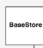

A BaseStore contains the following attributes:

| Attribute Name           | Used For                                                                                                                                                                |
|--------------------------|-------------------------------------------------------------------------------------------------------------------------------------------------------------------------|
| uid                      | Unique identier of a store.                                                                                                                                             |
| name                     | Name of a store (localized).                                                                                                                                            |
| catalogs                 | Product and classication catalogs which are available in the store.  Note Do not assign a content catalog to a store. A content catalog is only assigned to a CMSSite. |
| cmsSites                 | Provide the look and feel for a product set displayed on a certain site.                                                                                                |
| pointsOfService          | The list of local stores that will appear in the storefront's store locator.                                                                                            |
| storelocatorDistanceUnit | A selection from the DistanceUnit emum, either "km" or "miles".                                                                                                         |

## Creating A Base Store

Create a new base store. The base store forms the basis for your e-commerce setup and is used to model your online store.

Procedure 1. Log on to the Backoffice and navigate to Base Commerce Base Store .

2. Click the plus sign to create a new base store. 3. In the window, enter the settings.

| Setting                 | Description                                                                                                                                                                                                                                                                                                                                                       |
|-------------------------|-------------------------------------------------------------------------------------------------------------------------------------------------------------------------------------------------------------------------------------------------------------------------------------------------------------------------------------------------------------------|
| Captcha Widget Enabled  | The captchaaddon AddOn introduces a reCAPTCHA widget to the customer registration form of the Accelerator storefronts. This technology is used to block spammers and bots that try to automatically harvest e-mail addresses, or that try to automatically sign up for (or make use of) websites, blogs, or forums. For more information, see captchaaddon AddOn. |
| Enable Express Checkout | Select whether customers can use express checkout on this base store. Express checkout allows customers to place an order using stored address and payment details. For more information, see Base Store Management.                                                                                                                                              |
| Time Created            | Enter a creation date and time for the base store.                                                                                                                                                                                                                                                                                                                |
| ID                      | Enter a unique ID for the base store. The ID is used in Backoffice to manage the base store.                                                                                                                                                                                                                                                                      |
| Net                     | Select whether prices on the storefront are displayed as gross or net prices. True: The storefront displays the net price of products. The net price is the price before any taxes are added. False: The storefront displays the gross price of products. The gross price is the price including tax.                                                             |
| Tax Estimation Enabled  | Select whether tax estimation is enabled for this store. This allows the customer to view estimated taxes before completing the checkout process. Tax estimation requires the customer's country and zipcode, which are stored in the session.                                                                                                                    |

| Setting                  | Description                                                                                                                                                                                                                                                                                        |
|--------------------------|----------------------------------------------------------------------------------------------------------------------------------------------------------------------------------------------------------------------------------------------------------------------------------------------------|
| External Tax Calculation | Select whether an external tax calculation service (if integrated) is enabled or disabled for this base store. True: The integrated third-party tax calculation service is enabled for this base store. False: The integrated third-party tax calculation service is disabled for this base store. |

4. Click Done to create the new base store.

5. Select the base store to continue editing the store and determining additional settings. For more information, see Base Store Management.

## Customer Reviews

Customer Reviews allow you to collect and manage customer ratings and reviews on your storefront.

The customerreviews extension enables customer rating and review forms on your storefront.

Use Case Customers are able to provide product feedback and product ratings for products they have purchased in your online shop.

As the owner of an online shop, you are able to approve or reject comments to control which ratings and reviews are displayed on the shop.

## Features

Manage Customer Reviews in the Backoffice You can view, edit, approve, and reject customer reviews in the Backoffice. For more information, see Managing Customer Reviews or Managing Customer Reviews per Product.

Related Information customerreview Extension

## Managing Customer Reviews

View, edit, approve, and reject customer reviews in the Backoffice.

## Procedure

1. Log on to the Backoffice and navigate to Marketing Product Reviews .

A list of current product reviews appears.

2. Select the customer review that you want to approve, reject, or edit.

The review opens to the Product Reviews.

2.0 I would prefer a product with extra features.

f c p 4 REFRESH

PRODUCT REVIEWS
ADMINISTRATION
ESSENTIAL
»
Product æ miniDV Head Cleaner [2278102] - Electronics Product Catal...

| Rating   |
|----------|

| 2   |
|-----|

| Blocked   |
|-----------|

User Doris Reviewer [keenreviewer24@hybris.com]

| ( )   | True   |
|-------|--------|

0 False Time created Jun 18, 2018 7:07:52 PM
a

## Product Reviews

»
Headline l would prefer a product with extra features.

Comment

| Lorem ipsum dolor sit amet, consectetuer adipiscing elit.    |
|--------------------------------------------------------------|
| Maecenas ut est. Donec suscipit. Donec eget diam vitae       |
| purus condentum adipiscing. Suspendisse lorem diam,          |
| cursus non,aliquam et, blandit ac, orci. Phasellus malesuada |
| orci sit amet lorem. Sed egestas tortor eget ipsum. Cras     |

| Approval status   |
|-------------------|

| Approved   |
|------------|

Review language English [en]
3. In the Approval Status field, change the status to Approved, Pending, or Rejected. You can also edit the review.

4. Click Save to save your changes.

## Managing Customer Reviews Per Product

In the Backoffice you can view all customer reviews available for a product and edit, delete, approve, and reject reviews. Context Every product has a Reviews tab that displays the total number of reviews, the average rating, and a complete list of reviews. You can approve or reject reviews, edit the individual review details, or delete a review.

Procedure 1. In the Backoffice, navigate to [] Catalog → Products →
A list of products appears.

2. Select the products for which you want to approve, reject, or edit reviews.

3. Open the Reviews tab.

The Reviews tab shows all available reviews for this product.

Alias miniDV Head Cleaner [2278102] - Electronics Product Catalog : Online s n to D
4

p
SAVE
1 PROPERTIES ATTRIBUTES CATEGORYSYSTEM PRICES MULTIMEDIA VARIANTS EXTENDED ATTRIBUTES
 REVIEWS
BMECAT 
 >

|  >                                   |                                                       |                           |              |              |
|--------------------------------------|-------------------------------------------------------|---------------------------|--------------|--------------|
| ESSENTIAL                            | »                                                     |                           |              |              |
| Article Number                       | Identifier                                            | e                         |              |              |
| 278102                               | miniDV Head Cleaner                                   |                           |              |              |
| Catalog version                      | Approval                                              |                           |              |              |
| Electronics Product Catalog : Online | approved                                              | -                         |              |              |
| PRODUCT REVIEWS                      | »                                                     |                           |              |              |
| Number of reviews                    |                                                       |                           |              |              |
| Average rating                       |                                                       |                           |              |              |
| 2.52                                 | 25                                                    |                           |              |              |
| Product reviews                      |                                                       |                           |              |              |
| Rating                               | Product                                               | Blocked                   | Time cre…    | Review la... |
| User                                 | Headline                                              | Approval ...              |              |              |
| : 3                                  | miniDV Head CleKenneth ReviewSatisfactory procfalse   | Jun 18, 2018 7:0"Approved | English [en] |              |
| : 2                                  | miniDV Head CleKen Reviewer [kɛl would prefer a false | Jun 18, 2018 7:0TApproved | English [en] |              |
| : 3                                  | miniDV Head CleJohn Reviewer [kSatisfactory procfalse | Jun 18, 2018 7:0 Approved | English [en] |              |
| : 3                                  | miniDV Head CleSteve Reviewer [Satisfactory procfalse | Jun 18, 2018 7:0TApproved | English [en] |              |
| : 3                                  | miniDV Head CleAdam Reviewer |Satisfactory procfalse  | Jun 18, 2018 7:0"Approved | English [en] |              |
| → Create new Customer review         | -                                                     |                           |              |              |

4. Click Remove to delete the review. Click Edit Details to open a window where you can edit, approve, or reject the review. Note that the field Approval in the Essentials area does not refer to the product review, but to the product itself. To approve or reject the review, click Edit Details Edit item 5.0 - APPROVED - false - null X

REFRESH
SAVE
PRODUCT REVIEWS  ADMINISTRATION
Snowboard Ski Tool Toko Side Edge An...

5 User Blocked Canon Lover [canonlover@hybris.com]
() False
) True Time created Nov 9, 2018 8:11:28 AM 
i PRODUCT REVIEWS
»
Headline Comment This camera is amazing!

l really love this camera!

| Approved   | -   |
|------------|-----|
| Approved   |     |
| Pending    |     |
| Rejected   |     |

English [en]
Edit, Approve, or Reject a Product Review 5. Click Save to save your changes.

Customer Services Customer Services includes an order cancel service, return service, and refund service.

Use Case Customers in your ecommerce shop expect to be able to cancel orders, return items, and obtain a refund for returned items.
These services are implemented as a part of the bas Features Order Cancel Service Allows customers to cancel orders, or partially cancel orders. Orders can be cancelled only if they have not yet been fulfilled. Order cancellation is not available for digit products, which are fulfilled immediately.

As a shop owner, you can customize the rules for order cancellation - for example, to not permit customers to cancel orders at all.

Return Service Allows customers to return goods to the seller.

Refund Service Enables a customer to get a refund after returning goods to the seller.

This is custom documentation. For more information, please visit the SAP Help Portal Related Information basecommerce Extension Order Cancel Service Return Service Refund Service

## Order Cancel Service

This service allows customer service agens to cancel orders. Order cancellation supports the Order Management module, but is technically realized in the basecommerce extension.

Conguring the Order Cancellation Process You can congure order cancellation in the Backoffice. See Interfaces and Methods.

 Note The Order Cancel service only allows customer service agents to cancel orders on behalf of customers. Functionality to allow customers to cancel orders on the storefront is provided with the orderselfserviceaddon, which is a part of the Order Management module. For more information, see orderselfserviceaddon.

How Cancellation Works A customer service agent can cancel an order completely as long as it has not yet been fullled.

Depending on the status of the order, order cancellation works as follows:
Order has been placed in the system, but not yet sent to the warehouse.

If an order has not been sent to the warehouse yet, the cancellation process removes the order from the queue of orders which have to be sent to the warehouse.

The order is marked as canceled. The system also removes any amount reservation on the payment means used for the transaction. Order has been sent to the warehouse, but is not fullled (or only partly fullled).

If the order has been sent to the warehouse already but no update about fulllment has been received, a cancellation message is sent to the warehouse immediately. In case the cancel request overlaps with the fulllment notication from warehouse, the cancel request is canceled or only applies for those items which have not yet been fullled. As a result, full cancellation becomes a partial cancellation. After receiving a conrmation from the warehouse, any reservation on the credit card is removed.

Digital Products and Subscriptions Digital products cannot be canceled since their fulllment is immediate. Therefore digital products are excluded from any cancellation process. If an order contains a subscription, then the subscription can be canceled according to the subscription cancellation rules.

Partial Cancellation Depending on the settings, you may allow cancellation of parts of an order. If the order has already been sent to the warehouse, then the system sends an update for this order.

If the order total is higher then the original order total, then the customer must provide the payment details again in order for the system to continue with reauthorization and reservation.

After any partial cancellations, the system recalculates the value of the order. If needed, the system sends updates to the warehouse.

 Note After a partial order cancellation, the order is recalculated completely, using any promotions or other parameters currently valid in the system. As a result, the order may lose some previous promotional discounts, or new promotions may apply.

Related Information basecommerce Extension Order Cancellation Conguration You can congure order cancellation in the Backoffice.

Context

## Procedure

1. Log on to the and navigate to Base Commerce Order Cancellation Conguration .

2. Create the settings as follows:

| Setting                               | Description                                                                                                                                                                                                                                                       |
|---------------------------------------|-------------------------------------------------------------------------------------------------------------------------------------------------------------------------------------------------------------------------------------------------------------------|
| Enable customer order cancel          | Determines whether order cancelling is possible at all.                                                                                                                                                                                                           |
| Enable partial order cancel           | Determines whether it is possible to cancel parts of an order (the customer can cancel a complete order entry).                                                                                                                                                   |
| Enable partial order entry cancel     | Determines whether it is possible to cancel part of an order entry. This parameter is only evaluated if Enable partial order cancel is set to true.                                                                                                               |
| Enable complete cancel after shipping | Determines whether a cancel request is possible after shipping of part of the order has started. Only the the part of the order that has not been shipped yet can be cancelled. This parameter is evaluated only if Enable warehouse order cancel is set to true. |
| Enable warehouse order cancel         | Determines whether order cancellation is still possible after the order has been sent to the warehouse.                                                                                                                                                           |
| Order queue waiting time              | Determines how long an order waits in queue before it is started to be fullled. This allows customers more or less time to cancel the order.                                                                                                                      |

3. Click Save to save your changes.

## Interfaces And Methods

Order Cancel Service is dened by interfaces that enable access to order cancel functionality and support communication to and from the Warehouse. Several methods allow access to data model and conguration, and perform order cancel execution logic. State-based processing is based on predened set of states. Default service conguration can be modied in order to adapt it to the particular requirements.

## Introduction

Order Cancel service is dened using two interfaces:
OrderCancelService OrderCancelCallbackService OrderCancelService interface is the main service interface of Order Cancel service. It is designed to be used by "business user" which technically is expected to be another service or a web shop implementation. The role of this interface is to enable access to:
Order Cancel related functionality (e.g. performing order cancels) Order Cancel data model and conguration The main class to be used with OrderCancelService interface is OrderCancelRequest class. This class allows to construct cancel requests and may represent either complete cancel request or partial cancel requests.

OrderCancelCallbackService interface is a callback interface to be used by a Warehouse adapter. Warehouse adapter is an interface between hybris platform and physical Warehouse. The role of OrderCancelCallbackService interface is to receive asynchronous messages from a Warehouse in response to a previously-issued cancel requests.

Key class used with OrderCancelCallbackService interface is OrderCancelResponse class. This class represents a response sent by the Warehouse. The response contains order cancel results information, for example whether the cancel was successful or not and why.

Methods in OrderCancelService Interface Methods for Data Model and Conguration Access OrderCancelCongModel getConguration(): Returns current conguration.

OrderCancelRecordModel getCancelRecordForOrder(OrderModel order): Returns OrderCancelRecordModel for given Order. This class is a main class of the Order Cancel Data Model.

OrderCancelRecordEntryModel getPendingCancelRecordEntry(OrderModel order) throws OrderCancelException: Returns OrderCancelRecordEntryModel instance for currently pending cancel operation. This OrderCancelRecordEntryModel class represents data model for a single order cancel operation.

Methods Allowing Performance of the Order Cancel Execution Logic CancelDecision isCancelPossible(OrderModel order, PrincipalModel requestor, boolean partialCancel, boolean partialEntryCancel): Veries if order cancel is possible for given conditions. This method should always be called rst, before requestOrderCancel to check for order cancel availability!

OrderCancelRecordEntryModel requestOrderCancel(OrderCancelRequest orderCancelRequest, PrincipalModel requestor): Issues order cancel request. You can call this method only if isCancelPossible allows the cancel, otherwise OrderCancelDeniedException will be thrown.

This is   For more    the SAP Help  12 Order Cancel Service Implementation Details State-based Processing Order Cancel Service logic is based on predened set of states, dened by OrderCancelState enum type. These states are derived from the state diagrams that provide conceptual model for processing order cancels. There are several states dened by de.hybris.platform.basecommerce.enums.OrderCancelState. The list contains available states, the names in parentheses denote corresponding state from a state diagram:
PENDINGORHOLDINGAREA (QueueAwait) SENTTOWAREHOUSE (SentToWarehouse)

SHIPPING (Shipping)
PARTIALLYSHIPPED (PartiallyShipped)
CANCELIMPOSSIBLE (CancelImpossible)
Additionally a new state has been dened for enum OrderStatus: CANCELLING, which is used to model "Cancelling" state from the diagrams.

Order Cancel Service uses a strategy: OrderCancelStateMappingStrategy, that is responsible for determining current OrderCancelState for a given order.

The default mapping strategy is described in the OrderCancel - Default Mapping Strategy document. This strategy is dened as a Spring bean, and it can be easily changed.

Default Service Implementation Conguration Default OrderCancelService implementation: DefaultOrderCancelService uses a set of strategies to implement the required functionality. Most important objects are:
OrderCancelStateMappingStrategy: Provides information about current OrderCancelState for the Order.

OrderCancelDenialStrategy: Enables to perform checks if cancel is possible for given conditions.

OrderCancelRequestExecutor: An object used to actually execute the logic involved with canceling order.

OrderCancelResponseExecutor: An object used to process messages received from a Warehouse in response to a cancel request.

OrderCancelCancelableEntriesStrategy: A strategy used to get a list of the given order entries that can be canceled.

All these objects are dened as Spring beans. As a result altering the Spring conguration can easily inuence DefaultOrderCancelService and change the way it works.

Executor Mappings DefaultOrderCancelService does not have "xed" execution logic. All actions are performed by so-called executors. There are two types of executors:
OrderCancelRequestExecutor OrderCancelResponseExecutor.

Request executors are used to process cancel requests received via OrderCancelService interface. Response executors are used to process cancel responses received via OrderCancelCallbackService. DefaultOrderCancelService has two maps of executors: requestExecutorsMap and responseExecutorsMap. Each map provides a mapping between current OrderCancelState and an executor that handles order cancel logic in this state. Both maps are congured by Spring, so this gives a very exible way to congure overall logic of DefaultOrderCancelService.

Verifying Possibility of the Order Cancel: OrderCancelDenialStrategy DefaultOrderCancelService class uses a List of OrderCancelDenialStrategy instances to verify if cancel is possible for a given Order. There is a couple of predened OrderCancelDenialStrategy classes. Also, new classes may be added if needed.

The Spring conguration denes which OrderCancelDenialStrategy classes should be used by DefaultOrderCancelService. If OrderCancelDenialStrategy nds that order cancel cannot be performed, then it returns non-null OrderCancelDenialReason. Otherwise it returns null.

Because DefaultOrderCancelService processes a list of OrderCancelDenialStrategy, cancel operation is allowed if all strategies return null result. If any strategy returns non-null OrderCancelDenialReason, then cancel operation is not possible, and the list of received OrderCancelDenialReason is returned to the user.

In hybris implementation every concrete OrderCancelDenialStrategy can have its OrderCancelDenialReason congured by Spring. Users can do the mapping between OrderCancelDenialStrategy and OrderCancelDenialReason as they require. By default we provide DefaultOrderCancelDenialReason class that is a reasonable implementation of the OrderCancelDenialReason interface. However, it is possible to easily plug in another implementation, if needed, for example when OrderCancelDenialReason instance should convey additional information or be able to execute some logic.

Other Collaborating Objects OrderCancelNoticationServiceAdapter This interface is used to broadcast notications about cancel operations. It is used by classes: ImmediateCancelRequestExecutor, WarehouseProcessingCancelRequestExecutor, WarehouseResponseExecutor. Order Cancel Service does not provide default implementation of this interface, because no reasonable default can be dened. Users should supply their own implementation and plug it in using Spring conguration for the aforementioned classes. If not provided, notifcations are not sent.

OrderCancelPaymentServiceAdapter This interface is used to recalculate order after cancel operation has been nished. It is used by classes: ImmediateCancelRequestExecutor, WarehouseResponseExecutor.

Order Cancel Service does not provide default implementation of this interface. Users should supply their own implementation and plug it in using Spring conguration for the aforementioned classes. If not provided, orders are not automatically recalculated by Order Cancel Service after cancel operation is nished (order recalculation can be then performed externally to Order Cancel Service)
OrderCancelWarehouseAdapter This interface is used to forward cancel requests to a warehouse. It is used by class: WarehouseProcessingCancelRequestExecutor. A mock implementation
(DefaultWarehouseAdapterMock) is provided by default. Users should supply their own implementation and plug it in using Spring conguration for the aforementioned class.

Order Cancel Service Conguration The following conguration entries are dened for Order Cancel Service using OrderCancelCongModel class:
orderCancelAllowed: Determines if the order canceling is possible.

cancelAfterWarehouseAllowed: Determines if the order canceling is still possible after sending it to warehouse.
completeCancelAfterShippingStartedAllowed: Determines if complete cancel request will be accepted after shipping has started. Such a request means: Cancel the part of the order that has not been shipped yet (in other words, cancel everything that can still be canceled). This parameter is evaluated only if cancelAfterWarehouseAllowed is set to true.

partialCancelAllowed: Determines if the partial order canceling (discarding whole order entries) is possible.

partialOrderEntryCancelAllowed: Determines if the partial order entry canceling (discarding parts of order entries) is possible. This parameter is evaluated only if partialCancelAllowed is set to true.

queuedOrderWaitingTime: Determines how long an order should wait in queue before it is started to be fullled.

Almost all described entries are of type boolean. Only the queuedOrderWaitingTime is of type int. queuedOrderWaitingTime is dened as a part of Order Cancel conguration, but the queue itself must be implemented externally to Order Cancel Service. The reason for is that this Service does not provide any implementation for orders queue.

Data Model The diagrams presents the data model for Order Cancel.

## Order Cancel Complete State Diagram

The conceptual state diagram for handling complete Cancel Order requests captures essential logical states of the system and provides you with insight in its activities.

Order Cancel Complete State Diagram The image presents conceptual state diagram for handling Complete Cancel Order requests. These states are only informal. The purpose of this diagram is to capture essential logical states of the system, not to define any concrete code-level constructs.

Actions Some of Actions come from Customer/CSA, and some of them come from the Warehouse. In general, Warehouse can:
Send responses to previously issued requests Send messages (indicated in bold font on the diagram) which are Warehouse-initiated asynchronous events, for example. messages sent after the Order has been shipped.

The assumption that messages are asynchronous is necessary to cover all possible use-cases. Those messages can, in fact, be implemented by warehouse polling and thus be synchronous. However, from the Cancel Order Service point of view this is irrelevant and messages should be considered asynchronous.

States QueueAwait: In this state Order is placed in an internal Order Queue and is awaiting for being sent to a Warehouse.

SentToWarehouse: The state when order has left an internal Order Queue and is sent to Warehouse for further handling (shipment).

Shipping: The state when order shipping process has been started by the Warehouse. This state does not imply that any order items has been physically shipped, but it does not exclude this possibility either.

PartiallyShipped: The state when some (or all) order items are shipped. Shipped: The state when all order items are shipped.

Cancelling: Order Cancel Service received Order Cancel Complete Request from the Client/CSA, but the Order has already been sent to the Warehouse for shipment.

Order Cancel Complete Request is immediately forwarded to the Warehouse and then Order Cancel Service waits for response from the Warehouse. Expected response time: several seconds to several hours.

PartiallyCancelled: This state encapsulates functionality regarding partial shipment. In this case Order recalculation is necessary. This might be in general very complicated when connected with promotions. The steps to do in this state:
Modify Order according to data from the Warehouse (remove entries that were canceled, leave entries already shipped to the Customer)
Recalculate Order using some external service. Recalculation may involve promotions. The result of this step is the new money amount for the Order Modify pending payment transaction with the new Order money amount.

Notify customer about Order status.

Cancelled: An Order has been successfully canceled. No other cancel requests are available on such Order.

CancelImpossible: An Order cannot be canceled. No other cancel requests are available on such Order.

## Request Processing

Immediate Order Cancel Order Cancel Complete Request can be always processed successfully in QueueAwait state.

Warehouse-dependent Cancel SentToWarehouse and Shipping states require Warehouse interaction to perform the cancel. The difference between those two states is subtle. In most scenarios they can be treated as a single state. However, having two states for modeling shop-warehouse integration allows for grater exibility. SentToWarehouse state means: warehouse has been notied to ship the Order. Shipping state means: warehouse acknowledges the order and starts shipping procedure.

For some time it may still be possible to stop the shipping procedure at the Warehouse after entering Shipping state (it depends on the Warehouse integration model). This is a reason why issuing Order Cancel Complete Request at this state is allowed.

In the SentToWarehouse and Shipping state Order Cancel Service forwards received Order Cancel Complete Request to the Warehouse and waits for Warehouse response in Cancelling state. The success of the cancel operation depends then on whether order item's shipment has not yet begun, as explained below.

In the Cancelling state Order Cancel Service waits for the Warehouse response. No further Order Cancel Complete Request are allowed until Warehouse response is received (i.e. only single cancel request at a time is allowed). The further processing of the Order is determined by the response. There can be three possible outcomes:
The Order is completely canceled because it has not been shipped yet. This results with a transition to Cancelled state.

The Order cannot be canceled, because it is too late. The Order has already been shipped (completely) to the Customer. This results with a transition to CancelImpossible state. In this state customer should be notied that the Order Cancel Complete Request has failed. The Order was only partially canceled, because a part of the Order has already been shipped. The remaining part of the Order that has not yet been shipped is canceled. This results with a transition to PartiallyCancelled state.
It is the warehouse integration model that decides if partial cancel in response to Order Cancel Complete Request is possible. The outcome described above assumes "negrained" warehouse implementation, but it is possible to get Shipping Complete instead of Partially Shipped response from the warehouse when Order is already partially shipped.

When is Order Cancel Complete Request not Allowed In PartiallyShipped, Shipped, Cancelled, Fullled/Closed states Order Cancel Complete Request cannot be satised, so it is not allowed.

In the Cancelling state Order Cancel Complete Request is not allowed, because Order Cancel Service waits for a response to a previously issued request and only single request at the moment is supported.

States: CancelImpossible and PartiallyCancelled are transitional states and should be handled in the same as way as Cancelling state
Other Issues Concurrency Because there are two (possibly more) sources of events for Cancel Order Service: Customer Front End/CSA and Warehouse, care must be taken to avoid race condition. For example in SentToWarehouse state the Order Cancel Complete Request and Warehouse message: shipping events may occur simultaneously. Proper concurrency handling must be implemented to avoid race condition. This is, however, outside of the scope of the Cancel Order Service. If the warehouse message: shipping or partially shipped or shipped is received while the Order is in the Cancelling state, the message should be ignored by the Cancel Order Service and the Service should wait for the proper response from the Warehouse.

## Order Cancel Partial State Diagram

During the Partial Cancel process there can be several outcomes. This makes the case more complex than the Complete Cancel process.

Order Cancel Partial State Diagram The diagram presents conceptual state diagram for handling Order Cancel Partial requests. These states are only informal. The purpose of this diagram is to capture essential logical states of the system, not to dene any concrete code-level constructs.

The case here is similar to the Order Cancel Complete case. However, due to the several possible outcomes the ow is also more complicated than with Complete Order Cancel. There are 6 possible Order Cancel Partial Request outcomes:
1. "Success 1": Order Cancel Partial Request is received when Order is waiting in holding area before being sent to the Warehouse. Order entries are removed/modied according to the request, Order is recalculated and returned to holding area. Customer is notied. There is a question whether Order holding time should be reset after Order recalculation.

2. "Success 2": Order Cancel Partial Request is received when Order is already sent to the Warehouse, but shipment has not yet begun. Partial Cancel request is forwarded immediately to the Warehouse and Order enters Cancelling state, where it waits for the response from Warehouse. When Warehouse response: Partial Cancel Successful is received, Order entries are removed/modied according to the request, Order is recalculated and the customer is notied.

3. "Success 3": Order Cancel Partial Request is received when Order is already sent to the Warehouse, and part of it has already been shipped. However, the part of the Order that is subject to cancel has not been shipped yet.

Partial Cancel request is forwarded to the Warehouse and Order enters Cancelling state, where it waits for the response from Warehouse. When Warehouse response: Partial Cancel Successfull, Partially Shipped is received, Order entries are removed/modied according to the request, Order is recalculated and customer is notied.

4. "Failure 1": Order Cancel Partial Request is received when Order is already completely shipped by the Warehouse but the Warehouse has not yet provided this information back to the shop. Partial Cancel request is forwarded to the Warehouse and Order enters Cancelling state, where it waits for the response from Warehouse. When Warehouse response: Shipping Complete is received, Customer is notied that Partial Cancel cannot be done. Order remains unchanged.

5. "Failure 2": Order Cancel Partial Request is received when Order is already partially shipped by the Warehouse. Items that are requested to be canceled are already shipped and as a result cannot be canceled. Partial Cancel request is forwarded to the Warehouse and Order enters Cancelling state, where it waits for the response from Warehouse. When Warehouse response: Partial Cancel Already Shipped is received, Customer is notied that Partial Cancel cannot be done. Order remains unchanged.

6. "Partial Success": Order Cancel Partial Request is received when Order is already partially shipped by the Warehouse. Some cancel-requested items have already been shipped, so those items cannot be canceled. Remaining cancel-requested items are canceled. Partial Cancel request is forwarded to the Warehouse and Order enters Cancelling state, where it waits for the response from Warehouse. When Warehouse response: Partial Cancel Partially Shipped is received, Order is recalculated and Customer is notied that Partial Cancel was only partially completed. This particular case assumes ne-grained cancellation logic at the Warehouse.

However, it is also likely that in the scenario described above, Warehouse will respond with a Warehouse response: Partial Cancel Already Shipped message, that indicates failure of the whole operation. Order Cancel Service is capable of handling both situations.

## Ordercancel - Default Mapping Strategy

The OrderCancelStateMappingStrategy interface has a default implementation that impacts its behavior. This component takes the order information, status and consignments status, and qualies it to a specic OrderCancelState. Further order cancel process is determined by the OrderCancelState.

Implementing custom OrderCancelStateMappingStrategy allows you to dene your own, preferable states mappings. It allows you to decide which specic order states can be canceled.

Order Cancel States In the current implementation there are four distinct OrderCancelStates:
CANCELIMPOSSIBLE: Order will not be canceled PARTIALLYSHIPPED: Order cancel attempt will be done by component that involves warehouse integration PENDINGORHOLDINGAREA: Order cancel will be done internally SENTTOWAREHOUSE: Order cancel attempt will be done by component that involves warehouse integration SHIPPING: Order cancel attempt will be done by component that involves warehouse integration Check the documents in the Related Information section to see the state diagrams showing how the order cancel service uses the information from the OrderCancelStates.

Behavior of the Default Implementation The table below presents possible status cases returned by mapping strategy depending on the:
Order status: Listed in the OrderStatus column Consignment status: Presented in the Consignments column

| Mapping Strategy Returns   | OrderStatus                                                 | Consignments                                             |
|----------------------------|-------------------------------------------------------------|----------------------------------------------------------|
| CANCELIMPOSSIBLE           | If order status is one of: CANCELLED, CANCELLING or         | or if statuses of all consigmnets are set to SHIPPED     |
| COMPLETED                  |                                                             |                                                          |
| PENDINGORHOLDINGAREA       | If order status is other than CANCELLED, CANCELLING or      | and order was not yet split into consignments            |
| COMPLETED                  |                                                             |                                                          |
| PARTIALLYSHIPPED           | If order status is other than CANCELLED, CANCELLING or      | and there are is at least one SHIPPED consignment and    |
| COMPLETED                  | there are consignments having status different from SHIPPED |                                                          |
| SENTTOWAREHOUSE            | If order status is other than CANCELLED, CANCELLING or      | and all consignments for the order have status different |
| COMPLETED                  | shipped SHIPPED                                             |                                                          |
| SHIPPING                   | Not returned from the default implementation                |                                                          |

Related Information Order Cancel Complete State Diagram Order Cancel Partial State Diagram

## Return Service

Return Service enhances the Order Management Module by allowing the customer to return ordered goods to the seller.

To accomplish this goal, the service supports the following processes:
A call center agent or returns administrator can use the information received from the customer to nd order information.

If the order is found, then the returns administrator can decide whether the goods are accepted.

If the goods are accepted, then a Return Request is created, which contains the items from the original order. The refund method is determined.
After the refund amount/replacement has been determined, the return request must be approved. The system can automatically approve the return, or it can be manually approved (depending on business policy). Once approved, the system generates an RMA number (RMA = Return Merchandise Authorization).

The received products are logged and sent for dispositioning. The products are then returned to inventory.

 Note The Return Service requires customization. To learn how to congure the Return Service, see Return Service Conguration.

Related Information basecommerce Extension

## Return Service Business Layer

Return Service business layer consists of methods that technically support and implement business functionality provided by this service.

Return Service Business Layer Overview There are a few scenarios that may occur during the process of returning goods from the customer to the seller. The seller must rst determine if the customer is eligible to return delivered products. If the customer is eligible, then the seller may proceed with handling the product return process and offer refund or replacement to the customer.

All these actions are supported by the methods implemented in the basecommerce extension. Which of the scenarios, refund or replacement, is applied in reality depends on the particular shop owner business policy.

DefaultReturnService Business Layer Methods

| The table below presents the business functionality methods that together are part of DefaultReturnService. Method Description createReturnRequest Creates an return request object for the order to be returned. getReturnRequests Returns the return request for the specied order. getRMA Returns a Return Merchandise Authorization also known as Return Material Authorization (RMA). createRMA Creates Return Merchandise Authorization also known as Return Material Authorization (RMA) and assigns it to the corresponding ReturnRequest. getReplacementOrder Returns the ReplacementOrder based on the corresponding RMA value. createReplacementOrder Creates a ReplacementOrder. addReplacementOrderEntries Adds ReplacementOrderEntry entries from the corresponding ReplacementEntryModel. We only accept ReplacementEntries, which are not on HOLD (ReturnAction). createReplacement Creates a Replacement based on the assigned OrderEntry instance. createRefund Creates a Refund based on the assigned OrderEntry instance. getReturnEntries Returns the ReturnEntries for the specied product. getReturnEntry Returns the ReturnEntries for the specied order entry. getReplacements Returns all Replacements for the specied return request. isReturnable Determines if the product is returnable by using the injected ReturnableCheck strategy. processReturnEntries Here you have the chance to inject your nal Returns Entry processing. For example for handling consignment creation processReplacementOrder Here you have the chance to inject your nal ReplacementOrder processing. For example for handling consignment creation. processRefundOrder Here you have the chance to inject your nal RefundOrder processing. For example for handling consignment creation or initiating the nal payment transaction. getAllReturnableEntries Returns all returnable OrderEntries.   |
|---------------------------------------------------------------------------------------------------------------------------------------------------------------------------------------------------------------------------------------------------------------------------------------------------------------------------------------------------------------------------------------------------------------------------------------------------------------------------------------------------------------------------------------------------------------------------------------------------------------------------------------------------------------------------------------------------------------------------------------------------------------------------------------------------------------------------------------------------------------------------------------------------------------------------------------------------------------------------------------------------------------------------------------------------------------------------------------------------------------------------------------------------------------------------------------------------------------------------------------------------------------------------------------------------------------------------------------------------------------------------------------------------------------------------------------------------------------------------------------------------------------------------------------------------------------------------------------------------------------------------------------------------------------------------------------------------------------------------------------------------------------------------------------------------------------------------------------------------------------------------------------------------------------|

Related Information payment Extension

## Return Service Conguration

Congure the Return Service for a particular implementation environment.

Spring-Based Conguration Return Service can support:
Returning goods to the seller Replacement order handling Refund handling Congurable check of 'is returnable' status You can congure Return Service by overriding the beans in the basecommerce-spring.xml le.

The rst part of the conguration le contains a bean where, besides existing code, you can add additional logic to enhance the Return Service. For example, you could add Consignment (Warehouse)-related business logic. For details, see:
de.hybris.platform.returns.processor.ReturnEntryProcessor de.hybris.platform.returns.processor.ReplacementOrderProcessor de.hybris.platform.returns.processor.RefundOrderProcessor
<alias alias="returnService" name="defaultReturnService"/>
<bean id="defaultReturnService" class="de.hybris.platform.returns.impl.DefaultReturnService" parent="abstractBusi <property name="generator" ref="defaultRMAGenerator"/>
<property name="refundService" ref="refundService"/>
<property name="modificationHandler" ref="defaultOrderReturnRecordsHandler"/>
<property name="returnableChecks">
<list>
<ref bean="defaultChecksExistingReturnEntry"/>
<ref bean="defaultConsignmentBasedReturnableCheck"/>
</list>
</property>
<!-- 
<property name="returnEntryProcessor" ref="YOUR_RETUNRS_ENTRY_PROCESSOR"/>
<property name="replacementOrderProcessor" ref="YOUR_REPLACEMEMNT_ORDER_PROCESSOR"/>
<property name="refundOrderProcessor" ref="YOUR_REFUND_ORDER_PROCESSOR"/> -->
<property name="replacementOrderDao" ref="replacementOrderDao"/>
<property name="returnRequestDao" ref="returnRequestDao"/>
</bean>
Conguration of the service responsible for handling refunds.

<alias alias="refundService" name="defaultRefundService"/>
<bean id="defaultRefundService" class="de.hybris.platform.refund.impl.DefaultRefundService" parent="abstractBusinessSe
<property name="modificationHandler" ref="defaultOrderReturnRecordsHandler"/>
<property name="refundDao" ref="refundDao"/> </bean>
Conguration code of the Return Merchandise Authorization (RMA) generator that uses the injected 'keygenerator'.

<bean id="defaultRMAGenerator" class="de.hybris.platform.returns.impl.DefaultRMAGenerator">
<property name="keyGenerator" ref="defaultRMACodeGenerator"/>
</bean>
Conguration code of the keygenerator used for RMA generation.

<bean id="defaultRMACodeGenerator" class="de.hybris.platform.servicelayer.keygenerator.impl.PersistentKeyGenerator" init-method="init"
<property name="key" value="RMA"/>
<property name="digits" value="8"/> <property name="start" value="00000000"/>
<property name="numeric" value="true"/>
</bean>
Conguration code of the keygenerator used for 'Return Request Code' generation.

<bean id="defaultReturnRequestCodeGenerator" class="de.hybris.platform.servicelayer.keygenerator.impl.PersistentKeyGenerator" init-met
<property name="key" value="AUTH"/>
<property name="digits" value="8"/>
<property name="start" value="00000000"/>
<property name="numeric" value="true"/> </bean>
Conguration code of the keygenerator used for 'Replacement Order Code' generation.

<bean id="defaultReplacementOrderCodeGenerator" class="de.hybris.platform.servicelayer.keygenerator.impl.PersistentKeyGenerator" init-
<property name="key" value="REPORD"/>
<property name="digits" value="8"/>
<property name="start" value="00000000"/>
<property name="numeric" value="true"/>
</bean>
Conguration code responsible for adding a 'generated' code, if there is not a dened one.

<bean id="PrepareReturnRequestInterceptor" class="de.hybris.platform.returns.impl.PrepareReturnRequestInterceptor">
<property name="keyGenerator" ref="defaultReturnRequestCodeGenerator"/> </bean>
Conguration code responsible for adding a 'generated' code, if there is no dened one.

<bean id="PrepareReplacementOrderInterceptor" class="de.hybris.platform.returns.impl.PrepareReplacementOrderInterceptor">
<property name="keyGenerator" ref="defaultReplacementOrderCodeGenerato
</bean>
The conguration snippet for the class used by Return service to provide information, if the specied product is returnable.

<bean id="defaultConsignmentBasedReturnableCheck" class="de.hybris.platform.returns.strategy.impl.DefaultConsignmentBasedReturnableChe This class is used by ReturnService to provide information, if specied product is returnable. The currently implemented algorithm determines if the product is 'returnable' on base of existing 'returns entries'.

'True' will be returned if there are no related 'returns entries' or if the quantity of the related 'returns entries' plus the specied 'return quantity' is less than or equal to to the total quantity of the ordered items so far.

<bean id="defaultChecksExistingReturnEntry" class="de.hybris.platform.returns.strategy.impl.DefaultReturnEntryBasedReturnableCheck" pa Related Information payment Extension

## Refund Service

The Refund Service enables a customer to get a refund of a certain amount, when some kind of order goods return occurs. The default implementation does not adequately account for promotion lifecycles.

With help of the Return Service, a manager or call center agent can decide whether:
Product can be returned to the seller Product can be replaced by another product Refund can be granted to the customer The return process ends with an order refund or partial order refund. In a simple use case, the refund amount is equal to the sum of order entry prices which are canceled or returned. However, when discounts and promotions are involved, a more sophisticated approach is required. As a result, the default refund calculation in SAP Commerce has some limitations.

Prices and Promotions Lifecycle When an order is created, a snapshot is taken of products, prices, and promotions. From the customer's point of view, this offer is recorded in the order. In SAP Commerce, the product code, price, and discount are recorded directly in the order. From that point in time, the products on offer in your catalog can evolve (such as changing prices)
without affecting existing orders. In other words, even if the product price is changed after an order is created, this will not change original product price stored in the order, and will not affect recalculation.

However, when an order contains promotions, this is not the case. Only the promotion outcome, and not the specic promotion details, are reected in the order. If a promotion is changed, this can affect refund calculations for orders that were placed using the older version of the promotion rule. One custom solution would be to pre-calculate each order entry by including the weight of the promotion. One could then use this value, which contains the promotion ventilated on each order entry, to get the right refund amount.

## Default Sap Commerce Refund Calculation

In SAP Commerce, the default refund calculation doesn't take into account the customer group or the promotion lifecycle. The default refund strategy assumes that when a promotion is published, it will never be changed. If this is the case, then SAP Commerce should calculate an accurate refund amount.

Note that calculation is executed on demand when we receive a refund request, for example from CS Cockpit.

Advantages of the default strategy include:
Simple algorithm Easily understandable for the end user Limitations of the default strategy include:
If a promotion is changed, the new promotion conditions are not reected in refund amounts Not relevant anymore when a customer has been upgraded or downgraded regarding customer group advantage (e.g. added to a "VIP" group) Not relevant anymore when other criteria have been changed (period, stock value, and so on)
For technical details about the default algorithm, see Refund Service Business Layer.

Related Information basecommerce Extension Refund Service Business Layer Refund Service is a simple service that can enhance Order Management process while dealing with promotions, vouchers and similar actions.

 Note Be aware that the customization is necessary while implementing custom projects. As a result you need to implement the required refund logic by yourself.

Standard refund logic shipped out-of-the-box may prove unsatisfactory because it looks at standard prices only and may cause incorrect calculations. It should only be used as an example for your own customized work.

## Refundservice Business Methods

The scenario supported by RefundService deals with complicated situations related to promotions and vouchers that are affected by the earlier price calculation. For dealing with such situations, RefundService offers the following business methods:

| Method                   | Description                                                                                                      |
|--------------------------|------------------------------------------------------------------------------------------------------------------|
| createRefundOrderPreview | Creates a refund order, which is a clone of the original one. This new instance is used for applying the refund. |
| apply                    | Based on the assigned refund entries the order is recalculated.                                                  |
| getRefunds               | Returns the refunds for the specied order.                                                                       |

RefundService Scenario The business methods implementing RefundService realize refund scenario in the following way:
Clone the original order the customer wants to have a refund for by using createRefundOrderPreview.

Create Refund instances for the products for which a refund should be calculated. Calculate the refund amount based on the Preview Order and the Refunds by using apply(List, Order).

Based on the calculated Preview Order the customers decide if they want to accept the offered refund.
Eventually, in case the customer agrees to the offered refund, the call center agent can now recalculate the original order by calling apply( Order) method.

The 'preview order' is created by cloning the original order. The recalculation of the 'preview order' respects all existing promotions and vouchers of the original order. As a result no special handling of the 'promotion scenario' is needed.

Related Information payment Extension

## Deep Linking

The Deep link URL feature provides an easy way of mapping URLs to corresponding destination URLs.

Use Case Deep linking allows you to create a short URL for some context items (for instance, products) and a long destination URL for the same product. It is based on the information extracted from a token, which is a part of the short URL with the usage of a special template provided in the DeeplinkUrlRule object. You can also use this short URL in product barcodes.

The basecommerce extension provides a generic servlet that you can use as a short URL, translate it and redirect the user to the destination URL.

## Related Information

| Deep Linking Architecture Creating New Deeplink URL Creating New Deeplink URL Rule Generating URLs Customizing Deeplink URLs   |
|--------------------------------------------------------------------------------------------------------------------------------|

## Deep Linking Architecture

| Attribute   | Description                                                                                   |
|-------------|-----------------------------------------------------------------------------------------------|
| Code        | Unique string identier of the deeplink URL                                                    |
| Name        | Localized name                                                                                |
| BaseUrl     | Base URL pointing to the deep link URL Servlet, for example, http://www.conrad.de/mobile/link |

DeeplinkUrlRuleModel The Deeplink URL rule is a technical mapping from the deeplink URL string to the destination URL. It contains the following attributes:

| Attribute       | Description                                                                                                                                                                                                                                                                                                                       |
|-----------------|-----------------------------------------------------------------------------------------------------------------------------------------------------------------------------------------------------------------------------------------------------------------------------------------------------------------------------------|
| baseUrlPattern  | Regular expression to match desired base URL. For example: .*www\.conrad\.de.*.                                                                                                                                                                                                                                                   |
| destUrlTemplate | Destination URL pattern. It can contain variables referencing the context item (for example product) and the deep link URL item itself. For example: /mobile/view/product/$ctx.contextObject.catalogVersion.catalog.id/$ctx.contextObject.code? campaign=$ctx.deeplinkUrl.code&version=$ctx.contextObject.catalogVersion.version. |
| applicableType  | Composed type to which this entry can be applied to.                                                                                                                                                                                                                                                                              |
| useForward      | Deep link URL Servlet uses forward if this is set to true, it redirects otherwise.                                                                                                                                                                                                                                                |
| priority        | Priority used for searching for Deep link URL rules. The lower value set the higher priority.                                                                                                                                                                                                                                     |

Each instance of the the deeplink URL mapping represents one type of deeplink. If the deeplink has to be bound to an item (for example, a product), then the destination URL
template includes a variable for that item. For example, you can get the $ctx.item.code, which stands for the product code. The specic item is then added (as PK) to the base URL with the deeplink URL code. See the following example for the nal URL: http://www.conrad.de/mobile/view/product/clothescatalog/30124?

campaign=mobile&version=Online.

Services DeeplinkUrlService The following lists the actions that the DeeplinkUrlService can do:
Generates the short URL from the deeplink URL object and the context item. This URL can be later used in the barcode.

Generates the long destination URL extracted from the token that is a part of the short URL. It uses the deeplink URL rules internally.

Parses through the velocity engine, which provides the templates.

GenericDeeplinkUrlServlet The Deeplink URL Servlet is used for getting the short URL (for instance obtained from barcodes by mobile device), transforming it, and next redirecting or forwarding to the destination URL.

BarcodeUrlDao The DAO object is used by the DeeplinkUrlService for nding and getting DeeplinkUrlModel, DeeplinkUrlRule objects as well as context objects (for instance, products).

BarcodeUrlResolver BarcodeUrlResolver is used for resolving the short URL tokens during the generation of the long URL (method DeeplinkUrlService\#generateUrl(nal String barcodeToken)).

DeeplinkUrlInfo The DeeplinkUrlInfo is a data object holding the necesary data for the velocity engine.

## Creating New Deeplink Url

You can create a deeplink URL through the Backoffice Administration Cockpit.

Procedure 1. Log on to the Backoffice Administration Cockpit.

2. Navigate to Deeplink Urls Deeplink Url . 3. Click the Add button to display the Create New Deeplink Url window.

| 4. Enter the following details in the mandatory elds:   |
|---------------------------------------------------------|

Code Name Base URL
The system automatically populates the Time Created eld with the information on when the deeplink URL is created.

This is   For more    the SAP Help  25 Note You can use the BaseURL with a specic context object (for instance, a product) for barcode generation.

5. Click Done to create the deeplink URL. Otherwise, click Cancel.

## Creating New Deeplink Url Rule

You can create a new deeplink URL Rule through the Backoffice Administration Cockpit.

Procedure 1. Log on to the Backoffice Administration Cockpit.

2. Navigate to Deeplink Urls Deeplink Url Rule .

3. Click the Add button to display the Create New Deeplink Url window.

| 4. Enter the following details in the mandatory elds:   |
|---------------------------------------------------------|

Priority Destination URL template Base URL RegEx Applicable type The system automatically populates the Time Created eld with the information on when the deeplink URL is created.

 Note By default, the DeeplinkURLService uses the velocity template engine to parse the Destination URL template. You can possibly change the parser in your own service. For more information, refer to Customizing Deeplink URLs.

5. Click Done to continue action. Otherwise, click Cancel.

## Generating Urls

You can generate short and long URLs and write a template for the URL.

Generating Short URLs The following diagram presents the process of generating a short URL from the DeeplinkUrlModel object and any object that is considered as context object:
This is   For more    the SAP Help  26

If the context object is an instance of the ItemModel, then its PK is used in the short URL.

Generating Long URLs

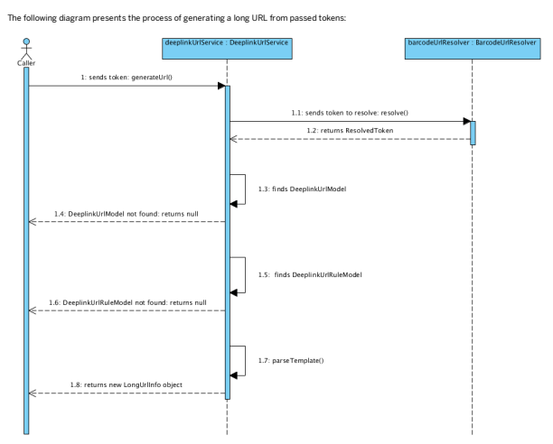

Writing a Template for the URL
Write all templates following the velocity standard where placeholders are preceded by the $ sign. The <ctx> variable in the template can access an object passed to the velocity engine in the DeeplinkUrlService. See the following example of a template:
/mobile/product/$ctx.contextObject.code?campaign=$ctx.deeplinkUrl.code&catalog=$ctx.contextObject.catalogVersion.catalog.id&version=$c

## Customizing Deeplink Urls

All services and helper classes are controlled through Spring conguration.

The following table lists the bean IDs that are used in basecommerce-spring.xml:

| Bean ID                                                                                                                                                                                                                                                                    | Interface                                      | Default Implementation                                  |
|----------------------------------------------------------------------------------------------------------------------------------------------------------------------------------------------------------------------------------------------------------------------------|------------------------------------------------|---------------------------------------------------------|
| deeplinUrlDao                                                                                                                                                                                                                                                              | de.hybris.platform.deeplink.dao.DeeplinkUrlDao | de.hybris.platform.deeplink.dao.impl.DeeplinkUrlDaoImpl |
| barcodeUrlResolver de.hybris.platform.deeplink.resolvers.BarcodeUrlResolver de.hybris.platform.deeplink.resolvers.impl.DefaultBarcode deeplinkUrlService de.hybris.platform.deeplink.services.DeeplinkUrlService de.hybris.platform.deeplink.services.impl.DeeplinkUrlServ |                                                |                                                         |

Changing Default Token Parser This is   For more    the SAP Help  27 You may want to parse different templates than the default ones that allow you to only use the context object and the Deeplink URL object. To do so, change the parser class to another one, which returns a different data object. The velocity engine uses the data object as a context object during the template parsing. The following shows an example of the implementation:
public class FooBarResolver extends DefaultBarcodeUrlResolver {
 @Override public ResolvedToken resolve(final String token)
 { // Split token final String[] splitted = token.split(":");
 // get Deeplink Url object final DeeplinkUrlModel deeplinkModel = getDeeplinkUrlDao().findDeeplinkUrlModel(splitted[0]);
 // Get context object (for instance product)
 final Object contextObject = getDeeplinkUrlDao().findObject(splitted[1]);
 // Return ctx object for Velocity return new FooBarUrlInfo(deeplinkModel, contextObject, splitted[2], splitted[3]);
 } }
To give you a better idea, the following example displays how the code is cleared from any required null checks. Check FooBarUrlInfo in the following example:
public class FooBarUrlInfo extends DeeplinkUrlInfo
{ private String someInfo; private String anotherOne; public FooBarUrlInfo(final DeeplinkUrlModel deeplinkUrl, final Object contextObject, final String someInfo, final String anotherOne)
 { super(deeplinkUrl, contextObject);
 this.someInfo = someInfo; this.anotherOne = anotherOne; } public String getSomeInfo()
 {
 return someInfo; }
 public String getAnotherOne()
 {
 return anotherOne; }
}
The following shows you the Spring conguration:
<bean id="barcodeUrlResolver" class="de.hybris.platform.deeplink.resolvers.impl.FooBarResolver">
 <property name="deeplinkUrlDao" ref="deeplinUrlDao" />
 </bean>
In the template, you can use any getters from the FooBarUrlInfo data object, which is passed to the velocity engine:
/foo/bar/$ctx.contextObject/$ctx.deeplinkUrl/$ctx.someInfo/$ctx.anotherOne Because the FooBarUrlInfo\#getDeeplinkUrl (available through inheritance from DeeplinkUrlInfo class) method returns the DeeplinkUrlModel object, the placeholder, such as $ctx.deeplinkUrl.code, works. The DeeplinkUrlModel contains the attribute code and the appropriate getter, so the sample template can be expanded to the following Java code:
ctx.getDeeplinkUrl().getCode();
Assume that from FooBarUrlInfo\#getContextObject, you can get the ProductModel, then this template also works: $ctx.contextObject.catalogVersion.catalog.id and is expanded to the following Java code:
ctx.getContextObject().getCatalogVersion().getCatalog().getId();

## Fraud Detection

Fraud Detection provides extensible services for performing fraud checks internally as well as interfaces to integrate external fraud detection providers.

Use Case Commerce systems have to cope with fraudulent orders. Fraud detection offers both a standard implementation and a common interface for integration of fraud detection services. Technically, it is implemented with the basecommerce extension.

Features Symptom-based Fraud Detection SAP Commerce includes a standard provider implementation, which checks for a number of fraud symptoms. You can customize how each symptom affects the fraud score.

Note that this standard provider should only be used as a first-level check. Used in combination with a third-party service provider,however, it may help to reduce the number of paid requests to the third-party provider. Integrate Third-Party Service Providers Integrate third-party fraud detection services with SAP Commerce to protect your website from fraudulent orders.

Extensibility Extend the standard implementation to add a new symptom check and add it to the standard service configuration.

Related Information yacceleratorfulfilmentprocess Extension The SAP Commerce Cloud processengine Fraud Detection Implementation

## Fraud Detection Implementation

The fraud detection model offers a common interface for integration of arbitrary fraud detection services, as well as a standard integration included with SAP Commerce. SAP Commerce includes a standard provider that checks for a number of fraud symptoms without the need for an external system. However, this standard service should be used in combination with a third-party service provider as a first-level check in order to reduce the number of paid requests to the third party provider. You can extend this service by adding custom symptoms.

## Implementation

The following diagram shows the fraud service and all related items, result objects and included provider implementations.

This section illustrates how to perform fraud checking, how the obtained results should be handled, and how fraud detection status can be persisted. It also explains how the standard SAP Commerce Cloud fraud service provider works and how to extend it.

This is custom documentation. For more information, please visit the SAP Help Portal The fraud detection model functions by testing for several symptoms. These symptoms are usually weighted differently according to their importance. Therefore the result of a fraud check produces a list of tested, respectively positive symptoms, each of which has a numerical score showing its importance. The overall score is the sum of all these symptom values.

 Note The result of the fraud check is a numerical score, not a positive or negative decision regarding whether an order is fraudulent. The result thus only serves as the basis on which a decision can be made. The service caller usually interprets the overall score to determine whether the order is a fraud. FraudService fraudService = ... Order placedOrder = ...

// using standard provider named 'Hybris' FraudServiceResponse result = fraudService.recognizeOrderFraudSymptoms("Hybris",placedOrder);
// this is the overall score double score = result.getScore();
// we're also able to check all result symptoms for( FraudSymptom symptom : result.getSymptoms() )
{ double singleScore = symptom.getScore();
 String symptomCode = symptom.getSymptom(); String explanationText = symptom.getExplanation();
}
The FraudServiceResponse is a plain Java object. The service caller is responsible to store its information elsewhere.

Storing Fraud Reports Once a fraud check result was obtained and the caller decided whether or not the order is fraudulent, this information should be persisted for retrieval in further order processing. The item type FraudReport is designed to store fraud check results for a particular order.

It enables to store the overall score result and evaluation statuses of particular symptoms congured in the fraud service.

The following snippet shows how to store the fraud evaluation response data in the default model:
ModelService modelService = ...

 Order placedOrder = ...

 FraudServiceResponse result = ...

final FraudReportModel fraudReport = modelService.create(FraudReportModel.class); fraudReport.setOrder(placedOrder);
fraudReport.setStatus(status);
fraudReport.setProvider(providerName);
fraudReport.setTimestamp(new Date());
fraudReport.setCode(" .. "); //your own report code generation List<FraudSymptomScoringModel> symptoms = new ArrayList<FraudSymptomScoringModel>();
 // store info for each symptom for (final FraudSymptom symptom : result.getSymptoms())
{
final FraudSymptomScoringModel symptomScoring = modelService.create(FraudSymptomScoringModel.class);
symptomScoring.setFraudReport(fraudReport);
symptomScoring.setName(symptom.getSymptom());
symptomScoring.setExplanation(symptom.getExplanation()); symptomScoring.setScore(symptom.getScore());
symptoms.add(symptomScoring);
}
fraudReport.setFraudSymptomScorings(symptoms);
modelService.save(fraudReport)
Standard Fraud Detection Provider

## 

The fraud functionality contains a standard fraud detection service that does not rely on third-party service providers. This service should therefore be seen as a rst-level check, which should be supplemented with an integrated third-party service. Each supported symptom is implemented as OrderFraudSymptomDetection and can be added or removed via the spring conguration. This approach also enables you to add new symptom check implementations when required.

## Supported Symptoms

Currently the following sample implementations are available:

| Class Name                                             | Description                                                                             |
|--------------------------------------------------------|-----------------------------------------------------------------------------------------|
| de.hybris.platform.fraud.symptom.impl BlackListSymptom | Sample - based on a static email/userId list.                                           |
| WhiteListSymptom                                       | Sample - based on a static email/userId list.                                           |
| FirstTimeOrderSymptom                                  | Checks if user is a rst timer.                                                          |
| DifferentAddressesSymptom                              | Sample - checks if address rules apply.                                                 |
| OrderThresholdSymptom                                  | Sample - checks if an order value threshold was reached.                                |
| OrderEntriesSymptom                                    | Sample - checks if product order limit applies (in the mockup: maxNumberPerOrder only). |

The actual limit per product is dened in ProductOrderLimit and is responsible to specify limit settings for one or more products.

Specify the ProductOrderLimit attributes to dene a product's ordering limitations:

| Attribute Name          | Type                                                | Description                                                                                                               |
|-------------------------|-----------------------------------------------------|---------------------------------------------------------------------------------------------------------------------------|
| code                    | String                                              | Human recognizable identier of the limit.                                                                                 |
| maxNumberPerOrder       | Integer                                             | Maximum allowed amount of a given product in the cart. Used by the OrderEntriesSymptom detection.                         |
| intervalValue           | Integer                                             | Quantier of interval denition.                                                                                            |
| intervalResolution      | Enumeration of time units (DAY, WEEK, MONTH,..etc.) | unit of interval denition. Together with intervalValue fully describes the time interval, for example (2,DAY), (1, WEEK). |
| intervalMaxOrdersNumber | Integer                                             | Maximum allowed amount of given orders in the dened time interval.                                                        |

## How To Extend

To extend, you can implement a new symptom check and add it to the standard service conguration.

public class MySymptom implements OrderFraudSymptomDetection
{
 public FraudServiceResponse recognizeSymptom(FraudServiceResponse fraudResponse, AbstractOrderModel order)
 {
 if (... positive ... )
 {
 fraudResponse.addSymptom( new FraudSymptom( 
 "...explanation...", 
 100d, // score
 "MySymptom" // symptom code
 ) );
 } else // optionally we may even add a symptom to result if test was negative
 {
 fraudResponse.addSymptom( new FraudSymptom( 0d,"MySymptom") );
 }
 return fraudResponse;
 }
}
The Spring conguration should look like this:
<bean id="mySymptom" class="MySymptom">
<!-- replace definition of default hybris fraud provider -->
<bean id="defaultHybrisFraudServiceProvider" class="de.hybris.platform.fraud.impl.DefaultHybrisFraudServiceProvider">
 <property name="providerName" value="Hybris"/>
 <property name="symptomList">
 <list>
 <ref bean="blackListSymptom"/>
 ...

 <ref bean="mySymptom"/>
 </list>
 </property>
</bean>
This is   For more    the SAP Help  31 Dening the Importance of Fraud Symptoms You may want to recognize some of the fraud symptoms as very important (for example a user from a black list) or less important. To do so, you can set the symptom fraud score increment in the spring conguration. This value, when the given symptom occurs, inuences the order overall fraud evaluation.

All symptoms extend from the AbstractOrderFraudSymptomDetection class:
public abstract class AbstractOrderFraudSymptomDetection implements OrderFraudSymptomDetection {
public static final double DEFAULT_INCREMENT = 50; private double increment = DEFAULT_INCREMENT;
private String symptomName; protected FraudSymptom createSymptom(final boolean positive)
{
return createSymptom(null, positive);
}
protected FraudSymptom createSymptom(final String explanation, final boolean positive)
{
return new FraudSymptom(explanation, positive ? getIncrement() : 0, getSymptomName());
}
public String getStrategyName()
{
return getSymptomName() + STRATEGY_SUFFIX;
}
public String getSymptomName() {
return symptomName;
} @Required public void setSymptomName(final String name)
{
this.symptomName = name;
}
/**
 * @return the value to be used as score in case the symptom has been tested positively. */
public double getIncrement()
{
return increment;
}
public void setIncrement(final double increment)
{
this.increment = increment;
}
}
If you do not specify any score increment for your particular symptom, the default increment (+50) is taken from the abstract class.

As an example, the WhiteListSympton redenes the increment to -500, in order to favor orders from trusted users:
<bean id="whiteListSymptom" class="de.hybris.platform.fraud.symptom.impl.WhiteListSymptom">
<property name="symptomName" value="White list" />
<property name="increment" value="-500" />
<property name="favoredEmails">
<list>
<value>goldMember@gmail.com</value>
<value>silverMember@gmail.com</value>
</list>
</property>
<property name="favoredUserIDs">
<list>
<value>goldMember</value>
<value>silverMember</value>
</list>
</property>
</bean>
Integrating an External Fraud Detection Provider Integrating an external provider requires an implementation of FraudServiceProvider. Its responsibility is to produce FraudServiceResponse objects. There are no further constraints.

A response can be produced according to order criteria, such as suspicious addresses, cart content, or according to user activity criteria like frequently changed registration data. The former is offered by the standard provider behind the recognizeOrderFraudSymptoms method, but the latter is designed for future development purposes. In the existing implementation, it is not implemented, hence the recognizeUserActivitySymptoms method should not be called.

Response objects may contain symptom information or simply the overall score. Providing explanation texts is also optional.

public class MyDummyProvider implements FraudServiceProvider
{
 public String getProviderName()
 { return "Dummy";
 }
 public FraudServiceResponse recognizeOrderFraudSymptoms(AbstractOrderModel order)
 {
 return new FraudServiceResponse(getProviderName()) {
 public double getScore()
 {
 return 0;
 }
 }
 }
 public FraudServiceResponse recognizeUserActivitySymptoms(UserModel user)
 {
 throw new RuntimeException("no implemented");
 } }
Then replace the fraud service denition to add this provider.

<bean id="myDummyProvider" class="MyDummyProvider">
<bean id="defaultFraudService" class="de.hybris.platform.fraud.impl.DefaultFraudService">
 <property name="providers">
 <list>
 <ref bean="internalFraudServiceProvider"/> <ref bean="commercialFraudServiceProvider"/>
 <ref bean="myDummyProvider"/>
 </list> </property>
</bean>
Fraud Detection as Part of Fulllment Process The fraud service can be used in the order fulllment process, where the order evaluation can take place in the process node that is executed before the order is sent for fulllment.

Check the related example process of the order management. Note that the fraudCheck node either redirects the process to manual order check by the customer service if there is fraud risk, and otherwise continues with normal fulllment. The fraudCheck node should be implemented in a node action that extends from the AbstractSimpleOrderDecisionAction as the output decision follows from fraud evaluation: FRAUD, or NO FRAUD (which refers to the natural decision-action transitions: OK, NOK).

Here is a sample fraud check node as a part of fulllment process:
public class MyFraudCheckAction extends AbstractSimpleOrderDecisionAction
{
private FraudService fraudService; private String providerName; private int scoreLimit; @Override public Transition executeAction(final OrderProcessModel process)
{
final OrderModel order = process.getOrder();
final FraudServiceResponse response = fraudService.recognizeOrderSymptoms(providerName, order);
final double score = response.getScore();
if (score < scoreLimit)
{
final FraudReportModel fraudReport = createFraudReport(providerName, response, order, FraudStatus.OK);
order.setFraudulent(Boolean.FALSE);
order.setPotentiallyFraudulent(Boolean.FALSE);
order.setStatus(OrderStatus.FRAUD_CHECKED);
modelService.save(fraudReport);
modelService.save(order); return Transition.OK;
}
else
{
final FraudReportModel fraudReport = createFraudReport(providerName, response, order, FraudStatus.FRAUD);
order.setFraudulent(Boolean.TRUE);
order.setPotentiallyFraudulent(Boolean.FALSE);
order.setStatus(OrderStatus.FRAUD_CHECKED);
modelService.save(fraudReport);
modelService.save(order); return Transition.NOK;
}
} private FraudReportModel createFraudReport(final String providerName, final FraudServiceResponse response, final OrderModel or final FraudStatus satus)
This is   For more    the SAP Help  33

{
final FraudReportModel report; report = ...

//save the fraud evaluation report in data base for later use. return report;
}
@Required public void setFraudService(final FraudService fraudService)
{
this.fraudService = fraudService;
}
public void setProviderName(final String providerName)
{
this.providerName = providerName;
}
public void setScoreLimit(final int scoreLimit)
{
this.scoreLimit = scoreLimit;
}
}
<bean id="fraudCheckOrderInternal" class="de.hybris.platform.fulfilment.actions.MyFraudCheckAction" parent="abstractAction">
<property name="fraudService" ref="fraudService"/>
<property name="providerName" value="hybris"/>
</bean>
Such a sample fraud checking node should make use of the fraudService to evaluate a processed order and use simple comparison with a dened threshold value in order to distinguish fraudulent from non-fraudulent orders. Besides setting proper ags on the order: order.FRAUDULENT, order.STATUS, the node should make proper transition to your next process nodes.

In the example above, the threshold value is injected via Spring. You may want to provide the threshold value differently, in a way that best suits your business scenarios.

The sample node does not show how to save the fraud check reports. Such reports may be used later to manually evaluate orders later. You can use the default, out-of-thebox data model to save fraud reports. Have in mind that in your business scenario, you can save the fraud evaluation results differently, for example in les.

## Replenishment And Order Scheduling

Replenishment and Order Scheduling are technically realized as a part of the basecommerce extension. Functionally, these features are a part of the Order Management Module and are designed mainly for the B2B market. It provides several possible ways to schedule the creation of new orders or recurring orders.

Use Case Replenishment and Order Scheduling is a functionality of the Order Management Module. Its main purpose is to enable customers (on-line, call-centers, mobile) to dene schedules for future orders or for recurring orders.

Features Order Scheduling Order scheduling allows customers to add products to the shopping cart, then schedule a later date when the order should be executed. On the scheduled date, the order is executed automatically - without any additional customer involvement.

Example: On Monday, a customer sets up a grocery delivery order, then schedules the order for Friday. Order execution and fulllment only take place on Friday.

The customer can set up a schedule for an existing order or basket.

The customer can decide whether the order is executed only on one schedule instance, or on a recurring schedule. The customer can use an existing order or the current shopping cart as a template for recurring orders.

Replenishment Replenishment allows customers to execute orders on a regularly scheduled basis. Example: A customer creates a recurring order with an online grocery store to have the same groceries delivered every Friday at 5:00.

## About Replenishment And Order Scheduling

Order Scheduling and Replenishment complements the functionality of the Order Management module, but is technically a part of the basecommerce extension.

Scheduled Orders Scheduled orders can be created from carts or based on the previously placed orders.

Orders from Template (Previous Order)

For creating an order based on a template, you can just reuse the previously placed order that serves now as a template.

public OrderModel createOrderFromOrderTemplate(final OrderModel template)
{
final OrderModel order = modelService.clone(template);
modelService.save(order);
runScheduledOrder(order);
return order;
}
Orders from Cart For creating an order from the cart, you need to provide several arguments such as delivery address, payment address, and payment information.

public OrderModel createOrderFromCart(final CartModel cart, final AddressModel deliveryAddress, final AddressModel paymentAddress, final PaymentInfoModel paymentInfo) throws InvalidCartException
...

If the cart is empty, then no order is created.

{
if (cart.getEntries().isEmpty())
{
return null;
}
Running Scheduled Order Both methods (orders from templates and orders from cart) return the OrderModel object that is used to run scheduled orders.

public OrderModel runScheduledOrder(final OrderModel order)
{
orderService.calculateOrder(order);
modelService.save(order);
runOrder(order); return order; }
Replenishing and Scheduling with Cron Jobs The scheduling of orders is technically realized with cron jobs. ScheduleOrderService.java class provides the interface for creating specic cron jobs responsible for all implemented types of order scheduling.

CronJob Creation Service Replenishment and Order Scheduling is realized in the form of cron job services. The ScheduleOrderService.java interface denes several methods responsible for creating particular a cron job responsible for order scheduling.

public interface ScheduleOrderService
{
/** * Creates the order from order template cron job.

*
* @param template
* the template
* @param trigger
* the trigger
* @return OrderTemplateToOrderCronJobModel
*/
OrderTemplateToOrderCronJobModel createOrderFromOrderTemplateCronJob(OrderModel template, List<Trigger
/**
* Creates the order from cart cron job. *
* @param cart
* the cart
* @param trigger
* the trigger
* @return CartToOrderCronJobModel
*/
CartToOrderCronJobModel createOrderFromCartCronJob(final CartModel cart, final AddressModel deliveryAd final AddressModel paymentAddress, final PaymentInfoModel paymentInfo, List<TriggerModel> trigger);
/**
* Creates the scheduled order cron job. *
* @param order
* the order
* @param trigger
* the trigger This is   For more    the SAP Help  35 CronJob Service Methods The ScheduleOrderService interface denes methods for creating cron jobs responsible for specic functions. Provided trigger res the cron job and the service method ScheduledOrderJob.perform is performed. The action performed by each function is dependent on the type of the cron job. Method checks what type of the cron job has been triggered and following the check results performs appropriate action and returns information about the cron job result and cron job status.

| Method                              | Description                                                                                                                                                  |
|-------------------------------------|--------------------------------------------------------------------------------------------------------------------------------------------------------------|
| createOrderFromOrderTemplateCronJob | This method creates an order cron job based on existing order cron job template. Order created this way contains the same products as the template.          |
| createOrderFromCartCronJob          | This method creates cron job for the order that uses the cart data. It takes the cart item and if the cart is not empty, it automatically creates new order. |
| createScheduledOrderCronJob         | This method recalculculates the order and creates scheduled order cron job.                                                                                  |

## Order History And Order Versioning

Order History and Order Versioning provide a simple way of storing information about order-related actions. Order Versioning makes persistent snapshots of an order, while Order History tracks changes made to the order itself.

Use Case An order placed in SAP Commerce may proceed through a number of processing steps, each one adding information or changing the order itself. Order History and Order Versioning allow you to track these changes.

Features Order History Order history tracks these actions - for example, to allow customer service agents to see what happened to a particular order. See Order History.

Order Versioning Order versioning makes persistent snapshots of an order to make it possible to track different versions of an order. See Order Versioning.

Related Information The SAP Commerce Cloud processengine basecommerce Extension

## Order History

An order placed in SAP Commerce may proceed through a number of processing steps, each one adding information or changing the order itself. Order history tracks these actions - for example, to allow customer service agents to see what happened to a particular order. Creating order history information consists of two steps:
Creating an OrderHistoryEntry item model.

Creating and attaching a snapshot (if an order state snapshot is required).

Managing Order History The item type OrderHistoryEntry stores historical information about each order processing action. It does not create a new version of the original order. These entries belong to the original order; if the original order is removed, the entries are removed as well.

Each entry contains the following:
Description Timestamp Reference to an employee (optional)
Reference to an order state snapshot This example uses the session user to create an employee reference.

ModelService modelService = ...

UserService userService = ...

OrderHistoryService historyService = ...

OrderModel processedOrder = ...

OrderHistoryEntryModel entry = modelService.create(OrderHistoryEntryModel.class); entry.setTimestamp(new Date());
entry.setOrder(processedOrder);
entry.setDescription("fraud check manually passed"); entry.setEmployee( (EmployeeModel)userService.getCurrentUser() ); modelService.save(entry);
Fetch History Records for an Order It is possible to fetch all history records for an original order, as in this example:
OrderModel processedOrder = ...

for( OrderHistoryEntryModel e : processedOrder.getHistoryEntries() )
{
 // ...

}
The OrderHistoryService also offers a range of fetching methods, which allow ltering of entries by date range or assigned employee:
OrderHistoryService historyService = ...

UserService userService = ...

OrderModel processedOrder = ...

Date from = ...

Date to = ... Collection<OrderHistoryEntryModel> dateEntries = 
 historyService.getHistoryEntries(processedOrder, from, to);
EmployeeModel user = (EmployeeModel)userService.getCurrentUser();
Collection<OrderHistoryEntryModel> userEntries = 
 historyService.getHistoryEntries(processedOrder, user );

## Order Versioning

Some order processing steps may change the original order. Order Versioning creates a snapshot of the order before the order is changed. The changed order becomes a new version of the order.

Order Versioning creates a deep copy of each order before it is changed. The service clones the entire order and marks the clone as a new version of the original. Order entries, addresses, and payment information are clones as well, since this information is part of the original order.

This is   For more    the SAP Help  37 ModelService modelService = ...

OrderHistoryService historyService = ... OrderModel processedOrder = ...

// create snapshot - not persisted yet !

OrderModel snapshot = historyService.createHistorySnapshot(processedOrder);
// make order adjustments processedOrder.setDeliveryAddress(null);
// create history entry OrderHistoryEntryModel entry = modelService.create(OrderHistoryEntryModel.class);
entry.setTimestamp(new Date());
entry.setOrder(processedOrder);
entry.setDescription("removed delivery address");
entry.setPreviousOrderVersion(snapshot);
// persist snapshot manually - this is necessary due to historical reasons historyService.saveHistorySnapshot(snapshot);
// persist all other models as usual modelService.saveAll( processedOrder, entry );
 Note Please note that after creating an order state snapshot, the model is not yet persisted. Changes can be made to it. Due to the historical behavior of the Jalo layer, it is necessary to persist the snapshot model separately by calling OrderHistoryService.saveHistorySnapshot(..) before actually persisting the history entry.

Since order state snapshots are generally items of the same type as their original versions, they reside in the same database table. Therefore, running queries upon any type of order now may require limiting the result to non-versioned orders.

SELECT {PK} FROM {Order} WHERE ...condition... AND {versionID} IS NULL
Since all versioned orders hold a version ID, ltering by {versionID} IS NULL returns only original orders.

## Order Splitting

Order Splitting allows orders to be broken down into several consignments and warehouse interfaces, which permits partial shipments and effective warehousing. Order Splitting is a part of the basecommerce extension.

## Use Case

Order Splitting offers a number of services to realize the creation of consignments out of one order and enable the proper warehouse choice, depending on stock levels.

Although a consignment may contain all the order entries of an order, consignments are typically created for orders that need to be broken down into two or more parts because they contain products from different warehouses, or products for different delivery addresses. For more information about consignment, see Consignments.

Related Information Order Splitting Implementation The SAP Commerce Cloud processengine Order Management Services Module

## Order Splitting Implementation Ordersplittingservice

OrderSplittingService is a set of methods that split an order into sets of order entries. For each set of order entries, a consignment is created. This service is very useful when passing an order to a warehouse for realization.

splitOrderForConsignment: calls splitOrderForConsignmentNotPersist and persists data.

splitOrderForConsignmentNotPersist:
Spring XML declaration:
<bean id="orderSplittingService" class="de.hybris.platform.ordersplitting.impl.DefaultOrderSplittingService">
<property name="modelService" ref="modelService"/>
<property name="consignmentService" ref="consignmentService"/>
<property name="strategiesList">
<list>
<!-- <ref bean="splitByAvailableCount"/> -->
<ref bean="splitByDeliveryMode"/>
<ref bean="splitByNamedDeliveryDate"/>
<ref bean="splitByWarehouse"/>
</list>
This is   For more    the SAP Help  38
</property>
</bean>

## Splitting Strategy

The strategiesList stores a list of strategies for how to split orders. You can add a new strategy to split an order in a different way. To do so, add a new splitting strategy that implements the interface SplittingStrategy and add it to the list of strategies above.

If splitting is not necessary, you can declare this service without any strategy. In this case, only one consignment is created.

public interface SplittingStrategy {
/**
 * Perform the strategy.

 *
 * @param orderEntryGroup
 * the order entry list
 *
 * @return the list< OrderEntryGroup>
 */ List<OrderEntryGroup> perform(final List<OrderEntryGroup> orderEntryGroup);
/**
 * After splitting.

 * * @param group
 * the group
 * @param createdOne
 * the created one
 */ void afterSplitting(final OrderEntryGroup group, final ConsignmentModel createdOne);
}

perform: This method must contain logic for implementing the splitting of an orderEntry. OrderEntryGroup is a group of order entries where you can add further information about the group that was split. This information is passed to the afterSplitting method and can be used there to write some additional data to a consignment. This class extends ArrayList<AbstractOrderEntryModel> for a map of parameters and adds the function getEmpty, which makes a copy of the parameters and returns an empty list of entries. This is very useful when you want to create your own grouping routine.

afterSplitting: This is invoked for every group for which a consignment is created. There is the opportunity to ll or overwrite some attributes for a consignment
(createdOne). For example, when splitting an order by warehouse, you can implement an optimization method that chooses the best warehouse to resolve an order and store this optimized result in OrderEntryGroup parameters. In afterSplitting, you can then use this parameter and simply transfer it into a createdOne warehouse parameter so that you do not have to do it twice (once for split order entries and then again to add the chosen warehouse into a consignment).

## Abstractsplittingstrategy

AbstractSplittingStrategy is a tool class to make your own splitting strategy. It implements a grouping algorithm based on a grouping object. All you have to do is to choose an object that groups orders from AbstractOrderEntryModel and in afterSplitting you receive it in a parameter. You can add additional information for a specied consignment (for example ll an additional eld added by you) or add some comments needed to resolve a consignment correctly in the warehouse.

## Usage Example: Splitbydeliverymode

This is an example for splitting an order according to the varying delivery modes contained in an order. It uses AbstractSplittingStrategy class as a template.

public class SplitByDeliveryMode extends AbstractSplittingStrategy
{
@Override public Object getGroupingObject(final AbstractOrderEntryModel orderEntry)
{
return orderEntry.getDeliveryMode();
}
@Override public void afterSplitting(final Object groupingObject, final ConsignmentModel createdOne)
{
createdOne.setDeliveryMode((DeliveryModeModel) groupingObject);
}
}
Usage Example: SplitByNamedDeliveryDate This is an example for splitting an order according to the varying delivery dates contained in an order. It uses AbstractSplittingStrategy class as a template. It only gets orderEntry.getNamedDeliveryDate() and uses it for grouping.

public class SplitByNamedDeliveryDate extends AbstractSplittingStrategy
{
@Override public Object getGroupingObject(final AbstractOrderEntryModel orderEntry)
{
This is   For more    the SAP Help  39 return orderEntry.getNamedDeliveryDate();
} @Override public void afterSplitting(final Object groupingObject, final ConsignmentModel createdOne)
{
createdOne.setNamedDeliveryDate((Date) groupingObject);
}
}

## Split By Warehouse

This strategy is rather complex since choosing warehouses is an optimization task. In the platform, it is implemented as a strategy that chooses a warehouse that can realize the order based on the stock level in the database. The algorithm matches as many order entries as possible to any one warehouse (in other words: do not split if not necessary). If more than one warehouse can fulll the order, one from the set is randomly chosen. Subject to existing order options and the warehousing system, additional requirements besides product availability and stock levels may have to be considered, causing the strategy to be further extended.

## Warehouseservice

In this service, there are two methods that return a list of warehouses that could be used to resolve consignments. This service only provides utility methods for order splitting and consignment creation.

getWarehouses: Returns warehouses that can realize a complete order entry list. It is based on stock level assignment, but does not check the actual amount in stock. It should be used where the exact stock level does not matter within the scope of the order process.

getWarehousesWithProductsInStock: Returns warehouses that can realize a given, single order entry. It checks also the amount on order and the stock level. Note that due to the complexity of such a check the scope is a single order entry, not the entire list.

## Consignmentservice

A Consignment provides information to warehouses which products belong to one delivery. It denes the communication between warehouse andSAP Commerce platform.

ConsignmentService offers a set of methods that help to create consignments. createConsignment: Creates consignments. This service needs the order, a list of order entries (subset of the entries of an order, normally) and the code of the new consignment.

ConsignmentModel createConsignment(final OrderModel order, final String code, final List<AbstractOrderEntryModel> orderEntries)
throws ConsignmentCreationException; getWarehouse: Returns the warehouse that is chosen for the realization of delivery for a set of order entries. The default realization of this service simply randomly returns any one of the warehouses that can realize delivery.

WarehouseModel getWarehouse(final List<AbstractOrderEntryModel> orderEntries);

## Payments

Payments enables you to integrate external payment service providers to handle electronic payments, offering a exible approach to multi-channel online payment methods.

Use Case Payments allows you to integrate external Payment Service Providers (PSPs) into SAP Commerce to enable electronic payments on your storefront.

Payments supports the integration of payment gateways into SAP Commerce Cloud by grouping the adapters supporting the cooperation with external payment service providers.

## Advantages

Payments can help you to connect to the payment service providers accessible through the PSP-specic payment adapter. Payments can be extended with a customized adapter to support cooperation with almost any payment service provider. Use Payments to:
Increase revenue by providing customers with multiple payment options Eliminate complexity and reduce cost by connecting to a major PSP Enable immediate authorization through automated payment validation

Centralize management of payment processing for one or more sales channels
Ensure a secure link between you, your customer, and the credit card processor This is   For more    the SAP Help  40 Related Information acceleratorservices Extension commerceservices Extension Payment Integration You can integrate external payment providers into the SAP Commerce Cloud payment framework.

The payment extension denes interfaces for passing information to an external payment provider for payment action.

Integration Model The following sections describe the commands required to integrate an external payment provider into the SAP Commerce Cloud payment framework.

Implementing Commands The following commands are responsible for passing data from the payment service to an external payment provider. The base class for each of these commands is the Command class.

public interface Command<Request, Result>
{
/**
 * perform command
 * * @param request
 * request to perform
 * @return result of command
 */
Result perform(Request request);
}
AuthorizationCommand
/** * Command for handling card authorizations. Card authorization is the first step in the card payment process. The authorized
 * amount of money remains "locked" on the card account until it is captured or until authorization is reversed or * has expired.

 */
public interface AuthorizationCommand extends Command<AuthorizationRequest, AuthorizationResult>
{
//empty
}
CaptureCommand
/**
 * Command for handling card authorization captures. Capturing an authorization means the authorized amount of money is * actually transferred from the card holder account to the merchant account. The capture operation requires a previous
 * successful authorization that has not yet expired.

 */
public interface CaptureCommand extends Command<CaptureRequest, CaptureResult>
{
//empty
}
PartialCapture
/**
 * Command for handling partial card authorization captures. */
public interface PartialCaptureCommand extends Command<PartialCaptureRequest, CaptureResult>
{
//empty
}
voidCommand
/**
 * Command for handling voiding capture or credit. Refund means to cancel a capture or credit request. A transaction can
 * be voided only if the payment service provider has not already submitted the capture or credit card to processor.

 */
public interface VoidCommand extends Command<VoidRequest, VoidResult> {
This is   For more    the SAP Help  41

// empty
}

## Followonrefundcommand

/** * Command for handling follow-on refunds. In a follow-on refund, money is returned to the customer account associated
 * with the order or previous transaction. This is in contrast to the stand-alone refund {@link StandaloneRefundCommand}
 */
public interface FollowOnRefundCommand<T extends AbstractRequest> extends Command<T, RefundResult>
{
RefundResult perform(T request);
}

## Standalonerefundcommand

/** * Command for handling stand-alone refunds. Stand-alone refund means to return back money to customer account not
 * associated with any order or previous transactions. Just passes money from one account to another contrary to * {@link FollowOnRefundCommand}
 *
 */
public interface StandaloneRefundCommand<T extends AbstractRequest> extends Command<T, RefundResult>
{
RefundResult perform(T request);
}

## Providing Conguration

This step is accomplished based on the command results, which determine whether the payment provider can serve the card.

IsApplicable command
/** * Command that each payment provider must implement - configuration that checks if for specified arguments payment
 * provider is applicable */
public interface IsApplicableCommand extends Command<IsApplicableCommandReqest, IsApplicableCommandResult> {
//empty
}
The command sends a request containing two elds that provide information about the card, namely the card information and its 3D secure status:
public class IsApplicableCommandReqest
{
private final BasicCardInfo card; private final boolean threeD;
.... }
The information given in these two elds (card information, 3D secure status) determines whether the payment service provider can serve the particular card. The result is a Boolean true/false response.

Note that a payment transaction that was started by one of the payment service providers must be nished by same provider. This is realized in the payment framework.

## Spring Conguration

Dene a command factory bean for your payment provider, as shown in the following example. This example shows the mockup implementation provided in the commerceservices extension in mock-payment-spring.xml.

<bean name="mockupCommandFactory" class="de.hybris.platform.payment.commands.factory.impl.DefaultCommandFactoryImpl" >
<property name="paymentProvider" value="Mockup"/>
<property name="commands">
<map>
<entry>
<key>
<value type="java.lang.Class">de.hybris.platform.payment.commands.IsApplicableCommand</value>
</key>
<bean class="de.hybris.platform.payment.commands.impl.IsApplicableMockCommand" />
</entry>
<entry>
<key>
<value type="java.lang.Class">de.hybris.platform.payment.commands.AuthorizationCommand</value>
</key>
<bean class="de.hybris.platform.payment.commands.impl.AuthorizationMockCommand" />
</entry>
<entry>
This is   For more    the SAP Help  42
<key>
<value type="java.lang.Class">de.hybris.platform.payment.commands.SubscriptionAuthorizationCom
</key>
<bean class="de.hybris.platform.payment.commands.impl.SubscriptionAuthorizationMockCommand" />
</entry>
<entry>
<key>
<value type="java.lang.Class">de.hybris.platform.payment.commands.CaptureCommand</value>
</key>
<bean class="de.hybris.platform.payment.commands.impl.CaptureMockCommand" />
</entry>
<entry>
<key>
<value type="java.lang.Class">de.hybris.platform.payment.commands.PartialCaptureCommand</value
</key>
<bean class="de.hybris.platform.payment.commands.impl.PartialCaptureMockCommand" />
</entry>
<entry>
<key>
<value type="java.lang.Class">de.hybris.platform.payment.commands.EnrollmentCheckCommand</valu
</key>
<bean class="de.hybris.platform.payment.commands.impl.EnrollmentCheckMockCommand" />
</entry>
<entry>
<key>
<value type="java.lang.Class">de.hybris.platform.payment.commands.VoidCommand</value>
</key>
<bean class="de.hybris.platform.payment.commands.impl.VoidMockCommand" />
</entry>
<entry>
<key>
<value type="java.lang.Class">de.hybris.platform.payment.commands.FollowOnRefundCommand</value
</key>
<bean class="de.hybris.platform.payment.commands.impl.FollowOnRefundMockCommand" />
</entry>
 <entry>
<key>
 <value type="java.lang.Class">de.hybris.platform.payment.commands.StandaloneRefundCommand</value>
</key>
<bean class="de.hybris.platform.payment.commands.impl.StandaloneRefundMockCommand" />
</entry>
 <entry>
<key>
 <value type="java.lang.Class">de.hybris.platform.payment.commands.CreateSubscriptionCommand</value>
</key>
<bean class="de.hybris.platform.payment.commands.impl.CreateSubscriptionMockCommand" />
</entry>
 <entry>
<key>
 <value type="java.lang.Class">de.hybris.platform.payment.commands.DeleteSubscriptionCommand</value>
</key> <bean class="de.hybris.platform.payment.commands.impl.DeleteSubscriptionMockCommand" />
</entry>
 <entry>
<key>
 <value type="java.lang.Class">de.hybris.platform.payment.commands.GetSubscriptionDataCommand</value>
</key> <bean class="de.hybris.platform.payment.commands.impl.GetSubscriptionDataMockCommand" />
</entry>
 <entry>
<key>
 <value type="java.lang.Class">de.hybris.platform.payment.commands.UpdateSubscriptionCommand</value>
</key>
<bean class="de.hybris.platform.payment.commands.impl.UpdateSubscriptionMockCommand" />
</entry>
</map>
</property>
</bean>

## Payment Business Layer Framework

This document describes the payment service functionality.

The payment functionality is provided by the PaymentService class, which contains methods responsible for several operations on orders.

## Payment Service Composition

The business layer consists of only one service that provides all necessary methods. If an error occurs, then the AdapterException exception is thrown. See the code sample for the denition of the service and its methods.

## Paymentservice.Java

/**
 * service can serve payments based on orders
 */
public interface PaymentService
{
/**
 * authorize payment
 * 
 * @param merchantTransactionCode This is   For more    the SAP Help  43
 * the transaction code
 * @param amount
 * the amount
 * @param currency * the currency
 * @param deliveryAddress
 * the delivery address
 * @param paymentAddress
 * the payment address
 * @param card
 * the card
 * @return Payment Transaction Entry
 * @throws AdapterException
 */
PaymentTransactionEntryModel authorize(final String merchantTransactionCode, final BigDecimal amount, final Currency currency, final AddressModel deliveryAddress, final AddressModel paymentAddress, final CardInfo card) 
 throws AdapterException;
/**
 * authorize payment
 * 
 * @param transaction
 * the payment transaction
 * @param amount * the amount
 * @param currency * the currency
 * @param deliveryAddress
 * the delivery address * @param paymentAddress
 * the payment address
 * @param card
 * the card
 * @return Payment Transaction Entry
 * @throws AdapterException
 */
PaymentTransactionEntryModel authorize(final PaymentTransactionModel transaction, final BigDecimal amount, final Currency currency, final AddressModel deliveryAddress, final AddressModel paymentAddress, final CardInfo card) throws AdapterException;
/**
 * capture payment * 
 * @param transaction
 * payment transaction
 * @return payment transaction entry
 * @throws AdapterException */
PaymentTransactionEntryModel capture(PaymentTransactionModel transaction) throws AdapterException;
/**
 * Cancel payment * 
 * @param transaction
 * payment transaction * @return payment transaction entry
 * @throws AdapterException */
PaymentTransactionEntryModel cancel(final PaymentTransactionEntryModel transaction) throws AdapterException;
/**
 * Refund transaction
 * 
 * @param transaction
 * payment transaction * @param amount
 * amount to refund * @return payment transaction entry
 * @throws AdapterException
 */
PaymentTransactionEntryModel refundFollowOn(final PaymentTransactionModel transaction, BigDecimal amount)
throws AdapterException; PaymentTransactionEntryModel refundStandalone(StandaloneRefundRequest request) throws AdapterException; PaymentTransactionEntryModel partialCapture(final PaymentTransactionModel transaction, BigDecimal amount)
throws AdapterException;
/**
 * Get {@link PaymentTransactionModel} by code * 
 * @param code
 * the code of the {@link PaymentTransactionModel} we were looking for
 * @return the {@link PaymentTransactionModel}
 */
PaymentTransactionModel getPaymentTransaction(final String code); /**
 * Get {@link PaymentTransactionEntryModel} by code
 * * @param code
 * the code of the {@link PaymentTransactionModel} we were looking for
 * @return the {@link PaymentTransactionModel}
 */
PaymentTransactionEntryModel getPaymentTransactionEntry(final String code);
}
This is   For more    the SAP Help  44 Each service method returns an entry that is related to the specic payment transaction. It stores the data after each step of the payment transaction has nished successfully. To learn more about the payment transaction entry structure, see the following code sample for PaymentTransactionEntry. payment-items.xml
<items xmlns:xsi="http://www.w3.org/2001/XMLSchema-instance" xsi:noNamespaceSchemaLocation="items.xsd"> <enumtypes>
<enumtype code="CreditCardType" autocreate="false" generate="false">
<value code="maestro" />
<value code="switch" />
<value code="mastercard_eurocard" />
</enumtype>
<enumtype code="PaymentTransactionType" autocreate="true" generate="true">
<value code="AUTHORIZATION" />
<value code="CAPTURE" />
<value code="PARTIAL_CAPTURE" />
<value code="REFUND_FOLLOW_ON" /> <value code="REFUND_STANDALONE" />
<value code="CANCEL" />
</enumtype>
</enumtypes>
<relations>
<relation generate="true" localized="false" code="PaymentTransaction2PaymentTransactionEntry" autocreate="true">
<sourceElement type="PaymentTransaction" qualifier="paymentTransaction" cardinality="one"></sourceElement>
<targetElement type="PaymentTransactionEntry" qualifier="entries" cardinality="many" collectiontype="list"></targetElement>
</relation>
<relation generate="true" localized="false" code="Order2PaymentTransaction" autocreate="true">
<sourceElement type="Order" qualifier="order" cardinality="one"></sourceElement>
<targetElement type="PaymentTransaction" qualifier="paymentTransactions" cardinality="many" collectiontype="list"></targetElement>
</relation>
</relations>
<itemtypes>
<itemtype code="PaymentTransaction" autocreate="true" generate="true" jaloclass="de.hybris.platform.payment.jalo.PaymentTransaction">
<deployment table="PaymentTransactions" typecode="2100" /> <attributes>
<attribute qualifier="requestId" type="java.lang.String">
<persistence type="property"></persistence>
</attribute>
<attribute qualifier="requestToken" type="java.lang.String">
<persistence type="property"></persistence>
</attribute> <attribute qualifier="paymentProvider" type="java.lang.String">
<persistence type="property"></persistence>
</attribute>
</attributes>
</itemtype>
<itemtype code="PaymentTransactionEntry" autocreate="true" generate="true" jaloclass="de.hybris.platform.payment.jalo.PaymentTransactionEntry">
<deployment table="PaymntTrnsctEntries" typecode="2101" />
<attributes>
<attribute qualifier="type" type="PaymentTransactionType">
<persistence type="property"></persistence>
</attribute>
<attribute qualifier="amount" type="java.math.BigDecimal">
<persistence type="property"></persistence>
</attribute> <attribute qualifier="currency" type="Currency">
<persistence type="property"></persistence>
</attribute>
<attribute qualifier="time" type="java.util.Date">
<persistence type="property"></persistence>
</attribute>
<attribute qualifier="transactionStatus" type="java.lang.String">
<persistence type="property"></persistence>
</attribute>
<attribute qualifier="transactionStatusDetails" type="java.lang.String">
<persistence type="property"></persistence>
</attribute>
<attribute qualifier="requestToken" type="java.lang.String">
<persistence type="property"></persistence>
</attribute> <attribute qualifier="requestId" type="java.lang.String">
<persistence type="property"></persistence>
</attribute>
</attributes>
</itemtype>
</itemtypes>
</items>
Payment Service Methods Description

| Method Name                                    | Description                                                                                                                                                                                                            |
|------------------------------------------------|------------------------------------------------------------------------------------------------------------------------------------------------------------------------------------------------------------------------|
| Authorization                                  | There are two possible methods of authorization: 1. Takes merchantTransactionCode as a parameter and lls all needed data in request based on it. 2. Gives more exibility and allows user to pass each data separately. |
| Capture                                        | After authorization is nished, the normal way is to Capture payment. All you need to do is to pass the payment transaction.                                                                                            |
| Partial Capture                                | Perform capture on part of the previously authorized transaction.                                                                                                                                                      |
| Cancel                                         | Before Capture is done, it is possible to cancel payment - this means that all transactions are canceled.                                                                                                              |
| Refund Follow On                               | This method performs refund of the part of payment.                                                                                                                                                                    |
| Refund Standalone                              | This method allows you to do refund without previous authorization. It takes card information as a parameter.                                                                                                          |
| For more information, see Payment Integration. |                                                                                                                                                                                                                        |

## Payment With Multiple Credit Cards

In some countries, such as in the U.S., it is possible to pay for products in one order using multiple credit cards. SAP Commerce Cloud supports this multiple credit card payment process by extending the implementation of existing methods.

PaymentTransaction provides all necessary data for external PSPs, held in the Cart object. The Cart object is based on AbstractOrder, and it holds order-related data until the customer performs the successful payment transaction. After a successful transaction, the payment-related data is cloned to the Order object, where it can be stored for further tracking. Additionally, PaymentTransaction holds the PaymentInfo reference, containing information about how the transaction was created. This can be customized to meet unique business requirements.

PaymentTransactionEntry can now handle a Return Merchandise Authorization (RMA). This is a unique identier generated by the payment service itself.

With PaymentInfo, it is possible to store information about multiple payments per order, each with a different billing address.

PaymentAuthorizationTransaction provides status information in string format, so that the interpretation of the result should be delegated to an AuthorizationService. The customer can implement this service based on their business logic requirements. Generally, the service checks if the PaymentAuthorizationTransaction is successful or still valid, by applying business rules dened by the merchant.

## Code Examples

The following code examples show methods that support payment with multiple cards:
'Return Request' create, search
@Resource private ReturnService returnService; private OrderModel order;
// create final ReturnRequestModel request = returnService.createReturnRequest(order);
// RMA generation request.setRMA(returnService.createRMA(request));
// list alle existing 'return request' of the specified order final List<ReturnRequestModel> requests = returnService.getReturnRequests(order.getCode());
'ReplacementOrder' create
@Resource private ReturnService returnService; private OrderModel order; final ReturnRequestModel request = returnService.createReturnRequest(order); request.setRMA(returnService.createRMA(request));
final ReplacementOrderModel replacementOrder = returnService.createReplacementOrder(request); final AbstractOrderEntryModel originalEntry = order.getEntries().iterator().next();
final ReplacementEntryModel replacementEntry = returnService.createReplacement(request, originalEntry, "no.1", 
 Long.valueOf(3), ReturnAction.IMMEDIATE, ReplacementReason.LATEDELIVERY);
returnService.addReplacementOrderEntries(replacementOrder, Arrays.asList(replacementEntry));

'Refund' create
@Resource private ReturnService returnService; private OrderModel order; final ReturnRequestModel request = returnService.createReturnRequest(order);
request.setRMA(returnService.createRMA(request));
final AbstractOrderEntryModel originalEntry = order.getEntries().iterator().next();
final RefundEntryModel refundEntry = returnService.createRefund(request, originalEntry, "no.1", 
 Long.valueOf(3), ReturnAction.IMMEDIATE, RefundReason.LATEDELIVERY);
'Refund' calculation
@Resource private OrderService orderService;
@Resource private ReturnService returnService;
@Resource private RefundService refundService;
// the original order the customer wants to have a refund for private OrderModel order;
// lets create a RMA for it final ReturnRequestModel request = returnService.createReturnRequest(order);
returnService.createRMA(request);
// based on the original order the call center agent creates a refund order kind of preview (**)
final OrderModel refundOrderPreview = refundService.createRefundOrderPreview(order);
// all following "refund processing", will be based on the refund order instance (copy of the original order) final AbstractOrderEntryModel productToRefund = refundOrderPreview.getEntries().iterator().next(); // create the preview "refund" final RefundEntryModel refundEntry = returnService.createRefund(request, productToRefund, "no.1", 
 Long.valueOf(1), ReturnAction.IMMEDIATE, RefundReason.LATEDELIVERY);
// calculate the preview refund ...

refundService.apply(Arrays.asList(refundEntry), refundOrderPreview);
// based on presented "preview" (see **) the customer decides if he wants to accept the offered refund // ... and in the case the customer agrees, the call center agent will now recalculate 
// the "original" order (which is attached to the assigned 'request')
refundService.apply(refundOrderPreview, request);

## Authentication With Credit Card By Saved Token

To comply with PCI regulations, we recommend that you store only a subscription ID or tokenized representation on the SAP Commerce Cloud side, and allow the Payment Service Provider to store the full credit card information. This also accelerates the payment authorization process.

 Tip The CreditCardPaymentInfo has a place to save the subscriptionID when sensitive credit card details, such as the full card number and CVV number, are saved in a thirdparty payment system. The subscriptionID is used in the SAP Commerce Cloud payment service during order placement.

Payment Methods for Subscriptions The Payment API contains the following methods for dealing with subscriptions. These are provided by the payment extension.

de.hybris.platform.payment.PaymentService
//
 // SUBSCRIPTION BASED AUTHORIZATION
 // PaymentTransactionEntryModel authorize(final String merchantTransactionCode, final BigDecimal amount, final Currency c final AddressModel deliveryAddress, final String subscriptionID) throws AdapterException; PaymentTransactionEntryModel authorize(final PaymentTransactionModel transaction, final BigDecimal amount, final Curre final AddressModel deliveryAddress, final String subscriptionID) throws AdapterException;
 
 PaymentTransactionEntryModel authorize(final PaymentTransactionModel transaction, final BigDecimal amount, final Curre final AddressModel deliveryAddress, final AddressModel paymentAddress, final CardInfo card) 
 throws AdapterException;
 
 //
 // CREATE SUBSCRIPTION
 // 
 /** * Creates a subscription on the payment provider side and stores sensitive data there. Future payment authorization
 * and refundStandalone calls will not have to provide the sensitive information, subscriptionID would be sufficient.

 * Call this method after a successful authorize txn and provide THE SAME billing and card info. Please note: the
 * card and billing info is not saved in the returning PaymentTransactionEntryModel from authorize method call ON
 * PURPOSE.

This is   For more    the SAP Help  47

 */
 public NewSubscription createSubscription(final PaymentTransactionModel transaction, final AddressModel paymentAddress final CardInfo card) throws AdapterException; /**
 * Creates a subscription at the payment provider side and stores sensitive data there. Future payment authorization
 * and refundStandalone calls will not have to provide the sensitive information, subscriptionID would be sufficient.

 * This method does not need an authorized payment transaction, the authorization is expected to be done implicitly
 * by the payment provider.

 */
 public NewSubscription createSubscription(final String merchantTransactionCode, final String paymentProvider, final Currency currency, final AddressModel paymentAddress, final CardInfo card) 
 throws AdapterException;
 
 //
 // UPDATE SUBSCRIPTION //
 
 /**
 * Updates the data of the subscription at the payment provider.

 *
 */
 public PaymentTransactionEntryModel updateSubscription(final String merchantTransactionCode, final String subscription final String paymentProvider, final AddressModel paymentAddress, final CardInfo card) throws AdapterException; //
 // GET SUBSCRIPTION //
 
 public PaymentTransactionEntryModel getSubscriptionData(final String merchantTransactionCode, final String subscriptio final String paymentProvider, final BillingInfo billingInfo, final CardInfo card) throws AdapterException;
 
 //
 // DELETE SUBSCRIPTION // public PaymentTransactionEntryModel deleteSubscription(final String merchantTransactionCode, final String subscription final String paymentProvider) throws AdapterException; Note In the current release, there is no support for Subscription Delete, offered by Cybersource.

Using Payment Subscription Sample Calls
// Plain authorization final PaymentTransactionEntryModel ptem = paymentService.authorize("1234567", AMOUNT, currency, deliveryAddress, deliveryAddress, card); 
 // Create subscription out of the authorization final NewSubscription ns = paymentService.createSubscription(ptem.getPaymentTransaction(), deliveryAddress, card);
 final String subscriptionID = ns.getSubscriptionID();
 
 // Use the subscription to make an authorization final PaymentTransactionEntryModel txn1 = paymentService.authorize("1234568", AMOUNT, currency, null, subscriptionID);
 
 // Get subscription data final PaymentTransactionEntryModel txn2 = paymentService.getSubscriptionData("1234569", subscriptionID, PAYMENT_PROVID billInfo, cardInfo); // Update the subscription final PaymentTransactionEntryModel txn3 = paymentService.updateSubscription("1234570", subscriptionID, PAYMENT_PROVIDE
 null, cardInfo);

## Payment Extension

The payment extension constitutes the foundation for the payment framework in the SAP Commerce Cloud. The payment extension, together with payment gateway adapter, works to provide the payment service provider functionality to the SAP Commerce Cloud. The payment extension is, by design, ready to support customer-made adapters to communicate with any external payment service provider.

 Note An SAP Commerce Cloud extension may provide functionality that is licensed through different SAP Commerce Cloud modules. Make sure to limit your implementation to the features dened in your contract license. In case of doubt, please contact your sales representative.

## About The Payment Extension

The payment extension allows you to support a SAP Commerce Cloud environment. As of the current version of this extension, it only supports card payments. Technically speaking, the main task of the payment extension is to provide interfaces that let you build an adapter to integrate external payment service providers into the extension allows you to support payment operations for the SAP Commerce Cloud system and store the data necessary to support transactions.

This is   For more    the SAP Help  48 Architecture

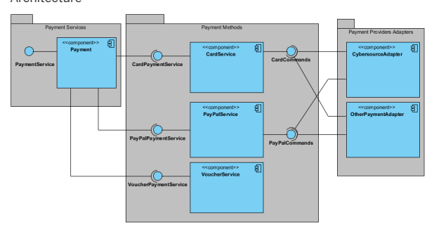

The payment provider functionality may be depicted as split into 3 layers while technically delivered by 2 extensions: the payment extension and the paymentAdapter extension. The name of the particular implementation of the paymentAdapter extension may differ depending on your choice. The adapter for the CyberSource payment provider is named cyberSource. There can be several payment adapters going along with each other, connecting payment extension to the particular payment service provider. Check the diagram above to see how they are related to the payment methods layer.

The payment extension contains implementation for 2 layers:
Payment Services: It works on orders and allows you to authorize and take payment of an order. Payment Methods: It denes different payment methods and sets of requests and results for each of the actions.

To communicate between the payment extension and the paymentAdapter extension, you need to implement payment command interfaces in your extension that are compatible with the payment extension (for details see Payment Integration). The payment extension also implements the command factory, which is responsible for creating payment commands. Right now, only card payment is implemented.

Data

The payment extension does not store any data for used payment cards. It only stores:
Payment transaction data Payment history data Interfaces

The grey color is used for transfer classes: card and transaction. They are used to pass data to the payment provider.
The yellow color is used for the representation of concrete commands.

## Behavior

Normal behavior starts from payment service layer. It res the service in the card payment service. Next, CommandFactoryRegistry returns a command that is used to nish the request. In the next step, this command is used to contact the payment provider and interpret its answer. At the end, the result is passed into the output of the service.

## Expected Responses

Each payment command returns the following information dened in public abstract class AbstractResult:
public abstract class AbstractResult {
private String merchantTransactionCode; private String requestId; private String requestToken; private String reconciliationId; private TransactionStatus transactionStatus; private TransactionStatusDetails transactionStatusDetails; Additionally there is information returned specic to each command as shown in the table below.

| 7/11/2024 Command   | Result                                                          | Result Description                                                                                                                                                                                                                                                                                                                                                                                                                                                                                                                                                                                                                                                                                    |
|---------------------|-----------------------------------------------------------------|-------------------------------------------------------------------------------------------------------------------------------------------------------------------------------------------------------------------------------------------------------------------------------------------------------------------------------------------------------------------------------------------------------------------------------------------------------------------------------------------------------------------------------------------------------------------------------------------------------------------------------------------------------------------------------------------------------|
| Authorization       | de.hybris.platform.payment.commands.result.AuthorizationResult  | Returns information about: currency, money amount, account balance, authorization time, authorization code, AVS status, CVN status, and payment provider.                                                                                                                                                                                                                                                                                                                                                                                                                                                                                                                                             |
| Capture             | de.hybris.platform.payment.commands.result.CaptureResult        | Returns information about: currency, total money amount, and request time.                                                                                                                                                                                                                                                                                                                                                                                                                                                                                                                                                                                                                            |
| CardValidation      | de.hybris.platform.payment.commands.result.CardValidationResult | Returns information about: validation errors, card issuer, issue country code, and card type.                                                                                                                                                                                                                                                                                                                                                                                                                                                                                                                                                                                                         |
| IsApplicable        | de.hybris.platform.payment.commands.result.IsApplicable         | Returns information if payment provider is applicable.                                                                                                                                                                                                                                                                                                                                                                                                                                                                                                                                                                                                                                                |
| Refund              | de.hybris.platform.payment.commands.result.RefundResult         | Returns information about: currency, total money amount, request time, and payment provider.                                                                                                                                                                                                                                                                                                                                                                                                                                                                                                                                                                                                          |
| Void                | de.hybris.platform.payment.commands.result.VoidResult           | Void result uses the transactionStatus and transactionStatusDetails from AbstractResult class to inform if voiding transaction was a succes of failure. Possible results: ACCEPTED: Transaction was accepted. ERROR: An Error occured. REJECTED: Transaction was rejected by PSP, payment processor, or bank. However, sometimes it might still be continued under some conditions. For example, the transaction might be authorized by the issuing bank even when the AVS check fails. Settlement of such a transaction might still be possible. REVIEW: Manual transaction review is needed. This requires calling either the PSP, processor, or bank and proceeding with the transaction manually. |

## Avs Status

Address Verication Service Status Values:
public enum AvsStatus
{
PARTIAL_MATCH, //Partial match.

MATCHED, //Matched.

NOT_MATCHED, //Not matched. NOT_SUPPORTED, //AVS is not supported for this processor or card type.

INVALID, //The processor returned an unrecognized value for the AVS response.

NO_RESULT, //No AVS result UNRECOGNIZED_RESULT, //Unrecognized AVS result SYSTEM_UNAVAILABLE; //System unavailable.

## Cvn Status

Code Verication Number Status Values:
public enum CvnStatus
{
NO_RESULT, //No result code was returned by the processor. UNRECOGNIZED_RESULT, // An unrecognized result code was returned by the processor.

NOT_SUPPORTED, //Card verification is not supported (by issuing bank or by card association or for this processor or for this NOT_PROVIDED, //The CVN is on the card but was not included in the request. NOT_PROCESSED, //The CVN was not processed by the processor for an unspecified reason.

NOT_MATCHED, //The CVN did not match.

MATCHED, //The CVN matched.

NOT_VALIDATED, //The CVN failed the processor's data validation check.

REJECTED, //The transaction was determined to be suspicious by the issuing bank.

}

## Stock Service

Stock Service is part of the basecommerce extension. It offers functionality to manage and query product stock level and product availability information, aggregated or for a specic warehouse.

Use Case The Stock Service is dened by interfaces that enable you to display and manage product stock levels and product availability information for a specic warehouse, or aggregated for multiple warehouses.

Stock Service also comes with strategies for splitting orders into different consignments depending on a product availability. To achieve this, Stock Service uses other parts of the SAP Commerce Cloud, for example Warehouse Integration and Order Splitting.

## Features

Product Stock Level Information It is possible to update, access, and display product stock level information, in particular:
The amount of a certain product that is available (actual, local, and aggregated stock levels)
Stock status for one or more warehouses or stores Forcing always in stock and out of stock for a specic product Allow overselling Keep track of stock levels without requiring live information from a warehouse As a shop owner, you can customize the rules for order cancellation - for example, to not permit customers to cancel orders at all.

Product Availability Information Stock Service makes it possible to manage and display product availability information, for example when a certain amount of a product will be available. It also provides:
Localized text messages intended for use in front-end applications, that may be also customized Strategies for calculating the best availability over multiple warehouses

Figure: An example of displaying product stock level and product availability information in a front-end application.

Availability-Based Order Splitting Depending on the availability of a product, an order may be split into different consignments. This is done by grouping order items into two different groups: Currently Available and Currently Not Available. The default strategy only takes aggregated stock levels into account.

Related Information Warehouse Integration Order Splitting Order Management Services Module

## About Stock Service

The Stock Service is dened by interfaces that enable you to display and manage product stock levels and product availability information for a specic warehouse, or aggregated for multiple warehouses.

Stock Service Overview The Stock Service extends the API with methods and services allowing front-end applications to access and display product stock and availability information. It also interacts with Warehouse Integration and Order Splitting.

The following gure gives an overview of the Stock Service:

- Updating the actual and local stock levels - Displaying the total stock level
- Displaying the stock level for a specific warehouse or many warehouses
- Displaying information about product availability for a specific warehouse or many warehouses
- Enabling and disabling Always In Stock status
- Enabling and disabling Always Out of Stock status
- Configuring overselling of products
- Displaying product stock status The following figure provides an overview from the perspective of different roles:

## Stock Level

The stock level of a product is the available quantity of the specic product at a certain time. In many cases, product stock levels are not updated in real-time, but are instead updated periodically, such as once a day, or once a week. As a result, there may be a difference between the actual stock level and the local (calculated) stock level. The actual stock levels are levels typically reported by a warehouse, such as after an inventory. The local stock level is the calculated value that can be treated as a way of keeping track of sold product quantities, even though we do not know the exact amount that is available in the warehouse.

## Retrieving Stock Levels

The aggregated stock level of a certain product is the total stock level for all stores or warehouses where the product is available. The Stock Service enables you to get aggregated stock levels for all warehouses, and aggregated stock levels for specied warehouses, as follows:
Aggregated stock level for all warehouses
//ProductModel product = ...

 int totalStockLevelAmount= stockLevelService.getTotalStockLevelAmount(product);
Aggregated stock level for specied warehouses
//ProductModel product = ... //Collection<WarehouseModel> warehouses = ...

 int totalStockLevelAmount= stockLevelService.getTotalStockLevelAmount(product, warehouses);

## Maintaining Stock Levels

The Stock Service keeps track of the number of reserved products since the last update from a warehouse. Reserved products can be treated as sold but still returnable.

Consider the following example: a warehouse reports that there are 250 caps available. This is the actual stock level. A customer then buys two caps in a web store. At this point, we would expect the reported stock level to be 248. However, the only real value we have is the one last reported by the warehouse, which is the actual stock level. The local stock level is 248, and to be able to say that there are 248 products available in the warehouse, the Stock Service provides methods to reserve product quantities, which in this case is 2 caps.

Warehouse Stock Levels After taking inventory in a warehouse, it is possible to update the actual stock level for a given product, as follows:
//ProductModel product = ...

 //WarehouseModel warehouse = ...

 //int amount = ...

 //String comment = ...

 stockService.updateActualStockLevel(product, warehouse, amount, comment);
Reserve and Release For customers, it is important to know if they can buy or reserve a product. The Stock Service takes care of these actions as well. The Stock Service supports the operation to reserve a product from a specic warehouse. If there are not enough quantities of a product to be reserved, the InsufficientStockLevelException is thrown, as follows:
//ProductModel product = ... //WarehouseModel warehouse = ...

 //int amount = ... //String comment = ...

 try {
 stockService.reserve(product, warehouse, amount, comment);
 //business code goes on
 }
 catch(InsufficientStockLevelException e)
 {
 LOG.error("not enough products in stock");
 //exception handling }
The customer may cancel an order or a part of an order. Then the product (or products) are returned and are available again, as follows:
//ProductModel product = ...

 //WarehouseModel warehouse = ...

 //int amount = ...

 //String comment = ... stockService.release(product, warehouse, amount, comment);
Product Stock Status Basic stock statuses for a product can be set as follows:
In **stock**: A specic product is indicated as available for given warehouses Out of **stock**: A specic product is indicated as not available for given warehouses A product can also have a custom status that is congured by a warehouse maintainer.

You can display a stock status for a given product for a specic warehouse or for multiple warehouses, as follows: A specic warehouse
//ProductModel product = ...

 //WarehouseModel warehouse = ...

 StockLevelStatus stockLevelStatus = stockService.getProductStatus(product, warehouse);
Multiple warehouses
//ProductModel product = ...

 //Collection<WarehouseModel> warehouses = ...

 StockLevelStatus stockLevelStatus = stockService.getProductStatus(product, warehouses);
Force In Stock Sometimes there are not enough products available, but the seller still wants to sell them. In this case, the **FORCEINSTOCK** can be set for a specied product, as follows:
//enable "ForceInStock"
 //ProductModel product = ...

 //Collection<WarehouseModel> warehouses = ...

 stockService.setInStockStatus(product, warehouses, InStockStatus.FORCEINSTOCK); //disable "ForceInStock" stockService.setInStockStatus(product, warehouses, InStockStatus.NOTSPECIFIED);
Force Out Of Stock The stock status can also be set to **FORCEOUTOFSTOCK**, even if the product is still available, as follows:
//enable "ForceOutOfStock" //ProductModel product = ...

 //Collection<WarehouseModel> warehouses = ...

 stockService.setInStockStatus(product, warehouses, InStockStatus.FORCEOUTOFSTOCK);
 //disable "ForceOutOfStock" stockService.setInStockStatus(product, warehouses, InStockStatus.NOTSPECIFIED);
Overselling In some cases it may be useful to allow the sale of more products than are available in a warehouse. In this case, you can allow the warehouse to congure the overselling of such products, as follows:

//ProductModel product = ...

 //WarehouseModel warehouse = ...

 //int overSelling = ...

 //ModelService modelService = ... StockLevelModel stockLevel = stockService.getStockLevel(product, warehouse);
 stockLevel.setOverSelling(overSelling);
 modelService.save(stockLevel);
It is also possible to get the current overselling amount for a product, as follows:
//ProductModel product = ...

 //WarehouseModel warehouse = ...

 StockLevelModel stockLevel = stockService.getStockLevel(product, warehouse);
 int overSelling = stockLevel.getOverSelling();
Product Availability The product availability contains information about the availability of a specic product from a specic warehouse or from many warehouses.

Retrieving Product Availability Product availability returns a congurable availability message. It may display a date of its availability, or a product quantity for a specic warehouse, or for multiple warehouses, as follows:
A single warehouse
//ProductModel product = ...

 //WarehouseModel warehouse = ... //Date date = ...

 //LanguageModel language = ... String dateAvailability = stockService.getAvailability(product, warehouse, date, language);
 //int quantity = ...

 String quantityAvailability = stockService.getAvailability(product, warehouse, quantity, language);
Multiple warehouses
//ProductModel product = ...

 //List<WarehouseModel> warehouses = ... //Date date = ...

 //LanguageModel language = ...

 String dateAvailability = stockService.getAvailability(product, warehouses, date, language); //int quantity = ...

 String quantityAvailability = stockService.getAvailability(product, warehouses, quantity, language);
Conguring Availability Messages To use the availability message for the stock level, it is necessary to congure the following details:
//ProductModel product = ...

 //WarehouseModel warehouse = ...

 //int amount = ...

 //Date date = ... StockLevelModel stockLevel = stockService.getStockLevel(product, warehouse);
 stockLevel.setMaxPreOrder(amount);
 stockLevel.setNextDeliveryTime(date);
 modelService.save(stockLevel);
To implement your own **ProductAvailabilityStrategy**, you need to override the getAvailability() and/or **parse()** methods. Another option is to dene the messages for availability in the BasecommerceMessages.properties le, as follows:
BasecommerceMessages.properties
//warehouse: warehouse code;
 //product: product code;
 //date: date when the products will be available;
 //availability: amount of product that will be available;
 //total: total amount of product that will be available; de.hybris.platform.validation.services.impl.DefaultProductAvailabilityStrategy.availability=Warehouse: {warehouse} 
 Product: {product} Availability: {availability} Date: {date}
 de.hybris.platform.validation.services.impl.DefaultProductAvailabilityStrategy.total=Total: {total}

## Stock Level Histories

There is a **maxStockLevelHistoryCount** property on each StockLevel that indicates how many histories should be saved related to the updates. If this property is anything other than 0 (zero), then unlimited stockLevelHistories will be created. This property is dened on the **StockLevel** in the basecommerce-beans.xml le, and defaults to 0, indicating that no histories are associated with the **StockLevel**. If unlimited histories are desired (for example, to preserve an audit of all interactions with the StockLevel ), the **maxStockLevelHistoryCount** should be set to any number other than zero (the number can be either positive or negative). Stock level histories are created in the **DefaultStockLevelService** whenever the reserve, release, or updateActualStockLevel methods are called. Also, if for some reason there is no **StockLevel** found, the **StockLevelService** will create a new StockLevel,and at this time, a stock level history will be created if the maxStockLevelHistoryCount is not equal to 0.

This is   For more    the SAP Help  56 Example Use of Stock Service The following example presents a typical ow of calling methods when using the Stock Service:
final StockLevelStatus status = stockService.getProductStatus(product, warehouse);
 //StockLevelStatus status = stockService.getProductStatus(product, warehouses);
 if (StockLevelStatus.INSTOCK.equals(status)) {
 //rendering "Always_In_Stock"
 } else if (StockLevelStatus.OUTOFSTOCK.equals(status))
 {
 //rendering "Out_Of_Stock"
 //disabling the "Add_To_Cart" button
 //int quantity = ...

 //LanguageModel = ...;
 final String availableMessage = stockService.getAvailability(product, warehouse, quantity, language);
 //String availableMessage = stockService.getAvailability(product, warehouses, quantity, language);
 //rendering availableMessage
 }
 else
 {
 final int amount = stockService.getStockLevelAmount(product, warehouse); //int amount = stockService.getTotalStockLevelAmount(product, warehouses);
 //rendering in stock amount }

## Store Locator

The SAP Commerce Cloud Store Locator helps customers nd brick-and-mortar retail locations in the proximity of a postcode, or using Global Positioning System (GPS)
information. Store Locator is an addon for Cart & Checkout, and works with both desktop and mobile solutions.

Use Case A customer is browsing the online store, but would prefer to purchase an item in a retail outlet, where they can get personal assistance and collect the item immediately, or buy online and collect in person. Using either a postcode or address that the customer enters into a standard desktop interface, or using the GPS information available to a mobile device, the system calculates the nearest stores which have the requested items available, and then directs the customer to these stores for purchase and collection based upon item availability.

Features Geocoding Uses third party services for translating address data to GPS coordinates, and nding routes between two points.

Flexibility Follows current standards for geographical data presentation. Supports GoogleMaps API out of the box, but works with other similar services. If a service has limitations on the amount of traffic or request frequency, Store Locator is congurable to avoid exceeding this limit. Maplet Display Follows KML standards to keep map information well structured and easy to display Operations Manager Input Takes input from catalog store maintainers, who can enter and update a precise address information for a store. This input can be provided in Backoffice or using a dedicated service. A dedicated cron job on the server checks for any new or updated locations in order to update the GPS coordinates.

Dependencies There are no specic dependencies for using Store Locator.

Screenshots N
TRACK YOUR ORDER
| NEWSLETTER SIGNUF
LOGIN A

men  women  kids   brands   customize Q search

Related Information Store Locator Implementation Using Store Locator Service Google as Geo Service Provider

## Store Locator Implementation

The Store Locator includes data items types and dedicated services as part of the implementation of the basecommerce extension. It also has several interfaces that allow you to produce map objects, for example, placemarks, routes, styles, and so on, that you can easily transform into Keyhole Markup Language (KML) compatible format.

## Data Structure

Data structure introduced by the Store Locator involves new item types. The internal services, however, make also use of many helpful POJO classes that all contribute to the provided functionality.

PointOfService Item The Store Locator introduces new item type. PointOfService. The purpose of this item is to equip address data of AddressModel data type with geographic position. You can attach the PointOfService to some other items to make them geographically searchable. Moreover, thanks to PointOfServiceModel, you can represent the items on maps.

OpeningSchedule Item
Store Locator brings the OpeningSchedule item type. The purpose of this item is to provide a PointOfService with its opening and closing information.

You can define which of weekdays are opened and what are the opening and closing hours. You can also define what special date the point of service (POS) is opened or closed at, for example for national holidays.

POJO Classes Dedicated for Services Considering the Store Locator data types you can distinguish between the main data types and additional data types. Furthermore, there is also a whole structure of objects relevant to the KML Structure.

-  Location: Interface represents a location meaningful from the business perspective. You can bind it to any item like store, warehouse, and so on. The Locations:

 DefaultLocation: Implements Location based on the PointOfServiceModel and hence allows to operate on locations defined in the SAP Commerce Cloud o Platform o LocationDTOWrapper: Provides the means to integrate with other systems using LocationDTOs.

- GPS: Represents geographic location or, in other words, a valid geographical position. The Location may have a GPS coordinates, in which case we say it is geocoded.

The GPS interface has one default implementation: DefaultGPS.

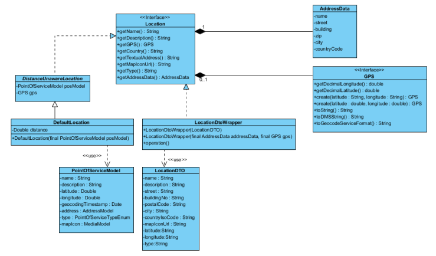

Additional types useful for the front-ends: Map, DistanceAndRoute, Route.

- Map: Represents a single map that is a product of the MapService. It may contain a collection of Point of Interest (POI), as well as the route information. You can display maps using their KML elements. It consists of:
o Center GPS - Radius
. Title

- DistanceAndRoute: Represents a set of information concerning a route. It is a product of the RouteService , It consists of a distance values: road distance, straight line
distance Moreover, it contains a set of coordinates that make all together a route on the map. Those coordinates are wrapped inside the Route object that implements KML
element, which enables you to display it on the map.

Location Service
- Returns the nearest locations of POI to the given coordinates, in the number adequate to the user definition. Use when you have got defined coordinates and need only sorted locations nearby, without any map.

List<Location> getLocationsForPoint(GPS gps, int limitLocationsCount, BaseStoreModel baseStore) throws LocationServiceException; This is custom documentation. For more information, please visit the SAP Help Portal Returns nearby locations of POI in the place dened by search term, which can be either a postal code or a town name and country. Basically it combines two other methods that retrieve locations for town name and postal code.

List<Location> getLocationsForSearch(String searchTerm, String countryCode, int limitLocationsCount, BaseStoreModel baseStore) th Returns the nearest locations of POI to the place dened by postal code and country. Number of returned locations is adequate to the user denition. Use when you do not need any map, only list of sorted locations.

List<Location> getLocationsForPostcode(String postalCode, String countryCode, int limitLocationsCount, BaseStoreModel baseStore) 
Returns the nearest locations of POI to the place dened by a city name. Number of returned locations is adequate to the user denition. Use when you do not need any map, only list of sorted locations.

List<Location> getLocationsForTown(String town, int limitLocationsCount, BaseStoreModel baseStore) throws LocationServiceExceptio Returns the list of sorted items of DistanceAwareLocation. Sorting order is ascending - the closest locations come rst.

List<Location> getSortedLocationsNearby(final GPS gps, final double distance, final BaseStoreModel baseStore) throws LocationServ Location Map Service Returns nearby locations for given postal code or town name and creates Map object with found data:
Map getMapOfLocations(String, String, int, BaseStoreModel) throws LocationMapServiceException Returns the nearest POIs to the place dened by postal code and country, and creates the Map object with given data. Number of returned locations is adequate to the user denition. Use when map representation is required:
Map getMapOfLocationsForPostcode(String, String, int, BaseStoreModel) throws LocationMapServiceException Returns the POIs nearest to the place dened by a city name, and creates Map object with given data. Number of returned locations is adequate to the user denition. Use when map representation is required:
Map getMapOfLocationsForTown(String, String, int, BaseStoreModel) throws LocationMapServiceException Returns a Map, basing on number of points of interest dened by a user and the proper radius:
Map getMapOfLocations(GPS, int, BaseStoreModel) throws LocationMapServiceException

## Geowebservicewrapper

This service hides all the communication to the third party geocoding services, for example Google Maps. It should be used for getting geographical data about addresses as well as getting information on travel directions. These service interfaces use:
Location GPS AddressData These service interfaces return:
GPS DistanceAndRoute Available calls are as follows:
Translates the Location into GPS using third party geocoding service:
GPS geocodeAddress(final Location address) throws GeoServiceWrapperException; Translates the address from AddressData DTO into GPS using third party geocoding service:
GPS geocodeAddress(final AddressData address) throws GeoServiceWrapperException; Gets the distance and route between two Locations:
DistanceAndRoute getDistanceAndRoute(final Location start, final Location dest) throws GeoServiceWrapperException; Gets distance and route between start GPS position and destination Location:
DistanceAndRoute getDistanceAndRoute(final GPS start, final Location dest) throws GeoServiceWrapperException; Provides the address in a formatted String. The format is compliant with the service of choice:
String formatAddress(final Location address) throws GeoServiceWrapperException; This is   For more    the SAP Help  62 Geocoding Based on GoogleMaps: GoogleMapsServiceWrapper When a geocoding request is issued, a new HTTP GET request is composed. Such request is sent to the Google service. The received response is then parsed into the GPS or DistanceAndRoute data structure.

(g) No Use of Content without a Google Map. You must not use or display the Content without a corresponding Google map, unless you are Link : https://developers.google.com/maps/terms?hl=en In other words, Google requires you to show a map when you use their service to geocode a location. However, you are permitted to "cache" known locations (such as store locations), as long as you do not store them for more than 30 days. This "caching" makes the use of the geocodingCronJob permitted.

For example, in Accelerator, in the following scenarios, we geocode a location, but we do not show a map. As this goes against the legal requirement, we must instead use a mock :
Geocoding a location as part of facetted search Geocoding a location in the pickup-in-store modal so as to nd a store that stocks your product For this reason, the basecommerce extension is delivered with a mock implementation out-of-the box. This implementation does not trigger any external webservice call; instead, it returns pre-dened geolocations. These geolocations are unique for each country. For example, a geolocation in the United States will always return 40.7127, 74.0059, or in Germany, 52.514524, 13.35029. If no country can be found on the submitted address, or if the geocode is not congured for the submitted country, then a default geolocation is returned.

## Mapservice

These service interfaces use special types:
Location GPS
These service interfaces return: Map.

Available calls are as follows:
Returns the titled Map object centered on the GPS position. Please mind, that this method call would respond with a Map instance with codenullcode KML eld. This is beacuse no KML representation is needed for a map for which we know only center and default radius. KML eld is populated when there are some markups to be displayed on the map, such as POIs, route, and so on:
Map getMap(GPS gps, String title) throws MapServiceException; Returns the titled Map object centered on the GPS position with a given radius, containing marker points for each point of interest given as input.

Map getMap(GPS gps, double radius, List<Location> poi, String title) throws MapServiceException; Returns the titled Map object centered on the GPS position with a given radius, containing marker points for each point of interest given as input. Map also contains a road route between map center (GPS) and a given destination Location (routeTo):
Map getMap(final GPS gps, final double radius, final List<Location> poi, final String title, final Location routeTo) throws MapSe Returns the titled Map centered around the GPS location with a given radius. As no additional placemarks are required, returned map object has null KML member, Map.getKml():
Map getMap(GPS gps, String title, double radius) throws MapServiceException; Returns the map bounds of the given map. Calculations are perfomed basing on the rectangular coordinates, not just a radius.

MapBounds getMapBoundsForMap(final Map map) throws GeoLocatorException; RouteService This services provides method for getting route and distance information between two points on the map. These service interfaces use types:
Location GPS
These service interfaces return DistanceAndRoute.

Available calls are as follows:
Returns a DistanceAndRoute object that connects starting and destination Location:
DistanceAndRoute getDistanceAndRoute(Location start, Location dest) throws RouteServiceException;
- Returns a DistanceAndRoute object that connects starting GPS position and destination Location:
DistanceAndRoute getDistanceAndRoute(GPS start, Location dest) throws RouteServiceException; Store Locator Use Cases Diagrams presented in the sections below show how the Store Locator works and how its components interact with each other.

Getting a Map with Customer Location

The third party geocoding service has its limitations, and geocoding addresses for each customer visiting the site may be not the best approach. If Google Maps is chosen as a service provider, then follow the Google Maps Limitations link for the ideas how to replace this operation with the client side geocoding.

Getting a Map with Stores and a Route to the POI of Choice If the customer specifies a radius for looking up neighboring stores or POIs, the controller may request to get a map with all the objects included:

Points of Service Maintenance Before you can nd any location on the map, the store administrators need to enter the location data into the database. The store administrators task is to maintain a valid list of POS. They can also give the POS a description and icon to determine its appearance on the map.

Administrators can add new locations using the Backoffice Administration Cockpit. To nd POS available for a base store, perform following steps:
1. Log on to the Backoffice Administration Cockpit.

2. Navigate to the Base Commerce Base Store .

3. Select the base store from the list provided.

The storelocator extension is initialized together with the GeocodingCronJob that collects all new or modied POS entries and requests a geocoding action for each of

them. This task is triggered as a cronjob and could be given the parameters to determine the triggering frequency and POS entries batch size. Adjusting these parameters should be done in accordance to potential limitations of the third party geocoding services, for example, Google Maps API limitations.

## 

KML structure is XML-compliant. It is an open standard that is useful for modeling points, polygons, and so on. It is adopted in the Google Maps in order to provide structured way to represent maps and all contained objects on maps. The Store Locator has several interfaces that allow to produce map objects, for example, placemarks, routes, styles, and so on, that you can easily transform into KML
compatible format. They all realize KmlElement interface and therefore can be given to front-end as displayable map elements.

The main object is KmlDocument. It contains the child elements: content and styles of the map. The KmlDocument.getElement() method produces the whole map content

that could be parsed into a Google mapplet on the front-end.

Related Information acceleratorservices Extension http://code.google.com/apis/maps/index.html

## Using Store Locator Service

Follow the instructions in using the Store Locator functionality. Understand the most common use cases of the internal services and how their arguments are described.

Learn how to add new store locations, how the storelocator nds the added locations, and how it provides the maps with the routes.

## Overview

The storelocator provides three main services. The table below shows details about each of these services.

| Service Name                        | Purpose                                                    | Input               | Output           |
|-------------------------------------|------------------------------------------------------------|---------------------|------------------|
| LocationService                     | CRUD operation on locations                                | Location            | boolean          |
| Getting locations from neighborhood | GPS, radius                                                | Collection Location |                  |
| Getting temporary location          | address data (String)                                      | Location            |                  |
| MapService                          | Getting a structured map instance that could GPS, Location | Map                 |                  |
| be displayed on the fron-end        |                                                            |                     |                  |
| RouteService                        | Getting information on route and distance                  | Location, GPS       | DistanceAndRoute |
| from staring point to destination   |                                                            |                     |                  |

Adding New Store Locations Adding Points Of Service in the Backoffice Administration Cockpit Use Backoffice Administration Cockpit to add new location entries to Base Stores.

1. In the Backoffice Administration Cockpit, select Base Commerce Point of Service .

2. Click the Add button to open the Create New Point of Service window.

See Also Store Locator Implementation When a new item with address data, name, description and even a map icon is saved, user may manually trigger geocoding of this new location. This task can also be performed by a dedicated cron job that comes together with the storelocator.

Adding Locations Using locationService LocationDTO locationDto = new LocationDTO("Nymphenburger strasse", "86", "80636", "Muenchen","DE");
locationDto.setName("hybris");
locationDto.setDescription("hybris main location");
//if gps position is known, latitude and longitude can be set.

//Location entry will be considered as geocoded locationDto.setLatitude("48.149772");
locationDto.setLongitude("11.54667");
Location location = new LocationDtoWrapper(locationDto); try
{ locationService.saveOrUpdateLocation(location);
} 
catch (LocationServiceException e)
{
 // handler.

}

## Adjusting Geocoding Cron Job

The extension is initialized with a cronjob task responsible for geocoding. It collects new entries or modied ones and issues a geocoding request for each of them.To change the initial parameters of the cronjob, you can modify the corresponding parameters in the project.properties le.

| Parameter Name                | Meaning                                                                                                     | project.properties Key          | Default Value   | Unit    |
|-------------------------------|-------------------------------------------------------------------------------------------------------------|---------------------------------|-----------------|---------|
| trigger interval              | Time interval between two                                                                                   | geocode.cronjob.triggerinterval | 15              | minutes |
| consecutive cron job triggers |                                                                                                             |                                 |                 |         |
| internal delay                | Time interval between two consecutive geocoding requests (to avoid querying 3rd part service to frequently) | geocode.cronjob.internaldelay   | 3               | seconds |
| batchsize                     | How many entries are taken for one                                                                          | geocode.cronjob.batchsize       | 100             |         |
| cron job execution            |                                                                                                             |                                 |                 |         |

## See Also

The Cronjob Service Set the cron job scheduling to get the trigger interval of your choice. Additionally, set the batch size and the internal delay on the editor. Select geocodeAddresJob for the option Job.

Finding Stores Users can come up with their own cron job for geocoding purposes, however, after system reinitialization. the default cron job is restored. To start a custom cron job, select Background Processes CronJobs in Backoffice Administration Cockpit. Select Create CronJob Geocoding Cron Job to display the Create New Geocoding Cron Job window.

After you have created POS entries and geocoded them, either manually or via geocoding cron job, it is possible to locate them. The main task of the storelocator is to nd stores in the vicinity of some location and to display them on the map. To have a full knowledge on how this is done, read Store Locator.

Getting the locations nearby is performed by LocationService, while getting a corresponding Map instance is done by MapService.

...

private LocationService locationService; private MapService mapService; locationService ... //InputForm AddressForm addressForm = ...

//create Location from the input data Location myLocation = locationService.getLocation(addressForm.getStreet(), addressForm.getBuildingNo(), addressForm.getZip(), addressF
//2 kilometers radius double radius = 2 List<Location> pois = locationService.getLocationsNearby(myLocation.getGPS(), radius);
...

... //get Map Map map = mapService.getMap(myLocation.getGps(), radius, pois, "My map");
Finding Routes MapService already covers getting a map instance with a route marked on it. It can be done by calling an overloaded getMap() method which has a routeTo argument. So in context of the previous example, the following one will provide the map with the route.

... //Find route to the first point of interest on the map.

Location routeTo = poi.get(0);
Map mapWithRoute = mapService.getMap(myLocation.getGPS(), radius, poi, title, routeTo);
...

In order to nd some custom routes or travel directions, you can use the RouteService to obtain the route coordinates, road and straight line distances.

... private RouteService routeService
...

Location start= ...

Location destination = ...

DistanceAndRoute result = routeService.getDistanceAndRoute(start, destination);
//getDistanceAndRoute is overloaded, so the following produces the same.

DistanceAndRoute result1 = routeService.getDistanceAndRoute(start.getGps(), destination);
KmlRoute coordinatePath = result.getRoute();
double roadDistance = result.getRoadDistance();
double straightLine = result.getEagleFliesDistance(); //

## Google As Geo Service Provider

The Store Locator uses the third party geocoding services to provide its full functionality. The main task for the Store locator is to translate the given address to the GPS
coordinates. Although the module can be integrated with any of the third party geocoding services, the current document puts focus on the Google Maps, which is integrated with Store locator by default.

## Overview

To equip the Store locator with geocoding service, the developer needs to implement an adapter customized for the chosen service. In case of the Google Maps service, the store locator already contains a built-in adapter:
de.hybris.platform.storelocator.impl.GoogleMapsServiceWrapper The Google Maps is an on-line service that allows to geolocate addresses, commonly known places, nd traveling directions, etc. The functionality of the service is rapidly growing, showing some potential in community services as well. Using the service in commercial domain is possible only after signing up for the Google Maps API key.

Client Side API
Google Maps service provides a javascript API that may be used to construct embedded Mapplets that utilize all features from both Google Maps and Google Earth. In order to use the API a signicant part of the business logic must be delegated to the client side which makes it hard to keep the service-oriented architecture.

Client Side Geocoding Before customers can locate any stores, they must be self-located on the Mapplet. Here, the javascript API comes in handy with the GClientGeocoder object, because it allows to send geocoding request from the client side.

This is   For more    the SAP Help  68 HTTP Requests On the other hand, it is possible to construct an HTTP request and GET the map object in return. The format of the map depends on the request parameter. HTTP requests are used in the GoogleMaps geocoding adapter in the storelocator.

Web Service Geocoding To make the HTTP request, the following format applies:
http://maps.googleapis.com/maps/api/geocode/OUTPUT_FORMAT?address=ADDRESS_DATA&sensor=true |false URL encoded parameters used:
ADDRESS DATA: This should be a human readable data encoded using UTF-8 standard.

OUTPUT FORMAT: One of the following: json, xml.

For example:
http://maps.googleapis.com/maps/api/geocode/xml?address=1600+Amphitheatre+Parkway,+Mountain+View,+CA&sensor=true Note To make the example request directly from the hybris dev-net page is impossible without a valid API key. If you do not have the key, copy the link above and use it in a separate browser window instead.

The example request should produce the following response:
<GeocodeResponse>
<status>OK</status> <result>
<type>street_address</type>
<formatted_address>
1600 Amphitheatre Parkway, Mountain View, CA 94043, USA
</formatted_address>
<address_component>
<long_name>1600</long_name>
<short_name>1600</short_name>
<type>street_number</type>
</address_component> <address_component>
<long_name>Amphitheatre Parkway</long_name>
<short_name>Amphitheatre Pkwy</short_name> <type>route</type>
</address_component>
<address_component>
<long_name>Mountain View</long_name>
<short_name>Mountain View</short_name>
<type>locality</type>
<type>political</type>
</address_component>
<address_component>
<long_name>Santa Clara</long_name> <short_name>Santa Clara</short_name>
<type>administrative_area_level_2</type>
<type>political</type>
</address_component>
<address_component>
<long_name>California</long_name>
<short_name>CA</short_name>
<type>administrative_area_level_1</type>
<type>political</type>
</address_component>
<address_component>
<long_name>United States</long_name>
<short_name>US</short_name> <type>country</type>
<type>political</type>
</address_component>
<address_component>
<long_name>94043</long_name>
<short_name>94043</short_name>
<type>postal_code</type>
</address_component>
<geometry>
<location>
<lat>37.4221913</lat>
<lng>-122.0845853</lng>
</location> <location_type>ROOFTOP</location_type>
<viewport> <southwest>
<lat>37.4208423</lat>
<lng>-122.0859343</lng>
</southwest>
<northeast>
<lat>37.4235403</lat>
<lng>-122.0832363</lng>
</northeast>
</viewport>
</geometry>
Getting Directions Store locator can geocode addresses and nd routes between them. An HTTP request is constructed in the adapter, and follows the given pattern:
http://maps.googleapis.com/maps/api/directions/OUTPUT_FORMAT?

origin=START_GPS&destination=DESTINATION_GPS&units=DISTANCEUNIT&sensor=true |false URL encoded parameters used:
START GPS: Starting location.

DESTINATION GPS: Destination location.

OUTPUT_FORMAT: Only kml produces an output from which the route's coordinates can be extracted.

DISTANCEUNIT: Distance unit.

For example:
http://maps.googleapis.com/maps/api/directions/xml?origin=50.249313,18.674927&destination=48.170482,11.5979&sensor=false The example link should respond with XML document with all the data about traveling direction. Follow the link to investigate the service response.

Google Maps Limitations It is possible to use other adapters for Google Maps service or other services. Such adapter must implement the de.hybris.platform.storelocator.GeoWebServiceWrapper.

For more details, see Store Locator Implementation.

</result>
</GeocodeResponse>
Using GClientGeocoder in javascript (see: Client Side Geocoding ) to do the geocoding means that the query comes from website visitor's IP address. As a result it remains irrespective of what site they are using. The requests hit the user's IP quota. As any single user is unlikely to make many queries we really do not need to worry about customers quota. If you are using the HTTP interface (see: Web Service Geocoding ) then the request comes from our server IP, in which case all queries come from the same IP and hence the system may hit the quota. To avoid it, you may adjust geocogingCronJob that equips locations from data base with GPS coordinates.

A good idea behind geocoding is to combine both approaches. For example: when a customer lls in his location in a form, the address data should be submitted for geolocation by javascript. This way the limitation problem is isolated from the number of site's visitors. The addresses of stores, warehouses, etc. should be handled via storelocator that uses HTTP web service.

How to Write Your Own Adapter public interface GeoWebServiceWrapper
{
/**
* Translate IAddress to GPS using 3rd party service
* 
* @param address
* @return GPS
* @throws GeoServiceWrapperException
*/ GPS geocodeAddress(final Location address) throws GeoServiceWrapperException;
/**
* Translate AddressData to GPS using 3rd party service
* 
* @param address
* @return GPS
* @throws GeoServiceWrapperException
*/
GPS geocodeAddress(final AddressData address) throws GeoServiceWrapperException;
/** * Get distance and route that is between two addresses
* 
* @param start
* {@link Location}
* @param dest
* {@link Location}
* @return {@link DistanceAndRoute}
* @throws GeoServiceWrapperException
*/
DistanceAndRoute getDistanceAndRoute(final Location start, final Location dest) throws GeoServiceWrapp
/** * Get distance and route that is between start GPS location and destination address
* 
* @param start
* {@link GPS}
* @param dest
* {@link Location}
* @return {@link DistanceAndRoute}
* @throws GeoServiceWrapperException
*/
DistanceAndRoute getDistanceAndRoute(final GPS start, final Location dest) throws GeoServiceWrapperExc This is   For more    the SAP Help  70
/**
* Formats the address textual information depending on the implementation
* * @param address
* {@link Location}
* @return {@link String}
* @throws GeoServiceWrapperException
*/
String formatAddress(final Location address) throws GeoServiceWrapperException;
}

## Warehouse Integration

The Warehouse Integration interface supports communication between a warehouse and SAP Commerce Cloud during the Order Management process.

Use Case Warehouse Integration consists of two interfaces through which:
Other systems, such as warehouses, can query the SAP Commerce Cloud platform for orders. SAP Commerce Cloud can send information to the warehouse.

Related Information The SAP Commerce Cloud processengine

## Warehouse Integration Implementation

Warehouse Integration allows consignments to be sent from the SAP Commerce Cloud platform to the warehouse in the course of an order process so that the consignments can be prepared and shipped. It also enables the warehouse to report updates on the consignment status back to the SAP Commerce Cloud platform.

The Warehouse Integration provides three methods, as shown in the basic use case diagram and described in detail.

Figure: Warehouse Integration Use Cases

| Use Case                   | Description                                     |
|----------------------------|-------------------------------------------------|
| Prepare Consignment        | Preparing shipment of ordered products          |
| Ship Consignment           | Shipping the prepared consignment               |
| Receive Consignment Status | Receiving consignment status from the warehouse |

The Warehouse Integration interfaces are typically used when - in the order process - a warehouse needs to get information about a consignment shaped out of an order.

The order process then waits for the warehouse to send updates on the consignment's status. After the warehouse has sent the status, the processing of the order is resumed.

Figure: Basic activities in the process of using Warehouse Integration interfaces.

The Warehouse Integration is a simple reference interface. It is meant to provide an example or foundation on which you can build your own interface according to the specics of a given order process and the warehouse to be connected.

Reference Interface Example Implementations Process2WarehouseAdapter This interface realizes communication from the SAP Commerce Cloud platform to the warehouse. It denes two methods:
prepareConsignment: Method tells the warehouse to prepare the shipment of ordered products grouped in the consignment.

shipConsignment: Method allows shipment of the prepared consignment.

public interface Process2WarehouseAdapter
{
/**
 * Send consignment. *
 * @param consignment
 * the consignment
 */
void prepareConsignment(ConsignmentModel consignment);
/**
 * Ship consignment.

 *
 * @param consignment
 * the consignment
 */
void shipConsignment(ConsignmentModel consignment);
}
Mock Implementation Warehouse Integration also offers a mock implementation that is realizing the Process2WarehouseAdapter in the most simple way. When prepareConsignment is invoked, the mock immediately calls receiveConsignmentStatus with status COMPLETE. shipConsignment implementation is empty.

Warehouse2ProcessAdapter This interface is used to send information about a consignment's status from the warehouse to the SAP Commerce Cloud platform. This method should be invoked when the consignment status is changed on the warehouse side.

public interface Warehouse2ProcessAdapter
{
/**
 * Receive warehouse consignment status. *
 * @param consignment
 * the consignment
 * @param status
 * the status This is   For more    the SAP Help  72

 */
void receiveConsignmentStatus(ConsignmentModel consignment, WarehouseConsignmentStatus status);
}
The warehouse provides information about consignment status back to the platform. The table below contains possible status values.

| State    | Description                                                                 |
|----------|-----------------------------------------------------------------------------|
| CANCEL   | A consignment has been canceled by the warehouse.                           |
| PARTIAL  | Not all parts of the consignment could be realized, some are on back order. |
| COMPLETE | A consignment is ready for shipment.                                        |

## Promotions (Legacy)

The promotions module has been replaced by Promotion Engine.

 Note The legacy promotions module is now disabled out of the box. Customers who want to continue to use the legacy promotions have the option to enable this module manually, but must be aware that legacy promotions are no longer supported.

Customers are strongly encouraged to migrate to Promotion Engine. For instructions, see Migrating to the Promotion Engine.

## Overview

The Promotion Module consists of a code component that may be used to implement customer sales promotion functionality within web sites and a Backoffice component for creating and managing the promotion data.

The web site code component exposes information about available promotions for use in web site front end code and facilitates the calculation of the effect of promotions on shopping cart and order state. This functionality supports the following tasks:
Presentation of available promotions to customers Application of activated promotions to shopping carts and orders Evaluation of partially activated promotions in shopping carts

## Promotions (Legacy) Vs. Promotion Engine

Promotion Engine offers a number of improvements over the Promotions (Legacy).

The following table describes the improvements available in the Promotion Engine .

| Promotions (Legacy)                                                                                                         | Promotion Engine                                                                                                                                                                                                                                                     |                                                                                                             |
|-----------------------------------------------------------------------------------------------------------------------------|----------------------------------------------------------------------------------------------------------------------------------------------------------------------------------------------------------------------------------------------------------------------|-------------------------------------------------------------------------------------------------------------|
| Architecture                                                                                                                | Implemented within the Jalo layer by the                                                                                                                                                                                                                             | Runs on top of the Rule Engine that provides a mechanism for dening business rules with                     |
| PromotionManager.updatePromotions() method                                                                                  | conditions and actions                                                                                                                                                                                                                                               |                                                                                                             |
| Offers promotions at Product-level and Order-level types                                                                    | Introduces templates and Rule-Aware Object (RAO) Actions                                                                                                                                                                                                             |                                                                                                             |
| Features                                                                                                                    | Includes two messages for all Promotion types - Fired Message and Could Have Fired Message. Fired message is displayed when the promotion was successfully applied, while Could Have Fired message indicates that the criteria of the promotion is partially fullled | Offers promotion messages and potential promotions. Applied Promotion Messages Potential Promotion Messages |
| Available in the Backoffice                                                                                                 | Represented in a user interface where you can create promotion templates using predened actions and conditions                                                                                                                                                       |                                                                                                             |
| Includes the order entry consumption feature. As promotions use order entry items, the same promotions consume these items. | Supports the order entry consumption concept of the legacy Promotion module. When a promotion already used an item, the Promotion Engine prohibits other promotions from using the same item.                                                                        |                                                                                                             |

Out-of-the-box Templates

## Note

+ : refers to an improved version and supports new features.

| Promotion Module (Legacy)                                                            | Promotion Engine                            |
|--------------------------------------------------------------------------------------|---------------------------------------------|
| Order threshold xed percentage discount                                              | Order threshold percentage discount on cart |
| Order threshold xed discount                                                         | Order threshold xed discount on cart        |
| This is custom documentation. For more information, please visit the SAP Help Portal | 73                                          |

| 7/11/2024 Promotion Module (Legacy)    | Promotion Engine                                  |
|----------------------------------------|---------------------------------------------------|
| Percentage discount                    | Product percentage discount                       |
| Not supported                          | Product xed discount                              |
| Not supported                          | Order threshold percentage discount on product(s) |
| Fixed Price                            | Product xed price                                 |
| Buy X get Y free                       | Buy X get Y Free +                                |
| Order threshold perfect partner        | Order threshold xed price on product(s)           |
| Perfect Partner                        | Product perfect partner xed price +               |
| Not supported                          | Product perfect partner percentage discount       |
| Perfect partner bundle                 | Product bundle xed price +                        |
| Multi-buy                              | Product multi-buy xed price +                     |
| Order threshold free gift              | Order threshold free gift                         |
| Not supported                          | Customer specic percentage discount               |
| Order threshold change delivery method | Order threshold change delivery method            |

How the Promotion Engine links to the Promotion Module (Legacy)
To maximize backwards compatibility, the new Promotion Engine provides an implementation of the Promotion service. This allows promotion results to be written by the new Promotion Engine and read by the existing application that calls the Promotion service such as the Accelerator.

This implementation retains the Promotions (Legacy) in your project. Promotion Engine overrides certain Spring beans. Promotions (Legacy) items continue to exist, but should be unused.

Migrating to the Promotion Engine For details on migration, see Migrating to the Promotion Engine.

Related Information Promotions (Legacy) Promotion Engine Migrating to the Promotion Engine You can manually recreate legacy promotion rules in Promotion Engine by using the Backoffice Rule Builder.

Manual Migration There is no automatic migration from the legacy promotions module to Promotion Engine. Rules must be recreated manually in the Backoffice.

Example 1: Buy X Get Y Free Let us compare two out-of-the-box Promotion Rules that are both available in Promotion Module (Legacy) and Promotion Engine. The following sections demonstrate how to manially migrate your data to Promotion Engine.

l 4 p

PROPERTIES
RESTRICTIONS
MEDIA 
MESSAGES
ADMINISTRATION

| ldentifier       | Title                    |
|------------------|--------------------------|
| BOGOFPowerDrills | Buy 2 Drills, Get 1 Free |

## Promotion Description

»

| Buy a certain number of items, get         |
|--------------------------------------------|
| specified number of lowest valued items    |
| for free.                                  |
| For example: Buy 1 get 1 free (also known  |
| as Buy 2 for the price of 1),Buy 3 for the |
| price of 2 or any combination of paid for  |
| and free products.                         |
| The items must all be from the range of    |
| qualifying products.                       |

## Promotion Details

«

| Promotion Group    | Description   | Priority ©               | Enabled   |
|--------------------|---------------|--------------------------|-----------|
| >                  |               |                          |           |
| powertoolsPromoGrp | ...           | Buy 2 Drills, Get 1 Free | 900       |

## Qualifying Products

<
Specify the products that qualify for this promotion. This can be done Here you specify how many items the user must have in their cart and by specifying the products explicitly or by specifying categories or both.

how many of those will be free. In a classic "Buy One Get One hool many of around 20 weeks and a situation and 20 years.
Free" the qualifying count is 2 and the free count is 1.

| Products                  | Qualifying items count 😊   |
|---------------------------|-----------------------------|
| :                         | 3                           |
| Categories                | Free items count ©          |
| :                         | 1                           |
| Promotion Module (Legacy) |                             |

Example 2: Order Threshold Fixed Discount

| Promotion Engine Promotion Module (Legacy)   | Promotion Engine                                                                                         |
|----------------------------------------------|----------------------------------------------------------------------------------------------------------|
| Promotions B2GOFPowerDrills                  | Promotion Rules product_buy_2_power_drills_get_1_free                                                    |
| Properties > Identier                        | Rule Properties > Code                                                                                   |
| Properties > Title                           | Rule Properties > Name                                                                                   |
| Properties > Description                     | Rule Properties > Description                                                                            |
| Properties > Enabled                         | Rule Properties > Status                                                                                 |
| Properties > Priority                        | Rule Properties > Priority                                                                               |
| Does not exist                               | Conditions & Actions > Conditions > Container > Container ID                                             |
| Properties > Qualifying items count          | Conditions & Actions > Actions > Percentage discount on partner products > Qualifying product containers |
| Properties > Free items count                | Conditions & Actions > Actions > Percentage discount on partner products > Target product containers     |
| Restrictions > Start date                    | Rule Properties > Start Date/Time (Timezone - UTC/GMT)                                                   |
| Restrictions > End date                      | Rule Properties > End Date/Time (Timezone - UTC/GMT)                                                     |
| Messages > Fired message                     | Rule Properties > Message                                                                                |
| Messages > Could have red message            |                                                                                                          |

i 4 d REFRESH
PROPERTIES
RESTRICTIONS
MEDIA MESSAGES ADMINISTRATION
Identifier OrderThreshold750Discount Title
$750 off order for spending over $10, 000 PROMOTION DESCRIPTION
Get a discount when you spend at least a certain For example: Get a €5.00 discount when you spend over €150.00.

er a discount when your order subtotal is at least the threshold value PROMOTION DETAILS
Promotion Group Description Priority ©
Enabled S
power tools Promo Grp
$750 off order for spending over $10, 000
:
500 PRICES
Order threshold 
$ - 10000.0
- Create new Promotion price row Discount price
$ - 750.0 romotion Module (Legacy)
$750 off order for spending over US$10000 [order_threshold_fixed_750USD_discount/UNPUBLISHED/v0]
^ >
i fi REFRESH
4 p AVE
RULE PROPERTIES
CONDITIONS & ACTIONS
 ADMINISTRATION
DETAILS Code ©
Name
❏ Description
❏ Version ✅
»
order_threshold_fixed_750USD_
$750 off order for spending over A fixed discount is applied to the 0

## Rule Management

<

| Website ©            | Start Date/Time (Timezone)
UTC/GMT)                                   |    |                            |                      |    |
|----------------------|-----------------------------------|----|----------------------------|----------------------|----|
| Priority ©           | Rule Group ©                      |    |                            |                      |    |
| powertoolsPromotGrp  | .                                 | 30 | order Promotion Rule Group | Dec 31, 1999 2:51 PM | D  |
| End Date/Time (Timezone 
UTC/GMT)                      | Exclude from storefront display ☺ |    |                            |                      |    |
| ) True               | () False                          |    |                            |                      |    |
| D                    |                                   |    |                            |                      |    |
| Dec 31, 2098 2:52 PM | ) N/A                             |    |                            |                      |    |

Promotion Engine

| Promotion Module (Legacy)                                                            | Promotion Engine                                      |
|--------------------------------------------------------------------------------------|-------------------------------------------------------|
| [] Promotions → Order Threshold 750 Discount →                                       | │ Promotion Rules ↓ 750_USD_off_orders_over_10000_USD |
| Properties > Identifier                                                              | Rule Properties > Code                                |
| This is custom documentation. For more information, please visit the SAP Help Portal |                                                       |

A

| 7/11/2024 Promotion Module (Legacy)                         | Promotion Engine                                       |
|-------------------------------------------------------------|--------------------------------------------------------|
| Properties > Title                                          | Rule Properties > Name                                 |
| Properties > Promotion Group                                | Rule Properties > Rule Group                           |
| Properties > Description                                    | Rule Properties > Description                          |
| Properties > Enabled                                        | Rule Properties > Status                               |
| Properties > Priority                                       | Rule Properties > Priority                             |
| Properties > Order Threshold                                | Conditions & Actions > Condition > Cart total          |
| Properties > Discount price                                 | Conditions & Actions > Action > Fixed discount on cart |
| Messages > Fired message                                    | Rule Properties > Message                              |
| Messages > Potential to re message Restriction > Start date | Rule Properties > Start Date/Time (Timezone - UTC/GMT) |
| Restriction > End date                                      | Rule Properties > End Date/Time (Timezone - UTC/GMT)   |

Promotion Engine ImpEx File INSERT_UPDATE PromotionSourceRule;code[unique=true];priority;maxAllowedRuns;ruleGroup(code);conditions;actions;website(Identifier)[def
;750_USD_off_orders_over_10000_USD;30;1;orderPromotionRuleGroup;"[{""children"":[],""parameters"":{""value"":{""type"":""Map(ItemType(
;product_buy_2_power_drills_get_1_free;150;1;productPromotionRuleGroup;"[{""definitionId"":""y_container"",""parameters"":{""id"":{""u Promotion Module (Legacy) ImpEx File Buy 2 Power Drills, Get 1 Free INSERT_UPDATE AcceleratorProductBOGOFPromotion;PromotionGroup(Identifier[default=$defaultPromoGrp]);enabled[default=true][unique=true] ;;;B2GOFPowerDrills;Buy 2 Power Drills, Get 1 Free;Buy 2 Power Drills, Get 1 Free;Buy 2 Power Drills, Get 1 Free;You get 1 Power Drill
$750 off order for spending over $10,000 INSERT_UPDATE OrderThresholdDiscountPromotion;PromotionGroup(Identifier[default=$defaultPromoGrp]);enabled[default=true,unique=true];c
;;;OrderThreshold750Discount;$750 off order for spending over $10,000;Place an order for over $10,000 to get a $750 discount.;Place an

## Promotions Extension (Legacy)

The promotions extension consists of a code component that may be used to implement customer sales promotion functionality within web sites and UI components for creating and managing promotion data. The promotions uses the BaseStore type, which is a part of the basecommerce extension.

## Note

An SAP Commerce Cloud extension may provide functionality that is licensed through different SAP Commerce Cloud modules. Make sure to limit your implementation to the features dened in your contract license. In case of doubt, please contact your sales representative.

## Note

The promotionsbackoffice adds additional conguration to the backoffice extension. It depends on the promotions. Users have also the possibility to manage promotions using the Backoffice Administration Cockpit. For instructions, see Creating Promotions (Legacy).

## Note

Promotions are not updated automatically when a cart or an order is modied. Neither a cart nor an order is aware of promotions. This is because Cart and Order are SAP Commerce Cloud types dened in the core extension and promotions are dened in the promotions extension. If the cart and order were designed to be aware of promotions, the entire denition of cart and order would have to be changed and the promotions extension would be required for all projects within the SAP Commerce Cloud. The consequence of the cart and order being unaware of promotions is that you must explicitly update the promotions whenever the cart or order is updated
(products added, removed, number of products changed, etc). To update promotions, call the PromotionsManager's updatePromotions(...) method. If you call cart.calculate(), you must also update the promotions.

For more information, see the following:
basecommerce Extension Base Store

## Caching Promotion Results For Performance

(Legacy promotions module) Learn how to enable caching of promotion results to improve promotions performance.

This is   For more    the SAP Help  78

## Enabling Promotion Results Caching Note

When you enable caching of promotions results, you should be aware of the following:

If promotion results caching is disabled: Warnings are displayed during the server start-up for new types that were added to the promotions-item.xml le but were not initialized.

If promotion results caching is enabled: A system update is required to add the meta-information to the database for any new types that were added to the promotions-items.xml le.
If a cart contains many items and promotions, performance may degrade when adding new items. For example, a grocery cart with more than 100 items and more than 25 promotions may exhibit slow performance when adding a new item. To improve performance in these situations, you can enable caching of promotion results To enable caching of promotions results, uncomment three beans in the promotions-spring.xml le, as shown in the following example.

<!-- CACHING START -->
<!-- Replace the Promotions Manager with a version that understands caching -->
<bean id="promotions.manager" class="de.hybris.platform.promotions.jalo.CachingPromotionsManager" init-method="init" destroy-method="d
<property name="cache" ref="promotionsCachingStrategy"/>
</bean>
<alias alias="promotionsCachingStrategy" name="defaultPromotionsCachingStrategy"/>
<bean id="defaultPromotionsCachingStrategy" class="de.hybris.platform.promotions.jalo.DefaultCachingStrategy" scope="tenant"/>
<!-- Override the Cart so that calls to get promotion results can be intercepted -->
<bean id="de.hybris.platform.jalo.order.Cart" class="de.hybris.platform.promotions.jalo.order.PromotionCart" scope="prototype" />
<!-- CACHING FINISH -->

## Note

After enabling caching of promotion results, you must update the system and restart the server.

## Known Issues

The following issues exist with promotion results caching:
Direct access to promotion results through FlexibleSearch is not supported. There are no restrictions on orders as all promotion results for orders are persisted.

Implementations that support the saving of carts between sessions do not recover the promotion results when a customer returns to the store at a later time. This leads to inconsistent cart information unless the cart is recalculated when it is restored in the new session.

It is assumed that sticky sessions are used so that a customer's request is always accessing the same node. This ensures that promotion results are not lost. If the customer is not accessing the same node, then the cart must be recalculated before the promotion results can be viewed. Alternatively, a distributed cache could be implemented to allow the cached promotion results to be visible on all nodes in the cluster.

Customer Service Cockpit users may not see the promotion results associated with a cart for the same reason as the previous point.
You can override the caching strategy in order to provide an implementation that uses a cluster-wide cache instead of the default Java HashMap. This should allow clusterwide visibility of promotion results. However, promotion results get deleted and recreated whenever the cart is recalculated. Any design needs to accommodate the performance and latency implications of synchronizing changes to other nodes within the cluster.

Cart Restoration with Promotion Cache When you are using the cart restoration feature, carts can be loaded from the database on any node. Since the default implementation of the promotion cache is not cluster-aware, the promotion result of the cart that you loaded might be out of sync with the promotion cache. That's why you need recalculate the cart each time you load it. By default, the cart restoration feature doesn't recalculate the cart each time it loads it from database, for performance reasons. It will only recalculate it once the "cart validity period" has passed. You can congure the cart validity period (in seconds) in the local.properties le, as the example below shows:
commerceservices.cartValidityPeriod=12960000

## Promotion Types (Legacy)

Find out more about the types of promotions available in the legacy Promotions module.

Promotion Classes and Types Promotions contain a rule set that denes the conditions for activation and a set of operations which determine the effect of the promotion once activated.

The following classes of promotion are included with the promotions extension:
Product level promotions are activated based upon the products within the line items of a shopping cart or order.

Order level promotions are activated based upon shopping cart or order attributes.

This is   For more    the SAP Help  79 Note Discount Application Logic For details on how specic promotion types work, refer to: Promotion Discount Application Logic.

Product Level Promotions The complete list of out-of-the-box promotion types is provided below. It is possible to identify what products qualify for a promotion by the direct assignment of products and/or categories. Any product that belongs to a qualifying category is deemed qualied for the promotion. Promotion restrictions are required to further lter the qualifying product list.

| qualifying product list. Promotion                    | Description                                                                                                                                                    | Example                                                               |
|-------------------------------------------------------|----------------------------------------------------------------------------------------------------------------------------------------------------------------|-----------------------------------------------------------------------|
| Bundle                                                | Purchase one of each product from a dened set for a                                                                                                            | Buy A, B, and C for €50.                                              |
| combined total price.                                 |                                                                                                                                                                |                                                                       |
| Buy X get Y free                                      | Purchase a certain number of products from within a dened set and add further products from the same set at no additional cost. Buy one get one free.          |                                                                       |
| Fixed price                                           | Purchase from within a dened set at a xed unit price.                                                                                                          | All shirts €5 each.                                                   |
| Multi-buy                                             | Purchase a certain number of products from within a dened Buy any 3 shirts for €50. set for a xed price.                                                       |                                                                       |
| One to one perfect partner bundle                     | Purchase a certain product and another dened partner product for a xed total price. The cart must contain the base product and the partner product to qualify. | Buy this game and the selected partner accessory together for €25.00. |
| Percentage discount                                   | Receive a percentage discount on all products within a                                                                                                         | 20% off all cameras.                                                  |
| dened set.                                            |                                                                                                                                                                |                                                                       |
| Perfect partner                                       | Purchase a certain product from within a dened set and another partner product from a different dened set and pay a xed price for the partner product.         | Buy a game for €10 with each games console.                           |
| Perfect partner bundle                                | Purchase a certain product along with a specied number of products from within a dened set for a combined total price.                                         | Buy a games console and 3 accessories for €200.                       |
| Stepped multi-buy                                     | Purchase a number of products from within a dened set, there are multiple tiers of product quantities and xed prices.                                          | Buy any 3 shirts for €50, 5 for €65, and 7 for €75.                   |
| Order Level Promotions Promotion                      | Description                                                                                                                                                    | Example                                                               |
| Order threshold free gift                             | A free gift is added to the order when the threshold order                                                                                                     | Spend over €50 to receive a free t-shirt.                             |
| value is exceeded.                                    |                                                                                                                                                                |                                                                       |
| Order threshold free voucher                          | A free voucher is given out when the order reaches a certain                                                                                                   | Get a free €5 voucher when you spend over €150.00.                    |
| value.                                                | Get a free voucher when your order subtotal is at least the threshold value                                                                                    |                                                                       |
| Order threshold xed discount                          | A xed value discount is applied to the order when the                                                                                                          | Spend over €50 to receive a €3 discount.                              |
| threshold order value is exceeded.                    |                                                                                                                                                                |                                                                       |
| Order threshold change delivery mode                  | A different delivery mode is applied to the order when the                                                                                                     | Spend over €10 to get free shipping                                   |
| threshold order value is exceeded.                    |                                                                                                                                                                |                                                                       |
| Order threshold perfect partner                       | Purchase a certain product from within a dened set for a                                                                                                       | Spend over €50 to get any shirt for €5.                               |
| xed price when the threshold order value is exceeded. |                                                                                                                                                                |                                                                       |

## Promotion Evaluation

Promotions are evaluated against a shopping cart or order by the promotions extension. There are two modes of evaluation:
Evaluate which of the available promotions have been activated or "red" Evaluate which of the available promotions have been partially activated or "could re".

## Partially Activated Promotions

Promotions are partially activated when some of the activation criteria have been met; e.g. when two qualifying products from a three product multi-buy have been added to the shopping cart. Partially activated promotions do not "consume" line items from the shopping cart (a consumed line item is one that has been used in a red promotion and cannot be used by another promotion), and these are still available for use in evaluating additional partially activated promotions. Indeed, a single product in a line item may be associated with several partially activated promotions, for example a perfect partner and a multi-buy promotion. It is useful to know that a promotion has been partially activated so that this may be communicated to customers on a website. For instance, a message such as "Add another snowboard to your basket and receive 50%
off your order" could be displayed.

This is   For more    the SAP Help  80 Promotion Priority Each promotion has a priority and promotions are evaluated in priority order, highest priority rst. Typically product promotions are evaluated before order promotions; however this is entirely controlled by the priority.

Line items in the cart or order are consumed by red promotions and become ineligible for inclusion in subsequent promotions during the evaluation.

Every promotion result has a certainty that is a fraction number between 0 and 1. The closer the promotion actually is to ring, the closer it is to 1. A promotion result also has a consumed count that indicates how many items in the cart can currently be consumed by the promotion. These two attributes can be used to order or lter promotions that are not close to ring. For example, you can congure it so that a "buy 4 get 1" promotion is only displayed to the customer when the customer already has 2 items in the cart.

## Promotion Discount Application Logic

For each promotion, a discount is added either to the order or to the item. This makes it possible to adjust the order or item total to apply the savings following the application of the promotion.

For all promotions that discount a group of items (Bundles), a separate prorated price is also calculated and stored for each consumed order item, that is, the discount is applied in proportion to each item price.

For all promotions in which an item is given away for free (Buy X Get Y Free), a price of zero is provided for the correct number of units of each free item. For example, if the promotion is buy 4 get 1 free, four items will have a regular price and the price for one item will be set to zero.

For all promotions in which discounts are applied to items individually (Fixed Price or Percentage Discount) the discount is also applied to each individual item. This calculation data is externalized by the promotion module and can be used in project-specic developments for purposes such as reporting or for sending sales data to ERP systems.

| The following table provides examples of orders using the three kinds of promotions and the discount logic that applies to each of them. Promotion Name Description Product Level Promotions Bundle To benet from the BundlePromotion, the user must add 3 items (A, B, and C) which, when bought together, cost 750 EUR and result in a saving. All the other multi-item purchase promotions are variants of a bundle where the rules regarding how an item can qualify differ, but the application of the discount remains the same. That is, a user saves by buying multiple items. If the usual Price for Item A is EUR 86.80, B is EUR 523.99 and C is EUR 381.64. SAP adds an order level discount of EUR 242.43 to ensure the customer is only charged EUR 750 for the 3 items. SAP stores additional pro-rated totals for each 'consumed' item. A is EUR 65.60, B is EUR 395.99 and C is EUR 288.41. For these types of promotions, SAP adds an order level discount and pro-rates the totals for each consumed item. Multi Buy Operates like Bundles, except the user is given the exibility to choose a subset of items from a larger list. Stepped Multi Buy Extends the Multi Buy concept by supporting bundle price banding based on the quantity of candidate items that are added to cart. For example you may sell 4 tires at a bundle price of 400 EUR but dene 5 as being priced at 480 EUR. One-to-One Perfect Partner Operates like bundles however the user can only be offered one partnering product when selecting a certain base product. The general principal of this promotion is to cross-sell a suitable partnering product when a user has chosen a hero product (a hero product is the one that triggers the one-to-one perfect partner promotion). For instance, sell an HDMI cable when a user adds a Blu-ray player to the cart. Perfect Partner Bundle Extends the one-to-one perfect partner promotion by allowing the customer to pick 1 or more (congured) of a set of partnering products when the customer has committed to buying the hero product. Buy X get Y Free Implements the classic promotion where a user can pick a certain number of items from a set and get the cheapest item free. Using the example promotion Buy 2 of item A (normally priced at EUR 523.99) and you get 1 free, you have an order level discount added of EUR 523.99. The system also records the fact that 1 unit of item A is full price and the second unit is free. Fixed Price Used to group a number of items that are all to be sold at a xed unit price (i.e. anything for EUR 5). Percentage discount promotions are the same except a xed discount is applied to each item's unit (or base) price (i.e. 20% off all Run Flat tires). Both promotions result in a discount being added at the item level. This results in the same behavior as applying a product level discount to a product using the default pricing functionality. Consider a Fixed Price promotion where a group of items have been dened as being sold at EUR 300 each. If Item A was priced at EUR 364 normally, it receives an item level discount of 64.   |
|-------------------------------------------------------------------------------------------------------------------------------------------------------------------------------------------------------------------------------------------------------------------------------------------------------------------------------------------------------------------------------------------------------------------------------------------------------------------------------------------------------------------------------------------------------------------------------------------------------------------------------------------------------------------------------------------------------------------------------------------------------------------------------------------------------------------------------------------------------------------------------------------------------------------------------------------------------------------------------------------------------------------------------------------------------------------------------------------------------------------------------------------------------------------------------------------------------------------------------------------------------------------------------------------------------------------------------------------------------------------------------------------------------------------------------------------------------------------------------------------------------------------------------------------------------------------------------------------------------------------------------------------------------------------------------------------------------------------------------------------------------------------------------------------------------------------------------------------------------------------------------------------------------------------------------------------------------------------------------------------------------------------------------------------------------------------------------------------------------------------------------------------------------------------------------------------------------------------------------------------------------------------------------------------------------------------------------------------------------------------------------------------------------------------------------------------------------------------------------------------------------------------------------------------------------------------------------------------------------------------------------------------------------------------------------------------------------------------------------------------------------------------------------------------------------------------------------------------------------------------------------------------------------------------------------------------------------------------------------------------------------------------------------------------------------------------------------------------------------------------------------------------------------------------------|

| 7/11/2024 Promotion Name                              | Description                                                                                                                                                                                                                                                                                                                                                                                                                                                                                                                                                                                                                                                                                                                                                                                                                                                                                                                                                                                                                                                                                                                                                                                                                                        |
|-------------------------------------------------------|----------------------------------------------------------------------------------------------------------------------------------------------------------------------------------------------------------------------------------------------------------------------------------------------------------------------------------------------------------------------------------------------------------------------------------------------------------------------------------------------------------------------------------------------------------------------------------------------------------------------------------------------------------------------------------------------------------------------------------------------------------------------------------------------------------------------------------------------------------------------------------------------------------------------------------------------------------------------------------------------------------------------------------------------------------------------------------------------------------------------------------------------------------------------------------------------------------------------------------------------------|
| Percentage Discount                                   | Percentage discount promotions also result in an absolute discount value being applied directly to the item rather than at order level. This absolute value is calculated by applying the percentage discount on the order entry base price (a base price is a product price before any discounts). For instance, if you have a product priced at 269 EUR that has a EUR 10 standard SAP discount (that is, not one that is based on a promotion) in addition to being applicable for a 19% percentage discount promotion, the product is discounted EUR 61.11 (EUR 51.11 which is 19% of EUR 269 and the additional EUR 10 discount). It is important to understand that the percentage discount promotion is applied before the xed discount, as this changes the nal price (please see screen shot 6). Consider the case of a product that costs EUR 100 , has a standard SAP discount of EUR 10 and is also used as part of a 10% percentage discount promotion. If the promotion is applied on the base price (EUR 100), which is how it's normally done, the nal price is (100 EUR * EUR .9 - EUR 10), which is EUR 80. In the other case, where the xed discount is applied rst, the nal value is (EUR 100 - EUR 10) * .9, which is EUR 81. |
| Perfect Partner                                       | Results in the same item level discount rules. After selecting one of a set of hero products, the customer can choose one from a set of perfect partner products and get that partner product at a special xed price.                                                                                                                                                                                                                                                                                                                                                                                                                                                                                                                                                                                                                                                                                                                                                                                                                                                                                                                                                                                                                              |
| Order Level Promotions Order Threshold Fixed Discount | Allows the customer to get a single product at a xed price when the discounted order subtotal (i.e. not including delivery costs etc.) reaches a threshold value. The discount is stored at item level.                                                                                                                                                                                                                                                                                                                                                                                                                                                                                                                                                                                                                                                                                                                                                                                                                                                                                                                                                                                                                                            |
| Order Threshold Perfect Partner                       | Gives the customer a xed order level discount when the discounted order subtotal reaches a threshold value.                                                                                                                                                                                                                                                                                                                                                                                                                                                                                                                                                                                                                                                                                                                                                                                                                                                                                                                                                                                                                                                                                                                                        |
| Order Threshold Free Gift                             | Adds the specied free gift product to the cart agging it as a give-away. As with the Buy X Get Y Free, the total price of the free items is adjusted to 0.                                                                                                                                                                                                                                                                                                                                                                                                                                                                                                                                                                                                                                                                                                                                                                                                                                                                                                                                                                                                                                                                                         |

## Related Information

Promotion Types and Management promotions Extension

## Creating Promotions (Legacy)

Promotions can be created and edited through the Backoffice Administration Cockpit. By default, the Promotion type appears in the Marketing group.

Most promotion types require some initial conguration to dene their behavior. Newly created promotions are initially in a disabled state, to prevent uncongured, or partially congured, promotions from becoming available to customers. New promotions must be enabled before they become available on a website.

## Promotions Tutorial

A tutorial on creating promotions is available. To learn more, see Creating Promotions Using the Backoffice Administration Cockpit.

Related Information Promotion Types and Management

## Creating Promotions (Legacy)

In the legacy Promotions module, create and manage promotions in a user interface.

## Context

Most promotion types require some initial conguration to dene their behavior. Newly created promotions are initially in a disabled state, to prevent uncongured or partially congured promotions from becoming available to customers, and must be enabled before they become available on a website. Below you will nd a short tutorial on how to create a promotion.

## Procedure

1. 1. Log in to the Backoffice Administration Cockpit using an account with sufficient rights to create promotions.

2. Expand the Marketing entry in the Explorer Tree and click on the Promotions entry.

3. Select the Promotion Type from the list. For details on Promotion Types see: Promotion Types and Management.

4. A new window is opened. In the General section, provide the following attribute values:
Identier Title - a title describing your Promotion.

## Note

Promotion Groups A promotion group is a set of promotions that may be selected for use on a website. The purpose of promotion groups is to enable website developers to alter the set of promotions available based upon some context. A promotion group may contain zero or more promotions. A promotion must always be associated with a promotion groups.

Description - a description of your Promotion.

Priority - the priority of you Promotion. Enabled - tick the checkbox for your Promotion to become active.

5. In the Qualifying products section specify the products and categories that qualify for your Promotion.

6. In the Bundle price section specify the price for the entire bundle.

 Note Currencies Each currency has a different value, and all currencies which qualify for this order must have a specied value.

7. In the Restrictions tab, you can set restrictions for your Promotion.

There are four restriction types included with the promotion extension and additional types may be developed as required:
Date Restrictions: Promotions have a start date and end date. A promotion may only be activated between the start and end dates.

Product Restrictions: Product restrictions prevent promotions from being activated if the shopping cart or order contains any of the products specied. User and Usergroup Restrictions: Both user and usergroup are principals. These restrictions can be used to restrict availability of a promotion to any principal or conversely to prevent principals from using a promotion.

Order Restrictions: These restrictions can be used to restrict the availability of a promotion to selected orders. Order restriction requires the ycommercewebservices extension to be present and enabled.

For example if you want to create a Product Restriction, select this option from the list. A new window opens in which you can select the Product your restriction will apply to.

8. In the Messages tab, you can insert values from the promotion into your messages.

9. In the Media tab, you can specify the URL to page with details of your promotion and attach a product banner image.

10. Click Done to complete the process. You can then double-click the already created promotion to open it for further adjustment.

Related Information Promotion Types and Management

## Enabling Legacy Promotions

The legacy promotions module is now disabled out of the box. Customers who want to continue to use the legacy promotions have the option to enable this module manually, but must be aware that legacy promotions are no longer supported.

Procedure 1. Copy and paste the following property into the local.properties le, which is located in the <HYBRIS_CONFIG_DIR> directory. Set the value to true:
promotions.legacy.mode=true 2. For the changes to take effect, restart the SAP Commerce Cloud Server.

## Vouchers (Legacy)

Vouchers enable you to create and manage vouchers redeemable by your customers.

## Overview

Vouchers are employed as a promotional medium tailored to specic marketing strategies. You can create a simple set of reductions to the order as a whole, or create special offers available only for certain products and customers.

 Note From 6.3, the Voucher Module will be deprecated into maintenance mode for the next 18-months, and thereafter dereleased into legacy support.

We launched the new Coupons feature of the Promotion Engine module with release 6.1 that has achieved feature parity with the legacy Voucher Module and offers many other improvements.

This is   For more    the SAP Help  83 Customers using version 6.x of SAP Commerce Cloud will have the choice of switching to the new Coupons feature of the Promotion Engine. Because of the big architectural differences, the new Coupons feature of the Promotion Engine is not backwards compatible with the legacy Voucher Module. But it is possible to create all vouchers from the legacy module in Coupons as well. Guides for migration are available as part of product documentation: Migrating Serial Vouchers to Multi-Code Coupons and Migrating Promotional Voucher to Single-Code Coupon.

If you require further support, please contact your Customer Manager.

For more information on the planned deprecation of modules, see Deprecation Status.

 Note Compatibility with Other Accelerators Note that you cannot have more than one avor of the Accelerator on your machine.

## Note

The voucherbackoffice extension depends on the voucher extension and adds more conguration to the backoffice extension. For details, see voucher Extension and Voucher Types. You can also manage vouchers using the Backoffice Administration Cockpit. For details, see Voucher Management.

Key Features Online & Offline Vouchers Unique and secure voucher identication numbers Absolute and relative discounts as well as S&H discounts Employee discounts Ability to limit voucher validity to products, quantities, minimal order value, time-spans, and customer groups (new customers, recurring customers etc. Creating vouchers for cross-channel use Through a combination of Voucher Restrictions, the creation of complex voucher eligibility models is possible as well. The Voucher Module comes with a number of predened restrictions which can be enlarged or adapted through customization.

 Note An SAP Commerce Cloud extension may provide functionality that is licensed through different SAP Commerce Cloud modules. Make sure to limit your implementation to the features dened in your contract license. In case of doubt, please contact your sales representative.

Related Information Vouchers (Legacy) Features Voucher Types Voucher Restrictions Voucher Management Voucher Technical Details

## Vouchers (Legacy) Features

The voucher extension enables you to create and manage vouchers redeemable by your customers.

 Note An SAP Commerce Cloud extension may provide functionality that is licensed through different SAP Commerce Cloud modules. Make sure to limit your implementation to the features dened in your contract license. In case of doubt, please contact your sales representative.

## Overview

In SAP Commerce Cloud, vouchers are a special form of discounts that can be applied to an order. Ordinary discounts are automatically calculated for an order when their dened prerequisites are met by the content, time, and/or customer of that order. Customers actively redeem vouchers, typically as part of the order process of the shop frontend.

Like normal discounts within the SAP Commerce Cloud, vouchers can be set to discount prices in two different ways:
xed discount value (e.g. 10 off)
percentage discount (e.g. 20% off)
This is   For more    the SAP Help  84 A voucher with a generated list of voucher codes. The calculation of the discount called for by a given voucher is done on the total value of the applicable product prices, VAT

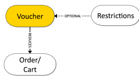

inclusive. Since vouchers can be restricted to apply to certain products only, there may be entries in an order that qualify as non-applicable products. Such products are then not subject to the voucher discount rules.

 Note A new voucherbackoffice extension is available. This extension depends on the voucher extension and adds extra conguration to the backoffice extension.

Voucher Features

| The following table presents an overview of the most important voucher features along with links to more information. Voucher Functionality Area Description More Information Voucher Types The SAP Commerce Cloud comes with the following two kinds of vouchers: Serial Vouchers and Promotional Vouchers. Serial Vouchers have a generated list of voucher codes - each of the codes is marked invalid upon redemption and cannot be used more than once. Promotional Vouchers have a single, invariable voucher code which can be redeemed for any number of times. Voucher Types Voucher Management Vouchers may be created and managed using Backoffice Administration Cockpit (since Release 5.6). Additionally, developers may use the SAP Commerce Cloud's API to manage vouchers. Voucher Management Voucher Restrictions Restrictions optionally allow constraining vouchers to users, products, dates, orders, etc. A voucher can only be redeemed for an order if it conforms to all set Restrictions. A Valid attribute allows to invert the constraints of a Restriction. Voucher Restriction Types  Note Voucher Restrictions Voucher-related Restrictions do not correspond to FlexibleSearch-related restrictions. For FlexibleSearch Restrictions, see Restrictions.   |
|--------------------------------------------------------------------------------------------------------------------------------------------------------------------------------------------------------------------------------------------------------------------------------------------------------------------------------------------------------------------------------------------------------------------------------------------------------------------------------------------------------------------------------------------------------------------------------------------------------------------------------------------------------------------------------------------------------------------------------------------------------------------------------------------------------------------------------------------------------------------------------------------------------------------------------------------------------------------------------------------------------------------------------------------------------------------------------------------------------------------------------------------------------------------------------------------------------------------------------------------------------------------------------------------|

## Voucher Types

The voucher module includes two voucher types: serial vouchers and promotional vouchers. A serial voucher has a generated list of voucher codes. A promotional voucher has a single, invariable voucher code.

## Vouchers Types

 Note This is   For more    the SAP Help  85 Creating Vouchers For details about how to create a voucher, see Creating Vouchers Using Backoffice.

| Voucher Type   | Description                                                                                                                                                                                                                                                                         |
|----------------|-------------------------------------------------------------------------------------------------------------------------------------------------------------------------------------------------------------------------------------------------------------------------------------|
| Promotional    | It has a single, invariable voucher code. It can be set to be redeemed for any number of times, as well as one time or more by the same customer, During voucher creation, the number of possible redemptions must be set for the Voucher as well as per user.                      |
| Serial         | It has a generated list of voucher codes. A voucher code for a Serial Voucher is marked invalid on redemption and cannot be used more than once. The Voucher Module keeps track of redeemed voucher codes and does not allow redeeming a single Serial Voucher code more than once. |

## Serial Voucher

This section provides a list of attributes available for serial vouchers. The attribute values should be provided in the corresponding elds in the Backoffice Administration Cockpit.

| Attribute Name                      | Attribute Type                    | Mandatory   | Description                                                                                                                          |
|-------------------------------------|-----------------------------------|-------------|--------------------------------------------------------------------------------------------------------------------------------------|
| Promotion Code                      | String                            | Yes         | The identier of the voucher.                                                                                                         |
| Description                         | localized String                  | No          | The description of the voucher.                                                                                                      |
| Promotional text to display         | localized String                  | No          | The description of the voucher displayed to the customer.                                                                            |
| Voucher Codes                       | String                            | No          | The voucher code. Can be generated by clicking on the button.                                                                        |
| Number of voucher codes to generate | String representation of a number | No          | Species the number of voucher codes to be generated on a click on the Generate button.                                               |
| Value                               | String representation of a number | Yes         | The numeric value of the voucher.                                                                                                    |
| Priority                            | String representation of a number | Yes         | The priority of the voucher                                                                                                          |
| Currency                            | String representation of a number | No          | The currency in which the value attribute is specied. If no currency is specied, SAP Commerce Cloud sets the voucher to be relative. |
| Including free shipping             | Radio button                      | Yes         | Species if the order this voucher is applied to is shipped for free (Yes) or not (No). The default value is No.                      |

## Promotional Voucher

This section provides a list attributes available for promotional vouchers. The attribute values should be provided in the corresponding elds in the Backoffice Administration Cockpit.

| Attribute Name              | Attribute Type                    | Mandatory   | Description                                                                                                                              |
|-----------------------------|-----------------------------------|-------------|------------------------------------------------------------------------------------------------------------------------------------------|
| Promotion Code              | String                            | Yes         | The identier of the voucher.                                                                                                             |
| Description                 | localized String                  | No          | The (internal) description of the voucher.                                                                                               |
| Promotional text to display | localized String                  | No          | The description of the voucher for the customer to see.                                                                                  |
| Voucher Codes               | String                            | No          | The voucher code. Can be entered manually or generated by clicking the button.                                                           |
| Value                       | String representation of a number | Yes         | The numeric value of the voucher.                                                                                                        |
| Priority                    | String representation of a number | Yes         | The priority of the voucher.                                                                                                             |
| Currency                    | String representation of a number | No          | The currency in which the value attribute is specied. If no currency is specied, the SAP Commerce Cloud sets the voucher to be relative. |
| Including free shipping     | Radion button                     | Yes         | Species if the order this voucher is applied to is shipped for free (Yes) or not (No). The default value is No.                          |

Related Information Next Generation Cockpit Framework Admin Area Vouchers

## Voucher Management

You can create and manage vouchers in the Backoffice Administration Cockpit.

Available Documentation The following documents describes how to create and manage vouchers using the Backoffice Administration Cockpit:
Creating Vouchers Using the Backoffice Administration Cockpit Redeeming and Releasing Vouchers Using the Backoffice Administration Cockpit Related Information Voucher Types Voucher Restrictions Vouchers Creating Vouchers Using the Backoffice Administration Cockpit The Backoffice Administration Cockpit allows you to easily create two predened types of vouchers: Promotional Vouchers and Serial Vouchers.

Creating Promotional Vouchers To create and congure a promotional voucher, do the following:
1. In the Backoffice Administration Cockpit, expand the Marketing node in the Explorer Tree and click on the Vouchers entry.

i Note The Identifier of your choice should consist of up to three characters.

→ Tip The Backoffice Administration Cockpit provides tooltips so you can quickly access information.

4. Press Next to go to the Value Section. Enter values for the following fields:
- Value: Enter a numeric value
- Currency: Use   Q to view available options.

o Priority 5. Press Next to move to Restrictions.

6. If required, add more restrictions for your voucher.

7. Click Done to create the voucher.

## Creating Serial Vouchers

Follow the steps listed below to create and configure a Serial Voucher using a dedicated wizard.

1. In the Backoffice Administration Cockpit, expand the Marketing node in the Explorer Tree and click on the Vouchers entry.

2. Select Serial Voucher from the drop-down menu.

i Note The Identifier of your choice should consist of up to three characters.

5. Enter values for the following fields:
- Value: Enter a numeric value
- Currency: Use  Q to view available options.

This is custom documentation. For more information, please visit the SAP Help Portal Priority 6. Press Next to move to Restrictions.

8. Click Done to create the voucher.

## Additional Conguration

The newly created Vouchers are displayed in the main window. Click on a desired voucher to view more conguration options. Use the tabs to view/modify Voucher

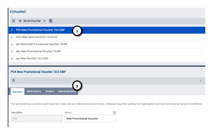

attributes. Grayed out elds allow only the read-only mode.

## Generating Promotional Vouchers

To generate a promotional voucher, do the following:
1. Select the desired Promotional Voucher and go to General tab 2. Scroll down to Voucher Code eld.

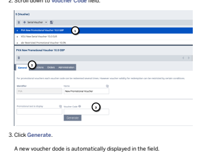

This is   For more    the SAP Help  90 4. Click Save.

## Generating Serial Vouchers

To generate a serial voucher, do the following:
1. Select the desired serial voucher and go to General tab

6. Double-click the saved voucher codes.

Related Information Next Generation Cockpit Framework Admin Area voucher Extension This is   For more    the SAP Help  91 Redeeming and Releasing Vouchers Using the Backoffice Administration Cockpit The process of assigning a voucher to an order (or a cart) is referred to as redeeming a voucher. The process of removing a redeemed voucher from an order (or a cart) is referred to as releasing the voucher.The normal way for vouchers to be redeemed is by a customer as part of the order process in the store frontend. There may be circumstances, however, when voucher redemption or release has to be handled in the Backoffice Administration Cockpit.

## Redeeming Vouchers

To redeem a voucher, do the following:

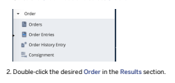

3. Go to the Vouchers tab.
4. Enter the voucher code into the text eld in the Assigned vouchers section and click on the Redeem Voucher button.

The voucher is checked whether it fullls all Restrictions and is redeemed. Redeemed vouchers are presented.

Releasing Vouchers To release a voucher, do the following:

+ Order   ❤
R
Order Nr.

 Date Total Price   User orderhistoryuser@test.com - orders test user 000001 0000003 Thu Apr 16 08:01:59 CEST 2015 120.36 Thu Apr 16 08:02:11 CEST 2015 32.67 orderhistoryuser@test.com - orders test user 0000005 Thu Apr 16 08:02:21 CEST 2015  178.08

| orderhistoryuser@test.com - orders test user   |
|------------------------------------------------|
| orderhistoryuser@test.com - orders test user   |

0000007 Thu Apr 16 08:02:31 CEST 2015  326.38 3. Go to the Voucherstab.

4. In the Assigned vouchers section, enter the voucher code in the text field and click on the Release Voucher button.

Related Information Creating Vouchers Using the Backoffice Administration Cockpit

## Voucher Restrictions

The Voucher module provides predefined restriction types. You can create restrictions for serial and promotional vouchers inBackoffice Administration Cockpit. The Voucher module includes a list of predefined restriction types. All restrictions of a voucher must be fulfilled. Restrictions can be inverted through the Valid attribute where sensible. This document describes how to create voucher restrictions in Backoffice Administration Cockpit. For a list of available restrictions, see Youcher Restriction Types.

Creating Voucher Restrictions in Backoffice Administration Cockpit To create a voucher restriction in Backoffice Administration Cockpit, do the following:
1. Go to Marketing and select Vouchers.

3. Go to the Restrictions section.

 Note You can also add restrictions while creating vouchers. For details see: Creating Vouchers Using the Backoffice Administration Cockpit.

A new wizard window opens for each selected restriction.

5. Enter the attribute values to create a restriction (for example, Restriction to Products).

6. Click Save to create a restriction.

 Note The wizard for creating restrictions includes only mandatory attributes. Double-click the already created restriction to enter Edit mode and add optional

 attributes.

## Voucher Restriction Types

The Voucher module comes with a number of pre-implemented restriction types. In order for a voucher to be redeemed, all restrictions of that voucher must be fullled. You can add restrictions for selected vouchers using Backoffice Administration Cockpit. If you only want mandatory attributes, then you have to use a wizard to create the restriction. To add optional attributes, double-click the already created restriction.

Restriction by Order Count (Regular Customers)
When you redeem the voucher, you must place the specied number of orders, or more, if needed.

Backoffice

| Attribute Name           | Attribute Type         | Mandatory   | Description                                                                                                   |
|--------------------------|------------------------|-------------|---------------------------------------------------------------------------------------------------------------|
| Assigned to Voucher      | Voucher                | yes         | The Voucher the Restriction is assigned to.                                                                   |
| Description              | localized String       | no          | Description of the voucher.                                                                                   |
| Minimum number of orders | number value as String | yes         | How many orders (whatever the total) the current customer must have placed for the Restriction to be fullled. |
| Violation Message        | localized String       | no          | A String to be displayed when the Restriction is violated (not fullled).                                      |

Restriction by Revenue (Regular Customers)

| Backoffice Attribute Name        | Attribute Type         | Mandatory   | Description                                                                                          |
|----------------------------------|------------------------|-------------|------------------------------------------------------------------------------------------------------|
| Assigned to Voucher              | Voucher                | yes         | The Voucher the Restriction is assigned to.                                                          |
| Description                      | localized String       | no          | Description of the voucher.                                                                          |
| Minimum revenue                  | number value as String | yes         | The total sum of all orders the current customer must have placed for the Restriction to be fullled. |
| Currency                         | Currency               | yes         | The currency in which Minimum revenue is measured.                                                   |
| Excl. VAT                        | Checkbox               | no          | Whether Minimum revenue is specied as net (checked) or as a gross value (unchecked).                 |
| Excl. shipping and payment costs | Checkbox               | no          | Whether Minimum revenue is specied including (unchecked) or excluding (checked) shipping costs.      |
| Violation Message                | localized String       | no          | A String to be displayed when the Restriction is violated (not fullled).                             |

When you redeem the voucher, you must place orders for a total of the specied value, or more, if needed.

Restriction to New Customers When you try to redeem the voucher, you must not have placed any orders yet.

Backoffice

| Attribute Name      | Attribute Type   | Mandatory   | Description                                                              |
|---------------------|------------------|-------------|--------------------------------------------------------------------------|
| Assigned to Voucher | Voucher          | yes         | The Voucher the Restriction is assigned to.                              |
| Description         | localized String | no          | Description of the voucher.                                              |
| Violation Message   | localized String | no          | A String to be displayed when the Restriction is violated (not fullled). |

Restriction to Order Value The current order has to exceed the value specied by Order Value.

| Backoffice Attribute Name        | Attribute Type   | Mandatory   | Description                                                                                 |
|----------------------------------|------------------|-------------|---------------------------------------------------------------------------------------------|
| Assigned to Voucher              | Voucher          | yes         | The Voucher the Restriction is assigned to.                                                 |
| Description                      | localized String | no          | Description of the voucher.                                                                 |
| Order Value                      | String           | yes         | The value of the order that must be exceeded for the Restriction to be fullled.             |
| Currency                         | Currency         | yes         | The currency in which Order Value is measured.                                              |
| Excl. VAT                        | Checkbox         | no          | Whether Order Value is specied as net (checked) or as a gross value (unchecked).            |
| Excl. shipping and payment costs | Checkbox         | no          | Whether Order Value is specied including (unchecked) or excluding (checked) shipping costs. |
| Valid                            | Radio button     | no          | Whether Order Value must or must not be exceeded for the Restriction to be fullled.         |
| Violation Message                | localized String | no          | A String to be displayed when the Restriction is violated (not fullled).                    |

Restriction to Products The product has to be or must not be on a specic list, depending on the value of the Valid attribute.

Backoffice

| Attribute Name      | Attribute Type   | Mandatory   | Description                                                                                                                                  |
|---------------------|------------------|-------------|----------------------------------------------------------------------------------------------------------------------------------------------|
| Assigned to Voucher | Voucher          | yes         | The Voucher the Restriction is assigned to.                                                                                                  |
| Description         | localized String | no          | Description of the voucher.                                                                                                                  |
| Products            | list of products | no          | The list of products to be included or excluded (depending on the value of the Valid attribute)                                              |
| Valid               | Radio button     | no          | Species whether the current must be or must not be one of the product(s) listed in the Products attribute for the Restriction to be fullled. |
| Violation Message   | localized String | no          | A String to be displayed when the Restriction is violated (not fullled).                                                                     |

Restriction to Product Categories The product has to be in one of the specied categories.

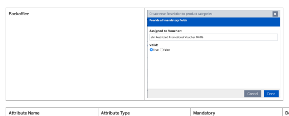

| Attribute Name      | Attribute Type     | Mandatory   | Description                                                                                            |
|---------------------|--------------------|-------------|--------------------------------------------------------------------------------------------------------|
| Assigned to Voucher | Voucher            | yes         | The Voucher the Restriction is assigned to.                                                            |
| Description         | localized String   | no          | Description of the voucher.                                                                            |
| Product categories  | list of categories | no          | A list of categories which the product must be in or must not be in, depending on the Valid attribute. |
| Valid               | Radio button       | no          | Species whether the product must be in the categories listed or not be in the categories listed.       |
| Violation Message   | localized String   | no          | A String to be displayed when the Restriction is violated (not fullled).                               |

## Restriction To Quantity Ordered

The ordered quantity of a product has to be equal to or less than the specied value or greater than the specied value, depending on the Valid attribute. This restriction limits the effect of the voucher to the number of items specied. For example, in the screenshot below, the voucher is effective for the rst ve items of the listed products. If a customer buys 20 items, the voucher is only applied to ve items.

Backoffice

| 7/11/2024 Attribute Name   | Attribute Type         | Mandatory   | Description                                                                                                                                                 |
|----------------------------|------------------------|-------------|-------------------------------------------------------------------------------------------------------------------------------------------------------------|
| Assigned to Voucher        | Voucher                | yes         | The Voucher the Restriction is assigned to.                                                                                                                 |
| Description                | localized String       | no          | Description of the voucher.                                                                                                                                 |
| Products                   | list                   | yes         | Products affected by the restriction.                                                                                                                       |
| Quantity ordered           | number value as String | yes         | Text representation of the number of units that must at least or at most (depending on the Valid attribute) have been ordered for the Restriction to fulll. |
| Unit                       | a unit                 | yes         | Unit of the Quantity ordered attribute.                                                                                                                     |
| Valid                      | Radio button           | no          | Species whether the number of units is given as a maximum or as a minimum.                                                                                  |
| Violation Message          | localized String       | no          | A String to be displayed when the Restriction is violated (not fullled).                                                                                    |

Restriction to Users The user trying to redeem the voucher has to be on a specic list.

| Backoffice Attribute Name   | Attribute Type   | Mandatory   | Description                                                                                                                                  |
|-----------------------------|------------------|-------------|----------------------------------------------------------------------------------------------------------------------------------------------|
| Assigned to Voucher         | Voucher          | yes         | The Voucher the restriction is assigned to.                                                                                                  |
| Description                 | localized String | no          | Description of the Voucher.                                                                                                                  |
| Users                       | list of users    | yes         | A list of users the current user must be or must not be (depending on the Valid attribute) identical with for the Restriction to be fullled. |
| Valid                       | Radio button     | no          | Species whether the current user must be or must not be one of the users listed in the Users attribute for the Restriction to be fullled.    |
| Violation Message           | localized String | no          | A String to be displayed when the Restriction is violated (not fullled).                                                                     |

Temporal Restriction The current date has to be within the date range between Begins and Ends.

Backoffice

| 7/11/2024 Attribute Name   | Attribute Type   | Mandatory   | Description                                                              |
|----------------------------|------------------|-------------|--------------------------------------------------------------------------|
| Assigned to Voucher        | Voucher          | yes         | The Voucher the Restriction is assigned to.                              |
| Description                | localized String | no          | Description of the Voucher.                                              |
| Begins                     | java.util.Date   | yes         | The beginning of the date range to which the Restriction applies.        |
| Ends                       | Date             | yes         | The end of the date range to which the Restriction applies.              |
| Violation Message          | localized String | no          | A String to be displayed when the Restriction is violated (not fullled). |

Related Information Voucher Technical Details

## Voucher Technical Details

Learn about the technical details of the voucher types, how to create and manage them using the SAP Commerce Cloud API.

## Generating Voucher Codes

To redeem a voucher, the voucher must have a code. The voucher class provides the generateVoucherCode() method, which is an implementation of the voucher code generator.

The generateVoucherCode() method generates hyphen-delimited voucher codes of 15 bytes according to the XXX-YYYY-YYYY-YYYY pattern (one group of three bytes and three groups of four bytes each). Example: 123-H8BC-Y3D5-34AL.

 Note For more information on creating vouchers using the Backoffice Administration Cockpit, see Creating Vouchers Using the Backoffice Administration Cockpit.

The rst three characters of the voucher codes generated by the generateVoucherCode() method are the Promotion Code, used as a prex. Example: Using the Vouchers 123, 234 and 345 results in voucher codes such as 123-YYYY-YYYY-YYYY , 234-YYYY-YYYY-YYYY and 345-YYYY-YYYY-YYYY .

The four byte groups (YYYY-YYYY-YYYY, such as H8BC-Y3D5-34AL) are generated basing on the int value provided by the getNextVoucherNumber(ctx) method. The generation mechanism does not involve a random generator function, so providing the same int for a Voucher always results in generating the same voucher code.

 Note The Backoffice do not allow entering more than three characters for the code attribute. At the API level, trying to create a voucher with more than three characters as value for the code attribute will result in the following exception:
For a voucher the maximum number of digits for the promotion code is 3.

## Redeeming Vouchers

Redeeming a voucher is the process of activating the voucher for an order or a cart so that the customer receives a discount.

 Note For more information on releasing and redeeming vouchers using the Backoffice, seeRedeeming and Releasing Vouchers Using the Backoffice Administration Cockpit This is   For more    the SAP Help  99 The process is as follows:

3. The redeem( ...) method triggers the recalculate() method to make sure the cart is up to date. During the execution of the recalculate() method, the discounts (and, by consequence, vouchers) are calculated once more.

4. During voucher calculation, the isApplicable(...) method iterates over the voucher-related restrictions.

5. By calling each restrictions isFulfilled() method, the recalculation process checks whether or not a restriction denies the voucher. 6. If the isFulfilled() method returns false for one of the restrictions, the isApplicable(...) method also returns false and the voucher is not redeemed.

For a voucher to be redeemed, every single voucher-related restriction must be fullled.

The voucher class offers two methods for voucher redemption, depending on if the voucher is to be redeemed for a cart or for an order:
redeem(String aVoucherCode, Cart aCart)
If both the checkVoucherCode(String aVoucherCode) and the isReservable(String aVoucherCode, AbstractOrder abstractOrder) methods return true, this method will add voucher to a Cart. Returns true if the redemption was successful, returns false if the redemption failed. Recalculates the Cart automatically.

Voucher voucher = getVoucher( aVoucherCode ); if( voucher != null )
{
return voucher.redeem( aVoucherCode, anOrder );
}
return null; redeem(String aVoucherCode, Order anOrder) Returns a VoucherInvalidation object if the redemption was successful. You will need to call the recalculate() method for the voucher redemption to take effect.

A VoucherInvalidation object establishes a connection between a Voucher, an Order and a User. If the VoucherInvalidation object exists for a combination of a voucher code, an Order, and a User, then the voucher code is redeemed for the User on the Order. Conversely, by removing the VoucherInvalidation object, the combination between a Voucher, an Order and a User is removed and the voucher no longer applies the voucher is released.

## Releasing Vouchers

Releasing a voucher is the process of removing the voucher for an order or a cart so that the customer no longer receives a discount.

The voucher class offers two methods for voucher release, depending on whether the voucher is to be released for a cart or for an order:
release(String aVoucherCode, Cart aCart)
Removes the voucher with the code from the Cart. Recalculates the Cart automatically. Throws a JaloPriceFactoryException on errors.

Voucher voucher = getVoucher( aVoucherCode );
if( voucher != null )
{
voucher.release( aVoucherCode, anOrder );
}
return null; release(String aVoucherCode, Order anOrder) Removes the voucher with the codefrom the Order. You will need to call the recalculate() method for the voucher release to take effect. Throws a ConsistencyCheckException on errors.

A VoucherInvalidation object establishes a connection between a Voucher, an Order and a User. If aVoucherInvalidation object exists for a combination of a voucher code, an Order, and a User, then the voucher code has been redeemed for the User on the Order. Conversely, by removing the VoucherInvalidation object, the combination between a Voucher, an Order and a User is removed and the voucher no longer applies the voucher is released.

This is   For more    the SAP Help  100

## Implementing Vouchers

To create custom voucher types, you will need to use one of the two pre-dened voucher-type implementations (PromotionVoucher and SerialVoucher), or create a non-abstract subtype of voucher. To create a subtype of Voucher, you will need to implement the following three methods:
public boolean checkVoucherCode( String voucherCode) Returns true if the String voucherCode passed as parameter is a valid voucher code for the voucher type. If voucherCode is not a valid voucher code, return false. protected int getNextVoucherNumber( SessionContext ctx)
Must return an int that is used as a seed for the voucher code generation. Returning a xed value (using return 1;, for example) causes the generateVoucherCode() method to always generate the same voucher code. public boolean isReservable( String voucherCode, User user)
Return true if the voucher with the code voucherCode is eligible for the user user. The PromotionVoucher implementation of this method, for example, only returns true the voucher has been redeemed less than a given number of times overall and less than a given number of times for the individual user:
public boolean isReservable( String aVoucherCode, User user )
{
return getInvalidations(aVoucherCode, user ).size() < getRedemptionQuantityLimitPerUserAsPrimitive()
&& getInvalidations( aVoucherCode ).size() < getRedemptionQuantityLimitAsPrimitive();
}

## Types And Attributes

This section describes type system-related information to create vouchers via the ImpEx extension, for example. The following tables provide the mandatory and some optional attributes of voucher-related types.

Unlike with almost all other types in the SAP Commerce Cloud, the length of the Voucher class code attribute (a promotion code) is technically limited to a maximum of three characters. The limitation to the three-character code is due to the fact that the promotion code is part of the voucher code by default.

## Note

For more information on voucher types and attributes, see Voucher Types.

## Serial Voucher

Unlike the PromotionVoucher type, the SerialVoucher type uses an internal counter which is increased on every voucher code generation. This counter allows up to 2^24 = 16.777.216 voucher codes per single Serial Voucher. To use more than this number of voucher codes, you will need to use different SerialVouchers.

The following list gives samples of SerialVoucher voucher codes as generated by the generateVoucherCode() method:
123-HYC5-A58D-DB4D
123-HYC5-AD45-575C 123-HYC5-A653-63A3 234-E452-GHWG-2E4W
234-E452-LWLR-WTL8 234-E452-L12W-TT5P

345-2TZG-SKEE-1WGZ
345-2TZG-S41W-1B1G
345-2TZG-SHZF-FFEF

| Attribute Name   | Attribute Type             | Mandatory   | Description                                                                                                                                                       |
|------------------|----------------------------|-------------|-------------------------------------------------------------------------------------------------------------------------------------------------------------------|
| absolute         | java.lang.Boolean          | yes         | Whether or not the value attribute species an absolute discount (reduction by a xed value,true) or a relative discount (reduction by a certain percentage,false). |
| code             | java.lang.String           | yes         | The identier of the Voucher.                                                                                                                                      |
| codes            | MediaCollection            | no          | A list of medias containing the generated voucher codes.                                                                                                          |
| description      | localized:java.lang.String | no          | The description of the voucher.                                                                                                                                   |

| 7/11/2024 Attribute Name   | Attribute Type                              | Mandatory   | Description                                                                                                   |
|----------------------------|---------------------------------------------|-------------|---------------------------------------------------------------------------------------------------------------|
| freeShipping               | java.lang.Boolean                           | yes         | Species if the order this voucher is applied to is shipped for free (true) or not (false). Defaults to false. |
| orders                     | OrderCollection                             | no          | A list of all orders for which the voucher has been redeemed. Jalo-only attribute.                            |
| restrictions               | VoucherRestrictionsRelationrestrictionsColl | no          | References all restrictions that apply to the voucher.                                                        |
| valueString                | java.lang.String                            | no          | The value of this voucher to display. Jaloonly attribute.                                                                                                               |
| value                      | java.lang.Double                            | yes         | The numeric value of the voucher.                                                                             |

## Promotion Voucher

Promotion Vouchers can optionally be redeemed more than once and / or more than once per customer. Whether or not a PromotionVoucher can be redeemed more than once depends on the values of the redemptionQuantityLimit and the redemptionQuantityLimitPerUser attributes, respectively.

The PromotionVoucher type always uses the same int value provided by the getNextVoucherNumber( ctx) method.Subsequently the voucher code for a Promotion Voucher never changes.

| Attribute Name                 | Attribute Type                              | Mandatory   | Description                                                                                                                                                         |
|--------------------------------|---------------------------------------------|-------------|---------------------------------------------------------------------------------------------------------------------------------------------------------------------|
| absolute                       | java.lang.Boolean                           | yes         | Whether or not the value attribute species an absolute discount (reduction by a xed value, true) or a relative discount (reduction by a certain percentage, false). |
| code                           | java.lang.String                            | yes         | The identier of the Voucher.                                                                                                                                        |
| description                    | localized:java.lang.String                  | no          | The description of the voucher.                                                                                                                                     |
| freeShipping                   | java.lang.Boolean                           | yes         | Species if the order this voucher is applied to is shipped for free (true) or not (false). Defaults to false.                                                       |
| orders                         | OrderCollection                             | no          | A list of all orders for which the voucher has been redeemed. Jalo-only attribute.                                                                                  |
| redemptionQuantityLimit        | java.lang.Integer                           | yes         | The maximum overall number of redemptions for this voucher.                                                                                                         |
| redemptionQuantityLimitPerUser | java.lang.Integer                           | yes         | The maximum number of redemptions for this voucher per user.                                                                                                        |
| restrictions                   | VoucherRestrictionsRelationrestrictionsColl | no          | References all Restrictions that apply to the voucher.                                                                                                              |
| valueString                    | java.lang.String                            | no          | The value of this voucher to display. Jaloonly attribute.                                                                                                                                                                     |
| value                          | java.lang.Double                            | yes         | The numeric value of the voucher.                                                                                                                                   |

## Restrictions Daterestriction

Unlike on the abstract Restriction type, the positive attribute is overridden to be optional.

| Attribute Name   | Attribute Type             | Mandatory   | Description                            |
|------------------|----------------------------|-------------|----------------------------------------|
| description      | localized:java.lang.String | no          | Description of the voucher.            |
| endDate          | java.util.Date             | yes         | The end of the date range to which the |

| 7/11/2024 Attribute Name   | Attribute Type             | Mandatory   | Description                                                                                                                                                                                                                                                                         |
|----------------------------|----------------------------|-------------|-------------------------------------------------------------------------------------------------------------------------------------------------------------------------------------------------------------------------------------------------------------------------------------|
| positive                   | java.lang.Boolean          | no          | If set to false, the restriction is inverted. Defaults to true. The DateRestriction is fullled if The current date is within the date range between startDate and endDate(positive==true) The current date is outside the date range between startDate and endDate(positive==false) |
| restrictionType            | localized:java.lang.String | no          | Jalo-only attribute.                                                                                                                                                                                                                                                                |
| startDate                  | java.util.Date             | yes         | The beginning of the date range to which the restriction applies.                                                                                                                                                                                                                   |
| violationMessage           | localized:java.lang.String | no          | A string to be displayed when the restriction is violated (not fullled).                                                                                                                                                                                                            |
| voucher                    | Voucher                    | no          | Attribute created via the VoucherRestrictionsRelation relation.                                                                                                                                                                                                                     |

## Newcustomerrestriction

| Attribute Name   | Attribute Type             | Mandatory   | Description                                                                                                                                                                                                                         |
|------------------|----------------------------|-------------|-------------------------------------------------------------------------------------------------------------------------------------------------------------------------------------------------------------------------------------|
| description      | localized:java.lang.String | no          | Description of the voucher.                                                                                                                                                                                                         |
| positive         | java.lang.Boolean          | yes         | If set to false, the restriction is inverted. Defaults to true. The NewCustomerRestriction is fullled if The current user account has no orders (positive==true) The current user account has at least one order (positive==false). |
| restrictionType  | localized:java.lang.String | no          | Jalo-only attribute.                                                                                                                                                                                                                |
| violationMessage | localized:java.lang.String | no          | A string to be displayed when the restriction is violated (not fullled).                                                                                                                                                            |
| voucher          | Voucher                    | no          | Attribute created using the VoucherRestrictionsRelation relation.                                                                                                                                                                   |

## Orderrestriction

| Attribute Name                                                                       | Attribute Type             | Mandatory   | Description                                                                                                                                                                                                                                          |
|--------------------------------------------------------------------------------------|----------------------------|-------------|------------------------------------------------------------------------------------------------------------------------------------------------------------------------------------------------------------------------------------------------------|
| currency                                                                             | Currency                   | yes         | The currency in which the value for the total attribute is specied                                                                                                                                                                                   |
| description                                                                          | localized:java.lang.String | no          | Description of the voucher.                                                                                                                                                                                                                          |
| net                                                                                  | java.lang.Boolean          | yes         | Species whether total is given as a net value (true) or as a gross value (false). Defaults to true.                                                                                                                                                  |
| positive                                                                             | java.lang.Boolean          | yes         | If set to false, the restriction is inverted. Defaults to true. The OrderRestriction is fullled if: the order has a higher total than the specied value (positive==true) the order has a total equal to the specied value or less (positive==false). |
| restrictionType                                                                      | localized:java.lang.String | no          | Jalo-only attribute.                                                                                                                                                                                                                                 |
| total                                                                                | java.lang.Double           | yes         | The order must exceed this amount for the restriction to apply.                                                                                                                                                                                      |
| This is custom documentation. For more information, please visit the SAP Help Portal | 103                        |             |                                                                                                                                                                                                                                                      |

| 7/11/2024 Attribute Name   | Attribute Type             | Mandatory   | Description                                                                                                                                                                             |
|----------------------------|----------------------------|-------------|-----------------------------------------------------------------------------------------------------------------------------------------------------------------------------------------|
| valueofgoodsonly           | java.lang.Boolean          | yes         | Species whether the value of total refers to the total of the ordered articles only (true) or whether total refers to the ordered articles plus shipping etc (false). Defaults to true. |
| violationMessage           | localized:java.lang.String | no          | A String to be displayed when the restriction is violated (not fullled).                                                                                                                |
| voucher                    | Voucher                    | no          | Attribute created via the VoucherRestrictionsRelation relation.                                                                                                                         |

## Productcategoryrestriction

| Attribute Name   | Attribute Type             | Mandatory   | Description                                                                                                                                                                                                                                       |
|------------------|----------------------------|-------------|---------------------------------------------------------------------------------------------------------------------------------------------------------------------------------------------------------------------------------------------------|
| categories       | CategoryCollection         | yes         | The categories the given product must be in or out of (depending on the value of the positive attribute).                                                                                                                                         |
| description      | localized:java.lang.String | no          | Description of the voucher.                                                                                                                                                                                                                       |
| positive         | java.lang.Boolean          | yes         | If set to false, the restriction is inverted. Defaults to true. The ProductCategoryRestriction is fullled if: The product is in one of the specied categories (positive==true) The product is in none of the specied categories (positive==false) |
| restrictionType  | localized:java.lang.String | no          | Jalo-only attribute.                                                                                                                                                                                                                              |
| violationMessage | localized:java.lang.String | no          | A string to be displayed when the restriction is violated (not fullled).                                                                                                                                                                          |
| voucher          | Voucher                    | no          | Attribute created using the VoucherRestrictionsRelation relation.                                                                                                                                                                                 |

## Productquantityrestriction

| Attribute Name   | Attribute Type             | Mandatory   | Description                                                                                                                                                                                                                                                                                       |
|------------------|----------------------------|-------------|---------------------------------------------------------------------------------------------------------------------------------------------------------------------------------------------------------------------------------------------------------------------------------------------------|
| description      | localized:java.lang.String | no          | Description of the voucher.                                                                                                                                                                                                                                                                       |
| positive         | java.lang.Boolean          | yes         | If set to false, the restriction is inverted. Defaults to true. The ProductQuantityRestriction is fullled if: The ordered quantity of a product is equal to or less than the specied value (positive==true) The ordered quantity of a product is greater than the specied value (positive==false) |
| quantity         | java.lang.Long             | yes         | The order must exceed this amount of ordered items for the Restriction to apply.                                                                                                                                                                                                                  |
| restrictionType  | localized:java.lang.String | no          | Jalo-only attribute.                                                                                                                                                                                                                                                                              |
| unit             | Unit                       | yes         | The unit in which the value of the quantity attribute is specied.                                                                                                                                                                                                                                 |
| violationMessage | localized:java.lang.String | no          | A string to be displayed when the restriction is violated (not fullled).                                                                                                                                                                                                                          |
| voucher          | Voucher                    | no          | Attribute created via the VoucherRestrictionsRelation relation.                                                                                                                                                                                                                                   |

This is   For more    the SAP Help  104 ProductRestriction

| Attribute name   | Attribute type             | Mandatory   | Description                                                                                                                                                                                                                         |
|------------------|----------------------------|-------------|-------------------------------------------------------------------------------------------------------------------------------------------------------------------------------------------------------------------------------------|
| description      | localized:java.lang.String | no          | Description of the voucher.                                                                                                                                                                                                         |
| positive         | java.lang.Boolean          | yes         | If set to false, the restriction is inverted. Defaults to true. The ProductRestriction is fullled if: The product is a member of the specied list (positive=true) The product is not a member of the specied list (positive==false) |
| restrictionType  | localized:java.lang.String | no          | Jalo-only attribute.                                                                                                                                                                                                                |
| violationMessage | localized:java.lang.String | no          | A string to be displayed when the restriction is violated (not fullled).                                                                                                                                                            |
| voucher          | Voucher                    | no          | Attribute created via the VoucherRestrictionsRelation relation.                                                                                                                                                                     |

## Regularcustomerorderquantityrestriction

| Attribute Name   | Attribute Type             | Mandatory   | Description                                                                                                                                                                                   |
|------------------|----------------------------|-------------|-----------------------------------------------------------------------------------------------------------------------------------------------------------------------------------------------|
| description      | localized:java.lang.String | no          | Description of the voucher.                                                                                                                                                                   |
| orderQuantity    | java.lang.Integer          | yes         | The number of items the user needs to order for the restriction to be fullled. The effect depends on the positive attribute.                                                                  |
| positive         | java.lang.Boolean          | no          | If set to false, the Restriction is inverted. Defaults to true. The RegularCustomerOrderQuantityRestriction is fullled if the current user account has at least the specied number of orders. |
| restrictionType  | localized:java.lang.String | no          | Jalo-only attribute.                                                                                                                                                                          |
| violationMessage | localized:java.lang.String | no          | A String to be displayed when the Restriction is violated (not fullled).                                                                                                                      |
| voucher          | Voucher                    | no          | Attribute created via the VoucherRestrictionsRelation relation.                                                                                                                               |

## Regularcustomerordertotalrestriction

| Attribute Name   | Attribute Type             | Mandatory   | Description                                   |
|------------------|----------------------------|-------------|-----------------------------------------------|
| allOrdersTotal   | java.lang.Double           | yes         | The total sum of all orders combined which    |
| currency         | Currency                   | yes         | The currency in which allOrdersTotal is       |
| description      | localized:java.lang.String | no          | Description of the voucher.                   |
| net              | java.lang.Boolean          | yes         | Species whether allOrdersTotal is             |
| positive         | java.lang.Boolean          | no          | If set to false, the restriction is inverted. |
| restrictionType  | localized:java.lang.String | no          | Jalo-only attribute.                          |
| valueofgoodsonly | java.lang.Boolean          | yes         | Species whether the value of total refers     |

This is   For more    the SAP Help  105

| 7/11/2024   |
|-------------|

Attribute Name Attribute Type Mandatory Description

violationMessage localized:java.lang.String no A String to be displayed when the restriction

is violated (not fullled).

voucher Voucher no Attribute created via the

VoucherRestrictionsRelation

relation.

## Userrestriction Related Information

voucher Extension Voucher Types Creating Vouchers Using the Backoffice Administration Cockpit Redeeming and Releasing Vouchers Using the Backoffice Administration Cockpit Next Generation Cockpit Framework Admin Area

| Attribute Name   | Attribute Type             | Mandatory   | Description                                                                                                                                                                                                                                                 |
|------------------|----------------------------|-------------|-------------------------------------------------------------------------------------------------------------------------------------------------------------------------------------------------------------------------------------------------------------|
| description      | localized:java.lang.String | no          | Description of the voucher.                                                                                                                                                                                                                                 |
| positive         | java.lang.Boolean          | yes         | If set to false, the Restriction is inverted. Defaults to true. The UserRestriction is fullled if: The current user account is a member of the specied list (positive==true) The current user account is not a member of the specied list (positive==false) |
| restrictionType  | localized:java.lang.String | no          | Jalo-only attribute.                                                                                                                                                                                                                                        |
| users            | PrincipalCollection        | yes         | The list of users of which the current user must (positive == true or must not (positive == false) be member for the restriction to be fullled.                                                                                                             |
| violationMessage | localized:java.lang.String | no          | A string to be displayed when the restriction is violated (not fullled).                                                                                                                                                                                    |
| voucher          | Voucher                    | no          | Attribute created via the VoucherRestrictionsRelation relation.                                                                                                                                                                                             |

## Base Commerce Module Architecture

The Base Commerce module is a set of extensions providing a wide range of functions within SAP Commerce Cloud. These include payment, customer reviews, returns, refunds, store locator, stock service, and more.

Dependencies Base Commerce Module Dependencies

Recipes For a complete list of SAP Commerce Cloud recipes that may include this module, see Installer Recipes.

For a complete list of the SAP Commerce Cloud, integration extension pack recipes that may include this module, see Installer Recipe Reference.

Extensions The Base Commerce module consists of the following extensions:
basecommerce Extension The basecommerce extension provides a set of multi-purpose services used in SAP Commerce Cloud.

basecommercebackoffice Extension The basecommercebackoffice extension provides settings for basecommerce features.

customerreview Extension The customerreview extension provides functionality enabling front end users of a web shop based on the SAP Commerce Cloud StoreFoundation to give a rating and comment on offered products.

payment Extension The payment extension constitutes the foundation for the payment framework in the SAP Commerce Cloud..

promotions Extension The promotions extension consists of a code component that may be used to implement customer sales promotion functionality within web sites and UI
components for creating and managing promotion data. The promotions uses the BaseStore type, which is a part of the basecommerce extension..

promotionsbackoffice Extension The promotionsbackoffice extension depends on the promotions extension and adds additional conguration to the backoffice extension.

voucherbackoffice Extension The voucherbackoffice extension depends on the voucher extension and adds additional conguration (related to vouchers) to the backoffice extension.

voucher Extension The voucher extension enables you to create and manage vouchers redeemable by your customers.

## Basecommerce Extension

The basecommerce extension provides a set of multi-purpose services used in SAP Commerce Cloud.

About the Extension

| Name                                                                | Directory   | Related Module   |
|---------------------------------------------------------------------|-------------|------------------|
| basecommerce hybris/bin/modules/base-commerce/ Base Commerce Module |             |                  |

Related Information Customer Services Deep Linking Fraud Detection Replenishment and Order Scheduling Order History and Order Versioning Order Splitting Stock Service Store Locator Implementation Warehouse Integration

## Basecommercebackoffice Extension

The basecommercebackoffice extension provides settings for basecommerce features.

About the Extension

| Name                                                                          | Directory   | Related Module   |
|-------------------------------------------------------------------------------|-------------|------------------|
| basecommercebackoffice hybris/bin/modules/base-commerce/ Base Commerce Module |             |                  |

## Customerreview Extension

The customerreview extension provides functionality enabling front end users of a web shop based on the SAP Commerce Cloud StoreFoundation to give a rating and comment on offered products.

About the Extension

Name Directory Related Module

customerreview hybris/bin/modules/base-commerce/ Base Commerce Module

## Payment Extension

The payment extension constitutes the foundation for the payment framework in the SAP Commerce Cloud..

About the Extension Name Directory Related Module payment hybris/bin/modules/base-commerce/ Base Commerce Module

## Promotions Extension

The promotions extension consists of a code component that may be used to implement customer sales promotion functionality within web sites and UI components for creating and managing promotion data. The promotions uses the BaseStore type, which is a part of the basecommerce extension..

About the Extension Name Directory Related Module promotions hybris/bin/modules/base-commerce/ Promotions (Legacy)
Dependencies The promotionsbackoffice extension adds additional conguration to the backoffice extension. It depends on the promotions extension.

promotionsbackoffice Extension The promotionsbackoffice extension depends on the promotions extension and adds additional conguration to the backoffice extension.

About the Extension

Name Directory Related Module

promotionsbackoffice hybris/bin/modules/base-commerce/ Promotions (Legacy)

Dependencies The promotionsbackoffice extension depends on the promotions extension.

voucherbackoffice Extension The voucherbackoffice extension depends on the voucher extension and adds additional conguration (related to vouchers) to the backoffice extension.

About the Extension Name Directory Related Module voucherbackoffice hybris/bin/modules/base-commerce/ Vouchers (Legacy)
Dependencies The voucherbackoffice extension depends on the voucher extension .

voucher Extension The voucher extension enables you to create and manage vouchers redeemable by your customers.

About the Extension This is   For more    the SAP Help  108 Note A new voucherbackoffice extension is available. This extension depends on the voucher extension and adds additional conguration to the backoffice extension.

| Name                                                        | Directory   | Related Module   |
|-------------------------------------------------------------|-------------|------------------|
| voucher hybris/bin/modules/base-commerce/ Vouchers (Legacy) |             |                  |

## Commerce Services Module

The Commerce Services module allows you to congure your products, multiple carts, and manage client consent and future stock.

Future Stock Availability CAPTCHA OCC APIs Verication Token

ycommercewebservicestest Extension ycommercewebservices Extension yoccaddon Extension OCC AddOns-based Architecture OCC Extension-based Architecture commercewebservices Extension commercewebservicestests Extension

| yocc Extension                       |
|--------------------------------------|
| yocctests Extension                  |
| commerceservicesbackoffice Extension |

Extending CommerceCheckoutService Converters and Populators Value Resolvers Populating the In-Store Customers List with IoT Device Data Commerce Quotes Cart Entry Grouping Functionality Voucher Redemption, Validation, and Brute Force Attack Detection Omni Commerce Connect

## Commerce Services Features

The Commerce Services module allows you to congure your products, multiple carts, and manage client consent.

Product Congurator Support SAP Commerce Cloud supports various congurable products.

Consent Management B2C Accelerator provides functionality for data subjects (a natural person such as a customer, contact, or account) to give consent to collect or transfer their personal data.

Multiple Saved Carts SAP Commerce Cloud Accelerator provides a saved cart feature that allows users to save one or more carts for later use.

Future Stock Availability The Future Stock Availability feature indicates when inventory is going to be replenished with new stock.

CAPTCHA OCC APIs Improvements are made to the existing CAPTCHA function so it can be implemented on OCC APIs to check customer legitimacy using reCAPTCHA v2, which is a service from Google that protect your websites against spammers and bots by creating tests that only human users can pass. For more information about the original CAPTCHA implementation , see captchaaddon AddOn.

Password Validation for OCC API
When registering customers through the OCC API, the platform provides a set of out-of-the-box policies for password validation.

Requested Delivery Date The Requested Delivery Date feature is provided through the Requested Retrieval Date OCC API. The Requested Retrieval Date OCC API allows you to update the cart with a selected date during checkout. This enables you to state your wish for order delivery on a preferred date.

Invoice Display The Invoice Display feature is provided through the Invoice OCC API. The Invoice OCC API enables you to access and download an invoice associated with an order.

Verication Token This feature provides API for verication token code management. Client can request verication token code for specic purpose, and upon validation, the system delivers it to a designated channel. This code can further be utilized for verifying identities or transactions, thereby enhancing system security.

This is   For more    the SAP Help  109 Product Congurator Support SAP Commerce Cloud supports various congurable products.

SAP Commerce Cloud supports a mix of products congurable by different congurators:
in the same catalog in the same cart in the same order In the checkout page, the conguration of a congurable product is validated to check if the product has been modied correctly and the customer can proceed to the checkout.

To implement a product congurator, see an example implementation.

For information about specic congurators, see:
Product Conguration with SAP Variant Conguration and Pricing SAP CPQ Integration for Congurable Products

## Example Implementation Of A Product Congurator

With the congurable products functionality, you can dene different variants for your products. Learn how to recognize a congurable product and possible conguration options of this kind of product.

All congurable products have Congure button that navigate a customer to Congure Product Options page. On the Congure Product Options page, you can congure the following:
Engraved Text Font Size Font Type Example of congurable product: POWERSHOT A480 camera, red. You can change a conguration of a product that is already in the cart, just click Change Conguration button next to the congurable product.

If a product is congurable, you can navigate to Congure Product Options page directly from the Product Details page. Click the Congure button on the Product Details

page.

Steps Follow the steps to learn how to recognize a configurable product and how to configure this kind of product. Prerequisites Install B2C Accelerator. For information about installation, see the Installing B2C and B2B Accelerator Locally .

Procedure

o Engraved Text o Font Size o  Font Type
()  B2C Accelerator

Your product is added to cart. And you are directed to cart.

7. You can continue shopping or navigate to check out. For more information about checkout, see the Managing Multi-Step Checkout Strategies document.

Configurable Product in Cart Context You can change a configuration of a product that is already in the cart.

Procedure 1. Navigate to your cart.

2. Click the Change Configuration button.

Cart | ID: 000002 1 item | $99.85

You are redirected to the configure product options page.

3. Update your product and click the Update button to update a product.

4. You can continue shopping or navigate to check out. For more information about checkout, see the Managing Multi-Step Checkout Strategies document.

## Product Details Page

You can navigate to configure product options directly from the Product Details page, if a product is configurable. To do this, click the Configure button.

Related Information texteldconguratortemplateservices Extension texteldconguratortemplatebackoffice Extension texteldconguratortemplatefacades Extension texteldconguratortemplateaddon Extension Product Congurator Support

## Consent Management

B2C Accelerator provides functionality for data subjects (a natural person such as a customer, contact, or account) to give consent to collect or transfer their personal data.

Introduction Users give consent to collect and use their data in particular entry points of the storefront. By default, pages where users create an account serve as entry points, but other entry points can be created. Consent templates are used to display the consent text in the entry points, as well as the Consent Management page, where users can change their consent settings. Any changes made to consent settings are recorded in the back end and can be viewed in the Backoffice Administration Cockpit.

 Note Although Commerce Cloud B2C Accelerator includes templates you can use for Consent management, you can only manually implement Consent templates for Commerce Cloud B2B Accelerator. For more information on how to add the Consent feature to a B2C or a B2B storefront, see one of the following sections:
B2C storefront: Consent Templates B2B storefront: Adding Consent Entry Points Data Model This diagram illustrates the data model for consent management, which is in accordance with the SAP Central Consent Management Solution:

| PK      | id                                                                     | version     | name                    | description         | baseSite   |
|---------|------------------------------------------------------------------------|-------------|-------------------------|---------------------|------------|
| PK1     | MARKETING_NEWSLETTER                                                   | 0           | Newsletter Subscription | I approve to use my |            |
| Consent | personal data for receiving e-mail newsletters for marketing campaigns | electronics |                         |                     |            |

| code   | Customer uid   | ConsentTemplate Primary Key consentGivenDate   | consentWithdrawnDate    |                         |
|--------|----------------|------------------------------------------------|-------------------------|-------------------------|
| 00000  | customer1      | PK1                                            | 2017-06-01 9:00:23.656  | 2017-06-20 23:12:56.412 |
| 00001  | customer1      | PK1                                            | 2017-07-03 11:45:33.552 | null                    |

Each BaseSite (for example, electronics) can have multiple ConsentTemplates. ConsentTemplate has the following properties:
version name description baseSite By default, one template is available in the sample data: MARKETING_NEWSLETTER. Here is an example of the properties for the default template in the electronics storefront (note that the Java properties of the model class are used as column headers, and not the actual database column headers):
When a user gives consent, a consent record is created in the back end. The record captures both the business event and corresponding time information. Here is an example of two consent records. The rst record shows that a user gave consent and then withdrew it at a later date; the second record shows that the same user gave consent and has not withdrawn it.

Because consent records in the database store both the business event and time, they can be used as an audit trail record.

Giving Consent Storefront users can give consent when they register an account. At any time, they can change their consent settings in the Consent Management page.

Consent Logs When a user gives or withdraws consent, a consent record is created in the back end and can be viewed in the Backoffice Administration Cockpit.

Consent Templates Consent templates dene the content displayed to users in the storefront. A storefront can have multiple consent templates and one template can be used for multiple storefronts.

Consent Template Versions When the terms and conditions of a consent template changes, a new consent template version can be created to reect those changes. Users of the storefront must then give explicit consent to the new version of the template.

Adding Consent Entry Points Users give consent at entry points, such as the customer registration page. Learn how to add entry points to other areas of the storefront, and to other storefronts such as powertools.

Anonymous Consent Management Anonymous Consent Management gives anonymous users control over the tracking of their data. Anonymous users can grant or decline their consent for applications that collect and process personal data.

Personal Data Erasure This is   For more    the SAP Help  115 id

Customers can choose to close their account in the storefront and have their personal data deleted. Cron jobs included in the yacceleratorcore extension clean up data related to deactivated customers.

## Giving Consent

Storefront users can give consent when they register an account. At any time, they can change their consent settings in the Consent Management page.

By default, the B2C storefronts include a consent template that asks users for consent to use their personal data for receiving marketing newsletters.

Giving Consent Upon Account Registration When users create an account in the storefront, they have the option to give consent for the default consent template. There are two areas where users can create an account:
In the Sign In/Register page In the order conrmation page after placing an order as a guest In both cases, a check box appears where users can give their consent to receiving marketing newsletters.

 Note By default, the account creation pages are the only ones where the consent check box appears. To learn how to add consent entry points in other areas of the storefront, see Adding Consent Entry Points.

## Consent Management Page

At any time, registered users can change their consent settings by navigating to My Account Consent Management . The Consent Management page displays all consent templates for the storefront, along with a switch that users can turn on or off for each template. Any change to consent settings on this page are recorded and displayed in the Backoffice Administration Cockpit. Note that any consent templates created using Backoffice are also displayed on this page.

Parent topic: Consent Management Related Information Consent Logs Consent Templates Consent Template Versions Adding Consent Entry Points Anonymous Consent Management Personal Data Erasure

## Consent Logs

When a user gives or withdraws consent, a consent record is created in the back end and can be viewed in the Backoffice Administration Cockpit. Consent records capture both the business event and corresponding time stamp. Because consent records in the database store both the business event and time, you can them as an audit trail record if necessary.

## Viewing Consent Records

To view consent records in Backoffice, navigate to User Consent . If no consent records appear, click Search to display all consent records. To rene your search, click to switch to Advanced Search mode, and enter the required search criteria. Use the advanced search to view all consent records for a particular user or consent template.

Consent records display the following information:
Consent record code Customer Date consent was given Date consent was withdrawn (displays Null if consent has not been withdrawn)
Consent template Exporting Consent Records If required, you can export consent records to a CSV le. To do so, search for the records you want to export, click the Export List to CSV icon ( ), and then complete the wizard.

This is   For more    the SAP Help  116 Parent topic: Consent Management Related Information Giving Consent Consent Templates Consent Template Versions Adding Consent Entry Points Anonymous Consent Management Personal Data Erasure

## Consent Templates

Consent templates dene the content displayed to users in the storefront. A storefront can have multiple consent templates and one template can be used for multiple storefronts.

Default Consent Templates B2C Accelerator includes one consent template by default (MARKETING_NEWSLETTER) that asks users to consent to receiving marketing newsletters. This template is available in all B2C storefronts (electronics, apparel-uk, and apparel-de). You can view and edit consent templates in Backoffice by navigating to User Consent Template Adding Consent Templates You can add new templates to the storefront using Backoffice:
1. In Backoffice, navigate to User Consent Template .

2. Click the plus (+) icon to open the Create New Consent form. 3. Enter the template ID, select the Site where the template will be used, and then enter the Version of the template.

4. Click Next. 5. Enter the template Name. The name appears in the Consent Management page. 6. Enter the template Description, then click Done.

The Consent Management page displays the name of the newly created template.

 Note Creating a consent template in Backoffice does not create an entry point for the user to give consent; the template only appears in the Consent Management page. To create a new entry point for the consent template, see Adding Consent Entry Points.

Parent topic: Consent Management Related Information Giving Consent Consent Logs Consent Template Versions Adding Consent Entry Points Anonymous Consent Management Personal Data Erasure

## Consent Template Versions

When the terms and conditions of a consent template changes, a new consent template version can be created to reect those changes. Users of the storefront must then give explicit consent to the new version of the template.

For example, if there is a consent template for a marketing newsletter that advises customers about popular products, you may want to add promotions to that newsletter that are specic to the customer based on their purchasing history. In this case, you can create a new template with an updated version number that the customer must give consent to in the storefront.

 Note To create a new template version, you must create a new template so that the customers can give their explicit consent for the changed terms and conditions. Changing the version number for an existing template does not withdraw a customer's consent for the old version.

This is   For more    the SAP Help  117 When a new consent template version is created:
the new template version replaces the old version in the storefront.

the customer's consent is not withdrawn from the old version.

the customer's consent is not given in the new version; customers must give their consent to the new version in the Consent Management page.

New consent template versions are created in Backoffice:
1. Log into Backoffice and navigate to User Consent Template .

2. Click the plus (+) icon to open the Create New Consent form. 3. Enter the template ID. This ID must be identical to the version you are updating.

4. Enter the Site where this template appears. The site must be the same as the version you are updating.

5. Enter the template Version number. This number should increment by one from the old version. 6. Click Next. 7. Enter the template Name and Description. These should be different from the previous version to reect the changes in terms and conditions.

8. Click Done.

The new template version replaces the old version in the Consent Management page of the storefront.

 Note Consent templates should not be deleted. The consent versions are kept in the system to have a proof of the changes to the consent declarations. If a consent statement is not valid anymore, the withdrawal of the consent must be in place. The rights to delete the consent templates should be revoked from the users.

Parent topic: Consent Management Related Information Giving Consent Consent Logs Consent Templates Adding Consent Entry Points Anonymous Consent Management Personal Data Erasure

## Adding Consent Entry Points

Users give consent at entry points, such as the customer registration page. Learn how to add entry points to other areas of the storefront, and to other storefronts such as powertools. The following example shows how to add a consent entry point to the Edit Units page, which you can access by navigating to My Company Units in the powertools storefront. We'll create a marketing campaign consent template for this entry point.

Creating your own consent entry point involves the following main steps:
Setting up the consent template Updating the controllers Adapting the front-end form Setting Up the Consent Template 1. In the powertools extension, add a new consent impex le along with build-time generated impex localizations. For more information on build-time generated localizations, see Localization of ImpEx Using Build Time Generation.

powertoolsstore/resources/powertoolsstore/import/sampledata/stores/powertools/consents.impex
\# -----------------------------------------------------------------------
\# [y] hybris Platform
\# \# Copyright (c) 2017 SAP SE or an SAP affiliate company. All rights reserved.

\#
\# This software is the confidential and proprietary information of SAP
\# ("Confidential Information"). You shall not disclose such Confidential
\# Information and shall use it only in accordance with the terms of the
\# license agreement you entered into with SAP.

\# -----------------------------------------------------------------------
\# ImpEx for Consents for Electronics Store
\#% impex.setLocale( Locale.GERMAN );
This is   For more    the SAP Help  118
$siteUid=powertools INSERT_UPDATE ConsentTemplate;id[unique=true];name;description;version[unique=true];baseSite(uid)[unique=true,default=$site
;BUSINESSUNIT_MARKETING;"Receive e-mails for Business Unit Marketing campaigns";"I approve to use my personal data for rece powertoolsstore/resources-lang/powertoolsstore/import/sampledata/stores/powertools/consents.vt
\# ----------------------------------------------------------------------- \# [y] hybris Platform
\#
\# Copyright (c) 2017 SAP SE or an SAP affiliate company. All rights reserved. \#
\# This software is the confidential and proprietary information of SAP
\# ("Confidential Information"). You shall not disclose such Confidential
\# Information and shall use it only in accordance with the terms of the
\# license agreement you entered into with SAP.

\# -----------------------------------------------------------------------
\#
\# ImpEx for Consents for Electronics Store
\#
\# Language
\$lang=$lang.toLowerCase()
\$siteUid=powertools
\#set( $consents = $query.load('consents') )
UPDATE ConsentTemplate;id[unique=true];name[lang=\$lang];description[lang=\$lang];version[unique=true];baseSite(uid)[unique \#foreach( $consent in $consents )
;$consent.key;"$consent.values.name";"$consent.values.description";0;;
\#end powertoolsstore/resources-lang/powertoolsstore/import/sampledata/stores/powertools/consents_en.properties
\# -----------------------------------------------------------------------
\# [y] hybris Platform
\#
\# Copyright (c) 2017 SAP SE or an SAP affiliate company. All rights reserved.

\# \# This software is the confidential and proprietary information of SAP
\# ("Confidential Information"). You shall not disclose such Confidential \# Information and shall use it only in accordance with the terms of the
\# license agreement you entered into with SAP. \# -----------------------------------------------------------------------
Consent.BUSINESSUNIT_MARKETING.name=Receive e-mails for Business Unit Marketing campaigns Consent.BUSINESSUNIT_MARKETING.description=I approve to use my personal data for receiving e-mail newsletters for Business 2. Add a new property denoting the ID of the consent template to use for the B2B unit page in the project.properties le in the powertools extension:
businessunit.consent.id.powertools=BUSINESSUNIT_MARKETING
Updating the Controllers 1. In the commerceorgaddon extension, modify MyCompanyPageController.java to add a constant for the consent template ID property name. This Java le is located in commerceorgaddon/acceleratoraddon/web/src/de/hybris/platform/commerceorgaddon/controllers/pages.

protected static final String BUSINESSUNIT_CONSENT_ID = "businessunit.consent.id";
2. Add a new method that sets up the consent template data in the page model:
protected void addBusinessUnitConsentDataToModel(final Model model) {
 final String consentId = getSiteConfigService().getProperty(BUSINESSUNIT_CONSENT_ID); if (StringUtils.isNotBlank(consentId))
 {
 final ConsentTemplateData consentData = getConsentFacade().getLatestConsentTemplate(consentId);
 model.addAttribute("consentTemplateData", consentData);
 }
}
3. In BusinessUnitManagementPageController.java, add a call to addBusinessUnitConsentDataToModel to the editUnit (GET) method just before the return statement. This Java le is located in commerceorgaddon/acceleratoraddon/web/src/de/hybris/platform/commerceorgaddon/controllers/pages.

@RequestMapping(value = "/edit", method = RequestMethod.GET)
@RequireHardLogIn public String editUnit(@RequestParam("unit") final String unit, final Model model) throws CMSItemNotFoundException
{
 ...

 addBusinessUnitConsentDataToModel(model);
 return ControllerConstants.Views.Pages.MyCompany.MyCompanyManageUnitEditPage; }
4. In the editUnit (POST) method, add a code block to handle the giveConsent and withdrawConsent logic, just after the call to b2bUnitFacade.updateOrCreateBusinessUnit(...). Also add a call to addBusinessUnitConsentDataToModel(...) in the catch block. This sets up the page model in the event of returning to the edit page after an error:
@RequestMapping(value = "/edit", method = RequestMethod.POST) @RequireHardLogIn public String editUnit(@RequestParam("unit") final String unit, @Valid final B2BUnitForm unitForm, final BindingResult bindingResult, final Model model, final RedirectAttributes redirectModel)
 throws CMSItemNotFoundException
{
This is   For more    the SAP Help  119

 ...

 ... try
 {
 b2bUnitFacade.updateOrCreateBusinessUnit(unit, unitData);
 final ConsentForm consentForm = unitForm.getConsentForm();
 if (consentForm != null)
 {
 if (consentForm.getConsentGiven())
 {
 getConsentFacade().giveConsent(consentForm.getConsentTemplateId(), consentForm.getConsentTemplateVersion());
 }
 else if (consentForm.getConsentCode() != null)
 { getConsentFacade().withdrawConsent(consentForm.getConsentCode());
 }
 } }
 catch (final ModelSavingException e)
 {
 LOG.error(String.format("Failed to save unit. Possibly non-unique id (original id: [%s] new id: [%s]).",
 unit, unitData.getUid()), e);
 GlobalMessages.addErrorMessage(model, "form.global.error");
 bindingResult.rejectValue("uid", "form.b2bunit.notunique"); addBusinessUnitConsentDataToModel(model);
 return ControllerConstants.Views.Pages.MyCompany.MyCompanyManageUnitEditPage; }
 GlobalMessages.addFlashMessage(redirectModel, GlobalMessages.CONF_MESSAGES_HOLDER, "form.b2bunit.success");
 return String.format(REDIRECT_TO_UNIT_DETAILS, urlEncode(unitForm.getUid()));
}
5. Add the necessary import statements to each le.

Adapting the Front-End Form 1. Add a consentForm property to B2BUnitForm.java (located in commerceorgaddon/acceleratoraddon/web/src/de/hybris/platform/commerceorgaddon/forms):
public class B2BUnitForm {
 ...

 private ConsentForm consentForm;
 ... public ConsentForm getConsentForm()
 {
 return consentForm;
 }
 public void setConsentForm(final ConsentForm consentForm) {
 this.consentForm = consentForm;
 }
}
2. In b2bUnitForm.tag, add a block just above the buttons to handle the display of the consent checkbox. This le is located in commerceorgaddon/acceleratoraddon/web/webroot/WEB-INF/tags/responsive/company.

...

 <c:if test="${ not empty consentTemplateData }">
 <form:hidden path="consentForm.consentTemplateId" value="${consentTemplateData.id}" />
 <form:hidden path="consentForm.consentTemplateVersion" value="${consentTemplateData.version}" />
 <form:hidden path="consentForm.consentCode" value="${consentTemplateData.consentData.code}" />
 

 <label class="control-label uncased"> <c:choose>
 <c:when test="${not empty consentTemplateData.consentData && empty consentTemplateData.consentData.co <form:checkbox path="consentForm.consentGiven" checked="checked" />
 </c:when>
 <c:otherwise>
 <form:checkbox path="consentForm.consentGiven" checked="" />
 </c:otherwise>
 </c:choose>
 <c:out value="${consentTemplateData.description}" />
 </label>
 

 </c:if> ...

3. Add a tablib statement for the JSTL core taglib.

Users can now navigate to the Edit Units page of the powertools storefront and select the checkbox to give consent to receiving marketing newsletters.

Parent topic: Consent Management Related Information Giving Consent This is   For more    the SAP Help  120 Consent Logs Consent Templates Consent Template Versions Anonymous Consent Management Personal Data Erasure

## Anonymous Consent Management

Anonymous Consent Management gives anonymous users control over the tracking of their data. Anonymous users can grant or decline their consent for applications that collect and process personal data.

This functionality allows the management of consent for both anonymous and registered users. The anonymous users can manage the consent of their anonymous user data, which can eventually be associated to their registered user data. The registered users can view and edit their consents within a new Consent Management section of the My Account area.

When users visit the site for the rst time, a banner appears at the top of the page and prompts them to agree or deny to consent. When users register, they can give consent. However, if registered users do not enable the consent checkbox, the system considers this to be a refusal to give consent and the message banner no longer appears.

Anonymous Consent Popups Anonymous users can decide whether they want their data to be tracked by accepting or declining consent. The consent popups appear at the top of the storefront and display the name of a particular user tracking service. They also display a description of the particular tracking service when the chevron is clicked.

When an anonymous user accepts or declines to give consent, the popup disappears, and the decision is processed with the following code from acc.consent.js:
...

 changeConsentState:function(element, consentState){
 var consentCode = ($(element).closest('.consentmanagement-bar').data('code'));
 $.ajax({
 url: ACC.config.encodedContextPath+"/consents/"+consentCode+"?state="+consentState, type: 'POST',
 success: function () {
 $(element).closest('.consentmanagement-bar').hide(); }
 });
 }, ...

Anonymous Consent Templates Consent templates reect what anonymous user consent is needed for and are located in Backoffice Administration Cockpit User Consent Template . Each user tracking service should have at least one consent template.

The same consent template can have multiple versions and the latest version is displayed in the Version column. When a particular consent template is modied and a new version is created, then a new consent popup gets displayed for the user to accept or decline in the storefront.

Exposed Consent Template The anonymous template can be displayed or hidden on the storefront by toggling the Exposed ag to True or False:
You can also congure the Exposed attribute item types in commerseservices-items.xml as shown following:
<itemtype code="ConsentTemplate" jaloclass="de.hybris.platform.commerceservices.jalo.consent.ConsentTemplate" autocreate="true" genera
 <description>A type of consent associated with a particular store.</description>
 <deployment table="ConsentTemplates" typecode="6233" propertytable="ConsentTemplateProps" />
 <attributes>
 ...

 <attribute qualifier="exposed" type="boolean">
 <description>Indicates whether the consent template should be exposed to integrators in a storefront implementation as par
 <persistence type="property" />
 <defaultvalue>false</defaultvalue>
 </attribute> ...

</itemtype>
Anonymous Consent Data Storage There are two cases for storing consent data:
For anonymous users: The consent data is stored in an anonymous-consents cookie in the storefront and in an X-Anonymous-Consents HTTP header in OCC.

For registered or logged in users: The consent data is stored in a session and the cookie data is ignored.

 Note The consent data for the anonymous users is also replicated in the session. When the user logs in, the session attribute for the anonymous user is overridden by the consent data of logged in user.

Cookie anonymous-consents cookie reflects different consents along with the user decision and the information that the users can interact with.

Anonymous consent cookies are tagged both with Secure and HttpOnly flag.

HTTP Header X-Anonymous-Consent's HTTP header is used in OCC REST APIs as the equivalent of anonymous-consent's cookie. Cookie value and HTTP header value have the same format. Session After the user logs in or registers, the consent data is read only once from the back end and gets transferred to the session.

Consent Management Section The Consent Management section displays user decisions on different user tracking services. It is located in My Account area and enables the logged in users to manage their consent choices.

For more information on how consent is managed in SAP Commerce Cloud Accelerator, see Consent Management ,
Localization The current language is stored in the session. If the user changes the language, the template is automatically removed from the session and a new one is loaded in the new language. See the following code snippet from DefaultAnonymousConsentFacade.java:
/**
* Erase CONSENT_TEMPLATES from session on language change protected void checkLanguageChange()
final String currentLanguage = storeSessionFacade.getCurrentLanguage().getIsocode();
iiinnnttt to the s ssssseeeerrrreee ssssse Parent topic: Consent Management

## Related Information

Giving Consent Consent Logs Consent Templates Consent Template Versions Adding Consent Entry Points Personal Data Erasure Main Use Cases

## Main Use Cases

Explore the various use cases for anonymous consent management.

Anonymous User Anonymous users can make choices in the form of consents.

Accelerator and OCC API
Each anonymous user consent template is exposed for every successive anonymous user request, until it has been responded to.

The described logic is implemented by the synchronizeAnonymousConsents method in the DefaultAnonymousConsentFacade class.

Moving from Anonymous User to Registered Customer Anonymous users can make choices in the form of consents and then register to create a new account. In such scenario, their choices are carried over to the created account accordingly.

Accelerator Choices selected by the user persist in the backend consent table and get displayed in the session. This is done only once during the registration process.

The described logic is implemented by the processRegisterUserRequest method in the AbstractRegisterPageController class.

OCC API During the registration process, consents from the X-Anonymous-Consents HTTP header are carried over to the newly created user account. This also works when a guest user creates an account after checkout.

When an anonymous or guest user signs up, the register method from DefaultCustomerAccountService carries over the consents if the POPULATING_CONSENTS_ENABLED session ag is set to true.

Moving from Anonymous User to Logged In Customer When an anonymous user logs into an existing account, any consent choices made before logging in are ignored.

Accelerator When a registered user logs in, any anonymous user cookie data is ignored, and consent data from the registered customer session is used instead.

The CustomerConsentDataStrategy of the onAuthenticationSuccess method in the StorefrontAuthenticationSuccessHandler is used to populate consent data in session on login.

OCC API The value of the X-Anonymous-Consents HTTP header is ignored when an anonymous user logs in as an existing user.

Moving from Logged In Customer to Anonymous User When Logging Out When a customer logs out, any choices made anonymously take over.

Accelerator After logging out, any previously used registered customer session information disappears, and the existing anonymous user cookie information takes over.

When logging out, consent data is removed from the session by the onLogoutSuccess method of the StorefrontLogoutSuccessHandler.

OCC API
This action is not applicable for OCC v2.

## Personal Data Erasure

Customers can choose to close their account in the storefront and have their personal data deleted. Cron jobs included in the yacceleratorcore extension clean up data related to deactivated customers.

When customers decide to close their storefront account, they navigate to My Account Close Account and click Close Account. The date when the account was closed is set as the deactivationDate for the customer. Once the account is closed, the customer cannot use that account to access the storefront, but can contact Customer Support to cancel the deactivation before the retention period expires (two days by default). When the retention period expires, cron jobs delete customer-related data, such as:
email address contact information shipping details This is   For more    the SAP Help  123 delivery preferences consent settings payment details Order history is not deleted at the same time as customer-related data, as there is a separate retention period for order-related data (10 years by default). Customers can contact Customer Support within the order retention period if they need any information about their order history.

Cleanup Cron Jobs

| Three erasure cron jobs are used to erase customers, orders, and the corresponding related data object: Cron Job Description         | retentionTime                                                                                                                                                                                                                                                                                                                                                                                                                       |          |
|--------------------------------------------------------------------------------------------------------------------------------------|-------------------------------------------------------------------------------------------------------------------------------------------------------------------------------------------------------------------------------------------------------------------------------------------------------------------------------------------------------------------------------------------------------------------------------------|----------|
| customersWithoutOrdersRetentionCronJob                                                                                               | Cleans up customer-related data and deletes deactivated customers who don't own any orders. Finds all deactivated customers based on the following conditions: Customer does not currently have orders Current date is past the customer deactivationDate + retentionTime. Customers can cancel their deactivation before the retention time is reached.                                                                            | 2 days   |
| customersWithOrdersRetentionCronJob                                                                                                  | Cleans up customer-related data for deactivated customers who own orders. The Customer.retentionState is set to PROCESSED so that subsequent executions of this cron job do not process the same customer. Finds all deactivated customers based on the following conditions: Customer currently has orders Current date is past the customer deactivationDate + retentionTime. Customer is not already processed by this cron job. | 2 days   |
| ordersRetentionCronJob                                                                                                               | Cleans up orders and order-related data for deactivated customers. It only picks up orders for customers already processed by customersWithOrdersRetentionCronJob. Finds orders based on the following conditions: Order expiration is more than 10 years Customer is deactivated and Customer.retentionState is PROCESSED                                                                                                          | 10 years |
|  Note The ordersRetentionCronJob does not take the customer's retentionState variable into consideration when deleting orders.      |                                                                                                                                                                                                                                                                                                                                                                                                                                     |          |
| These cron jobs are dened in the yacceleratorcore/resources/yacceleratorcore/import/common/cronjobs.impex le of the yacceleratorcore |                                                                                                                                                                                                                                                                                                                                                                                                                                     |          |

These cron jobs are dened in the yacceleratorcore/resources/yacceleratorcore/import/common/cronjobs.impex le of the yacceleratorcore

extension. The denitions automatically trigger the cron jobs once a day. The following diagrams illustrate the workow of the cron jobs.

The rst cron job to run is customersWithOrdersRetentionCronJob, which nds all deactivated customers past the customer retention period that have orders in their account and deletes customer-related data:
customersWithOrdersRetentionCronJob

The second cron job to run is ordersRetentionCronJob , which finds all orders past the retention period and deletes order-related data:

The last cron job to run is customersWithoutOrdersRetentionCronJob, which nds all deactivated customers past the customer retention period without orders in

their account and deletes customer-related data:
You can congure each of the cron jobs to reference RetentionRule. In addition, you can congure the RetentionRule to reference a Spring bean, which can be used to plug in custom logic to perform a specic task. The Platform data retention framework provides this mechanism. The Platform module provides AbstractExtensibleRemoveCleanupAction and DefaultExtensibleRemoveCleanupAction, which can be used to plug in to the RetentionRule to execute the logic that cleans up an item and its related data. The default implementation of DefaultExtensibleRemoveCleanupAction implements the cleanup(final AfterRetentionCleanupJobPerformable retentionJob, final AbstractRetentionRuleModel rule, final ItemToCleanup item) method. This method has a hooking mechanism that calls a list of hooks to clean up any data related to the item being cleaned up by the cron job. After all the hooks are executed, the item is removed and any audit records pertaining to the item being cleaned up are also removed.

## Cleanup Actions

The erasure cron jobs reference three actions in the yacceleratorcore extension:
customerCleanupRelatedObjectsAction is referenced by customersWithOrdersRetentionCronJob customerNotOwningOrdersRemoveCleanupAction is referenced by customersWithoutOrdersRetentionCronJob orderRemoveCleanupAction is referenced by ordersRetentionJob customerCleanupHooks and orderCleanupHooks are injected to these actions accordingly.

Customer and Order Cleanup Hooking Mechanism A hooking mechanism in the Platform module is available so that you can add hooks to clean up any customer or order-related data in your modules. The Platform module includes orderCleanupHooks and customerCleanupHooks as Spring util lists. To clean up any customer or order-related data, add your hooks to one of these lists.

Note the following:
Hooks added to customerCleanupHooks are invoked before the customer is removed or cleaned up.

Hooks added to orderCleanupHooks are invoked before orders are removed or cleaned up.

If any audit records persist for the customer and order-related objects, the concrete hooks must remove the audit records. The Platform module provides an API to remove audit records. The API method to remove audit records should be called right after the related object is removed.

Here is a code snippet demonstrating removal of audit records:
WriteAuditRecordsDAO writeAuditRecordsDAO;
// remove audit records final ComposedTypeModel type = getModelService().get(PK.parse(item.getItemType()));
writeAuditRecordsDAO().removeAuditRecordsForType(type.getCode(), item.getPk());

## Adding A New Hook

To create a hook to clean up customer and order-related data, start by creating a Java class. We recommend that you put this class in the following package of your extension, <your_base_package>.*<extensionName>*.retention.impl package, and that you use the naming convention **<extensionName>** <itemTypeName>CleanupHook. An example is this hook:
<your_base_package>.commerceservices.retention.impl.CommerceServicesCustomerCleanupHook The hook should implement the <your_base_package>.retention.hook package.ItemCleanupHook interface. The concrete implementation of the ItemCleanupHook should implement the cleanupRelatedObjects() method, which has the logic to remove data objects related to the item supplied by the cron job.

DefaultExtensibleRemoveCleanupAction invokes the cleanupRelatedObjects() method before the item is removed or cleaned up. If a custom action is implemented by extending AbstractExtensibleRemoveCleanupAction, that action should call the cleanupRelatedObjects() method so that it invokes the hooking mechanism. For example, this code shows how a hook cleans up customer-related objects in the commerceservices extension:
/*
 * [y] hybris Platform
 * * Copyright (c) 2000-2017 SAP SE
 * All rights reserved.

 * * This software is the confidential and proprietary information of SAP
 * Hybris ("Confidential Information"). You shall not disclose such
 * Confidential Information and shall use it only in accordance with the
 * terms of the license agreement you entered into with SAP Hybris.

 */ package de.hybris.platform.commerceservices.retention.impl; import static de.hybris.platform.servicelayer.util.ServicesUtil.validateParameterNotNullStandardMessage; import de.hybris.platform.comments.model.CommentModel; import de.hybris.platform.commerceservices.consent.dao.ConsentDao; import de.hybris.platform.commerceservices.model.consent.ConsentModel; import de.hybris.platform.core.model.order.CartModel; import de.hybris.platform.core.model.order.payment.PaymentInfoModel; import de.hybris.platform.core.model.user.AbstractContactInfoModel; import de.hybris.platform.core.model.user.AddressModel; import de.hybris.platform.core.model.user.CustomerModel; import de.hybris.platform.customerreview.model.CustomerReviewModel; import de.hybris.platform.retention.hook.ItemCleanupHook; import de.hybris.platform.servicelayer.model.ModelService; import org.slf4j.Logger; import org.slf4j.LoggerFactory; import org.springframework.beans.factory.annotation.Required;
/**
 * This Hook removes customer related objects such as addresses, payment methods, carts and contact infos.

 *
 */
public class CommerceServicesCustomerCleanupHook implements ItemCleanupHook<CustomerModel>
{
 private static final Logger LOG = LoggerFactory.getLogger(CommerceServicesCustomerCleanupHook.class);
 private ModelService modelService; private ConsentDao consentDao; @Override public void cleanupRelatedObjects(final CustomerModel customerModel)
 {
 validateParameterNotNullStandardMessage("customerModel", customerModel); if (LOG.isDebugEnabled())
 {
 LOG.debug("Cleaning up customer related objects for: {}", customerModel);
 }
 // remove addresses for (final AddressModel address : customerModel.getAddresses())
 {
 getModelService().remove(address);
 }
 ......

 } protected ModelService getModelService()
This is   For more    the SAP Help  127

 {
 return modelService;
 }
 @Required public void setModelService(final ModelService modelService)
 {
 this.modelService = modelService;
 } protected ConsentDao getConsentDao()
 {
 return consentDao;
 }
 @Required public void setConsentDao(final ConsentDao consentDao)
 {
 this.consentDao = consentDao;
 }
}
Finally, create a Spring bean for the hook class and add the bean to the customerCleanupHooks or orderCleanupHooks list. For example, this Spring conguration creates a Spring bean, commerceServicesCustomerCleanupHook and adds it to the customerCleanupHooks list.

<!-- Customer cleanup -->
<bean id="commerceServicesCustomerCleanupHook" class="de.hybris.platform.commerceservices.retention.impl.CommerceServicesCustomerClean
 <property name="modelService" ref="modelService"/> <property name="consentDao" ref="consentDao"/>
</bean>
 
<bean id="commerceServicesCustomerCleanupHookMergeDirective" depends-on="customerCleanupHooks" parent="listMergeDirective" >
 <property name="add" ref="commerceServicesCustomerCleanupHook" />
</bean>
Parent topic: Consent Management Related Information

| Giving Consent Consent Logs Consent Templates   |
|-------------------------------------------------|

Consent Logs Consent Templates Consent Template Versions Adding Consent Entry Points Anonymous Consent Management Implementing Cleanup Logic Data Retention Framework

## Multiple Saved Carts

SAP Commerce Cloud Accelerator provides a saved cart feature that allows users to save one or more carts for later use.

Users can benet from the saved cart feature to enhance their online shopping experience. For example, they can create a saved cart for items that they purchase on a regular basis, or create different saved carts for specic types of purchases.

## Technical Overview

The saved cart feature is part of the Core Accelerator, so it's available in other responsive Accelerators, such as B2B. Two methods extend the saved cart feature included in the commerceservices extension to allow saving multiple carts:

| Method                                                                                                | Description                                          | Returns                   |
|-------------------------------------------------------------------------------------------------------|------------------------------------------------------|---------------------------|
| getSavedCartsCountForSiteAndUser(BaseSiteModel, New method added to get the number of saved carts for | Integer                                              |                           |
| UserModel)                                                                                            | a user.                                              |                           |
| getSavedCartsForSiteAndUser(PageableData,                                                             | Modied method used for pagination, and also includes | SearchPageData<CartModel> |
| BaseSiteModel, UserModel, List<OrderStatus>)                                                          | option to sort the saved carts.                      |                           |

For more details on the other methods used for saved carts, refer to the Save Cart section of commerceservices Extension.

By default, the saved cart feature is enabled in these storefronts:
Apparel-UK-Standalone (B2C)
Apparel-DE-Standalone (B2C)
Electronics-Standalone (B2C)
Powertools-Standalone(B2B)
This is   For more    the SAP Help  128 Apparel-UK (B2C) Apparel-DE (B2C)
Electronics (B2C) Powertools (B2B)
To enable the saved cart in other storefronts, add the following code to your local.properties le:
\# enabling accelerator save cart hook to remove the session cart & fetch a new cart for the user in electronics store acceleratorservices.commercesavecart.sessioncart.hook.enabled.*<storefront>*=true
\# enabling accelerator save cart restoration hook to set the saveTime as null before performing a restoration in electronics store acceleratorservices.commercesavecart.restoration.savetime.hook.enabled.*<storefront>*=true If no <storefront> is specied, then the saved cart is enabled for all storefronts.

Saved Cart Behavior To create saved carts, users must be logged into the storefront. If they'ren't logged in when they'rewant to save their cart, they redirected to the login page.

Saved carts are created from the current active session cart (there can only be one active cart at a time). When a saved cart is created, the active cart is agged as a saved cart and a new active session cart is created. When a saved cart is restored, it becomes the active cart. If there are items in the active cart before a saved cart is restored, the user has the option to create a separate saved cart with those items. There's no option to merge the saved and active carts.

## User Experience Creating Saved Carts

Users create saved carts on the checkout page. Clicking the New Cart link opens a dialog box where users enter a cart name and description, and then save the cart. Users must be logged in to save carts; if they aren't logged in and click the New Cart link, they are redirected to the login page, and then returned to the checkout page once logged in.

If the cart includes any coupons or promotions applied to line items or the entire order, they're saved with the cart. When the saved cart is restored, all coupons and promotions are applied provided they haven't expired when the cart was restored.

Displaying Saved Carts There are two ways for users to display their saved carts:
Clicking My Account Saved Carts in the header menu Clicking the You've <X> Saved Carts link in the checkout page The Sort by drop-down list allows users to sort the entries by:
Date modied Date saved Cart ID
Cart name Cart total In the saved cart list, users can perform the following actions:
Restore the saved cart by clicking Restore Delete the cart by clicking X
Display the cart details by clicking the cart name The saved cart details page displays all items and their respective quantities, as well as any promotions applied to line items. In the details page, users can perform the following actions:
Edit the saved cart name and description Delete the cart Restore the cart Go Back to Saved Carts to display the saved cart list Restoring Saved Carts When users click Restore in the saved cart list or details page, a pop-up window appears where users have the option of keeping a copy of the saved cart for future use. This is useful for recurring orders. Once a saved cart is restored, it becomes the active cart. If there already were items in the active cart when a saved cart is restored, users also have the option to create a new, separate saved cart for those items as they aren't merged with the restored cart.

If the saved cart has any coupons or promotions applied to line items, they're restored provided they haven't expired at the time the cart is restored. If an item in a saved cart has a quantity that is higher than the available stock at the time when the cart is restored, the quantity is adjusted to the available stock before completing the checkout.

Related Information commerceservices Extension

## Future Stock Availability

The Future Stock Availability feature indicates when inventory is going to be replenished with new stock.

For more information, see B2B Future Stock Availability.

## Captcha Occ Apis

Improvements are made to the existing CAPTCHA function so it can be implemented on OCC APIs to check customer legitimacy using reCAPTCHA v2, which is a service from Google that protect your websites against spammers and bots by creating tests that only human users can pass. For more information about the original CAPTCHA
implementation , see captchaaddon AddOn.

## Enhanced Apis

The following APIs are enhanced with the CAPTCHA function:

| APIs                        | Enhancements                                                                                                                                                                                                                                                                   |
|-----------------------------|--------------------------------------------------------------------------------------------------------------------------------------------------------------------------------------------------------------------------------------------------------------------------------|
| GET /basesites              | The endpoint is enhanced to verify whether CAPTCHA is enabled on this site or not (captchaCheckEnabled ag). When enabled, public key will be returned. The endpoints are enhanced to verify customer legitimacy.                                                               |
| POST /{baseSiteId}/orgUsers | If CAPTCHA is enabled, a correct CAPTCHA token (commerce-cloud-captcha-token) is required for a successful registration. Registration fails with a null or incorrect token. If CAPTCHA is disabled, the user should be registered without verication of the user's legitimacy. |
| POST /{baseSiteId}/users    |                                                                                                                                                                                                                                                                                |

## Congurations

Enabling or Disabling CAPTCHA for Your Store CAPTCHA is congured at store level. You can enable or disable the CAPTCHA feature in the Backoffice Administration Cockpit.

1. Log into the Backoffice and navigate to Base Commerce Base Store .

2. Click the Search button and select a storefront.

3. In the Properties tab, select the True or False radio buttons under Captcha Widget Enabled to enable or disable the CAPTCHA widget.

 Note The captchaCheckEnabled ag is moved from store level to site level. When the GET /basesites endpoint is called, this value is returned. One-to-one association is recommended between a site and a store. However, if you have more than one store under a site, the ag returned differs based on the congurations of your stores. For example, you have store A, store B and store C under your site. The following table illustrate how the ag value differs based on the congurations of these stores:

| CAPTCHA conguration                              |         |          |          |          |
|--------------------------------------------------|---------|----------|----------|----------|
| Store A                                          | Enabled | Enabled  | Enabled  | Disabled |
| Store B                                          | Enabled | Disabled | Enabled  | Disabled |
| Store C                                          | Enabled | Disabled | Disabled | Disabled |
| The captchaCheckEnabled ag returned when the GET | True    | True     | True     | False    |
| /basesites endpoint is called                    |         |          |          |          |

Conguring a CAPTCHA Key for Your Site The CAPTCHA key is congured at site level. You need to register your site at https://www.google.com/recaptcha/intro/index.html to obtain your CAPTCHA key.

After you receive your public and private keys, add them to the local.properties le:
recaptcha.publickey=myGeneratedSiteKey recaptcha.privatekey=myGeneratedSecretKey If you wish to have site-specic keys, you can add your site name to the properties. For the following example, change electronics to the name of your site.

recaptcha.publickey.electronics=myGeneratedSiteKey recaptcha.privatekey.electronics=myGeneratedSecretKey Note When CAPTCHA is enabled for your store which is related to multiple sites, you need to congure each of the site with private key and public key.

## Security Risks

The following security risks are identied for the enhancement:

| Risk                                                 | Reason                                                                                                                                                                                                                                                                                                                                                                                                                                                                                                 | What You Can Do                                                                                                                                                                                                                                                                                                                                                                                                                                                                                                            |
|------------------------------------------------------|--------------------------------------------------------------------------------------------------------------------------------------------------------------------------------------------------------------------------------------------------------------------------------------------------------------------------------------------------------------------------------------------------------------------------------------------------------------------------------------------------------|----------------------------------------------------------------------------------------------------------------------------------------------------------------------------------------------------------------------------------------------------------------------------------------------------------------------------------------------------------------------------------------------------------------------------------------------------------------------------------------------------------------------------|
| DOS and XSS Risk                                     | The commerce backend does not serve all JS code required by the frontend to display captcha widgets and generate captcha tokens. Following Google's guidance, the code is dynamically loaded from the domain google.com. This introduces following risks: An attacker able to manipulate the remotely hosted JS code would be able to include malicious code into Spartacus, effectively resulting in XSS. Should the remotely hosted JS le no longer be available, e.g. due to a downtime, changing le locations or an attacker deleting it, the captchaprotected endpoints would effectively be DOSed as Spartacus would not be able to create captcha tokens and thus the corresponding API requests would fail. As the content security policy (CSP) deployed by customers must whitelist the google.com domain for hosting remote scripts, this weakens the XSS protection offered by the CSP. You can use the strict-dynamic CSP directive in conjunction with a hash to protect against malicious changes of the captcha JS loaded from Google. Note that this will break the Captcha integration whenever the JS is changed by Google. If you do not want that, you can utilize a nonce instead of a hash. That does not mitigate against supply-chain attacks via the Captcha JS (possibly allowing XSS), but does prevent other scripts on google.com from being loaded (if not loaded by the captcha JS), reducing the XSS risk.                                                                                                                                                                                                                                                                                                                                                                                                                                                                                                        |                                                                                                                                                                                                                                                                                                                                                                                                                                                                                                                            |
| Credential Risk                                      | For now, the credential(public key and private key) is saved in the local.properties le and also exposed via HAC. When commerce administrators leaving your organizations may still be in possession of the google reCAPTCHA credential, the Google service account used in an reCAPTCHA enterprise context, or e.g. be able to manipulate their settings in the google management interface. Therefore, these former employees can e.g. execute a DOS more easily or misuse the service account used. | Rotate the public key and private key in a standard reCAPTCHA context. Re-assess access to service accounts and rotate their credentials within an enterprise reCAPTCHA context whenever an administrator leaves their organization. Set up a dedicated GCP service account as per Google's guidance when enrolling to reCAPTCHA enterprise.                                                                                                                                                                               |
| Denial of Service on reCAPTCHA enabled API endpoints | API endpoints protected by Captchas, such as the user self-registration endpoint, can be subject to DOS in the following cases: The Google Captcha limit of 1 Million requests per month is exceeded for 3 months and the responsible Admin does not upgrade to an enterprise license. The .properties les, in which public key and private key are stored, are tampered with or deleted. In such a case, the validation would always fail, resulting in a DOS of the protected functionality.         | You must check captcha limits regularly and may have to upgrade to an enterprise license since. The worst case and as short-term measure, administrators can also disable captcha checks (e.g. as a fast x during black Friday). The properties les must be appropriately protected by the operating system, e.g. by disallowing manipulation through the user that commerce is running under (if feasible for commerce). Overall risk of DOS to customers (highlighting that e.g. human mistakes can also DOS them then). |

## Password Validation For Occ Api

When registering customers through the OCC API, the platform provides a set of out-of-the-box policies for password validation.

The policies are dened in validators-v2-spring.xml for bean passwordStrengthValidator using regular expressions.

The policies are as follows:

| Requirement                                        | Regular Expression                 |
|----------------------------------------------------|------------------------------------|
| Must end with a legal letter, digit, or character. | ^.*[a-zA-Z0-9!@#$%^*()_\-+{};:.,]$ |

| 7/11/2024 Requirement                              | Regular Expression                    |
|----------------------------------------------------|---------------------------------------|
| Must contain at least one digit.                   | (?=(?:.*?[0-9]){1}).*                 |
| Must contain at least one letter in uppercase.     | (?=(?:.*?[A-Z]){1}).*                 |
| Must contain at least one legal special character. | (?=(?:.*?[!@#$%^*()_\-+{};:.,]){1}).* |
| The minimum length is 6.                           | ^.{6,}$                               |

You can customize the policies based on your own needs.

## Requested Delivery Date

The Requested Delivery Date feature is provided through the Requested Retrieval Date OCC API. The Requested Retrieval Date OCC API allows you to update the cart with a selected date during checkout. This enables you to state your wish for order delivery on a preferred date.

## Note

This page may contain information about features that were only introduced in an update release. Ensure you are always on the latest release to be able to make use of all xes, security updates, and features. For a complete list of what was introduced in each update release, see What's New.

The GET Cart OCC API has been enhanced with two new attributes that are requestedRetrievalAt and earliestRetrievalAt. The earliestRetrievalAt is the default earliest possible date for order delivery. The GET Order OCC API has been enhanced with a new attribute requestedRetrievalAt. The requestedRetrievalAt enables the use to select a different date than the date provided by the earliestRetrievalAt attribute.

Update the Cart with the Requested Delivery Date The following table describes the PUT method to update the cart with the requested delivery date.

| HTTP Method   | PUT                                                                                                                                                                                                                                                                                                                                 |
|---------------|-------------------------------------------------------------------------------------------------------------------------------------------------------------------------------------------------------------------------------------------------------------------------------------------------------------------------------------|
| URI           | /{baseSiteId}/users/{userId}/carts/{cartId}/requestedretrievaldate                                                                                                                                                                                                                                                                  |
| Request Notes | Authorized to call this method. <userId> can also be "current" to identify the current user. <baseSiteId> base site identier. <cartId> cart code for logged in user, cart guid for anonymous user, 'current' for the last modied cart. <requestedRetrievalAt> customer requested delivery date(query parameter) Example: 2023-03-29 |

Related Information commerceservices Extension commercefacades Extension

## Invoice Display

The Invoice Display feature is provided through the Invoice OCC API. The Invoice OCC API enables you to access and download an invoice associated with an order.

 Note This page may contain information about features that were only introduced in an update release. Ensure you are always on the latest release to be able to make use of all xes, security updates, and features. For a complete list of what was introduced in each update release, see What's New.

Get a List of Invoices for an Order The following table describes the GET method used to retrieve all the invoices for a particular order for a customer.

| HTTP Method   | PUT                                                 |
|---------------|-----------------------------------------------------|
| URI           | /{baseSiteId}/users/{userId}/orders/{code}/invoices |

| 7/11/2024 HTTP Method   | PUT                                                                                                                                                                                                                                                                                                                                                                                   |
|-------------------------|---------------------------------------------------------------------------------------------------------------------------------------------------------------------------------------------------------------------------------------------------------------------------------------------------------------------------------------------------------------------------------------|
| Request Notes           | Authorized to call this method. <userId> can also be "current" to identify the current user. You can pass any attribute of SAPInvoice as sort parameter. Some examples of sort parameters are invoiceId, createdAt, and totalAmount. The sort parameters are listed in an ascending order by default. To list them in a descending order, you can use the attribute <attribute>:desc. |

Get the Binary Array for an Invoice The following table describes the GET method to download the binary array associated with a given invoice.

| HTTP Method   | PUT                                                                                                                                                                                                                                                                                                                                                                                                                     |
|---------------|-------------------------------------------------------------------------------------------------------------------------------------------------------------------------------------------------------------------------------------------------------------------------------------------------------------------------------------------------------------------------------------------------------------------------|
| URI           | /{baseSiteId}/users/{userId}/orders/{code}/invoices/{invoiceId}/download                                                                                                                                                                                                                                                                                                                                                |
| Request Notes | Authorized to call this method. <userId> can also be "current" to identify the current user. A byte stream is returned for the requested invoice. The <externalSystemId> parameter should be empty if the invoice information exists in the SAP Commerce system. If the invoice information exists in an external system, you must enter a query for the parameter. An example of a query for the parameter is S4SALES. |

## Related Information

commerceservices Extension commercefacades Extension

## Verication Token

This feature provides API for verication token code management. Client can request verication token code for specic purpose, and upon validation, the system delivers it to a designated channel. This code can further be utilized for verifying identities or transactions, thereby enhancing system security.

With this feature, for example, a login scenario could look like:
1. A customer enters the user name and password, then requests a verication token code.

2. The system validates the request and dispatches the verication token code to a designated channel, for example, the customer's email.

3. The customer receives the verication token code from the designated channel and enters it into the system along with their login request.

The entire process protects the customer's login against unauthorized users.

## Introduction

Retrieve Verication Token For a valid request to retrieve a verication token, the system will generate a record that contains the token id, token code, timestamp, and user information.

The token id serves to identify the client and is sent back to the client.

The token code, used for subsequent identication verication, is delivered by the system to a predetermined channel on an asynchronous basis.

Should the request to create a verication token not meet security standards, the system still assigns a token id to the client. However, the system will not generate or dispatch a token code.

Token Validation If the supplied token id and token code match and have not yet expired, the system validates it successfully and the verication token is instantly removed. Otherwise, the validation is failed.

When login with verication token feature (otp.customer.login.enabled) is switched on, the spring security framework has been optimized to accept the token id and token code as user credentials.

For OAuth2: Customers can obtain an OAuth2 token by applying the token id as the username and the token code as the password. If token validation is successful, the OAuth2 token is issued.

For Accelerator, both the token id and the token code are necessary for authentication. Successful token validation leads to the establishment of an authenticated session.

## Conguration

This table lists all the congurable properties related to verication token. Restart the server to apply the changes.

| Property Name                                        | Sample Value                                                                     | Description                                                                                                                                                                                                                                    |
|------------------------------------------------------|----------------------------------------------------------------------------------|------------------------------------------------------------------------------------------------------------------------------------------------------------------------------------------------------------------------------------------------|
| otp.customer.login.enabled                           | false                                                                            | Species if the One-Time Password (OTP)                                                                                                                                                                                                         |
| otp.customer.login.token.code.encoder                | pbkdf2                                                                           | Species the token encoder to be used for See the available options in passwordEnc de.hybris.platform.persistence                                                                                                                               |
| otp.customer.login.token.code.length                 | 8                                                                                | When OTP is enabled, it allows to specify t functionality. The minimum of allowed characters is 6 an                                                                                                                                           |
| otp.customer.login.token.code.alphabet               | 1234567890ABCDEFGHKLMNPRSTUWXYZabcdefghijklmnoprstuwxyz                          | When OTP is enabled, it allows to set a spe OTP login functionality will be generated. The minimal charset length should be 10 c default charset value 1234567890ABCDEF is used.                                                               |
| otp.customer.login.token.ttlseconds                  | 300                                                                              | When OTP is enabled, it allows to specify t functionality. The minimum allowed value is 60 seconds (15 minutes).                                                                                                                               |
| otp.customer.login.token.max.verification.attempts 3 | Species the maximum number of failed v the token is removed from the system. Val |                                                                                                                                                                                                                                                |
| otp.customer.login.token.id.generator.bits           | 256                                                                              | Number of bits used to generate the rando functionality. The minimum allowed value is 128 bits and recommended to use at least 256 bits.                                                                                                       |
| otp.customer.login.token.purpose.short.name          | LGN                                                                              | This short name is used to quickly identify functionality. The token id format is <{shortName}[{rand The short name should be unique for initial characters) as it does not add any security If the short name exceeds 10 characters, it name. |

## Compatibility

Learn which versions of SAP Commerce Cloud accelerators, integrations, and other components are supported with SAP Commerce Cloud in the public cloud. The following modules are currently supported for use of Login with Verication Token feature with SAP Commerce Cloud in the public cloud:
B2C Accelerator AddOns Module. For more information, see Login with Verication Token in B2C Accelerator. B2B Accelerator AddOns Module. For more information, see Login with Verication Token in B2B Accelerator. China Accelerator People Prole Module. For more information, see Login with Verication Token in Accelerator for China.

See What's New for update on respective integration solutions and industry Accelerators to check whether SAP Commerce Cloud integrations and industry Accelerators are supported for use of Login with Verication Token feature with SAP Commerce Cloud in the public cloud.

## Commerce Services Architecture

Commerce Services includes a set of extensions that affect your product conguration, multiple carts, and client consent management.

Dependencies

Dependencies Diagram Recipes For a complete list of SAP Commerce Cloud recipes that may include this module, see Installer Recipes.

For a complete list of the SAP Commerce Cloud, integration extension pack recipes that may include this module, see Installer Recipe Reference.

Extensions The Commerce Services module consists of the following extensions:
commerceservices Extension commercefacades Extension commercewebservicescommons Extension ycommercewebservicestest Extension ycommercewebservices Extension yoccaddon Extension commercewebservices Extension commercewebservicestests Extension yocc Extension yocctests Extension commerceservicesbackoffice Extension

## Commerceservices Extension

The commerceservices extension organizes functionality from one or more Platform services. These services fulll certain tasks on their own, but often need to be combined to provide a complete B2C commerce use case. This often involves combining functionality from separate extensions that are licensed separately. The commerceservices extension also extends more generic functionality from certain SAP Commerce Cloud extensions to add more B2C commerce features.

 Note An SAP Commerce Cloud extension may provide functionality that is licensed through different SAP Commerce Cloud modules. Make sure to limit your implementation to the features dened in your contract license. In case of doubt, please contact your sales representative.

 Note This page may contain information about features that were only introduced in an update release. Ensure you are always on the latest release to be able to make use of all xes, security updates, and features. For a complete list of what was introduced in each update release, see What's New.

The following sections are a guide to all the services and service enhancements provided with the commerceservices extension. Dependencies on extensions outside of the core platform are highlighted for your reference.

Catalog Services The following sections describe the catalog services of the commerceservices extension. Commerce Category Service The **CommerceCategoryService** adds category lookup functionality within the scope of only the current session product catalogs. Other types of session catalogs are excluded, such as content catalogs and classication catalogs.

Commerce Price Service The **CommercePriceService** is intended to replace the use of the existing **PriceService**. This provides a reduced interface only to expose typical B2C product price requests, such as getting the current web price or a from price, in the event of variants. All the additional **PriceService** complexities, such as price banding, and deciding which price is appropriate, is either hidden away or simply not supported by this service.

For more information, see basecommerce Extension.

 Note The default implementation adds a dependency to the basecommerce extension.

Net Gross Strategy The commerceservices extension extends basecommerce extension **BaseStore** to include a net ag attribute that identies whether prices on a storefront should be net or gross of sales tax. A **NetGrossStrategy** is used by all services wanting to determine if net or gross prices should be returned. The **NetPriceService**, which is the commerceservices extension extended version of **PriceService** uses this strategy. There are two implementations out of the box: the **DefaultNetGrossStrategy,** which uses the default **PriceFactory** rules, and the **CommerceNetGrossStrategy,** which uses the value from the **BaseStore**.

## Sales Tax

The commerceservices extension extends the basecommerce extension **BaseStore** to allow a **UserTaxGroup** to be specied. This can be used to set the tax group to ensure correct sales tax is picked up by the **PriceService** when sites are deployed across multiple countries.

## External Tax

The commerceservices extension integrates the External Tax functionality. The **ExternalTaxesService** is used during checkout by the CommerceCheckoutService. External tax calculation consists of the overarching responsible for deciding whether a tax calculation call is necessary and, if so, for calling the calculation. The out-of-the box **DefaultExternalTaxesService** uses the **RecalculateExternalTaxesStrategy** to determine whether an external tax calculation is required. If it is deemed that a new calculation is required, the **CalculateExternalTaxesStrategy** is called to calculate tax. In order to determine the tax code of a product, the **TaxCodeStrategy** uses the **TaxAreaLookupStrategy** to call the **ProductTaxCodeService** and get the tax code.

## Commerce Product Service

The **CommerceProductService** adds classication class lter functionality. This service previously provided stock support, which is now deprecated in favor of the Commerce Stock Service (described below). For more information, see basecommerce Extension.

 Note The default implementation adds an implicit dependency to the basecommerce extension.

Facet Search Enhancements A number of B2C commerce functions have been added to extend the functionality provided in the solrfacetsearch extension in the commerceservices extension. For more information, see solrfacetsearch Extension and Search and Navigation.

 Note The commerceservices extension has a dependency on the solrfacetsearch extension.

Commerce Payment Services The following sections describe the commerce payment services of the commerceservices extension. Payment Merchant Transaction Code To authorize payments or create subscriptions, PSPs require a merchant transaction code. The commerce layer provides the GenerateMerchantTransactionCodeStrategy. The default implementation uses the userId of the cart suffixed with a random UUID. Fraud Handling To create a payment transaction entry for a review decision of the submit-order process, you need a proper payment transaction type. This is provided by the REVIEW_DECISION value contained in the **PaymentTransactionType**.

This is   For more    the SAP Help  136 Order Services The following sections describe the order services of the commerceservices extension.

Commerce Cart Service The **CommerceCartService** replaces the **CartService** by adding promotions calculation, stock checks, and stale cart cleanup to the cart services.

For more information, see basecommerce Extension and Extending CommerceCartService.

 Note The default implementation adds an implicit dependency to the basecommerce and promotions extensions.

Commerce Stock Service The **CommerceStockService** is intended to be used in place of the **StockService** and provides methods for determining stock levels for a **BaseStore** or a PointOfService. This is essential to the "buy online pickup in store" functionality. The **CommerceServices** add additional relationships from Warehouse to PointOfService, in addition to the existing relationships from Warehouse to BaseStore, and PointOfService to BaseStore.

For more information, see Stock Service - Technical Description and basecommerce Extension.

 Note The default implementation adds an implicit dependency to the basecommerce extension.

Commerce Checkout Service The **CommerceCheckoutService** adds services to orchestrate typical operations during checkout, such as registering a new credit card, adding and setting a delivery address, choosing a delivery method, and placing the order. It is intended to replace direct use of the **CartService** and **OrderService**.

For more information, see the following:
basecommerce Extension cms2 Extension - Technical Guide cms2 Extension Tutorial payment Extension Extending CommerceCheckoutService Note The default implementation adds an implicit dependency to the basecommerce, promotions and cms2 extensions. The interface also has an explicit dependency on the payment extension.

The **DeliveryService** provides functionality around available and supported delivery rules that are scoped to a single store front, rather than an entire platform deployment, which may include multiple store fronts. This includes identifying supported delivery countries and delivery options.

ResetDeliveryCost in DefaultCommerceCartCalculationStrategy There is a potential delivery cost mismatch issue when adding products in cart or checking out with product level discounts in the condition of setting multiple delivery costs with different minimum values together.

Basically, the mismatch of delivery cost is caused by the design of current logic of delivery cost calculation and the product level discounts. The calculation of current delivery cost happens before updatePromotions, but the updatePromotions can only calculate the total price and tax, not the delivery cost.

To x the issue, we import the new congurable property in commerceservices/project.properties to reset delivery cost.

commerceservices.cartCalculation.resetDeliveryCost.enabled=false The property's default value is false. Setting the property to true will reset delivery cost after recalculateCart or calculateCart and can avoid the mismatch issue in extreme cases.

Customer Account Services The following sections describe the customer account services of the commerceservices extension. Customer Account Service The customer account service handles typical customer account management capabilities. It provides methods for registering, verifying user credentials, updating prole settings, forgotten password services, managing address books, viewing a user's orders for the current store front, and managing payment information using a PCI
This is   For more    the SAP Help  137 Delivery Service compliance-friendly subscription interface.

 Note The default class DefaultCustomerAccountService implements the CustomerAccountService interface. This class provides a changeUid() method which can change UID
for current user with a congurable minimum time delay. The default delay time is 200 milliseconds.

You can change the default delay time in the project.properties le:
commerceservices.delay_ms.emailchange=200 The congurable scope of this property is between 0 millisecond and 60000 milliseconds (1 minute). If the value is out of the scope, the default value will take effect.

For more information, see the following:
basecommerce Extension cms2 Extension - Technical Guide cms2 Extension Tutorial payment Extension Authentication with Credit Card by Saved Token Note The default implementation adds an implicit dependency to the cms2 extension. Furthermore, the interface adds an explicit dependency to the basecommerce and payment extensions.

Customer Email Resolution Service The customer email resolution service adds a layer of abstraction on top of the **CustomerModel** to resolve the customer's email address. Secure Token Service The secure token service is used to encrypt **SecureToken** data into a short encrypted token and to decrypt a token. The **SecureToken** data consists of a data string and a timestamp. The resultant encrypted string of the token is in Base64 format.

The **SecureTokenService** is used in forgotten password request process. When a customer requests for a forgotten password, a token is generated, using the service, by passing **SecureToken** data that consists of customer uid and a timestamp. The generated token is maintained in the system against the customer and an email is sent to the customer with a password reset URL incorporating the token. When the customer tries to reset the password, by accessing the password reset page using the password reset URL, the token is decrypted and validated. It is also veried with the token maintained in the system against the customer before resetting the customer's password.

DefaultSecureTokenService The **DefaultSecureTokenService** implements the **SecureTokenService**.

The data to be encrypted is signed and encrypted using two separate keys. The keys are specied as hex character strings. Unlimited strength cryptography is required.

The data assembled to encrypt includes the **Signature** key (not included in the data block), and the data block, which itself consists of the data string in the SecureToken, the generated checksum for the data string in the **SecureToken,** and the timestamp in the **SecureToken**. The data block is also prexed and postxed with padding lengths. All of the above, except the signature key, are AES encrypted using the encryption key. The result is in Base64 format.

Store Locator Services The following sections describe the store locator services of the commerceservices extension.

The Store Finder Service The **StoreFinderService** replaces the now deprecated **StoreLocatorService**. The **StoreFinderService** orchestrates the various services provided by the hybris Store Locator in the basecommerce extension to deliver typical store locator page functionality. This includes nding the nearest store, searching by town or postal code, maps for locations in proximity to the current location, and content required for a store information page.

Additional Brick and Mortar store attributes are added to the **PointOfService** to capture content such as the store image, store features, and some marketing content for a store details page. For more information, see Store Locator Conguration.

The StoreFinderService includes the following methods:
locationSearch methods, which nd nearby Points of Service (POS) for the given BaseStore and location text.

positionSearch methods, which nd nearby POS for the given BaseStore and **GeoPoint**, which is an object containing latitude and longitude.

getPointOfService*ForName methods, which return the named POS for the given **BaseStore**, with or without a distance calculation.
getAllPoS, which is a method to get all the POS for the given **BaseStore**.

 Note The interface has an explicit dependency on the basecommerce extension.

The **DefaultStoreFinderService** uses the G**eoWebServiceWrapper** to geocode and determine the direction. For more information, see GeoWebServiceWrapper.

 Caution Mock Geocoding The default **DefaultStoreFinderService** uses a of **GeoWebServiceWrapper** for the location information. The **CommerceMockGeoWebServiceWrapper** returns xed geocoding points based on the country.

Specic Store Locator Use Cases

For most situations, the hybris commerceservices extension uses the default implementation of the Store Locator feature from the basecommerce extension. However,

The following section describes the I18n services of the commerceservices extension.

Commerce Common I18n Service The **CommerceCommonI18nService** complements the hybris Internationalization and Localization capabilities by providing storefront-scoped services for obtaining default or supported languages, currencies, supported territories and operating locale to the current executing storefront.

For more information, see cms2 Extension - Technical Guide.

 Note The interface has an explicit dependency on the cms2 extension.

Promotion Services The following section describes the commerce promotion service of the commerceservices extension. Commerce Promotion Service The **CommercePromotionService** provides methods for getting information about dened promotions.

Merge Directive Services The ListMergeDirective and the MapMergeDirective allow for greater control over Spring bean lists and maps.

 Note This is   For more    the SAP Help  139 When the ListMergeDirective and MapMergeDirective were moved from commerceservices to platform core, this change included the following alterations:
The package for classes changed from de.hybris.platform.commerceservices.spring.config to de.hybris.platform.spring.config.

The classes in de.hybris.platform.commerceservices.spring.config are now deprecated, so use the de.hybris.platform.spring.config package instead.

All code which used listMergeDirective or mapMergeDirective will work normally. If listMergeBeanPostProcessor or mapMergeBeanPostProcessor was declared in your context, update the denition to use classes from the platform core.

ListMerge The ListMergeDirective allows an AddOn to merge additional elements into Spring bean lists and list properties on Spring beans. The minimal property to set is the add. The directive also supports the ability to insert the bean before or after a specied list element bean denition or bean class. ListMergeDirective beanDenitions must also include a depends - on qualier, which should be the listbean or the bean enclosing the list property, as follows:
<bean id="listMergeBeanPostProcessor" class="de.hybris.platform.spring.config.ListMergeDirectiveBeanPostProcessor" /> <bean id="listMergeDirective" class="de.hybris.platform.spring.config.ListMergeDirective" abstract="true" /> <!-- This snippet adds a bean to end of the target list --> <bean id="addToListMergeDirective" depends-on="targetListBean" parent="listMergeDirective">
<property name="add" ref="MyBeanToInsertAtEndOfList" />
</bean>
<!-- This snippet inserts a bean after all beans of a given type and before all beans of a different type -->
<bean id="insertBeforeAfterListMergeDirective" depends-on="targetListBean" parent="listMergeDirective">
<property name="add" ref="myBeanToInsert" />
<property name="afterClasses">
<list value-type="java.lang.Class">
<value>full.package.of.class.ToInsertAfter</value>
</list>
</property> <property name="beforeClasses">
<list value-type="java.lang.Class">
<value>full.package.of.class.ToInsertBefore</value>
</list>
</property>
</bean>
Beans can also be inserted before or after other beans by referencing them by name, as follows:
<bean id="insertAfterBeanListMergeDirective" depends-on="targetListBean" parent="listMergeDirective">
<property name="add" ref="myBeanToInsert" /> <property name="afterBeanNames">
<list value-type="java.lang.String">
<value>beanToInsertAfter</value>
</list>
</property>
</bean>
A specic list can be targeted for insertion, either by property access or eld access, as follows:
<bean id="myBeanWithListProperty" class="BeanWithList">
<property name="myListOfBeans">
<list>
<ref bean="oneBean">
<ref bean="twoBean">
<ref bean="redBean">
<ref bean="blueBean">
</list>
</property>
</bean>
<bean id="addBeanToListPropertyListMergeDirective" depends-on="myBeanWithListProperty" parent="listMergeDirective">
<property name="add" ref="myBeanToAdd" />
<property name="listPropertyDescriptor" value="myListOfBeans" />
</bean>
Field access is best used when the list being modied does not have a public getter, as follows:
<bean id="addBeanToListFieldListMergeDirective" depends-on="myBeanWithNoPublicGetterList" parent="listMergeDirective">
<property name="add" ref="myBeanToAdd" />
<property name="fieldName" value="myNoPublicGetterListOfBeans" />
</bean>
MapMerge The MapMergeDirective is very similar to the ListMergeDirective, as can be seen in the following example:
<bean id="mapMergeBeanPostProcessor" class="de.hybris.platform.spring.config.MapMergeDirectiveBeanPostProcessor" />
<bean id="mapMergeDirective" class="de.hybris.platform.spring.config.MapMergeDirective" abstract="true" /> 
<bean id="myMapMergeDirective" depends-on="myBeanWithMap" parent="mapMergeDirective">
<property name="key" value="myMapKey" />
This is   For more    the SAP Help  140 Similarly, properties for accessing maps can be used with either fieldName or mapPropertyDescriptor.

## Data Model

The commerceservices extension adds a number of data model modications to add further B2C commerce support to existing, more generic extensions. This extension can also combine data models from multiple extensions to enable additional B2C commerce functions.

Product The following sections describe the Product class.

A marketing purpose **summary** attribute has been added to the product to complement the existing name and large description attribute. This can be used when a more

concise product description is required.

The **galleryImages** attribute is used to store multiple images, each resized to a number of standard formats expected by the storefront. A list of **MediaContainer**
objects are used to model the gallery.

Using Media Containers for a Gallery Media containers are a useful way of grouping related images. The commerceservices extension updates the **Product** data model to support a gallery, which enables you to store multiple groups of images. Each image group uses the same image, which is resized up-front to dimensions that are expected to t on the storefront, such as thumbnail, detail, or zoom. This enables the storefront to serve a link to an image that is correctly size-optimized, and does not require any browser or client-side resizing. This also ensures that bandwidth is not unnecessarily wasted when downloading images to the client browser. For galleries to work well and look good, each image should be resized to a set of standard dimensions and formats.

hybris uses Medias to store image information such as its location on the web server, and a Media has an attribute of type Media Format that can be used for the purpose of logically dening the dimensions of an image.

For example, a "thumbnail" format could be 60x40px and a "zoom" format could be 1000x700px. A Media Container's primary function is to group related Media with some extra context information about the related Media.

The Gallery Images attribute is modeled as a List of Media Containers. If we need to group all the related media that differ only by format (for example, by different dimensions) you can use Media Containers. Media Containers are catalog version-aware as well, which means changes can be uploaded to a Staged Product Catalog and then published online.

Customer Reviews The customerreview extension data model has been extended to support an approval process and additional functionality.

For more information, see Customer Reviews.

Order The following sections describe the Order class.

Tracking the Site in Which the Order Was Placed The AbstractOrder data model is modied to add **Site(BaseSite)** and **Store(BaseStore)**. The **CommerceCartFactory** deals with setting up the cart with the current BaseSite and BaseStore. The normal clone order process moves these settings over to the created Order.

In a multiple storefront scenario, this can determine in which storefront the order was placed, for reporting as well as filtering purposes. In the CsCockpit, the agent makes selection regarding which BaseSite to work within, restricting products and prices accordingly.

Buy Online Pick Up In Store Support A Point of Service is now associated with the AbstractOrderEntry , and can be used to record orders for collection for a point of service. This is also added onto consignment to support order splitting.

Payment lt is possible to flag whether PaymentInfo should be used as a saved payment for a customer. An issue number also exists to support a subset of Switch and Maestro credit cards. For more information, see payment Extension .

Customer This section describes the Customer class.

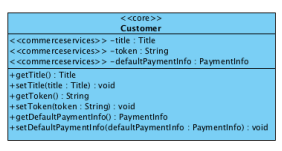

The Customer class has the following features:
- The class includes a title attribute.

- A customer's default payment information can be stored against the customer. - A special token attribute supports the ability to authenticate certain Customer Account requests that would need the same token to be passed back from the client as a request parameter. The forgotten password functionality, described in the Customer Account Sendce section above, uses this to store a secure token that can
only be valid Storefront Setup A number of additional attributes have been added to BaseStore and CMSSite to capture configuration settings for each storefront.

BaseStore Financial Settings

 The BaseStore nancial settings include the following:
A net ag exists to identify if the store prices are calculated net or gross of sales tax. This is used by the price calculation logic.

The list of currencies supported for the store are captured against the store. The user tax group from the europe1 extension is stored to enable the price calculation logic to pick appropriate store-specic sales tax rates in a multi-storefront setup.

CMSSite Localization Settings The CMSSite localization settings include the following:
The default language of the storefront is congurable. This is especially relevant if content on a specic storefront comes in multiple languages. The total list of languages available comes from the active content catalog version. The Java Locale to use for each language is congured to ensure numbers and currency information are formatted appropriately on the storefront.

CMSSite Presentation Settings A theme attribute exists that allows the look and feel of the Storefront to be switched. For more information, see Storefront and Catalog Modeling.

Solr Facet Search A number of additions to the data model have been made to support a more enriched B2C SOLR conguration out-of-the box. For more information, see Search and Navigation.

Store Locator The Store Locator data model has been extended to include more attributes specic to Brick And Mortar stores. For more information, see Store Locator Conguration.

Conguration of SetupSyncJobService It is possible to congure **de.hybris.platform.commerceservices.setup.impl.DefaultSetupSyncJobService** using Spring conguration. You can congure rootTypes for both ProductCatalogSyncJob and ContentCatalogSyncJob, as well as attributes of **SyncAttributeDescriptorConfig** for given items.

The following attributes are supported using **EditSyncAttributeDescriptorData**:
includeInSync: if set to false, the attribute is excluded from the sync copyByValue: if set to true, the attribute is copied by value untranslatable: if set to true, the attribute is marked as not translatable for sync The following example shows the use of these attributes:
<entry key="de.hybris.platform.category.jalo.Category">
<list>
<bean class="de.hybris.platform.commerceservices.setup.data.EditSyncAttributeDescriptorData">
<property name="qualifier" value="linkcomponents"/> <property name="includeInSync" value="false"/>
<property name="copyByValue" value="true"/>
<property name="untranslatable" value="false"/>
</bean>
</list>
</entry>
The following is a snippet of conguration of the defaultSetupSyncJobService bean from the commerceservices -spring.xml le:
<util:list id="contentCatalogSyncRootTypeCodes">
 <value>CMSItem</value>
 <value>CMSRelation</value>
 <value>Media</value>
 <value>MediaContainer</value>
 <value>BTGItem</value>
</util:list> <util:list id="productCatalogSyncRootTypeCodes"/>
<util:map id="contentCatalogEditSyncDescriptors" key-type="java.lang.Class" value-type="java.util.List"/>
<util:map id="productCatalogEditSyncDescriptors" key-type="java.lang.Class" value-type="java.util.List">
<entry key="de.hybris.platform.jalo.Item">
<list>
<bean class="de.hybris.platform.commerceservices.setup.data.EditSyncAttributeDescriptorData">
<property name="includeInSync" value="false"/>
<property name="qualifier" value="comments"/>
</bean>
 ...

</list>
</entry> <entry key="de.hybris.platform.jalo.product.Product">
<list>
<bean class="de.hybris.platform.commerceservices.setup.data.EditSyncAttributeDescriptorData">
<property name="includeInSync" value="false"/>
<property name="qualifier" value="sequenceId"/>
</bean>
<bean class="de.hybris.platform.commerceservices.setup.data.EditSyncAttributeDescriptorData">
<property name="includeInSync" value="false"/>
<property name="qualifier" value="productReviews"/>
</bean> ...

</list>
</entry> <entry key="de.hybris.platform.europe1.jalo.PriceRow">
<list>
<bean class="de.hybris.platform.commerceservices.setup.data.EditSyncAttributeDescriptorData">
<property name="includeInSync" value="false"/>
<property name="qualifier" value="sequenceId"/>
</bean>
</list>
</entry>
<entry key="de.hybris.platform.category.jalo.Category">
<list>
<bean class="de.hybris.platform.commerceservices.setup.data.EditSyncAttributeDescriptorData">
<property name="includeInSync" value="false"/>
<property name="qualifier" value="linkcomponents"/>
</bean>
...

<bean class="de.hybris.platform.commerceservices.setup.data.EditSyncAttributeDescriptorData">
<property name="includeInSync" value="false"/>
<property name="qualifier" value="categoryFeatureComponents"/>
</bean>
</list>
</entry>
</util:map>
<alias name="defaultSetupSyncJobService" alias="setupSyncJobService" />
<bean id="defaultSetupSyncJobService" class="de.hybris.platform.commerceservices.setup.impl.DefaultSetupSyncJobService">
<property name="modelService" ref="modelService"/>
<property name="contentCatalogRootTypeCodes" ref="contentCatalogSyncRootTypeCodes"/> <property name="productCatalogRootTypeCodes" ref="productCatalogSyncRootTypeCodes"/>
<property name="contentCatalogEditSyncDescriptors" ref="contentCatalogEditSyncDescriptors"/>
<property name="productCatalogEditSyncDescriptors" ref="productCatalogEditSyncDescriptors"/>
</bean>
Save Cart The save cart functionality primarily allows a customer to save and restore their saved carts at a later date. This functionality is provided as a set of methods embedded within independent strategies that can be wired-up, relative to the different business requirements and the front-end implementations they are used for. These strategies can be easily extended with pre/post-hooks. The following save cart operations are currently supported:
Save a session cart as a saved cart Save specic cart IDs, for a back-end operations, as saved carts Display a list of saved carts Display the details of a saved cart Restore a saved cart to an active session cart This is   For more    the SAP Help  144 Delete saved carts Clone saved carts Edit the name and description of a saved cart In order to support this functionality, a new CommerceSaveCartService interfacehas been implemented. This interface contains the following methods:

| Method Signature                                              | Returns                    |
|---------------------------------------------------------------|----------------------------|
| saveCart(CommerceSaveCartParameterData)                       | CommerceSaveCartResultData |
| agForDeletion(CommerceSaveCartParameter)                      | CommerceSaveCartResultData |
| getCartForCodeAndCurrentUser(CommerceSaveCartParameterData)   | CartData                   |
| restoreSavedCart(CommerceSaveCartParameterData)               | CartRestorationData        |
| getSavedCartsForCurrentUser(PageableData , List<OrderStatus>) | SearchPageData<CartData>   |
| cloneSavedCart(CommerceSaveCartParameterData)                 | CommerceSaveCartResultData |

Also, a new SaveCartDao interface has been introduced. This interface contains the following methods:

| Method Signature                                                       | Returns                   |
|------------------------------------------------------------------------|---------------------------|
| getSavedCartsForRemovalForSite(BaseSiteModel)                          | List<CartModel>           |
| getSavedCartsForSiteAndUser(PageableData , BaseSiteModel , UserModel , | SearchPageData<CartModel> |
| List<OrderStatus>)                                                     |                           |

Apart from implementing the SaveCartDao, your custom implementation of this interface has to extend an implementation of the CommerceCartDao interface in order to support operations on Cart objects. In other words, if your implementations of the CommerceCartDao and SaveCartDao interfaces are named DefaultCommerceCartDao and DefaultSaveCartDao respectively, the class header looks as follows:
DefaultSaveCartDao public class DefaultSaveCartDao extends DefaultCommerceCartDao implements SaveCartDao SaveCartStrategy The default class extending the AbstractCommerceSaveCartStrategy class, the DefaultCommerceSaveCartStrategy class, handles the save cart functionality for bundle products. This class provides a calculateExpirationTime() method, which calculates the time in which a saved cart expires based on the save date and the commerceservices.saveCart.expiryTime.days property. You can change the default expiry time in the **project.properties** le:
project.properties
\#Defines after how many days a saved cart expires commerceservices.saveCart.expiryTime.days=30 FlagForDeletionStrategy The default class extending the AbstractFlagForDeletionStrategy class, the DefaultCommerceFlagForDeletionStrategy class, provides the agForDeletion() method, which sets all the saved cart's attributes to null:
DefaultCommerceFlagForDeletionStrategy final CartModel cartToBeFlagged = parameters.getCart();
cartToBeFlagged.setExpirationTime(null);
cartToBeFlagged.setSaveTime(null);
cartToBeFlagged.setSavedBy(null);
cartToBeFlagged.setName(null);
cartToBeFlagged.setDescription(null);
The actual deletion of carts is done by the CartRemovalJob CronJob. For more information, see the Save Cart Support section of the acceleratorservices Extension - Technical Guide document.

 Note For more information on Cron Jobs, see the cronjob - Technical Guide document.

SaveCartRestorationStrategy The default class extending the DefaultCommerceCartRestorationStrategy class, the DefaultCommerceSaveCartRestorationStrategy class, handles the restoration of saved carts. By calling the restoreCart() method, the saved cart passed as the parameter is set as an active session's cart, allowing the customer to checkout the products from the cart.

Retrieving Carts The default implementation of the SaveCartDao interface uses FlexibleSearch queries in order to retrieve a list of saved carts.

retrieving a list of saved user carts with a specic status DefaultSaveCartDao protected final static String FIND_SAVED_CARTS_FOR_SITE_AND_USER_WITH_STATUS = "SELECT {" + CartModel.PK + "} FROM {"
+ CartModel._TYPECODE + "}, {" + OrderStatus._TYPECODE + "} " + "WHERE {" + CartModel._TYPECODE + "." + C
+ "} = {" + OrderStatus._TYPECODE + ".pk} AND {" + CartModel.USER + "} = ?user AND {" + CartModel.SITE
+ "} = ?site AND {" + CartModel.SAVETIME + "} IS NOT NULL AND {OrderStatus.CODE} in (?orderStatus) " + OR
retrieving a list of expired saved carts DefaultSaveCartDao protected final static String FIND_EXPIRED_SAVED_CARTS_FOR_SITE = SELECTCLAUSE + "WHERE {" + CartModel.SITE
+ "} = ?site AND {" + CartModel.SAVETIME + "} IS NOT NULL AND {" + CartModel.EXPIRATIONTIME + "} <= ?curr
+ ORDERBYCLAUSE;
retrieving a list of saved user carts protected final static String FIND_SAVED_CARTS_FOR_USER_AND_SITE = SELECTCLAUSE + "WHERE {" + CartModel.USER
+ "} = ?user AND {" + CartModel.SITE + "} = ?site AND {" + CartModel.SAVETIME + "} IS NOT NULL " + ORDERB
Bean Conguration In the **commerceservices/resources/commerceservices-beans.xml** le, you can nd the denition of the CommerceSaveCartParameter and CommerceSaveCartResult beans: commerceservices-beans.xml
<beans> .. <bean class="de.hybris.platform.commerceservices.service.data.CommerceSaveCartParameter">
 <property name="cart" type="de.hybris.platform.core.model.order.CartModel">
 <description>The CartModel to be saved</description> </property>
 <property name="name" type="String">
 <description>The name of the saved cart provided by user or auto-generated</description>
 </property>
 <property name="description" type="String">
 <description>The description of the saved cart provided by user or auto-generated</description>
 </property>
 <property name="enableHooks" type="boolean">
 <description>Should the method hooks be executed</description>
 </property> </bean> <bean class="de.hybris.platform.commerceservices.service.data.CommerceSaveCartResult"> <property name="savedCart" type="de.hybris.platform.core.model.order.CartModel">
 <description>The CartModel that was saved</description>
 </property>
 </bean>
</beans>
Exceptions In the commerceservices extension, the CommerceSaveCartException class is dened. This simple exception is thrown if a cart cannot be retrieved, saved, or unsaved.

CommerceSaveCartException.java public class CommerceSaveCartException extends BusinessException
{
public CommerceSaveCartException(final String message)
{
super(message);
} public CommerceSaveCartException(final String message, final Throwable cause)
{
super(message, cause);
}
}

## Customer Lists Framework

The Customer List Framework is a generic framework that can display different customer lists to Customer Support Agents relative to different business applications. The customer records within the customer lists contain ASM deep links that when clicked on by a CSA, take them to their respective pages such as the customer's prole, cart or orders page for example. This allows a CSA to prepare themselves with customer specic information before providing personalized support to the customer. Currently, the following implementations are available:
Customer List Name Description Documentation Link This is   For more    the SAP Help  146

| 7/11/2024 Customer List Name   | Description                                                                                                                                                                                                                                                                                                                                                                                                   | Documentation Link                                                             |
|--------------------------------|---------------------------------------------------------------------------------------------------------------------------------------------------------------------------------------------------------------------------------------------------------------------------------------------------------------------------------------------------------------------------------------------------------------|--------------------------------------------------------------------------------|
| Current In-Store Customers     | Displays a list of customers that are currently in-store or in different places within a store as detected by one or multiple hardware devices so that a Customer Support Agent can review a customers prole and approach the customer prepared. By default the customer data is mocked, however in a real life implementation this data will come from a single, or multiple, physical in-store IoT devices. | assistedserviceservices Extension document, section Current In-Store Customers |
| My Recent Customer Sessions    | Displays a list of customers whose sessions were recently started by the Customer Support agent so that a Customer Support Agent can quickly return to a previous customer support user journey.                                                                                                                                                                                                              | assistedservicefacades Extension document, section My Recent Customer Sessions |
| Pick-Up In-Store Customers     | Displays a list of customers who bought online and are picking their orders up in-store so a Customer Support Agent can prepare their order.                                                                                                                                                                                                                                                                  | assistedserviceservices Extension document, section PickUp In-Store Customers                                                                                |

Customer Lists Framework Overview To introduce the relation between the strategy implementation and the customer list, a map is introduced holding the relation between the implementationType String and the implementation strategy:
<util:map id="customerListSearchStrategyMap" key-type="java.lang.String" value-type="de.hybris.platform.commerceservices.customer.stra Using the Recent Sessions customer list as an example, see how the strategy is mapped to the actual list in the assistedserviceservices-spring.xml le:
 <bean id="defaultRecentlyStartedSessionCustomerListSearchStrategy" class="de.hybris.platform.assistedserviceservices.strategy.DefaultRecentlyStartedSessionCustomerListSearchStrategy">
 <property name="customerSupportEventService" ref="customerSupportEventService"/> <property name="userService" ref="userService"/>
</bean>
<bean id="defaultRecentlyStartedSessionCustomerListMergeDirective" depends-on="customerListSearchStrategyMap" parent="mapMerge
<property name="key" value="ASM_RECENT_SESSIONS"/>
<property name="value" ref="defaultRecentlyStartedSessionCustomerListSearchStrategy" />
</bean>
The CustomerListService interface is responsible for returning all valid customer lists available for specic employee, but it is the CustomerListSearchStrategy class where the actual business logic is implemented.

## Note

If you want to introduce new customer lists for different business applications, you have to implement new strategies for each module.

Below, you can nd a list of the example implementations of the CustomerListStrategy interface:

| Implementation   | Description   |
|------------------|---------------|
| de.hybris.platform.assistedserviceservices.strategy.DefaultRecentlyStartedSessionCustomerListSearchStrategy Lists the customers who have recently been assisted by the current agent with maximum of 20 customers displayed. For more information, see the My Recent Customer Sessions section of the assistedservicefacades Extension document. de.hybris.platform.assistedserviceservices.strategy.DefaultInStoreCustomerListSearchStrategy Lists all customers checked-in to a specic point of service (POS). For more information, see the Current In-Store Customers section of the assistedserviceservices Extension document and the points-ofservice.impex section of the assistedservicestorefront AddOn document.                  |               |

| 7/11/2024 Implementation                                                                   | Description                                           |
|--------------------------------------------------------------------------------------------|-------------------------------------------------------|
| de.hybris.platform.assistedserviceservices.strategy.DefaultBopisCustomerListSearchStrategy | Lists all customers who pick up what they bought online in a specic point of service. For more information, see the Pick-Up InStore Customers section of the assistedserviceservices Extension and the points-of-service.impex section of the assistedservicestorefront AddOn document.                                                       |
| de.hybris.platform.b2bcommerceservices.DefaultB2BCustomerListSearchStrategy                | List all B2B customers assigned to a common B2B unit. |

Data Model Below you can nd the UML diagram of the data model of the Customer Lists Framework relative to the commerceservices extension:

CustomerList type
The CustomerList type is generated, based on the denition found in the commerceservices-items.xml le:
<typegroup name="CustomerList">
 <itemtype code="CustomerList" autocreate="true" generate="true" extends="UserGroup">
This is   For more    the SAP Help  148
 <description>A CustomerList are visible to certain Employees and represents an implementation specific search query to
 <attributes>
 <attribute qualifier="implementationType" type="java.lang.String">
 <description>The implementation type for this customer list</description>
 <persistence type="property" />
 </attribute>
 <attribute qualifier="priority" type="java.lang.Integer">
 <description>priority for the customer list and zero by default, this will affect the pos
 <persistence type="property" /> <defaultvalue>Integer.valueOf(0)</defaultvalue>
 </attribute>
 </attributes>
 </itemtype> 
 </typegroup>
customerListSearchStrategyMap The customerListSearchStrategyMap bean is a map holding different implementations of the Customer Lists framework. This map is dened in the commerceservices-spring.xml le:
<util:map id="customerListSearchStrategyMap" key-type="java.lang.String" value-type="de.hybris.platform.commerceservices.customer.strategies.CustomerListSearchStrategy" scop The customerListSearchStrategyMap bean takes String values as the keys and the actual implementation beans as values.

 Note If you create a new customer list, make sure to reference it in this map.

CustomerListService The CustomerListService interface is responsible for returning a list of customer lists for a given employee and for returning a specic list for a specic employee. This default implementation of this interface is referenced in Spring.

CustomerListSearchService The CustomerListSearchService interface is responsible for returning paginated customers for a given customer list.

CustomerListSearchStrategy The CustomerListSearchStrategy class is an interface you need to implement in your custom customer list. The getPagedCustomers() method is where you need to place your business logic, which returns the actual list of customers. If you want to look up how such an implementation may look like, the following classes implement the CustomerListSearchStrategy interface:

| Class                                                                                                                    | Available Documentation                                             |
|--------------------------------------------------------------------------------------------------------------------------|---------------------------------------------------------------------|
| DefaultInStoreCustomerListSearchStrategy                                                                                 | In-Store Customers section of the assistedserviceservices Extension |
| DefaultRecentlyStartedSessionCustomerListSearchStrategy Recent Sessions section of the assistedserviceservices Extension |                                                                     |

For more information about the Customer Lists Framework, see the commercefacades Extension document.

Pagination and Sorting The following objects related to pagination and sorting in the commerceservices extension have been deprecated:
SortData SearchPageData PaginationData PagableData The replacement objects can be found in the platform extension.

 Note Not all of the attributes in the deprecated objects have been migrated to the new objects, and some new data objects do not have any supporting services.

For more information, see Pagination and Sorting.

Future Stock Service The future stock service provides the functionality of getting the future product availability, such as the stock level and available date, for the specied products.

Parameter: List<ProductModel> products.This parameter is a list of product model. Returns: Map<String, Map<Date, Integer>>. Returns a map of product codes with corresponding map of future stock availability.

If there is no future availability for these products, an empty map is returned.

## Requested Delivery Date Service

A DefaultCartRetrievalDateService implementation of the CartRetrievalDateService interface gets the earliest retrieval date and updates the cart with the requested delivery date when the feature is enabled.

The DefaultCartRetrievalDateService provides the following methods:
Gets the earliest retrieval date for the current cart session by looping through the CartEarliestRetrievalDateHook list to get the list of retrieval dates which is then passed onto DefaultCartRetrievalDateStrategy to get the earliest retrieval date.

Returns: <String>. Returns the earliest retrieval date for the current cart session.

Updates the cart with the requested retrieval date by calling the DefaultCartRetrievalDateStrategy.

Parameter: requestedDeliveryDate. This parameter is the delivery date selected by the user during checkout.

A DefaultCartEarliestRetrievalDateHook implementation of the CartEarliestRetrievalDateHook interface gets the retrieval dates list for the cart.

The DefaultCartEarliestRetrievalDateHook provides the following methods:
Gets the list of retrieval dates for the cart.

Returns: <String>. Returns the list of retrieval dates for the cart. Parameter: Cart. This parameter is the cart.

A custom hook implementation can also be implemented and added to the list of hooks using ListMergeDirective.

<bean id="customListMergeDirective" depends-on="cartEarliestRetrievalDateHooks" parent="listMergeDirective">
<property name="add" ref="customBeanToAdd"/>
</bean>
A DefaultCartRetrievalDateStrategy implementation of the CartRetrievalDateStrategy gets the earliest retrieval date and updates the cart with the requested retrieval date.

The DefaultCartRetrievalDateStrategy provides the following methods:
Gets the earliest retrieval date from the list of retrieval dates.

Returns: <String>. Returns the earliest retrieval date from the list of retrieval dates. Parameter: <String>. This parameter is the list of retrieval dates.

Updates the given cart with given requested retrieval date.

Parameter: Cart. This parameter is the cart.

Parameter: requestedDeliveryDate. This parameter is the requested delivery date which is selected by the user during the checkout.

Data Model Below, you can nd the data model for Cart Retrieval Date Service:

Data Model

SAP Invoice Type The SAP Invoice type is generated based on the denition found in the commerceservices-items.xml le.

The code for the commerceservices-items.xml le is:
<enumtype code="ExternalSystemId" generate="true" autocreate="true" dynamic="true">
<value code="S4SALES" />
</enumtype>
<typegroup name="Order">
 <itemtype code="SAPInvoice" extends="GenericItem" autocreate="true" generate="true">
 <description>SAP Invoice type</description>
 <deployment table="SAPInvoice" typecode="9925" />
 <attributes> <attribute autocreate="true" qualifier="id" type="java.lang.String" generate="true">
 <persistence type="property"/> <modifiers read="true" write="true" search="true" optional="false" unique="true"/>
 </attribute>
 <attribute qualifier="totalPrice" type="java.math.BigDecimal">
 <persistence type="property"/>
 <modifiers read="true" write="true" search="true" optional="true"/>
 <defaultvalue>java.math.BigDecimal.ZERO</defaultvalue>
 </attribute>
 <attribute qualifier="netPrice" type="java.math.BigDecimal">
 <persistence type="property"/> <modifiers read="true" write="true" search="true" optional="true"/>
 <defaultvalue>java.math.BigDecimal.ZERO</defaultvalue>
 </attribute>
 <attribute qualifier="currency" type="Currency">
 <persistence type="property" />
 <modifiers read="true" write="true" search="true" optional="true" />
 </attribute>
 <attribute qualifier="externalSystemId" type="ExternalSystemId">
 <description>External System ID where the invoice resides.</description> <modifiers read="true" write="true" search="true" optional="true" unique="true" />
 <persistence type="property" />
 </attribute>
This is   For more    the SAP Help  151

 <attribute qualifier="invoiceMedia" type="SAPInvoiceMedia">
 <modifiers read="true" write="true" search="true" optional="true" partof="true"/> <persistence type="property" />
 </attribute>
 </attributes>
 <indexes>
 <index name="invoiceIndex" unique="true">
 <key attribute="id"/>
 <key attribute="externalSystemId"/> 
 </index>
 </indexes> </itemtype>
 <itemtype code="SAPInvoiceMedia" generate="true" autocreate="true" extends="CatalogUnawareMedia" jaloclass="de.hybris.platform.commerceservices.jalo.SAPInvoiceMedia">
 <description>Item that represents media specific for Invoice.

 It extends CatalogUnawareMedia type without adding any new attribute.

 </description>
 </itemtype>
</typegroup>
Related Information SAP Commerce Cloud Accelerator Documentation

## Commercefacades Extension

The commercefacades extension provides a suite of facades that make up a unied multichannel storefront API which can be used by multiple front-ends. The facade's responsibility is to integrate existing business services from the full range of the SAP Commerce Cloud extensions and expose a Data object (POJO) response adjusted to meet the storefront requirements.

 Note An SAP Commerce Cloud extension may provide functionality that is licensed through different SAP Commerce Cloud modules. Make sure to limit your implementation to the features dened in your contract license. In case of doubt, please contact your sales representative.

 Note This page may contain information about features that were only introduced in an update release. Ensure you are always on the latest release to be able to make use of all xes, security updates, and features. For a complete list of what was introduced in each update release, see What's New.

Breakdown of a Facade

## Facade Bean

A facade in the commercefacades extension is a Spring managed bean that is an implementation of a software design pattern of abstracting the underlying implementation responsible for servicing a storefront action by exposing a simplied interface optimized for the storefront.

In general facades typically integrate one or more SAP Commerce Cloud ServiceLayer method calls that, when combined, fulll some form of business action requested by a storefront user. The facade interface is however totally independent of the ServiceLayer model, so it is possible to completely substitute the underlying implementation of a facade.

Examples of such business actions include:
Viewing product details.

Adding a product to a cart.

Adding a delivery address during checkout. Posting a review.

Searching for products with a free text search.

Rening or sorting a search result.

## Data Objects

The hybris commercefacades extension facades mostly return Data Objects. These are designed to be used on a frontend like the Accelerator storefronts or mapped into some XML or JSON representation. They are populated using a subset of the data contained in the hybris ServiceLayer Models and are not backed by a persistence layer like Model objects. A Data object may also be constructed from multiple models as well as from data that is derived after executing business logic on services. In an Accelerator storefront these Data objects form part of the Model delivered to construct the View in the default MVC pattern. The hybris ServiceLayer Models should not be used as part of a facade interface, maintaining a clean abstraction of the business layer and the presentation layer.

Source Code Example We can refer to the ProductFacade getProductByCode method for a suitably complex example. The facade interface takes a product article number together with a set of data options as instruction from the front end as to the level of data that needs to be returned in the resulting ProductData object. The example uses a Converter, Populators, Congurable Populators and Services.

ProductData getProductForCode(String code, Set <ProductOption> options)
{
getProductConfiguredPopulator().populate(productModel, productData, options);
}
return productData;
}
The implementation in DefaultProductFacade looks like this:
@Override public ProductData getProductForCode(final String code, final Set<ProductOption> options)
{ final ProductModel productModel = getProductService().getProductForCode(code);
 final ProductData productData = getProductConverter().convert(productModel);
 if (options != null)
 {
 getProductConfiguredPopulator().populate(productModel, productData, options);
 }
 return productData;
}
It rst calls the ProductService to get the product model for the provided article number. The congured productConverter bean is then used to create the prototype ProductData and the ProductPopulator is used to populate the object with basic data.

@Override// From ProductPopulator @Override protected ProductData createTarget(final ProductModel source)
{
 return new ProductData();
}
// From ProductConverter
@Override public void populate(final ProductModel source, final ProductData target)
{ getProductBasicPopulator().populate(source, target);
 getVariantSelectedPopulator().populate(source, target);
 getProductPrimaryImagePopulator().populate(source, target);
 super.populate(source, target);
}
 Tip Extensibility Tip Use the **beans.xml** le to generate new attributes on your ProductData then add new Populators for these attributes.

The ProductBasicPopulator looks like this:
ProductBasicPopulator
@Override public void populate(final ProductModel productModel, final ProductData productData) throws ConversionException
{
productData.setName((String) getProductAttribute(productModel, ProductModel.NAME));
productData.setManufacturer((String) getProductAttribute(productModel, ProductModel.MANUFACTURERNAME)); productData.setAverageRating(productModel.getAverageRating());
if (productModel.getVariantType() != null)
{
productData.setVariantType(productModel.getVariantType().getCode());
}
productData.setPurchasable(Boolean.valueOf(productModel.getVariantType() == null && isApproved(productModel)));
}
protected boolean isApproved(final ProductModel productModel)
{
final ArticleApprovalStatus approvalStatus = productModel.getApprovalStatus();
return approvalStatus != null && ArticleApprovalStatus.APPROVED.equals(approvalStatus);
}
 Note Implementation Detail Product Populators are a little unique in that they typically extend a AbstractProductPopulator class that is variant-aware and supports the ability of falling back to a variants parent product for attribute values in the event of the source product value being null.

This is   For more    the SAP Help  153 The ProductFacade uses then its congured Populator to populate the prototype Data Object based on the requested data options. The congured Populator is simply a spring congured pipeline of populators that are invoked in a congured order and only invokes if they are assigned to an option that has been specied. Here's a sample spring conguration of the CongurablePopulator used by the ProductFacade.

<alias name="defaultProductConfiguredPopulator" alias="productConfiguredPopulator" />
<bean id="defaultProductConfiguredPopulator" class="de.hybris.platform.commercefacades.convert.impl.DefaultConfigurablePopulat
<property name="populators">
<map key-type="de.hybris.platform.commercefacades.product.data.ProductData$ProductOption">
<entry key="GALLERY" value-ref="productGalleryImagesPopulator" /> <entry key="SUMMARY" value-ref="productSummaryPopulator" />
<entry key="DESCRIPTION" value-ref="productDescriptionPopulator" />
<entry key="CATEGORIES" value-ref="productCategoriesPopulator" />
<entry key="PROMOTIONS" value-ref="productPromotionsPopulator" />
<entry key="STOCK" value-ref="productStockPopulator" />
<entry key="REVIEW" value-ref="productReviewsPopulator" />
<entry key="CLASSIFICATION" value-ref="productClassificationPopulator" />
<entry key="REFERENCES" value-ref="productReferencesPopulator" />
<entry key="VARIANT_FULL" value-ref="variantFullPopulator" />
</map>
</property>
</bean>
As it was mentioned above, some Populators may use services to ll out the prototype Data Object rather than properties on the source model. You can review the ProductPricePopulator as an example of a Populator that uses a service to ll out part of the data model rather than the source object directly.

@Override public void populate(final ProductModel productModel, final ProductData productData) throws ConversionException
{
final PriceData.PriceType priceType; final PriceInformation info; if (CollectionUtils.isEmpty(productModel.getVariants()))
{
priceType = PriceData.PriceType.BUY;
info = getCommercePriceService().getWebPriceForProduct(productModel);
}
else
{
priceType = PriceData.PriceType.FROM;
info = getCommercePriceService().getFromPriceForProduct(productModel);
} if (info != null) {
final PriceData priceData = getPriceDataFactory().create(priceType, BigDecimal.valueOf(info.getPriceValue().getValue()
info.getPriceValue().getCurrencyIso()); productData.setPrice(priceData);
} else
{
productData.setPurchasable(Boolean.FALSE);
}
}
Extending Adding new facades Extending existing facades interface and implementation to add additional methods Extending existing facade implementation to replace the original method implementation Creating a different or additional versions of a converter for a particular type Extending an existing converter implementation Adding a new Populator to a Populator pipeline Removing or replacing Populator implementations Adding new data objects and counterpart Populators and Converters Extending existing data objects and adding additional converter and/or Populator logic Conceptual Interaction Diagram The following interaction diagram describes conceptually how the various components interact during a typical storefront request:ProductData getProductForCode(String code, Set<ProductOption> options) throws UnknownIdentierException, IllegalArgumentException;

1. A user performs some action which is processed by a storefront component such as an MVC controller. 2. The controller translates the request and invokes a business action on the appropriate facade. 3. The facade invokes one or more business services to fulfill the action.

4-6. The service most likely needs to return some model object and perhaps uses Data Access Objects to find the models to return to the calling facade.

7. The facade uses converters to create front-end data objects from service layer models.

8. Converters use a pipeline of Populators fill the skeleton front end data objects graph.

9-12. Populators may also need to invoke additional business logic to fill the front end data object graph so may also invoke services in order to provide the necessary data required by the front-end data object.

13-14. The filled data object is returned to the facade and the facade then returns this to the controller.

15. The controller uses the data object as a model to construct the view which will be returned to the user. Packaged Facades The following class diagram outlines the various facades offered by the commercefacades extension.

The search facade exposes product free text search and facetted navigation capability.

Product The product facade delivers product information. It is possible to control the amount of information returned for the product by specifying data options. The product facade also enables reviews to be posted for products.

The getProductForOptions() method:
DEVICE_BUNDLE_TABS - to populate Devices. The BundleTabs section is populated with additional information about the service plans sorted by package and frequency.

SERVICE_PLAN_BUNDLE_TABS - to populate Service Plans. The whole page is populated with all existing service plans sorted by package and frequency.

SERVICE_ADDON_BUNDLE_TABS - to populate Service AddOns. The whole page is populated with all existing service plans sorted by package and frequency.

Order The order facades provide the full shopping capability with all the typical cart, checkout and order history functions. The functionality is broken down into three separate facades, cart facade for the shopping phase, checkout facade for the order placement process and order facade for bringing up details of submitted orders and order history.

User The User facade provides user account operations such as registration, payment and address book management, prole updates including password amendments.

Store Session The Store Session facade provides access to various internationalization switches that the user can make when they visit a specic storefront.

Store Locator The Store Locator facade exposes Point Of Sale search capability and provides the ability to expose store information and store specic content. Find more information on the Store Locator within the hybris Accelerator in the Store Locator Conguration document.

Packaged Converters The following diagram shows the Converters shipped with the commercefacades extension:

## Extending Facades

Facades are singleton scoped Spring managed beans that have an interface and a default implementation class that can be customized by a number of means including replacing the entire bean, subclassing the bean class and overriding specic methods or customization by composition, typically by populating the data object model using different or additional instances of converters and populators.

You should extend the commercefacades extension facades in a counterpart facades extension for your project. The yacceleratorfacades extension is the template shipped with the hybris Accelerator that you can use as a starting point for your own extension. This extension must have a dependency on the commercefacades extension in its extensioninfo.xml le as well as any other necessary business layer extension required to complete the functionality offered by your customized or additional facades.

## Note Implementation Detail

Adding the dependency on the commercefacades extension in the **extensioninfo.xml** ensures you can replace bean denitions dened in the commercefacades extension application context. You can nd more information on extending Spring beans can in Spring Framework in the SAP Commerce Cloud, ServiceLayer and more specically How to Extend a Service documents.

## Url Resolvers

A URL resolver creates a relative URL to a provided source item that can be used on the front end to generate a link back to the source item. This ensures the facade layer is

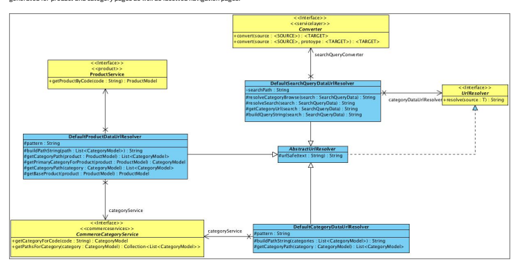

able to supply URLs in the data object model without the MVC layer having to execute an additional pass over the data object model. This approach also allows multiple client applications to use different URL formats by simply using facades and converters congured with different resolver instances. Out of the box, SEO friendly URLs can be generated for product and category pages as well as facetted navigation pages.

## Save Cart

The save cart functionality primarily allows a customer to save and restore their saved carts at a later date. This functionality is provided as a set of methods embedded within independent strategies that can be wired-up, relative to the different business requirements and the front-end implementations they are used for. These strategies can be easily extended with pre/post-hooks.

The following save cart operations are currently supported:
Save a session cart as a saved cart Save specic cart IDs, for a back-end operations, as saved carts

Display a list of saved carts Display the details of a saved cart Restore a saved cart to an active session cart Delete saved carts
Clone saved carts Edit the name and description of a saved cart In order to support this functionality, a new SaveCartFacade interface has been implemented. This interface contains the following methods:

| 7/11/2024 MMeetthhoodd SSiiggnnaattuurree                     | RReettuurrnnss             |
|---------------------------------------------------------------|----------------------------|
| saveCart(CommerceSaveCartParameterData)                       | CommerceSaveCartResultData |
| agForDeletion(String)                                         | CommerceSaveCartResultData |
| getCartForCodeAndCurrentUser(CommerceSaveCartParameterData)   | CartData                   |
| restoreSavedCart(CommerceSaveCartParameterData)               | CartRestorationData        |
| getSavedCartsForCurrentUser(PageableData , List<OrderStatus>) | SearchPageData<CartData>   |
| cloneSavedCart(CommerceSaveCartParameterData)                 | CommerceSaveCartResultData |

Upon calling the saveCart() method, it expects that, amongst other parameters, a name and description of the cart is provided. If neither of them are provided, the method generates a name and description based on the cartModel of the cart about to be saved.

## Note

If you want to change this behavior, you have to overwrite the entire saveCart() method in your implementation of the SaveCartFacade interface.

Apart from implementing the SaveCartFacade, your custom implementation of this interface has to extend an implementation of the CartFacade interface in order to support operations on Cart objects. In other words, if your implementations of the CartFacade and SaveCartFacade interfaces are named DefaultCartFacade and DefaultSaveCartFacade respectively, the class header looks as follows:

## Defaultcartfacade

public class DefaultSaveCartFacade extends DefaultCartFacade implements SaveCartFacade

## Commercecartfacade

The CommerceCartFacade.addToCart(AddToCartParams addToCartParams) method is used to populate new entry with some module-specic data. For example:
configurablebundles use this method to add bundle group to entry.

Bean Conguration Methods of the SaveCartFacade use or return the following objects:
CommerceSaveCartResultData, CommerceSaveCartParameterData CartRestorationData These objects are generated resources created from Java beans and you can congure them by changing their properties in the **commercefacades-beans.xml** le:
commercefacades/resources/commercefacades-beans.xml
<beans>
...

<bean class="de.hybris.platform.commercefacades.order.data.CommerceSaveCartParameterData">
<property name="cartId" type="String"/>
<property name="name" type="String"/>
<property name="description" type="String"/>
<property name="enableHooks" type="boolean"/>
</bean>
<bean class="de.hybris.platform.commercefacades.order.data.CommerceSaveCartResultData">
<property name="savedCartData" type="de.hybris.platform.commercefacades.order.data.CartData"/>
</bean> <bean class="de.hybris.platform.commercefacades.order.data.CartRestorationData">
<property name="modifications" type="java.util.List<de.hybris.platform.commercefacades.order.data.CartModificationData>"/>
</bean>
...

</beans>

## Exceptions

Generally, in case of any issues, the methods of the SaveCartFacade interface throw a CommerceSaveCartException. For more information, see the Exceptions section of the commerceservices Extension -Technical Guide document.

## Customer Lists Framework

The Customer List Framework is a generic framework that can display different customer lists to Customer Support Agents relative to different business applications. The customer records within the customer lists contain ASM deep links that when clicked on by a CSA, take them to their respective pages such as the customer's prole, cart or orders page for example. This allows a CSA to prepare themselves with customer specic information before providing personalized support to the customer. Currently, the following implementations are available:
Customer List Name Description Documentation Link

| 7/11/2024 Customer List Name   | Description                                                                                                                                                                                                                                                                                                                                                                                                   | Documentation Link                                                             |
|--------------------------------|---------------------------------------------------------------------------------------------------------------------------------------------------------------------------------------------------------------------------------------------------------------------------------------------------------------------------------------------------------------------------------------------------------------|--------------------------------------------------------------------------------|
| Current In-Store Customers     | Displays a list of customers that are currently in-store or in different places within a store as detected by one or multiple hardware devices so that a Customer Support Agent can review a customers prole and approach the customer prepared. By default the customer data is mocked, however in a real life implementation this data will come from a single, or multiple, physical in-store IoT devices. | assistedserviceservices Extension document, section Current In-Store Customers |
| My Recent Customer Sessions    | Displays a list of customers whose sessions were recently started by the Customer Support agent so that a Customer Support Agent can quickly return to a previous customer support user journey.                                                                                                                                                                                                              | assistedservicefacades Extension document, section My Recent Customer Sessions |
| Pick-Up In-Store Customers     | Displays a list of customers who bought online and are picking their orders up in-store so a Customer Support Agent can prepare their order.                                                                                                                                                                                                                                                                  | assistedserviceservices Extension document, section PickUp In-Store Customers                                                                                |

Data Model Below, you can nd the UML diagram of the data model of the Customer Lists Framework relative to the commercefacades extension:

## Note

CustomerListFacade The CustomerListFacade interface is a class which contains the methods used for:
getting the customer lists for specic employee tobe displayed on the frontend getting paginated customers for a specic customer list UID with extra parameters, if needed.

The getPagedCustomersForCustomerListUID() method calls the strategy from inside and returns a list of paginated customers and converts the customer models into customer data using populators.

The default implementation of the CustomerListFacade interface contains the following methods:
/**
 *
 * Default customer list facade concrete class which implements {@link CustomerListFacade}
 * */ public class DefaultCustomerListFacade implements CustomerListFacade {
//holds different customer list implementations This is   For more    the SAP Help  160 private CustomerListService customerListService; private CustomerListSearchService customerListSearchService; private Converter<CustomerListModel, UserGroupData> userGroupConverter; private Map<String, Converter<UserModel, CustomerData>> customerListImplementationStrategiesConverter; private Converter<UserModel, CustomerData> customerConverter;
@Override public List<UserGroupData> getCustomerListsForEmployee(final String employeeUid)
{
validateParameterNotNullStandardMessage("employeeUid", employeeUid); return getUserGroupConverter().convertAll(getCustomerListService().getCustomerListsForEmployee(employeeUid));
@Override public <T extends CustomerData> SearchPageData<T> getPagedCustomersForCustomerListUID(final String customerListUid, final String employeeUid, final PageableData pageableData, final Map<String, Object> parameterMap)
{
validateParameterNotNullStandardMessage("customerListUid", customerListUid);
}
validateParameterNotNullStandardMessage("pageableData", pageableData);
validateParameterNotNullStandardMessage("employeeUid", employeeUid); final CustomerListModel customerListModel = getCustomerListService().getCustomerListForEmployee(customerListUid, employeeUid);
validateParameterNotNull(customerListModel, String.format("No CustomerList found for customerListUid '%1$s'", customerListUid));
final String implementationType = customerListModel.getImplementationType(); final SearchPageData<CustomerModel> searchPageData = getCustomerListSearchService().getPagedCustomers(customerListUid, employeeUid, pageableData, parameterMap);
List<CustomerData> customerDataList = null; final Converter<UserModel, CustomerData> strategyConverter = getCustomerListImplementationStrategiesConverter()
.get(implementationType);
if (null == strategyConverter)
{
customerDataList = getCustomerConverter().convertAll(searchPageData.getResults());
}
else
{
customerDataList = strategyConverter.convertAll(searchPageData.getResults());
}
final SearchPageData<T> customersSearchPageData = new SearchPageData<T>();
customersSearchPageData.setResults((List<T>) customerDataList);
customersSearchPageData.setPagination(searchPageData.getPagination());
customersSearchPageData.setSorts(searchPageData.getSorts()); return customersSearchPageData;
} protected CustomerListService getCustomerListService()
{
return customerListService;
}
@Required public void setCustomerListService(final CustomerListService customerListService)
{
this.customerListService = customerListService;
} protected Converter<CustomerListModel, UserGroupData> getUserGroupConverter()
{
return userGroupConverter; This is   For more    the SAP Help  161
@Required public void setUserGroupConverter(final Converter<CustomerListModel, UserGroupData> userGroupConverter)
{
this.userGroupConverter = userGroupConverter;
} protected Map<String, Converter<UserModel, CustomerData>> getCustomerListImplementationStrategiesConverter()
{
return customerListImplementationStrategiesConverter;
} @Required public void setCustomerListImplementationStrategiesConverter( final Map<String, Converter<UserModel, CustomerData>> customerListImplementationStrategiesConverter)
{
this.customerListImplementationStrategiesConverter = customerListImplementationStrategiesConverter;
}
protected Converter<UserModel, CustomerData> getCustomerConverter()
{
return customerConverter;
} @Required public void setCustomerConverter(final Converter<UserModel, CustomerData> customerConverter)
{
this.customerConverter = customerConverter;
} protected CustomerListSearchService getCustomerListSearchService()
{
return customerListSearchService;
} @Required public void setCustomerListSearchService(final CustomerListSearchService customerListSearchService) {
this.customerListSearchService = customerListSearchService;
}
}

## Populators

The getPagedCustomersForCustomerListUID() method contains a reference to a map for strategies converters. The keys of that map are the customer list IDs and the values are the actual converters that convert the model instances returned from the CustomerListSearchService invocation to data instances instead. If there is no converter for specic customer list then a default converter is used instead which populates the address of the customer , prole picture and session cart, if exists.

## Spring Conguration

In the commercefacades-spring.xml le, the customerListImplementationStrategiesConverter map is dened. This map holds different types of converters used to convert models to data. Also, you can nd the denition of the customerListFacade bean and its dependent services in the commercefacades-spring.xml le:
<alias name="defaultCustomerListFacade" alias="customerListFacade"/>
<bean id="defaultCustomerListFacade" class="de.hybris.platform.commercefacades.customer.impl.DefaultCustomerListFacade">
<property name="customerListSearchService" ref="customerListSearchService"/>
<property name="customerListImplementationStrategiesConverter" ref="customerListImplementationStrategiesConverter"/> <property name="customerListService" ref="customerListService"/>
<property name="userGroupConverter" ref="userGroupConverter"/>
<property name="customerConverter" ref="customerConverter"/>
</bean>
For more information about the Customer Lists Framework, see the commerceservices Extension document.

Generic Mechanism for Adding Columns The following snippet from commercefacades/resources/commercefacades-spring.xml shows the generic mechanism that allows you to add columns to the customer list:

<alias name="defaultCustomerListConverter" alias="customerListConverter"/>
<bean id="defaultCustomerListConverter" parent="abstractPopulatingConverter">
<property name="targetClass" value="de.hybris.platform.commercefacades.user.data.CustomerListData"/>
<property name="populators">
<list>
<ref bean="customerListPopulator"/>
</list>
</property>
</bean>
<alias name="defaultCustomerListPopulator" alias="customerListPopulator"/> <bean id="defaultCustomerListPopulator" class="de.hybris.platform.commercefacades.user.converters.populator.CustomerListPopulator">
<property name="customerListAdditionalColumnsMap" ref="customerListAdditionalColumnsMap"/>
</bean>
<!-- The keys of the map are CustomerList.additionalColumnsKeys of the added columns and the values of the map are the EL syntax of Cu
<util:map id="customerListAdditionalColumnsMap" key-type="java.lang.String" value-type="java.lang.String" scope="tenant"/>
For more information on adding your own columns to the customer list, see ASM Integration.

Future Stock Facade

## Facade Layer

A DefaultFutureStockFacade implementation of the FutureStockFacade interface connects to FutureStockService. This connection is used to query the future stock data. The request is passed by FutureStockFacade as a list to FutureStockService. The DefaultFutureStockFacade provides the following methods:
Gets the future product availability, such as the stock level and available date, for the specied product.

Parameter: productCode. This parameter is product code. Returns: List<FutureStockData>. oReturns a list of future stock data ordered by date.

If there is no future availability for this product, an empty list is returned.

Gets the future product availability, such as the stock level and available date, for the list of specied products.

Parameter: List<String> productCodes. This parameter is list of product codes. Returns: Map<String, List<FutureStockData>>. Returns a map of product codes with a list of future stock data ordered by date.

If there is no future availability for these products, an empty map is returned.

Gets the future product availability, such as the stock level and available date, for the list of specied variants related to a given product.

Parameter: productCode, List<String> skus. This parameter includes two parts. The rst is product code of the base product. If a product variant is given, the corresponding base product will be derived. The second one is list of SKUs (product variants codes for the base product).

Returns: Map<String, List<FutureStockData>>. Returns a map of product codes that are included in the given SKUs and match the given base product, with corresponding list of future stock data ordered by date.

If the rst parameter is a base product without any variants, returns null.

Data Model Below, you can nd the data model of future stock facade:
Integration of a Custom Future Stock Service If you want to insert your own Future Stock Availability implementation, you need to implement the FutureStockFacade interface and congure it. You can either replace the current conguration or create your own overriding XML cong for this bean.

Here is the spring conguration for FutureStockFacade.

<alias name="defaultFutureStockFacade" alias="futureStockFacade"/>
<bean id="defaultFutureStockFacade" class="de.hybris.platform.commercefacades.futurestock.impl.DefaultFutureStockFacade" >
 <property name="commerceCommonI18NService" ref="commerceCommonI18NService"/>
 <property name="futureStockService" ref="futureStockService"/>
 <property name="productService" ref="productService"/> </bean>
The controller uses the implementation you insert for futureStockFacade and can stay unchanged.

## Requested Delivery Date Facade

A DefaultCartRetrievalDateFacade implementation of the CartRetrievalDateFacade interface connects to CartRetrievalDateService. This connection is used to query the earliest retrieval date and update the cart with the requested delivery date.

This is   For more    the SAP Help  163 The DefaultCartRetrievalDateFacade provides the following methods:
Gets the earliest retrieval date for the current cart session.

Returns: <String>. Returns the earliest retrieval date for the current cart session.

Updates the cart with the requested retrieval date.

Parameter: requestedDeliveryDate. This parameter is the retrieval date selected by the user.

A DefaultCartRetrievalDateFacade implementation of the CartRetrievalDateFacade interface connects to CartRetrievalDateService. This connection is used to query the earliest retrieval date and update the cart with the requested delivery date.

The DefaultCartRetrievalDateFacade provides the following methods:
Gets the earliest retrieval date for the current cart session.

Returns: <String>. Returns the earliest retrieval date for the current cart session.

Updates the cart with the requested retrieval date.

Parameter: requestedDeliveryDate. This parameter is the retrieval date selected by the user.

If the feature is enabled, the CartRetrievalDatePopulator populates the requestedRetrievalAt and earliestRetrievalAt attributes from CartModel to CartData objects.

If the feature is enabled, the OrderRequestedRetrievalDatePopulator populates the requestedRetrievalAt attribute from OrderModel to OrderData objects.

Data Model Below, you can nd the data model of the Requested Retrieval Date facade:

SAP Invoice Facade Data Model Below, you can nd the data model for the Invoice facade:

Facade Layer A SAPInvoiceFacadeImpl implementation of the SAPInvoiceFacade interface connects to InvoiceStrategyHandlers. This connection is used to get all the invoices for an order placed by user. This connection is also used to get the binary array of an invoice for an order. The InvoiceStrategyHandlers consists of a map of strategies which are implemented on the InvoiceStrategy interface. The default implementation of InvoiceStrategy in the commercefacade extension is invoiceSalesStrategy.

You can add new handlers as show in the code below:
<bean depends-on="invoiceStrategyHandlers" parent="mapMergeDirective">
<property name="key" value="\#{T(de.hybris.platform.commerceservices.enums.ExternalSystemId).S4SERVICE}"/>
<property name="value" ref="invoiceS4ServiceStrategy"/>
</bean>
<enumtype code="ExternalSystemId" generate="true" autocreate="true" dynamic="true">
<value code="S4SERVICE" /> </enumtype>
The SAPInvoiceFacadeImpl provides the following methods:
Gets the invoice list for an order placed by a user.

Parameter: orderCode. This parameter is the order code.

Parameter: searchPageDataInput. This parameter is the servicelayer SearchPageData.

Parameter: addPaginationField. This parameter adds pagination eld to the Fields parameter. Returns: SearchPageData<SAPInvoiceData>. Returns SearchPageData which consists of a list of SAP Invoice data.This data is sorted by data with paging information.

If there is no SAP Invoice for this order, an empty result is returned.

Gets the binary array of the invoice for an order placed by a user.

Parameter: orderCode. This parameter is the order code. Parameter: invoiceId. This parameter is the invoice identier.

Parameter: externalSystemId. This parameter represents the external system identier where the invoice is saved. If the external system identier value is empty or null, the invoice byte array is retrieved from the SAP Commerce persistence.

Returns: byte[]. Returns a byte array of an invoice for an order placed by a user.

If there is no invoice byte array found for that invoice Id, an empty byte array is returned.
Default implementation of InvoiceStrategy is InvoiceSalesStrategy which retrieves the invoice related information from the SAP Commerce persistency, and converts the SAPInvoiceModel list to the SAPInvoiceData list using sapInvoiceToSapInvoiceDataConverter. The InvoiceSalesStrategy provides the following methods:
Gets the invoice list for an order placed by a user.

Parameter: orderModel. This parameter is the orderModel.

Returns: List<SAPInvoiceData>. Returns the list of SAP Invoice data for the order.

If there is no SAP Invoice for this order, an empty result is returned.

Gets the binary array of the invoice for an order.

Parameter: orderModel. This parameter is the orderModel. Parameter: invoiceId. This parameter is the invoice identier. Returns: byte[]. Returns a byte array of an invoice for an order associated with consignmentEntry.

If there is no invoice byte array found for that invoice Id, an empty byte array is returned.

SAPInvoiceToInvoiceDataPopulator populates attributes from SAPInvoiceModel to SAPInvoiceData. The denitions for populator and converter are shown below:
<alias name="defaultSapInvoiceToSapInvoiceDataConverter" alias="sapInvoiceToSapInvoiceDataConverter" />
<bean id="defaultSapInvoiceToSapInvoiceDataConverter" parent="abstractPopulatingConverter">
 <property name="targetClass" value="de.hybris.platform.commercefacades.invoice.data.SAPInvoiceData" />
 <property name="populators">
 <list merge="true">
This is   For more    the SAP Help  165

 <ref bean="sapInvoiceToSapInvoiceDataPopulator" />
 </list> </property>
</bean>
<alias name="defaultSapInvoiceToSapInvoiceDataPopulator" alias="sapInvoiceToSapInvoiceDataPopulator" /> 
<bean id="defaultSapInvoiceToSapInvoiceDataPopulator" class="de.hybris.platform.commercefacades.order.converters.populator.SAPInvoiceT <property name="priceDataFactory" ref="priceDataFactory"/>
</bean>
Verication Token Facade

A DefaultVerificationTokenFacade implementation of the VerificationTokenFacade interface connects to UserVerificationTokenService. This connection is used to create verication token records.

The DefaultVerificationTokenFacade provides the following methods:
Creates verication token, and publishes verication token created event for listeners to consume.

Parameter: CreateVerificationTokenInputData. Data for creating a verication token.

Returns: <String>. Token id from created verication token record.

Before creating verication token, need to authenticate the request payload.

If authentication fails, a dummy verication token will be created and no event will be published.

If authentication passes, a verication token will be created and token created event will be published.

Authenticates create verication token request.

Parameter: CreateVerificationTokenInputData. Data for creating a verication token.

Returns: boolean. Returns a boolean to indicate whether the request is successfully authenticated.

This method picks a proper authentication strategy based on purpose, and delegates the authentication process to the strategy.

LoginAuthenticationStrategy extends and implements AuthenticationStrategy abstract class, which is used to authenticate verication token creation requests by DefaultVerificationTokenFacade.

The LoginAuthenticationStrategy provides the following methods:
Authenticates create verication token request.

Parameter: CreateVerificationTokenInputData. Data for creating a verication token.

Returns: boolean. Returns a boolean to indicate whether the request is successfully authenticated. Queries user from system, then compares password from parameter with user password, and checks whether the user is blocked.

## Related Information

SAP Commerce Cloud Accelerator Documentation Using Facades and DTOs - Best Practice Models ServiceLayer How to Extend the ProductFacade Search and Navigation

## Commercewebservicescommons Extension

The commercewebservicescommons extension enables Commerce web services to be extended.

Features of **commercewebservicescommons** Extension Errors SAP Commerce Cloud provides standard WebserviceExceptions used in the commercewebservices. You can use the default exceptions or you can implement your own exceptions by extending the WebserviceException/WebserviceValidationException. SAP Commerce Cloud provides the following default exceptions:
WebserviceException WebserviceValidationException

| AlreadyExistsException CartAddressException CartEntryException CartEntryGroupException CartException CodeConictException ConsentWithdrawnException LowStockException NotFoundException PaymentAuthorizationException ProductLowStockException RequestParameterException SessionAttributeException StockSystemException   |
|--------------------------------------------------------------------------------------------------------------------------------------------------------------------------------------------------------------------------------------------------------------------------------------------------------------------------|

SAP Commerce Cloud also provides a mechanism for converting objects into errors, known as ErrorData objects. The following table lists the default converters provided by SAP Commerce Cloud:

| Converter                               | Object                                                                                    |
|-----------------------------------------|-------------------------------------------------------------------------------------------|
| WebserviceExceptionConverter            | de.hybris.platform.commercewebservicescommons.errors.exceptions.WebserviceException       |
| ExceptionConverter                      | java.lang.Exception                                                                       |
| ValidationErrorConverter                | org.springframework.validation.Errors                                                     |
| CartModicationDataListErrorConverter    | de.hybris.platform.commercefacades.order.data.CartModicationDataList                      |
| CartModicationDataErrorConverter        | de.hybris.platform.commercefacades.order.data.CartModicationData                          |
| CartVoucherValidationErrorConverter     | de.hybris.platform.commercewebservices.core.validation.data.CartVoucherValidationData     |
| CartVoucherValidationListErrorConverter | de.hybris.platform.commercewebservices.core.validation.data.CartVoucherValidationDataList |

DataMapper All classes related to the DataMapper (lters, converters, mappers, etc.) are available in DTO Mapping and Response Conguration.

Pagination and Sorting The following objects related to pagination and sorting in the commercewebservicescommons extension have been deprecated:
SortWsDto This is   For more    the SAP Help  167 PaginationWsDto PagableWsDto The replacement objects can be found in the webservicescommons extension.

For more information, see Pagination and Sorting.

Related Information OCC Extension-based Architecture

## Ycommercewebservicestest Extension

The ycommercewebservicestest extension was created to enable third parties to extend and extension provides a set of tests written in Groovy that are intended to test ycommercewebservices REST calls.

 Caution This page refers to software that has been deprecated as part of the Accelerator UI and older OCC template extensions deprecation. For more information, see Deprecated Accelerator UIs and OCC Template Extensions - Deletion in SAP Commerce Cloud 2211.

The Groovy tests are based on a sample data set, wsTest, which is also included in this extension. A template extension, ycommercewebservices is also included.

Therefore, it is possible to extend the test suite after extending the ycommercewebservices functionality.

## Sample Data Set

Data is loaded before running the test suite and removed after tests are nished. The data set consists of over twenty ImpEx les available in the following directory:
ycommercewebservicestest/resources/ycommercewebservicestest/import. The data set contains a separate store called the wsTest Store and can only be loaded for junit tenant when the entire test suite is running.

Files are imported in the createProjectData function in YCommerceWebServicesTestSetup class. Any new les have to be listed in this class. Groovy test suites loads data using the TestSetupUtils class, which contains static method to load data and run embedded server.

## Test Suite

The tests included in the ycommercewebservicestest extension are written in Groovy.

## Note

Test suites contain logic used to load data needed for the test and starting the embedded tomcat server. If the mentioned two steps are omitted, the test will not run properly. That's why running single test will not pass and tests should be run as whole test suite.

| Test Suite Name                                                                                                                                                              | Description                                         |
|------------------------------------------------------------------------------------------------------------------------------------------------------------------------------|-----------------------------------------------------|
| de.hybris.platform.ycommercewebservicestest.test.groovy.webservicetests.v2.spock.AllSpockTests                                                                               | a test suite for v2 version of ycommercewebservices |
| de.hybris.platform.ycommercewebservicestest.test.groovy.webservicetests.addons.v2.spock.AllAccSpockTests a test suite for endpoints dened in the acceleratorwebservicesaddon |                                                     |

Tests are available in the following directory: ycommercewebservicestest\testsrc\de\hybris\platform\ycommercewebservicestest\test\groovy.

The test conguration can be found in the following le: ycommercewebservicestest\resources\groovytests-property-file.groovy

## Note

Notice that tests in Groovy use regular Java classes, so the ycommercewebservicestest extension must be compiled before starting tests.

Tests may be run as the standard SAP Commerce Cloud integration tests from SAP Commerce Cloud Testweb Frontend (for details see: The SAP Commerce Cloud Testweb Front End) or by using the following ant command:
ant integrationtests -Dtestclasses.packages=de.hybris.platform.ycommercewebservicestest.test.groovy.webservicetests.v2.spock.AllSpockT
You can also run a single spock test with the following ant command:
ant manualtests -Dtestclasses.packages=de.hybris.platform.ycommercewebservicestest.test.groovy.webservicetests.v2.spock.carts.CartReso Bear in mind that running a single test does not import the sample data. To do so, run the following command:
ant importwstestdata Related Information OCC AddOns-based Architecture

## Ycommercewebservices Extension

The ycommercewebservices extension exposes part of the Commerce Facades as REST-based web services, including calls for product search and product details.

extension was created to enable third parties to extend and customize Web services using the addon concept.

 Caution This page refers to software that has been deprecated as part of the Accelerator UI and older OCC template extensions deprecation. For more information, see Deprecated Accelerator UIs and OCC Template Extensions - Deletion in SAP Commerce Cloud 2211.

The ycommercewebservices extension currently exposes part of the Commerce Facades as REST-based web services, including calls for product search and product details. The focus is to provide a working example of how a REST-based API can be exposed. As the Commerce Web Services are based on standard Spring MVC, you can easily customize or extend them.

 Note An SAP Commerce Cloud extension may provide functionality that is licensed through different SAP Commerce Cloud modules. Make sure to limit your implementation to the features dened in your contract license. In case of doubt, please contact your sales representative.

## General Information

A web service is a method of communication between two electronic devices over a network. The client typically uses a REST API to communicate with the web services backend. It can also use plain HTTP connections, for instance through AJAX or any other HTTP-based networking classes.

There are many different clients, both mobile and desktop, that could potentially consume the web services. The clients might or might not be written in the same language as the server code, and hence it makes sense to use a universal language to communicate. The Commerce Web Services support both XML and JSON data formats, which can easily be parsed on all mobile operating systems as well as desktop clients.

The Commerce Web Services are essentially a relatively thin additional layer on top of the Commerce Facades, which perform certain object conversions. The Commerce Web Services are dependent on the commercefacades extension. The dependencies are dened in the extensioninfo.xml le in the ycommercewebservices extension.

...

<requires-extension name="commercefacades"/>
...

## Conguration Of Commerce Web Services

By default, the Commerce Web Services are available under the rest web context, as specied in the extensioninfo.xml le.

...

<webmodule jspcompile="false" webroot="/rest" />
...

The Commerce Web Services use basic authentication. Each call, even search and get product details, need to send the authentication headers as dened in the basic authentication scheme. The authenticated user needs to be in the customer group to be successfully authenticated.

## Note

The ycommercewebservices project.properties le contains a number of Cross-Origin Resource Sharing (CORS) settings that you can congure to use with a trusted third-party web application. If you are running a production environment, the following corsfilter settings need to be adjusted:
corsfilter.ycommercewebservices.allowedOrigins=http://localhost:4200 https://localhost:4200 corsfilter.ycommercewebservices.allowedMethods=GET HEAD OPTIONS PATCH PUT POST DELETE
corsfilter.ycommercewebservices.allowedHeaders=origin content-type accept authorization For more information, see Cross-Origin Resource Sharing Support.

## Oauth 2.0 Protocol In Commerce Web Services

OAuth 2.0 is the next evolution of the OAuth protocol created in late 2006. OAuth 2.0 focuses on client developer simplicity while providing specic authorization ows for web applications, desktop applications, mobile phones, and living room devices. The key benet of using OAuth 2.0 (compared to basic authentication, even over HTTPS) is that the API client does not have to save or, in some cases, even obtain the user's credentials. Instead of that, access tokens are returned to the client that can use refresh tokens to obtain new access tokens once they have expired. The SAP Commerce Cloud suite does not provide sample OAuth clients, therefore you have to dene them on your own. For details see: Conguring OAuth Clients.

 Caution When dening the clients remember to assign either the ROLE_CLIENT or ROLE_TRUSTED_CLIENT to them, because these roles allow client access to the ycommercewebservicesextension. However, be careful with the ROLE_TRUSTED_CLIENT because it has got specic, extended rights.

Related Information SAP Commerce Cloud Accelerator Documentation OAuth 2.0 OCC AddOns-based Architecture

## Cart Validation For Occ

OCC (Omni Commerce Connect) uses the same cart validation as the accelerator. Validation includes not only checks for sufficient stock, but also all registered validation hooks. The logic used for validation may immediately modify the cart to ensure that its state is consistent. For example, if sufficient stock for a product is unavailable, the quantity is reduced to match the available stock or if no stock is available, the item is removed from the cart entirely.

 Note You can use a simplied validation that checks only for sufficient stock but does not check for registered hooks or immediately modify the cart. If you wish to use the simplied validation, replace:
<bean id="defaultCommerceWebServicesCartService" parent="defaultCommerceCartService"> <property name="cartValidationStrategy" ref="defaultCartValidationStrategy"/> <property name="productConfigurationStrategy" ref="productConfigurationStrategy"/> </bean>
with
<bean id="defaultCommerceWebServicesCartService" parent="defaultCommerceCartService">
 <property name="cartValidationStrategy" ref=" cartValidationWithoutCartAlteringStrategy"/>
 <property name="productConfigurationStrategy" ref="productConfigurationStrategy"/>
</bean>
Cart Validation Before Checkout The API endpoint /{baseSiteId}/users/{userId}/carts/{cartId}/validate can be used to validate a cart before checkout to ensure that it is consistent. The endpoint triggers a cart validation and returns the valdiation result. The cart may be modied as part of the validation.

## Yoccaddon Extension

The yoccaddon extension template is a predened extension that serves as a starting point for creating a new AddOn for Commerce Web Services. The yoccaddon extension is essentially an empty extension with minimal implementations needed to create an AddOn.

 Caution This page refers to software that has been deprecated as part of the Accelerator UI and older OCC template extensions deprecation. For more information, see Deprecated Accelerator UIs and OCC Template Extensions - Deletion in SAP Commerce Cloud 2211.

Contents of the yoccaddon Extension The following sections describe the contents of the yoccaddon extension.

Impex Files The yoccaddon extension contains the following emtpy impex les:

essentialdata_yoccaddon.impex projectdata_yoccaddon.impex These les are copied to the generated AddOn and have the following convention:
essentialdata_{addonname}.impex and projectdata_{addonname}.impex The les are automatically imported during the update and initialization.

Web Spring Context Extending Commerce Web Services Context The yoccaddon yoccaddon-web-spring.xml le used for extending the web context of Commerce Web Services. This le is located in the extension contains the resource\yoccaddon\web\spring directory. It contains the component scan conguration for the controllers package and beans needed for the cache conguration.

<beans xmlns="http://www.springframework.org/schema/beans" xmlns:xsi="http://www.w3.org/2001/XMLSchema-instance" xmlns:context="http://www.springframework.org/schema/context" xsi:schemaLocation="http://www.springframework.org/schema/beans http://www.springframework.org/schema/beans/spring-beans.xsd http://www.springframework.org/schema/context http://www.springframework.org/schema/context/spring-context.xsd">
 
 <context:component-scan base-package="yoccaddonpackage.controllers"/>
...

</beans>
 Note Once the extgen process is completed, the le is adapted to include the generated AddOn name and package.That means the Web Spring Context le is located in resource\{addonname}\web\spring\{addonname}-web-spring.xml

## Template File For Properties

The yoccaddon extension contains the project.properties.template le that is necessary for AddOns. This le is a template for the project.properties le, which is generated during the addOn installation process.

\# Specifies the location of the spring context file added automatically to the global platform application context.

yoccaddon.application-context=yoccaddon-spring.xml
\# Specifies the location of the spring context file which will be added to commerce web services web context ycommercewebservices.additionalWebSpringConfigs.yoccaddon=classpath:/yoccaddon/web/spring/yoccaddon-web-spring.xml Note Once the extgen process is completed, the content of the {addonname}.application-context={addonname}-spring.xml le is adapted to include the generated AddOn name :
ycommercewebservices.additionalWebSpringConfigs.{addonname}=classpath:/{addonname}/web/spring/{addonname}-web-spring.xml Message Bundle The yoccaddon extension also contains basic.properties, basic_en.properties, basic_de.properties les located in /acceleratoraddon/web/webroot/WEB-INF/messages directory. In these les addOn can dene localized message bundle, which is used in Commerce Web Services.

 Note For details refer to Extend Commerce Services.

Cache Conguration The AddOn can also extend the conguration for ehcache used in Commerce Web Services. It can be done in the ehcache.xml le located in the /acceleratoraddon/web/webroot/WEB-INF/cache directory.

 Note For details refer to Extend Commerce Services.

## Commercewebservices Extension

The commercewebservices extension exposes part of the Commerce facades as commerce-driven RESTful web services (a.k.a. OCC), including calls for product search and product details.

The commercewebservicesextension exposes OCC. It focuses on providing Commerce as Service for various clients, such as mobile and desktop clients. As OCC is based on HTTP protocol, it can communicate with the universal computer language.

This is   For more    the SAP Help  171 In commercewebservices extension:
Web root is /occ/v2 Package names start with de.hybris.platform.commercewebservices.core Extension name commercewebservices is used in code and properties For more information, see OCC Extension-based Architecture.

## General Information

A web service is a method of communication between two electronic devices over a network. The client typically uses a REST API to communicate with the web services backend. It can also use plain HTTP connections, for instance through AJAX or any other HTTP-based networking classes.

There are many different clients, both mobile and desktop, that could potentially consume the web services. The clients might or might not be written in the same language as the server code, and hence it makes sense to use a universal language to communicate. The Commerce Web Servicessupport both XML and JSON data formats, which can easily be parsed on all mobile operating systems as well as desktop clients.

The Commerce Web Services are essentially a relatively thin additional layer on top of the Commerce Facades, which perform certain object conversions. The Commerce Web Services are dependent on the commercefacades extension. The dependencies are dened in the extensioninfo.xml le in the commercewebservices extension.

... <requires-extension name="commercefacades"/>
...

## Conguration Of Commerce Web Services

By default, the Commerce Web Services are available under the occweb context, as specied in the extensioninfo.xml le.

...

<webmodule jspcompile="false" webroot="/occ" />
...

 Note The Version 2 of Commerce Web Services is widely used.

For V2 calls reference along with sample URLs see Calls Reference The Commerce Web Services use basic authentication. Each call, even search and get product details, need to send the authentication headers as dened in the basic authentication scheme. The authenticated user needs to be in the customer group to be successfully authenticated.

 Note The commercewebservices project.properties le contains a number of Cross-Origin Resource Sharing (CORS) settings that you can congure to use with a trusted third-party web application. If you are running a production environment, the following corsfilter settings need to be adjusted:
corsfilter.commercewebservices.allowedOrigins=http://localhost:4200 https://localhost:4200 corsfilter.commercewebservices.allowedMethods=GET HEAD OPTIONS PATCH PUT POST DELETE 
corsfilter.commercewebservices.allowedHeaders= origin content-type accept authorization cache-control if-none-match x-anonymous-cons For more information, see Cross-Origin Resource Sharing Support.

## Oauth 2.0 Protocol In Commerce Web Services

OAuth 2.0 is the next evolution of the OAuth protocol created in late 2006. OAuth 2.0 focuses on client developer simplicity while providing specic authorization ows for web applications, desktop applications, mobile phones, and living room devices. The key benet of using OAuth 2.0 (compared to basic authentication, even over HTTPS) is that the API client does not have to save or, in some cases, even obtain the user's credentials. Instead of that, access tokens are returned to the client that can use refresh tokens to obtain new access tokens once they have expired.

The SAP Commerce Cloud suite does not provide sample OAuth clients, therefore you have to dene them on your own. For details see: Conguring OAuth Clients.

 Caution When dening the clients remember to assign either the ROLE_CLIENT or ROLE_TRUSTED_CLIENT to them, because these roles allow client access to the commercewebservicesextension. However, be careful with the ROLE_TRUSTED_CLIENT because it has got specic, extended rights.

This is   For more    the SAP Help  172 Related Information SAP Commerce Cloud Accelerator Documentation OAuth 2.0

## Cart Validation For Occ

OCC (Omni Commerce Connect) uses the same cart validation as the accelerator. Validation includes not only checks for sufficient stock, but also all registered validation hooks. The logic used for validation may immediately modify the cart to ensure that its state is consistent. For example, if sufficient stock for a product is unavailable, the quantity is reduced to match the available stock or if no stock is available, the item is removed from the cart entirely.

 Note You can use a simplied validation that checks only for sufficient stock but does not check for registered hooks or immediately modify the cart. If you wish to use the simplied validation, replace:
<bean id="defaultCommerceWebServicesCartService" parent="defaultCommerceCartService"> 
 <property name="cartValidationStrategy" ref="defaultCartValidationStrategy"/> 
 <property name="productConfigurationStrategy" ref="productConfigurationStrategy"/> </bean> 
with
<bean id="defaultCommerceWebServicesCartService" parent="defaultCommerceCartService"> <property name="cartValidationStrategy" ref=" cartValidationWithoutCartAlteringStrategy"/> 
 <property name="productConfigurationStrategy" ref="productConfigurationStrategy"/> </bean>
Cart Validation Before Checkout The API endpoint /{baseSiteId}/users/{userId}/carts/{cartId}/validate can be used to validate a cart before checkout to ensure that it is consistent. The endpoint triggers a cart validation and returns the valdiation result. The cart may be modied as part of the validation.

## Commercewebservicestests Extension

The commercewebservicestests extension provides a set of tests written in Groovy that are intended to test commercewebservices REST calls.

The Groovy tests are based on a sample data set, wsTest, which is also included in this extension.

In commercewebservicestests extension:
Web root is /occ/v2 Package names start with de.hybris.platform.commercewebservicestests Extension name commercewebservicestests is used in code and properties For more information, see OCC Extension-based Architecture.

## Sample Data Set

Data is loaded before running the test suite and removed after tests are nished. The data set consists of over twenty ImpEx les available in the following directory:commercewebservicestest/resources/commercewebservicestest/import. The data set contains a separate store called the wsTest Store and can only be loaded for junit tenant when the entire test suite is running.

This is   For more    the SAP Help  173 Files are imported in the createProjectData function in CommerceWebServicesTestSetup class. Any new les have to be listed in this class. Groovy test suites loads data using the TestSetupUtils class, which contains static method to load data and run embedded server.

## Test Suite

The tests included in the commercewebservicestest extension are written in Groovy.

## Note

Test suites contain logic used to load data needed for the test and starting the embedded tomcat server. If the mentioned two steps are omitted, the test will not run properly. That's why running single test will not pass and tests should be run as whole test suite.

| Test Suite Name                                                                                                                                                      | Description                                        | Rem   |
|----------------------------------------------------------------------------------------------------------------------------------------------------------------------|----------------------------------------------------|-------|
| de.hybris.platform.commercewebservicestests.test.groovy.webservicetests.v2.spock.AllSpockTests                                                                       | a test suite for v2 version of commercewebservices |       |
| de.hybris.platform.commercewebservicestests.test.groovy.webservicetests.v2.spock.accelerator.AllAccSpockTests a test suite for endpoints dened in the acceleratorocc | To m                                               |       |

Tests are available in the following directory:commercewebservicestests/testsrc/de/hybris/platform/commercewebservicestests/test/groovy.

The test conguration can be found in the following le:commercewebservicestests/resources/commercewebservicestests/groovytests-propertyfile.groovy.

 Note Notice that tests in Groovy use regular Java classes, so the commercewebservicestest extension must be compiled before starting tests.

Tests may be run as the standard SAP Commerce Cloud integration tests from SAP Commerce Cloud Testweb Frontend (for details see: The SAP Commerce Cloud Testweb Front End) or by using the following ant command:
ant integrationtests -Dtestclasses.packages= de.hybris.platform.commercewebservicestests.test.groovy.webservicetests.v2.spock.AllSpock You can also run a single spock test with the following ant command:
ant manualtests -Dtestclasses.packages=de.hybris.platform.commercewebservicestests.test.groovy.webservicetests.v2.spock.carts.CartReso Bear in mind that running a single test does not import the sample data. To do so, run the following command:
ant importwstestdata

## Yocc Extension

The yocc extension template is a predened extension that serves as a starting point for creating a new extensions for Commerce Web Services.

The yocc extension is an empty extension with minimal implementations necessary to create OCC Extension. Based on yocc template, new extension can be generated by providing a new name of the extension that must end with occ, for example xyzocc.

Dependencies Between Extensions The yocc depends on the commercewebservices extension, so that the utility classes can be reused.

Directory Structure of yocc Extension The directory structure of this extension follows the structure of a regular extension.

| Directory / File name                                 | Description                                                                                                                                                                                                                                                                               |
|-------------------------------------------------------|-------------------------------------------------------------------------------------------------------------------------------------------------------------------------------------------------------------------------------------------------------------------------------------------|
| extensioninfo.xml                                     | Provides the extension conguration, species the dependency on the commercewebservices extension.                                                                                                                                                                                          |
| project.properties                                    | Contains conguration properties for the generated OCC Extension.                                                                                                                                                                                                                          |
| /src                                                  | Contains the REST Controller classes and other OCC Extension classes.                                                                                                                                                                                                                     |
| /testsrc                                              | Contains test controllers for extension generated by the yocc template.                                                                                                                                                                                                                   |
| /resources                                            | Contains XML les that include: {extension_name}-beans.xml - data model, POJO denitions, {extension_name}-spring.xml - Spring bean denitions, {extension_name}-items.xml - type denitions                                                                                                  |
| /resources/impex                                      | The yocc extension has no ImpEx les, but to enable the possibility for the newly generated extensions to import data via ImpEx les, they can be stored in this location. ImpEx les in OCC extensions are not loaded automatically unless they follow the convention over the conguration. |
| /resources/occ/v2/yocc/messages                       | Contains message les.                                                                                                                                                                                                                                                                     |
| /resources/occ/v2/yocc/web/spring/yocc-web-spring.xml | File that contains Spring bean denitions of the OCC Extension.                                                                                                                                                                                                                            |

For more information, see OCC Extension-based Architecture.

## Yocctests Extension

The yocctests is a template extension used to generate a new testing extension.

The generated tests extension should provide manual and integration tests that allow for testing all functionality of the OCC Extension.

Dependencies Between Extensions The yocctests extension depends on the commercewebservicestests, so that the utility classes can be reused.

The generated tests extension, for example xyzocctests, has the dependency on the OCC Extension, for example xyzocc.

This is   For more    the SAP Help  175

Generating Custom Tests Extension The yocctests template extension contains les with occurrences of yocctests placeholder. The placeholders are replaced during the generating process with the actual name of the OCC Extension.

1. Use ant extgen command to generate a custom tests extension based on the yocctests template. As a result, you get a tests extension without any tests classes and with the minimal implementation.

2. In the extensioninfo.xml add the dependency to the OCC Extension that is to be tested.

3. Customize the tests extension and create the tests and test suites for testing OCC Extension functionality. It is recommended to write tests using the Spock framework.

4. Optionally, add test data to the essential-data.impex le, that is automatically imported during the JUnit tenant initialization.

Directory Structure of yocctests Extension The directory structure of this extension follows the structure of a regular extension.

| Directory / File name   | Description                                                                                                                                                                                                                                                                                                                                                                                                                                                                  |
|-------------------------|------------------------------------------------------------------------------------------------------------------------------------------------------------------------------------------------------------------------------------------------------------------------------------------------------------------------------------------------------------------------------------------------------------------------------------------------------------------------------|
| extensioninfo.xml       | Provides the extension conguration, species the dependency on the commercewebservicestests extension.                                                                                                                                                                                                                                                                                                                                                                        |
| project.properties      | Contains conguration properties for the generated OCC tests extension.                                                                                                                                                                                                                                                                                                                                                                                                       |
| tenant_junit.properties | JUnit tenant properties le for the generated tests extension.                                                                                                                                                                                                                                                                                                                                                                                                                |
| buildcallbacks.xml      | Contains yocctests_importwstest data macro denition, called from the commercewebservicestests extension when ant importwstestdata command is invoked. This macro denition can be used for loading test data of the generated tests extension during ant importwstestdata command invocation from the commercewebservicestests extension. In the generated extension the yocctests_importwstest name of the macro changes to the {test_extension_name}_importwstestdata name. |
| /src                    | Contains the source code les of the extension.                                                                                                                                                                                                                                                                                                                                                                                                                               |
| /testsrc                | The generated extension should contain test and test suite classes. These can be written in Java or Groovy.                                                                                                                                                                                                                                                                                                                                                                  |

| 7/11/2024 Directory / File name                             | Description                                                                                                                                                                                                                                                       |
|-------------------------------------------------------------|-------------------------------------------------------------------------------------------------------------------------------------------------------------------------------------------------------------------------------------------------------------------|
| /resources                                                  | Contains XML les that include: {test_extension_name}-beans.xml - data model, POJO denitions, {test_extension_name}-spring.xml - Spring bean denitions, {test_extension_name}-items.xml - type denitions Also contains localizations and ImpEx les with test data. |
| /resources/yocctests/groovytests-property-file.groovy       | The conguration le of test environments, used when test data are loaded from commercewebservicestests extension using TestSetupUtils class.                                                                                                                       |
| /resources/yocctests/log4j.properties                       | The conguration le of logging mechanism.                                                                                                                                                                                                                          |
| /resources/yocctests/import/coredata/common                 | Contains ImpEx les with test data loaded during the JUnit tenant initialization process.                                                                                                                                                                          |
| For more information, see OCC Extension-based Architecture. |                                                                                                                                                                                                                                                                   |

## Commerceservicesbackoffice Extension

The commerceservicesbackoffice extension contains components of Backoffice Administration Cockpit that provide conguration for models and features used in the Commerce Services module.

About the Extension

| Name                                                                                     | Directory   | Related Module   |
|------------------------------------------------------------------------------------------|-------------|------------------|
| commerceservicesbackoffice hybris/bin/modules/commerce-services Commerce Services Module |             |                  |

The commerceservicesbackoffice extension contains widget denitions, editors, and actions that allow you to congure the Sales Organization perspective in Backoffice. The widget with the Sales Organization perspective is dened in the resources/perspective/organization/organization-backofficewidgets.xml le.

The extension contains create wizards such as New Sales Unit, Organization Unit Employee, Consent Template, and Promotion Restriction. It also provides user interface components in Backoffice Administration Cockpit that allow you to congure and search for data models used in the Commerce Services module. These components are dened in the resources/commerceservicesbackoffice-backoffice-config.xml le and are localized through property les in the resources/commerceservicesbackoffice-backoffice-labels folder.

Dependencies

Dependencies Diagram

## Commerce Services Implementation

The section explains how to implement the features of the Commerce Services module including cart management, payment options, and security.

Congurable Products Finding User by Property The service userMatchingService looks up a user based on various attributes. This service is used by facades and validators to support all places of the Commerce Web Services, where the userId comes directly from a URL as a path variable or request parameter. The implementation of this service is DefaultUserMatchingService, which contains a list of strategies of type UserPropertyMatchingStrategy.

Inserting Customer IDs in API Calls Inserting a customer ID into an OCC API call allows a service agent to act on behalf of the customer. A typical use case for this feature is emulating customer actions in the Assisted Service Module, which uses OCC APIs to support customers.

Cart Merging The cart merge functionality is intended to provide a consistent cart experience across multiple touchpoints.

Extending CommerceCartService This section describes how to extend CommerceCartService.

Extending CommerceCheckoutService This section describes how to extend CommerceCheckoutService.

Converters and Populators Data objects are constructed from Models or other Service Layer objects using Converters and Populators. Converters create new instances of Data objects and call Populators to populate these data objects.

Value Resolvers The value resolvers are a more efficient replacement for the current value providers.

Commerce Quotes Learn about the classes in commerceservices that are used for the Commerce Quotes feature.

Cart Entry Grouping Functionality Entry Grouping functionality allows to group multiple cart entries into single package and operate with it as with one entity.

Voucher Redemption, Validation, and Brute Force Attack Detection Vouchers are redeemed upon placing an order. Previously this functionality was left up to the partner to implement.

Integrating with Adobe Experience Manager SAP Commerce Cloud can easily integrate with Adobe Experience Manager (AEM). This allows you to connect the SAP Commerce Cloud solution responsible for controlling product data, shopping carts, checkout and order fulllment, while AEM controls the data display and marketing campaigns.

Removing Old Carts with Cronjob Carts are not deleted after the session is closed. This way it is still possible to restore the cart later when the user gets back online. However, to avoid storing large amount of old carts you can use the cronjob to remove them.

Extend Commerce Services Commerce Services can be extended by using the yocc template extension. The yocc depends on the commercewebservices extension. Based on the yocc template extension, a new extension can be generated. The functionality of Commerce Services can be extended by using additional Controller and appropriate methods.

## Congurable Products

Extension Dependencies Learn about the extension dependencies for congurable products.

This UML diagram gives a general overview of the most important extension dependencies.

## Configurable Category Examples

Depending on the product variant configuration, the variant category can inherit, override, or combine the configuration from a base product category.

Option 1 - Variant's Category Inherits Configuration and Overrides Some Settings The parent category is also assigned to the base product, so by default the product variants have the base product's configuration set.

Categories Products

A variant combines the base product's configurations with its own set. This set has a priority in case of conflicts. If conflicts occur when the base product and variant both have a category of the same type, the variant's version completely overrides the base version.

## Categories Products

Base product has no configurations and configurations are defined for variants directly. In the example, configurations for the Engraving category are merged with variant-
Categories Products

Services The following changes are introduced to classes and interfaces:
- CommerceCartService : adds an extra method <updateCartEntry> that can change a single AbstractConfiguredProductInfo in a given cart entry.

- DefaultCommerceAddToCartStrategy : adds to the new entry instances of AbstractConfiguredProductInfo according to the list of AbstractConfiguratorSettings provided in a product.

- New interface - ProductConfigurationHandler : incapsulates configurator-type-specific logic on the service level. ProductConfigurationHandlerFactory

dispatches calls to the correct implementation of ProductConfigurationHandler .

Facade Layer

textfieldconfiguratortemplateservices Extension textfieldconfiguratortemplatebackoffice Extension textfieldconfiguratortemplatefacades Extension textfieldconfiguratortemplateaddon Extension Configurable Products Trail This is custom documentation. For more information, please visit the SAP Help Portal
(C) Cneckbox Configurator Populator

## Finding User By Property

The service userMatchingService looks up a user based on various attributes. This service is used by facades and validators to support all places of the Commerce Web Services, where the userId comes directly from a URL as a path variable or request parameter. The implementation of this service is DefaultUserMatchingService, which contains a list of strategies of type UserPropertyMatchingStrategy.

User matching in Commerce Services There are two implementations of this strategy interface in Commerce Services:
userUIDMatchingStrategy - this strategy is searching for different kinds of users by the uid attribute. It uses the userService customerIdMatchingStrategy - this strategy is searching for customers by the customerId attribute. It uses the customerService Each strategy is searching for a user by using matching based on one particular attribute, such as uid, customerId. This attribute should be unique among the searched users.

The strategy must also ensure that the type of the returned object is correct. If it differs from the type required by the method, the strategy returns an empty java.util.Optional result. The matching is performed in the order of the strategies in the list and ends when the rst user is found. In case a user is not found for the given strategy, the next strategy from the list is chosen and checked. If more than one user is found for a given attribute within a given strategy, an exception is thrown.

By default, the userMatchingService uses only userUIDMatchingStrategy.

The list of strategies used by the service can be congured in userMatchingService denition in commerceservices-spring.xml le.

<alias alias="userMatchingService" name="defaultUserMatchingService"/>
<bean id="defaultUserMatchingService" class="de.hybris.platform.commerceservices.user.impl.DefaultUserMatchingService">
 <property name="matchingStrategies">
 <list> <ref bean="userUIDMatchingStrategy"/>
 </list>
 </property>
</bean>
Customer matching in Commerce Web Services There are a lot of cases where it is required for a URL to have an attribute userId as a path variable or as a request parameter in Commerce Web Services. The system looks up a user based on the given value of the userId attribute. In Commerce Services, the identier for the userId attribute is the e-mail address of a user, which is stored as the uid property of a user.

Avoid using sensitive data explicitly in the URL of the request. It is possible to congure and use another user attributes as the userId parameter in the URL of REST API. One of such attributes is the customerId attribute. It is unique among all customers and generated during customer registration. For user matching, use the universally unique identier, UUID, format for customerId attribute.

## Note

Using customerId attribute does not break the existing REST API. The existing use of the e-mail address in the uid attribute continues to work. It is also possible to change the conguration to identify a user by a different attribute, such as a phone number. During the registration of a new user and authorization in the OAuth2 server, e-mail is still used as the identier.

In Commerce Web Services the strategy list includes the strategy customerIdMatchingStrategy. It uses a service that implements a CustomerService interface. This service allows you to nd a customer if the customerId is in valid UUID format. Otherwise it returns an empty java.util.Optional result. If the customer is not found, then the search process goes ahead with the next matching strategies. The UUID is validated against a regular expression provided in the service denition.

<alias alias="customerService" name="defaultCustomerService"/> <bean id="defaultCustomerService" class="de.hybris.platform.commerceservices.customer.impl.DefaultCustomerService">
 <constructor-arg ref="customerDao"/>
 <constructor-arg type="java.lang.String" value="^[0-9a-f]{8}-[0-9a-f]{4}-[1-5][0-9a-f]{3}-[89ab][0-9a-f]{3}-[0-9a-f]{12}$"/>
</bean>
You can search for customers by customerId and then by uid. This conguration is used for REST API endpoints where userId is taken directly from the path variable or request parameter and used to look up a user. The use of customerId helps you to avoid using sensitive data, such as e-mail address, in URLs. To customize the user search, a new bean for userMatchingService is added - wsUserMatchingService. The list of strategies in this service is extended by customerIdMatchingStrategy.

The order of the strategies on the list matters. The customerIdMatchingStrategy appears higher on the list and takes precedence over the userUIDMatchingStrategy. It means that the user search process rst searches for a customer with the customerId attribute. If it can't nd such customer, it attempts to nd a user with the uid attribute.

<alias name="defaultWsUserMatchingService" alias="wsUserMatchingService"/>
<bean id="defaultWsUserMatchingService" parent="userMatchingService">
 <property name="matchingStrategies">
 <list>
 <ref bean="customerIdMatchingStrategy"/>
 <ref bean="userUIDMatchingStrategy"/>
 </list> </property>
</bean>
Facades and validators located in the Commerce Services that inject userMatchingService are used not only by Commerce Web Services. There are separate bean denitions of facades and validators in Commerce Web Services that require the use of wsUserMatchingService. The facades are in the commercewebservices-spring.xml le:
wsUserFacade wsCustomerFacade wsCustomerGroupFacade The validators are in the validators-v2-spring.xml le:
wsPrincipalListDTOValidator wsUserGroupDTOValidator Examples The request for getting user details for the electronics store on the local host has the following pattern:
GET https://localhost:9200/occ/v2/electronics/users/{userId}
The examples assume that the customer exists and its uid is john.doe@test.com and its customerId is 6a2a41a3-c54c-4ce8-a2d2-0324e1c32a21.

There are two examples of using the userId URL parameter: as a user uid or as a customerId parameter of the customer.

uid as userId: When you use the uid attribute of a user as userId URL parameter, the effective URL is:
https://localhost:9002/occ/v2/electronics/users/john.doe@test.com On the server side, the wsUserMatchingService rst tries to nd the customer by using the customerIdMatchingStrategy, but it fails due to an invalid UUID
format of the customerId attribute. At the next attempt, the userUIDMatchingStrategy is used and it nds the customer.

customerId as userId: When you use the customerId attribute of a user as userId URL parameter, the effective URL is:
https://localhost:9002/occ/v2/electronics/users/6a2a41a3-c54c-4ce8-a2d2-0324e1c32a21 On the server side, the wsUserMatchingService nds the customer at the rst attempt using the customerIdMatchingStrategy.

## Inserting Customer Ids In Api Calls

Inserting a customer ID into an OCC API call allows a service agent to act on behalf of the customer. A typical use case for this feature is emulating customer actions in the Assisted Service Module, which uses OCC APIs to support customers.

A service agent emulating a customer must have the CUSTOMERMANAGERGROUP role, which is granted using OAuth2 authentication. To emulate the customer, the customer ID is provided in the API request. This correctly identies them, and assigns them as the current user for the API call. How you insert the customer ID depends on the type of API call.

Endpoint URLs That Include the Customer ID
For endpoint URLs that include the customer ID, for example when a service agent fetches user carts, provide the customer ID directly in the request path parameter as follows:
occ/v2/{baseSiteId}/users/{customerId}/carts In this case, the customer is always identied with the request path parameter, and any customer ID provided in HTTP headers is ignored.

Endpoint URLs That Don't Include the Customer ID
This is   For more    the SAP Help  186 For endpoints that do not include the customer ID in the request path, for example when service agent is searching products on behalf the customer, provide the customer ID in the HTTP headers using the sap-commerce-cloud-user-id eld as follows:
sap-commerce-cloud-user-id: {customerId}

## Cart Merging

The cart merge functionality is intended to provide a consistent cart experience across multiple touchpoints.

The following is a typical use case for cart merging: a customer is logged in to a webstore and saves items to their cart. At a later point, the customer returns to the webstore without logging in, and decides to add items to a new cart. Now, if the customer decides to complete their purchase, they must log in to their account, and at this point, the cart merge feature ensures that the items previously saved in the customer's cart are merged with the items the customer just added before logging in.

## Cart Merging Strategy

The functionality is implemented in the a strategy called **CommerceCartMergingStrategy**, which was added to the commerceservices extension. It consists of one method, **mergeCarts**. The method requires the following parameters:
fromCart - this parameter indicates from which cart to merge entries.

toCart - this parameter indicates to which cart to merge entries. modifications - this parameter indicates a list of modications to which new modications, created by the merging strategy, will be added CommerceCartMergingStrategy.java
/**
 * A strategy for merging carts.

 */ public interface CommerceCartMergingStrategy
 {
 /**
 * Merge two carts and add modifications
 *
 * @param fromCart
 * - Cart from merging is done
 * @param toCart
 * - Cart to merge to
 * @param modifications * - List of modifications
 * @throws CommerceCartMergingException */
 void mergeCarts(CartModel fromCart, CartModel toCart, List<CommerceCartModification> modifications) throws CommerceCar }
The default implementation iterates on each cart entry of a **CartModel** object and adds it to the target **CartModel** object. It uses the **CommerceAddToCartStrategy** to add a cart entry, so all functionality, such as checking stock levels, is included. While merging, the strategy creates a list of modications made to the target cart.

 Note The default implementation is also removing the cart from which merging was done, so using it will be impossible after merging.

Application in commercefacades In commercefacades, cart merging is implemented using the following methods: restoreCartAndMerge and restoreAnonymousCartAndMerge. Both methods merge carts using the **CommerceCartMergingStrategy**, and both methods perform a cart restoration after the carts have been merged. The only difference between the methods is that restoreCartAndMerge requires, as parameters, two carts that belong to the same user, while the restoreAnonymousCartAndMerge method requires the parameter of an anonymous cart to merge from.

## Extending Commercecartservice

This section describes how to extend CommerceCartService.

 Note An SAP Commerce Cloud extension may provide functionality that is licensed through different SAP Commerce Cloud modules. Make sure to limit your implementation to the features dened in your contract license. In case of doubt, please contact your sales representative.

## Parameter Object

The parameter object CommerceCartParameter is the only parameter for most of the methods in CommerceCartService. This object is dened as a bean in
/resources/commerceservices-beans.xml, as follows: /resources/commerceservices-beans.xml

<bean class="de.hybris.platform.commerceservices.service.data.CommerceCartParameter">
<property name="cart" type="de.hybris.platform.core.model.order.CartModel">
<description>The CartModel</description>
</property> <property name="product" type="de.hybris.platform.core.model.product.ProductModel"> <description>The ProductModel</description>
</property>
<property name="quantity" type="long"> <description>The quantity to add</description>
</property>
<property name="unit" type="de.hybris.platform.core.model.product.UnitModel"> <description>The units to add</description>
</property>
...

</bean>
The client of this service does not have to overload the methods when there is a need to pass their own parameters to an existing method. Instead, you add another property to CommerceCartParameter in the bean.xml le of your extension. The following is an example:
beans.xml
<bean class="de.hybris.platform.commerceservices.service.data.CommerceCartParameter">
<property name="customProperty" type="String">
<description>My custom property</description>
</property> ...

</bean>
Default Strategies As a rule of thumb, each of the methods of the CommerceCartService delegates the work to a default strategy. These strategies are found in the de.hybris.platform.commerceservices.order.impl package, as follows:
Some of the default strategies are:
DefaultCommerceCartCalculationStrategy DefaultCommerceAddToCartStrategy DefaultCommercePaymentAuthorizationStrategy DefaultCommercePaymentInfoStrategy DefaultCommerceCartRestorationStrategy DefaultCommercePlaceOrderStrategy DefaultCommerceCartHashCalculationStrategy DefaultCommerceUpdateCartEntryStrategy DefaultCommercePaymentProviderStrategy DefaultCommerceDeliveryAddressStrategy DefaultCommerceCartSplitStrategy DefaultCommerceCartEstimateTaxesStrategy DefaultCommerceDeliveryModeStrategy DefaultCommerceDeliveryModeValidationStrategy DefaultCheckoutCartCalculationStrategy DefaultCommerceRemoveEntriesStrategy Method Hooks It is sometimes necessary to have a hook into a method where you want to execute some custom logic before the method, after the method, and perhaps before some other event in the method.

The following are some of the methods in the CommerceCartService support hooks that are found in the de.hybris.platform.commerceservices.order.hook package:
Hook Interfaced Provided Out of the Box AthorizePaymentMethodHook CommerceAddToCartMethodHook CommerceCartCalculationMethodHook CommercePlaceOrderMethodHook CommerceAddToCartMethodHook The following code block shows the CommerceAddToCartMethodHook interface denition, which you need to implement to hook into the addToCart method. de.hybris.platform.commerceservices.order.hook.CommerceAddToCartMethodHook public interface CommerceAddToCartMethodHook
{
void beforeAddToCart(CommerceCartParameter parameters) throws CommerceCartModificationExceptio void afterAddToCart(CommerceCartParameter parameters, CommerceCartModification result) throws 
}
Spring Conguration for Method Hooks The bean with id commerceAddToCartMethodHooks is dened in /resources/commerceservices-spring.xml, as follows:

<util:list id="commerceAddToCartMethodHooks" value-type="de.hybris.platform.commerceservices.order.hook.CommerceAddToCartMethodHook"/>
You have to implement the CommerceAddToCartMethodHook interface and alias the commerceAddToCartMethodHooks bean with your implementation. You can provide multiple hooks if you wish.

You could use ListMergeDirective to add elements to the commerceAddToCartMethodHooks bean and control their order if necessary. For more information, see commerceservices Extension.

<bean id="customCommerceAddToCartMethodHookMergeDirective" depends-on="commerceAddToCartMethodHooks" parent="listMergeDirective">
<property name="add" ref="customCommerceAddToCartMethodHook"/>
</bean>
The conguration above would add the customCommerceAddToCartMethodHook bean to the commerceAddToCartMethodHooks list.

What this will do is for every call to de.hybris.platform.commerceservices.order.impl.DefaultCommerceCartService\#addToCart(CommerceCartParameter) the method CommerceAddToCartMethodHook\# beforeAddToCart will be executed before addToCart,and CommerceAddToCartMethodHook\#afterAddToCart will run after.

Disabling Method Hooks at Runtime If for any reason you don't want the wired up method hooks to execute at runtime, you can set the de.hybris.platform.commerceservices.service.data.CommerceCartParameter\#enableHooks to false when you are calling methods of the service. However for this you would need to overwrite the facade method which is calling the service method. Another way to disable the hooks is to set a property key to false following the convention commerceservices.<NAME OF HOOK *INTERFACE>*.enabled for example commerceservices.commerceaddtocartmethodhook.enabled By default hooks are enabled.

property keys to disable or enabled method hooks commerceservices.authorizepaymentmethodhook.enabled=true commerceservices.commerceaddtocartmethodhook.enabled=true commerceservices.commercecartcalculationmethodhook.enabled=true commerceservices.commerceplaceordermethodhook.enabled=true commerceservices.commerceupdatecartentryhook.enabled=true Validators AddToCartValidator This interface allows you to dene specic validations that are performed during the "add to cart" process. It contains the following methods:
boolean supports(final CommerceCartParameter parameter);
void validate(final CommerceCartParameter parameter) throws CommerceCartModificationException; The specic validation in the validate method is invoked if the supports method returns true for the given parameters. Otherwise, it is ignored. The validate method throws CommerceCartModificationException if the parameters are not accepted. If there is no exception, the parameters are accepted and the process of adding to the cart continues.

To register a custom cart validator, proceed as follows:
1. Create a new class that implements AddToCartValidator.

2. Register the class as a bean in *<yourextension>*-spring.xml as follows:
<bean id="customBeanId" class="com.custom.validators.impl.CustomValidator">
</bean>
3. Add it to the list of validators by using the merge directive, referring to the list addToCartValidators.

<bean id="customAddToCartValidatorsMergeDirective" depends-on="addToCartValidators" parent="listMergeDirective">
 <property name="add" ref="customBeanId" />
</bean>
Related Information Accelerators Extending CommerceCheckoutService This is   For more    the SAP Help  189 This section describes how to extend CommerceCheckoutService.

 Note An SAP Commerce Cloud extension may provide functionality that is licensed through different SAP Commerce Cloud modules. Make sure to limit your implementation to the features dened in your contract license. In case of doubt, please contact your sales representative.

Parameter Object The parameter object CommerceCheckoutParameter is the only parameter for most of the methods in CommerceCheckoutService. This object is dened as a bean in /resources/commerceservices-beans.xml, as follows:
/resources/commerceservices-beans.xml
<bean class="de.hybris.platform.commerceservices.service.data.CommerceCheckoutParameter">
<property name="cart" type="de.hybris.platform.core.model.order.CartModel">
<description>The CartModel</description> </property>
<property name="address" type="de.hybris.platform.core.model.user.AddressModel">
<description>the Address</description> </property>
<property name="isDeliveryAddress" type="boolean">
<description>Delivery address flag</description>
</property>
<property name="deliveryMode" type="de.hybris.platform.core.model.order.delivery.DeliveryModeModel">
<description>The delivery mode</description>
</property>
<property name="paymentInfo" type="de.hybris.platform.core.model.order.payment.PaymentInfoModel"> <description>payment information</description> </property>
...

</bean>
The client of this service does not have to overload the methods when there is a need to pass their own parameters to some existing method. Instead, you add another property to CommerceCheckoutParameter in the bean.xml le of your extension. The following is an example:
beans.xml
<bean class="de.hybris.platform.commerceservices.service.data.CommerceCheckoutParameter">
<property name="customProperty" type="String"> <description>My custom property</description>
</property> ...

</bean>
Default Strategies As a rule of thumb, each of the methods of the CommerceCartService delegates the work to a default strategy. These strategies are found in the de.hybris.platform.commerceservices.order.impl package, as follows:
Some of the default strategies are:
DefaultCommerceCartCalculationStrategy DefaultCommerceAddToCartStrategy DefaultCommercePaymentAuthorizationStrategy DefaultCommercePaymentInfoStrategy DefaultCommerceCartRestorationStrategy DefaultCommercePlaceOrderStrategy DefaultCommerceCartHashCalculationStrategy DefaultCommerceUpdateCartEntryStrategy DefaultCommercePaymentProviderStrategy DefaultCommerceDeliveryAddressStrategy DefaultCommerceCartSplitStrategy DefaultCommerceCartEstimateTaxesStrategy DefaultCommerceDeliveryModeStrategy DefaultCommerceDeliveryModeValidationStrategy DefaultCheckoutCartCalculationStrategy DefaultCommerceRemoveEntriesStrategy Method Hooks It is sometimes necessary to have a hook into a method where you want to execute some custom logic before the method, after the method, and perhaps before some other event in the method.

The following are some of the methods in the CommerceCheckoutService support hooks that are found in the de.hybris.platform.commerceservices.order.hook package:
Hook Interfaced provided Out of the Box AthorizePaymentMethodHook CommercePlaceOrderMethodHook CommercePlaceOrderMethodHook The following code block shows the CommercePlaceOrderMethodHook interface denition, which you need to implement to hook into the placeOrder method. de.hybris.platform.commerceservices.order.hook.CommercePlaceOrderMethodHook public interface CommercePlaceOrderMethodHook
{
void afterPlaceOrder(CommerceCheckoutParameter parameter, CommerceOrderResult orderModel); void beforePlaceOrder(CommerceCheckoutParameter parameter);
void beforeSubmitOrder(CommerceCheckoutParameter parameter, CommerceOrderResult result);
}
Spring Conguration for Method Hooks The bean with id commercePlaceOrderMethodHooks is dened in /resources/commerceservices-spring.xml, as follows:
<util:list id="commercePlaceOrderMethodHooks" value-type="de.hybris.platform.commerceservices.order.hook.CommercePlaceOrderMethodHook" You have to implement the CommercePlaceOrderMethodHook interface and alias the commercePlaceOrderMethodHooks bean with your implementation. You can provide multiple hooks if you wish.

You could use ListMergeDirective to add elements to the commercePlaceOrderMethodHooks bean and control their order if necessary. For more information, see commerceservices Extension.

<bean id="customCommercePlaceOrderMethodHooksMergeDirective" depends-on="commercePlaceOrderMethodHooks" parent="listMergeDirective">
<property name="add" ref="customCommercePlaceOrderMethodHook"/>
</bean>
The conguration above would add the customCommercePlaceOrderMethodHook bean to the commercePlaceOrderMethodHooks list bean.

What this will do is for every call to de.hybris.platform.commerceservices.order.impl.DefaultCommerceCheckoutService\#placeOrder(CommerceCheckoutParameter):
The beforePlaceOrder(CommerceCheckoutParameter parameter) will get executed before the placeOrder method The afterPlaceOrder(CommerceCheckoutParameter parameter, CommerceOrderResult orderModel) will get executed in the finally block of the placeOrder method The beforeSubmitOrder(CommerceCheckoutParameter parameter, CommerceOrderResult result) will get executed just before a call is made to de.hybris.platform.order.OrderService\#submitOrder Disabling Method Hooks at Runtime If for any reason you don't want the wired up method hooks to execute at runtime, you can set the de.hybris.platform.commerceservices.service.data.CommerceCartParameter\#enableHooks to false when you are calling methods of the service.

However for this you would need to overwrite the facade method which is calling the service method. Another way to disable the hooks is to set a property key to false following the convention commerceservices.<NAME OF HOOK *INTERFACE>*.enabled for example commerceservices.commerceaddtocartmethodhook.enabled By default hooks are enabled.

property keys to disable or enabled method hooks commerceservices.authorizepaymentmethodhook.enabled=true commerceservices.commerceaddtocartmethodhook.enabled=true commerceservices.commercecartcalculationmethodhook.enabled=true commerceservices.commerceplaceordermethodhook.enabled=true commerceservices.commerceupdatecartentryhook.enabled=true Related Information Accelerators

## Converters And Populators

Data objects are constructed from Models or other Service Layer objects using Converters and Populators. Converters create new instances of Data objects and call Populators to populate these data objects.

## Overview

The commercefacades extension provides a suite of facades that make up a unied multichannel storefront API that can be used by multiple front-ends. The facade's responsibility is to integrate existing business services from the full range of the hybris extensions and expose a Data object (POJO) response adjusted to meet the storefront requirements This is   For more    the SAP Help  191 Approach The outline approach should be:
No concrete Converters should be written, all converters should be Spring congured only and should use the AbstractConverter base class. No Populator should be called directly in code, Converters should be Spring injected and used.

All conversion logic should exist in Populators and these should be well-encapsulated and independent.

Converters Converters create new instances of Data objects and call Populators to populate these. The Data object is always created from a prototype-scoped spring bean that is dened in the **beans.xml** le for the extension.

## Populators

Populators break the conversion process of lling out a Data Object down into a pipeline of population tasks or steps. Each Populator carries out one or more related updates to the Data Object prototype. Each population step can invoke services or copy data from the source business object to the prototype Facade Data object. Facades always use a Converter to create a new instance of a Data Object prototype and then invoke Populators or other Converters to fulll the task of building up the Data Object.

## Congurable Populators And Data Options

Congurable Populators extend the concept of Populators (not the Java interface) by allowing a collection of Enum type data options to be provided. The Congurable Populator then invokes only those Populators that add data for the given data options. This functionality may appear complex but is vital from a performance and bandwidth perspective. The point here is to only convert what is required when it is required by specifying exactly which populators should be used programmatically. Converting the entire object may be costly from a performance point of view. For example consider evaluating promotions for a product unnecessarily or attaching classication data when not required. Also, for example, the product description can be rather sizable, and therefore returning it in a web service call is not normally necessary. Congurable Populators also allow for extra population logic to be injected into a population pipeline without the need to replace or override existing code.

## Note

When the ConfigurablePopulators mechanism was moved from commercefacades extension into platformservices extension to make it available for all other extensions, this change included the following alterations:
The package of congurable populators was changed from de.hybris.platform.commercefacades.converter to de.hybris.platform.converters.

The code was also refactored and simplied.

The classes in de.hybris.platform.commercefacades.converter package still exist, but are currently deprecated.

Modiable Congurable Populators The modiable congurable populators feature enables you to modify CongurablePopulators that implement the ModiableCongurablePopulator interface. This includes adding populators to, and removing populators from already congured CongurablePopulator beans.

Modications are congured as Spring beans that extend the abstract parent congurablePopulatorModication bean. They register themselves with the target populator during context initialization.

The **commercefacades-spring.xml** le contains the denition of the abstract congurablePopulatorModication parent bean, which denes the init method that executes the registration with the target populator, as follows:
<!-- Abstract bean used as a parent for beans that modify a ModifiableConfigurablePopulator. -->
<bean id="configurablePopulatorModification" class="de.hybris.platform.converters.config.ConfigurablePopulatorModification" abstract="
Sample Usages of Modiable Congurable Populators The following is an example of adding a populator:
<bean parent="configurablePopulatorModification">
<property name="target" ref="defaultProductConfiguredPopulator" />
<property name="keyType" value="de.hybris.platform.commercefacades.product.ProductOption" />
<property name="key" value="VOLUME_PRICES" />
<property name="add" ref="productVolumePricesPopulator" />
</bean>
The following is an example of removing a populator:
<bean parent="configurablePopulatorModification">
<property name="target" ref="defaultProductConfiguredPopulator" />
<property name="keyType" value="de.hybris.platform.commercefacades.product.ProductOption" />
<property name="key" value="VOLUME_PRICES" />
<property name="remove" ref="productVolumePricesPopulator" />
</bean>
This is   For more    the SAP Help  192 The CongurablePopulatorModication type is able to resolve the following key types:
java.lang.String java.lang.Class enum types (such as the de.hybris.platform.commercefacades.product.ProductOption enum type shown in the two examples above)
At runtime, when the populate method of a ModiableCongurablePopulator bean is called for the rst time, it rst applies all modications registered to its ancestors (that is, the parent bean, the parent's parent bean, and so on) before it applies all modications registered to itself. The implementation makes sure that the modications are only applied one single time per bean instance.

## Base Classes

Below you can nd the description of Populators and Converters base classes:
Since Converters can populate data objects and therefore can also be deemed Populators, AbstractConverter is a convenience base class that implements both the Converter and Populator interface and provides the basic implementation of the Converter interface delegating to a createTarget template method that allows a concrete sub-class to pick the appropriate target data object implementation. AbstractPopulatingConverter simply extends AbstractConverter and in addition provides an implementation of populate from the Populator interface. It is recommended that most Converters extend this base class and simply override the createTarget template method and inject the necessary pipeline of Populators to ll out the object graph of the target. This approach leads to the most exible and adaptable code where much of the behavior can be adapted externally through spring bean conguration.

DefaultCongurablePopulator is a default implementation of a Populator pipeline where each population step is evaluated against a Set of Enum values passed by the caller. Each Populator in the pipeline will only run if it is mapped to an Enum that is contained in the Set passed by the caller. This implementation allows you to modify the list of populators in the pipeline.

The following class diagram presents the Congurable and Modiable Congurable Populators.

Related Information Dene Converters and Populators Accelerators Using Façades and DTOs - Best Practice

## Value Resolvers

The value resolvers are a more efficient replacement for the current value providers.

This is   For more    the SAP Help  193 This document provides information on the value resolvers.

Below you will nd a list of value resolvers along with description and supported parameters.

## Productattributesvalueresolver

A resolver for product attributes. It takes into consideration the variant product attributes (however not the generic variant attributes). If a value has not been found for a variant, it tries to get it from the base product. By default, if parameter attribute is not specied, it tries to get the attribute with the same name as the one congured for the indexed property.

| Parameter    | Default value                                                                                                     | Description                                                                                                                                                                                               |
|--------------|-------------------------------------------------------------------------------------------------------------------|-----------------------------------------------------------------------------------------------------------------------------------------------------------------------------------------------------------|
| optional     | true                                                                                                              | If false, indicates that the resolved values should not be null and not an empty string (for every qualier). If these conditions are not met, an exception of type FieldValueProviderException is thrown. |
| attribute    | If specied, this is the name of the attribute.                                                                    |                                                                                                                                                                                                           |
| split        | false                                                                                                             | If true, splits any resolved value around matches of a regular expression (only if the value is of type String).                                                                                          |
| splitRegex   | \s+                                                                                                               | If split is true this is the regular expression to use.                                                                                                                                                   |
| skipVariants | If true, it ignores product variants and gets the values from the base product.                                   |                                                                                                                                                                                                           |
| format       | The ID of the Format Bean that is going to be used to format the attribute value object before applying the split |                                                                                                                                                                                                           |

ProductClassicationAttributesValueResolver A resolver for product classication attributes.

| Parameter   | Default value                                                                                                     | Description                                                                                                                                                                                               |
|-------------|-------------------------------------------------------------------------------------------------------------------|-----------------------------------------------------------------------------------------------------------------------------------------------------------------------------------------------------------|
| optional    | true                                                                                                              | If false, indicates that the resolved values should not be null and not an empty string (for every qualier). If these conditions are not met, an exception of type FieldValueProviderException is thrown. |
| attribute   | If specied, this is the name of the attribute.                                                                    |                                                                                                                                                                                                           |
| split       | false                                                                                                             | If true, splits any resolved value around matches of a regular expression (only if the value is of type String).                                                                                          |
| format      | The ID of the Format Bean that is going to be used to format the attribute value object before applying the split |                                                                                                                                                                                                           |

ProductImagesValueResolver A resolver for product images urls. It selects the rst gallery image that supports the requested media format. By default, if parameter mediaFormat is not specied, it tries to retrieve the media format from the indexed property name. By default it nds character "-" and treats the following character sequence as a media format. If character "-"
is not present, an exception of type FieldValueProviderException is thrown. The parsing method can be overridden.

| Parameter   | Default value   | Description   |
|-------------|-----------------|---------------|

optional true If false, indicates that the resolved values should not be null

and not an empty string (for every qualier). If these conditions are not met, an exception of type FieldValueProviderException is thrown.

mediaFormat If specied, this is the qualier of the media format.

ProductKeywordsValueResolver A resolver for product keywords.

| Parameter                                                                            | Default value   | Description                                                                                                                                                                                               |
|--------------------------------------------------------------------------------------|-----------------|-----------------------------------------------------------------------------------------------------------------------------------------------------------------------------------------------------------|
| optional                                                                             | true            | If false, indicates that the resolved values should not be null and not an empty string (for every qualier). If these conditions are not met, an exception of type FieldValueProviderException is thrown. |
| split                                                                                | true            | If false, the collected keywords should be added as a single value to the index.                                                                                                                          |
| This is custom documentation. For more information, please visit the SAP Help Portal | 194             |                                                                                                                                                                                                           |

Parameter Default value Description separator " " The separator to use when combining the keywords into a

single value. Only used if split is false.

ProductPricesValueResolver A resolver for product prices.

Parameter Default value Description

optional true If false, indicates that the resolved values should not be null

and not an empty string (for every qualier). If these

conditions are not met, a FieldValueProviderException is thrown.

ProductUrlsValueResolver A resolver for product urls.

optional true If false, indicates that the resolved values should not be null

and not an empty string (for every qualier). If these conditions are not met, an exception of type FieldValueProviderException is thrown.

## Productpromotionattributesvalueresolver

A resolver that gets the product promotion values from attributes on the promotion model. By default, if a parameter attribute is not specied, it tries to get the attribute with the same name as the one congured for the indexed property.

## Related Information

Value Provider API

| Parameter   | Default value   | Description   |
|-------------|-----------------|---------------|

Search & Navigation Module

## Commerce Quotes

Learn about the classes in commerceservices that are used for the Commerce Quotes feature.

The Commerce Quotes feature allows buyers to submit a quote request to their sales reps. The quote can be negotiated by both parties until an agreement is reached, at which point the buyer checks out the quote and places an order. The various quote-related items included in commerceservices are listed below.

| Parameter          | Default value                                  | Description                                                                                                                                                                                               |
|--------------------|------------------------------------------------|-----------------------------------------------------------------------------------------------------------------------------------------------------------------------------------------------------------|
| optional           | true                                           | If false, indicates that the resolved values should not be null and not an empty string (for every qualier). If these conditions are not met, an exception of type FieldValueProviderException is thrown. |
| attribute          | If specied, this is the name of the attribute. |                                                                                                                                                                                                           |
| evaluateExpression | false                                          | If true the attribute name is assumed to be a spring expression language that need to be evaluated                                                                                                        |

## Commercecomment, Orgunit, And Commercecartmetadata

These are the items related to CommerceComment, OrgUnit, and CommerceCartMetaData:
CommerceCommentService: Offers a method to add a new comment to the item model, supplied with CommerceCommentParameter. DefaultCommerceCommentService: Default implementation of CommerceCommentService and extends DefaultCommentService.

CommerceCommentUtils: Utility class that offers static methods to build the CommerceCommentParameter object using CommerceCommentParameterBuilder.

CommerceCommentParameterBuilder: Builder class to build CommerceCommentParameter. CommerceCommentParameter: DTO/POJO used to pass along the data from the facade layer to the service layer. OrgUnitQuoteService: Offers an interface method to get quotes for an employee of an organization. DefaultOrgUnitQuoteService: Default implementation of OrgUnitQuoteService. CommerceCartMetadataParameterUtils: Instantiates CommerceCartMetadataParameterBuilder.

This is   For more    the SAP Help  195 CommerceCartMetadataParameterBuilder: Builder for CommerceCartMetadataParameter.

CommerceCartMetadataParameter: DTO/POJO use to pass along the data from the facade layer to the service layer.

## Quoteevent Services

These are the services related to QuoteEvent:
AbstractQuoteSubmitEvent: Superclass for quote-related events that offers common variables such as QuoteModel, UserModel, and QuoteUserType.

Offers getter methods and default constructor to fetch to set these variables.

QuoteBuyerSubmitEvent: Event indicating that the buyer submitted a quote. QuoteCancelEvent: Event to indicate the cancellation of a quote.

QuoteSalesRepSubmitEvent: Event to indicate that sales rep has submitted a quote. QuoteSellerApprovalSubmitEvent: Event to indicate that the seller approver approved or rejected a quote submitted by the sales rep.

QuoteBuyerOrderPlacedEvent: Event to indicate that the buyer placed an order from the vendor quote.

## Quote Exceptions

These are the classes related to quote exceptions:
IllegalQuoteStateException: An exception of type RuntimeException that is thrown when an action cannot be performed for a quote. Encapsulates basic quote information and offers several public constructors to construct the exception message.

IllegalQuoteSubmitException: An exception of type RuntimeException that extends IllegalQuoteStateException. An exception is thrown when a submit action cannot be performed for a quote. Encapsulates basic quote information and offers several public constructors to construct the exception message.

CommerceQuoteAssignmentException: An exception of type RuntimeException that extends SystemException. An exception is thrown if quote assignment fails.

CommerceQuoteExpirationTimeException: An exception of type RuntimeException that extends SystemException. An exception is thrown if the quote has expired.

## Quote Strategy Classes

These are the classes related to quote strategies:
QuoteUserTypeIdentificationStrategy: Interface that provides a method to determine the QuoteUserType of the supplied UserModel. DefaultQuoteUserTypeIdentificationStrategy: Default implementation of QuoteUserTypeIdentificationStrategy. QuoteStateSelectionStrategy: Interface that offers methods for getting allowed states for an action, for getting allowed actions for a state, and for getting transition states for an action.

DefaultQuoteStateSelectionStrategy: Uses QuoteUserTypeIdentificationStrategy for determining the QuoteUserType
(BUYER,SELLER,SELLER_APPROVER). Makes use of pre-congured multilevel maps to determine actions or states for a particular QuoteUserType.

QuoteActionValidationStrategy: Strategy that validates whether a user can perform an action on a quote. It offers two methods:
void validate(QuoteAction quoteAction, QuoteModel quoteModel, UserModel userModel): Validated whether the supplied action can be performed on the quote; if invalid, it throws IllegalQuoteStateException. boolean isValidAction(QuoteAction quoteAction, QuoteModel quoteModel, UserModel userModel): Returns a boolean value to indicate whether the action is valid.

DefaultQuoteActionValidationStrategy: Default implementation of QuoteActionValidationStrategy. Uses QuoteStateSelectionStrategy for getting allowed states for an action.

QuoteUpdateExpirationTimeStrategy: Interface that provides a method to update expiration time of the supplied QuoteModel. DefaultQuoteUpdateExpirationTimeStrategy: Uses QuoteUserTypeIdentificationStrategy to determine the QuoteUserType. Based on the QuoteUserType and supplied action it updates the expiration time for the QuoteModel. For more implementation details, refer to the javadocs.

QuoteUpdateStateStrategy: Interface that provides a method to update the state of a supplied QuoteModel for a particular action and user. DefaultQuoteUpdateStateStrategy: Default implementation of QuoteUpdateStateStrategy. Uses QuoteStateSelectionStrategy to nd out the transition state for the supplied action and user. The transition state is used to update the state of the supplied QuoteModel.

QuoteUserIdentificationStrategy: Interface that provides a method to determine the current session user. DefaultQuoteUserIdentificationStrategy: Default implementation for QuoteUserIdentificationStrategy. QuoteMetadataValidationStrategy: Interface that provides a method to validate quote metadata elds such as name, description, and expirationTime. DefaultQuoteMetadataValidationStrategy: Default implementation for QuoteMetadataValidationStrategy. If the name is empty, then it throws IllegalArgumentException. Uses QuoteUserTypeIdentificationStrategy to determine if the QuoteUserType is a SELLER_APPROVER and if the quote is being approved. If the expiration time is not set, then IllegalStateException is thrown. QuoteAssignmentValidationStrategy: Interface that provides methods to validate quote assignment and unassignment. DefaultQuoteAssignmentValidationStrategy: Default implementation of QuoteAssignmentValidationStrategy. The implementation methods throw CommerceQuoteAssignmentException for invalid assignment/unassignment operations. QuoteCartValidationStrategy: Interface that provides a method to validate the given two AbstractOrderModels based on certain criteria dened in the default implementation.

DefaultQuoteCartValidationStrategy: Default implementation of QuoteCartValidationStrategy. This is primarily used during the quote checkout process on each checkout step to ensure the vendor quote is not modied until the order is placed.

QuoteExpirationTimeValidationStrategy: Interface that provides a method to check whether the supplied quote has expired.

DefaultQuoteExpirationTimeValidationStrategy: Default implementation of QuoteExpirationTimeValidationStrategy. This is primarily used when the buyer accepts the vendor quote to ensure the buyer cannot check out an expired quote offer. It also uses TimeService from the platform. QuoteSellerApproverAutoApprovalStrategy: Interface that provides a method to check whether the supplied quote requires manual approval from the SELLER_APPROVER.

DefaultQuoteSellerApproverAutoApprovalStrategy: Default implementation of QuoteSellerApproverAutoApprovalStrategy. This is primarily used by the sales rep business process that is triggered when a sales rep submits a quote.

## Cart And Order Classes

These are the classes related to cart and order strategies and hooks:
CommerceCreateCartFromQuoteStrategy: Inherits DefaultCreateCartFromQuoteStrategy from platform to add commerce quote related business logic using the postProcess hook in commerceservices. DefaultCommerceQuoteCartCalculationMethodHook: Implements the CommerceCartCalculationMethodHook interface. It adds quote-related discounts to the global discounts and makes a call to calculate cart totals so that quote discounts are included in the global discounts.

CommercePlaceQuoteOrderMethodHook: Implements the CommercePlaceOrderMethodHook interface. The primary purpose of this hook is to check if the order is a quote order, and then publish a QuoteBuyerOrderPlacedEvent.

## Commercecartmetadata

These are the classes related to CommerceCartMetadata:
CommerceCartMetadataUpdateStrategy: Interface that provides a method to update cart metadata, such as name and description, using the CommerceCartMetadataParameter DTO. DefaultCommerceCartMetadataUpdateStrategy: Default implementation of CommerceCartMetadataUpdateStrategy. It updates the supplied cart with the supplied elds in CommerceCartMetadataParameter. It also provides beforeUpdateMetadata and afterUpdateMetadata hooks as extension points. CommerceCartMetadataUpdateMethodHook: Interface that provides beforeUpdateMetadata and afterUpdateMetadata hooks that can be used as extension points.

DefaultCommerceCartMetadataUpdateValidationHook: Implements the CommerceCartMetadataUpdateMethodHook interface hook to validate the supplied name and description in CommerceCartMetadataParameter.

QuoteCommerceCartMetadataUpdateValidationHook: Implements the CommerceCartMetadataUpdateMethodHook interface hook to validate the supplied CommerceCartMetadataParameter when a quote is saved. It uses QuoteActionValidationStrategy, QuoteUserIdentificationStrategy, QuoteUserTypeIdentificationStrategy and TimeService.

## Commercequoteservice

These are the classes related to CommerceQuoteService:
CommerceQuoteUtils: Provides a helper method to remove existing quote discounts from AbstractOrderModel. It is used in DefaultCommerceQuoteService for applying quote discounts and for loading the quote as the session cart. QuoteExpirationTimeUtils: Offers several static utility helper methods that deal with QuoteExpirationTime.

CommerceQuoteDao: Interface provides several quote retrieval methods based on different parameters such as customer, baseStore, and quote states. DefaultCommerceQuoteDao: Default implementation of CommerceQuoteDao, and is primarily used in DefaultCommerceQuoteService.

UpdateQuoteFromCartStrategy: Interface that provides a method to update a quote with the contents of the supplied cart. The quote being updated is linked to the supplied cart.

DefaultUpdateQuoteFromCartStrategy: Extends GenericAbstractOrderCloningStrategy<QuoteModel, QuoteEntryModel, CartModel>and is the default implementation of UpdateQuoteFromCartStrategy. It also provides the postProcess hook as an extension point.

OrderQuoteDiscountValuesAccessor: Interface that provides methods to get and set the quote discount values of the supplied AbstractOrderModel. DefaultOrderQuoteDiscountValuesAccessor: Default implementation of OrderQuoteDiscountValuesAccessor. This accessor is primarily introduced to convert the list of discount values into string representation and vice-versa. The getQuoteDiscountValues is used in the DefaultCommerceQuoteCartCalculationMethodHook.afterCalculate method to apply quote discounts to CartModel. getQuoteDiscountValues is used in the DefaultCommerceQuoteService.applyQuoteDiscount method to apply quote discounts to AbstractOrderModel. CommerceQuoteService: Interface that provides methods for quote management operations such as retrieval, submitting, approving, rejecting, and editing. DefaultCommerceQuoteService: Default implementation of CommerceQuoteService that makes use of these services, DAOs, and utils classes:
CommerceQuoteDao CartService ModelService CommerceSaveCartService SessionService CommerceCartService QuoteStateSelectionStrategy QuoteActionValidationStrategy QuoteUpdateStateStrategy UpdateQuoteFromCartStrategy quoteSnapshotStateTransitionMap; QuoteService CalculationService QuoteUserTypeIdentificationStrategy EventService QuoteAssignmentValidationStrategy

QuoteSellerApproverAutoApprovalStrategy QuoteCartValidationStrategy QuoteExpirationTimeValidationStrategy QuoteUpdateExpirationTimeStrategy QuoteMetadataValidationStrategy
OrderQuoteDiscountValuesAccessor UserService CommerceQuoteUtils void assignQuoteToUser(QuoteModel quote, UserModel assignee, UserModel assigner) and void unassignQuote(QuoteModel quote, UserModel assigner): Methods used to assign and unassign users to a QuoteModel. For exibility, the UserModel type is used; the assigner is passed to verify whether he is allowed to execute an operation.

## Quote Validation Extension

The CommerceQuoteValidator interface allows you to provide custom validation logic, as well as a custom error message in case of a validation failure.

void validate(QuoteAction quoteAction, QuoteModel quoteModel, UserModel userModel);
The defaultQuoteActionValidationStrategy will call any registered validator during the quote validation, as well as when checking whether a certain quote transition is allowed. As soon as a validator indicates an issue by throwing an IllegalQuoteStateException, validation is interrupted and considered failed. No more validators will be invoked. Validation is considered a success only if all of the validators indicate no issues. To indicate why a validation failed, create an IllegalQuoteStateException with a custom message.

To implement your own custom validation logic, proceed as follows:
1. Create your custom validator class by implementing interface de.hybris.platform.commerceservices.order.validator.CommerceQuoteValidator.

2. Declare your custom validator as a spring bean.

<alias name="defaultCustomQuoteValidator" alias="customQuoteValidator" />
<bean id="defaultCustomQuoteValidator" class="com.custom.quote.validation.impl.MyCustomQuoteValidator"/>
3. Register it as a commerce quote validator by adding it to the list of validators via spring.

<bean id="customQuoteValidatorListMergeDirective" depends-on="commerceQuoteValidatorList" parent="listMergeDirective">
 <property name="add" ref="customQuoteValidator" />
</bean>
Related Information Technical Overview Quote Statuses User Types User Type Identication and State Selection Strategies Commerce Quotes Items

## Cart Entry Grouping Functionality

Entry Grouping functionality allows to group multiple cart entries into single package and operate with it as with one entity.

Platform provides types and basic APIs for handling entry groups, for more information, see the Grouping Cart Entries document. And commerceservices provide commerce functionality for adding, removing, or updating entry groups.

In order to provide entry group to the hooks, CommerceCartParameter has an attribute entryGroupNumbers. It is a set of unique numbers representing entry groups:
<bean class="de.hybris.platform.commerceservices.service.data.CommerceCartParameter" template="resources/commerce-cart-parameter-template.vm">
... <property name="entryGroupNumbers" type="java.util.Set&lt;Integer>">
 <description>Entry group numbers</description> </property>
The entryGroupNumbers attribute can be found in commerce cart modication de.hybris.platform.commerceservices.order.CommerceCartModification and cart modication data de.hybris.platform.commercefacades.order.data.CartModificationData This is   For more    the SAP Help  198 commercefacades/resources/commercefacades-beans.xml
<bean class="de.hybris.platform.commercefacades.order.data.CartModificationData">
...

<property name="entryGroupNumbers" type="java.util.Set&lt;Integer>"/>
</bean>
commerceservices/resources/commerceservices-beans.xml
<bean class="de.hybris.platform.commerceservices.order.CommerceCartModification">
...

<property name="entryGroupNumbers" type="java.util.Set&lt;Integer>"/> </bean>

## Spring Conguration

A de.hybris.platform.commerceservices.service.data.RemoveEntryGroupParameter bean is added to commerceservices/resources/commerceservices-beans.xml.

<bean class="de.hybris.platform.commerceservices.service.data.RemoveEntryGroupParameter">
<property name="cart" type="de.hybris.platform.core.model.order.CartModel">
<description>The CartModel</description>
</property>
<property name="enableHooks" type="boolean">
<description>Should the method hooks be executed</description>
</property>
<property name="entryGroupNumber" type="java.lang.Integer">
<description>Entry group number to be removed</description>
</property>
</bean>
DefaultCartFacade uses the standard workow with service, strategy, and hook.

Two interfaces are created for strategy- de.hybris.platform.commerceservices.order.CommerceRemoveEntryGroupStrategy and hook - de.hybris.platform.commerceservices.order.hook.CommerceRemoveEntryGroupMethodHook to support removing entry group.

package de.hybris.platform.commerceservices.order; import de.hybris.platform.commerceservices.service.data.RemoveEntryGroupParameter; import javax.annotation.Nonnull;
/**
 * A strategy interface for adding products to cart cart.

 */
public interface CommerceRemoveEntryGroupStrategy
{
 /** * Removes from the (existing) {@link de.hybris.platform.core.model.order.CartModel} the (existing) {@link de.hybris.platform.core
 * If an entry with the given entry group already exists in the cart, it will be removed too.

 *
 * @param parameter - A parameter object containing all attributes needed for remove entry group
 * 

 * {@link RemoveEntryGroupParameter\#cart} - The user's cart in session
 * {@link RemoveEntryGroupParameter\#entryGroupNumbers} - The number of the entry group to be removed from the cart
 * {@link RemoveEntryGroupParameter\#enableHooks} - Are hooks enabled
 * 
 * @return the cart modification data that includes a statusCode and the actual entry group number removed from the cart
 * @throws CommerceCartModificationException
 * if related cart entry wasn't removed
 */
 @Nonnull CommerceCartModification removeEntryGroup(@Nonnull final RemoveEntryGroupParameter parameter) throws CommerceCartModificationExcep
}
package de.hybris.platform.commerceservices.order.hook; import de.hybris.platform.commerceservices.order.CommerceCartModification; import de.hybris.platform.commerceservices.order.CommerceCartModificationException; import de.hybris.platform.commerceservices.service.data.RemoveEntryGroupParameter; import javax.annotation.Nonnull; public interface CommerceRemoveEntryGroupMethodHook {
This is   For more    the SAP Help  199

 /**
 * Executed after commerce remove entry group * * @param parameter * @param result
 */
 void afterRemoveEntryGroup(@Nonnull final RemoveEntryGroupParameter parameter, CommerceCartModification result);
 /**
 *
 * Executed before commerce remove entry gtoup
 *
 * @param parameter
 */ void beforeRemoveEntryGroup(@Nonnull final RemoveEntryGroupParameter parameter) throws CommerceCartModificationException;
}
Default implementation of strategy package de.hybris.platform.commerceservices.order.impl; import de.hybris.platform.commerceservices.constants.CommerceServicesConstants; import de.hybris.platform.commerceservices.order.CommerceCartModification; import de.hybris.platform.commerceservices.order.CommerceCartModificationException; import de.hybris.platform.commerceservices.order.CommerceCartModificationStatus; import de.hybris.platform.commerceservices.order.CommerceEntryGroupService; import de.hybris.platform.commerceservices.order.CommerceRemoveEntryGroupStrategy; import de.hybris.platform.commerceservices.order.CommerceUpdateCartEntryStrategy; import de.hybris.platform.commerceservices.order.hook.CommerceRemoveEntryGroupMethodHook; import de.hybris.platform.commerceservices.service.data.CommerceCartParameter; import de.hybris.platform.commerceservices.service.data.RemoveEntryGroupParameter; import de.hybris.platform.core.model.order.AbstractOrderEntryModel; import de.hybris.platform.core.model.order.CartModel; import de.hybris.platform.core.order.EntryGroup; import de.hybris.platform.servicelayer.config.ConfigurationService; import de.hybris.platform.servicelayer.model.ModelService; import org.springframework.beans.factory.annotation.Required; import javax.annotation.Nonnull; import java.util.List; import java.util.stream.Collectors; import static de.hybris.platform.servicelayer.util.ServicesUtil.validateParameterNotNull; import static de.hybris.platform.servicelayer.util.ServicesUtil.validateParameterNotNullStandardMessage; public class DefaultCommerceRemoveEntryGroupStrategy implements CommerceRemoveEntryGroupStrategy {
 private List<CommerceRemoveEntryGroupMethodHook> commerceRemoveEntryGroupHooks; private ConfigurationService configurationService; private CommerceUpdateCartEntryStrategy updateCartEntryStrategy; private CommerceEntryGroupService entryGroupService; private ModelService modelService;
 /**
 * Removes from the cart an entry group with all nested groups and their cart entries *
 * @param parameter * remove entry group parameters
 * @return Cart modification information
 * @throws CommerceCartModificationException if related cart entry wasn't removed
 *
 */
 @Override
 @Nonnull public CommerceCartModification removeEntryGroup(@Nonnull final RemoveEntryGroupParameter parameter) throws CommerceCartModificati {
 validateParameterNotNullStandardMessage("parameter", parameter); beforeRemoveEntryGroup(parameter);
 final CommerceCartModification modification = doRemoveEntryGroup(parameter);
 afterRemoveEntryGroup(parameter, modification);
 return modification;
 }
 /**
 * Do remove from the cart.

 *
 * @param parameter
 * remove entry group parameter
 * @return the commerce cart modification * @throws CommerceCartModificationException
 * the commerce cart modification exception */
 protected CommerceCartModification doRemoveEntryGroup(final RemoveEntryGroupParameter parameter) throws CommerceCartModificationEx
 {
 validateRemoveEntryGroupParameter(parameter);
 final CartModel cartModel = parameter.getCart();
 final Integer groupNumber = parameter.getentryGroupNumbers();
 try
 {
 final EntryGroup parentGroup = entryGroupService.getParent(cartModel, groupNumber);
 final EntryGroup group = getEntryGroupService().getGroup(cartModel, groupNumber); final List<Integer> groupNumbers = getAllSubsequentGroupNumbers(group);
 removeEntriesByGroupNumber(parameter, groupNumbers);
 if (parentGroup == null)
 {
 final List<EntryGroup> rootGroups = cartModel.getEntryGroups();
 cartModel.setEntryGroups(excludeEntryGroup(rootGroups, groupNumber));
 }
This is   For more    the SAP Help  200 else
 {
 parentGroup.setChildren(excludeEntryGroup(parentGroup.getChildren(), groupNumber));
 } getEntryGroupService().forceOrderSaving(cartModel);
 return createRemoveEntryGroupResp(parameter, CommerceCartModificationStatus.SUCCESSFULLY_REMOVED);
 }
 catch (IllegalArgumentException e)
 {
 return createRemoveEntryGroupResp(parameter, CommerceCartModificationStatus.INVALID_ENTRY_GROUP_NUMBER);
 }
 }
 protected List<EntryGroup> excludeEntryGroup(final List<EntryGroup> source, final Integer groupNumber)
 {
 return source.stream().filter(g -> !groupNumber.equals(g.getGroupNumber())).collect(Collectors.toList()); }
 protected CommerceCartModification createRemoveEntryGroupResp(final RemoveEntryGroupParameter parameter, final String status)
 {
 final Integer entryGroupNumbers = parameter.getentryGroupNumbers();
 final CommerceCartModification modification = new CommerceCartModification();
 modification.setStatusCode(status);
 modification.setentryGroupNumbers(entryGroupNumbers);
 return modification;
 }
 protected void removeEntriesByGroupNumber(final RemoveEntryGroupParameter parameter, final List<Integer> groupNumbers) throws CommerceCartModificationException
 { final CartModel cartModel = parameter.getCart();
 if (cartModel.getEntries() == null)
 { return;
 }
 
 for (final AbstractOrderEntryModel entry : cartModel.getEntries())
 { if (groupNumbers.contains(entry.getentryGroupNumbers()))
 { final CommerceCartParameter updateParameter = new CommerceCartParameter();
 updateParameter.setCart(parameter.getCart());
 updateParameter.setEnableHooks(parameter.isEnableHooks()); updateParameter.setQuantity(0L);
 updateParameter.setEntryNumber(entry.getEntryNumber());
 getUpdateCartEntryStrategy().updateQuantityForCartEntry(updateParameter); }
 }
 }
 protected List<Integer> getAllSubsequentGroupNumbers(final EntryGroup group)
 { return getEntryGroupService().getNestedGroups(group).stream()
 .map(EntryGroup::getGroupNumber) .collect(Collectors.toList());
 }
 protected void validateRemoveEntryGroupParameter(final RemoveEntryGroupParameter parameters) {
 final CartModel cartModel = parameters.getCart();
 final Integer entryGroupNumbers = parameters.getentryGroupNumbers(); validateParameterNotNull(cartModel, "Cart model cannot be null");
 validateParameterNotNullStandardMessage("entryGroupNumbers", entryGroupNumbers); }
 protected void beforeRemoveEntryGroup(final RemoveEntryGroupParameter parameters) throws CommerceCartModificationException
 {
 if (getCommerceRemoveEntryGroupHooks() != null
 && (parameters.isEnableHooks() && getConfigurationService().getConfiguration().getBoolean(CommerceServicesConstant
 {
 for (final CommerceRemoveEntryGroupMethodHook commerceAddToCartMethodHook : getCommerceRemoveEntryGroupHooks())
 { commerceAddToCartMethodHook.beforeRemoveEntryGroup(parameters);
 } }
 }
 protected void afterRemoveEntryGroup(final RemoveEntryGroupParameter parameters, final CommerceCartModification result)
 throws CommerceCartModificationException
 {
 if (getCommerceRemoveEntryGroupHooks() != null
 && (parameters.isEnableHooks() && getConfigurationService().getConfiguration().getBoolean(CommerceServicesConstant
 {
 for (final CommerceRemoveEntryGroupMethodHook commerceAddToCartMethodHook : getCommerceRemoveEntryGroupHooks())
 { commerceAddToCartMethodHook.afterRemoveEntryGroup(parameters, result);
 }
 }
 }
 protected List<CommerceRemoveEntryGroupMethodHook> getCommerceRemoveEntryGroupHooks()
 {
 return commerceRemoveEntryGroupHooks;
 }
 @Required public void setCommerceRemoveEntryGroupHooks(final List<CommerceRemoveEntryGroupMethodHook> commerceRemoveEntryGroupHooks)
 {
 this.commerceRemoveEntryGroupHooks = commerceRemoveEntryGroupHooks;
 } protected ConfigurationService getConfigurationService()
 {
 return configurationService;
 }
 @Required public void setConfigurationService(final ConfigurationService configurationService)
 {
 this.configurationService = configurationService;
 }
This is   For more    the SAP Help  201 protected CommerceUpdateCartEntryStrategy getUpdateCartEntryStrategy()
 {
 return updateCartEntryStrategy;
 } @Required public void setUpdateCartEntryStrategy(final CommerceUpdateCartEntryStrategy updateCartEntryStrategy)
 {
 this.updateCartEntryStrategy = updateCartEntryStrategy;
 } protected CommerceEntryGroupService getEntryGroupService()
 {
 return entryGroupService;
 }
 @Required public void setEntryGroupService(final CommerceEntryGroupService entryGroupService)
 {
 this.entryGroupService = entryGroupService; }
 protected ModelService getModelService() {
 return modelService;
 }
 @Required public void setModelService(final ModelService modelService)
 {
 this.modelService = modelService;
 }
}
There is no default hook implementation. But in commerceservices/resources/commerceservices-spring.xml there is the following spring bean:
<util:list id="commerceRemoveEntryGroupMethodHooks" value-type="de.hybris.platform.commerceservices.order.hook.CommerceRemoveEntryGrou The following statuses in commerceservices/src/de/hybris/platform/commerceservices/order/CommerceCartModificationStatus.java are available:
INVALID_ENTRY_GROUP_NUMBER- if there is no entry group with such number in the cart.

SUCCESSFULLY_REMOVED - if an entry group was successfully removed.

The removeEntryGroup can be found in commerceservices/src/de/hybris/platform/commerceservices/order/CommerceCartService.java. By default, the method calls the CommerceRemoveEntryGroupStrategy for removing process.

## Facade Layer

EntryGroupData DTO is used to show entry groups on the storefront. It is dened in commercefacades/resources/commercefacades-beans.xml:
<bean class="de.hybris.platform.commercefacades.order.EntryGroupData">
<import type="com.fasterxml.jackson.annotation.JsonManagedReference"/>
<import type="com.fasterxml.jackson.annotation.JsonBackReference"/>
<import type="com.fasterxml.jackson.annotation.JsonIdentityReference"/>
<import type="com.fasterxml.jackson.annotation.JsonIdentityInfo"/>
<import type="com.fasterxml.jackson.annotation.ObjectIdGenerators"/>
<property name="groupNumber" type="java.lang.Integer"/>
<property name="priority" type="java.lang.Integer"/> <property name="label" type="java.lang.String"/>
<property name="groupType" type="de.hybris.platform.core.enums.GroupType"/> <property name="children" type="java.util.List&lt;de.hybris.platform.commercefacades.order.EntryGroupData&gt;">
<annotations>@JsonManagedReference</annotations>
</property>
<property name="externalReferenceId" type="java.lang.String"/>
<property name="erroneous" type="java.lang.Boolean"/>
<property name="orderEntries" type="java.util.List&lt;de.hybris.platform.commercefacades.order.data.OrderEntryData&gt;
<property name="rootGroup" type="de.hybris.platform.commercefacades.order.EntryGroupData">
<annotations>@JsonIdentityInfo(generator=ObjectIdGenerators.PropertyGenerator.class, property="groupNumber")@J
</property> <property name="parent" type="de.hybris.platform.commercefacades.order.EntryGroupData">
<annotations>@JsonBackReference</annotations>
</property>
</bean>
AbstractOrderData has an additional attribute rootGroups which gets populated from AbstractOrderModel.entryGroups:
<bean class="de.hybris.platform.commercefacades.order.data.AbstractOrderData">
 ... <property name="rootGroups" type="java.util.List&lt;de.hybris.platform.commercefacades.order.EntryGroupData&gt;"/>
</bean>
Jackson annotations are used to avoid Stackoverow exceptions during the serialization because of two-directional parent-child references.

Standalone Entries For each cart entry that doesn't belong to specic cart entry group, a virtual entry group is created, with STANDALONE group type . This behavior is implemented in DefaultVirtualEntryGroupStrategy. If there is a need for different handling of standalone entries, projects can implement their own VirtualEntryGroupStrategy.

## Multidimensional Entries

With regular entries each entry is wrapped into a separate entry group during population from model to DTO and can be changed by redening

VirtualEntryGroupStrategy. Multidimensional entries (described by GroupOrderEntryPopulator) have entry group for parent entry only. The parent entry includes the subsequent entries as children.

Related Information commerceservices Extension Grouping Cart Entries Cart Entry Grouping

## Voucher Redemption, Validation, And Brute Force Attack Detection

Vouchers are redeemed upon placing an order. Previously this functionality was left up to the partner to implement. Proper voucher redemption allows the system to register when vouchers are used, and to then enforce usage restrictions. Such restrictions include the total limit of available voucher redemptions, and the limit of redemptions per customer.

Multiple validations ensure that an order is not placed with an invalid voucher. These validations include the following:
Upon adding a voucher to the cart, the voucher is validated.

Upon starting the checkout process, the voucher is validated.

Before placing the order at the end of the checkout process, the voucher is validated.

If a voucher is invalidated at the same time as an order is placed, an error occurs in the place order process, and the voucher is not redeemed.

Adding a voucher to the cart also contains a simple brute force attack detection that aims at preventing a brute force attack to guess voucher codes.

## Customizing The Voucher Redemption Logic

The logic that redeems the vouchers is implemented using a hook. The default hook can be replaced by a custom hook. The following steps describe how to use a custom voucher redemption hook instead of the provided, default implementation.

1. Create a hook class that implements the interface de.hybris.platform.commerceservices.order.hook.CommercePlaceOrderMethodHook.

2. Register your class as a spring bean. The following is an example:
3. Redene the alias voucherRedemptionPlaceOrderMethodHook so that it refers to the custom hook you created. The following is an example:
<bean id="myCustomVoucherPlaceOrderMethodHook" class="com.example.MyCustomVoucherPlaceOrderMethodHook"> <alias name="myCustomVoucherPlaceOrderMethodHook" alias="voucherRedemptionPlaceOrderMethodHook" />
 Note The redemption logic from the default implementation is in the beforeSubmitOrder method.

Customizing the Voucher Cart Validation Logic The cart voucher validation logic that is triggered at the beginning and the end of the checkout process is implemented with a cart validation hook. The default hook can be replaced by a custom hook. The following steps describe how to use a custom voucher cart validation hook instead of the provided, default implementation.

1. Create a hook class that implements the interface de.hybris.platform.commerceservices.strategies.hooks.CartValidationHook.

2. Register your class as a spring bean. The following is an example:
<bean id="myCustomVoucherCartValidationMethodHook" class="com.example.MyCustomVoucherCartValidationMethodHook" />
3. Redene the alias voucherRedemptionPlaceOrderMethodHook so that it refers to the custom hook you created. The following is an example:
<alias name="myCustomVoucherCartValidationMethodHook" alias="voucherRedeemableCartValidationMethodHook" />
 Note The validation logic from the default implementation is in the afterValidateCart method.

Conguring the Voucher Brute Force Attack Detection A simple brute force detection mechanism is triggered when an attempt is made to add a voucher to the cart. The aim of the detection mechanism is to prevent brute force attacks trying to guess voucher codes.

By default, the brute force attack handler tracks attempts to add a voucher code on a per IP-address base. If a congurable amount of attempts in a congurable window of time have been made, any further attempts of that IP address will be blocked for a congurable amount of time. Additionally, the user is presented with a specic error message.

Another default setup is that any further attempts of an IP-address will be denied for one hour if more than 5 attempts have been made within 5 minutes.

The following parameters in the local.properties le congure the aforementioned behavior:
commerceservices.bruteForceAttackHandler.maxAttempts: Denes how many attempts to enter a voucher code can be made before any further attempts will be denied.

commerceservices.bruteForceAttackHandler.timeFrame: Denes the time window (in seconds) over which the the limit of attempts can not be exceeded.

By default, this value is set to 300, i.e. 5 minutes.

commerceservices.bruteForceAttackHandler.waitTime: Denes how long (in seconds) an IP-address is prevented from entering voucher codes after it is blocked. This value is set to 3600 by default. The 3600 seconds equate to one hour.

 Note You can set both the time frame and wait time property to 0, and restart your server to effectively disable the brute force attack detection.

## Integrating With Adobe Experience Manager

SAP Commerce Cloud can easily integrate with Adobe Experience Manager (AEM). This allows you to connect the SAP Commerce Cloud solution responsible for controlling product data, shopping carts, checkout and order fulllment, while AEM controls the data display and marketing campaigns.

The implementation provided out-of-the-box can be extended to include the search functionality.

## Installation Overview

You need to install both SAP Commerce Cloud and Adobe Experience Manager before you proceed with integration.

Installing SAP Commerce Cloud Note This section describes only the custom conguration and gives a basic view over the installation process. For more details on installation process, see Installing SAP Commerce Cloud.

For more details on Express Update functionality, see Enabling the Product Express Update.

1. First extract the latest artifact into your destination directory. For the purpose of this example, name it <DIR>.

2. Next, set your working directory to the <DIR> /hybris/bin/platform and run the following commands.

. ./setantenv.sh ant clean 3. At this point, all cong les should be generated and present in the <DIR> /hybris/config directory.

This is   For more    the SAP Help  204 4. The sample below shows the minimal extension set required for our integration. However, the real set will depend on the specic needs of customers using this integration in their environments.

<hybrisconfig xmlns:xsi="http://www.w3.org/2001/XMLSchema-instance" xsi:noNamespaceSchemaLocation="resources/schemas/extensions.x
<extensions>
<!-- 
All extensions located in ${HYBRIS_BIN_DIR}/platform/ext are automatically loaded. 

More information about how to configure available extensions can be found here: https://help.sap
-->
<path dir="${HYBRIS_BIN_DIR}" />
<!-- ext-platform -->
<extension name="productcockpit" /> <extension name="yacceleratorstorefront" />
<extension name="yacceleratorinitialdata" />
<extension name="electronicsstore" />
<extension name="sampledata" />
<extension name="commercewebservices" />
</extensions>
</hybrisconfig>
5. Now, save this content to the localextensions.xml in the <DIR> /hybris/config directory.

6. By default, the platform uses HSQL for storing the data. In order to have better performance, especially on large catalogs, the MySQL database on the development server is recommended. To use mySQL, you have to provide MySQL server conguration in the local.properties le in the DIR /hybris/config directory.

db.url=jdbc:mysql://localhost/<database_name>?useConfigs=maxPerformance&characterEncoding=utf8 db.driver=com.mysql.jdbc.Driver
\# DB PASSWORD SHOULD BE CHANGED TO MATCH YOUR MYSQL INSTALLATION db.username=<username>
db.password=<password>
db.tableprefix= mysql.optional.tabledefs=CHARSET=utf8 COLLATE=utf8_bin mysql.tabletype=InnoDB
7. In order to enable Express Update functionality you have to declare for which catalog version it should be available. In case of the example below, only products from the Online catalog version can be added to the Express Update queue.

expressUpdateCatalogVersion=Online 8. When the conguration is ready, you can build and initialize the platform.

ant all initialize Boosting Performance Note If you use MySQL server in combination with InnoDB-based database tables you can experience huge performance impact. It is recommended to set the innodb_ush_log_at_trx_commit variable to 0. Use MySQL console to set that option:
mysql> set global innodb_flush_log_at_trx_commit=0; If your development server has more that one core, you can set extra options to speed up the initialization process, as well as importing and synchronizing catalogs later on.

\# OPTIMIZATION
\# WARNING! - number of impex.import and catalog.sync workers could have maximum value equal number of cores impex.import.workers=8 catalog.sync.workers=8 build.parallel=true You can also customize cache settings with help of the following options.

cache.main=120000 regioncache.entityregion.size=120000

## Adobe Aem

1. Download the latest build of CQ5, for example cq-quickstart-5.6.1.jar 2. Rename the le to cq5-author-p4502.jar and run it with custom parameters:
java -XX:MaxPermSize=280M -Xmx1100M -jar cq5-author-p4502.jar 3. During the rst run all packages should be installed, the process can take a few minutes. When the server is ready, you can access it in your browser:
http://localhost:4502. You can use default credentials:
login: admin password: use the password you dened for your account.

4. Use Adobe's Package Share to install the latest SAP Commerce Cloud-package builds. The packages you want to install are:
cq-hybris-server This is   For more    the SAP Help  205 cq-hybris-content cq-geometrixx-hybris-content Embedded SAP Commerce Cloud If you have cq-hybris-server package installed, Platform will start automatically along with AEM. You do not have to do anything more as it is already pre-congured and works out of the box. Keep in mind that embedded solution includes HSQL database which has performance impact.

Standalone SAP Commerce Cloud If you want to integrate AEM with the standalone SAP Commerce Cloud installation you have to congure URL to the right instance:
1. Go to http://localhost:4502/system/console/configMgr.

2. Search for Day CQ Commerce Hybris Connection Handler and click on it.

3. Now, change Base URL variable in the popup.

4. You can also change other values if required.

5. Test integration by importing the catalog from the Platform: http://localhost:4502/etc/importers/hybris.html.

Related Information Enabling the Product Express Update Removing Old Carts with Cronjob

## Removing Old Carts With Cronjob

Carts are not deleted after the session is closed. This way it is still possible to restore the cart later when the user gets back online. However, to avoid storing large amount of old carts you can use the cronjob to remove them.

Cronjob The OldCartRemovalCronJob item type is dened in the commercewebservicescommons-items.xml le. There are three attributes dening which carts should be removed:
sites: Collection of sites for which old carts will be removed cartRemovalAge: Carts older then a specied number of seconds will be removed anonymousCartRemovalAge: Anonymous carts older then a specied number of seconds will be removed commercewebservicescommons-items.xml
...

<itemtype code="OldCartRemovalCronJob" autocreate="true" generate="true" extends="CronJob" jaloclass="de.hybris.platform.commercewebservicescommons.jalo.OldCartRemovalCronJob"> 
<attributes>
<attribute type="BaseSiteCollection" qualifier="sites"> 
<modifiers/>
<persistence type="property"/>
<description>BaseSites for which old carts should be removed</description>
</attribute>
<attribute type="java.lang.Integer" qualifier="cartRemovalAge"> 
<modifiers/>
<persistence type="property"/>
<defaultvalue>Integer.valueOf(2419200)</defaultvalue> 
<description>After specified number of seconds carts will be cleaned up. Default is 28 days.</descript
</attribute> 
<attribute type="java.lang.Integer" qualifier="anonymousCartRemovalAge">
<modifiers/>
<persistence type="property"/>
<defaultvalue>Integer.valueOf(1209600)</defaultvalue>
<description>After specified number of seconds carts will be cleaned up. Default is 14 days.</
</attribute>
</attributes> 
</itemtype>
...

## Job Object

The OldCartRemovalJob class denes the logic responsible for removing old cards. The relevant bean is dened in the commercewebservices-spring.xml le. See the code sample for an example.

...

<bean id="oldCartRemovalJob" class="de.hybris.platform.commercewebservices.core.cronjob.OldCartRemovalJob" parent="abstra
<property name="commerceCartDao" ref="commerceCartDao"/>
<property name="timeService" ref="timeService"/>
<property name="userService" ref="userService"/>
This is   For more    the SAP Help  206

</bean>
...

Trigger The sample OldCartRemovalCronJob is created during the init/update process. It remains active and is triggered daily at 3:00 AM. The script located in the commercewebservices/resource/ directory provides an example of adding a cronjob.

INSERT_UPDATE 
Trigger;cronJob(code) [unique=true];second;minute;hour;day;month;year;relative;active;maxAcceptableDelay; orderStatusUpdateCleanerCronJob;0;0;3;-1;-1;-1;false;false;-1
\#Old Cart Cleanup CronJobs
\#This is only sample cron job but to make it work correctly you need to set also sites property for it INSERT_UPDATE
OldCartRemovalCronJob;code[unique=true];job(code);cartRemovalAge;anonymousCartRemovalAge;sessionLanguage(isoCode)[default=en]
;oldCartRemovalCronJob;old Note The commercewebservices extension is not aware about the sites available in the system. As a result, the sample cronjob does not have the sites attribute set.

To make it work correctly you need to set the sites attribute. You can do it directly in the ImpEx script le or by using visual interface of the Backoffice.

Example for adding the sites attribute with help of the ImpEx script le.

\#Setting Old Cart Cleanup CronJobs for wsTest site INSERT_UPDATE OldCartRemovalCronJob;code[unique=true];job(code);sites(uid)
;oldCartRemovalCronJob;oldCartRemovalJob;wsTest

## Adding Sites

Context Use the Backoffice Administration Cockpit to add the sites attribute.

Procedure 1. Navigate to System Background Processes CronJobs 2. In the main editor, search for oldCartRemovalCronJob.

3. Click the entry.

An editor opens.

4. Go to Administration Sites

| 5. Start typing in the name of the site you would like to add or use the Reference Search window.   |
|-----------------------------------------------------------------------------------------------------|

| 6. The list now includes the sites for which the old carts will be removed by the selected cronJob.   |
|-------------------------------------------------------------------------------------------------------|

7. Save your conguration.

## Extend Commerce Services

Commerce Services can be extended by using the yocc template extension. The yocc depends on the commercewebservices extension. Based on the yocc template extension, a new extension can be generated. The functionality of Commerce Services can be extended by using additional Controller and appropriate methods.

This document describes how to successfully extend Commerce Services.

 Note For details on how to generate a new extension based on yocc template extension, refer to: Creating an OCC Extension for OCC Web Services Extending process is described based on the yocc. It is a sample regular extension that extends Commerce Services. The new extension adds new properties to the Customer item type:
nickname workOfficeAddress An OCC call lets you set these properties. In the new extension, there's also an example of how to override an existing request mapping.

## Extending Data Objects

You can extend the data model and data transfer object for Commerce Services by using the new extension generated from yocc template extension. The new extension xyzocc is created as an example.

## Extending The Data Model

Procedure 1. In the <extensionname>-items.xml le, replace the <extensionname> part in the le with the name of the actual extension.

The sample extension extends the CustomerModel class with two properties:
nickname workOfficeAddress Note For more details, see items.xml.

2. Verify that you see the correct results in the *-items.xml le.

The *-items.xml le looks like the following sample. xyzocc-items.xml
<?xml version="1.0" encoding="ISO-8859-1"?>
<items xmlns:xsi="http://www.w3.org/2001/XMLSchema-instance" xsi:noNamespaceSchemaLocation="items.xsd">
<itemtypes> 
<typegroup name="Customer"> 
<itemtype code="Customer" autocreate="false" generate="false">
<description>Extending Customer type with additional attributes.</description>
<attributes>
<attribute autocreate="true" qualifier="nickname" type="java.lang.String">
This is   For more    the SAP Help  208

## Extending The Data Transfer Object

Procedure 1. In the <extensionname>-beans.xml le, replace the <extensionname> part with the name of the current extension.

The sample extension extends the CustomerData with two properties:
nickname workOfficeAddress Note For details on generating custom Java Beans, see Generating Beans and Enums.

2. Verify that you see the correct results in the *-beans.xml le.

xyzocc-beans.xml 2. Add the Populator to the Converter in xyzocc-spring.xml.

<modifiers read="true" write="true" optional="true" />
<persistence type="property" />
<description>Customer nickname</description>
</attribute>
 <attribute autocreate="true" qualifier="workOfficeAddress" type="Address" isSelectionOf="addresses">
 <modifiers read="true" write="true" search="false" optional="true" />
 <persistence type="property" qualifier="WorkOfficeAddress"/> </attribute> 
</attributes>
</itemtype>
</typegroup>
</itemtypes>
</items>
<?xml version="1.0" encoding="ISO-8859-1"?>
<beans xmlns:xsi="http://www.w3.org/2001/XMLSchema-instance" xsi:noNamespaceSchemaLocation="beans.xsd">
<!-- Additional nickname and workofficeAddress property for CustomerData -->
<bean class="de.hybris.platform.commercefacades.user.data.CustomerData" extends="de.hybris.platform.commercefacades.user
<property name="nickname" type="String" />
<property name="workOfficeAddress" type="de.hybris.platform.commercefacades.user.data.AddressData"/> 
</bean>
</beans>

## Populating Data Context

The Converter objects in the <commerce>-* extensions are congured in Spring only and have no separate concrete implementation classes. During the conversion process, they use a list of Populator objects. It is possible to add a Populator to an existing Converter without having to redeclare the Converter. Use the modifyPopulatorList method.

This procedure provides the steps to populate new attributes.

Procedure 1. Dene the Populator Class: ExtAddressCustomerPopulator.java in package de.hybris.platform.xyzocc.customer.converters.ExtAddressCustomerPopulator.java.

public class ExtAddressCustomerPopulator implements Populator<CustomerModel, CustomerData>
{
 private Converter<AddressModel, AddressData> addressConverter; @Override public void populate(final CustomerModel source, final CustomerData target) throws ConversionException
 {
 Assert.notNull(source, "Parameter source cannot be null.");
 Assert.notNull(target, "Parameter target cannot be null.");
 target.setNickname(source.getNickname());
 if (source.getWorkOfficeAddress() != null)
 {
 target.setWorkOfficeAddress(getAddressConverter().convert(source.getWorkOfficeAddress()));
 }
 }
 protected Converter<AddressModel, AddressData> getAddressConverter()
 { return addressConverter;
 }
 @Required public void setAddressConverter(final Converter<AddressModel, AddressData> addressConverter)
 {
 this.addressConverter = addressConverter;
 }
 }
This is   For more    the SAP Help  209

...

<alias name="defaultOccaddonCustomerPopulator" alias="occaddonCustomerPopulator"/>
<bean id="defaultOccaddonCustomerPopulator" class="de.hybris.platform.occaddon.customer.converters.populator.OccaddonCust
<property name="addressConverter" ref="addressConverter"/>
</bean> <bean parent="modifyPopulatorList">
 <property name="list" ref="customerConverter"/>
 <property name="add" ref="occaddonCustomerPopulator"/>
</bean>
...

Next Steps The same actions must be performed to the reverse Converter.

 Note For more information on Converters and Populators, refer to Converters and Populators.

Localizing Attributes Procedure Add <key>=<localized string> entries in the following type system localization le: xyzocc/resources/localization/xyzocc-locales_en.properties.

xyzocc-locales_en.properties type.Customer.nickname.name=Nickname type.Customer.nickname.description=Nickname description type.Customer.workOfficeAddress.name=Work office address type.Customer.workOfficeAddress.description=Work office address Extending the Data Transfer Object (DTO) for v2 Context For v2 of Commerce Services, there is an additional DTO layer. It was created to improve the stability and congurability of the response data.

To use the new DTO and congure responses, perform the following steps:
 Note For more information, refer to WsDTO Concept.

Procedure 1. Extend the DTO in xyzocc-beans.xml.

...

 <!-- Additional nickname and workofficeAddress property for UserWsDTO -->
 <bean class="de.hybris.platform.commercewebservicescommons.dto.user.UserWsDTO"
 extends="de.hybris.platform.commercewebservicescommons.dto.user.PrincipalWsDTO">
 <property name="nickname" type="String" />
 <property name="workOfficeAddress" type="de.hybris.platform.commercewebservicescommons.dto.user.AddressWsDTO"/> 
 </bean>
 ...

2. Add new elds to the predened eld level congurations in xyzocc-web-spring.xml.

Remember that you need to do this in the *<extensionname>*-web-spring.xml le localized in the resource directory, which is added to the Commerce Services context.

...

<bean parent="fieldSetLevelMapping">
 <property name="dtoClass" value="de.hybris.platform.commercewebservicescommons.dto.user.UserWsDTO" />
 <property name="levelMapping"> <map>
 <entry key="BASIC" value="nickname" />
 <entry key="DEFAULT" value="nickname" />
 <entry key="FULL" value="nickname,workOfficeAddress(FULL)" />
 </map>
 </property>
 </bean>
 ...

Additional Resources This is   For more    the SAP Help  210 For more information on the web spring context refer to Extend Commerce Services.

3. Populate data between commerce data and web services DTO. Populating data from the commerce layer to web services DTO is done with the help of Orika - a popular Java Bean mapper framework. Fields with the same names are populated automatically by methods from version v2 with the help of the DataMapper object.

UsersController.java
...

 public UserWsDTO getUser(@RequestParam(defaultValue = "BASIC") final String fields) {
 final CustomerData customerData = customerFacade.getCurrentCustomer();
 final UserWsDTO dto = dataMapper.map(customerData, UserWsDTO.class, fields);
 return dto;
 }
 ...

The default implementation of DataMapper is dened in the commercewebservicescommons extension. The new extension is generated from yocc, so it depends on the commercewebservices extension and the commercewebservicescommons extension. You can use the DataMapper in the new generated extension.

...Controller.java
...

 @Resource(name = "dataMapper")
 protected DataMapper dataMapper;
 ...

## Extending The Rest Api

You can extend the REST API for Commerce Services by using the regular extension generated from yocc.

Dening a Controller Context To expose new calls, dene a Controller class with the appropriate methods.

Procedure Create the Controller in the /xyzocc/src/de/hybris/platform/xyzocc/controllers directory.

ExtAddressCustomersController.java
/**
 * Controller which extends Customer Resources 
 */
@Controller @RequestMapping(value = "/{baseSiteId}/users/{userId}") 
@Api(tags = "Extended User") public class ExtAddressCustomersController 
{
 @Resource(name = "wsCustomerFacade") 
 private CustomerFacade customerFacade; @Secured("ROLE_CUSTOMERGROUP") 
 @RequestMapping(value = "/nickname", method = RequestMethod.GET) 
 @ResponseBody 
 @ApiBaseSiteIdAndUserIdParam public String getCustomerNickname() 
 { final String name = getCustomerFacade().getCurrentCustomer().getNickname(); 
 return name; 
 } @Secured("ROLE_CUSTOMERGROUP") 
 @RequestMapping(value = "/nickname", method = RequestMethod.PUT) 
 @ResponseBody 
 @ApiBaseSiteIdAndUserIdParam public CustomerData setCustomerNickname(@RequestParam final String nickname) throws DuplicateUidExceptio { 
 final CustomerData customer = customerFacade.getCurrentCustomer(); 
 customer.setNickname(nickname); 
 customerFacade.updateFullProfile(customer); 
 return customerFacade.getCurrentCustomer(); 
 } 
This is   For more    the SAP Help  211 protected CustomerFacade getCustomerFacade() 
 { return customerFacade; }
 public void setCustomerFacade(final CustomerFacade customerFacade) 
 { 
 this.customerFacade = customerFacade; 
 } 
}

## Creating The Web Spring Context Context

Since the sample controller is annotated as @Controller, Spring must be told where it should look for it.

Procedure In the resource directory, update the *<extensionname>*-web-spring.xml le.

 Note If your new extension was generated from the yocc template, component scan conguration for <your_extension_package>.controllers is set.

/resources/occ/v2/xyzocc/web/spring/xyzocc-web-spring.xml
<beans xmlns="http://www.springframework.org/schema/beans" xmlns:xsi="http://www.w3.org/2001/XMLSchema-instance" xmlns:context="http://www.springframework.org/schema/context xsi:schemaLocation="http://www.springframework.org/schema/beans http://www.springframework.org/schema/beans/spring-beans.xsd http://www.springframework.org/schema/context http://www.springframework.org/schema/context/spring-context.xsd"> 
 <context:component-scan base-package="de.hybris.platform.xyzocc.controllers"/> 
</beans>

## Verify The New Endpoints Dened In The Controller Note

If you use the sample code in the Extending Data Objects, you need to rebuild and initialize/update the Commerce System to apply the new dened attributes in the Customer type and new beans. For the details, see Installing SAP Commerce Cloud.

| Request Flow:   |                                                                                                                                               |                |                                                                        |
|-----------------|-----------------------------------------------------------------------------------------------------------------------------------------------|----------------|------------------------------------------------------------------------|
| Method URL      | Header                                                                                                                                        | Body Parameter |                                                                        |
| POST            | https://localhost9002/authorizationserver/oauth/token                                                                                         | Content-Type: application/xwww-formurlencoded                | client_id=$CLIENT_ID$&client_secret=$CLIENT_SECRET$&grant_type=passwor |
| PUT             | https:/localhost9002/occ/v2/electronics/users/8716fdb8- 6cea-4e28-8396-1258e819f758/nickname 8716fdb8-6cea-4e28-8396-1258e819f758 is userId.  | Content-Type: application/xwww-formurlencoded                | nickname=myNickName                                                    |
| GET             | https://localhost9002/occ/v2/electronics/users/8716fdb8- 6cea-4e28-8396-1258e819f758/nickname 8716fdb8-6cea-4e28-8396-1258e819f758 is userId. |                |                                                                        |

## Overriding The Rest Api

Context In a new extension generated from yocc, you can override the existing calls. The only difference between extending and overriding the REST API is using the
@RequestMappingOverride annotation.

Procedure Use the @RequestMappingOverride annotation to set priorities for methods with identical @RequestMapping.

RequestMappingOverride
@Target(
{ ElementType.METHOD })
@Retention(RetentionPolicy.RUNTIME)
public @interface RequestMappingOverride {
 /** * Name for property, which stores priority value
 */
 String priorityProperty() default "";
}
The method with the highest priority is used.

 Caution
@RequestMappingOverride should be used to override an identical @RequestMapping annotation.

It will however not work correctly in a situation where the original request mapping supports two HTTP methods and you will try to override only one of them:
- request mapping for original method = @RequestMapping(value = "/current/addresses/default/{id}", method = { RequestMethod.PUT, RequestMethod.POST } )
- request mapping for method, which should override original = @RequestMapping(value = "/current/addresses/default/{id}", method = RequestMethod.PUT ) Even example below is considered as different mapping :
- request mapping for original method = @RequestMapping(value = "/{productCode}", method = RequestMethod.GET)
- request mapping for method, which should override original = @RequestMapping(value = "/{productId}", method = RequestMethod.GET) In such cases methods will not be overridden and error "Ambiguous handler methods..." will appear during request (not during platform start up)
The Priority value is read from the properties le (project.properties, local.properties les) based on:
priorityProperty given in the annotation or property name requestMappingOverride.<className>.<methodName>.priority Example:
requestMappingOverride.de.hybris.platform.xyzocc.controllers.ExtendedCustomersController.updateDefaultAddress.priority If there is no property dened in the properties le, the priority value is set to zero. Example:
@RequestMappingOverride(priorityProperty="xyzocc.updateDefaultAddress.priority") - here the priority value is read from the xyzocc.updateDefaultAddress.priority property.

@RequestMappingOverride - here the priority value is read from requestMappingOverride.<className>.<methodName>.priority property (e.g.

requestMappingOverride.de.hybris.platform.xyzocc.controllers.ExtAddressCustomersController.updateDefaultAddress.priority).

 Note The priority value is read from the properties le to resolve a situation when more than one method overrides the original call. In this case, you can select the preferred method by setting the highest priority value for it in the local.properties le.

## Overriding The Request Mapping Example

ExtendedCustomerController.java
/** * Controller which extends Customer Resources 
 */ 

@Controller 
@RequestMapping(value = "/{baseSiteId}/users/{userId}") @Api(tags = "Extended User") public class ExtAddressCustomersController { 
…… 
 /** 
 * This is example of overriding existing request mapping. Annotation {@link RequestMappingOverride} allows override 
 * existing request mapping, defined by {@link RequestMapping} annotation. 

 */ 
 @Secured({ "ROLE_CUSTOMERGROUP" }) 
 @RequestMapping(value = "/addresses/{addressId}", method = 
RequestMethod.PUT, consumes = { MediaType.APPLICATION_JSON_VALUE, MediaType.APPLICATION_XML_VALUE }) @ResponseStatus(HttpStatus.OK) 
 @ApiBaseSiteIdAndUserIdParam 
 @RequestMappingOverride public void replaceAddress(@PathVariable final String addressId, @RequestBody final AddressWsDTO address) 
 { 
 throw new AccessDeniedException("Access is denied"); 
 } 
} 

| This example will override the following OCC API:   |                                                                                 |                                                                                |                                                          |          |               |             |
|-----------------------------------------------------|---------------------------------------------------------------------------------|--------------------------------------------------------------------------------|----------------------------------------------------------|----------|---------------|-------------|
| Method                                              | URL                                                                             | Request                                                                        | Authentication                                           | Response | Response Body | Description |
| Body                                                | Code                                                                            |                                                                                |                                                          |          |               |             |
| PUT                                                 | https://localhost:9002/occ/v2/{baseSiteId}/users/{userId}/addresses/{addressId} | <address                                                                       | OAUTH token                                              | 401      | {             |             |
| body>                                               | for client                                                                      | "errors": [ { "message": "Access is denied", "type": "AccessDeniedError" } ] } | Failed to update the address if the OCC API is override. |          |               |             |

## Extending Server-Side Caching

Server-side caching is available for the extension generated from yocc template. In order to add your own cache to the existing conguration, use the xyzoccCacheManagerList bean to store all cache managers in use (implemetations of org.springframework.cache.CacheManager interface).

Procedure 1. Create ehcache conguration le:<extensionname>/resources/occ/v2/<extensionname>/cache/ehcache.xml and customize the conguration to your need.

This is an example to dene the disk storage folder and cache category.

<ehcache xmlns:xsi="http://www.w3.org/2001/XMLSchema-instance" xsi:noNamespaceSchemaLocation="../config/ehcache.xsd" updateCheck="false" monitoring="autodetect" dynamicConfig="true"> 
 <!-- 
 see ehcache-core-*.jar/ehcache-failsafe.xml for description of elements 
 --> <diskStore path="java.io.tmpdir/xyzocc_cache"/> <defaultCache maxElementsInMemory="100000" eternal="false" timeToIdleSeconds="360" timeToLiveSeconds="360" overflowToDisk="true" diskPersistent="false" maxElementsOnDisk="10" diskExpiryThreadIntervalSeconds="360" memoryStoreEvictionPolicy="FIFO" 
 /> <!-- sample cache configuration --> <cache name="sampleCache" maxElementsInMemory="1000" eternal="false" overflowToDisk="true" This is   For more    the SAP Help  214 timeToLiveSeconds="150" diskPersistent="false" maxElementsOnDisk="2000" memoryStoreEvictionPolicy="LRU"/> 
</ehcache> 
2. Dene the cache beans in a separate le.

<extensionname>/resources/occ/v2/<extensionname>/config/cache-config-spring.xml
<?xml version="1.0" encoding="UTF-8"?> 
<!-- Copyright (c) 2020 SAP SE or an SAP affiliate company. All rights reserved. 

--> <beans xmlns="http://www.springframework.org/schema/beans" xmlns:xsi="http://www.w3.org/2001/XMLSchema-instance" xmlns:cache="http://www.springframework.org/schema/cache" xmlns:context="http://www.springframework.org/schema/context" xmlns:utils="http://www.springframework.org/schema/util" xsi:schemaLocation="http://www.springframework.org/schema/beans http://www.springframework.org/schema/beans/spring-beans.xsd http://www.springframework.org/schema/cache http://www.springframework.org/schema/cache/spring-cache.xsd http://www.springframework.org/schema/util http://www.springframework.org/schema/util/spring-util.xsd"> 
 <cache:annotation-driven cache-manager="compositeWsCacheManager" key-generator="commerceCacheKeyGenerator"/> 
 <alias name="defaultXyzoccCacheManagerList" alias="xyzoccCacheManagerList"/> 
 <utils:list id="defaultXyzoccCacheManagerList"> <ref bean="xyzoccCacheManager"/> 
 </utils:list> 
 <!-- Composite cache manager is used to allow addons to add their own cache managers by modyfying wsCacheManagerList --> 
 <alias name="defaultCompositeWSCacheManager" alias="compositeWsCacheManager"/> 
 <bean id="defaultCompositeWSCacheManager" class="org.springframework.cache.support.CompositeCacheManager"> 
 <property name="cacheManagers"> <ref bean="xyzoccCacheManagerList"/> 
 </property> 
 </bean> <alias name="defaultXyzoccCacheManager" alias="xyzoccCacheManager"/> <bean id="defaultXyzoccCacheManager" class="org.springframework.cache.ehcache.EhCacheCacheManager"> 
 <property name="cacheManager" ref="xyzoccEhcache"/> 
 </bean> <alias name="defaultXyzoccEhcache" alias="xyzoccEhcache"/> <bean id="defaultXyzoccEhcache" class="de.hybris.platform.webservicescommons.cache.TenantAwareEhCacheManagerFactoryBean"> 
 <property name="cacheNamePrefix" value="xyzoccCache_"/> 
 <property name="configLocation" value="/occ/v2/xyzocc/cache/ehcache.xml"/> </bean> 
</beans> 
3. Import the bean denition into <extensionname>-spring.xml
<beans xmlns="http://www.springframework.org/schema/beans" xmlns:xsi="http://www.w3.org/2001/XMLSchema-instance" xmlns:aop="http://www.springframework.org/schema/aop" xmlns:context="http://www.springframework.org/schema/context" xsi:schemaLocation="http://www.springframework.org/schema/beans http://www.springframework.org/schema/beans/spring-beans.xsd http://www.springframework.org/schema/aop http://www.springframework.org/schema/aop/spring-aop.xsd http://www.springframework.org/schema/context http://www.springframework.org/schema/context/spring-context.xsd"> <context:annotation-config/> 
…… 
 <import resource="occ/v2/xyzocc/config/cache-config-spring.xml" /> 
…… </beans> 
This is an example to dene server-side caching in xyzocc extension. You can replace the "xyzocc" in the bean names with your extension name.

In the example, the Ehcache library is used by default. You can replace the library with any other cache library that is supported by the Spring Framework (i.e. Guava, GemFire, JSR-107).

Related Information Caching Extending Message Bundles The new extension generated from yocc template is a regular extesion. You can dene a message bundle for the new extension.

Context Here is an example of how to dene and use the message bundle.

Procedure 1. Use the English version for the example to dene the message bundle.

File: base_en.properties xycocc.customer.nickname.validation=Nickname Validation Error 2. Expose new endpoint to use the message bundle.

ExtendedErrorUsersController.java
@Controller 
@RequestMapping(value = "/{baseSiteId}/users") @Api(tags = "Extended User") 
public class ExtendedErrorUsersController 
{ 
 @Resource(name = "messageSource") 
 protected MessageSource messageSource; 
 @Resource(name = "commonI18NService") 
 private CommonI18NService i18nService; 
 @Resource(name = "wsCustomerFacade") private CustomerFacade customerFacade; @Secured("ROLE_CUSTOMERGROUP") 
 @RequestMapping(value = "/{userId}/error", method = RequestMethod.GET) 
 @ResponseBody 
 @ApiBaseSiteIdAndUserIdParam 
 @ResponseStatus(HttpStatus.OK) 
 public String getError() 
 { 
 final CustomerData customer = customerFacade.getCurrentCustomer(); 
 final Errors errors = new BeanPropertyBindingResult(customer, "customer"); errors.rejectValue("nickname", "xycocc.customer.nickname.validation"); throw new WebserviceValidationException(errors); 
 } 
 @ResponseStatus(value = HttpStatus.BAD_REQUEST) 
 @ResponseBody 
 @ExceptionHandler({ WebserviceValidationException.class }) 
 public ErrorListWsDTO handleWebserviceValidationException(final WebserviceValidationException ex) 
 { 
 final ErrorListWsDTO errorListDto = handleErrorInternal(ex); 
 return errorListDto; 
 } 
 protected ErrorListWsDTO handleErrorInternal(final WebserviceValidationException ex) { 
 final ErrorListWsDTO errorListDto = new ErrorListWsDTO(); 
 final Locale locale = i18nService.getLocaleForLanguage(i18nService.getCurrentLanguage()); 
 final Errors errors = (Errors) ex.getValidationObject(); 
 final List<ErrorWsDTO> errorsList = errors.getAllErrors().stream().map(eo -> mapError(eo, locale)) 
 .collect(Collectors.toList()); 
 errorListDto.setErrors(errorsList); 
 return errorListDto; 
 } 
 protected ErrorWsDTO mapError(final ObjectError error, final Locale locale) 
 { 
 final ErrorWsDTO result = new ErrorWsDTO(); 
 final String message = messageSource.getMessage(error.getCode(), error.getArguments(), locale); 
 result.setMessage(message); 
 result.setReason("Emulate error"); 
 result.setType("Error"); 
 return result; 
 } 
} 
3. After rebuilding and restarting the Commerce System, use the new endpoint to obtain the error message.

https://localhost:9002/occ/v2/{baseSiteId}/users/{userId}/error All les from this path are automatically loaded by the MessageSource implementation. The message bundle dened in the extension is visible in class from Commerce Services, which uses the messageSource bean. A common messageSource bean is used by xycocc controllers. The example usesmessageSource for exception handling.

Related Information Generating Beans and Enums

## Populating The In-Store Customers List With Iot Device Data

An Assisted Service agent working physically in a store can look up the customers who are currently in that particular store. At the moment, the information about which customers are present in a given store is mocked and imported via an ImpEx le, but this data may come from any source, including an IoT device.

Context Note The below steps present an example reference integration with a physical detection device. The procedure is meant to provide the reader with necessary insight into the technical details of this business case and should not be used as best practice. The actual integration with an IoT device is not supported.

To have the In-Store Customers list populated with data coming from an external device, perform the steps below:
Procedure 1. Disable HTTPS and use HTTP for OCC v2 by opening the hybris/bin/modules/commerce-services/commercewebservices/web/webroot/WEBINF/config/v2/security-v2-spring.xml le for editing.

2. In the security-v2-spring.xml le, locate the <intercept-url pattern="/**" requires-channel="https"/> code.

a. Change the https parameter to http.

3. In the hybris/bin/modules/commerce-services/commercewebservices/web/webroot/WEB-INF/config/v2 directory, open the jaxbconverters-spring.xml le for editing.

a. Replace the <util:list id="messageConvertersV2"> bean with the following code:
<util:list id="messageConvertersV2">
 <ref bean="customJsonHttpMessageConverter"/>
 <ref bean="customXmlHttpMessageConverter"/>
 <bean class="org.springframework.http.converter.FormHttpMessageConverter" />
 <bean class="org.springframework.http.converter.StringHttpMessageConverter"> <constructor-arg index="0" name="defaultCharset" value="UTF-8"/>
 </bean>
 </util:list>
4. Create a public LoyaltyDao interface in the /hybris/bin/extcommerce/commerceservices/src/de/hybris/platform/commerceservices/customer/dao/ directory.

a. In the LoyaltyDao interface, dene the class in the findUserByLoyaltyCardId() method.

 class in the public interface LoyaltyDao
{
 UserModel findUserByLoyaltyCardId(String loyaltyCardId);
}
5. Create a public DefaultLoyaltyDaohybris/bin/extcommerce/commerceservices/src/de/hybris/platform/commerceservices/customer/dao/impl directory.

a. In the DefaultLoyaltyDao class, implement the business logic.

public class DefaultLoyaltyDao extends DefaultGenericDao<CustomerModel>implements LoyaltyDao {
 public DefaultLoyaltyDao()
 {
 super(CustomerModel._TYPECODE);
 }
 @Override public CustomerModel findUserByLoyaltyCardId(final String loyaltyCardId)
 {
 final List<CustomerModel> resList = find(Collections.singletonMap(CustomerModel.LOYALTYCARDID, loyaltyCardId)); return resList.isEmpty() ? null : resList.get(0);
 }
}
6. Create a public LoyaltyService interface in the hybris/bin/extcommerce/commerceservices/src/de/hybris/platform/commerceservices/customer/ directory.

a. In the LoyaltyService interface, dene the getUserForLoyaltyCardID() method.

public interface LoyaltyService
{ UserModel getUserForLoyaltyCardID(String loyaltyCardId);
}
7. Create a public DefaultLoyaltyService class in the hybris/bin/extcommerce/commerceservices/src/de/hybris/platform/commerceservices/customer/impl directory.

This is   For more    the SAP Help  217 a. In the DefaultoyaltyService class, implement the business logic.

public class DefaultLoyaltyService implements LoyaltyService
{
 private LoyaltyDao LoyaltyDao;
 @Override public UserModel getUserForLoyaltyCardID(final String loyaltyCardId) {
 return getLoyaltyDao().findUserByLoyaltyCardId(loyaltyCardId);
 }
 protected LoyaltyDao getLoyaltyDao()
 {
 return LoyaltyDao;
 }
 @Required public void setLoyaltyDao(final LoyaltyDao LoyaltyDao)
 {
 this.LoyaltyDao = LoyaltyDao; } }
8. Congure the default implementations of your service and DAO in Spring by editing the hybris/bin/modules/commerceservices/commerceservices/resources/commerceservices-spring.xml le.

<alias name="defaultLoyaltyDao" alias="loyaltyDao"/>
<bean id="defaultLoyaltyDao" class=" de.hybris.platform.commerceservices.customer.dao.impl.DefaultLoyaltyDao"/> <alias name="defaultLoyaltyService" alias="loyaltyService"/>
<bean id="defaultLoyaltyService" class="de.hybris.platform.commerceservices.customer.impl.DefaultLoyaltyService">
 <property name="loyaltyDao" ref="loyaltyDao"/>
</bean>
9. Navigate to the hybris/bin/exttemplate/commercewebservices/web/src/de/hybris/platform/commercewebservices/core/v2/controller/ directory and update the CustomerGroupsController class with the code below:
Properly annotate and declare a loyaltyService variable:
@Resource(name = "loyaltyService") private LoyaltyService loyaltyService; Properly annotate and create the methods responsible for assigning and removing customers from groups:
@RequestMapping(value = "/{groupId}/geolocationRegister", method = RequestMethod.POST, consumes =
{ MediaType.APPLICATION_FORM_URLENCODED_VALUE })
@ResponseStatus(value = HttpStatus.OK)
@ApiBaseSiteIdParampublic void assignUserToCustomerGroupByScanner(@PathVariable final String groupId, @RequestBody final Mu
{
 String customerLoyaltyId = ((List) members.get("field_values")).get(0).toString();
 final Pattern pattern = Pattern.compile("\"([^\"]*)\"");
 final Matcher matcher = pattern.matcher(customerLoyaltyId);
 if (matcher.find())
 {
 customerLoyaltyId = matcher.group(1).toLowerCase();
 }
 final UserModel userModel = loyaltyService.getUserForLoyaltyCardID(customerLoyaltyId);
 if (null != userModel) {
 checkIfAllUsersExist(Collections.singleton(userModel.getUid()), userId -> createOperationErrorMessage(ADD_OP customerGroupFacade.addUserToCustomerGroup(groupId, userModel.getUid()); 
 }
 else
 {
 throw new RequestParameterException("Can't find user with loyalty card[" + customerLoyaltyId + "]");
 }
} /** * Removes user from a customer group. */
@RequestMapping(value = "/{groupId}/geolocationDeregister/{loyaltyCardId:.*}", method = RequestMethod.DELETE)
@ResponseStatus(value = HttpStatus.OK)
public void removeUsersFromCustomerGroupByScanner(@PathVariable final String groupId,
 @PathVariable(value = "loyaltyCardId") final String loyaltyCardId)
{
 final UserModel userModel = loyaltyService.getUserForLoyaltyCardID(loyaltyCardId);
 checkIfAllUsersExist(Collections.singleton(userModel.getUid()), userId -> createOperationErrorMessage(REMOVE_OPERA
This is   For more    the SAP Help  218 Note For more information about the Customer Lists Framework, see the Customer Lists Framework section of the commerceservices Extension document.

10. Navigate to the hybris/bin/platform directory, run the ant clean all command, and start the hybris Server.

11. Set up the device as per the manufacturer's instructions. You can use all sorts of devices to provide the data, such as cell phones and iBeacons.

The device this procedure is based upon is Impinj Speedway Revolution. Note that every device sends the data in a specic way. Below, you can nd the example REST
calls the device makes to hybris:

| Function                     | URL                                                                                                                                                                                                    |
|------------------------------|--------------------------------------------------------------------------------------------------------------------------------------------------------------------------------------------------------|
| Register a customer in store |  Note The HTTP method is different depending on the device. Impinj Speedway Revolution uses POST for this call. http://localhost:9001/occ/v2/electronics/customergroups/{groupId}/geolocationRegister |
| Unregister a customer in     | The HTTP method is different depending on the device. Impinj Speedway Revolution uses DELETE for this                                                                                                  |
| store                        | call.http://localhost:9001/occ/v2/electronics/customergroups/{groupId}/geolocationDeregister/{loyaltyGroupId}                                                                                          |

## Conguring The Backoffice For Requested Delivery Date

To enable Requested Delivery Date, make the necessary congurations in SAP Backoffice.

Context Note This page may contain information about features that were only introduced in an update release. Ensure you are always on the latest release to be able to make use of all xes, security updates, and features. For a complete list of what was introduced in each update release, see What's New.

Requested Delivery Date is congured at a store level. You can enable or disable the Requested Delivery Date in the Backoffice Administration Cockpit.

To enable or disable the feature, follow the steps below:
Procedure 1. Log in to Backoffice.

2. In the Backoffice go to Base Commerce Base Store .

3. Click the Search button and select a storefront. 4. In the Properties tab, under Requested Retrieval Date, select the radio button for True or False to enable or disable the feature.

## Conguring The Backoffice For Invoice Display

To enable the Invoice Display feature, make the necessary congurations in SAP Backoffice.

Context Note This page may contain information about features that were only introduced in an update release. Ensure you are always on the latest release to be able to make use of all xes, security updates, and features. For a complete list of what was introduced in each update release, see What's New.

Invoice Display is congured at a store level. You can enable or disable the Invoice Display feature in the Backoffice Administration Cockpit.

To enable or disable the feature, perform the steps below:
Procedure 1. Log in to Backoffice.

2. In the Backoffice go to Base Commerce Base Store .

3. Click the Search button and select a storefront.

4. In the Properties tab, under SAP Invoice Enabled, select the radio button for True or False to enable or disable the feature.

This is   For more    the SAP Help  219 The Web Services Commons module provides essential support for creating web services tailored for an SAP Commerce Cloud project.

## Web Services Commons Module Features

Use the functionality provided by web services commons to create and congure your own web services.

Creating Web Services Create and congure your own web services with the help of a template. API Endpoint Deactivation The API endpoint deactivation allows you to disable any out of the box endpoint of REST APIs, that are provided by the SAP Commerce Cloud web extensions. API Documentation API documentation is a comprehensive resource that provides detailed instructions on how to effectively utilize and seamlessly integrate with an API.

## Creating Web Services

Create and congure your own web services with the help of a template.

Use Case A user wants to create and use their own web service. With the help of ywebservices template and the functionality provided by webservicescommons extension, the user can dene the security settings, data mapping, caching, and error handling.

Features ywebservices Template Use the ywebservices template as a base for your own web service.

Dependencies There are no specc dependencies for using this feature.

## Api Endpoint Deactivation

The API endpoint deactivation allows you to disable any out of the box endpoint of REST APIs, that are provided by the SAP Commerce Cloud web extensions.

A common use case is disabling an existing API and introducing a custom replacement under a different URL, with a different name and logic. Another scenario is a deprecated API deactivation.

## Key Features

Disabling any out of the box REST APIs Disabled endpoint list can be set in conguration properties Independent conguration for each web extension Customization of the returned HTTP error code when the endpoint is disabled This is   For more    the SAP Help  220 API Deactivator Workow

The API deactivator registers a new interceptor bean to become a part of the HTTP request processing. The interceptor bean extends BaseEndpointRestrictionsInterceptor bean. The DispatcherServlet calls the interceptor and provides information about the REST controller method that handles the request. Based on the information provided, the BaseEndpointRestrictionsInterceptor determines whether the method is disabled.

By using the list of identication strategies, it nds the rst endpoint ID of the controller method that is marked as disabled in the conguration properties.

When the endpoint ID is disabled, the interceptor sets a congurable 404 (Not Found) error status in the HTTP response and further request processing ends. This mimics the behaviour as if there was no endpoint for the request.

By default, the API deactivator is turned off and doesn't affect the way the request is processed.

Implementation Prerequisites The web extension has the dependency on the webservicescommons extension REST controller methods have the RequestMapping and Operation annotations Every Operation annotation contains an operationId attribute, that uniquely identies the controller method in the web extension Implementation Steps 1. Create a new interceptor bean denition in the Spring conguration.

<bean id="exampleEndpointRestrictionsInterceptor" parent="baseEndpointRestrictionsInterceptor">
 <constructor-arg name="specificConfigPrefix" value="examplewebservices"/> <!-- errorStatus is an optional argument -->
 <!-- <constructor-arg name="errorStatus" value="400"/> --> </bean>
Choose a new id for the interceptor bean. For example: exampleEndpointRestrictionsInterceptor.

Extend baseEndpointRestrictionsInterceptor parent bean, which is located in the webservicescommons extension.

Provide a web extension name for the specificConfigPrefix argument to make the conguration unique among all web extensions.

This is   For more    the SAP Help  221 Optionally, change a default value of the HTTP error status (404) by specifying a new value in the constructor's argument.

2. Add a reference of the new interceptor bean into the mvc:interceptors of the Spring servlet context conguration.

<mvc:interceptors>
 <ref bean="exampleEndpointRestrictionsInterceptor"/>
 ...

</mvc:interceptors>
The default location of servlet context conguration le is located in {web extension}/web/webroot/WEB-INF/{servlet-name}-servlet.xml. You can change the location and name of this le in theweb.xml.

3. Congure the list of disabled endpoint identiers.

Provide the list of disabled endpoint IDs in the project.properties le using the {web extension configuration prefix}.api.restrictions.disabled.endpoints property. The {web extension configuration prefix} is the same as the specificConfigPrefix argument dened in the interceptor bean.

Separate each endpoint ID in the list by a comma.

Use the same endpoint ID as the operationId attribute of Operation annotation. In case the controller method uses only the RequestMapping annotation then the endpoint ID must be in the {Controller method name}Using{HTTP
request method type} format.

To disable the API deactivator, leave the conguration property unset or empty.

Example of project.properties:
examplewebextension.api.restrictions.disabled.endpoints=getExampleAddress,createExampleAddress,getExampleCartUsingGET,createExamp Implementation Details Components Diagram

API Deactivator Interceptor The API deactivator requires an interceptor to handle an incoming HTTP request. An API deactivator interceptor bean denition must be registered in the servlet interceptor list of web extension.

The interceptor bean extends the baseEndpointRestrictionsInterceptor bean, which is located in the webservicescommons extension.

<bean id="exampleEndpointRestrictionsInterceptor" parent="baseEndpointRestrictionsInterceptor">
 <constructor-arg name="specificConfigPrefix" value="examplewebservices"/>
 <!-- errorStatus is an optional argument -->
 <constructor-arg name="errorStatus" value="400"/>
</bean>
The bean denition contains:
The id - identies the bean in the web extension.

The specificConfigPrefix - identies API deactivator conguration properties that belong only to the given web extension. The errorStatus - an optional constructor argument, overrides the default error status of HTTP response, that is returned in case the endpoint is disabled. The default is 404 (Not Found).

The BaseEndpointRestrictionInterceptor overrides the preHandle default method of the HandlerInterceptor interface. This method provides information about REST controller method, that handles the request. The information is stored in the EndpointContextData object, which class is generated during build process based on the webservicescommons-bean.xml.

Using the ListableEndpointRestrictionsService and the EndpointContextData information, the BaseEndpointRestrictionInterceptor determines the endpoint availability. In case the endpoint is disabled, it sets the congurable error status in the HTTP response and stops the further request processing.

The ListableEndpointRestrictionsService uses the identication strategy list to identify the endpoint ID of the controller method. Based on conguration properties, the service looks for the rst endpoint ID, that is marked as disabled.

Endpoint Identication By default, the identication strategy list contains the OperationIdIdentificationStrategy. Based on the controller method information, the strategy nds endpointID, which can be one of the following:
The value of operationId attribute of io.swagger.annotations.Operation annotation, used on the controller method.

The ID created based on the controller method name and type of HTTP request method.

The operationId attribute describes the name of the API operation and refers to the operationId element in the OpenAPI specication. When using the identication by operationId, it's important to ensure that operationId is unique among all endpoints in the web extension. In case more endpoints use the same operationId, all of them are disabled.

See the following example of endpoint identication by operationId:

| Controller Method                                                                                                                           | Endpoint ID   |
|---------------------------------------------------------------------------------------------------------------------------------------------|---------------|
| @RequestMapping(method = RequestMethod.GET)                                                                                                 | getCatalogs   |
| @ResponseBody @Operation(operationId = "getCatalogs", summary = "Get a list of catalogs") public CatalogListWsDTO getCatalogsMethod() {...} |               |

In case the Operation annotation or operationId attribute does not exist, the strategy provides an endpoint ID based on the controller method name and type of HTTP
request method. The endpoint ID format is as follows:
{Controller method name}Using{HTTP request method type}
Where:
{Controller method name} - a name of the REST controller method.

{HTTP request method type} - a type of HTTP request method, for example: GET, POST, DELETE.

See the following example of endpoint identication by name of the controller method and the type of HTTP request method:

| Controller Method                                                                                                            | Endpoint ID         |
|------------------------------------------------------------------------------------------------------------------------------|---------------------|
| @RequestMapping(method = RequestMethod.GET)                                                                                  | getCatalogsUsingGET |
| @ResponseBody @Operation(summary = "Get a list of catalogs") public CatalogListWsDTO getCatalogs() {...} Endpoint Verication |                     |

For each endpoint ID provided by the identication strategies, the DefaultEndpointRestrictionsConfigStrategy checks if the endpoint ID is disabled in the conguration properties. The list of disabled endpoint identiers is dened independently for each web extension by a property:
{web extension configuration prefix}.api.restrictions.disabled.endpoints Where:
{web extension conguration prex} - a conguration prex used to distinguish properties for a given web extension.

The property value is a list of endpoint IDs separated by commas.

The example for the examplewebservices extension:
examplewebservices.api.restrictions.disabled.endpoints=getCatalogs,placeOrder,replaceUser Disabling API Deactivator To disable the API Deactivator, make sure the {web extension configuration prefix}.api.restrictions.disabled.endpoints property is empty or not set. When the API Deactivator is disabled, it doesn't affect the availability of the endpoint.

## Api Documentation

API documentation is a comprehensive resource that provides detailed instructions on how to effectively utilize and seamlessly integrate with an API.

API documentation encompasses a wealth of information, including in-depth explanations of functions, classes, return types, arguments, and more. Additionally, it often includes practical examples to illustrate the usage of various API features.

SAP Commerce Cloud supports OpenAPI Specication 3, which enables the automation of the documentation process, simplifying the generation and maintenance of API
documentation. Moreover, SAP Commerce Cloud offers integration with Swagger UI, a user-friendly interface that facilitates both accessing information about web service APIs and interacting with them.

By leveraging these features, SAP Commerce Cloud streamlines the API documentation experience, empowering developers to effectively utilize and integrate with its APIs.

Related Information Generate API Documentation with Swagger OpenAPI Specication

## Web Services Commons Architecture

Web services commons module is a set of extensions providing means to create and congure your own web services.

Dependencies

Recipes For a complete list of SAP Commerce Cloud recipes that may include this module, see Installer Recipes. For a complete list of the SAP Commerce Cloud, integration extension pack recipes that may include this module, see Installer Recipe Reference.

Extensions The Web Services Commons module consists on the following extensions:
webservicescommons Extension The webservicescommons extension includes the web services common functionality, which can be helpful for REST Web Services based on standard Spring MVC.

Additionally there is also template extension: ywebservices, with base example of usage this common functionality.

ywebservices Extension The ywebservices extension is a template for the REST-based web-services.

permissionsfacades Extension The permissionsfacades extension provides facades for a permission check to verify if a specic user or user group can access a type, an attribute or have global permissions. It also allows the verication of permissions for a specic catalog version.

This is   For more    the SAP Help  224 permissionswebservices Extension The permissionswebservices extension exposes the platform's PermissionCheckingServices. This particular webservice performs a permission check to verify if a specic user or user group can access type permissions, attribute permissions or global permissions.

swaggerintegration Extension The swaggerintegration extension provides the support for API documentation and Swagger UI page.

## Webservicescommons Extension

The webservicescommons extension includes the web services common functionality, which can be helpful for REST Web Services based on standard Spring MVC.

Additionally there is also template extension: ywebservices, with base example of usage this common functionality.

## Ywebservices Extension

The ywebservices extension is a template for the REST-based web-services.

The aim behind the ywebservices extension is to have an extension which can be used to create Web Services based on the standard Spring MVC. The ywebservices extension contains:
a conguration for basic functionality needed by web services: OAuth2 Resource Server conguration, Error handling, Caching.

an example of usage functionality available in webservicescommons extension.

ywebservices Extension Structure The structure of ywebservices extension is similar to any other extension. However, you should be aware of certain packages and les as shown in the following gure:
These contain sample code for you to review and use as an example. Once you implement your logic, you can delete the samples. The structure is as follows:
\src\
facades\SampleFacades.java facades\impl\DefaultSampleFacades.java populators\SampleAddresPopulator.java populators\SampleUserPopulator.java services\SampleUserServices.java services\impl\SampleUserServicesImpl.java
\web\src\
controllers\SampleController.java validator\SampleWsDTOValidator.java

## Permissionsfacades Extension

This is   For more    the SAP Help  225 The permissionsfacades extension provides facades for a permission check to verify if a specic user or user group can access a type, an attribute or have global permissions. It also allows the verication of permissions for a specic catalog version.

## Data Object

Data Objects are created only to contain values and have no business logic except for the getter and setter methods. You can nd the Data Object denition in the
/permissionsfacades/resources/permissionsfacades-beans.xml le. They are generated during the build process. For more information about data object generation, see Generating Beans and Enums.

PermissionsFacade Interface The PermissionsFacade interface provides the functionality for checking permissions. It allows checking the following permissions:
global permissions types permissions attributes permissions permissions for specic catalog version For the rst three types the response is calculated out of the existing permission assignments created with the PermissionManagementService using the permission checking rules. For more information, see the Permission Checking Service section in Managing and Checking Access Rights.

The permissions for catalog version are calculated based on the information from the CatalogVersionService.

## Permissionswebservices Extension

The permissionswebservices extension exposes the platform's PermissionCheckingServices. This particular webservice performs a permission check to verify if a specic user or user group can access type permissions, attribute permissions or global permissions. The permission checking service provides the answer to questions:
Is a permission to an object granted for a principal?

Is a permission granted for a principal globally?

The answer is returned for:
Given permission Principal Object Item Item type Attribute descriptor This webservice also exposes write and read permissions on catalogs for a specic user or user group. The permissions assigned to catalog are retrieved using the CatalogVersionService.

The answer is calculated out of the existing permission assignments created with the PermissionManagementService using permission checking rules. This way the answer provides information about actual permission assignments, that means, the permissions that were directly assigned. For further information see the Permission Checking Service section in Managing and Checking Access Rights.

Out of the box, the permissionswebservices extension exposes the following endpoints:
global permissions types permissions attributes permissions catalog permissions Authorization and Authentication To call the API, you have to be authorized and authenticated and you need a proper token to use the web services. The API provided by the permissionswebservices is secured by OAuth 2.0. To get the access token, you need an OAuth client dened in the system and a user with proper rights. The following steps detail how to dene a user, congure an OAuth client, and generate an access token:
1. Log in to Backoffice.

2. From the leftside menu, select User Employees .

3. Dene the user in the system and assign them to cxmanagergroup, employeemanager, or admingroup.

 Note Users who are part of cxmanagergroup, employeemanager, or admingroup can view their own permissions as well as group permissions. Only admingroup users can add or update permissions.

4. Create an OAuth client with permissionswebservices as a scope. See Conguring OAuth Clients.

5. Generate the access token by calling the OAuth 2.0 POST URL https://localhost:9002/authorizationserver/oauth/token. This request must be of content type application/x-www-form-urlencoded and include the following parameters:
client_id client_secret (from the OAuth Client Details) grant_type = password scopes = permissionswebservices username password (from the dened user)
For information on how to verify permissions, see Verifying Permissions via API. For information on how to add or update permissions, see Adding or Updating Permissions via API.

Overriding spring-security.xml File The permissionswebservices extension allows to overwrite its default spring-security.xml le with a custom one. The le should be placed in the resources folder of your extension. To specify the le path you should use permissionswebservices.security.spring property as presented below:
permissionswebservices.security.spring=classpath:/myextension/custom-spring-security.xml Cross-Origin Resource Sharing The CORS mechanism denes a way for a browser and a server to decide which cross-origin requests to allow for restricted resources. Personalization Web Services use standard SAP Commerce Cloud sharing mechanism, which allows to congure CORS attributes as project properties or dene it in Backoffice application. Congure sample values in the permissionwebservices/project.properties le:
corsfilter.permissionswebservices.allowedOrigins=http://localhost:4200 https://localhost:4200 corsfilter.permissionswebservices.allowedMethods=GET PUT POST OPTIONS corsfilter.permissionswebservices.allowedHeaders=origin content-type accept authorization cache-control You can override this conguration using Backoffice settings. To do so, select System CORS Filter CorsCongurationProperty .

For more details, see Cross-Origin Resource Sharing Support.

## Swaggerintegration Extension

The swaggerintegration extension provides the support for API documentation and Swagger UI page.

This extension is optional. If you don't need API documentation or Swagger UI, you don't have to add it.

 Note The ant tasks wsStaticDoc and wsGenerateYaml rely on the swaggerintegration extension. If you do need API documentation and Swagger UI, you should include this extension.

## Web Services Commons Implementation

Find out how to use the Web Services Commons module to implement and test your own web services within SAP Commerce Cloud.

Use webservicescommons Extension Use the functionality provided by the extension to congure your web services.

Use ywebservices Extension The ywebservices extension comes with a predened conguration, which can be customized to accommodate additional functionality.

Use swaggerintegration Extension Use swaggerintegration extension to automate the API documentation process and provide Swagger UI for your web services.

Web Services Commons API
The Web Services Commons module provides the Permissions Webservices API.

Web Services Commons Integration Tests This is   For more    the SAP Help  227 The Web Services Commons Module comes with a concise and very convenient way to create fully-edged Spring MVC RESTful webservices endpoints. The integration tests based on embedded tomcat allow for testing the ywebservices-based extension services without running the platform, in opposition to the groovy tests from ycommercewebservicestest extension.

## Use Webservicescommons Extension

Use the functionality provided by the extension to congure your web services.

Common Filters and Controllers The webservicescommons extension provides a few common lters and controllers useful for developing web services.

HTTP Message Converters One of the features required by REST Web Services is converting the DTO objects to/from their text representation (either JSON or XML). Such a conversion mechanism is available in the webservicescommons extension and can be used by different webservices extensions.

Error Handling Learn how you can use error handling mechanism dened in webservicescommons extension.

Caching A cache is a component that stores data so future requests for that data can be served faster. The cache can be located on the client side, the server side, or both.

Data Mapping Mechanism The mapping data mechanism facilitates mapping of the data between the source and destination objects.

Accessing SAP Commerce Cloud properties in Web Context The webservicescommons extension contains HybrisPropertiesWebApplicationContextInitializer class. The class allows you to access SAP
Commerce Cloud properties in the web context and during its initialization.

Pagination and Sorting The objects related to pagination and sorting available in commercewebservicescommons and commerceservices extensions have been deprecated. The replacement objects can be found in the webservicescommons and platform extensions.

Custom annotations in webservicescommons Annotations are used to describe default parameters in webservices.

## Common Filters And Controllers

The webservicescommons extension provides a few common lters and controllers useful for developing web services.

## Catalogversionfilter

The CatalogVersionFilter provides a way to extract catalog and catalog version from a request and set it as current catalogVersion for a session in catalogVersionService. This lter operates only on the path info part of request and ignores other properties of a request. The lter is congurable by the following properties:

| Name                 | Sample Value                                                                                                                                                                                     | Description                                                                                                                                                                                              |
|----------------------|--------------------------------------------------------------------------------------------------------------------------------------------------------------------------------------------------|----------------------------------------------------------------------------------------------------------------------------------------------------------------------------------------------------------|
| enabledRegexp        | ^(/catalog)                                                                                                                                                                                      | A regular expression for dening if a given request should be ltered. If the expression is found in request, then lter tries to extract the catalog and catalogVersion and set them in a current session. |
| catalogRegexp        | ^(?:/catalog/)([^/]+)                                                                                                                                                                            | A regular expression dening which part of the path contains value for a catalog. The rst matching group from a regular expression is used.                                                               |
| catalogVersionRegexp | ^(?:/catalog/)(?:[^/]+)(?:/catalogVersion/) A regular expression dening what part of path contains ([^/]+) value for catalogVersion. The rst matching group from the regular expression is used. |                                                                                                                                                                                                          |

 Note
?: denes a non-matching group. A part of expression exists in the input but is not returned as result of matching.

LanguageFilter The LanguageFilter provides a way to extract the locales from a request and set it as current language for the CommonI18NService object.

AbstractController The AbstractController is a basic class providing the validation for controller requests and the input code. It also checks if the code in the request body and url match.

Additionally, it provides the default CATALOG_PATH = "/catalogs/{catalog}/catalogVersions/{catalogVersion}", which can be used to extend the classes.

## Http Message Converters

One of the features required by REST Web Services is converting the DTO objects to/from their text representation (either JSON or XML). Such a conversion mechanism is available in the webservicescommons extension and can be used by different webservices extensions.

For each REST call, the output data is returned as a standard DTO object. The DTO objects can be regular Java classes that are automatically generated by a standard platform mechanism based on the <web_service_extension_name>-beans.xml le.

These objects can also be used as parameters. To be used in the REST calls, the DTO objects are converted to/from the text (JSON/XML) using a standard Spring MVC HTTP
message converter mechanism. In the default conguration, both formats are processed by an EclipseLink MOXy library, which is a JAXB implementation.

## Creating Jaxbcontext

The standard JAXB marshallers rely mainly on annotations, whereas DTO classes generated using the <web_service_extension_name> -beans.xmlle do not use annotations. Instead of annotations, the EclipseLink MOXy library allows you to use a XmlBindings data structure or an XML le. To simplify the conguration, separate JAXBContexts are created for each class when the class is requested for the rst time. Therefore, you do not need to specify the classes or packages to be used by JAXB, you only have to supply a JAXBContextFactory implementation to the Jaxb2HttpMessageConverter.

The MoxyJaxbContextFactoryImpl is the default implementation; it creates a JAXBContext using a MOXy library with a XmlBindings data structure that is generated for a given class by the WsDTOGenericMetadataSourceAdapter. Using this approach, any DTO class (even these declared in an AddOn) would be supported out-of-the-box, without any additional conguration.

If you want to change the way in which the JAXBContext is generated, you can do so by providing your own JAXBContextFactory implementation. You must provide the JAXBContextFactory implementation as a jaxbContextFactory property of the Jaxb2HttpMessagerConverter.

## Httpmessageconverters

The HttpMessageConverters are declared in the /webservicescommons/resources/webservicescommons-spring.xml le and referenced by their IDs in the following way:
For XML format: xmlHttpMessageConverter For JSON format: jsonHttpMessageConverter jaxbMessageConverters - list containing XML and JSON converters These converters can be used in REST Web Service extension, which depends on webservicescommmons. Examples of such extensions are ywebservices and ycommercewebservices.

## Marshaller And Unmarshaller Properties

JAXB marshaller behavior can be modied using the key-value properties. JAXB providers support standard JAXB-dened properties and their own, vendor-specic properties.

These key-value properties can be passed using marshallerProperties and unmarshallerProperties maps in the Jaxb2HttpMessageConverter.

Limitations HTTP message converters have the following known limitations:
Changing the property names in the converter layer causes discrepancies between the real property names and these displayed to the end user. Note that at each call, an end user can provide a list of eld names that can be returned in a response. These elds are referenced by the real name of property in the DTO class.

Operate only on the dedicated DTO objects. Marshallers operate mainly on properties and, because of this, marshalling performed with commonly uses classes such as java.util.ArrayList or java.lang.String is not possible. The simplest solution is to wrap them using the dedicated DTO object.

Always use specic types instead of generics. If generic types are used, JAXB generates additional attributes that describe the type of object and also expects such information when parsing an input. It is because the Unmarshaller must know which class to use to instantiate the object. When no such information is available on the class level, it must be provided explicitly in the data. Without generic data, the format looks much simpler.

## Related Information

Marshaller standard properties dened in java.xml.bind.Marshaller interface Moxy-specic marshaller properties dened in org.eclipse.persistence.jaxb.MarshallerProperties class Moxy-specic unmarshaller properties dened in org.eclipse.persistence.jaxb.UnmarshallerProperties class

## Xml Attack Prevention

XML Exponential Entity Expansion Attack An XML Exponential Entity Expansion attack occurs when XML input contains a set of recursively dened custom entities. The parser would attempt to resolve the entities and use up available server resources completely.

This is   For more    the SAP Help  229 By default, the XML Exponential Entity Expansion attack is prevented by limiting the maximum number of resolved entities to 64,000.

XML External Entity Expansion Attack An XML External Entity attack occurs when XML input containing a reference to an external entity is processed by a parser. It could lead to denial of service, disclosure of condential data, and other system issues.

For more information see: https://www.owasp.org/index.php/XML_External_Entity_%28XXE%29_Processing By default, this attack is prevented by disabling resolving external entities in Jaxb2HttpMessageConverter. If necessary, setting the cong property
<webservicescommons.xml.external.entities.enable> to true will allow processing them. Be aware of consequences of enabling XML external entities.

## Wrapping Collections In Xml

The JSON format provides better collection support than the XML format, which does not provide a clear way to represent collections.

By default, the collections in XML are implicit, so the collection as a whole is not exposed and only collection items have dedicated nodes. These nodes have the same name as a collection property. It is usually a noun in a plural form, but it represents one collection item, as shown in the following example:
<cart>
<code>00138015</code>
<entries>
<entryNumber>0</entryNumber> 
<quantity>1</quantity>
...

</entries> <entries> <entryNumber>1</entryNumber>
<quantity>2</quantity>
...

</entries>
</cart>
Although this format is not easy to read, it is easy for a machine to parse and additionally provides a result that is similar to the JSON format. For example, after parsing this output using Groovy, <entries> becomes an array inside <cart>, and requesting a particular entry is easy to do, as shown in the following example (here it is requesting a second entry from the cart):
cart.entries[1]
This behavior can be changed by setting the <webservicescommons.messageconverters.context.wrapCollections> property to true. With this setting, each collection has its own node derived from the property name. Nodes representing collection items have names generated from the parametrized type of the collection. The <wrapCollections>
property works only up to <webservicescommons.messageconverters.context.analysisDepth> level in the class graph.

An example here can be the following:
<cart>
<code>00138015</code> <entries>
<orderEntry>
<entryNumber>0</entryNumber> 
<quantity>1</quantity>
...

</orderEntry>
<orderEntry>
<entryNumber>1</entryNumber>
<quantity>2</quantity>
...

</orderEntry>
</entries>
</cart>
This format is more readable, but the additional XML nodes cause some redundancy. After parsing this output using Groovy, order entries are accessible through the
<orderEntry> array inside the <entries> property. A request of that particular entry would be similar to the following:
cart.entries.orderEntry[1]
The processing of DTO is done on eld level and object tree instead of working directly on DTO. The <analysisDepth> property denes how deeply the system should analyze DTO structure. It affects the collections which will be wrapped and type adapters which will be applied.

## Wrapping Map

A Map is treated in special way by JAXB because it does not implement the Collection interface. The <wrapCollections> and <wrapDepth> properties have no impact on Map objects. XML representation by default wraps all map objects and there is no supported way of disabling this behavior. Below you can see a default Map XML representation

<pointOfService>
<features>
<entry>
<key>sundayWorkshops</key> <value>Sunday Workshops</value>
</entry>
<entry> <key>creche</key>
<value>Creche</value>
</entry>
<entry>
<key>buyOnlinePickupInStore</key>
<value>Buy Online Pick Up In Store</value>
</entry>
</features>
</pointOfService>
JSON representation on the other hand does not wrap Map objects by default, providing the following output:
{
"features" : [ {
"key" : "sundayWorkshops",
"value" : "Sunday Workshops"
}, {
"key" : "creche",
"value" : "Creche"
}, {
"key" : "buyOnlinePickupInStore",
"value" : "Buy Online Pick Up In Store"
} ]
}
To allow processing output in a single way regardless of response type (JSON or XML) a de.hybris.platform.ycommercewebservices.jaxb.StringMapAdapter was created. With this adapter the JSON response is also wrapped.

{
 "features" : {
 "entry" : [ {
 "key" : "sundayWorkshops",
 "value" : "Sunday Workshops"
 }, {
 "key" : "creche",
 "value" : "Creche"
}, {
 "key" : "buyOnlinePickupInStore",
 "value" : "Buy Online Pick Up In Store"
} ]
}
}
The StringMapAdapter works only for Map<String,String>. A generic adapter which would work in all cases would provide an additional type attribute in response which was undesirable as described in Limitations section above.

## Xml Adapters

It is possible to modify the conversion method of a particular type using type adapters. The current implementation of the MoxyJaxbContextFactoryImpl allows you to set a <typeAdapters> property with a list of type adapter classes. These type adapter classes are added to each JAXBContext created by this factory so that they are automatically applied everywhere this specied type is used.

By default a de.hybris.platform.webservicescommons.jaxb.adapters.DateAdapter is supplied, which is responsible for converting dates into the required format.

By default all objects are marshalled and unmarshalled using the same algorithm. However, you can change this algorithm for a particular data type using a type adapter class, which is a standard JAXB 2 mechanism.

Adapters are really powerful addition for formatting output in desired way. For example, the de.hybris.platform.webservicescommons.jaxb.adapters.VariableMapAdapter can be used to produce json like maps in output.

## Xss Content Filtering

To enable XSS lter for request body, the XSSStringAdapter has been added. Its ltering functionality was provided basing on the Web Security XSS Filter settings. If the XSS enabling ag has been set, a set of XSS rules will be applied for string during unmarshalling process. XSSStringAdapter provides only default for the XSS reaction on matching any rule, which is, that each occurrence of these text fragments are stripped from unmarshalled string.

Related Information Web Security XSSFilter

## Dynamic Jaxb Object Wrapper

By default, jaxb is unable to handle common classes such as java.lang.String or java.util.ArrayList, so it's recommended that you create a wrapper class in such a case.

To illustrate the case with an example, let's consider the following controller. Because there is no wrapper around it, it simply will not work.

@RequestMapping(value = "list", method = RequestMethod.GET)
@ResponseBody public List<Object> getGetList()
{ return Lists.newArrayList("new String", Double.valueOf(0.123d)); }
Now, let's add the wrapper:
class ListWrapper{
 private List<Object> list; public ListWrapper(){} //needed by jaxb public ListWrapper(List<Object> list){
 this.list = list;
 }
 //getter and setter ... } @RequestMapping(value = "list", method = RequestMethod.GET)
@ResponseBody public ListWrapper getGetList()
{
 return new ListWrapper(Lists.newArrayList("new String", Double.valueOf(0.123d))); }
If you are not able to create a wrapper for the controller because for example, the controller is in a compiled library, it is possible to create a dynamic wrapper just for marshaling/marshaling performed by jaxb. You need to create a class implementing the de.hybris.platform.webservicescommons.jaxb.wrapper.JaxbObjectWrapperFactory interface and register it for your message converter.

See the code sample below to learn how to do it: Sample List Wrapper public class JaxbListWrapperFactory implements JaxbObjectWrapperFactory
{
 @Override public JaxbObjectWrapper createWrapper(final Object o)
 {
 return new JaxbListWrapper((List) o);
 }
 @Override public boolean supports(final Class<?> clazz) {
 return List.class.isAssignableFrom(clazz) && !clazz.isMemberClass();
 } @Override public Class<?> getWrapperClass()
 {
 return JaxbListWrapper.class;
 }
 @SuppressWarnings("unused")
 private static class JaxbListWrapper implements JaxbObjectWrapper
 {
 @XmlAnyElement(lax = true) private List<Object> value; private JaxbListWrapper()
 {
 //this constructor is needed by jaxb
 }
 private JaxbListWrapper(final List s)
 {
 this.value = s;
 }
 public void setValue(final List<Object> value)
 {
 this.value = value;
 } public List<Object> getValue()
 {
 return value; This is   For more    the SAP Help  232

 }
 @Override public Object getObject()
 {
 return value; }
 } }
Sample Conguration
<mvc:annotation-driven>
 <mvc:message-converters>
 <ref bean="customXmlHttpMessageConverter" />
 </mvc:message-converters> </mvc:annotation-driven> <bean id="customXmlHttpMessageConverter" parent="xmlHttpMessageConverter">
 <property name="jaxbWrapperSupport" ref="customJaxbWrapperSupport" />
</bean>
<bean id="customJaxbWrapperSupport" class="de.hybris.platform.webservicescommons.jaxb.wrapper.JaxbWrapperSupport">
 <property name="wrapperFactories">
 <list>
 <bean class="de.hybris.platform.webservicescommons.jaxb.wrapper.impl.JaxbListWrapperFactory" />
 </list> </property>
</bean>
The conguration should be dened in the springmvc-servlet.xml le in your web service extension. Out of the box, the webservicescommons extension provides wrappers for the following classes:
java.lang.String - de.hybris.platform.webservicescommons.jaxb.wrapper.impl.JaxbStringWrapperFactory java.lang.Double - de.hybris.platform.webservicescommons.jaxb.wrapper.impl.JaxbDoubleWrapperFactory

java.lang.Long - de.hybris.platform.webservicescommons.jaxb.wrapper.impl.JaxbLongWrapperFactory java.util.Map<Object,Object> - de.hybris.platform.webservicescommons.jaxb.wrapper.impl.JaxbMapWrapperFactory java.util.List<Object> - de.hybris.platform.webservicescommons.jaxb.wrapper.impl.JaxbListWrapperFactory
If you are using generics such as List<Object>, expand the jaxbContextClasses list with classes that may appear in this generic.

 Tip String, Double and Long wrappers work as input and output parameters for controller methods. The provided List and Map wrapper works only as output parameter.

 Caution EclipseLink MOXy library, which is used by default in the marshalling process, is not able to wrap properly inner classes objects. Because of that, inner classes should not be supported by your custom JSON wrapper.

## Custom Conguration Of The Http Message Converters

By default, the entire conguration is dened in the webservicescommons extension and your particular web service is just reusing this conguration by declaring message converters in the springmvc-servler.xml le.

Sample Conguration
<mvc:annotation-driven>
 <mvc:message-converters>
 <ref bean="jsonHttpMessageConverter" />
 <ref bean="xmlHttpMessageConverter" />
 </mvc:message-converters>
</mvc:annotation-driven>
If custom settings per web service are required, simply duplicate the message converter and override a particular setting. For example, if you need a custom list of adapters only in a given web service you can adjust the following conguration:
<mvc:annotation-driven>
 <mvc:message-converters>
 <ref bean="customJsonHttpMessageConverter" />
 <ref bean="customXmlHttpMessageConverter" />
 </mvc:message-converters>
</mvc:annotation-driven>
<bean id="customJsonHttpMessageConverter" parent="jsonHttpMessageConverter">

 <property name="jaxbContextFactory" ref="customJaxbContextFactory" />
</bean> 
<bean id="customXmlHttpMessageConverter" parent="xmlHttpMessageConverter">
 <property name="jaxbContextFactory" ref="customJaxbContextFactory" />
</bean>
<bean id="customJaxbContextFactory" parent="jaxbContextFactory">
 <property name="typeAdapters">
 <list>
 <value>...</value> <value>...</value>
 ...

 </list>
 </property>
</bean>
With such an approach, a given web service still uses all the defaults provided by the webservicescommons extension and overrides only the selected part of settings. The jsonHttpMessageConverter and xmlHttpMessageConverter beans extend the spring message converter mechanism. To perform the conversion, they override the following methods:
Object readFromSource(final Class<?> clazz, final HttpHeaders headers, final Source source)
void writeToResult(final Object o, final HttpHeaders headers, final Result result) Internally, the messageConverter uses the jaxbContextFactory to create the jaxb context for given type. Because the creation of context is very time-consuming, the created jaxb context is cached by the messageConverter. The jaxbContextFactory internally uses the eclipse moxy library and metadataSourceFactory to create a context for a given type.

## Error Handling

Learn how you can use error handling mechanism dened in webservicescommons extension.

## Overview

The webservicescommons extension was introduced with the Release 6.0.0. It includes several features, one of them being the error handling mechanism. The key benets of this approach are as follows:
Most errors return 400 - Bad Request by default, except basic errors, such as 404, 403, and 405.

You can specify a status code for each exception using a Spring conguration (by a class name).

You can use additional attributes such as <reason>, <subjectType> and <subject>,by throwing an exception that extends WebserviceException (unchecked exception).

You can create your own error converters to support custom validation objects, such as Spring errors.

## Resthandlerexceptionresolver

 Note The RestHandlerExceptionResolver is deprecated since version 2105.

The benets of using RestHandlerExceptionResolver include:
1. Dening the mapping between the response status code and the exception.

2. Common error response format for all exceptions.

1. Mapping the Response Status Code and the Exception Dening the mapping between the response status code and the exception is a key benet. In addition, determining if the exception stack trace should be logged or not is also an advantage. Conguration properties are looked up in order, until the rst one that applies is found. This is done through properties with the following format detailed below. Variables used in conguration properties patterns:
extensionName is an extension name dened by RestHandlerExceptionResolver bean denition (propertySpecificKey eld)
exceptionName is a simple class name of the thrown exception Note The simple class name determines the status code. The canonical class name does not determine the status code. The exception name must be unique.

At rst, the properties with extension name and exception name scope are looked up:
webservicescommons.resthandlerexceptionresolver.{extensionName}.{exceptionName}.logstack=true or false webservicescommons.resthandlerexceptionresolver.{extensionName}.{exceptionName}.status=HTTP_STATUS_CODE
Then only the properties with exception name scope are checked:
webservicescommons.resthandlerexceptionresolver.{exceptionName}.logstack=true or false webservicescommons.resthandlerexceptionresolver.{exceptionName}.status=HTTP_STATUS_CODE
Lastly the fallback values with deafult scope are checked:
webservicescommons.resthandlerexceptionresolver.DEFAULT.logstack=true webservicescommons.resthandlerexceptionresolver.DEFAULT.status=400 Each property is treated separately. For example, an exception can have its status dened even when logstack is not dened. The default value is used in this case.

Example conguration for ycommercewebservices extension and CartAddressException:
webservicescommons.resthandlerexceptionresolver.ycommercewebservices.CartAddressException.logstack=true webservicescommons.resthandlerexceptionresolver.ycommercewebservices.CartAddressException.status=400 webservicescommons.resthandlerexceptionresolver.CartAddressException.logstack=false webservicescommons.resthandlerexceptionresolver.CartAddressException.status=500 The properties with extension name and exception name are used. The logstack for exception is logged and a 400 HTTP status code is returned in response.

Common Error Response Formats A list of ErrorWsDTO objects provides a common error response format for all exceptions. An exception is converted to ErrorWsDTO object with the help of the WebServiceErrorFactory. The JSON/XML format is created by HttpMessageConverters. To use RestHandlerExceptionResolver you need to dene it in the Web Service extension web context. See the following example for xyzwebservices:
<bean id="abstractRestHandlerExceptionResolver" abstract="true">
 <property name="webserviceErrorFactory" ref="webserviceErrorFactory" />
 <property name="messageConverters" ref="messageConverters" /> </bean>
<bean id="restHandlerExceptionResolver" class="de.hybris.platform.webservicescommons.resolver.RestHandlerExceptionResolver" parent="abstractRestHandlerExceptionResolver">
 <property name="propertySpecificKey" value="xyzwebservices"/>
 <property name="configurationService" ref="configurationService"/>
</bean>

## Restexceptionresolver

The RestExceptionResolver class replaces the RestHandlerExceptionResolver. The RestExceptionResolver has two additional conguration properties:
messageFormatterType: FORWARD or GENERIC
message: generic exception message The logic of looking up properties is the same as for the deprecated RestHandlerExceptionResolver class.

The response error message returned by WebServiceErrorFactory remains unchanged when messageFormatterType is set to FORWARD. Just as it remained unchanged for RestHandlerExceptionResolver. Alternatively, if the messageFormatterType is set to GENERIC, then the value from the message property is set to response "error message".

Example conguration for the default scope:
webservicescommons.resthandlerexceptionresolver.DEFAULT.logstack=true webservicescommons.resthandlerexceptionresolver.DEFAULT.message=The application has encountered an error webservicescommons.resthandlerexceptionresolver.DEFAULT.messageFormatterType=FORWARD
webservicescommons.resthandlerexceptionresolver.DEFAULT.status=400 This is an example conguration for the CartAddressException:
webservicescommons.resthandlerexceptionresolver.CartAddressException.logstack=false webservicescommons.resthandlerexceptionresolver.CartAddressException.messageFormatterType=GENERIC
webservicescommons.resthandlerexceptionresolver.CartAddressException.status=500 The exception logstack is not logged for CartAddressException. A 500 HTTP status code is returned in response. The generic error message "The application has encountered an error" is returned for the default scope.

For other exceptions the logstack for an exception is logged and a 400 HTTP status code is returned in response. The error message returned by WebServiceErrorFactory remains unchanged in response.

To use RestExceptionResolver you need to dene it in the Web Service extension web context. Below is an example for xyzwebservices.

<bean id="restHandlerExceptionResolver" class="de.hybris.platform.webservicescommons.resolver.RestExceptionResolver" parent="wsBaseRestExceptionResolver"> <property name="webserviceErrorFactory" ref="webserviceErrorFactory" /> <property name="messageConverters" ref="messageConverters" />
 <property name="extensionName" value="xyzwebservices" />
</bean>
The logic of looking up properties is dened as:
extensionName is extension name dened by RestExceptionResolver bean denition by extensionName eld.

## Webserviceerrorfactory

WebserviceErrorFactory is used in error handling mechanism to convert exceptions to ErrorWsDTO objects. Its default implementation DefaultWebserviceErrorFactory uses a list of AbstractErrorConverter in the conversion process. You have inuence on how the exception will be converted to ErrorWsDTO object by adding your converter to that list when you dene the factory in the web service extension web context.

## Converters

The webservicescommons extension contains a base set of error converters.

By default, converters for the following types are provided:

| Error Converter                                                             | Supported Types                                                                 | Supports Descendants   |
|-----------------------------------------------------------------------------|---------------------------------------------------------------------------------|------------------------|
| ValidationErrorConverter                                                    | org.springframework.validation.Errors                                           | yes                    |
| WebserviceExceptionConverter                                                | de.hybris.platform.webservicescommons.errors.converters.WebserviceException yes |                        |
| ExceptionConverter                                                          | java.lang.Exception excluding descendants of                                    | yes                    |
| de.hybris.platform.webservicescommons.errors.converters.WebserviceException |                                                                                 |                        |

## Exceptions

The following sections describe exceptions available in the webservicescommons Extension.

## Webserviceexception

The WebserviceException is an exception that contains additional information about an error that has been thrown. To create it, you must extend the WebserviceException and provide information about the <type> of the error. Additionally, you can provide the <subjectType> and <subject> in order to expose other information, such as the product, entry, or any other object related to the error. You can also specify different <reasons> for the error as static Strings.

The following is an example of how to extend the WebserviceException:
/**
 * Thrown when there is insufficient stock at a warehouse.

 */ 
 public class LowStockException extends WebserviceException
 {
public static final String NO_STOCK = "noStock";
public static final String LOW_STOCK = "lowStock";
 private static final String TYPE = "InsufficientStockError";
private static final String SUBJECT_TYPE = "entry"; public LowStockException(final String message)
{
super(message);
}
public LowStockException(final String message, final String reason)
This is   For more    the SAP Help  236

{
super(message, reason);
}
public LowStockException(final String message, final String reason, final String subject)
 {
super(message, reason, subject);
} @Override public String getType()
{
return TYPE;
}
@Override public String getSubjectType()
{
return SUBJECT_TYPE;
}
}
Usage You can now throw the new custom exception:
throw new LowStockException("Product is currently out of stock", LowStockException.NO_STOCK, String.valueOf(entryNumber));
 Note The <subject> of the error is always a String.

Response The following JSON response is generated:
{
"errors" : [ {
"message": "Product is currently out of stock",
"reason": "noStock", "subject": "1",
"subjectType": "entry", "type": "InsufficientStockError"
} ]
}

## Webservicevalidationexception

Use the WebserviceValidationException to expose a list of errors, for example validation errors, as a single result. The required error converter is used to dynamically convert the validation object.

Implementation You do not need to implement any new exceptions. You should always use the WebserviceValidationException, which takes one parameter, the <validationObject>
parameter.

Usage The following shows an example of throwing the Spring validation object org.springframework.validation.Errors:
formValidator.validate(form, errors);
if (errors.hasErrors())
{
throw new WebserviceValidationException(errors);
}
Converting Validation Objects To convert a validation object into an error response, you need a proper error converter. The error converter must extend the AbstractErrorConverter and must support this specic object. Below you can nd an example of the ValidationErrorConverter, dened in webservicescommons which converts errors:
/**
 * Converts Spring's {@link Errors} to a list of {@link de.hybris.platform.ycommercewebservices.error.data.ErrorData}.

 */
public class ValidationErrorConverter extends AbstractErrorConverter
{
private static final String TYPE = "ValidationError"; private static final String SUBJECT_TYPE = "parameter";
private static final String REASON_INVALID = "invalid";
private static final String REASON_MISSING = "missing";
@Override public boolean supports(final Class clazz)
This is   For more    the SAP Help  237

{
return Errors.class.isAssignableFrom(clazz);
}
@Override public void populate(final Object o, final List<ErrorData> webserviceErrorList) {
final Errors errors = (Errors) o;
[..] // converting code here webserviceErrorList.add(errorData);
}
}
Each error converter must be declared as a bean and added to the converter list in the webserviceErrorFactory in the ycommercewebservices-web-spring.xml:
<alias alias="webserviceErrorFactory" name="defaultWebserviceErrorFactory"/> <bean id="defaultWebserviceErrorFactory" class="de.hybris.platform.commercewebservicescommons.error.factory.impl.DefaultWebserviceErrorFactory">
<property name="converters">
 <list>
<ref bean="validationErrorConverter"/>
<ref bean="cartModificationDataListErrorConverter"/>
<ref bean="webserviceExceptionConverter"/>
<ref bean="exceptionConverter"/>
 </list>
</property>
</bean>
 Note All converters are checked to verify if they support validation objects. It is therefore possible to have two different converters that support the same object but produce different errors.

Response A response similar to the following is generated:
{
"errors" : [ {
 "message" : "This field is required and must to be between 1 and 255 characters long.",
"reason" : "missing", "subject" : "firstName",
"subjectType" : "parameter",
"type" : "ValidationError"
 }, {
"message" : "This field is required and must to be between 1 and 255 characters long.",
"reason" : "missing",
"subject" : "lastName", "subjectType" : "parameter",
"type" : "ValidationError"
 }, {
 "message" : "This field is required and must to be between 1 and 255 characters long.",
 "reason" : "missing",
 "subject" : "town", "subjectType" : "parameter",
 "type" : "ValidationError"
 }, {
 "message" : "This field is required and must to be between 1 and 10 characters long.",
 "reason" : "missing",
 "subject" : "postalCode",
 "subjectType" : "parameter",
 "type" : "ValidationError"
 } ]
}
Caching A cache is a component that stores data so future requests for that data can be served faster. The cache can be located on the client side, the server side, or both.

## Client-Side Caching

Cache-Control Header The Cache-Control header was introduced in HTTP 1.1 to provide publishers with better control over content. It is widely used and supported by many client-side libraries.

Cache-Control Annotation To enable client-side caching for a particular method or an entire controller, annotate it with @CacheControl and specify the appropriate directives as shown in the following example:
@Controller @CacheControl(directive = CacheControlDirective.PRIVATE)
public class SampleController This is   For more    the SAP Help  238

{
 @CacheControl(directive = CacheControlDirective.PUBLIC, maxAge = 100) @RequestMapping(value = "/samples", method = RequestMethod.GET)
 @ResponseBody public SampleWsDTO getSamples() {
 [..]
 } 
}
 Note Since Cache-Control annotation applies to GET and HEAD methods only, it doesn't affect any other request methods.

To enable the @CacheControl annotation, add the CacheControlHandlerInterceptor to the mvc interceptors in your Web Services Spring context.

<mvc:interceptors>
 <bean class="de.hybris.platform.webservicescommons.interceptors.CacheControlHandlerInterceptor"/> </mvc:interceptors>

## Server-Side Caching

The webservicescommons extension provides functionality that helps you congure server-side caching.

Use the following classes to facilitate the implementation of server-side caching:
TenantAwareEhCacheManagerFactoryBean: Factory class needed to dene unique ehcache manager. CacheKeyGenerator: Cache key generator, which can be used in Spring cache mechanism.

Spring Cache Conguration The Spring cache conguration is placed where the TenantAwareEhCacheManagerFactoryBean can be used. For more information, see Caching in ywebservices.

Cached Methods You must annotate methods that you want to cache with the @Cacheable annotation. In the simplest format, the annotation requires only the name of the cache associated with this method, for example,@Cacheable (defaultCache). In such a case, the key for the cache is generated using the key-generator dened in the
<cache:annotation-driven> tag in the webroot/WEB-INF/springmvc-servlet.xml le of your extension.

If you want to use a different key generator or dene a key using SpEL, use the key attribute of the annotation; for example:
@Cacheable (value = defaultCache, key = "{\#param1,\#param2,\#param3}).

Cache Key Generator The default key generator congured for the webservicescommons extension is wsCacheKeyGenerator in the /webservicescommons/resources/webservicescommons-spring.xml le.

...

 <bean id="wsCacheKeyGenerator" class="de.hybris.platform.webservicescommons.cache.CacheKeyGenerator"> <property name="commonI18NService" ref="commonI18NService"/>
 <property name="userService" ref="userService"/> </bean>
...

This key generator creates a key based on the method parameters, and additional attributes such as <language>, <user>, and <currency>. The ISO language codes are always added to the generated key. The user identier and ISO currency code are not added by default. You can add them using the following:
@Cacheable(value = "sampleCache", key = "T(de.hybris.platform.webservicescommons.cache.CacheKeyGenerator).generateKey(true,true,'getSa The rst parameter of the generateKey method denes if a user identier should be added to the cache key. The second parameter denes if an ISO currency code should be added to the cache key.

## Data Mapping Mechanism

The mapping data mechanism facilitates mapping of the data between the source and destination objects.

The data mapping mechanism facilitates mapping of the data between the source and destination objects. It can be used in Web Services for:
mapping of the data between the model objects and web services DTO or mapping of the data between the commerce layer data object and web services DTO.

This is   For more    the SAP Help  239 The core functionality is exposed by the DataMapper interface providing several methods for mapping between source and destination objects. It supports simple objects, lists, sets and generics. Additionally, you are able to specify which elds you want to populate without a nesting limit. In order to simplify the conversion between similar objects, the default implementation of this interface uses Orika - a popular Java Bean mapper framework.

The DefaultDataMapper extends Orika's ConfigurableMapper and adds some more features:
automatically registers all custom lters, converters and mappers from the Spring context.

provides XML conguration for additional eld mappings.

uses FieldSetBuilder and GeneralFieldFilter to map only specied elds of destination object (eld levels).

To use this mechanism in your web services extension you have to congure it in the Spring context. Some beans are already dened in the context of webservicescommons extension, however some have to be dened in the Web Services web context. The following example presents the conguration you can nd in the/webservicescommons/resources/webservicescommons-spring.xml.

... 

<!-- DTO MAPPING -->
<bean id="abstractCustomMapper" class="de.hybris.platform.webservicescommons.mapping.mappers.AbstractCustomMapper" abstract="true">
 <property name="fieldSelectionStrategy" ref="fieldSelectionStrategy"/>
</bean>
<alias alias="fieldSelectionStrategy" name="defaultFieldSelectionStrategy"/> <bean id="defaultFieldSelectionStrategy" class="de.hybris.platform.webservicescommons.mapping.impl.DefaultFieldSelectionStrategy"/>
<alias alias="fieldSetLevelMapping" name="defaultFieldSetLevelMapping"/>
<bean name="defaultFieldSetLevelMapping" class="de.hybris.platform.webservicescommons.mapping.config.FieldSetLevelMapping" abstract="true"/>
<!-- Field Mappings -->
<alias alias="fieldMapper" name="defaultFieldMapper"/> <bean name="defaultFieldMapper" class="de.hybris.platform.webservicescommons.mapping.config.FieldMapper" abstract="true"/>
...

The base bean (DefaultDataMapper) should be dened in the Web Services web context, because the DefaultDataMapper automatically registers all custom lters, converters and mappers from the Spring context and it has to be in the same context as these custom beans. For an example of web context conguration see DTO Mapping and Response Conguration.

Extending Orika Use the features that are available in supported versions of Orika by either creating custom classes or customizing the DataMapper implementation.

Fields Conguration The DataMapper supports eld conguration, which means you are able to provide a list of elds you want to be mapped.

Dynamic Response Types in Web Services Guidelines on how to map data between the source and target containing also attributes from subclasses.

## Extending Orika

Use the features that are available in supported versions of Orika by either creating custom classes or customizing the DataMapper implementation.

WsDTOMapping Annotation The WsDTOMapping annotation marks Orica converters, mappers and lters as dedicated to Web Services mapping mechanism. The DefaultDataMapper registers only such annotated beans in Orica Mapper Factory. Because of that you need to annotate your custom converters, mappers and lter with WsDTOMapping.

Filters Sometimes you need more control over the mapping process and may need to inject some custom logic in it. In such scenarios, the lter comes in handy. It is a standard way of extending Orika's behavior.

The rst thing that has to be done to use custom lters in the DataMapper is to create an implementation of the ma.glasnost.orika.Filter<A,B> class. An example of such an implementation can be found in the webservicescommons extension:
/**
 * Filter that applies to any pair of types and attributes. It prevents from mapping unwanted fields.

 */
 public class GeneralFieldFilter implements Filter<Object, Object>
 {
private FieldSelectionStrategy fieldSelectionStrategy;
@Override public boolean appliesTo(final Property property, final Property property2)
{
return true; This is   For more    the SAP Help  240
}
@Override public <S extends Object, D extends Object> boolean shouldMap(final Type<S> sType, final String s, final S s2, final Type<D> dType, final String s3, final D d, final MappingContext mappingContext)
{
return fieldSelectionStrategy.shouldMap(mappingContext);
}
[...]
}
As you can see, the GeneralFieldFilter decides whether the eld should be mapped based on information from the mapping context.

Next, you have to create a bean in the your Web Service context so it can be found automatically by the DataMapper during Spring context initialization. You do not need to specify an ID for it. For an example of lters conguration see :DTO Mapping and Response Conguration.

Converters Converters are very convenient when you want to explicitly dene conversion from one type to another. You can make use of it by extending ma.glasnost.orika.CustomConverter<A,B> or ma.glasnost.orika.converter.BidirectionalConverter<A,B>.

Here is one of the built-in converters from ycommercewebservices extension:
/** * Bidirectional converter between {@link StockLevelStatus} and String
 */
 public class StockLevelStatusConverter extends BidirectionalConverter<StockLevelStatus, String> {
 @Override public String convertTo(final StockLevelStatus source, final Type<String> destinationType)
{
return source.toString();
}
@Override public StockLevelStatus convertFrom(final String source, final Type<StockLevelStatus> destinationType)
{
return StockLevelStatus.valueOf(source);
}
 }

## Mappers

If you need to dene how to map properties between two objects in a more sophisticated manner, we encourage you to use the mapper, especially when dealing with nested elds. The reason for this is that the mapping context is not available within converters. We also encourage you to extend de.hybris.platform.webservicescommons.mapping.mappers.AbstractCustomMapper<A,B> and explicitly call beginMappingField()method and endMappingField() on the context to track information about the current level. Otherwise, the Field Levels functionality (described later in this document) will not work properly. For the same reason, the shouldMap() method implemented in the AbstractCustomMapper should be called respectively for each eld (as long as Orika does not provide access to lters from custom mappers). It triggers the same strategy as the GeneralFieldFilter.

## Note

You do not have to explicitly map all object elds when they are easy to match by name. Orika will do it for you automatically. It is necessary to pass the current mapping context while triggering map() on nested objects.

Below you will nd a sample implementation from ycommercewebservices extension public class SpellingSuggestionMapper extends AbstractCustomMapper<SpellingSuggestionData, SpellingSuggestionWsDTO>
{
@Override public void mapAtoB(final SpellingSuggestionData a, final SpellingSuggestionWsDTO b, final MappingContext context)
{
// other fields are mapped automatically context.beginMappingField("query.query.value", getAType(), a, "query", getBType(), b);
if (shouldMap(context))
{
try
{
final SearchStateData stateData = (SearchStateData) a.getQuery();
b.setQuery(mapperFacade.map(stateData.getQuery().getValue(), String.class, context));
}
finally
{
context.endMappingField();
}
}
}
@Override public void mapBtoA(final SpellingSuggestionWsDTO b, final SpellingSuggestionData a, final MappingContext context)
{
// other fields are mapped automatically context.beginMappingField("query", getBType(), b, "query.query.value", getAType(), a);
if (shouldMap(context))
{
try This is   For more    the SAP Help  241

 {
 final SearchStateData stateData = new SearchStateData();
final SearchQueryData queryData = new SearchQueryData();
queryData.setValue(mapperFacade.map(b.getQuery(), String.class, context));
stateData.setQuery(queryData); a.setQuery(stateData);
}
finally
{
context.endMappingField();
}
}
}
}

## Field Mappings

Sometimes it may happen that you do not need to inject any tricky logic into the mapping process, but just need to map one single eld to another with a different name. In such a case, you can use the XML conguration and specify simple mapping for those elds. It will be translated to the standard Orika ClassMap.

Field mapping can be done in any Spring conguration le as long as it extends the de.hybris.platform.webservicescommons.mapping.config.FieldMapper class in the /webservicescommons/resources/webservicescommons-spring.xml
... 

<alias alias="fieldMapper" name="defaultFieldMapper"/>
<bean name="defaultFieldMapper" class="de.hybris.platform.webservicescommons.mapping.config.FieldMapper" abstract="true"/>
...

Example of fieldMapper usage :
... 

<bean parent="fieldMapper">
<property name="sourceClass" value="de.hybris.platform.commercefacades.order.data.CCPaymentInfoData"/>
<property name="destClass" value="de.hybris.platform.commercewebservicescommons.dto.order.PaymentDetailsWsDTO"/>
<property name="fieldMapping">
 <map>
 <entry key="cardTypeData" value="cardType"/>
 <entry key="defaultPaymentInfo" value="defaultPayment"/>
 </map>
</property>
</bean>
...

In the above example, a ClassMap with two eld mappings has been created. It is equal to the following Orika code:
mapperFactory.classMap(CCPaymentInfoData.class, PaymentDetailsWsDTO.class)
 .field("cardTypeData", "cardType")
 .field("defaultPaymentInfo", "defaultPayment")
 .byDefault()
 .register();

## Fields Conguration

The DataMapper supports eld conguration, which means you are able to provide a list of elds you want to be mapped.

You can also create eld levels, which are pre-congured sets (like BASIC, DEFAULT, FULL) to use later on while working with the mapper.

Examples of elds conguration:
String fields = "id,name,someList(innerField),nestedObject(FIELDSET_NAME)";
fields = "BASIC,additionalField"; 
fields = "someList(FULL),nestedObject(DEFAULT)";
Field Set Builder The DefaultDataMapper uses a eld set builder to parse the elds conguration.

The Builder creates a set of elds which should be mapped in the destination object based on:
the given elds conguration. the destination object's class.

the dened eld levels.

The DefaultFieldSetBuilder class is dened in the webservicescommons extension, however the Spring bean should be dened in Web Services web context. It's because the Field Levels (pre-congured sets like BASIC, DEFAULT, FULL ) are automatically loaded by DefaultFieldSetBuilder and have to be in the same Spring context. There are two parameters which can inuence how the eld set builder works. The rst denes how many recurrency levels should be supported by default (this is This is   For more    the SAP Help  242 the case when a class has its own type eld. For example, VariantMatrixElementData has elds that are also VariantMatrixElementData type). Fields after that recurrency level are omitted. The second parameter denes the maximum size of the created set of elds. If the limit is exceeded, an exception is thrown.

...

<alias alias="fieldSetBuilder" name="defaultFieldSetBuilder"/>
<bean id="defaultFieldSetBuilder" class="de.hybris.platform.webservicescommons.mapping.impl.DefaultFieldSetBuilder"> <property name="defaultRecurrencyLevel" value="4"/>
 <property name="defaultMaxFieldSetSize" value="50000"/>
 <property name="fieldSetLevelHelper" ref="fieldSetLevelHelper"/>
</bean> 
...

Using DataMapper Below you can nd examples of how to use the DataMapper with different data types.

Objects DestinationClass destination = dataMapper.map(sourceObject, DestinationClass.class, fields);
// mapNulls parameter is useful while working with PATCH methods in order to populate only desired fields boolean mapNulls = false; dataMapper.map(anotherSourceObject, destination, fields, mapNulls);
Lists List<DestinationElementClass> = dataMapper.mapAsList(iterableSource, DestinationElementClass.class, fields);
Sets Set<DestinationElementClass> = dataMapper.mapAsSet(iterableSource, DestinationElementClass.class, fields);

## Fields Conguration Format

Fields conguration format used in mapping data mechanism.

The data mappping mechanism supports elds conguration, which means you are able to provide a list of elds you want to be mapped. It can be composed of eld names and levels separated by a comma. For example, BASIC_FIELD_LEVEL, field1,field2. It can also have a nested conguration for selected elds:
field1(field11,field12)

## Practical Example

Let's see how this conguration parameter and response format will look for a product DTO.

Simple eld list: Response for fields=code, name, price
<product>
 <code>1382080</code>
 <name>EOS450D + 18-55 IS Kit</name> <price>
 <currencyIso>USD</currencyIso>
 <value>574.88</value>
 </price>
</product>
Nested conguration: Response for fields=code, name, price(formattedValue), potentialPromotions(code)
<product>
 <code>1382080</code>
 <name>EOS450D + 18-55 IS Kit</name> <potentialPromotions>
 <code>WS_10DiscountCanonEOS450D</code>
 </potentialPromotions>
 <price>
 <formattedValue>$574.88</formattedValue>
 </price>
</product>
Multiple nested congurations: Response for fields=code, name, classifications(code,features(code,featureValues(value)))
<?xml version="1.0" encoding="UTF-8"?>
<product>
 <classifications>
 <code>42</code>
 <features>
This is   For more    the SAP Help  243
 <code>wsTestClassification/1.0/42.compatible memory cards, 730</code>
 <featureValues> <value>sd</value> </featureValues> </features>
 </classifications>
 <classifications>
 <code>40</code>
 <features>
 <code>wsTestClassification/1.0/40.weight, 94</code>
 <featureValues>
 <value>475</value>
 </featureValues> </features>
 <features>
 <code>wsTestClassification/1.0/40.height, 1464</code>
 <featureValues>
 <value>97.5</value>
 </featureValues>
 </features>
 <features>
 <code>wsTestClassification/1.0/40.depth, 1650</code> <featureValues>
 <value>61.9</value>
 </featureValues>
 </features>
 <features>
 <code>wsTestClassification/1.0/40.width, 1649</code>
 <featureValues>
 <value>128.8</value>
 </featureValues> </features> </classifications> <code>1382080</code>
 <name>EOS450D + 18-55 IS Kit</name>
</product>
Conguration for collection: Response for fields=code, name,categories(code,url)
<product>
 <categories>
 <code>578</code> <url>/Open-Catalogue/Cameras/Digital-Cameras/Digital-SLR/c/578</url>
 </categories>
 <categories> <code>brand_10</code>
 <url>/Brands/Canon/c/brand_10</url> </categories>
 <code>1382080</code>
 <name>EOS450D + 18-55 IS Kit</name>
</product>

## Field Level Denition

Field levels are a predened set of elds which can be dened in the Spring conguration. Levels for a class can be dened in the Spring conguration.

 <bean parent="fieldSetLevelMapping" id="userWsDTOFieldSetLevelMapping">
 <property name="dtoClass" value="ywebservicespackage.dto.UserWsDTO"/>
 <property name="levelMapping"> <map>
 <entry key="BASIC" value="firstName,lastName"/>
 <entry key="DEFAULT" value="firstName,lastName,addresses(DEFAULT)"/>
 <entry key="FULL" value="firstName,lastName,info,addresses(FULL),billingAddress(FULL),shippingAddress(FULL)"/>
 </map>
 </property>
 </bean> 
...

 Note If there are two eld level mappings for a specic class in the Spring conguration, then values for the eld level denition will be merged.

Sample conguration: BASIC = firstName,lastName, addresses

<bean parent="fieldSetLevelMapping" id="userWsDTOFieldSetLevelMapping">
 <property name="dtoClass" value="ywebservicespackage.dto.UserWsDTO"/> <property name="levelMapping">
 <map>
 <entry key="BASIC" value="firstName,lastName"/>
 </map>
 </property>
</bean> 
<bean parent="fieldSetLevelMapping" id="userWsDTOFieldSetLevelMapping">
 <property name="dtoClass" value="ywebservicespackage.dto.UserWsDTO"/> <property name="levelMapping">
 <map>
 <entry key="BASIC" value="addresses"/>
 </map>
 </property>
</bean> 
Level Denitions Generated Automatically There are three special eld levels available:
BASIC - should contain only basic elds. This level is used when there is no conguration for a complex eld. Therefore, complex = complex(BASIC).

DEFAULT - should contain elds which are most needed for a DTO object.

FULL - should contain all elds. The important thing for this level is the conguration for complex elds.Remember that complexField =
complexField(BASIC), so if you also want the full version of complex elds, you need to specify the <>.

These levels are generated automatically if there is no denition for them in the Spring conguration. BASIC and DEFAULT levels are generated by getting elds from the class, FULL by getting elds from the class and its parents. Because of this, these levels do not have to be dened for all DTOs, but it is recommended to dene it.

## General Conguration

The sample response object lists the supported formats:
public class SampleDTO {
 private String simple; private Field1DTO complex; private Collection<Field1DTO> collection; private Map<String,Field1DTO> simpleMap; private Map<Field2DTO,Field1DTO> complexMap;
} 
public class Field1DTO {
 private String simple1; private Field2DTO complex1;
}
public class Field2DTO
{
 private String simple2;
}
A simple eld list includes the following: simple, complex, collection, simpleMap.

A sample response:
<SampleDTO>
 <simple>stringValue</simple>
 <complex>
 <simple1>stringValue</simple1>
 <complex1>
 <simple2>stringValue</simple2> </complex1> 
 </complex>
 <collection>
 <simple1>stringValue</simple1>
 <complex1>
 <simple2>stringValue</simple2> 
 </complex1> 
 </collection>
 <simpleMap> <entry>
This is   For more    the SAP Help  245

 <key>stringValue</key>
 <value> <simple1>stringValue</simple1> <complex1> <simple2>stringValue</simple2> 
 </complex1> 
 </value> 
 </entry>
 </simpleMap>
</SimpleDTO>
Conguration Examples The conguration examples help you to understand how the elds are used.

Nested conguration: simple,complex(simple1):
<SampleDTO> <simple>stringValue</simple> <complex>
 <simple1>stringValue</simple1>
 </complex>
</SimpleDTO>
Multiple nested conguration: complex(simple1,complex1(simple2)):
<SampleDTO> <complex>
 <simple1>stringValue</simple1> <complex1>
 <simple2>stringValue</simple2> 
 </complex1> 
 </complex>
</SimpleDTO>
Conguration for collections: collection(simple1,complex1)
<SampleDTO> <collection>
 <simple1>stringValue</simple1>
 <complex1>
 <simple2>stringValue</simple2> 
 </complex1> 
 </collection>
</SimpleDTO>
Field Levels Field levels are predened sets of elds and can be dened in spring conguration. In the case where there is no conguration for the eld, the BASIC level is assumed. Thus, complex = complex(BASIC).

The eld levels are: BASIC, complex(FULL), collection(DEFAULT).

Map Conguration In the case of a map, conguration can be provided for key and value; the rst bracket describes key, the second describes value.

simpleMap( ()(simple1,complex1) ): In this case, the key is a simple type and does not need conguration, so the rst bracket is empty.

<SampleDTO>
 <simpleMap>
 <entry>
 <key>stringValue</key>
 <value>
 <simple1>stringValue</simple1>
 <complex1> <simple2>stringValue</simple2> </complex1> </value> 
 </entry>
 </simpleMap>
</SimpleDTO>
This is   For more    the SAP Help  246 complexMap( (simple2)(simple1,complex1) )
<SampleDTO> <complexMap> <entry>
 <key>
 <simple2>stringValue</simple2> 
 </key>
 <value>
 <simple1>stringValue</simple1>
 <complex1>
 <simple2>stringValue</simple2> 
 </complex1> </value> 
 </entry>
 </complexMap>
</SimpleDTO>

## Product Dto Sample Conguration

Explore a sample parameter conguration and response format for a product DTO.

A sample conguration for a product DTO looks as follows:
Simple eld list: Response for fields=code, name, price
<product>
 <code>1382080</code>
 <name>EOS450D + 18-55 IS Kit</name>
 <price>
 <currencyIso>USD</currencyIso> <value>574.88</value>
 </price> </product>
Nested conguration: Response for fields=code, name, price(formattedValue), potentialPromotions(code)
<product>
 <code>1382080</code>
 <name>EOS450D + 18-55 IS Kit</name>
 <potentialPromotions>
 <code>WS_10DiscountCanonEOS450D</code> </potentialPromotions>
 <price>
 <formattedValue>$574.88</formattedValue>
 </price>
</product>
Multiple nested congurations: Response for fields=code, name, classifications(code,features(code,featureValues(value)))
<?xml version="1.0" encoding="UTF-8"?>
<product> <classifications> <code>42</code> <features>
 <code>wsTestClassification/1.0/42.compatible memory cards, 730</code>
 <featureValues>
 <value>sd</value>
 </featureValues>
 </features>
 </classifications> <classifications>
 <code>40</code>
 <features>
 <code>wsTestClassification/1.0/40.weight, 94</code>
 <featureValues>
 <value>475</value>
 </featureValues>
 </features>
 <features> <code>wsTestClassification/1.0/40.height, 1464</code>
 <featureValues>
This is   For more    the SAP Help  247
 <value>97.5</value>
 </featureValues> </features> <features> <code>wsTestClassification/1.0/40.depth, 1650</code>
 <featureValues>
 <value>61.9</value>
 </featureValues>
 </features>
 <features>
 <code>wsTestClassification/1.0/40.width, 1649</code>
 <featureValues>
 <value>128.8</value> </featureValues>
 </features>
 </classifications>
 <code>1382080</code>
 <name>EOS450D + 18-55 IS Kit</name>
</product>
Conguration for collection: Response for fields=code, name,categories(code,url)
<product>
 <categories>
 <code>578</code>
 <url>/Open-Catalogue/Cameras/Digital-Cameras/Digital-SLR/c/578</url>
 </categories>
 <categories>
 <code>brand_10</code>
 <url>/Brands/Canon/c/brand_10</url>
 </categories> <code>1382080</code> <name>EOS450D + 18-55 IS Kit</name> </product>

## Field Level Denition

Field levels are a predened set of elds which can be dened in the Spring conguration.

Levels for a class can be dened in the Spring conguration.

 <bean parent="fieldSetLevelMapping" id="userWsDTOFieldSetLevelMapping">
 <property name="dtoClass" value="ywebservicespackage.dto.UserWsDTO"/>
 <property name="levelMapping">
 <map>
 <entry key="BASIC" value="firstName,lastName"/>
 <entry key="DEFAULT" value="firstName,lastName,addresses(DEFAULT)"/> <entry key="FULL" value="firstName,lastName,info,addresses(FULL),billingAddress(FULL),shippingAddress(FULL)"/>
 </map>
 </property>
 </bean> 
...

 Note If there are two eld level mappings for a specic class in the Spring conguration, then values for the eld level denition will be merged.

Sample conguration: BASIC = firstName,lastName, addresses
<bean parent="fieldSetLevelMapping" id="userWsDTOFieldSetLevelMapping">
 <property name="dtoClass" value="ywebservicespackage.dto.UserWsDTO"/>
 <property name="levelMapping"> <map>
 <entry key="BASIC" value="firstName,lastName"/>
 </map>
 </property>
</bean> 
<bean parent="fieldSetLevelMapping" id="userWsDTOFieldSetLevelMapping">
 <property name="dtoClass" value="ywebservicespackage.dto.UserWsDTO"/>
 <property name="levelMapping"> <map>
This is   For more    the SAP Help  248 Level Denitions Generated Automatically There are three special eld levels available:
BASIC - should contain only basic elds. This level is used when there is no conguration for a complex eld. Therefore, complex = complex(BASIC).

DEFAULT - should contain elds which are most needed for a DTO object.

FULL - should contain all elds. The important thing for this level is the conguration for complex elds.Remember that complexField = complexField(BASIC), so if you also want the full version of complex elds, you need to specify the complexField(FULL).

These levels are generated automatically if there is no denition for them in the Spring conguration. BASIC and DEFAULT levels are generated by getting elds from the class, FULL by getting elds from the class and its parents. Because of this, these levels do not have to be dened for all DTOs, but it is recommended to dene it.

## Dynamic Response Types In Web Services

Guidelines on how to map data between the source and target containing also attributes from subclasses.

## Overview

Web services may expose a method which declares returning a general object (meaning a parent class object), however it can also return specic object (subclass object).

Therefore, subclassing needs to be enabled in the following parts of a webservice call:
data mapper (for details see: Data Mapping Mechanism)
Jaxb2HttpMessageConverter used for the marshalling of the DTOs into xml and/or json (for details see:HTTP Message Converters)
Example: Users List In this example, the UsersListWsDTO can contain UserWsDTO and CustomerWsDTO.

Controller method
... 

 @RequestMapping(value = "/users", method = RequestMethod.GET)
 @ResponseBody public UsersListWsDTO getUsers(@RequestParam(required = false, defaultValue = DEFAULT_FIELD_SET) final String fields) 
 {
 ...

 } ...

Data Structure class UserWsDTO{
 public String name;
 ...

}
class CustomerWsDTO extends UserWsDTO{ public String customerId; ...

}
class UsersListWsDTO{
 List<UserWsDTO> list;
}
Example: Actions Controller method
@RestController class Controller{
This is   For more    the SAP Help  249

 @RequestMapping(method = GET)
 public ActionWsDTO get(){ ... } 
 @RequestMapping(method = GET)
 public ActionsListWsDTO getAll(){
 ...

 }
 
 @RequestMapping(method = POST)
 public void create(ActionWsDTO action){
 ... }
}
Data Structure class ActionWsDTO{
} 
class ActionsListWsDTO{ public List<ActionWsDTO> actions;
}
 
class CmsActionWsDTO extends ActionWsDTO{
 
}
 
class PromotionActionWsDTO extends ActionWsDTO{ }

## Class Hierarchy In The Data Mapper

For the Users List example, the DataMapper by default will map only the UserWsDTO elds and resulting classes will always be of type UserWsDTO. To resolve this problem you need to enable subclass elds mapping. Using data mapping mechanism can be problematic in such a case because:
DataMapper by default will map only parent class elds and result objects will always be of parent class type, DefaultFieldSetBuilder creates set of elds based on declared class.

## Enabling The Subclass Fields Mapping

To enable mapping attributes from subclasses you need to:
Enable the attributes of a subclass in the elds conguration Customize the Orika framework to create a proper subclass object during mapping.

Enabling Attributes of a Subclass in Fields Conguration The DefaultFieldSetBuilder creates a set of elds which should be mapped based on class information. A Class object doesn't store information about subclasses.

Because of that, to enable using subclass attributes in elds conguration, you need to:
Dene subclasses hierarchy in Spring conguration as the example below shows:
<bean parent="subclassMapping">
 <property name="parentClass" value="ywebservicespackage.dto.UserWsDTO"/>
 <property name="subclassesSet"> <set>
 <value>ywebservicespackage.dto.CustomerWsDTO</value> 
 </set>
 </property>
 </bean> 
Congure DefaultFieldSetBuilder to search elds in subclasses.The DefaultFieldSetBuilder will recognize the attributes of a subclass only if the subclassRegistry is available. The subclassRegistry creates subclasses hierarchy based on subclass mapping beans dened in the Spring conguration. Because of that you need to dene the subclassRegistry bean and assign it to fieldSetBuilder like in the example below:
This is   For more    the SAP Help  250
<alias alias="subclassRegistry" name="defaultSubclassRegistry" />
 <bean id="defaultSubclassRegistry" class="de.hybris.platform.webservicescommons.mapping.impl.DefaultSubclassRegistry" init-method="init">
 </bean>
<bean id="fieldSetBuilder" class="de.hybris.platform.webservicescommons.mapping.impl.DefaultFieldSetBuilder">
 <property name="defaultRecurrencyLevel" value="4" />
 <property name="defaultMaxFieldSetSize" value="50000" /> <property name="fieldSetLevelHelper" ref="fieldSetLevelHelper" />
 <property name="subclassRegistry" ref="subclassRegistry" />
 </bean>

## Customizing Orika

To change the fact that the default settings for the DataMapper will allow it to map only the parent class elds, Orika has also to be customized to include the following:
ObjectFactory, a bean which creates target type instance.

DataMapper, a bean which instructs Orika that other mapper should be used instead of default for the target type.

The ObjectFactory should be declared once for parent type.The ObjectFactory denition is presented below:
The ObjectFactory denition is presented below:
<bean id="customObjectFactory" class="de.hybris.platform.webservicescommons.mapping.config.DynamicTypeFactory" init-method="init" p:baseType="ywebservicespackage.dto.UserWsDTO" />
It uses information stored in the fieldMapper to produce proper object for Orika during runtime.

DataMapper has to be declared explicitly even if the default mapper would be sufficient. Orika will not populate elds from inherited types if mapper is not explicitly dened.

Such DataMapper can be declared using eld mapping mechanism without providing any additional data about elds (see below):
<bean parent="fieldMapper">
 <property name="sourceClass" value="de.hybris.platform.commercefacades.user.data.CustomerData"/>
 <property name="destClass" value="ywebservicespackage.dto.UserWsDTO"/>
</bean>

## Http Message Converters

On top of these previous mechanisms we need to instruct Jaxb how to marshall and unmarshall subtypes into xml or json. Therefore the custom implementation the JaxbContextFactory present in webservicescommons Extension (MoxyJaxbContextFactoryImpl) is also making use of the subclassmapping bean as well. When marshalling and unmarshalling, the webservicescommons MoxyJaxbContextFactoryImpl factory will user the generic eld type in the xml or json. This eld will identify which subtype is being used.

## Validation

The input data should be validated. If the input is a subtype of a declared type, the validation becomes tricky. For this purpose a de.hybris.platform.webservicescommons.valdators.SubtypeValidator was created. It's an implementation of the org.springframework.validation.Validator which is able to validate a declared subtypes of a given type.

For example if we have:
class UserWsDTOValidator implements Validator{
 public boolean supports(final Class<?> clazz)
 {
 return UserWsDTO.class.isAssignableFrom(clazz);
 } public void validate(final Object target, final Errors errors) {
 // validate name ...

 }
} class CustomerWsDTOValidator implements Validator{
 public boolean supports(final Class<?> clazz)

 {
 return CustomerWsDTO.class.isAssignableFrom(clazz);
 }
 public void validate(final Object target, final Errors errors)
 { // validate customerId
 ...

 }
}
Then we have to declare spring beans to enable sub-type validation:
<bean id="userValidator" class="de.hybris.platform.webservicescommons.valdators.SubtypeValidator" autowire="byType" init-method="init"
 <property name="subclassRegistry" ref="subclassRegistry" /> <property name="supportedClass" value="ywebservicespackage.dto.UserWsDTO" />
</bean>
<bean id="baseUserValidator" class="ywebservicespackage.validator.UserWsDTOValidator" /> <bean id="customerValidator" class="ywebservicespackage.validator.CustomerWsDTOValidator" /> 
The baseUserValidator, customerValidator or any other validators for subtype can be declared in any *-spring.xml les (in the global context). They will be automatically discovered and used.

 Note Remember to register the subclass using subclassMapping mechanism.

## Accessing Sap Commerce Cloud Properties In Web Context

The webservicescommons extension contains HybrisPropertiesWebApplicationContextInitializer class. The class allows you to access SAP Commerce Cloud properties in the web context and during its initialization.

Conguration To use the class, simply add following lines to web.xml le in your custom webservice extension:
<context-param> <param-name>contextInitializerClasses</param-name>
 <param-value>de.hybris.platform.webservicescommons.initializer.HybrisPropertiesWebApplicationContextInitializer</param-value>
</context-param>
The functionality is used in previewwebservices, personalizationwebservices and permissionswebservices extensions. It allows to overwrite the default spring-security.xml le with a custom one.

Example Usage The acess to SAP Commerce Cloud properties during the web context initialization allows us to use the properties as placeholders in <import> tags.

<import resource="${extension.config.file:config/default-spring-file.xml}"/>
extension.config.file=classpath:/extension/custom-spring-file.xml Related Information personalizationwebservices Extension permissionswebservices Extension previewwebservices Extension Pagination and Sorting The objects related to pagination and sorting available in commercewebservicescommons and commerceservices extensions have been deprecated. The replacement objects can be found in the webservicescommons and platform extensions.

Data Structures

## 

The objects in webservicescommons extension are intended only as output objects. Because their format differs from the one provided by the commercewebservicescommons extension, some of the existing webservices provide a new version for the endpoints to allow migration.

The objects in the platform are used as input for the facade/service layer and output from these layers.

## Data Flow

The data ow is as follows:
1. A request is made with sorting/pagination parameters:
GET /users?pageSize=10&
currentPage=1&
sort=description,name:desc 2. The controller creates a new SearchPageData object by creating List<SortData> and PaginationData objects, which is done by using the de.hybris.platform.webservicescommons.pagination.WebPaginationUtils interface for a call to the facade/service.

The facade/service uses the de.hybris.platform.servicelayer.search.paginated.PaginatedFlexibleSearchService or de.hybris.platform.servicelayer.search.paginated.dao.PaginatedGenericDao interfaces, which support the new pagination and sorting objects.

3. The facade/service returns the SearchPageData object. 4. The controller uses the WebPaginationUtils / data mapper / converter to generate the SearchpageWsDto and returns it.

Using SearchPageWsDTO
The SearchPageWsDto<Result> is intended as a helper for creating output from a controller, but it should not be used directly.

## Note

If the SearchPageWsDto<Result> is returned directly from the controller, the default marshaller will have no idea about the generic type specialization and will marshall all results as Object type.

Follow the steps below to make sure the SearchPageWsDTO is used properly:
1. Create a dedicated subclass in yourextension-beans.xml le.

<bean class="ywebservicespackage.dto.UsersPageWsDTO" extends="de.hybris.platform.webservicescommons.dto.SearchPageWsDTO&lt;ywebse 2. Create a mapper conguration for Orika.

<bean parent="fieldSetLevelMapping" id="usersPageWsDTOFieldSetLevelMapping">
 <property name="dtoClass" value="ywebservicespackage.dto.UsersPageWsDTO"/>
 <property name="levelMapping">
 <map> <entry key="BASIC" value="pagination(BASIC),sorts(BASIC),results(BASIC)"/>
 <entry key="DEFAULT" value="pagination(DEFAULT),sorts(DEFAULT),results(DEFAULT)"/>
 <entry key="FULL" value="pagination(FULL),sorts(FULL),results(FULL)"/>
 </map>
This is   For more    the SAP Help  253

 </property>
</bean>
3. Return your subclass from the controller.

public UsersPageWsDTO getUsersWithPagination(
 @RequestParam(required = false, defaultValue = DEFAULT_FIELD_SET) final String fields,
 @RequestParam final Map<String, String> params)
 {
 final SearchPageData<?> pageData = webPaginationUtils.buildSearchPageData(params);
 final SearchPageData<UserData> users = sampleFacades.getUsers(pageData); return dataMapper.map(users, UsersPageWsDTO.class, fields);
 }
For an example of using the SearchPageWsDTO in such a way, see ywebservices extension.

## Custom Annotations In Webservicescommons

Annotations are used to describe default parameters in webservices.

Custom annotations for swagger documentation in webservicescommons:
ApiBaseSiteIdAndUserIdParam - annotation is adding baseSiteId and userId parameters with description to swagger documentation. To use this annotation, you don't need to do any extra conguration.

ApiBaseSiteIdParam - annotation is adding baseSiteId parameter with description to swagger documentation. To use this annotation, you don't need to do any extra conguration.

ApiBaseSiteIdUserIdAndCartIdParam - annotation is adding baseSiteId, userId, and cartId parameters with description to swagger documentation. To use this annotation, you don't need to do any extra conguration.

ApiFieldsParam - custom annotation with defaultValue and examples parameters. Annotation is adding fields parameter with description to swagger documentation. To use this annotation, you must enable component scanning on package de.hybris.platform.webservicescommons.swagger:
<context:component-scan base-package="ywebservicespackage,de.hybris.platform.webservicescommons.swagger" />
For more information about the ApiFieldsParam annotation, see the @ApiFieldsParam annotation paragraph in DTO Mapping and Response Conguration.

## Use Ywebservices Extension

The ywebservices extension comes with a predened conguration, which can be customized to accommodate additional functionality.

Create a Customized Extension Create your own customized extension based on the ywebservices extension template.

Spring Security The ywebservices extension uses spring security to secure the application out of the box.

HTTP Message Converters The ability to convert the DTO objects to/from their text representation (either JSON or XML) is one of the functions required by the REST web services.

Error Handling The ywebservices extension provides you with an example of conguration for error handling mechanism dened in the webservicescommons extension.

Caching in ywebservices The ywebservices extension facilitates caching conguration on server and client side.

DTO Mapping and Response Conguration Mapping Data Mechanism facilitates mapping of the data between the source and destination objects. It also supports elds conguration, which means you are able to provide a list of elds you want to be mapped.

Generate API Documentation with Swagger The ywebservices template supports Swagger, a framework of API developer tools, which can be used to generate API documentation. As a result, you get interactive and well structured API documentation you can easily work with.

## Create A Customized Extension

Create your own customized extension based on the ywebservices extension template.

Procedure 1. Generate an extension using extgen and the ywebservices extension template. For details see: ywebservices Extension and Creating a New Extension 2. Append the new extension to the config/localextensions.xml le.

 <extensions>
 ...

 <extension name="{yourextensionname}"/>
</extensions>
3. Call ant clean all to build SAP Commerce Cloud.

4. Import the new extension project into Eclipse.

You can nd your new extension in the following directory:<${HYBRIS_BIN_DIR}>/custom/{yourextensionname}
5. Refresh your workspace.

## Sample Classes And Calls

The new extension contains various sample classes that you can use as an example. Once you implement your logic, you can delete the samples.

The SampleController.java class provides some methods you can use to test if the extension is running properly. Use the listed requests to try out the functionality.

GET requests http://localhost:9001/{yourextensionname}/sample/dto/sampleValue http://localhost:9001/{yourextensionname}/sample/users http://localhost:9001/{yourextensionname}/sample/users/user1 POST requests http://localhost:9001/{yourextensionname}/sample/dto POST body parameter: {"value": "sampleValue"}

## Spring Security

The ywebservices extension uses spring security to secure the application out of the box.

Spring security allows this endpoint to:
Ensure that https is being used.

Ensure that standard security headers are being added to the response such as X-XSS-Protection, X-Content-Type-Options, Strict-Transport-Security.

Enable the use of oauth for authentication.

You can nd the OAuth Resource Server conguration in the oauth2-resource-spring.xml le located in the OAuth2. You can easily import this conguration along with the security aspects or dene it in the /ywebservices/web/webroot/WEB-INF/config/security-spring.xml le.

... 

 <import resource="classpath*:oauth2-resource-spring.xml"/>
 
<http pattern="/**" entry-point-ref="oauthAuthenticationEntryPoint" use-expressions="true" xmlns="http://www.springfra
<!-- for PRODUCTION make sure that webservicescommons.required.channel=https -->
<intercept-url pattern="/**" access="isAuthenticated()" requires-channel="\#{configurationService.configuration
<port-mappings>
<port-mapping http="\#{configurationService.configuration.getProperty('tomcat.http.port')}" https="\#{co
<port-mapping http="\#{configurationService.configuration.getProperty('embeddedserver.http.port')}" htt
</port-mappings>
<custom-filter ref="resourceServerFilter" before="PRE_AUTH_FILTER" />
<custom-filter ref="hybrisUserFilter" after="LAST" />
<access-denied-handler ref="oauthAccessDeniedHandler" /> <headers>
<content-type-options />
<hsts include-subdomains="true" max-age-seconds="16070400" /> <xss-protection />
</headers>
</http>
...

 
To make the Spring Security work you have to add the springSecurityFilterChain to the web services lter chain in the /ywebservices/web/webroot/WEBINF/ywebservices-web-spring.xml le.

... 

<!-- Spring managed FilterChain for hybris Filter stack -->
 <bean id="ywebservicesPlatformFilterChain" class="de.hybris.platform.servicelayer.web.PlatformFilterChain">
 <constructor-arg>
 <list> 
 <ref bean="log4jFilter" />
 <ref bean="tenantActivationFilter" />
This is   For more    the SAP Help  255

 <ref bean="sessionFilter" />
 <!-- Security -->
 <ref bean="springSecurityFilterChain" /> </list>
 </constructor-arg>
 </bean>
...

## Http Message Converters

The ability to convert the DTO objects to/from their text representation (either JSON or XML) is one of the functions required by the REST web services.

Such a conversion mechanism is available in the webservicescommons extension, and the ywebservices extension is congured to use the HTTP message converters dened in it. For details on HTTP Message converters see: HTTP Message Converters Conguration in the /ywebservices/web/webroot/WEB-INF/springmvc-servlet.xml le
...

 <!-- json and xml conversion -->
 <mvc:annotation-driven>
 <mvc:message-converters>
 <ref bean="jsonHttpMessageConverter" />
 <ref bean="xmlHttpMessageConverter" />
 </mvc:message-converters> </mvc:annotation-driven> 
...

Conguration in the /ywebservices/web/webroot/WEB-INF/config/error-config-spring.xml le
... <bean id="abstractRestHandlerExceptionResolver" abstract="true">
 <property name="webserviceErrorFactory" ref="webserviceErrorFactory" /> <property name="messageConverters" ref="jaxbMessageConverters" />
 </bean>
..

Conguration in the /ywebservices/web/webroot/WEB-INF/config/security-spring.xml le
...

 <bean id="oAuth2ExceptionRenderer" class="de.hybris.platform.webservicescommons.oauth2.OAuth2ExceptionRenderer">
 <property name="messageConverters" ref="jaxbMessageConverters" /> <property name="exceptionConverter" ref="exceptionConverter" />
 </bean> ...

## Error Handling

The ywebservices extension provides you with an example of conguration for error handling mechanism dened in the webservicescommons extension.

The main benets of this mechanism are common error response format and the possibility to map the response status for exceptions.

For details on the Error Handing mechanism see: Error Handling.

Conguration in the /ywebservices/web/webroot/WEB-INF/config/error-config-spring.xml le.

<bean id="restHandlerExceptionResolver" class="de.hybris.platform.webservicescommons.resolver.RestHandlerExceptionResolver" parent="abstractRestHandlerExceptionResolver">
<property name="propertySpecificKey" value="ywebservices"/>
<property name="configurationService" ref="configurationService"/>
</bean>
<!-- webservice error factory & converters -->
<alias alias="webserviceErrorFactory" name="defaultWebserviceErrorFactory" />
<bean id="defaultWebserviceErrorFactory" class="de.hybris.platform.webservicescommons.errors.factory.impl.DefaultWebserviceErr
<property name="converters">
<list>
<ref bean="validationErrorConverter" />
<ref bean="webserviceExceptionConverter" />
<ref bean="exceptionConverter" />
</list>
</property>
</bean> <bean id="abstractLocalizedErrorConverter" abstract="true" class="de.hybris.platform.webservicescommons.errors.converters.AbstractLocalizedErrorConverter">
<property name="messageSource" ref="messageSource" />
</bean>
<alias alias="validationErrorConverter" name="defaultValidationErrorConverter" />
<bean name="defaultValidationErrorConverter" class="de.hybris.platform.webservicescommons.errors.converters.ValidationErrorCon parent="abstractLocalizedErrorConverter">
<property name="i18NService" ref="i18NService" />
This is   For more    the SAP Help  256

</bean>
<alias alias="webserviceExceptionConverter" name="defaultWebserviceExceptionConverter" /> <bean name="defaultWebserviceExceptionConverter" class="de.hybris.platform.webservicescommons.errors.converters.WebserviceExce Out of the box, the exception mapping is dened through properties declared in the webservicescommons extension. The mapping can be overriden in your own local.properties le. You can also dene mappings that are specic to a web context by using a property root different from the global root. This property root is dened by the propertySpecificKey attribute of the RestHandlerExceptionResolver.

Example:
Global mapping (applies to all web contexts) : webservicescommons.resthandlerexceptionresolver.NotFoundException.status=404 ywebservices web context specic mapping (applies only to ywebservices web context):
webservicescommons.resthandlerexceptionresolver.ywebservices.NotFoundException.status=404

## Caching In Ywebservices

The ywebservices extension facilitates caching conguration on server and client side.

Client-Side Caching The webservicescommons extension denes a @CacheControl annotation, which can be used to generate Cache-Control Header in response. Example of using this annotation can be found in SampleController. For details on caching see: Caching.

... 

@RequestMapping(value = "/dto/{pathVariable}", method = RequestMethod.GET)
 @CacheControl(directive = CacheControlDirective.PUBLIC, maxAge = 1800)
 @ResponseBody public SampleWsDTO getSampleWsDTO(@PathVariable final String pathVariable) { return sampleFacades.getSampleWsDTO(YSanitizer.sanitize(pathVariable));
 }
...

To make this @CacheControl annotation work CacheControlHandlerInterceptor has to be added to mvc interceptors in the
/ywebservices/web/webroot/WEB-INF/springmvc-servlet.xml le.

... 

<mvc:interceptors>
 <bean class="de.hybris.platform.webservicescommons.interceptors.CacheControlHandlerInterceptor"/>
 </mvc:interceptors> ...

Server-Side Caching Spring Cache Conguration The Spring cache conguration can be found in the /ywebservices/web/webroot/WEB-INF/config/cache-config-spring.xml le.

Like many things in Spring, the caching feature has to be enabled. It can be done using the <cache:annotation-driven> element. This element allows also to dene the default key generator and cache manager which will be used for caching. The example conguration below uses the wsCacheKeyGenerator key generator from the webservicescommons extension. The cache manager is dened with use of the TenantAwareEhCacheManagerFactoryBean class, which is also dened in the webservicescommons extension in the /ywebservices/web/webroot/WEB-INF/config/cache-config-spring.xml le.

... 

 <cache:annotation-driven cache-manager="compositeWsCacheManager" key-generator="wsCacheKeyGenerator"/>
 <alias name="defaultWsCacheManagerList" alias="wsCacheManagerList"/>
 <utils:list id="defaultWsCacheManagerList">
 <ref bean="defaultWSCacheManager"/>
 </utils:list>
 <alias name="defaultCompositeWSCacheManager" alias="compositeWsCacheManager"/>
 <bean id="defaultCompositeWSCacheManager" class="org.springframework.cache.support.CompositeCacheManager">
 <property name="cacheManagers">
 <ref bean="wsCacheManagerList"/>
 </property>
 </bean>
 <!-- Default cache manager for ywebservices -->
 <alias name="defaultWSCacheManager" alias="wsCacheManager"/>
 <bean id="defaultWSCacheManager" class="org.springframework.cache.ehcache.EhCacheCacheManager">
 <property name="cacheManager" ref="wsEhcache"/>
 </bean>
 <alias name="defaultWSEhcache" alias="wsEhcache"/>
 <bean id="defaultWSEhcache" class="de.hybris.platform.webservicescommons.cache.TenantAwareEhCacheManagerFactoryBean">
 <property name="cacheNamePrefix" value="ywebservices"/>
 <property name="configLocation" value="/WEB-INF/cache/ehcache.xml"/>
This is   For more    the SAP Help  257
 </bean>
Ehcache Conguration Ehcache is an open-source, standards-based cache used to improve performance, offload the database, and simplify the scalability. Example cache conguration for this type of cache can be found in the following le: /ywebservices/web/webroot/WEB-INF/cache/ehcache.xml.

<ehcache xmlns:xsi="http://www.w3.org/2001/XMLSchema-instance" xsi:noNamespaceSchemaLocation="../config/ehcache.xsd" updateCheck="false" monitoring="autodetect" dynamicConfig="true">
 <!--
 see ehcache-core-*.jar/ehcache-failsafe.xml for description of elements
 -->
 <diskStore path="java.io.tmpdir/ywebservices_cache"/> <defaultCache maxElementsInMemory="100000" eternal="false" timeToIdleSeconds="360" timeToLiveSeconds="360" overflowToDisk="true" diskPersistent="false" maxElementsOnDisk="10" diskExpiryThreadIntervalSeconds="360" memoryStoreEvictionPolicy="FIFO" />
 <!--fieldSetCache is needed for methods from DefaultFieldSetBuilder-->
 <cache name="fieldSetCache" maxElementsInMemory="1000" eternal="true" overflowToDisk="true" diskPersistent="false" maxElementsOnDisk="2000" memoryStoreEvictionPolicy="LRU"/>
 <!-- sample cache configuration -->
 <cache name="sampleCache" maxElementsInMemory="1000" eternal="false" overflowToDisk="true" timeToLiveSeconds="150" diskPersistent="false" maxElementsOnDisk="2000" memoryStoreEvictionPolicy="LRU"/>
</ehcache>
This conguration has two cache elements dened: sampleCache and fieldSetCache. The SampleCache is used only by sample classes and can be removed in custom Web Services but fieldSetCache is important when you want to use DTO mapping mechanism described in next section of this document.

Cached Methods If the Spring cache mechanism is enabled you can use it with the @Cacheable annotation. In the simplest format, the annotation requires only the name of the cache associated with this method. For example, @Cacheable (defaultCache). In such a case, the key for the cache is generated using the key-generator dened in the
<cache:annotation-driven> tag. The ywebservices extension uses the wsCacheKeyGenerator. If you want to use a different key generator or dene a key using SpEL, use the key attribute of the annotation. For example, @Cacheable (<value> = <defaultCache>, <key> = "<{\#param1,\#param2,\#param3}>).

...

 @Override @Cacheable(value = "sampleCache", key = "T(de.hybris.platform.webservicescommons.cache.CacheKeyGenerator).generateKey(false,false, public SampleWsDTO getSampleWsDTO(final String value) {
 final SampleWsDTO sampleDTO = new SampleWsDTO();
 sampleDTO.setValue(value);
 return sampleDTO;
 }
...

For details on wsCacheKeyGenerator see : Caching

## Dto Mapping And Response Conguration

Mapping Data Mechanism facilitates mapping of the data between the source and destination objects. It also supports elds conguration, which means you are able to provide a list of elds you want to be mapped.

The Mapping Data Mechanism can be used in web services for mapping of the data between model objects and web services DTO or between the commerce layer data object and web services DTO. For details on Mapping Data Mechanism, see Data Mapping Mechanism.

Mapping Mechanism Conguration The core functionality is exposed by the DataMapper interface which provides several methods for mapping between source and destination objects. The DefaultDataMapper uses FieldSetBuilder to support elds conguration. To use this Mapping Data Mechanism in a web services extension you have to dene the DataMapper and FieldSetBuilder in the web context in the /ywebservices/web/webroot/WEB-INF/config/field-mapping-spring.xml le.

... 

 <bean id="dataMapper" class="de.hybris.platform.webservicescommons.mapping.impl.DefaultDataMapper"> <property name="fieldSetBuilder" ref="fieldSetBuilder" />
 </bean> <bean id="fieldSetBuilder" class="de.hybris.platform.webservicescommons.mapping.impl.DefaultFieldSetBuilder">
 <property name="defaultRecurrencyLevel" value="4" /> <property name="defaultMaxFieldSetSize" value="50000" />
 <property name="fieldSetLevelHelper" ref="fieldSetLevelHelper" />
 </bean>
 <alias alias="fieldSetLevelHelper" name="defaultFieldSetLevelHelper" />
 <bean id="defaultFieldSetLevelHelper" class="de.hybris.platform.webservicescommons.mapping.impl.DefaultFieldSetLevelHelper">
 </bean> <bean class="de.hybris.platform.webservicescommons.mapping.filters.GeneralFieldFilter">
 <property name="fieldSelectionStrategy" ref="fieldSelectionStrategy"/>
 </bean>
...

Mapping Mechanism Customization The mapping mechanism is based on Orika, a popular Java Bean mapper framework. You can use all the features that are available in supported versions of Orika by either creating custom classes or customizing the DataMapper implementation.

## Note

WsDTOMapping annotation is something you need to take into consideration during customization process. DefaultDataMapper registers only such annotated beans in Orica Mapper Factory. Because of that you need to annotate your custom converters, mappers and lter with WsDTOMapping.When you are creating custom mapper you can also extend AbstractCustomMapper - this class is already annotated and additionally have support for elds selection mechanism In case you only need to map one single eld to another with a different name you can use de.hybris.platform.webservicescommons.mapping.config.FieldMapper class or the fieldMapper abstract bean. The ywebservices extension includes an example of how it can be used.

... 

<bean parent="fieldMapper">
 <property name="sourceClass" value="ywebservicespackage.dto.UserWsDTO" />
 <property name="destClass" value="ywebservicespackage.data.UserData" />
 <property name="fieldMapping">
 <map>
 <entry key="info" value="description" />
 <entry key="billingAddress" value="defaultBillingAddress" />
 <entry key="shippingAddress" value="defaultShippingAddress" /> </map>
 </property>
 </bean>
 <bean parent="fieldMapper">
 <property name="sourceClass" value="ywebservicespackage.dto.AddressWsDTO" />
 <property name="destClass" value="ywebservicespackage.data.AddressData" />
 <property name="fieldMapping">
 <map>
 <entry key="street" value="streetname" />
 <entry key="streetNumber" value="streetnumber" />
 </map>
 </property>
 </bean> ...

For details on Mapping Mechanism and Orika, see, Data Mapping Mechanism.

Fields Conguration The DataMapper supports eld conguration, which means you are able to provide a list of elds you want to have in the response. You can also create Field Levels, which are precongured sets (like BASIC, DEFAULT, FULL) to use it later on while working with the mapper. The ywebservices extension includes an example of how it can be This is   For more    the SAP Help  259 used.

For details on elds conguration, see Data Mapping Mechanism and Fields Conguration Format.

First dene the eld level conguration for the DTO objects. An example of such conguration can be found in the field-mapping-spring.xml le.

... <bean parent="fieldSetLevelMapping">
 <property name="dtoClass" value="ywebservicespackage.dto.UsersListWsDTO"/> <property name="levelMapping">
 <map> <entry key="BASIC" value="users(BASIC)"/>
 <entry key="DEFAULT" value="users(DEFAULT)"/>
 <entry key="FULL" value="users(FULL)"/>
 </map>
 </property>
 </bean>
 
 <bean parent="fieldSetLevelMapping">
 <property name="dtoClass" value="ywebservicespackage.dto.UserWsDTO"/>
 <property name="levelMapping"> <map>
 <entry key="BASIC" value="firstName,lastName"/> <entry key="DEFAULT" value="firstName,lastName,addresses(DEFAULT)"/>
 <entry key="FULL" value="firstName,lastName,info,addresses(FULL),billingAddress(FULL),shippingAddress(FULL)"/>
 </map>
 </property>
 </bean>
 <bean parent="fieldSetLevelMapping">
 <property name="dtoClass" value="ywebservicespackage.dto.AddressWsDTO"/> <property name="levelMapping">
 <map> <entry key="BASIC" value="town"/>
 <entry key="DEFAULT" value="town,street"/>
 <entry key="FULL" value="town,street,streetNumber"/>
 </map>
 </property>
 </bean>
...

Once you are done with setting the Fields Level conguration, you can add fields parameter to your request and use it in the mapping process.

...

 @RequestMapping(value = "/users/{id}", method = RequestMethod.GET)
 @ResponseBody public UserWsDTO getUsers(@PathVariable final String id,
 @RequestParam(required = false, defaultValue = DEFAULT_FIELD_SET) final String fields)
 {
 final UserData data = sampleFacades.getUser(id);
 return dataMapper.map(data, UserWsDTO.class, fields);
 }
... @RequestMapping(value = "/users", method = RequestMethod.GET)
 @ResponseBody public UsersListWsDTO getUsers(@RequestParam(required = false, defaultValue = DEFAULT_FIELD_SET) final String fields) {
 final List<UserData> users = sampleFacades.getUsers();
 final UserDataList userList = new UserDataList();
 userList.setUsers(users);
 return dataMapper.map(userList, UsersListWsDTO.class, fields);
 }
...

@ApiFieldsParam annotation To document elds conguration parameter, choose the @ApiFieldsParam annotation instead of the SpringFox @ApiParam annotation:
public @interface ApiFieldsParam {
 String defaultValue() default "DEFAULT"; String[] examples() default {"BASIC", "DEFAULT", "FULL"};
}
Annotating an input parameter with the @ApiFieldsParam automatically generates a description in Swagger documentation. The description contains the following text with specied comma-separated examples: Response conguration. This is the list that should be returned in the response body. Examples: BASIC, DEFAULT, FULL
Additionally, the default value for the input parameter is set in the Swagger documentation, so that it's not necessary to manually enter the value for each web service call.

An example of a generated Swagger documentation for the elds parameter:

 Note defaultValue must be the same for both @ApiFieldsParam and Spring @RequestParam annotations.

For standard sets of elds, three equivalent annotations:
// defaultValue for @ApiFieldsParam annotation is implicitly DEFAULT
// examples for @ApiFieldsParam annotation are implicitly BASIC, DEFAULT, FULL
@ApiFieldsParam @RequestParam(defaultValue = "DEFAULT") final String fields // explicitly states defaultValue as DEFAULT for @ApiFieldsParam annotation
// examples for @ApiFieldsParam annotation are implicitly BASIC, DEFAULT, FULL
@ApiFieldsParam(defaultValue = "DEFAULT") @RequestParam(defaultValue = "DEFAULT") final String fields
// re-declaring standard configuration (not recommended) @ApiFieldsParam(defaultValue = "DEFAULT", examples = {"BASIC", "DEFAULT", "FULL"}) @RequestParam(defaultValue = "DEFAULT") final Strin For custom sets of elds where BASIC set is not present, two equivalent annotations:
// defaultValue for @ApiFieldsParam annotation is implicitly DEFAULT
@ApiFieldsParam(examples = {"DEFAULT", "FULL"}) @RequestParam(defaultValue = "DEFAULT") final String fields
// explicitly states defaultValue as DEFAULT for @ApiFieldsParam annotation
@ApiFieldsParam(defaultValue = "DEFAULT", examples = {"DEFAULT", "FULL"}) @RequestParam(defaultValue = "DEFAULT") final String fields For custom elds with two example sets - PRODUCTS, PRODUCTS_WITH_COMMENTS that default to PRODUCTS:
@ApiFieldsParam(defaultValue = "PRODUCTS", examples = {"PRODUCTS", "PRODUCTS_WITH_COMMENTS"}) @RequestParam(defaultValue = "PRODUCTS")

## Generate Api Documentation With Swagger

The ywebservices template supports Swagger, a framework of API developer tools, which can be used to generate API documentation. As a result, you get interactive and well structured API documentation you can easily work with.

If you want to see documentation and test the API, use the following endpoint: https://localhost:9002/ywebservices/swagger-ui.html. Sample requests that you can play with to see how Swagger works are there.

  
default (/api-docs) 
Authorize Explore

## Yebservices Api

ywebservices Documentation

| Sample : Sample Methods                                                                                                                                  | Show/Hide | List Operations | Expand Operations   |                                               |                          |        |
|----------------------------------------------------------------------------------------------------------------------------------------------------------|---------------------------------------------------|-----------------------------------------------|--------------------------|--------|
| /sample/dto                                                                                                                                              | Method with body paramter                         |                                               |                          |        |
| POST                                                                                                                                                     |                                                   |                                               |                          |        |
| et                                                                                                                                                       | /sample/dto/{pathVariable}                        | Method with path parameter returns sample DTO |                          |        |
| GET                                                                                                                                                      | /sample/map                                       | Get object with map inside                    |                          |        |
| /sample/plain/double                                                                                                                                     | Process Double object                             |                                               |                          |        |
| POST                                                                                                                                                     |                                                   |                                               |                          |        |
| Implementation Notes                                                                                                                                     |                                                   |                                               |                          |        |
| Sample method returning string object                                                                                                                    |                                                   |                                               |                          |        |
| Response Class (Status 200)                                                                                                                              | o                                                 |                                               |                          |        |
| double                                                                                                                                                   |                                                   |                                               |                          |        |
| Response Content Type […] B                                                                                                                              |                                                   |                                               |                          |        |
| Parameters                                                                                                                                               |                                                   |                                               |                          |        |
| Parameter                                                                                                                                                | Value                                             | Description                                   | Parameter Type Data Type |        |
| value                                                                                                                                                    | (required)                                        | Request param which will be                   | body                     | double |
| used to calculate response                                                                                                                               |                                                   |                                               |                          |        |
| value                                                                                                                                                    |                                                   |                                               |                          |        |
| For Swagger specification, see https://localhost:9002/ywebservices/api-docs. It is a JSON file including information about the API. It looks as follows: |                                                   |                                               |                          |        |

For Swagger specification, see https://localhost:9002/ywebservices/api-docs. It is a JSON file including information about the API. It looks as follows:

| Raw Data                                                                                                                                                  |  Headers                                                                                           |          |
|-----------------------------------------------------------------------------------------------------------------------------------------------------------|----------------------------------------------------------------------------------------------------|----------|
| Save Copy                                                                                                                                                 |                                                                                                    |          |
| swagger:                                                                                                                                                  | "2.0"                                                                                              |          |
| info:                                                                                                                                                     |                                                                                                    |          |
| ddds                                                                                                                                                      | "ywebservices Documentation"                                                                       |          |
| version:                                                                                                                                                  | "1.0.0"                                                                                            |          |
| title:                                                                                                                                                    | "ywebservices API"                                                                                 |          |
| license:                                                                                                                                                  | "localhost:9002"                                                                                   |          |
| host:                                                                                                                                                     |                                                                                                    |          |
| basePath:                                                                                                                                                 | "/ywebservices"                                                                                    |          |
| tags:                                                                                                                                                     |                                                                                                    |          |
| - 9:                                                                                                                                                      | name:                                                                                              | "Sanple" |
| ddds                                                                                                                                                      | "Sample Methods"                                                                                   |          |
| paths:                                                                                                                                                    |                                                                                                    |          |
| ➥ /sample/dto:                                                                                                                                            |                                                                                                    |          |
| ~ post:                                                                                                                                                   |                                                                                                    |          |
| - tags:                                                                                                                                                   |                                                                                                    |          |
| 0:                                                                                                                                                        | "Sample"                                                                                           |          |
| sumnary;                                                                                                                                                  | "Method with body paramter"                                                                        |          |
| ddds                                                                                                                                                      | "Sample method handling POST body parameter"                                                       |          |
| operationId:                                                                                                                                              | "postSampleWsDTOUsingPOST"                                                                         |          |
| ✔ consunes:                                                                                                                                               | "application/xml"                                                                                  |          |
| 0:                                                                                                                                                        |                                                                                                    |          |
| 1:                                                                                                                                                        | "application/json"                                                                                 |          |
| ✔ produces:                                                                                                                                               |                                                                                                    |          |
| :                                                                                                                                                         | "application/xml"                                                                                  |          |
| 1:                                                                                                                                                        | "application/json"                                                                                 |          |
| ""                                                                                                                                                        |                                                                                                    |          |
| 2:                                                                                                                                                        |                                                                                                    |          |
| ✔ parameters:                                                                                                                                             |                                                                                                    |          |
| V 0:                                                                                                                                                      | in:                                                                                                | "body"   |
| nn                                                                                                                                                        | "sampleWsDT0"                                                                                      |          |
| ✔ description:                                                                                                                                            | "Sample request body parameter (DTO in xml or json format). It should be returned as response DTO" |          |
| required:                                                                                                                                                 | true                                                                                               |          |
| You can configure the endpoint using the springfox.documentation.swagger.v2.path property. The default value for the property is set for /api-docs in the |                                                                                                    |          |

project.properties file in webservicescommons extension.

This is custom documentation. For more information, please visit the SAP Help Portal You may change the property value (for example in the local.properties le), but be aware that it can affect the other webservices.

Implementation Details Swagger documentation support is based on Springdoc. As a result, swagger specication is generated automatically based on a Spring conguration. For information, see the Springdoc website.

Conguration The main conguration for documentation is located in /ywebservices/web/src/ywebservicespackage/config/SwaggerConfig.java. You can use this le to adjust documentation to t your needs, for example change the security scheme, change paths to be documented, add description for the tags. Some of the parameters can also be customized in the project.properties le of the ywebservices template, as in the example:
...

ywebservices.oauth.scope=basic ywebservices.license.url=
ywebservices.terms.of.service.url=
ywebservices.licence= ywebservices.documentation.desc=ywebservices Documentation ywebservices.documentation.title=ywebservices API 
...

By default, documentation endpoints are not secured. However, you can congure the security settings in /ywebservices/web/webroot/WEBINF/config/security-spring.xml le.

... <!-- Security configuration for swagger resources -->
 <security:http pattern="/\#{configurationService.configuration.getProperty('springfox.documentation.swagger.v2.path')}" securit <security:http pattern="/**/*swagger*/**" security="none"/>
...

Generating Static Documentation The webservicescommons extension provides a wsStaticDoc ant task, which signicantly simplies the process of generating static documentation using Swagger. The wsStaticDoc task generates static documentation and swagger.yaml le with OpenAPI denition for each extension included in the local.extensions le, provided that the documentation.static.generate ag is set to true.

To use this task, perform the following steps:
1. Add yourextensionname.documentation.static.generate=true in the project.properties of your extension.

2. Run the ant wsStaticDoc command with the platform running.

The command overrides host and tokenUrl parameters in the generated .yaml le. The values of overwritten parameters are taken from the project.properties le. If the property doesn't exist, the parameter overwrite is ignored. The overwrite feature is enabled by default. The wsStaticDoc task can take parameter disableParametersOverwrite to disable overwriting:
ant wsStaticDoc -DdisableParametersOverwrite=true To manually overwrite the parameters, use the ant task:
ant wsOverwriteJson -DinputSpec=/path_to_JSON_file It modies the JSON le and overwrites parameters.

The generated documentation is stored in the hybris_root/data/doc/extensionname directory.

## Use Swaggerintegration Extension

Use swaggerintegration extension to automate the API documentation process and provide Swagger UI for your web services.

ApiDocInfoProvider You can use the implementation of ApiDocInfoProvider interface to provide information for API Documentation.

Integrate with swaggerintegration Extension To activate features offered by swaggerintegration extension, you need to integrate with it.

Authorization Exclusion The related endpoints should not be intercepted by Spring Security. A common way to do that is excluding endpoints in your spring security cong.

This is   For more    the SAP Help  263 Customized Servlet Path If you have a customized servlet path, perform the following steps instead of importing common-security-spring.xml from webservicescommons.

OAuth2 Conguration To enable authorization in Swagger UI, you need to provide the necessary conguration information about OAuth.

Enabling or Disabling Swagger UI
Enable or disable Swagger UI.

OpenAPI Customizer OpenAPI Customizer allows you to customize your OpenAPI documentation with the help of Springdoc.

## Apidocinfoprovider

You can use the implementation of ApiDocInfoProvider interface to provide information for API Documentation.

SAP Commerce Cloud uses the DefaultApiDocInfoProvider as default implementation of ApiDocInfoProvider and you can also design your customization.

Dene the properties to complete API documentation for your web services:
congPrex: This property is used to help distinguish conguration properties between different web services.

Properties used to dene infoObject :
title: The title of the application. license: The license name for the exposed API.

description: The short description of the application. CommonMark syntax MAY be used for rich text representation.

license URL: The URL to the license used for the API. It MUST be in the format of URL. version: The version of the OpenAPI document. This eld is distinct from the OpenAPI Specication version or the API implementation version.

Properties used to dene security: See securityRequirementObject Oauth password name: Refers to the name for security requirements.

Oauth password scope: Refers to the scope names for security requirements. This eld should be the value corresponding to Oauth password name. Oauth client credential name: Refers to the name for security requirement. Oauth client credential scope: Refers to the scope name for security requirements. This eld shoud be the value corresponding to Oauth client credential name. Oauth token url: Refers to OAuth Flow Object \#tokenUrl.

You just need to dene these conguration properties in the project.properties le of your web service extension.

 Note The DefaultApiDocInfoProvider can specify the name for two OAuth2 ows (Oauth password name and Oauth client credential name), and you don't need to dene them.

Here is a valid example for DefaultApiDocInfoProvider by using couponwebservices as congPrex.

couponwebservices.api.version=1.0.0 couponwebservices.api.description=These services generate or administer coupons.

couponwebservices.api.title=Coupon Webservices couponwebservices.api.oauth.password.scope=basic couponwebservices.api.oauth.clientCredentials.scope=basic couponwebservices.api.license=Use of this file is subject to the terms of your agreement with SAP SE or its affiliates respecting the couponwebservices.api.license.url=

## Integrate With Swaggerintegration Extension

To activate features offered by swaggerintegration extension, you need to integrate with it.

If you want to use it for an occ extension, everything should be already set up by commercewebservices extension.

If you want to use it for the web service. Here is a conguration example:
1 import de.hybris.platform.swagger.ApiDocInfo; 2 @Configuration 3 @ImportResource(value = "classpath*:/swagger/swaggerintegration/web/spring/*-web-spring.xml")
4 public class WebConfig 5 {
6 @Bean("apiDocInfo")
7 public ApiDocInfo apiDocInfo() 8 {
This is   For more    the SAP Help  264 9 return () -> "couponwebservices";
10 } 11 }
Import resource le from **swaggerintegration**
You can refer to line 3 in the above example.

Provide an implementation of **ApiDocInfo**
You can refer to lines 6 -10 in the above example, which show the congPrex for the web service.

 Note The springdoc has a class named SwaggerCong. Please avoid bean id/name conicts when using it as your conguration class name.

Authorization Exclusion The related endpoints should not be intercepted by Spring Security. A common way to do that is excluding endpoints in your spring security cong.

If you DON'T have a customized servlet path, you can simply do:
<!-- Commons security imports -->
<import resource="classpath:webservicescommons/commons-security-spring.xml"/>
For the customization of servlet path, please see Customized Servlet Path

## Customized Servlet Path

If you have a customized servlet path, perform the following steps instead of importing common-security-spring.xml from webservicescommons.

 Caution You should only perform these steps if your servlet path is NOT the default "/", which you can check in your web.xml.

Exclude /your_servlet_path/swagger-ui/** and /your_servlet_path/api-docs/** from authorization.

Assume that your servlet path is v2, see the following example:
<security:http pattern="/v2/swagger-ui*/**" security="none"/>
<security:http pattern="/v2/api-docs*/**" security="none"/>
Add a le under "resources" directory to declare your servlet path. The content should dene the property like:
spring.mvc.servlet.path=/my-path Note Replace "my-path" with your real servlet path. This is not for context root but for servlet path. It's unnecessary if your web application has only one servlet or has no customized servlet path.

Assume that the le name is my-swaggger.properties and add the annotation on the WebCong class or SwaggerCong class:
@PropertySource("my-swagger.properties")

## Oauth2 Conguration

To enable authorization in Swagger UI, you need to provide the necessary conguration information about OAuth.

This can be done by dening the OAuth2 related conguration properties in your project.properties le.

By default, there will be two OAuth2 ows created: password and client credential, which will be applied to all operations in your Swagger UI.

<config-prefix>.api.oauth.password.scope=basic
<config-prefix>.api.oauth.clientCredentials.scope=extended Make sure to replace <config-prefix> with the appropriate prex for your project.

Enabling or Disabling Swagger UI
This is   For more    the SAP Help  265 Enable or disable Swagger UI.

Enabling Swagger UI
Do the following to enable Swagger UI:
1. Include the swaggerintegration extension.

2. Perform the procedures described in the following topics:
ApiDocInfoProvider Integrate with swaggerintegration Extension Authorization Exclusion Customized Servlet Path (If you have it.) OAuth2 Conguration (If you need it.)
Disabling Swagger UI
Do the following to disable Swagger UI:
1. Exclude the swaggerintegration extension.

 Note Excluding the swaggerintegration extension will not only disable Swagger UI, but also disable all OpenAPI functions, such as generating OpenAPI yaml les and OpenAPI HTML les.

2. Rebuild SAP Commerce Cloud.

3. Restart it.

## Openapi Customizer

OpenAPI Customizer allows you to customize your OpenAPI documentation with the help of Springdoc. Springdoc provides a range of customizers that can be used to modify the appearance and behavior of your OpenAPI documentation. By using Springdoc's customizers, you can tailor the documentation to meet specic requirements or preferences for your OpenAPI documentation to suit your needs.

For more details, see Springdoc .

## Web Services Commons Api

The Web Services Commons module provides the Permissions Webservices API.

Adding or Updating Permissions via API
You can use the Permissions Webservices API to add or update permissions for a user.

Verifying Permissions via API
You can use the Permissions Webservices API to verify user or user group permissions.

## Adding Or Updating Permissions Via Api

You can use the Permissions Webservices API to add or update permissions for a user.

PUT (insert, update) is the only supported method to add or update permissions. To assign permissions, the user must rst be dened in the system, be part of the admingroup, and have a valid OAuth 2.0 access token. See Authorization and Authentication in permissionswebservices Extension. Once the user is dened in the system they can add or update permissions.

Adding Permissions The following example adds permissions to Create, Read, Update, Remove, and Change Rights for the Product and User system type:
Using the bearer token from the OAuth token request, send PUT request https://localhost:9002/permissionswebservices/v1/permissions/types with the following body:
 Note principalUid is the UID to insert or update the permissions.

This is   For more    the SAP Help  266 Sample Code

{

 "principalUid": "permissionPrincipal", 
 "permissionsList": [
 {
 "type": "Product",

 }, {
 }
 ]
}
The following response is returned:
 Sample Code
{
 "principalUid": "permissionPrincipal",
 "permissionsList": [
 { "permissions": {
 "change": true,
 "create": false,
 "read": true,
 "remove": false, "changerights": true
 },
 "type": "User" },
 {
 "permissions": {
 "change": true,
 "create": false,
 "read": true,
 "remove": false,
 "changerights": false
 },
 "type": "Product" } ]
}
The response always includes all of the permissions in their current state after adding or updating them. The response shows the effective permissions and takes into account any inherited permissions and principal. For example, Product's "change" permission is true. If a user sets the permission for a subtype of Product, for example, VariantProduct, and doesn't set the "change" permission, the effective "change" permission is true for VariantProduct because it inherits from Product. Also, if the principal in the request payload is part of the admingroup, the principal's effective permissions are all true because a principal in the admingroup has all rights.

## Updating Permissions

The following example updates Read permissions for the Product system type:
The request doesn't have to include all of the permissions. For example, you can update only Read permissions. The permissions not included in the payload won't change.

The following request sets only the Read permission to true for the Product system type:
Send PUT request https://localhost:9002/permissionswebservices/v1/permissions/types with the following body:
 Sample Code
{
 "principalUid": "permissionPrincipal", 
 "permissionsList": [
 {
 "type": "Product",
 "permissions": {
 "read": true
 }
 }
 ]
}
The following response is returned:

 Sample Code

{

}
In the above response, every permission value is false except for the Read permission.

Validation Errors Each payload is validated to ensure that all of the necessary information is provided before adding permissions. The following table lists the validation errors:

| HTTP Response Code   | Error                                     | Type                         | Message                                                          |
|----------------------|-------------------------------------------|------------------------------|------------------------------------------------------------------|
| 400                  | Duplicate types                           | TypeDuplicatedError          | Type [type name] is duplicated.                                  |
| 400                  | Missing permissionList                    | PermissionsListRequiredError | Attribute 'permissionsList' is a required eld.                   |
| 400                  | Invalid principal                         | ModelNotFoundError           | No result for the given query.                                   |
| 400                  | Missing principalUid/Null/empty principal | PrincipalRequiredError       | Attribute 'principalUid' is a required eld.                      |
| 400                  | Invalid Type                              | TypeNotFoundError            | Type [type name] is not found in the system.                     |
| 400                  | Missing type/Null/empty Type              | TypeRequiredError            | Attribute 'type' is a required eld for type permissions entry #. |
| 400                  | Missing/Null permissions                  | PermissionsRequiredException | Attribute 'permissions' is a required eld for type [type name].  |
| 400                  | Non true/false permission value           | HttpMessageNotReadableError  | The application has encountered an error.                        |

## Verifying Permissions Via Api

You can use the Permissions Webservices API to verify user or user group permissions.

As of SAP Commerce Cloud version 2105, the default method to verify permissions is POST. GET is disabled by default.

Verifying Permissions via POST (Default Method)
The following HTTP POST endpoints that allow verication of permissions are parametrized by the principal UID and are available by default:
searchGlobalPermissions searchTypesPermissions searchAttributesPermissions searchCatalogPermissions Verifying Permissions via GET (Available for Backwards Compatibility)
The following HTTP GET endpoints are disabled by default:
getGlobalPermissions getTypesPermissions getAttributesPermissions getCatalogPermissions Enabling the GET API
For backwards compatibility, you can still enable GET if required although it's not recommended. To do so, remove the endpoint identiers getGlobalPermissions, getTypesPermissions, getAttributesPermissions and getCatalogPermissions from the permissionswebservices.api.restrictions.disabled.endpoints conguration property by setting it to an empty value. For example:
This is   For more    the SAP Help  268 Sample Code permissionswebservices.api.restrictions.disabled.endpoints=
Enabling GET API Tests When GET endpoints are enabled, enable the GET API tests. To do so, set the permissionswebservices.enableGetPermissionsTest property to true. For example:
 Sample Code permissionswebservices.enableGetPermissionsTest=true Related Information API Documentation and YAML Files Web Services Commons Integration Tests The Web Services Commons Module comes with a concise and very convenient way to create fully-edged Spring MVC RESTful webservices endpoints. The integration tests based on embedded tomcat allow for testing the ywebservices-based extension services without running the platform, in opposition to the groovy tests from ycommercewebservicestest extension.

## Conguration

Perform the following steps to successfully congure the integration tests.

Conguring Webroot for junit Tenant (Required)
In order to start the web application, the platform must know the application's name for a given tenant (webroot). Therefore, each extension that is tested using the integration tests (that use the embedded server) must specify such a name using a dedicated property in the tenant_junit.properties le located in the extension root directory.

samplewsapi.webroot=/samplewsapi_junit The tenant-specic properties are loaded with the project.properties le.

Enabling Embedded Server (Required)
In order to be able to run integration tests on the embedded server the nal extension set must contain:
API: embeddedserver extension Implementation: tomcatembeddedserver extension Note The tomcatembeddedserver extension will not work if the platform is shipped without Tomcat.

Embedded Server Ports Conguration The conguration for embedded server ports is as follows:
embeddedserver.http.port=8001 embeddedserver.ssl.port=8002 These default values are set it the project.properties le of the embeddedserver extension. They may be changed in the same way as other properties (for example in tenant_junit.properties). Note that the properties set the ports globally (for all extensions).

Tests Conguration It is possible to set the protocol (http or https) used by webservices integration tests. It may be done using the following property:
webservicescommons.required.channel=https To ensure consistency, this property must be used as server as well as client code. As a consequence it must be used in all endpoints congurations, for example:

<http ... >
 ...

 <!-- for PRODUCTION make sure that webservicescommons.required.channel=https -->
 <intercept-url pattern="/**" requires-channel="\#{configurationService.configuration.getString('webservicescommons.required.

 ...

</http>
 Note Note that this property is also global and applies to all web services extensions based on webservicescommons extension.

## Implementation And Execution

Below you will nd information on how to implement the integration tests on the client and server side.

Server Side Embedded Server To use embedded server in integration tests you should annotate your test class with NeedsEmbeddedServer annotation and provide web extension names that should be deployed to embedded server. Note that in order to use OAuth authentication, you should provide information on OAuth2.0 extension.

@NeedsEmbeddedServer(webExtensions = { YWebServicesConstants.EXTENSIONNAME, OAuth2Constants.EXTENSIONNAME })
@IntegrationTest public class SampleWebServicesTest extends ServicelayerTest
{
 ...

}
In such a case, the embedded server will be started before the execution of any test in SampleWebServicesTest class and stopped after the execution of the last test in SampleWebServicesTest class.

## Test Data

Like in every other integration test, you should ensure loading any required data before executing your tests. It is usually ensured by ServicelayerTest interface. Note that in order to use OAuth authentication in webservices you should also load the data for OAuth server (clients, resource owners, etc.). Such data should be loaded only by tests (by junit tenant).

## Client Side

The webservicescommons extension provides convenient builders that simplify using Jersey together with the embedded server:
WsRequestBuilder WsSecuredRequestBuilder - for making requests secured by OAuth Usage examples:
WsRequestBuilder WsRequestBuilder wsRequestBuilder = new WsRequestBuilder()
 .extensionName("myextension")
 .path("resource")
 .path("123") .queryParam("param1", "value1")
 .queryParam("param2", "value2");
WsSecuredRequestBuilder WsSecuredRequestBuilder wsSecuredRequestBuilder = new WsRequestBuilder()
 .extensionName("myextension")
 .path("resource")
 .path("123")
 .queryParam("param1", "value1")
 .queryParam("param2", "value2")
 .client("oauthclient", "oauthclientpassword")
This is   For more    the SAP Help  270

 .resourceOwner("cmsmanager", "cmsmanagerpassword")
 .grantResourceOwnerPasswordCredentials();
Such builders may be also pre-congured to reduce boilerplate code in tests:
private WsSecuredRequestBuilder wsSecuredRequestBuilder;
@Before public void setUp() throws Exception
{
 wsSecuredRequestBuilder = new WsRequestBuilder()
 .extensionName("myextension")
 .client("oauthclient", "oauthclientpassword") .resourceOwner("cmsmanager", "cmsmanagerpassword")
 ...

}
public void someTest1() {
 wsSecuredRequestBuilder
 .path("resource1")
 .path("123")
 .grantClientCredentials();
 ...

} public void someTest2() { wsSecuredRequestBuilder
 .path("resource2")
 .path("123") .grantResourceOwnerPasswordCredentials();
 ... } 
Builders include the following properties when building the URL:
embeddedserver.http.port embeddedserver.ssl.port webservicescommons.required.channel The build() method returns a congured JerseyInvcocation.Builder object that is used to congure other parameters such as HTTP method type (POST, GET,
etc.) or request payload.

 Tip If you want to change the clientConfig you can do it by executing the registerConfig() method with an appropriate object or class provided as a parameter.

Remember to execute the registerCong() method before the build() method.

For details see:JerseyInvocation.Builder Complete example of integration test:
@NeedsEmbeddedServer(webExtensions =
{ YWebServicesConstants.EXTENSIONNAME, OAuth2Constants.EXTENSIONNAME })
@IntegrationTest public class SampleWebServicesTest extends ServicelayerTest
{
 public static final String OAUTH_CLIENT_ID = "mobile_android";
 public static final String OAUTH_CLIENT_PASS = "secret"; private static final String BASE_URI = "sample";
 private static final String MAP_URI = BASE_URI + "/map";
 private static final String URI = BASE_URI + "/users";
 private WsRequestBuilder wsRequestBuilder; private WsSecuredRequestBuilder wsSecuredRequestBuilder;
 @Before public void setUp() throws Exception
 { wsRequestBuilder = new WsRequestBuilder()//
 .extensionName(YWebServicesConstants.EXTENSIONNAME);
 wsSecuredRequestBuilder = new WsSecuredRequestBuilder()//
 .extensionName(YWebServicesConstants.EXTENSIONNAME)//
 .client(OAUTH_CLIENT_ID, OAUTH_CLIENT_PASS)//
 .grantClientCredentials();
 createCoreData();
 createDefaultUsers();
 importCsv("/ywebservices/test/democustomer-data.impex", "utf-8"); } @Test public void testGetSampleUsersWithoutAuthorization()
 {
 final Response result = wsRequestBuilder//
 .path(URI)//
This is   For more    the SAP Help  271
 .build()//
 .accept(MediaType.APPLICATION_XML)// .get(); result.bufferEntity(); WebservicesAssert.assertResponse(Status.UNAUTHORIZED, result);
 }
 @Test public void testGetSampleUserUsingClientCredentials()
 {
 final Response result = wsSecuredRequestBuilder//
 .path(URI)//
 .path("user1")//
 .build()// .accept(MediaType.APPLICATION_XML)//
 .get();
 result.bufferEntity();
 WebservicesAssert.assertResponse(Status.OK, result);
 }

## Test Execution

The embedded server-based integration tests mechanism is completely transparent to testing mechanism in the SAP Commerce Cloud. They can be deployed with use of web test console or with the following ant call:
ant integrationtests "-Dtestclasses.extensions=samplewsapi" or even from the developers IDE (Eclipse, IntelliJ).

## Upgrading Jersey Client From 1.X

Perform these steps to upgrade Jersey 1.x to JAX-RS 2.0.

## Overview

Jersey RESTful Web Services framework is open source, production quality, framework for developing RESTful Web Services in Java that provides support for JAX-RS APIs and serves as a JAX-RS (JSR 311 & JSR 339) Reference Implementation. For further information see: https://jersey.java.net/

## Upgrading Jersey Client Api

The table below presents the method of upgrading Jersey 1.x to JAX-RS 2.0 client classes:

| Jersey 1.x                                 | JAX-RS 2.0 Class          | Notes                                                                                     |
|--------------------------------------------|---------------------------|-------------------------------------------------------------------------------------------|
| com.sun.jersey.api.client.Client           | ClientBuilder             | For the static factory methods and constructors.                                          |
| Client                                     | For the instance methods. |                                                                                           |
| com.sun.jersey.api.client.WebResource      | WebTarget                 |                                                                                           |
| com.sun.jersey.api.client.AsyncWebResource | WebTarget                 | You can access async versions of the async methods by calling WebTarget.request().async() |

## Creating A Simple Client Request

Client client = Client.create();
WebResource webResource = client.resource(restURL).path("myresource/{param}");
String result = webResource.pathParam("param", "value").get(String.class);
Client client = ClientFactory.newClient();
WebTarget target = client.target(restURL).path("myresource/{param}");
String result = target.pathParam("param", "value").get(String.class);
Setting "Accept"Header Client client = Client.create(); WebResource webResource = client.resource(restURL).accept("text/plain");
ClientResponse response = webResource.get(ClientResponse.class);
This is   For more    the SAP Help  272 Client client = ClientFactory.newClient();
WebTarget target = client.target(restURL);
Response response = target.request("text/plain").get();
Attaching Entity to Request Client client = Client.create();
WebResource webResource = client.resource(restURL); ClientResponse response = webResource.post(ClientResponse.class, "payload"); Client client = ClientFactory.newClient();
WebTarget target = client.target(restURL); Response response = target.request().post(Entity.text("payload"));
 Note For further information see: https://jersey.java.net/nonav/documentation/2.0/migration.html\#mig-client-api

## Setting Up Dependencies

<project xmlns="http://maven.apache.org/POM/4.0.0" xmlns:xsi="http://www.w3.org/2001/XMLSchema-instance" xsi:schemaLocation="http://maven.apache.org/POM/4.0.0 http://maven.apache.org/xsd/maven-4.0.0.xsd">
<modelVersion>4.0.0</modelVersion>
<groupId>de.hybris.platform</groupId>
<artifactId>webservicescommons</artifactId>
<version>5.0.0.0-SNAPSHOT</version>
<packaging>jar</packaging>
<properties>
<jersey.version>2.17</jersey.version>
<hk2.version>2.4.0-b10</hk2.version>
<fasterxml.jackson.version>2.5.2</fasterxml.jackson.version>
</properties>
<dependencies>
<dependency>
<groupId>org.glassfish.jersey.core</groupId>
<artifactId>jersey-common</artifactId> <version>${jersey.version}</version>
</dependency> <dependency>
<groupId>org.glassfish.jersey.core</groupId>
<artifactId>jersey-client</artifactId>
<version>${jersey.version}</version>
</dependency>
<dependency>
<groupId>org.glassfish.jersey.media</groupId>
<artifactId>jersey-media-json-jackson</artifactId>
<version>${jersey.version}</version>
</dependency> <dependency>
<groupId>org.glassfish.jersey.core</groupId>
<artifactId>jersey-server</artifactId>
<version>${jersey.version}</version>
</dependency>
<dependency>
<groupId>org.glassfish.jersey.ext</groupId>
<artifactId>jersey-spring3</artifactId> <version>${jersey.version}</version>
</dependency>
<dependency>
<groupId>org.glassfish.jersey.test-framework</groupId>
<artifactId>jersey-test-framework-core</artifactId>
<version>${jersey.version}</version>
<scope>test</scope>
</dependency>
<dependency>
<groupId>org.glassfish.jersey.bundles.repackaged</groupId>
<artifactId>jersey-guava</artifactId>
This is   For more    the SAP Help  273
<version>${jersey.version}</version>
</dependency> <dependency>
<groupId>org.glassfish.jersey.media</groupId> <artifactId>jersey-media-json-jackson</artifactId>
<version>${jersey.version}</version>
</dependency>
<dependency>
<groupId>org.glassfish.jersey.ext</groupId>
<artifactId>jersey-entity-filtering</artifactId>
<version>${jersey.version}</version>
</dependency>
<dependency>
<groupId>org.glassfish.hk2</groupId>
<artifactId>hk2</artifactId>
<version>${hk2.version}</version>
</dependency>
<dependency>
<groupId>org.glassfish.hk2</groupId>
<artifactId>hk2-api</artifactId> <version>${hk2.version}</version>
</dependency> <dependency>
<groupId>org.glassfish.hk2</groupId>
<artifactId>hk2-utils</artifactId>
<version>${hk2.version}</version>
</dependency>
<dependency>
<groupId>org.glassfish.hk2</groupId>
<artifactId>hk2-locator</artifactId>
<version>${hk2.version}</version>
</dependency> <dependency>
<groupId>org.glassfish.hk2.external</groupId>
<artifactId>javax.inject</artifactId>
<version>${hk2.version}</version>
</dependency>
<dependency>
<groupId>javax.annotation</groupId>
<artifactId>javax.annotation-api</artifactId>
<version>1.2</version>
</dependency> <dependency>
<groupId>com.fasterxml.jackson.jaxrs</groupId>
<artifactId>jackson-jaxrs-base</artifactId>
<version>${fasterxml.jackson.version}</version>
</dependency>
<dependency>
<groupId>com.fasterxml.jackson.jaxrs</groupId> <artifactId>jackson-jaxrs-json-provider</artifactId>
<version>${fasterxml.jackson.version}</version>
</dependency>
<dependency>
<groupId>com.fasterxml.jackson.module</groupId>
<artifactId>jackson-module-jaxb-annotations</artifactId>
<version>${fasterxml.jackson.version}</version>
</dependency>
<dependency>
<groupId>javax.ws.rs</groupId> <artifactId>javax.ws.rs-api</artifactId> <version>2.0.1</version>
</dependency>
</dependencies>
</project>
