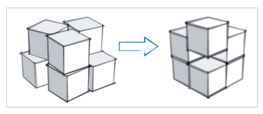
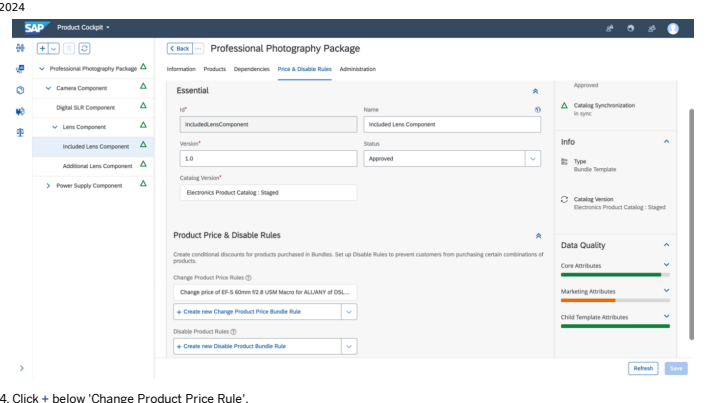
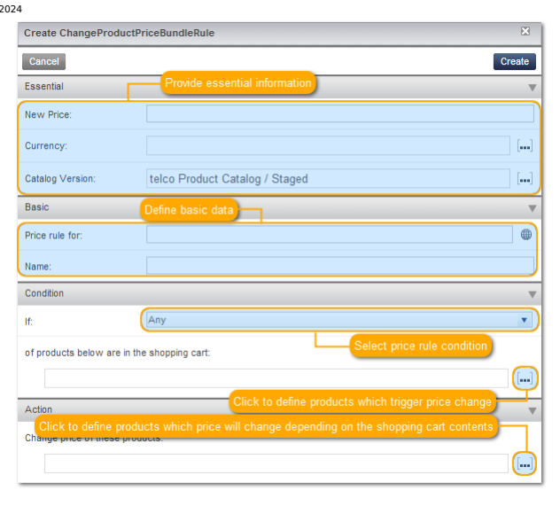
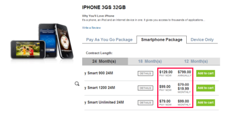
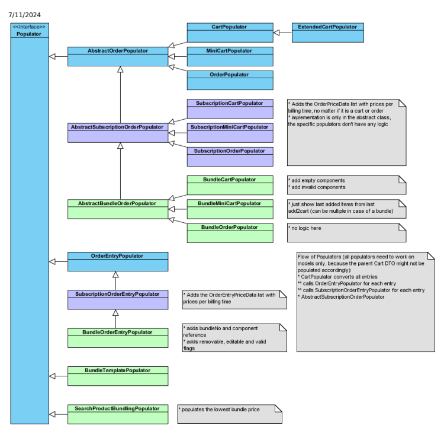

# Bundling

The Bundling module enables dening template bundles of products offered together as a package. The bundling feature allows you to dene different pricing for a product depending on if it is sold individually or in a bundle.

Congurable Bundle Module The Congurable Bundle module enables dening template bundles of products offered together as a package. The bundling feature allows you to dene different pricing for a product depending on if it is sold individually or in a bundle.

## Congurable Bundle Module

The Congurable Bundle module enables dening template bundles of products offered together as a package. The bundling feature allows you to dene different pricing for a product depending on if it is sold individually or in a bundle.

## Congurable Bundle Features

The Congurable Bundle module contains features specically designed to address the needs of businesses who market and sell digital products and services, as opposed to or in addition to, physical goods and services. The focus of the solution is to enable organizations to build and sell congurable product bundles and packages.

This is   For more    the SAP Help  3 Congurable Bundle Functionality The Congurable Bundle module provides a range of features to personas who act in different areas of digital product marketing. Working in Backoffice Bundle management in SAP Commerce Cloud is built on top of Backoffice. Working in the Legacy Cockpit The SAP Commerce Cloud Congurable Bundle module is built on top of the legacy cockpit. Congurable Bundles Cart Page Congurable Bundles introduce features to the Cart Page, for example Removing Rules, Cart Page Sorting, or Marking Erroneous Bundles. Bundle Carousel The Bundle Carousel component is displayed on the Product Details Page and shows a customer that the chosen product can be a part of a congurable bundle. Cart Entry Merge Functionality The Cart Entry Merge feature joins two cart entries with the same product into one entry, so the cart is kept clean. Cart Entry Grouping Cart Entry Grouping functionality enables you to join the multiple cart entries into a single package and operate with it as with a unied entity.

Subscriptions Features

## Congurable Bundle Functionality

The Congurable Bundle module provides a range of features to personas who act in different areas of digital product marketing.

## Functionality

Management of combined sale of physical and digital goods enabling to appropriately route and fulll the physical and digital pieces separately. Creation of complex product offerings and personalized bundles that deliver multiple packages of digital goods such as a sports media package in the case of an IPTV provider, or a magazine package for a publisher. Enabling businesses who sell digital goods to continually sell to their customers via headless commerce, for example in app purchases, guided selling, and upsells.

## Use Case

The Congurable Bundle module enables modelling product offerings sold as bundles. The module features also guided selling functionality, conditional availability of certain product depending on already-selected items and exible product pricing depending on package contents. In certain markets, physical products are usually offered with other products or services. Having separate environments for managing sales of each of those is very inconvenient and makes the bundling process impossible to implement. Having an attractive offering requires maintaining numerous product catalogs with product packages, such as:
Sports media package for IPTV providers Magazine package for publishers 600 minutes 1200 SMS with smartphone package for telecommunication service providers Another important practice in business is to continually approach existing customer base using headless commerce such as in app purchases, guided selling and up-selling, to maximize prots. Lack of supervision of digital products catalog contents may lead to undesired consequences such as out of date product information or compliance violations.

## Benets

Increase conversion rates with targeted, personalized and content-rich shopping experience. Create attractive product bundles to improve the Average Order Value (AOV). Improve user experience with guided selling feature. Cross-sell physical goods and digital content using the same platform. Prepare your business for future development in your offering, for example new services, new products, and so on.

## Features

Advanced bundle merchandising and offering personalization

Bundling of products and services as well as physical and digital goods
Business tooling for managing bundle templates Flexible pricing and availability rules based on customer selection Shopping carts and checkout ows optimized for bundles Bundle templates and inheritance mechanism to reduce bundle complexity Adding root, sibling, child bundle templates Cloning, archiving, and reinstating bundle templates Deleting child bundle templates

Editing root and child bundle templates Searching and ltering bundle rules

## Working In Backoffice

Bundle management in SAP Commerce Cloud is built on top of Backoffice. It extends its capabilities to provide the following functionalities:
This is   For more    the SAP Help  5

Setting up new bundle templates Managing device and accessory product attributes Managing bundles
To perform actions related to concepts described above, the Congurable Bundle module uses the Product Cockpit perspective of Backoffice to create products and bundles.

## Working With Backoffice

Backoffice allows you to view the product selection criteria and dependency rules from the Product Cockpit perspective of backoffice. Here you can assign products to components and to set rules regarding pricing and disabling of products.

## Bundling In Backoffice

The Product Cockpit perspective of Backoffice enables you to create and manage products being part of bundle templates. Here you can manage the products' price and disable rules.

Navigation area on the top for accessing navigation options. Browser area in the center for browsing bundle templates.

## Navigation Area

The Navigation area consists of the following UI components:
Perspective chooser

Menu

## Perspective Chooser Perspective Chooser

The Perspective chooser is located in the upper left corner. It enables you to switch between the product, catalog and bundling perspectives.

This is   For more    the SAP Help  6

## Menu

Use the Menu on the top for the following:
Choose the language in which screen texts, catalog names, and product descriptions are displayed Choose the user group Reset user settings Logout

## Browser Area

In the Browser area for Bundles you can select a package (root bundle template) from the list and edit the contents in a separate view.

## Bundling Product Attributes

Dene bundling options for a product to create choices to suit customer needs.

## Context

You can bundle package products together that are usually sold separately in order to create varied options for shoppers. This feature makes it possible to create bundles that accomodate customer choices, as well as packages completely dened by the merchandiser. Include rules to discount products in a bundle, disallowing certain product combinations, and facilitating dependencies in a complex product congurations.

## Procedure

1. Select the product to display its information in the editor area.

2. Navigate to the Bundling tab. 3. Click ... next to Bundle Templates.

The Reference Search window opens.

4. Select a predened template from the list.

 Note If you want to create a new bundle template, click the entry eld and select Create New Bundle Template.

5. Click Save.

## Assigning Products To Components

This is   For more    the SAP Help  7 Search for products and learn how to assign products to components.

You can bundle package products together that are for example sold separately in order to create a varied offering for shoppers. This feature makes it possible to create bundles that accomodate customer choices, as well as packages completely dened by the merchandiser-including rules to discount products in a bundle, disallowing certain product combinations, and facilitating dependencies in a complex product congurations. In order to enable a shopper to create a bundle out of several components, which for example would be a device, a Service Plan, and Service AddOns, you need to assign the products you have created in the legacy cockpit to package components of the packages you want them to be valid for. There are two possible ways of assigning products to components:
Search view Search wizard

## Search View

Assign products to components using the search view.

## Procedure

1. Open the Bundling list by choosing the catalog version you want to use in the Navigation menu on the left.

2. Select the bundle component that you want to add products to.

The Edit window opens.

3. Click the eld under 'Product Set' and select a product from the list or click Create New Product. 4. Click Save to save the bundle template.

## Search Wizard

Assign products to components using the search wizard.

## Procedure

1. Click ... under 'Product Set'.

2. Fill in the search criteria as required. 3. Click Search. 4. Browse through the list of products and add the ones you want to include into the component. 5. Click Select. 6. Click Save to save the bundle template.

## Additional Features

You can also do the following in the Bundling view:
Change the order of products in a list by dragging and dropping items. The order is reected in the storefront.

This is   For more    the SAP Help  8 To remove a product from a component, click Remove on the right side of the product display. The product is deleted from this component only. It is not removed from the product database.

## Assigning Price Rules To Components

Learn how to set up price rules for bundle components to manage price changes.

The price of a product might change if it is bundled with a specic other product, for example a device might be available for a lower price if the shopper chooses an expensive Service Plan with a long contract length assigned with it.

## Information Input

1. Select the package you want to update and click Edit in the upper menu.

3. Go to the Price & Disable Rules tab.

5. In the pop-up window, provide information about the following items:

| Parameter       | Description                                                 |
|-----------------|-------------------------------------------------------------|
| New Price       | Set new price for selected products.                        |
| Currency        | Set the currency in which prices of products are presented. |
| Catalog Version | Product catalog version.                                    |
| Name            | Name of the price rule.                                     |

| Parameter            | Description                                                                                                                                                                                                                                         |
|----------------------|-----------------------------------------------------------------------------------------------------------------------------------------------------------------------------------------------------------------------------------------------------|
| if                   | Any: The dened target product gets the dened price when any of the dened conditional products is chosen by the shopper. All: The dened target product only gets the dened price if all of the dened conditional products are chosen by the shopper. |
| Conditional Products | Dene the products that will cause the target product to get a price you have just specied.                                                                                                                                                          |
| Target Products      | Products for which you want to set a new price.                                                                                                                                                                                                     |
| Billing Event        | Set the price billing event for selected products.                                                                                                                                                                                                  |

6. Click Done to create a new price rule. 7. Click Save to save the bundle template.

The price rules you dene for each combination of target and conditional product are reected directly in the storefront; the device price changes depending on which plan duration and package type the shopper chooses.

## Assigning Disable Rules To Components

Learn how to assign disable rules to components to make products available only in combination with certain other products.

## Information Input

1. Select the package you want to update and click Edit.

2. Select a component and navigate to the Price & Disable Rules tab. 3. Go to the Price & Disable Rule tab.

5. Specify the disable rule parameters:

| Parameter                                               | Description                                                                                                                                                                                                                                                                                                                                    |
|---------------------------------------------------------|------------------------------------------------------------------------------------------------------------------------------------------------------------------------------------------------------------------------------------------------------------------------------------------------------------------------------------------------|
| Name                                                    | Name for the disabled rule.                                                                                                                                                                                                                                                                                                                    |
| Catalog Version                                         | Catalog version where the bundle has been created.                                                                                                                                                                                                                                                                                             |
| Bundle Template                                         | Bundle template that is being added.                                                                                                                                                                                                                                                                                                           |
| If                                                      | Disable rule condition. All: If you choose this rule type, then the dened target product is only disabled if all of the dened conditional products have been chosen by the shopper. Any: If you choose this rule type, then the dened target product is disabled in case any of the dened conditional products has been chosen by the shopper. |
| of products below are in the shopping cart (Conditional | These are the products that, if chosen by the shopper, disable                                                                                                                                                                                                                                                                                 |
| Products)                                               | the dened target product.                                                                                                                                                                                                                                                                                                                      |
| Do not allow to add these products (Target Products)    | These are the products that become disabled if the shopper chooses one of the products from the conditional products list.                                                                                                                                                                                                                     |

6. Click Done to create the new disable rule. 7. Click Save.

## Note

Click Delete next to the rule to remove it.

## What The Shopper Sees

Following the example of the Professional Photography package, if a shopper chooses the EOS450D + 18-55 IS Kit, the SCHNEIDER-KREUZNACH XENAR 0.7X Wide-Angle Lens, 55 mm option is disabled in the storefront. This feature guides shoppers through the purchase process and ensures they do not select packages that are contradicting or conicting with other parts of the package. Through this feature, the product manager can control which plans will be available with which products.

## Note

As a last step always synchronize what you have newly created to the online product catalog. For more details on how to synchronize, please refer to Synchronization in the Product Cockpit.

## Working With Bundling Templates

Manage your bundling templates within the Backoffice Product Cockpit perspective. Add, edit or clone templates, search and lter them, or archive and reinstate them as needed.

## Adding Root Bundle Templates

Procedure 1. Click Add Bundle.

2. In the Create New Bundle Template window, add the required information about your bundle.

The new bundle template is displayed in the bundle list.

## Adding Sibling Bundle Templates

Create a sibling bundle template in the structure below the root bundle template.

## Procedure

1. Select a root template in the list.

2. Click Add Bundle in the left navigation bar. 3. In the Create New Bundle Template window, add the required information about your sibling bundle.

| Input Field Name   | Description                                                                                                                       |
|--------------------|-----------------------------------------------------------------------------------------------------------------------------------|
| Id                 | Id of the new bundle template. This parameter is mandatory.                                                                       |
| Name               | Name of the new bundle template as visible on the storefront.                                                                     |
| Version            | Version of the bundle template. This parameter is mandatory.                                                                      |
| Catalog Version    | Catalog version where the bundle template is created.                                                                             |
| Parent template    | Parent bundle template. If specied, the new bundle template is added as a child of the bundle template specied in this input eld. |

4. Click Done.

## Adding Child Bundle Templates

Create a child bundle template in the structure below the sibling bundle template.

## Procedure

1. Select a sibling template in the list.

2. Click Add Bundle in the left navigation bar. 3. In the Create New Bundle Template window, add the required information about your child bundle.

| Input Field Name   | Description                                                   |
|--------------------|---------------------------------------------------------------|
| Id                 | Id of the new bundle template. This parameter is mandatory.   |
| Name               | Name of the new bundle template as visible on the storefront. |
| Version            | Version of the bundle template. This parameter is mandatory.  |
| Catalog Version    | Catalog version where the bundle template is created.         |
| Parent template    | Parent bundle template.                                       |

4. Click Done.

## Cloning Bundle Templates

Clone a top-level bundle template and all its child bundles.

## Procedure

1. Select a bundle template in the list.

2. Click Clone in the upper menu. 3. Click Save.

The bundle template is being saved with the same properties as the original template.

## Archiving Bundle Templates

You can archive a bundle template if you no longer require it.

## Context

This is   For more    the SAP Help  16 Note When a root bundle template is archived, it is unavailable for purchase from the storefront; however, the bundle template is still accessible to existing storefront orders and carts. The storefront category link has to be manually removed via the WCMS Cockpit. For more information, see WCMS Module. .

## Procedure

1. Select the bundle template in the list.

2. Click the Archive Root Bundle Template button.

A conrmation prompt is displayed.

3. Click Yes.

The archived bundle template appears on the bottom of the bundle list preceded by ARCHIVED.

## Restoring Bundle Templates From Archive Procedure

1. Select an archived bundle template in the list.

2. Click the Refresh Action in the upper menu.

A conrmation prompt is displayed.

3. Click Yes.

The bundle template is restored and displayed in the template list, preceded by UNAPPROVED.

## Deleting Child Bundle Templates Procedure

1. Select a child bundle template.

2. Click Delete child template in the left navigation bar.

A conrmation prompt is displayed.

3. Click Yes.

 Note Several rules apply to the process of deleting a child bundle template:
If a child bundle template's status is set to Approved, the deletion is not possible.

If there are carts or orders that contain the staged or online catalog version of the child template, the deletion is not possible.
You can, however, archive an entire root bundle template along with its child templates.

## Editing Root And Child Bundle Templates

This is   For more    the SAP Help  17 Procedure 1. Select a bundle template in the list.

2. Click Edit .

The editor area opens.

 Note You can also doubleclick a bundle template in order to open the editor area.

3. In the editor area, congure your bundle template.

 Note If you want to edit the child bundle template, select it in the template tree in the navigation area on the left.

## Data Quality

The data quality attribute allows product managers to check how much of the required product information data has been provided and which information is still missing.

Core Attributes: basic information (id, version)

Marketing Attributes: marketing-relevnt information (e.g. name, description) Child Template Attributes: make sure that bundles structure is correct and products are added to leaf components

## Working In The Legacy Cockpit

This is   For more    the SAP Help  18 The SAP Commerce Cloud Congurable Bundle module is built on top of the legacy cockpit.

It extends their capabilities to provide the following functionality:

Setting up new bundle templates. Managing device and accessory product attributes.

Dening feature and vendor compatibility.

Managing bundles.
To perform actions related to concepts described above, the Congurable Bundle module uses legacy cockpit Bundling Perspective to create product and subscription bundles.

## Working With The Legacy Cockpit Bundling Perspective

The legacy cockpit has a Bundling perspective that displays the dened packages and components in a tree structure. It allows you to view the product selection criteria and dependency rules from the Administration Cockpit as a base and enables you to assign products to components and to set rules regarding pricing and disabling of products. This is the cockpit that product managers should use on a daily basis as it does not allow any administrative changes.

## Starting Legacy Cockpit Context

To start the legacy cockpit:

## Procedure

1. Enter the URL in the browser's address bar: http://localhost:9001/productcockpit.

2. Log in with your credentials.

## Menu

Once you have logged in, the default perspective for your selected cockpit is displayed. A menu is located in the upper left corner of the perspective. From the menu, you can select the following:
Data Language: Choose the language in which the screen text should appear.

User Group: View to which user group your user account is assigned. User Settings: Select which user settings you want to reset. Logout: Log out of the current cockpit.

This is   For more    the SAP Help  19

Getting Started with the Product Cockpit

## Legacy Cockpit Bundling Perspective

The Bundling perspective enables you to create and manage products being part of bundle templates and to manage product price and product disable rules.

 The Bundling perspective consists of the main areas:

Navigation area on the left side for accessing navigation options. Browser area in the center for browsing bundle templates. Editor area on the right side for editing bundle templates.

## Navigation Area

The Navigation area consists of the following UI components:

Menu Perspective chooser Catalog box History box Info box
You can expand or collapse all boxes using the Expand button on the upper right side of a box:
This is   For more    the SAP Help  20 V
You can rearrange the most boxes in the navigation area using drag-and-drop operations. The Info box cannot be moved.

Figure: The Navigation area and its components.

## Menu

Use the Menu for the following:
- Choosing the language in which screen texts, catalog names, and product descriptions are displayed.

- Choosing the user group. - Resetting user settings. - Logging out.

## Perspective Chooser

This is custom documentation. For more information, please visit the SAP Help Portal The Perspective chooser enables you to switch between the product, catalog and bundling perspectives.

## Catalog Box

The Catalog box enables you to select any of the available catalog versions. Selecting one or more catalog versions resets the Browser Area to display all products from given catalog versions. You can expand and collapse catalog versions to explore the category structure of the product database. Right-click a catalog version to display related commands on a context menu:

Expand all Collapse all Clear selection Synchronize selected versions Display categories

## History Box

The History box displays a list of up to 20 modication steps. Every entry represents a modication you have done in the course of the current legacy cockpit session. The list displays the earliest modication that has been done at the top of the list, while the bottom entry indicates the latest modication. Click an entry to undo the represented modication plus any others that were done chronologically after the modication step. For example, clicking on the Article Number entry in the screenshot undoes the modication done by the Article Number and all steps after that, Approval and Online From. Undone modication steps are displayed with gray text. Click on an undone entry in the list to redo the modication done in that entry and all modications prior to that entry. In this context redo means undo for undo, that is, a change you have undone is redone You also can click the Undo and Redo buttons or use keyboard shortcuts Ctrl + Z > for undoing and Ctrl + Y for redoing.

Figure: History box displaying a sample modication sequence As the modications you make are written to the database outright and the undo/redo history is kept with the legacy cockpit session, you are not able to directly review modications other users have done. For a modication history of legacy cockpit items, see Item Attribute Modication History.

## Info Box

The Infobox displays how many workow-based tasks a user currently has assigned. It also displays the number of comments.

If you have any comments, clicking on the number of comments brings up the comments screen. You can review, edit, add attachments, delete, and reply to existing comments here. If you have tasks assigned, clicking on the number brings up the task screen. You can review your tasks and select an outcome for the tasks here.
The legacy cockpit has an interface to the Workow Module to enable using workows.

## Browser Area

The Browser area in the Bundling perspective consists of following main UI components:

Tabs Breadcrumb Main area displaying products.

## Tabs

Similar to tabs of a web browser, you can use tabs in the legacy cockpit to hold a certain view. Click a tab to display its view, while hiding the view of the currently active tab. To open a new tab, simply click the Add Tab button in the top right corner of the browser area.

## Main Area

The Main area lists bundle templates and products assigned to selected package component.

## Bundles

Here you can manage Bundle Templates and its structure. To nest a bundle in an existing one: when creating a new bundle, put the name of a parent bundle in the Parent Template box or click Add Child Bundle Template icon of the parent bundle.

## Editor Area

By clicking the Edit button next to a bundle template component, you open the product in the Editor area. Here, you can edit data such as component product set assignment as well as price and disable rules. The Editor area comprises a number of sections.

## Sections

The sections of the editor area display a number of product attributes you can maintain. You can congure the list of attributes to be displayed. Use the tab key to jump to the next attribute eld, and SHIFT+TAB to jump to the previous attribute eld.

workow Extension

## Bundling Product Attributes

You can bundle package products together that are usually sold separately in order to create a holistic offering for shoppers. This feature makes it possible to create bundles that accomodate customer choices, as well as packages completely dened by the merchandiser-including rules to discount products in a bundle, disallowing certain product combinations, and facilitating dependencies in a complex product congurations. This document describes how to dene bundle information for products.

This is   For more    the SAP Help  26 To define the bundling information of a product, for example a Service Plan or a Service AddOn, perform the following steps:
1. Double-click the product to display its information in the editor area.

2. Go to the Bundling section.

3. Click the Add reference […] button.

The system displays the Create/Add Item dialog box.

4. Click the Select an existing reference option.

5. Click the Search button.

 6. Choose a Bundle Template from the list. 7. Click the Done button.

Working with the Product Cockpit

## Assigning Products To Components

You can bundle package products together that are usually sold separately in order to create a holistic offering for shoppers.

This feature makes it possible to create bundles that accomodate customer choices, as well as packages completely defined by the merchandiser-including rules to discount products in a bundle, disallowing certain product combinations, and facilitating dependencies in a complex product configurations.

In order to enable a shopper to create a bundle out of several components, which usually would be a device, a Service Plan, and Service AddOns, you need to assign the products you have created in the legacy cockpit to package components of the packages you want them to be valid for.

To assign products to the components, in general there are two possible ways:
1. With the search view at the bottom 2. With the search wizard

## Search View

1. Select the Bundling perspective in the Navigation area on the left and choose the catalog version you want to use.

2. Select the bundle component you want to add products to.

3. Browse the product catalog to nd the desired product. 4. Drag and drop the desired product on the selected bundle component.

## Search Wizard

To add a new product, perform the following steps:
1. Click the Add Product button.

2. Choose the type of product you want to add from the dropdown list. 3. Fill in the Advanced Search Criteria elds as required. 4. Click Search. 5. Browse through the list of products and add the ones you want to include in the component. 6. Click Done to save your changes.

## General Functionalities

1. You can search for an existing product and add it to another package by dragging and dropping it on the desired package.

## Note

In case your desired assignment is against bundling rules dened by the administrator, a red symbol will appear indicating that the given action is not allowed.

2. You can change the order of a list of products by dragging and dropping desired elements, which is then directly reected in the order in which the products are shown in the storefront.

3. To remove a product from a specic component, click Remove on the right side of the product display. Note that the product will be deleted from this component only, but not entirely removed from the product database.

Working with the Product Cockpit

## Assigning Price Rules To Components

You can bundle package products together that are usually sold separately in order to create a holistic offering for shoppers. This feature makes it possible to create bundles that accomodate customer choices, as well as packages completely dened by the merchandiser - including rules to discount products in a bundle, disallowing certain product combinations, and facilitating dependencies in a complex product congurations. In this documents, you will learn how to set up price rules for bundle components. The price of a product might change if it is bundled with a specic other product, for example a device might be available for a lower price if the shopper chooses an expensive Service Plan with a long contract length assigned with it. In the next section you will learn how to dene price rules that manage these price changes.

## Information Input In The Legacy Cockpit

To set up a new price rule, perform the following steps:
1. Click the Open Context List for Price rules […] button next to the component you want to create a price rule for.

2. Click the Use values & create button located at the bottom of the window

3. In the pop-up window, provide information about the following items:

| Parameter                                                   | Description                                                     |
|-------------------------------------------------------------|-----------------------------------------------------------------|
| New Price                                                   | Set new price for selected products.                            |
| Set the currency in which prices of products are presented. |                                                                 |
| Currency                                                    |                                                                 |
| Catalog Version                                             | Product catalog version.                                        |
| Name of the price rule.                                     |                                                                 |
| Name                                                        |                                                                 |
| Condition                                                   | o Any: The defined target product gets the defined price        |
| when any of the defined conditional products is chosen      |                                                                 |
| by the shopper.                                             |                                                                 |
| o All: The defined target product only gets the defined     |                                                                 |
| price if all of the defined conditional products are        |                                                                 |
| chosen by the shopper.                                      |                                                                 |
| Conditional Products                                        | Define the products that will cause the target product to get a |
| price you have just specified.                              |                                                                 |
| Target Products                                             | Products for which you want to set a new price.                 |

4. Click the Create button to finalize the creation of the new price rule.

## What The Shopper Sees

The price rules you define for each combination of target and conditional product are reflected directly in the storefront as shown in the image below; the device price changes depending on which plan duration and package type the shopper chooses.

e

Working with the Product Cockpit

## Assigning Disable Rules To Components

You can bundle package products together that are usually sold separately in order to create a holistic offering for shoppers. This feature makes it possible to create bundles that accomodate customer choices, as well as packages completely dened by the merchandiser - including rules to discount products in a bundle, disallowing certain product combinations, and facilitating dependencies in a complex product congurations. This page describes how to assign disable rules to components. As a product manager, you might want certain products to be available only in combination with certain other products (for example a basic phone without any internet functionalities should not be available with a Smartphone Plan).

## Information Input In The Legacy Cockpit

In order to set up a new disable rule, perform the following steps:
1. Click the Open Context List for Disable Rules symbol next to the component for which you want to create a disable rule.

2. Click the Use values & create button.

3. Specify the disable rule parameters:

| Parameter   | Description                 |
|-------------|-----------------------------|
| Name        | Name for the disabled rule. |

| Parameter            | Description                                                                                                                                                                                                                                                                                                                                    |
|----------------------|------------------------------------------------------------------------------------------------------------------------------------------------------------------------------------------------------------------------------------------------------------------------------------------------------------------------------------------------|
| If                   | Disable rule condition. All: If you choose this rule type, then the dened target product is only disabled if all of the dened conditional products have been chosen by the shopper. Any: If you choose this rule type, then the dened target product is disabled in case any of the dened conditional products has been chosen by the shopper. |
| Conditional Products | These are the products that, if chosen by the shopper, disable the dened target product.                                                                                                                                                                                                                                                       |
| Target Products      | These are the products that become disabled if the shopper chooses one of the products from the conditional products list.                                                                                                                                                                                                                     |

4. Click the Create button to create the new disable rule.

## Note

If you wish to remove rules, you may do so by pressing the Delete key on your keyboard.

## What The Shopper Sees

Following the example of the Internet package as mentioned above, if a shopper chooses an unlimited plan, the Internet Package Smart option is automatically disabled in the storefront. However, the shopper can still pick the Internet Pack Max that includes 5 GB of data, since this is more than what is included in the selected plan. This feature helps guide the shopper through the purchase process and makes sure they do not select package AddOns that are contradicting or conicting with other parts of the package.

This is   For more    the SAP Help  37 Similarly, certain plans are also not visible if the shopper's choice of device disables them. Through this feature, the product manager can control which plans will be available with which devices.

## Note

As a last step you should always synchronize what you have newly created to the online product catalog. For more details on how to synchronize, please refer to Synchronization in the Product Cockpit.

Working with the Product Cockpit

## Working With Bundling Templates

The Bundling perspective allows you to perform several actions on bundle templates and rules. The actions include:
Adding root, sibling, and child bundle templates.

Editing root and child bundle templates. Cloning, archiving, and reinstating bundle templates Deleting child bundle templates Searching and ltering bundle rules

## Adding Root Bundle Templates

If no bundle templates are available, you can create a root bundle template. To create a root bundle template, do the following:
1. Click the Add Bundle button.

2. In the new Create/Add Item window, specify in the mandatory data:
This is   For more    the SAP Help  38

Your new bundle template is displayed on the bundle list.

## Adding Sibling Bundle Templates

To add a sibling bundle template, do the following:
1. Click a bundle template, for example Pay As You Go Package.

2. Click the Add Sibling Bundle Template button.

The Create/Add Item window appears.

3. In the Create/Add Item window, specify the mandatory data:

| Input Field Name   | Description                                                   |
|--------------------|---------------------------------------------------------------|
| Id                 | Id of the new bundle template. This parameter is mandatory.   |
| Name               | Name of the new bundle template as visible on the storefront. |
| Catalog Version    | Catalog version where the bundle template is created.         |
| Version            | Version of the bundle template. This parameter is mandatory.  |

| Input Field Name   | Description                                                                                                                       |
|--------------------|-----------------------------------------------------------------------------------------------------------------------------------|
| Parent template    | Parent bundle template. If specied, the new bundle template is added as a child of the bundle template specied in this input eld. |

4. Click the Done button.

## Adding Child Bundle Templates

To add a child bundle template:
1. Click a bundle template, for example Pay As You Go Package.

2. Click the Add Child Bundle Template button.

The Create/Add Item window is displayed.

3. In the Create/Add Item window, specify the mandatory data.

| Input Field Name                                                                     | Description                                                   |
|--------------------------------------------------------------------------------------|---------------------------------------------------------------|
| Id                                                                                   | Id of the new bundle template. This parameter is mandatory.   |
| Name                                                                                 | Name of the new bundle template as visible on the storefront. |
| Catalog Version                                                                      | Catalog version where the bundle template is created.         |
| This is custom documentation. For more information, please visit the SAP Help Portal | 40                                                            |

| Input Field Name   | Description                                                  |
|--------------------|--------------------------------------------------------------|
| Version            | Version of the bundle template. This parameter is mandatory. |
| Parent template    | Parent bundle template.                                      |

4. Click the Done button.

## Cloning Bundle Templates

The bundling perspective of the SAP Commerce Cloud Product Cockpit allows you to clone a top-level bundle template with all its child bundles. To clone a bundle template, do the following:
1. Click a bundle template, for example Tablet Package.

2. Click the Deep Clone This Root Bundle Template button. 3. A new bundle template appears in the list. The name of the new bundle template is the same as the cloned template, but it is preceded by CLONE.

## Archiving Bundle Templates Note

When a root bundle template is archived, it is unavailable for purchase from the storefront; however, the bundle template is still accessible to existing storefront orders and carts. The storefront category link has to be manually removed via the WCMS Cockpit. For more information, see WCMS Module. .

To archive a bundle template, do the following:
1. Click a bundle package, for example Sim Only Data Package.

2. Click the Archive Root Bundle Template button.

A window is displayed.

3. Click the Yes button.

The archived bundle template appears on the bottom of the bundle list preceded by ARCHIVED.

## Restoring Bundle Templates From Archive

To restore a bundle template from your archive, do the following:
1. Click an archived bundle template, for example ARCHIVED: Smartphone Package.

2. Click the Restore Root Bundle Template from Archive button.

A dialog box is displayed.

3. Click the Yes button.

The bundle template is restored and displayed in the template list:

## Deleting Child Bundle Templates

To delete a child template, do the following:
1. Click a child bundle template, for example Tablet - Popular Addons Component.

2. Click the Delete child template from system button.

In the dialog box that is displayed, click the Yes button.

 Note Several rules apply to the process of deleting a child bundle template:
If a child bundle template's status is set to Approved, the deletion is not possible.

If there are carts or orders that contain the staged or online catalog version of the child template, the deletion is not possible.
You can, however, archive an entire root bundle template along with its child templates. For more information, see the Archiving Root Bundle Templates section of this document.

## Editing Root And Child Bundle Templates

To edit a bundle template, do the following:
1. Click a bundle template, for example Starter Package.

2. Click the Edit button.

The editor area is displayed.

 Note You can also double click a bundle template in order to open the editor area.

3. In the editor area, congure your bundle template.

## Searching And Filtering Bundle Rules

The bundling perspective allows you to search through your bundle rules and lter the results. To lter bundle rules:
1. Click a bundle template, for example Smartphone Package.

2. Click a child bundle template, for example Smartphone - Device Component. 3. Click the Open Context List for Price Rules button or Open Context List for Disable Rules button, to open the list view.

4. In the list view, click the Advanced Search button. The Advanced Search pop-up appears:

You can search through the bundle rules by Id, Name, and Catalog Version. You can also lter the entire list by these attributes.

Working with the Product Cockpit

## Managing Coverage Rules In The Legacy Cockpit

As an administrator, you can dene which product information available in the legacy cockpit is mandatory when creating a new product and which is optional. The information allows product managers to control the percentage of the required product information that is already provided and how much is still missing. This document describes how an administrator can dene a validation constraint on the classication attribute level in addition to the existing constraints described in Data Validation. To create a new coverage rule, perform the following steps:
1. Click the Validation perspective in the Administration Cockpit.

2. Click the Create new item button in the toolbar.

The system, displays a window with list of available constraints.

3. Click the Classication NotBlank constraint option.

In this example, we are creating a new constraint called DeviceDisplayResolutionClassificationNotBlankConstraint that defines that the information for the display resolution product attributes cannot be empty if the product is a device.

4. Specify the required information:
o Category: Specify the category of which you want to validate the products.

o Classification: Specify the name of the classification attribute that you want to validate. o Composed type to validate: Specify the specific product type you want to validate. o All other attributes work as usual for a constraint.

| 7/11/2024                                                                  |  Create ClassificationNotBlankConstraint                | K   |
|----------------------------------------------------------------------------|---------------------------------------------------------|-----|
| Cancel                                                                     | Create                                                  |     |
| Essential                                                                  | -                                                       |     |
| ID:                                                                        | DeviceDisplayResolutionClassificationNotBlankConstraint | O   |
| Devices                                                                    |                                                         |     |
| Category:                                                                  | displayresolution                                       |     |
| Classification:                                                            |                                                         |     |
| Mandatory data                                                             | v                                                       |     |
| Composed type to validate:  Device                                         | […] O                                                   |     |
| Enabled:                                                                   | ❏ yes                                                   | 0   |
| Severity:                                                                  | Error                                                   | - 0 |
| o                                                                          |                                                         |     |
| Default error message:                                                     | e 0                                                     |     |
| Error message:                                                             |                                                         |     |
| Other                                                                      | A                                                       |     |
| 5. Click the Create button to finalize the creation of the new constraint. |                                                         |     |

Changes introduced in previous steps are displayed in the legacy cockpit. If you select a device of defined type and edit it but you do not provide a value for the Display Resolution, the system displays the following warning:

Validation Perspective Data Validation

## Configurable Bundles Cart Page

Configurable Bundles introduce features to the Cart Page, for example Removing Rules, Cart Page Sorting, or Marking Erroneous Bundles.

## Cart Page Sorting

All the bundles and standalone products appear in the cart entries list in a consistent way:

- Latest added standalone product goes on top of the cart, and the latest added bundle product goes on top of the relative component.

- Quantity changes do not affect the order in the cart. - Within a bundle, components are sorted in the same order as the leaf components of the bundle template.
Within a component, products display starting from the latest addition.

Empty bundles go on top.
The customer can remove the whole bundle or any product within a component, but they cannot remove components separately.

To add more products to a component, the customer can click the component's Edit button to open a product selection page for the component. On a product selection page, the customer can Select a product to add it to the component. You can set multiple levels for a bundle template in Backoffice, but the cart page in the storefront shows only root and leaf items.

## Marking Erroneous Bundles

Components that have a product count below the minimum have a red-marked label, and an error message displays for them. Also, bundles can have required components that you have to add to the bundles to make them valid. For example, you cannot buy the Internet package without a phone price plan. To be able to check out, add a phone price plan to a cart.

The entryGroup model has the erroneous ag, which marks components red that contain errors or displays the erroneous

## Bundle Carousel

The Bundle Carousel component is displayed on the Product Details Page and shows a customer that the chosen product can be a part of a congurable bundle.

For example: EOS450D + 18-55 IS Kit. Under the photo of the product, you can nd Buy this item in a bundle Bundle Carousel with proposed bundles congurations.

The Bundle Carousel component contains a productID parameter. Every component shows:
name of the root bundleTemplate -package

name of the leaf
Start Bundle button This is   For more    the SAP Help  48 The Start Bundle button leads to the bundle-specic editEntryGroup page for that very leaf component. The Start

Bundle button is disabled, when a product is out of stock.

## Adding Bundle Carousel To Product

The Bundle Carousel is added automatically to Product Details Page, when you add a product to the bundle in Product Cockpit.

## Cart Entry Merge Functionality

The Cart Entry Merge feature joins two cart entries with the same product into one entry, so the cart is kept clean.

## Customizable Filters

If cart entries do not have equal bundleTemplate elds, the following EntryMergeStrategy class is implemented to disable merging cart entries. The EntryMergeStrategy class takes the CommerceCartParameter as an input and looks in the entry list to get an entry suitable for merge. To nd it, the strategy calls a customizable set of lters. If any of the lters declines the merge, the strategy goes to the next entry. This example lter ensures that an entry has the correct product:
public class EntryMergeFilterProduct implements EntryMergeFilter { @Override public Boolean apply(@Nonnull final AbstractOrderEntryModel candidate, @Nonnull final AbstractOrder { return Boolean.valueOf(Objects.equals(candidate.getProduct(), target.getProduct()));()); } }
The method implements the following lters:

Filter name Description

| 7/11/2024 Filter name             | Description                                                                               |
|-----------------------------------|-------------------------------------------------------------------------------------------|
| EntryMergeFilterProduct           | compares product code                                                                     |
| EntryMergeFilterUnits             | compares measurement units                                                                |
| EntryMergeFilterPointOfService    | compares point of service                                                                 |
| EntryMergeFilterIsEntryUpdatable  | disables changing of unmodiable entries (giveaway or bundled)                             |
| EntryMergeFilterForceNewEntry     | if the input CommerceCartParameter.isCreateNewEntry ag is set to true, disables any merge |
| EntryMergeFilterEntryGroup        | merges only to the same group                                                             |
| EntryMergeFilterCongurableProduct | does not merge congurable products, because they can have different congurations          |
| EntryMergeFilterBundleTemplate    | does not merge to bundled products. The configurablebundles extension adds this lter.     |

## Cart Entry Grouping

Cart Entry Grouping functionality enables you to join the multiple cart entries into a single package and operate with it as with a unied entity.

## Cart Entry Grouping Features

| Feature             | Description                                                                                    |
|---------------------|------------------------------------------------------------------------------------------------|
| group number        | Uniquely identies an entry group within a cart.                                                |
| name                | Denes the screen name of a group added to a cart. The localization of the name is not dynamic. |
| hierarchical groups | Lists the child groups.  Note Avoid creating a circular reference between the groups.         |

| 7/11/2024 Feature                       | Description                                                                                                                                                                                                                                                                                                                                                                                                                                                                                                                                            |
|-----------------------------------------|--------------------------------------------------------------------------------------------------------------------------------------------------------------------------------------------------------------------------------------------------------------------------------------------------------------------------------------------------------------------------------------------------------------------------------------------------------------------------------------------------------------------------------------------------------|
| multiple root groups                    | Have their own hierarchy.                                                                                                                                                                                                                                                                                                                                                                                                                                                                                                                              |
| external reference eld                  | Maps a group on an external model.                                                                                                                                                                                                                                                                                                                                                                                                                                                                                                                     |
| groupType                               | Allows the user to distinguish the groups handled by different extensions.                                                                                                                                                                                                                                                                                                                                                                                                                                                                             |
| cart entry belongs to group             | Creates the stub entry groups for the standalone entries on a DTO level. These stub entry groups unify the entity processing on the UI.                                                                                                                                                                                                                                                                                                                                                                                                                |
| cart entry belongs to multiple groups   | States that a cart belongs to the multiple groups. There can be multiple group trees in parallel. For example, one for a bundle and another for a delivery mode. The entries can belong to the multiple groups.                                                                                                                                                                                                                                                                                                                                        |
| entry group processed as a solid entity | For example, you can remove the whole group along with its entries by a single call to CartFacade#removeEntryGroup. Also, some helpers exist to navigate through a hierarchy group: the CommerceEntryGroupService for a service layer and the CommerceEntryGroupUtils for a façade layer.                                                                                                                                                                                                                                                              |
| grouping in cart entires sorting        | Respects the grouping in the sorting of the cart entries: between the group's entries: goes in the order of the groups inside of the single group entries: go in a natural order (the last created is last on the list) root groups are sorted in the order of a cart entry creation. If you add a product to the rst group in a cart, the group becomes the last on the list. each standalone entry is wrapped with a personal entry group and takes part in sorting as a grouped entity.  Note The cart populator rules work only on the DTO level. |

## Cart Entry Grouping With Congurable Bundles

You can use the Cart Entry Grouping functionality with the congurable bundles. When you add one product and a bundle template component to a cart, you create a bundle in a cart. On this stage, the whole hierarchy of the template is duplicated to a group hierarchy. The template is the root of the tree, to which a component belongs.

Each group gets bound to the source template component through the externalReferenceId. Then, the externalReferenceId adds the product to a cart and assigns to a corresponding group.

The cart page shows the root groups and their leaves. You can remove the root entirely with all descendant groups and entries, but you cannot remove a separate leaf. You cannot remove a leaf, because the software locks it on a service layer. You can edit a leaf group by adding or removing the products to/from the leaf groups. You can only add products that connect to a corresponding bundle component. To add a product to an existing bundle, specify the code of the product and a number of a group. You can remove a cart entry from a group through native functionality of a cart page. Click X on the right side of the entry. For every leaf group, a min and max number of entries can be dened. You cannot navigate to a checkout until all groups are valid. The validation updates an entry addition and removal.

Extending Cart Entry Grouping

| Class                              | Description                                                                                                                                                                 |
|------------------------------------|-----------------------------------------------------------------------------------------------------------------------------------------------------------------------------|
| EntryGroup                         | If you need some extra elds, you can inherit from this class.  Note Do not add the elds to the EntryGroup bean, or you break the compatibility between the extensions.     |
| EntryGroupData                     | You are free to add any elds to the bean and populate them.                                                                                                                 |
| CommerceAddToCartMethodHook        | You can create the custom entry groups in a cart.                                                                                                                           |
| CommerceUpdateCartEntryHook        | Performs custom actions on a cart entry update and removal. For example, bundle extension validates the cart bundles.                                                       |
| CommerceRemoveEntryGroupMethodHook | Performs a custom logic on an entry group removal. Automatically removes the child cart entries. A bundle extension uses this hook to deny a removal of the nonroot groups. |
| CommerceCartParameter              | Adds any extra elds to pass them to your CommerceAddToCartMethodHook.                                                                                                       |
| AddToCartParams                    | Adds any extra elds to pass them to the CartFacade#addToCart and populate them via the custom AddToCartParams to the CommerceCartParameter populator.                       |

Cart Entry Merge Functionality

## Congurable Bundle Architecture

The Congurable Bundle module is a set of extensions providing the means to bundle products offered together as a package, and dene different pricing for a product depending on whether it is sold individually or together with other products.

## Dependencies

Recipes For a complete list of SAP Commerce Cloud recipes that may include this module, see Installer Recipes.

## Extensions

The Congurable Bundle module consists of the following extensions:
congurablebundleservices Extension The configurablebundleservices extension delivers data model and functionality required to implement bundling features that are common in the telecommunication and digital industry. Bundling services are relatively generic and therefore you can use them when constructing storefronts for other industries as well. congurablebundlefacades Extension The configurablebundlefacades extension extends the subcriptionfacades extension with implementation of bundling functionality. congurablebundlecockpits Extension The configurablebundlecockpits extension extends the subscriptioncockpits extension. It contains specic pieces of customization to handle the navigation of bundled products and services, custom renderers and views for the rules which dictate the conditions of bundles. congurablebundleaddon AddOn The configurablebundleaddon is a template addon, which provides necessary changes in pages and other UI
elements to showcase product bundling functionality (based on entry grouping functionality) for electronics storefront. congurablebundlebackoffice Extension The configurablebundlebackoffice extension enhances the backoffice extensions to support operations on congurable bundles. congurablebundleocc Extension The configurablebundleocc extension exposes saved functionality of the Congurable Bundle module in the form of the standardized OCC (Omnichannel Commerce) API. The extension provides REST API endpoints to create, edit, and delete congurable bundles. congurablebundleocctests Extension The configurablebundleocctests extension provides automated REST tests for the configurablebundleocc extension.

## Congurablebundleservices Extension

The configurablebundleservices extension delivers data model and functionality required to implement bundling features that are common in the telecommunication and digital industry. Bundling services are relatively generic and therefore you can use them when constructing storefronts for other industries as well.

## Note

An SAP Commerce Cloud extension may provide functionality that is licensed through different SAP Commerce Cloud modules. Make sure to limit your implementation to the features dened in your contract license. In case of doubt, please contact your sales representative.

## Bundle Functionality

The key feature of the bundle functionality is the ability to dene bundling templates consisting of products and services. Products which are bound to a bundle can be purchased separately, but some products might not be suited for the standalone case, for more details, see the Items Type section of this document. The association of a product with a given bundle is determined by the AbstractOrderEntry.bundleNo parameter, which takes following values:
- 0, in case of a standalone product. - The number of the bundle, the product belongs to.

Bundles are stored in AbstractOderModel.entryGroups as trees. The field contains only root groups, that in turn include all the subsequent items.

## Bundling Data Model

This is custom documentation. For more information, please visit the SAP Help Portal

## Item Types Product

Every product can be part of a bundle when congured accordingly or sold individually, but some products might not be suited for the standalone case. That is why the soldIndividually boolean ag has been introduced on the generic Product item type. For example, it might not make sense for a subscription product, so this ag is set to a default value of false for subscription products. That can still be changed for an inherited custom type. Price for a product sold individually can differ from the price of the same product but sold in a bundle. Price of the product sold in a bundle can be lower if ChangeProductPriceBundleRule is set.

The AbstractOrderEntry.entryGroupNumbers eld contains a list of entry group numbers. If one (and no more than one)
of the items points to the EntryGroup bundle, the entry is treated as a part of the bundle the group belongs to.

## Bundle Template

Merchants use bundle templates to outline the structure of bundles. Bundle templates can either act as parent, or rst level bundle templates. In such a case, in documentation, they are referred to as packages. If bundle templates are child templates, or second level templates, they are referred to as components.

As you can see in the UML diagram the BundleTemplate is the key type for the bundle functionality. It allows building tree structures. You can also model the leaf components. Modeling involves the following actions:
Managing the list of selectable products, read more in the Selectable Products section below.

Dening required components, read more in the Required Components section below. Managing the bundle selection criteria, that dene how many of those products can be selected, read more in the Bundle Selection Criteria section below. Managing a list of abstract bundle rules that are applied, read more in the Abstract Bundle Rule section below.

## Bundle Template Status

The BundleTemplateStatusEnum denes values for the BundleTemplateStatus object, which determines bundle template approval status. Approval status provides storefront conrmation of a bundle's availability in the product catalog. This prevents incomplete templates from being seen by customers.

The main purpose of the BundleTemplateStatus is to allow substantial changes in the BundleTemplate, such as changing package structure. The user interface for a cart or order history depends on the bundle template structure, and modifying it would corrupt existing carts and orders.BundleTemplateStatus enables creating a new version of the entire BundleTemplate structure with the possibility to bring it live later. Old BundleTemplate structure is left intact so old orders can refer to it and preserve user interface consistency.

<approved> - bundle is visible on the storefront and available to the customers. There can be only one bundle with the same id and in the status <approved>.

<check> - bundle is not visible on the storefront but can be edited in the Product Cockpit. <unapproved> - bundle is not visible on the storefront but can be edited in the Product Cockpit. This is the default value for newly created bundle templates.
The reference solution denes following values: The check status value has been implemented to ensure consistency with Product and Asset entities implementations and you can use it for modeling custom workows.BundleTemplateStatus object is instantiated automatically for each parent template object upon its creation and it is referenced automatically by the children templates.

This is   For more    the SAP Help  55

## Selectable Products

The <BundleTemplate.products> attribute denes selectable products of a leaf component. You can add only dened products to a specic leaf component, all others are denied. It is important that such products always have to be dened along with their leaf components. In a bundle context a product cannot be mentioned alone, because a product can even be dened multiple times for different leaf components and might also be assigned different prices for each leaf component. That is why, for example, every <add to cart> call requires a leaf component in addition to the product itself. In order to maintain that information in the cart, the cart entry has also to be changed to keep the leaf component information along with the product. This way a componentized cart can be established with products being grouped into the different leaf components. Assigned products might also have rules assigned, so there is a restriction when unassigning products that all the rules have to be removed rst. Find more information on assigning of rules in the Abstract Bundle Rule section below.

## Required Components

Dening required components for a specic component introduces a natural sequence in which order the package has to be created. You can dene any of the other components in the same package as required components, which have an impact on adding or removing products:
Adding products - before being able to add products to a component, all the required components need to be fullled - so the BundleSelectionCriteria of those components needs to be reached.

Removing products - removing the last product of a component automatically removes all products from the dependent components, as they do not make any sense for themselves, for example, an Internet Pack without a Service Plan does not make any sense.

## Bundle Selection Criteria

This is the super type of specic selection criteria below. In general, a selection criteria species the amount of products needed in a specic component. But it can even go further and add products automatically to the bundle. The general use cases, which are specied in the extended types are as follows:

## Add To Cart

Update cart to remove items Checks - exposing functionality to the storefront in order to render or disable specic buttons.

Editable check - all cart entries that are part of a bundle are not editable, that is, you cannot update their quantity. Either their quantity is one or they are removed from the cart. Removable check - the logic is depending on the specic selection criteria.

The table below describes the criteria predened in the reference solution:

| Criteria Name   | Description   | Main Use Cas   |
|-----------------|---------------|----------------|

| 7/11/2024 Criteria Name                                                                                                             | Description                                                                                                                                                                                                                                                                                                 | Main Use Cas                                                                                                                                                             |
|-------------------------------------------------------------------------------------------------------------------------------------|-------------------------------------------------------------------------------------------------------------------------------------------------------------------------------------------------------------------------------------------------------------------------------------------------------------|--------------------------------------------------------------------------------------------------------------------------------------------------------------------------|
| AutoPickBundleSelectionCriteria                                                                                                     | This selection criteria is used to automatically add a product to a bundle when a new bundle is being created in the cart. In addition to that there are several logic changes in order to manipulate it only from the back end side in an automatic way and disable manual interaction with such products. | Following main are covered: Add t a new create all com that p search having select Those comp applie that a their r produ same autom Furthe the ad logic m such a denied |
|                                                                                                                                    | Note                                                                                                                                                                                                                                                                                                        |                                                                                                                                                                          |
| This criteria is disabled by default. To enable it, you need to add a property as configurablebundleservices.autopick.enabled=true. | Updat remov produ part o comp only b delete cart b either the fu Check                                                                                                                                                                                                                                      |                                                                                                                                                                          |

| 7/11/2024 Criteria Name             | Description                                                                                                                                                          | Main Use Cas                                                                                                                                                                                                                             |
|-------------------------------------|----------------------------------------------------------------------------------------------------------------------------------------------------------------------|------------------------------------------------------------------------------------------------------------------------------------------------------------------------------------------------------------------------------------------|
| PickExactlyNBundleSelectionCriteria | This selection criteria is used to specify an exact amount of products that must be selected in a component. It introduces a new attribute N to specify that amount. | Following main are covered: Add t disab the ex of pro reache anothe would But th needs to rea amoun subse adding produ bundl cart is disab amoun reache Updat remov once t amoun produ part o comp only b from t remov bundl cart. Check |

| 7/11/2024 Criteria Name                          | Description                                                                                                                                                                                                                                                                               | Main Use Cas                                                                                                                                                |
|--------------------------------------------------|-------------------------------------------------------------------------------------------------------------------------------------------------------------------------------------------------------------------------------------------------------------------------------------------|-------------------------------------------------------------------------------------------------------------------------------------------------------------|
| PickNToMBundleSelectionCriteria                  | This selection criteria is used to specify an amount range of products that must be selected in a component. It introduces a new attribute M in addition to the PickExactlyNBundleSelectionCriteria to specify the maximum amount and used the attribute N to specify the minimum amount. | Following main are covered: Add t disab the m amoun is reac adding produ invalid there be a w the m amoun subse adding produ bundl add2c disab minim is not |
| configurablebundleservices.autopick.enabled=true | Updat remov once t amoun produ part o comp only b remov bundl cart. Check                                                                                                                                                                                                                 |                                                                                                                                                             |
| Abstract Bundle Rule                             |                                                                                                                                                                                                                                                                                           |                                                                                                                                                             |

The AbstractBundleRule denes the base type for all rules, either already existing such as price and disable rules following or being implemented as custom requirements. It contains the following attributes for a generic conguration:
targetProducts- a list of products that the rule should be applied to. Each of the products must be dened in the products list of the component rst.

conditionalProducts- a list of products that are required to be in the cart in the exact same bundle in order for the rule to apply.
ruleType- it denes how the conditionalProducts should be evaluated. The following modes are supported dened by the BundleRuleTypeEnum:
ANY- applies the rule if ANY of the conditionalProducts match.

ALL- applies the rule if ALL of the conditionalProducts match.

The difference between target and conditional products is not always required.

In case of a DisableProductBundleRule there is no difference, but you just need one rule to mark a target and conditional product as disabled.

Whereas for a ChangeProductPriceBundleRule it is vital as the rule only has an effect on the target product. If no conditional products are assigned, this rule is applied to every product. Still, it can be overridden by a rule with lower price.
The table provides information on the rules available for the reference system:

| Rule Name                                                                            | Description                                                                                                                                                                                                                                                                                                                                                                      | Use Cases                                                                                                                                                                                                                                                                                                                                                                                                                                                                                                                                                                                                                                                                                                                                                                                                                                                                                                                                                                                                                       |
|--------------------------------------------------------------------------------------|----------------------------------------------------------------------------------------------------------------------------------------------------------------------------------------------------------------------------------------------------------------------------------------------------------------------------------------------------------------------------------|---------------------------------------------------------------------------------------------------------------------------------------------------------------------------------------------------------------------------------------------------------------------------------------------------------------------------------------------------------------------------------------------------------------------------------------------------------------------------------------------------------------------------------------------------------------------------------------------------------------------------------------------------------------------------------------------------------------------------------------------------------------------------------------------------------------------------------------------------------------------------------------------------------------------------------------------------------------------------------------------------------------------------------|
| ChangeProductPriceBundleRule                                                         | It enhances the rule nding mechanism of the AbstractBundleRule with the attribute currency, so the rule is only applied if the rules currency is matching the currency of the session. And the apply logic uses the attribute price to reduce the products price to this specic value. In case more than one matching rule is found, the one with the lowest price gets applied. | There are different cases of when the price nding logic is called. We are distinguishing the following different cases here: All products are in the cart already - the most important is the implementation of the discount logic during the cart or order calculation, because this is not just for temporary display, but the result has to be persisted somehow. The following architecture has been chosen: The functionality of discounting a product has been re-used to calculate and store prices originated by a ChangeProductPriceBundleRule. The hook BundleFindDiscountValuesHook overrides pricing strategies in order to replace the discount nding, instead of reading and evaluating the DiscountRows of a Product. It queries existing price rules in combination with the current bundle products. After this strategy of nding the discount, the subsequent process of persisting the found discount works in exactly the same way. In order to simply call the price nding mechanism, an API method in the |
| This is custom documentation. For more information, please visit the SAP Help Portal | 60                                                                                                                                                                                                                                                                                                                                                                               |                                                                                                                                                                                                                                                                                                                                                                                                                                                                                                                                                                                                                                                                                                                                                                                                                                                                                                                                                                                                                                 |

| 7/11/2024 Rule Name                                                                                                                                                                                                                                                                                                                                                                                                                                                                                                                                                                                                                                                                                                                                                                                                                                                                                                                                                                                                                                                                                                                                                                                                                                                                                                                                                                                                                                                              | Description   | Use Cases   | BundleRuleService has been implemented to pass a cart or orderEntry and the matching price rule for the cart or order entry is returned.   |
|----------------------------------------------------------------------------------------------------------------------------------------------------------------------------------------------------------------------------------------------------------------------------------------------------------------------------------------------------------------------------------------------------------------------------------------------------------------------------------------------------------------------------------------------------------------------------------------------------------------------------------------------------------------------------------------------------------------------------------------------------------------------------------------------------------------------------------------------------------------------------------------------------------------------------------------------------------------------------------------------------------------------------------------------------------------------------------------------------------------------------------------------------------------------------------------------------------------------------------------------------------------------------------------------------------------------------------------------------------------------------------------------------------------------------------------------------------------------------------|---------------|-------------|--------------------------------------------------------------------------------------------------------------------------------------------|
| Products are not in the cart yet - this is always the starting point of every commerce use case - the product price needs to be precalculated as if it was in the cart in a bundle already. Normally you start a bundle with at least choosing two products at the same time and the price for each of them in the context of a specic bundle should be calculated. Therefore an API method in the BundleRuleService has been implemented to pass a target product and a conditional product along with the currency and the precalculated price rule for the target product is returned. One Product to be added to an existing set of products in the cart - this is the case if a bundle has been started and the next product should be added. Therefore an API method in the BundleRuleService has been implemented to pass a target product and the existing cart along with the bundleNo and the precalculated price rule for the target product is returned. Lowest possible Price for a Product - this is important when we do not have a bundle context or a context when we have a combination of products. Normally, used in a product listing page stating the lowest possible price next to the standard price. Hence this is usually triggered by the indexer cron job and an API method in the BundleRuleService has been implemented to pass a target product along with a currency and the precalculated price rule for the lowest possible price is returned. |               |             |                                                                                                                                            |

| 7/11/2024 Rule Name      | Description                                                                                                                                                                                                  | Use Cases                                                                                                                                                                                                                                                                                                                                                                                                                                                                                                                                                                                                                                                                                                                                                                                                                                                                                                                                                      |
|--------------------------|--------------------------------------------------------------------------------------------------------------------------------------------------------------------------------------------------------------|----------------------------------------------------------------------------------------------------------------------------------------------------------------------------------------------------------------------------------------------------------------------------------------------------------------------------------------------------------------------------------------------------------------------------------------------------------------------------------------------------------------------------------------------------------------------------------------------------------------------------------------------------------------------------------------------------------------------------------------------------------------------------------------------------------------------------------------------------------------------------------------------------------------------------------------------------------------|
| DisableProductBundleRule | It does not enhance the rule nding mechanism, so the rule is applied as dened in the standard AbstractBundleRule. But it implements a special apply logic to simply disable a product when the rule applies. | There are different cases when disabling logic might be called. We are distinguishing the following different cases here: All products are in the cart already - this case does not exist for disable rules as we are not allowing disabled products to be added to the cart in the rst place. Products are not in the cart yet - this is always the starting point of every commerce use case, and any product could be added as rst, because there are no other products in the cart that could trigger disable rules. One Product to be added to an existing set of products in the cart - this is the case if the bundle has been started and the next product should be added. Here we are checking if that should be denied as they are disabled. An API method in the BundleRuleService has been implemented to pass a target product and the existing cart along with the entry group where the product is added. A list of disable rules is returned. |

## Possible Error Rules Values

The table provides description of info and error rules for ChangeProductPriceBundleRuleModel and DisableProductBundleRuleModel rules that can occur during synchronization.

| Attribute                         | Description                                                                          |                                                                                                               |
|-----------------------------------|--------------------------------------------------------------------------------------|---------------------------------------------------------------------------------------------------------------|
| ChangeProductPriceBundleRuleModel | conditionalProducts                                                                  | The priceRule does not contain any conditional products. This means the price changes are applied every time. |
| targetProducts                    | Each priceRule must at least have one target product assigned.                       |                                                                                                               |
| targetProducts                    | This price rule has a target product {X} which is not part of the bundle template.   |                                                                                                               |
| DisableProductBundleRuleModel     | conditionalProducts                                                                  | Each disableRule must at least have one conditional product assigned.                                         |
| targetProducts                    | Each disableRule must at least have one target product assigned.                     |                                                                                                               |
| targetProducts                    | This disable rule has a target product {X} which is not part of the bundle template. |                                                                                                               |

## Bundling Services

The tab provides description of bundling services provided with the reference solution:

| 7/11/2024 Service Name                     | Description                                                                                                                                                                                                                                                                                                                                                                                                     |
|--------------------------------------------|-----------------------------------------------------------------------------------------------------------------------------------------------------------------------------------------------------------------------------------------------------------------------------------------------------------------------------------------------------------------------------------------------------------------|
| BundleRuleService                          | Commerce service that exposes methods to nd a matching rule for the produ DisableProductBundleRuleModel when part of a bundle. The rules are d the different ways on how to nd a rule: Precalculating the rule based on two products that are not yet in the ca Finding the rule based only on products already in the cart in a bundle. Combination of both: precalculating the rule based on an existing bund |
| BundleTemplateService                      | Bundle template service that exposes methods to deal with bundle template o The List<BundleTemplateModel> BundleTemplateService (root template is also acceptable) and returns ordered list of leaf comp The createBundleTree method - takes a bundle component model component's root bundle template has, and adds the tree to the order' @Nonnull EntryGroup createBundleTree(@Nonnull final B               |
| AbstractBundleComponentEditableChecker     | Checks if a bundle BundleTemplateModel component can be edited.                                                                                                                                                                                                                                                                                                                                                 |
| RemoveableChecker                          | Checks if given element can be removed from the order.                                                                                                                                                                                                                                                                                                                                                          |
| BundleFindDiscountValuesHook               | Implements FindDiscountValuesHook for bundles. Overrides pricing strategies                                                                                                                                                                                                                                                                                                                                     |
| BundleUpdateCartEntryHook                  | Implements CommerceUpdateCartEntryHook of commerceservices a removal): Denies removal of autopicked products. Trims quantity down to allowed by selection criteria (if any). Updates EntryGroup.erroneous on all groups of the affected pac Invalids all cart entries of the package to recalculate their prices.                                                                                               |
| BundleCartHookHelper                       | A helper class for manipulating with bundle entries.Contains the following meth invalidateBundleEntries - sets all cart entries that belong to th bundle entries a recalculation of the whole bundle (and all the carts tha updateParameterEntryGroupNumbers - adds the given set of en                                                                                                                         |
| DefaultBundleCartHookHelper                | The default implementation of BundleCartHookHelper.                                                                                                                                                                                                                                                                                                                                                             |
| BundleCartValidator                        | Updates statuses of bundle entry group according to selection criteria and req                                                                                                                                                                                                                                                                                                                                  |
| BundleAddToCartMethodHook                  | Implements CommerceAddToCartMethodHook for bundles: creates bundle structure in entry groups assigns entry group number to new entry and - for compatibility - bund performs some validations of bundle integrity                                                                                                                                                                                               |
| BundleSelectionCriteriaAddToCartMethodHook | Implements CommerceAddToCartMethodHook that checks appliance of th                                                                                                                                                                                                                                                                                                                                              |
| EntryMergeFilterBundle                     | Denies to merge entries from distinct bundle components.                                                                                                                                                                                                                                                                                                                                                        |
| BundleRemoveEntryGroupMethodHook           | Denies removal of non-root entryGroups of CONFIGURABLEBUNDLE type fr                                                                                                                                                                                                                                                                                                                                            |

## Solr Value Providers

The configurablebundleservices extension denes additional value providers for the Solr search engine.

| Solr Value Provider                 | Description                                                                                                                                                |
|-------------------------------------|------------------------------------------------------------------------------------------------------------------------------------------------------------|
| LowestBundlePriceValueProvider      | Provides the value for the ProductModel lowest possible price in any bundle.                                                                               |
| ProductBundleTemplatesValueProvider | Provides the value for the ProductModel attribute bundleTemplates. It consists of the concatenated IDs of all bundle templates the product is assigned to. |

subscriptionbundleservices Extension

## Congurablebundlefacades Extension

The configurablebundlefacades extension extends the subcriptionfacades extension with implementation of bundling functionality.

## Note

An SAP Commerce Cloud extension may provide functionality that is licensed through different SAP Commerce Cloud modules. Make sure to limit your implementation to the features dened in your contract license. In case of doubt, please contact your sales representative.

## Data Transfer Objects

Data Transfer Objects (DTOs) provided with the Bundling Facade enable bundling related functionality.
The name property from BundleTemplateData contains not the simple name of corresponding BundleTemplateModel ,
but path from root package (excluding it) to the component. For old one-level structure it populates only end component's name.

Functional Area Remarks

| 7/11/2024 Functional Area   | Remarks                                                                                                                                                                                                                                                                                                                                                                                                               |
|-----------------------------|-----------------------------------------------------------------------------------------------------------------------------------------------------------------------------------------------------------------------------------------------------------------------------------------------------------------------------------------------------------------------------------------------------------------------|
| Product Details Page        | The DTOs represent a list of subscription products listed in a ltered way, rst by package and then by term of service. It is used for displaying a device product with its service plan options to choose from and adding the two products to the cart at the same time. It is also used for displaying details of a service plan or service add-on, allowing to present similar product on the same storefront page. |
| Cart/Order Display          | The cart/order and entry DTOs have been enhanced in order to add a bundle context to an entry as well as pointing out invalid congurations.                                                                                                                                                                                                                                                                           |

## Facades

BundleCartFacade does not extend SubscriptionCartFacade nor CommerceCartFacade, so if you need any methods from them, you have to aggregate them in parallel to the bundle cart facade.

Methods of BundleCartFacade:
startBundle - creates bundle structure in cart and adds the product to the given component.

CartModificationData startBundle(@Nonnull String bundleTemplateId, @Nonnull String productCode throws CommerceCartModificationException; addToCart - adds the product to the component's entry group addressed by the entry group number. The entry group is created by a call to startBundle.

CartModificationData addToCart(@Nonnull String productCode, long quantity, int groupNumber) throws CommerceCartModificationException; getAllowedProducts - searches for the products available for given component. Default implementation of this method in DefaultBundleCommerceCartFacade is using SearchFilterQueryData to set the query based on bundleTemplates indexed property.

@Nonnull ProductSearchPageData<SearchStateData, ProductData> getAllowedProducts( @Nonnull Integer groupNumber, String searchQuery, @Nonnull PageableData pageableData);

## Data Model

The following elds are deprecated:
AbstractOrderEntryModel.bundleNo- the eld exists, however, it should be used for entryGroupNumber implementation.

AbstractOrderEntryModel.bundleTemplate - the id of the component is stored in externalReferenceId of the corresponding EntryGroup.

## Dto

The following elds are deprecated:
OrderEntryDatabundleNo- the eld exists, however, it should be used for entryGroupNumber implementation.

OrderEntryData.bundleTemplate - the id of the component is stored in externalReferenceId of the corresponding EntryGroup.

Class Diagram

| Method           | Description                                                                                                                                                                                                       | Codeblock                                                                            |
|------------------|-------------------------------------------------------------------------------------------------------------------------------------------------------------------------------------------------------------------|--------------------------------------------------------------------------------------|
| addToCart        | Add single product to cart - replaced by startBundle/addToCart. To emulate removeCurrentProducts=true, you should remove all entries of the group addressed by bundleTemplateId and the add the product as usual. | List<CartModificationData> addToCart(@Nonnull @Nullable final String bundleTemplateI |
| addToCart        | Add two products to cart - call startBundle/addToCart for the rst product and addToCart for the second.                                                                                                           | List<CartModificationData> addToCart(@Nonnull @Nonnull final String productCode2, @N |
| deleteCartBundle | Removing bundle - use CommerceCartService.removeEntryGroup                                                                                                                                                        | void deleteCartBundle(final int bundleNo) thro                                       |

## Subscriptioncartfacade

The SubscriptionCartFacade has been enhanced to be able to deal with bundling functionality. The methods:
addToCart has been redened in two ways:
Adding one product to a new or existing bundle. The following have been added: bundleNo, the bundleTemplateId to which component or package it should be added and a parameter removeCurrentProducts supporting product replacement, which is about removing all the previously dened products and adding the new one. Adding two products at the same time to a new bundle - in this case always a new bundle is created, so no bundleId is required, but the two products need two productCode parameters to identify the product as well as two bundleTemplateId parameters to identify the component of each product.

deleteCartBundle species a bunldeNo, which should be removed entirely from the cart.

This is   For more    the SAP Help  67

## Defaultsubscriptioncartfacade

DefaultSubscriptionCartFacade implements the following methods:
addToCart

refreshProductXMLs
The DefaultSubscriptionCartFacade overrides addToCart method from the core CartFacade to add child cart specic functionality: CartModificationData addToCart(@Nonnull final String productCode, final long quantity). The DefaultBundleCartFacade extends the DefaultSubscriptionCartFacade.

## Defaultbundlecartfacade

The DefaultBundleCartFacade implements the following methods:

List<CartModificationData> addToCart(@Nonnull final String productCode, final long quantity, final int bundleNo, @Nullable final String bundleTemplateId, final boolean removeCurrentProducts)throws CommerceCartModificationException List<CartModificationData> addToCart(@Nonnull final String productCode1, final int bundleNo,@Nullable final String bundleTemplateId1, @Nonnull final String productCode2,@Nullable final - String bundleTemplateId2)throws CommerceCartModificationException void deleteCartBundle(final int bundleNo) throws CommerceCartModificationException boolean isCartValid()
The DefaultBundleCartFacade overrides methods from the core CartFacade to perform additional bundle checks:

CartModificationData addToCart(@Nonnull final String code, final long quantity) throws CommerceCartModificationException CartModificationData addToCart(final String code, final long quantity, final String storeId) throws CommerceCartModificationException CartData getSessionCartWithEntryOrdering(final boolean recentlyAddedFirst)

## Populators

The majority of the populators are simple and straight forward. And they convert attributes except for the following ones:

| Populator Name                                                                       | Description                                                            |
|--------------------------------------------------------------------------------------|------------------------------------------------------------------------|
| AbstractBundleOrderPopulator                                                         | Sorts the entries according to the bundle number and the               |
| component order. Non-bundle products appear at the end of the                        |                                                                        |
| list.                                                                                |                                                                        |
| BundleCartPopulator                                                                  | Adds empty entries/components to the list, which represent             |
| possible options from a guided selling perspective. It also                          |                                                                        |
| determines invalid components that display appropriate messages                      |                                                                        |
| on the storefront.                                                                   |                                                                        |
| BundleOrderEntryPopulator                                                            | Applies no logic to the order part as the order is final and we cannot |
| advertise product options. Also the order must be valid at this time                 |                                                                        |
| and there cannot be any invalid parameters.                                          |                                                                        |
| BundleOrderPopulator                                                                 | It adds bundle specific data, for example bundle number,               |
| component, and flags the entry as                                                    |                                                                        |
| Valid/Updateable/Removable/Editable.                                                 |                                                                        |
| This is custom documentation. For more information, please visit the SAP Help Portal |                                                                        |

This is custom documentation. For more information, please visit the SAP Help Portal

| Populator Name                   | Description                                                      |
|----------------------------------|------------------------------------------------------------------|
| ProductSoldIndividuallyPopulator | Populates soldIndividually eld from ProductModel of product DTO. |

Bundling Module Subscriptions Module

## Congurablebundlecockpits Extension

The configurablebundlecockpits extension extends the subscriptioncockpits extension. It contains specic pieces of customization to handle the navigation of bundled products and services, custom renderers and views for the rules which dictate the conditions of bundles.

## Caution

This page refers to deprecated software. For further details, see Deprecation Status.

## Note

An SAP Commerce Cloud extension may provide functionality that is licensed through different SAP Commerce Cloud modules. Make sure to limit your implementation to the features dened in your contract license. In case of doubt, please contact your sales representative.

The configurablebundlecockpits extension provides the following additional features:
Renderers for price, catalog selection, related item lists, and additional information. Rule Label providers for disable product rules, price rules, and selection criteria.

## Services

| Service Name               | Description                                                                                                                                                                                                                                                                                                                                                                                                             |
|----------------------------|-------------------------------------------------------------------------------------------------------------------------------------------------------------------------------------------------------------------------------------------------------------------------------------------------------------------------------------------------------------------------------------------------------------------------|
| BundleNavigationService    | The BundleNavigationService interface provides customized management of bundle node navigation. The interface has standard methods for adding and removing products to the BundleTemplateModel, and changing the hierarchy of products within the BundleTemplateModel.                                                                                                                                                  |
| BundleUIAccessRightService | Extends the DefaultUIAccessRightService to add or evaluate a generic handling for the display, which can be writable or not, of an attribute that is dependent on another attribute, which can be of null or not null value, of the same type; for example, the description attribute of an item is only writable if the name attribute is not null. The list of dependencies is injected through the Spring framework. |
| BundleUndoManager          | Bundle specic implementation of the UndoManager. It prevents that changes of the BundleTemplate.bundleSelectionCriteria are added to the cockpit's undo/redo history. You can override it to exclude additional types from the cockpit history.                                                                                                                                                                         |

This is   For more    the SAP Help  70 Bundling Module Subscriptions Module

## Congurablebundleaddon Addon

The configurablebundleaddon is a template addon, which provides necessary changes in pages and other UI elements to showcase product bundling functionality (based on entry grouping functionality) for electronics storefront.

## Caution

This page refers to software that has been deprecated as part of the Accelerator UI and older OCC template extensions deprecation. For more information, see Deprecated Accelerator UIs and OCC Template Extensions - Deletion in SAP Commerce Cloud 2211.

## Addon Denition

| Name        | configurablebundleaddon                                                                                                                                                                                                         |
|-------------|---------------------------------------------------------------------------------------------------------------------------------------------------------------------------------------------------------------------------------|
| Description | The configurablebundleaddon is a template addon, which provides necessary changes in pages and other UI elements to showcase product bundling functionality (based on entry grouping functionality) for electronics storefront. |
| Requires    | acceleratorstorefrontcommons configurablebundlefacades addonsupport                                                                                                                                                             |
| Author      | SAP                                                                                                                                                                                                                             |

## Supported Markets And Channels

The configurablebundleaddon AddOn is designed to be used with the responsive version of the B2B Accelerator and B2C
Accelerator.

| Supported   | B2C Commerce   | B2B Commerce   | Telco Commerce   | Financial Services   |
|-------------|----------------|----------------|------------------|----------------------|
| Market      | Yes            | Yes            | No               | No                   |

## Web Pages

If a BundleTemplate is marked as starter via its SelectionCriteria, any product associated with this template can be added to cart with the whole bundle entry group structure. Multiple different starter BundleTemplates can refer to the same product. To enable user to select the BundleTemplate (so, the whole bundle structure of that template as well) this product is added to cart with, the BundleCarouselComponent component is added toProduct Details page.

By this item in a b DICITAL SUR COMP

Cart Page is unchanged, though bundled entries look different from standalone entries. Rendering is provided via entry grouping, configurablebundleaddon does not change it.

To add new products to bundle entry group click [EDIT]link of that entry group on cart page. This links to new Select Bundle Component page, which allows to pick a product from the defined list of products for that bundle entry group. Selected product is added to that entry group. Sample URL for this page:
/yacceleratorstorefront/electronics/en/entrygroups/CONFIGURABLEBUNDLE/1. This page has a Velocity template for WCMS Cockpit Properties: structure_bundleProductListPageTemplate.vm .

## Cms Components

BundleCarouselComponent The BundleCarouselComponent is displayed on the Product Details Page with a list of starter BundleTemplates this product can be a part of. The component displays the name of BundleTemplate directly related to product and the name of a root BundleTemplate. Related ItemType and BundleCarouselComponent are dened in configurablebundleservices-items.xml. A JSP used to render the component is bundlecarouselcomponent.jsp.

ProductSelectorComponent is displayed on Select Bundle Component page. It displays a list of products, which can be selected for current bundle entry group. It uses productListerItem.tag to display products and listaddtoentrygroupaction.jsp to show buttons for product selection.

## Controllers

BundleCarouselComponentController This controller is responsible for populating model with data necessary for BundleCarouselComponent. It adds ProductData to the model for bundlecarouselcomponent.jsp. ProductData is generated for ProductOptions BASIC and STARTING_BUNDLES.The STARTING_BUNDLES option provides bundle templates for starter components the product belongs to.

BundleAddToCartController Handles requests for adding product to the cart as a part of selected bundle that come from choosing BundleTemplate in BundleCarouselComponent.

## Bundlepagecontroller

Handles requests for EntryGroup page for EntryGroups of CONFIGURABLEBUNDLE type, which come from selecting a product on Select Bundle Component Page.

## Tags And Views

bundlecarouselcomponent.jsp is responsible for rendering BundleCarouselComponent.

bundleProductListPage.jsp renders Select Bundle Template page.

## Sample Data

configurablebundleaddon provides sample data for electronics store product id: 1382080, allowing it to be selected as part of sample bundle with its own SelectionCriteria.

## How To Install

To install the configurablebundleaddon, perform the following steps:
1. Ensure that the AddOn is listed in the localextensions.xml le as shown:

<extension name='configurablebundleaddon' />
2. If you renamed your storefront extension, you need to include addon web spring conguration to your local.properties:
<mystorefrontextensionname>.additionalWebSpringConfigs.addonname=classpath:/configurablebundle 3. Run the following task:
For yacceleratorstorefront:
ant addoninstall -Daddonnames="configurablebundleaddon" -DaddonStorefront.yacceleratorstorefro For mystorefrontextensionname:
ant addoninstall -Daddonnames="configurablebundleaddon" -DaddonStorefront.yacceleratorstorefro 4. Run ant clean all.

## Modications Checklist

The configurablebundleaddon AddOn modies the following to the Accelerator:
Impex Conguration Scripts CMS Components Page Templates Page Controllers Tags

acceleratorstorefrontcommons AddOn addonsupport Extension congurablebundlefacades Extension

## Sample Data For Congurable Bundles For B2C Accelerator

This table represents a bundle sample data, which denes congurable product as camera component and lens component as an addon.

| Root                                                                                 | Child /           |                           |                             |          |           |         |              |
|--------------------------------------------------------------------------------------|-------------------|---------------------------|-----------------------------|----------|-----------|---------|--------------|
| BundleTemplate                                                                       | Component Level 1 | Child / Component Level 2 | Child / Component Level 3   | Products | Selection | Starter | Price Rule - |
| criteria                                                                             | Component         | Conditional Products      | Price Rule - Target Product |          |           |         |              |
| Photography                                                                          | Digital SLR       | 1382080,2934302           | Pick 1 to                   | ✔        |           |         |              |
| Starter Package                                                                      | Component         | 2                         |                             |          |           |         |              |
| Lens                                                                                 | 832382, 898520,   | Pick 1 to                 |                             |          |           |         |              |
| Component                                                                            | 493683            | 2                         |                             |          |           |         |              |
| This is custom documentation. For more information, please visit the SAP Help Portal | 75                |                           |                             |          |           |         |              |

| 7/11/2024 Root                           | Child /                                                                                                                                                      |                                                   |                             |          |           |         |              |
|------------------------------------------|--------------------------------------------------------------------------------------------------------------------------------------------------------------|---------------------------------------------------|-----------------------------|----------|-----------|---------|--------------|
| BundleTemplate                           | Component Level 1                                                                                                                                            | Child / Component Level 2                         | Child / Component Level 3   | Products | Selection | Starter | Price Rule - |
| criteria                                 | Component                                                                                                                                                    | Conditional Products                              | Price Rule - Target Product |          |           |         |              |
| Accessory                                | 29925,932577,                                                                                                                                                |                                                   |                             |          |           |         |              |
| Component                                | 266685,289540, 107701,266899, 346944,450848, 482105,514518, 594471,899387, 1232590,1298094, 443175,872912, 1366001,1366053, 4205436,4852405, 1641905,4205431 |                                                   |                             |          |           |         |              |
| Professional Photography Package         | Camera                                                                                                                                                       | Digital SLR                                       | 1382080,                    | Pick     | ✔         |         |              |
| Component                                | Component                                                                                                                                                    | 2934302                                           | Exactly 1                   |          |           |         |              |
| Lens                                     | Included                                                                                                                                                     |                                                   |                             |          |           |         |              |
| Component                                | Lens Component                                                                                                                                               | 832382,898520                                     | Pick                        | 2934302  | 832382    |         |              |
| Exactly 1                                |                                                                                                                                                              |                                                   |                             |          |           |         |              |
| Additional Lens Component                | 493683, 784343,                                                                                                                                              | Pick 0 to                                         |                             |          |           |         |              |
| 832386                                   | 1                                                                                                                                                            |                                                   |                             |          |           |         |              |
| Power Supply Component                   | Charger                                                                                                                                                      | 847942, 278688                                    | Pick 0 to                   |          |           |         |              |
| Component                                | 1                                                                                                                                                            |                                                   |                             |          |           |         |              |
| Battery                                  | 805693, 824267,                                                                                                                                              | Pick 0 to                                         |                             |          |           |         |              |
| Component                                | 3965240                                                                                                                                                      | 1                                                 |                             |          |           |         |              |
| Personalized Photography Starter Package | Personalized Digital SLR Component                                                                                                                           | 1978440_red, 1978440_blue, 1978440_green, 1934793 | Pick 1 to                   | ✔        |           |         |              |
| 2                                        |                                                                                                                                                              |                                                   |                             |          |           |         |              |
| Lens                                     | 832382, 898520,                                                                                                                                              | Pick 1 to                                         |                             |          |           |         |              |
| Component                                | 493683                                                                                                                                                       | 2                                                 |                             |          |           |         |              |
| Accessory                                | 29925,932577,                                                                                                                                                |                                                   |                             |          |           |         |              |
| Component                                | 266685,289540, 107701,266899, 346944,450848, 482105,514518, 594471,899387, 1232590,1298094, 443175,872912, 1366001,1366053, 4205436,4852405, 1641905,4205431 |                                                   |                             |          |           |         |              |

## Sample Data For Congurable Products For B2B Accelerator

This table represents a bundle sample data, which denes congurable product as camera component and lens component as an addon.

| 7/11/2024 Root                       | Child /                                                                                                                                                                                                              |                                                     |                                                         |           |           |         |              |
|--------------------------------------|----------------------------------------------------------------------------------------------------------------------------------------------------------------------------------------------------------------------|-----------------------------------------------------|---------------------------------------------------------|-----------|-----------|---------|--------------|
| BundleTemplate                       | Component Level 1                                                                                                                                                                                                    |                                                     |                                                         |           |           |         |              |
| Root                                 | Child /                                                                                                                                                                                                              |                                                     |                                                         |           |           |         |              |
| BundleTemplate                       | Component Level 1                                                                                                                                                                                                    | Child / Component Level 2 Child / Component Level 2 | Child / Component Level 3 Child / Component Level 3     | Products  | Selection | Starter | Price Rule - |
| criteria                             | Component                                                                                                                                                                                                            | Conditional Products                                |                                                         |           |           |         |              |
| Products                             | Selection                                                                                                                                                                                                            | Starter                                             | Price Rule -                                            |           |           |         |              |
| criteria                             | Component                                                                                                                                                                                                            | Conditional Products                                | Price Rule - Target Product Price Rule - Target Product |           |           |         |              |
| Starter Toolkit                      | Drill                                                                                                                                                                                                                | 3755211, 3755201                                    | Pick 1 to                                               | ✔         |           |         |              |
| Package                              | Component                                                                                                                                                                                                            | 200                                                 |                                                         |           |           |         |              |
| Screwdriver                          | 3755207,3755213,                                                                                                                                                                                                     |                                                     |                                                         |           |           |         |              |
| Component                            | 3788611,3788612, 3788614,3788616, 3788618,3788619, 3793687,3793707, 3793710,3794609, 3794619,3795253, 3881027,3881028, 3881074,3881076, 3881338,3881339, 3884593,3921095, 4598185,4600658, 3921095,5888798, 321654DD | Pick 1 to 200                                       |                                                         |           |           |         |              |
| Professional                         | Main Tools                                                                                                                                                                                                           | Toolkit                                             | 693923, 3803058,                                        | Pick      | 3788611,  | 693923  |              |
| Toolkit Package                      | Component                                                                                                                                                                                                            | Component                                           | 1128762                                                 | Exactly 1 | 321654DD  | 380305  |              |
| Power Tool                           | Drill                                                                                                                                                                                                                | 3755211, 3755201                                    | Pick 1 to                                               | ✔         |           |         |              |
| Component                            | Component                                                                                                                                                                                                            | 100                                                 |                                                         |           |           |         |              |
| Screwdriver                          | 3755207, 3755213,                                                                                                                                                                                                    |                                                     |                                                         |           |           |         |              |
| Component                            | 3788611, 321654DD                                                                                                                                                                                                    | Pick Exactly 2                                      |                                                         |           |           |         |              |
| Additional Tools Component           | Sander                                                                                                                                                                                                               | 2116274, 2116283,                                   |                                                         |           |           |         |              |
| Component                            | 3884599, 3884600                                                                                                                                                                                                     | Pick 0 to 10                                        |                                                         |           |           |         |              |
| Hand Tool                            | 3865361, 3864748                                                                                                                                                                                                     | Pick 0 to                                           |                                                         |           |           |         |              |
| Component                            | 5                                                                                                                                                                                                                    |                                                     |                                                         |           |           |         |              |
| Personalized Starter Toolkit Package | Personalized Drill Component                                                                                                                                                                                         | 2116282                                             | Pick                                                    | ✔         |           |         |              |
| Exactly 1                            |                                                                                                                                                                                                                      |                                                     |                                                         |           |           |         |              |
| Screwdriver                          | 3755207,3755213,                                                                                                                                                                                                     |                                                     |                                                         |           |           |         |              |
| Component                            | 3788611,3788612, 3788614,3788616, 3788618,3788619, 3793687,3793707, 3793710,3794609, 3794619,3795253, 3881027,3881028, 3881074,3881076, 3881338,3881339, 3884593,3921095, 4598185,4600658, 3921095,5888798, 321654DD | Pick 1 to 200                                       |                                                         |           |           |         |              |

The configurablebundlebackoffice extension enhances the backoffice extensions to support operations on congurable bundles.

The configurablebundlebackoffice extension allows to add, update and remove entities of the following types:
BundleTemplate PickExactlyNBundleSelectionCriteria PickNToMBundleSelectionCriteria ChangeProductPriceBundleRule DisableProductBundleRule Additionally, it allows to update entities of the following types:
BundleTemplateStatus Product

## About The Extension

| Name                         | Directory   | Related Module           |
|------------------------------|-------------|--------------------------|
| configurablebundlebackoffice | hybris/bin/modules/configurablebundle/configurablebundlebackoffice             | Congurable Bundle Module |

The configurablebundlebackoffice extension structure is based on the following folders:

| Path                   | Description                                                                                                         |
|------------------------|---------------------------------------------------------------------------------------------------------------------|
| backoffice/resources   | All denitions of specic UI components, such as Widgets and Actions.                                                 |
| resources              | The conguration of CockpitNG components                                                                             |
| resources/configurablebundlebackofficebackoffice-labels                        | The conguration les for the specic properties of a CockpitNG user interface and their localized values dependencies |
| resources/localization | The les for localization of extensions' item types.                                                                 |

## Dependencies

 Application Conguration

The application conguration contains information about all widgets added to your application. It stores settings such as viewing restrictions and socket connections. Different les are related to this conguration.

| File               | Description                                                                             |
|--------------------|-----------------------------------------------------------------------------------------|
| resources/configurablebundlebackofficebackoffice-config.xml                    | Conguration of components on the backoffice level                                       |
| resources/configurablebundlebackofficebackoffice-widgets.xml                    | Conguration of widgets on the backoffice level                                          |
| resources/configurablebundlebackofficebackoffice-spring.xml                    | Conguration of components on the backoffice level, imports, and bean denitions          |
| project.properties | Conguration of some widgets that hide out some information for a certain group of users |

The following table provides information about beans within the configurablebundlebackoffice-backofficespring.xml le:

| Bean Id                                                                              | Class                                                               | Descrip                                                                                                                           |
|--------------------------------------------------------------------------------------|---------------------------------------------------------------------|-----------------------------------------------------------------------------------------------------------------------------------|
| bundleTemplateCoreDataQualityValueResolver                                           | com.hybris.backoffice.solrsearch.resolvers.DataQualityValueResolver | Refers t Default quality provide from th cockpit extensi Used to extend Cockpit data qu congu with essenti data of bundle templat |
| bundleTemplateMarketingDataQualityValueResolver                                      | com.hybris.backoffice.solrsearch.resolvers.DataQualityValueResolver | Refers t Default quality provide from th cockpit extensi Used to extend Cockpit data qu congu with market data of bundle templat  |
| This is custom documentation. For more information, please visit the SAP Help Portal | 79                                                                  |                                                                                                                                   |

| 7/11/2024 Bean Id                                    | Class                                                               | Descrip                                                                                                                    |
|------------------------------------------------------|---------------------------------------------------------------------|----------------------------------------------------------------------------------------------------------------------------|
| bundleTemplateChildTemplatesDataQualityValueResolver | com.hybris.backoffice.solrsearch.resolvers.DataQualityValueResolver | Refers t Default quality provide from th cockpit extensi Used to extend Cockpit data qu congu with ch bundle templat data. |

## Conguration

The{{ extensioninfo.xml}} le is also modied and the pcmbackoffice, validation and configurablebundleservices extensions are added as one of its required extensions.

## Perspectives

In the backoffice product cockpit perspective you can nd Bundles in the left-hand navigation menu. The node shows root bundle templates of the selected catalog versions.

Extensions and AddOns

## Congurablebundleocc Extension

The configurablebundleocc extension exposes saved functionality of the Congurable Bundle module in the form of the standardized OCC (Omnichannel Commerce) API. The extension provides REST API endpoints to create, edit, and delete congurable bundles.

## About The Extension

| Name                  | Directory                                             | Related Module           |
|-----------------------|-------------------------------------------------------|--------------------------|
| configurablebundleocc | bin/modules/configurable-bundle/configurablebundleocc | Congurable Bundle Module |

Dependencies

Dependencies Diagram
Extensions and AddOns

## Congurable Bundle Occ Extension Denition

The following sections describe the REST API calls you can make using the Congurable Bundles OCC APIs.

Retrieve a Cart Displaying a Hierarchy of Products The following table describes the GET method for retrieving a cart with a hierarchy of products.

| HTTP method   | GET                                                                                                                                                                                                                                                                                                                   |
|---------------|-----------------------------------------------------------------------------------------------------------------------------------------------------------------------------------------------------------------------------------------------------------------------------------------------------------------------|
| URI           | /{baseSiteId}/users/{userId}/carts/                                                                                                                                                                                                                                                                                   |
| Request notes | The entryGroup has been added as a new eld. An entryGroup contains a list of entries. To display congurable bundles as a hierarchy, the entryGroup elds can be used in the request as: entryGroups(DEFAULT). This will result in a cart containing only entryGroups, while each entryGroup contains the default elds. |

## Add A Congurable Bundle To A Cart

The following table describes the POST method for starting a bundle.

| HTTP method   | POST                                                                                                                                                                                                                            |
|---------------|---------------------------------------------------------------------------------------------------------------------------------------------------------------------------------------------------------------------------------|
| URI           | /{baseSiteId}/users/{userId}/carts/{cartId}/bundles                                                                                                                                                                             |
| Request notes | To start a bundle, a templateId, productCode and quantity must be provided. Starting a bundle will result in a cart containing entryGroups. To add a product to this bundle at a later stage, the entryGroupNumber is required. |

Search for Products that are Allowed to be Added to a Bundle The following table describes the GET method to search for products allowed to be added to a bundle. The bundle is currently in a cart.

| HTTP       | GET                                                                                          |
|------------|----------------------------------------------------------------------------------------------|
| method URI | /{baseSiteId}/users/{userId}/carts/{cartId}/entryGroups/{entryGroupNumber}/allowedProductsSe |
| Request    | Returns a paginated list of products that can be added in a particular entryGroup.           |
| notes      | The entryGroupNumber and cartId are required to get the list of products.                    |

## Add A Product To A Bundle

The following table describes the POST method for adding a product to a bundle.

| HTTP method   | POST                                                                                                                                                                                                            |
|---------------|-----------------------------------------------------------------------------------------------------------------------------------------------------------------------------------------------------------------|
| URI           | /{baseSiteId}/users/{userId}/carts/{cartId}/entrygroups/{entryGroupNumber}                                                                                                                                      |
| Request notes | This method adds a product to an entryGroup for a given cartId. Use /entryGroups/{entryGroupNumber}/allowedProductsSearch to get a list of products that are allowed to be added to that particular entryGroup. |

## Delete A Product From A Bundle

The following table describes the DELETE method for removing a product from a bundle.

| HTTP       | DELETE                                                                                                                                                                                                                                                                                                         |
|------------|----------------------------------------------------------------------------------------------------------------------------------------------------------------------------------------------------------------------------------------------------------------------------------------------------------------|
| method URI | /{baseSiteId}/users/{userId}/carts/{cartId}/entrygroups/{entryGroupNumber}                                                                                                                                                                                                                                     |
| Request    | Will remove an entryGroup from a cart. All sub-entries will also be removed.                                                                                                                                                                                                                                   |
| notes      | To remove entryGroups that have no sub entries, or sub entryGroups, use the DELETE /entries endpoint. Below error when trying to remove such an entryGroup: { "errors": [ { "message": "Cannot remove non-root entry group with number '3' from the cart with co "type": "CommerceCartModificationError" } ] } |

## Retrieve The Bundle Templates Associated With A Product

The following table describes the GET method for getting a product and its associated bundles.

| HTTP method                                                                          | GET                                  |
|--------------------------------------------------------------------------------------|--------------------------------------|
| URI                                                                                  | /{baseSiteId}/products/{productCode} |
| This is custom documentation. For more information, please visit the SAP Help Portal | 82                                   |

## Using The Congurable Bundles Occ Api

See examples of using the various OCC CMS REST API calls. In all examples, the host is electronics.local:9002 and the storefront is Electronics.

## Get The Bundle Templates Associated With A Product

The following is an example of GET request that returns a product, including the associated bundle templates. A bundle template id is required to call the next endpoint and add a bundle to cart:
https://api.localhost:9002/occ/v2/electronics/products/1934793?fields=DEFAULT
The following is the response:
{ "availableForPickup": true, "averageRating": 3.5, "baseOptions": [], "bundleTemplates": [ { "id": "StarterDSLRComponentEngraving", "name": "Personalized Digital SLR Component", "rootBundleTemplateName": "Personalized Photography Starter Package" }, { "id": "PhotoOTGCameraComponent", "name": "Camera Component", "rootBundleTemplateName": "Photo On The Go Package" } ], "categories": [ { "code": "576", "name": "Digital Compacts" }, { "code": "brand_10", "name": "Canon" }, { "code": "engraving_powershot" } ], "code": "1934793", "configurable": true, "configuratorType": "TEXTFIELD", "description": "<b>Affordable, intuitive and fun, the PowerShot A480 uses Canon know-how to let e "manufacturer": "Canon", "name": "PowerShot A480", "numberOfReviews": 2, "price": { "currencyIso": "USD", "formattedValue": "$99.85", "priceType": "BUY", "value": 99.85 }, "priceRange": {}, "purchasable": true, "stock": { "isValueRounded": false, "stockLevel": 679, "stockLevelStatus": "inStock" This is   For more    the SAP Help  83
 }, "summary": "PowerShot A480 - 10.0 MP, 3.3x optical, DIGIC III, 2.5" LCD, red", "url": "/electronics/products/1934793" }

## Starting A Bundle By Adding The First Product To The Cart

The following is an example of POST request that adds a product to cart, as a rst element of a bundle. The product from the previous request is added and the "Photo On The Go Package" bundle is used:
https://api.localhost:9002/occ/v2/electronics/users/anonymous/carts/ba28370a-d3f9-463b-9488-9 Request body:
{ "productCode":1934793, "quantity":1, "templateId":"PhotoOTGCameraComponent" }
The following is the response:
{ "entry": { "basePrice": { "currencyIso": "USD", "formattedValue": "$99.85", "priceType": "BUY", "value": 99.85 }, "cancellableQuantity": 0, "configurationInfos": [ { "configurationLabel": "Engraved Text", "configurationValue": "PowerShot", "configuratorType": "TEXTFIELD", "status": "SUCCESS" }, { "configurationLabel": "Font Size", "configurationValue": "14", "configuratorType": "TEXTFIELD", "status": "SUCCESS" }, { "configurationLabel": "Font Type", "configurationValue": "Comic Sans", "configuratorType": "TEXTFIELD", "status": "SUCCESS" } ], "entryNumber": 0, "product": { "availableForPickup": true, "averageRating": 3.5, "baseOptions": [], "categories": [ { "code": "576", "name": "Digital Compacts", "url": "/Open-Catalogue/Cameras/Digital-Cameras/Digital-Compacts/c/576" }, { "code": "brand_10", "name": "Canon", "url": "/Brands/Canon/c/brand_10" },
This is   For more    the SAP Help  84
 { "code": "engraving_powershot", "url": "///c/engraving_powershot" } ], "code": "1934793", "configurable": true, "configuratorType": "TEXTFIELD", "images": [ { "altText": "PowerShot A480", "format": "zoom", "imageType": "PRIMARY", "url": "/medias/?context=bWFzdGVyfGltYWdlc3wzMzM4NHxpbWFnZS9qcGVnfGhlZC9oNjgvODc5NzM3MTM }, { "altText": "PowerShot A480", "format": "product", "imageType": "PRIMARY", "url": "/medias/?context=bWFzdGVyfGltYWdlc3w2ODIxOHxpbWFnZS9qcGVnfGgzMC9oNDEvODc5NzM5Nzc }, { "altText": "PowerShot A480", "format": "thumbnail", "imageType": "PRIMARY", "url": "/medias/?context=bWFzdGVyfGltYWdlc3wyODg1fGltYWdlL2pwZWd8aGNjL2g2Ni84Nzk3NDIzOTY }, { "altText": "PowerShot A480", "format": "cartIcon", "imageType": "PRIMARY", "url": "/medias/?context=bWFzdGVyfGltYWdlc3wxODc5fGltYWdlL2pwZWd8aDRmL2hiMy84Nzk3NDUwMjc } ], "manufacturer": "Canon", "name": "PowerShot A480", "purchasable": true, "stock": { "isValueRounded": false, "stockLevel": 679, "stockLevelStatus": "inStock" }, "url": "/Open-Catalogue/Cameras/Digital-Cameras/Digital-Compacts/PowerShot-A480/p/1934793" }, "quantity": 1, "returnableQuantity": 0, "statusSummaryList": [ { "numberOfIssues": 3, "status": "SUCCESS" } ], "totalPrice": { "currencyIso": "USD", "formattedValue": "$99.85", "priceType": "BUY", "value": 99.85 }, "updateable": true }, "quantity": 1, "quantityAdded": 1, "statusCode": "success" }

## View The Contents Of The Cart

The following is an example of the GET request that returns the content of the cart including the bundle structure. In the next steps, applicable products are searched and added to the cart.

## Note

entryGroup 3 is in an erroneous state because it is empty.

https://api.localhost:9002/occ/v2/electronics/users/anonymous/carts/ba28370a-d3f9-463b-9488-9 The following is the response:
{ "type": "cartWsDTO", "entryGroups": [ { "entries": [], "entryGroupNumber": 1, "entryGroups": [ { "entries": [ { "cancellableQuantity": 0, "configurationInfos": [ { "configurationLabel": "Engraved Text", "configurationValue": "PowerShot", "configuratorType": "TEXTFIELD", "status": "SUCCESS" }, { "configurationLabel": "Font Size", "configurationValue": "14", "configuratorType": "TEXTFIELD", "status": "SUCCESS" }, { "configurationLabel": "Font Type", "configurationValue": "Comic Sans", "configuratorType": "TEXTFIELD", "status": "SUCCESS" } ], "entryNumber": 0, "product": {
 "availableForPickup": true,
 "averageRating": 3.5, "baseOptions": [], "categories": [ { "code": "576", "name": "Digital Compacts" }, { "code": "brand_10", "name": "Canon" }, { "code": "engraving_powershot" } ], "code": "1934793", "configurable": true, "configuratorType": "TEXTFIELD", "manufacturer": "Canon", "name": "PowerShot A480", "purchasable": true, "stock": { "isValueRounded": false, "stockLevel": 679, "stockLevelStatus": "inStock" }, "url": "/Open-Catalogue/Cameras/Digital-Cameras/Digital-Compacts/PowerShot-A480/p/ },
This is   For more    the SAP Help  86
 "quantity": 1, "returnableQuantity": 0, "statusSummaryList": [ { "numberOfIssues": 3, "status": "SUCCESS" } ], "totalPrice": { "currencyIso": "USD", "value": 99.85 } } ], "entryGroupNumber": 2, "entryGroups": [], "erroneous": false, "label": "Camera Component", "type": "CONFIGURABLEBUNDLE" }, { "entries": [], "entryGroupNumber": 3, "entryGroups": [], "erroneous": true, "label": "Accessory Component", "type": "CONFIGURABLEBUNDLE" } ], "erroneous": false, "label": "Photo On The Go Package", "type": "CONFIGURABLEBUNDLE" } ] }

## Search For Products That Belong To The Added Bundle

The following is an example of the GET request that returns all products that belong in entryGroup 3 from the previous cart.

https://api.localhost:9002/occ/v2/electronics/users/anonymous/carts/ba28370a-d3f9-463b-9488-9 The following is the response:
{ "breadcrumbs": [ ], "currentQuery": { "query": { "value": ":relevance" }, "url": "/entrygroups/CONFIGURABLEBUNDLE/3/?q=%3arelevance" }, "freeTextSearch": "", "pagination": { "currentPage": 0, "pageSize": 20, "sort": "relevance", "totalPages": 1, "totalResults": 1 }, "products": [ { "availableForPickup": true, "averageRating": 4.565217391304348, "code": "805693", "configurable": false, "configuratorType": "", "description": "-Never miss a precious moment with STAMINA super long battery life.  -Ne "firstVariantImage": "/medias/?context=bWFzdGVyfGltYWdlc3wyNjE1fGltYWdlL2pwZWd8aDYxL2hjNC84N
This is   For more    the SAP Help  87
 "manufacturer": "Sony", "multidimensional": false, "name": "InfoLITHIUM™ H Series Battery", "price": { "currencyIso": "USD", "formattedValue": "$136.50", "priceType": "BUY", "value": 136.5 }, "priceRange": {}, "stock": { "isValueRounded": false, "stockLevelStatus": "inStock" }, "summary": "InfoLITHIUM™ H Series Battery", "url": "/Open-Catalogue/Components/Power-Supplies/Rechargeable-Batteries/InfoLITHIUM%E2%84%A "volumePricesFlag": false } ], "sorts": [ { "code": "relevance", "name": "Relevance", "selected": true }, { "code": "topRated", "name": "Top Rated", "selected": false }, { "code": "name-asc", "name": "Name (ascending)", "selected": false }, { "code": "name-desc", "name": "Name (descending)", "selected": false }, { "code": "price-asc", "name": "Price (lowest first)", "selected": false }, { "code": "price-desc", "name": "Price (highest first)", "selected": false } ] }

## Add A Second Product To The Cart To Complete The Bundle

The following is an example of the POST request that adds the product from the previous search to the entryGroup 3.

https://api.localhost:9002/occ/v2/electronics/users/anonymous/carts/ba28370a-d3f9-463b-9488-9 Request body:
{ "product":{ "code":"805693" }, "quantity":1 } { "entry": { "cancellableQuantity": 0, "configurationInfos": [], "entryNumber": 1, "product": { "availableForPickup": true, "averageRating": 4.565217391304348, "baseOptions": [], "categories": [ { "code": "814", "name": "Rechargeable Batteries" }, { "code": "brand_5", "name": "Sony" } ], "code": "805693", "configurable": false, "manufacturer": "Sony", "name": "InfoLITHIUM™ H Series Battery", "purchasable": true, "stock": { "isValueRounded": false, "stockLevelStatus": "inStock" }, "url": "/Open-Catalogue/Components/Power-Supplies/Rechargeable-Batteries/InfoLITHIUM%E2%84%A }, "quantity": 1, "returnableQuantity": 0, "statusSummaryList": [], "totalPrice": { "currencyIso": "USD", "value": 273 } }, "quantity": 1, "quantityAdded": 1, "statusCode": "success" }

## Congurablebundleocctests Extension

The configurablebundleocctests extension provides automated REST tests for the configurablebundleocc extension.

## About The Extension

| Name                       | Directory   | Related Module           |
|----------------------------|-------------|--------------------------|
| configurablebundleocctests | bin/modules/configurablebundle/configurablebundleocctests             | Congurable Bundle Module |

Dependencies

Extensions and AddOns
