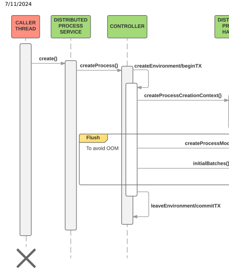
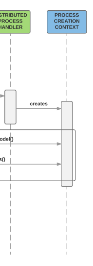

# Business Process Management

Business process management in SAP Commerce Cloud extensively uses the task service, the cronjob service, and the process engine. Each of them are provided by the processing extension.

The topics include:
The SAP Commerce Cloud processengine The processengine enables you to dene business processes through XML process denitions, and runs these processes in an asynchronous way. It guarantees that actions are performed in the right order and on the right condition. A new process can be created for each process denition. It is then possible to manage these processes by using their own context.

The Task Service The SAP Commerce Cloud Task Service enables you to schedule time-based or event-based actions, even in a cluster environment. Compared to the existing cron job functionality, tasks should be seen as a simple and easy way of achieving the same outcome without the overhead of the additional cron job features.

This is   For more    the SAP Help  3 The Cronjob Service The cronjob functionality is used for executing tasks, called cron jobs, regularly at a certain point of time. Typically cron jobs can be used for creating data for backups, updating catalog contents, or recalculating prices. TenantAwareThreadFactory The ThreadFactory allows you to create threads with some additional implementation.

## The Sap Commerce Cloud Processengine

The processengine enables you to dene business processes through XML process denitions, and runs these processes in an asynchronous way. It guarantees that actions are performed in the right order and on the right condition. A new process can be created for each process denition. It is then possible to manage these processes by using their own context.

The processengine delivers a solution for waiting for events, notifying users or user groups, ring actions (dened in spring beans), and ow decisions based on action results.

It is a good idea to study Java and XML les in the yacceleratorfulfilmentprocess extension. This is an illustration of the fulllment process and neatly demonstrates how to create a process.

## Introduction

The processengine represents an engine to build and interpret a memory structure of a process. This memory representation is based on nodes. To build a correct object tree, a processdefinition.xsd le is used by JAXB. The result of this processing is a map that relates nodes and their IDs. Information about the node ID that is the next one in the process is stored in different ways for different nodes. Wait, notify, and split nodes have their next nodes explicitly listed. In case of alternatives, use the action node.

Its execution path logic is described further below.

## Simplied Work Sequence Example

When starting to work with the processengine, it is advisable to do a business analysis rst.

1. The workow gained from this analysis then needs to be translated to the process XML le.

<?xml version="1.0" encoding="utf-8"?> 
<process xmlns="http://www.hybris.de/xsd/processdefinition" name="Example" start="Action1"> <action id="Action1" bean="Action1">
 <transition name="OK" to="Action2"/> 
 <transition name="NOK" to="Action3"/> 
 </action> 
 <action id="Action2" bean="Action2"> <transition name="OK" to="Action4"/> 
 </action> 
 <action id="Action3" bean="Action3"> 
 <transition name="OK" to="Action4"/> 
 </action> <action id="Action4" bean="Action4"> <transition name="OK" to="success"/> 
This is   For more    the SAP Help  4
 </action> <end id="success" state="SUCCEEDED">Everything was fine</end> </process>
2. Next, dene the beans in **|your_extension_name|-spring.xml** le.

<bean id="Action1" class="org.training.actions.Action1" parent="abstractAction"/> <bean id="Action2" class="org.training.actions.Action2" parent="abstractAction"/> <bean id="Action3" class="org.training.actions.Action3" parent="abstractAction"/> <bean id="Action4" class="org.training.actions.Action4" parent="abstractAction"/>
3. Finally implement the actions classes. Below nd the example of implementation of the Action1.

package org.training.actions;public class Action1 extends AbstractSimpleDecisionAction { 
 @Override public Transition executeAction(final BusinessProcessModel process) 
 { 
 if(.......) 
 { return Transition.NOK; } 
 else 
 { return Transition.OK; } }
}

## Support For Scripts In Business Process

With support for scripting and the dynamic process denition, it is possible to declare not only the structure of the business process but also to dene the the behavior directly in the XML le that denes the process.

## Calling A Script

Here is an example of a process denition with a script that returns the next transition:
<?xml version='1.0' encoding='utf-8'?>
<process xmlns='http://www.hybris.de/xsd/processdefinition' start='action0' name='testProcessDefiniti
<scriptAction id='action0'>

<transition name='itworks' to='success'/>
</scriptAction> <end id='success' state='SUCCEEDED'>Everything was fine</end>
</process>
This simple process denition shows the usage of a scriptAction element. It is almost exactly the same as an action element, but instead of executing some logic from a spring bean, it executes the script dened in a script element. Here it only invokes an anonymous function that returns the next transition (**'itworks'**).

## Accessing A Business Process Context From A Script

Scripts from process denitions are invoked with a special process parameter passed to the script. The process parameter is an instance of the BusinessProcessModel describing the running business process. Here is an example of script that modies a context parameter of a business process:
<?xml version='1.0' encoding='utf-8'?>
<process xmlns='http://www.hybris.de/xsd/processdefinition' start='action0' name='testProcessDefiniti <contextParameter name='testParameter' use='required' type='java.lang.String'/>
<scriptAction id='action0'>
 <transition name='itworks' to='success'/>
</scriptAction> <end id='success' state='SUCCEEDED'>Everything was fine</end>
</process>

## Handling Business Process Restart Requests

By default, the system doesn't restart business processes with nodes that are being run as. It creates a request before each restart to check whether there are any business processes with running nodes. If such processes exist, the system doesn't restart them to ensure that that there are no processes with doubled instances of the same nodes running at the same time. As a result, the existing data model isn't broken by concurrent business processes.

Use the following properties to set the number of retires and milliseconds between attempts to request a business process restart:
processengine.process.restart.retries=3 processengine.process.restart.millis=500 The default values are 3 retries and 500 milliseconds. The following property ensures that the system throws an exception when requests for restarting business processes fail:
processengine.process.restart.exception.if.failed=true The property is set to true by default.

If you want the system to allow restarting business processes without any validation of currently running processes, use the following property with the value true:
processengine.process.restart.legacy=true The property is disabled by default.

Enabling the processengine.process.restart.legacy=true property can lead to corrupt behavior caused by processes being run at the same time after being restarted.

## Disconnecting Task Instances From Business Process

To make business processes more resilient in case of database outages or node failures, use the following property:
mark.process.as.done.enabled=true The property is enabled by default.

The property ensures that task instances are no longer connected to any business processes when business logic is successfully carried out. It also removes all conditions related to tasks and sets the value of the TaskModel.RUNNERBEAN property to passthroughRunner. If the process of removing a given task isn't successful, the passthroughRunner bean does nothing with it during any attempts to carry it out again, allowing the task to be removed smoothly by the task service.

## Resilience To Database Failures During Business Processes

This is   For more    the SAP Help  6 Any action nodes that are processed in Transactions are rerun by exceptions caused by connection erros during database outages. To disable this behavior, use the following property:
processengine.process.retry.for.connection.failure.during.transaction.enabled=false

## Process Denition Creation

The process denition denes a set of nodes that are connected with each other through their IDs.

To create a new process instance, call the createProcess method from the BusinessProcessService service. You can then run this service using the startProcess method. If a process denition has not been created before, the ProcessDenitionFactory will create one in this step.

businessProcessService.startProcess(id, processName);
The process denition denes a set of nodes that are connected with each other through their IDs. The process denition starts with the process header. To make the process denition visible to the ProcessDenitionFactory, it is necessary to declare it as a resource in Spring.

Fig. Process Denition

## Dening In Spring The Process

The Spring denition of a process is straightforward:
<bean id="placeorderProcessDefinitionResource"class="de.hybris.platform.processengine.definition.Proc
> 
 <property name="resource"value="classpath:/processdemo/placeorder.xml"/> 
</bean>
The table below explains the meaning of the current <bean> element attributes.

Attribute Description

This is   For more    the SAP Help  7

| 7/11/2024 Attribute   | Description                                                                                                                                                              |
|-----------------------|--------------------------------------------------------------------------------------------------------------------------------------------------------------------------|
| id                    | This attribute needs to be unique in Spring                                                                                                                              |
| class                 | This attribute should always be as presented. It is the indicator for the ProcessDenitionFactory; where to search for beans in the Spring context for process denitions. |

The <bean> element contains the <property>element. The table below explains the meaning of the <property> element attributes.

| Attribute   | Description                                                                                                                                                |
|-------------|------------------------------------------------------------------------------------------------------------------------------------------------------------|
| name        | The name of the property is: resources. The name indicates the value of this property shows where in the le system the process denition XML le is located. |
| value       | The value attribute contains the actual path to the process denition XML le.                                                                               |

## The Actions

The Action beans also need to be declared in Spring:
<bean id="checkOrder"class="de.hybris.platform.fulfilment.actions.CheckOrder" parent="abstractAction"> <property name="checkOrderService"ref="checkOrderService"/> 
</bean>
The table below explains the meaning of the current <bean> element attributes.

| Attribute   | Description                                                                     |
|-------------|---------------------------------------------------------------------------------|
| id          | This attribute is important as it relates the Spring bean with the action node. |
| class       | This attribute points to the class name that realizes the action interface.     |
| parent      | This attribute is only used for information.                                    |

Additionally, the properties can be set in Spring. In the example above, the property checkOrderService is set.

## The Root Tag And The Process Class

The denition of the process needs to be written in an XML le. This le must be adequate to the denition in the processdefinition.xsd. Each process denition starts with a header.

<?xml version="1.0"encoding="utf-8"?> <process xmlns="http://www.hybris.de/xsd/processdefinition" name="consignmentFulfilmentSubprocess" start="waitBeforeTransmission" onError="onError" processClass="de.hybris.platform.fulfilment.model.Co
... ... </process>

| Attribute                                                                            | Description                                    |
|--------------------------------------------------------------------------------------|------------------------------------------------|
| name                                                                                 | This attribute tells the process' name.        |
| start                                                                                | This attribute tells the ID of the start node. |
| This is custom documentation. For more information, please visit the SAP Help Portal | 8                                              |

| 7/11/2024 Attribute   | Description                                                                                                                                                                     |
|-----------------------|---------------------------------------------------------------------------------------------------------------------------------------------------------------------------------|
| onError               | This attribute gives the node that is called when an error occurs.                                                                                                              |
| processClass          | This attribute refers to the class that implements the process context. The normal routine is to extend this class for extra elds where you can store extra process parameters. |

## Node Types

After the process is dened, content must be added to the process. A process is described by a set of nodes, which represent the steps in a given process. Each node, excluding the end node, needs to dene which node has to be invoked next in the workow. The most important eld in each node is its ID. This is the key that joins two nodes in a workow.

## Note Remember

The start attribute in the process root tag should point to one of the declared nodes Action Node Action nodes are the nodes that realize the process logic.

Example:
<action id="isProcessCompleted"bean="subprocessesCompleted"> 
 <transition name="OK"to="sendOrderCompletedNotification"/> 
 <transition name="NOK"to="waitForWarehouseSubprocessEnd"/> </action>
The bean attribute points to the bean id declared in the **spring.xml** le. It denes which action will be red. For details, see the the Actions section below.

The table below shows the attributes of the <transition> element.

| Attribute   | Description                                                                                             |
|-------------|---------------------------------------------------------------------------------------------------------|
| name        | Tells the result of an action.                                                                          |
| to          | Tells the Process Engine to which node the process should go after the result of an action is returned. |

## Wait Node

Wait nodes are used to communicate with the external environment. Use this node if somewhere in the process you need to wait for an external process result. It is also used if waiting for subprocesses to nish their routine.

Example:
<wait id="waitForWarehouseSubprocessEnd" then="isProcessCompleted"> <event>ConsignmentSubprocessEnd</
</wait>
The attribute then is the ID of the node that has to be invoked after the wait condition is fullled.

The element <event> denes the name of the event that activates this node. Internally, the processengine prepends the process's code to the event name to make it unique. Set prependProcessCode="false" to not prepend the process's code. There is an This is   For more    the SAP Help  9 expression language that you can use in your event names. The process denition will look something like this:
<wait id="waitForWarehouseSubprocessEnd" then="isProcessCompleted" prependProcessCode="false">
 <event>${process.code}_ConsignmentSubprocessEnd</event>
</wait>

ConsignmentSubprocessEnd is an event that you need to trigger by using de.hybris.platform.processengine.BusinessProcessService.triggerEvent(String).

Process is a process which waits for the event specied in the event parameter.

N.B.: In the expression language you have two variables:
process: the current instance of BusinessProcessModel

params: a Map with the current process parameters

## Support For User Input

There is also an option to provide additional information called choice when triggering an event. Based on the choice, a process may transit to different nodes. Here is an example of using a wait node with multiple choices:
<wait id='waitNode' then='nothingChoosen' prependProcessCode='false'> <case event='eventWithChoice'> <choice id='first_choice' then='firstChoiceChoosen'/>
 <choice id='second_choice' then='secondChoiceChoosen'/> </case>
</wait>
If you trigger an event without choice, the business process will transit to a node dened by the then argument
('nothingChoosen' in a given example). To trigger an event with choice, you can use the de.hybris.platform.processengine.BusinessProcessService.triggerEvent(BusinessProcessEvent)
method.

Here is an example showing how to trigger event with given choice:
final BusinessProcessEvent event = BusinessProcessEvent.builder("eventWithChoice").withChoice("
businessProcessService.triggerEvent(event);

## Timeout

You can dene a timeout on the wait node. When the node with dened timeout doesn't receive an event within a dened time, the transition congured on timeout element will be performed. Here is an example denition of a wait node with a dened timeout:
<wait id="waitForWarehouseSubprocessEnd" then="isProcessCompleted">
 <event>ConsignmentSubprocessEnd</event>
 <timeout delay='PT30S' then='timeout' /> </wait>

The delay format is dened by duration component of ISO 8601 standard.

Split Node

The Split node is used when a process needs to run actions or strings of actions in parallel.

Example:
<split id="split"> 
 <targetNode name="rnd"/> <targetNode name="sayC"/> 
</split>
The <targetNode> element denes the next nodes after the process is split.

## Notify Node

Use this node if there is need to inform a user group or a particular user of a state of a process.

Example:
<notify id="notifyadmingroup"then="split"> 
 <userGroup name="admingroup"message="Perform action"/> 
 <userGroup name="othergroup"message="other message"/> </notify>
The attribute then of the <notify> element denes the next node in the process that is invoked after one member from the userGroup from each group accepts a message.

The table below shows the attributes of the <userGroup> element.

| Attribute   | Description                                                                                                                                                                                                                                                |
|-------------|------------------------------------------------------------------------------------------------------------------------------------------------------------------------------------------------------------------------------------------------------------|
| name        | The group of users to which a message (one after other) has to be sent. There can be several <userGroup> elements. The order of the informed groups is the same as in the denition.                                                                        |
| message     | Based on the presented example, after a member of the admingroup has committed a message, a message for othergroup is generated. After this message has also been committed the process is informed and the next node (in this example split) is executed. |

## End Node

This node ends the process and stores state and message in a process item.

Example:
<end id="error" state="ERROR">All went wrong.</end> 
<end id="success" state="SUCCEEDED">Everything was fine</end>
The state attribute tells a process state set after the node is executed. The content of this element, for example All went wrong.,
is a sample message stored in a process item.

## Actions

Actions are the most important part of the processengine functionality. Normally, they have to implement a logic or call specialized services to execute tasks that are necessary in a process. An Action performs a single piece of work within a process.

Usually an action acts upon input data which has been fed into the engine or has been produced by previous actions. Each action produces an action result, which enables the engine to direct the process to the next action. Each action is part of the process denition.

The Action Interface has two methods:
Set<String> getTransitions();
This method is used for validation if all possible results from an action are mapped in the process denition. In this method a Set of all possible return codes should be returned.

Stringexecute(BusinessProcessModel process)throwsRetryLaterException, Exception; This method is used to implement the main logic of an action. The reason for having separated RetryLaterException is that this exception is meant to inform the engine to re an action once again.

In addition, there are two codes that an action could return outside of the normal action procedure:
RETRY_RETURN_CODE - same as throwing RetryLaterException

ERROR_RETURN_CODE - same as throwing another Exception

## Transitions

The transitions dene the target for the next step of a process. The action result determines the route.

Example:

Example workow should be dened like this
<?xml version="1.0"encoding="utf-8"?> <process xmlns="http://www.hybris.de/xsd/processdefinition"name="Example"start="Action1">
 <action id="Action1"bean="Action1"> 
 <transition name="OK"to="Action2"/> 
 <transition name="NOK"to="Action3"/> 
 </action> <action id="Action2"bean="Action2"> <transition name="OK"to="Action4"/> 
 </action> 
 <action id="Action3"bean="Action3"> <transition name="OK"to="Action4"/> </action> <action id="Action4"bean="Action4"> 
 <transition name="OK"to="success"/> 
 </action> <end id="success"state="SUCCEEDED">Everything was fine</end> </process>
As we can see, result of Action1 determines if Action2 or Action3 occur, and then workow in both cases goes back to Action4.

Of course bean and action ID do not need to be the same.

## Action Superclasses

To make an action implementation easy, dene an abstractAction that implements useful routines in action implementation, such as de.hybris.platform.processengine.action.AbstractAction.

There is a set of methods for logging both messages and errors, as well as getters and setters for ModelService, ProcessParameterHelper, and at the end:
getProcessParameterValue: Gets a parameter stored in the process context setOrderStatus: Sets a status of the order createTransitions: Creates a set of transitions for lists of strings

## Available Actions

There are also two additional templates to use for a procedural or simple decision action:
AbstractProceduralAction: It simply returns OK whatever happens. It is useful to split a Process into smaller pieces. Only an implementation of the execute method is necessary.

AbstractSimpleDecisionAction: It returns one of OK or NOK values. It is useful to make a simple decision. Transitions are dened and only the execute method must be implemented.

## Retries

If an action should be executed once again, the RetryLaterException exception or RETRY_RETURN_CODE could be returned.

This is   For more    the SAP Help  13

## Subprocesses

To run a sub-process, simply call the BusinessProcessService.startProcess. Use events to inform the parent process

that a subprocess has ended. To re an event, use de.hybris.platform.processengine.BusinessProcessService.triggerEvent(String) Example:

## Support For Scripts In Business Process

With support for scripting and the dynamic process denition, it is possible to declare not only the structure of the business process but also to dene the behavior directly in the xml which denes the process.

## Calling A Script

Here is an example of a process denition with a script that returns the next transition:
<?xml version='1.0' encoding='utf-8'?> <process xmlns='http://www.hybris.de/xsd/processdefinition' start='action0' name='testProcessDefiniti
<scriptAction id='action0'>

<transition name='itworks' to='success'/>
</scriptAction>
<end id='success' state='SUCCEEDED'>Everything was fine</end>
</process>
This simple process denition shows the usage of a scriptAction element. It is almost exactly the same as an action element, but instead of executing some logic from a spring bean, it executes the script dened in a script element. Here it only invokes an anonymous function that returns the next transition (**'itworks'**).

## Accessing A Business Process Context From A Script

Scripts from process denitions are invoked with a special process parameter passed to the script.The process parameter is an instance of the BusinessProcessModel describing the running business process. Here is an example of script that modies a context parameter of a business process:
<?xml version='1.0' encoding='utf-8'?>
<process xmlns='http://www.hybris.de/xsd/processdefinition' start='action0' name='testProcessDefiniti
<contextParameter name='testParameter' use='required' type='java.lang.String'/>
<scriptAction id='action0'>

This is   For more    the SAP Help  14
<transition name='itworks' to='success'/>
</scriptAction> <end id='success' state='SUCCEEDED'>Everything was fine</end>
</process>

## Related Information

Business Process Management

## Starting A Processengine Process With A Service Activator

From within a Spring Integration Message Channel you often need to call SAP Commerce Cloud services. Likewise, you need to be able to publish messages to the Spring Integration channel from a service. This tutorial shows you how to use the Messaging Gateway to start a pipeline, and how to use a Message Transformer and a Service Activator to start a process from within Spring Integration. You should already be acquainted with:
Spring Integration Enterprise Integration Patterns

## Objectives

Let us consider a simple interface with sayHello method:

## Helloworldservice.Java

public interface HelloWorldService {
 void sayHello(final String toWhom); }
If you call the method with the following parameter:
helloWorldService.sayHello("you");
the following message should be displayed:
Hello, you Of course you can easily do this by just implementing the interface, but for the sake of this tutorial let us take a slight detour.

## Messaging Gateway

With Spring Integration you do not need to implement your own code to interface the messaging system. You may use the Messaging Gateway, which encapsulates messaging-specic code and separates it from the rest of the application code. You just need to dene a dynamic proxy for the interface:
tutorial-spring.xml
<int:gateway id="helloWorldService" service-interface="de.hybris.tutorial.HelloWorldService" default-request-channel="sayHelloChannel"/>
This is   For more    the SAP Help  15 It creates a dynamic proxy with the bean id helloWorldService, which implements the above interface. When calling the sayHello method, the proxy takes the parameter, creates a message with the method parameter as payload, and publishes the message to the sayHelloChannel. The channel is dened like any Spring Integration channel:
tutorial-spring.xml
<int:channel id="sayHelloChannel"/>
You may use any type of channel supported by Spring Integration.

## Creating A Business Process With A Transformer

To get the result in form of the printed message, you should create a process using the processengine extension. To do it, follow the steps provided in Creating a Business Process with a Transformer.

## Starting The Process With A Service Activator

Now that the process is created, you can start the process with the BusinessProcessService. To do this use a Service Activator that is an endpoint connecting the messages on the channel to the service being accessed. In Spring Integration you may dene the Service Activator by means of Spring Expression Language (SpEL). The Service Activator takes the message from the sayHelloProcessChannel and passes it over to the SpEL expression:
tutorial-spring.xml
<int:service-activator input-channel="sayHelloProcessChannel" expression="@businessProcessService.startProcess(payload)"/>

## Summary

tutorial-spring.xml
<beans xmlns="http://www.springframework.org/schema/beans" xmlns:xsi="http://www.w3.org/2001/XMLSchema-instance" xmlns:aop="http://www.springframework.org/schema/aop" xmlns:int="http://www.springframework.org/schema/integration" xsi:schemaLocation="http://www.springframework.org/schema/beans http://www.springframework.org/schema/beans/spring-beans-3.0.xsd http://www.springframework.org/schema/integration http://www.springframework.org/schema/integration/spring-integration.xsd http://www.springframework.org/schema/aop http://www.springframework.org/schema/aop/spring-aop-3.0.xsd">
 <bean id="sayHelloProcess" class="de.hybris.platform.processengine.definition.ProcessDefinitionResource">
 <property name="resource" value="classpath:/sayHelloProcess.xml"/>
 </bean>
 <bean id="sayHelloAction" class="de.hybris.tutorial.action.SayHelloAction"/> <bean id="sayHelloProcessFactory" class="de.hybris.tutorial.SayHelloProcessFactory">
 <property name="businessProcessService" ref="businessProcessService"/>
 </bean>
 
This is   For more    the SAP Help  16

 <int:gateway id="helloWorldService" service-interface="de.hybris.tutorial.HelloWorldService" default-request-channel="sayHelloChannel"/> <int:channel id="sayHelloChannel"/> <int:transformer input-channel="sayHelloChannel" output-channel="sayHelloProcessChannel" expression="@sayHelloProcessFactory.createProcess(payload)"/> <int:service-activator input-channel="sayHelloProcessChannel" expression="@businessProcessService.startProcess(payload)"/> </beans>
As you can see, SAP Commerce Cloud services may be used out of the box through SpEL expressions or reection. It is quite a common pattern to use a Transformer to convert the payload to some SAP Commerce Cloud-specic object and then pass it to the service. For simple cases you can use SpEL expression for the transformations, too.

## Related Information

http://static.springsource.org/spring-integration/reference/htmlsingle/ http://www.eaipatterns.com/MessagingAdapter.html http://www.eaipatterns.com/MessagingGateway.html

## Creating A Business Process With A Transformer

Follow the steps to create a business process with a transformer.

## Procedure

1. Create a new process type in the items.xml le in your extension. In our case its only attribute is called toWhom:
tutorial-items.xml
<itemtype generate="true" code="SayHelloProcess" jaloclass="de.hybris.tutorial.jalo.SayHelloProcess" extends="BusinessProcess" autocreate="true" >
<attributes>
<attribute qualifier="toWhom" type="java.lang.String">
<persistence type="property"/>
</attribute>
</attributes>
</itemtype>
2. Dene the action bean in the **spring.xml** le in your extension:
tutorial-spring.xml
<bean id="sayHelloAction" class="de.hybris.tutorial.action.SayHelloAction"/>
3. Implement the action class:
SayHelloAction.java public class SayHelloAction extends AbstractProceduralAction
{
This is   For more    the SAP Help  17
 @Override public void executeAction(final BusinessProcessModel process) throws RetryLaterException, Exce {
 final SayHelloProcessModel sayHelloProcess = (SayHelloProcessModel) process; System.out.println(">>>>>>>>> Hello " + sayHelloProcess.getToWhom());
 }
4. Create an XML le for the process denition and specify the process as follows:
sayHelloProcess.xml
<process xmlns="http://www.hybris.de/xsd/processdefinition" start="sayHello" name="sayHelloProcess" processClass="de.hybris.tutorial.model.SayHelloProcessModel">
 <action id="sayHello" bean="sayHelloAction">
 <transition name="OK" to="end"/> </action>
 <end id="end" state="SUCCEEDED">Success</end> </process>
5. To create the process a Transformer is used to convert the payload of a message into the format that the next endpoint expects. In this case it is a String used as a value for the toWhom attribute of the business process:
SayHelloProcessFactory.java public class SayHelloProcessFactory
{ private BusinessProcessService businessProcessService; public SayHelloProcessModel createProcess(final String toWhom)
 { final SayHelloProcessModel process = (SayHelloProcessModel) businessProcessService.createPro "process_" + System.currentTimeMillis(), "sayHelloProcess"); process.setToWhom(toWhom);
 return process;
 } @Required public void setBusinessProcessService(final BusinessProcessService businessProcessService)
 {
 this.businessProcessService = businessProcessService;
 }
6. Dene the Spring bean for the SayHelloProcessFactory in the **spring.xml** le in your extension.

tutorial-spring.xml
<bean id="sayHelloProcessFactory" class="de.hybris.tutorial.SayHelloProcessFactory" >
 <property name="businessProcessService" ref="businessProcessService"/> </bean>

}
}
7. Add the Transformer to Spring Integration denition. It takes the message from the sayHelloChannel, evaluates the expression that invokes the createProcess method on the sayHelloProcessFactory, and creates a new message with the result of the evaluation as payload.
tutorial-spring.xml
<int:transformer input-channel="sayHelloChannel" output-channel="sayHelloProcessChannel" expression="@sayHelloProcessFactory.createProcess(payload)" />
This is   For more    the SAP Help  18 Note that you could also dene the transformer using ref and method attributes. The former denotes the bean id of the service and the latter the method to invoke in order to transform the payload.

## Example Order Management Business Process

Based on the example provided in the fulfilmentprocess extension, here you will nd a description of the creation of an order business process routine. A business process describes a sequence of steps or activities that is followed repeatedly. To manage a process automatically or manually it needs to be identied and dened. This tutorial provides an example for how to create such a process in the scope of order management. As usual the business process is modelled as a owchart with loops and parallel paths joining a number of actions.

## Dening The Process

In order to dene an order process we need to know what the process looks like and what steps are necessary to complete it. This of course also includes the actions to take in case an error occurs during the process. For the example two processes are dened, a PlaceOrder process and a ConsignmentFullment subprocess. The PlaceOrder process represents the overall process, for every consignment created out of an order a ConsignmentFullment subprocess is activated. The example is based on the template realized in the yacceleratorfullmentprocess Extension.

## Place Order

The PlaceOrder process starts with checking an incoming order for payment authorization and fraud. When these are passed, a notication is sent that the order has been placed. Next the order is split (see Order Splitting for details) into one or more consigments, starting a ConsignmentFullment subprocess for every consigment created. The PlaceOrder process then waits for all the subprocesses to report back in order to decide if and when the order process is completed and an according notication can be sent.

## Consignment Fullment

The ConsignmentFullment subprocess starts when the consignment is sent to the warehouse through an interface. This can happen immediately an order reaches this state or after certain conditions (amount of consignments, certain time, etc.) have been met, as dened through the waitBeforeTransmission step. The subprocess now waits for the warehouse to report back on the consignment's status (cancel/partial/ok) before it takes according action. If the payment succeeds, shipping is allowed and a delivery message is sent. This ends a single subprocess and returns it to the PlaceOrder process.

## Process Denition In Xml

The rst step in the process creation is to dene it in an xml le. In our case we need to dene two processes, the PlaceOrder and the ConsignmentFullment process. Note how all the nodes in the process diagrams above are represented in the process denition and indicate the next process steps subject to their results. Detailed information about how a process should be dened is available in the ProcessEngine documentation .

## Placeorder Process

<?xml version="1.0" encoding="utf-8"?>
<process xmlns="http://www.hybris.de/xsd/processdefinition" s
<action id="checkOrder" bean="checkOrder"> <transition name="OK" to="authorizeOrderPayment"/> <transition name="NOK" to="error"/>
</action>
<action id="authorizeOrderPayment" bean="authorizeOrderPaymen <transition name="OK" to="reserveAmount"/> <transition name="NOK" to="authorizationFailedNotification"/>
</action>
<action id="reserveAmount" bean="reserveOrderAmount"> <transition name="OK" to="fraudCheck"/> <transition name="NOK" to="sendPaymentFailedNotification"/>
</action>
<action id="fraudCheck" bean="fraudCheckOrderInternal">
<transition name="OK" to="sendOrderPlacedNotification"/>
<transition name="NOK" to="notifyCustomer"/>
</action> <action id="notifyCustomer" bean="sendFraudErrorNotification" <transition name="OK" to="manualOrderCheckCSA"/>
</action> <action id="manualOrderCheckCSA" bean="fraudCheckOrder">
<transition name="OK" to="sendOrderPlacedNotification"/> <transition name="NOK" to="cancelOrder"/>
</action> <action id="sendOrderPlacedNotification" bean="sendOrderPlace
<transition name="OK" to="splitOrder"/> </action> <action id="cancelOrder" bean="cancelWholeOrderAuthorization"
<transition name="OK" to="failed"/>
</action>
<action id="authorizationFailedNotification" bean="sendAuthor
<transition name="OK" to="failed"/>
</action>
<action id="sendPaymentFailedNotification" bean="sendPaymentF
<transition name="OK" to="failed"/>
</action>
<action id="splitOrder" bean="splitOrder"> <transition name="OK" to="waitForWarehouseSubprocessEnd"/> </action>
<wait id="waitForWarehouseSubprocessEnd" then="isProcessCompl
<event>ConsignmentSubprocessEnd</event> </wait>
<action id="isProcessCompleted" bean="subprocessesCompleted"> <transition name="OK" to="sendOrderCompletedNotification"/> <transition name="NOK" to="waitForWarehouseSubprocessEnd"/> </action>
<action id="sendOrderCompletedNotification" bean="sendOrderCo
<transition name="OK" to="success"/> </action> <end id="error" state="ERROR">All went wrong.</end>
<end id="failed" state="FAILED">Order not placed.</end>
<end id="success" state="SUCCEEDED">Order placed.</end> </process>

| ConsignmentFullment Subprocess   |
|----------------------------------|

<?xml version="1.0" encoding="utf-8"?>
<process xmlns="http://www.hybris.de/xsd/processdefinition" s processClass="de.hybris.platform.fulfilment.model.Consignment
<action id="waitBeforeTransmission" bean="waitBeforeTransmiss
<transition name="NOK" to="waitBeforeTransmission"/> <transition name="OK" to="sendConsignmentToWarehouse"/> </action>
<action id="sendConsignmentToWarehouse" bean="sendConsignment
<transition name="OK" to="waitForWarehouse"/> </action>
<wait id="waitForWarehouse" then="receiveConsignmentStatus"> <event>WaitForWarehouse</event>
</wait> <action id="receiveConsignmentStatus" bean="receiveConsignmen
<transition name="OK" to="takePayment"/> <transition name="PARTIAL" to="calculatePayment"/>
<transition name="CANCEL" to="cancelConsignment"/>
<transition name="ERROR" to="error"/>
</action> <action id="calculatePayment" bean="calculatePayment"> <transition name="OK" to="takePayment"/>
</action>
<action id="takePayment" bean="takePayment"> <transition name="OK" to="allowShipment"/> <transition name="NOK" to="sendPaymentFailedMessage"/>
</action>
<action id="allowShipment" bean="allowShipment"> <transition name="OK" to="sendDeliveryMessage"/> </action> <action id="sendDeliveryMessage" bean="sendDeliveryMessage"> <transition name="OK" to="subprocessEnd"/> </action>
<action id="sendPaymentFailedMessage" bean="sendPaymentFailed
<transition name="OK" to="subprocessEnd"/> </action> <action id="cancelConsignment" bean="cancelConsignment">
<transition name="OK" to="sendCancelMessage"/>
</action>
<action id="sendCancelMessage" bean="sendCancelMessage"> <transition name="OK" to="subprocessEnd"/> </action>
<action id="subprocessEnd" bean="subprocessEnd">
<transition name="OK" to="success"/> </action>
<end id="error" state="ERROR">All went wrong.</end> <end id="failed" state="FAILED">Order not placed.</end> <end id="success" state="SUCCEEDED">Order placed.</end> </process>

## Dening Actions

The next step denes the actions that are specied in the bean attribute of the action nodes. How to design an action foremost depends on what result(s) an action has to be able to provide.

The ProcessEngine extension offers three standard abstract actions as outlined below. When you have to implement action behavior you can simply create a class that implements the Action Interface, but if you inherit from one of the actions specied below, you will have a set of useful functionality at hand. In our example, all three types of actions are included.

## Abstractproceduralaction (Example: Sendorderplacednotication)

For some actions there exists only one possible result, on the advent of which the next event in the process chain is triggered. For such an action, the best solution is to dene it to inherit from AbstractProceduralAction . All you need to do is to implement:
@Override public void executeAction(final BusinessProcessModel process)
{ //some logic }

## Abstractsimpledecisionaction (Example: Fraudcheckorder)

Perhaps the most common type is the action that has two possible results. Such an action should inherit from the AbstractSimpleDecisionAction public Transition executeAction(final BusinessProcessModel process)
{ //some logic return Transition.NOK; // or return Transition.OK;
}

## Abstractaction (Example Receiveconsignmentstatus)

In this action we have four possible results. Since there is no dened action template for such a case, best practice is to dene an enumeration inside the class that denes all possible codes.

public enum Transition
{
OK, PARTIAL, CANCEL, ERROR; public static Set<String> getStringValues()
{ final Set<String> res = new HashSet<String>(); for (final Transition t : Transition.values())
{
The method getStringValues() is a useful method dened in the Action interface and its implementation looks like this
@Override public Set<String> getTransitions()
{
return Transition.getStringValues();
}
Its implementation is generic, so if you need to dene your own transition you can simply copy these lines, redening only the possible result codes for the action.

with the classes dened in the step before.

res.add(t.toString()); } return res;
} }
All you need to do in action class implementation is to ll in the execute method. Simply put your logic in this method and return one of the results specied in Transition enum.

## Spring Integration

Finally you make the process work by dening the spring beans with the names specied in the process denition, and join them
?xml version="1.0" encoding="UTF-8"?>
<!-- [y] hybris Platform Copyright (c) 2000-2009 hybris AG All rights reserved. This software is the confidential and proprietary information of hybris
("Confidential Information"). You shall not disclose such Confidential Information and shall use it only in accordance with the terms of the license agreement you entered into with hybris. -->
<beans xmlns="http://www.springframework.org/schema/beans" xmlns:xsi="http://www.w3.org/2001/XMLSchema-instance" xmlns:aop="http://www.springframework.org/schema/aop" xsi:schemaLocation="http://www.springframework.org/schema/beans http://www.springframework.org/schema/beans/spring-beans-2.5.xsd http://www.springframework.org/schema/aop http://www.springframework.org/schema/aop/spring-aop-2.5.xsd">
<!-- Process resourcess definition --> <bean id="placeorderProcessDefinitionResource" class="de.hybris.platform.proc
<property name="resource" value="classpath:/processdemo/placeorder.xml"/>
</bean>
<bean id="consignmentFulfilmentsubprocess" class="de.hybris.platform.processe
<property name="resource" value="classpath:/processdemo/consignmentFulfilment
</bean>
<!-- Actions --> <bean id="checkOrderService" class="de.hybris.platform.fulfilment.impl.Defaul <bean id="abstractAction" class="de.hybris.platform.processengine.action.Abst <property name="modelService" ref="modelService"/>
<property name="processParameterHelper" ref="processParameterHelper"/>
</bean> <bean id="checkOrder" class="de.hybris.platform.fulfilment.actions.CheckOrder <property name="checkOrderService" ref="checkOrderService"/>
This is   For more    the SAP Help  23
</bean> <bean id="cancelWholeOrderAuthorization" class="de.hybris.platform.fulfilment parent="abstractAction"/>
<bean id="sendOrderPlacedNotification" class="de.hybris.platform.fulfilment.a parent="abstractAction"/>
<bean id="sendPaymentFailedNotification" class="de.hybris.platform.fulfilment parent="abstractAction"/> <bean id="fraudCheckOrder" class="de.hybris.platform.fulfilment.actions.Fraud parent="abstractAction">
<property name="fraudService" ref="fraudService"/>
<property name="providerName" value="Mockup_3rdPartyProvider"/> </bean> <bean id="sendFraudErrorNotification" class="de.hybris.platform.fulfilment.ac parent="abstractAction"/>
<bean id="authorizeOrderPayment" class="de.hybris.platform.fulfilment.actions parent="abstractAction"/>
<bean id="sendAuthorizationFailedNotification" class="de.hybris.platform.fulf parent="abstractAction"/>
<bean id="reserveOrderAmount" class="de.hybris.platform.fulfilment.actions.Re parent="abstractAction"/> <bean id="fraudCheckOrderInternal" class="de.hybris.platform.fulfilment.actio parent="abstractAction"> <property name="fraudService" ref="fraudService"/>
<property name="providerName" value="Hybris"/> </bean>
<bean id="splitOrder" class="de.hybris.platform.fulfilment.actions.SplitOrder <property name="orderSplittingService" ref="orderSplittingService"/>
</bean> <bean id="subprocessesCompleted" class="de.hybris.platform.fulfilment.actions parent="abstractAction"/>
<bean id="sendOrderCompletedNotification" class="de.hybris.platform.fulfilmen parent="abstractAction"/>
<!-- consignmentfulfilment process -->
<bean id="waitBeforeTransmission" class="de.hybris.platform.fulfilment.action parent="abstractAction"/>
<bean id="sendConsignmentToWarehouse" class="de.hybris.platform.fulfilment.ac parent="abstractAction"> <property name="process2WarehouseAdapter" ref="process2WarehouseAdapter"/>
</bean>
<bean id="receiveConsignmentStatus" class="de.hybris.platform.fulfilment.acti parent="abstractAction"/>
<bean id="calculatePayment" class="de.hybris.platform.fulfilment.actions.cons parent="abstractAction"/> <bean id="takePayment" class="de.hybris.platform.fulfilment.actions.consignme parent="abstractAction"/> <bean id="sendDeliveryMessage" class="de.hybris.platform.fulfilment.actions.c parent="abstractAction"/> <bean id="sendPaymentFailedMessage" class="de.hybris.platform.fulfilment.acti parent="abstractAction"/>
<bean id="cancelConsignment" class="de.hybris.platform.fulfilment.actions.con parent="abstractAction"/>
<bean id="sendCancelMessage" class="de.hybris.platform.fulfilment.actions.con parent="abstractAction"/>
This is   For more    the SAP Help  24
<bean id="subprocessEnd" class="de.hybris.platform.fulfilment.actions.consign parent="abstractAction"/>
<bean id="allowShipment" class="de.hybris.platform.fulfilment.actions.consign parent="abstractAction">
<property name="process2WarehouseAdapter" ref="process2WarehouseAdapter"/> </bean>
</beans>

## Related Information

Order Splitting yacceleratorfullmentprocess Extension The SAP Commerce Cloud processengine

## Process Routine Of Processengine

A new process instance is created by calling the createProcess method from the BusinessProcessService service. You can then run this service using the startProcess method. ProcessDenitionFactory will create a process denition in this step if not created before.

After a process is created and the startProcess routine invoked (1), we invoke the process denition (1.2.1).

Then (1.2.1.1) getStartNode gives the possibility to get the start node from the process denition by its id. At this the processing of a given process is red.

First the trigger (1.2.1.1.1) method of the new node is executed. This method invokes scheduleTask from TaskService with proper constraints (date or event name, see The Task Service ). This stores a new Task in a queue and causes the Task Module (depending on specied scheduleTask conditions) to invoke the method run (2.1) on TaskRunner.

The next step begins with run (2.1) on TaskRunner. TaskRunner reads ProcessDenition (2.1.1), gets from its nodes the one that has to be executed (2.1.2) and then perform the execute routine (2.1.3) on it. Realization of the execute method depends on the node. For example with an action node rst the action is performed and then the action result is evaluated to choose one of the transition routes specied in the workow. wait does not simply invoke the trigger method on the node whose id is stated in the then attribute but rather waits for a specied event to take place. end simply ends the process and does not trigger another node as it is the last in a process.

## Related Information

The Task Service This is custom documentation. For more information, please visit the SAP Help Portal

## Executing Business Process Action In A Synchronous Way

Platform runs action nodes in a synchronous manner.

Action nodes in a business process denition can be run asynchronously or synchronously. In the asynchronous mode, an action node is treated as a single and separate task when run by the task engine. In the synchronous mode, an action node is run in the same task as the preceding node.

By default, action nodes are run synchronously. If you wish to disable the synchronous mode, add the following property to your local.properties le:
processengine.process.canjoinpreviousnode.default=false Running action nodes synchronously meets the following requirements:

Steps are processed within separate transactions so that any failed steps don't affect previous successful steps.

After each step, the process and task items are updated in the same way as if they were processed asynchronously. As a result, when the engine crashes, you know what the last successful step was.
For both the synchronous and asynchronous mode, you can decide for any step whether it should be processed synchronously or asynchronously. To run a given step asynchronously, add the canJoinPreviousNode element attribute in the process denition in XML, for example:
<action id="actionId" canJoinPreviousNode="false">
To run a given step synchronously, add the canJoinPreviousNode element attribute with the value true:
<action id="actionId" canJoinPreviousNode="true">
Advantages:
The time delay between performing two actions is small.

The total time for processing business model is reduced. There is no additional effort required to run the task in the task engine for a synchronous job. This has mainly positive effect when you have a business process model with many actions and the time of a single execution of an action is small. On each node, you have the possibility to decide whether you want to perform a node synchronously or asynchronously.

## Note Asynchronous Node Performing Restrictions

Only action nodes and their script action node extension have the possibility to synchronously join to other node.

Synchronous execution doesn't apply to the starting action.

Synchronous execution doesn't apply to performing the same action a few times in a row If an error occurs, the process is performed as usual - in an asynchronous way.

A node with the canJoinPreviousNode ag set to true is run synchronously only if the previous node is of the action node type.

## Simple Scenario Example

Here is a simple scenario example:

<process xmlns="http://www.hybris.de/xsd/processdefinition" start="start" name="example">
 <action id="start" bean="SomeActionBean" canJoinPreviousNode="true">
 <transition name="OK" to="secondStep"/> </action> <action id="secondStep" canJoinPreviousNode="true">
 <transition name="OK" to="thirdStep"/>
 </action> <action id="thirdStep" > <transition name="OK" to="fourthStep"/> </action>
 <action id="fourthStep" canJoinPreviousNode="true">
 <transition name="OK" to="fifthStep"/>
 </action> <action id="fifthStep" canJoinPreviousNode="true">
 <transition name="OK" to="sixthStep"/>
 </action>
 <end id="success" state="SUCCEEDED">Everything was fine</end>
</process>
After the process is started, the ow is as follows:
1. The start node has the canJoinPreviousNode ag set but according to restriction it is processed asynchronously.

2. secondStep is processed synchronously. 3. thirdStep is processed synchronously or asynchronously depending on the default conguration set: synchronously for processengine.process.canjoinpreviousnode.default=true, asynchronously for processengine.process.canjoinpreviousnode.default=false.

4. fourthStep is processed synchronously. 5. fithStep is processed synchronously.

6. The next node is the end node.

The process is nished inside the caller thread and returned.

## Execution Logs

Below you can see some execution logs (jdbc statements are enabled) for a business process dened for two actions with synchronous and asynchronous execution between them.

This is the version with a synchronous execution:

## Process Denition

<process xmlns="http://www.hybris.de/xsd/processdefinition" start="start" name="simpleProcess">
 <action id="start" bean="TestActionBean"> <transition name="OK" to="secondStep"/>
 </action>
 <action id="secondStep" bean="TestActionBean" canJoinPreviousNode="true">
 <transition name="OK" to="success"/>
 </action> <end id="success" state="SUCCEEDED">Everything was fine</end>
</process>

## Log

1|master|171218-09:25:07:908|1 ms|statement|SELECT * FROM junit_composedtypes WHERE InheritancePathS
1|master|171218-09:25:07:910|1 ms|statement|SELECT item_t0.p_code , item_t0.RestrictedType , item_t0 1|master|171218-09:25:07:911|0 ms|statement|SELECT item_t0.PK FROM junit_processes item_t0 WHERE ( 1|master|171218-09:25:07:915|1 ms|statement|SELECT * FROM junit_composedtypes WHERE InheritancePathS
1|master|171218-09:25:07:916|0 ms|statement|SELECT item_t0.p_code , item_t0.RestrictedType , item_t0 1|master|171218-09:25:07:918|1 ms|statement|SELECT item_t0.PK FROM junit_dynamiccontent item_t0 WHE
1|master|171218-09:25:07:923|1 ms|statement|SELECT * FROM junit_composedtypes WHERE InheritancePathS
1|master|171218-09:25:07:924|1 ms|statement|SELECT item_t0.p_code , item_t0.RestrictedType , item_t0 1|master|171218-09:25:07:925|1 ms|statement|SELECT item_t0.p_action FROM junit_tasks item_t0 WHERE 
This is   For more    the SAP Help  29 1|master|171218-09:25:07:929|0 ms|statement|SELECT REALNAME,LANGPK,TYPE1,VALUESTRING1,VALUE1 FROM jun ... 1|master|171218-09:25:07:953|1 ms|statement|SELECT REALNAME,LANGPK,TYPE1,VALUESTRING1,VALUE1 FROM jun 1|master|171218-09:25:07:954|1 ms|statement|SELECT * FROM junit_attributedescriptors WHERE PK=? |SELE 1|master|171218-09:25:07:955|1 ms|statement|SELECT REALNAME,LANGPK,TYPE1,VALUESTRING1,VALUE1 FROM jun 1|master|171218-09:25:07:955|0 ms|statement|SELECT * FROM junit_attributedescriptors WHERE PK=? |SELE 1|master|171218-09:25:07:964|1 ms|statement|SELECT * FROM junit_atomictypes WHERE PK=? |SELECT * FROM
1|master|171218-09:25:07:965|1 ms|statement|SELECT * FROM junit_atomictypes WHERE PK=? |SELECT * FROM 1|master|171218-09:25:07:966|1 ms|statement|SELECT * FROM junit_atomictypes WHERE PK=? |SELECT * FROM 1|master|171218-09:25:07:967|1 ms|statement|SELECT * FROM junit_atomictypes WHERE PK=? |SELECT * FROM 1|master|171218-09:25:07:976|1 ms|statement|SELECT currentValue,seriestype,template FROM junit_number 1|master|171218-09:25:07:978|2 ms|statement|UPDATE junit_numberseries SET currentValue = ? WHERE seri 1|master|171218-09:25:07:983|1 ms|statement|INSERT INTO junit_tasks ( hjmpTS,PK,createdTS,modifiedTS,
1|master|171218-09:25:07:986|1 ms|statement|SELECT * FROM junit_enumerationvalues WHERE TypePkString 1|master|171218-09:25:07:990|1 ms|statement|UPDATE junit_processes SET hjmpTS = ? ,modifiedTS=?,p_pro 1|master|171218-09:25:07:992|2 ms|commit|| 1|master|171218-09:25:07:997|1 ms|statement|SELECT * FROM junit_processes WHERE PK=?|SELECT * FROM ju 24|master|171218-09:25:07:998|1 ms|statement|SELECT isInitialized FROM junit_metainformations WHERE P
24|master|171218-09:25:08:00|1 ms|statement|SELECT item_t0.PK , hjmpTS FROM junit_tasks item_t0 WHER
24|master|171218-09:25:08:02|1 ms|statement|SELECT item_t0.PK , hjmpTS FROM junit_tasks item_t0 WHER 24|master|171218-09:25:08:03|1 ms|statement|SELECT item_t0.PK , hjmpTS FROM junit_taskconditions ite 28|master|171218-09:25:08:06|0 ms|statement|SELECT * FROM junit_tasks WHERE PK=?|SELECT * FROM junit_
28|master|171218-09:25:08:11|2 ms|statement|UPDATE junit_tasks SET p_runningonclusternode = ? WHERE p 28|master|171218-09:25:08:13|2 ms|statement|SELECT * FROM junit_composedtypes WHERE jaloClassName = 28|master|171218-09:25:08:14|1 ms|statement|UPDATE junit_taskconditions SET p_consumed = ? WHERE p_ta
[36mDEBUG [TaskExecutor-junit-28-ProcessTask [8798878335926]] (junit) [ProcessengineTaskRunner] Runni [m[36mDEBUG [TaskExecutor-junit-28-ProcessTask [8798878335926]] (junit) [ProcessengineTaskRunner] Run
[m28|master|171218-09:25:08:38|1 ms|statement|SELECT REALNAME,LANGPK,TYPE1,VALUESTRING1,VALUE1 FROM j ... 28|master|171218-09:25:08:147|1 ms|statement|SELECT REALNAME,LANGPK,TYPE1,VALUESTRING1,VALUE1 FROM ju 28|master|171218-09:25:08:148|1 ms|statement|SELECT * FROM junit_attributedescriptors WHERE PK=? |SEL 28|master|171218-09:25:08:149|1 ms|statement|SELECT REALNAME,LANGPK,TYPE1,VALUESTRING1,VALUE1 FROM ju 28|master|171218-09:25:08:149|0 ms|statement|SELECT * FROM junit_attributedescriptors WHERE PK=? |SEL 28|master|171218-09:25:08:150|0 ms|statement|SELECT REALNAME,LANGPK,TYPE1,VALUESTRING1,VALUE1 FROM ju 28|master|171218-09:25:08:151|0 ms|statement|SELECT REALNAME,LANGPK,TYPE1,VALUESTRING1,VALUE1 FROM ju 28|master|171218-09:25:08:152|1 ms|statement|SELECT REALNAME,LANGPK,TYPE1,VALUESTRING1,VALUE1 FROM ju 28|master|171218-09:25:08:153|1 ms|statement|SELECT REALNAME,LANGPK,TYPE1,VALUESTRING1,VALUE1 FROM ju 28|master|171218-09:25:08:155|1 ms|statement|SELECT REALNAME,LANGPK,TYPE1,VALUESTRING1,VALUE1 FROM ju 28|master|171218-09:25:08:156|1 ms|statement|SELECT REALNAME,LANGPK,TYPE1,VALUESTRING1,VALUE1 FROM ju 28|master|171218-09:25:08:157|1 ms|statement|SELECT REALNAME,LANGPK,TYPE1,VALUESTRING1,VALUE1 FROM ju 28|master|171218-09:25:08:158|1 ms|statement|SELECT REALNAME,LANGPK,TYPE1,VALUESTRING1,VALUE1 FROM ju Executing node with ID start for process with code test-proc
[36mDEBUG [TaskExecutor-junit-28-ProcessTask [8798878335926]] (junit) [ProcessengineTaskRunner] Execu [m[36mDEBUG [TaskExecutor-junit-28-ProcessTask [8798878335926]] (junit) [ProcessengineTaskRunner] Exe [m28|master|171218-09:25:08:166|1 ms|statement|SELECT * FROM junit_composedtypes WHERE InheritancePa 28|master|171218-09:25:08:168|0 ms|statement|SELECT item_t0.p_code , item_t0.RestrictedType , item_t 28|master|171218-09:25:08:170|1 ms|statement|SELECT item_t0.PK FROM junit_taskconditions item_t0 WH
28|master|171218-09:25:08:181|1 ms|statement|UPDATE junit_tasks SET hjmpTS = ? ,modifiedTS=?,p_action 28|master|171218-09:25:08:194|12 ms|commit|| 28|master|171218-09:25:08:197|1 ms|statement|SELECT * FROM junit_tasks WHERE PK=?|SELECT * FROM junit Executing node with ID secondStep for process with code test-proc [36mDEBUG [TaskExecutor-junit-28-ProcessTask [8798878335926]] (junit) [ProcessengineTaskRunner] Execu [m[36mDEBUG [TaskExecutor-junit-28-ProcessTask [8798878335926]] (junit) [ProcessengineTaskRunner] Exe
[m28|master|171218-09:25:08:204|1 ms|statement|SELECT * FROM junit_enumerationvalues WHERE TypePkStr 28|master|171218-09:25:08:207|1 ms|statement|UPDATE junit_processes SET hjmpTS = ? ,modifiedTS=?,p_en 28|master|171218-09:25:08:210|2 ms|commit|| 28|master|171218-09:25:08:213|1 ms|statement|SELECT * FROM junit_processes WHERE PK=?|SELECT * FROM j 28|master|171218-09:25:08:220|1 ms|statement|SELECT REALNAME,LANGPK,TYPE1,VALUESTRING1,VALUE1 FROM ju 28|master|171218-09:25:08:221|0 ms|statement|SELECT REALNAME,LANGPK,TYPE1,VALUESTRING1,VALUE1 FROM ju 28|master|171218-09:25:08:222|0 ms|statement|SELECT REALNAME,LANGPK,TYPE1,VALUESTRING1,VALUE1 FROM ju 28|master|171218-09:25:08:223|0 ms|statement|SELECT REALNAME,LANGPK,TYPE1,VALUESTRING1,VALUE1 FROM ju 28|master|171218-09:25:08:224|0 ms|statement|SELECT REALNAME,LANGPK,TYPE1,VALUESTRING1,VALUE1 FROM ju 28|master|171218-09:25:08:226|2 ms|statement|SELECT REALNAME,LANGPK,TYPE1,VALUESTRING1,VALUE1 FROM ju 28|master|171218-09:25:08:227|1 ms|statement|SELECT REALNAME,LANGPK,TYPE1,VALUESTRING1,VALUE1 FROM ju 28|master|171218-09:25:08:228|1 ms|statement|SELECT REALNAME,LANGPK,TYPE1,VALUESTRING1,VALUE1 FROM ju 28|master|171218-09:25:08:229|1 ms|statement|SELECT REALNAME,LANGPK,TYPE1,VALUESTRING1,VALUE1 FROM ju 28|master|171218-09:25:08:230|1 ms|statement|SELECT REALNAME,LANGPK,TYPE1,VALUESTRING1,VALUE1 FROM ju 28|master|171218-09:25:08:231|1 ms|statement|SELECT REALNAME,LANGPK,TYPE1,VALUESTRING1,VALUE1 FROM ju 28|master|171218-09:25:08:232|1 ms|statement|SELECT REALNAME,LANGPK,TYPE1,VALUESTRING1,VALUE1 FROM ju 28|master|171218-09:25:08:232|0 ms|statement|SELECT REALNAME,LANGPK,TYPE1,VALUESTRING1,VALUE1 FROM ju 28|master|171218-09:25:08:233|0 ms|statement|SELECT REALNAME,LANGPK,TYPE1,VALUESTRING1,VALUE1 FROM ju 28|master|171218-09:25:08:234|0 ms|statement|SELECT REALNAME,LANGPK,TYPE1,VALUESTRING1,VALUE1 FROM ju 28|master|171218-09:25:08:235|0 ms|statement|SELECT REALNAME,LANGPK,TYPE1,VALUESTRING1,VALUE1 FROM ju 28|master|171218-09:25:08:236|1 ms|statement|SELECT REALNAME,LANGPK,TYPE1,VALUESTRING1,VALUE1 FROM ju 28|master|171218-09:25:08:237|1 ms|statement|SELECT * FROM junit_attributedescriptors WHERE PK=? |SEL 28|master|171218-09:25:08:238|0 ms|statement|SELECT REALNAME,LANGPK,TYPE1,VALUESTRING1,VALUE1 FROM ju This is   For more    the SAP Help  30

## 

28|master|171218-09:25:08:239|0 ms|statement|SELECT * FROM junit_attributedescriptors WHERE PK=? |SEL 28|master|171218-09:25:08:250|1 ms|statement|SELECT currentValue,seriestype,template FROM junit_numbe 28|master|171218-09:25:08:251|1 ms|statement|UPDATE junit_numberseries SET currentValue = ? WHERE ser 28|master|171218-09:25:08:253|1 ms|statement|INSERT INTO junit_tasklogs ( hjmpTS,PK,createdTS,modifie 28|master|171218-09:25:08:255|2 ms|commit|| 28|master|171218-09:25:08:257|0 ms|statement|SELECT * FROM junit_tasklogs WHERE PK=?|SELECT * FROM ju 28|master|171218-09:25:08:267|1 ms|statement|SELECT item_t0.PK FROM junit_taskconditions item_t0 WH
28|master|171218-09:25:08:269|1 ms|statement|SELECT tbl.pk FROM (SELECT item_t0.PK as pk FROM junit 28|master|171218-09:25:08:293|1 ms|statement|SELECT tbl.pk FROM (SELECT item_t0.PK as pk FROM junit 28|master|171218-09:25:08:298|1 ms|statement|SELECT * FROM junit_composedtypes WHERE InheritancePath 28|master|171218-09:25:08:300|1 ms|statement|SELECT item_t0.p_code , item_t0.RestrictedType , item_t 28|master|171218-09:25:08:301|1 ms|statement|SELECT item_t0.PK FROM junit_medias item_t0 WHERE ( it 28|master|171218-09:25:08:302|1 ms|statement|SELECT item_t0.p_code , item_t0.RestrictedType , item_t 28|master|171218-09:25:08:303|1 ms|statement|SELECT item_t0.PK FROM junit_taskconditions item_t0 WH
28|master|171218-09:25:08:304|1 ms|commit|| 28|master|171218-09:25:08:307|2 ms|statement|SELECT * FROM junit_composedtypes WHERE jaloClassName = 28|master|171218-09:25:08:311|1 ms|statement|SELECT * FROM junit_composedtypes WHERE jaloClassName = 28|master|171218-09:25:08:317|4 ms|statement|SELECT * FROM junit_composedtypes WHERE SuperTypePK=?|S
28|master|171218-09:25:08:319|2 ms|statement|SELECT item_t0.PK FROM junit_composedtypes item_t0 WHE
28|master|171218-09:25:08:320|0 ms|statement|SELECT * FROM junit_composedtypes WHERE PK=? |SELECT * F 28|master|171218-09:25:08:322|1 ms|statement|SELECT * FROM junit_composedtypes WHERE PK=? |SELECT * F 28|master|171218-09:25:08:323|1 ms|statement|SELECT * FROM junit_composedtypes WHERE PK=? |SELECT * F
28|master|171218-09:25:08:324|1 ms|statement|SELECT * FROM junit_composedtypes WHERE PK=? |SELECT * F 28|master|171218-09:25:08:325|1 ms|statement|SELECT * FROM junit_composedtypes WHERE PK=? |SELECT * F 28|master|171218-09:25:08:326|1 ms|statement|SELECT * FROM junit_composedtypes WHERE PK=? |SELECT * F
28|master|171218-09:25:08:327|1 ms|statement|SELECT * FROM junit_composedtypes WHERE PK=? |SELECT * F 28|master|171218-09:25:08:328|1 ms|statement|SELECT * FROM junit_composedtypes WHERE PK=? |SELECT * F
28|master|171218-09:25:08:331|1 ms|statement|SELECT res.linkPK , res.src, res.tgt FROM ( SELECT ite 28|master|171218-09:25:08:334|1 ms|statement|DELETE FROM junit_props WHERE ITEMPK=?|DELETE FROM junit 28|master|171218-09:25:08:335|1 ms|statement|DELETE FROM junit_props WHERE ITEMPK=?|DELETE FROM junit 28|master|171218-09:25:08:340|1 ms|statement|DELETE FROM junit_aclentries WHERE ItemPK=?|DELETE FROM 28|master|171218-09:25:08:341|1 ms|statement|DELETE FROM junit_tasks WHERE PK = ? AND (sealed IS NULL
This is the version with an asynchronous execution:

## Process Denition

<process xmlns="http://www.hybris.de/xsd/processdefinition" start="start" name="simpleProcess"> <action id="start" bean="TestActionBean"> <transition name="OK" to="secondStep"/>
 </action> <action id="secondStep" bean="TestActionBean" canJoinPreviousNode="false">
 <transition name="OK" to="success"/> </action> <end id="success" state="SUCCEEDED">Everything was fine</end>
</process>
Log 1|master|171218-09:27:14:532|0 ms|statement|SELECT * FROM junit_composedtypes WHERE InheritancePathS 1|master|171218-09:27:14:534|1 ms|statement|SELECT item_t0.p_code , item_t0.RestrictedType , item_t0 1|master|171218-09:27:14:535|1 ms|statement|SELECT item_t0.PK FROM junit_processes item_t0 WHERE ( 
1|master|171218-09:27:14:538|1 ms|statement|SELECT * FROM junit_composedtypes WHERE InheritancePathS
1|master|171218-09:27:14:539|0 ms|statement|SELECT item_t0.p_code , item_t0.RestrictedType , item_t0 1|master|171218-09:27:14:541|1 ms|statement|SELECT item_t0.PK FROM junit_dynamiccontent item_t0 WHE 1|master|171218-09:27:14:545|1 ms|statement|SELECT * FROM junit_composedtypes WHERE InheritancePathS
1|master|171218-09:27:14:546|1 ms|statement|SELECT item_t0.p_code , item_t0.RestrictedType , item_t0 1|master|171218-09:27:14:547|1 ms|statement|SELECT item_t0.p_action FROM junit_tasks item_t0 WHERE 
1|master|171218-09:27:14:551|1 ms|statement|SELECT REALNAME,LANGPK,TYPE1,VALUESTRING1,VALUE1 FROM jun
... 1|master|171218-09:27:14:570|0 ms|statement|SELECT REALNAME,LANGPK,TYPE1,VALUESTRING1,VALUE1 FROM jun 1|master|171218-09:27:14:571|0 ms|statement|SELECT * FROM junit_attributedescriptors WHERE PK=? |SELE
1|master|171218-09:27:14:572|0 ms|statement|SELECT REALNAME,LANGPK,TYPE1,VALUESTRING1,VALUE1 FROM jun 1|master|171218-09:27:14:573|1 ms|statement|SELECT * FROM junit_attributedescriptors WHERE PK=? |SELE
1|master|171218-09:27:14:580|1 ms|statement|SELECT * FROM junit_atomictypes WHERE PK=? |SELECT * FROM 1|master|171218-09:27:14:580|0 ms|statement|SELECT * FROM junit_atomictypes WHERE PK=? |SELECT * FROM
1|master|171218-09:27:14:581|0 ms|statement|SELECT * FROM junit_atomictypes WHERE PK=? |SELECT * FROM
1|master|171218-09:27:14:582|1 ms|statement|SELECT * FROM junit_atomictypes WHERE PK=? |SELECT * FROM
1|master|171218-09:27:14:588|0 ms|statement|SELECT currentValue,seriestype,template FROM junit_number 1|master|171218-09:27:14:590|2 ms|statement|UPDATE junit_numberseries SET currentValue = ? WHERE seri 1|master|171218-09:27:14:594|1 ms|statement|INSERT INTO junit_tasks ( hjmpTS,PK,createdTS,modifiedTS,
This is   For more    the SAP Help  31 1|master|171218-09:27:14:597|0 ms|statement|SELECT * FROM junit_enumerationvalues WHERE TypePkString 1|master|171218-09:27:14:602|1 ms|statement|UPDATE junit_processes SET hjmpTS = ? ,modifiedTS=?,p_pro 1|master|171218-09:27:14:604|1 ms|commit|| 1|master|171218-09:27:14:609|2 ms|statement|SELECT * FROM junit_processes WHERE PK=?|SELECT * FROM ju 24|master|171218-09:27:14:611|2 ms|statement|SELECT isInitialized FROM junit_metainformations WHERE P
24|master|171218-09:27:14:612|1 ms|statement|SELECT item_t0.PK , hjmpTS FROM junit_tasks item_t0 WHE 24|master|171218-09:27:14:614|1 ms|statement|SELECT item_t0.PK , hjmpTS FROM junit_tasks item_t0 WHE
24|master|171218-09:27:14:615|0 ms|statement|SELECT item_t0.PK , hjmpTS FROM junit_taskconditions it 28|master|171218-09:27:14:619|1 ms|statement|SELECT * FROM junit_tasks WHERE PK=?|SELECT * FROM junit 28|master|171218-09:27:14:623|2 ms|statement|UPDATE junit_tasks SET p_runningonclusternode = ? WHERE 28|master|171218-09:27:14:626|2 ms|statement|SELECT * FROM junit_composedtypes WHERE jaloClassName = 28|master|171218-09:27:14:627|1 ms|statement|UPDATE junit_taskconditions SET p_consumed = ? WHERE p_t [36mDEBUG [TaskExecutor-junit-28-ProcessTask [8798911103926]] (junit) [ProcessengineTaskRunner] Runni
[m[36mDEBUG [TaskExecutor-junit-28-ProcessTask [8798911103926]] (junit) [ProcessengineTaskRunner] Run
[m28|master|171218-09:27:14:648|1 ms|statement|SELECT REALNAME,LANGPK,TYPE1,VALUESTRING1,VALUE1 FROM ... 28|master|171218-09:27:14:707|1 ms|statement|SELECT REALNAME,LANGPK,TYPE1,VALUESTRING1,VALUE1 FROM ju 28|master|171218-09:27:14:707|0 ms|statement|SELECT * FROM junit_attributedescriptors WHERE PK=? |SEL
28|master|171218-09:27:14:708|0 ms|statement|SELECT REALNAME,LANGPK,TYPE1,VALUESTRING1,VALUE1 FROM ju 28|master|171218-09:27:14:709|1 ms|statement|SELECT * FROM junit_attributedescriptors WHERE PK=? |SEL 28|master|171218-09:27:14:710|1 ms|statement|SELECT REALNAME,LANGPK,TYPE1,VALUESTRING1,VALUE1 FROM ju 28|master|171218-09:27:14:711|0 ms|statement|SELECT REALNAME,LANGPK,TYPE1,VALUESTRING1,VALUE1 FROM ju 28|master|171218-09:27:14:712|0 ms|statement|SELECT REALNAME,LANGPK,TYPE1,VALUESTRING1,VALUE1 FROM ju 28|master|171218-09:27:14:713|0 ms|statement|SELECT REALNAME,LANGPK,TYPE1,VALUESTRING1,VALUE1 FROM ju 28|master|171218-09:27:14:714|0 ms|statement|SELECT REALNAME,LANGPK,TYPE1,VALUESTRING1,VALUE1 FROM ju 28|master|171218-09:27:14:715|0 ms|statement|SELECT REALNAME,LANGPK,TYPE1,VALUESTRING1,VALUE1 FROM ju 28|master|171218-09:27:14:717|1 ms|statement|SELECT REALNAME,LANGPK,TYPE1,VALUESTRING1,VALUE1 FROM ju 28|master|171218-09:27:14:717|0 ms|statement|SELECT REALNAME,LANGPK,TYPE1,VALUESTRING1,VALUE1 FROM ju Executing node with ID start for process with code test-proc [36mDEBUG [TaskExecutor-junit-28-ProcessTask [8798911103926]] (junit) [ProcessengineTaskRunner] Execu
[m[36mDEBUG [TaskExecutor-junit-28-ProcessTask [8798911103926]] (junit) [ProcessengineTaskRunner] Exe [m28|master|171218-09:27:14:729|1 ms|statement|SELECT * FROM junit_composedtypes WHERE InheritancePa 28|master|171218-09:27:14:731|2 ms|statement|SELECT item_t0.p_code , item_t0.RestrictedType , item_t 28|master|171218-09:27:14:732|1 ms|statement|SELECT item_t0.PK FROM junit_taskconditions item_t0 WH 28|master|171218-09:27:14:739|1 ms|statement|INSERT INTO junit_tasks ( hjmpTS,PK,createdTS,modifiedTS
28|master|171218-09:27:14:742|1 ms|commit|| 24|master|171218-09:27:14:746|1 ms|statement|SELECT isInitialized FROM junit_metainformations WHERE P
24|master|171218-09:27:14:748|1 ms|statement|SELECT item_t0.PK , hjmpTS FROM junit_tasks item_t0 WHE 24|master|171218-09:27:14:750|1 ms|statement|SELECT item_t0.PK , hjmpTS FROM junit_tasks item_t0 WHE 28|master|171218-09:27:14:751|1 ms|statement|SELECT REALNAME,LANGPK,TYPE1,VALUESTRING1,VALUE1 FROM ju 24|master|171218-09:27:14:751|1 ms|statement|SELECT item_t0.PK , hjmpTS FROM junit_taskconditions it 28|master|171218-09:27:14:752|1 ms|statement|SELECT REALNAME,LANGPK,TYPE1,VALUESTRING1,VALUE1 FROM ju 31|master|171218-09:27:14:752|0 ms|statement|SELECT * FROM junit_tasks WHERE PK=?|SELECT * FROM junit 28|master|171218-09:27:14:753|0 ms|statement|SELECT REALNAME,LANGPK,TYPE1,VALUESTRING1,VALUE1 FROM ju 28|master|171218-09:27:14:754|1 ms|statement|SELECT REALNAME,LANGPK,TYPE1,VALUESTRING1,VALUE1 FROM ju 31|master|171218-09:27:14:754|1 ms|statement|UPDATE junit_tasks SET p_runningonclusternode = ? WHERE 28|master|171218-09:27:14:755|1 ms|statement|SELECT REALNAME,LANGPK,TYPE1,VALUESTRING1,VALUE1 FROM ju 28|master|171218-09:27:14:755|0 ms|statement|SELECT REALNAME,LANGPK,TYPE1,VALUESTRING1,VALUE1 FROM ju 31|master|171218-09:27:14:755|0 ms|statement|UPDATE junit_taskconditions SET p_consumed = ? WHERE p_t
[36mDEBUG [TaskExecutor-junit-31-ProcessTask [8798911136694]] (junit) [ProcessengineTaskRunner] Runni [m[36mDEBUG [TaskExecutor-junit-31-ProcessTask [8798911136694]] (junit) [ProcessengineTaskRunner] Run [m28|master|171218-09:27:14:756|0 ms|statement|SELECT REALNAME,LANGPK,TYPE1,VALUESTRING1,VALUE1 FROM 28|master|171218-09:27:14:757|0 ms|statement|SELECT REALNAME,LANGPK,TYPE1,VALUESTRING1,VALUE1 FROM ju 28|master|171218-09:27:14:758|0 ms|statement|SELECT REALNAME,LANGPK,TYPE1,VALUESTRING1,VALUE1 FROM ju 28|master|171218-09:27:14:759|0 ms|statement|SELECT REALNAME,LANGPK,TYPE1,VALUESTRING1,VALUE1 FROM ju Executing node with ID secondStep for process with code test-proc [36mDEBUG [TaskExecutor-junit-31-ProcessTask [8798911136694]] (junit) [ProcessengineTaskRunner] Execu [m[36mDEBUG [TaskExecutor-junit-31-ProcessTask [8798911136694]] (junit) [ProcessengineTaskRunner] Exe
[m28|master|171218-09:27:14:760|1 ms|statement|SELECT REALNAME,LANGPK,TYPE1,VALUESTRING1,VALUE1 FROM 
31|master|171218-09:27:14:761|1 ms|statement|SELECT item_t0.PK FROM junit_taskconditions item_t0 WH 28|master|171218-09:27:14:762|2 ms|statement|SELECT REALNAME,LANGPK,TYPE1,VALUESTRING1,VALUE1 FROM ju 28|master|171218-09:27:14:763|1 ms|statement|SELECT REALNAME,LANGPK,TYPE1,VALUESTRING1,VALUE1 FROM ju 31|master|171218-09:27:14:764|1 ms|statement|SELECT * FROM junit_enumerationvalues WHERE TypePkStrin 28|master|171218-09:27:14:764|1 ms|statement|SELECT REALNAME,LANGPK,TYPE1,VALUESTRING1,VALUE1 FROM ju 28|master|171218-09:27:14:765|0 ms|statement|SELECT REALNAME,LANGPK,TYPE1,VALUESTRING1,VALUE1 FROM ju 28|master|171218-09:27:14:766|0 ms|statement|SELECT REALNAME,LANGPK,TYPE1,VALUESTRING1,VALUE1 FROM ju 31|master|171218-09:27:14:766|0 ms|statement|UPDATE junit_processes SET hjmpTS = ? ,modifiedTS=?,p_en 28|master|171218-09:27:14:768|1 ms|statement|SELECT REALNAME,LANGPK,TYPE1,VALUESTRING1,VALUE1 FROM ju 31|master|171218-09:27:14:768|1 ms|commit|| 28|master|171218-09:27:14:769|1 ms|statement|SELECT * FROM junit_attributedescriptors WHERE PK=? |SEL 28|master|171218-09:27:14:770|1 ms|statement|SELECT REALNAME,LANGPK,TYPE1,VALUESTRING1,VALUE1 FROM ju 28|master|171218-09:27:14:771|1 ms|statement|SELECT * FROM junit_attributedescriptors WHERE PK=? |SEL 31|master|171218-09:27:14:771|1 ms|statement|SELECT * FROM junit_processes WHERE PK=?|SELECT * FROM j 28|master|171218-09:27:14:781|0 ms|statement|SELECT currentValue,seriestype,template FROM junit_numbe 28|master|171218-09:27:14:783|1 ms|statement|UPDATE junit_numberseries SET currentValue = ? WHERE ser 31|master|171218-09:27:14:786|2 ms|statement|INSERT INTO junit_tasklogs ( hjmpTS,PK,createdTS,modifie This is   For more    the SAP Help  32 28|master|171218-09:27:14:786|2 ms|statement|INSERT INTO junit_tasklogs ( hjmpTS,PK,createdTS,modifie 31|master|171218-09:27:14:788|2 ms|commit|| 28|master|171218-09:27:14:788|2 ms|commit|| 31|master|171218-09:27:14:791|1 ms|statement|SELECT * FROM junit_tasklogs WHERE PK=?|SELECT * FROM ju 28|master|171218-09:27:14:791|1 ms|statement|SELECT * FROM junit_tasklogs WHERE PK=?|SELECT * FROM ju 31|master|171218-09:27:14:799|1 ms|statement|SELECT item_t0.PK FROM junit_taskconditions item_t0 WH 28|master|171218-09:27:14:799|1 ms|statement|SELECT item_t0.PK FROM junit_taskconditions item_t0 WH
28|master|171218-09:27:14:802|2 ms|statement|SELECT tbl.pk FROM (SELECT item_t0.PK as pk FROM junit 31|master|171218-09:27:14:802|2 ms|statement|SELECT tbl.pk FROM (SELECT item_t0.PK as pk FROM junit 28|master|171218-09:27:14:817|2 ms|statement|SELECT tbl.pk FROM (SELECT item_t0.PK as pk FROM junit 31|master|171218-09:27:14:817|2 ms|statement|SELECT tbl.pk FROM (SELECT item_t0.PK as pk FROM junit 31|master|171218-09:27:14:823|2 ms|statement|SELECT * FROM junit_composedtypes WHERE InheritancePath 28|master|171218-09:27:14:823|2 ms|statement|SELECT * FROM junit_composedtypes WHERE InheritancePath 28|master|171218-09:27:14:825|1 ms|statement|SELECT item_t0.p_code , item_t0.RestrictedType , item_t 31|master|171218-09:27:14:826|2 ms|statement|SELECT item_t0.p_code , item_t0.RestrictedType , item_t 28|master|171218-09:27:14:827|1 ms|statement|SELECT item_t0.PK FROM junit_medias item_t0 WHERE ( it 31|master|171218-09:27:14:828|1 ms|statement|SELECT item_t0.PK FROM junit_medias item_t0 WHERE ( it 28|master|171218-09:27:14:829|1 ms|statement|SELECT item_t0.p_code , item_t0.RestrictedType , item_t 31|master|171218-09:27:14:829|1 ms|statement|SELECT item_t0.p_code , item_t0.RestrictedType , item_t 28|master|171218-09:27:14:830|1 ms|statement|SELECT item_t0.PK FROM junit_taskconditions item_t0 WH 28|master|171218-09:27:14:831|1 ms|commit|| 31|master|171218-09:27:14:831|1 ms|statement|SELECT item_t0.PK FROM junit_taskconditions item_t0 WH
31|master|171218-09:27:14:832|1 ms|commit|| 28|master|171218-09:27:14:834|2 ms|statement|SELECT * FROM junit_composedtypes WHERE jaloClassName = 31|master|171218-09:27:14:840|5 ms|statement|SELECT * FROM junit_composedtypes WHERE jaloClassName =
28|master|171218-09:27:14:840|2 ms|statement|SELECT * FROM junit_composedtypes WHERE jaloClassName = 28|master|171218-09:27:14:842|1 ms|statement|SELECT * FROM junit_composedtypes WHERE SuperTypePK=?|S
28|master|171218-09:27:14:844|1 ms|statement|SELECT item_t0.PK FROM junit_composedtypes item_t0 WHE 31|master|171218-09:27:14:844|2 ms|statement|SELECT * FROM junit_composedtypes WHERE SuperTypePK=?|S 31|master|171218-09:27:14:845|1 ms|statement|SELECT * FROM junit_composedtypes WHERE PK=? |SELECT * F
28|master|171218-09:27:14:845|1 ms|statement|SELECT * FROM junit_composedtypes WHERE PK=? |SELECT * F 31|master|171218-09:27:14:846|0 ms|statement|SELECT * FROM junit_composedtypes WHERE PK=? |SELECT * F
28|master|171218-09:27:14:847|1 ms|statement|SELECT * FROM junit_composedtypes WHERE PK=? |SELECT * F 31|master|171218-09:27:14:848|1 ms|statement|SELECT * FROM junit_composedtypes WHERE PK=? |SELECT * F 28|master|171218-09:27:14:848|1 ms|statement|SELECT * FROM junit_composedtypes WHERE PK=? |SELECT * F
28|master|171218-09:27:14:849|1 ms|statement|SELECT * FROM junit_composedtypes WHERE PK=? |SELECT * F 31|master|171218-09:27:14:849|1 ms|statement|SELECT * FROM junit_composedtypes WHERE PK=? |SELECT * F
31|master|171218-09:27:14:849|0 ms|statement|SELECT * FROM junit_composedtypes WHERE PK=? |SELECT * F 28|master|171218-09:27:14:849|0 ms|statement|SELECT * FROM junit_composedtypes WHERE PK=? |SELECT * F 31|master|171218-09:27:14:850|0 ms|statement|SELECT * FROM junit_composedtypes WHERE PK=? |SELECT * F
28|master|171218-09:27:14:850|0 ms|statement|SELECT * FROM junit_composedtypes WHERE PK=? |SELECT * F 31|master|171218-09:27:14:851|1 ms|statement|SELECT * FROM junit_composedtypes WHERE PK=? |SELECT * F
28|master|171218-09:27:14:851|0 ms|statement|SELECT * FROM junit_composedtypes WHERE PK=? |SELECT * F 28|master|171218-09:27:14:852|1 ms|statement|SELECT * FROM junit_composedtypes WHERE PK=? |SELECT * F 31|master|171218-09:27:14:852|1 ms|statement|SELECT * FROM junit_composedtypes WHERE PK=? |SELECT * F
31|master|171218-09:27:14:855|1 ms|statement|SELECT res.linkPK , res.src, res.tgt FROM ( SELECT ite 28|master|171218-09:27:14:855|1 ms|statement|SELECT res.linkPK , res.src, res.tgt FROM ( SELECT ite 28|master|171218-09:27:14:858|1 ms|statement|DELETE FROM junit_props WHERE ITEMPK=?|DELETE FROM junit 31|master|171218-09:27:14:858|1 ms|statement|DELETE FROM junit_props WHERE ITEMPK=?|DELETE FROM junit 31|master|171218-09:27:14:859|1 ms|statement|DELETE FROM junit_props WHERE ITEMPK=?|DELETE FROM junit 28|master|171218-09:27:14:859|1 ms|statement|DELETE FROM junit_props WHERE ITEMPK=?|DELETE FROM junit 28|master|171218-09:27:14:862|0 ms|statement|DELETE FROM junit_aclentries WHERE ItemPK=?|DELETE FROM 31|master|171218-09:27:14:863|0 ms|statement|DELETE FROM junit_aclentries WHERE ItemPK=?|DELETE FROM 
31|master|171218-09:27:14:864|1 ms|statement|DELETE FROM junit_tasks WHERE PK = ? AND (sealed IS NULL
28|master|171218-09:27:14:864|1 ms|statement|DELETE FROM junit_tasks WHERE PK = ? AND (sealed IS NULL

## The Task Service

The SAP Commerce Cloud Task Service enables you to schedule time-based or event-based actions, even in a cluster environment. Compared to the existing cron job functionality, tasks should be seen as a simple and easy way of achieving the same outcome without the overhead of the additional cron job features.

Tasks are a method of scheduling actions. With tasks, it is possible to dene Spring-based actions which are triggered at dened times or upon triggering of certain events. Compared to CronJobs, tasks are a more lightweight scheduling framework, offering only a minimal set of functionality, but greatly reducing the complexity of implementing actions.

## Persistence

Tasks provide Task and TaskCondition item types, which hold all necessary information about one scheduled execution of the specified action bean. This way all actions to be executed are stored inside the database.

## Scheduling

Tasks offer two ways of scheduling:

- With the time-based scheduling, the task item holds the execution time at which the action bean, is triggered.

 With the event-based scheduling, the task holds at least one task condition item to specify the events required to be
.

fulfilled before triggering the action.
Each task may further specify an expiration time. This way the system automatically fails the scheduled action if the called for events have not arrived yet

## Spring And Servicelayer Based

The task functionality was designed to be used in a ServiceLayer-based application right from the start. It provides a service for scheduling new actions and triggering events. Actions are defined as Spring beans inside the usual (core) Spring configuration files, which are provided by each extension.

## Types And Services

The diagram shows all available task types and services.

Note that model classes are not complete since their attributes completely match the underlying item attributes.

## Basic Usage

Actions include your business logic. Learn how to define and schedule them.

## Enabling And Disabling Tasks

To enable or disable the task functionality, use the task.engine.loadonstartup property instead of task.processing.enabled, which you may have used so far. By default, task.engine.loadonstartup is set to true, which enables the task functionality. Remember that task.engine.loadonstartup takes precedence, so make sure it is set to the same value task.processing.enabled was set to earlier.

## Actions

To dene an action, it is sufficient to create a class implementing the TaskRunner interface. It denes two methods for being triggered and for error handling. The task item model is always provided as invocation context.

public class MyTaskRunner implements TaskRunner<TaskModel>
{
 public void run(TaskService taskService, TaskModel task) throws RetryLaterException
 { // business code goes here 
 } public void handleError( TaskService taskService, TaskModel task, Throwable error)
 { // this is called if a error occurred or a scheduled action could not be executed // in time
 }
}
This action must be dened inside one extension core Spring conguration le.

<bean id="MyRunner" class="MyTaskRunner" > <property .../>
</bean>

Note that putting actions inside a web Spring conguration will not work! It is necessary to put them into the core application context (one for each tenant) dened by core Spring conguration les. Of course it is also very easy to wire other required services to these actions simply using Spring.

## Scheduling

Time-based actions are simply scheduled by creating a new TaskModel that points to the requested action bean and holds the correct execution time.

ModelService modeService = ... TaskService taskService = ... // create model TaskModel task = modelService.create(TaskModel.class);
// configure it task.setRunnerBean("MyRunner"); // the action bean name task.setExecutionDate( new Date() ); // the execution time - here asap // schedule taskService.scheduleTask(task);
With event-based scheduling, additional item models must be created to specify these events.

// create models TaskModel task = modelService.create(TaskModel.class);
TaskConditionModel cond = modelService.create(TaskConditionModel.class);
// configure them This is   For more    the SAP Help  35 task.setRunnerBean("MyRunner"); // define event name cond.setUniqueID("MyEventArrived");
// add to task task.setConditions( Collections.singleton( cond ) );
// schedule taskService.scheduleTask(task);
The system will now wait until an event with the specied (unique) name has been triggered before the action is executed. In case an expiration time has been specied and the event has not arrived in time, the system will trigger the error handling method of the action bean to signal that this specic task cannot be executed properly any more.

## Triggering Events

Events are generally triggered externally by calling the specic method upon the task service. An event is identied by its unique name. Triggering it requires to pass this unique name - no condition or task item models need to be fetched for that.

TaskService taskService = ...

// trigger the event taskService.triggerEvent( "MyEventArrived" );

Note that this method will not check if there actually is a matching condition yet. For details, see the Premature Events section.

## Timeouts

Once a task has been scheduled, it resides inside the database until it is processed. Sometimes it may be required to limit the time frame within which it is allowed to be performed in order to avoid working with outdated data. Alternatively, it may be useful to be notied if a scheduled task has been on hold too long, especially if the task is not time based but waits for events to occur.

Therefore, with the task item model it is possible to specify an expiration time after which the system will automatically fetch the task, call the action bean error handling method, and mark the task as failed.

Instead of one timeout per scheduled task, an expiration time can be specied for each condition belonging to a task. This way it is possible to make some event conditions fail earlier than others, according to their expected arrival time.

ModelService modeService = ...

TaskService taskService = ...

// create models TaskModel task = modelService.create(TaskModel.class);
TaskConditionModel cond1 = modelService.create(TaskConditionModel.class);
TaskConditionModel cond2 = modelService.create(TaskConditionModel.class);
// ...

// set single expiration date for the whole task: now + 10min task.setExpirationDate(new Date( System.currentTimeMillis() + (10 * 60 * 1000) )) // set expiration date for conditions cond1.setExpirationDate(new Date( System.currentTimeMillis() + (2 * 60 * 1000) ))
cond2.setExpirationDate(new Date( System.currentTimeMillis() + (6 * 60 * 1000) )) // ...

Have a look at the Error Handling section for instruction on how to get notied that a timeout has occurred.

## Passing Context Data

In previous sections we described actions that were triggered because we specied an execution time or event conditions. This may be sufficient for actions that don't require any information (like performing cleanup jobs) but is not adequate where an action should actually process some previously dened information.

To pass information, the task item model allows us to attach a context object that is serialized and stored inside the database, too.

// create model TaskModel task = modelService.create(TaskModel.class);
// configure it task.setRunnerBean("MyRunner"); // the action bean name task.setExecutionDate( new Date() ); // the execution time - here asap task.setContext( new MyContext(...) ); // schedule taskService.scheduleTask(task);
// ---------------------------
// In action bean: retrieve it
// ---------------------------
public void run( TaskService taskService, TaskModel task) throws RetryLaterException { MyContext ctx = task.getContext();
 // business logic
}
Often, required data is stored inside an item model. Again, it is possible to attach such an item to the task item model.

UserModel requiredUser = ... // ... task.setContextItem( requiredUser );
// ...

// --------------------------- // In action bean: retrieve it // ---------------------------
public void run(TaskService taskService, TaskModel task) throws RetryLaterException
{ UserModel user = (UserModel)task.getContextItem(); // ... }

## Advanced Concepts

Learn about advanced concepts related to the task functionality, such as transactions, task life cycle, error handling, premature events, and other concepts.

## Transactions

All actions are performed inside their own transaction. This means that changes made inside the action bean run method are rolled back in case of an error.

However, in some circumstances it may be required to let a business exception reach the outside but also commit the transaction and deal with the exception outside. Therefore, it is possible to make the task engine not roll back the changes made during a task which failed. To implement this, add an execute method which allows you to dene a set of permitted exceptions that are passed without rolling back the transaction.

public void run(TaskService taskService, TaskModel task) throws RetryLaterException
{
 if( ... cannot perform ...)
This is   For more    the SAP Help  37
 {  save some crucial data - we *don't* want to lose them  RetryLaterException ex = new RetryLaterException("cannot perform");
 ex.setRollBack(false); // this tells the engine to commit regardless of the exception throw ex;
 } else
 { // perform... } }

## Task Life Cycle

Scheduled actions are stored in the database as task items. These items remain in the database as long as their target action hasn't been performed yet or Retry has been requested (see below).

Once an action has been performed, either successfully or even abnormally, the backing task item is removed from the database.

## Customize Context Data

Although the task item model already enables the user to store a context object or a context item reference, it may sometimes be preferable to declare all required context information as attributes. Therefore, the most exible solution is to declare a custom task type.

The main advantage is type safety for reading and writing context data. Also, no separate item is required to carry this information.

<itemtype code="NewCustomerTask" jaloclass="NewCustomerTask" extends="Task> <attributes> <attribute qualifier="firstName" type="java.lang.String" >
 <persistence type="property"/>
 </attribute> <attribute qualifier="lastName" type="java.lang.String" > <persistence type="property"/> </attribute> 
 <attribute qualifier="email" type="java.lang.String" >
 <persistence type="property"/> </attribute>
 ... 

 </attributes>
</itemtype>
Scheduling is still simple - only the task model class needs to be changed:
ModelService modeService = ... TaskService taskService = ... NewCustomerTaskModel task = modelService.create(NewCustomerTaskModel.class);
task.setRunnerBean("NewCustomerTaskRunner");
task.setExecutionDate( new Date() );
// set context information directly task.setFirstName("foo");
task.setLastName("bar");
task.setLastName("foo.bar@xyz.com");
taskService.scheduleTask(task); // ---------------------------
// In action bean: retrieve it // ---------------------------
public void run(TaskService taskService, TaskModel task) throws RetryLaterException
{
 String firstName = ((NewCustomerTaskModel)task).getFirstName();
This is   For more    the SAP Help  38
 // ... }

## Retry

Sometimes when an action is triggered, it may decide that it cannot perform or complete its work due to temporary problems (for example webservice unreachable). Throwing an error here means that the whole scheduled action is not performed at all and has to be handled (for example restarted) somewhere else.

For such occasions the task functionality provides the retry option. By throwing RetryLaterException, the action bean is allowed to signal that the current task should be put back into the queue of due tasks to be processed again later. It is also possible to specify the time to wait before the task is fetched again.

private static final int MAX_RETRIES = 10; public void run(TaskService taskService, TaskModel task) throws RetryLaterException
{ if( ... cannot perform ...) {
 if( task.getRetry().intValue() <= MAX_RETRIES )
 { RetryLaterException ex = new RetryLaterException("cannot perform"); ex.setDelay(24 * 60 * 60 * 1000 ); // delay for 24h throw ex;
 }
 else { throw new IllegalStateException("finally cannot perform after "+task.getRetry()+" retries"); }
 }
 else { // perform... }
}
The sample also illustrates how to use the number of retries in order to avoid endless cycles.

Be aware that requesting a retry does not extend a task's expiration date (if specied). If it expires while waiting for a retry, it will be processed as failed in the normal way.

## Error Handling

There are a number of errors which may occur and need to be handled:

A scheduled task has expired before being processed. That may happen if there are still unfullled event conditions, or previous attempts to trigger the action ended with RetryLaterException and eventually the expiration time has been met. After the expiration time has passed, the system will fetch the task, call the error handling method, and mark it as failed.

The cluster node shuts down abnormally while processing an action. When that cluster node starts up again, the system will automatically detect which actions have not ended normally, call the error handling method, and mark their task items as failed. Of course the action itself might throw an exception. Again, the system will call the error handling method and mark the scheduled task as failed.
Once a task item has been marked as failed, it will never be processed again.

public class MyTaskRunner implements TaskRunner<TaskModel>
{
 public void run(TaskService taskService, TaskModel task) throws RetryLaterException { // ...

 }
 public void handleError(TaskService taskService, TaskModel task, Throwable error) { if( error instanceof TaskTimeoutException )
 {
 // handle expiration here
 } else if( error instanceof InvalidTaskStateError )
 {
 // previous task execution ended due to system failure
 }
 else {
 // all other exceptions are coming from action itself ! 

 }
 }
}
It is also possible to add a method which will allow execution of changes made during a task which failed. For details, see Transactions.

## Premature Events

Events are generally triggered from the outside. This may happen by polling some data regularly using CronJobs or by receiving a web service call. Most likely the data is fetched or arrives from an external system.

Occasionally, it may be the case that external data is available and is used for triggering an event before there is a matching scheduled action in form of a task item inside the database. In case such a 'premature' event is triggered while there is no task condition waiting for it, the Task stores the incoming event for an unlimited time. The rst to-be-scheduled task holding a condition matching the event's unique name consumes the premature event immediately.

Note that triggering the same (by unique ID) premature event multiple times before a task is scheduled has no effect other than triggering it only once.

## Engine Management

Normally, the task engine is started and shut down automatically during Platform startup or shutdown. In addition, there is also an administrative API for the task engine.

With this API, it is possible to check whether the engine is currently running, to start or stop it, and even to request to re-poll tasks from the database. Of course these actions should be used with care.

TaskService taskService = ... TaskEngine engine = taskService.getEngine(); // check state boolean running = engine.isRunning(); // stop engine.stop()
// start engine.start() // repoll task queue on current cluster node This is   For more    the SAP Help  40 engine.repoll()
// repoll task queue on a specific cluster node (12)
engine.triggerRepoll( Integer.valueOf(12) );

## Task Scripting

To nd out more about task scripting, see Task Scripting.

## Related Information

Task Scripting The Cronjob Service The SAP Commerce Cloud processengine

## Task Service Properties

There are some parameters that you can use to increase the task service performance or tune up its behavior.

## Optimizing Database Polling

Platform may process tasks very fast and poll the database to retrieve new tasks immediately. Since the task engine queues only a small portion of retrieved tasks, the number of processed tasks per poll is small too. As a result, the task engine performance may drop drastically because it spends most of the time on retrieving another batch of tasks.

You can remedy this by setting the task.polling.interval.min property to an appropriate value. This value denes the minimum time interval (in seconds) between subsequent polls.

As a result, within one interval you can process both the queued tasks and then the tasks buffered in the latest poll until the buffer expires. The buffer includes tasks that were retrieved from the database but have not been queued. The size of the buffer is dened by the task.engine.query.tasks.count and task.engine.query.conditions.count properties. The buffer expiration time is calculated during a database poll. The calculation is based on the task.polling.interval.min property value. The default value is task.polling.interval.min=10.

## Postponing Database Polling

Platform may start to poll the database to retrieve tasks during Tomcat startup even when not all servlet contexts are initialized. To postpone polling the database for tasks until all servlet contexts are started, set the task.polling.startup.delay.enabled property to true. The default value of this property is false.

## Querying For Old And New Tasks

There is a distinction introduced between old and new tasks. It allows you to maintain performance by adapting to a situation when there are many frozen tasks (tasks waiting for some condition to be met). If frozen tasks haven't been executed for a considerably long period of time, you could consider them to be old and decide it is not efficient for the task engine to search for them in each query. In such a case, you can use the task.engine.query.full.interval property to tune the task engine to search for new tasks more often than for old tasks. The task.engine.query.full.executiontime.threshold property serves as a threshold dividing tasks into old and new.

## Threshold Between Old And New Tasks

The task.engine.query.full.executiontime.threshold property denes a threshold that divides tasks into new and old. The value of the property is a number of hours counted into the past from now. Platform considers tasks to be old when their This is   For more    the SAP Help  41 execution start time is before the current time, minus the property value. Tasks whose execution start time is after the current time minus the property value are considered to be new. For example, if you set the property to 10, all tasks with execution start time before now, minus 10 hours are considered old. Tasks with execution start time scheduled after now, minus 10 hours are considered new. If the property value is 0 (default) or negative, all tasks are considered to be new and are always queried:

## Property Default Value

task.engine.query.full.executiontime.threshold=0 You can change the value at runtime. It is not necessary to restart the application to apply the new value.

Interval for Querying Old and New Task The task.engine.query.full.interval property denes how often the task engine queries the full table instead of querying only new tasks.

If you set the property to 0 (default), every query searches for old and new tasks:
Property default value task.engine.query.full.interval=0 If you set the property to 5, for example, only every 5th query searches for old and new tasks. The other 4 queries search for the new tasks only. You can change the value at runtime. It is not necessary to restart the application to apply the new value.

## Storing Processing Logs In The Database

With the processengine.process.log.dbstore.enabled property set to true, the task engine task logger persists a log le in the database. The le contains logs gathered as a result of task engine processing tasks.

By default, the property is set to true:
processengine.process.log.dbstore.enabled=true You can switch off storing processing logs by setting processengine.process.log.dbstore.enabled to false.

## Unlocking Tasks After Database Failover

The following property denes the maximum number of stranded tasks that SAP Commerce Cloud unlocks during every pass of the DefaultTaskService's poll method after a database failover:
task.unlocker.tasks.unlockLimit=200 The default value is 200. Set this property to 0 for an unlimited number of tasks.

Deleting Stranded Tasks The following property ensures that stranded tasks are not marked as failed after a database failover but get deleted instead:
task.unlocker.remove.stranded.task.on.delete.failure=true This is   For more    the SAP Help  42 The default value of the property is true.

The property ensures that next tasks with conditions of the same uniqueId as the conditions of the deleted tasks are run after a database connection has been restored.

## The Distributed Process Framework

Distributed processing is a solution for leveraging the whole cluster to perform some tasks. The idea behind distributed processing is to split one huge task into smaller tasks called batches and use the task engine to execute them.

To execute operations in parallel, a synchronization point is required to analyze the execution and decide what to do next. To allow those synchronization points, the Distributed Process works in a turn based manner. A single turn consists of multiple tasks executed in parallel and one task waiting for them. The waiting task is responsible for analyzing execution results and for making a decision about further processing. The following diagram shows an overview of a single turn:

The whole execution of a distributed process is divided into four phases. Here is an overview of all the phases and the transitions between them:

As you can see on the diagram all phases except the creation phase are executed by the task engine and so they can be distributed across cluster nodes. It is important to notice that the execution phase might reoccur. The decision whether to nish or continue execution is taken during the analysis phase. The Distributed Process is based on SAP Commerce Cloud items. It uses the task engine that is also persisted. It allows a distributed process to be continued even after a node failure.

If you want to use distributed processing, all you need to do is to implement de.hybris.platform.processing.distributed.defaultimpl.DistributedProcessHandler. This interface allows you to fully control a distributed process. Also see Simple Template for Distributed Process to nd out how to easily implement and set up processing of workload split into batches and distributed across nodes.

## Creation Phase

The creation phase is the only phase that is executed on the caller thread. It is important (of course if possible) to make it really quick to not block the user thread. Because it is blocking, it is the only phase that can access node specic local environment such as the le system or environment variables. Here is a sequence diagram showing how the process is created:

## Starting Process

The starting process is not a separate phase nevertheless it is also important to know how it works.

## Initialization Phase

## Execution Phase

The execution phase is responsible for taking all input batches for current turn and producing result batches from them. Each

## Analysis Phase

Analysis takes place after each turn. It must take a decision whether the process is finished or whether it should be continued in the next turn. If it must be continued, the analysis phase should create, based on the results, input batches for the next execution turn.

## Simple Template For Distributed Process

The Distributed Process framework allows you to process some of your workload on the whole cluster. Simple Template for the Distributed Process framework allows you to easily implement and set up workload processing, and use it for your custom applications. It supports processing of workload that can be split into batches and may require possible retries for failed tasks.

## What Simple Template Supports

Simple Template provides a set of technical classes and interfaces that must be extended, implemented, or just declared in a Spring context to work. You can also control the Simple Template default behavior using properties it comes with.

Crucial Classes and Interfaces These are key classes provided with Simple Template:
SimpleAbstractDistributedProcessHandler is a main class that controls the whole ow of a distributed process execution. It is an abstract class that implements DistributedProcessHandler. Simple Template provides two concrete classes that extend SimpleAbstractDistributedProcessHandler:
SimpleDistributedProcessHandler provides implementation that operates directly on the SimpleBatchProcessor interface. SimpleBatchProcessor executes logic for individual batches. Register this class under a unique ID in a Spring context to set up a distributed process.

SimpleScriptingDistributedProcessHandler provides implementation that executes logic for individual batches from an existing Script via Scripting Engine. It doesn't require any interaction with a Spring context. For details, see Scripting Engine SimpleBatchProcessor is an interface that you must implement and inject into SimpleDistributedProcessHandler via Spring. It provides logic responsible for executing a single batch of workload.

SimpleAbstractDistributedProcessCreationData is an abstract class and is the basis for the creation of the whole distributed process. It provides information on batch size, number of retries, and actual data for individual batches.

Implement at least one method that returns a stream of SimpleBatchCreationData objects. Simple Template comes with two default concrete classes that extend SimpleAbstractDistributedProcessCreationData:
QueryBasedCreationData provides implementation that operates on a FlexibleSearch query and builds batches from the result.

This is   For more    the SAP Help  48 CollectionBasedCreationData provides implementation that operates on any Collection and builds batches from elements of that Collection.

SimpleBatchCreationData is a simple POJO class that is a wrapper around the batch context Object. A context Object is a real input data required for a particular, single batch execution logic. Since that Object is persisted in a technical Batch item in a database, it is required that it implements Serializable interface.

## Items

Simple Template comes with two framework items extended from the Distributed Process framework:
SimpleDistributedProcess provides the additional batchSize attribute SimpleBatch provides the additional resultBatchId, retries, and context attributes

## Spring Beans

These are Spring beans provided with Simple Template:
abstractSimpleDistributedProcessHandler By default, Simple Template has a registered abstract Bean of the SimpleDistributedProcessHandler class. It enables you to set concrete Beans of the SimpleDistributedProcessHandler class in the most convinient way. All concrete Beans must refer to this Bean as a parent Bean.

simpleScriptingDistributedProcessHandler is responsible for handling execution of a distributed process with use of existing Script that contains business logic for individual batches.

## Conguration

Simple Template comes with two properties that can control the behaviour of a distributed process:
The distributed.process.simple.template.max.batch.retries property sets the number of retries for single Batch execution logic. Each time execution throws an exception, a particular batch is scheduled for a next turn until the max number of retries is reached. After that, the whole process is considered as failed. The property default value is 3.

The distributed.process.simple.template.batch.size property sets a batch size. The default value is 100.

## Querybasedcreationdata

For convenience, Simple Template comes with an easy to use implementation of SimpleAbstractDistributedProcessCreationData called QueryBasedCreationData. This implementation allows you to use FlexibleSearch to query the database for any result and then divide it into batches and build a Stream of SimpleBatchCreationData objects for further processing. By default, query to the database is executed without pagination, so the whole result is read into the memory and then divided into batches internally. However, you can use the database pagination mechanism. To enable it, use the useDatabasePaging() method as follows:
final QueryBasedCreationData processData = QueryBasedCreationData.builder(flexibleSearchService) // .withQuery("SELECT {PK} FROM {Title} ORDER BY {code}") // .useDatabasePaging() //
 .withHandlerId("titlesProcessing") // .build();

## Caution

Keep in mind that you are responsible for providing a proper ORDER BY clause to the query.

## Hook For Querybasedcreationdata

Sometimes it is useful to execute some logic before running a FlexibleSearch query. For instance, to set some settings into a session, provide a function into QueryBasedCreationData. It implements the QueryHook interface:
final QueryBasedCreationData processData = QueryBasedCreationData.builder(flexibleSearchService) //
 .withQuery("SELECT {PK} FROM {Title}")
 .withHandlerId("titlesProcessing") // .withBeforeQueryHook(() -> sessionService.setAttribute("foo", "bar")) //
 .build();

## Collectionbasedcreationdata

If you have some Collection of elements you want to process, for instance a List of PKs, it is better to use another implementation called CollectionBasedCreationData. It provides a simple batching strategy for any Collection of data:
// assuming Title PKs are obtained somewhere earlier in a code final List<PK> myTitles; final CollectionBasedCreationData testProcessData = CollectionBasedCreationData.builder() // .withElements(myTitles) // .withHandlerId("titlesProcessing") //
 .build();

## Custom Process Model

By default, Simple Template creates and operates on a SimpleDistributedProcessModel item as the main process object. Sometimes it is useful to extend that item and enrich it with custom attributes. Both QueryBasedCreationData and CollectionBasedCreationData provide methods to set a custom process model class. The following example shows how to do it:
// Assuming CustomSimpleDistributedProcess is a name of a custom process item final QueryBasedCreationData testProcessData = QueryBasedCreationData.builder() //
 .withQuery("SELECT {PK} FROM {Title}") //
 .withHandlerId("testSimpleDistributedProcessHandler") // .withProcessModelClass(CustomSimpleDistributedProcessModel.class) // .build();
final CustomSimpleDistributedProcessModel process = distributedProcessService.create(processData); // now you have possibility to set some custom attributes before process start process.setCustomField("foo"); // you need to save it modelService.save(process);
// run as usual distributedProcessService.start(process.getCode());

## Using Simple Template

Learn how to use Simple Template for Distributed Process by following provided example.

In the example, we want to:
Query the database for a list of some Items This is   For more    the SAP Help  50 Execute some complicated computation on data that comes with each instance of that Item Remove all the Items we found We should expect the query to return millions of records. Searching the database in our case would be an expensive process. This is why we'd like to leverage the whole cluster to do the work fast.

## Set Up Your Distributed Process

First, we decide on how to query an Item, and what is the safest and minimum set of data we want for a single batch execution.

Remember that between turns, a distributed process stores data in a Blob object in a database, so it must be serializable. For simplicity, we use a List of PKs, and the title item. The QueryBasedCreationData class helps us to set up the whole process. By default, QueryBasedCreationData produces exactly a List of PKs as a result of the query. First, we implement the logic that is to be executed on a single instance of our TitleModel. Since SimpleBatchModel has a context attribute, we can get it and simply cast to the List of PKs, and nally convert it to the TitleModel. Then we can play with it. This is an example implementation of the SimpleBatchProcessor interface we have to provide:
public class ItemProcessingTestBatchProcessor implements SimpleBatchProcessor { private ModelService modelService;
 @Override public void process(final SimpleBatchModel inputBatch) {
 final List<PK> pks = asListOfPks(inputBatch.getContext()); pks.stream().map(pk -> modelService.<TitleModel> get(pk)).forEach(title -> {
 // Do some very complicated logic here with a TitleModel modelService.remove(title); });
 }
 private List<PK> asListOfPks(final Object ctx) { Preconditions.checkState(ctx instanceof List, "ctx must be instance of a List");
 return (List<PK>) ctx;
 } @Required public void setModelService(final ModelService modelService)
 { this.modelService = modelService; } }

## Register A Simpledistributedprocesshandler Bean

Next, we register a new bean of the SimpleDistributedProcessHandler class in a Spring context, and inject our newly created implementation of the SimpleBatchProcessor interface into it:
<bean id="titlesProcessing" class="de.hybris.platform.processing.distributed.simple.SimpleDistributed <constructor-arg>
 <bean class="de.hybris.example.ItemProcessingTestBatchProcessor" >
 <property name="modelService" ref="modelService"/> </bean>
This is   For more    the SAP Help  51
 </constructor-arg> </bean>

## Prepare And Run The Process

To prepare the process, we provide a concrete instance of SimpleAbstractDistributedProcessCreationData. We use the QueryBasedCreationData class as our implementation. This class comes with a Builder that allows for an easy setup.

Since the QueryBasedCreationData class needs FlexibleSearchService to work, we make sure we have it injected into our class. We start the whole process via DistributedProcessService, and wait for a result:
final QueryBasedCreationData processData = QueryBasedCreationData.builder() //
.withQuery("SELECT {PK} FROM {Title}") //
.withHandlerId("titlesProcessing")
.build();
final DistributedProcessModel process = distributedProcessService.cre distributedProcessService.start(process.getCode());
distributedProcessService.wait(process.getCode(), 100);
We have now created an instance of the QueryBasedCreationData class. We instructed it to use FlexibleSearch to query for all existing title items in the system. We instructed it also to use the previously registered SimpleDistributedProcessHandler under Bean ID titlesProcessing. That Bean was set up to use our custom implementation of SimpleBatchProcessor. By default, the batch size is set to 100, and the number of retries is 3. If you think your case is so complicated that QueryBasedCreationData is not enough for your needs, you can extend the SimpleAbstractDistributedProcessCreationData class and implement your batching strategy yourself. All classes and methods provided by Simple Template for Distributed Process have public or protected access so you can have more control over the whole process. If you think that the problem is even more complicated than just a turn-based process with retries, go for the pure Distributed Process framework and implement it yourself.

## Builder Methods

You can use the following QueryBasedCreationData's Builder methods to have more control over your distributed process:
withProcessId(String) provides a custom process Id withNodeGroup(String) species on which cluster node group you want to execute your process

withBatchSize(int) changes the default batch size
withNumOfRetries(int) changes the number of retries for an individual batch

withQueryParams(Map<String, Object>) passes query parameters for FlexibleSearch withResultClasses(List<Class<?>>) sets up custom result class list; you may nd it handy when querying for a few item attributes withProcessModelClass(Class<? extends SimpleDistributedProcessModel>) sets up a custom process model useDatabasePaging() instructs QueryBasedCreationData to use database level paging
withBeforeQueryHook(QueryHook) provides a custom before-query logic.

See the de.hybris.platform.processing.distributed.simple.SimpleDistributedProcessIntegrationTest test class for examples of using QueryBasedCreationData.

## Using Scripting

You can set up QueryBasedCreationData to use Scripting so that you can write implementation of SimpleBatchProcessor interface in Groovy, upload it in runtime, and execute the whole distributed process.

To use Scripting for our example, we rst create a script in Groovy:
import de.hybris.platform.core.PK
import de.hybris.platform.processing.model.SimpleBatchModel import de.hybris.platform.processing.distributed.simple.SimpleBatchProcessor class TestBatchProcessor implements SimpleBatchProcessor { def modelService public void process(final SimpleBatchModel inputBatch) { inputBatch.context.each {
 // Do some very complicated logic here with a TitleModel modelService.remove(title) } } }
new TestBatchProcessor(modelService: modelService)
Next, we save the script in SAP Commerce Cloud Administration Console or Backoffice under some code, let's say removeTitlesProcessor. Now we set up our distributed process, and run it via Scripting (you can use Administration Console for it too):
import de.hybris.platform.processing.distributed.simple.data.*
def data = QueryBasedCreationData.builder().withQuery("SELECT {PK} FROM {Title} ORDER BY {code}").wit def process = distributedProcessService.create(data)
distributedProcessService.start(process.getCode())
distributedProcessService.wait(process.getCode(), 100)

Notice that we haven't provided information about which handlerId we use when running Scripting based process. QueryBasedCreationData knows which handler to choose. Whenever you pass a Script code to it, it automatically uses SimpleScriptingDistributedProcessHandler.

## Technical Overview

See on UML diagrams what Simple Template looks like.

The following diagram shows Distributed Process interfaces (gray) and Simple Template classes that implement them (yellow). It also includes comments on what you need or may implement to set up a distributed process the way we did in our example:

This diagram shows items provided with Distributed Process, and those introduced with Simple Template:

## Strategies For Fetching Tasks From The Database

You can create custom strategies for the task engine to fetch tasks from the database.

AuxiliaryTablesBasedTaskProvider is an example of such a strategy. We created it having a clustered environment in mind.

One of the most crucial mechanisms of the task engine is to obtain tasks to process. While the default strategy meets the needs of most scenarios, there may exist cases for which you would like to change it.

## Creating A Strategy

The logic responsible for fetching tasks from the database is located in a separate Spring bean, and is executed through the de.hybris.platform.task.impl.TasksProvider interface.

To create a new strategy, implement the TasksProvider interface:

## Mytaskprovider.Java

class MyTasksProvider implements TasksProvider { @Override public List<VersionPK> getTasksToSchedule(final RuntimeConfigHolder runtimeConfigHolder, final TaskEngineParameters taskEngineParameters, final int maxItemsToSchedule)
 { final List<VersionPK> tasksToProcess = new ArrayList<>(); // fetch tasks from db
 
 return tasksToProcess; This is   For more    the SAP Help  55
 } }
Declare it as a Spring bean, and redene the tasksProvider alias:
my-extension-spring.xml
(...) <bean id="myTasksProvider" class="MyTasksProvider"/> <alias name="myTasksProvider" alias="tasksProvider"/>
(...)

## Auxiliarytablesbasedtaskprovider Strategy For Fetching Tasks

The AuxiliaryTablesBasedTaskProvider task fetching strategy is suited for a clustered environment as it solves many obstacles you may nd when using the default task engine strategy.

The default task engine strategy for fetching tasks may have some problems when you run SAP Commerce Cloud in a cluster with many nodes and there are many tasks waiting for execution. It is so because each node tries to perform the same computationheavy query to fetch tasks to be processed. With a high number of nodes, you can observe the snowball effect: each node adds its own query, which increases the load on the database and slows the execution of the same query for other nodes. As a result, the query takes longer, and it is more possible to "clutch" with queries for other nodes.

## Cluster-Oriented Design

Having in mind a clustered environment, we created a strategy that is more suited for such scenarios than the default strategy.

The main difference is that with AuxiliaryTablesBasedTaskProvider each node doesn't store its own queue of tasks to be processed. Instead, the queue is stored in the database in a form of an auxiliary table, and each node fetches tasks from this queue (the query to fetch tasks from the queue is much simpler computation-wise). The queue is lled with an original query, which is executed only by one node at a time, and only if the queue has a low number of tasks waiting to be executed.

## Auxiliary Tables

In the AuxiliaryTablesBasedTaskProvider strategy, the queue of tasks is stored in the database in a form of an auxiliary table.

The design is based on three auxiliary tables, each having different purpose:

The tasks_aux_queue table stores the queue of tasks to be executed. Only tasks that are valid for execution should be in this table.

The tasks_aux_workers table stores the nodes that want to access the queue. This table is used to track whether nodes are active, and what capabilities they have (in regard of nodeId and nodeGroups set for each worker).

The tasks_aux_scheduler table contains only one row. It is used to lock the scheduler role for only one node at a time.

It is also used to determine the version of the database scheme for auxiliary tables. This information is used to recreate the tables when needed.
The diagram shows an example interaction when using the new strategy. We refer to this diagram to explain the details of the design in sections below.

Once you use the AuxiliaryTablesBasedTaskProvider strategy, the auxiliary tables are created in the database schema. If you reinitialize such a database with ant, those tables are dropped but aren't re-created.

The AuxiliaryTablesBasedTaskProvider auxiliary tables should not be migrated. They are created and completely managed by the scheduling strategy. They are re-created and filled with proper data from the Tasks table that is created during initialization.

## Ranges

The AuxiliaryTablesBasedTaskProvider design uses the concept of ranges inside a queue of tasks. Ranges help minimize the number of tasks that are scheduled for processings but at the same time have already been processed by other node.

We call such a task a miss. Each task when inserted into a queue, gets a random number assigned to it within a defined range. Then each active worker has a range of numbers assigned. The given worker can only access tasks with the numbers within the worker's range. This way, the tasks in the queue are logically distributed among active workers. As a result, the workers fetch different tasks, and the possibility to get a miss while processing the task is minimized.

## Scheduler Role

The role of a scheduler is crucial for the AuxiliaryTablesBasedTaskProvider design to work properly. A scheduler serves a few purposes.

The role of a scheduler is to:
deactivate workers, for example nodes that have stopped working for various reasons

activate workers, for example nodes that has just been started assign ranges for workers move tasks from the task table to the queue

## Fighting To Be A Scheduler

The AuxiliaryTablesBasedTaskProvider strategy is based on the concept that only one node can be a scheduler at a given time. Moreover, a scheduler should only perform as often as the task.auxiliaryTables.scheduler.interval.seconds parameter allows it to. To achieve this, the time a scheduler last started is stored in the database in the tasks_aux_master table. It is fetched by each node that seeks to be a scheduler. Each node checks whether the interval is fullled, and if so, it tries to update the row with an optimistic lock pattern. With that, only one node receives the information that the update succeeded - this node assumes it can perform scheduler tasks. On the diagram above, you can see that only Node 1 and Node 2 succeeded in obtaining the scheduler role. Moreover, Node 2 became the scheduler only when Node 1 nished its role as a scheduler and the interval was long enough.

## Activating / Deactivating Workers, And Assigning Ranges

After obtaining the scheduler role, the node accesses tasks_aux_table. It fetches all the workers, and for each it checks whether its heartbeat is still valid. If not, the worker is deactivated. After that, each worker gets a random range assigned that is used to query the tasks in queue. This also activated the workers that were added since the last scheduler's activation.

If a worker is inactive for longer than dened in the task.auxiliaryTables.worker.removal.interval.seconds property, it gets removed. The scheduler deletes the entry from the tasks_aux_workers table and unlocks all tasks that have been locked for processing in the tasks table (the mechanism of the task engine). For example, in the event of node dying or losing connection to the database, the scheduler automatically recovers tasks that have been locked by the inaccessible node.

On the diagram, Node 4 is not fetching for tasks from the queue because it hasn't been activated by the scheduler. Fetching is enabled only after Node 4 has been activated by Node 2.

## Moving Tasks To Queue

After updating the tasks_aux_worker records, the scheduler checks the current state of the queue. It counts all the tasks in the queue grouped by nodeId and nodeGroup, and calculates the number of tasks in the queue for a given node. It takes into account the exclusive mode of the node and nodeId and nodeGroups set for each node. If the number of tasks in the queue for any worker is below the threshold then the scheduler moves all valid tasks to the queue. The threshold is calculated by the number of tasks to be fetched by this node multiplied by the task.auxiliaryTables.worker.lowTasksCountThreshold.multiplier property value.

## Scheduler Watchdog

The scheduler watchdog monitors schedulers' activity time to ensure that there are no multiple schedulers running operations at the same time.

This is   For more    the SAP Help  58

This page may contain information about features that were only introduced in an update release. Ensure you are always on the latest release to be able to make use of all xes, security updates, and features. For a complete list of what was introduced in each update release, see What's New.

SAP Commerce Cloud runs the scheduler watchdog task in a separate thread that is parallel to schedulers' operations. The scheduler watchdog updates the tasks_aux_scheduler table at short intervals with timestamps of when a scheduler is active for a time longer than the value of the task.auxiliaryTables.scheduler.interval.seconds property. SAP Commerce Cloud reads these timestamps and prevents other nodes from becoming schedulers when a scheduler is active. This ensures that there are no multiple schedulers running operations at the same time, causing throughput degradation of the task engine and increased query time. SAP Commerce Cloud activates the scheduler watchdog only when a node gets the scheduler role. It stops it when a scheduler has completed all its operations. The scheduler watchdog reads the value of the task.auxiliaryTables.scheduler.interval.seconds property at run time and adjusts the frequency of its calls to the tasks_aux_scheduler table based on this value to ensure that a scheduler's activity timestamp in the table is always up to date.

The scheduler watchdog is enabled by default through the following property:
task.auxiliaryTables.scheduler.watchdog.enabled=true To disable the scheduler watchdog, add this property with the false value to your local.properties le.

## Worker Role

Registering a node as a worker is possible through adding the record in the tasks_aux_workers table, or updating its data.

## Registering As Worker

The registration is done with the interval dened by the task.auxiliaryTables.worker.registration.interval.seconds parameter. During registration, a node updates its heartbeat and sets its capabilities such as nodeId, congured nodeGroups to be processed, and whether the node is on the exclusive mode. All this data is later used by the scheduler to determine whether the node has enough tasks scheduled in the queue.

## Accessing Tasks In Queue

Each node accesses tasks within the range dened by the scheduler. This is true for workers that aren't in the exclusive mode. If the worker is congured to be in the exclusive mode, it accesses all tasks (regardless of the dened range) that have the proper nodeId or nodeGroup set. This can lead to collisions while processing given task by two or more nodes. Because of that, for fetching tasks from the queue, there is an additional optimistic lock mechanism based on the datetime column called PROCESSING_TIME. A node is only allowed to fetch tasks with the PROCESSING_TIME value lower than the current time. Then, for each fetched task its PROCESSING_TIME value is increased by the number of seconds determined in task.auxiliaryTables.tasks.lockDuration.seconds. This locks the tasks from being fetched by another node for the given time. If the task doesn't get processed within this time, any other node can fetch it and increase the PROCESSING_TIME
once more.

For a better fetching performance, all columns in the task queue are dened as NOT NULL (some databases can't handle indexing rows with NULL values). If a task has no nodeId dened, the value of the NODE_ID column will be -1. If there is no nodeGroup dened for a task, the value of NODE_GROUP will be ---.

## Properties

| See the properties that you can use for a custom task fetching strategy. Property   | Default   | Description                                                                                                                                                                                                                                                                                 |
|-------------------------------------------------------------------------------------|-----------|---------------------------------------------------------------------------------------------------------------------------------------------------------------------------------------------------------------------------------------------------------------------------------------------|
| Value                                                                               |           |                                                                                                                                                                                                                                                                                             |
| task.auxiliaryTables.worker.activation.interval.seconds                             | 10        | Interval since the current time in wh node heartbeat is treated as valid.                                                                                                                                                                                                                   |
| task.auxiliaryTables.worker.registration.interval.seconds                           | 5         | Interval (in seconds) at which each update (or insert if not existing) its in the auxiliary table. The heartbeat to determine whether the node is st and working.                                                                                                                           |
| task.auxiliaryTables.worker.deactivation.interval.seconds 30                        | 30        | Interval after which the node is deac If the node doesn't update the heart during this interval, it doesn't get ta account when the scheduling takes                                                                                                                                        |
| task.auxiliaryTables.worker.removal.interval.seconds                                | 150       | Interval after which the node is rem the node doesn't update its heartbe this interval, all tasks assigned to th get unassigned.                                                                                                                                                            |
| task.auxiliaryTables.worker.lowTasksCountThreshold.multiplier                       | 20        | Multiplier of the number of tasks th available in the queue for each node base value is equal to task.worke * 2 multiplied by the value of this p If the number of tasks available in t for any node is less than the calcula amount, then the scheduler tries to valid tasks to the queue. |
| task.auxiliaryTables.worker.deleteTasks.maxBatchSize                                | 100       | Max number of tasks that can be ba removed from the queue.                                                                                                                                                                                                                                  |
| task.auxiliaryTables.scheduler.interval.seconds                                     | 10        | Interval (in seconds) of how often th scheduler can try to ll the task que                                                                                                                                                                                                                  |
| task.auxiliaryTables.scheduler.cleanQueue.oldTasksThreshold.seconds                 | 900       | Threshold (in seconds) of task wait in the queue. The tasks that haven't processed within this time are remo the queue (if the task is still presen task table, it gets rescheduled next                                                                                                    |
| task.auxiliaryTables.tasks.range.start                                              | 0         | Lowest value of range (inclusive) as tasks in queue                                                                                                                                                                                                                                         |
| task.auxiliaryTables.tasks.range.end                                                | 1000      | Highest value of the range (inclusive assigned to the tasks in the queue.                                                                                                                                                                                                                   |
| task.auxiliaryTables.tasks.lockDuration.seconds                                     | 20        | Number of seconds that a task in th can be locked for processing by oth                                                                                                                                                                                                                     |
| task.auxiliaryTables.worker.tasks.count.multiplier                                  | 2         | Multiplier of the number of maximu fetched from database in one worke The base value is equal to runningState.getMaxThread multiplied by the value of this prop                                                                                                                             |

| 7/11/2024 Property                                     | Default   | Description                                                                                                                                                                                                                                                                                                                         |
|--------------------------------------------------------|-----------|-------------------------------------------------------------------------------------------------------------------------------------------------------------------------------------------------------------------------------------------------------------------------------------------------------------------------------------|
| Value                                                  |           |                                                                                                                                                                                                                                                                                                                                     |
| task.auxiliaryTables.delete.schedulerRow.during.update | true      | The property decides whether the AuxiliaryTablesBasedTaskP strategy should remove a scheduler during a system update to prevent task engine locks during an upgrade newer patch.                                                                                                                                                    |
| task.auxiliaryTables.tasks.get.retriesIfDeadlock       | 1         | In setups where nodeGroups or no are used to pin tasks to a specic n nodes in large clusters can encount deadlocks while polling tasks from auxiliary table. The property dene additional number of times nodes t for tasks in such situations. Set this property to 0 or to a negativ number if you don't want nodes to r polling. |

## The Cronjob Service

The cronjob functionality is used for executing tasks, called cron jobs, regularly at a certain point of time. Typically cron jobs can be used for creating data for backups, updating catalog contents, or recalculating prices.

The key idea of applying cron jobs is to start a long or periodic process in the background, with the possibility to log each run and to easily check its result. The concept of cron jobs in SAP Commerce Cloud is explained in detail here.

## General Concept

The concept consists of three types that interact with one another: CronJob, Job, and Trigger, as well as the JobPerformable class that is tightly related to the Job type.

Job type describes the logic to be executed, dened by an associated JobPerformable

CronJob type holds the conguration for a single run of a Job, as well as the protocol information, like logs Trigger type is used for scheduling when to run a Job.
Summarizing, a Job denes what has to be done, a Trigger says when, and a CronJob species the setup used by Job.

The division into CronJob, Job/JobPerformable, and Trigger types allows to reuse the code. For example, you may create a database backup as a Job several times using Trigger at different locations as CronJob without coding the actual backup logic twice.

## Cronjob

CronJob describes a single run of a Job. It contains a mandatory reference to a Job instance related to the CronJob. CronJob allows the denition of several conguration parameters, like session settings, for a specic execution or logging conguration. Furthermore, it stores details of the execution such as start and end time, its result such success or failure, and provides access to the logs. To provide a custom conguration that is specic for an execution, you need to create a subtype of CronJob. As a job can be used for several executions, even in parallel, the Job should not contain any specic conguration for an execution. It should be specied by the execution-related CronJob to keep the Job instance stateless. An execution can be started synchronously or asynchronously, and can be aborted on demand if the abort functionality is activated in the implementation of JobPerformable.

## Job And Jobperformable

Job instance represents one kind of execution logic in the system and each CronJob should reference one instance. Although the Job instance does not contain any logic, it provides the springId attribute, in case of ServicelayerJob that references a Spring bean denition of the execution logic. The Spring bean has to implement the JobPerformable interface. This is the place where the real logic is performed in a stateless manner. The conguration is passed in by the execution-related instance of CronJob. It enables to manage different kinds of logic on item level, while referring to an instance of JobPerformable providing the logic. For more information, see Writing a Hello World CronJob: How to implement a JobPerformable The advantage of splitting the logic into a separate Spring bean is that it is then possible to use the power of the Spring framework. You can inject all loosely coupled dependencies you need into your logic and have the full power of the ServiceLayer available. Nonetheless, it is much simpler to use the AbstractJobPerformable that provides a basic functionality for a common JobPerformable implementation like request abort handling. Furthermore, the usage of Generics is recommended when implementing JobPerformable, to specify the CronJob type you expect when calling the implemented perform method. The denition of Generics is checked at run time, and it is already assured that the related Job can be assigned to the CronJob that fullls the requirement. Think of JobPerformable that needs a specic CronJob subtype, then simply specify this requirement in the denition of Generic.

To simplify the process of creating a different logic, a Job instance is created at the system setup (essential data) for each Spring bean denition that fullls the JobPerformable interface. The created Job instance has the same bean id as code.

## Trigger

There is often a need to trigger an execution of a specic logic again, either on a regular basis or only once. To enable it, Trigger type references a Job that needs to be executed and a cron expression to dene the schedule. If the current time ts to the dened cron expression, the referenced CronJob or Job gets executed automatically. There is always a Task item created for every Trigger. It is then handled completely by the TaskEngine that is polling the Tasks, for example every 10 seconds. It takes care of trigger activation and performing cronjob this way.

For more information, see Dening a Custom CronJobFactory: When a job is red by a trigger, a CronJob instance is automatically created, because each execution needs a CronJob instance to provide the conguration. Be aware that your system might get polluted by this. The Job referenced by the Trigger is assigned to the CronJob and the CronJob is executed. In case you wish to use a specic subtype of CronJob, simply use the Generics in JobPerformable. If you wish to perform some additional logic during the creation of CronJob, you can also provide a custom factory. Trigger can be also assigned directly to CronJob instead of Job. However, then CronJob is reused for each execution and, as a result, the protocol information is overridden.

## Cronjob-Related Functionality Starting A Cronjob

To initiate a CronJob execution, pass a CronJob instance to the perform method of a CronJobService:
cronJobService.performCronJob(myCronJobModel, true);
During the call you can specify if the execution should be forked from the current process or not. If not, the execution logic gets called with the same thread, so be aware that the call can be very time consuming. If the call is done asynchronously, a new thread is created and the calling thread returns immediately.

## Aborting A Cronjob

If a Job is implemented as abortable, you can abort a running cron job by calling the following method:
cronJobService.requestAbortCronJob(myCronJobModel);
For more information, see Writing an Abortable Job: How to implement a Job as abortable.

## Adjusting The Session For Cronjob Execution

A cron job is an automatized task. If it were a human user, it would sit in front of the computer and work through a checklist of steps. Because it works in SAP Commerce Cloud, it must run within a certain user context. CronJob type has an attribute named sessionUser that holds a single user. This user is used for the session, in which the cron job is going to run. By default, the user account set for the sessionUser attribute is the one used for the creation of the cron job. That is, if the admin user creates a cron job, it then uses the admin user for the session by default. If a cron job is created using the anonymous account, the sessionUser attribute is set to anonymous. A cron job has the same access rights as the user whose account is used for the session. This is both for security and safety reasons. For example, if you create a user with only read access, that user context can back up the database, as the context does not allow the user to manipulate the database. For security reasons, it is recommended to run cron jobs always in the context of a user whose rights are only enough for the task. A consequence of the cron job running in a user context is that it is affected by access rights set for the user account.

For more information, see:
Access Rights Dening a Custom CronJobFactory Other session-related attributes of CronJob are sessionLanguage and sessionCurrency. They use the settings of the sessionUser by default. You can easily modify the attributes before performing a cron job:
CronJobModel myCronJob=modelService.create(CronJobModel.class); // assign Job to CronJob myCronJob.setSessionUser(mySessionUserModel);
myCronJob.setSessionLanguage(mySessionLanguage);
myCronJob.setSessionCurrency(mySessionCurrency);
modelService.save(myCronjob);
cronJobService.performCronJob(myCronJob);
You need to use the logic for an automatically created CronJob, which has been triggered inside a custom factory.

All session settings active at the time a CronJob gets created are stored at the CronJob itself, using sessionContextValues attribute. The stored settings are applied at the startup of the automatic job execution. With this, all restrictions and special settings are applied to the execution active at the creation of the CronJob creation.

## Checking The Status And Result Of A Cronjob

A CronJob has status and result attributes:
status indicates the condition in which the cron job is, for example, if it is running or nished result reports about the last execution of the cron job, for instance, if it has ended with success or failure To check the result, you can choose one from the following options:
Access the attributes directly by using:
if(myCronJob.getStatus()==CronJobStatus.FINISHED){ ... }
if(myCronJob.getResult()==CronJobResult.SUCCESS){ ... }
Use the getter methods from CronJobService, which are available for the most common states, for instance:
if(cronJobService.isFinished(myCronJob)){ .. }
if(cronJobService.isSuccessful(myCronJob)){ .. }
SAP Commerce Cloud contains a CronJob that automatically removes all cron jobs with a specied status and a specied result after a given time. Jobs and triggers are not automatically removed and they are kept in the database until removed manually.

## Generic Cronjob Creation And Retry Functionality

As mentioned before, the usual way of executing jobs periodically is to dene a trigger for the job. When the job gets triggered, a CronJob gets created automatically for the execution of the job. The creation is done by a CronJobFactory, which enables to customize the generation of CronJob, for example by setting custom attributes. Afterward, a predened map of basic attributes of the triggered Job is copied to the CronJob, like sessionUser or priority, if values of those attributes are not lled yet.

For more information, see:
Dening a Custom CronJobFactory If a Job is currently not performable, as JobPerformable.isPerformable returns false, and the retry ag is activated for the CronJob or Job, then a Trigger gets created implicitly. Because the job is not performable at the moment, the trigger will re the cron job at the next time slot again and again, until it gets executed.

Running CronJobs in Sequence This is   For more    the SAP Help  64

## 

The CompositeCronJob that is available in SAP Commerce Cloud denes any number of entries. Every single entry is represented as a CompositeEntry, which can hold either an individual CronJob or Job. When the CompositeCronJob is run, then the individual entries are executed sequentially and independently of one another, in the order specied by the compositeEntries attribute. If one entry has nished the execution, the next entry is executed, whether the nished entry has completed successfully or not. The result of the CompositeCronJob depends only on whether exceptions have occurred during its entries' execution. The result of individual entries is not considered for the result of the CompositeCronJob:

If no exceptions occur during the execution of the entries, the CompositeCronJob returns SUCCESS, even if all results of entries return FAILURE.

If any exceptions occur during the execution of the entries, the CompositeCronJob returns FAILURE, even if all results of entries return SUCCESS.

## Cronjobs Across A Clustered System

Cronjobs with triggers are handled completely by the TaskEngine and they don't have to be bound to an individual cluster node. If the nodeID is not set for a cronjob (default case) then any cluster node is able to execute it (of course only one at a given time).

However, it is still possible to pin a cronjob to some node, which will allow the execution only on that node. You can set it as in the example below.

CronJobModel myCronJob= ... //get the CronJob instance myCronJob.setNodeID(2); modelService.save(myCronJob);

## Running Cronjobs Through Ant

SAP Commerce Cloud allows running cron jobs using an Ant target: ant runcronjob. This command starts an instance of SAP Commerce Cloud in a stand-alone mode and executes the CronJob. For details, see the Ant target help: ant -p

## Job-Related Functionality Using Restrictions With Jobs

SAP Commerce Cloud allows to use Restrictions for jobs. The effect is that you can limit the scope of items that the job can access. For example, you can explicitly exclude certain catalog versions from the scope of the SyncItemJob, with the effect that the SyncItemJob ignores these catalog versions. The restriction attribute of the Job type can hold any number of JobSearchRestrictionModel objects. Each object holds mainly the type, on which the restriction takes effect and the restricting query.

For more information, see:
Restrictions Synchronizing Catalogs To allow access to attributes of the Job and CronJob, the SessionContext used within the Job holds a reference to the Job and the CronJob via session.currentJob and session.currentCronJob, respectively. For example, to ensure that a Job only uses the set catalog version, you could create a restriction using the following query:
{code} IS NULL AND {catalogversion}=?session.currentJob.targetversion

## Trigger-Related Functionality

The Interval for Executions This is   For more    the SAP Help  65

## 

There is a timer built into the cronjob functionality. This timer regularly checks if any trigger should be red and activates them, if needed. By factory default, the timer is set to 30 seconds. It means that you cannot re a trigger less than half of one minute apart by default.

If you want to re a trigger on a more ne scale, you should adjust this interval by overriding the value of the cronjob.trigger.interval property in the local.properties le:
cronjob.trigger.interval=30 For more information, see:
Cron Expressions A database query is performed at each interval to check which triggers should be red. The value of the interval should not be too low, because you may experience slower system performance due to more frequent database accesses. 30 seconds is a good default value, and we recommend not to change it unless you really need a shorter interval.

If you create a trigger, whose activation date is set to a point in the past, the trigger is red immediately after it is created.

## Automatic Activation Of Triggers At Startup

The regular check for triggers is executed for the rst time when SAP Commerce Cloud is started. If the check detects that the activation date for a trigger is overdue, the trigger is activated immediately. As a consequence, the trigger will re directly after or possibly during the start of the SAP Commerce Cloud. In some situations you may not want to run cron jobs right after the SAP
Commerce Cloud is started, but instead once a certain time window has expired. For example, if a cron job tidies up the database by 3:30 AM, it may have a very long execution time and also may cause a heavy load on the database. If SAP Commerce Cloud has a downtime between 2:30 AM and 4:15 AM, then the trigger is overdue and the cron job is started automatically during the startup of SAP Commerce Cloud. It is possible to dene a time window for automatic launches of overdue cron jobs. Using the maxAcceptableDelay attribute of a Trigger, you can set a value in seconds, which denes a threshold of time that is added to an overdue trigger. If the point of time SAP Commerce Cloud starts up matches the trigger's execution point of time plus the value of the maxAcceptableDelay attribute, then the trigger is activated.

| Regular Trigger Execution Time   | maxAcceptableDelay Value   | Point of Time of the Start-Up   | Is the Trigger Activated by Start-Up?   |
|----------------------------------|----------------------------|---------------------------------|-----------------------------------------|
| 16:00:00                         | 3600 (one hour)            | 16:30:00                        |                                         |
| 16:00:00                         | 3600 (one hour)            | 17:00:00                        |                                         |
| 16:00:00                         | 3600 (one hour)            | 17:30:00                        |                                         |
| 16:00:00                         | -1 (unlimited)             | 17:00:00                        |                                         |
| 16:00:00                         | -1 (unlimited)             | 17:30:00                        |                                         |

Creating a Trigger throughBackoffice This tutorial shows how to create a trigger for a cron job:
1. Log in toBackoffice.

2. In the menu, go to System Background Processes Cronjobs .

3. Click a chosen cron job to switch to this cron job's editor. 4. In the editor, go to the Time Schedule tab.

5. In the Time Schedule tab (or other tabs depending on a type of a cron job), click Create Trigger in the Schedule eld to open the trigger wizard.

6. In the Cron expression eld, dene a cron expression for your trigger.

We recommend that you schedule triggers by using cron expressions instead of the Next Activation time feature.

7. Click Finish.
You have created a new trigger for your cron job.

## Cleaning Up Cronjobs

It is possible to use the CleanupCronJobStrategy to clean up instances of the CronJob. This strategy is based on maintenance framework created for processing instances of any type. For more information, see Creating Strategy to Process Instances.

Default settings for the cron job cleanup mechanism is to remove instances of the CronJob, which fulll the following:
Has no trigger Are successfully nished Are older than 14 days The sample of **jobs-spring.xml** le below shows the default bean declaration that can be easily customized. See also the Customizing section.

The CleanupCronJobStrategy replaces the deprecated: CleanUpJobPerformable and CleanUpCronJob.

## Jobs-Spring.Xml

<bean id="cleanupCronJobsPerformable" parent="abstractGenericMaintenanceJobPerformable" >
<property name="maintenanceCleanupStrategy">
<bean class="de.hybris.platform.jobs.maintenance.impl.CleanupCronJobStrategy" >
<property name="modelService" ref="modelService"/>
<property name="typeService" ref="typeService" />
This is   For more    the SAP Help  67
<property name="status">
<set>
<value type="de.hybris.platform.cronjob.enums.CronJobStatus">
</set>
</property>
<property name="result">
<set>
<value type="de.hybris.platform.cronjob.enums.CronJobResult">
</set> 
</property> <property name="excludedCronJobCodes" >
<set/>
</property>
</bean>
</property>
</bean>
Customizing Strategy The following properties of the cleanupCronJobsPerformable bean can be modied in your bean declaration:
status: Here you can congure cleanup behaviour: cronjobs of what status should be handled by cleanup. This property must contain at least one value. You can put multiple values here, like for example:
<property name="status">
 <set> <value type="de.hybris.platform.cronjob.enums.CronJobStatus">FINISHED</value> <value type="de.hybris.platform.cronjob.enums.CronJobStatus">ABORTED</value>
 </set> </property>
result: Here you can congure cleanup behaviour: cronjobs of what result should be handled by cleanup. This property must contain at least one value. You can put multiple values here, like for example:
<property name="result"> <set> <value type="de.hybris.platform.cronjob.enums.CronJobResult">SUCCESS</value>
 <value type="de.hybris.platform.cronjob.enums.CronJobResult">FAILURE</value>
 <value type="de.hybris.platform.cronjob.enums.CronJobResult">ERROR</value> </set> </property>
excludedCronJobCodes: Here you list cron jobs that should be excluded from the cleanup. Put code of the cron job here, like in the following example:
<property name="excludedCronJobCodes" > <set>
 <value>myOwnTestCronJob</value>
 <value>manualExecutedIndexCronJob</value>
 </set>
</property>

## Cronjob Logs Clean-Up

The following provides information on cleaning CronJob Logs.

To dene maintenance CronJob for cleaning CronJob log entries (both JobLogs and LogFiles) please create generic CronJob and use cleanUpLogsJobPerformable as a job performable. cleanUpLogsJobPerformable uses CleanUpLogsStrategy to search for CronJobs with logs eligible for deletion.

CleanUpLogsStrategy deletes unnecessary log entries depending on new elds in the CronJob's type denition:

logsDaysOld - how old the JobLog should be to get deleted logsCount - max amount of JobLogs to keep logsOperator - if set to OR log entry is deleted if only one condition is met (max count exceeded OR entry is old enough), if set to AND both conditions must be met (max count exceeded AND log entry is old enough)
lesDaysOld - how old the LogFile should be to get deleted lesCount - max amount of LogFiles to keep lesOperator - if set to OR log entry is deleted if only one condition is met (max count exceeded OR entry is old enough), if set to AND both conditions must be met (max count exceeded AND log entry is old enough)
Default values of new elds are listed below and can be adjusted using following properties:

| Field        | Property                  | Default value   |
|--------------|---------------------------|-----------------|
| logsDaysOld  | cronjob.logs.logsdaysold  | 14              |
| logsCount    | cronjob.logs.logscount    | 5               |
| logsOperator | cronjob.logs.logsoperator | AND             |
| lesDaysOld   | cronjob.logs.lesdaysold   | 14              |
| lesCount     | cronjobs.logs.lescount    | 5               |
| lesOperator  | cronjob.logs.lesoperator  | AND             |

## Cronjob Scripting

Traditionally, creating a new cronjob was time-consuming and entailed many manual steps, for example, you had to create a new java class, take care of spring bean denition, rebuild the platform, restart the server and so on and so forth. Using dynamic scripting, creating cronjobs becomes much easier and, most importantly, it can be done dynamically at runtime.

To nd out more about cronjob scripting, see Cronjob Scripting.

## Ensuring Stuck Synchronization Cron Jobs Are Aborted

The following property ensures that synchronization cron jobs that are stuck in the NEW status when other cron jobs of the same type are already running are moved to the ABORTED state:
synchronization.cronjob.abortOnCollidingSync.always=
The property is disabled by default.

## Optimizing Dynatrace Cron Job Metrics

The rst pod that receives a list of running cron jobs from the database passes it on to all other pods along with the download time. Each pod returns this list to Dynatrace without accessing the database for a period of time dened by the following property:
metrics.cronJobsRunning.cache.ttl.ms=10000 The default value is 10000 ms.

After the specied time, the rst pod that receives a new request for these metrics obtains a new list and the process is repeated.

## Ensuring Cron Jobs Are Run After Lost Database Connection

Use the following property to ensure that aborted cron jobs are restarted after the system regains lost connection with the database:
cronjob.enableRepeat=true

Make sure to enable cron job unlocking before using this property. For more information, see Unlocking Cron Jobs.

The property is disabled by default. You can determine how many times the system attempts to restart affected cron jobs by modifying the value of the numberOfRetries run-time attribute in the processing-items.xml le.

The value of the currentRetry attribute shows the number of attempts to restart such cron jobs.

## Related Information

items.xml Initializing and Updating SAP Commerce Cloud Models The Task Service Cronjob Scripting

## Writing A Hello World Cronjob

Here you will create a simple cron job named HelloWorldCronJob, which uses a job that prints out log information.

Cron jobs have some advantages over using services, because they may be called not only on demand, but also at some dened time and may be run asynchronously. You may store the logged output for every call of a cron job. Moreover, logic of a cron job can be aborted on demand.

## Creating A New Extension

This is   For more    the SAP Help  70 To be able to create and use cron jobs, rst install and initialize the Platform. The cronjob functionality is then automatically available as a part of the Platform. To make sure that HelloWorldCronJob is kept apart from other parts of SAP Commerce Cloud, use a new extension to implement it. See also About Extensions for information on how to do it. Use the following settings for the new extension:
extension.name=cronjobtutorial extension.package=de.hybris.cronjobtutorial The new cronjobtutorial extension is generated in <HYBRIS_BIN_DIR> /custom directory. Do not forget to reference the new extension in the localextension.xml le. See also About Extensions for information on how to do it.

## Declaring Helloworldcronjob

Declare a custom CronJob type called HelloWorldCronJob. Do this in the cronjobtutorial-items.xml le located in resources folder in your new extension. Add there a subtype of CronJob type like in the following example:
cronjobtutorial-items.xml
<items xmlns:xsi="http://www.w3.org/2001/XMLSchema-instance" xsi:noNamespaceSchemaLocation="items.xsd">
<itemtypes>
<itemtype generate="true" code="HelloWorldCronJob" jaloclass="de.hybris.cronjobtutorial.jalo.HelloWorldCronJob" extends="CronJob" autocreate="true"> </itemtype>
</itemtypes>
</items>
The subtype of general CronJob type can provide some additional attributes, which are used only by this subtype. For more details, read items.xml. If no additional attributes are needed, you may skip the denition.

Rebuild SAP Commerce Cloud by calling ant in the <HYBRIS_BIN_DIR> \platform directory. HelloWorldCronJobModel is generated in the bootstrap/gensrc directory. For more information see Models, Model Class Generation section.

## Create Jobperformable

To dene the logic for a job, in the de.hybris.cronjobtutorial package create a new class extending AbstractJobPerformable and override the perform method. In this tutorial, the job should create log information. You may also implement the JobPerformable interface directly. The AbstractJobPerformable class is used to dene the job as performable and non-abortable by default and to provide access to some services. It implements the JobPerformable interface.

MyJobPerformable.java public class MyJobPerformable extends AbstractJobPerformable<HelloWorldCronJobModel>
{
private static final Logger LOG = Logger.getLogger(MyJobPerformable.class.getName());
@Override public PerformResult perform(final HelloWorldCronJobModel cronJobModel)
{
LOG.info("**********************************");
LOG.info("Greeting from MyJobPerformable!!!");
LOG.info("**********************************"); return new PerformResult(CronJobResult.SUCCESS, CronJobStatus.FINISHED);
}
}
This is   For more    the SAP Help  71 Rebuild the SAP Commerce Cloud by calling the ant in the <HYBRIS_BIN_DIR> \platform directory. The new MyJobPerformable has to be dened as a Spring bean in the cronjobtutorial-spring.xml le located in the resources folder of the cronjobtutorial extension:
cronjobtutorial-spring.xml
<bean id="myJobPerformable" class="de.hybris.cronjobtutorial.MyJobPerformable" parent="abstractJobPerformable"/>
After changing the Spring conguration, restart the hybris Platform and perform a system update. For details see Initializing and Updating SAP Commerce Cloud. A system update is needed, because during the phase of essential data creation, for each Spring denition of a class implementing the JobPerformable interface, a ServicelayerJob instance gets created and the code attribute of the job is set to the name of the Spring bean. Hence, using an instance of ServicelayerJobModel with the code attribute set to the myJobPerformable job will call the new implemented myJobPerformable.

## Creating Trigger And Running Helloworldcronjob

To run the new cron job, you need to perform the following steps:
1. Get the job instance of ServicelayerJobModel having springid attribute set to myJobPerformable.

2. Create and congure an instance of HelloWorldCronJob.

3. Assign the job to the cron job and set attributes for the cron job.

See an example of a test class that you can create in your cronjobtutorial extension: HelloWorldIntegrationTest.java public class HelloWorldIntegrationTest extends ServicelayerTest {
private static final Logger LOG = Logger.getLogger(HelloWorldIntegrationTest.class.getName()) @Resource CronJobService cronJobService;
@Resource ModelService modelService; @Resource FlexibleSearchService flexibleSearchService; List<ServicelayerJobModel> servicelayerJobModelList = Collections.EMPTY_LIST;
ServicelayerJobModel servicelayerJobModel = null; HelloWorldCronJobModel helloWorldCJ = null;
@Before public void setUp()
{
//The update of the JUnit tenant creates automatically an instance of the defined MyJ //Search for it ServicelayerJobModel sjm = new ServicelayerJobModel();
 sjm.setSpringId("myJobPerformable");
 try
 { servicelayerJobModel = flexibleSearchService.getModelByExample(sjm); //searching b
 }
 catch(ModelNotFoundException e)
 {
 //The cronjob functionality in the processing extension creates for each JobPerfor //You just create a job here servicelayerJobModel = modelService.create(ServicelayerJobModel.class);
 servicelayerJobModel.setSpringId("myJobPerformable");
 servicelayerJobModel.setCode("myJobPerformable");
 modelService.save(servicelayerJobModel);
This is   For more    the SAP Help  72
// Create a CronJob and set the servicelayerJob helloWorldCJ = modelService.create(HelloWorldCronJobModel.class);
helloWorldCJ.setActive(Boolean.TRUE); helloWorldCJ.setJob(servicelayerJobModel);
modelService.save(helloWorldCJ); //Below is just to show how to create a trigger but not really necessary for this JUn createTrigger(helloWorldCJ);
}
@Test public void testIfThePerformableExist() {
//Check if there is an instance of myJobPerformable assertNotNull("***************No performable with springID *myJobPerformable* found p
 + "Update your JunitTenant to let create an instance!", servicelayerJob
} @Test public void testExecuteThePerformable() {
//Check if setup works correctly assertNotNull("***************The in set upcreated CronJob is null?", helloWorldCJ);
//Perform the CronJob once for the test cronJobService.performCronJob(helloWorldCJ);
//Wait for the result to be written try
{
Thread.sleep(2000);
}
catch (final InterruptedException e) {
e.printStackTrace();
}
LOG.info("*************** lets wait 2 seconds for the result ***************");
//Test if the job was executed successfully, if it fails here then try to extend the assertEquals("*************** The perfromable has not finished successfull or more wa CronJobResult.SUCCESS, helloWorldCJ.getResult());
}
//Create a trigger just to show how to implement it public void createTrigger(final HelloWorldCronJobModel helloWorldCJ) {
final TriggerModel triggerModel = modelService.create(TriggerModel.class); triggerModel.setActive(Boolean.TRUE);
triggerModel.setMinute(new Integer(1));
triggerModel.setCronJob(helloWorldCJ); modelService.save(triggerModel);
}
}
The assigned JobPerformable type should match the CronJob type. It is important to use an appropriate springid, so that the ServicelayerJobModel points to an existing JobPerformable bean denition.

Triggers can be created using cron expressions. When you create a trigger, you should then assign it to the cron job. The code sample above presents how to create a trigger that executes the cron job once a minute. Below is a sample with CronExpression:
//Choose the cron expression for starting the job every 10 seconds triggerModel.setCronExpression("0/10 * * * * ?");
Running the HelloWorldCronJobModel results in the following output on a console:
This is   For more    the SAP Help  73
**********************************
Greeting from MyJobPerformable!!!

**********************************

## Writing An Abortable Job

Because job execution may take a lot of time, you may wish to abort a job. To do this, add a code snippet for checking if you wish to abort a job. Because you can not easily and safely abort a JobPerformable at any time unless you kill the thread, it is necessary to place hooks for the abort before stages that you expect to be time-consuming.

The tutorial uses the job created in the HelloWorldCronJob Tutorial that is adequately adjusted as described below.

## Adjusting Myjobperformable

The execution of MyJobPerformable from HelloWorldCronJob Tutorial does not take a lot of time. Let us modify the job to extend its execution time by adding a for loop:
MyJobPerformable.java public class MyJobPerformable extends AbstractJobPerformable<HelloWorldCronJobModel> {
 private L10NService l10nService;
 @Required public void setL10nService(final L10NService l10nService) {
 this.l10nService = l10nService;
 } @Override public PerformResult perform(final HelloWorldCronJobModel cronJob)
 {
 for (int i = 0; i <= 1000; i++) { try
 {
 System.out.println("Greeting '" + l10nService.getLocalizedString(cronJob.getMessage())
 + "' from MyJobPerformable for " + i + " times."); Thread.sleep(5000);
 }
 catch (final InterruptedException e)
 {
 Thread.currentThread().interrupt(); }
 }
 //the following will be executed when the loop is finished return new PerformResult(CronJobResult.SUCCESS, CronJobStatus.FINISHED);
 }
}
The job displays the message in a console:
Greeting 'Hallo' from MyJobPerformable for 1 times.

Greeting 'Hallo' from MyJobPerformable for 2 times. Greeting 'Hallo' from MyJobPerformable for 3 times. Greeting 'Hallo' from MyJobPerformable for 4 times. Greeting 'Hallo' from MyJobPerformable for 5 times.

...

After 5000 seconds the job succeeds and the following message is displayed in the console:

## Overriding Isabortable Method

By default each job is not abortable. To enable the abort feature, you should override the isAbortable method in MyJobPerformable: MyJobPerformable.java
@Override public boolean isAbortable()
{
 return true;
}
Alternatively, if you extend the AbstractJobPerformable, you may override a bean property value in Spring conguration:
cronjobtutorial-spring.xml
<bean id="myJobPerformable" class="de.hybris.cronjobtutorial.MyJobPerformable" parent="abstractJobPerformable" > <property name="l10nService" ref="l10nService" /> <property name="abortable" value="true"/>
</bean>

## Checking Abort Request

Currently the job is marked as abortable, which allows to activate the abort ag for the cron job, similarly to the interrupt ag for Thread. When implementing an abortable job it is important to regularly check if the user has requested to abort the job. If true, the abort ag is set, the job should be stopped, and the cron job should have a proper status and result. You should decide when to check the ag and what to do if the ag is set, for example, to clean up. Time of processing between verications should be moderate.

The following code sample calls the clearAbortRequestedIfNeeded of the AbstractJobPerformable. It checks if the given cronJob is requested to be aborted and has REQUESTABORT ag set to true. If so, the ag is set to false again and the job execution is prematurely stopped.

MyJobPerformable.java if(clearAbortRequestedIfNeeded(cronJob))
{
 //abort the job //do some clean-up
 
 return new PerformResult(CronJobResult.ERROR, CronJobStatus.ABORTED);
}
After including the if condition in perform method, the MyJobPerformable looks as follows: MyJobPerformable.java public class MyJobPerformable extends AbstractJobPerformable<HelloWorldCronJobModel> {
private L10NService l10nService; @Required public void setL10nService(final L10NService l10nService) {
This is   For more    the SAP Help  75 this.l10nService = l10nService;
}
@Override public PerformResult perform(final HelloWorldCronJobModel cronJob)
{
 for (int i = 0; i <= 1000; i++)
{
try {
System.out.println("Greeting '" + l10nService.getLocalizedString(cronJob.getM
+ "' from MyJobPerformable for " + i + " times.");
Thread.sleep(5000);
if (clearAbortRequestedIfNeeded(cronJob)) {
System.out.println("The job is aborted.");
return new PerformResult(CronJobResult.ERROR, CronJobStatus.ABORTED);
}
} catch (final InterruptedException e)
{
 Thread.currentThread().interrupt();
}
 }
return new PerformResult(CronJobResult.SUCCESS, CronJobStatus.FINISHED); }
@Override public boolean isAbortable()
{
return true;
}
}

## Aborting The Job

To abort the job, you should call the method:
cronJobService.requestAbortCronJob(cronJob);
The cron job results then with ERROR, its status is set to ABORTED and the following message is displayed in the console:
The job is aborted.

## Importing Cronjob Instances Using Impex

Using ImpEx for creating instances of CronJob is useful if you want to dene it declaratively, and not by creating code that must be compiled and deployed. This is worth applying especially for a system set up in combination with ImpEx Import for Essential and Project Data, as the data setup is often adjusted.

The tutorial presumes that you have already created MyJobPerformable and congured it as a Spring bean, as described in the HelloWorldCronJob Tutorial.

Update the system to automatically create the instance of ServicelayerJob related to dened myJobPerformable bean from Spring context.

## Importing Cronjobmodel Instance

This is   For more    the SAP Help  76 Create a cron job by importing an instance of HelloWorldCronJob type and reference it to the JobPerformable instance:
INSERT_UPDATE HelloWorldCronJob;code[unique=true];job(code);message;sessionLanguage(isocode);
;myHelloWorldServicelayerCronJob;myJobPerformable;greeting.key;en; This example creates an instance of HelloWorldCronJobModel with an assigned ServicelayerJob instance, and some custom localized message key.

## Creating Trigger

If you wish to start your cron job automatically, you need to dene a trigger:
INSERT_UPDATE Trigger; cronJob(code)[unique=true]; cronExpression ; myHelloWorldServicelayerCronJob; 0 30 10-11 ? * WED,FRI
This ImpEx script creates an instance of Trigger assigned to myHelloWorldServicelayerCronJob and a cron expression that causes the trigger to start the cron job at 10:30, 11:30, every Wednesday and Friday.

## Saving Sessioncontext Attributes During Import

When importing cron jobs through ImpEx, the system adds additional attributes needed for import purposes to SessionContext. All new cron jobs that are created receive all SessionContext attributes as sessionContextValues. To prevent sessionContextValues from holding redundant attributes that are required only during import, use the following property with a list of attributes that you don't want to save in new cron jobs' sessionContextAttributes:
cronjob.ctx.filtered.attributes.in.impex.import.mode=disableRestrictions,disableRestrictionGroupInher Use comma without whitespace as a delimiter. Attributes are case-sensitive. By default, the following attributes are included as the value of this property:

disableRestrictions, disableRestrictionGroupInheritance, use.fast.algorithms, import.mode, disable.attribute.check, disable.interceptor.beans, disable.interceptor.types, disable.UniqueAttributesValidator.for.types, currentCronJob, currentJob, core.types.creation.initial, save.from.service.layer, ctx.enable.fs.on.read-replica, impex.creation.

## Migrating Cronjobs

If you have created cron jobs using the deprecated Jalo layer, you should migrate your cron jobs to the ServiceLayer to be able to use them with the current version of SAP Commerce Cloud. Here you will nd an example of migrating a job created using Jalo This is   For more    the SAP Help  77 with the custom cronjobtutorial extension.

When creating cron jobs using Jalo you had to create a subtype of Job and a subtype of CronJob in **items.xml** le of the respective extension, in this case in **cronjobtutorial-items.xml**. Then the corresponding Jalo classes for the job and cron job were automatically generated. To migrate to the ServiceLayer, you need to create a new job that implements the JobPerformable and register it as Spring bean.

## Jalo-Based Implementation

When creating cron jobs using Jalo you had to create a subtype of Job and a subtype of CronJob in the **items.xml** le of the corresponding extension. The **cronjobtutorial-items.xml** is located in the **resources** directory of the cronjobtutorial extension. After rebuilding the Platform, the corresponding classes are generated. Your custom Jalo classes for the job and the cron job should extend the adequate generated classes.

## Dening Types

The rst step to dene cron jobs in the Jalo layer was to create a subtype of Job and a subtype of CronJob in cronjobtutorial-items.xml le.

FindUserJob is a subtype of Job:
cronjobtutorial-items.xml
<itemtype code="FindUserJob" jaloclass="de.hybris.platform.jalo.FindUserJob" extends="Job" autocreate="true" generate="true">
</itemtype>
FindUserCronJob is a subtype of CronJob. It contains a String attribute userId:
cronjobtutorial-items.xml
<itemtype code="FindUserCronJob" autocreate="true" generate="true" extends="CronJob" jaloclass="de.hybris.platform.jalo.FindUserCronJob">
<attributes>
<attribute type="java.lang.String" qualifier="userUid">
<modifiers read="true" write="true" initial="true" optional="true"/> <persistence type="property"/>
</attribute>
</attributes> 
</itemtype>
During the build process, proper getter and setter are created.

## Dening Jalo Classes

Jalo classes with a logic for job and cron job should extend proper generated classes. The job logic should override the performCronJob method to allow the job to be executed. This method should contain tasks that should be performed during the execution of the cron job. The example below presents how to nd a user login based on user id:
FindUserJob.java with job logic:
public class FindUserJob extends GeneratedFindUserJob
{ private final static Logger LOG = Logger.getLogger(FindUserJob.class);
@Override protected CronJobResult performCronJob(final CronJob cronJob) throws AbortCronJobExcepti {
if (!(cronJob instanceof FindUserCronJob))
{
throw new AbortCronJobException("Given cronjob is not instance of LDIFIm
}
final FindUserCronJob findUserCronJob = (FindUserCronJob) cronJob;{filename}{fil final User user = UserManager.getInstance().getUserByLogin(findUserCronJob.getU
LOG.info("JaloJob: " + user.getName());
return cronJob.getFinishedResult(true);
}
}
FindUserCronJob.java le without any specic logic:

## Findusercronjob.Java

public class FindUserCronJob extends GeneratedFindUserCronJob
{

## Migrating To The Servicelayer Creating Jobperformable

To migrate your job to the ServiceLayer you should:
1. Create a new class for JobPerformable It should extend AbstractJobPerformable, which marks the job as performable and non-abortable. The new class performs the same logic as the job created in Jalo, but instead of using UserManager, it has a dependency to UserService. Marking the setter by @Required annotation means that there has to be a proper conguration for dependency injected value for UserService.

## Finduserjobperformable.Java

public class FindUserJobPerformable extends AbstractJobPerformable<FindUserCronJobModel>
{
 private final static Logger LOG = Logger.getLogger(FindUserJobPerformable .class);
private UserService userService;
 
@Override public PerformResult perform(final FindUserCronJobModel cronJob)
{
final UserModel user = userService.getUserForUID(cronJob.getUserUid());
LOG.info("PerformableJob: " + user.getName());
return new PerformResult(CronJobResult.SUCCESS, CronJobStatus.FINISHED);
}
@Required public void setUserService(final UserService userService)
{
this.userService = userService;
}
2. After introduced changes rebuild the Platform.

}
3. Register UserService as a Spring bean in the **cronjobtutorial-spring.xml** le to inject it to FindUserJobPerformable.
As a parent attribute of the bean, provide the class that extends your JobPerformable, that is FindUserJobPerformable.

Specify which dependencies should be injected. In our case, it should be only userService: cronjobtutorial-spring.xml
<bean id="findUserJobPerformable" class="de.hybris.cronjobtutorial.FindUserJobPerformable" parent="abstractJobPerformable">
<property name="userService" ref="userService"/>
</bean>
4. After changing the Spring conguration, restart the platform and perform a system update.

During the update process essential data is created. Here the system searches for all Spring beans implementing the JobPerformable interface and creates for each one an instance of ServicelayerJob. You do not need to create a new instance of job, because it is already created during the update.

## Migrating The Cronjob

A model class for the cron job is generated during the build process, based on the created subtype in the **cronjobtutorialitems.xml** le. There is no need to perform any other actions.

## Removing The Unnecessary Code

You can remove the old subtype of Job from the **cronjobtutorial-items.xml** le, but do not remove the subtype of CronJob, because it is used for creating the Model class for the cron job. The Jalo class for the old job can be also removed, but remember to verify existing dependencies to that class. After removing the Jalo classes, you may notice some warnings with regard to the missing Jalo class. Perform Cleanup Type System in the Administration Console to get rid of them.

## Related Information

ServiceLayer Models

## Dening A Custom Cronjobfactory

Using a custom CronJobFactory, you can execute a JobPerformable without creating cron jobs using a trigger.

If you assign a trigger to a job, the related cron job for executing the job should be created on demand in a generic way. Sometimes there is a need to customize the generic creation to set a value for a specic attribute of the cron job, for example, in case of a mandatory attribute.

This tutorial presumes that you have already created MyJobPerformable and congured it as a Spring bean, as described in the HelloWorldCronJob Tutorial.

## Creating Trigger For A Job

Let us create a trigger and assign it to the job to regularly re the job as a part of creating essential data during the initialization or update process. The method annotated with @SystemSetup should look like this:
@SystemSetup(type = Type.ESSENTIAL, process = Process.ALL)
public void createJobTrigger()
{
 // Create Trigger final TriggerModel triggerModel = modelService.create(TriggerModel.class); triggerModel.setActive(Boolean.TRUE); 
 triggerModel.setCronExpression("0 0/25 14-16 ? * *"); 
 // get the job instance having set "myJobPerformable" as springId final FlexibleSearchQuery query = new FlexibleSearchQuery("SELECT {" + ServicelayerJobMode
+ ServicelayerJobModel._TYPECODE + "} WHERE {" + ServicelayerJobModel query.addQueryParameter("springid", "myJobPerformable");
 final ServicelayerJobModel job = flexibleSearchService.<ServicelayerJobModel> searchUnique
 // Assign a Job to a Trigger triggerModel.setJob(job); 
 modelService.save(triggerModel);
 }
For more details on @SystemSetup, see Hooks for Initialization and Update Process.

When the job gets triggered, you get a NullPointerException, because the message attribute provides no default value, and is null after the generic creation of the cron job. The goal is to modify the generic cron job creation such that the attribute has a xed value set after the instantiation. You can do this by using a default value dened in items.xml le, but if the value should be dened in a programmable or non-static way, use the CronJobFactory mechanism.

## Dening Cronjobfactory

To create a custom CronJobFactory, perform the following steps:
Provide a factory class setting the message attribute to a xed value by default:
public class HelloWorldCronJobFactory implements CronJobFactory<HelloWorldCronJobModel, JobModel {
private ModelService modelService;
 @Required public void setModelService(final ModelService modelService)
{
this.modelService = modelService;
}
@Override public HelloWorldCronJobModel createCronJob(final JobModel jobModel)
{
final HelloWorldCronJobModel result = modelService.create(HelloWorldCronJobModel result.setMessage("attribute from factory"); result.setJob(jobModel); return result;
}
Dene the factory as Spring bean:
cronjobtutorial-spring.xml
<bean id="helloWorldCronJobFactory" class="de.hybris.cronjobtutorial.HelloWorldCronJobFactory">
<property name="modelService" ref="modelService" />
</bean>
Compile and restart the system.

As a result, the following message indicating the correct usage of the factory is displayed:
Greeting 'attribute from factory' from HelloWorldJobPerformable for 0 times.

## Creating Strategy To Process Instances

You can implement your own strategy for processing instances of a specic type using the maintenance framework.

Maintenance framework shown on below UML diagram consists of two main parts:
The MaintenanceCleanupStrategy is an interface for your custom strategy implementation with a denition of:

Search for instances of the specic type
How the processing should proceed The AbstractMaintenanceJobPerformable class is a JobPerformable that:
Executes the given strategy by paging through the search results Executes processing of instances for each page It is extended in two different classes:

The GenericMaintenanceJobPerformable. You need to extend its abstractGenericMaintenanceJobPerformable
bean in the bean declaration of your custom strategy.

The DynamicMaintenanceJobPerformable. It is provided with ready to use Job, which you can use on the running system.

To use maintenance framework you need to do the following:
1. Implement a task that searches for specic instances and process them. It has to implement the MaintenanceCleanupStrategy interface.

2. Register the new bean in the Spring context. It must extend the abstractGenericMaintenanceJobPerformable bean.

## Tip

This is   For more    the SAP Help  82

## Conguration Of Abstractmaintenancejobperformable Behavior

You can congure behavior of the AbstractMaintenanceJobPerformable through the abstractGenericMaintenanceJobPerformable bean. For more details see also the Additional Conguration section.

## Conguring Static Strategy

Static strategy means that you need to implement a custom class with its bean declaration. It requires a system rebuild and update. All the examples below are based on a custom strategy CleanupDeactivatedUsersStrategy that you can copy and use in your system. If you do not need a static strategy but a solution that you need to use only once on a running system, read the section Using Dynamic Strategy.

Create Your Own Task for Searching and Processing Your custom task for searching and processing instances must implement the MaintenanceCleanupStrategy interface. The interface is shown in the code snippet below:

## Maintenancecleanupstrategy.Java

public interface MaintenanceCleanupStrategy<T extends ItemModel, C extends CronJobModel> { FlexibleSearchQuery createFetchQuery(C cjm); void process(List<T> elements); }
The createFetchQuery returns a FlexibleSearchQuery object, which, when executed by the FlexibleSearch, returns all the ItemModels that should be processed. In the process method, an instance of the ItemModel can additionally be checked for some parameters before processing. Below is an example of custom class that uses the MaintenanceCleanupStrategy interface:

## Cleanupdeactivatedusersstrategy.Java

public class CleanupDeactivatedUsersStrategy implements MaintenanceCleanupStrategy<UserModel, CronJob {
private final static Logger LOG = Logger.getLogger(CleanupDeactivatedUsersStrategy.class);
private ModelService modelService;
//set a default value, we do not want to accedently remove all non-disabled users private boolean loginDisabled = true; @Override public FlexibleSearchQuery createFetchQuery(final CronJobModel cjm) {
FlexibleSearchQuery fsq = new FlexibleSearchQuery("SELECT {PK} FROM {USER}"); //retur fsq.setResultClassList(Arrays.asList(UserModel.class)); //always provide the expecte return fsq;
 }
@Override public void process(final List<UserModel> elements)
{
LOG.info("Removing " + elements.size() + " " + (this.loginDisabled ? "deactivated" : modelService.removeAll(elements);
} public void setModelService(final ModelService modelService)
{
this.modelService = modelService;
} public void setLoginDisabled(final boolean loginDisabled)
{
this.loginDisabled = loginDisabled; This is   For more    the SAP Help  83
}
}
When implementing the custom strategy, you have access to the bean properties, which can only be changed in the Spring conguration le. Additionally, when implementing the createFetchQuery you can use the CronJobModel in the strategy. By default the cronJobModel.getJob() contains a threshold and a searchType attributes which can be used for some dynamic search process attributes. In the example below those attributes are used to specify the search on a certain type of certain age:

## Cleanupdeactivatedusersstrategy.Java

//...

@Override public FlexibleSearchQuery createFetchQuery(final CronJobModel cjm)
{
if (cjm.getJob() instanceof MaintenanceCleanupJobModel) {
final MaintenanceCleanupJobModel job = (MaintenanceCleanupJobModel) cjm.getJo //first, create the FlexibleSearch query as String
//we could setup the value directly, but for example purpose it is a paramete final StringBuilder builder = new StringBuilder(); builder.append("SELECT {PK} FROM {" + job.getSearchType() + "} "); //the sear builder.append("WHERE {loginDisabled} = ?loginDisabledValue AND {lastLogin} <
//the parameter map final Map<String, Object> params = new HashMap<String, Object>(); params.put("loginDisabledValue", Boolean.valueOf(loginDisabled));
params.put("threshold", new Date(System.currentTimeMillis() - 1000L * 3600L *
//the threshold value of the job is used as: "every user which last login was //now, create the FlexibleSearchQuery object (query + parameters), the value final FlexibleSearchQuery query = new FlexibleSearchQuery(builder.toString(),
//set the class for the result, internal the performable will work with PKs o query.setResultClassList(Arrays.asList(UserModel.class));
return query;
} throw new IllegalStateException("The job was not a MaintenanceCleanupJob");
}
//...

## Declare The Bean

After implementing the custom task, you must declare a bean in the Spring conguration le. The bean should use the abstractGenericMaintenanceJobPerformable as the parent bean to inherit its properties as default conguration, like in the example below :

## Extension-Spring.Xml

<bean id="cleanupDeactivatedUsersPerformable" parent="abstractGenericMaintenanceJobPerformable" >
 <property name="maintenanceCleanupStrategy"> <bean class="de.hybris.example.impl.CleanupDeactivatedUsersStrategy " >
 <property name="loginDisabled" value="true"/>
 <property name="modelService" ref="modelService"/>
 </bean>
 </property> </bean>
After rebuilding and updating your SAP Commerce Cloud you will have the new cleanupDeactivatedUsersPerformable job available and ready to assign to your cron job.

Additional Conguration In the declaration of your bean you can also set a new value for the pageSize and the abortOnError properties; these are declared in the abstractGenericMaintenanceJobPerformable bean:
The pageSize: This property controls the number of the elements available on the list for the process. A value of 100 means that the list contains at least 100 ItemModels.

The abortOnError: During the processing part an exception may occur. Depending on the value of this property the
following happens:
true: The job is aborted.

false The job still proceeds and logs the exception.

## Extension-Spring.Xml

<bean id="cleanupDeactivatedUsersPerformable" parent="abstractGenericMaintenanceJobPerformable" >
 <property name="maintenanceCleanupStrategy">
 <bean class="de.hybris.example.impl.CleanupDeactivatedUsersStrategy " > <property name="loginDisabled" value="true"/> <property name="modelService" ref="modelService"/>
 <property name="pageSize" value="20"/>
 <property name="abortOnError" value="true"/> </bean> </property> </bean>

## Using Dynamic Strategy

The purpose of a dynamic strategy is to give you a possibility to process instances of a specic type whenever you want, without rebuilding and updating your SAP Commerce Cloud. It is possible that you do not need to create a static strategy that can be used periodically. For example, you need to perform a cleanup of a specic type and you need to do it once only. The maintenance framework provides a ready-to-use the dynamicallyMaintenancePerformable job with two additional attributes: the Process code and the Search code. For each attribute you can provide a BeanShell script. The rst attribute should contain a process script, the second one a search script. In other words, rst you dene what instances of what type should be processed and then what should be done to these instances. You can use this job in Backoffice.

## Related Information

SavedValues - Keeping Track of Attribute Value Modification

## Assigning A Cron Job To A Group Of Nodes

You can assign a cron job to a group of nodes. It can then be executed by any of the nodes belonging to that group. If a node that is currently executing a cron job stops operating, one of the other nodes from that group takes over and executes it.

## Defining Groups Of Nodes

You have to define a group of nodes to be able to assign a cron job to it. Defining a group of nodes means grouping them under the same group name.

To define one or more groups of nodes, in the local.properties file, set one or more group names as attributes for the cluster.node.groups parameter, per node:
This is custom documentation. For more information, please visit the SAP Help Portal cluster.node.groups= group name, another group name Example of dening two groups for a given node:
cluster.node.groups=backoffice, frontoffice Nodes on which given groups are dened belong to these groups.

## Assigning A Cron Job To A Group Of Nodes

To assign a cron job to a specic group of nodes, set a chosen, previously dened group name as an attribute for the cron job's nodeGroup property:
.setNodeGroup("group name")
Example of assigning a cronjob to the backoffice group
.setNodeGroup ("backoffice")
You can also do it via ImpEx:
INSERT_UPDATE CronJob; code[unique=true];job(code);nodeGroup ;myCronJob;myJob;backoffice

If you set attributes for both nodeGroup and nodeID for a cron job, nodeID overrules the nodeGroup setting.

## Tip

When changing the setNodeGroup's attribute for a cron job at run time, you do not need to perform any operations on a trigger corresponding to this cron job - the next scheduled execution of this cron job will be performed automatically by any available node from the group the cron job has just been assigned to.

## Cron Job Events

Platform can publish events on CronJob start and CronJob end. This allows developers to implement logic based on the processing of cron jobs.

When a cron job is about to start, the BeforeCronJobStartEvent event is published. Right after a cron job has nished (regardless of the result or state - even when it crashed), the AfterCronJobFinishedEvent event is red.

## Event Attributes

Both events offer these attributes:

cronJob, cronJobPK, cronJobType: represent respectively the code, the PK, and the type code of a cron job being executed job, jobType: represent respectively the code, and the type code of the job the cron job belongs to scheduled, scheduledByTriggerPK: represent respectively whether cron job execution was scheduled, and, if so, the PK of the trigger scheduling it
This is   For more    the SAP Help  87

synchronous: in case of a cron job being explicitly performed (not scheduled) this attribute tells whether it was run synchronously within the caller's thread or not
In addition, AfterCronJobFinishedEvent has the following attributes:
result: the result (enum) a cron job ended with

status: the status (enum) a cron job ended with

## Cluster Considerations

Note that both events are published to the local Platform instance only and aren't sent to other cluster members.

However, you can register a listener that captures these events and wraps them into your own cluster aware events so that the information arrives where you need it. This is also a good opportunity to select only those cron job events that are interesting for the specic use case.

## Capturing Events

Like for all other SAP Commerce Cloud events, you must implement and register an ApplicationListener spring bean. For more information, see Registering Event Listeners.

## Tracking Cronjob Progress

You can add a cronjob progress tracker to an existing cronjob by using the CronJobProgressTracker class.

It holds information in memory and saves data to the CronJobHistory item. To add the tracker, create a new instance of the

CronJobProgressTracker class, and use its setProgress method to update the value displayed in the UI. Both the average and the remaining times are calculated from historical runs of a given cronjob. If no historical data is available, N/A is displayed. To change the intervals of a cron job, use the property cronjob.progress.interval.seconds. The default value is set to 5 seconds.

## Example

In the example, we create a new extension using the ant extgen command. We named it extendedcronjob, used the yempty template, and set de.hybris.extendedcronjob as package.

Next, we create a simple SampleProgressingJobPerformable class that just waits some time, and increments the cronjob progress.

We create a new CronJobProgressTracker instance:
final CronJobProgressTracker tracker = new CronJobProgressTracker(modelService.getSource(cronJob));

And we set its progress:
tracker.setProgress(Double.valueOf(i));
To ush the data from the last 5 seconds to the database, use the close() method:
tracker.close();
See the complete implementation:
SampleProgressingJobPerformable.java package de.hybris.extendedcronjob; import de.hybris.platform.cronjob.enums.CronJobResult; import de.hybris.platform.cronjob.enums.CronJobStatus; import de.hybris.platform.cronjob.jalo.CronJobProgressTracker; import de.hybris.platform.cronjob.model.CronJobModel; import de.hybris.platform.servicelayer.cronjob.AbstractJobPerformable; import de.hybris.platform.servicelayer.cronjob.PerformResult; public class SampleProgressingJobPerformable extends AbstractJobPerformable<CronJobModel>
{ @Override public PerformResult perform(final CronJobModel cronJob)
 { final CronJobProgressTracker tracker = new CronJobProgressTracker(modelService.getSource(cron for (int i = 1; i < 100; i++) { try
 {
 tracker.setProgress(Double.valueOf(i)); // <- set progress Thread.sleep(Double.valueOf(100 + (1000 * Math.random())).intValue());
 } catch (final InterruptedException e)
 {
 return new PerformResult(CronJobResult.FAILURE, CronJobStatus.ABORTED); } }
 tracker.close(); // <- save last progress to the database return new PerformResult(CronJobResult.SUCCESS, CronJobStatus.FINISHED); } }
extendedcronjob-spring.xml
<bean id="sampleProgressingJobPerformable" class="de.hybris.extendedcronjob.SampleProgressingJobPerfo

## Deletion Of Cronjobhistory Entries

SAP Commerce Cloud comes with cronJobHistoryRetentionCronJob that limits the number of CronJobHistory entries per cronjob.

This is   For more    the SAP Help  89 cronJobHistoryRetentionCronJob is enabled by default in new SAP Commerce Cloud installations. For that reason, you should make sure that your data is safe before you update to a new version of SAP Commerce Cloud.

The cronjob uses a retention rule of the data retention framework to delete CronJobHistory entries.

The property for creating a clean-up job for deleting old cronjob history entries is dened and congured as cronjobhistory.cleanupjob.create=true. The job is created during system initialization or system update.

The job leaves only one entry and removes all older entries form the history.

The job runs according to the given cron expression. The default is every hour:
cronjobhistory.cleanupjob.cronexpression=0 0 * ? * *

## Unlocking Cron Jobs

Use cron job unlocking to update cron jobs that have been terminated abnormally and are stuck in the running state.

Infrastructure problems such as a node failure or a database outage can terminate cron jobs. Such cron jobs are stuck in the RUNNING state, which prevents the system from processing them in any way. Use cron job unlocking to mark abnormally terminated cron jobs as ABORTED.

Cron job unlocking ensures that the system identies cron jobs with the RUNNING status that are assigned to dead nodes, and subsequently terminates them at established intervals.

It's necessary to enable clustering and cluster ID auto discovery before using cron job unlocking.

Cron job unlocking is managed by the StaleCronJobUnlocker class. The class is activated during the startup of the task engine, which occurs every time a tenant is started or when the rst session has been created.

Activating cron job unlocking creates an active thread that tries to unlock stale cron jobs that are running on shutdown cluster nodes.

Use the following properties in your local.properties le to congure cron job unlocking:

| Property                                                                             | Default Value                  | Description                                                                                              |
|--------------------------------------------------------------------------------------|--------------------------------|----------------------------------------------------------------------------------------------------------|
| cronjob.unlocker.active                                                              | ${cluster.nodes.autodiscovery} | Activating cron job unlocking                                                                            |
| cronjob.unlocker.interval.ms                                                         | 300,000 milliseconds           | Intervals between subsequent cron job unlocking                                                          |
| cronjob.unlocker.stale.node.interval.ms                                              | 1,800,000 milliseconds         | How long nodes need to be inactive to be considered stale                                                |
| cronjob.unlocker.cronJobs.unlockLimit                                                | 200                            | Maximal number of cron jobs that can be unlocked during 1 pass. Set it to 0 or fewer to check all items. |
| This is custom documentation. For more information, please visit the SAP Help Portal | 90                             |                                                                                                          |

| 7/11/2024 Property                                  | Default Value   | Description                                                                                                                      |
|-----------------------------------------------------|-----------------|----------------------------------------------------------------------------------------------------------------------------------|
| cronjob.unlocker.stale.node.cutoff.interval.seconds | 1800 seconds    | Nodes that are inactive longer than the time determined by this property are ignored. Set it to 0 or fewer to include all nodes. |

## Running Cron Job Unlocking Manually

To run cron job unlocking manually, create a new StaleCronJobUnlocker thread and use its start method:
final ClusterNodeManagementService clusterManagement = DefaultClusterNodeManagementService.getInstanc if (clusterManagement.isAutoDiscoveryEnabled())
{ new StaleCronJobUnlocker(Registry.getCurrentTenant()).start();
}
The thread continuously attempts to unlock stale cron jobs unless stopped explicitly by the following method:
staleCronJobUnlocker.stopUpdatingAndFinish(TIMEOUT_DURATION);

## Cron Job History Update

Cron job history status needs to be reset when there are crashed cron jobs. This process is implemented by cron job unlocking that assumes that there's only one CronJobHistory item with the RUNNING status for each crashed CronJob item. All CronJobHistory items that are incorrectly marked with the RUNNING status are updated to the ABORTED state by ResetCronJobHistory:
@SystemSetup(extension = ProcessingConstants.EXTENSIONNAME) public class ResetCronJobHistory {
 @SystemSetup(type = SystemSetup.Type.PROJECT, process = SystemSetup.Process.ALL) public void resetHistoryStatus()
 { CronJobManager.getInstance().findAndFixAllCronJobHistoryEntries(); }
}
ResetCronJobHistory provides a system update logic for the processing extension. Cron job history is updated when the extension's project data is created.

In order to prevent aborting history items of new cron job items that are running during the update, only CronJobHistory items that are created before a set time threshold are aborted. Use the following property to adjust the threshold:
cronjob.history.reset.threshold.hours The default value is 24 hours.

## Tenantawarethreadfactory

This is   For more    the SAP Help  91 The ThreadFactory allows you to create threads with some additional implementation.

The ThreadFactory interface denes a newThread(Runnable r) method that returns a Thread. When some class is using a new thread to do some business logic, the thread isn't aware of the tenant context in which the object of that class was initialized.

To have a thread that has access to the tenant session, use TenantAwareThreadFactory. Threads created by that factory have the run() method overridden in such a way that whenever a thread is run, it sets a tenant and activate a JaloSession before runnable and deactivate a session afterwards.

## Spring Scheduler

If you would like to use a Spring scheduler (ThreadPoolTaskScheduler), be aware that it uses a ThreadFactory that is not tenant aware. You can pass TenantAwareThreadFactory to ThreadPoolTaskScheduler by creating a bean yourself.

Instead of:
<task:scheduler id="defaultThreadPoolTaskScheduler" pool-size="${scheduler.thread.pool.size}" />
use:
<bean id="threadFactory" class="de.hybris.platform.core.TenantAwareThreadFactory"> <constructor-arg name="tenant" ref="tenantFactory"/>
</bean> <bean id="defaultThreadPoolTaskScheduler" class="org.springframework.scheduling.concurrent.ThreadPool <property name="poolSize" value="${scheduler.thread.pool.size}" />
 <property name="threadFactory" ref="threadFactory" />
</bean>
After that you can still use the scheduler using the Spring task element:
<task:scheduler-tasks scheduler="taskScheduler"> <task:scheduled ref="someBean" method="someMethod" cron="someCronExpression" />
</task:scheduler-tasks>
