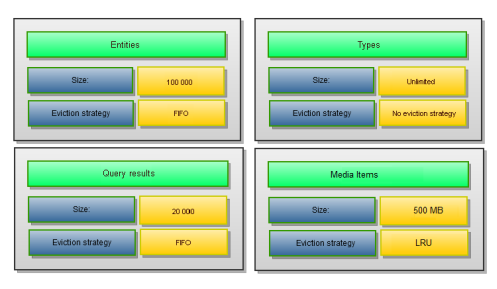
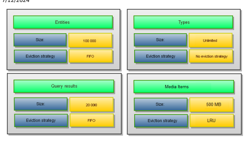
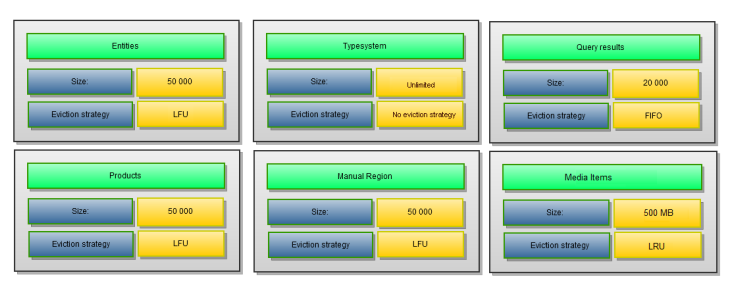

# Cache

Cache intercepts calls whenever you access an API (for example ServiceLayer). If you want to get data, it's either returned from the cache, or retrieved from the database and written to the cache.

## When Data Is Cached

The SAP Commerce Cloud Cache works transparently. Every time the API is accessed, the cache intercepts calls and handles caching implicitly. The following examples present how caching works:
Caching item attributes:

When calling product.getCode(), the underlying data is returned from the cache or, if not yet cached, retrieved, and written to the cache.

When calling product.setCode(X) and then save() (for one value) or saveAll() (for multiple values) the cached value is removed (invalidated) from the cache, because it's no longer valid.
Caching FlexibleSeach results:
When executing a FlexibleSearch query such as SELECT code FROM Product, the result list is cached in the main cache.

When a product is removed, then its item data and the cached FlexibleSearch result for such query is removed from the cache.

## How Data Is Cached

The SAP Commerce Cloud Region Cache provides more ne-grained control over your cache conguration. You can dene multiple cache regions by specifying their size and eviction strategy, as well as the type instances for which they're responsible. To nd an optimal conguration for your needs, see Region Cache.

## When Data Is Removed From Cache

A cache entry is removed from the cache in the following cases:
The displacement strategy removes the entry from the cache because the cache has reached its maximum size and cannot hold any additional entries. This is done whenever the cache is full and a newer entry is put into the cache.

The invalidation strategy detects that the cache entry is no longer valid and doesn't represent the correct database
content. Note the following about invalidation:
Inside a single VM, the cache invalidation is done by a method call. When using multiple cluster nodes, the other nodes are notied via TCP or UDP invalidation packets.

Invalidation isn't performed whenever you change something. There are circumstances where the invalidation is delayed, for example when working with transactions. By default, entries modied inside a transaction are invalidated after the transaction.

## Managing The Sap Commerce Cloud Cache

Using the SAP Commerce Cloud Administration Console, you can completely clear the cache and monitor cache statistics. Refer to Monitoring Tab for details.

## Region Cache

The SAP Commerce Cloud Region Cache introduces the possibility to split its content into so-called regions. You can specify objects to be cached for each region, which allows you to tune a running system and to make sure that certain objects are cached for a longer time, while other objects are removed more quickly due to a limited cache size.

The SAP Commerce Cloud Region Cache is a exible, modular, and congurable solution. It offers:
Easy replacement of each new cache module. Full programmatic control of cache partitions, for instance, turning off caching for one of the partitions at runtime).

Easy monitoring.
Possibility to plug in other third-party cache frameworks, such as Coherence, Gigaspaces, Hazelcast, Memcached.

The possibility to use a distributed cache. Distributed cache and implementation, which relies on serialization and is possible only for query result region. It isn't possible on entity and type system regions because of not serializable object nature.

## Region Cache Overview

The SAP Commerce Cloud Region Cache can be split into multiple partitions called cache regions. Each cache region can be congured separately and holds its own set of types. For instance, it's possible to set up a region only for products. Out of the box, you can congure the size of each region and its eviction strategy. Supported eviction strategies include:
Least Recently Used (LRU): The last used timestamp is updated when an element is put into the cache or an element is retrieved from the cache with a GET call.

This is   For more    the SAP Help  3 Least Frequently Used (LFU): For each GET call on the element, the number of hits is updated. When a PUT call is made for a new element, and assuming that the maximum limit is reached for the memory store, the element with the least number of hits, the Less Frequently Used element, is evicted.

First In, First Out (FIFO): Elements are evicted in the same order as they come in. When a PUT call is made for a new element, and assuming that the maximum limit is reached for the memory store, the element that was placed rst (First-In) in the store is the candidate for eviction (First-Out).

## Standard Conguration

The default setup of the SAP Commerce Cloud Region Cache contains the following regions:
Type system region: for storing entities of type system items

Entity region: for storing entities of all types except type system ones Query results region: for storing all query results Type system query results region: for storing results of queries containing references to the type system items Media items region: for storing all media items Session region: for storing HTTP sessions

## Example Scenario

The SAP Commerce Cloud Region Cache is already precongured, but may be easily customized. This section presents default cache region settings and an example scenario of modifying those settings.

## Standard Conguration

The default setup of the SAP Commerce Cloud Region Cache contains the following regions:
Type system region: For storing entities of type system items

Entity region: For storing entities of all types except type system ones Query results region: For storing all query results Media items region: For storing all media items Session region: For storing HTTP sessions

## Extended Configuration

It's possible to easily extend the default configuration of cache regions. In this example, the standard configuration is modified in the following way:
- A cache region is added for storing product entities.

- A manual cache region is added.
- The size of the cache region for all entities is decreased to 50000.

## I Note

Because of the numerous number of type system items, the default size of the type system region shouldn't be decreased.

Make sure that the size of the type system query results region is always larger than the number of type system items multiplied by three. Such a configuration ensures that all needed queries that are stored in this cache region aren't evicted prematurely.

Manual cache regions aren't controlled by the cache framework, but by user custom logic. You can decide when and what has to be stored in it. Additionally, you can control when manual region entities are invalidated.

# Conguring Region Cache

The SAP Commerce Cloud Region Cache is congured in the advanced.properties and core-cache.xml les.

## Modifying Default Region Settings

Default settings can be modied:
1. By changing values in local.properties.

2. By overriding the cache bean in your spring.xml le using an alias.

To change precongured cache region settings, provide new values in the local.properties for the precongured parameters, for example :
local.properties
\# Size of a region that stores all other, non-typesystem and non-query objects. Default value is 10 regioncache.entityregion.size=50000 \# Change eviction policy used by entity region. Possible vales are \# LRU and LFU can be used for EhCacheRegion only. For other region regioncache.entityregion.evictionpolicy=LRU \# specifies root cache folder for all cached files media.default.local.cache.rootCacheFolder=cache \# specifies max size of media cache in MB media.default.local.cache.maxSize=500 Media Items Region extends the LRUCacheRegion so, by default, it uses the LRU eviction strategy.

## Note

Because of the numerous number of type system items, the default size of the type system region shouldn't be decreased. Make sure that the size of the type system query results region is always larger than the number of type system items multiplied by three. Such a conguration ensures that all needed queries that are stored in this cache region aren't evicted prematurely.

## Adding New Cache Region

You can implement your own cache region with a cache implementation different than the default one. The following example presents a Spring conguration for your region cache that uses Ehcache implementation:
example-spring.xml
<bean name="productCacheRegion" class="de.hybris.platform.regioncache.region.impl.EHCacheRegion">
<constructor-arg name="name" value="productCacheRegion" /> <constructor-arg name="maxEntries" value="50000" /> <constructor-arg name="evictionPolicy" value="LFU" /> <property name="handledTypes"> <array> <value>1</value> </array> </property> </bean> <bean name="manualCacheRegion" class="de.hybris.platform.regioncach <constructor-arg name="name" value="manualCacheRegion" /> <constructor-arg name="maxEntries" value="50000" />
This is   For more    the SAP Help  6
<constructor-arg name="evictionPolicy" value="LFU" /> <property name="handledTypes"> <array> </array> </property> </bean>

## Tip

By setting the handledTypes parameter to 1 you actually map it to the Product item type, which has got the internal type code 1.

A cache region has the following properties:
name: unique region name maxEntries: cache region size evictionPolicy: LRU, LFU, and FIFO

handledTypes: list of types automatically stored in this region. To set up types use deployment code. Manual regions don't have any type congured
Additionally, new congured regions have to be connected with the Region Cache Spring conguration. Cache regions are Spring beans holding objects of a specied type. Each region has its own set of types. It's also possible to have a region without a dened type of objects. However, such a region isn't taken into account by a controller and you need to implement a region resolver to be able to use it. To dene a region type, you have the following options:
Provide a deployment code list from items.xml le if you want that a region stores entities for the provided deployment code.

Choose a dedicated type called ALL_TYPES. It denotes that a region stores all uncongured types.

To congure a cache region to handle query results, use one of the following types:
QUERY_CACHE: It denotes that a region stores query results.

NO_QUERY: Used together with ALL_TYPES to denote that a region stores all uncongured types except query results.

Query results and entities can be kept in the same region, but separation is recommended.

## Sap Commerce Cloud Cache Api

See the API of the SAP Commerce Cloud Cache. The SAP Commerce Cloud Cache API is backwards compatible, so for instance, single item invalidation is done by:
PK primaryKey = ...;
de.hybris.platform.util.Utilities.invalidateCache(primaryKey);

## Accessing Cache Region

You can access statistics for every cache region:
@Autowired CacheController controller; (...) Collection<CacheRegion> regions = controller.getRegions(); for (CacheRegion region : regions) { CacheStatistics stats = region.getCacheRegionStatistics(); (...) }

## Clearing Cache

Clearing all cache regions:
@Autowired CacheController controller; (...) controller.clearCache();
Clearing a single cache region:
CacheRegion region = ...;
region.clearCache();

## Customizing Region Cache

SAP Commerce Cloud allows you to customize region cache. Main implementation elements that you may wish to customize are:
CacheController: Main cache interface that contains methods coordinating cache operations on multiple regions.

CacheConfiguration: Provides conguration to the controller and it holds:
CacheRegion: Denes the interface of the cache region. Currently, the following implementations are provided:
DefaultCacheRegion: Simple FIFO cache region, which is the default for entity and query results regions EHCCacheRegion: Cache based on Ehcache UnlimitedCacheRegion: Unlimited cache region for type system CacheRegionResolver: It is responsible for providing regions to the cache controller. There can be more than one region resolver in use. When reading from a database or adding to the database, the cache controller sequentially asks region resolvers for a given key. The rst region that holds cached data is used. In case of invalidation, the cache controller asks all region resolvers and the invalidated value for the given key is removed from all returned regions.

InvalidationFilter: The system can have more than one lter registered. Registered invalidation lters are processed one by one to check if all of them enable invalidation. If at least one lter disallows invalidation, data stays in cache until is evicted. Invalidation lters are checked every time the invalidation is red. It is possible to build time-based invalidation lters.

CacheRegionProvider: Keeps regions lists and provides regions list access methods.

CacheStatistics: Keeps statistics for a single cache region.

## License Restrictions On Cache Size

Depending on your license, you have a certain limit of total cache size for all regions. After extending the cache sizes without additional license, the Platform will not start and the following error message may be displayed on the console:
ERROR [WrapperSimpleAppMain] [RegionCacheAdapter] **************
ERROR [WrapperSimpleAppMain] [RegionCacheAdapter] Configuration is ERROR [WrapperSimpleAppMain] [RegionCacheAdapter] Total size for al ERROR [WrapperSimpleAppMain] [RegionCacheAdapter] ************** shutting down hybris registry..

## Disabling The Sap Commerce Cloud Region Cache

The SAP Commerce Cloud Region Cache is the default cache. However, you can still use the previous cache solution by adding the following parameter to the local.properties le:
local.properties cache.legacymode=true It is recommended to use the SAP Commerce Cloud Region Cache. That is why after switching to the previous cache solution you can expect some warning messages displayed in the console logs and in the SAP Commerce Cloud Administration Console on Cache page.

## Maintaining Querycacheregion

SAP Commerce Cloud allows you to clear entries in the queryCacheRegion.

As the data in the queryCacheRegion is removed only by displacement, the region reaches its size limit quickly. In order to clear its entries, you can implement a strategy that removes obsolete entries from the Flexible Search query cache at xed intervals by using the dedicated interface: CleanUpQueryCacheRegionStrategy (with DefaultCleanUpQueryCacheRegionStrategy as the default implementation). You can dene the value of the interval in the queryRegionCache.clean.interval property (it can be modied at run time). You can enable or disable this strategy by changing the value of the property queryRegionCache.clean.enabled. The value is enabled by default.

All query results, including results of queries with references to the type system items, are cleared by CleanUpQueryCacheRegionStrategy

## Note

When the type system query results region cache reaches 90 or more percent of its size even after being cleared, a warning with a suggestion to increase the size of the region is thrown.

## Specifying A Minimum Ttl For Cached Flexiblesearch Results

Platform offers a mechanism to enforce a minimum time to live for cached FlexibleSearch query results.

This mechanism keeps the results of FlexibleSearch queries in the SAP Commerce Cloud main cache at least for the specied time to live even if the search results are invalidated. It means that query results are still taken from the cache while their referenced item types have already received changes (for example SELECT ... FROM {PRODUCT} ... being still cached despite ProductModels having been created, updated, or deleted).

This is   For more    the SAP Help  9 This can result in noticeable performance advantage for read-mostly scenarios such as storefronts rendering product data, which would otherwise suffer from query cache invalidation in case of frequent or bulk updates in SAP Commerce Cloud. Depending on the nature of changes being done while TTL queries stay alive, the application may need to cope with stale data. For example when products are being deleted, those cached queries may still contain stale primary keys.

To dene the minimum time to live, set the cache_ttl attribute for SessionService to a value specied in seconds, such as:
// the CACHE_TTL parameter is set to 10 seconds; // search result of the following query will stay inside the cache for at least 10 sec String qry = ... private FlexibleSearchService flexibleSearchService; private SessionService sessionService; private String qry; public void searchWithTTL() {
sessionService.executeInLocalViewWithParams(ImmutableMap.of(FlexibleSearch.CACHE_TT
@Override public Object execute() {
return flexibleSearchService.search(qry).getResult();
}
});
}
