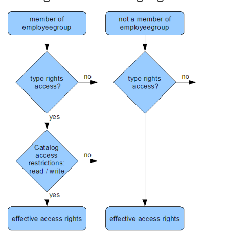
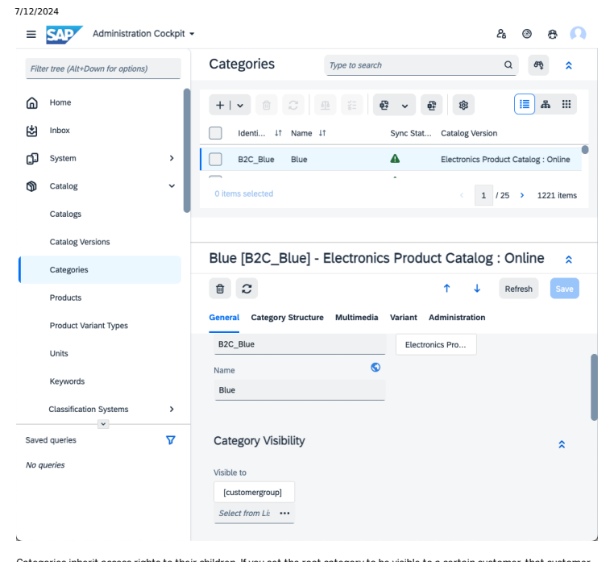
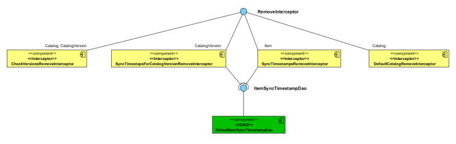
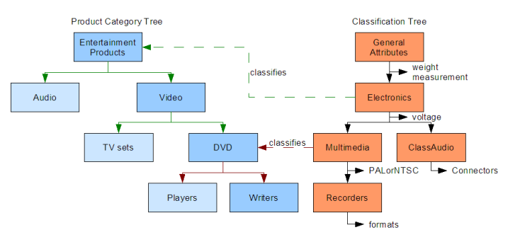

# Working With Catalogs

Platform catalogs hold, structure, and manage products and product information. Catalogs offer the following features and functionality:
Structuring Your Collection with Products and Categories: Products are the basic elements of each catalog. By grouping them, you can arrange your collection into categories. In order to build a hierarchical product structure, products can be kept in categories. For more information, see Structuring Your Collection with Products and Categories.

Catalogs and Catalog Versions: Categories are held in catalog versions. A catalog version can represent your collection of products at a certain point in time. To enable you to maintain your collection within a basic process, you usually contain two or more catalog versions in an object called a catalog. For example, you can have one catalog version for editing the content (the Staged version) and you can have another catalog version for propagation as a web shop (the Online version). For more information, see Catalogs and Catalog Versions. Managing Multiple Product Catalogs in a Catalog System: A catalog system is a group of SAP Commerce Cloud catalogs. It represents a framework for managing multiple output catalogs enabling you to maintain the varying content of several product catalogs. A catalog system can also include multiple input catalogs. Typically, a catalog system is set up around a master catalog that contains the leading versions of product data. The different catalog contents are synchronized among dened catalog versions, thus reecting your catalog maintenance process. For more information,
see Managing Multiple Product Catalogs in a Catalog System. Synchronizing Catalog Versions: Catalog versions can be synchronized in a one-directional way in order to update a catalog version based on another one. This enables youto transfer catalog content between the catalog versions that represent steps in your catalog maintenance process. You can synchronize catalog versions, even if they are from the same or different catalogs within your SAP Commerce Cloud. For more information, see Synchronizing Catalog Versions.

Dening Product Attributes: Product attributes specify properties of products. They are used to describe a product and to hold related information. A product attribute has a name and a value. For example, the value of the attribute color is blue; SAP Commerce Cloud provides different modeling methods for dening product attributes: typing and classication. For more information, see Dening Product Attributes.
Classication Guide: The classication functionality enables you to dene product attributes in a way different to the typing method. Classication-based attributes are called category features; they can also sometimes referred to classification attributes. Through classication, you can exibly allocate category features that may change frequently. You can easily dene and modify them because you manage them independently of the product type. Available category features can be organized independently from product catalog structures in separate classification systems. Here they can be structured into classifying categories. Through such classifying categories, you can assign a category feature to one or multiple product categories used in catalogs. That means that all category features of the classifying categories are available within all products included in the assigned product categories. Therefore, each category feature assigned to a category of a catalog structure is inherited by all subcategories. For more information, see Classication.

## Structuring Your Collection With Products And Categories

Products are the basic elements of each catalog. By grouping them, you can arrange your collection in categories. In order to build a hierarchical product structure, products can be kept in categories.

## About Products

Products are goods or services that can be offered to a market. Products are typically the basic elements of both your collection and your sales catalogs. In SAP Commerce Cloud, a product is a data structure that represents an item of merchandise, for example a shirt or a camera. It typically includes product attributes such as product name, description, sales unit, and price. Optionally, a product can hold product variants and link to images or other media. Products are imported from third-party sources such as Enterprise Resource Planning (ERP) systems, Product Information System (PIM) systems, or by le import. Products can be created and edited manually in the Backoffice Framework.

## Creating And Nesting Categories

To organize products, you can group them into categories that represent logical groups. This enables you to bring related products together, for example by using a shirts category and a jackets category. You can compare categories with departments of a traditional store. Categories can hold other categories, so that you can assemble corresponding categories including their products in a supercategory, also called parent category. Thus, you can nest categories arbitrarily and build up hierarchical category structures.

 Figure: Sample Category Structure

## Structuring Categories

The actual structure of your categories depends on the purpose of the catalog. If you create the category structure for a collection catalog to be propagated in a web shop, the category structure is typically used to provide customer navigation tools of the web shop front-end. Proper orientation and navigation in a web shop should reect customer expectations and enable the customer to effectively access product information using easy pathways through the web shop.

 Figure: Sample Web Shop navigation based on a category structure. If you create the category structure for a master catalog of a Product Information System (PIM), you can organize the category structure to group product attributes. This is usually related to the classication of categories. Such classications enable you to dene product attributes for selected categories only. Therefore, you should organize the category structure carefully because you need to consider the product attributes that you want to dene by classication afterwards. For more information, see Classication.

## Creating Categories

Categories, like products, are usually imported from third-party sources such as Enterprise Resource Planning (ERP) systems, PIM systems, or by le import. They can also be created and edited manually in Backoffice Framework. Controlling the Visibility of a Category To make a category visible in the storefront, you must explicitly dene the user groups or individual users that are allowed to view the category. The visibility of a category also controls the visibility of all subcategories, products, and other objects that are contained in it. In contrast, a category is not visible if it does not contain any visible products. Adding and Managing Products in Categories Categories and products, including their category assignment, are imported from third-party sources, such as from ERP systems, from PIM systems, or by le import. Products can also be assigned to categories manually in the Backoffice Framework. Adding Media Items to a Category Media items, such as product images, are usually referenced by the product. On the Multimedia tab of the product editor you can reference images and other multimedia items.

## Creating Categories

Categories, like products, are usually imported from third-party sources such as Enterprise Resource Planning (ERP) systems, PIM systems, or by le import. They can also be created and edited manually in Backoffice Framework.

To create a new category, perform the following steps:

1. On the Backoffice Administration Cockpit, access | ⟩ Catalog ⟩ Categories ⟩
2. Click the
+
>
Create action button.

3. Fill in all mandatory fields. It is recommended to not use the special characters '<' or '>' within the Category Name or Code (Identifier). The tags result in error when connecting to the CDS Catalog service endpoint.

4. Click Done.

5. In the collection browser, select your newly created category and go to the Category Structure tab.

6. In the Category Structure tab, insert the category within the target hierarchical category structure.

more supercategories.

 Select one or more Subordinate Categories to group other categories below this category; consequently the o latter category becomes the supercategory of the selected ones.

o Select one or more Included Products to logically group products in this category.
7. On the Multimedia tab, specify a category image and other media relevant for this category. You can also use the Additional Multimedia Objects group to manage product images that belong to products contained in this category.

This is custom documentation. For more information, please visit the SAP Help Portal Only SAP Commerce Cloud administrators can access the Administration tab. It provides editing data including primary key, changes, and copies.

## Controlling The Visibility Of A Category

To make a category visible in the storefront, you must explicitly dene the user groups or individual users that are allowed to view the category. The visibility of a category also controls the visibility of all subcategories, products, and other objects that are contained in it. In contrast, a category is not visible if it does not contain any visible products.

## Context

To set the visibility of the category, perform the following steps:

1. On the Backoffice Administration Cockpit, access Catalog Categories to display the list of categories.

2. Select the category that you want to update. 3. In the General tab, go to the Category Visibility section.

4. Update the Visible to list by adding one or more user groups or individual users in the elds provided. You can also control the category visibility using personalization rules that check the category settings to verify which users are authorized.
For more information, see Catalog Guide.

5. Click Save to continue action. Otherwise, click Refresh.

For more information on controlling visibility, refer to the following topics:
Visibility Control Users in Platform

## Adding And Managing Products In Categories

Categories and products, including their category assignment, are imported from third-party sources, such as from ERP systems, from PIM systems, or by le import. Products can also be assigned to categories manually in the Backoffice Framework.

## Context Tip

You can use the SAP Commerce Cloud Product Cockpit to assign products to categories in a graphical way by dragging and dropping. For details see:
Catalog Perspective of the SAP Commerce Cloud Product Cockpit, section Assign Product Button of Catalog Perspective Creating Product Assignments

1. Log in to Backoffice Administration Cockpit.

2. Navigate to | | Catalog ⟩ Products 3. Select the product that you want to add to a category.

5. In the Categories Containing This Product section, define one or more Supercategories in the fields provided.
6. Click Save to add the product to the category.

## Adding Media Items To A Category

Media items, such as product images, are usually referenced by the product. On the Multimedia tab of the product editor you can reference images and other multimedia items.

## Context

Instead of using the product images suggested in the product objects, you can reference any product image directly in the corresponding product category. In this way, they are referenced separately from the corresponding product, which enables versioning of media items. This ensures that provided media items held separately in categories do not change if the media item referenced in the product object is updated. To accomplish this, you need a media naming strategy that allows you to match products to their related images. You also can use this method if you want to maintain media items in a separate media maintenance catalog.

This is custom documentation. For more information, please visit the SAP Help Portal

1. Log in to Backoffice Administration Cockpit.

2. Navigate to || Catalog → Categories →
3. Select the category where you want to add the media item.

6. In the Additional Multimedia Objects section, reference media items related to the products in the category.

7. Click Save to add the media item.

## Catalogs And Catalog Versions

Categories are contained in catalog versions. A catalog version can represent the collection of products you offer at a certain point in time. To maintain your collection within a basic process, you typically contain two or more catalog versions in an object called a catalog. For example, while you can have one catalog version for editing the content (the Staged version), you can use another catalog version for propagation as a web shop (the Online version).

## Holding Your Category Structure In Catalog Versions

To use a category structure to represent your collection—or parts of it—you contain it in catalog versions. A catalog version is a container for categories that contains products in one or multiple categories.

This is custom documentation. For more information, please visit the SAP Help Portal

Both a SAP Commerce Cloud catalog version and a typical printed product catalog, for example, represent the collection of products that your offer at a certain point in time. The differences between the two is that a printed product catalog is a list of sequenced products. In SAP Commerce Cloud catalog versions, you can organize products in hierarchical category structures. It allows you to automate content modication. It enables you to maintain more and very specic information types, such as metadata, hidden product data, localizations, views, and restrictions. Instead of paper only, you can propagate your products to multiple channels like web sites, electronic catalogs, mobile, point of sales terminals, or tele-commerce applications. To enable channel-specic propagation, the layout is dened separately from the content.

A SAP Commerce Cloud catalog version item is similar to the concept of a product catalog. Contrary to this concept, a SAP Commerce Cloud catalog item is a container for multiple catalog versions.

## Adding A Category To A Catalog Version

You can add categories to a catalog version by different methods:
Assign a category to another catalog version in Backoffice. For information, see Adding a Category to a Catalog Version.

Add a category to a supercategory of another catalog version. For information, see Structuring Your Collection with Products and Categories. The category, one of its supercategories, or one of its catalog versions is synchronized. For information about synchronization, see Synchronizing Catalog Versions.

## Details

The CatalogVersion item has the rootCategories property set to a read-only dynamic attribute. Invoking the CatalogVersionModel.getRootCategories() method returns all root categories ordered by the category order property. To set root categories for CatalogVersion, edit the Category model. Make sure the categories don't have a parent category, assign them to the catalog version, and save them. Don't use the setRootCategories() method for that purpose.

## Controlling Visibility And Access To A Catalog Version

The visibility of a catalog version in a web front end, such as a webshop, is determined by the visibility of the categories included in the catalog version. For details, see Structuring Your Collection with Products and Categories. You can also create a web front-end implementation that checks the language settings of a user group against those of the catalog version. To control the access of a catalog version in Backoffice, you must specify which user groups or individual users are allowed to access the catalog version for writing or reading.

This is   For more    the SAP Help  26 To set access rights for a catalog version, go to the Permissions tab of the catalog version editor. You can edit the lists for User accounts with write permissions and User accounts with read permissions. For each list, you can add one or more user groups or individual users.

## Bundling Multiple Catalog Versions In A Catalog

A catalog version represents the collection of products that you offer at a certain point in time. To enable updating your collection without modifying the propagated catalog, you usually use two or more catalog versions bundled in an SAP Commerce Cloud object called a catalog. Based on such a catalog/catalog version structure, you can set up a simple mintenance process. For example, you can have one catalog version for editing the content (the Staged version) and another catalog version for propagation as a webshop (the Online version). Thus, a catalog is not only a container for holding and structuring your products but it also a structure for basic maintenance and propagation processes.

Figure: Typical structure of a catalog including a Staged catalog version and an Online catalog version.
You can organize multiple catalog versions in a catalog, each used for a specific process step. Among different catalog versions, you can synchronize the content. That way, you can establish separate catalog versions for use cases like the following:
- Drafting
- Review and approval
- Seasonal product catalogs, for example summer and winter collections
- Distributed import and export scenarios to be performed on separate catalog versions

- Archiving

Only one catalog version within a catalog can be active at a time, which in a web front end typically provides the propagated oline version. Consequently, this concept is applicable only for sequential catalog maintenance processes that propagate only one catalog version. For more information, see Synchronize Catalog Versions .

If you set up more complex catalog maintenance processes that allow propagating multiple web front ends simultaneously, you must use multiple catalogs. For more information, see Managing Multiple Product Catalogs in a Catalog System.

This is custom documentation. For more information, please visit the SAP Help Portal

## Adding A Category To A Catalog Version

Backoffice allows you to add a category to a catalog version.

## Context

In this tutorial:
- we use the Staged version of the Default catalog that is available in SAP Commerce Cloud by default
- we use the myCategory001 category that we created earlier

1. Log in to Backoffice.

2. Navigate to || Catalog ⟩ Catalog Versions 3. Select default catalog in the Staged version. 4. Click the catalog version. 5. Select the Content tab.

7. Complete the Identifier and the Catalog version fields and click Finish.

8. Click Save in the collection browser to save changes in the Staged catalog version.

## Results

You added a category to a catalog version.

## Adding A Catalog Version To A Catalog In Backoffice

Backoffice allows you to add a catalog version to a catalog.

## Context

In this tutorial:
we use the Default catalog that is available in SAP Commerce Cloud by default we create a new catalog version and add it to the Default catalog

1. Log in to Backoffice.

2. Navigate to Catalog Catalogs . 3. Select the Default catalog.

This is   For more    the SAP Help  30

Catalog Version:*

5. Complete the required fields in the wizard.

a. Click the

| :::                                    |                                               |          |
|----------------------------------------|-----------------------------------------------|----------|
| !!!!!!                                 |                                               |          |
| ID                                     | t                                             | Name !!  |
| Default                                | default catalog                               |          |
| _boconfig                              | Backoffice Configuraiton Catalog (do not use) |          |
| apparelProductCatalog                  | Apparel Product Catalog                       |          |
| apparel-ukContentCatalog               | Apparel UK Content Catalog                    | 12 items |
| Cancel                                 | Select (1)                                    |          |
| b. Complete the Catalog Version field. |                                               |          |
| c. Click Finish.                       |                                               |          |

6. Click Save in the collection browser to save the changes in your catalog.

## Results

You added a catalog version to a catalog.

## Managing Multiple Product Catalogs In A Catalog System

A catalog system is a group of SAP Commerce Cloud catalogs. It represents a framework for managing multiple output catalogs enabling you to maintain the varying content of several product catalogs. In addition, a catalog system can handle multiple input catalogs. A catalog system is set up around a master catalog holding the leading versions of product data. The different catalog contents are synchronized among defined catalog versions, thus reflecting your catalog maintenance process.

Figure: Sample catalog system consisting of two input catalogs before a master catalog and three output catalogs afterwards. Within a SAP Commerce Cloud catalog, only one catalog version can be active, which in a web front end typically provides the propagated online version. Consequently, this concept is applicable only for sequential catalog maintenance processes that propagate at most one catalog version. If you wish to set up more complex catalog maintenance processes that allow propagating multiple web front ends simultaneously, you have to use multiple catalogs. The same applies for working with multiple input catalogs.

## Dening Your Catalog Maintenance Process

Before setting up a catalog system, SAP Commerce Cloud recommends that you dene your catalog maintenance process. This is important because a catalog system should reect your organizational structures and responsibilities. For example, you may want to include a country-specic web page owned by a foreign subsidiary. Typically, you manage such a page in a separate catalog, which receives the basic collection data from a master catalog to be edited and approved locally. Such a country-specic catalog can have its own staged and online versions for editing and propagation. Specic access rights ensure writing permissions for the local team, however several headquarter's representatives may have reading or writing access for supporting tasks. When sketching your catalog system, SAP Commerce Cloud recommends that you dene the following elements:

A master catalog. An arbitrary number of separate catalogs that each contain more or less varying content that is actively managed, for example:
A catalog is used for separating multiple import sources: If you receive product data from different sources you can use a catalog for each source. For example, you can maintain separate input catalogs for different collections, suppliers, content types, or external source systems like Enterprise Resource Planning (ERP) systems, PIM systems, or le import. That way you can separate the data and corresponding process steps before merging in a master catalog. At least one output product catalog that receives its content from a master catalog: Typically, each active product catalog is based on a separate output catalog to cover different languages, countries, brands, customer groups, output channels, or other criteria. The catalog represents a process step because its content is actively managed, for example by modication of content or synchronization with other catalogs.

Catalog versions for subordinate process steps that can be organized within a catalog because only one of the catalog versions needs to be active. For example, you can organize year-specic product catalogs in catalog versions. For more information, see Catalogs and Catalog Versions. Synchronizations between two catalog versions, indicating the data ow among catalogs.

Figure: Example of a complex catalog system. It consists of multiple input catalogs (top), a master catalog, and two country-

## Setting Up A Catalog System

To set up a catalog system, you simply create the required catalogs and connect them by synchronizing jobs between catalog versions. You organize the catalogs involved in such a way so as to establish a synchronization process from input to output. Synchronization operations among catalogs are realized between the contained catalog versions.

## Synchronizing Catalog Versions

Catalog versions can be synchronized in a one-directional way for updating a catalog version according to another. This way you can transfer catalog content between the catalog versions which represent steps in your catalog maintenance process. You can synchronize catalog versions, even if they are of the same or different catalogs within your SAP Commerce Cloud. Synchronizing operations are executed between catalog versions.

## About Synchronizing

A synchronizing operation copies specified content from a source catalog version to a target catalog version, for example a staged to an online catalog version. That means, the items referenced by the target catalog versions are overwritten to match the items referenced by the source catalog version.

This is custom documentation. For more information, please visit the SAP Help Portal Example of a product price in different catalog versions:

| Time:            | Before synchronizing   | Before synchronizing   | After synchronizing   |
|------------------|------------------------|------------------------|-----------------------|
| Catalog version: | Source                 | Target                 | Target                |
| Value:           | 20.50 EUR              | 17.99 EUR              | 20.50 EUR             |

A synchronizing operation can be applied to an entire catalog version, but also to selected categories or products. It only works in a one-directional manner, however you can apply two synchronizing operations for establishing bi-directional updating procedures. By default, only items referenced by the source catalog version are synchronized, and those items of the target catalog version that are not referenced are not affected. For example, let's say the target catalog version consists of the contents of two other catalogs, clothes and hardware. If the hardware catalog is synchronized, the clothes catalog-related part of the target catalog version remains unchanged.

| Time:            | Before synchronizing   | Before synchronizing   | After synchronizing   |
|------------------|------------------------|------------------------|-----------------------|
| Catalog version: | Source                 | Target                 | Target                |
| Value Hardware:  | 20.50 EUR              | 17.99 EUR              | 20.50 EUR             |
| Value Clothes:   | 139.00 EUR             | 109.00 EUR             | 109.00 EUR            |

Example of product prices for a hardware product and a clothes product in different catalog versions: In contrast, you can congure synchronization settings for removing existing products from the target catalog version that do not exist in the source catalog version. Such synchronization settings can dene rules on how product data is copied to the target catalog version. For example, you can determine whether to remove existing products in the target catalog version that do not exist in the source catalog version. Alternatively, only products that exist in both the source and the target catalog version are synchronized. Another option of synchronization settings refers to the languages of products attributed to be synchronized. A synchronizing operation is held in a synchronization object that references the source and the target object. You can launch a synchronization manually or automatically at a given time through a The Cronjob Service. To access a Synchronization object, go either to its source or target catalog version. On the Versions tab, you nd all related Synchronizations listed below the Basic Settings group. Right-click one and open it by choosing an Edit command on the context menu. For more information, see Synchronizing Catalogs.

## Synchronizing Operations In Catalog Versions Within A Catalog

There are specic use cases for synchronizing catalog versions that are part of a single catalog.

## Seasonal Switch

For example, you can use this for switching from one catalog version to another catalog version: Let's say, a catalog for clothes has ve catalog versions:
Spring

Summer
Fall Winter Online The Online catalog version is in use for the web shop front end. By synchronizing from Summer to Online, you can switch the product line in the shop frontend to the summer edition. Synchronizing from Fall to Online replaces the summer product line with the fall product line, and so on.

## Separated Input Catalog Versions For Different Content Types

To realize distributed import scenarios, you can use separate catalog versions, for example for different content types. Let's say, you receive your product data from different sources:
Product names and descriptions are loaded from CSV les provided by a supplier.

Product images are loaded from a le system maintained by an advertising agency. Product prices are retrieved from an Enterprise Resource Planning (ERP) system.
Each source provides a type of product data with each data set related to a dened product. Each product data type is loaded into a different catalog version to enable different loading and clearing routines. These different catalog versions are consolidated by synchronizing operations to a master catalog representing a single source of truth.

## Dening Product Attributes

Product attributes specify properties of products. They are used to describe a product and to hold related information. A
product attribute has a name and a value. For example, the value of the attribute color is blue. The SAP Commerce Cloud provides different modeling methods for dening product attributes: typing and classication.

## Selecting The Method

When starting a new SAP Commerce Cloud PCM (Product Content Management) or eCommerce project, a consultant or developer investigates the existing product attributes and sketches a modeling strategy for dening product attributes in SAP Commerce Cloud. Most attributes can be dened the same as in an existing customer system. For some specic or new attributes, the consultant decides on the best method of attribute denition with regard to the customer requirements and the business context. The attribute modeling method has no direct impact on the end user of a web shop front end. But, it has important consequences for relating any business logic, data base loading, and the ease of set-up and modication of attributes. Thus, the denition method for an attribute can be worth a careful evaluation.

## Comparison Of Typing And Classication

This table lists important criteria for comparing methods of product attribute denition.

| Criteria                                                                             | Typing                                                                                                                         | Classication                                                                                                                                                    |
|--------------------------------------------------------------------------------------|--------------------------------------------------------------------------------------------------------------------------------|-----------------------------------------------------------------------------------------------------------------------------------------------------------------|
| Character                                                                            | Basic method                                                                                                                   | Advanced method                                                                                                                                                 |
| Use Case                                                                             | Recommended for static product attributes that are used in business logic like calculations. Frequently used for PCM projects. | Recommended for changeable product attributes that are not to be used in business logic. Frequently used for eCommerce projects.                                |
| Examples                                                                             | Article number is unchangeable.                                                                                                | Resolution is merely a data sheet information gathered from a supplier to be transferred for display.                                                           |
| Sales unit to be used for calculations of shipping costs.                            | Microphone: The existence of a microphone being part of a product.                                                             |                                                                                                                                                                 |
| Applicable to                                                                        | All data types.                                                                                                                | Products only.                                                                                                                                                  |
| Scope                                                                                | All instances of a type, for example for all                                                                                   | Easy and dynamic application for selected                                                                                                                       |
| instances of a subtype.                                                              | products or categories, for example.                                                                                           |                                                                                                                                                                 |
| Requirement                                                                          | None                                                                                                                           | 1. A category tree dening a product structure. 2. A classication system providing available product attributes that can be assigned to categories and products. |
| Performance Implication                                                              | Less load on database.                                                                                                         | More load on database.                                                                                                                                          |
| Typical User                                                                         | Developer                                                                                                                      | Product/Purchasing Manager Marketing Manager                                                                                                                    |
| Modication                                                                           | Complex adaptation to new requirements                                                                                         | Easy adaptation in the                                                                                                                                          |
| by coding.                                                                           | platformbackoffice extension, or by CSVle import.                                                                              |                                                                                                                                                                 |
| Outcome                                                                              | Type attribute                                                                                                                 | Category feature, also referred to as classication attribute.                                                                                                   |
| This is custom documentation. For more information, please visit the SAP Help Portal | 38                                                                                                                             |                                                                                                                                                                 |

| 7/12/2024 Criteria                       | Typing                                                                                                          | Classication                                                                                                                                                                                                                                                                                                 |
|------------------------------------------|-----------------------------------------------------------------------------------------------------------------|--------------------------------------------------------------------------------------------------------------------------------------------------------------------------------------------------------------------------------------------------------------------------------------------------------------|
| Display in Backoffice                    | Any position on Product tabs can be                                                                             | By default on the Product Attribute tab.                                                                                                                                                                                                                                                                     |
| congured.                                | Modication of display more complex.                                                                             |                                                                                                                                                                                                                                                                                                              |
| Technique                                | A type attribute typically is dened either by runtime types (not recommended!) or in an extension items.xml le. | A category feature is dened in Backoffice as part of a classifying category. Such a classifying category can be assigned to several products. The assignment to a product category with the consequence that all products of the category and its subcategories hold the category feature is more efficient. |
| Restriction                              | No multi-inheritance is possible. Each type                                                                     | Multiple assignment is possible. Through                                                                                                                                                                                                                                                                     |
| attribute has to be congured separately. | classifying categories, you can assign a category feature to one or multiple product categories.                |                                                                                                                                                                                                                                                                                                              |
| Read More                                | The Type System: See section Adding New                                                                         | Classication                                                                                                                                                                                                                                                                                                 |
| Attributes to a Type.                    |                                                                                                                 |                                                                                                                                                                                                                                                                                                              |

## Catalog Guide

The catalog extension provides catalog functionality for holding, structuring, and managing products and product information.

## Type Overview

SAP Commerce Cloud represents catalogs by a type structure as shown in the following diagram: a catalog can contain a

 number of catalog version objects, each of which can contain a number of category objects. Category objects can contain catalog objects, product objects or classication objects.

| SAP Commerce Cloud Type                                  | Typical            | Description                          |
|----------------------------------------------------------|--------------------|--------------------------------------|
| Catalog                                                  | Clothes catalog    | General grouping of products.        |
| Hardware catalog                                         |                    |                                      |
| CatalogVersion                                           | Summer season 2008 | Narrowing down of the catalog scope. |
| Summer season 2007 Winter season 2008 Winter season 2007 |                    |                                      |

SAP Commerce Cloud Type Typical Description

## Catalog Visibility In Backoffice

Catalog View and Editing Rights

In addition to the platform type system access rights, the catalog extension runs a second evaluation of restrictions on catalog access rights. These restrictions do not interfere with the access of catalogs or catalog versions. They are meant to restrict employee rights to manipulate a catalog version content, such as products, categories, prices, others. When you initialize the system and have it create sample data, these rights are created automatically for the employeegroup usergroup
. You can check the restrictions by looking up the usergroup. If you add new employees to the system, they will be put into the employeegroup by default.

The catalog extension uses personalization rules (search restrictions) to evaluate catalog-editing rights. Since only the employeegroup usergroup has these restrictions by default, a user must be in that usergroup or one of its subgroups to have those rights.

## 

Thus, catalog and catalog version specic data (such as synchronizations or active version settings) as seen in the Catalog Editor or Catalog Version Editor is usually governed by the settings provided in the access restrictions of the relevant types (here: catalog and catalog version). In contrast, the accessibility of specic catalog version contents in terms of read/write access differentiation is administrated through (direct or indirect) membership in employeegroup.

A user who is not in the employeegroup or one of its subgroups can bypass this restriction system. A user who bypasses the restrictions, however, may have access rights to catalog versions in the web application that the user is not intended to have. In this way, you can allow users to browse catalogs you do not want them to see.

## Catalog Visibility In A Web Application

This section discusses how to set catalogs to be visible in a web application.

## Visibility Of Products For Customers

A catalog is a list of products that are available, along with product prices (among other attributes). The catalog extension also allows you to block specied customers from viewing specic products, even if the products are generally available. This functionality is called visibility. Whether the product is visible to customers or not is determined in ve independent steps. If any of the steps fails, the product becomes not visible to that respective customer-- even if all other steps are successful. The following graphic shows the ve steps:

3. Is the category visible?

Products are usually put into categories. If a category is not visible to a customer or customer group, the products contained in the category will also not be visible.

4. Does the date range match?

If a product is visible or not can also depend on the current date. For example, selling ice hockey equipment in June may not be very successful. Therefore, you can limit a product visibility to a certain date range. The product is not visible before the start of that date range or after its end.

5. Is the product approved?

A product is always in one of three possible states: check, unapproved, and approved. An approved product is visible if all other checks pass, a product set to check or unapproved is not.

Steps 1 and 2 are only checked at the very start of the session. The three remaining steps are checked on each customer mouse click. Another difference is that the catalog extension itself deals with steps 1 and 2, while the other steps use Platform restrictions.

This is   For more    the SAP Help  43

## Matching Catalog Url Patterns

Using the SAP Commerce Cloud, you can have several shops running on one server. To keep the shops apart, you will probably use different URLs (like /computer, /skateboard, etc). URLs can use regular expressions according to the POSIX Basic Regular expression syntax . If the shop's URL pattern does not match the catalog URL pattern, the customer is trying to access the wrong shop and, consequently, will not see that catalog products.

The easiest URL pattern you can set up is .*; This pattern matches any URL (even with protocols that do not exist).

This example of a URL pattern https?://+/bluestore($|/.*) matches all URLs that conform to all the following conditions:
Have http:// or https:// as their protocol (http with an optional (?) s, followed by ://)

Have at least one character but the slash after the protocol (+; the circumex ^ negates the term, the plus sign +
indicates at least one occurrence)
Contain the term /bluestore End with any of the following terms End of line (indicated by the dollar symbol $; for example: /bluestore)
/ plus any string (.*) (such as /bluestore/mypage.html)
You may set up several URL patterns for one catalog. That way, you can set up one catalog to be used by several web shops at different URLs, for example.

## Catalog Version Active

You may have several catalog versions available in your platform, but only one may be active at a time. The other ones are stored in the platform and can be edited, but they are not currently active. Such staging of catalogs (that is, having one or more inactive versions) is useful if your product portfolio changes over the year, such as a winter and summer collection.

## Category Visibility

If a product category is visible to a specic customer in a catalog depends on whether the category itself is visible to the customer and the user group the customer belongs to. If the customer or the group the customer belongs to is not explicitly allowed to view a specic category in the platform, the category will not be visible for the customer or the customer's group in the shop.

Categories inherit access rights to their children. If you set the root category to be visible to a certain customer, that customer
will be able to view not only the root category itself, but also all subcategories of it. On the other hand, user groups also inherit. If a usergroup has the rights to view a certain category, any subgroup of that usergroup will be able to view that category as well.

For this reason, SAP Commerce Cloud recommends that you put all customers into a customergroup or into one of its subgroups so that you can maintain the visibility rights more easily. If you do not work with usergroups and their visibility, you will have to maintain the visibility rights on a per user basis, which is more work and more complicated. If all customers belong to a customergroup directly, all customers will have access to all categories that the customergroup has access to. However, if you want to have two sorts of customers with distinct category access, for example, computer users and skateboarders, you must work with subgroups of customergroup. It is not possible to explicitly deny access to users, only to allow it.

In the image above, an example customer group hierarchy is shown. The customergroup is divided into two groups, computer users and skateboarders, each of which is split into two additional subgroups: gamers and normal users, and beginners and advanced, respectively. The following table gives you an overview of who would be able to view a category if that category Visible to value were set to the respective value:

| Value of Visible to      | Category is Visible to Members of              |
|--------------------------|------------------------------------------------|
| customergroup            | all                                            |
| computer users           | computer users, gamers, normal users           |
| skateboarders            | skateboarders, beginners, advanced             |
| normal users             | normal users                                   |
| computer users, advanced | computer users, gamers, normal users, advanced |
| gamers, normal users     | gamers, normal users                           |

There is a difference between adding computer users and adding both gamers and normal users to the Visible to value.

If there are any customers who belong to computer users, but not to gamers or normal users, these would be included if you add computer users, but not if you add only its subgroups gamers and normal users.

It is also possible to explicitly add customers to the Visible to setting, as shown in the following image. This does not have any side effects, but it makes sure that these customers will have access to that category even if the usergroup they belong to is removed from the list (in that case, their access rights to the category would be gone normally).

subcategories) even if customergroup would be removed from the visibility list.

This inheritance implies another thing as well, however. If you set a category to be visible for a customer or a group of customers, all subcategories of that category will be visible to that customer or group of customers as well. In other words, in the above image, all the customers listed explicitly, plus the members of customergroup, would be able to see the root category and all its subcategories, that is, in the case of root: all categories. If you want a certain category to be visible to some customers only, you need to add those customers explicitly to that specific category. If you start setting the visibility of a category above the one you wish to set, those settings will be inherited downwards and may cause categories to be visible to users that you do not want to be visible to them.

## Matching Daterange

Product life cycles have a beginning and an end, that is, products start and cease to be available. Often, there are fixed dates at which a product has reached its market maturity and when it will no longer be sold. The catalog extension supports this. You may set a date by which a product will be visible in your shop, and/or a date when it will no longer be visible. A blank field means that the product will be visible until that date (on-line to) or from that date onwards (on-line from), respectively. If you assign a value to both fields, the product will be available only in the time span between both dates.

## I Note

Dates start by 0:00:00 hours AM on the respective day, and end by 11:59:59 PM (0:00:00 to 23:59:59 hours, respectively). It is not possible to have a product visibility start or end at some time within that day, like 11:00 AM.

## Approving Product

A product that is a part of the catalog is in one of three possible approval states: approved, check, and unapproved. Only products in the approved state are visible, the two others indicate that the product is not in a state to be synchronized and consequently to be offered for sale.

You can change a product approval state in its editor. Go to | ⟩ Catalog ⟩ Products    , search for your product by its name or browse to it. Click it to open up its editor and change the approval state in the Attributes tab. You can also perform bulk approval of your products using the Bulk Edit or Bulk Approval actions.

For more inforamtion, Bulk Editing in Backoffice, Bulk Edit Action, and Enumeration Action.

## Using The Catalog Extension With Web Application

The catalog extension relies on Restrictions for visibility and access settings. Without set restrictions, the catalog extension does not work properly and users may be allowed access to catalog versions they are not intended to see, and vice versa.

This is not critical with the Backoffice, where all users must log in and have their restrictions set based on their account.

However, in a web application, such as a web shop, you need a way of handling restrictions related to the catalog extension without requiring users to log in. You can use Platform lters to do this. They provide exibility. You can use the following lters to handle catalog version activation:

## Simplecatalogversionactivationfilter Dynamiccatalogversionactivationfilter

The SimpleCatalogVersionActivationFilter lter assures that the congured catalog versions are set as session catalog versions. The DynamicCatalogVersionActivationFilter lter takes care of activating the catalog versions at runtime. Below is an example that shows how to add the SimpleCatalogVersionActivationFilter to the SAP
Commerce Cloud lters chain used in your Web application. It presents the current implementation in the springmvcstore extension as shown in the following examples from the springmvcstore-web-spring.xml le:
<bean id="springMvcStoreFilterChain" class="de.hybris.platform.servicelayer.web.PlatformFilterChain
<constructor-arg>
<list> 
<ref bean="log4jFilter"/> <ref bean="dynamicTenantActivationFilter"/> <ref bean="springMvcStoreRedirectFilter"/> <ref bean="sessionFilter"/> <ref bean="springMvcStoreDataSourceSwitchingFilter"/> <ref bean="springMvcStoreCatalogVersionActivationFilter"/> 
</list>
</constructor-arg>
 </bean> <bean id="springMvcStoreCatalogVersionActivationFilter" class="de.hybris.platform.servicelayer.w
<property name="catalogVersionService" ref="catalogVersionService"/> <!-- <property name="onlySetOncle" value="true"/> --> <!-- true by default, set to <!-- property catalog.versions.default will be read from properties file --> <aop:scoped-proxy/>
 </bean> <bean id="springMvcStoreRedirectFilter" class="de.hybris.platform.servicelayer.web.RedirectWhenS
<constructor-arg>
 <value><!-- nothing - redirect to default maintenance page --></value> </constructor-arg> <constructor-arg> <list> <value>login</value> <value>static</value> </list> </constructor-arg> </bean> <bean id="springMvcStoreDataSourceSwitchingFilter" class="de.hybris.platform.servicelayer.web.Da </bean>

## Setting A Default Catalog During System Initialization Or Update

During a SAP Commerce Cloud initialization or update, the catalog manager ensures that there is a default catalog. The catalog manager createEssentialData(...) method retrieves the catalog, which is set as default.

If no catalog is set as default, the catalog manager creates a new catalog called default and creates an on-line (Online) and an off-line (Staged) catalog version within that new catalog.

## Modeling Product Variants

When working with products, you need to model product variants. SAP Commerce Cloud allows several approaches to implement such a model. Variants are products that differ in some aspect from one another, but are based on the same basic model. An example for variants is color and size for t-shirts. The base product is a t-shirt, the variants are a red t-shirt or a blue t-shirt, a t-shirt in size L, a t-shirt in size XL, and so on.

## Using A Subtype Of Product And A Subtype Of Variantproduct

The intuitive approach of simply deriving from both types directly (as shown in the diagram) does have a major limitation (indicated by the crossed-through line in the diagram).

Since Product and VariantProduct have a direct line of inheritance (indicated by solid arrows), attributes from Product will appear on MyVariantProduct. However, since MyProduct and MyVariantProduct do not have a direct line of inheritance, attributes from MyProduct will not be available directly on MyVariantProduct. By consequence, you will have to manually ensure that attributes of the MyProduct type are available on the MyVariantProduct, and vice versa.

There are two workarounds.

Dene the attributes on the Product type itself, for example:
<itemtype code="Product" generate="false" autocreate="false">
<attributes>
<attribute qualifier="myAttribute" type="java.lang.String">
<persistence type="property" />
</attribute>
</attributes>
</itemtype>
As both MyProduct and MyVariantProduct inherit from Product, you would have the attributes available for both MyProduct and MyVariantProduct.

Use jalo-only attributes on either type. By implicitly using the getter and setter methods of the MyProduct type, for

## Using A Subtype Of Variantproduct In Combination With Classication

Another approach to modeling product variants is by using SAP Commerce Cloud's classication functionality. This approach uses a subtype of VariantProduct(MyVariantProduct, in the diagram) that contains only a relation to the variant product

type to be used (the relation is indicated by the dotted lines in the diagram). The VariantProducts are referenced by the base product to indicate that they are variants of the base product. In addition, the variant products have classication classes assigned to them to make variant-specic attributes available to them. You will need to use a subtype of VariantProduct because VariantProduct is an abstract type and cannot be instantiated. You can set classication attributes to be visible for base products or variant products only. That way, you can make sure that only MyVariantProduct has visible classication attributes. The advantage of this approach is that you can use inheritance of classication classes and therefore can have (classicationbased) attributes inherited from the base product. The disadvantage is that you will not have direct getter and setter methods available for the classication-based attributes. This is, however, not a issue specic to this approach but applies to everything that has to do with classication.

You can use classication-based variants and type system-based variants in any mix ratio.

## Building Variants Through Categorization

A further approach to building variants is by using SAP Commerce Cloud's categorization functionality. Here, the VariantProduct is added to categories for its variations, as in the diagram:

In the diagram, there are the categories Size S, Size M, Size L, and Size XL on the one hand, and the categories Color black, marked as a red t-shirt in size L.

## Implementing Size Conversion Systems For Sap Commerce Cloud Catalogs

Clothes sizes are a numerical indication of the tting size of a piece of garment for a person. Several different size systems for clothes are used today worldwide. In some regions, it is even customary to use different shoe-size systems for different types of shoes (for example: men's, women's, children's, sport or safety shoes). If you are working on a project for a clothing company, you may face such requirements for your system.

## Requirements

The requirements for our project were:
Each product is available in various sizes

Each size can be different for each sizing system Each catalog (which is bound to a country) has one sizing system
Possibility to change a catalog's sizing system and it should affect all displayed size values "on-the-run" Example data provided:

## Sizes Data ( Txt Le )

| 1.   |
|------|
| DE   |
| DE   |
| ES   |
| ES   |
| FR   |
| FR   |
| GB   |
| GB   |
| I    |
| I    |
| US   |
| US   |

| 2.     |
|--------|
| 010167 |
| 010167 |
| 010167 |
| 010167 |
| 010167 |
| 010167 |
| 010167 |
| 010167 |
| 010167 |
| 010167 |
| 010167 |
| 010167 |

## Sizing System Data ( Xls File )

*- headers* *- more data*

| B   | D                                                                                                                                    |               |              |          |               |          |    |    |    |
|-----|--------------------------------------------------------------------------------------------------------------------------------------|---------------|--------------|----------|---------------|----------|----|----|----|
| 1   | German sizes                                                                                                                         | Spanish sizes | French sizes | UK sizes | Italian sizes | US sizes |    |    |    |
| 2   | DE                                                                                                                                   | DE            | ES           | FR       | FR            | GB       | GB | US | US |
| l   |                                                                                                                                      |               |              |          |               |          |    |    |    |
| 3   | SAP size  Display siz SAP size  Display siz SAP size  Display siz SAP size  Display siz SAP size  Display siz SAP size  Display size |               |              |          |               |          |    |    |    |
| 4   | 00                                                                                                                                   | 00            | 00           | 00       | 00            | 00       |    |    |    |
| 5   | 1 1                                                                                                                                  | 1 1           | 1 1          | 1 1      | 1 1           | 1 1      |    |    |    |
| 6   | 2 2                                                                                                                                  | 2 2           | 2 2          | 2 2      | 2 2           |          |    |    |    |
| 2 2 |                                                                                                                                      |               |              |          |               |          |    |    |    |
| 7   | 3 3                                                                                                                                  | 3 3           | 3 3          | 3 3      | 3 3           | 3 3      |    |    |    |
| 8   | 4 4                                                                                                                                  |               |              |          |               |          |    |    |    |
| 4 4 | 4 4                                                                                                                                  | 4 4           | 4 4          | 4 4      |               |          |    |    |    |
| g   | 5 5                                                                                                                                  | 5 5           | 5 5          | 5 5      | 5 5           | 5 5      |    |    |    |
| 10  | 666                                                                                                                                  | 666           | 66           | 66       | 666           | 666      |    |    |    |
| 11  | 777                                                                                                                                  | 77            |              |          |               |          |    |    |    |
| 777 | 777                                                                                                                                  | 777           | 777          |          |               |          |    |    |    |
| 12  | 88                                                                                                                                   | 88            | 88           | 88       | 88            | 88       |    |    |    |
| 13  | 99                                                                                                                                   | 99            | 99           | 9 9      | 9 9           | 9 9      |    |    |    |
| 14  | 10 10                                                                                                                                | 10 10         | 10 10        | 10 10    | 10 10         | 10 10    |    |    |    |

| 3.                     | 4.            | 5.                  |                              |                 |
|------------------------|---------------|---------------------|------------------------------|-----------------|
| 590                    | 6-            | 4028460585710       | 1                            | - Sizing system |
| 600                    | 7             | 4028460585802       | 2 - Product code (articleID) |                 |
| 590 6-                 | 4028460585710 | 3 - Technical size  |                              |                 |
| 600 7                  | 4028460585802 | 4 - SAP size        |                              |                 |
| 590 40                 | 4028460585710 | 5 - Size code (ean) |                              |                 |
| 600 4023 4028460585802 |               |                     |                              |                 |
| 590 6-                 | 4028460585710 |                     |                              |                 |
| 600 7                  | 4028460585802 |                     |                              |                 |
| 590 6-                 | 4028460585710 |                     |                              |                 |
| 600 7                  | 4028460585802 |                     |                              |                 |
| 590 7                  | 4028460585710 |                     |                              |                 |
| 600 7-                 | 4028460585802 |                     |                              |                 |

| 7/12/2024   |
|-------------|
| 16617-      |
| 167 70A     |
| 168 70B     |
| 169 70C     |
| 170 75A     |
| 171 75B     |
| 172 75C     |
| 173 8-      |
| 174 80A     |
| 175 80B     |
| 176 80C     |
| 177 85A     |
| 178 85B     |
| 179 85C     |
| 180 9-      |
| 181 L       |
| 182 L/L     |
| 183 L/XL    |
| 184 LT      |
| 185 M       |
| 186 M/L     |
| 187 MT      |
| 188 NS      |
| 189 OG      |
| 190 OSFA    |
| 191 OSFB    |
| 192 OSFC    |
| 193 OSFM    |
| 194 OSFT    |
| 195 OSFW    |
| 196 OSFY    |

| 7.5      |
|----------|
| 70A      |
| 70B      |
| 70C      |
| 75A      |
| 75B      |
| 750      |
| 8.5      |
| 80A      |
| 80B      |
| 80C      |
| 85A      |
| 85B      |
| 85C      |
| 9.5      |
| L/L      |
| L/XL     |
| LT       |
| M        |
| M/L      |
| MT       |
| 1 Size   |
| 1 Size   |
| 1 Size   |
| Babies   |
| Kids     |
| Men      |
| Toddlers |
| Women    |
| Youth    |

| 50L   |
|-------|
| 50S   |
| 52L   |
| 5XL   |
| 5XLL  |
| 5XLT  |
| 5XT   |
| 6-    |
| 7-    |
| 8-    |
| 85A   |
| 85B   |
| 85C   |
| 9.    |
| 90A   |
| 90B   |
| 90C   |
| 95A   |
| 95B   |
| 950   |
| L     |
| L/L   |
| L/XL  |
| LT    |
| M     |
| M/L   |
| MT    |
| NS    |
| OG    |
| OSFA  |
| OSFB  |

| 50L    |
|--------|
| 50S    |
| 52L    |
| 5XL    |
| 5XL/L  |
| 5XLT   |
| 5XT    |
| 6.5    |
| 7.5    |
| 8.5    |
| 85A    |
| 85B    |
| 85C    |
| 9.5    |
| 90A    |
| 90B    |
| 90C    |
| 95A    |
| 95B    |
| 95C    |
| L      |
| L/L    |
| L/XL   |
| LT     |
| M      |
| M/L    |
| MT     |
| 1 Size |
| 1 Size |
| 1 Size |
| Babies |

| 38L   | 38L   |
|-------|-------|
| 38S   | 38S   |
| 3XL   | 3XL   |
| 3XLL  | 3XL/L |
| 3XLT  | 3XLT  |
| 3XT   | 3XT   |
| 4     | 4.5   |
| 40L   | 40L   |
| 40S   | 40S   |
| 42L   | 42L   |
| 42S   | 42S   |
| 4L    | 4L    |
| 4S    | 4S    |
| 46L   | 46L   |
| 46S   | 46S   |
| 48L   | 48L   |
| 48S   | 48S   |
| 4XL   | 4XL   |
| 4XLL  | 4XL/L |
| 4XLT  | 4XLT  |
| 4XT   | 4XT   |
| 5-    | 5.5   |
| 50L   | 50L   |
| 50S   | 50S   |
| 52L   | 52L   |
| 54L   | 54L   |
| 5XL   | 5XL   |
| 5XLL  | 5XL/L |
| 5XLT  | 5XLT  |
| 5XT   | 5XT   |
| 6-    | 6.5   |

| 3XT   | 3XT       | 56L      | 56L    | L/XL   | L/XL     |
|-------|-----------|----------|--------|--------|----------|
| 4-    | 4.5       | 56S      | 56S    | LT     | LT       |
| 40"   | 40"       | 58L      | 58L    | M      | M        |
| 40"L  | 40"L      | 5XL      | M/A    | M/A    |          |
| 5XL   |           |          |        |        |          |
| 40"S  | 40"S      | 5XLL     | 5XL/L  | M/L    | M/L      |
| 42'   | 42'       | 5XLT     | 5XLT   | MT     | MT       |
| 4"    | 4'        | 5XT      | 5XT    | NS     | 1 Size   |
| 46'   | 46"       | 6-       | 6.5    | OG     | 1 Size   |
| 48'   | 48"       | 7-       | 7.5    | OSFA   | 1 Size   |
| 4K    | 4 K       | 8-       | 8.5    | OSFB   | Babies   |
| 4S    | 4S        | 9-       | 9.5    | OSFC   | Kids     |
| 4XL   | 4XL       | l        | OSFM   | Men    |          |
| 4XLL  | 4XL/L     | L/50     | L/50   | OSFT   | Toddlers |
| 4XLT  | 4XLT      | L/L      | LL     | OSFW   | Women    |
| 4XT   | 4XT       | L/XL     | L/XL   | OSFY   | Youth    |
| 5-    | 5.5       | LT       | LT     | S      | s        |
| 50"   | 50"       | M        | M      | SIA    | S/A      |
| 5K    | 5 K       | M/48     | M/48   | S/L    | S/L      |
| 5XL   | 5XL       | M/L      | M/L    | S/M    | S/M      |
| 5XLL  | 5XL/L     | MT       | MT     | ST     | ST       |
| 5XLT  | 5XLT      | NS       | 1 Size | XL     | XL       |
| 5XT   | 5XT       | OG       | 1 Size | XLIA   | XL/A     |
| 6-    | 6.5       | OSFA     | 1 Size | XL/L   | XL/L     |
| 6K    | 6 K       | OSFB     | Babies | XLT    | XLT      |
| 6K8K  | 6 K-8.5 K | OSFC     | XS     | XS     |          |
| Kids  | XSIA      |          |        |        |          |
| 6L    | 6L        | OSFM     | Men    | XS/A   |          |
| 7.5   | XS/L      |          |        |        |          |
| 7-    | OSFT      | Toddlers | XS/L   |        |          |
| 7K    | 7 K       | OSFW     | Women  | XS/S   | XS/S     |
| 8-    | 8.5       | OSFY     | Youth  |        |          |
| 8K    | 8 K       | s        | s      |        |          |
| 8L    | 8L        | S/L      | S/L    |        |          |

## Analysis

The most important thing to be aware of is that one size (identified by ean) can have a different SAP size for each sizing system. In the example shown above, the ean 4028460585710 has size 6 for the Spanish sizing system and 7 for the American. This is the SAP size that we have to translate using a proper size conversion system. The requirement is that a catalog must have one, changeable sizing system that will be used during size translation for products. Therefore, create an itemtype called SizingSystem for size-conversion systems. Each instance of the itemtype will be identified by a code attribute (which will be the country's code) and will contain a map of SAP and display values. Next, we have to extend the Catalog itemtype by adding the attribute sizeSystem of SizingSystem type. This will provide a fully configurable mechanism to manage the content of sizeconversion systems and connections between themselves and Catalogs. The internal relation between CatalogVersion and products makes it possible to get the proper size-conversion system for each product's size.

A customer is buying the products size variants but not base products (product is produced in size variants). We decided to create a special itemtype for sizes. The ProductSize type has three basic attributes:
 serialSizes: Containsa map of all of the SAP sizes for each sizing system (identified by country code). Pairs will be like
.

this - FR->7-;EN->7;US->7-..etc size: jalo attribute that returns the translated size value
- ean: Unique identifier for product's size What we also have to do, is to implement the mechanism that will load all of the data from the size conversion .xls file and will create all of the sizeSystem objects during system setup (how to load data from an .xls file is described in Importing Data from Multiple Sources ). We also have to extend the import process, so that it will load the size's data file and create all of the ProductSize objects.

## Class Diagram

Illustrative class diagram: ProductSize type extends ProductArticle and as instance of platform based Product type is versionized. This, and the connection between Catalog and SizingSystem gives us the required information which size conversion system we must use when translating the real size. The size attribute is a jalo one so we will implement business logic in its getter. The setter method is not needed.

## Implementation

Here is our getSize(ctx) method that returns display size value. As we can see the size conversion system is gotten from the product's catalog, so changing the size conversion system for this catalog will automatically affect all of the ProductSize objects from its catalogversion. This is the only business logic that we have to implement.

public String getSize(SessionContext ctx) throws JaloInvalidParameterException,JaloSecurityExceptio String size = ""; // get serial size Map from this object Map serialSize = (Map) getAttribute(AdidasSizeVariant.SERIALSIZE); // if there is no serial size for this object if (serialSize == null) { String errMsg = "No serial size set for this item - " + this.toString();

 if (isApproved((EnumerationValue) getAttribute(CatalogConstants.TC.ARTICLEAPPROVALSTATU
 throw new JaloSecurityException(errMsg);

 } else { log.warn(errMsg); return null;
 } // get sizing system that is connected to active catalog SizingSystem sizingSystem = BackendManager.getInstance().getSizeSystem( ((CatalogVersion) getAttribute("catalogVersion")).getCatalog()); // if no sizing system set throw exception if (sizingSystem == null) { throw new JaloSecurityException("There is no sizing system set"); } // get Code of this sizing system String sizeSystemCode = sizingSystem.getCode(ctx); // get SAP size form serial size map and then get the dislay size value from size conversio size = (String) sizingSystem.getAllSizeConversion().get( (String) serialSize.get(sizeSystem return size; }

## Extensibility Of Catalog Framework

A catalog system is a group of SAP Commerce Cloud catalogs. It represents a framework for managing catalogs enabling you to maintain the content of several product groups. In addition, each catalog can have versions. This means you can have several versions of the same catalog, where one can be published and shown to the customers, while you can edit and update the other version in order to prepare it for future publications. This way, you can always be online with your product catalog, while updating another version of your content. Catalog and Catalog Version example:
Clothing Catalog Summer Season 2011

 }
Summer Season 2010 Winter Season 2011 Winter Season 2010 Hardware Catalog Summer Season 2011 Summer Season 2010 Winter Season 2011 Winter Season 2010
The Catalog framework is designed to manage catalog and catalogVersions. It also provides functionality for the Catalog aware types. When modeling data in the SAP Commerce Cloud you can decide that some types will be Catalog Version dependent. That means that the instances of such type are strictly identied with a Catalog version. Moreover, the instances are unique within the Catalog version and usually have corresponding instances in another Catalog version.

The most obvious Catalog version aware types are product and category. They dene the product content of your shop in a particular Catalog version, but also web content oriented types like CMSpage, that dene look of the on-line shop in a particular Catalog version. The Catalog framework is organized into the functional components to separate the main topics. The following chapters describe the role of each of them and describe the process of customizing particular parts.

## Main Services

The following diagram presents the main components in the Catalog framework.

## Catalogservice

The purpose of this component is to find:
- Particular catalog by unique code.

- Default catalog in the system. - All catalogs.
By default it uses dedicated Data Access Object (DAO) object, which can be replaced by customized implementation if needed. The catalog service is configured with the default catalog DAO:
alias alias="catalogService" name="defaultCatalogService"/>
<bean id="defaultCatalogService" class="de.hybris.platform.catalog.impl.DefaultCatalogService" parent="abstractBusinessService">
<property name="catalogDao" ref="catalogDao"/> <property name="catalogVersionService" ref="catalogVersionService"/>
</bean>

By implementing the Catalog DAO contract (de.hybris.platform.catalog.daos.CatalogDao) and conguring it with an alias in your spring conguration, you can inuence the logic of how the Catalog models are fetched from the data base records. Use parent attribute if you need to extend the default implementation rather than write one from scratch.

<alias alias="catalogDao" name="myCatalogDao"/> <bean id="myCatalogDao" class="de.hybris.platform.catalog.daos.impl.MyCatalogDao" parent="defaultCatalogDao" />

## Catalog Version Service

The focus of the Catalog Version Service are Catalog Versions. Using the methods, you can either fetch Catalog Version Data from the database or manage Catalog Versions' session. For the purpose of the former, it has a DAO object injection, similar to the catalog service. Managing catalog versions' session is achieved using the session service, which is available for the service through its inheritance from the abstractBusinessService. The service has a set of methods that can resolve if the user has the permissions to read from or write to the catalog version. The service is congured to use the catalogVersionDao, but also to support the userService and searchResitrictionService services. These services are used to resolve principals read/write access rights to the catalog versions.

<alias alias="catalogVersionService" name="defaultCatalogVersionService"/> <bean id="defaultCatalogVersionService" class="de.hybris.platform.catalog.impl.DefaultCatalogVersio parent="abstractBusinessService" >
<property name="catalogVersionDao" ref="catalogVersionDao"/> <property name="userService" ref="userService"/> <property name="searchRestrictionService" ref="searchRestrictionService"/>
</bean>
If you need to change the default behavior of the service, you can implement the main interface, de.hybris.platform.catalog.CatalogVersionService, and replace the Spring bean.

<alias alias="catalogVersionService" name="myCatalogVersionService"/> <bean id="myCatalogVersionService" class="de.hybris.platform.catalog.impl.MyCatalogVersionService" parent="defaultCatalogVersionService" >
 <!-- use whatever injection that you find useful --> </bean>
In the following example, the customized service extends the default implementation, so the class signature could look like this:
public class MyCatalogVersionService extends DefaultCatalogVersionService implements CatalogVersio { //overwrite the default methods }
If you only need to replace one of the default service's injections, then follow the pattern described in the CatalogService topic.

## Catalog Type Service

The catalog type service is used to handle catalog version aware types. It does the following:
Informs you if a ComposedType is catalog version aware by a model instance, composed type instance, or composed typeCode. Identies unique key attributes of a catalog version-aware type by verifying the unique attribute set, such as UID, code, and so on. Identies the catalog version container attribute, to verify the type's attribute that refers to the corresponding catalog version.

This is   For more    the SAP Help  58 Returns the model instance of the catalog version aware type identied by a unique set of attributes and the catalog version attribute; for example: to determine the product instance with code "product123" and catalogVersion "Clothes:Spring". Returns all types that are catalog version aware.

The service is congured in Spring by dependent injections:
<alias alias="catalogTypeService" name="defaultCatalogTypeService"/> <bean id="defaultCatalogTypeService" class="de.hybris.platform.catalog.impl.DefaultCatalogTypeService" parent="abstractBusinessService" >
<property name="typeDao" ref="typeDao"/> <property name="typeService" ref="typeService"/> <property name="flexibleSearchService" ref="flexibleSearchService"/> <property name="searchRestrictionService" ref="searchRestrictionService"/> 
</bean>
To change the default behavior, you can extend it and override the required methods.

<alias alias="catalogTypeService" name="myCatalogTypeService"/> <bean id="myCatalogTypeService" class="de.hybris.platform.catalog.impl.MyCatalogTypeService" parent="defaultCatalogTypeService" >
 <!-- use whatever injections you find useful in your implementation --> </bean>
The class signature would be as shown in the followilng example:
public class MyCatalogTypeService extends DefaultCatalogTypeService implements CatalogTypeService { //overwrite the default methods }

## Service Layer Framework Integration - Catalog Oriented Interceptors

Similar to other types, catalog and catalog version types can have interceptors that hook in the various moments of the model life cycle. If you decide to implement your own interceptor for the catalog framework, see the Interceptors document for more information on how to create and register custom interceptors.

## Validators And Preparers

When a catalog or catalog version are created, specic interceptors come into the table to validate or populate initial data into the models before they are saved in the database. The following diagram shows the ValidateInterceptor and PrepareInterceptor that are congured by default for catalog and catalog version models.

Catalog Prepare Interceptor The catalog prepare iterceptor sets an ACTIVE ag on the catalog versions when the ACTIVECATALOGVERSION is modied in the catalog model. Additionally, whenever the DEFAULT ag is set on the catalog model, the catalog prepare iterceptor resets the ag on the previous default catalog. To change the behavior, replace the interceptor bean in the following interceptor mapping. To disable the feature, comment out the interceptor mapping.

<bean id="catalogPrepareInterceptor" class="de.hybris.platform.catalog.interceptors.CatalogPrepareI
>
<property name="catalogService" ref="catalogService"/>
</bean> <bean id="prepareCatalogMapping" class="de.hybris.platform.servicelayer.interceptor.impl.Intercepto
>
<property name="interceptor" ref="catalogPrepareInterceptor"/> <property name="typeCode" value="Catalog"/>
</bean>

## Catalog Version Prepare Interceptor

The catalog prepare iterceptor sets the catalog version as the catalog's ACTIVECATALOGVERSION whenever the ACTIVE ag is set to TRUE on the catalog version.

<bean id="catalogVersionPrepareInterceptor" class="de.hybris.platform.catalog.interceptors.CatalogVersionPrepar />
<bean id="prepareCatalogVersionsMapping" class="de.hybris.platform.servicelayer.interceptor.impl.In
>
<property name="interceptor" ref="catalogVersionPrepareInterceptor"/> <property name="typeCode" value="CatalogVersion"/>
</bean>
If you need to customize this feature, you can either remove the interceptor mapping or replace the interceptor bean with your own bean denition.

## Catalog Url Patterns Validator

The catalog URL patterns validator (catalogURLPatternsValidator) veries if the catalog's URLPATTERNS are compilable with the regexp patterns.

<bean id="catalogURLPatternsValidator" class="de.hybris.platform.catalog.interceptors.CatalogURLPatternsVa />
<bean id="catalogURLPatternsValidatorMapping" class="de.hybris.platform.servicelayer.interceptor.im
>
<property name="interceptor" ref="catalogURLPatternsValidator"/> <property name="typeCode" value="Catalog"/>
</bean>
To customize this feature, you can remove the interceptor mapping or replace the interceptor bean with your own bean denition.

You can register your own interceptors for catalogs and catalog versions. If you need to assure proper intercepting order, then use the order property in the mapping denition.

This is   For more    the SAP Help  60
<bean id="exemplaryMappingForCatalog1" class="de.hybris.platform.servicelayer.interceptor.impl.InterceptorMappin >
<property name="interceptor" ref="interceptor1"/> <property name="typeCode" value="Catalog"/> <property name="order" value="1"/>
</bean> <bean id="exemplaryMappingForCatalog2" class="de.hybris.platform.servicelayer.interceptor.impl.InterceptorMappin >
<property name="interceptor" ref="interceptor2"/> <property name="typeCode" value="Catalog"/> <property name="order" value="2"/>
</bean>

## Remove Interceptor

The RemoveInterceptor can be used to prevent a given model from removing, for example, because of some important existing data dependencies. Another reason can be to trigger a cascade deletion of dependent data.

## Check Versions Remove Interceptor

The Check Versions Remove Interceptor (checkVersionsRemoveInterceptor) veries if a catalog version is removable. To determine this, the interceptor uses the DAO object injection to verify if the catalog still contains products, categories, keyword, or medias. To use this approache, users must rst delete catalog version content, before the actual catalog version is removed. The interceptor is mapped for catalog and the catalog Version. In case of the catalog, the interceptor veries the condition of each of its catalog versions.

<bean id="checkVersionsRemoveInterceptor" class="de.hybris.platform.catalog.interceptors.CheckVersionsRemoveIntercept >
<property name="catalogVersionDao" ref="catalogVersionDao"/> <property name="l10nService" ref="l10nService"/>
</bean> <bean id="checkVersionsRemoveInterceptorMapping" class="de.hybris.platform.servicelayer.interceptor.impl.InterceptorMapping" >
<property name="interceptor" ref="checkVersionsRemoveInterceptor"/> <property name="typeCode" value="Catalog"/> <property name="order" value="1"/>
</bean> <bean id="checkVersionsRemoveInterceptorCatalogVersionMapping" class="de.hybris.platform.servicelayer.interceptor.impl.InterceptorMapping" >
<property name="interceptor" ref="checkVersionsRemoveInterceptor"/>
This is   For more    the SAP Help  61 You can modify the mapping denition in order to customize the feature behavior for the catalog and/or the catalog version types. You can also remove the mapping and create a custom mapping that better suits your business model.

## Default Catalog Remove Interceptor

The default catalog remove interceptor prevents the removal of a catalog that is marked with the DEFAULT ag. If you do not require this or if you want to dene different removal constraints, you can either remove the corresponding mapping or change the interceptor bean denition in it.

<bean id="defaultCatalogRemoveInterceptor" class="de.hybris.platform.catalog.interceptors.DefaultCatalogRemoveIntercep >
<property name="l10nService" ref="l10nService"/>
</bean> <bean id="defaultCatalogRemoveInterceptorMapping" class="de.hybris.platform.servicelayer.interceptor.impl.InterceptorMapping" >
<property name="interceptor" ref="defaultCatalogRemoveInterceptor"/> <property name="typeCode" value="Catalog"/> <property name="order" value="0"/>
</bean>

## Synctimestampsremoveinterceptor And Synctimestapsforcatalogversionremoveinterceptor

Each time a synchronization of an item is performed between two catalog versions (each time the product is synchronized from the staged version to the online version), a historical record is created for the operation. The record is called the syncTimestamp.

The following interceptors perform cascade removal of all synchronization timestamps:
syncTimestampsRemoveInterceptor: Removes all synchronization timestamps connected with an item (catalog version aware) that is being removed syncTimestapsForCatalogRemoveInterceptor: Removes the timestamps related with the catalog version that is being removed Both interceptors use the same DAO object, that fetches synchronization timestamps, the itemSyncTimestampDao.

<bean id="syncTimestampsRemoveInterceptor" class="de.hybris.platform.catalog.interceptors.SyncTimestampsRemove >
<property name="itemSyncTimestampDao" ref="itemSyncTimestampDao"/> 
</bean> <bean id="syncTimestampsRemoveInterceptorMapping" class="de.hybris.platform.servicelayer.interceptor.impl.Interceptor >
<property name="interceptor" ref="syncTimestampsRemoveInterceptor"/> <property name="typeCode" value="Item"/> 
</bean> <bean id="syncTimestapsForCatalogRemoveInterceptor" class="de.hybris.platform.catalog.interceptors.SyncTimestapsForCatalogVersi >
<property name="itemSyncTimestampDao" ref="itemSyncTimestampDao"/> 
This is   For more    the SAP Help  62

</bean> <bean id="syncTimestapsForCatalogRemoveInterceptorMapping" class="de.hybris.platform.servicelayer.interceptor.impl.InterceptorMapping" >
<property name="interceptor" ref="syncTimestapsForCatalogRemoveInterceptor"/> <property name="typeCode" value="CatalogVersion"/> 
</bean>
In this case you can:
Remove the mapping.

Replace the interceptor bean denition.

Use different dedicated DAO object bean.
You can introduce your own RemoveInterceptor related to the catalog framework. To do this, implement the de.hybris.platform.servicelayer.interceptor.RemoveInterceptor interface and register the bean in a valid type mapping in your extension spring conguration.

## Synchronizing Catalogs

Catalog versions can be synchronized in a one-directional way for updating a catalog version according to another. This way you can transfer catalog content between the catalog versions which represent steps in your catalog maintenance process. You can synchronize catalog versions, even if they are of the same or different catalogs within SAP Commerce Cloud. The catalog that is online, and therefore visible to customers, is often not the only catalog that your platform contains; usually, you have several non-visible catalogs as well that you can work with. This has the advantage in that you can assemble several catalogs in advance so you can use them when needed, for example, when seasons change and your product portfolio needs to match that. For transferring the differing content between two catalogs, you use synchronizing operations among subordinate catalogs versions.

From a technical perspective, there is no difference between catalogs or catalog versions. For example, the online catalog is different from the catalog that is hidden only because of access rights.

## How Does Synchronizing Work?

The single catalog that is visible to your customers is called online, and the catalogs that are not visible to customers are staged. A standard synchronizing operation is the act of updating the online catalog with at least one of the staged catalogs. If you synchronize a staged catalog, the online catalog will then contain all values from that staged catalog. A synchronizing operation can be applied to an entire catalog version, but it can also be applied to selected categories or products. Synchronization works in a unidirectional manner only, from staged to online. However, you can apply two synchronizing operations to establish bi-directional update procedures.

You can also change access rights of the staged catalog to be the online catalog. However, SAP Commerce Cloud does not recommend this solution because you will not have a backup of your online catalog. Synchronizing catalogs is easy and can be fully automated.

This is   For more    the SAP Help  63

This illustration shows a sample catalog system consisting of Catalog 1 with three versions, and Catalog 2 with two versions. You may want such a setup if, for example, you have several suppliers who have product catalogs of their own. The dotted lines represent customized synchronizations, and the solid line represents the default synchronization: Default:Staged Default:Online .

## Synchronization Statuses

When you search for items in Backoffice, for example products, they display with a graphic symbol next to each product name. Each such symbol indicates a current product synchronization status.

: Indicates that a source item is synchronized with the target item. : Indicates that a source item has been changed and needs synchronization with the target item. : Indicates that an initial synchronization is needed. The source catalog version has never been synchronized with the target catalog version. Since synchronizing single items is disabled, you need to synchronize an entire catalog version.

Each synchronization execution produces synchronization timestamps. The logic evaluating the Initial synchronization needed status checks to see if any timestamps exist for the source catalog version. In other words, it checks if the catalog has ever been synchronized. It is possible to change the logic by introducing the following conguration entry:
catalog.synchronization.initialinit.check.timestamps=false In this case, the status will be evaluated based on the executions of synchronizations as Cronjobs.

If you set the catalog.synchronization.initialinit.check.timestamps=false and clear the historical synchronization Cronjob execution items from your system, you will see the status for your catalog version.

See the following topic for more information: No Changes in a Synchronized Catalog Version After the Synchronization Was Modied?.

## About Synchronizations

A synchronizing operation is held in a synchronization object referencing the source and the target object. Thus, synchronizations are denitions of how products and their data such as names, descriptions, and prices will be copied into the target catalog.

This is   For more    the SAP Help  64 You can create, edit, and delete a synchronization using Backoffice. Each synchronization is bound to the catalog version that is used as the synchronization source. For more information, see Editing Synchronization Rules.

To support systems with a large number of products, SAP Commerce Cloud supports multithreaded catalog synchronization operations. For details, see Performing Multithreaded Catalog Synchronization in Backoffice.

The synchronization logic is designed to manage deadlocks resulting from synchronization being a highly-concurrent process.

## Performing Synchronization

Backoffice enables you to:
edit synchronization rules synchronize complete catalog versions or chosen items check the impact of synchronization You can nd more explanation in separate synchronization topics.

## No Changes In A Synchronized Catalog Version After The Synchronization Was Modied?

After you have become familiar with how synchronization works, you will probably want to experiment with synchronizations. If so, you may run into the following situation: You have synchronized a catalog version, modied the synchronizations, and after launching the synchronizations again, the target catalog version is the same as before running the edited synchronizations. For example, the original synchronizations updated the product codes, whereas the new synchronizations updated their prices. However, the target catalog version still only contains the codes. This seems to be a bug, but, in fact, it is not. It has to do with the way the catalog selects the products to synchronize. Whether a product is considered to be new and therefore, synchronized or not, depends on the last point of time when the product was changed. The platform itself calls this the modication timestamp.

Once a product is synchronized with a certain synchronization , that timestamp is stored with that rule. Consequently, the product is considered up-to-date in the target catalog. Unless the product's last change date changes, that product will not be synchronized any more with that rule, even if the rule was edited. The idea behind this is that the platform can avoid synchronizing up-to-date products, which speeds up the synchronizing operation tremendously. In the case that the synchronization has changed, however, this commonly useful mechanism fails. It is technically possible to nd out if a synchronization has changed since its last run, but due to all of the checks and database accesses that are necessary, performance would be greatly impacted. If you want to try an edited synchronization effect with a previously synchronized product, you need to manually edit that product. For example, change the product description, and then save the changed product. The platform will then set the modication timestamp to the current date and synchronize this product again on the synchronization's next run. After this edit and change, you can directly re-edit your product to its previous state. For example, add a letter to the description, save it and then remove that letter from the description again and save. That way, the timestamp will be updated, while your product stays the same. You might think that simply opening the product's editor and saving it will change the timestamp, but it does not because the system recognizes that the product has not changed. It does not save the product and therefore, the timestamp does not change either.

Synchronization of Translated Collection Elements A warning message appears if an element cannot be translated, but the synchronization continues. Additionally, there is a new ag to control the default behavior synchronization.allow.partial.collection.translation.

This property denes what happens with the synchronization of a collection of references if the sync process cannot translate all the references in the source collection.

synchronization.allow.partial.collection.translation=true (default behavior) means that if the synchronization fails to translate any of the source references, it skips translation of that reference with a warning message and continues translation of the root item. The result is the target collection only contains those target references that were successfully translated.

synchronization.allow.partial.collection.translation=false means that if the synchronization fails to translate any of the source references, it aborts synchronization of the root item with an error message and any pending changes to the root item are rolled back.

The partiallyTranslatable in SyncAttributeDescriptorConfig allows you to set up a synchronization job in ImpEx and override the global behavior for a given synchronization job.

## Conguring Synchronization As Cronjobs

A CronJob is a task that runs automatically at a certain point of time for a given number of times. For example, CronJobs may create backups every day and store them on remote drives on a certain day of the week, or rebuild indexes for the search engine every other day at a certain time. Synchronizations are CronJobs as well, so you may have the respective catalog versions being synchronized automatically at a certain time. The idea behind this is that these synchronizations may cause heavy load on your servers and you should run them at times when the system load is usually low, such as early morning or on Sundays. SAP Commerce Cloud enables running synchronization processes independently, without a related CronJob. For details on CronJobs, refer to The Cronjob Service.

## Conguring Synchronization For Catalog Systems

A catalog system is group of SAP Commerce Cloud catalogs connected by synchronizing operations that are realized between the contained catalog versions. You organize the involved catalogs in a way to establish a synchronization process from input to output. Thus, a catalog system represents a framework for managing multiple output catalogs enabling you to maintain the varying content of several product catalogs. In addition, a catalog system can handle multiple input catalogs. Typically, a catalog system is set up around a master catalog holding the leading versions of product data. See also: Managing Multiple Product Catalogs in a Catalog System Example of a catalog system:

Figure: This sample catalog system consists of two supplier catalogs (A and B), a Master Catalog, and two language-specific output catalogs; DE-Catalog Shop and EN-Catalog Shop. The master catalog and the output catalogs each consist of two catalog versions to distinguish between editing stages and final stages. While the current catalog version is Winter 2009, the next issue, Summer 2010 is prepared in its own catalog version. In the output catalogs, the contained catalog versions are used to separate country-specific editing and approval activities from the propagated final Online catalog version. The catalog versions in this catalog system are connected by synchronizations, indicated by green arrows that configure the content transfer between catalog versions.

## Synchronization With Servicelayer

You can use the ServiceLayer adapter for synchronization jobs. The immediate benefit is that you can use the ServiceLayer infrastructure such as interceptors and validators. To enable the ServiceLayer mode, place the following property in your local .properties file:
synchronization.legacy.mode=false You can also change this dynamically in SAP Commerce Cloud Administration Console. Go to the | ⟩ Platform tab ⟩ Configuration For more information, see the following:
- ServiceLayer
- Administration Console

## Editing Synchronization Rules

Backoffice allows you to edit synchronization rules by using synchronization editor.

This is custom documentation. For more information, please visit the SAP Help Portal

1. Log in to Backoffice.

2. Navigate to || System ⟩ Multithreaded Synchronization The result view displays available synchronization jobs.

3. Choose the synchronization job you wish to modify to expand a synchronization editor.

4. In the Configuration tab in the editor area, click Edit Configuration button.

Browse the tree to expand available properties. Any selected property is updated in the target catalog, and any unselected properties keep their values. This enables you to merge content from several catalog versions into a single one, and split them into individual catalogs again.

| Search    | A                                                |                                                  |                    |        |     |
|-----------|--------------------------------------------------|--------------------------------------------------|--------------------|--------|-----|
| >         | l                                                | Item [Item]                                      |                    |        |     |
| !!!       | Comments [comments]                              |                                                  |                    |        |     |
| >         |                                                  |                                                  |                    |        |     |
| !!!       | >                                                | Documents [allDocuments]                         |                    |        |     |
| !!!       | Owner [owner]                                    |                                                  |                    |        |     |
| >         |                                                  |                                                  |                    |        |     |
| >         | >                                                | Abstract Configuration [AbstractAsConfiguration] |                    |        |     |
| >         | Abstract variation trigger [CxAbstractTrigger]   |                                                  |                    |        |     |
| >         |                                                  |                                                  |                    |        |     |
| >         | >                                                | AbstractMedia [AbstractMedia]                    |                    |        |     |
| >         | >                                                | Action [AbstractAction]                          |                    |        |     |
| >         | Base WCMS Item [CMSItem]                         |                                                  |                    |        |     |
| l         |                                                  |                                                  |                    |        |     |
| >         | >                                                | Base WCMS Relation [CMSRelation]                 |                    |        |     |
| >         | Category [Category]                              |                                                  |                    |        |     |
| >         |                                                  |                                                  |                    |        |     |
| >         | >                                                | Category Feature [ClassAttributeAssignment]      |                    |        |     |
| >         | Configured product [AbstractConfiguratorSetting] |                                                  |                    |        |     |
| >         |                                                  |                                                  |                    |        |     |
| >         | >                                                | Content Slot Name [ContentSlotName]              |                    |        |     |
| >         | >                                                | Customer review [CustomerReview]                 |                    |        |     |
| >         | Customization [CxCustomization]                  |                                                  |                    |        |     |
| >         |                                                  |                                                  |                    |        |     |
| Attribute | !!!                                              | Completely In...                                 | - Not Included   × | Cancel | Sav |

5. In the Administration tab, set the synchronization rules of how product data is copied to the target catalog version:
o Basic Setting: You can decide whether missing objects in the target catalog version should be created.

Furthermore, you can decide that existing products in the target catalog version that do not exist in the source catalog version should be removed. Alternatively, only products that exist in both the source and the target catalog versions are synchronized.

Language Settings: Dene the languages of products attributed to be synchronized.

Synchronization User/Groups: Dene users and groups that are permitted to initiate such a process although they don't have such write permissions.
If the option, Respect sync. permissions only is checked, only the dened sync. users are allowed to synchronize. If it is not checked, then a user with granted write permissions for the target catalog version is allowed to do so, too.

Type Settings: Set the root types that are analyzed in case of complete synchronizations of catalog versions. Such synchronizing procedures searches for new, changed, updated, and removed items of the listed types.

## Checking The Impact Of Synchronization

Backoffice allows you to look up differences in the content of your catalog versions. The Catalog Version Diff action displays items that need to be synchronized. You may want to use this function to see the differences before synchronization and a synchronization result afterwards.

## Context

A list of differences between two versions of a catalog is generated based on a synchronization job that binds the two versions of the catalog. The synchronization job conguration determines which items are going to be synchronized. As a result, only the items provided in the conguration are taken into consideration when you generate the list of differences between your catalog versions. In case given items have been already synchronized, generating a list of differences returns no result. To better understand the context of this topic, get familiar with the synchronization example and its prerequisites described in Synchronizing Catalog Versions in Backoffice.

1. Log in to Backoffice.

2. Navigate to Catalog Catalog Versions .

A tab with a list of available catalog versions opens.

3. Select a catalog version, for example the Staged.

Information about the catalog version opens, with action icons available for that catalog version, including the Generate Catalog Version Diff action icon.

The Catalog Version Diff window opens.

Notice that for the Staged catalog version, a synchronization job is already chosen. It is Sync Default:Staged -> Default:Online.

5. Optional: Choose a particular synchronization job. 6. Click Generate.

A list with items that haven't been synchronized opens.

## Results

You have generated a list of items that need to be synchronized.

## Synchronizing Catalog Versions In Backoffice

Backoffice allows you to synchronize entire catalog versions. To synchronize your catalogs, use the Catalog synchronization action.

## Context

The example synchronization procedure we perform below is based on a few prerequisites:

We perform a full synchronization between the Staged and Online versions of the default catalog. The catalog is provided with SAP Commerce Cloud by default.

Since both versions of the catalog are empty, we created a few products (product001, product002, product003)
that are the items that we synchronize. The products are created for the Staged version of the catalog.

Our synchronization example uses the Sync Default:Staged -> Default:Online job that binds both versions of the catalog. The job denes the Staged version as the source catalog, and the Online version as the dependent
(target) catalog. This relation determines the direction of synchronization - items are synchronized from the source to the target. The job is provided with SAP Commerce Cloud by default..
Before you start synchronization, you may want to see the difference in the content of the catalogs you want to synchronize. For more information, see Checking the Impact of Synchronization.

1. Log in to Backoffice.

2. Navigate to Catalog Catalog Versions .

A tab with a list of available catalog versions opens.

In our case, it is the Staged version of default catalog.

A tab shows up with information about the catalog as well as available action icons, including the Catalog synchronization icon.

The Catalog synchronization wizard opens up.

5. In the Sync job selection tab of the wizard, choose a synchronization job.

In our case, it is Sync Default:Staged -> Default:Online.

6. Click Next to move to the Advanced conguration tab and adjust your conguration if required.

We don't change anything at this step.

7. Click Start in the Advanced conguration tab to perform the synchronization.

Synchronization results display when the process has nished.

8. Click Done to close the wizard window.

## Results

You have performed synchronization. Now you can check the synchronization result. For more information, see Checking the Impact of Synchronization. As another option, you can check the status of the items you synchronized. For more information, see the Synchronization Statuses topic in Synchronizing Catalogs.

## Synchronizing Items

Backoffice enables you to synchronize selected items. To synchronize your items, use Synchronize Action icon.

## Context

The following example synchronization procedure is based on a few prerequisites:
We perform a synchronization of items from the Staged to the Online version of the default catalog.

We created three products (product001, product002, product003) and we synchronize two of them (product001, product002). The products are assigned to the Staged version of the catalog.
For more information about creating a product, see section Creating a Product in Editing Tax and Discount Values of an Order in Backoffice.

Our synchronization example uses the Sync Default:Staged -> Default:Online job that binds both versions of the catalog. The job denes the Staged version as the source catalog, and the Online version as the dependent
(target) catalog. This relation determines the direction of synchronization - items are synchronized from the source to the target. The job is provided with SAP Commerce Cloud by default.
1. Log in to Backoffice.

2. Navigate to Catalog Products .

A tab with a list of available products opens.

3. Choose the products you want to synchronize.

In our case, they are product001 and product002.

A tab with information about the product as well as available action icons opens, including the Synchronize icon.

4. Click the icon.

The Sync wizard opens.

5. In the Sync wizard, select a synchronization job and click SYNC.

In our case, it is Sync Default:Staged -> Default:Online.

The synchronization process is completed. You can look up the items in the collection browser and see their synchronization statuses.

## Results

You have synchronized your items. For more information, see Checking the Impact of Synchronization. As another option, you can check the status of the items you synchronized. For more information, see the Synchronization Statuses section in Synchronizing Catalogs.

## Dependent Synchronization

Dependent synchronization avoids creation of cross-references between items from Staged and Online catalog versions that are a part of different catalogs.

## Overview Of Dependent Synchronization

It is recommended to use dependent synchronization in the following situations:
You have multiple catalogs with Staged and Online catalog versions

These catalogs have items that refer to each other
These catalogs have synchronization jobs to synchronize their catalog versions The following diagram illustrates an example with two different catalogs:
Categories Catalog: It contains the category structure for the Web shop. There are two catalog versions:

Categories Catalog Staged Version: Here you create the structure of catalogs. Then you decide which product is shown in which category, that is to say, you match a category to a product. In your catalogs structure products are held in the Product Catalog. These changes need to be synchronized with the Categories Catalog Online Version to make the changes visible in the Web shop. Categories Catalog Online Version: After synchronization this catalog version should reect data from the Categories Catalog Staged Version:.
Products Catalog: It is fed by the SAP system. There are two catalog versions:
Products Catalog Staged Version: It contains all available products with all updated attributes, for example price. You decide which catalog should be available online and for how long. From this point you can also refer a product to a category. All changes are synchronized with the Products Catalog Online Version.

Products Catalog Online Version:
This is   For more    the SAP Help  72

Figure: Catalogs before synchronization.

## Synchronization Without Dependency

If synchronization jobs are not aware of each other, then cross-references between items from different catalogs are created. The following diagram provides an example with the same catalogs shown in About Dependent Synchronization section after running an independent synchronization:
1. Categories Catalog Synchronization: Category1, from the Categories Catalog Staged Version, is copied within the same Categories Catalog to the Categories Catalog Online Version. Category1 contains a reference to Product1 in the Products Catalog Staged Version, which is a part of the Product Catalog. Because of the relation, this reference is also copied. As a result, after the synchronization, Product1 refers to two categories: stages and online.

2. Products Catalog Synchronization: Product1 from the Products Catalog Staged Version is copied within the same Products Catalog to the Products Catalog Online Version. As Product1 already had two references to two different categories (staged and online), those references are also copied.
After both synchronization jobs are nished, items from online versions of catalogs do not only hold references to each other, but also hold cross-references to the staged catalog versions. The situation would look exactly the same if synchronization jobs ran in a different order.

## Synchronization With Dependency

If synchronization jobs are dependent on each other, cross-references between items from different catalogs are not created. Setting a dependency between synchronization jobs does not mean that these synchronizations jobs trigger each other. The diagram below illustrates an example with the same catalogs shown in the Dependend Synchronization section, after running the dependent synchronization:

## 1. Categories Catalog Synchronization:

a. Category1, from the Categories Catalog Staged Version, is copied within the same Categories Catalog to the Categories Catalog Online Version.

b. As Category1 contains a reference to Product1, from the Products Catalog Staged Version, which is a part of the Product Catalog, it is checked if this synchronization job is dependent or depends on synchronization job from the Product Catalog.

c. The dependency is congured, the Products Catalog Online Version is checked for the online version of Product1.

As the Products Catalog Synchronization was not triggered yet, then the online version of Product1 does not exist. Cross-reference to staged version is not created.

2. Products Catalog Synchronization:
This is   For more    the SAP Help  74

a. Product1 from the Products Catalog Staged Version is copied within the same Products Catalog to the Products Catalog Online Version.

b. As Product1 contains a reference to Category1 from the Categories Catalog Staged Version, which is a part of the Category Catalog, it is checked if this synchronization job is dependent or depends on synchronization job from the Category Catalog.

c. The dependency is congured, the Categories Catalog Online Version is checked for the online version of Category1. As the Categories Catalog Synchronization has already been triggered, the online version of Category1 exists. The reference between online version of the items from different catalogs is created.
After both synchronization jobs are nished, items from online versions of catalogs hold only the references to each other. The situation would look exactly the same if synchronization jobs ran in a different order.

## Congure Dependency In Code

To set a dependency, you need to use one of these attributes: dependsOnSyncJob and dependentSyncJob. From the code perspective it does not matter which attribute is used because they use many-to-many relations, so dependency works in the same way.

## Congure Catalogversionsyncjobs With Dependency

1. Create synchronization jobs. Creates synchronization jobs for the given catalogs from the staged catalog version to the online catalog version.

final CatalogVersionSyncJob category_job = createSyncJob("categoryCatalog", "category_staged" final CatalogVersionSyncJob product_job = createSyncJob("productCatalog", "product_staged", "p 2. Set a dependency. Make sure that a rerun of the synchronization always uses a new cron job.

Every execution of the CatalogVersionSyncJob requires a new cron job. //Method that creates for a given synchronization job a new CronJob and configures it automati private CatalogVersionSyncCronJob createFullSyncCronJob(final CatalogVersionSyncJob job) { final CatalogVersionSyncCronJob cj = (CatalogVersionSyncCronJob) job.newExecution(); job.configureFullVersionSync(cj); return cj; } //Now you get your CronJobs for the given jobs CatalogVersionSyncCronJob category_cj = createFullSyncCronJob(category_job); CatalogVersionSyncCronJob product_cj = createFullSyncCronJob(product_job); //Set the dependencies between jobs final Set<CatalogVersionSyncJob> dependantJobSet = new HashSet<CatalogVersionSyncJob>(); dependantJobSet.add(product_job); category_job.setDependentSyncJobs(dependantJobSet); //Alternative use: product_job.setDependsOnSyncJob(dependantJobSet);
3. Execute cron jobs asynchronously.

category_job.perform(category_cj, false); product_job.perform(product_cj, false);
It is worth noting that after the execution of cron jobs, synchronization jobs of one or both cron jobs may still be running or has not even started yet. Therefore, you need to check if they have nished. See details in Waiting for Synchronization Jobs section.

## Checking Results Of Synchronization And Rerun

It is possible that one of dependent synchronization jobs ends with an error. This is normal, because one job relies on an item which is created by the other job. If this item is not there, this job reports an error. In the second run, this job will be successfully nished, because the item exists. Therefore, after both synchronizations are nished, check the result and do another rerun if needed.

EnumerationValue fail = category_cj.getFailureResult(); if (category_cj.getResult().equals(fail ) || product_cj.getResult().equals(fail) ) //one of them fa { //You need to create a new CronJob for the rerun CatalogVersionSyncCronJob category_cj = createFullSyncCronJob(category_job); CatalogVersionSyncCronJob product_cj = createFullSyncCronJob(product_job); //Execute them asynchronously category_job.perform(category_cj, false); product_job.perform(product_cj, false); }
If, after the second run, the synchronization job still nishes with an error, then it is a real error and it should be investigated.

## Waiting For Synchronization Jobs

1. The waiting is divided into two parts:

Waiting if both synchronization jobs started in a given timeout
}
Waiting if both synchronization jobs nished in a given timeout
private void checkExecutionOfAsynchronousJobs(final long startTimeOutInMilis, final long { assertAllStarted(startTimeOutInMilis, cronjobs); assertAllFinished(executionTimeOutInMilis, cronjobs); }
2. Set waiting if both synchronization jobs started in a given timeout.

private void assertAllStarted(final long startTimeOutInMilis, final CatalogVersionSyncCronJob throws InterruptedException
{ final long timeoutTime = System.currentTimeMillis() + startTimeOutInMilis; //check if the cronjob had started while (!allStartedOrFinished(cronjobs) && System.currentTimeMillis() < timeoutTime) { Thread.sleep(500); } if(!allStartedOrFinished(cronjobs)) throw new RuntimeException("At least one of the given Jo private boolean allStartedOrFinished(final CatalogVersionSyncCronJob... cronjobs) { for (final CatalogVersionSyncCronJob cronjob : cronjobs) { if (!(cronjob.isRunning() || cronjob.isFinished())) { return false; } } return true; }
3. Set waiting if both synchronization jobs nished in a given timeout.

private void assertAllFinished(final long endTimeOutInMilis, final CatalogVersionSyncCronJob.

{ final long timeoutTime = System.currentTimeMillis() + endTimeOutInMilis; //check if the cronjob had started while (!areAllOfThemFinished(cronjobs) && System.currentTimeMillis() < timeoutTime) { Thread.sleep(500); } if(!areAllOfThemFinished(cronjobs)) throw new RuntimeException("At least one of the Jobs did } private boolean areAllOfThemFinished(final CatalogVersionSyncCronJob... cronjobs) { for (final CatalogVersionSyncCronJob cronjob : cronjobs) { if (!cronjob.isFinished()) { return false; } } return true; }
4. To wait for the above synchronization jobs, they need to be executed in the following manner:
//Execute them asynchronously category_job.perform(category_cj, false);
This is   For more    the SAP Help  77

## Running Catalogversionsyncjobs Synchronously

If synchronization jobs are started asynchronously, this means that both jobs run in the same thread, one after one. To run jobs synchronously do the following:
category_job.perform(category_cj, true); //code execution stops here for some seconds till job is f product_job.perform(product_cj, true); //code execution stops here for some seconds till job is fin //here, the jobs could still have an error result, so another single rerun is necessary //But you do not need to poll the jobs if they are already finished or not.

## Performing Multithreaded Catalog Synchronization In Backoffice

To support systems with large numbers of products in a multi-catalog scenario, SAP Commerce Cloud offers multithreaded catalog synchronization. You can perform it in Backoffice.

## Context

Multithreaded catalog synchronization enables you to use as many cores as you like to speed up catalog synchronization operations. You can congure the number of cores for each synchronization job separately. Our tests on 16 core machines have demonstrated an almost linear scaling if the database can handle the load. Follow the steps to congure the multithreaded synchronization.

1. Log in to Backoffice.

2. Navigate to System Multithreaded Synchronization . 3. Use the button to add a new synchronization conguration. 4. Congure the multithreaded synchronization as regular synchronizations.

5. Once the conguration is ready, navigate to the Unbound section in the Administration tab to adjust the advanced settings. For synchronization, you can set the following:
Cache size in entries: Keep the default. Usage of transactions: By default set to false. Number of scheduler threads: How many threads are used for the scheduling if the media Factory default is 1, meaning no multithreading. The Number of used threads: Enter the number of the used threads. Factory default is 1, meaning no multithreading.
6. Click Save. 7. Run the synchronization as usual.

## Synchronization Of Custom Item Types

SAP Commerce Cloud allows you to synchronize catalog versions into another catalog version by dening synchronizations.

Item Type Requirements Item types which should be included in the synchronizing process need to meet some basic requirements before it is possible to add them to a synchronization item. Marking a Type as Synchronizing Capable If all requirements are met, item types can be marked as synchronizable. Synchronization Strategies Once our item type has been marked as synchronizable, it will be automatically recognized as such by any synchronizing operation without a need to congure anything else. This means that source version items of this type are translated into their existing target version counterpart items. Synchronizing a Single Item Apart from synchronizing the entire catalog, you can also choose to synchronize single items. Troubleshooting Even though it's much easier to include own item types in the synchronization operation there are still some points to be remembered in case of any issues.

## Item Type Requirements

Item types which should be included in the synchronizing process need to meet some basic requirements before it is possible to add them to a synchronization item.

The required settings can be done either manually in Backoffice or declared inside the **items.xml** le.

## Catalog Version Home Attribute

First of all, item types must provide a catalog version home attribute typed to CatalogVersion. This way, each item of this type knows where it belongs to. This attribute should be initial, mandatory, and read-only if possible. For details on setting CatalogVersion as the home attribute, see Setting CatalogVersion as the Home Attribute for a Type.

## Presence Of A Unique Key Attribute

An item must have one or more unique key attributes. A synchronizing capable item has to be distinguishable within its enclosing catalog version. For example, for the type Unit the unique key attribute is code.

## Setting Catalogversion As The Home Attribute For A Type

Follow these steps to learn how to set CatalogVersion as a home attribute for a type.

## Context

In our example, we set CatalogVersion as a home attribute for the Unit type. If possible, the attribute must be set to initial, mandatory, or read-only. Once you followed the steps, you will end up with the following conguration:
<attribute qualifier="catalogVersion" type="CatalogVersion">
<modifiers read="true" write="false" search="true" initial="true" optional="false"/> <persistence type="property"/>
</attribute>
You may decide to make those changes directly in items.xml if you don't want to use Backoffice.

1. Log in to Backoffice.

2. Navigate to || System ⟩ Types T
3. Select a type.

4. In the Properties tab, click Create Attribute.

Administration Cockpit  •

5. Choose CatalogVersion in the Feature type field and type catalogVersion in the Qualifier field.

6. Click Save.

## Marking A Type As Synchronizing Capable

This is custom documentation. For more information, please visit the SAP Help Portal

## Context

You can do it manually in Backoffice or this can be declared inside the items.xml le.

1. Log in to Backoffice.

2. Navigate to System Types . 3. Select the type. 4. Select the Extended tab. 5. In the Catalog section, set ss repository capable to True. 6. In the Repository attribute drop-down list box, select the catalog version attribute, for example catalogVersion.

7. To the Repository unique key attributes list, add the qualier code of the attribute, for example code for Unit Alternatively, this can also be done by editing the items.xml model le. The following example refers to the default catalog item Keyword. It shows the shortened Keyword item type declaration, which illustrates how to use the
<custom-properties> tag to mark the type, dene the catalog version, and unique key attributes:
<itemtype code="Keyword" ...> <custom-properties> <!-- marking the type as synchronizing capable here: --> <property name="catalogItemType"> <value>java.lang.Boolean.TRUE</value> </property> <!-- define catalog version attribute here: --> <property name="catalogVersionAttributeQualifier"> <value>"catalogVersion"</value> </property> <!-- define unique key attributes here; separate multiple attribute qualifiers by commas <property name="uniqueKeyAttributeQualifier"> <value>"keyword"</value>
 </property>
 </custom-properties> <attributes> <attribute qualifier="keyword" type="java.lang.String"> <modifiers read="true" write="true" search="true" optional="false"/> <persistence type="property"/> </attribute> ... <attribute qualifier="catalogVersion" type="CatalogVersion"> <modifiers read="true" write="true" search="true" optional="false"/> <persistence type="property"/> </attribute> </attributes> ... </itemtype>

## Synchronization Strategies

Once our item type has been marked as synchronizable, it will be automatically recognized as such by any synchronizing operation without a need to congure anything else. This means that source version items of this type are translated into their existing target version counterpart items.

Often this is not enough, because a item is not automatically created inside the target version, unless it's part of another item which is copied to the target version. There are two ways to ensure that items are created inside the target version:
Using part-of mechanism to create/copy them together with enclosing or referring items

Making it the root type of the synchronization to create/copy them without any enclosing or referring item required

## Synchronizing With Enclosing Or Referring Items Using Part-Of Logic

To use the part-of mechanism means that each occurrence of the item type inside an attribute of other synchronized item types
(like Product) must be marked as part-of within the synchronization.

## Context

Now, items of our type are always treated like part-of items which means they are always created if they do not exist within the target catalog version. To achieve this, use Backoffice to congure synchronization attributes conguration for Multithreaded Synchronization as described in the following steps:

1. Log in to Backoffice.

2. Navigate to System Multithreaded Synchronization . 3. Choose the synchronization job you wish to modify to expand a synchronization editor. 4. In the Conguration tab in the editor area, click Edit Conguration button. 5. Expand the tree to nd all attributes containing our item type. You can also use the search eld to nd a specic attribute.

6. Select an attribute.

7. Enable Copy by value.

Because these settings cannot be declared inside items.xml, you should put some code inside the createEssentialData method of your extension manager, which performs these changes.

public void createEssentialData(Map params, JspContext jspc) throws Exception { ... CatalogManager cm = CatalogManager.getInstance(); // get source and target version of synchronization CatalogVersion src = cm.getCatalog( "hwcatalog" ).getCatalogVersion( "staged" ); CatalogVersion tgt = cm.getCatalog( "hwcatalog" ).getCatalogVersion( "online" ); // find rule by source and target (provided there is just one!) SyncItemJob syncJob = cm.getSyncJob( src, tgt ); // get attribute which should be treated as part-of AttributeDescriptor ad = TypeManager.getInstance().getComposedType( Product.class ).getDeclaredAttributeDescriptor( "keywords" ); // get or create attribute synchronization config item SyncAttributeDescriptorConfig cfg = syncJob.getConfigFor( ad, true /* create on demand */ ); // set part-of behavior to true cfg.setCopyByValue( true );
This is   For more    the SAP Help  83 8. Click Save.

## Synchronizing As Root Type

If our item type describes rather central or standalone items without much connection to other synchronized item types you should consider to add it to the root types of the synchronization instead of tweaking attributes as described before.

## Context

All items of synchronization root types are evaluated at the beginning of a synchronizing operation and scheduled for synchronization if:

 ... }
No counterpart item exists within the target catalog version, unless this has been disabled. The source item modication time stamp is newer than last synchronizing time. An item exists within the target catalog version but no longer in the source catalog version (by default this is disabled).
You can set add the new item to synchronization root types in the Multithreaded Synchronization in Backoffice.

1. Log in to Backoffice.

2. Navigate to System Multithreaded Synchronization . 3. Select a synchronization from the list. 4. Go to the Unbound section in the Administration tab. 5. Add the new type to the Root types list.

6. Of course this may also be put in code, preferably inside the createEssentialData method of your extension manager.

public void createEssentialData(Map params, JspContext jspc) throws Exception { ... CatalogManager cm = CatalogManager.getInstance(); // find source and target version CatalogVersion src = cm.getCatalog( "hwcatalog" ).getCatalogVersion( "staged" ); CatalogVersion tgt = cm.getCatalog( "hwcatalog" ).getCatalogVersion( "online" ); // find synchronization by source and target version SyncItemJob syncJob = cm.getSyncJob( src, tgt ); // get modifieable list of root types List<ComposedType> rootTypes = new ArrayList<ComposedType>( syncJob.getRootTypes() ); // insert our type at first position rootTypes.add( 0, TypeManager.getInstance().getComposedType( "Keyword" ) ); // dont forget to save them again syncJob.setRootTypes( rootTypes );
This is   For more    the SAP Help  84

## Synchronizing A Single Item

Apart from synchronizing the entire catalog, you can also choose to synchronize single items.

It is always possible to trigger synchronizations for single items if:
A synchronization exists for the selected item's catalog version. The current user has got the permission to change the target catalog version.

For details on synchronizing single items, see Synchronizing Items. For details on synchronizing catalogs, see Synchronizing Catalogs.

## Troubleshooting

Even though it's much easier to include own item types in the synchronization operation there are still some points to be remembered in case of any issues. Bear in mind the following notes while working with synchronization of custom items:
Dependencies: Real lifetime dependencies (for example between Order and OrderEntry) must be obeyed when conguring synchronization root types: the parent item type must be placed before its part-of item type.

 ... }
Unique key behavior differences: Sometimes unique key constraints are put down into code and cannot be changed (for example for Language.isoCode), no matter what we're trying to congure at its composed type; synchronization just checks congured constraints but item creation will most likely throw errors. Cyclic part-of conguration: When using the synchronization attribute conguration to mark some attributes as part-of this may collide with other (real or congured) part-of attributes; synchronization will fail whenever a part-of item tries to copy its parent (or any of its parents) as part-of too.
Root type list contains super and subtypes: Make sure each new synchronization root type is not subtype of any existing root type; otherwise synchronization will at least perform slow or may fail completely.

Modication time issues:
Keep in mind that changing a part-of item does not mark its owning item modied automatically. To allow synchronization to schedule the owning item correctly you have to mark it modied manually, preferably inside the part-of item's business code. On the other hand relation attributes and plain property backed attributes do mark the enclosing item modied. Since there is just one modication time for each item the synchronizing operation may only notice that something has changed, but not which attributes. So even if the synchronization omits several attributes a modied item will always be synchronized regardless, which attributes are actually changed.

Root types affect full synchronization only: When triggering synchronization for single items (via search result and so on) the synchronizing operation will publish these items only. Of course all synchronization attribute settings are obeyed here as well.

## Catalog Synchronization Api

You can start catalog synchronization processes and get their status via API.

The actual setup of a CatalogSyncJob is not in scope here.

## Starting Full Catalog Synchronization

CatalogSynchronizationService offers multiple methods for starting the synchronization process. Ad-Hoc Full Synchronization There are methods for creating and starting sync jobs ad hoc. You can use them when there are no pre-existing CatalogVersionSyncJob items set up for a given pair of catalog versions:
CatalogSynchronizationService css = ... CatalogVersionModel source = ... CatalogVersionModel target = ... // create a job and a cron job and execute synchronously using the default amount of worker threads css.synchronizeFully( source, target ) // create a job and a cron job and execute synchronously using 16 worker threads css.synchronizeFully( source, target, 16 ) // create a job and a cron job and execute in background using the default amount of worker threads css.synchronizeFullyInBackground(source, target) 

## Restriction

This is recommended for testing only as sync jobs are heavy weight and shouldn't be created more than once per catalog version pair.

## Full Synchronization For An Existing Sync Job

The regular use case of starting synchronization is based on an existing CatalogVersionSyncJob, containing all relevant settings (for example number of workers, root types, attributes).

You can pass additional settings via a SyncConfig parameter:
CatalogSynchronizationService css = ... CatalogVersionSyncJobModel syncJob = ... // configuring SyncConfig cfg = new SyncConfig(); cfg.setSynchronous( false ); // background cfg.setForceUpdate( true ); // update all even if timestamps are the same css.synchronize( syncJob, cfg );

## Starting Partial Synchronization Simplied Partial Synchronization Api

The service offers methods for use cases where only a subset of source catalog items is supposed to be processed:

CatalogSynchronizationService css = ... CatalogVersionSyncJobModel syncJob = ... SyncConfig cfg = ... // start partial sync for given items and specific job List<ItemModel> itemsToSync = ...

css.performSynchronization( itemsToSync, syncJob, cfg );
// start multiple partial sync processes for given items from multiple catalog List<ItemModel> itemsFromMultipleCatalogs = ... List<CatalogVersionSyncJobModel> multipleSyncJobs = ... css.performSynchronization( itemsFromMultipleCatalogs, multipleSyncJobs, cfg );

Filtering of Items The given items are always ltered to match the specied sync jobs. Items that don't match their source or targets catalog versions are silently ignored! This also means that when multiple sync jobs are specied, items may be accepted by one job but ignored by another.

Scheduling Removal In case of items removed from their source catalog versions, schedule their target catalog version counterparts in order for the sync process to correctly remove them. Since they're recognized as target items automatically, you can simply add them to the item list.

## Partial Synchronization Via Synccong Api

Partial synchronization can also be started using SyncConfig:
CatalogSynchronizationService css = ... CatalogVersionSyncJobModel syncJob = ... List<ItemModel> sourceItemsToSync = ... List<ItemModel> targetItemsToRemove = ... SyncConfig cfg = new SyncConfig(); cfg.setSynchronous( false ); // background // add source items for insert or update for( ItemModel item : sourceItemsToSync ) { cfg.addItemToSync( item.getPk() ); } // add (orphan) target items for removal for( ItemModel item : targetItemsToRemove ) { cfg.addItemToDelete( item.getPk() ); }

// start it css.synchronize( syncJob, cfg );

## Getting Process Information

Most methods actually return SyncResult objects, which allows you to inspect the status of a started sync process:
CatalogSynchronizationService css = ... CatalogVersionSyncJobModel syncJob = ... SyncConfig cfg = ... // start it SyncResult sr = css.synchronize( syncJob, cfg ); // get sync cron job CatalogVersionSyncCronJob syncCronJob = sr.getCronJob(); // if started synchronous: check result if( sr.isFinished() && sr.isSuccessful() ) { // great } // if started in background: poll for status - note that models need to be refreshed to reflect cha ModelService modelService = ... CatalogVersionSyncCronJob syncCronJob = sr.getCronJob(); while( !sr.isFinished() ) { Thread.sleep( 1000 ); modelService.refresh( cronJob() ); }

## Catalog Item Synchronization Status Api

You can look up synchronization statuses for specic items contained within catalog versions.

A CatalogVersionSyncJob species a pair of CatalogVersion items as source and target catalog versions. You can only obtain synchronization statuses for items contained in either of them.

Such a sync job also denes a list of ComposedTypes (the so called root types) that determine which type of catalog-versioncontained items are actually subject to being synchronized by this job. Therefore, only items that are of one of the root types of a given sync job can have synchronization statuses.

## Synchronization Statuses

The statuses that items within the source and target versions (using SyncItemStatus codes) can have, include:

Source catalog version Target catalog version Status Comment

| 7/12/2024 Source catalog version   | Target catalog version                                         | Status              | Comment                                                                                     |
|------------------------------------|----------------------------------------------------------------|---------------------|---------------------------------------------------------------------------------------------|
| Item X exists.                     | No copy of item X exists.                                      | COUNTERPART_MISSING | The next sync run will create a copy of X within the target catalog version.                |
| Item X exists.                     | A copy of item X exists with the                               | IN_SYNC             | Items are in sync - nothing to                                                              |
| same content as X.                 | do.                                                            |                     |                                                                                             |
| Item X exists.                     | A copy of item X exists with                                   | NOT_SYNC            | The source item has been                                                                    |
| content older than X.              | changed since last sync - next sync will update the copy of X. |                     |                                                                                             |
| Item X was removed.                | A copy of item X still exists                                  | COUNTERPART_MISSING | The next sync run will apply the source item removal and will remove the copy of X as well. |

## Looking Up Statuses For Items

To look up an individual status information for a given item and a sync job, use SynchronizationStatusService:
// given SynchronizationStatusService sss = ... ItemModel myItem = ... CatalogVersionSyncJobModel syncJob = ... // get info SyncItemInfo info = sss.getSyncInfo( myItem, syncJob); switch( info.setSyncStatus() ) { case COUNTERPART_MISSING: if( info.getFromSource() ){ // new item to be copied }else{ // leftover target item without source } break; case NOT_SYNC: // item exists on both sides but need update }
For any pair of items being synchronized, an ItemSyncTimestamp item is created for tracking their status. You can look up that item using SyncItemStatus:
// given SyncItemInfo info = sss.getSyncInfo( myItem, syncJob); ModelService modelService = ... // get last sync pending attributes PK tsPK = info.getSyncTimestampPk(); if( tsPK != null ) { ItemSyncTimestampModel ts = modelService.get(tsPK); for( AttributeDescriptorModel pending : ts.getPendingAttributes() )
This is   For more    the SAP Help  89
 { // got it }
To look up multiple statuses for lists of items or for multiple sync jobs, use bulk methods:
// given SynchronizationStatusService sss = ... // bulk get for one item with multiple sync jobs set up ItemModel item = ... List<ItemSyncJobModel> syncJobs = ... List<SyncItemStatus> states = sss.getSyncInfo( item, syncJobs ); // bulk get for multiple items with multiple sync jobs set up ItemSyncJobModel syncJob = ... List<ItemModel> items = ... List<SyncItemStatus> states = sss.getSyncInfo( items, syncJob );

Note that the bulk methods check whether the given items are actually applicable to the given sync job or not. If they're not, information with SyncItemStatus.NOT_APPLICABLE is returned.

## Looking Up Sync Jobs For Items

Sometimes you may want to nd out which sync jobs are actually responsible for a given item, either using it as source or target. For that purpose, the service offers these methods:
// given SynchronizationStatusService sss = ... ItemModel myItem = ... // where do we sync this to? List<SyncItemJobModel> syncFromHereJobs = sss.getOutboundSynchronizations(); // where do we get data synced from? List<SyncItemJobModel> syncToHereJobs = sss.getInboundSynchronizations();

## Parallel Catalog Synchronization

Full catalog synchronizations cannot run in parallel. It is possible, however, to start multiple partial sync CronJobs on condition the items you want to synchronize don't overlap. You can pick one or more products from a catalog and synchronize them using a chosen catalog version sync job. The CatalogVersionSyncCronJob gets the fullSync attribute. This attribute is set by service during its creation, and contains information whether a given cron job performs a partial or a full synchronization.

There are some points to consider when starting an A catalog synchronization job:

if another B.fullSync == true sync job is running --> failure ("Cannot perform partial sync cron job when there is other full sync cron job running")

if A.fullSync == true, and any other sync is running --> failure ("Cannot perform full sync cron job when others are running")
if A.fullSync == false, and no other sync is running --> success if A.fullSync == false, and there is another sync B with B.fullSync == false is running -> compare schedules:
overlap --> failure ("Cannot perform partial sync when there are items overlapping from other running cron job")
The number of items exceed the limit (catalog.sync.partial.max.items default value set to 500) -->
failure ("Cannot perform partial sync when number of items to sync exceed the limit") no overlap --> success
If you set the abortOnCollidingSync attribute to true, it sets a cron job status to ABORTED when the given cron job fails to pass the mentioned validation, otherwise the status stays as UNKNOWN for backward compatibility.

When checking for overlapping items with other running cron jobs, the items are taken into account as of the beginning of the cron job. So even if a cron job did synchronize most of its items, the overlap will be checked for all of them.

## Synchronization Properties

These are some of the properties that you can use to congure your synchronization, or that are related to the synchronization process.

| Property Name                               | Default Value             | Denition                                                                                                                                                  |
|---------------------------------------------|---------------------------|-----------------------------------------------------------------------------------------------------------------------------------------------------------|
| catalog.sync.turns.without.locking          | 5                         | Sets the number of turns without lockin                                                                                                                   |
| synchronization.dumpfile.tempdir            | <${HYBRIS_TEMP_DIR}>/sync | Denes a directory to store dump les If the property value is empty, the sync                                                                              |
| synchronization.within.deployment           | true                      | Allows you to dene how synchronizati removal, or modications. Setting this objects for synchronization are optimiz synchronized taking into account the d |
| synchronization.itemcopycreator.stacktraces | false                     | Logs stacktraces from the de.hybris.platform.catalog.j method on INFO level.                                                                              |

## Classication

Classication enables you to dene product attributes in a way different to the typing method. Classication-based attributes are called category features, sometimes also referred to as classication attributes. Through classication, you can exibly allocate category features that may change frequently. Dening and modifying them is easy because they are managed independently of the product type. Available category features can be organized independently from product catalog structures in separate classication systems, where they can be structured into classifying categories. Using classifying categories, you can assign a category This is   For more    the SAP Help  91

## 

feature to one or multiple product categories used in catalogs. That means that all category features of the classifying categories are available within all products included in the assigned product categories. In addition, each category feature assigned to a category of a catalog structure is inherited by all subcategories.

## Classication Basics

Classication helps simplify the management of product data independently of product catalogs or product denitions. To that aim, a classication system preferably taking the form of a hierarchical structure characterized by an appropriate number of levels of detail according to the range of product data to be covered. This hierarchical structure is achieved by classifying categories similar to product categories of a catalog. A classication system's independence from product catalogs, combined with the ability to inherit features from higher levels within its classication structure, makes it easy to assign product-related attributes.

Such classication attributes, called category features in platformbackoffice, function as a kind of container that eventually holds the product-specic value of the corresponding attribute. For example, this means that while the category feature denes the weight (and maybe also kg as a relevant unit of weight), the actual weight of a product is never part of the classication system itself; but it resides with the product(s) in the product catalog. Therefore the actual product attributes (as displayed in product catalogs) exist only by allocating category features of the classication system to product categories or individual products. The benet of such an allocation is that the category feature - product attribute construct is and remains dynamic throughout the product catalog's life cycle.

## Structuring Classication Systems

In the platformbackoffice extension, a classication system takes a form similar to that of ordinary product catalogs, that is, a classication system has one or more classication system versions that themselves contain any number of classifying categories organized in a tree-like structure. Classifying categories also represent the layer where classication systems and product catalogs interface. The following diagram shows how the SAP Commerce Cloud catalogs organize classication data:

 Classifying categories hold the product information. The position of a classifying category within its tree structure indicates the level of detail of product information it has; more general data is provided closer to the root and more detailed data is provided further down the tree.

Example of a single branch of a simple classifying category structure:

| Category Level               | Assigned Category Features               | Applies to                                 |
|------------------------------|------------------------------------------|--------------------------------------------|
| Classifying Category Level 1 | General: weight, measurement             | All products                               |
| Classifying Category Level 2 | TV/Video related: standard (PAL etc.)    | All TVs, all DVD players/recorders         |
| Classifying Category Level 3 | DVD Players/Recorders related: region    | All DVD players/recorders (but not to TVs) |
| code                         |                                          |                                            |
| Classifying Category Level 4 | DVD Recorder related: hard disk capacity | All DVD recorders (but not players)        |

Not provided in our example are the possible side branches that would might exist is such a structure, for example: audiorelated data at Classifying Category Level 2, TV only related data on Classifying Category Level 3 or DVD Players related data on Classifying Category Level 4.

## Sap Commerce Cloud Classication Overview

This section provides a more detailed description of the various components of a classication as they are represented in SAP
Commerce Cloud. A classication attribute, referred to as category feature in platformbackoffice, is part of a classication system and is a loose combination of the following:
An attribute label, referred to as feature descriptor.

A feature descriptor type, which species the kind of value. Optionally, pre-selected values allowed for the classication attribute, referred to as feature values.
Category features are grouped in classifying categories, which are grouped in classication systems through the classication system versions.

A classication system must contain at least one classication system version in order to hold classifying categories. In the case of great variety within the product spectrum to be classied and/or more than one product catalog existing, it can be useful to create more than one classication system. For details on how to create a classication system, see Creating Classication Systems.

## Classication System Version

A classication system version can contain any number of classifying categories. The ACTIVE ag on the version makes it possible to dene which version's assigned category features are displayed in the product catalog. Only one classication This is   For more    the SAP Help  93 system version can be active for a classication system at a time. For details on how to create a classication system version, see Creating Classication System Versions.

## Classifying Category

A classifying category can contain one or more classifying categories and/or category features. Similar to product categories, the classifying categories can be organized in a tree-like structure in order to organize the category features that they carry in a meaningful hierarchical manner. The classifying category tree structure forms the heart of the whole classication and it should therefore be well designed for maximum benet in its interaction with the product catalog. The category features dened within the classifying category are displayed as product attributes once allocated to the product catalog. Category features do not appear at the product categories themselves, only at the products. This means that you usually manage the values of the category features in platformbackoffice through the product view. For details about how to create a classifying category, see the Creating Classifying Categories.

## Classifying Category Hierarchies

If you create a classifying categories tree, the category features are passed on downwards (that is, towards the end of the tree), from one classifying category to its children. Each classifying category has all the category features that its direct parents have. This means that the root of the tree only has the category features dened for itself, while the endmost nodes will have the most category features. The following diagram provides an example of a classifying categories tree: The classication system has a root classifying category called General Attributes that denes weight and measurement as its category features (shown in bold as they are dened here). General Attributes has a sub-classifying category Electronics that also have weight and measurement (shown in italics as they are passed on). Electronics also denes a category feature, voltage. All products classied as Electronics (whether directly or through a category) have these three category features. This kind of inheritance only works downwards, not upwards or sideways. The two sub-classifying categories of Electronics (Multimedia and ClassAudio) each dene a category feature (PALorNTSC and Connectors, respectively). Multimedia does not inherit the Connectors category feature, nor does ClassAudio inherit the PALorNTSC category feature because inheritance does not work sideways. Electronics does not inherit PALorNTSC or Connectors because inheritance does not work upwards.

 Classication of product catalogs takes place through linking classifying categories (and thus their category features by extension) with product categories. Product categories normally also form a hierarchy. By classifying a product category, any This is   For more    the SAP Help  94 subcategory of that product category is classied in the same way (only downwards again). For example, let's take our previous classication example and add a product category tree:

 In the diagram, two product categories are classied: Entertainment Products with Electronics and DVD with Multimedia. Let's look at the Entertainment Products product category rst. The fact that it is classied with Electronics means that every product category (and, therefore, every product) that is a subcategory of Entertainment Products is classied as Electronics as well. Therefore, every such subcategory gains all category features of Electronics (weight, measurement, and voltage) - Audio, Video, DVD, and TV sets, in the example. This classication is indicated by the green connectors. The DVD product category and its subcategories and products is somewhat special as it is classied as Multimedia. If DVD wasn't classied as Multimedia, DVD and its subcategories Players and Writers would be classied as Electronics as well. The DVD product category is classied as Multimedia. This means that the category features of Multimedia are passed on to DVD (and override the classication as Electronics): the directly dened PALorNTSC and the passed-on ones weight, measurements, and voltage. All of these category features are also available for the subcategories of DVD: Players and Writers. This is indicated by the red connectors. Passed-down category features do not "add up" if the classifying categories overlap in the classication hierarchy or reside in different branches of the classication tree. Instead, the most specic classifying category applies to a product category - that is, the classifying category in the shortest direct hierarchy within the classication system. For example, if the Writers product category was classied as ClassAudio, it would not receive the category features of the Multimedia classifying category: the more direct classication (ClassAudio) would override the passed-on classifying category (Multimedia) and provide its category features (Connectors, voltage, weight, and measurement) instead. There are two ways of actually classifying a product category. Both have the same result: a product category is assigned to be a child of a classifying category. The difference is in the way the link is established: one establishes the link from the product category, the other from the classifying category. As both ways have the same result, which you should choose depends on the number of product categories you want to classify.

Setting the product category to be a subcategory of a classifying category: In Backoffice, open the classifying category and assign the product category to its Containing Categories eld. This approach is especially useful if you want to classify several product categories by one classifying category. Setting the classifying category to be a supercategory of the product category: In Backoffice, open the product category and assign the classifying category to its Supercategories eld. This approach is especially useful if you want to classify one product category by several classifying categories.

## Category Feature

Think of a category feature as a sort of container for the actual value of an attribute as it appears with a product. Even though the linking to the product catalog does occur at the level of the classifying categories, the category features are the only part of the classication system that actually appear in the product catalog and carry product specic information (e.g. the actual amount of kilograms of a product displaying a category feature weight allocated to it). A category feature is a conglomerate of a number of separate objects, not all of which are necessary in any case: There are three mandatory objects (marked mand. in the diagram). You can only create a category feature if all of these three settings are specied:
Classifying category: The classifying category holding the category feature Feature Descriptor: The label or title for the category feature Feature Descriptor Type: Denes what form a product's attribute eventually takes:

| Feature Descriptor Type   | Allows display of                                              |
|---------------------------|----------------------------------------------------------------|
| String                    | Descriptions and values in text form                           |
| Number                    | Numerical values                                               |
| Boolean                   | Boolean values selectable via radio buttons (Yes, No, and n/a) |
| ValueList                 | Predened value(s) selectable via a drop-down menu.             |

As explained above, normally the actual value pertaining to a category feature is entered and managed in the product catalog (at the product) and not in the classication system. It is however possible to dene a set of such values within a category feature through the use of Feature Values. The category feature editor allows the creation and management of a list of feature values (tab Feature Values). Unlike other objects related to a category feature, it is possible to have several feature values (1:m relation, marked with an asterisk (*) in the diagram). All components of that list are selectable at the respectively classied product(s) in the product catalog under the condition that the feature descriptor type for that category feature is set to "Valuelist". Further settings for category features can be edited as indicated in the sections Properties/Visibility of the attribute under the Common tab of the category feature editor. For details on how to create a category feature, see Creating Category Features.

| Setting   | Allowed values   | Description / Comment   |
|-----------|------------------|-------------------------|

| 7/12/2024 Setting              | Allowed values                                                                                         | Description / Comment                                                                                                                         |
|--------------------------------|--------------------------------------------------------------------------------------------------------|-----------------------------------------------------------------------------------------------------------------------------------------------|
| Classifying Category           | A classifying category                                                                                 | The classifying category this category feature belongs to.                                                                                    |
| (mandatory) Feature Descriptor | A feature descriptor (autocomplete eld, "nd as you                                                                                                        |                                                                                                                                               |
| (mandatory)                    | type")                                                                                                 | The feature descriptor for this category feature. For more details on feature descriptors, please refer to the next section of this document. |
| External ID                    | Text                                                                                                   |                                                                                                                                               |
| Feature Descriptor Type        | String, Number, Boolean,                                                                               | The kind of value this category feature allows.                                                                                               |
| (mandatory)                    | ValueList                                                                                              |                                                                                                                                               |
| Unit                           | One of the classication units in the classication system the category feature belongs to               |                                                                                                                                               |
| Format denition for            | Please also refer to                                                                                   |                                                                                                                                               |
| numbers                        | https://docs.oracle.com/javase/8/docs/api/java/text/DecimalFormat.html . This is an advanced function. |                                                                                                                                               |
| Mandatory                      | true (checked) or false (unchecked)                                                                    |                                                                                                                                               |
| Multilanguage                  | true (checked) or false (unchecked)                                                                    |                                                                                                                                               |
| Multi-valued                   | true (checked) or false (unchecked)                                                                    |                                                                                                                                               |
| Range                          | true (checked) or false (unchecked)                                                                    |                                                                                                                                               |
| Visibility Allow search        | true (checked) or false (unchecked)                                                                    |                                                                                                                                               |
| Show in list view              | true (checked) or false (unchecked)                                                                    |                                                                                                                                               |
| Show in compare view           | true (checked) or false (unchecked)                                                                    |                                                                                                                                               |

## Feature Descriptor

A features descriptor denes the label or, in other words, the title of product attributes. The values are localized according to the languages existing in the system. When deciding on the naming, keep in mind that the values of the features descriptor's label represent the attribute titles that are displayed at the product. For details about how to create a features descriptor, see Creating a Feature Descriptor section of the Creating Category Features.

## Feature Value

A possible value for a category feature. There is no dependency between a features descriptor and a feature value per se, it is only via a category feature that a link is established. Feature values are used for supplying one or more default values for product attributes through category features. Note that this is an exception to the normal pattern where the category feature only supplies the container or frame of the attribute, but not its value(s). When feature values are part of a category feature it is mandatory to set the feature descriptor type of that category feature to "Valuelist" as explained above. Only then is a dropdown list of the dened feature values displayed.

## Classication Units

The value of a category feature can optionally be assigned a classication unit. This is a specialized, classication systemspecic kind of unit that is not related to the units assigned to products directly. Therefore, you cannot assign a product unit to a category feature or vice versa. The classication unit does not relate to a product, but to a category feature. By setting a conversion factor, you can make various classication units become convertible into each other (such as 1 cm is 0.1 dm or 0.01 meters). In other words, a classication unit says "this attribute value is given as a measurement of X".

## Using Several Classication Systems At Once

The gure gives an example of how different classication systems (represented by Classication Trees A and B) can be used within the same product catalog: All categories and products by Manufacturer A (which is a category itself actually) are classied as Machines. Electricity denes a category feature current, which is inherited by all its sub-classifying categories. As Machines is a subcategory of Electricity, current also applies to Machines. The classifying category Software on the other hand is on the same category level as Machines, and therefore does not affect Machines. In the same way, the classifying category Photography of the other classication system does not affect products classied as CPU or the other way round. The category Laptops of Manufacturer A is classied as CPU. By consequence, the category features of both the classifying categories CPU and Machines apply to every product that belongs to the category Laptops. Therefore, all category features of both CPU and Machines (and Electricity, through inheritance) apply to Laptops and its contents: clockSpeed, Cache, current, size, and weight. Since Product A belongs to Laptops, clockSpeed, Cache, current, size, and weight all appear with Product A. As shown with category Manufacturer A inheritance of category features also works along (sub)categories of product catalogs with more than one classication system. Classied product categories and their contents benet from all the provided category features.

 As it is possible to classify a product category, it is also possible to classify an individual product by setting the classifying category to be the product's supercategory. As that classication is effective for that single product only, however, this approach is not recommended. By classifying product categories, you are able to classify entire groups of products, which is far more exible.

## Working With Classication

Learn to create various parts of a classication system, from the classication system itself down to a category feature and classifying a product category.

Adding a Product to a Classifying Category Backoffice Administration Cockpit enables you to add a product to a classifying category. Classifying a Product Category You can classify a product category in Backoffice Administration Cockpit. Creating Category Features The Classication functionality of SAP Commerce Cloud allows you to assign attributes more dynamically than using the SAP Commerce Cloud's type system. Creating Classication Systems In SAP Commerce Cloud, you can create classication systems, blank classication systems that you can use to create a classication hierarchy, and predened classication systems. Creating Classication System Versions Creating a classication system version is only possible in the context of a catalog. A classication system version cannot exist outside a catalog version. Creating Classifying Categories You can easily create a new classifying category in Backoffice Administration Cockpit.

## Adding A Product To A Classifying Category

Backoffice Administration Cockpit enables you to add a product to a classifying category.

1. Log into Backoffice.

2. Go to Catalog Classication Systems Classifying Categories . 3. Select a category to which you want to add your product. 4. Go to the Category Structure tab. 5. Scroll down to the Subcategories and Products section. 6. Click the ... icon under Included Products to display a list of the products. 7. Select the check mark next to the products you wish to add to the category. You can select more than one product. 8. Click Select to close the window and add the products. 9. Click Save to save your assignment.

## Classifying A Product Category

You can classify a product category in Backoffice Administration Cockpit.

1. Log in to Backoffice.

2. Go to Catalog Classication Systems Classication Categories . 3. Select a classication category from the list, or search for the classication category using the Search eld.

This is   For more    the SAP Help  99 4. Go to the Category Structure tab for the selected classication category.

5. Click the ... icon next to the empty eld under Supercategories or Subcategories and Products to open the classication categories list.

6. Click the checkmark next to the required category or product by clicking the Reference Search window to select one or more categories.

7. Click Select.

## Creating Category Features

The Classication functionality of SAP Commerce Cloud allows you to assign attributes more dynamically than using the SAP Commerce Cloud's type system.

Creating Category Features You can create new category features in Backoffice Administration Cockpit. Creating a Feature Descriptor You can create new feature descriptors for your category features in Backoffice Administration Cockpit.

## Creating Category Features

You can create new category features in Backoffice Administration Cockpit.

1. Log into Backoffice.

2. Go to Catalog Classication Systems Classifying Categories . 3. Select the classifying category in which you'd like to create a category feature from the search result list. 4. Go to the Class Attributes tab. 5. Click Create New Category Feature.

A pop-up appears.

6. Select a feature descriptor for the new category feature from the available choices in the Feature Descriptor menu.

If the required feature descriptor is not available, you can create it. For more information, see Creating a Feature Descriptor.

7. Click Next until you reach the nal screen, then click Done. 8. Click Save to save your new category feature.

## Creating A Feature Descriptor

You can create new feature descriptors for your category features in Backoffice Administration Cockpit.

1. Log in to Backoffice.

2. Go to Catalog Classication Systems . 3. Click + to open the Create New Feature Descriptor window.

This is   For more    the SAP Help  100 4. Enter an identier name for the classication feature into the Identier eld.

5. Select the classication system version which is to hold the classication feature from the Classication System Version menu.

6. Click Done.

You created a new feature descriptor.

## Creating Classication Systems

In SAP Commerce Cloud, you can create classication systems, blank classication systems that you can use to create a classication hierarchy, and predened classication systems.

1. Log in to Backoffice Administration Cockpit.

2. Go to Catalog Catalogs 3. Click the down arrow next to the + icon above the list of available catalogs. 4. Click the down arrow next to Catalog in the menu and select Classication system from the available options. 5. Enter the required details for your new classication system, and set the default status of the system using the radio buttons if required.

6. Click Done.

## Results

When you refresh the list by clicking Search, your new classication system appears in the list.

## Creating Classication System Versions

Creating a classication system version is only possible in the context of a catalog. A classication system version cannot exist outside a catalog version.

1. Log into Backoffice.

2. Go to Catalog Catalogs . 3. Select the catalog in which you'd like to create a classication system version from the list of available catalogs and versions.

4. Got to the Common tab in the catalog details. 5. Click the arrow next to the Create new Catalog version eld under Versions of this Catalog. 6. Click the arrow next to Catalog version to expand the options. 7. Select Classication system version. 8. Enter the required details in the Create New Classication system version window that appears. 9. Click Done.

The new classication system version is created, and applied to the catalog.

## Creating Classifying Categories

This is   For more    the SAP Help  101

1. Log in to Backoffice.

2. Go to Catalog Classication Systems Classifying Categories . 3. Click + to open the Create New Classifying Category window. 4. Enter an identier name for the classication feature into the Identier eld. 5. Select the classication system version from the Classication System Version menu. 6. Click Done.

You created a new classifying category.

## Classication Feature Value Api

You can use SAP Commerce Cloud API to manage classication attributes and feature values dened by classication systems .

The central part of the feature value API is the FeatureList POJO. It encapsulates all feature values for one product according to its associated classication classes. This POJO holds the Feature instances, which encapsulate all values for one classication attribute. Finally the actual values are wrapped within the FeatureValue object, because classication attribute values may consist of multiple components like the actual value, a description and a unit. For all service operations like loading and storing features there is the dedicated ClassificationService service. You could also replace it with your own logic.

For more details, read the Customizing ClassicationService section. Technically, all feature values are written as ProductFeature items.

Ordering a one-to-many relation is burdened with an SQL statement querying for an ordering attribute used to order the items of the -many side of the relation, for example ProductFeature of Product2FeatureRelation. For information

how to disable such statements, see section Tuning Ordered One-to-Many Relations in Relations.

Figure: Above UML model shows general overview of classication feature values.

Figure: Above UML model illustrates a detailed architecture of the FeatureList and dependent objects. It is a part of API
used to represent feature values that are initially read from the database.

Figure: Above UML model illustrates a detailed architecture of the Classification  Persistence component shown above in the first UML. It is an part of API used to represent how feature values are persisted in the database.

## Accessing Classification Values

The most important difference between normal hybis Model handling and feature value handling is the fact that all modifications are collected within a FeatureList POJO before they all are persisted at once, so after each modification it is required to call appropriate method on ClassificationService to store FeatureList back to database.

## Reading

You can read feature values from single ProductModel by using getFeatures method of ClassificationService . You can load all the feature values into FeatureList and then read single values from this object.

This is custom documentation. For more information, please visit the SAP Help Portal

// classificationService is injected by Spring final FeatureList featureList = classificationService.getFeatures(productModel); // now get some value by code from FeatureList final Feature feature = featureList.getFeatureByCode("SampleClassification/1.0/graphics.resolutions // get FeatureValue from Feature final FeatureValue featureValue = feature.getValue();
FeatureValue as object contains three main properties:
value: It holds real value.

description: Optional description of value.
unit: Optional ClassificationAttributeUnitModel object.

Below is an example of how to read these properties:
final FeatureValue featureValue = feature.getValue(); final Object realValue = featureValue.getValue(); final String description = featureValue.getDescription(); final ClassificationAttributeUnitModel unit = featureValue.getUnit();
It is also possible to read value from LocalizedFeature like in below example:
// classificationService is injected by Spring final FeatureList featureList = classificationService.getFeatures(productModel); // now get some value by code from FeatureList final Feature feature = featureList.getFeatureByCode("SampleClassification/1.0/graphics.resolutions // get FeatureValue from Feature for specific Locale if (feature instanceof LocalizedFeature) { Locale locale = new Locale("en"); final FeatureValue featureValue = ((LocalizedFeature) feature).getValue(locale); }

## Adding

Once you have obtained a FeatureList, you can add new values to it like in below example:
// Assume you already have the following objects ProductModel product; // load all the features from product final FeatureList featureList = classificationService.getFeatures(product); // get feature from the list final Feature feature = featureList.getFeatureByCode("SampleClassification/1.0/graphics.resolutions // add value to feature feature.addValue(new FeatureValue("1680x1050")); // Store list of features classificationService.setFeatures(product, featureList);
The FeatureValue can be instantiated with more than one parameter:
// Assume you already have the following objects ProductModel product; // load all the features from product final FeatureList featureList = classificationService.getFeatures(product); // get feature from the list final Feature feature = featureList.getFeatureByCode("SampleClassification/1.0/foo.bar"); // With value and description final FeatureValue featureValue1 = new FeatureValue("Redistribution and use in source and binary fo This is   For more    the SAP Help  105

// With value, description and unit (assume that you have already kg object) ClassificationAttributeUnitModel kg; final FeatureValue featureValue2 = new FeatureValue(Double.valueOf(777), "Weight of something", kg) // add value to feature feature.addValue(featureValue1); feature.addValue(featureValue2); // Store list of features classificationService.setFeatures(product, featureList);

## Modifying

Existing FeatureValue can be modied. Below example shows how to do it:
// Assume you already have the following objects ProductModel product; final FeatureList featureList = classificationService.getFeatures(product); final Feature feature = featureList.getFeatureByCode("SampleClassification/1.0/graphics.resolutions // get first value from the list final FeatureValue value = feature.getValue(); // change the value value.setValue("2048x1280"); // store list classificationService.setFeatures(product, featureList);

## Removing

Existing FeatureValue can be removed. Below example shows how to completely remove all the values from Feature and then store its state to persistence layer:
// Assume you already have the following objects ProductModel product; final FeatureList featureList = classificationService.getFeatures(product); final Feature feature = featureList.getFeatureByCode("SampleClassification/1.0/graphics.resolutions // remove all values feature.removeAllValues(); // store list classificationService.replaceFeatures(product, featureList);
It is also possible to remove single value from Feature object like in below example:
final Feature feature = featureList.getFeatureByCode("SampleClassification/1.0/graphics.resolutions final FeatureValue value = feature.getValue(); feature.removeValue(value); // store list classificationService.replaceFeatures(product, featureList);

## Managing Localized Features

To store localized feature values use LocalizedFeature class. It provides methods for storing and reading localized values.

Below example shows how to add new value to locale:
// Read Features first final FeatureList featureList = classificationService.getFeatures(productModel); final Feature feature = featureList.getFeatureByCode("SampleClassification/1.0/graphics.resolutions // Now add some new value to locale "en" if (feature instanceof LocalizedFeature) { Locale localeEn = new Locale("en"); final FeatureValue newValue = new FeatureValue(Double.valueOf(666.777), "really cool descriptio ((LocalizedFeature) feature).addValue(newValue, localeEn); }

## Customizing Classicationservice

ClassificationService service is dedicated for all service operations like loading and storing features. It internally uses the ClassificationClassesResolverStrategy for resolving class attribute assignments and classication classes and the LoadStoreFeaturesStrategy for loading and storing features into persistence layer. By the fact of using strategy pattern in ClassificationService, you are able to completely replace below strategies:
ClassificationClassesResolverStrategy: It is responsible for resolving classication classes LoadStoreFeaturesStrategy: It is responsible for loading and storing product features

## Search General

First of all you have to keep in mind that contrary to normal SAP Commerce Cloud attributes classication attributes are designed for exibility when it comes to adding or removing products to or from classes in addition to hold any amount of untyped feature values as well. Therefore the actual values are not stored inside the product's data table but all inside one table holding all feature values. So naturally any search upon classication attributes may be slower or resource consuming than searching upon normal attributes.

## Using Genericsearch Api

The easiest way of including classication attributes into a search query is using the FeatureValueCondition provided by the feature value API.

## Getting Started

A simple search upon just one classication attribute using the static convenience methods of FeatureValueCondition looks like this:
ClassificationClass myClass; ClassificationAttribute myAttribute; GenericQuery q = new GenericQuery( ProductModel._TYPECODE, FeatureValueCondition.notNull( myClass.getAttributeAssignment(myAttribute))); )
This is   For more    the SAP Help  107

## Mixing With Normal Conditions

It is possible to mix attribute and classication attribute conditions.

ClassificationClass myClass; ClassificationAttribute myAttribute; GenericQuery q = new GenericQuery(ProductModel._TYPECODE); q.addCondition( FeatureValueCondition.notNull( myClass.getAttributeAssignment(myAttribute) ) ); q.addCondition( GenericCondition.like( ProductModel.CODE, "%blah%" ) ); List<ProductModel> product = genericSearchService.search(q).getResult();

## Searching Localized Features

When adding conditions for localized classication attributes it must be understood that only values of the current session language are searched. If required otherwise the condition also allows to specify the desired language directly as shown below.

ClassificationClass myClass; ClassificationAttribute myLocAttr; GenericQuery q = new GenericQuery(ProductModel._TYPECODE); FeatureValueCondition locCond1 = FeatureValueCondition.contains( myClass.getAttributeAssignment(myLocAttr), "some text" ); locCnd1.setLanguage( C2LManager.getInstance().getLanguageByIsoCode("en") ); FeatureValueCondition locCond1 = FeatureValueCondition.contains( myClass.getAttributeAssignment(myLocAttr), "hallo"
); locCnd1.setLanguage( C2LManager.getInstance().getLanguageByIsoCode("de") ); // now we combine it within a OR condition q.addCondition( GenericCondition.or( cond1, cond2 ) ); List<ProductModel> product = genericSearchService.search(q).getResult();

## Automatic Number Conversion By Unit

One of the main advantage of using FeatureValueCondition instead of manual FlexibleSearch queries is the built-in unit conversion. This means that if the classication attribute actually denes unit and this unit is convertible into other units the search condition automatically converts values into one search unit. This way is is possible to store values described by different units and be able to compare them.

The following example assumes that you have a classication attribute weight containing the unit kg which is convertible into g and mg.

ClassificationAttributeUnit kg, mg, g; ClassificationClass myClass; ClassificationAttribute weight; This is   For more    the SAP Help  108 GenericQuery q = new GenericQuery(ProductModel._TYPECODE); // without specifying the unit always the configured unit is taken ( here kg ) q.addCondition( FeatureValueCondition.less( myClass.getAttributeAssignment(weight), Double.valueOf( 2.5 ) ) ); // we also may specify the unit to convert into ( now we search for > 300 mg ) FeatureValueCondition untCond = FeatureValueCondition.greater( myClass.getAttributeAssignment(weight), Double.valueOf( 300 ) ); untCond.setUnit( mg ); q.addCondition( untCond ); List<ProductModel> product = genericSearchService.search(q).getResult();

## Comparison Of Selection Values

Also there is the capability of comparing selectable values built-in, which are in fact items and therefore stored as plain PK
reference. The condition object generates a query which maps each selectable value to its position with the selectable values list which is congured for the searched classication attribute.

Having a classication attribute sensorClass which offers the selectable values [ 1 megapixel, 2 megapixel, 3 megapixel, 4 megapixel... ] the user can easily use the less or greater condition to nd better or worse matching products.

ClassificationClass digiCam; ClassificationAttribute sensorClass; ClassificationAttributeValue 1mp, 2mp, 3mp, ... GenericQuery q = new GenericQuery( ProductModel._TYPECODE, // > 2 megapixel ... FeatureValueCondition.greater( myClass.getAttributeAssignment(sensorClass), 2mp ), // ... and < 5 mgapixel FeatureValueCondition.less( myClass.getAttributeAssignment(sensorClass), 4mp ) ); List<ProductModel> product = genericSearchService.search(q).getResult();

## Ordering By Classication Attributes

When searching products including classication attributes is may also be required to sort the result by these attributes. The feature value API provides the FeatureValueOrderBy class to meet this requirement.

As decribed before number values are converted into one unit as well as selectable values turned into their position within the selectable values list at the queried attribute.

ClassificationClass myClass; ClassificationAttribute myAttr; GeneriQuery q = new GenericQuery( ProductModel._TYPECODE); // now order by the class.attribute q.addOrderBy( FeatureValueOrderBy.orderBy( myClass.getAttributeAssignment(myAttr), true /* asc */ ) ); List<ProductModel> product = genericSearchService.search(q).getResult();

## Classication System Api

This is   For more    the SAP Help  109 As part of the SAP Commerce Cloud catalog engine, classification systems are defined as a specialized form of catalogs.

Therefore most general catalog functionality may also be used for classification systems. The following model shows the main classification API classes in addition to some of the basic catalog classes.

The whole system is contained within ClassificationSystemVersion items, which are grouped by ClassificationSystem items that make it possible to hold multiple versions separately (for example, eclass holds 4.1.80c and 5.1). The actual class is modeled as a ClassificationClass - a subtype of Category - mostly for adding convenience method to the API. Classification attributes (or features; these terms are used equally) are provided by the ClassificationAttribute class and selectable attribute values by ClassificationAttributeValue. Finally, each system may also hold its own set of units (see ClassificationAttributeUnit ), which must not be confused with the normal product packaging units defined by the cde Unit class.

## Model Details Classifying Products

There are several ways to classify products:
.

 Assigning Directly: Because classification classes are categories, you can assign products to them directly. In this method, the product refers to its classes within its superCategories attribute. Even though this is easy to understand, it also requires the greatest assignment effort compared to the sharing-the-class method.

.

Sharing the Class: As most catalogs show, all products of one leaf category usually share the same class. Therefore, you are also permitted to assign this normal category to the classification class. In this method, you are only required to put products into their navigation categories and the products then inherit the classification class from them. This method is recommended over directly assiging products to classes because you only have to create a few links and and products are classified automatically by adding and/or removing them to/from navigation categories.

You can assign a product to multiple classication classes even if it belongs to different systems, system versions, or is from the same version.

Classes can have other classes as subclasses which is a general category - subcategory behaviour. In this way, products are classied by their associated classes and their super classes.

## Dening Attributes

Each classication system (-version) contains its own set of unique attributes that can be assigned to any of its own classes.

This behavior differs to the platform type system attribute denition where one AttributeDescriptor belongs to one ComposedType exclusively.

One class can have multiple attributes assigned to it, but each attribute can be assigned only once. A classication class also inherits all attributes assigned to super classes, except in cases where it has its own assignment for a specic attribute. In this way, the classied products of one class can hold the values for all of these attributes.

The API handles class-attribute associations with ClassAttributeAssignment items--as seen in the model above. It carries the most essential information about the attribute at this class as follows:
field type: Text, number, boolean, and selection are available.

unit: Denes the unit to measure the actual (number) values of the attribute.

localized: Whether or not the attribute values are language dependent.

mandatory: Whether or not one product is required to hold at least one value.

multiValued: Whether or not multiple values may be entered (or selected).

range: Special case of multiValued, up to 2 values can be stored.
It also allows you to dene a set of selectable values in addition to the default set of selectable values provided by the attribute; see selectableValueAssignments in the model. The default selectable values are not shown.

## Selectable Values

The ClassificationAttributeValue is one of the new items owned by a classication system. It allows you to dene selectable values (or enumeration values--may be used synonymously) to be associated with attributes and selected as the product's attribute value. There are two ways of dening selectable values for one attribute:

Default value list: List of values is stored right at one attribute regardless of the classes it is assigned to and is used as fallback for the class-attribute assignment value list option. Class-attribute assignment value list: List of values is stored for one class-attribute assignment only (for example, Car.color has a different set than Hair.color)
The position of one value, within the value list that contains it, denes its comparison value. As a result, it can be easily used for querying or ordering product by.

## Units

In addition to theUnit core class, which is intended to dene packaging units, the classication system also holds its own set of ClassificationAttributeUnit items. Though they offer almost the same functionality as the unit does, a new type has This is   For more    the SAP Help  111 been created for them to avoid mix-ups between the global set of packaging units and multiple system dependent SI units provided by different classication standards. The classication units allow you to measure values and convert values on-the-y for searching or displaying.

The unitType attribute provides conversion in cooperation with the conversionFactor attribute. It works as follows:
All units of the same type, for example: weight, volume, etc., are considered to be convertible. Conversion is done by multiplying and dividing using the conversion factors of source and target unit.

## Api Usage Systems And Version

Creation of classication systems is provided by the CatalogManager. A catalog language has to be given for the classication:
Language de; // creation ClassificationSystem system = CatalogManager.getInstance().createClassificationSystem("Hy0815 ClassificationSystemVersion ver = system.createSystemVersion( "0.1.beta", de );
The retrieval of the Classication System's features is provided by the ClassicationSystemService. One way to use the service, is to reference it in the spring.xml, for example:
<bean id="myService" class="MyService">
<property name="classificationSystemService" ref="classificationSystemService"/>
</bean>
The methods from the ClassicationSystemService are now available for MyService:
//retrieve the ClassificationSystemModel ClassificationSystemModel other = classificationSystemService.getSystemForId("other"); Collection<ClassificationSystemVersionModel> versions = other.getCatalogVersions();
The classication system ID must be globally unique and the version must be unique at least within its enclosing system.

## Classication Classes

Classes are handled primarily through the ClassicationSystemVersion class. The retrieval of classication classes is provided by the ClassicationSystemService:
//retrieve the ClassificationSystemVersionModel ClassificationSystemVersionModel version = classificationSystemService.getSystemVersion("systemCode //retrieve all root ClassificationSystemVersionModels Collection<ClassificationClassModel> rootClasses = classificationSystemService.getRootClassesForSys //retrieve the ClassificationClassModel ClassificationClassModel classificationClass = classificationSystemService.getClassForCode(version, The relations between the classes can be queried as shown in the following examples:
The subclass and super class relations between classes can be queried in the following way:
ClassificationSystemVersion ver; ClassificationClass root = ver.getClassificationClass("root"); Collection<ClassificationClass> subClasses = root.getSubClasses();
// which is not necessarily the same as:
Collection<Category> subCategories = root.getSubCategories(); // since classes may be assigned to normal categories as well (see above)
The retrieval of the classication class is handle by the ClassicationSystemService:
ClassificationSystemVersionModel classificationSystemVersion= classificationSystemService.getS // retrieve classification class for a given code ClassificationClassModel classificationClass = classificationSystemService.getClassForCode( classificationSystemVersion, "classificationClassCode");

The getSubClasses and getSubCategories methods have not been migrated to the ServiceLayer. Therefore, there is no equivalent service implemented.

The assignment of attributes to classication classes is aided by a range of methods. Some of these are presented in the following code sample.

ClassificationSystemVersion ver; ClassificationClass bag = ver.getClassificationClass("bag"); // how to assign ClassAttributeAssignment bag_weight = bag.assignAttribute( ver.getClassificationAttribute("weight"), // attribute CatalogConstants.Enumerations.ClassificationAttributeTypeEnum.NUMBER, // value type ver.getAttributeUnit("weight"), // unit Collections.EMPTY_LIST, // selectable values 0 // attribute position since they're orderd ); // how to fetch all ( inherited or own ) Collection<ClassificationAttribute> all = bag.getClassificationAttributes(); Collection<ClassificationAttribute> allOwn = bag.getDeclaredClassificationAttributes(); // how fetch all assignments diretcly ( inherited or own ) Collection<ClassAttributeAssignment> all = bag.getClassificationAttributeAssignments(); Collection<ClassAttributeAssignment> allOwn = bag.getDeclaredClassificationAttributeAssignments(); // single attribute access ( finds inherited too ) ClassificationAttribute fabric = bag.getClassificationAttribute( "fabric" ); ClassAttributeAssignment bag_fabric = bag.getAttributeAssignment( fabric );
You may retrieve a classication class for a given code using the ClassicationSystemService. Services to assign and fetch attributes are not migrated yet:
ClassificationSystemVersionModel classificationSystemVersion = classificationSystemService.getSyste // retrieve classification class for a given code ClassificationClassModel classificationClass = classificationSystemService.getClassForCode( classificationSystemVersion, "bag");

Even though the cleanest way of managing attribute settings is using ClassAttributeAssignment instances directly, the class offers a range of convenience methods as well.

ClassificationSystemVersion ver; // another way of getting the attribute ClassificationAttribute weight = ver.getClassificationAttribute("weight"); ClassificationClass bag = ver.getClassificationClass("bag"); // changing the value type bag.setAttributeType( weight, EnumerationManager.getInstance().getEnumValue( CatalogConstants.TC.CLASSIFICATIONATTRIBUTETYPEENUM, CatalogConstants.Enumerations.ClassificationAttributeTypeEnum.STRING ) ); // instead of bag.getAttributeAssignment(weight).setAttributeType( EnumerationManager.getInstance().getEnumValue( CatalogConstants.TC.CLASSIFICATIONATTRIBUTETYPEENUM, CatalogConstants.Enumerations.ClassificationAttributeTypeEnum.STRING ) );
You can get the attributes in the following way:
ClassificationSystemVersionModel version = classificationSystemService.getSystemVersion("systemCode //retrieve the ClassificationAttributeModel ClassificationAttributeModel classificationAttribute = classificationSystemService.getAttributeForC //retrieve the ClassificationClassModel ClassificationClassModel classificationClass = classificationSystemService.getClassForCode(version,

Currently a service to set attribute type is not migrated yet.

Be careful when getting and setting selectable values. Here, the ClassicationClass performs the fallback action described above, instead of simply delegating the value list getter to the ClassAttributeAssignment.

ClassificationSystemVersion ver; ClassificationClass car = ver.getClassificationClass("car"); ClassificationAttribute color = ver.getClassificationAttribute("color"); ClassificationAttributeValue green = ver.getAttributeValue("green"), red = ver.getAttributeValue("red"), yellow = ver.getAttributeValue("yellow"), black = ver.getAttributeValue("black"); // getting selectable values including fallback to default value list List<ClassificationAttributeValue> values = car.getAttributeValues( color ); // which must not be the same as ... List<ClassificationAttributeValue> values = car.getAttributeAssignment(color).getAttributeValues(); // ... since it read the assignment's value list only ! // on the other hand ... car.setAttributeValues( color, Arrays.asList( red, green yellow ) ); // ... really does the same as ... car.getAttributeAssignment(color).setAttributeValues( Arrays.asList( red, green yellow ) ); // ... because the default value list changed as follows ! color.setDefaultAttributeValues( green, black );
This is   For more    the SAP Help  114 You can use the following methods from the ClassicationSystemService to retrieve data:
ClassificationSystemVersionModel version = classificationSystemService.getSystemVersion("systemCode //retrieve the ClassificationClassModel ClassificationClassModel car = classificationSystemService.getClassForCode(version, "car"); //retrieve the ClassificationAttributeModel ClassificationAttributeModel color = classificationSystemService.getAttributeForCode(version, "colo //retrieve the different ClassificationAttributeValueModels ClassificationAttributeValueModel green = classificationSystemService.getAttributeValueForCode(vers ClassificationAttributeValueModel red = classificationSystemService.getAttributeValueForCode(versio ClassificationAttributeValueModel yellow = classificationSystemService.getAttributeValueForCode(ver ClassificationAttributeValueModel black = classificationSystemService.getAttributeValueForCode(vers

The getAttributeValues is not yet implemented.

## Attributes, Units, And Selectable Values

Attributes, units, and selectable values are usually created and held independently within the classication system. However, their normal use is being assigned to classes or class attributes. Attributes, units, and selectable values have to be unique--in regard to their code--within the system.

ClassificationSystemVersion ver; // create a new attribute ClassificationAttribute weight = ver.createClassificationAttribute("weight"); // create new units ClasificationAttributeUnit weight_t = ver.createAttributeUnit( "t", "t", "weight", 1.0 ); ClasificationAttributeUnit weight_kg = ver.createAttributeUnit( "kg", "kg", "weight", 1000.0 ); ClasificationAttributeUnit weight_g = ver.createAttributeUnit( "g", "g", "weight", 1000000.0 ); // ... which are indeed convertible ... Set<ClasificationAttributeUnit> convertible = weight_g.getConvertibleUnits(); // ( should return 'weight_t' and 'weight_kg' ) // create new selectable values ClassificationAttributeValue form_cube = ver.createAttributeValue("form_cube" );
ClassificationAttributeValue form_cylindric = ver.createAttributeValue("form_cylindric" );
// fetching is straight forward using the version ClassificationAttribute weight = ver.getClassificationAttribute("weight"); ClassificationAttributeUnit weight_t = ver.getAttributeUnit( "t" ); ClassificationAttributeValue form_cube = ver.getAttributeValue("form_cube" );
You can use the following methods from the ClassificationSystemService to retrieve data:
ClassificationSystemVersionModel version = classificationSystemService.getSystemVersion("systemCode //retrieve the ClassificationAttributeModel ClassificationAttributeModel classificationAttribute = classificationSystemService.getAttributeForC //retrieve the ClassificationAttributeUnitModel ClassificationAttributeUnitModel classificationAttributeUnit = classificationSystemService.getAttri //retrieve the ClassificationAttributeValueModel ClassificationAttributeValueModel classificationAttributeValue = classificationSystemService.getAtt //assume that 'weight_g', 'weight_t' and 'weight_kg' are available Collection<ClasificationAttributeUnitModel> units = classificationSystemService.getConvertibleUnits // ( should return 'weight_t' and 'weight_kg' ) // retrieves all units of the specific _type_ (e.g. 'weight' -> kg, g, and mg ) Collection<ClasificationAttributeUnitModel> units = classificationSystemService.getUnitsOfTypeForSy // retrieves all available unit types within the system version(e.g. 'time", 'weight' , 'length', a Collection<String> units = classificationSystemService.getUnitTypesForSystemVersion(version);

## Product Assignment Directly And Via Category

As described above products may be assigned directly or inherit their classication class from their normal categories.

//slayer classification refactoring necessary // class from one system ClassificationSystemVersion sys1Ver; ClassificationClass bags = sys1Ver.getClassificationClass("bags"); // ... and another ClassificationSystemVersion sys2Ver; ClassificationClass specials = sys1Ver.getClassificationClass("specialOffer"); // here goes the normal product catalog //slayer CatalogVersionModel version = ...; String categoryCode = ...; String productCode = ...; CategoryService categoryService = ...; ProductService productService = ...; CategoryModel category = categoryService.getCategoryForCode(version, categoryCode); ProductModel product = productService.getProductForCode(version, productCode); // a) Assign directly //slayer ModelService modelService = ...; List<ProductModel> products = new ArrayList<ProductModel>(category.getProducts()); products.add(product); category.setProducts(products); modelService.save(category); List<CategoryModel> categories = new ArrayList<ProductModel>(product.getSupercategories()); categories.add(category); product.setSupercategories(categories); modelService.save(product); // b) Do not assign directly, but assign category instead //slayer bag = ... List<CategoryModel> superCategories = new ArrayList<CategoryModel>(category.getSupercategories()); superCategories.add(bag); category.setSupercategories(superCategories); modelService.save(category);
To get the associated classes for a given product or category, use the CategoryService or the ProductService.

//slayer based code CatalogVersionModel version = ...; String categoryCode = ...; String productCode = ...; CategoryService categoryService = ...; ProductService productService = ...; CategoryModel category = categoryService.getCategoryForCode(version, categoryCode); ProductModel product = productService.getProductForCode(version, productCode); //slayer classification refactoring necessary // the most exact way is getting classes from the product ... Collection<ClassificationClass> cClasses = CatalogManager.getInstance().getClassificationClasses(p0815); // ... nevertheless if only categories are assigned we may save time doing this ... Collection<ClassificationClass> cClasses = Catalogmanager.getInstance().getClassificationClasses(cat0815);