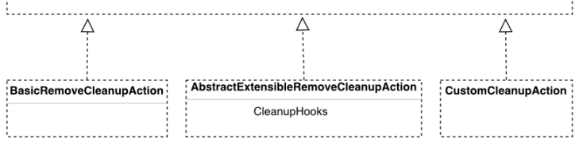

# Data Retention Framework

The Data Retention Framework enables you to retain instances of specied types until they are cleaned up. The framework uses congurable rules in which you specify the instances you are interested in, the cleanup logic you want to execute on them, and when to execute it.  The framework operation ow starts with collecting items (instances of types) according to dened rules. Platform retains those items for a dened period of time until they are removed or some other cleanup action is performed on them. The framework enables you to decide when to perform actions on a given item. You can decide whether it is a specic point in time or a nished period of time. When the point in time arrives, or a retention period for that item has nished, the framework mechanism triggers on that particular item specied actions.

Retention of Audited Data A retention job using the basicRemoveCleanupAction action only removes audited data if the generic audit feature is enabled. For information about the generic audit feature, see Generic Audit.

The framework provides a basic strategy for simple removal of items. For more sophisticated cases, the mechanism can use implementations you can provide in your business extensions. The Data Retention Framework is based on a few concepts:

## Retention Rules

You congure retention rules to indicate the items you are interested in. You specify a retention period, and state what cleanup logic you want to execute on the items when the retention period is over. For example, you may decide you want to remove orders that you have kept in your online store for at least 10 years.

## Data Providers

A data provider collects and returns the items specied in your retention rules. Data providers return batch items in an iteration. A data provider is an instance of a class that implements the RetentionItemsProvider interface.

## Cron Job

A cron job (AfterRetentionCleanupJobPerformable) executes the retention logic. First, data providers fetch the data.

Then the logic is executed on the data. You can execute the cron job with a Java API
(CronjobService.performCronJob(CronJobModel)) or with a trigger. The execution is delegated to AfterRetentionCleanupJobPerformable.

## Business Logic

RetentionCleanupAction is an interface you should implement to dene the custom logic you would like to perform on the collected items. The diagram sums up the entire idea:

## Retention Rules

The Data Retention Framework allows you to congure retention rules.

## 

To start working with the framework, create a RetentionJobModel model to use with either the AfterRetentionCleanupRuleModel or FlexibleSearchRetentionRuleModel rule congurations. To congure a rule, set your values for appropriate rule conguration parameters.

## Afterretentioncleanuprulemodel Conguration

This example conguration enables you to get orders whose itemtype code starts with an order prex and whose expirationTime is older than 10 minutes. These orders are then removed since the actionReference parameter is set to basicRemoveCleanupAction.

code="Rule1" retirementItemType="Order" retirementDateAttribute="Order:expirationTime" retentionTimeSeconds="600" itemFilterExpression="{code} like 'order%'" actionReference="basicRemoveCleanupAction" The AfterRetentionCleanupRuleModel parameters include:

| Parameter Name           | Parameter Type           | Required   |
|--------------------------|--------------------------|------------|
| code                     | String                   | Yes        |
| retirementItemType       | ComposedType             | Yes        |
| retirementDateAttribute  | AttributeDescriptorModel | Yes/No*    |
| retentionTimeSeconds     | long                     | Yes/No*    |
| itemFilterExpression     | String                   | No         |
| retirementDateExpression | String                   | Yes/No*    |
| actionReference          | String                   | Yes        |

* It is required to set retirementDateAttribute with retentionTimeSeconds or set retirementDateExpresion in AfterRetentionCleanupRuleModel.

## Flexiblesearchretentionrulemodel Conguration

This example conguration enables you to return items dened through the searchQuery parameter. These items are then removed because the actionReference parameter is set to basicRemoveCleanupAction.

code="Rule2" actionReference="basicRemoveCleanupAction" searchQuery="select {PK},{itemType} from {Order} where {code} like 'fsorder%' and {expirationTime} 

## Caution

Ensure that the set searchQuery only returns a pk and an item type in proper order, for example "SELECT {PK},
{itemType} FROM..."
The FlexibleSearchRetentionRuleModel parameters include:

| Parameter Name   | Parameter Type   | Required   |
|------------------|------------------|------------|
| code             | String           | Yes        |

This is   For more    the SAP Help  25

| 7/12/2024 Parameter Name   | Parameter Type     | Required   |
|----------------------------|--------------------|------------|
| actionReference            | String             | Yes        |
| searchQuery                | String             | Yes        |
| queryParameters            | Map<String,String> | No         |
| retentionTimeSeconds       | long               | No         |

## Calculated Query Parameters

Due to the fact that date calculations are database dependent, we added some calculated parameters to the queryParameters map. You can use those parameters for searchQuery. This example conguration enables you to get orders whose expirationTime is older than 10 minutes.

code="Rule3" actionReference="basicRemoveCleanupAction" retentionTimeSeconds="600" searchQuery="select {PK},{itemtype} from {Order} where {expirationTime} < ?CALC_RETIREMENT_TIME"
The calculated parameters include:

| Key Name               | Value Description        | Type           |
|------------------------|--------------------------|----------------|
| JAVA_CURRENT_TIME      | current_time from server | java.util.Date |
| CALC_RETIREMENT_TIME   | current_time, minus      | java.util.Date |
| retentionTimeSeconds   |                          |                |
| RETENTION_TIME_SECONDS | retentionTimeSeconds     | long           |

## Implementing Cleanup Logic

The Data Retention Framework allows you to enhance the basic data removal action. You can also implement your own specialized logic for cleaning up data. The Data Retention Framework offers the basic and extensible cleanup actions. Both of them implement the RetentionCleanupAction interface. You have to implement this interface to create your custom cleanup actions.

Basic Removal Action This is   For more    the SAP Help  26 With the basic removal action, you remove items provided by a data provider (BasicRemoveCleanupAction has a Spring bean id ="basicRemoveCleanupAction"). The action also removes item-related audit records generated by the Generic Audit. For more information on audit records, see Generic Audit.

## Extensible Removal Action

The extensible removal action uses the abstract AbstractExtensibleRemoveCleanupAction class. Here you can enhance the basic removal process by plugging in custom hook logic. The extensible removal action executes the hook logic on related items and then removes the main item. Anonymizing customer comments may be an example use case for the extensible removal action. In such a scenario your hook logic may remove identication information from comments, such as customer name. Then the main customer item is removed completely and what you end up with is their anonymized comments only.

Custom hooks must implement the ItemCleanupHook interface. They should also implement the cleanupRelatedObjects method that performs your custom logic on objects related to your main item.

During the cleaning process the AbstractExtensibleRemoveCleanupAction class iterates through all hooks and invokes the implemented cleanupRelatedObjects methods. The default implementation of DefaultExtensibleRemoveCleanupAction removes the main item after all hooks are invoked. You can dene a list of hooks in a Spring conguration by setting the itemCleanupHooks property.

Here is an example DefaultExtensibleRemoveCleanupAction conguration:
<alias name="defaultExtensibleRemoveCleanupAction" alias="extensibleRemoveCleanupAction"/> <bean id="defaultExtensibleRemoveCleanupAction" class="de.hybris.platform.retention.impl.DefaultExt <property name="itemCleanupHooks"> <list/> </property> </bean>
In addition, there are two predened lists of hooks for orders and customers:
<util:list id="orderCleanupHooks" value-type="de.hybris.platform.retention.hook.ItemCleanupHook"/> <util:list id="customerCleanupHooks" value-type="de.hybris.platform.retention.hook.ItemCleanupHook" You can extend those lists and add your hooks in a similar way as in this example:
<bean id="customCleanupHookMergeDirective" depends-on="customerCleanupHooks" parent="listMergeDirec <property name="add" ref="customCleanupHook" /> </bean>
And use it in your extensible action:
<bean id="customRemoveCleanupAction" class="foo.bar.CustomExtensibleRemoveCleanupAction" parent="ab <property name="itemCleanupHooks" ref="customerCleanupHooks"/> </bean>

## Custom Cleanup Action

If you want to introduce your custom cleanup logic, provide your own implementation of the RetentionCleanupAction interface, set up a bean id on a Spring XML, and set up the name of this bean on actionReference.

This is   For more    the SAP Help  27

## Dening Cronjob Behavior

One of the required parameters of RetentionJobModel is batchSize. It determines how many items are returned by a data provider in one package and processed by RetentionCleanupAction.

The whole package of items is processed in a separete transaction scope. If any exception is thrown from RetentionCleanupAction, the transaction is rolled back for the entire package.

## Example Rule Congurations

See the examples of rule congurations in data retention framework. The examples include AfterRetentionCleanupRule and FlexibleSearchRetentionRule congurations.

## Afterretentioncleanuprule Note

Set impex.legacy.scripting to false. In SAP Commerce Cloud Administration Console, check the Enable code execution box in the Settings section of the Impex Import tab.

## Example Of Afterretentioncleanuprule

\# CUSTOMER INSERT_UPDATE Customer;uid[unique=true];customerID;name; ;user1;user1;name; \# RETENTION RULE insert_update AfterRetentionCleanupRule;code[unique=true];retirementItemType(code);itemFilterExpres ; rule; Order; {code} like 'order%'; basicRemoveCleanupAction; 600; Order:expirationTim \# JOB INSERT_UPDATE RetentionJob;code[unique=true];retentionRule(code);batchSize ; retentionJob; rule; 100 \# CRON JOB INSERT_UPDATE CronJob;code[unique=true];job(code);sessionLanguage(isoCode)[default=en] ; retentionCronJob; retentionJob; \# ORDERS INSERT_UPDATE Order;code[unique=true];user(uid);date[dateformat=dd.MM.yyyy HH:mm];expirationTime[da "\#%groovy% import java.util.Date import groovy.time.TimeCategory String lines = '' Date now = new java.util.Date() String format = ""dd.MM.yyyy HH:mm:ss"" String creationDate = now.format(format, TimeZone.getTimeZone('CET')) for(i = 0; i < 50; i++) { use( TimeCategory ) { after30Mins = now - (i * 30).seconds } String expirationTime = after30Mins.format(format, TimeZone.getTimeZone('CET')) lines += 'order' + i + ';user1;' + creationDate + ';' + expirationTime + ';EUR\n' } impex.info('importing Orders: +\n' + lines) reader = new CSVReader(lines) reader.setMaxBufferLines(100000) impex.includeExternalData(reader) "; \# select {code}, {expirationTime} from {Order} where {code} like 'order%' order by {expirationTime}
This is   For more    the SAP Help  28 Execute the cron job using the scripting console (groovy)
import de.hybris.platform.core.Registry import de.hybris.platform.servicelayer.cronjob.CronJobService CronJobService cronJobService = Registry.getApplicationContext().getBean("cronJobService") cronJobService.performCronJob(cronJobService.getCronJob("retentionCronJob"))

## Flexiblesearchretentionrule

 Note The query is DB-dependent (date-time manipulation). In this example, it was tested using the MySQL DB.

Example of FlexibleSearchRetentionRule
\# FS RULE insert_update FlexibleSearchRetentionRule;code[unique=true];searchQuery;actionReference; ; fsrule; select {PK}, {itemtype} from {Order} where {code} like 'fsorder%' and {expirationTime} < \# FS JOB INSERT_UPDATE RetentionJob;code[unique=true];retentionRule(code);batchSize ; fsretentionJob; fsrule; 100 \# FS CRON JOB INSERT_UPDATE CronJob;code[unique=true];job(code);sessionLanguage(isoCode)[default=en] ; fsretentionCronJob; fsretentionJob; \# ORDERS INSERT_UPDATE Order;code[unique=true];user(uid);date[dateformat=dd.MM.yyyy HH:mm];expirationTime[da "\#%groovy% import java.util.Date import groovy.time.TimeCategory String lines = '' Date now = new java.util.Date() String format = ""dd.MM.yyyy HH:mm:ss"" String creationDate = now.format(format, TimeZone.getTimeZone('CET')) for(i = 0; i < 10; i++) {
 use( TimeCategory ) {
 after = now - i.days } String expirationTime = after.format(format, TimeZone.getTimeZone('CET')) lines += 'fsorder' + i + ';user1;' + creationDate + ';' + expirationTime + ';EUR\n' } impex.info('importing Orders: +\n' + lines) reader = new CSVReader(lines) reader.setMaxBufferLines(100000) impex.includeExternalData(reader) ";
Execute the cron job using the scripting console (groovy)
import de.hybris.platform.core.Registry import de.hybris.platform.servicelayer.cronjob.CronJobService CronJobService cronJobService = Registry.getApplicationContext().getBean("cronJobService") cronJobService.performCronJob(cronJobService.getCronJob("fsretentionCronJob"))

## Examples For Testing

AfterRetentionCleanupRule

Set impex.legacy.scripting to false. In SAP Commerce Cloud Administration Console, check the Enable code execution box in the Settings section of the Impex Import tab.

## Example Of Afterretentioncleanuprule

\# CUSTOMER INSERT_UPDATE Customer;uid[unique=true];customerID;name; ;user1;user1;name; \# RETENTION RULE insert_update AfterRetentionCleanupRule;code[unique=true];retirementItemType(code);itemFilterExpres ; rule; Order; {code} like 'order%'; basicRemoveCleanupAction; 600; Order:expirationTim \# JOB INSERT_UPDATE RetentionJob;code[unique=true];retentionRule(code);batchSize ; retentionJob; rule; 100 \# CRON JOB INSERT_UPDATE CronJob;code[unique=true];job(code);sessionLanguage(isoCode)[default=en] ; retentionCronJob; retentionJob; \# ORDERS INSERT_UPDATE Order;code[unique=true];user(uid);date[dateformat=dd.MM.yyyy HH:mm];expirationTime[da "\#%groovy% import java.util.Date import groovy.time.TimeCategory String lines = '' Date now = new java.util.Date() String format = ""dd.MM.yyyy HH:mm:ss"" String creationDate = now.format(format, TimeZone.getTimeZone('CET')) for(i = 0; i < 50; i++) { use( TimeCategory ) { after30Mins = now - (i * 30).seconds } String expirationTime = after30Mins.format(format, TimeZone.getTimeZone('CET')) lines += 'order' + i + ';user1;' + creationDate + ';' + expirationTime + ';EUR\n' } impex.info('importing Orders: +\n' + lines) reader = new CSVReader(lines) reader.setMaxBufferLines(100000) impex.includeExternalData(reader) "; \# select {code}, {expirationTime} from {Order} where {code} like 'order%' order by {expirationTime}

## Execute The Cron Job Using The Scripting Console (Groovy)

import de.hybris.platform.core.Registry import de.hybris.platform.servicelayer.cronjob.CronJobService CronJobService cronJobService = Registry.getApplicationContext().getBean("cronJobService") cronJobService.performCronJob(cronJobService.getCronJob("retentionCronJob"))
FlexibleSearchRetentionRule

The query is DB-dependent (date-time manipulation). In this example, it was tested using the MySQL DB. \# FS RULE insert_update FlexibleSearchRetentionRule;code[unique=true];searchQuery;actionReference; ; fsrule; select {PK}, {itemtype} from {Order} where {code} like 'fsorder%' and {expirationTime} < 
This is   For more    the SAP Help  30
\# FS JOB INSERT_UPDATE RetentionJob;code[unique=true];retentionRule(code);batchSize ; fsretentionJob; fsrule; 100 \# FS CRON JOB INSERT_UPDATE CronJob;code[unique=true];job(code);sessionLanguage(isoCode)[default=en] ; fsretentionCronJob; fsretentionJob; \# ORDERS INSERT_UPDATE Order;code[unique=true];user(uid);date[dateformat=dd.MM.yyyy HH:mm];expirationTime[da "\#%groovy% import java.util.Date import groovy.time.TimeCategory String lines = '' Date now = new java.util.Date() String format = ""dd.MM.yyyy HH:mm:ss"" String creationDate = now.format(format, TimeZone.getTimeZone('CET')) for(i = 0; i < 10; i++) { use( TimeCategory ) { after = now - i.days } String expirationTime = after.format(format, TimeZone.getTimeZone('CET')) lines += 'fsorder' + i + ';user1;' + creationDate + ';' + expirationTime + ';EUR\n' } impex.info('importing Orders: +\n' + lines) reader = new CSVReader(lines) reader.setMaxBufferLines(100000) impex.includeExternalData(reader) ";

## Execute The Cron Job Using The Scripting Console (Groovy)

import de.hybris.platform.core.Registry import de.hybris.platform.servicelayer.cronjob.CronJobService CronJobService cronJobService = Registry.getApplicationContext().getBean("cronJobService") cronJobService.performCronJob(cronJobService.getCronJob("fsretentionCronJob"))

## Examples For Maintenance

You can use the data retention framework for basic maintenance tasks, such as cleaning database tables from old diagnostic records. You can dene a particular retention rule, job, cron job, and trigger to keep your data clean.

AfterRetentionCleanupRule This rule strictly sticks to a declared type. Set a Date-based property (retirement date attribute) that should be compared when records are selected according to the retention time (counted in seconds). In the following example, the rule lters out and deletes all FINISHED CronJobHistory entries that ended more than 3600 seconds ago. The retention cron job runs every 30 minutes. It uses basicRemoveCleanupAction for removing items.

\# RETENTION RULE insert_update AfterRetentionCleanupRule;code[unique=true]; retirementItemType(code); itemFilterExpr ; cronJobHistoryCleanupRule; CronJobHistory; {status} IN ( {{ SELECT {pk} FROM {CronJobStatus} wher \# JOB INSERT_UPDATE RetentionJob; code[unique=true]; retentionRule(code); batchSize ; cronJobHistoryRetentionJob; cronJobHistoryCleanupRule; 100 \# CRON JOB INSERT_UPDATE CronJob;code[unique=true]; job(code); sessionLanguage(isoCode)[default=en] ; cronJobHistoryRetentionCronJob; cronJobHistoryRetentionJob; \# Trigger run every 30 minutes INSERT_UPDATE Trigger; cronJob(code)[unique = true]; second; minute; hour; day; month; year; relati ; cronJobHistoryRetentionCronJob; 0; 30; -1; -1; -1; -1; true; true; -1 This is   For more    the SAP Help  31 The lter expression is optional, however it can be useful when you want to lter out specic records.

FlexibleSearchRetentionRule This rule is based on a exible search query. You can exible-select rows. The query returns a list o PKs from one type. You can use a predened current_date value which returns a current date value during execution.

In the example, the dened rule removes all orders named as internal whose expiration date is older than one day.

## Example Of Afterretentioncleanuprule

\# FS RULE insert_update FlexibleSearchRetentionRule;code[unique=true];searchQuery;actionReference; ; fsInternalOrderRule; select {PK}, {itemtype} from {Order} where {name} like 'internal%' and {expi \# FS JOB INSERT_UPDATE RetentionJob;code[unique=true];retentionRule(code);batchSize ; fsInternalOrderRetentionJob; fsInternalOrderRule; 100 \# FS CRON JOB INSERT_UPDATE CronJob;code[unique=true];job(code);sessionLanguage(isoCode)[default=en] ; fsInternalOrderRetentionCronJob; fsInternalOrderRetentionJob; \# TRIGGER INSERT_UPDATE Trigger; cronJob(code)[unique=true]; cronExpression ; fsInternalOrderRetentionCronJob; 0 */4 * ? * *

## Item Locking Service

The Item Locking Service enables you to lock items against modication or removal.

You can use the service to lock any item that is an instance of ItemModel. For example, you may need to lock some specic instance of the User type - and when it is a customer - their orders, or comments they left about the products they bought.

To be able to lock or unlock items, you must be the admin or belong to itemLockingGroup.

This code sample shows how to lock an item:

## Remember

You can only lock items that are persisted in the database - they must have a non-null PK. UserModel user = modelService.create(UserModel.class); user.setUid(UUID.randomUUID().toString()); modelService.save(user); // now we lock the user itemLockingService.lock(user);
For the AfterRetentionCleanupRuleModel rule, all locked items are skipped when the rule is being executed. For the FlexibleRetentionRuleModel rule, if you now try to remove, for example, the locked user item, you get ModelRemovalException. Similarly, when you try to edit it, you get ItemLockedForProcessingException. If you want to skip locked items to avoid getting exceptions when using FlexibleRetentionRuleModel, add a suitable part to the searchQuery parameter yourself, for example: "... and (it.sealed=0 or it.sealed is NULL)...".

This code sample shows how to check whether an item is locked:

itemLockingService.isLocked(user); // or directly from model without using the Item Locking Service user.isSealed();
This code sample shows how to unlock an item:
itemLockingService.unlock(user);

## Enabling Users To Lock Items

By default, only the admin can lock or unlock items. To enable others to perform those functions, add them to itemLockingGroup.

This code sample shows how to enable users other than the admin to lock and unlock items:
Set<PrincipalGroupModel> oldGroups; Set<PrincipalGroupModel> groupsWithItemLockingGroup; final PrincipalGroupModel group = modelService.create(UserGroupModel.class); group.setUid("itemLockingGroup"); oldGroups = userService.getCurrentUser().getGroups(); groupsWithItemLockingGroup = new HashSet<>(oldGroups); groupsWithItemLockingGroup.add(group); userService.getCurrentUser().setGroups(groupsWithItemLockingGroup); UserModel user = modelService.create(UserModel.class); user.setUid(UUID.randomUUID().toString()); modelService.save(user); itemLockingService.lock(user);
The admin user is a member of itemLockingGroup by default.

## Audit Records Of Generic Audit

The Generic Audit feature can track changes in items and it shows those changes as audit records. After you lock items that you track using the Generic Audit, you won't be able to remove their audit records either. For more information on audit records, see Generic Audit.