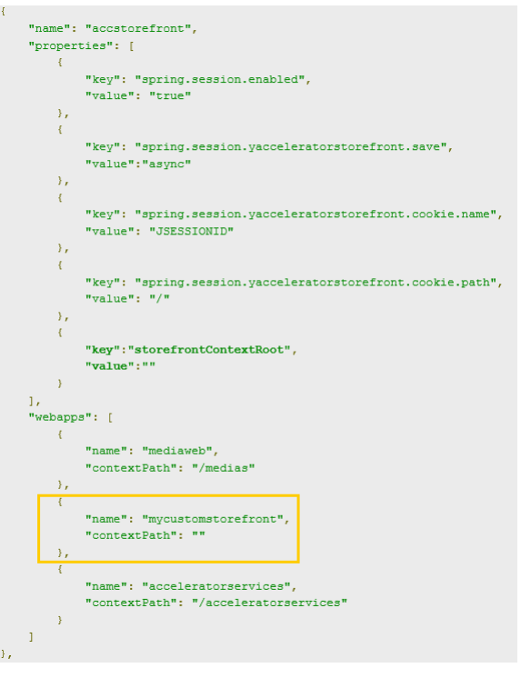
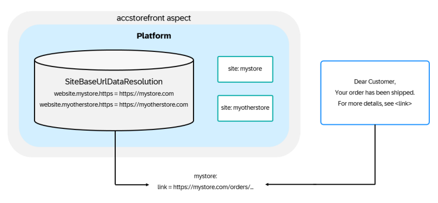
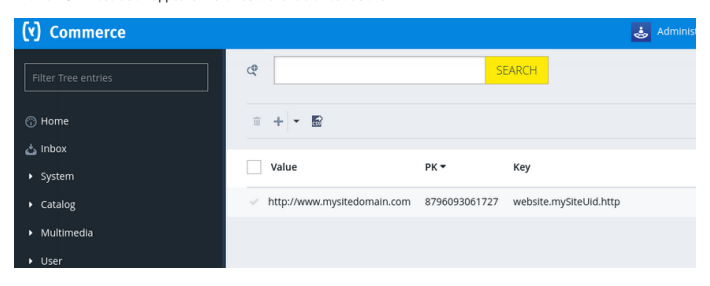
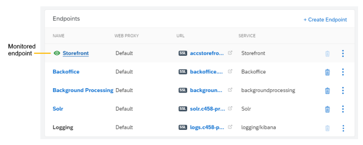

# Cloud Portal Environments

An environment is a group of infrastructure components designed to host an application, and typically includes Kubernetes clusters, databases, and media storages. Environment types are dened by their operational purpose. To function as required, environments need to be congured, operated, and maintained correctly, and the Cloud Portal facilitates most of the associated tasks. You can view the list of environments for your subscription by clicking Deployment Environments in the Cloud Portal side navigation. Each panel represents one environment and displays the following information:
The name of the environment

The type of environment, which denes its purpose The deployment status of the environment, including its source le and build code If there are no deployed builds on the environment, the Build eld does not appear in the panel.
This is   For more    the SAP Help  2 The current status of the environment, which reects any results or processes occuring on the environment If an environment is available, click anywhere in the environment panel to view details of its components. To access an environment that appears inactive or unable to be selected, contact your System Administrator.

Overview SAP Commerce Cloud provides a range of environment types and sizes, all of which can be congured to suit your specic tasks and security requirements. Use the Cloud Portal to congure your storefront properties, endpoint access, performance monitoring, and storage resources. Setup An environment consists of a set of components, services, and data that forms the backbone of your site. You need to dene its basic properties before deploying builds and activating features. Testing Maintenance Once your environment is running, you need to perform system maintenance to keep operating efficiently. Operations Once you dene your environment properties, you can add services and manage its features and operations with a variety of tools.

Overview

## Overview

SAP Commerce Cloud provides a range of environment types and sizes, all of which can be congured to suit your specic tasks and security requirements. Use the Cloud Portal to congure your storefront properties, endpoint access, performance monitoring, and storage resources.

## Assigning Environments

You can control and review who has access to each individual environment with the User Management feature. When you open the User Management page, you can see a list of users for your subscription and review which environments to which they have access. If you are a Customer System Administrator, you can assign environments per user prole. For more information, see Adding Users and Assigning Roles.

## Environment Types

There are three types of environments:
Development environments are used to test developer builds. They should not be used for large data loads, or for loading production data for testing purposes. Staging environments are typically used for User Acceptance Testing (UAT), and to prepare a site for launch. Production environments are used to operate live sites. As staging environments have fewer resources than production environments, performance testing can also be carried out on a production environment before going live.

The resources provided for each environment differ, and associated costs increase with capacity. The number of virtual machines and DTUs, and the size and type of database used for each environment are subject to change. Development and performance requirements drive these decisions.

This is   For more    the SAP Help  3

## Provisioning Environments

Environments are created and provisioned in two ways:

The system automatically creates and provisions your rst development environment. Additional environments that you're entitled to use are provisioned by authorized customer administrators using SAP
for Me.
SAP for Me uses different terms for environments:
Environments are called systems Development environments are called Customer Development entitlement roles

Staging environments are called Staging entitlement roles Production environments are called Productive entitlement roles
When an environment is provisioned, it appears on the Environments page when you log in to the Cloud Portal and select your subscription. If you expect to see an environment and it's not listed, contact the super administrator for your organization. If you don't know who your super administrator is, you can nd out by checking under My Important Contacts in SAP ONE Support Launchpad or by contacting the SAP Customer Interaction Center . For more information on provisioning environments, refer to Provisioning Environments.

## Environment Statuses

An environment has one of three statuses:
Provisioning: The system is creating the environment, but it isn't ready.

Available: The environment is provisioned and is ready. Error: The environment isn't successfully provisioned and is in an error state.
When you start a process on an environment, the system locks it down during that process. While being in a locked state, you can't modify the environment, nor can you trigger actions that would access the environment. Feature buttons on a locked environment appear dimmed and are unavailable until the process completes itself and unlocks the environment.

Any processes that attempt to access a locked environment will either fail or produce unexpected results.

## Regional And Default Settings

The system denes the regional settings for your environments when it creates the environment. If you want to change the locale or the time zone for your environment, use the Edit Environment option.

## Caution

Changing the time zone of an environment results in all timestamp values being reinterpreted as if they were created in the new time zone. This could result in loss of Commerce data. For example, changing from UTC to EST would erroneously show This is   For more    the SAP Help  4 an order placed at 11:22:33 UTC as being placed at 07:22:33, which is the EST equivalent of 11:22:33.

If you do change the time zone, it's highly recommended that you then redeploy builds with database initialization to recreate data using the new time zone.

File encoding, by default, is set to UTF-8 for commerce environments. Environments that include Data Hub use ASCII. If you want to use UTF-8 encoding for Data Hub, contact Support for assistance.

## Environment Details

From the Environments page, you can click the name of an environment to open the environment details page. At the top of the page, a summary for the environment appears.

Status: The environment status Build: The name of the build that was deployed to the environment, along with the build code and the SAP Commerce Cloud version. If there are no deployed builds on the environment, the Build eld does not appear in the summary panel. Deployment: The status of the deployed build, along with a link to view the deployment history.

If you are running a version of SAP Commerce Cloud that is either near (less than three months) or out of Mainstream Maintenance, a banner appears at the top of the Environment Details page to indicate this status, and to invite you to upgrade your Commerce software.

Additional panels provide you with an overview of the congured aspects of your environment.

The Public Endpoints panel is prepopulated with the standard endpoints that are automatically congured when you create an environment. You can customize these endpoints to control the ow of traffic and to secure access. For more information, refer to Endpoints.

The Cloud Storage panel contains a link to the hot folder Microsoft Azure Blob Storage account that is automatically created to support your environment.
For more information, refer to Cloud Hot Folders.

The Data Backups panel gives you the option to create a time-stamped record of your database, media storage, and deployed application.
For more information, refer to Data Backup and Restore. The Deployment Conguration panel lets you create a deployment conguration that contains trusted certicates, host aliases, and security les. Each time you deploy a build to the environment, these artifacts are applied to the build. For more information, refer to Security. The Services panel contains a list of the services that you can control. There are two types of services. Platform services include API, Backoffice, storefront, JavaScript storefront, Background Processing, and Data Hub. Conguration services include hcs_common and hcs_admin. For more information, refer to Services. The Monitoring panel lists any problems with the environment as detected and reported by Dynatrace. To investigate further, launch Dynatrace from the Environments page either by:
Clicking the number of problems. Clicking the Dynatrace button in the top-right corner of the Monitoring panel.

A new Dynatrace session appears in a new tab/window. When you log in, the list of problems for your environment appears automatically. For more information on accessing Dynatrace, refer to Accessing Dynatrace.

The Monitoring panel only appears when its Global Feature toggle is enabled. If you don't see the Monitoring panel in the Environments page, contact your system administrator.

## Deployment Progress Panel

When a build deploys, a deployment progress panel appears at the top of the environment details page. This panel displays all deployment actions and the progress of those actions. During the deployment, a progress bar estimates the percentage of components that nished deploying. This percentage doesn't indicate the time remaining for the deployment to complete. If a problem occurs during the deployment, the progress bar stops. The icon opens a link to deployment logs. When the deploy action is complete, the deployment progress panel disappears, but you can still access the information from the deployment details page. For more information, refer to Environment Deployment Details.

## Environment Logs

After an environment is provisioned, you can view the environment logs to nd performance and logging data for the environment. For more information, refer to Logs.

Editing Your Environment Edit the locale or time zone for an existing environment from the Environments page of the Cloud Portal.

Provisioning Environments Updating Service Properties

## Editing Your Environment

Edit the locale or time zone for an existing environment from the Environments page of the Cloud Portal.

1. From the navigation menu, select Environments.

The Environments overview opens.

2. Click on the environment you want to edit.

The Environment details view opens.

3. Click Edit Environment. 4. Update the locale or time zone using the following dropdown lists:
Environment Locale: select the native-language that corresponds to the geographic region of your environment.

This is   For more    the SAP Help  6 For example, if your environment is in the United Status, you could select en_US, but if your environment is in Great Britain, you could select en_GB.

Environment Time Zone: select the standard time that corresponds to the geographic region of your environment.

## Caution

Changing the time zone of an environment results in all timestamp values being reinterpreted as if they were created in the new time zone. This could result in loss of Commerce data. For example, changing from UTC to EST would erroneously show an order placed at 11:22:33 UTC as being placed at 07:22:33, which is the EST equivalent of 11:22:33. If you do change the time zone, it's highly recommended that you then redeploy builds with database initialization to re-create data using the new time zone.

5. Click Save. 6. Redeploy the build to apply the environment changes.

## Finding The Environment Code

Environment codes are used to identify environments when they're referenced in environment variable congurations or in API calls. The underlying administrative application assigns the code when the environment is created. The Cloud Portal reveals the environment code in the environment endpoint URL.

You have a provisioned environment.

1. Select Environments from the left menu in the Cloud Portal and then select an environment.

The Environment details page opens.

2. In the Endpoints section, nd the list of endpoint URLs. 3. In one of the endpoint URLs, nd the part of the URL that indicates the environment code.

production environments are p[\#]
staging environments are s[\#]
development environments are d[\#]
For example, in the following API URL example, the environment code is p1.

api.test-sub2-p1-public.myhybris.cloud

Use the environment code as part of the datahub-environment-[environment code].conf name if you have environments that need specic conguration requirements. For more information, refer to Integrating Third-Party Applications with Data Hub.

SAP Commerce Cloud API Documentation API Tokens

## Setup

An environment consists of a set of components, services, and data that forms the backbone of your site. You need to dene its basic properties before deploying builds and activating features.

Provision Environments If you need an environment for testing or development, it's cost-effective to use a temporarily-provisioned environment that you can then deprovision when you no longer need it. Scale Database and Node Pools Scaling the database and node pools enables performance tests to be run on non-production environments that typically have lower performance metrics. Front-End Conguration For security reasons, the general public cannot access new storefronts until they are congured. This section includes guidance on conguring your storefront for access either by your employees only, or the general public. Website Redirects Website redirects dene alternative landing pages for your storefront. Static Files You can use the Cloud Portal to expose static les via a web endpoint, or upload static les to inject properties into the application. Endpoints Endpoints congure the web tier of your application to control web traffic and secure access to SAP Commerce Cloud. Blob storage Blob storage lets SAP Commerce Cloud users save text, imagery, audio, and video les to Microsoft's cloud platform. This unstructured data is then accessible from anywhere in the world. Identity Service The environment comes with easy to use SAP Identity Authentication Service and SAP Identity Provisioning Service integration, so that you can set up your Single Sign-On and User Provision functions conveniently. Web Application Firewall (WAF Lite) A web application rewall (WAF) offers an emergency solution to help protect services and endpoints against malicious attacks.

## Provision Environments

If you need an environment for testing or development, it's cost-effective to use a temporarily-provisioned environment that you can then deprovision when you no longer need it. When an administrator creates environments, the Cloud Portal assigns them a status of Ready for deployment and does not provision them immediately. This delay to provision prevents wasted idling time, which in turn reduces costs and eliminates a misallocation of resources. You can scale all non-production environments ( including all sandboxes); the only environment you can't scale are production environments. When scaling environments down, the system preserves the existing data backups.

Only an SAP Commerce Cloud administrator can create environments in Cloud Portal. To add new environments, you must purchase them from SAP.

You can provision an environment in one of two ways:
When you deploy a build on that environment.

When you click Scale Up.

You can deprovision an environment using Dematerialize. When you deprovision an environment, the system removes all the resources from that environment and brings it back to the Ready for deployment state. When you provision or deprovision an environment, the system updates your consumption credits when the process is successful and complete.

Provisioning You can provision a environment without deploying a build. Reviewing Provision Status You can review the provision status of an environment from the environment details page. Deprovisioning You can deprovision a environment when you no longer need it for testing or development.

Deployments

## Provisioning

You can provision a environment without deploying a build.

You have a scalable, non-live, non-production environment

You have available consumption credits to scale up your resources You hold one of the following roles:
CUSTOMER_SYS_ADMIN SITE_RELIABILITY_ENGINEER

COMMERCE_CLOUD_ADMINISTRATOR DEVOPS_SRE DEVOPS_CRE PROVISIONING_MANAGER PROVISIONING_ENGINEER SERVICE_REQUEST_MANAGEMENT
If you don't have any of these roles, or if the environment does not meet the prerequisites, the Scaling Conguration panel displays the current conguration, but the Edit button is hidden. Without the appropriate role or specications, you can't modify the conguration.

Manually provisioning an environment without deploying a build is useful if you want to run tests or for development purposes.

You can also wait until you deploy a build, which automatically provisions the environment. When you no longer need the environment, you can deprovision it, freeing up your resources and reducing your costs. The system updates your consumption credits when the process is successful and complete.

1. Click Deployment Environments .

The list of environments appears.

2. Find the environment you want to provision and click Scale Up in the environment's panel.

You can also open the environment's details page and click Scale Up.

If the button appears as Dematerialize, the environment is currently provisioned. For more information on deprovisioning an environment, see Deprovisioning. If the environment status is Failed, the Scale Up/Dematerialize buttons are hidden. To change the status to Available or Ready for Deployment, contact Support. If the Scale Up/Dematerialize button does not appear, this can also mean that you do not have the appropriate role or the environment does not meet the specications to change the scaling.

A dialog box indicates that the scaling up process has been begun.

3. Click Scale Up in the dialog box to conrm your action.

When the environment details page appears, the Provisioning status appears in the Status eld. When the process completes, the status changes to Available and the Dematerialize button appears.

## Reviewing Provision Status

You can review the provision status of an environment from the environment details page.

You have an environment that may or may not be provisioned.

When environments are automatically created for your subscription, the Cloud Portal assigns them a status of Ready for deployment and only provisions a minimum of resources. When you deploy the rst build on the environment, the system creates additional resources and upscales them. This delay to full provisioning reduces costs and eliminates a misallocation of resources. Consequently, the system optimizes the resources for any environments that do not have a deployment yet using a scheduled update process:

Creating a scheduled update adds or removes environments, or applies lters.

Running a scheduled update starts a clean-up procedure that nds environments without a deployment and scales down unnecessary resources.
You can check the deployment/provision status for an environment in the Cloud Portal as follows:

1. Click Deployment Environments and select the environment to review.

2. Check the Status in the top header section of the environment.

Ready for deployment: The environment is available with optimized resources. Provisioning: The deployment and provisioning process is currently running. Available: The deployment and provisioning process is complete and successful. Failed: The deployment and provisioning process did not complete successfully.
Scheduled Updates Managing Upgrades

## Deprovisioning

You can deprovision a environment when you no longer need it for testing or development.

You have a scalable, non-live, non-production environment

You have available consumption credits to dematerialize your resources You hold one of the following roles:
CUSTOMER_SYS_ADMIN SITE_RELIABILITY_ENGINEER COMMERCE_CLOUD_ADMINISTRATOR DEVOPS_SRE DEVOPS_CRE PROVISIONING_MANAGER PROVISIONING_ENGINEER SERVICE_REQUEST_MANAGEMENT
If you don't have any of these roles, or if the environment does not meet the prerequisites, the Scaling Conguration panel displays the current conguration, but the Edit button is hidden. Without the appropriate role or specications, you can't modify the conguration.

The deprovision process removes all the data including anything in the media storage. Ensure that you make accurate backups before you deprovision an environment. A deprovisioned environment becomes inactive and its status changes to Ready for Deployment. The system updates your consumption credits when the process is successful and complete.

1. Click Deployment Environments .

The list of environments appears.

2. Find the environment you want to deprovision and click Dematerialize in the environment's panel.

You can also open the environment's details page and click Dematerialize.

If the button appears as Scale Up, the environment is not currently provisioned. For more information on provisioning an environment, see Provisioning. If the environment status is Failed, the Scale Up/Dematerialize buttons are hidden. To change the status to Available or Ready for Deployment, contact Support. If the Scale Up/Dematerialize button does not appear, this can also mean that you do not have the appropriate role or the environment does not meet the specications to change the scaling.

A dialog box appears to indicate that the dematerializing process is ready to begin.

3. Click Dematerialize in the dialog box to conrm your action.

When the environment details page appears, the Terminating status appears in the Status eld. When the process completes, the status changes to Ready for Deployment and the Scale Up button appears.

## Scale Database And Node Pools

Scaling the database and node pools enables performance tests to be run on non-production environments that typically have lower performance metrics.

You have a scalable, non-live, non-production environment You have available consumption credits to scale up your resources

You hold one of the following roles:
CUSTOMER_SYS_ADMIN COMMERCE_CLOUD_ADMINISTRATOR DEVOPS_CRE DEVOPS_SRE
PRODUCT_ENGINEERING (read only)
PROVISIONING_MANAGER (read only) PROVISIONING_ENGINEER (read only) RELEASE_MANAGER (read only)
SERVICE_REQUEST_MANAGEMENT (read only)
SITE_RELIABILITY_ENGINEER
If the environment does not meet the pre-requirements, you can still select the Scaling Conguration panel and review the conguration, but you can't modify the elds. However, only these roles can view the Scaling Conguration panel; for all other roles, the Scaling Conguration panel is hidden.

You can use this page to scale a database and the Virtual Machine (VM) type in the cluster. When scaling up your environment's resources, you can expect this process to apply charges to your consumption credits. For more information, see Consumption Credits.

1. From the left menu, select Environments.

The Environments page appears.

2. Select an environment.

The environment details page appears.

3. Scroll down to the Scaling Conguration panel and review the current settings. 4. To modify the scaling conguration, click Edit.

The Scaling Conguration page appears.

5. Congure the database performance as follows:

Database performance: Select the database type of Azure storage. Like VMs, the application denition lters the databases according to their region. There are two basic types of Azure storage for SAP Commerce Cloud workloads:
Standard: This Azure package is suited for workloads that require consistent performance at lower IOPS levels. The standard storage meets the demands for non-production SAP Commerce Cloud systems that have low throughput and IOPS. Premium: This Azure package offers a shared storage that includes SMB and NFS with sufficient latency to handle the SAP Commerce Cloud application layer.
Database size: Select the total capacity of the database, which includes media.

6. Congure the virtual machines as follows:

Cluster Nodepool VM: Select the type of VMs for the main node pool, ltered by the application denition in that region. These node pools include the VMs that run your applications. Maximum number of VMs: Select the maximum number of VMs that this nodepool can contain.
Minimum: 1 Maximum: 60 7. Click Save when done.

## Front-End Conguration

For security reasons, the general public cannot access new storefronts until they are congured. This section includes guidance on conguring your storefront for access either by your employees only, or the general public.

Storefront Endpoint The storefront endpoint provides your customers with access to your storefront. Base Site URL Resolution You can congure base site URLs to ensure that they're consistent for both the incoming and outgoing requests.

## Storefront Endpoint

The storefront endpoint provides your customers with access to your storefront. Endpoint conguration is managed in the build manifest and the Cloud Portal. In the build manifest, you can dene an optional path for the storefront domain. In the Cloud Portal, you can edit the domain and apply an SSL certicate to secure the storefront.

## Build Manifest Storefront Endpoint Conguration

In the build manifest, you can append a path to the domain of your storefront. In the accstorefront section of aspects, notice the webapps section. If the contextpath for mycustomstorefront is set as empty quotes "", then the default URL
for the storefront is the domain. If you want to add a path, dene the path as "contextPath": "/*<path>*".

The example shows the endpoint as the domain without a path since empty quotes appear in contextpath.

## Default Storefront Domain

Your storefront endpoint has a default domain assigned when the environment is initially provisioned. This default domain is the domain that you want to reference in the CNAME record registered with your DNS provider.

After the environment is successfully provisioned, log into the Cloud Portal and update the domain with the actual domain that customers use to access your storefront. To learn more, see Setting the Domain for a Storefront Endpoint.

If you want to add one or more storefront domains in addition to the default domain, see Configure Multiple Endpoints for JavaScript Storefronts .

## Storefront Extension

The SAP Commerce Cloud modeltacceleratorservices extension provides more configuration options for the storefront endpoint. To enable this extension, include it in the extension section of your SAP Commerce Cloud manifest.json file and This is custom documentation. For more information, please visit the SAP Help Portal

## Custom Response Headers

You can congure a response header to include a more detailed context that doesn't relate to the content of the message. Response headers can include data like Age, Location, Server, etc. To create a specic conguration of the response header, you can use Security HTTP Response Header Sets to create, update, delete HTTP Response header sets. You can also assign or remove HTTP Response header sets from endpoints. For more information, see HTTP Response Header Sets.

## Caution

Use caution when modifying security headers. Be clear and concise about what to update and include how these changes can impact other components and features.

Accessing the Storefront Conguring Base Site URL in Backoffice Endpoints

## Setting The Domain For A Storefront Endpoint

When an environment is provisioned, a default storefront domain is assigned to the storefront endpoint. Register the default domain with your DNS provider. Then you can update the default storefront domain with the actual domain that your customers expect to use when accessing your storefront.

You uploaded an SSL certicate that includes the domain that you want to set for the storefront. See Adding SSL Certicates.

1. From the left menu in the Cloud Portal, select Environments.

2. Under Endpoints, click the storefront endpoint link in the Name column.

The Edit Endpoint page opens.

3. Update the default domain for the storefront.

a. In the Basic Conguration section, type the storefront domain in the Domain eld.

 Note The domain entered must be one of the domains listed in the SSL certicate associated to the endpoint. You can check the Domains panel at the bottom of the Basic Conguration page to verify the domain.

b. Click Save.

4. Register the default storefront domain with your DNS provider.

a. Open any of the other endpoints and copy the default domain.

b. Replace the rst part of the domain with accstorefront.

For example, if the Solr default endpoint is solr.cgpg-p2-public.myhybris.cloud, then the storefront default endpoint is accstorefront.cgpg-p2-public.myhybris.cloud.

c. Log in to your DNS service.

d. Create a CNAME record for the default storefront domain. e. Save the CNAME record.

5. From a browser, navigate to the storefront domain and verify that you can access the storefront.

6. Optional: If you are adding one or more additional storefronts rather than conguring the default storefront domain, see Congure Multiple Endpoints for JavaScript Storefronts to complete the set up procedure.

## Accessing The Storefront

You can access the storefront from the endpoint that was automatically congured when you provisioned the environment.

You updated the default domain assigned to the storefront endpoint with a domain identied in the endpoint SSL certicate. To learn more, see Setting the Domain for a Storefront Endpoint.

1. Select Environments from the left menu in the Cloud Portal.

A list of provisioned environments displays.

2. Click the name of an environment.

The environment details page displays.

3. Under Public Endpoints, nd Storefront. 4. Click the link that displays in the URL column.

A web browser window opens and navigates to the storefront endpoint.

Always check the endpoint URL. In some cases, the path is not automatically appended to the endpoint URL, even though it is dened in the build manifest. You can append the path to the endpoint URL in the browser address and press Enter.

Example: https://<your_storefront_URL>/<path>

## Base Site Url Resolution

You can congure base site URLs to ensure that they're consistent for both the incoming and outgoing requests. To ensure that base site URLs work for both incoming and outgoing requests, Accelerators require the following mappings:

CMSSite regex rules that are used to map request URL to a given site. This mapping ensures that all incoming requests are routed to the correct site, for example users requesting staging.electronics.com are redirected to the electronics site. Generic CMSSite regex rules are congured by default and can be modied through ImpEx.

Endpoint and domain site mapping that ensures that SAP Commerce Cloud knows the relevant URL in situations where the request context isn't provided, for example when sending an order conrmation email. You can congure endpoint or
This is   For more    the SAP Help  17 site to URL mapping in the database through Backoffice or through the website.*<your_site>*.https=
<your_URL> environment property.

Current Accelerators don't support the run-time database conguration. Use the modeltacceleratorservices extension to enable it.

See an example of base site URL conguration in Backoffice:

Storefront Endpoint Setting the Domain for a Storefront Endpoint Conguring Base Site URL in Backoffice

## Conguring Base Site Url In Backoffice

If you already provisioned your environment, you can congure base site URLs using Backoffice. This option allows you to add base site URLs without updating the manifest.json le and redeploying the environment.

Current Accelerators do not support this Backoffice database option by default. To access this command, you must add the modeltacceleratorservices extension.

1. Open Backoffice and select Data URL Resolution Data URL Resolutions .

2. Click the + button to create a URL resolution. 3. Enter the following two values in the Value eld:
website.<your_site>.http=http://<your_storefront_domain>/<your_context_root>
website.<your_site>.https=https://<your_storefront_domain>/<your_context_root>
This is   For more    the SAP Help  18 4. Enter the property key in the Key eld in the format website.*<your_site>*.http.

5. Click Done.

The new URL resolution appears in the list of available resolutions.

## Website Redirects

Website redirects dene alternative landing pages for your storefront. Seasonal promotions are an ideal situation for redirects. When a visitor logs into the Storefront during a seasonal promotion, the redirect takes the visitor to the temporary promotional page. The visitor sees the special seasonal pricing without having to hunt for the information. A website redirect consists of a set of redirect rules, known as the "redirect set". The redirect set denes the new location that Storefront visitors see when the URL is targeted.

When dening redirect rules, use Apache syntax and save the le as a text (.txt) le.

Creating a Website Redirect Website redirects enable you to specify custom URLs that direct visitors to a specic page of your storefront. This capability is useful when planning campaigns, rerouting old URLs, or dening which additional URLs you want to use to access your site. Deleting a Website Redirect When you no longer need to redirect traffic to an endpoint, remove the redirect set. Downloading a Website Redirect Set You can download a website redirect set from an endpoint on the Cloud Portal.

## Creating A Website Redirect

Website redirects enable you to specify custom URLs that direct visitors to a specic page of your storefront. This capability is useful when planning campaigns, rerouting old URLs, or dening which additional URLs you want to use to access your site.

You have prepared a redirect set that describes the desired redirect rules. This redirect set must be in the form of a plain text le, written in Apache syntax similar to the following the formulation example. Note that only Redirect and RedirectMatch directives are currently supported.

This is   For more    the SAP Help  19

## Sample Code

Redirect "/gloriousleaves" "campaign/98323/index.html" RedirectMatch "^/autumn/(.*)$" "/campaign/98325/$1" For more information about Apache Redirect directives, see https://httpd.apache.org/docs/2.4/mod/mod_alias.html\#redirect

## Caution

The uploaded redirect le can't be bigger than 1 MB. If it is, an error message appears and the upload fails. Although there is no limit to the number of les you can upload, and each le can contain multiple redirect rules, it can take some time for Apache to process all these redirects rules. This process can result in a negative impact to environment performance. If this is the case, use the RedirectMatch directive instead.

1. Open an environment in the Cloud Portal.

2. Select the name of the endpoint to which you want to add a redirect set.

The Edit Endpoint page opens.

3. Scroll down to the Filtering and Redirects panel. 4. Upload your redirect set le by either:
Dragging and dropping the le into the upload box, Clicking Browse and navigating to the le.

5. Scroll to the top of the page and click Save.

A success message conrms that the redirect set has been added. The redirect set displays in the Filtering and Redirects panel for the endpoint.

## Deleting A Website Redirect

When you no longer need to redirect traffic to an endpoint, remove the redirect set.

1. Click Environments in the navigation menu.

The Environments page opens.

2. Select an environment. 3. From the Public Endpoints panel, select the service endpoint where you applied the redirect set.

The Edit Endpoint page opens.

4. Under Filtering and Redirects, click Delete next to the redirect le to remove. 5. Click Save.

Results A success message conrms the delete action. The redirect set is removed from the Filtering and Redirects panel for the endpoint.

## Downloading A Website Redirect Set

You can download a website redirect set from an endpoint on the Cloud Portal.

When you upload a website redirect set, it becomes linked to an endpoint on your environment. You can then download a copy of that set to your own local drive.

Downloading a website redirect set is a restricted availability feature, which is not available to everyone. For more information, see Restricted Availability Features.

1. From the left menu, select Environments.

The Environments page appears.

2. Select an environment. 3. From the Public Endpoints panel, select the service endpoint where you applied the redirect set.

The Edit Endpoint page opens.

4. Under Filtering and Redirects, click the website redirect set you wish to receive.

A copy of the website redirect set appears in the downloads folder as dened by your browser settings. The set is in TXT format and its original lename is the same.

## Static Files

You can use the Cloud Portal to expose static les via a web endpoint, or upload static les to inject properties into the application. Static les can contain search congurations, sitemaps, and custom error responses. All static les need to be bundled together in a single ZIP archive of up to 1 MB. Only one ZIP le can be attached to single environment endpoint. The folder structure of the ZIP le is applied to the root of the endpoint. For example, if your endpoint is https://shop.example.com, then the following mappings apply:
authenticate.txt > https://shop.example.com/authenticate.txt static/health.html > https://shop.example.com/static/health.html assets/img/logo.png > https://shop.example.com/assets/img/logo.png Static les are applied before the actual shop is called, hence they overwrite les with the same name in the shop. Once attached, the les are immediately available to visitors at the endpoint.

This is   For more    the SAP Help  21

## Connected Endpoints

If you want to know where you attached a static le set, open the Static Files page and nd the column for Connected Endpoints. The label in that column identies the <environment_name:endpoint_name> where the static le set was applied.

Creating a Static Files Set Create a set of static les that you can apply to an endpoint. Adding Static Files to an Endpoint Add a static le set to an endpoint to make the bundled artifacts available to the endpoint. Removing Static Files from an Endpoint When you no longer need a static le set for an endpoint, remove the static les. The static les still exist and are listed on the Static Files page. You can add them to other endpoints, if needed. Deleting Static Files You can delete static les that are no longer associated to an endpoint. Uploading Sensitive Conguration Data When conguration data includes sensitive information such as third-party system secrets, you want to keep this information out of the code repository for security reasons. Instead, use a static le to upload the information and store it securely.

## Creating A Static Files Set

Create a set of static les that you can apply to an endpoint.

All static les are contained in a single ZIP le that is less than 1 MB in size.

1. From the left menu, select Static Files.

The Static Files page displays.

2. Click Create.

The Create Static File Set page displays.

3. Add a static le set.

a. Type a name for the static les set. b. Browse to the ZIP le location or drag the ZIP le to the upload box.

c. Add an optional comment to help identify the artifacts included in the ZIP le.

d. Click Create to upload the static les set.

A success message conrms the create action. The static les set displays on the Static Files page and can be added to an endpoint.

Adding Static Files to an Endpoint

## Adding Static Files To An Endpoint

Add a static le set to an endpoint to make the bundled artifacts available to the endpoint.

You created a static le set. For more information, see Creating a Static Files Set.

1. Select Environments from the navigation menu.

The Environments page appears.

2. Select an environment.

The environment details page displays.

3. In the Public Endpoints panel, click the name of an endpoint.

The Edit Endpoint page displays.

4. Scroll down to the Static Files panel. 5. Select a static le set from the options.

If you don't have any static le sets to add, create a static le set.

6. Click Save.

A success message conrms the action. The Static Files panel for the endpoint displays the static le set that you applied.

Removing Static Files from an Endpoint Creating a Static Files Set

## Removing Static Files From An Endpoint

When you no longer need a static le set for an endpoint, remove the static les. The static les still exist and are listed on the Static Files page. You can add them to other endpoints, if needed.

1. From the main menu, select Environments <environment_name> <endpoint_name> .

2. Scroll down to the Static Files panel. 3. Select the No static les option. 4. Click Save.

A success message displays and the static le is removed from the endpoint. You can still access the static le from the Static Files page.

This is   For more    the SAP Help  23 Deleting Static Files

## Deleting Static Files

You can delete static les that are no longer associated to an endpoint.

The static les are no longer attached to an endpoint. For more information, see Removing Static Files from an Endpoint.

1. Select Static Files from the navigation menu.

The Static Files page opens.

2. Find the static les set in the table. 3. Verify that an endpoint isn't listed in the Connected Endpoints column. 4. Click Delete in the static le row. 5. Click Delete to conrm the action.

A success message conrms the delete action and the static les set is removed from the table.

## Uploading Sensitive Conguration Data

When conguration data includes sensitive information such as third-party system secrets, you want to keep this information out of the code repository for security reasons. Instead, use a static le to upload the information and store it securely.

You have a ZIP le that contains one or more *.properties les. The ZIP le can have any name when created, but the name of the le in the Cloud Portal must follow the specic naming convention detailed below.

Static les that contain sensitive data require a specic le name format in the Cloud Portal. The format is <environment name>_properties_hcs_platform_<aspect name>.

<environment name> is the name that you gave the environment when you created it.

<aspect name> identies where the static le properties are applied. Available aspects are accstorefront, backoffice and backgroundProcessing. An example le name is production_properties_hcs_platform_accstorefront.

If you want to apply the properties to all aspects in the platform, use the special aspect common in place of <aspect name>. In this case, an example lename is production_properties_hcs_platform_common.

## Caution

To avoid involuntarily exposing sensitive data to the public, never attach a static le that contains secrets to an environment endpoint in the Cloud Portal. This also applies to sensitive conguration data. For more details about environment endpoints, see Endpoints.

1. Create one or more *.properties les that dene the sensitive conguration.

2. Add the properties le or les to the root of a static le set ZIP le. The ZIP le can have any name when created. 3. In the Cloud Portal, upload the ZIP le according to the procedure Creating a Static Files Set.

4. In the Name eld, enter a name that follows the approved format detailed in the note above. Do not use any other name format and do not include the '.zip' le extension.
The secrets are injected into the platform instance the next time a build is deployed to the associated environment.

## Endpoints

Endpoints congure the web tier of your application to control web traffic and secure access to SAP Commerce Cloud. After deploying a build to an environment, the system automatically generates a set of endpoints that you can use to lter your web traffic, but also to collect uptime data. By default, new environments contain Storefront, JS Storefront, API, Backoffice, Background Processing, Solr, and Logging endpoints. For security reasons, some of the endpoints are blocked by default. There are three types of endpoints:
Public: Dedicated for traffic from the public Internet.

Private: Dedicated for Virtual Private Network (VPN) and Network Address Translation (NAT) endpoints, if a VPN endpoint is active. NAT endpoint: Dedicated as a private endpoint if NAT is active.

## Solr Endpoint Authentication Note

Only users with the Customer System Administrator and Customer Developer roles are able to access the Solr administration consoles.

Solr endpoints offer Single Sign-On (SSO) authentication. When you access the Solr administration console, log in with your username and password. If you're already logged in to the Cloud Portal, you're authenticated automatically with SSO. Remember that if you add any new endpoints or remove existing endpoints, restart Solr. You can restart Solr by performing a deployment or contacting Support. This ensures the updated conguration can run smoothly.

Managing Endpoints Use the Cloud Portal to manage your site's endpoints. Endpoint Monitoring When a site is live, you can monitor an endpoint to collect availability data and response times for the storefront site. Monitoring also tracks site availability and can generate alerts if the site is down or experiencing issues.

This is   For more    the SAP Help  25 Setting Up DNS to Your Environment By setting up a DNS entry to your SAP Commerce Cloud environment, you can dene the web address for each of the endpoints, including the storefront. Web Caching Web caching may improve the performance of a storefront by enabling static les to be cached. For non-production loads, the integrated caching solution can help to increase the speed of web page loading while reducing the load on commerce pods. Endpoint APIs Endpoint APIs allow you to test endpoints locally or on your continuous integration pipeline.

## Managing Endpoints

Use the Cloud Portal to manage your site's endpoints. You can congure the endpoints using the following process:
Base Conguration denes the service linked to the endpoint and the path that provides access to the service. SSL

certicates are attached to endpoints that use the HTTPS protocol. Filtering and Redirects dene the IP addresses that can access the endpoint.
Static Files dene sets of les accessed from the endpoint.

## Caution

Do not create more than 50 endpoints per environment. Exceeding this limit can negatively impact the efficiency of the Apache server.

Creating an Endpoint Endpoints congure the web tier of your application on a per-environment basis. They're protected by two methods: SSL certicates and IP lter sets. Editing an Endpoint Use the Cloud Portal to edit the endpoint details that control web traffic and secure access to SAP Commerce Cloud. Deleting an Endpoint You can delete endpoints from an environment.

## Creating An Endpoint

Endpoints congure the web tier of your application on a per-environment basis. They're protected by two methods: SSL certicates and IP lter sets.

You have an SSL certicate to support endpoints that use HTTPS. If you don't already have a certicate, see Adding SSL Certicates.

## Caution

Do not create more than 50 endpoints per environment. Exceeding this limit can negatively impact the efficiency of the Apache server.

You can't create an endpoint that has the same URL as an existing endpoint on the web proxy, even if the protocol is different. If you try to do so, a message appears to inform you that such an endpoint already exists.

1. Select the environment where you want to add an endpoint.

2. Click Create in the Public Endpoints panel.

The Create a New Endpoint page opens.

3. Complete the elds in the Basic Conguration section.

a. Enter a descriptive name, ideally one that describes the function of the endpoint. b. Select a protocol (HTTP or HTTPS) from the Domain eld, then complete the remainder of the web address.

Assign a unique protocol and URL to your endpoint. Endpoints can't share the same URL, even if the protocol is different.

c. Skip over the Web Proxy eld, as this eld contains the default Apache proxy address for the endpoint and allows you to hide your IP address. You can't change the default Web Proxy address; it reects what is dened for the environment. In a disaster recovery situation, if this proxy address changes for the environment, the new proxy address appears here automatically.

d. Select the function of this endpoint from the Service dropdown.

Storefront: displays the products for sale in your online shop Background Processing: performs processes that run behind the scenes Backoffice: responsible for administrative processes Solr: responsible for database indexing JS Storefront: displays the JavaScript storefront The applications in this list correspond to the services congured in the aspect section of the manifest.json le.

e. If you selected https as a domain protocol, select the encryption certicate from the SSL certicate dropdown list. When you select the SSL certicate, its properties appear below the SSL certicate dropdown list. To make this selection, you must have an SSL certicate available. Selecting an SSL certicate for an HTTP endpoint is optional, since an SSL certicate is not used with HTTP. However, if you don't select an SSL certicate for an HTTPS protocol, when customers access the site, the browser warns them that the site is not secure. If you haven't selected a specic certicate, see Adding SSL Certicates.

f. Enter a value in the Proxy Timeout eld.

The proxy timeout is the number of seconds that the web server waits before it disconnects from your Commerce application. If you leave the eld blank, the default value of 60 seconds is applied. This feature enables certain actions to complete without compromising the security and performance benets of the timeout function. As the proxy timeout is an important security feature, avoid entering too high a value in this eld.

4. If you selected https as a domain protocol, click Next and select a trusted CA certicate for client authentication if you want to establish a secure mTLS connection. When you select the trusted CA certicate, The issuer, domains, and expiry date associated with the certicate are displayed under the drop-down eld. If a trusted CA certicate isn't listed, see Adding Trusted CA Certicates.

You can also click Open Allowed Domains to input domains which are used to match the CN in subject of client certicates.

5. Click Next and complete the Filtering and Redirects section.

a. Select an access rule (either Allow All or Deny All) from the Base Rule dropdown list.

By default, endpoints are set to DENY ALL.

b. Click Add IP Filter Set and select the lter set from the dropdown list.

If the IP lter set that you want to use isn't available, see Adding an IP Filter Set to an Endpoint.

## Caution

Take care when switching between DENY ALL and ALLOW ALL, as it either excludes or includes all the IPs in your IP Filter Set. This in turn could have a critical impact on the accessibility of your storefront. For more information, see IP Filter Sets.

c. Upload a redirect set if you want to set an alternative landing page for your storefront.

6. Click Next and select a HTTP response header set to assign it to your endpoint. If HTTP response header set isn't available, see Create HTTP Response Header Sets.

7. Click Next and add static les if you want to include search congurations, site-maps, or custom error responses.

If a static le set isn't available, see Adding Static Files to an Endpoint.

8. Click Next and complete the selection.

a. Select a pre-dened rate limit from the drop-down list for your endpoint. Or you can click Customize Limit at the bottom of the drop-down list to dene your own rate limit.

b. Select a deny path set that includes denied addresses. Go to Security Deny Path Sets and click the Create button to create your own deny path sets rst before any assignment can be done.

9. Click Next and determine if you want to enable web caching.

a. Click the Caching toggle button to enable caching and display the related elds. b. Set the default expire value, which denes the minimum number of seconds to wait before the Apache Web Server requests a new cached copy of a resource. Default value for Default Expire (seconds) is 600 and the maximum default value is 86400. For more information, see https://httpd.apache.org/docs/2.4/mod/mod_cache.html\#cachedefaultexpire .

c. Set the maximum expire value, which denes the maximum number of seconds to wait before the Apache Web Server requests a new cached copy of a resource. Default value for Max Expire (seconds) is 86400, maximum value is 604800. For more information, see https://httpd.apache.org/docs/2.4/mod/mod_cache.html\#cachemaxexpire .

d. Use the Add path eld to list folders in which data can be cached. You can add multiple paths to the web cache, then click + to apply caching to the path.
To add a path, enter it with forward slashes for each sub-folder. To specify this path, follow this format:
Start with a forward slash (/), but don't end with a forward slash.

Don't use contiguous forward slashes (//).
A URL uses a limited set of characters that include digits (0-9), letters(A-Z, a-z), and a few special characters like dash (-), period (.), underscore (_), and tilde (~). The summary length of all path URLs must be below 1024 characters.

To remove paths from the web cache, click X to remove each path from the endpoint. For more information on web caching, see Web Caching.

The Apache protocol that runs within the endpoint keeps cached data, serving it to any unique client browser until cached data expires.

10. Click Create to save the endpoint conguration.

A success message conrms that the endpoint was created. You can nd the new endpoint in the Public Endpoints panel on the environment details page. The system doesn't create the new endpoint if an endpoint with the same protocol and URL already exists on the web proxy. Instead, a message appears to inform you that such an endpoint already exists.

Static Files Website Redirects IP Filter Sets

## Editing An Endpoint

Use the Cloud Portal to edit the endpoint details that control web traffic and secure access to SAP Commerce Cloud.

1. Select the environment with the endpoint that you want to edit.

2. In the Endpoints panel, click the name of the endpoint.

The Edit Endpoint page displays.

3. In the Basic Conguration panel, edit the name, domain, service, and proxy timeout for the endpoint.

You can't change the default Web Proxy address; it reects what is dened for the environment. In the case of disaster recovery, if this proxy address changes for the environment, the new proxy address appears here automatically. When editing an endpoint, don't change the domain so that it uses the same URL as an existing endpoint on the web proxy. If you have multiple HTTP and HTTPS endpoints with the same domain, delete the redundant HTTP endpoints.

4. If the endpoint you want to externally monitor includes a path, enter the specic path in the Path URI for External Monitoring eld.

For example, if the endpoint you want to monitor is www.example.com/shop, but your domain is www.example.com, enter /shop in this eld.

This is   For more    the SAP Help  29 To specify the location of this resource, you must follow this format:

Start with a forward slash (/), but don't end with a forward slash. Don't use contiguous forward slashes (//). A URL uses a limited set of characters that include digits (0-9), letters(A-Z, a-z), and a few special characters like dash (-), period (.), underscore (_), and tilde (~). The summary length of all path URLs must be below 1024 characters.
5. To add or change the SSL certicate, select the encryption certicate from the SSL certicate dropdown list.

When you select the SSL certicate, its properties appear below the SSL certicate dropdown list. To make this selection, you must have an SSL certicate available. Selecting an SSL certicate for an HTTP endpoint is optional, since an SSL certicate is not used with HTTP. However, if you don't select an SSL certicate for an HTTPS protocol, when customers access the site, the browser warns them that the site is not secure. If you haven't selected a specic certicate, see Adding SSL Certicates.

6. If you selected https as a domain protocol, select or update a certicate from list in the Trusted CA Certicate for Client Authentication panel.
When you select a trusted CA certicate, its properties appear below the dropdown list. If you haven't selected a specic certicate, see Adding Trusted CA Certicates. You can also click Open Allowed Domains to update domains which are used to match the CN in subject of client certicates.

7. In the Filtering and Redirect panel, update the base rule, add an IP lter set, or upload a redirect set.

## Caution

How you apply the IP lter set can critically impact the accessibility of your storefront. For more information, see IP Filter Sets.

8. In the HTTP Response Header Sets panel, you can select a HTTP response header set to assign it to your endpoint. 9. Under Static Files, add or remove static le sets.

10. In the Web Application Firewall panel, select a Rate Limit, add a Deny Path Set.

11. Toggle on Caching to modify its aspects. For more information on the caching elds, see Creating an Endpoint.

 Note The summary length of all path URLs must be less than 1024 characters.

12. Click Save to apply the changes.

Creating an Endpoint Creating a Website Redirect Adding an IP Filter Set to an Endpoint Adding Static Files to an Endpoint Adding SSL Certicates Conguration of WAF at an Endpoint Level

## Deleting An Endpoint Context

Before deleting an endpoint, ensure that it is not being monitored. The system will prevent you from deleting monitored endpoints.

1. From the main menu, select Environments and then click an environment name.

2. From the environment details page, scroll down to the Public Endpoints panel. 3. Locate the endpoint you want to delete, click More and select Delete Endpoint. 4. Click Delete to conrm your selection.

Toggling Endpoint Monitoring

## Endpoint Monitoring

When a site is live, you can monitor an endpoint to collect availability data and response times for the storefront site. Monitoring also tracks site availability and can generate alerts if the site is down or experiencing issues. An endpoint has a unique protocol and URL that allows clients to access your application, which includes the storefront site where customers purchase your products. A monitored endpoint has a green icon next to it to indicate that it's monitored. You can only monitor one endpoint at a time.

 If you enable monitoring for a production environment before it goes live, no data is collected. You can enable monitoring ahead of time to make sure that monitoring is in place before the environment goes live. Data collection begins when the following criteria are true for your production environment.

A materialized environment has a deployed build

The environment is live One endpoint is actively monitored
This is   For more    the SAP Help  31 The endpoint is open to the internet, which allows SAP Synthetic Monitoring to poll from multiple locations To switch to a live environment, go to the environment details page and click Go Live. Once the production environment goes live, the system starts collecting availability and response time data for the monitored endpoint. The data is used to generate availability reports. The reports display the availability data from the previous month starting from the rst day of the month following its Go Live date.

You are not permitted to delete an endpoint that is being externally monitored.

Enabling SAP Synthetic Monitoring Enable SAP Synthetic Monitoring when you don't have a storefront application but want access to storefront availability, response times, and site alerts. Toggling Endpoint Monitoring You can monitor one endpoint at a time. If you want to switch to a different endpoint, disable the monitoring on the current endpoint and then enable it on the new endpoint.

Deploying a Build Go Live with Your Production Environment Activating Maintenance Mode for an Endpoint Accessing Availability Reports in CAC

## Enabling Sap Synthetic Monitoring

Enable SAP Synthetic Monitoring when you don't have a storefront application but want access to storefront availability, response times, and site alerts.

Enabling SAP Synthetic Monitoring successfully depends on the order of entries in an Apache httpd.conf le. When the order of entries in the le is correct, a ROUTE cookie appears. Access the cookie using your browser's Developer Tools. If, however, the ROUTE cookie contains accstorefront, the order of entries is incorrect. Contact product support to change the order.

1. Modify the out-of-the-box storefront endpoint to provide a custom URL for Backoffice, for example backoffice.example.com.

Use your custom SSL certicate matching the provided URL. For more information, see Editing an Endpoint.

2. Create a new endpoint for the Backoffice service using a URL that matches your custom SSL certicate.

Use your custom SSL certicate matching the provided URL. When you complete steps 1 and 2, you get two endpoints with the same URL and SSL certicate, one for the storefront and one for the Backoffice service. For more information, see Creating an Endpoint.

3. Verify that the custom URL loads Backoffice using one of the following methods:
Create a redirect set by creating a plain text le with the following rule. Assign it to both endpoints. For more information on how to create a website redirect, see Creating a Website Redirect.

RedirectMatch ^/$ /backoffice/
Change manifest.json so that the Backoffice webapp is on the root level.

"webapps": [
... { "name": "backoffice", "contextPath": "" } ]
4. To add SAP Synthetic Monitoring to the allowlist, set the endpoints base rule to Allow all. For more information, see Adding an IP Filter Set to an Endpoint.

5. Activate monitoring on the storefront endpoint by clicking Activate external monitoring. For more information, see Toggling Endpoint Monitoring.

## Toggling Endpoint Monitoring

You can monitor one endpoint at a time. If you want to switch to a different endpoint, disable the monitoring on the current endpoint and then enable it on the new endpoint.

Another reason to disable endpoint monitoring is to update endpoint properties. Once you monitor an endpoint, some of its properties become uneditable. To modify the protected properties of an active endpoint, disable the monitoring of that endpoint, save your changes, then re-enable the monitoring service.

1. From the main menu, select Environments and then click an environment name.

2. From the environment details page, scroll down to the Public Endpoints panel. 3. Find the row for the endpoint that you want to monitor and click the More menu. 4. Select Activate external monitoring.

If the endpoint can be monitored, the option becomes available. If the endpoint can't be monitored, the option doesn't appear.

The Monitor Pending icon displays to the left of the endpoint name. While monitored, you can't edit the web proxy, protocol, and domain name for the endpoint. Because the page doesn't refresh automatically, wait approximately 15 seconds, then refresh the page. The Monitoring Active icon displays to the left of the endpoint name.

5. To toggle off the monitoring, click the More menu and select Deactivate external monitoring.

If you toggle off the monitoring for an endpoint while a site is live, the data collection stops and a banner message appears on the environment detail page stating:
This is   For more    the SAP Help  33 This message appears because the report assumes that the site is live with an actively monitored endpoint.

Go Live with Your Production Environment Accessing Availability Reports in CAC

## Setting Up Dns To Your Environment

By setting up a DNS entry to your SAP Commerce Cloud environment, you can dene the web address for each of the endpoints, including the storefront.

You should be familiar with setting up CNAME entries.

The environment must have the status Available. . .
1. Open the Environment that you want to congure.

2. Click the storefront endpoint name.

The Edit Endpoint page opens.

3. Locate the Domain eld in the Basic Conguration section, and copy the domain.

The domain is the URL without the https:// or http:// protocol 4. Log in to your domain host website, and open the management page for the domain name you want to use. 5. Create a CNAME record either with a wildcard such as *.example.com, or with a specic DNS label such as shop.example.com, for example:
; CNAME shop entry for shop.example.com shop IN CNAME api.c1234-exampl1-d1-public.model-t.cc.commerce.ondemand.com 6. Point the CNAME record to the domain copied from the Cloud Portal. 7. Save your recongured domain name settings.

It can take a while for the settings to be applied and the domain address to be redirected to your endpoint.

## Web Caching

Web caching may improve the performance of a storefront by enabling static les to be cached. For non-production loads, the integrated caching solution can help to increase the speed of web page loading while reducing the load on commerce pods. Web caching for non-production environments can be congured when creating or editing an endpoint using the Cloud Portal. For more information, see Creating an Endpoint. For production environments, the use of a Content Delivery Network (CDN) is recommended.

This is   For more    the SAP Help  34

The Apache protocol that runs within the endpoint keeps cached data, serving it to any unique client browser until cached data expires.

Only static les can be cached. The following list shows examples of how the web caching mechanism, if not used correctly, can impact stability and performance:

The feature doesn't work as intended if you cache objects that change often, such as API endpoints, scripts, or on-the-y pages.. When expiry times are misaligned, using web caching along with an external Content Delivery Network (CDN) solution does not delivery expected performance improvements. The CDN solution already takes care of caching and can interfere with SAP Commerce Cloud web caching. Analyze and run performance tests before activating this feature. If your application is designed to respond with different static content based on the value of headers in the request, then you can use the VARY header. However, remember that then the given static content is cached multiple times under the same URL, but with different content. As a result, it can take up too much cache space.
If you experience site latency, use the web browser's developer tools to analyze the network metrics. Specically, take note of the number of requests and the time spent on each request.

Use the OpenSearch logs to review any error details linked to resources.

Check to see if any resources are taking too long to load, then review any storefront customizations that might impact these resources. If there are any latency issuses with JS or CSS les, review the web cache settings to improve your storefront performance.
The web caching feature stores les on Azure Premium SSD disk. The disk's operations per second are limited to 120 IOPS. The total amount of cached data is limited to 5 GiB. The summary length of all path URLs in web caching must be below 1024 characters.

Creating an Endpoint Editing an Endpoint

## Endpoint Apis

Endpoint APIs allow you to test endpoints locally or on your continuous integration pipeline.

## Api Security

API authentication is handled with an API token. The token contains the user credentials required to access SAP Commerce Cloud APIs. You can log in to the Cloud Portal to generate an API token. When you no longer need an API token, you can remove the token. To learn more, see, Managing API Tokens.

## Api Documentation

See SAP Commerce Cloud API Documentation.

This is   For more    the SAP Help  35

API Tokens Using an API Token to Access APIs Deployment APIs Command Line Interface

## Blob Storage

Blob storage lets SAP Commerce Cloud users save text, imagery, audio, and video les to Microsoft's cloud platform. This unstructured data is then accessible from anywhere in the world. All SAP Commerce Cloud customers are provided with a standard Blob storage allocation as soon as they provision an environment. This storage is associated with that environment, and remains available for as long as the environment exists. If you have no environments, you have no Blob storage allocation. Your Blob storage allocation is displayed in the Cloud Storage section of the environment details page in the Cloud Portal. The following types of storage allocation are typically displayed here:

Hot folders for importing les into SAP Commerce Cloud environments logs for storing application logs from SAP Commerce Cloud.
If either the Hot folders or logs Blob storage options are missing, contact support and ask them to check whether the access restriction of the missing storage is set to "Public".

## Remember

By default, Hot folder access restriction is set to public. To ensure your environment is secure, request to change the access restriction for Hot folders to the Project level instead of the Public level. The project-level restriction provides protection for your environment, and is highly recommended if you have an environment that doesn't require external connections.

In rare cases, media storage may also appear here. SAP Commerce Cloud uses media storage for things like storefront imagery, video, and texts. This storage type isn't displayed by default, as there's no use case for accessing this data from the public Internet. Click any of the Blob storages in the Cloud Portal to display Basic Information about it, including:

Account Name: the globally unique Microsoft Azure name of the storage account Public URL: the unique address of the Blob storage, which is needed to access it Public Key: which you need to access the Blob storage in Microsoft Azure
Three options are also available in the Blob storage view:

Show Public Key reveals the customer key if you have permission to view it Copy Key to Clipboard is useful if you want to copy and paste your customer key to somewhere else Regenerate Key creates a new customer key and invalidates the old one. Any system using the old key is no longer able to access the Blob storage once a new key has been generated..
For more information about Blob storage, see Azure Blob storage .

## Identity Service

The environment comes with easy to use SAP Identity Authentication Service and SAP Identity Provisioning Service integration, so that you can set up your Single Sign-On and User Provision functions conveniently.

Single Sign-On Single Sign-On (SSO) provides your Backoffice users with capability of logging into the web application with the same user across all your enterprise applications. You can enable SSO by integrating your commerce environment with SAP Identity Authentication Service (IAS). User Provision You can manage users and groups centrally, and leverage SAP Identity Provisioning Service (IPS) to provision users and groups to your commerce environment. Processing Status You can get an overview of each Identity Service conguration processing status that you may see on Cloud Portal Auto-Managed Conguration Identity service conguration processes will automatically generate and manage some conguration in your environment.

## Single Sign-On

Single Sign-On (SSO) provides your Backoffice users with capability of logging into the web application with the same user across all your enterprise applications. You can enable SSO by integrating your commerce environment with SAP Identity Authentication Service (IAS). On Cloud Portal, you can nd all available SAP IAS tenants with their basic information such as ID, URL, type, and data center. You can choose the one that you want to integrate with your commerce environment. If you manually select an SAP IAS tenant, pay attention to the displayed information of the selected SAP IAS tenant. Using SAP IAS tenants across regions is your responsibility. Make sure you comply with all security legislations. Alternatively, you can let the system decide one IAS tenant to be integrated with your commerce environment. In this case, either a new IAS tenant will be created, or an existing IAS tenant will be matched and reused. If a new IAS tenant is created, the user currently logged in Cloud Portal will be created as the initial administrator of this IAS tenant, and an activation mail will be sent out to the email address of the user. Later on, you can disable the SSO by restoring to the initial status, and then again set up SSO with another SAP IAS tenant.

After each SSO conguration change, including setting up SSO with an SAP IAS tenant or restoring to the initial status, you need to wait until applying conguration completes, then create a successful deployment to activate your SSO conguration on your commerce environment.

## Renew Sso

You can renew your SSO conguration by rstly restoring, and then set up SSO with the same SAP IAS tenant again. After renewal, your SSO conguration is updated. This is particularly needed when you want to refresh certicate validity of either service provider or identity provider. The validity of service provider certicate will be automatically refreshed after renewal, while the validity of identity provider certicate has to be refreshed by yourself before renewing SSO.

Caution

If you have already set up SSO in your commerce environment in your own way, please clean up all your customized congurations before using this feature. Otherwise, there might be conict, and your SSO and/or other functionality might not work properly. Please ensure the certicates from your identity provider and service provider are valid. You can nd their validity in their SAML 2.0 Congurations in your selected SAP IAS tenant. The name of the generated application representing the service provider is CCv2_{customer-code}-{project-code}-{environment-code}. By restoring and setting up SSO with the same SAP IAS tenant again, the validity of service provider certicate will be renewed, and the active identity provider certicate will take effect. By default, the feature only offers IAS user group mapping for Backoffice default admingroup, and property sso.database.usergroup.mapping will be set to false. You can refer to Auto-Managed Conguration for details.

## Setting Up Single Sign-On

You can set up SSO either before or after an initial deployment. For both cases, you need to create a successful deployment to activate your SSO conguration in your commerce environment. You can also setup Single Sign-On and User Provision at the same time, please refer to Setting Up User Provision for details.

Add the following extension to your manifest.json le:
"extensions": [ "samlssobackoffice",
Add the following context path to your manifest.json le:
"aspects":[ { "name": "backoffice", "webapps": [ { "name":"samlsinglesignon", "contextPath":"/samlsinglesignon" },
Create a build with the above manifest.json le, which will be used in the following steps.

Follow these steps to set up your SSO in your commerce environment:

1. Select Environments from the navigation menu.

2. Select the environment of which you want to set up SSO. 3. On the Identity Service card, click Congure. 4. If you already have IAS tenants, select an SAP IAS tenant from the dropdown list by choosing the option of my IAS tenant list. Otherwise, let the system decide on an IAS tenant for you by choosing the option of automatically creating or This is   For more    the SAP Help  38 matching an IAS tenant. If the system determines to create a new IAS tenant, your e-mail address will be used for registering the administrator account for this new tenant, and you will receive an activation e-mail, activate the account according to the guide at your convenience

5. Click Save and a conrmation message box pops up. If you click Continue, you will be automatically taken to the Environments overview page, where you can view the processing status. It takes several minutes for the conguration to be applied.

6. When the conguration is applied, deploy your environment so that the conguration takes effect. After a successful deployment, you need to assign the user to the ccv2_{customer-code}_{project-code}_{environmentcode}_back_office_admin user group in SAP IAS tenant before using it to log in.

## Restoring Single Sign-On

If you do not want to use SSO with the selected SAP IAS tenant anymore, you can restore it.

Follow these steps to restore your SSO. Please note that you need to create a successful deployment to activate your SSO conguration in your environment after your SSO is restored.

If you intend to renew your SSO conguration with the same or another SAP IAS tenant, you don't necessarily deploy right after restoring. You only need to deploy once after you set up SSO again.

If you do not want to use SSO anymore, you can remove the extension samlssobackoffice and context path
/samlsinglesignon added during setting up SSO.

1. Select Environments from the navigation menu.

2. Select the environment of which you want to restore SSO. 3. On the Identity Service card, click Edit. 4. Check Restore under the SAP IAS tenant currently in use. If your environment is also set up with user provision, it will also be restored if you restore IAS.

5. Click Save and a conrmation message box pops up. If you click Continue, you will be automatically taken to the Environments overview page, where you can view the processing status. It takes several minutes for the conguration to be applied.

6. When the conguration is applied, the status will change to Initial. Deploy your environment so that the conguration takes effect.

## User Provision

You can manage users and groups centrally, and leverage SAP Identity Provisioning Service (IPS) to provision users and groups to your commerce environment. You are provided an easy way to integrate your commerce environment with an SAP IPS tenant. IPS integration is on top of IAS integration. For more information on how to enable SSO (IAS integration) for your commerce environment, see Single Sign-On.

## Renew User Provision Setup

You can renew your user provision setup by rstly restoring, and then set up user provision again. After renewal, your user provision setup is updated. This is particularly needed when you want to refresh the credentials used in integration between your commerce environment and IPS tenant.

If you restore user provision for the only one commerce environment connected to your SAP IPS tenant, your target system and source system of the connection may be disabled automatically after restoring. If you then decide to set up user provision with the same SAP IPS tenant (you do not change SAP IAS tenant) again, you need to manually enable the disabled target and source system if you nd they are disabled.

## Setting Up User Provision

You can set up user provision either at the same time as you set up SSO or alone after SSO setup. For both cases, you need to create a successful deployment to activate your conguration in your commerce environment. The Platform Update Mode of the deployment must be either Migration data or Initialize database depending on your need.

You need to use a commerce artifact with version equal to or later than 2211. Add the following extension to your manifest.json le:
"extensions": [ "cloudscimwebservices",
Add the following context path to your manifest.json le:
"aspects":[ { "name": "api", "webapps": [ { "name":"oauth2", "contextPath":"/authorizationserver" }, { "name":"cloudscimwebservices", "contextPath":"/scim" },

Create a build with the above manifest.json le, which will be used in the following steps. You need to congure at least one public endpoint of API service. It is used to serve the System for Cross-Domain Identity Management (SCIM) request from your IPS tenant. See Endpoints for more information.
The API endpoint should be set up without mechanisms, for example, deny path sets, that could deny the SCIM request from your IPS tenant.

If you set up SSO and user provision at the same time, you need to fulll the prerequisites as described in Setting Up Single Sign-On as well. You only need to create a build once after you modied your manifest.json le for setting up both Single Sign-On and User Provision.

Choose either of the following ways and follow the steps to set up user provision.

Set up SSO and user provision at the same time.

1. Select Environments from the navigation menu.

2. Select the environment of which you want to set up SSO. 3. On the Identity Service card, click Congure.

4. Decide on the option with which an IAS tenant is determined. For more information, see Setting Up Single SignOn.

5. Switch on the toggle button of IPS integration. 6. Click Save and a conrmation message box pops up. If you click Continue, you will be automatically taken to the Environments overview page, where you can view the processing status. It takes several minutes for the conguration to be applied.

7. When the conguration is applied, deploy your environment with migrate data or initialize database platform update mode so that the conguration takes effect.

Set up user provision after you've already set up SSO.

1. Select Environments from the navigation menu.

2. Select the environment of which you want to set up SSO. 3. On the Identity Service card, click Edit. 4. Switch on the toggle button of IPS integration. 5. Click Save and a conrmation message box pops up. If you click Continue, you will be automatically taken to the Environments overview page, where you can view the processing status. It takes several minutes for the conguration to be applied.

6. When the conguration is applied, deploy your environment with migrate data or initialize database platform update mode so that the conguration takes effect.

## Restoring User Provision

If you do not want to use user provision with the SAP IPS tenant anymore, you can restore it. You can only restore the user provision, but leave SSO to work. Or you can also restore SSO, which requires user provision to be restored as well. The Platform Update Mode of the deployment must be either migration data or initialize database depending on your need.

Follow the steps to restore user provision based on either of the following cases.

If you intend to renew your user provision conguration with the same or another SAP IPS tenant, you don't necessarily deploy right after restoring. You only need to deploy once after you set up user provision again.

If you do not want to use user provision anymore, you can remove the extension and context paths added during setting up user provision. If you don't want to use SSO anymore neither, you can also remove the content added during setting up SSO.

Restore only user provision.

1. Select Environments from the navigation menu.

2. Select the environment that you want to restore user provision. 3. On the Identity Service card, click Edit. 4. Switch off the Enable IPS integration toggle button.

5. Click Save and a conrmation message box pops up. If you click Continue, you will be automatically taken to the Environments overview page, where you can view the processing status. It takes several minutes for the conguration to be applied.
6. When the conguration is applied, deploy your environment with migrate data or initialize database platform update mode so that the conguration takes effect.

Restore both SSO and user provision.

1. Select Environments from the navigation menu.

2. Select the environment that you want to restore user provision. 3. On the Identity Service card, click Edit. 4. CheckRestore under the SAP IAS tenant currently in use.

5. Click Save and a conrmation message box pops up. If you click Continue, you will be automatically taken to the Environments overview page, where you can view the processing status. It takes several minutes for the conguration to be applied.

6. When the conguration is applied, the status will change to Initial. Deploy your environment with migrate data or initialize database platform update mode so that the conguration takes effect.

## Processing Status

You can get an overview of each Identity Service conguration processing status that you may see on Cloud Portal

| Status                      | Description                                                                                                                 |
|-----------------------------|-----------------------------------------------------------------------------------------------------------------------------|
| Initial                     | Identity Service conguration has not been set up in this environment.                                                       |
| Applying conguration        | A background process is running to apply your relevant Identity Service conguration changes.                                |
| Conguration applied         | Relevant Identity Service conguration has been set up in this environment.                                                  |
| Applying conguration failed | Due to errors, the background process failed and your relevant Identity Service conguration cannot be applied successfully. |

## Auto-Managed Conguration

Identity service conguration processes will automatically generate and manage some conguration in your environment.

SSO
When setting up SSO, the following congurations will be set automatically:
Properties

You can override the following properties in the Cloud Portal and/or in manifest.json, which might cause SSO not to work properly. By restoring SSO, these properties will be removed automatically.

| Property sso.keystore.location sso.keystore.password sso.keystore.privatekey.password sso.keystore.privatekey.alias sso.keystore.default.certicate.alias sso.metadata.location sso.entity.id sso.rstname.attribute.key sso.lastname.attribute.key sso.usergroup.attribute.key sso.userid.attribute.key sso.database.usergroup.mapping sso.mapping.ccv2_{customer-code}_{project-code}_{environment-code}_back_office_admin.usertype sso.mapping.ccv2_{customer-code}_{project-code}_{environment-code}_back_office_admin.groups sso.mapping.ccv2_{customer-code}_{project-code}_{environment-code}_back_office_admin.enableBackofficeLogin   |
|----------------------------------------------------------------------------------------------------------------------------------------------------------------------------------------------------------------------------------------------------------------------------------------------------------------------------------------------------------------------------------------------------------------------------------------------------------------------------------------------------------------------------------------------------------------------------------------------------------------------------------------------|

## Security Files

A Java KeyStore le and an Identity Provider SAML 2.0 metadata le downloaded from SAP IAS tenant will be added to your commerce subscription as security les. By restoring SSO, these security les will be removed automatically.

## Deployment Conguration

The above security les will be added in the deployment conguration of your commerce environment. Please note that you need to create a successful deployment so that the updated deployment conguration takes effect. By restoring SSO, the deployment conguration will be removed automatically.

## Ias Application

An application with name CCv2_{customer-code}-{project-code}-{environment-code} will be created in your selected SAP IAS tenant. By restoring SSO, this IAS application will be removed automatically.

## Ias User Group

A user group with name ccv2_{customer-code}_{project-code}_{environment-code}_back_office_admin will be created in your selected SAP IAS tenant, but no automatic user assignments will take place. Even if you restore your SSO, this IAS user group will be kept.

## User Provision

When setting up user provision, the following congurations will be set automatically:

## Ip Lter Set

IPS IP list will be added as allowed IP lter set to all of your public API endpoints, which will not be impacted by your IP lter sets conguration for these endpoints. Refer to IP Filter Sets for more details. By restoring user provision, the IPS IP list added as allowed IP lter set will be removed automatically from the corresponding endpoints.

## Oauth Client

An OAuth client with ID ips_scim will be created in your commerce database. You must not modify it or delete it, otherwise, the user provision might not work properly. By restoring user provision, this OAuth client will be removed automatically.

## Ips Target System

A target system with name CCv2 {customer-code}-{project-code}-{environment-code} - target will be created in your SAP IPS tenant. By restoring user provision, this target system will be kept.

## Ips Source System

A source system with name IAS for CCv2 {customer-code}-{project-code}-{environment-code} - source will be created in your SAP IPS tenant. By restoring user provision, this source system will be kept.

## Ias System Administrator

A source system with name IAS for CCv2 {customer-code}-{project-code}-{environment-code} - source will be created in your SAP IPS tenant. By restoring user provision, this source system will be kept.

## Web Application Firewall (Waf Lite)

A web application rewall (WAF) offers an emergency solution to help protect services and endpoints against malicious attacks. The WAF Lite provision for SAP Commerce Cloud represents a set of features designed to mitigate web application vulnerabilities. These functionalities may reduce the impact of possible attacks before they reach production systems. However, it should not be assumed that WAF Lite provides complete or infallible protection in all cases. Nor should the feature be left activated at all times, since it may interfere with the proper functioning of web shops. With this feature in place, all incoming traffic goes through WAF Lite rst. WAF Lite lters out or blocks dangerous content before allowing the rest of the data to reach the endpoint and the actual application. You can congure WAF at either environment or endpoint level.

Conguration of WAF at an Environment Level The environment level affects all endpoints of that environment. There are two WAF settings in the environment level conguration: Allowed open connections from single IP, and Limits to the maximum time in connection phase. Conguration of WAF at an Endpoint Level WAF conguration set at an endpoint level applies only to the selected endpoint.

This is   For more    the SAP Help  44

## Conguration Of Waf At An Environment Level

The environment level affects all endpoints of that environment. There are two WAF settings in the environment level conguration: Allowed open connections from single IP, and Limits to the maximum time in connection phase.

## Allowed Open Connections From A Single Ip

This setting limits the number of active incoming connections from one IP address. You have three options to choose from:
1. No Limit: there is no limit to active open connections.

2. Default Limit: each application client can now have up to 10 connections in read state (request header upload) and up to 100 connections in write state (request body upload or response body download).

3. Customize Limit: You can also customize your own conguration by clicking Customize Limit to open a dialogue to input customized Limit Read State and Limit Write State.

## Caution

If you already have a CDN (Content Delivery Network), WAF, or other service in front of your applications which provides Reverse Proxy, do not limit active connections. Otherwise, traffic comes from a set of IP addresses that belong to the external proxy rather than to individual users. Enabling Commerce WAF for them is likely to limit the application's availability.

## Limits To The Maximum Connection Time Phase

This setting limits the time a connection spends in one phase. You can congure three types of connection phases:
1. the TLS (Transport Layer Security) handshake 2. request headers read 3. request body read For each connection phase you have three options to choose from:
1. No limit: there is no limit to the duration of a connection phase.

2. Default Limit: a single connection can spend up to 30 seconds in a connection phase. Every time an application client sends 500 bytes, the connection time gains an additional second, up to the maximum of 40 seconds.

3. Customize Limit: You can also customize your own conguration by clicking Customize Limit to open a dialogue to input customized Timeout, Max Timeout and Min Rate For Timeout Increase.

The option Default Limit listed above will be selected as the initial value for each conguration item for newly provisioned environment, and you can modify them according to your permissions.

## Conguration Of Waf At An Endpoint Level

WAF conguration set at an endpoint level applies only to the selected endpoint. You can congure WAF at either environment or endpoint level. The endpoint level affects only that one endpoint in particular, without affecting other active endpoints in an environment. This aspect of WAF settings consists of:
This is   For more    the SAP Help  45 Rate limiting: limiting the number of requests coming from one IP address over a certain period of time.

Deny path set: denying access to paths on endpoints.

A newly created endpoint uses initial WAF conguration settings: Medium with the threshold of 500 requests at ve-second cooldown.

## Rate Limiting

This setting limits the number of requests coming from one IP address. Every time such a request comes in, a counter starts. After the number of requests reach the congured threshold of that counter, SAP Commerce Cloud rejects all incoming requests with the HTTP 429 Too Many Requests response status code. The counter resets after a specied amount of time passes following the last request from that IP address. Every request that comes before the threshold reset restarts the cooldown duration. Assuming your counter cooldown is 2 seconds and a new request comes in every second, the counter never resets. You have four options to choose from:
No limit: there is no limit to active open connections. This was the default conguration before the implementation of WAF in SAP Commerce Cloud.

Small: threshold of 50 requests, ve-second cooldown. Medium: threshold of 500 requests, ve-second cooldown. Large: threshold of 5000 requests, ve-second cooldown.
You can also customize your own rate limiting by clicking Customize Limit to open a dialogue to input customized Requests Threshold and Cooldown Time (seconds).

## Estimating Rate Limits

Remember that Commerce endpoints that serve as websites, for example Backoffice or the storefront, load a huge number of static assets. Rate limiting counts each of those assets separately towards its threshold. Don't set the limit too low. A limit that is too low can negatively impact the performance of a customer's endpoint rather than increase its security and resilience against the attacks. Set the limits after you have a general estimation of the number of assets and requests the endpoint uses.

## Caution

Don't use rate limiting for customers with an external CDN (Content Delivery Network), WAF, or other proxy already congured. In these cases, traffic comes from a set of IP addresses that belong to the external proxy rather than to individual users. Enabling Commerce WAF for them is likely to limit the application's availability.

## Deny Path Sets

This setting allows you to deny access to specic paths of an endpoint. You dene a deny paths set for an entire project and then assign it to an endpoint. For more information, see Deny Path Sets.

## Testing

SAP Commerce Cloud offers several tiers of sandbox environments. These sandbox environments feature infrastructure resource and conguration limitations, including aspects such as database, virtual machines, storage. Performance Tests To avoid any surprises as you approach your go-live date, it's important to run your performance tests early and often to detect any issues as quickly and early as possible.

## Sandbox Data Guidelines

SAP Commerce Cloud offers several tiers of sandbox environments. These sandbox environments feature infrastructure resource and conguration limitations, including aspects such as database, virtual machines, storage. Data volume is one of the key factors that affects application resource consumption. SAP Commerce Cloud provides a generic guideline that denes the maximum data volume for small/medium sandbox environments. After rigorous testing, the recommended data volume works well with standard SAP Commerce code in the corresponding environments. If you exceed the recommended data volume limits, SAP can't guarantee resource-related system stability in your sandbox environments, which includes aspects such as service speed, pod OOM/restarts, disk storage, and DTU saturation thresholds.

You're not supposed to use small and medium sandbox environments for performance testing.

The following guidelines apply to item and cache settings, which are known to affect resource consumption and performance for each environment type.

| Type             | Maximum Instances in Database   |
|------------------|---------------------------------|
| Products         | 10,000                          |
| Product Features | 100,000                         |
| Carts            | 10,000                          |
| Orders           | 10,000                          |
| Users            | 10,000                          |
| Addresses        | 100,000                         |
| Others           | 100,000                         |

## Small Sandbox - Development

Cache Regions

| Cache Region   | Maximum Value   |
|----------------|-----------------|
| Entity Region  | 200,000         |
| Query Region   | 25,000          |

Medium Sandbox - Staging

| 5/22/2024 TTyyppee   | MMaaxxiimmuumm IInnssttaanncceess iinn DDaattaabbaassee   |
|----------------------|-----------------------------------------------------------|
| Products             | 50,000                                                    |
| Product Features     | 500,000                                                   |
| Carts                | 50,000                                                    |
| Orders               | 50,000                                                    |
| Users                | 50,000                                                    |
| Addresses            | 500,000                                                   |
| Others               | 500,000                                                   |

Cache Regions

| Cache Region   | Maximum Value   |
|----------------|-----------------|
| Entity Region  | 500,000         |
| Query Region   | 50,000          |

## Performance Tests

To avoid any surprises as you approach your go-live date, it's important to run your performance tests early and often to detect any issues as quickly and early as possible. When you start your User Acceptance Testing (UAT) phase, it's at this point when system and performance issues reveal themselves when handling your production or legacy data, as well as how your system handles and traffic load. There are three main stages to complete when running your tests:
Determine general performance targets: Dene the peak performance metrics that describe what your system can handle. Dene sample user journeys: Build scenarios that represent typical user behaviour with your storefront. Collect information about your target system: Take notes on the strength of your target system in terms of the size of your database, number of registered users, average number of page visits per user, etc. Validate your targets: Prepare a test instance with a full set of data and execute a baseline test to see how your system

handles it.

## Tip

For more information on how to design your tests, refer to the article Managing Performance in an SAP Commerce Cloud Project on SAP Community.

When you click Performance from the navigation menu, the Performance page appears and lists the previous performance tests, if any. The list of performance test includes the basic properties of each test, but also the status and results:
Number of Tests Run: Displays the total number of tests run on the environment. Click the name of test to see details about each test. Last Test Run: Displays the current status of the latest test. These statuses include:
This is   For more    the SAP Help  48

Terminated: The test was manually stopped. Failed: The test couldn't complete its script due to errors. Running: The environment is currently being tested.
Last Test Run End: Displays the date and timestamp of when the last test ended.

JMeter Performance Script Package The JMeter performance script package is based on the yacceleratortest extension included in SAP Commerce.

Creating Performance Tests You can create unique tests to apply to your environments. Running Tests Once you create a test, you can run it on the environment for which it is designed to test its performance. Viewing Performance Reports When a test is complete, the system provides you with a report about this test that you can download. Deleting a Test You can delete old tests from the list of performance tests.

## Jmeter Performance Script Package

The JMeter performance script package is based on the yacceleratortest extension included in SAP Commerce.

## Test Plan Templates

You can nd these test plan templates in the following folders:

./hybris/bin/modules/baseaccelerator/yacceleratortest/resources/jmeter/B2BAcceleratorTestPlan.jmx ./hybris/bin/modules/baseaccelerator/yacceleratortest/resources/jmeter/MarketplaceAcceleratorTestPlan.jmx ./hybris/bin/modules/baseaccelerator/yacceleratortest/resources/jmeter/AcceleratorTestPlan.jmx
The difference is that the AcceleratorTestPlan.jmx no longer uses the CSV setup (initializationSetup.csv)
because the runtime process determines the endpoint properties. When you run the performance test plan, it generates the endpoint properties.

The AcceleratorTestPlan.jmx includes the following property updates to user.properties:
user.properties includes the following updates:
browserThreads=16

cartThreads=3
checkoutThreads=1 Change these values to perform the tests. For more information on how to edit these les, see Apache JMeter . The JMeter test plan properties that specify the URL include the following updates:
This is   For more    the SAP Help  49

${server} is blank (not used)
${port} is blank (not used)
${securePort} is blank (not used)
${path} changes to one of the following:

${__property(accstorefront)} where the value of accstorefront is supplied at runtime in endpoints.properties the full path of the accstorefront endpoint
Edit your JMeter test plan accordingly.

When the runtime creates endpoints.properties in the container, the endpoint key-value properties for SAP autogenerated endpoints are as follows:

| Key                  | Value                                                                                                  |
|----------------------|--------------------------------------------------------------------------------------------------------|
| backoffice           | https://backoffice.[customer ID]-[project ID]-[environment ID]-public.model-t.myhybris.cloud           |
| backgroundprocessing | https://backgroundprocessing.[customer ID]-[project ID]-[environment ID]-public.model-t.myhybris.cloud |
| solr                 | https://solr.[customer ID]-[project ID]-[environment ID]-public.model-t.myhybris.cloud                 |
| accstorefront        | https://accstorefront.[customer ID]-[project ID]-[environment ID]-public.model-t.myhybris.cloud        |
| api                  | htttps://api.[customer ID]-[project ID]-[environment ID]-public.model-t.myhybris.cloud                 |
| activegate           | https://activegate.[customer ID]-[project ID]-[environment ID]-public.model-t.myhybris.cloud           |
| logs                 | https://logs.[customer ID]-[project ID]-[environment ID]-public.model-t.myhybris.cloud                 |
| datahub              | https://datahub.[customer ID]-[project ID]-[environment ID]-public.model-t.myhybris.cloud              |
| jsapps               | https://jsapps.[customer ID]-[project ID]-[environment ID]-public.model-t.myhybris.cloud               |

## Custom Endpoints

For custom endpoints, the system searches the subdomains of each endpoint until it nds all the unique labels. Adjust the
${path} property of the JMeter test plan accordingly if you want to test custom URLs.

For example, if a customer has endpoints with these unique subdomains:
https://mystorefront.com https://superstorefront.com The endpoints.properties includes the following:

mystorefront=https://mystorefront superstorefront=https://superstorefront.com
As a second example, if a customer has a series of endpoints with a set of rst sub-domains that are not unique, the system checks the subsequent subdomains until it nds a unique label. So if the customer has the following subdomains:
https://www.mystorefront.ca https://www.mystorefront.de This is   For more    the SAP Help  50 The endpoints.properties includes the following:

www_mystorefront_ca=https://www.mystorefront.ca www_mystorefront_de=https://www.mystorefront.de

## Thread Capacity

When managing the thread capacity of the JMeter load injector, keep the following in mind:
The JMeter load injector is a single instance of JMeter with two CPUs and 2 GB of memory. To increase this capacity, raise a Support ticket to request it. However, the CPU capacity shouldn't exceed 8 CPUs and 16 GB. In most cases, the ideal initial capacity is between 300 to 500 threads. However, this capacity shouldn't exceed the maximum of 1000 threads, which are the network infrastructure limit. If you must exceed these capacity limits, consider working with another cloud testing infrastructure.

## Creating Performance Tests

You can create unique tests to apply to your environments.

You have a ZIP le that contains the following les:
One .JMX le One .PROPERTIES le Optional: CSV les

Before you can run a test on your environment, you need to create the performance test itself by uploading a test package that denes the process to follow. The test package is compressed as a ZIP le. When the system accepts the test package, you can run it on your environment and review the results in an auto-generated report. Each performance test is constructed for a specic environment, although you can run the same test package on multiple environments The following is an example of the test package:
 electronics/ addToCartInputData.csv addToCartPickupInputData.csv basketInputData.csv bundleInputData.csv bundleProfessionalPackageAddToCartInputData.csv bundleStarterPackageAddToCartInputData.csv categoryInputData.csv productInputData.csv reviewInputData.csv searchInputData.csv This is   For more    the SAP Help  51 storeInputData.csv userInputData.csv AcceleratorTestPlan.jmx AcceleratorTestPlan.jmx.bak The test startup script looks for the following in the root directory:
/test.jmx
/user.properties

1. From the navigation menu, click Performance.

The Performance page appears and lists the previous performance tests, if any.

2. Click Create.

The Create Performance page appears.

3. Enter a descriptive name for the test in the Name eld.

For example, if your migration test took place on May 4 2021, you could enter the name as May 4 2021 Migration test.

4. From the Test Type dropdown menu, select the type of test you want to apply to your environment.

Currently, the only test type available is JMeter. The Apache JMeter test is an open source Java test that load tests behavior and measures application and service performance.

5. Select the environment you want to test from the Target Environment dropdown menu. 6. Click Save.

A banner message appears to indicate that the system is provisioning the test. When done, the Edit Performance Test page appears and displays a Test Package panel.

7. Upload the JMeter test ZIP le using the Browse link or by dragging the le directly into the upload zone.

If the test le meets the requirement, the upload zone appears highlighted in green and the Save button becomes available.

If the test le doesn't contain the required les, an error message appears, the missing les appear in red and the button remains disabled.
8. Click Save.

The Run Test page appears.

Running Tests Viewing Performance Reports

## Running Tests

Once you create a test, you can run it on the environment for which it is designed to test its performance.

Although you can run your test on any type of environment, you must conrm your decision to run a test on a Production environment. It's recommended that you run your tests during low-traffic periods. Don't run tests during peak traffic periods to avoid negative performance impacts.

## Caution

When you execute a performance test, the system ignores private endpoints during the automatic endpoint mapping process.

1. From the navigation menu, click Performance.

The Performance page appears and lists the previous performance tests, if any. If there are no tests available, you can create one.

2. Click the test you want to run.

The test page appears.

3. Review the properties in the Test Conguration panel.

If anything needs to be modied, click Edit to make your changes. The only properties you can modify are:
The Name of the test. The Test Package itself. You can remove the ZIP le from the test and upload a new one.

4. If you're ready to run the test, click Run Test.

The Create Test Run dialog box appears.

If you're running the test on a Production environment, you must conrm this action by selecting the checkbox at the bottom of the dialog box.

5. Enter the name of the report to be generated once the test is complete in the Test Run Name eld and click Run Test.

For example, you could give the report the same name as the test, but followed by a version number, date, or timestamp. A progress bar appears to indicate that the test is running. You can monitor what is happening using the following tools:
Review the Test Log panel on the Test Information tab that updates itself as the test runs. Click Dynatrace to view the effects of the test on your environment. Click Logging to view the active process logs in OpenSearch. Suggested query lter:
Field: kubernetes.labels.app_kubernetes_io_name Operator: Is Value: performance-test-runner 6. To stop the test, click Terminate Running Test.

A dialog box appears to conrm your action. To stop the test, click Terminate Running Test. The result of this test appears as Terminated.

This is   For more    the SAP Help  53 When the test is complete, the high-level results appear in the top of the page including the following:
Status of the test, which can include:

Finished: The test completed its script without errors. Terminated: The test was manually aborted. Failed: The test couldn't complete its script due to errors.
The test type The environment to which the test applied

When the test started and ended
The test results also appear on the main Performance page and includes all this information and the number of tests run per test. A new report for this test appears in the Reports panel. The reports are sorted in descending order, with the most recent test appearing at the top of the list.

Creating Performance Tests Viewing Performance Reports

## Viewing Performance Reports

When a test is complete, the system provides you with a report about this test that you can download.

The report provides you with logs about the tests performed on your environment and includes what succeeded, what failed, and any processes that were manually stopped. From the Reports panel, you can also download a copy of the report or a copy of the test package used to perform said test. You can also access OpenSearch to review its own logs about the test.

1. From the navigation menu, click Performance.

The Performance page appears and lists the previous performance tests, if any.

2. Select the performance test for which you wish to review the report.

The Test Information page appears.

3. Click Reports.

The Reports tab appears and displays the list of reports from previous tests, with the latest report at the top of the list. The list of reports includes the result of each test and when the test started and ended. If a test failed or was stopped, the system creates a partial report that you can still review.

4. To review the report, click More and select one of these options:
To download a copy of the test report to review offline, click Download Test Report. The test report is in ZIP format, which contains the JMeter report.

This is   For more    the SAP Help  54 The review the log entries during the test, click OpenSearch Logging. An OpenSearch session starts, from which you can review the logs for this test. Suggested query lter:
Field: kubernetes.labels.app_kubernetes_io_name Operator: Is Value: performance-test-runner 5. To download the test le used to run the performance check for a report, click More and select Download Test Package. The test le is in ZIP format and contain the following les:
One .JMX le One .PROPERTIES le Optional: CSV les

## Deleting A Test

You can delete old tests from the list of performance tests.

You can't delete a test that is currently running.

When you delete a test, the system deletes the test le and erases all related test run records.

1. From the navigation menu, click Performance.

The Performance page appears and lists the previous performance tests, if any.

2. Locate the test you want to delete. The most recent test appears at the top of the list. 3. Click Delete Test for the test to remove.

A dialog box appears to conrm your delete action.

4. Conrm your action by clicking Delete in the dialog box.

## Maintenance

Once your environment is running, you need to perform system maintenance to keep operating efficiently.

Scheduled Updates Some updates to SAP Commerce Cloud require existing environments, subscriptions, or both, to be upgraded in order to activate new features and functionality, conduct maintenance, or implement security patches. The Cloud Portal noties you when such an update is available, and enables you to schedule a convenient time for your upgrades to take place. Data Backup and Restore This is   For more    the SAP Help  55 Data Backups are time-stamped records of your database, media storage, and deployed application. If a problem occurs, you can use the restore function to return your environment and deployment to the state recorded by a specic backup. Maintenance Pages From the Cloud Portal, you can upload customized pages, which you can display to your customers at specied endpoints when a site is undergoing maintenance.

## Scheduled Updates

Some updates to SAP Commerce Cloud require existing environments, subscriptions, or both, to be upgraded in order to activate new features and functionality, conduct maintenance, or implement security patches. The Cloud Portal noties you when such an update is available, and enables you to schedule a convenient time for your upgrades to take place. You can choose whether to upgrade subscriptions and individual environments at separate times and dates, or at a single point in time. See Managing Upgrades.

## Notication Panel

The availability of a new update appears at the top of the Environments page, together with a scheduled Auto-Upgrade Date. This is the date and time when all non-upgraded environments and subscriptions are automatically upgraded by the system. Notications appear until all required upgrades are complete. The Cloud Portal alerts you if the update needs downtime. Click Manage Updates (or anywhere in the notication panel) to reveal the features of the update, and options for scheduling either:
upgrades to environments

upgrades to subscriptions upgrades to both environments and subscriptions

## Environment Updates

During the upgrade process, the status of environments appears as:
Upgrading - when the environment is currently being upgraded,

Upgraded - when the environment has successfully upgraded, Upgrading failed - when the environment has not successfully upgraded. If this happens, reschedule the environment upgrade.

## Restrictions

The following restrictions apply to scheduled updates.

Depending on the nature of the update and what is upgraded by it, you may not be able to create or deploy a build while a subscription is being upgraded. Update notes usually conrm the implications and restrictions associated with a particular update. It is not possible to schedule an upgrade for a date in the past, a blackout date (grayed-out in the date picker), or a date later than the Auto-Upgrade Date. Only environments that are in an available state, and haven't already been upgraded, can be scheduled for an upgrade.

## Managing Upgrades

Some updates to SAP Commerce Cloud require existing environments, subscriptions, or both to be upgraded in order to activate new features, or apply recent maintenance changes. You can schedule the time and date of these upgrades in the Cloud Portal.

You have received a notication in the Cloud Portal that an update to SAP Commerce Cloud is available, and that this update requires your environments, subscriptions, or both to be upgraded.

An upgrade process should only take a few minutes to complete. The upgrade process only affects the Cloud Portal features; the upgrade process does not affect the environments. A Cloud Portal upgrade does not result in any downtime and the environment remains available. If there are any issues with the upgrade process, contact Support. The following procedure upgrades all environments at the same time. If you want to upgrade individual environments or subscriptions at different times or dates, see Scheduling Individual Environment Upgrades.

Please schedule upgrades one at a time for each environment. Attempting multiple upgrades at the same time on the same environment may lead to conicts, and result in one or more upgrades being unsuccessful.

1. Click Manage Upgrades in the notication panel at the top of the Environments overview.

The notication panel expands to show details of the update and options for managing when upgrade operations should take place.

2. To schedule a single upgrade of all available environments, together with any applicable subscriptions, click the calendar icon in the eld below Specify a time for your upgrade.

3. Select a date and time in your local timezone for the upgrading of all environments and applicable subscriptions.

Any dates that are not suitable for upgrading (Blackout dates) are grayed out in the date picker, and cannot be selected.

4. Click Set to save the date and time you have specied for the upgrade. 5. Click Reschedule to activate the upgrade scheduler.

All available environments and subscriptions, if applicable, are upgraded automatically at the time and date you specied.

After rescheduling the upgrade, you will see two different times on this page:

At the top of your screen, beside the Scheduled Auto-Upgrade Date: This eld will continue to show the original scheduled update time. In the eld underneath Specify a time for your upgrade: This eld shows the new time you chose for the update.
Overview

## Scheduling Individual Environment Upgrades

When updates to SAP Commerce Cloud require existing environments to be upgraded, use the scheduler feature in the Cloud Portal to choose a convenient date and time for each environment.

You have the role of Customer System Administrator or Customer Developer.

1. Click Manage Upgrades at the top of the Environments page.

The notication panel expands to show details of the update, and options for scheduling your upgrades.

2. Click the checkbox next to Schedule upgrades for individual environments in the notication window. All the available environments requiring an upgrade appear below the checkbox. All the available environments requiring an upgrade appear below the checkbox.
Any environments in a Dematerialized or Error state cannot be scheduled for upgrade and so do not appear in the list.

3. Use the calendar icon next to each environment to select a date and local time for the upgrading of that environment. 4. Click Set to save the scheduled upgrade for each environmental. 5. If applicable, click the calendar icon next to the subscription that needs upgrading. 6. Select a date and local time for the upgrading of that subscription.

7. Click Set to save the scheduled upgrade of a subscription, if applicable.

8. Click Reschedule to activate the requested upgrade dates and times of any environments and subscriptions you specied.
The system upgrades all scheduled environments and subscriptions at the time and date you specied. Any environments and subscriptions that you do not schedule will upgrade automatically on the Auto-Upgrade Date.

## Editing A Scheduled Environment Upgrade

Use the Cloud Portal if you want to change the scheduled time and date of an environment or subscription upgrade.

Only environments that are in an available state, and have not already been upgraded, can have their scheduled upgrade date changed.

1. Click Manage Upgrades at the top of the Environments page.

This is   For more    the SAP Help  58 The notication panel expands to show details of the update, and options for scheduling your upgrades.

2. Click the calendar icon next to the scheduled environment upgrade that you want to edit. 3. Select a new date and local time for the upgrading of the environment. 4. Click Set to save the scheduled upgrade for the environmental. 5. Click Reschedule to activate the new dates and times of the environments you have edited.

## Kubernetes Cluster Upgrades

To ensure that clusters include the latest patches and improvements from Kubernetes, SAP carries out regular upgrades to clusters. Learn about what this means for you as an SAP Commerce Cloud user. Kubernetes is continually updating its Azure Kubernetes Service (AKS) to include new features and functionality. Over time, older versions of AKS become unsupported, so it's important that we provide regular AKS upgrades for Commerce Cloud customers. Cluster upgrades may require a short period of downtime, so you will be informed in advance if an upgrade is planned. A notication in the Cloud Portal lets you reschedule the upgrade to a more convenient date and time.

## Data Backup And Restore

Data Backups are time-stamped records of your database, media storage, and deployed application. If a problem occurs, you can use the restore function to return your environment and deployment to the state recorded by a specic backup. Perform a data backup for any of the following reasons:
There are changes to the media les in the next deployment.

You need to transfer data between different environments.
All media storage les and the entire database are copied during the processes. For large databases and media storage with lots of les, this process takes several hours. Remember that Microsoft provides automated full, differential, and log backups for Azure SQL databases. The backup retention period varies as per the different service tiers. For more information, see Automated backups - Azure SQL Database & Azure SQL Managed Instances . Use the data backup and restore feature to troubleshoot Production issues in a non-Production environment and to transfer test data between testing environments. You can transfer the system state from Production to Staging to reproduce Production issues in a safe environment with anonymized data.

## Caution

Don't use this feature to back up environments before each deployment, unless you have changes to the media les. Backups are only recommended before deployments in specic cases. During the backup process, the Background Processing service is unavailable at the start of the process for a short time, and during the restore process the environment in unavailable until the process is complete. Therefore:
Deployment with no update required: Don't make a backup. Instead, use the Cancel Deployment feature to restore the database that was in use before the deployment.

This is   For more    the SAP Help  59

## Size Limits

Before creating a backup, make sure that your data, database, and media les don't exceed the following size limits:
Media:

Maximum size: 46 TB Maximum number of les: 50 000 000 Database:
Maximum size: 4 TB

## Data Backup Statuses

Creating - Backup is being created, but isn't yet available

Created - Backup is available Error - Backup was unsuccessful Not created - Environment not ready - The prerequisites aren't met Transferring - Backup is restoring the requested environment Deleting - Backup is being deleted Delete failed - Backup deletion was unsuccessful Deleted - Backup was deleted. For more information on deleting backups, refer to Deleting a Data Backup.
Successful backups appear inside the Data Backups panel at the bottom of the Environment overview.

## Media Storage

engine.

Deployment with media updates: Make a backup of the data, the database, and any new media.

Since SAP Commerce Cloud runs on the Microsoft Azure platform, Microsoft Azure Blob storage is the supported solution for your unstructured data. When the system makes a backup, the process pulls media data from a Blob storage. If you use a different storage strategy, the media isn't copied or restored. Using a storage strategy other than a Blob storage could result in lost data during backup and restore.

Because of cloud provider limitations, the data backup and restore feature currently supports media folder names of 63 characters or fewer.

## Types

Type refers to the engine used to create a backup. Both engines perform the same operation, but the technical implementation is different. There are two engine types:
LEGACY: Initial implementation used for the Backup and Restore process.

OPERATOR: New engine type introduced to replace the LEGACY engine.
The main difference between them is that the OPERATOR type allows you to cancel your backups directly from the Cloud Portal. Backups use the OPERATOR type automatically if it's available for your environment. Otherwise, backups use the LEGACY
This is   For more    the SAP Help  60 Creating a Data Backup Use the Cloud Portal to create a backup of your environment, which preserves the environment's database instance and media storage structure. You can then decide whether to restore your environment to the status of the backup if there's a problem. Restoring from a Data Backup Data backups enable you to restore your environment to use the database, media storage, and application build that existed when the backup was created. Restoring with Anonymized Production Data Use the Data Backup and Restore process to back up a production environment with anonymized data. Use the backup to test performance on lower environments, or troubleshoot data-specic problems. Canceling a Data Backup Learn how to cancel an ongoing data backup or restore. Canceling enables you to update your data and create another backup, or stop your ongoing data backups entirely. Deleting a Data Backup If you no longer need a saved data backup, use the Cloud Portal to permanently delete it.

Canceling a Deployment Deployment Rollback Zero Downtime Deployments with Rolling Updates

## Creating A Data Backup

Use the Cloud Portal to create a backup of your environment, which preserves the environment's database instance and media storage structure. You can then decide whether to restore your environment to the status of the backup if there's a problem.

The size of the database is less than 4 TB. You have an environment with an Available status, and no active processes running on it.

You have a build deployed to that environment. You have the role of Customer System Administrator (CSA), Customer Developer (CD), or Application Administrator (AA).
To optimize storage space, the total number of possible data backups of a single environment is limited to seven. Any attempt to create a data backup that exceeds this number requires the prior deletion of one or more older backups.

1. Select Environments from the navigation menu.

The Environments page opens.

2. Select the environment of which you want to make a backup.

The Environment overview opens.

3. In the Data Backups panel, click Create.

The Create Data Backup view opens.

4. Enter a description of the backup in the eld provided.

The text you enter is included as a comment in the backup overview when you complete the creation process.

5. Click Create.

A message box conrms that the backup creation process has started. The view then automatically returns to the Environments overview. On the details page of the chosen environment, a panel at the top conrms that a backup is being created. The time required to create a backup depends on the size of your environment and resources. Refresh your browser window to update the status of the backup. For more detail about the status of backup, see Data Backup and Restore.

Restoring from a Data Backup

## Restoring From A Data Backup

Data backups enable you to restore your environment to use the database, media storage, and application build that existed when the backup was created.

You have a backup of a (source) environment that has the status Created. To learn more, see Creating a Data Backup.

You have the role of Customer System Administrator (CSA), Customer Developer (CD), or Application Administrator (AA).
The restore process uses the build deployed to the environment when the backup was made. Once the environment has successfully restored, its original credentials apply. When you restore a data backup in Cloud Portal, the database collation type should match the target environment. When you restore the backup, if the collation types don't match, a warning message appears. You can still restore the backup despite the warning.

## Caution

Restoring geo-replicated databases using data backups isn't supported.

1. Select Environments from the navigation menu.

The Environments page opens.

2. Select the environment for which you want to restore a backup that has an Available status.

The Environment details page opens.

This is   For more    the SAP Help  62

It's possible to restore a backup from one environment to another.

3. Locate the Data Backups panel and check if any backups are available.

If there are backups available, click See all data backups. The Data Backups overview opens.

If there are no backups available, return to the list of environments and select another environment.

4. Click Restore for the backup you want to use for the database and media restore.
You can only restore backups with the Created status.

The Restore to Environment popup opens.

5. Select the environment where you want to restore the backup.

A message box warns you that if you proceed to restore, your database content and media storage is overwritten.

6. Click Restore to conrm that you want to overwrite your database and media storage with the chosen backup.

If you're restoring a backup to a production environment, then you must perform an additional verication. Type PRODUCTION in the eld provided and then click Restore. This added verication conrms that you understand that your production data is about to be overwritten.

The environment details page tracks the restore process. The restoration is complete when the status message box disappears.

If the restoration was successful, the environment displays the Available status.

If the restore failed, the environment displays the Error status.
The Data Backups page displays information about the last restoration. No message appears if a restoration succeeds, but an unsuccessful restoration displays the Failed message. The Restored From eld displays the backup used to restore your environment.

## Caution

If you're having issues with restoring a data backup to your environment from another environment, see Media Missing After Restoration Between Two Environments.

Canceling a Data Backup Creating a Data Backup

## Restoring With Anonymized Production Data

This is   For more    the SAP Help  63 Use the Data Backup and Restore process to back up a production environment with anonymized data. Use the backup to test performance on lower environments, or troubleshoot data-specic problems.

An environment with an Available status, and no active processes running on it. A build deployed to that environment. An anonymization script, available as a cronjob, which is accessible from the Backoffice. The role of Customer System Administrator (CSA), Customer Developer (CD), or Application Administrator (AA).

1. Select Environments from the navigation menu.

The Environments page opens.

2. Select the production environment you want to back up with anonymized data.

The Environment overview opens.

3. Backup the environment data.

For more information on this process, see Creating a Data Backup.

4. While the backup process is running, navigate to the environment to which you want to restore the backup. 5. In the Public Endpoints panel, click the More and select Activate maintenance mode. 6. Repeat Step 5 for all endpoints except for Backoffice. Don't put the Backoffice endpoint into maintenance mode. 7. Deactivate the sending of email for the target environment by your SMTP service. 8. When the backup is created, click Restore right of the backup entry. 9. Select the environment to which you want to restore.

You can restore to multiple environments from this one backup, without needing to create multiple backups.

10. Click the Backoffice endpoint name to access the Backoffice of the restored environment.

11. Log in to Backoffice and select the Backoffice Administrator Role.

12. Select System Background Processes Cronjobs . 13. Search for your anonymizer cron job name.

As mentioned in the Pre-Requisites section of this topic, you need to provide the script for this cron job that anonymizes the customer data; this script isn't provided by SAP.

14. Select the cron job and click (run cron job). 15. Conrm you want to run the cron job by clicking Yes in the popup.

When the cron job is complete, the environment is ready to use with customer data anonymized.

16. Validate that the previous steps were successful. 17. Deactivate maintenance mode from the endpoints to enable external access.

## Canceling A Data Backup

Learn how to cancel an ongoing data backup or restore. Canceling enables you to update your data and create another backup, or stop your ongoing data backups entirely.

The size of the database is less than 4 TB. You have an environment with an Available status, and no active processes running on it.

You have a build deployed to that environment. You have the role of Customer System Administrator (CSA), Customer Developer (CD), or Application Administrator (AA).
Canceling a data backup is a restricted availability feature, which is not available to everyone. For more information, see Restricted Availability Features.

1. Select Environments from the navigation menu.

The Environments page opens.

2. Select the environment that you plan to create a data backup or perform a restore in.

The Environment overview opens.

3. In the Data Backups panel, click Create or Restore to begin the desired process.

A message box conrms that the backup or restore has started. The view then automatically returns to the Environments overview. On the details page of the chosen environment, a panel at the top conrms that a backup or restore is being created.

4. Select Cancel Data Backup or Cancel Restore to cancel the backup or restore process.

A message box appears, asking if you are sure you want to cancel. Select Proceed to begin the cancellation process. If you change your mind, select Dismiss.

You've successfully canceled a data backup or data restore.

## Deleting A Data Backup

If you no longer need a saved data backup, use the Cloud Portal to permanently delete it.

You have a backup of a (source) environment that has the status Created. To delete backups with different statuses, contact Support.

You have the role of Customer System Administrator (CSA), Customer Developer (CD), or Application Administrator
(AA).

1. Select Environments from the navigation menu.

The Environments page opens.

2. Select an environment with the backup that you want to delete. 3. Click the See all data backups link in the Data Backups panel.

The Data Backups page opens. You can only delete backups with the Created status.

4. Click Delete next to the backup that you want to delete.

A conrmation window appears.

5. Enter DELETE in the provided eld and click Delete.

The system deletes the backup. You can track this process on the environment details page.

The deletion is complete when the status window disappears and the backup gets the Deleted status. If the deletion process is unsuccessful, the backup gets the Delete Failed status.

## Maintenance Pages

From the Cloud Portal, you can upload customized pages, which you can display to your customers at specied endpoints when a site is undergoing maintenance. You can upload, activate, and deactivate a customized maintenance page for each endpoint in the Cloud Portal. This customized communication allows you to quickly react to exceptional circumstances and thereby improve the overall user experience for your customers. You can create customized pages for the following errors:
401.html: Access unauthorized

403.html: Forbidden
503.html: Service unavailable The application controls the pages for the other errors; you can't create customized pages for these errors.

When the maintenance page is active, you cannot use the allowlist to permit endpoint access to a specic IP addresses. If you need to permit access to specic IP addresses, congure the IP allow list for these addresses and deactivate the maintenance page. Visitors who are not permitted access will then see a different error message.

Adding a Maintenance Page From the Cloud Portal, you can upload a ZIP le that contains customized maintenance page congurations.

Activating Maintenance Mode for an Endpoint When you want to perform maintenance on an endpoint, you can activate maintenance mode. During this time, downtime alerts are paused and a maintenance window is created and tracked in Dynatrace. Customers who try to access the endpoint see a Maintenance page with an announcement about the maintenance event. Deactivating Maintenance Mode for an Endpoint When you complete a maintenance event for an endpoint, you can deactivate maintenance mode. Downtime alerts are turned back on and the maintenance window is expired in Dynatrace.

## Adding A Maintenance Page

From the Cloud Portal, you can upload a ZIP le that contains customized maintenance page congurations.

After uploading the ZIP le as a static le set, you can select the set and associate it to an endpoint.

1. In your local repository, prepare your customized maintenance page content les and folders, as follows:
Create a folder with the name error and store the response code HTML les.

These les can include the following les:
401.html: Access unauthorized 403.html: Forbidden 503.html: Service unavailable

You must name this folder error to be compatible with the Apache Ingress conguration. In the lenames, avoid using hyphens.

2. If the customized maintenance page contains images, add the images to the error folder and use the
/error/<name>.jpg le path.

Save images as JPG or PNG les. There are no restrictions on the image name.

3. Create a ZIP le of these les and folders in your local repository. 4. Add the ZIP le as a static le set. See Adding Static Files to an Endpoint.

When a new le set is uploaded, the previous version of the les is deleted and replaced with the new le set.

5. From the Environments page, select the environment where you want to add the customized maintenance page content.

The Environments details page opens.

6. In the Public Endpoints panel, select the endpoint you want to edit.

The Edit Endpoint page opens.

7. Scroll to the bottom of the page and select a static le set from the dropdown list. 8. Click Save.

## Activating Maintenance Mode For An Endpoint

When you want to perform maintenance on an endpoint, you can activate maintenance mode. During this time, downtime alerts are paused and a maintenance window is created and tracked in Dynatrace. Customers who try to access the endpoint see a Maintenance page with an announcement about the maintenance event.

You uploaded a ZIP le of maintenance page content in the Cloud Portal and added the static le set to an endpoint. For more information, see Adding a Maintenance Page.

1. From the left menu, click Environments.

2. Select the environment where you want to activate maintenance mode.

The Environments details page opens.

3. In the Public Endpoints panel, nd the endpoint where you want to activate maintenance mode. 4. Click More at the end of the endpoint row and select Activate maintenance mode.

If the endpoint can't be placed in maintenance mode, the command appears dimmed and can't be selected.

5. Click Activate to conrm the action.

Maintenance mode is initiated and downtime alerts are paused. You see a warning icon next to the endpoint to show that the endpoint is in maintenance mode. Access your online storefront to verify that the maintenance page now appears. When the maintenance period is over, you can deactivate maintenance mode.

## Deactivating Maintenance Mode For An Endpoint

When you complete a maintenance event for an endpoint, you can deactivate maintenance mode. Downtime alerts are turned back on and the maintenance window is expired in Dynatrace.

1. Open the Environments page and select an environment.

2. In the Public Endpoints panel, nd the endpoint where you want to deactivate maintenance mode. 3. Click More at the end of the endpoint row and select Deactivate maintenance mode. 4. Click Deactivate to conrm the action.

Maintenance mode is discontinued and downtime alerts are resumed. The warning icon is removed from the endpoint row in the Public Endpoints panel.

This is   For more    the SAP Help  68 Access your online storefront to verify that the storefront page is now active and that the maintenance page no longer appears.

## Operations

Once you dene your environment properties, you can add services and manage its features and operations with a variety of tools.

Scaling Your Resources to Meet Demand Scaling your cloud resources allows SAP Commerce Cloud to manage your resources based on the demands placed on your site. Go Live with Your Production Environment A live production environment with a deployed build is a functional site that is now ready to process orders. Security File Management You can use the Cloud Portal to safely upload certicates, passwords, salts, tokens, and other security les to your subscription. You can then attach these les to specic environments so that they transfer to the security folder of SAP Commerce Cloud when the application is deployed to that environment. Encryption Keys SAP Commerce Cloud uses encryption keys to secure your database data. Services A service is an underlying set of functionality that supports your application.

## Scaling Your Resources To Meet Demand

Scaling your cloud resources allows SAP Commerce Cloud to manage your resources based on the demands placed on your site. Traditionally, scaling involves adding or removing hardware, lengthy installation processes, high costs, and constant adjustment. If you don't have enough computing or storage resources at hand, performance issues could begin to hamper the efficiency of your site, which can result in lost business and revenue.

The key advantage to moving to the cloud is the ability to upscale or downscale resources quickly as demands change. Traffic changes based on time of day, seasonal events, and world events. Efficient scale management ensures that you continue to manage your available resources without wasting your cloud budget.

If you are having performance issues, scaling is not always the appropriate solution, unless a specic bottleneck of your infrastructural resources is identied. It's recommended that you preemptively contact Support regarding anticipated loads, such as promotions and seasonal events, before the planned date so that Support can manually scale the system resource in preparation.

## Types Of Scaling

There are two ways to scale your resources:

Manually: For the anticipated load, Support personnel allocate resources as requested by the customer. The system temporarily scales up the number of replicas for the requested duration to meet the increased requirement. Basic Autoscaling: SAP Commerce Cloud Autoscaling proposes two types of scaling a CPU-based strategy that adds replicas to meet the increasing demand for resources and tasks queue depth that adds replicas based on the number of
This is   For more    the SAP Help  69

## Go Live With Your Production Environment

A live production environment with a deployed build is a functional site that is now ready to process orders.

You have a production environment with a deployed build. The production environment isn't yet live. The Go Live Status eld on the Environments page displays Not Yet Live.

The storefront endpoint is currently monitored. For more information, see Endpoint Monitoring. The storefront site is publicly available on the internet and has the appropriate IP lters applied. For more information, see IP Filter Sets. A valid SSL certicate for the URL specied for the storefront endpoint is applied. For more information, see Adding SSL Certicates.
Once the site is live (publicly available and taking orders) and has a monitored endpoint, the system starts to collect availability data. The data is collected as of the rst day of the month following its Go Live date. The system monitors the live site via SAP Synthetic Monitoring. An alert is sent to the Service Operation Center (SOC) team if the site goes down or if performance is degraded. Once the target production environment goes live, the system disables the ability to initialize the database. To initialize the database for a live production environment, you must contact Support. As long as the target production environment is not live, a banner appears on the environment to display its current not-live status. When the production environment is live, the banner no longer appears.

When an endpoint has a base rule of Deny All and has enabled external monitoring, SAP Synthetic Monitoring can't reach the endpoint and reports it as a failure. For a list of default IPs to use per region to create a Deny All IP lter set, see 2790442 : Allowlist SAP Availability Monitoring.

1. From the Environments page, select a production environment that has a deployed build and a monitored endpoint.

2. Click Go Live.

3. Type YES and click Conrm to conrm that you want the environment to go live.

If successful, the Go Live button disappears and the date and time when the environment went live appears in the Go Live Status eld. Once an environment is live, you can't change its live status. If you want to change the environment live status, contact Support. If the environment doesn't have a successful deployment, an error message appears and the environment doesn't go live.

This is   For more    the SAP Help  70

Adding SSL Certicates Deploying a Build Endpoint Monitoring IP Filter Sets Accessing Availability Reports in CAC

## Security File Management

You can use the Cloud Portal to safely upload certicates, passwords, salts, tokens, and other security les to your subscription. You can then attach these les to specic environments so that they transfer to the security folder of SAP Commerce Cloud when the application is deployed to that environment. The Cloud Portal offers a secure way to add security les to SAP Commerce Cloud without exposing the les in your code base. This three-step process is managed entirely in the Cloud Portal.

Step 1 - Upload security les.

Step 2 - Attach security les to specic environments using the Deployment Conguration feature. Step 3 - Deploy an application build to the congured environment.
There's no need to create a new build in order to associate security les with an environment. The les are transferred to the
/opt/hybris/config/security folder for SAP Commerce Cloud to use once the application is redeployed.

The combined size of all security les attached to an environment can't exceed 1 MB.

You can download uploaded security les from the Cloud Portal by going to Security Security Files and clicking the download icon that corresponds to each le.

## Uploading Security Files

Use the Cloud Portal to safely upload security les such as certicates, SFTP keys, and other credentials to your subscription. Uploaded security les can then be attached to specic environments.

You prepared the security les locally and veried that lenames meet the following requirements:

lenames do not include any character spaces lenames are unique for a subscription
The security les that you want to upload are one of the following supported le types:

CER
CRT DER HYBRIS
This is   For more    the SAP Help  71 KEY
JKS

| P12   |
|-------|

| P7B P7S PEM PFX   |
|-------------------|

| TXT   |
|-------|

1. Log on to the Cloud Portal.

2. Select Security from the side navigation.

The Security overview page opens.

3. Select the Security Files tab. 4. Click Create.

You can only upload one le at a time.

5. Enter a name for the security le.

This name, though mandatory, is only used to identify the security le in the Cloud Portal. The original lename remains unchanged when transferred to SAP Commerce Cloud, and hence the original name is used to invoke the le from the application.

6. Upload a security le by either:
Dragging the le from your desktop to the Security File window. Clicking Browse and navigating to the le.

7. Enter an optional description of the security le. 8. Click Create.

The le is saved to the subscription and you can now attach it to an environment.

Depending on how you use an uploaded security le, you may need to include a prex to the le path so that your application interprets it as an absolute le path. To learn more, see Using Security Files.

Attaching Security Files to an Environment

## Attaching Security Files To An Environment

This is   For more    the SAP Help  72 You can attach an uploaded security le to a specic environment. When an instance of the application is deployed to that same environment, the le is transferred to the SAP Commerce Cloud security folder.

You uploaded one or more security les to your subscription. To learn more, see Uploading Security Files.

You veried that you see the security les when you select Security Security Files in the Cloud Portal.
1. Click Environments from the navigation menu.

2. Select the environment where you want to attach the security le.

The Environment details page opens.

3. Click Edit in the Deployment Conguration section.

 Note If the Edit link is not visible, click Create. The Edit link then appears.

The Deployment Conguration page opens.

4. Click Add Security File in the Security Files section.

The combined size of all security les attached to an environment must not exceed 1 MB.

5. Select a le from the dropdown menu. 6. Click Save.

The next time that you deploy a build to the environment, the attached security les are transferred to the
/opt/hybris/config/security folder in your SAP Commerce Cloud instance.

Depending on how you use an uploaded security le, you may need to include a prex to the le path so that your application interprets it as an absolute le path. To learn more, see Using Security Files.

## Using Security Files

You can transfer security les to the correct location in the SAP Commerce le structure. Refer to this page before you use these les.

## Absolute Filepath

Depending on how you use an uploaded security le, you may need to insert file: to indicate an absolute le path or use a classpath resource. This allows you to use this security le as a FileSystemResource. For example, you can reference the security le as follows:

## Sample Code

sso.keystore.location=file://${HYBRIS_CONFIG_DIR}/security/samlKeystore.p12 This is   For more    the SAP Help  73 The system now interprets the location as an absolute path.

## Relative Filepath

However, if you need to intepret the le location as a relative path with respect to the servlet context, the extension treats the security le as a ServletContextResource. This means you can't use the file: prex.

In this case, use the following code structure to list the relative path:

## Sample Code

sso.keystore.location=${HYBRIS_CONFIG_DIR}/security/samlKeystore.p12

## Service Properties

You can dene service properties in the manifest.json le. For more information, see Updating Service Properties.

## Detaching Security Files From An Environment

You can remove security les from your SAP Commerce Cloud environment when they're no longer required.

1. Select the environment where you want to remove a security le.

The Environment details page displays.

2. Click Edit in the Deployment Conguration section.

 Note If the Edit link is not visible, click Create. The Edit link then appears.

The Deployment Conguration page displays.

3. In the Security Files section, click the X icon next to the security le that you want to remove from the environment. 4. Click Save. 5. Redeploy your build.

The security le is removed from the environment.

## Deleting Security Files

You can delete uploaded security les from the subscription when they're no longer required. Deleting the les prevents them from being attached to other environments.

This is   For more    the SAP Help  74

You saved a copy of the security le that you want to delete from your subscription. Files can't be accessed once you delete them from the subscription. You detached the le that you want to delete from all environments that are using it. Security les can't be deleted if they're attached to an environment. See Detaching Security Files from an Environment.
1. Select Security from the side navigation.

The Security page displays.

2. Click Delete for the le that you want to delete. 3. Conrm your action by clicking Delete in the pop-up box.

A pop-up message appears to conrm that the le was successfully deleted.

## Encryption Keys

SAP Commerce Cloud uses encryption keys to secure your database data. An encryption key is a random string of characters that encrypts and decrypts data. Encryption keys ensure that data is protected from attackers who are unable to decipher altered information in your database without the access to the encryption key. SAP Commerce Cloud uses the AES (Advanced Encryption Standard) to encrypt your data. For more information on encryption in SAP Commerce Cloud, see Transparent Attribute Encryption (TAE). SAP Commerce Cloud automatically generates default sets of environment-specic encryption keys. If your provisioned environment uses only one key, migrate to environment-specic keys as described in Generating Encryption Keys for Selected Environments as soon as possible. Use the same procedure to create and congure new keys if for some reason there aren't any predened keys in your Commerce.

## Security Properties

SAP Commerce Cloud uses the following security properties to congure encryption keys:

commerceservices.securetoken.signature-key - the signature key responsible for the secure token service commerceservices.securetoken.encryption-key - the encryption key responsible for the secure token service symmetric.key.file.<1> - the name of the security le with encryption keys symmetric.key.file.default - the default security le symmetric.key.master.password - the password that encrypts the security le

## Caution

To avoid deployment errors, do not override the default values of the commerceservices.securetoken.signaturekey, commerceservices.securetoken.encryption-key, and symmetric.key.master.password properties.

## Key Rotation

The key retention period is one year. Rotate all managed encryption keys once a year to keep your Commerce environment secure. As the creation of a new set of encryption keys happens on your local machine, remember to delete the new keys after uploading them to the Cloud Portal. Never store them locally. Rolling out new keys to active environments can cause a short period of downtime as the migration process replaces the key values. The migration happens step by step, so the downtime affects only individual services and databases. For information on how to rotate encryption keys, see Generating Encryption Keys for Selected Environments.

## Data Backup And Restore

The encryption keys are part of the data recovered in the event of a disaster. The data backup process ensures that the key values are stored in the backup entity, which the restore process then uses to re-create affected environments with all their saved values and properties. Generate new keys and remove the old ones right after restoring such environments.

## Environment Lifecycle

The encryption keys are environment-specic and as such are unique for every customer. Apart from the yearly rotation, actions affecting the environments affect the keys as well. A reinitialization of CMDB is necessary after a reprovisioning of deprovisioned environments, which requires a new set of encryption keys to keep the new environments secure. The offboarding of a customer includes the removal of all resources in Azure and CMDB, and by extension removes all encryption keys as well.

Transparent Attribute Encryption (TAE)

## Generating New Encryption Keys For All Environments

Use one set of SAP Commerce Cloud encryption keys for all your environments.

There are no security les listed in the Security Security Files tab. If you see that the CCV2 default key <environment_code> le is already listed there, you can proceed to Generating Encryption Keys for Selected Environments as SAP Commerce Cloud has already generated a security le with one set of encryption keys and applied it to all your environments using the symmetric.key.file.1=ccv2-default-128-bit-aes-key.hybris property. To check if this property has been applied, go to the hcs_common service details page and select the Properties tab.
You can't delete the CCV2 default key *<environment_code>* security le as SAP Commerce Cloud marks it as protected in order to ensure that your data is secured with the the default set of encryption keys.

You have installed SAP Commerce Cloud on your local machine. The installed version must be the same as the version of SAP Commerce Cloud dened in your manifest.json le. For more information, see Installing a Local Instance.

## Caution

For security reasons, it's not recommended to use one set of encryption keys for all environments. Use a different set of encryption keys for each environment whenever possible.

## Context Procedure

1. Navigate to the platform/ext/core/resources/security directory in your local installation of SAP Commerce Cloud and copy the default-128-bit-aes-key.hybris le.

2. Log in to the Cloud Portal and go to Security. 3. Open the Security Files tab and click Create.

The Create Security File page opens.

4. Enter default-128-bit-aes-key.hybris as the name of the security le in the Name eld. 5. In the Security File eld, upload the le from the platform/ext/core/resources/security directory and click Create. You have added a new security le with SAP Commerce Cloud encryption keys.

6. Delete the local copy of the encryption keys. 7. Go to Environments and select an environment. 8. Click Edit in the Deployment Conguration section.

A page with deployment conguration details of the selected environment opens.

9. In the Security Files section, click Add Security File and select the uploaded le.

10. Click Save.

You have added your security le to your environment's deployment conguration.

11. In the Services tab in the Environments view, select the hcs_common service.

A page with the hcs_common service details opens.

12. In the Properties tab, add the following property in the empty eld under Properties and click Save:
symmetric.key.file.1=default-128-bit-aes-key.hybris Use the name of the security le that you uploaded to the Cloud Portal as the value of this property.

13. Click Apply Conguration in the Updated Service Conguration window.

14. Repeat steps 7-13 for all environments.

You have uploaded one set of encryption keys without migrating them to SAP Commerce Cloud. Proceed to Generating Encryption Keys for Selected Environments to generate unique encryption keys and migrate both sets to SAP Commerce Cloud.

## Generating Encryption Keys For Selected Environments

Generate unique encryption keys for selected environments to ensure better security of SAP Commerce Cloud.

You have followed the instructions in Generating New Encryption Keys for All Environments.

You have installed SAP Commerce Cloud on your local machine. For more information, see Installing a Local Instance.
Follow this procedure when there are no predened keys in your Commerce instance or when all environments share a single key.

1. Log in to SAP Commerce Cloud Administration Console and navigate to Maintenance Encryption Keys .

2. In the Generation tab, open the drop-down list under Key size. Change the value to 192 or 256.

3. In the Output le eld, add the name for the new le with encryption keys. Make sure that it's different from the default one that you have already uploaded to the Cloud Portal in Generating New Encryption Keys for All Environments.

4. Click Generate.

A le with new encryption keys is generated on your machine in the platform/core/resources/security directory.

5. Navigate to platform/core/resources/security and copy the le created in this directory.

6. Log in to the Cloud Portal and go to Security. 7. Open the Security Files tab and click Create.

The Create Security File page opens.

8. Type the name of the security le that you generated in the platform/core/resources/security directory in the Name section.

9. In the Security File eld, upload the security le that you generated in the platform/core/resources/security directory and click Create.
You have uploaded a new security le with encryption keys that you now can use for selected environments.

10. Delete the local copy of the encryption keys.

11. Go to Environments and select an environment.

12. Click Edit in the Deployment Conguration section.

A page with deployment conguration details of the selected environment opens.

13. In the Security Files section, click Add Security File and select the security le that you have uploaded to the SAP
Commerce Cloud.

14. Click Save.

You have added your security les to your environment's deployment conguration.

15. In the Services tab in the Environments view, select the hcs_common service.

A page with the hcs_common service details opens.

16. In the Properties tab, add the following properties in the empty eld under Properties and click Save:
symmetric.key.file.2=<name of security file in *step* 8>
symmetric.key.file.default=2 17. Log in to SAP Commerce Cloud Administration Console and go to Maintenance Encryption Keys Migration . 18. Click Migrate. 19. Rebuild and redeploy the affected environment.

You have uploaded a unique set of encryption keys, applied it to a selected environment, and migrated them along with the keys generated in Generating New Encryption Keys for All Environments.

## Services

A service is an underlying set of functionality that supports your application.

When you create a new environment, a list of services is automatically added to a Services panel in the environment details page. The services aren't available until you deploy a build to the environment. Some services are predened for your application. In the SAP Commerce Cloud manifest, each aspect dened in the aspects section corresponds to a service. Other internal services also support your environment. These internal services aren't visible in the Services panel of the Cloud Portal.

## Services Panel

The Service page displays the status for each component to diagnose issues with APIs, manual operations, etc. The page also allows to dene key value properties to apply to the component, and/or build time, and runtime. The top four services appear in the Services panel on the environment details page. This panel sorts the services according to their replica counts. From this panel, you can click a service to view its details. If the service you want to see isn't listed, click View all. The link opens the Services page where all services are listed.

Some services are hidden from the Services panel because they can't be edited from the Cloud Portal.

## Service Statuses

There are three statuses available for a service.

- - (dash): Indicates that the service isn't deployed. All services appear with this status until they're deployed via a build. Running: Indicates that the service is deployed and running.

Stopped: Indicates that the service is deployed but isn't up and running.

## Replicas

A replica is an instance of the service that runs in the background. When a service is running, at least one replica is also ready in the background. If a service is stopped, then no replicas are available. If you want to learn more about a service replica, open the service details. You can nd a list of running replicas associated to the service in the Replicas section, along with a link to the log for the replica. If the service is stopped, then no replicas are listed.

## Storing Secrets

Storing secrets in your Git repository isn't recommended due to security concerns. Instead, modify the service and add the secrets as properties. To modify a service, edit the Properties eld and add the secret in a key-value format. For example, you could list the system password as follows:
system.password=123456 Each service has a service details page that displays a summary of the service. From this page, you can congure the properties of the service and start, stop, or restart it. Starting or Stopping a Service Manually override a service from the service details page. Service Properties You can use the Service Properties to apply key-value updates to components, services, or operations in your environment. Conguring Commerce Update Parameters There's currently no option in standard Cloud Portal functionality to edit system update parameters. However, there are two ways to inject such a conguration. Initial Passwords An initial default password is generated for you automatically, which allows you to log in to Backoffice and the SAP Commerce Cloud Administration Console. Scale Service Resources For each affected environment, set the resource limits, parameters, and base replica count for an individual service.

## Service Details

Each service has a service details page that displays a summary of the service. From this page, you can congure the properties of the service and start, stop, or restart it. To access service details, use the Services panel on the environment details page. Click a service listed in the panel to open its details, or, if the service isn't listed in the panel, click View All to open the Services page. The Services page displays an overview of each service. When you select a service from the Services page, the service details page opens with the following information about the service.

Summary panel: Displays the status of the service, including the number of replicas that are running and available. It also shows who modied the service and when it was last updated. Properties panel: Allows you to store service-specic properties instead of managing them from your Git repository. When you update properties, you don't have to deploy a build to apply them to the environment. The initial passwords for administrative access are also displayed in this panel. Depending on the status or type of selected service, the following panels also appear.

Replicas: Displays the replicas that are available for this service and their status. If you click the Logs link, you can view the OpenSearch logs for each replica. Manual Operation History: Displays details about the operations performed on the service. The information is updated in real-time so that details about operations in progress display. The tab contains 12 operations at a time, with the option to advance to the next 12 operations, as needed.

## Replica Status

When you view the list of services for your environment, the number of available replicas appear along with their current status in the Replicas panel.

| Status             | Description                                                   |
|--------------------|---------------------------------------------------------------|
| Pending            | The replica isn't created.                                    |
| Container Creating | The replica container is being created.                       |
| Not Ready          | The replica is running, but not ready to receive any traffic. |
| Ready              | The replica is ready to receive traffic.                      |

| 5/22/2024 Status    | Description                                         |
|---------------------|-----------------------------------------------------|
| Crash Loop Back Off | The replica crashed and is no longer running.       |
| Error               | The replica is in an error state and isn't running. |
| Terminating         | The replica is terminating.                         |

Services Updating Service Properties

## Starting Or Stopping A Service

Manually override a service from the service details page.

When you stop a service, a maintenance window is created and tracked in Dynatrace. Downtime alerts are paused until the service is started. Pausing alerts prevents false downtime notications from occurring.

1. Open the environment details page and scroll down to the Services panel.

2. Select a service from the Services panel.

The service details page displays.

If the service that you want to start or stop doesn't appear in the Services panel, click View all to see the complete list. Then, select the service to open the service details page.

3. Using the Start or Stop buttons in the top right of the page, start or stop the service, as needed.

The Service Operation dialog box displays.

4. To conrm the request, type YES in upper-case letters and click Conrm.

A success message displays at the top of the page. The Manual Operations History panel updates with the operation type and the status. The service status takes anywhere from a couple of minutes to an hour to refresh. The information on the service details page is refreshed automatically every 30 seconds.

Services Service Details

## Restarting A Service

Instead of having to manually stop and start a service, restart the service with a single command.

This is   For more    the SAP Help  81 Procedure 1. Open the environment details page and scroll down to the Services panel.

2. Select a service from the Services panel.

The service details page displays.

If the service that you want to restart doesn't appear in the Services panel, click View all to see the complete list and then select the service.

3. Click Restart in the top right of the page.

The Service Operation dialog box displays.

4. To conrm the restart action, type YES in upper-case letters and click Conrm.

A success message displays at the top of the page. The Manual Operations History panel updates with the operation type and the status. The service status takes anywhere from a couple of minutes to an hour to refresh. The information on the service details page is refreshed automatically every 30 seconds.

## Service Properties

You can use the Service Properties to apply key-value updates to components, services, or operations in your environment. The Properties panel on the service details page allows you to store service-specic properties and secrets instead of managing them from your Git repository.

## Properties Applied To Common Platform Components

The hcs_common service lets you dene properties that you can apply to common Platform components.

API: Denes the Application Programming Interface (API) that allows other systems to communicate with this site.

Background Processing: Provides access to processes that take place without customer visibility. Backoffice: Provides access to the applications that perform tasks without user intervention. Storefront: Denes the service that monitors the orders being placed on the site.
When you modify this service and apply the conguration changes, the common Platform components receive the conguration update.

## Properties Applied To Components

The following are application components to which you can apply service properties directly:

JS Storefront: Provides access to a storefront with JavaScript applications and features. Datahub: Provides access to Data Hub that allows you to merge data streams from multiple sources.

## Properties Applied To Platform Administrative Operations

This is   For more    the SAP Help  82 The hcs_admin service represents Platform operations such as initialization, system updates, or any ant command that performs administrative functions in the platform. Modify this service when you want to apply properties to the administrative operations. Your initial passwords are visible from this service details page. An Initial Password panel displays the passwords and gives you the option to copy them to a clipboard.

Updating Service Properties You can use the service Properties panel to apply a conguration to the selected service, operation, or component. Overriding the Web Proxy's Default HSTS Header You can replace the web proxy's default HTTP Strict Transport Security (HSTS) header with your own version. Use the Cloud Portal to dene how you want HTTPS to be applied to browsers when accessing your storefront or Backoffice.

Initial Passwords

## Updating Service Properties

You can use the service Properties panel to apply a conguration to the selected service, operation, or component.

When you select a service from the Services panel, the service details page displays. The Properties panel on the service details page allows you to store service-specic properties and secrets instead of managing them from your Git repository. When you update the service properties, you don't have to redeploy a build. You can apply new congurations to the service, which overrides the properties dened by the manifest and properties les. When you apply these changes, every service automatically restarts, even the unmodied services. The system pushes the updated properties to the Kubernetes cluster and restarts the service. After this update, the new properties apply to every new server restart or new deployment. Your storefront remains up and access remains uninterrupted during these updates. For more information on services and service properties, see Services.

The system performs a rolling restart of all service replicas. This restart can be disruptive on environments during episodes of higher loads. While this rolling restart does not interrupt access to the storefront, it can result in the following:
It can negatively impact environmental performance during higher traffic periods.

Jobs running on Backoffice may be aborted. Background processing replicas may be aborted.
1. From the Environments page, select an environment.

The environment details page appears.

This is   For more    the SAP Help  83 2. Scroll down to the Services panel.

3. Select the service you want to modify from the Services panel.

Select the hcs_common service to affect all Platform services. Select the hcs_admin service to affect operations such as initialization, system updates, or any ant command that performs administrative functions in Platform.
Select one of the following components that are dened by the manifest:
API Background Processing Backoffice Storefront JS Storefront Datahub The service details page appears.

If the service doesn't appear in the Services panel, click View all to see the complete list. Select the service to open the service details page.

4. Click the Properties panel.

The Properties page appears.

5. Type the service property or secret in the Properties eld in the standard properties key-value format.

my.password=12345 6. Optional: Enable the Backslash Compatibilty checkbox if you added unicode characters to the code, then added double backslash characters to preserve the encoding.

Backslash Compatibility enabled: The frontend resolves unicode characters escaped by backslashes.

For example, if the user enters \u20 in a eld, this entry resolves to the € symbol, which the system then stores in the backend. But if the user wants to actually store \u20, they'd need to enter it with two backslashes: \\u20.

Without Backslash Compatibility enabled, the system does not store the double backslash accurately, so the user needs to exercise caution in subsequent edits. Backslash Compatibility disabled: The frontend does not resolve any special characters. Therefore, subsequent saves preserve the values exactly as written.

7. Click Save.

The Save/Cancel button doesn't affect the start, stop, or restart events.

8. Click Apply Congurations to conrm the action.

A success message appears at the top of the page. These service changes override the properties dened by the manifest and properties les. The Manual Operation History panel displays the conguration update and the status of the change. Every service automatically restarts.

Related Information Viewing Initial Passwords Overriding the Web Proxy's Default HSTS Header Properties

## Overriding The Web Proxy'S Default Hsts Header

You can replace the web proxy's default HTTP Strict Transport Security (HSTS) header with your own version. Use the Cloud Portal to dene how you want HTTPS to be applied to browsers when accessing your storefront or Backoffice.

You have your own HSTS values to override the web proxy's default values.

1. From the Environments page, select an environment.

The environment details view opens.

2. Select the service where you want to apply the header.

The service details view opens.

3. Click the Properties panel.

The Properties page appears.

4. Paste the following code in the Properties eld and replace <service_name> with the name of the service.

<service_name>.response.header.Strict-Transport-Security=max-age=31536000; includeSubDomains For more information, see Backoffice Framework Security.

5. Edit the max-age= directive, if needed.

The max-age value is recorded in seconds, hence the example given of '31536000' is equivalent to 400 days.

6. Click Save.

A success message appears at the top of the page and the changes are applied to the service. The Manual Operation History panel displays the conguration update and the status of the change. The service is restarted automatically.

Services

## Conguring Commerce Update Parameters

There's currently no option in standard Cloud Portal functionality to edit system update parameters. However, there are two ways to inject such a conguration.

In SAP Commerce Cloud, when you select Migrate data as part of your deployment, the system performs a basic ant updatesystem, which allows conguration via properties and a JSON le. The following are two approaches, the rst designed for environment-specic congurations, and the second for environment-agnostic congurations.

These approaches affect the Initialize Database mode, as they technically mean ant initialize. Consequently, you may want to congure different settings, for example, skipping project data for update, while enabling it for initialization.

## Approach 1 - Injecting Environment-Specic Commerce Init/Update Parameters

This option uses the Admin service of the Cloud Portal to dene environment-specic system update congurations. This is the preferred option for Production and Staging environments, and the same settings apply for initializing the database.

Where possible, use the SAP Commerce Cloud Administration Console (HAC) to generate the conguration JSON le. The HAC can be running in your local development environment, or running in a SAP Commerce Cloud environment. In your local environment, ensure that you have all the extensions necessary to congure the initialization and update settings. By default, the HAC in a SAP Commerce Cloud environment has the update and initialization tabs removed to prevent the accidental triggering of a database initialization or update. Either of these events could result in the loss of both data and your storefront service. To generate the JSON settings, you need to temporarily re-enable the update/init tabs by changing the two properties to =false.

endpoint.hac.platform.update.disabled=false

endpoint.hac.platform.init.disabled=false
This is best achieved using Service Properties in the Cloud Portal.

To avoid an unintended database initialization or update from the HAC, immediately reset the two update/init properties to
=true as soon as you nish creating the JSON properties. When resetting the properties, it's highly recommended to use a nonproduction environment, such as a development or staging environment.

1. Open the SAP Commerce Cloud Administration Console.

You can open the console either in an existing SAP Commerce Cloud environment with a running deployment, or a local instance with the right extensions.

2. Select the Platform tab, then select the Update menu item. 3. Use the check boxes in the General Settings section to activate or deactivate the following:

Update running system Create essential data
Localize types

4. Use the Project data settings section to congure the settings you want. To do this, choose from the following:
Select the Inst/Update All checkbox to update every project setting in the list Check the box or boxes next to the individual data settings you DO want to update Check the Toggle all box, and then deselect the data settings you DO NOT want to update 5. Click Dump conguration to generate a JSON le that denes the settings you've made.
6. To convert the JSON code into a single string, copy and paste it into a Base64 encoder, then copy the Base64 string to your clipboard.

7. In the Cloud Portal, select the environment that you want to update the conguration. 8. In the Services panel, click View all to open the Services overview. 9. Click hcs_admin, then select the Properties tab.

10. Add the following lines to the Properties eld, replacing 'PASTE-HERE' with your Base64 code from Step 6.

## Sample Code

configFile=/opt/hybris/update-config-demo.json ccv2.file.override.99.path=/opt/hybris/update-config-demo.json ccv2.file.override.99.content=PASTE-HERE
During the next deployment, the system automatically creates the update-config-demo.json le. The system automatically decodes the content specied in the third property from the Base64 string, then adds it to the le.

11. Click Save to update the service conguration.

Click Skip in the popup conrmation box to avoid restarting services.

12. Deploy a build using the options Migrate data and select either Recreate or Rolling Update in the deployment interface. 13. Check the logs to conrm if the process applied the new conguration.

Updating SAP Commerce Cloud from the Command Line

## Approach 2 - Conguring Commerce Update Parameters Within A Build

This option adds Commerce update parameters to your build, so that the single conguration impacts all environments to which the build is deployed. Whenever a system update is performed, the conguration le in your manifest.json is used to override default parameters.

You want to apply the same set of parameters or initialization settings for Development environments. For Production or Staging environments, it's recommended to use Approach 1 - Injecting Environment-Specic Commerce Init/Update
Parameters. You acknowledge that environment-specic settings (Approach 1) override build-side settings.

1. Create a conguration le in JSON format and name it update-config.json.

2. Place the update-config.json le in your resources folder.

The live location of the le in SAP Commerce Cloud is /opt/hybris/bin/custom/<your extension>/resources/update-config.json.

3. Edit your manifest.json properties to include at least the following, replacing 'extension' (congFile properties value)
with the correct name of the extension:
{ "commerceSuiteVersion": "<version>", ... "extensions": [, ... ], "properties": [ { "key":"configFile", "value":"/opt/hybris/bin/custom/extension/resources/update-config.json" }, ... ] ... 

4. In the Cloud Portal, create a new application build using the revised manifest. For information about creating a build, see Creating a Build.

5. Deploy the new build, being careful to select Migrate data as the migration strategy. For information about deploying a build, see Deploying a Build.

This option bakes the update settings into the build, so the same settings apply to every deployment, regardless of environment type. If you want to apply environment-specic settings, see Approach 1 - Injecting Environment-Specic Commerce Init/Update Parameters.

## Initial Passwords

An initial default password is generated for you automatically, which allows you to log in to Backoffice and the SAP Commerce Cloud Administration Console. Your initial passwords are visible from the service details page. An Initial Password panel displays the passwords and gives you the option to copy them to a clipboard. For more information, see Viewing Initial Passwords.

## Password Update

For security reasons, replace your initial passwords shortly after your rst login. There are several ways to update passwords.

Change password in Backoffice. For more information, see Setting or Changing Passwords in Backoffice. Change password using ImpEx. For more information, see Setting or Changing Passwords Using ImpEx. Initialize the database when deploying a build. This action resets the initial password, but you'll still need to update the password after your initial login. For more information, see Standard Deployments.
Initializing the database removes all data.

To learn more about default users and passwords in SAP Commerce Cloud, see Default Users

## Viewing Initial Passwords

The hcs_admin property contains the initial passwords used during the initialization of SAP Commerce Cloud instances. You can view and copy these passwords from the property, which displays in the Services panel.

1. From the Environments page, select an environment.

2. Scroll down to the Services panel. 3. Select the hcs_admin service from the Services panel.

The service details page displays.

If the service doesn't appear in the Services panel, click View all to see the complete list. Then, select the service to open the service details page.

4. Click Edit in the Properties panel.

The Properties page displays.

5. In the Initial Passwords panel, click View for the password entry.

A pop-up window displays the password.

6. Click Copy to Clipboard to copy the password.

 Note You can't change this password from this pop-up window.

A success message appears at the top of the page and the password is ready for you to paste wherever it's needed.

Services

## Scale Service Resources

For each affected environment, set the resource limits, parameters, and base replica count for an individual service.

You have a scalable, non-live, non-production environment You have available consumption credits to scale up your resources You hold one of the following roles:
CUSTOMER_SYS_ADMIN COMMERCE_CLOUD_ADMINISTRATOR
This is   For more    the SAP Help  89 DEVOPS_CRE
DEVOPS_SRE

PRODUCT_ENGINEERING (read only) PROVISIONING_MANAGER (read only)
PROVISIONING_ENGINEER (read only)
RELEASE_MANAGER (read only) SERVICE_REQUEST_MANAGEMENT (read only)

SITE_RELIABILITY_ENGINEER
If the environment does not meet the pre-requirements, you can still select the Scaling tab and review the conguration, but you can't modify the elds. However, only these roles can view the Scaling tab; for all other roles, the Scaling tab is hidden.

Manually scaling enables you to allocate CPU resources by either scaling up to meet an increased requirement, or by scaling back during quieter demand periods. To review your scaling logs, contact Support.

If you scale a replica to zero, the system automatically initiates a maintenance window. For more information, see Maintenance Pages.

1. Open the environment details page and scroll down to the Services panel.

2. Select a service from the Services panel.

The service details page displays.

3. Select the Scaling tab.

The Scaling Options panel appears.

4. Dene the scaling options for this service:

Replicas: Select the number of replicas you need to ensure scalability and availability. You can enter any whole number from 0 to 60.
If you enter 0 replicas, the service shuts down and becomes inactive.

Request CPU: Select the minimum number of CPUs to use with this service.

No-limit CPU: Select Yes to indicate that the CPU does not have an upper limit and uses all resources available on the node. Request/Limit Java Memory (Mi/Gi): Select the maximum amount of Java memory to dedicate to this service. The maximum memory you can select is 100Gi.
Memory Scale Factor: Select how much to increase the amount of available memory by a specied ratio.

5. Review the value in the Total Container Memory eld to verify that it falls within an acceptable range for your conguration.

6. Select Save when done.

This is   For more    the SAP Help  90
