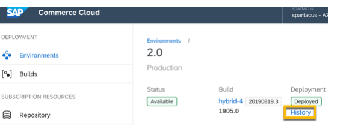
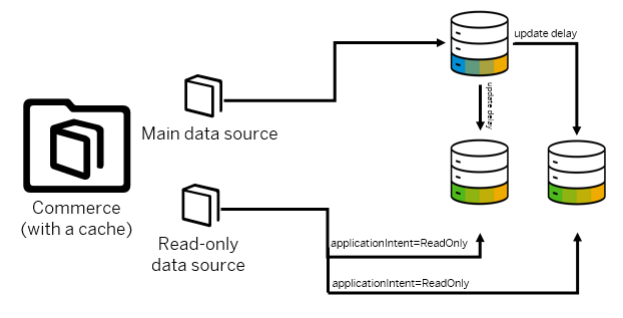
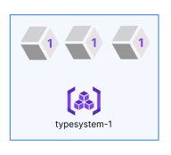

# Cloud Portal

The Cloud Portal is a web-based portal that enables you to set up and deploy SAP Commerce Cloud in the public cloud. Common operational tasks can be managed through self-service, including user management, security conguration, and access to application logs.

## System Requirements

Information on the supported versions of Cloud Portal, access requirements, and supported web browsers. To see which versions of SAP Commerce Cloud are supported, see Supported Releases. To access Cloud Portal, you need:
an account with SAP Cloud Identity user ID an up-to-date version of a supported internet web browser

## Supported Web Browsers

The system only supports browsers that can automatically update to the latest version without manual intervention (Evergreen browsers).

Web Browsers Supported Version This is   For more    the SAP Help  2

| 5/22/2024 Web Browsers   | Supported Version                                                            |
|--------------------------|------------------------------------------------------------------------------|
| Microsoft Edge           | Latest stable version                                                        |
| Mozilla Firefox          | Latest ESR version (Firefox 45 ESR, Firefox 51.0) or newer supported version |
| Google Chrome            | Latest stable version                                                        |
| Apple Safari             | Latest stable macOS version only                                             |

## Feature Access By Role

| Role                                | Access                            |              |
|-------------------------------------|-----------------------------------|--------------|
| Customer System Administrator (CSA) | Subscriptions                     | Private link |
| Builds and deployments              | Data backups and restores         |              |
| Environments                        | Virtual Private Networks (VPN)    |              |
| Endpoints                           | Network Address Translation (NAT) |              |
| Services                            | Scheduling upgrades               |              |
| Monitoring                          | Audit logs                        |              |
| Security                            | Solr administration console       |              |
| Performance reports                 | User management and roles         |              |
| Customer                            | Subscriptions                     |              |
| Developer (CD)                      | Security                          |              |
| Builds and deployments              | Performance reports               |              |
| Environments (read-only)            | Private link                      |              |
| Endpoints                           | Data backups and restores         |              |
| Services                            | Scheduling upgrades               |              |

## Cloud Portal Navigation

The Cloud Portal includes several navigation tools that make it easy to access your environments and features.

## Navigation Shell Bar

At the top of the Cloud Portal page is a shell bar that provide shortcuts to the following features.

| Shell Bar Item                    | Description   | Displays...                                                       | Click to...   |
|-----------------------------------|---------------|-------------------------------------------------------------------|---------------|
| The name of the solution using    | At sign-in    | Return to the Subscription                                        |               |
| the Cloud Portal.                 | overview page |                                                                   |               |
| A shortcut to load a subscription | At sign-in    | Displays a list of the most recent subscriptions that you visited |               |

This is   For more    the SAP Help  3

| 5/22/2024 Shell Bar Item   | Description             | Displays...                                                    | Click to...   |
|----------------------------|-------------------------|----------------------------------------------------------------|---------------|
| The Account icon           | At sign-in              | Displays your sign-in name and links to API Token and Sign Out |               |
| The Notication Center icon | When notications become | Displays a list of scheduled                                   |               |
| available                  | updates                 |                                                                |               |
| The support icon           | After sign-in           | Opens the SAP Support Portal page.                             |               |

## Breadcumb Trail

As you make your way through the Cloud Portal, a linked breadcrumb trail appears below the shell bar. These breadcrumb links allow you to track and maintain awareness of your location within Cloud Portal. In the following example, the breadcrumb trail highlights the location of the this specic page: the deployment history of a selected build.

 You can use the links in the breadcrumb trail to access pages you visited previously.

## Navigation Menu

The side menu on the left of the Cloud Portal allows you to access the environments and builds linked to your subscription. The Deployment menu allows you to access the available environments and builds for your subscription. The available features in the Subscription Resources menu depend on your current role, so some features designed for administrators may be hidden.

## Cycle Through The Components

When you access a page in Cloud Portal, there are a set of elds, panels, and components that allow you to enter information and excecute actions. You can cycle through the natural ow of these elements using the F6 key to move forward and Shift+F6 to move backward. As you press F6, the focus shifts from one element to another on the page until it loops back to the orignal element. This feature is useful if you want to use your keyboard to navigate betweens elds. The focus cycle starts from the last selected component and moves from left to right across the interface.

F6: the cycle moves towards the bottom of the page, from left to right Shift + F6: the cycle moves towards the top of the page, from right to left Related Information Environments Builds Standard Deployments Security Static Files

## Consumption Credits

Consumption credits serve as SAP Commerce Cloud's virtual wallet, allowing you to purchase capacity units (CU) that you can then invest in a diverse range of services. This usage-based model affords you greater power and exibility to grow your business. You can select credit packages that accurately reect your actual usage, but can be adjusted for higher or lower capacity events. As your requirements change, you can then adjust how many resources are available with a credit system, and then use the resources you purchased. The consumption credits system currently applies to the scaling up and down of non-production, non-live tenants. For more information, see Scale Service Resources.

 Open this video in a new window

## Scaling Non-Live Environments

When you decide to change the scaling on your non-production environments, follow these steps:
1. Access the Estimator tool to determine the number of capacity units to purchase.

For more information, see Estimating Required Capacity Units.

2. Contact your SAP Account Executive to purchase additional capacity units, as required.

This is   For more    the SAP Help  5 Estimating Required Capacity Units Use the capacity unit estimator to calculate the capacity units (CU) needed to scale the non-live environments.

## Estimating Required Capacity Units

Use the capacity unit estimator to calculate the capacity units (CU) needed to scale the non-live environments.

To determine the CUs required to scale your environment, use the Estimator to select your preferred conguration. The tool then provides you with an estimated CU value for that setup, including the number of additional CUs you may need to purchase. As you change the congurations of your database and virtual machine, review the number of required CUs in the Estimated Units panel. For example: you have a small sandbox for which your monthly entitlement is 2400 CU. You select an upscaled conguration and the tool calculates the CU to be 3900. This means you then need to purchase an additional 1500 CUs per month to run with that conguration.

## Tip

The number of VMs and DTUs have the greatest impact to the overall costs. Other congurations like the number of replicas, CPU, memory etc. ultimately decide how many VMs are required. Increasing the number of replicas or adding more memory doesn't always add to the number of VMs, so this doesn't affect the CU. The Estimator allows you to adjust your congurations until you have a number of CUs that you are comfortable with. Remember that the actual number of required capacity units depend on a variety of factors, including number of deployments. There may be a variation in the number of CUs deducted at each billing cycle compared to the estimate.

1. Click here to access the Estimator.

2. Select the estimation range from the Hourly, Daily, Monthly, or Yearly buttons. 3. Select the size of the environment from the Enviroment Size dropdown menu.

Each sandbox includes a specic yearly CU entitlement, based on its capacity. The following list denes the yearly CU entitlement per environment type:
Small sandbox, development environments: 31,860 CUs (2,655 CUs monthly)

Scalable sandbox: 31,860 CUs (2,655 CUs monthly)
Medium sandbox, staging environments: 46,492 CUs (3,874 CUs monthly)

Large sandbox, non-live production environments: 151,164 CUs (12,597 CUs monthly) Extra large sandboxes, non-live production environments: 578,830 CUs (48,236 CUs monthly)
Cloud Portal identies large and extra large sandboxes as production. However, production sandboxes are not designed to ever go live.

Performance: There are two basic types of Azure storage for SAP workloads:

Standard: This Azure package is suited for workloads that require consistent performance at lower IOPS levels. The standard storage meets the demands for nonproduction SAP systems that have low throughput and IOPS. Premium: This Azure package offers a shared storage that includes SMB and NFS with sufficient latency to handle the SAP application layer.
Each performance type includes its database transaction unit (DTU) capacity, which includes a measure of computation capacity, memory, and number of reads and writes. If you switch the Performance package, you should expect some minimal downtime.

Size: Select the total capacity of the database, which includes media.
If your selected size falls within the storage included with the database type, the additional Size estimate is zero. If your selected size is higher, the estimated extra CU appears in Size eld.

5. Select the virtual machine conguration from the Type eld in the Virtual Machine panel.

If the type of virtual machine is too small to support your conguration, a warning appears above the drop-down menu.

6. Congure the properties of each service using the following properties:

Number of Replicas: Select the number of replicas per CPU you need to ensure scalability and availability. Request/Limit CPU: Select the maximum number of CPUs to use with this service. Maximum Java Memory (Gi): Select the maximum amount of Java memory to dedicate to this service. Memory Scale Factor: Select how much to increase the amount of available memory by a specied ratio related to the off-heap. The ratio ranges between 1 and 2. Managed Disk Storage: Select the storage level that corresponds with your Standard or Premium Azure package.
The Managed Disk Storage property only applies to Solr and Zookeeper services. You cannot self-scale the disk storage. If you need to scale the disk storage, contact Support.

The Total Container Memory eld displays a calculation of the values of Maximum Java Memory and Memory Scale Factor. As you make your selections per service, the CU values may change in the following areas:
The Estimated VM Count eld in the Virtual Machine panel.

The CU per Unit and Total CU elds in the Database and Compute panels. The Estimated Units chart panel.
7. Check the Additional CU value in the Estimated Units panel.

If the Additional CU value is zero (0): this means that the number of estimated CUs is less than your monthly entitlement, so you don't need to purchase any additional CUs. If the Additional CU value is greater than zero (0): this means that the number of estimated CUs is greater than your monthly entitlement.
Either select another conguration or contact your Account Executive to purchase additional CUs to scale to your preferred conguration.

Front-End Conguration Endpoints Endpoint APIs Deployments

## Environments

An environment is a group of infrastructure components designed to host an application, and typically includes Kubernetes clusters, databases, and media storages. Environment types are dened by their operational purpose. To function as required, environments need to be congured, operated, and maintained correctly, and the Cloud Portal facilitates most of the associated tasks. You can view the list of environments for your subscription by clicking Deployment Environments in the Cloud Portal side navigation. Each panel represents one environment and displays the following information:

The name of the environment The type of environment, which denes its purpose The deployment status of the environment, including its source le and build code If there are no deployed builds on the environment, the Build eld does not appear in the panel. The current status of the environment, which reects any results or processes occuring on the environment
If an environment is available, click anywhere in the environment panel to view details of its components. To access an environment that appears inactive or unable to be selected, contact your System Administrator.

Overview SAP Commerce Cloud provides a range of environment types and sizes, all of which can be congured to suit your specic tasks and security requirements. Use the Cloud Portal to congure your storefront properties, endpoint access, performance monitoring, and storage resources. Setup An environment consists of a set of components, services, and data that forms the backbone of your site. You need to dene its basic properties before deploying builds and activating features. Testing Maintenance Once your environment is running, you need to perform system maintenance to keep operating efficiently. Operations Once you dene your environment properties, you can add services and manage its features and operations with a variety of tools.

Overview

## Builds

A build is the compiled code of your application. The build information is pulled from the code repository that's connected to the Cloud Portal. A successful build can be deployed to a provisioned environment. When you create builds, they appear in a table on the Builds page. The build name is a link that takes you to the build details page. The build details page displays information about the build, including the build status, the ID of the user who created the build, and the time it took to create the build. If the build failed, there's a retry icon on the build row, which lets you quickly retry the build.

If you are running a version of SAP Commerce Cloud that is either near (less than six months) or out of Mainstream Maintenance, a warning icon appears next to the affected build. When you hover over the warning icon, a pop-up message appears to indicate this status and to invite you to upgrade your Commerce software.

## Build Details

From the Builds page, click a build name to open the build details page. The Basic Information panel provides details about the build.

Last Build: Displays the current status of the build.

Source: Displays the branch name and the commit ID, which indicates the location and ID assigned by the Git push. Built by: Displays the ID of the user who created the build. Code: Displays the build code. You need this build code when you work with build APIs. To learn more, see Build APIs. Started/Finished build time: Displays the date and time when the build began and ended. The date displays in short format, with the day rst and then the month and year. Duration: Displays the time that elapsed between the build start and the build nish. Last Deployment: Displays the status of the most recent deployment. Actively Deployed To: Lists the environments where the build is deployed. Click an environment link to open the environment details page. History link: Opens the Deployment History page and displays the information from a build perspective. For more information, see Build Deployment Details.
The Progress Steps panel displays all of the actions involved in creating a build. When the steps are complete, they're removed from the panel. If the build failed, you see a link to download the build log.

## Build Log

When you download the build log from the build details page, you nd a plain text le that consists mostly of executed tasks separated by time stamps (yyyy-mm-dd). The log also includes related XML les, echo messages, library listings, internal documentation, and so forth. The log le name appears in the format releaselog-[current date].txt.

Because the content of the build log is extensive, avoid including any information in the code repository that could be considered condential, personal, or relating to personal identity.

## Build Validation

When a build is generated, the patch version is validated to ensure that you have the latest version. If you don't, a warning message appears in the build log, along with the recommended patch version.

The deployment details page for a build shows details on the deploy action. The top portion of the page has a summary of the deployment. The bottom panel shows the process steps completed during the deploy action. Creating a Build You can create a build of SAP Commerce Cloud in the Cloud Portal. You don't need to have a provisioned environment before you create a build. Retrying to Create a Build Once you create a build, you can relaunch the build process at any time from either the Builds page or the build details page. Downloading the Build Log The build log contains information about the current build. A link to download the build log is available on the build details page. Deleting a Build You can delete non-deployed builds from your environment. Build APIs Build APIs allow you to test builds locally or on your continuous integration pipeline. When testing is complete, you can trigger a build.

Deployment History Environment Deployment Details Downloading the Build Log Deploying a Build Retrying to Create a Build

## Build Deployment Details

The deployment details page for a build shows details on the deploy action. The top portion of the page has a summary of the deployment. The bottom panel shows the process steps completed during the deploy action. Access the details of a deployed build from Builds <Build name> History and then click a row in the history table.

The following information is available in the Basic Information panel on the build deployment details page.

Status: Displays the status of the deployment. Build: Displays the name of the build, the build code, and the version of SAP Commerce Cloud. When you click the build name, the build details page opens. Environment: Displays the name of the environment where the build deployed. Platform Update Mode: Displays the migration strategy that was applied. Started/Finished: Displays the time that the deploy action started and nished. Deployed by: Displays the ID of the user who initiated the deploy action. Deployment Mode: Displays the deployment mode, which determines how the deployment impacted underlying applications. Canceled/Cancelation nished/Canceled by/Database rolled back: Displays information about cancelation events that occur on a build.
If you are running a version of SAP Commerce Cloud that is either near (less than three months) or out of Mainstream Maintenance, a banner appears at the top of the Build page to indicate this status and to invite you to upgrade your Commerce software.

## Deployment Process Panel

A process panel displays on the deployment details page when a deploy action is in progress. If you open the deployment details page while a build is deploying, you see a deployment panel that displays a list of process steps. Each step of the deployment is tracked. When a step is initiated, a small counter starts to record the duration. As each step completes its process, a green check mark appears alongside it and the counter stops. If your build deploys successfully, then the process steps disappear and a success message appears under the Basic Information panel. If a deployment step fails, then the process steps remain and you see a failure message. The step where the error occurred turns red. A failure code appears alongside the step description. This code helps the Support team identify the nature of the error and the potential reason for the failure. To learn more, see Requesting Support for a Failed Deployment.

If the deployment is canceled, a failure code isn't provided.

## Deployment Logs

Deployment logs are available while a build is deploying or if there's a deployment failure. Click in the deployment panel and select the Initialization log link. The link is dimmed until the upgrade steps complete successfully. The log link takes you to OpenSearch. Deployment logs are available for a limited time and could be purged without notice. If the system purges the logs, OpenSearch still launches and indicates that there are no logs available.

Accessing Deployment Logs OpenSearch View for Environments OpenSearch Filters and Labels

## Creating A Build

You can create a build of SAP Commerce Cloud in the Cloud Portal. You don't need to have a provisioned environment before you create a build.

## Prerequisites Caution

Building your application using an out-of-maintenance version of SAP Commerce Cloud will result in build errors. Use a supported version to avoid any issues. For more information on supported versions, see Supported Releases. For supported update versions, see Update Releases.

You set up your code repository. For more information, see Commerce Cloud Repository.

You have a build manifest for SAP Commerce Cloud in your code repository.

You connected the code repository to Cloud Portal. For more information, see Connecting a Code Repository Using SSH or Connecting a Code Repository Using HTTPS.

Your environment is not in a failover state.
There can be a limit to the number of builds you can create in your environment. If you try to create a build that exceeds this limit, the system prompts you to delete a specied number of non-deployed builds. For more information, see Deleting a Build. If you need to add more builds to your environment that exceeds the limit, and you don't want to delete builds, contact Support.

1. Click Builds in the navigation menu.

The Builds page opens and displays a list of existing builds.

2. Click Create and enter the basic information.

Name: a descriptive title for the build that appears in the Build column in the list of builds. Git branch or tag: the branch location or unique tag that indicates the code to use for this build.

3. Click Save.

## Results

The system displays the status Scheduled, which means that the build is waiting. This status changes to Building when the build process starts, and a progress bar appears. When the build process is complete, the status reects whether the build failed or was successful.

Builds Downloading the Build Log

## Retrying To Create A Build

Once you create a build, you can relaunch the build process at any time from either the Builds page or the build details page.

Before you recreate a build, follow these steps:
Check the logs.

Identify any changes to make. Implement a solution.
1. From the Builds page, click Redo for the build you want to re-create.

The Retry Build page appears.

2. Verify the build name and Git branch or tag, as the system supplies this information for you.

To make changes, replace the prepopulated build information with the updated information.

3. Click Save.

## Results

The build appears on the Builds page with a status of Scheduled. The build starts automatically when it's ready.

## Downloading The Build Log

The build log contains information about the current build. A link to download the build log is available on the build details page.

1. From the left menu, click Builds.

The Builds page appears.

2. Click the build name in the Build column.

The build details page displays.

3. Scroll down to the second panel and click Download Build Log.

## Results

The Cloud Portal downloads a ZIP le to your default downloads folder. The ZIP le name is releaselog-[current date].zip.

## Deleting A Build

You can delete non-deployed builds from your environment.

## Prerequisites Note

The properties required for a build to be deleted are as follows:
Status must be SUCCESS or FAIL They are not currently deployed They are not currently included in a data backup Last modied date must be older than four hours If you attempt to delete a build that does not meet these requirements, the Delete button appears disabled. The ability to delete builds is a restricted availability feature, which is not available to everyone. For more information, see Restricted Availability Features.

This is   For more    the SAP Help  13 Context When you decide you want to delete a build from an environment, the system does not instantly erase the build. The system marks the build as being scheduled for deletion by a certain deadline, which is 14 days later by default.

## Caution

When you mark a build for deletion, the system prevents you from deploying it. A build marked for deletion cannot be retrieved. If you marked a build for deletion by accident, create a new build to replace it. For more information, see Creating a Build.

Deleted builds do not appear in a project by default. To include builds marked for deletion, click Hide deleted on the environment page.

1. Click Deployment Builds in the navigation menu.

The Builds page opens and displays a list of existing builds.

2. Select a build to review.

The bulid details page appears.

3. Click Delete build. 4. Conrm your decision.

## Build Apis

Build APIs allow you to test builds locally or on your continuous integration pipeline. When testing is complete, you can trigger a build.

## Api Security

API authentication is handled with an API token. The token contains the user credentials required to access SAP Commerce Cloud APIs. You can log in to the Cloud Portal to generate an API token. When you no longer need an API token, you can remove the token. To learn more, see, Managing API Tokens.

## Api Documentation

See SAP Commerce Cloud API Documentation.

API Tokens Using an API Token to Access APIs Deployment APIs Command Line Interface

## Deployments

Platform Update Mode and Deployment Mode are two important choices you need to make when deploying a build.

You can also choose how data will be impacted, whether downtime will be necessary, and whether to use the Blue/Green option to preview a new build before replacing the old one.

## Platform Update Mode

When you deploy a build, determine how to update your database. The supported migration modes are:
No migration required: Database isn't updated and no data is imported.

Migrate data: The ant updatesystem command runs and updates the database. For guidelines and best practice on migrating data with zero downtime, see Zero Downtime Deployments with Rolling Updates.

Initialize database: The ant initialize command runs, wipes the database, and imports data. This process requires site downtime.

## Deployment Mode

When you deploy a build, you must decide how it affects the underlying applications and how it impacts your site's availability. You have the following choices:

Recreate (fastest, with downtime): Shuts down the running deployment and creates a new one based on a selected build.
This operation is the fastest way to deploy the build, but it requires site downtime. If a problem occurs during the deployment, this option is also safer in terms of rollback potential. Visitors to your storefront see a temporary maintenance page until the deploy action completes. Rolling update (slowest, no downtime): Takes the longest amount of time for an update, but storefront availability isn't interrupted for your customers.

You can't select the Rolling Update option if you chose Initialize database as the Platform Update mode.

When deploying a new SAP Commerce Cloud, composable storefront aspect using Rolling Update, the aspect is only deployed after the new API aspect has started successfully. The old storefront continues to run until it's replaced, and if the platform update fails, the new storefront is not rolled out. The system only deploys builds with new or updated code. For example, if the new code only applies to the Javascript Storefront, the system does not rebuild Commerce aspects.
When deploying a build, the new JS Storefront aspect is deployed only after the new API aspect has started successfully. This avoids errors caused by new versions of JS Storefront accessing old API aspects. When using the rolling update deployment mode, the old JS Storefront continues to run until it is replaced by the new one. When using the recreate deployment mode, the JS Storefront aspect is stopped at the same time as all other aspects. If you prefer to enforce JS Storefront to always start at the beginning of each deployment, contact Support. Note that this option is only recommended when JS Storefront is resilient enough to ignore other aspects going down and back up, as it needs to communicate with multiple versions of the other aspects. Blue/Green: Allows you to create a Preview build (Green) and deploy it alongside of the the currently deployed build (Blue). You can review this Green build, and if it meets your requirements, you can use to replace the current deployed build. For more information, see Deploying a Green Preview Build.

## Caution

In SAP Commerce Cloud, the initialization and update processes are triggered from the Cloud Portal as part of a deployment. Triggering the initialization and update processes from the SAP Commerce Cloud Administration Console is not supported.

Standard Deployments Blue Green Deployments A blue/green deployment allows you to deploy a new build for testing before deploying it as your live build. Deployment APIs Deployment APIs allow you to trigger a deployment outside of the Cloud Portal.

## Standard Deployments

Deploying a Build Deploy a successful build to any provisioned environment. Environment Deployment Details The deployment details page for an environment displays in-depth information about deployed builds. Requesting Support for a Failed Deployment When a deployment fails for reasons that you can't resolve, contact the Support team for assistance. Deployment History Deployment history is available from two perspectives. You can look at deployments from the environment perspective and see all builds deployed to an environment. You can also look at deployments from the build perspective and see all environments where a build was deployed. Canceling a Deployment Use this command to stop the deployment process or delete partially deployed services. You can also restore the database to its previous state. Deployment Rollback When you deploy a build, you can leave the database as is, update the database schema, or wipe the database contents completely. If you want to revert to a previous database state after a deployment is initiated, you have several rollback options.

Disabling the SYSTEMINIT Table Cleaning The SYSTEMINIT table is cleaned during deployment to avoid errors if the previous initialization or system update failed. If you don't want to clean the table, you can disable this functionality. Automation of the Read-Only Replica Read-only replica is a secondary data source that handles resource-heavy read-only operations, thus improving the performance of the main data source. SAP Commerce Cloud supports its automated implementation for all productive environments and a selection of sandbox environments. Standard Data Migration When you perform a data migration, SAP Commerce Cloud transfers not only the data, but it can also congure properties.

## Deploying A Build

Deploy a successful build to any provisioned environment.

You have a provisioned environment with an Available status.

## Context Note

When you deploy a build, a maintenance window is created and tracked in Dynatrace. Downtime alerts are paused for three hours or until the deploy action is complete, whichever comes rst. Pausing alerts prevents false downtime notications from occurring.

1. From the left menu, select Builds.

The Builds page displays.

2. Select the name of the build to deploy.

The build details page displays.

3. Click Deploy to Environment.

The Deploy Build page displays.

4. In Target Environment, select the environment in which the build deploys.

 Note If the environment is locked, deployment is blocked. Wait for the environment lock to release and then deploy the build.

5. From the Platform Update Mode dropdown menu, select a database migration strategy. For information about the data migration modes, see Deployments.

6. Select a Deployment Mode.

To learn more about deployment modes, see Deployments.

7. Click Deploy.

## Results

A progress bar appears and a deployment details panel opens to display each anticipated step in the deployment process. For more information, see Environment Deployment Details. Once you deploy a build, the updated code is applied to your storefront site. You can track the status on the Builds page. For more information, see Builds.

## Zero Downtime Deployments With Rolling Updates

Also called a rolling update, you can apply changes to your environment using a zero downtime deployment. When you initiate this type of update, your storefront and APIs remain active at all times. There is no need to schedule a maintenance window. You can also choose whether to update the database during the deployment.

## Deployment Without A Database Update

To deploy a new build without importing or updating data in the database, select No migration required when you deploy.

To learn more about migration strategies, see Standard Deployments.

## Deployment With A Database Update

When you update the database during a rolling update, the following actions occur.

The background processing and Backoffice aspect are scaled down to prevent cron jobs from running during the update.

 Tip You should avoid deploying builds with downtime while cron jobs are running. Doing so can interrupt the cron job. Depending on the nature of the crob job, it might start again after the deployment, or you might need to rerun it.

An administrative instance of SAP Commerce Cloud is launched to perform the following:

clone the existing type system update the type system based on the new build run any data migration steps
The Type System update runs the impex les. These les can have dynamic bean congurations for the Solr class, which in turn then provides values for the eld or property for the Solr indexed type. During the rolling deployment, the pods with the old codebase use the new conguration that references the newly imported beans, which are only present in the new codebase. Any older replicas that don't include these beans may generate errors.

For more information on the type system, see The Type System. Solr indexes are rebuilt. The update is completed.

When the update is successful, the instances of the storefront and API services receive a rolling update. The update replaces the existing instances with new instances, running the latest deployed build against the newly created type system. During the roll-out phase of the update, for about ve minutes, both the old and new versions of your storefront are running and serving customers. To learn more, see the References to Type Models section below.

When the update is successful, the next deployment removes type systems that are older than 7 days.

If the update fails, it is reported as a failed deployment. There is no impact to the user since the storefront and API services stay up during the update.

Background processing and Backoffice come back up.

Deployment is complete.
If your SAP Commerce Cloud environment includes Data Hub, your custom extensions may require manual changes after the update.

## References To Type Models

During a rolling update, when a new type system is created, a type model may have a reference to a type model that isn't available while it is being accessed by the old type system. It may be a valid reference as this second type may be visible after This is   For more    the SAP Help  18 you complete updating the type system.

In case a reference to such an unavailable or non-existing type model instance is found (for example, the EnumerationValue), the type system can set the value of the reference in the holding model to null in the database.

However, as mentioned above, this reference can still be valid as the underlying type may be a part of a pending rolling update codebase change.

To prevent such a reference from being set to null, use the self.healing.suppressForTypeSystemTypes property. By default, this property is true, which prevents the system from setting the value to null. Instead, it leaves the reference value in the database, and returns null during runtime as a given reference value.

The self.healing.suppressForTypeSystemTypes.typecodes property denes a list of typecodes for which to trigger this mechanism. This list contains the type system related types such as EnumerationValue, AtomicTypeModel, or AttributeDescriptorModel.

## Difference Between A Rolling Update Deployment And Scheduled Maintenance

The rolling update deployment applies enhancements to your existing environment without taking down your storefront. When you schedule a maintenance event, you are updating your entire SAP Commerce Cloud platform in order to apply infrastructure changes, new features, and other enhancements. For more information, see Scheduled Updates.

## Best Practice Guidelines

Before running a rolling update deployment that includes a database update, SAP recommends the following best practice guidelines to protect the integrity of your data.

Although your storefront and APIs remain active at all times during an update, there are some BackOffice processes that can go offline during the update. It is recommended that you run the update in off-peak hours. If there are changes to the media, make a data backup of the environment. A backup preserves the current state of your environment so that you could restore to that state after an update, if needed. To learn more, see Data Backup and Restore. Use the staging environment to test the build before you deploy it in production environments. To ensure schema compatibility between versions of your project, updates to the type system should be additive only. Avoid changing existing data types or modifying existing relationships. Instead, only add columns or new relationships. Types may be cleaned up in subsequent releases once you are condent that your project no longer depends on these types, attributes, or relationships.
Initiating a Rolling Update Deployment You can update your SAP Commerce Cloud environment without incurring storefront downtime. Customers continue to access the storefront while the specied environment updates.

Data Backup and Restore

## Initiating A Rolling Update Deployment

This is   For more    the SAP Help  19 You can update your SAP Commerce Cloud environment without incurring storefront downtime. Customers continue to access the storefront while the specied environment updates.

All background processing tasks are complete before initiating a deployment update. Background processing is suspended during the update to prevent data corruption.

1. Select Builds from the left menu in the Cloud Portal.

2. Select the build to deploy. 3. Click Deploy to Environment. 4. In the Target environment eld, select the environment. 5. In the Deployment Mode eld, select the type of update that you want to perform.

To learn more about deployment mode options, see Standard Deployments.

6. Click Deploy and then conrm the deploy action to start the update.

When the update completes successfully, you see an environment status of Available and a Build status of Deployed.

## Environment Deployment Details

The deployment details page for an environment displays in-depth information about deployed builds. Access the details of a deployed build from Environments <Environment name> History and then click a row in the history table. The bottom panel shows the process steps completed during the deploy action. The top portion of the page has a summary of the deployment and includes the following information.

Status: Displays the status of the deployment.

Build: Displays the name of the build, the build code, and the version of SAP Commerce Cloud. When you click the build name, the build details page opens. Environment: Displays the name of the environment where the build deployed. Data Migration Mode: Displays the migration strategy that was applied. Started/Finished: Displays the time that the deploy action started and nished. Deployed by: Displays the ID of the user who initiated the deploy action. Deployment Mode: Displays the deployment mode, which determines how the deployment impacted underlying applications. Canceled/Cancelation nished/Canceled by/Database rolled back: Displays information about cancelation events that occur for a deployment.
This is   For more    the SAP Help  20

## Deployment Process Panel

A process panel displays on the deployment details page when a deploy action is in progress. If you open the deployment details page while a build is deploying, you see a deployment panel that displays a list of process steps. Each step of the deployment is tracked. When a step is initiated, a small counter starts to record the duration. As each step completes its process, a green check mark appears alongside it and the counter stops. If your build deploys successfully, then the process steps disappear and a success message appears under the Basic Information panel. If a deployment step fails, then the process steps remain and you see a failure message. The step where the error occurred turns red. A failure code appears alongside the step description. This code helps the Support team identify the nature of the error and the potential reason for the failure. To learn more, see Requesting Support for a Failed Deployment.

If the deployment is canceled, a failure code isn't provided.

## Deployment Logs

Deployment logs are available while a build is deploying or if there's a deployment failure. Click in the deployment panel and select the Initialization log link. The link is dimmed until the upgrade steps complete successfully. The log link takes you to OpenSearch. Deployment logs are available for a limited time and could be purged without notice. If the system purges the logs, OpenSearch still launches and indicates that there are no logs available.

Accessing Deployment Logs OpenSearch View for Environments OpenSearch Filters and Labels

## Requesting Support For A Failed Deployment

When a deployment fails for reasons that you can't resolve, contact the Support team for assistance.

You deployed a build and received an error that you couldn't resolve.

1. From the main menu, click Environments <Environment name> History .

2. Click the row for the failed build.

If there are more than 10 builds, page through the history table until you nd the build that you want.

3. Scroll down to the deployment details panel and nd the error code.

This is   For more    the SAP Help  21 4. Click the blue icon to download a detailed error report to your clipboard.

The error report includes information about your subscription, environment, build, and release code, including the nature of the deployment error.

5. In the SAP Support Portal , select Report an Incident. The Create an Incident form opens.

a. In the Description eld, include the error code that you found in deployment details. b. Attach the error report that you downloaded.

6. Send the error information to the Support team.

Deployment History Environment Deployment Details

## Deployment History

Deployment history is available from two perspectives. You can look at deployments from the environment perspective and see all builds deployed to an environment. You can also look at deployments from the build perspective and see all environments where a build was deployed.

## Environment Details History

To view a list of the builds deployed to an environment, select Environments <Environment name> and then click the History link.

 When the Deployment History page displays, you see the last deploy actions initiated for the environment. The list contains 12 entries at a time, with the option to advance to the next 12 entries. Builds are listed with the most recent deployments rst.

This is   For more    the SAP Help  22 Each row provides an overview of a deployed build. If you want to see more in-depth information about the deployed build, click the row to open the deployment details page. To learn more, see Environment Deployment Details.

## Build Details History

You can also look at history from the build perspective. When you open the Builds page and select a build, the History link opens to reveal a Deployment History table. This table shows a list of all environments where the build was deployed. For more information, see Build Deployment Details.

OpenSearch View for Environments

## Canceling A Deployment

Use this command to stop the deployment process or delete partially deployed services. You can also restore the database to its previous state.

You're currently deploying a build to an environment. To learn more, see Deploying a Build.

Deploying a build can take one or more hours to complete. If a deployment process stalls or hangs, you can cancel it without having to contact the Support team. After addressing any issues with the build, you can redeploy. The option to cancel the deployment becomes available once the deployment process reaches the Deploy application stage. When the option is available, the Cancel Deployment button becomes active.

## Caution

If you perform an offline deployment, but then cancel it with the database rollback option, the process restores the invalidated database credentials, which can then cause subsequent rolling deployments to fail. To prevent this loss of credentials, you must immediately redeploy the build to the environment with the Recreate option selected. This option creates a new deployment with downtime, which then creates new database credentials.

1. From the left menu, click Environments <Environment name> .

The deployment details panel appears at the top of the environment details page. This panel shows the progress of the build being deployed.

2. To the right of Currently deploying [build name], click and select Cancel Deployment from the pop-up menu.

The Cancel Deployment dialog box appears. If you can't cancel the deployment at this time, the command appears dimmed and can't be selected. Wait for the deployment progress to reach the stage where the option is active.

The button only appears once a minimum percentage of the deployment is complete. If you don't see the button immediately, just give it some time.

3. Check the box to roll back the SAP Commerce Cloud application database if you want to include that with the cancel action. Rolling back the database stops the current deployment and deletes all deployed service instances, which include old instances, new instances, and the platform-update job. The action then restores your database to a point in time just before the current deployment started. When using this method, remember the following:

This type of rollback doesn't restore Blob Storage, Data Hub databases, or Solr indexes. To roll back these options, you must use other tools like Backoffice or the WCMS portal. Verify your data integrity across upstream and downstream services. If no restore point exists for the rollback, the Cancel Deployment button is dimmed and unavailable.
 Note If you nd problems with your data, create a support ticket to address the issue.

4. Select a reason that best describes why you are canceling this deployment.

If you select Other from the Reason menu, enter the reason in the eld provided.

5. Click Cancel Deployment.

## Results

A pop-up message conrms that the deployment is canceled. The cancellation process appears in the deployment details panel, and when the process is complete, the message Your deployment was canceled appears at the top of the environment details page.

Deploying a Build

## Deployment Rollback

When you deploy a build, you can leave the database as is, update the database schema, or wipe the database contents completely. If you want to revert to a previous database state after a deployment is initiated, you have several rollback options.

## Rollback During A Deployment

While the build is deploying, there's a window of time where you can cancel the deployment. When the cancel option becomes available, you can also choose to revert the database to the state that existed before the deploy action was initiated. When the cancel action is complete, all services are deleted and, if selected, the database is rolled back. The pods supporting the application are in an inconsistent state and the application isn't reverted to a previous build. You need to deploy a build successfully to fully recover from the cancel action. For more information on canceling a deployment, see Canceling a Deployment.

## Rollback After A Deployment Data Backup And Restore

The data backup and restore feature allows you to capture time-stamped records of your database, media storage, and deployed application. The backup can be applied to an environment to restore it to a previous state. For more information on creating backups and using them to restore an environment, see Data Backup and Restore.

## Builds

When you deploy a build that introduces changes to the database schema, any build that was created before this change fails when you deploy it. Since builds can introduce database changes, you should only deploy builds that reference the same database schema. An exception to this guideline is deploying with the initialization mode, as this mode erases everything and builds the schema again. This option isn't available for live production sites. For more information, see Go Live with Your Production Environment.

If you customize SAP Commerce Cloud so that database changes are additive, then previous builds can be backward compatible with database schema changes.

## Patches And Major Versions

When you upgrade to a new patch version or a major version of SAP Commerce Cloud, then you need to create new builds. In the event that you need to revert to a previous patch within a major version, deploy a build that was created while on that patch version. Reverting to a previous major version is supported when you use the initialization mode during deployment. This mode erases the database and resets the schema. You'll lose data in this scenario.

## Support

The Database Support team can also restore the database to a specic date within a 35-day window. If you want to use this option, submit a support ticket for assistance. For more information, see Getting Support.

## Rollback After Deployment Failure

If you initiate a deploy action with the migrate data option and the build fails, then the database schema could be broken. There's no automatic database rollback for a deployment after the deployment is complete. Deploy the build again and select the migrate data option to update the database schema.

Standard Deployments Deploying a Build Builds

## Disabling The Systeminit Table Cleaning

The SYSTEMINIT table is cleaned during deployment to avoid errors if the previous initialization or system update failed. If you don't want to clean the table, you can disable this functionality.

Your environment is created and ready for initialization.

Context The SYSTEMINIT table is cleaned before performing the SAP Commerce Cloud initialization or system update. This feature is enabled by default. To disable the functionality, perform one of the following actions:

Add the following lines to the core-commerce/manifest.json le:

Add the following line in the hcs_admin service in the Cloud Portal: ccv2.automatic.unlock.enabled=false. For more information, see Updating Service Properties.

## Automation Of The Read-Only Replica

Read-only replica is a secondary data source that handles resource-heavy read-only operations, thus improving the performance of the main data source. SAP Commerce Cloud supports its automated implementation for all productive environments and a selection of sandbox environments. Azure SQL databases of premium and higher tiers include a read scale-out feature as part of their architecture. You have access to at least one read-only replica data source at all times. Directing heavy read-only operations to a read-only replica leaves enough processing power for write operations performed on the main database and improves its overall performance.

This process is asynchronous; be mindful of the delay between both types of data sources.

Read-only replica is available only on Production environments, as well as Large and X-Large Sandbox environments for testing purposes. Small and Medium Sandbox environments don't have access to this feature.

Access to the read-only replica is at its core a feature that eases the workload on the main database. Because of that, remember that its functionalities are limited to read-only operations and queries. Its asynchronous nature causes delays between both types of data sources. Under normal circumstances, this delay is only miliseconds long. You can direct FlexibleSearch queries to the read-only replica, most notably database object (DAO) calls and item relational attribute getters. Keep in mind that queries which are a part of transcactions always use the primary database. Use the flexiblesearch.readOnly.datasource=readonly property to set the read-only data source as the one FlexibleSearch runs on. Data caching works differently for the main and secondary database. The main database cache expires as data in it changes. The read-only replica cache expires based on a TTL (time-to-live) congurable duration, which is set at 60 seconds. The TTL combined with the lag behind time caused by asynchronous nature of the read-only replica is the maximum time data on it can be behind the primary data source. The automated injection of the read-only data source in SAP Commerce Cloud uses an out-of-the-box MSSQL driver and covers the following properties:
\# properties set during the deployment of an environment db.azure.checkReadOnlyReplica.datasources=readonly slave.datasource.readonly.db.connectionparam.applicationIntent=ReadOnly flexiblesearch.readOnly.datasource=readonly \# cache domain is set automatically in platform/project.properties \# separation of caches flexiblesearch.datasource.readonly.cacheDomain=readOnlyCacheDomain \# defining the TTL value in seconds for a given cache domain with 60 seconds as a default value flexiblesearch.cacheDomain.readOnlyCacheDomain.ttl=60 For more information, see: Read-Only Replica.

## Switching To A Replica Data Source

You can switch to a secondary database as a data source to perform resource-heavy tasks that could impact site performance.

## Caution

Starting with patches 1905.37, 2005.21, 2011.16, and 2105.6, this way of implementing a read-only replica as a secondary data source is obsolete. It remains in place for users who made use of it in the past and still require code reference for their needs.

The cache within the environment server draws its data from the primary database, which is the current and most accurate data. There are secondary databases that are replicas of the primary database. If the primary database encounters a problem, the system switches to one of the replica databases to minimize negative impacts to site performance.

Some system tasks can reduce site performance by consuming excess resources on the primary database. For example:
Launching large or long-running queries that read signicant amounts of data.

Extracting large amounts of data to send to an external server or service.
Carrying out long calculations, such as tabulating the number of orders per minute/hours.

## Caution

This experimental operation is meant for Developers only. It's still being developed and tested, so there are risks in applying this code. Because this process switches to a second data source, only use this method in scenarios that involve FlexibleSearch queries or Java Database Connectivity (JDBC) interfaces. Once you complete the query search, make sure you switch back to the primary data source to ensure that the most accurate data is in use.

To minimize performance impact on your primary database, you can switch to one of the read-only replica databases by following these steps:
1. Create a new "read only" data source on the environment.

2. Force the system to switch to that data source to perform the task.

## Tip

The read-only replica database is an SQL Azure feature which leverages the multiple replica databases used in cases such as failovers and updates. For more information, see docs.microsoft.com .

To apply this data source switch, you need to encode the following to your script before launching your query, extraction, or calculations. This feature codeblock is divided into four main sections:

## Section 1: Deactivating The Primary Database As A Data Source

This codeblock disconnects the primary database as the data source, allow you to switch to the replica as the alternate source.

Before you can run this code, you need to dene a few variables, including to what "t" refers. For example:
 final Tenant t = Registry.getCurrentTenantNoFallback(); String mySlaveDS = null; SessionContext myLctx = null; boolean isForceMasterSet = false;
{ if (!t.isSlaveDataSource()) { isForceMasterSet = t.isForceMaster(); if (isForceMasterSet) { ((AbstractTenant) t).cancelForceMasterMode(); if (trace) { LOG.trace("Cancelling 'force master' mode!"); } }

## Section 2: Activating The Replica As The Secondary Data Source

This codeblock disconnects the primary database as the source, enabling you to switch to the replica as the alternate data source. This codeblock also disables the environment cache as a data source, which makes the replica database the only data source.

 mySlaveDS = t.activateSlaveDataSource(); if (debug) { LOG.debug("Using slave data source '" + mySlaveDS + "'"); } if (isFSCacheDisabled()) { myLctx = getSession().createLocalSessionContext(); myLctx.setAttribute(FlexibleSearch.DISABLE_CACHE, Boolean.TRUE); } if (trace) { LOG.trace("FlexibleSearch cache disabled=" + isFSCacheDisabled()); } } else { if (debug) { LOG.debug("Found active slave data source '" + t.getDataSource().getID() + "'"); } } // Write your application code here }

## Section 3: Deactivating The Replica As The Data Source

When the exible search operation is complete, you need to remove the replica database as the primary data source.

finally { if (myLctx != null) { getSession().removeLocalSessionContext(); if (trace) {
This is   For more    the SAP Help  29 LOG.trace("Removed local session context"); } } if (mySlaveDS != null) { Registry.getCurrentTenantNoFallback().deactivateAlternativeDataSource(); if (trace) { LOG.trace("De-activated slave data source"); }

## Section 4: Reactivating The Primary Database As The Data Source

Now that the replica database is no longer the primary data source, you can reinstate the primary database as the source.

 if (isForceMasterSet) { ((AbstractTenant) t).forceMasterDataSource(); if (trace) { LOG.trace("Restored 'force master' mode"); } } }

## Example: Flexible Search

In this example, you would be executing a exible search on a replica database instead of the primary database. You can nd the four sections of code in this sample codeblock.

/* * Copyright (c) 2020 SAP SE or an SAP affiliate company. All rights reserved. */ package de.hybris.platform.jalo.flexiblesearch; import de.hybris.platform.core.AbstractTenant; import de.hybris.platform.core.PK; import de.hybris.platform.core.Registry; import de.hybris.platform.core.Tenant; import de.hybris.platform.jalo.SearchResult; import de.hybris.platform.jalo.SessionContext; import de.hybris.platform.jalo.flexiblesearch.hints.Hint; import de.hybris.platform.persistence.flexiblesearch.TranslatedQuery; import de.hybris.platform.tx.Transaction; import java.util.List; import java.util.Map; import java.util.Set; import java.util.function.Supplier; import org.apache.log4j.Logger; /** * Variant of {@link FlexibleSearch} which is redirecting queries to a read-replica data source, co * SessionContext parameter {@link \#CTX_ENABLE_FLEXIBLESEARCH_ON_READ_REPLICA}. */ public class RRFlexibleSearch extends FlexibleSearch { private static final Logger LOG = Logger.getLogger(RRFlexibleSearch.class); public static final String CTX_ENABLE_FLEXIBLESEARCH_ON_READ_REPLICA = "ctx.enable.fs.on.read-r public static final String PROPERTY_DISABLE_FS_CACHE_ON_READ_REPLICA = "disable.flexiblesearch. public static final String PROPERTY_CACHE_TTL_ON_READ_REPLICA = "flexiblesearch.cache.ttl.on.re public static final int DEFAULT_CACHE_TTL_ON_READ_REPLICA_SECONDS = 60; public RRFlexibleSearch()
This is   For more    the SAP Help  30
 { super(); LOG.info("Read-Replica enabled FlexibleSearch installed"); } @Override public SearchResult search(final QueryOptions options) { return onReadReplica(() -> { return RRFlexibleSearch.super.search(options); }); } @Override public SearchResult search(final SessionContext ctx, final String query, final Map values, fina final boolean failOnUnknownFields, final boolean dontNeedTotal, final int start, final throws FlexibleSearchException { return onReadReplica(() -> { return RRFlexibleSearch.super.search(ctx, query, values, resultClasses, failOnUnknownFi count); }); } @Override FlexibleSearchCacheKey createCacheKey(final List<Class<?>> resultClasses, final boolean dontNee final int count, final TranslatedQuery tQuery, final boolean doExecuteQuery, final PK l final Set<Integer> beanTCs, final int ttl, final List<Hint> hints) { if (isRREnabled() && !isFSCacheDisabled()) { // 1. always TTL --> won't be invalidated !!! // 2. change TenantID for cache unit 'namespace' return new RRFlexibleSearchCacheKey(tQuery, _values, langPK, resultClasses, dontNeedTot count, beanTCs, doExecuteQuery, getRRTTLSeconds(), getTenant().getTenantID() + } return super.createCacheKey(resultClasses, dontNeedTotal, start, count, tQuery, doExecuteQu ttl, hints); } static class RRFlexibleSearchCacheKey extends FlexibleSearchCacheKey { public RRFlexibleSearchCacheKey(final TranslatedQuery tq, final Map values, final PK langPK final List<Class<?>> resultClasses, final boolean dontNeedTotal, final int start, f final Set<Integer> beanTCs, final boolean executeQuery, final int ttlPeriod, final final List<Hint> hints) { super(tq, values, langPK, resultClasses, dontNeedTotal, start, count, beanTCs, executeQ } @Override boolean isGenerationCurrent(final FlexibleSearchCacheKey other) { if (LOG.isDebugEnabled()) { LOG.debug("RR cache key outside of TTL"); } return false; } } protected SearchResult onReadReplica(final Supplier<SearchResult> logic) throws FlexibleSearchE { final boolean trace = LOG.isTraceEnabled(); if (isRREnabled() && !Transaction.current().isRunning()) { final Tenant t = Registry.getCurrentTenantNoFallback(); String mySlaveDS = null; SessionContext myLctx = null; boolean isForceMasterSet = false; final boolean debug = LOG.isDebugEnabled(); try This is   For more    the SAP Help  31
 { if (!t.isSlaveDataSource()) { isForceMasterSet = t.isForceMaster(); if (isForceMasterSet) { ((AbstractTenant) t).cancelForceMasterMode(); if (trace) { LOG.trace("Cancelling 'force master' mode!"); } } mySlaveDS = t.activateSlaveDataSource(); if (debug) { LOG.debug("Using slave data source '" + mySlaveDS + "'"); } if (isFSCacheDisabled()) { myLctx = getSession().createLocalSessionContext(); myLctx.setAttribute(FlexibleSearch.DISABLE_CACHE, Boolean.TRUE); } if (trace) { LOG.trace("FlexibleSearch cache disabled=" + isFSCacheDisabled()); } } else { if (debug) { LOG.debug("Found active slave data source '" + t.getDataSource().getID() + } } return logic.get(); } finally { if (myLctx != null) { getSession().removeLocalSessionContext(); if (trace) { LOG.trace("Removed local session context"); } } if (mySlaveDS != null) { Registry.getCurrentTenantNoFallback().deactivateAlternativeDataSource(); if (trace) { LOG.trace("De-activated slave data source"); } } if (isForceMasterSet) { ((AbstractTenant) t).forceMasterDataSource(); if (trace) { LOG.trace("Restored 'force master' mode"); } } } } else { if (trace) { LOG.trace("Slave data source query disabled or tx running (enabled:" + isRREnabled( + Transaction.current().isRunning() + ")"); }
This is   For more    the SAP Help  32 return logic.get(); } } protected int getRRTTLSeconds() { return getTenant().getConfig().getInt(PROPERTY_CACHE_TTL_ON_READ_REPLICA, DEFAULT_CACHE_TTL } protected boolean isRREnabled() { return Boolean.TRUE.equals(getSession().getSessionContext().getAttribute(CTX_ENABLE_FLEXIBL } protected boolean isFSCacheDisabled() { return getTenant().getConfig().getBoolean(PROPERTY_DISABLE_FS_CACHE_ON_READ_REPLICA, false) } }

## Standard Data Migration

When you perform a data migration, SAP Commerce Cloud transfers not only the data, but it can also congure properties.

In SAP Commerce Cloud, when you select Migrate data as part of your deployment, the system performs a basic ant updatesystem, which allows conguration via properties and a JSON le. This process updates the existing table schema and carries out a number of preparatory steps. Data migration can include data proling, cleansing, and validation in the target system. The migrate process can include:
database, including essential and project data

media
extensions During this update, the system modies the type system denitions to match the new type system denition in items.xml les. The process ensures that all data that existed in the system before the update is still accessible after the update. The migration process then spins down the existing versions of your code that do write-heavy operations to the database, which includes backgroundProcessing and Backoffice. At that point, the system runs a batch job with your custom code that updates the database. When completed, the system then spins up new versions of the platform, completing the deployment.

Conguring Commerce Update Parameters Zero Downtime Deployments with Rolling Updates Data Migration with a Blue Green Deployment

## Blue Green Deployments

A blue/green deployment allows you to deploy a new build for testing before deploying it as your live build. The blue/green feature safeguards the future deployment (green) by allowing you to preview it in production before releasing it to your customers. Within the context of creating a blue/green deployment, there are two types:
This is   For more    the SAP Help  33

Blue deployment: An active deployment on an environment with live traffic.
Green deployment: A deployment that resides concurrently with the active deployment, but isn't serving live traffic.

You can create special preview endpoints to test the green deployment. The system disables the data backup and restore feature during a green deployment. A green deployment only has a single replica by default. The blue and green deployments both use the same databases. A green deployment is only available for two hours. After this period, the system rejects the green deployment and removes it from the environment. Once you approve a green deployment, the system rolls it to replace the current blue deployment.

## Deploying A Green Preview Build

A blue/green deployment allows you to deploy a new build for testing before deploying it as your live build.

To deploy a green build, there are two stages:
Create special preview endpoints to test the green deployment. The system disables the data backup and restore feature during a green deployment. A green deployment only has a single replica by default. The blue and green deployments both use the same databases. Deploy the green build. When the green deployment is complete, you can preview the deployment by clicking the green deployment endpoint. You can use this endpoint to run your sanity checks.

1. Create a green endpoint.

a. From the navigation menu, click Environments, then select the environment to modify.

b. In the Public Endpoints panel, click Create.
c. Complete the endpoints elds.

## Tip

When naming the endpoint, ensure that you identify it as applying to a green deployment. For example, you could name it "Green endpoint."
d. Select the service type from the Service eld, then select Green from the Service Version eld.

 Note You can only create green endpoints for the following services:
Storefront

JS Storefront
API
e. Complete the process to create the endpoint.

2. Deploy a green build.

This is   For more    the SAP Help  34 a. From the navigation menu, click Builds, then select a green build to deploy.

b. Click Deploy to Environment.

c. Complete the deployment elds, then select Blue/Green from the Deployment Mode dropdown menu.

d. Click Deploy.

The environment details page appears to display the two types of deployment:
Blue deployment: The current deployment with its identication number. Green deployment: The preview deployment with its identication number.

Deploying a Build Updating a Blue Deployment with a Green Deployment Endpoints

## Updating A Blue Deployment With A Green Deployment

If you're ready to update the current deployment (blue) with the preview deployment (green), you can choose to either approve the deployment decision or reject the green deployment.

You have a valid blue deployment on your environment.

You have a valid green deployment on your environment.
You can navigate through the various stages of the deployment decision using the Back and Next buttons. You can also select the stage numbers at the top of the page.

1. From the navigation menu, click Environments, then select the environment to modify.

The environment details page appears.

2. Click History from the Last deployment area at the top of the page.

A list of deployments on this environment appears.

3. Select a blue/green deployment to update.

You can identify blue/green deployments from the Deployment Mode column. The Green Deployment details page appears with the last deployment stage selected.

4. Review the status of the green deployment or the blue deployment using the following status panels.

Blue Deployment: Displays the status of the currently active deployment that may be serving live traffic.

Green Deployment: Displays the status of the next deployment under evaluation.

 Note
You cannot preview or deploy the green deployment as the blue (active) deployment until the green deployment is complete.

5. Click Deployment Preview.

The Deployment Preview page appears.

6. To view the green deployment, click any of the endpoints in the Preview Endpoints panel.

 Note If you haven't created an endpoint yet, you can create one now using the Create endpoint button.

7. Click Deployment Decision.

The Deployment Decision page appears.

If a deployment decision has already been made, the results appear on this page.

If a deployment decision hasn't been taken, the Accept and Reject buttons appear.
8. Decide if you want to use the green deployment, or if you want to reject it.

Accept: Replaces the current blue deployment with the green deployment.
In the pop-up window, enter a reason why you accepted the green deployment and click Conrm. The Blue Deployment page appears and displays the results of the update process to the blue deployment.

If you change your mind about the green deployment before the deployment process completes, go back to the Deployment Decision page and click Terminate.

After you update the blue deployment, the system purges the latest green deployment from the server immediately. Reject: Deletes the green deployment from the environment, leaving the current blue deployment unchanged. In the pop-up window, enter a reason why you're rejecting the green deployment and click Conrm.

## Data Migration With A Blue Green Deployment

During a typical deployment with data migration, the system spins down backoffice and background processing platforms before it starts the update job. However, with a Blue Green deployment, there are extra stages to complete. The blue green deployment is similar to a rolling update insofar at they both have two sets of nodes that run with a single database for a period of time, albeit with different views of the type system. The older nodes do not populate any new types or attributes, while the new nodes do populate new types or attributes. Developers should consider this while customizing code, and then testing their new solutions on their projects. For more information, consult the best practice guidelines for rolling updates in Zero Downtime Deployments with Rolling Updates. Commerce Cloud offers two data migration modes during deployment:
Without Data Migration: A deployment done without data migration is simpler: the migration process spins up new versions of your code, while spinning down the old versions. This type of deployment includes new code image, but without any database updates. With Data Migration: A deployment with data migration is more complex.

The migration process spins down the existing versions of your code that do write-heavy operations to the database, which includes backgroundProcessing and Backoffice.

At that point, the system runs a batch job with your custom code that updates the database. When completed, the system then spins up new versions of the platform, completing the deployment.

## The Type System

Your custom code can perform a variety of tasks while updating the database, but in general these tasks fall into two categories:
Modication of the type system Data loading (ImpEx import)
At its core, the type system is a schema for your custom objects, which includes standard and custom types. Type system modications can include:
Removing old attributes Adding new attributes. For example: Order.GdprComplianceStatus Changing existing attributes. For example: changing Order.GdprComplianceStatus from a Boolean to a String.

Internally, a collection of database tables contain the type system. These type systems have unique name, and multiple type systems can exist in parallel. A platform setting denes which type system name to use when it starts up. Each time a deployment includes data migration, the system increments the type system name to a new value. In this example, the blue/green deployment was completed without a data migration. In this scenario, the system continues to use the existing type system (typesystem-1).

However, with a data migration, the process creates a new type system name for a valid deployment.

If the system accepts the deployment, it starts up all the PODs on the new type system (typesystem-2).

If the system rejects the deployment, it discards the new type system.

For more information about the type system, see The Type System.

## Blue Green Feature Faq

A collection of frequently asked questions about the Blue Green feature.

## Blue Green Workow Which Commerce Cloud Services Operate With Blue Green Deployments?

A SAP Commerce Cloud environment is a collection of code, data, and static assets that contribute to the user Commerce experience. A blue green deployment runs two different versions of your platform code that share the same production data.

Platform Code Storefront API

Background Processing
Backoffice Data (shared)
Database

Static Files Search Index
For blue green deployments, only the Storefront and API nodes participate in a green deployment. The system excludes the following nodes from a green deployment:

backgroundProcessing nodes: These jobs are typically involved with data processing. It's safer to only run one version of these database-write-heavy processes at a time. Backoffice nodes: The system excludes these nodes due to an internal technical limitation of SAP Commerce Cloud.
Blue Green deployment works best when you want to compare two different versions of your storefront UI code, or to check that new versions of your API code are what you expect before rolling it out to customers. The Platform services involved in the different phases of a Blue Green deployment are as follows:
This is   For more    the SAP Help  38

## How Does Data Migration Work With Blue Green Deployments?

Both Blue and Green deployments share the same live database, but they support two different type systems for blue and green versions. This means that the Green deployment can support a different database schema, resulting in two different views for the same database. The system applies the database migrations when it deploys the Green build. However, the Blue and Green versions continue to use their respective type systems. For more information on data migration with Blue Green deployments, see Data Migration with a Blue Green Deployment.

If the system migrates the data during a Green deployment, what happens if I choose to reject the Green deployment?

If you decide you don't want to replace the blue deployment with the green at the nal decision stage, the system doesn't apply the green type system to the blue deployment. The Blue deployment still uses the Blue type system, so there's no impact on the current version. For more information, see Updating a Blue Deployment with a Green Deployment.

When I replace the Blue deployment with the Green deployment, what happens to the active user sessions?

You can enable session persistence in the manifest.json le. For more information, see HTTP Session Failover.

However, this situation can also depend on your custom implementation:
Are you using session data? Are you using your own custom implementation to save the cart in the database?

Do I need to create separate Green endpoints every time I deploy?

This is   For more    the SAP Help  39 No. However, you can reuse the same endpoints for all future deployments, or create new endpoints.

You only need to congure a green endpoint once, although you can modify it as much as you need. If you congure an endpoint to route to the Green storefront, it continues to function during a Blue/Green deployment. After the system accepts or rejects a deployment, the conguration is still present. However, a browser still expects to signal a 503 "Service Unavailable" error in the meantime. When the next Blue/Green deployment starts, the system routes the endpoint to the new green storefront and return a 200 "OK" message. For more information, see: Endpoints.

Do the Blue and Green deployments use separate static les?

No. Both Blue and Green deployments use the same static les. For more information, see Static Files.

What happens to session data during a blue-green deployment?

In general, HTTP cookies maintain the user sessions. If a user visits your store for the rst time and doesn't present a cookie, the routing process picks a storefront process to which to internally route, then sets a cookie value to match that storefront replica. In the next interaction, the system routes the user to the same storefront replica, as long as the cookie is valid. If that replica is no longer valid, the router picks a new storefront replica and update the cookie value accordingly. For example, a new deployment occurs and the old replica no longer exists. This can lead to data loss if the system stores the session data in memory and the HTTP Session Failover hasn't yet been congured. When the system routes the user to a different storefront process, the user may observe that their shopping cart is suddenly empty. If the database session failover has been congured, the system persists the customer cart data in the database, regardless of which replica the customer is visiting.

A blue green deployment doesn't fundamentally change this situation. If the system routes the customer to a green storefront and the deployment is "rejected", the system discards the green storefront replicas and the customer shopping cart can become empty. However, the same is true for customers that browse during a typical deployment. The cart becomes empty once the deployment is complete and the system replaces the old storefront replicas. Given that SAP Commerce Cloud typically runs with multiple replicas, use HTTP Session Failover. For more information, see HTTP Session Failover.

## Storefront And Services

If Blue Green supports only Storefront and API, what happens with the other services?

You can nd the list of services for the environment by selecting the environment and locating the Services panel. These services include:
API

Background Processing Backoffice
This is   For more    the SAP Help  40 Storefront JS Storefront Datahub The Green deployment supports only the Storefront and API services. The remaining services only operate in the Blue deployment.

When you replace the current Blue deployment with the Green deployment, the updated blue deployment includes all the remaining services.

Blue and Green deployments do not use separate static les.

For more information, see Services.

How does Blue Green work if I use my own frontend/storefront?

If you only use the API service, you need to congure two API endpoints for the Blue and Green versions. You can then consume these endpoints in the front end as you need. For more information, see:
Services Endpoints

## Upgrades And Patches

What happens with the Solr index update on the Blue environment when the Green and Blue environments share the database?

The Solr index update should fail because the system can't recognize the value provider in the Blue environment. For more information, see:
Zero Downtime Deployments with Rolling Updates Scheduled Updates Can I used Blue Green to upgrade Kubernetes?

No.

How do I manage Solr changes in a Green environment?

Solr updates, as well as Backoffice congurations, are not good use cases for Blue Green deployments due to their singular nature. Instead, de-couple Solr or Backoffice changes, then implement and deploy them separately. Ideally, you would roll out a new Solr capability before using it in live shopping logic using Blue Green deployments.

What happens if you execute patches before replacing the Blue deployment with the Green deployment with the shared database?

This is   For more    the SAP Help  41 Any kind change to the data inside a SystemSetup bean goes live immediately.

As customer developers, you must be mindful of the rolling update and Blue Green deployments where the new and old code base is active and can access that data. The only data that is not visible to older or Blue pods are the newer code and the Green type system elements. New enumerations can cause issues with Blue Green deployments, because the newer enumerations are incompatible with the older code or Blue deployment. For more information, see Deployment Rollback.

## Process And Pipelines

Is there a danger if the Green deployment has a different schema, but I still use the older Blue Backoffice and background processing?

The answer depends on if the change is backwards compatible.

If it is backwards compatible, then nothing should be affected.

If it is not backwards compatible, don't use the Blue Green mode. This is true for any rolling updates or zero downtime deployments.
For more information, see:
Zero Downtime Deployments with Rolling Updates Scheduled Updates Can I integrate the Blue Green feature with my existing CI/CD pipeline using the API?

Yes. The Blue Green feature is available through the Cloud Portal API. The overall ow is as follows:
Invoke the createDeployment endpoint the mode value BLUE_GREEN.

Perform internal testing.
Invoke the createDeploymentDecision endpoint with the desired outcome (ACCEPT or REJECT).

For more information, see:
Endpoints API Tokens

## Deployment Apis

Deployment APIs allow you to trigger a deployment outside of the Cloud Portal.

API Security Note TLS 1.0 and 1.1 are not supported after 1 July 2020. Public APIs require a minimum of TLS 1.2.

This is   For more    the SAP Help  42 API authentication is handled with an API token. The token contains the user credentials required to access SAP Commerce Cloud APIs. You can log in to the Cloud Portal to generate an API token. When you no longer need an API token, you can remove the token. To learn more, see, Managing API Tokens.

## Api Documentation

See SAP Commerce Cloud API Documentation.

API Tokens Using an API Token to Access APIs Build APIs Command Line Interface

## Logs

Use event logs to get information about environments in SAP Commerce Cloud. Logs contain data written to log les by applications such as storefront or BackOffice. They include custom logging and logs for all infrastructure applications that serve these applications. Each environment or tenant has its own logging infrastructure. OpenSearch is the underlying logging management plug-in and you can access it from the Cloud Portal. Current log retention according to the standard plan is as follows:

| Environment   | OpenSearch Disk Capacity   | Net Availability Capacity   | Throughput       |
|---------------|----------------------------|-----------------------------|------------------|
| Development   | 300GB                      | 150GB                       | 2500 logs/second |
| Staging       | 400GB                      | 200GB                       | 2500 logs/second |
| Production    | 400GB                      | 200GB                       | 2500 logs/second |

OpenSearch replicates logging data to assure high availability, which doubles the storage space required to store the data volume.

If you expect that your logs may exceed the standard plan, you can purchase a larger plan for your PROD environment that includes the following benets:
OpenSearch net capacity: 1TB - 5TB Throughput: 15000 logs/second Throughput peak: 25000 logs/second For more information about log storage, see Commerce Logs Blob Storage.

## Permissions

With CUSTOMER LOG VIEWER level access, you do not have access to view logs in the Cloud Portal. Contact a user with Cloud Portal access and request the unique URL for your logs. The URL automatically opens OpenSearch and fetches your log details. There is no option to download logs directly. To save a local copy of a log, follow these steps:
1. Open the log in OpenSearch.

2. Copy the log entries to the clipboard.

3. Paste the entries into a local text le.

Fields in the JSON log are prexed with logs when the logging stack is updated. For example, log becomes logs.log.

Accessing Environment Logs OpenSearch, the underlying logging management plugin, supports the Cloud Portal by providing logging data for each deployed environment. Accessing Apache Tomcat Logs SAP Commerce Cloud OpenSearch logging solution provides access to Apache Tomcat access logs. Accessing Deployment Logs You can see SAP Commerce Cloud deployment logs in OpenSearch while a build deploys. OpenSearch View for Environments OpenSearch is an underlying application that enables you to view log information for environments. Commerce Logs Blob Storage SAP Commerce Cloud provides you with a dedicated Azure Blob storage for your logs. Use the Cloud Portal to access details of this storage, which you can then use to download raw log les.

## Accessing Environment Logs

OpenSearch, the underlying logging management plugin, supports the Cloud Portal by providing logging data for each deployed environment.

After deploying a build to an environment, you can use the environment Logging endpoint to view log information in OpenSearch.

1. From the navigation menu, click Environments.

The Environments page appears with a list of environments for the current subscription.

2. Select the environment that contains the logs to view.

The environment details page appears.

3. From the Monitor panel, click Logging, then make the following selections:
a. Select the type of tenant you are monitoring:
Global: This global tenant is shared between every OpenSearch Dashboards user. Private: This tenant is exclusive to each user and can't be shared. You can use a private tenant for exploratory work.

This is   For more    the SAP Help  44 b. Click Conrm.

The OpenSearch dashboard appears.

4. Open the hamburger menu and click Discover.

The unltered logging data page appears.

5. Use queries and lters to isolate log data in your environment.

For more information about creating queries in OpenSearch, see OpenSearch Filters and Labels and Elastic Query String Note Select logs-json-* as the active index pattern. If you do not select this lter, no logs will appear.

To see only logs coming from SAP Commerce Cloud Tomcat, use the following query:
kubernetes.labels.ccv2_cx_sap_com_platform-aspect:* and not logs.origin:access-log You can mark the logs-json-* lter as the default lter in OpenSearch as follows:
a. Open the hamburger menu and select Management Stack Management . b. Click Index Patterns.

c. From the list of Index patterns, select logs-json-*.

d. Click the star to mark the lter as default. The word Default appears next to the lter in its page, but also in the list of lters.

6. If you don't see any logs, try changing the log refresh time frame by clicking on the current time frame in the top-right menu, and selecting a shorter refresh time. Recommended: Select a log refresh time frame of 5 seconds. Logging Garbage Collection Events You can track Garbage Collection (GC) events for your environment in OpenSearch.

OpenSearch View for Environments OpenSearch Filters and Labels

## Logging Garbage Collection Events

You can track Garbage Collection (GC) events for your environment in OpenSearch.

To ensure efficient performance, you need a correctly sized Java heap. Small heaps often result in frequent garbage collection events. Larger heaps can result in longer delays in garbage collection, negatively impacting performance. Logging these events in OpenSearch can help identify how to size your Java heap. For OpenSearch to log GC events on your environment, you need to update the hcs_common service property.

This is   For more    the SAP Help  45 Procedure 1. From the navigation menu, click Environments.

The Environments page appears with a list of environments for the current subscription.

2. Select the environment that contains the service to modify.

The environment details page appears.

3. Scroll down to the Services panel and click View All.

The list of services for that environment appears.

4. Click the hcs_common service, then the Properties tab.

The properties for the hcs_common service appears.

5. In the Properties eld, paste the follow code and click Save.

ccv2.additional.catalina.opts=-verbose\:gc -XX\:+PrintGCDetails 6. Decide if you want to apply this conguration immediately or manually later:
Click Apply Conguration to apply the changes and restart all the services on this environment. The system applies the change and restarts the services. To review the change, click the Manual Operation History tab. Click Skip to save the change, but not restart the services immediately. For more information on how to stop, start, or restart a service, see:
Starting or Stopping a Service Restarting a Service

## Results

When you save the Properties eld, the system resorts the property lines alphabetically.

## Accessing Apache Tomcat Logs

SAP Commerce Cloud OpenSearch logging solution provides access to Apache Tomcat access logs.

There are two types of logs available:
Apache Tomcat access logs - for easier connection troubleshooting Apache Tomcat Catalina logs - for easier troubleshooting of Tomcat startup and accessing the internal Tomcat logs

1. Click Environments from the navigation menu.

2. Select the environment where you want to view the Apache Tomcat logs. 3. Go to the Public Endpoints panel, click the SSL link in the URL column for Logging item.

The OpenSearch Dashboard opens.

This is   For more    the SAP Help  46 4. Run any of the following queries:
To see only the access logs, run:
kubernetes.labels.ccv2_cx_sap_com\/platform-aspect:accstorefront AND logs.origin:access-
To see only the Catalina logs, run:
kubernetes.labels.ccv2_cx_sap_com\/platform-aspect:accstorefront AND logs.origin:catalin To see the application logs together with the Catalina logs, run:
!(logs.origin:access-log) AND kubernetes.labels.ccv2_cx_sap_com\/platform-aspect:accstor 5. Add a dedicated lter.

Here's an example of a dedicated lter for the access log:
{ "query": { "match": { "logs.origin": { "query": "access-log", "type": "phrase" } } } }
A list of access logs for Apache Tomcat appears on your page. Here's an example of a dedicated lter for the Catalina log:
{ "query": { "match": { "logs.origin": { "query": "catalina", "type": "phrase" } } } }
 Note Use a query to access Apache Tomcat logs once. Use a lter to keep Apache Tomcat logs visible at all times.

OpenSearch View for Environments OpenSearch Filters and Labels

## Accessing Deployment Logs

You can see SAP Commerce Cloud deployment logs in OpenSearch while a build deploys.

This is   For more    the SAP Help  47

When you deploy a build to an environment, a Deployment Progress Bar appears in the environment overview. A Deployment Log link opens OpenSearch, where predened lters pull appropriate update logs. If the latest deployment failed, you can also use the link to view log details.

1. From the Cloud Portal Builds page, deploy a build.

2. Open the environment where you deployed the build. 3. Click Deployment Log next to the deployment progress indicator.

The Deployment Log button is only enabled if there is a deployment currently running and it was started in the mode with database update/initialize or if the last deployment failed.

OpenSearch opens, displaying the rst 500 entries from the last 1 year with the latest at the top. The refresh lter is set to ve seconds. There are three predened lters already created to pull deployment logs. The lters are:
kubernetes.labels.app_kubernetes_io/name == "hybris"

kubernetes.labels.app_kubernetes_io/component =="updater" kubernetes.labels.ccv2_cx_sap_com/deployment-id == {deploymentId}
To learn more about the labels used in OpenSearch lter queries, see OpenSearch Filters and Labels.

OpenSearch View for Environments Creating a Build Deploying a Build

## Opensearch View For Environments

OpenSearch is an underlying application that enables you to view log information for environments. Access OpenSearch from the Cloud Portal Environments page when you select a specic environment. You can build queries and save lters to nd specic logging information for your environments. When an environment is provisioned in SAP Commerce Cloud, several endpoints are automatically created. The Logging endpoint takes you to OpenSearch. The Discover menu option opens the dashboard that displays the logging information. Logs are aggregated from different pods and components into a single, stored log stream. This makes it easier to search logs, build dashboards for faster insights, and set up alerts. It also means there's a slight delay in logging, hence real-time logs are not available.

By default, logs are shipped with an index of logs-json-*.

Administrators can change the default selected index pattern in OpenSearch using the Index Patterns feature. The system does not automatically backup objects in OpenSearch. However, the system does replicate the logs twice and stores them across three availability zones. Ensure that you backup your dashboards using the OpenSearch application.

This is   For more    the SAP Help  48 For more information about OpenSearch, see the OpenSearch documentation .

## Painless Expressions And Scripts

Elasticsearch provides its own secure scripting langauge called Painless, which allows you to write inline and stored scripts. However, the OpenSearch license for SAP Commerce Cloud in the Public Cloud does not include this OpenSearch feature. Therefore, when you update the environment, the update process removes any customizations that use painless expressions. To circumvent this limitation, you can apply painless expressions and scripts from OpenSearch rather than including them within the environment. For more information about painless expressions, see the linked topics about script APIs in the OpenSearch documentation .

OpenSearch Filters and Labels Learn about the labels that are available for performing meaningful searches in OpenSearch. Creating Alerts, Monitors, and Triggers In OpenSearch, an alert runs regularly scheduled checks that detect certain conditions. These conditions are exposed as alert types that contain parameters, which are congurable.

OpenSearch Filters and Labels

## Opensearch Filters And Labels

Learn about the labels that are available for performing meaningful searches in OpenSearch.

## Label Format

In OpenSearch, the Discover page provides a search eld for ltering logging data. Kubernetes labels and associated values help you narrow down the log results to a more meaningful group of data. The format for lter queries that use OpenSearch labels looks like this:
kubernetes.labels.<label>.*<value>*

The underlying log processor replaces dots with underscores before shipping the logs. In OpenSearch, all labels appear with underscores instead of a dot.

Additionally, OpenSearch provides a lter feature that lets you quickly combine values for specic searches. To learn more about lters in OpenSearch, see Filtering By Field .

## Standard Kubernetes Labels

| Label   | Values   | Description   | Query Examples   |
|---------|----------|---------------|------------------|

This is   For more    the SAP Help  49

| 5/22/2024 Label                  | Values                                      | Description                                               | Query Examples                              |
|----------------------------------|---------------------------------------------|-----------------------------------------------------------|---------------------------------------------|
| app.kubernetes.io/name           | hybris                                      | Name of the application running inside the kubernetes pod | kubernetes.labels.app_kubernetes_io\/name:h |
| solr                             | kubernetes.labels.app_kubernetes_io\/name:s |                                                           |                                             |
| zookeeper                        | kubernetes.labels.app_kubernetes_io\/name:d |                                                           |                                             |
| datahub jsapps                   |                                             |                                                           |                                             |
| app.kubernetes.io/component      | backend                                     | Component within the software architecture                | kubernetes.labels.app_kubernetes_io\/compon |
| search                           | kubernetes.labels.app_kubernetes_io\/compon |                                                           |                                             |
| updater frontend imageprocessing |                                             |                                                           |                                             |
| app.kubernetes.io/part-of        | hybris                                      | Name of a related higher-level application                | kubernetes.labels.app_kubernetes_io\/part-o |
|                                 | Note                                        |                                                           |                                             |

To learn more, see Recommended Labels in Kubernetes documentation.

## Sap Commerce Cloud Labels

| Label                                                                                                 | Value               | Description                          | Query Example                                                      |
|-------------------------------------------------------------------------------------------------------|---------------------|--------------------------------------|--------------------------------------------------------------------|
| ccv2.cx.sap.com/platformaspect                                                                                                       | admin accstorefront | Name of the platform instance aspect | kubernetes.labels.ccv2_cx_sap_com/plat aspect:backgroundProcessing |
| backoffice backgroundProcessing  Note The aspect must be part of the SAP Commerce Cloud manifest le. |                     |                                      |                                                                    |

| 5/22/2024 Label                                                                          | Value                               | Description                               | Query Example   |
|------------------------------------------------------------------------------------------|-------------------------------------|-------------------------------------------|-----------------|
| ccv2.cx.sap.com/deploymentid                                                                                          | Deployment ID associated to a build | kubernetes.labels.ccv2_cx_sap_com/depl id |                 |
|  Note This ID is only set on the admin aspect that is used to perform database updates. |                                     |                                           |                 |

OpenSearch View for Environments

## Creating Alerts, Monitors, And Triggers

In OpenSearch, an alert runs regularly scheduled checks that detect certain conditions. These conditions are exposed as alert types that contain parameters, which are congurable.

You can review these alerts and modify them to trigger subsequent actions. You can create a monitor that can generate alerts based on keyword searches or by thesholds. You can then decide how often you want the monitor to operate. You can dene the conguration of the monitor using an interactive visual graph, or by code commands for the query and its response. To create an alert, there are three main phases:
Create a Destination, which is an event-based entity that triggers an action when it receives a call.

Create a Monitor, which denes the data that you are interested in observing. Create a Trigger, which denes the criteria to meet to launch an event.
1. Access the OpenSearch page from the environment endpoints.

2. From the navigation menu, click Alerting.

The Alerting dashboard appears and lists current alerts, if any.

3. Click the Destinations tab.

The Destinations page appears and lists current destinations, if any.

4. Click Add Destination.

The Add Destination page appears.

This is   For more    the SAP Help  51 5. Dene your destination as follows:

Name: Enter a descriptive name for your destination that allows to easily identify it.

{
Type: Select the platform that applies for this destination. If your platform doesn't appear in this list, select Custom webhook. Webhook URL: Enter the address that allows your alert to connect to the platform being monitored. If you selected Custom webhook as the Type, you must provide more properties that dene this webhook.
6. Click Create.

The new destination appears in the list of Destinations.

7. Click the Monitors tab.

The Monitors tab appears and lists current monitors, if any.

8. From the Monitor dening method panel, select Extraction query editor. 9. Dene your monitor as follows in the editor panel:
Monitor Name: Enter a descriptive name for your monitor that allows to easily identify it. Frequency and Run every elds: Select how often you want this monitor to run the alert.

Enter flb-* in the Index eld. Ignore the suggested indices in the dropdown menu.

Use the Extraction query editor to congure the conditions under which the monitor creates alerts. In the following example, the query searches for any logs that contain "error" within the last 10 minutes:
"query": { "bool": { "must": [ { "query_string": { "query": "log: error", "default_field": "*", "fields": [], "type": "best_fields",
"default_operator": "or",
"max_determinized_states": 10000, "enable_position_increments": true, "fuzziness": "AUTO", "fuzzy_prefix_length": 0, "fuzzy_max_expansions": 50, "phrase_slop": 0, "analyze_wildcard": true, "escape": false, "auto_generate_synonyms_phrase_query": true, "fuzzy_transpositions": true, "boost": 1 } }, { "range": { "time": { "from": "now-10m", "to": null, "include_lower": true, "include_upper": true, "boost": 1 } } ], "adjust_pure_negative": true, "boost": 1 } }, "sort": [ { "time": { "order": "desc"

Congure this query so that only the aspects that interest you return the results you need. Although the results can be as detailed or as generic as you need, keep in mind that complex queries can take some time to complete. You can test your query in this panel by clicking Run and reviewing the results.

10. From the Triggers panel, click Add Trigger.

11. Dene your trigger as follows:
Trigger Name: Enter a descriptive name for your trigger that allows to easily identify it.

} } } ] }
Severity level: Select a priority level for this trigger. A severity level of 1 is the highest level.
12. From the Actions panel, create an action as follows:
Action Name: Enter a descriptive name for your action that allows to easily identify it.

Destination name: Select the location to which to send the message.

Message subject: Enter the text that appears in the Subject line for the message that gets generated when the trigger is activated. Message: Enter text for the body of generated message for this trigger.
You can test the message generator by clicking Send test message.

13. Click Create.

Accessing Environment Logs

## Commerce Logs Blob Storage

SAP Commerce Cloud provides you with a dedicated Azure Blob storage for your logs. Use the Cloud Portal to access details of this storage, which you can then use to download raw log les.

Your SAP Commerce Cloud subscription includes an Azure Blob media store called Logs. The Commerce logs appear in a storage container named commerce-logs-separated in the kubernetes folder. These logs are grouped by pods and This is   For more    the SAP Help  53 include a timestamp. The system saves the log data, creating one log le for each day.

The retention policy for these logs is:

30 days for non-production environments (dev/stg) 90 days for production environments
To reduce the impact on storage space and costs, the system compresses the logs in GZ format when it sends them to Azure blog storage.

When the retention policy expires, the system automatically deletes the blobs from the storage account based on the retention policy and the environment persona (dev/stg/prod). However, if you want to keep their logs backed up beyond their retention period, you must download the les manually and back them up on your own system.

## Accessing Logs

The Cloud Storage section of the environment details page displays details of the storage account name and public URL. Clicking on logs displays the Basic Information of the media store.

Show Public Key reveals the public key created for your storage. To access and download log data stored in your Blob storage, see the related link or try one of the following alternatives. To decompress downloaded les, use XZ Utils or 7- Zip. Copy Key to Clipboard is useful if you want to paste the key somewhere. Regenerate Key creates a new public key for your storage. Blob Services REST API: Blob Services REST API documentation To access and download log data stored in your Blob storage, see use the AzCopy command-line tool to copy between Microsoft Azure Blob and File storage: https://docs.microsoft.com/en-us/azure/storage/common/storage-use-azcopyv10 Blobfuse virtual le system driver enables access to existing block Blob data: https://docs.microsoft.com/enus/azure/storage/blobs/storage-how-to-mount-container-linux
Downloading Commerce Logs using Microsoft Azure Storage Explorer

## Downloading Commerce Logs Using Microsoft Azure Storage Explorer

Access and download raw Commerce logs from your Blob storage using Microsoft Azure's Storage Explorer.

You have a registered Microsoft Azure account with the Storage Explorer application enabled.

The Storage Explorer is an optional service from Microsoft that you can purchase when you register your Azure account. For more information about the Azure Storage Explorer, see the Azure Storage Explorer documentation .

1. Open Microsoft Azure Storage Explorer.

2. Select Connect to Azure Storage. 3. Select Use a storage account name and key from the available connection options and click Next. 4. Enter a Display name that helps to identify the logs. 5. Open the Cloud Portal and select the environment that contains the logs you want to download.

The environment details view appears.

6. Click logs in the Cloud Storage panel.

The Cloud Storage - logs view opens, displaying the Basic Information about your storage.

7. Copy the Account Name and paste it into the relevant eld in Azure Storage Explorer. 8. Return to the logs section in the Cloud Portal, and click Show Public Key.

The public key appears.

9. Click Copy Key to Clipboard, paste it into the relevant eld in Azure Storage Explorer, and click Next.

10. Click Connect.

11. Depending on your log migration status, perform one of the following steps:
Pre-migration: Select Blob Containers, then select the commerce-logging container. Post-migration: Select Blob Containers, then select the commerce-logs-separated container.

12. Download the logs you require.

Pre-migration only: If downloaded logs do not have a le extension, you can manually append to the lename. To decompress the les, use XZ Utils or 7-Zip.

## Monitoring

Check the performance of your SAP Commerce Cloud environments and Azure SQL Server databases. SAP Commerce Cloud monitors the following scenarios as part of its standard service ow to monitor Production environments.

If you implement your own process ow (for example: Checkout or Datahub replication), SAP Commerce Cloud may not be able to detect events that negatively affect your site. If you are experiencing issues with customized implementations, open a P1 ticket with Support.

## Storefront/Backoffice Fault Domains

Storefront not available DNS failure This is   For more    the SAP Help  55

SSL failure Infrastructure resource constraint Process group availability with no running instances Database blocking, problematic queries, connection issues Tomcat thread pool exhaustion Apache worker pool exhaustion File descriptors exhaustion Static resource issue (image, CSS, JS) Third-party connectivity or performance issue Third-party payment service slowness or failure Business Critical Process Disruption Search functionality unavailable Add to cart slowness or failure Check out slowness or failure API slowness or failure

## Dynatrace Service Overview

Learn about the key Dynatrace modules and features used with SAP products and Dynatrace. Review the workow between the applications that allow you to monitor your SAP Commerce Cloud environments, set personalized congurations, and evaluate performance. Accessing Availability Reports in CAC The Cloud Availability Center (CAC) offers current Availability Reports that allow you to measure how accessible your site is from month-to-month within a calendar year.

Learn about the key Dynatrace modules and features used with SAP products and Dynatrace. Review the workow between the applications that allow you to monitor your SAP Commerce Cloud environments, set personalized congurations, and evaluate performance. SAP Commerce Cloud uses a third-party monitoring tool called Dynatrace for observability, monitoring, and performance management. This solution is integrated with SAP support systems. Dynatrace provides full stack monitoring and visibility from your front end to the back end, to the infrastructure, or to your cloud commerce environments.

Datahub order replication stuck Dynatrace Service Overview

Open this video in a new window Each component of your environment is equipped with an agent to provide a full view of the setup. The setup includes infrastructure, containers, process level, service level, and application level as well as end-user activity. Dynatrace monitors the following aspects of the system environment:
External requests, such as Web Services and standard web requests

Database monitoring
JVM metrics, such as memory, CPU, garbage collection, and thread count

OS metrics, such as memory, CPU, disk, and network
Client-side end-user actions and performance Various metrics across the entire SAP Commerce Cloud stack are automatically collected and correlated for problem and performance analysis. When you uncover performance issues at the code level, you can diagnose and x performance issues much earlier.

## Data Retention Period

The SAP service data retention policy allows you to preserve critical information about your system performance, ensuring accurate readings and analysis. The standard Dynatrace data retention policy is as follows (measured in calendar days):
Code-level data: 10 days Service-level data: 14 days The transactional data storage capacity depends on the type of environment:
Stage/Development environments: 10 GB

Production environments: 100 GB
If you exceed the upper storage limit before the time periods expire, the system truncates older data by reducing its granularity to make space until the retention time periods expire. For each time series, the data granularity decreases as the retention period expires: the periods of time for each data chunk get longer, reducing their precision. For example, if your data was originally sampled every 30 seconds, the archived data would start with the data sampled every minute, then every ve minutes, then every hour, and then every day. Therefore, the system archives the data as follows:
014 days: Data recorded every minute This is   For more    the SAP Help  57 1528 days: Data recorded every ve minutes 29400 days: Data recorded every hour 401 daysve years: Data recorded every 24 hours

## Documentation And Training

For more detailed and procedural information on using the Dynatrace features, refer to the Dynatrace documentation and training videos at: https://www.dynatrace.com/support/doc/ SAP Microlearning has a series of videos that explore how to use Dynatrace in conjunction with SAP Commerce Cloud. For more information, visit SAP Microlearning .

## Tip

To nd related information about the Dynatrace features in the official Dynatrace documentation, Tip notes include links to related topics, sometimes including keywords to search for topics hat relate to those features.

Accessing Dynatrace Access Dynatrace directly from the Cloud Portal via the Environment details page. Schedule Maintenance Windows Maintenance windows identify periods of potentially abnormal operation, such as downtimes from deploying builds or endpoint and service maintenance events. Dening maintenance windows during abnormal operation times helps you reduce alert spam and keep your baseline clean for accurate performance monitoring. Troubleshooting with Dynatrace Learn how to analyse issues and nd solutions with Dynatrace.

## Accessing Dynatrace

Access Dynatrace directly from the Cloud Portal via the Environment details page.

You have a valid S-user ID with a unique associated e-mail. To request your S-User ID, follow the instructions explained in

Users & Authorizations .
You have activated two-factor authentication. To learn more, see Two-Factor Authentication. You can access your prole page using the URL https://ycloud.accounts.ondemand.com.

Open this video in a new window

1. From the navigation menu in Cloud Portal, select Environments.

The Environments overview opens.

2. Click on the environment you are monitoring.

The Environment details view opens.

3. Locate the Monitoring panel and click Status.

The Dynatrace page appears.

4. Click Log in using SSO.

## Results

When your credentials are validated, the Dynatrace Home page appears.

## Schedule Maintenance Windows

Maintenance windows identify periods of potentially abnormal operation, such as downtimes from deploying builds or endpoint and service maintenance events. Dening maintenance windows during abnormal operation times helps you reduce alert spam and keep your baseline clean for accurate performance monitoring. You can monitor maintenance windows in Dynatrace using the Maintenance lters in the Problems page. There are several events in SAP Commerce Cloud that automatically trigger a maintenance window:
deploying a build stopping a service activating maintenance mode on an endpoint

scaling a replica to zero
Dynatrace displays an entry for each maintenance window that is initiated, along with the timeframe for the window and how the window was applied. Windows can be applied to an entire environment, or to a specic service within an environment.

Activating Maintenance Mode for an Endpoint Deactivating Maintenance Mode for an Endpoint This is   For more    the SAP Help  59 Deploying a Build Starting or Stopping a Service

## Azure Monitoring

Dynatrace provides a plugin that monitors the Azure services at a subscription level. This plugin is automatically included in each Dynatrace tenant that supports SAP Commerce Cloud. Dynatrace gives you visibility into the following aspects of your Azure services:
database components

credentials conguration DTU usage threshold Tip
For more information about this feature, visit the Dynatrace documentation and see Microsoft Azure monitoring .

## Kubernetes Monitoring

The Kubernetes monitoring feature in Dynatrace lets you check the utilization statistics of the Kubernetes cluster that supports SAP Commerce Cloud. Dynatrace automatically discovers all of the containerized workloads in the cluster. The monitoring feature for the cluster is enabled automatically. When you sign in to the Dynatrace dashboard, click Infrastructure Observability Kubernetes from the sidemenu to nd resource statistics for the cluster. If you don't see a cluster, or the page displays a message to enable Kubernetes monitoring, then the feature is disabled. Contact the Support team for assistance.

## Cluster Analysis

When you select a cluster on the Kubernetes page, the utilization statistics for the cluster display. The top portion of the page provides an overview of the resources consumed by all nodes in the cluster. It shows the total core and memory usage for all of the nodes, along with a breakdown of the cluster workload.

## Individual Node Analysis

Utilization data is also available for individual nodes in the cluster. Scroll down to the Problematic nodes panel and click Analyze nodes. When the Node analysis page appears, a list of all individual nodes appears along with the CPU and memory usage consumed by each node.

## Host Analysis

The Hosts page gives you another way to view utilization data. Select Infrastructure Observability Hosts from the sidemenu to see a list of all hosts that support an environment. When you select a host from the list, an overview of the host resource usage displays. Scroll down to the Processes and Containers panel to nd a list of the Kubernetes containers. When you select View containers, the Containers page displays with a list of all Kubernetes containers and their CPU and memory usage.

This is   For more    the SAP Help  60 Tip For more information about this feature, visit Dynatrace and search for topics with the keyword Monitor Kubernetes cluster utilization .

## Troubleshooting With Dynatrace

Learn how to analyse issues and nd solutions with Dynatrace.

## Viewing Component Relationships

Select Observe and explore Smartscape Topology from the main menu in Dynatrace. Smartscape topology displays the complete stack of technology representing the components and dependencies in an environment.

 Dynatrace OneAgents let you monitor storefronts, cockpits, and the BackOffice as separate entry point services. You can view a single host or the entire data entry view.

## Tip

For more information about Smartscape topologies, go to the Dynatrace documentation and search with the following keywords: Smartscape, OneAgent

## Monitoring Host Health And Performance

Select Infrastructure Hosts from the main menu in Dynatrace. The Hosts feature displays a list of all hosts associated to a selected environment, including a general health status displays for each host. When you select a host from the Hosts page, a page appears to display the host health status.

This is   For more    the SAP Help  61

Host properties: displays the memory, CPU, disk, network use, and host metadata. You can drill down by selecting any of the infrastructure components in the panel. Problems history: displays the history of issues experienced by a host over the selected time frame. Availability: displays the availability of the host or processes, depending on where you are in the navigation tree.

Events history: displays the distribution of events over time including errors, deployments, process restarts, or any other custom-dened event. Log: provides access to some of the system and application logs.

## Tip

For more information about the Hosts page, go to the Dynatrace documentation and search with the following keywords: hosts, host properties, host performance

## Reviewing Process Relationships

Select Infrastructure Hosts from the main menu in Dynatrace, select a host, then click the Process panel. The Processes view displays the state of the processes running within the host and provides insight on your application performance metrics. When you select a process, you can review performance metrics such as JVM metrics, application caches, and response times. You can also nd environment or application metadata information. Click Analyze process connections to view all incoming/outgoing connections made by the selected process. You can also view detailed information about calls, transfer rates, and the connectivity of each call.

 Tip For more information about process relationships, go to the Dynatrace documentation and search with the following keywords: analyze processes, process relationships, JVM metrics

## Reviewing The Behaviour And Performance Of Services

Select Applications & Microservices Services from the main menu in Dynatrace. The Services page displays the behavior of the storefront and BackOffice services using a series of panels:

The Properties and tags panel provides deeper insight on the code, including the meta property information of the selected service and displays the number of calls made from an application to back end services. The Requests panel displays an evaluation of the performance of your applications. It's crucial that you track the response time of each request within the end-to-end transaction that your applications perform. Dynatrace tracks response time distribution and outlier analysis.
By understanding the distribution of the response times across all requests, you can focus on those requests that have the slowest response time. Outlier response time includes those requests that have either unusually high or unusually low response time, and in turn affect the overall response time of transactions.

The View Requests button feature reveals details of all service requests, including the contribution of every call, throughput, and resource consumed by the requests. The Problems panel shows the overall history of the issues experienced by the service over the chosen time frame. The Dependencies panel provides complete visibility into your application, including details on how you can perform a deeper analysis of your impacted entities. The Events panel displays the distribution of events over time, including errors, deployments, process restarts, or any other custom-dened event.

## Tip

For more information about the behaviour and service performance, go to the Dynatrace documentation and search with the following keywords: transactions, services, server-side services

## Accessing Availability Reports In Cac

The Cloud Availability Center (CAC) offers current Availability Reports that allow you to measure how accessible your site is from month-to-month within a calendar year.

ISP number or name of the customer

A customer account with valid cloud tenants You have a live production environment with a deployed build. To learn more, see Go Live with Your Production Environment. You have a storefront endpoint that is monitored. To learn more, see Endpoint Monitoring. Your storefront site is publicly available on the Internet. For more information, see IP Filter Sets.
This is   For more    the SAP Help  63 If you have private checkpoint IPs, they are listed as allowed. For more information, see Go Live with Your Production Environment.

The CAC dashboard displays a series of panels that indicate the status of your site from a variety of perspectives and features. When you click certain panels, the details page for that panel may include an availability report for that specic context. There are two types of Availability Reports:
Global Uptime: Lists the absolute and planned availability per period for the entire site, accessible by the Availability Reporting panel. Context-specic Availability: Lists the absolute and planned availability per period for the specic panel you're viewing.

SAP Commerce Cloud records site uptime statistics for each live production environment. You can review this data its corresponding availability report.

Report data is populated on the rst day of the month. If you access the report before the data is populated, the report appears empty.

1. Access the Cloud Availability Center by clicking the following link:
SAP Support: Cloud Availability Center . You can also access this page by visiting the Support Portal and selecting My Support Cloud Availability Center .

2. Click Access the Cloud Availability Center.

The Cloud Availability Center page appears.

3. In the header panel, enter the ISP number or the customer name in the search eld.

Only the accounts registered to the customer appear in the search results. If the selected customer has a valid set of tenents, the ISP number appears in the eld, preceded by the customer name. The latest status data for the selected customer appears on the page.

4. Select Productive Landscape from the Landscape dropdown menu. 5. If there are too many products available, you can narrow the results by entering Commerce Cloud in the Product or Cloud Service eld, 6. From the Status eld, ensure that the Show all status is enabled. 7. Select the type of availability reporting you want to review:
To review global availability, click Availability Reporting from the main dashboard. The Availability Reporting page appears and displays all the products linked to the current customer. Select the product you want to review from the Product lter dropdown menu and click . The selected product entries appear, ltering out all products that were unselected. Review the availability for each environment in the Communicated Availability in % column. To review availability from a specic aspect, click the corresponding panel and click Availability Reporting, if available.

This is   For more    the SAP Help  64 If it applies for the panel you selected, Availability Reporting appears as an option in the panel details. It displays the absolute and planned availability for the feature per time period. You can click the metric bar for more information about that time period.

8. For more information on how to use the CAC dashboard, see the documentation on the Cloud Availability Center page.

## Security

Manage SAP Commerce Cloud security by applying rewall rules and SSL certicates to endpoints, and by conguring other parameters to optimize secure operations.

## Ip Filter Sets

An IP lter set comprises a list of IP addresses that can be assigned to one or more endpoints. Use an IP lter set to restrict web access to your endpoint for a specic set of IPs. A typical use case would be to only allow access from your offices/VPN to a specic endpoint like Backoffice, as an additional layer of protection.

## Ssl/Tls Certicates

An SSL or TLS certicate is required when using a secure HTTPS. These certicates enable sensitive information to be sent across the interne in an encrypted formt, ensuring that only the intended recipient can access it, and nobody can intercept it. This kind of security is vital as information passes from computer to computer on its way to the destination server. Without the encryption provided by an SSL/TLS certicate, any intermediate system would have the potential to access your sensitive information. The SSL/TLS certicate protects customers shopping online, for example, from having their personal information stolen by cyber criminals. SAP Commerce Cloud provides Let's Encrypt certicates for standard endpoints out-of-the-box. These certicates are automatically renewed every three months, usually 10 days before they are set to expire. Note that the system doesn't autorenew any customer-created SSL certicates, even if they're also Let's Encrypt certicates. It's your responsibility to manage your own certicate renewal.

## Trusted Tls/Ssl Ciphers

The following TLS 1.3 and TLS 1.2 ciphers are currently supported in SAP Commerce Cloud. Note that some ciphers are weaker than others, but are included here for backward compatibility purposes only. Always use the strongest ciphers possible.

| 5/22/2024 TLS 1.3 cipher suites   | TLS 1.2 cipher suites                                                                                                                                                                                                                                                                                                                                                                                                                                                                                                                                                                                                                                                                                                                                               |
|-----------------------------------|---------------------------------------------------------------------------------------------------------------------------------------------------------------------------------------------------------------------------------------------------------------------------------------------------------------------------------------------------------------------------------------------------------------------------------------------------------------------------------------------------------------------------------------------------------------------------------------------------------------------------------------------------------------------------------------------------------------------------------------------------------------------|
| TLS_AES_256_GCM_SHA384            | TLS_ECDHE_RSA_WITH_AES_256_GCM_SHA384                                                                                                                                                                                                                                                                                                                                                                                                                                                                                                                                                                                                                                                                                                                               |
| TLS_CHACHA20_POLY1305_SHA256      | TLS_ECDHE_RSA_WITH_CHACHA20_POLY1305_SHA256                                                                                                                                                                                                                                                                                                                                                                                                                                                                                                                                                                                                                                                                                                                         |
| TLS_AES_128_GCM_SHA256            | TLS_ECDHE_RSA_WITH_ARIA_256_GCM_SHA384 TLS_ECDHE_RSA_WITH_AES_128_GCM_SHA256 TLS_ECDHE_RSA_WITH_ARIA_128_GCM_SHA256 TLS_ECDHE_RSA_WITH_AES_256_CBC_SHA384 TLS_ECDHE_RSA_WITH_CAMELLIA_256_CBC_SHA384 TLS_ECDHE_RSA_WITH_AES_128_CBC_SHA256 TLS_ECDHE_RSA_WITH_CAMELLIA_128_CBC_SHA256 TLS_DHE_RSA_WITH_AES_256_GCM_SHA384 TLS_DHE_RSA_WITH_CHACHA20_POLY1305_SHA256 TLS_DHE_RSA_WITH_AES_256_CCM_8 TLS_DHE_RSA_WITH_AES_256_CCM TLS_DHE_RSA_WITH_ARIA_256_GCM_SHA384 TLS_DHE_RSA_WITH_AES_128_GCM_SHA256 TLS_DHE_RSA_WITH_AES_128_CCM_8 TLS_DHE_RSA_WITH_AES_128_CCM TLS_DHE_RSA_WITH_ARIA_128_GCM_SHA256 TLS_DHE_RSA_WITH_AES_256_CBC_SHA256 TLS_DHE_RSA_WITH_CAMELLIA_256_CBC_SHA256 TLS_DHE_RSA_WITH_AES_128_CBC_SHA256 TLS_DHE_RSA_WITH_CAMELLIA_128_CBC_SHA256 |

## Trusted Certicates

Trusted certicates are installed by default on all default endpoint URLs. They're used to authenticate a device before launching the secure connection needed to access a website. As the certicate le needs to be present on the device, it provides an additional layer of security to the more common username/password authentication. Certicates are issued by an accredited certicate authority (CA), and are valid for only 90 days. SAP Commerce Cloud automatically replaces them with new certicates 10 days before they expire.

## Host Alias Sets

HTTPS clients verify that the hostname of the remote server matches the hostname in the certicate provided by that server, preventing a connection if the two don't match. If the hostname of the remote system isn't resolvable via any DNS server available to the deployed application, a connection can't be established - which is a common case for accessing internal systems. With host alias sets, you can associate any hostname with a specic IP, allowing applications to resolve hostnames that aren't in any available DNS.

## Uploading Sensitive Conguration Data

This is   For more    the SAP Help  66 When conguration data includes sensitive information such as third-party system secrets, you want to keep this information out of the code repository for security reasons. For more information on how to upload sensitive conguration data, see .

## Downloading Security-Related Files

Download a range of le types previously uploaded to your subscription - provided you have the right authorization. File types include IP lter sets, static les, website redirect sets, trusted certicates, SSL certicates, and host alias sets. For details on how to download les, refer to the corresponding topics in each section of the documentation.

## Communication Security

To keep an adequate level of security and adhere to SAP policies, use the HTTPS protocol on port 443 for all outgoing communication from Commerce. This ensures the encryption of your outbound data packets.

Endpoint Security You have several tools available for granting access to endpoints and securing them. Learn about the use cases that apply to each endpoint security option. IP Filter Sets An IP lter allows you to control how IP traffic ows into your system. SSL/TLS Certicates SSL (Secure Sockets Layer) or TLS (Transport Layer Security) certicates are used to ensure a secure, encrypted connection between a user's browser and SAP Commerce Cloud endpoints. Trusted CA Certicates for Client Authentication A trusted Certicate Authority (CA) certicate for client authentication is used in mutual Transport Layer Security (mTLS) to establish a secure and encrypted communication between the client and the server, which ensures mutual authentication and data integrity. Trusted Certicate SAP Commerce Cloud applications use the HTTPS protocol to establish secure communication with third-party applications. Host Alias Management If a DNS server does not include the host information, it can refer to the host alias set to retrieve the IP address and the hostname. API Tokens API tokens contain the user credentials that grant you access to SAP Commerce Cloud APIs. Virtual Private Network (VPN) Create up to 10 Virtual Private Network (VPN) connections between SAP Commerce Cloud environments and your selected private networks using the Cloud Portal. Network Address Translation (NAT) SAP Commerce Cloud self-service Network Address Translation (NAT) is a specialized host-to-host networking feature that uses network address translation to extend the capabilities of a VPN. Manual VPN and NAT Upgrade If you're using a manual VPN and NAT implementation, upgrade it to the self-service NAT solution. Private Link Private Link allows you to connect SAP Commerce Cloud endpoints to endpoints, resources, and services in customerowned Azure subscriptions using a dedicated, secure network component.

HTTP Response Header Sets Congure the HTTP response header sets for chosen endpoints. Deny Path Sets Congure a deny paths set to refuse outside access to specic paths of an endpoint.

## Endpoint Security

You have several tools available for granting access to endpoints and securing them. Learn about the use cases that apply to each endpoint security option.

## Ip Filter Sets

Use IP lter sets to determine which IPs have access to each of your endpoints. Here are a few recommendations to consider along with your company security policies.

Grant the most access to your storefront endpoint. This open access makes it easy for customers to get to your storefront.

Create an IP lter set that includes a list of IPs that you don't want to access your store. For example, if you have requirements to restrict access to certain countries/regions. Once you create the IP lter set and apply it, select Allow All for the endpoint.

The API endpoint can use the same IP lter set as your storefront. The Backoffice endpoint is more restricted, as only internal roles access that endpoint.

Add an IP lter set that includes all of your office IPs, including VPNs. Once you create the IP lter set and apply it, select Deny All for the endpoint.

The BackgroundProcessing endpoint isn't something you access often, so congure it like the Backoffice endpoint. If you plan to access the endpoint for administrative tasks or troubleshooting, use the same IP lter set as Backoffice or have one that is even more restrictive. The Solr endpoint is restricted to administrative tasks or troubleshooting. Leave the Deny All setting and use the IP lter set from Backoffice or Background Processing.

## Ssl Certicates

Default SSL certicates are provided for each endpoint but it's best to use your own. If you already have SSL certicates, add the certicates and then create a new endpoint with a tting domain and point to the new certicate. Leaving the original endpoints in place is a best practice.

## Trusted Ca Certicates For Client Authentication

You can congure trusted Certicate Authority (CA) certicates and specify allowed domains for the environment endpoints to establish a secure and encrypted communication between the client and the commerce system.

## Special Certicates

If you're going to be working with external services that require special certicates, then load the certicates and set up the host alias sets. If you plan on testing before going to a production environment, load the certicates early to include them in the testing.

## Security Files

You can use the Security Files page in the Cloud Portal to safely upload certicates, passwords, salts, tokens, and other security les to your subscription. You can then attach them to your environment so that they're picked up as part of the deployment.

## Sensitive Properties

If you have certain properties that are sensitive, then don't check in these properties in your source code. Instead, use static les for your sensitive data. Another option is to dene the properties as part of each environment service conguration. The downside for this option is that anyone with the Customer System Administrator role in the Cloud Portal can see these properties. To learn more, see Services.

IP Filter Sets Trusted Certicate Adding SSL Certicates Static Files

## Ip Filter Sets

An IP lter allows you to control how IP traffic ows into your system. You create an IP lter by listing a series of IP addresses that are either allowed or denied as a packet source. The system lters IP packets using the information in the IP packet headers. The system either accepts (Allow) or discards (Deny) packets based on rules that you dene.

To create an IP lter set, create a text le that lists the IP addresses from which to allow or deny packets. For example, the IP
Filter A - Allow.txt le includes the IP addresses that allow packets.

175.242.123.43/32 171.116.139.63/32 235.169.68.129/32 11.181.251.81/32 130.27.80.0/24 115.190.208.134/32 You must use a subnet mask to dene a range of IP addresses to lter. For example:

/32 denes a network mask as 255.255.255.255, so for 192.168.0.254/32, it species a singular IP address of 192.168.0.254 /24 denes a network mask as 255.255.255.0, so for 192.168.0.0/24, it species a range of IPs from 192.168.0.0 to 192.168.0.255

## Allowing Or Denying Sites

Once you dene and upload the IP lter set, you can choose which sites should be accessible or denied by visitors. When you create or edit an endpoint, you can select the IP lter set and select how it should be applied. You have two choices:

Allow All: allow all IPs except those IPs listed as blocked in the lter set. Deny All: deny all IPs except those IPs listed as allowed in the lter set.
When an endpoint has a base rule of Deny All and has enabled external monitoring, SAP Synthetic Monitoring cannot reach the endpoint and reports it as a failure. For a list of default IPs to use per region to create a Deny All IP lter set, see This is   For more    the SAP Help  69 Creating an IP Filter Set Create an IP lter that controls the ow of traffic to an endpoint.

Adding an IP Filter Set to an Endpoint Apply an IP lter set to an endpoint and set the base rule to control whether or not the addresses in the IP lter set can access the endpoint. Removing an IP Filter Set from an Endpoint When you no longer need an IP lter set for an endpoint, you can remove it. Deleting an IP Filter Set Delete IP lter sets that are no longer associated to an endpoint. Downloading an IP Filter Set You can download an IP lter set le from a subscription on the Cloud Portal.

Creating an Endpoint Editing an Endpoint Go Live with Your Production Environment

## Creating An Ip Filter Set

Create an IP lter that controls the ow of traffic to an endpoint.

1. Create a text le that contains a list of the addresses that you want to either allow or deny access.

 Note Include addresses that belong to the same base rule in an IP lter set. Make sure that each address appears on a separate line. Each address must have a CIDR to dene its range.

192.0.2.0/24

198.51.100.0/24
204.0.113.0/24 2. Name the text le IP Filter Set A - <Allow or *Deny>*.TXT to make it easy to identify.

3. Log in to the Cloud Portal and select a subscription.

The environments linked to that subscription appear.

4. From the navigation menu, click Security.

The Security page appears with the IP Filter Sets tab selected.

5. In the IP Filter Sets tab, click Create.

The Create IP Filter Set page appears.

6. Create the new IP lter set.

a. Add a name for the lter set.

This is   For more    the SAP Help  70 b. Drag a text le to the IP Filter Set box or click Browse and select a le.

c. Add a comment to describe what the IP lter set represents.

7. Click Create when done.

## Results

A success message conrms the create action. The new lter set appears in the list of IP lter sets and is available to upload to an endpoint.

Adding an IP Filter Set to an Endpoint

## Adding An Ip Filter Set To An Endpoint

Apply an IP lter set to an endpoint and set the base rule to control whether or not the addresses in the IP lter set can access the endpoint.

You created an IP lter set. For more information, see Creating an IP Filter Set.

1. From the navigation menu, select Environments.

2. From the Environments page, select an environment.

The environment details page displays.

3. In the Public Endpoints panel, select the name of an endpoint.

The Edit Endpoint page displays.

4. Scroll down to the Filtering and Redirects panel. 5. Choose Add IP Filter Set and select one of the options.

If you don't have any IP lter sets to add, create an IP lter set in Cloud Portal.

6. Set the base rule to allow or deny access to the IP addresses listed in the IP lter set.

If you aren't sure how to set the base rule, refer to the Allowing or Denying Sites section in IP Filter Sets.

7. Choose Save.

## Results

A success message conrms the upload action. The Filtering and Redirects panel displays the IP lter set and the base rule that you applied.

IP Filter Sets Creating an IP Filter Set

# Removing An Ip Filter Set From An Endpoint

When you no longer need an IP lter set for an endpoint, you can remove it.

You have an IP lter set linked to an endpoint.

If you remove this IP lter set, the endpoint follows to its current access type, which is either:
Allow All: all IPs can access the endpoint Deny All: no IPs can access the endpoint For more information, see the Allowing or Denying Sites section in IP Filter Sets

1. From the main menu, select Environments <environment_name> <endpoint_name> .

2. Scroll down to the Filtering and Redirects panel. 3. Choose the X next to the IP lter set that you want to remove. 4. Choose Save.

## Results

A success message displays and the IP lter set is removed from the endpoint. You can still access the IP lter set from the IP Filter Sets tab on the Security page.

Deleting an IP Filter Set Adding an IP Filter Set to an Endpoint

## Deleting An Ip Filter Set

Delete IP lter sets that are no longer associated to an endpoint.

The IP lter set is no longer attached to an endpoint. For more information, see Removing an IP Filter Set from an Endpoint.

1. From the left menu, select Security.

The Security page displays.

2. Select the IP Filter Sets tab. 3. Verify that an endpoint isn't listed in the Connected Endpoints column of the IP lter set that you want to delete.

This is   For more    the SAP Help  72 4. Click the trash icon in the IP lter set row.

5. Click Delete to conrm the delete action.

## Results

A success message conrms the delete action. The IP lter set is removed from all associated resources.

Removing an IP Filter Set from an Endpoint

## Downloading An Ip Filter Set

You can download an IP lter set le from a subscription on the Cloud Portal.

When you create an IP lter set and upload a list of IPs that you can either allow or deny from your site, it becomes a part of your subscription, which you can then apply to an endpoint. You can download a copy of that le to your own local drive.

Downloading an IP lter set is a restricted availability feature, which is not available to everyone. For more information, see Restricted Availability Features.

1. From the left menu, select Security.

The Security page appears.

2. Select the IP Filter Sets tab. 3. Click the download icon for the IP lter set you wish to receive.

A copy of the IP lter set appears in the downloads folder as dened by your browser settings. It is in TXT format and its original lename is the same.

## Ssl/Tls Certicates

SSL (Secure Sockets Layer) or TLS (Transport Layer Security) certicates are used to ensure a secure, encrypted connection between a user's browser and SAP Commerce Cloud endpoints. Certicates are a way of validating connections between public browsers and service endpoints. For example, when using an HTTPS protocol to access an online storefront, an SSL certicate must be added to the corresponding endpoint, or the site is reported as down. The Cloud Portal and associated documentation refers to SSL certicates whether SSL or TLS certicates are being used. Note the following additional aspects of SSL/TLS certicates:
Both 2048-bit and 4096-bit SSL certicates are supported. SAN (Subject Alternative Name) - or 'Multi-Domain' - certicates are supported.

This is   For more    the SAP Help  73

The browser settings dene the format of the dates that appear in the certicates, such as the expiry dates.

Browser language set to English - United States: date format is mm/dd/yyy. All other browser languages: date format is dd/mm/yyyy

## Custom Certicates

SAP Commerce Cloud uses Let's Encrypt certicates by default, but you can use custom certicates from your preferred certifying authority (CA) if you want. As the signing procedure and preparatory steps can vary greatly from one CA to another, we don't provide documentation on how to create or maintain custom certicates. Instead, we recommend that you refer to the guidelines of your preferred CA when generating certicates and private keys.

## Auto-Validation Of Certicates

Adding an invalid SSL certicate can cause service disruption. To help avoid this, the system checks that the certicate corresponds to the key, and that there's a complete path - or consistent chain - from the certicate to the root certicate. Here's a list of possible error messages and what to do if you see them:

| Error Message                                      | Reason and Solution                                                                                                     |
|----------------------------------------------------|-------------------------------------------------------------------------------------------------------------------------|
| Certicate path could                               | The certicate le may have been incorrectly entered in the eld for the CA certicate le. Ensure the order of              |
| not be veried                                      | the certicates is correct, eg. the root le ordinarily goes in the CA eld.                                               |
| Invalid key: neither                               | The system doesn't recognize the key you're trying to use. Check that it's a valid RSA or ECDSA type key.               |
| RSA nor ECDSA Key does not correspond to certicate | There's a mismatch between the certicate le and the key le. Check that the key le is the correct one for the certicate. |
| Not a valid certicate                              | The system doesn't recognize the certicate you're trying to use. Check that you're using a valid le.                    |

## Adding Ssl Certicates

Use the Cloud Portal to add SSL certicates for endpoints congured with HTTPS.

1. From the navigation menu, click Security.

The Security page appears with the IP Filter Sets tab selected.

2. Select the SSL Certicates tab. 3. Click Create.

The Create SSL Certicate page displays.

4. Enter a Name for the new certicate. This name helps you identify the certicate when applying it to an endpoint. 5. Enter an optional Description for the certicate.

This is   For more    the SAP Help  74 6. In the Certicate File eld, paste the certicate text.

7. In the Key File eld, paste the information used to generate the certicate. 8. In the CA Certicate Field, paste the contents of the CA (Certicate Authority) certicate.

This authorization is a more secure form of certication and is mandatory for production environments. It's important to input the correct order for the certicate chain, which should be "Intermediate Certicate 1" > "Intermediate Certicate n" > "Root certicate". If the order is wrong, certicates may not be trusted by some devices.

9. Click Save.

The message "Certication le successfully created" should be displayed. If an error message is displayed, refer to SSL/TLS Certicates for potential reasons.

Setting the Domain for a Storefront Endpoint Go Live with Your Production Environment

## Replacing An Ssl Certicate

Use the Cloud Portal to replace an SSL certicate and then apply it to your endpoint. You can select alternative certicates, even if the current certicate is still valid.

1. If necessary, add the required replacement SSL certicate by following the steps in Adding SSL Certicates.

2. Replace the endpoint certicate.

a. Select Environments and choose the environment that includes the endpoint you want to edit.

b. Select the name of the public endpoint to which the existing certicate is attached.

c. Use the drop-down SSL Certicate eld to select the replacement certicate.
d. Click Save in the top-right of the page.

3. If necessary, delete the original certicate by following the steps in Deleting SSL Certicates.

You don't have to delete an old certicate to apply a new certicate to an endpoint. It's advisable not to delete valid certicates in case other endpoints are still using them.

## Downloading Ssl Certicates

You can download a copy of that le to your own local drive.

When you create an SSL certicate, it becomes a part of your subscription, which you can then apply to one or more endpoints. You can download a copy of that le to your own local drive.

Downloading an SSL certicate is a restricted availability feature, which is not available to everyone. For more information, see Restricted Availability Features.

Procedure 1. From the left menu, select Security.

The Security page appears.

2. Select the SSL Certicates tab. 3. Click the download icon for the SSL certicate you wish to receive.

A copy of the SSL certicate appears in the downloads folder as dened by your browser settings. It is in ZIP format and its le name is SSLcertificate-[id].zip. The le within the compressed le is in PEM format.

The key that was originally included with the certicate is not part of the ZIP le for security reasons.

## Deleting Ssl Certicates

You can delete SSL certicates from a subscription.

You have an SSL certicate that is not Read-only. You cannot delete Read-only SSL certicates.

Unlike services that renew themselves automatically, SSL certicates have a pre-dened expiry date. Typically, you would implement a new certicate and then delete the old SSL certicate once it expires. When you delete a certicate, the system removes the certicate from all the endpoints to which it is connected, as indicated in the Connected Endpoints in the list of SSL certicates.

## Caution

Ensure that you have an active and valid SSL certicate before deleting an inactive certicate. If you delete an active SSL certicate without replacing it, the site can display browser messages that indicate that connections are not private or secure. This messaging can leave a site vulnerable to attacks, which can result in a drop in revenue and client trust.

1. From the navigation menu, click Security.

The Security page appears with the IP Filter Sets tab selected.

2. Select the SSL Certicates tab.

A list of a SSL certicates appears.

3. Locate the certicate you want to delete and click Delete.

The selected certicate is disconnected from its endpoints and removed from the subscription. If the Delete button is unavailable, the SSL certicate le may be in Read-only state and you cannot delete it.

## Renewing Ssl Certicates

Replace out of the box and custom certicates, that are nearing their expiry dates, or have already expired, to ensure encrypted, and secure connection between SAP Commerce Cloud, and a user's browser.

## Out Of The Box Certicates Procedure

Do the following, depending on whether your certicate is nearing expiry, or already expired:

For out of the box certicates near the expiry date, the system renews them automatically within 2 to 3 days before their expiry date. For out of the box certicates, which have already expired, create a support ticket for a product support team. The support team renews the certicate manually.

## Custom Certicates Procedure

Do the following for expired custom certicates:
Renew the certicate and upload it to SAP Commerce Cloud. SAP Commerce Cloud does not support encrypted keys. Make sure the content of the key is not encrypted when you upload it. If it is encrypted, you can decrypt it by running the following command:
openssl rsa -in {your encrypted key} -out {decrypted key}
Paste the content to the key section of Cloud Portal.

## Trusted Ca Certicates For Client Authentication

A trusted Certicate Authority (CA) certicate for client authentication is used in mutual Transport Layer Security (mTLS) to establish a secure and encrypted communication between the client and the server, which ensures mutual authentication and data integrity. The commerce system rst imports a trusted CA certicate. When a client tries to establish a connection with the commerce system, it uses a client certicate that is issued by the same trusted CA whose certicate was previously imported. In addition, the Common Name (CN) in the certicate's subject eld matches one of the allowed domains. Once the client presents its certicate, the commerce system veries the client's certicate against the imported trusted CA certicate to ensure it's valid and trustworthy. This process establishes a secure and authenticated connection between the client and the commerce system.

We only support that the client's certicate must be signed directly by a Certicate Authority (CA) that the server trusts.

## Adding Trusted Ca Certicates

This is   For more    the SAP Help  77

1. Go to Cloud Portal > Security > CA Certicates for Client.

2. Click the Create button and the details page displays. 3. Enter a Name for the new certicate. This name helps you identify the certicate when applying it to an endpoint. 4. Optionally, enter a Description for the certicate. 5. Paste the certicate text to Certicate Conguration. 6. Click Save.

 Note Invalid or expired certicates cannot be saved.

## Results

A new certicate is added. After adding the certicate, the Cloud Portal validates the data provided and extracts the issuer and other details associated with the trusted certicate. These values are displayed in the certicate list under CA Certicates for Client.

## Applying A Trusted Ca Certicate To An Endpoint

Apply a trusted CA certicate to an endpoint via the Cloud Portal.

You have added the trusted CA certicate for client authentication via the Cloud Portal. For more information, see Adding Trusted CA Certicates.

1. Go to Cloud Portal > Environments.

2. Click on the environment where you want to apply the trusted CA certicate, and the details page displays. 3. Select the name of the endpoint to which the trusted CA certicate will be applied.

4. Select a trusted CA certicate from the dropdown list. The Issuer, Domains, and Expiry associated with the certicate are displayed underneath. Click Open Allowed Domains to input domains that are used to match the Common Name (CN) in subject of client certicates.
If a trusted CA certicate isn't listed, see Adding Trusted CA Certicates. If multiple allowed domains are needed, separate each allowed domain with line breaks. The maximum of allowed domains is 50.

5. Click Save.

## Results

The conguration will take effect after a few minutes. When a trusted CA certicate is congured to an endpoint, you set up the server to trust client certicates that are signed by that CA.

This is   For more    the SAP Help  78

# Removing A Trusted Ca Certicate From An Endpoint

Remove a trusted CA certicate from an endpoint via the Cloud Portal.

1. Go to Cloud Portal > Environments.

2. Click on the environment where you want to remove the trusted CA certicate, and the details page displays. 3. Select the name of the endpoint to which the trusted CA certicate is applied. 4. Select None from the certicate dropdown list. 5. Click Save.

## Results

The conguration will take effect after a few minutes. The trusted CA certicate still exists and is available in case you need to apply it to other endpoints.

## Deleting Trusted Ca Certicates

Delete trusted CA certicates via the Cloud Portal.

Before deleting a trusted CA certicate, make sure the certicate is no longer applied to any endpoint. For more information, see Removing a Trusted CA Certicate from an Endpoint.

1. Go to Cloud Portal > Security > CA Certicates for Client.

2. Find the trusted CA certicate you want to delete.

3. Click the trashcan icon and a conrmation message displays. 4. Click Delete.

## Trusted Certicate

SAP Commerce Cloud applications use the HTTPS protocol to establish secure communication with third-party applications.

## Trusted Certicate Management

When communication is initiated, most third-party applications look for self-signed certicates in a local truststore. If the certicate is present, the HTTPS client establishes secure connections.

You can use the Cloud Portal to install third-party, self-signed certicates into the JVM cacerts truststore of managed applications. The Cloud Portal provides self-service tools that allow you to:
Add certicates This is   For more    the SAP Help  79

Remove certicates Deploy a build that automatically pulls the certicates and adds them to the JVM truststore for each subsequent deployment
Adding a New Trusted Certicate You can add and remove trusted certicates in the Cloud Portal to establish secure connections between applications deployed into Commerce Cloud environments and external services and systems. Applying a Trusted Certicate to a Deployment Conguration When a trusted certicate is added to the deployment conguration of an available environment, all subsequent deployments have the trusted certicate in the JVM truststore. Removing Trusted Certicates When you no longer need a trusted certicate, remove it from the deployment conguration. The trusted certicate still exists and is available from Security Trusted Certicates . You can add them to other deployment congurations, if needed. Deleting a Trusted Certicate Delete trusted certicates that are no longer associated to a deployment conguration. Downloading a Trusted Certicate You can download a trusted certicate le from a subscription on the Cloud Portal.

## Adding A New Trusted Certicate

You can add and remove trusted certicates in the Cloud Portal to establish secure connections between applications deployed into Commerce Cloud environments and external services and systems.

1. From the navigation menu, click Security.

The Security page appears with the IP Filter Sets tab selected.

2. Select the Trusted Certicates tab. 3. Click Create.

The Create Trusted Certicate page displays.

4. Enter the following information:

Name: A required eld for the name of the trusted certicate, which is used to identify the certicate in the Cloud
Portal. Alias: A mandatory eld for the alias that is used when registering the certicate in the JVM truststore. The alias acts as a key and allows any code that wants to interact with the certicate to identify it.

Description: An optional eld that is used to add more detail about the trusted certicate. Certicate le: The eld for the public component of the X.509 certicate to trust. The certicate le is pasted as a string in PEM format.
Example certicate:
-----BEGIN CERTIFICATE----- MIIDZDCCAkwCCQC219BweGOf4jANBgkqhkiG9w0BAQsFADB0MQswCQYDVQQGEwJ1 azEPMA0GA1UECAwGbG9uZG9uMQ8wDQYDVQQHDAZsb25kb24xEzARBgNVBAoMCm15 LWNvbXBhbnkxDDAKBgNVBAsMA3dtczEgMB4GA1UEAwwXdWsud21zLm15LWNvbXBh bnkuY28udWswHhcNMTgwNzI1MTAyNzI3WhcNMjgwNzIyMTAyNzI3WjB0MQswCQYD VQQGEwJ1azEPMA0GA1UECAwGbG9uZG9uMQ8wDQYDVQQHDAZsb25kb24xEzARBgNV BAoMCm15LWNvbXBhbnkxDDAKBgNVBAsMA3dtczEgMB4GA1UEAwwXdWsud21zLm15 This is   For more    the SAP Help  80 LWNvbXBhbnkuY28udWswggEiMA0GCSqGSIb3DQEBAQUAA4IBDwAwggEKAoIBAQDZ D5Qbeki+VEUMiLVZlBSY18c6oqmm7odejwPfoVQKy1zOdKnyFSYUUrtGMMd++w8e P+yWejYBrsyF64w/prPD9A9K3Zd8E5+fePw8TcJror5Sy7wuTl5QrVWmKvXA3qUe dHxZJCAq2EhmZu4K4R0e3C8gXdsKoNP+rcaokz3SHr2GkqpkrQdi3edPz2pT/fN/ A5M1cEoraP5VSKPAplyA5AlAY+zFflAkKBCLwiHGIAurAHYP3YeuxthoFXEOxyR0 HWOnbBea2cv4mConp30NA0BE40fQEBKjG/bdYUFcE72EsvxJtv69ofFAW1sK0apJ +k1i+ttx2uYboZzSe8czAgMBAAEwDQYJKoZIhvcNAQELBQADggEBAAliWp50Sdrv 4HCZGMIRoYgOC3qQPmJWsMt7o7QuBpEH8IqiQxF0qexdxKwn9Rw8DisV7IlOqFwR Z0yElLyhOXO7BT/FrggMqPvXWLzmROcwzjsYc13hodiu3/9X93gBJkzjVCBbWn/1 KvaiH6RiP35jaUNkPS75h7bVmz4GHoL6aqIOAm+IssTTVfZLQGey6haYl9vJLuD2 L/DU96L6MUS8km5IjUEo4eaWUclG5ozOANuDdlmFC693mMsWOKexoZ1NtXOsDj/5 ByP5Q1hcuXLMv8PQ+dVez9tGamImyeLHseoN4r84xbEuyUqt47k68JLSoilkd6t/ FMAkYVEQETU= -----END CERTIFICATE-----
5. Click Save.

## Results

A new certicate is added. After adding the certicate, the Cloud Portal validates the data provided and extracts the issuer and other details associated with the trusted certicate. These values are displayed in the certicate list under Security Trusted Certicates .

## Applying A Trusted Certicate To A Deployment Conguration

When a trusted certicate is added to the deployment conguration of an available environment, all subsequent deployments have the trusted certicate in the JVM truststore.

You added the trusted certicate in the Cloud Portal. See Adding a New Trusted Certicate.

1. Sign in to the Cloud Portal.

2. From the left menu, click Environments.

The Environment page opens.

3. To open the Environment details page, click the environment where you want to apply the trusted certicate. 4. Scroll down to the Deployment Conguration tile and click Edit. 5. On the Deployment Conguration page, add or remove the trusted certicates as appropriate.

 Note If a trusted certicate isn't listed, see Adding a New Trusted Certicate.

6. Click Save. 7. Redeploy the build associated with the environment (see Deploying a Build).

## Removing Trusted Certicates

When you no longer need a trusted certicate, remove it from the deployment conguration. The trusted certicate still exists and is available from Security Trusted Certicates . You can add them to other deployment congurations, if needed.

This is   For more    the SAP Help  81 Procedure 1. From the main menu, select Environments <environment_name> .

2. Scroll down to the Deployment Conguration panel and click Edit.

The Deployment Conguration page displays.

3. Click the X next to the trusted certicate that you want to remove.

4. Click Save.

## Results

A success message displays and the trusted certicate is removed from the deployment conguration. You can still access the trusted certicate from Security Trusted Certicates .

Deleting a Trusted Certicate

## Deleting A Trusted Certicate

Delete trusted certicates that are no longer associated to a deployment conguration.

The trusted certicate is no longer attached to a deployment conguration. For more information, see Removing Trusted Certicates.

1. Select Security Trusted Certicates .

2. Find the trusted certicate in the table.

3. Click Delete in the trusted certicate row. 4. Click Delete to conrm the action.

## Results

A success message conrms the delete action. The trusted certicate is removed from the table.

## Downloading A Trusted Certicate

You can download a trusted certicate le from a subscription on the Cloud Portal.

When you create a trusted certicate le, it becomes a part of your subscription. You can download a copy of that le to your own local drive.

This is   For more    the SAP Help  82 Downloading trusted certicate is a restricted availability feature, which is not available to everyone. For more information, see Restricted Availability Features.

1. From the left menu, select Security.

The Security page appears.

2. Select the Trusted Certicates tab. 3. Click the download icon for the trusted certicate set you wish to receive.

A copy of the trusted certicate appears in the downloads folder as dened by your browser settings. It is in PEM format and its le name is trustcertificate-[id].pem.

## Host Alias Management

If a DNS server does not include the host information, it can refer to the host alias set to retrieve the IP address and the hostname. Certicates contain the hostname of the associated application. Before a secure connection is established, the HTTPS client veries that the hostname found on the server matches the hostname in the certicate provided by the server. If they match, a secure connection is established. In some cases, the available DNS server cannot resolve the hostname. When this situation occurs, a host alias set becomes important. The host alias set includes the IP address and the hostname. If the information is not available in the DNS server, the host alias set provides the information for the connection verication. The Cloud Portal provides self-service tools that allow you to:
Add host alias sets

Remove host alias sets
Deploy a build that automatically pulls the host alias sets and adds them to each subsequent deployment Adding a Host Alias Set Host alias sets establish secure connections between applications deployed into SAP Commerce Cloud environments and external services and systems. You can add and remove host alias sets in the Cloud Portal. Applying a Host Alias Set to a Deployment Conguration When a host alias set is added to the deployment conguration of an available environment, all subsequent deployments of the environment include the host alias set. Removing a Host Alias Set from a Deployment Conguration When you no longer need to use a host alias set with a deployment conguration, you can remove it from the conguration without deleting the host alias set. Deleting a Host Alias Set Delete host alias sets that are no longer associated to a deployment conguration. Downloading a Host Alias You can download host alias sets from a subscription on the Cloud Portal.

## Adding A Host Alias Set

Host alias sets establish secure connections between applications deployed into SAP Commerce Cloud environments and external services and systems. You can add and remove host alias sets in the Cloud Portal.

Certicates used to establish TLS- and SSL-encrypted connections contain the hostname of the 'owning' system. Typically, HTTP clients verify that the hostname of the remote server matches the hostname in the certicate provided by that server, preventing the connection if the two don't match. This causes problems when the hostname of the remote system isn't resolvable via any DNS server available to the deployed application. Host alias sets enable you to manage host aliases, allowing deployed applications to resolve hostnames that aren't in any available DNS. The host alias set consists of a list of host aliases, written in host le format and saved as a text le for uploading. Each host alias consists of the IP address followed by the host name, each part separated by a single blank space. For example, 8.8.8.8 googledns1. Each entry must also be on a separate line.

The hostname listed in the le must appear in lowercase letters. Hostnames in capital letters can cause deployments to fail.

1. From the navigation menu, select Security.

The Security page appears with the IP Filter Sets tab selected.

2. Select the Host Alias Sets tab. 3. Click Create.

The Create Host Alias Set page displays.

4. Enter the following information:
Name: A required eld for the name of the host alias set. This name is used to identify the set in the Cloud Portal. Description: An optional eld for a description of the host alias set and how you use it.

5. Drag and drop your host alias le to the Host Alias File eld. 6. Click Create.

## Results

A success message displays and the host alias set is added to the table. If there are multiple host alias sets, each entry displays on a separate line.

You can add and remove host alias sets on the Security subscription resources page in the Cloud Portal, but once a host alias set is deployed into an environment, it's associated with a specic Kubernetes node. Consequently, if any changes are made to the set, for example to add a host alias or edit an IP address, a redeployment of the environment is necessary for those changes to apply.

## Applying A Host Alias Set To A Deployment Conguration

When a host alias set is added to the deployment conguration of an available environment, all subsequent deployments of the environment include the host alias set.

This is   For more    the SAP Help  84 Prerequisites You uploaded a host alias set in the Cloud Portal. See Adding a Host Alias Set.

1. From the navigation menu, click Environments.

The Environment page opens.

2. Select the environment where you want to apply the host alias set. 3. Under Deployment Conguration, select a conguration.

If no conguration is listed, click Create to add an empty, default deployment conguration. Click Edit to open it.

If a conguration is listed, click the link. The Deployment Conguration page opens.
4. On the Deployment Conguration page, select a host alias set in the dropdown list.

 Note If a host alias set isn't listed, refer to Adding a Host Alias Set.

5. Click Save. 6. Redeploy the build.

Deploying a Build

## Removing A Host Alias Set From A Deployment Conguration

When you no longer need to use a host alias set with a deployment conguration, you can remove it from the conguration without deleting the host alias set.

You want to remove a host alias set from a specic deployment conguration, but keep the set available in Security Host Alias Sets for use with other deployment congurations, if needed.

1. From the navigation menu, select Environments <environment_name> .

The environment details page appears.

2. Scroll down to the Deployment Conguration panel and click Edit.

The Deployment Conguration page displays.

3. Select none as the host alias set from the Choose a host alias set dropdown menu. 4. Click Save.

## Results

A success message displays and the host alias set is removed from the deployment conguration. You can still access the host alias set from Security Host Alias Sets .

This is   For more    the SAP Help  85 Related Information Deleting a Host Alias Set

## Deleting A Host Alias Set

Delete host alias sets that are no longer associated to a deployment conguration.

The host alias set is no longer attached to a deployment conguration. For more information, see Removing a Host Alias Set from a Deployment Conguration.

1. From the navigation menu, click Security.

The Security page appears with the IP Filter Sets tab selected.

2. Select the Host Alias Sets tab. 3. Find the host alias set in the table. 4. Click the trashcan icon in the host alias set row. 5. Click Delete to conrm the action.

## Results

A success message conrms the delete action. The host alias is removed from the table.

## Downloading A Host Alias

You can download host alias sets from a subscription on the Cloud Portal.

When you create host alias sets, they become part of your subscription. You can download a copy of these sets to your own local drive.

Downloading host alias set is a restricted availability feature, which is not available to everyone. For more information, see Restricted Availability Features.

1. From the navigation menu, select Security.

The Security page appears with the IP Filter Sets tab selected.

2. Select the Host Alias Sets tab. 3. Click the download icon for the host alias sets you wish to receive.

This is   For more    the SAP Help  86 A copy of the host alias sets le appears in the downloads folder as dened by your browser settings. It is in TXT format and uses its original uploaded le name.

## Api Tokens

API tokens contain the user credentials that grant you access to SAP Commerce Cloud APIs.

You can generate an API token in the Cloud Portal. From the API Token page, you can access a list of your existing tokens from the Token Management page in SAP Business Technology Platform. With a valid token, you can use a REST client to call SAP Commerce Cloud APIs. After testing a build locally, use the API to trigger the build in SAP Commerce Cloud. If you need to revoke a token, access the Token Management page and click Revoke in the token row. Once the token is deleted, it's no longer valid for accessing APIs.

Generating API Tokens When you generate an API token from the Cloud Portal, you can copy the token and use it to access SAP Commerce Cloud APIs. Managing API Tokens View your existing tokens and remove tokens when they're no longer needed. Using an API Token to Access APIs After you generate an API token in the Cloud Portal, you can use the token to access a SAP Commerce Cloud API.

SAP Commerce Cloud API Documentation

## Generating Api Tokens

When you generate an API token from the Cloud Portal, you can copy the token and use it to access SAP Commerce Cloud APIs.

You have credentials for the Cloud Portal.

1. From the top-right of the Cloud Portal page, click Account.

The Account menu appears.

2. Select API Token.

The API Token page appears.

3. Click Create. 4. Conrm that you want to create a new token.

The API token appears at the top of the page.

5. Click the copy icon at the end of the token to copy the token to your clipboard.

This is   For more    the SAP Help  87 Note This is your only opportunity to copy the API token. You won't see it again once you leave this page.

## Results

The API token is copied to your clipboard and you're ready to use the token to access SAP Commerce Cloud APIs.

Using an API Token to Access APIs

## Managing Api Tokens

View your existing tokens and remove tokens when they're no longer needed.

You created an API token. To learn more, see Generating API Tokens.

The Token Management page in SAP Business Technology Platform displays a list of your existing tokens. Tokens are valid for 6 months. You can check the time remaining for a token by referencing the Valid Until eld.

1. From the top-right of the Cloud Portal page, click Account.

The Account menu appears.

2. Select API Token.

The API Token page displays.

3. To view your existing tokens, click See all.

You're automatically redirected to the Token Management page in SAP Business Technology Platform.

4. Review the list of existing tokens. 5. If you need to revoke a token, click Revoke in the token row. Once the token is deleted, it's no longer valid for accessing APIs. The API token is removed from the table.

## Using An Api Token To Access Apis

After you generate an API token in the Cloud Portal, you can use the token to access a SAP Commerce Cloud API.

You created an API token. To learn more, see Generating API Tokens.

This is   For more    the SAP Help  88 You have a REST client.

You have SAP Commerce Cloud API documentation. For more information, refer to SAP Commerce Cloud API Documentation.

1. Open your REST client.

2. Congure the command to call the API.

The API body appears with the elds locked.

3. To authenticate the call, use the API token that you generated as the bearer token.

A bearer token generates in a format that looks like this: ec4154753778c68816e843eccf4e4a2. For more information, see Generating API Tokens.

4. Send the API call.

## Results

You can trigger builds and request build status.

## Virtual Private Network (Vpn)

Create up to 10 Virtual Private Network (VPN) connections between SAP Commerce Cloud environments and your selected private networks using the Cloud Portal. VPN enables access from a private network to any SAP Commerce Cloud endpoint, for example Backoffice or Data Hub, as well as communication from the SAP Commerce Cloud environments to privately hosted systems. You can expose one or more endpoints through the VPN from a specic SAP Commerce Cloud environment. Customers require CUSTOMER_SYS_ADMIN role to create and congure this feature. VPN has a total bandwidth of 650 Mb/s and allows up to 10 site-to-site connections of congurable encryption parameters. Inbound communication to Commerce is restricted to the https (:443) port. Outbound communication from Commerce environments isn't limited except for the port :22. In addition to that, all inbound and outbound traffic is disabled on ports :23 and :514 without exceptions.

Connecting private networks that collide with 10.0.0.0/8, 192.168.0.0/16, the IP of your Integration Network, and other network ranges requires additional usage of NAT. For more information, see Network Address Translation (NAT). When you create a VPN connection in your VPN device, use Target Network.

## Glossary

Integration Network: additional network added to your SAP Commerce Cloud subscription. It holds the networking components for features such as VPN or NAT, and has a xed and non-congurable network mask /21. Integration Network CIDR is selected when you activate VPN. It can't overlap with your network's IP address, even if you also use NAT.

Gateway IP: public IP address assigned to VPN gateway, located in the SAP Commerce Cloud subscription. It's added
during the activation of VPN.

This is   For more    the SAP Help  89

Target Network: network you use in your VPN device to congure VPN connections to SAP Commerce Cloud. Select it during the the activation of VPN. Private Endpoint: special application endpoint that is only accessible through VPN. Customer Network: the private network you connect to an SAP Commerce Cloud subscription through VPN.
To use the self-service VPN in Cloud Portal, adhere to the procedures described in further documents. See an overview of the process:
Activate VPN: create additional networking components for the VPN gateway.

Create VPN Connection: create a functional VPN connection between SAP Commerce Cloud and your private network.
Create Private Endpoint: create a networking proxy in a selected SAP Commerce Cloud environment, so that you can

reach this environment from your private network through the VPN connection. System conguration:
Congure your private systems to use a DNS name when connecting to SAP Commerce Cloud environments.

Congure your applications, deployed on SAP Commerce Cloud with your private system IP address, when connecting from SAP Commerce Cloud environments.
For more information, see the following documentation. Start with Activating VPN. For more information, see Activating a VPN.

Activating a VPN Creating a New VPN Connection Editing an Existing VPN Connection Create and Congure the VPN Connection in Your Device Creating a Private Endpoint Recreating the VPN Removing a VPN Connection VPN Connection Errors

## Activating A Vpn

Activating VPN creates a route-based VPN gateway in your SAP Commerce Cloud subscription.

Activating VPN can take up to 60 minutes. Select in which network the VPN components are created. This network is called Integration Network.

1. From the navigation menu, click Security.

The Security page appears.

2. Select the VPN Connections tab.

 Note If the VPN Connections tab isn't visible, the feature isn't activated. Contact a Cloud Portal administrator to request the VPN Self-Service feature.

3. Click Activate VPN. 4. Select the Integration Network. Select a network range in which technical components are created in SAP Commerce Cloud. Select an option that is the least conicting with your private networks now and in the future.

## Caution

Your selection for the integration network can't collide with the following reserved network ranges: 10.0.0.0/8, 192.168.0.0/16, the IP address of your Integration Network, and other (see full list under List of Overlapping Networks in Network Address Translation (NAT)) when you don't use NAT. You cannot change the xed and non-congurable network mask /21 of the Integration Network.

If you need to change integration network after VPN setup is nished, use the Delete VPN functionality. For more information, see Deleting a VPN. It removes all of your custom VPN conguration and allows you to start again.

5. Conrm your selection.

VPN Connections tab in Cloud Portal allows you to manage your VPN connections.

To verify if the VPN activation is successful, check if the value of VPN Status is set to Available.

If the activation is unsuccessful, the status is Error. The Recreate VPN options allows you to retry activating a VPN. If the Recreate VPN option doesn't solve your problem, contact SAP Commerce Cloud Support.

## Next Steps

When VPN activation is complete, you can continue with conguration of VPN connections. For more information, see Manage VPN Connections.

Creating a Private Endpoint Creating a New VPN Connection

## Manage Vpn Connections

When VPN is activated, you can create, edit, and remove your VPN connections. You can create up to 10 VPN connections. To create VPN connections where the selected private network conicts with 10.0.0.0/8, 192.168.0.0/16, the IP address of your Integration Network, and other (see full list under List of Overlapping Networks in Network Address Translation (NAT)), you must use NAT. For more information, see Network Address Translation (NAT). To encrypt the traffic, SAP Commerce Cloud uses the domain 0.0.0.0/0 as a traffic selector. The General information section in Cloud Portal provides basic information about the VPN setup.

Gateway IP eld represents the public IP address of the SAP Commerce Cloud VPN gateway - SAP peer IP address for

your VPN gateway.

Target Network eld species the network to be used in your VPN device when you congure the VPN connections to
SAP Commerce Cloud. VPN Status eld represents the overall status of VPN in SAP Commerce Cloud. For more information on statuses, see Virtual Private Network (VPN).

## Vpn Connection States In Sap Commerce Cloud

Connecting: VPN connection is in the process of establishing a VPN tunnel with your VPN device. Connected: VPN connection with your VPN device is successfully established. Updating: VPN connection conguration is updating. Updated: VPN connection is updated. Deleting: VPN connection is being deleted. It disappears from VPN connections list after a few minutes. Error: VPN connection can't be created. Unknown: VPN connection status is temporarily unknown. Not connected: VPN connection conguration is successfully applied, but it can't establish a connection. Disconnected: VPN connection is disconnected, therefore no network traffic is possible.

Creating a New VPN Connection Editing an Existing VPN Connection Removing a VPN Connection

## Creating A New Vpn Connection

Create your VPN connections.

1. From the navigation menu, click Security.

The Security page appears.

2. Select the VPN Connections tab and click Create. 3. Provide a name for the VPN connection. 4. Provide a public IP address of your VPN device in the Customer Gateway IP eld. 5. Provide a list of private networks to connect through this VPN connection in the Customer Network eld. 6. Enter a new network range if necessary and conrm with the plus button.

To add a customer network that conicts with 10.0.0.0/8, 192.168.0.0/16, the IP address of your Integration Network, and other (see full list under List of Overlapping Networks in Network Address Translation (NAT)), it's required to use NAT. For more information, see Network Address Translation (NAT).

7. Provide or generate a preshared key.

Preshared key has to be at minimum 64 characters long and not longer than 128 characters.

8. Provide specic security settings of your choice in the Security Settings section.

This is   For more    the SAP Help  92 Selecting GCMAES for IPsec encryption enforces you to use the same GCMAES algorithm and key length for the IPsec Integrity, for example, use GCMAES128 for both.

9. Click Save to create the VPN connection.

VPN connection is congured in Commerce Cloud VPN gateway.

## Caution

Creating a VPN connection only on the SAP Commerce Cloud side isn't enough for it to be functional. It's critical to congure your VPN appliance, see Create and Congure the VPN Connection in Your Device. Once a corresponding VPN connection is congured on your side, the connection state changes to Connected.

## Editing An Existing Vpn Connection

Change the conguration of an already existing VPN connection in SAP Commerce Cloud.

1. From the navigation menu, click Security.

The Security page appears.

2. Select the VPN Connections tab. 3. Click on the name of the selected VPN connection. 4. Edit any of the conguration parameters and click Save.

## Caution

Changing the VPN connection parameters apart from name can require symmetric updates in the VPN connection conguration residing in your VPN appliance. Until it's done, the VPN connection isn't functional and it stays in the Connecting state. After a few minutes it re-establishes itself. If the VPN connection doesn't recover, the conguration doesn't match on both sides. The VPN connection remains not functional until it's xed.

## Removing A Vpn Connection

You can remove an existing SAP Commerce Cloud VPN connection if necessary.

1. Go to the VPN connections tab.

2. Click Delete next to the VPN connection you want to delete. 3. Click Delete to to conrm that you want to delete the selected VPN connection.

The selected VPN connection enters the Deleting state. After a few minutes, the connection is removed from the connections list.

## Create And Congure The Vpn Connection In Your Device

For the VPN to function correctly, create a corresponding VPN connection in your VPN device.

After conguring the VPN connection in SAP Commerce Cloud, your connection is in the Connecting state. Until you congure your VPN device, the VPN tunnel remains not functional. You can choose from a number of pre-validated devices to use to establish a VPN connection. For more information about them, see About VPN devices and IPsec/IKE parameters for Site-to- Site VPN Gateway connections . Create a VPN connection in your VPN device. Your VPN connection needs to:
Point at the VPN gateway public IP address. It's available in the Cloud Portal in Gateway IP eld.

Point at the Target Network. It's available in the Cloud Portal in Target Network eld.
 Note When you create a VPN connection in your VPN device, use Target Network as the remote network.

Use the same preshared key, available in the Cloud Portal under VPN Connection Details. Use the same security settings, available in Cloud Portal under VPN Connection Details.

## Caution

It's recommended to set up rewall rules to further enhance the security of your private networks. To do so, create rewall rules that only allow traffic from Target Network.

It can take a few minutes for the connection to complete the setup. Once it's successful, the connection state changes in your VPN device and in the Cloud Portal to Connected. If it's unsuccessful, see VPN Connection Errors.

Proceed to create private endpoints. For more information, see Creating a Private Endpoint.

## Creating A Private Endpoint

Dene which application endpoint uses the VPN connection to send and receive requests.

You activated a VPN.

Duplicate endpoints to create a new private endpoint available only via the VPN connections. Once the conguration of the Private Endpoint is complete, you can use it to gain access to your application deployed in SAP Commerce Cloud environment through VPN. To do so, congure your private system (system in your private network) to use the domain from the Private Endpoint. When using the private endpoints:
inbound traffic to Commerce Cloud deployments is allowed only over :443 port

outbound traffic from Commerce Cloud deployments isn't restricted with the exception of port :22.

## Caution

To connect networks that conict with 10.0.0.0/8, 192.168.0.0/16, the IP address of your Integration Network, and other (see full list under List of Overlapping Networks in Network Address Translation (NAT)) when using NAT, use a NAT endpoint. Private endpoints can be used only for VPN connections without NAT.

1. From the navigation menu, click Environments.

The list of environments appears.

2. Select an environment.

The Environment Details page appears.

3. From the Public Endpoints panel, click (More) of your selected endpoint. 4. Click the Duplicate as private endpoint option. 5. Provide a name of the private endpoint or use the default one. 6. Specify a domain or use the autogenerated technical domain.

The automatically generated technical domain is registered in public DNS, therefore you don't need to make any custom actions to ensure that the technical domain is resolvable, unless you use your own domain.

7. Select an SSL certicate you uploaded yourself that corresponds to the custom domain you specied, or use the autogenerated technical certicate.
Set your IP lter sets Base Rule to Allow all or specify your select IP lter to make sure that the connectivity is possible.

8. Click Duplicate.

A new section for Private Endpoints is displayed in the environment details. It contains the private endpoint you created.

## Next Steps

Update your private system conguration in your private network to use the domain name from a selected private endpoint. You can nd the domain in the Private Endpoint Details page. DNS name corresponding to a private endpoint allows access only through VPN connections. They aren't publicly accessible.

## Recreating The Vpn

If you're experiencing issues with the VPN infrastructure, you can start a recovery action to make VPN functional again.

The Recreate VPN option is available only when issues with the underlaying prerequisites are detected. Otherwise, the option isn't available.

1. From the navigation menu, click Security.

The Security page appears with the IP Filters tab selected.

2. Go to the Security tab. 3. Select the VPN Connections tab. 4. Click the Recreate VPN option. It appears only in case of signicant errors.

It starts a process that works on resolving your issues. During this time, your VPN connection is unavailable. Recreating the VPN doesn't cause any conguration or data loss.

This is   For more    the SAP Help  95

## Deleting A Vpn

Remove all technical components and conguration for a VPN.

1. From the navigation menu, click Security.

The Security page appears with the IP Filters tab selected.

2. Select the VPN Connections tab. 3. Click Delete VPN.

## Caution

Deleting VPN removes all of the technical components and conguration for VPN and NAT.

4. Conrm your selection.

VPN and NAT technical components and conguration are removed. The VPN Connections tab contains the Activate VPN option now. When VPN is deleted, you can select a different integration network CIDR.

## Network Address Translation (Nat)

SAP Commerce Cloud self-service Network Address Translation (NAT) is a specialized host-to-host networking feature that uses network address translation to extend the capabilities of a VPN. When you're using only VPN, it's impossible to connect your private networks that are in collision with SAP Commerce Cloud. NAT enables you to establish VPN connectivity even when the networks collide. It's achieved by the use of an additional technical component that, when added, is responsible for applying NAT rules. By design, Commerce NAT doesn't treat source IPs as individual addresses. It uses IPs of two virtual machines to operate and translate NAT rules of incoming traffic before it reaches its designated receiving system. Because of that, the incoming traffic always has the source IP address of one of those two VM IPs. For more information, see Activating NAT. To ensure the compliance with SAP security standards and the integrity of data, it supports only server-to-server communication protocols. Additionally, Cloud Portal offers a set of self-service functionalities that make the management of NAT easier. Users from a customer's side need the CUSTOMER_SYS_ADMIN to access NAT-related pages.

## Glossary

Remote System: This conguration object was created in SAP Commerce Cloud, which holds the IP address of a system in your private network. NAT Rule: This conguration object denes how the NAT rule is created. Composed of selected source and destination systems.
Source System: As part of conguration of a NAT Rule, this component denes which system (Remote System, Builder, or a SAP Commerce Cloud environment) initiates communication to the Destination System.

Destination System: As part of conguration of a NAT Rule, this component denes which system (Remote System or a SAP Commerce Cloud environment) receives the communication from the Source System.
NAT Endpoint: This Web tier conguration of your application is deployed in SAP Commerce Cloud, which makes communication with the Remote Systems through NAT rules possible. This component is created for a service in a SAP
This is   For more    the SAP Help  96 Commerce Cloud environment.

Integration Network: This additional network is added to your SAP Commerce Cloud subscription. It holds the networking components for features such as VPN or NAT, and has a xed and non-congurable network mask /21. Commerce uses its subset, /22, for conguring and operating NAT rules. Integration Network CIDR is selected when you activate VPN. It cannot overlap with your network's IP address, even if you also use NAT. Builder: Type of a Source System that can be used in a NAT Rule creation to connect private code repository over VPN and NAT.
To use NAT, you must rst activate VPN for your SAP Commerce Cloud subscription. For more information, see Activating a VPN.

## List Of Overlapping Networks

Use NAT when you want to connect private networks that overlap with the following network:
10.0.0.0/8

192.168.0.0/16
the IP address of your Integration Network Networks that can't be used:
127.0.0.0/8 168.63.129.16/32

169.254.0.0/16 224.0.0.0/4 255.255.255.255/32 172.17.0.0/16
When you use NAT, you must create NAT rules for all systems in your private networks that you want to connect with SAP Commerce Cloud, even if the private networks aren't in IP overlap with 10.0.0.0/8 and 192.168.0.0/16.

NAT traffic is possible over ports:
:443 for inbound traffic to SAP Commerce Cloud any for outbound traffic from SAP Commerce Cloud, with the exception of :22 Inbound and outbound communication is disabled on ports :23 and :514. To use NAT, complete the following tasks:
Activate a VPN: Create networking components for the VPN gateway. For more information, see Activating a VPN.

Activate NAT: Create networking components for NAT. Create a VPN connection: create a functional VPN connection between SAP Commerce Cloud and your private network. For more information, see Creating a New VPN Connection. Create a remote system: In SAP Commerce Cloud, dene which private system (IP address) you wish to connect with SAP Commerce Cloud through NAT rules.
This is   For more    the SAP Help  97

Create a NAT rule: Create a NAT rule that applies for a selected remote system and a SAP Commerce Cloud environment or Builder. It results in creating virtual IP addresses for systems that otherwise are in IP address collision. Create a NAT endpoint: Create a networking proxy in a selected SAP Commerce Cloud environment, so that remote systems can reach it. For repository pulling, Builder doesn't require a NAT endpoint. Congure a system:
Congure your private systems to use a DNS name from NAT endpoint when you want to connect to the SAP
Commerce Cloud environments.

Congure your applications deployed on SAP Commerce Cloud to use a virtual NAT IP address to connect to your private systems. Congure Repository detatils (via SSH) in the Cloud Portal to use a code respository from your private network.
Activating NAT Activating a VPN Creating a New VPN Connection Creating NAT Rules Creating NAT Endpoints Creating Remote Systems

## Activating Nat

Activate NAT to ensure that all prerequisite technical components are added to your subscription.

You activated a VPN.

The technical components are included in the Integration Network you selected during the Activating VPN step. Activating NAT
can take up to 30 minutes. At this point, you can't change the Integration Network CIDR; you can only delete it and recreate VPN and NAT with a different CIDR. You can't change its xed and non-congurable network mask /21 either. Remember that the mask /21 applies to the Integration Network in its entirety with networking components and a subset used to NAT rules. That subset is /22. Do not try to manually edit it into /21.

## Caution

If you want to activate NAT, but you've been using a VPN previously, you need to apply some changes in the conguration. For more information, see Activating NAT When VPN Is In Use.

1. From the navigation menu, click Security.

The Security page appears with the IP Filter Sets tab selected.

2. Select the NAT Rules tab. 3. Click Activate NAT. 4. Conrm your selection.

Cloud Portal NAT Rules tab contains two new sections. Empty Remote Systems and General Information. To verify if the NAT activation is successful, check if the value in the NAT Status eld is Available.

If NAT activation wasn't successful, the value in NAT Status eld is Error. An additional option, Recreate NAT, appears. It allows you to retry to activate NAT. If the Recreate NAT option doesn't solve your problem, contact SAP
Commerce Cloud Support for assistance.

If NAT activation is complete, you can continue with the conguration of your Remote Systems. For more information, see Creating Remote Systems.

## Creating Remote Systems

Remote Systems are conguration objects that hold the IP addresses of systems in your private networks, for example databases, ERP systems, logging systems. Remote Systems are used to create NAT rules. Remote Systems have to be unique within your SAP Commerce Cloud subscription.

1. From the navigation menu, click Security.

The Security page appears with the IP Filter Sets tab selected.

2. Click the NAT Rules tab. 3. Go to the Remote Systems table. 4. Click Create. 5. Provide a name and an IP address of the remote system that you want to add. IP address is the local IP address of the system in your private network.

6. Conrm your selection.

Remote Systems table in Cloud Portal is updated and contains the remote system you created.

Deleting Remote Systems is only possible when it's not referenced by any NAT rule. If it is, the corresponding NAT rules need to be deleted rst. Once you created at least one remote system, you can continue the conguration of NAT Rules. For more information, see Creating NAT Rules.

## Creating Nat Rules

Dene up to 300 NAT rules to create virtual IP addresses for systems in IP address collision with SAP Commerce Cloud.

You can create NAT rules between a Remote System and a SAP Commerce Cloud environment or Builder. It's not possible to create a NAT rule between two Remote Systems or two SAP Commerce Cloud environments. Remember to use Builder only as a Source System. When you create NAT rules, pay extra attention to the direction of communication. Effective communication for a created NAT rule is always from Source System to Destination Systems. To allow communication in both ways, you need to create two This is   For more    the SAP Help  99 For system stability, don't exceed 300 active NAT rules.

1. In the Cloud Portal, go to Security NAT Rules .

2. Click Create. 3. From available options, select groups for Source System and Destination System.

The list contains all added Remote Systems and all available SAP Commerce Cloud environments. Source and Destination Systems are grouped by type. After selecting a group, the corresponding dropdown displays all available systems for that type.

4. From corresponding dropdowns, select Source System and Destination System for the NAT rule.

The Builder group is a system on its own, which is why it does not have any additional options to select from. If an SAP Commerce Cloud environment appears on the list but is disabled (grayed out), it means that there are some additional actions required before you can create NAT rules for this environment. Go to the environment's details page and follow the instructions there.

5. Conrm your selection.

Example: As a Cloud Portal user, you created a remote system LocalERP that has a private IP address of X. You have an already existing SAP Commerce Cloud environment called CloudProduction. In this case:
for inbound connectivity from LocalERP to CloudProduction, create a NAT rule with LocalERP as the source system and CloudProduction as the destination system for outbound connectivity from CloudProduction to LocalERP, create a NAT rule with CloudProduction as the source system and LocalERP as the destination system for bidirectional connectivity create both rules NAT Rules table in Cloud Portal is updated and contains the NAT rule you added. You can now congure NAT endpoints.

## Remember

You can't edit an existing NAT rule. To change it, you have to delete it and create a new rule.

## Creating Nat Endpoints

Create NAT endpoints to connect your remote systems with SAP Commerce Cloud.

You activated VPN and NAT in your subscription. You created at least one NAT rule with direction to the SAP Commerce Cloud environment.

NAT endpoints are designed to allow access to an application deployed in SAP Commerce Cloud when NAT rules are used. For outbound traffic from SAP Commerce Cloud to your remote systems, the NAT endpoints aren't necessary.

This is   For more    the SAP Help  100 NAT endpoints allow inbound communication from remote systems that fulll following criteria:
are in a private network, connected to SAP Commerce Cloud through a VPN connection. have at least one NAT rule created with direction from the Remote System to SAP Commerce Cloud.

1. From the navigation menu, click Environments.

A list of environments appears.

2. Select an environment. 3. From the Public Endpoints panel, click More for your selected endpoint. 4. Select the Duplicate as NAT Endpoint option. 5. Provide a name for the NAT endpoint or use the default one. 6. Specify a domain or use the autogenerated technical domain.

The automatically generated technical domain is registered in public DNS, therefore you don't need to do anything to ensure that the technical domain is resolvable (unless you use your own domain).

7. Select an SSL certicate you uploaded that corresponds to the custom domain you specied, or use the autogenerated technical certicate.

8. Set your IP ltering base rule to Allow All to allow for all connectivity or Deny All to deny all connectivity. 9. Click Duplicate.

A new section, NAT Endpoints, is displayed in the Environment Details. It contains the NAT endpoint you created.

## Caution

Update your private system conguration in your private network to use the domain name from a selected NAT endpoint. You can nd the domain name in the NAT Endpoint Details or in the NAT Endpoint.

Using NAT Rules

## Using Nat Rules

Learn how to use NAT rules to establish connectivity between Remote Systems and SAP Commerce Cloud environments or Builder.

You activated VPN and NAT in your subscription.

When you use NAT rules, you need to understand how the direction of communication is dened. There are three possibilites:
Communication from Remote System to the SAP Commerce Cloud environment. Communication from SAP Commerce Cloud environment or Builderto a Remote System. Both directions are active at the same time. For the Builder exception, see Two-Way Communication.

This is   For more    the SAP Help  101 Creating Remote Systems

## Remote System To Commerce Cloud

To allow a Remote System to reach a deployment on a SAP Commerce Cloud environment, you need to:

1. Create a Remote System by specifying its name and private IP address.

2. Create a NAT rule where:
a. Source System is your Remote System. b. Destination System is a selected SAP Commerce Cloud environment.

3. Create a NAT endpoint for a selected service in the SAP Commerce Cloud environment. 4. Discover the auto-generated DNS name from the NAT endpoint details page or provide your own. 5. Update your private application conguration that corresponds to Remote System to use DNS name from the NAT
endpoint.

## Commerce Cloud To Remote System

To allow a SAP Commerce Cloud environment deployment to reach a Remote System, you need to:

1. Create a Remote System by specifying its name and private IP address.

2. Create a NAT rule where:
a. Source System is a selected SAP Commerce Cloud environment. b. Destination System is your created Remote System.

3. Select the Destination IP value that corresponds to the correct NAT Rule entry. Destination IP is visible in the NAT Rules table.

4. Update conguration of SAP Commerce Cloud deployment to use the Destination IP.

## Two-Way Communication

It's possible to use two-way communication between Remote Systems and SAP Commerce Cloud environments. To allow communication in both directions, you need to create NAT rules for each direction separately. The only exception is Builder, which you can use only as a Source System.

## Builder To Remote System

To allow Builder to reach a Remote System which can be your code repository, you need to:

1. Create a Remote System by specifying its name and private IP address.

This is   For more    the SAP Help  102 2. Create a NAT rule where:
a. Builder is the Source System b. The Remote System you created is the Destination System 3. Select the Destination IP value that corresponds to the correct NAT Rule entry. Destination IP is visible in the NAT Rules table.

## Manage Nat

Learn how to change your integration network CIDR, delete, and re-create NAT.

## Change Integration Network Cidr

To change your initial integration network CIDR selection, you need to delete VPN and NAT. If you need to change your original selection, delete your current VPN and NAT setup and conguration. For more information, see Deleting a VPN. When you delete the technical components and conguration of VPN and NAT, you can see the option to Activate VPN in the VPN Connections tab. When you activate VPN, you can select a different integration network CIDR.

## Remember

You cannot change the xed and non-congurable network mask /21 of the Integration Network.

## Deleting Nat

To delete NAT, you need to also delete VPN. It removes all technical components and conguration for NAT and VPN.

Follow the steps from Deleting a VPN. NAT and VPN technical components and conguration are deleted. You can now see the Activate VPN option in the VPN Connections tab.

## Recreating Nat

If you're experiencing issues with NAT infrastructure in your subscription, you can start a recovery action to make NAT functional again.

1. From the navigation menu, click Security.

The Security page appears with the IP Filter Sets tab selected.

2. Select the NAT Rules tab. 3. Click the Recreate NAT option. It appears only if NAT can't be successfully activated and its status has value Error.

This is   For more    the SAP Help  103 It starts a process that works on resolving your issues. During this time, your VPN connection is unavailable. Re-creating the VPN and NAT doesn't cause any conguration or data loss.

## Activating Nat When Vpn Is In Use

Activating NAT when you already use VPN connections and private endpoints that require specic conguration changes.

## Caution

When you use NAT, you need to create NAT rules for all systems in your private networks you want to connect with SAP Commerce Cloud, even if the private network isn't in IP overlap with 10.0.0.0/8 and others. For more information, refer to the List of Overlapping Networks section in Network Address Translation (NAT).

You need to change your conguration when the following is true:
You are already using VPN connections and private endpoints. You want to connect additional private networks that overlap with 10.0.0.0/8 and other IP network ranges (see full list under List of Overlapping Networks.).

Activating NAT affects already existing VPN connections and private endpoints in following ways:
All private endpoints in your subscription are automatically deleted. You need to create and congure them as NAT endpoints. Previously existing VPN connections that need to be recongured:
SAP Commerce Cloud Target Network is no longer 10.0.0.0/8 and others. You can nd new target networks in the VPN Connections tab. For more information, refer to the List of Overlapping Networks. After NAT activation, you need to apply the Target Network (NAT) value for the VPN connection conguration in your VPN device.

## Manual Vpn And Nat Upgrade

If you're using a manual VPN and NAT implementation, upgrade it to the self-service NAT solution.

## Prepare For The Upgrade

Evaluate which of your private systems and SAP Commerce Cloud environments base their connectivity on the NAT rules from manual NAT installation. Ensure that those systems function correctly and that the connectivity between them works properly. Dene which systems you want to use for testing the self-service NAT solution and how you can recongure them. Evaluate how you can recongure all other systems and if that reconguration requires downtime. Pay extra attention when you evaluate business-critical systems.

## Set Up Self-Service Nat

Follow the instructions from Network Address Translation (NAT), which guides you through the self-service NAT installation procedure.

## Congure Self-Service Nat For Test Purposes

Use the Cloud Portal to add a Remote System for your private test environment. Create NAT rules to connect that private test environment and select SAP Commerce Cloud environment. Consider if you need to create additional NAT endpoints.

## Recongure Your Test Systems And Check Connectivity

Recongure your private test systems and the SAP Commerce Cloud environment you selected for testing to use the selfservice NAT. Check the connectivity and perform any other acceptance tests you require.

## Congure Self-Service Nat For All Systems

Follow the self-service NAT installation documentation to create additional congurations for all systems you require.

## Recongure All Systems And Check Connectivity

Recongure all of your systems to use the self-service NAT. Check the connectivity and perform any other acceptance tests you require.

## Notify Sap About Upgrade Results Through A Launchpad Ticket

It's important for SAP to know if your upgrade was successful. If it was, notify SAP through Launchpad, using the component CEC-HCS and conrm that the manual VPN and NAT connection can be disabled. After 1 week, SAP permanently deletes the manually congured VPN and NAT installations.

## Rollback

If the self-service VPN and NAT doesn't work correctly, you can revert back to the manual solution quickly, as the two solutions aren't affected by each other.

Manual VPN and NAT Upgrade Activating NAT
Virtual Private Network (VPN) Activating a VPN

## Private Link

Private Link allows you to connect SAP Commerce Cloud endpoints to endpoints, resources, and services in customer-owned Azure subscriptions using a dedicated, secure network component.

Private Link is a restricted availability feature, which is not available to everyone. For more information, see Restricted Availability Features.

Private Link is a feature that uses a designated Azure component which enables an easy, secure way of connecting a Commerce environment to a customer's private network in a customer-owned Azure subscription. It supports various Azure services across different regions and subscriptions. Private Link has a xed, precongured address you can't change. All traffic between Commerce Azure subscription and the network exposed through Private Link travels through a designated Azure backbone network separate from the public internet. This architecture prevents data leaks and strengthens security.It This is   For more    the SAP Help  105

## 

also makes a connection between Commerce and the external network possible without using VPN and NAT even if that private network is in IP address overlap with the pool of IP addresses reserved for Commerce. Thanks to the use of a dedicated infrastructure, Private Link connections between Commerce and resources in external subscriptions have a consistently low latency. Within the same geographical region, the connection time is negligible. Between two different regions, the time to complete the TCP handshake differs from region and region and matches the baseline measured by Microsoft Azure.

## Restriction

Keep in mind that it's not possible to establish a Private Link connection between the worldwide public cloud and restricted private regional clouds. You can't connect to:
Azure US Government Cloud Azure German Cloud Azure China Cloud Private Link is included in standard and premium disaster recovery plans. In the event of a disaster, SAP Commerce Cloud Customer Operations Networking team recreates Private Link and its components in the backup region with other components within their responsibilities. If the customer hasn't enabled an auto-approval of Private Link connections in their Azure Portal, they must attend the recovery process with the SAP personnel and approve the incoming connections manually during the recovery process.

Glossary Private Link introduces a number of terms referring to its functionalities and operations. Activating Private Link Activate Private Link components before using Private Link Endpoint and Private Link Service. Private Link Endpoint Private Link Endpoint lets you connect SAP Commerce Cloud endpoints to endpoints and services in a customer-owned Azure subscription. Private Link Service Private Link Service allows you to connect endpoints in one or more customer-owned Azure subscription to SAP
Commerce Cloud endpoints and services.

Azure network round-trip latency statistics

## Glossary

| Term        | Meaning and usage                                                                                                                                                                                         |
|-------------|-----------------------------------------------------------------------------------------------------------------------------------------------------------------------------------------------------------|
| Resource ID | Alternatively referred to as an alias. It's a unique ID of a resource in a private network provided by the Azure Portal: either Private Link Service or another Azure service.                            |
| Subresource | Alternatively referred to as Group ID. The conguration element of API calls to infrastructure elements exposed to Azure, such as SQL databases or Blob Storages, which don't work as standalone services. |

Private Link introduces a number of terms referring to its functionalities and operations. To learn more about the types of endpoints and services allowed for use as a subresource, see Private-link resource .

## Activating Private Link

Activate Private Link components before using Private Link Endpoint and Private Link Service.

Components necessary for Private Link to work are inactive by default. Activate Private Link for individual customer subscriptions, as required.

1. Select a subscription.

2. In the menu on the left side of the page, click Private Link.

A new page appears. It informs you there are no entries yet.

3. Click Activate Private Link.

A new page appears. It informs you that Private Link is in the process of activation and states that its current status is Draft.

## Results

After the activation process has nished, the status of Private Link changes from Draft to Activated with the xed CIDR of 100.120.240.0/21. You can proceed with the creation and conguration of Private Link endpoints and Private Link service.

## Private Link Endpoint

Private Link Endpoint lets you connect SAP Commerce Cloud endpoints to endpoints and services in a customer-owned Azure subscription. Private Link allows you to establish secure connections between Commerce applications and services or endpoints in a customer-owned Azure subscription in a way that separates the data exchange from the public internet. You can connect to any service that supports Private Link. Traffic to the Private Link Endpoint is one-way only: from Commerce to the external network.

Permissions to perform actions on Private Link Endpoints are set per environment, not per subscription. You can create up to twenty-ve Endpoints per Commerce environment. Each Endpoint has a unique ID and IP address assigned to it from the pool available in the Private Link Network IP range. The IP address is permanent. Changing it requires deleting and recreating this particular Private Link Endpoint. For security reasons, you can't use Private Link to connect multiple Commerce environments. Private Link Endpoints are included in the standard and premium disaster recovery plans. After the recovery in the backup region, recreate all Endpoints manually.

## Setup And Operations

Learn how to create and congure Private Link endpoints to extend capabilities of SAP Commerce Cloud.

## Creating A Private Link Endpoint

Use the activated Private Link components to create and congure Private Link endpoints.

You have activated Private Link in SAP Commerce Cloud. Your private network is exposed to and congured in Azure. For more information about the conguration of necessary components on the Azure side, see Microsoft Azure Private Link documentation .

When all networking components of Private Link are active, you can create a Private Link endpoint.

1. Select a subscription.

2. In the menu on the left side of the page, click Private Link.

This is   For more    the SAP Help  108 A new page loads. If there are no endpoints yet, the page states that fact. Otherwise, it displays the list of all available endpoints.

3. Click Create.

A conguration page appears.

4. Fill all required elds:

Name: a name of this Private Link endpoint. All names must be unique in Private Link within a subscription. Its only purpose is to tell one endpoint from the other. Environment Type: select an environment type from the list. You can choose between Development, Staging, and Production. This step denes which Commerce environments can access the Private Link endpoint. Environment: select one or more environments from the list. It preloads with all available environments of the type you've chosen in the previous step. Resource ID: an alias ID of a service to connect to in the external subscription. It can be either Private Link service or an Azure service.
Provide Subresource to connect to services that require it, like Blob Storages or SQL databases. For other endpoints, this eld isn't mandatory. Provide a business justication or other valid reasoning for creating a new endpoint in the Request Message eld.

5. Click Save.

You've created a Private Link endpoint. Immediately upon creation, it has the status Creating.

6. When the endpoint's status has changed from Creating to Awaiting Approval, go to the Azure Portal and approve the incoming connection. Use the Cloud Endpoint Name shown in the list of existing endpoints to determine the correct endpoint that needs your approval.

7. In the Cloud Portal, the status of the endpoint has changed to Approved.

## Results

You have created a Private Link endpoint. In the Cloud Portal, you can see its IP address and conguration details.

## Alias And Resource Id Conguration Differences

Alias and resource ID are identiers of resources in an external Azure subscription you can connect to using Private Link. Learn about their differences and specic conguration steps you must fulll for the connection to work.

## Connecting Using The Alias

In Private Link connections, the alias is typically the URL of the endpoint exposed as a Private Link service in the external subscription behind the standard load balancer. When creating a new Private Link endpoint in Commerce, paste the alias into the Resource ID eld. Leave the Subresource eld empty. Get the alias of the service you're connecting to from its Overview page in the Azure Portal or use Azure CLI to fetch it.

## Connecting Using The Resource Id

Resource ID is a unique identier of services in Azure. They represent a specic type of service, for example a database, a key vault, a le sync service, and more. The determiner of the resource type is called a subresource (or in some cases a group ID). Get the resource ID and the subresource of this resource from the Azure Portal or use Azure CLI to fetch it. Consider the Azure Storage as an example. The source documentation species a number of subresources for it for you to choose, including but not limited to a blob (blob, blob_secondary), a queue (queue, queue_secondary), or a le (le, le_secondary). Assuming you want to connect to the primary le storage, put file as the Subresource. Always consult the This is   For more    the SAP Help  109 latest version of Azure documentation to nd the exact name of the subresource and to verify that recent conguration changes didn't make the use of the subresource unnecessary.

Private-link resource

## Editing A Private Link Endpoint

Modify an existing Private Link endpoint.

You've created at least one Private Link endpoint.

1. In the Networking section of the menu on the left side of the page, click Private Link.

A page with all existing Private Link endpoints appears.

2. Click the endpoint to modify. 3. Adjust the available elds to reect the changes.

You can change the name of a Private Link endpoint and add or remove individual endpoints that have access to it. You can't change the IP address of a Private Link endpoint, the environment type that connects to it, or the value of the Subresource eld.

If you want to change the Subresource, create a new Private Link endpoint, then decide whether to keep the existing one or delete it.

4. Click Save.

This is   For more    the SAP Help  110 Results You've modied the properties of a Private Link endpoint.

## Deleting A Private Link Endpoint

Delete an existing Private Link endpoint.

You've created at least one Private Link endpoint.

1. In the Networking section of the menu on the left side of the page, click Private Link.

A page with all existing Private Link endpoints appears.

2. Click the icon in the table row of the endpoint to delete.

A context menu appears.

3. Click Delete and conrm the action.

The status of the endpoint changes to Deleting.

## Results

After the process of deletion nishes, the endpoint is no longer visible on the list.

## Connecting A Private Link Endpoint To Fqdn-Only Services

Use a custom host le to connect Commerce to a service in a private Azure subscription that requires a Fully Qualied Domain Name (FQDN) to be operational.

You have activated Private Link and have at least one existing endpoint ready to connect to a service in a customer's Azure subscription.

Certain types of service, like SQL databases, caches, or storage accounts, require the use of a Fully Qualied Domain Name rather than an IP address. To enable a working connection between a Private Link endpoint and the service it's pointing to, congure a custom host le using that endpoint's IP address and the service's FQDN.

1. In Networking Private Link Endpoints , copy the IP address of an endpoint to use with an FQDN service.

2. Identify and copy the FQDN of the service to connect to. Get it from the Azure Portal of the external subscription, the Azure database of addresses, or the conguration settings of your service if they're not stored in Azure.

This is   For more    the SAP Help  111 3. Create a .txt le with the custom host conguration and upload it in Subscription Resources Security Host Alias Sets . The correct order of a custom host conguration is an IP address, then a domain name, as in this example:
100.120.244.1 endpoint.dummydomain.com. Don't reverse it.

## Results

Commerce properly resolves the IP address of the endpoint to the external service's FQDN.

Host Alias Management

## Endpoint Statuses

Each Private Link Endpoint has a number of possible statuses.

| Status            | Explanation                                                                        |
|-------------------|------------------------------------------------------------------------------------|
| Creating          | A new endpoint is being created.                                                   |
| Updating          | You've modied an endpoint and your changes are being applied.                      |
| Awaiting Approval | You've created a new endpoint, which now requires an approval in the Azure Portal. |
| Approved          | A new endpoint is approved and fully operational.                                  |
| Rejected          | You've rejected a new endpoint connection in the Azure Portal.                     |
| Disconnected      | There's a connection error between SAP Commerce Cloud and the Azure Portal.        |
| Deleting          | An endpoint is being deleted.                                                      |
| Error             | Endpoint creation has failed because of conguration errors.                        |

## Private Link Service

Private Link Service allows you to connect endpoints in one or more customer-owned Azure subscription to SAP Commerce Cloud endpoints and services.

Private Link separates data exchange from the public internet in a way that enables secure connections between any endpoint in a customer-owned Azure subscription that supports Private Link and Commerce endpoints and services. Traffic to the Private Link Service is one-way only: from the external network to Commerce. In Commerce, Private Link Service operates on duplicated Commerce endpoints and services. Duplication to endpoints gives you full control over which endpoints and services you want to expose to incoming Private Link connections as opposed to endpoints and services you use for regular Commerce traffic over the public internet. For security reasons, you can't use Private Link to connect multiple Commerce environments. Permissions to perform actions on Private Link Service in the Cloud Portal are set per environment, not per subscription. You can create only one Service per environment and have full control of Private Link Service connections. An an option, you can specify trusted subscriptions for auto-approval. The default setting requires you to review all pending connections before making a decision whether to approve or reject them. Being highly selective with subscriptions that can connect to Commerce adds another layer of security to the Private Link feature.

## Status And Operations

Learn how to create and congure Private Link Services to extend capabilities of SAP Commerce Cloud.

## Create A Private Link Service

Create a new Private Link Service to set up a connection to Commerce from an endpoint in an external subscription.

You have activated Private Link in your subscription.

1. Select a subscription.

2. In the main Cloud Portal menu, click Private Link Services .

A new page loads. If there are no Services yet, the page states that fact. Otherwise, it displays the list of all available Services.

3. Click Create.

A conguration page appears.

4. Fill all required elds:
Name: a name of this Private Link Service. All names must be unique in Private Link within a subscription. Its only purpose is to tell one Service from the other. Environment Type: select an environment type from the list. You can choose between Development, Staging, and Production. Environment: select one or more environments from the list. It preloads with all available environments of the type you've chosen in the previous step. Allow Subscription ID: specify the ID of an external subscription allowed to access this Private Link Service. You can add multiple subscriptions by clicking the + button after each one. Get it from the Azure Portal.

You have an option to allow for an auto-approval of an incoming connection. Each added subscription has this option. If you turn it on, all connections coming from that subscription is approved without any additional action on your end.

5. Click Save.

A new Private Link Service is being created. After the process has nished, its status changes from Creating to Created.

6. Click on the Service to connect to. In its details page view, copy its Resource ID. 7. In the Azure Portal, go to your subscription and target network and create a new external Private Link endpoint. Use the Service's Resource ID for its conguration.

8. In the Private Link Service overview page in the Cloud Portal, the Connections section of the affected Service changes and reects the incoming connection.

If you didn't allow auto-approval from this subscription, the Awaiting Approval row displays the number of incoming connections. Click on the Service and in its details view, choose the appropriate action from the list in the . You can approve, reject, or delete the connection. If you allowed auto-approval from this subscription, the Approved row displays the number of active connections.

9. In Deployment Environments , click on the environment associated with the Service you're creating.

A page with environment details and its endpoints appears.

10. Choose one or more endpoints to expose to the incoming external connection through Private Link. Click on the  icon in its table row and from the menu click Duplicate as private service endpoint. A dialogue window appears. Click Duplicate to expose this endpoint as a Private Link Service, or Cancel if you want to abort the process and expose another endpoint. Click Duplicate in the endpoint details page again after reviewing the conguration details.

11. Copy the URL of the duplicated endpoint. Add it to the DNS settings or custom host entries in the Private Link components in your Azure subscription to enable the connection to your new Private Link Service. Using host les is recommended for testing purposes. In production, use a private DNS zone or DNS forwarder. Either scenario requires you to congure the settings so that it resolves the FQDN of the duplicated endpoint in Commerce into the IP address of the private endpoint in your external subscription.

## Results

You have created a new Private Link Service, associated Commerce endpoints with it, and exposed it to a connection coming from an external subscription.

Related Information Private Endpoint DNS Conguration Scenarios in Azure

## Editing A Private Link Service

Modify the properties of an existing Private Link Service.

You have a working Private Link Service.

1. In the Networking section of the main menu, go to Private Link Services .

2. Click the Service to modify. 3. Change the properties of one or more editable settings:
Name: adjust or change the name of the Service Subscription: add new subscriptions or remove existing ones Auto-approval: enable or disable the auto-approval of incoming connections from a subscription 4. Click Save to keep the changes.

## Results

You have modied the properties of a Private Link Service.

## Deleting A Private Link Service

Delete an existing Private Link Service with all its connections.

You have a working Private Link Service.

Deleting a Private Link Service removes all its associated connections no matter their status.

1. In the Networking section of the main menu, go to Private Link Services .

2. Click the icon in the row of the Service to delete.

A dialogue window appears.

3. Click Delete to conrm the action.

This is   For more    the SAP Help  115 You have deleted the Private Link Service with all its connections.

## Troubleshooting

Review the most common questions and errors related to the conguration and use of Private Link service.

| Problem                                                 | Solution                                                                                                                                                                                                                                                                    |
|---------------------------------------------------------|-----------------------------------------------------------------------------------------------------------------------------------------------------------------------------------------------------------------------------------------------------------------------------|
| How to check the status of Private Link Service?        | 1. Go to the Services tab in the Private Link overview page. 2. Make sure you approved or rejected all incoming connections. 3. Make sure that Private Link Service is in the status Created.                                                                               |
| How to check the status of incoming connections?        | 1. Go to the Services tab in the Private Link overview page. 2. Click the name of the service to inspect its connections. 3. Review the list and status of incoming connections. Approve or reject all connections in the Pending state.                                    |
| How to check Commerce endpoints exposed to Private Link | 1. Go to the Environments overview page of the Cloud Portal.                                                                                                                                                                                                                |
| Service?                                                | 2. Find the Private Service Endpoints section. 3. Make sure that the table has at least one record. If there are no records, it means that you haven't exposed any Commerce aspect to Private Link Service. Duplicate at least one of them to nish the conguration process. |
| Why do some connections have limited data and actions?  | You don't have the required access level to the environment with that connection. To meet security requirements, permissions to perform actions on Private Link Service and its associated endpoints are set per environment, not per subscription.                         |

## Http Response Header Sets

Congure the HTTP response header sets for chosen endpoints. Log into the Cloud Portal. Under your subscription, go to Security > HTTP Response Header Sets, you can see a table of default response header sets displayed if your SRE has enabled and congured them for you. Currently, you can only review but have no permission to make changes to these default response header sets. Below the Default Response Header Sets table, you can see the table of the HTTP Response Header Sets, for which you can do the following:
Creating an HTTP Response Header Set

Updating an HTTP Response Header Set Deleting an HTTP Response Header Set Assigning an HTTP Response Header Set to an Endpoint Removing an HTTP Response Header Set from an Endpoint

## Caution

Use caution when modifying security headers. Be mindful about what you are updating and how these changes can impact other components and features.

## Creating An Http Response Header Set

Create an HTTP response header set for endpoints via the Cloud Portal.

Go to Cloud Portal > Security > HTTP Response Header Sets and click the Create button.

The default maximum number of response header sets is 100.

1. For Basic Information section, ll out the following data:

| Field       | Description                                                                                                                                                                                            |
|-------------|--------------------------------------------------------------------------------------------------------------------------------------------------------------------------------------------------------|
| Code        | Specify a code consisting of 3-10 lowercase letters or digits, which must be unique within the subscription. Otherwise, a random value will be generated. This value becomes read-only after creation. |
| Name        | Optional                                                                                                                                                                                               |
| Description | Optional                                                                                                                                                                                               |

2. For Response Header section, ll out the data based on either of the following cases:
If the response header doesn't exist in the default response header sets, ll out the following data:

| Field        | Description                                                                                                                                                                                                                |
|--------------|----------------------------------------------------------------------------------------------------------------------------------------------------------------------------------------------------------------------------|
| Header Name  | Required and cannot be longer than 255 characters. It can be composed of alphanumeric characters or these special characters: -_!#$%&'*+.^`|~ .  Note The name must be unique within a specic response header set.        |
| Header Value | Optional and cannot be longer than 4096 characters. It can be composed of alphanumeric characters or these special characters: -_!#$%&'*+.^`|~ "(){}<>,/:;=?@[]\ . Backslash (\) cannot appear two or more times in a row. |

| Field           | Description                                                                                                                                                                                                                                                                                                                                                                                                                                                                                                                                                                                                                                      |
|-----------------|--------------------------------------------------------------------------------------------------------------------------------------------------------------------------------------------------------------------------------------------------------------------------------------------------------------------------------------------------------------------------------------------------------------------------------------------------------------------------------------------------------------------------------------------------------------------------------------------------------------------------------------------------|
| Apply Action    | Describes how the header is applied. Currently, you can select from these actions as needed: Add- Add the header even if a header with this name already exists. In this case, there will be 2 headers with the same name. Append- Select this or append to whatever is already set. Merge- Select this or append to whatever is already set, unless the value is already present in the header. Set- Select this and replace whatever was present in the header. Set if empty- Select this only if the header with this name is not yet dened. Unset- Remove the header if it exists. This is a special case, where Header Value must be empty. |
| Apply Condition | Describes when the header is applied. Currently, you can select from these conditions as needed: Always- The header is always applied. On successful request- The header is only applied if the request is successful, in other words, if the response code is in range 200-299.                                                                                                                                                                                                                                                                                                                                                                 |

If the response header already exists in the default response header sets, you need to ll out the data by following not only the rules mentioned in above table but also the dened rules for the default response header sets, especially for the Header Name and Header Value:
Header Name: Cannot be the same as header name with read-only permission in the default conguration. Header Value: Cannot violate the dened constraints that include violation rules and options rules.

You need to add at least one response header for a new HTTP response header set. And click the Add Response Header button to add more response headers for a specic set. You can remove a response header from a specic set only if there is more than one response header.

3. Click the Create button to create the HTTP response header set.

## Updating An Http Response Header Set

Update an HTTP response header set for endpoints via the Cloud Portal.

Go to Cloud Portal > Security > HTTP Response Header Sets and you can see a list of HTTP response header sets you've created.

1. Click the response header set that you want to update and the details will be displayed.

2. Make the changes as needed.

You cannot change the code of the response header set as it's read-only after creation.

3. Click the Update button to save your changes.

For those response header sets agged with a warning icon, you need to correct the legacy response headers that violate the default rules before clicking the Update button.

If the response header set was assigned to any endpoints, the conguration in the corresponding clusters will be updated as well, which takes effect in several minutes, unless an action, for example, a deployment is being performed on the environment. In that case, the changes won't take effect until the action completes.

## Deleting An Http Response Header Set

Delete an HTTP response header set via the Cloud Portal.

Go to Cloud Portal > Security > HTTP Response Header Sets and you can see a list of HTTP response header sets you've created. Click the trashcan icon to delete a specic response header set.

If you want to delete a response header set that's assigned to endpoints, you need to remove the header set from all connected endpoints rst.

## Assigning An Http Response Header Set To An Endpoint

Assign an HTTP response header set to an endpoint via the Cloud Portal.

Go to Cloud Portal > Environments.

1. Click on the environment that you want to assign a response header set to open its details page.

2. Find the endpoint for which you want to assign a response header set and go into its details page. 3. Under HTTP Response Header Set, select a response header set from the dropdown list.

 Note You can assign only one HTTP response header set to an endpoint.

4. Click the Save button to save your changes, which takes effect in several minutes, unless an action, for example, a deployment is being performed on the environment. In that case, the changes won't take effect until the action completes.

## Removing An Http Response Header Set From An Endpoint

Remove an HTTP response header set from an endpoint via the Cloud Portal.

Go to Cloud Portal > Environments.

1. Click on the environment that you want to remove a response header set to open its details page.

2. Find the endpoint for which you want to remove a response header set and go into its details page.

3. Under HTTP Response Header Set, select No response headers from the dropdown list.

4. Click the Save button to save your changes, which takes effect in several minutes, unless an action, for example, a deployment is being performed on the environment. In that case, the changes won't take effect until the action completes.

## Deny Path Sets

Congure a deny paths set to refuse outside access to specic paths of an endpoint. Deny paths set is a feature you can congure at the project level of a Commerce subscription. This setting of WAF Lite allows you to lter out incoming access to certain paths of an endpoint. You can assign one deny paths set to an endpoint.

## Deny Path Set Syntax

Deny Path Set exists in a text le format, and will be processed line by line.

A line can be:
an empty line a comment, which starts with a \# a rule, which follows Rule syntax Rule syntax The rule syntax is:
DENY|ALLOW <path> [QUERY_STRING_CONTAINS <substring_to_look_for>]...

It consists of:
required positional arguments:
1. DENY or ALLOW as the action the rule executes. DENY results in denying the request with the HTTP 403 Forbidden response status code. ALLOW enables the request to go through the deny paths set processing phase.

2. path which the rule runs to check if it matches the request path. Take the following GET request as an example.

The rule checks against the string /en/login:
GET https://accstorefront.myshop.model-t.myhybris.cloud/en/login?site=electronics optional keyword arguments, or Conditional Arguments, which will be evaluated as true or false:
QUERY_STRING_CONTAINS follows by a literal substring. It is true if the request query string contains the given substring, otherwise it is false. Also take the above GET request as an example. The rule searches substring in query string site=electronics. A rule can have 0 or more QUERY_STRING_CONTAINS, in any order.

Keep in mind that Commerce can still deny the request if other authorization mechanisms are in place (for example, IP ltering).

Follow these guidelines while creating rules:
Order of entries matters. The last matched rule takes priority over others. Separate arguments by one or more spaces. Matching isn't case-sensitive. The rules match all characters as they appear, except for:
A prex asterisk, for example in DENY */login. In this place, it is a wildcard.

A suffix asterisk, for example in DENY /en/*. In this place, it is a wildcard.

A backslash. Use it for escaping characters.

Escaped prex/suffix asterisks (\*) match literal asterisks. For example, DENY /login* matches any request that starts with /login, but DENY /login\* matches only /login*.

Escaped backslashes (\\) match literal backslashes. For example, DENY /login\\* matches requests that start with /login\.

Escaped literals are simply literals. For example, in DENY /logi\n matches requests coming to /login.

All incoming requests pass a URL decoder before WAF matches it against the congured rules. For example, a rule DENY
*^*, which means "deny any request with ^ in the path", matches both /login^ and /login%5E, because %5E
encodes ^.

See the following examples of deny paths set rules:
\# Example 1: an exact match. \# Deny access to the server info endpoint. DENY /server-info \# Example 2: an exact match with conditional argument QUERY_STRING_CONTAINS. \# Deny access to the server info endpoint. DENY /server-info \# Example 2: how to use wildcards. \# Deny access to any path that contains 'login' in it. DENY *login* This is   For more    the SAP Help  121

\# Example 3: match with conditional argument QUERY_STRING_CONTAINS. \# Deny access to products if query string contains substring 'no-limit'. DENY /products/* QUERY_STRING_CONTAINS no-limit \# Example 4: how to use rule ordering. \# Deny access to all products, except those in the cameras category. \# Additionally, inside the cameras category, deny access to the lenses subcategory. DENY /products/* ALLOW /products/cameras/* DENY /products/cameras/lenses/* \# Example 5: how to achieve conditional access by using multiple argument QUERY_STRING_CONTAINS. \# Only allow access to products if query string contains both substring 'site' and 'lang'. DENY /products/* ALLOW /products/* QUERY_STRING_CONTAINS site QUERY_STRING_CONTAINS lang \# Example 6: how to escape special characters. \# Escape a wildcard to make it a literal asterisk. DENY /my-path\* \# Escape a backslash to make it a literal backslash. \# Note that because it's escaped, it no longer escapes the asterisk, which as a consequence becomes DENY /my-path\\*

## Creating A Deny Path Set

Create a deny path set that controls the ow of traffic to an endpoint.

1. Create a text le that contains a list of the deny path set rules that you want to either allow or deny access in the format DENY|ALLOW <path> [QUERY_STRING_CONTAINS <substring_to_look_for>]..., and name the le Deny Path Set A - XXXX.txt to make it easy to identify.

## Sample Code

\# Deny specific path: /aaa DENY /aaa
\# Deny path with wildcard at the end: /bbb/
DENY /bbb/* \# Deny a path with wildcard at the beginning: /ccc DENY */ccc \# Deny a path with wildcards at start and end: /ddd/ DENY */ddd/* \# Deny a path with exceptions: /eee/* except /eee/eee/* and /eee/e-e DENY /eee/* ALLOW /eee/eee/* ALLOW /eee/e-e 2. Go to Cloud Portal and select a subscription. 3. Go to Security > Deny Path Sets and click Create. 4. Fill out these data:
Name: enter a name for the deny path set. Deny Path Set: drag and drop the text le or click Browse to select the le you created in step 1.

This is   For more    the SAP Help  122 5. Click Create to create your deny path set.

## Deleting A Deny Path Set

Delete a deny path set that is no longer associated with an endpoint.

Go to Cloud Portal > Security > Deny Path Sets and you can see a list of deny path sets you've created. Click the trashcan icon to delete a specic set.

If you want to delete a deny path set that's assigned to endpoints, you need to remove the deny path set from all connected endpoints rst. Otherwise, the trashcan icon is deactivated.

## Conguring A Deny Path Set To An Endpoint

Congure a deny path set to an endpoint via the Cloud Portal.

You have created at least one deny path set.

You can assign one existing deny path set to an endpoint and unassign it when it's no longer needed.

1. Go to Cloud Portal > Environments and choose the environment to modify.

A page with details of that environment appears.

2. From the list of available endpoints, choose the endpoint that you want to congure a deny path set.

A page with details of that endpoint appears.

3. Go to Web Application Firewall and select a Deny Path Set from the dropdown list.

 Note To unassign a deny path set from an endpoint, select None to remove the assignment.

4. Click Save.

A deny path set is assigned to the endpoint.

## Downloading A Deny Path Set

Download a copy of the le containing the deny path set rules that you dened to local.

This is   For more    the SAP Help  123 Context Go to Cloud Portal > Security > Deny Path Sets. Click the download icon for the deny path set you want.

## Audit

As Customer System Administrator, you can download all supported audit logs as a zip le (audit_logs.zip) with an optional time window. The zip le includes all supported topics as CSV les.

## Supported Topics

Currently, the zip le provides only user management related audit logs (user_management.csv).

## User Management

If there are too many records within the specied time window, only the latest 100,000 records will be returned. In order to fetch the audit logs beyond 100,000, you can shift the selected time frame forward.

## Troubleshooting

Find troubleshooting suggestions for the Cloud Portal.

Access and Connection Issues Deployment Issues Media Issues Stalled Self-Service Performance Test To prepare for a successful go-live, you can run performance tests to identify any possible issues during your User Acceptance Testing (UAT) phase. Prevent deleting indexes during system update You can choose to preserve indexes that SAP Commerce Cloud would normally delete during a system update.

## Access And Connection Issues

Cloud Portal Access Errors Your username and password credentials don't give you access to the Cloud Portal or you don't see all available menus when you sign in. Storefront Access Errors Find solutions for access errors encountered while loading your Storefront. VPN Connection Errors Your VPN connection is in the status Error, Unknown, Not connected or in status Connecting for at least 10 minutes. Rewriting Customized URLs using Redirect Sets You can use redirect sets to replace incoming URLs with customized URLs.

## Cloud Portal Access Errors

This is   For more    the SAP Help  124 Your username and password credentials don't give you access to the Cloud Portal or you don't see all available menus when you sign in.

| Cause                                                                 | Solution                                                                                                                                                                        |
|-----------------------------------------------------------------------|---------------------------------------------------------------------------------------------------------------------------------------------------------------------------------|
| Your S-User ID wasn't assigned a role in the Cloud Portal.            | 1. Check the prerequisites for Cloud Portal Access. 2. Verify that your Administrator added your S-User ID to a role in the Cloud Portal. 3. Sign in to the Cloud Portal again. |
| Your role doesn't give you the right permissions in the Cloud Portal. | 1. Contact your Administrator and request a new role. 2. Sign in to the Cloud Portal and verify that the new role gives you the correct access.                                 |

## Storefront Access Errors

| Error                                                                                                                                                                                          | Cause                                           | Solution                                                                                                                                                                                                                                                                                                                                                                                                                                                                                                                                                                                                                     |
|------------------------------------------------------------------------------------------------------------------------------------------------------------------------------------------------|-------------------------------------------------|------------------------------------------------------------------------------------------------------------------------------------------------------------------------------------------------------------------------------------------------------------------------------------------------------------------------------------------------------------------------------------------------------------------------------------------------------------------------------------------------------------------------------------------------------------------------------------------------------------------------------|
| 401                                                                                                                                                                                            | entityBaseURL not set on MetadataGenerator bean | 1. Open your Storefront. 2. Open the developer console in your browser. 3. Check the name of your Storefront in the ROUTE cookie. 4. Set entityBaseURL in hybris/bin/modules/platform/samlsinglesignon/lib/spring-s 1.0.9.RELEASE.jar!/org/springframework/security/saml/metadata/MetadataGe <beanid="metadataGeneratorFilter"class="org.springframework.security.saml.me <constructor-arg> <beanclass="org.springframework.security.saml.metadata.Metad <propertyname="entityId"value="${sso.entity.id:urn:s <property name="entityBaseURL" value="${entityBaseUR </bean> </constructor-arg> </bean>5. Redeploy your build. |
| As a temporary workaround, and to avoid having to redeploy your build, do the following: 1. Restart the Storefront service. 2. Log in using SSO from a correctly congured storefront endpoint. |                                                 |                                                                                                                                                                                                                                                                                                                                                                                                                                                                                                                                                                                                                              |

Find solutions for access errors encountered while loading your Storefront.

| 5/22/2024 Error Cause                      | Solution                                                                                                                                                                                                                                                                                                                 |                                                                                                                                                                                                                                                                                                                                                     |
|--------------------------------------------|--------------------------------------------------------------------------------------------------------------------------------------------------------------------------------------------------------------------------------------------------------------------------------------------------------------------------|-----------------------------------------------------------------------------------------------------------------------------------------------------------------------------------------------------------------------------------------------------------------------------------------------------------------------------------------------------|
| 404                                        | Manifest isn't congured correctly                                                                                                                                                                                                                                                                                        | 1. Open your manifest le. 2. Verify that you see the extensions that support your storefront. 3. Verify that the accstorefront aspect has the storefrontContextRoot. { "key": "storefrontContextRoot", "value": "" } 4. Verify that the yacceleratorstorefront webapp has a contextPath of "". 5. Redeploy your build. 6. Retry the storefront URL. |
| URL path is incomplete in your browser     | 1. Log in to the Cloud Portal and select the environment. 2. Find the Storefront endpoint. 3. Click the URL link for the endpoint. 4. Append /yacceleratorstorefront/?site=electronics to the URL. https://<storefront URL>/yacceleratorstorefront/?site=electronics5. Refresh the browser and retry the storefront URL. |                                                                                                                                                                                                                                                                                                                                                     |
| IP lter set basic rule isn't set correctly | 1. Log in to the Cloud Portal and select the environment. 2. Find the Storefront endpoint in the Public Endpoint panel. 3. Click Storefront. 4. Scroll down to Filtering and Redirects and update the base rule to Allow all. 5. Refresh the browser and retry the storefront URL.                                       |                                                                                                                                                                                                                                                                                                                                                     |
| Browser cache needs to be cleared          | 1. Close all Browser windows. 2. Open the browser and retry the storefront URL.                                                                                                                                                                                                                                          |                                                                                                                                                                                                                                                                                                                                                     |

## Vpn Connection Errors

Your VPN connection is in the status Error, Unknown, Not connected or in status Connecting for at least 10 minutes.

Cause Solution

| 5/22/2024 Cause                                     | Solution                                                                                                                                                                                                                                                                                                                                                    |
|-----------------------------------------------------|-------------------------------------------------------------------------------------------------------------------------------------------------------------------------------------------------------------------------------------------------------------------------------------------------------------------------------------------------------------|
| Your VPN connection parameters are set incorrectly. | 1. Check logs from your VPN device. 2. Check if the parameters are set on both SAP Commerce Cloud side and your VPN device. Parameters to verify: a. Gateway IP addresses b. Networks to connect c. Pre-shared keys d. Security parameters 3. Create a new VPN connection and try again. 4. If none of the above helps, contact SAP Commerce Cloud support. |

## Rewriting Customized Urls Using Redirect Sets

You can use redirect sets to replace incoming URLs with customized URLs.

Rewriting URLs allows you update requested URLs to a more search-engine friendly format. However, due to Apache ingress controller security concerns, you can use a rediect set to replace the requested URLs with new URLs.

1. Following the instructions in the Creating a Website Redirect topic to upload a redirect set le.

2. Decide how you want to redirect the URL, then congure your redirect set le accordingly.

To redirect to a URL within the same domain, make the target URL relative.

For example, to direct all requests for an endpoint to a URL in the /test/site path, add the following rule to the redirect set le: RedirectMatch ^/$ /test/site To rewrite the URL as a different domain, make the target URL absolute. For example, if you wanted to rewrite all requests from www.example.com to example.com, follow these steps:
a. Add both www.example.com and example.com to your endpoints in the environment. b. In your redirect set le, add the following rule:
RedirectMatch (.*)$ https://example.com$1 If you want the redirect code to be 301 instead of 302, compose the rule as follows:
RedirectMatch 301 (.*)$ https://example.com$1 3. Test the rule in a stage environment rst. If it works, apply it to a production environment.

## Related Information Deployment Issues

Deployment Refuses to Complete A deployment process cannot complete because one or more services do not launch successfully or a pod continues to restart. Analyzing a Delayed Deployment Process You have a deployment process that is taking longer to complete than you expected.

## Deployment Refuses To Complete

A deployment process cannot complete because one or more services do not launch successfully or a pod continues to restart.

In this scenario, you created a build and tried to deploy it to an environment. However, the deployment fails and continues to fail each time you try to restart the deployment process. You need to check the logs in OpenSearch to nd the source of the issue.

1. In Cloud Portal, select Environment from the navigation menu.

A list of environments for your subscription appears.

2. Select the environment that is experiencing the deployment failure.

The environment details page appears.

3. Scroll down to the Services panel and click View All.

A list of all the services for the selected environment appears.

4. Click the service that you believe is causing the issue.

The services details page appears and displays a list of replicas.

5. Click Logs for the replica that you want to analyze.

OpenSearch appears and displays the logs for that replica.

6. Analyze the logs for the source of the issue. 7. Add any of the following lters in OpenSearch to nd the errors:
kubernetes.pod_name logs.messages logs.messages exists logs.level.keyword is ERROR logs.thrown.cause.cause.name is org.springframework.beans.factory.BeanCreationException 8. Repeat this process for each service and replica in your environment until you nd the source of the issue. 9. If you can't nd a solution to your issue, open a ticket with the SAP Support Portal .

This is   For more    the SAP Help  128

# Analyzing A Delayed Deployment Process

You have a deployment process that is taking longer to complete than you expected.

You have a deployment process that is taking longer than expected to nish.

A deployment process has multiple stages it must complete before a successful build deployment. Some stages can become stalled, which can cause the deployment process to hang or take longer than expected. Use the logs in OpenSearch to discover any possible issues with the deployment and devise a solution before restarting the deployment process. There's a special application server that handles the deployment process and is responsible for running initializations or upgrade processes. When the process is complete, the application server terminates its process. This analysis goes through two main phases:

Analysis of the platform update logs: Lists the stages required to deploy a build on the server, including the results of each stage. Analysis of the application server startup logs: Lists the stages required to start the middleware server, including the results of each stage.
1. Select Deployment Builds to display the list of builds on your environment.

2. Click the build name you want to review.

The Build details page appears.

3. Click History and select the record you want to review.

You can also access this list from the environment details page using the History link. A list of historical records about builds deployed on this environment appears.

4. Click any record to review its details and begin your analysis of the platform update logs.

The Basic Information and process panels for the selected record appears.

5. On the right side of the panel below the Basic Information panel, open the More menu and select Initialization log.

When the OpenSearch server page appears, it applies the following lters with the Auto-refresh option active:
kubernetes.labels.app_kubernetes_io/name: "hybris"

kubernetes.labels.app_kubernetes_io/component: "updater" kubernetes.labels.ccv2_cx_sap_com/deployment-id: ID of the selected deployment
6. Congure these log lters in OpenSearch as required.

7. Analyze the log entries, determine when the issue takes place, and make the necessary changes to the deployment to address the issue.
8. When the build is complete, a log entry of BUILD SUCCESSFUL appears.

This is   For more    the SAP Help  129 You can now begin your analysis of the application server startup logs.

9. Return to OpenSearch to analyze the startup logs.

Check the startup logs from all the aspects dened in the related manifest le to troubleshoot deployment process. When the deployment process restarts, new application servers also restart. You can lter the application startup logs using the aspect names for kubernetes.labels.ccv2_cx_sap_com/platform-aspect lter. For example:
accstorefront backoffice backgroundProcessing api A Server startup message appears for each restarted application server, accompanied by a 200 response code for a liveness probe.

10. To check the any aspect of the server startup, use the following lters:
Server startup check: use "Server startup"

Application liveness probe check: use "access-log" /modelt/liveness

## Results

Return to the Cloud Portal Builds page and click Deploy to Environment to restart the deployment attempt.

## Media Issues

Media Upload Errors Timeouts may sometimes occur when uploading large media les to Backoffice. This can be solved by increasing the proxy timeout. Media Missing After Restoration Between Two Environments You're having issues with restoring a data backup to your environment from another environment.

## Media Upload Errors

Timeouts may sometimes occur when uploading large media les to Backoffice. This can be solved by increasing the proxy timeout. When uploading large media les to Backoffice you may encounter the following message:
Upload Aborted: contentId is required or you may be redirected to the login page before the upload is complete.

The maximum le size is 2 GB.

Solution If you encounter these problems, try the following solutions in the order listed:
1. Adjust the backoffice.fileUpload.maxSize=<value> property to a higher value.

2. Increase Proxy Timeout in the Cloud Portal. The Proxy Timeout is the time, in seconds, that the web server should wait before timing out and disconnecting from the application. The default is 60 seconds. For more information, see Editing an Endpoint.
3. If those two solutions don't work, create a Support Ticket to have the RequestReadTimeout value adjusted on Apache.

## Media Missing After Restoration Between Two Environments

You're having issues with restoring a data backup to your environment from another environment.

When a data backup is restored between environments, the system attempts to transfer the backup from the source environment to the target environment. The system rst scans the target environment to determine if a transfer is required. If the same restoration was already run, the transfer does not take place again. If the system cancels the transfer, the restoration process reuses the old backup data, which can result in missing media. Solution: Delete the existing data backup on the target environment before restoring the new data backup.

1. For the target environment, delete the existing data backup.

For more information on how to delete a backup, see Deleting a Data Backup.

2. Open the environment from which you want to restore the backup, then restore that backup to the target environment.

For more information on how to restore a backup, see Restoring from a Data Backup.

 Note When you come to the part of the procedure where you select the environment to which to restore the backup, select your target environment.

## Stalled Self-Service Performance Test

To prepare for a successful go-live, you can run performance tests to identify any possible issues during your User Acceptance Testing (UAT) phase. It's at this point when system and performance issues reveal themselves when handling your production or legacy data, as well as how your system handles and traffic load. However, under certain conditions the executed test can become hung, then keep running endlessly. While this is happens, you can't stop or delete the test, and you can't download any logs or reports. This situation can occur if you have an invalid SSL Certicate on an endpoint, or you have a domain with more than three levels of subdomains. To address this issue, you need contact Support and create a ticket that requests that the status of your test be changed to FAILED, which will then cause it to stop. When you create this ticket, include the following information:
This is   For more    the SAP Help  131 Your subscription code

The region of your subscription
The name of the environment upon which you ran the test The test run code, which you can locate in the browser path

## Prevent Deleting Indexes During System Update

You can choose to preserve indexes that SAP Commerce Cloud would normally delete during a system update. These indexes generally fall under the following categories:
Indexes created by customer system administrators

Indexes created by SQL Azure
Deleting these indexes, especially the ones from SQL Azure that were in a validation phase, can lead to errors. To resolve the issue, add the following properties to the local properties le or manifest le. The property values in this conguration le are case insensitive. For the local properties le, add the following properties:
bootstrap.init.type.system.custom.index.ignore.names.starting.with='nci_wi_,idx_,cust_'

bootstrap.init.type.system.custom.indices.use.items.definitions
For the manifest le, add the following properties to the extensionPacks section:
 { "key": "bootstrap.init.type.system.custom.index.ignore.names.starting.with", "value": "cust_,idx_,nci_wi" }, { "key": "bootstrap.init.type.system.custom.indices.use.items.definitions", "value": "false" } ], ...

## Property Values

The bootstrap.init.type.system.custom.index.ignore.names.starting.with property contains a declaration to ignore indexes with a specic prex during system update. By default, this property's value is blank and is case insensitive. The following are suggested values for this property:
nci_wi_: Preserves Azure indexes idx_: Preserves DBA indexes

cust_: Preserves customer-created indexes
If you dene this property with types of indexes to preserve, you must also list the indexes to preserve in the items.xml le. If these indexes are not included in the items.xml le, they may not be preserved during a system update.

For the bootstrap.init.type.system.custom.indices.use.items.definitions property, the values are as follows:
True: Consult the items.xml for the list of indexes to be preserved.

False: Do not consult the items.xml le.
