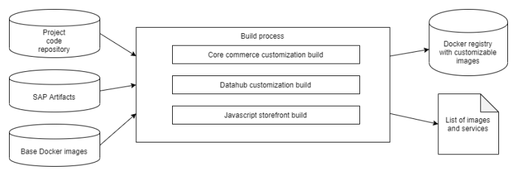

# Code Repository Setup And Build Guidelines

Generated on: 2024-05-22 15:16:24 GMT+0000 SAP Commerce Cloud in the Public Cloud | 2211
Original content: https://help.sap.com/docs/SAP_COMMERCE_CLOUD_PUBLIC_CLOUD/1be46286b36a4aa48205be5a96240672?locale=en- US&state=PRODUCTION&version=v2211

## Commerce Cloud Repository

Connect your (Git-based) code repository to Commerce Cloud to dene exactly how your application is built. You can connect an empty repository, or you can prepare your les rst and then connect. The system pulls your repository code into the builds and environments that create your unique product platform. You can congure extensions, properties, and aspects in the Commerce Cloud manifest.json le, which is stored in your repository.

Connecting your repository requires authentication. To learn more, see Connecting a Code Repository Using SSH and Connecting a Code Repository Using HTTPS.

SAP Commerce Cloud Sample Repository A sample repository is available that contains all the les required to set up SAP Commerce Cloud. Reduce the amount of time it takes to congure your repository by cloning the sample repo. The directory structure is already in place for you, along with sample les that you can customize for your specic requirements. Initial Setup and Storefront Validation Follow these steps to log in to the Cloud Portal for the rst time, connect your code repository, and create your rst build. When all of the pieces are in place, you can deploy the build, validate your storefront, and monitor activity. Testing the Conguration in a Local Environment The development team can test customizations to SAP Commerce Cloud before you commit the code to your repository. Set up your repository to support builds in both a local environment and the SAP Commerce Cloud environments. Code Repository Conventions The build process expects your code repository to have a specic structure. Builds generate correctly when your repository follows the expected structure. Project Customizations The build process in Commerce Cloud looks for project customizations in the project repository. There are two supported directory structures for customizations. General Rules for Paths Declared in a Manifest The paths declared in the manifest le point to a le for directory in your code repository. Migrating a Single Directory Structure to the Separate Sub-Directory Structure If you started with the original single directory structure, you can make a few small changes to migrate to the recommended separate subdirectory structure. Location of Resources in the Code Repository Compare the location of resources in both supported code repository structures.

## Sap Commerce Cloud Sample Repository

A sample repository is available that contains all the les required to set up SAP Commerce Cloud. Reduce the amount of time it takes to congure your repository by cloning the sample repo. The directory structure is already in place for you, along with sample les that you can customize for your specic requirements. To access the sample repository, use your GitHub account to search for cloud-commerce-sample-setup .

Clone this repository and follow the instructions in the readme le to update the example les with your specic details.

When your les are ready, push them to your Git repository and connect your repository to SAP Commerce Cloud.

## Repository Branches

The sample repository has the following branches:

main: This branch contains a sample of the latest SAP Commerce Cloud and SAP Commerce Cloud, composable storefront congurations, without Data Hub. This branch is the most common conguration.

2211-datahub: This branch contains the contents from the main branch, along with conguration les that support Data Hub. Data Hub is an additional purchase for SAP Commerce Cloud.

## Readme Files

Each branch has a readme le with instructions about how to work with the sample repository. You can nd requirements, links to supported version documentation, cloning instructions, and instructions for customizing the sample les. The readme le also includes instructions for accessing the Cloud Portal and validating a sample storefront.

## Custom Extensions And Code

Two example custom extensions are dened in the sample repository: kiwi and tiger. If you want to use custom extensions, rename the folders with the name of your extensions and add the custom extension les to the folders.

The repository structure looks like this: core-customize/mycustomextension/*

## Solr

If you want to customize Solr, you can add the Solr customizations to a custom Solr directory in your code repository. The Solr directory must be in the same location as the SAP Commerce Cloud manifest le. To learn more, refer to Customizing Solr.

## Language Packs

If you want to include language packs, add a custom language directory in your code repository. The language directory must be in the same location as the SAP Commerce Cloud manifest le. To learn more, refer to Adding Language Packs.

## Congurations Outside The Git Repository

For platform congurations that include third-party system secrets, you can add sensitive data to a local.properties le and upload them as a static le. To learn more, refer to Uploading Sensitive Conguration Data.

The build fails when you use an unsupported repository structure. If it fails, a related error message appears.

## External Code Repositories

In addition to the Commerce sample repository, you can also use a custom code repository set up in your private network. Depending on the the conguration of your network, the following options of integrating the repository are available to you:

if your network is publicly accessible, connect your repository using the SSH protocol or the HTTPS protocol. See Connecting a Code Repository Using SSH and Connecting a Code Repository Using HTTPS.
if your network is private but doesn't overlap with the network range 10.0.0.0/8 reserved for Commerce, set up a VPN to connect to your code repository. See Connecting a Code Repository Using VPN for instructions on connecting to the repository that requires a VPN connection. if your network is private and overlaps with the network range 10.0.0.0/8 reserved for Commerce, set up a VPN and NAT to connect to your code repository. See Connecting a Code Repository Using NAT for instructions on connecting to the repository that requires a VPN and NAT connection.

This is   For more    the SAP Help  3 Conguration Examples

## Connecting A Code Repository Using Ssh

Connect your code repository to the Cloud Portal using the SSH protocol.

## Context

The following process is valid only for SSH-based repositories. If your repository is HTTPS-based, see Connecting a Code Repository Using HTTPS. If your repository is behind a VPN, see Connecting a Code Repository Using VPN. If your repository requires you to use NAT, see Connecting a Code Repository Using NAT.

1. Open your Git-based code repository.

2. Choose the option to clone the repo.

A clone dialog box appears.

3. Verify that the URL format is set to SSH. 4. Copy the whole URL to your clipboard. 5. Open the Cloud Portal. 6. Click Repository in the left menu. 7. Choose ssh from the dropdown list. 8. Paste the URL into the Repository URL eld.

If your URL starts with ssh:// and contains a colon at the position highlighted in the following example, replace the colon with a slash. This change doesn't apply if the colon species a port location. In this case, keep the colon and don't change to a slash.

9. If you want to force the SSH client to connect only to known hosts with valid SSH keys, select The repository host must match one of the ngerprints below (secure) from the Strict Host key Check dropdown menu. When you select this option, enter the cryptographic key(s) that authenticate sites in the Fingerprints eld that appears. A host key ngerprint, also known as RSA key or a host key, is a security feature that helps users and client applications authenticate SSH/SFTP servers. When you add these host keys, the system adds them to the SSH-client conguration. If the validation fails, the build fails and the reason appears in the build log.

10. Save the changes and regenerate the public key.

The public key provides the authorization that Microsoft Azure needs to access the repository.

a. Click Regenerate to create a new public key and copy it to your clipboard. b. Open your code repository and go to Settings.

c. From the Settings menu, select SSH and GPG keys New SSH key .

The SSH keys/ Add new page displays.

d. Give the key a title. e. Paste the key copied from the Cloud Portal into the Key eld.

f. Click Add SSH key.

## Results

You're now ready to prepare your repository to support SAP Commerce Cloud. If you need to regenerate a new key, you can repeat the steps in this procedure.

Commerce Cloud Repository

## Connecting A Code Repository Using Https

Connect your code repository to the Cloud Portal using the HTTPS protocol.

## Prerequisites

You have your repository username and a generated token. The generated token is associated to the repository that you plan to connect.

Your repository is not behind a VPN.

## Context

The following process is valid only for HTTPS-based repositories. If your repository is SSH-based, see Connecting a Code Repository Using SSH. If your repository is behind a VPN, see Connecting a Code Repository Using VPN. If your repository requires you to use NAT, see Connecting a Code Repository Using NAT.

1. Open your code repository.

2. Copy the whole URL to your clipboard. 3. Add the repository URL in the Cloud Portal.

a. In the Cloud Portal, click Repository. b. Choose https from the dropdown list.

c. Paste the URL into the Repository URL eld.

4. Add the repository access credentials.

a. Add your repository username.

The username can be an e-mail address or the username supported by your repository.

This is   For more    the SAP Help  5 b. Add the token that is associated to your repository.

5. Click Save.

## Results

You're now ready to prepare your repository to support Commerce Cloud.

Commerce Cloud Repository

## Connecting A Code Repository Using Vpn

Connect your code repository in your private network to the Cloud Portal using the SSH protocol.

## Prerequisites

You have a working VPN connection to your private network. You know the IP address (with port if applicable) of the machine where your code repository is hosted.

## Context

The following process is valid only for SSH-based repositories hosted in private networks that don't overlap with SAP Commerce Cloud's reserved network range 10.0.0.0/8.

1. Open your Git-based code repository.

2. Choose the option to clone the repo.

A clone dialog box appears.

3. Verify that the URL format is set to SSH. 4. Copy the whole URL. 5. Open the Cloud Portal. 6. Go to Subscription Resources Repository . 7. Choose ssh from the dropdown list. 8. Paste the URL into the Repository URL eld:
a. Replace the domain with the IP address of your repository. b. If your code repository requires it, add the port to the IP address after the colon.

Your repository URL must start with ssh:// and may contain a colon at the position highlighted in the following example. If it does, replace the colon with a slash.

This is   For more    the SAP Help  6

9. Save the changes.

10. Regenerate the public key.

The public key provides the authorization Microsoft Azure needs to access the repository.

a. Create a new public key and copy it to your clipboard. b. Congure your code repository so that it allows access to it using SSH keys.

You are ready to prepare the repository in your private network to support SAP Commerce Cloud.

## Connecting A Code Repository Using Nat

Connect your code repository in your private network to the Cloud Portal using the SSH protocol when your network overlaps with SAP Commerce Cloud's reserved network range 10.0.0.0/8.

## Prerequisites

You have a working VPN connection to your private network. You know the IP address (with port if applicable) of the machine where your code repository is hosted.

You activated self-service NAT.

## Context

The following process is valid only for SSH-based repositories hosted in private networks when that network overlaps with SAP Commerce Cloud.

1. Congure a new NAT rule for your code repository.

a. In the Cloud Portal, select a subcription and go to Security NAT rules . b. Create new Remote System with the IP address of the code repository in your private network.

c. Create a new NAT rule with Builder as the source system and the Remote System you created one step prior as the destination system.
d. Save the Destination IP of the created rule. It is necessary for the Repository conguration.

2. Open your Git-based code repository. 3. Choose the option to clone the repo.

A clone dialog box appears.

4. Verify that the URL format is set to SSH. 5. Copy the whole URL. 6. Open the Cloud Portal.

This is   For more    the SAP Help  7 7. Go to Subscription Resources Repository .

8. Choose ssh from the dropdown list. 9. Paste the URL into the Repository URL eld:
a. Replace the domain or IP address with the Destination IP of your NAT rule. b. If your code repository requires it, add the port to the IP address after the colon.

Your repository URL must start with ssh:// and may contain a colon at the position highlighted in the following example. If it does, replace the colon with a slash. This doesn't apply if the colon species a port location. In this case, keep the colon.

10. Save the changes.

11. Regenerate the public key.

The public key provides the authorization Microsoft Azure needs to access the repository.

a. Create a new public key and copy it to your clipboard. b. Congure your code repository so that it allows access to it using SSH keys.

You are ready to prepare the repository in your private network to support SAP Commerce Cloud.

## Regenerating An Ssh Key Pair

If you want to update an SSH key pair after you connect your code repository to the Cloud Portal, you can regenerate the key pair.

## Prerequisites

You connected your code repository to the Cloud Portal using the SSH protocol. To learn more, see Connecting a Code Repository Using SSH.

1. Select a subscription from the list on the Subscriptions page.

2. Select Repository from the navigation menu.

The Repository page opens.

3. Click Regenerate.

A key pair is generated.

4. Click Copy to Clipboard.

This is   For more    the SAP Help  8

The following steps use the example of BitBucket, which differ slightly from other repository services such as GitHub.

6. Click Access keys in the menu.

8. Paste the access key copied from the Cloud Portal into the Key eld.
In most code repositories, you can also enter a short name for the key after the original key, separated by a letter space. The short name helps to identify the key in the overview.

9. To save the key pair, click Add key.

## Results

You can verify the connection to your repository by creating a build. A successful build veries that the code repository is connected to the Cloud Portal.

## Initial Setup And Storefront Validation

Follow these steps to log in to the Cloud Portal for the rst time, connect your code repository, and create your rst build. When all of the pieces are in place, you can deploy the build, validate your storefront, and monitor activity.

## Prerequisites

You read the system requirements. For more information, see System Requirements.

You reviewed the feature compatibility matrix to ensure that you understand the SAP Commerce Cloud features that aren't supported with Commerce Cloud.

You have a valid SAP User ID and that ID is associated to a subscription. For more information, see Obtaining an SAP User ID.

## Context

SAP Commerce Cloud uses an Azure SQL Database, which is based on Microsoft SQL Server. To avoid unexpected databaserelated issues when deploying your application, you have the option to implement your solution using the closest database type and version. For more information on how to optionally install a local Microsoft SQL Server for SAP Commerce Cloud development, see this article on CX Works .

1. Log in to the Cloud Portal.

The Cloud Portal is the user interface for Commerce Cloud. For more information, refer to Accessing the Cloud Portal.

2. Verify that your environments are provisioned and ready.

a. From the left navigation menu, click Environments. b. Verify that you see your environments listed with a status of Available.

Your rst development environment is provisioned automatically. Additional development, staging and production environments are provisioned by your system administrators using SAP for Me. For more information, refer to Provisioning Environments.

3. Connect to your Git-based repository.

The repository is where you store the information that is the blueprint for your Commerce Cloud builds. For more information, refer to Connecting a Code Repository Using SSH or Connecting a Code Repository Using HTTPS.

4. Congure your repository directory structure.

Commerce Cloud looks in specic repository directories for the information it needs to create builds. If the required manifest les and directory structure aren't in place, your builds fail. For more information, refer to Commerce Cloud Repository.

5. Add the Commerce Cloud build manifest les to the repository.

The manifest identies the version of SAP Commerce Cloud to use. The manifest also identies extensions, AddOns, properties, aspects, and tests to include in your build.

If you plan to include Data Hub, then you also need to add a Data Hub build manifest. For more information, see Data Hub. If you plan to include JavaScript Storefront, then you also need to add a JavaScript Storefront build manifest. For more information, see Add Applications to JavaScript Storefronts.

6. Test your code locally, and when it's ready, commit and push your code to the repository.

It's always a good idea to test your conguration before you commit it to your repository. For more information, see Testing the Conguration in a Local Environment.

7. Log in to the Cloud Portal and create a build.

The build is added to your environment. You can check the status of your build and nd information on your build on the environment details page or with build APIs. For more information, see Creating a Build.

8. Deploy the build once it's successfully created using the build APIs or the Cloud Portal.

For more information, see Deploying a Build in the Cloud Portal or SAP Commerce Cloud API Documentation.

9. Grant access to endpoints and secure them.

There are many ways to secure endpoints. For more information, see Endpoint Security.

10. To verify that the JavaScript storefront is up and running, go to Enviromments <Environment_name> Public Endpoints JS-Storefront and click the URL link. Navigating to the storefront URL veries that everything was created successfully and that customers can access your site.

11. Once the storefront is up and running, you can monitor the activity using logging and Dynatrace features.

Each environment comes with an instance of Dynatrace Application Performance Monitoring. This tool monitors your application and provides troubleshooting support when issues arise. For more information, see Dynatrace Service Overview. Each environment comes with its own logging endpoint. Take a moment to set up your logging solution, as it can also be helpful for troubleshooting future issues. For more information, see Logs.

Code Repository Conventions Build Process

## Testing The Conguration In A Local Environment

The development team can test customizations to SAP Commerce Cloud before you commit the code to your repository. Set up your repository to support builds in both a local environment and the SAP Commerce Cloud environments.

## Context

Before you get started, keep the following points in mind:
A sample code repository includes all of the artifacts that you need to test in a local environment. To get this sample code, download the code from the cloud-commerce-sample-setup repository.

There are version-specic SAP Commerce Cloud, composable storefront branches , some of which include support for the SAP Commerce Cloud, composable storefront.

A sample gitignore le is provided as part of the open-source code samples found at cloud-commerce-sample-setup . Make sure that you're using your gitignore le to only upload items to your repository that aren't automatically added as part of the SAP Commerce Cloud build automation process. For example, don't add anything to the SAP Commerce Cloud bin folder, except for bin/custom.

The sample code assumes that you're using Cloud hot folders locally. Make sure that you have the latest patch version of SAP Commerce Cloud. To learn more, see Download.
SAP Commerce Cloud uses an Azure SQL Database, which is based on Microsoft SQL Server. To avoid unexpected databaserelated issues when deploying your application, you have the option to implement your solution using the closest database type and version.

This is   For more    the SAP Help  11

1. Clone your empty git repository where you want to store your code.

2. Optional: If you want to start off your code review process correctly, then create both a develop and feature branch for the code and maintain your master branch for the production code.

3. Unzip the sample code that you download in the cloned code repository. 4. Unzip a copy of SAP Commerce Cloud in a different location.

5. Move the following folders from the unzipped SAP Commerce Cloud directory to the core-customize/hybris/bin directory in the cloned repository.

hybris/bin/modules hybris/bin/platform 6. Set up Apache Ant according to the Installing SAP Commerce Cloud directions. 7. Run the following code to ensure that your AddOns are loaded correctly.

ant addoninstall -Daddonnames="promotionenginesamplesaddon,smarteditaddon,textfieldconfigurato 8. Complete the SAP Commerce Cloud installation.

a. Installing SAP Commerce Cloud Manually. b. Start SAP Commerce Cloud.

c. Initialize SAP Commerce Cloud.

9. (Optional) If you want to have a local Blob storage instance to test Cloud hot folders, then go to the corecustomize/hybris/config/local.properties le and uncomment the lines with the following keys:
cluster.node.groups azure.hotfolder.storage.container.hotfolder azure.hotfolder.storage.account.connection-string 

If you accidentally uncomment these lines without setting up a local Blob storage, your solution starts, but you see lots of errors in your logs, such as Connection refused (Connection refused): 127.0.0.1:10000.

10. Navigate to localhost:9001/hac and verify that SAP Commerce Cloud is running locally.

11. Build and run your storefront locally.

a. Navigate to the js-storefront/spartacusstore.

b. Build and run the storefront.

yarn start a. Navigate to http://localhost:4200 and verify that the storefront is running.

12. Point the storefront to one of your SAP Commerce Cloud environments.

a. In the Cloud Portal, nd your environment and copy the URL for the API endpoint.

b. Update the baseUrl property in js-storefront/spartacusstore/src/app/app.module.ts with the URL for the API endpoint.

## Code Repository Conventions

The build process expects your code repository to have a specic structure. Builds generate correctly when your repository follows the expected structure. Respect the following conventions:
This is   For more    the SAP Help  12

| 5/22/2024 Provided by the customer   | Code hosting isn't part of the Commerce Cloud subscription, so you must supply your own code repository.                                                                                                                                                                                                                                                                                                                                                                                                    |
|--------------------------------------|-------------------------------------------------------------------------------------------------------------------------------------------------------------------------------------------------------------------------------------------------------------------------------------------------------------------------------------------------------------------------------------------------------------------------------------------------------------------------------------------------------------|
| Code                                 | You can use either:                                                                                                                                                                                                                                                                                                                                                                                                                                                                                         |
| repository                           | a repository accessible from the internet (public network) over SSH and HTTPS. See Connecting a Code Repository Using SSH and Connecting a Code Repository Using HTTPS for more details. an SSH-based repository with a VPN connection to your internal network. See Connecting a Code Repository Using VPN for more details. an SSH-based repository with a VPN conncetion to your internal network that requires NAT due to network overlap. See Connecting a Code Repository Using NAT for more details. |
| Repository                           | Must be Git-based.                                                                                                                                                                                                                                                                                                                                                                                                                                                                                          |
| type Single                          | All customizations are stored in a single repository by default. It can contain core customization (extensions, conguration),                                                                                                                                                                                                                                                                                                                                                                               |
| repository                           | Data Hub customization, and Javascript storefront. You can use git submodules functionality to split the content into multiple repositories. In such a setup, the main repository points to particular commits in separate repositories. Credentials congured in the Cloud Portal for the main repository are then also reused for submodules.                                                                                                                                                              |
| Custom                               | Only the source code of the custom project extensions must be under version control. The build process automatically                                                                                                                                                                                                                                                                                                                                                                                        |
| extensions                           | installs the binaries for Commerce Cloud.                                                                                                                                                                                                                                                                                                                                                                                                                                                                   |
| Extension                            | The build process looks for extensions (enabled in the Manifest.json) recursively starting from the Customer Project                                                                                                                                                                                                                                                                                                                                                                                        |
| lookup                               | root directory, up to 10 levels deep.                                                                                                                                                                                                                                                                                                                                                                                                                                                                       |
| Manifest                             | The build process looks for the manifest le in one of two supported repository structures. For more information, see Commerce Cloud Repository.                                                                                                                                                                                                                                                                                                                                                             |

Don't include les in your code repository that are generated by the build process. Use a versioned .gitignore le to ensure that these les aren't committed to the code repository. The proper le setup prevents generated les from being added to the working copy when an ant all or ant clean command is used.

## Project Customizations

The build process in Commerce Cloud looks for project customizations in the project repository. There are two supported directory structures for customizations.

## Separate Subdirectories For Each Customization

Using separate subdirectories for each customization is the recommended conguration. In this conguration, the builder expects to nd a core-customize subdirectory and several optional directories.

core-customize (required) - contains customizations of SAP Commerce Cloud and a manifest le.

js-storefront (optional) - contains Javascript storefront customizations and a manifest le.

datahub (optional) - contains Data Hub customizations and a manifest le.
Each customization subdirectory must contain a manifest.json le.

## Single Directory For All Customizations

Using a single root directory is the original way the repository was congured. This conguration is still supported but isn't recommended and has been deprecated.

All directories are added directly in the root directory.

JavaScript storefront isn't supported.

## Structure Detection

The build process looks for the Commerce Cloud manifest.json le in the root directory. If it nds the manifest le, then the single directory structure is expected. If it doesn't nd the manifest le, then the separate subdirectory structure is expected.

You can't use a mix of both options. The build process fails if you use a combination of both structures.

Migrating a Single Directory Structure to the Separate Sub-Directory Structure

## Customization Directory Guidelines

Follow these best practice guidelines for SAP Commerce Cloud customizations.

## Core Commerce Customization Directory Guidelines

Extensions in the manifest le are congured with names only (without paths).

The extensions block in the manifest contains both project custom extensions, as well as extensions shipped by SAP
Commerce Cloud.

The Platform looks for extensions in the following directories:
<root> directory of the project repository if the single directory repository structure is used.

<root>/core-customize directory of the project repository if separate customization subdirectories are used. additional SAP Commerce Cloud extensions (downloaded automatically) extension packs (if enabled in the manifest le)
SAP Commerce Cloud bin directory You can put extensions inside subdirectories or above directories using the following depth guidelines:
5 levels in the SAP Commerce Cloud bin 10 levels in other directories Dependent extensions are enabled automatically by the Platform. The Platform looks for them in the same way as the ones directly declared in the manifest le. Duplicated extensions are ignored by the Platform. The extension is loaded from the rst location where it's found.

Explicit paths in the useConfig block in the manifest le are preferred over the old convention-based ones (like _SOLR_
or _LANGUAGES_). It's important that you don't use both approaches at the same time (useCong and conventionbased ones).

## Data Hub Customization Directory Rules

This is   For more    the SAP Help  14

Data Hub custom extensions are congured in the manifest le by providing their names (without paths).

Data Hub custom extensions directories must reside inside <root>/datahub if you use the single directory structure or the separate subdirectory structure.

## Javascript Storefront Customization Directory Rules

Congure Javascript applications in the manifest le by providing their names and paths.

Javascript application paths are relative to <root>/js-storefront when you use the separate subdirectory structure. The single directory structure isn't supported.
Location of Resources in the Code Repository Extensions

## General Rules For Paths Declared In A Manifest

The paths declared in the manifest le point to a le for directory in your code repository.

All paths declared in the manifest le are expected to be relative to the associated customization directory.

In the single directory repository structure, the paths declared in the manifest le are relative to the <root>
directory for the project. When you use the recommended structure with separate subdirectories, the paths declared in the manifest are relative to the <root>/core-customize directory for the project.

If you congured JavaScript storefront, the paths declared in the manifest are relative to the <root>/jsstorefront directory for the project.

If you congured Data Hub, the paths declared in the manifest are relative to the <root>/datahub le for the project.

Don't begin paths in the manifest le with a backslash '/' because they're assumed to be relative. Provide paths in a simple format that doesn't rely on advanced shell options, such as:
Going up in the directory tree ( '..' )
Resolving the current directory ( '.' )
Starting from machine root ( '/' )
Shell expansion, for example ( '*' or '~' )
Environment variable expansion, for example ( '$HOME' or '${HOME}' )
Paths are considered to be in *nix format, so use slashes to separate directories.

Since there are many types of le systems, you can't expect functions to work the same way in all le systems. Be careful when assuming that the following functions work as you expect.

case sensitivity le attributes, such as executable ags
le permissions

links (symbolic, hard, and so forth) modication or last access time non-ASCII characters

## Migrating A Single Directory Structure To The Separate Sub- Directory Structure

If you started with the original single directory structure, you can make a few small changes to migrate to the recommended separate subdirectory structure.

## Context

All paths configured in the manifest are relative to it. As a result, no manifest file changes are required when migrating from the original single structure to the separate subdirectory structure.

1. In the <root> directory for your project, create a new directory called core-customize .

2. Move the existing core customization directories from <root> to the new directory.

## I Note

The Data Hub directory stays in the <root> directory for the project.

3. Make sure that the .git directory that contains git internal metadata and .gitignore are still in <root> .

"extensions":
"customextension1"
"customextension2"
 ], "useConfig": { "properties": [ { "location": "my-properties/prop1.properties" } ], "solr": { "location": "my-solr" }, "languages" : { "location": "my-langpacks" } }, ... }
Paths in the Data Hub manifest
{ ... "extensions" : [ "datahubextension1", "datahubextension2" ] ... }
Paths in the JavaScript Storefront manifest
"applications": [ { "name": "jsapp1", "path": "foo/jsapp1" }, { "name": "jsapp2", "path": "foo/bar/jsapp2" } ]

Location of Resources in the Code Repository

## Location Of Resources In The Code Repository

Compare the location of resources in both supported code repository structures.

| Resource                                                 | Manifest Example             | Separate Sub-Directories   | Sing   |
|----------------------------------------------------------|------------------------------|----------------------------|--------|
| Platform custom                                          | inside <root>/core-customize |                            |        |
| extensions                                               | insid                        |                            |        |
| "extensions": [ "customextension1", "customextension2" ] | For example:                 | For e                      |        |
| <root>/corecustomize/foo/customextension1                                                          | <ro <ro                      |                            |        |
| <root>/corecustomize/foo/bar/customextension2                                                          |                              |                            |        |

| 5/22/2024 Resource                                                                                             | Manifest Example                                                               | Separate Sub-Directories   | Sing   |
|----------------------------------------------------------------------------------------------------------------|--------------------------------------------------------------------------------|----------------------------|--------|
| _SOLR_ directory with Solr customizations (deprecated)                                                         | <root>/core-customize/_SOLR_                                                   | <ro                        |        |
| _LANGUAGES_ directory with language packs (deprecated)                                                         | <root>/core-customize/_LANGUAGES_                                              | <ro                        |        |
| localextensions.xml                                                                                            | <root>/corecustomize/abc/def/extensions.xml                                                                                | <ro                        |        |
| to import                                                                                                      | "useConfig" { "extensions" { "location": "abc/def/extensions.xml" ... } }      |                            |        |
| Properties les to                                                                                              | <root>/corecustomize/foo/bar/some.properties                                                                                | <ro                        |        |
| import                                                                                                         | "useConfig" { "properties" [ { "location": "foo/bar/some.properties" ... } ] } |                            |        |
| Data Hub custom extension directories                                                                          | inside <root>/datahub                                                          | insid                      |        |
| "extensions" : [ "datahubextension1", "datahubextension2" ]                                                    | For example:                                                                   | For e                      |        |
| <root>/datahub/datahubextension1                                                                               | <ro                                                                            |                            |        |
| <root>/datahub/datahubextension2                                                                               | <ro                                                                            |                            |        |
| JavaScript                                                                                                     | <root>/js-storefront/foo/jsapp1                                                |                            |        |
| applications                                                                                                   | not                                                                            |                            |        |
| "applications": [ { "name": "jsapp1", "path": "foo/jsapp1" }, { "name": "jsapp2", "path": "foo/bar/jsapp2" } ] | <root>/jsstorefront/foo/bar/jsapp1                                                                                |                            |        |

## Build Process

Follow these best practice guidelines to ensure that your build process works as expected.

General Information The build process in SAP Commerce Cloud builds your nal software based on the information from your code repository. Detailed Information The detailed information includes the most common challenges you can encounter when working with the build process. Core Customization and the Build Process This is   For more    the SAP Help  18 Learn how the build process works in the core customization.

Data Hub Customization and the Build Process Learn how the build process works in the Data Hub customization. Complex Project Repositories Use the following optimizations and strategies to make SAP Commerce Cloud processes more convenient and fast, even if there are larger projects.

## General Information

The build process in SAP Commerce Cloud builds your nal software based on the information from your code repository.

## Build Process Responsibilities

The build process in Commerce Cloud is reponsible for several operations. These operations include:
Cloning the Git repository with project customizations. Downloading required artifacts. Applying customizations. Building the nal software. Packing the software into Docker images. Uploading images into the Docker registry. Returning information about the services to be enabled in the target Commerce Cloud environment.

## Build Process Customization

The build process takes several customizations into consideration. These considerations include:
core commerce Data Hub Javascript storefront Each customization uses a separate directory in the project code repository:
<repository-root>
core-customize datahub

js-storefront
Core customization is required, while Data Hub and JavaScript storefront are optional. For more information on code repository structure, see Commerce Cloud Repository.

## Selective Rebuild

The build process determines a hash code of the expected contents for each image at the beginning. It takes multiple things into consideration, such as:
The artifact versions.

Base image versions.
Contents of the project code repository.

Then it checks if the image tagged with such hash is available in the Docker registry:
If it's available - image build is skipped and existing image is used in deployment.

If it's not available - full image build is performed and new image is used in deployment.
For more information on selective rebuild function, see Selective Images Rebuild.

## Docker Images

The build process creates several Docker images. For core commerce customization:
Platform Solr For Data Hub customization (optional):
Data Hub For Javascript storefront (optional):
Javascript storefront with static content.

Javascript storefront with server-side rendering.

## Services And Images

The build process composes a list of services and Docker images that are used during deployment. Some services are optional, and versions of images that can't be customized are determined.

This is   For more    the SAP Help  20 The nal list of the services and their images looks like this:

Accelerator storefront service → customized Platform image Backoffice service → customized Platform image Admin service → customized Platform image API service → customized Platform image Solr service → customized Solr image Zookeeper service → customized Zookeeper image Image-processing service → image-processing image Data Hub service → customized Data Hub image Javascript storefront service → customized Javascript storefront image Javascript storefront SSR service → customized Javascript storefront SSR image
The build process passes this list to the deployment process.

## Detailed Information

The detailed information includes the most common challenges you can encounter when working with the build process. The build is environment agnostic, which means that the same build can work with multiple Commerce Cloud environments. The advantage of this approach is that the same code that is tested on development or staging environments is deployed to production environments. Examples of environment-specic settings:
Domain names.

IP address. SSL certicates. URLs or credentials to resources (database, media storage). URLs or credentials to any external systems. Credentials for technical users. Machine size or available amount of resources (CPU, memory).
Such settings can't appear in the nal build, because it couples the build with a specic environment. For more information on environment-specic properties, see Updating Service Properties.

## Environment Types

A Commerce Cloud environment can be created as development, staging, or production. These types are also known as personas. The environment persona inuences environment performance and the purpose of the environment. The general rule is that the production environment is faster than staging, and staging is faster than development. The environments can have different conguration, such as different service properties.

There's a difference between:
Conguration for all environments of given type - it can be included in build. Conguration of a specic environment - it can be dened in the Cloud Portal.

Consider the purpose of an environment while performing deployments. It's recommended to:
Perform the build once. Build is environment agnostic.

Deploy the build to all environments, starting from development, then staging, and nally to production. Test the build on every environment before promoting the build to the next environment.
Commerce Cloud provides you with the tooling - build, deployment, conguration. You're responsible for integrating it with your development ow, in particular:
Integrating it with the code repository, for example automatic trigger or build. Branching strategy, for example which branches trigger automatic build, how hotxes are handled.

This is   For more    the SAP Help  22

Pull request ow - what happens when a developer creates pull request.

Testing - what tests are performed in which cases. Proper conguration, for example environment-specic data isn't stored in the build, which is environment agnostic. Versioning, for example is the versioning linear, how to handle hotxes, when the upgrade of a major version is performed. Security, for example don't store any credentials in the repository with code, so the developers can't access the production system.
You can use Commerce Cloud API to automate the builds and deployments from your CI environment. For more information, see SAP Commerce Cloud API Documentation.

## Differences Between The Build Environment And Final Environment

A build is created in a dedicated environment, which is different from the nal Commerce Cloud environment. These differences include:
The build environment has different credentials than the Commerce Cloud one.

The directory structure is different.

Extensions are packaged by ant production, so their structure is different than it is during the build time.

The build environment can have different tools installed, for example a Java compiler. The base Docker image is different, so even the operating system can be different. The nal environment is allowed to communicate with necessary resources, for example database, media storage, additional services. Build tools and their conguration, for example Java compiler, Maven conguration, are intended to exist only in the build environment. The whole software is built inside a single Docker container, but then is run in separate containers. Machine size can be different. Build environment is optimized for build only. Location of the environment is different - outbound IP address of the build environment is different from the Commerce Cloud one. Different network security rules can apply. The build environment isn't integrated, so additional resources such as Solr server or database aren't available at build time.

## Resource Availability In The Build Environment

The build environment is separated from the nal Commerce Cloud environment. It means that the build-specic resources, such as artifact repositories, are available for the build environment only. Similarly, resources specic to nal Commerce Cloud environment, such as database or media storage, are unavailable for the build environment. As the build is environment agnostic, don't store or involve any environment-specic resources, such as the external systems, during the build.

## Absolute Path Hardcoding

Hardcoding absolute paths, such as /opt/example, isn't recommended. There's no guarantee that the particular path remains the same. Keep in mind that the build environment is by denition different than the nal Commerce Cloud one. The directory structure can change at any time, as a result of optimization, such as splitting the writable and read-only content into different mounting points, or as a result of attaching additional storage. Hardcoding absolute paths isn't a x, as it makes the solution not reliable against the infrastructure changes.

## Sap Artifact Modication

Modifying SAP artifacts isn't recommended. The directories with SAP artifacts are writable at the build time, because the build process stores modify them. However, modifying the SAP artifacts breaks the open - closed principle and such solution is error prone. Always use the official ways of extending the business logic of the application.

## File System Behavior

Keep the following guidelines in mind when working with le systems.

## Writable Directories

Don't write anything in the arbitrary directories that aren't managed by the build process, even if it's currently possible. It's a subject to change at any time due to optimizations or security improvements. The build process assures that all of the required directories are writable.

## Permissions

Directory permissions or ownerships are platform-dependent. Code that handles permissions in specic way must work differently in various operating systems of lesystem implementations. It's not needed in Java applications. It's subject to change at any time due to optimizations or security improvements.

## Non-Ascii Characters

Don't use characters other than plain ASCII in the le names. The resulting application is a complex piece of software and there's no guarantee that all layers always handle non-ASCII le names properly.

## Links

It's not recommended to use the Unix-specic lesystem capabilities, such as hard links or symlinks. There's no guarantee of a particular Unix system. Also, symlinks don't work in all lesystems. It's difficult to predict how the symlinks behave if directory structure changes or mounting point changes in general.

## Case Sensitivity

Various lesystems handle case sensitivity in a different way. Always name les carefully and in the same convention. Even if a particular lesystem is case-sensitive, it can change at any time.

## Git Repository

The Git repository stores information about le permissions. It's platform-dependent and works differently on different operating systems. Don't assume that the particular le permissions are set after the repository is cloned in the build process.

## External Resource Availability

The availability of the resources known to the Commerce Cloud build process, such as artifact repository and Docker registries, is guaranteed. There's no guarantee that the build process has unlimited internet access. Don't use any external services during the build process. The network policies are subject to change at any time due to optimizations or security improvements. The only resource controlled by you is your project Git repository.

## Repositories With Third-Party Artifacts

Commerce Cloud build process doesn't offer any trusted repositories for third-party artifacts. It uses the publicly available repositories by default. Here's a breakdown of repository usage:
Core customization uses Maven Central, if enabled in extensioninfo.xml. For more information, see Extension Library Management Using Maven

Data Hub customization uses Maven Central JS storefront uses default registry congured by the yarn tool
The availability, reliability, or security of the public repositories isn't guaranteed.

If you don't want to use public repositories:
Core customization - disable usemaven in extensioninfo.xml for each extension and commit the libraries to Git repository. For more information, see Extension Library Management Using Maven.

Data Hub - specify scope=system in each Maven dependency, provide systemPath attribute pointing to the jar le and commit the jar les into the Git repository. For more information, see Setting Up Custom Extensions.

Add Applications to JavaScript Storefronts.

## Build Reproduction

You can reproduce builds, which means that for a given state of inputs, the same output is generated. This rule applies in particular when you declare third-party dependencies.

For Maven artifacts (core customization or Data Hub) - don't use version ranges, SNAPSHOT, or LATEST qualiers.

Provide versions explicitly.

For yarn and npm - resolve dependencies during the development and commit yarn.lock.json or packagelock.json les into code repository.
It's especially important when you use the selective rebuild feature, which is enabled by default. The build process can determine whether the Docker image is already available for the given state of inputs and skips the image generation in such case.

## Operating System Tooling

There's no guarantee that a particular console tool is installed and tools available in the Docker image can change at any time. Tools are highly dependent on the underlying operating system. Consider other alternatives to console tools. There are multiple ways to call external tools that are available in the operating system, such as:

Java code, for example inside tests. Build callbacks in Ant.

Maven plugins in pom.xml in Data Hub build.

Scripts in package.json in Javascript build.
Tool behavior can differ between various operating systems - the tool can disappear after an upgrade. The Docker image used in build environment is different from the one used in the nal Commerce Cloud environment, where each component is run in its own Docker image. Don't use the console tools, instead:
Prefer Java libraries in Java code.

Use built-in Commerce Cloud ant functionalities in ant scripts. Use standard Maven plugins in Maven builds that don't rely on console tools (for Data Hub builds).

Use only shell commands assured by yarn install mechanism (for Javascript application).

## Secret Storage

Instead of hardcoding the secrets in your code repository, use the service properties. Secrets, such as passwords and keys, can't be stored in the repository with code. There are two main reasons:
Secrets are environment-specic, while the build is environment agnostic. It's hard to ensure security of the whole solution as the Git repository is accessed by developers.

For more information, see Services.

## Resource Location

The resource location can change between build and the nal environment. Don't depend on the underlying lesystem directory structure in order to access resources in your Java code. Resource locations can change for the following reasons.

Compilation happens (resources can be packaged into a .jar le). Build environment is different from the nal Commerce Cloud one.
It's better to use the standard class loading mechanisms rather than accessing les based on path.

## Available Disk Space

This is   For more    the SAP Help  26 During the build process, data can be processed several times. This activity consumes a large amount of disk space. That's why the build process has a large workspace (20 GB). The build process performs the following activities.

SAP artifacts are downloaded, unpacked, compiled, processed by ant production, and packaged in a layer of the nal Docker image. Your project code is processed in similar way. Third-party dependencies are downloaded and prepared (unpacked).

Data Hub Maven components from Data Hub ZIP artifact are installed in the local repository by mvn install.

If you receive the insufficient disk space error, it means that you need to analyze the disk space consumption in detail:
Check the size of all les in the project code repository. Check the size of third-party artifacts that are downloaded. Check the sizes of extensions after the build.

Check the buildcallbacks behavior.

Check all places where new les are generated, such as the test results.

## Core Customization And The Build Process

Learn how the build process works in the core customization.

In the manifest.json le, you can control:
Which extensions are enabled

Which web modules are exposed on particular aspect
If the web module of an extension isn't exposed in a particular aspect, its core part is still enabled and active in all aspects. Extensions are intended to extend the application vertically. They can inuence, for example, data model and business logic. These layers must work in a consistent way across all aspects.

 For more information on extension modules, see Extension Components.

## Properties

Commerce Cloud services such as SAP Commerce Cloud and SAP Commerce Cloud Data Hub can be congured using properties les. A properties le is a standard Java le containing key - value pairs for conguration management. To learn more on Java properties, see https://docs.oracle.com/javase/tutorial/essential/environment/properties.html . You can set your properties using three different ways for both SAP Commerce Cloud and Data Hub:
Setting them as service properties in Cloud Portal. For more information, see Updating Service Properties. Use one of the service-specic manifests. For more information, see Build Manifest Components. For examples, see:
Access the sample repository for SAP Commerce Cloud, cloud-commerce-sample-setup For Data Hub, see Data Hub with ERP Commerce Cloud Manifest Example.

Prepare properties les, put them in your repository, and use the useConfig manifest component to reference them.

For more information, see:
SAP Commerce Cloud Conguration Reuse Data Hub with ERP Environment Conguration File For more information on server-specic properties, see Conguration Properties for Data Hub.

When reusing properties les from your local installation in the cloud environment, make sure to adjust the values of your properties to suit the new environment.

There are three sources of properties:
Customer and customer extensions come from the manifest.json le and custom extensions, Build process supplies a number of default values that you can read and set, Automation introduces parameters that you can read but shouldn't be override as they're essential for Automation to work correctly.

For more information on properties managed by the build process, refer to Managed Properties.

| Order           | Description               | Source   | Example                                         | Applied at Build Time   |
|-----------------|---------------------------|----------|-------------------------------------------------|-------------------------|
| 1               | project.properties        | Commerce | project.properties le in an extension directory | Yes                     |
| of an extension | Extensions                |          |                                                 |                         |
| 2               | Default global properties | Build    | clustermode                                     | Yes                     |
| Process         |                           |          |                                                 |                         |

| 5/22/2024 Order Description                                                          | Source                                                                                          | Example   | Applied at Build Time   |    |
|--------------------------------------------------------------------------------------|-------------------------------------------------------------------------------------------------|-----------|-------------------------|----|
| 3                                                                                    | Manifest global                                                                                 | Customer  | Yes                     |    |
| properties                                                                           | "properties": [{ "key": "common.global.property", "value": "test-common-global-property"} (...) |           |                         |    |
| 4                                                                                    | Manifest global properties dened in the useConfig customization                                 | Customer  | Yes                     |    |
| "useConfig": { "properties": [{ "location": "config/local.properties"}]} (...)       |                                                                                                 |           |                         |    |
| 5                                                                                    | Default aspect-specic                                                                           | Build     | catalog.sync.workers    | No |
| properties                                                                           | Process                                                                                         |           |                         |    |
| This is custom documentation. For more information, please visit the SAP Help Portal | 29                                                                                              |           |                         |    |

| 5/22/2024 Order Description                                                                                      | Source                                                                                                                            | Example   | Applied at Build Time   |
|------------------------------------------------------------------------------------------------------------------|-----------------------------------------------------------------------------------------------------------------------------------|-----------|-------------------------|
| 6                                                                                                                | Aspect-specic                                                                                                                     | Customer  | No                      |
| properties                                                                                                       | "aspects": [{ "name": "backoffice", "properties": [{ "key": "test.property.1", "value": "test.property-1-value-backoffice"} (...) |           |                         |
| 7                                                                                                                | Aspect-specic properties dened in the useConfig customization                                                                     | Customer  | No                      |
| "useConfig": { "properties": [{ "location": "config/local.properties"}, "aspect": "accstorefront"]} (...)        |                                                                                                                                   |           |                         |
| 8                                                                                                                | Environment personaspecic properties dened in manifest.json                                                                                                                                   | Customer  | No                      |
| "properties": [{ "key": "test.property.1", "value": "test-property-1-value-prod", "persona": "production"} (...) |                                                                                                                                   |           |                         |

| 5/22/2024 Order Description                                                                                                                                     | Source   | Example   | Applied at Build Time   |
|-----------------------------------------------------------------------------------------------------------------------------------------------------------------|----------|-----------|-------------------------|
| 9                                                                                                                                                               | Environment personaspecic properties dened in the useConfig customization          | Customer  | No                      |
| "useConfig": { "properties": [{ "location": "config/local-dev.properties", "persona": "development"} (...)                                                      |          |           |                         |
| 10                                                                                                                                                              | Environment personaand aspect-specic properties dened in manifest.json          | Customer  | No                      |
| "aspects": [{ "name": "backoffice", "properties": [{ "key": "test.property.1", "value": "test.property-1-value-prod-backoffice", "persona": "production"} (...) |          |           |                         |
| 11                                                                                                                                                              | Environment personaand aspect-specic properties dened in the useConfig customization          | Customer  | No                      |
| "useConfig": {{ "location": "config/local-backoffice-prod.properties", "persona": "production", "aspect": "backoffice"} (...)                                   |          |           |                         |
| 12                                                                                                                                                              | Environment-specic properties dened in static les sets (nonservice specic)          | Customer  | No                      |
| 13                                                                                                                                                              | Environment-specic common properties dened in the hcscommon service in the Cloud Portal          | Customer  | No                      |

| 5/22/2024 Order Description   | Source             | Example    | Applied at Build Time   |    |
|-------------------------------|--------------------|------------|-------------------------|----|
| 14                            | Environment-specic | Automation | db.url                  | No |
| properties                    |                    |            |                         |    |

| 5/22/2024 Order Description   | Source                                                                     | Example    | Applied at Build Time   |    |
|-------------------------------|----------------------------------------------------------------------------|------------|-------------------------|----|
| 15                            | Environment-specic service - endpoint mapping                              | Automation | No                      |    |
| 16                            | Environment-specic                                                         | Automation | No                      |    |
| initial password              |                                                                            |            |                         |    |
| 17                            | Environment-specic and service-specic properties in static les sets        | Customer   | some.property=value     | No |
| 18                            | Environment-specic and service-specic properties dened in the Cloud Portal | Customer   | No                      |    |

The system sets the properties with respect to the Order column - the properties with the higher order override the ones with the lower order. You can only modify the properties specied in the Customer column. You can also set these properties programmatically.

Properties that are part of the build process cannot be overridden.

The following rules apply to properties:
More specic properties override the less specic ones. As the build is environment agnostic, the properties related to personas, aspects, or the target environment aren't visible at build time.

See the workow of SAP Commerce Cloud properties:

## Commerce Cloud Directory Structure

The directory structure that is seen in a Commerce Cloud ZIP artifact doesn't remain the same across all environments. For example:
Custom extensions aren't downloaded to the hybris/bin/custom directory. They're separated from SAP artifacts.

HYBRIS_BIN_DIR doesn't cover custom extensions.

hybris/config directory is managed by Commerce Cloud.

Single local.properties le isn't used.

It's not guaranteed that hybris subdirectories, such as bin, custom, config, data, log, and temp reside in the same root directory.

Media and database are stored in cloud. They don't reside in HYBRIS_DATA_DIR.

Extensions are packaged using the ant production mechanism. Their structure and location is changed in the nal Commerce Cloud environment.
As a result, you can't assume that the particular extension is available under some location or how its location is related to another extension location. Use the following ant property to access the extension path during the build:
ext.<extension name>.path

## Hybris Directory Environment Variable

Extensions don't always reside inside hybris/bin directory, which is pointed by HYBRIS_BIN_DIR environment variable.

The extensions downloaded during the build are unpacked to separate directories. In particular custom extensions are also separated. Additionally, the extensions are repackaged during the build by ant production mechanism, which reorganizes the directory structure again.

In Commerce Cloud, the media are stored in cloud storage. They aren't available in the directory pointed by HYBRIS_BIN_DIR
environment variable.

## Extension Directory Structure

The extension directory structure seen during development is different than the one seen in the nal Commerce Cloud environment. During the build process, the Platform creates intermediate directories, which reside only in build environment and the Java resources are packaged into jar les. Then the extensions are packaged using the ant production mechanism that copies only specic les and directories. It's important to use the standard Java class-loading mechanisms. For more information about extensions, see Extension Concept.

## Embedded Solr

Solr is embedded in SAP Commerce Cloud to make development easier. The standalone Solr application is included in a SAP Commerce Cloud ZIP. In the SAP Commerce Cloud environment, Solr runs in a separate Docker container. The one from SAP Commerce Cloud isn't used. Modifying the Solr directory shipped with SAP
This is   For more    the SAP Help  35

## Selecting Solr Server Version

The Solr server in Commerce Cloud runs in a Docker image, which is built during the build process. The build process takes the base image with Solr and adds the project customization on top of it.

| Layer      | Contents                                                                                                  |
|------------|-----------------------------------------------------------------------------------------------------------|
| Final Solr | Project customization                                                                                     |
| Base Solr  | Commerce Cloud additions, such as startup script Solr customization from Commerce Cloud zip Solr binaries |
| Base OS    | Java Operating system                                                                                     |

Commerce Cloud can work with multiple Solr versions, it's recommended to congure the requested Solr major and minor version in the manifest.json le in the following way:
"solrVersion": "7.7" The build process then:

validates whether the expected version is supported chooses most up-to-date Solr base image available for a given Commerce Cloud and Solr version
If the Solr version isn't explicitly congured, the default one is used. For more information about supported and default Solr versions, refer to Compatibility. This setting inuences only the Solr server and compatible Zookeeper running in Commerce Cloud. It doesn't have any inuence on:

Solr client shipped in solrfacetsearch extension in Commerce Cloud zip.

Solr server shipped with solrserver extension in Commerce Cloud zip.

## Upgrading Solr Version

You can upgrade Solr version to a higher one as long as your Commerce version supports it.

Upgrading Solr to a higher version requires changing the manifest.json le and launching build and deployment process again. The version you upgrade to must be compatible with the version of Commerce. For more information about supported versions, see Update Releases.

To upgrade Solr, specify its version in the manifest.json le according to the following example:

"solrVersion": "x.x" x.x is the highest supported Solr version available for your version of SAP Commerce Cloud. Run the build and deployment process after modifying manifest.json for the changes to take effect. You also need to trigger full Solr indexing to process the version change.

Solr Index Update Update Solr Index

## Platform Packaging Properties

The Commerce Cloud build process invokes built-in Platform mechanisms, such as ant production, to generate the content for nal Docker images. This mechanism is congurable in SAP Commerce Cloud, which is often used in SAP Commerce Cloud deployments. Don't set any properties that can inuence how the extensions are packaged. These properties usually start with production:
production.include.tomcat production.create.zip production.generate.extensionsxml Be careful especially when you migrate from older solutions into Commerce Cloud that can potentially contain such settings.

## Tanuki Wrapper

SAP Commerce uses Tanuki Wrapper to run Platform as a service. The following control the run-time settings:
templates in hybris/config/tomcat/conf.

tomcat.* properties, such as tomcat.javaoptions.

## Caution

SAP Commerce Cloud uses Docker and Kubernetes instead of Tanuki Wrapper. Therefore, the properties that congure Tanuki Wrapper aren't effective.

## Setting Tomcat Version

Set the desired Tomcat version, if you wish to use one that is different to the recommended version.

## Context

To ensure better compatibility, the build process takes a Tomcat version shipped with a given core SAP Commerce Cloud artifact. However, you can request a different Tomcat version using the following property:
bundled.tomcat.version=

You can set this property in the following les that are respected during the build process:

a project.properties le of any extension the manifest.json le
a properties le with no aspect or environment persona dened that is imported by useConfig

1. Navigate to the le where you want to add the property.

2. Add the property with the desired Tomcat version:
bundled.tomcat.version=8.5.57

## Conguring Java Options Using Properties

You can congure selected Java options using service properties. Use the following service properties to congure your environments at run time using Java options:
ccv2.additional.catalina.opts - allows you to set Tomcat Catalina options

ccv2.additional.ant.opts - allows you to set ant tasks options for the admin aspect
For more information on Java options, refer to the official Java documentation.

## Manifest File And Local Extensions

The manifest (manifest.json) le is a JSON data structure that provides project conguration to the build process. It's similar to, but doesn't replace, a combination of local.properties, localextensions.xml, spring.xml, and web.xml les. The manifest le is a prerequisite for creating a solution on SAP Commerce Cloud.

To avoid inconsistencies between local builds and cloud builds, make sure that the extensions in localextensions.xml and manifest.json are the same. Also, make sure that the properties congured in local.properties are present for the environment where you plan to deploy the build.

## Replacing Ootb Files

You can replace les that are part of the core Commerce software if needed for certain scenarios.

SAP Commerce Cloud implements a xed build process, so you can't run ant customize or change les inside a Commerce release. However, you can replace them at build time to override default conguration or functionality - for example, to x a bug before a patch is available. This process requires you to create a custom extension and include it in the repository you will use to build your instance of Commerce.

The buildcallbacks.xml le is in the root directory of that extension. It's editable; you can use that possibility to replace the les with your own. Keep in mind that replacing out-of-the-box les isn't recommended because of the possibility of damaging the build. Proceed with this action only if you are certain it's necessary and there is no conict between your les and those of Commerce.

This is   For more    the SAP Help  38

## Remember

Rather than absolute paths, you must use properties so that the extension resolves properly in all locations.

Assuming that the OOTB PageTitleResolverTest.java exists and you want to replace it with a custom MyPageTitleResolverTest.java le that is part of your extension directory, you have to state in the buildcallbacks.xml to delete the original le and replace it with yours:
<project name="myextension_buildcallbacks"> <macrodef name="myextension_before_build"> <sequential> <if> <available file="${ext.acceleratorservices.path}/testsrc/de/hybris/platform/acceler <then> <echo>\#\#\#\#\#\# !!!! Replacing breaking JUnit.</echo> <delete file="${ext.acceleratorservices.path}/testsrc/de/hybris/platform/accele <copy file="${ext.myextension.path}/resources/javaclasses/MyPageTitleResolverTe </then> </if> </sequential> </macrodef> </project>

## Running Cron Jobs On Specic Aspects

Specify the aspect on which you want to run your cron jobs using node groups.

## Context

Cron jobs are tasks run regularly at a certain point of time. The key idea of using cron jobs is to start a long or periodic background process, with the possibility to log each run and to easily check its result. They're typically used for creating data for backups, updating catalog contents, or recalculating prices. Learn how to specify the aspect on which you want to run your cron jobs using node groups.

1. Add the following attribute to your cron job instance. Add the name of the node group that you want to run on a specic aspect as the value of the attribute:
nodeGroup=<cronJobGroup>
2. In your manifest.json le, specify the name of your node group as the value of the value key in the relevant aspect, for example:
{ ... "aspects": [ ... { "name": "backgroundProcessing", "properties": [ { "key": "cluster.node.groups", "value": "integration,yHotfolderCandidate,cronJobGroup" } ] } ], ... }
Results All cron jobs in the cronJobGroup group are run on the backgroundProcessing aspect.

Unless triggered manually from Backoffice, any cron jobs that aren't assigned to any node groups are run on the backgroundProcessing aspect.

## Scheduled And Manually Run Cron Jobs

Learn about the behavior of scheduled and manually cron jobs. Cron jobs behave differently depending on the way they're started. Scheduled cron jobs with no node group specied are run on the default backgroundProcessing aspect. Cron jobs with no node group specied that are started manually, for example through Backoffice, are run on the aspect where the operation is started.

| nodeGroup            | Start   | Affected Aspect      |
|----------------------|---------|----------------------|
| null                 | manual  | backoffice           |
| backgroundprocessing | manual  | backgroundProcessing |
| null                 | timer   | backgroundProcessing |
| backgroundprocessing | timer   | backgroundProcessing |

## Data Hub Customization And The Build Process

Learn how the build process works in the Data Hub customization.

## Referring To Jar Files

Like any other component, the Data Hub custom extensions can use some libraries (JAR les). There are multiple possibilities:

Libraries from Maven Central. Libraries committed into the project repository inside custom extension.

Libraries committed into the project repository inside datahub/config/lib directory.

Libraries available in Maven Local Repository, installed from SAP artifacts. Data Hub SDK.
The following diagram shows all possibilities:

## Library From Maven Central

Declare the library in the pom.xml le in a custom extension:
<dependency> <groupId>com.example</groupId> <artifactId>library</artifactId> <version>1.2.3</version> </dependency>
Such library is automatically downloaded from Maven Central during the build. However, it's the publicly available repository not maintained by SAP. Its availability or security isn't guaranteed. The library declared this way is available only at compile time. If you want it to be available at runtime, you have to congure the Maven project to copy the library into the target subdirectory of the extension during the build. In this case, the transitive dependencies are resolved because the scope isn't system.

## Library Committed Into Project Repository Inside Custom Extension

Commit the library into the directory with Data Hub custom extension, for example: <repositoryroot>/datahub/custom-extension-1/lib/some-file.jar Declare the library in the following way in the extension's pom.xml le:

<dependency> <groupId>com.example</groupId> <artifactId>library</artifactId> <version>1.2.3</version> <scope>system</scope> <systemPath>${project.basedir}/lib/some-file.jar</systemPath> </dependency>
The library declared in this way is available only at compile time. If you want it to be available at runtime, you have to congure the Maven project to copy the library into the target subdirectory of the extension during the build. In this case, the transitive dependencies aren't resolved because the scope is system.

## Library Committed Into Project Repository Inside Datahub/Config/Lib Directory

Commit the library into the datahub/config/lib subdirectory of project repository. For example: <repositoryroot>/datahub/config/lib/some-file.jar</systemPath>
For developer's convenience, the build process sets the variable datahub.customization.config.lib.path pointing to
<repository-root>/datahub/config directory. Declare the library in the following way in the extension's pom.xml le:
<dependency> <groupId>com.example</groupId> <artifactId>library</artifactId> <version>1.2.3</version> <scope>system</scope> <systemPath>${datahub.customization.config.lib.path}/some-file.jar</systemPath> </dependency>
The build process automatically copies all JAR les form config/lib directory into the nal image, so all these libraries are available at run time. In this case, the transitive dependencies aren't resolved, because the scope is system.

## Libraries Available In Maven Local Repository (Installed From Sap Artifacts)

For developer's convenience, the build process installs jar les available in SAP artifacts in the Local Maven Repository. The JAR
les are installed using the following metadata:
groupId: constant value com.hybris.datahub

artifactId: extracted from the JAR le name version: the version of an SAP artifact that ships the JAR le (Data Hub or extension pack)
The JAR les with javadocs or sources qualier aren't installed in the local Maven repository. The build process congures the following properties for the Maven build:
datahub.version: the Data Hub version declared in the manifest.json le

<extension-pack-name>.version: the version of given extension pack, for each extension pack declared in the manifest.json
For example: The hybris-datahub-integration-suite extension pack version is enabled in the manifest.json le. This artifact contains the following JAR le:hybris/bin/ext-integration/datahub/extensions/c4cintegration/c4c-integration-canonical-*<version>*-RC14.jar

To review a sample manifest.json, visit this public samples in this Github repository .

This JAR le is installed by the Data Hub build process in the local Maven repository with the following metadata:

groupId = com.hybris.datahub artifactId = c4c-integration-canonical version = <version>
The end developer can reference it in the pom.xml le in the following way:
<dependency> <groupId>com.hybris.datahub</groupId> <artifactId>c4c-integration-canonical</artifactId> <version>${hybris-datahub-integration-suite.version}</version> </dependency>
The library declared this way is available at compile time. It's also available at run time as long as it resides in the following locations:
Data Hub SDK

Data Hub web app war le extensions/dependencies directory dependencies subdirectory of enabled extension

## Data Hub Sdk

For developer's convenience, the build process sets the following variables while invoking Maven:

<datahub.sdk.jar>: pointing to the datahub-extension-sdk.jar le inside the Data Hub ZIP artifact
<datahub.sdk.version>: pointing to Data Hub version declared in the manifest.json le
It allows you to refer to the Data Hub SDK artifact in pom.xml le in a custom extension as follows:
<dependency> <groupId>com.hybris.datahub</groupId> <artifactId>datahub-extension-sdk</artifactId> <version>${datahub.sdk.version}</version> <scope>system</scope> <systemPath>${datahub.sdk.jar}</systemPath> </dependency>
The Data Hub SDK JAR is automatically copied into the target image, so it's available at runtime.

## Copying Libraries Into An Extension'S Target Subdirectory

You can copy libraries into an extension's target subdirectory by adding the following block in the pom.xml le:
<build> <plugins> <plugin> <artifactId>maven-dependency-plugin</artifactId> <executions> <execution> <phase>install</phase> <goals>
This is   For more    the SAP Help  43
 <goal>copy-dependencies</goal> </goals> <configuration> <outputDirectory>${project.build.directory}</outputDirectory> </configuration> </execution> </executions> </plugin> </plugins> </build>

## Data Hub And The Build Process

The Data Hub build process performs several actions.

1. Data Hub and extension packs declared in the manifest.json le are downloaded and unpacked to the workspace directory.

2. The build process builds the local Maven repository using jar les inside the Data Hub and extension pack artifacts.

3. The build process visits the extensions that are declared in the manifest.json sequentially, in the order of declaration. Each extension is compiled by a separate instance of the mvn install command run in the extension directory. The mvn install command receives additional parameters containing artifact versions and SDK path.

4. The build process prepares a nal structure with compiled extensions, Data Hub web application, and required dependencies.

## Properties In Maven Invocations

Following table shows properties that are added to the Maven invocations.

| Property name                           | Value                        | Example                                                                                  |
|-----------------------------------------|------------------------------|------------------------------------------------------------------------------------------|
| datahub.customization.config.lib.path   | <repositoryroot>/datahub/config                              | datahub.customization.config.lib.path=/ repository/datahub/config                        |
| datahub.sdk.jar                         | Path of Data Hub SDK jar.    | datahub.sdk.jar=/workspace/datahub/hybr integration/datahub/sdk/datahub-extensi RC12.jar |
| datahub.sdk.version                     | Data Hub version.            | datahub.sdk.version=<version>                                                            |
| datahub.version                         | Data Hub version.            | datahub.version=<version>                                                                |
| <extension-pack-name>.version (for each | Version of a given extension | hybris-datahub-integration-suite.versio                                                  |
| extension pack in manifest.json)        | pack.                        |                                                                                          |

## Reproducing The Build Behavior

To reproduce Data Hub build on your local machine, you need to perform the same actions that are normally done by the build process in Commerce Cloud.

## Context

Let's assume that:

project repository is in /workspace/project-repository directory
1. Download and unpack the Data Hub zip artifact declared in the manifest.json le into the /workspace/datahub directory.

2. Download and unpack an extension pack (for each extension pack declared in the manifest.json le) into
/workspace/datahub-extension-packs/*<extension-pack-name>*. For example: /workspace/datahubextension-packs/hybris-datahub-integration-suite.

3. Copy all les and directories from /workspace/datahub into /workspace/datahub-workspace into
/workspace/datahub-workspace.

4. Copy all les and directories from /workspace/datahub-extension-packs/*<extension-pack-name>* into
/workspace/datahub-workspace.

5. Set the Java version to the latest version of SAPMachine 11.

To set the Java version in Unix systems, use the following commands.

export JAVA_HOME=*<directory-with-JDK>* export PATH=${JAVA_HOME}/bin:$PATH
6. Find recursively all JAR les inside /workspace/datahub (except source and javadoc JARs) and install them in local Maven repository.

a. Determine:
<le path> - the path of the JAR le. <artifact ID> - the beginning of the le name, without version or extension.

<DataHub ZIP version> - the Data Hub version declared in the manifest.json le.

b. Run the following command in the directory containing JAR le:
mvn org.apache.maven.plugins:maven-install-plugin:2.5:install-file \ -Dpackaging=jar \ -Dfile=<file path> \ -DgroupId=com.hybris.datahub \ -DartifactId=*<artifact ID>* \ -Dversion=*<DataHub ZIP version>*
Example for /workspace/datahub/hybris/bin/ext-integration/datahub/extensions/y2ysyncdatahub-ext/y2ysync-datahub-ext-*<version>*-RC14.jar:
mvn org.apache.maven.plugins:maven-install-plugin:2.5:install-file \ -Dpackaging=jar \ -Dfile=/workspace/datahub/hybris/bin/ext-integration/datahub/extensions/y2ysync-datahub- -DgroupId=com.hybris.datahub \ -DartifactId=y2ysync-datahub-ext \ -Dversion=<DataHub ZIP version>
7. Find recursively all JAR les (except source and javadoc JARs) inside each workspace/datahub-extensionpacks/*<extension-pack-name>* and install them in local Maven repository.

a. Determine:
<le path> - the path of the JAR le.

<artifact ID> - the beginning of the le name, without version or extension.

<extension pack ZIP version> - the extension pack version declared in the manifest.json le.
b. Run the following command in the directory containing JAR le:
mvn org.apache.maven.plugins:maven-install-plugin:2.5:install-file \ -Dpackaging=jar \ -Dfile=*<file path>* \ -DgroupId=com.hybris.datahub \ -DartifactId=*<artifact ID>* \ -Dversion=*<extension pack ZIP version>*
Example for /workspace/datahub-extension-packs/hybris-datahub-integrationsuite/hybris/bin/ext-integration/datahub/extensions/saporderoms/saporderoms-raw-
<version>-RC5.jar:
mvn org.apache.maven.plugins:maven-install-plugin:2.5:install-file \ -Dpackaging=jar \ -Dfile=/workspace/datahub-extension-packs/hybris-datahub-integration-suite/hybris/bin/ex -DgroupId=com.hybris.datahub \ -DartifactId=saporderoms-raw \ -Dversion=*<extension pack ZIP version>*
8. Determine properties for Maven install invocation:

datahub.customization.config.lib.path = /workspace/project-repository/datahub/config datahub.sdk.jar = <path of SDK jar file inside */workspace/datahub-workspace>*
datahub.sdk.version = <DataHub version>
datahub.version = <DataHub version>
<extension pack *name>*.version = <extension pack version> (for each extension pack in the manifest.json)
9. Check if the extension resides in the /workspace/customer-project for each extension in manifest.json (in order or declaration). If it doesn't, do nothing.

a. Run the following command in extension's directory if it resides in the /workspace/customer-project:
mvn install *<properties prefixed with -D>*
Example:
mvn install \ -Ddatahub.customization.config.lib.path=/workspace/project-repository/datahub/config \
-Ddatahub.sdk.jar=/workspace/datahub-workspace/hybris/bin/ext-integration/datahub/sdk/da
-Ddatahub.sdk.version=*<version>* \ -Ddatahub.version=*<version>* \ -Dhybris-datahub-integration-suite.version=<version>

## Data Hub Extension Build Order

There are two ways to ensure that the extensions are built in the correct order.

Use standard multimodule Maven build and set the module dependencies correctly. For more information, see https://maven.apache.org/guides/mini/guide-multiple-modules.html .

Declare the extensions separately in the correct build order in the manifest.json - the build process builds the extensions in the order of declaration in manifest.

## Dependency Consistency In Separate Extensions

When you declare multiple extensions in the manifest.json, they're all built separately. It means that Maven dependency resolving mechanism works separately for each extension.

The end developer is responsible for ensuring that all dependencies, including the transitive ones, in all extensions are resolved with consistent versions. For example: the two following extensions are declared separately in the manifest.json:
extension1 depends on abc-1.0.jar depends on def-1.0.jar extension2 depends on abc-2.0.jar The build process resolves the following dependencies:

abc-1.0.jar def-1.0.jar abc-2.0.jar
The version conict between abc-1.0 and abc-2.0 can't be resolved at build time and it usually leads to unexpected behavior at run-time, as the extensions are built separately.

## Custom Extensions And Jar File Dependencies

The nal Commerce Cloud environment has a classpath that contains many elements. Make sure that all of the elements in the classpath are consistent. The classpath is a composition of:
Custom extensions enabled in the manifest.json.

Dependencies of all custom extensions enabled in the manifest.json.

Built-in extensions enabled in the manifest.json.

Dependencies of built-in extensions enabled in the manifest.json.

Common dependencies of built-in extensions (datahub/extensions/dependencies) regardless of the manifest.json.

Dependencies in project-code-repository/datahub/config/lib directory.

datahub-webapp war.

datahub-extension-sdk jar.
Data Hub Customization Directory Guidelines

## Complex Project Repositories

Use the following optimizations and strategies to make SAP Commerce Cloud processes more convenient and fast, even if there are larger projects. For simplicity reasons, Commerce Cloud uses:
Single Git repository as a source of project customization.

This is   For more    the SAP Help  47 Single build process that builds the whole application.

Single deployment process that deploys a build of the whole application to the target environment.

## Git Submodules

Commerce Cloud build process clones the project repository with recursive option. It allows you to plug other repositories, called submodules, into the main repository. This approach can be useful when multiple teams are contributing to the same project repository. Each repository can use different branching strategy or have different permission rules. From the Commerce Cloud perspective it still works like a single repository:
Commerce Cloud build process clones the recent commit of a given branch of the main repository. Given path of the main repository can point to a particular path and a particular commit of separate repository (git submodule). All separate repositories are accessed with the same credentials, congured in Cloud Portal for the main repository.

This approach has two advantages:
Given commit in the main repository determines commits in all submodules, so the application behaviour is reproducible. Commerce Cloud build and deployment automatically determine necessary actions (which parts need to be rebuilt or restarted).

## Selective Build

Build process determines the expected content of every Docker image at an early stage. Then, it checks whether the image already exists in project Docker Registry:

If it exists - the build for a given image is skipped and the existing image is reused in deployment.
If it doesn't exist - the build is performed and a new image is used in deployment.

Every Docker image has its own specics. The build process takes multiple factors into consideration while determining the expected contents.

This approach has the following advantages:
Commerce Cloud build process automatically determines the work to be done.

The builds process is quicker, because it only rebuilds things that are necessary. Unnecessary builds don't trigger unnecessary deployments.
For more information about the selective images rebuild mechanism, see: Selective Images Rebuild.

## Selective Deployment

Similarly to the build process optimizations, the deployment process also determines which services need to be restarted during deployment. Multiple factors are considered:
The Docker images used by service.

The service conguration. Dependencies to other services.
This approach has the following advantages:
Commerce Cloud deployment process automatically determines whether to restart services.

The downtime is limited - services aren't restarted if there are no changes in Docker images and conguration.
The deployment is quicker, as some services aren't restarted.

SAP Commerce Cloud (Platform aspects) doesn't support this feature fully, so they're always restarted with every deployment to apply potential conguration changes.

## Example

There's a project repository like the one shown at the beginning. It consists of:
Core customization

extension 1 and 2 that are stored in submodule 1 extensions 3 and 4 are stored in submodule 2 JavaScript storefront is stored in submodule 3
1. A developer changes the extension 1 in submodule 1.

2. In order to reect the changes in the main repository, there must be also a commit to main repository that changes reference to submodule 1 to point to its recent changes.

3. The end user triggers new build in Commerce Cloud. 4. The build process analyses what has changed:
a. New platform image must be built, because there's a change in extension 1.

This is   For more    the SAP Help  49 b. An existing Solr image can be reused. There's no change in the operating system, Solr, or Commerce Cloud version, there's no change in Solr customization.

c. An existing Zookeeper image can be reused. There's no change in OS or Zookeeper version.

d. An existing JavaScript storefront image can be reused. There's no change in JavaScript storefront customization.

5. The end user triggers deployment of a new build. 6. The deployment process analyses what has changed:
a. There's a new Platform image, so all Platform-based services are restarted. b. Solr and Zookeeper services aren't restarted. There are no changes in image or in conguration.

c. JavaScript storefront service isn't restarted. There are no changes in image or in conguration.

## Selective Images Rebuild

The selective images rebuild feature lets you reuse Solr, Zookeeper, Data Hub, JavaScript Storefront, and platform images. The build process checks to see if any of these images exist, and then only creates or rebuilds them as needed. When you create a new build, the build process checks to see whether Solr, Zookeeper, Data Hub, JavaScript Storefront, and platform images already exist.

If the images don't exist, the build process creates new images. If the images do exist, the build process skips the image creation and uses the existing images.

An image rebuild is triggered by changes to:
the component customization directory, including customizations by you or SAP

the component version
the SAP Commerce Cloud version

the base image
For more information on selective rebuild best practices and the handling of images, see General Information.

## Disable Selective Image Rebuild

Image reuse is enabled by default. To disable this feature, add the following ag anywhere in your Commerce Cloud manifest.json le:
"disableImageReuse": true The build process event log in the Cloud Portal includes references to this step.

Customizing Solr Commerce Cloud Repository Build Manifest Components

## Build Manifest Components

The components of the build manifest enable you to congure a number of build attributes by modifying various extensions, properties, aspects, and tests. Find examples of each component and an explanation of how the component ts into the manifest structure.

Application Version The application version denes the exact version of the SAP Commerce Cloud artifact to download. It's recommended to use the latest version of the application, but if necessary, you can dene a patch version. The application version is a mandatory component of the manifest. Data Hub Version The Data Hub version denes the exact version of the Data Hub and SAP Commerce Cloud or Data Hub integration and SAP Commerce Cloud, integration extension pack artifact that you download. Extension Packs Extension packs allow you to identify more versioned software artifacts to combine with SAP Commerce Cloud during installation. Extensions You can expand SAP Commerce Cloud functionality with extensions. Some of these extensions are bundled and distributed as part of a module. An extension can contain business logic, type denitions, a web application, or a Backoffice Administration Cockpit conguration. AddOns AddOns are a type of extension that allow you to add front-end les, such as JSP, HTML, CSS, JavaScript les, or images, from within your own AddOn. When you use AddOns, you do not need to modify the storefront front-end le directly. Aspects Aspects contribute to containerization support by dening the roles of SAP Commerce Cloud instances in a Kubernetes cluster. You can enhance the overall performance of the cluster by independently enabling different roles and settings on individual pods. Properties For all aspects, there are a number of properties to set. Since aspect-specic properties applied at build time can override some of these properties, effective property values could differ from the values listed in the manifest. SAP Commerce Cloud Conguration Reuse You can reuse a conguration folder from another SAP Commerce Cloud installation. Tests You can congure extension tests to run during the build process. When you add the tests to the testsrc directory of the extension, the system passes the conguration to the ant alltests command of SAP Commerce Cloud. The system does not run the tests by default, and excludes all tests in packages de.hybris.* or com.hybris.*.

Web Tests You can congure extension webTests to run during the build process. When you add the tests to the web/testsrc directory of the extension, the system passes the conguration to the ant allwebtests command of SAP Commerce Cloud. The system does not run tests by default and excludes all tests in packages de.hybris.* or com.hybris.*.

Manifest Components Reference Find the complete list of build manifest components and the JavaScript characteristics of the component.

## Application Version

The application version denes the exact version of the SAP Commerce Cloud artifact to download. It's recommended to use the latest version of the application, but if necessary, you can dene a patch version. The application version is a mandatory component of the manifest.

## Caution

Building your application using an out-of-maintenance version of SAP Commerce Cloud will result in build errors. Use a supported version to avoid any issues. For more information on supported versions, see Supported Releases. For supported update versions, see Update Releases. { "commerceSuiteVersion": "2211",

Specifying SAP Commerce Cloud Update Version Commerce Cloud Repository

## Specifying Sap Commerce Cloud Update Version

Update automatically, or whenever you want, to the latest update version of the SAP Commerce Cloud to ensure that you have the latest security update and features.

With the 2211 continuous innovation release of SAP Commerce Cloud, patch releases are now called update releases, and may include feature updates as well as bug xes. Despite this name change, the following methods for updating your installation to the latest update release still apply.

## Caution

Building your application using an out-of-maintenance version of SAP Commerce Cloud will result in build errors. Use a supported version to avoid any issues. For more information on supported versions, see Supported Releases. For supported update versions, see Update Releases.

To update to the latest update versions automatically, specify the major line of SAP Commerce Cloud version in your manifest.json le:
{ "commerceSuiteVersion": "2211", }

The automatic update is the recommended approach. The build process always checks whether you're using the latest update version, and includes a warning in the build process logs if you aren't.

If you don't want to update to the latest update versions, specify the SAP Commerce Cloud version that you want to use:
{
"commerceSuiteVersion": "2211.12",
}

The SAP Commerce Cloud versions in this document are only examples. For more information on supported update releases, see Update Releases.

If you don't want to automatically upgrade to the latest update version, specify the number of update versions behind the latest update that you want to use:
{ "commerceSuiteVersion" : "2211",
Use numbers from 0 for the latest, 1 for the second to last, and 2 for the third to last update.

For example, if 2205.6 is the last available update, specifying 2 as the value of the keepPriorPatchCount component ensures that SAP Commerce Cloud uses the 2205.4 update.

To use a preview, include the preview version in your manifest.json le:
{ "commerceSuitePreviewVersion" : "2211.11", "extensionPacks" : [ { "name" : "hybris-commerce-integrations", "previewVersion" : "2211.8" } ], }

## Data Hub Version

The Data Hub version denes the exact version of the Data Hub and SAP Commerce Cloud or Data Hub integration and SAP Commerce Cloud, integration extension pack artifact that you download.

## Context

To successfully install Data Hub, congure the Data Hub version in the manifest.json le that's located in the datahub subfolder. For more information, see Project Customizations.

Ensure that the Data Hub version matches the version of the product that it's shipped with:
Data Hub software is shipped with SAP Commerce Cloud. Data Hub integration extension pack is shipped with SAP Commerce Cloud, integration extension pack.

1. If you want to use SAP Commerce Cloud and Data Hub, specify the version you want to use:
{
"dataHubVersion": "2211.12", }
2. If you are using SAP Commerce Cloud, integration extension pack and you want to also use Data Hub integration extension pack, specify the following versions:
"dataHubVersion": "2211.12", "extensionPacks": [
{
"name" : "hybris-datahub-integration-suite", "version" : "2211.9"
}

Deploying the Integrations Pack on SAP Commerce Cloud

## Extension Packs

Extension packs allow you to identify more versioned software artifacts to combine with SAP Commerce Cloud during installation.

In the existing manifest.json le, which is the base image for the release, commerceSuiteVersion is the only versioned artifact that is specied:
{
"commerceSuiteVersion": "2211.12", "extensions": [
"modeltacceleratorservices", "electronicsstore", "yacceleratorstorefront", "backoffice"
],
In the extended manifest.json le, the extensionPacks section contains a list of named and versioned artifacts:
{
"commerceSuiteVersion" : "2211.12",
 "extensionPacks" : [
{
"name" : "hybris-b2ctelco-suite", "version" : "2302.1"
} ], "extensions": [ "customerstorefront" ]
}
Extension packs are downloaded during the build process.

Extension packs download extra software artifacts. In the extensionPacks section, dene which artifacts should be downloaded. List all specic extensions required for the build in the extensions section.

Extensions Commerce Cloud Repository Industry Accelerators

## Extensions

You can expand SAP Commerce Cloud functionality with extensions. Some of these extensions are bundled and distributed as part of a module. An extension can contain business logic, type denitions, a web application, or a Backoffice Administration Cockpit conguration. Extensions are drawn from the following potential sources:
This is   For more    the SAP Help  54

Your code or Git repository SAP Commerce Cloud (as dened by the application version) MT Module, which provides the SAP internal extensions that were developed to run on SAP Commerce Cloud in the public cloud Extensions pack
You can't dene directory paths because SAP Commerce Cloud looks for extensions recursively in these known locations and automatically enables all dependent extensions.

The manifest contains a list of requested extensions. The nal list of enabled extensions can differ from the set dened in the manifest. To view all enabled extensions, refer to either the SAP Commerce Cloud Administration Console or SAP Commerce Cloud logs at startup. Extensions that are always enabled in all SAP Commerce Cloud deployments are handled automatically and hence aren't included in the manifest. An example of an extension that is always enabled is azurecloud.

"extensions": [ "modeltacceleratorservices", "electronicsstore", "customerticketingaddon", "yacceleratorstorefront", "backoffice" ],
If you use both methods, the build process merges the extensions dened in both places.

Code Repository Conventions Commerce Cloud Repository

## Addons

AddOns are a type of extension that allow you to add front-end les, such as JSP, HTML, CSS, JavaScript les, or images, from within your own AddOn. When you use AddOns, you do not need to modify the storefront front-end le directly.

The ant addoninstall command automatically installs storefront AddOns to SAP Commerce Cloud during the build process. If your code repository contains a storefront that is generated from a template, and the template already had AddOns installed, there's no need to congure AddOns in the manifest.

This also applies to extensions that are shipped with SAP Commerce Cloud, such as yacceleratorstorefront or ycommercewebservices, which cannot be committed to the repository.

Each AddOn in a manifest has three attributes:
AddOn: The name of the AddOn storefront: The name of the storefront you're installing the AddOn for template: The name of the template that generates the storefront extension
], "storefrontAddons": [
This is   For more    the SAP Help  55
 { "addon": "customerticketingaddon", "storefront": "mycustomstorefront", "template": "yacceleratorstorefront" }, { "addon": "smarteditaddon", "storefront": "mycustomstorefront", "template": "yacceleratorstorefront" } ],

Enable AddOns in the extensions list to ensure that they're active at build time.

To install AddOns in more than one storefront, use a single-line command and place it inside "storefrontAddons":
[{…}].

{ "addons": ["xyformssamples","xyformsstorefrontcommons"], "storefronts": ["yacceleratorstorefront","yb2bacceleratorstorefront"], "template": "yacceleratorstorefront" }

Extensions Commerce Cloud Repository

## Aspects

Aspects contribute to containerization support by dening the roles of SAP Commerce Cloud instances in a Kubernetes cluster. You can enhance the overall performance of the cluster by independently enabling different roles and settings on individual pods.

All aspects include properties and webapps. The webapps identify the web applications that are available to the aspect, as well as the contextPath to use when accessing the web application.

For example, when you create an aspect named backoffice, you can dene the web applications (webapps) to access from the Backoffice. You can also dene the contextPath to use when accessing those web applications.

The build process automatically congures the following aspects:
accstorefront: Congures the storefront

backoffice: Congures Backoffice backgroundProcessing: Executes tasks in the background
admin: Performs ant administration tasks, such as initialization and updatesystem

api: Modies webservices for increased security and to support different congurations. If there's no webapps aspect in manifest.json, then only default webapps are included (mediaweb, hac and oauth2).
 "aspects": [ {
This is   For more    the SAP Help  56
 "name": "backoffice", "properties": [
{
 "key": "test.property.1", "value": "test.property-1-value-prod-backoffice", "persona": "production" }, { "key": "test.property.2", "value": "test.property-2-value-backoffice" } ], "webapps": [ { "name": "hac", "contextPath": "/hac" }, { "name": "mediaweb", "contextPath": "/medias" }, { "name": "backoffice", "contextPath": "" } ] }, { "name": "accstorefront", "properties": [ { "key": "spring.session.enabled", "value": "true" }, { "key": "spring.session.yacceleratorstorefront.save", "value":"async" }, { "key": "spring.session.yacceleratorstorefront.cookie.name", "value": "JSESSIONID" }, { "key": "spring.session.yacceleratorstorefront.cookie.path", "value": "/" }, { "key":"storefrontContextRoot", "value":"" } ], "webapps": [ { "name": "mediaweb", "contextPath": "/medias" }, { "name": "mycustomstorefront", "contextPath": "" }, { "name": "acceleratorservices", "contextPath": "/acceleratorservices" } ] }, { "name": "backgroundProcessing", "properties": [], "webapps": [ { "name": "hac", "contextPath": "" },
This is   For more    the SAP Help  57
 { "name": "mediaweb", "contextPath": "/medias" } 
 ]
 }, { "name": "api", "properties": [ { "key":"xss.filter.header.X-Frame-Options", "value":"" } ], "webapps": [ { "name": "ycommercewebservices", "contextPath": "/rest" }, { "name": "oauth2", "contextPath": "/authorizationserver" }, { "name": "cmswebservices", "contextPath": "/cmswebservices" }, { "name": "permissionswebservices", "contextPath": "/permissionswebservices" } ] } ],
For more information, see Platform Containerization Plugin.

Create a ServiceNow ticket to enable your environment with the api aspect if you're missing the webservices endpoint.

## Properties Per Aspect

Property aspects enable you to congure your resulting application. This example shows how to set properties for each webapp to enable Spring sessions.

{ "key": "spring.session.enabled", "value": "true" }, { "key": "spring.session.<webapp_name>.save", "value": "async" }, { "key": "spring.session.<webapp_name>.cookie.name", "value": "JSESSIONID", }, { "key": "spring.session.<webapp_name>.cookie.path", "value": "<webapp_context_path>" 
For more information on Spring sessions, see HTTP Session Failover.

## Webapps Aspect

Web applications (web module part of extensions) that are enabled in a given aspect. These web applications inuence the Tomcat server conguration for a given aspect. Only these extensions are installed as web applications in the Tomcat server. It only controls the web part of extensions, while the extension list is the same for all aspects. You can't enable or disable a particular extension in a particular aspect, because all Platform instances in the cluster must run the same business logic. The effective list of enabled web applications may differ from those dened in the manifest due to mandatory web applications that are always enabled by SAP Commerce Cloud, like mediaweb.

The administration aspect can't dene any web application because it's intended to be headless (no Tomcat server is started). The value is optional, but if no value is provided, the system enables some default web applications:
backgroundProcessing: hac, mediaweb

 } 
accstorefront: mediaweb, acceleratorservices backoffice: backoffice, hac, mediaweb admin: not applicable
Services Accessing the Cloud Portal Commerce Cloud Repository Updating Service Properties

## Properties

For all aspects, there are a number of properties to set. Since aspect-specic properties applied at build time can override some of these properties, effective property values could differ from the values listed in the manifest.

Set the properties in the local.properties le. The deployment process can force some properties, such as db.url.

The following four attributes dene each property:
key: Denes the property key. This attribute is required.

value: Denes the property value. This attribute is required.

persona: Sets a given property for a specic environment type (development, staging, and production).

secret: Indicates a property value that is secret, for example, a password. Values set to secret are excluded from build logs.

## Caution

This is   For more    the SAP Help  59

Only properties without the persona attribute are available at build time. When the environment type is known, the system applies the properties that have the persona attribute. ], "properties": [ { "key": "test.property.1", "value": "test.property.1.value", "persona": "production" }, { "key": "test.property.2", "value": "test.property.2.value", "persona": "development" }, { "key": "test.property.2", "value": "test.property.2.value.in.prod.only", "persona": "production" } ],
It's recommended that you add two extra properties to avoid bloating the SAP Commerce Cloud environment database, which can negatively impact memory and response times.

auditing.enabled=false prevents the auditing of changes to items within SAP Commerce Cloud. For more information, see Generic Audit.

default.session.timeout=360 limits the storage time for a session in the database to 360 seconds. For more information, see Jalo Session.

 }, { "key": "auditing.enabled", "value": "false" }, { "key": "default.session.timeout", "value": "360", }, 
You can enable properties values with special characters in the manifest.json by setting your chosen property as on below example:
{ . . . "properties": [ { "key": "my.property", "value": "ÀÖØöøſβ" }, . . . }

## Related Information Managed Properties

During the build process, the following default values are set. You can override them in the Cloud Portal and/or the manifest.json le, however it could cause builds to fail.

| Functionoriented              | Properties                                                                                                                                                                              |
|--------------|-----------------------------------------------------------------------------------------------------------------------------------------------------------------------------------------|
| Database     | db.url                                                                                                                                                                                  |
| connection   | db.driver db.username db.password and db.tableprefix (defaults)                                                                                                                         |
| Media folder | media.read.dir media.replication.dirs mediaweb.webroot media.globalSettings.cloudAzureBlobStorageStrategy.connection media.globalSettings.cloudAzureBlobStorageStrategy.public.base.url |
| Clustering   | clustermode cluster.id cluster.maxid cluster.broadcast.methods cluster.broadcast.method.udp.multicastaddress cluster.broadcast.method.udp.port                                          |
| Dynatrace    | dynatrace.enabled dynatrace.agentlib dynatrace.name dynatrace.server tomcat.generaloptions.dynatrace                                                                                    |
| JMX          | tomcat.generaloptions.jmxsettings tomcat.jmx.port (defaults) tomcat.jmx.server.port (defaults)                                                                                          |

| 5/22/2024 Functionoriented                 | Properties                                                                                                                                                                                                                                           |
|-----------------|------------------------------------------------------------------------------------------------------------------------------------------------------------------------------------------------------------------------------------------------------|
| Connector ports | tomcat.http.port tomcat.ssl.port tomcat.ajp.port tomcat.ajp.secureport proxy.http.port proxy.ssl.port                                                                                                                                                |
| JVM             | tomcat.generaloptions tomcat.javaoptions java.mem tomcat.generaloptions.jmxsettings tomcat.generaloptions.jvmsettings tomcat.generaloptions.dynatrace tomcat.generaloptions.GC standalone.javaoptions                                                |
| Log level       | log4j.threshold                                                                                                                                                                                                                                      |
| Tenants         | installed.tenants tenant.restart.on.connection.error                                                                                                                                                                                                 |
| Caching         | regionalcache.entityregion.evictionpolicy regioncache.stats.enabled cms.cache.enabled regioncache.entityregion.size                                                                                                                                  |
| Storefront      | storefront.btg.enabled storefront.resourceBundle.cacheSeconds showStorefrontDebugInfo storefront.show.debug.info storefront.granule.enabled storefront.staticResourceFilter.response.header.Cache-Control addonfilter.active default.session.timeout |
| Solr            | solrserver.instances.default.autostart                                                                                                                                                                                                               |
| Data Hub        | datahub.security.https.enabled (default value = false)                                                                                                                                                                                               |

| 5/22/2024 Functionoriented            | Properties                                                                                                                                                                                                                                                                                                                                                                                        |
|------------|---------------------------------------------------------------------------------------------------------------------------------------------------------------------------------------------------------------------------------------------------------------------------------------------------------------------------------------------------------------------------------------------------|
| Backoffice | spring.session.enabled                                                                                                                                                                                                                                                                                                                                                                            |
| nodes      | spring.session.hac.save backofficesearch.cronjob.nodegroup spring.session.hac.cookie.name spring.session.hac.cookie.path task.engine.exclusive.mode cluster.node.groups                                                                                                                                                                                                                           |
| Other      | multicountrysampledataaddon.import.active bootstrap.init.type.system.custom.indices.use.items.definitions (default value = true) bootstrap.init.type.system.custom.index.ignore.names.starting.with (default value = nci_wi_, idx_*dba) bootstrap.init.type.system.custom.indices.use.items.definitions=true bootstrap.init.type.system.custom.index.ignore.names.starting.with=nci_wi_, idx_*dba |

## Conguring Azure Resources Governor

SAP Commerce Cloud provides the following properties that you can use to congure the governor extension.

To use database throttling, add the governor extension to your build manifest. This extension automatically enables the dependent azurehac extension.

Use the following property in your build manifest or your local.properties le to enable or disable Azure Resources Governor:
governor.enabled=
To congure your rules, use all the following properties:

| Property                            | Description                                                                                                                                                                                 |
|-------------------------------------|---------------------------------------------------------------------------------------------------------------------------------------------------------------------------------------------|
| governor.startup.delay.enabled=     | Allows the system to postpone the start of resources governing until all servlet contexts are initialized so that the startup isn't slowed down.                                            |
| governor.rule.<myRuleName>.enabled= | Enables or disables a given rule.                                                                                                                                                           |
| governor.rule.<myRuleName>.action=  | Species an action for a given operation: NONE: the operation is performed without any changes DELAY: the operation is delayed by a number of seconds specied by the table strength function |

| 5/22/2024 Property                                    | Description                                                                                                                                                                                                                                                                                                                                                                                                                                                                                                                                                                                                                                                                                                                                                                  |
|-------------------------------------------------------|------------------------------------------------------------------------------------------------------------------------------------------------------------------------------------------------------------------------------------------------------------------------------------------------------------------------------------------------------------------------------------------------------------------------------------------------------------------------------------------------------------------------------------------------------------------------------------------------------------------------------------------------------------------------------------------------------------------------------------------------------------------------------|
| governor.rule. <myRuleName>.action.strength.function= | The value of the governor.rule. <myRuleName>.action.strength.function property is a semicolon-separated list of factors that are used to scale the delay value depending on the current database load. Each factor is a oating point number from 0 inclusive to 1 inclusive.                                                                                                                                                                                                                                                                                                                                                                                                                                                                                                 |
| governor.rule.<myRuleName>.action.delay.max.ms=       | The list has 101 elements by default. Each element corresponds to a percentage of database load with the rst element equal to 0% (no database load) and the last element equal to 100% (maximum database load). If the list has more than 101 elements, any extra values are ignored. If it has fewer than 101 values, the last value is used to ll the missing values. When the list is empty, all elements get the 0 value. For example: the 71st entry in the list has the value of 0.8, the value of the governor.rule. <myRuleName>.action.delay.max.ms property is 2000, the governor.rule.<myRuleName>.action property is set to DELAY, In this example, database operations are delayed by 1600 milliseconds (2000 * 0.8 = 1600) when the database load reaches 70%. |
| governor.rule.<myRuleName>.condition=                 | The condition formed by a Spring Expression Language (SpEL) expression function describes which operation is selected to throttling. See the following example of a SpEL expression: governor.rule.<myRuleName>.condition= (\\#is_background_operation eq 'true') and ! (\\#thread_name matches '^hybrisHTTP.*') This condition allows the <myRuleName> rule to be applied to background_operation or to indicate that the condition is applied when the thread name doesn't contain hybrisHTTP. This information comes from labels provided by ExecutionInformation. For more information on the labels that can be used, refer to ExecutionInformation.                                                                                                                    |
| governor.rule.<myRuleName>.priority=                  | Species the priority of a given rule. Azure Resources Governor sorts rules in a natural order. When more the one rule's condition matches a given operation, the rule with the highest priority expresses by the lowest priority number is performed.                                                                                                                                                                                                                                                                                                                                                                                                                                                                                                                        |

Database Throttling

## Azure Resources Governor Conguration Example

This is   For more    the SAP Help  64 See an example conguration of Azure Resources Governor on an environment with the electronics Accelerator.

## Caution

This is only an example conguration. Before using it on the production system, test the whole system carefully.

## Enabling Azure Resources Governor And Conguring System Behavior During Startup

Enable Azure Resources Governor by using the following property:
governor.enabled=true Prevent Azure Resources Governor from delaying any threads before the contexts of all web applications are started:
governor.startup.delay.enabled=true When the governor.startup.delay.enabled property is disabled, Azure Resources Governor might throttle threads when the system is still starting, which might prolong the start-up. Prevent the task engine from polling the database for tasks before the contexts of all web applications are started:
task.polling.startup.delay.enabled=true

## Throttling Background Threads Only Without Throttling Http Threads

The following conguration shows how to throttle background threads only without throttling HTTP threads:
governor.rule.mainRule.enabled=true governor.rule.mainRule.priority=10 governor.rule.mainRule.action=DELAY governor.rule.mainRule.action.strength.function=0;0;0;0;0;0;0;0;0;0;0;0;0;0;0;0;0;0;0;0;0;0;0;0;0;0 governor.rule.mainRule.action.delay.max.ms=2000 governor.rule.mainRule.condition=(\\\#is_background_operation eq 'true') and !(\\\#thread_name matche This rule lets Azure Resources Governor throttle all threads marked as background_operation that aren't HTTP threads. Threads are marked as background_operation when its category is other than web requests:
final boolean isBackground = !OperationInfo.Category.WEB_REQUEST.toString().equals(category);

## Disabling Azure Resources Governor For Critical Backoffice And Storefront Threads

It's strongly recommended not to govern various background threads that, if throttled, may cause the storefront or Backoffice to slow down. Disabling throttling for the storefront:
governor.rule.solrCleanup.enabled=true governor.rule.solrCleanup.priority=5 governor.rule.solrCleanup.action=NONE governor.rule.solrCleanup.condition=(\\\#thread_name matches '^solrclient-cleanup-.*')
Disabling throttling for Backoffice:
This is   For more    the SAP Help  65 governor.rule.backoffice.enabled=true governor.rule.backoffice.priority=6 governor.rule.backoffice.action=NONE governor.rule.backoffice.condition=(\\\#thread_name matches '^BackofficeLO-*')
For Backoffice 1808.34 and earlier, use the following rule:
governor.rule.backoffice2.enabled=true governor.rule.backoffice2.priority=6 governor.rule.backoffice2.action=NONE governor.rule.backoffice2.condition=(\\\#thread_name matches '^Thread-*')

## Further Conguration

Aspect-Specic and Service-Specic Conguration You can use one set of rules for all aspects or a different set of rules for each aspect. With different set of rules for each aspect, it's possible to keep Azure Resources Governor disabled for storefront pods and enable it only for Backoffice and background processing pods. However, other background threads that are running on the storefront pods can contribute to an increased database load as well - the higher the number of pods, the higher the impact. If you use the same set of rules of all aspects, you risk some of your HTTP threads being throttled directly or indirectly.

To congure throttling for given aspects, add your rules either to the aspects denition in your manifest.json le or to one of the property les congured for a given aspect through the conguration reuse. For more information about aspects and conguration reuse, refer to Aspects and SAP Commerce Cloud Conguration Reuse. If necessary, congure the rules for given environments or aspects using service properties. For more information about conguring service properties, refer to Updating Service Properties.

As a last resort, use aspect_name from LabelBasedExecutionInformation in your rules to congure throttling for a given aspect, for example:
governor.rule.mainRule.condition=(\\\#aspect_name eq 'backgroundProcessing') and (\\\#is_background_o

Regardless of whether you use one set of rules for all aspects or a different set of rules for each aspect, the whole system needs to be carefully tested to ensure that no HTTP threads are throttled.

## Registering Threads For Custom Solutions

As LabelBasedExecutionInformation is created out of OperationInfo, you need to register any unregistered threads for any custom solutions such as MediaFilter implementation. Otherwise, your HTTP threads would be marked as background threads. For more information on registering threads, refer to Collecting and Classifying Running Operations.

## Strength Function

Strength function is also an important aspect of the conguration. Depending on your needs, the strength function can be more or less aggressive. Compare two functions: Function 1:

governor.rule.mainRule.action.strength.function=0;0;0;0;0;0;0;0;0;0;0;0;0;0;0;0;0;0;0;0;0;0;0;0;0;0 Function 2:
governor.rule.mainRule.action.strength.function=0;0;0;0;0;0;0;0;0;0;0;0;0;0;0;0;0;0;0;0;0;0;0;0;0;0 Function 2 is more aggressive. As a result, it returns a higher value of delay for the same value of database load as in function 1.

## Sap Commerce Cloud Conguration Reuse

You can reuse a conguration folder from another SAP Commerce Cloud installation. The folder can contain congurations for:
Solr Properties Extensions Languages In the manifest.json le, you can specify which les and folders of the conguration folder are copied to your SAP
Commerce Cloud implementation.

In the manifest example, the location is relative to the root directory. { "extensions": [], "useConfig": { "properties": [ {
This is   For more    the SAP Help  67
 "location": "config/local.properties" }, { "location": "config/local-dev.properties", "persona": "development" }, { "location": "config/local-stage.properties", "persona": "staging" }, { "location": "config/local-prod.properties", "persona": "production" }, { "location": "config/local-backoffice-prod.properties", "persona": "production", "aspect": "backoffice" }, { "location": "config/local-backoffice.properties", "aspect": "backoffice" } ], "extensions": { "location": "config/localextensions.xml", "exclude": [ "backoffice" ] }, "solr": { "location": "[Solr custom folder]" }, "languages" : { "location": "_LANGUAGES_" } }

Only the extension names from localextension.xml are included, not the paths (which remain default).

| Configuration Folder Elements   |                                                                                                            |                                                                     |
|---------------------------------|------------------------------------------------------------------------------------------------------------|---------------------------------------------------------------------|
| Element                         | Purpose                                                                                                    | Comment                                                             |
| properties                      | Location of the properties le                                                                              | If there are also properties in the manifest.json le, they override |
| to use.                         | the equivalent properties of the le in the conguration folder.                                             |                                                                     |
| extensions                      | Location of the                                                                                            | If you want to prevent some extensions in the                       |
| localextensions.xml le.         | localextensions.xml le from loading, you can add an exclude lter listing the extensions that are excluded. |                                                                     |
| solr                            | Location of the folder containing Solr customizations.                                                     |                                                                     |
| language                        | Location of the folder containing the languages to use.                                                    |                                                                     |

Properties Extensions Commerce Cloud Repository

## Tests

You can congure extension tests to run during the build process. When you add the tests to the testsrc directory of the extension, the system passes the conguration to the ant alltests command of SAP Commerce Cloud. The system does not run the tests by default, and excludes all tests in packages de.hybris.* or com.hybris.*.

], "tests": { "extensions": ["customerticketingaddon", "yacceleratorstorefront"], "annotations": ["UnitTests", "IntegrationTests"], "packages": ["de.hybris.infra.*"] },
For more information about tests, see Testing with JUnit.

Extensions Commerce Cloud Repository Build Manifest Components

## Web Tests

You can congure extension webTests to run during the build process. When you add the tests to the web/testsrc directory of the extension, the system passes the conguration to the ant allwebtests command of SAP Commerce Cloud. The system does not run tests by default and excludes all tests in packages de.hybris.* or com.hybris.*.

}, "webTests": { "extensions": ["yacceleratorstorefront"], "excludedPackages": ["de.hybris.platform.*"] }
For more information about tests, see Testing with JUnit.

Build Manifest Components Extensions Commerce Cloud Repository

## Manifest Components Reference

Find the complete list of build manifest components and the JavaScript characteristics of the component.

## Sap Commerce Cloud Manifest Fields

You can nd this manifest.json le in the main branch, core-customize folder.

| Name/Path                                                                            | Type   | Description   | Required   |
|--------------------------------------------------------------------------------------|--------|---------------|------------|
| This is custom documentation. For more information, please visit the SAP Help Portal | 69     |               |            |

| 5/22/2024 Name/Path                                                                                                                                                   | Type                  | Description                                                                                                                                                                                                                                                                                                          | Required      |
|-----------------------------------------------------------------------------------------------------------------------------------------------------------------------|-----------------------|----------------------------------------------------------------------------------------------------------------------------------------------------------------------------------------------------------------------------------------------------------------------------------------------------------------------|---------------|
| commerceSuiteVersion                                                                                                                                                  | String                | Denes the major version of the SAP Commerce Cloud artifact to download. The latest patch is automatically included.                                                                                                                                                                                                  | Yes           |
| If you need a specic patch version, you can add the string as "<major_version>. <patch_version>", but this is not a best practice.                                    |                       |                                                                                                                                                                                                                                                                                                                      |               |
| commerceSuitePreviewVersion                                                                                                                                           | String                | Denes the preview version of the SAP                                                                                                                                                                                                                                                                                 | Only required |
| Commerce Cloud artifact to download.                                                                                                                                  | for preview releases. |                                                                                                                                                                                                                                                                                                                      |               |
| extensionPacks                                                                                                                                                        | Array                 | The extension packs to support industry accelerators or any additional ZIPs. Can either specify a name and version or the URL of the artifact. Specifying the artifact overrides name+version.                                                                                                                       | No            |
| extensionPacks[x].name                                                                                                                                                | String                | Name of the maven artifact to be downloaded.                                                                                                                                                                                                                                                                         | No            |
| extensionPacks[x].version                                                                                                                                             | String                | Version of the maven artifact to be downloaded. The format is "<major_version>. <patch_version>".                                                                                                                                                                                                                    | No            |
| extensionPacks[x].previewVersion                                                                                                                                      | String                | Preview version of the maven artifact to be                                                                                                                                                                                                                                                                          | No            |
| downloaded.                                                                                                                                                           |                       |                                                                                                                                                                                                                                                                                                                      |               |
| extensionPacks[x].artifact                                                                                                                                            | String                | The maven artifact to be downloaded. The maven                                                                                                                                                                                                                                                                       | No            |
| artifact string is in Gradle format.                                                                                                                                  |                       |                                                                                                                                                                                                                                                                                                                      |               |
| disableImageReuse                                                                                                                                                     | Boolean               | Disables the image reuse mechanism. By default, disableImageReuse is set to false, which means the ability to resuse images is enabled. In this case, the build process checks in the target Docker Registry whether the Solr and Zookeeper images are already built, and if they are, it skips the rebuild process. | No            |
| If the disableImageReuse ag is set to true, then the mechanism is disabled. In this case, the build process generates new Solr and Zookeeper images with every build. |                       |                                                                                                                                                                                                                                                                                                                      |               |
| keepPriorPatchCount                                                                                                                                                   | Integer               | Allows you to specify and use earlier patch versions if you don't want to automatically upgrade to the latest version. For example, if 2205.6 is the latest update, specifying 2 as the value of the keepPriorPatchCount ensures that SAP Commerce Cloud uses the 2205.4 update instead.                             | No            |
| useConfig                                                                                                                                                             | Object                | Allows the reuse of the conguration available in the repository with a customer project. It consists of extensions, properties, Solr conguration, and languages.                                                                                                                                                     | No            |
| useConfig.extensions                                                                                                                                                  | Object                | The reference to the existing                                                                                                                                                                                                                                                                                        | No            |
| localextensions.xml le.                                                                                                                                               |                       |                                                                                                                                                                                                                                                                                                                      |               |

| 5/22/2024 Name/Path                                                                  | Type                     | Description                                                                                                                                                                                                               | Required   |
|--------------------------------------------------------------------------------------|--------------------------|---------------------------------------------------------------------------------------------------------------------------------------------------------------------------------------------------------------------------|------------|
| useConfig.extensions.location                                                        | String                   | The location of the localextensions.xml le that imports extensions names. The path must be relative to the core-customize directory and in Unix format (with slashes, not backslashes).                                   | Yes        |
| useConfig.extensions.exclude                                                         | Array of                 | The extensions to exclude (not imported from the                                                                                                                                                                          | No         |
| Strings                                                                              | localextensions.xml le). |                                                                                                                                                                                                                           |            |
| useConfig.properties                                                                 | Array                    | Species a group of properties les to be                                                                                                                                                                                   | No         |
| imported.                                                                            |                          |                                                                                                                                                                                                                           |            |
| useConfig.properties[x].location                                                     | String                   | The location of the properties le to be imported. The path must be relative to the corecustomize directory and in unix format (with slashes, not backslashes).                                                                                                                                                                                                                           | Yes        |
| useConfig.properties[x].aspect                                                       | String                   | The aspect where properties are applied. Properties assigned to a given aspect attribute are applied at deployment time (when the aspect is known), so they aren't applicable at build time.                              | No         |
| useConfig.properties[x].persona                                                      | String                   | The environment persona for which the properties are applied. The properties assigned to a given environment persona are applied at deployment time (when the aspect is known), so they aren't applicable at build time.  | No         |
| useConfig.solr                                                                       | Object                   | Conguration of the Solr customization.                                                                                                                                                                                    | No         |
| useConfig.solr.location                                                              | String                   | The location of the Solr customization that is copied to the Solr directory. The path must be relative to the core-customize directory and in unix format (with slashes, not backslashes).                                | Yes        |
| useConfig.languages                                                                  | Object                   | Conguration of the languages customization.                                                                                                                                                                               | No         |
| useConfig.languages.location                                                         | Object                   | The location of the directory that includes language packs. The path must be relative to the core-customize directory and in unix format (with slashes, not backslashes). The language packs must be named langpack*.zip. | Yes        |
| extensions                                                                           | Array of                 | A list of extensions to be enabled.                                                                                                                                                                                       | Yes        |
| Strings                                                                              |                          |                                                                                                                                                                                                                           |            |
| storefrontAddons                                                                     | Array                    | The AddOns installed by the Platform during the                                                                                                                                                                           | No         |
| build process.                                                                       |                          |                                                                                                                                                                                                                           |            |
| storefrontAddons[x].addon                                                            | String                   | The AddOn name.                                                                                                                                                                                                           | No         |
| storefrontAddons[x].storefront                                                       | String                   | The storefront extension name.                                                                                                                                                                                            | No         |
| storefrontAddons[x].template                                                         | String                   | The storefront template extension name.                                                                                                                                                                                   | No         |
| properties                                                                           | Array                    | Properties to set in local properties (for all                                                                                                                                                                            | No         |
| aspects).                                                                            |                          |                                                                                                                                                                                                                           |            |
| properties[x].key                                                                    | String                   | The property key (name).                                                                                                                                                                                                  | Yes        |
| properties[x].value                                                                  | String                   | The property value.                                                                                                                                                                                                       | Yes        |
| This is custom documentation. For more information, please visit the SAP Help Portal | 71                       |                                                                                                                                                                                                                           |            |

| 5/22/2024 Name/Path              | Type    | Description                                                                                                                                                                                                                                   | Required   |
|----------------------------------|---------|-----------------------------------------------------------------------------------------------------------------------------------------------------------------------------------------------------------------------------------------------|------------|
| properties[x].persona            | String  | The environment type. Possible values are development, staging, and production. If empty, the property applies to all environments of all types.                                                                                              | No         |
| properties[x].secret             | Boolean | If true, then the system considers the property value as secret and doesn't display it in the build logs. The default value is false.                                                                                                         | No         |
| aspects                          | Array   | The aspect-specic conguration.                                                                                                                                                                                                                | No         |
| aspects[x].name                  | String  | The aspect name. Possible values: accstorefront, backoffice, backgroundProcessing, and admin.                                                                                                                                                 | Yes        |
| aspects[x].properties            | Array   | The Platform properties to be set for a given aspect only. The deployment process of SAP Commerce Cloud may force some properties such as db.url. For more information, see Properties.                                                       | No         |
| aspects[x].properties[y].key     | String  | The property key (name).                                                                                                                                                                                                                      | Yes        |
| aspects[x].properties[y].value   | String  | The property value.                                                                                                                                                                                                                           | Yes        |
| aspects[x].properties[y].persona | String  | The environment type. Limits the property to be set only for a given environment type and for the given aspect. Possible values are development, staging, and production. If empty, the property is applied in all environments of all types. | No         |
| aspects[x].properties[y].secret  | Boolean | If true, then the property value is considered secret and does not appear in the build logs. The default value is false.                                                                                                                      | No         |
| aspects[x].webapps               | Array   | Web applications (web module part of extensions) that are enabled in a given aspect. For more information, see Aspects, section Webapps aspect.                                                                                               | No         |
| aspects[x].webapps[y].name       | String  | The extension name.                                                                                                                                                                                                                           | Yes        |

| 5/22/2024 Name/Path                                                                                                                                                                                                                                                                                                                                                                                                                                                                                                                                                                                                                                                     | Type                                                                                                         | Description                                                                                                                                                                                                                                                                                                                       | Required   |
|-------------------------------------------------------------------------------------------------------------------------------------------------------------------------------------------------------------------------------------------------------------------------------------------------------------------------------------------------------------------------------------------------------------------------------------------------------------------------------------------------------------------------------------------------------------------------------------------------------------------------------------------------------------------------|--------------------------------------------------------------------------------------------------------------|-----------------------------------------------------------------------------------------------------------------------------------------------------------------------------------------------------------------------------------------------------------------------------------------------------------------------------------|------------|
| aspects[x].webapps[y].contextPath                                                                                                                                                                                                                                                                                                                                                                                                                                                                                                                                                                                                                                       | String                                                                                                       | Web application context path. This path overrides the context path of a given extension (web application) for a particular aspect. If the value isn't provided, the context path is determined by Platform in a regular way (by considering the <extension>.webroot property or webroot attribute from the extensioninfo.xml le). | No         |
| The system applies this conguration at deployment time only, when the aspect is known. All web applications (extensions) must have unique context paths at build time, because Platform should also be able to start in a standalone mode outside of SAP Commerce Cloud.  Note A common deployment failure comes from overriding the <application>.webroot property in both the property les and the manifest. The problem appears when the webroot conguration at deployment time is not consistent with the webroot conguration at build time. Do not manually change webroot properties. Instead, use the aspects[x].webapps[y].contextPath option in the manifest. |                                                                                                              |                                                                                                                                                                                                                                                                                                                                   |            |
| tests                                                                                                                                                                                                                                                                                                                                                                                                                                                                                                                                                                                                                                                                   | Object                                                                                                       | Dene the extension tests run by the build                                                                                                                                                                                                                                                                                         | No         |
| process.                                                                                                                                                                                                                                                                                                                                                                                                                                                                                                                                                                                                                                                                |                                                                                                              |                                                                                                                                                                                                                                                                                                                                   |            |
| tests.extensions                                                                                                                                                                                                                                                                                                                                                                                                                                                                                                                                                                                                                                                        | Array of                                                                                                     | Enables any annotated test classes from a given                                                                                                                                                                                                                                                                                   | No         |
| Strings                                                                                                                                                                                                                                                                                                                                                                                                                                                                                                                                                                                                                                                                 | set.                                                                                                         |                                                                                                                                                                                                                                                                                                                                   |            |
| tests.annotations                                                                                                                                                                                                                                                                                                                                                                                                                                                                                                                                                                                                                                                       | Array of                                                                                                     | Enables test classes annotated with any                                                                                                                                                                                                                                                                                           |            |
| Strings                                                                                                                                                                                                                                                                                                                                                                                                                                                                                                                                                                                                                                                                 | annotation from the given set. If not provided, Platform assumes unittests, demotests, and integrationtests. | No                                                                                                                                                                                                                                                                                                                                |            |
| tests.packages                                                                                                                                                                                                                                                                                                                                                                                                                                                                                                                                                                                                                                                          | Array of                                                                                                     | Enables test classes inside any package of the                                                                                                                                                                                                                                                                                    | No         |
| Strings                                                                                                                                                                                                                                                                                                                                                                                                                                                                                                                                                                                                                                                                 | given set.                                                                                                   |                                                                                                                                                                                                                                                                                                                                   |            |
| tests.excludedPackages                                                                                                                                                                                                                                                                                                                                                                                                                                                                                                                                                                                                                                                  | Array of                                                                                                     | Disables test classes inside any package from                                                                                                                                                                                                                                                                                     |            |
| Strings                                                                                                                                                                                                                                                                                                                                                                                                                                                                                                                                                                                                                                                                 | the given set. de.hybris.* and com.hybris.* are always added at the end.                                     | No                                                                                                                                                                                                                                                                                                                                |            |
| webTests                                                                                                                                                                                                                                                                                                                                                                                                                                                                                                                                                                                                                                                                | Object                                                                                                       | Conguration of the extension webtests run by                                                                                                                                                                                                                                                                                      | No         |
| the build process.                                                                                                                                                                                                                                                                                                                                                                                                                                                                                                                                                                                                                                                      |                                                                                                              |                                                                                                                                                                                                                                                                                                                                   |            |
| webTests.extensions                                                                                                                                                                                                                                                                                                                                                                                                                                                                                                                                                                                                                                                     | Array of                                                                                                     | Enables test classes in all extensions in a given                                                                                                                                                                                                                                                                                 | No         |
| Strings                                                                                                                                                                                                                                                                                                                                                                                                                                                                                                                                                                                                                                                                 | set.                                                                                                         |                                                                                                                                                                                                                                                                                                                                   |            |
| webTests.annotations                                                                                                                                                                                                                                                                                                                                                                                                                                                                                                                                                                                                                                                    | Array of                                                                                                     | Enables test classes annotated with any                                                                                                                                                                                                                                                                                           |            |
| Strings                                                                                                                                                                                                                                                                                                                                                                                                                                                                                                                                                                                                                                                                 | annotation from the given set. If not provided, Platform assumes unittests, demotests, and integrationtests. | No                                                                                                                                                                                                                                                                                                                                |            |
| webTests.packages                                                                                                                                                                                                                                                                                                                                                                                                                                                                                                                                                                                                                                                       | Array of                                                                                                     | Enables test classes inside any package from the                                                                                                                                                                                                                                                                                  | No         |
| Strings                                                                                                                                                                                                                                                                                                                                                                                                                                                                                                                                                                                                                                                                 | given set.                                                                                                   |                                                                                                                                                                                                                                                                                                                                   |            |
| This is custom documentation. For more information, please visit the SAP Help Portal                                                                                                                                                                                                                                                                                                                                                                                                                                                                                                                                                                                    | 73                                                                                                           |                                                                                                                                                                                                                                                                                                                                   |            |

| 5/22/2024 Name/Path          | Type                                                                     | Description                                                                                                                                                                    | Required   |
|------------------------------|--------------------------------------------------------------------------|--------------------------------------------------------------------------------------------------------------------------------------------------------------------------------|------------|
| webTests.excluded Packages   | Array of                                                                 | Disables test classes inside any package from                                                                                                                                  |            |
| Strings                      | the given set. de.hybris.* and com.hybris.* are always added at the end. | No                                                                                                                                                                             |            |
| solrVersion                  | String                                                                   | The Solr version expressed by two numbers separated with a dot, for example "8.6". For more information about compatibility with Solr, refer to Selecting Solr Server Version. | No         |
| enableImageProcessingService | Boolean                                                                  | Enables the image processing service in media                                                                                                                                  | No         |
| conversion.                  |                                                                          |                                                                                                                                                                                |            |

## Data Hub Manifest Fields

You can nd this manifest.json le in the [version]-datahub branch, datahub folder.

| Path                                                                                                                                                                  | Type             | Description                                                                                                                                                                                                                                                                                                          | Required   |
|-----------------------------------------------------------------------------------------------------------------------------------------------------------------------|------------------|----------------------------------------------------------------------------------------------------------------------------------------------------------------------------------------------------------------------------------------------------------------------------------------------------------------------|------------|
| dataHubVersion                                                                                                                                                        | String           | The exact version of the Data Hub artifact to download. The format is " <major_version>.<patch_version>".                                                                                                                                                                                                            | Yes        |
| disableImageReuse                                                                                                                                                     | Boolean          | Disables the image reuse mechanism. By default, disableImageReuse is set to false, which means the ability to resuse images is enabled. In this case, the build process checks in the target Docker Registry whether the Solr and Zookeeper images are already built, and if they are, it skips the rebuild process. | No         |
| If the disableImageReuse ag is set to true, then the mechanism is disabled. In this case, the build process generates new Solr and Zookeeper images with every build. |                  |                                                                                                                                                                                                                                                                                                                      |            |
| extensionPacks                                                                                                                                                        | Array            | The list of extension pack artifacts to use.                                                                                                                                                                                                                                                                         | No         |
| Each extension pack is specied by its name and version. The name and version are used to resolve the nal artifact ID.                                                 |                  |                                                                                                                                                                                                                                                                                                                      |            |
| extensionPacks[x].name                                                                                                                                                | String           | Name of the artifact to download.                                                                                                                                                                                                                                                                                    | Yes        |
| extensionPacks[x].version                                                                                                                                             | String           | Version of the artifact to download.                                                                                                                                                                                                                                                                                 | Yes        |
| extensions                                                                                                                                                            | Array of Strings | A list of extensions to enable.                                                                                                                                                                                                                                                                                      | Yes        |

## Javascript Storefront Manifest Fields

You can nd this manifest.json le in the main branch, js-storefront folder.

| 5/22/2024 Path                                                                                                                                                                                                                                                         | Type   | Description                                                                                                                                                                                                     | Required   |
|------------------------------------------------------------------------------------------------------------------------------------------------------------------------------------------------------------------------------------------------------------------------|--------|-----------------------------------------------------------------------------------------------------------------------------------------------------------------------------------------------------------------|------------|
| applications                                                                                                                                                                                                                                                           | Array  | Contains the list of Javascript Applications considered by the Builder. The Application is dened by its name and path. The Builder visits all Applications and checks if they're built (if <path>/dist exists). | Yes        |
| If yes - the build step is skipped and Application is put in the image "as is". If no - the Builder triggers yarn install and yarn build (or yarn build:ssr).                                                                                                          |        |                                                                                                                                                                                                                 |            |
| applications[x].name                                                                                                                                                                                                                                                   | String | The technical name of the Application.                                                                                                                                                                          | Yes        |
| Used in deploy-time conguration.                                                                                                                                                                                                                                       |        |                                                                                                                                                                                                                 |            |
| applications[x].path                                                                                                                                                                                                                                                   | String | The path with Application source code.                                                                                                                                                                          | Yes        |
| The path contains: for compiled Applications: dist subdirectory with the Application in "ready to use" form (index.html le and its dependencies) for noncompiled Applications: package.json le (used by yarn tool), src subdirectory with the Application source code. |        |                                                                                                                                                                                                                 |            |

| 5/22/2024 Path                      | Type                    | Description                                                                                                                                                                        | Required                                         |
|-------------------------------------|-------------------------|------------------------------------------------------------------------------------------------------------------------------------------------------------------------------------|--------------------------------------------------|
| applications[x].enabledRepositories | String                  | Include "spartacus-6" in the enabledRepositories to allow SAP Commerce Cloud, composable storefront library versions 5.X, 6.X, or 2211.X to be available during the build process. | No                                               |
| applications[x].ssr                 | Object                  | Contains SSR options elds.                                                                                                                                                         | No                                               |
| applications[x].ssr.enabled         | Boolean                 | If true - the SSR build is                                                                                                                                                         | Yes if the ssr object is                         |
| triggered (yarn build:ssr)          | present in the manifest |                                                                                                                                                                                    |                                                  |
| applications[x].ssr.path            | String                  | The path to the JavaScript Application entrypoint. Only letters, digits, and the "-" (hyphen), "." (period), "/" (forward slash), and "_"(underscore) symbols are allowed.         | Yes if the ssr object is present in the manifest |
| applications[x].csr                 | Object                  | Contains CSR options elds.                                                                                                                                                         | No                                               |
| applications[x].csr.webroot         | String                  | The path to the compiled browser part. Only letters, digits, and the "-" (hyphen), "." (period), "/" (forward slash), and "_"(underscore) symbols are allowed.                     | Yes if the csr object is present in the manifest |
| applications[x].fileExtensions      | Array of Strings        | A list of static le extensions served directly from js-apps. If the requested le with one of these extensions is not locally available, a 404 error is returned.                   | No                                               |
| nodeVersion                         | String                  | Global Node.js version used during the build. The available versions are 18 and 20.                                                                                                | No                                               |
| applications[x].nodeVersion         | String                  | Node.js version used during the build for a specic application. The available versions are 18 and 20.                                                                              | No                                               |

| 5/22/2024 Path                                                                                                                                                        | Type    | Description                                                                                                                                                                                                                                                                                                          | Required   |
|-----------------------------------------------------------------------------------------------------------------------------------------------------------------------|---------|----------------------------------------------------------------------------------------------------------------------------------------------------------------------------------------------------------------------------------------------------------------------------------------------------------------------|------------|
| disableImageReuse                                                                                                                                                     | Boolean | Disables the image reuse mechanism. By default, disableImageReuse is set to false, which means the ability to resuse images is enabled. In this case, the build process checks in the target Docker Registry whether the Solr and Zookeeper images are already built, and if they are, it skips the rebuild process. | No         |
| If the disableImageReuse ag is set to true, then the mechanism is disabled. In this case, the build process generates new Solr and Zookeeper images with every build. |         |                                                                                                                                                                                                                                                                                                                      |            |

Commerce Cloud Repository