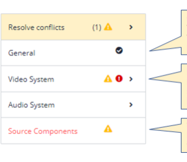
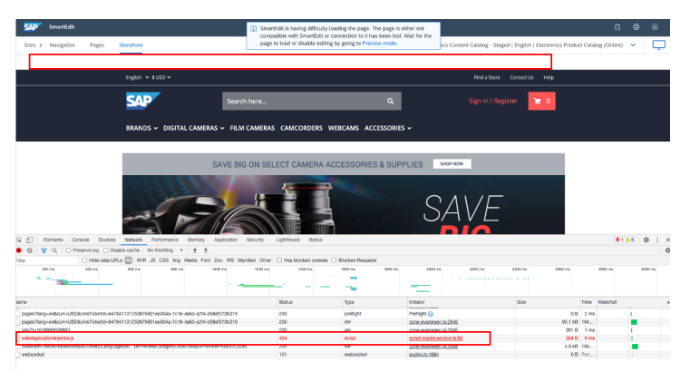

# Congurable Products Integration

The Congurable Products integration provides a user interface for conguring and selling congurable products in composable storefront. The integration makes use of the *Product Conguration with SAP Variant Conguration and Pricing* AddOn, which is part of SAP Commerce Cloud. This AddOn is not included in the composable storefront libraries. The composable storefront product conguration library includes the following features:

Single-level and multilevel congurable products in the composable storefront, with the product model residing in SAP ERP or SAP S/4HANA A conguration page, with the most commonly used characteristic types for characteristic values, such as radio buttons, checkboxes, dropdown listboxes, and images A price summary at the bottom of the conguration page that includes the base price, the price of the selected options, and the overall total price of the congured product An overview page with all user selections accessible at any time during conguration Basic conict handling
With this integration, congurable products become a part of the storefront's standard processes, such as catalog browsing, viewing product details pages, adding items to the cart, checking out, and viewing order history pages. For more information, see Product Conguration with SAP Variant Conguration and Pricing.

The Congurable Products integration requires SAP Commerce Cloud release 2105 or newer.

The integration also requires the sapproductconfigocc extension.

For more information, see Congurator for Complex Products Module.

## Adding The Congurable Products Integration To Composable Storefront

To add the Congurable Products integration to composable storefront, you install the @spartacus/productconfigurator library.

Your options are either Installing the Product Congurator Library During the Initial Setup of Composable Storefront, or Adding the Product Congurator Library to an Existing composable storefront Project.

## Installing The Product Congurator Library During The Initial Setup Of Composable Storefront

Procedure 1. Follow the steps for setting up your composable storefront project, as described in Building the Composable Storefront From Libraries.

2. While setting up your project using schematics, when you are asked which composable storefront features you would like to set up, choose Product Configurator - Variant Configurator.

 Note At runtime, most of the congurator library is lazy loaded when the congurator is rst loaded. This is done for performance reasons.

## Adding The Product Congurator Library To An Existing Composable Storefront Project

If you already have a composable storefront project up and running, you can add the product congurator library to your project by running the following command from the root directory of your storefront app:
ng add @spartacus/product-configurator This command uses schematics to modify your application and add the modules needed to launch the library.

After running this command, you are asked which product congurator features you would like to set up. Choose Product Configurator - Variant Configurator.

At runtime, most of the congurator library is lazy loaded when the congurator is rst loaded. This is done for performance reasons.

## Early Login

You must have early login enabled to be able to use the congurable products integration with composable storefront. For more information, see Early Login.

## Supported Attribute Types

The following attributes types are supported in composable storefront:

| Technical Representation in                                      |                                                   |
|------------------------------------------------------------------|---------------------------------------------------|
| Attribute Type                                                   | de.hybris.platform.sap.productcong.facades.UiType |
| User input (string)                                              | STRING                                            |
| User input (numeric)                                             | NUMERIC                                           |
| Boolean value                                                    | CHECKBOX                                          |
| Single selection, rendered as radio button group                 | RADIO_BUTTON                                      |
| Single selection, rendered as radio button group, with           | RADIO_BUTTON_ADDITIONAL_INPUT                     |
| additional input Single selection, rendered as drop down listbox | DROPDOWN                                          |
| Single selection, rendered as drop down listbox, with            | DROPDOWN_ADDITIONAL_INPUT                         |
| additional input Single selection, rendered as image list        | SINGLE_SELECTION_IMAGE                            |
| Read-only                                                        | READ_ONLY                                         |
| Read-only single selection, rendered as image list               | READ_ONLY_SINGLE_SELECTION_IMAGE                  |
| Multi selection, rendered as checkbox list                       | CHECKBOX_LIST                                     |
| Multi selection, rendered as image list                          | MULTI_SELECTION_IMAGE                             |
| Read-only multi selection, rendered as image list                | READ_ONLY_MULTI_SELECTION_IMAGE                   |

## Replace And Add New Custom Attribute Components

To add custom attribute type components, implement your component class, HTML template, and module as part of a custom app. The component class is typically a sub-class of one of the existing components classes.

export class CustomAttributeRadioButtonComponent extends ConfiguratorAttributeRadioButtonComponent }

## Replace Components For Existing Attribute Types

Register the custom component in your custom module's providers section of the module denition, using the ConguratorAttributeCompositionCong conguration:
providers: [
 provideDefaultConfig(<ConfiguratorAttributeCompositionConfig>{
 productConfigurator: { assignment: { AttributeType_radioGroup: CustomAttributeRadioButtonComponent, }, }, }), ],

The assignment key AttributeType_radioGroup is a composition of the prex AttributeType_ and the attribute type from the Configurator.UiType enumeration.

## Introducing New Attribute Types Not Yet Available In Composable Storefront

If you introduce new attribute types that aren't yet available in composable storefront, your Commerce back end sends an attribute type that is not included in OccConfigurator.UyType enumeration. This attribute type must follow the format
<standardUiType>+'___'+postfix. It's important to know the base type of this variation, as it affects the business logic attached to the UI types on the composable storefront side.

For example, if you want to display a single value attribute of type RADIO_BUTTON differently, you can use the UI type RADIO_BUTTON___custom. Then you need to register the new component as follows:
providers: [ provideDefaultConfig(<ConfiguratorAttributeCompositionConfig>{ productConfigurator: { assignment: { AttributeType_RADIO_BUTTON___custom: CustomAttributeRadioButtonComponent, }, }, }), ],

## Conguring The Input Time For User Entries

For complicated user entries, it is possible that the system starts validating the entry before the user has nished typing. To avoid this, you can adjust the default input time of 500 ms in the customer app, as shown in the following example:
provideConfig(<Config>{ productConfigurator: { updateDebounceTime: { input: 2500 }
This is   For more    the SAP Help  5
 },

 }),

## Product Variants

With SAP Commerce Cloud 2205, the composable storefront supports the display and conguration of product variants, both fully and partially specied. From a business point of view, product variants represent the congurations that sell best; vendors might want to have them in stock to make them readily available to customers at a favorable price. Web shop customers might prefer a matching product variant over an individually congured product, with a view to beneting from shorter delivery times and more favorable prices. For more information about product variants and how to set them up in SAP Commerce Cloud, see Product Variants. In addition, when a web shop customer congures a product, the system simultaneously looks for matching product variants and offers them as precongured versions at the bottom of the page. The customer can display the conguration details of the product variant and decide to abandon the individual conguration, and to place the product variant in the shopping cart instead.

To activate this feature, set the productConfigurator.enableVariantSearch conguration setting to true, as shown in the following example:
providers: [ ... provideConfig(<Config>{ productConfigurator: { enableVariantSearch: true, }, }), ...]
For more information on how to set up the search to nd matching variants, see Creating Index Properties for Feature Values.

## Product Variant Scenarios

There are two scenarios for handling product variants: make-to-order and make-to-stock. In the make-to-order scenario, a product variant can be bought "as is" or can optionally be recongured. This scenario is chosen by default. In the make-to-stock scenario, precongured product variants are readily available in stock. Customers can only purchase these variants. To use this scenario, you need to adjust the setting in the back end. For more information on enabling the make-tostock scenario, see Product Variant Scenarios in the documentation for Product Conguration with SAP Variant Conguration and Pricing. As shown in the following example, after enabling the make-to-stock scenario, you see the Show Details button on the product detail page instead of the Congure button, which is displayed in the make-to-order scenario.

CAP

By choosing the Show Details button, you navigate to the read-only overview page, as shown in the following example.

## Saved Cart

The saved cart feature is generally supported with the Configurable Products integration. A saved cart can contain a configurable product and can be activated. After the cart is activated, the configuration can be accessed and edited. Note, however, that as long as the saved cart is not activated, the configuration of the configurable product cannot be displayed.

## Cart Validation

When cart validation is enabled, it ensures that users cannot check out a cart that has configurations which are conflicting, nor can users check out a cart that contains mandatory attributes if values have not been selected. If you are using SAP Commerce Cloud 2005 or older, you should consider disabling the checkout button in cart-proceed-tocheckout.component.html if ConfiguratorCartService\#activeCartHasIssues emits true.

To enable cart validation, see Cart Validation .

## I Note

Cart validation requires SAP Commerce Cloud 2011 or newer.

## Locales

All available locales must be replicated in composable storefront. Locales in the back end and front end must be in sync.

## Conict Solver

The user navigation for solving conicts is the same as in Accelerator. For Advanced Variant Conguration (AVC) congurable products, as of SAP Commerce Cloud, 2211, if a conict arises between the values of two or more characteristics during the conguration, a pop-up prompts to solve the conict immediately. If there are several conicts to solve, the next pop-up appears to navigate the user from issue to issue.

Note that prices for characteristic values cannot be displayed in the conict solver. This affects both modes: the 'classic' mode and the AVC conict mode.

## Rtl Support

Right-to-left (RTL) orientation is supported for product conguration in composable storefront. For more information on RTL support in composable storefront, see Directionality.

## Retract Option For Single-Select Characteristics

By default, when making a selection for single-select characteristics in drop-down lists and radio button lists, users can change their selection, but they cannot simply undo it. This means that, depending on the product modeling, users could run into a deadlock situation that does not allow them to complete the conguration. To avoid this scenario, you can enable the "retract" feature in your composable storefront conguration that allows users to undo their selection, which they can do by selecting the special No option selected entry. This feature is valuable if your product modeling relies on VC/AVC automatically generating a No option selected value. By enabling the retract feature, you can also have Commerce generate the additional No option selected value, if needed. In this case, the system interprets the characteristic as not having been selected. You can activate the retract feature as follows:
productConfigurator: { addRetractOption: true, } 

You can customize the No option selected label of this entry, just as you can with any UI text in composable storefront.

Depending on the product modeling and the conguration engine, after the customer has retracted their selection, the default setting may be withdrawn with the attribute unselected, or the conguration engine may set a default selection. If you do not activate the retract feature, a read-only value might get involved in a conict, where users cannot change or undo their selection. In this case, you can allow customers to undo the selection under the following conditions:
You have set the attribute in your model in the back end system as follows: retractBlocked = false The attribute setting has not been set by the system.

## Group Status Handling

This is   For more    the SAP Help  9 Group statuses are interpreted as follows:

| Group Status   | Combination                 | Description                                                                                                 |
|----------------|-----------------------------|-------------------------------------------------------------------------------------------------------------|
| COMPLETE       | Visited + Complete +        | The group is considered complete if it has been visited and there are no incomplete                         |
| Consistent     | characteristics or conicts. |                                                                                                             |
| ERROR          | Visited + Incomplete        | The group gets an error icon if it has been visited and there are incomplete characteristics.               |
| WARNING        | Inconsistent                | The group is considered inconsistent if there are conicting characteristics within the corresponding group. |

The following is an example of the conguration menu showing visited sections, missing mandatory selections, and conicts:

## Browser Refresh

When you refresh the browser, if you are logged in, the product conguration is persisted. If you are not logged in, the product conguration is reset to the default conguration, and you therefore have to recongure your products after reloading the page.

## Performance And Session Affinity

To communicate with the congurator in a performant way, the SAP Commerce Cloud back end caches session cookies that are sent to the congurator for every interaction. This allows the congurator to read a runtime conguration from its cache instead of from the database. To ensure session affinity, composable storefront should always contact the same Commerce node when doing conguration reads and updates. You can ensure session affinity by setting the following conguration parameters:

In SAP SAP Commerce Cloud: corsfilter.commercewebservices.allowCredentials=true In composable storefront: backend.occ.useWithCredentials=true

## Unsupported Features

The following features are currently not supported (or in some cases, not fully supported) in the Congurable Products integration with composable storefront:
Save for Later and Selective Cart

Commerce Business Rules in Combination with Congurable Products Cart Import and Export

## Save For Later And Selective Cart

This feature is currently not supported. To prevent the button from showing, you should remove the relevant view (disable selective cart), as follows:

1. Ensure that selective cart is disabled in the cart conguration.

Your conguration should contain the following:
cart: { selectiveCart: { enabled: false, }, },
2. Deactivate the saveForLater component that is assigned to the SaveForLaterComponent CMS component, and introduce a new module that clears the assigned composable storefront components for that CMS component. The following is an example:
@NgModule({ imports: [CommonModule, I18nModule, CartSharedModule], providers: [ provideDefaultConfig(<CmsConfig | FeaturesConfig>{ cmsComponents: { SaveForLaterComponent: {}, },
 }),
 ], declarations: [SaveForLaterComponent], exports: [SaveForLaterComponent], entryComponents: [SaveForLaterComponent], })

## Commerce Business Rules In Combination With Congurable Products

The following conditions and actions are supported in the composable storefront storefront:
Conditions:
Product you are currently conguring Customers Customer groups Actions:
Set characteristic value for congurable product Hide assignable value for congurable product This is   For more    the SAP Help  11 Hide characteristic for congurable product Display characteristic for congurable product as read-only The following conditions and actions are currently not supported in the composable storefront storefront:
Conditions:
Product with specied conguration in the cart Customer support (ASM mode currently not supported for congurable products)
Actions:

Display message at the product level Display message at the attribute level Display message at the value level Display promo message (promo applies) Display promo opportunity message (promo does not yet apply) Display discount message

## Cart Import And Export

Cart import and export is currently not supported with the Congurable Products integration.

## Ordering Multiple Items

On the conguration page, a quantity stepper to the left of the 'add to cart' button enables users to add more than one piece of the congured product to their cart. When switching from the conguration page to the overview page, it is possible to edit the quantity of the item on the overview page. When the user returns to the conguration page from the cart to edit the conguration and updates the cart, it is possible to edit the quantity directly in the cart.

## Reordering Items

When using the reorder function Buy It Again to repurchase a previously bought item, the default conguration of the product will be added to your cart, rather than the specic conguration you had originally purchased. We recommend double-checking your cart to ensure the correct product conguration before proceeding with your order.

## Expert Mode

SAP Variant Conguration and Pricing offers an expert mode for support or debugging purposes. In expert mode, the following features are available on the product conguration page:
The knowledge base version and build number are displayed below the product ID.

All the technical, language-independent names of characteristics and characteristic values are displayed next to the language-dependent names.
This is   For more    the SAP Help  12 All hidden characteristics are displayed. To make them easy to recognize, they are displayed on a gray background.

For more information on how to enable the expert mode for certain users, see the entry 'Expert mode' in SAP Variant Conguration and Pricing on SAP Business Technology Platform Features.

## Displaying Descriptions For Characteristics And Characteristic Values

To control the length of long description texts at both the characteristic and characteristic value levels, you can adjust properties in the default-configurator-ui-settings.config.ts le as follows:
descriptions: { attributeDescriptionLength: 100, valueDescriptionLength: 70, },
The attributeDescriptionLength property sets the maximum length for attribute descriptions. By default, the length is set to 100 characters.

The valueDescriptionLength property sets the maximum length for value descriptions. By default, the length is set to 70 characters. The following example demonstrates descriptions of varying lengths at the characteristic value level for radio buttons:

Descriptions cannot be formatted.

Supported Attribute Types

## Starting A New Default Conguration After Abandoning A Previous Conguration Note

This feature requires release 2011 of SAP Commerce Cloud.

When users abandon a product conguration and return to that same product later, you can give users the choice of whether to continue with the previously abandoned product conguration or whether to start with a fresh default conguration selecting Resume or Start New from a pop-up they get. To enable this feature, set the following value in the local.properties le to true (default value is false):
toggle.sapproductconfigservices.getDefaultConfigurationEnhancements.enabled=true.

When a user selects the Start New option, the system forces the creation of a new conguration with the boolean parameter forceReset, even if a conguration for that product and user already exists. In this case, the previous conguration will be discarded. When selecting the Resume option, the user can continue to congure the previously abandoned conguration.

If the user is not logged in, this feature works as long as the browser session is active, but stops working if the user presses the Browser Refresh button. However, if the user is logged in, it works across multiple sessions.

## Cpq Congurable Products Integration

The CPQ Congurable Products integration provides a user interface in composable storefront for conguring and selling congurable products that have been modeled using *SAP CPQ Integration for Congurable Products* and the associated conguration engine. Note that the composable storefront library does not include SAP CPQ itself. The initial version of the composable storefront library for *SAP CPQ Integration for Congurable Products* includes the following features:

Bundling and guided-selling scenarios, where the bundle in SAP Commerce contains simple (non-congurable) products. The dependencies within this bundle are controlled by the underlying CPQ congurable product. Single-level congurable products in your composable storefront where the product model resides in SAP CPQ.

A conguration page with the most commonly used attribute types, especially attributes that are linked to a (noncongurable) product. For more information, see Supported Attribute Types and Display Types.

A price summary at the bottom of the conguration page that includes the base price, the price of the selected options, and the overall total price of the congured product. An overview page with all user selections accessible at any time during conguration. CPQ messages that are displayed in the composable storefront in case of conicts.
With this integration, congurable bundles become a part of the storefront's standard processes, such as catalog browsing, viewing product details pages, adding items to the cart, checking out, and viewing order history pages.

This is   For more    the SAP Help  14 For more information about the underlying functionality, and for information about features that are currently not supported, see SAP CPQ Integration for Congurable Products.

The CPQ Congurable Products integration requires the cpqproductconfigocc extension. For more information, see Congurator for Complex Products Module. The CPQ Congurable Products integration also requires the following releases of SAP Commerce Cloud:
SAP Commerce Cloud 2105 or newer SAP Commerce Cloud, Integration Extension Pack 2108 or newer If you want to use the minimum required releases, make sure that you have read Cart and Checkout Validation.

## Adding The Cpq Congurable Products Integration To Composable Storefront

To add the CPQ Congurable Products integration to composable storefront, you install the @spartacus/productconfigurator library.

You options are either Installing the Product Congurator Library During the Initial Setup of Composable Storefront, or Adding the Product Congurator Library to an Existing composable storefront Project.

## Installing The Product Congurator Library During The Initial Setup Of Composable Storefront

Procedure 1. Follow the steps for setting up your composable storefront project, as described in Building the Composable Storefront From Libraries.

2. While setting up your project using schematics, when you are asked which composable storefront features you would like to set up, choose Product Configurator - CPQ Configurator (b2b feature).

 Note At runtime, most of the congurator library is lazy loaded when the congurator is rst loaded. This is done for performance reasons.

## Adding The Product Congurator Library To An Existing Composable Storefront Project

If you already have a composable storefront project up and running, you can add the product congurator library to your project by running the following command from the root directory of your storefront app:
ng add @spartacus/product-configurator This command uses schematics to modify your application and add the modules needed to launch the library.

After running this command, you are asked which product congurator features you would like to set up. Choose Product Configurator - CPQ Configurator (b2b feature).

At runtime, most of the congurator library is lazy loaded when the congurator is rst loaded. This is done for performance reasons.

## Early Login

You must have early login enabled to be able to use the congurable products integration with composable storefront. For more information, see Early Login.

## Supported Attribute Types And Display Types

The following CPQ attributes types are supported in the storefront:
User input or computed (string)

User input or computed (number) User selection User selection with quantity for each attribute value User selection with attribute quantity input
The following CPQ display types are supported in the storefront:
Checkbox

Dropdown Radio button Free input, no matching (string or number)

## Handling Of Quantity On Attribute And Value Level Multiselect Attributes

For multiselect attributes (checkbox list) that are line items, quantities are supported both on attribute level and on value level. Multiselect attributes that are non-line items cannot have quantities on the value level. They can only have quantities on the attribute level.

## Single-Select Attributes

For single-select attributes (radio button group, DDLB), only quantities on the attribute level are supported. Any quantities that have been dened on the value level for the attribute in CPQ product administration are ignored in the UI.

## Price On Attribute Value Level

The display of prices for individual options or attribute values is supported for both bundle items (attributes linked to products)
and for simple attribute values (non-bundle items).

If the attribute value allows a quantity to be entered, the resulting price is displayed in the form of a formula (for example, 3x70 EUR = 210 EUR).

When a price-relevant attribute value is selected, the price of the attribute value is added to the total price of the product.

Currently, you can display the price information for attribute values only as an absolute (non-dynamic) price, not as a delta price. This means that the same price is always displayed next to the attribute value, regardless of whether the attribute value is selected.

Note that prices for characteristic values cannot be displayed in the conict solver. This affects both modes: the 'classic' mode and the AVC conict mode (where conicts must be solved immediately).

## Text Labels For Attributes

The attribute label on the conguration screen displays the content of the attribute's Custom Label in CPQ. You can nd this eld for the attribute in CPQ product administration, as follows:

1. Choose Product Catalog > Products.

2. On the Attributes tab, choose the attribute that you want to edit.

If the Custom Label eld is blank, the standard label will be Choose or Select, followed by the attribute name. If you want to display only the attribute name without the word "Choose" in front of it, enter the attribute name in the Custom Label eld.

## Translations For Product Texts In The Ui

Product texts coming from the CPQ product model are translated in the composable storefront if the translations are maintained in CPQ. However, there are a few exceptions. The following translations are currently not displayed in the composable storefront, but are instead shown in English:
Standard labels Choose and Select, as well as standard label No option selected

Error and validation messages coming from CPQ Product names in the cart summary

## Product Id (Article Number) In Sap Commerce

In SAP Commerce, product IDs (article numbers) cannot contain slashes, backslashes, encoded slashes (%2F), or encoded backslashes (%5C). If necessary, adjust the product IDs in CPQ.

This is   For more    the SAP Help  17

## Group Status Handling

Group status handling in the CPQ composable storefront UI is different from the composable storefront UI for SAP Variant Conguration and Pricing. The CPQ composable storefront group menu only shows whether orders are "complete" in the sense that no mandatory elds are missing. The group menu does not provide any information about conicts at the group level. Currently, CPQ composable storefront does not know whether a group is consistent (no conicts) for the current group. This information also is not known for the attribute itself.

The group status is reset once the product has been added to the cart. If the user edits the conguration coming from the cart, the display for the group status is initially empty again, even if some of the mandatory attributes were not lled when the product was added to the cart.

## Resolving Issues

Resolve Issues only leads to the rst incomplete group for which mandatory elds are missing. In CPQ, conicts are rendered as messages. Consequently, there is no conict solving with generated conict groups, nor navigation to conicting attributes through Resolve Issues.

## Error And Warning Messages

CPQ can generate different kinds of messages, which cause the following responses in composable storefront.

| CPQ Message Type      | Counted Towards Total Number of Issues   | Message Shown in Global Message Area   | UI Message Type   |
|-----------------------|------------------------------------------|----------------------------------------|-------------------|
| Incomplete attributes | Yes                                      | No                                     | N/A               |
| Incomplete messages   | Yes                                      | Yes                                    | ERROR             |
| Error messages        | Yes                                      | Yes                                    | ERROR             |
| Conict messages       | Yes                                      | Yes                                    | ERROR             |
| Invalid messages      | Yes                                      | Yes                                    | Error             |
| Failed validations    | Yes                                      | Yes                                    | WARNING           |

## Bundle Item Product Not Available In Commerce

If a bundle item cannot be found in SAP Commerce, only the product ID is displayed. Information about the bundle item (such as a picture or description) is not shown. This may occur if there are issues with master data replication.

## Cart Summary

When added to the cart, the CPQ bundle product results in a single cart item entry. There are no subitems representing the products contained in the bundle. However, to give customers an overview of their selections and to conrm what exactly they are buying, the information in the cart has been extended to show the list of products that have been selected inside the bundle. The list contains the product description, the quantity, and the item price if these are maintained in CPQ.

The following prerequisites apply for a product to appear in the cart summary:

In CPQ, the attribute value has been linked to a product In CPQ, the attribute has been marked as line item
Currently in the cart summary, the product names for line items come from CPQ, not from SAP Commerce. In contrast, product names for bundle items on the conguration page come from SAP Commerce. To avoid differing product names for bundle items between the conguration and overview page on the one hand, and the cart summary on the other hand, it is recommended that you use identical product names in both CPQ and SAP Commerce.

## Cart Validation

The cart validation feature allows composable storefront to verify a user's cart at every step during checkout to ensure that the requested quantity of each item is available. For information, see Cart Validation.

## Conguring Composable Storefront For Cart Validation Procedure

1. Introduce your own version of cart-totals.component.ts and ensure that it is assigned to the CartTotalsComponent CMS component instead of the original one.

2. Inject ConfiguratorCartService from @spartacus/product-configurator/common into the custom version of cart-totals.component.

3. Introduce a component member.

The following is an example:
hasNoConfigurationIssues$: Observable< boolean
 > = this.configuratorCartService
 .activeCartHasIssues() .pipe(map((hasIssues) => !hasIssues));
4. Make use of this member in the component template.

The following is an example:
<ng-container *ngIf="cart$ | async as cart"> <ng-container *ngIf="entries$ | async as entries"> <cx-order-summary [cart]="cart"></cx-order-summary> <ng-container *ngIf="hasNoConfigurationIssues$ | async as hasNoConfigurationIssues" > <button [routerLink]="{ cxRoute: 'checkout' } | cxUrl" *ngIf="entries.length" class="btn btn-primary btn-block" type="button" > {{ 'cartDetails.proceedToCheckout' | cxTranslate }} </button> </ng-container> </ng-container> </ng-container>

## Conguring Sap Commerce 2005 And 2011 For Cart Validation

The steps that can be done on the composable storefront side ensure that for a standard UI ow, a conguration cannot be ordered if it has issues. However, you still need to block the creation of orders that could be done through OCC. Otherwise, an order containing such congurations can be created using, for example, the developer tools in the end user's browser. It is therefore necessary to make the adjustments described in this section if you are using SAP Commerce 2011, and to make the adjustments described in this section and the following section if you are using SAP Commerce 2005.

Note that these adjustments will guarantee that orders are validated for product conguration issues before they are submitted, but it will not ensure that any error message that is returned reects the actual issue. The error message will state that the issue is because of low stock.

## Enhance B2Borderscontroller

The validateCart method in B2BOrdersController needs to be enhanced or replaced with a custom version. Cart validation is rudimentary and does not call the standard cart validation that is used in regular B2C scenarios. The new method should look like the following example:
protected void validateCart(final CartData cartData) throws InvalidCartException { final Errors errors = new BeanPropertyBindingResult(cartData, "sessionCart"); placeOrderCartValidator.validate(cartData, errors); if (errors.hasErrors()) { throw new WebserviceValidationException(errors); } try { final List<CartModificationData> modificationList = cartFacade.validateCurrentCartData(); if(CollectionUtils.isNotEmpty(modificationList)) { final CartModificationDataList cartModificationDataList = new CartModificationDataList( cartModificationDataList.setCartModificationList(modificationList); throw new WebserviceValidationException(cartModificationDataList); } } catch (final CommerceCartModificationException e) { throw new InvalidCartException(e); } }

## Conguring Sap Commerce 2005 For Cart Validation

In your spring conguration, ensure that the commerceWebServicesCartService bean refers to cartValidationStrategy instead of cartValidationWithoutCartAlteringStrategy. This can be achieved, for example, in the spring.xml of a custom extension, as follows:
<alias name="customWebServicesCartService" alias="commerceWebServicesCartService"/> <bean id="customWebServicesCartService" parent="defaultCommerceCartService"> <property name="cartValidationStrategy" ref="cartValidationStrategy"/> <property name="productConfigurationStrategy" ref="productConfigurationStrategy"/> </bean>

## Commerce Business Rules In Combination With Cpq Congurable Products

Commerce business rules that are specic to product conguration (for example, hiding a certain value if another value is selected) are not supported for CPQ congurable products.

Other Commerce business rules (such as those for promotions) still work and apply (such as, 2% off if the cart value exceeds
$4,000 USD, for example).

## Browser Refresh

When you refresh the browser, the product conguration is reset to the default conguration. You therefore have to recongure your products after reloading the page.

## Cart Import And Export

Cart import and export is currently not supported with the CPQ Congurable Products integration.

## Sap Customer Data Cloud Integration

SAP Customer Data Cloud allows you to enable customized registration and login, and also manage user prole and consent. For more information see, SAP Customer Data Cloud Integration Module and SAP Customer Identity .

To integrate SAP Customer Data Cloud with composable storefront, you must have SAP Commerce Cloud 2105 or newer, along with the latest version of SAP Commerce Cloud Extension Pack

## Enabling Sap Customer Data Cloud Integration In Composable Storefront

To enable SAP Customer Data Cloud Integration in composable storefront, you need to congure both the SAP Commerce Cloud back end, and the composable storefront front end.

## Conguring The Back End For Sap Customer Data Cloud Integration

The following steps describe how to congure the SAP Commerce Cloud back end for integration with SAP Customer Data Cloud.

Procedure 1. Follow the steps for Setting Up SAP Commerce Cloud for use with Composable Storefront.

2. Enable the SAP Customer Data Cloud extensions for B2C and B2B.

This is   For more    the SAP Help  21 For more information, see SAP Customer Data Cloud Integration Implementation.

3. Build and update the system so that the new functionality provided by the SAP Customer Data Cloud integration extension is available.

This step also creates sample CMS data for the electronics-spaContentCatalog content catalog.

You can view the SAP Customer Data Cloud login page through the <spartacus-site-url>/cdc/login URL. This allows you to access the Customer Data Cloud pages and the default login page together.

You can view the SAP Customer Data Cloud register organization page through the <spartacus-siteurl>/cdc/register-org URL. This allows you to register B2B organizations from the storefront and replicate the company and contact details to SAP CDC using the SAP CDC screen-sets.
4. Update the mobile_android OAuth client (created in step 1) to support the custom authorization grant type, and remove the refresh_token grant type. The following ImpEx can be used to update the grant types:
INSERT_UPDATE OAuthClientDetails ; clientId[unique = true] ; resourceIds ; scope ; authorizedG ; mobile_android ; hybris ; basic ; authorizati

Refresh tokens are not supported. This ensures that the token from SAP Commerce Cloud and the SAP Customer Data Cloud login session are maintained for the same duration of time.

5. Dene the SAP Customer Data Cloud Site conguration and link it to the electronics-spa site.

You can also dene other congurations for the integration, such as Field Mapping and Consent Templates. For more information, see SAP Customer Data Cloud Integration Implementation.

## Conguring Composable Storefront For Sap Customer Data Cloud Integration

Perform the following steps after you have set up your composable storefront. For more information, see Building the Composable Storefront From Libraries.

1. Install the SAP Customer Data Cloud integration library by running the following command from within the root directory of your storefront application:
ng add @spartacus/cdc When you run this command, the schematics create a module for the CDC integration that includes all of the required imports and conguration. Note: To install the CDC integration library using schematics, your app structure needs to match the composable storefront reference app structure. For more information, see Reference App Structure. Alternatively, you can create the module manually and import it into your application, as shown in the following example:
import { NgModule } from '@angular/core'; import { CdcConfig, CdcRootModule, CDC_FEATURE } from '@spartacus/cdc/root'; import { provideConfig } from '@spartacus/core'; @NgModule({ declarations: [], imports: [CdcRootModule],
This is   For more    the SAP Help  22 providers: [ provideConfig({ featureModules: { [CDC_FEATURE]: { module: () => import('@spartacus/cdc').then((m) => m.CdcModule), }, }, }), provideConfig(<CdcConfig>{ cdc: [ { baseSite: 'electronics-spa', javascriptUrl: '<paste-link-to-cdc-script>', sessionExpiration: 3600, }, ], }), ], }) export class CdcFeatureModule {}
2. Adjust the CDC conguration in the newly created module, as shown in the following example:
provideConfig(<CdcConfig>{ [CDC_FEATURE]: [ { baseSite: 'electronics-spa', javascriptUrl: 'https://cdns.<data-center>.gigya.com/JS/gigya.js?apikey=<Site-API-Ke sessionExpiration: 3600, }, ], }),
The following is a summary of the options that are available in the CDC conguration:
baseSite refers to the CMS Site that the Customer Data Cloud Site conguration should be applied to. The same should be congured in SAP Commerce Cloud Backoffice as well.

javascriptUrl species the URL of the Web SDK that you wish to load. This is constructed using the value of the Site API Key, and the data center where the Customer Data Cloud site is created. For example, https://cdns.

<data-center>.gigya.com/JS/gigya.js?apikey=<Site-API-Key>
sessionExpiration is the time (in seconds) that denes the session expiry of the SAP Customer Data Cloud session. This should match with the session expiration time of the OAuth Client to ensure that both the Customer Data Cloud session and the SAP Commerce Cloud token live for the same time.
3. Build and start the storefront app to verify your changes.

## Sap Customer Data Cloud Integration In The Composable Storefront User Interface

SAP Customer Data Cloud Integration uses the SAP Commerce Cloud, composable storefront to provide both SAP Customer Data Cloud screen-sets and native screen-sets. The following screens are implemented using the SAP CDC SDK for various business users:
B2C User: The following ows are initiated by a B2C user:
Login and Registration: Allows a new user to login and register to the storefront. Prole Update: Allows a user to view and edit their prole info, like rst name, last name, email address, and so on. Note that after updating an email address, users can log in to the storefront with the new email address. Allows a user to update their password. Forgot Password: Allows a user to reset their password.

Consent Management:
Consent Template: Allows a user to customize the consent content displayed to storefront users. Users can manage the required consent templates within the SAP Customer Data Cloud system. These consent templates are then replicated from SAP Customer Data Cloud to SAP Commerce Cloud using the 'Replicate-Consent-Template-From-SAP-Customer-Data-Cloud-to-SAP-Commerce-Cloud' integration ow. For more information on the iow, see Conguring SAP Cloud Integration.

Consent Update: Allows a user to specify both congured and default consent when registering an account in the SAP Customer Data Cloud system. Once registered, users can manage their consent settings on the Consent Management page at any given time. While mandatory consents cannot be edited, users can update non-mandatory consents. In the event of an updated consent version in the SAP Customer Data Cloud system, a reconsent dialog box appears during the user's next login to the composable storefront of SAP Commerce Cloud.
B2B Administrator: The following ow is initiated by a B2B Administrator:

## Manage User:

Allows an SAP Commerce Administrator to onboard a new B2B user to the storefront using SAP CDC Admin Console. After sending an invitation to the new B2B user, this user will be replicated from the SAP Customer Data Cloud system to the SAP Commerce system.

SAP Customer Data Cloud screen-sets are not available for this ow.

Manage B2B Organisation Units: Restricts an SAP Commerce Administrator to create, update, or disable a B2B Organization from the storefront. Registration of Organisation: Allows user to register a B2B organisation from the storefront and replicate the company and contact details to SAP Customer Data Cloud system.

B2B User: The following ows are initiated by a B2B user:

## Login:

A new B2B user receives an invitation email from the SAP Commerce Administrator. This email contains the storefront URL and password (customer can customize this email). Using these details, the new B2B user can log in to the storefront. Prole Update: Allows a user to view and edit their prole info, such as rst name, last name, email address, and so on. Note that after updating an email address, users can log in to the storefront with the new email address. Update Password: Allows a user to update their password. Forgot Password:
This is   For more    the SAP Help  24

No additional conguration is needed. The integration is enabled by default when SAP Customer Data Cloud is installed.

## Sap Digital Payments Integration

SAP Digital Payments integration is an out-of-the-box alternative to current custom payment service provider (PSP) integrations. This integration uses SAP Digital Payments with ready-to-use PSP connectivity. For more information, see SAP Digital Payments Integration.

To integrate SAP Digital Payments with composable storefront, you must have one of the following:
SAP Commerce Cloud 2105, along with SAP Commerce Cloud, Integration Extension Pack 2108 or later

SAP Commerce Cloud 2011, along with SAP Commerce Cloud, Integration Extension Pack 2102 or later

## Enabling Sap Digital Payment Integration In Composable Storefront

To enable SAP Digital Payments Integration in composable storefront, you need to congure both the SAP Commerce Cloud back end, and the composable storefront front end.

Starting from 2211.25 release of composable storefront, you can add a billing address for the order while making the payment. The billing address is the location associated with the payment method. This feature is deactivated by default. To activate it, see Activating Show Billing Address In Digital Payments.

## Conguring Sap Commerce Cloud

The following steps describe how to congure the SAP Commerce Cloud back end for integration with SAP Digital Payments.

1. Follow the steps for Setting Up SAP Commerce Cloud for use with Composable Storefront.

2. Enable the SAP Digital Payments Extensions.

For more information, see SAP Digital Payments Integration.

3. Build and update the system so that the new functionality provided by the SAP Digital Payments integration extensions is available.

This step also creates sample CMS data for the electronics-spaContentCatalog content catalog.

## Conguring Composable Storefront

Perform the following steps after you have set up your composable storefront. For more information, see Building the Composable Storefront From Libraries.

1. Install the SAP Digital Payments integration library by running the following command from within the root directory of your storefront application:
ng add @spartacus/digital-payments When you run this command, the schematics create a module for the Digital Payments integration that includes all of the required imports and conguration.

To install the Digital Payments integration library using schematics, your app structure needs to match the composable storefront reference app structure. For more information, see Reference App Structure.

Alternatively, you can create the module manually and import it into your application, as shown in the following example:
import { NgModule } from '@angular/core'; import { CHECKOUT_FEATURE } from '@spartacus/checkout/base/root'; import { CmsConfig, I18nConfig, provideConfig } from '@spartacus/core'; import { dpTranslationChunksConfig, dpTranslations, } from '@spartacus/digital-payments/assets'; @NgModule({ providers: [ provideConfig(<CmsConfig>{ featureModules: { [CHECKOUT_FEATURE]: { module: () => import('@spartacus/digital-payments').then( (m) => m.DigitalPaymentsModule ), }, }, }), provideConfig(<I18nConfig>{ i18n: { resources: dpTranslations, chunks: dpTranslationChunksConfig, fallbackLang: 'en', }, }), ], }) export class DigitalPaymentsFeatureModule {}
2. Build and start the storefront app to verify your changes.

The DigitalPaymentsModule is a wrapper module that imports the CheckoutModule. As a result, it is necessary for the DigitalPaymentsModule to override the CheckoutModule for the checkout feature. For this to work properly, you need to congure the CHECKOUT_FEATURE to lazy load Digital Payments (as shown in the example above), and then in your storefront app, you need to ensure the DigitalPaymentsFeatureModule is imported after the CheckoutModule.

# Conguring Sap Digital Payments For B2B Checkout And Scheduled Replenishment

The following conguration options require composable storefront 5.0 or newer.

When you use schematics to install the Digital Payments integration library, the schematics automatically generate the DigitalPaymentsFeatureModule, which works with the base composable storefront checkout feature. To make Digital Payments work with the B2B checkout or scheduled replenishment, you can create the necessary wrapper module manually, and update the DigitalPaymentsFeatureModule, as shown below.

The following is an example of the wrapper module that is needed for Digital Payments to work with the B2B checkout:
import { NgModule } from '@angular/core'; import { CheckoutB2BModule } from '@spartacus/checkout/b2b'; import { DigitalPaymentsModule } from '@spartacus/digital-payments' @NgModule({ imports: [DigitalPaymentsModule, CheckoutB2BModule], }) export class B2BDigitalPaymentsModule {}
The following is an example of the updated DigitalPaymentsFeatureModule that is congured to work with the B2B
checkout:
provideConfig(<CmsConfig>{ featureModules: { [CHECKOUT_FEATURE]: { module: () => import('./b2b-digital-payments.module').then( (m) => m.B2BDigitalPaymentsModule ), }, }, }),
The following is an example of the wrapper module that is needed for Digital Payments to work with scheduled replenishment:
import { NgModule } from '@angular/core'; import { CheckoutScheduledReplenishmentModule } from '@spartacus/checkout/scheduled-replenishment'; import { DigitalPaymentsModule } from '@spartacus/digital-payments' @NgModule({ imports: [DigitalPaymentsModule, CheckoutScheduledReplenishmentModule], }) export class ReplenishmentDigitalPaymentsModule {}
The following is an example of the updated DigitalPaymentsFeatureModule that is congured to work with scheduled replenishment:
provideConfig(<CmsConfig>{ featureModules: { [CHECKOUT_FEATURE]: { module: () => import('./replenishment-digital-payments.module').then( (m) => m.ReplenishmentDigitalPaymentsModule ), }, }, }),

## Sap Enterprise Product Development Visualization Integration

The SAP Enterprise Product Development Visualization integration provides capabilities for viewing 2D and 3D content within a composable storefront, allowing for visual spare part picking. For more information, see Integrating Visualization with SAP Commerce Cloud.

The SAP Enterprise Product Development Visualization integration requires release 2105 of SAP Commerce Cloud, as well as a SAP Enterprise Product Development subscription. For more information, see SAP Enterprise Product Development.

## Enabling The Sap Enterprise Product Development Visualization Integration In Composable Storefront

To enable the SAP Enterprise Product Development Visualization integration, you need to carry out the following procedures:

Conguring Composable Storefront Conguring SAP Commerce Cloud Conguring the SAP Enterprise Product Development Visualization Back End

## Conguring Composable Storefront

The following sections provide steps for Conguring Composable Storefront Using Schematics, as well as steps for Conguring Composable Storefront Manually. For information about customizing the default conguration, see Default and Custom Congurations.

## Conguring Composable Storefront Using Schematics

You can install and congure the SAP Enterprise Product Development Visualization integration using composable storefront schematics. To take advantage of the automatic setup provided by composable storefront schematics, you need to ensure that your storefront application adheres to the app structure introduced with composable storefront 3.2. For more information, see Reference App Structure. To use schematics to perform a full conguration, run the following command from within the root directory of your storefront application:
ng add @spartacus/schematics --base-site=powertools-epdvisualization-spa If you are using a SAP Commerce Cloud server that is not a local server, the base URL of the SAP Commerce Cloud OCC back end can be specied with a baseUrl command line argument. The following is an example:
ng add @spartacus/schematics --base-site=powertools-epdvisualization-spa --base-url=https://my-cc-s When you are prompted to choose which feature modules to include, ensure that the EPD Visualization Integration feature is included (along with any other features that you require).

Later, when you are prompted with [EPD Visualization] What is the base URL (origin) of your EPD Fiori Launchpad? e.g. https://mytenant.epd.cfapps.eu20.hana.ondemand.com, enter the origin ) portion of the URL
that you use to access the EPD Fiori Launchpad for your tenant. After you have provided this information, the schematic will congure the SAP Enterprise Product Development Visualization integration for composable storefront. If you want to add the EPD Visualization integration library to an existing storefront application without performing a full conguration, it is possible to execute just the schematic for the EPD Visualization integration library with the following command:
ng add @spartacus/epd-visualization It is not possible to specify the base site for the storefront or the SAP Commerce Cloud OCC back end URL when running the
@spartacus/epd-visualization schematic on its own. Information on how to manually update these values is provided in the following section.

When using the powertools-epdvisualization-spa site, check src/app/spartacus/spartacusconfiguration.module.ts to ensure the providers array includes provideConfig(defaultB2bOccConfig) and provideConfig(defaultB2bCheckoutConfig), as described in the following section.

## Conguring Composable Storefront Manually

If you do not wish to use the schematics, you can manually add the SAP Enterprise Product Development Visualization integration library into your application, as follows.

1. Add a feature module le for the SAP Enterprise Product Development Visualization integration library to your application, as shown in the following example:
import { NgModule } from '@angular/core'; import { I18nConfig, provideConfig } from "@spartacus/core"; import { EpdVisualizationModule } from "@spartacus/epd-visualization"; import { epdVisualizationTranslationChunksConfig, epdVisualizationTranslations } from "@sparta import { EpdVisualizationConfig, EpdVisualizationRootModule } from "@spartacus/epd-visualizati @NgModule({ declarations: [], imports: [ EpdVisualizationRootModule, EpdVisualizationModule ], providers: [provideConfig(<I18nConfig>{ i18n: { resources: epdVisualizationTranslations, chunks: epdVisualizationTranslationChunksConfig, }, }), provideConfig(<EpdVisualizationConfig>{ epdVisualization: { ui5: { bootstrapUrl: "https://sapui5.hana.ondemand.com/1.97.0/resources/sap-ui-core.js" }, apis: { baseUrl: "https://epd-acc-eu20-consumer.epdacc.cfapps.eu20.hana.ondemand.com" } } }) ] }) export class EpdVisualizationFeatureModule { }
2. Include the EpdVisualizationFeatureModule module in the imports array of the @NgModule decorator in the spartacus-features.module.ts le.

3. Create a src/styles/spartacus/epd-visualization.scss le containing the following:
@import "@spartacus/epd-visualization";
4. To use the powertools-epdvisualization-spa site created by the epdvisualizationspartacussampledata extension, ensure that the @NgModule decorator in the src/app/spartacus/spartacus-configuration.module.ts has the following:
a providers array that includes provideConfig(defaultB2bOccConfig) and provideConfig(defaultB2bCheckoutConfig)
a baseSite value of powertools-epdvisualization-spa in the context object of the SiteContextConfig conguration.

The following is an example:
import { NgModule } from '@angular/core'; import { translationChunksConfig, translations } from "@spartacus/assets"; import { FeaturesConfig, I18nConfig, OccConfig, provideConfig, SiteContextConfig } from "@spa import { defaultB2bCheckoutConfig, defaultB2bOccConfig } from "@spartacus/setup"; import { defaultCmsContentProviders, layoutConfig, mediaConfig } from "@spartacus/storefront" @NgModule({ declarations: [], imports: [ ], providers: [provideConfig(layoutConfig), provideConfig(mediaConfig), ...defaultCmsContentPro backend: { occ: { baseUrl: 'https://localhost:9002', } }, }), provideConfig(<SiteContextConfig>{ context: { currency: ['USD'], language: ['en'], baseSite: ['powertools-epdvisualization-spa'], }, }), provideConfig(<I18nConfig>{ i18n: { resources: translations, chunks: translationChunksConfig, fallbackLang: 'en'
 }, }), provideConfig(<FeaturesConfig>{ features: { level: '4.3' } }), provideConfig(defaultB2bOccConfig), provideConfig(defaultB2bCheckoutConfig)] }) export class SpartacusConfigurationModule { }

## Default And Custom Congurations

The default conguration for the SAP Enterprise Product Development Visualization integration library is provided in epdvisualization-default-config.ts. The values in this conguration can be overridden, but otherwise do not need to be specied. The following is an example:
import { EpdVisualizationConfig } from '../config/epd-visualization-config'; export function getEpdVisualizationDefaultConfig(): EpdVisualizationConfig { return { epdVisualization: { usageIds: { folderUsageId: { name: 'CommerceCloud-Folder',
This is   For more    the SAP Help  30 keys: [ { name: 'Function', value: 'Online', }, ], }, productUsageId: { name: 'CommerceCloud-SparePart', source: 'CommerceCloud', category: 'SpareParts', keyName: 'ProductCode', }, }, visualPicking: { productReferenceType: 'SPAREPART', }, }, }; }
Information about the options dened by the EpdVisualizationConfig can be found in epd-visualizationconfig.ts in the epd-visualization library. The following is an example:
import { Injectable } from '@angular/core'; import { Config } from '@spartacus/core'; import { UsageId } from '../models/usage-ids/usage-id'; import { UsageIdDefinition } from '../models/usage-ids/usage-id-definition'; @Injectable({ providedIn: 'root', useExisting: Config, }) export abstract class EpdVisualizationConfig implements Config { /** * This field introduces a namespace for EPD Visualization to avoid collisions when configuration */ public epdVisualization?: EpdVisualizationInnerConfig; } export interface EpdVisualizationInnerConfig { /** * UI5 configuration */ ui5?: Ui5Config; /** * SAP Enterprise Product Development Visualization API endpoint configuration. */ apis?: VisualizationApiConfig; /** * SAP Enterprise Product Development Visualization Usage ID configuration. */ usageIds?: UsageIdConfig; /** * Configuration for the visual picking scenario. */ visualPicking?: VisualPickingConfig; } export interface Ui5Config { /** * This is the URL that SAPUI5 is bootstrapped from. * The value that is configured by default in a given composable storefront release is the SAPUI5 version supported for that composa storefront release. * * Important: Please check the *End of Cloud Provisioning* column in https://sapui5.hana.ondemand * When the Cloud Provisioning period ends for a particular SAPUI5 version, that version will no */ bootstrapUrl: string; }
This is   For more    the SAP Help  31 export interface VisualizationApiConfig { /** * This is the base URL that is used to access the EPD Visualization APIs. * Use the origin portion of the URL for your EPD Fiori Launchpad. * i.e. https://mytenantsubdomain.epd.cfapps.eu20.hana.ondemand.com */ baseUrl: string; } export interface UsageIdConfig { /** * Folders in the configured SAP EPD Visualization tenant that have anonymous access enabled and * value applied will be searched for visualizations. * This configuration option allows for a separation between staging visualization data and produ */ folderUsageId: UsageId; /** * Defines the EPD Visualization usage ID to use to refer to a product in SAP Commerce Cloud. * This Usage ID is used on: * - Visualizations to allow a visualization to be linked with a product. * This allows a visualization to be found and loaded for the current product in a product deta * - Scene nodes to allow a scene node to be linked with a product. * This allows two way linking between scene nodes and products (which typically represent spar */ productUsageId: UsageIdDefinition; } export interface VisualPickingConfig { /** * This is the type of product reference to list for the active product (typically SPAREPART) */ productReferenceType: string; } declare module '@spartacus/core' { interface Config extends EpdVisualizationConfig {} }

## Conguring Sap Commerce Cloud

The epdvisualizationspartacussampledata extension congures sample catalogs and sites that demonstrate the usage of the SAP Enterprise Product Development Visualization integration. The epdvisualizationspartacussampledata extension is available as a downloadable asset of Spartacus Sample Data integration library releases in the composable storefront GitHub repository. To create a database that includes the required sample data, add the epdvisualizationspartacussampledata extension in a suitable SAP Commerce Cloud development environment. The following steps describe how to congure SAP Commerce Cloud with sample data for the SAP Enterprise Product Development Visualization integration.

1. Follow the steps for Setting Up SAP Commerce Cloud for use with Composable Storefront. As previously noted, ensure that you are using SAP Commerce Cloud 2105 or newer.

2. Add the epdvisualizationspartacussampledata extension to the localextensions.xml le of your SAP
Commerce Cloud server.

3. Install the epdvisualizationspartacussampledata to your storefront as described in Installing the epdvisualizationspartacussampledata Extension.

4. Build and deploy, which includes initializing the database. This will create a new database (destroying the existing one),
which contains the sample data for the SAP Enterprise Product Development Visualization integration.

When the epdvisualizationspartacussampledata extension is initialized, it creates the following:

Sample CMS data in the powertools-epdvisualization-spaContentCatalog and electronicsepdvisualization-spaContentCatalog content catalogs powertools-epdvisualization-spa and electronics-epdvisualization-spa sites that use these content catalogs Product data in the powertoolsProductCatalog that corresponds to 2D and 3D data that can be imported and prepared for use in visual spare part picking.

## Installing The Epdvisualizationspartacussampledata Extension

Run the following command to install the epdvisualizationspartacussampledata extension in SAP Commerce Cloud:
ant addoninstall -Daddonnames="epdvisualizationspartacussampledata" -DaddonStorefront.yaccelerators For a SAP Commerce Cloud server, you can install the epdvisualizationspartacussampledata extension by adding the following entry (along with any required comma separator characters) to the storefrontAddons array in the corecustomize/manifest.json le:
{ "addon": "epdvisualizationspartacussampledata", "storefront": "yacceleratorstorefront", "template": "yacceleratorstorefront" }

## Conguring The Sap Enterprise Product Development Visualization Back End

The following help topic and its subtopics describe the conguration required in the SAP Enterprise Product Development tenant: Congure Visualization Backend. The following help topic describes how to prepare visualizations in the SAP Enterprise Product Development system: Prepare Visualizations for Storefront Part Picking. The following topic provides specic information related to creating and preparing visualizations that correspond with the sample product data created by the epdvisualizationspartacussampledata extension: Prepare Sample Visualizations.

## Accessing The Sample Data

When your back end and front end have been appropriately congured, built and deployed, you can access 2D and 3D samples in the powertools-epdvisualization-spa site within your storefront.

You can nd each sample by searching for its product code in the search input in the header area.

To nd the 3D sample, search for CX704.

To nd the 2D sample, search for CX704_2D.

It is also possible to nd these products by clicking on the Lathes item in the navigation menu.

## Intelligent Selling Services For Sap Commerce Cloud Integration

This is   For more    the SAP Help  33 The Intelligent Selling Services for SAP Commerce Cloud solution provides real-time customer experience personalization for SAP Commerce Cloud. You can integrate Intelligent Selling Services for SAP Commerce Cloud with your composable storefront, including the Prole Tag and the Merchandising Carousel features. For more information, see Intelligent Selling Services for SAP Commerce Cloud.

To integrate Intelligent Selling Services for SAP Commerce Cloud with composable storefront, release 2105 of SAP Commerce Cloud is required. Also, the Anonymous Consent feature in composable storefront needs to be enabled. For more information, see Anonymous Consent.

## Enabling Intelligent Selling Services For Sap Commerce Cloud In Composable Storefront

To enable Intelligent Selling Services for SAP Commerce Cloud in composable storefront, you need to congure both the SAP Commerce Cloud back end, and the composable storefront front end.

## Conguring Composable Storefront For Intelligent Selling Services For Sap Commerce Cloud

You can install and congure the Intelligent Selling Services integration using composable storefront schematics. To take advantage of the automatic setup provided by composable storefront schematics, you need to ensure that your storefront app adheres to the app structure introduced with composable storefront 3.2. For more information, see Reference App Structure. After you have met these prerequisites, you can install the Intelligent Selling Services integration by running the following command:
ng add @spartacus/cds After running the command, you are prompted to provide additional information, as follows:
tenant asks you to provide a tenant name (for example, mytenant)

baseUrl asks you to provide the base URL for the Intelligent Selling Services back end (for example, https://mytenant-siteid.api.us.context.cloud.sap)
profileTag.javascriptUrl asks where to load the Prole Tag from (for example, https://tag.static.us.context.cloud.sap/js/profile-tag.js)
profileTag.configUrl asks for the Prole Tag conguration URL (for example, https://tag.static.stage.context.cloud.sap/config/my-config123)
You can obtain the Prole Tag conguration URL from the SAP Commerce Cloud Conguration page in the ISS lounge. The following is an example of the link to access the SAP Commerce Cloud Conguration page:
https://<tenant>.<environment>.context.cloud.sap/lounge\#/cds/sites/<site>/sap-commerce-cloud-config To access your conguration page, update the placeholder elements in this link, as follows:
<tenant> is your tenant id
<site> is your ISS site id After you have provided this information, the schematics congure the Intelligent Selling Services integration for composable storefront. If you do not wish to use the schematics, you can create spartacus/projects/storefrontapp/src/app/spartacus/features/cds-feature.module.ts manually and import it into your application, as shown in the following example:
import { NgModule } from '@angular/core'; import { CdsConfig, CdsModule } from '@spartacus/cds'; import { provideConfig } from '@spartacus/core'; @NgModule({ imports: [CdsModule.forRoot()], providers: [ provideConfig(<CdsConfig>{ cds: { tenant: 'mytenant', baseUrl: 'https://mytenant-siteid.api.us.context.cloud.sap', endpoints: { strategyProducts: '/strategy/${tenant}/strategies/${strategyId}/products', }, merchandising: { defaultCarouselViewportThreshold: 80, }, }, }), provideConfig(<CdsConfig>{ cds: { profileTag: { javascriptUrl: 'https://tag.static.us.context.cloud.sap/js/profile-tag.js', configUrl: 'https://tag.static.stage.context.cloud.sap/config/my-config123', allowInsecureCookies: true, }, }, }), ], }) export class CdsFeatureModule {}
The following is a summary of the parameters of the CdsModule:
tenant: Set this to your testing or production tenant, as required. For more information, see Tenant Provisioning. baseUrl: Replace the value shown in the example with the base URL of your Intelligent Selling Services environment. In particular, replace mytenant with your actual Intelligent Selling Services tenant ID, and siteid with the ID of your site.

You also need to replace .us with .eu if you are working with the EU environment of Intelligent Selling Services.

strategyProducts: Set this value as shown in the example. defaultCarouselViewportThreshold: You can congure the percentage of the merchandising carousel that needs to be in the viewport for carousel view events to be sent to Intelligent Selling Services. If you are using an older version of SAP Commerce Cloud, you can use this setting to provide the same functionality, but it will be applied to all carousels in the storefront, rather than individual carousels that you specify. If no value is provided, a default of 80% is used. In this case, 80% of the carousel needs to be in the viewport for view events to trigger. javascriptUrl: Specify the URL of the Prole Tag version you wish to use. It is recommended that you use the URL for the latest version of Prole Tag (for example, http://tag.static.us.context.cloud.sap/js/profile-tag.js).

For more information, see Deciding Which Prole Tag Link to Use. congUrl: Specify the URL of the Prole Tag conguration that you have created in Intelligent Selling Services. For more information, see Prole Tag Overview.

allowInsecureCookies: This is an optional parameter (not show in the example above) that species whether Prole Tag should set insecure cookies. The default value is false. If you are running on HTTP, set this parameter to true. For example, if you are using a local back end, allowInsecureCookies must be set to true. In production, it should always be set to false.

gtmId: This is an optional parameter (not show in the example above) that is used to integrate Prole Tag with Google Tag Manager. For more information, see Prole Tag.

## Conguring The Back End For Intelligent Selling Services For Sap Commerce Cloud

The following steps describe how to add custom headers to your CORS settings, as well as how to dene a consent template that allows events to be sent.

1. Add the x-profile-tag-debug and x-consent-reference custom headers to corsfilter.commercewebservices.allowedHeaders.

If you are using the Assisted Service Module, add these custom headers to corsfilter.assistedservicewebservices.allowedHeaders as well.

The corsfilter.commercewebservices.allowedHeaders setting is for SAP Commerce Cloud version 2005 or newer. For SAP Commerce Cloud version 1905 or older, use corsfilter.ycommercewebservices.allowedHeaders instead.

For more information, see Cross-Origin Resource Sharing (CORS).

2. Dene a consent template with an ID of PROFILE, which will allow events to be sent.

You can dene the consent template by importing the following ImpEx:
$lang=en INSERT_UPDATE ConsentTemplate;id[unique=true];name[lang=$lang];description[lang=$lang];version
;PROFILE;"Allow tracking for Intelligent Selling Services";"We would like to store your browsi

## Prole Tag

To enable Prole Tag, create a CMSFlexComponent called ProfileTagComponent in the catalog, and place it in the footer.

You can do this by importing the following ImpEx:
$contentCatalog=electronics-spaContentCatalog $contentCV=catalogVersion(CatalogVersion.catalog(Catalog.id[default=$contentCatalog]),CatalogVersio INSERT_UPDATE CMSFlexComponent;$contentCV[unique=true];uid[unique=true];name;flexType;&componentRef ;;ProfileTagComponent;ProfileTag composable storefront Component;ProfileTagComponent;ProfileTagComp INSERT_UPDATE ContentSlot;$contentCV[unique=true];uid[unique=true];cmsComponents(uid, $contentCV)[m ;;FooterSlot;ProfileTagComponent This ImpEx creates the component in the Staged catalog. To publish it, run a sync, or replace Staged with Online in the ImpEx.

## Merchandising

Merchandising carousels enable a composable storefront to display the results of Merchandising in the form of a product carousel. For more information, see Merchandising and Merchandising Module.

Using the Prole Tag Data Layer for Merchandising Carousel Events requires composable storefront version 2.1.0 or newer. For more information, see the following:
Merchandising Reporting Congure Prole Tag for Merchandising

## Requirements For Enabling Merchandising

Merchandising carousels require the merchandisingaddon and profiletagaddon extensions. Once you install the extensions, follow the steps in Merchandising Conguration Setup and Catalog Synchronization Conguration to synchronize a product catalog with Intelligent Selling Services. It is also recommended to follow the instructions in Product Directory Conguration.

## Adding A Merchandising Carousel With Impex

If you know your strategyId, you can add a Merchandising carousel through ImpEx. The following is an example:
\# Homepage carousel \# Create the CMS Component INSERT_UPDATE MerchandisingCarouselComponent;$contentCV[unique=true];uid[unique=true];name;title;nu ;;HomepageE2EMerchandisingCarousel;Homepage E2E Merchandising Carousel;Homepage E2E Merchandising C \# Add the component to the slot INSERT_UPDATE ContentSlot;$contentCV[unique=true];uid[unique=true];cmsComponents(uid,$contentCV) ;;Section2CSlot-Homepage;HomepageE2EMerchandisingCarousel \# Category Page carousel \# Create the CMS Component INSERT_UPDATE MerchandisingCarouselComponent;$contentCV[unique=true];uid[unique=true];name;title;nu ;;CategoryPageE2EMerchandisingCarousel;Category Page E2E Merchandising Carousel;Category Page E2E M \# Add the component to the slot INSERT_UPDATE ContentSlot;$contentCV[unique=true];uid[unique=true];cmsComponents(uid,$contentCV) ;;BottomHeaderSlot;CategoryPageE2EMerchandisingCarousel \# SLR Page carousel \# Create the CMS Component INSERT_UPDATE MerchandisingCarouselComponent;$contentCV[unique=true];uid[unique=true];name;title;nu ;;SLRCategoryPageE2EMerchandisingCarousel;SLR Category Page E2E Merchandising Carousel;SLR Category \# Add the component to the slot INSERT_UPDATE ContentSlot;$contentCV[unique=true];uid[unique=true];cmsComponents(uid,$contentCV) ;;SLRCamerasBottomHeaderSlot;SLRCategoryPageE2EMerchandisingCarousel

The above ImpEx includes examples of locations where you can create and place the carousel in a slot, but you are not limited to these locations. You can place the CMS component in any slot that allows it.

## Adding A Merchandising Carousel With Smartedit

This is   For more    the SAP Help  37 If you have followed the SmartEdit Integration, you can use SmartEdit to add a Merchandising carousel to a page, as follows:

1. Launch SmartEdit.

2. Edit the page you want to add a Merchandising carousel to. 3. Click the + Component button in SmartEdit.

You should see the Merchandising Carousel component. If you do not see it, use the search box.

4. Drag and drop the component onto a content slot on the page.

If the component does not drop in the Basic Edit mode, switch to the Advanced Edit mode using the dropdown in SmartEdit.

5. Fill in the elds of the conguration window that appears.

For the Number to Display eld, specify the number of products you wish to display in the carousel. If the number of products exceeds the size of the carousel, the user will need to use scrolling arrows to see all products. For the Scroll Type eld, the only available scroll type is one. This enables the user to scroll the products one by one upon clicking the scrolling arrow. For the Strategy eld, select a congured Merchandising strategy to be used in the carousel. For the Viewport Percentage eld, enter the percentage of the carousel that needs to be in the viewport for carousel view events to be sent to Intelligent Selling Services.

This conguration option is only available in SAP Commerce Cloud version 1905.14 or newer. If you are using an older version of SAP Commerce Cloud, you can use this setting to provide the same functionality, but it will be applied to all carousels in the storefront, rather than individual carousels that you specify.

6. Click Save for the Merchandising carousel to appear on the page you are editing.

## Intelligent Selling Services For Sap Commerce Cloud Shell Application

The Intelligent Selling Services Shell Application is for developers who are contributing to the composable storefront library sources. In other words, it is only available if you have cloned the composable storefront library sources and are working with a contributor set-up of composable storefront. The following steps describe how to run the Intelligent Selling Services Shell Application:

1. Run the following command to execute the library builds:
yarn build:core:lib:cds 2. Run the following command to start the shell:
yarn start:cds 3. Run the following command to perform unit tests:
yarn test:cds When you run these commands, the browser opens, and you can see the progress of the tests with detailed information, including whether the tests pass.

4. Run the following command to perform end-to-end tests. You can do this either manually or automatically.

To run the tests manually, run the following commands:
yarn start:cds yarn e2e:cy:cds:run:vendor Note To run the end-to-end test in headless mode, make sure you have your composable storefront instance running before executing the end-to-end command.

To run the tests automatically, run the following command:
yarn e2e:cy:cds:start-open

When using this command, you do not need to separately start a composable storefront instance; it is already done as part of the command. To run the Cypress end-to-end tests for Intelligent Selling Services in composable storefront, select merchandising-carousel.e2e-spec.ts in the Cypress user interface.

## Other Commands For Intelligent Selling Services For Sap Commerce Cloud

All other Intelligent Selling Services commands have :cds as part of their name, and can be found in the package.json le of the composable storefront source code.

## Invoice Display Integration

The invoice display feature allows you to access and download an invoice associated with an order in PDF format. This feature makes use of the Invoice OCC API and is available as part of the SAP S/4HANA Order Management Integration. For more information, see SAP S/4HANA Order Management Integration, and the Invoice Display back end documentation.

To enable the invoice PDF display feature, you must be using SAP Commerce Cloud 2211.12 or higher, along with the SAP Commerce Cloud, integration extension pack 2211.11 or higher.

## Enabling Invoice Display In Sap Commerce Cloud

The following steps describe how to enable the invoice display feature in SAP Commerce Cloud.

1. Follow the steps for Setting Up SAP Commerce Cloud for use with Composable Storefront.

## Enabling Invoice Display In Composable Storefront

Perform the following steps after you have set up your composable storefront. For more information, see Building the Composable Storefront From Libraries.

1. Install the invoice display library by running the following command from within the root directory of your storefront application:
ng add @spartacus/pdf-invoices When you run this command, the schematics create a module for the integration that includes all of the required imports and conguration.

To install the invoice display library using schematics, your app structure needs to match the composable storefront reference app structure. For more information, see Reference App Structure.

You can also create the module manually and import it into your library, as shown in the following example:
import { NgModule } from '@angular/core'; import { CmsConfig, I18nConfig, provideConfig } from '@spartacus/core'; import { pdfInvoicesTranslationChunksConfig, pdfInvoicesTranslations, } from '@spartacus/ pdf-invoices/assets'; import { PDFInvoicesRootModule, PDF_INVOICES_FEATURE,
} from '@spartacus/ pdf-invoices/root';
@NgModule({ imports: [PDFInvoicesRootModule], providers: [ provideConfig(<CmsConfig>{ featureModules: { [PDF_INVOICES_FEATURE]: { module: () => import('@spartacus/ pdf-invoices').then( (m) => m.PDFInvoicesModule ), }, }, }), provideConfig(<I18nConfig>{ i18n: { resources: pdfInvoicesTranslations, chunks: pdfInvoicesTranslationChunksConfig, fallbackLang: 'en', }, }),
This is   For more    the SAP Help  40

 ], }) export class PdfinvoicesModuleFeatureModule {}
2. Build and start the storefront app to verify your changes.

## Kyma Integration

The following steps describe how to integrate Kyma into your composable storefront.

## Prerequisites

If your composable storefront application is running on SAP Commerce Cloud, the following congs should already be in place:
local.properties:
oauth2.client4kyma.kid=test1 oauth2.client4kyma.keystore.location=/security/keystore.jks oauth2.client4kyma.keystore.password=nimda123 oauth2.algorithm=RS256 Add a new OAuth client using the following impex:
\#\#\# Kyma OAuth client INSERT_UPDATE OpenIDClientDetails;clientId[unique=true] ;resourceIds ;scope ;autoApprove ;aut ;client4kyma ;hybris ;openid ;openid ;pas NOTE: these values are for the testing environment. Do not use them in production.

## Composable Storefront Conguration

You can integrate Kyma functionality in composable storefront by providing an appropriate authentication conguration, as described in Conguring OpenId.

## My Account Sap Integration

An enhanced My Account UI allows B2C users to view their order details, return orders, and service requests from the SAP Customer Data Platform system. This integration improves the user experience by allowing the users to view all their order activities and interactions performed in other systems like SAP Commerce Cloud and SAP S/4HANA on the composable storefront. For more information see, My Account SAP Integration.

To implement the My Account UI in the composable storefront, you must be using SAP Commerce Cloud 2211.15, along with the SAP Commerce Cloud, integration extension pack 2211.14 or higher.

This is   For more    the SAP Help  41 To enable the My Account UI in the composable storefront, you need to enable the integration in both the SAP Commerce Cloud back end, and the composable storefront front end.

## Enabling The My Account Sap Integration In Sap Commerce Cloud

The following steps describe how to enable the My Account SAP Integration in SAP Commerce Cloud.

1. Follow the steps for Setting Up SAP Commerce Cloud for use with Composable Storefront.

2. Enable the My Account SAP Integration extensions.

For more information, see My Account SAP Integration Architecture.

3. Build and update the system so that the new functionality provided by the My Account SAP Integration extensions is available.

## Conguring The Composable Storefront

Make the necessary congurations in the composable storefront to implement the My Account UI.

## My Account Drop-Down Menu

To add My Account as an option in the My Account drop-down menu, the following ImpEx must be congured and uploaded accordingly:
\# create cms navigation entry for My Account Drop Down INSERT_UPDATE CMSLinkComponent ; $contentCV[unique=true] ; uid[unique=true] ; name ; ; MyAccountViewDropDownLink ; MyAccountVie INSERT_UPDATE CMSNavigationNode ; uid[unique=true] ; $contentCV[unique=true] ; name \#Root node is already added... ; MyAccountViewDropDownNavNode ; ; My Accou INSERT_UPDATE CMSNavigationEntry ; uid[unique=true] ; $contentCV[unique=true] ; na ; MyAccountViewDropDownNavNodeEntry ; ; My

## My Account Drop-Down Menu Options

All options of the My Account drop-down menu appear by default. To customize the drop-down menu options, you can congure the following ImpEx le accordingly:
$contentCatalog=<catalog> $contentCV=catalogVersion(CatalogVersion.catalog(Catalog.id[default=$contentCatalog]),CatalogVersio $siteResource=jar:de.hybris.platform.spartacussampledata.constants.SpartacussampledataConstants&/sp REMOVE CMSNavigationNode;$contentCV[unique=true];uid[unique=true] ;;WishListNavNode ;;ChangePasswordNavNode ;;UpdateEmailNavNode This is   For more    the SAP Help  42

;;ConsentManagementNavNode ;;CloseAccountNavNode ;;MyInterestsNavNode ;;NotificationPreferenceNavNode ;;MyCouponsNavNode ;;AddressBookNavNode ;;PaymentDetailsNavNode ;;PersonalDetailsNavNode ;;GigyaProfileNavNode

## My Account Landing Page Side Navigation

Side navigation of the landing page is available from the SAP Commerce Cloud integration extension pack 2211.14 or higher release, along with the spartacussampledata 6.6. You can congure the side navigation by using SmartEdit.

To customize the side navigation options and hyperlinks, you can congure the myaccount-navigation.impex and myaccount-content.impex. For more information on the Spartacus sample data, see Spartacus Sample Data Extension.

## Body Content And Banner

You can congure the side navigation by using SmartEdit.

## Order Details And Invoice Data

A B2C customer can fetch a list of orders, order details, invoices, and download an invoice for a specic order from the SAP Customer Data Platform (SAP CDP) system and view them on the SAP Commerce Cloud, composable storefront. For more information, see Order Details.

To enable the order details and invoice data feature, you must be using SAP Commerce Cloud 2211.15 or higher, along with the SAP Commerce Cloud integration extension pack 2211.14 or higher.

## Enabling Order Details In Sap Commerce Cloud

The following steps describe how to enable the order details feature in SAP Commerce Cloud.

1. Follow the steps for Setting Up SAP Commerce Cloud for use with Composable Storefront.

2. Enable the order details feature in Backoffice, as described in Conguring Consumed Destinations to Fetch Order Details.

## Enabling Invoice Data In Sap Commerce Cloud

The following steps describe how to enable the invoice data feature in SAP Commerce Cloud.

This is   For more    the SAP Help  43 Procedure 1. Follow the steps for Setting Up SAP Commerce Cloud for use with Composable Storefront.

2. Enable the invoice data feature in Backoffice, as described in Conguring Consumed Destinations to Fetch Invoices.

## Enabling Order Details And Invoice Data In Composable Storefront

Perform the following steps after you have set up your composable storefront. For more information, see Building the Composable Storefront From Libraries.

1. Install the order library by running the following command from within the root directory of your storefront application, if it is not already installed:
ng add @spartacus/order

2. Add {provide: USE_MY_ACCOUNT_V2_ORDER, useValue: true} to the providers array in the orderfeature.module.ts le.
You can also create the module manually and import it into your application, as shown in the following example:

## Sample Code

import { NgModule } from '@angular/core'; import { CmsConfig, I18nConfig, provideConfig } from "@spartacus/core"; import { orderTranslationChunksConfig, orderTranslations } from "@spartacus/order/assets"; import { USE_MY_ACCOUNT_V2_ORDER, OrderRootModule, ORDER_FEATURE } from "@spartacus/order/r @NgModule({ declarations: [], imports: [ OrderRootModule ], providers: [provideConfig(<CmsConfig>{ featureModules: { [ORDER_FEATURE]: { module: () => import('@spartacus/order').then((m) => m.OrderModule), }, }
This is   For more    the SAP Help  44
}), provideConfig(<I18nConfig>{ i18n: { resources: orderTranslations, chunks: orderTranslationChunksConfig, }, }), { provide: USE_MY_ACCOUNT_V2_ORDER, useValue: true } ] }) export class OrderFeatureModule { }
3. Install the pdf-invoices library. For more information, see Enabling Invoice Display in Composable Storefront .

4. Build and start the storefront app to verify your changes.

## Customer Service Requests

A B2C customer can fetch service requests from the SAP Customer Data Platform (SAP CDP) system and view the service requests on the SAP Commerce Cloud, composable storefront.

You cannot add comments or change the status of the service request on the service request details page, when the service requests are fetched from the SAP CDP system. For more information, see Service Requests.

To enable the customer service requests feature, you must be using SAP Commerce Cloud 2211.20 or higher, along with the SAP Commerce Cloud integration extension pack 2211.19 or higher.

## Enabling Customer Service Requests In Sap Commerce Cloud

The following steps describe how to enable the customer service request feature in SAP Commerce Cloud.

1. Follow the steps for Setting Up SAP Commerce Cloud for use with Composable Storefront.

2. Enable the service request feature in Backoffice, as described in Conguring Consumed Destinations to Service Request Details.

This is   For more    the SAP Help  45

# Enabling Customer Service Requests In Composable Storefront

Perform the following steps after you have set up your composable storefront. For more information, see Building the Composable Storefront From Libraries.

1. Install the order library by running the following command from within the root directory of your storefront application, if it is not already installed:
ng add @spartacus/customer-ticketing 2. Install the SAP Customer Data Platform library by running the following command from within the root directory of your storefront application:
ng add @spartacus/cdp 3. Build and start the storefront app to verify your changes.

## Personal Details

This feature allows customers to update their detailed personal information.

## Enabling Improved Personal Details In Composable Storefront

Perform these steps to enable personal details in Composable Storefront.

1. Install the user library by running the following command from within the root directory of your storefront application, if it is not already installed:
ng add @spartacus/user/profile 2. Add {provide: USE_MY_ACCOUNT_V2_PROFILE, useValue: true} to the providers array in the userfeature.module.ts le.

You can also create the module manually and import it into your application, as shown in the following example:

## Sample Code

import { NgModule } from '@angular/core'; import { CmsConfig, I18nConfig, provideConfig } from '@spartacus/core'; import { userProfileTranslationChunksConfig, userProfileTranslations, } from '@spartacus/user/profile/assets'; import { USE_MY_ACCOUNT_V2_PROFILE, } from '@spartacus/user/profile/components'; import { UserProfileRootModule, USER_PROFILE_FEATURE, } from '@spartacus/user/profile/root'; @NgModule({
This is   For more    the SAP Help  46 imports: [UserProfileRootModule], providers: [ provideConfig(<I18nConfig>{ i18n: { resources: userProfileTranslations, chunks: userProfileTranslationChunksConfig, fallbackLang: 'en', }, }), provideConfig(<CmsConfig>{ featureModules: { [USER_PROFILE_FEATURE]: { module: () => import('@spartacus/user/profile').then( (m) => m.UserProfileModule ), }, }, }), { provide: USE_MY_ACCOUNT_V2_PROFILE, useValue: true, }, ], }) export class UserFeatureModule {}
3. Build and start the storefront app to verify your changes.

## Email Address

This feature allows customers to update their email address.

## Enabling Improved Email Address In Composable Storefront

Perform these steps to enable email address in Composable Storefront.

1. Install the user library by running the following command from within the root directory of your storefront application, if it is not already installed:
ng add @spartacus/user/profile 2. Add {provide: USE_MY_ACCOUNT_V2_EMAIL, useValue: true} to the providers array in the userfeature.module.ts le.

You can also create the module manually and import it into your application, as shown in the following example:

## Sample Code

import { NgModule } from '@angular/core'; import { CmsConfig, I18nConfig, provideConfig } from '@spartacus/core';
This is   For more    the SAP Help  47 import { userProfileTranslationChunksConfig, userProfileTranslations, } from '@spartacus/user/profile/assets'; import { USE_MY_ACCOUNT_V2_EMAIL, } from '@spartacus/user/profile/components'; import { UserProfileRootModule, USER_PROFILE_FEATURE, } from '@spartacus/user/profile/root'; @NgModule({ imports: [UserProfileRootModule], providers: [ provideConfig(<I18nConfig>{ i18n: { resources: userProfileTranslations, chunks: userProfileTranslationChunksConfig, fallbackLang: 'en', }, }), provideConfig(<CmsConfig>{ featureModules: { [USER_PROFILE_FEATURE]: { module: () => import('@spartacus/user/profile').then( (m) => m.UserProfileModule ), }, }, }), { provide: USE_MY_ACCOUNT_V2_EMAIL, useValue: true, }, ], }) export class UserFeatureModule {}
3. Build and start the storefront app to verify your changes.

## Update Password

This feature allows customers to update their login password.

## Enabling Improved Update Password In Composable Storefront

Perform these steps to enable update password in Composable Storefront.

Procedure This is   For more    the SAP Help  48 1. Install the user library by running the following command from within the root directory of your storefront application, if it is not already installed:
ng add @spartacus/user/profile 2. Add {provide: USE_MY_ACCOUNT_V2_PASSWORD, useValue: true} to the providers array in the userfeature.module.ts le.

You can also create the module manually and import it into your application, as shown in the following example:

## Sample Code

import { NgModule } from '@angular/core'; import { CmsConfig, I18nConfig, provideConfig } from '@spartacus/core'; import { userProfileTranslationChunksConfig, userProfileTranslations, } from '@spartacus/user/profile/assets'; import { USE_MY_ACCOUNT_V2_PASSWORD, } from '@spartacus/user/profile/components'; import { UserProfileRootModule, USER_PROFILE_FEATURE, } from '@spartacus/user/profile/root'; @NgModule({ imports: [UserProfileRootModule], providers: [ provideConfig(<I18nConfig>{ i18n: { resources: userProfileTranslations, chunks: userProfileTranslationChunksConfig, fallbackLang: 'en', }, }), provideConfig(<CmsConfig>{ featureModules: { [USER_PROFILE_FEATURE]: { module: () => import('@spartacus/user/profile').then( (m) => m.UserProfileModule ), }, }, }), { provide: USE_MY_ACCOUNT_V2_PASSWORD, useValue: true, }, ], }) export class UserFeatureModule {}
3. Build and start the storefront app to verify your changes.

Consent Management This feature allows customers to congure their consent settings.

## Enabling Improved Consent Management In Composable Storefront

Perform these steps to enable consent management in Composable Storefront.

1. Install the storefront library by running the following command from within the root directory of your storefront application, if it is not already installed:
ng add @spartacus/storefront

2. Add {provide: USE_MY_ACCOUNT_V2_CONSENT, useValue: true} to the providers array in the spartacus-feature.module.ts le.
You can also create the module manually and import it into your application, as shown in the following example:

## Sample Code

import { NgModule } from '@angular/core'; import { ConsentManagementModule, USE_MY_ACCOUNT_V2_CONSENT } from '@spartacus/storefront'; @NgModule({ imports: [ConsentManagementModule], providers: [ { provide: USE_MY_ACCOUNT_V2_CONSENT, useValue: true, },
 ],
}) export class SpartacusFeaturesModule {}
3. Build and start the storefront app to verify your changes.

## Notication Preference

This feature allows customers to set their preferred channels for receiving notications.

## Enabling Improved Notication Preference In Composable Storefront

Perform these steps to enable notication preference in Composable Storefront.

Procedure This is   For more    the SAP Help  50 1. Install the storefront library by running the following command from within the root directory of your storefront application, if it is not already installed:
ng add @spartacus/storefront 2. Add {provide: USE_MY_ACCOUNT_V2_NOTIFICATION_PREFERENCE, useValue: true} to the providers array in the spartacus-feature.module.ts le.

You can also create the module manually and import it into your application, as shown in the following example:

## Sample Code

import { NgModule } from '@angular/core'; import { NotificationPreferenceModule, USE_MY_ACCOUNT_V2_NOTIFICATION_PREFERENCE } from '@s @NgModule({ imports: [NotificationPreferenceModule], providers: [ { provide: USE_MY_ACCOUNT_V2_NOTIFICATION_PREFERENCE, useValue: true, }, ], }) export class SpartacusFeaturesModule {}
3. Build and start the storefront app to verify your changes.

## Omnichannel Promotion And Pricing Integration

Omnichannel Promotion and Pricing provides customers with enhanced features such as promotion and pricing, and single-code coupons.

For more information see, SAP Omnichannel Promotion and Pricing.

To integrate SAP Omnichannel Promotion and Pricing with composable storefront, you must be using SAP Commerce Cloud 2211.24, along with the SAP Commerce Cloud integration extension pack 2211.24 or higher. To enable SAP Omnichannel Promotion and Pricing Integration in composable storefront, you need to enable the integration in both the SAP Commerce Cloud back end and the composable storefront front end.

## Enabling The Sap Omnichannel Promotion And Pricing Integration In Sap Commerce Cloud

The following steps describe how to enable the SAP Omnichannel Promotion and Pricing integration in SAP Commerce Cloud.

1. Follow the steps for Setting Up SAP Commerce Cloud for use with Composable Storefront.

2. Enable the SAP Omnichannel Promotion and Pricing extensions in the SAP Reuse Services module.

For more information, see SAP Reuse Services Integration Architecture.

3. Build and update the system so that the new functionality provided by the SAP Reuse Services integration extensions is available.

## Enabling The Sap Omnichannel Promotion And Pricing Integration In Composable Storefront

Perform the following steps after you have set up your composable storefront. For more information, see Building the Composable Storefront From Libraries.

1. Install the SAP Omnichannel Promotion and Pricing integration library by running the following command from within the root directory of your storefront application:
ng add @spartacus/opps When you run this command, the schematics create a module for the integration that includes all of the required imports and conguration.

To install the SAP Omnichannel Promotion and Pricing integration library using schematics, your app structure needs to match the composable storefront reference app structure. For more information, see Reference App Structure.

You can also create the module manually and import it into your application, as shown in the following example:
import { NgModule } from '@angular/core'; import { OppsRootModule } from "@spartacus/opps/root"; @NgModule({ declarations: [], imports: [
 OppsRootModule
 ] }) export class OppsFeatureModule { }
2. Build and start the storefront app to verify your changes.

## Coupon Code Integration

A single-code coupon has only one code (for example, SUMMER_10 or BLACKFRIDAY). All customers who participate in the promotion use the same code. The codes for single-code coupons are sent to customers through various marketing and information channels, such as email and social media. These coupons enable customers to procure items at a discounted rate when they redeem the coupon at cart checkout. This feature is available as part of the SAP Omnichannel Promotion and Pricing Integration. For more information, see Omnichannel Promotion and Pricing Integration, as well as the Single-code Coupon back end documentation.

To integrate coupon code with composable storefront, you must be using SAP Commerce Cloud 2211.24, along with the SAP
Commerce Cloud integration extension pack 2211.24 or higher. To enable coupon code in composable storefront, you need to enable the integration in both the SAP Commerce Cloud back end and the composable storefront front end.

## Enabling Coupon Code In Sap Commerce Cloud

The following steps describe how to enable coupon code in SAP Commerce Cloud.

1. Follow the steps for Setting Up SAP Commerce Cloud for use with Composable Storefront.

2. Enable the SAP Reuse Services extensions.

For more information, see Enabling the SAP Omnichannel Promotion and Pricing Integration in SAP Commerce Cloud.

## Back-End Cors Settings

As described in Congure Personalization for Commerce Web Services, add the segmentrefs header to the following settings:
corsfilter.commercewebservices.allowedHeaders corsfilter.commercewebservices.exposedHeaders If a setting does not exist, create it.

If the setting already exists, add the new values to the end, including a space before. For example, allowedHeaders might look like this:
origin content-type accept authorization couponcodes

You can edit these settings using HAC, but you can also add these parameters to local.properties in the hybris/config folder or in the project.properties le of ycommercewebservices.

## Testing Coupon Code

You can test the coupon code functionality by checking whether the composable storefront couponcodes is congured properly.

1. From your composable storefront site, right-click the page, click Inspect, then click Network.

2. Click the composable storefront store logo to go to the Home page, then click a product.

Any network calls referring to cms/pages should include the couponcodes in the header. You can also run the localStorage command in the Inspect Console. The couponcodes should be visible in the response.

## Sap S/4Hana Order Management Integration

The SAP S/4HANA Order Management module provides B2B customers with all the capabilities of the SAP Sales Order Simulation module, along with enhanced features such as creating orders, and fetching order details and order history in real time. For more information see, SAP S/4HANA Order Management Integration.

To integrate SAP S/4HANA Order Management with composable storefront, you must be using SAP Commerce Cloud 2211, along with the SAP Commerce Cloud , integration extension pack 2211 or higher. To enable SAP S/4HANA Order Management Integration in composable storefront, you need to enable the integration in both the SAP Commerce Cloud back end, and the composable storefront front end.

## Enabling The Sap S/4Hana Order Management Integration In Sap Commerce Cloud

The following steps describe how to enable the SAP S/4HANA Order Management integration in SAP Commerce Cloud.

1. Follow the steps for Setting Up SAP Commerce Cloud for use with Composable Storefront.

2. Enable the SAP S/4HANA Order Management extensions.

For more information, see SAP S/4HANA Order Management Integration Architecture.

3. Build and update the system so that the new functionality provided by the SAP S/4HANA Order Management integration extensions is available.

## Enabling The Sap S/4Hana Order Management Integration In Composable Storefront

Perform the following steps after you have set up your composable storefront. For more information, see Building the Composable Storefront From Libraries.

1. Install the SAP S/4HANA Order Management integration library by running the following command from within the root directory of your storefront application:
ng add @spartacus/s4om When you run this command, the schematics create a module for the integration that includes all of the required imports and conguration. The schematics also offer options for selecting which SAP S/4HANA Order Management features you wish to install, such as schedule lines and requested delivery date. For more information about the requested delivery date feature, see Requested Delivery Date Integration .

 Note To install the SAP S/4HANA Order Management integration library using schematics, your app structure needs to match the composable storefront reference app structure. For more information, see Reference App Structure.

You can also create the module manually and import it into your application, as shown in the following example:
import { NgModule } from '@angular/core'; import { CmsConfig, I18nConfig, provideConfig } from '@spartacus/core';
import {
 s4omTranslationChunksConfig, s4omTranslations, } from '@spartacus/ s4om/assets'; @NgModule({ imports: [S4omRootModule], providers: [ provideConfig(<CmsConfig>{ featureModules: { [S4OM_FEATURE]: { module: () => import('@spartacus/s4om').then( (m) => m.S4omModule ), }, }, }), provideConfig(<I18nConfig>{ i18n: { resources: s4omTranslations, chunks: s4omTranslationChunksConfig, fallbackLang: 'en', }, }), ], }) export class S4OMFeatureModule {}
2. Build and start the storefront app to verify your changes.

The S4omRootModule provides an outlet to the CartOutlets.ITEM_DETAILS for displaying schedule line entries.

You must congure the B2B features and the B2B checkout and ensure that the S4OMFeatureModule is imported after the CartBaseRootModule. The CartBaseRootModule is imported during the schematics installation.

3. If you are on SAP Commerce Cloud 2211.15, along with the SAP Commerce Cloud, integration extension pack 2211.15 or higher you must add the following command to your spartacus-configuration.module.ts le:
features:{pdfInvoicesSortByInvoiceDate:true}
For more information on feature ags and feature levels, see Feature Levels and Feature Flags.

## Sap Order Management For Sourcing And Availability Integration

The SAP Order Management for Sourcing and Availability module provides customers with enhanced features such as product availability, sourcing and reservation, estimated delivery date, and buy online, pickup in store. For more information see, SAP Order Management for Sourcing and Availability Integration.

To integrate SAP Order Management for Sourcing and Availability with composable storefront, you must be using SAP Commerce Cloud 2211.24, along with the SAP Commerce Cloud integration extension pack 2211.24 or higher.

This is   For more    the SAP Help  55 To enable SAP Order Management for Sourcing and Availability Integration in composable storefront, you need to enable the integration in both the SAP Commerce Cloud back end and the composable storefront front end.

## Enabling The Sap Order Management For Sourcing And Availability Integration In Sap Commerce Cloud

The following steps describe how to enable the SAP Order Management for Sourcing and Availability integration in SAP Commerce Cloud.

1. Follow the steps for Setting Up SAP Commerce Cloud for use with Composable Storefront.

2. Enable the SAP Order Management for Sourcing and Availability extensions.

For more information, see SAP Order Management for Sourcing and Availability Integration Architecture.

3. Build and update the system so that the new functionality provided by the SAP Order Management for Sourcing and Availability integration extensions is available.

## Estimated Delivery Date

The Estimated Delivery Date (EDD) feature enables customers to view the approximate delivery date of the product on the Order Details, Order Conrmation, and Checkout pages in composable storefront from the SAP Order Management for Sourcing and Availability system. For more information, see SAP Order Management for Sourcing and Availability Integration, as well as the Estimated Delivery Date back end documentation.

To enable the estimated delivery date feature, you must be using SAP Commerce Cloud 2211.24 or higher, along with the SAP Commerce Cloud integration extension pack 2211.24 or higher.

## Enabling Estimated Delivery Date In Sap Commerce Cloud

The following steps describe how to enable the estimated delivery date feature in SAP Commerce Cloud.

1. Follow the steps for Setting Up SAP Commerce Cloud for use with Composable Storefront.

2. Enable the estimated delivery date feature in Backoffice, as described in Conguring the Backoffice for Estimated Delivery Date.

## Enabling Estimated Delivery Date In Composable Storefront

Perform the following steps after you have set up your composable storefront. For more information, see Building the Composable Storefront From Libraries.

Procedure 1. Install the estimated delivery date library by running the following command from within the root directory of your storefront application:
ng add @spartacus/estimated-delivery-date When you run this command, the schematics create a module for the integration that includes all of the required imports and conguration.

To install the estimated delivery date library using schematics, your app structure needs to match the composable storefront reference app structure. For more information, see Reference App Structure.

You can also create the module manually and import it into your library, as shown in the following example:
import { NgModule } from '@angular/core'; import { CART_BASE_FEATURE } from '@spartacus/cart/base/root'; import { CmsConfig, I18nConfig, provideConfig } from '@spartacus/core'; import { estimatedDeliveryDateTranslationChunksConfig, estimatedDeliveryDateTranslations, } from '@spartacus/estimated-delivery-date/assets'; import { EstimatedDeliveryDateRootModule } from '@spartacus/estimated-delivery-date/root'; @NgModule({ providers: [ provideConfig(<CmsConfig>{ featureModules: { [CART_BASE_FEATURE]: { module: () => import('@spartacus/estimated-delivery-date').then( (m) => m.EstimatedDeliveryDateModule ), }, },
This is   For more    the SAP Help  57
}), provideConfig(<I18nConfig>{ i18n: { resources: estimatedDeliveryDateTranslations, chunks: estimatedDeliveryDateTranslationChunksConfig, }, }), ], })
2. Build and start the storefront app to verify your changes.

The ShowEstimatedDeliveryDateModule allows the CartOutlets.ITEM_DETAILS to display estimated delivery dates.

## Payment Integration With Cybersource Example

You can integrate composable storefront with a CyberSource payment subscription in a PCI-compliant scenario, where no card information is sent through SAP Commerce Cloud. On a default installation of composable storefront, the checkout process uses the Accelerator mocked conguration mechanism for payments. The structure and behavior of the mocked payment is very similar to CyberSource in terms of functionality, in that it uses Silent Post Order, it does the eld mappings for payment details, and so on. For more information, see Mocked Conguration. Once CyberSource is up and running as a payment gateway in your SAP Commerce Cloud backend, refer to the information in the following sections to integrate CyberSource with composable storefront.

## Providing A Custom Implementation For The Checkoutpaymentadapter

Payment information functionality is encapsulated in a "Payment Adapter". For CyberSource integration, create a custom implementation for the CheckoutPaymentAdapter interface. This instance encapsulates the new checkout logic for CyberSource and overrides the default mock implementation from composable storefront. The following is an example:
import { PaymentDetails, CheckoutPaymentAdapter, CardType } from "@spartacus/core";
This is   For more    the SAP Help  58 import { Injectable } from "@angular/core"; import { Observable, of } from "rxjs"; @Injectable() export class CybersourceCheckoutPaymentAdapter implements CheckoutPaymentAdapter { constructor() {} public create( userId: string, cartId: string, paymentDetails: PaymentDetails ): Observable<PaymentDetails> { // Cybersource-based logic to create payment details } // Add other methods to get endpoints, map payment fields, and so on, as needed. }

You can refer to the OccCheckoutPaymentAdapter class as a reference, since all of the payment logic for the mocked payment mechanism is there, including payment provider HTTP endpoints, eld names and mappings, and so on.

If you need to set and reuse existing payments the way composable storefront does by default, extend the class above instead, and override the create() method.

## Setting Up A Custom Payment Module

Export your custom payment adapter in a module, and include the module in your main application. With this, composable storefront uses your custom payment adapter instead of the default one that is provided for OCC. The following is an example:
import { NgModule } from "@angular/core"; import { CheckoutPaymentAdapter } from "@spartacus/core"; import { CybersourceCheckoutPaymentAdapter } from "./checkout.adapter"; @NgModule({ providers: [ { provide: CheckoutPaymentAdapter, useClass: CybersourceCheckoutPaymentAdapter } ] }) export class CybersourceCheckoutModule {}

If your checkout process has been heavily customized, you might also have to override other members of composable storefront, including the checkout process steps and orchestration.

For more information, see Extending Checkout.

## Personalization Integration

For the following steps, the Electronics sample site is used along with the Spartacus sample data extension.

This is   For more    the SAP Help  59

## Back End Extension Requirements

Make sure all the required personalization extensions and AddOns are installed in your SAP Commerce Cloud instance. For more information, see Install Personalization for your release.

## Back End Cors Settings

As described in Congure Personalization for Commerce Web Servicese970070f997041c7b3f3e77fcb762744.html), add occpersonalization-id and occ-personalization-time to the following settings:
corsfilter.commercewebservices.allowedHeaders

corsfilter.commercewebservices.exposedHeaders
These settings are for SAP Commerce Cloud version 2005 or newer. For SAP Commerce Cloud version 1905 or older, use the following settings instead:
corsfilter.ycommercewebservices.allowedHeaders

corsfilter.ycommercewebservices.exposedHeaders
If a setting doesn't exist, create it.

If the setting already exists, add the new values to the end, including a space before. For example, allowedHeaders might look like this:
origin content-type accept authorization occ-personalization-id occ-personalization-time

You can edit these settings using HAC, but you can also add these parameters to local.properties in the hybris/config folder or in the project.properties le of ycommercewebservices.

## Personalization Conguration In Backoffice Procedure

1. In Backoffice, go to Personalization > Configuration > Personalization Configuration.

2. Select Electronics Site. 3. In the Properties tab, General section, add composable storefront Electronics Site to Set of base sites. 4. In the Commerce Web Services tab, set Personalization for Commerce Web Services to True.

To test that the conguration is working:
Send an OCC REST API call to your site. You should see Occ-Personalization-Id in the response header.

Send the call again but with Occ-Personalization-Id: yourid in the header, and you should also see Occ-Personalization-Time.

## Enabling Personalization In Composable Storefront

This is   For more    the SAP Help  60 Starting with version 3.2 of the composable storefront libraries, the personalization integration is part of the
@spartacus/tracking library.

## Conguring Personalization To Work With Composable Storefront

You can congure personalization by adding PersonalizationConfig to personalization-feature.module.ts, as shown in the following example:
provideConfig(<PersonalizationConfig>{ personalization: { enable: true, }, }),
The following is an example of the defaultPersonalizationConfig:
export const defaultPersonalizationConfig: PersonalizationConfig = { personalization: { enabled: false, httpHeaderName: { id: 'Occ-Personalization-Id', timestamp: 'Occ-Personalization-Time', }, context: { slotPosition: 'PlaceholderContentSlot', componentId: 'PersonalizationScriptComponent', }, }, };
You can change the default values by replacing them in personalization-feature.module.ts.

## Testing Personalization

To check if composable storefront Personalization is congured properly:

1. From your composable storefront site, right-click the page, click Inspect, then click Network.

2. Click the composable storefront store logo to go to the Home page, then click a product.

Any network call referring to cms/pages should include the personalization ID and time in the header. You can also run the command localStorage in the Inspect Console; the personalization-id and personalization-time should be visible in the response. To test your own congurations, you can try out the steps in the following Personalization tutorials:
Add a Personalization to a Page Create Personalized Search Results For more information, see Personalization.

## Setting Up Personalization Context For Composable Storefront (Optional)

This is   For more    the SAP Help  61 The personalization context contains information about personalization details like segments and actions which inuence displayed content. Such information can be used by reporting tools. Sample personalization context :
{ "actions": [ { "action_code": "actionCanonLoverSpa", "action_type": "CxCmsActionResult", "variation_code": "canonLoverSpa", "variation_name": "canonLoverSpa", "customization_code": "CategoryLoversSpa", "customization_name": "CategoryLoversSpa" }, { "action_code": "canonLoverSearchProfileActionSpa", "action_type": "CxSearchProfileActionResult", "variation_code": "canonLoverSpa", "variation_name": "canonLoverSpa", "customization_code": "CategoryLoversSpa", "customization_name":"CategoryLoversSpa" } ], "segments": [ "USER_ANONYMOUS", "CanonLover", "CATEGORY brand_10" ] }

## Back End Procedure

1. The personalizationaddon extension.

The personalizationaddon is needed to expose the personalization context on the storefront.

It should be added to localextension.xml.

... <extension name="personalizationaddon" /> ...

2. The PersonalizationScriptComponent The personalizationaddon contains the PersonalizationScriptComponent, which should be inserted into PlaceholderContentSlot. You can run the ImpEx below to add PersonalizationScriptComponent to your content catalog. Remember to set $contentCatalog parameter to the proper content catalog value.

$contentCatalog = electronics-spaContentCatalog $stageContentCV = catalogVersion(CatalogVersion.catalog(Catalog.id[default=$contentCatalog]), \# ----------------------------------------------------------------------- \# Component needed for personalization context visible in storefront \# ----------------------------------------------------------------------- INSERT_UPDATE PersonalizationScriptComponent; $stageContentCV[unique = true]; uid[unique = tru ; ; PersonalizationScript INSERT_UPDATE ContentSlot; $stageContentCV[unique = true]; uid[unique = true] ; active; cmsCo This is   For more    the SAP Help  62
 ; ; PlaceholderContentSlot ; true ; Persona $onlineContentCV = catalogVersion(CatalogVersion.catalog(Catalog.id[default=$contentCatalog]) \# ----------------------------------------------------------------------- \# Component needed for personalization context visible in storefront \# ----------------------------------------------------------------------- INSERT_UPDATE PersonalizationScriptComponent; $onlineContentCV[unique = true]; uid[unique = t ; ; PersonalizationScript INSERT_UPDATE ContentSlot; $onlineContentCV[unique = true]; uid[unique = true] ; active; cmsC ; ; PlaceholderContentSlot ; true ; Persona

## Frontend - Composable Storefront

Composable storefront contains PersonalizationContextService, which enables access to personalization context. If you would like to use information from personalization context, you can subscribe to it and get PersonalizationContext object.

export interface PersonalizationContext { actions: PersonalizationAction[]; segments: string[]; } export interface PersonalizationAction { action_name: string; action_type: string; customization_name?: string; customization_code?: string; variation_name?: string; variation_code?: string; }
Below you can nd a sample test service, which displays personalization context in the console.

import { Injectable } from '@angular/core'; import {PersonalizationContextService} from "./personalization-context.service"; @Injectable({ providedIn: 'root', }) export class PersonalizationTestService { constructor( protected service : PersonalizationContextService ) { this.service.getPersonalizationContext().subscribe(evt => console.log(evt)); } getServiceName(): String { return 'PersonalizationTestService'; } }

## Sap Personalization Connectivity Integration

The composable storefront integration with the SAP Personalization Connectivity module enables you to build experiences that are relevant to your customers, based on segmentation information. This module uses segment information to deliver custom content to different user groups. For more information about this module, see SAP Personalization Connectivity.

To integrate SAP Personalization Connectivity with composable storefront, you must have SAP Commerce Cloud 2211.9 or newer, along with the SAP Commerce Cloud Integration Extension Pack 2211.9 or newer.

## Back-End Extension Requirements

Make sure all the required personalization extensions and AddOns are installed in your SAP Commerce Cloud instance. For more information, see the Getting Started topic in the SAP Personalization Connectivity module.

## Back-End Cors Settings

As described in Congure Personalization for Commerce Web Services, add the segmentrefs header to the following settings:
corsfilter.commercewebservices.allowedHeaders corsfilter.commercewebservices.exposedHeaders If a setting does not exist, create it.

If the setting already exists, add the new values to the end, including a space before. For example, allowedHeaders might look like this:
origin content-type accept authorization segmentrefs

You can edit these settings using HAC, but you can also add these parameters to local.properties in the hybris/config folder or in the project.properties le of ycommercewebservices.

## Sap Personalization Connectivity Conguration

Make the necessary changes to congure personalization. For more details on how to congure personalization, see Congure Personalization.

## Enabling Sap Personalization Connectivity In Composable Storefront

To enable the SAP Personalization Connectivity integration in composable storefront, you need to congure both the SAP Commerce Cloud back end, and the composable storefront front end.

Segment integration is introduced in composable storefront 6.3 as part of the @spartacus/segment-refs library.

To view personalized content in composable storefront, users must log in to the storefront. For users who are not logged in to the storefront, personalized content is displayed using coupon codes.

## Conguring Personalization To Work With Composable Storefront

Perform the following steps after you have set up your composable storefront. For more information, see Building the Composable Storefront From Libraries.

1. Install and enable the personalization feature in your storefront application. For more details, see Personalization Integration.

2. Install the segment reference integration library by running the following command from the root directory of your
storefront application:
ng add @spartacus/segment-refs When you run this command, the schematics create a module for the segmentrefs integration that includes all the required conguration.

To install the segment reference integration library using schematics, your application structure must match the composable storefront reference application structure. For more information, see Reference App Structure.

You can also create the module manually and import it into your application, as shown in the following example:
import { NgModule } from '@angular/core'; import { SegmentRefsModule } from "@spartacus/segment-refs"; @NgModule({ declarations: [], imports: [ SegmentRefsModule ] }) export class SegmentRefsFeatureModule { }
3. Build and start the storefront application to verify your changes.

## Testing Personalization

You can test the personlization functionality by checking whether the composable storefront segmentref is congured properly.

1. From your composable storefront site, right-click the page, click Inspect, then click Network.

2. Click the composable storefront store logo to go to the Home page, then click a product.

Any network calls referring to cms/pages should include the segmentref in the header. You can also run the localStorage command in the Inspect Console. The segmentref should be visible in the response.

## Qualtrics Integration

The Qualtrics integration in composable storefront allows you to set up Qualtrics to work seamlessly in a single-page application. This integration is based on a JavaScript API that intercepts events in the storefront. The API is called Qualtrics Site This is   For more    the SAP Help  65 Intercept (QSI), and is provided by Qualtrics. To import and use the API, Qualtrics provides a simple deployment code for your Qualtrics project, which you can integrate in composable storefront.

When using Qualtrics, it is important to be aware that users will be tracked while interacting with the survey, in terms of page views, impressions, and clicks. The consent management feature in SAP Commerce Cloud can be congured to create a specic consent for Qualtrics. Additionally, the SAP Qualtrics Integration Module provides a standard integration to incorporate consent into Qualtrics.

Visitors to your Qualtrics-enabled website must have their Ad-Blocker disabled to view surveys. For more information about Qualtrics, see Getting Started with Website Feedback in the Qualtrics documentation, and SAP Qualtrics Integration Module.

## Installing The Qualtrics Library

To integrate Qualtrics with your composable storefront, you need to rst install the @spartacus/qualtrics feature library.

For more information, see Installing Additional Composable Storefront Libraries.

## Qualtrics Projects

Qualtrics recommends a single project for each application or page. Since composable storefront runs as a single-page application, it is recommended to use a single Qualtrics project in composable storefront. This might not be ideal, but the Qualtrics JavaScript API is not equipped to handle multiple projects. For example, the QSI.API.unload and QSI.API.run APIs have the side effect of applying across all projects at once. If you need to run multiple projects side by side, you should be prepared for side effects that will result from calling the unload API.

Although the Qualtrics deployment script has the notion of a project ID, this is no longer needed. The composable storefront integration therefore only depends on the deployment code that is provided for each Qualtrics project.

## Deployment Code

For each Qualtrics project, there is a deployment code for client-side integration. The deployment code contains a script tag and a DIV with the project code. The integration with composable storefront only requires the script content, without the script element. It is recommended that you save the deployment code in a le in your project asset folder (for example, in assets/qualtrics.js).

The deployment code takes care of loading the qualtrics API. The deployment script loads the qualtrics API based on the window load event. If you load the integration dynamically (which is our default strategy), this event does not happen because we are in a single-page application experience. In this case, you need to adjust the script so that it calls the go() method instead of the start() method.

The following is an example of how your deployment code should look after making this change:
(function () { var g = function (e, h, f, g) { // left out most of the script for readability try { new g( 100, This is   For more    the SAP Help  66
 "r", "QSI_S_[project ID]", "https://[environment].siteintercept.qualtrics.com/SIE/?Q_ZID=[project ID]" ).go(); // this is where you change from start() to go() } catch

## Integration Strategies

There are various ways to integrate the Qualtrics deployment code in composable storefront:
dynamic integration using a CMS component (this is the default strategy)

static integration in index.html custom integration by using the QualtricsLoaderService
The different strategies are discussed in the following sections.

## Dynamic Integration Using A Cms Component

The default integration is based on the use of a CMS component. The advantage of using a CMS component is that the integration uses lazy loading. For example, if the component is loaded on a specic page (such as the cart page), the integration and the required QSI API are only loaded for users who enter this page.

The Qualtrics CMS component is mapped to a component with type QualtricsComponent. The following snippet provides an import script (ImpEx) to install the component in the CMS of SAP Commerce Cloud. Additionally, you must add the component to a global slot (such as the footer), or to a specic page slot.

INSERT_UPDATE CMSFlexComponent;$contentCV[unique=true];uid[unique=true];name;flexType ;;QualtricsComponent;A Qualtrics Component;QualtricsComponent If the component is loaded on a recurring page (such as the Product Details Page), the QualtricsLoaderService avoids reloading the deployment script and API.

The Qualtrics integration adds the deployment code from the script you have captured from the Qualtrics platform. You must congure composable storefront with a reference to this le path, using the provideConfig. The following is an example:
import { QUALTRICS_FEATURE, } from '@spartacus/qualtrics/root'; import { provideConfig } from '@spartacus/core'; ... provideConfig(<QualtricsConfig>{ [QUALTRICS_FEATURE]: { scriptSource: "assets/qualtrics.js", }, })
The conguration is limited for multi-site applications, where each site requires a separate Qualtrics project.

## Static Integration

The deployment code can be added to the index.html of your composable storefront application. This should be stored in the header or footer, as discussed in the Qualtrics documentation .

Static integration is the strategy that is documented by Qualtrics, but it is not necessarily the best practice for composable storefront. The disadvantage of the static integration strategy is that the Qualtrics API is always loaded, even if it is not used on a page that the user visits. Additionally, the static integration starts loading immediately, before the composable storefront application has been bootstrapped, and before any dependent data is available. This might block you from using the static integration.

## Custom Integration With The Qualtricsloaderservice

You can also integrate the Qualtrics deployment code dynamically by leveraging the QualtricsLoaderService. This service can be used to add the deployment script. The rest of the integration is still taken care of automatically, but you can further customize the integration if you wish. There are different scenarios for creating a custom integration. For example, you could load alternative deployment codes for each site.

## Loading Additional Data Before Loading Qualtrics

Data is loaded asynchronously in composable storefront. If your Qualtrics logic depends on specic data (for example, cart data), you need to further customize the QualtricsLoaderService. The service provides the isDataLoaded() hook to load additional data.

The isDataLoaded() is taken into account before loading the deployment code. This method can return an observable stream, which means you can preload any data that you require. The following example demonstrates the loading of cart data before the deployment script is loaded:
import { Injectable, RendererFactory2 } from "@angular/core"; import { ActiveCartService, WindowRef } from "@spartacus/core"; import { QualtricsLoaderService } from "@spartacus/qualtrics/components"; import { Observable } from "rxjs"; import { map } from "rxjs/operators"; @Injectable({ providedIn: "root" }) export class DemoQualtricsLoaderService extends QualtricsLoaderService {
 constructor( winRef: WindowRef, rendererFactory: RendererFactory2, private cartService: ActiveCartService ) { super(winRef, rendererFactory); } isDataLoaded(): Observable<boolean> { return this.cartService .getEntries() .pipe(map((entries) => entries.length === 1)); } }

## Composable Storefront Support For Qualtrics Embedded Feedback

The Qualtrics Embedded Feedback feature relies on CSS selectors to display the Embedded Feedback component in a page. For more information, see Embedded Feedback in the Qualtrics documentation. You can use this feature in composable storefront either by pointing to an appropriate selector on a page, or by using a dedicated CMS component that allows you to place the feature in a slot for a specic page. The following is an example of This is   For more    the SAP Help  68 assigning the Embedded Feedback feature to a page slot using a CMS component:
INSERT_UPDATE CMSFlexComponent;$contentCV[unique=true];uid[unique=true];name;flexType ;;QualtricsEmbeddedFeedbackComponent;Qualtrics Embedded Feedback Component;QualtricsEmbeddedFeedbac INSERT_UPDATE ContentSlot;$contentCV[unique=true];uid[unique=true];cmsComponents(uid,$contentCV) ;;ProductSummarySlot;ProductImagesComponent,ProductIntroComponent,QualtricsEmbeddedFeedbackComponen

## Requested Delivery Date Integration

Requested delivery date is a B2B checkout feature that allows users to specify the date they would like their order to be delivered. This feature makes use of the Requested Retrieval Date OCC API and is available as part of the SAP S/4HANA Order Management Integration. For more information, see SAP S/4HANA Order Management Integration, as well as the Requested Delivery Date back end documentation.

To enable the requested delivery date feature, you must be using SAP Commerce Cloud 2211.9 or higher, along with the SAP Commerce Cloud integration extension pack 2211.9 or higher.

## Enabling Requested Delivery Date In Sap Commerce Cloud

The following steps describe how to enable the requested delivery date feature in SAP Commerce Cloud.

1. Follow the steps for Setting Up SAP Commerce Cloud for use with Composable Storefront.

2. Enable the requested delivery date feature in Backoffice, as described in Conguring the Backoffice for Requested Delivery Date.

## Enabling Requested Delivery Date In Composable Storefront

Perform the following steps after you have set up your composable storefront. For more information, see Building the Composable Storefront From Libraries.

1. Install the requested delivery date library by running the following command from within the root directory of your storefront application:
ng add @spartacus/requested-delivery-date When you run this command, the schematics create a module for the integration that includes all of the required imports and conguration.

To install the requested delivery date library using schematics, your app structure needs to match the composable storefront reference app structure. For more information, see Reference App Structure.

This is   For more    the SAP Help  69 You can also create the module manually and import it into your library, as shown in the following example:
import { NgModule } from "@angular/core"; import { CmsConfig, I18nConfig, provideConfig } from "@spartacus/core"; import { requestedDeliveryDateTranslationChunksConfig, requestedDeliveryDateTranslations, } from "@spartacus/requested-delivery-date/assets"; import { RequestedDeliveryDateRootModule, REQUESTED_DELIVERY_DATE_FEATURE, } from "@spartacus/requested-delivery-date/root"; @NgModule({
 declarations: [],
 imports: [RequestedDeliveryDateRootModule], providers: [ provideConfig(<CmsConfig>{ featureModules: { [REQUESTED_DELIVERY_DATE_FEATURE]: { module: () => import('@spartacus/requested-delivery-date ').then( (m) => m. RequestedDeliveryDateModule ), }, }, }), provideConfig(<I18nConfig>{ i18n: { resources: requestedDeliveryDateTranslations, chunks: requestedDeliveryDateTranslationChunksConfig, fallbackLang: 'en', }, }), ], }) export class RequestedDeliveryDateModuleFeatureModule {}
2. Build and start the storefront app to verify your changes.

## Smartedit Integration Prerequisites

For composable storefront to work with SmartEdit, you need SAP Commerce Cloud 2105 (or newer) with the spartacussampledata installed.

## Conguring Smartedit To Work With Composable Storefront

The following steps are for conguring SmartEdit to work using the SmartEdit feature library.

This is   For more    the SAP Help  70 Procedure 1. Build your Angular app, adding composable storefront libraries as normal.

If you are using schematics to build your app, you have the option to install the SmartEdit library at the same time as the core libraries. For more information, see Building the Composable Storefront From Libraries.

2. If you did not install the SmartEdit feature library in the previous step, make sure the app is working before continuing.

You can then install the SmartEdit library by running the following schematics command:
ng add @spartacus/smartedit If you install the SmartEdit library manually (that is, without schematics), then you also need to either copy the webApplicationInjector.js le from node_modules/@spartacus/smartedit/assets to your application's asset folder, or else add node_modules/@spartacus/smartedit/assets into the assets array in angular.json, as shown in the following example:
{ "glob": "**/*", "input": "node_modules/@spartacus/smartedit/assets", "output": "assets/" }
3. Update the SmartEdit conguration in your application if you want to replace the default values, which are shown in the following example:
export const defaultSmartEditConfig: SmartEditConfig = { smartEdit: { storefrontPreviewRoute: 'cx-preview', allowOrigin: 'localhost:9002', }, };
If you want to change the value of storefrontPreviewRoute or allowOrigin, you can replace the default conguration by adding the following to smart-edit-feature.module.ts:
provideConfig(<SmartEditConfig>{ smartEdit: { storefrontPreviewRoute: 'your-preview-route-value', allowOrigin: 'your-origin',
 },
 })
4. Ensure that the WCMS Cockpit Preview URL is set correctly by carrying out the following steps:
In Backoffice, in WCMS > Website > *your site*, click the WCMS Properties tab.

Set the WCMS Cockpit Preview URL to match your composable storefront web site. (SmartEdit opens the preview URL in its iframe.)
5. Ensure that the composable storefront site is allowlisted in SmartEdit. The following is one example of how you can do this:
Sign in to SmartEdit as the admin user.

Click the Settings icon in the top right.

In the Conguration Editor, scroll down to whiteListedStorefronts and add the exact URL of your composable storefront. For this example, it is ["https://localhost:4200"].
For more information, see Adding Storefronts to the Allowlist of Permitted Domains in the Conguration Editor.

6. Start your Angular app in SSL mode, as follows:
npm start --ssl By starting your app in SSL mode, you avoid an unsafe scripting message from the browser.

This is   For more    the SAP Help  71

If you start your application without using SSL mode, the two references to https://localhost:4200 must be changed to http://localhost:4200.

## Troubleshooting

When you are in SmartEdit, if you have not opened any actual composable storefront pages (such as the Homepage), then any issues you might encounter are not caused by composable storefront. For example, on the Your Site page, composable storefront is not actually opened on this page. If you see an issues (such as the site list not containing any base sites), please open a SNOW support ticket with the component set to SmartEdit.

## The Perspective Toolbar Is Missing

The perspective toolbar will be missing if webApplicationInjector.js is not loaded. Please see the procedures above for information on how to copy and set webApplicationInjector.js.

The following example shows the perspective toolbar not appearing when webApplicationInjector.js is not loaded.

## The Preview Url Does Not Match Your Website Url

SmartEdit opens the previewUrl in its iframe. You can open the previewUrl in a browser to see whether it works. Although it is recommended to start the app in SSL mode, you are not required to do so. You only need to make sure that the preview URL matches your site URL.

## The Page Is Not Refreshed When You Add, Edit, Or Remove Components

When you add, edit, or remove components, the CMS page data is reloaded. If the page does not refresh, it may be caused by the caching in OCC.

You can verify this by opening the Network tab in your browser (right-click > Inspect), and then editing a component. When you do this, you should see a new request to load CMS page data. Check the response of this request to see whether the edited component data is updated. If only some operations do not make the page refresh (for example, editing a component causes the page to refresh, but updating an image does not cause the page to refresh), then try downloading the latest webApplicationInjector.js from the latest patch release of SAP Commerce Cloud and replace the one in your application's asset folder.

## Error Message: Not Allowed To Override This Storefront

If you see an error message that says ... is not allowed to override this storefront., it means allowOrigin is not set correctly. Please see the procedures above for information on how to set allowOrigin.

The value of the allow-origin query parameter is a comma-separated list of domains. The following is an example:
allowOrigin: 'localhost:7000, 127.0.0.1:7000, *.x.y' Note You must specify a port.

 Note You can use an asterisk ( * ) as a wildcard. When using a wildcard, you must adhere to the following rules:

The host must contain at least two subdomains, such as *.x.y.

The wildcard can only replace one subdomain. It cannot replace a period ( . ).

## Your Website Is Not In The Smartedit Allowlist

If you see an error message that says disallowed storefront is trying to communicate with smarteditcontainer, it means your storefront is not in the SmartEdit allowlist. Please see the procedures above for information on how to add you site to the SmartEdit allowlist.

## The Smartedit Slot Contextual Menu Is Missing

For information on how to resolve this issue, see Spartacus GitHub issue \#845 .

## Smartedit Contract In Composable Storefront

The following sections describe how the SmartEdit Contract is implemented in composable storefront. For information on setting up SmartEdit in composable storefront, see SmartEdit Integration. For general information on SmartEdit Contracts, see SmartEdit Contract for Storefronts.

## Smartedit Contract Implementation

This is   For more    the SAP Help  73 To make composable storefront work with SmartEdit, you need to implement the SmartEdit Contract in composable storefront.

The SmartEdit Contract consists of the following:
The webApplicationInjector.js le that must be included in each page.

A preview ticket API mechanism An HTML Markup Contract
For information on how to include the webApplicationInjector.js le in your app, see SmartEdit Integration.

## Preview Ticket Api Mechanism Getting The Cmsticketid

The cmsTicketId is also know as the previewToken.

When composable storefront is launched in SmartEdit, SmartEdit sends a request to composable storefront with cmsTicketId as the parameter. The following is an example:
https://localhost:4200/cx-preview?cmsTicketId=6477500489900224fda62f41-167a-40fe-9ecc-39019a64ebb9 By default, SmartEdit appends /cx-preview to the storefront URI so that it can preview your storefront. However, you can congure SmartEdit to route the request to the another endpoint in your app. Use the storefrontPreviewRoute property in an ImpEx to specify your custom storefront route as shown in the following example:
INSERT_UPDATE SmartEditConfiguration;key[unique=true];value ;storefrontPreviewRoute;"""my-custom-preview"""
The cmsTicketId is generated in the back end. It contains information required by SmartEdit, such as the catalogVersion.

For more information, see Preview API.

Composable storefront receives the cmsTicketId from the request sent from SmartEdit.

## Using The Smartedit Interceptor

To allow SmartEdit to load pages in composable storefront, SmartEdit needs to be sent all the required context data. This includes the site, content catalog, and content catalog version, and can also specify the language, date, and time. As a result, the cmsTicketId needs to be appended to any CMS requests sent from composable storefront to the back end.

For this purpose, composable storefront has the CmsTicketInterceptor. If a cmsTicketId exists and requests are specied with cms, the interceptor adds cmsTicketId as one of the request parameters. The following is an example:
https://localhost:9002/rest/v2/electronics-spa/cms/pages?fields=DEFAULT&lang=en&curr=USD&cmsTicketI

## Html Markup Contract

The HTML markup contract stipulates that every CMS component and every content slot must be wrapped in an HTML tag and include specic elements.

Properties in CMS Items Received from the Back End This is   For more    the SAP Help  74 If CMS requests are sent with a cmsTicketId, a properties eld is included in the response JSON data. The properties eld contains groups of dynamic attributes that are required for the containing CMS items. For example, the properties in a CMS page could have the following data:
... "label" : "homepage", "properties" : { "smartedit" : { "classes" : "smartedit-page-uid-homepage smartedit-page-uuid-eyJpdGVtSWQiOiJob21lcGFnZSIsIm } } }
In the smartedit group, there is a classes attribute. The value of classes is the required SmartEdit Contract for this particular CMS page. Accordingly, you need to add these classes into the class list of the HTML body tag. If you check the HTML page source, you will see the body tag has this classes attribute. The following is an example:
<body class="smartedit-page-uid-homepage smartedit-page-uuid-eyJpdGVtSWQiOiJob21lcGFnZSIsImNhdGFsb2 <cx-storefront ng-version="8.0.0" class="stop-navigating"><header><cx-page-layout section="head ...

CMS slots and components also contain properties. You need to add these attributes to component or slot tags. The following is an example of the HelpLink component.

{ "uid" : "HelpLink", "uuid" : "eyJpdGVtSWQiOiJIZWxwTGluayIsImNhdGFsb2dJZCI6ImVsZWN0cm9uaWNzLXNwYUNvbnRlbnRDYXRhbG9nI "typeCode" : "CMSLinkComponent", "modifiedTime" : "2019-07-02T13:44:27.77-04:00", "name" : "Help Link", "container" : "false", "external" : "false", "url" : "/faq", "linkName" : "Help", "properties" : { "smartedit" : { "catalogVersionUuid" : "electronics-spaContentCatalog/Staged", "componentType" : "CMSLinkComponent", "componentId" : "HelpLink", "classes" : "smartEditComponent", "componentUuid" : "eyJpdGVtSWQiOiJIZWxwTGluayIsImNhdGFsb2dJZCI6ImVsZWN0cm9uaWNzLXNwYUNv } }, "target" : "false" }
The following is an example of what you see in the relevant page source:
<cx-link data-smartedit-catalog-version-uuid="electronics-spaContentCatalog/Staged" data-smartedit-

## The Dynamicattributeservice

Composable storefront has a DynamicAttributeService. It can add dynamic attributes to the DOM. These attributes are extracted from the properties of the CMS items that are received from the back end.

There can be many different groups of properties, one of which is smartedit. However, SAP Commerce Cloud allows AddOns to create different groups. For example, the Personalization feature may add the script group.

Composable storefront has the addAttributesToComponent function for adding attributes to components, and the addAttributesToSlot function for adding attributes to slots.

The following is an example of how to call the addAttributesToComponent function:
this.dynamicAttributeService.addAttributesToComponent( elementRef.nativeElement, this.renderer, this.cxComponentWrapper );
The following is an example of how to call the addAttributesToSlot function:
this.dynamicAttributeService.addAttributesToSlot( this.elementRef.nativeElement, this.renderer, slot );

## Rerendering Components And Content Slots After Editing

After you make changes to components or content slots, SmartEdit renders only the changed content so that you can quickly see your changes reected on the page. For pages rendered by the front end, the storefront rerenders the pages instead of SmartEdit. In this case, composable storefront implements the renderComponent function in the window.smartedit namespace as shown in the following example:
window.smartedit.renderComponent = function(componentId, componentType, parentId) { ... };
If the parentId does not exist, the CMS item is considered a slot, and renderComponent then actually refreshes the whole CMS page. If the parentId does exist, the CMS item is considered a component, in which case, only this CMS component is refreshed.

## Default Preview Category Or Product

Each site has a defaultPreviewCategory, defaultPreviewProduct and defaultPreviewCatalog. The following is an example:
UPDATE CMSSite;uid[unique=true];defaultPreviewCategory(code, $productCV);defaultPreviewProduct(code ;$spaSiteUid;575;2053367;$productCatalog When you open a category or product page in SmartEdit, along with the CMS pages being loaded, the default preview product or category is also loaded.

In SmartEdit, a product with code 2053367 is opened in the product details page, as shown in the following example:

## Wcms Cockpit Preview Url And Composable Storefront Context

The WCMS Cockpit Preview URL must match the default context for your composable storefront web site.

For example, if you go to https://localhost:4200, you see the default URL path (or context), such as https://localhost:4200/en/USD. The Preview URL (which is set in Backoffice) must match the default that the context uses, otherwise errors will occur using SmartEdit. The default context installed by composable storefront schematics is https://localhost:4200/en/USD.