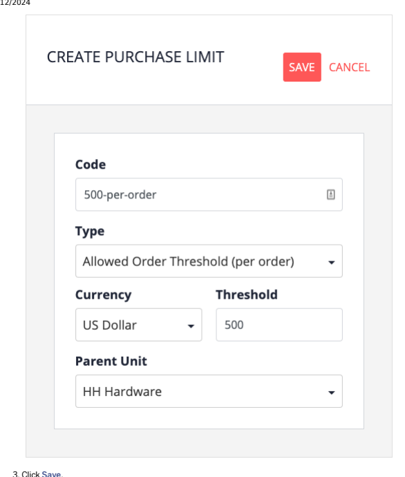
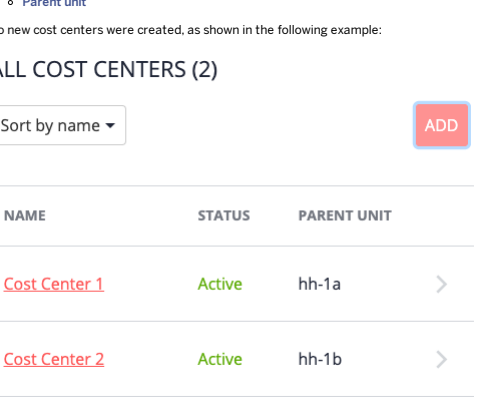

# Using The Composable Storefront

The composable storefront is designed to be as intuitive as possible. However, the following documentation is provided to guide you through those parts of the storefront UI that may require a little more explanation.

## Assisted Service Module

The Assisted Service Module (ASM) allows customer support agents (CSAs) to access the same storefront view their customer uses and provide real-time customer support. If the Login with Verication Token feature is activated, when the Customer Support Agent (CSA) emulates a customer in Assisted Service Module, no one-time verication token is required during the customer emulation. By design, the verication token will only be sent to the corresponding customer's mailbox during customer login, and the customer should never share this verication token to anyone else.

## Binding An Anonymous Cart To A Customer Account

Customer support agents (CSAs) can use the Assisted Service Module (ASM) to assign anonymous storefront carts to existing customer accounts.

## Context

Using the ASM, CSAs can bind an anonymous cart to an existing customer account, in the event that a customer has already added the items they want to purchase to their cart, but forgot to log in beforehand.

Do not use the following storefront links in combination with the ASM, as errors might occur:
Sign In / Register Sign Out

1. On your own computer, log in to the storefront and add the ?asm=true parameter to the storefront URL in the address bar to activate the Assisted Service Module. The ASM panel opens.

2. In the ASM panel, log in using your asagent credentials. 3. Specify the customer's name or email in the Customer eld. 4. Select Start Session. 5. Specify the number of the anonymous cart in the Cart Number eld.

You see an emulation of the anonymous cart.

6. Select Assign Cart to Customer.

A customer can only have one cart.

If the customer already has an active cart, you have the option to replace the active cart with the anonymous cart. Choosing to replace the active cart with the anonymous cart overrides the active cart. The previous active cart is then saved as a saved cart. There is no possibility or need to bind a cart to an account if the cart is already bound to an account.

## Results

The cart is bound to the customer account. The customer can now see that the items they added to the anonymous cart before logging in are bound to their account.

## Creating An Account For Customers

The Assisted Service Module (ASM) allows customer support agents (CSAs) to create an account for customers.

## Context

Customers are trying to buy their grandson a birthday present, but they need help and the online store keeps asking him for all kinds of information. The customers contact customer support to have someone help them. Using the ASM, CSAs can create a new customer from the following two places.

The customer list dialog popup. The result list of customer search box when the customer query returns empty.

1. Add the ?asm=true parameter to the storefront URL in the address bar to activate the Assisted Service Module.

2. In the ASM panel, enter your customer service agent credentials and click Sign In. 3. Click Customers and the Customer List dialog opens.

You also can specify a non-existent customer's name or email in the Customer eld, and the result list of customer search box opens.

4. Click Create New Customer.

The Create New Customer dialog opens.

5. Fill in the First Name, Last Name, and Email Address. 6. Click Create. The system redirects to the homepage and a registration email is sent to the customer.

After the account is created successfully, emulation for the customer will be started automatically.

The customer's default currency and language are set relative to the session's currency and language. You can now create a new payment method, add a new delivery address, or perform the entire checkout process on the customer's This is custom documentation. For more information, please visit the SAP Help Portal 3 7. Click End Session to nish emulating the account.

## Note Logging Out Of Asm

There are several ways to end an assisted service session:
Click the Sign Out button. This action logs out the customer service agent user.

Click the End Session button. This action ends the current assisted service session but the ASM window does not close and the customer service agent user is still logged in.
8. Instruct the customer to open the storefront once again. Click Forgot password? and have them reset their password.

If the customer wants to log into the storefront later, they have to request a new password using the Forgot password? link on the storefront. As soon as CSAs using the ASM create an account on a customer's behalf, out-ofthe-box, they will receive a registration email with a forgot password link. This forgot password link lets them reset or setup their password for the rst time.

## Customer List

The customer list is a congurable list framework that allows customer support agents working in the ASM to view a list displaying information about the customers assigned to them. Customer support agents (CSAs) working in the ASM can view various customer lists based on different attributes. The customer records within the customer lists contain deep links that, when selected by the CSA, navigate to their respective pages, such as the customer's prole or order page. The following customer lists are available by default:

| Customer List Name         | Description                                                                                                                                                                                                                                                                                                                                                                             |
|----------------------------|-----------------------------------------------------------------------------------------------------------------------------------------------------------------------------------------------------------------------------------------------------------------------------------------------------------------------------------------------------------------------------------------|
| Current In-Store Customers | Displays a list of customers that are currently in-store or in different places within a store as detected by one or multiple hardware devices so that a CSA can review a customers prole and approach the customer prepared. By default the customer data is mocked, however in a real life implementation, this data comes from a single, or multiple, physical in-store IoT devices. |
| Pick-Up In-Store Customers | Displays a list of customers who bought online and are picking their orders up in-store so a CSA can prepare their order.                                                                                                                                                                                                                                                               |
| My Organization Customers  | Displays to the sales representatives with a list of customers that are assigned to them in the sales organization module. This way, the sales representatives have a convenient way to access their customers and start an ASM session.  Note This is applicable only for sales representatives responsible for the sales organizations to which the customers belong.                |

By default, the customer list includes columns for the customer's picture, name, email address, phone number, cart link, and order link. That said, the customer list is an extensible framework, meaning you can congure the columns that display. In the context of the Customer Lists Framework, this means that in all the instances of lists implemented currently, the following is available:

| Option                                                            | Description                                                                                                                                                                                                                                                                                                                                                                                                                                                                                                            |      |
|-------------------------------------------------------------------|------------------------------------------------------------------------------------------------------------------------------------------------------------------------------------------------------------------------------------------------------------------------------------------------------------------------------------------------------------------------------------------------------------------------------------------------------------------------------------------------------------------------|------|
| Picture                                                           | A prole picture for the customer. You can add the picture in Backoffice Administration Cockpit, in the Administration tab. By default, there are 4 sample customer images visible in the implementations of the Customer Lists Framework. The images a located in the assistedservicestorefront\resources\assistedservicestorefront\import\stores\electronics\ima directory. For more information about the Customer Lists Framework, see the Customer Lists Framework section under assistedservicefacades Extension. |      |
| Cart Link                                                         | By clicking this link, the agent is able to emulate a customer and their cart.  Note This link is visible only when the customer has a cart session.                                                                                                                                                                                                                                                                                                                                                                  |      |
| Order                                                             | By clicking this link, the agent is able to emulate a customer and their order.                                                                                                                                                                                                                                                                                                                                                                                                                                        |      |
| Link                                                              |                                                                                                                                                                                                                                                                                                                                                                                                                                                                                                                       | Note |
| This link is visible only when the customer has an order history. |                                                                                                                                                                                                                                                                                                                                                                                                                                                                                                                        |      |
| Customer                                                          | By clicking this link, the agent is able to open Customer 360° view and see customer details.                                                                                                                                                                                                                                                                                                                                                                                                                          |      |
| 360° Link For more information, see Conguring the Customer List.  |                                                                                                                                                                                                                                                                                                                                                                                                                                                                                                                        |      |

## Deep Links

The Assisted Service Module supports sending and resolving deep links which allow CSAs to start emulation instantly. There are a number of different cases for using a deep link to start an emulation. The following are some examples:

Emulating a customer: http://localhost:4200/electronics-spa/en/USD/assisted-service/emulate?

customerId=<customerID>
Emulating a customer and an active cart: http://localhost:4200/electronics-spa/en/USD/assistedservice/emulate?customerId=<customerID>&cartId=<cartID>&cartType=active
Emulating a customer and a saved cart: http://localhost:4200/electronics-spa/en/USD/assistedservice/emulate?customerId=<customerID>&cartId=<cartID>&cartType=saved Emulating a customer and an inactive cart: http://localhost:4200/electronics-spa/en/USD/assistedservice/emulate?customerId=<customerID>&cartId=<cartID>&cartType=inactive Emulating customer and an order: http://localhost:4200/electronics-spa/en/USD/assistedservice/emulate?customerId=<customerID>&orderId=<orderID>

Not emulating a specic user: http://localhost:4200/electronics-spa/en/USD/assistedservice/emulate
When you append the orderId parameter, you can use either the order code or the order ID.

You can use deep links in the following scenarios:

Sending auto-notication emails to CSAs Sending customer questions to CSAs Not emulating a user, for example displaying a list of all customers, so that CSAs can start emulating a customer easily
In the ASM panel, you need to enter your customer service agent credentials and click Sign In when you open a deep link and there is no active assisted service session.

## Customer Support Backoffice

In Customer Support Backoffice, there is an option to launch the assisted service mode. There are three emulation possibilities, as follows:
If no customer is selected, an anonymous assisted session opens.

If a customer is selected, an assisted session emulating that customer opens. If a customer with a valid cart is selected, an assisted session emulating that customer and their cart opens, and the assisted service agent is redirected to the Cart page.
Properties

| Name                                      | Description                                                                                    |
|-------------------------------------------|------------------------------------------------------------------------------------------------|
| <cscockpit.assistedservice.deeplink>      | Enables and displays the Launch ASM button in Customer Support Backoffice. Default value: true |
| <assistedservicestorefront.deeplink.link> | Provides the emulation link to other extensions. Default value: /assisted-service/emulate      |

In Customer Support Backoffice, the website.<your_site>.https environment property is used to compose the deep link. The property can be congured in the local.properties le. Please ensure to use the HTTPS protocol instead of the HTTP protocol in the Base Site URL to avoid exposing any sensitive information.

## Assisted Service Module Collapsible Header

Assisted Service Module collapsible header enables a customer support agent to choose to hide or show the ASM header on the spartacus storefront. This allows to increase the browsing area on the storefront without closing Assisted Service Module.

## Hiding The Header

To hide the header, click the Hide ASM button.

The header stays hidden even if you navigate to a different page on the spartacus storefront.

## Showing The Header

To show the header, click the Show ASM button.

## Conguration

Make sure that the following is reected in _asm-toggle-ui.component.scss.

%cx-asm-toggle-ui { cursor: pointer; display: flex; align-items: center; height: 16px; margin: 0 15px; .toggleUi {
This is custom documentation. For more information, please visit the SAP Help Portal 7 display: inherit; align-items: inherit; .label { margin-inline-start: 5px; color: \#d50101; @media (max-width: 575px) { display: none; } } .collapseIcon, .expandIcon { width: 16px; height: 16px; } .collapseIcon { background: url("data:image/svg+xml,%3Csvg aria-hidden='true' focusable='false' data-prefix=' center center no-repeat; } .expandIcon { background: url("data:image/svg+xml,%3Csvg aria-hidden='true' focusable='false' data-prefix=' center center no-repeat; } } }

## Customer List Framework Integration

The Customer List Framework is a generic framework that can display different customer lists to Customer Support Agents relative to different business applications. The customer records within the customer lists contain ASM deep links that when clicked on by a CSA, take them to their respective pages such as the customer's prole, cart, or orders page for example. This allows a CSA to prepare themselves with customer specic information before providing personalized support to the customer. Currently, the following implementations are available:

| Customer List Name                                                                                                                                            | Description                                                                                                                                                                                                                                       | Documentation Link                                                             |
|---------------------------------------------------------------------------------------------------------------------------------------------------------------|---------------------------------------------------------------------------------------------------------------------------------------------------------------------------------------------------------------------------------------------------|--------------------------------------------------------------------------------|
| Current In-Store Customers                                                                                                                                    | Displays a list of customers that are currently in-store or in different places within a store as detected by one or multiple hardware devices so that a Customer Support Agent can review a customer's prole and approach the customer prepared. | assistedserviceservices Extension document, section Current In-Store Customers |
| By default, the customer data is mocked, however in a real life implementation this data will come from a single, or multiple, physical in-store IoT devices. |                                                                                                                                                                                                                                                   |                                                                                |
| Pick-Up In-Store Customers                                                                                                                                    | Displays a list of customers who bought online and are picking their orders up instore so a Customer Support Agent can prepare their order.                                                                                                                                                                                                                                                   | assistedservicefacades Extension document, section My Recent Customer Sessions |
| My Recent Customer Sessions                                                                                                                                   | assistedserviceservices Extension document, section Pick-Up In-Store Customers                                                                                                                                                                    |                                                                                |

In the assistedservicefacades-beans.xml le, the CustomerData bean is dened:

<bean class="de.hybris.platform.commercefacades.user.data.CustomerData">
<property name="defaultAddress" type="de.hybris.platform.commercefacades.user.data. <property name="latestCartId" type="String"/> <property name="hasOrder" type="Boolean"/> <property name="profilePicture" type="de.hybris.platform.commercefacades.product.da
</bean>
In the context of the Customer Lists Framework, this means that in all the instances of lists implemented currently, the following is available:

| Option     | Description                                                                                                                                              |
|------------|----------------------------------------------------------------------------------------------------------------------------------------------------------|
| Picture    | A prole picture for the customer. You can add the picture in Backoffice Administration Cockpit, in the Administration tab.                               |
| Cart link  | By clicking this link, the agent is able to emulate a customer and their cart.  Note This link is visible only when the customer has a cart session.    |
| Order link | By clicking this link, the agent is able to emulate a customer and their order.  Note This link is visible only when the customer has an order history. |

## Emulating Customer Accounts

Use the Assisted Service Module to nd and emulate a customer account or cart.

1. Navigate to the spartacus storefront and add ?asm=true string to the URL visible in the address bar. The spartacus storefront opens with ASM active.

2. Log in as a customer service agent to the ASM panel.

3. Search for a specic customer by providing customer name or email address. You can also select a customer from the Customers list located at the top of the ASM panel.
Customer service agents cannot emulate the ASM session for a disabled customer. Disabled customers are excluded both from the customer list or customer search autocomplete panels.

4. To emulate a customer account, click the Start Session button.You can now create a payment method, add a delivery address, or perform the entire checkout process for the customer.

5. When you're ready, end the session by logging out of ASM in either of the following ways:
Choose Sign Out. This action logs the asagent user out, and the customer is also logged out.

Choose End Session.This action ends the current ASM session. The panel remains open and the asagent user is still logged in. The customer is logged out.

## Managing Consent For Customers

Use the assisted service mode to give or withdraw consent for a customer.

## Context

Consent is given during registration. The customer decides whether to opt in. You can change user setting in the ASM mode.

1. Log in as Customer Support Agent (CSA).

2. Start a customer session. 3. Click My Account Consent Management . 4. Make the required changes.

## Looking Up Recent Sessions

Use the Assisted Service Module to help customers with their experience in spartacus storefront.

This is custom documentation. For more information, please visit the SAP Help Portal 10 Context You use the Recent Sessions feature to view the list of the customers they recently emulated.

1. Log into the Assisted Service Module by adding the ?asm=true string to the storefront URL visible in the address bar.

2. In the ASM panel, log in using your asagent credentials.

  5. Select the customer's account. And the emulation of this customer starts.

## Placing An Order For A Calling Customer

As a customer support manager, you can place an order for a customer.

Procedure This is custom documentation. For more information, please visit the SAP Help Portal 11

2. Search for a customer by email address and start a session.

 3. Add the required items to the cart. 4. Click Check Out and complete the purchase.

## Offering A Discount To A Calling Customer

Create a discount coupon in the Assisted Service Module (ASM).

1. Log in as Customer Support Agent (CSA).

2. Start a customer session. 3. Go to the Customer 360 Degree view. 4. Click Promotions. 5. Select a coupon and click Apply to Cart.

This is custom documentation. For more information, please visit the SAP Help Portal 12

## Asm Customer 360 View

Choosing the 360 Customer View button opens the 360 View modal window, which provides the Customer Support Agent (CSA) with personalized customer-related information. In the 360 View modal window, as a CSA, you can switch between any of the following tabs:

Overview Tab Prole Tab Activity Tab Feedback Tab Promotions Tab Store Locations Tab
You can select a product or category link that navigates you to the storefront from any of the ASM Additional Information Framework tabs. Upon choosing the 360 Customer View button, you are redirected back to the tab you were previously on.

## Related Information

Conguring the Customer 360 View

## Overview Tab

The Overview tab provides the Customer Support Agent with top-level information about the customer. The Overview tab is divided into several sections, as follows:

Summary Active Cart Latest Saved Cart Interests
The Summary section contains basic information about the customer, including their e-mail address, prole picture, address details, and when they created their account. This section is always visible above all of the tabs. The Active Cart section displays the current session cart information, including cart ID and the rst six cart items. On click, the CSA is redirected to the cart page. If the customer does not yet have a cart, the There are currently no Active Cart items message is displayed. The Latest Saved Cart section displays the latest saved cart, if a customer has one. The information displayed includes the cart ID, total cart value, and the rst six cart items. If there are no saved carts, the There are currently no Saved Cart items message is displayed. The Interests section displays up to three products that the customer has registered to receive notications about.

In the Active Cart, Latest Saved Cart, and Interests sections, product names are shortened to 25 characters. The entire product name is displayed when you hover your mouse pointer over the product image.

This is custom documentation. For more information, please visit the SAP Help Portal 13

## Prole Tab

The Prole tab provides the Customer Support Agent with top-level address and payment information about the customer. The following information is displayed:
Billing Address

Delivery Address Phone Numbers Saved Payment Methods
If any of the information listed above is not available, it is not displayed or the - character is displayed. By default, the number of displayed saved payment methods is 3. For each payment method, last 4 digits, the month, and year of expiry is displayed. If there is no default billing address, the billing address from the last order is displayed. If present, phone number \#1 comes from the billing address data and phone number \#2 comes from the delivery address data.

## Activity Tab

The Activity tab provides the Customer Support Agent with top-level information about the customer's recent cart, tickets, saved cart, and order activity, allowing the agent to assess the mood of the customer. The following sections are displayed:
General In the General section, the CSA can see a list of recently changed items such as saved carts and orders. The items are displayed in order of the most recently updated. You can change the sorting of the list by clicking on different row headers.

## Feedback Tab

The Feedback tab provides the Customer Support Agent with information about the support tickets and product reviews of a customer. The following sections are displayed:
Support Tickets

Product Reviews
In the Support Tickets section, the CSA can see a list of support tickets. The items are displayed in order of the most recently updated. You can change the sorting of the list by clicking on different row headers. In the Product Reviews section, the CSA can see a list of product reviews. The items are displayed in order of the most recently created. You can change the sorting of the list by clicking on different row headers.

## Promotions Tab

The Promotions tab provides the Customer Support Agent with information about the potential and applied promotions as well as coupons that can be applied to a cart. The following sections are displayed:
Coupons

Promotions Customer Coupons
In the Coupons section, the Customer Support Agent can see a list of coupons created in Backoffice particularly for customer support, which can be applied to a customer cart. In the Promotions section, the Customer Support Agent can see a list of promotions that are already in customer cart either potential or applied. In the Customer Coupons section, the Customer Support Agent can see a list of customer coupons created in Backoffice particularly for the customer. The Available tab shows assignable customer coupons. The Sent tab shows customer coupons that are assigned to the customer. For more information about customer coupon assigning in ASM, see Customer Coupon Assigning.

X
Customer Profile Andrea Customer Customer 360° View andrea.customer@hybris.com Ichigaya Sadoharacho J

1 item added to cart  0008000

## Store Locations Tab

The Store Locations tab provides the Customer Support Agent with information about the points of service that are the closest distance to the agent.

The following sections are displayed:

- Point of Service List
- Point of Service Details
The Point of Service List displays a list of all points of service defined in the system. The list is sorted by distance, with points of service closest to the location of the agent displayed at the top.

Account created on 07-14-2023 This is custom documentation. For more information, please visit the SAP Help Portal Note If an agent doesn't have a default location assigned, the list is sorted by distance to the location of the device the agent is using.

The Point of Service Details section displays details about a particular point of service selected from the Point Of Service List.

The information includes:
Address

Opening hours Features

## B2B Commerce Organization Tutorial Note

B2B Commerce Organization requires the Organization feature library. For more information, see Installing Additional Composable Storefront Libraries.

For information about customizing the composable storefront Organization feature library, see B2B Commerce Organization. This tutorial introduces the B2B Commerce Organization feature. It is important to follow the tutorial in the order presented, as the information on each page builds upon the steps from the previous pages.

B2B Commerce Organization Overview Purchase Flow Example Creating a New Organization and Administrator Units Users Purchasing Limits Cost Centers Budgets Shipping Addresses Purchase and Approval Flow Example Disabling and Deleting Commerce Organization Entities

## B2B Commerce Organization Overview

B2B Commerce Organization for composable storefront allows companies to manage purchases made through a composable storefront commerce web site. A company's purchasing manager can be set up as an administrator for the commerce organization. The administrator can create units representing organizations, regions, cities, departments, or any other organizational entity in their company. The units are then associated with buyers, shipping addresses, and cost centers, all for the purpose of allowing, controlling and tracking spending. The following pages in this section describe how to use B2B Commerce Organization. For more technical information, see B2B Commerce Organization.

This is custom documentation. For more information, please visit the SAP Help Portal 17

Composable storefront for B2B Commerce Organization requires release 2005 or later of SAP Commerce Cloud.

## Role Denitions

In the out-of-the-box B2B Commerce Organization sample data, each user in the organization is assigned a role.

| Role             | Description                                                                                                                                                                                                                                |
|------------------|--------------------------------------------------------------------------------------------------------------------------------------------------------------------------------------------------------------------------------------------|
| Customer         | Users with the Customer (Buyer) role are permitted to place orders. Buyers can create orders of any value.                                                                                                                                 |
| (Buyer) Approver | An approver reviews and approves or rejects orders placed by buyers, when the order goes beyond the purchase limit set for the buyer.                                                                                                      |
| Administrator    | A user who makes changes to the units and user settings in the organization. The administrator is only permitted to administrate the organization structure equal to or below the B2B administrator's position in the hierarchy.           |
| Manager          | The manager role is intended for assigning the managers of other users. A manager is only permitted to view the reports of the organization's expenditure in the units that are equal-to or below the manager's position in the hierarchy. |

## Others Terms Used In B2B Commerce Organization

| Term         | Description                                                                                                                                                         |
|--------------|---------------------------------------------------------------------------------------------------------------------------------------------------------------------|
| Unit         | A unit is the basic building block of the organization. A unit represents a department, location, region, or other entity.                                          |
| User         | Users are assigned to units. Each user has at least one role.                                                                                                       |
| Cost         | Cost centers are assigned to units and are used to track spending. When making a purchase through an account and not with a                                         |
| Center       | credit card, buyers must choose a cost center. Buyers have access to all cost centers that are linked to their unit and all related child units.                    |
| Budget       | Budget limits are used to limit overall spending. Orders that exceed the budget are sent to approvers.                                                              |
| Purchase     | Purchase limits can be dened per order and per timespan. Buyers are assigned purchase limits in order to limit purchases.                                           |
| Limit        | Approvers are assigned purchase limits to limit the size of orders they can approve.                                                                                |
| User         | A collection of users, for the purposes of assigning purchase limits in one place, for many users.                                                                  |
| Group Credit | Credit limits are used by sellers to limit their credit exposure. Credit limits can be assigned to any unit by the seller and are                                   |
| Limit        | not controlled by the buying company's administrator.                                                                                                               |
| Right        | A feature-specic permission granted to a role that supplements a generic set of four out-of-the-box roles (Customer (Buyer), Approver, Administrator, and Manager). |

## Powertools Sample Store

SAP Commerce Cloud includes a sample storefront called Powertools. If you install the standard recipe (called "CX" in SAP Commerce Cloud 2005 or newer), Powertools is installed along with the extensions and sample data needed for B2B Commerce Organization.

This is custom documentation. For more information, please visit the SAP Help Portal 18 In order to purchase something or to make changes to a commerce organization, the out-of-the-box Powertools store is congured to require users to log in rst. For a list of these default users and units, see powertoolsstore Extension.

SAP Commerce Cloud 2005 and newer ships with all users inactive and without passwords. To restore the users and passwords available in the sample store, see Setting Passwords for Default Users.

## Sample User Examples

The B2B Commerce Organization feature depends on users being assigned to various roles. The following table lists users who belong to the Rustic Hardwdare sample organization that is included in the Powertools store:

| Login                        | Role          |
|------------------------------|---------------|
| linda.wolf@rustic-hw.com     | Administrator |
| mark.rivers@rustic-hw.com    | Buyer         |
| hanna.schmidt@rustic-hw.com  | Approver      |
| akiro.nakamura@rustic-hw.com | Manager       |

## Purchase Flow Example

The following example highlights the differences between a B2C and a B2B checkout. The purchase ow is done with Mark Rivers (who is a "buyer"), and demonstrates how the checkout ow is inuenced by B2B Commerce Organization settings.

## B2B Purchase Flow Procedure

1. Mark has products in his cart, as shown in the following example:

## Your Shopping Cart

| Cart #0004000                  | ORDER SUMMARY   |        |       |            |
|--------------------------------|-----------------|--------|-------|------------|
| Subtotal after                 | $42.00          |        |       |            |
| DESCRIPTION                    | ITEM PRICE      | QTY    | TOTAL | discounts: |
| Estimated                      | TBD             |        |       |            |
| Cordless Drill BT-CD 10,8/1 Li | shipping:       |        |       |            |
| $42.00                         | $42.00          |        |       |            |
| 1                              |                 |        |       |            |
| ID 3881029                     | Sales Tax:      | $0.00  |       |            |
| Remove                         | Total:          | $42.00 |       |            |

Proceed To Checkout Have a coupon?

Promo code

2. Mark clicks Proceed to Checkout.

In the B2B Powertools storefront, the buyer can enter a purchase order number (PO number), as shown in the following example:
Method of Shipping Delivery Payment Review Payment Adress Mode Details Order Purchase order number (optional)
Enter P.O
Payment method
(O
Credit Card Account Back To Cart

## Continue

The default payment method is credit card, in which case the payment process is the same as with a standard B2C
storefront (such as the Electronics storefront).

3. Mark selects the Account payment method, as shown in the following example:
Purchase order number (optional)

Back To Cart

## Continue

With the Account payment method selected, the checkout steps change and the Payment Details step is removed. This is because there is no need to supply a credit card when paying by account. Invoicing is done separately, through an arrangement between the seller and buyer companies.

4. Mark clicks Continue.

The Shipping Address screen is displayed, as shown in the following example:
Cost Center Custom Retail Shipping addresses available to you depend on the cost center's unit

## Shipping Address

Select your Shipping Address

Back

## Continue

In order to continue, Mark must select a cost center. Mark can access all cost centers in the unit he is assigned to, and any cost centers belonging to child units of his unit.

The shipping addresses available to Mark depend on the cost center he selects. Units are assigned cost centers and shipping addresses, and the shipping addresses are taken from the unit associated with the chosen cost center.

## I Note

In the following example, a second cost center was added to the sample data to show that there are multiple cost cnters available:
Cost Center

5. After selecting a cost center and shipping address, Mark clicks Continue.

The Delivery Mode screen is displayed, as shown in the following example:
This is custom documentation. For more information, please visit the SAP Help Portal Payment

## Shipping Method

(O
Standard Delivery 3-5 business days
$9.99
$16.99 Premium Delivery 1-2 business days

| Back   |
|--------|

## Continue

This screen is the same as with the standard B2C storefront, with the delivery cost depending on the shipping address.

6. Mark clicks Continue.

The Review Order screen is displayed, as shown in the following example:
Method of Payment

| Shipping   | Delivery   | Review   |
|------------|------------|----------|
| Address    | Mode       | Order    |

| ITEM PRICE                  | QTY    | TOTAL   |        |
|-----------------------------|--------|---------|--------|
| Cordless Drill BT-CD 10,8/1 | $42.00 | 1       | $42.00 |
| ID 3881029                  |        |         |        |

DESCRIPTION

A summary of the order is displayed for Mark. There is also an option to schedule an automatic replenishment of the order (on the right side, below the Order Summary).

This is custom documentation. For more information, please visit the SAP Help Portal 7. Mark clicks Place Order.

The Conrmation page appears, and depending on Mark's purchase limits, the following occurs:
If the order is within Mark's purchase limits, the order proceeds through the seller's purchase workow automatically. If the order is beyond Mark's purchase limits, the order is placed, but is held until an approver from Mark's company approves the purchase.

## Minimum Requirements For Setting Up A Commerce Organization

From Mark's purchase example, the minimum setup for a commerce organization is the following:
One unit

One shipping address assigned to the unit One cost center assigned to the unit Two users: an administrator and a buyer
The following features are optional, but can help for controlling and tracking spending:

Approvers: if there are no approvers dened, the administrator is the approver Spending limits: for triggering approvals, but also to allow small purchases to be approved automatically Budgets: to apply spending limits collectively to a group of buyers

## Creating A New Organization And Administrator

For demonstration purposes during this tutorial, a new organization will be added to the SAP Commerce Cloud Powertools store. If you wish, you can also use Linda Wolf and other users from the Powertools sample data. The out-of-the-box behavior of the Powertools sample store is to require a new buying company to request an account, either by lling in a registration form, or by contacting the selling company to start a purchasing relationship. This process is often necessary because the selling company will collectively invoice the buying company for all purchases made by their employees, which usually requires contracts or informal agreements to do so. Creation of a new buying organization along with a new administrator can be done with the SAP Commerce Cloud Backoffice management tool. The top-level unit is known as the root unit.

## Creating A New Root Unit For The Buying Company Procedure

1. Open the Backoffice tool. If you are working locally, you can access the tool through the following URL:
https://localhost:9002/backoffice 2. At the login screen, enter admin as the username and the password for the administrator.

3. In the left navigation bar, scroll down to and then click B2B Commerce. 4. In the left navigation bar, under B2B Commerce, click B2B Unit.

A list of existing units appears, as shown in the following example:
This is custom documentation. For more information, please visit the SAP Help Portal 24

| ID            | Name                  |                       |
|---------------|-----------------------|-----------------------|
| S             | Pronto Services       | Pronto Services       |
| Pronto Goods  | Pronto Goods          |                       |
| S             |                       |                       |
| S             | Pronto                | Pronto                |
| Services West | Services West         |                       |
| $             |                       |                       |
| $             | Services East         | Services East         |
| $             | Custom Retail         | Custom Retail         |
| >             | Rustic Services       | Rustic Services       |
| Rustic Retail | Rustic Retail         |                       |
| $             | Rustic                | Rustic                |
| S             |                       |                       |
| S             | PunchOut Organization | PunchOut Organization |

5. To create a new unit, click the "plus" icon (+) at the top of the list.

The Create New B2B Unit window appears, as shown in the following example:
6. Enter the ID and name of your unit, then click Done.

The unit is created.

7. Click Search to refresh the list.

Your new unit should be visible.

## Creating The Buying Company'S Administrator For The New Root Unit Procedure

1. In the left navigation bar, under B2B Commerce, click B2B Customer.

A list of existing B2B users appears. These users represent all the roles of buying companies: administrators, buyers, approvers, and managers.

2. To create a new user, click the "plus" icon (+) at the top of the list.

The Create New B2B Customer window appears.

3. Type the new user's email address into the ID, Customer ID, and Email elds, and type the new user's name in to the Name eld, as shown in the following example:

## Create New B2B Customer

X
ESSENTIAL
LOCALE INFORMATION
MEMBERSHIPS
Customer information Preferred language and currency Assign user to groups

| ID:               |        |      |      |
|-------------------|--------|------|------|
| billsmith@sap.com |        |      |      |
| Customer ID:      |        |      |      |
| billsmith@sap.com |        |      |      |
| Name:             |        |      |      |
| Bill Smith        |        |      |      |
| Description:      |        |      |      |
| Email:            |        |      |      |
| billsmith@sap.com | CANCEL | NEXT | DONE |

## I Note

Although the customer ID is not required to create the user, it is important for proper handling of all users in composable storefront.

4. Click Next, and then Next again, so that the Memberships tab is displayed.

5. In the Groups field, add the group B2B Admin Group, and remove the B2B Customer Group. 6. In the Default B2B Unit field, select the unit you created previously, as shown in the following example:
X
ESSENTIAL Customer information LOCALE INFORMATION
Preferred language and currency MEMBERSHIPS
Assign user to groups Groups:
B2B Admin Group [b2badmingroup]
000 Default B2B Unit:
H Hardware

## Back

CANCEL

| DONE   |
|--------|

7. Click Done.

The user is created but does not yet have a password.

8. Click Search to refresh the list.

Your new user should be visible. If not, enter the first few letters of your user in the search box, and click Search.

9. Select your new user, and then click the Password tab, as shown in the following example:
c bill

SEARCH 

+ - 
e
[] ID
Name Customer ID
Customer Type billsmith@sap.com Bill Smith billsmith@sap.com Registered 0 ITEMS SELECTED
 Bill Smith [billsmith@sap.com]
m  94   94 APPROVERS
GENERAL 
ADDRESSES
PASSWORD
pyments  Coupon  Orders tickets    permissions    reviews PRICES PERSONALIZATION
ESSENTIAL

| Bill Smith   |
|--------------|

Name PASSWORD Password Type Standard

| -   |
|-----|

Change Password

| Confirm New Password   |
|------------------------|

| New Password   |
|----------------|

This is custom documentation. For more information, please visit the SAP Help Portal Customer ID
ID

| billsmith@sap.com   | billsmith@sap.com   |
|---------------------|---------------------|

10. Under Change Password, type the user's password into the New Password and Confirm New Password fields, and then click Save.

The user can now log in. Browse to your Powertools store and log in as the new user, as shown in the following example:

the following example:

Clicking My Company displays the Commerce Organization home page, as shown in the following example:

You are now ready to create your commerce organization!

## Units

A unit is the basic building block of the organization. A unit represents a department, location, region, or any other entity that makes sense to you.

Units are the parents of, or are associated with, the following Commerce Organization entities:
- Child units
- Users
- Approvers
- Shipping addresses - Cost centers Each entity is important in its own way, as follows:
- Units are inherited. A user assigned to a unit also has permissions for the child units. - An approver who is assigned to a unit can potentially approve any of the purchases made by buyers in that unit or in the related child units.

- The locations a buyer can ship to depend on the shipping addresses that have been created for a unit.

The cost centers available to a buyer depend on the unit or child units the buyer has access to. The shipping addresses
.

available to a buyer depend on the cost centers he or she can select.

## Creating A Child Unit

The following example starts off with a new unit and a new administrator. No other units, shipping addresses, cost centers, or any other entity are dened. There must be one root unit, and accordingly, all new units are child units of another unit.

1. From the My Company home page, click Units.

All units are displayed, as shown in the following example:
2. Click Add, and then ll in the following required elds:
Name ID Approval Process, which denes the approval process used by the seller (not dened by your organization) Parent unit In the following example, two new child units were created:

## All Units (3)

EXPAND ALL
COLLAPSE ALL

| NAME              | STATUS   |
|-------------------|----------|
| ✔ HH Hardware (2) | Active   |
| h-1a (0)          | Active   |
| h-1b (0)          | Active   |

UNIT DETAILS
Unit: hh-1b EDIT
DISABLE
x

| Name               | ID                  |
|--------------------|---------------------|
| h-1b               | h-1b                |
| Status             | Approval process    |
| Active             | Escalation Approval |
| with Merchant      |                     |
| Check              |                     |
| Parent Unit        |                     |
| H Hardware         |                     |
| Child Units        | >                   |
| Users              | >                   |
| Approvers          | >                   |
| Shipping Addresses | >                   |
| Cost Centers       | S                   |

## Users

When creating B2B users, every user must have a role. The following "out-of-the-box" user roles are available with SAP
Commerce Cloud:

- Customer (Buyer): Places orders.

- Approver: Reviews and approves or rejects orders placed by buyers, when the order goes beyond the purchase limit set for the buyer. Cannot make purchases.

- Administrator: Makes changes to the units and user settings in the organization. Cannot make purchases.
.

 Manager: Views the reports of the organization's expenditure in the units that are equal-to or below their position in the hierarchy.
You can create a user for a unit within the unit view, or separately, by displaying all users. See the following pages for examples of creating users from within the units view:
- Buyers This is custom documentation. For more information, please visit the SAP Help Portal

- Approvers

## Buyers

Users with the Customer (Buyer) role are permitted to place orders. Buyers can create orders of any value.

## Creating A Buyer Procedure

1. From the Commerce Organization Home page, click Units.

2. Select the unit that the new buyer will be assigned to.

3. Click Users.

No users exist yet, as shown in the following example:
UNIT DETAILS
Unit: hh-1 a EDIT
DISABLE
x ASSIGNED USERS
Unit: hh-1a CREATE x

| Name          | ID                  |
|---------------|---------------------|
| h-1a          | h-1a                |
| Status        | Approval process    |
| Active        | Escalation Approval |
| with Merchant |                     |
| Check         |                     |
| Parent Unit   |                     |
| H Hardware    |                     |

 

The list is empty

| Child Units        |
|--------------------|
| Users              |
| Approvers          |
| Shipping Addresses |
| Cost Centers       |

The following is an example:

## Note

For this example, the unit is not selectable because a user is being created within a unit.

5. Click Save.

For the moment, this user's purchases are all subject to order approvals. This is because no spending permissions have been created yet. We'll do that later, in the step for setting Purchasing Limits.

## Assigning A Password To The New User

New users are not given passwords by default. These users can choose to reset their password at rst login, or you can assign a password. The following steps describe how to assign a password:

1. From the Commerce Organization Home page, click Users.

2. Select the user whose password you want to change. 3. Click Change password.

This is custom documentation. For more information, please visit the SAP Help Portal 34

## Approvers

The term approver is used in the following different contexts in B2B Commerce Organization for SAP Commerce Cloud:

The role of approver is a user who is designated as someone who can approve orders, and who cannot make purchases. A user with the role of approver is not necessarily the approver for the unit he or she is assigned to. That is a separate assignment, which is described in the next bullet point. The approver for a unit is a user who has been added to the Approvers list for a unit. This person is an official approver for anyone in that unit.
Buyers can also be assigned their own approver on an individual basis.

As stated above, a user with the role of approver who belongs to a unit is not necessarily an approver for that unit. A user must be assigned to the Approver list for that unit as well.

## Spending Permissions Required For Approvers

As with buyers, approvers must also be assigned spending permissions. This is not for the purpose of placing orders, but to indicate the amount the user is allowed to approve. For example, a buyer may be assigned a spending limit of $500 per order, and $1500 per month, in total. If the buyer spends more money on an order, the order is placed, but then held until approval is granted. In contrast, an approver may be assigned a "spending" (approval) limit of $10,000 per order, and $30,000 per month, in total.

## How Approvers Are Chosen

The choice of approval is a bubble-up method: when approval is required, SAP Commerce Cloud goes up through the unit hierarchy, looking for an approver with the right combination of permissions and spending limits. If no approver is found, an administrator is chosen, ultimately arriving at the administrator of the root unit.

## Creating An Approver Procedure

1. From the Commerce Organization Home page, click Units.

2. Select the unit that the new approver will be assigned to. 3. Click Users. 4. Click Create, then ll in the Title, First name, Last name, and Email elds, and also check Approver for the Roles.

The following is an example:

## Note

For this example, the unit is not selectable because a user is being created within a unit.

5. Select Add the user to approvers for the unit to automatically add the new approver as an approver for this unit.

Remember that, even though a user has the role of approver, it does not necessarily mean the user is assigned the job of approving for a unit.

6. Click Save.

For the moment, this approver cannot approve anything. This is because no spending permissions have been created yet. We'll do that later, in the step for setting Purchasing Limits. Don't forget to assign the new user a password.

## The Assigned Approvers List

Remember that when you created the approver, you selected the check box Add the user to approvers for the unit. We have created two users so far, and only one is an approver, so we should expect to see only one user in this unit's list of approvers. If you go back and click Approvers for the unit, you will see that, indeed, this is the case. The following is an example:
UNIT DETAILS
Unit: hh-1a EDIT
DISABLE
x ASSIGNED APPROVERS
Unit: hh-1a MANAGE
x

## Purchasing Limits

Purchasing limits are assigned to individual users or to user groups. When an order that is placed by a buyer is below a limit, the order is automatically allowed to proceed through the seller's purchase flow. If the order surpasses any of the limits, the order is placed, but held until approval is given. If the order is rejected, the order is cancelled.

## Types Of Purchasing Limits

The following kinds of purchasing limits are provided out-of-the-box with SAP Commerce Cloud:
- order-based limits

- time span-based limits (day, week, month, quarter, year)
This is custom documentation. For more information, please visit the SAP Help Portal budget exceeded limits (when a purchase surpasses the allocated budget, but not necessarily the order or time span limit)
A normal scenario might be that a standard approver can approve based on order and time span limits, but perhaps "budget exceeded" is reserved for a higher-level purchasing manager.

## Creating A Purchase Limit Procedure

1. From the Commerce Organization Home page, click Purchase Limits.

2. Click Add, and then ll in the following elds:
Code allows you to create an ID for the purchase limit

Type is per order, per time span, or budget exceeded Period (if per time span is selected) is day, week, month, quarter, or year Currency (if per order or per time span is selected) Threshold (if per order or per time span is selected) is the amount after which approval is required Parent unit does not have any effect on the use of the purchase limit
The following is an example:

## Creating Various Purchase Limits

For the purposes of this tutorial, create the following purchase limits:
- $500 per order
- $2000 per order
- $1500 per month
- $6000 per month
- Budget exceeded Assign them all to your root unit. The following is an example:
ALL PURCHASE LIMITS (5)
Sort by name ▼

| CODE            | STATUS           | LIMIT                      | PARENT UNIT   |
|-----------------|------------------|----------------------------|---------------|
| 1500-per-month  | Active           | 1500 $ per month           | H Hardware    |
| 2000-per-order  | Active           | 200 $                      | H Hardware    |
| 500-per-order   | Active           | 500 $                      | H Hardware    |
| Active          | 6000 $ per month | H Hardware                 |               |
| 6000-per-month  | Active           | Budget Exceeded Permission | H Hardware    |
| budget-exceeded |                  |                            |               |

## Assigning Purchase Limits

To take effect, purchase limits must be assigned to users.

For this example, we'll assign the following:
- the two lower limits to the buyer - the two higher limits to the approver

- the budget exceeded limit to the administrator (although this is redundant because the administrator would get the approval request anyway)

## Assigning Purchase Limits To The Buyer Procedure

1. From the Commerce Organization Home page, click Users.

2. Click the buyer. 3. Click Purchase limits. 4. To the right of Assigned Purchase Limits, click Manage.

5. To the right of the limits you want to assign, click Assign, and then click Done.

In the following example, our buyer, John Doe (Customer role) has been assigned both a per-month and a per-order limit:
AD

Repeat this process as follows:
For the approver, assign the two larger per order and per time span limits.

For the administrator, assign the "budget exceeded" limit.

## Assigning The Same Purchase Limit To Multiple Users

The User Groups feature is designed for grouping multiple users into one collection, so that you can assign specic spending limits to multiple users all at once.

## In The Absence Of Per Order Or Per Time Span Limits

Buyers and approvers do not necessarily require both per order and per time span purchase limits. For example, the following scenario is legitimate, though but perhaps somewhat unexpected:
The buyer is assigned an order-based limit of $500, but no time span-based limit.

The approver is assigned an order-based limit of $2000 and a time span-based limit of $6000. The buyer makes a purchase of $200. The order is held for approval based on the time span limit rule, because the absence of a time span limit for the buyer is equal to a $0 limit (meaning all orders are subject to approval).
This logic is controlled by SAP Commerce Cloud.

## Cost Centers

A cost center is an entity that is used for tracking purchases. A cost center can only be assigned to a single unit. Cost centers can be linked to multiple budgets, which are used for limiting spending in various ways. A buyer must select a cost center during the B2B Store purchase ow, and this plays an important role for B2B Commerce Organization in the following way:
The shipping addresses that are available to the buyer depend on the selected cost center.

The budget (or budgets) that the order applies to is selected based on the choice of cost center.

## Creating A Cost Center Procedure

1. From the My Company home page, click Cost Centers.

2. Click Add, and then ll in the following required elds:
Name Code Currency

Parent unit

If you display the cost center information for your units, you will see that the cost center(s) are now associated with the

 units you chose when creating them. The following is an example:

Following the examples provided in previous steps of this tutorial, the buyer assigned to unit hh-1a is John Doe, and the cost center assigned to unit hh-1a is Cost Center 1, as shown in the following example:

As a result, Cost Center 1 (and not Cost Center 2) will be available to John Doe during checkout, and John Doe will only be able to select shipping addresses from unit hh-1a.

## Budgets

A budget is used to limit spending for overall groups of people. Purchases count against budgets by being associated with cost centers. Buyers must select a cost center when checking out, so the purchase total is counted against that budget. Budgets are not optional. An error will occur if a cost center is used without a corresponding budget. The same budget can be assigned to multiple cost centers.

## Creating A Budget Procedure

1. From the My Company home page, click Budgets.

2. Click Add, and then ll in the following required elds:
Name

Code
Start date

End date Currency Amount
Unit Initially, the budget is not assigned to any cost center.

This is custom documentation. For more information, please visit the SAP Help Portal 44

## Assigning A Budget To A Cost Center Procedure

1. From the My Company home page, click Cost Centers.

2. Select the cost center that will have a budget assigned to it. 3. Click Manage, then click Assign for the budget you want to assign. 4. Click Done.

The budget Bud1 was assigned to Cost Center 2, as shown in the following example:

## Shipping Addresses

When a buyer chooses to pay by account, a cost center must be selected in order to check out. When a cost center is chosen, the unit that the cost center is assigned to determines which shipping addresses are available. Shipping addresses are owned by units. There is no separate list of addresses, and addresses cannot be assigned to other units. At least one shipping address must be created, or else the buyer cannot complete checkout. The following is an example:
Method of Payment Order Cost Center Cost Center 1 Shipping addresses available to you depend on the cost center's unit

## Shipping Address

Select your Shipping Address Abra Cadabra 32 Naim
\#300 Yitc, US-AR, US
12345 555-555-234 Ship To This Address

Zack Receiver 23 Main Main, CA-BC, CA HOH OHO
555-555 Ship To This Address

Back Continue

## Creating A Shipping Address Procedure

1. From the My Company home page, click Units.

2. Select the unit to which you want to add a new shipping address. 3. Click Shipping Addresses.

4. Click Create, and then fill in the following required fields:
。 Country/Region (affects display of states) o Title and Name of shipping receiver oo Address o City This is custom documentation. For more information, please visit the SAP Help Portal State Postal code Phone number Mobile number The following is an example:

 For the purposes of this tutorial, create at least two addresses.

## Deleting Addresses

Unlike other Commerce Organization entities, shipping addresses can be deleted. Deleting an address does not affect orders that have already been placed because the information is copied and made a part of the order.

## Purchase And Approval Flow Example

In this purchase and approval ow example, we make use of the new buyer and approver that were set up with your new organization.

## Purchase Flow Example

In these steps, we are working with John Doe, the new buyer that we created in previous steps of this tutorial. In this example, we'll purposely order something over the purchase limit so that we can see the approval process in action.

1. In a separate browser, or using a private browser window, log in to the Powertools site as your buyer (for example, John Doe).

 Note If you try to log in using the same browser, you will lose the administrator browser session.

2. Add products to the cart until the total is over $500, and then start the checkout process.

This is custom documentation. For more information, please visit the SAP Help Portal 47

The approval process will only be triggered if the purchase amount surpasses the purchase limits you have created. In this tutorial, we created a per-order limit of $500 for the buyer.

3. For the payment method, select Account, and then click Continue. 4. Select a cost center and shipping address, and then click Continue. 5. Select a delivery mode, and then click Continue.

The Review Order page is displayed.

6. Select the terms and conditions check box, and then click Place Order.

The order is now held. Because the order is over $500, the order is placed, but it is held for approval by the buyer's organization. To see that an order is being held, display your order history. Wait a few moments for the back end to start the order ow. The order status starts out as Created but eventually you will see Pending and an approval table at the bottom of the order. The following is an example: You can see the reason why an order is held under the Permission heading. In this case, the order was held because the total cost of the order exceeded the per-order limit. You can also see who the approver is.

## Approving The Order

To review the order, the approver that was created earlier in this tutorial must log in. You might want to do this in yet another browser so that you can see the status of the order before and after approval. In these steps, we are working with Tommy Durang, the new approver that we created in previous steps of this tutorial.

1. Log in to the Powertools site as your approver (for example, Tommy Durang).

2. Click the My Account menu, and then click Approval Dashboard.

The list of orders requiring approval is displayed, as shown in the following example:

| 3. Click the order number for the order that requires approval.                      |    |
|--------------------------------------------------------------------------------------|----|
| This is custom documentation. For more information, please visit the SAP Help Portal | 48 |

The entire order is displayed in the same way that the buyer would see it, but with the addition of an approval section at the top. The following is an example:

| Customer Approval Details     |                   |
|-------------------------------|-------------------|
| PERMISSION                    | APPROVER COMMENTS |
| APPROVER                      | STATUS            |
| Order total exceeded the per- | Pending           |
| Tommy Durang                  | None              |
| oder limit                    | Approval          |

4. Click Approve Order.

The Order Approval screen is displayed, as shown in the following example:
Order Approval

Approve order 0004013 totalling $901.49

Comment (optional, maximum 255 characters)

You can enter a comment if you wish.

5. To submit the approval, click Approve.

The order can now proceed.

If John Doe checks the order after approval, he can see that the approval table has been updated with the confirmation that the order was approved, along with the comment. The same would appear if the order were rejected. The following is an example:
Customer Approval Details

| approver                      | STATUS       | APPROVER COMMENTS   |                                  |
|-------------------------------|--------------|---------------------|----------------------------------|
| PERMISSION                    |              |                     |                                  |
| Order total exceeded the per- | Tommy Durang | Approved            | agree this purchase is necessary |
| order limit                   |              |                     |                                  |

## Disabling And Deleting Commerce Organization Entities

You can disable Commerce Organization entities, such as units, users, cost centers, and most other entities, but you cannot delete them. This is due to the interconnected nature of Commerce Organization entities.

This is custom documentation. For more information, please visit the SAP Help Portal Disabling an entity, such as a user, means that the user cannot make purchases and cannot be edited. The user must be reenabled rst. Another way of thinking about disabling and deleting entities is this:
Shipping addresses and user groups can be deleted

Everything else can only be disabled

## Warning When Disabling Units

Many Commerce Organization entities are connected through (or "owned by") units. For this reason, if you disable a unit, all children of the unit and related entities are disabled, including users, cost centers, and budgets. Take the following example:
Unit A contains/owns User A, Budget B, and Cost Center C Budget B is assigned to Cost Center C
If you disable Unit A, then User A, Budget B, and Cost Center C are all disabled. However, the budget would not be disabled in the following situation:
Budget B is "owned" by Unit Z instead of Unit A

Budget B is still assigned to Cost Center C
In this case, if you were to disable Unit A, Budget B would remain active because it is owned by Unit Z. The assignment to Cost Center C has no effect here. A warning message is displayed when disabling entities.

## B2B Unit-Level Orders

The unit-level order feature extends the functionalities of the B2B Commerce Organization for composable storefront with a special B2B right to view the orders of colleagues within the same organizational unit and its descendants. The pages in this section describe various aspects of the unit-level orders feature from a business user's perspective. For more technical information, see B2B Unit-Level Orders in the Storefront Development Guide.

## Rights Management

As an Administrator, you can manage the right to view unit-level orders through the Rights and Roles assignment panel. B2B Admin can freely assign and revoke the right on the My Company page, through the Units or Users tile. Regardless of the workow, only the rights of individual users can be edited. On a user-by-user basis, the right is always assigned on top of permissions related to the user's current role or roles. In other words, the right supplements the existing permissions that are tied to the generic role, rather than replaces them.

Although roles and rights are separated in the front end, they're the same from the back-end perspective, where they all fall under the concept of a B2B user group.

## Assigning The Right To View Unit-Level Orders

If you have the role of B2B Admin, you can manage the right of view-only access to unit-level orders.

## Context

If some members of your organization need access to extended order information so that they can display the history and details of their colleagues' purchase activities, you can grant them a relevant authorization through My Company page. You can also revoke the right at any time if it's no longer needed. The following procedure starts from the Units tile, but you can also proceed in a similar way if you select the Users tile as your starting point.

B2B Admin can assign and revoke the feature right for individual users only. Composable storefront doesn't support bulk rights management at the user group level.

1. Sign in to the storefront by providing your B2B Admin access credentials.

2. Select My Account My Company . 3. Choose the Units tile to display the list of all units. 4. Select a business unit for a user to whom you want to grant the right. 5. Select the Roles and Rights link next to the user's name to access the assignment panel. 6. Mark the View Unit-Level Orders checkbox in the Rights section to assign the right. 7. Conrm your choice by selecting Done in the upper right-hand corner.

## Results

You've successfully assigned the right to a selected user and a new authorization is displayed on mouseover of the user's name.

The assignment is also visible from Backoffice where the user is added to the unitorderviewergroup.

## Order History

Unit-Level order history makes it possible for authorized B2B users to access order history records in the organization. Such users exercise the access right within the limits of their main unit and child units that form a separate organizational branch.

## Overview

In order to access the history of unit-level orders for a B2B unit and its subunits, a user must log in to the storefront rst. Following a successful authorization, the user with a valid access right can view two additional navigation items: one in the top navigation bar, and one in a drop-down list under My Account. This extended view covers personal orders of the user themselves, as well as orders submitted by their peers in the same B2B branch. Unauthorized users who try to access the history of unit-level orders get a message about insufficient permissions and can't proceed. To accommodate different buyer and unit data, the Order History page for unit-level orders includes two extra columns with data attributes: Buyer (full name and email) and Unit (name).

The unit-level orders feature is read-only, which means that follow-up actions on nonpersonal orders aren't supported. Consequently, an authorized user can't perform any cancel or return operations on orders other than their own. Although reordering is possible, products are only added to the user's personal cart, and not managed on behalf of a colleague.

## Filtering

Order history comes with free-text search using two single-select lter elds that are connected by logical AND. The two lters let the user narrow down the list of results to a specic buyer and unit, or both. Following an input of even a single character in any of the elds or both, the user must explicitly trigger a database query with the Search action button. The search functionality also works with one of the common wildcard characters in SQL, namely the percent sign (%).

This is custom documentation. For more information, please visit the SAP Help Portal 52 Search results are returned with the total result count and the range of order records that show on a page. Pagination is supported for longer lists with the default value set at five orders per page.

For a new search, the user clears the input fields and resets a result table by selecting Clear All. In a mobile view, the new search experience is additionally streamlined with a list of applied filters, so that the user always knows their previous selections, regardless of limited screen size.

## I Note

When a unit is disabled, information on orders that have been placed in such an inactive unit and its corresponding subunits isn't returned by the responsible OCC endpoints. However, the data remains available to all members of the b2badmingroup.

## Sorting

Regardless of the use of filters, you can sort all results for unit-level orders by buyer and unit, in ascending or descending order.

Such options in the sort drop-down are in addition to the sorting options available for personal orders (by order number and by date in default ascending order) with a possibility to freely switch between all reordering criteria.

Unit-Level Orders History Page in a Desktop View

| Sort by              | Date              | 3 Results   1-5 of 33   |               |        |       |
|----------------------|-------------------|-------------------------|---------------|--------|-------|
| ORDER #              | DATE              | STATUS                  | BUYER         | UNIT   | TOTAL |
| Gi Sun               |                   |                         |               |        |       |
| 00001040             | November 24, 2022 | Approved                | Services West | $70.99 |       |
| gi.sun@rustic-hw.com |                   |                         |               |        |       |
| Gi Sun               |                   |                         |               |        |       |
| 0001028              | November 24, 2022 | Approved                | Services West | $70.99 |       |
| gi.sun@rustic-hw.com |                   |                         |               |        |       |
| Gi Sun               |                   |                         |               |        |       |
| 0001016              | November 24, 2022 | Approved                | Services West | $70.99 |       |
| gi.sun@rustic-hw.com |                   |                         |               |        |       |

## Order Details Overview

From the order headers displayed as part of the extended order history, an authorized B2B user can navigate to the Unit-Level Orders Details page to drill down into the particulars of any order of interest. Like in the order history view, order details include supplementary information that is necessary for an unambiguous identification of the buyer: name, email, and unit. Unit-Level Orders: Details Page in a Desktop View

## Buy Online, Pick Up In Store (Bopis)

Merchants using composable storefront can benefit from the out-of-the-box BOPiS feature.

The following sections describe various aspects of the Buy Online, Pick Up in Store feature from a business user's perspective and present the user interface enriched with the in-store pickup components.

## I Note

This feature is intended to work only with composable storefront in a B2C context.

For technical information, see Buy Online, Pick Up in Store (BOPiS) in the Storefront Development Guide.

## Feature Overview

BOPiS is part of the e-commerce flow and spans across several storefront pages that make up the customer's storefront journey, starting from the PDP, through Cart and Checkout, concluding in the Order Confirmation.

This is custom documentation. For more information, please visit the SAP Help Portal

## Functionalities

Specic functionalities that are offered by the BOPiS feature include the following:
On-the-y stock availability check by SKU based on the Availability-to-Sell (ATS).

A possibility to choose various delivery options within a single order so that some items can be shipped and the others collected from a store.
An option to select a preferred store location for future orders, which is synced across devices if SAP Commerce Cloud 2211 or a later version is used as the back end. As and when required, the customer can then choose an alternative store and override their previous selection so that the modied preference becomes a new preset. Splitting in-store pickup across numerous stores of customer's choice, only contingent on product availability.

Support for multiple pickup locations for the same product.
An option to modify earlier choices entry-by-entry: consolidating items for pickup from a single location, choosing multiple pickup locations for individual line items, changing pickup store addresses, switching from shipping to a delivery address and the other way around.

Defaulting to the most convenient store selection: a preferred store for known customers who have selected one, otherwise to the last used location, or to browser location for unauthenticated customers. Grouping cart entries so that various pickup locations and shipping addresses are easily traceable.
User-friendly display of pickup locations: with the use of Google Maps by default and a possibility to use alternative map providers through custom implementations. Support for advance payment by card for in-store collection.

## Business Benets Merchant Business Benets

Alignment with the expectations of the modern e-commerce market, which translates into better sales conversions Increased cross-selling opportunities at brick-and-mortar stores that customers select as their pickup locations Improved lead times Higher potential for just-in-time sales in case of urgent purchases with a possibility of quick in-store collection Better customer loyalty resulting from the enhanced customer experience Capturing more customer personalization data thanks to the option to save a preferred store

## Customer Business Benets

Possibility to collect at the most convenient time and place Saving on delivery costs or avoiding them altogether if the store offers the service for free Alternate options for delivery of bulk items or products that are restricted or prohibited for shipping

Considerably shorter lead times, especially for orders that include in-stock items
Flexible blending of delivery options within a single order with multiple entries:
The customer can split the delivery of an order between in-store pickup and delivery to an address, per line item, so that they don't have to create separate orders.

The customer can consolidate order entries from multiple pickup stores if a single location can fulll the entire
order.

Streamlined ordering process due to:
The ability to save a preferred store location to collect future orders, instead of having to reselect it for every purchase.

Quick access to store-specic order collection instructions.

## Enhanced Customer Journey

Once enabled, the BOPiS feature becomes part of several ows:

| Flow                   | BOPiS-Related Options                                                                                                                                                                                                                                                                                                                                                                                                       |
|------------------------|-----------------------------------------------------------------------------------------------------------------------------------------------------------------------------------------------------------------------------------------------------------------------------------------------------------------------------------------------------------------------------------------------------------------------------|
| Add to Cart            | On the Product page (PDP), the customer can select between the default option of delivery to an address or in-store pickup. The customer can select which store they want to collect from. The customer's last selection is suggested by default, falling back to the store that is closest to the customer's current location. After checkout, the selected pickup locations are displayed on the page with order details. |
| Modify Cart            | After selecting products on the Product page (PDP), the customer can change their previous choices of pickup locations. The customer can edit stores that they want to pick up from throughout the journey: in cart and at all stages of the checkout process, up to and including the order review. Once the order is placed, selected pickup locations are displayed as "view only" on the Order Conrmation page.         |
| Select Preferred Store | The storefront displays a list of stores that offer customer pickup. From the available pickup locations, a logged-in customer can save their preferred store. Customers can set or modify the default store outside the order ow: in the customer's own prole on the Address Book page, or on the Store Finder page.                                                                                                       |

## Conguration Options

BOPiS is customizable according to the merchant's distinct needs. You can do the following to customize the feature:

Select which stores in the chain support in-store pickup so that they're displayed to consumers as possible pickup locations, while stores that aren't part of the BOPiS network remain hidden. Show only those BOPiS stores that have available stock volumes. Congure which SKUs from the merchant's inventory are available to collect in store. Specify if collection fees should apply on online orders that customers collect in person. Provide customers with location-specic terms and conditions for in-store pickup, as well as practical collection guidelines:
Store address information Store opening hours Details of an in-store area designated for pickups Initial availability for collection Pickup availability period after which the order is canceled and refunded Proof of purchase and identity documents that are required to pick up an order in store Methods for pickup availability notication

## User Interface

The user interface components for the Buy Online, Pick Up in Store feature appear on several pages of the storefront along the customer journey.

## Product Detail Page

On the Product (PDP) page, the storefront displays two radio buttons above Add to Cart: Ship It (Free Return), which is selected by default, and Free Pickup In Store. The customer can search for a pickup location in a separate modal window that opens through the Select Store link. How the pickup store is displayed depends on what the customer has previously selected:

For the customer who doesn't have a preferred store and hasn't selected a pickup store for the product, the pickup store isn't displayed at all. If a preferred store has been selected, this store is displayed as the customer's pickup store. Selecting a pickup store for the product means that this selection is shown as a pickup store.
The following is an example of the Product page with BOPiS:

## Cart Page

The Cart page displays detailed information of the customer's product selections, including current choices of delivery methods, that is, shipping and in-store collection. The customer can still change how they want to get their product: Switch from shipping to pickup and the other way around. The Select Store and Change Store links open a modal window where the customer can choose a pickup location, and either change from shipping or override their previous store selection. How the pickup store is displayed depends on earlier selections:

For the customer who doesn't have a preferred store and hasn't selected a pickup store for the product, the pickup store isn't displayed at all. If a preferred store has been selected, this store is displayed as the customer's pickup store. Selecting a pickup store for the product means that this selection is shown as a pickup store.
The following is an example of the Cart page with BOPiS:
Saved carts | Save cart for later

| ORDER SUMMARY   |
|-----------------|

Subtotal after discounts:
£100.32 Estimated TBD

## Cart #0000015

shipping:

Import Products Export Product To CSV

## Checkout Pages

On the Checkout Delivery Mode page and the Checkout Review Order page that the customer reaches as step two and four of the checkout flow, the storefront displays the shipping and pickup details for each product. For convenience, the storefront groups items by delivery type as Items to be Shipped and Items to be Picked Up. If the customer has opted to collect products from different stores, order entries are further grouped by location. Customers can edit their previous selections of pickup locations from both pages. From the Checkout Delivery Mode page, the customer can still go back to their cart if they want to modify it. The Checkout Delivery Mode page can also include the Pickup Policy link in the Order Summary panel that redirects to store-specific terms for collecting products in person. The following are examples of the Checkout Delivery Mode and Checkout Review Order pages with BOPiS:
ORDER SUMMARY Subtotal after discounts:
£168.28 Shipping:
£5.99 The order total includes tax of £29.05.

Total:
£174.27

| Back   |
|--------|

Continue Need Help with your checkout process? Contact Us or Call phone number.

ORDER SUMMARY
Subtotal after discounts:
£168.28 Shipping:
£5.99

The order total includes tax of £29.05.

This is custom documentation. For more information, please visit the SAP Help Portal Item Total
£67.96 Shades Von Zipper Papa G Black
£67.96 Gloss Black Gloss/Grey ID 30404 Need Help with your checkout process? Contact Us or Call phone number.

## Order Confirmation Page

On the Order Confirmation page, the storefront displays pickup and delivery details for all products in the order. The page is organized by shipping addresses and pickup locations. For each store location, the Order Confirmation page provides detailed information about the location, such as the store name, address, contact phone number, and opening hours. In this way, the customer knows precisely when and where to collect products that aren't shipped. Once the customer has placed the order, they can no longer modify it on their own. The following is an example of the Order Confirmation page with BOPiS:
Thank you for your order!

## Adress Book Page

On the Address Book page that the customer accesses by logging in to their account and navigating to | > My Account > Address Book  they can select their preferred store without making an order. This location is saved to their account profile for ease of future ordering. The customer can modify this preference at any time as needed. Customers can modify any current selection under My Store section.

The following is an example of the Address Book page with BOPiS:

## Store Finder Page

On the Store Finder page that the customer accesses by choosing Find a Store link in the top header, the logged-in customer can search for store locations. They can choose between Use My Location and View All Stores to select their preferred store without placing an order.

The following is an example of the Store Finder page with BOPiS:

## Pickup In Store Modal Window For Bopis

A modal window that is triggered when the customer selects:
The Select Store and Change Store links on the Product and Cart pages or

 The Edit pencil icon on the Checkout Review Order pages.

The customer can search for stores by ZIP code, town, or address. It's also possible to prompt suggestions based on the customer's location, or view all stores for which BOPiS is available. The order of suggestions on the list differs depending on the context:
For unknown customers, suggestions are based on geo-location, and the list starts from the next closest store with stock. For logged-in customers, suggestions depend on the saved delivery address, or, if a known customer already has a favorite location saved, the initial suggestion is a preferred store, marked with the lled heart icon and the My Store label. For logged-in customers who haven't saved a delivery address or a preferred store yet, but searched for a store location during a session, suggestions are based on the location entered during the search.

Regardless of the scenario, the fallback option is always the nearest store. The customer can lter out stores that don't have a specic product in stock by marking the relevant Hide out of stock options checkbox. Apart from basic store information (name, address, and phone number of the store), for each location on the list, the distance, and opening hours are shown. Moreover, the customer can view the available inventory count, including the Out of Stock label for the specic product entry, provided that they haven't decided to hide stores without stock. The Pick Up from Here button lets the customer select a particular location for pickup. In addition, the customer has an option to mark any of the locations on the list as their preferred store by selecting Make This My Store. The choice is reected by a change of the heart icon from empty to lled, and the label reading My Store. This is an example of the Pickup in Store modal window with suggestions based on the user's location and displaying the stores that don't have the product in stock:
L
Find a Store Enter Zip Code, Town or Address Find Stores USE MY LOCATION
VIEW ALL STORES
l Hide out of stock options

Cambridge Coldham's 958.5 miles Out of Stock Whitehill Road Cambridge
+44 20 5228 1840 View Hours ^
Make This My Store Pick Up From Here Cambridge Hospital 959.2 miles

✔ 24 in Stock Mill Road Cambridge
+44 20 2916 0904 View Hours ^
My Store

Pick Up From Here Cambridge Museum 960.1 miles

✓ 23 in Stock Trumpington Street Cambridge
+44 20 3286 5703 View Hours ¥
♥  Make This My Store

## Order History Page

By accessing individual orders from the Order History page, the customer can track their current and past orders, including information on orders that they collected, wholly or in part, from physical store locations. This page essentially repeats all details that are available as part of the order conrmation right after the order has been placed.

## Login With Verication Token

The Login with Verication Token feature allows customers to log in to composable storefront using a one-time verication token, in addition to email address and password. By default, this feature is deactivated. To activate the feature, see Login with Verication Token.

## Feature Overview

Customers can request a one-time verication token by providing an email address and password. The verication token is delivered through the provided email address. By entering the verication token, customers can continue the login process. Once the verication token is validated, the customer is logged into the storefront. The following is an example of the Login page with the Login with Verication Token feature enabled:

## Saved Cart User Interface

The user interface for the Saved Cart feature consists of the user ow for creating a saved cart, as well as the Saved Cart History Page and the Saved Cart Details Page.

## Creating A Saved Cart

You can only save a cart from the Cart page when you are logged in and you have items in your cart. If you are not logged in, the Saved Carts and Save Cart For Later links re-direct you to the login page.

1. Add one or more items to your cart, then open the Cart page.

The Save Cart For Later link appears next to the Order Summary, as shown in the following example:

You can also add a description (optional).

This is custom documentation. For more information, please visit the SAP Help Portal After saving the cart, your current active cart is no longer displayed because it has been saved.

## Saved Cart History Page

Once you have saved a cart, you can view a list of your saved carts in the Saved Carts history page. You can access the history page by clicking on Saved Carts in the My Account drop-down menu, as shown in the following example:

From the Saved Carts history page, you can access the details of any saved cart by clicking on the saved cart, or on any element in the row, except for the Make Cart Active link.

The following is an example of the Saved Carts history page:

When you click Make cart active, you have the option to keep a copy of this saved cart before clicking Restore. Once you click Restore, the saved cart becomes the active cart. After being made active, the saved cart disappears from the list of saved carts, unless you have chosen to keep a copy of that saved cart. If you choose to keep a copy of the saved cart, it appears in your list of saved carts. By default, the name of this new saved cart is Copy of existing cart name, but you can instead set the name of the saved cart in the Name of copied cart field, as shown in the following example:

## Saved Cart Details Page

The Saved Cart Details page shows all the relevant information about a specific saved cart, such as the items in the cart, the quantities, and the date the cart was saved.

The following is an example:

You can perform the following actions in a saved cart:
- Update the name and description of the saved cart using [] (Edit).

This is custom documentation. For more information, please visit the SAP Help Portal

Change the quantities of a product in your saved cart.

Add a product from the saved cart to an active cart.
If an active cart has not yet been created, a new active cart is created and the product is added to it. Remove a product from your saved cart.

If you remove all of the items from a saved cart, the saved cart is deleted and you are redirected to the Saved Carts history page.