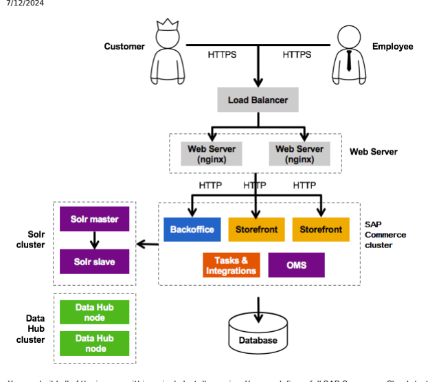

# Containerized Sap Commerce

Containerization consists in building Docker images according to a specied conguration, and running those images as software instances. Platform provides special recipes that enable you to build and run images so that you can see how a containerized SAP Commerce Cloud works in action. Docker is one of the most popular containerization technologies. It automates SAP Commerce Cloud deployment because its containers are easily transferrable across different machines running Docker. It also guarantees reliability of application performance.

## Containerizing Sap Commerce Cloud

You need to prepare SAP Commerce Cloud before you can run it in a Docker container. Containers are running instances of Docker images. Images are built from special le structures mirroring the structures of the components of your SAP Commerce Cloud setup. You can build Docker images for all the SAP Commerce Cloud components that require separate deployment, that is:
Platform

Data Hub Solr
Additionally, you can build Docker images for other mandatory parts of a SAP Commerce Cloud cluster:
Load balancer and Web Server (Apache)

Database (mainly for testing)

You can build all of the images within a single Installer recipe. You can dene a full SAP Commerce Cloud cluster conguration in one le. Moreover, you can give all Platform type images multiple modes called aspects in which the images can be started. So it is possible to clearly congure different types of Platform servers without the need to build a separate image for each of them. For more information, see Writing a Custom Recipe. Once you have built your images, you can start them locally as well as in the production environment, without changing the image. This enables developers to perform production-like testing of such a cluster on their machines.

Platform Containerization Plugin The Platform Containerization Plugin enhances Installer recipes with a domain-specic language (a DSL) enabling you to describe a SAP Commerce Cloud deployment structure. Based on a description created in this way, a set of les is written onto the disk which are required to build Docker images. Using createPlatformImageStructure Ant Task The createPlatformImageStructure ant task enables you to create Platform image structures containing Platform binaries, its conguration, aspect specic properties as well as Docker specic les, such as a Dockerfile.

Conguring Memory in Docker Containers You can congure SAP Commerce Cloud memory settings to prevent Docker containers from exceeding memory limits and getting killed as a result.

## Platform Containerization Plugin

The Platform Containerization Plugin enhances Installer recipes with a domain-specic language (a DSL) enabling you to describe a SAP Commerce Cloud deployment structure. Based on a description created in this way, a set of les is written onto the disk which are required to build Docker images.

The documentation covers a broad range of topics explaining how to use the Plugin to write a custom containerization recipe.

The topics include:
Applying necessary plugins

Describing and building images for:
Platform Hsql Solr Running images in different aspects

Custom DSL Example of a complete containerization recipe Hooking into Plugin DSL The Plugin API

## Writing A Custom Recipe

A custom containerization recipe describes your setup and structure of all the components that are required to deploy SAP Commerce Cloud as a containerized application. Prerequisites Applying both the Installer Platform Plugin and the Installer Platform Containerization Plugin is the starting point and the minimum setup for writing a custom containerization recipe:
apply plugin: 'installer-platform-plugin' apply plugin: 'installer-platform-containerization-plugin'

## Platform Image

To build a Platform image, you must describe your Platform setup, describe the image structure, and then build the image based on the image structure. We provide the details in these sections:
Describing a Platform Setup

Describing a Platform Image Structure Building a Platform Image
By the Platform object, we mean an object of the Platform class.

## Describing A Platform Setup

This is   For more    the SAP Help  21 To prepare for building a Platform image, describe rst what your Platform setup looks like. Describe the extensions, properties, the database, etc. Use for that purpose the platform method shipped with the Plugin.

In the example we describe a simple Platform setup containing backoffice as the only required extension. The setup also contains one property that sets legacy persistence to false (only as an example):
def pl = platform {
 extensions { extName 'backoffice' } localProperties { property 'persistence.legacy.mode', 'false' } }

## Describing A Platform Image Structure

Now describe the Platform image structure. Use the deployment method:
def dpl = deployment('mySampleDeployment') { platformImage('myPlatform') { basedOn pl } }
The basedOn method takes as a parameter an instance of the Platform object. With the declaration, you state that you want to use the Platform object created earlier as a basis for your image.

## Building A Platform Image

Next, create a task that builds an image based on the conguration you prepared:
def createImageStructure << { dpl.createImagesStructure() }

## Image Aspects

After you describe and build an image, you can run it in its full conguration, exactly as it was described. You can also run it in an aspect, choosing from all the available components only those that you want. You saw earlier how to describe and create a simple Platform image. The image contained exactly the same set of extensions and web applications as that described in the Platform object denition. Very often, however, it is useful to build one bigger image containing multiple extensions and start many containers based on that image but in different aspects. For instance, consider one aspect named Only Processing - no webapps, and another one named Only Backoffice, each serving a specic purpose.

## Describing Standard Aspects

Aspects can differ from each other in that they may use different properties. You can describe such a setup using the aspect method. Consider this Platform setup as a base for dening example aspects:
def pl = platform { extensions { extensionNames 'backoffice' } localProperties { property 'persistence.legacy.mode', 'false' } }
Now imagine having the following four aspects of that Platform:
The rst aspect enables Backoffice only.

The second aspect enables Administration Console only and overrides the persistence.legacy.mode property to true.

The third aspect enables all the web apps that the Platform instance provides. The fourth aspect disables all webapps.

def dpl = deployment('mySampleDeployment') { platformImage('myPlatform') { basedOn pl aspect('onlyBackoffice') { enabledWebApps 'backoffice' } aspect('onlyHac') { enabledWebApps 'hac' localProperties { property 'persistence.legacy.mode', 'true' } } aspect('allWebApps') { enableAllWebApps() } aspect('noneWebApps') } }

## Using The Admin Aspect

You may decide that you want a specic container to serve administrative purposes. The admin aspect can help you with that. Use it to perform tasks such as, for example, initialization, update, or impex import.

Unlike the standard aspects, the admin aspect doesn't start Tomcat. It executes ant-related tasks only.

To enable an admin aspect, call the adminAspect() method in the platform closure in the Plugin DSL:
def dpl = deployment('mySampleDeployment') { platformImage('myPlatform') {
 basedOn pl adminAspect { property 'persistence.legacy.mode', 'true' } } }
To use the admin aspect, run the admin aspect followed by the command that you want ant to invoke. For example, to perform initialization, run your image with the admin initialize parameters:
docker run platform admin initialize The container stops after the task nishes.

## Conguring Extension Web Paths In Aspects

You can congure a specic web path for an extension per aspect. By exposing web applications at different paths, you make it easier to congure load balancer routing. When you use aspects, it is also possible to map extensions to the same path. For example, assume that you use these two aspects:
the backend aspect that exposes backoffice the frontend aspect that hosts yacceleratorstorefront You can now congure the backend aspect to have the backoffice extension mapped to the / (root) path. At the same time you can map the yacceleratorstorefront extension of the frontend aspect to / as well. Such mapping is possible because you can start only one aspect in each container. Without aspects, the extensions paths would clash.

## Conguration

To congure a web extension path, use the ext_name.webroot property in the localProperties section of an aspect conguration.

The following conguration of the backend aspect sets the backoffice path to / , and the hac path to /hac_admin:
aspect('backend') { enabledWebApps 'backoffice', 'hac' localProperties { property 'backoffice.webroot', '' property 'hac.webroot', '/hac_admin' } }

## Caution

To set an extension path to root, use backoffice.webroot= instead of backoffice.webroot=/.

This is   For more    the SAP Help  24

## Hsql Image

Follow our example to learn how to describe and create a Hsql database image.

To build an Hsql database image, use the hsqlImage method. This example is the simplest usage of the hsqlImage API, as you only give the image a name:
def dpl = deployment('mySampleDeployment') { hsqlImage('myHsql') }
Your Docker image structure gets created from a default template. The required hsql driver jar le is copied from a current Platform distribution that is known to Installer. You can, however, adjust the image structure and choose your own jar le:
def dpl = deployment('mySampleDeployment') { hsqlImage('myHsql') { hsqlJarPath '/tmp/hsql-2.3.4.jar' } }
You can give it a port so you can expose it to the outside world:
def dpl = deployment('mySampleDeployment') { hsqlImage('myHsql') { properties { property 'port', '12345' } } }
You can also point to your own Docker template directory containing your jar le plus Velocity Docker le template:
def dpl = deployment('mySampleDeployment') { hsqlImage('myHsql') { templateDir '/tmp/myHsqlTemplate' } }

Such a custom template le must have a .tmpl extension. It gets stripped out on copying, and parsed by the Velocity engine. For instance, if a Docker le template name is Docker.tmpl, in the image it is processed into Docker.

## Solr Image

Follow our example to learn how to describe and create a Solr image.

To build a Solr image, use the solrImage method:
def dpl = deployment('mySampleDeployment') { solrImage('mySolr') }
In the commerce-suite context, you can use that method safely. You simply give your image a name. The Docker image gets created from a default template. The existing Solr distribution gets copied from the commerce-suite package.

You can adjust your Solr and choose your extracted distribution:
def dpl = deployment('mySampleDeployment') { solrImage('mySolr') { solrDistribution '/tmp/solrDistr' } }
You can give it a port so that you can expose it to the outside world:
def dpl = deployment('mySampleDeployment') { solrImage('mySolr') { properties { property 'port', '12345' } } }
You can even point to your own Docker template directory containing your distribution le plus the Velocity Docker le template:
def dpl = deployment('mySampleDeployment') { solrImage('mySolr') {
 templateDir '/tmp/mySolrTemplate'
 } }

Such a custom template le must have a .tmpl extension. It gets stripped out on copying, and parsed by the Velocity engine. For instance, if a Docker le template name is Docker.tmpl, in the image it is processed into Docker.

## Custom Dsl

See our example showing how you can use a custom DSL.

The deployment(Closure) API allows you to use a custom DSL. It is especially useful when you have a custom Dockerle template, some binaries, and you want to ll the template with some properties, and copy into the image the binaries you have. You can handle it all easily using a custom DSL:
def dpl = deployment('myDeployment') { mySpecialImage('/path/to/your/templateDirectory') {
This is   For more    the SAP Help  26 property 'foo', 'bar' property 'baz', 'blurp' } } dpl.createImagesStructure()
Platform Containerization Plugin takes any le with a tmpl extension from /path/to/your/templateDirectory and replaces any occurrence of any property found in that template le with a value provided in DSL.

See how we arrived at having in a resulting image a le called Example.txt lled in with the properties provided in the example above.

In /path/to/your/templateDirectory create an Example.txt.tmpl le including some content, for instance:
Say $foo, $baz After executing the dpl.createImagesStructure() method, you get an image with the Example.txt le including the following content:
Say bar, blurp

## Complete Containerization Recipe

The recipe is an example of a complete containerization recipe. Use it as guidelines for your own recipes. The recipe creates images for Platform, Solr, Hsqldb, and a load balancer:
apply plugin: 'installer-platform-plugin' apply plugin: 'installer-platform-containerization-plugin' def pl = platform { extensions { extensionNames 'backoffice' } localProperties { property 'persistence.legacy.mode', 'false' } } def dpl = deployment('mySampleDeployment') { hsqlImage 'myHsql' solrImage 'mySolr' loadBalancer '/tmp/LoadBalancerTemplate' platformImage('myPlatform') { basedOn pl This is   For more    the SAP Help  27 aspect('onlyBackoffice') { enabledWebApps 'backoffice' } aspect('onlyHac') { enabledWebApps 'hac' localProperties { property 'persistence.legacy.mode', 'true' } } aspect('allWebApps') { enableAllWebApps() } aspect('noneWebApps') } } task createImagesStructure { doLast { dpl.createImagesStructure() } } 
Note that the loadBalancer '/tmp/LoadBalancerTemplate' call uses Custom API capabilities.

## Hooking Into Plugin Dsl

Follow the provided steps to hook into Plugin DSL.

For more information on how to write your own plugin, see the example in the [installer-template-plugin]
(https://stash.hybris.com/projects/DIST/repos/installer-template-plugin/browse) repository.

After you correctly set up your plugin, add the dependency to installer-platform-containerization-plugin in build.gradle:
dependencies { compile 'de.hybris.installer.plugin.platform.containerization:installer-platform-containerizati }
Create a class that extends AbstractImageHandler. From this class, implement the createImageStructure() method.

It is responsible for building an image structure.

In your main plugin class in the apply(Project) method you can add your own method to the Deployment class and use the previously created handler as a delegate class as follows:
 void apply(Project project) { Deployment.metaClass.yourMethodName = { String name, Closure closure -> def handler = new YourHandler(name: name, project: project)
This is   For more    the SAP Help  28 registerImageHandler(handler) closure.resolveStrategy = Closure.DELEGATE_ONLY closure.delegate = handler closure() } }
From now on you are able to write the following piece of code in a recipe:
apply plugin: 'installer-platform-plugin' apply plugin: 'installer-platform-containerization-plugin' def dpl = deployment { yourMethodName('someName') { } }
If your handler has, for instance, the following method:
class YourHandler { String myProperty void superProperty(String myProperty) { this.myProperty = myProperty } }
you will be able to write the following piece of code in the recipe:
apply plugin: 'installer-platform-plugin' apply plugin: 'installer-platform-containerization-plugin' def dpl = deployment { yourMethodName('someName') { superProperty 'someValue' } }

## Platform Containerization Plugin Api

See the list of all the methods the Platform Containerization Plugin delivers.

## Available Apis

This is   For more    the SAP Help  29 Note By the term Platform object, we mean an object of the Platform class.

The APIs include:
Deployment API PlatformImageHandler API

SolrImageHandler API HsqlImageHandler API Global Variables

## Deployment Api Public Methods

deployment(Closure): a top level method used for describing the whole deployment structure. This method takes Closure as a parameter in which you can set all necessary information by using these methods:

platformImage(String, Closure): allows you to describe a Platform image. This method takes two parameters: name of the image as a String, and Closure in which you can set all necessary information about the image solrImage(String, Closure): allows you to describe a Solr platform image. This method takes two parameters: name of the image as a String, and Closure in which you can set all necessary solrImage(String): allows you to describe a Solr platform image. This method takes one parameter: in which you can set all necessary information about the image.name of the image as a String. All settings are taken from a default Docker image template.

hsqlImage(String, Closure): allows you to describe a Hsql platform image. This method takes two parameters: name of the image as a String, and Closure in which you can set all necessary information about the image.

hsqlImage(String): allows you to describe Hsql platform image. This method takes one parameter: name of the image as a String. All settings are taken from a default Docker image template.

createImagesStructure(): writes down the whole deployment structure into the disk. By default, the structure is written into Installer work directory.

getOutputDir(): returns a full path to the output image directory of the current deployment as a String.

adminAspect(): enables generation of the admin aspect image that allows you to execute ant tasks such as initialization.

## Protected Methods

registerImageHandler(AbstractImageHandler): allows you to register a new image handler

## Platformimagehandler Api Public Methods

basedOn(String): allows you to set a base Platform instance from which an image is created. This method is mandatory.

tomcatDistribution(String): allows you to set a path to the Apache Tomcat distribution folder. This method is mandatory.

serverXmlTemplate(String): allows you to set a path to the server.xml template le.

customTomcatFiles: allows you to set the path to additional, custom les that will be copied into the tomcat directory.
This is   For more    the SAP Help  30 templatesProperties(Closure): allows you to provide additional properties that will be used as a replacement for any *.tmpl les found in an image template directory using the Velocity engine aspect(String, Closure): allows you to describe an aspect of an image.

Think about aspects as a kind of role the resultant image is going to serve as.

This method takes two parameters: the name of the image as a String, and the Closure in which you can set all necessary information using these methods:
enabledWebApps(String...): allows you to set a comma-separated list of extension names for which webapps must be enabled for the current aspect. If extension names are not provided, all webapps are disabled by default.

enableAllWebApps(): allows you to enable all webapps that are congured in the base Platform object by default.
localProperties(Closure): allows you to set additional properties for an aspect. This method takes a Closure as a parameter in which you can set all necessary information in the same form as in a localProperties block for the Platform object.

templatesProperties(Closure): allows you to provide additional properties that will be used as a replacement for any *.tmpl adminAspect(Closure): allows you to add a special admin aspect. This method takes Closure as a parameter in which you can set all necessary information in the same form as in the localProperties block for the Platform object.
adminAspect(): allows you to add a special admin aspect with default settings.

createImagesStructure(): creates an image structure onto a disk.
getOutputDirName(): returns the name of the directory under which an image is written.

## Solrimagehandler Api

solrDistribution(String): allows you to set a path to the Solr distribution folder. If you omit it, plugin tries to nd a Solr distribution within commerce suite.

templateDir(String)null: allows you to set a path to the image template directory containing a Docker le. If you omit it, plugin tries to nd a template directory within SAP Commerce Cloud

properties(Closure): allows you to set additional properties for a Solr instance. This method takes a Closure as a parameter in which you can set all necessary information in the same form as in the localProperties block for the Platform object.

## Hsqlimagehandler Api

hsqlJarPath(String): allows you to set a path to the hsqldb jdbc driver jar. If you omit it, the Plugin tries to nd the driver in the platform/lib/dbdriver path.

templateDir(String): allows you to set a path to the image template directory containing a Docker le. If you omit it, the Plugin tries to nd the template directory within SAP Commerce Cloud.

properties(Closure): allows you to set additional properties for a Solr instance. This method takes a Closure as a parameter in which you can set all necessary information in the same form as in the localProperties block for the Platform object.

## Global Variables

The Plugin comes with two global variables which are accessible from the Gradle project object:
project.outputImagesDir: the full path to the main directory of output images. By default it is project.installerWorkDir/output_images.

project.containerizationPluginTmpDir: the full path to the Plugin temp directory. By default it is project.installerWorkDir/containerization_plugin_tmp.

Keep in mind that project.installerWorkDir is dened in installer-platform-plugin and refers to the work subdirectory under Installer main directory.

## Using Createplatformimagestructure Ant Task

The createPlatformImageStructure ant task enables you to create Platform image structures containing Platform binaries, its conguration, aspect specic properties as well as Docker specic les, such as a Dockerfile.

You need a Platform image structure to build a Docker image. You can build and run your image in a Docker container using respectively docker build ... and docker run ....

In this document we show you how to use the createPlatformImageStructure ant task to create Platform image structures. We provide examples both for creating image structures and building images.

## Prerequisites

Before you start creating Platform image structures using createPlatformImageStructure, run the following commands:
1. Build your project:
ant clean all 2. Prepare unpacked production binaries:
ant production -Dproduction.include.tomcat=false -Dproduction.legacy.mode=false -Dtomcat.legac The binaries are created in the default /temp/hybrisserver directory.

The only required parameter is the external Tomcat directory. Since there is no default dened, you can download and unpack your Apache Tomcat anywhere and pass this path name into the ant task.

## Creating A Platform Image Structure

To create an image structure, you can run createPlatformImageStructure without parameters:
ant createPlatformImageStructure For other considerations, see the sections that follow.

## Using Parameters

There are a few parameters you can provide for the ant target:
ant createPlatformImageStructure -DproductionPackagesDir=<MY_PRODUCTION_PACKAGES_DIR> -DplatformIma -DserverXmlTemplate=<MY_SERVER_XML> -DplatformImageAspects=<MY_ASPECT

| Available Parameters                                                                 |          |         |         |
|--------------------------------------------------------------------------------------|----------|---------|---------|
| Parameter                                                                            | Required | Meaning | Default |
| This is custom documentation. For more information, please visit the SAP Help Portal | 32       |         |         |

| 7/12/2024 Parameter                                                         | Required                                                                                                                                                                                                    | Meaning                                                                                                                                                                                             | Default                                                        |
|-----------------------------------------------------------------------------|-------------------------------------------------------------------------------------------------------------------------------------------------------------------------------------------------------------|-----------------------------------------------------------------------------------------------------------------------------------------------------------------------------------------------------|----------------------------------------------------------------|
| productionPackagesDir                                                       | No                                                                                                                                                                                                          | The unpacked production packages location, the input for the whole task, typically generated by ant production                                                                                      | HYBRIS_TEMP_DIR/hybrisserver                                   |
| If not provided - production packages must exist under the default location |                                                                                                                                                                                                             |                                                                                                                                                                                                     |                                                                |
| platformImageDir                                                            | No                                                                                                                                                                                                          | The target output folder, which will contain the generated image structure                                                                                                                          | HYBRIS_TEMP_DIR/platformimage-${DSTAMP}-${TSTAMP}              |
| externalTomcatDir                                                           | Yes                                                                                                                                                                                                         | The unpacked Tomcat directory location                                                                                                                                                              |                                                                |
| serverXmlTemplate                                                           | No                                                                                                                                                                                                          | You can dene your own server.xml and place the location here. Using your own server.xml template you can customize, for example how you want to set the ports and other server.xml specic settings. | platformhome/bootstrap/resources/containerization/platformimag |
| platformImageAspects                                                        | No                                                                                                                                                                                                          | You can provide your own aspects to be generated into the image structure.                                                                                                                          |                                                                |
| If not provided - only the default aspect is generated                      | Provide, however, the location to a le describing the aspectName to aspectPathmapping. See Handling Aspects for details. There is always the default aspect generated, and your own if you provide it here. |                                                                                                                                                                                                     |                                                                |

## Handling Aspects

The platformImageAspects parameter enables you to customize your own aspects. You must, however, meet certain requirements.

You must provide as an argument for the platformImageAspects parameter a path to the le describing the aspectName to aspectPathmapping. Such a le may look as follows:

aspectMap.properties aspectABC=/Users/zzz//aspectABC aspectDEF=/Users/zzz//aspectDEF aspectXYZ=/Users/zzz//aspectXYZ
Assuming you have aspect folders dened as earlier, you must place under these folders some aspect-specic properties:

localProperties.properties: contains local.properties, which will be merged under the generated aspect with the default local.properties.

enabledWebApps.properties: contains the enabledWebApps property listing extensions to be enabled for a given aspect, for example:
enabledWebApps=mediaconversion, hac When you enable particular webapps for a given aspect, there will be no Tomcat context les generated under this aspect for any other webapp extension names.

For more information about aspects, see Image Aspects.

## Example

Creating a Platform Image Structure The example shows how to generate a Platform image structure under the default location with the aspect conguration as described in the input aspectsmap.properties le.

For the purposes of the example we assume that:
you generated the production packages under the default location you unpacked the external Tomcat under /Users/ixxx/dockerPOC/apache-tomcat-8.0.38 To create the image structure, run:
ant createPlatformImageStructure -DexternalTomcatDir=/Users/ixxx/dockerPOC/apache-tomcat-8.0.38 -Dp

## Building An Image

The example shows how to build a Platform image and start a Docker container with it. For the pursposes of this example we assume that:
you have created a Platform image structure the way we did above aspectABC has mediaconversion on the enabledWebApps list Build your image by calling from within the generated image structure folder:
docker build -t platform .

Start the docker container with the Platform image:
docker run -it --rm -v /Desktop/dockerPOC/secrets\:/etc/ssl/certs/hybris -v /Desktop/dockerPOC/tmp_
This is   For more    the SAP Help  34 You can start another image using the aspectABC aspect:
docker run -it --rm -v /Desktop/dockerPOC/secrets\:/etc/ssl/certs/hybris -v /Desktop/dockerPOC/tmp_
Now you have two docker containers running. You can access the web pages on ports 8099 (default aspect) and 8199
(aspectABC). In the aspectABC aspect you can only access the mediaconversion webapp (no Administration Console or others).

## Conguring Memory In Docker Containers

You can congure SAP Commerce Cloud memory settings to prevent Docker containers from exceeding memory limits and getting killed as a result. If you assign a resource limit to a container, the operating system restricts container access to the CPU and/or memory. If a process running inside the container exceeds the memory limit, the container gets killed. You should avoid such situations by properly conguring SAP Commerce Cloud memory settings.

You can use the $CATALINA_MEMORY_OPTS and $ADDITIONAL_CATALINA_OPTS environment variables to congure the memory options in a SAP Commerce Cloud image. SAP Commerce Cloud sets the maximum and minimum heap size to 2GB by default. Your conguration, however, should always meet the requirements of your environment.

If you don't specify the -Xms -Xmx settings explicitly, JVM tries to set these values automatically using the process called ergonomics. For example, the XX:MaxRAMFraction property species how much of available memory should be assigned for the heap space. We recommend setting memory explicitly instead of relying on automatic conguration. There are many more memory areas used by JVM besides heap, such as Class, Thread, Code, GC, Compiler, Internal and symbol memory areas. For that reason it is problematic to calculate how much memory is enough for your application. When relying on MaxRAMFraction
(although it is not recommended), make sure that JVM uses the container memory limit instead of the system host. You can enable it by the -XX:+UnlockExperimentalVMOptions and -XX:+UseCGroupMemoryLimitForHeap properties.
