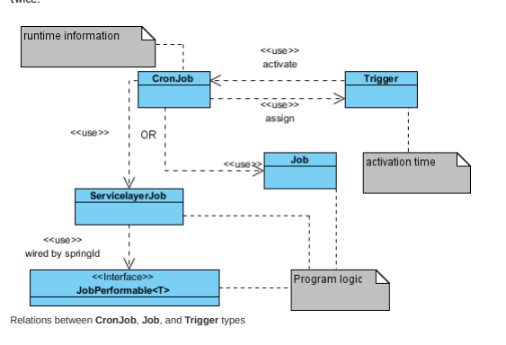
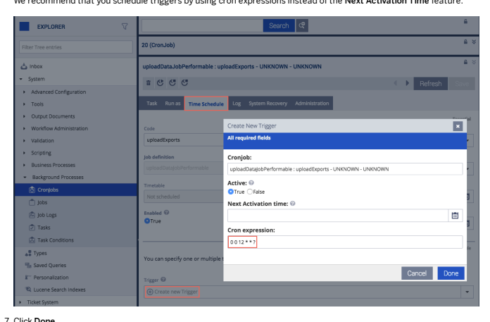
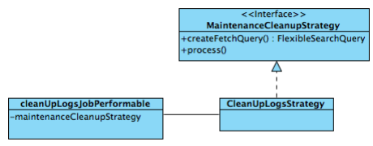
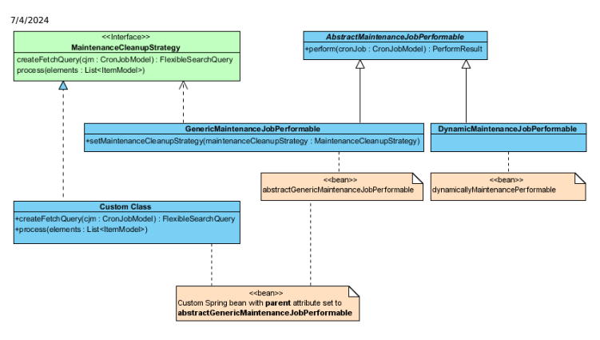
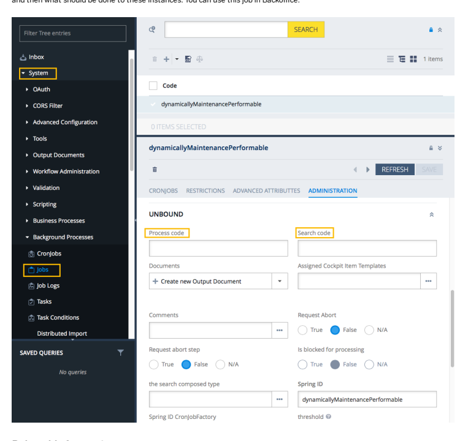
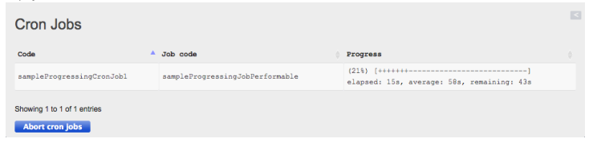

# The Cronjob Service

The cronjob functionality is used for executing tasks, called cron jobs, regularly at a certain point of time. Typically cron jobs can be used for creating data for backups, updating catalog contents, or recalculating prices. The key idea of applying cron jobs is to start a long or periodic process in the background, with the possibility to log each run and to easily check its result. The concept of cron jobs in SAP Commerce is explained in detail here.

## General Concept

The concept consists of three types that interact with one another: CronJob, Job, and Trigger, as well as the JobPerformable class that is tightly related to the Job type.

Job type describes the logic to be executed, dened by an associated JobPerformable

CronJob type holds the conguration for a single run of a Job, as well as the protocol information, like logs Trigger type is used for scheduling when to run a Job.
Summarizing, a Job denes what has to be done, a Trigger says when, and a CronJob species the setup used by Job. The division into CronJob, Job/JobPerformable, and Trigger types allows to reuse the code. For example, you may create a database backup as a Job several times using Trigger at different locations as CronJob without coding the actual backup logic This is   For more    the SAP Help  2 twice.

CronJob describes a single run of a Job. It contains a mandatory reference to a Job instance related to the CronJob. CronJob allows the denition of several conguration parameters, like session settings, for a specic execution or logging conguration. Furthermore, it stores details of the execution such as start and end time, its result such success or failure, and provides access to the logs.

## For More Information, See Clustered Environment.

To provide a custom conguration that is specic for an execution, you need to create a subtype of CronJob. As a job can be used for several executions, even in parallel, the Job should not contain any specic conguration for an execution. It should be specied by the execution-related CronJob to keep the Job instance stateless. An execution can be started synchronously or asynchronously, and can be aborted on demand if the abort functionality is activated in the implementation of JobPerformable.

## Job And Jobperformable

Job instance represents one kind of execution logic in the system and each CronJob should reference one instance. Although the Job instance does not contain any logic, it provides the springId attribute, in case of ServicelayerJob that references a Spring bean denition of the execution logic. The Spring bean has to implement the JobPerformable interface. This is the place where the real logic is performed in a stateless manner. The conguration is passed in by the execution-related instance of CronJob. It enables to manage different kinds of logic on item level, while referring to an instance of JobPerformable providing the logic. For more information, see Writing a Hello World CronJob: How to implement a JobPerformable The advantage of splitting the logic into a separate Spring bean is that it is then possible to use the power of the Spring framework. You can inject all loosely coupled dependencies you need into your logic and have the full power of the ServiceLayer available. Nonetheless, it is much simpler to use the AbstractJobPerformable that provides a basic functionality for a common JobPerformable implementation like request abort handling. Furthermore, the usage of Generics is recommended when implementing JobPerformable, to specify the CronJob type you expect when calling the implemented perform method. The denition of Generics is checked at run time, and it is already assured that the related Job can be assigned to the CronJob that fullls the requirement. Think of JobPerformable that needs a specic CronJob subtype, then simply specify this requirement in the denition of Generic.

To simplify the process of creating a different logic, a Job instance is created at the system setup (essential data) for each Spring bean denition that fullls the JobPerformable interface. The created Job instance has the same bean id as code.

## Trigger

There is often a need to trigger an execution of a specic logic again, either on a regular basis or only once. To enable it, Trigger type references a Job that needs to be executed and a cron expression to dene the schedule. If the current time ts to the dened cron expression, the referenced CronJob or Job gets executed automatically. There is always a Task item created for every Trigger. It is then handled completely by the TaskEngine that is polling the Tasks, for example every 10 seconds. It takes care of trigger activation and performing cronjob this way. For more information, see Dening a Custom CronJobFactory: When a job is red by a trigger, a CronJob instance is automatically created, because each execution needs a CronJob instance to provide the conguration. Be aware that your system might get polluted by this. The Job referenced by the Trigger is assigned to the CronJob and the CronJob is executed. In case you wish to use a specic subtype of CronJob, simply use the Generics in JobPerformable. If you wish to perform some additional logic during the creation of CronJob, you can also provide a custom factory. Trigger can be also assigned directly to CronJob instead of Job. However then CronJob is reused for each execution and, as a result, the protocol information is overridden.

## Cronjob-Related Functionality Starting A Cronjob

To initiate a CronJob execution, pass a CronJob instance to the perform method of a CronJobService:
cronJobService.performCronJob(myCronJobModel, true);
During the call you can specify if the execution should be forked from the current process or not. If not, the execution logic gets called with the same thread, so be aware that the call can be very time consuming. If the call is done asynchronously, a new thread is created and the calling thread returns immediately.

## Aborting A Cronjob

If a Job is implemented as abortable, you can abort a running cron job by calling the following method:
cronJobService.requestAbortCronJob(myCronJobModel);
For more information, see Writing an Abortable Job: How to implement a Job as abortable.

## Adjusting The Session For Cronjob Execution

A cron job is an automatized task. If it were a human user, it would sit in front of the computer and work through a checklist of steps. Because it works in SAP Commerce, it must run within a certain user context. CronJob type has an attribute named sessionUser that holds a single user. This user is used for the session, in which the cron job is going to run. By default, the user account set for the sessionUser attribute is the one used for the creation of the cron job. That is, if the admin user creates a cron job, it then uses the admin user for the session by default. If a cron job is created using the anonymous account, the sessionUser attribute is set to anonymous. A cron job has the same access rights as the user whose account is used for the session. This is both for security and safety reasons. For example, if you create a user with only read access, that user context can back up the database, as the context does not allow the user to manipulate the database. For security reasons, it is recommended to run cron jobs always in the context of a user whose rights are only enough for the task. A consequence of the cron job running in a user context is that it is affected by access rights set for the user account. For more information, see:
This is   For more    the SAP Help  4 Access Rights Dening a Custom CronJobFactory Other session-related attributes of CronJob are sessionLanguage and sessionCurrency. They use the settings of the sessionUser by default.

You can easily modify the attributes before performing a cron job:
CronJobModel myCronJob=modelService.create(CronJobModel.class); // assign Job to CronJob myCronJob.setSessionUser(mySessionUserModel); myCronJob.setSessionLanguage(mySessionLanguage); myCronJob.setSessionCurrency(mySessionCurrency); modelService.save(myCronjob); cronJobService.performCronJob(myCronJob);
You need to use the logic for an automatically created CronJob, which has been triggered inside a custom factory. All session settings active at the time a CronJob gets created are stored at the CronJob itself, using sessionContextValues attribute. The stored settings are applied at the startup of the automatic job execution. With this, all restrictions and special settings are applied to the execution active at the creation of the CronJob creation.

## Checking The Status And Result Of A Cronjob

A CronJob has status and result attributes:
status indicates the condition in which the cron job is, for example, if it is running or nished result reports about the last execution of the cron job, for instance, if it has ended with success or failure To check the result, you can choose one from the following options:
Access the attributes directly by using:
if(myCronJob.getStatus()==CronJobStatus.FINISHED){ ... } if(myCronJob.getResult()==CronJobResult.SUCCESS){ ... }
Use the getter methods from CronJobService, which are available for the most common states, for instance:
if(cronJobService.isFinished(myCronJob)){ .. } if(cronJobService.isSuccessful(myCronJob)){ .. }
SAP Commerce contains a CronJob that automatically removes all cron jobs with a specied status and a specied result after a given time. Jobs and triggers are not automatically removed and they are kept in the database until removed manually.

## Generic Cronjob Creation And Retry Functionality

As mentioned before, the usual way of executing jobs periodically is to dene a trigger for the job. When the job gets triggered, a CronJob gets created automatically for the execution of the job. The creation is done by a CronJobFactory, which enables to customize the generation of CronJob, for example by setting custom attributes. Afterward, a predened map of basic attributes of the triggered Job is copied to the CronJob, like sessionUser or priority, if values of those attributes are not lled yet. For more information, see:
Dening a Custom CronJobFactory If a Job is currently not performable, as JobPerformable.isPerformable returns false, and the retry ag is activated for the CronJob or Job, then a Trigger gets created implicitly. Because the job is not performable at the moment, the trigger will re the cron job at the next time slot again and again, until it gets executed.

## Running Cronjobs In Sequence

The CompositeCronJob that is available in SAP Commerce denes any number of entries. Every single entry is represented as a CompositeEntry, which can hold either an individual CronJob or Job. When the CompositeCronJob is run, then the individual entries are executed sequentially and independently of one another, in the order specied by the compositeEntries attribute. If one entry has nished the execution, the next entry is executed, whether the nished entry has completed successfully or not. The result of the CompositeCronJob depends only on whether exceptions have occurred during its entries' execution. The result of individual entries is not considered for the result of the CompositeCronJob:
If no exceptions occur during the execution of the entries, the CompositeCronJob returns SUCCESS, even if all results of entries return FAILURE.

If any exceptions occur during the execution of the entries, the CompositeCronJob returns FAILURE, even if all results of entries return SUCCESS.

## Cronjobs Across A Clustered System

Cronjobs with triggers are handled completely by the TaskEngine and they don't have to be bound to an individual cluster node. If the nodeID is not set for a cronjob (default case) then any cluster node is able to execute it (of course only one at a given time). However, it is still possible to pin a cronjob to some node, which will allow the execution only on that node. You can set it as in the example below.

CronJobModel myCronJob= ... //get the CronJob instance myCronJob.setNodeID(2); modelService.save(myCronJob);

## Running Cronjobs Through Ant

SAP Commerce allows running cron jobs using an Ant target: ant runcronjob. This command starts an instance of SAP
Commerce in a stand-alone mode and executes the CronJob. For details, see the Ant target help: ant -p

## Job-Related Functionality Using Restrictions With Jobs

SAP Commerce allows to use Restrictions for jobs. The effect is that you can limit the scope of items that the job can access. For example, you can explicitly exclude certain catalog versions from the scope of the SyncItemJob, with the effect that the SyncItemJob ignores these catalog versions. The restriction attribute of the Job type can hold any number of JobSearchRestrictionModel objects. Each object holds mainly the type, on which the restriction takes effect and the restricting query. For more information, see:
Restrictions Synchronizing Catalogs To allow access to attributes of the Job and CronJob, the SessionContext used within the Job holds a reference to the Job and the CronJob via session.currentJob and session.currentCronJob, respectively. For example, to ensure that a Job only uses the set catalog version, you could create a restriction using the following query:
This is   For more    the SAP Help  6

## Trigger-Related Functionality The Interval For Executions

There is a timer built into the cronjob functionality. This timer regularly checks if any trigger should be red and activates them, if needed. By factory default, the timer is set to 30 seconds. It means that you cannot re a trigger less than half of one minute apart by default. If you want to re a trigger on a more ne scale, you should adjust this interval by overriding the value of the cronjob.trigger.interval property in the local.properties le:
cronjob.trigger.interval=30 For more information, see:
Conguring the Behavior of SAP Commerce: Details on the **local.properties** le Cron Expressions A database query is performed at each interval to check which triggers should be red. The value of the interval should not be too low, because you may experience slower system performance due to more frequent database accesses. 30 seconds is a good default value, and we recommend not to change it unless you really need a shorter interval.

## Note

If you create a trigger, whose activation date is set to a point in the past, the trigger is red immediately after it is created.

## Automatic Activation Of Triggers At Startup

The regular check for triggers is executed for the rst time when SAP Commerce is started. If the check detects that the activation date for a trigger is overdue, the trigger is activated immediately. As a consequence, the trigger will re directly after or possibly during the start of the SAP Commerce. In some situations you may not want to run cron jobs right after the SAP Commerce is started, but instead once a certain time window has expired. For example, if a cron job tidies up the database by 3:30 AM, it may have a very long execution time and also may cause a heavy load on the database. If SAP Commerce has a downtime between 2:30 AM and 4:15 AM, then the trigger is overdue and the cron job is started automatically during the startup of SAP Commerce. It is possible to dene a time window for automatic launches of overdue cron jobs. Using the maxAcceptableDelay attribute of a Trigger, you can set a value in seconds, which denes a threshold of time that is added to an overdue trigger. If the point of time SAP Commerce starts up matches the trigger's execution point of time plus the value of the maxAcceptableDelay attribute, then the trigger is activated.

| Regular Trigger Execution   | maxAcceptableDelay Value   | Point of Time of the Start-Up   | Is the Trigger Activated by   |
|-----------------------------|----------------------------|---------------------------------|-------------------------------|
| Time                        | Start-Up?                  |                                 |                               |
| 16:00:00                    | 3600 (one hour)            | 16:30:00                        |                               |
| 16:00:00                    | 3600 (one hour)            | 17:00:00                        |                               |
| 16:00:00                    | 3600 (one hour)            | 17:30:00                        |                               |
| 16:00:00                    | -1 (unlimited)             | 17:00:00                        |                               |
| 16:00:00                    | -1 (unlimited)             | 17:30:00                        |                               |

## Creating A Trigger Through The Backoffice

This tutorial shows how to create a trigger for a cron job:
1. Log into the Backoffice.

2. In the Explorer tree, go to:
System tab Background Processes tab Cronjobs tab You are in the cronjob collection browser.

3. Click a chosen cron job to switch to this cron job's editor. 4. In the editor, go to the Time Schedule tab. 5. In the Time Schedule tab (or other tabs depending on a type of a cron job), click Create new Trigger in the Triggers eld to open the trigger wizard.

6. In the wizard, dene a cron expression for your trigger.

We recommend that you schedule triggers by using cron expressions instead of the Next Activation Time feature.

7. Click Done.
You have completed creating your trigger.

## Cleaning Up Cronjobs

It is possible to use the CleanupCronJobStrategy to clean up instances of the CronJob. This strategy is based on maintenance framework created for processing instances of any type. For more information, see Creating Strategy to Process Instances. Default settings for the cron job cleanup mechanism is to remove instances of the CronJob, which fulll the following:
Has no trigger Are successfully nished This is   For more    the SAP Help  8 Are older than 14 days The sample of **jobs-spring.xml** le below shows the default bean declaration that can be easily customized. See also the Customizing section.

## Note

The CleanupCronJobStrategy replaces the deprecated: CleanUpJobPerformable and CleanUpCronJob.

## Jobs-Spring.Xml

<bean id="cleanupCronJobsPerformable" parent="abstractGenericMaintenanceJobPerformable" >
<property name="maintenanceCleanupStrategy">
<bean class="de.hybris.platform.jobs.maintenance.impl.CleanupCronJobStrategy" >
<property name="modelService" ref="modelService"/> <property name="typeService" ref="typeService" /> <property name="status">
<set>
<value type="de.hybris.platform.cronjob.enums.CronJobStatus
</set>
</property> <property name="result">
<set>
<value type="de.hybris.platform.cronjob.enums.CronJobResult
</set> 
</property> <property name="excludedCronJobCodes" >
<set/>
</property>
</bean>
</property>
</bean>
Customizing Strategy The following properties of the cleanupCronJobsPerformable bean can be modied in your bean declaration:
status: Here you can congure cleanup behaviour: cronjobs of what status should be handled by cleanup. This property must contain at least one value. You can put multiple values here, like for example:
<property name="status"> <set> <value type="de.hybris.platform.cronjob.enums.CronJobStatus">FINISHED</value> <value type="de.hybris.platform.cronjob.enums.CronJobStatus">ABORTED</value> </set> </property>
result: Here you can congure cleanup behaviour: cronjobs of what result should be handled by cleanup. This property must contain at least one value. You can put multiple values here, like for example:
<property name="result"> <set> <value type="de.hybris.platform.cronjob.enums.CronJobResult">SUCCESS</value> <value type="de.hybris.platform.cronjob.enums.CronJobResult">FAILURE</value> <value type="de.hybris.platform.cronjob.enums.CronJobResult">ERROR</value> </set> </property>
excludedCronJobCodes: Here you list cron jobs that should be excluded from the cleanup. Put code of the cron job here, like in the following example:
<property name="excludedCronJobCodes" > <set> <value>myOwnTestCronJob</value>
This is   For more    the SAP Help  9

## Cronjob Logs Clean-Up

The following provides information on cleaning CronJob Logs.

 To dene maintenance CronJob for cleaning CronJob log entries (both JobLogs and LogFiles) please create generic CronJob and use cleanUpLogsJobPerformable as a job performable. cleanUpLogsJobPerformable uses CleanUpLogsStrategy to search for CronJobs with logs eligible for deletion. CleanUpLogsStrategy deletes unnecessary log entries depending on new elds in the CronJob's type denition:
logsDaysOld - how old the JobLog should be to get deleted

logsCount - max amount of JobLogs to keep logsOperator - if set to OR log entry is deleted if only one condition is met (max count exceeded OR entry is old enough), if set to AND both conditions must be met (max count exceeded AND log entry is old enough) lesDaysOld - how old the LogFile should be to get deleted lesCount - max amount of LogFiles to keep lesOperator - if set to OR log entry is deleted if only one condition is met (max count exceeded OR entry is old enough), if set to AND both conditions must be met (max count exceeded AND log entry is old enough)
Default values of new elds are listed below and can be adjusted using following properties:

| Field        | Property                  | Default value   |
|--------------|---------------------------|-----------------|
| logsDaysOld  | cronjob.logs.logsdaysold  | 14              |
| logsCount    | cronjob.logs.logscount    | 5               |
| logsOperator | cronjob.logs.logsoperator | AND             |
| lesDaysOld   | cronjob.logs.lesdaysold   | 14              |
| lesCount     | cronjobs.logs.lescount    | 5               |
| lesOperator  | cronjob.logs.lesoperator  | AND             |

## Cronjob Scripting

Traditionally, creating a new cronjob was time-consuming and entailed many manual steps, for example, you had to create a new java class, take care of spring bean denition, rebuild the platform, restart the server and so on and so forth.

This is   For more    the SAP Help  10 Using dynamic scripting, creating cronjobs becomes much easier and, most importantly, it can be done dynamically at runtime.

To nd out more about cronjob scripting, see Cronjob Scripting.

## Ensuring Stuck Synchronization Cron Jobs Are Aborted

The following property ensures that synchronization cron jobs that are stuck in the NEW status when other cron jobs of the same type are already running are moved to the ABORTED state:
synchronization.cronjob.abortOnCollidingSync.always=
The property is disabled by default.

## Ensuring Cron Jobs Are Run After Lost Database Connection

Use the following property to ensure that aborted cron jobs are restarted after the system regains lost connection with the database:
cronjob.enableRepeat=true

## Note

Make sure to enable cron job unlocking before using this property. For more information, see Unlocking Cron Jobs.

The property is disabled by default. You can determine how many times the system attempts to restart affected cron jobs by modifying the value of the numberOfRetries run-time attribute in the processing-items.xml le.

The value of the currentRetry attribute shows the number of attempts to restart such cron jobs.

## Related Information

items.xml Initializing and Updating SAP Commerce Models The Task Service Cronjob Scripting

## Writing A Hello World Cronjob

Here you will create a simple cron job named HelloWorldCronJob, which uses a job that prints out log information. Cron jobs have some advantages over using services, because they may be called not only on demand, but also at some dened time and may be run asynchronously. You may store the logged output for every call of a cron job. Moreover, logic of a cron job can be aborted on demand.

## Creating A New Extension

To be able to create and use cron jobs, rst install and initialize the Platform. The cronjob functionality is then automatically available as a part of the Platform.

To make sure that HelloWorldCronJob is kept apart from other parts of SAP Commerce, use a new extension to implement it.

See also Installation Based on Specied Extensions for information on how to do it. Use the following settings for the new extension:
extension.name=cronjobtutorial extension.package=de.hybris.cronjobtutorial The new cronjobtutorial extension is generated in <HYBRIS_BIN_DIR> /custom directory. Do not forget to reference the new extension in the localextension.xml le. See also Installation Based on Specied Extensions for information on how to do it.

## Declaring Helloworldcronjob

Declare a custom CronJob type called HelloWorldCronJob. Do this in the cronjobtutorial-items.xml le located in resources folder in your new extension. Add there a subtype of CronJob type like in the following example:
cronjobtutorial-items.xml
<items xmlns:xsi="http://www.w3.org/2001/XMLSchema-instance" xsi:noNamespaceSchemaLocation="items.xsd">
<itemtypes>
<itemtype generate="true" code="HelloWorldCronJob" jaloclass="de.hybris.cronjobtutorial.jalo.HelloWorldCronJob" extends="CronJob" autocreate="true"> </itemtype>
</itemtypes>
</items>
The subtype of general CronJob type can provide some additional attributes, which are used only by this subtype. For more details, read items.xml. If no additional attributes are needed, you may skip the denition.

Rebuild SAP Commerce by calling ant in the <HYBRIS_BIN_DIR> \platform directory. HelloWorldCronJobModel is generated in the bootstrap/gensrc directory. For more information see Models, Model Class Generation section.

## Create Jobperformable

To dene the logic for a job, in the de.hybris.cronjobtutorial package create a new class extending AbstractJobPerformable and override the perform method. In this tutorial, the job should create log information. You may also implement the JobPerformable interface directly. The AbstractJobPerformable class is used to dene the job as performable and non-abortable by default and to provide access to some services. It implements the JobPerformable interface.

MyJobPerformable.java public class MyJobPerformable extends AbstractJobPerformable<HelloWorldCronJobModel> {
private static final Logger LOG = Logger.getLogger(MyJobPerformable.class.getName()); @Override public PerformResult perform(final HelloWorldCronJobModel cronJobModel) {
LOG.info("**********************************"); LOG.info("Greeting from MyJobPerformable!!!"); LOG.info("**********************************"); return new PerformResult(CronJobResult.SUCCESS, CronJobStatus.FINISHED);
This is   For more    the SAP Help  12
}
}
Rebuild the SAP Commerce by calling the ant in the <HYBRIS_BIN_DIR> \platform directory. The new MyJobPerformable has to be dened as a Spring bean in the cronjobtutorial-spring.xml le located in the resources folder of the cronjobtutorial extension:
cronjobtutorial-spring.xml
<bean id="myJobPerformable" class="de.hybris.cronjobtutorial.MyJobPerformable" parent="abstractJobPerformable"/>
After changing the Spring conguration, restart the hybris Platform and perform a system update. For details see Initializing and Updating SAP Commerce. A system update is needed, because during the phase of essential data creation, for each Spring denition of a class implementing the JobPerformable interface, a ServicelayerJob instance gets created and the code attribute of the job is set to the name of the Spring bean. Hence, using an instance of ServicelayerJobModel with the code attribute set to the myJobPerformable job will call the new implemented myJobPerformable.

## Creating Trigger And Running Helloworldcronjob

To run the new cron job, you need to perform the following steps:
1. Get the job instance of ServicelayerJobModel having springid attribute set to myJobPerformable.

2. Create and congure an instance of HelloWorldCronJob.

3. Assign the job to the cron job and set attributes for the cron job.

See an example of a test class that you can create in your cronjobtutorial extension:
HelloWorldIntegrationTest.java public class HelloWorldIntegrationTest extends ServicelayerTest {
private static final Logger LOG = Logger.getLogger(HelloWorldIntegrationTest.class.getName(
@Resource CronJobService cronJobService; @Resource ModelService modelService; @Resource FlexibleSearchService flexibleSearchService; List<ServicelayerJobModel> servicelayerJobModelList = Collections.EMPTY_LIST; ServicelayerJobModel servicelayerJobModel = null; HelloWorldCronJobModel helloWorldCJ = null; @Before public void setUp() {
//The update of the JUnit tenant creates automatically an instance of the defined M //Search for it ServicelayerJobModel sjm = new ServicelayerJobModel();
 sjm.setSpringId("myJobPerformable"); try { servicelayerJobModel = flexibleSearchService.getModelByExample(sjm); //searching } catch(ModelNotFoundException e) { //The cronjob functionality in the processing extension creates for each JobPerf This is   For more    the SAP Help  13
 //You just create a job here servicelayerJobModel = modelService.create(ServicelayerJobModel.class); servicelayerJobModel.setSpringId("myJobPerformable"); servicelayerJobModel.setCode("myJobPerformable"); modelService.save(servicelayerJobModel); //Keep in mind that creating models in the catch clause is bad style }
// Create a CronJob and set the servicelayerJob helloWorldCJ = modelService.create(HelloWorldCronJobModel.class); helloWorldCJ.setActive(Boolean.TRUE); helloWorldCJ.setJob(servicelayerJobModel); modelService.save(helloWorldCJ); //Below is just to show how to create a trigger but not really necessary for this J createTrigger(helloWorldCJ);
} @Test public void testIfThePerformableExist() {
//Check if there is an instance of myJobPerformable assertNotNull("***************No performable with springID *myJobPerformable* found
 + "Update your JunitTenant to let create an instance!", servicelayerJ
} @Test public void testExecuteThePerformable() {
//Check if setup works correctly assertNotNull("***************The in set upcreated CronJob is null?", helloWorldCJ) //Perform the CronJob once for the test cronJobService.performCronJob(helloWorldCJ); //Wait for the result to be written try {
Thread.sleep(2000);
} catch (final InterruptedException e) {
e.printStackTrace();
} LOG.info("*************** lets wait 2 seconds for the result ***************"); //Test if the job was executed successfully, if it fails here then try to extend th assertEquals("*************** The perfromable has not finished successfull or more CronJobResult.SUCCESS, helloWorldCJ.getResult());
//Create a trigger just to show how to implement it public void createTrigger(final HelloWorldCronJobModel helloWorldCJ) {
final TriggerModel triggerModel = modelService.create(TriggerModel.class); triggerModel.setActive(Boolean.TRUE); triggerModel.setMinute(new Integer(1)); triggerModel.setCronJob(helloWorldCJ); modelService.save(triggerModel);
}
The assigned JobPerformable type should match the CronJob type. It is important to use an appropriate springid, so that the ServicelayerJobModel points to an existing JobPerformable bean denition.

Triggers can be created using cron expressions. When you create a trigger, you should then assign it to the cron job. The code sample above presents how to create a trigger that executes the cron job once a minute. Below is a sample with CronExpression:
This is   For more    the SAP Help  14

//Choose the cron expression for starting the job every 10 seconds triggerModel.setCronExpression("0/10 * * * * ?");
Running the HelloWorldCronJobModel results in the following output on a console:
********************************** Greeting from MyJobPerformable!!! **********************************

## Writing An Abortable Job

Because job execution may take a lot of time, you may wish to abort a job. To do this, add a code snippet for checking if you wish to abort a job. Because you can not easily and safely abort a JobPerformable at any time unless you kill the thread, it is necessary to place hooks for the abort before stages that you expect to be time-consuming. The tutorial uses the job created in the HelloWorldCronJob Tutorial that is adequately adjusted as described below.

## Adjusting Myjobperformable

The execution of MyJobPerformable from HelloWorldCronJob Tutorial does not take a lot of time. Let us modify the job to extend its execution time by adding a for loop:
MyJobPerformable.java public class MyJobPerformable extends AbstractJobPerformable<HelloWorldCronJobModel> { private L10NService l10nService; @Required public void setL10nService(final L10NService l10nService) { this.l10nService = l10nService; } @Override public PerformResult perform(final HelloWorldCronJobModel cronJob) { for (int i = 0; i <= 1000; i++) { try { System.out.println("Greeting '" + l10nService.getLocalizedString(cronJob.getMessage())
 + "' from MyJobPerformable for " + i + " times."); Thread.sleep(5000);
 } catch (final InterruptedException e) { Thread.currentThread().interrupt(); } } //the following will be executed when the loop is finished return new PerformResult(CronJobResult.SUCCESS, CronJobStatus.FINISHED); } }
The job displays the message in a console:
Greeting 'Hallo' from MyJobPerformable for 1 times. Greeting 'Hallo' from MyJobPerformable for 2 times.

This is   For more    the SAP Help  15 Greeting 'Hallo' from MyJobPerformable for 3 times. Greeting 'Hallo' from MyJobPerformable for 4 times. Greeting 'Hallo' from MyJobPerformable for 5 times.

...

After 5000 seconds the job succeeds and the following message is displayed in the console:
Greeting 'Hallo' from MyJobPerformable for 5000 times.

## Overriding Isabortable Method

By default each job is not abortable. To enable the abort feature, you should override the isAbortable method in MyJobPerformable:
MyJobPerformable.java
@Override public boolean isAbortable() { return true; }
Alternatively, if you extend the AbstractJobPerformable, you may override a bean property value in Spring conguration:
cronjobtutorial-spring.xml
<bean id="myJobPerformable" class="de.hybris.cronjobtutorial.MyJobPerformable" parent="abstractJobPerformable" > <property name="l10nService" ref="l10nService" /> <property name="abortable" value="true"/> </bean>

## Checking Abort Request

Currently the job is marked as abortable, which allows to activate the abort ag for the cron job, similarly to the interrupt ag for Thread. When implementing an abortable job it is important to regularly check if the user has requested to abort the job. If true, the abort ag is set, the job should be stopped, and the cron job should have a proper status and result. You should decide when to check the ag and what to do if the ag is set, for example, to clean up. Time of processing between verications should be moderate.

The following code sample calls the clearAbortRequestedIfNeeded of the AbstractJobPerformable. It checks if the given cronJob is requested to be aborted and has REQUESTABORT ag set to true. If so, the ag is set to false again and the job execution is prematurely stopped.

MyJobPerformable.java if(clearAbortRequestedIfNeeded(cronJob)) { //abort the job //do some clean-up return new PerformResult(CronJobResult.ERROR, CronJobStatus.ABORTED); }
After including the if condition in perform method, the MyJobPerformable looks as follows:
This is   For more    the SAP Help  16 MyJobPerformable.java public class MyJobPerformable extends AbstractJobPerformable<HelloWorldCronJobModel> {
private L10NService l10nService; @Required public void setL10nService(final L10NService l10nService) {
this.l10nService = l10nService;
} @Override public PerformResult perform(final HelloWorldCronJobModel cronJob) {
 for (int i = 0; i <= 1000; i++)
{
try {
System.out.println("Greeting '" + l10nService.getLocalizedString(cronJob.ge
+ "' from MyJobPerformable for " + i + " times.");
Thread.sleep(5000); if (clearAbortRequestedIfNeeded(cronJob)) {
System.out.println("The job is aborted."); return new PerformResult(CronJobResult.ERROR, CronJobStatus.ABORTED
}
} catch (final InterruptedException e) {
 Thread.currentThread().interrupt();
}
 } return new PerformResult(CronJobResult.SUCCESS, CronJobStatus.FINISHED); } @Override public boolean isAbortable() {
return true;
}
}

## Aborting The Job

To abort the job, you should call the method:
cronJobService.requestAbortCronJob(cronJob);
The cron job results then with ERROR, its status is set to ABORTED and the following message is displayed in the console:
The job is aborted.

## Importing Cronjob Instances Using Impex

Using ImpEx for creating instances of CronJob is useful if you want to dene it declaratively, and not by creating code that must be compiled and deployed. This is worth applying especially for a system set up in combination with ImpEx Import for Essential and Project Data, as the data setup is often adjusted.

This is   For more    the SAP Help  17 The tutorial presumes that you have already created MyJobPerformable and congured it as a Spring bean, as described in the HelloWorldCronJob Tutorial.

Update the system to automatically create the instance of ServicelayerJob related to dened myJobPerformable bean from Spring context.

## Importing Cronjobmodel Instance

Create a cron job by importing an instance of HelloWorldCronJob type and reference it to the JobPerformable instance:
INSERT_UPDATE HelloWorldCronJob;code[unique=true];job(code);message;sessionLanguage(isocode); ;myHelloWorldServicelayerCronJob;myJobPerformable;greeting.key;en; This example creates an instance of HelloWorldCronJobModel with an assigned ServicelayerJob instance, and some custom localized message key.

## Creating Trigger

If you wish to start your cron job automatically, you need to dene a trigger:
INSERT_UPDATE Trigger; cronJob(code)[unique=true]; cronExpression ; myHelloWorldServicelayerCronJob; 0 30 10-11 ? * WED,FRI
This ImpEx script creates an instance of Trigger assigned to myHelloWorldServicelayerCronJob and a cron expression that causes the trigger to start the cron job at 10:30, 11:30, every Wednesday and Friday.

## Saving Sessioncontext Attributes During Import

When importing cron jobs through ImpEx, the system adds additional attributes needed for import purposes to SessionContext. All new cron jobs that are created receive all SessionContext attributes as sessionContextValues.

To prevent sessionContextValues from holding redundant attributes that are required only during import, use the following property with a list of attributes that you don't want to save in new cron jobs' sessionContextAttributes:
cronjob.ctx.filtered.attributes.in.impex.import.mode=disableRestrictions,disableRestrictionGroupInh Use comma without whitespace as a delimiter. Attributes are case-sensitive. By default, the following attributes are included as the value of this property:

disableRestrictions, disableRestrictionGroupInheritance, use.fast.algorithms, import.mode, disable.attribute.check, disable.interceptor.beans, disable.interceptor.types, disable.UniqueAttributesValidator.for.types, currentCronJob, currentJob, core.types.creation.initial, ctx.enable.fs.on.read-replica, impex.creation.

## Migrating Cronjobs

If you have created cron jobs using the deprecated Jalo layer, you should migrate your cron jobs to the ServiceLayer to be able to use them with the current version of SAP Commerce. Here you will nd an example of migrating a job created using Jalo with the custom cronjobtutorial extension.

When creating cron jobs using Jalo you had to create a subtype of Job and a subtype of CronJob in **items.xml** le of the respective extension, in this case in **cronjobtutorial-items.xml**. Then the corresponding Jalo classes for the job and cron job were automatically generated. To migrate to the ServiceLayer, you need to create a new job that implements the JobPerformable and register it as Spring bean.

## Jalo-Based Implementation

When creating cron jobs using Jalo you had to create a subtype of Job and a subtype of CronJob in the **items.xml** le of the corresponding extension. The **cronjobtutorial-items.xml** is located in the **resources** directory of the cronjobtutorial extension. After rebuilding the Platform, the corresponding classes are generated. Your custom Jalo classes for the job and the cron job should extend the adequate generated classes.

## Dening Types

The rst step to dene cron jobs in the Jalo layer was to create a subtype of Job and a subtype of CronJob in cronjobtutorial-items.xml le.

FindUserJob is a subtype of Job: cronjobtutorial-items.xml
<itemtype code="FindUserJob" jaloclass="de.hybris.platform.jalo.FindUserJob" extends="Job" autocreate="true" generate="true">
</itemtype>
FindUserCronJob is a subtype of CronJob. It contains a String attribute userId: cronjobtutorial-items.xml
<itemtype code="FindUserCronJob" autocreate="true" generate="true" extends="CronJob" jaloclass="de.hybris.platform.jalo.FindUserCronJob"> <attributes>
<attribute type="java.lang.String" qualifier="userUid">
<modifiers read="true" write="true" initial="true" optional="true"/> <persistence type="property"/>
</attribute>
</attributes> 
</itemtype>

## Dening Jalo Classes

Jalo classes with a logic for job and cron job should extend proper generated classes. The job logic should override the performCronJob method to allow the job to be executed. This method should contain tasks that should be performed during the execution of the cron job. The example below presents how to nd a user login based on user id:

## Finduserjob.Java With Job Logic: Finduserjob.Java

public class FindUserJob extends GeneratedFindUserJob { private final static Logger LOG = Logger.getLogger(FindUserJob.class);
@Override protected CronJobResult performCronJob(final CronJob cronJob) throws AbortCronJobExcep {
if (!(cronJob instanceof FindUserCronJob)) {
throw new AbortCronJobException("Given cronjob is not instance of LDIF
} final FindUserCronJob findUserCronJob = (FindUserCronJob) cronJob;{filename}{f final User user = UserManager.getInstance().getUserByLogin(findUserCronJob.get LOG.info("JaloJob: " + user.getName()); return cronJob.getFinishedResult(true);
}
FindUserCronJob.java le without any specic logic:

## Findusercronjob.Java

public class FindUserCronJob extends GeneratedFindUserCronJob {

## Migrating To The Servicelayer Creating Jobperformable

To migrate your job to the ServiceLayer you should:
1. Create a new class for JobPerformable It should extend AbstractJobPerformable, which marks the job as performable and non-abortable. The new class performs the same logic as the job created in Jalo, but instead of using UserManager, it has a dependency to UserService. Marking the setter by @Required annotation means that there has to be a proper conguration for dependency injected value for UserService.

## Finduserjobperformable.Java

public class FindUserJobPerformable extends AbstractJobPerformable<FindUserCronJobModel> { private final static Logger LOG = Logger.getLogger(FindUserJobPerformable .class);
This is   For more    the SAP Help  20 private UserService userService;
 
@Override public PerformResult perform(final FindUserCronJobModel cronJob) {
final UserModel user = userService.getUserForUID(cronJob.getUserUid()); LOG.info("PerformableJob: " + user.getName()); return new PerformResult(CronJobResult.SUCCESS, CronJobStatus.FINISHED);
} @Required public void setUserService(final UserService userService) {
this.userService = userService;
}
}
2. After introduced changes rebuild the Platform.

3. Register UserService as a Spring bean in the **cronjobtutorial-spring.xml** le to inject it to FindUserJobPerformable. As a parent attribute of the bean, provide the class that extends your JobPerformable, that is FindUserJobPerformable. Specify which dependencies should be injected. In our case, it should be only userService: cronjobtutorial-spring.xml
<bean id="findUserJobPerformable" class="de.hybris.cronjobtutorial.FindUserJobPerformable" parent="abstractJobPerformable">
<property name="userService" ref="userService"/>
</bean>
4. After changing the Spring conguration, restart the platform and perform a system update.

During the update process essential data is created. Here the system searches for all Spring beans implementing the JobPerformable interface and creates for each one an instance of ServicelayerJob. You do not need to create a new instance of job, because it is already created during the update.

## Migrating The Cronjob

A model class for the cron job is generated during the build process, based on the created subtype in the **cronjobtutorialitems.xml** le. There is no need to perform any other actions.

## Removing The Unnecessary Code

You can remove the old subtype of Job from the **cronjobtutorial-items.xml** le, but do not remove the subtype of CronJob, because it is used for creating the Model class for the cron job. The Jalo class for the old job can be also removed, but remember to verify existing dependencies to that class. After removing the Jalo classes, you may notice some warnings with regard to the missing Jalo class. Perform Cleanup Type System in the Administration Console to get rid of them.

## Related Information

ServiceLayer Models

## Dening A Custom Cronjobfactory

This is   For more    the SAP Help  21 Using a custom CronJobFactory, you can execute a JobPerformable without creating cron jobs using a trigger.

If you assign a trigger to a job, the related cron job for executing the job should be created on demand in a generic way. Sometimes there is a need to customize the generic creation to set a value for a specic attribute of the cron job, for example, in case of a mandatory attribute.

This tutorial presumes that you have already created MyJobPerformable and congured it as a Spring bean, as described in the HelloWorldCronJob Tutorial.

## Creating Trigger For A Job

Let us create a trigger and assign it to the job to regularly re the job as a part of creating essential data during the initialization or update process. The method annotated with @SystemSetup should look like this:
@SystemSetup(type = Type.ESSENTIAL, process = Process.ALL)
public void createJobTrigger() {
 // Create Trigger final TriggerModel triggerModel = modelService.create(TriggerModel.class); triggerModel.setActive(Boolean.TRUE); triggerModel.setCronExpression("0 0/25 14-16 ? * *"); 
 // get the job instance having set "myJobPerformable" as springId final FlexibleSearchQuery query = new FlexibleSearchQuery("SELECT {" + ServicelayerJobMo
+ ServicelayerJobModel._TYPECODE + "} WHERE {" + ServicelayerJobMod query.addQueryParameter("springid", "myJobPerformable"); final ServicelayerJobModel job = flexibleSearchService.<ServicelayerJobModel> searchUniq
 // Assign a Job to a Trigger triggerModel.setJob(job); modelService.save(triggerModel);
 }
For more details on @SystemSetup, see Hooks for Initialization and Update Process.

When the job gets triggered, you get a NullPointerException, because the message attribute provides no default value, and is null after the generic creation of the cron job. The goal is to modify the generic cron job creation such that the attribute has a xed value set after the instantiation. You can do this by using a default value dened in items.xml le, but if the value should be dened in a programmable or non-static way, use the CronJobFactory mechanism.

## Dening Cronjobfactory

To create a custom CronJobFactory, perform the following steps:
Provide a factory class setting the message attribute to a xed value by default:
public class HelloWorldCronJobFactory implements CronJobFactory<HelloWorldCronJobModel, JobMod {
private ModelService modelService;
 @Required public void setModelService(final ModelService modelService) {
this.modelService = modelService;
} @Override public HelloWorldCronJobModel createCronJob(final JobModel jobModel) {
final HelloWorldCronJobModel result = modelService.create(HelloWorldCronJobMod result.setMessage("attribute from factory"); result.setJob(jobModel);
This is   For more    the SAP Help  22
}

Dene the factory as Spring bean:
cronjobtutorial-spring.xml
<bean id="helloWorldCronJobFactory" class="de.hybris.cronjobtutorial.HelloWorldCronJobFactory
<property name="modelService" ref="modelService" />
</bean>
Compile and restart the system.

As a result, the following message indicating the correct usage of the factory is displayed:
Greeting 'attribute from factory' from HelloWorldJobPerformable for 0 times.

## Creating Strategy To Process Instances

You can implement your own strategy for processing instances of a specic type using the maintenance framework. Maintenance framework shown on below UML diagram consists of two main parts:
The MaintenanceCleanupStrategy is an interface for your custom strategy implementation with a denition of:

Search for instances of the specic type How the processing should proceed
The AbstractMaintenanceJobPerformable class is a JobPerformable that:
Executes the given strategy by paging through the search results

Executes processing of instances for each page
It is extended in two different classes:

The GenericMaintenanceJobPerformable. You need to extend its abstractGenericMaintenanceJobPerformable bean in the bean declaration of your custom strategy. The DynamicMaintenanceJobPerformable. It is provided with ready to use Job, which you can use on the running system.

To use maintenance framework you need to do the following:
1. Implement a task that searches for specic instances and process them. It has to implement the MaintenanceCleanupStrategy interface.

2. Register the new bean in the Spring context. It must extend the abstractGenericMaintenanceJobPerformable bean.

## Tip

Conguration of AbstractMaintenanceJobPerformable Behavior You can congure behavior of the AbstractMaintenanceJobPerformable through the abstractGenericMaintenanceJobPerformable bean. For more details see also the Additional Conguration section.

## Conguring Static Strategy

Static strategy means that you need to implement a custom class with its bean declaration. It requires a system rebuild and update. All the examples below are based on a custom strategy CleanupDeactivatedUsersStrategy that you can copy and use in your system. If you do not need a static strategy but a solution that you need to use only once on a running system, read the section Using Dynamic Strategy.

Create Your Own Task for Searching and Processing Your custom task for searching and processing instances must implement the MaintenanceCleanupStrategy interface. The interface is shown in the code snippet below:

## Maintenancecleanupstrategy.Java

public interface MaintenanceCleanupStrategy<T extends ItemModel, C extends CronJobModel> { FlexibleSearchQuery createFetchQuery(C cjm); void process(List<T> elements); }
This is   For more    the SAP Help  24 The createFetchQuery returns a FlexibleSearchQuery object, which, when executed by the FlexibleSearch, returns all the ItemModels that should be processed. In the process method, an instance of the ItemModel can additionally be checked for some parameters before processing. Below is an example of custom class that uses the MaintenanceCleanupStrategy interface: CleanupDeactivatedUsersStrategy.java public class CleanupDeactivatedUsersStrategy implements MaintenanceCleanupStrategy<UserModel, CronJ {
private final static Logger LOG = Logger.getLogger(CleanupDeactivatedUsersStrategy.class); private ModelService modelService; //set a default value, we do not want to accedently remove all non-disabled users private boolean loginDisabled = true; @Override public FlexibleSearchQuery createFetchQuery(final CronJobModel cjm) {
FlexibleSearchQuery fsq = new FlexibleSearchQuery("SELECT {PK} FROM {USER}"); //ret fsq.setResultClassList(Arrays.asList(UserModel.class)); //always provide the expec return fsq;
 }
@Override public void process(final List<UserModel> elements) {
LOG.info("Removing " + elements.size() + " " + (this.loginDisabled ? "deactivated" modelService.removeAll(elements);
} public void setModelService(final ModelService modelService) {
this.modelService = modelService;
} public void setLoginDisabled(final boolean loginDisabled) {
this.loginDisabled = loginDisabled;
}
}
When implementing the custom strategy, you have access to the bean properties, which can only be changed in the Spring conguration le. Additionally, when implementing the createFetchQuery you can use the CronJobModel in the strategy. By default the cronJobModel.getJob() contains a threshold and a searchType attributes which can be used for some dynamic search process attributes. In the example below those attributes are used to specify the search on a certain type of certain age:

## Cleanupdeactivatedusersstrategy.Java

//...

@Override public FlexibleSearchQuery createFetchQuery(final CronJobModel cjm) {
if (cjm.getJob() instanceof MaintenanceCleanupJobModel) {
final MaintenanceCleanupJobModel job = (MaintenanceCleanupJobModel) cjm.get //first, create the FlexibleSearch query as String //we could setup the value directly, but for example purpose it is a parame final StringBuilder builder = new StringBuilder(); builder.append("SELECT {PK} FROM {" + job.getSearchType() + "} "); //the se builder.append("WHERE {loginDisabled} = ?loginDisabledValue AND {lastLogin} //the parameter map final Map<String, Object> params = new HashMap<String, Object>(); params.put("loginDisabledValue", Boolean.valueOf(loginDisabled)); params.put("threshold", new Date(System.currentTimeMillis() - 1000L * 3600L //the threshold value of the job is used as: "every user which last login w This is   For more    the SAP Help  25
//now, create the FlexibleSearchQuery object (query + parameters), the valu final FlexibleSearchQuery query = new FlexibleSearchQuery(builder.toString( //set the class for the result, internal the performable will work with PKs query.setResultClassList(Arrays.asList(UserModel.class)); return query;
} throw new IllegalStateException("The job was not a MaintenanceCleanupJob");
}
//...

## Declare The Bean

After implementing the custom task, you must declare a bean in the Spring conguration le. The bean should use the abstractGenericMaintenanceJobPerformable as the parent bean to inherit its properties as default conguration, like in the example below :

## Extension-Spring.Xml

<bean id="cleanupDeactivatedUsersPerformable" parent="abstractGenericMaintenanceJobPerformable" > <property name="maintenanceCleanupStrategy"> <bean class="de.hybris.example.impl.CleanupDeactivatedUsersStrategy " > <property name="loginDisabled" value="true"/> <property name="modelService" ref="modelService"/> </bean> </property> </bean>
After rebuilding and updating your SAP Commerce you will have the new cleanupDeactivatedUsersPerformable job available and ready to assign to your cron job.

## Additional Conguration

In the declaration of your bean you can also set a new value for the pageSize and the abortOnError properties; these are declared in the abstractGenericMaintenanceJobPerformable bean:
The pageSize: This property controls the number of the elements available on the list for the process. A value of 100

means that the list contains at least 100 ItemModels.
The abortOnError: During the processing part an exception may occur. Depending on the value of this property the following happens:
true: The job is aborted. false The job still proceeds and logs the exception.

extension-spring.xml
<bean id="cleanupDeactivatedUsersPerformable" parent="abstractGenericMaintenanceJobPerformable" > <property name="maintenanceCleanupStrategy"> <bean class="de.hybris.example.impl.CleanupDeactivatedUsersStrategy " > <property name="loginDisabled" value="true"/> <property name="modelService" ref="modelService"/> <property name="pageSize" value="20"/> <property name="abortOnError" value="true"/> </bean> </property> </bean>

## Using Dynamic Strategy

The purpose of a dynamic strategy is to give you a possibility to process instances of a specific type whenever you want, without rebuilding and updating your SAP Commerce. It is possible that you do not need to create a static strategy that can be used periodically. For example, you need to perform a cleanup of a specific type and you need to do it once only. The maintenance framework provides a ready-to-use the dynamicallyMaintenancePerformable job with two additional attributes: the Process code and the Search code. For each attribute you can provide a BeanShell script. The first attribute should contain a process script, the second one a search script. In other words, first you define what instances of what type should be processed and then what should be done to these instances. You can use this job in Backoffice.

## Related Information

SavedValues - Keeping Track of Attribute Value Modification

## Assigning A Cron Job To A Group Of Nodes

You can assign a cron job to a group of nodes. It can then be executed by any of the nodes belonging to that group. If a node that is currently executing a cron job stops operating, one of the other nodes from that group takes over and executes it.

## Dening Groups Of Nodes

You have to dene a group of nodes to be able to assign a cron job to it. Dening a group of nodes means grouping them under the same group name.

To dene one or more groups of nodes, in the local.properties le, set one or more group names as attributes for the cluster.node.groups parameter, per node:
cluster.node.groups= group name, another group name Example of dening two groups for a given node:
cluster.node.groups=backoffice, frontoffice Nodes on which given groups are dened belong to these groups.

## Assigning A Cron Job To A Group Of Nodes

To assign a cron job to a specic group of nodes, set a chosen, previously dened group name as an attribute for the cron job's nodeGroup property:
.setNodeGroup("group name")
Example of assigning a cronjob to the backoffice group
.setNodeGroup ("backoffice")
You can also do it via ImpEx:
INSERT_UPDATE CronJob; code[unique=true];job(code);nodeGroup ;myCronJob;myJob;backoffice

## Note

If you set attributes for both nodeGroup and nodeID for a cron job, nodeID overrules the nodeGroup setting.

## Tip

When changing the setNodeGroup's attribute for a cron job at run time, you do not need to perform any operations on a trigger corresponding to this cron job - the next scheduled execution of this cron job will be performed automatically by any available node from the group the cron job has just been assigned to.

## Cron Job Events

Platform can publish events on CronJob start and CronJob end. This allows developers to implement logic based on the processing of cron jobs.

When a cron job is about to start, the BeforeCronJobStartEvent event is published. Right after a cron job has nished
(regardless of the result or state - even when it crashed), the AfterCronJobFinishedEvent event is red.

## Event Attributes

This is   For more    the SAP Help  28 Both events offer these attributes:

cronJob, cronJobPK, cronJobType: represent respectively the code, the PK, and the type code of a cron job being executed job, jobType: represent respectively the code, and the type code of the job the cron job belongs to scheduled, scheduledByTriggerPK: represent respectively whether cron job execution was scheduled, and, if so, the PK of the trigger scheduling it synchronous: in case of a cron job being explicitly performed (not scheduled) this attribute tells whether it was run synchronously within the caller's thread or not
In addition, AfterCronJobFinishedEvent has the following attributes:
result: the result (enum) a cron job ended with

status: the status (enum) a cron job ended with

## Cluster Considerations

Note that both events are published to the local Platform instance only and aren't sent to other cluster members. However, you can register a listener that captures these events and wraps them into your own cluster aware events so that the information arrives where you need it. This is also a good opportunity to select only those cron job events that are interesting for the specic use case.

## Capturing Events

Like for all other SAP Commerce events, you must implement and register an ApplicationListener spring bean. For more information, see Registering Event Listeners.

## Tracking Cronjob Progress

You can add a cronjob progress tracker to an existing cronjob by using the CronJobProgressTracker class.

It holds information in memory and saves data to the CronJobHistory item. To add the tracker, create a new instance of the

CronJobProgressTracker class, and use its setProgress method to update the value displayed in the UI. Both the average and the remaining times are calculated from historical runs of a given cronjob. If no historical data is available, N/A is displayed.

To change the intervals of a cron job, use the property cronjob.progress.interval.seconds. The default value is set to 5 seconds.

## Example

In the example, we create a new extension using the ant extgen command. We named it extendedcronjob, used the yempty template, and set de.hybris.extendedcronjob as package.

Next, we create a simple SampleProgressingJobPerformable class that just waits some time, and increments the cronjob progress.

We create a new CronJobProgressTracker instance:
final CronJobProgressTracker tracker = new CronJobProgressTracker(modelService.getSource(cronJob));
And we set its progress:
tracker.setProgress(Double.valueOf(i));
To ush the data from the last 5 seconds to the database, use the close() method:
tracker.close();
See the complete implementation:
SampleProgressingJobPerformable.java package de.hybris.extendedcronjob; import de.hybris.platform.cronjob.enums.CronJobResult; import de.hybris.platform.cronjob.enums.CronJobStatus; import de.hybris.platform.cronjob.jalo.CronJobProgressTracker; import de.hybris.platform.cronjob.model.CronJobModel; import de.hybris.platform.servicelayer.cronjob.AbstractJobPerformable; import de.hybris.platform.servicelayer.cronjob.PerformResult; public class SampleProgressingJobPerformable extends AbstractJobPerformable<CronJobModel> { @Override public PerformResult perform(final CronJobModel cronJob) { final CronJobProgressTracker tracker = new CronJobProgressTracker(modelService.getSource(cr for (int i = 1; i < 100; i++) { try { tracker.setProgress(Double.valueOf(i)); // <- set progress Thread.sleep(Double.valueOf(100 + (1000 * Math.random())).intValue()); } catch (final InterruptedException e) { return new PerformResult(CronJobResult.FAILURE, CronJobStatus.ABORTED); } } tracker.close(); // <- save last progress to the database return new PerformResult(CronJobResult.SUCCESS, CronJobStatus.FINISHED); } }
This is   For more    the SAP Help  30 extendedcronjob-spring.xml
<bean id="sampleProgressingJobPerformable" class="de.hybris.extendedcronjob.SampleProgressingJobPer

## Deletion Of Cronjobhistory Entries

SAP Commerce comes with cronJobHistoryRetentionCronJob that limits the number of CronJobHistory entries per cronjob.

cronJobHistoryRetentionCronJob is enabled by default in new SAP Commerce installations. For that reason, you should make sure that your data is safe before you update to a new version of SAP Commerce.

The cronjob uses a retention rule of the data retention framework to delete CronJobHistory entries.

The property for creating a clean-up job for deleting old cronjob history entries is dened and congured as cronjobhistory.cleanupjob.create=true. The job is created during system initialization or system update.

The job leaves only one entry and removes all older entries form the history. The job runs according to the given cron expression. The default is every hour:
cronjobhistory.cleanupjob.cronexpression=0 0 * ? * *

## Unlocking Cron Jobs

Use cron job unlocking to update cron jobs that have been terminated abnormally and are stuck in the running state. Infrastructure problems such as a node failure or a database outage can terminate cron jobs. Such cron jobs are stuck in the RUNNING state, which prevents the system from processing them in any way. Use cron job unlocking to mark abnormally terminated cron jobs as ABORTED. Cron job unlocking ensures that the system identies cron jobs with the RUNNING status that are assigned to dead nodes, and subsequently terminates them at established intervals.

## Note

It's necessary to enable clustering and cluster ID auto discovery before using cron job unlocking.

Cron job unlocking is managed by the StaleCronJobUnlocker class. The class is activated during the startup of the task engine, which occurs every time a tenant is started or when the rst session has been created. Activating cron job unlocking creates an active thread that tries to unlock stale cron jobs that are running on shutdown cluster nodes.

Use the following properties in your local.properties le to congure cron job unlocking:

| Property                                                                             | Default Value                  | Description                   |
|--------------------------------------------------------------------------------------|--------------------------------|-------------------------------|
| cronjob.unlocker.active                                                              | ${cluster.nodes.autodiscovery} | Activating cron job unlocking |
| This is custom documentation. For more information, please visit the SAP Help Portal | 31                             |                               |

| 7/4/2024 Property                                   | Default Value          | Description                                                                                                                      |
|-----------------------------------------------------|------------------------|----------------------------------------------------------------------------------------------------------------------------------|
| cronjob.unlocker.interval.ms                        | 300,000 milliseconds   | Intervals between subsequent cron job unlocking                                                                                  |
| cronjob.unlocker.stale.node.interval.ms             | 1,800,000 milliseconds | How long nodes need to be inactive to be considered stale                                                                        |
| cronjob.unlocker.cronJobs.unlockLimit               | 200                    | Maximal number of cron jobs that can be unlocked during 1 pass. Set it to 0 or fewer to check all items.                         |
| cronjob.unlocker.stale.node.cutoff.interval.seconds | 1800 seconds           | Nodes that are inactive longer than the time determined by this property are ignored. Set it to 0 or fewer to include all nodes. |

## Running Cron Job Unlocking Manually

To run cron job unlocking manually, create a new StaleCronJobUnlocker thread and use its start method:
final ClusterNodeManagementService clusterManagement = DefaultClusterNodeManagementService.getInsta if (clusterManagement.isAutoDiscoveryEnabled()) { new StaleCronJobUnlocker(Registry.getCurrentTenant()).start(); }
The thread continuously attempts to unlock stale cron jobs unless stopped explicitly by the following method:
staleCronJobUnlocker.stopUpdatingAndFinish(TIMEOUT_DURATION);

## Cron Job History Update

Cron job history status needs to be reset when there are crashed cron jobs. This process is implemented by cron job unlocking that assumes that there's only one CronJobHistory item with the RUNNING status for each crashed CronJob item.

All CronJobHistory items that are incorrectly marked with the RUNNING status are updated to the ABORTED state by ResetCronJobHistory:
@SystemSetup(extension = ProcessingConstants.EXTENSIONNAME) public class ResetCronJobHistory { @SystemSetup(type = SystemSetup.Type.PROJECT, process = SystemSetup.Process.ALL) public void resetHistoryStatus() { CronJobManager.getInstance().findAndFixAllCronJobHistoryEntries(); } }

ResetCronJobHistory provides a system update logic for the processing extension. Cron job history is updated when the extension's project data is created.

In order to prevent aborting history items of new cron job items that are running during the update, only CronJobHistory items that are created before a set time threshold are aborted. Use the following property to adjust the threshold:
cronjob.history.reset.threshold.hours The default value is 24 hours.
