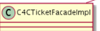

# Customer Service Module

Customer Service Module provides your customer service agents (CSAs) with easy and fast access to the information needed to understand and quickly resolve customers problems.

There are no implementation requirements for this

| Customer Ticketing System                                                                                                            | ticketsystem Extension   |
|--------------------------------------------------------------------------------------------------------------------------------------|--------------------------|
| ticketsystembackoffice Extension customersupportbackoffice Extension customerticketingfacades Extension customerticketingaddon AddOn |                          |
| This is custom documentation. For more information, please visit the SAP Help Portal                                                 | 3                        |

## Customer Service Module Features

The Customer Support module provides many features that allow to increase customer satisfaction through highly personalized customer service and support.

About Customer Service Module Backoffice Customer Support Cockpit, is an application designed for the call-center environment, which complements the vision that we have started with previous releases. Backoffice Customer Support Cockpit cockpit offers the functionality that was previously available in Customer Service Cockpit, and allows you to benet from extensibility and scalability of Backoffice Framework. Managing Support Tickets Customer Service module provides customers with a clear pathway to communicate their inquiries or issues, ensuring that their concerns are documented and addressed promptly. They offer transparency into the resolution process, allowing customers to track the progress of their requests and ensuring accountability from the support team. Additionally, tickets empower customers by providing a platform for feedback, enabling businesses to improve their services and enhance the overall customer experience. Customer Ticketing System The SAP Customer Ticketing System enables customers to create support tickets to request help and form a communication channel with a customer support agent.

## About Customer Service Module

Backoffice Customer Support Cockpit, is an application designed for the call-center environment, which complements the vision that we have started with previous releases. Backoffice Customer Support Cockpit cockpit offers the functionality that was previously available in Customer Service Cockpit, and allows you to benet from extensibility and scalability of Backoffice Framework.

## What Is Customer Service Module?

Customer Service Module provides your customer service agents (CSAs) with easy and fast access to the information needed to understand and quickly resolve customers' problems. CSAs can use the Customer Support cockpit to modify previously placed orders, complete partial orders, take payments, cancel orders, authorize returns, and refund payments. The user interface even enables CSAs to create, modify, and manage customer prole details such as addresses, credit cards and contact preferences. Unlike other solutions, SAP Commerce Cloud offers true omni-channel integration; the application was specically designed with the call center environment in mind. A single, highly responsive UI, based on Backoffice Framework, improves efficiency by enabling CSAs to process more transactions per hour or day. Easy access to key functionality enables CSAs to quickly get the information needed to identify and resolve issues, Because CSAs see the same information, i.e. catalogs, promotions, etc. - that customers see, you can transform customer service into a successful sales center and boost your revenue. The Customer Support Module is a widget-based framework that enables you to customize and extend it based on your specic business requirements.

## How Does It Benet My Business?

Increases customer satisfaction through highly personalized customer service and support

Increases performance of both response time and time-to-resolution Improves usability, speed, and efficiency through use of a single, highly responsive interface for handling all sales and
customer interactions Supports full website integration enabling CSAs to access the same data and content your customers do Drives sales and revenue by enabling CSAs to run advanced catalog search and access cross- and up-sell promotions Provides a unied view of customers to give your CSAs access to customer information and their preferences Congures your own cross-channel strategy through a modular, highly-congurable, widget-based approach Supports multi-tenancy for streamlining personalized service to customers of multiple brands Saves time on both development and training costs

## What Are Its Features?

Designed for the call center environment Ready-to-use integration with the Order Management Services and the Assisted Service Module. Maximum performance of your customer service agents Higher usability, speed and efficiency Single, highly responsive interface Keystroke access for quick access to the relevant information Highly personalized customer service and sales support Customer service agent sees the same information as the customer Agent can alert customer about promotions, offers, cross-/up-sells Personalized content visible to the agent as well Agent sees the same information as the customer does Support for chat integration

## Logging In To Backoffice Customer Support Cockpit

Backoffice Customer Support Cockpit is only available when you log in as one of the Customer Support-related users.

## Context

To log in to Backoffice Customer Support Cockpit, perform the steps below:

## Procedure

1. Start SAP Commerce Cloud Server and open Backoffice by accessing the following link: hostname:port/backoffice.

2. Log in as one of the following users:

| Username                                                                             | Available Roles   | Available Backoffice Administration Cockpit Views   |
|--------------------------------------------------------------------------------------|-------------------|-----------------------------------------------------|
| This is custom documentation. For more information, please visit the SAP Help Portal | 5                 |                                                     |

| Username                       | Available Roles                   | Available Backoffice Administration Cockpit Views   |
|--------------------------------|-----------------------------------|-----------------------------------------------------|
| CustomerSupportAgent           | Customer Support Agent            | Backoffice Customer Support Cockpit                 |
| CustomerSupportManager         | Customer Support Agent            | Backoffice Customer Support Cockpit                 |
| Customer Support Manager       |                                   |                                                     |
| CustomerSupportAdministrator   | Customer Support Agent            | Backoffice Customer Support Cockpit                 |
| Customer Support Manager       | Backoffice Administration Cockpit |                                                     |
| Customer Support Administrator |                                   |                                                     |

3. In Backoffice, click the Customer Support image on the Backoffice Perspective Chooser widget.

Backoffice Customer Support Cockpit opens.

## Related Information

Users in Backoffice Customer Support Cockpit

## Backoffice Customer Support Cockpit

Backoffice Customer Support Cockpit provides a graphical user interface allowing you to perform customer support operations. The user interface responsible for displaying categories, facets, and other elements is supported by the components called widgets. Backoffice Customer Support Cockpit uses the following widgets:
Border Layout Widget

Explorer Tree Widget Collapsible Container Widget Advanced Search Widget Collection Browser Widget Editor Area Widget Congurable Flow Wizard Widget Session Context Widget Saved Queries List Widget

## Note Technical Details

Note that the widgets and the functionality they provide are implemented in the customersupportbackoffice extension. For more technical details on widgets, see the Available Widgets documentation.

If you use Multi-Site feature, it limits visibility to Backoffice Customer Support Cockpit users per site based on the following:

Tickets Product Reviews

Customers
Orders Namely you can create employee groups and then associate them with a site or sites. This limits above data visibility between data-isolated sites to only those employees authorized to see those data. For more information about Multi-Site feature, see SAP Commerce Cloud Multi-Site Support.

## Ui Overview

 Note

All the modal windows visible in the Backoffice Customer Support Cockpit are responsive. For more information, see the Application Orchestrator - End User Guide document.

## Tickets

The Tickets view is a customized implementation of the Collection Browser widget and displays a list of support tickets. The list displays the tickets in the New or In process statuses only. In the Tickets list, the following information is visible:

ID
Customer Name Created This is   For more    the SAP Help  7 Modied Website

Status Priority Category Subject
You can search in the list using the Search box at the top or, if you want to rene your search, you can use the Advanced Search functionality. By default, the ticket list is sorted by the Modied attribute. When you click a ticket, the Ticket Details window opens and the session context parameters are set. The Customer attribute is set to the customer who created the support ticket and the Ticket attribute is set as per the open ticket. Moreover, if a ticket is associated to an order or a cart, the Order attribute is populated with the number of the order or cart.

Carts are treated as orders in Backoffice Customer Support Cockpit.

At the bottom of the Ticket page, a list of tickets is displayed. The list displays 5 latest tickets created by the customer, allowing the Customer Support agent to gain insight into the customer's troubles by seeing their previous support requests. The Customer Support agent can also create a new ticket on the customer's behalf directly from the page. For more information on creating tickets, see the Creating a New Ticket document.

## Creating A New Ticket

Backoffice Customer Support Cockpit allows the Customer Support agents to create support tickets.

## Context

Creating support tickets is one of the basic pieces of functionality provided by Backoffice Customer Support Cockpit allowing the Customer Support agents to communicate with the customers. To create a support ticket, perform the following steps:

## Procedure

1. Click the plus button.

The Create New Ticket wizard opens on the Details tab.

2. From the dropdown menus, select the suitable attribute values and enter the subject in the Subject input eld. Then, click the Next button. The following attributes are available:
Contact Type

Telephone Call is selected by default. If you select Internal / Private, the ticket body is not visible for the customer in the storefront. Ticket header, however, is visible.

Ticket Category

This is   For more    the SAP Help  8 Ticket Priority

Low is selected by default.

The Association tab is displayed.

3. In the Message input eld, type the ticket body. In the Website input eld, type the name of the storefront this ticket is associated to. In the Customer input eld, type the name of the customer the ticket is associated to. If the customer you selected has a cart, a saved cart or an order, you can associate them with this ticket by selecting them from the Associated to input eld. Then, click the Next button.
If you selected a customer previously, the Customer attribute is automatically populated with the information from the Session Context widget. The Assignment tab is displayed.

4. In the Assigned Agent and Agent Group input elds, type the name of the agent and the agent group you want to assign this ticket to. These input elds are automatically populated with the ID and group if the currently logged in agent. Then, click the Done button. The Create New Ticket closes and a new ticket is created.

If a customer session had been present in the Session Context widget and you changed the customer the ticket is created for, the widget is reloaded with the session of the customer you selected.

## Related Information

Tickets View

## Ticket Details

After clicking a ticket entry in the Tickets list, the ticket details view is displayed.

## Available Functions

Available functions differ depending on the tab you are on. In the table below, you can nd the description of the functionality of each tab:

| Tab Name   | Changeable/Displayed Options   |
|------------|--------------------------------|

| 7/11/2024 Tab Name                                                                                                                                      | Changeable/Displayed Options                                                                                 |
|---------------------------------------------------------------------------------------------------------------------------------------------------------|--------------------------------------------------------------------------------------------------------------|
| General                                                                                                                                                 | Customer Category Created Subject Status Associated To Priority Assigned Agent Agent Group Reply to Customer |
| History                                                                                                                                                 | Events                                                                                                       |
| Administration                                                                                                                                          | Administrative Information                                                                                   |
|                                                                                                                                                        | Note                                                                                                         |
| This tab is only visible for the members of the BackofficeAdmin usergroup. By default, the CustomerSupportAdministrator role is a member of this group. |                                                                                                              |

## Associated To

In the Associated To eld, a cart or an order associated to the active ticket is displayed. The customer decides what to associate the ticket to during the ticket creation on the storefront. Next to the Associated To eld, there is the Launch ASM button. Clicking this button allows the customer support agent to start emulating the order or the cart of the customer. For more information about emulation and the Assisted Service Module, see the Related Links section.

## Ticket Status Changes

When the Customer Support agent changes the status of a ticket from In process, the Ticket Status Change wizard is displayed. The table below describes the status change combinations which trigger the wizard:

| Current Status   | Status Drop Down List Entry   | Status After Change   |
|------------------|-------------------------------|-----------------------|
| In process       | Close                         | Closed                |
| Closed           | Reopen                        | In process            |

The Ticket Status Change wizard allows the Customer Support agent to change or add the following attributes:

| Attribute       | Available Options   |
|-----------------|---------------------|
| Resolution Type | Closed Duplicate    |

This is   For more    the SAP Help  10

| 7/11/2024 Attribute   | Available Options                                                    |
|-----------------------|----------------------------------------------------------------------|
| Contact Type          | Email Telephone Call Instant Message Ticket Message Internal/Private |
| Reply To              | Customer Customer Support                                            |
| Message               | Input eld                                                            |

## Related Information

Assisted Service Module Users in Backoffice Customer Support Cockpit

## Reply To Customer

The Reply to Customer functionality allows the Customer Support agent to reply to messages and add attachments to messages sent by the customer from the storefront directly from the Backoffice Administration Cockpit.

## Message History

The Reply to Customer functionality also displays the entire message, status change, and assignment history between the

| customer and the Customer Support agent:   |
|--------------------------------------------|

Each message sent between the agent and the customer has a time stamp, which allows for clear view of the entire agent-

 customer communication. If the customer or the support agent decides to close or reopen a ticket, a different color is applied for the ticket message eld. Green colour indicates that the ticket was successfully closed, whereas blue colour indicates that the ticket was reopened.

This is   For more    the SAP Help  11

## Add Attachment

The Add Attachment button allows the Customer Support agent to attach a le to the message sent to the customer. When the Customer Support agent clicks the Add Attachment button, a le selector window opens. The size of any of the attached les cannot exceed the limit of 10 MB. When uploaded, the les are sent to the e-mail address the customer provided during the creation of their account.

## Private Messages

Although the name might be misleading, the Reply to Customer functionality also allows for the exchange of information between the Customer Support agents without notifying the customer. Naturally, these messages are not visible to the customer in the storefront. When a Customer Service agent selects the Internal / Private option from the Contact Type dropdown list, the background of the message input eld changes color to indicate that this message is not visible for the customer, but only for other Customer Support agents.

## Deleting A Ticket Attachment

You can delete an attachment from a ticket conversation in the Backoffice Administration Cockpit to protect users from security or condentiality issues. Only employees with administrative privileges can perform this task, such as a customer support administrator.

## Context

Before deleting the attachment from the system, you must delete the attachment from the ticket. This step ensures that both you and the customer can view the ticket conversation afterwards.

## Tip

It's recommended to know this information beforehand:
Ticket ID File name of the attachment

Message that contains the attachment

## Procedure

1. Remove the attachment from the ticket message:
a. Select the customer ticket under Ticket System Tickets . b. Go to the Administration tab.

c. Open the message that contains the attachment from the Comments attribute.

The Edit item **<ID>** dialog box opens.

d. Under the Attachments attribute, remove the CommentAttachment <ID **number>** using the  Remove icon.

e. Save your changes.

The attachment is removed from the ticket.

2. Delete the attachment:
a. Under Multimedia Media , select  Switch search mode.

b. Remove all attribute lters using the  Remove icon.

c. Change the information in the remaining attribute lter to the following:

Attribute Comparator Value

Real filename Contains <Any word as it appears in

the file name>

d. Select  Add Attribute Filter and change the information to the following:
e. Search for the attachment.

f. Select the attachment and choose Delete.

| Attribute   | Comparator   | Value                                                   |
|-------------|--------------|---------------------------------------------------------|
| Folder      | Equals       | customersupportattachments - customersupportattachments |

g. Save your changes.

The attachment is deleted from the system.

## Product Reviews

The Product Reviews view is a customized implementation of the Collection Browser widget and displays a list of all customer reviews. You can nd and sort the list by the following attributes:
Rating

Status Blocked Time Created Time Modied Name Product
Headline You can search in the list using the Search box at the top or, if you want to rene your search, you can use the Advanced Search functionality. By default, the reviews list is sorted by the Last Modied attribute. The Product Reviews tab also allows you to create, and edit existing product reviews. Customer Support Agents can administer product reviews from the Product Reviews list or Customer Summary page. When a Customer Support Agent clicks an entry in the list, the Edit Product Review window opens where a CSA can update the Blocked and/or Approved status of a product review. Moreover, in the Product Reviews view and in the Edit Item modal, a deep link is placed. Clicking the deep link icon redirects a CSA to the Product Details page on the storefront.

Only the members of the CustomerSupportAdministrator and CustomerSupportManagergroups can export product reviews to CSV. Note that no user can delete a product review.

## Customers

The Customers view is a customized implementation of the Editor Area widget and displays a list of available customers. By default, customers who were added the latest are displayed on the top of the list. When you click a customer, a set of custom tabs is displayed:
Summary Prole Orders Payments Addresses Tickets Reviews Password For more information, see the Editor Area Widget document. After clicking a customer in the customer list, you can perform a number of operations related to that customer. Available functions differ depending on the tab you are on. In the table below, you can nd the description of the functionality of each tab:

| Tab Name                                                                             | Changable/Displayed Options                                                                                                                                                                                                                                                                                       |
|--------------------------------------------------------------------------------------|-------------------------------------------------------------------------------------------------------------------------------------------------------------------------------------------------------------------------------------------------------------------------------------------------------------------|
| Summary                                                                              | Essential Name ID Customer ID (read-only) Original UID (read-only) Site (read-only) Undecorated UID (read-only)  Note The Essential section is visible on all of the tabs.Carts (if a cart was created) Cart (with an Assisted Service Module icon next to it allowing for quick emulation of the cart. For more |
| This is custom documentation. For more information, please visit the SAP Help Portal | 14                                                                                                                                                                                                                                                                                                                |

Tab Name Changable/Displayed Options

| information, see the Assisted Service Reference Editor document.)   |
|---------------------------------------------------------------------|
| Saved Carts (if a saved cart was created)                           |

Saved Cart (with an Assisted Service Module icon

next to it allowing for quick emulation of the cart.

For more information, see the Assisted Service

Reference Editor document.)

Orders (if an order was created)
Order (with an Assisted Service Module icon next to it allowing for quick emulation of the order. For more information, see the Assisted Service Reference Editor document.)
By default, the number of visible orders is limited to 5, but more orders appear in the list when the slider is moved. For more information about orders and returns, see the Orders and Returns documents.

Addresses Default Shipment Address (if created) Default Payment Address (if created) Addresses (if created) Create new Address Payment Methods Default Payment Method Payment Methods Tickets

By default, the number of visible tickets is limited to 5, but more tickets appear in the list when the slider is moved.

Ticket Create New Ticket Product Reviews

|                                                                              | Note   |
|-------------------------------------------------------------------------------|--------|
| If the customer has not reviewed any products, this section is not displayed. |        |

| 7/11/2024 Tab Name                                                                                                                                      | Changable/Displayed Options                                                                                                                                                                      |           |
|---------------------------------------------------------------------------------------------------------------------------------------------------------|--------------------------------------------------------------------------------------------------------------------------------------------------------------------------------------------------|-----------|
| Prole                                                                                                                                                   | Properties Standard Language Standard Currency Groups Description                                                                                                                                |           |
| Orders                                                                                                                                                  | Carts Orders                                                                                                                                                                                     |           |
| Payments                                                                                                                                                | Payment Methods Default Payment Method Payment Methods                                                                                                                                           |           |
| Addresses                                                                                                                                               | Addresses Default Shipment Address (if created, double-click to edit) Default Payment Address (if created, double-click to edit) Addresses (if created, double-click to edit) Create new Address |           |
| Tickets                                                                                                                                                 | Tickets Ticket Create New Ticket                                                                                                                                                                 |           |
| Reviews                                                                                                                                                 | Product Reviews                                                                                                                                                                                  |           |
| Password                                                                                                                                                | Password Password Type Password Question Change Password Last Login Disable Login                                                                                                                |           |
| Prices                                                                                                                                                  | Prices                                                                                                                                                                                           |           |
|                                                                                                                                                        | Note                                                                                                                                                                                             | Tax Group |
| This tab is only visible for the members of the BackofficeAdmin usergroup. By default, the CustomerSupportAdministrator role is a member of this group. | Price Group Discount Group                                                                                                                                                                       |           |

| 7/11/2024 Tab Name                                                                                                                                      | Changable/Displayed Options                                                     |                                     |
|---------------------------------------------------------------------------------------------------------------------------------------------------------|---------------------------------------------------------------------------------|-------------------------------------|
| Personalization                                                                                                                                         | Personalization Rules                                                           |                                     |
|                                                                                                                                                        | Note                                                                            | All effective personalization rules |
| This tab is only visible for the members of the BackofficeAdmin usergroup. By default, the CustomerSupportAdministrator role is a member of this group. | Catalog Version Permissions Writable Catalog Versions Readable Catalog Versions |                                     |
| Administration                                                                                                                                          | Administrative Information                                                      |                                     |
|                                                                                                                                                        | Note                                                                            |                                     |
| This tab is only visible for the members of the BackofficeAdmin usergroup. By default, the CustomerSupportAdministrator role is a member of this group. |                                                                                 |                                     |

## Accessing Customer Data

You can access customer data in the assisted services mode.

## Procedure

1. Log in as a customer support manager.

2. Start a customer session. 3. Click My Account.

You can also use the Customer 360 degree view.

## Orders

The Orders view is a customized implementation of the Space Management widget and displays a list of customer orders. The Orders functionality in Backoffice Customer Support Cockpit allows you to:
Search for customer orders.

View general order information, such as the order number, customer name who placed the order, creation date, order status, and delivery mode. View detailed order item information, such as details for each consignment within an order, as well as the product code, product name, item price, allocated, pending, returned, cancelled and shipped quantity. View order information about shipping, taxes, order discounts, totals, and sub-totals. Cancel an item or order.
For more information, see Backoffice Customer Support Cockpit - Orders and Returns.

## Returns

The Returns view is a customized implementation of the Space Management widget and displays a list of all returns.

The Returns functionality in Backoffice Customer Support Cockpit allows you to:

Create an online or in store return. Search for orders for which customers want to return items. Approve or cancel returns. Perform a manual refund for returns. Cancel refunds and perform manual tax reversals.
For more information on the Returns view, see Backoffice Customer Support Cockpit - Orders and Returns.

## Returning An Order For A Customer

As a customer support agent you can return an order for a customer who has made contact over the phone or come into your store.

## Context

A customer wants to return order, for example, because the goods were damaged during delivery.

## Procedure

1. Log into the backoffice customer support cockpit as a customer service agent.

2. Select Customers. 3. Find the customer you want to return an item for. 4. Select the relevant order. 5. Click Create Return. 6. Select the items to return and enter select a reason.

You can also add a comment and refund the dleivery cost. If tuser has already brought the goods into the store, you can click Item(s) Returned in Store 7. Click Corm Selected.

## E-Mails In Backoffice Customer Support Cockpit

Backoffice Customer Support Cockpit sends e-mails to customers in various cases. E-mails are sent to the user, when:
they create a user account they have forgotten their account password and used the Forgot your password? option while signing in they have completed their shopping order. A copy of their order details is sent to their e-mail

their order has been shipped
they have submitted a Support Ticket This is   For more    the SAP Help  18

## Users In Backoffice Customer Support Cockpit

Depending on the user role selected upon logon, the available functionality of Backoffice Customer Support Cockpit may change.

The username you provide when you log in to Backoffice Administration Cockpit inuences the roles you can select from. Role selection is only available after you logged in. There are 3 usernames you can use to log in to Backoffice Administration Cockpit:

| Username                       | Available Roles                   | Available Backoffice Administration Cockpit Views   |
|--------------------------------|-----------------------------------|-----------------------------------------------------|
| CustomerSupportAgent           | Customer Support Agent            | Backoffice Customer Support Cockpit                 |
| CustomerSupportManager         | Customer Support Agent            | Backoffice Customer Support Cockpit                 |
| Customer Support Manager       |                                   |                                                     |
| CustomerSupportAdministrator   | Customer Support Agent            | Backoffice Customer Support Cockpit                 |
| Customer Support Manager       | Backoffice Administration Cockpit |                                                     |
| Customer Support Administrator |                                   |                                                     |

The following user roles are available within Backoffice Customer Support Cockpit:

## Customer Support Agent

The Customer Support Agent role can create tickets, customers, orders, and returns and can create and change product reviews. This is the most basic role in Backoffice Customer Support Cockpit.

## Customer Support Manager

Out-of-the-box, the Customer Support Manager role has exactly the same permissions as the Customer Support Agent role apart from the ability to export product reviews to a .csv le. The manager role is designed to have more privileges compared to the agent role, for example the ability to add certain items to the cart of the customer.

Add additional privileges to the Customer Support Manager role or restrict the privileges of the Customer Support Agent role yourself. By default, these roles have the same permissions.

## Customer Support Administrator

The Customer Support Administrator role has all the permissions the Customer Support Manager role has. The role also has the access to the Administration, Pricing, and Personalization tabs in Backoffice Customer Support Cockpit. The Customer Support Administrator role has the access to customer support-related functionality in the Administration view, including creating employees and titles. Moreover, the Customer Support Administrator role has been granted access to the application orchestrator mode in the Backoffice Administration Cockpit. Application Orchestrator - End User Guide

## Changing Role Permissions

The presence of several user groups in Backoffice Customer Support Cockpit allows for manipulations on group level. Namely, certain groups may have different privileges than others.

## Context

The example presented in this tutorial involves adding the Customer Support Agent and Customer Support Manager permissions to see the Administration tab in the Customers view. To add the permissions, perform the steps below:

## Procedure

1. Open the customersupportbackoffice-backoffice-config.xml le.

2. In the customersupportbackoffice-backoffice-config.xml le, locate the code visible in the section below.

<context merge-by="type" parent="User" type="Customer" component="cs-editor-area" principal="C
<editorArea:editorArea name="">
<editorArea:essentials>
<editorArea:essentialSection name="hmc.essential">
<editorArea:attribute qualifier="name" position="1"/> <editorArea:attribute qualifier="uid" position="2"/> <editorArea:attribute qualifier="customerID" position= <editorArea:attribute qualifier="originalUid" position
</editorArea:essentialSection>
</editorArea:essentials> <editorArea:tab name="hmc.tab.common" position="1" /> <editorArea:tab name="hmc.addresses" position="2" /> <editorArea:tab name="hmc.password" position="3" />
<editorArea:tab name="hmc.customerpayments" position="4">
<editorArea:section name="hmc.customerpayments.method.section
<editorArea:attribute qualifier="paymentInfos" label=
</editorArea:section>
</editorArea:tab> <editorArea:tab name="hmc.orders" position="5" />
 <editorArea:tab name="hmc.tab.community" position="7"> <editorArea:section name="hmc.user.sections.customerreviews"> <editorArea:attribute qualifier="customerReviews" editor="com.hybris.cockpitng.editor.extendedmultiref <editorArea:editor-parameter> <editorArea:name>listConfigContext</editorArea:name> <editorArea:value>customerReviewsListConfig</editorArea:value> </editorArea:editor-parameter> </editorArea:attribute> </editorArea:section> </editorArea:tab>
<editorArea:tab name="hmc.customerprices" position="8">
<editorArea:section name="hmc.customerprices">
<editorArea:attribute qualifier="Europe1PriceFactory_U <editorArea:attribute qualifier="Europe1PriceFactory_U
This is   For more    the SAP Help  20
<editorArea:attribute qualifier="Europe1PriceFactory_U <editorArea:attribute qualifier="europe1Discounts" />
</editorArea:section>
</editorArea:tab> <editorArea:tab name="hmc.tab.personalization" position="9" />
<editorArea:tab name="hmc.administration" />
</editorArea:editorArea>
</context>
 <context type="CustomerReview" component="customerReviewsListConfig"> <list-view:list-view xmlns:list-view="http://www.hybris.com/cockpitng/component/listVi <list-view:column qualifier="rating"/> <list-view:column qualifier="creationtime"/> <list-view:column qualifier="approvalStatus"/> <list-view:column qualifier="product"/> <list-view:column qualifier="headline"/> </list-view:list-view> </context>
<context merge-by="principal" parent="CustomerSupportAdministratorRole" type="Custome
<editorArea:editorArea name="">
<editorArea:tab name="hmc.administration" merge-mode="remove"/> <editorArea:tab name="hmc.tab.personalization" merge-mode="remove"/> <editorArea:tab name="hmc.customerprices" merge-mode="remove"/>
</editorArea:editorArea>
</context>
3. Delete the <editorArea:tab name="hmc.administration" merge-mode="remove"/> line and save the le.

4. Log in to the Backoffice Administration Cockpit as the Customer Support Administrator and enter the application orchestrator mode by pressing the F4 button on your keyboard.

5. Click on the SAP Commerce Cloud logo and click the Reset Everything button. When prompted, click the Yes button.

Clicking the Reset Everything button forces the Backoffice Administration Cockpit to reset the view as per the widget conguration from the customersupportbackoffice-backoffice-config.xml le.

The view is reset and the Administration tab is now visible for the Customer Support Manager and Customer Support Agent roles.

## Customer Support - Available Editors Gallery

Apart from using the generic Cockpit NG editors, Backoffice Customer Support Cockpit uses several customer support-specic editors. Editors are components that can be used to capture input and display values of various kinds. Editors can easily be congured for and used by widgets in order to get the required data from a business user. You can nd the details of the editors specic to the Customer Support Module in the table below:

| Editor Name           | Preview                                                                                                                                                                                                              | Description                                                                                                                        | Type ^MultiReference- (COLLECTION|LIST|SET)\((.*)\)$   |
|-----------------------|----------------------------------------------------------------------------------------------------------------------------------------------------------------------------------------------------------------------|------------------------------------------------------------------------------------------------------------------------------------|--------------------------------------------------------|
| Assisted Service List | This editor provides the                                                                                                                                                                                             |                                                                                                                                    |                                                        |
| Editor                | functionality of starting ASM emulation directly from Backoffice Customer Support Cockpit by clicking on an icon.                                                                                                    |                                                                                                                                    |                                                        |
| Assisted Service      | The Assisted Service                                                                                                                                                                                                 |                                                                                                                                    |                                                        |
| Reference Editor      | Reference Editor is used to place an Assisted Service Module deep link into next to a customer's order or a cart in Backoffice Customer Support Cockpit. Currently, only Cart and Order types support ASM emulation. | ^Reference\((.*)\)$ Reference to any type, provided in the following format, depending on the collection type: ^Reference\((.*)\)$ |                                                        |

| 7/11/2024 Editor Name     | Preview                        | Description                                                                                                                               | Type                                            |
|---------------------------|--------------------------------|-------------------------------------------------------------------------------------------------------------------------------------------|-------------------------------------------------|
| Ticket Category Editor    | Not available.                 | Allows for the change of the Category attribute of a ticket by calling the default implementation of the TicketBusinessService interface. | java.lang.Enum(CsTicketCategory)                |
| Ticket Priority Editor    | Not available.                 | Allows for the change of the Priority attribute of a ticket by calling the default implementation of the TicketBusinessService interface. | java.lang.Enum(CsTicketPriority)                |
| Ticket State Editor       | Not available.                 | Allows for the change of the State attribute of a ticket by calling the default implementation of the TicketBusinessService interface.    | java.lang.Enum(CsTicketState)                   |
| Non Optional Enum Editor  | Not available.                 | Extends the default enum editor to avoid displaying the N/A value in combo boxes.                                                         | java.lang.Enum(?:\((.*)\))?                     |
| Simple Select Reference   | Not available.                 | Updates the current editor                                                                                                                | ^MultiReference- (COLLECTION|LIST|SET)\((.*)\)$ |
| Editor                    | area with the selected object. |                                                                                                                                           |                                                 |
| Simple Select List Editor | Not available.                 | Updates the current editor area with the selected object. Used for collections.                                                           | ^MultiReference- (COLLECTION|LIST|SET)\((.*)\)$ |

## Assisted Service List Editor

The Assisted Service List Editor allows Customer Support agents to start ASM emulation directly from the Orders and Returns views of Backoffice Customer Support Cockpit.

## Sap Commerce Cloudeditor Denition

| Name                                                                                 | Assisted Service List Editor                                                                                                                                                                                                                                                                                                                                                                                                                                         |
|--------------------------------------------------------------------------------------|----------------------------------------------------------------------------------------------------------------------------------------------------------------------------------------------------------------------------------------------------------------------------------------------------------------------------------------------------------------------------------------------------------------------------------------------------------------------|
| ID                                                                                   | com.hybris.cockpitng.editor.asmdeeplinkeditor                                                                                                                                                                                                                                                                                                                                                                                                                        |
| Description                                                                          | This editor provides the functionality of starting ASM emulation directly from the Customer Support Cockpit by clicking on an icon.  Note This editor provides the ASM emulation functionality in the Orders and Returns views of Backoffice Customer Support Cockpit. For starting the emulation of single instances of Carts and Orders, the Assisted Service Reference Editor is used. For more information, see the Assisted Service Reference Editor document. |
| Type                                                                                 | ^MultiReference-(COLLECTION|LIST|SET)\((.*)\)$                                                                                                                                                                                                                                                                                                                                                                                                                       |
| Author                                                                               | SAP Commerce Cloud                                                                                                                                                                                                                                                                                                                                                                                                                                                   |
| This is custom documentation. For more information, please visit the SAP Help Portal | 23                                                                                                                                                                                                                                                                                                                                                                                                                                                                   |

| 7/11/2024 Editor Class   | de.hybris.platform.customersupportbackoffice.editor.AssistedServiceListEditorRenderer   |
|--------------------------|-----------------------------------------------------------------------------------------|
| Name Inputs              | Not applicable.                                                                         |
| Outputs                  | Not applicable.                                                                         |

## Editor Preview Settings

You can congure the editor using the custom-attributes element in the ZUL le of your widget. The following attributes are supported:

| Setting                        | Description                                                                                                                                                                                                                                                                                                                                 |
|--------------------------------|---------------------------------------------------------------------------------------------------------------------------------------------------------------------------------------------------------------------------------------------------------------------------------------------------------------------------------------------|
| pageSize                       | Denes the size of a page.                                                                                                                                                                                                                                                                                                                   |
| restrictToType                 | Restricts the items displayed on the selection list to a given type and its subtypes.                                                                                                                                                                                                                                                       |
| disableDisplayingDetails       | Disables showing Edit details item in the row menu. Default value: false.                                                                                                                                                                                                                                                                   |
| listConfigContext              | Denes the component name used for context lookup.                                                                                                                                                                                                                                                                                           |
| selectedItemsMaxSize           | Species the maximum number of rows in the selected items list. If there are more selected items in the collection, a vertical scroll bar is displayed. If not specied, cockpit property multi.reference.editor.selected.items.max.size is taken into account. If that is also not specied, default view port size is set to 5.              |
| renderOnDemandSize             | Species the number of items rendered when the selected item list rst renders ( org.zkoss.zul.listbox.initRodSize ). If not specied, cockpit property multi.reference.editor.render.on.demand.size is taken into account. If that is also not specied, default initial rod size is set to 50.                                                |
| isNestedObjectCreationDisabled | If set to true, it disables the option of creating an object in an editor.                                                                                                                                                                                                                                                                  |
| availableValuesProvider        | Id of a bean that provides the available values for the editor. The bean implements the ReferenceEditorSearchFacade interface. Inside the bean, you can, for example, modify the search conditions and pass them to the original referenceEditorSearchFacade bean, or even use different data source (for example, predened set of values). |
| inlineEditing                  | Allows for inline editing of the displayed values. Default value: false. See also the Inline Editing section.                                                                                                                                                                                                                               |
| disableRemoveReference         | Disables the remove-reference action. Default value: false.                                                                                                                                                                                                                                                                                 |

| 7/11/2024 Setting              | Description                                                                                                                                                                                                                        |
|--------------------------------|------------------------------------------------------------------------------------------------------------------------------------------------------------------------------------------------------------------------------------|
| createOnly                     | Disables selection of reference types, allowing only to create a reference. Default value: false.                                                                                                                                  |
| referenceAdvancedSearchEnabled | When the setting is enabled, clicking on the search icon in reference editor results in socket output on referenceSearchCtx. In the default mashup, it shows Reference Advanced Search Widget. Default value: true. Type: Boolean. |
| menuColumnIndex                | It determines an index of a column that stores three dots menu icon. You can choose one of the predened values: rst or last. Default value: rst. Type: Enum.                                                                       |
| placeholderKey                 | It denes the value of the placeholder.                                                                                                                                                                                             |
| labelProviderBean              | It denes the customized bean id of the label provider.                                                                                                                                                                             |
| forwardURL                     | Appends additional pages like My Account of the customer in the storefront.                                                                                                                                                        |
| isSimpleSelectEnabled          | Enables the simple item selection of the editor. Default value: false.                                                                                                                                                             |

In the ZULle of your widget, add an editor with a denition similar to the following example:
widgetid.zul
<editor id="multiReferenceEditor" type="MultiReference-LIST(Product)">
<custom-attributes pageSize="5" />
</editor>

## Assisted Service Reference Editor

The Assisted Service Reference Editor is used to place an Assisted Service Module deep link into the attribute qualier in Backoffice Customer Support Cockpit.

| Editor      | Denition                                                                                                                                                                                                                                 |
|-------------|------------------------------------------------------------------------------------------------------------------------------------------------------------------------------------------------------------------------------------------|
| Author      | SAP Commerce Cloud                                                                                                                                                                                                                       |
| Description | The Assisted Service Reference Editor is used to place an Assisted Service Module deep link into next to a customer's order or a cart inBackoffice Customer Support Cockpit. Currently, only Cart and Order types support ASM emulation. |
| ID          | com.hybris.cockpitng.editor.asmdeeplinkreferenceeditor                                                                                                                                                                                   |
| Inputs      | java.lang.Object Incoming data that is set as or added to the values of the editor.                                                                                                                                                      |
| Outputs     | java.lang.Object Output that is usually connected to a wizard to create a new java.lang.Object reference.                                                                                                                                |
| Name        | Assisted Service Module Deeplink Reference Editor                                                                                                                                                                                        |

## Editor Denition

This is   For more    the SAP Help  25

| 7/11/2024 Editor   | Denition                                                                                                                           |
|--------------------|------------------------------------------------------------------------------------------------------------------------------------|
| Type               | ^Reference\((.*)\)$ Reference to any type, provided in the following format, depending on the collection type: ^Reference\((.*)\)$ |

## Editor Preview Settings

| Setting                        | Description                                                                                                                                                                                                                        |
|--------------------------------|------------------------------------------------------------------------------------------------------------------------------------------------------------------------------------------------------------------------------------|
| pageSize                       | Denes the size of a page (the number of entries that appear).                                                                                                                                                                      |
| restrictToType                 | Restricts the items displayed on the selection list to a given type and its subtypes.                                                                                                                                              |
| disableDisplayingDetails       | Disables a double-click action on a selected item sending out the output socket referenceSelected. Default value: false.                                                                                                           |
| isNestedObjectCreationDisabled | If set to true, it disables the option of creating a new object in an editor.                                                                                                                                                      |
| disableRemoveReference         | Disables the remove-reference action. Default value: false.                                                                                                                                                                        |
| createOnly                     | Disables selection of reference types, allowing only to create a new reference. Default value: false.                                                                                                                              |
| referenceAdvancedSearchEnabled | When the setting is enabled, clicking on the search icon in reference editor results in socket output on referenceSearchCtx. In the default mashup, it shows Reference Advanced Search Widget. Default value: true. Type: Boolean. |
| showASMPrefix                  | Shows the type of the item like cart or order. Default value: false.                                                                                                                                                               |
| forwardURL                     | Appends additional pages like My Account of the customer in the storefront.                                                                                                                                                        |
| isSimpleSelectEnabled          | Enables the simple item selection of the editor. Default value: false.                                                                                                                                                             |

You can congure the editor using the custom-attributes element in the ZUL le of your widget. The following attributes are supported: In the ZULle of your widget, add an editor with a denition similar to the following example:
widgetid.zul
<editor id="multiReferenceEditor" type="MultiReference-LIST(Product)">
<custom-attributes pageSize="5" />
</editor>

## Ticket Category Editor

## Editor Denition

| Name        | Ticket Category Editor                                                                                                                    |
|-------------|-------------------------------------------------------------------------------------------------------------------------------------------|
| ID          | com.hybris.cockpitng.editor.ticket.category                                                                                               |
| Description | Allows for the change of the Category attribute of a ticket by calling the default implementation of the TicketBusinessService interface. |
| Type        | java.lang.Enum(CsTicketCategory)                                                                                                          |
| Author      | SAP                                                                                                                                       |
| Inputs      | No input sockets.                                                                                                                         |
| Outputs     | No output sockets.                                                                                                                        |

## Editor Preview

No preview available.

## Conguration

This editor does not require special conguration and works out-of-the-box when added to the <extensionname>-
backoffice-config.xml le.

Example conguration looks like this:
<editorArea:attribute qualifier="category" editor="com.hybris.cockpitng.editor.ticket.category" lab

## Settings

Not available.

## Ticket Priority Editor

The Ticket Category Editor allows for the change of the Priority attribute of a ticket.

## Editor Denition

| Name                                                                                 | Ticket Priority Editor                                                                                                                    |
|--------------------------------------------------------------------------------------|-------------------------------------------------------------------------------------------------------------------------------------------|
| ID                                                                                   | com.hybris.cockpitng.editor.ticket.priority                                                                                               |
| Description                                                                          | Allows for the change of the Priority attribute of a ticket by calling the default implementation of the TicketBusinessService interface. |
| This is custom documentation. For more information, please visit the SAP Help Portal | 27                                                                                                                                        |

| 7/11/2024 Type   | java.lang.Enum(CsTicketPriority)   |
|------------------|------------------------------------|
| Author           | SAP                                |
| Inputs           | No input sockets.                  |
| Outputs          | No output sockets.                 |

## Editor Preview

No preview available.

## Conguration

This editor does not require special conguration and works out-of-the-box when added to the <extensionname>-
backoffice-config.xml le.

Example conguration looks like this:
<editorArea:attribute qualifier="priority" editor="com.hybris.cockpitng.editor.ticket.priority" lab

## Settings

Not available.

## Ticket State Editor

The Ticket Category Editor allows for the change of the State attribute of a ticket.

## Editor Denition

| Name        | Ticket State Editor                                                                                                                    |
|-------------|----------------------------------------------------------------------------------------------------------------------------------------|
| ID          | com.hybris.cockpitng.editor.ticket.state                                                                                               |
| Description | Allows for the change of the State attribute of a ticket by calling the default implementation of the TicketBusinessService interface. |
| Type        | java.lang.Enum(CsTicketState)                                                                                                          |
| Author      | SAP                                                                                                                                    |
| Inputs      | No input sockets.                                                                                                                      |
| Outputs     | No output sockets.                                                                                                                     |

## Editor Preview

No preview available.

## Conguration

This editor does not require special conguration and works out-of-the-box when added to the <extensionname>-
backoffice-config.xml le.

Example conguration looks like this:
<editorArea:attribute qualifier="state" editor="com.hybris.cockpitng.editor.ticket.state" label="cu

## Settings

Not available.

## Non Optional Enum Editor

The Non Optional Enum Editor extends the default enum editor to avoid displaying the N/A value in combo boxes.

## Editor Denition

| Name        | Non Optional Enum Editor                                                          |
|-------------|-----------------------------------------------------------------------------------|
| ID          | de.hybris.platform.customersupportbackoffice.editor.NonOptionalEnumEditor         |
| Description | Extends the default enum editor to avoid displaying the N/A value in combo boxes. |
| Type        | java.lang.Enum(?:\((.*)\))?                                                       |
| Author      | SAP                                                                               |
| Inputs      | This widget inherits input sockets from DefaultEnumEditor.                        |
| Outputs     | This widget inherits output sockets from DefaultEnumEditor.                       |

## Editor Preview Conguration

No custom conguration applies to this editor.

Settings Not applicable.

## Simple Select Reference Editor

The Simple Select Reference Editor refreshes the current editor with the selected item. This editor is used for single items.

## Editor Denition

| Name        | Simple Select Reference Editor                                                                                                                                 |
|-------------|----------------------------------------------------------------------------------------------------------------------------------------------------------------|
| ID          | com.hybris.cockpitng.editor.simpleselectreferenceeditor                                                                                                        |
| Description | Updates the current editor area with the selected object.                                                                                                      |
| Type        | ^MultiReference-(COLLECTION|LIST|SET)\((.*)\)$                                                                                                                 |
| Author      | SAP                                                                                                                                                            |
| Inputs      | This widget inherits all input sockets from DefaultReferenceEditor.                                                                                            |
| Outputs     | It has no special type, so all objects are allowed to be passed. Whenever an item is selected in this editor it is sent out on the itemSelected output socket. |

## Editor Preview

No preview available.

## Conguration

This editor inherits its conguration from DefaultReferenceEditor.

## Settings

Not available.

Related Information Default Reference Editor

## Simple Select List Editor

The Simple Select List Editor refreshes the current editor with the selected items. This editor is used for collections.

## Editor Denition

| 7/11/2024 Name   | Simple Select List Editor                                                                                                                                      |
|------------------|----------------------------------------------------------------------------------------------------------------------------------------------------------------|
| ID               | com.hybris.cockpitng.editor.simpleselectlisteditor                                                                                                             |
| Description      | Updates the current editor area with the selected object.                                                                                                      |
| Type             | ^MultiReference-(COLLECTION|LIST|SET)\((.*)\)$                                                                                                                 |
| Author           | SAP                                                                                                                                                            |
| Inputs           | This widget inherits all input sockets from DefaultMultiReferenceEditor.                                                                                       |
| Outputs          | It has no special type, so all objects are allowed to be passed. Whenever an item is selected in this editor it is sent out on the itemSelected output socket. |

## Editor Preview

No preview available.

## Conguration

This editor inherits its conguration from DefaultMultiReferenceEditor.

## Settings

Not available.

Related Information Default Multi Reference Editor

## Customer Support - Available Widgets Gallery

Apart from using the generic Cockpit NG widgets, Backoffice Customer Support Cockpit uses several customer support-specic widgets. You can nd the details of the widgets specic to theCustomer Support Module in the table below:

| Widget Name   | Preview   | Description   |
|---------------|-----------|---------------|

| 7/11/2024 Widget Name   | Preview                                                                                                                                                                                               | Description   |
|-------------------------|-------------------------------------------------------------------------------------------------------------------------------------------------------------------------------------------------------|---------------|
| Session Context Widget  | The Session Context widget displays customer-support related information, making it easily accesible to the customer support agent with just one click (Customer, Ticket and Order information only). |               |

## Session Context Widget

The Session Context widget displays customer-support related information, making it easily accesible to the customer support agent with just one click. When the agent selects a ticket, all items related to this ticket (e.g. customer and order) are displayed in the session context widget allowing the agent to navigate between the customer, order or ticket details pages.

## Widget Denition

| Name                                                                                 | Session Context                                                                                                                                                                                       |
|--------------------------------------------------------------------------------------|-------------------------------------------------------------------------------------------------------------------------------------------------------------------------------------------------------|
| ID                                                                                   | com.hybris.cockpitng.sessionContext                                                                                                                                                                   |
| Category                                                                             | Preview                                                                                                                                                                                               |
| Description                                                                          | The Session Context widget displays customer-support related information, making it easily accesible to the customer support agent with just one click (Customer, Ticket and Order information only). |
| Applied In                                                                           | Not applicable.                                                                                                                                                                                       |
| Based On                                                                             | Not applicable.                                                                                                                                                                                       |
| Author                                                                               | SAP                                                                                                                                                                                                   |
| Inputs                                                                               | Details of input sockets: selectedItem Type: java.lang.Object Multiplicity: Single Description: Item selected form the list view area, can be Order, Customer or Ticket or any other item.            |
| Outputs                                                                              | Details of output sockets: itemToShow Type: java.lang.Object Multiplicity: Single                                                                                                                     |
| This is custom documentation. For more information, please visit the SAP Help Portal | 32                                                                                                                                                                                                    |

Description: currently selected object (Customer ,
Ticket or Order). In case the End Session button is clicked then the object is null.

viewData Type: java.lang.Object

| Multiplicity: Single Description: Always null to show the result view area.   |                 |
|-------------------------------------------------------------------------------|-----------------|
| Generated Events                                                              | Not applicable. |

## Conguration

No custom conguration applies to this widget.

## Widget Preview Note

This widget is responsive.

## Settings

No custom settings conguration applies to this widget.

## Functionality

The Launch ASM Button This is   For more    the SAP Help  33

## 

This widget contains a site drop-down allowing the customer support agent to select one of the available storefronts. If a selected ticket has an order or an actual order is selected, the dropdown is disabled. Clicking the Launch ASM button allows the customer support agent to start emulating the order or the cart of the customer directly from the widget.

## Order And Cart Information

The Session Context Widget also stores the information about the customer and their order and cart. This information is used to populate the customer ID during the creation of a new support ticket. For more information about creating a new support ticket, see the Creating a New Ticket document.

## The Start Call Button

This is a placeholder button.

## The Session Timer

The session timer counts the elapsed time since any of the elds in the Session Context widget were populated. The timer is reset on every action which changes the data visible in the widget.

## The End Session Button

Clicking the End Session button stops the call timer and deletes the current session objects from the Session Context widget. Current session objects include the information about:
Customer

Order
Ticket If an active session exists, it is ended automatically in the following cases:
A ticket is selected from the ticket list and customer has been changed.

A customer is selected from the customer list An order is selected from the order list and customer has been changed

## Widget Slots

| slotID                         | Multiplicity   | Type            | Slots Composition                                                                                                                                                             |
|--------------------------------|----------------|-----------------|-------------------------------------------------------------------------------------------------------------------------------------------------------------------------------|
| cockpitWidgetChildrenInvisible | multi          | Not applicable. | This is a general purpose slot available for the widgets. Any widget placed on this slot is not displayed in the application view but can be accessed through its socket API. |
| headerArea                     | single         | Not applicable  | Top section of the widget layout within limited height therefore mainly used to display the widgets with a horizontal layout.                                                 |

## Related Information

Next Generation Cockpit Framework - Technical Guide This is   For more    the SAP Help  34

## Managing Support Tickets

Customer Service module provides customers with a clear pathway to communicate their inquiries or issues, ensuring that their concerns are documented and addressed promptly. They offer transparency into the resolution process, allowing customers to track the progress of their requests and ensuring accountability from the support team. Additionally, tickets empower customers by providing a platform for feedback, enabling businesses to improve their services and enhance the overall customer experience.

The CustomerTicketingAddon AddOn integrates into the storefront to introduce functionalities such as listing, creating new, and updating existing support tickets.

## Listing Support Tickets

Perform these steps to list support tickets:
1. Log in as an existing customer to the storefront.

2. Navigate to My Account Support Tickets and all tickets are displayed. 3. Sort the tickets by updated date or ticket ID as supported.

## Creating Support Tickets

Perform these steps to create support tickets:
1. Create a new customer or log in as an existing one to the storefront.

2. Navigate to My Account Support Tickets and click Add New. 3. On the Request Customer Support page, enter the Subject and the Message of the ticket. If you have a cart or an order this ticket relates to, select the cart or the order from the Associated To drop-down list.

4. You can change the category of the ticket and update attachments. 5. Click Submit. A new ticket is created and sent to the customer service system.

## Updating Existing Support Tickets

Perform these steps to update existing support tickets:
1. Log in as an existing customer to the storefront.

2. Navigate to My Account Support Tickets . 3. Click any of the tickets to check the details. 4. Click Add Message. 5. Add a message, update the status, and add new attachments for this ticket.

## Customer Ticketing System

The SAP Customer Ticketing System enables customers to create support tickets to request help and form a communication channel with a customer support agent.

## Overview

Once a support ticket is created in the Customer Ticketing System, both the customer support agent and the customer can update the support ticket using messages. The customer support agent provides help through the Backoffice Customer Support Cockpit while the customer uses the storefront to communicate. The feature is known as Customer Service in the SAP Commerce Cloud, composable storefront. The SAP Customer Ticketing System can be easily congured to integrate with either the Backoffice Customer Support Cockpit, or the SAP Cloud for Customer solution available in the integration extension pack.

## Data Annotation And Retention In Customer Ticketing System

Personal customer data regarded as sensitive must be annotated and stored only for the retention period it is relevant for. When such data exceeds its retention period, it should be physically removed from any storage system.

## Data Annotation

It is recommended that all personal customer-related data should be annotated so it can be easily identied and reported for a customer. The data is added to a conguration le on which the audit report can be generated. Follow the instructions on conguring the audit report in the creating report conguration section of Generic Data Report and Audit and include the following conguration to make sure that data from Customer Ticketing System is properly annotated:
 <types> <type code="User"> ... <virtual-attribute expression="customer" type="CsTicket" many="true" displayName="tickets"/ </virtual-attributes> </type> ... <type code="CsTicket" displayName="CsTicket"> <atomic-attributes> <atomic-attribute qualifier="headline" displayName="headline"/> <atomic-attribute qualifier="category" displayName="category"/> <atomic-attribute qualifier="state" displayName="state"/> <atomic-attribute qualifier="priority" displayName="priority"/> </atomic-attributes> <reference-attributes> <reference-attribute qualifier="baseSite" type="BaseSite" displayName="baseSite"/> <reference-attribute qualifier="assignedAgent" type="Employee" displayName="assigne <reference-attribute qualifier="assignedGroup" type="CsAgentGroup" displayName="ass </reference-attributes> </type> ... </types>

## Data Retention

Data retention functionality allows you to store personal customer data. The data records are deleted after its retention period expires. There are special mechanisms congured to remove customer-related data in Customer Ticketing System:

Ticket Retention Cron Job Ticket Stagnation Cron Job
CustomerServiceCustomerCleanupHook The cron jobs are specied in the yacceleratorcore/resources/yacceleratorcore/import/common/cronjobs.impex le of the yacceleratorcore extension. They are triggered automatically once a day.

For more information on Data Retention Framework, see Data Retention.

## Ticket Retention Cron Job

The ticket retention cron job nds and removes all expired customer tickets with a retention period congured to 1 year. The retention period starts after the ticket has been closed. To congure the cron job in Backoffice Administration Cockpit, navigate to System Background Processes CronJobs and search for ticketsRetentionCronJob.

For more information, see the following impex example and code snippets: yacceleratorcore\resources\yacceleratorcore\import\common\cronjobs.impex INSERT_UPDATE FlexibleSearchRetentionRule;code[unique=true];searchQuery;actionReference;retentionTi \# Find and remove all expired tickets (1 year from retentionDate) which customers have been process ;ticketsFSRetentionRule;SELECT DISTINCT {t.pk}, {t.itemtype} FROM {CsTicket as t} WHERE {t.retentio \# FS JOB INSERT_UPDATE RetentionJob;code[unique=true];retentionRule(code);batchSize[default=100] ;ticketsRetentionJob;ticketsFSRetentionRule; \# FS CRON JOB INSERT_UPDATE CronJob;code[unique=true];job(code);sessionLanguage(isoCode)[default=en] ;ticketsRetentionCronJob;ticketsRetentionJob; \# Run CronJobs at 3:05 AM every day INSERT_UPDATE Trigger;cronJob(code)[unique=true];second[default=0];minute[default=5];hour[default=3 ;ticketsRetentionCronJob;

## Yacceleratorcore-Spring.Xml

<!-- CsTicket Remove action --> <alias name="defaultCSTicketRemoveCleanupAction" alias="csTicketRemoveCleanupAction"/> <bean id="defaultCSTicketRemoveCleanupAction" class="de.hybris.platform.retention.impl.DefaultExten <property name="itemCleanupHooks" ref="csTicketCleanupHooks"/> </bean>

## Ticketsystem-Spring.Xml

<!-- Strategy, which cleans ticket related models, but not ticket --> <alias name="defaultCsTicketCleanupStrategy" alias="csTicketCleanupStrategy"/> <bean id="defaultCsTicketCleanupStrategy" class="de.hybris.platform.ticket.retention.impl.DefaultCs <property name="modelService" ref="modelService"/> <property name="ticketService" ref="ticketService"/> <property name="writeAuditRecordsDAO" ref="writeAuditRecordsDAO"/> </bean> <!-- Simple CsTicket cleanup --> <bean id="csTicketCleanupHook" class="de.hybris.platform.ticket.retention.impl.CsTicketCleanupHook" <property name="csTicketCleanupStrategy" ref="csTicketCleanupStrategy"/> </bean> <!-- CsTicket Remove action -->
This is   For more    the SAP Help  37

<alias name="defaultCSTicketRemoveCleanupAction" alias="csTicketRemoveCleanupAction"/> <bean id="defaultCSTicketRemoveCleanupAction" class="de.hybris.platform.retention.impl.DefaultExten <property name="itemCleanupHooks" ref="csTicketCleanupHooks"/> </bean>

## Ticket Stagnation Cron Job

The ticket stagnation cron job checks if the tickets with precongured states are not older than a specic period of time. If exceeded, the implementation closes these tickets and an e-mail is sent to the customer, stating the closure of the tickets. To congure the cron job in Backoffice Administration Cockpit, navigate to System Background Processes CronJobs and search for ticketsStagnationJob. There you can set the ticket stagnation period and the ticket states. By default the cron job is congured to 90 days and checks for New and Open tickets that are inactive for this period of time.

## Customerservicecustomercleanuphook

CustomerCleanupRelatedObjectsAction offers a hooking mechanism that cleans up any customer-related data in the modules. The csTicketsbyCustomerCleanupHook has been added to the customerCleanupHooks and it cleans up the CsTicketModels and the CsTicketEventModels related to the UserModel. All customer tickets should be removed when a customer account is deleted or cleaned.

## Ticketsystem-Spring.Xml

<!-- CsTicket cleanup by customer removal --> <bean id="csTicketsbyCustomerCleanupHookMergeDirective" depends-on="customerCleanupHooks" parent="l <property name="add" ref="csTicketsbyCustomerCleanupHook" /> </bean> <bean id="csTicketsbyCustomerCleanupHook" class="de.hybris.platform.ticket.retention.impl.CsTickets <property name="modelService" ref="modelService"/> <property name="csTicketCleanupStrategy" ref="csTicketCleanupStrategy"/> </bean>
For more information on erasing customer, orders, and corresponding related data object, see Personal Data Erasure.

## Customer Service Module Architecture

The Customer Service module is a set of extensions providing tools that allow you to add customer service functions to Commerce.

## Dependencies

Recipes For a complete list of SAP Commerce Cloud recipes that may include this module, see Installer Recipes. For a complete list of the SAP Commerce Cloud, integration extension pack recipes that may include this module, see Installer Recipe Reference.

## Extensions

The customerservice module consists of the following extensions:
ticketsystem Extension The ticketsystem extension provides the data model and business logic for working with customer service tickets.

ticketsystembackoffice Extension The ticketsystembackoffice extension provides a conguration window for the ticketing system in Backoffice Administration Cockpit. The extension allows conguring different artifacts related to ticketsystem extension.

customersupportbackoffice Extension The customersupportbackoffice extension provides all Customer Support-specic components and denes its part of the application mash-up. customerticketingfacades Extension The customerticketingfacades extension provides the generic ticketing API and is responsible for determining which system (third party or the Backoffice Customer Support Cockpit) handles operations on support tickets. customerticketingaddon AddOn The customerticketingaddon AddOn introduces to the storefront the functionality of listing, creating new, and updating existing support tickets. customerticketingocc Extension The customerticketingocc extension exposes saved functionality of the Customer Service module in the form of the standardized OCC (Omnichannel Commerce) API. The extension provides REST API endpoints to list, create, reply, and display details of customer tickets. customerticketingocctests Extension The customerticketingocctests extension provides automated REST tests for the customerticketingocc extension.

## Ticketsystem Extension

The ticketsystem extension provides the data model and business logic for working with customer service tickets.

An SAP Commerce Cloud extension may provide functionality that is licensed through different SAP Commerce Cloud modules. Make sure to limit your implementation to the features dened in your contract license. In case of doubt, please contact your sales representative.

## Overview

Within the ticketsystem extension, tickets are typically created through tools such as the Customer Service Module and represent contacts with customers of a web store. The extension provides functionality for creating, modifying, and adding notes, events, emails, and so on, to a ticket as interaction with the customer occurs. The extension can be congured to send emails when tickets are created, updated, and so on. It also helps to locate tickets and render the text stored in them using a velocity template.

## Dependencies

The gure presents the data model for the ticketsystem extension:

## Add Attachment

When a customer support agent (CSA) or a storefront user adds an attachment, it is stored in a private database object. The access rights to that particular folder are only limited to the members of the customersupportgroup usergroup.

If attachments present security or condentiality issues, employees with administrative privileges can delete them in the Backoffice Administration Cockpit. For more information, see Deleting a Ticket Attachment. To avoid attaching potentially malicious les, the following formats are permitted to be attached:

pdf txt png jpg jpeg gif doc docx htm html zip You can easily congure the allowed le formats by changing the cscockpit.fileUpload.allowedFormats property in the local.properties le:
cscockpit.fileUpload.allowedFormats=pdf,txt,png,jpg,jpeg,gif,doc,docx,htm,html,zip If an attachment with another extension is added, an UnsupportedAttachmentException is thrown. The checkFileExtension() method of the DefaultTicketAttachmentsService is responsible for checking the uploaded extension against the allowed extensions.

In the project.properties le, the media.folder.customersupportattachments.secured=true property is dened. The customersupportattachment part of the property is the name of the database object in which the media are stored.

In the essentialdata-mediafolder.impex le, the media folder path and qualier are dened:
\# Media Folders INSERT_UPDATE MediaFolder;qualifier[unique=true];path[unique=true] ;customersupportattachments;customersupportattachments If you want to change the name of this folder, you need to make changes to this ImpEx.

Moreover, in the ticketsystem-spring.xml le, the commonCsAgentUserGroup property of the defaultTicketsAttachmentsService bean is dened:
 <alias name="defaultTicketAttachmentsService" alias="ticketAttachmentsService"/> <bean id="defaultTicketAttachmentsService" class="de.hybris.platform.ticket.service.impl.Defaul <property name="userService" ref="userService"/> <property name="mediaService" ref="mediaService"/> <property name="mediaPermissionService" ref="mediaPermissionService"/> <property name="catalogId" value="Default"/> <property name="catalogVersionName" value="Online"/> <property name="catalogVersionService" ref="catalogVersionService"/> <property name="commonCsAgentUserGroup" value="customersupportagentrole"/> <property name="folderName" value="customersupportattachments"/> <property name="modelService" ref="modelService"/> </bean>
This is   For more    the SAP Help  41 Changing the value of the commonCsAgentUserGroup property affects the usergroup which has access to the media.

## Pagination

The list of support tickets visible in the Ticket Listing page is paginated and sortable. By default, the list is sorted by the Date Modied attribute. The paginated list is returned as the result of calling the findTicketsByCustomerOrderByModifiedTime() method of the default implementation of the TicketService interface. The default implementation of the TicketDao interface is responsible for querying the database to receive the list of tickets.

## Recent Sessions

Every ASM session is stored to allow the CSA to retrieve a list of customers whose sessions they have recently started. The information stored about a given session includes:
Customer Agent Site Session ID Session start time To support this functionality, new event models were introduced in the ticketsystem/resources/ticketsystemitems.xml le:
enumtype code="EventType" generate="true" autocreate="true" dynamic="true"> <description>This enumeration denotes different event types for sessions</description> <value code="EVENTS" /> <value code="START_SESSION_EVENT" /> <value code="END_SESSION_EVENT" />
 </enumtype>
... <itemtype generate="true" code="SessionEventsRemovalCronJob" jaloclass="de.hybris.platform.ticketsystem.jalo.SessionEventsRemovalCronJob" extends="CronJob" autocreate="true"> </itemtype> <itemtype code="SessionEvent" autocreate="true" generate="true" jaloclass="de.hybris.platfo <deployment table="SessionEvent" typecode="9400" /> <attributes> <attribute qualifier="eventTime" type="java.util.Date"> <description>Event creation time.</description> <modifiers write="true" read="true" unique="false" /> <persistence type="property"></persistence> </attribute> <attribute qualifier="agent" type="Employee"> <description>Any employee.</description> <modifiers write="true" read="true" unique="false" /> <model> <getter name="agent" default="true" />
This is   For more    the SAP Help  42

 <setter name="agent" default="true" /> </model> <persistence type="property"></persistence> </attribute> <attribute qualifier="sessionID" type="java.lang.String"> <description>Unique identificator.</description> <modifiers write="true" read="true" unique="true" /> <persistence type="property"></persistence> </attribute> <attribute qualifier="baseSite" type="BaseSite"> <description>Site model where event was created.</description> <modifiers write="true" read="true" unique="false" /> <model> <getter name="baseSite" default="true" /> <setter name="baseSite" default="true" /> </model> <persistence type="property"></persistence> </attribute> <attribute qualifier="groups" type="PrincipalGroupListModel"> <model> <getter name="groups" default="true" /> <setter name="groups" default="true" /> </model> <persistence type="property"></persistence> </attribute> </attributes> </itemtype> <itemtype code="SessionStartEvent" extends="SessionEvent" jaloclass="de.hybris.platform.tic <attributes> <attribute qualifier="customer" type="User"> <modifiers write="true" read="true" unique="false" /> <persistence type="property"></persistence> </attribute> </attributes> </itemtype> <itemtype code="SessionEndEvent" extends="SessionEvent" jaloclass="de.hybris.platform.ticke <attributes> <attribute qualifier="customer" type="User"> <modifiers write="true" read="true" unique="false" /> <persistence type="property"></persistence> </attribute> </attributes> </itemtype>
To support this behavior, a new Data Transfer Object (DTO) was introduced in the ticketsystem/resources/ticketsystem-beans.xml le as a bean: AsmSessionEventData.

<bean class="de.hybris.platform.ticketsystem.events.SessionEvent" extends="de.hybris.platform.servi <property name="customer" type="de.hybris.platform.core.model.user.UserModel"/> <property name="agent" type="de.hybris.platform.core.model.user.UserModel"/> <property name="agentGroups" type="java.util.List&lt;de.hybris.platform.core.model.security.Pri <property name="site" type="de.hybris.platform.basecommerce.model.site.BaseSiteModel"/> <property name="sessionID" type="java.lang.String"/> <property name="createdAt" type="java.util.Date"/>
This is   For more    the SAP Help  43

 <property name="eventType" type="de.hybris.platform.ticket.enums.EventType"/> </bean>
The default implementations of the CustomerSupportEventDao are referenced in the ticketsystem/resources/ticketsystem-spring.xml le.

<alias name="defaultCustomerSupportEventDao" alias="customerSupportEventDao"/> <bean id="defaultCustomerSupportEventDao" class="de.hybris.platform.ticket.event.dao.impl.DefaultCu <constructor-arg value="CsSessionEvent" /> <property name="pagedFlexibleSearchService" ref="pagedFlexibleSearchService"/> </bean> <bean id="sessionEventsRemovalJob" class="de.hybris.platform.ticket.cronjob.SessionEventsRemovalJob" parent="abstractJobPerformable"> <property name="customerSupportEventDao" ref="customerSupportEventDao"/> <property name="modelService" ref="modelService"/> </bean>
As the sessionEventsRemovalJob is added to the code, also the ImpEx from ticketsystem/resources/impex/essentialdata.impex le has additional code added:
\# Session Events Cleanup CronJobs section INSERT_UPDATE ServicelayerJob;code[unique=true];springId[unique=true] ;sessionEventsRemovalJob;sessionEventsRemovalJob INSERT_UPDATE SessionEventsRemovalCronJob;code[unique=true];job(code)[default=sessionEventsRemovalJ ;SessionEventsRemovalJob INSERT_UPDATE Trigger;cronJob(code)[unique=true];second;minute;hour;day;month;year;relative;active; ;SessionEventsRemovalJob;0;0;1;-1;-1;-1;true;true;-1 Also, a new CustomerSupportEventDao data access object interface was created:

| Name                    | Description                                                                                         | Parameters                                                                                                                                                                     | Result                                                 |
|-------------------------|-----------------------------------------------------------------------------------------------------|--------------------------------------------------------------------------------------------------------------------------------------------------------------------------------|--------------------------------------------------------|
| CustomerSupportEventDao | The default implementation of this interface handles the returning of all events for a given agent. | The DefaultCustomerSupportEventDao object uses the following FlexibleSearch query:"SELECT {e:" + CsSessionEventModel.PK + "} FROM {" + CsSessionEventModel._TYPECODE + " AS e} | This DAO returns a list of CsSessionEventModelclasses. |

## Services

All services for the ticketsystem extension are dened in the ticketsystem-spring-services.xml Spring conguration le. Specic services are listed below.

## Ticketservice

This service provides a mechanism to nd a CsTicket using various attributes. It also provides methods to retrieve lists of Agents, AgentGroups, Priorities, States, Intervention Types, Reasons, and methods to retrieve models of associated objects based on the available instances at runtime. These can be changed and extended in the items.xml le.

The default implementation of the TicketService is the de.hybris.platform.ticket.service.impl.DefaultTicketService class.

This is   For more    the SAP Help  44 You may wish to override or extend this Service in order to implement your own rules for the process of creating a CsTicket.

<alias name="defaultTicketService" alias="ticketService" />
<bean id="defaultTicketService" class="de.hybris.platform.ticket.service.impl.DefaultTicket
> <property name="ticketDao" ref="ticketDao" /> <property name="agentDao" ref="agentDao" /> <property name="commentService" ref="commentService" /> <property name="ticketSystemDomain" value="ticketSystemDomain" /> <property name="ticketSystemComponent" value="ticketSystem" /> <property name="enumerationService" ref="enumerationService" />
</bean>
Methods that return tickets delegate retrieval to the TicketDao class, which is dened in the ticketsystem-spring.xml le.

ticketsystem-spring.xml
<alias name="defaultTicketDao" alias="ticketDao"/>
<bean id="defaultTicketDao" class="de.hybris.platform.ticket.dao.impl.DefaultTicketDao" par The DefaultTicketDao and many of the methods in the DefaultTicketService make use of the FlexibleSearchService.

## Ticketsearchservice

This service nds tickets based on a number of parameters. Its main purpose is to provide a mechanism to nd tickets containing a particular string. Similar to the DefaultTicketService, the TicketDao is used for retrieval of CsTickets.

<alias name="defaultTicketSearchService" alias="ticketSearchService"/> <bean id="defaultTicketSearchService" class="de.hybris.platform.ticket.service.impl.DefaultTick parent="abstractBusinessService" >
<property name="ticketDao" ref="ticketDao"/>
 </bean>
Two methods are provided for searching based on a string. The DefaultTicketDao searches through the CsTicket's ID and headline attributes as well as the text attribute of any CsTicketEvents attached. The search can be restricted to only CsTickets in certain states.

You can extend this service in order to implement your own rules for the retrieval of CsTickets, or Agent and AgentGroup lists.

## Ticketbusinessservice

This service provides a way to create, update, resolve, set the state of, and add notes to tickets. The processes exposed by this service are delegated to particular Strategies. For more information, go to the Strategies section.

<alias name="defaultTicketBusinessService" alias="ticketBusinessService"/> <bean id="defaultTicketBusinessService" class="de.hybris.platform.ticket.service.impl.DefaultTi parent="abstractBusinessService" >
<!-- Strategies --> <property name="ticketUpdateStrategy" ref="ticketUpdateStrategy"/> <property name="ticketEventStrategy" ref="ticketEventStrategy"/> <property name="ticketEventEmailStrategy" ref="ticketEventEmailStrategy"/> <property name="ticketResolutionStrategy" ref="ticketResolutionStrategy"/> <property name="ticketRenderStrategy" ref="ticketRenderStrategy" /> <property name="baseSiteService" ref="baseSiteService"/>
 </bean>
The table shows which strategies each business process relies on:

| 7/11/2024 BBuussiinneessss PPrroocceessss   | SSttrraatteeggiieess                                                                                 |
|---------------------------------------------|------------------------------------------------------------------------------------------------------|
| Create Ticket                               | TicketEventStrategy, TicketEventEmailStrategy                                                        |
| Update/Change Ticket                        | TicketUpdateStrategy,TicketEventStrategy,TicketAttributeChangeEventStrategy,TicketEventEmailStrategy |
| Resolve/Unresolve                           | TicketResolutionStrategy, EventEmailStrategy                                                         |
| Ticket                                      |                                                                                                      |

## Strategies

All strategies for the ticketsystem extension are dened in the ticketsystem-spring.xml Spring conguration le.

## Ticketupdatestrategy

The TicketUpdateStrategy is used to make changes to CsTickets by the TicketBusinessService. You can extend or override this strategy in order to:
Implement your own set of Ticket States and rules for moving between these states. See the Ticket State Transition Map. Hook changes to CsTickets into external systems such as Business Process Monitoring applications. Enable approvals or internal notications of changes to CsTickets. Change how and when emails are sent on updates. Implement your own rules for assigning CsTickets between Agents and AgentGroups.

<alias name="defaultTicketUpdateStrategy" alias="ticketUpdateStrategy"/> <bean id="defaultTicketUpdateStrategy" class="de.hybris.platform.ticket.strategies.impl.Default parent="abstractBusinessService" >
<property name="ticketAttributeChangeEventStrategy" ref="ticketAttributeChangeEventStrategy <property name="availableNextStates" ref="ticketStateTransitionMap"/> <property name="ticketEventFactory" ref="ticketEventFactory"/> <property name="ticketChangeEventType" value="ticketChangeEvent"/>
 </bean>

## Ticket State Transition Map

Override or change this map to implement your own business rules. This follows the standard for dening a map in Spring.

<alias name="defaultTicketStateTransitionMap" alias="ticketStateTransitionMap"/> <util:map id="defaultTicketStateTransitionMap">
<entry> <key><util:constant static-field="de.hybris.platform.ticket.enums.CsTicketState.NEW"/>< <util:list>
<util:constant static-field="de.hybris.platform.ticket.enums.CsTicketState.OPEN"/>
 </util:list> </entry> <entry> <key><util:constant static-field="de.hybris.platform.ticket.enums.CsTicketState.OPEN"/> <util:list>
<util:constant static-field="de.hybris.platform.ticket.enums.CsTicketState.CLOSED"/
 </util:list> </entry> <entry> <key><util:constant static-field="de.hybris.platform.ticket.enums.CsTicketState.CLOSED" <util:list>
<util:constant static-field="de.hybris.platform.ticket.enums.CsTicketState.OPEN"/>
 </util:list> </entry>
 </util:map>

## Ticketattributechangeeventstrategy

This strategy is primary for generating the events that are produced when a CsTicket attribute is updated or changed. You may wish to extend or override this strategy if you've extended or altered the default CsTicket and need to capture changes to a data type that isn't currently dened in the valueType2ChangeRecordType map.

<alias name="defaultTicketAttributeChangeEventStrategy" alias="ticketAttributeChangeEventStrategy"/ <bean id="defaultTicketAttributeChangeEventStrategy" class="de.hybris.platform.ticket.strategies.impl.DefaultTicketAttributeChangeEventStrategy" parent="abstractBusinessService" >
<property name="typeService" ref="typeService"/> <property name="valueType2ChangeRecordType"> <map>
<entry key="java.lang.String" value="CsTicketChangeEventStringEntry"/> <entry key="CsTicketCategory" value="CsTicketChangeEventCsTicketCategoryEntry"/> <entry key="CsTicketPriority" value="CsTicketChangeEventCsTicketPriorityEntry"/> <entry key="CsTicketState" value="CsTicketChangeEventCsTicketStateEntry"/> <entry key="Employee" value="CsTicketChangeEventEmployeeEntry"/> <entry key="CsAgentGroup" value="CsTicketChangeEventCsAgentGroupEntry"/>
 </map> </property> <property name="defaultChangeRecordType" value="CsTicketChangeEventEntry"/> 
 </bean>

## Ticketeventstrategy

This strategy is used to dene the event added to the CsTicket on creation, and when notes or email messages are added on to the CsTicket as a result of some intervention. You can change, extend, or override this strategy to:
Change the initial state of a CsTicket Change the process of adding a note or an email on to a CsTicket Change the process of adding an attachment to a note or an email
<alias name="defaultTicketEventStrategy" alias="ticketEventStrategy"/> <bean id="defaultTicketEventStrategy" class="de.hybris.platform.ticket.strategies.impl.DefaultT parent="abstractBusinessService" >
<property name="noteCommentType" value="customerNote"/> <property name="emailCommentType" value="customerEmail"/> <property name="ticketEventFactory" ref="ticketEventFactory"/> <property name="ticketCreatedType" value="ticketCreationEvent"/> <property name="openState"> <util:constant static-field="de.hybris.platform.ticket.enums.CsTicketState.OPEN"/> </property>
 </bean>

## Ticketeventemailstrategy

This strategy controls how asynchronous event emails, dened as the notications sent based on the events attached to a CsTicket, are constructed, rendered, and when they are sent.

<alias name="asyncTicketEventEmailStrategy" alias="ticketEventEmailStrategy"/>
<bean id="defaultTicketEventEmailStrategy" class="de.hybris.platform.ticket.strategies.impl parent="abstractBusinessService" scope="tenant"> <property name="flexibleSearch" ref="flexibleSearchService"/> <property name="recipientTypeToContextClassMap" ref="recipientTypeToContextClassMap <property name="mediaService" ref="mediaService"/> <property name="rendererService" ref="rendererService" />
</bean>
 <bean id="asyncTicketEventEmailStrategy" class="de.hybris.platform.ticket.strategies.impl.Async parent="abstractBusinessService" scope="tenant"> <property name="taskService" ref="taskService" /> <property name="i18NService" ref="i18NService" /> </bean>

## Ticketrenderstrategy

This strategy is exposed by the TicketBusinessService via the method renderTicketEventText. It uses the hybris RenderTemplates for rendering event text. You can set the templates to be used for certain events via the eventType2TemplateCode map.

<alias name="defaultTicketRenderStrategy" alias="ticketRenderStrategy"/> <bean id="defaultTicketRenderStrategy" class="de.hybris.platform.ticket.strategies.impl.DefaultTicketRenderStrategy" parent="abstractBusinessService" >
<property name="defaultTemplateCode" value="TicketSystem_DefaultEventRenderTemplate"/> <property name="flexibleSearchService" ref="flexibleSearchService"/> <property name="eventType2TemplateCode"> <map>
<entry key="ticketCreationEvent" value="TicketSystem_CreationEventRenderTemplate" /
 </map> </property>
 </bean>

## Ticketresolutionstrategy

This strategy controls the process of resolving and unresolving CsTickets. You may wish to override this to apply your own business process. The DefaultResolvedTicketState is used to set the state that will be used when a CsTicket is resolved. When unresolving (reopening) a CsTicket, the DefaultUnresolvedTicketState is used. The Update and AttributeChangeEvent strategies are used when resolving/unresolving via this strategy.

<alias name="defaultTicketResolutionStrategy" alias="ticketResolutionStrategy"/> <bean id="defaultTicketResolutionStrategy" class="de.hybris.platform.ticket.strategies.impl.DefaultTicketResolutionStrategy" parent="abstractBusinessService" >
<property name="ticketUpdateStrategy" ref="ticketUpdateStrategy"/>
<property name="ticketAttributeChangeEventStrategy" ref="ticketAttributeChangeEventStrategy
<property name="defaultResolvedTicketState"> <util:constant static-field="de.hybris.platform.ticket.enums.CsTicketState.CLOSED"/> </property> <property name="defaultUnresolvedTicketState"> <util:constant static-field="de.hybris.platform.ticket.enums.CsTicketState.OPEN"/> </property> <property name="ticketEventFactory" ref="ticketEventFactory"/> <property name="resolveEventType" value="ticketResolutionEvent"/> <property name="unresolveEventType" value="customerNote"/>
 </bean>

## Types Of Ticket Events

| Event Type          | Description                                                                                                                                  |
|---------------------|----------------------------------------------------------------------------------------------------------------------------------------------|
| ticketCreationEvent | Event created when the ticket itself is created. There should only be one of these events per ticket, and it should always be the rst event. |
| ticketChangeEvent   | Created when the details of the ticket are updated.                                                                                          |

There are several types of built-in ticket events. Further events can be added if required.

| 7/11/2024 Event Type   | Description                                                                                                         |
|------------------------|---------------------------------------------------------------------------------------------------------------------|
| customerNote           | A note against a ticket. A note is created for other CSAs to view and is not intended to be sent to the customer.   |
| customerEmail          | An email sent to the customer by the CSA.                                                                           |
| ticketResolutionEvent  | Created when the ticket is resolved. There can potentially be multiple resolution events if the ticket is reopened. |
| ticketAssignedEvent    | Created when the ticket is assigned to a CSA.                                                                       |

## Ticketsystem-Spring.Xml

In the ticketsystem/resources/ticketsystem-spring.xml le, you can nd the denition of the ticketsAttributeHandler Spring bean:
<bean id="ticketsAttributeHandler" class="de.hybris.platform.ticket.model.TicketsAttributeHandler" This bean is used to return a list of tickets at runtime.

## Ticketsystem-Items.Xml

In the /ticketsystem/resources/ticketsystem-items.xml le, the CsTicket item type is dened. This type has the following denition:
<itemtype code="CsTicket" autocreate="true" generate="true" jaloclass="de.hybris.pl
<deployment table="CsTickets" typecode="9001" /> <attributes>
<attribute qualifier="ticketID" type="java.lang.String">
<!-- Modifier setting; optional=true as the ticketID is set in a PrepareInterc write=false because the ticketID cannot be changed once --> <modifiers unique="true" initial="true" optional="true" wri <persistence type="property"></persistence>
</attribute> <attribute qualifier="customer" type="User">
<persistence type="property"></persistence>
</attribute> <attribute qualifier="order" type="AbstractOrder">
<persistence type="property"></persistence>
</attribute> <attribute qualifier="headline" type="java.lang.String">
<persistence type="property"></persistence>
</attribute> <attribute qualifier="category" type="CsTicketCategory">
<persistence type="property"></persistence>
</attribute> <attribute qualifier="priority" type="CsTicketPriority">
<persistence type="property"></persistence>
</attribute> <attribute qualifier="state" type="CsTicketState">
This is   For more    the SAP Help  49
<persistence type="property"></persistence>
</attribute> <attribute qualifier="assignedAgent" type="Employee">
<persistence type="property"></persistence>
</attribute> <attribute qualifier="assignedGroup" type="CsAgentGroup">
<persistence type="property"></persistence>
</attribute> <attribute qualifier="resolution" type="CsTicketResolutionEvent">
<persistence type="property"></persistence>
</attribute> <attribute qualifier="baseSite" type="BaseSite">
<persistence type="property"></persistence>
</attribute> <attribute qualifier="events" type="CsTicketEventList">
<model>
<getter name="events" default="true" deprecated="tr
</model> <modifiers write="false"/> <persistence type="jalo"></persistence>
</attribute>
</attributes> <indexes>
<index name="ticketIdIdx">
<key attribute="ticketID" />
</index> <index name="ticketPoolIdx">
<key attribute="assignedAgent" /> <key attribute="assignedGroup" /> <key attribute="state" />
</index>
</indexes> 
</itemtype>
Within the same le, the categories which the ticket can be assigned to and the intervention types are specied:
<enumtype code="CsTicketCategory" autocreate="true" generate="true" dynamic="true">
<value code="Problem" /> <value code="Incident" /> <value code="Complaint" /> <value code="Fraud" /> <value code="Note" /> <value code="Enquiry" />
</enumtype> <enumtype code="CsInterventionType" autocreate="true" generate="true" dynamic="true"> <value code="Email" /> <value code="Call" /> <value code="IM" /> <value code="TicketMessage" /> <value code="Private" /> </enumtype>

## Conguring Emails

You can nd the information about conguring emails and creating email templates used in the Backoffice Customer Support Cockpit here.

## Overview

The ticketsystem extension can be congured to send emails when events are added to a ticket. As events are created when a ticket is created and resolved, this provides the ability to send emails on virtually every action that can happen to a ticket. Emails are formatted using the velocity templating system and sent using the built-in email facilities. You can easily congure emails using the following options:
Impex

CsTicketEventEmailConfiguration types The Backoffice Administration Cockpit
An instance of this type should be created to set up each rule to send an email. All CsTicketEventEmailConfiguration which match the event that has been created is used, so multiple emails can be sent per event.

## Creating Email Congurations In Backoffice Administration Cockpit

In order to create a new email conguration, follow the steps below:
1. Create a new ticket event email conguration.

2. Create a plain text template for the email, or 3. Create an HTML text template for the email.

An email conguration doesn't require both templates, but at least one must be specied.

## Create A New Email Conguration Using The Backoffice Administration Cockpit

| Step Description                                                                                                                                                | Figure   |
|-----------------------------------------------------------------------------------------------------------------------------------------------------------------|----------|
| Go to the Ticket System node and unfold it. Click the Ticket Event Conguration node. Click the Ticket Event Email Conguration button. A new window will appear. |          |

| 7/11/2024 Step Description                                                                                                                                                                                                                                                                                              | Figure   |
|-------------------------------------------------------------------------------------------------------------------------------------------------------------------------------------------------------------------------------------------------------------------------------------------------------------------------|----------|
| In the Essentials section, provide the basic data for your email (for details see the Attributes section). Click Next. In the Layout section, select the email templates (for details see the Templates section). Click Finish to complete the process. If you wish to change the conguration, use the Conguration tab. |          |

## Attributes

The following attributes can be used to congure emails:

| Attribute                                                                            | Meaning                                                                                                                                                                                                                                                              | Example             |
|--------------------------------------------------------------------------------------|----------------------------------------------------------------------------------------------------------------------------------------------------------------------------------------------------------------------------------------------------------------------|---------------------|
| code                                                                                 | Unique identier of the conguration - not used other than to differentiate between different congurations, but it must be unique.                                                                                                                                     | createdAgentRule    |
| eventType                                                                            | The type of event this rule relates to.                                                                                                                                                                                                                              | ticketCreationEvent |
| alteredAttributes                                                                    | The attribute which must have been changed on the ticket to trigger this event. Note that this must be an attribute on CsTicket, or derived, type. See the table below for common attributes. If no attributes are specied, then the rule won't consider attributes. | assignedAgent       |
| This is custom documentation. For more information, please visit the SAP Help Portal | 52                                                                                                                                                                                                                                                                   |                     |

| 7/11/2024 Attribute   | Meaning                                                                                                                                                              | Example                                        |
|-----------------------|----------------------------------------------------------------------------------------------------------------------------------------------------------------------|------------------------------------------------|
| recipientType         | Where the email should be sent to. For more information, go to the Common Ticket Attributes section.                                                                 | One of: Customer, AssignedAgent, AssignedGroup |
| subject               | The subject line of the email. This can contain any of the velocity attributes specied below.                                                                        |                                                |
| plainTextTemplate     | The RenderTemplate to use for the plain text portion of the email. For more information, go to the Email Templates section. Can be null for no plain text portion.   | ticketCreatedPlainTextTemplate                 |
| htmlTemplate          | The RenderTemplate to use for the HTML portion of the email template. For more information, go to the Email Templates section. Can be null for no HTML text portion. | ticketCreatedHtmlTemplate                      |

## Common Ticket Attributes

These attributes are on a built-in CsTicket type and are once most commonly used in the altered attributes for the email congurations above.

| Attribute     | Meaning                                                       |
|---------------|---------------------------------------------------------------|
| assignedAgent | The assigned agent of the ticket has changed.                 |
| assignedGroup | The assigned group of the ticket has changed.                 |
| resolution    | The resolution event recorded against the ticket has changed. |
| state         | The state of the ticket has changed.                          |
| priority      | The priority of the ticket has changed.                       |
| category      | The category of the ticket has changed.                       |
| headline      | The headline of the ticket has changed.                       |

## Example Impex Congurations

INSERT_UPDATE CsTicketEventEmailConfiguration;code[unique=true];recipientType(code);alteredAtt ;1;Customer;;ticketCreationEvent;Ticket Created;TickSystem_Customer_TicketCreated_Text;TickSys This causes an email to be sent to the customer on any ticket created event, with a subject of Ticket Created, using the TickSystem_Customer_TicketCreated_Text plain text template and the TickSystem_Customer_TicketCreated_HTML HTML template.

INSERT_UPDATE CsTicketEventEmailConfiguration;code[unique=true];recipientType(code);alteredAtt ;2;Customer;;ticketResolutionEvent;Ticket Resolved;TickSystem_Customer_TicketResolved_Text;Tic This causes an email to be sent to the customer when the ticket is resolved, with a subject of Ticket Resolved, using the TickSystem_Customer_TicketResolved_Text plain text template and the TickSystem_Customer_TicketResolved_HTML HTML template.

INSERT_UPDATE CsTicketEventEmailConfiguration;code[unique=true];recipientType(code);alteredAtt ;3;Customer;;customerEmail;Ticket Communication;TickSystem_Customer_CustomerEmail_Text;TickSys
This causes an email to be sent to the customer when a customer email event is created against the ticket, with a subject of Ticket Communication, using the TickSystem_Customer_CustomerEmail_Text plain text template and the TickSystem_Customer_CustomerEmail_HTML HTML template.

INSERT_UPDATE CsTicketEventEmailConfiguration;code[unique=true];recipientType(code);alteredAtt ;3;Customer;;customerEmail;Ticket Communication;TickSystem_Customer_CustomerEmail_Text;TickSys
This causes an email to be sent to the customer when a customer email event is created against the ticket, with a subject of Ticket Communication, using the TickSystem_Customer_CustomerEmail_Text plain text template and the TickSystem_Customer_CustomerEmail_HTML HTML template.

INSERT_UPDATE CsTicketEventEmailConfiguration;code[unique=true];recipientType(code);alteredAtt ;4;AssignedAgent;assignedAgent:CsTicket;ticketChangeEvent;Ticket Assigned;TickSystem_AssignedA
This causes an email to be sent to the assigned customer support agent when a ticket is changed, and the assignedAgent attribute is updated. The email is sent with a subject of Ticket Assigned, using the TickSystem_AssignedAgent_Assigned_Text plain text template and the TickSystem_AssignedAgent_Assigned_HTML HTML template.

## Email Templates

The email congurations refer to templates for the HTML and plain text versions of the emails to send. These are specied as standard SAP Commerce Cloud RenderTemplates. The ticket system injects a single parameter into the velocity template renderer for including information from the ticket and the event in the ticket. The parameter is called ctx and contains the following elds:

| Field       | Meaning                                                                                                                           |
|-------------|-----------------------------------------------------------------------------------------------------------------------------------|
| name        | The name of the recipient. It changes depending on the recipient type: Customer Assigned Agent Assigned Group                     |
| ticketId    | The id of the ticket.                                                                                                             |
| text        | The text on the event this email relates to.                                                                                      |
| htmlText    | The text on the event this email relates to, but HTML escaped and with new line characters replaced with HTML paragraph elements. |
| ticket      | The ticket object, all properties on this can then be accessed.                                                                   |
| event       | The event object, all properties on this can then be accessed.                                                                    |
| subject     | The subject of the event. Note that it isn't the subject from the conguration.                                                    |
| attachments | The attachments on the event.                                                                                                     |

An example template for a plain text email for a resolution event:

Dear ${ctx.name}, Your ticket with reference ${ctx.ticketId} has been resolved with status ${ctx.resolutionReason}. Thank you.

## Ticketsystembackoffice Extension

The ticketsystembackoffice extension provides a conguration window for the ticketing system in Backoffice Administration Cockpit. The extension allows conguring different artifacts related to ticketsystem extension.

An SAP Commerce Cloud extension may provide functionality that is licensed through different SAP Commerce Cloud modules. Make sure to limit your implementation to the features dened in your contract license. In case of doubt, please contact your sales representative.

## Overview

The ticketsystembackoffice extension implements ticketsystembackofficewidget widget. The widget conguration is dened in the ticketsystembackoffice-backoffice-widgets.xml.

The standard Backoffice conguration is dened in the ticketsystembackoffice-backoffice-config.xml le and localized through property les in resources/ticketsystembackoffice-backoffice-labels folder.

## Dependencies

 Ticketsystembackofficewidget

The ticketsystembackofficewidget consists of two nodes:
Tickets: allows you to update tickets data. For more information, see Ticket Details.

Ticket Event Email Conguration: allows you to congure emails and create e-mail templates. Fore more information, see Conguring Emails.

## Related Information

This is   For more    the SAP Help  55

## Customersupportbackoffice Extension

The customersupportbackoffice extension provides all Customer Support-specic components and denes its part of the application mash-up.

Since it is a Backoffice plugin, it will be visible in the Web application that is a part of backoffice extension. You can access it for example through the following link: https://localhost:9002/backoffice.

## Dependencies

 Used Widgets And Editors

Border Layout Widget

Explorer Tree Widget Collapsible Container Widget Advanced Search Widget Collection Browser Widget Editor Area Widget Congurable Flow Wizard Widget Session Context Widget Open Tickets Widget Condition Evaluator Widget ASM Deep Link Editor Saved Queries List Widget
For the complete list of widgets used by the customersupportperspective extension, see the customersupportbackoffice-backoffice-widgets.xml le.

For the description of methods and classes, see the SAP Commerce Cloud JavaDocs.

## Tickets View

The information which tabs are displayed in the Tickets view is taken from the customersupportbackofficebackoffice-widgets.xml and customersupportbackoffice-backoffice-config.xml les.

customersupportbackoffice-backoffice-widgets.xml
<widget id="csBackofficeSpaceManagement" widgetDefinitionId="com.hybris.backoffice.spaceManagement"
<setting key="widgetStyleAttribute" type="String"></setting> <setting key="widgetStyleClass" type="String"></setting> <virtual-sockets/>
</widget> <widget-connection sourceWidgetId="csAdvancedSearch" outputId="searchData" targetWidgetId="csBackof <widget-connection sourceWidgetId="csBackofficeSpaceManagement" outputId="collapseState" targetWidg <widget-connection sourceWidgetId="csBackofficeSpaceManagement" outputId="collapseState" targetWidg <widget-connection sourceWidgetId="csCollectionBrowser" outputId="selectedItem" targetWidgetId="csB
customersupportbackoffice-backoffice-config.xml
 <context component="cs-listview" type="CsTicket" module="customersupportbackoffice"> <list-view:list-view> <list-view:column qualifier="ticketID" label="customersupport-backoffice.tickets.t <list-view:column qualifier="customer.name" label="customersupport-backoffice.tic <list-view:column qualifier="creationtime" label="customersupport-backoffice.ticke <list-view:column qualifier="modifiedtime" label="customersupport-backoffice.ticke <list-view:column qualifier="baseSite" label="customersupport-backoffice.tickets.s <list-view:column qualifier="state" label="customersupport-backoffice.tickets.stat <list-view:column qualifier="priority" label="customersupport-backoffice.tickets.p <list-view:column qualifier="category" label="customersupport-backoffice.tickets.c <list-view:column qualifier="headline" label="customersupport-backoffice.tickets.s </list-view:list-view> </context>
Editor view:
<context merge-by="type" parent="GenericItem" type="CsTicket" component="cs-editor-area" princ <editorArea:editorArea name="csTicket"> <editorArea:tab name="customersupportbackoffice.ticket.tab.details"> <editorArea:section name="hmc.tab.section.ticket.details" position="1"> <editorArea:attribute qualifier="customer" readonly="true" label="custome <editorArea:editor-parameter> <editorArea:name>disableRemoveReference</editorArea:name> <editorArea:value>true</editorArea:value> </editorArea:editor-parameter> <editorArea:editor-parameter> <editorArea:name>disableDisplayingDetails</editorArea:name> <editorArea:value>true</editorArea:value> </editorArea:editor-parameter> </editorArea:attribute> <editorArea:attribute qualifier="baseSite" readonly="true" label="custome <editorArea:editor-parameter> <editorArea:name>disableRemoveReference</editorArea:name>
This is   For more    the SAP Help  57 Listing:
 <editorArea:value>true</editorArea:value> </editorArea:editor-parameter> <editorArea:editor-parameter> <editorArea:name>disableDisplayingDetails</editorArea:name> <editorArea:value>true</editorArea:value> </editorArea:editor-parameter> </editorArea:attribute> <editorArea:attribute qualifier="headline" readonly="true" label="custome <editorArea:attribute qualifier="creationtime" readonly="true" label="cust <editorArea:attribute qualifier="state" editor="com.hybris.cockpitng.edito <editorArea:attribute qualifier="category" editor="com.hybris.cockpitng.ed <editorArea:attribute qualifier="order" editor="com.hybris.cockpitng.edito <editorArea:editor-parameter> <editorArea:name>showASMPrefix</editorArea:name> <editorArea:value>true</editorArea:value> </editorArea:editor-parameter> <editorArea:editor-parameter> <editorArea:name>isNestedObjectCreationDisabled</editorArea:name> <editorArea:value>true</editorArea:value> </editorArea:editor-parameter> <editorArea:editor-parameter> <editorArea:name>referenceSearchCondition_user</editorArea:name> <editorArea:value>{parentObject.customer}</editorArea:value> </editorArea:editor-parameter> <editorArea:editor-parameter>
<editorArea:name>disableDisplayingDeta <editorArea:value>true</editorArea:val
</editorArea:editor-parameter>
 </editorArea:attribute> <editorArea:attribute qualifier="priority" editor="com.hybris.cockpitng.ed <editorArea:attribute qualifier="assignedAgent" editor="com.hybris.cockpit <editorArea:editor-parameter> <editorArea:name>isNestedObjectCreationDisabled</editorArea:name> <editorArea:value>true</editorArea:value> </editorArea:editor-parameter> <editorArea:editor-parameter> <editorArea:name>disableDisplayingDetails</editorArea:name> <editorArea:value>true</editorArea:value> </editorArea:editor-parameter> </editorArea:attribute> <editorArea:attribute qualifier="assignedGroup" editor="com.hybris.cockpit <editorArea:editor-parameter> <editorArea:name>isNestedObjectCreationDisabled</editorArea:name> <editorArea:value>true</editorArea:value> </editorArea:editor-parameter> <editorArea:editor-parameter> <editorArea:name>disableDisplayingDetails</editorArea:name> <editorArea:value>true</editorArea:value> </editorArea:editor-parameter> </editorArea:attribute> </editorArea:section> <editorArea:section name="hmc.tab.section.ticket.correspondence" position="2"> <editorArea:customPanel name="correspondencePanel" spring-bean="correspond </editorArea:section> </editorArea:tab>
This is   For more    the SAP Help  58
 <editorArea:tab name="hmc.tab.ticket.history"> <editorArea:section name="hmc.tab.section.ticket.history"> <editorArea:attribute qualifier="events"> <editorArea:editor-parameter> <editorArea:name>disableDisplayingDetails</editorArea:name> <editorArea:value>true</editorArea:value> </editorArea:editor-parameter> </editorArea:attribute> </editorArea:section> </editorArea:tab> </editorArea:editorArea>
</context>

## Correspondence

When the Customer Support agent clicks a ticket, the Ticket Details view displays. The Correspondence section of this view has a dedicated CorrespondenceRenderer class which creates the layout of the entire section and handles the process of adding attachments.

If a Customer Service agent adds an attachment and does not send the message, the attachment is still uploaded to the database. However, once the Customer Support agent leaves the ticket details view, the reference to the le is lost but the le still remains in the database.

This renderer is injected using Spring inside the customersupportbackoffice/resources/customersupportbackoffice-backoffice-spring.xml le:
<alias name="defaultCorrespondenceRenderer" alias="correspondenceRenderer" /> <bean id="defaultCorrespondenceRenderer" class="de.hybris.platform.customersupportbackoffice.render </bean>

If a Customer Service agent leaves the Message input eld empty, an error message is displayed.

## Tickets

At the bottom of the Ticket page, a list of tickets is displayed. The list displays 5 latest tickets created by the customer, allowing the Customer Support agent to gain insight into the customer's troubles by seeing their previous support requests. The Customer Support agent can also create a new ticket on the customer's behalf directly from the page.

In order to support this functionality, the TicketListPropertyAccessor and TicketTypeFacadeStrategy classes have been introduced. For more information on property accessors and the cockpit data integration layer,, see the Property Accessors and Method Resolvers and Cockpit Data Integration Layer of the Backoffice Framework documents.

## Default New Ticket Values

When a Customer Support agent creates a new ticket in Backoffice Customer Support Cockpit, some attributes are populated with default values. The default values are taken from the
/customersupportbackoffice/resources/customersupportbackoffice-backoffice-spring.xml le:
This is   For more    the SAP Help  59

<alias name="defaultCsFormInitialsFactory" alias="csFormInitialsFactory" /> <bean id="defaultCsFormInitialsFactory" class="de.hybris.platform.customersupportbackoffice.wid <property name="ticketService" ref="ticketService"/> <property name="userService" ref="userService"/> <property name="enumerationService" ref="enumerationService"/> <property name="cockpitSessionService" ref="cockpitSessionService"/>
 <property name="defaultPriority" value="Low"/>
 <property name="defaultCategory" value="Enquiry"/> <property name="defaultIntervention" value="Telephone Call"/> <property name="defaultReason" value="FirstContact"/> <property name="defaultAgentGroup" value="csagentmanagergroup"/> </bean>

## Ticket Changes

When a ticket's status, agent, or an associated to item is changed, the system uses one of the following decorators to introduce the proper logic to the implementation of the TicketBusinessService interface:
updateAssociatedEditorDecorator

updateAgentEditorDecorator updateAgentGroupEditorDecorator
All the decorators above are registered as Spring beans in the customersupportbackoffice-backofficespring..xml le:
<alias alias="updateAssociatedEditorDecorator" name="defaultAssociatedEditorDecorator"/> <bean id="defaultAssociatedEditorDecorator" class="de.hybris.platform.customersupportbackoffice <alias alias="updateAgentEditorDecorator" name="defaultUpdateAgentEditorDecorator"/> <bean id="defaultUpdateAgentEditorDecorator" class="de.hybris.platform.customersupportbackoffic <alias alias="updateAgentGroupEditorDecorator" name="defaultUpdateAgentGroupEditorDecorator"/> <bean id="defaultUpdateAgentGroupEditorDecorator" class="de.hybris.platform.customersupportback

## Add Attachment

When a Customer Support agent or a storefront user adds an attachment in Backoffice Customer Support Cockpit, the attachment is stored in a private database object. The access rights to that particular folder are only limited to the members of the customersupportgroup usergroup. For technical information about the Add Attachment functionality, see the Add Attachment section of the ticketsystem Extension document.

## Delete Attachment

A customer support employee with administrative privileges can delete an attachment in the Backoffice Administration Cockpit. For more information, see Deleting a Ticket Attachment

## Backoffice Customer Support Cockpit - Storefront Ticket Statuses

Status in Backoffice Customer Support Cockpit Storefront Status

| Status in Backoffice Customer Support Cockpit   | Storefront Status   |
|-------------------------------------------------|---------------------|
| Open                                            | In Process          |
| Closed                                          | Closed              |

## Related Information

Tickets Users in Backoffice Customer Support Cockpit

## Product Reviews View

The information which tabs are displayed in the Product Reviews view is taken from the customersupportbackofficebackoffice-config.xml le.

customersupportbackoffice-backoffice-config.xml
<!-- Customer Reviews --> <editorArea:section name="customersupportbackoffice.customer.section.reviews"> <editorArea:panel colspan="2" rowspan="2">
 <editorArea:attribute qualifier="customerReviews" label="customersuppor <editorArea:editor-parameter>
<editorArea:name>selectedItemsMaxSi <editorArea:value>5</editorArea:val
</editorArea:editor-parameter> <editorArea:editor-parameter>
 <editorArea:name>referenceSelected/editorArea/editorAreaConfigCtx</ <editorArea:value>cs-editor-area</editorArea:value> </editorArea:editor-parameter>
 </editorArea:attribute>
 </editorArea:panel> </editorArea:section> </editorArea:tab> <editorArea:tab name="hmc.tab.community" position="6" tooltipText="customersupport_backoffice_custo <editorArea:section name="customersupportbackoffice.customer.section.reviews"> <editorArea:panel colspan="2" rowspan="2"> <editorArea:attribute qualifier="customerReviews" label="customersupportbackoffice.cust <editorArea:editor-parameter> <editorArea:name>selectedItemsMaxSize</editorArea:name> <editorArea:value>15</editorArea:value> </editorArea:editor-parameter> <editorArea:editor-parameter> <editorArea:name>referenceSelected/editorArea/editorAreaConfigCtx</editorArea:n <editorArea:value>cs-editor-area</editorArea:value> </editorArea:editor-parameter> </editorArea:attribute> </editorArea:panel> </editorArea:section> </editorArea:tab> <context merge-by="module" parent="GenericItem" type="CustomerReview" component="cs-editor-area" mo <editorArea:editorArea>
This is   For more    the SAP Help  61

 <editorArea:essentials> <editorArea:essentialSection name="hmc.essential"> <editorArea:attribute qualifier="product"> <editorArea:editor-parameter> <editorArea:name>disableDisplayingDetails</editorArea:name> <editorArea:value>true</editorArea:value> </editorArea:editor-parameter> </editorArea:attribute> <editorArea:attribute qualifier="rating"/> <editorArea:attribute qualifier="creationtime" label="customersupport_backoffic <editorArea:attribute qualifier="blocked"/> </editorArea:essentialSection> </editorArea:essentials> <editorArea:tab name="customersupportbackoffice.customer.section.reviews"> <editorArea:section name="customersupportbackoffice.customer.section.reviews"> <editorArea:panel rowspan="2" colspan="2"> <editorArea:attribute qualifier="headline"/> <editorArea:attribute qualifier="comment" xmlns="http://www.hybris.com/cock <editor-parameter> <name>rows</name> <value>5</value> </editor-parameter> </editorArea:attribute> <editorArea:attribute qualifier="alias"/> <editorArea:attribute qualifier="approvalStatus" label="customersupportback </editorArea:panel> </editorArea:section> </editorArea:tab> <editorArea:tab name="hmc.administration"> <editorArea:section name="hmc.section.metadata"> <editorArea:attribute qualifier="creationtime"/> </editorArea:section> </editorArea:tab> </editorArea:editorArea> </context> <context merge-by="principal" type="CustomerReview" component="cs-editor-area" principal="customers <editorArea:editorArea name="customer reviews"> <editorArea:tab name="hmc.administration" position="99"/> </editorArea:editorArea> </context>

## Customers View

The information which tabs are displayed in the Customers view is taken from various *-backoffice-config.xml les.

The *-backoffice-config.xml les are located inside the extension directories the tabs are implemented in:
platformbackoffice-backoffice-config.xml
<editorArea:tab name="hmc.tab.common" position="1" />
<editorArea:tab name="hmc.addresses" position="2"/> <editorArea:tab name="hmc.password" position="3" />
This is   For more    the SAP Help  62
<editorArea:tab name="hmc.customerpayments" position="4">
<editorArea:section name="hmc.customerpayments.method.section">
<editorArea:attribute qualifier="paymentInfos" label="hmc.c
</editorArea:section>
</editorArea:tab> <editorArea:tab name="hmc.orders" position="5" /> <editorArea:tab name="hmc.customerprices" position="8">
<editorArea:section name="hmc.customerprices">
<editorArea:attribute qualifier="Europe1PriceFactory_UTG" / <editorArea:attribute qualifier="Europe1PriceFactory_UPG" / <editorArea:attribute qualifier="Europe1PriceFactory_UDG" / <editorArea:attribute qualifier="europe1Discounts" />
</editorArea:section>
</editorArea:tab> <editorArea:tab name="hmc.tab.personalization" position="9" />
<editorArea:tab name="hmc.administration" />
</editorArea:editorArea>
ticketsystem-backoffice-config.xml
<context merge-by="type" parent="User" type="Customer" component="editor-area"> <editorArea:editorArea> <editorArea:tab name="hmc.tab.customer.tickets" position="6"> <editorArea:section name="hmc.section.customer.tickets"> <editorArea:panel colspan="2" rowspan="2"> <editorArea:attribute qualifier="tickets" /> </editorArea:panel> </editorArea:section> </editorArea:tab> </editorArea:editorArea> </context>
customerreview-backoffice-config.xml
 <context merge-by="module" parent="auto" type="Customer" component="editor-area"> <editorArea:editorArea xmlns:editorArea="http://www.hybris.com/cockpitng/component/editorAr <editorArea:tab name="hmc.tab.community" position="9"> <editorArea:section name="hmc.user.sections.customerreviews"> <editorArea:attribute xmlns="http://www.hybris.com/cockpitng/component/editorAr </editorArea:section> </editorArea:tab>
 </editorArea:editorArea>
 </context>
customersupportbackoffice-backoffice-config.xml Listing:
 <context component="cs-listview" type="User" module="customersupportbackoffice"> <list-view:list-view> <list-view:column qualifier="name" label="customersupport-backoffice_customers.cus <list-view:column qualifier="uid" /> </list-view:list-view> </context> <context merge-by="type" parent="User" type="Customer" component="cs-listview" module="cus <list-view:list-view> <list-view:column qualifier="creationtime" sortable="true" label="customersupport <list-view:column qualifier="type" sortable="true" label="customersupport-backoffi </list-view:list-view> </context>
This is   For more    the SAP Help  63 Editor view:
<context merge-by="type" parent="GenericItem" type="Principal" component="cs-editor-area">
<editorArea:editorArea name="">
<editorArea:essentials>
<editorArea:essentialSection name="hmc.essential">
<editorArea:attribute qualifier="uid" /> <editorArea:attribute qualifier="name" />
</editorArea:essentialSection>
</editorArea:essentials> <editorArea:tab name="hmc.tab.personalization" position="15"> <editorArea:section name="hmc.section.personalization.rules">
 <editorArea:attribute qualifier="allSearchRestrictions" description="hmc.t
</editorArea:section> <editorArea:section name="hmc.section.catalogversion.rights">
<editorArea:attribute qualifier="writableCatalogVersio <editorArea:attribute qualifier="readableCatalogVersio
</editorArea:section>
</editorArea:tab>
</editorArea:editorArea>
</context> <context merge-by="type" parent="Principal" type="User" component="cs-editor-area">
<editorArea:editorArea name="">
<editorArea:tab name="customersupportbackoffice.customer.tab.summary" 
 <editorArea:section name="hmc.tab.customer.associations.section.carts"> <editorArea:panel colspan="2" rowspan="2">
 <editorArea:attribute qualifier="carts" editor="com.hybris.coc <editorArea:editor-parameter>
 <editorArea:name>isNestedObjectCreatio <editorArea:value>true</editorArea:val </editorArea:editor-parameter>
<editorArea:editor-parameter>
 <editorArea:name>disableDisplayingDetails</editorArea:name> <editorArea:value>true</editorArea:value> </editorArea:editor-parameter>
 </editorArea:attribute>
 </editorArea:panel> </editorArea:section> <editorArea:section name="hmc.tab.customer.associations.section.orders"> <editorArea:panel colspan="2" rowspan="2"> <editorArea:attribute qualifier="orders" editor="com.hybris.co <editorArea:editor-parameter>
 <editorArea:name>isNestedObjectCreatio <editorArea:value>true</editorArea:val </editorArea:editor-parameter>
 <editorArea:editor-parameter> <editorArea:name>isSimpleSelectEnabled</editorArea:name> <editorArea:value>true</editorArea:value> </editorArea:editor-parameter> <editorArea:editor-parameter> <editorArea:name>renderOnDemandSize</editorArea:name> <editorArea:value>5</editorArea:value> </editorArea:editor-parameter>
This is   For more    the SAP Help  64
 </editorArea:attribute> </editorArea:panel> </editorArea:section> <editorArea:section name="hmc.tab.customer.associations.section.paymentMethods <editorArea:panel colspan="2" rowspan="2">
 <editorArea:attribute qualifier="defaultPaymentInfo" label="hm
<editorArea:editor-parameter>
 <editorArea:name>isNestedObjectCreationDisable <editorArea:value>true</editorArea:value>
 </editorArea:editor-parameter> <editorArea:editor-parameter>
 <editorArea:name>referenceSelected/editorArea/editorAreaConfig <editorArea:value>cs-editor-area</editorArea:value> </editorArea:editor-parameter>
</editorArea:attribute>
 <editorArea:attribute qualifier="paymentInfos" label="hmc.tab <editorArea:editor-parameter> <editorArea:name>isNestedObjectCreationDisable <editorArea:value>true</editorArea:value>
</editorArea:editor-parameter> <editorArea:editor-parameter>
 <editorArea:name>referenceSelected/editorArea/editorAreaConfig <editorArea:value>cs-editor-area</editorArea:value> </editorArea:editor-parameter>
 </editorArea:attribute> </editorArea:panel>
 </editorArea:section> <editorArea:section name="hmc.tab.customer.associations.section.addresses" > <editorArea:panel colspan="2" rowspan="2">
 <editorArea:attribute qualifier="defaultShipmentAddress">
<editorArea:editor-parameter>
 <editorArea:name>referenceSelected/editorArea/editorAreaConfig <editorArea:value>cs-editor-area</editorArea:value> </editorArea:editor-parameter>
</editorArea:attribute>
 <editorArea:attribute qualifier="defaultPaymentAddress">
<editorArea:editor-parameter>
<editorArea:name>refe <editorArea:value>cs-e
 </editorArea:editor-paramete
</editorArea:attribute>
 <editorArea:attribute qualifier="addresses">
<editorArea:editor-parameter>
 <editorArea:name>referenceSelected/editorArea/editorAreaConfig <editorArea:value>cs-editor-area</editorArea:value> </editorArea:editor-parameter>
</editorArea:attribute>
 </editorArea:panel>
 </editorArea:section> <editorArea:section name="hmc.tab.customer.associations.section.tickets">
<editorArea:panel colspan="2" rowspan="2">
 <editorArea:attribute qualifier="tickets" editor="com.hybris.c <editorArea:editor-parameter> <editorArea:name>renderOnDemandSize</editorArea:name> <editorArea:value>5</editorArea:value>
This is   For more    the SAP Help  65

 </editorArea:editor-parameter> <editorArea:editor-parameter> <editorArea:name>disableRemoveReference</editorArea:name> <editorArea:value>true</editorArea:value> </editorArea:editor-parameter> </editorArea:attribute> </editorArea:panel> </editorArea:section> </editorArea:tab>
<editorArea:tab name="customersupportbackoffice.customer.tab.profile" 
<editorArea:section name="hmc.properties">
<editorArea:attribute qualifier="sessionLanguage" posi <editorArea:attribute qualifier="sessionCurrency" posi <editorArea:attribute qualifier="groups" position="3"/ <editorArea:attribute qualifier="description" position
</editorArea:section>
</editorArea:tab> <editorArea:tab name="hmc.orders" position="2">
<editorArea:section name="hmc.tab.customer.associations.sectio
 <editorArea:panel colspan="2" rowspan="2">
 <editorArea:attribute qualifier="carts" editor="com.hybris.coc <editorArea:editor-parameter>
 <editorArea:name>isNestedObjectCreatio <editorArea:value>true</editorArea:val </editorArea:editor-parameter>
<editorArea:editor-parameter>
 <editorArea:name>disableDisplayingDetails</editorArea:name> <editorArea:value>true</editorArea:value> </editorArea:editor-parameter>
 </editorArea:attribute>
 </editorArea:panel> </editorArea:section> <editorArea:section name="hmc.tab.customer.associations.section.orders"> <editorArea:panel colspan="2" rowspan="2"> <editorArea:attribute qualifier="orders" editor="com.hybris.co <editorArea:editor-parameter>
 <editorArea:name>isNestedObjectCreatio <editorArea:value>true</editorArea:val </editorArea:editor-parameter>
 <editorArea:editor-parameter> <editorArea:name>isSimpleSelectEnabled</editorArea:name> <editorArea:value>true</editorArea:value> </editorArea:editor-parameter> </editorArea:attribute> </editorArea:panel> </editorArea:section>
</editorArea:tab> <editorArea:tab name="hmc.password" position="7">
<editorArea:section name="hmc.password">
 <editorArea:customPanel name="userPasswordPanelRenderer" spring-bean="use <editorArea:panel name="">
<editorArea:attribute qualifier="passwordQuest <editorArea:attribute qualifier="lastLogin" de <editorArea:attribute qualifier="loginDisabled
</editorArea:panel>
This is   For more    the SAP Help  66

</editorArea:section>
</editorArea:tab> <editorArea:tab name="hmc.administration" position="99">
<editorArea:section name="hmc.common">
<editorArea:attribute qualifier="userprofile" />
</editorArea:section>
</editorArea:tab>
</editorArea:editorArea>
</context>
 <context merge-by="type" parent="User" type="Customer" component="cs-editor-area" principa
<editorArea:editorArea name="">
<editorArea:essentials>
<editorArea:essentialSection name="hmc.essential">
<editorArea:attribute qualifier="name" position="1"/> <editorArea:attribute qualifier="uid" position="2"/> <editorArea:attribute qualifier="customerID" position= <editorArea:attribute qualifier="originalUid" position
</editorArea:essentialSection>
</editorArea:essentials> <editorArea:tab name="hmc.customerpayments" position="3">
<editorArea:section name="hmc.customerpayments.method.section
<editorArea:panel colspan="2" rowspan="2">
 <editorArea:attribute qualifier="defaultPaymentInfo" label="hm
<editorArea:editor-parameter>
 <editorArea:name>isNestedObjectCreationDisable <editorArea:value>true</editorArea:value>
 </editorArea:editor-parameter> <editorArea:editor-parameter>
 <editorArea:name>referenceSelected/editorArea/editorAreaConfig <editorArea:value>cs-editor-area</editorArea:value> </editorArea:editor-parameter>
</editorArea:attribute>
 <editorArea:attribute qualifier="paymentInfos" label="hmc.tab <editorArea:editor-parameter> <editorArea:name>isNestedObjectCreationDisable <editorArea:value>true</editorArea:value>
</editorArea:editor-parameter> <editorArea:editor-parameter>
 <editorArea:name>referenceSelected/editorArea/editorAreaConfig <editorArea:value>cs-editor-area</editorArea:value> </editorArea:editor-parameter>
 </editorArea:attribute> </editorArea:panel>
</editorArea:section>
</editorArea:tab> <editorArea:tab name="hmc.addresses" position="4">
 <editorArea:section name="hmc.tab.customer.associations.section.addresses"> <editorArea:panel colspan="2" rowspan="2">
 <editorArea:attribute qualifier="defaultShipmentAddress">
<editorArea:editor-parameter>
 <editorArea:name>referenceSelected/editorArea/editorAreaConfig <editorArea:value>cs-editor-area</editorArea:value> </editorArea:editor-parameter>
</editorArea:attribute>
This is   For more    the SAP Help  67
 <editorArea:attribute qualifier="defaultPaymentAddress">
<editorArea:editor-parameter>
<editorArea:name>refe <editorArea:value>cs-e
 </editorArea:editor-paramete
</editorArea:attribute>
 <editorArea:attribute qualifier="addresses">
<editorArea:editor-parameter>
 <editorArea:name>referenceSelected/editorArea/editorAreaConfig <editorArea:value>cs-editor-area</editorArea:value> </editorArea:editor-parameter>
</editorArea:attribute>
 </editorArea:panel>
 </editorArea:section> </editorArea:tab>
<editorArea:tab name="customersupport.tab.tickets" position="5">
<editorArea:section name="customersupport.tickets.tab.section
<editorArea:panel colspan="2" rowspan="2">
 <editorArea:attribute qualifier="tickets" editor="com.hybris.c <editorArea:editor-parameter> <editorArea:name>renderOnDemandSize</editorArea:name> <editorArea:value>5</editorArea:value> </editorArea:editor-parameter> <editorArea:editor-parameter> <editorArea:name>disableRemoveReference</editorArea:name> <editorArea:value>true</editorArea:value> </editorArea:editor-parameter> </editorArea:attribute> </editorArea:panel>
</editorArea:section>
</editorArea:tab>
 <editorArea:tab name="hmc.tab.community" position="6"> <editorArea:section name="hmc.user.sections.customerreviews"> <editorArea:attribute qualifier="customerReviews" editor="com.hybris.cockpitng.editor.extendedmultiref <editorArea:editor-parameter> <editorArea:name>listConfigContext</editorArea:name> <editorArea:value>customerReviewsListConfig</editorArea:value> </editorArea:editor-parameter> </editorArea:attribute> </editorArea:section> </editorArea:tab> <editorArea:tab name="hmc.customerprices" position="8">
<editorArea:section name="hmc.customerprices">
<editorArea:attribute qualifier="Europe1PriceFactory_U <editorArea:attribute qualifier="Europe1PriceFactory_U <editorArea:attribute qualifier="Europe1PriceFactory_U <editorArea:attribute qualifier="europe1Discounts" />
</editorArea:section>
</editorArea:tab> <editorArea:tab name="hmc.tab.personalization" position="9" /> <editorArea:tab name="hmc.administration" />
</editorArea:editorArea>
</context>
 <context type="CustomerReview" component="customerReviewsListConfig"> <list-view:list-view xmlns:list-view="http://www.hybris.com/cockpitng/component/listVi <list-view:column qualifier="rating"/> <list-view:column qualifier="creationtime"/> <list-view:column qualifier="approvalStatus"/> <list-view:column qualifier="product"/> <list-view:column qualifier="headline"/> </list-view:list-view> </context>
<context merge-by="principal" parent="customersupportadministratorrole" type="Custome
<editorArea:editorArea name="">
<editorArea:tab name="hmc.administration" merge-mode="remove"/> <editorArea:tab name="hmc.tab.personalization" merge-mode="remove"/> <editorArea:tab name="hmc.customerprices" merge-mode="remove"/>
</editorArea:editorArea>
</context> <context merge-by="principal" parent="customersupportadministratorrole" type="Address
<editorArea:editorArea name="">
<editorArea:tab name="hmc.administration" merge-mode="remove"/>
</editorArea:editorArea>
</context> <context merge-by="principal" parent="customersupportadministratorrole" type="PaymentI
<editorArea:editorArea name="">
<editorArea:tab name="hmc.administration" merge-mode="remove"/>
</editorArea:editorArea>
</context>

## Search

Backoffice Customer Support Cockpit offers the advanced search functionality provided by the Advanced Search widget.

| Input Field   | Suggestion Description                                                       |
|---------------|------------------------------------------------------------------------------|
| Associated    | The system suggests only the objects of the customer who created the ticket. |
| To Agent      | The system suggests only the agents from the CustomerSupportManagerGroup and |
| Group         | CustomerSupportAgentGroup usergroups.                                        |
| Customer      | The system suggests customers only.                                          |
| Website       | The system suggests only the available storefronts.                          |

Certain input elds offer search suggestions for the Customer Support agent:

You can nd all the above input elds in the Create New Ticket wizard and the Ticket Details section.

For more information on the customization options for advanced search widget, see Advanced Search Widget document.

## Impex Files

ImpEx les in the customersupportbackoffice are used to introduce a Customer Support behavior to other components in the system.

Below, you can nd the description of the components added to the customersupportbackoffice extension using the ImpEx les.

## Order Management Restrictions

Certain operations on orders, such as cancelling an order, result in creating snapshots of the order.

An order snapshot is a copy of the same order only with a version attribute equal to null. With no restrictions in place, Backoffice Administration Cockpit users are able to see both the order and its snapshot and they look identical which is very confusing. To prevent this from happening restrictions were aded to hide the snapshot order. Those restrictions were applied to customerservicegroup usergroup in electronics and apparel storefronts. These restrictions are imported to the system inside the ordermanagement-restrictions.impex le:
\# Filter orders snapshot INSERT_UPDATE SearchRestriction;code[unique=true];name[lang=de];name[lang=en];query;principal(UID); ;PoS2StoreGroup_Visibility;PoS2StoreGroup_Visibility;PoS2StoreGroup_Visibility;{pk} in ({{SELECT {p SELECT {orders:pk} FROM {Orders as orders} WHERE {orders:p_code} NOT IN (SELECT {duplicatedOrders:p_code} FROM {(SELECT {p_code}, count(*) as nbOrders FROM {Orders as orders} GROUP BY {orders:p_code}) as duplicatedOrders} WHERE duplicatedOrders.nbOrders > 1) UNION SELECT orders.* FROM oms.Orders as orders WHERE orders.p_originalversion IS NOT NULL AND orders.p_code IN (SELECT duplicatedOrders.p_code FROM (SELECT p_code, count(*) as nbOrders FROM oms.orders as orders GROUP BY p_code) as duplicatedOrders duplicatedOrders.nbOrders > 1)

## Labels

Backoffice Administration Cockpit uses localized labels to describe different areas of the interface by displaying tooltips.

The tooltips visible in Backoffice Customer Support Cockpit are congured in the customersupportbackofficebackoffice-config.xml le for all tooltips except for Address. The Address tooltips are congured in the customersupportbackoffice-backoffice-spring.xml le.

customersupportbackoffice-backoffice-config.xml
<context type="CsTicket" component="base" merge-by="type" parent="GenericItem" principal="Cust <y:base> <y:labels> <y:label>ticketID + ' - ' + headline</y:label> </y:labels> </y:base> </context> <context type="Customer" component="base" merge-by="type" parent="User" principal="Custome <y:base> <y:labels>
This is   For more    the SAP Help  70

 <y:label>name + ' - ' + uid</y:label> </y:labels> </y:base> </context> <context type="BaseSite" component="base"> <y:base> <y:labels> <y:label>uid+ ' - ' +name</y:label> </y:labels> </y:base> </context> <context type="CreditCardPaymentInfo" component="base" merge-by="type" parent="PaymentInfo <y:base> <y:labels> <y:label>type+ ' - ' +number+ ' - ' +validToMonth+ ' - ' +validToYear+ ' - ' + </y:labels> </y:base> </context> <context type="AbstractOrder" component="base" merge-by="type" parent="GenericItem" princi <y:base> <y:labels> <y:label>code+ ' - '+date+' - '+totalPrice+ (status != null ? ' - '+status : </y:labels> </y:base> </context>
customersupportbackoffice-backoffice-spring.xml
<bean id="addressLabelProvider" class="de.hybris.platform.customersupportbackoffice.labelprovi This Spring bean uses the de.hybris.platform.customersupportbackoffice.labelproviders.AddressLabelProvider class for address label operations:
public class AddressLabelProvider implements LabelProvider<AddressModel> { public static final String DASH = " - "; @Override public String getLabel(final AddressModel address) {
final StringBuilder stringBuilder = new StringBuilder(); stringBuilder.append(address.getLine1()); if (StringUtils.isNotEmpty(address.getLine2())) {
stringBuilder.append(DASH).append(address.getLine2());
} stringBuilder.append(DASH).append(address.getTown()); if (address.getRegion() != null && StringUtils.isNotEmpty(address.getRegion().getNa {
stringBuilder.append(DASH).append(address.getRegion().getName());
}
This is   For more    the SAP Help  71 stringBuilder.append(DASH).append(address.getPostalcode()); if (address.getCountry() != null) {
stringBuilder.append(DASH).append(address.getCountry().getName());
} return stringBuilder.toString();
} @Override } public String getDescription(final AddressModel address) {
return getLabel(address);
@Override public String getIconPath(final AddressModel address) {
return null;
}
}

## Localization

All the tolltips visible in Backoffice Customer Support Cockpit are localized. The localized labels are stored in the labels_<localeCode>.properties les. Tooltips of the default locale, en, are dened in the labels.properties le. All of the localization property les are stored in the customersupportbackoffice/resources/customersupportbackoffice-backoffice-labels directory.

The tooltips visible in Backoffice Customer Support Cockpit are also localized. The tooltips are congured in the customersupportbackoffice-backoffice-config.xml le:
<editorArea:tab name="hmc.tab.personalization" position="15" tooltipText="customersupport_backoffic The actual customersupport_backoffice_customer_tab_personalization_desc localization is stored in the labels_en.properties le:
customersupport_backoffice_customer_tab_personalization_desc=Customer's Personalization Rules To change the localizable tooltips, simply edit the labels_en.properties le.

## Customerticketingfacades Extension

The customerticketingfacades extension provides the generic ticketing API and is responsible for determining which system (third party or the Backoffice Customer Support Cockpit) handles operations on support tickets.

An SAP Commerce Cloud extension may provide functionality that is licensed through different SAP Commerce Cloud modules. Make sure to limit your implementation to the features dened in your contract license. In case of doubt, please contact your sales representative.

This is   For more    the SAP Help  72 Facades

The ticketing API is designed to be as generic as possible in order to allow easy customization. You can connect to any thirdparty ticketing system by simply creating your custom implementation of the TicketFacade interface. For more information on

the integrations with SAP Cloud for Customer, see the integration extension pack documentation. The TicketFacade interface provides generic methods used for operations on customer support tickets, including:

| Method Signature                                                                       | Function                                                                                                           |
|----------------------------------------------------------------------------------------|--------------------------------------------------------------------------------------------------------------------|
| createTicket(TicketData ticketData)                                                    | Creates ticket.                                                                                                    |
| updateTicket(TicketData ticketData)                                                    | Updates a ticket.                                                                                                  |
| getTicket(String ticketId)                                                             | Returns a ticket as a TicketData object.                                                                           |
| getTickets(PageableData pageableData)                                                  | Returns a list of TicketData objects.                                                                              |
| getAssociatedToObjects(Map<String,                                                     | Returns a map of the TicketAssociatedData objects including                                                        |
| List<TicketAssociatedData>> )                                                          | carts and orders.                                                                                                  |
| getTicketCategories(List<TicketCategory>)                                              | Returns a map with available ticket categories in String representation as keys and their localizations as values. |
| addAttachmentToEventByEventCode(String ticketId,                                       | Adds an attachment le to a ticket event by event code.                                                             |
| String eventCode, MultipartFile file) getAttachmentFileByAttachmentId(String ticketId, | Returns an attachment le for a ticket event by event code.                                                         |
| String eventCode, String attachmentId) getAttachmentCountByEventCode(String ticketId,  | Returns the total number of attachment les for a ticket event by                                                   |
| String eventCode)                                                                      | event code.                                                                                                        |

## Services

The customerticketingfacades extension uses the default implementation of the CustomerTicketingService interface, the CsTicketServiceImpl class. The CustomerTicketingServiceImpl class, which is extended from DefaultTicketService, is responsible for creating, listing, and populating tickets with information.

| Method                                  | Description                                                                                                                                  |
|-----------------------------------------|----------------------------------------------------------------------------------------------------------------------------------------------|
| CsTicketModel createTicket(ticketModel, | Creates a new ticket and populates it with the message and                                                                                   |
| creationEvent)                          | subject of the ticketData argument. A new ticket is always created with the contact type of Instant Message and the reason of First Contact. |

| 7/11/2024 Method                                                                       | Description                                                      |
|----------------------------------------------------------------------------------------|------------------------------------------------------------------|
| List<CsTicketModel> getTicketsForCustomerOrderByModifiedTime(final UserModel customer) | Returns a list of tickets ordered by modied time.                |
| CsTicketModel updateTicket(final TicketData                                            | Updates the ticket message. A ticket is always updated with the  |
| ticketData)                                                                            | contact type of Instant Message and the reason of First Contact. |

## Strategies

The customerticketingfacades extension uses the following strategies:

| Name                            | Description                                                                                                                             |
|---------------------------------|-----------------------------------------------------------------------------------------------------------------------------------------|
| TicketCartsAssociationStrategy  | Implements the TicketAssociationStrategies interface and is used to retrieve all carts associated to the currently logged in customer.  |
| TicketOrdersAssociationStrategy | Implements the TicketAssociationStrategies interface and is used to retrieve all orders associated to the currently logged in customer. |

## Populators

| Name                              | Description                                                                                                                             |
|-----------------------------------|-----------------------------------------------------------------------------------------------------------------------------------------|
| DefaultTicketPopulator            | Populates the elds of TicketData objects with information taken from CsTicketModel objects, including the message history and statuses. |
| DefaultTicketAssociationPopulator | Populates the required data in the Associated To drop-down list.                                                                        |
| DefaultTicketEventPopulator       | Populates the TicketEventData classes with event data.                                                                                  |
| DefaultTicketListPopulator        | Populates the ticket list classes with ticket details data.                                                                             |

## Data Access Objects

| Name            | Description                                                                                                                                                                                                                                                                                                 |
|-----------------|-------------------------------------------------------------------------------------------------------------------------------------------------------------------------------------------------------------------------------------------------------------------------------------------------------------|
| CsTicketDaoImpl | Default implementation of the CsTicketDao interface. Calls the FlexibleSearch to receive a list of tickets ordered by modied time. This class is injected via Spring - for more information, see the Spring Conguration section.  Note For more information on FlexibleSearch, see FlexibleSearch Samples. |

## Ticketdata

On the SAP Commerce Cloud side, the TicketData object is dened as a Spring bean in the
/customerticketingfacade/resources/customerticketingfacade-beans.xml le.

## Ticketeventdata

The TicketEventData bean contains the information about a ticket event:
<bean class="de.hybris.platform.customerticketingfacades.data.TicketEventData">
<property name="code" type="String" /> <property name="author" type="String" /> <property name="startDateTime" type="java.util.Date" /> <property name="text" type="String" /> <property name="displayText" type="String" />
 <property name="attachments" type="java.util.List&lt;TicketEventAttachmentData&gt;" /> <property name="modifiedFields" type="java.util.Map&lt;String,java.util.List&lt;StatusData& <property name="addedByAgent" type="java.lang.Boolean" />
</bean>
These properties are used to display ticket-specic information on the storefront and in Backoffice, such as ticket statuses and attachments.

## Ticketeventattachmentdata

The TicketEventAttachmentData bean contains the information about the id, lename, and URL of the le attached to a ticket from the storefront:
 <bean class="de.hybris.platform.customerticketingfacades.data.TicketEventAttachmentData">
<property name="id" type="String" />
 <property name="filename" type="String" /> <property name="URL" type="String" /> </bean>

## Ticketeventattachmentfiledata

The TicketEventAttachmentFileData bean contains property information about the attachment le for a specic ticket event:
<bean class="de.hybris.platform.customerticketingfacades.data.TicketEventAttachmentFileData
<property name="filename" type="String" /> <property name="content" type="byte[]" />
</bean>

## Behavior

If the customerticketingc4cintegration extension isn't present in the localextensions.xml le, the system uses the default implementation of the TicketFacade interface. The customerticketingfacades extension contains the DefaultCustomerTicketingFacade class, which is an instantiation of the TicketFacade interface. The DefaultCustomerTicketingFacade provides the integration with the Backoffice Customer Support Cockpit so that support tickets created on the storefront are visible in the Backoffice Customer Support Cockpit and vice versa. The facade overrides the following methods:
This is   For more    the SAP Help  75 createTicket()

getTicket()
getTickets()
updateTicket()
getAssociatedToObjects()

## Ticket Categories

There are several categories a ticket may be assigned to. All the categories are dened as enums in the customerticketingfacades-beans.xml le:
<enum class="de.hybris.platform.customerticketingfacades.data.TicketCategory">
<value>Enquiry</value> <value>Complaint</value> <value>Problem</value>
</enum>
The value of the TicketCategory attribute is displayed in a localized way in the storefront. This attribute is populated by the DefaultTicketPopulator populator class, which checks if the list of default strings provided for categories matches what is in the CSTicketCategory class. The default ticket category is always the rst one in the enum denition.

## Priority And Reason

The default values for the Priority and Reason attributes of a ticket are dened in the customerticketingfacadesspring.xml le:
<alias name="defaultTicketPriority" alias="ticketPriority"/>
<bean id="defaultTicketPriority" class="java.lang.String">
<constructor-arg value="Low" />
</bean>
<alias name="defaultTicketReason" alias="ticketReason"/>
<bean id="defaultTicketReason" class="java.lang.String">
<constructor-arg value="FirstContact" />
</bean> 

## Ticket Statuses

Several statuses are possible for a ticket. All the statuses are dened in the customerticketingfacades-spring.xml le:
customerticketingfacades-spring.xml
<util:list id="availableStatuses"> <ref bean="ticket_open" /> <ref bean="ticket_inprocess" /> <ref bean="ticket_completed" /> <ref bean="ticket_closed" /> </util:list>
This is   For more    the SAP Help  76 The statuses are displayed for each ticket message, which gives the customer support agents a clear overview of the ticket's history.

The ticket status completed is currently not used in the Backoffice Customer Support Cockpit and the storefront. The status closed is used instead.

## Backoffice Customer Support Cockpit - Storefront Ticket Statuses

The ticket statuses in the Backoffice Customer Support Cockpit are different to the ones present in the storefront.

| ticketsystem Extension Ticket Status (cockpit)                            | customerticketingfacades Extension Ticket Status (storefront)   |
|---------------------------------------------------------------------------|-----------------------------------------------------------------|
| New                                                                       | Open                                                            |
| Open                                                                      | In Process                                                      |
| Closed                                                                    | Closed                                                          |
|                                                                          | Note                                                            |
| You can always reopen a ticketsystem extension's ticket.                  |                                                                 |
| Not available (n/a)                                                       | Open                                                            |
|                                                                          | Note                                                            |
| In the Backoffice Customer Support Cockpit, n/a becomes New after saving. |                                                                 |

Available Status Transitions for a CS Agent in the Backoffice Customer

## Support Cockpit

| Current Status   | Reachable Statuses   |
|------------------|----------------------|
| New              | Open                 |
| Open             | Closed               |

Available Status Transitions for an SAP Commerce Cloud Customer in

## The Storefront

| Current Status   | Reachable Statuses                                          |
|------------------|-------------------------------------------------------------|
| In Process       | Closed                                                      |
| Closed           | Reopen, but once selected, the status changes to In Process |

## Spring Conguration

There are several beans introduced in the customerticketingfacades extension. In order to introduce custom behavior, inject your custom classes instead of the default ones in the customerticketingfacades-spring.xml le.

## Emails

The customers and customer support representatives are notied about changes to their tickets via email. The following events trigger an email notication:

| Event                        | People Notied                                 |
|------------------------------|-----------------------------------------------|
| Support Ticket Creation      | Customer Customer Support Agent Manager       |
| Support Ticket Assignment    | Customer Support Agent assigned to the ticket |
| Support Ticket Update        | Customer Customer Support Agent               |
| Support Ticket Status Change | Customer Customer Support Agent               |

Sending emails to the customer support agent manager is based on the value of the default_cs_agent_manager_group_uid property present in the project.properties le:
default_cs_agent_manager_group_uid=csagentmanagergroup If the property above doesn't have a value, the emails addressed to the customer support agent manager are not sent. For more information , see ticketsystem Extension and Conguring Emails.

## Related Information

http://help.sap.com/cloud4customer customersupportbackoffice Extension

## Customerticketingaddon Addon

The customerticketingaddon AddOn introduces to the storefront the functionality of listing, creating new, and updating existing support tickets.

## Caution

This page refers to software that has been deprecated as part of the Accelerator UI and older OCC template extensions deprecation. For more information, see Deprecated Accelerator UIs and OCC Template Extensions - Deletion in SAP Commerce Cloud 2211.

An SAP Commerce Cloud extension may provide functionality that is licensed through different SAP Commerce Cloud modules. Make sure to limit your implementation to the features dened in your contract license. In case of doubt, please contact your sales representative.

## Addon Denition

| Name        | customerticketingaddon                                                                                                |
|-------------|-----------------------------------------------------------------------------------------------------------------------|
| Description | Introduces to the storefront the functionality of listing, creating new, and updating existing support tickets.       |
| Requires    | addonsupport Extension acceleratorcms Extension acceleratorstorefrontcommons AddOn customerticketingfacades Extension |
| Author      | SAP Commerce Cloud                                                                                                    |

Supported Markets and Channels The customerticketingaddon AddOn is designed for the B2C, B2B, and Telco markets.

Supported B2C Commerce B2B Commerce Telco Market Dependencies

## Controllers

| Controller                          | Description                                                                                                                                                                                                                                                                                                                                                                      |
|-------------------------------------|----------------------------------------------------------------------------------------------------------------------------------------------------------------------------------------------------------------------------------------------------------------------------------------------------------------------------------------------------------------------------------|
| AccountSupportTicketsPageController | Handles displaying the list of support tickets on the Support Tickets page. The list is populated with TicketData objects returned by the TicketFacade. For more information, see customerticketingfacades Extension.  Note The list of returned tickets is not sorted. In your custom implementation, make sure that the sorting occurs on the server which returns this list. |

## Impex

The Support Tickets page and all its subpages and other CMS components are imported into SAP Commerce Cloud Accelerator using an ImpEx script, as shown in the following example from the cms-content.impex le:
INSERT_UPDATE ContentPage;$contentCV[unique=true];uid[unique=true];name;masterTemplate(uid,$content ;;support-tickets;Support Tickets Page;AccountPageTemplate;support-tickets ;;add-support-ticket;Add Support Ticket Page;AccountPageTemplate;add-support-ticket ;;update-support-ticket;Update Support Ticket Page;AccountPageTemplate;update-support-ticket For localization purposes, the CMS components are imported separately for every storefronts.

## Support Ticket Form

By clicking the Request Support button, a support ticket form with editable input elds is displayed. The logic behind this functionality is introduced in the de.hybris.platform.customerticketingaddon.forms.SupportTicketForm class.

Every support ticket has the follwing components:

| Name        | Type     | Description                                                                                                                                                                           |
|-------------|----------|---------------------------------------------------------------------------------------------------------------------------------------------------------------------------------------|
| Subject     | String   | The subject of the ticket. Its length cannot exceed 255 characters.                                                                                                                   |
| Message     | String   | The body of the ticket. Its length cannot be less than 1 character.                                                                                                                   |
| Select a    | File     | The le associated to the ticket.                                                                                                                                                      |
| File        | Selector |                                                                                                                                                                                       |
| Associated  | Dropdown | The cart or the order the ticket is associated to. Only available when a customer has a cart or an order.                                                                             |
| To Category | Dropdown | The category of the ticket. Available categories include Enquiry, Complaint, and Problem. These labels visible on the storefront can be changed by editing the base_en.properties le. |

## Message History

The Message History page displays the history of the information sent between the customer and the customer support agent.

The messages sent by the customer are aligned to the left, while the messages send by the customer support agent are aligned to the right. Technically, displaying and aligning the messages correctly is done by a for-each loop within the accountUpdateSupportTicketPage.jsp le:
<c:choose> <c:when test="${not empty ticketData.messageHistory}"> <tr> <td class="supportTicketBR"> 
 
 <textarea readonly="readonly" >${fn:escapeXml(ticketData.messageHistory)}</ 
 
 </td> </tr> </c:when> <c:otherwise> <c:forEach items="${ticketData.messagesHistory}" var="messageData"> <tr>
This is   For more    the SAP Help  80
 <td class="supportTicketBR"> 
 <c:choose> <c:when test="${messageData.author eq 'Customer Service'}"> <c:set var="cssClass" value="controls right" scope="page"/> </c:when> <c:otherwise> <c:set var="cssClass" value="controls left" scope="page"/> </c:otherwise> </c:choose> 
 <textarea rows="3" cols="35" readonly="readonly" >${fn:escapeXml(messag 
 
 </td> </tr> </c:forEach> </c:otherwise> </c:choose>

## Messages And Localization

In the base_en.properties le, you can nd a list of all the storefront messages and labels used by the components provided by this AddOn, which includes a list of all statuses and their localizations.

## Cms Components

The CMS components added by the customerticketingaddon AddOn using the ImpEx scripts support localization. For more information, see Localization of ImpEx Using Build Time Generation. This AddOn changes/adds the following CMS components:
Support Tickets page for listing support tickets

Add/Edit Support Ticket Page for creating or editing support tickets AccountSupportTicketHistoryNavigationComponent for navigating to the Support Ticket listing pages from My Account Page AccountSupportTicketsHistoryComponent and AccountAddEditSupportTicketComponent for resolving the actual JSPs to render the results.

AddMessageButtonComponent for opening the Add Message modal window.

## How To Install

1. Add the customerticketingaddon AddOn to your localextensions.xml le, ensuring the listed required extensions are also included.

If you have renamed your storefront extension, you need to include some web spring conguration to your local.properties le:
<mystorefrontextensionname>.additionalWebSpringConfigs.myaddon=classpath:/myaddon/web/sprin 2. Open the command prompt and navigate to the hybris/bin/platform directory.

On Microsoft Windows systems, run the setantenv.bat le. Do not close the command window.

On Unix-related systems (such as Linux or Mac OS), run setantenv.sh by entering ./setantenv.sh. Do not close the command window.
3. Call the following command:
ant addoninstall -Daddonnames="customerticketingaddon" -DaddonStorefront.yacceleratorstorefron When the installation is successful, the BUILD SUCCESSFUL notication is displayed in the command prompt.

4. Initialize or update the server. If performing an update, make sure the following options are selected:
Update running system

Create essential data Localize types

## Modications Checklist

The modications that this AddOn makes to Accelerator are listed below:

| Impex Conguration Scripts Message Resources CMS Components   |
|--------------------------------------------------------------|

## Customerticketingocc Extension

The customerticketingocc extension exposes saved functionality of the Customer Service module in the form of the standardized OCC (Omnichannel Commerce) API. The extension provides REST API endpoints to list, create, reply, and display details of customer tickets.

## About The Extension

| Name                 | Directory                                         | Related Module          |
|----------------------|---------------------------------------------------|-------------------------|
| customerticketingocc | bin/modules/customer-service/customerticketingocc | Customer Service Module |

Dependencies

## Customer Ticketing Occ Extension Denition

The following sections describe the REST API calls you can make using the Customer Ticketing OCC APIs.

Get all ticket categories The following table describes the GET method for retrieving all available ticket categories.

Get order and cart objects that can be associated with a ticket

| HTTP method   | GET                                                                                                                                                         |
|---------------|-------------------------------------------------------------------------------------------------------------------------------------------------------------|
| URI           | /{baseSiteId}/ticketCategories/                                                                                                                             |
| Request notes | Returns a list of available categories with a valid token or without a token. No matter what language is passed in, the English name will be returned back. |

The following table describes the GET method for retrieving order and cart objects that can be associated with a ticket for the current user.

Retrieve all tickets for user

| HTTP method   | GET                                                                                                                                                                      |
|---------------|--------------------------------------------------------------------------------------------------------------------------------------------------------------------------|
| URI           | /{baseSiteId}/users/{userId}/ticketAssociatedObjects                                                                                                                     |
| Request notes | Returns the objects (carts, orders) of the specied user that can be linked to a ticket. Object type is just code (CART and/or ORDER). No language-dependent text for it. |

The following table describes the GET method for retrieving all tickets for a specied user.

| HTTP method   | GET                                   |
|---------------|---------------------------------------|
| URI           | /{baseSiteId}/users/{userId}/tickets/ |

HTTP method GET
Request notes Returns a paginated list of tickets requested by the specied user for the specied base store.

To sort the returned result, sorting eld can be specied, with default sorting by last update time.

## Create A Ticket

The following table describes the POST method for creating a ticket.

| HTTP method   | POST                                                                                                                                             |
|---------------|--------------------------------------------------------------------------------------------------------------------------------------------------|
| URI           | /{baseSiteId}/users/{userId}/tickets                                                                                                             |
| Request notes | A ticket can be created for a specied user or "current" user with corresponding buyer user token. A seller user is not allowed to create ticket. |

## Get A Ticket By Ticket Id

The following table describes the GET method for getting a ticket.

| HTTP method   | GET                                                                                                                                                                         |
|---------------|-----------------------------------------------------------------------------------------------------------------------------------------------------------------------------|
| URI           | /{baseSiteId}/users/{userId}/tickets/{ticketId}                                                                                                                             |
| Request notes | A ticket for a specied user or "current" user can be returned with corresponding buyer user token. A ticket for a specied user can also be returned with seller user token. |

## Create A New Ticket Event

The following table describes the POST method for creating a new ticket event.

| HTTP method   | POST                                                                                                                                                                                               |
|---------------|----------------------------------------------------------------------------------------------------------------------------------------------------------------------------------------------------|
| URI           | /{baseSiteId}/users/{userId}/tickets/{ticketId}/ticketEvents                                                                                                                                       |
| Request notes | A ticket event can be created for a specied user or "current" user with corresponding buyer user token. A seller user is not allowed to create ticket event. The ticket should belong to the user. |

## Create A New Attachment For A Ticket Event

The following table describes the POST method for creating an attachment associated to a ticket event.

HTTP

method POST

| method   | POST                                                                           |
|----------|--------------------------------------------------------------------------------|
| URI      | /{baseSiteId}/users/{userId}/tickets/{ticketId}/events/{eventCode}/attachments |

This is   For more    the SAP Help  84

| 7/11/2024 HTTP method   | POST   |
|-------------------------|--------|
| Request notes           | Attachments are associated to previously created ticket events using the eventCode. Attachments can be created for a specied user or "current" user with corresponding buyer user token. One attachment le is uploaded at a time with one request and for one eventCode. The number of attachments allowed is congured in the hybris/bin/modules/customerservice/customerticketingocc/project.properties le.        |

The request header must contain the following parameter: Content-Type: multipart/form-data.

The form data eld ticketEventAttachment is used in the request to refer to the attachment le.

## Get An Attachment For A Specic Ticket Event

The following table describes the GET method for returning an attachment associated to a ticket event.

| HTTP method   | GET                                                                                                                                                                                           |
|---------------|-----------------------------------------------------------------------------------------------------------------------------------------------------------------------------------------------|
| URI           | /{baseSiteId}/users/{userId}/tickets/{ticketId}/events/{eventCode}/attachments/{attachmentId                                                                                                  |
| Request notes | An attachment is retrieved for a ticket event using the eventCode and the attachmentId. Attachments can be returned for a specied user or "current" user with corresponding buyer user token. |

## Using The Customer Ticketing Occ Api

See examples of using the various OCC REST API calls. In all examples, the host is electronics.local:9002 and the storefront is Electronics. Retrieve all tickets for a specied user The following is an example of GET request that returns tickets, including the associated cart or order object.

https://api.localhost:9002/occ/v2/electronics/users/current/tickets?currentPage=0&fields=DEFA
The following is the response:
{ "pagination": { "currentPage": 0, "pageSize": 0, "sort": "string", "totalPages": 0, "totalResults": 0 }, "sorts": [ { "code": "string", "name": "string", "selected": true } ], "tickets": [ { "associatedTo": {
This is   For more    the SAP Help  85
 "code": "00001000", "modifiedAt": "2021-01-13T10:06:57+0000", "type": "Cart" }, "availableStatusTransitions": [ { "id": "CLOSED", "name": "Closed" } ], "createdAt": "2021-01-13T10:06:57+0000", "customerId": "1000001", "id": "0000001", "modifiedAt": "2021-01-13T10:06:57+0000", "status": { "id": "CLOSED", "name": "Closed" }, "subject": "My drill is broken.", "ticketCategory": { "id": "ENQUIRY", "name": "Enquiry" }, "ticketEvents": [ { "addedByAgent": false, "author": "Keen Reviewer", "createdAt": "2021-01-13T10:06:57+0000", "message": "It is broken when I receive it. Please send one replacement to me.", "toStatus": { "id": "CLOSED", "name": "Closed" } } ] } ] }
Create a ticket for a specied user The following is an example of POST request that creates a ticket with associated cart object.

https://api.localhost:9002/occ/v2/electronics/users/current/tickets?fields=DEFAULT
Request body:
{ "associatedTo": { "code": "00001000", "modifiedAt": "2021-01-13T10:06:57+0000", "type": "Cart" }, "message": "It is broken when I receive it. Please send one replacement to me.", "subject": "My drill is broken.", "ticketCategory": { "id": "ENQUIRY", "name": "Enquiry" } }
The following is the response:
{ "associatedTo": { "code": "00001000", "modifiedAt": "2021-01-13T10:06:57+0000", "type": "Cart" This is   For more    the SAP Help  86

 }, "availableStatusTransitions": [ { "id": "CLOSED", "name": "Closed" } ], "createdAt": "2021-01-13T10:06:57+0000", "customerId": "1000001", "id": "0000001", "modifiedAt": "2021-01-13T10:06:57+0000", "status": { "id": "CLOSED", "name": "Closed" }, "subject": "My drill is broken.", "ticketCategory": { "id": "ENQUIRY", "name": "Enquiry" }, "ticketEvents": [ { "addedByAgent": false, "author": "Keen Reviewer", "createdAt": "2021-01-13T10:06:57+0000", "message": "It is broken when I receive it. Please send one replacement to me.", "toStatus": { "id": "CLOSED", "name": "Closed" } } ] }
Get a ticket by ticket id The following is an example of GET request that returns a ticket by ticket id.

https://api.localhost:9002/occ/v2/electronics/users/current/tickets/0000001?fields=DEFAULT
The following is the response:
{ "associatedTo": { "code": "00001000", "modifiedAt": "2021-01-13T10:06:57+0000", "type": "Cart" }, "availableStatusTransitions": [ { "id": "CLOSED", "name": "Closed" } ], "createdAt": "2021-01-13T10:06:57+0000", "customerId": "1000001", "id": "0000001", "modifiedAt": "2021-01-13T10:06:57+0000", "status": { "id": "CLOSED", "name": "Closed" }, "subject": "My drill is broken.", "ticketCategory": { "id": "ENQUIRY", "name": "Enquiry" }, "ticketEvents": [ { "addedByAgent": false, This is   For more    the SAP Help  87

 "author": "Keen Reviewer", "createdAt": "2021-01-13T10:06:57+0000", "message": "It is broken when I receive it. Please send one replacement to me.", "toStatus": { "id": "CLOSED", "name": "Closed" } } ] }
Create a new ticket event The following is an example of POST request that returns a ticket by ticket id.

https://api.localhost:9002/occ/v2/electronics/users/current/tickets/0000001/events Request body:
{ "addedByAgent": false, "author": "Keen Reviewer", "createdAt": "2021-01-13T10:06:57+0000", "message": "It is broken when I receive it. Please send one replacement to me.", "toStatus": { "id": "CLOSED", "name": "Closed" } }
Create a new attachment for a ticket event The following is an example of a POST request that creates a ticket event with an attachment.

https://localhost:9002/occ/v2/powertools/users/current/tickets/00006000/events/00000K29/attac Request header:
Content-Type: multipart/form-data Request body (form-data):
ticketEventAttachment: path to the file <my_drill.jpg>
Response body:
 {
 "filename": "my_drill.jpg", "id": "001" }
Get an attachment for a specic ticket event The following is an example of a GET request that returns the attachment of a ticket event.

https://localhost:9002/occ/v2/powertools/users/current/tickets/00006000/events/00000K29/attac This is   For more    the SAP Help  88 Response body:
This API call returns the content of the le as its response. As a result, the response body provides byte stream data only. Browsers typically download the attachment automatically.

## Related Information

Extensions and AddOns

## Customerticketingocctests Extension

The customerticketingocctests extension provides automated REST tests for the customerticketingocc extension.

## About The Extension

| Name                      | Directory   | Related Module          |
|---------------------------|-------------|-------------------------|
| customerticketingocctests | bin/modules/customerservice/customerticketingocctests             | Customer Service Module |

## Dependencies

 Related Information

Extensions and AddOns
