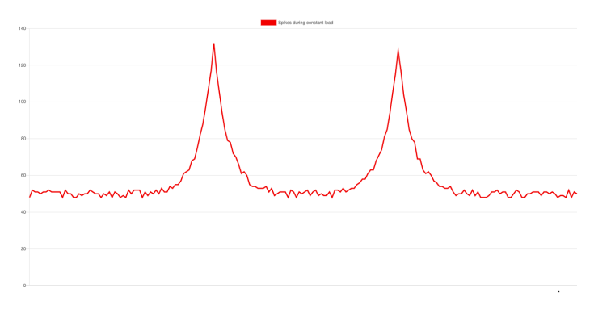
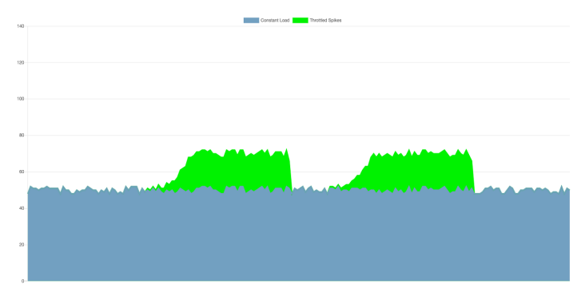
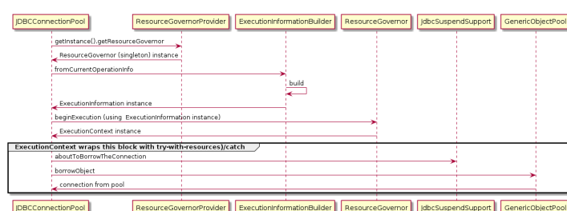

# Database Throttling

Database throttling is a strategy that allows you to handle a changing load in SAP Commerce Cloud. Learn how to congure this feature and how to adjust your conguration values. The load in SAP Commerce Cloud application can change over time as the number of its active end users and their activities differs at a given time. Additionally, various processes take place in the background: some of them are scheduled to occur at a This  given time and some of them are an effect of incoming orders or integration APIs events. As these processes require databaserelated operations, the application load is quickly propagated to the database utilization level. If the utilization of the database exceeds the limits of a given instance, the whole application could slow down or become unresponsive for end users.

SAP Commerce Cloud uses the ResourceGovernor interface as a database throttling strategy to handle situations in which the application faces a constant load with short spikes generated by background processes or integrations APIs. See an example of a constant load with short spikes: To handle a constant load properly, the database needs to be scaled up so that it is able to serve its utilization level at its peak. With database throttling, similar scenario can produce a different database load:

 The image shows that the peak curve area needs to be equal to the area in the previous example so that the peaks are longer when the same number of database operations is run. The difference is that the utilization level of the database is lower when the database is throttled.

SAP Commerce Cloud Platform contains an empty implementation of the ResourceGovernor interface called NoOpGovernor. The actual implementation of the ResourceGovernor interface is provided by the governor extension.

## Resourcegovernor

See the use of the ResourceGovernor interface within a platform that allows the system to handle database-related operations by the ResourceGovernor implementation:
try (final ExecutionContext executionContext = resourceGovernor.beginExecution(executionInformation { jdbcSuspendSupport.aboutToBorrowTheConnection(); return connectionPool.borrowObject(); }
When the application starts a database-related operation, the following processes occur:
1. The beginExecution method with an ExecutionInformation context is called.
2. The context creates an ExecutionContext that wraps the whole operation.
3. The ResourceGovernor interface receives the context of an operation and decides what to do with it.

The resourceGovernor.beginExecution method wraps each connection borrowing operation and returns the ExecutionInformation implementation. As ExecutionInformation provides context information, such as thread name or CronJob code, it makes it possible to assess how to proceed with a connection borrowing with a given database usage. As a result, it's possible to delay connection borrowing operations of cron jobs and not delay HTTP threads so that they don't corrupt the quality of end-user experience.

See what happens in a connection borrowing operation (JDBCConnectionPool.borrowConnection):

## Azure Resources Governor

Azure Resources Governor allows you to control database-related operations in SAP Commerce Cloud on Azure so that you can handle any limits of database resources in a more efficient way. Use it to slow the application processes or requests, or both.

The governor extension provides the implementation of the ResourceGovernor interface called ResourceUtilizationGovernor for SAP Commerce Cloud on Azure. Use ResourceUtilizationGovernor to provide better response time by slowing down application processes or requests or both based on the database load at a given moment.

See the following implementation of the ResourceUtilizationGovernor interface for two conditions (DELAY or NONE):

DELAY: the application calculates the value of the delay if the condition is met based on the delay.max.ms and strength.function values. It uses the get method to retrieve:
current database load by using databaseUtilizationService the value of the strength function for current database load by multiplying the database load by delay.max.ms private void delayExecution(final GovernorConfig.DelayAction delayAction) { final long delayMillis = (long) (delayAction.getMaxDelay().toMillis() * delayAction.getAct currentUtilization)); LOGGER.info("Delaying '{}' by {} [ms], based on '{}' at {} [%] utilization.", executionInf delayAction.getRuleName(), currentUtilization); try { Thread.sleep(delayMillis); } catch (final InterruptedException e) { LOGGER.info("Delay has been interrupted."); Thread.currentThread().interrupt(); } }
NONE: the operation starts without any changes

## Related Information

Conguring Azure Resources Governor

## Executioninformation

ExecutionInformation provides context of each connection borrowing operation.

The ResourcesGovernor interface wraps each execution of database-related operation. ExecutionInformation adds context information to each connection borrowing operation:
final ExecutionInformation executionInformation = ExecutionInformationBuilder.fromCurrentOperationI "JDBCConnectionPool.borrowConnection").build(); try (final ExecutionContext executionContext = resourceGovernor.beginExecution(executionInformation { jdbcSuspendSupport.aboutToBorrowTheConnection(); return connectionPool.borrowObject(); }

## Conguration Labels

The governor extension provides the implementation of ExecutionInformation called LabelBasedExecutionInformation. The implementation uses the following labels that provide an operation context used to lter operations in conguration:
This is   For more    the SAP Help  23 operation_type

is_background_operation thread_name tenant_id
is_system_critical_operation

cron_job_code business_process_code aspect_name
LabelBasedExecutionInformation is created out of OperationInfo that is provided when threads are classied and registered. For more information on registering threads, see Collecting and Classifying Running Operations.
