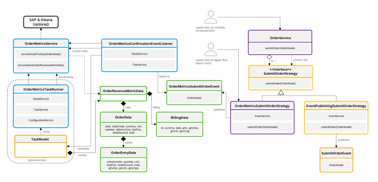

# Development Best Practices

SAP Commerce Cloud is a sophisticated, multi-layered, exible platform and framework. As developers developing with the SAP Commerce Cloud platform and framework, you typically perform various activities and follow the associated best practice guidelines.

Ensure License Compliance Check whether you meet the required license compliance standards that are related to order metrics measured by SAP Commerce Cloud for billing purposes. Install, Congure, and Setup SAP Commerce Cloud for Development Learn about installing and conguring SAP Commerce Cloud for development environments and creating new extensions. Work with Services, Models, and Databases Understand the guidelines for dening or creating data types, ImpEx le, dynamic attributes, services, events, automated tests, and interceptors.

Create Spring MVC Web Shops The Accelerator presentation layer is implemented with the Spring MVC Framework.

## Ensure License Compliance

Check whether you meet the required license compliance standards that are related to order metrics measured by SAP Commerce Cloud for billing purposes.

## Context

The default implementation of SAP Commerce Cloud ensures that customer orders are passed on to the OrderService.submitOrder(order)

service that is responsible for carrying out the post-processing logic including order splitting and sourcing. SAP Commerce Cloud injects additional strategies to this service that calculate order metrics that are used by SAP for billing purposes. The out-of-the-box Accelerator and OCC templates include these strategies.

If you have modied the standard behavior, for example when customizing post processing in your project, you must manually trigger order measurement in your custom code to stay compliant with the SAP Commerce Cloud terms and conditions. If you're unsure whether your orders are measured, enable the following service properties for your environments:
businessmetrics.logging.active=true log4j2.logger.om-measure.level=INFO
log4j2.logger.om-measure.name=businessmetrics.src.de.hybris.platform.businessmetrics.clients.LoggingClient These properties ensure that every order creates a log line similar to the following:

Business metrics: ... -> ...

If you don't see the correct information in your logs, follow the steps:

## Procedure

1. In your custom extensions code, add the following code sample that triggers order measurement:
import de.hybris.platform.core.Registry; import de.hybris.platform.core.model.order.OrderModel; import de.hybris.platform.order.strategies.SubmitOrderStrategy; import org.slf4j.Logger; import org.slf4j.LoggerFactory; import org.springframework.beans.BeansException; public class OrderMetricsHelper
{
private static final Logger LOG = LoggerFactory.getLogger(OrderMetricsHelper.class); private static final String BEAN_ID = "orderMetricsSubmitOrderStrategy";
/**
 * Triggers order metrics collection for the specified order on Commerce Cloud environments. Outside 
 * it will act as no-op and only log a warning that the order could not be submitted.

 */ public static void triggerMetrics(final OrderModel order) {
final SubmitOrderStrategy bean = tryToFindBean();
if (bean != null) {
bean.submitOrder(order);
}
else
{
LOG.warn("no strategy {} found - not submitting order {}", BEAN_ID, order.getCode());
}
}
static SubmitOrderStrategy tryToFindBean()
{
try {
return Registry.getCoreApplicationContext().getBean(BEAN_ID, SubmitOrderStrategy.clas
}
catch (final BeansException e)
{
LOG.debug("Error finding order metrics bean", e); return null;
}
}
}
2. Ensure that you invoke triggerMetrics(order) in your business logic every time time customers place their orders.

## Results

SAP Commerce Cloud now passes order metrics to SAP. The process is asynchronous and shouldn't have a negative impact on the performance of SAP Commerce Cloud.

Related Information Service Properties

## Install, Congure, And Setup Sap Commerce Cloud For Development

Learn about installing and conguring SAP Commerce Cloud for development environments and creating new extensions.

Java Development Guidelines for SAP Commerce Cloud While there is support for Groovy and Scala, SAP Commerce Cloud is coded predominantly in Java. Follow the general guidelines for Java coding with SAP Commerce Cloud.

This is   For more    the SAP Help  3 Create New Extensions Create any new extensions required by invoking the extgen or modulegen ant targets provided in the hybris/bin/platform/build XML le.

Follow the best practice guidelines in creating new extensions.

Generate Garbage Collection Logs If SAP Commerce Cloud receives a Java out of memory exception or shows performance issues, the cause may be related to garbage collection. To determine the root cause of the out of memory or performance issue, take and analyse garbage collection logs.

## Java Development Guidelines For Sap Commerce Cloud

While there is support for Groovy and Scala, SAP Commerce Cloud is coded predominantly in Java. Follow the general guidelines for Java coding with SAP Commerce Cloud.

Regardless of the actual language in use, you need to install and congure a supported Java Development Kit, and download and congure SAP
Commerce Cloud. In addition, most developers will want the benets of using an Integrated Development Environment (IDE). While many will prefer JetBrains IntelliJ
IDEA, SAP Commerce Cloud ships with some built-in support for Eclipse-based IDEs.

## Tip

Most developers do not congure the SAP Commerce Cloud software themselves, but instead will check out the conguration les created by colleagues for the project from a source code repository such as Subversion, Mecurial or GIT.

SAP recommends these guidelines for software developers extending SAP Commerce Cloud.

Follow established industry-recognised Java best practices.

Unless stated otherwise in the rules of the SAP Commerce Cloud SonarQube quality prole for Java or later on this page, follow all the usual Java design and coding best practices. For example, unless stated otherwise follow the standard Java Code Conventions and avoid Development antipatterns and Architecture antipatterns . Comply with the rules in the SAP Commerce Cloud SonarQube Java prole.

Use SonarQube scanners and the SonarLint plugin for your IDE to check that code complies with the rules in the SAP Commerce Cloud SonarQube Java prole. Many of the simpler SAP Commerce Cloud coding best practices, standards and conventions are dened by a SonarQube quality prole that ships with the SAP Commerce Cloud product. You can nd the proles in the build-tools/sonarqube directory of your SAP Commerce Cloud installation.

The rules included in the SAP Commerce Cloud SonarQube quality prole are not repeated in this section. Use a SonarQube server to view the entries and descriptions of the rules included in the SAP Commerce Cloud quality prole. Different releases of SAP Commerce Cloud may use different versions of the SonarQube server and rule denitions may vary slightly with these versions.

These best practice guidelines contain additional standards, rules and guidelines that are specic to working with SAP Commerce Cloud and not yet encoded into the SonarQube server.

Layout code according to the SAP Commerce Cloud Java code formatting conventions. SAP Commerce Cloud Java code formatting conventions are dened by a particular set of Eclipse IDE settings. All extensions created from hybris template extensions are congured automatically with the correct settings. In addition, extensions created in this way are congured to autoformat the code when saving within the Eclipse IDE.

For example, SAP Commerce Cloud code aligns braces instead of using the more usual compact style of layout. Most other formatting is conventional. To update the formatter settings of older extensions or extensions not created from templates, or make these settings the Eclipse workspace defaults, save the settings as a named prole in one of the extensions that has them already, and then switch to that prole in the relevant extensions or at the workspace level.

If using an alternative IDE, set the code formatting to be consistent with these settings.

Write all code and comments in English. Express all the names of classes, interfaces, packages, services, methods, attributes, and variables in English. Write all comments both in-line and Javadoc in English.

SAP Commerce Cloud is a global product. Standardising on English greatly eases the communication between teams located in different parts of the world including product support, professional services, and partner and customer development teams that may read parts of the code. If English is not the team's rst language, it may be useful to create and maintain a bilingual glossary to help developers nd names in English.

Pay attention to typing errors and spelling mistakes. If unsure of a spelling, use the internet to nd the correct spelling. Although typing errors are not fundamentally detrimental to the proper functioning of the code, they give an impression of poor quality and can be very annoying if there are too many. Modern IDE's can nd many basic spelling mistakes. Nevertheless, only code walkthroughs, inspections and reviews can nd other kinds of typing error. In general, it is best to x a typing error as soon as possible; it is nearly always easier to correct them earlier than later. Start all Java source code les with a standard intellectual property header.

Start all Java code les that form part of the shipping SAP Commerce Cloud product with this intellectual property comment block:
/*
 * [y] hybris Platform
 * * Copyright (c) 2017 SAP SE or an SAP affiliate company. All rights reserved.

 * * This software is the confidential and proprietary information of SAP * ("Confidential Information"). You shall not disclose such Confidential
 * Information and shall use it only in accordance with the terms of the
 * license agreement you entered into with SAP.

 */
Start other code such as implementation-project-specic code, and code that is part of some generic, reusable asset or add-on, etc., with an equivalent intellectual property comment block dened by the appropriate SAP eld, partner or customer organization.

## Add Value With In-Line Comments.

Add in-line comments that contain information that is not obvious from reading the code in that le.

Do not restate in in-line comments what is clear from reading the code.

What the code is doing should be clear from the code itself. If at all possible, rewrite tricky/spaghetti code instead of adding comments in an attempt to make the code clearer. Comments should be used to make clean code better, not as an excuse for messy or 'clever' code.

Comments may be needed to state why the code needs to do certain steps (e.g. if the platform needs a particular construct or order of execution), or why the code was written in a particular way (e.g. to optimise performance when a simpler, more obvious way does not provide the performance required). Do not use comment generators such as JAutoDoc. Automatically generated comments typically provide no added insight, clutter the code with unhelpful commenting, and give the false impression that code has been thoughtfully commented by the developers.

Remove commented-out lines of code. Commented-out code makes code harder to read and suggests the developer was thinking, "I don't think we need these, but just in case, I shall leave it here"; source control keeps old code in case it is needed again.

## Fully Javadoc All Public And Protected Interfaces.

Provide all public and protected types, methods and elds with comprehensive, value-add Javadoc comments that comply with the standard Javadoc conventions . If you want your code to be customised and extended easily by other developers, and it ships as a binary form rather than as source code, you need to ensure all developers have all the API information they need in Javadoc to congure, customize, and extend your interfaces and classes correctly. To ensure the Javadoc is comprehensive, use design by contract conventions for javadoc comments so that developers clearly understand what is required of them and what to expect in return.

Be wary of automatically generated java doc, but when code is supplied as a binary, then the generated javadoc may be all developers can see about a method. It is not that generated javadoc is bad, it is the fact that it often says nothing of value. Nevertheless, generated javadoc stating that a basic setter method for a name property is a standard setter method for the name property communicates that there are no unexpected side-effects. That has value, and if generated, costs next-to-nothing to provide.

When modifying a method, ensure the Javadoc is up to date. There is nothing worse than incorrect and out of date Javadoc.

Private methods should be avoided, and so should writing Javadoc for them. Do not include @author tags unless you want to be blamed personally by colleagues, partners and customers. If practical, instead of including examples of how to use, customise or extend the system as Javadoc comments, create an easily-understood, automated test to demonstrate and prove the example.

## Comply With Sap Commerce Cloud Naming And Packaging Conventions.

In general, follow the usual Java naming and packaging conventions as described in Java Code Conventions but with the additional SAP
Commerce Cloud conventions for different types:
Dene and Implement Services

Create Facades Data Access Objects Work with Events
Create Interceptors Add Dynamic Attributes Data Transfer Objects Use WCMS Components Create or Update Controller Classes Exceptions Models Provide Automated Tests Packages See rules for each in subsequent sections.

Use exceptions appropriately.

Use exceptions for exceptional cases that you do not expect. If you expect something to happen, handle it by return value.

Don't use checked exceptions unless you have a very good reason for it. Dene Exception classes for the various error cases you want to handle through Exceptions (it is easier to handle an OrderNotFoundException and display a nice error message than a plain BusinessException). When you have to catch an exception that you don't know how to handle, simply wrap it in a RuntimeException and bubble it up. Never swallow any exceptions. If you need to ignore an exception, comment why you need to and add a log statement. Use exceptions to express error codes:
don't let your function return an int error code;
don't let your function return a complex type containing error attributes; remember exception types can be complex but think of situations where you might need serialization.

If you decide to throw RuntimeExceptions in your code, document this with a @throws statement in your operation's Javadoc comments but do not declare it in a throws clause of your operation signature. The following shows a compliant example:
/**
 * ... * * @throws MyRuntimeException when my exception occurs
 */
public void example() { // ...

 throw new MyRuntimeException(arguments);
 // ... }
The following displays a non-compliant example:
public void example() throws MyRuntimeException //Do not declare runtime exceptions here {
 // ...

 throw new MyRuntimeException(arguments); // ...

 throw new RuntimeException(message); //Do not throw generic exceptions
 // ... }

## Create New Extensions

Create any new extensions required by invoking the extgen or modulegen ant targets provided in the hybris/bin/platform/build XML le. Follow the best practice guidelines in creating new extensions.

SAP recommends these guidelines for software developers extending SAP Commerce Cloud.

Design extension structure and name extensions according to SAP Commerce Cloud convention. For small features, place all functionality related to a particular feature into one new extension. For larger features, consider splitting the feature into several new extensions according to the following structure:
<feature-name>services: new data model items, services, interceptors, events and workows

<feature-name>backoffice: Backoffice contributions
<feature-name> facades: facades, DTOs
<feature-name>webservices: items related to exposing the feature's services as web services <feature-name>add-on: controllers, jsps, taglibs, client-side code for accelerator-store-based additions <feature-name>sampledata: sample data for demonstrations
<feature-name>testdata: test data sets
<feature-name>cockpits: old cockpit contributions (legacy)
In general, for new extensions:
Avoid cyclic dependencies between extensions.

Minimize coupling between extensions. Prefer functional cohesion to logical cohesion (which is better than no cohesion).

Dene all the data model for a related set of extensions (for example a specic feature) in just one of those extensions' items.xml le.

Place classes with specic purposes in the most appropriate new extension. For example, general business logic for workows should be placed in the extension that denes the workow, not a cockpit extension.

Consider placing APIs in separate extensions from their implementation(s).
Name packages within an extension according to SAP Commerce Cloud convention.

All package names for code that forms part of the shipped product must begin with de.hybris.platform. All code that is specic to an implementation project or part of a generic, reusable asset or add-on should begin with an equivalent root package name for that organization and project/product. For example, the i18n features within the product have the following package structure:
de.hybris.platform.i18n -> service interfaces + domain classes ( public API) de.hybris.platform.i18n.impl -> service impls + other implementation related classes (non public ) de.hybris.platform.i18n.daos -> DAO interfaces de.hybris.platform.i18n.daos.impl -> DAO implementations de.hybris.platform.i18n.interceptors -> model lifecycle interceptors de.hybris.platform.i18n.jobs -> cronjobs de.hybris.platform.i18n.actions -> workflow actions de.hybris.platform.i18n.tasks -> process engine tasks de.hybris.platform.i18n.events -> events and listeners de.hybris.platform.i18n.system -> Initialization / Tenant Listener / Cache Invalidation See subsequent sections for package naming for specic kinds of interface and class.

Create new extensions from template extensions.

Always use the extgen or modulegen ant targets to create new extensions from the most appropriate templates supplied with the product. This creates all the basic contents required by a SAP Commerce Cloud extension for a particular purpose. It also congures appropriate Eclipse project settings for that extension.

For example, to create a basic new extension use the extgen ant target with the yempty template.

Use standard Spring conguration les.

Use the following les located in the extensions resource folder to congure Spring:

extension-spring.xml le extension-web-spring.xml le
If necessary, split up cong les into multiple more manageable les. Remove any unnecessary modules and dependencies.

Check an extension's extensioninfo.xml le and remove any unneeded modules and dependencies to other extensions.

For example, extensions created from a template usually have a web app congured by default. Remove this if not needed to improve start up performance and security. Partition classes between src and web/src folder appropriately. General extension specic logic should be independent from web logic, and the two clearly separated by being placed in different source directories. For example:

Classes having business logic concerning the task of the extension must be located under the src folder.

Classes using web specic libs like zk components must be located under web/src.

General logic should not have dependencies on web stuff. For example, a nder for a type should never be dependent on zk classes.
Manage libraries used by an extension.

Ensure libraries used by an extension comply with the following:
If an extension is shipped as part of the main product, any third party library use must be cleared by the appropriate SAP authority.

Ensure that library name ends with the version number.

Put the library in the correct folder (either lib or web/webroot/WEB-INF/lib depending on usage scope - typical web libs such as display tag should be at web lib). Ensure that a library is listed in the .classpath le (for platform also integration folder .classpath).

Ensure that source zips follow naming convention and are placed in doc folder. Carefully consider any manual changes to third party jars. Instead of using all in one jars, for example, hamcrest-all-1.1.jar, consider distributing subpackages so that it is easier to remove conicting classes. Use trusted download source for jars.
Only include extensions you need.

Ensure the localextensions.xml le in the cong directory only loads the extensions you need to work with.

The performance of common actions such as build, initialize, update system and server startup gets slower the more extensions you include through the localextensions.xml le. Keep the number of extensions you load to the minimum required to save yourself time.

In production, do not include extensions you are not using for both performance and security reasons.

## Generate Garbage Collection Logs

If SAP Commerce Cloud receives a Java out of memory exception or shows performance issues, the cause may be related to garbage collection. To determine the root cause of the out of memory or performance issue, take and analyse garbage collection logs.

## Context

Garbage collection is a form of automatic memory management. The garbage collector, or just collector, attempts to reclaim garbage, or memory occupied by objects that are no longer in use by the program. Garbage collection is often portrayed as the opposite of manual memory management, which requires the programmer to specify which objects to deallocate and return to the memory system. Following are the main implementations for garbage collection:

| Type     | Details                                                                                                                              |
|----------|--------------------------------------------------------------------------------------------------------------------------------------|
| Parallel | usage: -XX:+UseParallelGC Default for server environments + High throughput - High latency - Doesn't scale well on multicore servers |

| 7/11/2024 Type     | Details                                                                                                                                                                                                  |
|--------------------|----------------------------------------------------------------------------------------------------------------------------------------------------------------------------------------------------------|
| Concurrent         | usage: -XX:+UseConcMarkSweepGC Industry standard for low latency garbage collection + High throughput + Low latency + Scales well on multicore servers                                                   |
| G1 (Garbage First) | usage: -XX:UseG1GC Low latency garbage collector for a server-style garbage collector, targeted for multi-processor machines with large memories + Low Latency + Large Memory + Multi-processor machines |

The Garbage-First (G1) garbage collector is fully supported in Oracle JDK 7 update 4 and later releases. The G1 collector is a server-style garbage collector, targeted for multi-processor machines with large memories. It meets garbage collection pause time goals with high probability, while achieving high throughput. Whole-heap operations, such as global marking, are performed concurrently with the application threads. This prevents interruptions proportional to heap or live-data size.

The parallel Garbage collector needs stop-the-world events to perform the collection of old generation objects. This can lead to pauses longer than one second, which is undesirable from an operations perspective. The concurrent garbage collector focuses on old objects and must be combined with a young objects collector. For this duty, select the parallel young generation collector:

| -XX:+UseConcMarkSweepGC   | Enables the Concurrent Mark Sweep (CMS) garbage collector for old objects   |
|---------------------------|-----------------------------------------------------------------------------|
| -XX:+UseParNewGC          | Selects the parallel young generation collector for young objects           |

## Procedure

1. Open local.properties.

2. Add the following parameters.

tomcat.javaoptions=-verbose:gc -XX:+PrintGCDateStamps -XX:+PrintGCTimeStamps -XX:+PrintGCDetails -XX:+UseConc 3. Save the le and restart SAP Commerce Cloud.

## Results

When system starts garbage collection, it generates the GC log for analysis.

## Useful Parameters For Garbage Collection

The following parameters are available for conguring your garbage collection logs.

## Behavioural Options Disableexplicitgc

Explicit garbage collector calls by the application lead to the application obtaining control over the complete garbage collection behavior. This is not a desirable constellation. Therefore garbage collector calls by the application should be prevented:

| -XX:+DisableExplicitGC                                                               | Disables explicit garbage collector calls by the application.                                                      |
|--------------------------------------------------------------------------------------|--------------------------------------------------------------------------------------------------------------------|
| -XX:-DisableExplicitGC                                                               | By default calls to System.gc() are enabled (-XX:- DisableExplicitGC). Use -XX:+DisableExplicitGC to disable calls |
| This is custom documentation. For more information, please visit the SAP Help Portal | 9                                                                                                                  |

## Redirection

There is an option to redirect explicit garbage collector calls by the application to the concurrent collector. This is prevents the default stop-theworld events, but it still is preferable to make use of -XX:+DisableExplicitGC and to deactivate application calls to the garbage collector completely. It is not recommended to use this option:

| -XX:+ExplicitGCInvokesConcurrent   | Redirects explicit garbage collector calls to the concurrent garbage collector. It is preferable to use -XX:+DisableExplicitGC instead.   |
|------------------------------------|-------------------------------------------------------------------------------------------------------------------------------------------|
| Other -XX:-UseConcMarkSweepGC      | Use concurrent mark-sweep collection for the old generation.                                                                              |
| -XX:-UseParallelGC                 | Use parallel garbage collection for scavenges.                                                                                            |
| -XX:-UseParallelOldGC              | Use parallel garbage collection for the full collections. Enabling this option automatically sets -XX:+UseParallelGC.                     |
| -XX:-UseSerialGC                   | Use serial garbage collection.                                                                                                            |

## Garbage First (G1) Garbage Collection Options

| -XX:+UseG1GC                         | Use the Garbage First (G1) Collector.                                                                                                                                                                                                                                                        |
|--------------------------------------|----------------------------------------------------------------------------------------------------------------------------------------------------------------------------------------------------------------------------------------------------------------------------------------------|
| -XX:MaxGCPauseMillis=n               | Sets a target for the maximum GC pause time. This is a soft goal, and the JVM will make its best effort to achieve it.                                                                                                                                                                       |
| -XX:InitiatingHeapOccupancyPercent=n | Percentage of the (entire) heap occupancy to start a concurrent GC cycle. It is used by GCs that trigger a concurrent GC cycle based on the occupancy of the entire heap, not just one of the generations (e.g., G1). A value of 0 denotes "do constant GC cycles". The default value is 45. |
| -XX:NewRatio=n                       | Ratio of old/new generation sizes. The default value is 2.                                                                                                                                                                                                                                   |
| -XX:SurvivorRatio=n                  | Ratio of eden/survivor space size. The default value is 8.                                                                                                                                                                                                                                   |
| -XX:MaxTenuringThreshold=n           | Maximum value for tenuring threshold. The default value is 15.                                                                                                                                                                                                                               |
| -XX:ParallelGCThreads=n              | Sets the number of threads used during parallel phases of the garbage collectors. The default value varies with the platform on which the JVM is running.                                                                                                                                    |
| -XX:ConcGCThreads=n                  | Number of threads concurrent garbage collectors will use. The default value varies with the platform on which the JVM is running.                                                                                                                                                            |
| -XX:G1ReservePercent=n               | Sets the amount of heap that is reserved as a false ceiling to reduce the possibility of promotion failure. The default value is 10.                                                                                                                                                         |
| -XX:G1HeapRegionSize=n               | With G1 the Java heap is subdivided into uniformly sized regions. This sets the size of the individual sub-divisions. The default value of this parameter is determined ergonomically based upon heap size. The minimum value is 1Mb and the maximum value is 32Mb.                          |

## Debugging Options

| -XX:-PrintGC                                                                         | Print messages at garbage collection. Manageable.                                                                                                                       |
|--------------------------------------------------------------------------------------|-------------------------------------------------------------------------------------------------------------------------------------------------------------------------|
| -XX:-PrintGCDetails                                                                  | Print more details at garbage collection. Manageable.                                                                                                                   |
| -XX:-PrintGCTimeStamps                                                               | Print timestamps at garbage collection. Manageable.                                                                                                                     |
| XX:ParallelGCThreads                                                                 | Sets the number of garbage collection threads in the young and old parallel garbage collectors. The default value varies with the platform on which the JVM is running. |
| This is custom documentation. For more information, please visit the SAP Help Portal | 10                                                                                                                                                                      |

| 7/11/2024 -XX:InitialTenuringThreshold=7   | Sets the initial tenuring threshold for use in adaptive GC sizing in the parallel young collector. The tenuring threshold is the number of times an object survives a young collection before being promoted to the old, or tenured, generation.   |
|--------------------------------------------|----------------------------------------------------------------------------------------------------------------------------------------------------------------------------------------------------------------------------------------------------|
| -XX:MaxTenuringThreshold=n                 | Sets the maximum tenuring threshold for use in adaptive GC sizing. The current largest value is 15. The default value is 15 for the parallel collector and is 4 for CMS.                                                                           |
| -Xloggc:<filename>                         | Log GC verbose output to specied le. The verbose output is controlled by the normal verbose GC ags.                                                                                                                                                |
| -XX:-UseGCLogFileRotation                  | Enabled GC log rotation, requires -Xloggc.                                                                                                                                                                                                         |
| -XX:NumberOfGClogFiles=1                   | Set the number of les to use when rotating logs, must be >= 1. The rotated log les will use the following naming scheme, <lename>.0, <lename>.1, ..., <lename>.n-1.                                                                                |
| -XX:GCLogFileSize=8K                       | The size of the log le at which point the log will be rotated, must be >= 8K.                                                                                                                                                                      |

## Work With Services, Models, And Databases

Understand the guidelines for dening or creating data types, ImpEx le, dynamic attributes, services, events, automated tests, and interceptors.

Dene Data Types Dene types and relationships between types using xml in <extension-name>-items.xml les located in the resource folder of each extension. Use ImpEx to Load and Extract Data Use the import and export utility ImpEx to load data from CSV les into the database, and extract data from the database into CSV les, including security roles, rights, and restrictions.

Add Dynamic Attributes Dene dynamic attributes for data types in *-items. xml les and create handler classes to support them. Dynamic attributes are the way in SAP Commerce Cloud to expose calculated elds in Models or to implement complex inverters.

Dene and Implement Services Dene services as Java interfaces whose operations use the generated Java model classes as parameter and return types, implementing the interfaces as Java classes to provide the business logic for our application.

Congure Services with Properties Properly dene a property in the le and in the appropriate location. Work with Events Dene event classes that can be published by our services and create listener objects that are registered to respond to our events. This promotes loose coupling of services and extensions. Create Interceptors Write interceptor classes to run code (that may publish events) during the loading and saving of Java model objects from and to the database. Interceptors are callbacks used at different steps of the SAP Commerce Cloud models life cycle.

Use the Data Validation Framework to Constrain Values Data Validation Framework allows you to validate any Java bean using a set of structured validation constraints in a group, and applied to a specic type. These constraints and constraint groups can be managed in the Administration Cockpit, which makes it a tool of choice for validations that can be managed at the runtime without development.

Provide Automated Tests Write unit and integration tests typically using JUnit and basic performance tests typically using JMeter. Write Extensible, Upgradable, Testable Java Code Accelerator and Commerce Services are shipped as source, but actually in many cases it may be preferable to extend code rather than replace code for backward compatibility gains. You should therefore ensure that you are producing code that is easy to extend

## Dene Data Types

Dene types and relationships between types using xml in <extension-name>-items.xml les located in the resource folder of each extension.

SAP recommends these guidelines for software developers extending SAP Commerce Cloud.

For information on ItemType attributes, see References.

Dene a deployment table for all Item Types extending GenericItem. All types that explicitly or implicitly (because it's the default) have GenericItem as their direct super type should have their own deployment.

Failing to declare a deployment for a type means that all instances of that type are stored in the genericitems table with all the other types that have no deployment table. This table can become very large in terms of rows, columns, as well as indexes. Columns are added for each attribute of the types stored in this table. Each item of any type stored in the table takes up a separate row, and each different type stored in this way adds the usual indexes for the table. This makes the database work inefficiently causing performance issues. In addition, xing this issue in a production environment requires a data migration script. See the following example:
<itemtype code="PaymentInfo" extends="GenericItem" ...

 autocreate="true" generate="true"> <deployment table="PaymentInfos" typecode="42"/> <!-- deployment defined here before attributes -->
 <attributes> ... </attributes>
</itemtype>
The only exception to this rule is an abstract item type where you want concrete subtypes stored in separate tables:
<itemtype code="AbstractOrder" extends="GenericItem"
 ...

 autocreate="true" generate="true"> <!-- No deployment defined here --> ...

</itemtype>
<itemtype code="Cart" extends="AbstractOrder"
 ...

 autocreate="true" generate="true"> <deployment table="Carts" typecode="43"/> <!-- Deployment!!! --> ... </itemtype>
<itemtype code="Order" extends="AbstractOrder" ...

 autocreate="true" generate="true"> <deployment table="Orders" typecode="45" ... /> <!-- Deployment!!! --> ... </itemtype>
Do not dene a deployment table for any Item Types that already have a deployment inherited from a super type. If your Item Type directly or indirectly extends another Item Type that denes a deployment, unless that other Item Type is GenericItem, then dening a deployment table for your Item Type, although possible, isn't recommended. It can cause serious performance issues because queries for the super type require a UNION clause with the new table. The following displays an example:
<itemtype code="MyMedia" extends="Media" autocreate="true" generate="true">
<deployment table="mymedia" typecode="22222"/> <!-- deployment should NOT be defined -->
<attributes> ...

</attributes> </itemtype>
SELECT {PK} FROM {Media} WHERE {code}=?code UNION SELECT {PK} FROM {MyMedia} WHERE {code}=?code Deployment type codes must be greater than 10000.

Type codes in deployment clauses up to 10000 are reserved for types dened within the SAP Commerce Cloud product.

In other words, developers dening new item types for inclusion in the product must select a type code below 10000 and register that in the le, reservedTypecodes TXT le. Once released as part of the product, entries must not be removed from the reservedTypecodes TXT le.

Developers creating types for customer implementation projects or reusable assets that aren't shipped as part of the product must select a type code greater than 10000 that isn't listed in the few exceptional reserved numbers above 10000. See Specifying a Deployment for Platform Types for more details. Otherwise, there's a strong possibility of causing a conict with a system type code if you use a value less than 10000. Even if there are no conicts with the current version of the product and the extensions currently being used, an upgrade to a newer version of SAP Commerce Cloud, or the addition of extra extensions from the product could subsequently cause a type code conict. The following displays an example:
<itemtype code="MyCustomProjectType" extends="GenericItem" autocreate="true" generate="true"> <deployment table="mycustomprojecttype" typecode="967"/> <!-- deployment typecode should be greater than 10000 -->
<attributes>
... </attributes> </itemtype>

Do not dene a Jalo class if you are adding to an existing type. If you're adding to an item type already dened elsewhere, do not specify a non-default Jalo class.

<itemtype code="Product" autocreate="false" generate="false" jaloclass="com.hybris.product.jalo.MyProduct"> 
<!-- violation here, the type Product already has a jaloclass -->
<attributes> ... </attributes> </itemtype>
In general, unless you have good reasons to specify a different class name, omit the Jalo class clause from all item type denitions and let the system use the default value for the class name. Dene a deployment table for all many-to-many relations.

If a many-to-many relation doesn't dene a deployment table, its data is stored in the links table along with the data from all the other many-tomany relations that don't dene a deployment table. This can cause that table to have a very large number of rows, large indexes, and encounter able locks during inserts or updates or deletes. This can have a serious impact on performance.

For one-to-many relations, it's not possible to dene an own deployment because they aren't modeled as own table at database at all. The following displays an example:
<relation code="PrincipalGroupRelation" autocreate="true" generate="false" localized="false" deployment="de.hybris.platform.persistence.link.PrincipalGroupRelation"> <!-- Deployment needed --> <sourceElement qualifier="members" type="Principal" cardinality="many" ... > <modifiers read="true" writ'se="true" search="true" optional="true"/>
 </sourceElement>
 <targetElement qualifier="groups" type="PrincipalGroup" cardinality="many" ... >
 <modifiers read="true" write="true" search="true" optional="true"/> </targetElement> </relation>
Do not dene attributes with a persistence type of cmp.

The cmp persistence mode is deprecated and must not be used.

<itemtype code="MyProduct" extends="Product" autocreate="true" generate="true"> <attributes>
 <attribute qualifier="myAttribute" type="java.lang.String">
 <persistence type="cmp"/> <!-- should only use property or dynamic --> </attribute> </attributes> </itemtype>
Ensure mandatory elds (where optional='false') have either initial set to true or a default value dened.

This ensures data consistency on the Type System level. Also note that if you set a default value in the items XML le, the default value is persisted for newly created items only. Existing data isn't updated. The following displays an example:
... <!-- optional set to false so initial set to true --> <attribute autocreate="true" qualifier="paymentInfoType" type="ComposedType" generate="true">
 <persistence type="property"/>
 <modifiers read="true" write="true" search="true" initial="true" optional="false"/> 
 ...

<!-- optional set to false so defaultValue provided --> 
<attribute autocreate="true" qualifier="global" type="java.lang.Boolean" generate="true"> <defaultvalue>Boolean.FALSE</defaultvalue>
 <persistence type="property"/>
 <modifiers read="true" write="true" search="true" optional="false"/> ...

Ensure immutable elds (where write='false') have initial set to true.

Setting write="false" means that a value can only be set when an Item is rst created. Setting initial="true" effectively achieves the same. For consistency, set initial="true" when write="false". The following displays an example:
<itemtype code="Quote" extends="AbstractOrder" jaloclass="de.hybris.platform.jalo.order.Quote" autocreate="true" generate="true">
 <deployment table="Quotes" typecode="60" propertytable="QuoteProps"/> <attributes> <attribute autocreate="true" qualifier="version" type="java.lang.Integer">
 <description>The version of the quote. Along with code it makes a quote instance unique. </description>
 <!-- write set to false so initial set to true --> 
 <modifiers initial="true" write="false" optional="false" unique="true"/>
 <persistence type="property"/>
This is   For more    the SAP Help  13

 </attribute>
 ...

Dene Boolean attributes as mandatory.

It's possible to store 3 values for a Boolean attribute (true, false, or null). Storing a null is almost always not the desired outcome and is usually mapped to a true or false value. It's possible that the mapping isn't always in place so there's potential for logic errors or NullPointerExceptions. The following displays an example:
<!-- Boolean attribute so optional set to false --> <attribute autocreate="true" qualifier="global" type="java.lang.Boolean" generate="true">
 <defaultvalue>Boolean.FALSE</defaultvalue> <persistence type="property"/>
 <modifiers read="true" write="true" search="true" optional="false"/>
 ...

Use an attribute persistence type of dynamic, instead of Jalo. JALO is a deprecated API and its use isn't recommended. Previously, JALO attributes were used when you needed some business logic to be executed before returning a result. This behavior can now be achieved with Dynamic Attributes in the Service Layer without needing to touch JALO:
<itemtype code="MyProduct" extends="Product" autocreate="true" generate="true">
<attributes>
 <attribute qualifier="myAttribute" type="java.lang.String"> <persistence type="jalo"/> <!-- should only use property or dynamic -->
 </attribute>
 </attributes> </itemtype>
Start Item type Names (including EnumTypes and Relations) with an uppercase letter. For consistency, start all type names with an uppercase letter. You can run into issues with the code generators if you don't follow this convention. The following displays an example:
<itemtype code="myProduct" extends="Product" autocreate="true" generate="true"> <!-- violation here "myProduct" should be "MyProduct" -->
 <attributes{{> }}
 ...

 </attributes> </itemtype>
Do not start Item type names with Generated. Starting a type name with the string "Generated" can have some side effects because an abstract class that starts with "Generated" is created by SAP Commerce Cloud already. The following displays a noncompliant example:
<itemtype code="GeneratedProduct" extends="Product" autocreate="true" generate="true"> 
<!-- violation here "GeneratedProduct" will cause some side effects --> <attributes{{> }}
 ... </attributes>
</itemtype>
Start item type attribute names with a lowercase letter.

Values of the qualier attribute of an item type's attribute tag should start with a lower case letter. If you do not follow this convention, some code generators that assume it can cause problems. The following displays a compliant example:
<attribute autocreate="true" qualifier="global" type="java.lang.Boolean" generate="true">
 <defaultvalue>Boolean.FALSE</defaultvalue>
 <persistence type="property"/>
 <modifiers read="true" write="true" search="true" optional="false"/> ...

Start qualier names in relations with a lowercase letter.

Values of the qualier attribute of a relation's sourceElement and targetElement tags should start with a lower case letter. If you do not follow this convention, some code generators that assume it can cause problems. The following displays a compliant example:
<relation code="CatalogsForBaseStores" generate="true" localized="false" autocreate="true"> <deployment table="Catalogs4BaseStores" typecode="2012" />
 <sourceElement qualifier="baseStores" type="BaseStore" cardinality="many" />
 <targetElement qualifier="catalogs" type="Catalog" cardinality="many" collectiontype="list" ordered="true" /> </relation>
Avoid setting ordered='true' on any side of a relation that has cardinality='many' unless absolutely necessary.

This is   For more    the SAP Help  14 Order="true" has a signicant impact on performance when reading and writing from the database. The queries required to provide a dened order to the items that are returned are much more complex and expensive that an unordered query. Using ordered="true" should only be used when absolutely necessary. The following displays a noncompliant example:
<relation code="CatalogsForBaseStores" generate="true" localized="false" autocreate="true"> ...

 <targetElement qualifier="catalogs" type="Catalog" cardinality="many" collectiontype="list" ordered="true" /> </relation>
The following displays a compliant example:
<relation code="CatalogsForBaseStores" generate="true" localized="false" autocreate="true"> ...

 <targetElement qualifier="catalogs" type="Catalog" cardinality="many" collectiontype="list" />
</relation>
Use collectiontype='set' on any side of a relation that has cardinality='many' where items must not appear in that relation multiple times. The set guarantees that every relation is persisted only once. For example, if a Product is related to a Category, it's desirable to store this relation as one row only in the database. The following displays a noncompliant example:
<relation code="CatalogsForBaseStores" generate="true" localized="false" autocreate="true">
... <targetElement qualifier="catalogs" type="Catalog" cardinality="many" collectiontype="list" /> </relation>
The following displays a compliant example:
<relation code="HistoryDocumentRelation" autocreate="true" generate="false" localized="false"> ... <targetElement type="Media" qualifier="documents" collectiontype="set" cardinality="many" ordered="false"> ...

 </targetElement>
</relation>
Mark CatalogVersion attributes as unique for Catalog aware types. The CatalogVersion attribute forms part of the unique key for Catalog Synchronization. To ensure that the same uniqueness rules are applied for other processes (for example, ImpEx), you need to set the CatalogVersion attribute to unique="true". The following displays a noncompliant example:
<itemtype code="MyCatalogType" extends="GenericItem" autocreate="true" generate="true"> <deployment table="MyCatalogType" typecode="XXXX"/> <custom-properties>
 <property name="catalogItemType"> <value>java.lang.Boolean.TRUE</value>
 </property> <property name="catalogVersionAttributeQualifier"> <value>"catalogVersion"</value> </property>
 <property name="uniqueKeyAttributeQualifier"> <value>"uid"</value>
 </property> </custom-properties> <attributes>
 <attribute qualifier="uid" generate="true" autocreate="true" type="java.lang.String">
 <persistence type="property"/> <modifiers optional="false" unique="true"/>
 </attribute> <attribute qualifier="catalogVersion" type="CatalogVersion"> <modifiers optional="false"/> <!-- violation here because missing unique="true" -->
 <persistence type="property"/>
 </attribute>
 </attributes>
 </itemtype>
Ensure unique attributes match the catalog unique attribute key, uniqueKeyAttributeQualier. The attributes dened as unique for the type should be the same attributes as those dened in the custom property, uniqueKeyAttributeQualier. The uniqueKeyAttributeQualier custom property denes the unique attributes for Catalog Synchronization whereas processes using the Service Layer (including the Catalog Synchronization persistence) use the unique attributes on the type. The following displays a noncompliant example:
This is   For more    the SAP Help  15

<itemtype code="MyCatalogType" extends="GenericItem" autocreate="true" generate="true"> <deployment table="MyCatalogType" typecode="XXXX"/>
 <custom-properties>
 <property name="catalogItemType"> <value>java.lang.Boolean.TRUE</value> </property> <property name="catalogVersionAttributeQualifier">
 <value>"catalogVersion"</value>
 </property>
 <property name="uniqueKeyAttributeQualifier">
 <value>"uid"</value> </property>
 </custom-properties> <attributes> <attribute qualifier="uid" generate="true" autocreate="true" type="java.lang.String">
 <persistence type="property"/>
 <modifiers optional="false" unique="false"/> <!-- violation here because missing unique="true
 </attribute>
 <attribute qualifier="catalogVersion" type="CatalogVersion"> <modifiers optional="false" unique="true"/> <persistence type="property"/>
 </attribute> </attributes>
 </itemtype>

## Dene Database Indexes For The Unique Attributes Of Type.

There should be a covering index dened that includes all the unique attributes for type. There are Service Layer interceptors that validate uniqueness for each type, which generates a query for all the unique attributes. Failure to add an index can cause serious performance issues.

Furthermore, the validation of the unique attributes in the Service Layer can't guarantee that there won't be duplicate records in the database, only a unique index/constraint can do this. The following displays a noncompliant example:
<itemtype code="MyType" extends="GenericItem">
<deployment table="MyType" typecode="XXXXX"/>
<attributes>
<attribute qualifier="uid" type="java.lang.String">
<persistence type="property"/>
<modifiers optional="false" unique="true"/>
</attribute>
<attribute qualifier="name" type="java.lang.String">
<persistence type="property"/>
</attribute>
</attributes>
<indexes>
<index name="nameIDX">
<key attribute="name"/>
</index> <!-- Non-compliant - there is no index covering the {uid} unique attribute-->
</indexes>
</itemtype>
See an example of a compliant solution:
<itemtype code="MyType" extends="GenericItem">
<deployment table="MyType" typecode="XXXXX"/> <attributes>
<attribute qualifier="uid" type="java.lang.String">
<persistence type="property"/>
<modifiers optional="false" unique="true"/>
</attribute>
<attribute qualifier="name" type="java.lang.String">
<persistence type="property"/>
</attribute>
</attributes> <indexes>
<index name="nameIDX">
<key attribute="name"/>
</index> <!-- Compliant - there is an index covering the {uid} unique attribute. The index c <index name="uidIDX" unique="true/false">
<key attribute="uid"/>
</index>
</indexes>
</itemtype>
You can disable interceptors that check for uniqueness when there's a correct unique index dened that includes all unique attributes for a given type using the following property:
unique.attribute.interceptor.db.index.enabled=true The default value of this property is false.

Ensure catalog aware types aren't part of a one-to-many relation when the many side isn't a catalog aware type.

Creating a one-to-many relation where the one side of the relation is a Catalog aware type and the many side isn't a Catalog aware type causes an issue when synchronizing. The reference to the Catalog aware type is transferred from the Staged to the Online version. The Staged version no longer has a reference. The following shows a noncompliant example:
<relation code="Product2Author" generate="true" localized="false" autocreate="true"> <sourceElement type="Product" cardinality="one" qualifier="product"/> <!-- violation here, MyItem is 
 <targetElement type="MyItem" cardinality="many" qualifier="myItems" ordered="true"/> </relation>
Ensure all types have unique attributes. Every type should have one or more unique identiers dened or should inherit the unique attributes from a super type. This allows the data to be easily imported or exported into different systems and prevents duplicate entries in the database. The following displays a noncompliant example:
<itemtype code="MyType" extends="GenericItem" autocreate="true" generate="true"> <deployment table="MyType" typecode="XXXX"/> <attributes> <!-- missing a unique attribute --> <attribute qualifier="name" generate="true" autocreate="true" type="java.lang.String"> <persistence type="property"/>
 <modifiers optional="false" unique="false"/>
 </attribute> </attributes> </itemtype>
Do not use unoptimized attributes. Using dontOptimize="true" stores the data for this type in a secondary table dened by the "propertytable" attribute of the deployment or the props table if no propertytable is dened. Generally, it isn't recommended to store attribute values in this way because it's more expensive to store and retrieve the values because joins are required. The following displays a noncompliant example:
<itemtype code="MyType" extends="GenericItem" autocreate="true" generate="true">
 <deployment table="MyType" typecode="XXXX" propertytable="MyTypeProps"/>
 <attributes> <attribute qualifier="name" generate="true" autocreate="true" type="java.lang.String"> <persistence type="property"/> <modifiers optional="false" unique="false" dontOptimize="true"/>
<!-- defining dontOptimize stores this value in the property table for this type (MyTypeProps) of the props table if none is defined -->
 </attribute> </attributes> </itemtype>
Choose whether to add to an existing item type or create a new subtype carefully. When extending an existing type to add new attributes, you can either add the attributes or create a new subtype to the existing type. The following displays an example of adding new attributes to an existing type:
<itemtype code="Product" autocreate="false" generate="false"> <attributes>
 <attribute qualifier="newAttribute" type="java.lang.String"> <modifiers read="true" write="true" search="true" optional="true"/>
 <persistence type="property"/> </attribute> </itemtype>
The following displays an example of creating a new subtype:
<itemtype code="MyProduct" extends="Product" autocreate="true" generate="true"> <attributes>
 <attribute qualifier="newAttribute" type="java.lang.String">
 <modifiers read="true" write="true" search="true" optional="true"/> <persistence type="property"/> </attribute>
</itemtype>
Whether to subtype or extend the existing type should be based on the following decisions:
If: Adding an attribute for all instances Then: Add to existing type Because:
If all instances of the existing type could have a value for this data, then the attribute belongs on existing type. Creating an unnecessary subtype can create issues because a business user could create an instance of the super type that doesn't have all the required/expected attributes. For example, a user could create instances of items that aren't compatible with the business logic. For example, if you subtype Category and create new type with a mandatory attribute called "enabledForFrontend". Business users can still create a standard Category item that doesn't have the required attribute that the front end is expecting.

In addition, the SAP Commerce Cloud APIs expect the existing type so the project code is cluttered by "if instance of then (cast)" constructs when a subtype is used.

If: Adding an attribute for specic instances Then: Create a new subtype
Because: If only some instances have data for a particular attribute then you should subtype.

If: Redeclaring an existing attribute, for example changing mandatory to optional
Then: Create a new subtype Because: Redeclaring requires subtyping Redeclare only when necessary because it can cause potential issues if business users are still able to use the existing types that don't have the attributes required by the system. If subtyping is required, then consider redeclaring attributes so that the new subtypes are returned instead of the existing types.

Although it's typical for implementations to extend an SAP Commerce Cloud type by subclassing, it's preferable to override the type and embed the new elds into it. For example, if a customer wants to add new elds to the Category model, the standard approach used in implementations is to subclass it. If there are any other direct subclasses, or the new elds are shared by other subclasses, it's preferable to simply add the new elds directly to the Category model. This results in a simplication of the data model and queries against the data model.

Finally, rather than extending or subclassing a type, it can be preferable use a composition approach in which you create new types with relations to the core SAP Commerce Cloud types.

## Describe The Purpose And Intended Use Of An Attribute In A Description Tag.

The attribute name doesn't always indicate clearly and completely the purpose and intended use of an attribute. Provide this extra information within the XML le by including a description tag with each attribute. The following displays an example:
<attribute type="java.lang.Integer" qualifier="cartRemovalAge"> <modifiers /> <persistence type="property" />
 ... <description>After specified number of seconds carts will be cleaned up. Default is 28 days.</description></att

## Remove Unnecessary Indexes.

Index management is cost intensive. As a rule of thumb, indexes should only be added for attributes used in exible searches. In addition, when designing indexes, take into account the characteristics of the specic databases being used.

SAP Commerce Cloud creates a signicant number of database indexes that an implementation project might never use. Database indexes slow down the writing to the database so remove indexes that aren't in use to improve large impex import performance. Microsoft SQL Server, Oracle, and MySQL have ways for identifying unused indexes.

## Localize Any Attributes That Need To Be Displayed In A Different Language.

Add the localized keyword to attribute denitions where the value varies according to language. The following shows an example:
<attribute qualifier="name" type="localized:java.lang.String"> ...

</attribute>
Avoid using collections and use relations instead.

In general, the use of relations is preferable to the use of collection types. Collection types can be subject to truncation issues so unless you have good reasons to use one, use a relation instead. The following shows a noncompliant example:
<collectiontype code="AbstractOrderEntryCollection" elementtype="AbstractOrderEntry" autocreate="true" generate="fa
 ...

<itemtype code="AbstractOrder" This is   For more    the SAP Help  18 jaloclass="de.hybris.platform.jalo.order.AbstractOrder" autocreate="true" generate="true"> ... <attributes> <attribute autocreate="true" qualifier="entries" type="AbstractOrderEntryCollection"/> ...

 </attributes>
 </itemtype>
The following displays a compliant example:
<relation code="AbstractOrder2AbstractOrderEntry" localized="false" generate="true" autocreate="true"> <sourceElement type="AbstractOrder" qualifier="order" cardinality="one">
 ... </sourceElement>
 <targetElement type="AbstractOrderEntry" qualifier="entries" cardinality="many" collectiontype="list" ordered="false"> ...

 </targetElement>
</relation>
Dene types in order of inheritance.

More abstract types need to be dened more to the beginning of the items.xml le and more concrete types need to be dened more to the end. The following displays a noncompliant example:
<itemtype code="User" extends="Principal" jaloclass="de.hybris.platform.jalo.user.User" autocreate="true" generate="true"> ... </itemtype>
...

<itemtype code="Principal" <!-- violation: User should be defined after Principal --> extends="GenericItem" jaloclass="de.hybris.platform.jalo.security.Principal" autocreate="true" abstract="true" generate="true">
 ... </itemtype> ... <itemtype code="Customer" extends="User" jaloclass="de.hybris.platform.jalo.user.Customer" autocreate="true" generate="true"> ... </itemtype>
The following displays a compliant example:
<itemtype code="Principal" extends="GenericItem" jaloclass="de.hybris.platform.jalo.security.Principal" autocreate="true" abstract="true" generate="true">
 ...

</itemtype> ...

<itemtype code="User" extends="Principal" jaloclass="de.hybris.platform.jalo.user.User" autocreate="true" generate="true">
 ...

</itemtype>
... <itemtype code="Customer" extends="User" jaloclass="de.hybris.platform.jalo.user.Customer" autocreate="true" generate="true">
... </itemtype>
Type names must be unique. Before dening any new item type, make sure that there's no type with the same name in any other extension. The build system complains if you try to create two types with the same name, and implementors are unable to use both extensions in the same project. The following displays a noncompliant example:
This is   For more    the SAP Help  19 core-items.xml
<itemtype code="Order" extends="AbstractOrder" jaloclass="de.hybris.platform.jalo.order.Order" autocreate="true" generate="true"> ...

</itemtype>
basecommerce-items.xml:
<itemtype code="Order" autocreate="true" generate="true">
<!-- violation: autocreate and generate set to true means you are trying to define a new type with the same name as <attributes> <attribute qualifier="versionID" type="java.lang.String">
 ...

Do not change attribute denitions unless absolutely necessary.

To easily upgrade from one version to another, do not change attribute denitions. The modication of an attribute qualier has serious consequences on a system update. A change of upper/lower case spelling causes API incompatibilities because the signature of generated getters/setters changes. A change of spelling is same as removing the attribute from items.xml and dening a new one with different name. With that the data is stored in a new column, the old data isn't accessible anymore by generated API. There's no automated way to x this problem. If a type change isn't supported by the type of database being used, the modication of an attribute type doesn't alter the database schema. Nevertheless, the generated API changes, resulting in incompatibilities and a high probability of exceptions at runtime. The modication of attribute type in redeclaration mode (for example, MyProduct.code needs to be changed from String to Long) throws a build error in the case of incompatible type hierarchy.

Modication of columntype (subtag of persistence type) succeeds if the type is compatible on database level, otherwise there's no effect. The modication of attribute modiers is ok partly. The read and write ag inuences code generation and with this can cause API incompatibilities. All other modier modications cause different behavior that can be serious and must be checked in detail. For example: adding a unique ag can cause inconsistent data. Do not change deployment code or table names unless absolutely necessary. The typecode specied in a deployment tag forms part of the PK of the items inside the database. It helps nd items quickly by their PK because the typecode points directly to the correct database table. When you change a typecode for a table, all old items inside the table are no longer found and are lost with it. If you change the table name, you get a new table, and you lose access to the old data . Do not change a type declaration unless absolutely necessary.

In general, modifying the values of an existing itemtype tag results in API incompatibilities between the two versions. This breaks backwards compatibility and makes upgrades harder.

Dene a database index on the lookup value of reference types. To improve the performance of large impex imports, Unit.code and Genders.code should both have database indexes if there are a signicant number of rows (more than 100). See the following example:
INSERT_UPDATE ApparelProduct;code[unique=true];unit(code);type(code)
;300441142;;pieces;8,46 GBP, 9,70 EUR, 13,11 USD;Blue Tomato,caps;;;;1022436212;Fruit

## Use Impex To Load And Extract Data

Use the import and export utility ImpEx to load data from CSV les into the database, and extract data from the database into CSV les, including security roles, rights, and restrictions.

SAP recommends these guidelines for software developers extending SAP Commerce Cloud.

Only Add [unique=true] for Unique Attributes in the Data Model [unique=true] should normally only be added to the unique attributes in the data model.

[unique=true] is not doing a validation to ensure a unique value has been used, it's only used for the WHERE part of the SELECT clause to nd an existing item in the database.

Avoid Mixing Headers ImpEx works best if you separate the data by header. See the following example:

INSERT_UPDATE Address;...

;address1;... INSERT_UPDATE OrderEntry;...

;orderentry1;...

INSERT_UPDATE Order;... ;order1;... INSERT_UPDATE Address;... ;address2;...

INSERT_UPDATE OrderEntry;...

;orderentry2;...

INSERT_UPDATE Order;...

;order2;...

The example code should follow this standard:
INSERT_UPDATE Address;... ;address1;...

;address2;... ...

INSERT_UPDATE OrderEntry;... ;orderentry1;... ;orderentry2;... ... INSERT_UPDATE Order;... ;order1;... ;order2;...

...

Use INSERT Instead of INSERT_UPDATE in Large, One-hit Imports The INSERT_UPDATE header will always do a SELECT query to retrieve an existing item using the unique attributes specied in the header.

Sometimes you know that there is no existing data, for example, doing a data migration from an existing system. In this case, you can use the INSERT header and reduce the number of queries that make it to the database. Avoid Multiple Passes as Much as Possible Try to avoid multiple passes of the ImpEx execution by importing dependent items in order. The following shows a non-compliant example:
\#violation: impex needs two passes because the import of product references cannot be done successfully until the r INSERT_UPDATE ProductReference;active[allownull=true];preselected[allownull=true];referenceType(code,itemtype(code)
true;false;"CROSSELLING:ProductReferenceTypeEnum";"PRODUCT_A";"PRODUCT_B" INSERT_UPDATE Product;$stagedProductCV;code[unique=true];name[lang=$lang];ean; ;;PRODUCT_A;PRODUCT_A;A
;;PRODUCT_B;PRODUCT_B;B
The following displays a compliant example:
\#impex only needs one passes because all the referenced products are imported before trying to import the product r INSERT_UPDATE Product;$stagedProductCV;code[unique=true];name[lang=$lang];ean;
;;PRODUCT_A;PRODUCT_A;A ;;PRODUCT_B;PRODUCT_B;B
 
INSERT_UPDATE ProductReference;active[allownull=true];preselected[allownull=true];referenceType(code,itemtype(code)
true;false;"CROSSELLING:ProductReferenceTypeEnum";"PRODUCT_A";"PRODUCT_B"
Consider Importing Many-to-many Relations Separately Many-to-many relations should have their own deployment, or in other words are stored in their own database table. Therefore, for large data imports there can be a signicant performance benet of importing those relations separately. See the following non-compliant example:
INSERT_UPDATE Product;$stagedProductCV;code[unique=true];name[lang=$lang];ean;supercategories(code,$stagedProductCV
;;PRODUCT_A;PRODUCT_A;A;CAT_A,CAT_B
;;PRODUCT_B;PRODUCT_B;B;CAT_A,CAT_C
When importing products and their product categories instead of doing it in one import statement, factor the import into two steps. See the following compliant example:
INSERT_UPDATE Product;$stagedProductCV;code[unique=true];name[lang=$lang];ean;
;;PRODUCT_A;PRODUCT_A;A; ;;PRODUCT_B;PRODUCT_B;B; 
INSERT_UPDATE CategoryProductRelation;source($classCatalogVersion,code)[unique=true,allownull=true];target($stagedP ;"CAT_A";"PRODUCT_A"
;"CAT_B";"PRODUCT_A"
This is   For more    the SAP Help  21

;"CAT_A";"PRODUCT_B"
;"CAT_C";"PRODUCT_B"

## Increase The Number Of Worker Threads

Performance of ImpEx can be improved by increasing the number of threads used by the index engine. For a backend server dedicated to importing, start with a value between 1 and 1.5 times the number of cores e.g. for 4 cores, try 4-6 worker threads and experiment to nd the optimum number of your imports. The following displays the local.properties values:
impex.import.workers=4

## Consider Bypassing Interceptors

Some service layer interceptors can be skipped safely for certain ImpEx executions. This can boost performance for large ImpEx les especially if custom interceptors have a signicant amount of complex logic. One of the possible solutions is to write a bypass interceptor that skips the original one when there is a special ag set in the session. The following shows an example code of bypassing an interceptor:
public class CheckImportSessionInterceptor implements RemoveInterceptor, PrepareInterceptor { 
 private SessionService sessionService; private RemoveInterceptor originalRemoveInterceptor; private PrepareInterceptor originalPrepareInterceptor;
 
 @Override public void onRemove(final Object model, final InterceptorContext ctx) throws InterceptorException { if (originalRemoveInterceptor == null) {
 return;
 } // We are running the interceptor only if we are not in a import session.

 if (Boolean.TRUE.equals(sessionService.getAttribute("IMPORT_SESSION"))) {
 LOG.debug("Session context is defined for import. By pass interceptors."); } else { LOG.debug("Session context is not defined for import : execute interceptors");
 originalRemoveInterceptor.onRemove(model, ctx);
 }
 
 } @Override public void onPrepare(final Object model, final InterceptorContext ctx) throws InterceptorException {
 if (originalPrepareInterceptor == null) {
 return;
 } // We are running the interceptor only if we are not in a import session. if (Boolean.TRUE.equals(sessionService.getAttribute("IMPORT_SESSION"))) {
 LOG.debug("Session context is defined for import. By pass interceptors.");
 } else {
 LOG.debug("Session context is not defined for import : execute interceptors");
 originalPrepareInterceptor.onPrepare(model, ctx);
 } } ...

}
The above class is a wrapper for original type interceptors. It should be mapped to the type that you want to override and replaced using standard bean aliasing. Use JDBC Logging to Identify Slow Queries Queries should be executing in 0-5ms, and slower suggests there is a problem with the performance of the application server, database server of the network IO between the 2 servers. For more information, refer to JDBC Logs from Database Statements.

Disable Other CronJobs While Importing Data This ensures other CronJobs are not contending for the same limited resources while you are trying to import data.

Use Distributed ImpEx It is the possible to execute ImpEx on many nodes simultaneously. The Distributed ImpEx engine enables you to import Platform items from huge and complex external les (for example, les that contain many dependencies between items), and at the same time, it delivers exceptional performance. Distributed ImpEx leverages the existing ImpEx framework to parse and analyze input, and dump unresolved value lines. It also leverages ServiceLayer for persistence, as well as TaskEngine to process single batches of data. For more information, refer to ImpEx Distributed Mode. Use Essential and Project Data Appropriately Essential data les should only contain data absolutely needed for an extension to work. Other setup data should be loaded as project data. If a data value is explicitly referred to in an extension's source code then this value must be loaded as essential data because without it the extension will not work. Nevertheless, avoid this situation if possible. For example, use conguration properties instead of hard-coding a value.

Do Not Use Uniqueness or **LIKE** Operator for NCLOB Fields This is   For more    the SAP Help  22

## Add Dynamic Attributes

Dene dynamic attributes for data types in *-items. xml les and create handler classes to support them. Dynamic attributes are the way in SAP Commerce Cloud to expose calculated elds in Models or to implement complex inverters.

SAP recommends these guidelines for software developers extending SAP Commerce Cloud.

Name Attribute Handlers according to convention Prex the DynamicAttributeHandler class's name by the item type's name to which it applies.

Follow this prex by the attribute name.

Suffix the name by Handler or AttributeHandler.
Name the spring bean the same as the class but starting with a lower case letter. The following displays a compliant example:
catalog-items.xml:
<itemtype code="Catalog" generate="true" jaloclass="de.hybris.platform.catalog.jalo.Catalog" extends="GenericItem" autocreate="true"> ...

 <attribute qualifier="defaultCurrency" type="Currency">
 <description>Default Currency</description>
 <modifiers read="true" write="false" search="true" optional="true"/>
 <persistence type="dynamic" attributeHandler="catalogDefaultCurrencyHandler"/>
 </attribute>
 ...

CatalogDefaultCurrencyHandler.java:
public class CatalogDefaultCurrencyHandler implements ... catalog-spring.xml: <bean id="catalogDefaultCurrencyHandler" class="de.hybris.platform.catalog.model.CatalogDefaultCurrencyHandle Put attribute handler classes in a specic package. Place attribute handler classes in a package whose name ends in attribute handlers. The following shows an example:
de.hybris.platform.myfeature.attributehandlers Avoid successive calls to the getter method. Dynamic attributes values aren't stored within model classes. They are calculated at each call, so avoid successive calls to the getter for performance reasons. The following displays a non-compliant example:
for (int i; i<maxTimes; i++) {
 value = item.getDynamicAttribute(); ... doSomething(parameter1, parameter2, value);
 ...

}
The following displays a compliant example:

value = item.getDynamicAttribute();
for (int i; i<maxTimes; i++) {
 ...

 doSomething(parameter1, parameter2, value);
 ... }

## Note

This is a specic example of the usual good practice of not making unnecessary identical repeated calls to retrieve or calculate a piece of data. While it may not appear that it has signicant performance impact on a local machine with small amounts of data, it might be different in production environments.

## Implement As A Service If Logic Is Complex.

If the logic needed to compute the value of a dynamic attribute is complex or involves a number of other objects, implement this as a service instead of a dynamic attribute. Dynamic attributes are expected to be simple and fast. Do not use them to encapsulate complicated algorithms or logic that orchestrates calls to a number of other services, for example.

## Handle Localized Dynamic Attributes.

For localized Dynamic Attributes, prefer implementation of the interface hybris.platform.servicelayer.model.attribute.DynamicLocalizedAttributeHandler<VALUE, MODEL>.

## Implement Read-Only Dynamic Attributes Correctly.

If the setter implementation doesn't make sense, mention it in the le items XML le stating the modier write="false" and throw a java.lang.UnsupportedOperationException in the setter implementation. The following displays an example:
catalog-items.xml: ...

<attribute qualifier="defaultCurrency" type="Currency">
 <description>Default Currency</description> <modifiers read="true" write="false" search="true" optional="true"/>
 <persistence type="dynamic" attributeHandler="catalogDefaultCurrencyHandler"/>
 </attribute> ... CatalogDefaultCurrencyHandler.java: public class CatalogDefaultCurrencyHandler implements DynamicAttributeHandler<CurrencyModel, CatalogModel> { ...

 @Override public void set(final CatalogModel model, final CurrencyModel currencyModel)
 { throw new UnsupportedOperationException("Write is not a valid operation for this dynamic attribute");
 }

## Implement Write-Only Dynamic Attributes Correctly.

If the getter implementation doesn't make sense, mention it in the items XML le stating the modier read="false" and throw a java.lang.UnsupportedOperationException in the getter implementation. The following displays a compliant example:
items.xml: 
...

<attribute qualifier="defaultThing" type="Thing">
 <description>Default Currency</description>
 <modifiers read="false" write="true" search="true" optional="true"/>
 <persistence type="dynamic" attributeHandler="catalogDefaultThingHandler"/>
 </attribute>
CatalogDefaultThingHandler.java:
public class CatalogDefaultThingHandler implements DynamicAttributeHandler<ThingModel, CatalogModel>
{
 ...

 @Override public ThingModel get(final CatalogModel model)
 {
 throw new UnsupportedOperationException("Read is not a valid operation for this dynamic attribute");
 }

## Dene And Implement Services

Dene services as Java interfaces whose operations use the generated Java model classes as parameter and return types, implementing the interfaces as Java classes to provide the business logic for our application.

Programming to interfaces makes code easier to test, easier to swap in other implementations, and more loosely coupled. This goes hand-in-hand with favour composition over inheritance.

SAP recommends these guidelines for software developers extending SAP Commerce Cloud. Design Services as a Spring bean with a Java Interface implemented by a Java class. All business logic should be coded as services. Together all the services provide the public API of the SAP Commerce Cloud product and extensions. A service should consist of:
a Java interface

}
a Java class that implements that interface Spring conguration for the interface and class plus any supporting Spring beans, Java interfaces, and Java classes including data access objects, adapters/wrappers for third party libraries, and pluggable strategies for algorithms used by the service
Name the interfaces of services after the related domain concept with Service on the end.

The following provides some examples:
CartService

OrderService ReturnsService AtsService
Put the interfaces of services in the root package of an extension.

Put service interfaces either in root package or in sub package named after the domain concept if appropriate. Put parameter classes, result classes, exceptions and other public classes into this package as well. The package should contain the public API of the extension. Package names for service should not contain services or service layer. The following lists some examples:
de.hybris.platform.catalog.CatalogService

de.hybris.platform.category.CategoryService de.hybris.platform.acceleratorservices.email.EmailService de.hybris.platform.yacceleratorcore.suggestion.SimpleSuggestionService
Use naming conventions to dene services as Spring beans. The id of the Spring bean for a service should be the same as the implementation class but starting with a lowercase letter, and an alias should be dened with the same name as the service's interface but again starting with a lowercase letter. The following shows an example:
This is   For more    the SAP Help  25

<alias alias="catalogService" name="defaultCatalogService"/>
<bean id="defaultCatalogService" class="de.hybris.platform.catalog.impl.DefaultCatalogService"
...

<alias alias="categoryService" name="defaultCategoryService" /> <bean id="defaultCategoryService" class="de.hybris.platform.category.impl.DefaultCategoryService" ... <alias alias="emailService" name="defaultEmailService"/>
<bean id="defaultEmailService" class="de.hybris.platform.acceleratorservices.email.impl.DefaultEmailService"
...

<alias alias="simpleSuggestionService" name="defaultSimpleSuggestionService"/> <bean id="defaultSimpleSuggestionService" class="de.hybris.platform.yacceleratorcore.suggestion.impl.DefaultSimpl
...

Encapsulate a service's exible search queries inside one or more Data Access Objects (DAO).

Service implementation classes should not embed Flexible search queries inside business logic. All exible search queries should be placed in a separate DAO class. DAO classes should be dened as Spring Beans and injected into the service implementation classes. This enables:
a clear separation of service business logic from database query logic

the database query logic to be tested separately (slower tests because you don't mock the DB)
the easy overriding of a specic database access method or replacement of the entire DAO
easier reviewing of exible search queries when reviewing what database indexes are needed
DAOs consist of:
a Java interface

a Java class that implements that interface
Spring conguration for the interface and class For services requiring a signicant number of exible search queries, separate the queries into multiple, functionally-cohesive DAOs.

End the names of interfaces for Data Access Objects with DAO. The Java interface of a DAO should end with the string DAO. The interface's name should be the same as the service with the Service suffix replaced by Dao. The following lists some examples:
CatalogService => CatalogDao

ProductService => ProductDao
Or, the name of a domain concept used by the service followed by the Dao suffix. The following lists some examples:

CommerceStockService => CommerceWarehouseDao ProductService => UnitDao, VariantTypeDao
Put the interfaces of Data Access Objects in a daos package underneath the service it supports. Put DAO interfaces in a package called daos immediately underneath the package of the service interface that it supports. The following lists some examples:
de.hybris.platform.catalog.CatalogService => de.hybris.platform.catalog.daos.CatalogDao

de.hybris.platform.catalog.ProductService
=> de.hybris.platform.catalog.daos.ProductDao, => de.hybris.platform.catalog.daos.UnitDao,
=> de.hybris.platform.catalog.daos.VariantTypeDao Name implementations of Data Access Objects the same as the DAO interface but with a standard prex. For product development, use a prex of Default. The following lists some examples:
CatalogDao => DefaultCatalogDao This is   For more    the SAP Help  26

ProductDao => DefaultProductDao UnitDao => DefaultUnitDao VariantTypeDao => DefaultVariantTypeDao
For project implementation when replacing or extending an existing Dao implementation, replace the prex Default by a meaningful word describing the implementation characteristics or use Custom. The following lists some examples:
CatalogDao => CustomCatalogDao

ProductDao => LimitedAvailabilityProductDao UnitDao => CustomUnitDao VariantTypeDao => CustomVariantTypeDao
Put the implementation classes of Data Access Objects in an impl package under the extension's root package.

Implementation classes go in an impl package immediately underneath the package of the DAO interface they implement. The following lists some examples:
de.hybris.platform.catalog.daos.CatalogDao => de.hybris.platform.catalog.daos.impl.DefaultCatalogDao

de.hybris.platform.catalog.daos.ProductDao => de.hybris.platform.product.daos.impl.DefaultProductDao de.hybris.platform.catalog.daos.UnitDao => de.hybris.platform.product.daos.impl.CustomUnitDao de.hybris.platform.catalog.daos.VariantTypeDao => de.hybris.platform.product.daos.impl.CustomVariantTypeDao

## Use Naming Conventions To Dene Data Access Objects As Spring Beans.

The ID of the Spring bean for a DAO should be the same as the implementation class but starting with a lowercase letter, and an alias should be dened with the same name as the DAO's interface but again starting with a lowercase letter. The following shows a compliant sample code:
<alias alias="catalogDao" name="defaultCatalogDao"/>
<bean id="defaultCatalogDao" class="de.hybris.platform.catalog.daos.impl.DefaultCatalogDao"/>
... <alias alias="productDao" name="defaultProductDao"/> <bean id="defaultProductDao" class="de.hybris.platform.product.daos.impl.DefaultProductDao">
...

<alias alias="unitDao" name="defaultUnitDao"/> <bean id="defaultUnitDao" class="de.hybris.platform.product.daos.impl.DefaultUnitDao"> ...

<alias alias="variantTypeDao" name="defaultVariantTypeDao"/> <bean id="defaultVariantTypeDao" class="de.hybris.platform.product.daos.impl.DefaultVariantTypeDao">
...

Implement Finder methods in Data Access Objects.

Data Access Objects should consist mainly of public nder methods. These should:
be named as ndByXXXX where XXXX lists the parameters for the method

never return null return an empty list if nothing is found when searching for multiple items use FlexibleSearchService.searchUnique() when searching for a single item use FlexibleSearchService pagination for potentially-large queries to prevent performance issues
The following provides a compliant sample code:
public class DefaultConsentTemplateDao extends DefaultGenericDao<ConsentTemplateModel> implements ConsentTemplateDa
{
 ... @Override public ConsentTemplateModel findLatestConsentTemplateByIdAndSite(final String consentTemplateId, final BaseSite { ...

 final Map<String, Object> queryParams = new HashMap<>();
 queryParams.put(ConsentTemplateModel.ID, consentTemplateId);
 queryParams.put(ConsentTemplateModel.BASESITE, baseSite);
This is   For more    the SAP Help  27 final FlexibleSearchQuery flexibleSearchQuery = new FlexibleSearchQuery(FIND_LATEST_CONSENT_BY_ID_AND_BASES
 flexibleSearchQuery.getQueryParameters().putAll(queryParams); flexibleSearchQuery.setCount(1); return getFlexibleSearchService().searchUnique(flexibleSearchQuery); }
 ...

}

## Note

Although a DAO implementation class may extend either DefaultGenericDao or AbstractItemDao this is not mandatory. Sometimes it is simpler and preferrable to just inject the FlexibleSearchService and use that.

Use a Data Access Object with pagination to retrieve potentially large sets of dependent items.

Do not rely on model classes' accessor methods to retrieve potentially large sets of objects (>100). This could harm performance. The Platform supports lazy loading of model relations, but it does not manage circular dependencies. Lazy loading of reference collections can also lead to performance problems. Therefore it is not recommended to use lazy loading for anything but non-reference attributes. Instead of...

public List<Order> getUserOrders( final User user)
{ return user.getOrders(); }
... in a context where customers could have placed hundreds of orders over time, use a DAO with a paginated exible search query ...

public List<Order> findOrdersByUser( final User user, int pageNumber, int pageSize) {
 final String query= "SELECT {" + OrderModel.PK + "} FROM {" + OrderModel._TYPECODE + "} WHERE {user}=?user" final FlexibleSearchQuery fQuery= new FlexibleSearchQuery(query); fQuery.setStart(pageNumber * pageSize);
 fQuery.setCount(pageSize);
 SearchResult<OrderModel> result=flexibleSearchService.search(query); return result.getResult(); }
Encapsulate pluggable steps in a service as strategies. If a service has a number of steps or could potentially use different algorithms or different business logic, use a spring-bean-based strategy design pattern to enable developers to plug in different implementation classes. A strategy should consist of:
a Java interface one or more Java class that implements that interface Spring conguration for the interface and classes The following shows a compliant sample code:
public interface PaymentTransactionStrategy {
 ...

}
public class DefaultPaymentTransactionStrategy implements PaymentTransactionStrategy
{ ... }
<alias name="defaultPaymentTransactionStrategy" alias="paymentTransactionStrategy"/> <bean id="defaultPaymentTransactionStrategy" class=" ... impl.DefaultPaymentTransactionStrategy">
Name interfaces of Strategies after the specic business function they are implementing suffixed by strategy.

Name interfaces of a strategy according to what it is or does with the string, strategy, as a suffix. The following provides some examples:

paymentTransactionStrategy UncollectedConsignmentsStrategy
Name implementations of Strategies the same as the Strategy interface but with a unique prex.

Name implementation classes of a strategy the same as the interface but with a prex indicating the avour of strategy. The following lists some examples:

paymentTransactionStrategy => defaultPaymentTransactionStrategy UncollectedConsignmentsStrategy => CustomerServiceUncollectedConsignmentStrategy, ReminderUncollectedConsignmentStrategy
Put interfaces of a strategies in a strategies sub-package.

The Java interface of a strategy should go in an immediate sub-package of the service's package called strategies. This shows an example:
paymentTransactionStrategy =>
de.hybris.platform.acceleratorservices.payment.strategies.PaymentTransactionStrategy Put implementations of a strategy in an implementation sub-package of their service's strategies package. Place the implementation classes in an immediate sub-package of the servi called impl. This shows an example:
defaultPaymentTransactionStrategy =>
de.hybris.platform.acceleratorservices.payment.cybersource.strategies.impl.DefaultPaymentTransactionStrategy Use Spring to congure strategies and their implementations.

Use Spring conguration to dene strategy interfaces and implementations as beans, conguring them as needed. For some examples, see Spring congurations for the following:
DefaultOrderSplittingService and DefaultHybrisFraudServiceProvider in the basecommerce extension defaultPreviewRequestStrategiesList in the acceleratorcmsextension Where possible, enable selection of strategies by business user or administrators at run time.

As more and more customers move to sophisticated deployments and Cloud editions of the product, more features need to be congurable at runtime without the need to restart a server. Therefore, if possible enable strategies for services selected and switched at run-time through back office applications.

Comply with conventions for data retrieval operations in services.

Operations in services that retrieve and return data should comply with following.

These operations should be named with the following pattern: get<Optional Qualier><Item|Items>For<Parameters>().

List<ProductModel> getProductsForCategory(CategoryModel category); List<ProductModel> getOnlineProductsForCategory(CategoryModel category); Integer getProductsCountForCategory(CategoryModel category); ProductModel getProductForCode(String code);
Note the 'for' part of the name.

These operations should delegate to nder methods of Data Access Objects.

public List<ProductModel> getProducts(){
 returnproductDao.findProducts();
}

If expecting a single result, these operations should throw AmbiguousIdentifierException when more then one is found and UnknownIdentifierException when none is found.
public ProductModel getProductForCode(finalString code){
 List<ProductModel> products=productDao.findProductsByCode(code); if(products.isEmpty()){
 throw new UnknownIdentifierException("Product with code '"+ code + "' not found!");
 } else if(products.size() > 1){
 throw new AmbiguousIdentifierException("Product code '"+ code + "' is not unique, "+ products.size() 
 } return products.get(0);
}
Use a parameter object instead of a long list of method parameters. Instead of a list of ve or more parameters, dene and pass a parameter object.

Instead of...

public List<Potatoes> getPotatoesForVariousCritieria(int size, String flavour, int cookingTime, boolean goodForChip
 ... } 
...use...

public class PotatoCriteria { private int size; private String flavour; ... }
public List<Potatoes> getPotatoesForVariousCritieria(PotatoCriteria criteria ) {
 ...

}

## Throw Illegalargumentexception If Method Parameters Are Incorrect.

Assure that your methods are not called with invalid values including null by checking and throwing an IllegalArgumentException which is a RuntimeException indicating wrong usage of API. Also document this contract in javadoc that null values are not allowed as arguments. Do not throw a NullPointerException as this will indicate an error in program logic instead of wrong usage of API.

Use de.hybris.platform.servicelayer.util.ServicesUtil.validateParameterNotNull,or Guava preconditions, or org.apache.commons.lang3.Validate org.springframework.util.Assert classes to check if an input parameter was provided.

## Do Not Use Null As A Return Value.

Avoid the use of null as a return value in service implementations. Instead throw runtime exceptions if a precondition is not satised or a result is not expected. The use of null as return value can cause NullPointerExceptions during the code execution and also requires additional null checks in the calling code. The following displays the de.hybris.platform.product.impl.DefaultProductService example:
public ProductModel getProductForCode( final String code)
{ 
 List<ProductModel> products=productDao.findProductsByCode(code); if(products.isEmpty()){
 throw new UnknownIdentifierException("Product with code '"+ code + "' not found!");
 } else if(products.size() > 1){
 throw new AmbiguousIdentifierException("Product code '"+ code + "' is not unique, "+ products.size() + " pr
 } return products.get(0);
}
Use Spring AOP for transactions.

If you need to use a transaction, use Spring AOP. All business code that must run as an atomic operation should be wrapped in a transaction. The default way to ensure that your code is transactional is to use Spring AOP support.

@Transactional publicvoidcancelOrder(OrderModel order)
{
 ...

}
If you require more ne-grained control, you can inject Spring PlatformTransactionManager and handle the transaction programmatically using Spring's TransactionTemplate.

PlatformTransactionManager manager=(PlatformTransactionManager) Registry.getApplicationContext().getBean( "txManage TransactionTemplate template= new TransactionTemplate(manager);
template.execute( new TransactionCallbackWithoutResult()
{
 @Override protected void doInTransactionWithoutResult( final TransactionStatus status)
 { // do something transactional
 } });
It is a good practice to mark read-only methods as transactional as well.

@Transactional(readonly=true)
publicOrderModel getOrder(String orderId)
{
 ...

}

## Congure Services With Properties

Properly dene a property in the le and in the appropriate location.

SAP recommends these guidelines for software developers extending SAP Commerce Cloud.

Avoid magic numbers, dates, and strings.

These should be factored out into constants of the class/interface or extracted out and specied via system properties. The following provides an example of a magic number:
if ( s.length() >= 40 )...

Replace 40 with a reference to a declared constant...

private static final int MAX_NAME_SIZE if ( s.length() >= MAX_NAME_SIZE )...

… or even better, a system property:
private static final int MAX_NAME_SIZE
private ConfigurationService configService;
... int maxLengthSize = getConfigurationService().getConfiguration().getInt(MAX_NAME_SIZE);
...

if ( s.length() >= maxLengthSize )...

Dene properties in the appropriate location.

When adding a new property it should be dened in the appropriate properties le:
advanced.properties for very special properties not typically used by a customer platform project.properties for other low-level platform-level properties

extensions' project.properties for extension related properties local.properties for project or installation-specic properties
Do not access properties in a static context.

Properties les cannot be used to set different property values for different tenants. This can only be done at runtime, typically using SAP
Commerce Cloud Administration Cockpit. Therefore, do read property values into static variables which is done at class loading time before the platform has started.

Do not cache property values. Properties may have their values change at any time using SAP Commerce Cloud Administration Cockpit while the platform is running. Therefore, property values should always be read fresh from the CongurationService and not, for example, read once at start up and cached in some other variable or le.

Do not remove or rename properties.

Removing or renaming properties means congurations in existing systems may not have the same effect anymore. To retain backward compatibility, only add new properties.

Document each property.

This is   For more    the SAP Help  31 Each property needs a proper description in the property le itself including possible values and default behaviour.

Use Item Types for Structured Data, not Properties.

Resist the temptation to store structured data as a set of conguration properties. Instead dene one or more appropriate Item Types and associated relations to store the data in the database and create a suitable service and ui's to retrieve and manipulate it.

## Work With Events

Dene event classes that can be published by our services and create listener objects that are registered to respond to our events. This promotes loose coupling of services and extensions.

SAP recommends these guidelines for software developers extending SAP Commerce Cloud.

Create new Event classes that extend AbstractEvent.

Decrease coupling between services and extensions by publishing and responding to events. All new event classes should directly or indirectly extend de.hybris.platform.servicelayer.event.events.AbstractEvent. The following lists some examples:
FraudErrorEvent

OrderCompletedEvent OrderRefundEvent QuoteExpiredEvent
Respond to events using listener classes that extend AbstractEventListener<T>
Create listener classes to respond to built-in and custom event objects published by the system. All listener classes should directly or indirectly extend de.hybris.platform.servicelayer.event.impl.AbstractEventListener:
OrderCompletedEventListener

QuoteExpiredEventListener
End Names of Event classes with Event.

Name event clases after the concept they represent followed by the string, Event. The following lists some examples:
FraudErrorEvent

OrderCompletedEvent OrderRefundEvent QuoteExpiredEvent
Put event classes in an events package. Event classes should be placed in a package called event or events, either immediately under the extension's root package, or under the package of the relevant domain concept if the extension is organised in that way. The following lists some examples:
FraudErrorEvent => de.hybris.platform.orderprocessing.events.FraudErrorEvent

OrderCompletedEvent => de.hybris.platform.orderprocessing.events.OrderCompletedEvent OrderRefundEvent => de.hybris.platform.commerceservices.event.OrderRefundEvent QuoteExpiredEvent => de.hybris.platform.commerceservices.event.QuoteExpiredEvent
End Names of Listener classes with Listener.

Name event clases after the events they listen for with the additional suffix of Listener. The following lists some examples:
OrderCompletedEvent => OrderCompletedEventListener

QuoteExpiredEvent => QuoteExpiredEventListener
Put listener classes in the events package or a separate package called listeners.

This is   For more    the SAP Help  32 Listener classes should be placed in the package with the event classes they listen for, or in a listeners package immediately under the extension's root package. Do not embed signicant business logic inside listener classes, delegate to a service instead. Embedding business logic in a listener class make it hard to resume it. Instead dene a service, put the business logic in that and call it from within the listener class.

## Create Interceptors

Write interceptor classes to run code (that may publish events) during the loading and saving of Java model objects from and to the database.

Interceptors are callbacks used at different steps of the SAP Commerce Cloud models life cycle.

SAP recommends these guidelines for software developers extending SAP Commerce Cloud.

Name Interceptors after the most applicable domain concept followed by the type of interceptor it is Name interceptors as follows:
Prex the Interceptor name by the entity that it applies to the most or an indication of the purpose of the Interceptor Suffix the Interceptor name by the interface it implements The following lists some examples:
B2BDocumentPrepareInterceptor

B2BBudgetModelValidateInterceptor VariantCategoryValidateInterceptor
Put Interceptor classes in an interceptors package Interceptor classes should be placed in a package called interceptor, either immediately under the extension's root package, or under the package of the relevant domain concept if the extension is organised in that way. The following lists some examples:
B2BDocumentPrepareInterceptor => de.hybris.platform.accountsummaryaddon.interceptor.B2BDocumentPrepareInterceptor

B2BBudgetModelValidateInterceptor => de.hybris.platform.b2b.interceptor.B2BBudgetModelValidateInterceptor
VariantCategoryValidateInterceptor => de.hybris.platform.variants.interceptor.VariantCategoryValidateInterceptor Use naming conventions to congure interceptors in Spring The id of the Spring bean for an interceptor should be the same as the implementation class but starting with a lowercase letter. The following provides a compliant example:
<bean id="b2bDocumentPrepareInterceptor" class="de.hybris.platform.accountsummaryaddon.interceptor.B2BDocumentPrepa Use the correct Interceptor for the job Ensure that an interceptor is performing a function that is consistent with the purpose of the interface it implements and step in the model ligercycle where it will be invoked. The following lists some examples:
a ValidateInterceptor should not make changes to date items

a PrepareInterceptor should not be checking the validity of data items

## Use The Data Validation Framework To Constrain Values

Data Validation Framework allows you to validate any Java bean using a set of structured validation constraints in a group, and applied to a specic type. These constraints and constraint groups can be managed in the Administration Cockpit, which makes it a tool of choice for validations that can be managed at the runtime without development. The data validation framework uses Hibernate Validator, a Java validator compatible with the JSR-303. It is also possible to validate beans based upon compatible annotations JSR-303.

This is   For more    the SAP Help  33 SAP Commerce Cloud also provides a ValidateInterceptor using the framework and registered for all items. To use it, constraints groups only need to be dened in the Administration Cockpit and to call the method de.hybris.platform.validation.services. ValidationService.setActiveConstraintGroups(Collection<ConstraintGroupModel>) in the code to activate constraints groups in session for the automatic validation of items.

Specic constraints groups called CoverageConstraintGroups are also used by the coverage calculation service used to measure the products enrichment state in the Backoffice Administration Cockpit.

SAP recommends these guidelines for software developers extending SAP Commerce Cloud.

Consider using the Data Validation Framework instead of hardcoding data validation rules In the following cases, think about the option of using the Data Validation Framework:
When validation rules need to be congured or adjusted at run time

Calculation of values such as product enrichment coverage Validation of data entered via forms in a user interface Validating entries in a data import job

## Provide Automated Tests

Write unit and integration tests typically using JUnit and basic performance tests typically using JMeter. Test-driven development (TDD)'s focus on tests before implementation tends to produce better code:
less tendency to "hack a solution"

more thought into the functionality/API before diving into implementation better test coverage
providing a developer with a list of tests that need to pass can also be an effective way for a team to specify tasks in a Sprint

SAP recommends these guidelines for software developers extending SAP Commerce Cloud.

All newly added (or modied) code must be accompanied by test suites Tests (with a strong preference on automated tests) are required to:
verify the expected behavior of the code being tested

document and demonstrate the use of the code being tested so that someone new to the code can understand the expected behavior of the API
The following lists examples:
each class should have a related test class (including web classes) in the same package as the class it is testing but under the testsrc folder instead of the src folder with at least one test case per public method for expected and unexpected input Understand the terms Mocking, Stubbing, Unit Testing, and Integration Testing.

Write automated unit tests Unit tests must be written for all implementation classes and for all public methods. You should ensure the following:
All valid code paths are covered

All exception scenarios are covered All dependencies are mocked/stubbed Tests add value
Do not test "pure delegation" behavior

Do not test FlexibleSearchQuery string contents
The following shows you an example: Mock the ShippingCalculator service and have unit tests to cover the following scenarios:
order == null
: throws IllegalArgumentException order.getShipping() == null
: Does not call ShippingCalculator mock order.getOrderEntries() is empty

: Does not add order entry totals
(order.getShipping() != null) && (order.getOrderEntries() is not empty)
: Adds order entry totals; calls ShippingCalculator mock public class DefaultOrderCalculator implements OrderCalculator
{
 private ShippingCalculator shippingCalculator; 
 @Override public Long getTotal(OrderModel order) throws IllegalArgumentException { if (order == null )
 {
 throw new IllegalArgumentException( "Order cannot be null." );
 } final Long total=0L; for (OrderEntryModel orderEntry : order.getOrderEntries()) {
 total += orderEntry.getTotal(); }
 
 if (order.getShipping() != null ) {
 total += shippingCalculator.getTotal(order.getShipping()); } return total;
 }
}
Unit Testing is far faster than Integration Testing. Try to write narrow tests that focus on single areas and use only what they really need to perform their test. If a test can use stubs and mocks instead of needing a complete SAP Commerce Cloud platform to run, then that should be favored as it will be quicker to run and a more focussed test.

Write automated integration tests to verify the contracts of all interfaces These tests should pass regardless of the implementation being used behind the interface. You should ensure the following:
Happy path scenario is covered

All exception scenarios are covered Basic edge cases are covered Spring context loads all required spring beans Real database is used for testing (hsql db) Tests are deterministic Tests do not depend on other tests
This is   For more    the SAP Help  35

Tests do not make use of Thread.sleep()
Tests run in their own transaction Tests roll back their transaction or clean up after themselves completely Tests are responsible for inserting the data they require
In this example, you integrate tests that cover the following scenarios:
originalConsignment is null and throws an exception

sku is null throws an exception sku does not belong to originalConsignment throws an exception sku belongs to originalConsignment and is not only sku (happy path)
sku belongs to originalConsignment and is only sku (edge case)
public interface ConsignmentService
{
 ConsignmentModel splitConsignmentBySku(ConsignmentModel originalConsignment, String sku) throws ConsignmentSp }
Remember to write tests for web classes Even web classes must be tested (in the web/testsrc folder), web related classes can be mocked easily. For an example, see MockHttpServletRequest.

## Write Extensible, Upgradable, Testable Java Code

Accelerator and Commerce Services are shipped as source, but actually in many cases it may be preferable to extend code rather than replace code for backward compatibility gains. You should therefore ensure that you are producing code that is easy to extend Similarly, code should be easy to write tests for.

SAP recommends these guidelines for software developers extending SAP Commerce Cloud.

Do not use nal on classes or methods in anything except low-level platform features Creating classes or methods that cannot be extended in a framework that is intended to be fully extensible is not sensible. It also makes it hard to substitute in sub-classes for testing purposes.

Never use private methods (only public or protected)
Making methods private in a framework that is intended to be fully extensible is not sensible. All member variables must be private and accessed via public or protected accessor methods This includes abstract services, and injected dependencies. The following shows an example:
public abstract class SomeAbstractService extends AbstractService{
 private ModelService modelService; // Member fields should be private and accessed with getters, setters Avoid writing static methods Static methods cannot be overridden so avoid them if at all possible. Take when creating helper classes full of static methods Utility or helper classes that only contain static methods should only provide very simple common functions that will not need to be mocked out in tests or need their behaviour extended. Only ever spring inject interfaces types not specic implementations To replace the injected implementation used by a class, always inject an interface and not a concrete class.

Prefer to use Spring XML conguration rather than spring annotations Using the Spring XML conguration les means you can change the conguration without modifying source code les. The usual exception here is the use of annotation for Spring MVC in controller classes because of the real added convenience of the annotations in that context.

This is   For more    the SAP Help  36 Avoid the use of the "new" keyword Using new hardcodes the type of object being created. Instead use IOC injection for services and Spring prototypes for Java POJO's that can be replaced by custom or extended implementations, or mocked or stubbed objects for testing purposes. Avoid using static blocks unless doing low-level platform coding Static initialisation blocks are run at class loading time and that is typically before all platform services are up and running. The only time it makes sense to use these is if working at very low-level in the core platform itself.

Favour composition and dependency injection over inheritance Designs that use composition and dependency injection are typically more exible, extensible, and much more easily tested than designs that use inheritance. The following provides an example:
public class MyBaseClass implements IMyBaseClass { .. myBaseClass stuff
} public class MySpecialClass extends MyBaseClass { .. MySpecialClass stuff } versus public class MyBaseClass implements IMyBaseClass { .. myBaseClass stuff } public class MySpecialClass {
 IMyBaseClass mbc; <-- to be injected from spring
 .. MySpecialClass stuff
}
In the previous example, MySpecialClass extends MyBaseClass, which means that it is a rigid design. If you wanted to use MySpecialClass without MyBaseClass you can't. The second example is more exible. MySpecialClass can still do as much as the upper example, but is now loosely coupled with MyBaseClass. Therefore, it is easier to reuse, easier to test, and it is also now easier to replace the mbc implementation should you want. Sometimes inheritance can be little more than spreading one class over two les, and should be treated carefully, and where possible replaced with composition.

## Create Spring Mvc Web Shops

The Accelerator presentation layer is implemented with the Spring MVC Framework.

Create AddOns AddOns are built on top of the existing SAP Commerce Cloud to extend the functionality of the SAP Commerce Cloud Accelerator. Create Facades Dene, create, and register facade beans to aggregate service calls and provide data transfer objects (DTOs) that simplify the development of controller classes and Java Server Pages (JSP).

Create or Update Controller Classes Create or update Spring MVC-based controller classes to accept and service requests submitted by customers using the storefront. Use WCMS Components Use existing WCMS components, dene and create any custom WCMS components required. Avoid hard-coding data and layout into webpages.

Create or Update JSP Tags Create or update JSP tags to encapsulate JSP logic used across multiple pages.

Create or Update JSPs Create or update JSPs including the use of WCMS component and custom JSP tags to present web pages to customers using the web shop.

## Create Addons

AddOns are built on top of the existing SAP Commerce Cloud to extend the functionality of the SAP Commerce Cloud Accelerator. AddOns are a type of extension that allow you to add front-end les (such JSP, HTML, CSS, and JavaScript les, as well as images) from within your own AddOn, instead of modifying the storefront front-end les directly.

This is   For more    the SAP Help  37

SAP recommends these guidelines for software developers extending SAP Commerce Cloud.

Separate front-end functionality into reusable AddOns Putting stuff in add-on extensions instead of directly into the main storefront extension avoids the need for manual merging of les when upgrading the Accelerator code base. Putting functionality into AddOns, builds a library of self-contained, reusable components for your future projects. Name Addon extensions based on domain concept with a suffix of Addon Name the adding extension after the domain functionality that it provides followed by the character string "Addon." The following shows some examples:
accountsummaryaddon

b2bacceleratoraddon recentvieweditemsaddon
Only put front-end logic and resources in Addon extensions For exibility and reusability, keep business logic and storefront-related features in separate extensions.

For example, do not include services, facades, backoffice conguration in AddOns. Separate these out into their own extensions.

## Create Facades

Dene, create, and register facade beans to aggregate service calls and provide data transfer objects (DTOs) that simplify the development of controller classes and Java Server Pages (JSP).

## Requirements

Interface shall be documented on why its working this way and intentions of the facade and the facade method.

Internal inline comments shall be written for any complex or ambiguous logic. No private methods, all protected methods intended for replacement shall be documented. Inline comments shall describe why the functionality is working a certain way, explaining the thought process.

Facades shall be very extensible and easy to extend. For example, replacing facade converters or replacing methods or the entire facade should be possible.
SAP recommends these guidelines for software developers extending SAP Commerce Cloud.

Create facade objects to convert SAP Commerce Cloud Model objects into Data Transfer Objects (DTOs)
SAP Commerce Cloud model objects may not provide the most suitable form of data for use in Java Server Pages or other presentation technologies. Provide a facade class to translate data from one or mores services into a more suitable form for presentation layers. This typically involves converting one or more objects of hybris model classes into plain old Java beans, often referred to as Data Transfer Objects (DTO).

Name interfaces of facades after the related domain concept with "Facade" on the end The following displays some example:
ProductFacade CatalogVersionFacade ConsentFacade Comply with the packaging conventions for facade interfaces Where an extension has been created specically for facades, e.g. assistedservicepromotionfacades, place the Java interfaces of facades in the root package of the extension. The following shows an example:
de.hybris.platform.assistedservicepromotionfacades For small features contained within a single extension, place the Java interfaces of facades in a package called facades immediately under the root package of the extension. The following shows an example:
This is   For more    the SAP Help  38 de.hybris.platform.smallextension.facades If an extension contains several facades for different concepts, use sub-packages to group the facades by concept. The following shows an example of the commercefacades extension containing a large number of facades grouped into sub packages buy concept:
de.hybris.platform.commercefacades.address de.hybris.platform.commercefacades.catalog de.hybris.platform.commercefacades.consent de.hybris.platform.commercefacades.coupon de.hybris.platform.commercefacades.customer ...

For more information, see Create New Extensions according to SAP Commerce Cloud convention. Name implementations of facades the same as the service interface but with a standard prex. For product development, use a prex of Default. The following shows some examples:

CartFacade <--- DefaultCartFacade OrderFacade <-- DefaultOrderFacade ReturnsFacade <-- DefaultReturnsFacade AtsFacade <-- DefaultAtsFacade UserFacade -> DefaultUserFacade
For project implementation, replace the prex Default with a meaningful word describing the implementation characteristics or at least with Custom for overloaded Facades when replacing an existing Facade implementation. The following displays some examples:
CartFacade <--- CustomCartFacade

OrderFacade <-- Custom OrderFacade ReturnsFacade <-- Custom ReturnsFacade AtsFacade <-- Custom AtsFacade UserFacade -> CustomUserFacade
CustomProductFacade extends DefaultProductFacade implements ProductFacade. CustomAcmeProductFacade extends DefaultProductFacade implements AcmeProductFacade extends ProductFacade. Put the implementation classes of facades in an impl package under the facade package Implementations go in an impl package and begin with the prex Default. Let's take a look at this example:
de.hybris.platform.ordermanagement.returns.impl.DefaultReturnsService.

Spring bean ID should be defaultXXX with additional alias XXX with rst letter lower case:

<bean id= "defaultProductService" class="... DefaultProductService"/>
Dene alias for default beans
<alias alias= "productService" name= "defaultProductService"/>

## Dene Dto Beans In Beans.Xml Les

Use the built-in bean denition features to crate data transfer objects (DTO) classes by dening them in xml in the <extension-name>-beans.xml le located in the resource folder of each extension. This enables bean denitions to be added to by other extensions in a similar way to item type denitions. The following shows a compliant example:
<?xml version="1.0" encoding="ISO-8859-1"?> ... <beans xmlns:xsi="http://www.w3.org/2001/XMLSchema-instance" xsi:noNamespaceSchemaLocation="beans.xsd">
 ... <bean class="de.hybris.platform.commercefacades.product.data.ReviewData">
 <property name="id" type="String"/> <property name="headline" type="String"/>
 <property name="comment" type="String"/>
 <property name="rating" type="Double"/>
 <property name="date" type="java.util.Date"/> <property name="alias" type="String"/>
 <property name="principal" type="de.hybris.platform.commercefacades.user.data.PrincipalData"/>
This is   For more    the SAP Help  39

 </bean>
 ...

</beans>

## Use Convertors And Populators With Dto Beans

Instead of hardcoding the logic for converting hybris model objects into Data Transfer Objects in facade classes, put that logic into convertor and populator Spring beans. This is more exible and extensible especially where the denition of a DTO is spread across multiple extensions. The following shows a compliant example:
Create populator classes that directly or indirectly implement the Populator interface.

package de.hybris.platform.commercefacades.product.converters.populator; import de.hybris.platform.commercefacades.product.data.ReviewData; import de.hybris.platform.commercefacades.user.data.PrincipalData; import de.hybris.platform.converters.Populator; import de.hybris.platform.core.model.security.PrincipalModel; import de.hybris.platform.customerreview.model.CustomerReviewModel; import de.hybris.platform.servicelayer.dto.converter.Converter; import org.springframework.beans.factory.annotation.Required; import org.springframework.util.Assert;
/**
 * Converter implementation for {@link de.hybris.platform.customerreview.model.CustomerReviewModel} as source and
 * {@link de.hybris.platform.commercefacades.product.data.ReviewData} as target type. */ public class CustomerReviewPopulator implements Populator<CustomerReviewModel, ReviewData>
{
 private Converter<PrincipalModel, PrincipalData> principalConverter; protected Converter<PrincipalModel, PrincipalData> getPrincipalConverter()
 {
 return principalConverter;
 }
 @Required public void setPrincipalConverter(final Converter<PrincipalModel, PrincipalData> principalConverter) {
 this.principalConverter = principalConverter;
 }
 @Override public void populate(final CustomerReviewModel source, final ReviewData target) {
 Assert.notNull(source, "Parameter source cannot be null.");
 Assert.notNull(target, "Parameter target cannot be null."); target.setId(source.getPk().getLongValueAsString());
 target.setComment(source.getComment());
 target.setDate(source.getCreationtime()); target.setHeadline(source.getHeadline()); target.setRating(source.getRating());
 target.setAlias(source.getAlias()); target.setPrincipal(getPrincipalConverter().convert(source.getUser()));
 } }
Congure converter beans with lists of populator beans in the <extension-name>-Spring.xml le in the resources directory of the extension:
... <alias name="defaultCustomerReviewConverter" alias="customerReviewConverter"/>
 <bean id="defaultCustomerReviewConverter" parent="abstractPopulatingConverter">
 <property name="targetClass" value="de.hybris.platform.commercefacades.product.data.ReviewData"/>
 <property name="populators">
 <list>
 <ref bean="customerReviewPopulator"/>
 </list>
 </property>
 </bean>
 <alias name="defaultCustomerReviewPopulator" alias="customerReviewPopulator"/>
 <bean id="defaultCustomerReviewPopulator" class="de.hybris.platform.commercefacades.product.converters.populator.CustomerReviewPopulator" >
 <property name="principalConverter" ref="principalConverter"/>
 </bean>
...

Name Populator Classes after the item type they populate followed by Populator The names of population classes should start with the type of item being converted and nished with the string Populator. The following lists some examples:
CustomerReviewModel => CustomerReviewPopulator AbstractCouponModel =>CSACouponDataPopulator Comply with the packaging conventions for population classes Place populator classes in a package called populator or convertors.populators either directly under the root package of the extension or under the package for the relevant domain concept if the extension is organised in that way. The following lists examples:
CustomerReviewPopulator => de.hybris.platform.commercefacades.product.converters.populator CSACouponDataPopulator => de.hybris.platform.assistedservicepromotionfacades.populator

## Create Or Update Controller Classes

Create or update Spring MVC-based controller classes to accept and service requests submitted by customers using the storefront.

SAP recommends these guidelines for software developers extending SAP Commerce Cloud.

Name Controllers according to convention The controller classes used for CMSComponents must have the same name as the CMSComponents suffixed by Controller, for example:
NavigationBarComponent => NavigationBarComponentController In all other cases, the rst part of a controller class's name should reect the domain functionality it controls. This should be followed by a suffix of either:
PageController when it relates to only one page Here is an example: CategoryPageController Controller Here is an example: PaymentAutoResponseController Do not put business or signicant technical logic in controllers The tasks entrusted to the Controllers Spring MVC typically include:
The Spring MVC Model is essentially made of :
CMS pages in the form of SAP Commerce Cloud Models (PageModel , CMSComponentModel)
Data in the form of DTOs (products, categories, commands) Simple types Validation of forms data entries The selection of a view to display the Model, whether it is an Ajax request or an entire page.

Any other tasks is not presentation layer's responsibility.

Use annotation-based bean declaration and injection for controllers Spring MVC controllers are permitted to use annotation-based bean declaration and injection such as this:
This is   For more    the SAP Help  41

@Controller public class OrderController
{
 @Resource private OrderFacade orderFacade; ... 

 protected OrderFacade getOrderFacade()
 {
 return this .orderFacade;
 } 
 public void setOrderFacade( final OrderFacade orderFacade) { this .orderFacade=orderFacade;
 }
}
 Note To inject dependencies into a controller, use the @Resource annotation. Also, you should make sure that you add a getter and setter for each injected dependency.

Use Facades rather than Services in Controllers Wherever possible it is better to delegate to facades that take and return data transfer objects and simple types as parameters instead of delegating directly to services that require the controller to work with SAP Commerce Cloud model objects. The only exception is the CMS content which is directly exposed in the form of Models. Follow encoding convention for controllers and use urlEncode()
To encode URL params in Java code, like in the controllers, the security team recommends the use of com.sap.security.core.server.csi.XSSEncoder which covers more cases than the default Java URLEncoder class. In the Accelerator code, the XSSEncoder class usage is encapsulated in the AbstractPageController method named urlEncode.

Therefore, it is recommended to use the inherited method urlEncode in a controller for url encoding purposes.

The following shows a compliant example:
... public class SomeController ...

...

new Breadcrumb(String.format( "/my-company/organization-management/manage-users/edit?user=%s" , urlEncode(user) ); ...

The following shows non-compliant examples:
new Breadcrumb(String.format( "/my-company/organization-management/manage-users/edit?user=%s" , user ); // Do not URLEncoder.encode(costCenterCode, "UTF-8" ); // use XSSEncoder instead of the default Java URLencoder

## Use Wcms Components

Use existing WCMS components, dene and create any custom WCMS components required. Avoid hard-coding data and layout into web-pages.

SAP recommends these guidelines for software developers extending SAP Commerce Cloud.

Use CMS Components instead of hardcoding content into web-site pages Wherever it is possible, pages for a web storefront should be comprised of WCMS components placed into component slots. Business users are then able to modify page content and layout without the need for code changes. Where existing components cannot provide or be combined to provide the functionality needed, create new ones.

Name Item Types for Components after the domain concept they represent followed by a suffix of Component This is   For more    the SAP Help  42 The item type denitions for cms components should have names that end with Component. Ensure Item Types for CMS Components directly or indirectly extend AbstractCMSComponent CMS components require an item type denition in the relevant extension's items.xml le that extends the AbstractCMSComponent. The following shows a compliant example:
...

<itemtype code="SimpleCMSComponent"extends="AbstractCMSComponent" ...

...

<itemtype code="MiniCartComponent" extends="SimpleCMSComponent" ...

...

Use a Suffix of ComponentController for controller class names of CMS components For CMS components that do not use the DefaultCMSComponentController class and require their own controller, the name of that controller should end in ComponentController. The following lists some examples:
MiniCartComponentController NavigationBarComponentController Extend Controllers of CMS Components from AbstractCMSComponentController All classes that control CMS components must directly or indirectly extend the AbstractCMSComponentController class. The following shows a compliant example:
... public abstract class AbstractAcceleratorCMSComponentController<T extends AbstractCMSComponentModel> extends Abstra ...

public class NavigationBarComponentController extends AbstractAcceleratorCMSComponentController<NavigationBarCompon
...

Provide renderers for CMS Components CMS Components need to be rendered. Typically this is done by providing a JSP with the required HTML, CSS or Tag Library. The following shows an example:
web/webroot/WEB-INF/views/responsive/cms folder in the yacceleratorstorefront extension Provide Conguration for SmartEdit All CMS components should have conguration provided so that they can be viewed and edited within SmartEdit tooling.

## Create Or Update Jsp Tags

Create or update JSP tags to encapsulate JSP logic used across multiple pages.

SAP recommends these guidelines for software developers extending SAP Commerce Cloud.

Apply spring:htmlEscape in the code of JSP tags If a JSP denes spring:htmlEscape, it does not seem to be propagated to the tags used within that JSP. Therefore, ensure spring:htmlEscape is also included in tag les so that affects the tag's logic. Use it in tag les in the same way as it is in JSP les. The following displays a compliant example:
<%@ taglib ... %>
<%@ taglib ... %> <%@ attribute ... %> <%@ attribute ... %>
<spring:htmlEscape defaultHtmlEscape= "true"/> 
<spring:url ... htmlEscape= "false"/>
 Note Watch for double encoding situations.

When page or app level defaultHtmlEscape="true" is used, beware of tricky situations that can lead to double encoding. As an example, there can be cases such as this some.jsp...

<%@ taglib ... %>
<spring:htmlEscape defaultHtmlEscape= "true"/>
...

<spring:theme code= "text.company.select.action.label" text= "Select" var= "selectAction"/> ... 

${selectAction}
… .where it is tempting to use fn:excapeXml on ${selectAction}. However, doing so will result in double encoding.

## Create Or Update Jsps

Create or update JSPs including the use of WCMS component and custom JSP tags to present web pages to customers using the web shop.

SAP recommends these guidelines for software developers extending SAP Commerce Cloud.

Do not use code or scriplets in Java Server Pages Use taglibs and Expression Language in JSP's instead of code and scriptlets in JSPs because scriptlets cause the following problems:
Reusability: you can't reuse scriptlets.

Substitutability: you can't make scriptlets abstract.

Debugging: if scriptlet throws an exception halfway, all you get is a blank page. Testability: scriptlets are not unit-testable.
Maintainability: more time is needed to maintain mingled/cluttered/duplicated code logic.

Instead, structure the code of JSPs using tags to avoid it being too long and to be able to re-use it.

Do not use inline Javascript in Java Server Pages Do not include the Javascript code inline, but rather dene functions in separate les that will be included in the tag STOREFRONT/web/webroot/WEB-INF/tags/desktop/template/compressible/js.tag to avoid its compression by Granule.

Do not use inline CSS in Java Server Pages Do not include CSS inline, it must be included in the tag STOREFRONT/web/webroot/WEBINF/tags/desktop/template/compressible/css.tag.

Ensure JSPs are coded for easy testing Ensure that HTML IDs are included to make pages suitable for automated testing. Only present the Model that has been transmitted within a JSP
JSP pages must only interact with their models. Pages can be optimized by calling Javascript code but avoid any complex logic. For example, tests should only be made on DTO values or simple types provided by the Controller.

Encode content to avoid xss issues All values that are displayed within JSP les including the URLs must be encoded so that they cannot be exploited for XSS. Any value that could be modied by the attackers in the database (DTO, model attributes, ...) to inject XSS script is a good candidate for encoding. This includes both the values that can be modied directly by the customer of the site (Customer data, addresses, product reviews), as well as data that can be modied by authorised staff members, which includes everything that can be modied through back office and other cockpits.
