# Entitlements

The SAP Commerce Cloud Entitlement functionality enables you to create, manage, and assign entitlements to subscriptions and regular products.

Entitlements Module The SAP Commerce Cloud Entitlement functionality provides system administrators with additional functionality in the SAP Commerce Cloud Administration Cockpit. It enables creating and managing entitlements which are used in Product Cockpit to create offerings for both regular and subscription products.

## Entitlements Module

The SAP Commerce Cloud Entitlement functionality provides system administrators with additional functionality in the SAP Commerce Cloud Administration Cockpit. It enables creating and managing entitlements which are used in Product Cockpit to create offerings for both regular and subscription products.

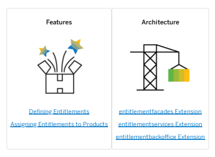

## Entitlements Features

This page explains how to dene usage units and entitlements for later use in the Product Cockpit.

Dening Entitlements You can dene entitlements that you can later assign to products using the Product Cockpit. Assigning Entitlements to Products Entitlements specify what the customer is eligible for within a given product. You can assign entitlements to products in the Administration Cockpit perspective of Backoffice.

## Dening Entitlements

You can dene entitlements that you can later assign to products using the Product Cockpit. Entitlements dene what the customer is eligible to within given subscription or a product, at no additional cost.

To dene an entitlement, perform following steps:
1. Make sure you are in the Admin perspective of the Administration Cockpit.

2. Select the Entitlement type element from the available types list. 3. Click the Create New Item button.

The Create/Add Item window is displayed.

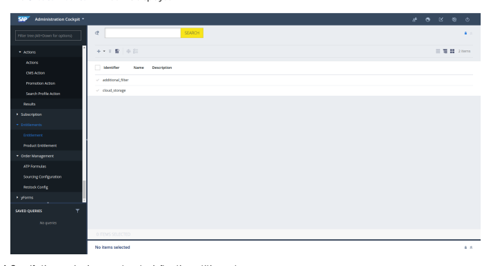

4. Specify the required parameters to dene the entitlement:
Identier: Unique object identier.

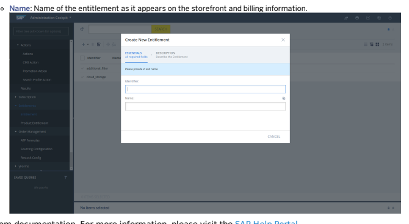

This is   For more    the SAP Help  5

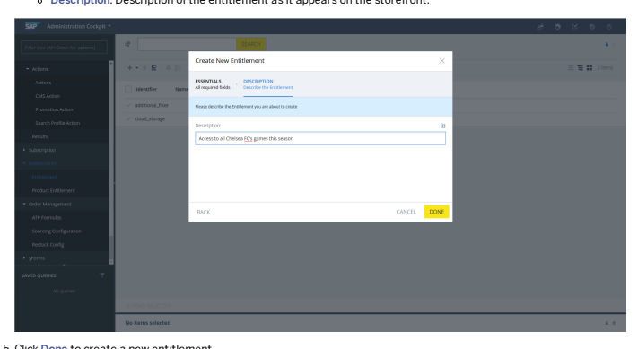

## Related Information

Administration Cockpit - End User Guide

## Assigning Entitlements To Products

Entitlements specify what the customer is eligible for within a given product. You can assign entitlements to products in the Administration Cockpit perspective of Backoffice.

## Procedure

1. Go to the Administration Cockpit perspective of Backoffice and select Entitlements Product Entitlement .

If there are existing product entitlements that have previously been dened, they are listed here.

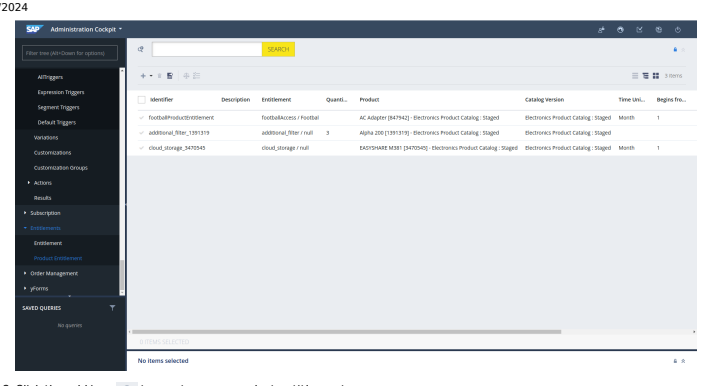

2. Click the add icon to create a new product entitlement.

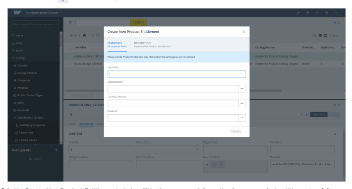 3. In the Create New Product Entitlement window, ll in the necessary information for your product entitlement as follows:
a. Provide the product entitlement with a unique identier. b. Select an existing entitlement from one you dened earlier by clicking the selection button and choosing from the list. This eld is mandatory.

c. Select the Catalog version where your product resides.

d. Select the Product you wish to associate the entitlement with.

4. Click Next to dene conditions and additional information for the product entitlement, as described in the following table:
Field Description

| Field       | Description                                                                                                                                                                                                                                                                                                                                                                                                                                                                                                                                                                                                                                                                                                                                  |
|-------------|----------------------------------------------------------------------------------------------------------------------------------------------------------------------------------------------------------------------------------------------------------------------------------------------------------------------------------------------------------------------------------------------------------------------------------------------------------------------------------------------------------------------------------------------------------------------------------------------------------------------------------------------------------------------------------------------------------------------------------------------|
| Description | Species what is displayed as a description of the ProductEntitlement in Product Cockpit. For example: Season-long game coverage access                                                                                                                                                                                                                                                                                                                                                                                                                                                                                                                                                                                                       |
| Quantity    | Species maximum quantity of the entitlement. This eld expects an integer. Only ll in this eld if you've assigned a Usage Unit to the entitlement, otherwise an error is displayed. For example: 100                                                                                                                                                                                                                                                                                                                                                                                                                                                                                                                                          |
| Time Units  | Denes time unit used in Begin From and Duration elds.  Note If you type a value in this eld, the Begins from input eld is mandatory. For example: If Time Unit is Day, Begins from is 10, the checkout is 10th May, and Duration is 10 then a given entitlement is available from 20th May to 30th May. If Time Unit is Month, Begins from is 6, the checkout is 10th May, and Duration is 2 then a given entitlement is available from 10th October to 10th December.  Note If an entitlement is set to begin from the next day, that is if you type 2 in the Begins from eld, the grant becomes available 24 hours from checkout, not at the start of the next day.                                                                      |
| Begins from | Indicates when the entitlement starts. This eld expects a positive integer.  Note 1 means the entitlement starts with grant time set on checkout. If you type a value in this input eld, you've to select a Time Unit. If Time Unit is Day, Begins from is 10, the checkout is 10th May, and Duration is 10 then a given entitlement is available from 20th May to 30th May. If Time Unit is Month, Begins from is 6, the checkout is 10th May, and Duration is 2 then a given entitlement is available from 10th October to 10th December.  Note If an entitlement is set to begin from the next day, that is if you type 2 in the Begins from eld, the grant becomes available 24 hours from checkout, not at the start of the next day. |

| Field            | Description                                                                                                                                                                                                                                                                                                                                                                                                                                                                                                                                                                                                                                                                                                                                                     |
|------------------|-----------------------------------------------------------------------------------------------------------------------------------------------------------------------------------------------------------------------------------------------------------------------------------------------------------------------------------------------------------------------------------------------------------------------------------------------------------------------------------------------------------------------------------------------------------------------------------------------------------------------------------------------------------------------------------------------------------------------------------------------------------------|
| Duration         | How many Time Units the entitlement is available for. If this input eld is empty, the condition is set with an open-end timeframe.  Note If you type a value in the Duration input eld, the Time Unit and Begins from elds are mandatory. If Time Unit is Day, Begins from is 10, the checkout is 10th May, and Duration is 10 then a given entitlement is available from 20th May to 30th May. If Time Unit is Month, Begins from is 6, the checkout is 10th May, and Duration is 2 then a given entitlement is available from 10th October to 10th December.  Note If an entitlement is set to begin from the next day, that is if you type 2 in the Begins from eld, the grant becomes available 24 hours from checkout, not at the start of the next day. |
| String Condition | Checks a grant string against a check string. For example: String Condition is discount20%, the customer types discount20% and receives 20 free documentaries to watch.                                                                                                                                                                                                                                                                                                                                                                                                                                                                                                                                                                                         |
| Path Condition   | Checks a grant string against a check string, but the entire grant string does not have to match. Instead, only the grant string sections have to match. For example: Grant String Check String Check Result /comedy/simpsons/season02 /comedy/simpsons/season02/episode04 Check passed, string sections match. /comedy/simpsons /comedy/simpsons/season02/episode04 Check passed, string sections match. /comedy /comedy/simpsons/season02/episode04 Check passed, string sections match. /comedy/simps /comedy/simpsons/season02/episode04 Check failed, string sections are different.                                                                                                                                                                       |

| Field   | Description   |
|---------|---------------|

For example:

| Geo Condition   | Checks a grant sting against a check string, uses only the / separator for hierarchy levels, and a comma separator for multiple geolocations. The grant and check strings are in the geoPath String format, which looks as follows: Country/Region/City or Country/Region or Country. Grant strings are geoPath Strings separated by commas, so grant strings can consist of more than one location.   |
|-----------------|--------------------------------------------------------------------------------------------------------------------------------------------------------------------------------------------------------------------------------------------------------------------------------------------------------------------------------------------------------------------------------------------------------|

| Grant String            | CheckString                                                         | CheckResult                                                                                       |
|-------------------------|---------------------------------------------------------------------|---------------------------------------------------------------------------------------------------|
| Germany/Bavaria/Munich, | Germany/Bremen                                                      | Checkpassed, checked                                                                              |
| Germany/Bremen, USA     | /Bremen                                                             | geoPath String is subregion of a location fromgrant geoPath String.                               |
| Germany/Bavaria,        | Germany/Bavaria /Munich                                             | Checkpassed, checked                                                                              |
| Germany/Bremen, USA     | geoPath String is subregion of a location fromgrant geoPath String. |                                                                                                   |
| Russia, USA             | Germany/Bavaria                                                     | Check failed, checked geoPath String is not a subregion of any location fromgrant geoPath String. |
| Germany/Bavaria/Munich  | Germany/Bavaria                                                     | Check failed, grant geoPath String is more specic.                                                |

5. Click Done. 6. Select a product entitlement and go to the Advanced tab to set or modify conditions for an existing product entitlement.

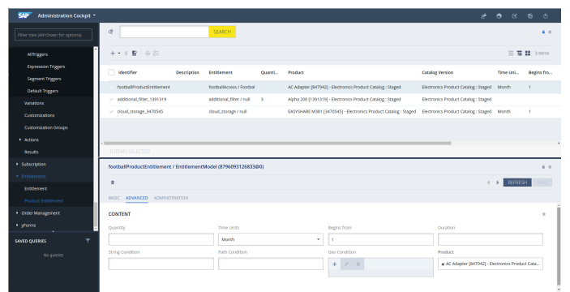

## Related Information

 Entitlements Architecture

Entitlements extensions allow you to use the module to its full potential and according to your needs.

Dependencies

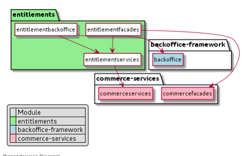

Dependencies Diagram

## Recipes

For a complete list of SAP Commerce Cloud recipes that may include this module, see Installer Recipes. For a complete list of the SAP Commerce Cloud, integration extension pack recipes that may include this module, see Installer Recipe Reference.

## Extensions

The Entitlement module consists of the following extensions:
entitlementfacades Extension The entitlementfacades extension extends the commercefacades extension with an implementation of the Entitlements functionality. It contains a facade to retrieve users' grants. entitlementservices Extension The entitlementservices extension provides a data model and functionality that support user entitlements to other extensions. Entitlements can be connected to product bundles or subscriptions and are useful for managing user access in a wide range of commerce domains. entitlementbackoffice Extension The entitlementbackoffice extension enhances the backoffice extensions to support operations on entitlements.

## Entitlementfacades Extension

The entitlementfacades extension extends the commercefacades extension with an implementation of the Entitlements functionality. It contains a facade to retrieve users' grants.

## Note

An SAP Commerce Cloud extension may provide functionality that is licensed through different SAP Commerce Cloud modules. Make sure to limit your implementation to the features dened in your contract license. In case of doubt, please contact your sales representative.

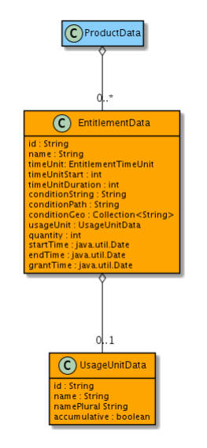

## Populators

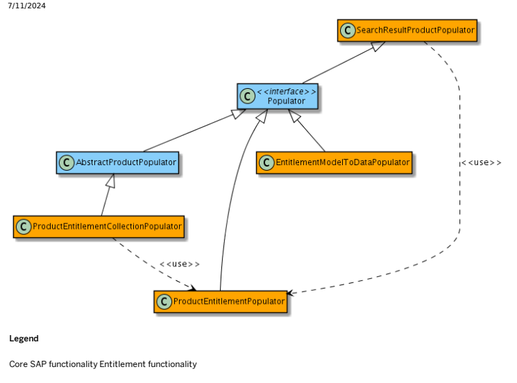

## Related Information

entitlementservices Extension

## Entitlementservices Extension

The entitlementservices extension provides a data model and functionality that support user entitlements to other extensions. Entitlements can be connected to product bundles or subscriptions and are useful for managing user access in a wide range of commerce domains.

## Note

An SAP Commerce Cloud extension may provide functionality that is licensed through different SAP Commerce Cloud modules. Make sure to limit your implementation to the features dened in your contract license. In case of doubt, please contact your sales representative.

## Data Model Legend

Core hybris functionality Entitlement Functionality

## Entitlements

Entitlements are options that can be included in a product at no additional costs. These represent privileges that can be granted to a customer along with a purchased product. For example, it can be a permission to read a digital magazine on a tablet.

## Product Entitlements

Product Entitlements associate a product with an entitlement. They contain the values for the following conditions:

String conditions: Value for string Path conditions: Value for path Geo location conditions: List of values for geopaths Timeframe condition: Time Unit, start and duration Metered Condition: Value for the quantity
A Product Entitlement also contains the description attribute, which is a localized text targeted for customers. It can be used to describe the entitlement on the storefront.

## Entitlement Conditions

An entitlement can have conditions that are used to limit a given aspect of the entitlement's validity. Even though the names sound similar, conditions in the Entitlement Functionality are different from the conditions in the Entitlement & Metering Service in several aspects:

Geo conditions: In the Entitlement Functionality, a single String may not contain a comma-separated list because the platform has a collection of separate geoPath strings. Time conditions: The time condition in the Entitlement Functionality cannot have an absolute start and end date. In the Entitlement Functionality, the entitlement has a time unit, a start, and a duration.

## Examples

The following code excerpts provide examples of Product Entitlements.

## Providing Promotional Access To A Resource

A customer purchases a product that allows the customer to download ve songs, valid from the moment of checkout for a time period of one month, and only in Bavaria, Germany.

ProductEntitlement {
id: "Free music downloads", entitlement: "Music downloads", description: "5 music pieces for free for one month", timeUnit: "month", timeUnitStart: 1, timeUnitDuration: 1, conditionPath: "/downloads/music", conditionGeo: ["Germany/Bayern"], quantity: 5
}

## Tracking Usage

A customer purchases a product that allows them to send unlimited text messages. You want to track the usage of this resource without limiting the available amount of text messages.

ProductEntitlement: {
id: "SMS", description: "Sent SMS", quantity: 0
}

## Checkout

When you add the entitlementservices extension to your localextensions.xml le, the pre and post method hooks are added to the list of commercePlaceOrderMethodHooks.

You can congure the entitlementPlaceOrderMethodHook bean in the **entitlementservices-spring.xml** le as shown in the following example:
<bean id="entitlementPlaceOrderMethodHook" class="de.hybris.platform.entitlementservices.order.hook.EntitlementPlaceOrderMethodHook" <property name="entitlementFacadeDecorator" ref="entitlementFacadeDecorator" /> <property name="productEntitlementEmsGrantConverter" ref="productEntitlementEmsGrantConvert <property name="baseStoreService" ref="baseStoreService"/> </bean>

## Related Information

entitlementfacades Extension Extending CommerceCheckoutService

## Entitlementbackoffice Extension

The entitlementbackoffice extension enhances the backoffice extensions to support operations on entitlements.

The entitlementbackoffice extension allows to add, update and remove entities of the following types:
Entitlement ProductEntitlement

## About The Extension

| Name                  | Directory                                             | Related Module      |
|-----------------------|-------------------------------------------------------|---------------------|
| entitlementbackoffice | hybris/bin/modules/entitlements/entitlementbackoffice | Entitlements Module |

The entitlementbackoffice extension structure is based on the following folders:

| Path      | Description                             |
|-----------|-----------------------------------------|
| resources | The conguration of CockpitNG components |

| Path   | Description   |
|--------|---------------|

resources/entitlementbackoffice-backofficelabelsThe conguration les for the specic properties of a CockpitNG

user interface and their localized values

## Dependencies

Dependencies Diagram

## Application Conguration

The application conguration contains information about all widgets added to your application. It stores settings such as viewing restrictions and socket connections. Different les are related to this conguration.

The following table provides information about beans within the entitlementbackoffice-backoffice-spring.xml le:

## Authorization

| File               | Description                                                                             |
|--------------------|-----------------------------------------------------------------------------------------|
| resources/entitlementbackoffice-backofficeconfig.xml                    | Conguration of components on the Backoffice level                                       |
| resources/entitlementbackoffice-backofficewidgets.xml                    | Conguration of widgets on the Backoffice level                                          |
| resources/entitlementbackoffice-backofficespring.xml                    | Conguration of components on the Backoffice level, imports, and bean denitions          |
| project.properties | Conguration of some widgets that hide out some information for a certain group of users |

The admin user group can access the entitlementbackoffice features.

| Bean Id                           | Class                                                  | Description                                                         |
|-----------------------------------|--------------------------------------------------------|---------------------------------------------------------------------|
| entitlementbackofficeLabelLocator | com.hybris.cockpitng.util.labels.ResourcesLabelLocator | Refers to the Abstract label provider from the cockpitng extension. |

## Perspectives

Administration Perspective In the backoffice adminstration perspective you can nd Entitlements in the left-hand navigation menu. The node has two subnodes: Entitlement and Product Entitlement.

## Product Cockpit Perspective

The product cockpit perspective provides information on the product entitlements.

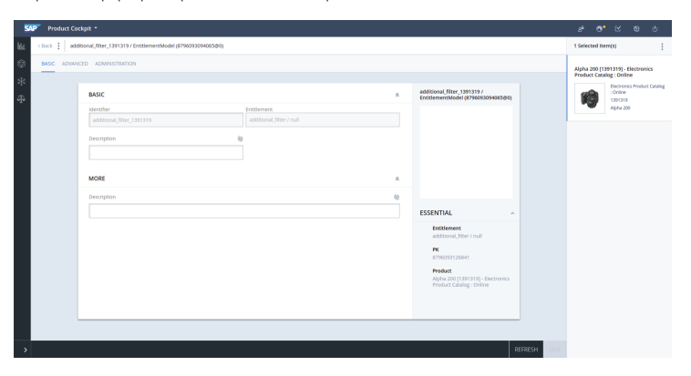

