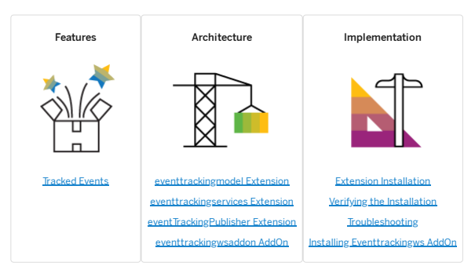
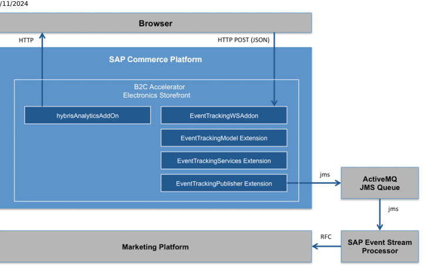

# Event Tracking Module

The SAP Commerce Cloud Event Tracking extensions can be used to capture user interactions, also called Business Events, such as Page View, Product View, Add To Cart, and others, then process them and send them to a destination.

This page refers to deprecated software. For further details, see Deprecation Status.

The use of the SAP Commerce Cloud Event Tracking module allows a project to understand the customer behavior in real-time, process the event stream, perform calculations, make predictions, and to attach additional components such as a Message Broker or an Event Stream Processor.

## Event Tracking Features

The Event Tracking module provides a range of features related to tracking the following types of events: Browse & View, View Product Category Page, View Product Detail Page, Search. Search with No Results, Click on Banner, Cart and Checkout, Add to This is   For more    the SAP Help  4

This page refers to deprecated software. For further details, see Deprecation Status.

Tracked Events The Event Tracking module tracks and reports on key user events and actions. This enables you to intercept the events and add customized business logic that enhances the customer journey, or store these events for use in another way.

## Tracked Events

The Event Tracking module tracks and reports on key user events and actions. This enables you to intercept the events and add customized business logic that enhances the customer journey, or store these events for use in another way.

This page refers to deprecated software. For further details, see Deprecation Status.

The Event Tracking module supports the following events:
Browse & View

View Product Category Page View Product Detail Page Search Search with No Results Banner Cart and Checkout Remove from Cart Proceed to Checkout Successful Checkout

## Event Tracking Process

The following picture describes the general design of the SAP Commerce Cloud Event Tracking integration and shows an example for processing the events using an Event Stream Processor and sending derived high level events to the SAP Commerce Cloud Marketing Platform:

1. The hybrisAnalytics AddOn injects the required JavaScript code into each page of the Accelerator Storefront.

2. Once the user opens a page, clicks on a product, adds a product to the cart etc., the JavaScript code in the page sends a post request to the EventTrackingWS AddOn. This AddOn provides the endpoint which receives the events.

3. The EventTrackingWS AddOn receives the events and passes them to the EventTrackingServices extension 4. The EventTrackingServices extension parses the (generic) event, resolves the event and maps it to one of the predened event types as declared in the EventTrackingModel extension.

5. Once the event has been resolved successfuly to one of the pre-dened event types, the event gets published by the EventTrackingPublisher extension using Spring Integration. Any of the existing Spring Output Adapters can be used to send the event for example into a JMS Queue, into a le, into a dabase using JDBC etc. The EventTrackingPublisher extension comes with a pre-dened example for an ActiveMQ Message Queue.

6. The ActiveMQ Message Broker forwards the event to all subscribers having subscribed to the message queue/topic. 7. An Event Stream Processor (in this example the SAP Event Stream Processor , formerly known as Sybase Event Stream Processor) may perform calculations, aggreations etc. on the event stream, for example for determining abandoned carts.

8. The Event Stream Processor may then forward selected messages or deriver higher level messages to a target system, for example SAP Marketing.

The ActiveMQ Message Broker and the Event Stream Processor need to be licensed and obtained separately.

## Supported Event Types

With the rst release of the SAP Commerce Cloud Event Tracking, the following events are supported end-to-end:

| Category                   | Event     |
|----------------------------|-----------|
| Browse & View              | View Page |
| View Product Category Page |           |

This is   For more    the SAP Help  6

| 7/11/2024 Category                                       | Event               |
|----------------------------------------------------------|---------------------|
| View Product Detail Page Search                          | Submit Local Search |
| Search with No Results Banner                            | Click on Banner     |
| Cart and Checkout                                        | Add to Cart         |
| Remove from Cart Proceed to Checkout Successful Checkout |                     |

New event types can be added easily. The set of Event Tracking extensions should be considered as a starting point for projects, the extensions are shipped with source and provide a starting point for extending the supported Event Tracking.

## Event Tracking Architecture

The Event Tracking module consists of a set of extensions providing the ability to track and report on various events, such as Browse & View, View Product Category Page, View Product Detail Page, Search, Search with No Results, Banner, Cart and Checkout, Remove from Cart, Proceed to Checkout, and Successful Checkout.

This page refers to deprecated software. For further details, see Deprecation Status.

## Dependencies

 Recipes

For a complete list of SAP Commerce Cloud recipes that may include this module, see Installer Recipes. For a complete list of the SAP Commerce Cloud, integration extension pack recipes that may include this module, see Installer Recipe Reference.

## Extensions

eventtrackingmodel Extension The eventtrackingmodel extension declares business events which shall be resolved by the eventtrackingservices extension dynamically.

eventtrackingservices Extension This is   For more    the SAP Help  7 The eventtrackingservices extension resolves the events being received by the EventTrackingWS AddOn dynamically during runtime. eventTrackingPublisher Extension The eventtrackingpublisher extension publishes the event using Spring Integration once an event has been successfully resolved by the eventtrackingservices extension.

eventtrackingwsaddon AddOn The purpose of the eventtrackingwsaddon AddOn is to provide an endpoint for the hybrisanalyticsaddon AddOn, which sends through javascript. The events are related to customers' behavior on the storefont such as add to cart actions, page views, etc.

## Eventtrackingmodel Extension

The eventtrackingmodel extension declares business events which shall be resolved by the eventtrackingservices extension dynamically.

This page refers to deprecated software. For further details, see Deprecation Status.

To do this, the events are declared in the eventtrackingmodel-beans.xml:
<beans xmlns:xsi="http://www.w3.org/2001/XMLSchema-instance" xsi:noNamespaceSchemaLocation="beans.x <bean class="de.hybris.eventtracking.model.events.AbstractTrackingEvent" type="event"> <property name="eventType" type="String"/> <property name="pageUrl" type="String"/> <property name="interactionTimestamp" type="String"/> <property name="userId" type="String"/> <property name="userEmail" type="String"/> <property name="sessionId" type="String"/> </bean>
...

 <bean class="de.hybris.eventtracking.model.events.AbstractProductAwareTrackingEvent" type="even extends="de.hybris.eventtracking.model.events.AbstractTrackingEvent"> <property name="productId" type="String"/> <property name="productName" type="String"/> </bean>
....

 
</beans>
There are a number of pre-dened events in the eventtrackingmodel-beans.xml. Not all of the events are actually sent by the hybrisAnalytics AddOn and processed by the eventtrackingservices extension, but it provides a good starting point for implementation projects. The event types follow the following hirarchy:
AbstractTrackingEvent AbstractCartAwareTrackingEvent CartAbandonedEvent ProceedToCheckoutEvent SuccessfulCheckoutEvent AbstractProductAwareTrackingEvent AbstractProductAndCartAwareTrackingEvent AddToCartEvent RemoveFromCartEvent ProductDetailPageViewEvent ProductMediaViewEvent ProductReviewsViewEvent BannerClickEvent CartViewEvent CategoryPageViewEvent FindStoresNearMeEvent ForgottenPasswordEvent PageThroughSearchResultsEvent PageViewEvent This is   For more    the SAP Help  8 PaymentDetailsEnteredEvent RefineSearchEvent SearchEvent SearchNoResultsEvent ShipmentDetailsEnteredEvent StoreLocationEnteredEvent UnsuccessfulAddToCartEvent UnsuccessfulCheckoutEvent UnsuccessfulLoginEvent UnsuccessfulPaymentEvent UnsuccessfulRegistrationEvent Doing an ant clean all creates the respective classes, which the other extensions can then use.

## Eventtrackingservices Extension

The eventtrackingservices extension resolves the events being received by the EventTrackingWS AddOn dynamically during runtime.

This page refers to deprecated software. For further details, see Deprecation Status.

1. Each new event is rst being proccessed by the default raw tracking event handler dened in RawTrackingEventHandler.java: handle(final String rawTrackingEvent). It rst validates each new raw event.

2. If validation is passed, it gets published using the EventService from the de.hybris.platform.servicelayer.

3. The method resolveType in TrackingEventTypeResolver.java resolves the event to one of the predened event types declared by the eventtrackingmodel extension. The resolving is done based on multiple elds being passed by the hybrisAnalytics AddOn, for example, COMMON_EVENT_TYPE.

## Eventtrackingpublisher Extension

The eventtrackingpublisher extension publishes the event using Spring Integration once an event has been successfully resolved by the eventtrackingservices extension.

This page refers to deprecated software. For further details, see Deprecation Status.

The denition of the CSV elds for publishing is done in
/eventtrackingpublisher/resources/eventtrackingpublisher-spring.xml:
... <util:list id="defaultTrackingEventCsvOrderedFields"> <value>eventType</value> <value>url</value> <value>timestamp</value> <value>sessionId</value> <value>userId</value> <value>userEmail</value> <value>categoryId</value> <value>categoryName</value> <value>productId</value> <value>productName</value> <value>productMediaType</value> <value>searchTerm</value> <value>postcode</value> <value>bannerId</value>
This is   For more    the SAP Help  9

 <value>cartId</value> <value>quantity</value> </util:list> ...

The respective converters and populators do the actual mapping to the ouput, dened in
/eventtrackingpublisher/src/de/hybris/eventtracking/publisher/csv/converters:
For each event class, there is a populator, such as AddToCartEventToCsvDataPopulator.java public class AddToCartEventToCsvDataPopulator implements Populator<AbstractTrackingEvent, TrackingE { 
/** * @see de.hybris.platform.converters.Populator\#populate(java.lang.Object, java.lang.Object) */ @Override public void populate(final AbstractTrackingEvent source, final TrackingEventCsvData target) { 
if (AddToCartEvent.class.isAssignableFrom(source.getClass())) { 
target.setQuantity(((AddToCartEvent) source).getQuantity()); target.setEventType(((AddToCartEvent) source).getEventType()); 
} 
} 
} 
The populator sets the required elds, in this case the quantity and the event type.

## Eventtrackingwsaddon Addon

The purpose of the eventtrackingwsaddon AddOn is to provide an endpoint for the hybrisanalyticsaddon AddOn, which sends through javascript. The events are related to customers' behavior on the storefont such as add to cart actions, page views, etc.

This page refers to deprecated software. For further details, see Deprecation Status.

An SAP Commerce Cloud extension may provide functionality that is licensed through different SAP Commerce Cloud modules. Make sure to limit your implementation to the features dened in your contract license. In case of doubt, please contact your sales representative.

## Addon Denition

| Name        | eventtrackingwsaddon                |
|-------------|-------------------------------------|
| Description | Short description of AddOn purpose. |
| Requires    | Not applicable                      |
| Author      | SAP Commerce Cloud                  |

Supported Markets and Channels The EventtrackingWS AddOn supports the B2C market only. You can also use it with both desktop channels.

| 7/11/2024 Supported   | B2C Commerce   | B2B Commerce   | Telco Commerce   |        |         |        |
|-----------------------|----------------|----------------|------------------|--------|---------|--------|
| Market Channel        | Desktop        | Mobile         | Desktop          | Mobile | Desktop | Mobile |

## Related Information

Installing Eventtrackingws AddOn

## Installing Eventtrackingws Addon

This procedure describes how to install the eventtrackingws AddOn.

## Prerequisites Caution

This page refers to deprecated software. For further details, see Deprecation Status.

## Procedure

1. Add the eventtrackingwsaddon and the respective extensions belonging the the hybris event tracking to your localextensions.xml le, along with any required extensions, as follows:
<path dir='${HYBRIS_BIN_DIR}' />
<extension name='eventtrackingservices' /> <extension name='eventtrackingmodel' /> <extension name='eventtrackingpublisher' /> <extension name='eventtrackingwsaddon' /> <extension dir="${HYBRIS_BIN_DIR}/ext-addon/ad 2. Install the addon by executing addoninstall ant command. This generates the correct properties in the project.properties le of the eventtrackingwsaddon AddOn and adds a dependency from your storefront to the eventtrackingwsaddon AddOn.

ant addoninstall -Daddonnames="eventtrackingwsaddon" -DaddonStorefront.yacceleratorstorefront=
The yacceleratorstorefront, or the storefront generated from yacceleratorstorefront, has CSRF lters that expect a CSRF token during the POST request. To ensure that the Ajax POST request from the Piwik JS does not get ltered by the CSRF lter, add the events servlet path in the list of URLs where the CSRF is allowed to ignore those POST requests.

The following is an example of the project.properties for your storefront:
csrf.allowed.url.patterns=/[^/]+(/[^?]*)+(sop/response)$,/[^/]+(/[^?]*)+(merchant_callback)$,/
In this example, /(events)$ is added to this property to ensure the CSRF lter allows POST requests without the CSRF
tokens.

Please refer to the following documentation to install the hybrisAnalytics AddOn: hybrisAnalytics AddOn

## Verifying The Integration

This procedure describes how to verify the integration of the hybrisAnalytics AddOn.

## Prerequisites Caution

This page refers to deprecated software. For further details, see Deprecation Status.

## Procedure

1. Start the SAP Commerce Cloud server.

2. Access the SAP Commerce Cloud Accelerator storefront home page. The following link is an example:
http://electronics.local:9001/yacceleratorstorefront 3. Browse to a product page to trigger event tracking. 4. Using the Chrome browser, right-click on a page and choose Inspect Element. 5. In the window that appears, select the Network header tab and nd the POST method with the following URL:
/yacceleratorstorefront/events. By adding two properties, you can enable the logging of the events, as follows:
log4j.logger.de.hybris.eventtracking.publisher=DEBUG
spring.profiles.active=eventtrackingpublisher_develop 6. The end point URL is HTTPS, and for a development environment, the browser may block the Ajax calls due to an invalid ssl certicate. If this is the case, open the browser, type in the endpoint URL
https://electronics.local:9002/events and force the browser to allow this HTTPS URL, even though the certicate may not be valid. Modications Checklist The modications that this AddOn makes to the Accelerator are listed below:

| Impex Conguration Scripts Core Data Listeners Model Layer Model Interceptors Cockpit Conguration Cockpit Beans Validation Rules   |
|-----------------------------------------------------------------------------------------------------------------------------------|

| Service Layer Facade DTO Facade Layer CMS Components Page Templates JavaScript   |
|----------------------------------------------------------------------------------|

| Page Controllers Tags TLD Filters MVC Interceptors Spring Security Message Resources   |
|----------------------------------------------------------------------------------------|

## Event Tracking Implementation

You can easily extend the Event Tracking module by following the instructions in this section to install all AddOns and extensions.

This page refers to deprecated software. For further details, see Deprecation Status.

Extension Installation This describes how to install the AddOns and extensions. A more detailed installation instruction for the AddOns are described in the respective pages of the AddOns. Verifying the Installation Follow these steps to ensure you have installed Event Tracking correctly. Troubleshooting The following settings in local.properties enable full debug output in the console. It is useful to trace event handling, event type resolving and event type publishing. Installing ActiveMQ Message Broker

## Extension Installation

This describes how to install the AddOns and extensions. A more detailed installation instruction for the AddOns are described in the respective pages of the AddOns.

This page refers to deprecated software. For further details, see Deprecation Status.

## Extension And Addon Folders

The Event Tracking extensions are part of SAP Commerce Cloud. After downloading and unzipping the le, the AddOns and Extensions appear in the following subdirectories:

AddOns appear inside the *<HYBRIS_HOME>*/bin/ext-addon/hybrisanalyticsaddon folder and in
<HYBRIS_HOME>/bin/ext-addon/eventtrackingwsaddon.

1. hybrisanalyticsaddon: Contains the hybrisAnalytics AddOn which injects the JavaScript code into the Accelerator pages.

2. eventtrackingwsaddon: Contains the eventtrackingwsaddon AddOn which receives the events (event endpoint).

The following subdirectories appear inside the *<HYBRIS_HOME>*/bin/ext-eventtracking directory:
1. eventtrackingmodel: Contains the extension for declaring business events which shall be resolved by the eventtrackingservices extension dynamically.

2. eventtrackingservices: Contains the extension which resolves the events being received by the EventTrackingWS
AddOn dynamically during runtime.

3. eventTrackingPublisher: Contains the extension which publishes the event using Spring Integration once an event has been successfully resolved by the eventtrackingservices extension.

## Extension Installation

The following code contains all required AddOns and extensions for the SAP Commerce Cloud Event Tracking which needs to be added to the localextensions.xml:
<path dir='${HYBRIS_BIN_DIR}' /> <extension name='eventtrackingservices' /> <extension name='eventtrackingmodel' /> <extension name='hybrisanalyticsaddon' /> <extension name='eventtrackingpublisher' /> <extension name='eventtrackingwsaddon' />

For a detailed installation instruction of the hybrisanalyticsaddon please see the respective page for the hybrisAnalytics AddOn For a detailed installation instruction of the eventtrackingwsaddon please see the respective page for the eventtrackingwsaddon AddOn

## Extension Conguration

The following standard conguration is applied in local.properties when using the SAP Commerce Cloud installer:
spring.profiles.active=eventtrackingpublisher_activemq eventtrackingwsaddon.events_endpoint.enabled= true eventtrackingpublisher.jms.amq.broker.url=tcp\://localhost\:61616 csrf.allowed.url.patterns=/[^/]+(/[^?]*)+(sop/response)$,/[^/]+(/[^?]*)+(merchant_callback)$,/[^/]+ commerceservices.default.desktop.ui.experience=desktop eventtrackingpublisher.jms.amq.queue.name=HYBRIS

This conguration requires an ActiveMQ Message broker running on the same machine (localhost) on port 61616, receiving the events from the EventTrackingPublisher extension. The installation of the ActiveMQ is not performed by the installer. ActiveMQ is not part of SAP Commerce Cloud. To activate ActiveMQ, include the following dependency with your module:
<dependency> <groupId>org.apache.activemq</groupId> <artifactId>activemq-client</artifactId>
This is   For more    the SAP Help  14
 <version>${activemq.version}</version> </dependency>
Next, dene the following spring prole in your custom module -spring.xml le:
<beans profile="eventtrackingpublisher_activemq"> <int-jms:outbound-channel-adapter channel="trackingEventCsvPublishChannel" destination="eventTrackingPublishingJmsAmqQueue" connection-factory="eventTrackingPublishingJmsAmqCachingConnectionFactory"> </int-jms:outbound-channel-adapter> <alias name="defaultEventTrackingPublishingJmsAmqConnectionFactory" alias="eventTrackingP <bean id="defaultEventTrackingPublishingJmsAmqConnectionFactory" class="org.apache.active <constructor-arg value="${eventtrackingpublisher.jms.amq.broker.url}"/> </bean> <alias name="defaultEventTrackingPublishingJmsAmqCachingConnectionFactory" alias="eventTr <bean id="defaultEventTrackingPublishingJmsAmqCachingConnectionFactory" class="org.springframework.jms.connection.CachingConnectionFactory"> <property name="targetConnectionFactory" ref="eventTrackingPublishingJmsAmqConnection <property name="sessionCacheSize" value="${eventtrackingpublisher.jms.spring.caching_ <property name="cacheProducers" value="${eventtrackingpublisher.jms.spring.caching_co <property name="cacheConsumers" value="${eventtrackingpublisher.jms.spring.caching_co </bean> <alias name="defaultEventTrackingPublishingJmsAmqQueue" alias="eventTrackingPublishingJms <bean id="defaultEventTrackingPublishingJmsAmqQueue" class="org.apache.activemq.command.ActiveMQQueue"> <constructor-arg value="${eventtrackingpublisher.jms.amq.queue.name}"/> </bean> </beans>
And nally add the following to local.properties:
spring.profiles.active=eventtrackingpublisher_activemq The spring.profiles.active=eventtrackingpublisher_activemq sets the active spring output adapter prole. It is used by the eventtrackingpublisher Extension, please see $HYBRIS_HOME/hybris/bin/exteventtracking/eventtrackingpublisher/resources/eventtrackingpublisher-spring.xml.

eventtrackingwsaddon.events_endpoint.enabled=true enables the eventtrackingwsaddon endpoint eventtrackingpublisher.jms.amq.broker.url=tcp\://localhost\:61616 defines the URL of the JMS m eventtrackingpublisher.jms.amq.queue.name=HYBRIS defines the queue name of the JMS queue. 

## Verifying The Installation

Follow these steps to ensure you have installed Event Tracking correctly.

## Prerequisites Caution

This page refers to deprecated software. For further details, see Deprecation Status.

## Procedure

1. Start the SAP Commerce Cloud server.

2. Start the ActiveMQ Message Broker. 3. Access the SAP Commerce Cloud Accelerator storefront home page.The following link is an example:
http://electronics.local:9001/yacceleratorstorefront.

4. Browse to a product page to trigger event tracking. 5. Check in the console. 6. Using the Chrome browser, right-click on a page and choose Inspect Element.

7. In the window that appears, select the Network header tab and nd the POST method with the following URL:
/yacceleratorstorefront/events.

By adding the properties shown in the Troubleshooting section below, you can activate additional debugging. Several debug output lines will be shown in the cosole.

8. Open the ActiveMQ admin console and check the Event Queue HYBRIS. This event queue contains the event or events.

## Troubleshooting

The following settings in local.properties enable full debug output in the console. It is useful to trace event handling, event type resolving and event type publishing.

This page refers to deprecated software. For further details, see Deprecation Status. log4j.logger.de.hybris.eventtracking.ws.controllers.rest.EventsController=DEBUG log4j.logger.de.hybris.eventtracking.publisher.listeners.TrackingEventPublishingListener=DEBUG log4j.logger.de.hybris.eventtracking.publisher=DEBUG log4j.logger.de.hybris.eventtracking.services.converters.TrackingEventTypeResolver=DEBUG log4j.logger.de.hybris.eventtracking.services.handlers.RawTrackingEventHandler=DEBUG

## Installing Activemq Message Broker Caution

This page refers to deprecated software. For further details, see Deprecation Status.

1. To activate ActiveMQ, include the following dependency in your module:
<dependency> <groupId>org.apache.activemq</groupId> <artifactId>activemq-client</artifactId> <version>${activemq.version}</version> </dependency>
2. Dene the following spring prole in your custom module -spring.xml le:
<beans profile="eventtrackingpublisher_activemq"> <int-jms:outbound-channel-adapter channel="trackingEventCsvPublishChannel" destination="eventTrackingPublishingJmsAmqQueue" connection-factory="eventTrackingPublishingJmsAmqCachingConnectionFactory </int-jms:outbound-channel-adapter> <alias name="defaultEventTrackingPublishingJmsAmqConnectionFactory" alias="eventTracki
 <bean id="defaultEventTrackingPublishingJmsAmqConnectionFactory" class="org.apache.act
 <constructor-arg value="${eventtrackingpublisher.jms.amq.broker.url}"/> </bean> <alias name="defaultEventTrackingPublishingJmsAmqCachingConnectionFactory" alias="even <bean id="defaultEventTrackingPublishingJmsAmqCachingConnectionFactory" class="org.springframework.jms.connection.CachingConnectionFactory"> <property name="targetConnectionFactory" ref="eventTrackingPublishingJmsAmqConnect <property name="sessionCacheSize" value="${eventtrackingpublisher.jms.spring.cachi <property name="cacheProducers" value="${eventtrackingpublisher.jms.spring.caching <property name="cacheConsumers" value="${eventtrackingpublisher.jms.spring.caching </bean> <alias name="defaultEventTrackingPublishingJmsAmqQueue" alias="eventTrackingPublishing <bean id="defaultEventTrackingPublishingJmsAmqQueue" class="org.apache.activemq.command.ActiveMQQueue"> <constructor-arg value="${eventtrackingpublisher.jms.amq.queue.name}"/> </bean> </beans>
3. Include the following in your local.properties le:
spring.profiles.active=eventtrackingpublisher_activemq
