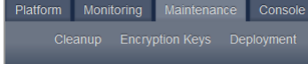
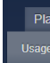

# Administration Console

The SAP Commerce Cloud Administration Console is a web application that provides tools for administrating, monitoring, and conguring your SAP Commerce Cloud solution.

## Accessing The Administration Console

You access the Administration Console by opening the root URL for your SAP Commerce Cloud instance on a specied port. The default address is https://localhost:9002

To access any backend application within your SAP Commerce Cloud subscription, dene the relevant endpoints in the Cloud Portal. Navigate to the Cloud Portal to check and customize your application URLs.

The Administration Console is protected by a login. Use the admin user and associated password.

Access is granted to any principal who is a member of the admingroup user group. Only the admin principal is a member of the admingroup. See also Users in Platform. These roles may differ from the Backoffice Application. For more information, see Business Roles in Backoffice

## Administration Console Interface

The Administration Console consists of some components that are always visible, but may contain different content.

Banner: Click it to open the Main page.

Logout link: Click it to logout.

Search box: It helps to nd relevant option without navigating through all tabs. Tabs Navigation: Each tab displays different options, which after selecting, navigate you to the desired page. Sidebar: It mainly consists of page description and links to the documentation. There are Sidebars that contain more information. For example:
The Main page displays links top ve pages, which you access the most. The FlexibleSearch page displays samples of FlexibleSearch queries.

Content area: It contains main content of the displayed page.

Platform Tab Clicking the Platform tab invokes a menu with options. Selecting specic option redirects you to a specic page. Monitoring Tab Clicking the Monitoring tab invokes a menu with options. Selecting specic option redirects you to specic page. Maintenance Tab Clicking the Maintenance tab invokes a menu with options. Selecting specic option redirects you to specic page. Console Tab Clicking the Console tab invokes a menu with options. Selecting specic option redirects you to specic page. Azure SQL Tab Clicking the Azure SQL tab invokes a menu with options. Selecting specic option redirects you to specic page.

## Platform Tab

Clicking the Platform tab invokes a menu with options. Selecting specic option redirects you to a specic page.

## Tenants

The Tenants Overview page provides the list of existing subordinate tenants and the leading tenant. Use it as a starting point for the following administrative tasks: tab invokes a menu with options. Selecting specic option redirects you to a specic page.

Activating Viewing

## Conguration

The Conguration Properties tab invokes a menu with page provides the list of all currently set SAP Commerce Cloud properties and their values. You can modify these properties or add a new one.

Changes entered on this page are stored only in the memory, which means all values are reloaded from the local.properties or project.properties le when restarting the application server. To make them persistent, enter changes directly in the local.properties le.

## System

The System Information page provides detailed information about the running system.

System environment tab: Information on threads and an operating system. System properties tab: Information about running the Java Virtual Machine and system variables.

## Logging

In this tab you can set logging levels for particular loggers.

## Extensions

The Extensions page provides the list of all installed extensions of SAP Commerce Cloud. You can see the following details about each extension:
Version

Contained extension module Webroot if web extension module is available

## Initialization

The Initialization page allows you to initialize SAP Commerce Cloud.

## Caution

Resetting the database removes all stored data.

Clicking the Lock button disables the functionality of the Initialization and Update pages.

Before initialization, make sure that there are no users logged in that could buy or edit items.

For more information, see: Initializing and Updating SAP Commerce Cloud Update The Update page allows you to update SAP Commerce Cloud, but without removing available data.

Clicking the Lock button disables the functionality of the Initialization and Update pages.

Before updating and creating essential data, make sure that there are no users logged in that could buy or edit items. You also need to disable user registration.

For more information, see: Initializing and Updating SAP Commerce Cloud

## License

The License Information page provides details about the currently used license. For more information, see Licenses

## Support

The Create ZIP File page enables you to create a ZIP le with information about the running system, which you can send to SAP Support.

## Pk Analyzer

The PK Analyzer page allows you to display information encoded in a primary key (PK).

## Classpath Analyzer

The Classpath Analyzer page allows you to search for the same classes loaded from different JAR les. For the scope of the Platform classloader or for a chosen web application, you can determine:
The order of loading JAR les at run time Which classes are referenced in more than one JAR le

This monitoring feature is not enabled by default. To enable it, see Conguring Classpath Analyzer.

## Order Of Loaded Resources

The Order of loaded resources tab provides a list of resources like JAR les and class folders in the Platform or specied web application. Results are displayed in the order of loading.

## Loaded Classes

The Loaded classes tab provides resource (JAR les) location of loaded classes.

## Note Monitoring Tab

Clicking the Monitoring tab invokes a menu with options. Selecting specic option redirects you to specic page.

## Cache

The Cache page provides details about a cache that is currently enabled in the Platform. In other words, this page displays details about previous cache or the SAP Commerce Cloud Region Cache, depending on which one is enabled.

Overview: Information about cache parameters status. You can clear cache without reconrmation. Statistics: You can create caching statistics.

Calculating cache statistics should be used over short periods only, because it is very memory intensive.

For more information, see: Caching

## Cluster

The Cluster page provides a list of available cluster nodes.

 Note Refreshing the list can take up to 30 seconds.

## Database

Data Sources The Data sources tab shows all congured data sources with status parameters.

Table Size The Table size tab provides a list of all database tables for the congured data source with their current size.

## Jdbc Logging

The JDBC logging tab enables you to start logging to the congured log le and download it. If traces are enabled, then a SQL comment is added to each statement with the Java stack trace from where the statement is being called.

Do not forget to stop logging when it is not needed, to avoid performance issues. Remember also to clear the log le when it is not needed any more.

This is   For more    the SAP Help  6 For more information, see: JDBC Logs from Database Statements

## Jdbc Log Analysis

The JDBC log analysis tab enables you to identify JDBC statements that are executed either very often or take particularly long to execute. This allows you to optimize your system. It analyzes the log created in JDBC logging tab. For more information, see: JDBC Logs from Database Statements

## Cron Jobs

The Cron Jobs page provides a list of all running cron jobs with the possibility to abort them. For more information, see: The Cronjob Service

## Jmx Mbeans

The JMX MBeans page provides a list of all available JMX MBeans. You can unregister them by changing their status.

## Memory

The Memory page provides status parameters of the Java Virtual Machine memory. You can run Garbage Collector to clear memory and refresh statistics.

## Thread Dump

The Thread Dump page provides a thread dump that is useful for debugging and support purposes.

## Performance

The Performance Tests page provides a set of tests that you can perform on your system. It is not possible to run different tests simultaneously. Tests started at the same time are queued and wait for their turn.

## Linpack

The LINPACK tab enables you to run a test that computes LINPACK benchmarks to measure the performance of your system.

 Note This test may last a few minutes. To get accurate results, the server should not be under load during the test.

## Sql

The SQL tab enables you to measure round trip times and the database performance. By running a statement, you get information on:
Total statements executed

Statements per second Average statement execution time
 Note Even if you can measure how long specic statements last, it should mainly be used to test the network latency to the database server.

For security reasons, you can't execute arbitrary DML or DDL statements from here. Because free-text input is not possible, your options are:
Running the default SELECT * FROM metainformations statement

Specifying a custom property in the local.properties le, following the pattern:
hac.performanceTest.statement.* and restarting the Platform for the changes to take effect.
Example:
hac.performanceTest.statement.selectFromProducts=SELECT * FROM products All new statements populate the dropdown list. The updated list is loaded at startup so you can select a statement to execute from a broader range of predened options.

You can't dene the statement for execution at runtime, even by providing additional properties through Administration Console Platform Conguration , or through a scripting console.

## Sql Max

The SQL max tab enables you to run the performance test of the database with the SQL max() command. Overall The Overall tab enables you to run miscellaneous performance tests.

Suspend

## Maintenance Tab

Clicking the Maintenance tab invokes a menu with options. Selecting specic option redirects you to specic page.

Cleanup

## Type System

The Type system tab provides a list of all system orphaned types. You can delete them, optionally including related deployment or instances from the type system.

This is   For more    the SAP Help  8

## Orphaned Media Files

The Orphaned media les tab provides details about media les. If there are orphaned or not SAP Commerce Cloud media les in the le system, you will see a list of them with a delete option.

## Encryption Keys Generation

The Generation tab enables you to generate encryption keys of different sizes.

The Java Runtime Environment (JRE) must support the level of encryption required by the key length that you select. For example, you cannot use a 256 bit encryption key with a JRE that supports only 128 bit encryption. By default, the Platform is congured with restricted or limited strength ciphers. To use less restricted encryption algorithms, you must download and apply the unlimited jurisdiction policy les, local_policy.jar, and US_export_policy.jar.

For more information, see: Transparent Attribute Encryption (TAE)

## Migration

The Migration tab enables you to migrate encryption keys. To have this feature enabled you need to perform the following:
Adjust your local.properties le in the following way:

Rename key symmetric.key.file to symmetric.key.file.1 Add entry symmetric.key.file.2=$name_of_the_new_key_file Add entry symmetric.key.file.default=2
The default key le referred to in symmetric.key.file.default property is used for all new encryption steps. This means that with the sample setting below, you initiate a migration from key 1 to key 2:
symmetric.key.file.1=weak-symmetric.key symmetric.key.file.2=256bit-symmetric.key symmetric.key.file.default=2 After introducing all changes restart your application server and perform encryption keys migration.

For more information, see: Transparent Attribute Encryption (TAE)

## Credit Cards Encryption

The Credit cards encryption page provides a list of credit cards with unencrypted numbers.

## Deployment

The Deployment page shows current deployments. When you access the page, a special bar appears for a couple of seconds with information about rst free deployment typecode available for use. For more details about typecode, see also Specifying a Deployment for Platform Types, section Solution: Dening a Deployment in SAP Commerce Cloud.

Special bar from the **Deployment** page in the SAP Commerce Cloud Administration Console

## Types With Deployment

The Types with deployment tab provides a list of all types, which have a deployment, including types with a deployment inherited from their supertype. For more information, see: Specifying a Deployment for Platform Types

## Types Without Deployment

The Types without deployment tab provides a list of all types with no explicit or inherited deployment. For more information, see: Specifying a Deployment for Platform Types Deployments Without Type The Deployments without type tab provides a list of all deployments not used by any type. For more information, see: Specifying a Deployment for Platform Types

## Console Tab

Clicking the Console tab invokes a menu with options. Selecting specic option redirects you to specic page. The tab looks as follows

## Scripting Languages

This tab gives you access to the Scripting Languages Console. This console supplants Groovy and Beanshell consoles from the previous versions. In this console, you can edit, import, save, and execute your scripts. For more information, see Scripting Engine.

Use the Edit Statement tab to create, save, or execute your scripts. Browse lets you import scripts. Result shows a String if the scripts returns a string, or it shows the result of the toString() method for any other objects.

## I Note

If you want the result of the script to be persisted, make sure you are in the Commit mode (see left bottom corner of the console). The Rollback mode will display your result (for example, it will show the returned string), but will not persist the results.

## Flexiblesearch

The FlexibleSearch page provides the FlexibleSearch console to test FlexibleSearch queries and direct SQL queries on all available data sources.

For more information, see: FlexibleSearch

## Impex Import

The ImpEx Import page provides ImpEx import functionality. You can import a script file or paste a script and validate it before the import.

For more information, see: ImpEx ImpEx Export The ImpEx Export page provides ImpEx export functionality. You can export a script le or paste a script and validate it before the export. For more information, see: ImpEx

## Ldap

Conguration Check The Conguration check tab enables you to check the LDAP server conguration. For more information, see: ldap Extension LDIF Import The LDIF import tab enables you to transform a LDIF le into an ImpEx le. For more information, see: ldap Extension LDAP Search The LDAP Search tab enables you to query your congured LDAP server. For more information, see: ldap Extension

## Azure Sql Tab

## Limitations

Administration Console shows data applicable only to the environment you manage in it, not the whole Commerce. It means that statistics, performance diagrams, and improvement suggestions are valid for that particular environment. Taking staging and production environments as an example, keep in mind that statistics and suggestions for the staging database don't match the same values for the production database. Resource-heavy queries impact database performance. Every time you load a page, those queries run anew; to avoid performance issues, refrain from reloading the pages in the Azure SQL tab when you don't need to. Remember about those limitations especially when you work on the production database. Administration Console is a self-service tool for system administrators and requires knowledge about the architecture and technologies SAP Commerce Cloud uses. Test all signicant changes to the database before implementing them.

## Usage

The Usage page displays usage statistics of main and read-only data sources.

For more information, see Usage.

## System Stats

The System Stats page displays system statistics and wait times on system resources.

For more information, see System Stats.

## Schema Browser

The Schema Browser page displays detailed information and statistics of database tables and their indexes. For more information, see Schema Browser.

## Top Long Running Queries

The Top Long Running Queries page displays top 10 long-running queries in the system. For more information, see Top Long Running Queries.

## Execution Plan

The Execution Plan page allows you to analyze custom queries. For more information, see Execution Plan.

## Classpath Analyzer

Ambiguity in class loading can lead to run-time problems. Using the Classpath Analyzer, you can search for instances of identical classes loaded from different JAR les to help you resolve these problems. It can be difficult to resolve classpath issues and to nd the origins of such problems. The situation may be even more complicated when the same binaries are run on different operating systems, resolving different classpaths or different application servers. For the scope of the Platform classloader or for a chosen Web application, with the classpath analyzer you can determine the following:
The order of loading JAR les at run time Which classes are referenced in more than one JAR le Thus it is easy to nd duplicated JAR les, loaded from different locations, and duplicated classes dened in different JAR les.

 Note This monitoring feature is not enabled by default. To enable it, see Conguring Classpath Analyzer.

## Conguring Classpath Analyzer

The Classpath Analyzer is a monitoring feature that allows you to resolve classpath issues and to nd the origins of such problems. It is not enabled by default.

This is   For more    the SAP Help  13 Context There are two different classloader used in the Platform:

PlatformInPlaceClassLoader: There is one instance with the global scope for all extensions.

HybrisWebappClassLoader60: There is a different instance for each Web application in SAP Commerce Cloud to load web context classes.
As a result, classes for different Web applications are separated and do not interfere with each other. To activate the Classpath Analyzer, you should perform the following steps:

1. Add the following property to the local.properties or project.properties le: local.properties
...

classloader.monitor.enabled=true ...

2. To turn this feature off, set the property value to false.

classloader.monitor.enabled=false 3. Rebuild the platform.

The following changes are automatically added to platform/tomcat6/conf/server.xml le during the build process: server.xml Instead of the default HybrisWebappLoader60, the DiagnosticHybrisWebappLoader60 is used. It gathers information about all used JAR les and class folders.

...

<Context path="/admincockpit" docBase="C:\hybris\bin\platform\ext\admincockpit/web/w <Loader className="de.hybris.tomcat.DiagnosticHybrisWe platformHome="C:\hybris\bin\platform" deployName="defa </Context> <Context path="/text" docBase="C:\hybris\bin\ext-chann <Loader className="de.hybris.tomcat.DiagnosticHybrisWe platformHome="C:\hybris\bin\platform" deployName="defa </Context> ...

## Finding Dependencies

With the Classpath Analyzer you can nd duplicated JAR les, loaded from different locations, and duplicated classes dened in different JAR les.

## Prerequisites

Classpath Analyzer is enabled. See Conguring Classpath Analyzer for information on how to enable it.

1. Open the SAP Commerce Cloud Administration Console.

2. Go to the Platform tab and select Classpath Analyzer option.

The Classpath Analyzer page displays. If you did not activate this feature, then instruction on how to do this would display.

## Finding Redundant Jar Files Prerequisites

Classpath Analyzer is enabled. See Conguring Classpath Analyzer for information on how to enable it.

1. Ensure you are in the Order of loaded resources tab.

2. Select the classloader scope to show loaded resources. 3. You can also specify the regular expression to lter the list of results. 4. Additionally you can limit the number of results by displaying only duplicated JAR le names.

 5. Click the Show results button.

Listed results contain available JAR les and folders for the chosen Web application and for the global Platform scope. Duplicated JAR les are highlighted in red and a number of occurrence is added to the le name.

 Note Currently only names of JAR les are used to detect redundant les.

## Finding Redundant Classes Prerequisites

Classpath Analyzer is enabled. See Conguring Classpath Analyzer for information on how to enable it.

Procedure 1. Make sure you are in the Order of loaded resources tab.

2. Select the classloader scope to show loaded resources. 3. You can also specify the regular expression to lter the list of results, for example:
de.hybris.bootstrap.config.*Config 4. Click the Show results button to show classes fullling above criteria. The resulting list displays classes and corresponding JAR les containing their denitions. By default only duplicated classes fullling your criteria are displayed.

This is   For more    the SAP Help  15

## Securing Administration Console Using Roles

You can congure which SAP Commerce Cloud Administration Console areas you want particular users to access. Based on assigned roles, users can or can't access specic Administration Console tabs, or perform actions. Administration Console provides multiple predened roles that you can use right away. You can design your own roles using the Spring Security framework.

Roles are represented by userGroup entries in the database. They're imported as essential data when you initialize and update the system. Each role with the affected urls is congured in the spring-security-config.xml le (intercept-urls).

## Example Conguration

The following conguration guarantees that only users with the ROLE_HAC_MONITORING_CACHE role can clear the cache: spring-security-cong.xml
<intercept-url pattern="/monitoring/cache/**/clear" access="ROLE_ADMINGROUP, ROLE_HAC_MONITORING_CA <intercept-url pattern="/monitoring/cache/**" access="ROLE_ADMINGROUP, ROLE_HAC_MONITORING_CACHE, R
Users with the ROLE_HAC_MONITORING_CACHE_LIMITED role have only viewing permissions, and when they try to clear the

Users that don't have any of these roles assigned are unable to access the Cache tab as it's invisible to them. Note that the ADMINGROUP role is given access to all tabs.

## Available Roles

Behind every role, there's a userGroup item in the database. A role name in a Spring Security le is a concatenation of ROLE_
+ UserGroup.uid of a given user group stored in the database. For a complete list of predened roles, see Predened Administration Console Roles.

## Sample Users

You can create your own users and assign roles to them using an Impex script as in the following example:
INSERT_UPDATE Employee;UID[unique=true];password;groups(uid)[mode=append] ;userName;password;"hac_monitoring_cronjobs_limited, hac_monitoring_database_limited, ...

Use your own user name and password in place of "userName" and "password"

## Conguring Roles For Custom Administration Console Tabs

You must implement additional role congurations to prevent unwanted users from accessing your custom Administration Console tabs.

## Context

Administration Console allows you to extend it with custom functionalities and tabs. However, if you don't implement additional role congurations, there will be no restrictions implemented in Spring Security. This will allow any user to access all your new tabs and actions by default. The following example shows how to create a new role and assign it to your user so that it is he only user that can access certain tabs.

The following example directly references the name Enhanced1 that was randomly chosen for our convenience for names of certain les and folders described in the Adding Functionality to Administration Console tutorial. We recommend that you rst check this tutorial to understand what we mean by Enhanced1.

1. Create a new Administration Console extension. For details, see Adding Functionality to Administration Console.

2. Congure spring-security-config.xml:
a. Add the following entry to the corePreAuthenticationChecks bean under the alloweduserGroups property:
<beans:value>hac_custom_extension</beans:value>
b. Congure intercept-urls for the accessDecisionManager.

<intercept-url pattern="/enhanced1/statistics/**" access="ROLE_ADMINGROUP, ROLE_HAC_CUST <intercept-url pattern="/enhanced1/extension/**" access="ROLE_ADMINGROUP, ROLE_HAC_CUSTO
3. Import the new UserGroup and assign it to your user.

INSERT_UPDATE Usergroup;uid[unique=true]; ;hac_custom_extension; INSERT_UPDATE Employee;UID[unique=true];groups(uid)[mode=append] ;userName;hac_custom_extension Now, only your user, and the ADMINGROUP user can access the tabs from the Enhanced1 extension. Other users can still click on the tabs but they get the Forbidden message.

4. Hide new tabs from users without proper permissions by conguring the enhanced1-tab-config.json le from the custom extension.

[ { "basePath" : "/enhanced1", "mainTabLabel" : "yHac extension", "subTabs" : [ { "path" : "/extension/", "label" : "extension", "roles": ["ROLE_HAC_CUSTOM_EXTENSION"], "skipPrefix" : false }, { "path" : "/statistics/", "label" : "Sample stats", "roles": ["ROLE_HAC_CUSTOM_EXTENSION"], "skipPrefix" : false } ] } ]
Now, only your user and the ADMINGROUP user can see the tabs from the custom extension.

## Predened Administration Console Roles

See the list of available predened Administration Console roles. The table includes all the predened roles.

| Role Name                                                                            | Allowed URLs               | Type of Access                                                                                                                                                                                     |
|--------------------------------------------------------------------------------------|----------------------------|----------------------------------------------------------------------------------------------------------------------------------------------------------------------------------------------------|
| ROLE_ADMINGROUP                                                                      | All                        |                                                                                                                                                                                                    |
| (the AdminGroup that have already been available) ROLE_HAC_PLATFORM_TENANTS          | /tenants/**                | Grants full access to the Tenants page. Allows viewing, activating or initializing the tenant. Be aware that in case of switching to another tenant, your current user has to exist there as well. |
| ROLE_HAC_PLATFORM_CONFIGURATION                                                      | /platform/cong/?*edited/** | Grants full access to the Conguration page, including editing, adding and removing the properties.                                                                                                 |
| /platform/cong/valuechanged/** /platform/cong?*/** /platform/cong?*/**               |                            |                                                                                                                                                                                                    |
| ROLE_HAC_PLATFORM_CONFIGURATION_LIMITED                                              | /platform/cong/**          | Grants limited access with viewing and searching of properties.                                                                                                                                    |
| This is custom documentation. For more information, please visit the SAP Help Portal | 18                         |                                                                                                                                                                                                    |

| 7/11/2024 Role Name                                                                         | Allowed URLs                   | Type of Access                                                                                                            |
|---------------------------------------------------------------------------------------------|--------------------------------|---------------------------------------------------------------------------------------------------------------------------|
| ROLE_HAC_PLATFORM_SYSTEM                                                                    | /platform/system/**            | Grants full access to the System page. This page has only view options anyway.                                            |
| ROLE_HAC_PLATFORM_LOGGING                                                                   | /platform/log4j/changelevel/** | Grants full access to the Logging page. Allows you to change the log level.                                               |
| /platform/log4j/**                                                                          |                                |                                                                                                                           |
| ROLE_HAC_PLATFORM_LOGGING_LIMITED                                                           | /platform/log4j/**             | Grants read-only access to the Logging page. Changing the log level is not allowed.                                       |
| ROLE_HAC_PLATFORM_EXTENSIONS                                                                | /platform/extensions/**        | Grants full access to the Extensions page. The page has only view options anyway.                                         |
| ROLE_HAC_PLATFORM_INITIALIZATION                                                            | /platform/init/**              | Grants full access to the Initialization page.                                                                            |
| ROLE_HAC_PLATFORM_UPDATE                                                                    | /platform/update/**            | Grants full access to the Update page.                                                                                    |
| ROLE_HAC_PLATFORM_SQLSCRIPTS                                                                | /platform/dryrun/**            | Grants full access to the SQL Scripts page. Allows you to generate the init/update SQL scripts - dryrun.                  |
| ROLE_HAC_PLATFORM_CLASSPATHANALYZER                                                         | /platform/jars/**              | Grants full access to the Classpath Analyzer page.                                                                        |
| /platform/jars_howto/**                                                                     |                                |                                                                                                                           |
| ROLE_HAC_PLATFORM_LICENSE                                                                   | /platform/license/**           | Grants full access to the License page.                                                                                   |
| ROLE_HAC_PLATFORM_SUPPORT                                                                   | /platform/support/**           | Grants full access to the Support page. Allows you to create the zip le with useful information about the running system. |
| ROLE_HAC_PLATFORM_PKANALYZER                                                                | /platform/pkanalyzer/**        | Grants full access to the PK Analyzer page.                                                                               |
| ROLE_HAC_MAINTENANCE_CLEANUP                                                                | /maintain/cleanup/**/remove    | Grants full access to the Cleanup page under Maintenance.                                                                 |
| /maintain/cleanup/**                                                                        |                                |                                                                                                                           |
| ROLE_HAC_MAINTENANCE_CLEANUP_LIMITED                                                        | /maintain/cleanup/**           | Grants limited access to the Cleanup page. Actions for deleting orphaned types or medias are not allowed.                 |
| ROLE_HAC_MAINTENANCE_ENCRYPTIONKEYS                                                         | /maintain/keys/generate/**     | Grants full access to the Encryption Keys page.                                                                           |
| /maintain/keys/migration/migrate/** /maintain/keys/creditcards/encrypt/** /maintain/keys/** |                                |                                                                                                                           |

| 7/11/2024 Role Name                         | Allowed URLs                  | Type of Access                                                                                         |
|---------------------------------------------|-------------------------------|--------------------------------------------------------------------------------------------------------|
| ROLE_HAC_MAINTENANCE_ENCRYPTIONKEYS_LIMITED | /maintain/keys/**             | Grants limited access to the Encryption Keys page. Generating or migrating the keys is not possible.   |
| ROLE_HAC_MAINTENANCE_DEPLOYMENT             | /maintain/deployments/**      | Grants full access to the Deployments page.                                                            |
| ROLE_HAC_MONITORING_CACHE                   | /monitoring/cache/**/clear    | Grants full access to the Cache page.                                                                  |
| /monitoring/cache/**                        |                               |                                                                                                        |
| ROLE_HAC_MONITORING_CACHE_LIMITED           | /monitoring/cache/**          | Grants limited access to the Cache page. Clearing cache is not possible.                               |
| ROLE_HAC_MONITORING_CLUSTER                 | /monitoring/cluster/**        | Grants full access to the Cluster page.                                                                |
| ROLE_HAC_MONITORING_DATABASE                | /monitoring/database/logs/**  | Grants full access to the Database page.                                                               |
| /monitoring/database/**                     |                               |                                                                                                        |
| ROLE_HAC_MONITORING_DATABASE_LIMITED        | /monitoring/database/**       | Grants limited access to the Database page. It's not possible to start, stop, download, or clear logs. |
| ROLE_HAC_MONITORING_CRONJOBS                | /monitoring/cronjobs/abort/** | Grants full access to the Cron Jobs page.                                                              |
| /monitoring/cronjobs/**                     |                               |                                                                                                        |
| ROLE_HAC_MONITORING_CRONJOBS_LIMITED        | /monitoring/cronjobs/**       | Grants limited access to the Cron Jobs page. It's not possible to abort running cron jobs.             |
| ROLE_HAC_MONITORING_JMX                     | /monitoring/jmx/toggle/*/**   | Grants full access to the JMX MBeans page.                                                             |
| /monitoring/jmx/**                          |                               |                                                                                                        |
| ROLE_HAC_MONITORING_JMX_LIMITED             | /monitoring/jmx/**            | Grants limited access to the JMX MBeans page. Switching on/off the jmx beans is not possible           |
| ROLE_HAC_MONITORING_MEMORY                  | /monitoring/memory/gc/**      | Grants full access to the Memory page.                                                                 |
| /monitoring/memory/**                       |                               |                                                                                                        |
| ROLE_HAC_MONITORING_MEMORY_LIMITED          | /monitoring/memory/**         | Grants limited access to the Memory page, running garbage collector                                    |
| ROLE_HAC_MONITORING_THREADDUMP              | /monitoring/threaddump/**     | Grants full access to the Thread Dump page.                                                            |
| ROLE_HAC_MONITORING_PERFORMANCE             | /monitoring/performance/**    | Grants full access to the Performance page.                                                            |
| ROLE_HAC_CONSOLE_SCRIPTINGLANGUAGES         | /console/scripting/**         | Grants full access to the Scripting Languages page.                                                    |

| 7/11/2024 Role Name             | Allowed URLs             | Type of Access                                  |
|---------------------------------|--------------------------|-------------------------------------------------|
| ROLE_HAC_CONSOLE_FLEXIBLESEARCH | /console/exsearch/**     | Grants full access to the Flexible Search page. |
| ROLE_HAC_CONSOLE_IMPEXIMPORT    | /console/impex/import/** | Grants full access to the Impex Import page.    |
| ROLE_HAC_CONSOLE_IMPEXEXPORT    | /console/impex/export/** | Grants full access to the Impex Export page.    |
| ROLE_HAC_CONSOLE_LDAP           | console/ldap/**          | Grants full access to the LDAP page.            |

## Conguration Data Visibility In Administration Console

Some Administration Console tabs display various conguration data. As some of this data may be sensitive, you can restrict its visibility. In the Platform Conguration , and Platform System tabs, Administration Console displays SAP Commerce Cloud conguration properties, and system environment variables and properties. Some of those data items may be sensitive, for example credentials. You can hide them from the user by removing them completely from the tabs, or by keeping their names and only replacing the values they take with asterisks. You can use two approaches to hide conguration data items. You can put the names of chosen properties or variables on the blocklist one by one, or you can create generic regex rules to specify many of them at once.

## Blocklisting

Blocklisting is the easiest way to hide sensitive data. Use the configuration.view.blacklist.[name] property to blocklist your conguration data items. For example, the following foo property is congured to hide the config.bar and config.baz properties.

configuration.view.blacklist.foo=config.bar,config.baz The configuration.view.blacklist.[name] property expects a list of comma-separated values representing the properties and variables that you want to hide.

You can congure many instances of the configuration.view.blacklist.[name] property as long as they have different names, for example:
configuration.view.blacklist.db=db.password configuration.view.blacklist.**encoder**=password.encoder.pbkdf2.iterations,password.encoder.pbkdf2.key In the example, all the db.password, password.encoder.pbkdf2.iterations, and password.encoder.pbkdf2.keylength properties are hidden.

The blocklisting approach also handles SAP Commerce Cloud properties that you congure through environment variables. For example, you can congure the db.password property through the y_db_password environment variable. If you choose to blocklist db.password, then y_db_password is also blocklisted.

## Regex Rules

Use the configuration.view.regex.rule.[name] property to dene a regex rule that blocklists properties matching that rule. For example:
configuration.view.regex.rule.password=password Exactly like configuration.view.blacklist.[name], you can dene many instances of configuration.view.regex.rule.password properties.

A blank value such as, for example, configuration.view.regex.rule.blank= isn't treated as a regex and isn't used in blocklisting.

## Filtering Strategy

Use the configuration.view.strategy property to hide your sensitive items by either removing them from the tabs, or replacing their values with asterisks. See the examples:

| Values for configuration.view.strategy   | Result                                                                                         |
|------------------------------------------|------------------------------------------------------------------------------------------------|
| hide                                     | Replaces property values with asterisks, for example db.password=foo becomes db.password=***** |
| remove                                   | Neither the property key nor value display in the tabs                                         |

## Adding Functionality To Administration Console

You can add your own functionality to SAP Commerce Cloud Administration Console based on the yhacext template. Use the extgen generator to create a new extension from the template. Then implement the logic for your new extension in this template.

During the Platform build process, your new extension adds its controllers, jsp pages, css and javascripts to the hac extension -
all packed into a jar package located in *<HYBRIS_BIN_DIR>*/platform/ext/hac/web/webroot/WEB-INF/lib. On starting up, Administration Console registers these controllers and provides the jsp pages, css and javascript resources for use. Your new extension enables you to create your own tabs with subtabs that display in Administration Console. In subtabs, you can congure url addresses to correspond with the mapping of your controllers.

## New Extension Directory Structure

The Enhanced1 extension has the following directory structure:

| Directory                                                                            | Description                                                                        |
|--------------------------------------------------------------------------------------|------------------------------------------------------------------------------------|
| /hac/src/de/hybris/platform/hac/controller/                                          | Custom controllers provided by extension                                           |
| /hac/resources/jsp/                                                                  | Custom jsp views                                                                   |
| /hac/resources/static/css                                                            | Custom css resources                                                               |
| /hac/resources/static/js                                                             | Custom javascript les                                                              |
| /resources/enhanced1-tab-config.json                                                 | Default-extension tab conguration (dened as bean in /resources/yhacext-spring.xml) |
| /resources/                                                                          | Extension items, beans, and spring conguration les                                 |
| This is custom documentation. For more information, please visit the SAP Help Portal | 22                                                                                 |

| Directory                                      | Description                       |
|------------------------------------------------|-----------------------------------|
| /hac/testsrc/de/hybris/platform/hac/controller | Unit tests for custom controllers |

## Adding Your Functionalities To Administration Console

To add new functionalities to Administration Console follow the procedure.

1. Create a new extension from the yhacext template. For details, see Creating a New Extension.

2. Implement your business logic in your new extension.

When you add a new controller, remember to place it inside the de.hybris.platform.hac.controller package located in the *<HYBRIS_BIN_DIR>*/custom/Enhanced1/hac/src directory.

3. Add your new extension to the*<${HYBRIS_CONFIG_DIR}>*/localextensions.xml so that Platform can see it and then load it.

4. Build Platform, start the server and log into Administration Console.

You should see the YHacExtension tab and the Statistics subtab. Notice that it is only a default extension page - implement your own functions for your tabs.

Remember to rebuild Platform after you modify a controller for the changes to take place.

## Adding New Tabs To Administration Console

You can create tabs in your new extension thanks to a spring bean dened in the Enhanced1-spring.xml le.

## Context

The le is located in the*<HYBRIS_BIN_DIR>*/custom/Enhanced1/resources directory. The bean is dened as follows:
<bean id="Enhanced1HacTabsConfig" class="de.hybris.platform.hac.custom.JsonHacConfiguration"> <property name="resource" value="classpath:Enhanced1-tab-config.json"/> </bean>
This is   For more    the SAP Help  23 New tabs are displayed just like all other tabs in Administration Console. The tabs that you create can only perform the logic that you implement in your new extension. You cannot change the tabs that are dened for the original Administration Console. To add a new tab to Administration Console follow the procedure.

1. Open the enhanced1-tab-config.json le.

2. Use the template provided and congure the le to your needs.

[ { "basePath" : "/Enhanced1", "mainTabLabel" : "yHac extension", "subTabs" : [ { "path" : "/extension/", "label" : "extension", "skipPrefix" : false }, { "path" : "/statistics/", "label" : "Sample stats", "skipPrefix" : false } ] }, { "basePath" : "/Enhanced1", "mainTabLabel" : "Enhanced1b", "subTabs" : [ { "path" : "/extension/", "label" : "extension", "skipPrefix" : false }, { "path" : "/statistics/", "label" : "Sample stats", "skipPrefix" : false } ] } ]
3. Restart the SAP Commerce Cloud Server.

It is necessary to restart the SAP Commerce Cloud Server to display the new tabs - you don't have to rebuild Platform. The code provided generates two tabs:

## Enhanced1-Tab-Cong.Json Conguration

The conguration is a json array of objects that congure each tab and subtabs.

The following table lists the enhanced1-tab-config.json conguration attributes for tabs:

| Tab denition   | Description                                   |
|----------------|-----------------------------------------------|
| mainTabLabel   | Tab label displayed by Administration Console |
| basePath       | Url prex shared by all subtabs                |
| subtabs        | Array of subtabs                              |

The following table lists the enhanced1-tab-config.json conguration attributes for subtabs:

| Subtab denition   | Description                                                                   |
|-------------------|-------------------------------------------------------------------------------|
| path              | The url a subtab points to. It is appended to mainTabLabel.                   |
| label             | Subtab label displayed by Administration Console                              |
| skipPrefix        | Decides if a path should be appended to basePath or just path should be used. |

## Initializing And Updating Sap Commerce Cloud

SAP Commerce Cloud has a built-in initialization process that removes the database content, carries out a number of preparatory steps, and leaves the system in a dened state. In addition, it is possible to run an update on an existing SAP Commerce Cloud installation, for example when deploying a more recent minor version.

This section describes procedures that are relevant only to local test and development environments. For SAP Commerce Cloud production environments, initialization and upgrade processes are triggered from the Cloud Portal as part of a deployment. For more information, see Standard Deployments.

Type System Modications There are two representations of the Type System of SAP Commerce Cloud. Initialization Initialization drops existing type denitions from the database prior to rebuilding. Type system denitions are created to match the type system denition in the items.xml les.

Update During an update, type system denitions are modied to match the new type system denition in items.xml les. The update mechanism makes sure that all data that existed in the system before the update is still accessible after the update. Generating Initialization and Update Scripts It is possible to generate SQL initialization and update scripts without executing them. It might be helpful for development purposes to have a preview of what you can expect after the update and recognize potential problems. Update Scenarios When updating SAP Commerce Cloud, the update logic takes into account the many different scenarios that are possible during type system modication. Contained here is a list of those scenarios, their preconditions and expected outcomes.

## Type System Modications

There are two representations of the Type System of SAP Commerce Cloud.

There is a le-based representation that is spread across in the various items.xml les of SAP Commerce Cloud extensions. This representation is not actively used by SAP Commerce Cloud at runtime. You can modify this representation at any time by modifying the items.xml le of an extension. However, modications of the items.xml les only take effect after an initialization or an update of SAP Commerce Cloud.

The database of SAP Commerce Cloud also contains a representation of the type system. This representation is actually

 in use by SAP Commerce Cloud at runtime. The representation in use reects the state the type system was in when SAP Commerce Cloud was last updated or initialized.
These two representations should reect the same system - there should be no gap between the representation in *-
items.xml and the database schema in the database. For example, if for performance reasons you add an index to the database, you should also add the index to the *-items.xml.

## Locking Sap Commerce Cloud

SAP Commerce Cloud Administration Console also allows you to lock the system against initialization or update. While this lock is in effect, SAP Commerce Cloud can neither be updated nor initialized through the SAP Commerce Cloud Administration Console. This lock therefore prevents loss of data. The lock can be activated and deactivated both from the Initialization and the Update page of the SAP Commerce Cloud Administration Console. For more information, see section about preventing accidental initialization and update in Secure Conguration.

## Initialization

Initialization drops existing type denitions from the database prior to rebuilding. Type system denitions are created to match the type system denition in the items.xml les.

In a test environment you can see what SQL commands are generated without executing them, and what database structures are created based on items.xml les. Use this feature to check the correctness of data models in development.

This is   For more    the SAP Help  26

## Initializing Sap Commerce Cloud

Initialize SAP Commerce Cloud from the Initialization page in the SAP Commerce Cloud Administration Console.

## Prerequisites

Before you initialize SAP Commerce Cloud, congure a password for the admin user. For more information, see Default Users.

1. Open the Administration Console.

2. Go to the Platform tab and select the Initialization option.

The Initialization page now displays.

As the system initializes, it carries out the following actions:
Aborts all running cron jobs.

Removes tables from the database schema using the DROP TABLE statement - both SAP Commerce Cloud data, and also type data stored in the database schema.
This step only removes tables that are declared in items.xml files. Old tables, or orphaned data, stay intact.

Prepares the ddl and dml scripts and runs them. This way, the schema is prepared and persisted into the database. Ddl scripts also remove tables. Clears the cache.

This is   For more    the SAP Help  27 Loads licenses.

Once the type system has been initialized, the system loads essential data and project data. Loading of project data is optional, but enabled for all extensions by default. Types are also localized. A number of additional options are available. For more details, see Updating from the SAP Commerce Cloud Administration Console.

## Tip

You can also initialize the system from the command line by entering the command ant initialize. Optionally, you can pass the parameter -Dtenant=$tenantname. Use ant -p to display a list of all ant targets.

## Update

During an update, type system denitions are modied to match the new type system denition in items.xml les. The update mechanism makes sure that all data that existed in the system before the update is still accessible after the update.

## Update Technical Overview

Certain changes are ignored during a system update, and some features of the existing type system may be preserved to ensure continuing smooth operation. When up run an update on SAP Commerce Cloud, the system does the following:
1. Reads in all type system denitions from all extensions items.xml les.

2. Modies the SAP Commerce Cloud type system in the database, based on the new type denitions of all extensions items.xml les, as follows:

Newly dened types that were not previously a part of the type system are added to the type system denition in the database. Existing types that have been modied are updated. Any update, ddl and dml scripts are generated, if required. If selected (optional), essential and project data is then created.
You can update a local instance of SAP Commerce Cloud either from the command line, or using the SAP Commerce Cloud Administration Console.

Updating SAP Commerce Cloud from the Command Line Updating from the SAP Commerce Cloud Administration Console
For details of how to update your cloud deployment, see Initiating a Deployment Update.

## Characteristics Of An Update

For compatibility purposes, an update preserves certain features of the type system denition.

It preserves the table name to which a type is mapped, even if it was changed in an items.xml le.

It preserves the column name to which an attribute was mapped, even if it was changed in an items.xml le.

It preserves the column type for an attribute, even if it was changed in an items.xml le.
It does not drop any tables or columns.

It does not delete any item data, or type instances and type system data such as composed types.

A system update does, however, drop and recreate indices if they are added or changed in items.xml les, as described in the following section.

## Indices

Update ensures that all indices in the database match the indices in items.xml les. It drops all indices that don't exist in any items.xml le, and uses the bootstrap.init.type.system.ignore.indices=true property to ignore the creation or modication of indices during the initialization or update process.

During an update, use the bootstrap.init.type.system.custom.index.ignore.names.starting.with property to prevent dropping indices starting with name prexes that are already dened in the database. List the indices as follows:
bootstrap.init.type.system.custom.index.ignore.names.starting.with=custom_,db_index_cust_
You can also use the wildcard character "*" to replace one or more characters in the name of the prex. For example, using idx_*dba makes the system ignore indices such as idx_xxxx_dba_xxx or idx_xxx_dba, or both.

The bootstrap.init.type.system.custom.indices.use.items.definitions property ensures that indices that are dened by the bootstrap.init.type.system.custom.index.ignore.names.starting.with property to be ignored that are also dened in the items.xml le are not ignored and compared against this le. Set this property to false so that indices are not compared against the items.xml le and, as a result, not modied:
bootstrap.init.type.system.custom.indices.use.items.definitions=false During the initialization or the update process, you can ignore indices created or managed from items.xml in one of the following ways:
By using full index names. Separate multiple index names using a semicolon, ";".

bootstrap.init.type.system.model.index.ignore.names.1=name_of_index_1;name_of_index2 You can dene several such properties for ignoring indices, as follows:
bootstrap.init.type.system.model.index.ignore.names.2=name_of_index_3 bootstrap.init.type.system.model.index.ignore.names.3=etc By using regular expressions for index names. Separate multiple regular expressions using a semicolon, ";".

bootstrap.init.type.system.model.index.ignore.regex.1=^.*regexForIndexName.*$;^.*anotherRegexF
You can dene several such properties for ignoring indices, as follows:
bootstrap.init.type.system.model.index.ignore.regex.2=^exampleOfRegex$ bootstrap.init.type.system.model.index.ignore.regex.3=etc The system then ignores indices dened in these properties during the update or the initialization process.

## Caution

Any indices that are dened in this way that have already been created in the database are by default dropped during update. To make sure that such indices are not dropped, navigate to your local.properties le and add the following property with the value false:
bootstrap.init.type.system.model.ignored.indices.drop.from.db=false

## Ignoring Duplicate Indices For The Same Columns

The default conguration of SAP Commerce Cloud doesn't allow you to create duplicate indices for the same columns. In the following example, only index1 is created:
<index name="index1" unique="true"> <key attribute="attribute1"/> <key attribute="attribute2"/> </index> <index name="index2" unique="true"> <key attribute="attribute1"/> <key attribute="attribute2"/> </index> <index name="index3" unique="true"> <key attribute="attribute2"/> <key attribute="attribute1"/> </index> 
However, you can create duplicate indices (in this case, the index1 and index3 indices) with a different order of columns by setting the following property to true:
allow.duplicate.indexes.with.different.column.order=true The default value of the property is false.

Running a system update or initialization with the property set to false drops all duplicate indices that have been created previously with the ag set to true.

## Changes That Are Ignored By An Update

An update does not perform the following actions, and any such changes are ignored by the system:
Type code changes: This is not possible with an update. The system treats such a change as a new type being added. Forgotten or changed deployments: Changing a deployment name has no effect. The data is still stored under the previous name. Change of denormalized attributes: The system does not perform attribute changes on attributes such as dontOptimize="true". These attributes remain in props tables Change from non-unique to **unique**: Such a change is not performed because of the risk that it may conict with existing data.

## Related Information

Update Scenarios items.xml You can update SAP Commerce Cloud through the command line as well as from the SAP Commerce Cloud Administration Console. This section describes how to perform an update in command line.

## Context

The following procedure is relevant for local installations only. For details of how to update your SAP Commerce Cloud deployment using the Cloud Portal, see Initiating a Deployment Update.

1. Use the command ant updatesystem to update the system.

Optionally, you can specify the tenant where the updates should be executed, by adding the -D **tenant**=<your tenant> argument. The default is the master tenant.

2. You can use the conguration from Administration Console to update system from the command line by passing all conguration options via -D congFile =<your le> .
Executing update with given conguration:
ant updatesystem -Dtenant=<my tenant> -DconfigFile=path/to/my/config.json 3. The easiest way to create such conguration les is using Dump conguration button on update page in Administration

 It will display current conguration and you can copy it. Here is an example conguration for Commerce Cloud B2C Accelerator setup:

## Sample Code

{ "init": "Go", "initmethod": "update", "essential": "true", "localizetypes": "true", "core_sample": "true", "scripting_sample": "true", "mediaweb_sample": "true", "commons_sample": "true", "processing_sample": "true", "impex_sample": "true", "validation_sample": "true", "catalog_sample": "true", "europe1_sample": "true", "platformservices_sample": "true", "workflow_sample": "true", "comments_sample": "true", "advancedsavedquery_sample": "true", "ldap_sample": "true", "solrfacetsearch_sample": "true", "customerreview_sample": "true", "voucher_sample": "true", "promotions_sample": "true", "basecommerce_sample": "true", "cms2_sample": "true", "cms2lib_sample": "true", "ticketsystem_sample": "true", "payment_sample": "true", "btg_sample": "true", "commerceservices_sample": "true", "commercewebservicescommons_sample": "true", "acceleratorservices_sample": "true", "acceleratorcms_sample": "true", "yacceleratorfulfilmentprocess_sample": "true", "yacceleratorcore_sample": "true", "yacceleratorinitialdata_sample": "true", "apparelstore_sample": "true", "commercesearchsampledata_sample": "true", "electronicsstore_sample": "true", "commercefacades_sample": "true", "acceleratorfacades_sample": "true", "acceleratorstorefrontcommons_sample": "true", "yacceleratorfacades_sample": "true", "yacceleratortest_sample": "true", "addonsupport_sample": "true", "yaddon_sample": "true", "b2ccheckoutaddon_sample": "true", "ycommercewebservices_sample": "true", "instore_sample": "true", "yinstoreinitialdata_sample": "true", "commercesearch_sample": "true", "assistedservicefacades_sample": "true", "assistedservicestorefront_sample": "true", "cockpit_sample": "true", "reportcockpit_sample": "true", "cscockpit_sample": "true", "productcockpit_sample": "true", "mcc_sample": "true", "backoffice_sample": "true", "commercesearchbackoffice_sample": "true", "admincockpit_sample": "true", "cmscockpit_sample": "true", "yacceleratorcockpits_sample": "true", "btgcockpit_sample": "true", "basecommerce_create geocoding cron job": [ "no" ], "yacceleratorcore_accessRights": [ "yes" ], "yacceleratorinitialdata_importCoreData": [ "yes" ], "yacceleratorinitialdata_importSampleData": [ "yes" ], "yacceleratorinitialdata_activateSolrCronJobs": [ "yes" ], "apparelstore_importCoreData": [ "yes" ], "apparelstore_importSampleData": [ "yes" This iscustomdocumentation.Formore information,pleasetheSAPHelpPortal 32
 ], "apparelstore_activateSolrCronJobs": [ "yes" ], "electronicsstore_importCoreData": [ "yes" ], "electronicsstore_importSampleData": [ "yes" ], "electronicsstore_activateSolrCronJobs": [ "yes" ], "yacceleratortest_createTestData": [ "yes" ], "yacceleratorcockpits_importCustomReports": [ "yes" ] }

## Updating From The Sap Commerce Cloud Administration Console

You can update SAP Commerce Cloud from the SAP Commerce Cloud Administration Console as well as through the command line. This section describes how to perform an update in SAP Commerce Cloud Administration Console.

## Context

The following procedure is relevant for local installations only. For details of how to update your SAP Commerce Cloud deployment using the Cloud Portal, see Initiating a Deployment Update.

1. Navigate to the Update page under the Platform tab in theSAP Commerce Cloud Administration Console.

2. Click on the update button to trigger the update process.

Option

| Description                                                   |                                                              |
|---------------------------------------------------------------|--------------------------------------------------------------|
| Update running system                                         | To update a running system, select the Update running system |
| check box. This rebuilds all type definitions from items.xml  |                                                              |
| files.                                                        |                                                              |
| i Note                                                        |                                                              |
| The query required to generate a Duplicate Identifiers report |                                                              |
| is created upon creating essential data. Updating the         |                                                              |
| running system without having the Create essential data       |                                                              |
| check box selected causes the query to disappear.             |                                                              |

| Option                                                                                                                                                                                                                                                                                                                                                                                                                                                                                                                                                                                                                                                                                                                                                          | Description                                                                                                                                                                                                                                                           |      |
|-----------------------------------------------------------------------------------------------------------------------------------------------------------------------------------------------------------------------------------------------------------------------------------------------------------------------------------------------------------------------------------------------------------------------------------------------------------------------------------------------------------------------------------------------------------------------------------------------------------------------------------------------------------------------------------------------------------------------------------------------------------------|-----------------------------------------------------------------------------------------------------------------------------------------------------------------------------------------------------------------------------------------------------------------------|------|
| Create essential data                                                                                                                                                                                                                                                                                                                                                                                                                                                                                                                                                                                                                                                                                                                                           |                                                                                                                                                                                                                                                                      | Note |
| Essential data is automatically loaded after creation of tenant. It varies between extensions, but some example data could be: Countries Currencies Preferences Statuses User groups or roles SAP Commerce Cloud complies to extension dependencies. An extension dependency is established by a tag in the extension's extensioninfo.xml le. An extension myDependentExtension that depends on another extension myExtension is not addressed until myExtension has been addressed. In other words, in the myDependingExtension extension you can always rely on data, type denitions, etc. from the myExtension extension to be available. For more information, see: Hooks for Initialization and Update Process ImpEx Import for Essential and Project Data |                                                                                                                                                                                                                                                                       |      |
| Localize types                                                                                                                                                                                                                                                                                                                                                                                                                                                                                                                                                                                                                                                                                                                                                  | To localize the type system, select the Localize types check box. For more information, see Type System Localization.                                                                                                                                                 |      |
| Project Data                                                                                                                                                                                                                                                                                                                                                                                                                                                                                                                                                                                                                                                                                                                                                    | To view the list of available extensions for SAP Commerce Cloud, consult the Project Data section on both the Initialization and the Update pages. For more information, see: Hooks for Initialization and Update Process ImpEx Import for Essential and Project Data |      |

| Option                         | Description                                                                                                                                                                                                                                                                                                                                                                                                                                                                                                                                                                                                                                                                                                                                                                                                                                                         |
|--------------------------------|---------------------------------------------------------------------------------------------------------------------------------------------------------------------------------------------------------------------------------------------------------------------------------------------------------------------------------------------------------------------------------------------------------------------------------------------------------------------------------------------------------------------------------------------------------------------------------------------------------------------------------------------------------------------------------------------------------------------------------------------------------------------------------------------------------------------------------------------------------------------|
| Update - Orphaned Types        | During an update, the type system is kept as extensively as possible (Unlike on an initialization, where SAP Commerce Cloud rebuilds the entire type system from scratch). This means that: No type system denitions in the database are removed; not even if the types or attributes are no longer dened in any items.xml le. This is a data safety feature to avoid loss of data. Type system denitions that exist in the database but are not dened in any items.xml le are referred to as orphaned types. The data backed by orphaned types are safe and can be made accessible again by redening the type in any items.xml le. However, the data backed by orphaned types and the denition of the orphaned types themselves remain in the database and continue to use up space. See also the Clean All Orphaned Types section in Cleaning Up the Type System. |
| Restarting Cron Jobs and Tasks | After the initialization or update has completed, SAP Commerce Cloud restarts cron jobs and tasks because the task.engine.loadonstartup property is set to true by default. If task.engine.loadonstartup is set to false, no cron jobs or tasks are restarted automatically.                                                                                                                                                                                                                                                                                                                                                                                                                                                                                                                                                                                        |

## Generating Initialization And Update Scripts

It is possible to generate SQL initialization and update scripts without executing them. It might be helpful for development purposes to have a preview of what you can expect after the update and recognize potential problems.

## Context

The generated SQL init/update scripts can be found in the following les:
<HYBRIS_TEMP_DIR>/update_<TENANT>_schema.sql

<HYBRIS_TEMP_DIR>/update_<TENANT>_data.sql
To generate update scripts, call ant updatesystem -DdryRun=true from the command line.

To generate init scripts, call ant initialize -DdryRun=true from the command line.
The dryRun parameter set to true means that the scripts are generated but not executed.

## Previewing And Downloading Sql Scripts

Using SAP Commerce Cloud Administration Console, you can easily generate and preview scripts directly on the web page.

## Context

1. Click on the Sql scripts button on the update page (under Platform tab).

It takes you to the following page:

2. Generate the scripts (for initialization or update, depending what option is choosen).

After generating them, you see the following page:

## Related Information Update Scenarios

When updating SAP Commerce Cloud, the update logic takes into account the many different scenarios that are possible during type system modication. Contained here is a list of those scenarios, their preconditions and expected outcomes.

## A New Composed Type Is Added

New means that there is a type with a code, which does not yet exist in the current database.

Do not rename your existing types.

## New Composed Types Without Own Deployment

'Own deployment' here means that the type has no <deployment ../> specication. Most likely such types are sub types of existing business types like Product.

| Expected schema change                     | If concrete: all declared attributes are mapped to columns of the super type's deployment table. If a GenericItem is that super type, deployment needs to be specied for the subtype! If abstract and no super types with deployments exist: none. If abstract and super types have deployment and no concrete sub type without own deployment exists: none If abstract and super types have deployment and a concrete subtype without own deployment exists: all declared attributes are mapped to columns of the super type's deployment table   |
|--------------------------------------------|----------------------------------------------------------------------------------------------------------------------------------------------------------------------------------------------------------------------------------------------------------------------------------------------------------------------------------------------------------------------------------------------------------------------------------------------------------------------------------------------------------------------------------------------------|
| Preconditions                              | If type is abstract: none, If the type is concrete: it must have at least one super type with deployment                                                                                                                                                                                                                                                                                                                                                                                                                                           |
| Description                                | A new type without own deployment will always join the type hierarchy of its super type. If no super type has a deployment, the type must be abstract.                                                                                                                                                                                                                                                                                                                                                                                             |
| New Composed Types with Specied Deployment |                                                                                                                                                                                                                                                                                                                                                                                                                                                                                                                                                    |

| Expected schema change                                                               | Specied table is created All declared attributes are mapped to columns of that table All inherited attributes are mapped to columns of that table   |
|--------------------------------------------------------------------------------------|-----------------------------------------------------------------------------------------------------------------------------------------------------|
| Preconditions                                                                        | Table name is not used by an existing deployment                                                                                                    |
| This is custom documentation. For more information, please visit the SAP Help Portal | 38                                                                                                                                                  |

| Deployment type code is not used by a existing deployment   |
|-------------------------------------------------------------|
| may be concrete or abstract.                                |

Description A new type with own deployment will start a new type hierarchy. It

may be concrete or abstract.

## An Existing Composed Type Is Modied Concrete Type Changed To Abstract

Expected schema change None, because it is assumed that no items exist anyway Preconditions There must be no existing instances of that type Description The type keeps on using the deployment that it had before. The

only difference is that now officially no instances are allowed to be

created.

Abstract Type Changed to Concrete

Expected schema change All declared and inherited attributes are mapped to (own or

inherited) deployment

Description That type now may legally have instances. Preconditions It must have an existing own deployment or inherited deployment

## Type Receives Different Deployment

Different deployment means different from the effective deployment within the existing database. The type may or may not have had a own deployment before.

## Type Loses Previously Mapped Deployment

Description The type keeps on using the deployment it used to have before

(either own one or inherited one).

Expected schema change None, because we must protect the business data existing within

the previously used deployment

Type Receives New Attribute Expected schema change If the type is concrete and therefore must be mapped to a deployment:

| Expected schema change   | None, because we must protect the business data inside the old deployment table                                                        |
|--------------------------|----------------------------------------------------------------------------------------------------------------------------------------|
| Preconditions            | Abstract/concrete status hasn't changed                                                                                                |
| Description              | The type keeps on using the deployment it used to have before (either own one or inherited one). The type may be abstract or concrete. |

| Preconditions   |
|-----------------|

All new attributes must be mapped to that deployment table

| If the type is abstractand is not mapped to any deployment: none is mapped to a deployment without concrete sub types within the same deployment: none is mapped to a deployment with concrete sub types within that deployment: all new attributes must be mapped to that deployment table   |                                                                                                                                                                                                                                                                                                                                  |
|-----------------------------------------------------------------------------------------------------------------------------------------------------------------------------------------------------------------------------------------------------------------------------------------------|----------------------------------------------------------------------------------------------------------------------------------------------------------------------------------------------------------------------------------------------------------------------------------------------------------------------------------|
| Preconditions                                                                                                                                                                                                                                                                                 | For property attributes without a xed column name: the column name is unused, or a compatible column is found and shared (from sibling type - same qualier and compatible data type), or a unused column name is being generated by name mutation For CMP or property attributes with xed column name: the column name is unused |
| Description                                                                                                                                                                                                                                                                                   |                                                                                                                                                                                                                                                                                                                                  |

## Orphaned Composed Type Found

'Orphaned' means that such a type exists within the database meta data only and not within the current schema denition (*-
items.xml).

| Expected schema change    | None, to protect existing business data within current deployment                    |
|---------------------------|--------------------------------------------------------------------------------------|
| Preconditions Description | An orphaned type remains in the database both with its data as well as its metadata. |

## Orphaned Attribute Found

'Orphaned' means that such a attribute exists within the database meta data only and not within the current schema denition
(*-items.xml).

| Expected schema change    | none, because we must protect the business data                                            |
|---------------------------|--------------------------------------------------------------------------------------------|
| Preconditions Description | An orphaned attribute remains in the database both with its data as well as its meta data. |

For further information, see Cleaning Up the Type System.

## Prerequisites

You have administrator permissions for the Administration Console.

## Context

You can nd the console log les in the *<HYBRIS_HOME_DIR>*\hybris\log\tomcat directory or download them from the Administration Console.

1. Log into the SAP Commerce Cloud Administration Console with an admin user account.

2. Go to Platform Support . 3. Select the console logs that you want to download and click Create.

an all-items-xml folder containing:
all-item-xml les of your extensions an all-properties-extensions folder containing the following les:
advanced.properties extensions.xml This is   For more    the SAP Help  41

local.properties localextensions.xml project.properties
If you have condential information in these les, such as credentials, remove it before sharing the les with support engineers or other external parties.

## Finding Your Sap Commerce Cloud Version

If you do not know which SAP Commerce Cloud version and patch version you are on, you can use the SAP Commerce Cloud Administration Console to nd out.

## Finding The Version In The Administration Console

The SAP Commerce Cloud Administration Console provides the SAP Commerce Cloud version number in the Conguration section of the Platform tab.

1. Open the Administration Console.

2. Go to Platform Conguration .

3. Scroll down to or search for build.version.

Extensions from a product pack, such as an industry accelerator, show the version of the product pack. The product pack versions differ to the SAP Commerce Cloud version. To nd the version of the product pack, nd the version of one of the product pack's extensions:
4. Go to Platform Extensions .

## Related Information

Extensions and AddOns
