# Cloud Hot Folders

Cloud Hot Folders let you import batches of data into SAP Commerce Cloud from Blob storage, either as CSV or raw impex. Traditional hot folders are a standard way of integrating les in SAP Commerce Cloud. You push les from a local or shared directory to the hot folder using SFTP (Secure File Transfer Protocol). With SAP Commerce Cloud in the public cloud, les are rst saved to a dedicated Azure Blob storage, and the storage is then pushed to Cloud Hot Folders. Cloud Hot Folders improve on classic hot folder tools by adding a range of new, cluster-safe integration patterns and options, while preserving existing functionality and system integrators. When an environment is provisioned in the Cloud Portal, a hot folder Microsoft Azure Blob Storage is automatically created. This storage solution avoids you having to set up and congure a shared network lestore for your environments. Access credentials are available from both the Cloud Portal and the Cloud Portal Administration Area. Cloud Hot Folders display in the Cloud Storage section of the Environments screen, directly under Endpoints. Clicking on any hot folder link opens the Basic Information for that folder, including its account name, public URL, and public key. Use these values to access the Blob storage with the tool of your choice. For some examples, see Azure Storage Client Tools . This section of help documentation explains how to migrate your connectivity from hot folders to Cloud Hot Folders, and covers the different ways to connect and push les and Blob storage to Cloud Hot Folders. It also explains how developers can emulate Azure storage locally. Finally, it describes how to use Cloud Hot Folders to upload product media and images to SAP Commerce Cloud.

Enable and Congure Hot Folders Cloud hot folders are based on the Platform hot folders framework, and much of the conguration remains the same. The key difference is that an additional mapping conguration is required to tell cloud hot folders how to deliver the les from the shared pick-up location. Create Custom-Mapping for Cloud Hot Folders Apply custom mapping to cloud hot folders to expand the default mapping.

Migrate from Hot Folders to Cloud Hot Folders When migrating from on-premise to the public cloud version of SAP Commerce Cloud, you need to migrate from standard hot folders to Cloud Hot Folders. Connect to Microsoft Azure Blob Storage Set up a connection with Microsoft Azure Blob Storage to be able to push les into hot folders. Microsoft Azure Blob Storage Connection Properties To push les into hot folders, connect your Microsoft Azure Blob Storage using the key displayed in the Cloud Portal. File Processing Channels Use either one of the default le processing channels provided with Cloud Hot Folders, or create your own. Dening where a le is processed means choosing a mapping strategy, which is based on regular expressions. Regenerate the Cloud Hot Folder Key Pair You can generate a new Cloud Hot Folder private and account key pair in the Cloud Portal. The new key overwrites the previous key pair so that applications or tools that used the previous key can no longer access hot folder storage. Cloud Hot Folder Processing Status When cloud hot folders download data les from Azure Blob storage, you can check the success of this process using your local Blob storage. Mount Microsoft Azure Blob Storage Containers to a File System When you have integrations that don't communicate with Microsoft Azure Blob Storage containers, you can load your les to a common le system. Then, mount the le system to a Microsoft Azure Blob Storage container. Unmount Microsoft Azure Blob Storage This is   For more    the SAP Help  2

## Enable And Congure Hot Folders

Cloud hot folders are based on the Platform hot folders framework, and much of the conguration remains the same. The key difference is that an additional mapping conguration is required to tell cloud hot folders how to deliver the les from the shared pick-up location.

## Prerequisites

You reviewed your le upload approach and validated that it can incorporate a Microsoft Azure Blob Storage le upload using either standard Microsoft Azure tools or third-party tools. For more details, see Microsoft Azure Blob Storage Connection Properties.

The following steps are mandatory for using the hot folder feature.

1. Check the conguration properties, overriding the defaults where appropriate, using the details in the Microsoft Azure blob storage connection properties (see Related Information).

The default container created for upload within the Microsoft Azure Blob storage is called hybris and is located in the root folder for Blob Containers. In the Microsoft Azure Storage Explorer, ensure that the Active blobs (default) is set to hybris >master>hotfolder.

2. Add the azurecloudhotfolder extension to your build manifest. This extension automatically enables all other dependent extensions.

3. Add the following code to the Aspects section of your Build Manifest to ensure that hot folders are always running on one of the background processing nodes. In turn, this code ensures that remote les are pulled and correctly processed.

{ ... "aspects": [ ... {
 "name": "backgroundProcessing",
 "properties": [ { "key": "cluster.node.groups", "value": "integration,yHotfolderCandidate,backgroundProcessing" } ] } ], ... }
4. Congure mapping channels if you need custom le type support. For more details, see the Related Information.

These subsequent steps may apply, depending on your hot folder requirements.

5. Set the cluster node group property cluster.node.groups=integration,yHotfolderCandidate for the personas that should process hot folder les. You can set this property for a specic environment type depending on your needs, such as "persona": "development" or "persona": "production".

6. Set the processing order for the les. For example, products before product media, customers before orders, or multiple les for the same integration processed by sequence order. This order is achieved by using the following property congurations:

Property Description Default

| Property                                               | Description                                                                   | Default                                          |
|--------------------------------------------------------|-------------------------------------------------------------------------------|--------------------------------------------------|
| cloud.hotfolder.storage.file.sort.name.prefix.priority | A commaseparated list of prex names. Sorting is based on the order specied in the string.                                                                               | coredata,sampledata,product                      |
| cloud.hotfolder.storage.file.sort.name.sequence        | A pattern used to extract the part of the le name representing a sequence ID. | <^(?<lename>.*)-(?<sequence>\\d <extension>.*)$> |

The sequence number must be within the range of 0 to 2147483647. Any value outside this range results in those les not being processed.

7. If URL media les are required, add and then congure the following two properties in the Build Manifest:

| Property                                              | Description                                                | Default Value                                               |
|-------------------------------------------------------|------------------------------------------------------------|-------------------------------------------------------------|
| cloud.hotfolder.default.images.media.folder.qualifier | Media folder name used by le names with the prex url_media | azureimages                                                 |
| cloud.hotfolder.default.images.root.url               | URL used by le names with the prex of url_media            | <https://${azure.hotfolder.storage.acc /${tenantId} /image> |

Microsoft Azure Blob Storage Connection Properties File Processing Channels Create Custom-Mapping for Cloud Hot Folders

## Create Custom-Mapping For Cloud Hot Folders

Apply custom mapping to cloud hot folders to expand the default mapping.

## Context

This is   For more    the SAP Help  4

## Caution

To avoid removing predened monitoring, use the following Spring Integration interfaces/concrete classes:

de.hybris.platform.acceleratorservices.dataimport.batch.task.HeaderSetupTask de.hybris.platform.acceleratorservices.dataimport.batch.task.HeaderInitTask de.hybris.platform.acceleratorservices.dataimport.batch.task.ImpexTransformerTask de.hybris.platform.acceleratorservices.dataimport.batch.task.AbstractImpexRunnerTask de.hybris.platform.acceleratorservices.dataimport.batch.task.CleanupTask
If it is not possible to use these interfaces, only partial monitoring may be possible.

1. Add the following code to your cloud hot folder conguration.

<bean class="org.springframework.beans.factory.config.MethodInvokingFactoryBean"> <property name="targetObject" ref="hotfolderInboundFileChannelMappings"/> <property name="targetMethod" value="put"/> <property name="arguments"> <list> <bean class="java.util.regex.Pattern" factory-method="compile"> <constructor-arg value="^yourHotFolderPattern.*" /> </bean> <ref bean="yourHotFolderChannel"/> </list> </property> </bean> <int:channel id="yourHotFolderChannel"/>
2. Move the conguration le to processing and set up the header.

<file:outbound-gateway id="yourHotFolderOutboundChannel" request-channel="yourHotFolderChannel" reply-channel="yourHotFolderBatchFilesProc" directory="\#{baseLocalDirectory}/yourHotFolder/processing" delete-source-files="true" /> <int:service-activator input-channel="yourHotFolderBatchFilesProc">

## Migrate From Hot Folders To Cloud Hot Folders

When migrating from on-premise to the public cloud version of SAP Commerce Cloud, you need to migrate from standard hot folders to Cloud Hot Folders. Before migrating to Cloud Hot Folders, it's advisable to familiarize yourself with how Azure Blob storage and Cloud Hot Folders work from a technical perspective. The migration process involves the following steps:
1. Set up a local development environment to test Cloud Hot Folders locally. For more information, see Testing Cloud Hot Folders in a Local Environment 2. Congure local.properties. For more information, see Microsoft Azure Blob Storage Connection Properties 3. Run a system update to update the type system definitions in the Cloud Hot Folder database, as described in Testing Cloud Hot Folders in a Local Environment

## Connect To Microsoft Azure Blob Storage

Set up a connection with Microsoft Azure Blob Storage to be able to push files into hot folders.

## Prerequisites

Ensure you have Microsoft Azure Storage Explorer installed before you begin.

1. Open Microsoft Azure Storage Explorer.

2. Select the icon to Open Connect Dialog. 3. Choose Storage Account or Service, then select the Account name and key option.

4. Click Next, and in the Connect with Name and key widget, enter the following:
o Display Name: Choose any name, such as Commerce Hot Folder .

o Account Name: Use your Cloud Portal account name. To find it, navigate to your Environment page > Cloud Storage > Cloud Hot Folders.

o Account Key: In the Cloud Portal, select Show Public Key. Copy the account key from this field and add it here.

5. Click Next, then click Connect.

You should now see the following hierarchy under Commerce Hot Folder:

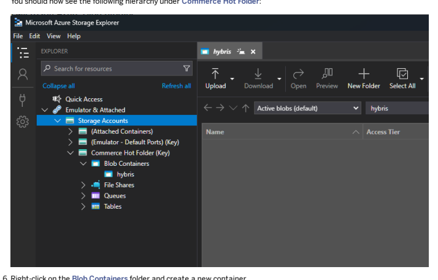

## I Note

The container name depends on the value of azure.hotfolder.storage.container.name. The default name is hybris.

7. Create a new folder called master, and then a new folder under that called hotfolder.

The default container structure is master/hotfolder, based on the value of azure.hotfolder.storage.container.hotfolder. To create custom folders instead, add the correct hierarchy under your container, such as master/custom.

Microsoft Azure Blob Storage Connection Properties

## Microsoft Azure Blob Storage Connection Properties

To push les into hot folders, connect your Microsoft Azure Blob Storage using the key displayed in the Cloud Portal.

| Property                                        | Description                                                             | Default Value                                            |
|-------------------------------------------------|-------------------------------------------------------------------------|----------------------------------------------------------|
| azure.hotfolder.storage.account.connectionstring                                                 | Synchronizes les                                                        | Not applicable. This is automatically set by the system. |
| azure.hotfolder.storage.container.name          | Denes the name of the container to synchronize from                     | hybris                                                   |
| azure.hotfolder.storage.container.hotfolder     | Denes the path to the                                                   | <${tenantId}/hotfolder →                                 |
| folder within the container                     | master/hotfolder>                                                       |                                                          |
| azure.hotfolder.storage.container.match.pattern | Denes the pattern to govern remote le names that should be synchronized | <^((?!ignore).)*$>                                       |
| azure.hotfolder.storage.polling.fixed.rate      | Denes how often to poll                                                 | 150000                                                   |
| les in milliseconds                             |                                                                         |                                                          |
| azure.hotfolder.storage.polling.fetch.batchsize                                                 | Controls how many les are                                               | 1                                                        |
| fetched per poll                                |                                                                         |                                                          |
| azure.hotfolder.storage.delete.remote.files     | Indicates if the remote les should be deleted after download            | true                                                     |
| azure.hotfolder.storage.account.name            | Denes the name of the account                                           |                                                          |

For more information about Microsoft Azure Blob Storage, see the following links:

Blob Services REST API documentation: https://docs.microsoft.com/en-us/rest/api/storageservices/blob-service-restapi Explorers for Blob Storage: https://docs.microsoft.com/en-us/azure/storage/common/storage-explorers Blobfuse virtual le system driver, which allows access to existing block Blob data: https://docs.microsoft.com/enus/azure/storage/blobs/storage-how-to-mount-container-linux AzCopy command-line tool for copying data to and from Azure Blob and File storage: https://docs.microsoft.com/enus/azure/storage/common/storage-use-azcopy-linux

## File Processing Channels

Use either one of the default le processing channels provided with Cloud Hot Folders, or create your own. Dening where a le is processed means choosing a mapping strategy, which is based on regular expressions. Three default channels process les for Cloud Hot Folders:
Default Mapping Channel

Unzip Channel Unmapped Channel

## Default Mapping Channel

The Default Mapping Channel supports standard le imports. To learn more about data importing, see Data Importing.

Files matching the property cloud.hotfolder.default.mapping.file.name.pattern are routed through this channel, which has the default ^(customer|product|url_media)-\\d+.*. A new type of supported media le, url_media, allows impex to import remote media, rather than storing it locally. Assuming that you are using Microsoft Azure Blob Storage, the URL would be cloud.hotfolder.default.images.root.url and the auto-generated folder is called cloud.hotfolder.default.image.media.folder.qualifier.

To support this, you need to add and congure two properties, based on the synchronization you use.

The Cloud Hot Folder BatchHeader requires some conguration. Set the following properties in the BatchHeader.

| Property                                       | Value                     | Description                 |
|------------------------------------------------|---------------------------|-----------------------------|
| cloud.hotfolder.default.mapping.root.dir       | electronics               | Destination catalog         |
| cloud.hotfolder.default.mapping.header.catalog | electronicsProductCatalog | Destination catalog version |
| cloud.hotfolder.default.mapping.header.net     | <true/false>              |                             |

You can expand this le to ImpexConverter mapping by updating cloud.hotfolder.default.zip.mapping.file.name.pattern to include new prexes. If necessary, add your own de.hybris.platform.acceleratorservices.dataimport.batch.converter.mapping.impl.DefaultConvert and link it to the appropriate de.hybris.platform.acceleratorservices.dataimport.batch.converter.ImpexConverter implementation.

## Unzip Channel

The Unzip Channel lets you access individual les included in a ZIP bundle. This option uses the lename pattern ^(?:.*)\.(?

i)(zip)$ to map to a specic channel. You can import data using any of the following ways.

| File Name Patterns for Data                                                          |                   |                                                                                                                             |
|--------------------------------------------------------------------------------------|-------------------|-----------------------------------------------------------------------------------------------------------------------------|
| Type of                                                                              | File Name Pattern | Description                                                                                                                 |
| Data Core Data                                                                       | ^coredata.*       | Core Data is imported in a specic sequence. For more information, see apparelstore Extension or electronicsstore Extension. |
| This is custom documentation. For more information, please visit the SAP Help Portal | 8                 |                                                                                                                             |

| 7/8/2024 Type of   | File Name Pattern                                     | Description                                                                   |
|--------------------|-------------------------------------------------------|-------------------------------------------------------------------------------|
| Data Sample        | ^sampledata.*                                         | Sample Data is imported in a specic sequence. For more information, see       |
| Data               | apparelstore Extension or electronicsstore Extension. |                                                                               |
| Raw                | (?!coredata|sampledata).*                             | These les contain either raw impex les or CSVs, which are converted to impex. |
| Impexes            | Impexes are imported and sorted lexicographically.    |                                                                               |
| Images             | (?!coredata|sampledata).*                             | Images are processed according to the out-of-the-box logic of batchMediaConverter. To use it, Images needs to be placed within the images directory, and in proper subdirectories appropriate to their resolution. Image definition needs to be placed in a zip_media.csv le, which will later be converted to Media, MediaContainer and Product objects, according to the /yacceleratorcore/resources/yacceleratorcore/integration/hotfolder-common-spring.xml denition. Sequential le names are also permitted, for example zip_media_001.csv, zip_media_002.csv.                                                                               |

The Unzip channel requires the following property conguration.

| Property                                             | Value                     |
|------------------------------------------------------|---------------------------|
| cloud.hotfolder.default.zip.header.catalog           | electronicsProductCatalog |
| cloud.hotfolder.default.zip.header.net               | false                     |
| cloud.hotfolder.default.zip.mapping.product.catalog  | electronics               |
| cloud.hotfolder.default.zip.mapping.content.catalogs | electronics               |
| cloud.hotfolder.default.zip.mapping.store.names      | electronics               |

## Unmapped Channel

If no match is found for a channel, then the le is passed to an "unmapped" MessageChannel, which moves the le into the directory ${acceleratorservices.batch.impex.basefolder}/${tenantId}/unmapped.

## Caution

This directory is on the local disk, and NOT the remote location. Files will NOT be moved to an unmapped directory on the remote store. Passing the le to the unmapped channel prevents unmapped les from causing exceptions. This allows Cloud Hot Folders to continue processing synchronised les, while "silent failures" are captured through logs and Backoffice history entries. The original le remains in the remote location, and is moved to the archive folder to prevent further processing, which would simply cause a circle of failures.

There following property controls this behavior when you want unmapped les to stop the processing other les.

| Property                                                  | Default Value   |
|-----------------------------------------------------------|-----------------|
| cloud.hotfolder.storage.header.router.resolution.required | false           |

## Regenerate The Cloud Hot Folder Key Pair

This is   For more    the SAP Help  9 You can generate a new Cloud Hot Folder private and account key pair in the Cloud Portal. The new key overwrites the previous key pair so that applications or tools that used the previous key can no longer access hot folder storage.

1. Open your environment in the Cloud Portal.

2. Locate the Cloud Storage tile on the page and click Hot folders.

3. Click Copy Key to Clipboard to copy the account key to the clipboard of your local drive. 4. Click Regenerate Key to create a new key pair, overwriting the previous keys.

## Cloud Hot Folder Processing Status

When cloud hot folders download data les from Azure Blob storage, you can check the success of this process using your local Blob storage. The hot folder then prepares them for standard hot folders to process and import the les into SAP Commerce Cloud. The following steps take place:
1. Cloud hot folders continually monitor a specic directory in your Blob storage for the presence of new les.

2. The cloud hot folder moves any les placed in the Blob directory to a temporary processing directory that it creates in the Blob storage.

3. The cloud hot folder downloads les from the processing directory to a standard hot folder in SAP Commerce Cloud.

4. Standard hot folders decompress these les and convert them into compatible formats for SAP Commerce Cloud import. This process follows the mapping and processing rules that you dene. Cloud hot folders play no part in the process pipeline of standard hot folders.

5. When the hot folder nishes processing les, the cloud hot folder moves them from the temporary processing directory
to one of the following directories:

Archive directory: contains les successfully imported
Error directory: contains les with one or more exceptions during processing Files moved to the Archive or Error directory remain there until you delete them. To reprocess 'failed les', move them back to the Blob directory for the cloud hot folder to pick up.

## Mount Microsoft Azure Blob Storage Containers To A File System

When you have integrations that don't communicate with Microsoft Azure Blob Storage containers, you can load your les to a common le system. Then, mount the le system to a Microsoft Azure Blob Storage container.

## Prerequisites

You have a Linux or Mac machine.

You installed Rclone on the machine where you want to mount the Blob storage. Rclone is a command line program that synchronizes les and directories to and from storage services. To learn more, see Rclone .
You installed Filesystem in Userspace (FUSE) on the machine where you want to mount the Blob storage. FUSE is a software interface for Unix and Unix-like operating systems.

For Mac: FUSE for macOS For Linux: FUSE comes by default on most Linux distributions.

You have the cloud storage account name and public key. You can nd this information in the Cloud Portal from
Environments <Environment name> Cloud Storage Hot folders .

You downloaded Azure Storage Explorer and created a container inside the Blob storage that you want to connect. This tool lets you nd the container ID, which you need to reference when you run the mount command. To learn more, see Azure Storage Explorer .

## Context

This upload method isn't the recommended way to load content. This solution simply allows you to maintain compatibility with third-party systems that don't support Microsoft Azure Blob Storage. This solution is also not a true network le sharing solution. Your aspects can't share the same le system and the les aren't automatically shared with SAP Commerce Cloud.

1. Create a folder to use as the mount point for your Blob storage.

sudo mkdir -p <path to the folder>
 Note Make sure that you create a folder for each Blob storage that you want to mount.

2. Create the conguration folder for Rclone.

sudo mkdir -p /var/root/.config/rclone/
3. Find the location of the conguration le.

rclone config file 4. Edit the conguration le and add the following information.

[BlobName] type = azureblob account = <Account name for Blob> key = <Public Key for Blob>
[BlobName] is the identier that you want to use for the conguration.

type is always azureblob account is the account name of the Blob storage that was created when you provisioned an environment in the Cloud Portal.

key is the public key for the Blob storage.

5. If you need multiple Blob storage accounts, create a conguration le for each account.

 Note Usually each environment has its own storage account.

6. Run the mount command.

sudo ./rclone mount -v --debug-fuse --allow-other --vfs-cache-mode full --vfs-cache-maxage 10s --dir-cache-time 10s --daemon <blob-account-name-in-config>:<containerId>
This is   For more    the SAP Help  11

-v enables verbose mode, which is required for troubleshooting purposes.

--debug-fuse reports errors related to FUSE.

--allow-other grants access to other users. Set if the person mounting the le system is different from the person using it.

--vfs-cache-mode full controls how VFS caching is used. In full mode, all les opened for read and write are copied to a local cache location before being used. This attribute prevents issues caused by concurrent le access.

--vfs-cache-max-age 10s is the maximum time that a le remains on cache. Adjust on a case-by-case basis.

--dir-cache-time 10s is the maximum time that a folder remains on cache. Adjust on a case-by-case basis.

--daemon runs the mount in background mode.

<Blob-account-name-in-config> must be replaced with the name between the brackets in the conguration le.

<containerId> is replaced with the name of a container inside the Blob storage, which you created initially.

Use Azure Storage Explorer to nd the container ID.

</mount/path> is replaced with the path of the folder where you want to mount the Blob storage. To learn more, see rclone mount .
Run the command for each Blob storage that you want to mount, modifying the command for each mount point.

## Results

The Blob storage is ready and you can use it as a directory to move les to SAP Commerce Cloud.

Azure Blob Storage

## Unmount Microsoft Azure Blob Storage

You can remove the mount point from a Blob Storage when you're done transferring les from your local le system.

## Prerequisites

You installed Rclone. Rclone is a command line program that synchronizes les and directories to and from storage services. To learn more, see Rclone . You installed Filesystem in Userspace (FUSE). FUSE is a software interface for Unix and Unix-like operating systems.

For Mac: FUSE for macOS For Linux: FUSE comes by default on most Linux distributions.
Run the command to remove the mount point.

\# Linux fusermount -u /path/to/local/mount

\# OS X umount /path/to/local/mount

## Results

The mount point is removed. If les were in the process of transmitting, then transfers are immediately interrupted and data is lost.

Azure Blob Storage

## Cloud Hot Folder Monitoring

You can monitor the end-to-end processes associated with Cloud Hot Folders. When platform monitoring is enabled, logging information, metrics, and type system information is available. To learn about which monitoring options are available, and what each of them does, see Cloud Hot Folder Monitoring Actions. To discover extra monitoring and metrics, over and above what exists in the standard implementation, see AOP Monitoring. If you're experiencing stale monitoring data, and want to clean up jobs, see Stale Monitor History Data and Removing Stale Monitor History Data.

## Cloud Hot Folder Monitoring Actions

You can monitor the end-to-end processes associated with Cloud Hot Folders. When platform monitoring is enabled, logging information, metrics, and type system information is available.

| The following table includes monitoring actions and additional information regarding each action. Action Additional Information Downloaded The specic remote storage implementation handles the download. The cloudcommons or cloudhotfolder extension is not responsible for download. The Microsoft Azure Blob Storage implementation provides information on how long the le took to download along with the size of the le. File routed If a le is routed successfully, this action is not recorded. For les that are not routed successfully, a warning is recorded. File Unzipped This action records the time it took to unzip the le staged for processing. Header Setup This action records the time it took to set up the BatchHeader/ZipBatchHeader. Header Initialized This action records the time it took to initialize the BatchHeader/ZipBatchHeader. Header Transformed This action records the time it took to transform raw CSVs to Impex in the BatchHeader/ZipBatchHeader. Header Executed This action records the time it took to execute all the Impex les in the BatchHeader/ZipBatchHeader. It also records the time required for each Impex run as a separate action and displays the results.   |
|----------------------------------------------------------------------------------------------------------------------------------------------------------------------------------------------------------------------------------------------------------------------------------------------------------------------------------------------------------------------------------------------------------------------------------------------------------------------------------------------------------------------------------------------------------------------------------------------------------------------------------------------------------------------------------------------------------------------------------------------------------------------------------------------------------------------------------------------------------------------------------------------------------------------------------------------------------------------------------------------------------------------------------------------------------------------------------------------------------------------------------------------------------------------------------------------------------------------------|

| Action         | Additional Information                                                                                                        |
|----------------|-------------------------------------------------------------------------------------------------------------------------------|
| Header Cleanup | This action records the time it took to clean up any converted les and also move the original les into the archive directory. |

The following properties enable you to control specic monitoring. The properties shown here represent current defaults, which can be modied, either through the SAP Commerce Cloud Administration Console, or by editing your code.

| Property                                               | Purpose                                                                          |
|--------------------------------------------------------|----------------------------------------------------------------------------------|
| cloud.commons.monitoring.metric.counter.enabled=true   | Reports in numerical form how many instances of individual steps were completed. |
| cloud.commons.monitoring.metric.histogram.enabled=true | Reports in histogram form how many instances of individual steps were completed. |
| cloud.commons.monitoring.metric.timer.enabled=true     | Enables the duration of each step to be reported.                                |
| cloud.commons.monitoring.logging.enabled=true          | Enables logs to be saved to Kibana.                                              |
| cloud.commons.monitoring.database.enabled=true         | Enables MonitorHistoryData to be saved to SAP Commerce Cloud.                    |
| cloud.commons.monitoring.job                           | Denes the number of successful MonitorHistoryData                                |
| .cleanup.successful.threshold=7                        | instances that are retained by SAP Commerce Cloud before being deleted.          |
| cloud.commons.monitoring.job                           | Denes the number of unsuccessful MonitorHistoryData                              |
| .cleanup.unsuccessful.threshold=21                     | instances that are retained by SAP Commerce Cloud before being deleted.          |

For additional monitoring and metrics solutions, refer to AOP Monitoring.

## Monitoring Cloud Hot Folder Activities In The Backoffice

Monitor and review each step of the Cloud Hot Folder le processing sequence in the Backoffice Administration Cockpit.

## Prerequisites

For the Cloudcommons option to appear in the side navigation, you must enable the Cloud Hot Folders feature. For more information, see Enable and Congure Hot Folders.

1. Log in to the Backoffice Administration Cockpit.

2. Select Cloudcommons in the side navigation. 3. Select Monitoring History in the side navigation.

A list opens displaying les that the hot folder has picked up, including the status of each le.

4. Double-click any le to open it. 5. Under Properties, check the list of steps that took place while importing the le from hot folders. 6. Click any step to display more details, including a message box.

The message box provides information about any issue that occurred during processing of the le. Use this information to further investigate the issue, or to communicate with SAP Support.

This is   For more    the SAP Help  14

## Aop Monitoring

The Spring Aspect-Oriented-Programming (AOP) framework within Cloud Hot Folders adds extra monitoring and metrics, over and above what exists in the standard implementation. Spring integration and AOP interceptors add logging around the default hot folder tasks and converters. The manifest aspect conguration and the additional monitoring steps are outlined in this section. Interceptors record information about les as they're processed through the ow. If you extend the out-of-the-box hot folder tasks and converter interfaces, your custom components are instrumented in the same way. If you choose to implement your own tasks or converters, then add your own AOP monitors to retain this level of logging.

## Aspect Conguration

Aspects are Spring beans that perform logic in or around the method they're declared to intercept. Most of our monitoring aspects are congured in <HYBRIS_BIN_DIR>/ext-cloud/cloudhotfolder/resources/integration/hotfolderaop-spring.xml.

<aop:config> <aop:aspect ref="fileUnzippedAspectBean"> <aop:around method="aroundUnzipped" pointcut="bean(unZipTransformer) and execution(* doTransform(..)) and args(mess </aop:aspect> <aop:aspect ref="batchHeaderAspectBean" id="zipBatchHeaderAspect"> <aop:around method="aroundMessageSetup" pointcut="execution(* de.hybris.platform.cloud.hotfolder.dataimport.batch.zip.t ...

...

 </aop:aspect> <aop:aspect ref="batchHeaderAspectBean" id="fileBatchHeaderAspect"> <aop:around method="aroundFileSetup" pointcut="execution(* de.hybris.platform.acceleratorservices.dataimport.batch.t ...

...

</aop:aspect>
</aop:config>

## More Monitoring Steps

The steps in the table are wrapped with extra monitoring capabilities.

| Step               | Notes                                                                                                                                                                                                                 |
|--------------------|-----------------------------------------------------------------------------------------------------------------------------------------------------------------------------------------------------------------------|
| Downloaded         | The Azure Blob integration currently provides information on the length of time it took to download a le, as well as the le size.                                                                                     |
| File Routed        | This step isn't recorded on les that are routed successfully. It's a warning for les NOT routed.                                                                                                                      |
| File Unzipped      | This step is used to record how long it took to unzip a le that is ready to be processed.                                                                                                                             |
| Header Setup       | This step is used to record how long it took to set up the BatchHeader and ZipBatchHeader.                                                                                                                            |
| Header Initialized | This step is used to record how long it took to initialize the BatchHeader and ZipBatchHeader.                                                                                                                        |
| Header Transformed | This step is used to record how long it took to transform any raw CSVs to Impex in the BatchHeader and ZipBatchHeader.                                                                                                |
| Header Executed    | This step is used to record how long it took to execute all the Impex les in the BatchHeader and ZipBatchHeader. It also records the time to complete the task and the result of each Impex run as a separate action. |

| Step           | Notes                                                                                                                           |
|----------------|---------------------------------------------------------------------------------------------------------------------------------|
| Header Cleanup | This step is used to record how long it took to clean up converted les and to move the original les into the archive directory. |

## Stale Monitor History Data

Customizing Cloud Hot Folder operations may result in some processes appearing to be stuck IN_PROGRESS, even when completed. Clean-up processes then skip this data, resulting in stale history. Every time you import data using Cloud Hot Folders, monitor history data is saved to the SAP Commerce Cloud database. These records have a general status, such as WARNING or IN_PROGRESS, which can then be expanded to display the status of each step of the Cloud Hot Folder import.

Stale history occurs when the parent status displays as IN_PROGRESS, even when the data has been successfully imported, as demonstrated by successful child entries, and the appearance of new data in the database. The problem typically arises from customizations such as the addition of processing channels. These channels can both interrupt the hot folder process ow, and cause some actions to be omitted from standard monitoring. Consequently, the status of the parent entry is not updated correctly and continues to display IN_PROGRESS, despite having successfully processed the data.

As monitoring clean-up jobs are only congured to delete records with the status SUCCESSFUL or FAILURE, records with the status IN_PROGRESS persist as stale history. To learn how to x this, see Removing Stale Monitor History Data.

## Removing Stale Monitor History Data

Customizing Cloud Hot Folder operations may result in some processes appearing to be stuck IN_PROGRESS, even when completed. You can run a script to identify and edit these statuses, so that they can be removed.

1. Address the missing AOP monitoring.

See AOP Monitoring for more information.

2. Clear the stale data, taking care not to delete data that may indicate other issues.

You can use the script below to search for records with the status IN_PROGRESS and older than a congurable number of days. The system will then update the parent records to the status SUCCESS or FAILURE, so that they are picked up by clean-up jobs. By default, child entries are not updated in order to preserve information about erroneous steps. Take careful note of the Properties you may want to change section of the script below, as this identies places where you can customize behavior. The script can be run using the Scripting Languages option in the SAP Commerce Cloud Administration Console. Note that you need to deactivate the rollback switch in the console to ensure that results are persisted.

## Sample Code

import de.hybris.platform.cloud.commons.enums.MonitorStatus import de.hybris.platform.cloud.commons.model.MonitorHistoryDataModel import de.hybris.platform.cloud.commons.services.monitor.job.MonitorHistoryMaintenanceClean import de.hybris.platform.cronjob.enums.* import de.hybris.platform.processing.model.BatchModel This is   For more    the SAP Help  16 import de.hybris.platform.servicelayer.cronjob.PerformResult import de.hybris.platform.servicelayer.search.* import de.hybris.platform.servicelayer.model.* import de.hybris.platform.core.model.user.CustomerModel; import de.hybris.platform.cloud.commons.jalo.MonitorHistoryEntryData import de.hybris.platform.cloud.commons.jalo.MonitorHistoryData import de.hybris.platform.servicelayer.time.impl.DefaultTimeService import org.assertj.core.util.Lists import de.hybris.platform.servicelayer.search.FlexibleSearchQuery flexibleSearchService = spring.getBean("flexibleSearchService") modelService = spring.getBean("modelService") /** * START - PROPERTIES YOU MAY WANT TO CHANGE */ // Modify the threshold parameter to find records older than this many days DEFAULT_THRESHOLD = 14; // Determine whether to update the status of the child entries of the stale IN_PROGRESS pa // By default set at false, as you may want to preserve information of which steps were er updateChildEntries = Boolean.FALSE /** * END - PROPERTIES YOU MAY WANT TO CHANGE */ // Most likely the status of stale records is 'IN_PROGRESS' - you shouldn't need to change STATUS = MonitorStatus.IN_PROGRESS; // Capture the status we want to change to - in most cases this would either be 'SUCCESS' o // Depending upon what you prefer - also shouldn't need to change this (your settings for t // failed history records are typically persisted for longer than successful NEW_STATUS = MonitorStatus.SUCCESS /** * Define global variables (non typed in groovy) */ TEMPLATE = "SELECT {%s} FROM {%s} WHERE {%s} < ?threshold AND {%s} = ?status"; STATUS_PARAM = "status"; THRESHOLD_PARAM = "threshold"; FlexibleSearchQuery createFetchQuery(Date thresholdDate) { HashMap<String, Object> params = new HashMap<>(); params.put(STATUS_PARAM, STATUS); params.put(THRESHOLD_PARAM, thresholdDate); final String queryString = String.format(TEMPLATE,
This is   For more    the SAP Help  17 MonitorHistoryDataModel.PK, MonitorHistoryDataModel._TYPECODE, MonitorHistoryDataModel.MODIFIEDTIME, MonitorHistoryDataModel.STATUS ); return new FlexibleSearchQuery(queryString, params); } /** * Modified time is a java Date, so calculate the threshold days * as a date from now * * @return Date threshold days ago as a Date */ Date calculateThreshold() { final Calendar calendar = Calendar.getInstance(); calendar.setTime(new Date(System.currentTimeMillis())); calendar.add(Calendar.DATE, -DEFAULT_THRESHOLD); return calendar.getTime(); } void runQuery() { Date thresholdDate = calculateThreshold() println sprintf("Searching for records older than date [%s] (threshold was [%s] days), wi println sprintf("Found records will be updated to Status [%s]", NEW_STATUS) println sprintf("Child entries WILL %s be updated", updateChildEntries ? "" : "NOT") searchResult = flexibleSearchService.search(createFetchQuery(thresholdDate)).getResult() println "START search results....." for (hx in searchResult) { String hxPk = hx.getPk() println sprintf("PK: [%s], Status: [%s], Modified time: [%s]", hxPk, hx.getStatus(), hx hx.setStatus(NEW_STATUS) if (updateChildEntries) { println "START Child Entries........" for (childHx in hx.getEntries()) { println sprintf("Step: %s, Status: %s", childHx.getStep(), childHx.getStatus()) childHx.setStatus(NEW_STATUS) } println "END Child Entries........" } modelService.save(hx) println sprintf("SUCCESSFULLY updated parent record with PK [%s]", hxPk) } println "END search results....." }

## Cloud Hot Folder Extension

The Cloud Hot Folder extension enables developers to congure and customize the automated process of importing data in SAP
Commerce Cloud.

## Overview

SAP Commerce Cloud is hosted on Microsoft Azure. The Cloud Hot Folder extension provides the support required to make hot folders work in SAP Commerce Cloud within an Azure framework. Cloud Hot Folders dene a customizable pipeline - or 'ow' - that converts CSV les into fast, multithreaded SAP ImpEx scripts. These ImpEx scripts insert or update data directly in your SAP Commerce Cloud database. By conguring the Cloud Hot Folder framework, you dene how to create the ImpEx scripts from your specic CSV les. Hot folders have been a feature of SAP Commerce Cloud Accelerator services for many years. The Accelerator services extension includes two sample ows, one for the apparel store, and one for the electronics store. Hot folders also include a library of converters that allows you to import complex data models, such as product media. If your data model requires complex transformations, it may be necessary to create extra converters.

An initial understanding of how standard hot folders function is a prerequisite for getting the most out of Cloud Hot Folders. For information about standard hot folders, see Data Importing.

## Advantages Of Using Cloud Hot Folders

A Spring integration Inbound Channel Adapter checks for les in an Azure Blob store. An instance of the Inbound Channel Adapter is created for each node running the Cloud Hot Folder extension. This conguration differs from standard hot folders, where each monitored folder has to be dened by a le Inbound Adapter. An election mechanism ensures that exactly one node processes remote les. Meanwhile, the adapter starts and stops safely in response to SAP Commerce Cloud lifecycle events. Along with the adapter, a hot folder ow unzips and processes archives that contain multiple data les. This ow is able to process a wider range of les than standard hot folders, including raw ImpEx. By default, the Azure Inbound Adapter routes all ZIP les to this new ow. You can congure the adapter to deliver les with matching names to a hot folder ow of your choice. The adapter acts as a router, sending les to different hot folder ows based on the le name.

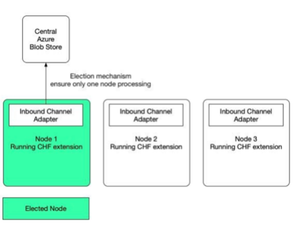

## Features Of Cloud Hot Folders

Cloud Hot Folders include the following features:

Remote storage support through Azure Blob storage: During the provisioning of a SAP Commerce Cloud environment, an Azure Blob store is automatically created for you to use as a hot folder pick-up location. This provision includes cloudand cluster-safe le handling tools, with concurrency management and failover control.
ZIP le support: Enables you to upload and process ZIP archives containing multiple core data, sample data, raw ImpEx, media, and CSV les. To learn more, see Unzip Channel. URL media le support: Enables you to reference media using external URLs in uploaded ImpEx. To learn more, see Importing Media References Using URLs. File sorting: Provides greater control over the ordering of les imported using the hot folder mechanism. To learn more, see Synchronizing, Sorting, and Filtering. Improved monitoring and metrics: Provides back-office monitoring and display of hot folder operations, enabling you to diagnose and x integration problems without needing to access either the lesystem or the operating system of the SAP Commerce Cloud node. To learn more, see AOP Monitoring.

Cloud Hot Folders are NOT:
a drag-and-drop feature of SAP Commerce Cloud

congurable in the Cloud Portal
a one-size-ts-all feature; certain use cases may need the ow and behavior of the Cloud Hot Folder to be customized

able to handle data export from the application into Azure Blob storage.

## Preparing Cloud Hot Folder Extensions

If you want to use the Cloud Hot Folder extension in your project, add the extension to the Commerce Cloud manifest and set the required supporting properties.

## Context

By default, Cloud Hot Folder extensions are not included in the list of active extensions. Adding the extensions to the manifest makes them active. Setting a cluster group name property in the manifest identies the aspect that processes your les. This aspect is typically the backgroundProcessing aspect.

This is   For more    the SAP Help  20 Procedure 1. Use Microsoft Storage Explorer to verify that you can connect to your hot folder account using the credentials available in the Cloud Portal.

2. Add the azurecloudhotfolder extension to the manifest.

3. Add the following property to the backgroundProcessing aspect.

{ ... ... "aspects": [ ... ... { "name": "backgroundProcessing", "properties": [ { "key": "cluster.node.groups", "value": "integration,yHotfolderCandidate,backgroundProcessing" } ] } ], ... ... }
4. Build and deploy the project in the Cloud Portal.

## Results

Having added the Cloud Hot Folder extensions to the manifest, you can build and deploy to an environment. Test your customization by uploading some data les to Azure Blob storage, and checking to see if they import successfully.

Service Control Testing Cloud Hot Folders in a Local Environment

## Testing Cloud Hot Folders In A Local Environment

Set up a local development environment to test that Cloud Hot Folders are functioning correctly.

## Prerequisites

You have an integrated development environment, such as Visual Studio Code or IntelliJ IDEA.

You installed Microsoft Azure Storage Explorer. For more information, see https://azure.microsoft.com/engb/features/storage-explorer/ . You have a container orchestration system for running applications, such as Docker Desktop, which runs a local Blob store. You have a lightweight server clone of Azure Blob storage, such as Azurite, running in a Docker container as local storage and you ran the following command from a command line.
docker pull mcr.microsoft.com/azure-storage/azurite This is   For more    the SAP Help  21

In order to follow the steps in this procedure, a basic understanding of Docker is recommended. For more information, see Docker Desktop .

1. Add the following three extensions to your config/localextensions.xml le.

azurecloudhotfolder cloudcommons cloudhotfolder

These extensions are available from 2817992 .

2. Start Docker Desktop. 3. From the command line, run the command to create an Azurite container.

docker run -p 10000:10000 -p 10001:10001 mcr.microsoft.com/azure-storage/azurite

Azurite creates emulated components against the following Docker ports:
Azure Blob Storage Emulator listening on port 10000

Azure Queue Storage Emulator listening on port 10001 (optional) Azure Table Storage Emulator listening on port 10002
Azurite also congures three Docker ports against three published localhost IP ports. You can map the published IP
ports to any local port. To update ports, change your docker run command or update the docker-compose le to reference the new local ports.

4. In the config/local.properties le, create the following two properties:

| Property            | Value                                                                                                                                                                                                                                                                                      |
|---------------------|--------------------------------------------------------------------------------------------------------------------------------------------------------------------------------------------------------------------------------------------------------------------------------------------|
| cluster.node.groups | integration,yHotfolderCandidate                                                                                                                                                                                                                                                            |
| azure.hotfolder.storage.account.connectionstring                     | The entry is a string made up of several parts that are separated by s DefaultEndpointsProtocol=http AccountName=<any_account_name> AccountKey=<any base64 encoded string> BlobEndpoint=http://<localhost>:11000/$<account_name> Example DefaultEndpointsProtocol=http;AccountName=devstor |

5. Install and run Microsoft Storage Explorer.

6. Find the container in the Microsoft Storage Explorer and use the connection string and primary key to connect to the emulated Blob. When you highlight the container name, a Properties tab along the bottom of the page contains the primary key and connection string.

7. Build and run your local SAP Commerce Cloud installation.

Once SAP Commerce Cloud starts with the new extensions and properties, it creates a Blob container in Azurite.

8. Run a system update to update the Type System denitions in the database for Cloud Hot Folders.

a. Open Administration Console. b. Navigate to Platform Update .

c. Select the following extensions.

azurecloud cloudcommons cloudhotfolder azurecloudhotfolder d. Click Update.

9. In Microsoft Storage Explorer, nd the hybris container in your Blob storage account.

10. Create a test le with the name test.csv.

You can copy cloudhotfolder/resources/cloudhotfolder/test/hotfolder/product-00.csv and rename it to test.csv.

11. Upload the test le to the hybris container and put it in a folder with the name master/hotfolder.

a. Create the directory master/hotfolder in the hybris container in Microsoft Azure Storage Explorer.

b. Upload the test.csv le to master/hotfolder.

## Results

In the Azurite console, the le is copied to the processing folder and then to the archive folder. If the impex import was unsuccessful, then the le is copied in the error folder. A conrmation message displays in the terminal and includes a list of the processing steps.

You're now ready to upload les to Cloud Hot Folders (hybris/master/hotfolder).

Service Control

## Technical Details

Learn about the storage platform and the Spring integration framework that forms the basis of Cloud Hot Folders.

Azure Blob Storage Microsoft Azure Blob storage enables you to import les quickly and reliably to SAP Commerce Cloud environments using Cloud Hot Folders. Languages and Main Framework Compatibility Find the recommended versions of programming languages and platforms that support Cloud Hot Folders in SAP Commerce Cloud.

This is   For more    the SAP Help  23 Implementation, Modules, and Key Classes for Local Development Learn about the Spring integration and the module structure that supports Cloud hot folders. File Processing Channels Messaging is the foundational pattern of the Spring Integration library. File processing channels provide endpoints that accept a message, perform some processing on it, and then pass the processed message to the next channel. Message attributes dictate how information ows through the processing channels. Service Control Cloud Hot Folders identify a single node as a Leader node and allow that node exclusively to pull down remote les for processing. This conguration prevents les from running multiple times or out of sequence. If the Leader node goes down, another node is elected to take its place. AOP Monitoring The Spring Aspect-Oriented-Programming (AOP) framework within Cloud Hot Folders adds extra monitoring and metrics, over and above what exists in the standard implementation. Spring integration and AOP interceptors add logging around the default hot folder tasks and converters. The manifest aspect conguration and the additional monitoring steps are outlined in this section.

## Azure Blob Storage

Microsoft Azure Blob storage enables you to import les quickly and reliably to SAP Commerce Cloud environments using Cloud Hot Folders.

## Advantages Of Azure Blob Storage

Microsoft Azure Blob storage provides a high level of availability and reliability. Files can be uploaded and stored quickly and safely. Blob storage also provides several advantages over traditional le handling services such as FTP, including simpler and more reliable integration. File operations are atomic, meaning les are only available to the hot folder once they've been uploaded in their entirety. This avoids the need for temporary le names.

## Blob Storage Account Access

Azure Blob storage is created automatically when you rst provision an environment and it remains available for as long as you have the environment. If you delete all of your environments, you also delete the Blob storage, which is then re-created once you provision a new environment. The connection credentials for the environment storage account are provided in the Cloud Storage section of the Environments screen in the Cloud Portal, directly under Endpoints. Clicking any Cloud hot folder link opens the Basic Information for that folder, including its Account Name, Public URL, and Public Key. There are a number of tools available for accessing and uploading les to Azure Blob storage accounts. Details of the tools provided by Microsoft can be found here:
Blob Services REST API documentation

Explorers for Blob Storage Blobfuse virtual le system driver (provides access to existing block Blob data) AzCopy command line tool (copy data to and from Azure Blob and File storage)
Upload all data les as block Blobs.

| 7/8/2024 Property                               | Description                                           | Default Value              |
|-------------------------------------------------|-------------------------------------------------------|----------------------------|
| azure.hotfolder.storage.account.connectionstring                                                 | The connection string used to                         | Not applicable. The system |
| synchronize les.                                | automatically sets this value.                        |                            |
| azure.hotfolder.storage.container.name          | The name of the container to monitor/synchronize from |                            |
| azure.hotfolder.storage.container.hotfolder     | The path to the folder within                         | ${tenantId}/hotfolder      |
| the container.                                  | e.g. master/hotfolder                                 |                            |
| azure.hotfolder.storage.container.match.pattern | A pattern to match the le to                          | ^((?!ignore).)*$           |
| import.                                         |                                                       |                            |
| azure.hotfolder.storage.polling.fixed.rate      | How often, in milliseconds, the                       | 15000                      |
| hot folder is scanned.                          |                                                       |                            |
| azure.hotfolder.storage.delete.remote.files     | If true, remote les are deleted                       | true                       |
| after being downloaded.                         |                                                       |                            |
| azure.hotfolder.storage.account.name            | The name of the account.                              |                            |

It is only necessary to override the property in your project when the default value doesn't meet your requirements.

## Blob Storage And File Migration

If you want to migrate data to SAP Commerce Cloud, then you can set up Blob Storage on two different machines and transfer les like you would with a Network File System. Keep the following information in mind.

Folders on Blob Storage, not to be confused with containers, disappear after some time if they don't contain any les.

If two machines open the same le and update the le at the same time, then the last save is the one that remains. When opening a le, you are actually opening a locally cached version of the le.

You can use rclone mount as a systemmd service.
When naming blobs, avoid names that end with a dot (.), a forward slash (/), a backslash (\), or a sequence or combination of the two. No path segments should end with a dot (.). Not following these rules could lead to various issues when trying to access or modify les.

Mount Microsoft Azure Blob Storage Containers to a File System Unmount Microsoft Azure Blob Storage

## Languages And Main Framework Compatibility

Find the recommended versions of programming languages and platforms that support Cloud Hot Folders in SAP Commerce Cloud.

## Blob Storage Compatibility

This is   For more    the SAP Help  25 Out-of-the-box support for Azure Blob storage is only provided with SAP Commerce Cloud.

## Languages

Use the following versions of Java and Spring with SAP Commerce Cloud 2211.

Java 11 Spring Integration 5.1.3. RELEASE

## Implementation, Modules, And Key Classes For Local Development

Learn about the Spring integration and the module structure that supports Cloud hot folders.

## High-Level Diagram

The high-level diagram shows the code names of each piece of the implementation as well as how they ow through the system. Click on the image to enlarge it.

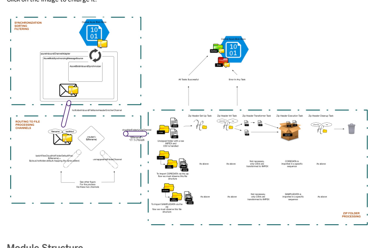

Module Structure
The Cloud hot folder extension is split across an extension hierarchy that consists of the following extensions.

cloudcommons: contains helper classes and other support components cloudhotfolder: contains the basic Cloud hot folder components. If you want to use a different storage platform, you can copy this extension and modify it, as needed.

azurecloudhotfolder: contains sorting and synchronization components
This is   For more    the SAP Help  26

## Spring Integration

The SAP Commerce Cloud platform uses the Spring Integration framework, specically the Inbound Channel Adapter. To learn more, see Channel Adapter . The classes and methods that support the Inbound Channel Adapter are depicted in the following image. Click on the image to enlarge it.

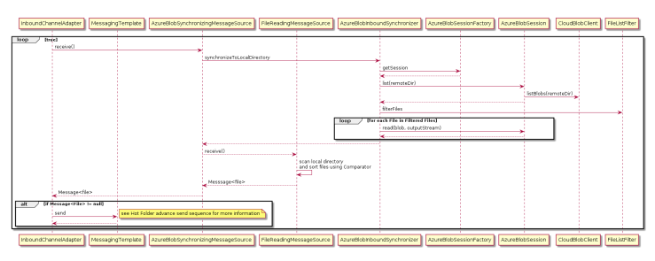

Service Control

## Synchronizing, Sorting, And Filtering

The core functionality of the Cloud Hot Folder extension is agnostic of the remote storage service. This exibility allows you to customize different providers. The bulk of this agnostic functionality is held within the cloudcommons and cloudhotfolder extensions. The azurecloudhotfolder extension contains code that is specic to working with Azure Blob storage and takes cares of the synchronizing, sorting, and ltering steps.

## Synchronization

The synchronize action polls (at a xed rate) an Azure Blob storage container, or a subdirectory thereof, for les, ZIP packages, and folders. As part of the synchronization step, a congurable FilterChain is used to lter and receive les that match a certain pattern. A congurable ComparatorChain sorts les during the copy processing. After ltering and sorting, Spring creates one message per le, ZIP package, or folder and delegates each message to a mapped message channel (spring integration le:outbound-gateway). To support an Azure implementation of the synchronizing, sorting, and ltering steps, the following classes, within org.springframework.integration, are written.

| Base Class / Interface                                   | Extension           | Class               |
|----------------------------------------------------------|---------------------|---------------------|
| extends... integration.endpoint.AbstractMessageSource<T> | azurecloudhotfolder | AzureBlobSynchroniz |
| implements...org.springframework.context.Lifecycle       |                     |                     |

| 7/8/2024 Base Class / Interface                               | Extension           | Class               |
|---------------------------------------------------------------|---------------------|---------------------|
| implements...file.remote.synchronizer.InboundFileSynchronizer | azurecloudhotfolder | AzureBlobInboundSyn |
| implements... file.remote.session.SessionFactory              | azurecloudhotfolder | AzureBlobSessionFac |
| extends...file.remote.session.Session<F>                      | azurecloudhotfolder | ExtendedSession<F>  |
| implements ExtendedSession<F>                                 | azurecloudhotfolder | AzureBlobSession    |
| implements... file.remote.FileInfo<T>                         | azurecloudhotfolder | AzureBlobFileInfo   |
| implements java.lang.Comparable(FileInfo<T>)                  |                     |                     |

## Sorting As Part Of Synchronization

Sometimes certain les are processed before others, for example, products before product media, or customers before orders. It may also be necessary to process multiple les for the same integration by sequence order. The Cloud Hot Folder uses a Comparator to control the le processing order. The Comparator uses a chain of tests to sort the les before processing them. Files are sorted using the following data:
1. File Name prex 2. File Name 3. File Name Sequence 4. File Modied Time

The sequence number must be within the range of 0 to 2147483647. Any value outside this range results in those les not being processed.

The chain acts in a similar way to multi-column sorting in SQL, rst sorting by prex, and then by name. To support this, the following classes enable ne-grain control.

| Base Class / Interface   | Extension    | Class / Interface   |
|--------------------------|--------------|---------------------|
| Not applicable           | cloudcommons | NamedObject         |
| Not applicable           | cloudcommons | TimestampedObject   |

| 7/8/2024 Base Class / Interface                             | Extension           | Class / Interface                                                       |
|-------------------------------------------------------------|---------------------|-------------------------------------------------------------------------|
| implements...java.util.Comparator<T>                        | azurecloudhotfolder | AzureBlobNameCompa                                                      |
| implements... java.util.Comparator<T>                       | azurecloudhotfolder | AzureBlobTimestamp                                                      |
| org.apache.commons.collections4.comparators.ComparatorChain | cloudcommons        | N/A - is spring bean                                                    |
| implements...java.util.Comparator<T>                        | cloudcommons        | NamePrefixComparat NameComparator NameSequenceCompar TimestampComparato |

## Sorting Conguration Fine-Tuning

The Comparators require two conguration properties to ne-tune the AzureBlobNameComparatorAdapter and sort the data.

| File   | Location   | Conguration items   |
|--------|------------|---------------------|

| 7/8/2024 File                                                               | Location   | Conguration items                                                                                                                                                                                                                                                                                                                                                                    |
|-----------------------------------------------------------------------------|------------|--------------------------------------------------------------------------------------------------------------------------------------------------------------------------------------------------------------------------------------------------------------------------------------------------------------------------------------------------------------------------------------|
| project.properties                                                          | <HYBRIS_BIN_DIR>/extcloud/cloudhotfolder            | cloud.hotfolder.storage.file.sort.name.prefix.prior a comma-separated list of prex names. Sorting is based on the order specied in the string. Default:coredata,sampledata,product,url_media cloud.hotfolder.storage.file.sort.name.sequence: a pa used to extract the part of the le name representing a sequence id. Default: ^(?<filename>.*)-(?<sequence>\\d*)(? <extension>.*)$ |
|                                                                            | Note       |                                                                                                                                                                                                                                                                                                                                                                                      |
| The <lename>, <sequence>, and <extension> are regex named capturing groups. |            |                                                                                                                                                                                                                                                                                                                                                                                      |

## Default Sort Order

If no changes are made to the existing Comparators, the ComparatorChain, and the properties, then the following le order applies.

| File order in Blob storage   | Comparator Sort Order (import order)   |
|------------------------------|----------------------------------------|
| product_ins_1.csv            | customer_1.csv                         |
| customer_2.csv               | customer_2.csv                         |
| product_ins_2.csv            | product_ins_1.csv                      |
| product_upd_1.csv            | product_ins_2.csv                      |
| customer_1.csv               | product_upd_1.csv                      |

## Filter Classes

Use ltering classes to specify the types of les that are selected from your Azure Blob storage container during the Cloud hot folder synchronization process.

| Base Class / Interface                                               | Extension           | Class / Interfac   |
|----------------------------------------------------------------------|---------------------|--------------------|
| extends...file.filters.AbstractRegexPatternFileListFilter<T>         | azurecloudhotfolder | AzureBlobReg       |
| extends...file.filters.AbstractPersistentAcceptOnceFileListFilter<T> | azurecloudhotfolder | AzureBlobPer       |

| 7/8/2024 Base Class / Interface                    | Extension    | Class / Interfac   |
|----------------------------------------------------|--------------|--------------------|
| extends... file.filters.CompositeFileListFilter<F> | cloudcommons | ChainFileLis       |

## Conguration Fine-Tuning

The AzureBlobRegexPatternFileListFilter requires a conguration property to specify the regex against which lenames are matched.

| File               | Location   | Conguration Items                                                                                                                         |
|--------------------|------------|-------------------------------------------------------------------------------------------------------------------------------------------|
| project.properties | <HYBRIS_BIN_DIR>/extcloud/azurecloudhotfolder            | azure.hotfolder.storage.container.match.pattern: a regex to match lenames and synchronize only the required les Default: ^((?!ignore).)*$ |

## Default Behavior

If no changes are made to the existing lters, the FilterChain, and the conguration property, then only lenames that don't start with 'ignore' are accepted.

## Filter Customization

When working with Azure Blob storage, the spring conguration le contains Azure-specic Spring beans. Use lter beans to modify the lters in your Cloud Hot Folder lter list.

The <HYBRIS_BIN_DIR>/ext-cloud/azurecloudhotfolder/resources/azurecloudhotfolder-spring.xml is the source of conguration for Azure-specic Spring beans. In the following example, notice the bean for the AzureBlobInboundSynchronizer as well as the lter and comparator beans.

<!-- Azure Inbound File Synchronizer and Channel Adapter --> <alias name="defaultAzureBlobInboundSynchronizer" alias="azureBlobInboundSynchronizer"/> <bean id="defaultAzureBlobInboundSynchronizer" class="de.hybris.platform.cloud.azure.hotfolder.remote.inbound.AzureBlobInboundSynchronizer"> <constructor-arg name="sessionFactory" ref="azureBlobSessionFactory"/> <property name="remoteDirectory" value="\#{azureHotfolderRemotePath}"/> <property name="moveToRemoteDirectory" value="\#{azureHotfolderProcessingRemotePath}"/> <property name="deleteRemoteFiles" value="${azure.hotfolder.storage.delete.remote.files}"/>
This is   For more    the SAP Help  31
 <property name="preserveTimestamp" value="true"/> <property name="filter" ref="azureHotfolderFileFilter"/> <property name="comparator" ref="azureHotFolderFileComparator"/> </bean>
Here is a sample lter.

<alias name="azureChainFileListFilter" alias="azureHotfolderFileFilter"/> <bean id="azureChainFileListFilter" class="de.hybris.platform.cloud.commons.spring.integration.file.filters.ChainFileListFilter"> <constructor-arg name="fileFilters" ref="azureHotfolderFileFilterList"/> </bean>

## Modify Filters

Add or remove lters by adding lter beans to the lter list. A lter bean is a class that extends part of the Spring AbstractFileListFilter.<F> hierarchy, where <F> is a CloudBlob in an Azure implementation.

## Azurehotfolderfilefilterlist

<alias name="defaultAzureFileFilterList" alias="azureHotfolderFileFilterList"/> <util:list id="defaultAzureFileFilterList"> <ref bean="azureBlobRegexPatternFileListFilter"/> <ref bean="azureBlobPersistentAcceptOnceListFilter"/> </util:list>

## Guarantee Once-Only Processing

The azureBlobPersistentAcceptOnceListFilter takes a 'store' parameter that is easily swapped from the in-memory hotfolderMetadataStore to the cluster-wide persistentHotfolderMetadataStore.

Here is an example of a lter list with in-memory metadata store.

<alias name="defaultAzureBlobPersistentAcceptOnceListFilter" alias="azureBlobPersistentAcceptOnceListFilter"/> <bean id="defaultAzureBlobPersistentAcceptOnceListFilter" class="de.hybris.platform.cloud.azure.hotfolder.remote.file.filters.AzureBlobPersistentAccept <constructor-arg name="store" ref="hotfolderMetadataStore"/> <constructor-arg name="prefix" value="${azure.hotfolder.storage.metadatastore.prefix}"/> </bean>
Here is an example of a lter list with cluster-wide persistent metadata store.

<alias name="defaultAzureBlobPersistentAcceptOnceListFilter" alias="azureBlobPersistentAcceptOnceListFilter"/> <bean id="defaultAzureBlobPersistentAcceptOnceListFilter" class="de.hybris.platform.cloud.azure.hotfolder.remote.file.filters.AzureBlobPersistentAccept <constructor-arg name="store" ref="persistentMetadataStore"/> <constructor-arg name="prefix" value="${azure.hotfolder.storage.metadatastore.prefix}"/> </bean>

Once-Only Processing

## Comparator Customization

To customize a Comparator, add or remove the Comparator from the Synchronizer ComparatorChain.

The order of the Comparator is important and dictates what is sorted rst.

## Azurehotfolderfilecomparator

<alias name="azureHotFolderFileComparatorChain" alias="azureHotFolderFileComparator"/> <bean id="azureHotFolderFileComparatorChain" class="org.apache.commons.collections4.comparators.Com <constructor-arg ref="azureHotFolderFileComparatorList"/> </bean>

## Azurehotfolderfilecomparatorlist

<alias name="defaultAzureHotFolderFileComparatorList" alias="azureHotFolderFileComparatorList"/> <util:list id="defaultAzureHotFolderFileComparatorList"> <ref bean="azureHotFolderFileNamePrefixComparator"/> <ref bean="azureHotFolderFileNameComparator"/> <ref bean="azureHotFolderFileNameSequenceComparator"/> <ref bean="azureHotFolderFileModifiedComparator"/> </util:list>

## Once-Only Processing

In order to guarantee once-only processing in a distributed system, you need cluster-wide persistence storage. This requirement is supported through a new implementation of ConcurrentMetadataStore, which is the ExpiringSimpleMetadataStore class.

The ExpiringSimpleMetadataStore class uses an in-memory concurrent map as a store. It provides considerable performance benets compared to the HybrisMetadataStore, which proves a persisted store, but is not cluster-wide and is lost during a restart. It is important to note that the election mechanism also provides an element of once-only processing, given that only one node can be running in the Cloud Hot Folder extension at once.

By default, ExpiringSimpleMetadataStore is used in the synchronizer; however, switching to the HybrisMetadataStore is as easy as swapping a Spring bean.

The following image shows the classes and the ow of methods between classes in a once-only processing scenario.

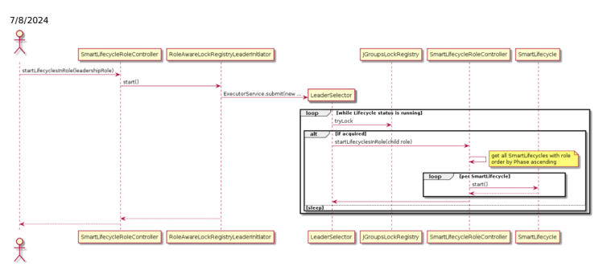

## Conguration Requirements

Update the manifest with the extensions that support once-only processing. To learn more, see Preparing Cloud Hot Folder Extensions.

## File Processing Channels

Messaging is the foundational pattern of the Spring Integration library. File processing channels provide endpoints that accept a message, perform some processing on it, and then pass the processed message to the next channel. Message attributes dictate how information ows through the processing channels. After synchronization and sorting, the Spring Integration creates one message per le or ZIP folder. The headers of the message contain the le name and the time of the last modication. The le name is used to route the message to the appropriate message channel. The last modied time is used for monitoring. The message is routed using a HeaderValueRouter and the custom class PatternMatchingDestinationResolver.

| Base Class/Interface                                   | Extension    | Class/Interface                |
|--------------------------------------------------------|--------------|--------------------------------|
| org.springframework.messaging.core.DestinationResolver | cloudcommons | PatternMatchingDestinationReso |

The route through le processing channels is demonstrated in the following image.

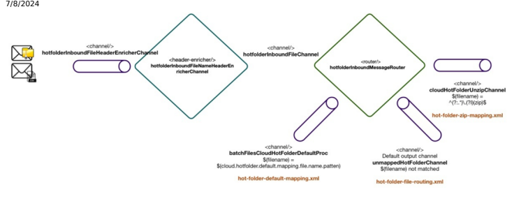

## Default File Processing Channels

By default, the Cloud Hot Folder adapter attempts to import any le with a name that doesn't start with ignore. Once the le is copied from the Blob store to the 'leader' processing node, the adapter uses a conguration map to decide which hot folder ow to use to process the le. You can add entries to this conguration map to instruct the adapter to deliver les to custom ows. There are three default channels that route les for Cloud Hot Folders:
Default Mapping Channel (batchFileCloudHotFolderDefaultProc) Unzip Channel (cloudHotFolderUnzipChannel) Unmapped Channel (unmappedHotFolderChannel)
You can add more channels, if needed. Use the le name patterns to map to a channel. The le name mapping strategy uses regular expressions to determine where a le is processed.

Default Mapping Channel: ^(customer|product|url_media)-\\d+.* Unzip Channel: ^(?:.*)\.(?i)(zip)$
Mappings are controlled through a Spring Map bean. The bean includes a key (Pattern) and value (MessageChannel). Since this isn't Azure-specic, the Spring conguration resides within the Cloud Hot Folder extension, where the routing and le processing conguration is split across three Spring conguration les within <HYBRIS_BIN_DIR>/extcloud/cloudhotfolder/resources/cloudhotfolder/integration/.

| Conguration File   | Source   | Important Beans   |
|--------------------|----------|-------------------|

| 7/8/2024 Conguration File   | Source                                                                                                                                                                                                                                                                                                                                                                                                                                                                                                                                                                                                                                                 | Important Beans                                                                                                                                                                                                                                                                                                                                |
|-----------------------------|--------------------------------------------------------------------------------------------------------------------------------------------------------------------------------------------------------------------------------------------------------------------------------------------------------------------------------------------------------------------------------------------------------------------------------------------------------------------------------------------------------------------------------------------------------------------------------------------------------------------------------------------------------|------------------------------------------------------------------------------------------------------------------------------------------------------------------------------------------------------------------------------------------------------------------------------------------------------------------------------------------------|
| hot-folder-filerouting-spring.xml                             | Beans concerned with: Resolving channels based on le name                                                                                                                                                                                                                                                                                                                                                                                                                                                                                                                                                                                              | hotfolderInboundFileNameHeaderEnricherChannel: Channel/header-enricher that adds lename and last modied time to the message hotfolderInboundMessageRouter: Router that tells Spring which input channel to accept messages from and the HeaderValueRouter class                                                                                |
| Header enriching            | hotfolderFIleNameHeaderValueRouter: The Spring HeaderValueRouter that uses the header name to look up a channel hotfolderInboundFilePatternMatchingChannelResolver: An instance of our custom class PatternMatchingDestinationResolver that takes a list of channel mappings in the form key: Pattern and value: MessageChannel and resolves the channels hotfolderInboundFileChannelMappings: The map of Pattern to MessageChannel provided to the above Spring bean.  Note This is the map where you add your own mappings. unmappedHotFolderChannel: An instance of the custom class UnmappedHotFolderChannel that extends the Spring NullChannel. |                                                                                                                                                                                                                                                                                                                                                |
| hot-folderdefaultmapping.xml                             | Beans concerned with supporting the standard SAP Commerce Cloud data import                                                                                                                                                                                                                                                                                                                                                                                                                                                                                                                                                                            | batchFilesCloudHotFolderDefaultProc: The channel mapped to pattern ${cloud.hotfolder.default.mapping.file.name.pattern}. Added to hot-folder-file-routingspring.xml → hotfolderInboundFIleChannelMappings Provides the entry point for the standard SAP Commerce Cloud data import ow                                                          |
| hot-folder-zipmapping.xml                             | Beans concerned with supporting the new zip folder data import ow.                                                                                                                                                                                                                                                                                                                                                                                                                                                                                                                                                                                     | cloudHotFolderUnzipChannel: The channel mapping to pattern ^(?:.*)\.(?i)(zip)$. Added to hot-folder-file-routingspring.xml → hotfolderInboundFIleChannelMappings Provides the entry point for the new ZIP folder data import ow unZipTransformer: An instance of the custom class CloudUnZipTransfromer that unzips a synchronized ZIP folder. |

## Unmapped Channel

If no match is found for a channel, then the le is passed to an "unmapped" MessageChannel, which moves the le into the directory ${acceleratorservices.batch.impex.basefolder}/${tenantId}/unmapped.

## Caution

This directory is on the local disk, and NOT the remote location. Files will NOT be moved to an unmapped directory on the remote store. Passing the le to the unmapped channel prevents unmapped les from causing exceptions. This allows Cloud Hot Folders to continue processing synchronised les, while "silent failures" are captured through logs and Backoffice history entries.

The original le remains in the remote location, and is moved to the archive folder to prevent further processing, which would simply cause a circle of failures.

There is a property that controls this behavior when you want unmapped les to stop the processing of other les.

| File               | Location   | Conguration Items                                                                                                                                                                                                                          |
|--------------------|------------|--------------------------------------------------------------------------------------------------------------------------------------------------------------------------------------------------------------------------------------------|
| project.properties | <HYBRIS_BIN_DIR>/extcloud/cloudhotfolder            | cloud.hotfolder.storage.header.router.resolution.required a boolean ag that species whether each le requires a mapped channel. If set to 'false', an unmapped le causes an exception, preventing other les from processing. Default: false |

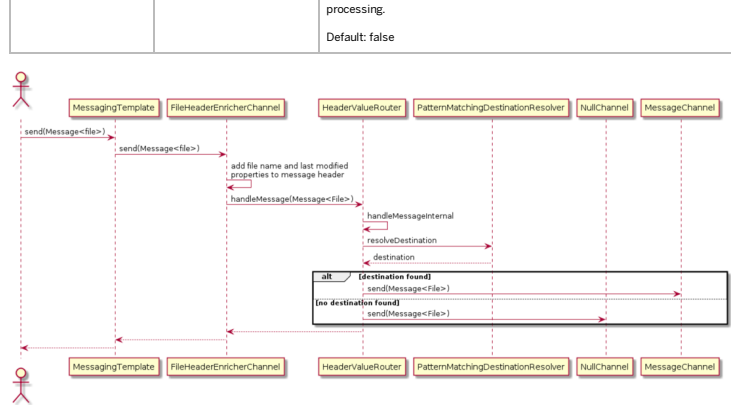

## Inbound Channel Setup

Learn about the requirements for setting up the initial Inbound Channel Adapter.

Conguration begins with the AzureBlobInboundSynchronizer class. The following code example shows the source conguration for the Azure-specic Spring bean. If you want to use a different storage implementation, you can modify this conguration. The code resides in <HYBRIS_BIN_DIR>/extcloud/azurecloudhotfolder/resources/azurecloudhotfolder-spring.xml.

<int:inbound-channel-adapter id="azureInboundChannelAdapter" auto-startup="false" role="${cloud.hotfolder.storage.services.role}" phase="50" ref="azureBlobSynchronizingMessageSource" channel="hotfolderInboundFileHeaderEnricherChannel"> <int:poller fixed-rate="${azure.hotfolder.storage.polling.fixed.rate}" task-executor="azureChannelAdapterTaskExecutor" max-messages-per-poll="${azure.hotfolder.storage.polling.fetch.batch-size}"> ... ... </int:poller> </int:inbound-channel-adapter>

## 

Use the Inbound Channel Adapter against the MessageSource Spring bean (AzureBlobSynchronizingMessageSource).

The channel adapter is backed by a SourcePollingChannelAdapter that polls the MessageSource and invokes a function to produce the message payload. Here is an example of the adapter and poller conguration.

| Inbound Channel Adapter   |                                 |                                                                                                                                                                          |
|---------------------------|---------------------------------|--------------------------------------------------------------------------------------------------------------------------------------------------------------------------|
| Property                  | Value                           | Explanation                                                                                                                                                              |
| auto-startup              | false                           | Prevents the channel adapter from starting during the startup of the application context since we want to do this using leadership election                              |
| role                      | yHotfolderServices              | Regarding leadership election, see Service Control.                                                                                                                      |
| phase                     | 50                              | Species the phase in which the underlying AbstractMessageListenerContainer should be started or stopped.                                                                 |
| Poller                    |                                 |                                                                                                                                                                          |
| Property                  | Value                           | Explanation                                                                                                                                                              |
| fixed-rate                | 15000                           | The Cloud Hot Folder is polled very 15 seconds.                                                                                                                          |
| task-executor             | azureChannelAdapterTaskExecutor | We use the custom HybrisAwareThreadPoolTaskExecutor to set the current tenant and active session for running queries in our threads. To learn more, see Service Control. |
| max-messages-per-poll     | 1                               | The function to produce the message is invoked once per poll.                                                                                                            |

The custom HybrisAwareThreadPoolTaskExecutor is used to set the current tenant and active session for running queries in the threads. Here is an example of the conguration for the task executor from the same Spring le:
<bean id="azureChannelAdapterTaskExecutor" class="de.hybris.platform.cloud.commons.scheduling.HybrisAwareThreadPoolTaskExecutor"> <property name="waitForTasksToCompleteOnShutdown" value="true"/> <property name="threadNamePrefix" value="AzureIntegrationTaskExecutorThread-${tenantId}-"/> <property name="threadGroupName" value="AzyreIntegrationTaskExecutor-${tenantId}"/> <property name="corePoolSize" value="1"/> <property name="maxPoolSize" value="1"/> <property name="queueCapacity" value="-1"/> <property name="keepAliveSeconds" value="60"/> <property name="rejectedExecutionHandler"> <bean class="java.util.concurrent.ThreadPoolExecutor$DiscardPolicy"/> </property> <property name="role" value="integration"/> <property name="autoStartup" value="false"/> <property name="phase" value="10"/> <property name="awaitTerminationSeconds" value="60"/> </bean>

| Task Executor   |             |                                                                                                   |
|-----------------|-------------|---------------------------------------------------------------------------------------------------|
| Property        | Value       | Explanation                                                                                       |
| corePoolSize    | 1           | Process one le or folder at a time with no concurrent access                                      |
| maxPoolSize     | 1           | Process one le or folder at a time with no concurrent access                                      |
| queueCapacity   | -1          | Negative value creates SynchronousQueue                                                           |
| role            | integration | The role that controls the startup of the Spring Integration thread pools via cluster.node.groups |
| autoStartup     | false       | Set to false when using leadership election                                                       |

## Mapping For Custom Cloud Hot Folder Flows

Learn how to add a mapping to your custom hot folder ows. The following Spring conguration denes the path for downloaded les. This conguration is similar to the standard hot folders conguration, where the le Inbound Adapter is replaced with a mapping entry.

<!-- 1) add mapping so that the file is passed onto your channel when it is downloaded --> <bean class="org.springframework.beans.factory.config.MethodInvokingFactoryBean"> <property name="targetObject" ref="hotfolderInboundFileChannelMappings"/> <property name="targetMethod" value="put"/> <property name="arguments"> <list> <bean class="java.util.regex.Pattern" factory-method="compile"> <constructor-arg value="^yourHotFolderPattern.*" /> </bean> <ref bean="yourHotFolderChannel"/> </list> </property> </bean> <int:channel id="yourHotFolderChannel"/> <!-- 2) move the file to processing and setup header --> <file:outbound-gateway id="yourHotFolderOutboundChannel" request-channel="yourHotFolderChannel" reply-channel="yourHotFolderBatchFilesProc" directory="\#{baseLocalDirectory}/yourHotFolder/processing" delete-source-files="true" /> <!-- normal hot folder spring setup below --> <int:service-activator input-channel="yourHotFolderBatchFilesProc"> ......... .........

You can remove some of the monitoring functionality since the Spring AOP is targeting particular "task" classes, such as HeaderInitTask, which is used by the standard hot folder and ZIP processes.

<aop:aspect ref="batchHeaderAspectBean" id="zipBatchHeaderAspect"> <aop:around method="aroundMessageSetup" pointcut="execution(* de.hybris.platform.cloud.hotfolder.dataimport.batch.zip.task. ... ... <aop:aspect ref="batchHeaderAspectBean" id="fileBatchHeaderAspect"> <aop:around method="aroundFileSetup" pointcut="execution(* de.hybris.platform.acceleratorservices.dataimport.batch.task. ... ...

## Default Mapping Channel

The Default Mapping Channel supports standard le import in SAP Commerce Cloud.

Files matching the property cloud.hotfolder.default.mapping.file.name<.pattern> are routed via this channel, which has the default ^(customer|product|url_media)-\\d+.*.

| Property                                       | Value                     | Explanation                                                                 |
|------------------------------------------------|---------------------------|-----------------------------------------------------------------------------|
| cloud.hotfolder.default.mapping.root.dir       | electronics               | Destination catalog                                                         |
| cloud.hotfolder.default.mapping.header.catalog | electronicsProductCatalog | Destination catalog version                                                 |
| cloud.hotfolder.default.mapping.header.net     | false                     | Set to true for net pricing when importing CSV data; otherwise set to false |

The Cloud Hot Folder BatchHeader requires some conguration. Set the following project.properties in
<HYBRIS_BIN_DIR>/ext-cloud/cloudhotfolder/project.properties.

You can expand this le to ImpexConverter mapping by updating cloud.hotfolder.default.zip.mapping.file.name.<pattern> to include new prexes. If necessary, add your own de.hybris.platform.acceleratorservices.dataimport.batch.converter.mapping.impl.DefaultConvert and link it to the appropriate de.hybris.platform.acceleratorservices.dataimport.batch.converter.ImpexConverter implementation.

The classes and methods that support the Default Mapping Channel are depicted in the following image.

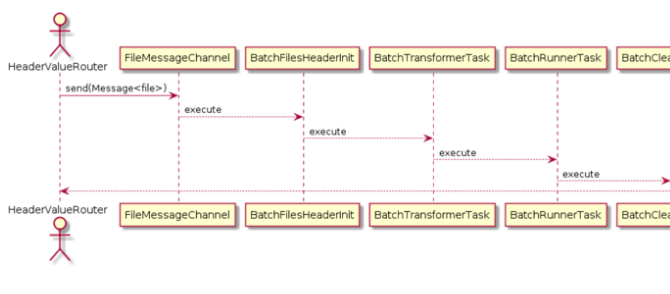

## Unzip Channel

The standard hot folders ow is dened in hot-folder-spring.xml in the acceleratorservices extension. This ow denes the steps required to read a CSV le, convert it into ImpEx and execute that ImpEx. You can inuence this ow by dening converters and transformation tasks. The standard hot folder ow scans for and incorporates these custom components when the hybris server starts. The ZIP ow is dened in the hot-folder-zip-mapping.xml in the cloudhotfolder extension.

Cloud Hot Folders dene a new ow that is able to process multiple les contained in a ZIP le. This new ow is based on the standard ow. User-dened components are scanned in the same way. The new ow is responsible for unpacking the ZIP le, processing each le in the appropriate order, and cleaning up afterwards. The Azure Inbound Adapter has a predened mapping that delivers all ZIP les uploaded to the Blob store to the ow. Using a ZIP archive in this way has several benets. The ZIP le acts as a 'container' that describes a complete import operation. This allows you to organize your import into a number of les and include supporting les such as media and script. Commerce Cloud can clean up after the import is complete. The classes and methods that support the Unzip Channel are depicted in the following image.

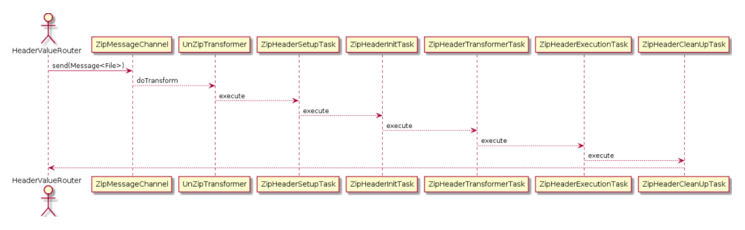

## Import Csv Files

To import CSV les, include them in the root of the ZIP le.

## Upload Raw Impex

To import raw Impex, include it in the root of the ZIP le. Relative le references are supported within the ImpEx, as long as you use a suitable folder structure inside the ZIP le.

## Import Core And Sample Data

To import core and sample data, add the les to the ZIP archive using the conventions and rules for core and sample data. The ZIP le name must match the pattern <coredata.*> for core data and <sampledata.*> for sample data. Inside the ZIP, the data les should be in a folder called import/coredata for core data and import/sampledata for sample data.

The following properties are available to customize the behaviour of the ZIP ow in <HYBRIS_BIN_DIR>/extcloud/cloudhotfolder/project.properties.

| Property                                                                             | Default Value   | Explanation   |
|--------------------------------------------------------------------------------------|-----------------|---------------|
| This is custom documentation. For more information, please visit the SAP Help Portal | 41              |               |

| 7/8/2024 Property                                    | Default Value             | Explanation                                                              |
|------------------------------------------------------|---------------------------|--------------------------------------------------------------------------|
| cloud.hotfolder.default.zip.header.catalog           | electronicsProductCatalog | The catalog to use for CSV imports                                       |
| cloud.hotfolder.default.zip.header.net               | false                     | True to set net pricing when importing CSV data; otherwise set to false. |
| cloud.hotfolder.default.zip.mapping.product.catalog  | electronics               | The product catalogs to use for core/sample data imports.                |
| cloud.hotfolder.default.zip.mapping.content.catalogs | electronics               | The content catalogs to use for core/sample data imports.                |
| cloud.hotfolder.default.zip.mapping.store.names      | electronics               | The stores to use for core/sample data imports.                          |

## Import Media

Standard hot folders come with a number of converters that import media les, such as images, and associate them with a product. The media les are added to an images folder within the hot folder and a media.csv le is uploaded. This le contains the names of the media les and the ID of the associated product. To learn more, see the Media Feed section in Data Importing. Cloud Hot Folders reuse these converters to support media imports from Azure Blob storage. The difference is that the media les and a media.csv le must be contained within a ZIP archive with the same directory layout as standard hot folders. Cloud hot folders can also use URLs to media hosted in third-party systems. If media les are imported using a ZIP archive, then the system loads the media to its media store. In this case, the system is responsible for serving the media when required. If URLs are used, then the system holds a reference to the remote les and the third-party system is responsible for serving the media. For instructions on importing media, see Importing Media Files Using Unzip Channels or Importing Media References Using URLs.

## Importing Media Files Using Unzip Channels

To import les from Azure Blob storage using a ZIP le, follow the correct process, use the recommended le structure, and note the conditions that apply.

1. Create an images directory inside an empty working directory.

2. Create a folder structure inside the images directory with folders for the image sizes that you plan to upload.

3. Add the images to the appropriate directories.

4. Create a media.csv le in the root of the working directory.

5. Add a row for each media le that you plan to import.

The row layout is identical to the standard batchMediaConverter row layout, where an image is associated with a product.

6. Create a ZIP le from the working directory, and upload the zip le to the Blob store.

The working directory must be included in the ZIP le.

The name of the ZIP le must be the same as the name of the working directory. The name of the ZIP le must not contain any hyphens (-).
Your folder structure should look similar to the following image:

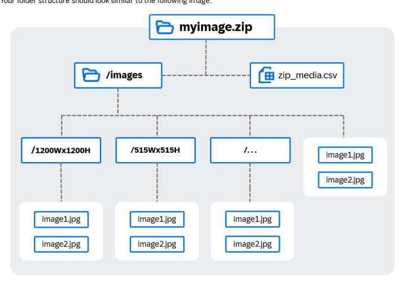

## Importing Media References Using Urls

You can use reference URLs to import media les.

## Prerequisites

You're using a Microsoft Azure Blob store with remote media import.

## Context

To successfully map this media, the $importFolder variable uses the URL value from cloud.hotfolder.default.images.root.url property.

You can also reference subfolders from that root URL folder to import their respective media les. If you need to use a different source locations for your media, use the cloud.hotfolder.default.images.root.url and cloud.hotfolder.default.images.media.folder.qualifier properties.

1. Set the media properties in your manifest le.

| Property                                              | Default Value                           |
|-------------------------------------------------------|-----------------------------------------|
| cloud.hotfolder.default.images.root.url               | https://$%7Bazure.hotfolder.storage.acc |
| cloud.hotfolder.default.images.media.folder.qualifier | cloudimages                             |

Make sure that the images are publicly available via the third-party system hosting them. For example, if using the default Azure Blob store URL, you must set the permissions on the container to allow public access.

2. In your working directory, create a url_media.csv le.

3. Add a row for each media le that you plan to import.

The row layout is identical to the standard batchMediaConverter row layout, where an image is associated with a product.

4. Upload the url_media.csv le to the Cloud Hot Folder.

## Results

The URLs are associated with the products and the media is served from the location dened in cloud.hotfolder.default.images.root.url.

## Archive And Error Folders

Standard hot folders have archive and error directories to manage import activities. Cloud Hot Folders replicate this behavior using a dened commit and rollback behavior.

## Standard Hot Folder Behavior

This is   For more    the SAP Help  44 When data is successfully imported, a cleanup task deletes the header and transformed les and moves the les to the archive subdirectory. If an error occurs during the import, an error handler moves the les to the error subdirectory and performs cleanup activities. To learn more about archive and error folders in standard hot folders, see Data Importing.

## Cloud Hot Folder Behavior

The standard hot folder archive and error behavior is replicated in Cloud Hot Folders. Each polled message runs in a unique transaction with a dened commit and rollback behavior. This is set up against the Inbound Channel Adapter. Observe this behavior as shown in the following conguration from <HYBRIS_BIN_DIR>/extcloud/azurecloudhotfolder/resources/azurecloudhotfolder-spring.xml.

<int:inbound-channel-adapter id="azureInboundChannelAdapter" auto-startup="false" role="${cloud.hotfolder.storage.services.role}" phase="50" ref="azureBlobSynchronizingMessageSource" channel="hotfolderInboundFileHeaderEnricherChannel"> <int:poller fixed-rate="${azure.hotfolder.storage.polling.fixed.rate}" task-executor="azureChannelAdapterTaskExecutor" max-messages-per-poll="${azure.hotfolder.storage.polling.fetch.batch-size}"> <int:transactional synchronization-factory="defaultAzureSynchronizationFactory" transaction-manager="azurePsuedoTxManager"/> </int:poller> </int:inbound-channel-adapter> ... ... <int:transaction-synchronization-factory id="defaultAzureSynchronizationFactory"> <int:after-commit channel="azureArchiveOutboundChannelAdapter"/> <int:after-rollback channel="azureErrorOutboundChannelAdapter"/> </int:transaction-synchronization-factory> <bean id="azurePsuedoTxManager" class="org.springframework.integration.transaction.PseudoTransactionManager"/>
The Spring transactional subelement of a poller allows for the modication of a ow, where actions are performed after the ow completes.

In the code example, the defaultAzureSynchronizationFactory transaction denes behavior after the commit or after rollback. The design pattern shows two outbound channel adapters as the delegated channels for commit and rollback. The channels move the imported folder to either the archive or error folder.

The transaction manager is the Spring PseuoTransactionManager. To learn more, see Class PseudoTransactionManager .

## Service Control

Cloud Hot Folders identify a single node as a Leader node and allow that node exclusively to pull down remote les for processing. This conguration prevents les from running multiple times or out of sequence. If the Leader node goes down, another node is elected to take its place.

A RoleAwareLockRegistryLeaderInitiator Spring bean is dened with the role yHotfolderCandidate. The role yHotfolderServices is required if you want to synchronize remote les with a channel adapter.

The build manifest le has a cluster.node.groups property with a value of integration,yHotfolderCandidate where:
integration controls the startup of the Spring integration thread pools yHotFolderCandidate starts the leadership contention. If the node is elected, it starts SmartLifecycles with a role of yHotfolderServices.

## Leader Election/Concurrent Access Lock Implementation

| Base Class/Interface                                                                                                                                          | Extension       | Class/Interfa   |
|---------------------------------------------------------------------------------------------------------------------------------------------------------------|-----------------|-----------------|
| extends… org.springframework.context.SmartLifecycle                                                                                                           | cloudcommons    | SmartLifeC      |
| implements… org.springframework.beans.factory.SmartInitializingSingleton                                                                                      | cloudcommons    | SmartLifec      |
| implements… org.springframework.beans.factory.config.BeanPostProcessor org.springframework.integration.support.SmartLifecycleRoleController                   | N/A Spring bean | N/A Spring be   |
| extends… org.springframework.integration.support.leader.LockRegistryLeaderInitiator                                                                           | cloudcommons    | RoleAwareL      |
| implements… de.hybris.platform.cloud.commons.spring.context.SmartLifecycleRole implements… de.hybris.platform.cloud.commons.spring.context.SmartLifecycleRole | cloudcommons    | HybrisLock      |
| implements… org.springframework.integration.jdbc.lock.LockRepository                                                                                          | cloudcommons    | SuspendRes      |

| 7/8/2024 Base Class/Interface                                                                                                               | Extension    | Class/Interfa   |
|---------------------------------------------------------------------------------------------------------------------------------------------|--------------|-----------------|
| extends...de.hybris.platform.core.threadregistry.DefaultSuspendResumeService                                                                | cloudcommons | CloudSuspe      |
| extends… de.hybris.platform.core.TenantListener                                                                                             | cloudcommons | StopStartL      |
| extends… de.hybris.platform.cloud.commons.suspend.SuspendResumeListener implements… de.hybris.platform.cloud.commons.core.StopStartListener | cloudcommons | HybrisGrou      |
| extends… java.util.concurrent.ScheduledThreadPoolExecutor                                                                                   | cloudcommons | HybrisAwar      |
| extends… java.util.concurrent.ThreadPoolExecutor                                                                                            | cloudcommons | HybrisAwar      |
| extends… java.util.concurrent.ThreadPoolTaskExecutor                                                                                        | cloudcommons | HybrisAwar      |
| implements… de.hybris.platform.cloud.commons.spring.context.SmartLifecycleRole extends… java.util.concurrent.ThreadPoolTaskScheduler        | cloudcommons | HybrisAwar      |
| implements… de.hybris.platform.cloud.commons.spring.context.SmartLifecycleRole                                                              |              |                 |

## Spring Conguration

Here is an example of the Spring conguration.

<!-- define our hybris db lock repository with the role 'integration' to control concurrent access <bean id="cloudHotfoldersLeaderLockRepository" class="de.hybris.platform.cloud.commons.spring.integration.support.locks.database.HybrisLockR <property name="region" value="${cloud.hotfolder.locking.dblock.region}"/> <property name="ttl" value="${cloud.hotfolder.locking.dblock.ttl}"/> <property name="modelService" ref="modelService"/> <property name="applicationResourceLockDao" ref="applicationResourceLockDao"/> <property name="role" value="integration"/> <property name="autoStartup" value="false"/> <property name="phase" value="20"/> </bean> <!-- define an instance of springs JdbcLockRegistry and provide it with our HybrisLockRepository -- <bean id="cloudHotfoldersLeaderLockRegistry"= class="org.springframework.integration.jdbc.lock.JdbcLockRegistry"> <constructor-arg name="client" ref="cloudHotfoldersLeaderLockRepository"/> </bean> <-- define our role aware lock registry leader elector and give it our lock registry, give it the R There should be one of these per Role that requires to elect a single Leader --> <alias name="defaultHotfolderLeaderInitiator" alias="hotfolderLeaderInitiator"/> <bean id="defaultHotfolderLeaderInitiator" class="de.hybris.platform.cloud.commons.spring.integration.support.leader.RoleAwareLockRegist <constructor-arg name="locks" ref="cloudHotfoldersLeaderLockRegistry"/> <constructor-arg name="childRole" value="${cloud.hotfolder.storage.services.role}"/> <property name="autoStartup" value="false"/> <property name="role" value="yHotfolderCandidate"/>
... ...

</bean>
The classes and methods that support the Leader node conguration are depicted in the following image.

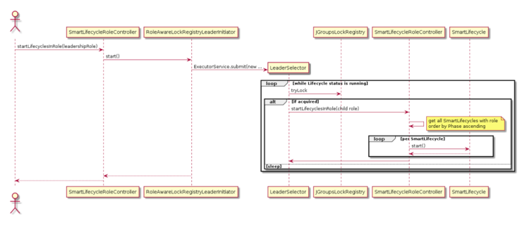

## Aop Monitoring

The Spring Aspect-Oriented-Programming (AOP) framework within Cloud Hot Folders adds extra monitoring and metrics, over and above what exists in the standard implementation. Spring integration and AOP interceptors add logging around the default hot folder tasks and converters. The manifest aspect conguration and the additional monitoring steps are outlined in this section. Interceptors record information about les as they're processed through the ow. If you extend the out-of-the-box hot folder tasks and converter interfaces, your custom components are instrumented in the same way. If you choose to implement your own tasks or converters, then add your own AOP monitors to retain this level of logging.

This is   For more    the SAP Help  48

## Aspect Conguration

Aspects are Spring beans that perform logic in or around the method they're declared to intercept. Most of our monitoring aspects are congured in <HYBRIS_BIN_DIR>/ext-cloud/cloudhotfolder/resources/integration/hotfolderaop-spring.xml.

<aop:config> <aop:aspect ref="fileUnzippedAspectBean"> <aop:around method="aroundUnzipped" pointcut="bean(unZipTransformer) and execution(* doTransform(..)) and args(mess </aop:aspect> <aop:aspect ref="batchHeaderAspectBean" id="zipBatchHeaderAspect"> <aop:around method="aroundMessageSetup" pointcut="execution(* de.hybris.platform.cloud.hotfolder.dataimport.batch.zip.t ...

...

 </aop:aspect> <aop:aspect ref="batchHeaderAspectBean" id="fileBatchHeaderAspect"> <aop:around method="aroundFileSetup" pointcut="execution(* de.hybris.platform.acceleratorservices.dataimport.batch.t ...

...

</aop:aspect>
</aop:config>

## More Monitoring Steps

The steps in the table are wrapped with extra monitoring capabilities.

| Step               | Notes                                                                                                                                                                                                                 |
|--------------------|-----------------------------------------------------------------------------------------------------------------------------------------------------------------------------------------------------------------------|
| Downloaded         | The Azure Blob integration currently provides information on the length of time it took to download a le, as well as the le size.                                                                                     |
| File Routed        | This step isn't recorded on les that are routed successfully. It's a warning for les NOT routed.                                                                                                                      |
| File Unzipped      | This step is used to record how long it took to unzip a le that is ready to be processed.                                                                                                                             |
| Header Setup       | This step is used to record how long it took to set up the BatchHeader and ZipBatchHeader.                                                                                                                            |
| Header Initialized | This step is used to record how long it took to initialize the BatchHeader and ZipBatchHeader.                                                                                                                        |
| Header Transformed | This step is used to record how long it took to transform any raw CSVs to Impex in the BatchHeader and ZipBatchHeader.                                                                                                |
| Header Executed    | This step is used to record how long it took to execute all the Impex les in the BatchHeader and ZipBatchHeader. It also records the time to complete the task and the result of each Impex run as a separate action. |
| Header Cleanup     | This step is used to record how long it took to clean up converted les and to move the original les into the archive directory.                                                                                       |
