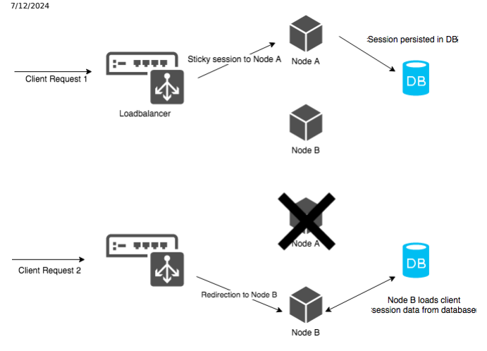

# Http Session Failover

Session failover prevents losing session data by backing up session content in the database. This mechanism provides high availability in a clustered environment. Loss of session data can be a problem. Imagine a customer adding items to a shopping cart and the server crashes before the customer manages to check out. The session has been lost, and the cart is empty. The customer has to add the items to the cart again. If session failover is in place, cluster nodes can restore sessions persisted in the database. After a node shuts down, the remaining nodes can restore its sessions from the database. They continue to serve requests of these sessions without interruption or data loss. From the client point of view the same session state is maintained by the server. The customer shouldn't notice any problems either.

## Session Failover Support

The SAP Commerce Cloud session failover implementation is based on the Spring Session project and is application-server agnostic. It uses the SAP Commerce Cloud persistence to store session data as items in the relational database. SAP Commerce Cloud session failover is designed with sticky-session load balancing in mind. A load balancer with congured sticky sessions assigns clients to specic cluster nodes. It always forwards requests from the same client to the same server. The server holds the client session cached in memory. A session is a single up-to-date object and there is no need to read it from the database. When the node stops, the load balancer redirects the client requests to another server. That server doesn't have the respective session object in the cache, so it loads it from the database. Lack of session invalidation makes this approach unsuitable for round-robin session load balancing.

SAP Commerce Cloud session failover operates in two modes. In synchronous mode, a session is saved to the database after each request has been processed before sending a response. In asynchronous mode, a session is saved by a separate thread with a congurable time interval for the save operation. The session is added to the to-be-saved queue before sending an HTTP response, but the save action is done later.

See Enable HTTP Session Failover For Backoffice Framework for information on HTTP session failover in Backoffice.

## Implementation Details And Customization

HybrisSpringSessionFilter is the main class of the session failover feature. Set it as the rst element of the PlatformFilterChain so it can wrap session-related objects before session is created or used.

HybrisSpringSessionFilter uses SessionRepositoryFactory to create SessionRepository for each extension that has session failover enabled. Each extension needs its own SessionRepository so that a proper class loader is set for object deserialization. You can replace SessionRepositoryFactory with a custom implementation that provides different session storage strategies.

## Session Cache Region

All sessions are stored in the separate sessionCacheRegion cache region that is dened by the defaultSessionsCacheRegion Spring bean.

## Session Invalidation

Regular HttpSessions provided by Tomcat are proactively monitored for invalidation (StandardManager.processExpires).

As soon as a session is a candidate for invalidation, the session is destroyed, and a sessionDestroyed event is triggered.

Such mechanism is not provided with the OOTB Spring session implementation. Consequently StoredHttpSession items This is   For more    the SAP Help  27 have no end of life and remain in the database. You can remedy this by setting up a cronjob deleting the StoredHttpSession items where the current time - modied time > 3600 seconds.

## Conguring Session Failover

Session failover provides properties you can set up to precisely meet the requirements of your clustered environment.

All the default property values are set in the platform/project.properties le in the Session failover settings section.

You can customize or overwrite them by using standard mechanisms, for example, through local.properties.

## Global Conguration Properties

The global session failover properties include:

| Property                                   | Default Value   | Values     | Description                                                     |
|--------------------------------------------|-----------------|------------|-----------------------------------------------------------------|
| spring.session.enabled                     | false           | true/false | Enables spring session support.                                 |
| spring.session.save.async.interval         | 5000            | int        | Interval between session persistence attempts (in milliseconds) |
| spring.session.save.async.queue.size       | 10000           | int        | Size of a queue of sessions to persist                          |
| spring.session.save.async.max.items        | 2000            | int        | Max number of session items being saved in one attempt          |
| session.serialization.check.response.error | false           | true/false | Returns the 500 error code if a session is not serializable.    |

## Extension Specic Properties

You can specify these properties for each extension individually:

| Property                                     | Default Value                                                                                                             | Values     | Description                  |
|----------------------------------------------|---------------------------------------------------------------------------------------------------------------------------|------------|------------------------------|
| spring.session.                              | no default value is set                                                                                                   | sync/async | Selects the session failover |
| [extension_name].save                        | operation mode for a target extension. If the property isn't set, then session failover isn't enabled for this extension. |            |                              |
| spring.session.                              | JSESSIONID                                                                                                                | string     | Session cookie name          |
| [extension_name].cookie.name spring.session. | <context path>                                                                                                            | string     | Session cookie path          |
| [extension_name].cookie.path                 |                                                                                                                           |            |                              |

| 7/12/2024 Property               | Default Value                                                                                                                                               | Values              | Description               |
|----------------------------------|-------------------------------------------------------------------------------------------------------------------------------------------------------------|---------------------|---------------------------|
| spring.session.                  | not set                                                                                                                                                     | true/false/no value | If not set otherwise, the |
| [extension_name].secure          | cookie secure attribute is set to true if the request is secure. As the request is by rule always secure, the behavior is effectively always set to true.   |                     |                           |
| spring.session.                  | not set                                                                                                                                                     | true/false/no value | If not set otherwise, the |
| [extension_name].cookie.httponly | cookie httpOnly attribute is set to true if the request is secure. As the request is by rule always secure, the behavior is effectively always set to true. |                     |                           |

## Caution

Set spring.session.[extension_name].save for each extension using session failover. Simply setting spring.session.enabled to true isn't sufficient.

## Enabling Session Failover For An Extension

Enabling session failover boils down to setting up a few properties and adding one lter to the lter chain.

## Context

An HTTP session of a web extension has to be serializable to work with session failover. For more information, see Checking If a Session Is Serializable.

## Procedure

1. Set the spring.session.enabled property to true.

spring.session.enabled=true This enables the HybrisSpringSessionFilter global lter. If the property is set to false, no session failover can be performed no matter what settings you set for specic web extensions.

2. Select the sync or async session failover operation mode for the target extension.

spring.session.*<extension_name>*.save=sync spring.session.*<extension_name>*.save=async The async conguration is faster but choosing it can result in session data loss if a node fails before the pending session is saved to the database.

3. Congure the session cookie name and path. We recommend conguring the name and path of the cookie to be the same as the JSESSIONID cookie, which is generated without the session failover feature enabled. You can, however, set a different cookie ID. See the examples:
//Configuration with JSESSIONID cookie name: spring.session.*<extension_name>*.cookie.name=JSESSIONID spring.session.*<extension_name>*.cookie.path=/*<extension_webApp_contextPath>* //Configuration with a different cookie: spring.session.*<extension_name>*.cookie.name=different_cookie_ID spring.session.*<extension_name>*.cookie.path=/*<extension_webApp_contextPath>*
4. Make sure hybrisSpringSessionFilter is rst in the lter chain bean for the target web extension. You can nd the lter chain bean inside a *<your_extension_name>*-web-app-config.xml le located in a
<your_extension_name>/web/webroot/WEB-INF/config/ directory. This code snippet shows how to modify the bean for an example extension called sessionfailovertest so that the bean includes hybrisSpringSessionFilter:
<bean id="sessionfailovertestPlatformFilterChain" class="de.hybris.platform.servicelayer.web.P <constructor-arg> <list> **<ref bean="hybrisSpringSessionFilter"/>** <ref bean="log4jFilter"/> <ref bean="sessionFilter"/> <ref bean="sessionfailovertestMediaFilter"/> </list> </constructor-arg> </bean>
Place the lter in the lter chain before a session gets created or accessed by the application. It wraps HttpRequest and HttpResponse. Otherwise two conicting session cookies could be created - one from the application server and another by the session failover feature.

## Browsing Persisted Sessions

A list of persisted sessions is available in Backoffice.

## Procedure

1. In the Explorer tree, click System Types .

2. Search for the StoredHttpSession type.

3. Click the type to open the editor area. 4. Use the Search by type action.

## Results

You can now see all sessions that are backed up in the database.

## Checking If A Session Is Serializable

Session failover requires that sessions be serializable, and SAP Commerce Cloud enables you to check whether they are or not. Due to the extensible nature of SAP Commerce Cloud, it is difficult to assure the session is serializable before a project is implemented. Using the serialization checking mechanism during the development phase helps to nd common mistakes such as storing non-serializable objects in an http session.

## Enabling Session Serialization Checking

This is   For more    the SAP Help  30 To enable checking for session failover, set session.serialization.check to true:
session.serialization.check=true This enables session serialization checking for all web extensions unless session.serialization.check.extensions is set. To enable checking for specic extensions, set names of the extensions for which session checking should be done as a value for the session.serialization.check.extensions property:
session.serialization.check.extensions=hac,sampleextension Separate extension names with the comma.

## Caution

Session serialization checking is a development feature. Disable it in production environments.

When a non-serializable object is added to an HTTP session, an error and stacktrace are logged:
ERROR [hybrisHTTP10] [SessionFilter] Failed to serialize attribute: jalosession java.io.NotSerializableException: de.hybris.sessionfailovertest.NotSerializable at java.io.ObjectOutputStream.writeObject0(ObjectOutputStream.java:1184) ...

## Conguration Properties

Use these properties to congure session serialization checking:

| Property                               | Sample Value               | Values     | Description                                                                                                                                                                                                                        |
|----------------------------------------|----------------------------|------------|------------------------------------------------------------------------------------------------------------------------------------------------------------------------------------------------------------------------------------|
| session.serialization.check            | false                      | true/false | Enables serialization checking feature on each request.                                                                                                                                                                            |
| session.serialization.check.extensions | hac,yacceleratorstorefront | commaseparated names of extensions            | Species a list of extensions for which session serialization checking should be done. If this property is not set while session.serialization.check=t then session serialization checking will b performed for all web extensions. |
