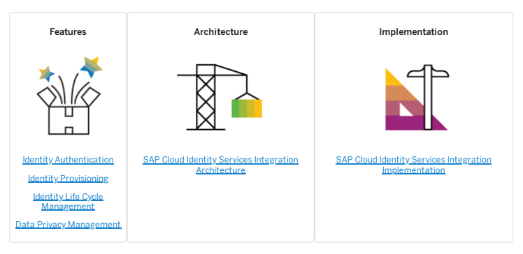

# Sap Cloud Identity Services Integration With Sap Commerce Cloud

The integration of SAP Commerce Cloud with Identity Authentication service, in compliance with SCIM 2.0 standard provides the capabilities for identity authentication, identity provisioning, and identity life cycle management.

## Sap Cloud Identity Services Integration Features

The integration with SAP Cloud Identity Services, in compliance with SCIM 2.0 standard provides the capabilities for Identity Authentication and Identity Provisioning. Identity Authentication service enables the authentication of identity and single signon, and Identity Provisioning service enables the provisioning of identity and the management of identity life cycle. To use the identity authentication feature, you must obtain a tenant for Identity Authentication . The tenant represents a single instance of the identity authentication that has a specic conguration and data separation. The administration console for identity authentication is a Fiori-based user interface that is used by the administrators for conguration of the features. To use identity provisioning and life cycle management, you must obtain a tenant for Identity Provisioning. On Identity Provisioning, Identity Authentication is congured as the source system and SAP Commerce Cloud is congured as the target system. The users or user groups that exist or are newly created in Identity Authentication of type Employee are provisioned to SAP Commerce Cloud as Employees using Identity Provisioning. A job scheduled in Identity Provisioning runs periodically to provision new or updated user information to SAP Commerce Cloud. Once the users are provisioned, they can use their Identity Authentication credentials to log in to Backoffice or ASM, if SSO is congured with Identity Authentication as the identity provider. After the user groups are provisioned to a ScimUserGroupModel in SAP Commerce Cloud, the Backoffice administrator can assign SAP Commerce Cloud relevant user groups to the newly created ScimUserGroupModel. The members of the user group can then be provisioned into members of the ScimUserGroupModel via the periodic job scheduled in Identity Provisioning. The users who belong to the ScimUserGroupModel have the same set of authorizations in SAP Commerce Cloud.

Identity Authentication Identity Authentication acts as an identity provider and veries the credentials provided by users. Identity Provisioning Identity provisioning is achieved using the Identity Provisioning service that allows the provisioning of centrally managed identities and their access across the enterprise. Identity Life Cycle Management Identity Provisioning service also provides a comprehensive approach to identity life cycle management, enabling a high level of security. Data Privacy Management Data privacy mechanisms for Identity Authentication integration ensure that the personal data of the employee is handled appropriately.

## Identity Authentication

Identity Authentication acts as an identity provider and veries the credentials provided by users. Identity Authentication service supports scenarios for consumers (business-to-consumer scenarios), for partners (business-tobusiness scenarios), and for employees (business-to-employee scenarios). In the integration with SAP Commerce Cloud only the business to employee scenarios are considered. The business-toemployee scenarios are related to the services for employees of an organization. Using this service, employees can access various SAP Commerce Cloud applications with one logon. Administrators can upload employee data in Identity Authentication, by using the user import functionality. Administrators can also provide authorization to a set of users. They can upload user group data in Identity Authentication, by using the group import functionality.

## Identity Provisioning

Identity provisioning is achieved using the Identity Provisioning service that allows the provisioning of centrally managed identities and their access across the enterprise. You can use the following system categories for identity provisioning goals:
Source - usually the corporate user database of the company. In this integration scenario Identity Authentication service acts as the source system.

Target - the cloud or the on-premise system that you want to populate with the entities from your source system. In this integration scenario SAP Commerce Cloud acts as the target system.
When setting up these systems in the identity provisioning service user interface, you can choose from the available system types. Besides running the initial provisioning of entities (users, groups, roles), you can also schedule jobs to run the provisioning on a regular basis, to automate the provisioning process and keep the target system up to date.

## Using The Identity Provisioning Service

Set up the source and target systems and schedule the provisioning jobs.

Context To use the Identity Provisioning service and to start provisioning entities from a source to a target system, perform the following:

1. Set up a source, target or a proxy system in the Identity Provisioning user interface.

2. Add the necessary properties to congure the connection between the systems.

3. Dene your transformation logic. 4. Run a provisioning job. 5. Schedule jobs for delta updates.

## Identity Life Cycle Management

Identity Provisioning service also provides a comprehensive approach to identity life cycle management, enabling a high level of security. The identity provisioning service delivers an intuitive cloud environment for identity life cycle management that is convenient to use and maintain. Identity life cycle management enables the instant roll-out of updates for user accounts, groups and business roles, and dynamically updated authorizations, based on your business needs.

## Data Privacy Management

Data privacy mechanisms for Identity Authentication integration ensure that the personal data of the employee is handled appropriately.

## Personal Data Erasure

If an employee record gets deleted in Identity Authentication, it does not get deleted in SAP Commerce Cloud. The employee record only gets deactivated in SAP Commerce Cloud. The administrator must manually delete the employee data.

## Sap Cloud Identity Services Integration Architecture

The integration of SAP Cloud Identity Services, in compliance with SCIM 2.0 standard provides a set of extensions to handle identity provisioning and manage identity life cycle.

## Recipes

For a complete list of SAP Commerce Cloud integration pack recipes that may include this module, see Installer Recipe Reference.

## Extensions

The SAP Cloud Identity Services integration module consists of the following extension:
cloudscimwebservices extension The cloudscimwebservices extension provides REST APIs for creating, reading, updating, and disabling of employee.

## Cloudscimwebservices Extension

The cloudscimwebservices extension provides REST APIs for creating, reading, updating, and disabling of employee.

## About The Extension

Dependencies The cloudscimwebservices extension has the following dependencies to other extensions:
webservicescommons

oauth2
commerceservices

## Controllers

| Name                 | Description                                                    |
|----------------------|----------------------------------------------------------------|
| ScimUsersController  | Controller with endpoints to enable CRUD operations            |
| ScimGroupsController | Controller with endpoints to enable CRUD operations for groups |

This integration is based on the implementation of SCIM 2.0 protocol, and both User and Group resources are supported. During the creation of a group, only the group name is stored. The members being assigned to the SCIM group must exist as users in SAP Commerce Cloud. The SCIM group name is replaced by the group ID in SAP Commerce Cloud.

## Cloudscimwebservices Api

All calls are restricted to a valid OAuth token with authority 'ROLE_SCIM_CLIENT'.

The cloudscimwebservices extension contains REST APIs to create, read, update and disable employees that can be tested from your browser. The Swagger tool has been used to provide testable REST API documentation.

## Conguring The Api

1. Add the cloudscimwebservices extension to the manifest.json le in your CCV2 repository.

2. Add the following code in your CCV2 repository either in the Backoffice or the API aspects:
"aspects":[ { "name":"backoffice", "webapps":[ { "name":"cloudscimwebservices", "contextPath":"/scim" }

## Accessing Api Documentation

1. Start SAP Commerce Cloud server.

2. Open http://<hostname>:<port>/scim/v3/swagger-ui.html on your web browser.

This is   For more    the SAP Help  5 A documentation page related to the cloudscimwebservices extension appears.

3. Click the Authorize button on the top right corner of the screen. 4. In the Available Authorizations modal window, enter the following details and click Authorize:

| Setting   | Value                   |
|-----------|-------------------------|
| Type      | Basic Auth              |
| ClientId  | <client-id-created>     |
| Secret    | <client-secret-created> |
| Scope     | basic                   |

5. Click the Expand Operations link and try out a few calls.

## Sap Cloud Identity Services Integration Implementation

Make the necessary congurations in Identity Authentication service, Identity Provisioning service, and in SAP Commerce Cloud to connect to SAP Cloud Identity Services, in compliance with SCIM 2.0 standard. The integration process ow is as below:
The user details maintained in Identity Authentication acts as the source for master data.

Source and target systems are congured on Identity Provisioning. Identity Authentication is congured as the source system and SAP Commerce Cloud is congured as the target system. Identity Provisioning is congured to connect to SAP Commerce Cloud. The user groups in Identity Authentication are mapped to the user groups in SAP Commerce Cloud. An initial sync on Identity Provisioning, synchronizes the data between the source and target systems. Any further updates in the source system are handled by the scheduled read jobs that update the delta changes to the target system.
Conguring Technical User for Identity Authentication Create a new technical user to manage users and groups in Identity Authentication. Conguring the Provisioning Settings Congure the source and target systems for data exchange between Identity Authentication and SAP Commerce Cloud. Conguring SAP Commerce Cloud Extensions and Backoffice Settings Congure extensions and OAuth client to securely access SAP Cloud Identity Services APIs, in compliance with SCIM 2.0 standard in the SAP Commerce Cloud system. Congurations for Single Sign-on and Employee Provisioning Make the required congurations in Identity Authentication to support single sign-on and in Identity Provisioning to support employee provisioning.

## Conguring Technical User For Identity Authentication

Create a new technical user to manage users and groups in Identity Authentication.

This is   For more    the SAP Help  6

1. Log in to Identity Authentication service as administrator.

2. Choose the Administrators tile. 3. Enter a name and enable the options Manage Users and Manage Groups and save the changes. 4. Select the user and set a password for him by using the Set Password option. 5. Save the changes.

A technical user who can manage users and groups is created.

## Conguring The Provisioning Settings

Congure the source and target systems for data exchange between Identity Authentication and SAP Commerce Cloud.

1. Log in as an administrator to your Identity Provisioning service tenant.

2. Click Source Systems and click +Add to add a new source system. 3. Select the System Type as Identity Authentication, enter the System Name, and save the details. 4. In the Transformation tab, the default transformation is selected. 5. Save the created source system 6. In the Properties tab, add the following properties:

| Name                                       | Value                                                     |
|--------------------------------------------|-----------------------------------------------------------|
| Authentication                             | BasicAuthentication                                       |
| ProxyType                                  | Internet                                                  |
| Type                                       | HTTP                                                      |
| URL                                        | Identity Authentication Service tenant URL                |
| User                                       | Technical user created in Identity Authentication Service |
| Password                                   | Technical user password                                   |
| ips.trace.skipped.entity.content           | Default value is set to true                              |
| ips.trace.skipped.entity                   | Default value is set to true                              |
| ias.api.version                            | 2                                                         |
| ips.failed.request.retry.attempts          | Enter a value for maximum retry attempts                  |
| ips.failed.request.retry.attempts.interval | Enter a value for an interval between retry attempts      |
| ips.trace.failed.entity.content            | Default value is set to true                              |

The source system is added and fully congured. Optionally, you can schedule the Read job on the source system to automate the provisioning process.

7. To add a target system, go to the Target Systems tile and click +Add. 8. In the Details tab, select Type as SAP Commerce Cloud, enter the system name, and save the details.

This is   For more    the SAP Help  7 9. In the Transformation tab, the default transformation is selected.

10. Save the created source system 11. In the Properties tab, add the following properties:

| Name                            | Value                                                                                                                 |
|---------------------------------|-----------------------------------------------------------------------------------------------------------------------|
| Authentication                  | BasicAuthentication                                                                                                   |
| OAuth2TokenServiceURL           | Enter the SAP Commerce Outh2 server URL. For example, https://<API or Backoffice URL>/authorizationserver/oauth/token |
| ProxyType                       | Internet                                                                                                              |
| Type                            | HTTP                                                                                                                  |
| URL                             | Enter the SCIM endpoint as congured in SAP Commerce Cloud. For example, https://<API or Backoffice URL>/scim/v3.      |
| User                            | OAuth client ID as congured in SAP Commerce Cloud                                                                     |
| Password                        | OAuth client secret as as congured in SAP Commerce Cloud                                                              |
| cc.support.patch.operation      | Default value is set to true                                                                                          |
| cc.user.unique.attribute        | emails[0].value,userName,externalId                                                                                   |
| ips.trace.failed.entity.content | Default value is set to false                                                                                         |
| TrustAll                        | Default value is set to true                                                                                          |

SAP Commerce Cloud is congured as the target system.

## Conguring Sap Commerce Cloud Extensions And Backoffice Settings

Congure extensions and OAuth client to securely access SAP Cloud Identity Services APIs, in compliance with SCIM 2.0 standard in the SAP Commerce Cloud system.

## Conguring Extensions

1. Add the cloudscimwebservices extension and samlsinglesignon (for SSO) extensions to the manifest.json le in your SAP Commerce Cloud repository.

2. Add the following code in the manifest.json le:
Context path for cloudscimwebservices in the API aspects:
"name":"cloudscimwebservices", "contextPath":"/scim" Context path for samlsinglesignon in the Backoffice aspects:
"name":"samlsinglesignon", "contextPath":"/samlsinglesignon" }

## Making Settings In Backoffice

1. In the Backoffice, go to System OAuth OAuth Cients .

2. Enter the client ID and the client secret. 3. Enter Authorities as ROLE_SCIM_CLIENT, Client Grant Types as client_credentials, and Scopes as basic.

Other attributes can be left blank

## Congurations For Single Sign-On And Employee Provisioning

Make the required congurations in Identity Authentication to support single sign-on and in Identity Provisioning to support employee provisioning. Follow the steps as described in the subsequent sections.

Conguring SAP Commerce Cloud Make the required settings in SAP Commerce Cloud to enable single sign-on or employee provisioning. Conguring the Identity Provider Make the required settings in Identity Authentication to enable single sign-on. Conguring Identity Provisioning Make the required settings in Identity Provisioning to enable employee provisioning.

## Conguring Sap Commerce Cloud

Make the required settings in SAP Commerce Cloud to enable single sign-on or employee provisioning.

1. Include the extension cloudscimwebservices extension in the manifest to enable provisioning scenarios.

2. Include the following extensions in the manifest to enable SSO scenarios for backoffice:
samlsinglesignon samlssobackoffice 3. Enable the additional context paths for samlsinglesignon and scimwebservices end points in the appropriate aspects in the manifest.

4. Log in to Identity Authentication as administrator, and navigate to Applications & Resources Tenant Settings . 5. In the SAML 2.0 Conguration section, download the metadata le. 6. Additionally, copy the contents of the Signing Certicate and store it in a ".cer" le. 7. Import this certicate into an existing JKS le using the command beow, or to a new JKS le if needed.

keytool -importcert -alias some-alias -le key.cer -keystore samlKeystore.jks This is   For more    the SAP Help  9 An existing JKS le can be found within the samlsinglesignon extension in SAP Commerce Cloud.

8. Upload this metadata le, and the JKS le to the Security section of the SAP Commerce Cloud portal. Also, attach them to the SAP Commerce Cloud environment security le via the Deployment Conguration option.

9. Add the following properties that are required to congure the samlsinglesignon extension.

sso.cookie.name=LoginToken // As this is required by backoffice sso.usergroup.attribute.key=As defined in IAS Application (more details in the Configure Ident sso.firstname.attribute.key=As defined in IAS Application (more details in the Configure Ident sso.lastname.attribute.key=As defined in IAS Application (more details in the Configure Identi sso.userid.attribute.key=As defined in IAS Application (more details in the Configure Identity sso.keystore.location=Location of keystore file sso.keystore.password=password of the key store, default value 'changeit' sso.keystore.privatekey.alias=alias of the private key, default value 'hybris' sso.keystore.privatekey.password=password for the private key, default value 'changeit' sso.metadata.location=location of metadata file sso.entity.id=a unique entity id sso.database.usergroup.mapping=true (to fetch user group mapping from DB) sso.redirect.url=URL where the user should be redirected to, like https://localhost:9002

## Conguring The Identity Provider

Make the required settings in Identity Authentication to enable single sign-on.

1. Go to the URL https://<your SAP Commerce Cloud instance>/samlsinglesignon/saml/metadata, and download the metadata le that needs to be uploaded in Identity Authentication. This le is generated with a private key that already exists in the pre-existing jks le provided in SAP Commerce Cloud. If a new private key is needed, it has to be stored in a separate JKS le, and the alias and password must be dened as separate properties in the manifest.

2. Go to Applications & Resources Applications to create a new application in Identity Authentication, and upload this metadata le under the SAML 2.0 Conguration section.

3. Additionally, dene the Assertion Attributes required by the Service Provider application.

For this scenario, dene the First Name, Last Name, email, and Groups in the appropriate properties in the manifest.

 Note Changes to properties in the manifest le only reect after deployment.

## Conguring Identity Provisioning

Make the required settings in Identity Provisioning to enable employee provisioning.

1. Congure a technical user for identity authentication.

2. Congure the source and target systems in Identity Provisioning. 3. Congure the required settings in Backoffice.

As the provisioning service is used along with Identity Authentication, it is advised to use database user group mapping for SAML. When a temporary mapping is created in SAP Commerce Cloud for SCIM using ScimUserGroup model in the Backoffice, the same mapping needs to be created for SamlUserGroup in the Backoffice so that the mappings are understood by both the modules, This is   For more    the SAP Help  10 11
