# Data Management With Impex

The ImpEx engine matches data to be imported to the SAP Commerce Cloud type system. ImpEx allows separate data to be imported into two individual CSV les, one for the matching to the type system and the other le for the actual data. That way, swapping input les is easy. Importing items via XML-based les is not supported. There are three main elds of use for ImpEx:
1. During Development:
Importing sample data.

Testing of business functionalities.

Creating sample data during SAP Commerce Cloud initialization. Providing an easy way to create a project initial data.
2. Migration:

Migrating existing data from one SAP Commerce Cloud installation to another (during a version upgrade, for example).
3. In an Operational SAP Commerce Cloud:
Synchronizing data in SAP Commerce Cloud with other systems.

Creating a backup of SAP Commerce Cloud data. Providing run-time data for CronJobs.

## Tip

ImpEx import is based on the ServiceLayer. This means that actions like INSERT, UPDATE, and REMOVE are performed using ModelService, thus the ServiceLayer infrastructure like interceptors and validators is triggered. Read ImpEx Import Using Jalo or ServiceLayer.

## Convention Over Conguration

SAP Commerce Cloud uses the Convention over conguration principle to simplify or eradicate the need for writing conguration les. An example is the functionality for importing essential and project data as described in ImpEx Import for Essential and Project Data.

## Impex Import For Essential And Project Data

The Convention over Conguration principle is adopted in SAP Commerce Cloud to simplify and reduce the need for writing conguration les. As a result, ImpEx les for essential data and project data can be prepared without the need for additional data conguration.

## Convention

During the initialization and update processes, the platform looks for ImpEx les in the <extension_name>
/resources/impex folder. In particular:

For essential data: The platform scans the <extension_name> **/resources/impex** folders for les with names that match the pattern essentialdata*.impex and imports the les during the essential data creation.

For project data: The platform scans the <extension_name> **/resources/impex** folders for les with names that match the pattern projectdata*.impex and imports the les during the project data creation.
The **ImpEx** directory does not exist by default. You must create it and copy les to it.

For example, if you have the following folder structure:
resources/impex/essentialdataOne.impex resources/impex/essDataOne.impex

resources/impex/DataOne.csv
resources/impex/projectdataOne.impex This is   For more    the SAP Help  23 The les **essentialdataOne.impex** and **projectdataOne.impex** are located and imported during the essential and project data imports respectively.

To import your impex les correctly, make sure that their le names are unique across all extensions during import, for example by adding extension names to impex le names:
essentialdata-<extension>-*.impex projectdata-<extension>-*.impex

## Conguration

If you have special folder structures or want to use another folder in the resources, you must override the conguration in your local.properties le:
For essential data, add the property <extension_name> .essentialdata-impex-pattern.

For project data, use <extension_name> .projectdata-impex-pattern.

For example, assume that you have the following folder structure:

## Resources/Test1.Csv

resources/subfolder/test2.csv

## Resources/Impex/Subfolder/Subfolder/Test3.Csv

In this structure, only the **test1.csv** le has the pattern <extension_name> .essentialdata-impexpattern=*.csv. In contrast to the example above, the pattern: extension_name .essentialdata-impexpattern=**/*.csv includes test1.csv, **test2.csv** and **test3.csv**.

If you want your conguration to work as the default does, you must set the pattern to <extension_name> .essentialdataimpex-pattern=impex/essentialdata*.impex.

The order in which the les are imported depends on the Virtual Machine (VM), because the les are loaded as Java resources. If you want to specify a particular order, you can create one import le that matches your import pattern and some other les, which are imported in the rst le, for example:

## Projectdataone.Impex

... IMPEX FILE that includes CVS: "\#% impex.includeExternalData(SampleDataManager.class.getResourceAsStream(""/1.csv""), ""utf-8"", 0 "\#% impex.includeExternalData(SampleDataManager.class.getResourceAsStream(""/2.csv""), ""utf-8"", 0 Alternatively, you can use an initialization hook to determine the import order. For more information, see Hooks for Initialization and Update Process. You can now decide whether the update or initialization process should fail after encountering errors in the create data phrase. Stopping your system intentionally in case of data import errors during the update or initialization process allows you to ensure that there are no issues with your conguration and all your project data has been processed correctly. To enable this bahavior, add the following property to your local.properties le:
system.setup.create.data.fail.on.error=true Initializing and Updating SAP Commerce Cloud

## Impex Import Using Jalo Or Servicelayer

SAP Commerce Cloud uses ServiceLayer to import data with ImpEx by default. It means that actions like INSERT, UPDATE, and REMOVE are performed using ModelService, thus the ServiceLayer infrastructure like interceptors and validators are triggered. When necessary, you can execute import using the Jalo layer.

You can start using the Jalo layer globally by setting impex.legacy.mode property to true. You can do this in two different ways:
Using code

Adding a new property to local.properties le

## Modify The Property Using Code

To modify the default value of the impex.legacy.mode property, implement the Config utility class:
// Read old value String final legacyModeBackup = Config.getParameter(ImpExConstants.Params.LEGACY_MODE_KEY); // Set it to true Config.setParameter(ImpExConstants.Params.LEGACY_MODE_KEY, "true"); // Perform some operations // ... // Set it again to previous value Config.setParameter(ImpExConstants.Params.LEGACY_MODE_KEY, legacyModeBackup);

## Modify The Properties File Manually

To use Jalo, add impex.legacy.mode=true to the local.properties le. Restart your application server.

## Enabling Impex Import With The Jalo Layer For Specic Import Operation

To use the Jalo layer only for some specic ImpEx import operation with usage of ImportService, use the setLegacyMode method from the ImportConfig class:
// Assume you have already a bytes object containing a script content byte[] bytes; final ImportConfig config = new ImportConfig(); // Switch on legacy mode config.setLegacyMode(Boolean.TRUE); config.setScript(new StreamBasedImpExResource(new ByteArrayInputStream(bytes), "en")); // Now use Config object final ImportResult result = importService.importData(config);
Notice that config.setLegacyMode method uses a Boolean object as a parameter. If you don't use it, then the global setting from project.properties le of the impex extension is used.

## Test Import Script Using The Sap Commerce Cloud Administration Console

You can test your import script with the Jalo layer in SAP Commerce Cloud Administration Console:
1. Open SAP Commerce Cloud Administration Console.

This is   For more    the SAP Help  25 2. Go to the Console tab and select ImpEx Import option.

3. Before importing, select Legacy mode to use the Jalo layer.

## Related Information

Administration Console ImpEx API

## Analyzing Import Results For Errors

You can analyze import results for errors. To perform error analysis, use the collectImportErrors method of the ImportService class.

First, run your import - the collectImportErrors method requires an ImportResult object as a parameter:
Stream<? extends ImpExError> collectImportErrors(ImportResult result)
The method returns a Stream of ImpExError objects, so it has lazy behavior.

The ImpExError interface is a base interface that describes a general error:
public interface ImpExError { String getItemType(); ProcessMode getMode(); String getErrorMessage(); Map<Integer, String> getSource(); }
ImpExError provides methods that enable you to get an Item type code, ProcessMode, error message, and line source.

ProcessMode says whether the error relates to the INSERT, UPDATE, REMOVE, or INSERT_UPDATE mode.

There are two more specialized interfaces that extend ImpExError:
ImpExHeaderError represents an invalid header error:
public interface ImpExHeaderError extends ImpExError { HeaderDescriptor getHeader(); Exception getException(); }
Header related errors are present only if a particular header is invalid (for instance, contains an invalid column name, invalid type code, etc.).

ImpExValueLineError represents a value line error:
This is   For more    the SAP Help  26 public interface ImpExValueLineError extends ImpExError ValueLine getLine(); ImpExLineErrorType getErrorType(); enum ImpExLineErrorType { PARTIALLY_PROCESSED, NOT_PROCESSED, PARTIALLY_PROCESSED_WITH_ERROR, NOT_PROCESSED_WITH_E } }
Value line related errors are present always for any dumped and not resolved lines - even if they have been partially processed. To determine what kind of value line error you have, use the ImpExValueLineError\#getErrorType method. It returns an enum value you can see above.

Here is an example usage of the ImpEx Error API:
final String inputScript = "INSERT Title;code[unique=true];name\n" // + ";title1;name1;\n" // + ";title1;name1;\n" // + ";title3;name3;\n"; final ImportConfig config = new ImportConfig(); config.setScript(inputScript); config.setSynchronous(true); final ImportResult importResult = importService.importData(config); final Stream<? extends ImpExError> result = importService.collectImportErrors(importResult); // To print out all ImpExValueLineErrors: errors.filter(e -> e instanceof ValueLineError).map(ValueLineError.class::cast).forEach(System.out: // To print out all ImpExHeaderErrors: errors.filter(e -> e instanceof ImpExHeaderError).map(ImpExHeaderError.class::cast).forEach(System.

The collectImportErrors method returns an empty Stream if ImportResult has no dumped lines - this means your import was successful.

## Impex Syntax

SAP Commerce Cloud ships with an integrated text-based import/export extension called ImpEx, which allows creating, updating, removing, and exporting platform items such as customer, product, or order data to and from Comma-Separated Values (CSV) data les - both during run-time and during the SAP Commerce Cloud initialization or update process.

CSV Files The ImpEx extension uses Comma-Separated Values (CSV) les as the data format for import and export. As there is no formal specication, there is a wide variety of ways in which you can interpret CSV les.

This is   For more    the SAP Help  27 ImpEx Syntax in CSV Files An ImpEx-compliant CSV le contains several different kinds of data. The following screenshot is a representation of a sample CSV le with different colors for different kinds of data.

## Csv Files

The ImpEx extension uses Comma-Separated Values (CSV) les as the data format for import and export. As there is no formal specication, there is a wide variety of ways in which you can interpret CSV les. You can nd some sort of quasi-standard in Common Format and MIME Type for Comma-Separated Values (CSV) Files document, as it is followed by most implementations. It is quoted here in excerpts:
1. Each record is located on a separate line, delimited by a line break (CRLF), for example:
aaa,bbb,ccc CRLF zzz,yyy,xxx CRLF
2. The last record in the le may or may not have an ending line break, for example:
aaa,bbb,ccc CRLF zzz,yyy,xxx 3. There may be an optional header line appearing as the rst line of the le with the same format as normal record lines.

This header contains names corresponding to the elds in the le and should contain the same number of elds as the records in the rest of the le, for example:
field_name,field_name,field_name CRLF aaa,bbb,ccc CRLF zzz,yyy,xxx CRLF
The presence or absence of the header line should be indicated using the optional header parameter of this MIME type.

4. Within the header and each record, there may be one or more elds, separated by commas. Each line should contain the same number of elds throughout the le. Spaces are considered part of a eld and should not be ignored. The last eld in the record must not be followed by a comma, for example:
aaa,bbb,ccc 5. Each eld may or may not be enclosed in double quotes (however some programs, such as Microsoft Excel, do not use double quotes at all). If elds are not enclosed with double quotes, then double quotes may not appear inside the elds, for example:
"aaa","bbb","ccc" CRLF zzz,yyy,xxx 6. Fields containing line breaks (CRLF), double quotes, and commas should be enclosed in double-quotes, for example:
"aaa","b CRLF bb","ccc" CRLF zzz,yyy,xxx 7. If double-quotes are used to enclose elds, then a double-quote appearing inside a eld must be escaped by preceding it with another double quote, for example:
"aaa","b""bb","ccc" Due to the simple structure, CSV les are common for data exchange purposes. Compared to XML les, CSV les require less processing and memory resources. For additional details on CSV les, please refer to Common Format and MIME Type for Comma-Separated Values (CSV) Files document.

## 

In a CSV le, by default, one line of entries represents one record of data. In other words: in a CSV le, one line denes one item, that is one customer, one car, one t-shirt, and so on. A single line can contain several attribute values, for example in case of a tshirt: size, color, and brand. CSV breaks down individual record entries via a so-called delimiter, which is, by default, the comma, hence the name. The following ctitious code sample gives you an example of this:
green,42,BlackLabel red,42,BlackLabel green,35,BlackLabel

## Csv Files In Impex

The ImpEx extension relies on the above denition of the CSV format except for the dened special characters, which may be different but can be congured. These characters are:
Line break: character for separating one line from another.

Default is the Java system property line.separator.

Column delimiter: isolates values that belong in columns, in other words records.

Default is the semicolon (;). You can change it using the csv.fieldseparator property.

Enclosing character: character for enclosing a column. Default is the double-quote ". You can change it using the csv.quotecharacter property.

Individual delimiter: these delimiters isolate values that belong in one database eld, such as with Collections (here the default is comma (,)). The individual delimiters depend on the column translator used and can be congured separately. Refer to Header.
Furthermore, the ImpEx extension provides the multi-line separator symbol for breaking lines only visually (soft line break). The ImpEx extension does not interpret the line break. The support of multi-lines can be disabled using the API.

For more information, see:
https://docs.oracle.com/.../getProperties() : getProperties() documentation API Documentation and YAML Files

## Managing Csv Files Using Third Party Tools

The default value for these delimiters depends on the system locale settings when using third party tools. Using an ImpEx CSV le on different locale settings has to be handled with care. For example, during the tests a German version of Microsoft Excel 2003 SP2 used commas for individual delimiters and semicolons for column delimiters by default if running on an English version of Microsoft Windows XP SP2. The default delimiters for Microsoft Windows XP versions with an English locale are semicolons for individual delimiters and commas for column delimiters. The following code snippet, for example, would cause different interpretations, depending on the locale settings:
value1,value2,value3;value4;value5,value6

| German locale   | English locale   |
|-----------------|------------------|

| 7/12/2024 German locale   | English locale              |
|---------------------------|-----------------------------|
| three values:             | four values:                |
| value1,value2,value3      | value1                      |
| value4                    | value2                      |
| value5,value6             | value3;value4;value5 value6 |

Furthermore, you can encounter serious problems when switching the editing programs because of the different character encoding used. Saving a CSV le in Windows encoding and importing it using ImpEx in UTF-8 encoding destroys special characters like umlauts. Always check the character encoding used by the program and congure it as described in ImpEx API. The most convenient way of dealing with CSV les is using an editor with syntax highlighting or spreadsheet processor. Among such software, SAP recommends the following applications:
UltraEdit - text editor that contains customizable syntax highlighting.

Microsoft Office Excel - a powerful commercial spreadsheet processor. Microsoft Excel CSV spreadsheets are limited to a maximum of 65535 lines. This means that if you want to manage CSV les longer than 65535 lines, you have to split those les into parts. If you try to open a le longer than 65535 lines, Excel informs you that the le is beyond the specication. The problem was partially resolved since Microsoft Excel 2003, although the application supports more than 65535 lines only in its native format. OpenOffice.org Calc - freeware spreadsheet processor from Sun Microsystems Inc. It is free and also supports a customized import of CSV les (you can use the usual open le method, no extra import is needed). When saving a le as CSV the original encoding is used, or windows-1252 if the le was created from scratch.

## Impex Syntax In Csv Files

An ImpEx-compliant CSV le contains several different kinds of data. The following screenshot is a representation of a sample CSV le with different colors for different kinds of data. The different line types are described in detail below:
Headers (blue and light green text color in the screenshot), refer to Header.

Lines of values (black text color), refer to Value Line. Comments (lavender text color), refer to Comment section. Macro denitions (red text color), refer to Denition Line - Macro. BeanShell calls (not shown in the screenshot), refer to the BeanShell section of ImpEx API. Lines declaring user rights import (not shown in the screenshot), refer to the User Rights section of ImpEx API.

| 7/12/2024                                                                                          |                                                                                    |                                  |                        |                 |
|----------------------------------------------------------------------------------------------------|------------------------------------------------------------------------------------|----------------------------------|------------------------|-----------------|
| 22 Mic                                                                                             | ------                                                                             |                                  |                        |                 |
| dothe                                                                                              |                                                                                    |                                  |                        |                 |
| A69                                                                                                | code, catalogVersion ( catalog ( id[default = 'clothescatalog'] ), version[default |                                  |                        |                 |
| = baseProduct ( code, catalogVersion ( catalog ( idIdefault = 'clothescatalog'] ), version[default |                                                                                    |                                  |                        |                 |
| g                                                                                                  | INSERT_UPDATE                                                                      |                                  |                        |                 |
| 10                                                                                                 | clothescatalog                                                                     | Bekleidungs-Katalog              | Clothing               | hybris          |
| 1                                                                                                  |                                                                                    |                                  |                        |                 |
| 12                                                                                                 | catalog(id)[unique=true                                                            | version[unique=t                 | inclAssurance          |                 |
| languages(IS)                                                                                      |                                                                                    |                                  |                        |                 |
| 13                                                                                                 | clothescatalog                                                                     | Online                           | de.en                  | true            |
| 14                                                                                                 | clothescatalog                                                                     | Staged                           | delen                  |                 |
| 15                                                                                                 |                                                                                    |                                  |                        |                 |
| 16                                                                                                 | code(unique=true)                                                                  | nmm=                             | name[lang=en           | Supercategori   |
| 17                                                                                                 | CL1100                                                                             | Jeans                            | Jeans                  |                 |
| 18                                                                                                 | CL1200                                                                             | Shirts                           | Shirts                 |                 |
| 19                                                                                                 | CL2000                                                                             | Schuhe                           | Shoes                  |                 |
| 20                                                                                                 | CL2100                                                                             | Herrenschuhe                     | Men's shoes            | CL2000          |
| 21                                                                                                 | CL2200                                                                             | Freizeitschuhe                   | Leisure shoes          | CL2000          |
| 2                                                                                                  | CL2300                                                                             | Damenschuhe                      | Ldy's shoes            | CL2000          |
| 23                                                                                                 | topseller                                                                          | Topseller                        | Topseller              |                 |
| 24                                                                                                 |                                                                                    |                                  |                        |                 |
| 25                                                                                                 | INSERT_UPDATE                                                                      | code[unique=true]                | allowedPrincipals(uid) | ScatalogVersion |
| CL1100                                                                                             |                                                                                    |                                  |                        |                 |
| 26                                                                                                 | c ustomergroup                                                                     | clothescatalog:Staged            |                        |                 |
| 27                                                                                                 | CL 1200                                                                            | c                                | clothescatalog:Staged  |                 |
| 28                                                                                                 | CL2000                                                                             | customergroup                    | clothescatalog:Staged  |                 |
| 29                                                                                                 | topseller                                                                          | c ustomergroup                   | clothescatalog:Staged  |                 |
| 30                                                                                                 |                                                                                    |                                  |                        |                 |
| 31                                                                                                 | code[unique=true]                                                                  | ScatalogVersion                  | realfilename           |                 |
| aa015x04a                                                                                          | clothescatalog:Staged image/jpeg                                                   | aaa015x04a.jpg                   |                        |                 |
| aa015x04a_big                                                                                      |                                                                                    |                                  |                        |                 |
| 34                                                                                                 | aa015x04a_big                                                                      | clothescatalog:Staged image/jpeg |                        |                 |
| -^                                                                                                 |                                                                                    |                                  |                        |                 |
| [ ]                                                                                                |                                                                                    |                                  |                        |                 |
| Bereit                                                                                             |                                                                                    |                                  |                        |                 |

## Header

A header is a single line defining a mapping of the following value lines to the type system. A header applies to all processed value lines until the next header or until the end of file, whichever comes first. You can put any number of headers into a CSV
file. An ImpEx header line has the following structure:
mode type[modifier=va
- Mode: Specifies what is to be done with the following value lines (insert, update, and so on) - see Header Mode.

- Type : Defines the type of item to be processed (category, product, media, type, and so on) - see Header Type . - Attribute: Describes which item attributes the columns are mapped to. The value lines supply the actual values for the items that are translated using the header settings - see Header Attributes

 Modifier: Gives additional information for translating a value record to the mapped type attribute - see Header and
.

Attribute Modifier
Example for a header row:
INSERT_UPDATE category;code[unique=true];name[lang=de];name[lang=en];$supercategories;$thumbnail;de This header states that each following value line creates or updates a category instance, until another header occurs.

## I Note Related Information

The Type System

## Header Mode

The mode of a header species what is to be done with the following data. In case of an import it describes how to map and translate the following value lines to the data model of the platform. In case of an export, it describes how to map and translate the following items to the target CSV le. During export, headers are also written, so exported CSV les can be re-imported via the ImpEx extension.

There are four header modes:

| Mode   | Comment/Description                                                                                                                                                                                                                                                                                                                                                           |
|--------|-------------------------------------------------------------------------------------------------------------------------------------------------------------------------------------------------------------------------------------------------------------------------------------------------------------------------------------------------------------------------------|
| INSERT | Creates a new Item in SAP Commerce Cloud from the processed value line. By default, ImpEx does not check if an item attributes already exists. Therefore, trying to insert an item with a code that already exists may throw an exception caus Commerce Cloud core. For that reason, it is recommended to use the unique modier, where ImpEx prechecks a violatio uniqueness. |

| 7/12/2024 Mode   | Comment/Description                                                                                                                                                                                                                                                                                                                                                                                                                                                                                                                                                                                                                                                                                                                                                                                                                                                                                                                                                                                                                                                                                                                                                                                                                                                                                                                                                                                                                                                                                                       |
|------------------|---------------------------------------------------------------------------------------------------------------------------------------------------------------------------------------------------------------------------------------------------------------------------------------------------------------------------------------------------------------------------------------------------------------------------------------------------------------------------------------------------------------------------------------------------------------------------------------------------------------------------------------------------------------------------------------------------------------------------------------------------------------------------------------------------------------------------------------------------------------------------------------------------------------------------------------------------------------------------------------------------------------------------------------------------------------------------------------------------------------------------------------------------------------------------------------------------------------------------------------------------------------------------------------------------------------------------------------------------------------------------------------------------------------------------------------------------------------------------------------------------------------------------|
| UPDATE           | Selects an existing item in SAP Commerce Cloud from the combination of the values of all columns marked with the uniq which are referred to as key attributes, and sets the item attributes to the values specied in the value line. If there is no item that matches the values of all key attributes, the value line cannot be resolved. The value line is dump temporary le and the ImpEx extension tries to resolve the value line later on. Refer to ImpEx API, section Import Using Instance for details. Also note that the default value for attributes is null. This means that any attributes that are referenced by the header values are specied in the value line are not ignored, but are explicitly set to null. For example, the following ImpEx line ahertz customer to have the name attribute set to null as the second line after the header species no value for the name UPDATE User;uid[unique=true];name;customerID; ;ahertz;Anja Hertz;; ;ahertz;;K2006-C0005; To set values for both the name and the customerID attributes, use one of the following approaches: Specify all values in one single line: UPDATE User;uid[unique=true];name;customerID; ;ahertz;Anja Hertz;K2006-C0005; Re-specify all values that have been set in a prior line: UPDATE User;uid[unique=true];name;customerID; ;ahertz;Anja Hertz;; ;ahertz;Anja Hertz;K2006-C0005; Use individual headers: UPDATE User;uid[unique=true];name; ;ahertz;Anja Hertz; UPDATE User;uid[unique=true];custmerID; ;ahertz;K2006-C0005; |
| INSERT_UPDATE    | Combines the effects of the INSERT and UPDATE header modes: if an item with the values of all key attributes exists, th updated. If no item exists that matches the combination of all key attributes, the value line is used to create the item. Th extension always uses this order: UPDATE, then INSERT.                                                                                                                                                                                                                                                                                                                                                                                                                                                                                                                                                                                                                                                                                                                                                                                                                                                                                                                                                                                                                                                                                                                                                                                                               |
| REMOVE           | As in UPDATE mode, the ImpEx extension tries to nd an existing item using the key attributes. If such an item exists, it otherwise a log message of level warning is printed to the log.                                                                                                                                                                                                                                                                                                                                                                                                                                                                                                                                                                                                                                                                                                                                                                                                                                                                                                                                                                                                                                                                                                                                                                                                                                                                                                                                  |

## Header Type

The type code selects the type from the SAP Commerce Cloud Type System where the following data rows create, update or remove instances. Optionally, each line can specify a subtype of the type specied in the header at the rst column. That subtype is selected for that single line only - in the next line, the type specied in the header is active again. The following code snippet references the User type in the header, but creates an instance of the Customer and Employee types each.

INSERT User;uid[unique=true] Customer;SampleCustomer Employee;SampleEmployee This allows specifying an abstract type, which cannot be instantiated, in the header for the INSERT mode, as with the Job type in the following code snippet. In that case, you need to specify a non-abstract type (that is, a type that can be instantiated) in every value line.

INSERT Job;code[unique=true] ImpExImportJob;sampleJob ImpExImportJob;sampleJob2 Although the header references the Job type, two instances of an ImpExImportJob will be created: sampleJob and sampleJob2.

## Header Attributes

Each column followed by the header type at the header line describes an attribute of the header type where the column value of the following value lines are mapped to.

The ImpEx extension checks the specied type and its attributes and uses a Translator to match the value line's entry to the individual attribute. See Header and Attribute Modier for more details on Translator.

It is easy to set an attribute value for attributes that are specied as AtomicTypes (such as java.lang.String or java.lang.Integer). For example, assume the following code snippet:
INSERT User;uid ;myUser Here the uid attribute is of type java.lang.String, so additonal denitions are not required. You dene the attribute at the header line and write a value line with the plain text of the desired user ID.

## Item Reference Attributes

Setting attribute values is more complex with attributes specied to hold references to items in SAP Commerce Cloud.

By default, the ImpEx expects values that represent a primary key:
INSERT Product;code;unit ;MyProduct;2821057095693456 \#2821057095693456 being the PK for the pieces unit Since primary keys are not usually known externally, ImpEx alternatively allows using attributes of the referenced item for lookup. They're provided in brackets immediately after the column attribute name:
<attributeOfTypeX>'('<attributeFromX>(','<attributeFromX>)* ')'.

For example, the following code snippet species the unit column to look up Unit items using its code attribute:
INSERT Product;code;unit(code) ;MyProduct;pieces

Specifying referred-type attributes behind an attribute denition is called item expression.

You can use item expressions in a nested way, in cases where a lookup attribute is a reference to itself.

In the following example the catalogVersion attribute refers to a CatalogVersion item that is looked up using its catalog and version attribute. Within the catalog is a reference to itself (to a Catalog item) that is looked up using the id attribute:
INSERT Product;code;unit(code);catalogVersion(catalog(id),version) ;testCode;pieces;clothescatalog:Staged If you specify an item expression using several attributes at a header line, you have to separate them with a comma. The values for such an expression at a value line are separated by a colon.

There are ComposedTypes that reference attributes of a very general type; for example, the owner attribute of the Address type is specied to be of the Item type and can therefore accept any item in the SAP Commerce Cloud. By consequence, you cannot directly reference an attribute specied for a subtype of Item, such as the uid attribute of a Customer instance, which would allow you to specify a specic customer. To refer to an attribute that belongs to a subtype of a type attribute, use the following syntax:
attribute(subtype.subtype_attribute)
For example, the following code snippet creates an Address type instance whose owner attribute (attribute of type Item)
holds a reference to the admin user using the Principal's type uid attribute.

INSERT Address;firstname;owner(Principal.uid) ;Hans;admin

## Skipping Columns Of Data

The ImpEx extension allows skipping of entire columns of data by omitting the attribute for that column in the header.

INSERT myProduct;myAttribute;myAttribute2;;myAttribute4 ;myValue1;myValue2;myValue3;myValue4 myValue3 is ignored, because there is no header attribute mapping dened for the related column. In the following code snippet, the second column (containing the value deutsch) is ignored as there is no header attribute to process it:
INSERT Language;code;;active ;de;deutsch;true

## Localizing

Localized attributes are described by multiple columns using the lang modier, each one containing the ISOcode or PK for a single language. Refer to Header and Attribute Modier section for more information about attribute modiers.

INSERT Product;code[unique=true];name[lang=en];name[lang=de] ;myProduct1;myProduct1's localized name;lokalisierter Name von myProduct1 ;myProduct2;myProduct2's localized name;lokalisierter Name von myProduct2 The ImpEx extension only overwrites localized values for the languages specied in the column header. Existing localized values for other languages remain unchanged, as the following example illustrates:
\#create some products with a German and English name INSERT Product;code[unique=true];name[lang=en];name[lang=de]
This is   For more    the SAP Help  35

;myProduct1;myProduct1's localized name;lokalisierter Name von myProduct1 ;myProduct2;myProduct2's localized name;lokalisierter Name von myProduct2 \#overwrite the English name -> the German one remains untouched UPDATE Product;code[unique=true];name[lang=en] ;myProduct1;"my product 1" ;myProduct2;

| Product    | Resulting English localization    | Resulting German localization     |
|------------|-----------------------------------|-----------------------------------|
| myProduct1 | my product 1                      | lokalisierter Name von myProduct1 |
| myProduct2 | lokalisierter Name von myProduct2 |                                   |

For more information, see Wikipedia on ISO Country Codes .

## Document Id

Especially when importing partOf item values, you must reference these items by means other than the usual unique column technique because partOf items do not always provide a unique key but only hold their enclosing parent as a foreign key.

The Customer.addresses attribute provides an example of this. The customer owns addresses exclusively. The addresses hold the customer PK asa back reference. When using ImpEx, both customer and address have to be imported in separate lines. Removing obsolete addresses requires that you ll the Customer.addresses cell with all currently valid addresses. This allows the setter method to remove obsolete ones. You must therefore reference valid addresses using a unique key, which addresses do not provide. For cases where a reference within the ImpEx script is required, ImpEx provides a special header attribute marked with the prex & to specify a virtual ID called Document ID. Each imported item line can optionally dene such a Document ID, which allows other lines to reference it later using the same attribute qualier (with the & prex).

Example:
INSERT Customer;uid[unique=true];...;defaultPaymentAddress(&addrID);... ;andi;...;addr1;... INSERT Address;&addrID;owner(Customer.uid);... ;addr1;andi;...

The Document ID is case-sensitive, so the following code snippet would not work as the Document ID would not be recognized by the ImpEx extension (the document ID for the Customer type being **&addrID** and the header for the Address type being
&addrid).

INSERT Customer;uid[unique=true];...;defaultPaymentAddress(&addrID);... ;andi;...;addr1;... INSERT Address;&addrid;owner(Customer.uid);... ;addr1;andi;...

## Special Attributes

Sometimes you need to add data to an item that is not covered by an attribute, for example the media data. In these cases, the syntax of ImpEx provides a special kind of attribute denition called special attributes that do not have a mapping to a real attribute of the congured type.

They are marked with the @ symbol and always need the translator modier, because there is no default implementation.

Furthermore the specied translator has to be a realization of the SpecialValueTranslator interface.

This is   For more    the SAP Help  36 The following code sample shows how to create a media with the data set from the specied le:
INSERT_UPDATE Media;code[unique=true];@media[translator=de.hybris.platform.impex.jalo.media.MediaDa ;myMedia;file://c:/myMedia.txt The type Media has no media attribute, but specifying the media attribute as a special attribute instructs ImpEx not to search for such an attribute. Instead, it will call the special translator specied with the translator modier, which performs the import logic.

## Alternative Pattern

For type dening attributes that belong to a generic type, such as the Address type owner attribute, which is specied to hold an instance of Item, the ImpEx extension allows you to specify Alternative Patterns in the header.

An Alternative Pattern species more than one attribute and makes the ImpEx extension determine the matching type instance from all the specied attributes. Alternative Patterns are processed from left to right. The following code snippet, species two possible target attributes for the Address instances:
the Principal type uid attribute

the AbstractOrder type code attribute:
INSERT Address;firstname;owner(Principal.uid|AbstractOrder.code) ;Hans;admin ;Klaus;O-K2006-C0000-001 During import, ImpEx compares the values for the owner attributes against all available instances of the Principal and AbstractOrder types and automatically chooses the instance whose target attribute value (uid or code, respectively)
matches the target value (admin and O-K2006-C0000-001, respectively).

When importing the rst value line ;Hans;admin, the ImpEx extension searches all instances of the Principal type to verify if any instance exists where the uid attribute is set to admin.

If an instance exists (and there is, by platform default), the new instance of the Address type has its owner attribute set to a reference to that Principal type instance.

If no instance exists of the Principal type whose uid attribute is set to admin, the ImpEx continues the retrieval by trying to nd an instance of the AbstractOrder type whose code attribute is set to admin.

If there was no instance of the AbstractOrder type whose code attribute is set to admin, the ImpEx extension would try to continue the retrieval on the next specied Alternative Pattern attribute. Since there would be no further Alternative Pattern attribute, the ImpEx extension would dump the line and try to resolve it on the next import pass.
In this sample case, there is a Principal instance whose uid attribute is set to admin by platform default, so ImpEx is able to resolve the value line.

Basically, the same thing happens for the second value line ;Klaus;O-K2006-C0000-001: the ImpEx extension searches all instances of the Principal type if there is any instance whose uid attribute is set to O-K2006-C0000-001.

If there was an instance (but there is none, by platform default), then the new instance of the Address type would have its owner attribute set to a reference to that Principal type instance.

Since there is an instance of the AbstractOrder type whose code attribute is set to O-K2006-C0000-001 (at least for SAP Commerce Cloud installations with the sampledata extension enabled), the new instance of the Address type has its owner attribute set to a reference to that AbstractOrder type instance.
This is   For more    the SAP Help  37 If there was no instance of the AbstractOrder type whose code attribute is set to O-K2006-C0000-001, then the ImpEx extension tries to continue the retrieval on the next specied Alternative Pattern attribute. Since there would be no further Alternative Pattern attribute, the ImpEx extension would dump the line and try to resolve it on the next import pass.

In this sample case, there is a AbstractOrder instance whose code attribute is set to O-K2006-C0000-001 by using the sampledata extension, so ImpEx is able to resolve the value line right now.

## Header And Attribute Modier

A modier is an addition to an entry in a header line that species additional processing instructions. For example:
...;attribute[modifier=value];...

The ImpEx extension allows specifying several modiers at once, like this:
...;attribute[modifier=value,modifier=value,modifier=value];...

or
...;attribute[modifier=value][modifier=value][modifier=value];...

For example, the following code snippet denes that the value specied for the name attribute is the English localization version
("en" according to Wikipedia on ISO 639-1 ) of the name attribute.

name[lang=en]

If languages for which impex data is imported don't exist in the database, import errors are thrown.

When you're not sure if a given language is available in your target system, use the following script to protect your les in this language from being imported:
\#% if: de.hybris.platform.servicelayer.i18n.util.LanguageUtils.isLanguagePresent("fr") INSERT_UPDATE Item1;code[unique=true];name[lang=fr] ... \#% endif:
To escape a modier value, use the inverted comma ('). To use an inverted comma in a modier value, escape the inverted comma itself:
attribute[modifier='My modifier''s value']

## Header-Related Modiers

The following table contains a reference of all header-related modiers. These modiers apply to the entire header and are specied directly to the type referenced by the header, as in the following code snippet:
INSERT_UPDATE ClassificationSystemversion[cacheUnique=true];...

This is   For more    the SAP Help  38

| 7/12/2024 Modier                                           | Allowed values                                              | Description                                                                                                                                                                                                                                                                                                                                                                                                                                                                                        |
|------------------------------------------------------------|-------------------------------------------------------------|----------------------------------------------------------------------------------------------------------------------------------------------------------------------------------------------------------------------------------------------------------------------------------------------------------------------------------------------------------------------------------------------------------------------------------------------------------------------------------------------------|
| batchmode                                                  | true / false                                                | In UPDATE or REMOVE mode, the batch mode allows modifying more than one item that matches for a combination of all unique attributes of a value line. So, if for a value line more than one item is found that matches the combination of unique attributes, the attributes specied as non-unique are updated at all found items.                                                                                                                                                                  |
| Import only                                                | Default is false                                            | [batchmode=true] If the batch mode is not enabled (as by default), the hybris ImpEx extension throw an exception if more than one item matches for a value line. If the batch mode is enabled, the hybris ImpEx extension modies any platform item that matches the value line.                                                                                                                                                                                                                    |
| cacheUnique                                                | true / false                                                | If this option is enabled, the CachingExistingItemResolver is used for existing item resolvin (in case of update or remove mode) which caches by the combination of unique keys already resolved items. So when processing a value line rst, it is tried to nd the related item by searching the cache using the unique keys. The usage is only meaningful if an item has to be processed more than one time within a header scope. The maximum size of the cache is not restricted at the moment. |
| Import only                                                | default is false                                            | [cacheUnique=true]                                                                                                                                                                                                                                                                                                                                                                                                                                                                                 |
| processor                                                  | A ImportProcessor class                                     | Unlike a Translator, which handles a certain column of a value line, a Processor handles an entire value line. It contains all business logic to transform a value line into values for attributes of an item in SAP Commerce Cloud (such as calls for translator classes, for example) and performs the real setting of the values. In other words: a Processor is passed a value line as input, and it creates or updates an item in SAP Commerce Cloud as its output.                           |
| Import only                                                | Default is the DefaultImportProcessor                       | [processor=de.hybris.platform.impex.jalo.imp.DefaultImportProcessor]  Note SAP Commerce Cloud doesn't support the Processor modier in Distributed ImpEx.                                                                                                                                                                                                                                                                                                                                          |
| impex.legacy.mode (since SAP Commerce Cloud version 5.1.1) | true / false.                                               | This modifer allows enabling the legacy mode (jalo) per header . This way - in case of service layer mode enabled globally, impex will switch dynamically to legacy mode, just lik for existing 'allowNull' or 'forceWrite' modiers. The only difference is - it's set for the type not for the column. For example:                                                                                                                                                                               |
| Default: false                                             | INSERT_UPDATE myProduct[impex.legacy.mode=true];myAttribute |                                                                                                                                                                                                                                                                                                                                                                                                                                                                                                    |
| Attribute-Related Modiers Modier Allowed Values            | Description                                                 |                                                                                                                                                                                                                                                                                                                                                                                                                                                                                                    |
| alias                                                      | A text such as myAttribute                                  | With that modier you can specify an alias name for an attribute, w                                                                                                                                                                                                                                                                                                                                                                                                                                 |
| Export only                                                | Default: no alias is set                                    | Example: [alias=myAttribute]                                                                                                                                                                                                                                                                                                                                                                                                                                                                       |

| 7/12/2024 Modier                                                                                        | Allowed Values                                                                                                                                                                            | Description                                                                                                                                                                        |
|---------------------------------------------------------------------------------------------------------|-------------------------------------------------------------------------------------------------------------------------------------------------------------------------------------------|------------------------------------------------------------------------------------------------------------------------------------------------------------------------------------|
| allownull                                                                                               | true / false                                                                                                                                                                              | If set to true, this modier explicitly allows null values for the c even allows null values in mandatory attributes, such as the cata                                              |
| Import only                                                                                             | Default: false                                                                                                                                                                            | Example: [allownull=true]  Tip In the Service Layer mode, import may fail if allownull is set. After processing a given line, the import will switch back to the SL               |
| cellDecorator                                                                                           | An AbstractImpExCSVCellDecorator class                                                                                                                                                    | Species a decorator class for modifying the cell value before inter information.                                                                                                   |
| Import only                                                                                             | Default: no decorator is applied.                                                                                                                                                         | Example: [cellDecorator=de.hybris.platform.catalog                                                                                                                                 |
| collection-delimiter                                                                                    | Any character                                                                                                                                                                             | Allows specifying a delimiter for separating values in a Collection. F                                                                                                             |
| Restricted to attributes of type Collection.                                                            | Default: comma ( , )                                                                                                                                                                      | Example: INSERT_UPDATE Product;collectionAttribute                                                                                                                                 |
| dateformat                                                                                              | A date format such as MM-dd-yyyy or dd.MM.yyyy                                                                                                                                            | Species the format in which the column species Date values.                                                                                                                        |
| Restricted to Date and StandardDateRange types.                                                         | Example: UPDATE myProduct;myAttribute [dateformat=                                                                                                                                        |                                                                                                                                                                                    |
| (See the Date and Time Patterns in Java API documentation)                                              | A more complex example would be to implement a ISO 8601 comp syntax such as yyyy-MM-dd'T'HH:mm:ss.SSSZ. The T in the date f with ImpEx, the single quotes have to be escaped by doubling. |                                                                                                                                                                                    |
| Default: DateFormat.getDateTimeInstance (DateFormat.MEDIUM, DateFormat.MEDIUM, impexReader.getLocale()) | Example: UPDATE myProduct;myAttribute[dateformat= 0700"                                                                                                                                   |                                                                                                                                                                                    |
| default                                                                                                 | A value that matches the current attribute                                                                                                                                                | Sets the default for values of this column                                                                                                                                         |
| column type.                                                                                            | Example: INSERT_UPDATE myProduct;myAttribute[defau                                                                                                                                        |                                                                                                                                                                                    |
| forceWrite                                                                                              | true / false                                                                                                                                                                              | If set, it tries to write into read-only columns. Success depends on be tried.                                                                                                     |
| Import only                                                                                             | Default: false                                                                                                                                                                            | Example: [forceWrite=true]  Tip In the Service Layer mode, import may fail if forceWrite is set After processing a given line, the import will switch back to the SL              |
| ignoreKeyCase                                                                                           | true / false                                                                                                                                                                              | If set, the case of the text that species attributes of items for reso                                                                                                             |
| Import only                                                                                             | Default: false                                                                                                                                                                            | Example: [ignoreKeyCase=true]                                                                                                                                                      |
| Restricted to attributes of type Item ignorenull                                                        | true / false                                                                                                                                                                              | For Collection-type attribute values, this allows ignoring of null valu                                                                                                            |
| Only for import                                                                                         | Default: false                                                                                                                                                                            | If set to false as by default, a null value in a Collection-re example, if the value line contained the value myValue;nu Collection to contain the null value, as in myValue;null; |
| Restricted to attributes of type Collection.                                                            | If set to true, a null value in a Collection-related column ca value line contained the value myValue;null;myValue2 contain the null value, as in myValue;myValue2.                       |                                                                                                                                                                                    |
| Example: INSERT_UPDATE myProduct;myAttribute[ignor                                                      |                                                                                                                                                                                           |                                                                                                                                                                                    |
| This is custom documentation. For more information, please visit the SAP Help Portal                    | 40                                                                                                                                                                                        |                                                                                                                                                                                    |

| 7/12/2024 Modier                                           | Allowed Values                                                                                            | Description                                                                                   |
|------------------------------------------------------------|-----------------------------------------------------------------------------------------------------------|-----------------------------------------------------------------------------------------------|
| key2value-delimiter                                        | any character                                                                                             | Species the assignment delimiter for a key-value pair.                                        |
| Restricted to attributes of type Map.                      | Default: "->"                                                                                             | Example: INSERT_UPDATE myProduct;myAttribute[key2v                                            |
| lang                                                       | The ISO code or PK of a language dened for the SAP Commerce Cloud (such as de, en, or de_ch, for example) | Species the language for a column containing localized attribute v                            |
| Restricted to localized attributes (Map<String, Language>) | Example: INSERT_UPDATE myProduct;myAttribute[lang=                                                        |                                                                                               |
| Default: session language                                  |                                                                                                           |                                                                                               |
| map-delimiter                                              | Any character                                                                                             | Species the delimiter between two key-value pairs.                                            |
| Restricted to attributes of type Map.                      | Default: ';'                                                                                              | Example: INSERT_UPDATE myProduct;myAttribute[map-delimiter= ;myKey->myValue|myKey2->myValue2; |

| 7/12/2024 Modier                                                                                                                                                                                                                                                                                                                                                                                                                                                                                                                                                                                                                                                                                                                                                                                                                                                                                                                        | Allowed Values                                                                                | Description                                                                                                  |
|-----------------------------------------------------------------------------------------------------------------------------------------------------------------------------------------------------------------------------------------------------------------------------------------------------------------------------------------------------------------------------------------------------------------------------------------------------------------------------------------------------------------------------------------------------------------------------------------------------------------------------------------------------------------------------------------------------------------------------------------------------------------------------------------------------------------------------------------------------------------------------------------------------------------------------------------|-----------------------------------------------------------------------------------------------|--------------------------------------------------------------------------------------------------------------|
| mode                                                                                                                                                                                                                                                                                                                                                                                                                                                                                                                                                                                                                                                                                                                                                                                                                                                                                                                                    | append, remove, merge                                                                         | Species the modication mode for Collection instances.                                                        |
| Import only                                                                                                                                                                                                                                                                                                                                                                                                                                                                                                                                                                                                                                                                                                                                                                                                                                                                                                                             | Default: replace (not explicitly speciable) - an already existing Collection will be replaced | mode=append: In the append mode, references to elemen modifiedTime is always updated. You can also use (+) i |
| Restricted to attributes of type Collection                                                                                                                                                                                                                                                                                                                                                                                                                                                                                                                                                                                                                                                                                                                                                                                                                                                                                             | UPDATE Language;isoCode[unique=true];fallbac ;l1;(+)f1 ;l1;(+)f2                              |                                                                                                              |
| mode=remove: In the remove mode, references to elemen use (-) instead of mode=remove, for example: UPDATE Language;isoCode[unique=true];fallbac ;l1;(-)f1 ;l1;(-)f2 mode=merge: In the merge mode, references to elements already aren't part of the Collection. Instance's modifiedT instead of mode=merge, for example: UPDATE Language;isoCode[unique=true];fallbac ;l1;(+?)f1 ;l1;(+?)f2 For example, in the following code snippet, The myCategory category's supercategories a mySuperCategory2 categories (mode=merge). In the case of mode=remove, the references to the myCategory category's supercategories attr For the default (no mode modier specied, implic contain mySuperCategory2, overwriting all previ Example: $catalogVersion=catalogVersion(catalog $supercategories=supercategories( code INSERT_UPDATE category;code[unique=tru ;myCategory;meine Kategorie;mySuperCat ;myCategory;meine Kategorie;mySuperCat |                                                                                               |                                                                                                              |

| 7/12/2024 Modier                                                                     | Allowed Values                                                                                                                                                                                                                                  | Description                                                                                                                                                                                                                                                          |
|--------------------------------------------------------------------------------------|-------------------------------------------------------------------------------------------------------------------------------------------------------------------------------------------------------------------------------------------------|----------------------------------------------------------------------------------------------------------------------------------------------------------------------------------------------------------------------------------------------------------------------|
| numberformat                                                                         | A number format like #.###,## (For further information, refer to the NumberFormat class documentation by Sun Microsystems)                                                                                                                      | Species the format the column uses to specify Number values.                                                                                                                                                                                                         |
| Restricted to attributes of type Number                                              | Be aware that the delimiters for number values depend on the loca numberformat modier only. If you need to specify the delimiters to the delimiters using the BeanShell code.                                                                   |                                                                                                                                                                                                                                                                      |
| Default:                                                                             | Example:                                                                                                                                                                                                                                        |                                                                                                                                                                                                                                                                      |
| NumberFormat.getNumberInstance( impexReader.getLocale() )                            | #% impex.setLocale( Locale.GERMAN ); The following code snippet shows two settings for the numberfor Example: INSERT_UPDATE myProduct;myAttribute[numberformat=# ;1.299,99 INSERT_UPDATE myProduct;myAttribute[numberformat=# ;1,299.99         |                                                                                                                                                                                                                                                                      |
| path-delimiter                                                                       | Any character                                                                                                                                                                                                                                   | Denes the delimiter to separate values for attributes using an item                                                                                                                                                                                                  |
| Restricted to attribute of type ComposedType                                         | Default: ":"                                                                                                                                                                                                                                    | Example: INSERT_UPDATE myProduct;myAttribute(code,id)[path- ;myCode:myID                                                                                                                                                                                             |
| pos                                                                                  | A positive integer                                                                                                                                                                                                                              | Species the column position where the values for this attribute ca attribute in a header description, it has to be used for all attributes                                                                                                                           |
| Default: column number as positioned in header.                                      | Example: [pos=3]                                                                                                                                                                                                                                |                                                                                                                                                                                                                                                                      |
| translator                                                                           | An AbstractValueTranslator or a SpecialValueTranslator                                                                                                                                                                                          | A Translator class resolves a column of a value line into an attri processes all instances of out-of-the-box AtomicType and Compo example, into attribute values using the default Translator class                                                                  |
| Default varies; each Type has a predened default Translator.                         | Example: INSERT_UPDATE myProduct;myAttribute[translator=de.                                                                                                                                                                                     |                                                                                                                                                                                                                                                                      |
| unique                                                                               | true / false                                                                                                                                                                                                                                    | Marks this column as a key attribute - that is, the value is used to d values of all key attributes to check whether the item already exists key attributes in a row must be unique. Each row must provide a un used to check whether or not an item already exists. |
| default: false                                                                       | Example: INSERT_UPDATE myProduct;myAttribute[unique=true] If this modier is set to false as by default, an insert is a If set to true, the column contains key attribute values and the existing item will be updated by the non-unique values. |                                                                                                                                                                                                                                                                      |
| virtual                                                                              | true / false                                                                                                                                                                                                                                    | If set, a related column within the following value lines is expected.                                                                                                                                                                                               |
| Default: false                                                                       | Example: INSERT MyProduct;myAttribute1[virtual=true,default ;myValue2;Sets myValue1 to attribute myAttribute1 and myValue2 to attr value line. This could lead to shiftings in the value line. For a better                                     |                                                                                                                                                                                                                                                                      |
| This is custom documentation. For more information, please visit the SAP Help Portal | 43                                                                                                                                                                                                                                              |                                                                                                                                                                                                                                                                      |

## Value Line

Items are translated into a text representation called a value line completely driven by their business type denition. Generally, one item is represented by one value line - its attribute values by the columns of this row.

In a CSV le for the ImpEx extension, a value line holds a set of data such as a product denition with name, price and description, for example. This set of data spreads over several columns, each of which contains the value for an individual attribute. Within a row, columns are separated by a delimiter - the semicolon ; by default, for example:
Value1;Value2;Value3;Value4;Value5;Value6 For each value line, an item is created, updated, or removed depending on the mode set by the header. The basic structure of a value line is:
value;value;value;value;value Instead of a value, you can also skip entries - as in the following code sample where two values are skipped. A skipped value is replaced by the default value if the currently active header dened one. If no default value is dened, then a null value is passed to the translator class. What happens then depends on the translator implementation.

value;;;value;value The value <ignore> makes the ImpEx extension skip the entry and leave the item value as it is. This is useful in combination with the UPDATE mode, for example. The resolving mechanism also makes use of this value. For more information about the resolving mechanism see the Resolving Mechanism section of ImpEx API.

value;<ignore>;<ignore>;value;value

## Comment

Comments start with the dash \# and are ignored during import. Blank lines and lines without values, such as ones occasionally generated by Microsoft Excel like ;;;;;;;;;, are also ignored.

INSERT_UPDATE Product;code[unique=true];varianttype(code);name[lang=en]; ;;;;;;;;;;;;;;; \#;;;;;;;;;;;;;;; \#BASEPRODUCTS JEANS;;;;;;;;;;;;;;; \#;;;;;;;;;;;;;;;

## Denition Line - Macro

The ImpEx extension allows you to dene macros so that you do not have to type repeating strings into your CSV les, and you can keep your CSV les more manageable. During import, these macros are parsed and any occurrence of the macro name is replaced by the macro value. You can call macros in headers and in value lines. You can even call macros within macro denitions. If you dene two macros with the same key, the latest denition is used.

Macro denitions start with the dollar symbol ($), and they are referenced by $macroname. For example:

$catalog=catalog(id) $catalogVersion=catalogVersion($catalog,version) INSERT Product;code;$catalogVersion Wherever the term $catalogVersion appears, it is replaced by: catalogVersion(catalog(id),version):
INSERT Product;code;catalogVersion(catalog(id),version)

## Abbreviations

Although the ImpEx header denition language provides the most exible way of using custom column translators, header declaration can be rather long.

You could shorten them a bit using the ImpEx alias syntax **$xyz=...**. You can also use regexp patterns and replacements to shorten frequently-used denitions. The following example shows how to use them to shorten classication columns declarations by giving them a new syntax. Check if the syntax shown in the example below is in your SAP Commerce Cloud local.properties le:
impex.header.replacement.1 = 
C@(\\w+) ... @$1[ system='\\$systemName', version='\\$systemVers translator='de...ClassificationAttributeTranslator'

The line has been wrapped to make it more readable. You must leave it in one line. Also note that the Java string notation has to be used, that is why there are double '\'s.

All parameters starting with impex.header.replacement are parsed as ImpEx column replacement rules. The parameter has to end with a number that denes the priority of the rule. This way ambigous rules could be sorted. So what is this for? The rst part of the property C@(\w+) denes the new abbreviation pattern to be used to declare classication attribute columns. The second part is the replacement text including the attribute qualifer match group $1. In fact, it contains the original special column declaration. Both parts are to be separated by '...'. So all that is needed now to declare a classication attribute column is this:
$systemName=MySys
$systemVersion=1.0 INSERT_UPDATE Product; code[unique=true]; C@attr1; Now the whole translator denition is hidden and you do not need to declare any helper alias for that. Nevertheless both alias denitions are mandatory to tell the classication column which system and version it should take its attribute from.

## Working With Impex

You can import and export various types of data to and from SAP Commerce Cloud. Learn how to manage any type of data, from catalogues or products, to user data or classication systems.

Creating Media Items using ImpEx Learn how to create an ImpEx cron job that uses a CSV le and a ZIP le to import media by following a simple example. Exporting CMS Content This example shows you how to use an export script to export CMS content. Exporting the Content of a Catalog Version This section shows you how to create a script to export the content of a catalog version. Exporting the Content of a Classication System Describes how to export the content of a classication system using ImpEx. Exporting Users and Addresses Where this document talks of export, it means the process of writing representations of SAP Commerce Cloud items into a CSV le. Where this document talks of import, it means the process of creating SAP Commerce Cloud items from the representations in a CSV le. Importing Data from Multiple Sources The ImpEx import module can manage the loading of initial or other data from multiple data sources. Such data sources can have various types, formats or standards. Importing Products and Orders This section gives you a sample le on how to use the ImpEx framework including denitions for common object creations. Importing Users and Usergroups This section describes how to import users and usergroups using ImpEx. Clearing Model Context Clearing the model context after every INSERT, INSERT_UPDATE, UPDATE, and REMOVE ImpEx operation ensures fresh and valid data in Interceptors' context.

## Creating Media Items Using Impex

Learn how to create an ImpEx cron job that uses a CSV le and a ZIP le to import media by following a simple example.

## Code Sample

The following code sample shows how to create an ImpEx cron job that uses a CSV le and a ZIP le to import media. The CSV
le (referenced as inCsvName contains the ImpEx-related data such as headers. The ZIP le (referenced as inMediaName)
contains the media les.

/** * With this method it's possible to import data and media at the same time e.g. during * To do so, it's necessary to place the data in a csv file and all desired media in a z * to pass a reference to these files to the impExCreateMedia(...) method in form of the * inCsvName and inMediaName. * * We cannot use the original files for the CronJob, so we need to create a copy of each */ public void impexCreateMedia( String inCsvName, String inMediaName, String outCsvName, { // open a new FileInputStream for the CSV to be imported InputStream inCSV = new FileInputStream( inCsvName ); // by using the method createImpExMedia(...), the ImpexManager creates a new ImpEx Medi ImpExMedia csvMedia = ImpExManager.getInstance().createImpExMedia( outCsvName ); // open a CSV file for output csvMedia.setDataFromStream( new DataInputStream( inCSV ) ); // set the MIME type for the csvMedia as defined by the project.properties file csvMedia.setMime( Config.getParameter( "mediatype.by.fileextension.csv" ) ); // open a new FileInputStream to import the ZIP with the images InputStream inZIP = new FileInputStream( inMediaName ); 
This is   For more    the SAP Help  46

 // Create a new ImpExMedia to hold the images ImpExMedia zipMedia = ImpExManager.getInstance().createImpExMedia( outMediaName ); // set the ZIP stream, realfilename and mime type zipMedia.setData( new DataInputStream( inZIP ),outMediaName, Config.getParameter( "medi // Use the ImpExManager to create a new ImpExImportCronJob ImpExImportCronJob c = ImpExManager.getInstance().createDefaultImpExImportCronJob(); // assign csvMedia to the cronjob c.setJobMedia( csvMedia ); // assign the media ZIP to the cronjob c.setMediasMedia( zipMedia ); // after assigning the output medias to the cronjob, start the import ImpExManager.getInstance().importData( c, true, true ); }
For more information on cron jobs, see The Cronjob Service.

## Calling The Code Sample

Specify the full path to the les in both the inCsvName and the inMediaName parameters. A sample call might look like the following:
impexCreateMedia("C:\\import.csv", "C:\\import.zip", "output.csv", "output.zip");

## Exporting Cms Content

This example shows you how to use an export script to export CMS content.

## Exporting Cms Content

insert_update Website;code[unique=true,allownull=true];emailFrom;emailPassword;emailServer;emailUse
 "\#% impex.exportItems( ""Website"" , false );" insert_update Template;code[unique=true,allownull=true];webSite(code)[unique=true,a "\#% impex.exportItems( ""Template"" , false );" insert_update ParagraphContent;code[unique=true];webSite(code)[unique=true,allownul "\#% impex.exportItems( ""ParagraphContent"" , false );" insert_update NavigationElement;code[unique=true];content(code,website(code));conte "\#% impex.exportItems( ""NavigationElement"" , false );" insert_update BannerNavigationElement;bannerHTMLSrc[lang=nl];bannerMedia(code,catal "\#% impex.exportItems( ""BannerNavigationElement"" , false );" insert_update TextParagraph;code[unique=true];paragraphText[lang=nl];status(itemtyp "\#% impex.exportItems( ""TextParagraph"" , false );" insert_update ParagraphContent2ParagraphRelation;language(isocode)[unique=true];qua "\#% impex.exportItems( ""ParagraphContent2ParagraphRelation"" , false );" insert_update Store;name[lang=nl];code[allownull=true,unique=true];online[allownull "\#% impex.exportItems( ""Store"" , false );"

## Exporting The Content Of A Catalog Version

This is   For more    the SAP Help  47 This section shows you how to create a script to export the content of a catalog version.

The script was tested using the clothescatalog and hwcatalog catalog in version Staged created by the sample data of the storefoundation. It exports all content of one catalog version of the storefoundation including categories, products and related version specic types. It does not exports non-version specic types as languages, users, currencies, classication system, etc. The catalog version can be congured at the start of the script using the two macros:
$catalog=clothescatalog $version=Staged The value of the $catalog macro sets the catalog id. The value of the $version macro sets the version string of the catalog version to export. These two macros will be used throughout the whole script for gathering the items for export. Basically, the script consists of two components: headers and FlexibleSearch-based export statements. This document is structured according to the export script:
the catalog structure with its categories is exported in case the version does not exist at the destination platform

The products and their variants as well as related medias are exported The related price, discount and tax rows are also exported as well as Remaining types like keywords, references, agreements and syncitemjobs. Finally, all relation items are exported.

## Category Structure

insert_update Category; catalog(id); catalogVersion(catalog(id),version)[unique=true]; code[unique= "\#% impex.exportItems(""SELECT {Cat:pk} FROM {Category as Cat}, {CatalogVersion as CV}, {Catalo

## Products And Medias Products

The main content of a catalog version are the products. In general, a product is identied by its code and catalog version and can be exported using the following lines:
insert_update Product; catalogVersion(catalog(id),version)[unique=true]; code[unique=true]; Europe1 "\#% impex.exportItems(""SELECT {P:pk} FROM {Product as P}, {CatalogVersion as CV}, {Catalog as Furthermore all relations where products are involved have to be exported:
Product2KeywordRelation,

ProductMediaLink CategoryProductRelation
(See relations section). All PriceRows, DiscountRows and TaxRows are exported separately. The previous code snippet is the most simple export which exports all products including all subtypes using one single header. Using this way the additional attributes of subtypes of Product will be lost especially the type itself. Therefore, it is better to write a export for each individual type (Product, SweatShirts, Jeans, Shoes, in this case):
This is   For more    the SAP Help  48 insert_update Product; catalogVersion(catalog(id),version)[unique=true]; code[unique=true]; Europe1 "\#% impex.exportItems(""SELECT {P:pk} FROM {Product! as P}, {CatalogVersion as CV}, {Catalog a insert_update SweatShirts; catalogVersion(catalog(id),version)[unique=true]; code[unique=true] "\#% impex.exportItems(""SELECT {P:pk} FROM {SweatShirts as P}, {CatalogVersion as CV}, {Catalo insert_update Jeans; catalogVersion(catalog(id),version)[unique=true]; code[unique=true]; Euro "\#% impex.exportItems(""SELECT {P:pk} FROM {Jeans as P}, {CatalogVersion as CV}, {Catalog as C insert_update Shoes; catalogVersion(catalog(id),version)[unique=true]; code[unique=true]; Euro "\#% impex.exportItems(""SELECT {P:pk} FROM {Shoes as P}, {CatalogVersion as CV}, {Catalog as C
Here all items of type Product excluding subtypes (marked with the ! sign behind the Product type at the FlexibleSearch statement, Product!) and the three variant types are exported individually using a separate header and a separate FlexibleSearch statement each. This allows exporting values for customized types with individual attributes.

## Media

The next item which is related closely to products is the Media type which is in general catalog version-dependent. Media not contained at the used catalog versions will be not exported and are assumed as existing in the target platform! A media is identied via its code and catalog version. The data of the medias is exported to a additional ZIP-le by using the MediaDataTranslator. The necessary relations CategoryMediaRelation and ProductMediaLink are exported at the relation section.

insert_update Media;catalogVersion(catalog(id),version)[unique=true];code[unique=true];@media[trans "\#% impex.exportItems(""SELECT {M:pk} FROM {Media as M}, {CatalogVersion as CV}, {Catalog as C

## Price, Tax, And Discount Rows

For a export of a product, the associated rows are essential. So all rows related to products of the used catalog version are selected as well as rows related to the used catalog version. As such rows do not have a unique identier, rows will be imported with a INSERT statement always because of the missing unique modier. Updating existing rows is not possible as the rows cannot be accessed individually due to the missing unique identier and therefore cannot be updated either.

insert DiscountRow; catalogVersion(catalog(id),version); currency(isocode); dateRange; discount(cod "\#% impex.exportItems(""SELECT {DR:pk} FROM {DiscountRow as DR}, {Product as P}, {CatalogVersio "\#% impex.exportItems(""SELECT {DR:pk} FROM {DiscountRow as DR}, {CatalogVersion as CV}, {Catal insert PriceRow; catalogVersion(catalog(id),version); currency(isocode)[allownull=true]; dateRa "\#% impex.exportItems(""SELECT {PR:pk} FROM {PriceRow as PR}, {Product as P}, {CatalogVersion a "\#% impex.exportItems(""SELECT {PR:pk} FROM {PriceRow as PR}, {CatalogVersion as CV}, {Catalog insert TaxRow;catalogVersion(catalog(id),version);currency(isocode);dateRange;endTime;pg(itemty "\#% impex.exportItems(""SELECT {TR:pk} FROM {TaxRow as TR}, {Product as P}, {CatalogVersion as "\#% impex.exportItems(""SELECT {TR:pk} FROM {TaxRow as TR}, {CatalogVersion as CV}, {Catalog as

## Miscellaneous Types

Another type which has to be exported is Keyword where items of this types are unique using catalog version, language and keyword as identier. The product association is exported by the Product2KeywordRelation at relation section.

insert_update Keyword;catalogVersion(catalog(id),version)[unique=true];keyword[unique=true];languag "\#% impex.exportItems(""SELECT {K:pk} FROM {Keyword as K}, {CatalogVersion as CV}, {Catalog as Agreements are also catalog version dependent and are identied by its catalog version and id.

insert_update Agreement;catalogVersion(catalog(id),version)[unique=true];id[unique=true];Catalog(id "\#% impex.exportItems(""SELECT {A:pk} FROM {Agreement as A}, {CatalogVersion as CV}, {Catalog a This is   For more    the SAP Help  49 The ProductFeature type is identied by its product and its classication attribute assignment where it is assumed that the classication is dened in a foreign catalog version and already exists at the target system. The value attribute of the ProductFeature is of type Object, so the AtomicValueTranslator is used as default which translate it to/from a base64 serialized string. In case of a migration that is OK in case you have no values of type enumeration. In all other cases this is not suitable and a additional translator is needed which handles the type of the value.

insert_update ProductFeature; product(code,catalogVersion(catalog(id),version))[unique=true]; class "\#% impex.exportItems(""SELECT {PF:pk} FROM {ProductFeature as PF}, {Product as P}, {CatalogVer Optionally the already dened synchronization jobs can be exported, so you do not have to congure them again at the target system. An import of them will only be successful if the related catalog version still exists. Here the clothescatalog in staged version is exported. The congured job describes a synchronization with the related online version, so the online version has to exist at target system!

insert_update SyncItemJob; code[unique=true]; sourceVersion(catalog(id),version)[unique=true]; targ "\#% impex.exportItems(""SELECT {SIJ:pk} FROM {SyncItemJob as SIJ}, {CatalogVersion as CV}, {Cat insert_update SyncAttributeDescriptorConfig;attributeDescriptor(enclosingType(code),qualifier)[ "\#% impex.exportItems(""SELECT {SADC:PK} FROM {SyncAttributeDescriptorConfig as SADC}, {SyncIte At last type described here, the ProductReference's are exported. They have no unique identier because a product can have a reference to another product twice. So here only the INSERT mode can be used for import! Furthermore it has to be considered that a referenced product can be content of a foreign catalog version, so it is assumed that it exists already at the target system.

insert ProductReference; active[allownull=true]; description[lang=de]; description[lang=en]; icon(c "\#% impex.exportItems(""SELECT {PR:pk} FROM {ProductReference as PR}, {Product as P}, {CatalogV

## Relations

The hybris Platform basically has two types of relations: 1:1 and 1:n on the one hand and n:m on the other hand. For export purposes, only n:m relation have to be considered: A relation always is a subtype of Link and therefore has a source and target attribute and a language that has to be considered where a link item is always identied by its source and target attribute. Therefore, the data is stored in the Link table or using an own deployment. In all other cases it is modeled by using simple references (1:1) or a reference and a jalo collection (1:n). It is always preferred to export relations using the real link instance and not by exporting the jalo collection attributes at the involved items. The relations that has to be considered at this script are the followings:
insert_update CategoryProductRelation;source(code,catalogVersion(catalog(id),version))[unique=true] "\#% impex.exportItems(""SELECT {CPR:pk} FROM {CategoryProductRelation as CPR}, {Product as P}, insert_update ProductMediaLink;source(code,catalogVersion(catalog(id),version))[unique=true];ta "\#% impex.exportItems(""SELECT {PML:pk} FROM {ProductMediaLink as PML}, {Media as M}, {CatalogV insert_update CategoryMediaRelation;source(code,catalogVersion(catalog(id),version))[unique=tru "\#% impex.exportItems(""SELECT {CMR:pk} FROM {CategoryMediaRelation as CMR}, {Media as M}, {Cat insert_update CategoryCategoryRelation;source(code,catalogVersion(catalog(id),version))[unique= "\#% impex.exportItems(""SELECT {CCR:pk} FROM {CategoryCategoryRelation as CCR}, {Category as Ca insert_update Product2KeywordRelation;source(keyword,catalogVersion(catalog(id),version),langua "\#% impex.exportItems(""SELECT {PKR:pk} FROM {Product2KeywordRelation as PKR}, {Product as P}, insert_update Category2KeywordRelation;source(code,catalogVersion(catalog(id),version))[unique= "\#% impex.exportItems(""SELECT {CKR:pk} FROM {Category2KeywordRelation as CKR}, {Category as Ca This is   For more    the SAP Help  50 insert_update Category2PrincipalRelation;source(code,catalogVersion(catalog(id),version))[uniqu "\#% impex.exportItems(""SELECT {CPR:pk} FROM {Category2PrincipalRelation as CPR}, {Category as insert_update Principal2ReadableCatalogVersionRelation;source(uid)[unique=true];target(catalog( "\#% impex.exportItems(""SELECT {PCR:pk} FROM {Principal2ReadableCatalogVersionRelation as PCR}, insert_update Principal2WriteableCatalogVersionRelation;source(uid)[unique=true];target(catalog "\#% impex.exportItems(""SELECT {PCR:pk} FROM {Principal2WriteableCatalogVersionRelation as PCR}

## Exporting The Content Of A Classication System

Describes how to export the content of a classication system using ImpEx.

"\#% impex.setLocale( new Locale( ""en"" , """" ) );" $classificationsystem=SampleClassification $version=1.0 insert_update ClassificationSystem;&Item;activeCatalogVersion(catalog(id),version);buyer(uid);defau "\#% impex.exportItems(""SELECT {CS:pk} FROM {ClassificationSystem as CS} WHERE {CS:id}='$classifica insert_update ClassificationSystemVersion;&Item;active[allownull=true];catalog(id)[unique=true,forc "\#% impex.exportItems(""SELECT {CSV:pk} FROM {ClassificationSystemVersion as CSV},{ClassificationSy insert_update ClassificationClass;&Item;catalog(id)[allownull=true];catalogVersion(catalog(id),vers "\#% impex.exportItems(""SELECT {CC:pk} FROM {ClassificationClass as CC}, {ClassificationSystemVersi insert_update ClassAttributeAssignment;&Item;attributeType(itemtype(code),code)[unique=true];classi "\#% impex.exportItems(""SELECT {CAA:pk} FROM {ClassAttributeAssignment as CAA}, {ClassificationSyst insert_update AttributeValueAssignment;&Item;attribute(&Item);attributeAssignment(classificationAtt "\#% impex.exportItems(""SELECT {AVA:pk} FROM {AttributeValueAssignment as AVA}, {ClassificationSyst insert_update ClassificationAttributeUnit;&Item;code[allownull=true,unique=true];conversionFactor;e "\#% impex.exportItems(""SELECT {CAU:pk} FROM {ClassificationAttributeUnit as CAU}, {ClassificationS insert_update ClassificationAttribute;&Item;code[forceWrite=true,allownull=true,unique=true];extern "\#% impex.exportItems(""SELECT {CA:pk} FROM {ClassificationAttribute as CA}, {ClassificationSystemV insert_update ClassificationAttributeValue;&Item;code[forceWrite=true,allownull=true,unique=true];e "\#% impex.exportItems(""SELECT {CAV:pk} FROM {ClassificationAttributeValue as CAV}, {Classification insert_update ClassificationKeyword;&Item;catalog(id)[allownull=true,unique=true];catalogVersion(ca "\#% impex.exportItems(""SELECT {CK:pk} FROM {ClassificationKeyword as CK}, {ClassificationSystemVer insert_update ClassificationAttributeTypeEnum;code[unique=true];extensionName;name[lang=de];name[la "\#% impex.exportItems( ""ClassificationAttributeTypeEnum"" , false );" insert_update ClassificationAttributeVisibilityEnum;code[unique=true];extensionName;name[lang=de];n "\#% impex.exportItems( ""ClassificationAttributeVisibilityEnum"" , false );" insert_update Category2KeywordRelation;&Item;language(isocode)[unique=true];qualifier;source(catalo "\#% impex.exportItems(""SELECT {CKR:pk} FROM {Category2KeywordRelation as CKR}, {ClassificationKeyw insert_update Product2KeywordRelation;&Item;language(isocode)[unique=true];qualifier;source(catalog "\#% impex.exportItems(""SELECT {PKR:pk} FROM {Product2KeywordRelation as PKR}, {ClassificationKeywo insert_update CategoryProductRelation;source(code,catalogVersion(catalog(id),version))[unique=true] "\#% impex.exportItems(""SELECT {CPR:pk} FROM {CategoryProductRelation as CPR}, {ClassificationClass insert_update CategoryCategoryRelation;source(code,catalogVersion(catalog(id),version))[unique=true "\#% impex.exportItems(""SELECT {CCR:pk} FROM {CategoryCategoryRelation as CCR}, {ClassificationClas insert_update Category2PrincipalRelation;source(code,catalogVersion(catalog(id),version))[unique=tr "\#% impex.exportItems(""SELECT {CPR:pk} FROM {Category2PrincipalRelation as CPR}, {ClassificationCl insert_update Principal2ReadableCatalogVersionRelation;source(uid)[unique=true];target(catalog(id), "\#% impex.exportItems(""SELECT {PCR:pk} FROM {Principal2ReadableCatalogVersionRelation as PCR}, {Cl This is   For more    the SAP Help  51 insert_update Principal2WriteableCatalogVersionRelation;source(uid)[unique=true];target(catalog(id) "\#% impex.exportItems(""SELECT {PCR:pk} FROM {Principal2WriteableCatalogVersionRelation as PCR}, {C

## Exporting Users And Addresses

Where this document talks of export, it means the process of writing representations of SAP Commerce Cloud items into a CSV
le. Where this document talks of import, it means the process of creating SAP Commerce Cloud items from the representations in a CSV le. See these topics for details:
Creating Headers for Export Modifying Export Headers

Exporting Data Modifying the Import Header to Use DocumentIDs Importing Data

## Creating Headers For Export

Follow these steps to create headers for export.

## Procedure

1. Log in to Backoffice.

2. Navigate to System Tools Script Generator . 3. Clear the Document ID check box. 4. Select Migration from the Script type drop-down menu. 5. Click the Generate button.

The Script Generator writes the headers for all types in SAP Commerce Cloud into the Script eld.

6. Copy and paste the list of headers into a text editor. 7. Remove the headers for the types you do not want to export.

The following code snippet shows a sample header (for the User type):
\# ---- Extension: core ---- Type: User ---- "\#% impex.setTargetFile( ""User.csv"" );" insert_update User;pk;CN;DN;Europe1PriceFactory_UDG(code,itemtype(code));Europe1PriceFactory_U "\#% impex.exportItems( ""User"" , false );"

## Modifying Export Headers

There are two aspects which you may need to edit about the generated headers:
1. The headers as generated contain references to the PK of the items in SAP Commerce Cloud (such as addresses(pk) or allDocuments(pk), for example). It is very much impossible for any two SAP Commerce Cloud installations to have identical PKs for any two items, let alone for all of the items. Therefore, referencing items by PK is not going to work during migration. By consequence, a different way of referencing items than by PK will be necessary, such as via the identier (code) or a combination of any other attributes.

Also note that items to be referenced by non-PK attributes (such as isocode, for example) will have to exist already in the new system.

2. By default, a generated ImpEx header does not export items which are subtypes of the header type. This is specied by the Boolean parameter which is set to false by default. To also export items which are subtypes of the header type, set the Boolean parameter from false to true, such as:
"\#% impex.exportItems( ""User"" , true );"

## Exporting Users

An edited sample header for the User type could look like this:
\# ---- Extension: core ---- Type: User ---- "\#% impex.setTargetFile( ""User.csv"" , true );" insert_update User; pk[unique=true]; uid[unique=true]; addresses(pk); sessionLanguage(isocode); des "\#% impex.exportItems( ""User"" , true );"

## Exporting Addresses

An edited sample header for the Address type could look like the following code snippet. The Address type is somewhat different from the User type for which it is enough to simply export any item. Addresses can be referenced by two different types: User (different residences, for example) and Order (where was a certain order delivered to?). On every order, SAP Commerce Cloud creates a copy of the address the order was delivered to. However, we are not interested in exporting order-related addresses and only want to export addresses referenced by a user. Therefore, we need to sort out all order-related addresses. An Address has a eld called duplicate which indicates a user-related address if set to false and indicates an order-related address if set to true. To export only user-related addresses, we need to select only addresses with the duplicate attribute set to false. The following code snippet uses a FlexibleSearch statement to select only addresses with the duplicate attribute set to false.

\# ---- Extension: core ---- Type: Address ---- 
"\#% impex.setTargetFile( ""Address.csv"" , true );"
insert_update Address; pk[unique=true]; country(isocode); duplicate; email; firstname; gender(itemt "\#% impex.exportItems( ""select {pk}from {Address} where {duplicate}='false'"", Collections.EMPTY_M

## Exporting Data

Follow these steps to export data.

## Procedure

1. Copy and paste the edited headers from the text editor into the Script eld of Wizard: Script Generator.

2. Click the Save button.

The Wizard: Script Generator creates a Media containing the content of the Script eld. This media contains the headers as specied in the Script eld. The name of the Media will be displayed in the Media eld, such as exportscript_1208437500254.

3. Close the Wizard: Script Generator. 4. In the Backoffice navigation tree, click the Export link in the System Tools menu.

5. Select the media created via the Wizard: Script Generator in the ImpEx content eld. The eld has auto-completion -
just start typing in a part of the name of the media. The content of the Media is displayed in the Script eld.

6. Select (Re)Import Relaxed from the Mode drop-down menu. 7. Click the Validate button. 8. Click the Next button and the Start button.

The Export Wizard starts a CronJob and creates a ZIP le in the progress (**dataexport_0000000Z-ImpExExport.zip**, for example) that contains an .impex le containing the headers plus one CSV le for every exported type each.

For example, the **dataexport_0000000Z-ImpEx-Export** ZIP le contains these three les:
Address.csv importscript.impex User.csv This ZIP le contains the CSV representations of every type to export, plus the header les.

## Modifying The Import Header To Use Documentids

Follow these steps to modify the import header to use DocumentIDs.

## Context Note

This section only applies to imports using the PK as a reference. If you do not have any items to be imported that use the PK as a reference, you can skip this section.

Types like User that have a unique identier (such as the code attribute) are rather simple to handle as referencing the identier will do for migration purposes (both for export and for import). Things are different with types that do not have a unique identier on top of the PK. To export items without an identier on top of the PK, you will need to resolve the item's PK and use the PK as a reference during import. For such types, you have to leave the references to the PK in the export headers. For more in-depth details on Document IDs, please refer to Document ID.

## Procedure

1. Once the Wizard has completed, click the Download button.

2. Save the le on your system's local hard disk. 3. Unpack the ZIP le.

4. Open the **impexscript.impex** le.

5. Replace the reference to the PK (such as addresses(pk)) with DocumentIDs (name with a prexed &, such as &pk, for example), such as:
insert_update Address; &pk; country(isocode)[unique=true]; ... ;owner(&pk)[unique=true] "\#% im 6. Create a new ZIP le containing the edited **impexscript.impex** le and the CSV les.

7. Make sure the new ZIP le is stored on a volume you can reach from the system to which to import (CD, DVD, network share, USB storage device).

This is   For more    the SAP Help  54

## Importing Data

Follow these steps to import data using Backoffice.

## Procedure

1. In the Backoffice navigation tree, click the Import link in the System Tools section.

2. Select the ZIP le containing the CSV les and the header le.

If you did not edit the impexscript.impex le, you only have to reference the ZIP le via the Choose media eld. The eld has auto-completion - just start typing in a part of the name of the ZIP le.

If you edited the impexscript.impex le, you will need to upload the new ZIP le into an ImpEx Media:
a. Click the Upload button under Upload new impex. b. Use the le system explorer to navigate to the new ZIP le.

c. Click the Create button.

3. Make sure you are using the relaxed import mode. Strict import mode checkbox should be empty. 4. Mark the Allow code execution from within the le checkbox. 5. Click the Start button.

## Importing Data From Multiple Sources

The ImpEx import module can manage the loading of initial or other data from multiple data sources. Such data sources can have various types, formats or standards. Although ImpEx handles data in CSV format by default, the approach given here shows how you can combine data from several sources, in different format. The example demonstrates how to prepare an import process that will load product data from the following sources:
SAP base product data: TXT les with data formatted in some xed order

SAP size data: TXT les with data formatted in some xed order XLS le with product prices CSV le with marketing information
The example has the following constraints:

Marketing product data only updates those products that are imported from SAP les Because the quantity of products from the SAP source is larger than that from the CSV le, any products from SAP that are not updated during the marketing data import should be present in the system, but not in the online store

## Design

Make sure that all data source les are stored in one folder. Implement a class that extends the SAP Commerce Cloud internal job class. Create a special instance of CronJob for this job, and extend it with a property that will hold a path that points to this data sources folder. Using a cron job allows you to run an import process at any time from Backoffice. You can also pass the input path as a cron job parameter. Ensure your implementation of the class extending the job class does the following:
Searches for les that match xed lters in the input folder

Triggers specic import modules and passes them the list of les to import Logs the progress of the import process
This is   For more    the SAP Help  55 Divide the import process into the following independent modules:

SAP base data CSV marketing data SAP size data XLS price data
Make sure that these modules are triggered by the main import process in the order that they are listed. Each module then parses each given source le from the list and creates a CSV le (or les) for it. After it creates the CSV les, import them to the system. Dene a pack of xed import headers for each module.

## Implementation Details Congurable Import Process

The example denes ve boolean project properties. Four of them can enable or disable the import of a specic module during the import process. For instance, setting the property called debug.import.marketingData to false disables marketing data import. The fth ag controls the deletion of temporary CSV les that get created during import. The functionality of those ags gives us the possibility to debug the whole import process if some problem should occur.

## Xls File Import

Use the org.apache.poi.hssf.* package. HSSF is the POI project's pure Java implementation of the Excel '97(-2007) le format. It does not support the new Excel 2007 .xlsx OOXML le format, which is not OLE2 based. For more information, see click here . Open the XLS le and read rst row:
//InputStream in; try { // try to open xls file HSSFWorkbook wb = new HSSFWorkbook(in);
} catch (IOException ioe) {
 log.error( ioe ); } // get first sheet HSSFSheet sheet = wb.getSheetAt(0); // get first row HSSFRow headerRow = sheet.getRow((short) 0); // read first cell HSSFCell firstCell = headerRow.getCell((short) (i));
The HSSFCell object can hold values that could be of the type:
BooleanCellValue

NumericCellValue DateCellValue RichStringCellValue
It is important to know what type of value you are trying to get from the cell. Calling the getter getRichStringCellValue()
on HSSFCell that holds a NumericCellValue throws an Exception. Before calling the getter, check what type of cell value it holds:
// HSSFCell articleCell if (articleCell.getCellType() == HSSFCell.CELL_TYPE_NUMERIC) { articleId = String.valueOf(articleCell.getNumericCellValue()); articleId = articleId.substring(0, articleId.length() - 2); } else { articleId = articleCell.getRichStringCellValue().getString(); }

## Selective Product Visibility

As the requirement is to not show those products that have no match in marketing data provided in the CSV le, use the SAP
Commerce Cloud internal approvalStatus ag. The idea is easy:
Set status nonapproved for all of the products that are imported from SAP data as default. Set status approved for those which are updated during marketing data import.

## Advantages

Each module produces ImpEx CSV les which can be treated as a log le containing what and how it was imported.

ImpEx automatically logs all the things that went wrong, giving additional debug information.

Use of project.properties enables you to control the import process and delete the produced CSV les, also doubling as a debug tool. However, you can only change those properties using the admin console.
As cron jobs are placed in Backoffice by default, you can run the import process easily and at any moment. Backoffice allows you to look in the cron job logs more deeply.

All of the import work is done by ImpEx instead of implementing it yourself. The only thing to do is to prepare proper ImpEx headers and implementation of logic that will parse and read source les.

## Importing Products And Orders

This section gives you a sample le on how to use the ImpEx framework including denitions for common object creations. It is not intended to give you an overview or basic information on the ImpEx framework, which can be found in ImpEx.

## The Sample File

\# \# Macro definitions (1) \# $catalogVersion=catalogVersion(catalog(id[default='clothescatalog']), version[default='Staged'])[un $prices=europe1Prices[translator=de.hybris.platform.europe1.jalo.impex.Europe1PricesTranslator] $baseProduct=baseProduct(code, catalogVersion(catalog(id[default='clothescatalog']), version[defaul \# \# Create a category (2) \# INSERT_UPDATE Category;code[unique=true];$catalogVersion;name[lang=de];name[lang=en];description[la ;SampleCategory;clothescatalog:Online;Testkategorie;Sample category;Dies ist eine Testkategorie;Thi \# \# Create some products (3) \#

INSERT_UPDATE Product;code[unique=true];name[lang=en]; name[lang=de];unit(code);$catalogVersion; de ;sampleproduct1;SampleProduct1;Testprodukt1;pieces;clothescatalog:Online;"This is a sample product" ;sampleproduct2;SampleProduct2;Testprodukt2;pieces;clothescatalog:Online;"This is another sample pr ;sampleproduct3;SampleProduct3;Testprodukt3;pieces;clothescatalog:Online;"This is the third sample \# \# Some pricerows for our products (4) \# INSERT_UPDATE Product;code[unique=true];$catalogVersion;$prices;Europe1PriceFactory_PTG(code); ;sampleproduct1;clothescatalog:Online;"1 pieces = 12,00 EUR, 20 pieces = 10,00 EUR";Tax_Full; ;sampleproduct2;clothescatalog:Online;"1 pieces = 11,50 EUR, 30 pieces = 0,99 EUR";Tax_Half; ;sampleproduct3;clothescatalog:Online;"1 pieces = 651,89 EUR, 10 pieces = 599,99 EUR";Tax_Full; \# \# Some variants of sampleproduct1 including Prices (5) \# INSERT_UPDATE Product;code[unique=true]; $baseProduct;$catalogVersion; approvalStatus(code); Europe ;sampleproduct1-00;sampleproduct1;clothescatalog:Online;approved;Tax_Full;11,50 EUR N; pieces; ;sampleproduct1-01;sampleproduct1;clothescatalog:Online;approved;Tax_Full;11,00 EUR N; pieces; \# \# Defining an Order (6) \# INSERT_UPDATE Order;code[unique=true];user(uid);date[dateformat=dd.MM.yyyy HH:mm];currency(isocode) ;SampleOrder1;demo;17.01.2006 10:58;EUR;false;;advance;;false \#% impex.getLastImportedItem().setDeliveryAddress(impex.getLastImportedItem().getUser().getDefaultD \#% impex.getLastImportedItem().setPaymentAddress(impex.getLastImportedItem().getUser().getDefaultPa \# \# Setting OrderEntries on the Order (7) \# INSERT_UPDATE OrderEntry;order(code)[unique=true];product(code,catalogVersion(catalog(id),version)) ;SampleOrder1;sampleproduct1:clothescatalog:Online;1;false;pieces;0;;; ;SampleOrder1;sampleproduct2:clothescatalog:Online;2;false;pieces;1;;; ;SampleOrder1;sampleproduct3:clothescatalog:Online;3;false;pieces;2;;; \# \# Calculating the Order (8) \# UPDATE Order;code[unique=true] ;SampleOrder1 \#% impex.getLastImportedItem().recalculate();

## Macro Denitions (1)

The rst section of the le denes two macros referred to throughout the object denitions:

## $Catalogversion

Sets the default catalog to be clothescatalog:Staged, in total, and in parts (default='clothescatalog' and default='Staged', respectively). The following table visualizes what will happen if you give a value for the catalogVersion attribute using the above denition line and setting some values empty (n/a):

| ID parameter   | version parameter   | Resulting catalog version   |
|----------------|---------------------|-----------------------------|
| MyCatalog      | Online              | MyCatalog:Online            |
| n/a            | Online              | clothescatalog:Online       |
| MyCatalog      | n/a                 | MyCatalog:Staged            |
| n/a            | n/a                 | clothescatalog:Staged       |

## $Prices

Denes the translator class for specied prices to be de.hybris.platform.europe1.jalo.impex.Europe1PricesTranslator.

\# \# Macro definitions (1) \# $catalogVersion=catalogVersion(catalog(id[default='clothescatalog']),version[default='Staged'])[uni $prices=europe1Prices[translator=de.hybris.platform.europe1.jalo.impex.Europe1PricesTranslator]

## Create A Category (2)

This section creates a sample Category instance SampleCategory within the Online version of the clothescatalog catalog. Note the empty value for the supercategories attribute. A Category instance with no value for the supercategories attribute is created as a root category.

\# \# Create a category (2) \# INSERT_UPDATE Category;code[unique=true];$catalogVersion;name[lang=de];name[lang=en];description[la ;SampleCategory;clothescatalog:Online;Testkategorie;Sample category;Dies ist eine Testkategorie;Thi

## Creating Some Products (3)

As creating Product instances is a common eld of use for the ImpEx framework, the following code snippet creates three sample Product instances: sampleproduct1, sampleproduct2, and sampleproduct3. All of these sample Product instances are part of the clothescatalog catalog in the Online version, their unit is pieces, they belong into the SampleCategory category and their approval status is set to approved.

\# \# Creating some products (3) \# INSERT_UPDATE Product;code[unique=true];name[lang=en];name[lang=de];unit(code);$catalogVersion;desc ;sampleproduct1;SampleProduct1;Testprodukt1;pieces;clothescatalog:Online;"This is a sample product" ;sampleproduct2;SampleProduct2;Testprodukt2;pieces;clothescatalog:Online;"This is another sample pr ;sampleproduct3;SampleProduct3;Testprodukt3;pieces;clothescatalog:Online;"This is the third sample Note the (code) parameter in the header on the unit, approvalStatus, and supercategories attributes (unit(code), approvalStatus(code), and supercategories(code), respectively). By default, the ImpEx framework expects references to be given as a PK. By specifying the (code) parameter, the ImpEx framework resolves the given value from an identier. If you specify an identier where the ImpEx framework expects a PK, the import will fail with the following exception:
ERROR (master) [ImpExImportJob] pk has wrong format: 'SampleCategory':For input string: "SampleCate de.hybris.platform.core.PK$PKException: pk has wrong format: 'SampleCategory':For input string: "Sa at de.hybris.platform.core.PK.parse(PK.java:294) at de.hybris.platform.impex.jalo.translators.ItemPKTranslator.convertToJalo(ItemPKTranslato at de.hybris.platform.impex.jalo.translators.SingleValueTranslator.importValue(SingleValueT at de.hybris.platform.impex.jalo.translators.CollectionValueTranslator.processItem(Collecti ...

## Some Pricerows For Our Products (4)

The SAP Commerce Cloud default PriceFactory, Europe1, calculates prices based on PriceRow instances. A PriceRow instance denes a price for a product in a certain amount of units, depending on the user and the date. The following code snippet denes two PriceRow instances for sampleproduct1, sampleproduct2, and sampleproduct3 each:

| Product        | Number of units   | Effective price per unit   |
|----------------|-------------------|----------------------------|
| sampleproduct1 | 1 through 19      | 12 EUR                     |
| sampleproduct1 | 20+               | 10 EUR                     |

This is   For more    the SAP Help  59

| 7/12/2024 Product   | Number of units   | Effective price per unit   |
|---------------------|-------------------|----------------------------|
| sampleproduct2      | 1 through 29      | 11.5 EUR                   |
| sampleproduct2      | 30+               | 0.99 EUR                   |
| sampleproduct3      | 1 through 9       | 651.89 EUR                 |
| sampleproduct3      | 10+               | 599.99 EUR                 |

\# \# Some pricerows for our products (4) \# INSERT_UPDATE Product;code[unique=true];$catalogVersion;$prices;Europe1PriceFactory_PTG(code); ;sampleproduct1;clothescatalog:Online;"1 pieces = 12,00 EUR, 20 pieces = 10,00 EUR";Tax_Full; ;sampleproduct2;clothescatalog:Online;"1 pieces = 11,50 EUR, 30 pieces = 0,99 EUR";Tax_Half; ;sampleproduct3;clothescatalog:Online;"1 pieces = 651,89 EUR, 10 pieces = 599,99 EUR";Tax_Full;

## Note German Locale Setting

The notation for the PriceRow instances is given in German locale, the US locale-compliant code would look like this:
;sampleproduct1;clothescatalog:Online;"1 pieces = 12.00 EUR; 20 pieces = 10.00 EUR";Tax_Full; However, dening prices for products is not always a good idea, as prices from products are not passed on to variants of those products. The following code snippet shows how to create product variants and how to set prices on them.

## Some Variants Of Sampleproduct1 Including Prices (5)

\# \# Some variants of sampleproduct1 including prices (5) \# INSERT_UPDATE Product;code[unique=true]; $baseProduct;$catalogVersion; approvalStatus(code); Europe ;sampleproduct1-00;sampleproduct;clothescatalog:Online;approved;Tax_Full;11,50 EUR N; pieces; ;sampleproduct1-01;sampleproduct;clothescatalog:Online;approved;Tax_Full;11,00 EUR N; pieces; Note the N suffix to the price setting - it species that this price is given as net. The default for a price setting is gross (G).

## Dening An Order (6)

\# \# Defining an Order (6) \# INSERT_UPDATE Order;code[unique=true];user(uid);date[dateformat=dd.MM.yyyy HH:mm];currency(isocode) ;SampleOrder1;demo;17.01.2006 10:58;EUR;false;advance;false \#% impex.getLastImportedItem().setDeliveryAddress(impex.getLastImportedItem().getUser().getDefaultD \#% impex.getLastImportedItem().setPaymentAddress(impex.getLastImportedItem().getUser().getDefaultPa

## Setting Orderentries On The Order (7)

An Order in SAP Commerce Cloud consists of individual OrderEntry instances. The Order itself does not have references to amounts of products. The following code snippet adds some OrderEntry instances to SampleOrder1.

\# \# Setting OrderEntries on the Order (7) \# INSERT_UPDATE OrderEntry;order(code)[unique=true];product(code,catalogVersion(catalog(id),version)) ;SampleOrder1;sampleproduct1:clothescatalog:Online;1;false;pieces;0 ;SampleOrder1;sampleproduct2:clothescatalog:Online;2;false;pieces;1 ;SampleOrder1;sampleproduct3:clothescatalog:Online;3;false;pieces;2

## Calculating The Order (8)

By default, a newly created or recently modied Order instance is not calculated. In other words: the SAP Commerce Cloud default PriceFactory Europe1 states that the Order's totals are not correct and re-calculation is necessary. The following code snippet re-calculates the SampleOrder1 Order:
\# \# Calculating the Order (8) \# UPDATE Order;code[unique=true] ;SampleOrder1 \#% impex.getLastImportedItem().recalculate();
1. SampleOrder1 is "touched" by the ImpEx framework:
UPDATE Order;code[unique=true] ;SampleOrder1 2. SampleOrder1 is re-calculated by calling the recalculate() method on the return value of the static getLastImportedItem() method.

\#% impex.getLastImportedItem().recalculate();

## Importing Users And Usergroups

This section describes how to import users and usergroups using ImpEx. For ImpEx samples on how to create orders, please refer to Importing Products and Orders.

## Creating Users

For both the Customer and the Employee type, the only mandatory attribute is uid. Also note that it is not possible to create a Customer with the same uid as an existing Employee, and vice versa. It is, however, possible to create a Usergroup and a User (Customer or Employee) with the same uid. This is because the check for duplicate uids is not done at the Principal type, but only with the User type. This is not an issue in itself; but when an ImpEx script references the Principal.uid attribute, SAP Commerce Cloud will not know which Principal to use: the User (Customer or Employee, respectively) or the Usergroup. This will result in an exception as below:
ERROR [127.0.0.1] (master) [ImpExImportJob] line 2 at main script: more than one item found for 'te de.hybris.platform.impex.jalo.ImpExException: line 2 at main script: more than one item found for ' NESTED: de.hybris.platform.jalo.JaloInvalidParameterException: more than one item found for 'testem at de.hybris.platform.impex.jalo.Importer.importNext(Importer.java:686) at de.hybris.platform.impex.jalo.cronjob.ImpExImportJob.doImport(ImpExImportJob.java:241) at de.hybris.platform.impex.jalo.cronjob.ImpExImportJob.performJob(ImpExImportJob.java:206) at de.hybris.platform.impex.jalo.cronjob.ImpExImportJob.performCronJob(ImpExImportJob.java: at de.hybris.platform.cronjob.jalo.Job.execute(Job.java:1043) at de.hybris.platform.cronjob.jalo.Job.performImpl(Job.java:677) at de.hybris.platform.cronjob.jalo.Job.performImpl(Job.java:615) at de.hybris.platform.cronjob.jalo.Job.perform(Job.java:545) at de.hybris.platform.impex.jalo.ImpExManager.importData(ImpExManager.java:573) at org.apache.jsp.import_jsp._jspService(import_jsp.java:198) at org.apache.jasper.runtime.HttpJspBase.service(HttpJspBase.java:70)
This is   For more    the SAP Help  61 at javax.servlet.http.HttpServlet.service(HttpServlet.java:717) at org.apache.jasper.servlet.JspServletWrapper.service(JspServletWrapper.java:374) at org.apache.jasper.servlet.JspServlet.serviceJspFile(JspServlet.java:342) at org.apache.jasper.servlet.JspServlet.service(JspServlet.java:267) at javax.servlet.http.HttpServlet.service(HttpServlet.java:717) at org.apache.catalina.core.ApplicationFilterChain.internalDoFilter(ApplicationFilterChain. at org.apache.catalina.core.ApplicationFilterChain.doFilter(ApplicationFilterChain.java:206 at de.hybris.platform.util.RootRequestFilter.doFilter(RootRequestFilter.java:642) at org.apache.catalina.core.ApplicationFilterChain.internalDoFilter(ApplicationFilterChain. at org.apache.catalina.core.ApplicationFilterChain.doFilter(ApplicationFilterChain.java:206 at org.apache.catalina.core.StandardWrapperValve.invoke(StandardWrapperValve.java:233) at org.apache.catalina.core.StandardContextValve.invoke(StandardContextValve.java:191) at org.apache.catalina.core.StandardHostValve.invoke(StandardHostValve.java:128) at org.apache.catalina.valves.ErrorReportValve.invoke(ErrorReportValve.java:102) at org.apache.catalina.core.StandardEngineValve.invoke(StandardEngineValve.java:109) at org.apache.catalina.valves.AccessLogValve.invoke(AccessLogValve.java:568) at org.apache.catalina.connector.CoyoteAdapter.service(CoyoteAdapter.java:286) at org.apache.coyote.http11.Http11Processor.process(Http11Processor.java:845) at org.apache.coyote.http11.Http11Protocol$Http11ConnectionHandler.process(Http11Protocol.j at org.apache.tomcat.util.net.JIoEndpoint$Worker.run(JIoEndpoint.java:447) at java.lang.Thread.run(Thread.java:619) Caused by: de.hybris.platform.jalo.JaloInvalidParameterException: more than one item found for 'tes at de.hybris.platform.impex.jalo.translators.ItemExpressionTranslator.searchItem(ItemExpres at de.hybris.platform.impex.jalo.translators.ItemExpressionTranslator.convertToJalo(ItemExp at de.hybris.platform.impex.jalo.translators.SingleValueTranslator.importValue(SingleValueT at de.hybris.platform.impex.jalo.header.StandardColumnDescriptor.importValue(StandardColumn at de.hybris.platform.impex.jalo.imp.DefaultValueLineTranslator.translateColumnValues(Defau at de.hybris.platform.impex.jalo.imp.DefaultExistingItemResolver.translateUniqueKeys(Defaul at de.hybris.platform.impex.jalo.imp.DefaultExistingItemResolver.findExisting(DefaultExisti at de.hybris.platform.impex.jalo.imp.DefaultImportProcessor.processItemData_Impl(DefaultImp at de.hybris.platform.impex.jalo.imp.DefaultImportProcessor.processItemData(DefaultImportPr at de.hybris.platform.impex.jalo.imp.ImpExImportReader.readLine(ImpExImportReader.java:457) at de.hybris.platform.impex.jalo.Importer.doImport(Importer.java:241) at de.hybris.platform.impex.jalo.Importer.importNext(Importer.java:668) ... 31 more NESTED EXCEPTION: de.hybris.platform.jalo.JaloInvalidParameterException: more than one item found for 'testemp1234' u at de.hybris.platform.impex.jalo.translators.ItemExpressionTranslator.searchItem(ItemExpres at de.hybris.platform.impex.jalo.translators.ItemExpressionTranslator.convertToJalo(ItemExp at de.hybris.platform.impex.jalo.translators.SingleValueTranslator.importValue(SingleValueT at de.hybris.platform.impex.jalo.header.StandardColumnDescriptor.importValue(StandardColumn at de.hybris.platform.impex.jalo.imp.DefaultValueLineTranslator.translateColumnValues(Defau at de.hybris.platform.impex.jalo.imp.DefaultExistingItemResolver.translateUniqueKeys(Defaul at de.hybris.platform.impex.jalo.imp.DefaultExistingItemResolver.findExisting(DefaultExisti at de.hybris.platform.impex.jalo.imp.DefaultImportProcessor.processItemData_Impl(DefaultImp at de.hybris.platform.impex.jalo.imp.DefaultImportProcessor.processItemData(DefaultImportPr at de.hybris.platform.impex.jalo.imp.ImpExImportReader.readLine(ImpExImportReader.java:457) at de.hybris.platform.impex.jalo.Importer.doImport(Importer.java:241) at de.hybris.platform.impex.jalo.Importer.importNext(Importer.java:668) at de.hybris.platform.impex.jalo.cronjob.ImpExImportJob.doImport(ImpExImportJob.java:241) at de.hybris.platform.impex.jalo.cronjob.ImpExImportJob.performJob(ImpExImportJob.java:206) at de.hybris.platform.impex.jalo.cronjob.ImpExImportJob.performCronJob(ImpExImportJob.java: at de.hybris.platform.cronjob.jalo.Job.execute(Job.java:1043) at de.hybris.platform.cronjob.jalo.Job.performImpl(Job.java:677) at de.hybris.platform.cronjob.jalo.Job.performImpl(Job.java:615) at de.hybris.platform.cronjob.jalo.Job.perform(Job.java:545) at de.hybris.platform.impex.jalo.ImpExManager.importData(ImpExManager.java:573) at org.apache.jsp.import_jsp._jspService(import_jsp.java:198) at org.apache.jasper.runtime.HttpJspBase.service(HttpJspBase.java:70) at javax.servlet.http.HttpServlet.service(HttpServlet.java:717) at org.apache.jasper.servlet.JspServletWrapper.service(JspServletWrapper.java:374) at org.apache.jasper.servlet.JspServlet.serviceJspFile(JspServlet.java:342) at org.apache.jasper.servlet.JspServlet.service(JspServlet.java:267) at javax.servlet.http.HttpServlet.service(HttpServlet.java:717) at org.apache.catalina.core.ApplicationFilterChain.internalDoFilter(ApplicationFilterChain. at org.apache.catalina.core.ApplicationFilterChain.doFilter(ApplicationFilterChain.java:206 at de.hybris.platform.util.RootRequestFilter.doFilter(RootRequestFilter.java:642) at org.apache.catalina.core.ApplicationFilterChain.internalDoFilter(ApplicationFilterChain. at org.apache.catalina.core.ApplicationFilterChain.doFilter(ApplicationFilterChain.java:206 at org.apache.catalina.core.StandardWrapperValve.invoke(StandardWrapperValve.java:233) at org.apache.catalina.core.StandardContextValve.invoke(StandardContextValve.java:191) at org.apache.catalina.core.StandardHostValve.invoke(StandardHostValve.java:128) at org.apache.catalina.valves.ErrorReportValve.invoke(ErrorReportValve.java:102) at org.apache.catalina.core.StandardEngineValve.invoke(StandardEngineValve.java:109)

 at org.apache.catalina.valves.AccessLogValve.invoke(AccessLogValve.java:568) at org.apache.catalina.connector.CoyoteAdapter.service(CoyoteAdapter.java:286) at org.apache.coyote.http11.Http11Processor.process(Http11Processor.java:845) at org.apache.coyote.http11.Http11Protocol$Http11ConnectionHandler.process(Http11Protocol.j at org.apache.tomcat.util.net.JIoEndpoint$Worker.run(JIoEndpoint.java:447) at java.lang.Thread.run(Thread.java:619) ERROR [127.0.0.1] (master) [ImpExManager] Import has caused an error, see logs of cronjob with code

## Customer

INSERT_UPDATE Customer;uid[unique=true];customerID[unique=true];name;description;sessionLanguage(is ;ppetersonson;K2006-C0001;Peter Petersonson;a good customer from denmark;de;EUR;customergroup;1234

## Employee

INSERT_UPDATE Employee;UID[unique=true];writableCatalogVersions(catalog(id),version);readableCatalo ;customerservice;hwcatalog:Online;clothescatalog:Online;Customer service demouser.Can edit order an

## Setting Encrypted Passwords For Users

To set encrypted passwords for users, you need to specify a special translator class (the UserPasswordTranslator , for example). By using UserPasswordTranslator it is not possible to run encryption during import. For example, you cannot specify a plain text password and have the password automatically encrypted during import. Instead, if you specify an encryption algorithm, you need to specify the password's hash value in that algorithm.

INSERT_UPDATE User; uid[unique=true]; @password[translator=de.hybris.platform.impex.jalo.translator ;test;bla;customergroup The following example stores passwords directly by specifying the desired encoding together with the encoded password INSERT Employee; uid[unique=true]; @password[translator=de.hybris.platform.impex.jalo.translators.U ; max ; *:plainPassword However, the ConvertPlaintextToEncodedUserPasswordTranslator translator encrypts plain text passwords.

INSERT_UPDATE Customer;uid[unique=true];@password[translator=de.hybris.platform.impex.jalo.translat ;foo;md5:plaintext_password See also the API Doc on the UserPasswordTranslator and ConvertPlaintextToEncodedUserPasswordTranslator

## Adding A User To Several Usergroups

By specifying several, comma-separated usergroups, you can add a user to several usergroups in one single step. For example, the following ImpEx script adds the Customer ppetersonson to both the customergroup and bestcustomergroup usergroups:
INSERT_UPDATE Customer;uid[unique=true];customerID[unique=true];groups(uid);password ;ppetersonson;K2006-C0001;customergroup,bestcustomergroup;1234

## Creating Usergroups

The only mandatory attribute for a usergroup is uid.

INSERT_UPDATE UserGroup;UID[unique=true];locname[lang=de];locname[lang=en];description;groups(uid); ;print_test_group;Print Testgruppe;Print test group;Group for print example publication;;de,en;de,e This is   For more    the SAP Help  63

## Creating Links Between Usergroup And User

In case of using the import script given above for importing a User, the related groups the user is assigned is set by using the jalo-attribute groups of the User type. Setting references part of a link by using the related jalo-attributes can cause performance problems because of additionally performed business logic. A better approach is to set the references directly by importing instances of the PrincipalGroupRelation (and not using the groups attribute at the User type). In the rst step change the import script for the user (here demonstrated for Customer type) to:
INSERT_UPDATE Customer;uid[unique=true];customerID[unique=true];name;description;sessionLanguage(is ;ppetersonson;K2006-C0001;Peter Petersonson;a good customer from denmark;de;EUR;1234 In the second step insert the relation instances to the PrincipalGroupRelation INSERT_UPDATE PrincipalGroupRelation;source(uid)[unique=true];target(uid) ;ppetersonson;customergroup; To avoid unneeded import cycles, ensure that you rst import the users and usergroups before importing the relations between them.

## Creating Addresses

The only mandatory attribute for an Address is owner. An Address must be assigned to a user, and changing the user is not possible after the Address has been created. There are two special characteristics about Addresses:

Addresses have no unique attribute per se Addresses can be non-unique even in combination of all attributes
In the course of the SAP Commerce Cloud factory default ordering process, a copy is made of both the delivery address and the payment address. If a user does several orders, there may be a large number of Address copies for that user, and these addresses may actually all be the same, except for the creation date. To make sure that addresses will be created correctly even if several of them are essentially the same, do not use the INSERT_UPDATE header mode, but INSERT. INSERT_UPDATE tries to locate an existing SAP Commerce Cloud item before creating a new one, but it will fail if several identical Addresses exist and no unique one can be determined. INSERT will simply create a new Address.

INSERT Address;owner(Customer.uid)[unique=true];streetname[unique=true];streetnumber[unique=true];p ;ppetersonson;Drittnünggettn;13a;103 25;false;Stockholm;at;true;true;true;false;Peter;Petersonson;p For more information, see:
Users in Platform Ordering Process

## Clearing Model Context

Clearing the model context after every INSERT, INSERT_UPDATE, UPDATE, and REMOVE ImpEx operation ensures fresh and valid data in Interceptors' context. In the default SAP Commerce Cloud conguration, the model context is cleared after INSERT, INSERT_UPDATE, UPDATE, and REMOVE ImpEx operations. To disable such cleanup, add the following property to your local.properties le:
This is   For more    the SAP Help  64 impex.clearing.model.context.after.processing.each.item.enabled=true

Clearing the model context can negatively impact the performance of SAP Commerce Cloud.

For example, after the following ImpEx import command:
INSERT_UPDATE Language;isocode[unique=true];active; ;de;true; INSERT_UPDATE Country;isocode[unique=true];name[lang=de];name[lang=en];active; ;DE;Deutschland;Germany;true; INSERT_UPDATE Company;uid[unique=true];buyer;manufacturer;supplier;carrier;country(isocode);locname ;exampleCompany;true;false;true;true;DE;hybris GmbH;hybris GmbH; INSERT_UPDATE Address;owner(Company.uid)[unique=true];streetname[unique=true];streetnumber[unique=t ;exampleCompany;exampleStreetName;1;D-1234;exampleTown;DE; ;exampleCompany;exampleStreetName;2;D-1234;exampleTown;DE; ;exampleCompany;exampleStreetName;3;D-1234;exampleTown;DE; ;exampleCompany;exampleStreetName;4;D-1234;exampleTown;DE; ;exampleCompany;exampleStreetName;5;D-1234;exampleTown;DE;
With the following Interceptor for AddressModel:
public class AddressValidateInterceptor implements ValidateInterceptor<AddressModel> { @Override public void onValidate(final AddressModel addressModel, final InterceptorContext ctx) throws Int { final ItemModel owner = addressModel.getOwner(); if (owner instanceof CompanyModel) { final int addressesSize = ((CompanyModel) owner).getAddresses().size(); LOG.info("Assigned addresses to Company:" + addressesSize); } } }
SAP Commerce Cloud logs the correct data if the model context cleanup is enabled:
Assigned addresses to Company:0 Assigned addresses to Company:1 Assigned addresses to Company:2 Assigned addresses to Company:3 Assigned addresses to Company:4

## Using Impex With Backoffice Or Sap Commerce Cloud Administration Console

You can use the impex extension via the SAP Commerce Cloud API, Backoffice or SAP Commerce Cloud Administration Console. For details, see:
Import Export ImpEx Media

## Import

For importing data to platform via Backoffice, you have to create and congure a CronJob of type ImpExImportCronJob. The conguration of such a CronJob and the import result attributes are described in the next paragraph. To make the conguration of such a CronJob easier, Backoffice provides a wizard of type ImpExImportWizard. For more information, see Import Wizard. Another possibility for importing data, which is also a graphical alternative, is the usage of the ImpEx Web. This alternative is intended for development only and can only be used by administrators. For more information, see Import Through Administration Console. For systems with a large number of products, SAP Commerce Cloud offers a multithreaded import. For details, see Multithreaded Import.

## Import Cronjob

To start an import using an ImpExImportCronJob, log into Backoffice and navigate to System Background Processes CronJobs . A cronjob collection browser opens. In the browser, open the ImpEx Import Cronjob wizard.

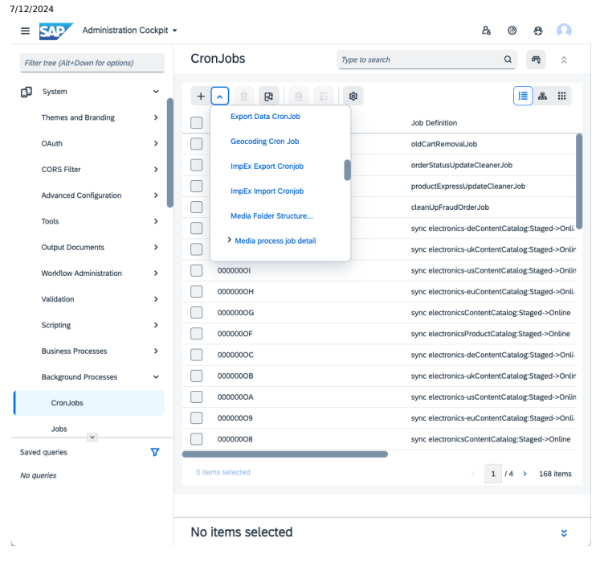

In the wizard, you can fill the basic parameters. Save your cronjob, and open it. The details are explained in the next sections

## I Note

This section only discusses those attributes that are specific to the impex Import CronJob. Attributes common to CronJobs are not discussed.

## Administration Tab

The Administration tab contains some important administrative options. Here you can specify all ImpEx specific settings for starting an import cronjob. The most important attribute is the mandatory Import Media. It specifies the media containing the source data in ImpEx format. If you have your import data packed to a ZIP file (for example as a result of an export), you can also specify a media containing this ZIP file. In that case, make sure that the Import File in ZIP attribute specifies the import file within the archive. When starting the cronjob, the archive is unpacked, the import file is assigned to the Import Media attribute and all other files of the archive to the External Data collection.

The External Data collection specifies additional medias containing ImpEx files referenced from the main import media using a bean shell command like includeExternalDataMedia. You can find more information in ImpEx API , section Inclusion of Data.

This is custom documentation. For more information, please visit the SAP Help Portal

## 

Using the Archive of Medias, you can specify a ZIP-archive containing les for a media import, for example, picture les using the translator. Furthermore, you can specify the root directory within this archive where the related les reside. For setting the locale to use for parsing the import data you can use the locale setting attribute. The mode attribute species the strictness mode for the import where each mode has different restrictions concerning the consistency of underlying import data (see ImpEx API, section Validation Modes). You can enable the ServiceLayer in Impex by changing the Legacy mode option to No.

| Option                                                           | Description/Comment                                                                                                                                                                                                                                                                                                                                                                                     |
|------------------------------------------------------------------|---------------------------------------------------------------------------------------------------------------------------------------------------------------------------------------------------------------------------------------------------------------------------------------------------------------------------------------------------------------------------------------------------------|
| Import Media                                                     | A media containing the data for import. Within the data you can include medias set at External Data using the bean shell command includeExternalDataMedia. You have to Enable Code Execution for doing such an include. Instead of plain data in impex format you can specify a ZIP le directly, for example, a result of an export, marking the main import le using the Import File in ZIP attribute. |
| Import File in ZIP                                               | If media at Import Media is a ZIP le, you can specify here the main import le importscript.impex. When starting the cronjob, this le is assigned to Import Media, the remaining les are added to the External Data collection. Importing a ZIP le with an impex only works if one of the les inside the ZIP le - the main import le - is named importscript.impex. Do not use other names for that le.  |
| External Data                                                    | Holds a set of data medias in ImpEx format that can be referenced within Import Media using the bean shell command includeExternalDataMedia.                                                                                                                                                                                                                                                            |
| Archive of Medias                                                | For specifying a ZIP archive containing les for a media import using the MediaDataTranslator.                                                                                                                                                                                                                                                                                                           |
| Basedir within archive                                           | Species the root directory within the Archive of Medias.                                                                                                                                                                                                                                                                                                                                                |
| Unzip media archive temporarily                                  | The media archive is unzipped while importing to get better performance.                                                                                                                                                                                                                                                                                                                                |
| Locale setting                                                   | Species the used locale setting for the data import. Important for data like numbers or dates where the separator symbols are different per locale.                                                                                                                                                                                                                                                     |
| Mode                                                             | Species the validation mode for the import where each has a different kind of strictness related to header validations, and so on. See ImpEx API, section Validation Modes.                                                                                                                                                                                                                             |
| Enable code execution                                            | Enables the execution of bean shell code within the Import Media. If not enabled, bean shell code is ignored. You have to enable it for using the include mechanism of external data.                                                                                                                                                                                                                   |
| Enable the consideration of ImpEx specic-syntax in external data | If included external data contains ImpEx syntax-like comments,                                                                                                                                                                                                                                                                                                                                          |
| too                                                              | headers and so on, this option has to be enabled. Otherwise the ImpEx syntax is not interpreted and used as a normal value line (which causes errors).                                                                                                                                                                                                                                                  |

| 7/12/2024 Option                       | Description/Comment                                                                                                                                                                                                                                                                                                                                                                                                                                                                                                        |
|----------------------------------------|----------------------------------------------------------------------------------------------------------------------------------------------------------------------------------------------------------------------------------------------------------------------------------------------------------------------------------------------------------------------------------------------------------------------------------------------------------------------------------------------------------------------------|
| Enable code execution in external data | If included external data contains bean shell code, this option has to be enabled. Otherwise the code is ignored. For enabling this option you also have to enable the Enable the consideration of ImpEx specic-syntax in external data too option, otherwise the bean shell code is interpreted as a value line and therefore is not recognized as bean shell code.                                                                                                                                                       |
| Number of processes                    | SAP Commerce Cloud optionally supports multithreading for ImpEx imports. This attribute species the number of threads for the ImpEx CronJob to use. Defaults to 1 (which uses one single thread only and, by consequence, does not use multithreading). The more threads ImpEx is allowed to use, the faster the import completes. However, as ImpEx scripts may have implicit dependencies, some ImpEx imports fail using multithreading and succeed using one single thread only. For details, see Multithreaded Import. |
| Once-Only Executable                   | If set, the cronjob can be performed only once. If you disable this ag, remember to delete the reference to the working media at restart of a cronjob, otherwise the work media are used again instead of the newly congured import le.                                                                                                                                                                                                                                                                                    |
| Delete (after termination)             | The cronjob is deleted after successful termination.                                                                                                                                                                                                                                                                                                                                                                                                                                                                       |
| Error Mode                             | What should be done on an error, FAIL the job or IGNORE the error? PAUSE mode is not supported by an import job                                                                                                                                                                                                                                                                                                                                                                                                            |

## Log Tab

At the log tab you can nd at rst all log information and at second information about possible unresolved value lines (caused by item references that could not be resolved).

| Option             | Description/Comment                                                       |
|--------------------|---------------------------------------------------------------------------|
| Entire Log         | Displays the rst 500 log entries of database (not the logs stored at le). |
| Log to Database    | Enables the logging to database.                                          |
| Log Level Database | Sets the log level for database logging.                                  |
| Log to File        | Enables logging to le.                                                    |
| Log Level File     | Sets the log level for le logging.                                        |
| Log Files          | References the created log les (not database log).                        |

## Import Wizard

To start an import, log in to Backoffice and navigate to System Tools Import . A wizard opens that allows you to set the basic parameters for a CronJob that imports data data to Platform.

## Conguration Tab

The main tab of this wizard species the source medias for the import and some basic settings.

| Option           | Description/Comment                                                                                                                                                                                                                                                                                                                                                                                    |
|------------------|--------------------------------------------------------------------------------------------------------------------------------------------------------------------------------------------------------------------------------------------------------------------------------------------------------------------------------------------------------------------------------------------------------|
| Choose media     | A media containing the data for import. Within the data you can include medias set at External Data using the bean shell command includeExternalDataMedia (You have to Enable Code Execution for doing such an include). Instead of plain data in ImpEx format you can specify a ZIP archive directly (e.g. a result of an export) marking the main import le using the Import File in ZIP attribute.  |
| Upload new Impex | Allows to upload new impex les                                                                                                                                                                                                                                                                                                                                                                         |
| Locale setting   | Species the used locale setting for the data import. Important for data like numbers or dates where the separator symbols are different per locale.                                                                                                                                                                                                                                                    |
| Import le in ZIP | If media at Import Media is a ZIP le, you can specify here the main import le importscript.impex. When starting the cronjob, this le is assigned to Import Media, the remaining les are added to the External Data collection. Importing a ZIP le with an impex only works if one of the les inside the ZIP le - the main import le - is named importscript.impex. Do not use other names for that le. |

## Advanced Conguration Tab

At the Advanced configuration tab you can configure an archive containing the media binary data for import and set some advanced settings.

ImpEx import x 1 ImpEx Import Configuration

| ImpEx Import           |  ImpEx Import   |
|------------------------|-----------------|
| 3                      |                 |
| Advanced configuration | Results         |

Media-Zip:
:
Upload new media:
upload create reset Distributed Mode:
Strict import mode: Execute asynchronously:
> Log audit trial: Allow code execution from within the file:
> Error mode:
 Fail
>
Number of processes:
16
 < >
Back Cancel Option Description/Comment This is custom documentation. For more information, please visit the SAP Help Portal

| 7/12/2024 Option                        | Description/Comment                                                                                                                                                                                                                                                                                                                                                                                                                                                                    |
|-----------------------------------------|----------------------------------------------------------------------------------------------------------------------------------------------------------------------------------------------------------------------------------------------------------------------------------------------------------------------------------------------------------------------------------------------------------------------------------------------------------------------------------------|
| Media-Zip                               | For specifying a ZIP archive containing les for a media import using the MediaDataTranslator.                                                                                                                                                                                                                                                                                                                                                                                          |
| Distributed mode                        | Enables import in distributed modes                                                                                                                                                                                                                                                                                                                                                                                                                                                    |
| Strict import mode                      | Species the validation mode for the import where each has a different kind of strictness related to header validations etc. See ImpEx API, section Validation Modes.                                                                                                                                                                                                                                                                                                                   |
| Execute asynchronously Log audit trial  | Enables the tracing of item modications. Changes can be revised at the Administration tab of the related item. Attention: Enabling can cause a performance problem for mass data!                                                                                                                                                                                                                                                                                                      |
| Allow code execution from within the le | Enables the execution of bean shell code within the Import Media. If not enabled, bean shell code is ignored. Has to be enabled for using the include mechanism of external data.                                                                                                                                                                                                                                                                                                      |
| Error mode                              | Allows you to set the error mode of the Import CronJob, that is, how the Import CronJob deals with occurring errors. Possible values: Fail Aborts the import at the location where the error occurred. Pause The import is suspended at the location where the error occurred to allow manual intervention. An operator can then manually resume or abort the import, depending on error assessment. Ignore Continues import as if no error had occurred.                              |
| Number of processes                     | SAP Commerce Cloud optionally supports multi-threading for ImpEx imports. This attribute species the number of threads for the ImpEx CronJob to use. Defaults to 1 (which uses one single thread only and, by consequence, does not use multi-threading). The more threads ImpEx is allowed to use, the faster the import completes. However, as ImpEx scripts may have implicit dependencies, some ImpEx imports fail using multi-threading and succeed using one single thread only. |

## Result Tab

Under the Results tab the status is shown with some logs of the currently performed import.

ImpEx import ImpEx Import ImpEx Import ImpEx Import 1

| Configuration   |
|-----------------|

Advanced configuration Results

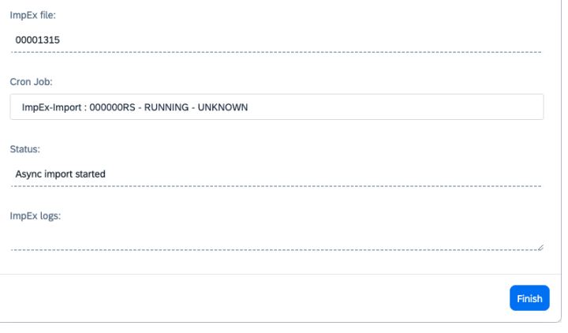

By clicking on a cronjob, you may get some additional information about the import, or download some logs.

## Import Through Administration Console

You can perform ImpEx import through SAP Commerce Cloud Administration Console.

1. Open the SAP Commerce Cloud Administration Console.

2. Go to the Console tab and select ImpEx Import option.

3. The Impex Import page displays.

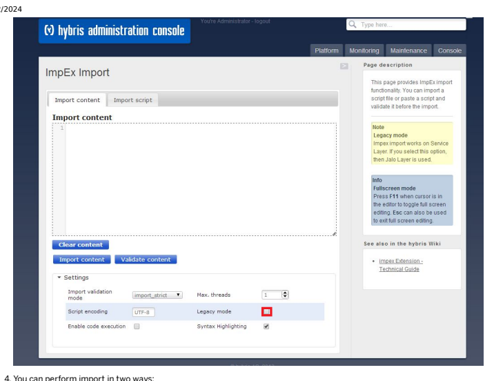

In the Import content section paste a script and click the Import content button.

In the Import script section, choose a script from a different location and click the Import le button.
 Tip You can enable the ServiceLayer in ImpEx by disabling the Legacy mode. To do it, untick the relevant box. The default value is Legacy Mode (the box is ticked by default).

## Multithreaded Import

To support systems with large numbers of products, SAP Commerce Cloud offers a multithreaded import through the SAP
Commerce Cloud impex extension functionality.

Multithreaded import enables you to use as many cores as you like to speed up the import of a given le. You can congure the number of cores for each import job separately. Our tests on 16 core machines have proved almost linear scaling if the database can handle the load.

It is not possible to ensure a strict writing order in a multithreaded import process. Therefore, try to have only one line per item - this ensures that only one thread is processing it. If you have multiple lines per item and the attributes overlap, it is possible that one thread can overwrite the effects of the other thread, and might end up with wrong data.

You can congure the number of threads (also referred to as worker threads) as follows:

in SAP Commerce Cloud Administration Console, see Conguring in SAP Commerce Cloud Administration Console in Backoffice, see Conguring in Backoffice via API, see Conguring in API
in the local.properties conguration le as the default, see Conguring in the local.properties File

## Conguring In Sap Commerce Cloud Administration Console

You can congure a multithreaded import in the SAP Commerce Cloud Administration Console.

## Procedure

1. Open the SAP Commerce Cloud Administration Console.

2. Go to the Console tab and select the Impex Import option.

The Impex Import page displays.

3. Set the maximum number of threads to use in the Max. threads eld.

You have the same eld in the Import content and the Import script sections.

 Note The Max. threads setting overrides the default value of worker threads only for the duration of the import. After the import has nished, the Max. threads is reset to the default value.

## Conguring In Backoffice

You can congure a multithreaded import in Backoffice.

## Procedure

1. Log in to Backoffice.

2. In the explorer tree, navigate to System Tools Import to open the ImpEx Import wizard.

In the wizard, on the Advanced conguration tab, you can congure the number of of processes:
ImpEx import x 1

ImpEx Import

Configuration

Media-Zip:
:
Upload new media:
upload create reset Distributed Mode: Strict import mode: Execute asynchronously:
1 > Log audit trial:
CONSIDER
Allow code execution from within the file:
A
Error mode:
 Fail
>
Number of processes:
16
 <
>

3. Start the import if your configuration is ready.

## Configuring In Api

ImpEx ServiceLayer API
This is custom documentation. For more information, please visit the SAP Help Portal In the SAP Commerce Cloud ServiceLayer there is a possibility to set up multithreaded import by conguring special ImportCong object and use this object as parameter for ImportService\#importData method as follows:
// assume that you have already bytes object containing script content byte[] bytes; final ImportConfig config = new ImportConfig(); // change maximum threads number to 8 config.setMaxThreads(8); config.setScript(new StreamBasedImpExResource(new ByteArrayInputStream(bytes), "en")); // now use Config object final ImportResult result = importService.importData(config);

## Impex Jalo Api

Technically, the multi-threaded import is run by these types:
ImpExImportCronJob

ImpExImportJob
To use multi-threaded import, you therefore have to use a combination of these CronJob components:

An ImpExImportCronJob or a subtype such as the ClassicationImportCronJob. An ImpExImportJob or a subtype such as the ClassicationImportJob.
You can dene the maximum number of threads in these different places:

Using the maxThreads attribute of the ImpExImportCronJob. The value dened here has the highest priority. Optional. Using the maxThreads attribute of the ImpExImportJob. The value dened here has medium priority and is overridden by a value dened in the ImpExImportCronJob. Optional. Using a system property, impex.import.workers (see Conguring in the local.properties File). The value dened here has the lowest priority and is overridden by values dened in the ImpExImportCronJob and the ImpExImportJob. This is the default value for all ImpExImportCronJob and ImpExImportJob instances in the system.
The maximum number of threads for an individual ImpExImportJob is therefore dened in this order:
1. The ImpExImportJob uses the maximum thread number value of the ImpExImportCronJob.

2. The ImpExImportJob uses the maximum thread number value of the ImpExImportJob itself. 3. The ImpExImportJob uses the value of the impex.import.workers property; see Conguring in the local.properties File.

## Conguring In The Local.Properties File

Within the local.properties conguration le you can congure the default number of ImpEx worker threads by setting the property impex.import.workers. You can always disable the multithreaded ImpEx import by setting the number of workers to 1.

Example: Add the line below to your local.properties le in order to use eight worker threads as the default for all your multithreaded ImpEx imports.

impex.import.workers=8 This is   For more    the SAP Help  77 Tip You can assign an expression to the impex.import.workers property. In this expression you can use \#cores constant which will be substituted by a number of cores available on your system. Default value is set to the doubled number of available cores:

## Local.Properties

impex.import.workers=\#cores * 2 Because you can set this only once you should take into account that effective number of workers depends on the target hardware setup. Bear in mind that the expression should be based on your database setup. If the database is slow, you should increase the number of workers accordingly. Otherwise you should keep it close to the default value. For example:
Doubled number of available cores plus additional three workers local.properties impex.import.workers=\#cores * 2 + 3 Number of available cores incremented by one local.properties impex.import.workers=1 + \#cores

## Export

To export data from Platform to CSV-les via Backoffice, you have to create and congure a cronjob of type ImpExExportCronJob.

You rst need an export script that you can generate using the Script Generator. The conguration of such an export CronJob and the export result attributes are described later. For making the conguration of such a CronJob more easy, Backoffice provides a Wizard of type ImpExExportWizard. For details, see Export Wizard. Another possibility for exporting data offering a graphical interface, is the ImpEx Web. This alternative is intended for development only and can only used by administrators. For details, see Export Through Administration Console.

## Script Generator

With the script generator, you can generate a complete export script or a header library. To start the script generator, log in to Backoffice and navigate to System Tools Script Generator . A wizard opens that allows you to generate a complete export script or a header library needed for an Export Wizard started from a search result.

The options available include:

| Option                                                                               | Description/Comment                                                                                                                                                                                                                                                         |
|--------------------------------------------------------------------------------------|-----------------------------------------------------------------------------------------------------------------------------------------------------------------------------------------------------------------------------------------------------------------------------|
| Script Type                                                                          | Select the type of the resulting script. You can use Header library only at the wizard open when using the export action on a search result list. It contains only header denitions. Migration generates a whole export script that you can use at the usual export wizard. |
| Media                                                                                | References the generated media containing the generated script after clicking the Save button.                                                                                                                                                                              |
| Script                                                                               | The script generated after clicking the Generate button.                                                                                                                                                                                                                    |
| Document ID                                                                          | If enabled, the document ID mechanism is used for references that can not be specied uniquely by using a combination of attributes not equal to PK. If disabled, the PK attribute is used.                                                                                  |
| Incl. system types                                                                   | The impex extension adds an attribute system type to the ComposedType type using that you can mark a type as system type. If you enable the ag only for those types, an export statement is generated that is not marked as system type.                                    |
| This is custom documentation. For more information, please visit the SAP Help Portal | 79                                                                                                                                                                                                                                                                          |

| 7/12/2024                                                            |                                                                     |
|----------------------------------------------------------------------|---------------------------------------------------------------------|
| Option                                                               | Description/Comment                                                 |
| Languages                                                            | Here you can restrict the languages for which a localized attribute |
| gets an corresponding header attribute. Assume you have 100          |                                                                     |
| languages installed and you select only one. Then only for this      |                                                                     |
| single language does each localized attribute get a header attribute |                                                                     |
| generated, otherwise 100 are generated for each.                     |                                                                     |

## Export Cronjob

To start an export using a ImpExExportCronJob, log in to Backoffice and go to | ⟩ System ⟩ Background Processes ⟩ CronJobs ⟩
and open the cronjob wizard:

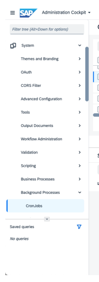

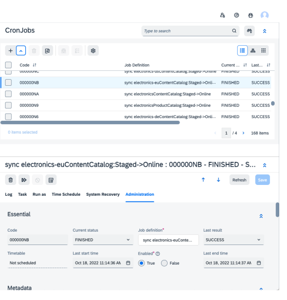

In the wizard, you can fill in the fields for the basic parameters (for example the code). Save your cronjob and open it. The parameter details are explained below.

## Administration Tab

The Administration tab contains important administrative options:
Here are the details:
Option Description/Comment This is custom documentation. For more information, please visit the SAP Help Portal

| 7/12/2024 Option           | Description/Comment                                                                                                                                                                                                                                                                                                 |
|----------------------------|---------------------------------------------------------------------------------------------------------------------------------------------------------------------------------------------------------------------------------------------------------------------------------------------------------------------|
| ImpEx Content              | The export script media used for dening the export. It has to contain a sequence of header lines intercepted by bean shell commands for dening the set of items to export using the related header line. For further information refer to the ImpEx reference.                                                      |
| Mode                       | Selects the validation mode to use for export.                                                                                                                                                                                                                                                                      |
| Export Template            | Selects a media containing the export template, which is a kind of ImpEx script containing only header lines. This media is merged to an ImpEx script containing headers, and the related set of item PK's to export by an export wizard. So it does not make sense to congure it directly at the cronjob instance. |
| Code (Target Data)         | The code of the resulting media containing the exported data.                                                                                                                                                                                                                                                       |
| Field Separator            | Field separator to use for exported data.                                                                                                                                                                                                                                                                           |
| Escape Character           | Escape character to use for exported data.                                                                                                                                                                                                                                                                          |
| Comment Character          | Comment character to use for exported data.                                                                                                                                                                                                                                                                         |
| Code (Target Media)        | The code of the resulting media containing the exported medias.                                                                                                                                                                                                                                                     |
| Converter                  | Converter to use for preprocessing the resulting medias.                                                                                                                                                                                                                                                            |
| Target (Data)              | The media containing the exported data as ZIP le.                                                                                                                                                                                                                                                                   |
| Target (Media)             | The media containing the exported medias as ZIP le.                                                                                                                                                                                                                                                                 |
| Export                     | The export container holding the advanced settings as well as the resulting export medias.                                                                                                                                                                                                                          |
| Report                     | Resulting media of used Converter.                                                                                                                                                                                                                                                                                  |
| Once-Only Executable       | If set, the cronjob can be performed only once. If you disable this ag do not forget to delete the reference to the working media at restart of a cronjob, otherwise the work media are used again instead of the newly congured import le.                                                                         |
| Delete (after termination) | The cronjob is deleted after successful termination.                                                                                                                                                                                                                                                                |
| Error Mode                 | What should be done on an error, FAIL the job or IGNORE the error? PAUSE mode is not supported by an export job.                                                                                                                                                                                                    |

## Log Tab

At the log tab, you can nd all about status information.

| Option                                                                               | Description/Comment                                                               |
|--------------------------------------------------------------------------------------|-----------------------------------------------------------------------------------|
| Entire Log                                                                           | Displays the rst 500 log entries of the database (not the logs stored at the le). |
| Log to Database                                                                      | Enables the logging to database.                                                  |
| Log Level Database                                                                   | Sets the log level for database logging.                                          |
| Log to File                                                                          | Enables logging to le.                                                            |
| Log Level File                                                                       | Sets the log level for le logging.                                                |
| Log Files                                                                            | References the created log les (not database log).                                |
| This is custom documentation. For more information, please visit the SAP Help Portal | 81                                                                                |

## Export Wizard

Backoffice offers a wizard that enables you to congure and start an export. To start an export, log into Backoffice and navigate to System Tools Export . A wizard opens that allows you to set the basic parameters for a CronJob that creates the exported data.

## Conguration Tab

The main tab of this wizard species the source medias for the import and some basic settings. The following screenshot shows the conguration tab of the wizard. In this tab, you have to select or upload an export script media that can be either generated by the Script Generator or created manually. At the Script text box, you can see the loaded script and edit it, or you start typing a script from scratch. Remember that you always have to click the Save button after you change the script in the text box to write it back to the selected le (if no le is selected, a new one is created). After you have optionally validated the script using the Validation button, you can click Continue to go to the Advanced conguration tab or you click the Start button.

 Available options:

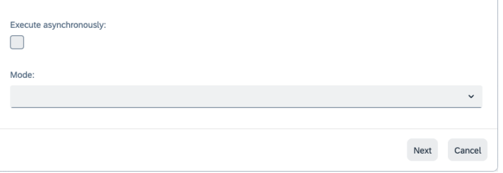

Option Description/Comment

| 7/12/2024 Option   | Description/Comment                                                                                                                                                                                                                                               |
|--------------------|-------------------------------------------------------------------------------------------------------------------------------------------------------------------------------------------------------------------------------------------------------------------|
| Script             | Displays the content of the selected ImpEx Content media. You also can edit the content of the text box, where afterwards the Save button has to be clicked for saving the edited text to the ImpEx Content media (if no media is selected a new one is created). |
| ImpEx Media        | The export script media to use for dening the export.                                                                                                                                                                                                             |
| Mode               | Selects the validation mode to use for export.                                                                                                                                                                                                                    |

## Advanced Settings Tab

After clicking the Next button, you get to the Advanced Conguration tab. Here you can congure the resulting medias containing the exported data and decide to convert a csv le into a zip le.

| Option           | Description/Comment                       |
|------------------|-------------------------------------------|
| Encoding         | Encoding to use for exported data         |
| Field Separator  | Field separator to use for exported data  |
| Escape Character | Escape character to use for exported data |

This is   For more    the SAP Help  83

| 7/12/2024 Option   | Description/Comment                                                   |
|--------------------|-----------------------------------------------------------------------|
| Comment Character  | Comment character to use for exported data                            |
| Export as zip      | Allows you to optionally convert the CSV le to a ZIP le after export. |

## Result Tab

Once you click Start, the CronJob starts and the following Result tab appears. Here you have a direct link to the performed cronjob as well as the resulting medias.

## Export Through Administration Console

You can perform export using Impex export page in SAP Commerce Cloud Administration Console.

The alternative to exporting data of Platform described here is only for development systems and has to be disabled in productive systems. Because it is only an easy way of testing an ImpEx script for development without any conguration options, it is not preferred and supported at all.

This is   For more    the SAP Help  84 To navigate to ImpEx Export page, in the SAP Commerce Cloud Administration Console click on the Console. Select the ImpEx Export option. It guides you to the page that is structured in a le-based export section and a content-based export section, analogous to the import case. Using the le-based export at the top of the page, you can simply select an ImpEx script covered in a le by clicking the Browse button. Afterwards you have to click the Export File button and a CronJob based export is started with the given le as the input source. The logs of the CronJob are written to the result page and to the console. If the export was successful, a green text signals this, if not - a red result text is displayed. The error cause can be found in the logs. The stack trace of the occurred error can only be found at the console. The result text contains a link to the created result medias. The second way of exporting is the use of the content-based export at the bottom of the page. Here, the ImpEx script has to be entered directly at the text box. You can select the validation mode to use for export and next to the Export Content button you have the possibility to validate the script rst by clicking the Validate Content button.

## Impex Media

An ImpEx media represents in general a CSV/impex le or a ZIP archive containing CSV/impex les. They are used only by the ImpEx extension for import and export processes. Because these medias contain CSV data, it provides some additional attributes specic to CSV data.

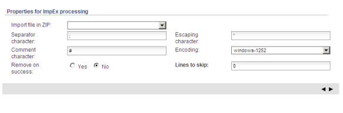

| Option              | Description/Comment                                                                                                                     |
|---------------------|-----------------------------------------------------------------------------------------------------------------------------------------|
| Import le in ZIP    | In case the media contains a ZIP archive, this attribute selects the archive entry containing the main import script (used for import). |
| Separator character | Character used in this le for separating the data cells.                                                                                |
| Escaping character  | Character used in this le for escaping.                                                                                                 |
| Comment character   | Character used in this le for introducing comments.                                                                                     |
| Encoding            | Sets the encoding used in this le.                                                                                                      |
| Remove on success   | If set, the media is deleted in case it was part of an import and the import was successful.                                            |
| Lines to skip       | Number of lines which have to be skipped before parsing the rst CSV-line (in case you have a CSV-header at rst line for example).       |

## Header Library

The header library types extend the ImpExMedia type but does not provide any additional features. It is just a kind of marker saying that it is a header library. They should only be used at the rst tab of the export wizard that is opened when using the export action at a search result list. A header library is a kind of export script only containing header denitions. Only by merging it with a list of items using the export action a real export script can be produced from.

## Impex Export Media

This kind of ImpExMedia marks the result of an export. There is no additional feature set or functionality.

## Related Information

Performing Multithreaded Catalog Synchronization in Backoffice

## Impex Import - Best Practices

Importing data is a common project task. If data being imported surpasses a certain amount, the import time becomes a factor to consider. For example, the performance of some business methods is not suitable to import mass data. The reason is that some checks or implemented service code—although very useful for normal requirements—do not have a performance improved for importing mass data. A typical case is importing Customers into a system, thus this article refers to this example.

## Importing Via Code

Generally, it is faster to create items through the newInstance() method and pass an attribute map with the values.

## Create Customers

When creating a custormer using service layer all you need to do is create model instance, then ll it with proper attributes and save model:
final CustomerModel customer = modelService.create(CustomerModel.class);
customer.setUid("newCustomer"); customer.setGroups(Collections.emptySet()); modelService.save(customer);

## Avoid Methods With Checks

The Customer instance has to be added to a group, normally the customergroup. One possibility to do this is by the addMember() method on the Customer item. This method, however, is checking if the customer is already added to the group, a feature most people don't need in an import situation. Therefore, the following syntax is not suggested:
customerGroup.addMember(<customer>)
You should instead insert the relation data directly through the LinkManager (manager for relations). For example, by adding the user to the PrincipalGroupRelation.

LinkManager.getInstance().createLink( de.hybris.platform.jalo.security.Principal.PRINCIPAL_GROUP_ <customer>, <customergroup>, 0)
This is   For more    the SAP Help  86

## Importing Via Impex

In the case of using ImpEx, items typically are created with good performance. Improvement can be achieved when setting the group relation. The best way here is also to separate the user import from setting the group relation. In the rst step, nd the commonly used:
INSERT_UPDATE Customer;uid[unique=true];groups(uid)
;testuser;customergroup; When you nd it, exchange it with the following piece of code:
INSERT_UPDATE Customer;uid[unique=true];groups[ignorenull=false,default= ]
;testuser;;
Remember to keep the groups column empty. In other words, just separate the processes User import and ll the relation. The reason for that is that the createItem method of the Customer otherwise automatically inserts the created Customer into the customerGroup, which is implicitly done by an addMember() call. In the second step then, insert the relations values in the PrincipalGroupRelation:
INSERT_UPDATE PrincipalGroupRelation;source(uid)[unique=true];target(uid)
;testuser;customergroup; For technical details on using ImpEx as well as an explanation of the modiers used in the example above, see impex Extension - Technical Guide.

## Impex Distributed Mode

The Distributed ImpEx engine enables you to import Platform items from huge and complex external les (for example, les that contain many dependencies between items), and at the same time it delivers exceptional performance. For more information, see About Distributed ImpEx.

About Distributed ImpEx Distributed ImpEx leverages the existing ImpEx framework to parse and analyze input, and dump unresolved value lines. It also leverages ServiceLayer for persistence, as well as TaskEngine to process single batches of data. Executing Import Programmatically Enabling data import in the distributed mode programmatically works similarly as in classical ImpEx. Executing Import from Administration Console To import data in the distributed mode using Administration Console, use the same Administration Console page that the classical ImpEx uses. Executing Import from Backoffice To import data in the distributed mode, use the standard ImpEx import wizard. Executing Import on Selected Node Groups Distributed ImpEx uses TaskEngine internally, which was designed to work well in a cluster environment. This enables you to choose which node group to execute import on. Execution Results and Logs Backoffice allows you to search for logs from a given CronJob. Using ServiceLayer Direct Distributed ImpEx allows you to use ServiceLayer Direct. Removing Stale Items This is   For more    the SAP Help  87 SAP Commerce Cloud allows you to remove stale output items that have been created in a successful Distributed ImpEx process.

## About Distributed Impex

Distributed ImpEx leverages the existing ImpEx framework to parse and analyze input, and dump unresolved value lines. It also leverages ServiceLayer for persistence, as well as TaskEngine to process single batches of data. Importing data using Distributed ImpEx (the distributed mode for short) consists of three phases:
1. Prepare and split phase 2. Single task execution phase 3. Finish phase

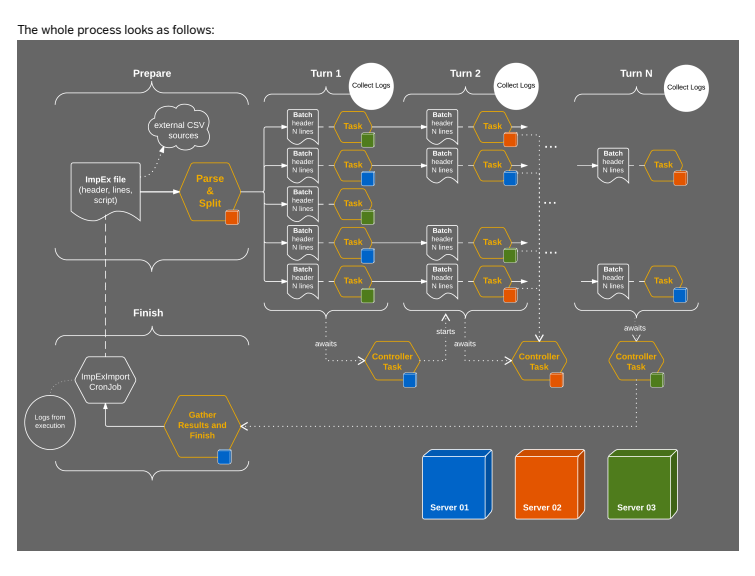

## Prepare And Split Phase

In the Prepare and Split phase, a large ImpEx le is read line by line and split into batches. Each header starts a new batch. Value lines are added to a batch until the batch size reaches its limit. You can congure a batch size with the <impex.distributed.batch.size> property. The default value is 100. All macro denitions declared in an input le are executed, so single batches contain translated values. All possible scripting lines are also executed except for beforeEach:
and afterEach: statements. Those are passed on to single batches. If a batch size is exceeded, a new batch is started with the last read header. The whole process is shown in the diagram:
This is   For more    the SAP Help  88

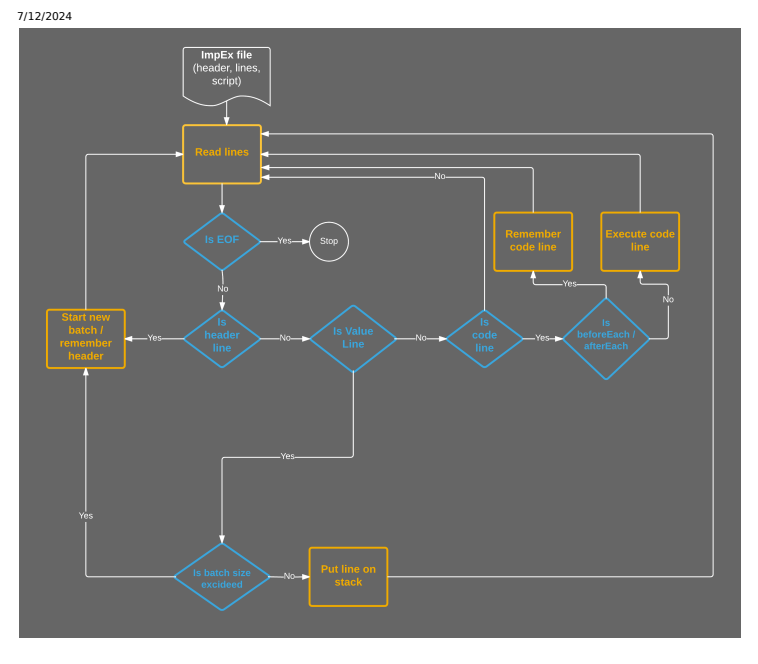

## Single Task Execution Phase

In the Single Task Execution phase, TaskEngine executes each batch individually. That means that a single task is executed in one thread but, on the whole, all batches are spread across the entire cluster. Thus they are executed in parallel. Execution of a single task in the distributed mode doesn't differ from the classical, single threaded ImpEx process. A batch always contains one header only, and a number of value lines, plus possibly the afterEach: and beforeEach: expressions.

An input batch is in the form of a String. Hence, it is read line by line, parsed, and nally converted to Models. Models are then persisted into the database. Note that the purpose of the process is to try to transform every value line into Models and nally persist them in one go. If this fails, the process switches to the save-by-line mode. The whole process looks as follows:

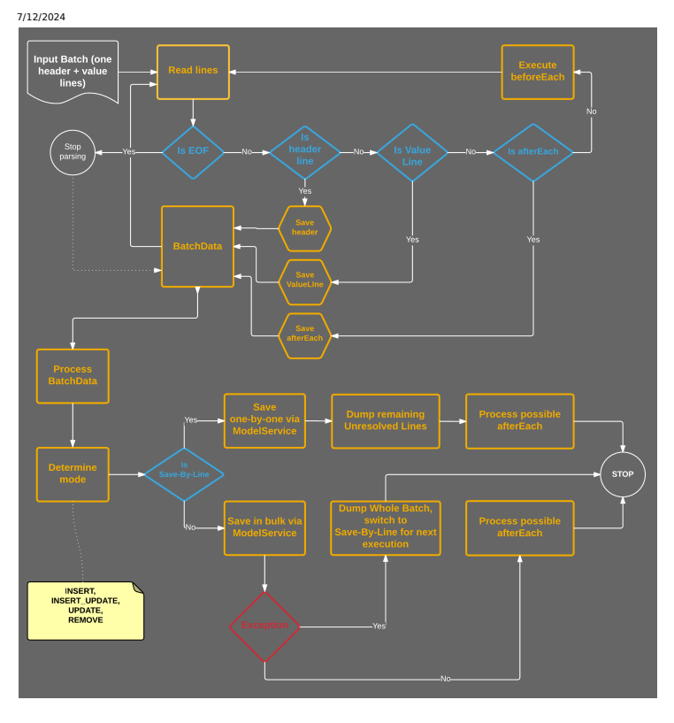

## Finish Phase

In this phase the whole process ends. A clean-up work is done (for example possible <documentId>'s are removed) as well as the status and the result of a resulting CronJob is set.

## Limitations

Distributed ImpEx was built with strong backward compatibility. Almost all features known in the classical ImpEx work in the distributed mode. Only some aren't supported. An input script can contain any number of lines and headers as in a classical ImpEx file. If you want to use scripting inside an input file, note that there are some limitations:
- if: and endif: scripting statements aren't supported

beforeEach: and afterEach: scripting statements are executed in a single batch execution phase beforeEach: and afterEach: scripting statements must be placed after the header denition Remaining scripting statements are executed in the splitting phase Headers that contain any ags related to Jalo persistence aren't supported The Processor modier is not supported

## Parameters Querying The Database For A Single Impex Line

The impex.distributed.query.for.each.line ag forces the distributed impex mechanism to read an impex le line by line and retrieve items from the database for the current line only. When necessary, Platform can switch to reading impex lines one by one on its own but if you think that it is better for Platform do use this behavior from the beginning of an operation, set the ag to true.

## Executing Import Programmatically

Enabling data import in the distributed mode programmatically works similarly as in classical ImpEx.

To congure import, use ImportService and ImportConfig objects, and enable the distributedImpex ag:
// assuming we have an ImpExResource object that points to an import file on classpath final ImpExResource importFile; final ImportConfig config = new ImportConfig(); // enable Distributed ImpEx config.setDistributedImpexEnabled(true); config.setScript(importFile); // perform import final ImportResult importResult = importService.importData(config);
Since we use the ImportService and ImportConfig API, below we provide the meaning of some of the ImportConfig object ags. By default, the synchronous ag of ImportConfig is set to true. In classical ImpEx, this ag is used to inform the underlying CronJob to run as synchronous or asynchronous. Distributed ImpEx is an asynchronous process by its nature. It splits work into batches and uses TaskEngine to process them all on available nodes. Setting this ag to true instructs ImportService to try to wait for a process to nish and then return ImportResult. Because Distributed ImpEx was built to import large volumes of data, it is recommended to set this ag to false.

The following ags of an ImportConfig object are useful only for the distributed mode, and are ignored in the classical mode:

| Flag                                                                                 | Explanation                                                  |
|--------------------------------------------------------------------------------------|--------------------------------------------------------------|
| distributedImpexEnabled                                                              | Enables Distributed ImpEx.                                   |
| distributedImpexProcessCode                                                          | Enables you to set a custom process code for execution.      |
| distributedImpexLogLevel                                                             | Enables you to set Log Level for Distributed ImpEx.          |
| sldForData                                                                           | Enables you to set the Service Layer Direct mode for import. |
| This is custom documentation. For more information, please visit the SAP Help Portal | 91                                                           |

| 7/12/2024 Flag   | Explanation   |
|------------------|---------------|

removeOnSuccessForDistributedImpex Removes stale output items that have been created during a

successful synchronous Distributed ImpEx process.

nodeGroup Enables you to set a cluster node group that handles the import

process.

The following ags of an ImportConfig object are ignored in the distributed mode:

## Executing Import From Administration Console

| Flag                    | Explanation                                                                                                                                                                                            |
|-------------------------|--------------------------------------------------------------------------------------------------------------------------------------------------------------------------------------------------------|
| maxThreads              | Using this ag is pointless since TaskEngine processes all the work.                                                                                                                                    |
| removeOnSuccess         | Distributed ImpEx creates a CronJob instance but only as a container for logs and additional information such as status, so for the time being the CronJob isn't removed after the process has nished. |
| hmcSavedValuesEnabled   | Not used.                                                                                                                                                                                              |
| dumpingEnabled          | Not used.                                                                                                                                                                                              |
| failOnError             | Using this ag is pointless here. Distributed ImpEx works on the whole cluster so having one batch that has failed doesn't affect the process of importing the remaining batches.                       |
| legacyMode              | Distributed ImpEx only works in the Service Layer mode.                                                                                                                                                |
| mainScriptWithinArchive | At the moment of writing this document, Distributed ImpEx doesn't allow you to use zip archives as input.                                                                                              |

To import data in the distributed mode using Administration Console, use the same Administration Console page that the classical ImpEx uses.

## Context

Choose a le that includes data you want to import and start importing.

## Procedure

1. Log into Administration Console.

2. Hover the cursor over Console to roll down a menu bar. 3. In the menu bar, click ImpEx Import.

ImpEx Import page displays.

4. Switch to the Import script tab. 5. Click Choose le and load your le. 6. Tick the Distributed mode option.

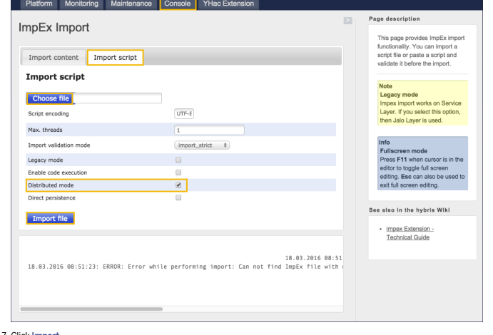

7. Click Import.
You should get a message about import status.

## Available Options

The following options are available in Administration Console for the distributed mode only:

| Option             | Description                                                                                  |
|--------------------|----------------------------------------------------------------------------------------------|
| Distributed mode   | Enables the distributed mode.                                                                |
| Direct persistence | Enables the Service Layer Direct mode. For more information, see Using ServiceLayer Direct . |

## Executing Import From Backoffice

To import data in the distributed mode, use the standard ImpEx import wizard.

## Context

Choose a le that includes data you want to import and start importing.

## Procedure

1. Log in to Backoffice.

2. Go to System Tools Import .

This is   For more    the SAP Help  93 The ImpEx import wizard opens.

3. Choose the data file to upload.

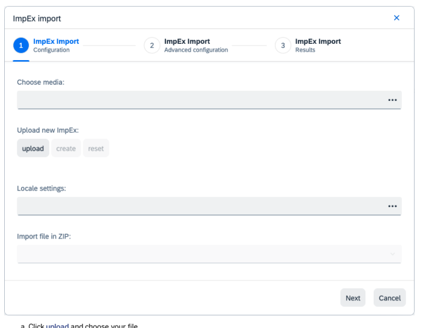

a. Click upload and choose your file.
b. Click create.

4. Click Next to switch to the Advanced Configuration tab.

5. Select Distributed Mode.

ImpEx import x ImpEx Import 1 Configuration

| ImpEx Import           | ImpEx Import   |
|------------------------|----------------|
| 3                      |                |
| Advanced configuration | Results        |

Media-Zip:
:
Upload new media:
upload create reset Distributed Mode:
>
Direct persistence: Node Group:
Log Level:
>
Strict import mode: L
Execute asynchronously:
>
Allow code execution from within the file:
>
Back Cancel 6. Click Start.

The view switches to ImpEx Import Results.

7. Click Finish.

## Available Options

In Backoffice, the following options are accessible from the ImpEx import wizard:
This is custom documentation. For more information, please visit the SAP Help Portal

| 7/12/2024 Option                        | Description                                                                              |
|-----------------------------------------|------------------------------------------------------------------------------------------|
| Direct persistence                      | Enables ServiceLayer Direct. For more information, see Using ServiceLayer Direct.        |
| Node Group                              | Enables you to set a cluster node group that handles the import process.                 |
| Log Level                               | Enables you to set Log Level for Distributed ImpEx                                       |
| Strict import mode                      | When enabled, this option causes import to work in the strict mode (default is relaxed). |
| Execute asynchronously                  | When disabled, this option causes the wizard to try to wait for the process to nish.     |
| Allow code execution from within the le | Enables code execution in the data import le.                                            |

## Executing Import On Selected Node Groups

Distributed ImpEx uses TaskEngine internally, which was designed to work well in a cluster environment. This enables you to choose which node group to execute import on. Assume you have 2 nodes:
NodeBackend with the following node group settings:
cluster.node.groups=backend and NodeFrontend congured as follows:
cluster.node.groups=frontend As long as you don't set the nodeGroup property of ImportConfig, you are able to execute import on any node - in this case on NodeBackend or NodeFrontend.

However, if you specify a node group in ImportConfig, you allow Distributed ImpEx to execute the import process only on a node with a matching node group:
final ImportConfig config = new ImportConfig(); config.setDistributedImpexEnabled(true); //enable distributed impex config.setNodeGroup("backend");
In the provided example only NodeBackend is able to pick import process for execution. NodeFrontend cannot perform any import. You may as well use the ImpEx import wizard to specify a node group.

## Execution Results And Logs

Backoffice allows you to search for logs from a given CronJob.

For backward compatibility, an instance of ImpExImportCronJobModel is available as a result of data import execution. This CronJob contains all the logs from a given execution, as well as its status.

## 

An instance of this CronJob must not be executed or scheduled for further execution.

To look up logs from a particular Distributed ImpEx import execution, follow the procedure.

## Procedure

1. Log in to Backoffice.

2. Go to | ⟩ System ⟩ Background Processes ⟩ CronJobs ⟩
You can see a list of CronJob instances from particular import executions.

3. Click the CronJob instance you're interested in.

The CronJob's editor area opens. Here you can find the status of CronJob executions, as well as a list of items containing the logs:

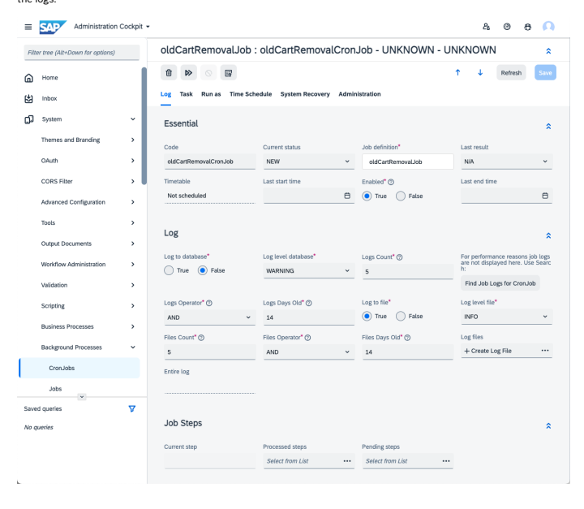

## Using Servicelayer Direct

This is custom documentation. For more information, please visit the SAP Help Portal

The examples provided here apply to Distributed ImpEx only. All the SLD settings are ignored in the classical ImpEx mode.

## Enabling Servicelayer Direct For All Imports

You can enable ServiceLayer Direct in the distributed mode for the whole process of importing data, for all imports. To enable SLD (direct persistence) and the distributed mode, congure an ImportConfig object as follows:
final ImportConfig config = new ImportConfig(); config.setDistributedImpexEnabled(true); //enables distributed impex config.setSldForData(true); //enables direct persistence mode

By default, the global persistence mode (persistence.legacy.mode) is used if you don't enable the direct persistence mode.

You can enable SLD in Backoffice or Administration Console. The Backoffice ImpEx import wizard contains the Distributed Mode option. After you choose it, the Direct persistence option becomes available. Note that when you choose Distributed Mode, some classical ImpEx input elds become unavailable (as not relevant for the distributed mode). You can nd the same options in Administration Console.

## Switching From Legacy Mode To Servicelayer Direct For One Header

You can have the whole distributed import process working in the legacy mode and at the same time force it to switch to the direct persistence mode for a selected batch, or header. To use that feature, set the sld.enabled modier in a header of a chosen import le to true:
INSERT_UPDATE Title[sld.enabled=true];code[unique=true]
;foo_sld_forced_by_header ;bar_sld_forced_by_header Setting the modier to sld.enabled=true means that both titles are to be imported using the SLD mode, even if the global switch, or the ag in ImportConfig is set to the legacy mode. Compare with the persistence.legacy.mode ag mentioned above.

## Removing Stale Items

SAP Commerce Cloud allows you to remove stale output items that have been created in a successful Distributed ImpEx process. You can congure SAP Commerce Cloud for programmatically run import to remove stale output items of the ImpexImportCronJob, DistributedImportProcess, ImportBatch, ImportBatchContent type that have been created during successful synchronous Distributed ImpEx processes. For more information, see Executing Import Programmatically.

You can also use the following property if you haven't congured the removeOnSuccessForDistributedImpex property of the ImportConfig object. When you enable this property, stale items created during import, for example in Administration This is   For more    the SAP Help  98 Console and Backoffice, are also removed.

impex.import.service.distributed.synchronous.removeonsuccess.enabled=true This property is disabled by default.

Use the following property for ImportBatchContent items that have been created during a successful synchronous or asynchronous Distributed ImpEx process:
impex.distributed.importbatchcontent.removeonsuccess=true This property is enabled by default. This property ensures that stale ImportBatchContent items created during import, for example in Administration Console or Backoffice, are also removed.

## Impex Faq

This document provides information about issues associated with the impex extension.

## How Can I Get More Information On Why An Impex Script Doesn'T Work?

I've got an ImpEx script that fails to execute every now and then, but I do not get any error messages on the server log. How can I get more information on why the script doesn't work?

## Technical Background

The impex extension uses CSV-based les, that is ImpEx scripts, to create instances of types in SAP Commerce Cloud. Depending on the CSV le contents, running an import with the impex extension may fail with an exception or may fail "silently", that is, the import does not work, but no exception is thrown. A way of getting a more extensive log of what an ImpEx script does is to nd the related (import/export) cronjob. A CronJob has a log le which keeps track of what happened during the CronJob execution.

## Solution

This section gives a tutorial on creating a CronJob that runs an ImpEx script that imports data so that the ImpEx script execution is logged.

1. Log into Backoffice.

2. Navigate to System Background Processes Cronjobs .

3. Find your cronjob, for example fooCronjob.

4. Click the Log tab to check the CronJob execution log.

If the log does not provide sufficient information, please also refer to the log le(s) listed by the Log files attribute.

## Exception: Item Reference For Attribute? Does Not Provide Enough Values At A Position?

The exception says that you have to give a composed item reference value but a part of this composed value is missing. Assume you have the following example script where the used catalog version already exists:

INSERT_UPDATE category; code[unique=true]; supercategories(code,catalogVersion(catalog(id[default=' ; CL2000; ; clothescatalog:Staged;shoes; ; CL2100; CL2000; clothescatalog:Staged; Then you have to pay attention when dening the default values for the catalogVersion within the supercategories denition. It does make a difference whether you dene the default='clothescatalog' for the id attribute of the referenced catalog or the catalog attribute directly:

## Will Work

..;supercategories(code,catalogVersion(catalog(id[default='clothescatalog']),version[default='Stage will not work
..;supercategories(code,catalogVersion(catalog(id)[default='clothescatalog'],version[default='Stage ImpEx tries to compose a value from the default values provided. If a default for catalog and version is provided, it gets the default for the entire catalogVersion attribute. With this information, it tries to create a value for the supercategories attribute together with the specied value for the code attribute. If no value is provided, as shown in the example above for category with code '2100', the resulting item expression value is not valid.

If you dene the default value for the id attribute, you do not provide a default for the catalog and so no default catalogVersion can be composed.

## Why Are Bean Shell Statements Especially Before_Each Statements Not Dumped For The Second Run?

It is an unsolvable problem to decide if a bean shell statement has to be dumped or not and so they are not dumped at all. If you want to use statements which modify the last imported item, you should disable the dumping functionality for being sure the code is executed always the item is imported (during second run the code is not executed).

If you use the bean shell functionality of ImpEx, you can make simple statements like a System.out.prinltn which could be dumped without problems, because it has no side effects. If you write unrepeatable statements (something which modies items and can only be executed one time without side effects) a dumping has serious problems, because the code is executed more than one time. Because ImpEx can not guess which kind of code you have written and if it is repeatable or not, code is not dumped for a second run at all. So if you want to have bean shell code, you should disable the dumping functionality for being sure the import is only tried one time (avoiding a second run where the code lines is not executed).

## Why Is The First Line Of My Included File Not Considered During Import?

The CSV request for comment preserves the rst line for column comments. ImpEx assumes as default that an included le does only contain data where it is normal, to dene at the rst line the column qualiers as comment. So by default the rst line of included les is ignored. This default value can be found at the attribute linesToSkip of the ImpExMedia type. So if you include a le using a includeExternalDataMedia method and you want to consider the rst line for import, just set this attribute of your included media to 0.

## What Possibilities Do I Have To Give Special Logic For Column Translation?

If you need business logic not implemented in the default translator class specied for an attribute, the following options are available:
Implement a custom translator. Refer to the Writing Own Translator section of ImpEx API. Implement a custom special translator. Refer to the Writing Own Special Translator section of ImpEx API.

This is   For more    the SAP Help  100 Implement a cell decorator Refer to the Writing Own Cell Decorator section of ImpEx API.

Use a Bean Shell code. Refer to the BeanShell section of ImpEx API. Implement your own import processor.

## Import Using Backoffice Works But Not Using Createessentialdata!

Problem: When I try to import data using the Backoffice Tools/Import all works well, and import data are present in the system.

But when I put them to the extension's manager, the createEssentialData() and createProjectData() methods data are not imported during initialization.

Solution: Check if you have located the data les at the **resources/jar** folder of your extension. If this is the case maybe there is a le at the **resources/jar** of another extension with the same le name. In this case one of the two les is used when calling getResourceAsStream.

This is because in case there are multiple les with the same name, even if in different extensions, it is somewhat arbitrary which le is opened.

## Jaloitemnotfoundexception At Second Pass While Import

de.hybris.platform.jalo.JaloItemNotFoundException: item 149469962411550720 not found[HY-0] at de.hybris.platform.core.WrapperFactory$2.compute(WrapperFactory.java:365) at de.hybris.platform.cache.AbstractCacheUnit.privateGet(AbstractCacheUnit.java:208) at de.hybris.platform.cache.AbstractCacheUnit.get(AbstractCacheUnit.java:109) at de.hybris.platform.jalo.JaloItemCacheUnit.getCached(JaloItemCacheUnit.java:76) at de.hybris.platform.core.WrapperFactory.getCachedItem(WrapperFactory.java:375) at de.hybris.platform.jalo.JaloSession.getItem(JaloSession.java:1116) at de.hybris.platform.impex.jalo.imp.DefaultExistingItemResolver.findExisting(DefaultExisti at de.hybris.platform.impex.jalo.imp.DefaultImportProcessor.processItemData_Impl(DefaultImp at de.hybris.platform.impex.jalo.imp.DefaultImportProcessor.processItemData(DefaultImportPr at de.hybris.platform.impex.jalo.imp.ImpExImportReader.readLine(ImpExImportReader.java:457) at de.hybris.platform.impex.jalo.Importer.doImport(Importer.java:239) at de.hybris.platform.impex.jalo.Importer.importNext(Importer.java:651) at de.hybris.platform.impex.jalo.cronjob.ImpExImportJob.doImport(ImpExImportJob.java:236) at de.hybris.platform.impex.jalo.cronjob.ImpExImportJob.performJob(ImpExImportJob.java:201) at de.hybris.platform.impex.jalo.cronjob.ImpExImportJob.performCronJob(ImpExImportJob.java: at de.hybris.platform.cronjob.jalo.Job.execute(Job.java:1043) at de.hybris.platform.cronjob.jalo.Job.performImpl(Job.java:677) at de.hybris.platform.cronjob.jalo.Job.access$1(Job.java:648) at de.hybris.platform.cronjob.jalo.Job$JobRunable.run(Job.java:566) at de.hybris.platform.util.threadpool.PoolableThread.run(PoolableThread.java:86)
Problem: During import all value lines consisting of references which can not be stored are dumped and processed again in a second pass. If the item can be created already without using the unresolved reference it is created and the PK of the created item is stored to at the dump le. When processing the dump le at the second pass the PK is resolved to the already created item, but here the exception is thrown because it is removed already. Solution: There is another type imported which also has unresolved references. These references can be resolved at the second pass and be set to the related items. Unfortunately the business logic of the attribute setters removes the item of our type. Example script which causes such exception is:
insert_update Website;code[unique=true,allownull=true];rootNavigationElements(code,website(code)); "\#% impex.includeExternalDataMedia( ""Website.csv"" , ""UTF-8"", ';', 1, -1 );" insert_update BannerNavigationElement;code[unique=true];parent(code,website(code));webSite(code)[un "\#% impex.includeExternalDataMedia( ""BannerNavigationElement.csv"" , ""UTF-8"", ';', 1, -1 );"
Here the Website lines are dumped because not all root navigation elements are available at this time. The BannerNavigationElement lines are also dumped because the parent navigation elements are not available. For each line, an This is   For more    the SAP Help  101 item is already created because no essential data is missing.

The second pass then starts and the unresolved attributes of the websites are set. The setRootNavigationElements method is called and removes the navigation elements already assigned to the website. That are the already created navigation elements.

## Impex Translators With Service Layer

When using translators, note that the prepare interceptors are called before translators. If you require that the prepare interceptor works with translated values, you must implement a solution where the prepare interceptor would be called again after the values are translated.