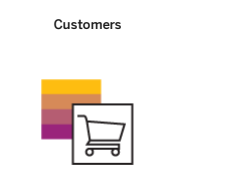
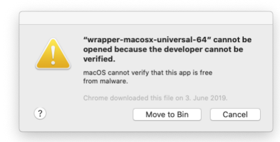

# Installing Sap Commerce Cloud

Learn everything you need to successfully install, congure and run SAP Commerce Cloud.

Set up and congure a local SAP Commerce Cloud instance for test and development purposes.

Download What's New Before You Start Installing SAP Commerce Cloud Manually Installing SAP Commerce Cloud Using Installer Recipes Setting Up an Eclipse Project

## Installation Reference

Familiarize yourself with some fundamentals before starting your SAP Commerce Cloud installation. Learn about the prerequisites for installing, nd out where and how to download the software, and get to grips with licenses and the directory structure. If you're installing a patch release, it may affect your custom extensions. Find all relevant information and procedures in the topics that follow.

System Requirements and Third-Party Compatibility SAP Commerce Cloud is a Java application that has specic requirements. Understand the basic software and hardware requirements for installing SAP Commerce Cloud. Licenses SAP Commerce Cloud uses standard SAP license management. A valid license allows you to start SAP Commerce Cloud, and unlocks features. Download Download the 2211 version of SAP Commerce Cloud for testing and development. Use the most recent release builds for your projects to benet from the latest features and xes. SAP Commerce Cloud Directory Structure SAP Commerce Cloud has a directory structure that makes it easy for you to work with, and separates custom les and conguration from the base features.

## System Requirements And Third-Party Compatibility

SAP Commerce Cloud is a Java application that has specic requirements. Understand the basic software and hardware requirements for installing SAP Commerce Cloud.

## Supported Web Browsers

The system only supports browsers that can automatically update to the latest version without manual intervention (Evergreen browsers).

| Web Browsers    | Supported Version                                                            |
|-----------------|------------------------------------------------------------------------------|
| Microsoft Edge  | Latest stable version                                                        |
| Mozilla Firefox | Latest ESR version (Firefox 45 ESR, Firefox 51.0) or newer supported version |
| Google Chrome   | Latest stable version                                                        |
| Apple Safari    | Latest stable macOS version only                                             |

## Test, Demonstration, And Development Requirements Application Server

The following requirements apply to the SAP Commerce Cloud software only, excluding third- party applications or databases. They assume a basic scenario including the SAP Commerce Cloud product package, Eclipse, and the embedded Tomcat web server. The Minimum requirements should be sufficient for demonstrating the software in sales and presale presentations. For development, fulll the system requirements as listed in the Recommended column:

| Demonstration/Development   | Minimum                   | Recommended               |
|-----------------------------|---------------------------|---------------------------|
| CPU                         | Dual Core, for example i5 | Quad Core, for example i7 |
| RAM                         | 8 GB                      | 16 GB                     |
| [2]                         | [3]                       | [2]                       |
| Hard Disk                   | 7200 rpm IDE              | SSD                       |
| Hard Disk Space             | 10 GB                     | 20 GB                     |

## Database

You do not need to install a separate database if you just want to try out and demonstrate SAP Commerce Cloud. It comes bundled and precongured with the lightweight HSQLDB database, which typically is sufficient for primary tests. This database is installed and set up by default without the need for further conguration.

## Third-Party Compatibility

SAP Commerce Cloud has specic requirements on third party software and platforms in order to run. Ensure you are aware of these requirements before installing SAP Commerce Cloud in your environment. For information about the third-party compatibility related to your SAP Commerce Cloud version, refer to the update release section in the Update Release Notes.

This is   For more    the SAP Help  3

## Licenses

SAP Commerce Cloud uses standard SAP license management. A valid license allows you to start SAP Commerce Cloud, and unlocks features. You must have a valid license to use SAP Commerce Cloud, either locally or in production. When you rst install any SAP license for SAP Commerce Cloud, the system creates a new le in *<HYBRIS_HOME>*/config/license, named installedSaplicenses.properties. This le contains all the required information related to your active licenses.

## Caution

Do not edit installedSaplicenses.properties. Editing this le may corrupt license information and lead to a nonworking system.

SAP provides the following types of licenses:
A temporary license for test and development purposes

A regular license for use in a production environment

## Temporary License

The temporary license is available for test and demonstration purposes. An initial 30-day temporary license is applied during the installation process. If you need to extend the temporary license period, you can use the command-line license tool to generate a further 90-day license once the initial 30-day license expires. This gives you a maximum of 120 days (30 + 90), after which you must obtain a regular license. For more information, see Command Line License Tool.

## Regular License

The automated provisioning process generates a valid license for you when deploying SAP Commerce Cloud using the Cloud Portal. No additional steps are required to ensure that the license is installed. To see details of your installed license, go to the SAP Commerce Cloud Administration Console and select Platform License
.

Command Line License Tool License Key Help SAP Note 2137024

## Command Line License Tool

SAP Commerce Cloud includes a simple shell script to allow you to manage your licenses from the command line. The command line license tool allows you to install either regular or temporary licenses, delete licenses, or display information about installed licenses. The tool is provided in the form of two scripts:
license.sh for Unix-based systems license.bat for Windows systems Both license.sh and license.bat scripts are located in *<HYBRIS_HOME>*/bin/platform/, where <HYBRIS_HOME> is a root directory of SAP Commerce Cloud. Run the scripts directly from this location.

The tool provides several options you can use to manage your licenses. The following examples are based on license.sh for Unix. You can use the same options with license.bat for Windows.

## Display Tool Help

To display all available options, run the script either without any options, or with the -help option.

$ ./license.sh -help

SAP license key administration toolkit for Java environment Usage: license.sh <Option(s)> Options: -help . . . . . . . . . . . . . . . . . . . Display this help -version . . . . . . . . . . . . . . . . . . Display the tool versi -get . . . . . . . . . . . . . . . . . . . . Display infos about th -number . . . . . . . . . . . . . . . . . . Same as -get -install <filename> . . . . . . . . . . . . Install license keys f -show . . . . . . . . . . . . . . . . . . . Display license keys -temp <Product> . . . . . . . . . . . . . . Create a temporary lic -temppossible <Product> . . . . . . . . . . Check whether a tempor -delete <System Id> <Hardware Key> <Product> Delete license key(s)

For each of the parameters after "-delete" you can use "*" as a wil Remember to use quotes to mask the "*"!

You can also use -h as a shortcut.

## Install A Temporary License

To install a new temporary license for HSQLDB, use the -temp option.

$ ./license.sh -temp CPS_SQL
First temporary license key installed.

For the correct database code to use for other supported databases, see SAP Commerce License Attributes.

 Caution You can install only one temporary license per product.

## Install A Permanent License From A File

To install a license from a le, use the -install option, and specify the le path.

$ ./license.sh -install /path/to/fileContainingLicense.txt 1 SAP license key(s) successfully installed.

You can also use -i as a shortcut.

## Display Information About Installed Licenses

To display information about installed licenses, use the -show option.

You can also use -s as a shortcut.

## Sap Commerce License Attributes

A valid SAP license for SAP Commerce Cloud contains some predened attributes. Choose the correct product name code for your database when generating a license using the command line tool. The following attributes are generated with any SAP Commerce Cloud license.

| key           | value               | comment                                                                                                                                                                          |
|---------------|---------------------|----------------------------------------------------------------------------------------------------------------------------------------------------------------------------------|
| HARDWARE-KEY  | Y4989890650         | Unlike other SAP products, an SAP Commerce Cloud license is not issued for a specic hardware setup. Instead, the hardware key component is lled with this preset value.          |
| SWPRODUCTNAME | CPS_<database code> | SAP Commerce Cloud has the product code CPS, which is combined with the database that the license has been issued for. See the following table for the list of available values. |

Provide an appropriate three-letter database code to complete the SWPRODUCTNAME attribute when generating a temporary license.

| Database                                            | Value   |
|-----------------------------------------------------|---------|
| SAP Hana                                            | CPS_HDB |
| Microsoft SQL Server (Single Node, Active/Passive)  | CPS_MSS |
| Oracle (Single Node, Active/Passive, Active/Active) | CPS_ORA |
| MySQL (Single Node, Active/Passive)                 | CPS_MYS |
| Percona XtraDB Cluster                              | CPS_MYS |
| HSQLDB (Single Node)                                | CPS_SQL |

When you create your license, choose a three-letter system ID (SAPSYSTEM), which you then must add to the platform conguration. You can dene this in yourlocal.properties le as follows:
\# System ID license.sap.sapsystem=XYZ
If omitted, the platform uses CPS as the default value.

This is   For more    the SAP Help  6

$ ./license.sh -show

System. . . . . : CPS Hardware Key. . : Y4989890650 SW product. . . : CPS_SQL SW product Limit: Unlimited Begin date. . . : 10/May/2016 Expiration date : 08/Aug/2016 License key type: Temporary Installation No.: 0000000000 System No.. . . : 000000000000000000 Validity. . . . : valid

## Download

Download the 2211 version of SAP Commerce Cloud for testing and development. Use the most recent release builds for your projects to benet from the latest features and xes. SAP Commerce Cloud is protected by a license that allows you to start it up and unlock features; you must install a license to use it. The software uses standard SAP license management. There are two types of licenses: an initial, temporary license valid for 30 days, which you can extend for a further 90 days, and a permanent commercial license. For further instructions on installing license keys, see Licenses.

Download SAP Commerce Cloud software releases and patches from the SAP Software Center in SAP for Me. Search for "SAP
Commerce Cloud". In case of problems, nd the information and support you need on the Services & Support tab.

For production purposes, use your customer's S-user ID to download SAP Commerce Cloud from the SAP
Software Center. If you need a customer S-user ID,
get in touch with your customer. For demonstration and development purposes, use your own S-user ID.

Complementary Products, Product Packs, and Services The following ZIP les are available for download with version 2211. To nd them, open SAP for Me, go to the SAP Software Center and search for a package name and version. For example, SAP COMMERCE CLOUD V2 2211.

| Product   | Download Package Name   | Description   |
|-----------|-------------------------|---------------|

| 7/8/2024 Product                                                                     | Download Package Name                                                                                                                                                                                                                                                                                                                                                                                          | Description                                                                                                                                                                                                                                                                                                                                                                                                                                                                                                                                                                                                                                                                                                                                                                                   |
|--------------------------------------------------------------------------------------|----------------------------------------------------------------------------------------------------------------------------------------------------------------------------------------------------------------------------------------------------------------------------------------------------------------------------------------------------------------------------------------------------------------|-----------------------------------------------------------------------------------------------------------------------------------------------------------------------------------------------------------------------------------------------------------------------------------------------------------------------------------------------------------------------------------------------------------------------------------------------------------------------------------------------------------------------------------------------------------------------------------------------------------------------------------------------------------------------------------------------------------------------------------------------------------------------------------------------|
| SAP Commerce Cloud                                                                   | SAP COMMERCE CLOUD V2                                                                                                                                                                                                                                                                                                                                                                                          | Download this to set up a local development version of SAP Commerce Cloud. Includes the following ZIP les, which can be downloaded separately: The main ZIP le, CX COMMERCE, containing the SAP Commerce Cloud core functionality for SAP Commerce Cloud customers. The Data Hub ZIP le, CX DATAHUB. To add this product to SAP Commerce Cloud, download the ZIP, and copy it into your expanded HYBRISCOMM directory. From there, expand the new ZIP le using the unzip -u command. The -u option updates the existing SAP Commerce Cloud le hierarchy, adding the Data Hub directories at the correct location.  Note The SAP COMMERCE CLOUD V2 package is for local test and development purposes of SAP Commerce Cloud only. All production deployments are managed in the Cloud Portal. |
| SAP Commerce Cloud, integration extension                                            | SAP COMMERCE INT EXT PACK                                                                                                                                                                                                                                                                                                                                                                                      | Includes the following ZIP les, which can                                                                                                                                                                                                                                                                                                                                                                                                                                                                                                                                                                                                                                                                                                                                                     |
| pack                                                                                 | be downloaded separately: The main ZIP le, CX COMMERCE INT EXT PACK, containing the integration extension pack modules. The Data Hub extensions ZIP le, CX DATAHUB INT EXT PACK, containing the Data Hub extensions required for any integrations based on SAP Commerce Cloud Data Hub.                                                                                                                        |                                                                                                                                                                                                                                                                                                                                                                                                                                                                                                                                                                                                                                                                                                                                                                                               |
| Telco and Utilities Accelerator                                                      | SAP IND.PACK TELCOUTIL                                                                                                                                                                                                                                                                                                                                                                                         | The accelerator is a ready-to-use web framework enabling Service Providers to sell more online and offline in an intuitive and cost-effective way.                                                                                                                                                                                                                                                                                                                                                                                                                                                                                                                                                                                                                                            |
| SAP Commerce Cloud, nancial services                                                 | SAP IND.PACK FINANCE                                                                                                                                                                                                                                                                                                                                                                                           | The Financial Services Accelerator is a                                                                                                                                                                                                                                                                                                                                                                                                                                                                                                                                                                                                                                                                                                                                                       |
| accelerator                                                                          | tailor-made, omnichannel solution for direct insurance companies, banks, and other nancial service providers that are looking to develop a more streamlined, seamless, and personalized customer experience, while meeting the unique needs of their industry. The Financial Services Accelerator comes with precongured reference integrations and storefront templates for insurance and banking industries. |                                                                                                                                                                                                                                                                                                                                                                                                                                                                                                                                                                                                                                                                                                                                                                                               |
| This is custom documentation. For more information, please visit the SAP Help Portal | 8                                                                                                                                                                                                                                                                                                                                                                                                              |                                                                                                                                                                                                                                                                                                                                                                                                                                                                                                                                                                                                                                                                                                                                                                                               |

| 7/8/2024 Product                       | Download Package Name                                                                                                                                                                                             | Description                                                                |
|----------------------------------------|-------------------------------------------------------------------------------------------------------------------------------------------------------------------------------------------------------------------|----------------------------------------------------------------------------|
| SAP Commerce Cloud, travel accelerator | SAP IND PACK. TRAVEL                                                                                                                                                                                              | Deliver Omni-channel Digital Traveller Engagement with SAP Commerce Cloud. |
| SAP Commerce Cloud, citizen engagement | SAP CITIZEN ENGAGEMENT ACC                                                                                                                                                                                        | SAP Commerce Cloud, citizen engagement                                     |
| accelerator                            | accelerator provides you with an accelerated path to the deployment of SAP Commerce Cloud in a public-sector organization such as a government department, local council, municipal authority, or welfare agency. |                                                                            |

## Sap Commerce Cloud Directory Structure

SAP Commerce Cloud has a directory structure that makes it easy for you to work with, and separates custom les and conguration from the base features.

The *<HYBRIS_HOME_DIR>*/hybris folder contains the following directories:
bin: The platform and features, within the following subdirectories:
platform: The core SAP Commerce Cloud platform extensions that are loaded on startup. This directory also has the build framework, and extension templates.

modules: The extensions, organized by module. Each module provides a related set of business functionality.

custom: Any custom extensions or overrides that you may develop. This directory is created when you rst set up a custom extension using the extgen template.

config: Conguration les and license key, including properties les and localextensions.xml, which denes the included extensions.

data: Data les such as media les and LucerneSearch indexes. The directory also contains HSQLDB data les, if you are using the default database in a test or development environment.

log: Log les, including Tomcat and JDBC logs.

temp: Any temporary les.

## Technical Aspects

The bin directories do not contain any customizable conguration data. Separating the binaries from those les you may wish to retain from one version to the next provides an easy upgrade path. The upgrade process does not replace any custom conguration les.

## Caution

Never change anything within the bin directory. Do not keep any custom data conguration in this directory or any of the subdirectories. The upgrade process may replace the bin directory and subdirectories with a newer version of SAP Commerce Cloud and remove your changes.

For a list of the modules and extensions in the bin directory, see Modules and Extensions and AddOns.

Custom conguration data such as the license, local.properties, and localextensions.xml les must reside in the /config directory.

If no config directory is available when building SAP Commerce Cloud, the system prompts you to choose a conguration template: develop or production.

The config directory for development is an Eclipse project. Add this as a separate project. For more information, see Setting Up an Eclipse Project.

This is   For more    the SAP Help  9

## Installing A Local Instance

Create a local installation of SAP Commerce Cloud for testing, development, or demonstration. Congure the system manually according to your specic needs, or use one of the provided installation recipes to use a pre-congured setup. If necessary, integrate your environment into your Eclipse IDE. Before you begin any installation, ensure that you are familiar with the prerequisites and licensing.

Before You Start To install and run SAP Commerce Cloud in a local environment, you require a compatible Java SDK. Ensure that the correct SDK for your SAP Commerce Cloud version is installed and congured correctly, then download and unpack the SAP Commerce Cloud ZIP before moving on to the installation steps. Installing SAP Commerce Cloud Manually Follow the basic steps for setting up an SAP Commerce Cloud test and development environment. Installing SAP Commerce Cloud Using Installer Recipes To automate your installation of SAP Commerce Cloud for development and demonstration purposes, you can use an installer recipe. Recipes are gradle scripts that take care of creating directories, moving les, updating conguration and properties les, and initializing the system. Setting Up an Eclipse Project Precongured Eclipse .project and .classpath les allow you to import SAP Commerce Cloud and its packages into Eclipse, ready for custom development.

System Requirements and Third-Party Compatibility Licenses Installing & Implementing Accelerator Install Data Hub Locally

## Before You Start

To install and run SAP Commerce Cloud in a local environment, you require a compatible Java SDK. Ensure that the correct SDK for your SAP Commerce Cloud version is installed and congured correctly, then download and unpack the SAP Commerce Cloud ZIP before moving on to the installation steps.

## Install The Java Sdk

SAP Commerce Cloud requires a compatible Java SDK to install and run the application.

SAP Commerce Cloud 2211 requires JDK 17 or later. It is fully compatible with SAP Machine 17.

Follow the instructions on the SDK source web site to download and install the correct version for your operating system.

## Related Information Download And Unpack Sap Commerce Cloud

SAP Commerce Cloud releases are available as ZIP archive les. Download and unpack the required les before you begin installation.

## Prerequisites

Ensure you are familiar with the system requirements. For more information, see System Requirements and Third-Party Compatibility.

 Note There are multiple installation ZIP les:
CXCOMM221100P_X-XXXXXXXX.zip: Contains all the les to install and run SAP Commerce Cloud.

CXDATAHUB221100P_X-XXXXXXXX.zip: Contains the les to install SAP Commerce Cloud Data Hub.

Data Hub is distributed as a separate ZIP le. To add this product to SAP Commerce Cloud, download the ZIP, and copy it into your expanded CXCOMM221100P_X-XXXXXXXX directory. From there, expand the new ZIP le using the unzip -u command. The -u option updates the existing SAP Commerce Cloud le hierarchy, adding theData Hub extension directories in the correct location.

Select only the ZIP archives you want to install. You don't need to download all the ZIP archives listed. To download and unpack the SAP Commerce Cloud ZIPs, perform the following steps.

1. Download the packages you want to install.

For more details, see Download.

2. Create the directory where you want to extract the ZIP archives.

Follow these best practice guidelines when creating the installation directory:

Ensure that the installation directory is close to the system root directory, for example C:\hybris. You may download the les directly to the root directory, because the ZIP les already contain a hybris directory.

Microsoft Windows requires directory paths to be shorter than 255 characters. Any part of a directory path exceeding this limitation is truncated. The SAP Commerce Cloud modules installation creates several subdirectories, so use short directory paths.

Avoid directory paths containing spaces such as C:\hybris Platform. Building SAP Commerce Cloud fails if the directory path contains spaces.
3. Extract the ZIP archives into the directory you just created.

Upon completion, the chosen directory should contain the structure similar to the following example:

## Caution

When extracting a ZIP le on Windows, you may encounter an error due to path length. You may receive an error message similar to "Cannot create <pathname> total path and le name length must not exceed 260 characters". If so, you can:
Use an alternative extraction tool, one that doesn't limit the path or name size.

jar -xvf <zipfilename>.

Do not use the JAR utility to unzip the ZIP le on Unix-based systems, as this will change the timestamps of the contained les and break the build process.

## Installing Sap Commerce Cloud Manually

Follow the basic steps for setting up an SAP Commerce Cloud test and development environment. These basic steps describe how to install and initialize SAP Commerce Cloud with the provided SAP Commerce Cloud Server. The server is a precongured application server based on Apache Tomcat. Both HSQLDB and Tomcat are included in the SAP Commerce Cloud package, and are designed to be used for testing, development, and demonstration purposes. This guide also provides optional steps that describe how to use different databases also supported by SAP Commerce Cloud. Install and congure only the packages that are needed in your project. Any initial data provided with SAP Commerce Cloud is intended for demonstration purposes only. Installer recipes included with SAP Commerce Cloud allow you to install a precongured environment quickly using the default HSQLDB on your local machine. The following procedures cover installing SAP Commerce Cloud using manual conguration. For information on installing using recipes, see Installing SAP Commerce Cloud Using Installer Recipes.

## Allowing Apps On Macos

If you are installing SAP Commerce Cloud locally on MacOS, then it is essential you know how to allow certain unknown or unsigned third-party applications to run on your system. Set Up Your Build After you have successfully downloaded and unpacked the required les, you must then create your SAP Commerce Cloud project directories before proceeding. Congure the Functionality Dene what functionality you require by specifying the required extensions, and performing other conguration tasks. Initialize SAP Commerce Cloud Initialize your SAP Commerce Cloud instance to generate the database schema and the type system, and import any essential system data. Before initialization, the system is not fully functional. Start SAP Commerce Cloud SAP Commerce Cloud is shipped with an embedded Apache Tomcat server instance. This embedded application server makes it easy to deploy SAP Commerce Cloud in a development and test environment. Install Data Hub Locally Set up a local instance of Data Hub alongside your SAP Commerce Cloud installation to test integration scenarios that require SAP Commerce Cloud Data Hub.

This is   For more    the SAP Help  12 Installing & Implementing Accelerator Install Data Hub Locally

## Allowing Apps On Macos

If you are installing SAP Commerce Cloud locally on MacOS, then it is essential you know how to allow certain unknown or unsigned third-party applications to run on your system.

With MacOS Catalina (10.15), Apple introduced enhanced security features that block any apps from developers that are not explicitly notarized by Apple. Because of this, you may encounter warnings during various stages of the installation process when building, initializing, and starting SAP Commerce Cloud locally on MacOS. These warnings are usually related to essential third-party libraries, and look like the following:

 You can disable the MacOS Gatekeeper with a terminal command, but this is not recommended as it makes your system vulnerable to potential security threats posed by any and all unknown, third-party developer apps. The procedure that follows shows you how to override the block and continue with your local installation by only allowing the components essential for getting SAP Commerce Cloud up and running with the built-in Tomcat server.

1. When you encounter a warning, click Cancel 2. Open System Preferences and select Security & Privacy General

3. Click Allow Anyway, then return to the command line and retry your last command. 4. When the warning appears the second time, click the Open button that is now provided.

You may have to repeat this process for more than one component. Once all affected libraries are allowed, SAP Commerce Cloud starts as normal, and you should not see these warnings again.

## Set Up Your Build

After you have successfully downloaded and unpacked the required les, you must then create your SAP Commerce Cloud project directories before proceeding. To set up SAP Commerce Cloud, carry out the following steps.

1. Set up Apache Ant 2. Start a clean build to create your project directories

## Setting Up Apache Ant

SAP Commerce Cloud comes pre-bundled with Apache Ant, a tool for automating the software build processes. Congure Apache Ant before you build SAP Commerce Cloud.

SAP Commerce Cloud provides three script les that you can use to set your Ant environment for the current command console session:
setantenv.bat: a batch le for Microsoft Windows systems

setantenv.ps1: a shell script le for Windows Powershell
setantenv.sh: a shell script le for Unix-based systems such as Linux or Mac OS X

1. Open a command prompt in Microsoft Windows, or a shell in the Unix family 2. Navigate to hybris/bin/platform in your installation.

For example:
C:\hybris\bin\platform 3. Run the provided script for your platform.

For Windows systems, enter setantenv.bat

For Windows Powershell, enter .\setantenv.ps1
For Unix systems, including Mac OSX, enter . ./setantenv.sh Do not close the command window, as you need it for the next steps of the installation procedure. Doing so may require you to set the Ant environment once again.

## Results

You should see something similar to the following:

## Creating The Project Directories

Once you have set up your Ant environment, use Ant to create your SAP Commerce Cloud project framework.

Running ant clean all on a new instance of SAP Commerce Cloud creates any conguration les and other essential directories. This is a necessary step in the installation process, and must be done once before you proceed with the conguration. If a build already exists, it deletes and recreates it. Repeat this command any time you wish to create a new build in place of an old one.

## Tip

If you are installing on MacOS and encounter any warnings about unveried third party libraries, follow the steps in Allowing Apps on MacOS.

1. At the command prompt, navigate to /hybris/bin/platform and enter the following command.

ant clean all The system prompts you to choose a conguration template for your environment. You can choose from either development, or production.

Buildfile: C:\hybris\bin\platform\build.xml [echo] [mkdir] Created dir: C:\hybris\log [mkdir] Created dir: C:\hybris\data [mkdir] Created dir: C:\hybris\temp\hybris [input] [input] **** NO CONFIG FOLDER FOUND **** use the jar utility to unzip the zip file on unix based systems, as this will change the timestam the contained files and break the build process.Buildfile: C:\hybris\bin\p [echo] [mkdir] Created dir: C:\hybris\log [mkdir] Created dir: C:\hybris\data [mkdir] Created dir: C:\hybris\temp\hybris [input] [input] [input] No config folder was found at C:\hybris-4.5\hybris\config.

This is   For more    the SAP Help  16 2. Select the appropriate conguration template.

To choose the default develop template, press Enter .

To choose the production template, type production, then press Enter .
Always choose the develop template for test, development, and demonstration purposes. When the build process is complete, you should see output similar to the following:
server: [echo] [echo] Configuring server at C:\hybris\bin\platform/tomcat-6 [echo] Using config set at C:\hybris\config/tomcat [echo] [mkdir] Created dir: C:\hybris\log\tomcat [mkdir] Created dir: C:\hybris\data\media [copy] Copying 8 files to C:\hybris\bin\platform\tomcat-6 [copy] Copying 6 files to C:\hybris\bin\platform\tomcat-6 [copy] Copying 1 file to C:\hybris\bin\platform\tomcat-6\lib [echo] [echo] Embedded server does not seem to be running (no PID found). No restart necessary. [echo] all: [echo] Build finished on 26-March-2013 11:23:33. [echo] BUILD SUCCESSFUL Total time: 3 minutes 15 seconds C:\hybris\bin\platform>

## Results

Your hybris directory now contains the following:

## Congure The Functionality

Dene what functionality you require by specifying the required extensions, and performing other conguration tasks. SAP Commerce Cloud is composed of component extensions. Each extension offers specic additional functionality, and may be dependent on other extensions to provide a module of features such as the Customer Service Module, or SmartEdit. You can also include your own custom extensions.

 [input] A "fresh" folder containing basic configuration files and the hybris [input] demo licence will be created for your convenience. [input] Please adjust and review the configuration files (and license) and [input] call 'ant' again. This directory will never be overridden or [input] touched again. Always use this configuration folder for configuration [input] of platform, do not change anything within the platform folder. [input] [input] Please choose the configuration template. [input] Press [Enter] [input to use the default value ([develop], production)

## Setting The Administrator Password Manually

For security reasons, SAP Commerce Cloud comes with no default password for the Administrator user. Set this password in the local.properties le before you build or initialize the system for the rst time.

Carry out these steps only if you are installing SAP Commerce Cloud manually. For the correct procedure when you are installing using a recipe, see Setting the Administrator Password with a Recipe.

1. Navigate to hybris/config and open the local.properties le for editing 2. Add the Administrator password with the initialpassword.admin property. or the y_initialpassword_admin environment variable.

initialpassword.admin=<yourSecurePass>
3. Save the le.

## Next Steps

When you initialize the system for the rst time, the password is loaded into the database. You can change it later using the Backoffice Administration Cockpit. Delete the password from local.properties after you initialize the system to protect it against unauthorized access.

## Adding Required Extensions

Dene which extensions you require by adding them to the localextensions.xml le. You can add either existing extensions that ship with SAP Commerce Cloud, or your own custom extensions.

Only the core Platform extensions load by default. Any other functionality you require must be congured explicitly by including the desired extensions in localextensions.xml. You must always rebuild the installation whenever you change this le.

1. Go to /hybris/config and open the localextensions.xml le for editing.

2. Add the list of extensions you wish to include within the <extensions> tag, similar to the following, then save the le.

<hybrisconfig xmlns:xsi='http://www.w3.org/2001/XMLSchema-instance' xsi:noNamespaceSchemaLocat
<extensions> <path dir='${HYBRIS_BIN_DIR}' autoload='false <extension name='adaptivesearchsolr' /> <extension name='adaptivesearchbackoffice' /> <extension name='adaptivesearchsamplesaddon' / <extension name='adaptivesearchwebservices' /> <extension name='commerceservicesbackoffice' / <extension name='solrfacetsearchbackoffice' /> <extension name='solrserver' /> <extension name='yacceleratorbackoffice' /> <extension name='yacceleratorinitialdata' /> <extension name='yacceleratorfulfilmentprocess <extension name='yacceleratorstorefront' /> <extension name='ycommercewebservices' /> <extension name='ycommercewebservicestest' /> <extension name='electronicsstore' /> <extension name='apparelstore' /> ... </extensions> </hybrisconfig>
See the module documentation for the features you wish to include, along with the module dependency diagrams, to understand which extensions to add for your desired conguration.

3. If you wish to congure the behaviour of the extensions, add conguration parameters to the local.properties le, which is also in the config directory.

4. Build SAP Commerce Cloud now, or if you have additional congurations to perform, proceed with those before performing the build.

## Initialize Sap Commerce Cloud

Initialize your SAP Commerce Cloud instance to generate the database schema and the type system, and import any essential system data. Before initialization, the system is not fully functional. You can initialize the system from the command line using Apache Ant. Do this before starting SAP Commerce Cloud. Alternatively, you can start SAP Commerce Cloud rst, and then perform the initialization from the Administration Console.

## Initializing From The Command Line

The Apache Ant target ant initialize performs a complete initialization and loads all essential data.

Initializing SAP Commerce Cloud before starting the system ensures that you have a fully functional installation as soon as it is running. It also allows you to diagnose and correct any errors during the initialization process using the command line output.

## Tip

If you are installing on MacOS and encounter any warnings about unveried third party libraries, follow the steps in Allowing Apps on MacOS.

1. Go to hybris/bin/platform in your SAP Commerce Cloud instance.

2. Enter the following command:
ant initialize

## Results

The initialization process may take some time, depending on which extensions, and how many extensions, you have included. When completed successfully, you should see output similar to the following:

## Initializing From The Administration Console

You can initialize your installation at any time from the Administration Console after starting SAP Commerce Cloud.

## Prerequisites

SAP Commerce Cloud must be started and running to access the Administration Console. First complete all conguration steps, including setting an administrator password. To start SAP Commerce Cloud, see Start SAP Commerce Cloud.

1. Log in to SAP Commerce Cloud Administration Console.

The default address is https://localhost:9002.

2. Go to Platform Initialization .

The Initialization page opens with precongured settings for initialization, and all essential data and all project data is selected. If you haven't previously initialized the system, then the Initialization page is the only page available.

3. Click Initialize to begin the initialization process.

## Caution

The rst action of initialization is to remove all tables from the SAP Commerce Cloud database. All data is deleted in the process. For details on initialization and system update, see Initializing and Updating SAP Commerce Cloud.

When initialization is complete, you should see a display like the following:
If your browser fails to display information about the end of the initialization process, look at the console output.

4. Click Continue and log in again to access all Administration Console features.

Initializing and Updating SAP Commerce Cloud

## Start Sap Commerce Cloud

SAP Commerce Cloud is shipped with an embedded Apache Tomcat server instance. This embedded application server makes it easy to deploy SAP Commerce Cloud in a development and test environment.

This procedure covers how to set up SAP Commerce Cloud with the default SAP Commerce Cloud Server. To deploy to a different web application server, see your server's documentation. The SAP Commerce Cloud Server has different modes of operation. You can choose to start up in any of the modes, depending on your needs.

## Tip

If you are installing on MacOS and encounter any warnings about unveried third party libraries, follow the steps in Allowing Apps on MacOS.

1. In your command line, go to hybris/bin/platform.

2. Run the appropriate startup script for your platform.

To start in normal mode in Windows, use hybrisserver.bat To start in normal mode in Unix, use ./hybrisserver.sh
Normal mode is the default mode. To start in other modes, add the mode name to the start command. The following modes are available:

| Mode    | Description                                                                                                                                           |
|---------|-------------------------------------------------------------------------------------------------------------------------------------------------------|
| debug   | Starts in debug mode. Use this mode together with the develop conguration template.                                                                   |
| minimal | Starts with a minimal wrapper conguration.                                                                                                            |
| jproler | Integrates with jproler. First add the path to your jproler installation directory by adding the jprofiler.path denition to your local.properties le. |
| version | Doesn't start the server, but displays information about the embedded Tomcat server environment.                                                      |

INFO: Server startup in 26438 ms

## Install Data Hub Locally

Set up a local instance of Data Hub alongside your SAP Commerce Cloud installation to test integration scenarios that require SAP Commerce Cloud Data Hub.

Install the Basic Prerequisites Get set up to install Data Hub. Install SAP Commerce Cloud Data Hub The following steps help you install Data Hub for use with the Hello World tutorial. Congure Data Hub for a Test Environment Set up a Data Hub test environment that you can use for the Hello World tutorials.

## Install The Basic Prerequisites

Get set up to install Data Hub.

Data Hub is a Java web application that uses a relational database. The following steps are required for minimal installation and, unless otherwise stated, are not valid for third-party software versions.

1. Download the latest Data Hub ZIP le containing the DH web application. See the Download section of this guide for further information.

2. Install SapMachine JDK 17 from https://sap.github.io/SapMachine/ . Data Hub supports 64-bit Java. 3. Install Apache Tomcat 9.0.x from https://tomcat.apache.org/download-90.cgi .

Follow the instructions in the Apache Tomcat documentation to install.

4. Congure Tomcat to add SSL authentication. Follow the instructions in the Tomcat SSL/TLS Conguration How-To guide.

 Tip The folders you create in the next steps are required for the Hello World tutorials and for using Data Hub.

5. Create an /opt/datahub folder.

6. In the datahub folder, create the following new folders:
a. config, used for the les local.properties and datahub.encryption.key.txt b. extensions 7. Create an XML le.

 Remember All of the Data Hub documentation is based on the datahub-webapp.xml le you create in the following steps.

This is   For more    the SAP Help  22 8. Open a new le in a text editor and copy the following into the le:
<?xml version='1.0' encoding='utf-8'?> <!-- Licensed to the Apache Software Foundation (ASF) under one or more contributor license agreements. See the NOTICE file distributed with this work for additional information regarding copyright ownership.

 The ASF licenses this file to You under the Apache License, Version 2.0
 (the "License"); you may not use this file except in compliance with the License. You may obtain a copy of the License at http://www.apache.org/licenses/LICENSE-2.0 Unless required by applicable law or agreed to in writing, software distributed under the License is distributed on an "AS IS" BASIS, WITHOUT WARRANTIES OR CONDITIONS OF ANY KIND, either express or implied. See the License for the specific language governing permissions and limitations under the License. --> <!-- The contents of this file will be loaded for each web application --> <Context antiResourceLocking="true" docBase="{full path to your Data Hub installation}/hybris/bin/ext-integration/ reloadable="true">
 <Resources className="org.apache.catalina.webresources.StandardRoot" > <PostResources className="org.apache.catalina.webresources.DirResourceSet" base="/opt/datahub/config" internalPath="/" webAppMount="/WEB-INF/classes <PostResources className="org.apache.catalina.webresources.DirResourceSet" base="/opt/datahub/extensions" webAppMount="/WEB-INF/lib" /> </Resources> </Context>
9. Edit the <docBase> parameter to reect the full path to your SAP Commerce Cloud installation.

10. Save the le as datahub-webapp.xml into the <TOMCAT_HOME>/conf/Catalina/localhost folder. Note: the
<TOMCAT_HOME>/conf/Catalina/localhost does not exist until Tomcat is run.
11. Install the cURL command-line tool.

From https://curl.haxx.se/ , download and install the cURL software that is appropriate for your operating system.

Install SAP Commerce Cloud Data Hub

## Install Sap Commerce Cloud Data Hub

The following steps help you install Data Hub for use with the Hello World tutorial.

## Prerequisites

Before proceeding with the following installation steps, complete the steps described in Install the Basic Prerequisites.

Follow this procedure to install the SAP Commerce Cloud Data Hub web application.

1. If you do not already have the latest SAP Commerce Cloud, download the ZIP le.

For more information, see Download.

2. Expand the ZIP le on your le system. 3. Download the separate Data Hub ZIP le from the same location, and expand it into your SAP Commerce Cloud directory.

a. Access and download the Data Hub software from the Download Center of SAP Service Marketplace. You may have to contact your S-User (SAP Super User). https://support.sap.com/en/my-support/users.html

b. Copy the downloaded Data Hub ZIP le into your expanded SAP Commerce Cloud directory, at the same level as the hybris directory.

c. From the command line, extract the Data Hub ZIP archive with the command unzip -u *<filename.zip>*,
replacing filename.zip with the actual name of the downloaded le.

The -u option updates the existing hybris directory, and places all necessary Data Hub les in the hybris/bin/ext-integration/datahub subdirectory.

4. Find the Data Hub version number in the name of the WAR le located in
<HYBRIS_HOME>/hybris/bin/modules/datahub/web-app. Update the datahub-webapp.xml le created in Install the Basic Prerequisites.

5. Data Hub implements HTTPS for all communications to its endpoints and with Tomcat. The Data Hub side of the HTTPS
communications is on by default. However, you must add HTTPS authentication to Tomcat by reconguring. See https://tomcat.apache.org/tomcat-9.0-doc/ssl-howto.html .

6. Go to a command line and change directory to <TOMCAT_HOME>/bin.
7. Launch Tomcat by running <TOMCAT_HOME>/bin/startup.sh from the command line. When Tomcat launches, the Data Hub WAR le is expanded.

8. Stop Tomcat by typing CTRL-C and then running <TOMCAT_HOME>/bin/shutdown.sh from the command line. With Tomcat stopped, you can further congure Data Hub.

9. From the command line, change directory to /opt/datahub/config.

10. With your favorite text editor, create a le named local.properties and save it to /opt/datahub/config.

11. Open the local.properties le. By default, the following properties are set to false.

datahub.cleanup.rawitem.enabled=true datahub.cleanup.canonicalitem.enabled=true datahub.cleanup.targetitem.enabled=true datahub.cleanup.publisheditems.enabled=true

## Note

Data Hub includes a set of default local properties. For an example, see datahub-sample.gradle. For a list of available conguration properties for Data Hub, see Conguration Properties.

## Remember

The cleanup extension is absolutely critical to maintaining a Data Hub that performs well. For additional information, see Activating Data Hub Database Cleanup.

## Congure Data Hub For A Test Environment

Set up a Data Hub test environment that you can use for the Hello World tutorials.

By default, Data Hub enables basic authentication on its REST API. Congure your installation with access credentials for the two basic security roles, then test your installation. After you complete these steps, you can use this environment for the Tutorial: Setting Up and Running Hello World.

This is   For more    the SAP Help  24 1. Create a text le called local.properties in the /opt/datahub/config/ directory and add the following content:
datahub.security.basic.admin.user=admin datahub.security.basic.admin.password=<password> datahub.security.basic.read_only.user=rouser datahub.security.basic.read_only.password=<password>

## Note

The datahub.security.basic.admin.user name and the datahub.security.basic.read_only.user name must be different.

2. HSQLDB is the default database of SAP Commerce Cloud and, unless otherwise specied, is the default database used by Data Hub. No conguration is necessary, and you do not need to start it.

3. Start Tomcat by running *<TOMCAT_HOME>*/bin/startup.sh from the command line.

4. In a new command line window, run the following command to start Data Hub.

curl -G https://localhost:8443/datahub-webapp/v1/version The system returns the version number when the conguration is successful.

## Note

It may take a minute or two for Data Hub to start.

## Installing Sap Commerce Cloud Using Installer Recipes

To automate your installation of SAP Commerce Cloud for development and demonstration purposes, you can use an installer recipe. Recipes are gradle scripts that take care of creating directories, moving les, updating conguration and properties les, and initializing the system.

## Note

The installer is currently only intended to install SAP Commerce Cloud in development environments or for demonstration purposes. Do not use the installer to install SAP Commerce Cloud in a production environment. For instructions on installing in a production environment, see Installing SAP Commerce Cloud Manually.

With the installer, you can easily install the SAP Commerce Cloud setup you need with the desired applications, such as B2C Accelerator. You do this using a pre-dened installer recipe. Each installer recipe includes SAP Commerce Cloud Platform and all the required modules for the specic application. The installer replaces the manual procedure for conguring and setting up SAP Commerce Cloud.

## Caution

Don't use the installer to run one recipe after another on the same SAP Commerce Cloud. The installer won't uninstall previous congurations, and doesn't restore your SAP Commerce Cloud le system to its original settings. To install a different recipe, use a clean environment.

## Prerequisites

Prior to installing SAP Commerce Cloud, make sure that your system meets the pre-installation requirements. For more information, see System Requirements and Third-Party Compatibility.

This is   For more    the SAP Help  25

## Installer Script Options

The following table lists the available options when running the installer script:

| Option                  | Description                                                                               | Example                                                                                                                       |
|-------------------------|-------------------------------------------------------------------------------------------|-------------------------------------------------------------------------------------------------------------------------------|
| -d                      | Sets the Gradle log level to                                                              | ./install.sh -d <recipe>                                                                                                      |
| debug.                  |                                                                                           |                                                                                                                               |
| -h                      | Prints help to screen.                                                                    | ./install.sh -h <recipe>                                                                                                      |
| -i                      | Runs the specied task for the                                                             | ./install.sh -i <recipe>                                                                                                      |
| specied recipe type.    |                                                                                           |                                                                                                                               |
| -l                      | Lists all available recipes.                                                              | ./install.sh -l <recipe>                                                                                                      |
| -P                      | Sets the platform home to the                                                             | ./install.sh -r <recipe> -P /users/carsten/commercesuite/hybris/bin/platform                                                  |
| specied directory.      |                                                                                           |                                                                                                                               |
| -A                      | Sets a specied conguration parameter. Use this to set the initial administrator password. | ./install.sh -r <recipe> -A initAdminPassword= <yourpass> ./install.sh -r <recipe> initialize -A initAdminPassword=<yourpass> |
| -r                      | Runs the default setup task for                                                           | ./install.sh -r <recipe>                                                                                                      |
| the specied recipe.     |                                                                                           |                                                                                                                               |
| -r <recipe> initialize  | Initializes SAP Commerce Cloud                                                            | ./install.sh -r <recipe> initialize                                                                                           |
| for the specied recipe. |                                                                                           |                                                                                                                               |
| -r <recipe> start       | Starts the SAP Commerce Cloud                                                             | ./install.sh -r <recipe> start                                                                                                |
| Server.                 |                                                                                           |                                                                                                                               |
| -s                      | Prints out the stack trace for all                                                        | ./install.sh -s <recipe>                                                                                                      |
| exceptions.             |                                                                                           |                                                                                                                               |
| -t                      | Lists all the tasks available for                                                         | ./install.sh -t <recipe>                                                                                                      |
| the specied recipe.     |                                                                                           |                                                                                                                               |

Setting the Administrator Password with a Recipe For security reasons, SAP Commerce Cloud comes with no default password for the Administrator user. You can set an initial admin password on the command line when installing using a recipe. Using the Installer Recipes Easily install and set up an SAP Commerce Cloud instance that is tailored for your needs with a dedicated installer recipe. Disabling groovyc Forking for Selected Extensions Disable groovyc forking for selected extensions if you encounter compilation errors when building SAP Commerce Cloud in long installation directories. Installer Recipes Learn about the modules included in the available installer recipes for SAP Commerce Cloud. Creating Installer Recipes You can create your own Gradle recipe to easily install the custom SAP Commerce Cloud conguration of your choice.

Download Licenses Using the Installer Recipes

## Setting The Administrator Password With A Recipe

For security reasons, SAP Commerce Cloud comes with no default password for the Administrator user. You can set an initial admin password on the command line when installing using a recipe. You can set the initial administrator password on the command line during build or initialization of a recipe, without having to edit the build.gradle le, by adding the following to both the install and initialize steps of the recipe:
 -A local_property:initialpassword.admin=property_value You will see this in the procedure that follows in Using the Installer Recipes. Be sure to change the password to something more secure in Backoffice after the system initializes to protect it against access by unauthorized users.

## Using The Installer Recipes

Easily install and set up an SAP Commerce Cloud instance that is tailored for your needs with a dedicated installer recipe.

## Prerequisites

Before you begin, do the following:
Install the correct Java SDK, and then download and unzip SAP Commerce Cloud as described in Before You Start.

1. Open a command line and go to the installer directory of your SAP Commerce Cloud instance.

2. Build the SAP Commerce Cloud setup you need using the appropriate recipe by entering the following command:

On Windows: install.bat -r **<recipe_name>** -A
local_property:initialpassword.admin=property_value On Linux or Mac: ./install.sh -r **<recipe_name>** -A
local_property:initialpassword.admin=property_value
For example, to build SAP Commerce Cloud with B2C Accelerator, enter the following command:
On Windows:
install.bat -r cx -A local_property:initialpassword.admin=your_password On Linux or Mac:
./install.sh -r cx -A local_property:initialpassword.admin=your_password For a complete list of available installer recipes, see Installer Recipes.

 Note Refer to the readme.txt le provided in the recipe folder for specic instructions on how to install the particular SAP Commerce Cloud setup that your require. Some recipes include additional instructions to install or initialize SAP Commerce Cloud.

3. Initialize SAP Commerce Cloud by entering the following command:

On Windows: install.bat -r **<recipe_name>** initialize -A
local_property:initialpassword.admin=property_value On Linux or Mac: ./install.sh -r **<recipe_name>** initialize -A
local_property:initialpassword.admin=property_value
For example, to initialize SAP Commerce Cloud with B2C Accelerator, enter the following:
On Windows:
install.bat -r cx initialize -A local_property:initialpassword.admin=your_password On Linux or Mac:
./install.sh -r cx initialize -A local_property:initialpassword.admin=your_password 4. Start SAP Commerce Cloud by entering the following command:
On Windows: install.bat -r **<recipe_name>** start On Linux or Mac: ./install.sh -r **<recipe_name>** start For example, to start SAP Commerce Cloud with B2C Accelerator, enter the following:
On Windows:
install.bat -r cx start On Linux or Mac:
./install.sh -r cx start After successful startup, your SAP Commerce Cloud instance is installed and ready for you to use.

## Next Steps

If you are using the b2b_acc_plus recipe, or if your installation includes the B2B AddOns for PunchOut, Secure Portal, or Account Summary, then update the system after starting SAP Commerce Cloud. To do so, log on to the SAP Commerce Cloud Administration Console, select Platform Update , select Toggle all under the Project data settings section of the Update page, and then click Update.

Installer Recipes

## Disabling Groovyc Forking For Selected Extensions

Disable groovyc forking for selected extensions if you encounter compilation errors when building SAP Commerce Cloud in long installation directories.

The groovyc ant task now compiles all builds in a forked mode for all extensions in all operating systems. If you encounter any issues with forked groovyc when installing SAP Commerce Cloud on Windows in long installation directories using installer recipes, disable forking for selected extensions. For example, for the cx recipe, add the following properties to your local.properties le:
This is   For more    the SAP Help  28 b2bocctests.groovyc.fork=false b2bpunchoutocctests.groovyc.fork=false configurablebundleocctests.groovyc.fork=false customerticketingocctests.groovyc.fork=false textfieldconfiguratortemplateocctests.groovyc.fork=false odata2webservices.groovyc.fork=false integrationbackoffice.groovyc.fork=false integrationbackofficetest.groovyc.fork=false webhookbackoffice.groovyc.fork=false odata2webservicesfeaturetests.groovyc.fork=false sapproductconfigfacades.groovyc.fork=false sapproductconfigocctests.groovyc.fork=false When using different recipes, disable forking of groovyc for extensions that have caused compilation errors. For more information, see Scripting.

## Installer Recipes

Learn about the modules included in the available installer recipes for SAP Commerce Cloud. Installer recipes are intended for demo and development purposes only, and should not be used for production systems. They provide a quick way to install the various extensions and AddOns for SAP Commerce Cloud. All recipes are located in the installer/recipes folder. Depending on your requirements, you use one of these recipes for your SAP Commerce Cloud installation. For instructions on installing SAP Commerce Cloud using recipes, refer to Installing SAP Commerce Cloud Using Installer Recipes.

## Available Recipes

The following table lists all the available installation recipes found in the recipes folder and the modules included in each one.

For more details about the extensions and AddOns included in each module, click the link in the Modules column.

| Recipe Name   | Storefront   | Modules   |
|---------------|--------------|-----------|

| 7/8/2024 Recipe Name    | Storefront     | Modules                                                                                                                                                                                                                                                                                                                                                                                                                                                                                                                                                                                                                                                                                                                                                                                                                       |
|-------------------------|----------------|-------------------------------------------------------------------------------------------------------------------------------------------------------------------------------------------------------------------------------------------------------------------------------------------------------------------------------------------------------------------------------------------------------------------------------------------------------------------------------------------------------------------------------------------------------------------------------------------------------------------------------------------------------------------------------------------------------------------------------------------------------------------------------------------------------------------------------|
| Included in all recipes | not applicable | These modules are included in all installation recipes: Adaptive Search Module API Registry Module Backoffice Addons Module Backoffice Apps Module Backoffice Framework Module Commerce Services Module Consignment Tracking Module Coupon Module Customer Service Module Integration API Module NPM Ancillary Order Management Services Module Personalization Module Personalization Promotions Module Personalization Search Module Platform Platform Module Promotion Engine Rule Engine SAP BTP Extensions Integration ModuleSAP BTP Extensions Integration Module Search and Navigation Module SmartEdit Text Field Congurator Template Module WCMS Module Web Services Commons Module The following Accelerator modules are also included in all installation recipes: Base Accelerator Module Core Accelerator Module |

| 7/8/2024 Recipe Name   | Storefront                                                                                                                                                                                                                                                                                                                                                                                                                                                                                                                                                                                                                                                                      | Modules                                                                                                          |
|------------------------|---------------------------------------------------------------------------------------------------------------------------------------------------------------------------------------------------------------------------------------------------------------------------------------------------------------------------------------------------------------------------------------------------------------------------------------------------------------------------------------------------------------------------------------------------------------------------------------------------------------------------------------------------------------------------------|------------------------------------------------------------------------------------------------------------------|
| cx                     | apparel                                                                                                                                                                                                                                                                                                                                                                                                                                                                                                                                                                                                                                                                         | Main installer recipe for SAP Commerce Cloud                                                                     |
| electronics            | B2B Accelerator Module                                                                                                                                                                                                                                                                                                                                                                                                                                                                                                                                                                                                                                                          |                                                                                                                  |
| powertools             | B2B Commerce Module B2B PunchOut Module B2C Accelerator Module B2C Accelerator AddOns Module Assisted Service Module Assisted Services Integration Module B2B Accelerator AddOns Module Intelligent Selling Services Foundation Integration Merchandising Module Congurable Bundle Module Congurator for Complex Products Module Customer Coupon Module Customer Interests Module China Accelerator Address Module China Accelerator AddOns Module The Data Hub Adapter Entitlements Module Event Tracking Module Message Center Module Notication Module Personalization Integration Module Selective Cart Module Stock Notication Module Timed Access Promotion Engine Module |                                                                                                                  |
| cx_old_occ             | apparel                                                                                                                                                                                                                                                                                                                                                                                                                                                                                                                                                                                                                                                                         | Includes all the same modules as the cx recipe, but uses the AddOn version of OCC instead of the OCC Extensions. |
| electronics powertools |                                                                                                                                                                                                                                                                                                                                                                                                                                                                                                                                                                                                                                                                                 |                                                                                                                  |
| cx_old_occ_v1          | apparel                                                                                                                                                                                                                                                                                                                                                                                                                                                                                                                                                                                                                                                                         | Includes all the same modules as the cx recipe, but uses the older v1 OCC instead of v2.                         |
| electronics            | This recipe was deleted in SAP Commerce Cloud 2211.12.                                                                                                                                                                                                                                                                                                                                                                                                                                                                                                                                                                                                                          |                                                                                                                  |
| powertools             |                                                                                                                                                                                                                                                                                                                                                                                                                                                                                                                                                                                                                                                                                 |                                                                                                                  |

| 7/8/2024 Recipe Name   | Storefront                                                                                                                                                                                                                                                                                                                                                                                                                                                                                                                                                                                                                   | Modules                                                                                                                                                                                                |
|------------------------|------------------------------------------------------------------------------------------------------------------------------------------------------------------------------------------------------------------------------------------------------------------------------------------------------------------------------------------------------------------------------------------------------------------------------------------------------------------------------------------------------------------------------------------------------------------------------------------------------------------------------|--------------------------------------------------------------------------------------------------------------------------------------------------------------------------------------------------------|
| cx_china               | electronics                                                                                                                                                                                                                                                                                                                                                                                                                                                                                                                                                                                                                  | B2C Accelerator for China, and Chinese-featured Marketplace Accelerator                                                                                                                                |
| chinesestoreaddon      | Assisted Service Module B2C Accelerator Module B2C Accelerator AddOns Module China Accelerator AddOns Module China Accelerator Address Module China Accelerator Alipay PSP Module China Accelerator Logistics Module China Accelerator Payment Module China Accelerator People Prole Module China Accelerator Tax Invoice Module China Accelerator WeChat PSP Module Intelligent Selling Services Foundation Integration Customer Coupon Module Customer Interests Module Message Center Module Notication Module Selective Cart Module Stock Notication Module Timed Access Promotion Engine Module Marketplace Accelerator |                                                                                                                                                                                                        |
| cx_features_enabled    | apparel                                                                                                                                                                                                                                                                                                                                                                                                                                                                                                                                                                                                                      | This recipe was added in SAP Commerce Cloud 2211.4 to enable you to test new features in your development/test environment. It includes enabled feature toggles and the same modules as the cx recipe. |
| electronics powertools |                                                                                                                                                                                                                                                                                                                                                                                                                                                                                                                                                                                                                              |                                                                                                                                                                                                        |

## Recipe Layers

The diagrams illustrate the layers of the various recipes for the relevant SAP Commerce Cloud releases. Arrows indicate that the recipe inherits modules from the groupings lower in the tree as shown.

Recipes for releases 2211.0 to 2211.3

Recipes for releases 2211.4 to 2211.10 c_old_occ_v1 Replace old v2 with older v1 occ

️ Order Management Services
◇ Assisted Services Integrations
◇ B2C Accelerator AddOns ◇ CDS Integration ♦ Event Tracking

️ China Accelerator AddOns

️ China Accelerator Address ️ China Accelerator Alipay PSP ️ China Accelerator Logistics

Included_in_all_Recipes

◇ Adaptive Search
♦ API Registry ♦ Assisted Services ♦ B2B Accelerator ♦ B2B Commerce
◇ B2C Accelerator ♦ Backoffice AddOns ♦ Backoffice Applications
◇ Backoffice Framework ♦ Base Accelerator
♦ Base Commerce ♦ Cockpit Applications
♦ Cockpit Core
♦ Commerce Services
♦ Core Accelerator ♦ Coupon ♦ Customer Service
♦ Integration APIs
♦ Personalization ◇ Personalization Promotions ◇ Personalization Search ♦ Platform
♦ Promotion Engine
♦ Rule Engine

े SAP Cloud Platform Extension Factory Integration
		
♦ SmartEdit
️ Text Field Configurator Template This is custom documentation. For more information, please visit the SAP Help Portal
◇ Web Content Management System
♦ Consignment Tracking ♦ Customer Coupon ♦ Customer Interest ♦ Message Center ♦ Notification
♦ Selective Cart ♦ Stock Notification
◇ Timed Access Promotion Engine

Recipes for releases 2211.12, , 2211.15, and 2211.16

♦ Commerce Services
♦ Core Accelerator This is custom documentation. For more information, please visit the SAP Help Portal

## Changes From Previous Version

There are no recipe changes in 2211.16.

Installing SAP Commerce Cloud Using Installer Recipes Extensions and AddOns

## Creating Installer Recipes

You can create your own Gradle recipe to easily install the custom SAP Commerce Cloud conguration of your choice. The installer is a Gradle-based project written in Groovy that simplies installing SAP Commerce Cloud. It is a script that takes care of creating directories, moving les, updating conguration and properties les, and initializing the system. You can create your own installer recipes to install a specic SAP Commerce Cloud conguration, with the desired applications such as B2C Accelerator, Telco Accelerator, or Datahub, for your own needs. A recipe contains all the information required to install and congure the setup, such as the following:
Three mandatory tasks: setup, initialize, and start.

Calls to required plugins, such as installer-platform-plugin.jar, installer-addon-plugin.jar, and installer-coreplus-plugin.jar.

Local properties
Extensions

Database conguration Web archives Server information, for example: Apache Tomcat.

## Installer Recipes

The content of installer recipes varies depending on your needs. The only mandatory content for all installer recipes are the three tasks setup, initialize, and start.

Your installer recipe may require additional information, such as the following:
Plugins Extensions Local Properties Servers

## Note

This list is not exhaustive and your recipe may require information not listed here.

## Mandatory Tasks

You must include the following three tasks in your installer recipe:
setup: Installs the recipe in the installer, which is primarily the copying of les. The setup task is invoked by default if no other task is specied with the install command.

initialize: Initializes the application. start: Starts the application.
Additionally, the installer automatically adds a perform task that invokes all the above-mentioned tasks in the order in which they are presented.

The following example shows how these mandatory tasks might be implemented in a recipe called platform_only.

task setup << { platformOnly.setup() } task initialize << { platformOnly.build() platformOnly.initialize() } task start << { platformOnly.startInBackground() }

## Plugins

You must dene the plugins that your SAP Commerce Cloud setup requires in your recipe. Most recipes include a call to the installer-platform-plugin.jar plugin. Other frequently referenced plugins include the following:
installer-addon-plugin-.jar

installer-coreplus-plugin-*<version>*.jar
This is   For more    the SAP Help  37 You can nd all available plugins in the \hybris\installer\libs directory. Include your required plugins at the beginning of your recipe as shown in the following example. You can then reference them later in your recipe.

apply plugin: 'installer-platform-plugin' apply plugin: 'installer-coreplus-plugin' You can also reference your required plugins elsewhere in your recipe as shown in the following example.

task setup << { apply plugin: 'installer-platform-plugin' def pl = platform(config) pl.setup() } task initialize << { apply plugin: 'installer-platform-plugin' def pl = platform(config) pl.build() pl.initialize() } task start << { apply plugin: 'installer-platform-plugin' def pl = platform(config) pl.start() }
Extensions You must include all required extensions in your recipe. The following example shows how extensions are added.

extensions { extName 'yacceleratorcockpits' extName 'yacceleratorinitialdata' extName 'yacceleratorstorefront' extName 'yaddon' extName 'ycommercewebservices' extName 'electronicsstore' extName 'apparelstore' extName 'liveeditaddon' extName 'acceleratorwebservicesaddon' } }

## Local Properties

You must specify any local properties that your SAP Commerce Cloud setup requires. The following example shows how these local properties are dened.

localProperties { property 'commerceservices.default.desktop.ui.experience', 'responsive' property 'uiexperience.level.supported', 'DESKTOP' }

## Web Servers

You must specify information related to any web servers that you require. The following example shows how the mandatory tasks are implemented.

This is   For more    the SAP Help  38 def setupOMSTomcat() { def CATALINA_OPTS = "-Xms4096m -Xmx4096m" tomcat.instance('oms').setup { ports { http 8080 ssl 8081 } webApps { webApp 'oms-rest-webapp.war', file(suiteHome+'/hybris-oms/binary/webapp/oms-res } libraries { lib file(suiteHome+'/hybris-oms/sample-config/com.hybris.oms_oms-rest-webapp-lo } }.start(CATALINA_OPTS) }

## Creating Your Installer Recipe Procedure

1. Using Groovy, write your Installer recipe following the information provided in Installer Recipes.

2. Create a folder for your recipe in the /hybris/installer/recipes/.

The name of your recipe must be the same as the name of your folder.

3. Create a README.txt le that describes what your recipe does and the commands required to setup, initiate and start your recipe.

4. Save your recipe as a build.gradle le in the recipe's folder.

Installing SAP Commerce Cloud Using Installer Recipes Groovy User Documentation Gradle User Documentation

## Setting Up An Eclipse Project

Precongured Eclipse .project and .classpath les allow you to import SAP Commerce Cloud and its packages into Eclipse, ready for custom development.

1. Download and unzip SAP Commerce Cloud and its packages into a single directory. By default this is a hybris directory for all packages.

2. In Eclipse, open the File menu and click Import.

| E, Open Projects from File System...   |            |
|----------------------------------------|------------|
| Recent Files                           | P          |
| Close                                  | 96 W       |
| Close All                              | 1 : 96 W   |
| lll Save                               | HE S       |
| R  Save As...                          |            |
| ly Save All                            | 企 It It I |
| Revert                                 |            |
| Move...                                |            |
|                                        | F2         |
| st Refresh                             | F5         |
| Convert Line Delimiters To             | N          |
| ))                                     | 96 P       |
|                                        |            |
| r Import...                            |            |
| r Export...                            |            |
| Properties                             | 96 I       |
| Switch Workspace                       | P          |
| Restart                                |            |

3. In the Select screen of the Import wizard, expand the General section, and select Existing Projects into Workspace. Click the Next button to continue.

5. Navigate through the file system to the hybris directory into which you have unzipped the SAP Commerce Cloud files.

6. Back on the Import Projects screen of the Import wizard, check or clear the projects Eclipse has located to include or
exclude the projects you need, then click the Finish button.

 Note
All the imported Eclipse projects should be without such errors like the one in the following example:
Class CMSRequestHandler can not be found ...

If this happens, it means that you probably imported the project before you rst run the initial Ant in the platform directory. The eclipse errors occur, because some classes are initially copied during this Ant process. So make sure that you rst run Ant and then setup eclipse.

7. Optional: The project may depend on other projects. In Eclipse, in the Project Explorer view right-click the project name and choose Properties from the context-menu. The Properties dialog box for the chosen project appears. Go to the Project References option. Here you can check the other projects that are referenced by the current project.

## Installing & Conguring Third-Party Components

SAP Commerce Cloud supports effective cooperation with a wide variety of third-party software, including application servers, web servers, databases and third-party services such as Google Analytics. For more information, see Third-Party Compatibility. That topic contains more detailed information about the following:
Hardware platform and operating systems tested and recommended for use with SAP Commerce Cloud

Java versions compatible with SAP Commerce Cloud Other third-party components required by SAP Commerce Cloud, such as:
Databases Webservers Application servers Browsers

## Integrating Google Analytics

Google Analytics is a service that tracks and reports website traffic. Using Google Analytics, you can easily create reports for a prole.

## Prerequisites

To complete SAP Commerce Cloud integration with Google Analytics, you must have a pre-existing Google Analytics account. You can set up a new account on the Google Analytics website.

This is   For more    the SAP Help  46 1. Congure your prole (see Conguring Your Prole).

2. Edit the tracking code for a custom website setup.

The tracking code that is provided to you is designed to work with most site setups. However, tracking multiple domains in one prole or tracking more than one subdomain in one prole require updates to the tracking code on each of your pages. For more information, see https://support.google.com/analytics/answer/1033876?rd=1 .

3. Add the tracking code to your webpages (see Adding the Tracking Code to your Pages). 4. Create goals and funnels (see Creating Goals and Funnels). 5. Tag your advertising campaigns (see Tagging Your Advertising Campaigns). 6. Create lters (see Creating Filters). 7. Optionally grant access to other users (see Granting Access to Other Users). 8. Enable e-commerce transaction tracking (see Enabling e-Commerce Transaction Tracking). 9. Integrate into your StoreFoundation template (see Integrating into StoreFoundation Template).

## Conguring Your Prole

After setting up your Google Analytics account, you need to dene your prole.

It's important to congure your prole in order to get the most out of your reports. To access your prole settings:

1. In the Website Proles table, nd the prole to edit.

2. Click Edit. The Prole Settings page appears. 3. Click Edit on the Main Website Prole Information table.

| Option                       | Description                                                                                                                                                                                                                                                                                          |
|------------------------------|------------------------------------------------------------------------------------------------------------------------------------------------------------------------------------------------------------------------------------------------------------------------------------------------------|
| Default page                 | Setting this to the default (or index) page of your site allows Google Analytics to reconcile log entries for www.example.com and www.example.com/index.html, for example. These are in fact the same page, but are reported as two distinct pages until the Default Page setting has been congured. |
| Exclude URL Query Parameters | Does your site use dynamic session or user identiers? You can tell Analytics to ignore these variables and not count them as unique pages. Enter any query parameters to exclude, separated with commas.                                                                                             |
| E-Commerce Website           | To enable e-commerce reporting and the E-Commerce Analysis report set, select Yes. More information on e-commerce reporting is available in Enabling e-Commerce Transaction Tracking.                                                                                                                |

4.

Google Analytics only tracks pages that contain the Google Analytics tracking code. You'll need to add this code to each page of your site, either manually or through the use of includes or other methods.

To access your tracking code:

1. Sign in to Google Analytics.

2. From the Analytics Settings page, nd the prole for which you would like to retrieve the tracking code. Please note that tracking code is prole-specic.

3. From that prole's Settings column, click Edit. 4. At the top right of the Main Website Prole Information box, click Check Status.

Your tracking code can be copied and pasted from the text box in the Instructions for adding tracking section.

## Basic Installation Context

The steps for a basic installation are as follows:

1. Copy and paste the code segment into the bottom of your content, immediately before the </body> tag of each page you are planning to track. If you use a common include or template, you can enter it there.

 
2. You'll need to update the "xxxx-x" in the sample above with your own Google Analytics account number. You can access your personalized tracking code in its entirety by following the instructions in Where can I nd my tracking code ? Once you've completed this step, Google Analytics will begin collecting traffic data. You'll be able to see data in your reports within 24 hours.

## Database Driven Sites Context

For database driven sites

Insert the tracking code on your index.php page or equivalent (eg. default.php, index.cfm).

## Pages With Frames

A web page containing frames will generate multiple pageviews: one for the framing page (containing either a FRAMESET or IFRAME tag within its HTML code), and one for each page shown in a frame. As a result, pageviews may be somewhat inated. Even if a page on your site only appears as a frame for another page, we still recommend tagging it with the entire tracking code. If a visitor reaches the page through a search engine or a direct link from another site and the page doesn't contain the tracking code, the referral, keyword and/or campaign information from the source will be lost.

Please see How do I interpret the reports for a website that has frames ?

## Linking With Your Adwords Account

For AdWords advertisers, Google Analytics can currently import cost data from AdWords campaigns. To link your AdWords and Analytics accounts, log in to your AdWords account and follow the steps provided under the Analytics tab.

## Creating Goals And Funnels

If your website is designed to drive visitors to a particular page, such as a purchase or email signup page, you can track the number of successful conversions using goals and funnels in Google Analytics.

A goal is a website page a visitor reaches once she or he has made a purchase or completed another desired action, such as a registration or download. A funnel represents the path that you expect visitors to take in order to reach the goal. Dening these pages allows you to see how frequently visitors abandon goals (and where they go instead) and the value of the goal.
Each prole can have up to 4 goals, with a dened funnel for each. To set up goals and funnels:

1. Enter goal information:
a. From the Analytics Settings page, nd the prole for which you will be creating goals and click Edit. b. Select one of the four goal slots available for that prole and click Edit.

c. Enter the Goal URL. Reaching this page marks a successful conversion. For example, a registration conrmation page, a checkout complete page, or a thank you page.

d. Enter the Goal name as it should appear in your Google Analytics account. e. Turn the goal On or Off. This selection decides whether Google Analytics should track this conversion goal at this time. Generally, you'll want to set the Active Goal selection to On.
2. Then, Dene a funnel by following these steps:
a. Enter the URL of the rst page of your conversion funnel. This page should be a page that is common to all users working their way towards your Goal. For example, if you are tracking user ow through your checkout pages, do not include a product page as a step in your funnel.

b. Enter a Name for this step.

c. If this step is a Required step in the conversion process, select the checkbox to the right of the step. If this checkbox is selected, users reaching your goal page without travelling through this funnel page will not be counted as conversions.

d. Continue entering goal steps until your funnel has been completely dened. You may enter up to 10 steps, or as few as a single step.
3. Finally, congure Additional settings by following the steps below:
This is   For more    the SAP Help  49 a. If the URLs entered above are Case sensitive, select the checkbox.

b. Enter a Goal value. This is the value used in Google Analytics' ROI calculations, and can be either a set value for the page, or a dynamic value pulled from your e-commerce receipt page. If the former, enter the amount in the eld; if the latter, leave this eld blank and refer to How do I track e-commerce transactions ?

c. Select a Match Type. There are three different Match Types you may select for your goal: Exact, Head, or Regular Expression.

d. Click Edit on the Main Website Prole Information table.

| Option                   | Description                                                                                                                                                                                                                                                                                                                                                                                                                                                                                |
|--------------------------|--------------------------------------------------------------------------------------------------------------------------------------------------------------------------------------------------------------------------------------------------------------------------------------------------------------------------------------------------------------------------------------------------------------------------------------------------------------------------------------------|
| Exact Match              | This option requires that the URLs entered as your funnel and goal URLs exactly match the URLs shown in the reports. For example, there can be no dynamic session identiers or query parameters. Note: If you are using an exact match for a goal (i.e. http://domain.com/page.html), any trailing spaces will cause the goal to be invalid. If you are using partial matching (i.e. ^/page.html), trailing spaces are not an issue.                                                       |
| Head Match               | If your website has dynamically generated content, use the Head Match lter and leave out the unique values. For example, if the URL for a particular user is http://www.example.com/checkout.cgi? page=1&id=9982251615 but the id varies for every other user, enter http://www.example.com/checkout.cgi? page=1 and select Head Match as your match type.                                                                                                                                 |
| Regular Expression Match | This option uses regular expressions to match your URLs. This is useful when the stem, trailing parameters, or both can vary between users. For example, if a user could be coming from one of many subdomains, and your URLs use session identiers, use regular expressions to dene the constant element of your URL. For example, page=1 will match "http://sports.example.com/checkout.cgi?page=1&id=002" as well as "http://shing.example.com/checkout.cgi? page=1&language=fr&id119." |

a. Click Save Changes to create this Goal and funnel, or Cancel to exit without saving.

## Tagging Your Advertising Campaigns

Tagging your online ads is an important prerequisite to allowing Google Analytics to show you which marketing activities are really paying off. Tagging involves inserting and dening specic variables into the links that lead to your website. Note to AdWords users: If you'll only be tracking AdWords campaigns, you may skip this step. Once you've linked your AdWords and Analytics accounts, AdWords keywords are automatically tagged with the required tracking variables. Generally speaking, you need to tag all of your paid keyword links, your banners and other ads, and the links inside your promotional email messages, except those in Google AdWords, which are automatically tagged. Fortunately, the tagging process goes smoothly once you understand how to differentiate your campaigns. In addition, the URL Builder tool makes it easy to tag your links. If you'd like to get started quickly, refer to the table below.

Variable Name Description

| 7/8/2024 Variable                            | Name     | Description                                                                                                                                                                                                                                                                                                                                                                                                                                             |
|----------------------------------------------|----------|---------------------------------------------------------------------------------------------------------------------------------------------------------------------------------------------------------------------------------------------------------------------------------------------------------------------------------------------------------------------------------------------------------------------------------------------------------|
| utm_source                                   | Source   | Every referral to a web site has an origin, or source. Examples of sources are the Google search engine, the AOL search engine, the name of a newsletter, or the name of a referring web site.                                                                                                                                                                                                                                                          |
| utm_medium                                   | Medium   | The medium helps to qualify the source; together, the source and medium provide specic information about the origin of a referral. For example, in the case of a Google search engine source, the medium might be "cost-per-click", indicating a sponsored link for which the advertiser paid, or "organic", indicating a link in the unpaid search engine results. In the case of a newsletter source, examples of medium include "email" and "print". |
| utm_term                                     | Term     | The term or keyword is the word or phrase that a user types into a search engine.                                                                                                                                                                                                                                                                                                                                                                       |
| utm_content                                  | Content  | The content dimension describes the version of an advertisement on which a visitor clicked. It is used in contenttargeted advertising and Content (A/B) Testing to determine which version of an advertisement is most effective at attracting protable leads.                                                                                                                                                                                                                                                                                                                                                                                                                                                         |
| utm_campaign                                 | Campaign | The campaign dimension differentiates product promotions such as "Spring Ski Sale" or slogan campaigns such as "Get Fit For Summer".                                                                                                                                                                                                                                                                                                                    |
| An example URL: http://www.examplesite.com/? |          |                                                                                                                                                                                                                                                                                                                                                                                                                                                         |

An example URL: http://www.examplesite.com/?

utm_source=google&utm_medium=ppc&utm_term=exampleword &utm_content=campaign1
&utm_campaign=exampleproduct

## Creating Filters

A lter is used to include, exclude, or change the representation of certain information in a report.

Filters aren't required, but using them will help you dene what data you see and how you see it. Since lters affect the way data is displayed in your reports, it is important to get them set up as soon as possible. Filters added after your account begins collecting data will not affect your old data. You'll want to create lters if:
you want to see reports for a certain subdomain or subdirectory only

you'd like to exclude traffic from certain people or places
your dynamic parameters would be more easily readable as descriptive text strings There are a number of other reasons that you may want lters, but if none of these apply to you, you can safely skip ahead to the next step. A lter consists of:
The name of the lter

The type of lter you would like to implement The lter eld that is affected. More information about these elds is available from our Help Center: What information do the lter elds represent ? The lter pattern is the string that will be matched against the lter eld. This eld uses regular expressions, a special syntax that uses wildcards and text strings for matching. Please read What are regular expressions ? for instructions and tips.
To create a lter:

1. Click the Filter Manager link from the Analytics Settings page.

2. Click Add Filter.

## Filter Types

Analytics provides three predened lters, useful for common tasks, as well as a number of custom lters.

## Predened Filters

Exclude all clicks from a domain (hostname): use this lter to exclude clicks that originate from a specic network, such as your internal work network. Exclude all clicks from an IP address: this lter works to exclude clicks from certain sources. You can enter a single IP address, or a range of addresses

Include only traffic from a subdirectory: use this lter if you want a prole to report only on a particular subdirectory (such as www.example.com/motorcycles)

## Custom Filters

Exclude Pattern: This type of lter excludes log le lines (hits) that match the Filter Pattern. Matching lines are ignored in their entirety; for example, a lter that excludes Netscape will also exclude all other information in that log line, such as visitor, path, referral, and domain information.

Include Pattern: This type of lter includes log le lines (hits) that match the Filter Pattern. All non-matching hits will be ignored and any data in non-matching hits is unavailable to the Urchin reports. Search & Replace: This is a simple lter that can be used to search for a pattern within a eld and replace the found pattern with an alternate form. Lookup Table: Selecting this lter allows you to select a lookup table name which may be used to map codes to human intelligible labels. For example, the phone models table maps abbreviated phone platform identiers to the model and manufacturer names for phone based web browsers. Advanced: This type of lter allows you to build a eld from one or two other elds. The ltering engine will apply the expressions in the two Extract elds to the specied elds and then construct a eld using the Constructor expression. Read the Advanced Filters article for more information. Uppercase / Lowercase: Converts the contents of the eld into all uppercase or all lowercase characters. These lters only affect letters, and will not affect characters or numbers.

## Common Uses

Report traffic to a subdomain only - If you have your tracking code on your entire domain, but would like to view reports about a particular subdomain on their own, you can create a lter to include only traffic to your subdomain.

Filter Type: Custom lter > Include

Filter Field: Hostname Filter Pattern: subdomain\.example\.com Case Sensitive: No
This will exclude all traffic that is not on the domain subdomain.example.com.

Exclude internal IP addresses - If you'd like to exclude traffic from internal IP addresses, so that your own visits and those of your employees don't show up in your reports, enter your IP address in the lter below. You can also lter out a range of addresses, as in the second example. Remember to use regular expressions in the IP Address eld. Filter Type: Exclude all traffic from an IP address IP Address: 99\.999\.999\.9 Or, to lter a range of 192.168.1.1 to 192.168.125: Filter Type: Exclude all traffic from an IP address IP Address: ^192\.168\.1\.([1-9]|[1-9][0-9]|1[01][0-9]|12[0-5])$

## Granting Access To Other Users

Google Analytics provides the ability to add any number of users to your account, and to grant varying levels of access to your reports.

To allow access to another user, follow the instructions below. Please note that additional users will need to create a free Google Account in order to be granted access.

1. Click Access Manager.

2. Click Add. 3. Enter the user's email address, last name, and rst name. 4. Select the Access type for this user: View reports only, or Account Administrator, which allows the user to edit account settings.

5. If you selected View reports only, select the proles to which this user should have access (note that Account Admins have access to all proles). Reports for proles that are not selected will not be available to this user.

6. Click Add to move these proles into the Selected Website Proles list. 7. Click Finish to create the new user.

## Enabling E-Commerce Transaction Tracking

With some simple additions to your receipt page, Google Analytics can automatically detect and record transaction and product information.

The required information is placed into a hidden form which is parsed for transaction and product information. Most template driven e-commerce systems can be modied to include this information in the receipt. You'll also need to enable e-commerce reporting for your website's prole:

1. From the Analytics Settings page, click Edit next to the prole you would like to enable.

2. Click Edit from the Main Website Prole Information box. 3. Change the E-commerce Website radio button from No to Yes. 4. Somewhere in the receipt, below the tracking code, the following lines need to be written by your engine. Everything in brackets should be replaced by actual values, as described in How do I track e-commerce transactions ?

 <script type="text/javascript"> var pageTracker = _gat._getTracker("UA-xxxxxx ; var pageTracker = _gat._getTracker("UA-XXXXX
Refer to Google Analytics documentation for further instructions on writing transaction information to your receipt pages.

## Integrating Into Storefoundation Template

Once you have congured your Google Analytics account, you can integrate tracking into your StoreFoundation template.

1. Add the tracking code as described in Adding the Tracking Code to your Pages insert the tracking code into the layout.xhtml (Path: ext-commerce/storefoundation/web/webroot/templates/layout.xhtml).

2. Enable e-commerce transaction tracking as described in Enabling e-Commerce Transaction Tracking. You have to insert the JavaScript into the thankYou.xhtml (Path: extcommerce/storefoundation/web/webroot/pages/thankYou.xhtml).

3. Dene conversion goals and tunnel:
a. Dene a goal:

| Option           | Description              |
|------------------|--------------------------|
| Active Goal      | on                       |
| Match Type       | Regular Expression Match |
| Match Type Value | /thankYou.jsf            |
| Goal Name        | Order Conversion         |
| Case Sensitive   | false                    |

This is   For more    the SAP Help  54

| Option                               | Description   |
|--------------------------------------|---------------|
| Goal value Change the primary domain | 0             |

a. Dene a funnel:

| Option        | Description   |
|---------------|---------------|
| URL           | /summary.jsf  |
| Name          | Order Summary |
| Required step | true          |

## Integrating Imagemagick

SAP Commerce Cloud doesn't deliver a prebundled ImageMagick. Install ImageMagick yourself, if necessary.

## Prerequisites

To download and install ImageMagick, go to https://imagemagick.org/script/download.php where you can nd all installation instructions.

Inside the project.properties le in the mediaconversion extension, nd various ImageMagick specic conguration details, such as the installation directory. Adjust these properties to your requirements in your local.properties. Set at least these two properties:
imagemagick.bindir imagemagick.configuration.directory

1. Navigate to hybris/config and open the local.properties le for editing.

2. Add the imagemagick.bindir property with the ImageMagick binaries lepath.

For Unix systems:
imagemagick.bindir=/usr/local/bin/
For Windows:
imagemagick.bindir=<yourImageMagickFilepath>
3. Add the imagemagick.configuration.directory property to point to the ImageMagick location.

For example:
imagemagick.configuration.directory=<yourImageMagickFilepath>

Third-Party Compatibility
