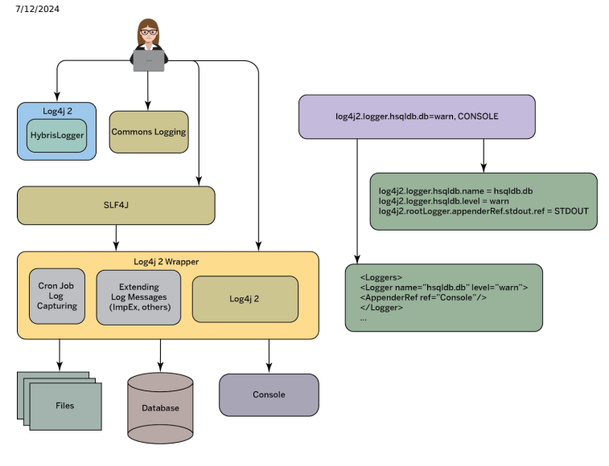
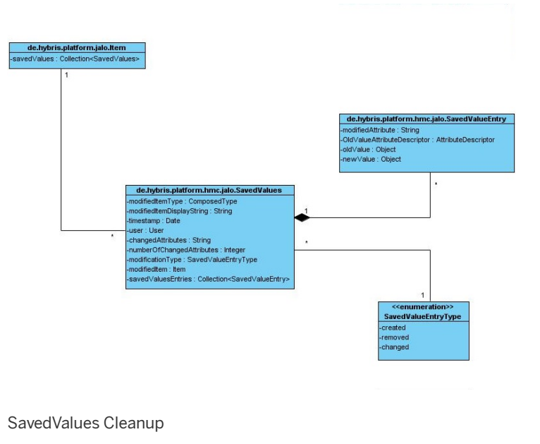

# Logging

Logging is an important part of software development that helps you to analyze the behavior of your applications.

Logging with Log4j 2 Through SLF4J
SAP Commerce Cloud comes prebundled with Apache Log4j 2. JDBC Logs from Database Statements SAP Commerce Cloud sends database statements to query and modify data in the database. You can create a record of these statements. The process of recording the statements is called JDBC logging. Item Attribute Modication History SAP Commerce Cloud has a built-in mechanism to keep track of modications of attribute values. These SavedValues store the original value of the attribute (before modication) and the new value (after modication). This provides a useful history upon which new features may be built.

Audit Logging Use audit logging to log selected events in a durable and tamper-proof way.

## Logging With Log4J 2 Through Slf4J

SAP Commerce Cloud comes prebundled with Apache Log4j 2.

Log4j 2 is the standard logging framework in SAP Commerce Cloud. It's recommended that you use Simple Logging Facade for Java (SLF4J) as the logging API for Log4j 2:
import org.slf4j.Logger; import org.slf4j.LoggerFactory; final Logger slf4jLogger = LoggerFactory.getLogger(LoggingFrameworksBridgeTest.class); slf4jLogger.error("slf4j error");

Apache Log4j

## Log4J 2 Conguration Elements

Congure Log4j 2 using loggers, appenders, and layouts.

There are three main conguration elements in Log4j 2:
loggers

appenders layouts

## Loggers

Loggers are objects that are responsible for capturing logging information from events. Congure loggers to ensure that the system logs all the relevant information. Whether a certain event triggers a certain logger depends on the event's importance called priority or log level. If the event's log level in Log4j 2 is equal to or higher than the logger's log level threshold, the logger prints out a message. If the event's log level is lower than the logger's log level, the logger isn't triggered. Log4j 2 uses the following log levels:
This is   For more    the SAP Help  3

| Log Level            | Description                                    | Triggered Log Levels                             |
|----------------------|------------------------------------------------|--------------------------------------------------|
| OFF                  | The highest log level that turns logging off   | OFF                                              |
| FATAL                | Severe errors that might stop the system       | OFF, FATAL                                       |
| ERROR                | Errors that aren't likely to stop the system   | OFF, FATAL, ERROR                                |
| WARN                 | Potentially damaging situations                | OFF, FATAL, ERROR, WARN                          |
| INFO                 | General information about the system           | OFF, FATAL, ERROR, WARN, INFO                    |
| DEBUG                | Detailed information about the system that can | OFF, FATAL, ERROR, WARN, INFO, DEBUG             |
| be used in debugging |                                                |                                                  |
| TRACE                | More detailed information about the system     | OFF, FATAL, ERROR, WARN, INFO, DEBUG, TRACE      |
| ALL                  | All levels                                     | OFF, FATAL, ERROR, WARN, INFO, DEBUG, TRACE, ALL |

As shown in the table, a logger set to the ALL level reports all events that are passed to it. A logger that is set to OFF reports events only of the OFF level. Loggers that are created without a log level inherit log levels from their closest parent logger.

Logging at the DEBUG, TRACE, and ALL levels may leak condential library data into the logs. To prevent libraries from leaking such data, do not enable these levels in production environments and other environments where loss of condentiality could have harmful effects. Enable the DEBUG, TRACE, and ALL levels selectively and to the extent absolutely necessary, for example only for specic loggers such as package names.

You can congure and create loggers in any order. It's also possible to create loggers whose parents haven't been created yet. A logger automatically puts itself in its correct place in the inheritance hierarchy once its ancestors are all there.

## Additivity Of Loggers

Child loggers that inherit logging settings from their parent loggers pass output to a selected logging destination twice or more due to the additivity of loggers in Log4j2. To avoid duplicated logging, disable additivity for selected loggers.

See the following example of two loggers for *<myBasePackagename>* and <myBasePackage>.*<extension>* packages:
log4j2.logger.*<myBasePackage>*=info, appconsole log4j2.logger.<myBasePackage>.*<extension>*=debug, appconsole For log4j2.logger.*<myBasePackage>*, the system runs every logging statement once. For log4j2.logger.

<myBasePackage>.*<extension>*, the system runs every logging statement twice - once for the global log4j2.logger. <myBasePackage> logger and once for the extension-specic log4j2.logger.<myBasePackage>.*<extension>* logger that inherits its settings from the log4j2.logger.*<myBasePackage>* parent logger. To disable logging data for log4j2.logger.

<myBasePackage>.*<extension>*, use the following property:
log4j2.additivity.<myBasePackage>.*<extension>*=false

## Conguring Your Log Environment

Congure Log4j 2 to enhance logging in SAP Commerce Cloud. You can congure Log4j 2 only through properties. For more information on setting properties, see Properties.

 Caution For the following properties, all logging must go to the default appender that passes information in the JSON format to the stdout and stderr log les. You cannot congure custom appenders as they aren't supported and doing so may cause unexpected server restarts.

log4j2.appender.*
log4j2.logger.*.appenderRefs.*
Do not use the log4j2.config.xml property as conguring Log4j 2 using XML les isn't supported by SAP Commerce Cloud.

## Using Mapped Diagnostic Context For Annotating Log Messages

Mapped diagnostic context (MDC) allows you to capture small amounts of custom diagnostic data. As it's supported by SLF4, you can use it to annotate or tag log messages. Use the log.contextMap eld in Kibana to see your MDCs. For more information, see Mapped Diagnostic Context (MDC) support .

## Upgrading To Log4J 2

SAP Commerce Cloud allows you to check whether your system still uses any Log4j 1.x conguration properties.

Use the following properties to check whether your system still uses any Log4j 1.x conguration properties:

log4j.deprecated.properties.warn=true - allows you to check whether your instance of SAP Commerce Cloud still uses any Log4j 1.x properties by printing a warning in your logs. The property is set to true by default.

log4j.deprecated.properties.print=false - allows you to print a list of Log4j 1.x properties in your logs that are still being used by the system. The property is set to false by default.
Restart your system to apply these properties. Replace any old Log4j 1.x properties with their Log4j 2.x equivalents to ensure that SAP Commerce Cloud logs all information correctly. See an example of a Log4j 1 conguration property:
log4j.logger.hsqldb.db=warn, CONSOLE
This setting can be represented by the following Log4j 2 properties:
log4j2.logger.hsqldb.name = hsqldb.db log4j2.logger.hsqldb.level = warn log4j2.logger.hsqldb.appenderRef.stdout.ref = STDOUT
For more information on migrating to Log4j 2 conguration, see Log4j 2 Conguration Format .

## Ignoring Log4J 2 Properties

Use the remove attribute to make SAP Commerce Cloud ignore selected Log4j 2 properties. To ignore selected Log4J properties, use the remove attribute, for example:
remove.log4j2.appender.jdbcConsoleLogger.layout.pattern=true Using the remove.log4j2.appender.jdbcConsoleLogger.layout.pattern=true property allows you to disable the log4j2.appender.jdbcConsoleLogger.layout.pattern property.

## Jdbc Logs From Database Statements

SAP Commerce Cloud sends database statements to query and modify data in the database. You can create a record of these statements. The process of recording the statements is called JDBC logging.

SAP Commerce Cloud uses JDBC to connect to databases. As a JDBC log contains information on statements, execution times, and other information, you can use it to identify and remedy performance bottlenecks on the database. You can decide how you want to store JDBC logs by choosing one of the following implementations of the logger class:

FileLogger JDBCSLF4JAwareLogger

## Understanding A Jdbc Log File (Filelogger)

In a JDBC log le, each line is an individual logged statement. Each line consists of a number of bits of information, delimited by the pipe character ( | ). This example full statement is broken down into multiple lines so that it's easier to read:
34|master|091106-15:01:04:136|1 ms|statement|SELECT item_t0.PK FROM tasks item_t0 WHERE item_t0.p_faile SELECT item_t0.PK FROM tasks item_t0 WHERE item_t0.p_failed =0 | PreparedStatementImpl:57:DataSourceImplFactory:108:ConnectionImpl:338:ConnectionImpl:627:FlexibleSearchEx FlexibleSearch:1854:FlexibleSearch:1515:FlexibleSearch:1366:FlexibleSearch:1357:DefaultFlexibleSearchServ DefaultSessionService:89:DefaultFlexibleSearchService:446:DefaultFlexibleSearchService:179:QueryBasedTask QueryBasedTasksProvider:102:ShufflingTasksProvider:31:BufferedTasksProvider:51:DefaultTasksProvider:45:De DefaultTaskService:1142:DefaultTaskService$Poll:1018:DefaultTaskService$Poll:969:AbstractTenant$5:2484:Th

By default, you don't get full logs like the one in the example. To get full logs, that is logs consisting of both your prepared statement and your actual statement with values, set db.log.sql.parameters to true. To get stack trace info, set db.log.appendStackTrace to true.

Each line of the JDBC log le consists of the following elds (from left to right):

| Field Name                                | Field Description                                                                                                                                                                                                                                                        | Value in Sample Line   |            |
|-------------------------------------------|--------------------------------------------------------------------------------------------------------------------------------------------------------------------------------------------------------------------------------------------------------------------------|------------------------|------------|
| Thread ID                                 | The ID of the thread that executed the                                                                                                                                                                                                                                   | 34                     |            |
| statement.                                |                                                                                                                                                                                                                                                                          |                        |            |
| Datasource                                | The ID of the used datasource.                                                                                                                                                                                                                                           | master                 |            |
| ID Start Time                             | Date and time when the statement was                                                                                                                                                                                                                                     | 091106-15:01:04:136    |            |
| started.                                  |                                                                                                                                                                                                                                                                          |                        |            |
| Elapsed                                   | Amount of time that the execution of                                                                                                                                                                                                                                     | 1 ms                   |            |
| Time                                      | the statement took.                                                                                                                                                                                                                                                      |                        |            |
| Category                                  | The category of the statement. Possible values: statement, commit, rollback.                                                                                                                                                                                             | statement              |            |
| Prepared                                  | Each statement sent to the database                                                                                                                                                                                                                                      |                        |            |
| statement                                 | has to be compiled. When executing numerous similar statements (for example, when the only difference is in parameters) prepared statements are used for better performance. The prepared statement is precompiled without parameters and then can be reused many times. | SELECT                 | item_t0.PK |
| FROM tasks item_t0 WHERE item_t0.p_failed | = ?                                                                                                                                                                                                                                                                      |                        |            |

| 7/12/2024 Field Name                      | Field Description                                                                                        | Value in Sample Line                                                                                                                                                                                                                                                                                                                                          |            |
|-------------------------------------------|----------------------------------------------------------------------------------------------------------|---------------------------------------------------------------------------------------------------------------------------------------------------------------------------------------------------------------------------------------------------------------------------------------------------------------------------------------------------------------|------------|
| SQL                                       | The actual SQL statement that was                                                                        |                                                                                                                                                                                                                                                                                                                                                               |            |
| statement                                 | executed on the database. Disabled by default. Set the db.log.sql.parameters=true property to enable it. | SELECT                                                                                                                                                                                                                                                                                                                                                        | item_t0.PK |
| FROM tasks item_t0 WHERE item_t0.p_failed | = 0                                                                                                      |                                                                                                                                                                                                                                                                                                                                                               |            |
| Stack trace                               | The actual stack trace. Disabled by default. Set the db.log.appendStackTrace=true property to enable it. | PreparedStatementImpl:57:DataSourceImplFactory:108:ConnectionImpl:338 FlexibleSearch:1854:FlexibleSearch:1515:FlexibleSearch:1366:FlexibleS DefaultSessionService:89:DefaultFlexibleSearchService:446:DefaultFlex QueryBasedTasksProvider:102:ShufflingTasksProvider:31:BufferedTasksPr DefaultTaskService:1142:DefaultTaskService$Poll:1018:DefaultTaskServi |            |

## Jdbc Slf4J Logger (Jdbcslf4Jawarelogger)

JDBCSLF4JAwareLogger acts as a wrapper and delegates all logging to SLF4J, which in turn uses Log4j 2 as an implementation. That allows you to customize log layout and dene where you want to store logs. There are two appenders congured for this logger: le, and console. In contrast to the JDBC Log File, some of the parameters are passed in context (by MDC - Mapped Diagnostic Context).

| Field name    | Parameter name    |
|---------------|-------------------|
| Datasource ID | jdbc-dataSourceId |
| Elapsed Time  | jdbc-elapsedTime  |
| Category      | jdbc-category     |
| Start Time    | jdbc-startTime    |

Here are the names of the parameters passed in context:
The information stored in the MDC can be exposed in the set layout, for example, in PatternLayout using the %X{parameterName}
placeholder (see https://logging.apache.org/log4j/2.x/manual/layouts.html ):
log4j2.appender.console.layout.pattern = %-5p [%t] %X{jdbc-dataSourceId} %c{1}] %m%n To enable or disable JDBC through SLF4J logging, use the db.log.active property. All messages are logged with the debug level. The debug level is enabled for JDBCSLF4JAwareLogger.

Here is the current log4j2 conguration for JDBCSLF4JAwareLogger:
log4j2.appender.jdbcConsoleLogger.type = Console log4j2.appender.jdbcConsoleLogger.name=JdbcConsoleLogger log4j2.appender.jdbcConsoleLogger.layout.type=PatternLayout log4j2.appender.jdbcConsoleLogger.layout.pattern=%-5p [%t] %d{HH:mm:ss.SSS} [%X{jdbc-dataSourceId}|%X{jdb log4j2.appender.jdbcFileLogger.type = File log4j2.appender.jdbcFileLogger.fileName=${HYBRIS_LOG_DIR}/jdbc.log log4j2.appender.jdbcFileLogger.name=JdbcFileLogger log4j2.appender.jdbcFileLogger.layout.type=PatternLayout log4j2.appender.jdbcFileLogger.layout.pattern=%tid|%X{jdbc-dataSourceId}|%X{jdbc-startTime}|%X{jdbc-timeE
log4j2.logger.jdbc-sl4j.name = de.hybris.platform.jdbcwrapper.logger.JDBCSLF4JAwareLogger log4j2.logger.jdbc-sl4j.level = debug log4j2.logger.jdbc-sl4j.additivity = false log4j2.logger.jdbc-sl4j.appenderRef.jdbcFileLogger.ref = JdbcFileLogger log4j2.logger.jdbc-sl4j.appenderRef.jdbcConsoleLogger.ref = JdbcConsoleLogger The congured JdbcFileLogger appender must be enabled and must have a dened layout pattern in order to use the JDBC Log Analysis function from SAP Commerce Cloud Administration Console:

%tid|%X{jdbc-dataSourceId}|%X{jdbc-startTime}|%X{jdbc-timeElapsed} ms|%X{jdbc-category}|%m%n

## Jdbc Slf4J Logger Tip

With db.log.active enabled with the default congured appenders, the log is stored on console and in the jdbc.log le. You can disable logging to these appenders and dene your own appender with, for example, the JSON format:
log4j2.logger.jdbc-sl4j.appenderRef.jdbcFileLogger.level=OFF log4j2.logger.jdbc-sl4j.appenderRef.jdbcConsoleLogger.level=OFF
log4j2.appender.jdbcFileJsonLogger.type = File log4j2.appender.jdbcFileJsonLogger.fileName=${HYBRIS_LOG_DIR}/jdbc.log log4j2.appender.jdbcFileJsonLogger.name=JdbcFileJsonLogger log4j2.appender.jdbcFileJsonLogger.layout.type=JsonLayout log4j2.appender.jdbcFileJsonLogger.layout.properties=true log4j2.logger.jdbc-sl4j.appenderRef.jdbcFileJsonLogger.ref = JdbcFileJsonLogger

## Enabling And Disabling Jdbc Logging

You can enable or disable JDBC logging by using SAP Commerce Cloud Administration Console, Java code, or through the conguration properties le. Enabling or disabling JDBC logging in SAP Commerce Cloud Administration Console has a run-time effect only - logging is set back to default after an SAP Commerce Cloud restart. Enabling or disabling JDBC logging by using Java code has a runtime effect only - logging is set back to default after an SAP Commerce Cloud restart.

Enabling or disabling JDBC logging through the conguration properties le has a persistent effect - logging is enabled or disabled after an SAP Commerce Cloud restart.

JDBC Logging Reduces Performance Because every single database statement is logged, the database performance is reduced with JDBC logging enabled. Enable JDBC logging only when needed.

Enabling JDBC Logging in SAP Commerce Cloud Administration Console In SAP Commerce Cloud Administration Console, you can enable or disable JDBC logging on the Monitoring Database JDBC logging page.

Enabling JDBC Logging Using Java Code To enable JDBC logging in your Java code, add the following line:
de.hybris.platform.util.Config.setParameter("db.log.active", "true");
To disable JDBC logging in your Java code, add the following line:
de.hybris.platform.util.Config.setParameter("db.log.active", "false");
See an example of how to enable and disable JDBC logging:
private void myMethod() {
This is   For more    the SAP Help  8 de.hybris.platform.util.Config.setParameter("db.log.active", "true"); myProductModel.setCode("ModelCode");
 modelService.save(myProductModel); de.hybris.platform.util.Config.setParameter("db.log.active", "false");
 }

## Enabling Jdbc Logging Through A Properties File

To ensure that the logging setting remains enabled or disabled persistently, set an appropriate property value in the local.properties le. To enable JDBC logging, use db.log.active=true. To disable JDBC logging, use db.log.active=false.

Specify a fully qualied class name of the logger class to the db.log.loggerclass cong property. You can choose one of the following implementations:
de.hybris.platform.jdbcwrapper.logger.FileLogger de.hybris.platform.jdbcwrapper.logger.JDBCSLF4JAwareLogger Here is an example:
db.log.loggerclass=de.hybris.platform.jdbcwrapper.logger.FileLogger

## Conguration Properties

Use properties to customize JDBC logging:

| Property              | Possible Value   | Description                                                                                                                                                                      |
|-----------------------|------------------|----------------------------------------------------------------------------------------------------------------------------------------------------------------------------------|
| db.log.sql.parameters | true / false     | When enabled, it logs a full sql statement with actual parameters. It's disabled in the default conguration to prevent leaking of condential data, such as passwords, into logs. |

## Related Information

Available Interceptors

## Item Attribute Modication History

SAP Commerce Cloud has a built-in mechanism to keep track of modications of attribute values. These SavedValues store the original value of the attribute (before modication) and the new value (after modication). This provides a useful history upon which new features may be built. SAP Commerce Cloud allows logging the modication of attribute values of SAP Commerce Cloud items.

As every single attribute value modication may be logged, the database tables in which the logs are stored might grow to a very large size over time. If you don't need the history of SavedValues, you can remove the SavedValue-related database table content from time to time.

## Related Information

Creating Strategy to Process Instances This is   For more    the SAP Help  9

# Viewing Attribute Modications In Backoffice

Follow the steps to view SavedValues modications using Backoffice.

## Context

If you modify the value of a SAP Commerce Cloud item attribute in Backoffice, the original value is stored in the SAP Commerce Cloud database. This process is run automatically, you do not have to perform any manual steps. To review the changes made on an attribute values:

## Procedure

1. Log in to Backoffice.

2. Go to Catalog Products .

3. Double-click the name of the item that contains the modied attribute values that you want to see.

4. Navigate to the Administration tab.

Logs for attribute changes are shown in the Changes Last changes section. You can see that the log includes changes in two attributes, maxOrderQuantity and minOrderQuantity.

5. Double-click a log. A window opens with names of modied attributes.

6. Double-click a given attribute to display the actual changes made to the attribute values.

## Technical Discussion

This section gives an overview of how to use the SavedValues functionality on a technical level.

Every SAP Commerce Cloud item can contain a collection of SavedValues. A single SavedValues consists of timestamp data and a collection of SavedValueEntries. Each SavedValueEntry stores a single individual attribute value modication. A SavedValue can hold several SavedValueEntries as several attributes can be modied at once (for example, using ImpEx).

You can decide when you want Platform to clean up existing SavedValues. The current default cleanup of SavedValues works in the following way:

The number of maximum SavedValues that are persisted for an instance is determined by the Platform property: hmc.storing.modifiedvalues.size. Current threshold for SavedValues creation is 20. It means that if the instance is modied for the 21 time and new SavedValues is created, the oldest SavedValues is automatically removed.
It is possible to use the CleanupSavedValuesStrategy to remove all SavedValues, which are over the threshold dened in the Platform hmc.storing.modifiedvalues.size property. This strategy uses the same threeshold value as set in hmc.storing.modifiedvalues.size property. It means that if you did not set a value for this property lower then currently set, then executing strategy does not delete any SavedValues, because the existing number of SavedValues did not exceed the current threshold. In other words, the CleanupSavedValuesStrategy is useful when used in the following way:

You modify the hmc.storing.modifiedvalues.size property to have lower threshold then currently set. It does not mean that after server startup SavedValues that were created before and already exceed the new threshold are automatically removed. Below is an example of new threshold value:
local.properties hmc.storing.modifiedvalues.size=15 You should assume that there are already SavedValues that were created before modication of the default threshold. SavedValues that are over the new threshold are removed:
After next modication of the specic instance for which SavedValues were created.

When running a cron job with assigned cleanupSavedValuesPerformable job.

## Audit Logging

Use audit logging to log selected events in a durable and tamper-proof way. Audit logging allows you to log events in Backoffice and Administration Console, such as user logins, password changes, property value modications, database operations, closed sessions, ImpEx web imports, Flexible or SQL queries, or started, completed, and aborted cron jobs. SAP Commerce Cloud passes your logs to your logging tool where you can view detailed information about your events, including their types and timestamps. You can use the logs to reproduce your users' actions and track any undesired and suspicious activities to ensure security and data integrity of SAP Commerce Cloud. See examples of logs in the out-of-the-box conguration of audit logging:
Successful Login:
{ "message": "successful user authentication", "contextMap": { "audit.actionName": "successful user authentication",
 "audit.data.loginToken": "true",
 "audit.data.user": "8796125888516",
 "...": "..." }, "...": "..." }
Failed Login Attempts:
{
 "message": "failed user authentication",
 "contextMap": { "audit.actionName": "failed user authentication",
 "audit.data.user": "8796158656516",
 "audit.data.userLoginDisabled": "false",
 "...": "..." },
 "...": "..." }
Password Changes:
{ "message": "user's password changed",
 "contextMap": { "audit.actionName": "user's password changed",
 "audit.data.user": "8796093317124", "audit.user": "8796125888516", "...": "..." },
 "...": "..."
}
 Note In the "Password change" example, audit.user marks the user who changed the password of audit.data.user.

Logging Level Changes in Administration Console:
{
 "message": "log level changed", "contextMap": { "audit.actionName": "log level changed", "audit.data.loggerName": "de.hybris.platform.metrics.dropwizard.Slf4jMdcMetricsReporter",
 "audit.data.newLogLevel": "INFO",
 "audit.data.prevLogLevel": "DEBUG", "...": "..." },
 "...": "..."
}
Running Scripts in Administration Console:
{ "message": "script execution started",
 "contextMap": { "audit.actionName": "script execution started", "audit.data.commit": "false", "audit.data.engineName": "groovy",
 "audit.data.scriptSignature": "f396bef081a275a9ab0fd079984623005ada4ac07c710807ed1cb39e11ce3f89",
 "...": "..." }, "...": "..." }
Editing Property Values:
{
 "message": "property edited",
 "contextMap": { "audit.actionName": "property edited", "audit.data.propertyName": "property.example.enabled", "audit.data.newPropertyValue": "true",
 "audit.data.prevPropertyValue": "false",
 "...": "..."
 }, "...": "..." }
Editing Values of Sensitive Properties:
{
 "message": "property edited", "contextMap": {
 "audit.actionName": "property edited", "audit.data.propertyName": "property.password.exmaple", "audit.data.newPropertyValue": "notAuditableValue", "audit.data.prevPropertyValue": "notAuditableValue",
 "...": "..." },
 "...": "..." }
Database Operations:
{ "message": "DB_AUDIT",
 "contextMap": { "audit.actionName": "DB_AUDIT",
 "audit.data.PK": "8796499378206", "audit.data.changeType": "CREATION", "audit.data.typePK": "8796099575890", "...": "..."
 }, "...": "..."
}
{
 "message": "DB_AUDIT", "contextMap": { "audit.actionName": "DB_AUDIT", "audit.data.PK": "8796102394357",
 "audit.data.changeType": "MODIFICATION",
 "audit.data.typePK": "8796105080914", "...": "..." },
 "...": "..."
}
Closed Sessions:
{ "message": "session closed",
 "contextMap": { "audit.actionName": "session closed", "...": "..." },
 "...": "..."
}

SAP Commerce Cloud also uses this action type to log background threads that have expired, for example after running cron jobs or tasks.

Changed User in Sessions:
{ "message": "session user changed",
 "contextMap": {
 "audit.actionName": "session user changed",
 "audit.data.newUser": "8796093054980", "audit.data.prevUser": "8796093087748", "...": "..." },
 "...": "..."
}
ImpEx Web Imports:
{ "message": "ImpEx Import started", "contextMap": { "audit.actionName": "ImpEx Import started",
 "audit.data.contentSignature": "b5ced15d392d0270fef887bb03b9fe47eda915f6caecab33be68c44ed3c45f4c"
 "audit.data.distributedMode": "false", "audit.data.enableCodeExecution": "false", "audit.data.fileName": "test.impex", "audit.data.importMode": "script",
 "audit.data.maxThreads": "3", "...": "..."
 }, "...": "..." }

SAP Commerce Cloud displays the audit.data.fileName attribute only for les that are imported through the Import script mode. The attribute is not included in the Import content mode.

FlexibleSearch or SQL Queries:
 "contextMap": { "audit.actionName": "Executed search from console",
 "audit.data.commit": "false", "audit.data.dataSourceId": "readonly",
 "audit.data.isDataSourceReadOnly": "true", "audit.data.maxCount": "200", "audit.data.queryType": "Flexible Query", "audit.data.resultCount": "60",
 "...": "..."
 },
 "...": "..."
}
Started and Finished Cron Jobs:
{ "message": "Starting CronJob",
 "contextMap": { "audit_data_cronJob": "cronJobHistoryRetentionCronJob",
 "audit_data_job": "cronJobHistoryRetentionJob", "audit_actionName": "Starting CronJob", "...": "..." },
 "...": "..."
} { "message": "Finishing CronJob", "contextMap": {
 "audit_data_cronJob": "cronJobHistoryRetentionCronJob",
 "audit_data_cronJobResult": "SUCCESS",
 "audit_data_job": "cronJobHistoryRetentionJob", "audit_data_cronJobStatus": "FINISHED", "audit_actionName": "Finishing CronJob", "...": "..."
 },
 "...": "..." }

## Audit Logging Api

Implement audit logging using the API methods exposed by Platform.

de.hybris.platform.audit.AuditableActions is the entrypoint of audit logging. It contains multiple methods that you can use to both create and audit actions.

Every event that is audited is represented by an instance of de.hybris.platform.audit.AuditableActions.Action. Every instance of this class contains the actionName eld with an action description and the actionId eld with a unique action ID. To adhere to data safety regulations, use simple descriptions in the actionName eld without any contextual information, for example
"successful user authentication" or "new logger created". Store contextual data as action attributes in form of key-value pairs with the key being an attribute's name.

## Creating Auditable Actions

To create auditable actions, use of the three available approaches:
For simple actions without any attributes:
Action a = AuditableActions.action("my action name");
For actions with contextual data:
Action a1 = AuditableActions.withAttribute("first attribute", "value1") .withAttribute("second attribute", "value2") .action("my action name");
This is   For more    the SAP Help  15
// name can be provided first, if you prefer, but it will be impossible // to change it later Action a2 = AuditableActions.withName("my action name") .withAttribute("first attribute", "value1")
 .withAttribute("second attribute", "value2") .action();
For more complex cases with attributes collected incrementally, you can instantiate the action builder:
ActionBuilder builder1 = AuditableActions.builder(); builder1.withAttribute("first attribute", "value1");
builder1.withAttribute("second attribute", "value2"); Action a1 = builder1.action("my action name");
// if you define name in the builder, it will create NamedActionBuilder NamedActionBuilder builder2 = AuditableActions.withName("my action builder"); builder2.withAttribute("first attribute", "value1");
builder2.withAttribute("second attribute", "value2"); Action a2 = builder2.action();
// you can also provide name in ActionBuilder and therefor switch to NamedActionBuilder ActionBuilder builder3 = AuditableActions.builder();
builder3.withAttribute("first attribute", "value1");
NamedActionBuilder namedBuilder3 = builder3.withName("my action name");
namedBuilder3.withAttribute("second attribute", "value2"); Action a3 = namedBuilder3.action();
All actions created through the action builder have a unique actionId and technically represent different events:
NamedActionBuilder namedActionBuilder=AuditableActions.withName("my action")
.withAttribute("first attribute","value1");
Action a1=namedActionBuilder.action(); Action a2=namedActionBuilder.action(); // a1 != a2

## Auditing Actions

To audit actions, invoke de.hybris.platform.audit.AuditableActions.audit(action). For convenience, you can use a method that accepts the NamedActionBuilder builder:
AuditableActions.audit(AuditableActions.withName("my action").withAttribute("attribute","value")); //this is equal to NamedActionBuilder builder=AuditableActions.withName("my action").withAttribute("attribute","value"); AuditableActions.audit(builder.action());

## Audit Logging Log4J 2 Conguration

Learn about Log4j 2 conguration in audit logging.

In the default SAP Commerce Cloud conguration, SFL4J consumes all audited actions and passes them as logging messages to Log4j 2. As a result, Log4j 2 prints audited actions as log entries. The Log4j 2 appender conguration determines which entry is printed. For more information on Log4j 2 conguration, see Log4j 2 Conguration Elements. SFL4J passes actions' content to Log4j 2 as:

| Audit Logging Conguration                                                            | Mapped Diagnostic Context Conguration        |
|--------------------------------------------------------------------------------------|----------------------------------------------|
| action name                                                                          | a log message and the audit.actionName value |
| action ID                                                                            | the audit.actionId value                     |
| action attributes (if present)                                                       | the audit.data.<attribute_name> values       |
| This is custom documentation. For more information, please visit the SAP Help Portal | 16                                           |

| 7/12/2024 Audit Logging Conguration   | Mapped Diagnostic Context Conguration   |
|---------------------------------------|-----------------------------------------|
| session ID                            | the audit.sessionId value               |
| session user                          | the audit.user value                    |
| AUDIT log marker                      | Not applicable                          |

See an example of a log entry in the JSON format:
{ "thread": "hybrisHTTP16",
 "level": "INFO", "loggerName": "de.hybris.platform.audit.actions.impl.Slf4jAuditableActionHandler",
 "marker": { "name": "AUDIT" }, "message": "....",
 "contextMap": { "RemoteAddr": "[82.177.130.131] ",
 "Tenant": "", "audit.actionId": "14903549-6f8a-4079-82e9-9c344e6f6662", "audit.actionName": "....", "audit.sessionId": "s57990302934864",
 "audit.user": "8796125888516"
 }, "...": "..." }

## Audit Marker

You can easily nd your audit logs by searching for the AUDIT log marker. For example, you can use the following lter in Kibana:
logs.marker.name: AUDIT

## Related Information

PatternLayout

## Logging Changes In Conguration Properties

Congure audit logging for changes in conguration properties.

In the default SAP Commerce Cloud conguration, audit logging doesn't log values of properties edited in Administration Console:
{ "message": "property edited", "contextMap": { "audit.actionName": "property edited",
 "audit.data.propertyName": "property.example.enabled", "audit.data.newPropertyValue": "auditDisabled",
 "audit.data.prevPropertyValue": "auditDisabled", "...": "..." }, "...": "..."
}
If you want to enable logging of modied property values, ensure that all properties containing sensitive data such as passwords are hidden or removed through de.hybris.platform.servicelayer.config.ConfigurationViewService (or de.hybris.platform.servicelayer.config.impl.SecureConfigurationViewService in the default SAP Commerce Cloud conguration) and the properties that start with configuration.view, for example:
configuration.view.strategy, This is   For more    the SAP Help  17

configuration.view.blacklist.[name],
configuration.view.regex.rule.[name].
For more information on blocklisting properties, see Conguration Data Visibility in Administration Console.

To enable logging of changes in property values, add the following property to your local.properties le:
hac.configuration.view.audit.property.values=true

## Logging Database Events

Audit logging allows you to log information about selected database operations.

The de.hybris.platform.persistence.audit.DBAuditHandler interface with the default de.hybris.platform.persistence.audit.impl.DefaultDBAuditHandler implementation allows you to log item modications in your database.

In contrast to Generic Audit, audit logging doesn't store the content of database operations. The only details that it stores are the create, update, and delete operation types, modied item PKs, and type PKs along with the standard audit logging elements such as user names and timestamps.

## Disabling Database Logging

Disable database logging for selected sessions or types. In the default conguration, audit logging logs all operations that are carried out in the database. However, in some situations such as database outages, SAP Commerce Cloud might log operations that haven't been persisted successfully. To ensure that your logs don't contain any redundant information, you can disable database logging for sessions and types:
To disable logging for your current session, for example when running background administration tasks, use the de.hybris.platform.persistence.audit.internal.DBAuditEnablementService.disableAuditInSession()
and de.hybris.platform.persistence.audit.internal.DBAuditEnablementService.enableAuditInSession()
methods.

To disable logging for selected types, use the dbaudit.<itemname>.disabled=true property, for example:
dbaudit.processtask.disabled=true Note Use lowercase for item names in the dbaudit.<itemname>.disabled=true property.

Restart your server after applying the dbaudit.<itemname>.disabled=true property.

This page may contain information about features that were only introduced in an update release. Ensure you are always on the latest release to be able to make use of all xes, security updates, and features. For a complete list of what was introduced in each update release, see What's New.

Database logging is disabled by default for the standalone mode and tests, for example, for the ant initialize, ant update, and ant integrationtest commands. To enable it, add the following property to your local.properties le:
dbaudit.disabled.for.standalone=false