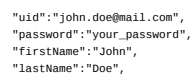

# Omni Commerce Connect

The Omni Commerce Connect (OCC) API exposes a broad set of commerce and data services. It enables you to integrate SAP Commerce Cloud functionality anywhere in your application landscape.

## Occ V2 Deprecation

As of 2205 release, Addons-based OCC v2 is deprecated. This should not cause any disruptions because its implementations are still supported. However, we encourage you to use OCC v2 extension-based implementation wherever possible. For more information, see Deprecated Accelerator UIs and OCC Template Extensions - Deletion in SAP Commerce Cloud 2211.

## Occ Features

Use OCC for secure customer and cart transactions based on customer sessions in detached front-end applications such as the Spartacus project single-page accelerator, or other third-party and custom front-end solutions. The main benefits of OCC include the following:
Ease of reuse of commerce processes and data across all touch points, increasing the speed and lowering the costs of providing new transactional interfaces.

It is not restricted to human user interfaces; you can easily integrate with other systems and even provide interfaces to partners and other organizations.

## Authorization

The OAuth 2.0 authorization framework is the default authorization framework for the commerce driven OCC Web Services under the commercewebservices extension. The key benet of using OAuth 2.0 (compared to basic authentication, even over HTTPS) is that the API client does not have to save or, in some cases, even obtain the user's credentials. Instead, access tokens are returned to the client that can use refresh tokens to obtain new access tokens once they have expired.

For details on OAUTH 2.0, refer to OAuth 2.0.

## Functionality And benefits

OCC exposes key commerce functionality to API clients, including the following:
Detailed product information

Cart details Order details Fast and optimized search Product reviews Points of service and stock levels Secure user administration Customer data Promotions Vouchers
While many OCC APIs are available within SAP Commerce Cloud, you can also develop custom functionality by using the yocc extension template to create new OCC extensions for use with OCC APIs.

## Enabling Interactive Occ Rest Api Documentation

OAuth clients need to be dened and authorized to enable the interactive OCC REST API documentation.

## Context

Interactive OCC REST API Documentation is currently supported in B2C Accelerator.

## Procedure

1. Register a user on your storefront.

2. Open the ImpEx Import page in SAP Commerce Cloud Administration Console:
https://localhost:9002/console/impex/import.

3. Copy the following ImpEx data:
INSERT_UPDATE OAuthClientDetails;clientId[unique=true] ;resourceIds ;scope ;au ;client-side ;hybris ;basic ;im ;mobile_android ;hybris ;basic ;au This ImpEx data provides you with a user called mobile_android, and a corresponding password, secret. This data is used to enable the interactive calls in the OCC REST API documentation.

4. Paste the ImpEx data into the Import content window, then click Import content. 5. Copy the following ImpEx data:
INSERT_UPDATE OAuthClientDetails;clientId[unique=true] ;resourceIds ;scope ;au ;trusted_client ;hybris ;extended ;au This ImpEx data provides you with a user called trusted_client with a corresponding password. This data is used to enable the interactive calls in the OCC REST API documentation that require extended permissions.

6. Paste the ImpEx data into the Import content window, then click Import content. 7. Open the interactive OCC REST API documentation in your web browser by accessing the following link:
http://<hostname>:<port>/occ/v2/swagger-ui.html.

For example, if you have a storefront installed on your local machine, you can access the OCC REST API documentation with the following link: https://localhost:9002/occ/v2/swagger-ui.html.

This is   For more    the SAP Help  3

8. Click Authorize at the top of the OCC REST API documentation web page.
9. In the Available authorizations window that appears, enter the credentials of your storefront user in the Username and Password elds.

10. In the ClientId eld that appears, enter mobile_android, and in the Client_secret eld, enter secret.

11. Select the basic checkbox and click Authorize.

The steps that follow are for authorizing the trusted_client user.

12. Click Authorize at the top of the OCC REST API documentation web page. 13. In the Available authorizations window that appears, scroll down to the second oauth2_client_credentials (OAuth2, application) section.

14. In the ClientId eld that appears, enter trusted_client, and in the Client_secret eld, enter secret.

15. Select the extended checkbox and click Authorize.

## Making Rest Calls In The Interactive Occ Rest Api Documentation

The interactive OCC REST API documentation for commerce web services allows you to try out REST API calls directly in the documentation page. If you make changes to your storefront, the changes are reected in the response body of any REST API calls that you make.

## Context

OAuth clients need to be dened and authorized to enable the interactive OCC REST API documentation. For more information, see Enabling Interactive OCC REST API Documentation.

## Procedure

1. Install B2C Accelerator.

2. Open the interactive OCC REST API documentation in your web browser by accessing the following link:
http://<hostname>:<port>/occ/v2/swagger-ui.html.

For example, if you have a storefront installed on your local machine, you can access the OCC REST API documentation with the following link: https://localhost:9002/occ/v2/swagger-ui.html 3. Click on any controller. For example, click on the Carts controller.

All of the available methods for that controller appear.

4. Click on any method. For example, click on the Get method of the Carts controller.

All of the information related to that method appears.
5. In the baseSiteId eld, enter the name of your storefront, such as electronics or apparel-uk.

6. In the userId eld, enter the username of the user that you registered in your storefront.

This user is created as part of the procedure for Enabling Interactive OCC REST API Documentation.

Not all methods require a userId. For example, the methods for the Promotions controller only require the baseId.

7. Click Try it out!

The REST call is made, and the response is displayed in the responses section.

## Occ Calls Security

The OCC calls security is ensured by highly congurable Spring security mechanisms.

## General Information

OCC calls are secured by standard, highly congurable Spring security mechanisms. A user who gains access to the application is called a principal. It does not have to be a real user, it can be an external system like a backend or frontend application, or a mobile application. It is important to distinguish between authentication and authorization:
Authentication means checking provided credentials. If credentials are valid, then the proper roles are assigned to a principal.

Authorization means deciding if a principal can perform a given action. This is determined based on the assigned roles of the principal and also on other constraints, for example secure communication channel.
In order to simplify authentication and authorization, OCC uses a standard OAuth2 protocol. The main purpose is to enable longterm access to the principal and differentiate security rules depending on the type of client application. The authorization process takes place separately in two layers:
HTTP layer Service (business) layer Each layer applies its own set of rules and constraints.

## Occ User Roles

The security of OCC calls is based mainly on user roles. These roles are assigned to the principal depending on the authentication type:

| Authentication Type   | Possible Roles                                                                                                                                                                                                                                                                                                                                                                            |
|-----------------------|-------------------------------------------------------------------------------------------------------------------------------------------------------------------------------------------------------------------------------------------------------------------------------------------------------------------------------------------------------------------------------------------|
| Anonymous             | A non-authenticated principal is assigned a built-in ANONYMOUS role by default.                                                                                                                                                                                                                                                                                                           |
| Clients               | Every client application that was authenticated using an OAuth2 token in the client credentials ow is assigned a specic role depending on the client denition. When dening the clients remember to assign either the ROLE_CLIENT or ROLE_TRUSTED_CLIENT to them, because these roles allow client access to the ycommercewebservices extension. For details see: Conguring OAuth Clients. |
| Customers             | Users who were authenticated using the OAuth2 token in the password ow are assigned a list of roles that are received from a service layer in the same way as it works in the whole application. By default, CUSTOMERGROUP and CUSTOMERMANAGERGROUP roles are used.                                                                                                                       |
| Guests                | Anonymous users who provided their own email address. It can be done by calling /{baseSiteId}/users/{userId}/carts/{cartId}/email. For such users, a built-in GUEST role is assigned.                                                                                                                                                                                                     |

## Security Spring Conguration

The OAuth2 Resource Server conguration and other security aspects are dened in the
/commercewebservices/web/webroot/WEB-INF/config/common/security-spring.xml le and in conguration les specic for webservices version :/commercewebservices/web/webroot/WEB-INF/config/v2/security-v2spring.xml.

OAuth conguration is stored in the Platform. You can congure the server settings in the project. properties le of the oauth2 extension. For details see OAuth2.

To make Spring Security work, you have to add the springSecurityFilterChain to the web services lter chain as shown below in the conguration for webservices.

/commercewebservices/web/webroot/WEB-INF/config/v2/filter-config-v2-spring.xml
...

<bean id="commerceWebServicesFilterChainV2" class="de.hybris.platform.servicelayer.web.Plat
<constructor-arg>
<ref bean="commerceWebServicesFilterChainListV2" />
</constructor-arg>
</bean> <alias name="defaultCommerceWebServicesFilterChainListV2" alias="commerceWebServicesFilterC <util:list id="defaultCommerceWebServicesFilterChainListV2">
<!-- filter that catches and resolves exceptions thrown from other filters --> <ref bean="exceptionTranslationFilter" /> <!-- generic platform filters --> <ref bean="corsFilter"/> <ref bean="log4jFilter" /> <ref bean="restSessionFilterV2" /> <!-- occ v2 WebAppMediaFilter --> <ref bean="polyglotPersistenceCallbackFilter"/> <ref bean="commerceWebServicesV2WebAppMediaFilter" /> <!-- commerceWebservices filters --> <ref bean="baseSiteMatchingFilter" /> <!-- Security --> <ref bean="springSecurityFilterChain" /> <ref bean="userMatchingFilter" /> <!-- Anonymous Consents --> <ref bean="commerceWebServicesConsentFilterV2"/> <!-- Matching filters --> <ref bean="commerceWebServicesEurope1AttributesFilterV2" /> <ref bean="commerceWebServicesSessionLanguageFilterV2" /> <ref bean="commerceWebServicesSessionCurrencyFilterV2" /> <ref bean="cartMatchingFilter" /> <!-- Guest Role --> <ref bean="guestRoleFilterV2" />
This is   For more    the SAP Help  6
...

## Related Information

Managing Users and User Groups Managing and Checking Access Rights OAuth 2.0

## Occ Extension-Based Architecture

OCC can provide commerce-driven RESTful web services. OCC Extensions allow you to extend the new functionality of OCC.

OCC extensions depend on commercewebservices. OCC extension names end with occ, such as acceleratorocc and b2bocc.

OCC extensions don't require any additional commands for installation. They are imported into the Spring web context of commercewebservices.

Dependencies Between Extensions

The example xyzocc OCC extension depends on commercewebservices. OCC extension classes are located in the /src directory and can't inherit from classes in the /web/src directory of commercewebservices.

## Overlapping Paths

For an OCC extension, however, all controller endpoints must have unique paths. Any endpoints that are in conict with existing endpoints must be changed to have a unique path. The conguration property occ.rewrite.overlapping.paths.enabled can be used as a solution. When this property is set to true, the specied extension has to provide a unique path for its controller endpoints, that can be in conict with endpoint in other extensions. For example: /*<baseSiteId>*/users/*<userId>*/orders becomes /*<baseSiteId>*/orgUsers/*<userId>*/orders

## Site Channel Restrictions

There is a restriction that prevents inappropriate access from one site to the endpoints of another site. For example, it can prevent calling B2B endpoints in context of B2C sites. You can apply the restriction on controller endpoints by using the annotation. This annotation contains a conguration property used to read a set of allowed site channels for this endpoint.

## Creating An Occ Extension For Occ Web Services

Learn how to create an OCC extension for the OCC Web Services.

## Overview

The commercewebservices extension exposes a part of the Commerce Facades as REST-based web services. As the Commerce Web Services are based on the standard Spring MVC, you can easily customize or extend them by creating new occ extensions.

## Directory Structure Of An Occ Extension

An OCC extension has a standard extension directory structure, but without the web part, as it's not a web extension. The main structures are listed in the following table:

| OCC extension directory structure (new)       | Description                                                                                                                                                            |
|-----------------------------------------------|------------------------------------------------------------------------------------------------------------------------------------------------------------------------|
| /src                                          | REST Controller classes and other related classes are located in the /src OCC extension.                                                                               |
| /resources/occ/v2/<extension_name>/messages   | Localized messages of an OCC extension are loaded from the classpath.                                                                                                  |
| /lib                                          | All libraries are located in the main/lib directory.                                                                                                                   |
| /resources/impex                              | ImpEx les in OCC extension aren't loaded automatically unless they follo conguration convention. For more information, see ImpEx Import for Esse Data.                 |
| /resources/occ/v2/<extension_name>/web/spring | Spring bean denitions of OCC extension located in/resources/occ/v2/<extension_name>/web/spring/<exte web-spring.xml le are imported into the web context of commercewe |

## Occ Extensions Are Not Web Extensions

An OCC extension isn't a web extension and has no web context. It extends the functionality of OCC by adding new REST controllers, Spring beans, and localized messages. REST controller classes and other OCC extension classes are located in the main /src directory. In the Spring XML conguration of the commercewebservices extension, there is an import statement that loads beans denitions from all OCC extensions.

<import resource="classpath*:/occ/v2/*occ/web/spring/*-web-spring.xml"/>

The XML conguration le import statement containing bean denitions must meet the following requirements:

The conguration le must be located in the /resources/occ/v2/<*occ>/web/spring directory, where <*occ>
points to a directory with the same name as the OCC extension that ends in occ, for example xyzocc.

The name of the conguration le must end in -web-spring.xml.
The section below instructs you on how to create an OCC extension.

Generating an occ extension from the yocc extension template In order to generate an occ extension from yocc extension template perform the following steps:
1. Generate the occ extension by using extgen and the yocc extension template. The names of OCC Extensions need to end with"occ", for example xyzocc.

 Note For details see Creating a New Extension and yoccaddon Extension.

2. Reference the new extension xyzocc in the config\localextensions.xml le:
<extensions> ... <extension name="xyzocc"/> </extensions> 

## Extending The Rest Api

To expose new calls, you need to dene a Controller class with the appropriate methods. A Controller should be created in the /src directory. If it is created in package: <xyzoccPackage>.controllers (for example de.hybris.platform.xyzocc.controllers then it is automatically added to Commerce Web Services Spring web context.

If the controller is not created in the <xyzoccPackage>.controllers package, the spring web context has to be adjusted as described in the Extend Commerce Services section. @Controller @RequestMapping(value = "/{baseSiteId}/newResource") public class NewController { @RequestMapping(method = RequestMethod.GET) @ResponseBody public NewResourceWsDTO getNewResource() { return new NewResourceWsDTO("newSampleResource"); } } 
After reference the new occ extension xyzocc with such dened controller, rebuild SAP Commerce.

Then it should be possible to call the following request:
https://localhost:9002/occ/v2/{baseSiteId}/newResource

## Note Related Information

Generating Beans and Enums

## Commercewebservices Local Media Serving

The Platform comes with two lters for serving local media:
MediaFilter: congured in the web.xml le of the mediaweb web application; any requests for non-secured media
(/media endpoint) are handled by this lter,

SecureMediaFilter congured separately for each web application (it should be added to PlatformFilterChain).
This approach leads to inconsistency, because the non-secured media are handled by the mediaweb application, whereas the secured ones are handled separately by each web application that needs them. A solution to that is the WebAppMediaFilter, which removes the inconsistency by serving both non-secured and secured media, however provided that each and every web application is congured separately.

## Updating Image Url

The commercewebservices rest services /products endpoint request provides ImageData with an url attribute that has been generated by the LocalMediaWebURLStrategy (begins with /medias). To ensure compatibility with our WebAppMediaFilters, we needed to modify the url by adding /occ/v2 prex for the url attribute value.

## Wsdto Object Mapper

DTO mapping has been implemented with Orika mappers. To achieve our goal, we've added the implementation of AbstractCustomMapper, which is adding /occ/v2 prex for the url attribute value.

Sample response body GET /products/123?fields=code,images(url)
{ "code" : "123", "images" : [ { "url" : "/occ/v2/medias/?context=..." } ] }

## Media Serving

Having updated the url in the response body, we had to set up a WebAppMediaFilter for commercewebservices to handle media requests. To deal with that, we've registered a WebAppMediaFilter spring bean and added it to the lter chains for commercewebservices servlet.

To serve media in OCC, you need to add the following congurations to either the local.properties le or the project.properties le in the commercewebservices extension.

allow.custom.mediaweb.webroot=true mediaweb.webroot=/v2/medias 

URLs that begin with "/v2/medias" will all be processed by the media lter, which prevents the use of URLs with this specic pattern for other purpose.

## Occ Api Implementation

Get an overview of how the SAP Commerce Cloud OCC API is implemented, and learn what you need to know to extend it with your own custom API implementation. OCC provides a consistent way for web services to communicate with the platform commerce layer. Its main purpose is to expose existing commerce layer functionality to the world of web services. OCC web services are as transparent as possible, but contain some additional elements such as the separate cache, the exception handling mechanism, the authentication framework, and the attribute mapper.

## Commercewebservicescep Module

The Commercewebservicescep module contains the following extensions:
commercewebservices extension

commercewebservicestests extension acceleratorocc extension
The acceleratorocc extension is an occ extension. This occ extension depends on the acceleratorservices extension

and is required to ensure advanced payment functionality using CIS services.

This is the main extension of the OCC module. The most important part of this extension is the advanced webservices application built on the Spring MVC framework. The calls to the specic resources are executed by a method using a request to the controller. A standard ow is as follows:
1. The request comes to commerce web services controller and is in most cases passed directly to commerce facades
(sometimes additional validation is required). It supports the following types of requests:
GET - a request for data which triggers facade methods that look for and retrieve proper information.

POST, PUT, PATCH - requests for creating and updating items, which can be sent either as separate URL parameters or with the use of RequestBody approach. Usually, the create/update requests are additionally validated in the OCC module. HEAD - a request that can be used to retrieve only the number of requested items information - this number is set in the response header.
2. Once the data object is retrieved from the commerce facades, it is converted to WsDTOs (this way web services are isolated from data object changes in the commerce layer).

3. Data objects then send a response to the call in XML or JSON format (assuming there are no errors or exceptions).

The extension also has some additional features. The local cache is built on the top of Ehcache. The cache is enabled on specic controller calls.

The commercewebservices extension uses authentication mechanism based on the OAuth2 framework solution implemented in the platform. For further information on OAuth2 see OAuth 2.0. Additionally, there are several lters and interceptors that are used for different purposes like cache control, base site and customer verication, setting up request context and session attributes. Although the commercewebservices is stateless, in the scope of a single request there is still a session created and used underneath.

## Commercewebservicestests Extension

Although the junit and integration tests are stored in the commercewebservices extension, the extended tests suite ofcommercewebservices module is kept in a separate extension called the commercewebservicestests extension. This extension contains its own test data set used during test execution. Tests for commercewebservices extension are written in groovy. These are modular tests, which perform different operations on tested URL resources and verify the results. Using groovy tests is convenient for web services testing as not only single calls are tested, but also complex ows such as the checkout process. There is a separate test suite written in Spock, a testing framework for java and groovy applications. Spock tests have slightly higher level of abstraction than pure groovy tests, but also are easier to maintain and eventually provide a quicker way of testing the webservices application.

## Commercewebservicescommons Extension In Commercewebservices Module

The commercewebservicescommons extension is in Commercewebservices module. This extension contains web services cache control, data mapping, errors denitions and some other elements. It can be then easily extended or modied using a customer occ extension. A few new platform types have been dened in the commons extension and all of them are related to OAuth2 persistent token store that has been developed to enable awless authentication in a clustered environment. Additionally, all DTO bean denitions and mappers between platform model types and DTO objects exposed in the OCC webservices are placed in this extension.

## Restful Implementation

The RESTful implementation in OCC provides the user with an approach regarding the URLs and access control.

## Stateless

OCC does not use sessions. This means the JSESSIONID cookie can be (and should be) ignored. In order to access resources from a particular user, you can follow the URL convention described below (or implement your own).

## Users

The user resources are available under the following path:
https://localhost:9002/occ/v2/{baseSiteID}/users/{userID}/...

Valid userID values anonymous Anonymous user. current Currently authenticated user. ${CustomerID} Customer identier of the registered user.

Example:
GET https://localhost:9002/occ/v2/wsTest/users/2036bc69-d1ee-4cf4-9205-210c2f936970/addresses You need to have the proper rights to see the resources of the specied user.

## Carts

The cart resource is available under the following path:
https://localhost:9002/occ/v2/{baseSiteID}/users/{userID}/carts/{cartID}
Valid cartID values current Represents last modied cart of the specied user. ${guid} GUID of the anonymous cart. Works only with an anonymous user. ${code} Code of the non-anonymous cart. Works only for registered users. All calls related to the particular cart have the same structure that also contains the cart's owner:
POST https://localhost:9002/occ/v2/wsTest/users/2036bc69-d1ee-4cf4-9205-210c2f936970/carts/000 This is   For more    the SAP Help  13 This way, you can only access carts belonging to the specied user and you need to have proper rights to do so.

## Orders

Orders can be accessed for a user or as a global resource for all users, but you need to have the proper rights to view the resources. The user orders resource is available under the following path:
https://localhost:9002/occ/v2/{baseSiteID}/users/{userID}/orders/{orderID}
Valid orderID values

## ${Code}

Order's code. Works only for registered users. All calls related to the specic order have the same structure that also contains the order's owner:
POST https://localhost:9002/occ/v2/wsTest/users/2036bc69-d1ee-4cf4-9205-210c2f936970/orders/te This way, you can only access orders belonging to the specied user. You must have the proper rights to do so. The global orders resource is available under the following path:
https://localhost:9002/occ/v2/{baseSiteID}/orders/{orderID}
Valid code values
${code} Order's code. ${guid} Order's global identier.

All calls related to the specic order have the same structure:
GET https://localhost:9002/occ/v2/wsTest/orders/1beb1e9f5043ef28aa5f821ada8aeee5a7a40ac4 This way, you can access all orders, but you must have the proper rights to do so.

## Access Control

Access depends on roles granted by OAuth2.

| Role               | Description                                 | Rights                                   |
|--------------------|---------------------------------------------|------------------------------------------|
| ROLE_CLIENT        | Client application (i.e. mobile app)        | Can access only anonymous user resources |
| ROLE_CUSTOMERGROUP | User authenticated by client application    | Can access only its own resources        |
| ROLE_TRUSTEDCLIENT | Trusted client application (i.e. Adobe CQ5) | Can access all users and their resources |

This is   For more    the SAP Help  14

| Role                      | Description                              | Rights                                   |
|---------------------------|------------------------------------------|------------------------------------------|
| ROLE_CUSTOMERMANAGERGROUP | User manager authenticated by client app | Can access all users and their resources |
| (i.e. POS terminal)       |                                          |                                          |

## Verbs In Restful Api

Some of the HTTP methods have been redened to match a more RESTful standard.

## Post: Create A Resource

POST is used to create a subordinate resource which does not exist. As a result, a created entity is returned. Examples: creating an order or address.

## Put: Update An Entire Resource

PUT is used to update a complete entity by sending an entire entity to a URL, which points to a particular resource. All elds that are missing will be set to NULL or default value. Examples: updating a user or address.

## Patch: Update A Resource Partially.

PATCH is used for a partial update. For instance, when you only need to update one eld of the resource a PATCH is used. PUTting or POSTing a complete resource representation creates additional overhead and utilizes more bandwidth. Examples: updating a user's last name or updating the street name of an address.

## Delete: Remove A Resource

DELETE is used to remove the resource. Examples: removing a user or address.

## Caching

An overview of caching in OCC, along with guidelines for using it.

## Overview

A Cache sits between one or more Web servers (also known as origin servers) and a client or many clients, and watches requests come by, saving copies of the responses, such as HTML pages, images and les. Then, if another request for the same URL is placed, it can use one of the collected responses, instead of asking the origin server for it again. This document describes how to use caching in OCC. It provides the details on both client-side caching and server-side caching.

## Client-Side Caching

The webservicescommons extension denes the @CacheControl annotation which can be used to generate Cache-Control Header in response. If you want to enable the client-side caching for a particular method or the entire controller, simply annotate it with @CacheControl and specify appropriate directives. The annotation usage example can be noticed in the ProductsController.java class:
This is   For more    the SAP Help  15
... @RequestMapping(value = "/{productCode}", method = RequestMethod.GET) @CacheControl(directive = CacheControlDirective.PRIVATE, maxAge = 120) @ResponseBody public ProductWsDTO getProductByCode(@PathVariable final String productCode, @RequestParam(defaultValue = DEFAULT_FIELD_SET) final String fields)
 {
 ... } ...

Since Cache-Control annotation applies to GET and HEAD methods only, it will not affect any other request methods.

The @CacheControl annotation works only if CacheControlHandlerInterceptor is added to mvc interceptors.

... <mvc:interceptors> <bean class="de.hybris.platform.webservicescommons.interceptors.CacheControlHandlerInterc </mvc:interceptors> ...

## Server-Side Caching Spring Cache Conguration

The Spring cache conguration can be found in the following le: commercewebservices/web/webroot/WEBINF/config/common/cache-config-spring.xml.

The caching feature needs to be enabled. It can be done using the <cache:annotation-driven> element. This element allows also to dene the default key generator and cache manager which will be used for caching.

The conguration below uses the commerceCacheKeyGenerator described in the following section : <Cache Key Generator>. The cache manager is dened with the use of Spring CompositeCacheManager. The single cache manager for OCC uses TenantAwareEhCacheManagerFactoryBean class, which is dened in the webservicescommons extension.

<beans xmlns="http://www.springframework.org/schema/beans" xmlns:xsi="http://www.w3.org/2001/XMLSch xmlns:cache="http://www.springframework.org/schema/cache" xmlns:context="http://www.springframework.org/schema/context" xmlns:utils="http://www.springframework.org/schema/util" xsi:schemaLocation="http://www.springframework.org/schema/beans http://www.springframework.org/schema/beans/spring-beans.xsd http://www.springframework.org/schema/cache http://www.springframework.org/schema/cache/spring-cache.xsd http://www.springframework.org
 <cache:annotation-driven cache-manager="compositeWsCacheManager" key-generator="commer <alias name="defaultWsCacheManagerList" alias="wsCacheManagerList"/> <utils:list id="defaultWsCacheManagerList">
 <ref bean="defaultWSCacheManager"/>
 </utils:list> <!-- Composite cache manager is used to allow addons to add their own cache managers b <alias name="defaultCompositeWSCacheManager" alias="compositeWsCacheManager"/> <bean id="defaultCompositeWSCacheManager" class="org.springframework.cache.support.Com
 <property name="cacheManagers">
 <ref bean="wsCacheManagerList"/>
 </property>
 </bean> <!-- Default cache manager for OCC: --> <alias name="defaultWSCacheManager" alias="wsCacheManager"/> <bean id="defaultWSCacheManager" class="org.springframework.cache.ehcache.EhCacheCache
 <property name="cacheManager" ref="wsEhcache"/>
 </bean> <alias name="defaultWSEhcache" alias="wsEhcache"/> <bean id="defaultWSEhcache" class="de.hybris.platform.webservicescommons.cache.TenantA
 <property name="configLocation" value="${commercewebservices.ehcache.loca
 </bean>
</beans>

## Ehcache Conguration

Ehcache is an open-source, standards-based cache used to improve performance, offload the database, and simplify the scalability. The detail cache conguration can be found in the following le: commercewebservices/web/webroot/WEBINF/cache/ehcache.xml.

<ehcache xmlns:xsi="http://www.w3.org/2001/XMLSchema-instance" xsi:noNamespaceSchemaLocation="../config/ehcache.xsd" updateCheck="false" monitoring="auto dynamicConfig="true"> <!-- see ehcache-core-*.jar/ehcache-failsafe.xml for description of elements --> <diskStore path="java.io.tmpdir/occ_cache"/> <defaultCache maxElementsInMemory="100000" eternal="false" timeToIdleSeconds="360" timeToLiveSeconds="360" overflowToDisk="true" diskPersistent="false" maxEntriesLocalDisk="10" diskExpiryThreadIntervalSeconds="360" memoryStoreEvictionPolicy="FIFO" />
This is   For more    the SAP Help  17
 <cache name="fieldSetCache" maxElementsInMemory="1000" eternal="true" overflowToDisk="true" diskPersistent="false" maxEntriesLocalDisk="2000" memoryStoreEvictionPolicy="LRU"/> <cache name="productSearchCache" maxElementsInMemory="1000" eternal="false" overflowToDisk="true" timeToLiveSeconds="150" diskPersistent="false" maxEntriesLocalDisk="2000" memoryStoreEvictionPolicy="LRU"/> ... ... </ehcache>

## Cached Methods

Methods which are to be cached must be annotated with the @Cacheable annotation. In the simplest format, the annotation requires only the name of the cache associated with this method. For example, @Cacheable (defaultCache). In such a case, the key for the cache is generated using the key-generator dened in the < cache:annotation-drive > tag. For the commercewebservices extension it is the commerceCacheKeyGenerator. If you want to use a different key generator or dene a key using SpEL, then use the key attribute of the annotation. For example, @Cacheable (value = defaultCache, key = <"{\#param1,\#param2,\#param3}>).

## Cache Key Generator

The default key generator congured for the commercewebservices extension is commerceCacheKeyGenerator. It is dened in the commercewebservicescommons-spring.xml le.

... <bean id="commerceCacheKeyGenerator" class="de.hybris.platform.commercewebservicescommons.cach <property name="baseSiteService" ref="baseSiteService"/> </bean> ...

This key generator creates a key based on the method parameters and some additional attributes like: <base site,>
<language>, <user>, <currency>. The base site identier and language ISO codes are always added to the generated key. The user identier and currency ISO code are not added by default, but can be easily added as presented by the following example:
@Cacheable(value = "productCache", key = "T(de.hybris.platform.commercewebservicescommons.cache.CommerceCacheKeyGenerator).generateKey(true, The rst parameter of the generateKey method denes if a user identier should be added to the cache key. The second parameter denes if a currency isocode should be added to the cache key.

## Calls Reference

The sample OCC calls and customer buying scenarios give you a set of examples for possible use of the OCC API. Before working with the sample calls, review the following key features of the OCC API:

## Stateless

OCC does not use sessions. In order to access resources for a particular user you can use the following URL conventions:
User resources: https://localhost:9002/occ/v2/{baseSiteID}/users/{userID}/...

Cart resources: https://localhost:9002/occ/v2/{baseSiteID}/users/{userID}/carts/{cartID}...

Order resources:
https://localhost:9002/occ/v2/{baseSiteID}/users/{userID}/orders/{orderID}...
where {userID} can have the following values:
${customerId} - Unique customerId of the registered user.

anonymous -Anonymous user.

current - User represented by the OAuth token.
where {cartID} can have the following values:

${guid} - Globally Unique Identier (GUID) of the anonymous cart. Works only for an anonymous user.

${code} -Code of the non-anonymous cart. Works only for registered users.

current -Represents last modied cart of the specied user.

## Localization Request Parameters

Each of the calls can contain additional URL parameters that change the localization of the returned objects. The common parameters are:

lang: Changes the language of the localized values in the response. Provide the language ISO code as a value. If no lang parameter is provided, then the response is localized with the default language of your base store.

curr: Changes the currency of your web service call. This means that all the calculations are performed in the requested currency and all the price values are presented using the requested currency. Provide currency ISO code as a value. If no
<curr> parameter is provided, then the default currency of your base store is used.
You can use these parameters with every requested resource. The parameters handling is isolated in a specialized HTTP request lter. Check the following examples:

https://localhost:9002/occ/v2/mysite/users/{userId}/carts?curr=USD&lang=en: Use English language and US Dollar for the request.

https://localhost:9002/occ/v2/mysite/products/{productCode}?curr=USD: Use US Dollar and default language of mysite's store.

https://localhost:9002/occ/v2/mysite/stores/{storeId}?lang=de: Use German language and default currency of mysite's store.

## Fields Parameter

For most resource requests, there is a fields parameter, which can be used to congure a response. It allows you to select elds for every object returned in a response. It can be composed of eld names and levels separated by a comma, for example:
BASIC_FIELD_LEVEL, eld1, eld2. It can also have a nested conguration for selected elds, such as: field1(field11, field12).

## Cart Recalculation Options In The Cartmatchingfilter

You can modify cart recalculation options in CartMatchingFilter.

The customer's cart is persisted in the database and loaded by CartMatchingFilter for every incoming cart resource request. When loading the cart, the lter checks if the cart has already expired. If so, the cart is rebuilt but no recalculation is performed. The new rebuilt cart contains all the entries rewritten from the expired cart. If you want to specify the validity time of the cart counted from the last modication of the cart, add the following property to your local.properties le:
commerceservices.cartValidityPeriod=<seconds>
If the cart has not expired, the loaded cart is recalculated only if its currency is different from the one already set by the currency lter. You can customize the cart recalculation behavior by changing the values of the refreshCart request parameter and the commercewebservices.cart.refreshed.by.default property. The refreshCart parameter is optional and can be used only with cart resource requests.

If the request contains the refreshCart parameter with the true value, the CartMatchingFilter forces the cart recalculation. See the following example of a "getting cart delivery modes" request with the refreshCart parameter forcing the cart recalculation:
https://localhost:9002/occ/v2/{baseSiteID}/users/{userID}/carts/{cartID}/deliverymodes?refreshCart=
If the refreshCart parameter is not set, the behavior of the cart recalculation depends on the commercewebservices.cart.refreshed.by.default property. By default, the value of the property is set to false:
commercewebservices.cart.refreshed.by.default=false The default value of the property ensures that the cart is recalculated only if its currency is different from the one already set by the currency lter. If you want to recalculate the cart for every cart resource request, add the property with the true value to your local.properties le.

Changing the default value of the commercewebservices.cart.refreshed.by.default property to recalculate carts for every cart resource request could slow your system down.

To disable the cart recalculation explicitly, use the refreshCart parameter with the value false. See the following example of a "getting cart delivery modes" request with the cart recalculation disabled for every request:
https://localhost:9002/occ/v2/{baseSiteID}/users/{userID}/carts/{cartID}/deliverymodes?refreshCart=

## Dto In Request Body

Some new requests accept DTOs in a request body. In such requests, parameters can be passed in JSON or XML format. An example of this can be seen in the Body Parameters - Content-Type: application/json column.

This is   For more    the SAP Help  20

## Single Calls And Scenarios

Use the following links to learn more about executing a complete purchase scenario using the OCC calls.

Customer Buying Process Scenarios
Single Calls for Customer Buying Scenarios

## Customer Buying Process Scenarios

Step-by-step guidance on the sequences of calls that should be used in order to complete a given scenario (for example registering a customer).

## Overview

The scenarios provided below represent a complete step-by-step guidance on using a given sequence of calls.

The URL examples are used for presentation purposes only. In a customized environment, you must replace the server address with your own.

## Registered Customer Prerequisites

A customer is already logged in the store and has dened all information required for the checkout process (e.g. the address and payment details).

## Scenario

Search for a product

Get product details Add a product to a cart (e.g. basket) Get an access token for a customer Perform checkout Display the placed order for a customer Log out

## Request Flow

1. Search for a product.

| GET https://localhost:9002/occ/v2/electronics/products/search                        |                                                                                   |
|--------------------------------------------------------------------------------------|-----------------------------------------------------------------------------------|
| Query Parameters                                                                     | query=camera&pageSize=40&elds=products(code,description,summary,price),pagination |
| Body Parameters                                                                      | None                                                                              |
| This is custom documentation. For more information, please visit the SAP Help Portal | 21                                                                                |

Authorization None Description Searches for a specic product.

2. Search for a specic product.

| GET https://localhost:9002/occ/v2/electronics/products/489702   |                                               |
|-----------------------------------------------------------------|-----------------------------------------------|
| Query Parameters                                                | None                                          |
| Body Parameters                                                 | None                                          |
| Authorization                                                   | None                                          |
| Description                                                     | Get details for product with the code 489702. |

3. Create a cart for an anonymous user.

| POST https://localhost:9002/occ/v2/electronics/users/anonymous/carts   |                                                                                                           |
|------------------------------------------------------------------------|-----------------------------------------------------------------------------------------------------------|
| Query Parameters                                                       | None                                                                                                      |
| Body Parameters                                                        | None                                                                                                      |
| Authorization                                                          | None                                                                                                      |
| Description                                                            | Create an empty cart and return it. The Guid attribute of the cart will be used in the calls that follow. |

4. Add a product to the cart of an anonymous user.

| POST https://localhost:9002/occ/v2/electronics/users/anonymous/carts/51ecf334a103df146a85b486af01aad57df4efa0/entries   |                                                                                               |
|-------------------------------------------------------------------------------------------------------------------------|-----------------------------------------------------------------------------------------------|
| Query Parameters                                                                                                        | None                                                                                          |
| Body Parameters                                                                                                         | code=489702                                                                                   |
| Authorization                                                                                                           | None                                                                                          |
| Description                                                                                                             | Adds product with code 489702 to the cart with guid 51ecf334a103df146a85b486af01aad57df4efa0. |

5. Log in with a user account.

POST https://localhost:9002/authorizationserver/oauth/token

| Query                    | None                                                                                                |
|--------------------------|-----------------------------------------------------------------------------------------------------|
| Parameters Body          | client_id=$CLIENT_ID$&client_secret=$CLIENT_SECRET$&grant_type=password&username=current&password=y |
| Parameters Authorization | None                                                                                                |
| Description              | Retrieves an access token that will be sent for next requests.                                      |

6. Create a cart for the user.

POST https://localhost:9002/occ/v2/electronics/users/current/carts

| Query Parameters   | oldCartId=51ecf334a103df146a85b486af01aad57df4efa0                                                                             |
|--------------------|--------------------------------------------------------------------------------------------------------------------------------|
| Body Parameters    | None                                                                                                                           |
| Authorization      | OAUTH token for customer                                                                                                       |
| Description        | Assigns the anonymous cart to the user and returns this cart. The code attribute of the cart is used in the calls that follow. |

7. Retrieve a specic cart for the registered user.

| GET https://localhost:9002/occ/v2/electronics/users/current/carts/00012001   |                                      |
|------------------------------------------------------------------------------|--------------------------------------|
| Query Parameters                                                             | None                                 |
| Body Parameters                                                              | None                                 |
| Authorization                                                                | OAUTH token for customer             |
| Description                                                                  | Gets a cart that contains a product. |

8. Retrieve the user's address.

| Query Parameters   | None   |
|--------------------|--------|
| Body Parameters    | None   |

Authorization OAUTH token for customer Description Gets the addresses of the current user.

| GET https://localhost:9002/occ/v2/electronics/users/current/addresses   |
|-------------------------------------------------------------------------|

9. Set the user's address as the delivery address.

| PUT https://localhost:9002/occ/v2/electronics/users/current/carts/00012001/addresses/delivery   |                                                                     |
|-------------------------------------------------------------------------------------------------|---------------------------------------------------------------------|
| Query Parameters                                                                                | addressId=8796158754839                                             |
| Body Parameters                                                                                 | None                                                                |
| Authorization                                                                                   | OAUTH token for customer                                            |
| Description                                                                                     | Sets the address with the ID 8796158754839 as the delivery address. |

10. Retrieve the delivery modes for the cart.

| GET https://localhost:9002/occ/v2/electronics/users/current/carts/00012001/deliverymodes   |                                                           |
|--------------------------------------------------------------------------------------------|-----------------------------------------------------------|
| Query Parameters                                                                           | None                                                      |
| Body Parameters                                                                            | None                                                      |
| Authorization                                                                              | OAUTH token for customer                                  |
| Description                                                                                | Gets the delivery modes; response should contain a value. |

11. Assign a delivery mode to the cart.

PUT https://localhost:9002/occ/v2/electronics/users/current/carts/00012001/deliverymode

| PUT https://localhost:9002/occ/v2/electronics/users/current/carts/00012001/deliverymode   |                                                  |
|-------------------------------------------------------------------------------------------|--------------------------------------------------|
| Query Parameters                                                                          | deliveryModeId=premium-gross                     |
| Body Parameters                                                                           | None                                             |
| Authorization                                                                             | OAUTH token for customer                         |
| Description                                                                               | Sets premium-gross as the current delivery mode. |

12. Retrieve the user's payment details.

| GET https://localhost:9002/occ/v2/electronics/users/current/paymentdetails   |                                                                                 |
|------------------------------------------------------------------------------|---------------------------------------------------------------------------------|
| Query Parameters                                                             | saved=true                                                                      |
| Body Parameters                                                              | None                                                                            |
| Authorization                                                                | OAUTH token for customer                                                        |
| Description                                                                  | Gets credit card payment information that was previously saved during checkout. |

13. Assign a payment method to the cart.

| PUT https://localhost:9002/occ/v2/electronics/users/current/carts/00012001/paymentdetails   |                                                                                               |
|---------------------------------------------------------------------------------------------|-----------------------------------------------------------------------------------------------|
| Query Parameters                                                                            | paymentDetailsId=8796158591018                                                                |
| Body Parameters                                                                             | None                                                                                          |
| Authorization                                                                               | OAUTH token for customer                                                                      |
| Description                                                                                 | Assigns payment information to a cart with ID 8796158591018 (retrieved in the previous step). |

14. Create an order for the user.

| Body Parameters   | None   |
|-------------------|--------|

Query Parameters cartId=00012001&securityCode=123

| POST https://localhost:9002/occ/v2/electronics/users/current/orders   |
|-----------------------------------------------------------------------|

Authorization OAUTH token for customer Description Authorizes the cart and places an order.

15. Retrieve all the user's orders.

| GET https://localhost:9002/occ/v2/electronics/users/current/orders   |                          |
|----------------------------------------------------------------------|--------------------------|
| Query Parameters                                                     | None                     |
| Body Parameters                                                      | None                     |
| Authorization                                                        | OAUTH token for customer |
| Description                                                          | Gets the user's orders.  |

16. Retrieve a specic order for the user.

This is   For more    the SAP Help  24

| GET https://localhost:9002/occ/v2/electronics/users/current/orders/00012002   |                                                          |
|-------------------------------------------------------------------------------|----------------------------------------------------------|
| Query Parameters                                                              | None                                                     |
| Body Parameters                                                               | None                                                     |
| Authorization                                                                 | OAUTH token for customer                                 |
| Description                                                                   | Gets information about the order with the code 00012002. |

## New Customer Prerequisites

A customer is not registered in the store.

## Scenario Steps

Register a new customer and get the access token. Create a new address for the customer. Search for a specic product. Get the product details. Create a cart for the customer. Add the products to the cart. Checkout: set a delivery address, set delivery mode, dene credit card information. Place the order. Display the order created for the customer.

| Query Parameters   | None   |
|--------------------|--------|
| Authorization      | None   |

## Request Flow

1. Create an authorization token for the system user.

2. Create a user.

POST https://localhost:9002/occ/v2/electronics/users

| Query Parameters                                                                     | None   |                                                        |
|--------------------------------------------------------------------------------------|--------|--------------------------------------------------------|
| Body Parameters                                                                      | {      | "uid":"john.doe@mail.com", "password":"your_password", |
| This is custom documentation. For more information, please visit the SAP Help Portal | 25     |                                                        |

| POST https://localhost:9002/authorizationserver/oauth/token   |                                                                                    |
|---------------------------------------------------------------|------------------------------------------------------------------------------------|
| Body Parameters                                               | client_id=$CLIENT_ID$&client_secret=$CLIENT_SECRET$ &grant_type=client_credentials |
| Description                                                   | Retrieves an access token that will be used to register a new customer.            |

| "firstName":"John", "lastName":"Doe", "titleCode":"mr"   |                             |
|----------------------------------------------------------|-----------------------------|
| }                                                        |                             |
| Authorization                                            | OAUTH token for the client. |
| Description                                              | Registers a new user.       |

3. Log into the storefront as the new user.

| POST https://localhost:9002/authorizationserver/oauth/token   |                                                                                                     |
|---------------------------------------------------------------|-----------------------------------------------------------------------------------------------------|
| Query                                                         | None                                                                                                |
| Parameters Body                                               | client_id=$CLIENT_ID$&client_secret=$CLIENT_SECRET$&grant_type=password&username=current&password=y |
| Parameters Authorization                                      | None                                                                                                |
| Description                                                   | Retrieves an access token. The access token is used in the requests that follow.                    |

4. Create an address for the user.

| POST https://localhost:9002/occ/v2/electronics/users/current/addresses   |                                 |                                                                                                                                                                                                       |
|--------------------------------------------------------------------------|---------------------------------|-------------------------------------------------------------------------------------------------------------------------------------------------------------------------------------------------------|
| Query Parameters                                                         | elds=id                         |                                                                                                                                                                                                       |
| Body Parameters                                                          | {                               | "firstName":"John", "lastName":"Doe", "titleCode":"mr", "line1":"Toyosaki", "line2":"3-16-19", "town":"Osaka", "postalCode":"531-0072", "country":{ "isocode": "JP" }, "region":{ "isocode":"JP-27" } |
| }                                                                        |                                 |                                                                                                                                                                                                       |
| Authorization                                                            | OAUTH token for the customer.   |                                                                                                                                                                                                       |
| Description                                                              | Creates an address for the user |                                                                                                                                                                                                       |

5. Search for products.

| GET https://localhost:9002/occ/v2/electronics/products/search                        |                  |
|--------------------------------------------------------------------------------------|------------------|
| Query Parameters                                                                     | query=tripod     |
| Body Parameters                                                                      | None             |
| Authorization                                                                        | None             |
| Description                                                                          | Search products. |
| This is custom documentation. For more information, please visit the SAP Help Portal | 26               |

6. Retrieve information for a specied product.

| GET https://localhost:9002/occ/v2/electronics/products/3429337   |                                                     |
|------------------------------------------------------------------|-----------------------------------------------------|
| Query Parameters                                                 | None                                                |
| Body Parameters                                                  | None                                                |
| Authorization                                                    | None                                                |
| Description                                                      | Gets details for the product with the code 3429337. |

7. Create a cart for the user.

| POST https://localhost:9002/occ/v2/electronics/users/current/carts   |                                                                                                                  |
|----------------------------------------------------------------------|------------------------------------------------------------------------------------------------------------------|
| Query Parameters                                                     | None                                                                                                             |
| Body Parameters                                                      | None                                                                                                             |
| Authorization                                                        | None                                                                                                             |
| Description                                                          | Creates an empty cart and returns it. The code attribute returned for the cart is used in the calls that follow. |

8. Add an entry to the user's cart.

| POST https://localhost:9002/occ/v2/electronics/users/current/carts/00012001/entries   |                                               |                                              |
|---------------------------------------------------------------------------------------|-----------------------------------------------|----------------------------------------------|
| Query Parameters                                                                      | None                                          |                                              |
| Body Parameters                                                                       | {                                             | "product":{ "code":"349337" }, "quantity": 1 |
| }                                                                                     |                                               |                                              |
| Authorization                                                                         | OAUTH token for customer.                     |                                              |
| Description                                                                           | Adds a product with code 3429337 to the cart. |                                              |

9. Assign a delivery address to the cart.

| PUT https://localhost:9002/occ/v2/electronics/users/current/carts/00012001/addresses/delivery   |                                                                 |
|-------------------------------------------------------------------------------------------------|-----------------------------------------------------------------|
| Query Parameters                                                                                | addressId=8796158754839                                         |
| Body Parameters                                                                                 | None                                                            |
| Authorization                                                                                   | OAUTH token for customer.                                       |
| Description                                                                                     | Sets the address with ID 8796158754839 as the delivery address. |

10. Retrieve the delivery modes for the specied cart.

GET https://localhost:9002/occ/v2/electronics/users/current/carts/00012001/deliverymodes This is   For more    the SAP Help  27

| Query Parameters   | None                                                          |
|--------------------|---------------------------------------------------------------|
| Body Parameters    | None                                                          |
| Authorization      | OAUTH token for customer.                                     |
| Description        | Gets the delivery modes. The response should contain a value. |

11. Assign a delivery mode to the specied cart.

| PUT https://localhost:9002/occ/v2/electronics/users/current/carts/00012001/deliverymode   |                                                       |
|-------------------------------------------------------------------------------------------|-------------------------------------------------------|
| Query Parameters                                                                          | deliveryModeId=premium-gross                          |
| Body Parameters                                                                           | None                                                  |
| Authorization                                                                             | OAUTH token for customer.                             |
| Description                                                                               | Sets premium-gross as the delivery mode for the cart. |

12. Specify the payment details for the specied cart.

| POST https://localhost:9002/occ/v2/electronics/users/current/carts/00012001/paymentdetails   |                                                   |                                                                                                                                                                                                                                                                                                                                                                                          |
|----------------------------------------------------------------------------------------------|---------------------------------------------------|------------------------------------------------------------------------------------------------------------------------------------------------------------------------------------------------------------------------------------------------------------------------------------------------------------------------------------------------------------------------------------------|
| Query Parameters                                                                             | None                                              |                                                                                                                                                                                                                                                                                                                                                                                          |
| Body Parameters                                                                              | {                                                 | "accountHolderName":"John Doe", "cardNumber":"4111111111111111", "cardType":{ "code":"visa" }, "expiryMonth":"01", "expiryYear":"2027", "defaultPayment":true, "billingAddress":{ "titleCode":"mr", "firstName":"John", "lastName":"Doe", "line1":"Toyosaki", "line2":"3-16-19", "postalCode":"531-0072", "town":"Osaka", "country":{ "isocode":"JP" }, "region":{ "isocode":"JP-27" } } |
| }                                                                                            |                                                   |                                                                                                                                                                                                                                                                                                                                                                                          |
| Authorization                                                                                | OAUTH token for customer.                         |                                                                                                                                                                                                                                                                                                                                                                                          |
| Description                                                                                  | Creates payment information for the specied cart. |                                                                                                                                                                                                                                                                                                                                                                                          |

13. Create an order for the customer.

POST https://localhost:9002/occ/v2/electronics/users/current/orders

| Query Parameters   | cartId=00012001&securityCode=123         |
|--------------------|------------------------------------------|
| Body Parameters    | None                                     |
| Authorization      | OAUTH token for customer.                |
| Description        | Authorizes the cart and places an order. |

14. Retrieve the orders for the registered user.

| GET https://localhost:9002/occ/v2/electronics/users/current/orders   |                           |
|----------------------------------------------------------------------|---------------------------|
| Query Parameters                                                     | None                      |
| Body Parameters                                                      | None                      |
| Authorization                                                        | OAUTH token for customer. |
| Description                                                          | Gets orders for a user.   |

15. Retrieve information about a specied order for the registered user.

| GET https://localhost:9002/occ/v2/electronics/users/current/orders/00012002   |                                                      |
|-------------------------------------------------------------------------------|------------------------------------------------------|
| Query Parameters                                                              | None                                                 |
| Body Parameters                                                               | None                                                 |
| Authorization                                                                 | OAUTH token for customer                             |
| Description                                                                   | Gets information about the order with code 00012002. |

## Pickup In Store Scenarios Pickup In Store

Prerequisites A customer is already registered in the store and has dened all information needed for the checkout process (like payment information).

Scenario Steps Get an access token for the customer Create a cart for customer Add products that will be picked up in the store Perform checkout and set 'pickup' as the delivery mode Display the placed order to the customer Request Flow 1. Create an authorization token for the system user.

| Query Parameters   | None                                                                                                             |
|--------------------|------------------------------------------------------------------------------------------------------------------|
| Body Parameters    | client_id=$CLIENT_ID$&client_secret=$CLIENT_SECRET$ &grant_type=password&username=current&password=your_password |
| Authorization      | None                                                                                                             |
| Description        | Retrieves an access token that is used in the steps that follow.                                                 |

2. Create a cart for a registered user.

Query Parameters None Body Parameters None

| POST https://localhost:9002/occ/v2/electronics/users/current/carts   |                                                                                                        |
|----------------------------------------------------------------------|--------------------------------------------------------------------------------------------------------|
| Description                                                          | Creates an empty cart and returns it. The code attribute of the cart is used in the calls that follow. |

Authorization OAUTH token for customer

3. Add an entry to the specied cart. 4. Add another entry to the specied cart.

| POST https://localhost:9002/occ/v2/electronics/users/current/carts/00012001/entries   |                                                              |                                 |
|---------------------------------------------------------------------------------------|--------------------------------------------------------------|---------------------------------|
| Query Parameters Body Parameters                                                      | {                                                            | "product":{ "code":"1382080" }, |
| }                                                                                     |                                                              |                                 |
| Authorization                                                                         | OAUTH token for customer                                     |                                 |
| Description                                                                           | Adds Canon EOS 450D (product with code 1382080) to the cart. |                                 |

This is   For more    the SAP Help  30

| POST https://localhost:9002/occ/v2/electronics/users/current/carts/00012001/entries   |                                                                                        |                                                                                            |
|---------------------------------------------------------------------------------------|----------------------------------------------------------------------------------------|--------------------------------------------------------------------------------------------|
| Query Parameters                                                                      | None                                                                                   |                                                                                            |
| Body Parameters                                                                       | {                                                                                      | "product":{ "code":"1934795" }, "quantity":1, "deliveryPointOfService":{ "name":"Nakano" } |
| }                                                                                     |                                                                                        |                                                                                            |
| Authorization                                                                         | OAUTH token for customer                                                               |                                                                                            |
| Description                                                                           | Adds PowerShot A480 (product with code 1934795) to the cart to be picked up in Nakano. |                                                                                            |

| GET https://localhost:9002/occ/v2/electronics/users/current/carts/00012001   |                                                                                                                                                        |
|------------------------------------------------------------------------------|--------------------------------------------------------------------------------------------------------------------------------------------------------|
| Query Parameters                                                             | elds=code,pickupItemsQuantity, pickupOrderGroups(entries(DEFAULT,deliveryPointOfService)), deliveryItemsQuantity, deliveryOrderGroups(entries(DEFAULT) |
| Body Parameters                                                              | None                                                                                                                                                   |
| Authorization                                                                | OAUTH token for customer.                                                                                                                              |
| Description                                                                  | Gets a cart that contains additional information like pickupItemsQuantity, pickupOrderGroups, deliveryItemsQuantity, deliveryOrderGroups.              |

6. Retrieve the user's address.

| GET https://localhost:9002/occ/v2/electronics/users/current/addresses   |                                                   |
|-------------------------------------------------------------------------|---------------------------------------------------|
| Query Parameters                                                        | None                                              |
| Body Parameters                                                         | None                                              |
| Authorization                                                           | OAUTH token for customer.                         |
| Description                                                             | Gets the current address for the registered user. |

7. Assign a delivery address to the user's cart.

| PUT https://localhost:9002/occ/v2/electronics/occ/v2/electronics/users/current/carts/00012001/addresses/delivery Query Parameters None Body Parameters addressId=8796192014359 Authorization OAUTH token for customer. Description Sets delivery address identied by ID obtained in the previous step.   |
|----------------------------------------------------------------------------------------------------------------------------------------------------------------------------------------------------------------------------------------------------------------------------------------------------------|

8. Retrieve the delivery modes for the cart.

| GET https://localhost:9002/occ/v2/electronics/occ/v2/electronics/users/current/carts/00012001/deliverymodes   |                                                                            |
|---------------------------------------------------------------------------------------------------------------|----------------------------------------------------------------------------|
| Query Parameters                                                                                              | None                                                                       |
| Body Parameters                                                                                               | addressId=8796192014359                                                    |
| Authorization                                                                                                 | OAUTH token for customer.                                                  |
| Description                                                                                                   | Gets the delivery modes for the cart. The response should contain a value. |

9. Assign a delivery mode to the user's cart.

| PUT https://localhost:9002/occ/v2/electronics/occ/v2/electronics/users/current/carts/00012001/deliverymode   |                                           |
|--------------------------------------------------------------------------------------------------------------|-------------------------------------------|
| Query Parameters                                                                                             | deliveryModeId=pickup                     |
| Body Parameters                                                                                              | None                                      |
| Authorization                                                                                                | OAUTH token for customer.                 |
| Description                                                                                                  | Sets pickup as the current delivery mode. |
| This is custom documentation. For more information, please visit the SAP Help Portal                         | 31                                        |

## 10. Retrieve The User'S Payment Details.

| GET https://localhost:9002/occ/v2/electronics/occ/v2/electronics/users/current/paymentdetails   |                                                                            |
|-------------------------------------------------------------------------------------------------|----------------------------------------------------------------------------|
| Query Parameters                                                                                | saved=true                                                                 |
| Body Parameters                                                                                 | None                                                                       |
| Authorization                                                                                   | OAUTH token for customer.                                                  |
| Description                                                                                     | Gets credit payment information that was previously saved during checkout. |

11. Assign the payment details to the specied cart.

| PUT https://localhost:9002/occ/v2/electronics/occ/v2/electronics/users/current/carts/00012001/paymentdetails   |                                                                                    |
|----------------------------------------------------------------------------------------------------------------|------------------------------------------------------------------------------------|
| Query Parameters                                                                                               | paymentDetailsId=8796158591018                                                     |
| Body Parameters                                                                                                | None                                                                               |
| Authorization                                                                                                  | OAUTH token for customer.                                                          |
| Description                                                                                                    | Assigns payment information to a cart using the ID retrieved in the previous step. |

12. Create an order for the registered user.

| POST https://localhost:9002/occ/v2/electronics/occ/v2/electronics/users/current/orders   |                                          |
|------------------------------------------------------------------------------------------|------------------------------------------|
| Query Parameters                                                                         | cartId=00012001&securityCode=123         |
| Body Parameters                                                                          | None                                     |
| Authorization                                                                            | OAUTH token for customer.                |
| Description                                                                              | Authorizes the cart and places an order. |

13. Retrieve all orders for the registered user.

| GET https://localhost:9002/occ/v2/electronics/occ/v2/electronics/users/current/orders   |                               |
|-----------------------------------------------------------------------------------------|-------------------------------|
| Query Parameters                                                                        | None                          |
| Body Parameters                                                                         | None                          |
| Authorization                                                                           | OAUTH token for customer.     |
| Description                                                                             | Gets all orders for the user. |

14. Retrieve information about a specied order.

| GET https://localhost:9002/occ/v2/electronics/occ/v2/electronics/users/current/order/00012002   |                                                          |
|-------------------------------------------------------------------------------------------------|----------------------------------------------------------|
| Query Parameters                                                                                | None                                                     |
| Body Parameters Authorization                                                                   | OAUTH token for customer.                                |
| Description                                                                                     | Gets information about the order with the code 00012002. |
| This is custom documentation. For more information, please visit the SAP Help Portal            | 32                                                       |

## Pickup In Store With Store Consolidation Prerequisites

A customer is already registered in the store and has dened all information needed for the checkout process, such as address and payment information.

Scenario

The acceleratorwebservicesaddon AddOn has to be installed.

Get an access token for customer. Create a cart for customer. Add a product that will be picked up in the store. Add a product that will be picked up in a different store. Use the consolidate store functionality. Perform checkout.

## Request Flow

1. Create an authorization token for the system user.

| POST https://localhost:9002/authorizationserver/oauth/token   |                                                                                                                  |
|---------------------------------------------------------------|------------------------------------------------------------------------------------------------------------------|
| Query Parameters                                              | None                                                                                                             |
| Body Parameters                                               | client_id=$CLIENT_ID$&client_secret=$CLIENT_SECRET$ &grant_type=password&username=current&password=your_password |
| Authorization                                                 | None                                                                                                             |
| Description                                                   | Retrieves an access token that is used in the steps that follow.                                                 |

2. Create a cart for a registered user.

| POST https://localhost:9002/occ/v2/electronics/users/current/carts   |                                                                                                        |
|----------------------------------------------------------------------|--------------------------------------------------------------------------------------------------------|
| Query Parameters                                                     | None                                                                                                   |
| Body Parameters                                                      | None                                                                                                   |
| Authorization                                                        | OAUTH token for customer                                                                               |
| Description                                                          | Creates an empty cart and returns it. The code attribute of the cart is used in the calls that follow. |

3. Add an entry to the specied cart.

POST https://localhost:9002/occ/v2/electronics/users/current/carts/00012001/entries Query Parameters None This is   For more    the SAP Help  33

| Body Parameters   | {                                                            | "product":{ "code":"1382080" },   |
|-------------------|--------------------------------------------------------------|-----------------------------------|
| }                 |                                                              |                                   |
| Authorization     | OAUTH token for customer                                     |                                   |
| Description       | Adds Canon EOS 450D (product with code 1382080) to the cart. |                                   |

4. Add another entry to the specied cart.

| POST https://localhost:9002/occ/v2/electronics/users/current/carts/00012001/entries   |                                                                                        |                                                                                            |
|---------------------------------------------------------------------------------------|----------------------------------------------------------------------------------------|--------------------------------------------------------------------------------------------|
| Query Parameters                                                                      | None                                                                                   |                                                                                            |
| Body Parameters                                                                       | {                                                                                      | "product":{ "code":"1934795" }, "quantity":1, "deliveryPointOfService":{ "name":"Nakano" } |
| }                                                                                     |                                                                                        |                                                                                            |
| Authorization                                                                         | OAUTH token for customer                                                               |                                                                                            |
| Description                                                                           | Adds PowerShot A480 (product with code 1934795) to the cart to be picked up in Nakano. |                                                                                            |

5. Retrieve information about the cart.

| GET https://localhost:9002/occ/v2/electronics/users/current/carts/00012001   |                                                                                                      |
|------------------------------------------------------------------------------|------------------------------------------------------------------------------------------------------|
| Query Parameters                                                             | elds=code,pickupItemsQuantity, pickupOrderGroups(entries(DEFAULT,deliveryPointOfService))            |
| Body Parameters                                                              | None                                                                                                 |
| Authorization                                                                | OAUTH token for customer.                                                                            |
| Description                                                                  | Gets a cart that contains additional information, such as pickupItemsQuantity and pickupOrderGroups. |

6. Retrieve information about pickup options for the cart.

| GET https://localhost:9002/occ/v2/electronics/users/current/carts/00012001/consolidate   |                                                                                                        |
|------------------------------------------------------------------------------------------|--------------------------------------------------------------------------------------------------------|
| Query Parameters                                                                         | None                                                                                                   |
| Body Parameters                                                                          | None                                                                                                   |
| Authorization                                                                            | OAUTH token for customer.                                                                              |
| Description                                                                              | Returns consolidated pickup options (information about one store where all products can be picked up). |

7. Specify the pickup option for the cart.

POST https://localhost:9002/occ/v2/electronics/occ/v2/electronics/users/current/carts/00012001/consolidate

| Query Parameters   | storeName=Shinbashi                                   |
|--------------------|-------------------------------------------------------|
| Body Parameters    | None                                                  |
| Authorization      | OAUTH token for customer.                             |
| Description        | Sets all products to be picked up in Shinbashi store. |

8. Retrieve the delivery modes for the cart.

GET https://localhost:9002/occ/v2/electronics/occ/v2/electronics/users/current/carts/00012001/deliverymodes

| Query Parameters   | None   |
|--------------------|--------|

Body Parameters addressId=8796192014359

Authorization OAUTH token for customer.

9. Assign a delivery mode to the user's cart.

| Description   | Gets the delivery modes for the cart. The response should contain a value.   |
|---------------|------------------------------------------------------------------------------|

| PUT https://localhost:9002/occ/v2/electronics/occ/v2/electronics/users/current/carts/00012001/deliverymode   |                                                                                                                     |
|--------------------------------------------------------------------------------------------------------------|---------------------------------------------------------------------------------------------------------------------|
| Query Parameters                                                                                             | deliveryModeId=premium-gross                                                                                        |
| Body Parameters                                                                                              | None                                                                                                                |
| Authorization                                                                                                | OAUTH token for customer.                                                                                           |
| Description                                                                                                  | VERIFY Sets premium-gross as the delivery mode for Canon EOS 450D identied by its ID obtained in the previous step. |

10. Retrieve the user's payment details.

| GET https://localhost:9002/occ/v2/electronics/occ/v2/electronics/users/current/paymentdetails   |                                                                            |
|-------------------------------------------------------------------------------------------------|----------------------------------------------------------------------------|
| Query Parameters                                                                                | saved=true                                                                 |
| Body Parameters                                                                                 | None                                                                       |
| Authorization                                                                                   | OAUTH token for customer.                                                  |
| Description                                                                                     | Gets credit payment information that was previously saved during checkout. |

11. Assign the payment details to the specied cart.

| PUT https://localhost:9002/occ/v2/electronics/occ/v2/electronics/users/current/carts/00012001/paymentdetails   |                                                                                |
|----------------------------------------------------------------------------------------------------------------|--------------------------------------------------------------------------------|
| Query Parameters                                                                                               | paymentDetailsId=8796158591018                                                 |
| Body Parameters                                                                                                | None                                                                           |
| Authorization                                                                                                  | OAUTH token for customer.                                                      |
| Description                                                                                                    | Assigns payment details to a cart using the ID retrieved in the previous step. |

This is   For more    the SAP Help  35

| POST https://localhost:9002/occ/v2/electronics/occ/v2/electronics/users/current/orders   |                                          |
|------------------------------------------------------------------------------------------|------------------------------------------|
| Query Parameters                                                                         | cartId=00012001&securityCode=123         |
| Body Parameters                                                                          | None                                     |
| Authorization                                                                            | OAUTH token for customer.                |
| Description                                                                              | Authorizes the cart and places an order. |

## Combining Delivery Mode With Pick Up In Store Prerequisites

A customer is already registered in the store and has dened all information needed for checkout process (such as address and payment information).

Scenario Steps Get an access token for the customer Create s cart for the customer Add a product that will be delivered Add a product that will be picked up in a store Perform checkout Display the placed order for the customer

## Request Flow

1. Create an authorization token for the system user.

| POST https://localhost:9002/authorizationserver/oauth/token   |                                                                                                                  |
|---------------------------------------------------------------|------------------------------------------------------------------------------------------------------------------|
| Query Parameters                                              | None                                                                                                             |
| Body Parameters                                               | client_id=$CLIENT_ID$&client_secret=$CLIENT_SECRET$ &grant_type=password&username=current&password=your_password |
| Authorization                                                 | None                                                                                                             |
| Description                                                   | Retrieves an access token that is used in the steps that follow.                                                 |

2. Create a cart for a registered user.

| POST https://localhost:9002/occ/v2/electronics/users/current/carts   |                                                                                                        |
|----------------------------------------------------------------------|--------------------------------------------------------------------------------------------------------|
| Query Parameters                                                     | None                                                                                                   |
| Body Parameters                                                      | None                                                                                                   |
| Authorization                                                        | OAUTH token for customer                                                                               |
| Description                                                          | Creates an empty cart and returns it. The code attribute of the cart is used in the calls that follow. |

| POST https://localhost:9002/occ/v2/electronics/users/current/carts/00012001/entries   |                                                              |                                 |
|---------------------------------------------------------------------------------------|--------------------------------------------------------------|---------------------------------|
| Query Parameters                                                                      | None                                                         |                                 |
| Body Parameters                                                                       | {                                                            | "product":{ "code":"1382080" }, |
| }                                                                                     |                                                              |                                 |
| Authorization                                                                         | OAUTH token for customer                                     |                                 |
| Description                                                                           | Adds Canon EOS 450D (product with code 1382080) to the cart. |                                 |

4. Add another entry to the specied cart.

| POST https://localhost:9002/occ/v2/electronics/users/current/carts/00012001/entries   |                                                                                        |                                                                                            |
|---------------------------------------------------------------------------------------|----------------------------------------------------------------------------------------|--------------------------------------------------------------------------------------------|
| Query Parameters                                                                      | None                                                                                   |                                                                                            |
| Body Parameters                                                                       | {                                                                                      | "product":{ "code":"1934795" }, "quantity":1, "deliveryPointOfService":{ "name":"Nakano" } |
| }                                                                                     |                                                                                        |                                                                                            |
| Authorization                                                                         | OAUTH token for customer                                                               |                                                                                            |
| Description                                                                           | Adds PowerShot A480 (product with code 1934795) to the cart to be picked up in Nakano. |                                                                                            |

5. Retrieve information about the cart.

| GET https://localhost:9002/occ/v2/electronics/users/current/carts/00012001   |                                                                                                                                                        |
|------------------------------------------------------------------------------|--------------------------------------------------------------------------------------------------------------------------------------------------------|
| Query Parameters                                                             | elds=code,pickupItemsQuantity, pickupOrderGroups(entries(DEFAULT,deliveryPointOfService)), deliveryItemsQuantity, deliveryOrderGroups(entries(DEFAULT) |
| Body Parameters                                                              | None                                                                                                                                                   |
| Authorization                                                                | OAUTH token for customer.                                                                                                                              |
| Description                                                                  | Gets a cart that contains additional information, such as pickupItemsQuantity, pickupOrderGroups, deliveryItemsQuantity, and deliveryOrderGroups.      |

6. Retrieve all of the user's current addresses.

GET https://localhost:9002/occ/v2/electronics/users/current/addresses

| Query Parameters                                                                     | None   |
|--------------------------------------------------------------------------------------|--------|
| Body Parameters                                                                      | None   |
| This is custom documentation. For more information, please visit the SAP Help Portal | 37     |

Description Gets the user's current addresses.

7. Specify the delivery address for the cart.

| PUT https://localhost:9002/occ/v2/electronics/users/current/carts/00012001/addresses/delivery   |                                                                                                                     |
|-------------------------------------------------------------------------------------------------|---------------------------------------------------------------------------------------------------------------------|
| Query Parameters                                                                                | addressId=8796192014359                                                                                             |
| Body Parameters                                                                                 | None                                                                                                                |
| Authorization                                                                                   | OAUTH token for customer.                                                                                           |
| Description                                                                                     | Sets one of the addresses obtained in the previous step as the delivery address. The address is identied by the ID. |

8. Retrieve the delivery modes for the cart.

| GET https://localhost:9002/occ/v2/electronics/occ/v2/electronics/users/current/carts/00012001/deliverymodes   |                                                                            |
|---------------------------------------------------------------------------------------------------------------|----------------------------------------------------------------------------|
| Query Parameters                                                                                              | None                                                                       |
| Body Parameters                                                                                               | None                                                                       |
| Authorization                                                                                                 | OAUTH token for customer.                                                  |
| Description                                                                                                   | Gets the delivery modes for the cart. The response should contain a value. |

9. Assign a delivery mode to the user's cart.

| PUT https://localhost:9002/occ/v2/electronics/occ/v2/electronics/users/current/carts/00012001/deliverymode   |                                                                                                              |
|--------------------------------------------------------------------------------------------------------------|--------------------------------------------------------------------------------------------------------------|
| Query Parameters                                                                                             | deliveryModeId=premium-gross                                                                                 |
| Body Parameters                                                                                              | None                                                                                                         |
| Authorization                                                                                                | OAUTH token for customer.                                                                                    |
| Description                                                                                                  | Sets premium-gross as the delivery mode for Canon EOS 450D identied by its ID obtained in the previous step. |

10. Retrieve the user's payment details.

| GET https://localhost:9002/occ/v2/electronics/occ/v2/electronics/users/current/paymentdetails   |                                                                      |
|-------------------------------------------------------------------------------------------------|----------------------------------------------------------------------|
| Query Parameters                                                                                | saved=true                                                           |
| Body Parameters                                                                                 | None                                                                 |
| Authorization                                                                                   | OAUTH token for customer.                                            |
| Description                                                                                     | Gets the payment details that were previously saved during checkout. |

11. Assign the payment details to the specied cart.

PUT https://localhost:9002/occ/v2/electronics/occ/v2/electronics/users/current/carts/00012001/paymentdetails Query Parameters paymentDetailsId=8796158591018 This is   For more    the SAP Help  38

| Body Parameters   | None                                                                                 |
|-------------------|--------------------------------------------------------------------------------------|
| Authorization     | OAUTH token for customer.                                                            |
| Description       | Assigns the payment details to the cart using the ID retrieved in the previous step. |

12. Create an order for the registered user.

| POST https://localhost:9002/occ/v2/electronics/occ/v2/electronics/users/current/orders   |                                          |
|------------------------------------------------------------------------------------------|------------------------------------------|
| Query Parameters                                                                         | cartId=00012001&securityCode=123         |
| Body Parameters                                                                          | None                                     |
| Authorization                                                                            | OAUTH token for customer.                |
| Description                                                                              | Authorizes the cart and places an order. |

13. Retrieve all of the user's orders.

| GET https://localhost:9002/occ/v2/electronics/users/current/orders   |                               |
|----------------------------------------------------------------------|-------------------------------|
| Query Parameters                                                     | None                          |
| Body Parameters                                                      | None                          |
| Authorization                                                        | OAUTH token for customer.     |
| Description                                                          | Gets all orders for the user. |

14. Retrieve the specied order.

| GET https://localhost:9002/occ/v2/electronics/occ/v2/electronics/users/current/orders/00012001   |                                                     |
|--------------------------------------------------------------------------------------------------|-----------------------------------------------------|
| Query Parameters                                                                                 | None                                                |
| Body Parameters                                                                                  | None                                                |
| Authorization                                                                                    | OAUTH token for customer.                           |
| Description                                                                                      | Gets information about the order with code 00012001 |

## Checkout Process Scenarios

Check Out Customer and Create an Address and Payment Information Prerequisites A customer is registered and has a cart with code 00012001.

Scenario Steps Create address and set it as delivery address

Set delivery mode
Create the payment information This is   For more    the SAP Help  39 Authorize the cart Place the order

## Request Flow

1. Specify an address for the user.

| POST https://localhost:9002/occ/v2/electronics/users/current/addresses   |                                                                                                                                                                                                                                                                                                                                                                                  |
|--------------------------------------------------------------------------|----------------------------------------------------------------------------------------------------------------------------------------------------------------------------------------------------------------------------------------------------------------------------------------------------------------------------------------------------------------------------------|
| Query Parameters Body Parameters                                         | x-www-form-urlencoded rstName=John&lastName=Doe&titleCode=mr&line1=Toyosaki&line2=3-16- 19&town=Osaka&postalCode=531-0072&country.isocode=JP&region.isocode=JP-27 JSon { "firstName":"John", "lastName":"Doe", "titleCode":"mr", "line1":"Toyosaki", "line2":"3-16-19", "town":"Osaka", "postalCode":"531-0072", "country":{ "isocode": "JP" }, "region":{ "isocode":"JP-27" } } |
| Authorization                                                            | OAUTH token for customer.                                                                                                                                                                                                                                                                                                                                                        |
| Description                                                              | Creates an address for the specied customer.                                                                                                                                                                                                                                                                                                                                     |

2. Specify the delivery address for a cart.

| PUT https://localhost:9002/occ/v2/electronics/users/current/carts/00012001/addresses/delivery   |                                                                     |
|-------------------------------------------------------------------------------------------------|---------------------------------------------------------------------|
| Query Parameters                                                                                | None                                                                |
| Body Parameters                                                                                 | x-www-form-urlencoded addressId=8796158787607                       |
| Authorization                                                                                   | OAUTH token for customer.                                           |
| Description                                                                                     | Sets the address with ID 8796158787607 as the address for the cart. |

3. Retrieve the delivery modes for the cart.

GET https://localhost:9002/occ/v2/electronics/users/current/carts/00012001/deliverymodes

| Query Parameters                                                                     | addressId=8796192014359   |
|--------------------------------------------------------------------------------------|---------------------------|
| Body Parameters                                                                      | None                      |
| Authorization                                                                        | OAUTH token for customer. |
| This is custom documentation. For more information, please visit the SAP Help Portal | 40                        |

4. Assign a delivery mode to the user's cart.

| PUT https://localhost:9002/occ/v2/electronics/occ/v2/electronics/users/current/carts/00012001/deliverymode   |                                                       |
|--------------------------------------------------------------------------------------------------------------|-------------------------------------------------------|
| Query Parameters                                                                                             | deliveryModeId=premium-gross                          |
| Body Parameters                                                                                              | None                                                  |
| Authorization                                                                                                | OAUTH token for customer.                             |
| Description                                                                                                  | Sets premium-gross as the delivery mode for the cart. |

5. Assign the payment details to the specied cart.

| PUT https://localhost:900   |                                                                                                                                                                                                                                                                                                                                                                                                                                                                                                               |
|-----------------------------|---------------------------------------------------------------------------------------------------------------------------------------------------------------------------------------------------------------------------------------------------------------------------------------------------------------------------------------------------------------------------------------------------------------------------------------------------------------------------------------------------------------|
| Query                       | None                                                                                                                                                                                                                                                                                                                                                                                                                                                                                                          |
| Parameters Body             | accountHolderName=John+Doe&cardNumber=4111111111111111&cardType=visa&expiryMonth=01&expiryYear=2027                                                                                                                                                                                                                                                                                                                                                                                                           |
| Parameters                  | 16-19&billingAddress.postalCode=531-0072&billingAddress.town=Osaka&billingAddress.country.isocode=JP&billin Json { "accountHolderName":"John Doe", "cardNumber":"4111111111111111", "cardType":{ "code":"visa" }, "expiryMonth":"01", "expiryYear":"2027", "defaultPayment":true, "billingAddress":{ "titleCode":"mr", "firstName":"John", "lastName":"Doe", "line1":"Toyosaki", "line2":"3-16-19", "postalCode":"531-0072", "town":"Osaka", "country":{ "isocode":"JP" }, "region":{ "isocode":"JP-27" } } } |
| Authorization               | OAUTH token for customer.                                                                                                                                                                                                                                                                                                                                                                                                                                                                                     |
| Description                 | Assigns the payment details to the cart.                                                                                                                                                                                                                                                                                                                                                                                                                                                                      |

6. Create an order for the registered user.

| Query Parameters   | cartId=00012001&securityCode=123         |
|--------------------|------------------------------------------|
| Body Parameters    | None                                     |
| Authorization      | OAUTH token for customer.                |
| Description        | Authorizes the cart and places an order. |

## Check Out Customer Using Existing Address And Payment Information Prerequisites

A customer is registered and has a cart with code 00012001.

Scenario Steps Try to get the delivery modes Set the delivery address Set the delivery mode Set the payment information Authorize the cart Place the order

## Request Flow

1. Retrieve the delivery modes for the cart.

| GET https://localhost:9002/occ/v2/electronics/users/current/carts/00012001/deliverymodes   |                                                                                                             |
|--------------------------------------------------------------------------------------------|-------------------------------------------------------------------------------------------------------------|
| Query Parameters                                                                           | None                                                                                                        |
| Body Parameters                                                                            | None                                                                                                        |
| Authorization                                                                              | OAUTH token for customer.                                                                                   |
| Description                                                                                | Gets the delivery modes for the carts. It returns no address because none are currently dened for the cart. |

2. Retrieve the user's addresses.

| GET https://localhost:9002/occ/v2/electronics/users/current/addresses   |                                |
|-------------------------------------------------------------------------|--------------------------------|
| Query Parameters                                                        | None                           |
| Body Parameters                                                         | None                           |
| Authorization                                                           | OAUTH token for customer.      |
| Description                                                             | Gets the customer's addresses. |

3. Specify the delivery address for the cart.

PUT https://localhost:9002/occ/v2/electronics/users/current/carts/00012001/addresses/delivery Query Parameters addressId=8796158754839 This is   For more    the SAP Help  42

| Body Parameters   | None   |
|-------------------|--------|

Authorization OAUTH token for customer.

| Description   | Sets the address with the ID 8796158754839 as the delivery address for the cart.   |
|---------------|------------------------------------------------------------------------------------|

4. Retrieve the delivery modes for the cart.

| GET https://localhost:9002/occ/v2/electronics/users/current/carts/00012001/deliverymodes   |                                       |
|--------------------------------------------------------------------------------------------|---------------------------------------|
| Query Parameters                                                                           | elds=BASIC                            |
| Body Parameters                                                                            | None                                  |
| Authorization                                                                              | OAUTH token for customer.             |
| Description                                                                                | Gets the delivery modes for the cart. |

5. Specify the delivery mode for the cart.

| PUT https://localhost:9002/occ/v2/electronics/users/current/carts/00012001/deliverymode   |                                                       |
|-------------------------------------------------------------------------------------------|-------------------------------------------------------|
| Query Parameters                                                                          | deliveryModeId=premium-gross                          |
| Body Parameters                                                                           | None                                                  |
| Authorization                                                                             | OAUTH token for customer.                             |
| Description                                                                               | Sets premium-gross as the delivery mode for the cart. |

6. Retrieve the user's payment details.

| GET https://localhost:9002/occ/v2/electronics/users/current/paymentdetails   |                                                                                  |
|------------------------------------------------------------------------------|----------------------------------------------------------------------------------|
| Query Parameters                                                             | saved=true&elds=DEFAULT                                                          |
| Body Parameters                                                              | None                                                                             |
| Authorization                                                                | OAUTH token for customer.                                                        |
| Description                                                                  | Get the user's payment details, which were saved during their previous checkout. |

7. Assign the payment details to the cart.

| PUT https://localhost:9002/occ/v2/electronics/users/current/carts/00012001/paymentdetails   |                                                             |
|---------------------------------------------------------------------------------------------|-------------------------------------------------------------|
| Query Parameters                                                                            | paymentDetailsId=8796158591018                              |
| Body Parameters                                                                             | None                                                        |
| Authorization                                                                               | OAUTH token for customer.                                   |
| Description                                                                                 | Assigns payments details with ID 8796158591018 to the cart. |

8. Create an order.

POST https://localhost:9002/occ/v2/electronics/users/current/orders

| Query Parameters   | cartId=00012001&securityCode=123   |
|--------------------|------------------------------------|

This is   For more    the SAP Help  43

| Body Parameters   | None                                      |
|-------------------|-------------------------------------------|
| Authorization     | OAUTH token for customer.                 |
| Description       | Authorizes the cart and places the order. |

## Checkout Process With Sop Prerequisites

A customer is registered and has a cart with code 00012001.

## Scenario Steps

Set the delivery address Set the delivery mode Get information needed to create the payment subscription Create a subscription contacting directly with payment provider Handle the response from payment provider and create payment details Authorize the card and place order

## Request Flow

1. Retrieve the user's addresses.

| Query Parameters   | None   |
|--------------------|--------|
| Body Parameters    | None   |

Authorization OAUTH token for customer. Description Gets the user's addresses.

| GET https://localhost:9002/occ/v2/electronics/users/current/addresses   |
|-------------------------------------------------------------------------|

2. Retrieve the delivery modes for the cart.

| GET https://localhost:9002/occ/v2/electronics/users/current/carts/00012001/deliverymodes   |                                       |
|--------------------------------------------------------------------------------------------|---------------------------------------|
| Query Parameters                                                                           | elds=BASIC                            |
| Body Parameters                                                                            | None                                  |
| Authorization                                                                              | OAUTH token for customer.             |
| Description                                                                                | Gets the delivery modes for the cart. |

3. Retrieve the payment information by contacting the payment provider.

GET https://localhost:9002/occ/v2/electronics/users/current/carts/00012001/payment/sop/request

| Query Parameters                                                                     | responseUrl= https://{storefront}:9002/storefront/sop/response (It is value for orderPage_cancelResponseURL, orderPage_declineResponseURL, orderPage_receiptResponseURL)   |
|--------------------------------------------------------------------------------------|----------------------------------------------------------------------------------------------------------------------------------------------------------------------------|
| Body Parameters                                                                      | None                                                                                                                                                                       |
| This is custom documentation. For more information, please visit the SAP Help Portal | 44                                                                                                                                                                         |

4. Create the subscription by contacting the payment provider.

| POST URL provided in the previous request   |                                                                                                         |
|---------------------------------------------|---------------------------------------------------------------------------------------------------------|
| Query                                       | None                                                                                                    |
| Parameters Body                             | Parameters obtained in the previous request and card information provided by the customer, for example: |
| Parameters                                  | card_cardType=001&card_nameOnCard=joe&card_accountNumber=4111111111111111&card_expirationYear=2027&c    |
| Authorization                               | None                                                                                                    |
| Description                                 | Creates the subscription by contacting the payment provider directly.                                   |

5. Create payment details based on information provided by the payment provider.

| POST https://localhost:9002/occ/v2/electronics/users/current/carts/00012001/payment/sop/response   |                                                                                                                                |
|----------------------------------------------------------------------------------------------------|--------------------------------------------------------------------------------------------------------------------------------|
| Query Parameters                                                                                   | None                                                                                                                           |
| Body Parameters                                                                                    | Parameters provided in the payment provider's response and savePaymentInfo=true (If the customer saves their payment details.) |
| Authorization                                                                                      | OAUTH token for customer.                                                                                                      |
| Description                                                                                        | Handles the response from the payment provider and creates payment details.                                                    |

6. Create an order.

| https://localhost:9002/occ/v2/electronics/users/current/orders   |                                           |
|------------------------------------------------------------------|-------------------------------------------|
| Query Parameters                                                 | cartId=00012001&securityCode=123          |
| Body Parameters                                                  | None                                      |
| Authorization                                                    | OAUTH token for customer.                 |
| Description                                                      | Authorizes the cart and creates an order. |

7. Specify the delivery address for the cart.

| PUT https://localhost:9002/occ/v2/electronics/users/current/carts/00012001/addresses/delivery   |                                                                                  |
|-------------------------------------------------------------------------------------------------|----------------------------------------------------------------------------------|
| Query Parameters                                                                                | addressId=8796158754839                                                          |
| Body Parameters                                                                                 | None                                                                             |
| Authorization                                                                                   | OAUTH token for customer.                                                        |
| Description                                                                                     | Sets the address with the ID 8796158754839 as the delivery address for the cart. |

8. Assign a delivery mode to the cart.

PUT https://localhost:9002/occ/v2/electronics/users/current/carts/00012001/deliverymode

| Query Parameters   | deliveryModeId=premium-gross                          |
|--------------------|-------------------------------------------------------|
| Body Parameters    | None                                                  |
| Authorization      | OAUTH token for customer.                             |
| Description        | Sets premium-gross as the delivery mode for the cart. |

## Checkout Process With Sop And Extended Merchant Callback Prerequisites

A customer is registered and has a cart with code 00012001.

Scenario Steps Set the delivery address Set the delivery mode Get information needed to create payment subscription Create subscription contacting directly with payment provider Ask OCC about payment provider response - negative response Remove the payment response information Create a subscription contacting directly with payment provider Ask OCC about payment provider response - positive response Authorize the card and place the order

## Request Flow

1. Retrieve the user's addresses.

| GET https://localhost:9002/occ/v2/electronics/users/current/addresses   |                                         |
|-------------------------------------------------------------------------|-----------------------------------------|
| Query Parameters                                                        | None                                    |
| Body Parameters                                                         | None                                    |
| Authorization                                                           | OAUTH token for customer.               |
| Description                                                             | Gets a list of addresses for the users. |

2. Specify the delivery address for the user.

| PUT https://localhost:9002/occ/v2/electronics/users/current/carts/00012001/addresses/delivery   |                                                                         |
|-------------------------------------------------------------------------------------------------|-------------------------------------------------------------------------|
| Query Parameters                                                                                | addressId=8796158754839                                                 |
| Body Parameters                                                                                 | None                                                                    |
| Authorization                                                                                   | OAUTH token for customer.                                               |
| Description                                                                                     | Sets the address obtained in the previous step as the delivery address. |

3. Retrieve the delivery modes for the cart.

GET https://localhost:9002/occ/v2/electronics/users/current/cart/00012001/deliverymodes

Query Parameters elds=BASIC

| Body Parameters   | None   |
|-------------------|--------|

Authorization OAUTH token for customer. Description Gets the delivery modes.

4. Assign a delivery mode to the cart. 5. Retrieve the payment details from the payment provider.

| PUT https://localhost:9002/occ/v2/electronics/users/current/carts/00012001/deliverymode   |                                        |
|-------------------------------------------------------------------------------------------|----------------------------------------|
| Query Parameters                                                                          | deliveryModeId=premium-net             |
| Body Parameters                                                                           | None                                   |
| Authorization                                                                             | OAUTH token for customer.              |
| Description                                                                               | Sets permium-net as the delivery mode. |

6. Create a subscription for the customer with the payment provider.

| GET https://localhost:9002/occ/v2/electronics/users/current/carts/00012001/payment/sop/request   |                                                                                                                                                                                                                                                  |
|--------------------------------------------------------------------------------------------------|--------------------------------------------------------------------------------------------------------------------------------------------------------------------------------------------------------------------------------------------------|
| Query Parameters                                                                                 | extendedMerchantCallback=true &responseUrl= https://{storefront}:9002/storefront/sop/response (It is the value for orderPage_cancelResponseURL, orderPage_declineResponseURL, and orderPage_receiptResponseURL.)                                 |
| Body Parameters                                                                                  | None                                                                                                                                                                                                                                             |
| Authorization                                                                                    | OAUTH token for customer.                                                                                                                                                                                                                        |
| Description                                                                                      | Gets the information needed to create a subscription from the payment provider. In this ow, you must set extendedMerchantCallback=true ag to get the correct URL for the merchant callback, which will create payment details for customer cart. |

7. Retrieve the response about the subscription creation from the payment provider.

| POST https://{payment provider URL}   |                                                                                                         |
|---------------------------------------|---------------------------------------------------------------------------------------------------------|
| Query                                 | None                                                                                                    |
| Parameters Body                       | Parameters obtained in the previous request and card information provider by the customer, for example: |
| Parameters                            | card_cardType=001&card_nameOnCard=joe&card_accountNumber=411111111111111&card_expirationYear=2027&ca    |
| Authorization                         | OAUTH token for customer.                                                                               |
| Description                           | Creates a subscription with the payment provider.                                                       |

GET https://localhost:9002/occ/v2/electronics/users/current/carts/00012001/payment/sop/response

| Query Parameters                                                                     | None                      |
|--------------------------------------------------------------------------------------|---------------------------|
| Body Parameters                                                                      | None                      |
| Authorization                                                                        | OAUTH token for customer. |
| This is custom documentation. For more information, please visit the SAP Help Portal | 47                        |

Assumption: If the response from the previous call was negative, the customer provided incorrect payment details.

8. Delete payment provider information for the specied cart.

| Query Parameters   | None   |
|--------------------|--------|
| Body Parameters    | None   |

Authorization OAUTH token for customer.

| Description   | Deletes information about the payment provider response associated with the specied cart.   |
|---------------|---------------------------------------------------------------------------------------------|

DELETE https://localhost:9002/occ/v2/electronics/users/current/carts/00012001/payment/sop/response 9. Create a subscription for the customer with the payment provider.

| POST https://{payment provider URL}   |                                                                                                         |
|---------------------------------------|---------------------------------------------------------------------------------------------------------|
| Query                                 | None                                                                                                    |
| Parameters Body                       | Parameters obtained in the previous request and card information provided by the customer, for example, |
| Parameters                            | card_cardType=001&card_nameOnCard=joe&card_accountNumber=4111111111111111&card_expirationYear=2027&c    |
| Authorization                         | OAUTH token for customer.                                                                               |
| Description                           | Creates subscription for the customer with the payment provider.                                        |

10. Retrieve the subscription information from the payment provider.

| GET https://localhost:9002/occ/v2/electronics/users/current/carts/00012001/payment/sop/response   |                                                                                                                                                                                                                                                                          |
|---------------------------------------------------------------------------------------------------|--------------------------------------------------------------------------------------------------------------------------------------------------------------------------------------------------------------------------------------------------------------------------|
| Query Parameters                                                                                  | None                                                                                                                                                                                                                                                                     |
| Body Parameters                                                                                   | None                                                                                                                                                                                                                                                                     |
| Authorization                                                                                     | OAUTH token for customer.                                                                                                                                                                                                                                                |
| Description                                                                                       | Get information about the payment provider. If the response status is 202 (Accepted), no response has been received. You must resend the request. If the payment provider created a subscription, the payment provider returns the payment details for the subscription. |

11. Create an order.

| POST https://localhost:9002/occ/v2/electronics/users/current/orders   |                                  |
|-----------------------------------------------------------------------|----------------------------------|
| Query Parameters                                                      | cartId=00012001&securityCode=123 |

| Body Parameters   | None                                     |
|-------------------|------------------------------------------|
| Authorization     | OAUTH token for customer.                |
| Description       | Authorizes the cart and places an order. |

## Guest Checkout And Create Full Account Prerequisites

None.

Scenario Steps Search for a product Get the product details Create an empty cart Add product to cart Get a client access token Introduce oneself as a guest Checkout Display placed order Convert guest account to full customer account (optional) Log in as a customer Get the order list

## Request Flow

1. Search for all camera products.

| GET https://localhost:9002/occ/v2/electronics/products/search   |                           |
|-----------------------------------------------------------------|---------------------------|
| Query Parameters                                                | query=camera&pageSize=40  |
| Body Parameters                                                 | None                      |
| Authorization                                                   | None                      |
| Description                                                     | Searches for all cameras. |

2. Search for a specic product.

| GET https://localhost:9002/occ/v2/electronics/products/4899702   |                                               |
|------------------------------------------------------------------|-----------------------------------------------|
| Query Parameters                                                 | None                                          |
| Body Parameters                                                  | None                                          |
| Authorization                                                    | None                                          |
| Description                                                      | Get details for the product with code 489702. |

3. Create a cart for an anonymous user.

This is   For more    the SAP Help  49

| POST https://localhost:9002/occ/v2/electronics/users/anonymous/carts   |                                                                                           |
|------------------------------------------------------------------------|-------------------------------------------------------------------------------------------|
| Query Parameters                                                       | None                                                                                      |
| Body Parameters                                                        | None                                                                                      |
| Authorization                                                          | None                                                                                      |
| Description                                                            | Creates a cart and returns it. The guid attribute is requiired for the calls that follow. |

4. Add a product to the cart.

| https://localhost:9002/occ/v2/electronics/users/anonymous/51ecf334a103df146a85b486af01aad57df4efa0/entries Query Parameters None Body Parameters { "product":{ "code":"489702" } } Authorization Description Adds products with the code 489702 to the cart of the anonymous user.   |
|--------------------------------------------------------------------------------------------------------------------------------------------------------------------------------------------------------------------------------------------------------------------------------------|

5. Create an authorization token for the system user.

| Query Parameters   | None   |
|--------------------|--------|

| POST https://localhost:9002/authorizationserver/oauth/token   |                                                                                              |
|---------------------------------------------------------------|----------------------------------------------------------------------------------------------|
| Body Parameters                                               | client_id=$CLIENT_ID$&client_secret=$CLIENT_SECRET$&grant_type=client_credentials            |
| Description                                                   | Creates an authorization token for the system user that will be used in the current session. |

Authorization OAUTH token for system user.

6. Assign an email address to the cart.

| https://localhost:9002/occ/v2/electronics/users/anonymous/carts/51ecf334a103df146a85b486af01aad57df4efa0/email Query Parameters email=john.doe@mail.com Body Parameters None Authorization OAUTH token. Description Creates an email address and assigns it to the anonymous user's cart.   |
|---------------------------------------------------------------------------------------------------------------------------------------------------------------------------------------------------------------------------------------------------------------------------------------------|

7. Create a delivery address for the cart.

PUT
https://localhost:9002/occ/v2/electronics/users/anonymous/carts/51ecf334a103df146a85b486af01aad57df4efa0/addresses/delivery

| Query Parameters   | None   |                     |
|--------------------|--------|---------------------|
| Body Parameters    | {      | "firstName":"John", |

This is   For more    the SAP Help  50

| "lastName":"Doe", "titleCode":"mr", "line1":"Toyosaki", "line2":"3-16-19", "town":"Osaka", "postalCode":"531-0072", "country":{ "isocode": "JP" }, "region":{ "isocode":"JP-27" }   |                                                                 |
|-------------------------------------------------------------------------------------------------------------------------------------------------------------------------------------|-----------------------------------------------------------------|
| }                                                                                                                                                                                   |                                                                 |
| Authorization                                                                                                                                                                       | OAUTH token.                                                    |
| Description                                                                                                                                                                         | Sets the address with ID 8796158787607 as the delivery address. |

8. Retrieve the delivery modes.

| https://localhost:9002/occ/v2/electronics/users/anonymous/carts/51ecf334a103df146a85b486af01aad57df4efa0/deliverymodes Query Parameters None Body Parameters elds=BASIC Authorization OAUTH token for customer. Description Gets the available delivery modes for the cart.   |
|-------------------------------------------------------------------------------------------------------------------------------------------------------------------------------------------------------------------------------------------------------------------------------|

9. Specify the delivery mode for the cart of the anonymous user.

| PUT                                                                                                                                                                                                                                                                                                |
|----------------------------------------------------------------------------------------------------------------------------------------------------------------------------------------------------------------------------------------------------------------------------------------------------|
| https://localhost:9002/occ/v2/electronics/users/anonymous/carts/51ecf334a103df146a85b486af01aad57df4efa0/deliverymode Query Parameters deliveryModeId=premium-gross Body Parameters None Authorization OAUTH token for customer. Description Sets premium-gross as the delivery mode for the cart. |

10. Specify the payment details for the cart.

| POST                                                                                                                                                                                                                                                                                                                           |    |
|--------------------------------------------------------------------------------------------------------------------------------------------------------------------------------------------------------------------------------------------------------------------------------------------------------------------------------|----|
| https://localhost:9002/occ/v2/electronics/users/anonymous/carts/51ecf334a103df146a85b486af01aad57df4efa0/paymentdetails Query Parameters None Body Parameters { "accountHolderName":"John Doe", "cardNumber":"4111111111111111", "cardType":{ "code":"visa" }, "expiryMonth":"01", "expiryYear":"2027", "defaultPayment":true, |    |
| This is custom documentation. For more information, please visit the SAP Help Portal                                                                                                                                                                                                                                           | 51 |

| }             |                                                                 |
|---------------|-----------------------------------------------------------------|
| }             |                                                                 |
| Authorization | OAUTH token.                                                    |
| Description   | Creates payment information for the cart of the anonymous user. |

11. Create an order for the anonymous user.

| POST https://localhost:9002/occ/v2/electronics/users/anonymous/orders   |                                                                  |
|-------------------------------------------------------------------------|------------------------------------------------------------------|
| Query Parameters                                                        | cartId=51ecf334a103df146a85b486af01aad57df4efa0&securityCode=123 |
| Body Parameters                                                         | None                                                             |
| Authorization                                                           | OAUTH token for system user.                                     |
| Description                                                             | Authorizes the cart and places an order.                         |

12. Create an account for the anonymous user.

| POST https://localhost:9002/occ/v2/electronics/users   |                                                                   |
|--------------------------------------------------------|-------------------------------------------------------------------|
| Query Parameters                                       | None                                                              |
| Body Parameters                                        | guid=51ecf334a103df146a85b486af01aad57df4efa0&password={password} |
| Authorization                                          | OAUTH token for system user.                                      |
| Description                                            | Creates an account for the anonymous user.                        |

13. Log in as the new user.

| POST https://localhost:9002/authorizationserver/oauth/token   |                              |
|---------------------------------------------------------------|------------------------------|
| Query Parameters                                              | None                         |
| Body Parameters Authorization                                 | OAUTH token for system user. |
| Description                                                   |                              |

14. Retrieve all orders for the new user.

| GET https://localhost:9002/occ/v2/electronics/users/current/orders   |                                         |
|----------------------------------------------------------------------|-----------------------------------------|
| Query Parameters                                                     | None                                    |
| Body Parameters                                                      | None                                    |
| Authorization                                                        | OAUTH token for customer.               |
| Description                                                          | Gets a list of orders for the customer. |

15. Retrieve a specic order for the new user.

| GET https://localhost:9002/occ/v2/electronics/users/current/orders/00002009   |                                                  |
|-------------------------------------------------------------------------------|--------------------------------------------------|
| Query Parameters                                                              | None                                             |
| Body Parameters                                                               | None                                             |
| Authorization                                                                 | OAUTH token for customer.                        |
| Description                                                                   | Gets information about order with code 00002009. |

## Guest Checkout Scenario With Checking Order Status

Prerequisites None.

Scenario Steps Search for a product Get the product details Create an empty cart Add a product to the cart Get a client access token Identify yourself as a guest Perform checkout Get order information

## Request Flow

1. Search for a specic product.

| GET https://localhost:9002/occ/v2/electronics/products   |                                |
|----------------------------------------------------------|--------------------------------|
| Query Parameters                                         | query=camera&pageSize=40       |
| Body Parameters                                          | None                           |
| Authorization                                            | None                           |
| Description                                              | Searches for a specic product. |

2. Retrieve information about a specic product.

| GET https://localhost:9002/occ/v2/electronics/products/489702   |                                           |
|-----------------------------------------------------------------|-------------------------------------------|
| Query Parameters                                                | None                                      |
| Body Parameters                                                 | None                                      |
| Authorization                                                   | None                                      |
| Description                                                     | Get details for product with code 489702. |

3. Create a cart for an anonymous user.

| POST https://localhost:9002/occ/v2/electronics/users/anonymous/carts   |                                      |
|------------------------------------------------------------------------|--------------------------------------|
| Query Parameters                                                       | None                                 |
| Body Parameters                                                        | None                                 |
| Authorization                                                          | None                                 |
| Description                                                            | Create a cart for an anonymous user. |

4. Add an entry to the cart.

POST

https://localhost:9002/occ/v2/electronics/users/anonymous/carts/51ecf334a103df146a85b486af01aad57df4efa0/entries

| https://localhost:9002/occ/v2/electronics/users/anonymous/carts/51ecf334a103df146a85b486af01aad57df4efa0/entries Query Parameters None Body Parameters { "product":{ "code":"489702" } }Authorization None Description Adds product with code 489702 to the cart.   |
|---------------------------------------------------------------------------------------------------------------------------------------------------------------------------------------------------------------------------------------------------------------------|

5. Create an authorization token for the system user.

| POST https://localhost:9002/authorizationserver/oauth/token   |                                                                                                        |
|---------------------------------------------------------------|--------------------------------------------------------------------------------------------------------|
| Query Parameters                                              | None                                                                                                   |
| Body Parameters                                               | client_id=$CLIENT_ID$&client_secret=$CLIENT_SECRET$&grant_type=client_credentials                      |
| Authorization                                                 | None                                                                                                   |
| Description                                                   | Creates an authorization token for the system user. You will need this token in the steps that follow. |

6. Specify an email account for the cart.

POST
https://localhost:9002/occ/v2/electronics/users/anonymous/carts/51ecf334a103df146a85b486af01aad57df4efa0/email

| Query Parameters                                                                     | email=john.doe@mail.com   |
|--------------------------------------------------------------------------------------|---------------------------|
| Body Parameters                                                                      | None                      |
| This is custom documentation. For more information, please visit the SAP Help Portal | 54                        |

Authorization Oauth token for the system user. Description Creates a new guest user connected with the current session.

7. Specify a delivery address for the cart of the anonymous user.

| POST                                                                                                                                                                                                                                                                                                                                                                                                                                                                                                                      |
|---------------------------------------------------------------------------------------------------------------------------------------------------------------------------------------------------------------------------------------------------------------------------------------------------------------------------------------------------------------------------------------------------------------------------------------------------------------------------------------------------------------------------|
| https://localhost:9002/occ/v2/electronics/users/anonymous/carts/51ecf334a103df146a85b486af01aad57df4efa0/addresses/delivery Query Parameters None Body Parameters { "firstName":"John", "lastName":"Doe", "titleCode":"mr", "line1":"Toyosaki", "line2":"3-16-19" "town":"Osaka", "postalCode":"531-0072", "country":{ "isocode": "JP" }, "region":{ "isocode":"JP-27" }Authorization Oauth token for the system user. Description Creates an address for the current user. This address is then set as delivery address. |

8. Retrieve the delivery modes available for the cart.

| GET                                                                                                                                                                                                                                                                                         |
|---------------------------------------------------------------------------------------------------------------------------------------------------------------------------------------------------------------------------------------------------------------------------------------------|
| https://localhost:9002/occ/v2/electronics/users/anonymous/carts/51ecf334a103df146a85b486af01aad57df4efa0/deliverymodes Query Parameters elds=BASIC Body Parameters None Authorization Oauth token for the system user Description Gets the delivery modes; response should contain a value. |

9. Specify the delivery mode for the cart of the anonymous user.

| PUT                                                                                                                                                                                                                                                                                                     |
|---------------------------------------------------------------------------------------------------------------------------------------------------------------------------------------------------------------------------------------------------------------------------------------------------------|
| https://localhost:9002/occ/v2/electronics/users/anonymous/carts/51ecf334a103df146a85b486af01aad57df4efa0/deliverymode Query Parameters deliveryModeId=premium-gross Body Parameters None Authorization Oauth token for the system user Description Sets the premium-gross as the current delivery mode. |

10. Specify the payment details for the cart of the anonymous user.

| https://localhost:9002/occ/v2/electronics/users/anonymous/carts/51ecf334a103df146a85b486af01aad57df4efa0/paymentdetails Query Parameters None Body Parameters { "accountHolderName":"John Doe", "cardNumber":"4111111111111111", "cardType":{ "code":"visa" }, "expiryMonth":"01", "expiryYear":"2027", "defaultPayment":true, "billingAddress":{ "titleCode":"mr", "firstName":"John", "lastName":"Doe", "line1":"Toyosaki", "line2":"3-16-19", "postalCode":"531-0072", "town":"Osaka", "country":{ "isocode":"JP" } "region":{ "isocode":"JP-27" } } }Authorization Oauth token for the system user. Description Creates payment information for the current cart.   |
|-------------------------------------------------------------------------------------------------------------------------------------------------------------------------------------------------------------------------------------------------------------------------------------------------------------------------------------------------------------------------------------------------------------------------------------------------------------------------------------------------------------------------------------------------------------------------------------------------------------------------------------------------------------------------|

11. Creates and order for the anonymous user.

| POST https://localhost:9002/occ/v2/electronics/users/anonymous/orders   |                                                                  |
|-------------------------------------------------------------------------|------------------------------------------------------------------|
| Query Parameters                                                        | cartId=51ecf334a103df146a85b486af01aad57df4efa0&securityCode=123 |
| Body Parameters                                                         | None                                                             |
| Authorization                                                           | Oauth token for the system user.                                 |
| Description                                                             | Places an order. The order GUID should be stored.                |

12. Retrieve the details for the order of the anonymous user.

| GET                                                                                                                                                                                                                                                                                                                                    |
|----------------------------------------------------------------------------------------------------------------------------------------------------------------------------------------------------------------------------------------------------------------------------------------------------------------------------------------|
| https://localhost:9002/occ/v2/electronics/users/anonymous/orders/51ecf334a103df146a85b486af01aad57df4efa0 Query Parameters elds=statusDisplay,guid,totalPrice, totalPriceWithTax,entries(BASIC) Body Parameters None Authorization Oauth token for the system user. Description Gets information for an order based on the order GUID. |

## Voucher Usage Prerequisites

A voucher with code HY2008 is dened in the system.

## Scenario Steps

Create an empty cart Add products to the cart Apply the voucher Get the cart Register the new customer and get an access token for it Assign the cart to customer Create a new address for the customer Checkout: set delivery address, set delivery mode, set credit card information Place order Display placed orders for the customer

## Request Flow

1. Create a cart for an anonymous user.

| https://localhost:9002/occ/v2/electronics/users/anonymous/carts   |                                                                                                                   |
|-------------------------------------------------------------------|-------------------------------------------------------------------------------------------------------------------|
| Query Parameters                                                  | None                                                                                                              |
| Body Parameters                                                   | None                                                                                                              |
| Authorization                                                     | None                                                                                                              |
| Description                                                       | Create an empty cart and returns it. The guid attribute provided in the response is used in the calls the follow. |

2. Add multiple quantities of an item to the cart of the anonymous user.

| https://localhost:9002/occ/v2/electronics/users/anonymous/carts/51ecf334a103df146a85b486af01aad57df4efa0/entries Query Parameters None Body Parameters { "product":{ "code":"489702" }, "quantity":2 }Authorization None Description Adds two units of the product with code 489702 to the cart.   |
|----------------------------------------------------------------------------------------------------------------------------------------------------------------------------------------------------------------------------------------------------------------------------------------------------|

3. Retrieve the anonymous user's cart.

This is   For more    the SAP Help  57

| https://localhost:9002/occ/v2/electronics/users/anonymous/carts/51ecf334a103df146a85b486af01aad57df4efa0 Query Parameters None Body Parameters None Authorization None Description Gets information about the cart of the anonymous user. The price of the cart is $454.48.   |
|-------------------------------------------------------------------------------------------------------------------------------------------------------------------------------------------------------------------------------------------------------------------------------|

4. Retrieve the authorization token of the system user.

| GET https://localhost:9002/authoriationserver/token   |                                                                                       |
|-------------------------------------------------------|---------------------------------------------------------------------------------------|
| Query Parameters                                      | None                                                                                  |
| Body Parameters                                       | client_id=$CLIENT_ID$&client_secret=$CLIENT_SECRET$ &grant_type=client_credentials    |
| Authorization                                         | None                                                                                  |
| Description                                           | Gets an access token for the system user. The token is used in the calls that follow. |

5. Assign a voucher to the cart.

POST

https://localhost:9002/occ/v2/electronics/users/anonymous/carts/51ecf334a103df146a85b486af01aad57df4efa0/vouchers

| https://localhost:9002/occ/v2/electronics/users/anonymous/carts/51ecf334a103df146a85b486af01aad57df4efa0/vouchers Query Parameters voucherId=HY2008 Body Parameters None Authorization Oauth token for the system user. Description Applies the voucher with code HY2008 to the cart.   |
|-----------------------------------------------------------------------------------------------------------------------------------------------------------------------------------------------------------------------------------------------------------------------------------------|

6. Retrieve the cart of the anonymous user.

| GET https://localhost:9002/occ/v2/electronics/users/anonymous/carts/51ecf334a103df146a85b486af01aad57df4efa0 Query Parameters elds=FULL Body Parameters None Authorization None Description Gets cart contents; now nal price is $454.48 and voucher is listed in appliedVouchers list.   |
|-------------------------------------------------------------------------------------------------------------------------------------------------------------------------------------------------------------------------------------------------------------------------------------------|

7. Create an account for the anonymous user.

| POST https://localhost:9002/occ/v2/electronics/users                                 |      |                                                                                              |
|--------------------------------------------------------------------------------------|------|----------------------------------------------------------------------------------------------|
| Query Parameters                                                                     | None |                                                                                              |
| Body Parameters                                                                      | {    | "uid":"john.doe@mail.com", "password":"your_password", "firstName":"John", "lastName":"Doe", |
| This is custom documentation. For more information, please visit the SAP Help Portal | 58   |                                                                                              |

| "titleCode":"mr"   |                       |
|--------------------|-----------------------|
| }                  |                       |
| Authorization      | None                  |
| Description        | Registers a new user. |

8. Log in as the new user.

| POST https://localhost:9002/authorizationserver/oauth/token   |                                                                                                     |
|---------------------------------------------------------------|-----------------------------------------------------------------------------------------------------|
| Query                                                         | None                                                                                                |
| Parameters Body                                               | client_id=$CLIENT_ID$&client_secret=$CLIENT_SECRET$&grant_type=password&username=current&password=y |
| Parameters Authorization                                      | None                                                                                                |
| Description                                                   | Gets an access token for the customer that is used in the calls that follow.                        |

9. Assign the anonymous cart to the new user.

| POST https://localhost:9002/occ/v2/electronics/users/current/carts   |                                                                                                                                |
|----------------------------------------------------------------------|--------------------------------------------------------------------------------------------------------------------------------|
| Query Parameters                                                     | oldCartId=51ecf334a103df146a85b486af01aad57df4efa0                                                                             |
| Body Parameters                                                      | None                                                                                                                           |
| Authorization                                                        | OAUTH token for customer.                                                                                                      |
| Description                                                          | Assigns the anonymous cart to the user and returns this cart. The code attribute of the cart is used in the calls that follow. |

10. Create an address for the user.

| POST https://localhost:9002/occ/v2/electronics/users/current/addresses               |                                                                                                                                            |                                                                                                                                                                                                       |
|--------------------------------------------------------------------------------------|--------------------------------------------------------------------------------------------------------------------------------------------|-------------------------------------------------------------------------------------------------------------------------------------------------------------------------------------------------------|
| Query Parameters                                                                     | None                                                                                                                                       |                                                                                                                                                                                                       |
| Body Parameters                                                                      | {                                                                                                                                          | "firstName":"John", "lastName":"Doe", "titleCode":"mr", "line1":"Toyosaki", "line2":"3-16-19", "town":"Osaka", "postalCode":"531-0072", "country":{ "isocode": "JP" }, "region":{ "isocode":"JP-27" } |
| Authorization                                                                        | Oauth token for the customer.                                                                                                              |                                                                                                                                                                                                       |
| Description                                                                          | Creates an address for the user. Using the ID provided in the response, this address is then set as the delivery address in the next step. |                                                                                                                                                                                                       |
| This is custom documentation. For more information, please visit the SAP Help Portal | 59                                                                                                                                         |                                                                                                                                                                                                       |

| PUT https://localhost:9002/occ/v2/electronics/users/current/carts/00002036/addresses/delivery   |                                                                             |
|-------------------------------------------------------------------------------------------------|-----------------------------------------------------------------------------|
| Query Parameters                                                                                | addressId=8796192014359                                                     |
| Body Parameters                                                                                 | None                                                                        |
| Authorization                                                                                   | Oauth token for the customer.                                               |
| Description                                                                                     | Sets the delivery address for the cart as the ID obtained in previous step. |

12. Retrieve the available delivery modes for the cart.

| GET https://localhost:9002/occ/v2/electronics/users/current/carts/00002036/deliverymodes   |                                                 |
|--------------------------------------------------------------------------------------------|-------------------------------------------------|
| Query Parameters                                                                           | None                                            |
| Body Parameters                                                                            | None                                            |
| Authorization                                                                              | Oauth token for the customer.                   |
| Description                                                                                | Gets the available delivery modes for the cart. |

13. Specify a delivery mode for the cart.

| PUT https://localhost:9002/occ/v2/electronics/users/current/carts/00002036/deliverymode   |                                                       |
|-------------------------------------------------------------------------------------------|-------------------------------------------------------|
| Query Parameters                                                                          | deliveryModeId=premium-gross                          |
| Body Parameters                                                                           | None                                                  |
| Authorization                                                                             | Oauth token for the customer.                         |
| Description                                                                               | Sets premium-gross as the delivery mode for the cart. |

14. Specify the payment details for the cart POST https://localhost:9002/occ/v2/electronics/users/current/carts/00002036/paymentdetails

| POST https://localhost:9002/occ/v2/electronics/users/current/carts/00002036/paymentdetails   |      |                                                                                                                                                                                                                                                                                                           |
|----------------------------------------------------------------------------------------------|------|-----------------------------------------------------------------------------------------------------------------------------------------------------------------------------------------------------------------------------------------------------------------------------------------------------------|
| Query Parameters                                                                             | None |                                                                                                                                                                                                                                                                                                           |
| Body Parameters                                                                              | {    | "accountHolderName":"John Doe", "cardNumber":"4111111111111111", "cardType":{ "code":"visa" }, "expiryMonth":"01", "expiryYear":"2027", "defaultPayment":true, "billingAddress":{ "titleCode":"mr", "firstName":"John", "lastName":"Doe", "line1":"Toyosaki", "line2":"3-16-19", "postalCode":"531-0072", |

This is   For more    the SAP Help  60

| }             |                                            |
|---------------|--------------------------------------------|
| }             |                                            |
| Authorization | Oauth token for the customer.              |
| Description   | Creates payment information for this cart. |

15. Create an order for the user.

| POST https://localhost:9002/occ/v2/electronics/users/current/orders   |                                  |
|-----------------------------------------------------------------------|----------------------------------|
| Query Parameters                                                      | cartId=00002036&securityCode=123 |
| Body Parameters                                                       | None                             |
| Authorization                                                         | Oauth token for the customer.    |
| Description                                                           | Create an order for the user.    |

16. Retrieve the orders for the user.

| GET https://localhost:9002/occ/v2/electronics/users/current/orders   |                                           |
|----------------------------------------------------------------------|-------------------------------------------|
| Query Parameters                                                     | None                                      |
| Body Parameters                                                      | None                                      |
| Authorization                                                        | Oauth token for the customer.             |
| Description                                                          | Gets all the orders for the specied user. |

17. Retrieve a specic order for the user.

| GET https://localhost:9002/occ/v2/electronics/users/current/order00002037   |                                                      |
|-----------------------------------------------------------------------------|------------------------------------------------------|
| Query Parameters                                                            | None                                                 |
| Body Parameters                                                             | None                                                 |
| Authorization                                                               | Oauth token for the customer.                        |
| Description                                                                 | Gets information about the order with code 00002037. |

## Cart Merging Prerequisites

A customer is already registered in the store and has a cart with one product (product code = 1382080). Cart code= 00001002 and a cart guid=51ecf334a103df146a85b486af01aad57df4efa0.

## Scenario Steps

Search for products Get product details Create an empty cart Insert the product to the cart Get the token for customer Get customer carts Merge the last modied customer cart with anonymous cart Get cart

## Request Flow

1. Search for specic product types

| GET https://localhost:9002/occ/v2/electronics/products/search   |                               |
|-----------------------------------------------------------------|-------------------------------|
| Query Parameters                                                | query=camera&pageSize=40      |
| Body Parameters                                                 | None                          |
| Authorization                                                   | None                          |
| Description                                                     | Searches for camera products. |

2. Search for a specic product.

| GET https://localhost:9002/occ/v2/electronics/products/489702   |                                                                                             |
|-----------------------------------------------------------------|---------------------------------------------------------------------------------------------|
| Query Parameters                                                | elds=code,description,price,summary                                                         |
| Body Parameters                                                 | None                                                                                        |
| Authorization                                                   | None                                                                                        |
| Description                                                     | Searches for a specic camera and returns the code, description, price, and product summary. |

3. Create a cart for an anonymous user.

| POST https://localhost:9002/occ/v2/electronics/users/anonymous/carts   |                                                                                                        |
|------------------------------------------------------------------------|--------------------------------------------------------------------------------------------------------|
| Query Parameters                                                       | None                                                                                                   |
| Body Parameters                                                        | None                                                                                                   |
| Authorization                                                          | None                                                                                                   |
| Description                                                            | Creates an empty cart and returns it. The guid attribute of the cart is used in the calls that follow. |

4. Add an entry to the cart of the anonymous user.

POST
https://localhost:9002/occ/v2/electronics/users/anonymous/carts/02027b6dad8834ba6f3fd26eb9ab4f270e9b1858/entries Query Parameters None This is   For more    the SAP Help  62

Body Parameters code=489702

| Authorization   | None   |
|-----------------|--------|

5. Retrieve a specic cart.

| Description   | Adds a product with the code 489702 to the cart of the anonymous user.   |
|---------------|--------------------------------------------------------------------------|

| Query Parameters   | None   |
|--------------------|--------|

| GET                                                                                                                                                                                                                                               |
|---------------------------------------------------------------------------------------------------------------------------------------------------------------------------------------------------------------------------------------------------|
| https://localhost:9002/occ/v2/electronics/users/anonymous/carts/02027b6dad8834ba6f3fd26eb9ab4f270e9b1858 Query Parameters None Body Parameters None Authorization Oauth token for the customer. Description Gets information about a specic cart. |

6. Log in as the user.

Authorization Oauth token for the customer.

| POST https://localhost:9002/authorizationserver/oauth/token   |                                                                                                                  |
|---------------------------------------------------------------|------------------------------------------------------------------------------------------------------------------|
| Body Parameters                                               | client_id=$CLIENT_ID$&client_secret=$CLIENT_SECRET$ &grant_type=password&username=current&password=your_password |
| Description                                                   | Retrieves an access token that is used in the calls that follow.                                                 |

7. Retrieves all carts for the user.

| GET https://localhost:9002/occ/v2/electronics/users/current/carts   |                                                                                                                                                                     |
|---------------------------------------------------------------------|---------------------------------------------------------------------------------------------------------------------------------------------------------------------|
| Query Parameters                                                    | None                                                                                                                                                                |
| Body Parameters                                                     | None                                                                                                                                                                |
| Authorization                                                       | Oauth token for the customer.                                                                                                                                       |
| Description                                                         | Returns all carts for the customer. Carts are presented in the list newest to oldest. The guid attribute provided in the response is used in the calls that follow. |

8. Merge the user's anonymous user cart with their newly-created cart.

| POST https://localhost:9002/occ/v2/electronics/users/current/carts   |                                                                                                                          |
|----------------------------------------------------------------------|--------------------------------------------------------------------------------------------------------------------------|
| Query                                                                | oldCartId=02027b6dad8834ba6f3fd26eb9ab4f270e9b1858&toMergeCartGuid=51ecf334a103df146a85b486af01                          |
| Parameters Body                                                      | None                                                                                                                     |
| Parameters Authorization                                             | Oauth token for the customer.                                                                                            |
| Description                                                          | Merges last updated customer cart with the anonymous cart. The merged cart is returned. The code attribute is use calls. |

| GET https://localhost:9002/occ/v2/electronics/users/current/carts/00001002   |                                                                                                          |
|------------------------------------------------------------------------------|----------------------------------------------------------------------------------------------------------|
| Query Parameters                                                             | elds=code,guid,entries(DEFAULT)                                                                          |
| Body Parameters                                                              | None                                                                                                     |
| Authorization                                                                | Oauth token for the customer.                                                                            |
| Description                                                                  | Gets the merged cart that contains two products: product with code 1382080 and product with code 489702. |

## Related Information

RESTful Implementation Response Conguration Single Calls for Customer Buying Scenarios

## Single Calls For Customer Buying Scenarios

Examples of single steps of Buying Process Scenarios for the Omni Commerce Connect (OCC). The tables below present sets of available calls.

The calls have been grouped into topics reecting their purpose, but they should be treated as separate examples rather than complete scenarios. For complete business scenarios, see Customer Buying Process Scenarios. The URL examples are used for presentation purposes only. In a customized environment, you must replace the server address with your own.

## Authorization

1. Create a client OAuth token.

| POST https://localhost:9002/authorizationserver/oauth/token   |                                                                                                         |
|---------------------------------------------------------------|---------------------------------------------------------------------------------------------------------|
| Query Parameters                                              | None                                                                                                    |
| Body Parameters                                               | x-www-form-urlencoded client_id=$CLIENT_ID$&client_secret=$CLIENT_SECRET$&grant_type=client_credentials |
| Authorization                                                 | None                                                                                                    |
| Description                                                   | Creates the access token that will be used for registering new customer.                                |

2. Create a user account.

| Query Parameters                                                                     | None             |
|--------------------------------------------------------------------------------------|------------------|
| Body Parameters                                                                      | application/json |
| This is custom documentation. For more information, please visit the SAP Help Portal | 64               |

POST https://localhost:9002/occ/v2/electronics/users

{

"titleCode":"mr"
}

| "firstName":"John", "lastName":"Doe", "titleCode":"mr"   |                       |
|----------------------------------------------------------|-----------------------|
| }                                                        |                       |
| Authorization                                            | Client Oauth token    |
| Description                                              | Registers a new user. |

3. Create a user OAuth token for the new user.

| POST https://localhost:9002/authorizationserver/oauth/token   |                                                                                                                                                  |
|---------------------------------------------------------------|--------------------------------------------------------------------------------------------------------------------------------------------------|
| Query Parameters                                              | None                                                                                                                                             |
| Body Parameters                                               | x-www-form-urlencoded client_id=$CLIENT_ID$&client_secret=$CLIENT_SECRET$ &grant_type=password&username=john.doe@mail.com&password=your_password |
| Authorization                                                 | Client OAuth token                                                                                                                               |
| Description                                                   | Gets an access token that will be used for the next requests.                                                                                    |

## Customer Prole Management

1. Create a user OAuth token for the new user.

| POST https://localhost:9002/authorizationserver/oauth/token   |                                                                                                     |
|---------------------------------------------------------------|-----------------------------------------------------------------------------------------------------|
| Query                                                         | None                                                                                                |
| Parameters Body                                               | x-www-form-urlencoded                                                                               |
| Parameters                                                    | client_id=$CLIENT_ID$&client_secret=$CLIENT_SECRET$&grant_type=password&username=john.doe@mail.com& |
| Authorization                                                 | Client OAuth token                                                                                  |
| Description                                                   | Creates an access token that will be used for next requests.                                        |

2. Get the user's addresses.

| GET https://localhost:9002/occ/v2/electronics/users/current/addresses   |                                          |
|-------------------------------------------------------------------------|------------------------------------------|
| Query Parameters                                                        | elds=addresses(line1,town,country(name)) |
| Body Parameters                                                         | None                                     |
| Authorization                                                           | User OAuth token                         |
| Description                                                             |                                          |

3. Create an address for the user.

| POST https://localhost:9002/occ/v2/electronics/users/current/addresses   |                                                                                                                                                                                                                            |
|--------------------------------------------------------------------------|----------------------------------------------------------------------------------------------------------------------------------------------------------------------------------------------------------------------------|
| Query Parameters Body Parameters                                         | application/json { "firstName":"John", "lastName":"Doe", "titleCode":"mr", "line1":"Toyosaki", "line2":"3-16-19", "town":"Osaka", "postalCode":"531-0072", "country":{ "isocode": "JP" }, "region":{ "isocode":"JP-27" } } |
| Authorization                                                            | User OAuth token                                                                                                                                                                                                           |
| Description                                                              | Creates an address for user.                                                                                                                                                                                               |

4. Set a user address as the default address.

| PATCH https://localhost:9002/occ/v2/electronics/users/current/addresses/8796158590999   |                                                                           |
|-----------------------------------------------------------------------------------------|---------------------------------------------------------------------------|
| Query Parameters                                                                        | None                                                                      |
| Body Parameters                                                                         | www-xxx-urlencoded defaultAddress=true                                    |
| Authorization                                                                           | User OAuth token                                                          |
| Description                                                                             | Sets the address with ID=8796158590999 as the customer's default address. |

5. Get the user's payment details.

| GET https://localhost:9002/occ/v2/electronics/users/current/paymentdetails   |                                                                                 |
|------------------------------------------------------------------------------|---------------------------------------------------------------------------------|
| Query Parameters                                                             | saved=true&elds=BASIC                                                           |
| Body Parameters                                                              | www-xxx-urlencoded defaultAddress=true                                          |
| Authorization                                                                | User OAuth token                                                                |
| Description                                                                  | Gets credit card payment information that was previously saved during checkout. |

6. Get the user's credit card payment information.

GET https://localhost:9002/occ/v2/electronics/users/current/paymentdetails/8796191359018 Query Parameters elds=id,accountHolderName, expiryYear,expiryMonth This is   For more    the SAP Help  66

| Body Parameters   | None                                                                       |
|-------------------|----------------------------------------------------------------------------|
| Authorization     | User OAuth token                                                           |
| Description       | Gets the user's credit card payment information using the payment info ID. |

7. Delete the user's credit card payment information.

| Delete https://localhost:9002/occ/v2/electronics/users/current/paymentdetails/8796191359018   |                                                                        |
|-----------------------------------------------------------------------------------------------|------------------------------------------------------------------------|
| Query Parameters                                                                              | elds=id,accountHolderName,expiryYear,expiryMonth                       |
| Body Parameters                                                                               | None                                                                   |
| Authorization                                                                                 | User OAuth token                                                       |
| Description                                                                                   | Deletes the user's credit card payment information by payment info ID. |

8. Update the user's prole information.

| PATCH https://localhost:9002/occ/v2/electronics/users/current/   |                                                                                                                                            |
|------------------------------------------------------------------|--------------------------------------------------------------------------------------------------------------------------------------------|
| Query Parameters                                                 | elds=id,accountHolderName,expiryYear,expiryMonth                                                                                           |
| Body Parameters                                                  | application/json { "titleCode":"dr", "firstName":"John", "lastName":"Doe", "language":{ "isocode":"ja" }, "currency":{ "isocode":"JPY" } } |
| Authorization                                                    | User OAuth token                                                                                                                           |
| Description                                                      | Updates the user's prole information.                                                                                                      |

9. Change the user's password.

When you change a user's password, you are automatically logged out.

| POST https://localhost:9002/occ/v2/electronics/users/current/password   |                                                                       |
|-------------------------------------------------------------------------|-----------------------------------------------------------------------|
| Query Parameters                                                        | None                                                                  |
| Body Parameters                                                         | { "oldPassword": "It'sMyCurrPwd!!0", "newPassword": "It'sMyNewPwd!1"} |
| Authorization                                                           | User OAuth token                                                      |
| Description                                                             | Change the user's password.                                           |

## Customer Prole Management Using The Customer Manager

1. Create a user OAuth token for the new user.

| POST https://localhost:9002/authorizationserver/oauth/token   |                                                                                                     |
|---------------------------------------------------------------|-----------------------------------------------------------------------------------------------------|
| Query                                                         | None                                                                                                |
| Parameters Body                                               | x-www-form-urlencoded                                                                               |
| Parameters                                                    | client_id=$CLIENT_ID$&client_secret=$CLIENT_SECRET$&grant_type=password&username=john.doe@mail.com& |
| Authorization                                                 | Client OAuth token                                                                                  |
| Description                                                   | Create an access token that will be used for next requests.                                         |

2. Get the user's addresses.

| GET https://localhost:9002/occ/v2/electronics/users/current/addresses   |                          |
|-------------------------------------------------------------------------|--------------------------|
| Query Parameters                                                        | elds=DEFAULT             |
| Body Parameters                                                         | None                     |
| Authorization                                                           | User OAuth token         |
| Description                                                             | Gets the user's address. |

3. Create an address for the user.

| POST https://localhost:9002/occ/v2/electronics/users/current/addresses   |                                                                                                                                                                                                                            |
|--------------------------------------------------------------------------|----------------------------------------------------------------------------------------------------------------------------------------------------------------------------------------------------------------------------|
| Query Parameters                                                         | None                                                                                                                                                                                                                       |
| Body Parameters                                                          | application/json { "firstName":"John", "lastName":"Doe", "titleCode":"mr", "line1":"Toyosaki", "line2":"3-16-19", "town":"Osaka", "postalCode":"531-0072", "country":{ "isocode": "JP" }, "region":{ "isocode":"JP-27" } } |
| Authorization                                                            | User OAuth token                                                                                                                                                                                                           |
| Description                                                              | Creates a new address for the user.                                                                                                                                                                                        |

4. Update a user's existing address to set it as the user's default address.

PATCH https://localhost:9002/occ/v2/electronics/users/current/addresses/8796158590999 This is   For more    the SAP Help  68

| Query Parameters   | None   |
|--------------------|--------|

Authorization User OAuth token

Body Parameters x-www-form-urlencoded

defaultAddress=true

5. Get the user's payment details.

| defaultAddress=true   |                                                                   |
|-----------------------|-------------------------------------------------------------------|
| Description           | Sets address with ID=8796158590999 as the user's default address. |

| GET https://localhost:9002/occ/v2/electronics/users/current/paymentdetails   |                                                                                 |
|------------------------------------------------------------------------------|---------------------------------------------------------------------------------|
| Query Parameters                                                             | saved=true                                                                      |
| Body Parameters                                                              | None                                                                            |
| Authorization                                                                | User OAuth token                                                                |
| Description                                                                  | Gets credit card payment information that was previously saved during checkout. |

6. Get the user's payment details based on a specied payment information ID.

| GET https://localhost:9002/occ/v2/electronics/users/current/8796191359018   |                                                                                 |
|-----------------------------------------------------------------------------|---------------------------------------------------------------------------------|
| Query Parameters                                                            | None                                                                            |
| Body Parameters                                                             | None                                                                            |
| Authorization                                                               | User OAuth token                                                                |
| Description                                                                 | Gets user's credit card payment information using their payment information ID. |

7. Delete a user's payment details based on a specied payment information ID.

| DELETE https://localhost:9002/occ/v2/electronics/users/current/8796191359018   |                                                                               |
|--------------------------------------------------------------------------------|-------------------------------------------------------------------------------|
| Query Parameters                                                               | None                                                                          |
| Body Parameters                                                                | None                                                                          |
| Authorization                                                                  | User OAuth token                                                              |
| Description                                                                    | Deletes the user's credit card payment information by payment information ID. |

8. Update the user's prole information.

| PATCH https://localhost:9002/occ/v2/electronics/users/current   |                                                                                                  |
|-----------------------------------------------------------------|--------------------------------------------------------------------------------------------------|
| Query Parameters                                                | None                                                                                             |
| Body Parameters                                                 | application/json { "titleCode":"dr", "language":{ "isocode":"en" }, "currency":{ "isocode":"USD" |

This is   For more    the SAP Help  69

| }             |                                                             |
|---------------|-------------------------------------------------------------|
| Authorization | User OAuth token                                            |
| Description   | Updates the user's title, preferred language, and currency. |

9. Change the user's password.

When you change a user's password, they are automatically logged out.

| POST https://localhost:9002/occ/v2/electronics/users/current/password   |                                                                       |
|-------------------------------------------------------------------------|-----------------------------------------------------------------------|
| Query Parameters                                                        | None                                                                  |
| Body Parameters                                                         | { "oldPassword": "It'sMyCurrPwd!!0", "newPassword": "It'sMyNewPwd!1"} |
| Authorization                                                           | User OAuth token                                                      |
| Description                                                             | Changes the user's password.                                          |

## Product Search

1. Search for products in a specied category.

| GET https://localhost:9002/occ/v2/electronics/products/search   |                                                                                       |
|-----------------------------------------------------------------|---------------------------------------------------------------------------------------|
| Query Parameters                                                | query=:price-asc:category:575                                                         |
| Body Parameters                                                 | None                                                                                  |
| Authorization                                                   | None                                                                                  |
| Description                                                     | Searches for all products from category 575 and sorts the results by ascending price. |

2. Search for products for a specied brand.

| GET https://localhost:9002/occ/v2/electronics/products/search   |                                                                                            |
|-----------------------------------------------------------------|--------------------------------------------------------------------------------------------|
| Query Parameters                                                | query=:name-desc:brand:brand_10                                                            |
| Body Parameters                                                 | None                                                                                       |
| Authorization                                                   | None                                                                                       |
| Description                                                     | Searches for all products with brand ID brand_10 and sorts the results by descending name. |

3. Search for all products that are cameras GET https://localhost:9002/occ/v2/electronics/products/search

| GET https://localhost:9002/occ/v2/electronics/products/search                        |                                                                          |
|--------------------------------------------------------------------------------------|--------------------------------------------------------------------------|
| Query Parameters                                                                     | query=camera&pageSize=40&elds=products(name,summary),pagination(DEFAULT) |
| Body Parameters                                                                      | None                                                                     |
| This is custom documentation. For more information, please visit the SAP Help Portal | 70                                                                       |

| Authorization   | None   |
|-----------------|--------|

| Description   | Searches for all products that are cameras. We can use facets from the response to narrow search results. Fields parameter allow as to get only selected information like name and summary of the product.   |
|---------------|--------------------------------------------------------------------------------------------------------------------------------------------------------------------------------------------------------------|

4. Search for specic products within a specic category.

| GET https://localhost:9002/occ/v2/electronics/products/search   |                                                                                                                                              |
|-----------------------------------------------------------------|----------------------------------------------------------------------------------------------------------------------------------------------|
| Query Parameters                                                | query=camera:relevance:category:575& elds=products(BASIC),pagination(DEFAULT)                                                                |
| Body Parameters                                                 | None                                                                                                                                         |
| Authorization                                                   | None                                                                                                                                         |
| Description                                                     | Searches for products that are cameras in category 575. The elds parameter species that only basic information is displayed in the response. |

5. Search for a specic product, within a specic category, and for a specic brand.

| GET https://localhost:9002/occ/v2/electronics/products/search   |                                                                                            |
|-----------------------------------------------------------------|--------------------------------------------------------------------------------------------|
| Query Parameters                                                | query=camera:relevance:category:575:brand:brand_10                                         |
| Body Parameters                                                 | None                                                                                       |
| Authorization                                                   | None                                                                                       |
| Description                                                     | Searches for products that are cameras within category 575 and that are of brand brand_10. |

6. Search for a specic product, within a specic category, for a specic brand, and within a specic price range.

| GET https://localhost:9002/occ/v2/electronics/products/search   |                                                                                                                                       |
|-----------------------------------------------------------------|---------------------------------------------------------------------------------------------------------------------------------------|
| Query Parameters                                                | query=camera:relevance:category:575:brand:brand_10:price:$500.00-$999.99                                                              |
| Body Parameters                                                 | None                                                                                                                                  |
| Authorization                                                   | None                                                                                                                                  |
| Description                                                     | Searches for products that are cameras within category 575, that are of brand brand_10, and with a price between $500.00 and $999.99. |

## Future Stock Availability

| GET https://localhost:9002/occ/v2/electronics/users/current/futureStocks   |                                                                        |
|----------------------------------------------------------------------------|------------------------------------------------------------------------|
| Query Parameters                                                           | productCodes=489702,489703                                             |
| Body Parameters                                                            | None                                                                   |
| Authorization                                                              | User OAuth token                                                       |
| Description                                                                | Gets the future product availability for the list of specied products. |

1. Get the future stock information for specied products for a user.

This is   For more    the SAP Help  71 2. Get the future stock information for a specied product for a user.

| GET https://localhost:9002/occ/v2/electronics/users/current/futureStocks/489702   |                                                               |
|-----------------------------------------------------------------------------------|---------------------------------------------------------------|
| Query Parameters                                                                  | None                                                          |
| Body Parameters                                                                   | None                                                          |
| Authorization                                                                     | User OAuth token                                              |
| Description                                                                       | Gets the future product availability for the specied product. |

## Search For Nearest Store Having A Particular Product In Stock

1. Search for products that have product names with a specied string.

| GET https://localhost:9002/occ/v2/electronics/products/search   |                                                                |
|-----------------------------------------------------------------|----------------------------------------------------------------|
| Query Parameters                                                | query=EOS                                                      |
| Body Parameters                                                 | x-www-form-urlencoded None                                     |
| Authorization                                                   | None                                                           |
| Description                                                     | Searches for products containing the 'EOS' string in the name. |

2. Get information about a product based on its ID.

GET https://localhost:9002/occ/v2/electronics/products/1382080

| Query Parameters   | None                                 |
|--------------------|--------------------------------------|
| Body Parameters    | None                                 |
| Authorization      | None                                 |
| Description        | Gets details about 'Canon EOS 450D'. |

3. Get a list of stores within a specied location that has stock for a specied product.

| GET https://localhost:9002/occ/v2/electronics/products/1382080/stock   |                                                                                                                   |
|------------------------------------------------------------------------|-------------------------------------------------------------------------------------------------------------------|
| Query Parameters                                                       | location=Tokyo&elds=stores(name),pagination(DEFAULT)                                                              |
| Body Parameters                                                        | None                                                                                                              |
| Authorization                                                          | None                                                                                                              |
| Description                                                            | Searches for stores having 'Canon EOS 450D' in stock. The result is sorted by distance from the specied location. |

## Adding A Product To A Cart Of An Anonymous User

1. Create a cart for the anonymous user.

POST https://localhost:9002/occ/v2/electronics/users/anonymous/carts

| Query Parameters   | None   |
|--------------------|--------|
| Body Parameters    | None   |
| Authorization      | None   |

| Description   | Creates an empty cart and returns it. You require the guid and the code attributes of the cart in the steps that follow. You should use Guid instead of anonymous user and code instead of registered user.   |
|---------------|---------------------------------------------------------------------------------------------------------------------------------------------------------------------------------------------------------------|

2. Add a product to the cart.

| POST                                                                                                                                                                                                                                                                                       |
|--------------------------------------------------------------------------------------------------------------------------------------------------------------------------------------------------------------------------------------------------------------------------------------------|
| https://localhost:9002/occ/v2/electronics/users/anonymous/carts/51ecf334a103df146a85b486af01aad57df4efa0/entries Query Parameters None Body Parameters x-www-form-urlencoded { "product":{ "code":"3429337" } } Authorization None Description Adds product with code 3429337 to the cart. |

3. Add two units of a product to the cart.

| https://localhost:9002/occ/v2/electronics/users/anonymous/carts/51ecf334a103df146a85b486af01aad57df4efa0/entries Query Parameters None Body Parameters x-www-form-urlencoded { "product":{ "code":"1934795" }, "quantity":2 } Authorization None Description Adds two products with code 1934795 to the cart.   |
|-----------------------------------------------------------------------------------------------------------------------------------------------------------------------------------------------------------------------------------------------------------------------------------------------------------------|

4. Add a product to be picked up in a specic store to the cart https://localhost:9002/occ/v2/electronics/users/anonymous/carts/51ecf334a103df146a85b486af01aad57df4efa0/entries

| Query Parameters                                                                     | None                                                    |
|--------------------------------------------------------------------------------------|---------------------------------------------------------|
| Body Parameters                                                                      | x-www-form-urlencoded { "product":{ "code":"1934795" }, |
| This is custom documentation. For more information, please visit the SAP Help Portal | 73                                                      |

| "quantity":2, "deliveryPointOfService":{ "name":"Nakano" }   |                                                                                            |
|--------------------------------------------------------------|--------------------------------------------------------------------------------------------|
| }                                                            |                                                                                            |
| Authorization                                                | None                                                                                       |
| Description                                                  | Adds one product with code 1934795 to the cart. Product will be picked up in Nakano store. |

| PATCH                                                                                                                                                                                                                                                                         |
|-------------------------------------------------------------------------------------------------------------------------------------------------------------------------------------------------------------------------------------------------------------------------------|
| https://localhost:9002/occ/v2/electronics/users/anonymous/51ecf334a103df146a85b486af01aad57df4efa0/entries/0 Query Parameters Body Parameters x-www-form-urlencoded { "quantity":3 } Authorization None Description Changes quantity for rst product in the cart from 1 to 3. |

5. Update the quantity of the rst product you added to the cart. 6. Update the quantity of the third product added to the cart and change the pickup store.

| PATCH                                                                                                                                                                                                                                                                                                                                                      |
|------------------------------------------------------------------------------------------------------------------------------------------------------------------------------------------------------------------------------------------------------------------------------------------------------------------------------------------------------------|
| https://localhost:9002/occ/v2/electronics/users/anonymous/51ecf334a103df146a85b486af01aad57df4efa0/entries/2 Query Parameters None Body Parameters x-www-form-urlencoded { "product":{ "code":"1934795" }, "quantity":2, "deliveryPointOfService":{ "name":"Koto" } }Authorization None Description Changes the store where the product will be picked up. |

7. Sets the store where the entry should be picked up.

PUT https://localhost:9002/occ/v2/electronics/users/anonymous/51ecf334a103df146a85b486af01aad57df4efa0/entries/2

| Query Parameters                                                                     | None                  |
|--------------------------------------------------------------------------------------|-----------------------|
| Body Parameters                                                                      | x-www-form-urlencoded |
| This is custom documentation. For more information, please visit the SAP Help Portal | 74                    |

| {             | "quantity":1,                                                                                             |
|---------------|-----------------------------------------------------------------------------------------------------------|
| }             |                                                                                                           |
| Authorization | None                                                                                                      |
| Description   | Resets the store where the entry should be picked up. Entry is delivered by the selected delivery method. |

8. Delete the rst product from the cart.

DELETE

https://localhost:9002/occ/v2/electronics/users/anonymous/51ecf334a103df146a85b486af01aad57df4efa0/entries/0

| https://localhost:9002/occ/v2/electronics/users/anonymous/51ecf334a103df146a85b486af01aad57df4efa0/entries/0 Query Parameters None Body Parameters None Authorization None Description Deletes the rst product from the cart.   |
|---------------------------------------------------------------------------------------------------------------------------------------------------------------------------------------------------------------------------------|

9. Get information for the cart.

| GET https://localhost:9002/occ/v2/electronics/users/anonymous/51ecf334a103df146a85b486af01aad57df4efa0 Query Parameters None Body Parameters None Authorization None Description Gets information about the updated cart.   |
|-----------------------------------------------------------------------------------------------------------------------------------------------------------------------------------------------------------------------------|

10. Validate the contents of the cart.

| POST https://localhost:9002/occ/v2/electronics/users/anonymous/51ecf334a103df146a85b486af01aad57df4efa0/validate   |                                                                                                                                                              |
|--------------------------------------------------------------------------------------------------------------------|--------------------------------------------------------------------------------------------------------------------------------------------------------------|
| Query Parameters Body Parameters                                                                                   | None                                                                                                                                                         |
| Authorization                                                                                                      | None                                                                                                                                                         |
| Description                                                                                                        | Validates a cart and returns the validation result. Validations can also change a cart entry; for example, they can reduce the quantity due to stock issues. |

## Checkout Process

For detailed information on the calls used for checkout, see Customer Buying Process - Checkout Process Scenarios.

## Checkout Process With Sop

For detailed information on the calls used for checkout with SOP, see Customer Buying Process - Checkout Process Scenarios.

This is   For more    the SAP Help  75

## Customer Order Management

1. Create a user OAuth token.

| POST https://localhost:9002/authorizationserver/oauth/token   |                                                                                                                                                  |
|---------------------------------------------------------------|--------------------------------------------------------------------------------------------------------------------------------------------------|
| Query Parameters                                              | None                                                                                                                                             |
| Body Parameters                                               | x-www-form-urlencoded client_id=$CLIENT_ID$&client_secret=$CLIENT_SECRET$ &grant_type=password&username=john.doe@mail.com&password=your_password |
| Authorization                                                 | Client OAuth token                                                                                                                               |
| Description                                                   | Creates an access token that will be sent for next requests.                                                                                     |

2. Get orders for a user.

| GET https://localhost:9002/occ/v2/electronics/users/current/orders   |                                           |
|----------------------------------------------------------------------|-------------------------------------------|
| Query Parameters                                                     | elds=BASIC                                |
| Body Parameters                                                      | None                                      |
| Authorization                                                        | User OAuth token                          |
| Description                                                          | Gets information about the user's orders. |

3. Get information about a specic order.

| GET https://localhost:9002/occ/v2/electronics/users/   |                                                          |
|--------------------------------------------------------|----------------------------------------------------------|
| Query Parameters                                       | elds=statusDisplay,created,deliveryStatus,entries(BASIC) |
| Body Parameters                                        | None                                                     |
| Authorization                                          | User OAuth token                                         |
| Description                                            | Gets information about an order with code 00001002.      |

## Store Search, Display Store Details

1. Get a list of stores closest to the specied store.

| GET https://localhost:9002/occ/v2/electronics/stores   |                                                                                                                                    |
|--------------------------------------------------------|------------------------------------------------------------------------------------------------------------------------------------|
| Query Parameters                                       | query=Tokyo&elds=stores(BASIC),pagination(BASIC)                                                                                   |
| Body Parameters                                        | None                                                                                                                               |
| Authorization                                          | None                                                                                                                               |
| Description                                            | Searches for stores that are near the location specied by the parameters (in this case near Tokyo city). Returns a list of stores. |

2. Get information for a specied store.

| GET https://localhost:9002/occ/v2/electronics/stores/Nakano   |                                                            |
|---------------------------------------------------------------|------------------------------------------------------------|
| Query Parameters                                              | elds=DEFAULT                                               |
| Body Parameters                                               | None                                                       |
| Authorization                                                 | None                                                       |
| Description                                                   | Gets store details for a store with the identier 'Nakano'. |

## Cart Merging

For detailed information on the calls used to merge carts, see Customer Buying Process Scenarios - Cart Merging.

## Consent Management Rest Apis

The Consent Management APIs provide self-service consent management for your decoupled storefront by allowing you to create and retrieve customer consent preferences. The Consent Management APIs allow you to:
Get a list of all of a user's consents Get a specic consent Record the giving of a consent Record consent withdrawal

All calls are documented in OpenAPI docs in SAP Commerce Cloud: https://HOST:9002/occ/v2/swagger-ui.html

## Getting All Consents

The following example shows the REST API call to get all consents:
https://{HOST}:9002/occ/v2/{baseSiteId}/users/{userId}/consenttemplates The following example shows the response that is generated from this call:
{ "consentTemplates": [ { "currentConsent": { "code": "000000RT", "consentGivenDate": "2018-06-12T19:00:55+0000", "consentWithdrawnDate": "2018-06-12T19:02:22+0000" }, "description": "This is a sample consent description that will need to be updated or re "id": "MARKETING_NEWSLETTER", "name": "I approve to this sample consent", "version": 0 } ] }

## Countries Rest Api For Billing And Delivery Countries

The Countries REST API allows you to get a list of countries that are dened for either billing or delivery.

The Billing Countries REST API complements the /deliverycountries REST API. The functionality in the Billing Countries REST API provides the benet of being able to distinguish between countries you deliver to as opposed to countries you can bill from. For example, if your storefront delivers only to European Community countries, you can still allow billing from countries outside of Europe. This call is meant to be used to populate address forms. The nal validation and acceptance of the country is handled through a payment provider. Using the billing countries functionality increases data accuracy and improves the user experience for your decoupled storefront.

All calls are documented in OpenAPI docs in SAP Commerce Cloud: https://HOST:9002/occ/v2/swagger-ui.html

## Getting All Billing And Delivery Countries

The following example shows the REST API call to get all billing countries:
https://{HOST}:9002/occ/v2/{baseSiteId}/countries?type=billing The following example shows the response that is generated from this call:
{ "countries": [ { "isocode": "AL", "name": "Albania" }, { "isocode": "AD", "name": "Andorra" }, { "isocode": "AT", "name": "Austria" }, ... }
A list of all delivery countries can be retrieved by specifying type=shipping, as shown in the following example:
https://{HOST}:9002/occ/v2/{baseSiteId}/countries?type=shipping You can also get a list of all countries dened in SAP Commerce Cloud by not specifying a type, as shown in the following example:
https://{HOST}:9002/occ/v2/{baseSiteId}/countries

The API call GET/deliverycountries has been deprecated.

## Countries Rest Api For Regions

This is   For more    the SAP Help  78 The Countries REST API for Regions allows you to get all regions (such as states or provinces) that are associated with a specic country. This call is meant to be used to populate address forms, such as for billing or delivery.

All calls are documented in OpenAPI docs in SAP Commerce Cloud: https://HOST:9002/occ/v2/swagger-ui.html

## Getting All Regions

The following example shows the REST API call to get all regions for a specied country. The country specied in this example is the United States:
https://{HOST}:9002/occ/v2/{baseSiteId}/countries/us/regions The following example shows the response that is generated from this call:
{ "regions": [ { "isocode": "US-AL", "name": "Alabama" }, { "isocode": "US-AK", "name": "Alaska" }, { "isocode": "US-AS", "name": "American Samoa" }, ... }

## Order Cancellation And Return Scenarios

Follow the step-by-step instructions of the calls that you use to complete a order cancellation and return scenarios.

## Cancel An Order Prerequisites

A registed and authenticated user. A user who has an order that is not shipped.

For detailed information on the checkout process calls, see Customer Buying Process Scenarios and Single Calls for Customer Buying Scenarios.

Procedure

The URL examples are used for presentation purposes only. In a customized environment, you must replace the server address with your own.

This is   For more    the SAP Help  79 1. Retrieve a specic order.

| GET https://localhost:9002/occ/v2/electornics/users/current/orders/00000001   |                                                                                                                    |
|-------------------------------------------------------------------------------|--------------------------------------------------------------------------------------------------------------------|
| Query Parameters                                                              | ?elds=DEFAULT                                                                                                      |
| Body Parameters                                                               | None                                                                                                               |
| Authorization                                                                 | User OAuth token                                                                                                   |
| Description                                                                   | Returns the details of the order with code '00000001', the ag cancellable set to true if the order is cancellable. |

2. Create a cancellation request for an order.

| POST https://localhost:9002/occ/v2/electornics/users/current/orders/00000001/cancellation   |                                                                                                   |                                                                                |
|---------------------------------------------------------------------------------------------|---------------------------------------------------------------------------------------------------|--------------------------------------------------------------------------------|
| Query Parameters Body Parameters                                                            | {                                                                                                 | "cancellationRequestEntryInputs": [ { "orderEntryNumber": 0, "quantity": 1 } ] |
| }                                                                                           |                                                                                                   |                                                                                |
| Authorization                                                                               | User OAuth token                                                                                  |                                                                                |
| Description                                                                                 | Create a request to cancel '1' product of the order entry '0' for the order with code '00000001'. |                                                                                |

## Return An Order Prerequisites

A registered and authenticated user. A user who has an order that is partially shipped.

For detailed information on the checkout process calls, see Customer Buying Process Scenarios and Single Calls for Customer Buying Scenarios. For more information on the order shipment process in OMS, see Backoffice Customer Support Cockpit - Orders and Returns.

## Procedure

1. Retrieve a specic order.

| GET https://localhost:9002/occ/v2/electornics/users/current/orders/00000001          |                  |
|--------------------------------------------------------------------------------------|------------------|
| Query Parameters                                                                     | ?elds=DEFAULT    |
| Body Parameters                                                                      | None             |
| Authorization                                                                        | user Oauth token |
| This is custom documentation. For more information, please visit the SAP Help Portal | 80               |

Description Returns the details of the order with code '00000001', the ag returnable is set to true if the order is returnable 2. Create a return request

| POST https://localhost:9002/occ/v2/electornics/users/current/orderReturns   |                                                                                                                                |                                                                                                                                             |
|-----------------------------------------------------------------------------|--------------------------------------------------------------------------------------------------------------------------------|---------------------------------------------------------------------------------------------------------------------------------------------|
| Query Parameters                                                            | None                                                                                                                           |                                                                                                                                             |
| Body Parameters                                                             | {                                                                                                                              | "orderCode": "00000001", "returnRequestEntryInputs": [ { "orderEntryNumber": 0, "quantity": 1 }, { "orderEntryNumber": 1, "quantity": 1 } ] |
| }                                                                           |                                                                                                                                |                                                                                                                                             |
| Authorization                                                               | user Oauth token                                                                                                               |                                                                                                                                             |
| Description                                                                 | Creates a return request for '1' product of the order entry '0' and of the order entry '1' of the order with code '00000001''. |                                                                                                                                             |

## Cancel A Return Request Prerequisites

A registered and authenticated user.

A user who has an order that is partially shipped.

A user who has has a cancellable return request.

For detailed information on the checkout process calls, see Customer Buying Process Scenarios and Single Calls for Customer Buying Scenarios. For more information on order shipment process with OMS, see Backoffice Customer Support Cockpit - Orders and Returns.

## Procedure

1. Retrieve return requests for a specied user.

| GET https://localhost:9002/occ/v2/electornics/users/current/orderReturns             |                                          |
|--------------------------------------------------------------------------------------|------------------------------------------|
| Query Parameters                                                                     | ?elds=DEFAULT                            |
| Body Parameters                                                                      | None                                     |
| Authorization                                                                        | User OAuth token                         |
| Description                                                                          | Returns the return requests of the user. |
| This is custom documentation. For more information, please visit the SAP Help Portal | 81                                       |

2. Retrieve the return request for a specic order

| GET https://localhost:9002/occ/v2/electornics/users/current/orderReturns/00000001   |                                                                                                                                      |
|-------------------------------------------------------------------------------------|--------------------------------------------------------------------------------------------------------------------------------------|
| Query Parameters                                                                    | elds=DEFAULT                                                                                                                         |
| Body Parameters                                                                     | None                                                                                                                                 |
| Authorization                                                                       | User OAuth token                                                                                                                     |
| Description                                                                         | Returns the details of the return request with code '00000001', the ag cancellable set to true if the return request is cancellable. |

3. Cancel the return request for the specied order.

| PATCH https://localhost:9002/occ/v2/electornics/users/current/orderReturns/00000001   |                                                  |
|---------------------------------------------------------------------------------------|--------------------------------------------------|
| Query Parameters                                                                      | None                                             |
| Body Parameters                                                                       | {"status":"CANCELLING"}                          |
| Authorization                                                                         | User OAuth token                                 |
| Description                                                                           | Cancels the return request with code '00000000'. |

## Save Cart In Occ

The save cart functionality allows you to save and restore saved carts at a later date.

## Overview

The save cart functionality is provided as a set of methods embedded within independent strategies that can be wired-up, relative to the different business requirements and the front-end implementations they are used for. These strategies can be easily extended with pre/post-hooks. The following save cart operations are currently supported:
Save a session cart as a saved cart

Save specic cart IDs, for a back-end operations, as saved carts Display a list of saved carts Display the details of a saved cart Restore a saved cart to an active session cart Delete saved carts Clone saved carts Edit the name and description of a saved cart

## Changes To The Web Services

In order to support the save cart functionality, the commercewebservices and commercewebservicecommons extensions have been extended. The following sections describe the save cart-related changes that have been made to these extensions.

This is   For more    the SAP Help  82

## Savecartcontroller

In the commercewebservices extension, the SaveCartController class has been added. This class delegates the incoming save cart calls to the implementation of the SaveCartFacade interface, which does the actual work.

## Beans

In the commercewebservicecommons/resources/commercewebservicecommons-beans.xml le, you can congure the data transfer object that serves as an intermediary object between the models in the ServiceLayer and the web service client. The following is an example:
<bean> ... <bean class="de.hybris.platform.commercewebservicescommons. <property name="savedCartData" type="de.hybris.platform.com </bean> </beans>

## Save Cart Resource Rest Calls

The following is a list of all the calls related to the save cart functionality:
/users/{userId}/carts/{cartId}/save

/users/{userId}/carts/{cartId}/savedcart
/users/{userId}/carts
/users/{userId}/carts/{cartId}/flagfordeletion
/users/{userId}/carts/{cartId}/restoresavedcart
/users/{userId}/carts/{cartId}/clonesavedcart
You can also use the /users/{userId}/carts/{cartId}/save method to update an existing saved cart by providing the name and/or description of the cart.

## Dto Mapping And Response Conguration

The Mapping Data Mechanism facilitates mapping of the data between the source and destination objects.

## Overview

The Mapping Data Mechanism supports elds conguration, which means you are able to provide a list of elds you want to be mapped. The Mapping Data Mechanism can be used in Web Services for mapping of the data between model objects and web services DTO or between the commerce layer data object and web services DTO. For details on Mapping Data Mechanism see:Data Mapping Mechanism.

## Conguring The Mapping Mechanism

This is   For more    the SAP Help  83

## 

The core functionality is exposed by the DataMapper interface which provides several methods for mapping between the source and destination objects. The DefaultDataMapper uses FieldSetBuilder and GeneralFieldFilter to map only specied elds of destination object. To use this Mapping Data Mechanism in web services extension you have to dene the DataMapper, GeneralFieldFilter and FieldSetBuilder in the web context. The main conguration can be found in
/commercewebservices/web/webroot/WEB-INF/config/v2/dto-mappings-v2-spring.xml le. The conguration related to FieldSetBuilder is described in the Fields Conguration section below.

## ...

 <!-- DataMapper --> <alias alias="dataMapper" name="defaultDataMapper"/> <bean id="defaultDataMapper" class="de.hybris.platform.webservicescommons.mapping.impl.DefaultD <property name="fieldSetBuilder" ref="fieldSetBuilder"/> </bean> <!-- Orika : Filters --> <bean class="de.hybris.platform.webservicescommons.mapping.filters.GeneralFieldFilter"> <property name="fieldSelectionStrategy" ref="fieldSelectionStrategy"/> </bean> ...

## Customizing The Mapping Mechanism

The mapping mechanism is based on Orika, a popular Java Bean mapper framework. You can use all the features that are available in supported versions of Orika by either creating custom classes or customizing the DataMapper implementation.

The WsDTOMapping annotation is something you will need during the customization process, because the DefaultDataMapper registers only the annotated beans in the Orica Mapper Factory. That is why you need to annotate your custom converters, mappers and lters with WsDTOMapping.

When you are creating a custom mapper you can also extend AbstractCustomMapper - this class is already annotated and additionally has support for elds selection mechanism.

Below you can nd the example of mappers and converters dened in commercewebservices extension in the dtomappings-v2-spring.xml le.

## ...

 <!-- Orika : Mappers --> <bean class="de.hybris.platform.commercewebservices.mapping.mappers.AddressValidationDataMapper parent="abstractCustomMapper"/> <bean class="de.hybris.platform.commercewebservices.mapping.mappers.SpellingSuggestionMapper" parent="abstractCustomMapper"/> <bean class="de.hybris.platform.commercewebservices.mapping.mappers.CCPaymentInfoDataMapper" parent="abstractCustomMapper"/> <!-- Orika : Converters --> <bean class="de.hybris.platform.commercewebservices.mapping.converters.StockLevelStatusConverte <bean class="de.hybris.platform.commercewebservices.mapping.converters.OrderStatusConverter"/> <bean class="de.hybris.platform.commercewebservices.mapping.converters.ConsignmentStatusConvert This is   For more    the SAP Help  84
 <bean class="de.hybris.platform.commercewebservices.mapping.converters.DeliveryStatusConverter" <bean class="de.hybris.platform.commercewebservices.mapping.converters.ProductReferenceTypeEnum ...

## Fieldmapper

In case you only need to map one single eld to another with a different name you can use de.hybris.platform.webservicescommons.mapping.config.FieldMapper class or the fieldMapper abstract bean. To learn how, see the conguration in the dto-mappings-v2-spring.xml le below:
... <!-- Field Mappings : User --> <bean parent="fieldMapper"> <property name="sourceClass" value="de.hybris.platform.commercewebservicescommons.dto.user.UserSignUpWsDTO"/> <property name="destClass" value="de.hybris.platform.commercefacades.user.data.RegisterData"/> <property name="fieldMapping"> <map> <entry key="uid" value="login"/> </map> </property> </bean> <bean parent="fieldMapper"> <property name="sourceClass" value="de.hybris.platform.commercefacades.user.data.CustomerData"/> <property name="destClass" value="de.hybris.platform.commercewebservicescommons.dto.user.UserWsDTO"/> <property name="fieldMapping"> <map> <entry key="defaultShippingAddress" value="defaultAddress"/> </map> </property> </bean> ...

## Fields Conguration

The DataMapper supports eld conguration, which means you are able to provide a list of elds you want to have in the response. You can also create Field Levels, which are pre-congured sets (like BASIC, DEFAULT, FULL) to use later on while working with the mapper. The DefaultDataMapper uses a eld set builder to parse the elds conguration. The default eld set builder bean is dened in the /commercewebservices/web/webroot/WEB-INF/config/v2/dto-levelmappings-v2-spring.xml
... <alias alias="fieldSetBuilder" name="defaultFieldSetBuilder"/> <bean id="defaultFieldSetBuilder" class="de.hybris.platform.webservicescommons.mapping.impl.DefaultFieldSetBuilder"> <property name="defaultRecurrencyLevel" value="4"/> <property name="defaultMaxFieldSetSize" value="50000"/> <property name="fieldSetLevelHelper" ref="fieldSetLevelHelper"/> </bean> <alias alias="fieldSetLevelHelper" name="defaultFieldSetLevelHelper"/> <bean id="defaultFieldSetLevelHelper" class="de.hybris.platform.webservicescommons.mapping.impl.DefaultFieldSetLevelHelper"> </bean> ...

## Field Level Denition

Field levels are a predened set of elds, which can be dened in the Spring conguration. Default eld set levels for DTO class can be found in /commercewebservices/web/webroot/WEB-INF/config/v2/dto-level-mappings-v2spring.xml file
... <bean parent="fieldSetLevelMapping"> <property name="dtoClass" value="de.hybris.platform.commercewebservicescommons.dto.user.UserGroupWsDTO"/> <property name="levelMapping"> <map> <entry key="BASIC" value="membersCount,subGroups,members,uid,name"/> <entry key="DEFAULT" value="membersCount,subGroups(DEFAULT),members(DEFAULT),uid,name"/> <entry key="FULL" value="membersCount,subGroups(FULL),members(FULL),uid,name"/> </map> </property> </bean> <bean parent="fieldSetLevelMapping"> <property name="dtoClass" value="de.hybris.platform.commercewebservicescommons.dto.user.PrincipalWsDTO"/> <property name="levelMapping"> <map> <entry key="BASIC" value="uid,name"/> <entry key="DEFAULT" value="uid,name"/> <entry key="FULL" value="uid,name"/> </map> </property> </bean> ...

## Occ Error Responses

Guidelines on how you can use the OCC error responses.

## Overview

The OCC error handling mechanism is dened in the webservicescommons extension. The mechanism has several benefits:
Providing common error response formats Mapping the response status for exceptions The RestExceptionResolver class replaces the RestHandlerExceptionResolver. The RestExceptionResolver allows you to dene generic error messages so that internal information is not leaked. An example of internal information is class structure.

## Resthandlerexceptionresolver

This is   For more    the SAP Help  86 Note The RestHandlerExceptionResolver is deprecated since version 2105.

The RestHandlerExceptionResolver class is the deprecated implementation of the HandlerExceptionResolver Spring interface. It is deprecated from version 2105 onward. The RestHandlerExceptionResolver class is located in the webservicescommons extension.

## Restexceptionresolver

The RestExceptionResolver class is the implementation of the HandlerExceptionResolver Spring interface. The RestExceptionResolver class is located in the webservicescommons extension. The class is used in the commercewebservices extension to handle exceptions. For further details view RestExceptionResolver.

<bean id="restHandlerExceptionResolverV2" class="de.hybris.platform.webservicescommons.resolver.Res parent="wsBaseRestExceptionResolver"> <property name="webserviceErrorFactory" ref="webserviceErrorFactory" /> <property name="messageConverters" ref="messageConvertersV2" /> <property name="extensionName" value="commercewebservices" /> </bean> <util:list id="exceptionResolversV2"> <ref bean="restHandlerExceptionResolverV2" /> </util:list>

## Configuration

Conguration can done through properties in commercewebservices/project.properties le. The newly implemented solution allows you to dene properties such as messageFormatterType and message. Examples of the conguration are demonstrated below.

This example demonstrates the CartAddressException being forwarded as is:
webservicescommons.resthandlerexceptionresolver.commercewebservices.CartAddressException.logstack=t webservicescommons.resthandlerexceptionresolver.commercewebservices.CartAddressException.status=400 webservicescommons.resthandlerexceptionresolver.commercewebservices.CartAddressException.messageFor This example demonstrates the CartAddressException being covered with a GENERIC message:
webservicescommons.resthandlerexceptionresolver.commercewebservices.CartAddressException.logstack=t webservicescommons.resthandlerexceptionresolver.commercewebservices.CartAddressException.status=400 webservicescommons.resthandlerexceptionresolver.commercewebservices.CartAddressException.message=Ca webservicescommons.resthandlerexceptionresolver.commercewebservices.CartAddressException.messageFor

The simple class name determines the status code. The canonical class name does not determine the status code. The exception name must be unique.

## Webserviceerrorfactory

The WebserviceErrorFactory is used in error handling mechanism to convert exceptions to ErrorWsDTO objects. Its default implementation DefaultWebserviceErrorFactory uses list of AbstractErrorConverter in conversion process. You can inuence the way the exceptions will be converted to ErrorWsDTO object by adding your converter to that list in /commercewebservices/web/webroot/WEB-INF/config/common/error-config-spring.xml.

... <alias alias="webserviceErrorFactory" name="defaultWebserviceErrorFactory" /> <bean id="defaultWebserviceErrorFactory" class="de.hybris.platform.webservicescommons.errors.fa <property name="converters"> <list> <ref bean="validationErrorConverter" /> <ref bean="cartVoucherValidationListErrorConverter" /> <ref bean="cartModificationDataListErrorConverter" /> <ref bean="webserviceExceptionConverter" /> <ref bean="exceptionConverter" /> </list> </property> </bean> ...

All converters are checked to verify if they support validation objects or not. It is therefore possible to have two different converters that support the same object but produce different errors.

## Default Converters

By default, converters for the following types are provided:

| Default Converters                     |                                                                                                           |
|----------------------------------------|-----------------------------------------------------------------------------------------------------------|
| Error Converter                        | Supported Types                                                                                           |
| ValidationErrorConverter               | org.springframework.validation.Errors                                                                     |
| CartModificationDataListErrorConverter | de.hybris.platform.commercefacades.order.data.CartModificati                                              |
| CartModificationDataErrorConverter     | de.hybris.platform.commercefacades.order.data.CartModificati                                              |
| WebserviceExceptionConverter           | de.hybris.platform.webservicescommons.errors.converters.Webs                                              |
| ExceptionConverter                     | java.lang.Exception excluding descendants of de.hybris.platform.webservicescommons.errors.converters.Webs |

## Error Responses From Occ Web Services

Error responses returned by the commercewebservices extension.

## Error Formats

Error responses used in OCC Web services have a unied format that can describe a single error or an error list.

| 7/11/2024 Error Attribute   | Mandatory?   | Description                                                          |
|-----------------------------|--------------|----------------------------------------------------------------------|
| <type>                      | Yes          | Type of error, for example: AccessDeniedError, ValidationError, etc. |
| <message>                   | Yes          | Text message that describes the error.                               |
| <subjectType>               | No           | Subject type, for example: parameter, site                           |
| <subject>                   | No           | Subject identier, for example: <lastName>, <electronics>             |
| <reason>                    | No           | Error reason code, for example: invalid, missing, <unknownIdentier>  |

## Response Formats Xml Error Format

An example of an error in XML format:
<errorList> <errors> <message>...</message> <reason>...</reason> <subject>...</subject> <subjectType>...</subjectType> <type>...</type> </errors> <errors> ... </errors> ... </errorList>

## Json Error Format

An example of an error in JSON format:
{ "errors": [ { "message": "...", "reason": "...", "subject": "...", "subjectType": "...", "type": "..." }, { "message": "...", "reason": "...", "subject": "...", "subjectType": "...", "type": "..."

 } ] }

## Standard Errors Authentication And Authorization Errors

| Response                                                                                                                                             | Case                                                                                     | Respo   |
|------------------------------------------------------------------------------------------------------------------------------------------------------|------------------------------------------------------------------------------------------|---------|
| Status HTTP/1.1 401                                                                                                                                  | When the request requires user authentication or the user has no rights to the resource. |         |
| Unauthorized                                                                                                                                         | {                                                                                        |         |
| Examples: GET - https://localhost:9002/occ/v2/electronics/users/current/addresses without authorization token                                        | }                                                                                        |         |
| HTTP/1.1                                                                                                                                             | GET -                                                                                    |         |
| 403Forbidden                                                                                                                                         | {                                                                                        |         |
| https://localhost:9002/occ/v2/electronics/users/current/addresses with client authorization token with client_id=mobile_android&client_secret=secret | }                                                                                        |         |
| HTTP/1.1 401                                                                                                                                         | Missing client_id parameter in token request.                                            |         |
| Unauthorized                                                                                                                                         | {                                                                                        |         |
| Example: POST - https://localhost:9002/authorizationserver/oauth/token Header: Content-Type: application/x-www-form-urlencoded                       | }                                                                                        |         |
| Request body: client_secret=secret&grant_type=client_credentials                                                                                     |                                                                                          |         |

| 7/11/2024 Response                                                                                                                              | Case                                       | Respo   |
|-------------------------------------------------------------------------------------------------------------------------------------------------|--------------------------------------------|---------|
| Status HTTP/1.1 401                                                                                                                             | Wrong client_id in token request.          |         |
| Unauthorized                                                                                                                                    | {                                          |         |
| Example: POST - https://localhost:9002/authorizationserver/oauth/token Header:                                                                  | }                                          |         |
| Content-Type: application/x-www-form-urlencoded Request body: client_id=wrong_client_id&client_secret=secret&grant_type=client_credentials      |                                            |         |
| HTTP/1.1 401                                                                                                                                    | Wrong client_secret in token request.      |         |
| Unauthorized                                                                                                                                    | {                                          |         |
| Example: POST - https://localhost:9002/authorizationserver/oauth/token Header:                                                                  | }                                          |         |
| Content-Type: application/x-www-form-urlencoded Request body: client_id=mobile_android&client_secret=wrong_secret&grant_type=client_credentials |                                            |         |
| HTTP/1.1 401                                                                                                                                    | When the authorization token is incorrect. |         |
| Unauthorized                                                                                                                                    | { }                                        |         |
| HTTP/1.1 401                                                                                                                                    | When the token has expired.                |         |
| Unauthorized                                                                                                                                    | { }                                        |         |

| 7/11/2024 Response                                                                                                                       | Case                                                                   | Respo   |
|------------------------------------------------------------------------------------------------------------------------------------------|------------------------------------------------------------------------|---------|
| Status HTTP/1.1 400                                                                                                                      | Wrong grant type in the token request.                                 |         |
| Bad Request                                                                                                                              | {                                                                      |         |
| Example: POST - https://localhost:9002/authorizationserver/oauth/token Header:                                                           | }                                                                      |         |
| Content-Type: application/x-www-form-urlencoded Request body: client_id=mobile_android&client_secret=secret&grant_type=wrong_credentials |                                                                        |         |
| HTTP/1.1 400                                                                                                                             | Missing grant type in the token request.                               |         |
| Bad Request                                                                                                                              | <err                                                                   |         |
| Example: POST - https://localhost:9002/authorizationserver/oauth/token Header:                                                           | }                                                                      |         |
| Content-Type: application/x-www-form-urlencoded Request body: client_id=mobile_android&client_secret=secret                              |                                                                        |         |
| HTTP/1.1 400                                                                                                                             | Missing or wrong customer credentials in the customer's token request. |         |
| Bad Request                                                                                                                              | <mes                                                                   |         |
| Example: POST - https://localhost:9002/authorizationserver/oauth/token Header:                                                           | }                                                                      |         |
| Content-Type: application/x-www-form-urlencoded Request body: client_id=mobile_android&client_secret=secret&grant_type=password          |                                                                        |         |

## Bad Request Errors

| Response                                                                                                             | Case                                                | Response Body   |
|----------------------------------------------------------------------------------------------------------------------|-----------------------------------------------------|-----------------|
| Status HTTP/1.1 400 Bad Request                                                                                      | When there is no required parameter in the request. | {               |
| Example: GET - https://localhost:9002/occ/v2/electronics/products/expressupdate without required timestamp parameter | "errors": [ { "message": "R "type": "Miss } ]       |                 |
| }                                                                                                                    |                                                     |                 |
| This is custom documentation. For more information, please visit the SAP Help Portal                                 | 92                                                  |                 |

| 7/11/2024 Response                                                                                                                                                                                  | Case                                          | Response Body   |
|-----------------------------------------------------------------------------------------------------------------------------------------------------------------------------------------------------|-----------------------------------------------|-----------------|
| Status HTTP/1.1 404 Not Found                                                                                                                                                                       | When the resource does not exist.             | {               |
| Example: GET - https://localhost:9002/occ/v2/electronics/methodDoesNotExist                                                                                                                         | "errors": [ { "message": "T "type": "Unkn } ] |                 |
| }                                                                                                                                                                                                   |                                               |                 |
| HTTP/1.1 405 Method Not Allowed                                                                                                                                                                     | When the HTTP method type is not allowed.     | {               |
| Example: PUT - https://localhost:9002/occ/v2/electronics/products/search                                                                                                                            | "errors": [ { "message": "R "type": "Http } ] |                 |
| }                                                                                                                                                                                                   |                                               |                 |
| hybris Specic Errors Response Error Case Status HTTP/1.1 400 Bad Request ValidationError General case: When there is no required parameter or a parameter has an incorrect value. Example errors ar |                                               |                 |
| This is custom documentation. For more information, please visit the SAP Help Portal                                                                                                                | 93                                            |                 |

| 7/11/2024 Response                                                                   | Error                                                                                                                                                                                                                                                                                                                               | Case   |
|--------------------------------------------------------------------------------------|-------------------------------------------------------------------------------------------------------------------------------------------------------------------------------------------------------------------------------------------------------------------------------------------------------------------------------------|--------|
| Status                                                                               | When there is no parameter or an incorrect parameter in the add address request. Example: POST - https://localhost:9002/occ/v2/electronics/users/curren Header: Content-Type: application/json Request body: { "line1": "Toyosaki", "line2": "3-16-19", "town": "Osaka", "postalCode": "531-0072", "country": { "isocode": "JP" } } |        |
| This is custom documentation. For more information, please visit the SAP Help Portal | 94                                                                                                                                                                                                                                                                                                                                  |        |

| 7/11/2024 Response                                                                   | Error                                                                                                                                                                                                                                                                                                                                                                                                                                                                                                                                                                                 | Case   |
|--------------------------------------------------------------------------------------|---------------------------------------------------------------------------------------------------------------------------------------------------------------------------------------------------------------------------------------------------------------------------------------------------------------------------------------------------------------------------------------------------------------------------------------------------------------------------------------------------------------------------------------------------------------------------------------|--------|
| Status                                                                               | When there is no parameter or an incorrect parameter in the add payment information reques Example: POST - https://localhost:9002/occ/v2/electronics/users/current/carts/curr Header: Content-Type: application/x-www-form-urlencoded Request body: { "accountHolderName": "John Doe", "cardNumber": "4111111111111111", "expiryMonth": "01", "billingAddress": { "titleCode": "mr", "firstName": "John", "lastName": "Doe", "line1": "Toyosaki", "line2": "3-16-19", "town": "Osaka", "region": { "isocode": "JP-27" }, "postalCode": "531-0072", "country": { "isocode": "JP" } } } |        |
| This is custom documentation. For more information, please visit the SAP Help Portal | 95                                                                                                                                                                                                                                                                                                                                                                                                                                                                                                                                                                                    |        |

| 7/11/2024 Response                                                                   | Error                                                                                                                                                  | Case   |
|--------------------------------------------------------------------------------------|--------------------------------------------------------------------------------------------------------------------------------------------------------|--------|
| Status                                                                               | When there is no parameter or an incorrect parameter in the add review request. Example: POST - https://localhost:9002/occ/v2/electronics/products/872 |        |
| This is custom documentation. For more information, please visit the SAP Help Portal | 96                                                                                                                                                     |        |

| 7/11/2024 Response   | Error                                                                                                                                                                                                                                                                                                                                                                                                                                                                                                                                                                                                                                                                                                                                         | Case   |
|----------------------|-----------------------------------------------------------------------------------------------------------------------------------------------------------------------------------------------------------------------------------------------------------------------------------------------------------------------------------------------------------------------------------------------------------------------------------------------------------------------------------------------------------------------------------------------------------------------------------------------------------------------------------------------------------------------------------------------------------------------------------------------|--------|
| Status               | When the storeName parameter is incorrect (for example, the store does not exist) for a picku Example: POST - https://localhost:9002/occ/v2/electronics/users/current/carts product.code=489702&deliveryPointOfService.name=wrongName PUT - https://localhost:9002/occ/v2/electronics/users/current/carts quantity=1&deliveryPointOfService.name=wrongName When there is no country object with the given code in the database. Example: POST - https://localhost:9002/occ/v2/electronics/users/curren Header: Content-Type: application/json Request body: { "firstName": "John", "lastName": "Doe", "titleCode": "mr", "line1": "Toyosaki", "line2": "3-16-19", "town": "Osaka", "postalCode": "531-0072", "country": { "isocode": "tt" } } |        |

| 7/11/2024 Response                                                                   | Error                                                                                                                                                                                                                                                                                                                                                                                                  | Case   |
|--------------------------------------------------------------------------------------|--------------------------------------------------------------------------------------------------------------------------------------------------------------------------------------------------------------------------------------------------------------------------------------------------------------------------------------------------------------------------------------------------------|--------|
| Status                                                                               | When the login parameter has an incorrect value. Example: POST - https://localhost:9002/occ/v2/electronics/users Header: Content-Type: application/json Request body: { "uid": "WRONG_UID", "firstName": "John", "lastName": "Doe", "titleCode": "mr", "password": "#JD123456" }When the promotion type parameter is incorrect. Example: GET - https://localhost:9002/occ/v2/electronics/promotions?ty |        |
| This is custom documentation. For more information, please visit the SAP Help Portal | 98                                                                                                                                                                                                                                                                                                                                                                                                     |        |

| 7/11/2024 Response                                                                   | Error                                                                                                                                             | Case                                                                                                                                                                                                                               |
|--------------------------------------------------------------------------------------|---------------------------------------------------------------------------------------------------------------------------------------------------|------------------------------------------------------------------------------------------------------------------------------------------------------------------------------------------------------------------------------------|
| Status                                                                               | When the timestamp parameter has an incorrect format. Example: GET - https://localhost:9002/occ/v2/electronics/products/expr timestamp=2013-06-21 |                                                                                                                                                                                                                                    |
| HTTP/1.1 400 Bad Request                                                             | InvalidResourceError                                                                                                                              | When there is a wrong base site ID in the request. Example: GET - https://localhost:9002/occ/v2/wrongBaseSite/ticketCateg                                                                                                          |
| HTTP/1.1 400 Bad Request                                                             | UnknownIdentifierError                                                                                                                            | General case: When the resource with the given ID does not exist. When the product with the given code does not exist. Example: GET - https://localhost:9002/occ/v2/electronics/products/1382 with code=13820867876 doesn't exist. |
| This is custom documentation. For more information, please visit the SAP Help Portal | 99                                                                                                                                                |                                                                                                                                                                                                                                    |

| 7/11/2024 Response       | Error                                                                                                                                                                                                                                                                                                                                                                                                                                                                        | Case                                                          |
|--------------------------|------------------------------------------------------------------------------------------------------------------------------------------------------------------------------------------------------------------------------------------------------------------------------------------------------------------------------------------------------------------------------------------------------------------------------------------------------------------------------|---------------------------------------------------------------|
| Status                   | When the title code is incorrect. Example: POST - https://localhost:9002/occ/v2/electronics/users/curren Header: Content-Type: application/json Request body: { "firstName": "John", "lastName": "Doe", "titleCode": "WRONG_ID", "line1": "Toyosaki", "line2": "3-16-19", "town": "Osaka", "postalCode": "531-0072", "country": { "isocode": "JP" } }When the store with the given ID does not exist. Example: GET - https://localhost:9002/occ/v2/electronics/stores/WRONG_ |                                                               |
| HTTP/1.1 400 Bad Request | ModelSavingError                                                                                                                                                                                                                                                                                                                                                                                                                                                             | When an error occurs while saving a resource to the database. |

## Resource Customer Errors

| Response   | Error   | Case   | Respo   |
|------------|---------|--------|---------|
| Status     |         |        |         |

| 7/11/2024 Response                                                                                                                                                                                 | Error                 | Case                                  | Respo   |
|----------------------------------------------------------------------------------------------------------------------------------------------------------------------------------------------------|-----------------------|---------------------------------------|---------|
| Status HTTP/1.1 400 Bad Request                                                                                                                                                                    | PasswordMismatchError | When the given password is incorrect. | {       |
| Example: PUT - https://localhost:9002/occ/v2/electronics/users/current/login Header: Content-Type: application/x-www-form-urlencoded Request body: newLogin=example@sap.com&password=your_password | }                     |                                       |         |

## Resource Cart Errors

| Response                 | Error                                                                                                                                                                                                                                                                                                                                                | Case          |
|--------------------------|------------------------------------------------------------------------------------------------------------------------------------------------------------------------------------------------------------------------------------------------------------------------------------------------------------------------------------------------------|---------------|
| Status                   | CartEntryError                                                                                                                                                                                                                                                                                                                                       | General case: |
| HTTP/1.1 400 Bad Request | This exception is thrown when adding, updating, or removing items from the cart. Err When cart entry with the requested number doesn't exist in current cart. Example: PUT - https://localhost:9002/occ/v2/electronics/users/current qty=5 where there is only 1 product in cart. DELETE - https://localhost:9002/rest/v1/electronics/cart/ in cart. |               |

| 7/11/2024 Response              | Error           | Case                                                                                                                                              |
|---------------------------------|-----------------|---------------------------------------------------------------------------------------------------------------------------------------------------|
| Status HTTP/1.1 400 Bad Request | ValidationError | When the given quantity is incorrect Example: POST - https://localhost:9002/occ/v2/electronics/users/current/cart product.code=489702&quantity=-2 |

| 7/11/2024 Response              | Error     | Case                                                                                                                                                                                                             |
|---------------------------------|-----------|------------------------------------------------------------------------------------------------------------------------------------------------------------------------------------------------------------------|
| Status HTTP/1.1 400 Bad Request | CartError | When the cart is invalid in the place order request. It means that there is no required the delivery mode or payment information. Example: POST -https://localhost:9002/occ/v2/electronics/users/ cartId=current |

| 7/11/2024 Response              | Error                        | Case                                                                                                                                                                                                                                                                   |
|---------------------------------|------------------------------|------------------------------------------------------------------------------------------------------------------------------------------------------------------------------------------------------------------------------------------------------------------------|
| Status HTTP/1.1 400 Bad Request | CartAddressError             | When the address set as the delivery address is incorrect; for example: the address another customer, or the address is from a country not handled by the store. Example: PUT - https://localhost:9002/rest/v1/electronics/cart/a address with id='1234' doesn't exist |
| HTTP/1.1 400 Bad Request        | UnsupportedDeliveryModeError | When the delivery mode does not exist or when the delivery address is not set for the Example: PUT - https://localhost:9002/occ/v2/electronics/users/current/cart deliveryModeId=express-gross                                                                         |
| HTTP/1.1 400 Bad Request        | InvalidPaymentInfoError      | When there was a problem with setting the payment information for the cart; for exam information ID. Example: PUT - https://localhost:9002/occ/v2/electronics/users/current/cart paymentDetailsId=879612746141855                                                      |

| 7/11/2024 Response                                                                   | Error     | Case                                                                                                                                                                                                                                                                                                                                                                                                                                                                                                                                     |
|--------------------------------------------------------------------------------------|-----------|------------------------------------------------------------------------------------------------------------------------------------------------------------------------------------------------------------------------------------------------------------------------------------------------------------------------------------------------------------------------------------------------------------------------------------------------------------------------------------------------------------------------------------------|
| Status HTTP/1.1 400 Bad Request                                                      | CartError | General case: This exception is thrown when there is no checkout cart during a checkout process st checkout process. Error examples are provided below. When there is no cart provided in the set delivery address request. Example: PUT - https://localhost:9002/occ/v2/electronics/users/current/cart addressId=8796125822999 and there is no cart for checkout. When there is no cart when applying or releasing a voucher. Example: POST - https://localhost:9002/occ/v2/electronics/users/current/cart voucherId=xyz-MHE2-B8L5-LPHE |
| This is custom documentation. For more information, please visit the SAP Help Portal | 105       |                                                                                                                                                                                                                                                                                                                                                                                                                                                                                                                                          |

| 7/11/2024 Response   | Error                                                                                                                                                                                                                                                                                                                                                                                                                                                                                                                                                                                                                                                                                                                                                              | Case   |
|----------------------|--------------------------------------------------------------------------------------------------------------------------------------------------------------------------------------------------------------------------------------------------------------------------------------------------------------------------------------------------------------------------------------------------------------------------------------------------------------------------------------------------------------------------------------------------------------------------------------------------------------------------------------------------------------------------------------------------------------------------------------------------------------------|--------|
| Status               | When there is no cart when adding payment information. Example: POST - https://localhost:9002/occ/v2/electronics/users/current/cart Header: Content-Type: application/x-www-form-urlencoded Request body: { "accountHolderName": "John Doe", "cardNumber": "4111111111111111", "cardType": "visa", "expiryMonth": "01", "expiryYear": "2017", "saved": "true", "defaultPaymentInfo": "true", "billingAddress": { "titleCode": "mr", "firstName": "John", "lastName": "Doe", "line1": "Toyosaki", "line2": "3-16-19", "postalCode": "531-0072", "town": "Osaka", "country": { "isocode": "JP" } "region": { "isocode": "JP-27" } } }When there is no cart in a place order request. Example: POST - https://localhost:9002/occ/v2/electronics/users/ cartId=current |        |

| 7/11/2024 Response                                                                   | Error                  | Case                                                                                                                                                                                                                                                                                                       |
|--------------------------------------------------------------------------------------|------------------------|------------------------------------------------------------------------------------------------------------------------------------------------------------------------------------------------------------------------------------------------------------------------------------------------------------|
| Status HTTP/1.1 400 Bad Request                                                      | CartError              | When the cart that you want to restore does not exist. Example: GET - https://localhost:9002/occ/v2/electronics/users/c oldCartId=e6370a43-cdef-40e4-a624-788a4c27b333                                                                                                                                     |
| HTTP/1.1 400 Bad Request                                                             | InsufficientStockError | General case: When the product is out of stock or there is low stock for it. Error examples are provi When the product is out of stock when adding it to the cart. Example: POST https://localhost:9002/occ/v2/electronics/users/current/cart product.code=816780&quantity=1&deliveryPointOfService.name=N |
| This is custom documentation. For more information, please visit the SAP Help Portal | 107                    |                                                                                                                                                                                                                                                                                                            | | 7/11/2024 Response                                                                   | Error                                                                                                                                                                                                                                                                                                                                                           | Case                                                                               |
|--------------------------------------------------------------------------------------|-----------------------------------------------------------------------------------------------------------------------------------------------------------------------------------------------------------------------------------------------------------------------------------------------------------------------------------------------------------------|------------------------------------------------------------------------------------|
| Status                                                                               | When the product is out of stock in the store where it is to be picked up. Example: PUT https://localhost:9002/occ/v2/electronics/users/current/cart deliveryPointOfService.name=Nakano When the product is out of stock or there is low stock for it when trying to place the o Example: POST https://localhost:9002/rest/occ/v2/electronics/us cartId=current |                                                                                    |
| HTTP/1.1 400 Bad Request                                                             | VoucherOperationError                                                                                                                                                                                                                                                                                                                                           | When an error occurs during a voucher operation. Error examples are provided below |
| This is custom documentation. For more information, please visit the SAP Help Portal | 108                                                                                                                                                                                                                                                                                                                                                             |                                                                                    |

| 7/11/2024 Response   | Error                                                                                                                                                                                                                                                                                                      | Case   |
|----------------------|------------------------------------------------------------------------------------------------------------------------------------------------------------------------------------------------------------------------------------------------------------------------------------------------------------|--------|
| Status               | When trying to apply a non-existent voucher. Example: POST - https://localhost:9002/occ/v2/electronics/users/current/cart voucherId=notExistingCode When trying to duplicate apply a voucher to a cart. Example: DELETE - https://localhost:9002/occ/v2/electronics/users/current/cart voucherId=BUYMORE16 |        |

Resource Customer Group Errors

| Response                 | Error                                                                          | Case                                                              |
|--------------------------|--------------------------------------------------------------------------------|-------------------------------------------------------------------|
| Status                   | InvalidCustomerGroupError                                                      | When the requested group is not a sub-group of the customergroup. |
| HTTP/1.1 400 Bad Request | Example: GET - https://localhost:9002/occ/v2/electronics/customergroups/custom |                                                                   |

This is   For more    the SAP Help  109 Voucher Resource Errors

| Response                        | Exception             | Case                                                                                                                                   |
|---------------------------------|-----------------------|----------------------------------------------------------------------------------------------------------------------------------------|
| Status HTTP/1.1 400 Bad Request | VoucherOperationError | When the voucher with the given code does not exist. Example: GET - https://localhost:9002/occ/v2/electronics/vouchers/notExistingCode |

## Http Message Converters

The OCC API allows converting the DTO objects to or from their text representation (either JSON or XML) used in REST calls. OCC allows converting the DTO objects to/from their text representation (either JSON or XML) used in REST calls. For each REST call, the output data is returned as a standard DTO object. The DTO objects are regular Java classes that are automatically generated by a standard platform mechanism based on thecommercewebservicescommons-beans.xml le. These objects can also be used as parameters. To be used in the REST calls, the DTO objects are converted to/from the text (JSON/XML)
using a conversion mechanism available in the webservicescommons extension. The commercewebservices extension is congured to use the HTTP message converters dened in it.

<alias name="jaxbMessageConverters" alias="messageConvertersV2" /> ... <bean id="abstractRestHandlerExceptionResolverV2" abstract="true"> <property name="webserviceErrorFactory" ref="webserviceErrorFactory" /> <property name="messageConverters" ref="messageConvertersV2" /> </bean> .. ... <bean id="oAuth2ExceptionRendererV2" parent="oAuth2ExceptionRenderer"> <property name="messageConverters" ref="messageConvertersV2"/> </bean> ..

## Selecting The Response Format

By default, only the Accept header is enabled and used in the content negotiation for incoming OCC API requests. Content negotiation using the format query parameter and path extension is disabled in OCC API. According to the Spring Framework documentation, using path extensions is discouraged and deprecated from the 5.3 version. As an alternative, it is possible in OCC to enable a fallback mode and use a format query parameter to express acceptable response format. To enable fallback mode, add the following property to your conguration:
commercewebservices.content.negotiation.legacy=true

## Related Information

HTTP Message Converters

## Wsdto Concept

WsDTO is a data layer used by the REST API in OCC.

## Concept

The WsDTO model adds stability to the REST API by removing the dependency to the commerce services data model. As a result, changes in the commerce data model do not directly affect the REST API. It also improves exibility by introducing a mechanism that allows control of returning elds. Therefore, you now have inuence on what the returning WsDTO object will look like. You can explicitly request specic elds to be lled in an object or use a predened set of elds.

## Stable Api

The WsDTO layer is resilient to changes in the commerce services data model to ensure the stability of REST API.

## Dynamic Field Conguration

The new WsDTO layer was introduced with a new mechanism that allows you to dene elds to return by API. By default, there are three congurations:
BASIC - only a basic set of elds that identify an object are lled. For example, name, code, and ID. DEFAULT - medium set of elds dened on the most common use cases. FULL - all elds are returned.

All sets can be changed or new ones can be added on the server side by providing a specic conguration. Consumers have inuence on returning elds by explicitly sending them as a parameter or implicitly by sending a set name in parameter.

## Wsdto Structure

WsDTO objects have been created initially as closely as possible to commerce services data objects, so mapping is simple and automatically done by Orika mapper. They are created in the commercewebservicescommons-beans.xml le as regular bean objects.

 extends="de.hybris.platform.commercewebservicescommons.dto.order.AbstractOrderWsDTO"> <property name="totalUnitCount" type="Integer"/> <property name="potentialOrderPromotions" type="java.util.List<de.hybris.platform.commercewebservicescommons.dto.product <property name="potentialProductPromotions" type="java.util.List<de.hybris.platform.commercewebservicescommons.dto.product </bean>
...

When adding a new WsDTO object, it is recommended to also add a level mapping conguration in the /WEBINF/config/v2/dto-level-mappings-v2-spring.xml le.

## Differences To Commerce Services Data Objects

Despite the fact that most of the objects were dened as closely as possible to data objects there are some exceptions.

## No Generic Objects

There are no generic WsDTO types. All WsDTO types are concrete objects without parameter types to avoid ambiguity of returned objects by REST services.

## Wrapping Root Level Collections

All methods in the OCC REST API returns WsDTO objects which means that all collection types that could be returned by services have been wrapped to the ListWsDTO type. Most of the ListWsDTO types are just wrapping classes that have a eld that is a collection type.

## Collections Inside Wsdto Objects

Fields in WsDTO objects are opposite to root objects, which do not have to be wrapped in the ListWsDTO type, so it is permitted to dene elds as collection types. For example, Lists.

## Related Information

DTO Mapping and Response Conguration

## Payment In Occ

The payment process ow calls description, including the payment details denition and card authorization.

## Payment Flows

The payment procedure is a crucial part of the customer checkout ow. Within the process, two main stages may be distinguished:
1. Payment details denition.

2. Card authorization.

## Submitting Payment Details Flow

This is   For more    the SAP Help  112 In this payment ow, the two main steps described above can be achieved using the following requests:

| Method   | URL                                                                                     | Des   |
|----------|-----------------------------------------------------------------------------------------|-------|
| POST     | https://localhost:9002/occ/v2/{baseSiteId}/users/{userId}/carts/{cartId}/paymentdetails | De    |
| POST     | https://localhost:9002/occ/v2/{baseSiteId}/users/{userId}/orders                        | Auth  |

The following restrictions apply to the use of SOP payment ow:
This payment ow is not recommended for most use cases as it requires PCI compliance to work with SAP Commerce Cloud servers.

## Sop Payment Flows

These payment ows allow the user to utilize the Silent Order POST credit card payment gateway. The client creates payment subscription by sending the request directly to payment provider. There are two possible SOP payment ows. The main difference between them is in the way of creating payment details based on payment provider response:
1. In the rst ow payment details are dened when client forward payment provider response to OCC. In this case, the merchant callback sets a validation ag only.

2. In the second ow payment details are dened in a merchant callback.

## Required Extensions Note

To be able to use the SOP payment, you have to use the acceleratorocc Extension.

This AddOn extends the OCC API with the following calls:
/v2/{baseSiteId}/users/{userId}/carts/{cartId}/payment/sop/request
/v2/{baseSiteId}/users/{userId}/carts/{cartId}/payment/sop/response The acceleratorocc extension depends on the acceleratorfacades and acceleratorservices extensions where SOP
payment functionality is dened. The acceleratorservices extension provides also the Payment Gateway Mock, which is helpful during the development process.

For details on SOP requests, see the available resources described in the OpenAPI docs in SAP Commerce Cloud:https://HOST:9002/rest/v2/swagger-ui.html.

## Sop Payment Flow

The gure below provides an overview of the SOP payment ow. It presents two responses from the payment provider:
The rst response is sent to client application - data from this response is forwarded to OCC and payment details are dened. The second response is sent directly to OCC (merchant callback). It is then validated and subscription validation ag is set in payment details.

To complete create payment details step in this ow, you have to send the requests listed below:

| Method   | URL                                                                                                                |
|----------|--------------------------------------------------------------------------------------------------------------------|
| GET      | https://localhost:9002/occ/v2/{baseSiteId}/users/{userId}/carts/{cartId}/payment/sop/request responseUrl=sampleUrl |
| POST     | postUrl got in previous request                                                                                    |
| POST     | https://localhost:9002/occ/v2/{baseSiteId}/users/{userId}/carts/{cartId}/payment/sop/respons                       |

Method URL
POST https://localhost:9002/occ/v2/electronics/users/{userId}/orders

## Sop Payment Flow With Extended Merchant Callback

The gure below provides an overview of an extended SOP payment ow. It shows that handling merchant callback is more complex for this ow. The OCC stores information from the payment provider to be able to inform the customer about the result of the create subscription process. If it is successful, the merchant callback handler will also dene the payment details for the customer.

 To complete the create payment details step in this ow you have to send the requests listed below:
Method URL
GET https://localhost:9002/occ/v2/{baseSiteId}/users/{userId}/carts/{cartId}/payment/sop/request
?responseUrl=sampleUrl& extendedMerchantCallback=true

| POST   | postUrl got in previous request   |
|--------|-----------------------------------|

| 7/11/2024 Method   | URL                                                                                            |
|--------------------|------------------------------------------------------------------------------------------------|
| GET                | https://localhost:9002/occ/v2/{baseSiteId}/users/{userId}/carts/{cartId }/payment/sop/response |
| POST               | https://localhost:9002/occ/v2/electronics/users/{userId}/orders                                |

## Removing Stored Payment Provider Responses

In this ow payment, the provider responses are stored in database to allow client to get it from OCC. They are automatically removed during place order process but you have to remember to remove it between sending multiple requests to payment provider. For further information refer to: Checkout with SOP and extended merchant callback in Calls Reference. There is also a cronjob for removing old payment provider responses dened: oldPaymentSubscriptionResultRemovalCronJob.

## Conguration Required For Sop

The table below provides description of the key properties used by acceleratorservices extension.

| Property Key                 | Description                                                                                                                                                                                                                                                                                                                                            |
|------------------------------|--------------------------------------------------------------------------------------------------------------------------------------------------------------------------------------------------------------------------------------------------------------------------------------------------------------------------------------------------------|
| sop.post.url                 | This is the URL for the Silent Order Post. It is recommended that it uses a secure connection for da Example: #sop.post.url=https://orderpagetest.ic3.com/hop/ProcessOrder.do sop.post.url=/acceleratorservices/sop-mock/process                                                                                                                       |
| hop.cybersource.sharedSecret | It is key generated in your cybersource prole, which signs the transaction data and is required for You can congure it in acceleratorocc/project.properties le.  Tip For site-specic settings in a project that has multiple storefronts, append the name of your site Example: hop.cybersource.sharedSecret.wsIntegrationTest=MIGfMA0GCSqGSIb3DQEBAQ |

| 7/11/2024 Property Key     | Description                                                                                                                                                                                                                                                                                                                          |
|----------------------------|--------------------------------------------------------------------------------------------------------------------------------------------------------------------------------------------------------------------------------------------------------------------------------------------------------------------------------------|
| hop.cybersource.merchantID | This is the CyberSource-assigned merchant ID issued when creating your account with them. You can congure it in acceleratorocc/project.properties le.  Tip For site-specic settings in a project that has multiple storefronts, append the name of your site Example: hop.cybersource.merchantID.wsIntegrationTest=your_merchant_id |

The table below provides a description of the key properties used by acceleratorocc Extension.

| Property Key                      | Description                                                                                                                                                                                                                                                                                                                                                                                                                                                                                |
|-----------------------------------|--------------------------------------------------------------------------------------------------------------------------------------------------------------------------------------------------------------------------------------------------------------------------------------------------------------------------------------------------------------------------------------------------------------------------------------------------------------------------------------------|
| webroot.commercewebservices.http  | This is the base URL for commerce web services. It is required to create the full merchant c                                                                                                                                                                                                                                                                                                                                                                                               |
| webroot.commercewebservices.https | You can congure them in commercewebservices/project.properties le. Example: webroot.commercewebservices.http=http://localhost:9001/rest webroot.commercewebservices.https=https://localhost:9002/rest  Tip For site specic settings in project that has multiple storefronts, add the name of your sit webroot.commercewebservices part. Example: webroot.commercewebservices.wsIntegrationTest.http=http://localhost webroot.commercewebservices.wsIntegrationTest.https=https://localho |
| Related Information               |                                                                                                                                                                                                                                                                                                                                                                                                                                                                                            |

## Related Information

commercewebservices Extension acceleratorservices Extension payment Extension

## Enabling And Using The Order Status Queue

The Order Status Update Queue is enabled and available by default in the commercewebservices extension. However it's not hooked to any business process responsible for order processing, because order processing is a complex mechanism and has many customizable touchpoints. Therefore it's up to the client to specify all of them and cover all possible order status changes. If you are using the B2C Accelerator, the most interesting starting point will be to customize the order workow
(yacceleratorfullfilmentprocess). Another touchpoint could be the cscockpit and any other place that affects the order status. The sections below will guide you on how to quickly hook into order workow to notify queue about order status change.

## Hooking Into Order Workow

The Order Status Queue functionality uses the Spring Messaging System to communicate between various extensions without making them depend on each other. It uses a special message channel called orderStatusUpdateChannel. The rst thing you need to do to use it in yacceleratorfullfilmentprocess is to declare this channel in the spring conguration as presented below. Modify the yacceleratorfullfilmentprocess-spring.xml le to introduce your changes.

<!--Order Status Update Queue functionality --> <int:channel id="orderStatusUpdateChannel"/>
Next you have to take a look into your order process, which you will nd in the order-process.xml le and nd out where the actual change of order status takes place. When you discover the right place you can send a message from there:
/** * This action implements payment authorization using {@link CreditCardPaymentInfoModel}. Any other * be implemented here, or in a separate action, if the process flow differs. */ public class CheckAuthorizeOrderPaymentAction extends AbstractSimpleDecisionAction<OrderProcessMode { private MessageChannel productExpressUpdateChannel; // channel has to be injected here @Override public Transition executeAction(final OrderProcessModel process) { final OrderModel order = process.getOrder(); if (order != null) { if (order.getPaymentInfo() instanceof InvoicePaymentInfoModel) { return Transition.OK; } else { for (final PaymentTransactionModel transaction : order.getPaymentTransactions()) { for (final PaymentTransactionEntryModel entry : transaction.getEntries()) { if (entry.getType().equals(PaymentTransactionType.AUTHORIZATION) && TransactionStatus.ACCEPTED.name().equals(entry.getTransactionSta { order.setStatus(OrderStatus.PAYMENT_AUTHORIZED); modelService.save(order); sendOrderToChannel(order); // send a message to the order status update return Transition.OK; } } } } } return Transition.NOK; } /** * This method helps sending spring message to the orderStatusUpdateChannel */ protected boolean sendOrderToChannel(final OrderModel order)
This is   For more    the SAP Help  118
 { try { final Message<OrderModel> message = MessageBuilder.withPayload(order).build(); return getOrderStatusUpdateChannel().send(message); } catch (final MessageDeliveryException exception) { LOG.warn("Probably there is no listener for orderStatusUpdateChannel", exception); } return false; } /* ... */ }
Inject the message channel into the proper Action in the order-process-spring.xml le.

<bean id="checkAuthorizeOrderPaymentAction" class="de.hybris.platform.yacceleratorfulfilmentprocess <property name="orderStatusUpdateChannel" ref="orderStatusUpdateChannel"/> </bean>

## Enabling Cron Jobs

The Order Status Update Queue is an in-memory structure, which has to be cleaned from time to time. The OrderStatusUpdateCleanerJob is predened for you but not active by default.

The orderStatusUpdateCleanerJob settings are loaded together with the commercewebsevices extension project data. If the project data is not loaded, you need to dene the cronjob based on the orderStatusUpdateCleanerJob job denition.

To make it running open theBackoffice Administration Cockpit and navigate to System Background Processes CronJobs .

Select the OrderStatusUpdateCleanerJobfrom the list and perform the following steps:
Set the Enabled ag to True for the OrderStatusUpdateCleanerJob.

e order Search orderStatusUpdateCleanerJob : orderStatusUpdateCleanerCronJob - UNKNOWN - UNKNOWN
w Log Task Run as Time Schedule System Recovery Administration

| Code                                  | Current status   |
|---------------------------------------|------------------|
| or der Status Update Cleaner Cron Job | NEW              |
| Timetable                             | Last start time  |
| Daily at 03:00:00                     |                  |

 You can specify one or multiple time slots to run this task in, or you can run the task immediately.

Trigger 
Daily at 03:00:00 - Fri Oct 14 03:00:00 CEST 2016
  

- Set the Active flag to True for the trigger.

Edit item Daily at 03:00:00 - Fri Oct 14 03:00:00 CEST 2016 l PK
8796093383158 Time created Oct 13, 2016 10:05:56 AM 

Owner

Type Trigger

| Time modified            |
|--------------------------|
| Oct 13, 2016 10:09:05 AM |

| Last changes   |
|----------------|

| Next Activation time    | Active  0   |
|-------------------------|-------------|
| Oct 14, 2016 3:00:00 AM | D           |

## Rest Resource

The endpoint for accessing order status update can be found at the feeds controller:
GET v2/{site}/feeds/orders/statusfeed?timestamp=2013-12-12T12%3A00%3A00Z
the endpoint is available for the role TRUSTED_CLIENT and returns only the elements for the specied basesite updated after the provided timestamp.

## Related Information

Enabling the Product Express Update

## Enabling Language Fallback With Occ

Ensure proper language fallback in cases where the dened language is not available for the requested data.

## Context

When requesting data from the OCC interface with a URL language parameter, if there is no data in the requested language, empty content may be returned instead of the expected fallback language data. For instance, if German has English as its fallback language, when requesting product data with the URL parameter &lang=de, and product has {name[de]=null and name[en]=test}, then empty may be returned for product name.

In the Accelerator storefront, when visiting pages, the following two session attributes should be set to TRUE to enable language fallback.

getSessionService().setAttribute(LocalizableItem.LANGUAGE_FALLBACK_ENABLED, Boolean.TRUE); getSessionService().setAttribute(AbstractItemModel.LANGUAGE_FALLBACK_ENABLED_SERVICE_LAYER, Boolean In OCC, these two attributes are not set by default. However, you can set them in custom implementation to enable language fallback based on your actual requirements. The setting can also be achieved by injecting I18NService and call i18NService.setLocalizationFallbackEnabled(true).

## Enabling Fallback With An Occ Extension

Follow this process for OCC extensions based on yocc.

## Context

OCC web services implemented using the yocc template depend on commercewebservices. In commercewebservices the SessionLanguageFilter lter denition is in the following le:
/commercewebservices/web/webroot/WEB-INF/config/v2/filter-config-v2-spring.xml The spring bean of SessionLanguageFilter is commerceWebServicesSessionLanguageFilterV2, and it is assembled in commerceWebServicesFilterChainListV2, which is then used as the lter chain.

<bean id="commerceWebServicesSessionLanguageFilterV2" class="de.hybris.platform.commercewebservices <property name="contextInformationLoader" ref="wsContextInformationLoaderV2" /> </bean> <alias name="defaultCommerceWebServicesFilterChainListV2" alias="commerceWebServicesFilterChainList This is   For more    the SAP Help  121

 <util:list id="defaultCommerceWebServicesFilterChainListV2"> ... <!-- Matching filters --> <ref bean="commerceWebServicesEurope1AttributesFilterV2" /> <ref bean="commerceWebServicesSessionLanguageFilterV2" /> <ref bean="commerceWebServicesSessionCurrencyFilterV2" /> <ref bean="cartMatchingFilter" /> ... </util:list>

## Procedure

1. Override WebServicesSessionLanguageFilterV2 in your customized occ extension by creating your own implementation to replace SessionLanguageFilter.

Both subclass and new class can be used, as this is a Spring bean redenition, as in the following example.

<bean id="commerceWebServicesSessionLanguageFilterV2" class="customized_filter_implementation <property name="contextInformationLoader" ref="wsContextInformationLoaderV2" /> </bean>
2. You can manipulate the lter list in commerceWebServicesFilterChainListV2 using Spring. It can be referenced to customize the lter chain, as in the following example from cmsocc:
/cmsocc/resources/occ/v2/cmsocc/web/spring/cmsocc-web-spring.xml
<bean depends-on="commerceWebServicesFilterChainListV2" parent="listMergeDirective"> <property name="add" ref="cmsPreviewTicketFilter" /> <property name="afterBeanNames"> <list value-type="java.lang.String"> <value>commerceWebServicesSessionLanguageFilterV2</value> </list> </property> <property name="beforeBeanNames"> <list value-type="java.lang.String"> <value>OccConsentLayerFilter</value> <value>cxOccPersonalizationFilter</value> <value>cartMatchingFilter</value> <value>guestRoleFilterV2</value> </list> </property> </bean>

## Cross-Origin Resource Sharing

Cross-Origin Resource Sharing (CORS) is a W3C effort to introduce a standard mechanism for enabling cross-domain requests in web browsers and participating servers.

## Overview

The commercewebservice extension uses the corsFilter provided by platform.

Cross-Origin Resource Sharing allows web browsers to overcome the same origin policy, which typically prohibits cross-site HTTP requests. CORS is supported by most modern web browsers, including Internet Explorer from version 10 on.

## Default Conguration For Commercewebservices Extension

The commercewebservices/web/webroot/WEB-INF/config/v2/filter-config-v2-spring.xml le for the commercewebservices extension includes the bean "corsFilter" provided by platform to enable the CORS support.

<alias name="defaultCommerceWebServicesFilterChainListV2" alias="commerceWebServicesFilterChainList <util:list id="defaultCommerceWebServicesFilterChainListV2"> [] <!-- generic platform filters --> <ref bean="corsFilter"/> [] </util:list>
The commercewebservices project.properties le contains a number of default Cross-Origin Resource Sharing
(CORS) settings.

corsfilter.acceleratorservices.allowedOrigins= http://localhost:4200 https://localhost:4200 corsfilter.acceleratorservices.allowedMethods= GET HEAD OPTIONS PATCH PUT POST DELETE corsfilter.acceleratorservices.allowedHeaders= origin content-type accept authorization cache-contr

## Disabling Cors

If you do not have a browser-based JavaScript client accessing your API, disable CORS. To do so, just remove the CORS
properties dened in project.properties. When no CORS properties are dened, all CORS requests are rejected.

## Addons-Based Occ V2 Occ V2

OCC V2 is stateless, and therefore requires customer session information with each transaction. It has a more RESTful implementation, and makes use of the URL parameter list or RequestBody. OCC V2 is the default implementation.

## Commercewebservices Module

The commercewebservices module represents core REST APIs for SAP Commerce, most importantly the ycommercewebservices extension. The module contains the Addons-based OCC v2 and some common codes shared with OCC addons.

## Addons-Based Occ V2 Deprecation

In alignment with the SAP Commerce mission to provide a modern, headless commerce experience with easier upgrades of back-end functionality, Addons-based OCC v2 is deprecated. See the following gure:

OCC AddOns-based Architecture OCC AddOn Converter Enabling Language Fallback with OCC AddOn

## Related Information

Deprecated Accelerator UIs and OCC Template Extensions - Deletion in SAP Commerce Cloud 2211
