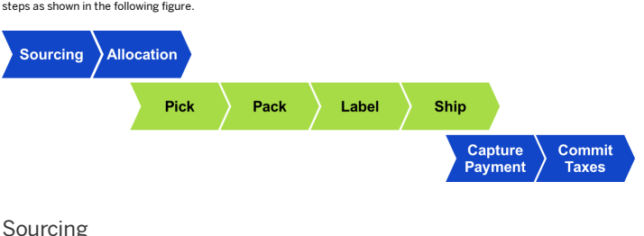
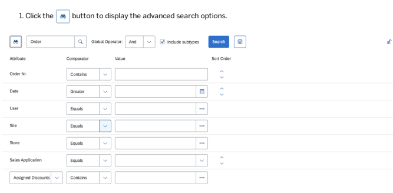
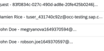
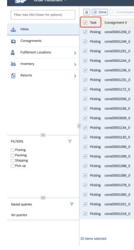
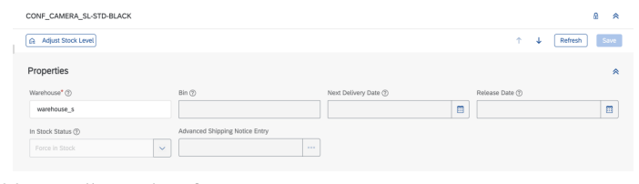
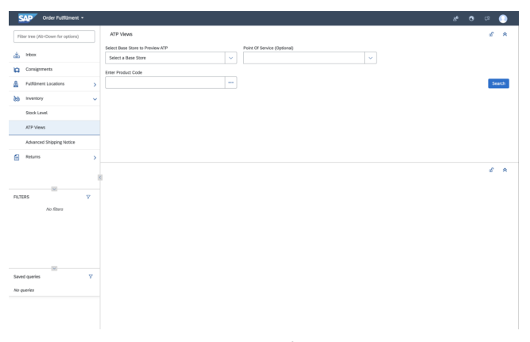
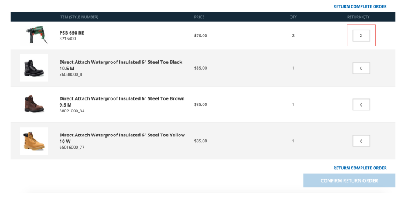
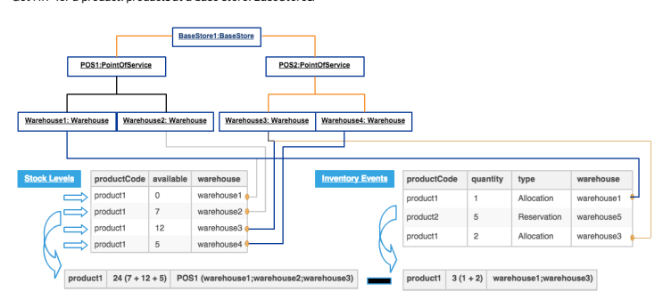
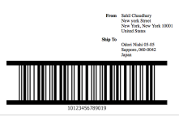
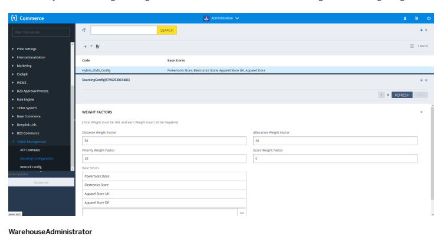

# Order Management Services Module

Order Management Services (OMS) allows you to view and manage customer orders, review and edit shipping information, manage returns and refunds, and search for and view your inventory information.

Warehousing Consignment Workow Service Warehousing Shipping Service

## Order Management Features

Order Management is built on top of the SAP Commerce Cloud Platform. It allows you to view and manage customer orders, review and edit shipping information, manage returns and refunds, search for and view your inventory information.

## Key Features

Order Management includes the following key features:
Real-time inventory management across all stock locations

Automated order workow
Sourcing Order splitting Ability to pick, pack, label, and conrm shipments through the Backoffice Order Fulllment Cockpit

Ability to create and manage returns and refunds
Ability to view fraud reports, payment details, and customer information

Customer support integration
Accelerator integration

## Key Benets

Order Management offers the following key benets:
Fulll from anywhere Save the sale by preventing inventory stock-outs A centralized view of inventory Reduce shipping time and shipping costs

## Order Management Workow

When an order is received from the Accelerator, Order Management processes and completes the order by performing the

Sourcing is the action of determining which physical location (or locations) will supply all items for an order. To nd out more, see Sourcing Service.

## Allocation

Allocation is the action of grouping order items into consignments (that is, determining which items of an order will be shipped from a single location in a single box or package).

This is   For more    the SAP Help  6

## Pick, Pack, Label, And Ship

Once an order is allocated, the following steps in the order workow take place:
A pick list is printed, which lists the item(s) that need to be collected from the store or warehouse shelf.

A pack slip is printed, which indicates all the items that need to be packed in a single shipping box or package. A label is printed, which displays the customer's shipping address. Details vary depending on the shipping carrier. The order is shipped and conrmation of the shipment is logged in Order Management.
To nd out more, see Pick, Pack and Print Shipping Label.

## Payment Capture

After the order is packed and ready to be shipped, the payment is charged to the customer. Order Management communicates with a third-party payment service provider to complete the payment capture.

## Commit Taxes

The nal step of the workow is to determine the tax amount of an order and to log the information, so that a tax invoice can be created. Order Management communicates with a third-party tax invoicing service to complete the tax invoicing.

## Returns And Refunds

Returns and refunds occur when a customer wishes to return items that they purchased and get their money back. To nd out more see, Returns Service.

## Cancellation And Reallocation

You can also cancel a whole order or partially cancel one. As a result, the cancelled items will be reallocated. To nd out more see, Cancellation Services and Reallocation.

## Order Management User Interfaces

Order Management has two user interfaces (perspectives) in the Backoffice for customer support and warehouse employees.

## Backoffice Customer Support Cockpit

The Backoffice Customer Support Cockpit allows a customer support agent to:
Search for and view information about open orders (to be shipped). Search for and view information about all orders, that is, shipped orders, cancelled orders, picked orders, packed orders, and orders to be shipped.

This is   For more    the SAP Help  7 View order information including order details, consignments, payment transactions, and fraud reports.

Cancel an item or an order. Create and manage returns. Perform refunds. Cancel a refund and perform a manual tax reverse.

Perform customer support operations.

Manage customer tickets.
To nd out more, see Backoffice Customer Support Cockpit - Orders and Returns and Backoffice Customer Support Cockpit.

## Backoffice Order Fulllment Cockpit

The Backoffice Order Fulllment Cockpit allows a warehouse user to:

View and manage customer orders, such as print pick slips, pack slips, and shipping labels, as well as review and edit package and shipping information. View and manage to be picked up store orders. Search for and manage points of service and warehouses. View and manage inventory. Decline a partial or whole consignment. Accept returns waiting for goods for an online return.
To nd out more, see the Backoffice Order Fulllment Cockpit.

## Framework

Order Management uses the Widget-based Next Generation Cockpit Framework. When you are designing your application, the components called widgets, can be modied without touching the code base. To nd out more about the Next Generation Cockpit Framework and widgets, see Next Generation Cockpit Framework.

## Importing Data In Order Management

You can import data to Order Management using ImPex. To nd out more, see ImpEx.

## Platform

Order Management is built on top of the SAP Commerce Cloud Platform. To nd out more, see Platform.

## Installation

You can install Order Management for both a development environment and for demonstration purposes by using the Installer.

For more information and instructions, see the readme.txt le that is included in the installer/recipes folder and the reference documentation included below.

.

Installing Order Management

## Users

This block diagram presents the different users that interact with Order Management and the various entry points that might be used.

It shows the layers of the SAP Commerce Cloud Platform as well as the main extensions defined by Order Management. It also shows the CIS client which is used to reach external services.

## Order Management Perspectives

Order Management has two user interfaces or perspectives in the Backoffice Administration Cockpit for customer support agents and warehouse employees. The two perspectives are called Customer Support and Order Fulfillment.

## Order Management Perspectives

The following provides a high level overview of the perspectives used by Order Management in the Backoffice Administration Cockpit.

The Order Management perspectives in the Backoffice Administration Cockpit consist of the following areas:

| Number                                                                               | Description                                                                                                                                                                                                                                                                                                                                                                                                                                                                                                                                                      |
|--------------------------------------------------------------------------------------|------------------------------------------------------------------------------------------------------------------------------------------------------------------------------------------------------------------------------------------------------------------------------------------------------------------------------------------------------------------------------------------------------------------------------------------------------------------------------------------------------------------------------------------------------------------|
| 1.                                                                                   | Logout Button: Logs you out of the application.                                                                                                                                                                                                                                                                                                                                                                                                                                                                                                                  |
| 2.                                                                                   | Locale Button: Displays the currently-used language and list of all available languages.                                                                                                                                                                                                                                                                                                                                                                                                                                                                         |
| 3.                                                                                   | User Role Button: Displays a list of all available roles for the user currently logged on. The active role is highlighted. Clicking a role changes to that role and triggers a browser refresh.                                                                                                                                                                                                                                                                                                                                                                  |
| 4.                                                                                   | Depending on the user logged in, Order Management uses the following perspectives: Backoffice Administration Cockpit Icon: The Backoffice Administration Cockpit enables you to manage all Backoffice-related functionalities. Backoffice Order Fulllment Cockpit Icon: For warehouse users to print pick slips, pack slips, shipping labels, conrm or decline shipments, view and edit inventory information. Backoffice Customer Support Cockpit Icon: For customer support agents to manage orders, payment transactions, fraud reports, returns and refunds. |
| 5.                                                                                   | Search Area: Allows you to perform search functions. You can switch between two modes: Simple search mode which is activated by default. Advanced search mode: you can switch to it by clicking the button.                                                                                                                                                                                                                                                                                                                                                      |
| This is custom documentation. For more information, please visit the SAP Help Portal | 10                                                                                                                                                                                                                                                                                                                                                                                                                                                                                                                                                               |

| 7/11/2024 Number   | Description                                                                                                                                                                                                                                                            |
|--------------------|------------------------------------------------------------------------------------------------------------------------------------------------------------------------------------------------------------------------------------------------------------------------|
| 6.                 | Results Area: Displays the results of your search.                                                                                                                                                                                                                     |
| 7.                 | View/Edit Area: Displays the details of the item selected in the Results area. In the View area, you can only view information, you cannot edit it. In the Edit area, you can edit information or select an action (for example, print a shipping label for an order). |
| 8.                 | Navigation Tree Area: Allows you to access the perspective functions (i.e., consignments, inventory, points of service, and returns) to which you have rights.                                                                                                         |

## Order Management Components

Order Management components are based on the widget concept. Each component has clearly dened functionality.

## Backoffice Customer Support Cockpit - Orders And Returns

The following describes the orders and returns functionality in the Backoffice Customer Support Cockpit.

## Overview

In the Backoffice Customer Support Cockpit, you can do the following for orders and returns:

Search for and view information about open orders (to be shipped). Search for and view information about all orders, that is, shipped orders, cancelled orders, picked orders, packed orders, and orders to be shipped. View order information including order details, consignments, payment transactions, order history, and fraud reports. Cancel an item or an order. Create and manage returns. Perform a manual refund. Cancel a refund and perform a manual tax reverse.

## User Roles

Order Management supports Backoffice Administration Cockpit user roles. Depending on the user role selected upon login, the available functionality of the Backoffice Customer Support Cockpit may change. For a description of the default user roles for the Backoffice Customer Support Cockpit, see Users in Backoffice Customer Support Cockpit .

## Logging In To The Backoffice Customer Support Cockpit

To log in to the Backoffice Customer Support Cockpit:
1. Open an Internet browser.

2. Enter the URL of the Backoffice Administration Cockpit in the web browser's address bar.

Contact your Order Management system administrator if you do not know the URL.

This is   For more    the SAP Help  11 The default URL is https://localhost:9002/backoffice.

3. Enter your Username and Password in the corresponding elds.

 Note Your password must have a minimum length of 10 characters, and also contain three of the following character types:
Uppercase letters

Lowercase letters Numeric character Special characters (*, &, !, %, \#, and so on)
4. Select the Language.

5. Click the LOGIN button.

6. In the top left of the page, click on the Customer Support icon to open the Backoffice Customer Support Cockpit.

## Logging Out Of The Backoffice Customer Support Cockpit

To log out, click the Logout button in the top left of the Backoffice Administration Cockpit.

## Orders

The following describes the Orders functionality in the Backoffice Customer Support Cockpit. Navigate to Orders, you can view information about orders that have statuses such as Approved, Created, Fraud Checked, Payment Captured, Ready, Rejected, Waiting For Manual Validation, and so on.

The Backoffice Customer Support Cockpit allows you to:
View open orders, completed orders, and all orders.

View general order information, such as the order number, customer name who placed the order, creation date, order status, and delivery mode. Cancel orders.

## Open Orders

The following provides an overview of the open orders functionality. The page of the Backoffice Customer Support Cockpit allows you to view information about open customer orders to be shipped. You can view information about orders that have statuses such as Approved, Created, Fraud Checked, Payment Captured, Ready, Rejected, Waiting For Manual Validation, and so on.

Select Open from the lters to search for all open customer orders and you can:

View general order information, such as the order number, customer name who placed the order, creation date, order status, and delivery mode. View detailed order item information, such as details for each consignment within an order, as well as the product code, product name, item price, allocated, pending, returned, cancelled and shipped quantity. View order information about shipping, taxes, order discounts, totals, and sub-totals.

| 7/11/2024                                                 |                                                          | Search                                                 | Apr II, 2022, 6:16:51 AM Standard Delivery(standard-gro.   |
|-----------------------------------------------------------|----------------------------------------------------------|--------------------------------------------------------|------------------------------------------------------------|
| Apr 8, 2022, 6:17:31 AM Standard Delivery(standard-gro    |                                                          |                                                        |                                                            |
| Apr 8, 2022, 6:29:24 AM Standard Delivery(standard-gro    |                                                          |                                                        |                                                            |
| Apr 8, 2022, 6:29:27 AM Standard Delivery(standard-go     |                                                          |                                                        |                                                            |
| Apr 8, 2022, 6:29:32 AM Standard Delivery(standard-gro    |                                                          |                                                        |                                                            |
| Apr 8, 2022, 6:29:39 AM Standard Delivery(standard-gro.   |                                                          |                                                        |                                                            |
| 0001014                                                   |                                                          |                                                        |                                                            |
| SESSION CONTI                                             | Apr II, 2022. 6:29:64 AM Standard Delivery(standard-gro  |                                                        |                                                            |
| 8 Not Sp                                                  | ton Gravity - teures, 42277yew2e29.                      | Apr 8, 2022, §:29:47 AM Standard Delivery(standard-gro |                                                            |
| - Ticket
Not Spec                                                           | 0001021.                                                 | -8310834c-027c-490d-ad8e-20fe425b02461.                | Apr 8, 2022, 6:29:49 AM pickup                             |
| - Not St                                                  | mion Rice · tuser_431740c92z@occ-testing.sap.c..         | Apr 8, 2022, 6:29:53 AM Standard Delivery(standard-gro |                                                            |
| Apr 8, 2022, 6:29:55 AM    Standard Delivery(standard-gro |                                                          |                                                        |                                                            |
| B                                                         | Apr II, 2022, 6:30:03 AM Standard Delivery(standard-gro. |                                                        |                                                            |
| Apr 8, 2022, 6:30:08 AM Standard Delivery(standard-gro    |                                                          |                                                        |                                                            |
| johndoe1649370611@occ-testing.sap.com                     | Apr 8, 2022, 6:30:12 AM Standard Delivery(standard-group |                                                        |                                                            |
| voucher expiredness, 4314215bxa02...                      | Apr 8, 2022, 6:30:24 AM Standard Delivery(standard-gro.  |                                                        |                                                            |
| Apr 8, 2022, 6:30:52 AM Standard Delivery(standard-gro    |                                                          |                                                        |                                                            |

## Searching For Open Orders

The following describes how to search for open orders (to be shipped). It describes how to perform a simple search and an advanced search.

The Backoffice Customer Support Cockpit displays the following information for an order:
 View general order information, such as the order number, customer name who placed the order, creation date, order
.

status, and delivery mode.

.

 View detailed order item information, such as details for each shipment within an order, as well as the product code, product name, item price, allocated, pending, returned, cancelled, and shipped quantity.

- View order information about shipping, taxes, order discounts, totals, and sub-totals.

## Performing A Simple Search

Navigate to Orders and you can search for a customer order by order number or perform a simple text-based search.

To search for an open order to be shipped:
1. Select Open from the filters and all open orders will be sorted out. Enter the order number or the text-based search in the search field.

2. Click Search.

## Executing An Advanced Search

The advanced search option allows you to specify any combination of filter criteria to execute your search.

To execute an advanced search:

Description of the components:
- Type selector - You can select the type or subtype for the search. Available fields depend on the type.

- Global Operator - If you select the OR option, a type is included in the search results if any of the search criteria applies. If you set the AND option, a type is included only if all search criteria apply.

- Include subtypes checkbox - If you select it, the subtypes are included in searches.

xx x x x x x Options for a new search entry - You can use it to dene the attribute, operator, and value when adding a new search eld: When you click the Add button, you can add the currently-selected attribute to the list of search elds. You can add more than once instance of the same eld in order to narrow the search. For example, you can add the same search eld twice, with the criteria being greater than 10 and less than 20.

Attribute column - Displays a name of the attribute. Comparator column - You can select the comparator from the drop-down list used for the attribute. For example you can select Equals, Starts With or Like. Value column - You can dene the value used by the comparator for this attribute. Sort Order column - You can change the initial sort order. To do so, you need to:
Display items in the Collection Browser widget. Click one of the Sort Order buttons next to the attribute for which you want to sort your items. Click the Search button. The system automatically loads the items list in the selected order. This column might be not visible if property isSortOrderDisabled is set to true.

Delete button - You can remove the search eld from the list. Search button - When you click this, it starts the search.
Lock/Unlock button - You can use this button to disable the changing state functionality for a given section.

For more information, see Advanced Search Widget.

## Viewing Open Order Information

When you rst open the Open Orders page, the Results area displays all open orders to be shipped within your location. If you search for an open order, the Results area displays all the open orders to be shipped that meet your search criteria.

 For each open order to be shipped in the Results area, the following information is displayed:

Order Number: The identier of the order.

Customer: The rst and last name of the person who placed the order. Created Date/Time: The date and time on which the order was placed. Delivery Mode: The method used to ship the order. Status: The status of the order. For example: Open, Ready, Payment Captured, Waiting For Manual Validation, or Cancelled.

## Tip

You can use the items-per-page option to specify how many orders are displayed within the Results area. The default settings are 5, 10, 25, 50, 100 items per page.

You can scroll through the list to see the orders, or use the page tabs to move up and down through the results pages. You can also use the Advanced Search function to further filter your results.

.
You can re-order the list of results in ascending or descending order by clicking a column header.

## Cancelling Whole Orders

When you cancel an order, you cancel items within the order. The status of each item is changed to Cancelled.

## Context

You can only cancel orders that have at least one item or consignment that have statuses such as Created, Fraud Checked, Payment Captured, Ready, and Waiting For Manual Validation. You cannot cancel orders that have an item or consignment with the status Cancelled or Completed.

## Procedure

1. Search for the order that you want to cancel.

2. In the Results area, select the order that you want to cancel.

The updated information for the selected order appears in the View area.

3. Click Cancel.

The cancel order window appears.

4. Select the global checkbox at the top left of the Product Code to cancel the whole order (all the items in the order will be automatically selected to be cancelled).

5. Choose a Reason for cancelling the order. Selecting the global Reason drop-down box at the top will automatically apply the same reason to all items in the order. Alternatively, choose a different reason for each item in the respective dropdown box.
6. Add in Comments if desired. 7. Click Conrm Selected.

A conrmation window appears.

8. Conrm.

The order is cancelled. The status of each item or consignment within the order is changed to Cancelled.

## Cancelling Partial Orders

You can cancel part of an order by cancelling items within the order. The status of the item(s) that you cancel are changed to Cancelled.

You can only cancel partial orders that have at least one item or consignment that have statuses such as Created, Fraud Checked, Payment Captured, Ready, Waiting For Manual Validation and so on. You cannot cancel orders that have an item or consignment with the status Cancelled or Completed. To cancel part of an order:
1. Search for the order for which you want to cancel an item in.

2. In the Results area, select the order with the items that you want to cancel.

The updated information for the selected order appears in the Edit area.

3. Click the Cancel button.

The cancel order window appears.

4. Select the checkbox to the left of the Product Code for the order entries that you would like to cancel. 5. Select the quantity of the item(s) to be cancelled by indicating the amount in the respective Cancel QTY field.

6. Choose a Reason for cancelling the item in the respective drop-down box.

This is custom documentation. For more information, please visit the SAP Help Portal 8. Click the Confirm Selected button.

A conrmation window appears.

9. Click the Yes button.

The cancelled quantity selected is reected in the order entry.

The order price is updated to reect the newly updated order entry quantities.

## Placing Orders On Hold

Customer Support Agents can place orders on hold and also release them. Order Management enables you to put orders on hold, meaning no fulllment actions can be performed on this order until the order is released. You may want to do this due to a request by a customer or any failure. To place an order on hold:
1. Search for the order that you want to put on hold.

2. In the Results area, select the order number that you want to hold.

The information for the selected order appears in the Details screen.

3. Click the ON HOLD button.

The order is now in the ON_HOLD status. This also cancels all existing consignments attached to the order.

To release an order that is in the ON_HOLD status, simply click the Release button of the desired order.

## Rerun Sourcing For An Order

The following describes how to rerun sourcing for an order. It is possible to rerun sourcing for an order in Order Management. This action is only allowed when the order has not been sourced completely and is in a Suspended status. This allows you to resolve sourcing issues later for the consignments that can't be fullled right away while still partially fullling the order with the consignments that can be shipped.

## Rerun Sourcing

To rerun sourcing for an order:
1. On the page, search for the order that you want to rerun sourcing for.

2. In the Results area, select the order that you want to rerun sourcing for that is in a Suspended status.

This is   For more    the SAP Help  22

## Completed Orders

The following describes how to view completed orders in the Backoffice Customer Support Cockpit. The Completed Orders page of the Backoffice Customer Support Cockpit allows you to view information about customer orders that are in the status Completed. From the Completed Orders page, you can:
Create an online or in store return.

View general order information, such as the order number, customer name who placed the order, creation date, order status, and delivery mode. View detailed order item information, such as details for each consignment within an order, as well as the product code, product name, item price, allocated, pending, returned, cancelled and shipped quantity. View order information about shipping, taxes, order discounts, totals, and sub-totals.

## Creating A Return

The following describes how to use the Completed Orders page to create returns.

## Context

The Completed Orders page of the Backoffice Customer Support Cockpit allows you to create returns for orders. In Order Management, you can create an online or in store return. In order to be able to create a return, there must be some items that are shipped. You can create a return for orders that have statuses such as Approved, Fraud Checked, Order Split, Payment Captured, and so on.

This is   For more    the SAP Help  23 You can:
Search for the order for which you want to create a return. Create a return. Select the item or items to return and specify the quantity. Approve or cancel the return. View discounts that might have been applied for the order.

## Procedure

1. In the Create a Return page, search for the order for which you want to create a return.

The orders that match your search criteria appear in the Results area.

2. Select the order for which you want to create a return.

3. Click on the Create Return button.

The Create Return Request dialog box will appear.

4. Select the checkbox to the left of the Product Code that you would like to return (selecting the global checkbox at the very top will select all the items automatically to be returned).

5. In the Return QTY eld, specify the quantity of the item to be returned. 6. Optionally, adjust the amount that was automatically calculated in the Refund Amt. eld. 7. Choose a Reason from the drop-down menu for the return. 8. Optionally, enter Comments. 9. Optionally, select the Item(s) Returned In Store checkbox for an in store return (leave unchecked for an online return).

10. Optionally, select the Refund Delivery Cost checkbox to refund the delivery costs for the return. Repeat this step for each item that the customer wants to return.

11. Click the Confirm Selected button to create the return.

The return is created and a pop-up window will appear conrming the return request.

For an in store return the return request will be automatically passed to the Completed status. For an online return the return request will be passed to the Pending Approval status. The All Returns page is now displayed and populated with the information about the newly created return.

## All Orders

The All Orders page of the Backoffice Customer Support Cockpit allows you to view information about customer orders for all locations. You can view information about orders that have statuses such as Approved, Assigned to Administrator, Cancelled, Created, Fraud Checked, Payment Captured, Processing Error, Ready, Rejected, Waiting For Manual Validation, and so on.

From the All Orders page, you can:
Search for all customer orders.

View general order information, such as the order number, customer name who placed the order, creation date, order status, and delivery mode.
This is   For more    the SAP Help  25

View detailed order item information, such as details for each consignment within an order, as well as the product code, product name, item price, allocated, pending, returned, cancelled, and shipped quantity. View order information about shipping, taxes, order discounts, totals, and sub-totals. Cancel orders.

## Searching For All Orders

You can search for all customer orders and can also execute an advanced search and lter orders based on selected parameters. The Backoffice Customer Support Cockpit displays the following information for an order:

View general order information, such as the order number, customer name who placed the order, creation date, order status, and delivery mode. View detailed order item information, such as details for each consignment within an order, as well as the product code, product name, item price, allocated, pending, returned, cancelled, and shipped quantity. View order information about shipping, taxes, order discounts, totals, and sub-totals.

## Performing A Simple Search

In the All Orders page, you can search for an order by order number or perform a simple text-based search. To search in all orders:
1. In the All Orders page, enter the order number or a simple text-based search in the search eld.

| ( )                        |                                               |                                  |                                  |               |
|----------------------------|-----------------------------------------------|----------------------------------|----------------------------------|---------------|
| o                          | Tick                                          | 8                                | [«                               |               |
| e                          | Product Review                                | 00000                            | 1 / 4 > 72 her                   |               |
| @                          | Order Number 9                                |                                  |                                  |               |
| 000028                     | Ant 11, 2022, 3:13:58 PM Pramium Deliveryl    |                                  |                                  |               |
| se                         | Personal Data Rep                             |                                  |                                  |               |
| e                          | Crotes                                        | 0001001                          | Apr 9, 2022, 1:10:56 PM          |               |
| @                          | Retars                                        | Apr 9, 2022, 1:11:04 PM          |                                  |               |
| Apr 9, 2022, 1:11:14 PM    |                                               |                                  |                                  |               |
| 0001001                    | Teton Goardty - borer_43178fbox203            | Apr 9, 2022, 1:11:24 PM          | Sindard Delivery/standard-gross/ |               |
| 0001011                    | Apr 9, 2022, 1:11:29 PM                       | Standard Deliven/standard-stons/ |                                  |               |
| 00013                      | Apr 9, 2022, 1:11:32 PM                       |                                  |                                  |               |
| Apr 9, 2022, 1:11:34 PM    |                                               |                                  |                                  |               |
| FILTERS                    | e                                             |                                  |                                  |               |
| - Oper                     | Mon Apr 11 03:13:58 EDT 2022 - 256.86 - READY |                                  |                                  |               |
| ■■ On Hoix                 |                                               |                                  |                                  |               |
| [Complete                  | I                                             | Refresh                          |                                  |               |
| Cancelled                  | Order Information                             | DE Address                       |                                  |               |
| Alex Dubois · alex.club    | Apr 11, 22, 3:13:58 PM                        | Prensun Delivery/premi.          | Nymphenburger Str. 85            | Nymphenburger |
| Line Detail:               | Erem Price   0                                | Talai. Price                     |                                  |               |
| Product Na... © Cumency  © |                                               |                                  |                                  |               |
| 689152                     | Cyber-shot D.                                 | 260.87                           | 260.87                           |               |

2. Click Search.

Details of the orders that meet your criteria are displayed in the Results area of the All Orders page.

## I Note

If you enter anything in the search field, you will disable the advanced search options.

## Executing An Advanced Search

The advanced search option allows you to specify any combination of filter criteria to execute your search.

To execute an advanced search:
1. In the All Orders page, Click the less button to display the advanced search options.

a

| Attribute          | Comparator   | Sort Order   |
|--------------------|--------------|--------------|
| Order Nr           | Contains     |              |
| Date               | Greater      | n            |
| User               | Equals       |              |
| Site               | Equals       | ..           |
| Store              | Equals       | +            |
| Sales Applic       | Equals       | >            |
| Assigned Discounts | Contains     | ...          |

x x x Description of the components:
This is custom documentation. For more information, please visit the SAP Help Portal

Type selector - You can select the type or subtype for the search. Available elds depend on the type.

Global Operator - If you select the OR option, a type is included in the search results if any of the search criteria applies. If you set the AND option, a type is included only if all search criteria apply. Options for a new search entry - You can use it to dene the attribute, operator, and value when adding a new search eld: When you click the Add button, you can add the currently-selected attribute to the list of search elds. You can add more than once instance of the same eld in order to narrow the search. For example, you can add the same search eld twice, with the criteria being greater than 10 and less than 20. Attributes column - Displays a name of the attribute. Comparators column - You can select the comparator from the drop-down list used for the attribute. For example you can select Equals, Starts With or Like. Values column - You can dene the value used by the comparator for this attribute. Sort Order column - You can change the initial sort order. To do so, you need to:
Display items in the Collection Browser widget.
Click one of the Sort Order buttons next to the attribute for which you want to sort your items.

Click the Search button. The system automatically loads the items list in the selected order. This column might be not visible if property isSortOrderDisabled is set to true.

Delete button - You can remove the search eld from the list. Include Subtypes checkbox - If you select it, the subtypes are included in searches. Search button - When you click this, it starts the search. Lock/Unlock button - You can use this button to disable the changing state functionality for a given section. Customer Name: The rst and last name of the person who placed the order. Created Date/Time: The date and time on which the order was placed.

## Viewing All Orders Information

For more information, see Advanced Search Widget. When you rst open the All Orders page, the Results area displays all orders. If you search for an order, the Results area displays all the orders that meet your search criteria.

 For each order in the Results area, the following information is displayed:
Order Number: The identier of the order.

Delivery Mode: The method used to ship the order.

Status: The status of the order. For example: Open, Ready, Payment Captured, Waiting For Manual Validation, or Cancelled.
 Tip You can use the items-per-page option to specify how many orders are displayed within the Results area. The default settings are 5, 10, 25, 50, 100 items per page. You can scroll through the list to see the orders, or use the page tabs to move up and down through the results pages. You can also use the Advanced Search function to further lter your results.

You can re-order the list of results in ascending or descending order by clicking a column header.

## Order Details

The following provides an overview of the Order Details tab. The Order Details tab of the Backoffice Customer Support Cockpit allows you to view detailed information about customer orders.

## Viewing Detailed Information About Orders

The View area of the All Orders page displays detailed information for an order selected from the Results area. To display detailed information for an order:
1. Search for an order.

2. Select an order from the Results area of the All Orders page.

The information is displayed in the View area of the All Orders page.

Order Details The Order Details tab displays the order information details for all the lines within the selected order.

0000008 - Sun Apr 10 03:13:40 EDT 2022 - 256.86 - READY
«
s Order Details      Consignments Order Information Customer*

[ 
Alex Dubois - alex.duboi..

## Order Information

Displays the order information for a selected order including:
- Customer information - Created Date and Time
- Order Status
- Delivery Mode
- Billing Address - Shipping Address Line Details For each order item within the order, the following information is displayed:
- Product Code
- Product Name - Currency
- Item Price - Quantity - Total Price
- Allocated Quantity
- Pending Quantity - Return Quantity - Cancelled Quantity Shipped Quantity Order Totals For each order, the following information is displayed:
Currency Subtotal Taxes Shipping Cost

Order Discount Total

## Editing Order Details

You can edit order details of an order for delivery mode, shipping address, and billing address.

## Editing Order Details Information

When you select an order from the Results area, the Edit area will display the following:

In the Edit area, under the Order Details tab, you can do the following:
Edit or delete a Delivery Mode.

Edit or delete a Billing Address.
Edit or delete a Shipping Address.

This is   For more    the SAP Help  31 Editing For example, to edit a shipping address:
1. Double click on the contents in the Shipping Address eld.

2. Edit the desired information.
3. Click the Save button.

Your Address will now reect the edited changes.

## Deleting

For example, to delete a shipping address: Simply click on the x button at the top right of the eld to delete the address.

## Consignments

The following provides an overview of the Consignments tab.

This is   For more    the SAP Help  32 The Consignments tab of the Backoffice Customer Support Cockpit allows you to view information about consignments.

## Consignments

When you select an order and then choose the Consignments tab, it will display the consignments created for the order.

 This includes the following information:
Consignment Code Number

Tracking ID Delivery Mode Status
For more information about how consignment is handled in different stages of order processing, check Order Allocation, Reallocation, and Order Splitting.

## Payment Transactions

The following provides an overview of the Payment Transactions tab. The Payment Transactions tab of the Backoffice Customer Support Cockpit allows you to view payment transactions for customer orders.

## Payment Transactions

When you select an order and then choose the Payment Transactions tab, it will display the transactions for the selected order. To view each transaction entry for an order:
1. In the Edit area, under the Payment Transactions tab, click on the 3 dots to the left of the transaction that you want to view.

2. Click on the Edit Details area.
The Edit item Payment Transaction dialog will appear.

3. In the Edit item dialog box, you can view the following:
- Code
- Payment Info - Payment provider
- Planned amount
- Request id
- Transaction Entries

## Order History

The following provides an overview of the Order History tab.

The Order History tab of the Backoffice Customer Support Cockpit allows you to view information about customer orders.

When you select an order and then choose the Order History tab, it will display the history for the selected order.

This includes the following information:
Date and Time Created

Event (Cancellation, Return, Fraud Check, etc.) Description

## Fraud Reports

The following provides an overview of the Fraud Report tab. The Fraud Report tab of the Backoffice Customer Support Cockpit allows you to view and manage fraud reports for customer orders. Some orders might be potentially fraudulent and a user must accept or reject the order.

## Fraud Reports

When you select an order and then choose the Fraud Report tab, it will display the fraud reports for the selected order.

 This includes the following information:
Code Provider

Status Explanation Timestamp
Accepting or Rejecting a Fraud Report Under the Fraud Report Tab, you can select an action to accept or reject an order based on the fraud report.

To reject the order due to fraud, select the thumbs down icon. This will reject the order. Alternatively, to accept the order or indicate that the fraud check was successful click on the thumbs up icon. This will allow the order to continue in the workow and proceed to be shipped.

## Viewing Fraud Report Details

To view the details of a fraud report for an order:
1. In the Edit area, under the Fraud Report tab, click on the 3 dots to the left of the transaction that you want to view.

2. Click on the Edit Details area.

The Edit item Fraud Report dialog will appear.

3. In the Edit item dialog box, you can view the following fraud symptoms:
- Name

- Score - Explanation
For more information on fraud reports, see Fraud Detection

## Returns

The following describes the Returns functionality in the Backoffice Customer Support Cockpit. From the All Returns page, you can view information about returns that have statuses such as Cancelled, Completed, Pending Approval, Wait, and so on.

The Backoffice Customer Support Cockpit allows you to:
- Search for orders for which customers want to return items.

- Approve or cancel returns.

- Perform a manual refund for returns.
This is custom documentation. For more information, please visit the SAP Help Portal

Cancel refunds and perform manual tax reversals.

## Searching For All Returns

You can search for all returns in the Backoffice Customer Support Cockpit. You can also execute an advanced search and lter returns based on selected parameters.

## Performing A Simple Search

In the All Returns page, you can search for a customer order by order number or by a simple text-based search. To search for all returns:
1. In the All Returns page, enter the order number or the simple text-based search in the search eld.

| o        | Ticks               | 8   | Search   |
|----------|---------------------|-----|----------|
| BELD DEP | 1, 2022, 4:33-04 PM |     |          |
| e        |                     |     |          |
| Q Retail |                     |     |          |

2. Click Search.

Details of the returns that meet your criteria are displayed in the Results area of the All Returns page.

i Note If you enter anything in the search field, you will disable the advanced search options.

## Executing An Advanced Search

The advanced search option allows you to specify any combination of filter criteria to execute your search.

To execute an advanced search:
1. In the All Returns page, click the 

| is            |          |     |
|---------------|----------|-----|
| Attribute     | Sort Ord |     |
| Order Nr      | Contains | xx  |
| Date          | Greater  | x   |
| User          | x        |     |
| Equals        | >        |     |
| Equals        | x        |     |
| Equals        | x        |     |
| +             |          |     |
| Equals        | x        |     |
| med Discounts | Contains | ... |

This is custom documentation. For more information, please visit the SAP Help Portal

## Description Of The Components:

Type selector: You can select the type or subtype for the search. Available elds depend on the type. Global Operator: If you select the OR option, a type is included in the search results if any of the search criteria applies. If you set the AND option, a type is included only if all search criteria apply. Options for a new search entry: You can use it to dene the attribute, operator, and value when adding a new search eld: When you click theAdd button, you can add the currently-selected attribute to the list of search elds. You can add more than once instance of the same eld in order to narrow the search. For example, you can add the same search eld twice, with the criteria being greater than 10 and less than 20. Attributes column: Displays a name of the attribute. Comparators column: You can select the comparator from the drop-down list used for the attribute. For example you can select Equals, Starts With or Like. Values column: You can dene the value used by the comparator for this attribute. Sort Order column: You can change the initial sort order. To do so, you need to:
Display items in the Collection Browser widget. Click one of the Sort Order buttons next to the attribute for which you want to sort your items. Click the Search button. The system automatically loads the items list in the selected order.

This column might be not visible if property isSortOrderDisabled is set to true.

Delete button: You can remove the search eld from the list. Include Subtypes checkbox: If you select it, the subtypes are included in searches. Search button: When you click this, it starts the search. Lock/Unlock button: You can use this button to disable the changing state functionality for a given section.
For more information see, Advanced Search Widget.

## Viewing All Returns Information

When you rst open the All Returns page, the Results area displays all returns within your location. If you search for a return, the Results area displays all the returns that meet your search criteria. For each return in the Results area, the following information is displayed:
RMA: Return Merchandize Authorization.

Order Number: The identier of the order. Customer: The rst and last name of the person who placed the order. Created Date/Time: The date and time on which the order was placed. Status: The status of the return. For example: Completed, Pending Approval, or Wait status.

## Tip

You can use the items-per-page option to specify how many returns are displayed within the Results area. The default settings are 5, 10, 25, 50, 100 items per page. You can scroll through the list to see the returns, or use the page tabs to move up and down through the results pages. You can also use the Advanced Search function to further lter your results. You can re-order the list of results in ascending or descending order by clicking a column header.

## Returns Pending Approval

The following describes how to approve or cancel an online return. You can also modify a return request's refund amount before approving the refund. Once you have created an online return, you must then approve or cancel it. The Return will be in the Pending Approval status.

## Approving Returns

To approve a return:
1. In the Returns Pending Approval page, search for the return that you want to approve.

The returns that match your search criteria appear in the Results area.

2. Select the return that you want to approve.

A pop-up conrmation window appears to inform you that your return (RMA) will pass to the Waiting for Goods page with a status of Wait.

Additionally, the customer that requested the return will automatically receive an email with the return label so that they can send the package back to the warehouse.

## Cancelling Returns

To cancel a return:
1. In the Returns Pending Approval page, search for the return that you want to cancel.

The returns that match your search criteria appear in the Results area.

2. Select the return that you want to cancel.

The Details area displays all information of the return request.

3. Click on the Cancel button.
The Cancel RMA dialog box appears.

4. Select a Cancellation Reason from the drop-down list. 5. Optionally, add in Comments.

6. Click the CONFIRM button.

A pop-up conrmation window appears to inform you that your return (RMA) will pass to the Cancelled status and no refund will be issued. You can also cancel a return under the All Returns Page with the Wait or Pending Approval status.

## Return Request Modication

To modify a return request before approving the refund, you can:
Modify refund delivery costs by selecting True or False respectively.

Modify the Refund Amount by clicking in the box as shown in the screenshot below.

## Manual Refunds And Tax Reverse

The following describes how to perform a manual refund and a manual tax reverse for an online or in store return. Once you have created a return, the customer is refunded automatically for a BORIS (Buy Online Return in Store) return and after accepting the goods for an online return. The customer is refunded for a purchase by the same method originally used to pay for the purchase. For example, if a customer originally paid for a purchase using a credit card, the customer is refunded to the same credit card. However, you can perform a manual refund only if the automatic refund fails. You can manually reverse the taxes for a return also. This serves as a fallback in the event you can't connect to the tax service or something fails and will allow the workow to continue.

## Performing Manual Refunds

You can perform a manual refund only if the automatic refund fails. If the eld has been modied, but the changes were not saved, the Manual Refund button will be available. To perform a manual refund:
1. In the All Returns page, search for the return for which you want to manually refund.

The returns that match your search criteria appear in the Results area.

2. Select the return that you want to manually refund from the Results list.

3. Optionally, include the shipping cost in the refund amount by selecting True under the Refund Delivery Cost section. 4. Optionally, in the Total Refund Amount box, manually specify the amount that should be refunded instead of the automatic refund totals. The total refund amount provides you with the exibility to specify an amount that is different from the amount to refund that was automatically calculated. You may want to increase the amount refunded in order to compensate the customer for the trouble of returning the item, or for other reasons at your discretion.

5. Click the Manual Refund button.

A conrmation message appears to conrm that your return has been manually refunded.

## Manual Tax Reverse

You can manually reverse the taxes for an online or in store return. The Manual Tax Reverse button is available in the event that the automated tax calculation is unable to connect to the tax services system. This allows a user to manually settle the tax This is   For more    the SAP Help  46 reverse and to let Order Management know that the tax reverse operation has been performed.

To perform a manual tax reverse:
1. In the All Returns page, search for the return for which you want to manually reverse the taxes for.

The returns that match your search criteria appear in the Results area.

3. Click the Manual Tax Reverse button.

A conrmation message appears to conrm that you have manually reversed the taxes for the return.

## Backoffice Order Fulllment Cockpit

Backoffice Order Fulllment allows you to manage customer and store orders.

This is   For more    the SAP Help  47

## Overview

In the Backoffice Order Fulllment Cockpit, you can do the following:

View and manage customer orders, such as print pick slips, pack slips, and shipping labels. View and manage to be picked up store orders. Review and edit package information. Search for and manage points of service and warehouses. View and manage inventory. Accept returns waiting for goods for an online return.
Decline a partial or whole consignment and reallocate it.

## Logging In To The Backoffice Order Fulllment Cockpit

To log in to the Backoffice Order Fulllment Cockpit:
1. Open an Internet browser.

2. Enter the URL of the Backoffice Administration Cockpit in the web browser's address bar.

Contact your Order Management system administrator if you do not know the URL.

The default URL is https://localhost:9002/backoffice.

3. Enter your Username and Password in the corresponding elds.

Your password must have a minimum length of 10 characters, and also contain three of the following character types:
Uppercase letters Lowercase letters

Numeric character
Special characters (*, &, !, %, \#, and so on)
4. Select the Language.

5. Click the LOGIN button.

6. In the top of the page, click on the icon to open the Backoffice Order Fulllment Cockpit.

You need to be assigned with one of these roles to be able to access the Order Fulllment Perspective: warehouseadministratorrole, warehouseagentrole, warehousemanagerrole, and backofficeadmin. If you cannot access the perspective, you can try one of the following:

Log in to the Backoffice using these default users: WarehouseAdministrator, WarehouseAgent and WarehouseManager. Assign yourself with one of these roles: warehouseadministratorrole, warehouseagentrole, warehousemanagerrole, and backofficeadmin. It's recommended that you assign yourself with the warehouseadministratorrole due to the restriction settings in warehousingbackoffice-backoffice-config.xml.
# Logging Out Of The Backoffice Order Fulllment Perspective

To log out, click the Logout button in the top right of the Backoffice Administration Cockpit.

## Inbox

In the Inbox section of the Order Fulllment Cockpit, a WarehouseAgent can view assigned consignment tasks so that they can process shipments and avoid consignments that should be worked on by another employee at the same warehouse. By default, the system will choose the employee with the lowest workload (lowest number of assigned tasks) to assign the consignment to. For more information, see Consignment Assignment Workow. From the inbox section, you can:
See a list of tasks for consignments assigned to you.

Act on the assigned consignment by being able to pick, pack, and conrm the shipment right from the inbox. Reallocate a complete or partial consignment. Print a document like a pick slip or pack slip.

## Assigning Consignment Tasks To Employees

1. To view a list of tasks for consignments assigned to you, simply log in with your WarehouseAgent Username and Password. A list of the consignments assigned to you will be displayed under the Inbox section of the Order Fulllment Cockpit:

 The consignment(s) that are assigned to you will be displayed with the following information:
Task o Order \#

o Expected to Ship Date o Delivery Mode o Status
o Details of Consignment Items

3. Click Finish to complete the task.

The status will then move on to the next stage in the process.

## I Note

You can also perform tasks in bulk by selecting the global checkbox at the top left of the Task heading. This allows an employee to complete more than one task of different statuses at the same time (for example pick and pack) for different consignments.

| [ 2 ] ( 2 )                                    | ne                                             |                          |       |
|------------------------------------------------|------------------------------------------------|--------------------------|-------|
| 2 Tysk                                         | Expected To Ship                               |                          |       |
| Pld                                            | 0001259                                        | Apr 12, 2022, 1:19:12 PM | AAAAA |
| 0001245 Apr 13, 2022, 1:19:02 PM               |                                                |                          |       |
| cons0001251_0 0001251 Apr 13, 2022, 1:19:02 PM | Standard Delly                                 |                          |       |
| s                                              | cons0001244_0 0001244 Apr 13, 2022, 1:19:02 PM | Standard Deliver d       |       |
| 10001236_0 10001236 Apr 13, 2022, 1:10:40 PM   |                                                |                          |       |
| cons0001231_0 0001231 Apr 13, 2022, 1:16:38 PM |                                                |                          |       |
| cons0001172_0 0001172 Apr 13, 2022, 1:15:55 PM | Standard DeBendst                              |                          |       |
| s0                                             |                                                |                          |       |
| 0001150 Apr 13, 2022, 12:57:50 PM              |                                                |                          |       |
| 80002009 0 00002009 Apr 12, 2022, 12:55:48 PM  |                                                |                          |       |
| 0001134 Apr 13, 2022, 6:57:31 AM               |                                                |                          |       |
| 0001130 Apr 13, 2022, 6:57:31 AM               |                                                |                          |       |
| 10001090_0 0001090 Apr 13, 2022, 6:56:30 AM    |                                                |                          |       |
| 1100001099_0 0001099 Apr 13, 2022, 6:56:30 AM  |                                                |                          |       |
| s                                              | s0001088_0 0001088 Apr 13, 2022, 6:56:18 AM    | Standard Delvery()       |       |
| cons0001085_0 0001085 Apr 13, 2022, 6:56:18 AM | Standard Defiver/ST                            |                          |       |
| 001078_0 0001078 Apr 13, 2022, 6:56:07 AM      |                                                |                          |       |
| 10001060_0 10001090 Apr 13, 2022, 6:54:23 AM   |                                                |                          |       |
| cons0001021_0 0001021 Apr 13, 2022, 6:53:13 AM | Standard Delivery/st                           |                          |       |
| 0001016_0 0001016 Apr 13, 2022, 6:53:03 AM     |                                                |                          |       |

## Printing A Pick Or Pack Slip

To print a pick or pack slip:
1. Click on the 3 dots to the right of the consignment that you would like to print a document for.

2. Click on the Print Document pop-up that appears. It will print a pick or pack slip depending on the status of the cnsignment.

| 7/11/2024                                                                                             |                                                                   |                                                                   |                                 |               |
|-------------------------------------------------------------------------------------------------------|-------------------------------------------------------------------|-------------------------------------------------------------------|---------------------------------|---------------|
| 24P                                                                                                   | o                                                                 |                                                                   |                                 |               |
| e                                                                                                     |                                                                   |                                                                   |                                 |               |
| 1 / 3 > 53 hems                                                                                       | 0 Selected Ite                                                    |                                                                   |                                 |               |
| Filter tree {Alt+Down for con                                                                         | 1. R                                                              | Done] [ 9 Consolidated Pick Stip                                  |                                 |               |
| [] Task                                                                                               | Consigners w                                                      | Order tr                                                          | Expected To Ship                | Delivery Mode |
| d Inbox                                                                                               | Picking cons0001259_0 0001259 Apr 13, 2022, 1:19:12 PM            | Stinders Defertry Stinders - group                                |                                 |               |
| a                                                                                                     | Consignments                                                      | - Picking cons0001246_0 0001246 Apr 1.3, 2022, 1:19:02 PM         | Standard Delivery/standard-gro. |               |
| - Picking cons0001251_0 0001251 Apr 13, 2022, 1:19:02 PM                                              | Standard Delivery/standard-gro                                    |                                                                   |                                 |               |
| B                                                                                                     | Futfilment Locations                                              | - Picking cons0001244_0 0001244 Apr 13, 2022, 1:19:02 PM          | Standard Delivery[standard-gro  |               |
|                                                                                                       | Inventory                                                         | - Picking cons0001236_0 0001235 Apr 13, 2022, 1:18:49 PM          | Standard Delivery(standard-gro  |               |
| e                                                                                                     | Returns                                                           | - Picking cons0001231_0 00001231 Apr 13, 2022, 1:18:38 PM         | Standard Deferery(szandard-gro) |               |
| Picking cons0001172_0 00001172 Apr 13, 2022, 1:15:55 PM                                               | Strandst Realiscate                                               |                                                                   |                                 |               |
| [] Picking cons0                                                                                      | Standard Print Don                                                | ..                                                                |                                 |               |
| │ Picking    cons0001158_0    0001158    Apr 13, 2022, 12:57:50 PM    Standard Delvery|standard-grain |                                                                   |                                                                   |                                 |               |
| - Picking cons0003009_0 0003009 Apr 13, 2022, 12:55:48 PM Standard Delvery|standard-grou              |                                                                   |                                                                   |                                 |               |
| [] Picking cons0001134_0 0001134 Apr 13, 2022, 6:57:31 AM                                             | Standard Delivery (standard-gro)                                  |                                                                   |                                 |               |
| - Picking cons0001130_0 0001130 Apr 13, 2022, 6:57:31 AM                                              | Standard Delivery/standard-gro...                                 |                                                                   |                                 |               |
| FLTERS                                                                                                | y                                                                 | │ Picking    cons00001090_0   0001090    Apr 13, 2022, 6:56:30 AM | Standard Delivery(standard-gro  |               |
| - Picking                                                                                             | - Picking cons0001099_0 0001099 Apr 13, 2022, 6:56:30 AM          | Standard Delivery/standard-gro                                    |                                 |               |
| - Shipping                                                                                            | │ Picking    cons0001088_0    0001083    Apr 13, 2022, 6:56:18 AM | Standard Delivery|standard-gro                                    |                                 |               |
| - Picking cons0001085_0 0001085 Apr 13, 2022, 6:56:18 AM                                              | Standard Delivery/standard-gro-                                   |                                                                   |                                 |               |
| [] Picking cons0001078_0 0001078 Apr 13, 2022, 6:56:07 AM                                             | Szandard Delivery(szandard-gro.                                   |                                                                   |                                 |               |
| [ Picking cons0001060_0 0001060 Apr 13, 2022, 6:54:23 AM                                              | Standard Delivery(standard-gro)                                   |                                                                   |                                 |               |
| 7                                                                                                     | 1 Picking cons0001021_0 0001021 Apr 13, 2022, 6:53:13 AM          | Standard Delivery/standard-gro.                                   |                                 |               |
| Saved queries                                                                                         |                                                                   |                                                                   |                                 |               |
| No queries                                                                                            | - Picking cons0001016_0 0001016 Apr 13, 2022, 6:53:03 AM          | Standard Delivery/standard-gro                                    |                                 |               |

## Reallocating A Consignment

To reallocate a consignment:
Click on the 3 dots to the right of the consignment that you would like to reallocate. Click on the Reallocate pop-up that appears.

| 24P                                                                                      | OR PUTIMER                                                  | s                                                           |                                 |                |
|------------------------------------------------------------------------------------------|-------------------------------------------------------------|-------------------------------------------------------------|---------------------------------|----------------|
| e                                                                                        | 1 / 3 > 53 heres                                            | 0 Selected In                                               |                                 |                |
| Filter tree (Alt+Da                                                                      | wn for optic                                                | Done | | 🙂 Consolidated Pick Slip                          |                                 |                |
| □ Task                                                                                   | Consigners V                                                | Oder v                                                      | Expected To Ship                | Delivery Model |
| S Inbox                                                                                  | [] Picking cons0001259_0 0001259 Apr 13, 2022, 1:19:12 PM   | Standard Defreeryfutandard-gro.                             |                                 |                |
| 1. Consigners                                                                            | [] Picking cons00001246_0 00001246 Apr 13, 2022, 1:19:02 PM | Standard Delivery/standard-gro.                             |                                 |                |
| Futfilment Locations                                                                     | [] Picking cons0001251_0 0001251 Apr 13, 2022, 1:19:02 PM   | Standard Delivery[standard-Blo                              |                                 |                |
| B                                                                                        | - Picking cons0001244_0 0001244 Apr 13, 2022, 1:19:02 PM    | Standard Delivery (standard-gro                             |                                 |                |
| &                                                                                        | Inventory                                                   | - Picking cons0001236_0 0001235 Apr 13, 2022, 1:18:49 PM    | Standard Deliveryfstandard-gro. |                |
| a                                                                                        | Returns                                                     | [] Picking cons00001231_0 00001231 Apr 13, 2022, 1:18:38 PM | Standard Defvery(standard-gro)  |                |
| Picking cons0001172_0 0001172 Apr 13, 2022, 1:15:55 PM                                   | Sander Realis                                               |                                                             |                                 |                |
| [] Picking cons0002006_0 0002006 Apr 1.1, 2022, 1:00:04 PM                               | Standar Print Document                                      |                                                             |                                 |                |
| - Picking cons0001158_0 0001158 Apr 13, 2022, 12:57:50 PM Standard Delivery[standard-go  |                                                             |                                                             |                                 |                |
| - Picking cons0003009_0 0003009 Apr 13, 2022, 12:55:48 PM Standard DePvery(standard-gro- |                                                             |                                                             |                                 |                |
| [] Picking cons00001134_0 00001134 Apr 13, 2022, 6:57:31 AM                              | Standard Delivery(standard-gro                              |                                                             |                                 |                |
| [] Picking cons0001130_0 0001130 Apr 13, 2022, 6:57:31 AM                                | Standard Deliveryfstandard-gro..                            |                                                             |                                 |                |
| FILTERS                                                                                  | 7                                                           | [] Picking cons00001000_0 0001090 Apr 13, 2022, 6:56:30 AM  | Standard Deferery(standard-grou |                |
| - Picking                                                                                | - Picking cons0001099_0 0001099 Apr 1.3, 2022, 6:56:30 AM   | Standard Delivery(standard-gro                              |                                 |                |
| - Shipping                                                                               | [] Picking cons0001068_0 0001088 Apr 13, 2022, 6:56:18 AM   | Standard Delivery(standard-gro                              |                                 |                |
| [] Picking cons0001065_0 0001085 Apr 13, 2022, 6:56:18 AM                                | Standard Delivery/standard-gro-                             |                                                             |                                 |                |
| [] Picking cons0001078_0 0001078 Apr 13, 2022, 6:56:07 AM                                | Standard Delivery(standard-gro.,                            |                                                             |                                 |                |
| [] Picking cons0001060_0 0001060 Apr 13, 2022, 6:54:23 AM                                | Standard Defivery(standard-gro                              |                                                             |                                 |                |
| Saved queries                                                                            | P                                                           | [] Picking cons00001021_0 00001021 Apr 13, 2022, 6:53:13 AM | Standard Defiveryfundard-gro.   |                |
| 1 Picking cons0001016_0 0001016 Apr 13, 2022, 6:53:03 AM                                 | Standard Delvery(standard-gro                               |                                                             |                                 |                |
| No queries                                                                               |                                                             |                                                             |                                 |                |

o
( ) ( )

For more information on declining and reallocating a consignment, see Declining Whole Consignments or Declining Partial Consignments.

## Consignments

The following provides an overview of the Consignments functionality.

The Consignments page of the Backoffice Order Fulllment Cockpit allows you to view information about consignments (customer orders). By default, you can view information about consignments that have the following statuses:
Ready for pickup Ready to be Shipped Waiting Pickpack

Pickup complete Ready Shipped Cancelled

You can also use the FILTERS section on the left to perform rened queries. Whenever a lter is selected, a search is performed at run time and the results are displayed accordingly. For example, selecting the Cancelled lter will only display consignments that are in Cancelled status.

## Consignments To Be Processed

Consignments To Be Processed in the Backoffice Order Fulllment Cockpit allows you to view information about consignments (customer orders) that need to be shipped. You can view information about consignments that are in the Ready and Ready to be Shipped status.

In order to display all consignments that need to be processed, you can select under the Filters section on the left To Be Processed and Shipping. From this screen, you can:

View general consignment information, such as the consignment number, order number, expected to ship date, location, delivery mode, and order status.
Print pick slips, pack slips, and shipping labels. Conrm consignments. Edit shipping method and package information.

A pick slip is a printout of products to be picked in order to fulll an order. You can print a single pick slip or consolidated pick slip for bulk picking by selecting a list of consignments. A pick slip displays the following information:
Date Printed: The date on which the pick slip was printed. Order Number: The number or identier of the order. Order Date: The date on which the order was placed. Ship to Address: Complete address and phone number of the destination address.

For each consignment entry on the pick list, a pick slip provides the following information:
Line Number: The line number of the item within the order. Product Code: Code used to identify the packaged products. Product Image: Image of the product. Product Name: The name of the product. Bin Code: The code or identier of the bin. Qty: The quantity of item to be picked.

i Note The pick slip layout can be customized through templates. For more information, see Pick Pack and Print Shipping Label .

## Printing A Pick Slip

To print a pick slip:
1. Log into the Backoffice Administration Cockpit as a warehouse administrator.

2. Navigate to Consignments. The list of consignments appears.

3. Search for the consignment(s) for which you want to print a pick slip.

4. In the Results area, select the consignment(s) (using the checkbox on the left) for which you want to print a pick slip for.

The Edit area displays the consignment(s) entry information for the selected order.

5. Click the Pick Slip button.

The print window for your browser appears displaying the pick slip details.

6. Select your printing specifications.

7. Click the Print button.

Your consignment(s) will now transition from Ready to the Pickpack status.

This is custom documentation. For more information, please visit the SAP Help Portal

## Printing Pack Slips

A pack slip provides information about an order, such as information for each item, as well as as the billing and shipping addresses, order ID, total cost of the merchandise, and so on. A pack slip contains the following information:
Billing Address: The billing address for the order.

Shipping Address: The address to which the order will be shipped. Order Number: The number or identier of the order. Order Date: Date on which the order was placed. Shipping Method: The delivery method selected by the customer when the order was placed. Packaging Info: The dimensions of the package. Order Information: Information for each item within the order. The information consists of product code, product image, product name, item price, quantity, and total price. Subtotal: The total cost for the items shipped. Total Taxes: The total amount of the taxes for the items shipped. Total Shipping Costs: The total amount of shipping costs for the items. Order Discount: The total of any discounts applied to the order. Total: The total cost of the shipment.

The pack slip displays the following information for each item in the order:
Product Code: Code used to identify the packaged products. Product Image: Image of the product.

Product Name: The name of the product. Item Price: The price of an individual item.
This is   For more    the SAP Help  57 Bin Code: The code or identier of the bin.

Qty: The quantity of the item packed. Total Price.

The pack slip layout can be customized through templates. For more information, see Pick, Pack and Print Shipping Label.

## Printing A Pack Slip

To print a pack slip:
1. Search for the consignment for which you want to print a pack slip.

2. In the Results area, select the consignment for which you want to print a pack slip.

The Edit area displays the consignment entry information for the selected order.

3. Click the Pack Slip button.

The print window for your browser appears displaying the pack slip details.

4. Select your printing specications.

5. Click the Print button.

The consignment will now transition from Pickpack to Ready to be Shipped or Ready for pickup for an order to be picked up in store.

## Printing Shipping Labels

The following describes shipping labels and how to print them. A shipping label contains the following information:
Sender's Address: The address of the company sending the order. Shipping Address: The address to which the shipment will be shipped.

This is   For more    the SAP Help  58
- Tracking Number: The tracking number of the shipment.

- Print out Date: Date on which the shipping label was printed.

- Packaging Info: The dimensions of the package.

- Shipping Method: The delivery method selected by the customer when the order was placed.

Mock Priority Mail

## Printing A Shipping Label

To print a shipping label:
1. Search for the consignment (order) for which you want to print a shipping label.

2. In the Results area, select the consignment for which you want to print a shipping label.

The Edit area displays the consignment entry information for the selected order.

3. Click the Shipping Label button.
This is custom documentation. For more information, please visit the SAP Help Portal The print window for your browser appears displaying the ship label details.

4. Select your printing specications.

5. Click the Print button.

## Conrming Consignments

Conrming a consignment indicates that the consignment has been picked, packed, and shipped. When you conrm a consignment, the consignment's status is changed to Shipped. To conrm a consignment:
1. Search for the consignment for which you want to conrm.

2. In the Results area, select the consignment for which you want to conrm a shipment.

The Edit area displays the information for the selected consignment.

3. Click the Confirm Ship button.
A pop-up window appears informing you that the consignment has been changed to Shipped.

## Editing Package Information

The following describes how to edit packaging information for a consignment.

## Editing Consignment Package Information

In the Edit area, under the Package Information tab, you can edit the details for the consignment selected. To edit the package information for a consignment:
1. In the Edit area, under the Package Information tab, click on the Action button to the right of the consignment package information that you want to edit.

Consignment *: cons0000019_0

e Plock Slip

PACKAGE INFORMATION
Entries O
Package Width Package Height

Package Length Dimension Unit

Package Gross Weight Weight Unit Insured Vak
.10

| kg   |
|------|

s The Edit Details pop-up will appear.

2. Click on the Edit Details area.

The Edit item dialog will appear.

Edit item PackagingInfo[8796093451197]
X

PROPERTIES

|  Package Width         | Package Height ©   |
|------------------------|--------------------|
| 10                     | 10                 |
| Package Length ©       | Dimension Unit ©   |
| 25cm                   |                    |
| 7                      |                    |
| Package Gross Weight © | Weight Unit ©      |
| 10                     | kg                 |

 Insured Value �
100

3. In the Edit item dialog box, you can do the following:
o Change or edit the Package Width o Change or edit the Package Length o Change or edit the Package Gross Weight o Change or edit the Package Height o Change or edit the Insured Value o Change or edit the Dimension Unit This is custom documentation. For more information, please visit the SAP Help Portal
»
4. Click the Save button at the top right corner of the screen to save your changes.

## Consignment Tracking

You can manually enter a carrier and a package tracking number for a shipment, thereby making it easier to track. A WarehouseAdministrator and WarehouseManager can create new carriers. A WarehouseAdministrator, WarehouseManager, and WarehouseAgent can also manually select a carrier and enter a tracking ID. Self Service customers can now track packages in the My Account page.

## Creating A New Carrier

To create a new carrier:

The Create New Carrier pop-up appears.

3. Enter a Code and Name for the new carrier.

4. Click Done.

Your new carrier has been created and is now associated to the consignment. It will also be available for future manual

 selection.

## Consignment Tracking

You can now manually enter a consignment tracking number. Simply click on the Tracking \# eld and enter in the package tracking number for the shipment.

Self Service Tracking
Self Service customers can track packages under the Order History section of the My Account page in the B2B and B2C
Accelerator.

Simply click on Track Package of the order that you want to track a package for.

## Declining Whole Consignments

The following describes how to decline a whole consignment.

This is custom documentation. For more information, please visit the SAP Help Portal When you decline a whole consignment, you decline all the items associated with that consignment. You can decline consignments with the status Ready and Ready to be Shipped. The declined consignment will be marked as Cancelled. Reallocation of the cancelled consignment will then take place and a new consignment will be created with the status Ready. To decline a consignment:
1. Search for the consignment for which you want to decline.

2. In the Results area, select the consignment with the items that you want to decline.

The updated information for the selected consignment appears in the View area.

If all items in the consignment have already been declined, the Reallocate button will be inactive and you cannot click it.

The Reallocate Consignment window appears.

4. Select the global checkbox at the top left of the Product Code to decline the whole consignment (all the items in the consignment will be automatically selected to be declined).

5. Choose a Reason for declining the consignment. Selecting the global Reason drop-down box at the top will apply the same reason to all items in the consignment. Alternatively, choose a different reason for each item in the respective drop-down box.

6. Choose between the following:
a. Location: The consignment selected should be reallocated to the selected store location. b. Auto Allocation: This means the quantities of the consignment selected will be automatically reallocated
(sourcing is rerun).

7. Optionally, add in Comments.

8. Select the Confirm button.

A pop-up window appears informing you that the consignment (and all the items associated with that consignment) has been Cancelled. Reallocation will then occur and a new consignment will be created and marked as Ready.

## Declining Partial Consignments

You may need to partially decline a consignment because you need the inventory for a priority order, your customer no longer wants the item and wants you to remove it from their order, and so on. You can decline consignments with the status Ready and Ready to be Shipped. The declined item(s) will be marked as Cancelled. Reallocation of the cancelled item(s) will then take place and a new consignment will be created with the item(s) and marked as Ready. To partially decline a consignment:
1. Search for the consignment for which you want to decline an item in.

2. In the Results area, select the consignment with the items that you want to decline.

The updated information for the selected consignment appears in the View area.

3. Click the Reallocate button.

## I Note

If all items in the consignment have already been declined, the Reallocate button will be inactive and you cannot click it.

The Reallocate Consignment window appears.

4. Select the item(s) to be declined by indicating the amount in the respective Decline QTY field.

This is custom documentation. For more information, please visit the SAP Help Portal 5. Choose a Reason for partially declining the consignment in the respective drop-down box.

6. Choose between the following:
a. Location: The consignment selected should be reallocated to the selected store location.

b. Auto Allocation: This means the quantities of the consignment selected will be automatically reallocated
(sourcing is rerun).
7. Optionally, add in Comments.

8. Select the Confirm button.

A pop-up window appears informing you that the item(s) has been Cancelled. Reallocation will then occur and a new consignment will be created with the item(s) and marked as Ready.

## To Be Picked Up Store Orders

The following provides an overview about shipments for customer orders to be picked up in a store. In order to display all consignments that need to be picked up, you can select under the Filters section on the left To Be Processed and Pick up. You can view information about consignments that are in the Ready and Ready for pickup status. From this screen, you can:

View general information about orders to be picked up such as the consignment number, order number, expected to ship date, location, delivery mode, and order status. View detailed information, such as details for each entry within a consignment, as well as the product code, product name, item price, quantity ordered, pending, declined, and shipped. Conrm orders that have been picked up.

## Conrming Orders To Be Picked Up

The following describes how to conrm orders for pick up in store. Conrming an order to be picked up indicates that the consignment has been picked and packed and is in the status Ready for pickup. When you conrm an order to be picked up, the consignment's status is changed to Pickup complete.

To conrm that an order has been picked up:
1. Search for the order for which you want to conrm that it has been picked up.

2. In the Results area, select the order that has been picked up.

The Edit area displays the information for the selected order. Optionally, print a Pick Slip or Pack Slip (The status will change to Pickpack).

3. Click the Confirm Pickup button.

You have conrmed that the order has been picked up and the status changes to Pickup complete. The Conrm Pickup button is deactivated.

## Fulllment Locations

Fulllment locations represent places which can fulll specic placed orders and ship it to the customer. The Points of Service section consists of the list of goods and their basic details like name and address. The Warehouse section consists of the list of warehouses and their basic details like name or if it is a default warehouse.

## Points Of Service

The following describes the Points of Service feature. The Backoffice Order Fulllment Cockpit Points of Service feature allows you to:
View points of service information, such as the location name and address.

Edit points of service information.

## Editing Points Of Service Information

The following describes how to edit points of service information. The Edit area of the Points of Service page allows you to edit points of service information.

## Editing Points Of Service Information

To edit points of service information:
1. Search for the point of service that you want to edit.

The points of service that meet your search criteria are displayed in the Results area.

2. In the Results area, select the point of service that you want to edit.
The information for the selected point of service appears in the Edit area.

3. You can edit the Address by double clicking in the field.

The Edit Item dialog box will appear.

4. In the Address Edit item box, you can do the following:
Indicate if the entry is a shipping address by selecting True or False Indicate if the entry is a billing address by selecting True or False Edit Address Line 1 Edit Address Line 2 Edit State/Province or create a new region Edit Zip/Postal Code Edit Country 5. Click the Save button.

The edited information appears in the Results area.

## Deleting

To delete a point of service address: Simply click on the x button at the top right of the eld to delete the address.

## Adding

| Adding You can search for and add a warehouse (real or virtual) to the point of service:   |
|--------------------------------------------------------------------------------------------|

Clicking on Create new Warehouse will allow you to create a new warehouse which you can then associate to the point of service.

## Warehouse

The following provides an introduction to the Warehouse functionality. The Backoffice Order Fulllment Cockpit Warehouse page allows you to:
Search for warehouses by location name.

View warehouse information, such as the name, default status, priority, vendor, and points of service. Edit warehouse information. View stock levels at the warehouse. View consignment entry information associated with the warehouse.

## Editing Warehouse Information

The following describes how to edit warehouse information, view stock levels, and view consignments. The Edit area of the Warehouse page allows you to edit warehouse information, view stock levels, and view associated consignments.

## Editing Warehouse Information

To edit warehouse information:
1. Search for the warehouse that you want to edit.

The warehouses that meet your search criteria are displayed in the Results area.

2. In the Results area, select the warehouse that you want to edit.

The information for the selected warehouse appears in the Edit area.

3. Under the Warehouse Details tab, you can edit the following elds for a warehouse:
Priority - The warehouse location's priority as a fulllment location. The lower the sequence number, the higher the warehouse location's priority to be selected as a fulllment location. Points of Service - The points of service (locations) associated with the warehouse. Delivery Mode - The available delivery modes associated with the warehouse. Base Stores - The name of the base store associated to the warehouse. Multiple warehouses can be assigned to a single base store to group stock or distributions.

## Deleting

To delete an entry in an editable eld:
Simply click on the x button at the right of the eld to delete the entry.

## Viewing Stock Levels

Under the Stock Levels tab you can view the following information for stock levels at the warehouse:
Product Code In Stock Status Warehouse Name Bin Available Amount Release Date

## Viewing Consignments

Under the Consignments tab you can view the following information for consignment entries associated to the warehouse:
Consignment Code Tracking ID Delivery Mode Status

## Inventory Stock Level

The following describes the Inventory Stock Level feature. The Backoffice Order Fulllment Cockpit's Inventory Stock Level feature allows you to view and edit stock level details for products. It allows you to:
View and edit product stock level details such as Release Date, Bin, Next Delivery Date, and In Stock Status.

Adjust stock levels.
Create new stock levels.

## Searching For Inventory Stock Level Information

The following describes how to search for inventory to view and manage stock levels. It describes how to perform a simple search and an advanced search. The Backoffice Order Fulllment Cockpit's inventory Stock Level feature allows you to search for inventory/product stock levels.

## Performing A Simple Search

In the Stock Level page, you can search for a product by Product Code or perform a simple text-based search. To search for a product:
1. In the Stock Level page, enter the text-based search in the search eld.

2. Click Search.

Details of the products that meet your criteria are displayed in the Results area of the Stock Level page.

 Note If you enter anything in the search eld, you will disable the advanced search options.

## Executing An Advanced Search

The advanced search option allows you to specify any combination of lter criteria to execute your search.

This is   For more    the SAP Help  77 1. In the Stock Level page, Click the button to display the advanced search options.

Description of the components:
Type selector - You can select the type or subtype for the search. Available elds depend on the type. Global Operator - If you select the OR option, a type is included in the search results if any of the search criteria applies. If you set the AND option, a type is included only if all search criteria apply. Options for a new search entry - You can use it to dene the attribute, operator, and value when adding a new search eld: When you click the Add button, you can add the currently-selected attribute to the list of search elds. You can add more than once instance of the same eld in order to narrow the search. For example, you can add the same search eld twice, with the criteria being greater than 10 and less than 20. Attributes column - Displays a name of the attribute. Comparators column - You can select the comparator from the drop-down list used for the attribute. For example you can select Equals, Starts With or Like.

Values column - You can dene the value used by the comparator for this attribute. Sort Order column - You can change the initial sort order. To do so, you need to:
Display items in the Collection Browser widget.
Click one of the Sort Order buttons next to the attribute for which you want to sort your items.

Click the Search button. The system automatically loads the items list in the selected order. This column might be not visible if property isSortOrderDisabled is set to true.

Delete button - You can remove the search eld from the list. Include Subtypes checkbox - If you select it, the subtypes are included in searches. Search button - When you click this, it starts the search.
Lock/Unlock button - You can use this button to disable the changing state functionality for a given section.

For more information, see Advanced Search Widget.

## Viewing Stock Level Information

When you rst open the Stock Level page, the Results area displays all product stock levels. If you search for inventory/products, the Results area displays all the product stock levels that meet your search criteria.

For each product stock level in the Results area, the following information is displayed:
Product Code: The code of the product. Available Amount: The quantity on hand of available stock. Release Date: The date on which a shipment of the inventory is scheduled to be available to be shipped.

Next Delivery Date: The date on which the next delivery date is scheduled for the shipment. Bin: The description of the bin where the stock is located.
 Tip You can use the items-per-page option to specify how many products are displayed within the Results area. The default settings are 5, 10, 25, 50, 100 items per page. You can scroll through the list to see the product stock levels, or use the page tabs to move up and down through the results pages. You can also use the Advanced Search function to further lter your results. You can re-order the list of results in ascending or descending order by clicking a column header.

## Editing Inventory Stock Levels

The following describes how to edit inventory stock level information. The Backoffice Order Fulllment Cockpit's inventory Stock Level feature allows you to view and edit product stock level information for stores and warehouses. It allows you to:
Search for inventory information by Product Code or perform a simple text-based search.

View inventory stock level details for a specied product.
Edit inventory stock levels to modify the Release Date, Bin, Next Delivery Date, and In Stock Status.

To edit inventory stock levels:
1. Search for inventory information by Product Code or perform a simple text-based search.

The inventory/products that meets your search criteria appears in the Results area.

2. In the Results area of the Stock Level page, select the product for which you want to edit information.

The information for the selected entry appears in the Edit area.

3. Edit the product stock level information as required:
Release Date: Edit the date on which a shipment of the inventory is scheduled to be available to be shipped.

Bin: Edit the Bin for the product.
Next Delivery Date: Edit the date on which a shipment of the inventory is scheduled to be received at the location.

In Stock Status: In stock status.
This is   For more    the SAP Help  79 4. Click the Save button.

The edited information appears in the Results area.

 Note Warehouse is not an editable eld.

## Adjusting Stock Levels

The following describes how to adjust inventory stock level information. To adjust the stock level for inventory:
1. Search for the inventory that you want to adjust the stock level for by Product Code or perform a simple text-based search. The inventory/products that meets your search criteria appears in the Results area.

2. In the Results area, select the product that you want to adjust the stock level for.

The information for the selected product appears in the Edit area.

3. Click on the Adjust Stock Level button.

The Adjust Stock Level pop-up appears.

The Adjust Stock Level pop-up offers the possibility to adjust your selected stock level. In order to create an adjustment, each line must be validated by clicking on the checkmark button. Once validated, it will still be possible to edit a line by clicking on the pen button. A line can be deleted anytime by clicking on the cross icon of a line. For each line, the reason code and the quantity are mandatory. The validation will reject a request to create 2 lines with the same reason code. The validation will prevent you from creating an adjustment which does not meet these requirements. Otherwise, pressing the confirm button will create the requested adjustments and the pop-up will close. This will immediately affect your ATP value for this product if the reasons are part of your ATP formula.

Validation Rules:
Reason code is mandatory

Quantity is mandatory No more than one line with the same reason code Each line must be validated

## Creating A New Stock Level

The following describes how to create a new stock level. To create a new stock level:
1. Under the Inventory Stock Level page, click on the Stock Level button as shown below.

The Create New Stock Level pop-up appears.
2. Fill in the Product Code and Warehouse elds.

3. Click Next.

4. Optionally, ll in the In Stock Status, Next Delivery Date, Release Date, and Bin as shown below.

5. Click Done.

Your new stock level is now created.

## Atp Views

The following describes the ATP Views feature. The Backoffice Order Fulllment Cockpit's inventory ATP Views feature allows you to view ATP stock levels for a selected product. Therefore, you can know how many items you have available to promise. You can:

Search for an ATP value by selecting the product code and the base store (global ATP) and optionally the point of service (local ATP). View all formulas with active status for your selections.
To view ATP stock levels for a product:
1. Search for ATP information by selecting a base store, optionally a point of service, and a product code.

2. Click on the Search button.

The Formula Details tab appears for the selected ATP Product Code in the Edit area.

Under the Formula Details Tab, you can view the following:
- ATP Name: The name of the ATP formula
- Formula: The details of the ATP formula
- ATP\#: The number of items that are available to promise

## Advanced Shipping Notice

This is custom documentation. For more information, please visit the SAP Help Portal Vendors can send an Advanced Shipping Notice to fulllment locations, allowing a customer to buy products that are going to be available in the near future. Advanced Shipping Notice (ASN) page allows you to:
View Advanced Shipping Notices View the Release Date when the products will be available with the projected ship date Receive Advanced Shipping Notices A WarehouseManager, WarehouseAgent, and WarehouseAdministrator have the ability to view an Advanced Shipping Notice (ASN):

 A WarehouseAgent can conrm the receipt of an Advanced Shipping Notice (ASN). You can only conrm an Advanced Shipping Notice if it is in the status CREATED. Once ASN is created, the stock level should be created for the same warehouse that is assigned to the ASN. Clicking on Receive will change the status to RECEIVED.

## Returns

The following describes the Returns functionality in the Backoffice Order Fulllment Cockpit. In Order Management you can create an online or an in store return. In order to be able to create a return, there must be some items that are shipped. From the Returns page in the Backoffice Order Fulllment Cockpit, you can view information about returns that have a Wait, status.

The Backoffice Order Fulllment Cockpit allows you to:

## Returns Waiting For Goods

The following describes online returns that are waiting for goods. Once you have approved an online return, you can view and manage approved returns that are waiting for goods. This means that if the return was online and the return was shipped, then the goods must be accepted or cancelled once they arrive back to the seller's warehouse/stockroom location. The return will be in the Wait status.

## Accepting Returns Waiting For Goods

Once the customer has returned the items, a manager can decide to accept a return. To accept a return waiting for goods:
1. In the Waiting for Goods page, search for the return that you want to accept.

The returns waiting for goods that match your search criteria appear in the Results area.

2. Select the return that you want to accept.

This is   For more    the SAP Help  85 The Details area displays all information of the return request.

3. Click on the Accept Goods button.

A pop-up conrmation window appears to inform you that your return waiting for goods has been accepted, a refund will be issued, and it will pass to the Ready status.

## Cancelling Returns Waiting For Goods

Once the customer has returned the items, a manager can decide to cancel a return. To cancel a return waiting for goods:
1. In the Waiting for Goods page, search for the return for which you want to cancel.

The returns waiting for goods that match your search criteria appear in the Results area.

2. Select the return that you want to cancel.

The Cancel RMA dialog box appears.

4. Select a Cancellation Reason from the drop-down list. 5. Optionally, add in Comments. 6. Click the CONFIRM button.

A pop-up conrmation window appears to inform you that your return will pass to the Cancelled status. You can also cancel a return under the All Returns Page with the Wait or Pending Approval status.

## Order Management Self Service Cancellation

The following describes how to cancel a whole and partial order from the B2C and B2B storefronts. Order Management self service cancellation allows you to request a complete or partial cancellation using the Accelerator B2C and B2B storefronts. This allows you to bypass having to call a customer service agent to cancel an order that was placed. You can:
Request a partial cancellation. Request a complete order cancellation.

## Partial Cancellation

You can cancel part of an order by cancelling items within the order. The status of the item(s) that you cancel are changed to Cancelled. You can only cancel partial orders that have at least one item or consignment that have a status before Shipped.

To cancel part of an order:
1. Search for the order for which you want to cancel an item in.

2. In the Results area, select the order number with the items that you want to cancel.

The information for the selected order appears in the Order Details screen.

POWER DRILLS
ANGLE GRINDERS
SCREWDRIVERS
SANDERS
MEASURING & LAYOUT TOOLS
 HAND TOOLS
safety HOME // HORDER HISTORY // CORDER ON

store Warehouse South 849 East Commerce Street San Antonio United States 78205 3. Click the CANCEL   ORDER button.

The cancel order window appears.

4. Select the quantity of the item(s) to be cancelled by indicating the amount in the respective CANCEL QTY field. 5. Click the CONFIRM  CANCEL  ORDER button.

A confirmation window appears.

6. Click the SUBMIT REQUEST button.

o The cancelled quantity selected is reflected in the order entry.

o The order price is updated to reflect the newly updated order entry quantities. o The status of each item or consignment that was cancelled within the order is changed to Cancelled.

## Complete Order Cancellation

When you cancel an order, you cancel items within the order. The status of each item is changed to Cancelled. You can only cancel orders that have a status before Shipped. To cancel a whole order:
1. Search for the order that you want to cancel.

2. In the Results area, select the order number that you want to cancel.

The information for the selected order appears in the Order Details screen.

POWER DRILLS
ANGLE GRINDERS
SCREWDRIVERS
SANDERS
MEASURING & LAYOUT TOOLS
 HAND TOOLS
safety HOME // HORDER HISTORY // CORDER ON

store Warehouse South 849 East Commerce Street San Antonio United States 78205 3. Click the CANCEL   ORDER button.

The cancel order window appears.

()  B2B Accelerator g o n
(O ITEMS) $0.00 B
I'm looking for WER DRILLS
ANGLE GRINDERS
SCREWDRIVERS
SANDERS
MEASURING & LAYOUT TOOLS       HAND TOOLS   
safety

4. Click the CANCEL   COMPLETE   ORDER button to cancel the entire order (the CANCEL QTY amount will automatically include all the items in the order).

5. Click the CONFIRM  CANCEL  ORDER button.

A confirmation window appears.

6. Click the SUBMIT REQUEST button.

The order is cancelled. The status of each item or consignment within the order is changed to Cancelled.

POWER DRILLS 
ANGLE GRINDERS
SCREWDRIVERS
SANDERS 
MEASURING & LAYOUT TOOLS
HAND TOOLS
safety

ORDIR NUM
000013

| OR STATUS      | DATE PLACED          |         |
|----------------|----------------------|---------|
| D. NUMBER      | Sep 2, 2016 10:43 AM | $349.99 |
| In Process     |                      |         |
| In Process     | Sep 2, 2016 9:54 AM  | $349.99 |
| Cancel Pending | Sep 2, 2016 9:43 AM  | $130.99 |

c000010 00002 This is custom documentation. For more information, please visit the SAP Help Portal MY ACCOUNT SIGN OUT

## Order Management Self Service Returns

The following describes how to cancel a whole or partial return from the B2C and B2B storefronts. Order Management self service returns allows you to request a complete or partial return using the Accelerator B2C and B2B storefronts. This allows you to bypass having to call a customer service agent to return an order that was placed. You can now:
Request a partial return for an order Request a complete return for an order

## Partial Return

You can return part of an order by selecting items within the order. In order to be able to create a return, there must be some items that are Shipped. To return part of an order:
1. Search for the order for which you want to return an item(s) in.

2. In the Results area, select the order number with the items that you want to return.

The information for the selected order appears in the Order Details screen.

3. Click the RETURN ORDER button.

The return order window appears.

4. Select the quantity of the item(s) to be returned by indicating the amount in the respective RETURN QTY eld.

5. Click the CONFIRM RETURN ORDER button.

A conrmation window appears. The conrmation page allows you to review the returned items with the price of the returned quantity before submitting the request.

6. Click the SUBMIT REQUEST button.

Submit Request will take you back to the order history page where it will display a success message and the return is created.

The return request will be passed to the Pending Approval status.

## Return Complete Order

In order to be able to create a return, there must be some items that are Shipped. To return a complete order:
1. Search for the order that you want to return.

2. In the Results area, select the order number that you want to return.

The information for the selected order appears in the Order Details screen.

GALAY
<  Order Details ODULTISTATU
In Process OO
TOL
$$04.99

3. Click the RETURN   ORDER button.

The return order window appears.

< | Return Order \#: 0001004

| RETURN COMPLETE ORDER                                                                                              |                       |    |    |
|--------------------------------------------------------------------------------------------------------------------|-----------------------|----|----|
| M (STYLE NU                                                                                                        |                       |    |    |
| PSB 650 RE                                                                                                         | $70.00                | 2  | o  |
| Direct Attach Waterproof Insulated 6" Steel Toe Black                                                              | $85.00                |    |    |
| 10.5 M                                                                                                             | o                     |    |    |
| 26038000_8                                                                                                         |                       |    |    |
| Direct Attach Waterproof Insulated 6'' Steel Toe Brown                                                             |                       |    |    |
| 9.5 M                                                                                                              | $85.00                | o  |    |
| 38021000_34                                                                                                        |                       |    |    |
| Direct Attach Waterproof Insulated 6" Steel Toe Yellow                                                             | $85.00                |    |    |
| 10 W                                                                                                               | o                     |    |    |
| 65016000_77                                                                                                        | RETURN COMPLETE ORDER |    |    |
| CONFIRM RETURN ORDER                                                                                               |                       |    |    |
| 4. Click the RETURN   COMPLETE   ORDER button to return the entire order (the RETURN QTY amount will automatically |                       |    |    |
| include all the items in the order).                                                                               |                       |    |    |
| A confirmation window appears. The confirmation page allows you to review the returned items with the price of the |                       |    |    |
| returned quantity before submitting the request.                                                                   |                       |    |    |

returned quantity before submitting the request.

< | Return Order \#: 0001004 Confirmation

| TEM (STYLE NUME                                        |                |        |        |
|--------------------------------------------------------|----------------|--------|--------|
| PSB 650 RE                                             | $140.00        |        |        |
| $70.00                                                 | 2              |        |        |
| 3715400                                                |                |        |        |
| Direct Attach Waterproof Insulated 6" Steel Toe Black  |                |        |        |
| 10.5 M                                                 | $85.00         | 1      | $85.00 |
| 26038000_8                                             |                |        |        |
| Direct Attach Waterproof Insulated 6" Steel Toe Brown  | $85.00         |        |        |
| 9.5 M                                                  | $85.00         | 1      |        |
| 38021000_34                                            |                |        |        |
| Direct Attach Waterproof Insulated 6" Steel Toe Yellow |                |        |        |
| 10 W                                                   | $85.00         | $85.00 |        |
| 65016000_77                                            | SUBMIT REQUEST |        |        |

This is custom documentation. For more information, please visit the SAP Help Portal 5. Click the SUBMIT REQUEST button.

Submit Request will take you back to the order history page where it will display a success message and the return is created. The return request will be passed to the Pending Approval status.

## Returns History And Return Details

The Returns History and Return Details tab in the SAP Commerce Cloud Accelerator B2C and B2B storefronts allows you to view detailed information about returns.

## Returns History

The Returns History tab displays a list of return requests for the logged in user. This includes:
Return Merchandise Authorization (RMA)

Order Number Date Placed Return Status

## Return Details

To display detailed information for a return, simply click on the desired RMA of the return request under the Returns History Tab. The information for the selected return request is displayed in the View area of the Return Details page. This includes:
RMA Number

Return Status
Order Number This is   For more    the SAP Help  95
-   Item (Style Number)

- Price
- Returned Quantity
- Refund Amount
- Return Totals
- HOME VIRTUING RESTORED RETURNING

You can also print the return shipping label by clicking on the respective button as shown above. You can also manually download Return Labels from the My Returns section within My Account. The return label allows a customer to send the package back to the warehouse.

## Sp Hybri

Mock Priority Mail Feb 3, 2017 10:47:53 AM
r

## Self Service Returns Cancellation

Order Management self service returns cancellation allows you to request a return cancellation using the SAP Commerce Cloud Accelerator B2C and B2B storefronts. This allows you to bypass having to call a customer service agent to cancel a return that was issued.

You can now:
- Request a complete return cancellation.

## Cancel A Return

To cancel a return:
1. Search for the return that you want to cancel.

2. In the Results area, select the return number that you want to cancel.

The information for the selected return appears in the Return Details screen.

POWER SUPPUES

FLASH MEMORY

3. Click the CANCEL RETURN button.

The cancel return window appears.

< | Cancel Return \#: 0003001

| PRICE          | RETUSNED QTV   | REFUND AMOUNT   |
|----------------|----------------|-----------------|
| $574.88        | $574.88        |                 |
| 1              |                |                 |
| $260.87        | $260.87        |                 |
| $9.85          | $9.85          |                 |
| SUBMIT REQUEST |                |                 |

4. Click the SUBMIT REQUEST button.

Submit Request will take you back to the returns history page where it will display a success message and the return is cancelled.

The return request will be passed to the Cancelled status.

## Order Management Architecture

Order Management contains a set of extensions that offers a fully featured fulllment process which can be extended to map to a customers' fulllment requirements.

## Dependencies

Recipes For a complete list of SAP Commerce Cloud recipes that may include this module, see Installer Recipes. For a complete list of the SAP Commerce Cloud, integration extension pack recipes that may include this module, see Installer Recipe Reference.

## Extensions

Order Management consists of the following extensions:
b2bordermanagementfacades Extension The b2bordermanagementfacades extension contains a simplied interface for b2bordermanagementwebservices. It contains the business logic to manage creating B2B orders, order entries, payment transactions, billing, delivery addresses, and delivery modes. b2bordermanagementwebservices Extension The b2bordermanagementwebservices extension contains the xml les for the b2bordermanagementfacades extension. ordermanagementaddon The ordermanagementaddon supports integration of the SAP Commerce Cloud Accelerator with Order Management by providing sample data. orderselfserviceaddon The orderselfserviceaddon supports integration of the SAP Commerce Cloud Accelerator by providing visual components like cancellation on the storefronts. ordermanagementfacades Extension The ordermanagementfacades extension contains a simplied interface for ordermanagementwebservices. This includes the business logic for order cancellation, returns, fraud management, and payment transactions. ordermanagementwebservices Extension The ordermanagementwebservices extension contains the REST API for order cancellation, returns, fraud management, and payment transactions. warehousingbackoffice Extension The warehousingbackoffice extension integrates the Backoffice Order Fullllment Cockpit UI into the Backoffice. It provides an interface to Order Management and, thus, access to stock levels, points of service and consignments. warehousing Extension The warehousing extension is a model extension that contains the warehousing business logic such as order allocation, order cancellation, order sourcing, shipping, inventory events and Availability To Promise (ATP). warehousingfacades Extension This is   For more    the SAP Help  98 The warehousingfacades extension contains a simplied interface for warehousingwebservices. It contains the business logic to manage consignments, stock levels, and points of service. warehousingwebservices Extension The warehousingwebservices extension contains the REST API to manage consignments, stock levels, and points of service. yacceleratorordermanagement Extension The yacceleratorordermanagement is a template extension thats main orchestration is for orders, shipments and returns. This includes order workow, order cancellation and order update, shipment workow, pick, pack, ship, cancel, decline, split, reallocate, sourcing, return workow, cancel, auto/manual refund, and return reviews.

## B2Bordermanagementfacades Extension

The b2bordermanagementfacades extension contains a simplied interface for b2bordermanagementwebservices. It contains the business logic to manage creating B2B orders, order entries, payment transactions, billing, delivery addresses, and delivery modes.

An SAP Commerce Cloud extension may provide functionality that is licensed through different SAP Commerce Cloud modules. Make sure to limit your implementation to the features dened in your contract license. In case of doubt, please contact your sales representative.

For more information, see b2bordermanagementwebservices Extension

## B2Bordermanagementwebservices Extension

The b2bordermanagementwebservices extension contains the xml les for the b2bordermanagementfacades extension.

An SAP Commerce Cloud extension may provide functionality that is licensed through different SAP Commerce Cloud modules. Make sure to limit your implementation to the features dened in your contract license. In case of doubt, please contact your sales representative.

## Ordermanagementaddon

The ordermanagementaddon supports integration of the SAP Commerce Cloud Accelerator with Order Management by providing sample data. It will provide default values and preferences for sample stores, that being, apparel-de, apparel-uk, electronics and powertools. It also imports relevant data.

## Caution

This page refers to software that has been deprecated as part of the Accelerator UI and older OCC template extensions deprecation. For more information, see Deprecated Accelerator UIs and OCC Template Extensions - Deletion in SAP Commerce Cloud 2211.

## Addon Denition

| 7/11/2024 Name       | Description                                                                                                                                                                                                        | Requires     | Author             |
|----------------------|--------------------------------------------------------------------------------------------------------------------------------------------------------------------------------------------------------------------|--------------|--------------------|
| ordermanagementaddon | It helps bring in necessary data for the relationships introduced by Order Management and also provides new users and usergroups that are used in the Backoffice Order Fulllment Cockpit in Administration Cockpit | addonsupport | SAP Commerce Cloud |

## How To Install

You can enable the ordermanagementaddon either manually or automatically:
Manually:
1. Add the following entry to your localextensions.xml le.

localextensions.xml
<extension dir="${HYBRIS_BIN_DIR}/modules/order-management/ordermanagementaddon"/>
2. Then install the AddOn by running the following command on the platform folder of SAP Commerce Cloud:
ant addoninstall -Daddonnames="ordermanagementaddon" -DaddonStorefront.yacceleratorstorefront=

## Automatically:

This AddOn is added and installed automatically with Order Management enabled recipes.

## How To Un-Install

ant addonuninstall -Daddonnames="ordermanagementaddon" -DaddonStorefront.yacceleratorstorefront="ya

## Data Import

Having this AddOn installed in your SAP Commerce Cloud along with the extensions coming from Order Management enabled recipes, will provide default values and preferences for the sample stores.

## User-Groups.Impex:

This impex adds on the essential data impex that is in the warehousingbackoffice which in turn creates the 2 Backoffice roles used here. The user-groups.impex exists in the commons folder under ordermanagementaddon. It creates 2 user groups: warehousemanagergroup and warehouseagentgroup. It also creates employee objects that will be used as a login for Backoffice Order Fulllment Cockpit.

## Store.Impex:

This impex creates and links the return process name (code) to the BaseStore which is a relationship dened in the warehousing-items.xml. There is a different version of this le for each store, so there is one impex for apparel-de, This is   For more    the SAP Help  100 apparel-uk, electronics and powertools.

$storeUid=apparel-uk $returnProcessCode=return-process \# Base Store INSERT_UPDATE BaseStore;uid[unique=true];createReturnProcessCode; ;$storeUid;$returnProcessCode

## Warehouses.Impex:

This impex provides data to the relationship dened in warehousing-items.xml. It provides sample data for the relationship between DeliveryMode and Warehouse. warehousing-items.xml
... <typegroup name="ReturnRequest"> <itemtype code="ReturnProcess" autocreate="true" generate="true" jaloclass="de.hybris.platform.warehousing.jalo.ReturnProcess" extends="BusinessProcess"> </itemtype> <itemtype code="BaseStore" autocreate="false" generate="false"> <description>Extending BaseStore type with additional attributes.</description> <attributes> <attribute type="java.lang.String" qualifier="createReturnProcessCode"> <description>The process name for return business process.</description> <persistence type="property"/> </attribute> </attributes> </itemtype> ...

There is a different version of this le for each store, so there is one impex for apparel-de, apparel-uk, electronics and powertools: warehouses.impex:
\# \# Create Warehouse and DeliveryMode relations for apparel-uk warehouses \# $storeUid=apparel-uk INSERT_UPDATE Warehouse2DeliveryModeRelation;source(code)[unique=true];target(code)[unique=true] ;ap_warehouse_s;premium-net ;ap_warehouse_s;standard-net ;ap_warehouse_s;premium-gross ;ap_warehouse_s;standard-gross ;ap_warehouse_s;pickup ;ap_warehouse_s;free-standard-shipping ;ap_warehouse_e;premium-net ;ap_warehouse_e;standard-net ;ap_warehouse_e;premium-gross ;ap_warehouse_e;standard-gross ;ap_warehouse_e;pickup ;ap_warehouse_e;free-standard-shipping ;ap_warehouse_w;premium-net ;ap_warehouse_w;standard-net ;ap_warehouse_w;premium-gross ;ap_warehouse_w;standard-gross ;ap_warehouse_w;pickup ;ap_warehouse_w;free-standard-shipping ;ap_warehouse_n;premium-net ;ap_warehouse_n;standard-net ;ap_warehouse_n;premium-gross ;ap_warehouse_n;standard-gross ;ap_warehouse_n;pickup ;ap_warehouse_n;free-standard-shipping This is   For more    the SAP Help  101 7/11/2024
;ap_us_warehouse_s;premium-net ;ap_us_warehouse_s;standard-net ;ap_us_warehouse_s;premium-gross ;ap_us_warehouse_s;standard-gross ;ap_us_warehouse_s;pickup ;ap_us_warehouse_s;free-standard-shipping ;ap_us_warehouse_e;premium-net ;ap_us_warehouse_e;standard-net ;ap_us_warehouse_e;premium-gross ;ap_us_warehouse_e;standard-gross ;ap_us_warehouse_e;pickup ;ap_us_warehouse_e;free-standard-shipping ;ap_us_warehouse_w;premium-net ;ap_us_warehouse_w;standard-net ;ap_us_warehouse_w;premium-gross ;ap_us_warehouse_w;standard-gross ;ap_us_warehouse_w;pickup ;ap_us_warehouse_w;free-standard-shipping ;ap_us_warehouse_n;premium-net ;ap_us_warehouse_n;standard-net ;ap_us_warehouse_n;premium-gross ;ap_us_warehouse_n;standard-gross ;ap_us_warehouse_n;pickup ;ap_us_warehouse_n;free-standard-shipping ;Bedford;premium-net ;Bedford;standard-net ;Bedford;premium-gross ;Bedford;standard-gross ;Bedford;pickup ;Bedford;free-standard-shipping ;Birmingham Hospital;premium-net ;Birmingham Hospital;standard-net ;Birmingham Hospital;premium-gross ;Birmingham Hospital;standard-gross ;Birmingham Hospital;pickup ;Birmingham Hospital;free-standard-shipping ;Birmingham Kathedrale;premium-net ;Birmingham Kathedrale;standard-net ;Birmingham Kathedrale;premium-gross ;Birmingham Kathedrale;standard-gross ;Birmingham Kathedrale;pickup ;Birmingham Kathedrale;free-standard-shipping ;Birmingham Park;premium-net ;Birmingham Park;standard-net ;Birmingham Park;premium-gross ;Birmingham Park;standard-gross ;Birmingham Park;pickup ;Birmingham Park;free-standard-shipping ;Birmingham Symphony Hall;premium-net ;Birmingham Symphony Hall;standard-net ;Birmingham Symphony Hall;premium-gross ;Birmingham Symphony Hall;standard-gross ;Birmingham Symphony Hall;pickup ;Birmingham Symphony Hall;free-standard-shipping ;Birmingham Villa Park;premium-net ;Birmingham Villa Park;standard-net ;Birmingham Villa Park;premium-gross ;Birmingham Villa Park;standard-gross ;Birmingham Villa Park;pickup ;Birmingham Villa Park;free-standard-shipping ;Cambridge Coldhams;premium-net ;Cambridge Coldhams;standard-net ;Cambridge Coldhams;premium-gross ;Cambridge Coldhams;standard-gross ;Cambridge Coldhams;pickup ;Cambridge Coldhams;free-standard-shipping ;Cambridge Hospital;premium-net ;Cambridge Hospital;standard-net ;Cambridge Hospital;premium-gross ;Cambridge Hospital;standard-gross ;Cambridge Hospital;pickup ;Cambridge Hospital;free-standard-shipping ;Cambridge Lakes Golf Course;premium-net ;Cambridge Lakes Golf Course;standard-net This iscustomdocumentation.Formore information,pleasetheSAPHelpPortal 102 7/11/2024
;Cambridge Lakes Golf Course;premium-gross ;Cambridge Lakes Golf Course;standard-gross ;Cambridge Lakes Golf Course;pickup ;Cambridge Lakes Golf Course;free-standard-shipping ;Cambridge Museum;premium-net ;Cambridge Museum;standard-net ;Cambridge Museum;premium-gross ;Cambridge Museum;standard-gross ;Cambridge Museum;pickup ;Cambridge Museum;free-standard-shipping ;Cambridge University;premium-net ;Cambridge University;standard-net ;Cambridge University;premium-gross ;Cambridge University;standard-gross ;Cambridge University;pickup ;Cambridge University;free-standard-shipping ;Cardiff Castle;premium-net ;Cardiff Castle;standard-net ;Cardiff Castle;premium-gross ;Cardiff Castle;standard-gross ;Cardiff Castle;pickup ;Cardiff Castle;free-standard-shipping ;Cardiff City Stadium;premium-net ;Cardiff City Stadium;standard-net ;Cardiff City Stadium;premium-gross ;Cardiff City Stadium;standard-gross ;Cardiff City Stadium;pickup ;Cardiff City Stadium;free-standard-shipping ;Cardiff Museum;premium-net ;Cardiff Museum;standard-net ;Cardiff Museum;premium-gross ;Cardiff Museum;standard-gross ;Cardiff Museum;pickup ;Cardiff Museum;free-standard-shipping ;Cardiff University;premium-net ;Cardiff University;standard-net ;Cardiff University;premium-gross ;Cardiff University;standard-gross ;Cardiff University;pickup ;Cardiff University;free-standard-shipping ;Edinburgh Castle;premium-net ;Edinburgh Castle;standard-net ;Edinburgh Castle;premium-gross ;Edinburgh Castle;standard-gross ;Edinburgh Castle;pickup ;Edinburgh Castle;free-standard-shipping ;Edinburgh Dynamic Earth;premium-net ;Edinburgh Dynamic Earth;standard-net ;Edinburgh Dynamic Earth;premium-gross ;Edinburgh Dynamic Earth;standard-gross ;Edinburgh Dynamic Earth;pickup ;Edinburgh Dynamic Earth;free-standard-shipping ;Edinburgh Hospital;premium-net ;Edinburgh Hospital;standard-net ;Edinburgh Hospital;premium-gross ;Edinburgh Hospital;standard-gross ;Edinburgh Hospital;pickup ;Edinburgh Hospital;free-standard-shipping ;Edinburgh Park;premium-net ;Edinburgh Park;standard-net ;Edinburgh Park;premium-gross ;Edinburgh Park;standard-gross ;Edinburgh Park;pickup ;Edinburgh Park;free-standard-shipping ;Edinburgh University;premium-net ;Edinburgh University;standard-net ;Edinburgh University;premium-gross ;Edinburgh University;standard-gross ;Edinburgh University;pickup ;Edinburgh University;free-standard-shipping ;Glasgow;premium-net ;Glasgow;standard-net ;Glasgow;premium-gross ;Glasgow;standard-gross This iscustomdocumentation.Formore information,pleasetheSAPHelpPortal 103 7/11/2024
;Glasgow;pickup ;Glasgow;free-standard-shipping ;Glasgow Hospital;premium-net ;Glasgow Hospital;standard-net ;Glasgow Hospital;premium-gross ;Glasgow Hospital;standard-gross ;Glasgow Hospital;pickup ;Glasgow Hospital;free-standard-shipping ;Glasgow Ibrox Park;premium-net ;Glasgow Ibrox Park;standard-net ;Glasgow Ibrox Park;premium-gross ;Glasgow Ibrox Park;standard-gross ;Glasgow Ibrox Park;pickup ;Glasgow Ibrox Park;free-standard-shipping ;Glasgow Kathedrale;premium-net ;Glasgow Kathedrale;standard-net ;Glasgow Kathedrale;premium-gross ;Glasgow Kathedrale;standard-gross ;Glasgow Kathedrale;pickup ;Glasgow Kathedrale;free-standard-shipping ;Glasgow University;premium-net ;Glasgow University;standard-net ;Glasgow University;premium-gross ;Glasgow University;standard-gross ;Glasgow University;pickup ;Glasgow University;free-standard-shipping ;Jersey;premium-net ;Jersey;standard-net ;Jersey;premium-gross ;Jersey;standard-gross ;Jersey;pickup ;Jersey;free-standard-shipping ;Leeds;premium-net ;Leeds;standard-net ;Leeds;premium-gross ;Leeds;standard-gross ;Leeds;pickup ;Leeds;free-standard-shipping ;Leeds Cockpit;premium-net ;Leeds Cockpit;standard-net ;Leeds Cockpit;premium-gross ;Leeds Cockpit;standard-gross ;Leeds Cockpit;pickup ;Leeds Cockpit;free-standard-shipping ;Leeds Moor;premium-net ;Leeds Moor;standard-net ;Leeds Moor;premium-gross ;Leeds Moor;standard-gross ;Leeds Moor;pickup ;Leeds Moor;free-standard-shipping ;Leeds Stadium;premium-net ;Leeds Stadium;standard-net ;Leeds Stadium;premium-gross ;Leeds Stadium;standard-gross ;Leeds Stadium;pickup ;Leeds Stadium;free-standard-shipping ;Leeds Victoria Quarter;premium-net ;Leeds Victoria Quarter;standard-net ;Leeds Victoria Quarter;premium-gross ;Leeds Victoria Quarter;standard-gross ;Leeds Victoria Quarter;pickup ;Leeds Victoria Quarter;free-standard-shipping ;London Hospital;premium-net ;London Hospital;standard-net ;London Hospital;premium-gross ;London Hospital;standard-gross ;London Hospital;pickup ;London Hospital;free-standard-shipping ;London Hyde Park;premium-net ;London Hyde Park;standard-net ;London Hyde Park;premium-gross ;London Hyde Park;standard-gross ;London Hyde Park;pickup ;London Hyde Park;free-standard-shipping This iscustomdocumentation.Formore information,pleasetheSAPHelpPortal 104 7/11/2024
;London School;premium-net ;London School;standard-net ;London School;premium-gross ;London School;standard-gross ;London School;pickup ;London School;free-standard-shipping ;London Theater;premium-net ;London Theater;standard-net ;London Theater;premium-gross ;London Theater;standard-gross ;London Theater;pickup ;London Theater;free-standard-shipping ;Manchester;premium-net ;Manchester;standard-net ;Manchester;premium-gross ;Manchester;standard-gross ;Manchester;pickup ;Manchester;free-standard-shipping ;Manchester dental Hospital;premium-net ;Manchester dental Hospital;standard-net ;Manchester dental Hospital;premium-gross ;Manchester dental Hospital;standard-gross ;Manchester dental Hospital;pickup ;Manchester dental Hospital;free-standard-shipping ;Manchester Holiday Inn;premium-net ;Manchester Holiday Inn;standard-net ;Manchester Holiday Inn;premium-gross ;Manchester Holiday Inn;standard-gross ;Manchester Holiday Inn;pickup ;Manchester Holiday Inn;free-standard-shipping ;Manchester Hospital;premium-net ;Manchester Hospital;standard-net ;Manchester Hospital;premium-gross ;Manchester Hospital;standard-gross ;Manchester Hospital;pickup ;Manchester Hospital;free-standard-shipping ;Manchester United FC;premium-net ;Manchester United FC;standard-net ;Manchester United FC;premium-gross ;Manchester United FC;standard-gross ;Manchester United FC;pickup ;Manchester United FC;free-standard-shipping ;Newcastle upon Tyne College;premium-net ;Newcastle upon Tyne College;standard-net ;Newcastle upon Tyne College;premium-gross ;Newcastle upon Tyne College;standard-gross ;Newcastle upon Tyne College;pickup ;Newcastle upon Tyne College;free-standard-shipping ;Newcastle upon Tyne Gallery;premium-net ;Newcastle upon Tyne Gallery;standard-net ;Newcastle upon Tyne Gallery;premium-gross ;Newcastle upon Tyne Gallery;standard-gross ;Newcastle upon Tyne Gallery;pickup ;Newcastle upon Tyne Gallery;free-standard-shipping ;Newcastle upon Tyne Hospital;premium-net ;Newcastle upon Tyne Hospital;standard-net ;Newcastle upon Tyne Hospital;premium-gross ;Newcastle upon Tyne Hospital;standard-gross ;Newcastle upon Tyne Hospital;pickup ;Newcastle upon Tyne Hospital;free-standard-shipping ;Newcastle upon Tyne Kathedrale;premium-net ;Newcastle upon Tyne Kathedrale;standard-net ;Newcastle upon Tyne Kathedrale;premium-gross ;Newcastle upon Tyne Kathedrale;standard-gross ;Newcastle upon Tyne Kathedrale;pickup ;Newcastle upon Tyne Kathedrale;free-standard-shipping ;Newcastle upon Tyne University;premium-net ;Newcastle upon Tyne University;standard-net ;Newcastle upon Tyne University;premium-gross ;Newcastle upon Tyne University;standard-gross ;Newcastle upon Tyne University;pickup ;Newcastle upon Tyne University;free-standard-shipping ;Nottingham;premium-net ;Nottingham;standard-net

;Nottingham;premium-gross ;Nottingham;standard-gross ;Nottingham;pickup ;Nottingham;free-standard-shipping ;Nottingham Concert Hall;premium-net ;Nottingham Concert Hall;standard-net ;Nottingham Concert Hall;premium-gross ;Nottingham Concert Hall;standard-gross ;Nottingham Concert Hall;pickup ;Nottingham Concert Hall;free-standard-shipping ;Nottingham Hospital;premium-net ;Nottingham Hospital;standard-net ;Nottingham Hospital;premium-gross ;Nottingham Hospital;standard-gross ;Nottingham Hospital;pickup ;Nottingham Hospital;free-standard-shipping ;Nottingham Ice Center;premium-net ;Nottingham Ice Center;standard-net ;Nottingham Ice Center;premium-gross ;Nottingham Ice Center;standard-gross ;Nottingham Ice Center;pickup ;Nottingham Ice Center;free-standard-shipping ;Nottingham University;premium-net ;Nottingham University;standard-net ;Nottingham University;premium-gross ;Nottingham University;standard-gross ;Nottingham University;pickup ;Nottingham University;free-standard-shipping ;Sheffield Arena;premium-net ;Sheffield Arena;standard-net ;Sheffield Arena;premium-gross ;Sheffield Arena;standard-gross ;Sheffield Arena;pickup ;Sheffield Arena;free-standard-shipping ;Sheffield Hospital;premium-net ;Sheffield Hospital;standard-net ;Sheffield Hospital;premium-gross ;Sheffield Hospital;standard-gross ;Sheffield Hospital;pickup ;Sheffield Hospital;free-standard-shipping ;Sheffield Kathedrale;premium-net ;Sheffield Kathedrale;standard-net ;Sheffield Kathedrale;premium-gross ;Sheffield Kathedrale;standard-gross ;Sheffield Kathedrale;pickup ;Sheffield Kathedrale;free-standard-shipping ;Sheffield United FC;premium-net ;Sheffield United FC;standard-net ;Sheffield United FC;premium-gross ;Sheffield United FC;standard-gross ;Sheffield United FC;pickup ;Sheffield United FC;free-standard-shipping ;St Peter Port;premium-net ;St Peter Port;standard-net ;St Peter Port;premium-gross ;St Peter Port;standard-gross ;St Peter Port;pickup ;St Peter Port;free-standard-shipping ;Trinity;premium-net ;Trinity;standard-net ;Trinity;premium-gross ;Trinity;standard-gross ;Trinity;pickup ;Trinity;free-standard-shipping

## Orderselfserviceaddon

The orderselfserviceaddon supports integration of the SAP Commerce Cloud Accelerator by providing visual components like cancellation on the storefronts.

It exposes the ability to do a cancellation and return request in the apparel-de, apparel-uk, electronics, and powertools storefronts. It also imports relevant data.

## Caution

This page refers to software that has been deprecated as part of the Accelerator UI and older OCC template extensions deprecation. For more information, see Deprecated Accelerator UIs and OCC Template Extensions - Deletion in SAP
Commerce Cloud 2211.

## Addon Denition

| Name                  | Description                                                                                                                                                  | Requires     | Author             |
|-----------------------|--------------------------------------------------------------------------------------------------------------------------------------------------------------|--------------|--------------------|
| orderselfserviceaddon | It helps integrate the cancellation and returns functionality from Order Management to the Accelerator storefronts for the Order Management enabled recipes. | addonsupport | SAP Commerce Cloud |

## How To Install

You can enable the orderselfserviceaddon either manually or automatically:
Manually:
1. Add the following entry to your localextensions.xml le.

localextensions.xml:
<extension dir="${HYBRIS_BIN_DIR}/modules/order-management/orderselfserviceaddon"/>
2. Then install the AddOn for B2C stores by running the following command on the platform folder of SAP Commerce Cloud:
ant addoninstall -Daddonnames="orderselfserviceaddon" -DaddonStorefront.yacceleratorstorefront and/or install the AddOn for B2B stores by running the following command on the platform folder of SAP Commerce Cloud.

ant addoninstall -Daddonnames="orderselfserviceaddon" -DaddonStorefront.yacceleratorstorefront="yb2 Automatically: This AddOn is installed automatically with Order Management enabled recipes.

## How To Un-Install B2C:

ant addonuninstall -Daddonnames="ordermanagementaddon" -DaddonStorefront.yacceleratorstorefront="ya ant addonuninstall -Daddonnames="ordermanagementaddon" -DaddonStorefront.yacceleratorstorefront="yb

## Functional Overview Cancellation Cancel Order Button

When you install orderselfserviceaddon correctly, a new button appears called CANCEL ORDER on top of the order details

section of the order history screen. Click on the CANCEL ORDER button. It takes you to a new page that lists all the cancellable entries.

## Cancel Order Page

A Cancellable Entry is an entry that has 1 or more items that can be cancelled. On the Cancel Order page you can:
1. Click on the Cancel Complete Order link shown in the top or the bottom of the page. This maximizes the Cancel Qty input eld to the full cancellable amount. It also enables the Conrm Cancel Order button. In other words, it does a full cancellation on all the entries.

2. Input the desired quantities individually (which can't be greater than the shown cancellable quantities). Once at least one entry is inputted, the button to Conrm Cancel Order is enabled and you click on it to move to the conrmation page.

Multi-dimensional Products are attened out to look as a normal entry. You can see in the screenshot below how 4 different lines are showing 4 different variants of the same base multi-dimensional product (Titan 6" Safety Toe Water Proof).

## Confirmation Page

Confirmation Page is the last page before you submit the cancellation request. It allows you to review the cancelled items with the price of the cancelled quantity before submitting the request.

You can use the breadcrumb navigation to go back to the cancel order page to do a modification to your selection.

Submit Request takes you back to the order history page where it displays a success message in the case of a successful submit or alternatively, an error message for an unsuccessful submit.

## Functional Overview Return Return Order Button

When you install the orderselfserviceaddon correctly, a new button appears called RETURN ORDER on top of the order details section of the order history screen.

Click on the RETURN ORDER button. It takes you to a new page that lists all the returnable entries. Return Order Page A Returnable Entry is an order entry that has 1 or more items that can be returned.

| On the Return Order page you can:   |
|-------------------------------------|

1. Click on the ReturnComplete Order link shown in the top or the bottom of the page. This maximizes the Return Qty input eld to the full returnable amount. It also enables the Conrm Return Order button. In other words, it does a full cancellation on all the entries.

2. Input the desirable quantities individually (which can't be greater than the shown returnable quantities). Once at least one entry is inputted, the button to Conrm Return Order is enabled and click it to move to the conrmation page.

Multi-dimensional Products were attened out to look as a normal entry.

## Conrmation Page

Conrmation Page is the last page before a user submits the return request. It allows the user to review the returned items with the price of the returned quantity before submitting the request.

This is   For more    the SAP Help  110

You can use the breadcrumb navigation to go back to the return order page to do a modication to your selection.

 Submit Request takes you back to the order history page where it displays a success message in the case of a successful submit or alternatively, an error message for an unsuccessful submit.

## Technical Overview Cancelorderpagecontroller

This controller prepares the date needed using the map sent from the storefront page form and calls the createRequestOrderCancel method in the OmsOrderFacade.

OrderCancelPageController.java:
/** * It prepares the {@link OrderCancelRequestData} object by taking the order code and a map of orde * * @param orderCode * which we want to request to cancel * @param cancelEntryQuantityMap * map of order entry and cancel quantity * @return Populated {@link OrderCancelRequestData} */ protected OrderCancelRequestData prepareOrderCancelRequestData(final String orderCode, final Map<Integer, Integer> cancelEntryQuantityMap) { OrderCancelRequestData result = new OrderCancelRequestData(); result.setOrderCode(orderCode); result.setEntries(prepareOrderCancelEntryData(cancelEntryQuantityMap)); result.setUserId(userService.getCurrentUser().getUid()); return result; } /**

 * It prepares a list of {@link OrderCancelEntryData} object to be set in the entries of {@link Or * * @param cancelEntryQuantityMap * map of order entry and cancel quantity * @return list of {@link OrderCancelEntryData} representing the map of order entry and cancel quan */ protected List<OrderCancelEntryData> prepareOrderCancelEntryData(final Map<Integer, Integer> cancel { List<OrderCancelEntryData> result = new ArrayList<>(); cancelEntryQuantityMap.forEach((entryNum, cancelQty) -> { OrderCancelEntryData orderCancelEntryData = new OrderCancelEntryData(); orderCancelEntryData.setOrderEntryNumber(entryNum); orderCancelEntryData.setCancelQuantity(Long.valueOf(cancelQty)); orderCancelEntryData.setCancelReason(CancelReason.CUSTOMERREQUEST); result.add(orderCancelEntryData); }); return result; }

## Ordermanagementfacades Extension

The ordermanagementfacades extension contains a simplied interface for ordermanagementwebservices. This includes the business logic for order cancellation, returns, fraud management, and payment transactions.

An SAP Commerce Cloud extension may provide functionality that is licensed through different SAP Commerce Cloud modules. Make sure to limit your implementation to the features dened in your contract license. In case of doubt, please contact your sales representative.

## Ordermanagementwebservices Extension

The ordermanagementwebservices extension contains the REST API for order cancellation, returns, fraud management, and payment transactions.

An SAP Commerce Cloud extension may provide functionality that is licensed through different SAP Commerce Cloud modules. Make sure to limit your implementation to the features dened in your contract license. In case of doubt, please contact your sales representative.

## Api Documentation Reference

To view the list of available API calls for the ordermanagementwebservices extension, see API Documentation and YAML Files.

## Warehousingbackoffice Extension

This is   For more    the SAP Help  112 The warehousingbackoffice extension integrates the Backoffice Order Fullllment Cockpit UI into the Backoffice. It provides an interface to Order Management and, thus, access to stock levels, points of service and consignments.

The warehousingbackoffice is based on the Next Generation Cockpit Framework. It provides the widgets to search for, edit, and view stock levels, Points of Service and consignment information.

An SAP Commerce Cloud extension may provide functionality that is licensed through different SAP Commerce Cloud modules. Make sure to limit your implementation to the features dened in your contract license. In case of doubt, please contact your sales representative.

## Overview

This extension is built using the Next Generation Cockpit Framework. It is integrated with the solution to have multiple different Backoffice plugins available from within one Web application. In other words, this extension provides all extension specic components (widgets, editors and actions) and can dene its part of the application mash-up. Since it is a Backoffice plugin, it will be visible in the Web application that is a part of the backoffice extension. You can access it for example through the following link: https://localhost:9002/backoffice.

## Change Application Mash-Up

You can change the default application mash-up using the Application Orchestrator that is a part of the backoffice extension. Within this tool you can:
Change widgets' settings and their connections.

Change the UI conguration of the application. Add or remove widgets.
You Can Lose Your Custom Conguration. All changes that you have made using the Application Orchestrator view are saved to the cockpit-config.xml and widgets.xml les; the les that are responsible for aggregating the conguration. Be aware that once you reset the settings, they are reverted back to the default setup and your changes are lost. For more information, see Backoffice Framework - Technical Overview.

## Basic Customization

You can change the default implementations of this extension:
1. Generate your own extension using ybackoffice template. Follow this procedure: Creating a Custom Backoffice Extension 2. Override the default implementation in your generated extension.

## Related Information

Backoffice & Backoffice Product Content Management Backoffice FAQ Application Orchestrator - End User Guide

## Warehousing Extension

The warehousing extension is a model extension that contains the warehousing business logic such as order allocation, order cancellation, order sourcing, shipping, inventory events and Availability To Promise (ATP).

An SAP Commerce Cloud extension may provide functionality that is licensed through different SAP Commerce Cloud modules. Make sure to limit your implementation to the features dened in your contract license. In case of doubt, please contact your sales representative.

## Warehousingfacades Extension

The warehousingfacades extension contains a simplied interface for warehousingwebservices. It contains the business logic to manage consignments, stock levels, and points of service.

An SAP Commerce Cloud extension may provide functionality that is licensed through different SAP Commerce Cloud modules. Make sure to limit your implementation to the features dened in your contract license. In case of doubt, please contact your sales representative.

## Warehousingwebservices Extension

The warehousingwebservices extension contains the REST API to manage consignments, stock levels, and points of service.

An SAP Commerce Cloud extension may provide functionality that is licensed through different SAP Commerce Cloud modules. Make sure to limit your implementation to the features dened in your contract license. In case of doubt, please contact your sales representative.

## Api Documentation Reference

To view the list of available API calls for the warehousingwebservices extension, see API Documentation and YAML Files.

## Yacceleratorordermanagement Extension

The yacceleratorordermanagement is a template extension thats main orchestration is for orders, shipments and returns.

This includes order workow, order cancellation and order update, shipment workow, pick, pack, ship, cancel, decline, split, reallocate, sourcing, return workow, cancel, auto/manual refund, and return reviews.

An SAP Commerce Cloud extension may provide functionality that is licensed through different SAP Commerce Cloud modules. Make sure to limit your implementation to the features dened in your contract license. In case of doubt, please contact your sales representative.

This is   For more    the SAP Help  114

## Order Management Implementation

Order Management is a highly congurable and customizable product. This includes many extension points in the backend and frontend and also in the default strategies that are provided out-of-the-box.

Installing Order Management The following describes how to install Order Management with the B2C and B2B Accelerator. Advanced Shipping Notice (ASN) Allocation Service The following describes the allocation service in Order Management. ATP Service The following describes the ATP Service in Order Management. ATP Formula Service The following describes the ATP Formula Service in Order Management. Cancellation Services The following describes the Cancellation Services in Order Management. Comment Service The following describes the Comment Service in Order Management. Consignment Assignment Workow The following describes how Order Management leverages the workow functionality in order to create a workow for a consignment and assign its actions to a specic employee. Delivery Tracking ID Strategy DeliveryTrackingIdStrategy is part of the warehousing extension. It offers functionality to provide the delivery tracking ID of the consignment. Document Generation Service The following describes the Document Generation Service. Dynamic Attributes Dynamic Attributes enable you to add attributes to SAP Commerce Cloud Models, and to create custom logic behind them, without touching the SAP Commerce Cloud Model class itself. Dynamic Process Denitions There is a syntax difference in the way orders, consignments, returns and email processes in Order Management are dened. It is an impex that can be changed dynamically on the y without the need to restart, build, or redeploy the application. Export Form Action It is possible to include an additional form for a customer package that provides information on the value of shipped goods used by customs for duty or taxes. External Consignment Fulllment Framework The following document explains the new framework that supports fullling a consignment through a different external system based on an external warehouse's conguration. External Warehouses in Order Management Order Management provides the capability to include the availability from external warehouses in the Availability to Promise (ATP). Geocoding Shipping Addresses The following outlines the implementation of geocoding shipping address and how to extend it to use a third-party vendor. Inventory Event Service The following describes the Inventory Event Service in Order Management. Order On Hold Service Order On Hold Service is part of the warehousing extension. It offers functionality to put orders on hold, meaning no fulllment actions can be performed on this order until the order is released. Packaging Info This is   For more    the SAP Help  115 The following describes the Packaging Info feature in Order Management.

Pick, Pack, Print and Return Shipping Label The following describes the pick, pack, print and return shipping label in Order Management. Point of Service Restrictions In Order Management you can create restrictions for PointOfService. Print Media Service Print Media Service is part of the warehousing extension. It offers the functionality to generate a media object from the given UID of the document page template and the business process. This media object is then used to render a pick, pack & shipping label for a consignment and return shipping label for a ReturnRequest.

Reallocation The following describes the reallocation feature in Order Management. Returns Service This following describes the Return Service in Order Management. Sourcing Service The following describes the Sourcing Service in Order Management. Stock Level Adjustment The following describes how to adjust stock level in Order Management. Stock Update for Returned Items The following describes stock update for returned items. Warehousing Availability Calculation Strategy The following describes the warehousing availability calculation strategy in Order Management. Warehouse Business Process Service Warehousing Business Process Service is part of the warehousing extension. It offers functionality for a simpler way to trigger business process events on a process associated to an order or a consignment. Warehousing Commerce Stock Service The following describes the warehousing commerce stock service in Order Management. Warehousing Consignment Workow Service Warehousing Consignment Workow Service is part of the warehousing extension. It offers functionality to perform tasks related to a task assignment workow attached to a consignment. Warehousing Rene By Widget The Warehousing Rene By is a general purpose widget for displaying lters available to perform a search using the advanced search engine. Warehousing Shipping Service The following describes the Warehousing Shipping Service in Order Management. Warehouse Stock Service WarehouseStockService provides the functionality to provide availability of a product at a given warehouse.

Warehousing Store Pickup DAO
The following describes the StorePickupDao functionality in Order Management.

Warehousing Warehouse Service The following describes the warehousing warehouse service in Order Management.

## Installing Order Management

The following describes how to install Order Management with the B2C and B2B Accelerator.

## System Requirements

Prior to installing Order Management, make sure that your system meets the pre-installation requirements:
System Requirements

## Installing Order Management With B2C And B2B Accelerator

To install Order Management with B2C and B2B Accelerator for a development environment or for demonstration purposes, follow all the steps described in the Installing SAP Commerce Cloud Using Installer Recipes.

## Advanced Shipping Notice (Asn)

The Advanced Shipping Notice (ASN) feature provides a mechanism for automatic stock level updates.

## Data Model

Advanced Shipping Notice Status The following information describes the contents for the advanced shipping notice status.

item type: ASNStatus Dynamic enum Values: CREATED, RECEIVED, CANCELLED

## Advanced Shipping Notice

The following describes the attributes for the advanced shipping notice item type. item type: AdvancedShippingNotice

| Attribute      | Type                                   | Mandatory (Y/N)                                  |
|----------------|----------------------------------------|--------------------------------------------------|
| status         | ASNStatus                              | default value: CREATED                           |
| externalId     | String                                 | Y                                                |
| internalId     | String                                 | Y. Generated by NumberSeries                     |
| warehouse      | WarehouseModel                         | If it's not specied, it will be taken from PoS   |
| asnEntries     | List<AdvancedShippingNoticeEntryModel> | N. List of ASN entries                           |
| pointOfService | PointOfServiceModel                    | Y                                                |
| comments       | List<CommentModel>                     | N                                                |
| releaseDate    | Date                                   | Y. Incoming date will be in the server time zone |

## Advanced Shipping Notice Entry

The below table describes the attributes of the advanced shipping notice entry item type: item type: AdvancedShippingNoticeEntry

| Attribute   | Type   | Mandatory (Y/N)   |
|-------------|--------|-------------------|
| productCode | String | Y                 |

This is   For more    the SAP Help  117

| 7/11/2024 Attribute   | Type                        | Mandatory (Y/N)                    |
|-----------------------|-----------------------------|------------------------------------|
| quantity              | int                         | Y. Product quantity - default is 0 |
| asn                   | AdvancedShippingNoticeModel | Y                                  |
| stockLevels           | Set<StockLevelModel>        | N                                  |

ASN Relationship The below diagram shows the relationship between the ASN, StockLevel, Warehouse and PointOfService.

Backoffice View Admin ASN is visible in the tree under Base Commerce -> Advanced Shipping Notice.

 WarehouseManager/WarehouseAgent/WarehouseAdministrator ASN is visible in the tree under Inventory -> Advanced Shipping Notice. All these roles have the possibility to read ASN data.

Stock Levels
Admin On Stock Level ASN entry information is displayed on the Properties tab in the Stock section (internalld-externalld:
productCode-quantity).

Under Stock Level, ASN entry information is displayed on the Properties section (internalld-externalld: productCode-quantity).

Stock Level Creation Stock levels are created based on ASN entry data.

For each entry, at least one Stock Level should be created for the same warehouse as is assigned to ASN. Creation of Stock Levels based on ASN Entries is done with strategies. For now there are strategies to select bin and product quantity per Stock Level (BinSelectionStrategy) and to calculate release date.

## Binselectionstrategy

Strategy used to select a bin and product quantity to be associated with a stock level.

Gets a map of bin and product quantity needed for stock level creation.

If returned map is null - one StockLevel without bin will be created. Otherwise created is stock level per each entry with given quantity and bin.

NoBinSelectionStrategy Default strategy.

Strategy to apply when no bin should be assigned to a stock level. It means that for one ASN entry there will always be just one stock level created with quantity taken directly from the given ASN Entry.

AsnReleaseDateStrategy Strategy used to calculate release date for stock level based on Advanced Shipping Notice Entry data. DelayedReleaseDateStrategy Default strategy.

This is   For more    the SAP Help  120 Strategy to calculate delayed release date for Stock Level based on Advanced Shipping Notice release date and conguration:
Release date from ASN + delay days according to a property: warehousing.asn.delay.days.

## Advanced Shipping Notice Reception

A WarehouseAgent can conrm the receipt of an Advanced Shipping Notice via the Backoffice or rest calls. You can only conrm an Advanced Shipping Notice if it is in CREATED status and that will result in changing the status to RECEIVED.

Advanced Shipping Notice Cancellation An external system can cancel an Advanced Shipping Notice via rest calls. You can only cancel an Advanced Shipping Notice if it is in CREATED status and that will result in changing the status to CANCELLED.

## Asn Cancellation Workow

The cancellation workow was designed to contain 3 steps that will be executed asynchronously and have the ability to retry leveraging the workow module of the SAP Commerce Cloud platform. common-addon-extra.impex:
\#\#\# \# ASN CANCELLATION WORKFLOW INSERT_UPDATE WorkflowTemplate;code[unique=true];name[lang=$lang];owner(uid);description[lang=$lang ;AsnTemplate;ASN Template;admin;;;admingroup,warehouseadministratorgroup,warehousemanagergroup INSERT_UPDATE AutomatedWorkflowActionTemplate;code[unique=true];name[lang=$lang];description[lang=$ ;ASN_Automated_ReallocateConsignments;Automated Reallocate Consignments;;warehouseadministratorgrou ;ASN_Automated_DeleteCancellationEvents;Automated Delete CancellationEvents;;warehouseadministrator ;ASN_Automated_DeleteStockLevels;Automated Delete StockLevels;;warehouseadministratorgroup;AsnTempl INSERT_UPDATE WorkflowActionTemplate;code[unique=true];name[lang=$lang];description[lang=$lang];pri ;ASN_End;End of the Asn Workflow;;warehouseadministratorgroup;AsnTemplate;false;;;end INSERT_UPDATE WorkflowDecisionTemplate;code[unique=true];name[lang=$lang];actionTemplate(code);desc ;ASN001;Reallocate Consignmets After ASN cancel;ASN_Automated_ReallocateConsignments;
;ASN002;Delete CancellationEvents After Asn Cancel;ASN_Automated_DeleteCancellationEvents;
;ASN003;Delete StockLevels After ASN cancel;ASN_Automated_DeleteStockLevels; INSERT_UPDATE WorkflowActionTemplateLinkTemplateRelation;source(code)[unique=true];target(code)[uni ;ASN001;ASN_Automated_DeleteCancellationEvents;false;WorkflowActionTemplateLinkTemplateRelation ;ASN002;ASN_Automated_DeleteStockLevels;false;WorkflowActionTemplateLinkTemplateRelation ;ASN003;ASN_End;false;WorkflowActionTemplateLinkTemplateRelation \#\#\#\#Constraints INSERT_UPDATE AdvancedShippingNoticeValidConstraint ; id[unique=true,allownull=true] ; sever ; AdvancedShippingNoticeValidConstraint ; ERROR:Severity ; de.hybris.platform.wareho $de.hybris.platform.core.Registry.getApplicationContext().getBean(de.hybris.platform.validation.ser

Cancelling Advanced Shipping Notice will create a workow, AsnTemplate

## 1. Reallocate Consignments:

In this rst automated step, a list of all consignments which were allocated to a stock level brought by the cancelled ASN
will be reallocated by sending a ConsignmentActionEvent to the reallocateConsignment step in the consignment process. DefaultTaskReallocateConsignmentsOnAsnCancelAction:
@Override public WorkflowDecisionModel perform(final WorkflowActionModel workflowActionModel) { if (getAttachedAsn(workflowActionModel).isPresent()) { final AdvancedShippingNoticeModel attachedAsn = (AdvancedShippingNoticeModel) getAttachedA final List<StockLevelModel> stockLevels = getAsnService().getStockLevelsForASN(attachedAsn stockLevels.forEach(stockLevelModel -> { final Collection<AllocationEventModel> allocationEvents = getInventoryEventService() .getInventoryEventsForStockLevel(stockLevelModel,AllocationEventModel.class); reallocateConsignments(attachedAsn, allocationEvents); }); } return workflowActionModel.getDecisions().size() != 0 ? workflowActionModel.getDecisions().i } /** * Reallocates {@link ConsignmentModel}(s) originally allocated from the stocklevels associate * * @param attachedAsn * the cancelled {@link AdvancedShippingNoticeModel}
This is   For more    the SAP Help  122

 * @param allocationEvents * collection of {@link AllocationEventModel}(s) for which we want to reallocate consignme */ protected void reallocateConsignments(final AdvancedShippingNoticeModel attachedAsn, final Collection<AllocationEventModel> allocationEvents) { allocationEvents.forEach(allocationEvent -> { final ConsignmentModel consignment = allocationEvent.getConsignmentEntry().getConsignment if (getReallocableConsignmentStatusList().contains(consignment.getStatus())) { final List<DeclineEntry> declineEntries = new ArrayList<>(); consignment.getConsignmentEntries().forEach(consignmentEntryModel -> { final DeclineEntry declineEntry = new DeclineEntry(); declineEntry.setQuantity(consignmentEntryModel.getQuantity()); declineEntry.setConsignmentEntry(consignmentEntryModel); declineEntry.setReason(DeclineReason.ASNCANCELLATION); declineEntries.add(declineEntry); }); final BusinessProcessModel businessProcess = ((DefaultConsignmentProcessService) getCons .getConsignmentProcess(consignment); buildDeclineParam((ConsignmentProcessModel) businessProcess, declineEntries); getConsignmentBusinessProcessService() .triggerChoiceEvent(consignment, CONSIGNMENT_ACTION_EVENT_NAME, REALLOCATE_CONSIGNME LOGGER.info( "Consignment: " + consignment.getCode() + " is being reallocated because ASN: " + at + "got cancelled"); } }); }

## 2. Delete Cancellation Events:

This is the second automated step of the ASN Cancellation Workow. It nds the Cancellation events that are associated to the Stocklevels created by the given ASN.

## Defaulttaskdeletecancellationeventsonasncancelaction:

@Override public WorkflowDecisionModel perform(final WorkflowActionModel workflowActionModel) { if (getAttachedAsn(workflowActionModel).isPresent()) { final AdvancedShippingNoticeModel attachedAsn = (AdvancedShippingNoticeModel) getAttachedA final List<StockLevelModel> stockLevels = getAsnService().getStockLevelsForASN(attachedAsn //Removing all cancellation events for each stocklevel stockLevels.forEach(stockLevelModel -> {
This is   For more    the SAP Help  123 final Collection<CancellationEventModel> cancellationEvents = getInventoryEventService( .getInventoryEventsForStockLevel(stockLevelModel,CancellationEventModel.class); getModelService().removeAll(cancellationEvents); LOGGER.info(cancellationEvents.size() + " Cancellation Events linked to " + stockLevelMo + " are being removed because ASN: " + attachedAsn.getInternalId() + " got cancelled }); } return workflowActionModel.getDecisions().size() != 0 ? workflowActionModel.getDecisions().i }

## 3. Delete Stocklevels:

This is the third and nal automated step of the ASN Cancellation Workow. It nds the stocklevels that are associated to the given ASN. DefaultTaskDeleteStockLevelsOnAsnCancelAction:
@Override public WorkflowDecisionModel perform(final WorkflowActionModel workflowActionModel) { if (getAttachedAsn(workflowActionModel).isPresent()) { final AdvancedShippingNoticeModel attachedAsn = (AdvancedShippingNoticeModel) getAttachedA final List<StockLevelModel> stockLevels = getAsnService().getStockLevelsForASN(attachedAsn if (CollectionUtils.isNotEmpty(stockLevels)) { getModelService().removeAll(stockLevels); LOGGER.info(stockLevels.size() + " Stocklevels for product code: " + stockLevels.iterato + " are being removed because ASN: " + attachedAsn.getInternalId() + " got cancelled } } return workflowActionModel.getDecisions().size() != 0 ? workflowActionModel.getDecisions().i

## Allocation Service

The following describes the allocation service in Order Management.

Allocation Service is part of the warehousing extension. It offers functionality to evaluate the sourcing results outputted by the sourcing service and to create the corresponding consignments. It also allows reallocation of items from a consignment to another warehouse.

## Overview Creating Consignments

The allocation service can create the consignments for a given order based on the sourcing results returned by the Sourcing Service. Example: I am ordering a wireless mouse, 2 packs of batteries and a battery charger. They are to be shipped to my house.

Order Entry

Number

Product Quantity Delivery Address McGill's Street

Location Stock

Peel's Street

Location Stock

1 Wireless Mouse 1 101 My House Drive 5 10 2 Rechargeable

Batteries

2 101 My House Drive 0 6

3 Battery Charger 1 101 My House Drive 9 2

After applying various Sourcing Strategies, the sourcing service determines that the order can be sourced and outputs the following sourcing results: From the given sourcing results, the allocation service proceeds in creating and persisting the associated consignments as follows:

| Sourcing Result   | Location      | Allocation   |          |
|-------------------|---------------|--------------|----------|
| 1                 | McGill Street | Product      | Quantity |
| Wireless Mouse    | 1             |              |          |
| Battery Charger   | 1             |              |          |
| 2                 | Peel Street   | Product      | Quantity |
| Rechargeable      | 2             |              |          |
| Batteries         |               |              |          |

For more information about consignment, see Consignments.

## Reallocation

| Consignment   | Delivery Point of Service   | Consignment Entries   |         |          |
|---------------|-----------------------------|-----------------------|---------|----------|
| 1             | McGill Street               | Consignment           | Product | Quantity |
| Entry 1       | Wireless                    | 1                     |         |          |
| Mouse         |                             |                       |         |          |
| 2             | Battery                     | 1                     |         |          |
| Charger       |                             |                       |         |          |
| 2             | Peel Street                 | Consignment           | Product | Quantity |
| Entry 1       | Rechargeable                | 2                     |         |          |
| Batteries     |                             |                       |         |          |

The allocation service can take items that were assigned to a particular warehouse and reassign them to another warehouse; this is called reallocation. The allocation service supports both manual and auto reallocation. Manual Reallocation: This means that the individual who wants to reallocate a consignment to another warehouse can manually select which other warehouse will be responsible for servicing the consignment. Auto Reallocation: This means that the individual can delegate the responsibility of nding the other warehouse to the system that will re-run the sourcing for the declined quantity. Example: Manual Reallocation

## The Original Consignment Before The Reallocation.

| Warehouse   | Consignment Entry   | Product                | Quantity Ordered   | Quantity Declined   |
|-------------|---------------------|------------------------|--------------------|---------------------|
| Number      |                     |                        |                    |                     |
| Montreal    | 1                   | Wireless Mouse         | 1                  | 0                   |
| Montreal    | 2                   | Rechargeable Batteries | 2                  | 0                   |
| Montreal    | 3                   | Battery Charger        | 1                  | 0                   |

Then, before the consignment is shipped, the warehouse employee decides to reallocate 1 Rechargeable Battery and 1 Battery Charger to the Laval warehouse due to insufficient stock in the Montreal warehouse.

## The Original Consignment After The Reallocation.

| Warehouse   | Consignment Entry   | Product                | Quantity Ordered   | Quantity Declined   |
|-------------|---------------------|------------------------|--------------------|---------------------|
| Number      |                     |                        |                    |                     |
| Montreal    | 1                   | Wireless Mouse         | 1                  | 0                   |
| Montreal    | 2                   | Rechargeable Batteries | 2                  | 1                   |
| Montreal    | 3                   | Battery Charger        | 1                  | 1                   |

The newly created consignment after the reallocation.

Warehouse Consignment Entry

Number

Product Quantity Ordered Quantity Declined

Laval 1 Rechargeable Batteries 1 0 Laval 2 Battery Charger 1 0

Manual vs Auto Reallocation: In the above example for manual reallocation, since the warehouse employee knew that the Laval warehouse should be used for reallocation and since they pre-selected Laval as the new warehouse, the new consignment was fullled from Laval. However, auto reallocation is useful when the employee does not know which warehouse should be used for fulllment of these declined items, but at the same time, does not want to fulll them from the current Montreal warehouse. In this case, they simply decline these quantities from Montreal, and let the system re-run the sourcing to nd the best warehouse which can fulll the request for 1 Rechargeable Battery and 1 Battery Charger. As a result, it may or may not be Laval which will fulll these declined items.

For each consignment entry that is being reallocated, a new consignment entry will be created to represent the reallocated items. The original consignment entry items that were reallocated will be marked as Declined and remain otherwise unchanged to keep historical records of the reallocation.

This is   For more    the SAP Help  126

## Allocation Service Api

The service evaluates the sourcing results and creates the consignments for an order or reallocates items from one consignment to another consignment.

## Allocationservice.Java:

public interface AllocationService { /** * Create consignments for the sourcing results gathered from the sourcing strategies executions. * All consignments and order will be persisted after creations and updates. * * @param order * - the order to create consignments for * @param code * - the consignment code; never <tt>null</tt> * @param results * - the sourcing results collected from the sourcing strategies; never <tt>null</tt> * @return a collection of {@link ConsignmentModel}; never <tt>null</tt> */ Collection<ConsignmentModel> createConsignments(AbstractOrderModel order, String code, SourcingRe /** * Create a consignment for the sourcing result.  * The consignment and the order will be persisted after creation and updates. * * @param order * - the order to create consignments for * @param code * - the consignment code; never <tt>null</tt> * @param result * - the sourcing results collected from the sourcing strategies; never <tt>null</tt> * @return a {@link ConsignmentModel}; never <tt>null</tt> */ ConsignmentModel createConsignment(AbstractOrderModel order, String code, SourcingResult result); /** * Manually reallocate the consignment entries provided to a new point of service. Creates new co * items that were reallocated. This will also create {@link DeclineConsignmentEntryEventModel} i * the reallocations that can be retrieved by {@link ConsignmentEntryModel\#getDeclineEntryEvents( * 
 * Furthermore, the service can only reallocate an item if it is pending as in * {@link ConsignmentEntryModel\#getQuantityPending()}. * * @param declinedEntries * - the collection of decline entries to be reallocated * @return the collection of newly created consignments */ Collection<ConsignmentModel> manualReallocate(DeclineEntries declinedEntries); /** * Creates {@link DeclineConsignmentEntryEventModel} items to represent * the reallocations that can be retrieved by {@link ConsignmentEntryModel\#getDeclineEntryEvents( * 
 * Furthermore, the service can only reallocate an item if it is pending as in * {@link ConsignmentEntryModel\#getQuantityPending()}. * * @param declinedEntries * - the collection of decline entries to be reallocated */ void autoReallocate(DeclineEntries declinedEntries);

## Beans

The following bean denitions are used for reallocation with the allocation service:

## Warehousing-Beans.Xml:

<bean class="de.hybris.platform.warehousing.data.allocation.DeclineEntry">
 <property name="consignmentEntry" type="de.hybris.platform.ordersplitting.model.ConsignmentEntr <property name="quantity" type="Long"/> <property name="reason" type="de.hybris.platform.warehousing.enums.DeclineReason"/> <property name="notes" type="String"/> <property name="reallocationWarehouse" type="de.hybris.platform.ordersplitting.model.WarehouseM </bean> <bean class="de.hybris.platform.warehousing.data.allocation.DeclineEntries"> <property name="entries" type="java.util.Collection&lt;DeclineEntry&gt;" /> </bean>

The DeclineEntries bean is used to populate the attributes that represent the manual reallocation for an entire consignment at once.

## Items

The following item denitions are associated with the allocation service: warehousing-items.xml
<enumtypes> <enumtype code="DeclineReason" generate="true" autocreate="true"> <value code="Damaged" /> <value code="OutOfStock" /> <value code="StoreClosed" /> <value code="TooBusy" /> <value code="Other" /> </enumtype> </enumtypes> <relations> <relation code="DeclineConsignmentEntryEventConsignmentEntryRelation" autocreate="true" generat <sourceElement type="DeclineConsignmentEntryEvent" qualifier="declineEntryEvents" collectio <modifiers read="true" write="true" search="true" optional="true" /> </sourceElement> <targetElement type="ConsignmentEntry" qualifier="consignmentEntry" cardinality="one"> <modifiers read="true" write="true" search="true" optional="true" /> </targetElement> </relation> </relations> <itemtypes> <itemtype code="DeclineConsignmentEntryEvent" extends="ConsignmentEntryEvent" autocreate="true" <attributes> <attribute type="DeclineReason" qualifier="reason"> <modifiers optional="false" /> <description>Specifies the reason for this decline.</description> <persistence type="property" /> </attribute> <attribute type="Warehouse" qualifier="reallocatedWarehouse"> <modifiers optional="true" /> <description>Specifies the warehouse to where the consignment entry items are to be <persistence type="property" /> </attribute> </attributes>
This is   For more    the SAP Help  128
 </itemtype> <itemtype code="ConsignmentEntry" autocreate="false" generate="false"> <description>Extending ConsignmentEntry type with additional attributes.</description> <attributes> <attribute type="java.lang.Long" qualifier="quantityDeclined"> <modifiers read="true" write="false" /> <persistence type="dynamic" attributeHandler="consignmentEntryDeclinedQuantityHandl </attribute> <attribute type="java.lang.Long" qualifier="quantityPending"> <modifiers read="true" write="false" /> <persistence type="dynamic" attributeHandler="consignmentEntryPendingQuantityHandle </attribute> <attribute type="java.lang.Long" qualifier="quantityShipped"> <modifiers read="true" write="false" /> <persistence type="dynamic" attributeHandler="consignmentEntryShippedQuantityHandle </attribute> </attributes> </itemtype> </itemtypes>

Dynamic Attribute For more information about the newly added dynamic attributes used for reallocation, see Dynamic Attributes.

## Spring Conguration

You can change the default strategies in the Spring conguration.

## Warehousing-Spring.Xml:

<bean id="orderEntryAllocatedQuantityHandler" class="de.hybris.platform.warehousing.allocat
 <property name="orderEntryQuantityService" ref="orderEntryQuantityService"/> </bean> <bean id="orderEntryUnallocatedQuantityHandler" class="de.hybris.platform.warehousing.allocation.im <property name="orderEntryQuantityService" ref="orderEntryQuantityService"/> </bean> <bean id="consignmentEntryPendingQuantityHandler" class="de.hybris.platform.warehousing.allocation. <property name="consignmentEntryQuantityService" ref="consignmentEntryQuantityService"/> </bean> <bean id="orderEntryPendingQuantityHandler" class="de.hybris.platform.warehousing.allocation.impl.O <property name="orderEntryQuantityService" ref="orderEntryQuantityService"/> </bean> <bean id="consignmentEntryDeclinedQuantityHandler" class="de.hybris.platform.warehousing.allocation </bean> <alias alias="allocationService" name="defaultAllocationService"/> <bean id="defaultAllocationService" class="de.hybris.platform.warehousing.allocation.impl.DefaultAl <property name="modelService" ref="modelService"/> <property name="deliveryModeService" ref="deliveryModeService" /> <property name="posSelectionStrategy" ref="posSelectionStrategy"/> <property name="timeService" ref="timeService"/> <property name="consignmentEntryCommentService" ref="consignmentEntryCommentService"/> <property name="inventoryEventService" ref="inventoryEventService"/> <property name="guidKeyGenerator" ref="guidKeyGenerator"/> <property name="warehouseStockService" ref="warehouseStockService"/> <property name="shippingDateStrategy" ref="shippingDateStrategy"/> </bean> <alias name="nextDayShippingDateStrategy" alias="shippingDateStrategy"/> <bean id="nextDayShippingDateStrategy" class="de.hybris.platform.warehousing.allocation.strategy.im <property name="timeService" ref="timeService"/> </bean>

## Shipping Date Strategy

The following describes the shipping date strategy used in Order Management.

ShippingDateStrategy is part of the warehousing extension. It offers functionality to provide the shipping date of the consignment during allocation.

## Overview

ShippingDateStrategy allows you to dene the shipping date for a consignment during the allocation process. Since calculation of this date is a complex process (because it may vary per warehouse, delivery mode, or product etc.), the purpose of this strategy is to allow customers to apply their own business specic rule(s) to determine this date.

## Shipping Date Strategy Api Shippingdatestrategy:

/** * Strategy to evaluate {@link ConsignmentModel\#SHIPPINGDATE}. */ public interface ShippingDateStrategy { /** * Determine the expected shipping date of the consignment * * @param consignment * the {@link ConsignmentModel} for which expected shipping date is being calculated * @return the expected {@link ConsignmentModel\#SHIPPINGDATE} */ Date getExpectedShippingDate(ConsignmentModel consignment); }

## Next Day Shipping Date Strategy

The warehousing extension provides only one implementation of this strategy out-of-the-box:
NextDayShippingDateStrategy: This strategy provides the next day of the consignment creation as the default shipping date.

## Spring Conguration

The below code snippet shows how this ShippingDateStrategy is dened in the Spring conguration.

warehousing-spring.xml:
<alias name="nextDayShippingDateStrategy" alias="shippingDateStrategy"/> <bean id="nextDayShippingDateStrategy" class="de.hybris.platform.warehousing.allocation.strategy.im <property name="timeService" ref="timeService"/> </bean> <alias alias="allocationService" name="defaultAllocationService"/> <bean id="defaultAllocationService" class="de.hybris.platform.warehousing.allocation.impl.DefaultAl <property name="modelService" ref="modelService"/> <property name="deliveryModeService" ref="deliveryModeService"/>
This is   For more    the SAP Help  130

 <property name="posSelectionStrategy" ref="posSelectionStrategy"/> <property name="consignmentEntryCommentService" ref="consignmentEntryCommentService"/> <property name="inventoryEventService" ref="inventoryEventService"/> <property name="guidKeyGenerator" ref="guidKeyGenerator"/> <property name="warehouseStockService" ref="warehouseStockService"/> <property name="shippingDateStrategy" ref="shippingDateStrategy"/> </bean>

## Extending Strategy

To create a custom strategy, you have to implement the ShippingDateStrategy interface.

Example: Create a strategy that allows immediate shipping.

## Immediateshippingdatestrategy:

public class ImmediateShippingDateStrategy implements ShippingDateStrategy { @Override public Date getExpectedShippingDate(final ConsignmentModel consignment) { final Calendar cal = Calendar.getInstance(); return cal.getTime(); }

## Spring Conguration

Then, update the Spring conguration le to add the newly created custom strategy. warehousing-spring.xml:
<alias name="immediateShippingDateStrategy" alias="shippingDateStrategy"/> <bean id="immediateShippingDateStrategy" class="de.hybris.platform.warehousing.allocation.strategy.

## Atp Service

The following describes the ATP Service in Order Management.

The ATP (Available To Promise) calculation is part of the commerceservices extension. CommerceStockService is an interface that provides functionality for nding out the quantity of a certain item that could be promised to a potential buyer at a base store or point of service. There is a default implementation DefaultCommerceStockService, in commerceservices extension, to achieve this functionality. It uses DefaultCommerceAvailabilityCalculationStrategy to perform this calculation. The warehousing extension records the various events (InventoryEvents) happening in the system, that could have an effect on ATP. Also, it introduces a relation between Warehouse and the DeliveryMode, which again has an effect of calculating ATP.

warehousing overrides the default implementation of DefaultCommerceStockService, DefaultWarehouseSelectionStrategy and DefaultCommerceAvailabilityCalculationStrategy to include these InventoryEvents as well as the relation between warehouse and DeliveryMode, to calculate the ATP.

## Overview

ATP calculation can happen at the base store (global) level, or at the point of service (local) level. This process involves calculating the quantity of a product at a collection of warehouses taking into effect operations that can increase or reduce the quantity of that product at those warehouses.

## Example - Local Atp

Get ATP for a product:product1 at a point of service: POS1.

Get ATP for a product: product1 at a base store: BaseStore1.

## Class Diagram

The class diagram provides a general overview of the classes and interfaces for the ATP service.

## → Recommendation

For a better viewing experience, right click on the diagram and open in a new tab.

## Sequence Diagram

## Model

StockLevel: A stock level entry represents an addition of stock for a certain product at a certain warehouse at a point in time. InventoryEvent: An inventory event is a change that occurred on the system that either increases or reduces stock.

## Items

The following item denitions are associated with the ATP services:

## Warehousing-Items.Xml:

<relation code="StockLevel2InventoryEventRelation" autocreate="true" generate="true" localized="false"> <sourceElement type="StockLevel" qualifier="stockLevel" cardinality="one"> <modifiers optional="false"/> </sourceElement> <targetElement type="InventoryEvent" qualifier="inventoryEvents" cardinality="many"> <modifiers/> </targetElement> </relation> <relation code="ConsignmentEntry2InventoryEventRelation" autocreate="true" generate="true" localized="false"> <sourceElement type="ConsignmentEntry" qualifier="consignmentEntry" cardinality="one"> <modifiers optional="true"/> </sourceElement> <targetElement type="InventoryEvent" qualifier="inventoryEvents" cardinality="many"> <modifiers/> </targetElement>
</relation>
<relation code="OrderEntry2InventoryEventRelation" autocreate="true" generate="true" localized="false"> <sourceElement type="OrderEntry" qualifier="orderEntry" cardinality="one"> <modifiers optional="true"/> </sourceElement> <targetElement type="InventoryEvent" qualifier="inventoryEvents" cardinality="many"> <modifiers/> </targetElement> </relation> <itemtype code="InventoryEvent" autocreate="true" generate="true" jaloclass="de.hybris.platform.warehousing.jalo.InventoryEvent" abstract="true"> <description>Holds events that affect OMS Inventory and therefore ATP (Available To Promise)< <deployment table="inventoryevents" typecode="6501"/> <attributes> <attribute type="long" qualifier="quantity"> <defaultvalue>Long.valueOf(0)</defaultvalue> <persistence type="property" /> <modifiers read="true" write="true" search="true" optional="false" /> </attribute> <attribute type="java.util.Date" qualifier="eventDate"> <persistence type="property" /> <modifiers read="true" write="true" search="true" optional="true" /> </attribute> </attributes> </itemtype>
This is   For more    the SAP Help  134
 <itemtype code="AllocationEvent" autocreate="true" generate="true" jaloclass="de.hybris.platform.warehousing.jalo.AllocationEvent" extends="InventoryEvent" <description>An allocation event.</description> </itemtype> <itemtype code="CancellationEvent" autocreate="true" generate="true" jaloclass="de.hybris.platform.warehousing.jalo.CancellationEvent" extends="InventoryEven <description>A cancellation inventory event.</description> <attributes> <attribute type="java.lang.String" qualifier="reason"> <modifiers optional="false"/> <description>Specifies the reason for this cancellation.</description> <persistence type="property"/> </attribute> </attributes> </itemtype> <itemtype code="ReservationEvent" autocreate="true" generate="true" jaloclass="de.hybris.platform.warehousing.jalo.ReservationEvent" extends="InventoryEvent <description>A reservation event.</description> </itemtype> <itemtype code="ShrinkageEvent" autocreate="true" generate="true" jaloclass="de.hybris.platform.warehousing.jalo.ShrinkageEvent" extends="InventoryEvent"> <description>A Shrinkage event.</description> </itemtype> <itemtype code="WastageEvent" autocreate="true" generate="true" jaloclass="de.hybris.platform.warehousing.jalo.WastageEvent" extends="InventoryEvent"> <description>A Wastage event.</description> </itemtype> <itemtype code="IncreaseEvent" autocreate="true" generate="true" jaloclass="de.hybris.platform.warehousing.jalo.IncreaseEvent" extends="InventoryEvent"> <description>An inventory increase event.</description> </itemtype> </typegroup>

## Spring Conguration

By default, the Accelerator uses the DefaultCommerceAvailabilityCalculationStrategy to calculate the ATP for the basestore and the pointOfService. The warehousing extension overrides the default implementation with the WarehousingCommerceAvailabilityCalculationStrategy, which takes into account the different InventoryEvents, during the ATP calculation.

## Warehousing-Spring.Xml:

<alias alias="commerceStockService" name="warehousingCommerceStockService"/> <bean id="warehousingCommerceStockService" class="de.hybris.platform.warehousing.atp.services.impl.WarehousingCommerceStockService" parent="defaultCommerceStockService"> <property name="pickupWarehouseSelectionStrategy" ref="pickupWarehouseSelectionStrategy"/> </bean> <alias alias="pickupWarehouseSelectionStrategy" name="defaultPickupWarehouseSelectionStrategy"/> <bean id="defaultPickupWarehouseSelectionStrategy" class="de.hybris.platform.warehousing.atp.strategy.impl.DefaultPickupWarehouseSelectionStrate <property name="warehousesFilterProcessor" ref="warehousesFilterProcessor"/> </bean> <alias alias="commerceStockLevelCalculationStrategy" name="warehousingAvailabilityCalculationStrate <bean id="warehousingAvailabilityCalculationStrategy" parent="defaultCommerceStockLevelCalculationS class="de.hybris.platform.warehousing.atp.strategy.impl.WarehousingAvailabilityCalculationStr <property name="atpFormulaService" ref="atpFormulaService"/> <property name="restockConfigService" ref="restockConfigService"/> <property name="baseStoreService" ref="baseStoreService"/> </bean>
This is   For more    the SAP Help  135

## Atp Formula Service

The following describes the ATP Formula Service in Order Management.

The ATP Formula Service is found in the warehousing extension. It allows you to create ATP formulas so that you can apply one of them to a base store.

## Overview

Availability to Promise (ATP) represents the amount of an item which is available for sale. This value is calculated according to an ATP formula that denes which data to consider for this calculation and how each value should be interpreted. There are multiple ways to calculate an ATP value; each calculation method is called an ATP formula. You can select only one ATP formula to be used as the default for a base store. In the Backoffice Administration Cockpit, under the ATP Formulas screen, you can congure ATP formulas by adding or subtracting variables.

## Recommendation

For a better viewing experience, right click on the diagram and open in a new tab.

This section describes the most important methods to use for ATP formulas. AtpFormulaService.java:
/** * Retrieves an {@link AtpFormulaModel} by its code. * * @param formulaCode * The formula code for which we want to retrieve a specific {@link AtpFormulaModel}. * @return the corresponding {@link AtpFormulaModel}. */ AtpFormulaModel getAtpFormulaByCode(String formulaCode);
This is   For more    the SAP Help  136
/** * Creates an {@link AtpFormulaModel} * * @param atpFormula * The ATP formula to be created. * @return the created {@link AtpFormulaModel}. */ AtpFormulaModel createAtpFormula(AtpFormulaModel atpFormula); /** * Updates an {@link AtpFormulaModel} based on its code * * @param atpFormula * The ATP formula to be updated. * @return the up to date {@link AtpFormulaModel}. */ AtpFormulaModel updateAtpFormula(AtpFormulaModel atpFormula); /** * Deletes an {@link AtpFormulaModel} from its code. Only possible if the formula is not assign to * * @param formulaCode * The formula code that we want to delete */ void deleteAtpFormula(String formulaCode); /** * Retrieves the ATP value from a specific formula * @param atpFormula * The {@link AtpFormulaModel} from which we want to retrieve the ATP value * @param params * The list of {@link de.hybris.platform.ordersplitting.model.StockLevelModel} to gather in ord * @return the number of available item according to the params */ Long getAtpValueFromFormula(AtpFormulaModel atpFormula, Map<String, Object> params);

## Getting An Atp Value From A Formula

The getAtpValueFromFormula method of the service retrieves the corresponding ATP value according to the formula and parameters given as arguments. It runs the calculation for every ATP formula variable and sums them up to return the nal aggregated value.

## Getting A Value For A Specic Variable

The getAtpFormulaVariableValue method is called for each entry in the VariableOperatorMap of the ATP formula.

## Defaultatpformulaservice.Java:

/** * Gets the value for a specific atpformula variable name * @param params * The parameters to apply to the method matching the name in {@link AvailableToPromiseDao} * @param results * The list of results already found and to which the result must be added * @param formulaVarPropDescriptor * The {@link PropertyDescriptor} for AtpFormulaVariable's property for which the value is requ * @param atpFormula * Indicates whether or not the value needs to ba added or subtracted * @return the complete list of values including the found value */ protected List<Long> getAtpFormulaVariableValue(final Map<String, Object> params, final List<Long> final PropertyDescriptor formulaVarPropDescriptor, final AtpFormulaModel atpFormula) { ... }

If an exception occurs while executing this method, an error is logged and the system will return a value of 0.

This method uses Java reection to identify which method has to be used from the AvailableToPromiseDao. It also interprets if the value needs to be added or subtracted.

In the warehousing extension, the following ATP formula variables are provided by default.

warehousing-items.xml:
... <typegroup name="AtpFormula"> <itemtype code="AtpFormula" autocreate="true" generate="true"> <description>Represents the attributes of an ATP formula.</description> <deployment table="atpformulas" typecode="6509"/> <attributes> <attribute type="java.lang.String" qualifier="code"> <modifiers read="true" write="true" unique="true" optional="false"/> <persistence type="property"/> <description>A unique name of the formula.</description> </attribute> <attribute qualifier="availability" type="java.lang.Boolean"> <modifiers read="true" write="true"/> <persistence type="property"/> <description>A flag to indicate how availability be included in the ATP calculation</de </attribute> <attribute qualifier="allocation" type="java.lang.Boolean"> <modifiers read="true" write="true"/> <persistence type="property"/> <description>A flag to indicate how allocation be included in the ATP calculation</desc </attribute> <attribute qualifier="cancellation" type="java.lang.Boolean"> <modifiers read="true" write="true"/> <persistence type="property"/> <description>A flag to indicate how cancellation be included in the ATP calculation</de </attribute> <attribute qualifier="increase" type="java.lang.Boolean"> <modifiers read="true" write="true"/> <persistence type="property"/> <description>A flag to indicate how increase be included in the ATP calculation</descri
 </attribute>
 <attribute qualifier="reserved" type="java.lang.Boolean"> <modifiers read="true" write="true"/> <persistence type="property"/> <description>A flag to indicate how reserved be included in the ATP calculation</descri </attribute> <attribute qualifier="shrinkage" type="java.lang.Boolean"> <modifiers read="true" write="true"/> <persistence type="property"/> <description>A flag to indicate how shrinkage be included in the ATP calculation</descr </attribute> <attribute qualifier="wastage" type="java.lang.Boolean"> <modifiers read="true" write="true"/> <persistence type="property"/> <description>A flag to indicate how wastage be included in the ATP calculation</descrip </attribute> <attribute qualifier="external" type="java.lang.Boolean"> <modifiers read="true" write="true"/> <persistence type="property"/> <description>A flag to indicate how external availability be included in the ATP calcu </attribute> <attribute qualifier="formulaString" type="java.lang.String"> <description>String representation of the AtpFormula</description> <modifiers write="false" read="true"/> <persistence type="dynamic" attributeHandler="atpFormulaStringHandler"/> </attribute> </attributes> </itemtype>
This is   For more    the SAP Help  138

</typegroup> ...

The naming used for the qualier is important as it will be used to retrieve the corresponding method in the AvailableToPromiseDao. However, it is not case sensitive and doesn't need to match the entire method name. Just a portion of it is sufficient as long as it will nd a unique method to be executed. All the Boolean type elds represent the ATP formula variables to be used during calculation. They must always be dened as java.lang.Boolean, and not just a primitive Boolean, as each possible value has a meaning during the ATP calculation. An example for the availability variable is shown in the below table:

| Property     | Value         | Interpretation During the Calculation                 |
|--------------|---------------|-------------------------------------------------------|
| availability | Boolean.True  | Addition                                              |
| availability | Boolean.False | Subtraction                                           |
| availability | Null          | The property is not considered during ATP calculation |

## Which Formula Is Used?

Now, how do you know which formula is used by the system to retrieve the ATP value? This is a conguration that is provided at the base store level. Each base store has a property which denes the default fallback ATP formula to be used.

## Warehousing-Items.Xml:

... <relation code="BaseStore2AtpFormulaRelation" autocreate="true" generate="true" localized="false"> <sourceElement type="BaseStore" qualifier="baseStores" cardinality="many" collectiontype="set">
 </sourceElement>
 <targetElement type="AtpFormula" qualifier="defaultAtpFormula" cardinality="one"> <modifiers/> </targetElement> </relation> ...

## Import Formula Through Impex

By default, the same formula is used for all base stores. It is possible to adjust this via the admin console or via impex too. The ordermanagementaddon extension contains the import of the default ATP formula.

## Sourcing.Impex:

INSERT_UPDATE AtpFormula;code[unique=true];availability;allocation;cancellation;increase;reserved;s ;Default_Formula;true;true;true;true;true;true;true;true INSERT_UPDATE BaseStore;uid[unique=true];defaultAtpFormula(code); ;electronics;Default_Formula; ;apparel-de;Default_Formula; ;apparel-uk;Default_Formula; ;powertools;Default_Formula;

## Available - Allocated + Cancelled + Increase - Reserved - Shrinkage - Wastage + External

The AVAILABLE variable is always included in the formula and the Backoffice will always have it included by default and it can't be modied. An important change is done to the way you can import the formula. You can either include a variable or exclude it. By default, those variables are congured in the Spring le to indicate which one is added and which is subtracted.

## Warehousing-Spring.Xml:

<!--The key in the map below must be AtpFormula variable and the value must always be either + or - If the atpformula variable is not included in this map, the variable would not be considered while Also, if the sign is not either of + or -, that variable would be discarded during the calculation- <alias name="defaultAtpFormulaVar2ArithmeticOperatorMap" alias="atpFormulaVar2ArithmeticOperatorMap <util:map id="defaultAtpFormulaVar2ArithmeticOperatorMap" key-type="java.lang.String" value-type="j <entry key="availability" value="+"/> <entry key="allocation" value="-"/> <entry key="cancellation" value="+"/> <entry key="increase" value="+"/> <entry key="reserved" value="-"/> <entry key="shrinkage" value="-"/> <entry key="wastage" value="-"/> <entry key="returned" value="+"/> <entry key="external" value="+"/> </util:map>
This map is extensible and can accept a value of "+" or "-" for any additional variable that is added by customization. If this map was congured wrongfully by adding a value that is not "+" or "-" or a key that is not valid an exception will be thrown and the ATP value will be 0.

## How Is My Formula Aware Of The Context In The Calculation?

Some classes that request the ATP calculation must be context specic in order to return the appropriate value. To enable the ATP formula, some beans leverage the scope prototype in order to keep in mind the context of execution. These prototypes must be fed with the ATP formula which is required by the commerceStockLevelCalculationStrategy.

## Warehousing-Spring.Xml:

... <alias alias="warehouseStockService" name="defaultWarehouseStockService"/> <bean id="defaultWarehouseStockService" scope="prototype" class="de.hybris.platform.warehousing.stock.services.impl.DefaultWarehouseStockService"> <property name="stockService" ref="stockService"/> <property name="commerceStockLevelCalculationStrategy" ref="commerceStockLevelCalculationStrate <property name="stockLevelDao" ref="stockLevelDao"/> <property name="modelService" ref="modelService"/> <property name="warehouseStockLevelDao" ref="warehouseStockLevelDao"/> </bean> ... <alias alias="commerceStockLevelCalculationStrategy" name="warehousingAvailabilityCalculationStrate <bean id="warehousingAvailabilityCalculationStrategy" parent="defaultCommerceStockLevelCalculationS class="de.hybris.platform.warehousing.atp.strategy.impl.WarehousingAvailabilityCalculationStr <property name="availableToPromiseDao" ref="availableToPromiseDao"/> <property name="atpFormulaService" ref="atpFormulaService"/> <property name="restockConfigService" ref="restockConfigService"/>
This is   For more    the SAP Help  140

</bean> ... <alias alias="stockLevelStatusStrategy" name="warehousingStockLevelStatusStrategy"/> <bean id="warehousingStockLevelStatusStrategy" scope="prototype" parent="commerceStockLevelStatusStrategy"> </bean> <alias alias="stockService" name="warehousingStockService"/> <bean id="warehousingStockService" scope="prototype" parent="defaultStockService"> </bean> ...

Here is an exhaustive list of existing classes which feed the ATP formula requested by the different prototypes:
DefaultAllocationService: The manual reallocation sets the ATP formula of the warehouseStockService.

DefaultOutOfStockDeclineStrategy and DefaultDamagedStockLevelStrategy: The execution of the strategy sets the ATP formula of the warehouseStockService.

WarehousingCommerceStockService:
getStockLevelForProductAndPointOfService, getStockLevelForProductAndBaseStore, getPosAndStockLevelStatusForProduct sets the ATP formula of the CommerceStockLevelCalculationStrategy.

getStockLevelStatusForProductAndBaseStore, getStockLevelStatusForProductAndPointOfService sets the ATP formula of the CommerceStockLevelCalculationStrategy for the StockLevelStatusStrategy of the StockService.
AvailabilitySourcingLocationPopulator and AvailabilitySourcingLocationFilter: Sets the ATP formula of the warehouseStockService.

DefaultWarehouseStockService: Sets the ATP formula of the CommerceStockLevelCalculationStrategy.

ConsignmentToReallocateController: Sets the ATP formula of the warehouseStockService.

## Restock Conguration

It is important to note that the WarehousingAvailabilityCalculationStrategy contains a method to calculate availability; it lters out products of stock as well as products contained in the stock level bin that have the same bin code congured in the Restock Cong. (via WarehouseAdministrator).

## Class Diagram

The class diagram provides a general overview of the classes and interfaces for the ATP formula service.

## Recommendation

For a better viewing experience, right click on the diagram and open in a new tab.

## From The Backoffice Application

To access the ATP formula feature from the Backoffice Administration Cockpit, you must login as a WarehouseAdministrator. Under the ATP Formulas screen, you can congure ATP formulas by including or excluding variables. The AVAILABLE variable is always included by default and can't be modied.

## Cancellation Services

The following describes the Cancellation Services in Order Management. Order Cancel Service is dened by interfaces that enable access to order cancel functionality. It is dened in the basecommerce extension. The warehousing extension overrides some services/strategies and adds new services/strategies to the consignment cancellation functionality. Also, it allows the order/consignment process to move from the waiting steps.

## Overview

Cancellation services create order/consignment entry events to indicate that some quantities have been cancelled. The services will then use the business process to attempt to actually perform the cancellation. If the process is not in a state that is ready to accept the cancellation, then the cancellation will fail, otherwise the cancellation will be successful.

## Example 1 - Unallocated Order

| Order Entry Number   | Product                | Quantity Ordered   | Quantity Allocated   | Quantity Cancelled   |
|----------------------|------------------------|--------------------|----------------------|----------------------|
| 1                    | Wireless Mouse         | 1                  | 0                    | 0                    |
| 2                    | Rechargeable Batteries | 2                  | 0                    | 0                    |
| 3                    | Battery Charger        | 1                  | 0                    | 0                    |

Then, the consumer decides to cancel 1 Rechargeable Battery.

## The Order After The Cancellation.

Order Entry Number Product Quantity Ordered Quantity Allocated Quantity Cancelled

| 1   | Wireless Mouse         | 1   | 0   | 0   |
|-----|------------------------|-----|-----|-----|
| 2   | Rechargeable Batteries | 2   | 0   | 1   |
| 3   | Battery Charger        | 1   | 0   | 0   |

Example 2 - Fully Allocated Order

## The Order Before The Cancellation.

The consignments before the cancellation.

This is   For more    the SAP Help  143

| Order Entry Number   | Product                | Quantity Ordered   | Quantity Allocated   | Quantity Cancelled   |
|----------------------|------------------------|--------------------|----------------------|----------------------|
| 1                    | Wireless Mouse         | 1                  | 1                    | 0                    |
| 2                    | Rechargeable Batteries | 2                  | 2                    | 0                    |
| 3                    | Battery Charger        | 1                  | 1                    | 0                    |

| Consignment Number   | Product                | Quantity Ordered   | Quantity Cancelled   | Consignment Cancelled   |
|----------------------|------------------------|--------------------|----------------------|-------------------------|
| 1                    | Wireless Mouse         | 1                  | 0                    | Ready                   |
| 1                    | Rechargeable Batteries | 1                  | 0                    | Ready                   |

| Consignment Number   | Product                | Quantity Ordered   | Quantity Cancelled   | Consignment Cancelled   |
|----------------------|------------------------|--------------------|----------------------|-------------------------|
| 2                    | Rechargeable Batteries | 1                  | 0                    | Ready                   |
| 2                    | Battery Charger        | 1                  | 0                    | Ready                   |

Then, before the consignments are shipped, the consumer decides to cancel 1 Rechargeable Battery.

## The Order After The Cancellation.

Order Entry Number Product Quantity Ordered Quantity Allocated Quantity Cancelled 1 Wireless Mouse 1 1 0 2 Rechargeable Batteries 2 1 1 3 Battery Charger 1 1 0

The consignments after the cancellation.

All the consignments containing the cancelled product will be fully cancelled in this case as we might nd a better location for the items left to be fullled. So after the cancellation of an item in a consignment, if there are other items, then all consignments are cancelled and if some items need to be allocated again then Order Management re-triggers sourcing to

| Consignment Number   | Product                | Quantity Ordered   | Quantity Cancelled   | Consignment Status   |
|----------------------|------------------------|--------------------|----------------------|----------------------|
| 1                    | Wireless Mouse         | 1                  | 1                    | Cancelled            |
| 1                    | Rechargeable Batteries | 1                  | 1                    | Cancelled            |
| 2                    | Rechargeable Batteries | 1                  | 0                    | Cancelled            |
| 2                    | Battery Charger        | 1                  | 0                    | Cancelled            |
| 3                    | Wireless Mouse         | 1                  | 0                    | Ready                |
| 3                    | Rechargeable Batteries | 1                  | 0                    | Ready                |
| 3                    | Battery Charger        | 1                  | 0                    | Ready                |

nd the best location for the remaining items. In the above use case, it cancelled all consignments (Consignment 1 and 2) containing the product (Rechargeable Battery). And resourcing the order created one single consignment (Consignment 3).

## Example 3 - Partially Allocated Order The Order Before The Cancellation.

The consignments before the cancellation.

This is   For more    the SAP Help  144

| Order Entry Number   | Product                | Quantity Ordered   | Quantity Allocated   | Quantity Cancelled   |
|----------------------|------------------------|--------------------|----------------------|----------------------|
| 1                    | Wireless Mouse         | 1                  | 1                    | 0                    |
| 2                    | Rechargeable Batteries | 2                  | 1                    | 0                    |
| 3                    | Battery Charger        | 1                  | 0                    | 0                    |

| Consignment Entry Number   | Product                | Quantity Ordered   | Quantity Cancelled   |
|----------------------------|------------------------|--------------------|----------------------|
| 1                          | Wireless Mouse         | 1                  | 0                    |
| 1                          | Rechargeable Batteries | 1                  | 0                    |

Then, the consumer decides to cancel 1 Rechargeable Battery.

## The Order After The Cancellation.

| Order Entry Number   | Product                | Quantity Ordered   | Quantity Allocated   | Quantity Cancelled   |
|----------------------|------------------------|--------------------|----------------------|----------------------|
| 1                    | Wireless Mouse         | 1                  | 1                    | 0                    |
| 2                    | Rechargeable Batteries | 2                  | 1                    | 1                    |
| 3                    | Battery Charger        | 1                  | 0                    | 0                    |

The consignments after the cancellation.

| Consignment Entry Number   | Product                | Quantity Ordered   | Quantity Cancelled   |
|----------------------------|------------------------|--------------------|----------------------|
| 1                          | Wireless Mouse         | 1                  | 0                    |
| 1                          | Rechargeable Batteries | 1                  | 0                    |

From this example, it should be noted that the order cancellation will begin by cancelling unallocated items. Once all unallocated items have been cancelled, then the service will continue to cancel any remaining items from the consignments. But since we cancelled only 1 Rechargable Battery, it cancels the unallocated Rechargable Battery and the original consignment did not get cancelled.

## Cancellation Services Api

The service is dened in basecommerce and a specic implementation is provided by the warehousing extension. To cancel an order, you must provide an OrderCancelRequest and attempt to cancel the items requested listed into it.

## Ordercancelservice.Java:

public interface OrderCancelService { ... /** * Requests complete cancel operation on an Order. Depending on current state, order might be c * the cancellation decision might be delayed until the response from Warehouse arrives. Return * allows to get information about order cancel request. * * @param orderCancelRequest * @param requestor * @return OrderCancelRecordEntryModel that represents the request and the result of cancel ope * @throws OrderCancelException */ OrderCancelRecordEntryModel requestOrderCancel(OrderCancelRequest orderCancelRequest, Principal throws OrderCancelException;

## 

warehousing provides its own implementation of OmsWarehouseResponseExecutor. This executor overrides the default implementation of WarehouseResponseExecutor, dened in the basecommerce extension.

OmsWarehouseResponseExecutor uses the OmsOrderCancelService and ConsignmentCancellationService to process the orderCancelResponse. OmsOrderCancelService rst cancels the unallocated quantity, if possible, and returns the list of OrderCancelEntry by populating the remainder allocated quantity to be cancelled. The OmsWarehouseResponseExecutor then uses this list of OrderCancelEntry to form the new OrderCancelResponse and invokes the default WarehouseResponseExecutor to process this response. This default WarehouseResponseExecutor updates the current OrderCancelRecordEntry with the quantity cancelled and marks this record as done. And nally, the OmsWarehouseResponseExecutor calls the ConsignmentCancellationService to cancel the consignments.

## Omsordercancelservice:

public interface OmsOrderCancelService { public List<OrderCancelEntry> processOrderCancel(final OrderCancelRecordEntryModel orderCancelRec throws OrderCancelException; }
ConsignmentCancellationService.java:
 public interface ConsignmentCancellationService { /** * Cancel consignments linked to an {@link OrderCancelResponse}. It creates cancellation events * trigger another sourcing if necessary * * @param orderCancelResponse * the order cancel response */ void processConsignmentCancellation(OrderCancelResponse orderCancelResponse); /** * Cancel a consignment. This will cancel the entire consignment and not only the quantity requ * cancellation. If there is a leftover, then another sourcing evaluation will be performed in * best location for the update quantities ordered. * * @param consignment * the consignment to cancel * @param orderCancelResponse
 * the order cancel response
 */ Map<AbstractOrderEntryModel, Long> cancelConsignment(final ConsignmentModel consignment, final OrderCancelResponse orderCancelResponse); }

## Task Assignment Workow

When the processConsignmentCancellation method of the ConsignmentCancellationService gets called by the OmsWarehouseResponseExecutor, the existing task assignment workow attached to the particular consignment being cancelled will be terminated. Following this action the business process engine is also notied of the consignment cancellation in order to end the process for the given consignment.

## Items

The following item denitions are associated with the cancellation services: warehousing-items.xml:
<itemtype code="CancellationEvent" autocreate="true" generate="true" jaloclass="de.hybris.platform.warehousing.jalo.CancellationEvent" extends="Inventory <description>A cancellation inventory event.</description> <attributes> <attribute type="java.lang.String" qualifier="reason"> <modifiers optional="false" /> <description>Specifies the reason for this cancellation.</description> <persistence type="property" /> </attribute> </attributes> </itemtype> <itemtype code="OrderEntry" autocreate="false" generate="false"> <description>Extending OrderEntry type with additional attributes.</description> <attributes> <attribute type="java.lang.Long" qualifier="quantityAllocated"> <persistence type="dynamic" attributeHandler="orderEntryAllocatedQuantityHandler" /> <modifiers read="true" write="false" /> </attribute> <attribute type="java.lang.Long" qualifier="quantityUnallocated"> <persistence type="dynamic" attributeHandler="orderEntryUnallocatedQuantityHandler" /> <modifiers read="true" write="false" /> </attribute> <attribute type="java.lang.Long" qualifier="quantityCancelled"> <modifiers read="true" write="false" /> <persistence type="dynamic" attributeHandler="orderEntryCancelledQuantityHandler"/> </attribute> <attribute type="java.lang.Long" qualifier="quantityPending"> <modifiers read="true" write="false" /> <persistence type="dynamic" attributeHandler="orderEntryPendingQuantityHandler"/> </attribute> <attribute type="java.lang.Long" qualifier="quantityShipped"> <modifiers read="true" write="false" /> <persistence type="dynamic" attributeHandler="orderEntryShippedQuantityHandler" /> </attribute> <attribute type="java.lang.Long" qualifier="quantityReturned"> <modifiers read="true" write="false" /> <persistence type="dynamic" attributeHandler="orderEntryReturnedQuantityHandler"/> </attribute> </attributes> </itemtype>

Dynamic Attribute For more information about the newly added dynamic attributes used for cancellations, see Dynamic Attributes.

## Spring Conguration

You can change the default implementation in the Spring conguration.

## Warehousing-Spring.Xml:

<!-- Cancellation Beans --> <bean id="orderEntryCancelledQuantityHandler" class="de.hybris.platform.warehousing.cancellation.impl.OrderEntryCancelledQuantityHandler"> <property name="orderEntryQuantityService" ref="orderEntryQuantityService"/> </bean> <alias alias="consignmentCancellationService" name="defaultConsignmentCancellationService"/> <bean id="defaultConsignmentCancellationService" class="de.hybris.platform.warehousing.cancellation.impl.DefaultConsignmentCancellationService"> <property name="modelService" ref="modelService"/> <property name="consignmentEntryCommentService" ref="consignmentEntryCommentService"/> <property name="inventoryEventService" ref="inventoryEventService"/> <property name="guidKeyGenerator" ref="guidKeyGenerator"/>
This is   For more    the SAP Help  147

 <property name="nonCancellableConsignmentStatus" ref="warehousingNonCancellableConsignmentStatu <property name="consignmentBusinessProcessService" ref="consignmentBusinessProcessService"/> <property name="warehousingConsignmentWorkflowService" ref="warehousingConsignmentWorkflowServi </bean> <alias name="defaultWarehousingConsignmentWorkflowService" alias="warehousingConsignmentWorkflowSer <bean id="defaultWarehousingConsignmentWorkflowService" class="de.hybris.platform.warehousing.taska <property name="modelService" ref="modelService"/> <property name="workflowService" ref="newestWorkflowService"/> <property name="workflowTemplateService" ref="workflowTemplateService"/> <property name="workflowProcessingService" ref="workflowProcessingService"/> <property name="userService" ref="userService"/> <property name="userSelectionStrategy" ref="userSelectionStrategy"/> <property name="configurationService" ref="configurationService"/> </bean> <util:list id="warehousingNonCancellableConsignmentStatus" value-type="de.hybris.platform.basecomme <value>CANCELLED</value> <value>SHIPPED</value> <value>PICKUP_COMPLETE</value> </util:list> <alias alias="omsOrderCancelService" name="defaultOmsOrderCancelService"/> <bean id="defaultOmsOrderCancelService" class="de.hybris.platform.warehousing.cancellation.impl.DefaultOmsOrderCancelService"> <property name="modelService" ref="modelService"/> <property name="orderEntryCommentService" ref="orderEntryCommentService"/> <property name="guidKeyGenerator" ref="guidKeyGenerator"/> </bean> <alias alias="orderCancelCallbackService" name="warehousingOrderCancelService"/> <alias alias="orderCancelService" name="warehousingOrderCancelService"/> <bean id="warehousingOrderCancelService" parent="defaultOrderCancelService"> <property name="cancelDenialStrategies" > <list> <ref bean="singleCancelRequestDenialStrategy"/> <ref bean="defaultRequestOriginDenialStrategy"/> <ref bean="partialCancelRulesViolationStrategy"/> <ref bean="orderStateDenialStrategy"/> <ref bean="sentToWarehouseDenialStrategy"/> <ref bean="shippingDenialStrategy"/> </list> </property> <property name="responseExecutorsMap"> <map> <entry key="SENTTOWAREHOUSE" value-ref="omsWarehouseResponseExecutor"/> <entry key="SHIPPING" value-ref="warehousingWarehouseResponseExecutor"/> <entry key="PARTIALLYSHIPPED" value-ref="omsWarehouseResponseExecutor"/> </map> </property> <property name="stateMappingStrategy" ref="orderCancelStateMappingStrategy"/> <property name="cancelableEntriesStrategy" ref="warehousingCancelableEntriesStrategy"/> </bean> <bean id="warehousingCancelableEntriesStrategy" class="de.hybris.platform.warehousing.cancellation.impl.WarehousingOrderCancelCancelableEntriesSt scope="prototype"/> <bean id="sentToWarehouseDenialStrategy" class="de.hybris.platform.ordercancel.impl.denialstrategies.SentToWarehouseDenialStrategy" scope="prototype"> <property name="stateMappingStrategy" ref="orderCancelStateMappingStrategy"/> <property name="strategyInvolvedStates"> <list> <value>SENTTOWAREHOUSE</value> </list> </property> </bean> <bean id="orderStateDenialStrategy" class="de.hybris.platform.ordercancel.impl.denialstrategies.OrderStateDenialStrategy" scope="prototype"> <property name="stateMappingStrategy" ref="orderCancelStateMappingStrategy"/> <property name="fullCancelDeniedStates"> <list>
This is   For more    the SAP Help  148
 <value>CANCELIMPOSSIBLE</value> <value>PARTIALLYSHIPPED</value> </list> </property> <property name="partialCancelDeniedStates"> <list> <value>CANCELIMPOSSIBLE</value> </list> </property> <property name="reason"> <bean class="de.hybris.platform.ordercancel.DefaultOrderCancelDenialReason"> <property name="code" value="1"/> <property name="description" value="Order cannot be cancelled because of it's current state"/> </bean> </property> </bean> <bean id="shippingDenialStrategy" class="de.hybris.platform.ordercancel.impl.denialstrategies.ShippingDenialStrategy" scope="prototype"> <property name="stateMappingStrategy" ref="orderCancelStateMappingStrategy"/> <property name="strategyInvolvedStates"> <list> <value>SHIPPING</value> <value>PARTIALLYSHIPPED</value> </list> </property> <property name="reason"> <bean class="de.hybris.platform.ordercancel.DefaultOrderCancelDenialReason"> <property name="code" value="2"/> <property name="description" value="Order shipping state disallows cancellation"/> </bean> </property> </bean> <bean id="warehousingWarehouseResponseExecutor" parent="warehouseResponseExecutor"> <property name="paymentServiceAdapter" ref="OmsOrderCancelPaymentServiceAdapter"/> <property name="notificationServiceAdapter" ref="OmsOrderCancelNotificationServiceAdapter"/> </bean> <alias name="warehousingOrderCancelStateMappingStrategy" alias="orderCancelStateMappingStrategy"/> <bean id="warehousingOrderCancelStateMappingStrategy" class="de.hybris.platform.warehousing.cancellation.strategy.impl.WarehousingOrderCancelStateMa scope="prototype" parent="defaultOrderCancelStateMappingStrategy"> <property name="confirmedConsignmentStatus" ref="warehousingConfirmedConsignmentStatus"/> </bean> <util:list id="warehousingConfirmedConsignmentStatus" value-type="de.hybris.platform.basecommerce.e <value>SHIPPED</value> <value>PICKUP_COMPLETE</value> </util:list> <bean id="omsWarehouseResponseExecutor" class="de.hybris.platform.warehousing.cancellation.executors.OmsWarehouseResponseExecutor" scope="prototype"> <property name="modelService" ref="modelService"/> <property name="orderCancelRecordsHandler" ref="orderCancelRecordsHandler"/> <property name="completeCancelStatusChangeStrategy" ref="setCancellledStrategy"/> <property name="partialCancelStatusChangeStrategy" ref="restorePreviousOrderStatusStrategy"/> <property name="warehouseDenialStatusChangeStrategy" ref="restorePreviousOrderStatusStrategy"/> <property name="warehouseErrorStatusChangeStrategy" ref="restorePreviousOrderStatusStrategy"/> <property name="omsOrderCancelService" ref="omsOrderCancelService"/> <property name="paymentServiceAdapter" ref="OmsOrderCancelPaymentServiceAdapter"/> <property name="notificationServiceAdapter" ref="OmsOrderCancelNotificationServiceAdapter"/> <property name="consignmentCancellationService" ref="consignmentCancellationService"/> </bean> <alias alias="orderCancelRecordsHandler" name="warehousingOrderCancelRecordsHandler"/> <bean id="warehousingOrderCancelRecordsHandler" parent="defaultOrderCancelRecordsHandler" class="de.hybris.platform.warehousing.cancellation.impl.WarehousingOrderCancelRecordsHandler" </bean>
This is   For more    the SAP Help  149

<bean id="OmsOrderCancelPaymentServiceAdapter" class="de.hybris.platform.warehousing.cancellation.impl.OmsOrderCancelPaymentServiceAdapter"/ <bean id="OmsOrderCancelNotificationServiceAdapter" class="de.hybris.platform.warehousing.cancellation.impl.OmsOrderCancelNotificationServiceAdap <alias name="defaultOrderEntryQuantityService" alias="orderEntryQuantityService"/> <bean id="defaultOrderEntryQuantityService" class="de.hybris.platform.warehousing.orderentry.service.impl.DefaultOrderEntryQuantityServic <property name="warehousingOrderEntryQuantityDao" ref="warehousingOrderEntryQuantityDao"/> <property name="consignmentEntryQuantityService" ref="consignmentEntryQuantityService"/> </bean> <alias name="defaultConsignmentEntryQuantityService" alias="consignmentEntryQuantityService"/> <bean id="defaultConsignmentEntryQuantityService" class="de.hybris.platform.warehousing.consignmententry.service.impl.DefaultConsignmentEntryQu <property name="warehousingConsignmentEntryQuantityDao" ref="warehousingConsignmentEntryQuantit </bean> <alias name="defaultWarehousingOrderEntryQuantityDao" alias="warehousingOrderEntryQuantityDao"/> <bean id="defaultWarehousingOrderEntryQuantityDao" class="de.hybris.platform.warehousing.daos.impl.DefaultWarehousingOrderEntryQuantityDao"> <property name="modelService" ref="modelService"/> <property name="flexibleSearchService" ref="flexibleSearchService"/> </bean> <alias name="defaultWarehousingConsignmentEntryQuantityDao" alias="warehousingConsignmentEntryQuant <bean id="defaultWarehousingConsignmentEntryQuantityDao" class="de.hybris.platform.warehousing.daos.impl.DefaultWarehousingConsignmentEntryQuantityDao <property name="modelService" ref="modelService"/> <property name="flexibleSearchService" ref="flexibleSearchService"/> </bean>

## Warehousing Order Cancel State Mapping Strategy

WarehousingOrderCancelStateMappingStrategy is the warehousing implementation of OrderCancelStateMappingStrategy. This component takes the order information, status, and consignment's status and qualies it to a specic OrderCancelState. Further order cancel process is determined by the OrderCancelState.

Implementing the custom OrderCancelStateMappingStrategy allows you to dene your own, preferable state mappings.

In other words, it allows you to decide which specic order states can be cancelled.

## Order Cancel States

In the current implementation there are 5 distinct OrderCancelStates:
CANCELIMPOSSIBLE: Order will not be cancelled. PARTIALLYSHIPPED: Order cancel attempt will be done by the component that involves warehouse integration. PENDINGORHOLDINGAREA: Order cancel will be done internally. SENTTOWAREHOUSE: Order cancel attempt will be done by the component that involves warehouse integration. SHIPPING: Order cancel attempt will be done by the component that involves warehouse integration.

## Behaviour Of The Default Implementation

The table below presents possible status cases returned by the mapping strategy depending on the:
Order status: Listed in the OrderStatus column. Consignment status: Listed in the Consignments column.

| 7/11/2024 Mapping Strategy Returns   | OrderStatus                                                                                                                                                                                                                                                                             | Consignments                                |
|--------------------------------------|-----------------------------------------------------------------------------------------------------------------------------------------------------------------------------------------------------------------------------------------------------------------------------------------|---------------------------------------------|
| CANCELIMPOSSIBLE                     | If order status is one of: CANCELLED or                                                                                                                                                                                                                                                 | or if statuses of all consignments are from |
| COMPLETED                            | the collection conrmedConsignmentStatus and there is no product still unallocated.                                                                                                                                                                                                      |                                             |
| PENDINGORHOLDINGAREA                 | If order status is other than CANCELLED or                                                                                                                                                                                                                                              | and order was not yet split into            |
| COMPLETED                            | consignments                                                                                                                                                                                                                                                                            |                                             |
| PARTIALLYSHIPPED                     | If order status is other than CANCELLED or                                                                                                                                                                                                                                              | and there is at least one consignment that  |
| COMPLETED                            | has a status from the collection conrmedConsignmentStatus and there are consignments that don't have statuses from the collection conrmedConsignmentStatus or all consignments have statuses from the collection conrmedConsignmentStatus, but there is still some quantity unallocated |                                             |
| SENTTOWAREHOUSE                      | If order status is other than CANCELLED or                                                                                                                                                                                                                                              | and all consignments for the order have     |
| COMPLETED                            | statuses from this collection (READY, READY_FOR_PICKUP, READY_FOR_SHIPPING, CANCELLED)                                                                                                                                                                                                  |                                             |
| SHIPPING                             | Not returned from the default implementation                                                                                                                                                                                                                                            |                                             |

The collection confirmedConsignmentStatus is a list of consignment statuses which are set by Order Management when the consignments are conrmed for shipping or pick up. This list is injected as a property through Spring.

## Spring Conguration

You can change the default implementation in the Spring conguration.

## Warehousing-Spring.Xml:

<alias alias="orderCancelCallbackService" name="warehousingOrderCancelService"/> <alias alias="orderCancelService" name="warehousingOrderCancelService"/> <bean id="warehousingOrderCancelService" parent="defaultOrderCancelService"> <property name="cancelDenialStrategies" > <list> <ref bean="singleCancelRequestDenialStrategy"/> <ref bean="defaultRequestOriginDenialStrategy"/> <ref bean="partialCancelRulesViolationStrategy"/> <ref bean="orderStateDenialStrategy"/> <ref bean="sentToWarehouseDenialStrategy"/> <ref bean="shippingDenialStrategy"/> </list> </property> <property name="responseExecutorsMap"> <map> <entry key="SENTTOWAREHOUSE" value-ref="omsWarehouseResponseExecutor"/> <entry key="SHIPPING" value-ref="warehousingWarehouseResponseExecutor"/> <entry key="PARTIALLYSHIPPED" value-ref="omsWarehouseResponseExecutor"/> </map> </property> <property name="stateMappingStrategy" ref="orderCancelStateMappingStrategy"/> <property name="cancelableEntriesStrategy" ref="warehousingCancelableEntriesStrategy"/> </bean>
This is   For more    the SAP Help  151
<bean id="warehousingCancelableEntriesStrategy" class="de.hybris.platform.warehousing.cancellation.impl.WarehousingOrderCancelCancelableEntri scope="prototype"/> <bean id="sentToWarehouseDenialStrategy" class="de.hybris.platform.ordercancel.impl.denialstrategies.SentToWarehouseDenialStrategy" scope="prototype"> <property name="stateMappingStrategy" ref="orderCancelStateMappingStrategy"/> <property name="strategyInvolvedStates"> <list> <value>SENTTOWAREHOUSE</value> </list> </property> </bean> <bean id="orderStateDenialStrategy" class="de.hybris.platform.ordercancel.impl.denialstrategies.OrderStateDenialStrategy" scope="prototype"> <property name="stateMappingStrategy" ref="orderCancelStateMappingStrategy"/> <property name="fullCancelDeniedStates"> <list> <value>CANCELIMPOSSIBLE</value> <value>PARTIALLYSHIPPED</value> </list> </property> <property name="partialCancelDeniedStates"> <list> <value>CANCELIMPOSSIBLE</value> </list> </property> <property name="reason"> <bean class="de.hybris.platform.ordercancel.DefaultOrderCancelDenialReason"> <property name="code" value="1"/> <property name="description" value="Order cannot be cancelled because of it's current state"/> </bean> </property> </bean> <bean id="shippingDenialStrategy" class="de.hybris.platform.ordercancel.impl.denialstrategies.ShippingDenialStrategy" scope="prototype"> <property name="stateMappingStrategy" ref="orderCancelStateMappingStrategy"/> <property name="strategyInvolvedStates"> <list> <value>SHIPPING</value> <value>PARTIALLYSHIPPED</value> </list> </property> <property name="reason"> <bean class="de.hybris.platform.ordercancel.DefaultOrderCancelDenialReason"> <property name="code" value="2"/> <property name="description" value="Order shipping state disallows cancellation"/> </bean> </property> </bean> <alias name="warehousingOrderCancelStateMappingStrategy" alias="orderCancelStateMappingStrategy"/> <bean id="warehousingOrderCancelStateMappingStrategy" class="de.hybris.platform.warehousing.cancellation.strategy.impl.WarehousingOrderCancelStateM scope="prototype" parent="defaultOrderCancelStateMappingStrategy"> <property name="confirmedConsignmentStatus" ref="warehousingConfirmedConsignmentStatus"/> </bean> <util:list id="warehousingConfirmedConsignmentStatus" value-type="de.hybris.platform.basecommerce.e <value>SHIPPED</value> <value>PICKUP_COMPLETE</value> </util:list>

## Comment Service

The following describes the Comment Service in Order Management.

Comment Service is part of the warehousing extension. It offers functionality to create, initialize with default data specic to Order Management, persist, and retrieve comments. Comments are associated to order or consignment entries and could be created when processing an order cancellation or a consignment reallocation.

## Overview

The warehousing comment service creates and initializes order/consignment entry comments with default data specic to the warehousing extensions. It also provides some default methods to retrieve comments associated to a given order/consignment entry.

## Comment Service Api

The services wrap the standard CommentService and allow you to create comments without knowing the domain, the comment component, and the comment type associations.

## Warehousingcommentservice.Java:

public interface WarehousingCommentService<T extends ItemModel> extends CommentService { /** * Create and save the comment subject, text, code and creation time in the associated item. * * @param context the comment context to process; cannot be <tt>null</tt> * @param code the comment code * @return the created {@link CommentModel} */ CommentModel createAndSaveComment(WarehousingCommentContext context,final String code); /** * Get the component for the requested {@link WarehousingCommentEventType} * * @param eventType * - the event type specifying the component code and name * @return the requested component model */ ComponentModel getOrCreateComponent(final WarehousingCommentEventType eventType); /** * Get the comment type for the requested {@link WarehousingCommentEventType} * * @param eventType * - the event type specifying the comment type code and name * @return the requested comment type model */ CommentTypeModel getOrCreateCommentType(final WarehousingCommentEventType eventType); /** * Get the domain with code "warehousing" * * @return the domain model */ DomainModel getOrCreateDomainForCodeWarehousing(); }

## Default Implementations

This is   For more    the SAP Help  153 Comment services are provided for order and consignment entries and both of these services extend the AbstractWarehousingCommentService.

## Abstractwarehousecommentservice.Java:

/** * Abstract implementation of the {@link WarehousingCommentService} provides implementations for co * initialization. It only requires that subclasses provide a means to obtain the comments associat * model provided. * * @param <T> * The type of item that this business process service is used for. */ public abstract class AbstractWarehousingCommentService<T extends ItemModel> extends DefaultComment WarehousingCommentService<T> { @Override public CommentModel createAndSaveComment(final WarehousingCommentContext context,final String c { // Default implementation provided } @Override public ComponentModel getOrCreateComponent(final WarehousingCommentEventType eventType) { // Default implementation provided } @Override public CommentTypeModel getOrCreateCommentType(final WarehousingCommentEventType eventType) { // Default implementation provided } @Override public DomainModel getOrCreateDomainForCodeWarehousing() { // Default implementation provided } }

The DefaultOrderEntryCommentService, DefaultConsignmentEntryCommentService, DefaultAsnCommentService and the DefaultStockLevelCommentService simply extend the AbstractWarehousingCommentService without overriding any default implementation.

## Spring Conguration

You can change the default implementation in the Spring conguration.

## Warehousing-Spring.Xml:

<bean id="abstractWarehousingCommentService" class="de.hybris.platform.warehousing.comment.impl.Abs <property name="timeService" ref="timeService" /> <property name="userService" ref="userService" /> </bean> <alias name="defaultOrderEntryCommentService" alias="orderEntryCommentService" /> <bean id="defaultOrderEntryCommentService" class="de.hybris.platform.warehousing.comment.impl.Defau <alias name="defaultConsignmentEntryCommentService" alias="consignmentEntryCommentService" /> <bean id="defaultConsignmentEntryCommentService" class="de.hybris.platform.warehousing.comment.impl <alias name="defaultAsnCommentService" alias="asnCommentService"/>
This is   For more    the SAP Help  154

<bean id="defaultAsnCommentService" class="de.hybris.platform.warehousing.comment.impl.DefaultAsnCo <alias name="defaultStockLevelCommentService" alias="stockLevelCommentService"/> <bean id="defaultStockLevelCommentService" class="de.hybris.platform.warehousing.comment.impl.Defau

## Consignment Assignment Workow

The following describes how Order Management leverages the workow functionality in order to create a workow for a consignment and assign its actions to a specic employee. The goal is to allow an employee to have consignments assigned to their inbox. This agent/employee can then act on the assigned consignment by being able to pick, pack, and conrm the shipment right from the inbox. In turn, the system will make sure that this action is synchronized with the process engine.

## Overview

The Consignment Assignment Workow code ow is redirected through the WarehousingShippingService which in turn delegates the ow to the WarehousingConsignmentWorkowService. Both UI actions in the Backoffice application and web calls made through the REST layer of Order Management now go through the same services. By doing so, the Consignment Workow is the orchestrating part in the lifecycle of consignments. Workow Actions dened in the impex below trigger the business process events.

## Dene And Start A Workow For A Consignment Workow Denition

The denition of the workow which will be applied to a consignment is made via impex. common-addon-extra.impex.impex:
\# Consginment WORKFLOW
$lang=en INSERT_UPDATE WorkflowTemplate;code[unique=true];name[lang=$lang];owner(uid);description[lang=$lang ;ConsignmentTemplate;Consignment Template;admin;;;admingroup,warehouseadministratorgroup,warehousem INSERT_UPDATE WorkflowActionTemplate;code[unique=true];name[lang=$lang];description[lang=$lang];pri ;NPR_Picking;Picking;;warehouseagentgroup;ConsignmentTemplate;false;;;start ;NPR_Packing;Packing;;warehouseagentgroup;ConsignmentTemplate;false;;;normal ;NPR_Shipping;Shipping;;warehouseagentgroup;ConsignmentTemplate;false;;;normal ;NPR_Pickup;Pick up;;warehouseagentgroup;ConsignmentTemplate;false;;;normal ;NPR_End;End of the Workflow;;warehouseagentgroup;ConsignmentTemplate;false;;;end INSERT_UPDATE AutomatedWorkflowActionTemplate;code[unique=true];name[lang=$lang];description[lang=$ ;NPR_Automated_Packing;Automated Packing;;warehouseagentgroup;ConsignmentTemplate;false;;;normal;ta ;NPR_Automated_Shipping;Automated Shipping;;warehouseagentgroup;ConsignmentTemplate;false;;;normal; ;NPR_Automated_Pickup;Automated Pick up;;warehouseagentgroup;ConsignmentTemplate;false;;;normal;tas INSERT_UPDATE WorkflowDecisionTemplate;code[unique=true];name[lang=$lang];actionTemplate(code);desc ;NPR001;Picked;NPR_Picking; ;NPR002;Packed;NPR_Packing; ;NPR003;Redirect to shipping;NPR_Automated_Packing; This is   For more    the SAP Help  155

;NPR004;Redirect to pick up;NPR_Automated_Packing; ;NPR005;Shipped;NPR_Shipping; ;NPR006;Automated Shipping;NPR_Automated_Shipping; ;NPR007;Picked up;NPR_Pickup; ;NPR008;Automated Pick up;NPR_Automated_Pickup; INSERT_UPDATE WorkflowActionTemplateLinkTemplateRelation;source(code)[unique=true];target(code)[uni ;NPR001;NPR_Packing;false;WorkflowActionTemplateLinkTemplateRelation ;NPR002;NPR_Automated_Packing;false;WorkflowActionTemplateLinkTemplateRelation ;NPR003;NPR_Shipping;false;WorkflowActionTemplateLinkTemplateRelation ;NPR004;NPR_Pickup;false;WorkflowActionTemplateLinkTemplateRelation ;NPR005;NPR_Automated_Shipping;false;WorkflowActionTemplateLinkTemplateRelation ;NPR006;NPR_End;false;WorkflowActionTemplateLinkTemplateRelation ;NPR007;NPR_Automated_Pickup;false;WorkflowActionTemplateLinkTemplateRelation ;NPR008;NPR_End;false;WorkflowActionTemplateLinkTemplateRelation It is required to dene a WorkflowTemplate which contains the structure of the actions that the workow will go through
(WorkflowActionTemplate).

The available decisions which could be made at each step are dened by the WorkflowDecisionTemplate. And some automated workow actions (AutomatedWorkflowActionTemplate) that is dened for synchronization with the process engine.

The ow is dened by the WorkflowActionTemplateLinkTemplateRelation which tells from a decision which next action or automated action to go to.

## Start The Workow

In our case, the workow of a consignment will start as soon as we create the object. For this reason, the starting point of the workow is in the DefaultAllocationService.

At the end of the createConsignment method, we call the startConsignmentWorkflow method which will start the workow in the WarehousingConsignmentWorkflowService.

DefaultWarehousingConsignmentWorkowService.java:
... @Override public void startConsignmentWorkflow(final ConsignmentModel consignment) { validateParameterNotNullStandardMessage("consignment", consignment); final String consignmentWorkflowName = getConfigurationService().getConfiguration().getString(CON try { final WorkflowTemplateModel workflowTemplate = getWorkflowTemplateService() .getWorkflowTemplateForCode(consignmentWorkflowName); if (workflowTemplate != null) { final WorkflowModel workflow = getWorkflowService() .createWorkflow(WORKFLOW_OF_CONSIGNMENT + consignment.getCode(), workflowTemplate, Collections.singletonList(consignment), getUserService().getAdminUser());
This is   For more    the SAP Help  156 getModelService().save(workflow); consignment.setTaskAssignmentWorkflow(workflow.getCode()); getModelService().save(consignment); workflow.getActions().forEach(action -> getModelService().save(action)); getWorkflowProcessingService().startWorkflow(workflow); final UserModel finalSelectedUser = getUserSelectionStrategy().getUserForConsignmentAssignmen workflow.setOwner(finalSelectedUser); workflow.getActions().forEach(action -> { action.setPrincipalAssigned(finalSelectedUser); getModelService().save(action); }); getModelService().save(workflow); LOGGER.info(format(getLocalizedString("warehousing.taskassignment.workflow.employee.is.assign finalSelectedUser.getDisplayName(), consignment.getCode())); } else { LOGGER.debug(getLocalizedString("warehousing.taskassignment.workflow.no.template.found")); } } catch (final UnknownIdentifierException | IllegalArgumentException e) //NOSONAR { LOGGER.debug(format(getLocalizedString("warehousing.taskassignment.workflow.no.template.found.f consignmentWorkflowName)); } catch (final ModelSavingException e) //NOSONAR { LOGGER.debug(getLocalizedString("warehousing.taskassignment.workflow.no.principle.assigned")); } } ....

## Link Employees To Warehouses

To nd a proper set of employees to assign the consignment task to, there is some employee data for our sample warehouses.

To do so, we populate PoS2WarehouseRel with a set of our warehouses to make sure that all our sample warehouses have a POS assigned. Also, we added a few more StoreEmployeeGroup(s) and a new list of warehouse agents corresponding to the POS. Furthermore, we created some sample employees with login access to the Backoffice Order Fulllment Cockpit where the consignments will be assigned and shown in the inbox section for assigned employees.

## Synchronization From Task Assignment Workow To Process Engine

The Task Assignment Workow now synchronizes the Process Engine from both the UI actions in Backoffice and the REST calls available in Order Management. This is achieved by calling the WarehousingShippingService which then calls the WarehousingConsignmentWorkowService. This service decides the next workow action to be performed in the workow. To synchronize with the process engine, an automated workow template job is used when moving from one state of the workow to another. For instance, once an employee packs a consignment, the status of this consignment is decided by the action depending on the type of the consignment either shipping or pickup. The status is therefore set to either Ready to be Shipped or Ready to be Picked Up. Here is how this is accomplished:
This is   For more    the SAP Help  157
/** * Synchronizes the pack consignment action from the Task Assignment Workflow of an employee to the */ public class TaskAssignmentPackConsignmentAction extends AbstractTaskAssignmentActions { private static final Logger LOGGER = LoggerFactory.getLogger(TaskAssignmentPackConsignmentAction. protected static final String CONSIGNMENT_ACTION_EVENT_NAME = "ConsignmentActionEvent"; protected static final String PACK_CONSIGNMENT_CHOICE = "packConsignment"; protected static final String SHIPPING_DECISION = "Shipping"; protected static final String PACKING_TEMPLATE_CODE = "NPR_Packing"; @Override public WorkflowDecisionModel perform(final WorkflowActionModel workflowAction) { final Optional<ItemModel> attachedConsignmentOptional = getAttachedConsignment(workflowAction); WorkflowDecisionModel result = null; if (attachedConsignmentOptional.isPresent()) { final ConsignmentModel attachedConsignment = (ConsignmentModel) attachedConsignmentOptional.g final WorkflowActionModel packingWorkflowAction = getWarehousingConsignmentWorkflowService() .getConsignmentTaskForTemplateCode(PACKING_TEMPLATE_CODE, attachedConsignment); assignNewPrincipalToAction(workflowAction, packingWorkflowAction); LOGGER.info("Consignment: " + attachedConsignment.getCode() + " has been packed by: " + packi .getPrincipalAssigned().getDisplayName()); getConsignmentBusinessProcessService() .triggerChoiceEvent(attachedConsignment, CONSIGNMENT_ACTION_EVENT_NAME, PACK_CONSIGNMENT_
 final boolean shippingConsignment = attachedConsignment.getDeliveryPointOfService() == null;
 // determine which decision to return whether the consignment is a pick up or shipping. Optional<WorkflowDecisionModel> decisionModel; if (shippingConsignment) { decisionModel = workflowAction.getDecisions().stream() .filter(decision -> SHIPPING_DECISION.equals(decision.getToActions().iterator().next(). } else { decisionModel = workflowAction.getDecisions().stream() .filter(decision -> !SHIPPING_DECISION.equals(decision.getToActions().iterator().next() } result = decisionModel.isPresent() ? decisionModel.get() : null; } return result; } }

Following the packing of a consignment it can then be shipped. Its status is then set to Shipped and the main process engine ends:

## Taskassignmentshipconsignmentaction.Java:

/**
 * Synchronizes the ship consignment action from the Task Assignment Workflow of an employee to the
 */ public class TaskAssignmentShipConsignmentAction extends AbstractTaskAssignmentActions { private static final Logger LOGGER = LoggerFactory.getLogger(TaskAssignmentShipConsignmentAction. protected static final String CONSIGNMENT_ACTION_EVENT_NAME = "ConsignmentActionEvent"; protected static final String CONFIRM_SHIP_CONSIGNMENT_CHOICE = "confirmShipConsignment"; protected static final String SHIPPING_TEMPLATE_CODE = "NPR_Shipping"; @Override public WorkflowDecisionModel perform(final WorkflowActionModel workflowAction) { WorkflowDecisionModel result = null; if (getAttachedConsignment(workflowAction).isPresent()) { final ConsignmentModel attachedConsignment = (ConsignmentModel) getAttachedConsignment(workfl final WorkflowActionModel shippingWorkflowAction = getWarehousingConsignmentWorkflowService() .getConsignmentTaskForTemplateCode(SHIPPING_TEMPLATE_CODE, attachedConsignment); assignNewPrincipalToAction(workflowAction, shippingWorkflowAction); LOGGER.info( "Consignment: " + attachedConsignment.getCode() + " has been shipped by: " + workflowActi .getDisplayName()); getConsignmentBusinessProcessService() .triggerChoiceEvent(attachedConsignment, CONSIGNMENT_ACTION_EVENT_NAME, CONFIRM_SHIP_CONS result = workflowAction.getDecisions().size() != 0 ? workflowAction.getDecisions().iterator() } return result; } }
Similarly, if a consignment is packed but it is a pick up, another automated action will take care of the synchronization:

## Taskassignmentshipconsignmentaction.Java:

/** * Synchronizes the ship consignment action from the Task Assignment Workflow of an employee to the */ public class TaskAssignmentShipConsignmentAction extends AbstractTaskAssignmentActions { private static final Logger LOGGER = LoggerFactory.getLogger(TaskAssignmentShipConsignmentAction. protected static final String CONSIGNMENT_ACTION_EVENT_NAME = "ConsignmentActionEvent"; protected static final String CONFIRM_SHIP_CONSIGNMENT_CHOICE = "confirmShipConsignment"; protected static final String SHIPPING_TEMPLATE_CODE = "NPR_Shipping";
This is   For more    the SAP Help  159

 @Override public WorkflowDecisionModel perform(final WorkflowActionModel workflowAction) { WorkflowDecisionModel result = null; if (getAttachedConsignment(workflowAction).isPresent()) { final ConsignmentModel attachedConsignment = (ConsignmentModel) getAttachedConsignment(workfl final WorkflowActionModel shippingWorkflowAction = getWarehousingConsignmentWorkflowService() .getConsignmentTaskForTemplateCode(SHIPPING_TEMPLATE_CODE, attachedConsignment); assignNewPrincipalToAction(workflowAction, shippingWorkflowAction); LOGGER.info( "Consignment: " + attachedConsignment.getCode() + " has been shipped by: " + workflowActi .getDisplayName()); getConsignmentBusinessProcessService() .triggerChoiceEvent(attachedConsignment, CONSIGNMENT_ACTION_EVENT_NAME, CONFIRM_SHIP_CONS result = workflowAction.getDecisions().size() != 0 ? workflowAction.getDecisions().iterator() } return result; } }
Similarly, if a consignment is packed but it is a pick up, another automated action will take care of the synchronization:

## Taskassignmentpickupconsignmentaction.Java:

/*** * Synchronizes the pickup consignment action from the Task Assignment Workflow of an employee to t */ public class TaskAssignmentPickupConsignmentAction extends AbstractTaskAssignmentActions { private static final Logger LOGGER = LoggerFactory.getLogger(TaskAssignmentPickupConsignmentActio protected static final String CONSIGNMENT_ACTION_EVENT_NAME = "ConsignmentActionEvent"; protected static final String CONFIRM_PICKUP_CONSIGNMENT_CHOICE = "confirmPickupConsignment"; protected static final String PICKUP_TEMPLATE_CODE = "NPR_Pickup"; @Override public WorkflowDecisionModel perform(final WorkflowActionModel workflowAction) { WorkflowDecisionModel result = null; if (getAttachedConsignment(workflowAction).isPresent()) { final ConsignmentModel attachedConsignment = (ConsignmentModel) getAttachedConsignment(workfl final WorkflowActionModel pickupWorkflowAction = getWarehousingConsignmentWorkflowService() .getConsignmentTaskForTemplateCode(PICKUP_TEMPLATE_CODE, attachedConsignment); assignNewPrincipalToAction(workflowAction, pickupWorkflowAction); LOGGER.info("Consignment: " + attachedConsignment.getCode() + " has been picked up by: " + wo .getPrincipalAssigned().getDisplayName());
This is   For more    the SAP Help  160 getConsignmentBusinessProcessService() .triggerChoiceEvent(attachedConsignment, CONSIGNMENT_ACTION_EVENT_NAME, CONFIRM_PICKUP_CO result = workflowAction.getDecisions().size() != 0 ? workflowAction.getDecisions().iterator() return result; } }

## Backoffice Conguration

Below is the Backoffice conguration used to display this newly added Inbox section. warehousingbackoffice-backoffice-cong.xml:
... <!-- Explorer Tree--> <context component="warehousingbackoffice-explorer-tree"> <n:explorer-tree xmlns:n="http://www.hybris.com/cockpitng/config/explorertree"> <n:navigation-node id="warehousing.treenode.taskassignment.inbox"/> ... </n:explorer-tree> </context> ... <!--Refine By --> <context type="WorkflowAction" component="warehousingbackoffice-refine-by"> <rb:refine-by xmlns:rb="http://www.hybris.com/warehousingbackoffice/config/warehousingrefineby" <rb:field-list> <rb:search-field name="template"> <rb:search-value uniqueValue="NPR_Picking"/> <rb:search-value uniqueValue="NPR_Packing"/> <rb:search-value uniqueValue="NPR_Shipping"/> <rb:search-value uniqueValue="NPR_Pickup"/> </rb:search-field> </rb:field-list> </rb:refine-by> </context> ... <!--Simple Search & Advanced Search --> <context merge-by="type" parent="GenericItem" type="WorkflowAction" component="simple-search"> <simple-search:simple-search xmlns:simple-search="http://www.hybris.com/cockpitng/config/simple <field xmlns="http://www.hybris.com/cockpitng/config/simplesearch" name="name" /> </simple-search:simple-search> </context> <context type="WorkflowAction" component="advanced-search" merge-by="type"> <as:advanced-search xmlns:as="http://www.hybris.com/cockpitng/config/advancedsearch" connection <as:field-list disable-attributes-comparator="false" disable-subtypes-checkbox="false"> <as:field name="status" selected="true" operator="equals"/>
This is   For more    the SAP Help  161

 <as:field name="workflow" selected="false" operator="equals"/> <as:field name="template" selected="true"/> </as:field-list> <as:sort-field name="attachmentItems[0].shippingDate" asc="true" /> </as:advanced-search> </context> ... <!-- List View--> <context type="WorkflowAction" component="warehousingbackofficetaskassignmentlistview"> <list:list-view xmlns:list="http://www.hybris.com/cockpitng/component/listView"> <list:column qualifier="template" label="warehousingbackoffice.taskassignment.action"/> <list:column qualifier="attachmentItems[0].code" label="warehousingbackoffice.consignment.c <list:column qualifier="attachmentItems[0].order.code" label="warehousingbackoffice.consign <list:column qualifier="attachmentItems[0].shippingDate" label="warehousingbackoffice.consi sortable="true" spring-bean="nullSafeListCellRenderer"/> <list:column qualifier="attachmentItems[0].deliveryMode" label="warehousingbackoffice.wareh <list:column spring-bean="consignmentMenuRenderer" label="warehousingbackoffice.taskassignm </list:list-view> </context> ... <context type="WorkflowAction" component="collection-browser"> <cb:collection-browser xmlns:cb="http://www.hybris.com/cockpitng/config/collectionbrowser"> <cb:available-molds> <cb:mold spring-bean="listViewCollectionBrowserMoldStrategy"/> </cb:available-molds> </cb:collection-browser> </context> ... <!-- Quick List --> <context type="WorkflowAction" component="warehousingbackoffice-quick-list"> <quick-list:quick-list xmlns:quick-list="http://www.hybris.com/cockpitng/component/quick-list"/ </context> ... <context component="warehouseListviewActions" type="WorkflowAction"> <y:actions xmlns:y="http://www.hybris.com/cockpit/config/hybris"> <y:group qualifier="common"> <y:label>actiongroup.common</y:label> <y:action action-id="com.hybris.cockpitng.listview.action.export.csv" property="exportC <y:action action-id="de.hybris.platform.warehousingbackoffice.actions.taskassignment.do property="selectedObjects"/> </y:group> </y:actions> </context>

## Delivery Tracking Id Strategy

DeliveryTrackingIdStrategy is part of the warehousing extension. It offers functionality to provide the delivery tracking ID of the consignment.

This is   For more    the SAP Help  162

## Overview

DeliveryTrackingIdStrategy allows you to dene the delivery tracking ID for the consignment. This allows the customer and the store to track the status of the shipped consignment. Since generating the tracking ID is a complex process (because it may vary per project, delivery address provided by the customer, or product etc.), the purpose of this strategy is to allow customers to apply their own business specic rule(s) to generate this tracking ID.

## Delivery Tracking Id Strategy Api Deliverytrackingidstrategy:

/** * Strategy to generate delivery tracking id */ public interface DeliveryTrackingIdStrategy { /** * Generates the {@link ConsignmentModel\#TRACKINGID} for the given {@link ConsignmentModel} * * @param consignment * the {@link ConsignmentModel} for which tracking id needs to be generated * @return the generated tracking Id */ String generateTrackingId(ConsignmentModel consignment); }

## Defaultdeliverytrackingidstrategy:

The warehousing extension provides the default implementation of this strategy out-of-the-box:
DefaultDeliveryTrackingIdStrategy: This strategy utilizes java.util.Random package to generate a random Long number, as the default tracking ID, for the consignment to be shipped.

## Spring Conguration

The below code snippet shows how the DeliveryTrackingIdStrategy is dened in the Spring conguration.

## Warehousing-Spring.Xml:

<alias name="defaultDeliveryTrackingIdStrategy" alias="deliveryTrackingIdStrategy"/> <bean id="defaultDeliveryTrackingIdStrategy" class="de.hybris.platform.warehousing.shipping.strategy.impl.DefaultDeliveryTrackingIdStrateg

## Print Shipping Label Action

This Backoffice action is used to print the shipping label for the consignment to be shipped. This action utilizes the DeliveryTrackingIdStrategy to generate the trackingId for the consignment and adds it to the shipping label being printed.

## Document Generation Service

The following describes the Document Generation Service. Document Generation Service is part of the acceleratorservices Extension. It offers the functionality to generate a document from the given Velocity template.

## Overview

Document Generation Service is designed to provide a Media object from the given Velocity template. This service takes the unique identication number (UID) of the document page template and the business process to generate the media object. This businessProcess object is then used to prepare the context for the document, which is required by the RendererService to render the media object from the given Velocity template.

## Document Generation Service Api Documentgenerationservice:

public interface DocumentGenerationService { /** * Generates {@link MediaModel} from given business process and document page * * @param frontendTemplateName * the code of the template to use for script generation * @param businessProcessModel * Business process object * @return the {@link MediaModel} */ MediaModel generate(final String frontendTemplateName, final BusinessProcessModel businessProcess }

## Spring Conguration

The below code snippet shows how the DocumentGenerationService is dened in the Spring conguration.

## Acceleratorservices-Spring.Xml:

<alias alias="documentGenerationService" name="defaultDocumentGenerationService"/> <bean id="defaultDocumentGenerationService" class="de.hybris.platform.acceleratorservices.document.service.impl.DefaultDocumentGeneration parent="abstractBusinessService"> <property name="rendererService" ref="rendererService"/> <property name="mediaService" ref="mediaService"/> <property name="catalogVersionService" ref="catalogVersionService"/> <property name="documentContextFactory" ref="documentContextFactory"/> <property name="documentMediaFolderName" value="documents"/> <property name="guidKeyGenerator" ref="guidKeyGenerator"/> <property name="documentCatalogFetchStrategy" ref="documentCatalogFetchStrategy"/>
This is   For more    the SAP Help  164

 <property name="documentPageService" ref="documentPageService"/> <property name="mimeType" value="image/png"/> </bean>

## Dynamic Attributes

Dynamic Attributes enable you to add attributes to SAP Commerce Cloud Models, and to create custom logic behind them, without touching the SAP Commerce Cloud Model class itself.

The following shows the new dynamic attributes that were added in the warehousing extension.

## Dynamic Attributes

| Item                  | Attribute Name      | Attribute   | Bean                                   | Descripti                      |
|-----------------------|---------------------|-------------|----------------------------------------|--------------------------------|
| Type                  |                     |             |                                        |                                |
| OrderEntryModel       | quantityAllocated   | Long        | orderEntryAllocatedQuantityHandler     | The qua to one                 |
| OrderEntryModel       | quantityUnallocated | Long        | orderEntryUnallocatedQuantityHandler   | The qua fulfill                |
| OrderEntryModel       | quantityCancelled   | Long        | orderEntryCancelledQuantityHandler     | Sum of cancell                 |
| OrderEntryModel       | quantityPending     | Long        | orderEntryPendingQuantityHandler       | OrderEn OrderEn                |
| OrderEntryModel       | quantityShipped     | Long        | orderEntryShippedQuantityHandler       | Sum of Consign this or         |
| OrderEntryModel       | quantityReturned    | Long        | orderEntryReturnedQuantityHandler      | Sum of returne refunde objects |
| ConsignmentEntryModel | quantityPending     | Long        | consignmentEntryPendingQuantityHandler | Consign Consign - Consign      |
| ConsignmentEntryModel | quantityDeclined    | Long        | consignmentEntryDeclineQuantityHandler | Sum of decline consign         |
| ConsignmentEntryModel | quantityShipped     | Long        | consignmentEntryShippedQuantityHandler | Sum of shipped                 |

## Related Information

Dynamic Attributes

## Consignment Entry Quantity Service

This is   For more    the SAP Help  165 The following describes the Consignment Entry Quantity Service in Order Management.

Consignment Entry Quantity Service is part of the warehousing extension. It offers functionality to calculate the dynamic attributes dened for the ConsignmentEntryModel.

## Overview

Warehousing extension has dened some dynamic attributes for ConsignmentEntryModel. Consignment Entry Quantity Service provides the calculation of these dynamic attributes.

## Consignmententryquantityservice.Java:

public interface ConsignmentEntryQuantityService { /** * Gets the quantity that has been shipped for the given {@link ConsignmentEntryModel} * * @param consignmentEntryModel * the given consignment entry for which we want to get the shipped quantity * @return the quantity shipped for the given consignment entry */ Long getQuantityShipped(ConsignmentEntryModel consignmentEntryModel); /** * Gets the pending quantity for the given {@link ConsignmentEntryModel} * * @param consignmentEntryModel * the given consignment entry for which we want to get the pending quantity * @return the quantity pending for the given consignment entry */ Long getQuantityPending(ConsignmentEntryModel consignmentEntryModel); /** * Retrieve the quantity declined for a specific consignment entry * * @param consignmentEntry * the consignment entry for which we want to get the declined quantity * @return the declined quantity */ Long getQuantityDeclined(ConsignmentEntryModel consignmentEntry); }

The method getQuantityDeclined is not used to calculate the dynamic attribute (quantityDeclined) for the ConsignmentEntryModel. The attributeHandler (consignmentEntryDeclinedQuantityHandler) for dynamic attribute
(quantityDeclined) evaluates this quantity, by performing the sum of all declineEntryEvents, for the given consignmentEntry.

The method getQuantityDeclined is used by OrderEntryQuantityService\#getQuantityDeclined. For more information about the newly added dynamic attributes, see Dynamic Attributes.

## Spring Conguraton

You can change the default implementation in the Spring conguration.

## Warehousing-Spring.Xml:

<bean id="consignmentEntryShippedQuantityHandler" class="de.hybris.platform.warehousing.shipping.quantityhandlers.ConsignmentEntryShippedQuanti <property name="consignmentEntryQuantityService" ref="consignmentEntryQuantityService"/> </bean>
This is   For more    the SAP Help  166

<bean id="consignmentEntryPendingQuantityHandler" class="de.hybris.platform.warehousing.allocation.impl.ConsignmentEntryPendingQuantityHandler" <property name="consignmentEntryQuantityService" ref="consignmentEntryQuantityService"/> </bean> <bean id="consignmentEntryDeclinedQuantityHandler" class="de.hybris.platform.warehousing.allocation.impl.ConsignmentEntryDeclinedQuantityHandler </bean> <alias name="defaultConsignmentEntryQuantityService" alias="consignmentEntryQuantityService"/> <bean id="defaultConsignmentEntryQuantityService" class="de.hybris.platform.warehousing.consignmententry.service.impl.DefaultConsignmentEntryQu <property name="warehousingConsignmentEntryQuantityDao" ref="warehousingConsignmentEntryQuantit </bean> <alias name="defaultWarehousingConsignmentEntryQuantityDao" alias="warehousingConsignmentEntryQuant <bean id="defaultWarehousingConsignmentEntryQuantityDao" class="de.hybris.platform.warehousing.daos.impl.DefaultWarehousingConsignmentEntryQuantityDao <property name="modelService" ref="modelService"/> <property name="flexibleSearchService" ref="flexibleSearchService"/> </bean>

## Order Entry Quantity Service

The following describes the Order Entry Quantity Service in Order Management.

Order Entry Quantity Service is part of the warehousing extension. It offers functionality to calculate the dynamic attributes dened for the OrderEntryModel.

## Overview

Warehousing extension has dened some dynamic attributes for OrderEntryModel. Order Entry Quantity Service provides the calculation of these dynamic attributes.

## Orderentryquantityservice.Java:

public interface OrderEntryQuantityService { /** * Gets the quantity that has been shipped for the given {@link OrderEntryModel} * * @param orderEntryModel * the given order entry for which we want to get the shipped quantity * @return the quantity shipped for the given order entry */ Long getQuantityShipped(OrderEntryModel orderEntryModel); /** * Gets the quantity that has been cancelled for the given {@link OrderEntryModel} * * @param orderEntryModel * the given order entry for which we want to get the cancelled quantity * @return the quantity cancelled for the given order entry */ Long getQuantityCancelled(OrderEntryModel orderEntryModel); /** * Gets the quantity that has been allocated for the given {@link OrderEntryModel} * * @param orderEntryModel * the given order entry for which we want to get the allocated quantity * @return the quantity allocated for the given order entry */
This is   For more    the SAP Help  167 Long getQuantityAllocated(OrderEntryModel orderEntryModel); /** * Gets the quantity that has not been allocated for the given {@link OrderEntryModel} * * @param orderEntryModel * the given order entry for which we want to get the unallocated quantity * @return the quantity unallocated for the given order entry */ Long getQuantityUnallocated(OrderEntryModel orderEntryModel); /** * Gets the pending quantity for the given {@link OrderEntryModel} * * @param orderEntryModel * the given order entry for which we want to get the pending quantity * @return the quantity pending for the given order entry */ Long getQuantityPending(OrderEntryModel orderEntryModel); /** * Gets the quantity that has been returned for the given {@link OrderEntryModel} * * @param orderEntryModel * the given order entry for which we want to get the returned quantity * @return the quantity returned for the given order entry */ Long getQuantityReturned(OrderEntryModel orderEntryModel); /** * Gets the quantity that was declined for the given {@link OrderEntryModel} * * @param orderEntryModel * the given order entry for which we want to get the declined quantity * @return the quantity declined for the given order entry */ Long getQuantityDeclined(OrderEntryModel orderEntryModel); }

There is no dynamic attribute in the OrderEntryModel corresponding to getQuantityDeclined. This method is used in the calculation of quantityAllocated. For more information about the newly added dynamic attributes, see Dynamic Attributes.

## Spring Conguration

You can change the default implementation in the Spring conguration.

## Warehousing-Spring.Xml:

<bean id="orderEntryShippedQuantityHandler" class="de.hybris.platform.warehousing.shipping.quantityhandlers.OrderEntryShippedQuantityHand <property name="orderEntryQuantityService" ref="orderEntryQuantityService"/> </bean> <bean id="orderEntryReturnedQuantityHandler" class="de.hybris.platform.warehousing.returns.impl.OrderEntryReturnedQuantityHandler"> <property name="orderEntryQuantityService" ref="orderEntryQuantityService"/> </bean> <bean id="orderEntryAllocatedQuantityHandler" class="de.hybris.platform.warehousing.allocation.impl.OrderEntryAllocatedQuantityHandler"> <property name="orderEntryQuantityService" ref="orderEntryQuantityService"/> </bean>
This is   For more    the SAP Help  168

<bean id="orderEntryUnallocatedQuantityHandler" class="de.hybris.platform.warehousing.allocation.impl.OrderEntryUnallocatedQuantityHandler"> <property name="orderEntryQuantityService" ref="orderEntryQuantityService"/> </bean> <bean id="orderEntryPendingQuantityHandler" class="de.hybris.platform.warehousing.allocation.impl.OrderEntryPendingQuantityHandler"> <property name="orderEntryQuantityService" ref="orderEntryQuantityService"/> </bean> <bean id="orderEntryCancelledQuantityHandler" class="de.hybris.platform.warehousing.cancellation.impl.OrderEntryCancelledQuantityHandler"> <property name="orderEntryQuantityService" ref="orderEntryQuantityService"/> </bean> <alias name="defaultOrderEntryQuantityService" alias="orderEntryQuantityService"/> <bean id="defaultOrderEntryQuantityService" class="de.hybris.platform.warehousing.orderentry.service.impl.DefaultOrderEntryQuantityServic <property name="warehousingOrderEntryQuantityDao" ref="warehousingOrderEntryQuantityDao"/> <property name="consignmentEntryQuantityService" ref="consignmentEntryQuantityService"/> </bean> <alias name="defaultConsignmentEntryQuantityService" alias="consignmentEntryQuantityService"/> <bean id="defaultConsignmentEntryQuantityService" class="de.hybris.platform.warehousing.consignmententry.service.impl.DefaultConsignmentEntryQu <property name="warehousingConsignmentEntryQuantityDao" ref="warehousingConsignmentEntryQuantit </bean> <alias name="defaultWarehousingOrderEntryQuantityDao" alias="warehousingOrderEntryQuantityDao"/> <bean id="defaultWarehousingOrderEntryQuantityDao" class="de.hybris.platform.warehousing.daos.impl.DefaultWarehousingOrderEntryQuantityDao"> <property name="modelService" ref="modelService"/> <property name="flexibleSearchService" ref="flexibleSearchService"/> </bean> <alias name="defaultWarehousingConsignmentEntryQuantityDao" alias="warehousingConsignmentEntryQuant <bean id="defaultWarehousingConsignmentEntryQuantityDao" class="de.hybris.platform.warehousing.daos.impl.DefaultWarehousingConsignmentEntryQuantityDao <property name="modelService" ref="modelService"/> <property name="flexibleSearchService" ref="flexibleSearchService"/> </bean>

## Dynamic Process Denitions

There is a syntax difference in the way orders, consignments, returns and email processes in Order Management are dened. It is an impex that can be changed dynamically on the y without the need to restart, build, or redeploy the application.

## Order Process

Order Process is the main business process for Order Management modules.

The order process imports the following impex that exists in the resources/impex:
projectdata-dynamic-business-process-order.impex:
\# ----------------------------------------------------------------------- \# [y] hybris Platform \# \# Copyright (c) 2017 SAP SE or an SAP affiliate company. All rights reserved. \# This software is the confidential and proprietary information of SAP \# ("Confidential Information"). You shall not disclose such Confidential This is   For more    the SAP Help  169

\# Information and shall use it only in accordance with the terms of the \# license agreement you entered into with SAP. \# ----------------------------------------------------------------------- INSERT_UPDATE DynamicProcessDefinition;code[unique=true];active;content ;order-process;true;"<process xmlns='http://www.hybris.de/xsd/processdefinition' start='checkOrder' name='order-process' processClass='de.hybris.platform.orderprocessing.model.OrderProcessModel'> <!-- Check Order --> <action id='checkOrder' bean='checkOrderAction'> <transition name='OK' to='fraudCheck'/> <transition name='NOK' to='error'/> </action> <!-- Fraud Check --> <action id='fraudCheck' bean='fraudCheckOrderInternalAction'> <transition name='OK' to='sendOrderPlacedNotification'/> <transition name='POTENTIAL' to='manualOrderCheckCSA'/> <transition name='FRAUD' to='cancelOrder'/> </action> <!-- Fraud Check : OK --> <action id='sendOrderPlacedNotification' bean='sendOrderPlacedNotificationAction'> <transition name='OK' to='geocodeShippingAddress'/> </action> <!-- Fraud Check : FRAUD --> <action id='cancelOrder' bean='cancelOrderAction'> <transition name='OK' to='notifyCustomer'/> </action> <action id='notifyCustomer' bean='notifyCustomerAboutFraudAction'> <transition name='OK' to='failed'/> </action> <!-- Fraud Check : POTENTIAL --> <action id='manualOrderCheckCSA' bean='prepareOrderForManualCheckAction'> <transition name='OK' to='waitForManualOrderCheckCSA'/> </action> <wait id='waitForManualOrderCheckCSA' then='orderManualChecked' prependProcessCode='true'> <event>CSAOrderVerified</event> </wait> <action id='orderManualChecked' bean='orderManualCheckedAction'> <transition name='OK' to='sendOrderPlacedNotification'/> <transition name='NOK' to='cancelOrder'/> <transition name='CANCELLED' to='success'/> </action> <!-- Sourcing and Allocation --> <action id='geocodeShippingAddress' bean='geocodeShippingAddressAction'> <transition name='OK' to='sourceOrder'/> </action> <action id='sourceOrder' bean='sourceOrderAction'>
This is   For more    the SAP Help  170

 <transition name='OK' to='waitForOrderAction'/> </action> <!-- Wait to perform action on Order --> <wait id='waitForOrderAction' prependProcessCode='true' then='failed'> <case event='OrderActionEvent'> <choice id='consignmentProcessEnded' then='verifyOrderCompletion'/> <choice id='cancelOrder' then='processOrderCancellation'/> <choice id='cancelled' then='success'/> <choice id='reSource' then='sourceOrder'/> <choice id='putOnHold' then='putOrderOnHold'/> </case> </wait> <!-- Wait for order cancellation to be completed --> <action id='processOrderCancellation' bean='processOrderCancellationAction'> <transition name='OK' to='verifyOrderCompletion'/> <transition name='WAIT' to='waitForOrderAction'/> <transition name='SOURCING' to='sourceOrder'/> </action> <action id='verifyOrderCompletion' bean='verifyOrderCompletionAction'> <transition name='OK' to='postTaxes'/> <transition name='WAIT' to='waitForOrderAction'/> <transition name='CANCELLED' to='success'/> </action> <action id='putOrderOnHold' bean='putOrderOnHoldAction'> <transition name='OK' to='waitForOrderAction'/> </action> <!-- Tax and Payment --> <action id='postTaxes' bean='postTaxesAction'> <transition name='OK' to='takePayment'/> </action> <action id='takePayment' bean='takePaymentAction'> <transition name='OK' to='completeOrder'/> <transition name='NOK' to='sendPaymentFailedNotification'/> </action> <action id='completeOrder' bean='completeOrderAction'> <transition name='OK' to='success'/> </action> <action id='sendPaymentFailedNotification' bean='sendPaymentFailedNotificationAction'> <transition name='OK' to='failed'/> </action> <end id='error' state='ERROR'>Order process error.</end> <end id='failed' state='FAILED'>Order process failed.</end> <end id='success' state='SUCCEEDED'>Order process completed.</end> </process>"
The following activity diagram shows the steps of the new default order business process.

## Consignment Process

Consignment Process is an Order Management business process that takes care of the consignment life cycle. Consignment process is a sub-process of the order process mentioned above and it sends a completion event to the father order process to notify it after the processing is complete.

This is custom documentation. For more information, please visit the SAP Help Portal projectdata-dynamic-business-process-consignment.impex:
\# ----------------------------------------------------------------------- \# [y] hybris Platform \# Copyright (c) 2017 SAP SE or an SAP affiliate company. All rights reserved. \# This software is the confidential and proprietary information of SAP \# ('Confidential Information'). You shall not disclose such Confidential \# Information and shall use it only in accordance with the terms of the \# license agreement you entered into with SAP. \# ----------------------------------------------------------------------- INSERT_UPDATE DynamicProcessDefinition;code[unique=true];active;content ;consignment-process;true;"<process xmlns='http://www.hybris.de/xsd/processdefinition' start='redir name='consignment-process' processClass='de.hybris.platform.ordersplitting.model.ConsignmentProc <action id='redirectConsignmentFulfillmentProcess' bean='redirectConsignmentFulfillmentProcessAc <transition name='INTERNALPROCESS' to='redirectConsignmentByDeliveryMode'/> <transition name='EXTERNALPROCESS' to='processConsignmentPreFulfillment'/> <transition name='UNDETERMINISTIC' to='consignmentProcessEnd'/> </action> <action id='processConsignmentPreFulfillment' bean='processConsignmentPreFulfillmentAction'> <transition name='WAIT' to='waitForPreFulfillmentProcessToFinish'/> <transition name='OK' to='sendConsignmentToExternalFulfillmentSystem'/> <transition name='ERROR' to='consignmentProcessEnd'/> </action> <wait id='waitForPreFulfillmentProcessToFinish' then='processConsignmentPreFulfillment' prependP <event>${process.code}_ProcessConsignmentPreFulfillmentEvent</event> </wait> <action id='sendConsignmentToExternalFulfillmentSystem' bean='sendConsignmentToExternalFulfillme <transition name='OK' to='waitForConsignmentSubmissionConfirmation'/> <transition name='ERROR' to='consignmentProcessEnd'/> </action> <wait id='waitForConsignmentSubmissionConfirmation' then='redirectConsignmentByDeliveryMode' pre <event>${process.code}_ConsignmentSubmissionConfirmationEvent</event> </wait> <action id='redirectConsignmentByDeliveryMode' bean='redirectConsignmentByDeliveryModeAction'> <transition name='SHIP' to='waitForShipConsignment' /> <transition name='PICKUP' to='waitForPickupConsignment' /> </action> <wait id='waitForShipConsignment' prependProcessCode='true' then='waitForShipConsignment'> <case event='ConsignmentActionEvent'> <choice id='cancelConsignment' then='consignmentProcessEnd'/> <choice id='confirmShipConsignment' then='confirmShipConsignment'/> <choice id='packConsignment' then='makeReadyForShip'/> <choice id='reallocateConsignment' then='reallocateConsignment' />
This is   For more    the SAP Help  173
 </case> </wait> <wait id='waitForPickupConsignment' prependProcessCode='true' then='waitForPickupConsignment'> <case event='ConsignmentActionEvent'> <choice id='cancelConsignment' then='consignmentProcessEnd'/> <choice id='confirmPickupConsignment' then='confirmPickupConsignment'/> <choice id='packConsignment' then='makeReadyForPickup'/> <choice id='reallocateConsignment' then='reallocateConsignment' /> </case> </wait> <action id='makeReadyForPickup' bean='makeReadyForPickupConsignmentAction'> <transition name='OK' to='waitForPickupConsignment' /> </action> <action id='makeReadyForShip' bean='makeReadyForShipConsignmentAction'> <transition name='OK' to='waitForShipConsignment' /> </action> <action id='verifyConsignmentCompletion' bean='verifyConsignmentCompletionAction'> <transition name='OK' to='consignmentProcessEnd'/> <transition name='WAIT' to='redirectConsignmentByDeliveryMode'/> </action> <action id='confirmShipConsignment' bean='confirmShipConsignmentAction'> <transition name='OK' to='consignmentProcessEnd' /> </action> <action id='reallocateConsignment' bean='reallocateConsignmentAction'> <transition name='OK' to='verifyConsignmentCompletion' /> </action> <action id='confirmPickupConsignment' bean='confirmPickupConsignmentAction'> <transition name='OK' to='consignmentProcessEnd' /> </action> <action id='consignmentProcessEnd' bean='consignmentProcessEndAction'> <transition name='OK' to='success' /> </action> <end id='success' state='SUCCEEDED'>Consignment process completed.</end> </process>"
The following activity diagram shows the steps of the default consignment business process.

# Consignment Activity Diagram

## Return Process

Return Process is an Order Management business process that takes care of the returns and refunds life cycle.

The consignment process imports the following impex that exists in the resources/impex: projectdata-dynamic-business-process-return.impex:
\#
\# [y] hybris Platform
\#
\# Copyright (c) 2017 SAP SE or an SAP affiliate company.  All rights reserved.

\#
\# \# ('Confidential Information'). You shall not disclose such Confidential
\# Information and shall use it only in accordance with the terms of the \#
This is custom documentation. For more information, please visit the SAP Help Portal

## 

\# ----------------------------------------------------------------------- INSERT_UPDATE DynamicProcessDefinition;code[unique=true];active;content ;return-process;true;"<process xmlns='http://www.hybris.de/xsd/processdefinition' start='initialRet name='return-process' processClass='de.hybris.platform.returns.model.ReturnProcessModel'> <action id='initialReturnAction' bean='initialReturnAction'> <transition name='ONLINE' to='waitForConfirmOrCancelReturnAction'/> <transition name='INSTORE' to='captureRefundAction'/> </action> <wait id='waitForConfirmOrCancelReturnAction' prependProcessCode='true' then='failed'> <case event='ConfirmOrCancelRefundEvent'> <choice id='cancelReturn' then='cancelReturnAction'/> <choice id='approveReturn' then='approveReturnAction'/> </case> </wait> <action id='cancelReturnAction' bean='cancelReturnAction'> <transition name='OK' to='success'/> </action> <action id='approveReturnAction' bean='approveReturnAction'> <transition name='OK' to='printReturnLabelAction'/> </action> <action id='printReturnLabelAction' bean='printReturnLabelAction'> <transition name='OK' to='printPackingLabelAction'/> </action> <action id='printPackingLabelAction' bean='printPackingLabelAction'> <transition name='OK' to='waitForGoodsAction'/> </action> <wait id='waitForGoodsAction' prependProcessCode='true' then='failed'> <case event='ApproveOrCancelGoodsEvent'> <choice id='cancelReturn' then='cancelReturnAction'/> <choice id='acceptGoods' then='acceptGoodsAction'/> </case> </wait> <action id='acceptGoodsAction' bean='acceptGoodsAction'> <transition name='OK' to='captureRefundAction'/> </action> <action id='captureRefundAction' bean='captureRefundAction'> <transition name='OK' to='successCaptureAction'/> <transition name='NOK' to='waitForFailCaptureAction'/> </action> <wait id='waitForFailCaptureAction' prependProcessCode='true' then='failed'> <case event='FailCaptureActionEvent'> <choice id='bypassCapture' then='taxReverseAction'/> <choice id='cancelReturn' then='cancelReturnAction'/> </case> </wait>
This is   For more    the SAP Help  176
<action id='successCaptureAction' bean='successCaptureAction'> <transition name='OK' to='taxReverseAction'/> </action> <action id='taxReverseAction' bean='taxReverseAction'> <transition name='OK' to='successTaxReverseAction'/> <transition name='NOK' to='waitForFailTaxReverseAction'/> </action> <wait id='waitForFailTaxReverseAction' then='inventoryUpdateAction' prependProcessCode='true'> <event>FailTaxReverseEvent</event> </wait> <action id='successTaxReverseAction' bean='successTaxReverseAction'> <transition name='OK' to='inventoryUpdateAction'/> </action> <action id='inventoryUpdateAction' bean='inventoryUpdateAction'> <transition name='OK' to='completeReturnAction'/> </action> <action id='completeReturnAction' bean='completeReturnAction'> <transition name='OK' to='success'/> </action> <end id='failed' state='FAILED'>Return issue detected.</end> <end id='success' state='SUCCEEDED'>Return process ended as expected.</end> </process>"
The following activity diagram shows the steps of the default return business process.

## Send Return Label Email Process

Return Label Email Process is an Order Management business process that takes care of generating a return label and sending it via email to a customer after the return is approved.

The return label email process imports the following impex that exists in resources/impex.

projectdata-dynamic-business-process-sendReturnLabelEmail.impex:
\# ----------------------------------------------------------------------- \# [y] hybris Platform \# \# Copyright (c) 2017 SAP SE or an SAP affiliate company. All rights reserved. \# \# This software is the confidential and proprietary information of SAP
\# ('Confidential Information'). You shall not disclose such Confidential
\# Information and shall use it only in accordance with the terms of the \# license agreement you entered into with SAP. \# ----------------------------------------------------------------------- INSERT_UPDATE DynamicProcessDefinition;code[unique=true];active;content ;sendReturnLabelEmail-process;true;"<process xmlns='http://www.hybris.de/xsd/processdefinition' sta processClass='de.hybris.platform.returns.model.ReturnProcessModel' onError='error'> <action id='generateReturnLabelEmail' bean='generateReturnLabelEmail'> <transition name='OK' to='sendEmail'/> <transition name='NOK' to='error'/> </action> <action id='sendEmail' bean='sendEmail'> <transition name='OK' to='removeSentEmail'/> <transition name='NOK' to='failed'/> </action> <action id='removeSentEmail' bean='removeSentEmail'> <transition name='OK' to='success'/> <transition name='NOK' to='error'/> </action> <end id='error' state='ERROR'>Something went wrong.</end> <end id='failed' state='FAILED'>Could not send return label email.</end> <end id='success' state='SUCCEEDED'>Sent return label email.</end> </process>"
The following activity diagram shows the steps of the default return label email business process.

For more information on processing in SAP Commerce Cloud, see The SAP Commerce Cloud processengine.

## Export Form Action

It is possible to include an additional form for a customer package that provides information on the value of shipped goods used by customs for duty or taxes.

## Overview

In addition to the already existing documents related to a consignment, it may be necessary to provide information on the value of shipped goods according to custom rules provided by the price strategy. This may be needed for tax purposes, customs declaration etc., where certain discounts or promotions should not be reected.

To enable generation of such a document, a new Export Form action was added to the warehousingbackoffice extension. It allows you to print an export form document from the consignment details view in the Backoffice Order Fulllment perspective. The export form contains a list of shipped goods, their prices, and quantities. The prices in the export form may vary from those included in the invoice, since the invoice contains prices after promotions. Price calculation is handled by the specic Export Form Price Strategy implementation, providing an easy and exible way to apply specic calculation logic.

## Action Denition

The action is located in the warehousingbackoffice extension under /backoffice/resources/actions. The action denition contains button icons and label les. The definition.xml le points to the action's class name and sets the name This is   For more    the SAP Help  180 denition.xml:
... <action-definition id="de.hybris.platform.warehousingbackoffice.actions.exportforms" xmlns:xsi="http://www.w3.org/2001/XMLSchema-instance" xsi:noNamespaceSchemaLocation="http://www.hybris.com/schema/cockpitng/action-def <name>export.forms.action</name> <description>Export Forms Action</description> <author>hybris</author> <version>0.1</version> <actionClassName>de.hybris.platform.warehousingbackoffice.actions.exportforms.ExportFormsAction <inputType>de.hybris.platform.ordersplitting.model.ConsignmentModel</inputType> <iconUri>icons/icon_action_printer_default.png</iconUri> <iconDisabledUri>icons/icon_action_printer_disabled.png</iconDisabledUri> <iconHoverUri>icons/icon_action_printer_hover.png</iconHoverUri> <settings> <setting key="viewMode" default-value="iconAndText"/> </settings> </action-definition> ...

## Export Form Rendering

An export form is a printout of data about shipped products, including their value calculated according to custom rules provided by the price strategy. It displays the following information:
Date Printed: The date on which the export form was printed. Order Number: The number or identier of the order. Order Date: The date on which the order was placed. Ship to Address: Complete address and phone number of the destination address.

For each consignment entry on the export form list, the following information is provided:
Product Code: Code used to identify the packaged products. Product Name: The name of the product. Item Price: The price of one item. Qty: The quantity of items shipped. Total Price: The total price of items in the consignment entry.

# Sp Hybris

Order ID
Order Date

 Mon Dec 12 13:03:06 EST 2016 0000019

| Ship to        |              |
|----------------|--------------|
| Jerome Gaileur | 1234 drive   |
| Address Line 1 |              |
| Address Line 2 |              |
| City           | Los Angeles  |
| Postal Code    | 90210        |
| Phone          | 613-537-5896 |

## Customer Order

| Shipment Details   |                             |            |             |
|--------------------|-----------------------------|------------|-------------|
| Line               | Product                     | Item Price | Total Price |
| Product Name       | QTY                         |            |             |
| #                  | Code                        | (S)        | ($)         |
| 325414             | EASYSHARE Z730 Zoom Digital | 147.04     | 147.04      |
| l                  | l                           |            |             |
| Camera             | Total                       | 147.04     |             |

The currency displayed in the header is taken from the order. No price conversion is performed.

## Backoffice Configuration

The action is available from the consignment editor area in the Order Fulfillment perspective.

warehousingbackoffice-backoffice-config.xml:
<context type="Consignment" merge-by="type" component="warehouseEditorAreaActions">
<y:actions xmlns:y="http://www.hybris.com/cockpit/config/hybris">
<y:group qualifier="common">
<y:label>actiongroup.common</y:label>
<y:action action-id="de.hybris.platform.warehousingbackoffice.actions.printpickslip <y:action action-id="de.hybris.platform.warehousingbackoffice.actions.printpackacti
<y:action action-id="de.hybris.platform.warehousingbackoffice.actions.printshipping This is custom documentation. For more information, please visit the SAP Help Portal
 <y:action action-id="de.hybris.platform.warehousingbackoffice.actions.exportforms" <y:action action-id="de.hybris.platform.warehousingbackoffice.actions.shipaction" p <y:action action-id="de.hybris.platform.warehousingbackoffice.actions.confirmpickup <y:action action-id="de.hybris.platform.warehousingbackoffice.actions.reallocateact </y:group> </y:actions> </context> ...

A WarehouseAdministrator, WarehouseManager, or WarehouseAgent can print the export form by clicking on the Export Form button.

## Export Form Price Strategy

The strategy was implemented in the warehousing extension. Strategy methods dene how the product price and total price are calculated for the export form.

The calculateProductPrice returns the value of item price. The calculateTotalPrice method calculates the total price per consignment entry, based on the item price value and the consignment entry state. This allows you to apply desired custom logic to both item and total price calculations.

The DefaultExportFormPriceStrategy contains the default strategy implementation, using:
order entry's base price as the item price. item price multiplied by item quantity in the consignment entry as the total price per entry.

ExportFormPriceStrategy.java:
... /** * Calculates single product price for use in Export Form. Should not return null * @param consignmentEntry * {@link ConsignmentEntryModel} to calculate product price for This is   For more    the SAP Help  183

 * @return product price calculated based on consignment entry */ BigDecimal calculateProductPrice(ConsignmentEntryModel consignmentEntry); /** * Calculates total price of product for use in Export Form based on precalculated item price. * null. * @param productPrice * price of single product item * @param consignmentEntry * {@link ConsignmentEntryModel} to calculate total for, based on precalculated produ * @return total price calculated based on product price */ BigDecimal calculateTotalPrice(BigDecimal productPrice, ConsignmentEntryModel consignmentEntry) ...

The following shows the Spring conguration for the Export Form Price Strategy.

## Warehousing-Spring.Xml:

... <alias alias="exportFormPriceStrategy" name="defaultExportFormPriceStrategy"/> <bean id="defaultExportFormPriceStrategy" class="de.hybris.platform.warehousing.consignmententry.strategy.impl.DefaultExportFormPriceStra ...

## Export Form Context

The context was implemented in the warehousing extension. To avoid redundant calls to price calculation methods, all prices are calculated during the context initialization and stored in the exportForm eld.

## Exportformcontext.Java:

... @Override public void init(final ConsignmentProcessModel businessProcessModel, final DocumentPageModel do { super.init(businessProcessModel, documentPageModel); setExportForm(createExportFormContent(businessProcessModel.getConsignment())); } ...

Price calculation is performed according to the ExportFormPriceStrategy implementation injected into the context. In standard conguration, the DefaultExportFormPriceStrategy is used.

The following shows the Spring conguration for the export form context.

## Warehousing-Spring.Xml:

... <alias name="defaultExportFormContext" alias="exportFormContext" /> <bean id="defaultExportFormContext" class="de.hybris.platform.warehousing.labels.context.Export <property name="exportFormPriceStrategy" ref="exportFormPriceStrategy" />
This is   For more    the SAP Help  184
...

## External Consignment Fulllment Framework

The following document explains the new framework that supports fullling a consignment through a different external system based on an external warehouse's conguration. The external consignment fulllment framework allows some consignments to be fullled locally and others to be delegated to different (one or more) external systems. It will fulll one consignment per system (local or external).

## Changes To The Consignment Process

In order to send the consignments to external systems, the consignment business process of Order Management has been enhanced as seen in the diagram below to have a Redirect step that decides (depending on the warehouse) if it will be an external or internal path. Pre-processing step(s) that can execute strategies multiple times per specic conguration. Send consignment step that takes care of sending the consignment to the external system.

## New Consignment Process Steps: 1. Redirectconsignmentfulfillmentprocessaction

Order Management has a property on ConsignmentModel called FulFillmentSystemConfig of type Object. This property is set in the AllocationService when creating a consignment that is fulfilled from an external warehouse.

The Redirect Action decides if the process engine execution will go through the external fulfillment route (depends if a consignment has the FulFillmentSystemConfig set) otherwise it will just go to the normal internal fulfillment route.

RedirectConsignmentFulfillmentProcessAction.java:
.

@v public String execute(final ConsignmentProcessModel consignmentProcess)
LOG.info("Process: " + consignmentProcess.getCode() + " in step " + getClass().getSimpleName final ConsignmentModel consignment = consignmentProcess.getConsignment();
This is custom documentation. For more information, please visit the SAP Help Portal String transition = Transition.INTERNALPROCESS.toString(); if (ConsignmentStatus.CANCELLED.equals(consignment.getStatus())) { transition = Transition.UNDETERMINISTIC.toString(); } else if (consignment.getFulfillmentSystemConfig() != null) { transition = Transition.EXTERNALPROCESS.toString(); } LOG.debug("Process: " + consignmentProcess.getCode() + " transitions to " + transition); return transition; ...

## 2. Processconsignmentprefulllmentaction

This is the step where 0 or multiple strategies will get executed. This is very useful in cases where one or multiple steps of preparation is needed before the consignment is ready to be sent. It can be different depending on the scenario and the external system that is being congured to accept the consignment from Order Management to fulll. The general idea is to extend sendConsignmentToExternalFulfillmentSystemStrategyMap by adding entries to it represented by a unique string that is the name of the cong. and a value that is a strategy that contains the logic to be executed. One or multiple strategies can be added and they will get executed one by one in a linear manner per conguration.

@Override public String execute(final ConsignmentProcessModel consignmentProcess) LOG.info("Process: " + consignmentProcess.getCode() + " in step " + getClass().getSimpleName final ConsignmentModel consignment = consignmentProcess.getConsignment(); String transition = Transition.OK.toString(); final List<ConsignmentPreFulfillmentStrategy> consignmentPreFulfillmentStrategies = getConsi consignment); if (CollectionUtils.isNotEmpty(consignmentPreFulfillmentStrategies)) { try { ConsignmentPreFulfillmentStrategy lastExecutedConsignmentPreFulfillmentStrategy = getLas consignmentProcess, consignmentPreFulfillmentStrategies); int indexOfNextStrategyToExecute = 0; boolean goAhead = true; if (lastExecutedConsignmentPreFulfillmentStrategy != null) { indexOfNextStrategyToExecute = consignmentPreFulfillmentStrategies.lastIndexOf(lastExecutedConsignmentPreFulfillm } while (indexOfNextStrategyToExecute <= consignmentPreFulfillmentStrategies.size() - 1 && { final ConsignmentPreFulfillmentStrategy nextConsignmentPreFulfillmentStrategy = consig .get(indexOfNextStrategyToExecute); nextConsignmentPreFulfillmentStrategy.perform(consignment); goAhead = nextConsignmentPreFulfillmentStrategy.canProceedAfterPerform(consignment); setStrategyInContextParam(nextConsignmentPreFulfillmentStrategy, consignmentProcess); indexOfNextStrategyToExecute++; } if (!goAhead) { transition = Transition.WAIT.toString(); } } catch (final IllegalStateException e)//NOSONAR { LOG.error(e.getMessage()); consignment.setStatus(ConsignmentStatus.CANCELLED); getModelService().save(consignment); transition = Transition.ERROR.toString(); } } LOG.debug("Process: " + consignmentProcess.getCode() + " transitions to " + transition); return transition; /** * Returns the list of {@link ConsignmentPreFulfillmentStrategy}(s), that needs to be applied * * @param consignment * the {@link ConsignmentModel}
This is   For more    the SAP Help  188
 * @return the list of {@link ConsignmentPreFulfillmentStrategy}(s) */ protected List<ConsignmentPreFulfillmentStrategy> getConsignmentPreFulfillmentStrategies(final { validateParameterNotNullStandardMessage("consignment", consignment); validateParameterNotNullStandardMessage("fulfillmentSystemConfig", consignment.getFulfillmen return getPreFulfillmentStrategyRegistry().get(consignment.getFulfillmentSystemConfig().getC } /** * Evaluates the last executed {@link ConsignmentPreFulfillmentStrategy} for the given {@link * * @param consignmentProcess * the {@link ConsignmentProcessModel} * @param consignmentPreFulfillmentStrategies * the list of {@link ConsignmentPreFulfillmentStrategy}(s) to choose from * @return the last executed {@link ConsignmentPreFulfillmentStrategy}. *  Returns <i><strong>null</i></strong>, if no strategy was executed before * @throws IllegalStateException * if the last executed {@link ConsignmentPreFulfillmentStrategy} is invalid */ protected ConsignmentPreFulfillmentStrategy getLastExecutedConsignmentPreFulfillmentStrategy( final ConsignmentProcessModel consignmentProcess, final List<ConsignmentPreFulfillmentStrategy> consignmentPreFulfillmentStrategies) throws { validateParameterNotNullStandardMessage("consignmentProcess", consignmentProcess); isTrue(CollectionUtils.isNotEmpty(consignmentPreFulfillmentStrategies)); final Optional<BusinessProcessParameterModel> preFulfillmentStrategyContextParam = consignme .stream().filter(param -> LAST_EXECUTED_STRATEGY.equals(param.getName())).findFirst(); if (preFulfillmentStrategyContextParam.isPresent()) { final Object lastExecutedStrategyName = preFulfillmentStrategyContextParam.get().getValue final Optional<ConsignmentPreFulfillmentStrategy> consignmentPreFulfillmentStrategyOptiona .stream().filter( preFulfillmentStrategy -> lastExecutedStrategyName.equals(preFulfillmentStrategy.g .findFirst(); if (!consignmentPreFulfillmentStrategyOptional.isPresent()) { throw new IllegalStateException( "Cannot find next ConsignmentPreFulfillmentStrategy to execute, since last executed + lastExecutedStrategyName + "] is not a valid strategy. Cancelling the current + consignmentProcess.getConsignment().getCode() + "]!"); } return consignmentPreFulfillmentStrategyOptional.get(); } return null; } /** * Sets the current executed {@link ConsignmentPreFulfillmentStrategy} in the context params o * * @param consignmentPreFulfillmentStrategy * the {@link ConsignmentPreFulfillmentStrategy}
This is   For more    the SAP Help  189
 * @param consignmentProcess * the {@link ConsignmentProcessModel} */ protected void setStrategyInContextParam(final ConsignmentPreFulfillmentStrategy consignmentP final ConsignmentProcessModel consignmentProcess) { validateParameterNotNullStandardMessage("consignmentProcess", consignmentProcess); validateParameterNotNullStandardMessage("consignmentPreFulfillmentStrategy", consignmentPreF cleanStrategyContextParam(consignmentProcess); final BusinessProcessParameterModel preFulfillmentStrategyParam = new BusinessProcessParamet preFulfillmentStrategyParam.setName(LAST_EXECUTED_STRATEGY); preFulfillmentStrategyParam.setValue(consignmentPreFulfillmentStrategy.getClass().getSimpleN preFulfillmentStrategyParam.setProcess(consignmentProcess); final Collection<BusinessProcessParameterModel> contextParams = new ArrayList<>(); contextParams.addAll(consignmentProcess.getContextParameters()); contextParams.add(preFulfillmentStrategyParam); consignmentProcess.setContextParameters(contextParams); getModelService().save(consignmentProcess); } /** * Removes the strategy context param from {@link ConsignmentProcessModel\#CONTEXTPARAMETERS}(i * * @param consignmentProcess * the {@link ConsignmentProcessModel} for the consignment to be fulfilled */ protected void cleanStrategyContextParam(final ConsignmentProcessModel consignmentProcess) { validateParameterNotNullStandardMessage("consignmentProcess", consignmentProcess); final Collection<BusinessProcessParameterModel> contextParams = new ArrayList<>(); contextParams.addAll(consignmentProcess.getContextParameters()); final Optional<BusinessProcessParameterModel> preFulfillmentStrategyParamOptional = contextP .filter(param -> LAST_EXECUTED_STRATEGY.equals(param.getName())).findFirst(); if (preFulfillmentStrategyParamOptional.isPresent()) { final BusinessProcessParameterModel preFulfillmentStrategyParam = preFulfillmentStrategyPa contextParams.remove(preFulfillmentStrategyParam); getModelService().remove(preFulfillmentStrategyParam); consignmentProcess.setContextParameters(contextParams); getModelService().save(consignmentProcess); } /** * Evaluates if the given {@link ConsignmentPreFulfillmentStrategy} is last pre fulfillment st * * @param consignmentPreFulfillmentStrategy * the given {@link ConsignmentPreFulfillmentStrategy} to be checked * @param consignmentPreFulfillmentStrategies This is   For more    the SAP Help  190
 * the given list of {@link ConsignmentPreFulfillmentStrategy}(s) to check against * @return true if there is no more strategy to be executed after this strategy */ protected boolean isTerminalStrategy(final ConsignmentPreFulfillmentStrategy consignmentPreFul final List<ConsignmentPreFulfillmentStrategy> consignmentPreFulfillmentStrategies) { return consignmentPreFulfillmentStrategies.size() - 1 == consignmentPreFulfillmentStrategies .lastIndexOf(consignmentPreFulfillmentStrategy); }
3. SendConsignmentToExternalFulllmentSystemAction This is the step where we hand over the prepared consignment to the external system. SendConsignmentToExternalFulllmentSystemAction.java:
@Override public String execute(final ConsignmentProcessModel consignmentProcess) { LOG.info("Process: " + consignmentProcess.getCode() + " in step " + getClass().getSimpleName String transition = Transition.OK.toString(); final ConsignmentModel consignment = consignmentProcess.getConsignment(); final String configClassName = consignment.getFulfillmentSystemConfig().getClass().getSimple final SendConsignmentToExternalFulfillmentSystemStrategy systemStrategy = getSendConsignment .get(configClassName); if (systemStrategy != null) { LOG.debug( "Executing: [" + systemStrategy.getClass().getSimpleName() + "] to send the consignmen + "]!"); systemStrategy.sendConsignment(consignment); } else { LOG.info("No SendConsignmentToExternalFulfillmentSystemStrategy found for the config [" + + "]. Moving the consignment [" + consignment.getCode() + "] to Cancelled."); consignment.setStatus(ConsignmentStatus.CANCELLED); getModelService().save(consignment); transition = Transition.ERROR.toString(); }
 LOG.debug("Process: " + consignmentProcess.getCode() + " transitions to " + transition);
 return transition; }

## External Warehouses In Order Management

Order Management provides the capability to include the availability from external warehouses in the Availability to Promise (ATP). This will benet all stakeholders. The customer will be able to buy more products, the store will be able to sell more goods, and the external warehouses, which cannot afford to have their own store, will be able to sell their goods through the SAP Commerce Cloud store.

## Overview

Order Management aggregates the StockLevel associated with the Warehouse to dene the ATP for a given product. The ATP calculation can be summarized as shown in the diagram below:

As the above gure illustrates, the ATP includes the stock levels from both the SAP Commerce Cloud warehouses as well as the external warehouses. The property external on the Warehouse differentiates the SAP Commerce Cloud warehouse from the external warehouse.

## Items Warehousing-Items.Xml:

<typegroup name="Warehouse"> <itemtype code="Warehouse" autocreate="false" generate="false"> <description>Extending Warehouse type with additional attributes.</description> <attributes> <attribute type="java.lang.Integer" qualifier="priority"> <persistence type="property" /> </attribute> <attribute type="java.lang.Boolean" qualifier="external"> <modifiers read="true" write="true" optional="true"/> <defaultvalue>Boolean.FALSE</defaultvalue> <persistence type="property"/> <description>Flag to indicate if the warehouse is external or internal</description> </attribute> </attributes> </itemtype> </typegroup>

## Impact On Inventory Event

Every time a consignment is created by the Order Management system, it creates a related inventory event internally in order to handle the inventory management. Now, when a consignment gets assigned to an external warehouse, the registration of this event is not required and needs to be handled by the external warehouse. By default, the InventoryEventService prevents you from creating any kind of event for an external warehouse. The default behavior of the Order Management system is simply to skip the event creation for external warehouses.

## Atp Formula

The ATP formula has a new AtpFormulaVariable called External that will aggregate the availability on all the stock levels belonging to external warehouses.

## Warehousingavailabilitycalculationstrategy:

WarehousingAvailabilityCalculationStrategy is the way that the warehousing strategy calculates the availability on a collection of stock levels. We added a new method in the API to calculate the external availability which looks like the following: AvailableToPromiseDao:
... /** * Get the external stock quantity of a certain product for a collection of stock levels * * @param params * the parameters required to perform the search * @return the available quantity of product in external stock */ Long getExternalQuantityForStockLevels(Map<String, Object> params); ...

In the WarehousingAvailabilityCalculationStrategy we prepare the parameters that we pass to the DAO following the steps shown in the code snippet below.

## Warehousingavailabilitycalculationstrategy:

protected Map<String, Object> setupParameters(final Collection<StockLevelModel> stockLevels) { final Collection<StockLevelModel> stockLevelsFiltered = filterStockLevels(stockLevels); final Collection<StockLevelModel> stockLevelsExternal = filterStockLevelsExternal(stockLevelsFilt stockLevelsFiltered.removeAll(stockLevelsExternal); final Collection<StockLevelModel> stockLevelsReturned = filterStockLevelsReturned(stockLevelsFilt stockLevelsFiltered.removeAll(stockLevelsReturned); stockLevelsExternal.removeAll(stockLevelsReturned); final Map<String, Object> params = new HashMap<>(); params.put(STOCK_LEVELS, stockLevelsFiltered); params.put(STOCK_LEVELS_RETURNED, stockLevelsReturned); params.put(STOCK_LEVELS_EXTERNAL,stockLevelsExternal); return params; }
 Note If the allow restock is enabled for the external warehouses, the returned stock level will still be added by the return process.

## Sample Data For External Warehouses

This is   For more    the SAP Help  193

## Overview

Order Management provides the below sample data for external warehouses.

## Electronics Store

| Warehouse Code               | Point of Services   |
|------------------------------|---------------------|
| external_Nakano_warehouse    | Nakano              |
| external_Shinbashi_warehouse | Shinbashi           |
| external_Koto_warehouse      | Koto                |
| external_Misato_warehouse    | Misato              |
| external_Matsudo_warehouse   | Matsudo             |

Each warehouse above is assigned the below stock levels.

| Product Code   | Quantity   |
|----------------|------------|
| 2116279        | 40         |
| 693923         | 228        |
| 1101690        | 335        |
| 1101695        | 161        |
| 1128762        | 215        |
| 1128763        | 122        |
| 1221408        | 496        |
| 1221409        | 241        |
| 1221411        | 386        |
| 1221417        | 410        |

## Powertools Store

| Warehouse Code external_powertools_warehouseA external_powertools_warehouseB external_powertools_warehouseC external_powertools_warehouseD external_powertools_warehouseE   |
|-----------------------------------------------------------------------------------------------------------------------------------------------------------------------------|

Each warehouse above is assigned the below stock levels.

| Product Code   | Quantity   |
|----------------|------------|
| 1934793        | 8          |
| 29925          | 7          |
| 65652          | 9          |
| 149243         | 8          |
| 266685         | 3          |
| 280916         | 16         |
| 289540         | 10         |
| 300938         | 8          |
| 301233         | 10         |
| 358639         | 16         |

## Apparel Uk / De Store

| Warehouse Code              | Point of Services        |
|-----------------------------|--------------------------|
| external_apparel_warehouseA | Bedford / Berlin Museum  |
| external_apparel_warehouseB | Carlton / Berlin Dom     |
| external_apparel_warehouseC | Glasgow / Berlin Zoo     |
| external_apparel_warehouseD | Jersey / Berlin Hospital |
| external_apparel_warehouseE | Leeds / Munich Museum    |

Each warehouse above is assigned the below stock levels.

Product Code Quantity

| 29533     | 14   |
|-----------|------|
| 300045375 | 20   |
| 300026689 | 18   |
| 300026690 | 23   |
| 300036394 | 22   |
| 300026676 | 20   |
| 300026673 | 10   |
| 300026674 | 7    |
| 300036392 | 5    |
| 300791709 | 13   |

## Geocoding Shipping Addresses

The following outlines the implementation of geocoding shipping address and how to extend it to use a third-party vendor. Geocoding is the process of converting addresses into geographic coordinates (latitude and longitude). To effectively source an order (by reducing shipping time and shipping costs) and consider the factor of distance, geocoding shipping address was implemented. This allows for Order Management to compute the distance between the physical point of service and the requested delivery address.

## Interfaces

The main class GeocodeShippingAddressAction extends the AbstractSimpleDecisionAction (see the Process Engine for more information). This is used to get an address from the order.deliveryAddress and nd the closest store using the GeoWebServiceWrapper, populating back the delivery latitude/longitude which are attributes inside the order.

public class GeocodeShippingAddressAction extends AbstractSimpleDecisionAction<OrderProcessModel> public Transition executeAction(OrderProcessModel orderProcessModel)
The GeoWebServiceWrapper works with the AddressData as an input parameter, then the GeocodeShippingAddressAction gets the information from the AddressModel.Order.DeliveryAddress and converts it to AddressData using the AddressPopulator. See below for the basic structure of the AddressPopulator:
public class AddressPopulator implements Populator<AddressModel, AddressData> public void populate(final AddressModel source, final AddressData target) target.setCountryCode(source.getCountry().getIsocode()); target.setCity(source.getDistrict()); target.setStreet(source.getStreetname()); target.setZip(source.getPostalcode());

## Third-Party Vendors

The GeocodeShippingAddressAction will receive (via dependence injection) the bean GeoServiceWrapper, which provides by default the defaultCommerceMockGeoWebServiceWrapper implementation. SAP Commerce Cloud also provides the GoogleMapsServiceWrapper which can be replaced by the default mock provided. Since the GeoServiceWrapper is an interface, using Spring, you can always implement your own customized solution and inject into GeocodeShippingAddressAction. Inside the basecommerce-spring.xml you can nd the default implementation:
<alias alias="geoServiceWrapper" name="defaultCommerceMockGeoWebServiceWrapper"/> <bean id="defaultCommerceMockGeoWebServiceWrapper" class="de.hybris.platform.storelocator.impl. <property name="baseStoreService" ref="baseStoreService"/> <property name="countryIsoGPSLocationMap" ref="countryIsoGPSLocationMap"/> </bean>
You can replace this by your custom wrapper inside your custom extension like the following example:
<alias alias="customGeoServiceWrapper" name="customCommerceGeoWebServiceWrapper"/> <bean id="customCommerceGeoWebServiceWrapper" class="com.mycompany.storelocator.impl.CustomComm This is   For more    the SAP Help  196 Finally, inside the sourcing-process-spring.xml, you can change the code to get your custom service wrapper. For example:
<bean id="geocodeShippingAddressAction" class="de.hybris.platform.yaccelaratorordermanagement.actio <property name="geoWebServiceWrapper" ref="customGeoServiceWrapper" /> <property name="addressPopulator" ref="addressPopulator" /> </bean>

## Inventory Event Service

The following describes the Inventory Event Service in Order Management.

Inventory Event Service is part of the warehousing extension. The inventory events are used for ATP (Available To Promise)
calculations. This service provides the functionality to manage the allocation events.

## Overview

InventoryEvents is the mechanism to record all the events triggered by the process engine that may effect the ATP. During the sourcing, AllocationEvents are created when the consignments are created. The InventoryEventService provides the functionality to manage these AllocationEvents.

## Inventory Event Service Api

The inventory event service's createAllocationEvents and createAllocationEvent methods take a consignment and a consignment entry, and return a collection of AllocationEventModel.

While getAllocationEventForDeclineEntry method takes a DeclineEntry and returns the corresponding AllocationEvent for that entry. The getAllocationEventsForOrderEntry method takes an OrderEntry as an argument and returns the corresponding collection of AllocationEvents for it.

## Inventoryeventservice.Java:

public interface InventoryEventService { /** * Persists the {@link AllocationEventModel} to account for the changes in stock quantities. * * @param consignment * the {@link ConsignmentModel} where stock was allocated; never <tt>null</tt> * @return a collection of {@link AllocationEventModel}; never <tt>null</tt> */ Collection<AllocationEventModel> createAllocationEvents(ConsignmentModel consignment); /** * Create an allocation event. * * @param consignmentEntry * the {@link ConsignmentEntryModel} * @return the allocation event; never <tt>null</tt> */ @Deprecated AllocationEventModel createAllocationEvent(ConsignmentEntryModel consignmentEntry); /**
This is   For more    the SAP Help  197
 * Create multiple {@link AllocationEventModel} that are required to fulfill the {@link Consign * * @param consignmentEntry * the {@link ConsignmentEntryModel} * @return a list of persisted {@link AllocationEventModel} */ Collection<AllocationEventModel> createAllocationEventsForConsignmentEntry(ConsignmentEntryMode /** * Create a shrinkage event. * * @param shrinkageEventModel * the event containing information about the shrinkage * @return the shrinkage event; never <tt>null</tt> */ ShrinkageEventModel createShrinkageEvent(ShrinkageEventModel shrinkageEventModel); /** * Create a wastage event. * * @param wastageEventModel * the event containing information about the wastage * @return the wastage event; never <tt>null</tt> */ WastageEventModel createWastageEvent(WastageEventModel wastageEventModel); /** * Create an inventory cancellation event. * * @param cancellationEventModel * the event containing information about the cancelled consignment entry * @return the cancellation event; never <tt>null</tt> */ @Deprecated CancellationEventModel createCancellationEvent(CancellationEventModel cancellationEventModel); /** * Create multiple {@link CancellationEventModel} * * @param cancellationEventModel * the event containing information about the cancelled consignment entry * @return the collection of persisted {@link CancellationEventModel} */ Collection<CancellationEventModel> createCancellationEvents(CancellationEventModel cancellation /** * Retrieves an {@link AllocationEventModel} for a {@link DeclineEntry} * * @param declineEntry * the entry to decline * @return the {@link AllocationEventModel} associated to the {@link DeclineEntry} */ @Deprecated AllocationEventModel getAllocationEventForDeclineEntry(DeclineEntry declineEntry); /** * Retrieves a collection of {@link AllocationEventModel} for a {@link ConsignmentEntryModel} * * @param consignmentEntry * the {@link ConsignmentEntryModel} for which to retrieve the event * @return the collection of {@link AllocationEventModel} associated to the consignment entry */ Collection<AllocationEventModel> getAllocationEventsForConsignmentEntry(ConsignmentEntryModel c /** * Retrieves a collection of {@link AllocationEventModel} for an {@link OrderEntryModel} * * @param orderEntry * the {@link OrderEntryModel} for which to retrieve the events * @return the collection of {@link AllocationEventModel} for the order entry */ Collection<AllocationEventModel> getAllocationEventsForOrderEntry(OrderEntryModel orderEntry); /** * Retrieves a collection of {@link de.hybris.platform.warehousing.model.InventoryEventModel} f * * @param stockLevel * the {@link StockLevelModel} for which the events need to be extracted * @param eventClassType * the class representing the type of inventory event * @return the collection of inventory events for the given {@link StockLevelModel} */ <T extends InventoryEventModel> Collection<T> getInventoryEventsForStockLevel(StockLevelModel s Class<T> eventClassType); /** * Create an inventory increase event * * @param increaseEventModel * the {@link IncreaseEventModel} containing information about the increase event model * @return the increase event model */ IncreaseEventModel createIncreaseEvent(IncreaseEventModel increaseEventModel); /** * Delete or update the allocation event which has been created for a specific entry to decline * * @param declineEntry * the {@link DeclineEntry} to decline/reallocate * @param quantityToDecline * the quantity to decline/reallocate */ void reallocateAllocationEvent(DeclineEntry declineEntry, Long quantityToDecline); /** * Extracts the {@link StockLevelModel} of {@link AllocationEventModel} and sorts them by quant * Tries to map quantity to a stock level for adjustement * * @param allocationEvents * collection of allocation events * @param quantityToDecline * total quantity to be adjusted * @return a map of {@link AllocationEventModel} with the quantity to adjust for this stock lev */ Map<AllocationEventModel, Long> getAllocationEventsForReallocation(Collection<AllocationEventMo Long quantityToDecline); /** * Retrieves a collection of {@link AllocationEventModel} for the given {@link ConsignmentModel * * @param consignment * the {@link ConsignmentModel} for which all allocation events will be returned * @return the collection of {@link AllocationEventModel} */ Collection<AllocationEventModel> getAllocationEventsForConsignment(ConsignmentModel consignment }

## Items

The following item denitions are associated with the inventory event service:

## Warehousing-Items.Xml:

<relations> <relation code="StockLevel2InventoryEventRelation" autocreate="true" generate="true" localized= <sourceElement type="StockLevel" qualifier="stockLevel" cardinality="one"> <modifiers optional="false"/> </sourceElement> <targetElement type="InventoryEvent" qualifier="inventoryEvents" cardinality="many"> <modifiers/> </targetElement> </relation>
This is   For more    the SAP Help  199

 <relation code="ConsignmentEntry2InventoryEventRelation" autocreate="true" generate="true" loca <sourceElement type="ConsignmentEntry" qualifier="consignmentEntry" cardinality="one"> <modifiers optional="false"/> </sourceElement> <targetElement type="InventoryEvent" qualifier="inventoryEvents" cardinality="many"> <modifiers/> </targetElement> </relation> <relation code="OrderEntry2InventoryEventRelation" autocreate="true"generate="true" localized=" <sourceElement type="OrderEntry" qualifier="orderEntry" cardinality="one"> <modifiers optional="true"/> </sourceElement> <targetElement type="InventoryEvent" qualifier="inventoryEvents" cardinality="many"> <modifiers/> </targetElement> </relation> </relations> <itemtypes> <itemtype code="InventoryEvent" autocreate="true" generate="true"jaloclass="de.hybris.platform. <description>Holds events that affect OMS Inventory and therefore ATP (Available To Promise <deployment table="inventoryevents" typecode="6501"/> <attributes> <attribute type="long" qualifier="quantity"> <defaultvalue>Long.valueOf(0)</defaultvalue> <persistence type="property" /> <modifiers read="true" write="true" search="true" optional="false" /> </attribute> <attribute type="java.util.Date" qualifier="eventDate"> <persistence type="property" /> <modifiers read="true" write="true" search="true" optional="true" /> </attribute> </attributes> </itemtype> <itemtype code="AllocationEvent" autocreate="true" generate="true" jaloclass="de.hybris.platfor <description>An allocation event.</description> </itemtype> <itemtype code="CancellationEvent" autocreate="true" generate="true" jaloclass="de.hybris.platf <description>A cancellation inventory event.</description> </itemtype> <itemtype code="ReservationEvent" autocreate="true" generate="true" jaloclass="de.hybris.platfo <description>A reservation event.</description> </itemtype> <itemtype code="ShrinkageEvent" autocreate="true" generate="true" jaloclass="de.hybris.platform <description>A Shrinkage event.</description> </itemtype> <itemtype code="WastageEvent" autocreate="true" generate="true" jaloclass="de.hybris.platform.w <description>A Wastage event.</description> </itemtype> <itemtype code="IncreaseEvent" autocreate="true" generate="true" jaloclass="de.hybris.platform. <description>An inventory increase event.</description> </itemtype> </itemtypes>

## Spring Conguration

The following Spring conguration is associated with the inventory event service:

## Warehousing-Spring.Xml:

<alias alias="inventoryEventService" name="defaultInventoryEventService"/> <bean id="defaultInventoryEventService" class="de.hybris.platform.warehousing.inventoryevent.servic

 <property name="inventoryEventDao" ref="inventoryEventDao"/> <property name="modelService" ref="modelService"/> <property name="stockLevelSelectionStrategy" ref="stockLevelSelectionStrategy"/> <property name="stockService" ref="stockService"/> <property name="timeService" ref="timeService"/> </bean> <alias alias="inventoryEventDao" name="defaultInventoryEventDao"/> <bean id="defaultInventoryEventDao" class="de.hybris.platform.warehousing.inventoryevent.dao.impl.D

## Order On Hold Service

Order On Hold Service is part of the warehousing extension. It offers functionality to put orders on hold, meaning no fulllment actions can be performed on this order until the order is released.

## Overview

The Order On Hold Service offers functionality to put orders on hold, meaning all existing consignments that are not shipped or picked up are cancelled. An order with an on hold status can only be released, resourcing is run again, or cancelled. No other fulllment actions are allowed.

## Order On Hold Service Api

The service takes an OrderModel which contains a collection of consignments and will put the order in an ON_HOLD status while cancelling all existing consignments attached to the order.

## Orderonholdservice.Java:

public interface OrderOnHoldService { /** * Puts the provided {@link OrderModel} on hold. Meaning all of its consignments are cancelled as * task assignment workflows.

 *
 * @param order * the {@link OrderModel} to be put on hold */ void processOrderOnHold(OrderModel order); }

Important to note that the processOrderOnHold triggers the consignment business process in order to cancel the existing consignments.

## Items

The following item denitions are associated with the order on hold service: warehousing-items.xml:
<enumtypes> <enumtype code="OrderStatus" generate="true" autocreate="false" dynamic="true">

 <value code="ON_HOLD" /> </enumtype> </enumtypes>

## Spring Conguration

You can change the default implementation in the Spring conguration.

## Warehousing-Spring.Xml:

<!-- Order On Hold Service--> <alias name="defaultOrderOnHoldService" alias="orderOnHoldService" /> <bean id="defaultOrderOnHoldService" class="de.hybris.platform.warehousing.onhold.service.impl.Defa <property name="modelService" ref="modelService"/> <property name="warehousingNonCancellableConsignmentStatus" ref="warehousingNonCancellableConsi <property name="warehousingConsignmentWorkflowService" ref="warehousingConsignmentWorkflowServi <property name="consignmentBusinessProcessService" ref="consignmentBusinessProcessService"/> <property name="inventoryEventService" ref="inventoryEventService"/> </bean> <alias name="defaultInvalidOrderOnHoldStatusList" alias="invalidOrderOnHoldStatusList"/> <util:list id="defaultInvalidOrderOnHoldStatusList" value-type="de.hybris.platform.core.enums.Order <value>SUSPENDED</value> <value>CANCELLED</value> <value>COMPLETED</value> <value>ON_HOLD</value> </util:list>

## Packaging Info

The following describes the Packaging Info feature in Order Management. Packaging Info provides the functionality to dene the packaging details for the consignments.

## Overview

Consignments created as a result of sourcing, need to contain information about the packaging info, so that they can be packaged and shipped in appropriate containers. Order Management provides this information to the store manager by introducing the packagingInfo attribute to the Consignment. Order Management provides an interceptor (ConsignmentPackagingInfoPrepareInterceptor) in the warehousing extension, which creates a PackagingInfo model, populate it with its default values, and assigns it to the consignment, when the consignment is being prepared during sourcing. The default value for various attributes of PackagingInfo is as follows:

| Attribute     | Default Value   |
|---------------|-----------------|
| DimensionUnit | cm              |
| WeightUnit    | Kg              |

| 7/11/2024 Attribute   | Default Value   |
|-----------------------|-----------------|
| Length                | 0               |
| Width                 | 0               |
| Height                | 0               |
| GrossWeight           | 0               |
| InsuredValue          | 0               |

## Consignment Packaging Info Prepare Interceptor

The ConsignmentPackagingInfoPrepareInterceptor's onPrepare method takes the consignment and the InterceptorContext as argument. After creating the packaging Info instance with the default values, it assigns this object to the consignment received in the argument. This interceptor is triggered when preparing the consignment, during sourcing. ConsignmentPackagingInfoPrepareInterceptor.java:
/** * Populate the packaging info with default data when preparing the {@link ConsignmentModel}. */ public class ConsignmentPackagingInfoPrepareInterceptor implements PrepareInterceptor<ConsignmentMo {
... @Override public void onPrepare(final ConsignmentModel consignment, final InterceptorContext context) {
if (context.isNew(consignment)) {
final PackagingInfoModel packagingInfo = getModelService().create(Packaging packagingInfo.setConsignment(consignment); packagingInfo.setGrossWeight(DEFAULT_VALUE); packagingInfo.setHeight(DEFAULT_VALUE); packagingInfo.setInsuredValue(DEFAULT_VALUE); packagingInfo.setLength(DEFAULT_VALUE); packagingInfo.setWidth(DEFAULT_VALUE);
packagingInfo.setDimensionUnit(DEFAULT_DIMENSION_UNIT);
packagingInfo.setWeightUnit(DEFAULT_WEIGHT_UNIT); packagingInfo.setCreationtime(getTimeService().getCurrentTime()); packagingInfo.setModifiedtime(getTimeService().getCurrentTime()); context.registerElementFor(packagingInfo, PersistenceOperation.SAVE); consignment.setPackagingInfo(packagingInfo);
}
}
 ... }

## Items

The following type denitions are associated with the ConsignmentPackagingInfoPrepareInterceptor:
warehousing-items.xml:
<relation code="Consignment2PackagingInfoRelation" autocreate="true" generate="true" localized="
<sourceElement type="Consignment" qualifier="consignment" cardinality="one">
<modifiers read="true" write="false" initial="true" search="true" optional="false" 
</sourceElement> <targetElement type="PackagingInfo" qualifier="packaginginfos" collectiontype="list" cardin
<modifiers read="true" write="true" search="true" optional="true" />
</targetElement>
This is   For more    the SAP Help  203

</relation> <itemtype code="Consignment" autocreate="false" generate="false"> <description>Extending Consignment type with additional attributes.</description>
<attributes>
<attribute type="PackagingInfo" qualifier="packagingInfo">
<modifiers read="true" write="true" unique="false" optional="true" /> <persistence type="property" />
</attribute>
</attributes>
</itemtype> <typegroup name="PackagingInfo">
<itemtype code="PackagingInfo" autocreate="true" generate="true"> <description>Represents the attributes of packages in a consignment.</description> <deployment table="packaginginfo" typecode="3005"/>
<attributes>
<attribute type="java.lang.String" qualifier="width">
<modifiers read="true" write="true" unique="false" optional="true" <persistence type="property" />
</attribute> <attribute type="java.lang.String" qualifier="height">
<modifiers read="true" write="true" unique="false" optional="true" <persistence type="property" />
</attribute> <attribute type="java.lang.String" qualifier="length">
<modifiers read="true" write="true" unique="false" optional="true" <persistence type="property" />
</attribute> <attribute type="java.lang.String" qualifier="grossWeight">
<modifiers read="true" write="true" unique="false" optional="true" <persistence type="property" />
</attribute> <attribute type="java.lang.String" qualifier="dimensionUnit">
<modifiers read="true" write="true" unique="false" optional="true" <persistence type="property" />
</attribute> <attribute type="java.lang.String" qualifier="weightUnit">
<modifiers read="true" write="true" unique="false" optional="true" <persistence type="property" />
</attribute> <attribute type="java.lang.String" qualifier="insuredValue">
<modifiers read="true" write="true" unique="false" optional="true" <persistence type="property"/>
</attribute>
</attributes>
</itemtype>
</typegroup>

## Spring Conguration

The following Spring conguration is associated with the ConsignmentPackagingInfoPrepareInterceptor:

## Warehousing-Spring.Xml:

<bean id="consignmentPackagingInfoPrepareInterceptor" class="de.hybris.platform.warehousing.interce
<property name="modelService" ref="modelService" /> <property name="timeService" ref="timeService" />
</bean> <bean id="consignmentPackagingInfoPrepareInterceptorMapping" class="de.hybris.platform.servicelayer
<property name="interceptor" ref="consignmentPackagingInfoPrepareInterceptor"/> <property name="typeCode" value="Consignment"/>
</bean>

## Pick, Pack, Print And Return Shipping Label

This is   For more    the SAP Help  204 The following describes the pick, pack, print and return shipping label in Order Management.

In Order Management, you can print the pick slip, pack slip and the shipping label that belongs to a specic consignment. This functionality is part of the warehousingbackoffice extension. A return shipping label is generated for the return request and the customer is sent an email with this label as an attachment.

## Order Shipping Overview

From the order placement to the shipping phase, Order Management goes through the following steps as shown in the diagram below:

 Step 1. An order is placed. Step 2. The sourcing process creates and allocates consignment(s) associated to a location. Step 3. In this location, if the order has to be shipped, the worker in the warehouse has to go pick the item(s) in the warehouse. Step 4. After collecting the requested item(s), the warehouse worker should package the consignment. Step 5. The print shipping label action is then processed and gets and stores a tracking number ID for this consignment. After, it generates the shipping label to print and to put on the consignment to be shipped. Step 6. The consignment is shipped.

## Actions Denition

Each action is located in the warehousingbackoffice extension under backoffice/resources/actions.

The action denition contains the button icons (active and inactive) as well as any other pictures used during the rendering phase.

This is   For more    the SAP Help  205

The denition.xml le is pointing to the action class name and sets the name and the icons to use for display.

## Pick Slip Label => Denition.Xml:

<?xml version="1.0" encoding="UTF-8" standalone="yes"?> <action-definition id="de.hybris.warehousingbackoffice.actions.printpickslipaction" xmlns:xsi="http://www.w3.org/2001/XMLSchema-instance" xsi:noNamespaceSchemaLocation="http://www.hybris.com/schema/cockpitng/action-def <name>print.pick.slip</name> <description>Print pick slip Action</description> <author>hybris</author> <version>0.1</version> <actionClassName>de.hybris.warehousingbackoffice.actions.printPickLabel.PrintPickLabelAction</a <inputType>de.hybris.platform.ordersplitting.model.ConsignmentModel</inputType> <outputType>de.hybris.platform.ordersplitting.model.ConsignmentModel</outputType> <iconUri>icons/pick_slip_icon.png</iconUri> <iconDisabledUri>icons/pick_slip_icon_inactive.png</iconDisabledUri> <settings> <setting key="viewMode" default-value="iconAndText"/> </settings> </action-definition>
Pack Slip Label => denition.xml:
<?xml version="1.0" encoding="UTF-8" standalone="yes"?> <action-definition id="de.hybris.warehousingbackoffice.actions.printpackaction" xmlns:xsi="http://www.w3.org/2001/XMLSchema-instance" xsi:noNamespaceSchemaLocation="http://www.hybris.com/schema/cockpitng/action-def <name>print.pack</name> <description>Print Pack Action</description> <author>hybris</author> <version>0.1</version> <actionClassName>de.hybris.warehousingbackoffice.actions.printPackLabel.PrintPackLabelAction</a <inputType>de.hybris.platform.ordersplitting.model.ConsignmentModel</inputType> <outputType>de.hybris.platform.ordersplitting.model.ConsignmentModel</outputType> <iconUri>icons/pack_icon.png</iconUri> <iconDisabledUri>icons/pack_icon_inactive.png</iconDisabledUri> <settings>
This is   For more    the SAP Help  206

 <setting key="viewMode" default-value="iconAndText"/> </settings> </action-definition>
Print Shipping Label => denition.xml:
<?xml version="1.0" encoding="UTF-8" standalone="yes"?>
<action-definition id="de.hybris.warehousingbackoffice.actions.printshippinglabelaction" xmlns:xsi="http://www.w3.org/2001/XMLSchema-instance" xsi:noNamespaceSchemaLocation="http://www.hybris.com/schema/cockpitng/action-def <name>print.shipping.label</name> <description>Print shipping label Action</description> <author>hybris</author> <version>0.1</version> <actionClassName>de.hybris.warehousingbackoffice.actions.printShippingLabel.PrintShippingLabelA <inputType>de.hybris.platform.ordersplitting.model.ConsignmentModel</inputType> <outputType>de.hybris.platform.ordersplitting.model.ConsignmentModel</outputType> <iconUri>icons/shipping_label_icon.png</iconUri> <iconDisabledUri>icons/shipping_label_icon_inactive.png</iconDisabledUri> <settings> <setting key="viewMode" default-value="iconAndText"/> </settings> </action-definition>

## Print Pick Slip

The print pick slip uses a velocity template to get rendered. The messageSource is essential to be put in the template le. This provides the location of the localized labels and values to be displayed. pickLayout.vm:
\#\#messageSource=classpath:/ordermanagementaddon/messages/document-picklabel_$lang.properties <html> <head>  </head> <body> <table> <tr> <td colspan="3"> ${ctx.cmsSlotContents.SiteLogo} </td> </tr> <tr>
This is   For more    the SAP Help  207

 <td align="center" valign="middle"> <a href="${ctx.baseUrl}" style="display:block; margin-top:10px;margin-bottom:10px;">${c </td> </tr> <tr> <table> <tr> <td style="text-align:left;"> $!{ctx.date} </td> </tr> <tr> <td> <strong>$!{ctx.messages.orderId}</strong> </td> <td> <strong>$!{ctx.messages.orderDate}</strong> </td> </tr> <tr> <td> $!{ctx.order.code} </td> <td> $!{ctx.order.date} </td> </tr> <tr> <td colspan="4">
</td> </tr> <tr> <td colspan="4"></td> </tr> <tr> <td colspan="2"> <strong>$!{ctx.messages.shipTo} </strong>  $!{ctx.consignment.shippingAddress.firstname} $!{ctx.consignment.shippingAd </td> </tr> <tr> <td> $!{ctx.messages.shippingAddressLine1}   $!{ctx.messages.shippingAddressLine2}   $!{ctx.messages.shippingAddressCity}   $!{ctx.messages.shippingAddressPostalCode}   $!{ctx.messages.shippingAddressPhone}   </td> <td> $!{ctx.consignment.shippingAddress.line1}   $!{ctx.consignment.shippingAddress.line2}   $!{ctx.consignment.shippingAddress.town}   $!{ctx.consignment.shippingAddress.postalcode}   $!{ctx.consignment.shippingAddress.phone1}   </td> </tr> <tr> <td colspan="4">
</td> </tr> </table> </tr> <tr> <table class='data'> <tr> <td colspan="6"><h1>$!{ctx.messages.customerOrder}</h1></td> </tr> <tr> <th colspan="6"><strong>$!{ctx.messages.shipmentDetails}</strong></th> </tr> <tr> <th>$!{ctx.messages.productCount}</th> <th>$!{ctx.messages.productCode}</th> <th>$!{ctx.messages.productImage}</th> <th>$!{ctx.messages.productDescription}</th> <th>$!{ctx.messages.productBinCode}</th>
This is   For more    the SAP Help  208
 <th>$!{ctx.messages.productQuantity}</th> </tr> \#foreach( $consignmentEntry in ${ctx.consignmentEntries} ) <tr> <td>$foreach.count</td> <td>$!{consignmentEntry.orderEntry.product.code}</td> <td>$!{consignmentEntry.orderEntry.product.name}</td> <td>$!{ctx.calculateBin($consignmentEntry)}</td> <td>$!{consignmentEntry.quantityPending}</td> </tr> \#end </table> </tr> <tr> <td align="center" valign="middle"> <a href="${ctx.baseUrl}" style="display:block; margin-top:10px;margin-bottom:10px;">${c </td> </tr> </table> </body> </html>
The PrintPickListAction uses the Print Media Service to generate an HTML script that will be interpreted and rendered as a popup by the user's browser. The user then has to use the browser functionality to print it.

## Pick Slip Final Rendering

 Print Pack Slip

The print pack slip uses a velocity template to get rendered. The messageSource is essential to be put in the template le.

This provides the location of the localized labels and values to be displayed.

This is   For more    the SAP Help  209

## Packlayout.Vm:

\#\#messageSource=classpath:/ordermanagementaddon/messages/document-packlabel_$lang.properties <html> <head>  </head> <body> <table> <tr> <td colspan="3"> ${ctx.cmsSlotContents.SiteLogo} </td> </tr> <tr> <td align="center" valign="middle"> <a href="${ctx.baseUrl}" style="display:block; margin-top:10px;margin-bottom:10px;">${c </td> </tr> <tr> \#foreach($packInfo in $ctx.consignment.packaginginfos) <table> <tr> <td style="text-align:left;"> $!{ctx.date} </td> </tr> <tr> <td> <strong>$!{ctx.messages.orderId}</strong> </td> <td> <strong>$!{ctx.messages.orderDate}</strong> </td> <td> <strong>$!{ctx.messages.deliveryMode}</strong> </td> </tr> <tr> <td> $!{ctx.order.code} </td> <td> $!{ctx.order.date} </td> <td> $!{ctx.order.deliveryMode.name} </td> </tr> <tr>
This is   For more    the SAP Help  210
 <td colspan="4">
</td> </tr> <tr> <td colspan="4"></td> </tr> <tr> <td colspan="2"> <strong>$!{ctx.messages.shipTo} </strong>  $!{ctx.consignment.shippingAddress.firstname} $!{ctx.consignment.shippingAd </td> <td colspan="2"> <strong>$!{ctx.messages.billTo} </strong>  $!{ctx.order.paymentAddress.firstname} $!{ctx.order.paymentAddress.lastname </td> </tr> <tr> <td> $!{ctx.messages.shippingAddressLine1}   $!{ctx.messages.shippingAddressLine2}   $!{ctx.messages.shippingAddressCity}   $!{ctx.messages.shippingAddressPostalCode}   $!{ctx.messages.shippingAddressPhone}   </td> <td> $!{ctx.consignment.shippingAddress.line1}   $!{ctx.consignment.shippingAddress.line2}   $!{ctx.consignment.shippingAddress.town}   $!{ctx.consignment.shippingAddress.postalcode}   $!{ctx.consignment.shippingAddress.phone1}   </td> <td> $!{ctx.messages.billingAddressLine1}   $!{ctx.messages.billingAddressLine2}   $!{ctx.messages.billingAddressCity}   $!{ctx.messages.billingAddressPostalCode}   $!{ctx.messages.billingAddressPhone}   </td> <td> $!{ctx.order.paymentAddress.line1}   $!{ctx.order.paymentAddress.line2}   $!{ctx.order.paymentAddress.town}   $!{ctx.order.paymentAddress.postalcode}   $!{ctx.order.paymentAddress.phone1}   </td> </tr> <tr> <td colspan="4">
</td> </tr> </table> <table> <tr> <td colspan="2">&nbsp;</td> <td colspan="4">Page $foreach.count of $ctx.consignment.packaginginfos.size()</ </tr> <tr> <td colspan="2"><strong>$!{ctx.messages.customerOrder}</strong></td> <td colspan="4"> <strong>$!{ctx.messages.packInfo}</strong>&nbsp; ($!{ctx.messages.packInfoWidth} $!{packInfo.width} || $!{ctx.messages.packInfoHeight} $!{packInfo.height} || $!{ctx.messages.packInfoLength} $!{packInfo.length}) </td> </tr> <tr> <th colspan="6"><strong>$!{ctx.messages.shipmentDetails}</strong></th> </tr> <tr> <th>$!{ctx.messages.productCode}</th> <th>$!{ctx.messages.productImage}</th> <th>$!{ctx.messages.productDescription}</th> <th>$!{ctx.messages.productPrice}</th> <th>$!{ctx.messages.productQuantity}</th> <th>$!{ctx.messages.totalPrice}</th> </tr>
This is   For more    the SAP Help  211
 \#foreach( $consignmentEntry in ${ctx.consignmentEntries} ) <tr> <td>$!{consignmentEntry.orderEntry.product.code}</td> <td>$!{consignmentEntry.orderEntry.product.name}</td> <td>$!{ctx.number.format('\#0.00', $!{consignmentEntry.orderEntry.basePrice} <td>$!{consignmentEntry.quantityPending} $!{ctx.messages.outOf} $!{consignm <td>$!{ctx.number.format('\#0.00', $!{consignmentEntry.orderEntry.totalPrice </tr> \#end <tr> <td colspan="3"></td> <th colspan="3">$!{ctx.messages.totals}</th> </tr> <tr> <td colspan="3"></td> <td colspan="2">$!{ctx.messages.subTotal}</td> <td>$!{ctx.number.format('\#0.00', $!{ctx.order.subtotal})}</td> </tr> <tr> <td colspan="3"></td> <td colspan="2">$!{ctx.messages.taxes}</td> <td>$!{ctx.number.format('\#0.00', $!{ctx.order.totalTax})}</td> </tr> <tr> <td colspan="3"></td> <td colspan="2">$!{ctx.messages.shippingCost}</td> <td>$!{ctx.number.format('\#0.00', $!{ctx.order.deliveryCost})}</td> </tr> <tr> <td colspan="3"></td> <td colspan="2">$!{ctx.messages.orderDiscount}</td> <td>$!{ctx.number.format('\#0.00', $!{ctx.order.totalDiscounts})}</td> </tr> <tr> <td colspan="3"></td> <td colspan="3">
</td> </tr> <tr> <td colspan="3"></td> <td colspan="2"><strong>$!{ctx.messages.total}</strong></td> <td><strong>$!{ctx.number.format('\#0.00', $!{ctx.order.totalPrice})}</strong></ </tr> </table> 
 \#end </tr> <tr> <td align="center" valign="middle"> <a href="${ctx.baseUrl}" style="display:block; margin-top:10px;margin-bottom:10px;">${c </td> </tr> </table> </body> </html>
The PrintPackLabelAction uses the PrintMediaService to generate an HTML script that will be interpreted and rendered as a popup by the user's browser. The user then has to use the browser functionality to print it.

## Pack Slip Final Rendering

## Print Shipping Label Action

The action uses a velocity template to generate the mock shipping label by default. In a real life example, you have to provide your own template for printing shipping labels. If the service provider that generates the shipping label is providing a PDF file directly, then you will have to create its own action. However, it might be able to use the Print Media Service if it suits its needs. The default implementation returns a fake shipping label that appears in a browser popup. The tracking number ID indicated in the mockup is random and does not match anything. However, this value is saved in the consignment.

## Print Shipping Label Final Rendering Of The Mock Implementation A Caution

Do not use in a production environment.

## Return Shipping Label Action

The ReturnRequests need to have a shipping label attached to it, which the customer can use to send the goods back to the store. printReturnLabelAction dened in the return process creates a SendReturnLabelEvent, after the ReturnRequest has been approved. This event is then captured by the SendReturnLabelEventListener which starts the sendReturnLabelEmail-process. This process is then responsible for generating and sending the return shipping label to the customer. The generateReturnLabelEmail bean is responsible for generating the shipping label in the above mentioned sendReturnLabelEmail-process.

The default implementation returns a fake shipping label that appears in a browser popup. The tracking number ID indicated in the mock-up is random and does not match anything. However, this value is saved in the return request.

## Return Shipping Label Final Rendering Of The Mock Implementation

 Caution Do not use in a production environment.

## Cockpitng Actions

By default, each action is a standard CockpitNG action. The action's behaviour simply calls the associated service. As long as you are willing to use the same mechanism dened by default (Velocity template) then this action should remain the same and doesn't need any customization. Extending the related service and/or the template will be sufficient. The 3 actions are similar, they just use a FRONTEND_TEMPLATENAME according to the action they perform: Evaluate javascript:
final MediaModel pickListMedia = getPrintMediaService().getMediaForTemplate(FRONTEND_TEMPLATENAME,g evaluateScript(getPrintMediaService().generatePopupScriptForMedia(shippingLabelMedia, POPUP_WIDTH, consignmentModelActionContext.getLabel(BLOCKED_POPUP

## Backoffice Action Conguration

The 3 actions are available from the consignment editor area. Actions cannot be performed if the consignment is to be picked up. warehousingbackoffice-backoffice-cong.xml:
...

 <context type="Consignment" merge-by="type" component="warehouseeditorareaactions"> <y:actions xmlns:y="http://www.hybris.com/cockpit/config/hybris"> <y:group qualifier="common"> <y:label>actiongroup.common</y:label> <y:action action-id="de.hybris.warehousingbackoffice.actions.printpickslipaction" p <y:action action-id="de.hybris.warehousingbackoffice.actions.printpackaction" prope <y:action action-id="de.hybris.warehousingbackoffice.actions.printshippinglabelacti </y:group> </y:actions> </context> ...

## Point Of Service Restrictions

In Order Management you can create restrictions for PointOfService. The following describes how to create restrictions for PointOfService (POS), based on the employee group of the user.

## Point Of Service Restrictions

The warehousingbackoffice allows a user to view and update the PointOfService (POS). However, this user should not be allowed to view and update all of the POSs in the system. A POS contains a collection of StoreEmployeeGroup(s). Only the users who belong to one or more of these groups should be able to update this POS. To be able to lter the POS based on the groups, you can create the restrictions through Backoffice or the ImpEx. The below example assumes that there exists a StoreEmployeeGroup as instoreEmployeeGroup, and then it creates the restriction using ImpEx.

## Pointofservicerestriction.Impex:

\# StoreEmployeeGroup Filter for PointOfService INSERT_UPDATE SearchRestriction;code[unique=true];name[lang=de];name[lang=en];query;principal(UID); ;PoS2StoreGroup_Visibility;PoS2StoreGroup_Visibility;PoS2StoreGroup_Visibility;{pk} in ({{SELECT {p

## Print Media Service

Print Media Service is part of the warehousing extension. It offers the functionality to generate a media object from the given UID of the document page template and the business process. This media object is then used to render a pick, pack & shipping label for a consignment and return shipping label for a ReturnRequest.

## Overview

Print Media Service provides the functionality to generate the string representation of the javascript equivalent of the given media object. This service is used to print pick, pack & shipping label for a consignment and return shipping label for a ReturnRequest.

The API to get the media from the given UID of the document page template and the business process, uses the Document Generation Service. This generates the required media, after creating the proper ImpersonationContext from the given businessProcess object.

The API also generates a popup-script for the media. It takes the media's width & height of the required popup and the localized message for the blocked popup error. It generates the string representation of the javascript equivalent of the given media object.

## Print Media Service Api Printmediaservice:

public interface PrintMediaService {

 /** * Generates the {@link MediaModel} for the given {@link ConsignmentModel} * * @param frontendTemplateName * the templateName to generate the {@link MediaModel} * @param businessProcessModel * the {@link BusinessProcessModel} for which media needs to be generated
This is   For more    the SAP Help  216

 * * @return the generated {@link MediaModel} */ MediaModel getMediaForTemplate(final String frontendTemplateName, final BusinessProcessModel busi /** * Generates the popup script for the given {@link MediaModel}. * * @param mediaModel * the {@link MediaModel} to be rendered as html in popup * @param width * the width of the popup window * @param height * the height of the popup height * @param blockedPopupMessage * the localised error message if popups are not allowed to be open * @return the popup script to open a popup window with the rendered html equivalent of the given */ String generatePopupScriptForMedia(final MediaModel mediaModel, final String width, final String /** * Generates the unique tracking ID * @return tracking id */ String generateTrackingId(); }

## Spring Conguration

The below code snippet shows how the PrintMediaService is dened in the Spring conguration.

## Warehousing-Spring.Xml:

<alias name="defaultPrintMediaService" alias="printMediaService"/> <bean id="defaultPrintMediaService" class="de.hybris.platform.warehousing.labels.service.impl.Defau <property name="impersonationService" ref="impersonationService" /> <property name="documentGenerationService" ref="documentGenerationService"/> <property name="mediaService" ref="mediaService"/> <property name="modelService" ref="modelService"/> </bean>

Please note that the PrintPickLabelService, PrintPackLabelService, and PrintShippingLabelService has been removed from the warehousingbackoffice extension and PrintMediaService has been introduced in the warehousing extension to achieve the same functionality.

## Reallocation

The following describes the reallocation feature in Order Management.

 Note The consignment status will go to READY after reallocation

## Overview

The reallocation feature allows a warehouse employee to decline a partial or whole consignment and reallocate it to a different warehouse. Order Management supports both manual and auto reallocation. This means that the individual who wants to reallocate a consignment to another warehouse can manually select which other warehouse will be responsible for servicing the consignment or can alternatively, delegate the responsibility of nding the other warehouse by re-running the sourcing for the declined quantity.

## Reallocation Consignment Action

In the waiting step ("waitForShipConsignment"/"waitForPickupConsignment") for the consignment process, the consignment can either be cancelled, conrmed, pick/pack or reallocated. The reallocation can be triggered by the UI Controller{....},
where the warehouse employee has the option to do either a manual reallocation to provide the new warehouse, or can leave the new location empty to perform auto reallocation. The UI Controller populates the DeclineEntries, sets it into the contextParameters of the selected consignmentProcess and triggers the reallocation event for this process. The ReAllocationConsignmentAction extracts the DeclineEntries, and performs the manual/auto (or both) reallocation, based on if the DeclineEntry has a reallocationWarehouse specied or not. As a result of reallocation, the ATP (Available To Promise) also gets updated. The action starts the consignment processes for the newly created consignments, as a result of the manual reallocation. To fulll the declined quantities, as a result of auto reallocation, the action sends the reSource event for the associated order, to re-run the sourcing. Also, the system is expected to trigger different decline action strategies depending on the decline reason selected when declining the consignment entry. This is achieved by providing the action with a map of DeclinedReason and corresponding decline action strategies. Based on the reason for each DeclineEntry, the corresponding DeclineActionStrategy is invoked. By default, Order Management provides 3 strategies:
1. DefaultDamagedStockDeclineStrategy: This is mapped to DAMAGED decline reason.

2. DefaultTimedBanDeclineStrategy: This is mapped to OTHER, TOOBUSY, and STORECLOSED decline reasons. 3. DefaultOutOfStockDeclineStrategy: This is mapped to OUTOFSTOCK decline reason.

The 3 above strategies are an extension point for you to implement your own specic logic in case the default logic doesn't t your business needs.

For more information about consignment, see Consignments.

## Decline Action Strategies

A declineActionsMap is a key/value map that is injected into the ReAllocationConsignmentAction. It holds keys as decline reasons and values as the strategies that will be invoked for each reason. warehousing-spring.xml:
 <bean id="defaultTimedBanDeclineStrategy" class="de.hybris.platform.warehousing.allocation.decline.action.impl.DefaultTimedBanDecli <property name="sourcingBanService" ref="sourcingBanService"/> </bean> <bean id="defaultOutOfStockDeclineStrategy" class="de.hybris.platform.warehousing.allocation.decline.action.impl.DefaultOutOfStockDec <property name="warehouseStockService" ref="warehouseStockService"/> <property name="inventoryEventService" ref="inventoryEventService"/> </bean> <bean id="defaultDamagedStockDeclineStrategy" class="de.hybris.platform.warehousing.allocation.decline.action.impl.DefaultDamagedStockD <property name="warehouseStockService" ref="warehouseStockService"/> <property name="inventoryEventService" ref="inventoryEventService"/> </bean> <alias name="defaultDeclineActionsMap" alias="declineActionsMap"/> <util:map id="defaultDeclineActionsMap"> <entry value-ref="defaultDamagedStockDeclineStrategy"> <key> <util:constant static-field="de.hybris.platform.warehousing.enums.DeclineReason.DAMAGED"/> </key> </entry> <entry value-ref="defaultTimedBanDeclineStrategy"> <key> <util:constant static-field="de.hybris.platform.warehousing.enums.DeclineReason.OTHER"/> </key> </entry> <entry value-ref="defaultOutOfStockDeclineStrategy"> <key> <util:constant static-field="de.hybris.platform.warehousing.enums.DeclineReason.OUTOFSTOCK </key> </entry> <entry value-ref="defaultTimedBanDeclineStrategy"> <key> <util:constant static-field="de.hybris.platform.warehousing.enums.DeclineReason.TOOBUSY"/> </key> </entry> <entry value-ref="defaultTimedBanDeclineStrategy"> <key> <util:constant static-field="de.hybris.platform.warehousing.enums.DeclineReason.STORECLOSE </key>
 </entry>
 </util:map>

## Decline Action Strategy Api Declineactionstrategy:

/** * Defines decline action strategies */ public interface DeclineActionStrategy {
void execute(final DeclineEntry declineEntry);
}

## Defaulttimedbandeclinestrategy

When a consignment entry is declined for the reasons TOOBUSY, STORECLOSED, and OTHER, the system acknowledges that the Backoffice employee is swamped with work and they can not continue to serve more orders for a certain period of time. We chose to implement this default strategy to take out the location that was agged as temporarily unavailable from the sourcing This is   For more    the SAP Help  219 algorithm for a period of time. Therefore, the worker will not receive any more orders at this location for the remainder of time of this introduced ban. ReAllocationConsignmentAction will trigger this strategy for the decline reasons TOOBUSY,
STORECLOSED, and OTHER. This strategy will create a sourcingBan and link it to the warehouse where the consignment entry was declined. It will also use the SourcingBanService to create the sourcing ban.

## Task Assignment Workow:

ReAllocationConsignmentAction starts a consignment workow for a manual reallocation in the method performManualDecline:

## Reallocateconsignmentaction.Java

protected void performManualDecline(DeclineEntries manualDeclineEntries) { ... getWarehousingConsignmentWorkflowService().startConsignmentWorkflow(consignment); }
As for performAutoDecline there is no need to start the workow as it will re-source the consignment. It goes through creating a consignment in the allocationService which will create a workow and assign it to the newly created consignment.

## Sourcing Bans:

We maintain a 1 to many relationship between WarehouseModel and SourcingBanModel. The following shows what the sourcing ban service API looks like: Sourcing Ban Service API:
/** * * The service is used create and fetch SourcingBans by warehouses * */ public interface SourcingBanService {
/** * creates Sourcing Ban * @param warehouseModel warehouse that we want to ban * @return SourcingBanModel linked to the passed Warehouse, this ban will expire in 1 day b */ SourcingBanModel createSourcingBan(WarehouseModel warehouseModel); /** * gets SourcingBan by passing Warehouse * @param warehouseModels </warehouseModel> collection of warehouse that we want to get ban * @return collection of SourcingBans that for warehouses that is active within configurabl */ Collection<SourcingBanModel> getSourcingBan(Collection<WarehouseModel> warehouseModels);
}
The default banned period is set to 1 day, and can be changed by providing the property below: project.properties of Warehousing:

\#number of days to ban a warehouse after decline a consignment entry from it for the reason "Too Bu warehousing.ban.toobusy.days=1

## Declined Location Filter:

We need to act on the SourcingBan that was created by the DefaultTimedBanDeclineStrategy. In order to achieve this, a DeclineLocationFilter is added to the list of locationFilters to ban a warehouse that is marked as unavailable for a congurable period of time.

## Declinedlocationlter.Java:

public class DeclinedLocationFilter extends AbstractBaseSourcingLocationFilter { private static Logger LOGGER = LoggerFactory.getLogger(DeclinedLocationFilter.class); private SourcingBanService sourcingBanService; @Override public Collection<WarehouseModel> applyFilter(final AbstractOrderModel order, final Set<Warehou { LOGGER.debug("finding what locations to exclude."); Collection<SourcingBanModel> existingBans = getSourcingBanService().getSourcingBan(location Collection<WarehouseModel> locationsToExclude = existingBans.stream().map(p -> p.getWarehou .toList()); LOGGER.debug("Filter '" + getClass().getSimpleName() + "' excluded '" + locationsToExclude. return locationsToExclude; }
This location lter will use the SourcingBanService to query for existing bans on sourcing locations and exclude the locations that have bans.

## Defaultoutofstockdeclinestrategy

When a Backoffice employee ags an item as out of stock on their decline screen, the system interprets this as an error in the availability for this item in this location. Normally, the worker will go to a different page in the Backoffice application to correct this availability and sets it to the real number that they actually have. This new strategy will allow the worker to save time by doing this action right from the decline screen. By declining an item for out of stock reason, the system will reduce the availability for this declined item on this location to 0.

ReAllocationConsignmentAction will trigger this strategy for the decline reason OutOfStock. This strategy creates a shrinkage event with a quantity that is equal to the local ATP for this declined item in the warehouse, so that local ATP for this item in this location will be reduced to 0.

## Defaultoutofstockdeclinestrategy:

public class DefaultOutOfStockDeclineStrategy implements DeclineActionStrategy { private static Logger LOGGER = LoggerFactory.getLogger(DefaultOutOfStockDeclineStrategy.class); @Override public void execute(final DeclineEntry declineEntry) { final long quantityToShrink = getWarehouseStockService().getStockLevelForProductAndWarehous .getConsignmentEntry().getOrderEntry()
This is   For more    the SAP Help  221 // only create Shrinkage event if atp quantity is more than 0 if (quantityToShrink.longValue() > 0 ){ inventoryEventService.createShrinkageEvent(declineEntry.getConsignmentEntry(), quantityToSh LOGGER.debug("Out of Stock Strategy is being invoked, Shrinkage event is being created for quantityToShrink); }

## Defaultdamagedstockdeclinestrategy

ReAllocationConsignmentAction will trigger this strategy for the decline reason Damaged. This strategy creates a Wastage event with a quantity that is equal to the local ATP for this declined item in the warehouse, so that local ATP for this item in this location will be reduced to 0. Future work on this strategy will ask the warehouse worker to input the amount they want to report as wasted rather than creating a wastage amount for the whole inventory.

## Defaultdamagedstockdeclinestrategy:

/** * Strategy to apply when the decline reason for a consignment entry is {@link de.hybris.platform.w * .DeclineReason\#DAMAGED}. */ public class DefaultDamagedStockDeclineStrategy implements DeclineActionStrategy { private static Logger LOGGER = LoggerFactory.getLogger(DefaultDamagedStockDeclineStrategy.class private InventoryEventService inventoryEventService; private WarehouseStockService warehouseStockService; @Override public void execute(final DeclineEntry declineEntry) { final Long quantityToWaste = getWarehouseStockService().getStockLevelForProductAndWarehouse .getConsignmentEntry().getOrderEntry() .getProduct(), declineEntry.getConsignmentEntry().getConsignment().getWarehouse()); // only create Wastage event if atp quantity is more than 0 if (quantityToWaste.longValue() > 0 ){ inventoryEventService.createWastageEvent(declineEntry.getConsignmentEntry(), quantityToWast LOGGER.debug("Damaged Strategy is being invoked, Wastage event is being created for the amo quantityToWaste); } }

## Returns Service

This following describes the Return Service in Order Management.

The Return Service is found in the warehousing extension under the name WarehousingReturnService. It provides methods to create objects to refund customers.

## Overview

Returns in Order Management are represented by a ReturnRequest object which in turn contains multiple RefundEntry objects. The request is tied to one order while each refund entry represents one product in the order to be refunded along with the quantity. The Return Service in an interface that allows creation of these objects. The WarehousingReturnService extends the DefaultReturnService of basecommerce buts adds validation when trying to create objects so that it is not possible to return the same item more than once. It also adds methods that can modify the state of the new objects right after creation, such as setting their initial status. These methods can be modied to suit your needs. Once a return request is created, the return service does not need to be used. Instead, a return process is started at request creation. This process should be used to further modify the state of the return.

## Class Diagram

The class diagram provides a general overview of the classes and interfaces for the return service.

## Recommendation

For a better viewing experience, right click on the diagram and open in a new tab.

This section describes the most important methods for creating returns.

## Creating A Return Request

The createReturnRequest method of the service creates a new ReturnRequest object tied to the order given as an argument. ReturnService.java:
/** * Creates an "return request" object (@link ReturnRequest} for the order to be returned. * 

 * @param order * the order which should be returned * @return ReturnRequest instance, which contains among others the RMA code. */ ReturnRequestModel createReturnRequest(OrderModel order);

After creation, the new request will not have any refund entries. These must be added by using the createRefundMethod.

## Validating The Return Request

The validateReturnRequest method is automatically called at the beginning of the createReturnRequest method. It throws an exception if the parameters of the method are invalid.

## Warehousingreturnservice.Java:

/** * Verifies the parameters of the createReturnRequest call * * @param order * The order for which the return is created */ protected void validateReturnRequest(final OrderModel order);
Out of the box, this throws an IllegalArgumentException if the order is null.

## Finalizing The Return Request

The finalizeReturnRequest method is automatically called after the successful creation of a return request. It is used to make any changes necessary to the new request before returning it. WarehousingReturnService.java:
/** * This updates {@link ReturnRequestModel} with {@link ReturnStatus} APPROVAL_PENDING * * @param returnRequest * The newly created ReturnRequest */ protected void finalizeReturnRequest(final ReturnRequestModel returnRequest)
For the Buy Online Return In Store (BORIS) return use case the finalizeReturnRequest method does the following by default:
Marks the request status as Received. Creates an RMA for the request.

To cover other use cases, this method has to be overridden.

## Create A Refund Entry

The createRefund method of the service creates a new RefundEntry for an existing return request. It contains information about what item to refund in the form of an OrderEntry, along with a quantity to be refunded and a reason for the return.

This is   For more    the SAP Help  224 ReturnService.java:
/** * Creates a Refund based on the assigned OrderEntry instance * * @param request * we use this for the verification process (order) * @param entry * the original OrderEntry * @param notes * some notes * @param expectedQuantity * the amount of products which the customer wants to refund. * @param action * action which indicates if the 'return process' will be executed immediately or is * for the article to be send back) * @param reason * reason for the refund */ RefundEntryModel createRefund(final ReturnRequestModel request, final AbstractOrderEntryModel e final Long expectedQuantity, final ReturnAction action, final RefundReason reason);

## Validating The Refund

The validateRefund method is called at the beginning of createRefund to verify if the parameters given are valid.

WarehousingReturnService.java:
/** * Verifies the parameters of the createRefund call * * @param request * The ReturnRequest that will contain this RefundEntry * @param entry * The OrderEntry with the products to be refunded * @param notes * Adds notes about why the refund is requested (optional) * @param expectedQuantity * The amount of items to be refunded * @param action * The action to take on this refund * @param reason * Reason code why the refund is requested */ protected void validateRefund(final ReturnRequestModel request, final AbstractOrderEntryModel e final Long expectedQuantity, final ReturnAction action, final RefundReason reason)
By default, this method throws an IllegalArgumentException if any of the following parameters are null: request, entry, expectedQuantity, action, reason. It also throws the same exception in the following cases:
expectedQuantity is negative or zero. the orderEntry is not tied to the same order as the returnRequest.

expectedQuantity is higher than the quantity that is available to be returned.
For more information on how the quantity available to return is calculated, see the section on WarehousingOrderEntryBasedReturnableCheck.

If you need to modify the validation of the parameters of createRefund, this method should be overridden. However, if you need to modify the calculation of the quantity available to return, it is preferable to either create a new ReturnableCheck or modify the WarehousingOrderEntryBasedReturnableCheck.

This is   For more    the SAP Help  225

## Finalizing The Refund

This is called after the successful creation of a refund entry. It is used to perform any modication of the refund entry before returning it. WarehousingReturnService.java:
/** * Handles whether or not the return is in store. For the in store return request, this method sets * {@value ReturnRequestModel\#STATUS} and {@value de.hybris.platform.returns.model.ReturnEntryModel * request, the received quantity is set to 0 and the {@value ReturnRequestModel\#STATUS} and {@valu * * @param refundEntry * The newly created refundEntry * @param isInStore * indicates if the return request is in store or online */ protected void finalizeRefund(final RefundEntryModel refundEntry, final boolean isInStore)
By default, for BORIS returns, the method does the following:
Mark the refund entry status as Received. Set the receivedQuantity to be equal to the expectedQuantity.

## Returnable Check

The class WarehousingOrderEntryBasedReturnableCheck implements the ReturnableCheck interface from basecommerce. By default, it is the only check used by the WarehousingReturnService.

## Returnablecheck.Java:

/** * This interface is used by {@link de.hybris.platform.returns.impl.DefaultReturnService} to provid * specified product is returnable. */
public interface ReturnableCheck
{ /** * Determines if the product is 'returnable' * * @param order * the related original order * @param entry * the ordered product which will be returned * @param returnQuantity * the quantity of entries to be returned * * @return true if product is 'returnable' */ boolean perform(final OrderModel order, final AbstractOrderEntryModel entry, final long returnQ }
When given an order with an order entry along with a quantity to be returned, the perform method returns a boolean representing whether or not this quantity is allowed to be returned. Its purpose is prevent returning items when it should be forbidden: for example, returning the same item multiple times. ReturnableCheck classes can be used by the Return Service to calculate the maximum quantity of an order entry that is allowed to be returned: this is the ʻreturnable' quantity for that order entry This strategy veries whether or not the result of the following formula is above 0:

Quantity of item shipped: The quantity of items received by the customer, represented by the quantityShipped attribute in the order entry. Quantity of item in pending returns: The quantity of items where refund entries already exist, although the customer has not been refunded yet. This is calculated by looking at all refund entries tied to this order entry and sums the quantities for all refund entries not marked as Completed or Cancelled. Quantity of item in completed returns: The quantity of items that were already returned. This is represented by the quantityReturned attribute in OrderEntry.

For more information on the quantityShipped or quantityReturned attributes, see Dynamic Attributes.

## Item Types

Some item types relevant for returns are extended in the warehousing extension.

## Warehousing-Items.Xml:

<typegroup name="ReturnRequest"> <itemtype code="ReturnProcess" autocreate="true" generate="true" jaloclass="de.hybris.platform.warehousing.jalo.ReturnProcess" extends="BusinessProcess"> </itemtype> <itemtype code="BaseStore" autocreate="false" generate="false"> <description>Extending BaseStore type with additional attributes.</description> <attributes> <attribute type="java.lang.String" qualifier="createReturnProcessCode"> <description>The process name for return business process.</description> <persistence type="property"/> </attribute> </attributes> </itemtype> <itemtype code="SourcingBan" autocreate="true" generate="true"> <deployment table="sourcingban" typecode="6507"/> </itemtype> </typegroup>

## Spring Conguration

The return service conguration:

## Warehousing-Spring.Xml:

<alias alias="returnService" name="warehousingReturnService" /> <bean id="warehousingReturnService" class="de.hybris.platform.warehousing.returns.service.impl.Ware <property name="returnableChecks"> <list> <ref bean="warehousingOrderEntryBasedReturnableCheck" /> </list> </property> </bean>
The returnable check conguration:

## Warehousing-Spring.Xml:

<bean id="warehousingOrderEntryBasedReturnableCheck" class="de.hybris.platform.warehousing.returns. <property name="returnService" ref="returnService" /> </bean>
Any of the beans can be overridden to change the behavior. In addition, it is possible to modify the classes used as Returnable Checks for the Return Service by either adding or removing references in the list.

## Sourcing Service

The following describes the Sourcing Service in Order Management.

Sourcing Service is part of the warehousing extension. It offers functionality to evaluate how orders should be fullled and to determine the number of consignments to create. It also comes with strategies for splitting orders into different consignments depending on some factors like stock availability and shipping distance.

## Overview

Sourcing is a complex process by which a customer order, containing requested quantities for various products, gets broken down into consignments. Each consignment indicates which stockroom location will be responsible for shipping which portion of the customer's order. Example: A customer places an order to purchase an iPhone for him and his partner. They decide to also purchase several accessories at the same time to benet from a promotion. After the order has been accepted, it is sent to Order Management for sourcing. In this scenario, there is no sourcing location that is capable to source the entire order at once, so the order is split up into multiple consignments. Each consignment represents a subset of the order that will be shipped from a single sourcing location.

## Sourcing Service

The service evaluates the best way to source orders using some dened sourcing strategies. The results collected during sourcing will determine the number of consignments to create.

This is   For more    the SAP Help  228 The Sourcing Service proceeds as follows:
1. Filter the sourcing locations to obtain a minimal working subset.

2. Split an order into groups of order entries based on a collection of matchers. 3. Analyze the order to determine the sourcing strategies suitable for the order. 4. For each sourcing strategy:
a. Apply a sourcing strategy i. Find the best sourcing locations and consignment congurations b. Verify the sourcing results:
i. If the order was completely fullled -> sourcing is complete.

ii. If the order was not completely fullled 1. Repeat step 4 with the next available sourcing strategy.

2. If there are no other sourcing strategy to apply -> sourcing is incomplete.

5. Return the sourcing results.

## Filtering

The ltering step allows us to indicate which subset of point of services should be considered during sourcing. In order to qualify to be a sourcing location, a point of service must meet all qualication criteria. Some examples of qualication criteria:
The point of service must be in a given country/region. The point of service must be able to ship/pickup items. The point of service must meet a minimum stock availability.

## Order Analysis

The analysis step allows us to determine which sourcing strategies should be executed and in which order. This is done by dening a series of business rules that, if matched, will recommend the sourcing strategies to use for a given order.

## Examples:

An order entry is to be picked up in the store --> Recommend pickup strategy. An item in the order is oversized --> Recommend oversized strategy. The customer wishes to get their items as soon as they are ready --> Recommend early shipping strategy.

## Sourcing Strategies

The order is already split into several order entries, where each order entry represents a single product-quantity pair. Splitting the order into consignments is complex and there are many variables involved. The sourcing strategy will evaluate the best sourcing locations to use with the best consignment congurations given the strategy's constraints. During the sourcing process, multiple sourcing strategies can be applied until the order is completely sourced. Here are some provided sourcing strategies:
This is   For more    the SAP Help  229 1. No Splitting: the order must be completely sourced from a single sourcing location as one consignment.

2. Pickup: similar to No Splitting, the order must be completely sourced from a single sourcing location (store address chosen for pickup) as one consignment.

3. No Restrictions: The order can be split into multiple consignments and order entries can be split across multiple point of services, such that any quantities of any order entries can be sourced from any sourcing locations.

## Fitness Evaluation

Above we mentioned that we must nd the best sourcing location or the best consignment conguration, however what is best for company A may not be what is best for company B. Furthermore, there are many variables to consider when trying to choose the best sourcing locations or the best consignment congurations. The process by which we select the best solutions is called Fitness Evaluation. Some variables to consider when identifying the best sourcing locations to use could be:
The number of consignments the order will be split into

The distance between the sourcing location and the shipping address The priority of the sourcing location (e.g. store A can handle more orders than store B, therefore give store A higher priority) The amount of stock the sourcing location has available

## Sourcing Results

While applying sourcing strategies, the outcome of each strategy execution is collected and saved. The sourcing results will contain information about which order entries and quantities are to be fullled from a given point of service. At the end of the sourcing process, the sourcing service analyzes the sourcing results and determines if order is completely sourced or not. If the order is completely sourced, the sourcing results will serve to create the consignments. Otherwise, some failure action will take place.

## Fitness Evaluation

The following describes the tness evaluation in Order Management. The tness evaluation performs calculations to determine the optimal sourcing locations or consignment congurations to source orders.

## Fitness Evaluation

The purpose of sourcing is to nd the best sourcing location or the best consignment conguration, however what is best for one company may not be so for another. Furthermore, there are many factors to consider when trying to choose the best sourcing locations or the best consignment congurations. The process to select the best solution is called the tness evaluation.

## Factors

The factors to consider when identifying the best sourcing locations to use could be:
The number of consignments the order will be split into.

The distance between the sourcing location and the shipping address. The priority of the sourcing location. The amount of stock the sourcing location has available.
You can introduce new factors in the tness evaluation or replace an existing tness strategy.

## Fitness Function

A tness function is a function that can evaluate the tness of an individual sourcing location and allow us to compare sourcing locations to determine which one is best suited to source a given order. There are many ways to determine which individual sourcing location is better suited to source a given order, and we will use a weighted tness function. In order to compute the weighted tness of each sourcing location, it rstly calculates the individual factor tness for each singular factor at each sourcing location.

## Individual Factor Fitness

Each singular factor applied to a sourcing location can be evaluated to determine its specic factor tness. This is the value that results from applying some factor-specic algorithm, then applying some normalization to obtain a factor tness as a percentage. The following steps are usually taken to compute factor tness for a given sourcing location:
1. Apply factor-specic algorithm to obtain some initial values.

2. Normalize the values to represent the values as a percentage:
a. Compute the sum of the values across all sourcing locations under consideration. b. Compute the percentage values.

c. Apply nal adjustments.

The factor-specic algorithm should produce initial values that are meaningful and comparable.

## Example: Distance Factor Tness

Algorithm: The algorithm used to evaluate the individual factor tness for DISTANCE is the actual distance between the sourcing location being evaluated and the requested shipping address.

| Sourcing Location   | Distance to Shipping Address   | Initial Values   |
|---------------------|--------------------------------|------------------|
| L1                  | 50 km                          | 50               |
| L2                  | 200 km                         | 200              |
| L3                  | 10 km                          | 10               |

Normalization sum of initial values = 50 + 200 + 10 = 260 percentage values = (initial value / sum of initial values) * 100 Example for L1: (50 / 260) *100 = 19.23%

| Sourcing Location   | Distance to Shipping Address   | Initial Values   | Percentage Values   |
|---------------------|--------------------------------|------------------|---------------------|
| L1                  | 50 km                          | 50               | 19.23%              |
| L2                  | 200 km                         | 200              | 76.92%              |
| L3                  | 10 km                          | 10               | 3.84%               |
| Total               | 260                            | 100%             |                     |

factor tness = adjustment (percentage value); if no adjustment is required, then factor tness = percentage value.

Final Adjustments: For distance, we want the smallest distance to have the largest tness, so we will reverse the percentage values. Example for L1: (100 - percentage value) = 80.77%

| Sourcing Location   | Distance to Shipping   | Initial Values   | Percentage Values   | Factor Fitness   |
|---------------------|------------------------|------------------|---------------------|------------------|
| Address             |                        |                  |                     |                  |
| L1                  | 50 km                  | 50               | 19.23%              | 80.77            |
| L2                  | 200 km                 | 200              | 76.92%              | 23.08            |
| L3                  | 10 km                  | 10               | 3.84%               | 96.16            |
| Total               | 260                    | 100%             |                     |                  |

## Weight And Weight Distribution Note

Weight: The weight of a singular factor expresses its relative importance in comparison to other singular factors. The weight is represented as a percentage. Weight Distribution: The weight distribution refers to the assignment of weight as percentages to all singular factors to be included for a given sourcing strategy. The weight distribution is the sum of all singular factor weights and must equal 100%.

## Example: Company A Weight Distribution

| Singular Factor Code   | Factor Description                        | Weight   |
|------------------------|-------------------------------------------|----------|
| DISTANCE               | Distance to shipping address              | 50%      |
| PRIORITY               | Priority of sourcing location             | 25%      |
| ALLOCATION             | The amount of stock the sourcing location | 25%      |
| has available          |                                           |          |

In this example, the DISTANCE represents 50% of the total importance when selecting a sourcing location. Then, the PRIORITY and ALLOCATION represent an equal importance of the total, but are only half as important as the DISTANCE.

## Weighted Fitness

The weighted tness function considers all singular factors at the same time to evaluate each sourcing location's tness. This is accomplished by assigning weights to each singular factor to be used by a given sourcing strategy, then performing the following steps:
Calculate the individual tness for each singular factor.

Apply the weights.
Sum the weighted factor tnesses to obtain the weighted tness for a sourcing location.

## Example: Company A Weighted Tness Evaluation

Compute factor tnesses

## Weight Distribution

| Singular Factor Code   | Weight   |
|------------------------|----------|
| DISTANCE               | 50%      |
| PRIORITY               | 25%      |
| ALLOCATION             | 25%      |

Factor Fitnesses

| DISTANCE   | PRIORITY   | ALLOCATION   |    |
|------------|------------|--------------|----|
| L1         | 80.77      | 20           | 45 |
| L2         | 23.08      | 40           | 40 |
| L3         | 96.16      | 40           | 15 |

Calculating factor tness is explained in the section above.

Apply the weights: Multiply the factor tnesses by their weight percentage for each sourcing location. Compute weighted tness: Sum all weighted factor tnesses for each sourcing location.

| DISTANCE   | DISTANCE -   | PRIORITY           | PRIORITY -   | ALLOCATION          | ALLOCATION -   |                   |
|------------|--------------|--------------------|--------------|---------------------|----------------|-------------------|
| Weighted   | Weighted     | Weighted           |              |                     |                |                   |
| L1         | 80.77        | 40.39 (i.e., 80.77 | 20           | 5 (i.e., 20 * 0.25) | 45             | 11.25 (i.e., 45 * |
| * 0.5)     | 0.25)        |                    |              |                     |                |                   |
| L2         | 23.08        | 11.54              | 40           | 10                  | 40             | 10                |
| L3         | 96.16        | 48.08              | 40           | 10                  | 15             | 3.75              |

DISTANCE DISTANCE -

Weighted

PRIORITY PRIORITY -

Weighted

ALLOCATION ALLOCATION

- Weighted

Weighted

Fitness

L1 80.77 40.39 (i.e.,

80.77 * 0.5)

20 5 (i.e., 20 *

0.25)

45 11.25 (i.e., 40

* 0.25)

56.64

L2 23.08 11.54 40 10 40 10 31.54

This is   For more    the SAP Help  233

| DISTANCE   | DISTANCE -   | PRIORITY   | PRIORITY -   | ALLOCATION   | ALLOCATION   |      |       |
|------------|--------------|------------|--------------|--------------|--------------|------|-------|
| Weighted   | Weighted     | - Weighted |              |              |              |      |       |
| L3         | 96.16        | 48.08      | 40           | 10           | 15           | 3.75 | 61.83 |

## Greedy Algorithm

One possible algorithm to use to attempt to nd the optimal consignment conguration is a greedy algorithm. This type of algorithm uses a series of seemingly optimal steps to obtain a potential best solution. In our context, this means that the algorithm will do the following:
1. Sort the sourcing locations in descending order of weighted tness.

2. Source as much of the order as possible using the rst sourcing location. 3. Source as much of the remaining order as possible using the next sourcing location. 4. Repeat step 3 until the entire order is sourced or we run out of sourcing locations.

## Example: Company A Greedy Algorithm Sourcing

Setup the sourcing context: gather what we need to know in order to source the order.

## Order Details Product Availability

| Product   | Quantity   |
|-----------|------------|
| ABC       | 5          |
| XYZ       | 10         |

## Weighted Fitness

| Sourcing Location   | Product   | Availability   |
|---------------------|-----------|----------------|
| L1                  | ABC       | 3              |
| L1                  | XYZ       | 9              |
| L2                  | ABC       | 2              |
| L2                  | XYZ       | 8              |
| L3                  | ABC       | 3              |
| L3                  | XYZ       | 2              |

| DISTANCE     | DISTANCE -   | PRIORITY     | PRIORITY -   | ALLOCATION    | ALLOCATION   | Weighted        |       |
|--------------|--------------|--------------|--------------|---------------|--------------|-----------------|-------|
| Weighted     | Weighted     | - Weighted   | Fitness      |               |              |                 |       |
| L1           | 80.77        | 40.39 (i.e., | 20           | 5 (i.e., 20 * | 45           | 11.25 (i.e., 40 | 56.64 |
| 80.77 * 0.5) | 0.25)        | * 0.25)      |              |               |              |                 |       |
| L2           | 23.08        | 11.54        | 40           | 10            | 40           | 10              | 31.54 |
| L3           | 96.16        | 48.08        | 40           | 10            | 15           | 3.75            | 61.83 |

Sort sourcing locations by weighted tness.

| Sourcing Location   | Order   | Weighted Fitness   |
|---------------------|---------|--------------------|
| L3                  | 1       | 61.83              |
| L1                  | 2       | 56.64              |
| L2                  | 3       | 31.54              |

Source from ttest location rst: we source as many items as possible from the ttest location into a single consignment.

Consignment - Sourcing Location Product Quantity C1 - L3 ABC 3 C1 - L3 XYZ 2

In this example, C1 used up all of the available stock from L3 for both products. Source remainder from the next location. In this example, C2 used up all of the 2 out of 3 items of product ABC at location L1 and 8 our of 9 items of product XYZ at location L1.

| Consignment - Sourcing Location   | Product   | Quantity   |
|-----------------------------------|-----------|------------|
| C1 - L3                           | ABC       | 3          |
| C1 - L3                           | XYZ       | 2          |
| C2 - L1                           | ABC       | 2          |
| C2 - L1                           | XYZ       | 8          |

Repeat until all items are sourced or we run out of locations. In this example, L3 and L1 were sufficient to source the entire order so this terminates the greedy algorithm.

## Fitness Service - Technical Overview

The following gives a technical overview of the tness service in Order Management. The Fitness Service is responsible for assigning a location's potential to fulll an order to a numerical value (the tness). This will allow for the comparison of locations based on the tness value and then ordering those locations according to the highest tness.

## Overview

Fitness calculation involves calculating tness for each location per factor then normalizing that data to be able to compare the locations and sort them.

## Class Diagram

The class diagram provides a general overview of the classes and interfaces for the tness service.

## Recommendation

For a better viewing experience, right click on the diagram and open in a new tab.

## Fitness Service

The tness service's sortByFitness method takes the SourcingContext and returns a sorted list of SourcingLocation by highest tness. FitnessService.java:
public interface FitnessService { /** * Sorts a collection of sourcing locations by their evaluated fitness. * * @param sourcingContext * the sourcingContext containing sourcing locations to be sort by their calculated fi * @return sorted list of sourcing locations by fittest; never <tt>null</tt> */ List<SourcingLocation> sortByFitness(SourcingContext sourcingContext); }

## Steps

The sections below describe the steps executed by the tness service.

## 1. Retrieve Sourcing Factors

The tness service rst of all looks for the sourcing factors to be applied. To do so, it uses the SourcingFactorService, which in turn uses the SourcingConfigModel for the given order's base store, to provide the sourcing factors.

This is   For more    the SAP Help  236

## Sourcingfactorfactory.Java:

public interface SourcingFactorService { /** * Create or retrieve the requested sourcing factor according to the sourcingFactorId and the bas * * @param sourcingFactorId * @param baseStore * the baseStore * @return the {@link SourcingFactor} */ SourcingFactor getSourcingFactor(SourcingFactorIdentifiersEnum sourcingFactorId, BaseStoreModel b /** * Get the list of all the sourcing factors for the given {@link BaseStoreModel}. * * @param baseStore * the baseStore * @return the list of {@link SourcingFactor} */ Set<SourcingFactor> getAllSourcingFactorsForBaseStore(BaseStoreModel baseStore); }

## 2. Evaluate Locations

The tness service evaluates each SourcingLocation in the SourcingContext according to the sourcing factors, and stores the result of the evaluation in a two-dimensional array (where the rows are locations and the columns are factors).

Evaluating tness varies according to each factor, therefore there exists a tness evaluator implementation per factor.

## Fitnessevaluator.Java:

public interface FitnessEvaluator {
Double evaluate(SourcingLocation sourcingLocation);
}

## 3. Increment Totals

Increment the total tness of the current factor by the result that you got in the previous step. This value is necessary for the normalization process that takes place later.

## 4. Normalize Fitness

Go over each cell in the tness matrix and normalize the tness value contained in that cell.

Normalization of tness, varies according to each factor, therefore the FitnessNormalizerFactory gets the proper normalizer for a certain factor.

## Fitnessnormalizer.Java:

public interface FitnessNormalizer {
Double normalize(Double fitness, Double total) throws IllegalArgumentException;
}

## 5. Increment Location Fitness

Increment the tness for a location by the normalized tness multiplied by the current factor's weight.

## 6. Build Fitsourcinglocation

Create a FitSourcingLocation instance based on the current sourcingLocation instance. Set the tness attribute value on the FitSourcingLocation and store the FitSourcingLocation in a separate array.

## 7. Sort

Sort the FitSourcingLocation array according to the FitSourcingLocation comparator.

## Fitness Evaluators

The following describes the tness evaluators in Order Management.

## Overview

The tness evaluator service allows for assignment of a numerical value (the tness) to a potential sourcing location.

## Api

FitnessEvaluator.java:
public interface FitnessEvaluator {
/** * Calculate the fitness value * * @param sourcingLocation * the location to be evaluated * @return the fitness value or {@link Double\#NaN} if it cannot be evaluated */ Double evaluate(SourcingLocation sourcingLocation);
}

## Fitness Evaluator Factory

The FitnessEvaluatorFactory gets the proper evaluator for a certain sourcing factor.

FitnessEvaluatorFactory.java:
This is   For more    the SAP Help  238 public interface FitnessEvaluatorFactory {
/** * Gets the appropriate evaluator implementation for a sourcing factor * * @param factorId * the sourcing factor id * @return the evaluator */ FitnessEvaluator getEvaluator(SourcingFactorIdentifiersEnum factorId);
}

## Spring Conguration Warehousing-Spring.Xml:

... <!-- Fitness Evaluation --> <bean id="distanceEvaluator" class="de.hybris.platform.warehousing.sourcing.fitness.evaluation. <bean id="priorityEvaluator" class="de.hybris.platform.warehousing.sourcing.fitness.evaluation. <bean id="allocationEvaluator" class="de.hybris.platform.warehousing.sourcing.fitness.evaluatio <bean id="scoreEvaluator" class="de.hybris.platform.warehousing.sourcing.fitness.evaluation.imp <alias name="defaultFitnessEvaluatorMap" alias="fitnessEvaluatorMap" /> <util:map id="defaultFitnessEvaluatorMap"> <entry value-ref="distanceEvaluator"> <key> <util:constant static-field="de.hybris.platform.warehousing.data.sourcing.SourcingF </key> </entry> <entry value-ref="priorityEvaluator"> <key> <util:constant static-field="de.hybris.platform.warehousing.data.sourcing.SourcingF </key> </entry> <entry value-ref="allocationEvaluator"> <key> <util:constant static-field="de.hybris.platform.warehousing.data.sourcing.SourcingF </key> </entry> <entry value-ref="scoreEvaluator"> <key> <util:constant static-field="de.hybris.platform.warehousing.data.sourcing.SourcingF </key> </entry> </util:map> <alias name="defaultFitnessEvaluatorFactory" alias="fitnessEvaluatorFactory" /> <bean id="defaultFitnessEvaluatorFactory" class="de.hybris.platform.warehousing.sourcing.fitnes <property name="fitnessEvaluatorMap" ref="fitnessEvaluatorMap" /> </bean> ...

## Default Implementations

By default, SAP Commerce Cloud provides the following 4 implementations:
AllocationFitnessEvaluator DistanceEvaluator PriorityEvaluator ScoreEvaluator

## Allocation Fitness Evaluator

The AllocationFitnessEvaluator determines how good a certain location is at fullling an order. In other words, it determines the unassigned quantity. The lower the unassigned quantity, the better the location is at fullling the order. It goes through the order entries and nds out if there exists available quantities and if those available quantities are enough to fulll the order/order-entries. The evaluator will return a tness value of 0 if it is able to fulll the whole order. If the available quantities are not enough to fulll the order/order-entries then the amount left unassigned will be the tness value.

## Distanceevaluator

The DistanceEvaluator determines the distance between the location being evaluated and the delivery address. The lower the distance, the better the location is to source the order.

## Priorityevaluator

The PriorityEvaluator determines the priority of the location being evaluated. A priority of 1 for a location means it is more important than another location having a priority of 3.

## Scoreevaluator

The ScoreEvaluator determines the score of the location being evaluated. A score of 3 for a location means it handles orders better than another location having a score of a 1.

If the evaluation cannot be determined for some reason (ex: distance cannot be determined, priority is null, etc.) the evaluation will return Double.NaN.

Locations with a tness of Double.NaN will be considered unt for sourcing and therefore will be at the bottom of the sorted locations list returned by the tness service.

## Example:

Evaluating allocation tness. Given:

| Order with Two Entries   | Location1 Availability   | Location2 Availability   |           |         |           |
|--------------------------|--------------------------|--------------------------|-----------|---------|-----------|
| SKU                      | Quantity                 | SKU                      | Available | SKU     | Available |
| Iphone                   | 1                        | Iphone                   | 1         | Iphone  | 10        |
| Charger                  | 2                        | Charger                  | 1         | Charger | 20        |

Then the allocation evaluation result would be:
Location Quantity Unassigned

| 7/11/2024 Location   | Quantity Unassigned   |
|----------------------|-----------------------|
| Location1            | 1                     |
| Location2            | 0                     |

## Extending Evaluators

You can add more Evaluators by doing the following:
1. Create a new Spring bean dening your new implementation of the FitnessEvaluator interface.

2. Add it to the fitnessEvaluatorMap.

Example: warehousing-spring.xml:
... <alias name="defaultCustomEvaluator" alias="customEvaluator" /> <bean id="defaultCustomEvaluator" class="package.DefaultCustomEvaluator" /> <bean class="org.springframework.beans.factory.config.MethodInvokingFactoryBean"> <property name="targetObject"><ref local="fitnessEvaluatorMap"/></property> <property name="targetMethod"><value>put</value></property> <property name="arguments"> <list> <value>
<util:constant static-field="de.hybris.platform.warehousing.da
</value>
 <ref bean="customEvaluator"/> </list> </property> </bean>

Since there exists an evaluator per factor, make sure you add a new factor before adding a new evaluator. For more information on how to add new factors, see Extending Sourcing Factors.

## Related Information

Fitness Service - Technical Overview

## Fitness Normalizers

The following describes how to use tness normalizers. A normalizer's purpose is for reducing the tness data to its canonical form to bring the tnesses evaluated according to different factors to a common scale. This is achieved by calculating the percentage that a tness value represents out of the total of the tnesses for all locations according to a factor.

## Reverse Normalizers

This is   For more    the SAP Help  241 Some factors have a negative correlation with tness. For example, a shorter distance (although more t) will have a lower numerical value. By using fractional arithmetic logic (complement of a proper fraction) we compute the complement of the real tness which will yield a higher numerical value that positively correlates with tness.

## Api Fitnessnormalizer.Java:

public interface FitnessNormalizer {
/** * Normalize the fitness out of 100. * * @param fitness * - the evaluated fitness value or {@link Double\#NaN} if undefined * @param total * - the sum of all evaluated fitness values for a given sourcing factor or {@lin * undefined; must be greater than 0 * @return the normalized fitness or zero if the fitness is {@link Double\#NaN} * @throws IllegalArgumentException * when the fitness is null or negative or when the total is null, zero or negat */ Double normalize(Double fitness, Double total) throws IllegalArgumentException;
}

## Default Implementation

Out-of-the-box, SAP Commerce Cloud provides two implementations of the normalizer:
Default normalizer: Normalize the tness value by dividing it by the given total and multiplying by 100 to produce a percentage.

Reverse normalizer: Normalize the tness value by dividing it by the given total and multiplying by 100 to produce a percentage. Then subtracting that percentage from 100 to produce a reverse value. This is useful for when a smaller tness value should be better than a large tness value.

## Fitness Normalizer Factory

The FitnessNormalizerFactory gets the proper normalizer for a sourcing factor.

FitnessNormalizerFactory.java:
public interface FitnessNormalizerFactory {
/** * Gets the appropriate normalizer implementation for a sourcing factor * * @param factorId * the sourcing factor id * @return the normalizer */ FitnessNormalizer getNormalizer(SourcingFactorIdentifiersEnum factorId);
}

## Spring Conguration

warehousing-spring.xml:
This is   For more    the SAP Help  242
... <!-- Fitness Normalizing -->
<bean id="defaultNormalizer" class="de.hybris.platform.warehousing.sourcing.fitness.normali <bean id="reverseNormalizer" class="de.hybris.platform.warehousing.sourcing.fitness.normali <alias name="defaultFitnessNormalizerMap" alias="fitnessNormalizerMap" /> <util:map id="defaultFitnessNormalizerMap">
<entry value-ref="reverseNormalizer">
<key>
<util:constant static-field="de.hybris.platform.warehousing.data.so
</key>
</entry> <entry value-ref="reverseNormalizer">
<key>
<util:constant static-field="de.hybris.platform.warehousing.data.so
</key>
</entry> <entry value-ref="reverseNormalizer">
<key>
<util:constant static-field="de.hybris.platform.warehousing.data.so
</key>
</entry>
</util:map> <alias name="defaultFitnessNormalizerFactory" alias="fitnessNormalizerFactory" /> <bean id="defaultFitnessNormalizerFactory" class="de.hybris.platform.warehousing.sourcing.fitness.normalize.impl.DefaultFitnes <property name="fitnessNormalizerMap" ref="fitnessNormalizerMap" />
</bean>
...

## Extending Normalizers

You can add more Normalizers by doing the following:
1. Create a new Spring bean dening your new implementation of the FitnessNormalizer interface.

2. Add it to the fitnessNormalizerMap.

Example: warehousing-spring.xml
... <alias name="defaultCustomNormalizer" alias="customNormalizer" /> <bean id="defaultCustomNormalizer" class="package.DefaultCustomNormalizer" /> <bean class="org.springframework.beans.factory.config.MethodInvokingFactoryBean"> <property name="targetObject"><ref local="fitnessNormalizerMap"/></property> <property name="targetMethod"><value>put</value></property> <property name="arguments"> <list> <value> <util:constant static-field="de.hybris.platform.warehousing.data.sourcing.Sou </value> <ref bean="customNormalizer"/> </list> </property> </bean>

## Related Information

Fitness Service - Technical Overview

## Sourcing Factors

The following explains how to use sourcing factors and extend them. Sourcing factors are the variables used for tness calculation. Since factors vary in importance depending on client needs, they have user assigned weights. For more information, see the tness evaluation description.

The sourcing factors and the sourcing factor identier enum beans are dened in the warehousing-beans.xml to ensure better extensibility.

## Sourcing Factors Bean Denition

The bean denition related to sourcing factors is shown below:

## Warehousing-Beans.Xml:

... <enum class="de.hybris.platform.warehousing.data.sourcing.SourcingFactorIdentifiersEnum" template="/resources/string-enum.vm"> <value>Distance("warehousing.factor.distance.weight")</value> <value>Allocation("warehousing.factor.allocation.weight")</value> <value>Priority("warehousing.factor.priority.weight")</value> <value>Score("warehousing.factor.score.weight")</value> </enum> <bean class="de.hybris.platform.warehousing.data.sourcing.SourcingFactor"> <property name="factorId" type="de.hybris.platform.warehousing.data.sourcing.SourcingFactor <property name="weight" type="int"/> </bean> ...

As you can notice, the sourcing factor bean contains a SourcingFactorIdentifiersEnum attribute that is used to identify a specic factor. By default, the implementation contains 4 factors:
Distance:The distance between the location and the delivery address.

Allocation:The number of products available for a location.
Priority:The priority level assigned to a location. Score:Similar to priority, but created with the intention to be calculated by some logic.

The weight for each entry of the enum is evaluated from the SourcingConfigModel. This conguration is provided for each BaseStoreModel.

## Warehousing-Items.Xml:

<relation code="BaseStore2SourcingConfigRelation" autocreate="true" generate="true" localized="false"> <sourceElement type="BaseStore" qualifier="baseStores" cardinality="many" collectiontype="set"/> <targetElement type="SourcingConfig" qualifier="sourcingConfig" cardinality="one"/> </relation> <itemtype code="SourcingConfig" autocreate="true" generate="true" jaloclass="de.hybris.platform.warehousing.jalo.SourcingConfig"> <deployment table="SourcingConfigs" typecode="6510" /> <attributes>
This is   For more    the SAP Help  244
 <attribute qualifier="code" type="java.lang.String"> <modifiers optional="false" unique="true" /> <persistence type="property" /> </attribute> <attribute qualifier="distanceWeightFactor" type="int"> <description>Determines the weightage of the warehouse distance during sourcing</descripti <modifiers optional="false" /> <defaultvalue>40</defaultvalue> <persistence type="property" /> </attribute> <attribute qualifier="allocationWeightFactor" type="int"> <description>Determines the weightage of the ATP during sourcing</description> <modifiers optional="false" /> <defaultvalue>30</defaultvalue> <persistence type="property" /> </attribute> <attribute qualifier="priorityWeightFactor" type="int"> <description>Determines the weightage of the warehouse priority during sourcing</descripti <modifiers optional="false" /> <defaultvalue>20</defaultvalue> <persistence type="property" /> </attribute> <attribute qualifier="scoreWeightFactor" type="int"> <description>Determines the weightage of the warehouse score during sourcing</description> <modifiers optional="false" /> <defaultvalue>10</defaultvalue> <persistence type="property" /> </attribute> </attributes> </itemtype>
The SourcingConfigModel's property has to contain the string value for each entry of the enum in its name. This can be seen in the reference table below:

| SourcingFactorIdentiersEnum            | SourcingCong's Property   |
|----------------------------------------|---------------------------|
| SourcingFactorIdentiersEnum.DISTANCE   | distanceWeightFactor      |
| SourcingFactorIdentiersEnum.ALLOCATION | allocationWeightFactor    |
| SourcingFactorIdentiersEnum.PRIORITY   | priorityWeightFactor      |
| SourcingFactorIdentiersEnum.SCORE      | scoreWeightFactor         |

## Sourcing Factor Service

You can use the SourcingFactorService to retrieve sourcing factors.

## Sourcingfactorservice.Java:

public interface SourcingFactorService { /** * Create or retrieve the requested sourcing factor according to the sourcingFactorId and the bas * * @param sourcingFactorId * @param baseStore * the baseStore * @return the {@link SourcingFactor} */ SourcingFactor getSourcingFactor(SourcingFactorIdentifiersEnum sourcingFactorId, BaseStoreModel b /** * Get the list of all the sourcing factors for the given {@link BaseStoreModel}. * * @param baseStore This is   For more    the SAP Help  245
 * the baseStore * @return the list of {@link SourcingFactor} */ Set<SourcingFactor> getAllSourcingFactorsForBaseStore(BaseStoreModel baseStore); }

## Spring Conguration

The following shows the Spring conguration for the sourcing factor service. warehousing-spring.xml:
<alias name="defaultSourcingFactorService" alias="sourcingFactorService"/> <bean id="defaultSourcingFactorService" class="de.hybris.platform.warehousing.sourcing.factor.impl.DefaultSourcingFactorService"/> <alias name="defaultFitnessService" alias="fitnessService"/> <bean id="defaultFitnessService" class="de.hybris.platform.warehousing.sourcing.fitness.impl.Defaul <property name="fitnessComparator" ref="fitnessComparator"/> <property name="fitnessEvaluatorFactory" ref="fitnessEvaluatorFactory"/> <property name="sourcingFactorFactory" ref="sourcingFactorFactory"/> <property name="fitnessNormalizerFactory" ref="fitnessNormalizerFactory"/> <property name="sourcingFactorService" ref="sourcingFactorService"/> </bean>

## Extending Sourcing Factors

To extend the sourcing factors list, you simply have to add your new sourcing factor to the existing denition of the enum SourcingFactorIdentifiersEnum:

## Extendedwarehousing-Beans.Xml:

... <enum class="de.hybris.platform.warehousing.data.sourcing.SourcingFactorIdentifiersEnum" template="/resources/string-enum.vm">
 <value>Distance("warehousing.factor.distance.weight")</value> <value>Allocation("warehousing.factor.allocation.weight")</value> <value>Priority("warehousing.factor.priority.weight")</value> <value>Custom("warehousing.factor.customfactor.weight")</value> </enum>
You should also add the corresponding factor property in SourcingConfigModel.

## Extendedwarehousing-Items.Xml:

... <itemtype code="SourcingConfig" autocreate="false" generate="false"> <description>Extending SourcingConfig type with additional attributes.</description> <attributes> <attribute qualifier="customFactorWeight" type="int" > <modifiers read="true" write="true" optional="false"/> <persistence type="property" /> <defaultvalue>0</defaultvalue> </attribute> </attributes> </itemtype> ...

## From The Backoffice Application

To access the sourcing conguration feature from the Backoffice Administration Cockpit, you must login as a WarehouseAdministrator. As shown below, under the Sourcing Conguration screen, you can dene a weighting factor for the following per base store:
Distance: The distance between the location and the delivery address.

Allocation: The number of products available for a location. Priority: The priority level assigned to a location. Score: Similar to priority, but created with the intention to be calculated by some logic.

## Score Factor

The scoring factor is an additional parameter that helps determine which warehouse to pick for sourcing (tness strategy). Since factors vary in importance depending on client needs, they have user assigned weights.

## Overview

Score factor is similar to priority factor, but the difference is that priority is set up by an administrator, and score is created with the intention to be set up by some logic. For now, score is set up by an admin and WarehouseAdministrator. Score is a oating point number. Every new warehouse has a score equal to zero (double value of 0.0).

## Backoffice View

Admin As an admin, you are able to view and change the score eld. It can be found in Base Commerce->Warehouse.

 As an admin, you can also change the weight of the score factor. It can be done in Order Management->Sourcing Conguration.

As a WarehouseAdministrator, you can view and change the score eld. It can be found in Fulllment Locations->Warehouse.

WarehouseAgent and WarehouseManager
Both perspectives are only able to view the score eld, but are not permitted to change its value.

## Hot Folder Solution For Score Factor

The following describes the functionality for using hot folders to update a warehouse's existing score.

## Overview

You can insert a CSV le with properly formatted information, to an existing hot folder (e.g.

hybris/data/acceleratorservices/import/master/apparel). This allows you to change score factors for given warehouses.

Usage The CSV le should be formatted like the following example:

## Score-001.Csv

"Warehouse-code","10.55"
"Other-warehouse-code","7.53" "Another-warehouse-code","4.33" This functionality is for an update only. That means if the user gave the code of a non-existing warehouse, the converter would throw an exception. Even though the exception is thrown, all data that is matching will be updated. For example:

## Score-001.Csv

\#This is example of csv file, which will throw an exception. "Non-existing-warehouse-code","10.55" \#This will throw exception, because not insert action is allo "Existing-warehouse-code","7.53" \#It will be updated anyway Every CSV le which is about to be inserted, should have a different number after the dash. For instance, if score-001.csv was inserted, the next one should be named score-002.csv.

## Note Important Csv Naming Convention:

The rst part of the le name must be score and the number after the dash has to be a minimum of a one digit number (score-00000001.csv is valid). For example: score-001.csv is a valid le name, but warehousescore-001 isn't. The word "score" (with lowercase) is mandatory.

If you do not follow the above formatting, the le won't be inserted, since it is already in the archive folder.

If the user doesn't want to increment the le name, it is possible to just clear the archive folder located here:
hybris/data/acceleratorservices/import/master/{store name} and restart the server.

## Technical Specication

Beans, which are responsible for converting and mapping values are in the hot-folder-warehousing-scorespring.xml le:

## Hot-Folder-Warehousing-Score-Spring.Xml:

<bean id="batchScoreConverterMapping" class="de.hybris.platform.acceleratorservices.dataimport.batch.converter.mapping.impl.Default p:mapping="score" p:converter-ref="batchScoreConverter"/> <bean id="batchScoreConverter" class="de.hybris.platform.acceleratorservices.dataimport.batch.conve <property name="header"> <value>\#{defaultImpexProductHeader}
This is   For more    the SAP Help  250

 \# Update warehouses score UPDATE Warehouse;code[unique=true];score </value> </property> <property name="impexRow"> <value>;{+0};{+1}</value> </property> </bean>
Also, specic import capabilities have been added to yacceleratorordermanagement-spring.xml:
yacceleratorordermanagement-spring.xml:
<import resource="classpath:/yacceleratorordermanagement/hot-folder-warehousing-score-spring.xml"/>
yacceleratorordermanagement extension is dependent on acceleratorservices, which provides the default mapper and converter.

## Sourcing Service - Technical Overview

The following gives a technical overview of the sourcing service in Order Management. The sourcing service is dened by interfaces, enabling you to evaluate the best way to source orders using various sourcing strategies.

## Overview

The service evaluates the best way to source orders using dened sourcing strategies and tness evaluators. The results collected during sourcing will determine the number of consignments that need to be created.

## Class Diagram

The class diagram provides a general overview of the classes and interfaces for the sourcing service.

## Recommendation

For a better viewing experience, right click on the diagram and open in a new tab.

## Sourcing Service Api

The sourcing service determines if an order can be sourced. It also identifies the optimal way of creating consignments to fulfill an order. SourcingService.java:
public interface SourcingService
{
SourcingResults sourceOrder(AbstractOrderModel order);
}

## Steps

The sections below describe the steps executed by the sourcing service.

## 1. Filter Locations

The sourcing service uses Sourcing Filters to find a minimal working subset of locations to use for sourcing. By default, 3 sourcing filters will be applied in the following order:
1. Filter locations based on the delivery countries.

This is custom documentation. For more information, please visit the SAP Help Portal 3. Filter locations based on the stock availability of the product.

## 2. Group Order Entries

The sourcing service will group all order entries with common attributes together. Order entries belonging to different groups cannot belong to the same consignment. This process is called Order Entry Grouping.

## Orderentrygroupingservice.Java:

public interface OrderEntryGroupingService { /** * Split an order into a groups of order entries based on a collection of matchers. * * @param order * - the abstract order entry model * @param matchers * - the order entry matchers * @return a set of order entry groups; never <tt>null</tt> */ Set<OrderEntryGroup> splitOrderByMatchers(final AbstractOrderModel order, final Collection<Orde /** * Split an existing collection of order entry groups into smaller groups using a single matche * * @param groups * - the collection of order entry groups * @param matcher * - the order entry matcher * @return a set of order entry groups; never <tt>null</tt> */ Set<OrderEntryGroup> splitGroupsByMatcher(final Set<OrderEntryGroup> groups, final OrderEntryMa /** * Split a single order entry group into multiple groups using a single matcher. * * @param group * - the order entry group * @param matcher * - the order entry matcher * @return a set of order entry groups; never <tt>null</tt> */ Set<OrderEntryGroup> splitGroupByMatcher(final OrderEntryGroup group, final OrderEntryMatcher<? }

## 3. Create Sourcing Context

Sourcing will require some order entry groups information as well as some information from the various ltered point of services that can be used during sourcing. This information will be aggregated into a sourcing context POJO. The sourcing context will also hold the current sourcing results and allow each sourcing strategy to update this result. Every order entry group will have an associated sourcing context, which are created using the SourcingContextFactory.

## Sourcingcontextfactory.Java:

public interface SourcingContextFactory {
public Collection<SourcingContext> create(final Collection<OrderEntryGroup> groups, final C throws IllegalArgumentException;
}

## 4. Find Sourcing Strategies

The sourcing service calls the SourcingStrategyService to nd the sourcing strategies. Sourcing Strategy Mappers are used to decide which sourcing strategies should be applied for a given sourcing context.

## Sourcingstrategyservice.Java:

public interface SourcingStrategyService {
List<SourcingStrategy> getStrategies(final SourcingContext context, Collection<SourcingStra List<SourcingStrategy> getDefaultStrategies();
}

## 5. Apply Sourcing Strategy

Iterate through the list of Sourcing Strategies found to nd the best way to source the order.

## Sourcingstrategy.Java:

public interface SourcingStrategy {
public void source(final SourcingContext sourcingContext); Boolean isTerminal();
}

## 6. Create/Aggregate Sourcing Results

As a last step, we create/aggregate sourcing results using SourcingResultFactory.

## Sourcingresultfactory.Java:

public interface SourcingResultFactory {
/** * Create a sourcing result. * * @param orderEntry the abstract order entry model * @param sourcingLocation the location from where to source the product. * @param quantity the quantity to source for this product and this location. * @return the sourcing result */ public SourcingResult create(final AbstractOrderEntryModel orderEntry, final SourcingLocati final Long quantity);
/** * Create a sourcing result where all order entries are sourced from the given sourcingLoca * quantity specified by {@link AbstractOrderEntryModel\#getQuantity()}. * * @param orderEntries * - the collection of abstract order entry model * @param sourcingLocation * - the location from where to source the product * @return the sourcing result */ public SourcingResult create(final Collection<AbstractOrderEntryModel> orderEntries, final /** * Create a sourcing result where all order entries are sourced from the given sourcingLoca * quantity specified in the allocation map.

This is   For more    the SAP Help  254
 * * @param allocation * - the map of abstract order entry model and the quantity allocated * @param sourcingLocation * - the location from where to source the product * @return the sourcing result */ public SourcingResult create(final Map<AbstractOrderEntryModel, Long> allocation, final Sou /** * Create a single sourcing result from a collection of sourcing results. * * @param results - the collection of sourcing results; should not be <tt>null</tt> * @return the merged sourcing result; never <tt>null</tt> */ public SourcingResults create(Collection<SourcingResults> results);
}

## Sourcing Filters

The following describes how to create and extend lters for sourcing. Sourcing location lters allow you to evaluate a set of locations and retain a subset of locations which will be used by sourcing strategies. SourcingFilterProcessor contains a list of such lters and executes them one after the other.

SAP Commerce Cloud provides the following lters out-of-the-box:
1. Delivery Countries Location Filter: This lters locations based on the delivery countries available for the base store.

2. Pickup Location Filter: This lters locations based on the pickup address specied in the order. 3. Stock Availability Location Filter: This lters locations based on the product stock availability.

## Using Filters

The lters will be called from a sourcing service, by making use of a SourcingFilterProcessor. The processor provides utility methods to create a chain of lters and execute the lters.

SourcingFilterProcessor serves as a utility class to create a chain of lters and to start the lter chain execution. Filters added in the chain are processed following FIFO (rst-in-rst-out) order. A list of lters can be passed to the processor (in the Spring conguration or programatically using setFilters(finalCollection<SourcingLocationFilter>filters).

## Calling The Filters:

private SourcingFilterProcessor processor; // Spring injected; list of filters to apply determined ... private final AbstractOrderModel orderModel = orderProcessModel.getOrder(); // OrdeProcessModel obj private final Set<WarehouseModel> locations = new HashSet<WarehouseModel>(); // will store the filt processor.filterLocations(orderModel, locations);

## Filtered Result Operator

After a lter is applied, the ltered results could be added together and create a larger result set (equivalent to an OR
operator). It could also create a restricted result set containing only locations present in the initial set excluding the locations mentioned in the ltered set (equivalent to NOT operator). The result operator must be specied when creating a lter. If your lter extends the AbstractBaseSourcingLocationFilter, the result operator getter and setter are already implemented.

The abstract class AbstractBaseSourcingLocationFilter implements basic methods which follow the chain-ofresponsibility design pattern.

The supported ltered result operators are:

| Operator   | Description                                                                                                                                                  |
|------------|--------------------------------------------------------------------------------------------------------------------------------------------------------------|
| OR         | This operator appends the ltered result set to the initial locations set (union set).                                                                        |
| NONE       | This operator behaves the same way as the OR operator. It should be exclusively used on the rst lter in the chain.                                           |
| AND        | This operator reduces the nal result set by selecting only locations which appear in the ltered result set and the initial locations set (intersection set). |
| NOT        | This operator reduces the nal result set by excluding the locations mentioned in the ltered result set from the initial locations.                           |

## Delivery Countries Location Filter

The delivery countries location lter will return a set of locations located in the countries supported by the base store.

## Pickup Location Filter

The pickup location lter will return the location where the order will be picked up.

## Stock Availability Location Filter

The ATS location lter will return a set of locations where the product is in stock and can be used as the sourcing location. For performance reasons, it is not recommended to use the ATS lter as the rst in the chain of lters. In common cases, the ATS lter is used with an AND ltered result operator in order to restrict the result set to locations where the order can be sourced from, and thus locations where the product is in stock.

## Spring Conguration

You can change the default lters in the Spring conguration. warehousing-spring.xml:
<!-- Sourcing Filters --> <bean id="abstractBaseSourcingLocationFilter" class="de.hybris.platform.warehousing.sourcing.filter.impl.AbstractBaseSourcingLocationFi abstract="true"/> <bean name="deliveryCountryLocationFilter" class="de.hybris.platform.warehousing.sourcing.filter.impl.DeliveryCountrySourcingLocatio parent="abstractBaseSourcingLocationFilter"> <!-- setting operator to NONE for the first filter --> <property name="warehousingWarehouseService" ref="warehousingWarehouseService"/> <property name="filterResultOperator" value="NONE"/> </bean> <bean name="pickupLocationFilter" class="de.hybris.platform.warehousing.sourcing.filter.impl.PickupSourcingLocationFilter" parent="abstractBaseSourcingLocationFilter"> <property name="filterResultOperator" value="OR"/> </bean> <bean name="availabilityLocationFilter" class="de.hybris.platform.warehousing.sourcing.filter.impl.AvailabilitySourcingLocationFi parent="abstractBaseSourcingLocationFilter"> <property name="warehouseStockService" ref="warehouseStockService"/> <property name="filterResultOperator" value="AND"/> </bean> <alias name="defaultDeclinedLocationFilter" alias="declinedLocationFilter"/> <bean name="defaultDeclinedLocationFilter" class="de.hybris.platform.warehousing.sourcing.filter.impl.DeclinedLocationFilter" parent="abstractBaseSourcingLocationFilter"> <property name="sourcingBanService" ref="sourcingBanService"/> <property name="filterResultOperator" value="NOT"/> </bean> <bean id="sourcingFilterProcessor" class="de.hybris.platform.warehousing.sourcing.filter.Sourci <property name="filters"> <list> <ref bean="deliveryCountryLocationFilter"/> <ref bean="pickupLocationFilter"/> <ref bean="availabilityLocationFilter"/> <ref bean="declinedLocationFilter"/> </list> </property> </bean>

## Extending Filters

You can extend the lters by:
1. Implementing the sourcing location lter interface.

2. Adding the beans in the Spring conguration.

## Implement Filter

To create a custom lter, you have to implement the SourcingLocationFilter interface. You could also extend the AbstractBaseSourcingLocationFilter which implements the SourcingLocationFilter and provides some basic utility methods. Example: Find all locations where items can be picked up. CustomPickUpLocationFilter.java:
public class CustomPickUpLocationFilter extends AbstractBaseSourcingLocationFilter { @Override public Collection<WarehouseModel> applyFilter(final AbstractOrderModel order, final Set<WarehouseModel> locations) { return getCustomerWarehousingService().getWarehouseByPickUp(order, locations); } }

## Spring Conguration

Then, update the Spring conguration le and add the newly created custom lter in the chain of lters to be processed.

## Warehousing-Spring.Xml:

<bean name="pickUpLocationFilter" class="de.hybris.platform.warehousing.sourcing.filter.impl.Custom parent="AbstractBaseSourcingLocationFilter"> <property name="filterResultOperator" value="OR" /> </bean> <bean id="sourcingFilterProcessor" class="de.hybris.platform.warehousing.sourcing.filter.SourcingFi <property name="filters"> <list> ... <ref bean="pickUpLocationFilter" /> </list> </property> </bean>

## Related Information

Sourcing Service - Technical Overview

## Order Entry Grouping

The following explains how to group order entries for use by a sourcing strategy.

The OrderEntryGroupingService, groups together order entries that have common attributes. Order entries belonging to different groups cannot belong to the same consignment. The grouping service uses one or more OrderEntryMatcher objects to determine which attributes of the order entry should be used to perform the grouping.

## Example: Group By Pickup And Delivery Address

Description: In this example, I am ordering a wireless mouse for a friend and one for myself. I will ship the one for my friend to his house, but pick mine up in the store. At the same time, I will pick up rechargeable batteries for the mouse. The charger, on the other hand, is only available online so I will get that shipped to my house.

| Order Entry Number   | Product                | Quantity   | Pickup Location       | Delivery Address   |
|----------------------|------------------------|------------|-----------------------|--------------------|
| 1                    | Wireless Mouse         | 1          | Null                  | 99 Friend Road     |
| 2                    | Wireless Mouse         | 1          | St-Catherine's Street | Null               |
| 3                    | Rechargeable Batteries | 2          | St-Catherine's Street | Null               |
| 4                    | Battery Charger        | 1          | Null                  | 101 My House Drive |

## 1 - Group By Pickup

We want to group the order entries that have the same pickup location together into a single group.

| Group Number                                                                         | Order Entry   | Product        | Quantity   | Pickup Location   | Delivery Address   |
|--------------------------------------------------------------------------------------|---------------|----------------|------------|-------------------|--------------------|
| Number                                                                               |               |                |            |                   |                    |
| 1                                                                                    | 1             | Wireless Mouse | 1          | Null              | 99 Friend Road     |
| This is custom documentation. For more information, please visit the SAP Help Portal | 258           |                |            |                   |                    |

| 7/11/2024 Group Number   | Order Entry Number   |                        |    |                |
|--------------------------|----------------------|------------------------|----|----------------|
| 2                        | 2                    | Wireless Mouse         | 1  | St-Catherine's |
| 2                        | 3                    | Rechargeable Batteries |    |                |

Group Number Order Entry

Number

Product Quantity Pickup Location Delivery Address

1 4 Battery Charger 1 Null 101 My House Drive

## 2 - Group By Delivery Address

Next, we want to further split the existing groups into smaller groups with similar delivery addresses.

| Group Number   | Order Entry   | Product         | Quantity   | Pickup Location   | Delivery Address   |
|----------------|---------------|-----------------|------------|-------------------|--------------------|
| Number         |               |                 |            |                   |                    |
| 1-A            | 1             | Wireless Mouse  | 1          | Null              | 99 Friend Road     |
| 1-B            | 4             | Battery Charger | 1          | Null              | 101 My House Drive |
| 2              | 2             | Wireless Mouse  | 1          | St-Catherine's    | Null               |
| Street         |               |                 |            |                   |                    |
| 2              | 3             | Rechargeable    | 2          | St-Catherine's    | Null               |
| Batteries      | Street        |                 |            |                   |                    |

Groups are not actually numbered, the numbers are only there to help solidify the understanding of the grouping mechanism. Also, we did not split Group-2 into 2-A and 2-B since both order entries in Group-2 have the same Delivery Address of Null.

## Order Entry Grouping

The OrderEntryGroupingService is responsible for performing the grouping logic of order entries based on OrderEntryMatchers.

## Grouping Api

The service allows you to directly split an AbstractOrderModel into groups of order entries or to split one or more existing groups further into smaller groups.

## Orderentrygroupingservice.Java:

public interface OrderEntryGroupingService {
/** * Split an order into a groups of order entries based on a collection of matchers. * * @param order * - the abstract order entry model * @param matchers * - the order entry matchers * @return a set of order entry groups; never <tt>null</tt> */
This is   For more    the SAP Help  259 Set<OrderEntryGroup> splitOrderByMatchers(final AbstractOrderModel order, final Collection< /** * Split an existing collection of order entry groups into smaller groups using a single ma * * @param groups * - the collection of order entry groups * @param matcher * - the order entry matcher * @return a set of order entry groups; never <tt>null</tt> */ Set<OrderEntryGroup> splitGroupsByMatcher(final Set<OrderEntryGroup> groups, final OrderEnt /** * Split a single order entry group into multiple groups using a single matcher. * * @param group * - the order entry group * @param matcher * - the order entry matcher * @return a set of order entry groups; never <tt>null</tt> */ Set<OrderEntryGroup> splitGroupByMatcher(final OrderEntryGroup group, final OrderEntryMatch
}

## Order Entry Groups

An OrderEntryGroup is a data transfer object that simply contains a collection of AbstractOrderEntryModel items. This DTO will be used to create sourcing contexts that will in turn be used by sourcing strategies to actually determine which sourcing locations will be responsible for sourcing the order entries in the group.

## Orderentrygroup.Java:

public class OrderEntryGroup {
private final Collection<AbstractOrderEntryModel> entries; public OrderEntryGroup(final Collection<AbstractOrderEntryModel> entries) {
Preconditions.checkArgument(entries != null, "Entries cannot be null"); this.entries = entries;
} /** * Add an entry to the group. * * @param entry * - the abstract order entry model */ public void add(final AbstractOrderEntryModel entry) { ... } /** * Add a collection of entries to the group. * * @param entries * - an immutable collection of abstract order entry models */ public void addAll(final Collection<AbstractOrderEntryModel> entries) { ... } /** * Gets the size of group. * * @return size of group */ public int size() { ... } /** * Gets the entries in the group. *
This is   For more    the SAP Help  260
 * @return an unmodifiable collection of entries in the group; never <tt>null</tt> */ public Collection<AbstractOrderEntryModel> getEntries() { ... }
}

## Matchers

The OrderEntryMatcher helps determine which attribute of the AbstractOrderEntryModel should be used as a means to determine if one order entry is similar to another order entry.

## Matcher Api

The OrderEntryMatcher uses generics to ensure type safety of the matching object.

OrderEntryMatcher.java:
/** * The matcher will determine which attribute of a {@link AbstractOrderEntryModel} will be used for * * @param <T> * - the matcher object type */ public interface OrderEntryMatcher<T> {
/** * Get the order entry model attribute used to match it to other order entries. * * @param orderEntry * - the abstract order entry model * @return the matching attribute; or <tt>null</tt> if the attribute is <tt>null</tt> */ T getMatchingObject(final AbstractOrderEntryModel orderEntry);
}

## Default Implementation

Order Management provides the following matchers out-of-the-box:
PosOrderEntryMatcher

| Class Name           | Generic Type        | Matching Object                                |
|----------------------|---------------------|------------------------------------------------|
| PosOrderEntryMatcher | PointOfServiceModel | AbstractOrderEntryModel.deliveryPointOfService |

## Spring Conguration Warehousing-Spring.Xml

...

<!-- Order Entry Grouping --> <alias alias="orderEntryGroupingService" name="defaultOrderEntryGroupingService"/>
 <bean id="defaultOrderEntryGroupingService" class="de.hybris.platform.warehousing.sourcing.context.grouping.impl.DefaultOrderEntryGro 
<bean id="posOrderEntryMatcher" class="de.hybris.platform.warehousing.sourcing.context.grou This is   For more    the SAP Help  261
 
<alias name="defaultOrderEntryMatchers" alias="orderEntryMatchers"/>
 <util:list id="defaultOrderEntryMatchers"> <ref bean="posOrderEntryMatcher"/> </util:list> ...

## Extending Matchers

You can extend the matchers by doing the following:
Implement the matcher interface. Congure the beans in Spring.

## Implement The Matcher

You simply have to implement the OrderEntryMatcher interface.

Example: Allow to match based on the delivery address. DeliveryAddressMatcher.java public class DeliveryAddressMatcher implements OrderEntryMatcher<AddressModel> {
@Override public AddressModel getMatchingObject(final AbstractOrderEntryModel orderEntry) {
return orderEntry.getDeliveryAddress();
}
}

## Spring Conguration

Then, you need to register your Spring bean. warehousing-spring.xml:
<bean id="deliveryAddressMatcher" class="de.hybris.platform.warehousing.sourcing.context.grouping.i <alias name="defaultOrderEntryMatchers" alias="orderEntryMatchers"/> <util:list id="defaultOrderEntryMatchers"> <ref bean="posOrderEntryMatcher"/>
<ref bean="deliveryAddressMatcher"/>
</util:list>

## Related Information

Sourcing Strategies

## Sourcing Context

The following demonstrates how the sourcing context is created and how to extend it.

Sourcing will require some order information and some information about the various point of services that can be used during sourcing. This information will be aggregated into the sourcing context POJO. The sourcing context will also hold the current sourcing results and allow each sourcing strategy to update this result.

The sourcing context bean is dened in the warehousing-beans.xml to ensure better extensibility.

## Sourcing Context Bean Denition

Here is the current sourcing context bean denition:

## Warehousing-Beans.Xml:

<bean class="de.hybris.platform.warehousing.data.sourcing.SourcingContext">
<property name="orderEntries" type="java.util.Collection&lt;de.hybris.platform.core <property name="sourcingLocations" type="java.util.Collection&lt;SourcingLocation>" <property name="result" type="de.hybris.platform.warehousing.data.sourcing.Sourcing
</bean> <bean class="de.hybris.platform.warehousing.data.sourcing.SourcingLocation">
<property name="warehouse" type="de.hybris.platform.ordersplitting.model.WarehouseM <property name="availability" type="java.util.Map&lt;de.hybris.platform.core.model. <property name="distance" type="Double" /> <property name="context" type="SourcingContext" /> <property name="priority" type="Integer" />
</bean>

The SourcingLocation contains context information surrounding the potential point of services to be used for sourcing.

## Sourcing Context Factory

You can create a new SourcingContext by using the SourcingContextFactory. The factory requires a collection of order entry groups and a collection of point of services to aggregate all of the information in the context.

## Sourcingcontextfactory.Java:

public interface SourcingContextFactory {
/** * Create a new sourcing context. * * @param groups * - the order entries grouped by one or more {@link OrderEntryMatcher} strategie * @param locations * - the sourcing locations to be populated; cannot be <tt>null</tt> or empty * @return collection of sourcing context; never <tt>null</tt> * @throws IllegalArgumentException * when the order entry groups and/or the sourcing locations are <tt>null</tt> o */ public Collection<SourcingContext> create(final Collection<OrderEntryGroup> groups, fin
}
 Note For more information about order entry groups, see Order Entry Grouping.

## Sourcing Location Populators

The SourcingLocationPopulator is used to populate the attributes of the SourcingLocation bean. The SourcingContextFactory will hold all of the populators and use them to populate all of the sourcing locations in the sourcing context. SourcingLocationPopulator.java:
public interface SourcingLocationPopulator {
/** * Populate attributes of the sourcing location. * * @param source * - the point of service model * @param target * - the sourcing location DTO */ void populate(final PointOfServiceModel source, final SourcingLocation target);
}

The PointOfServiceModel being converted to a SourcingLocation is given to the populator for convenience.

## Spring Conguration

Here is the Spring conguration for the sourcing context factory and the various sourcing location populators.

## Warehousing-Spring.Xml:

<alias alias="sourcingContextFactory" name="defaultSourcingContextFactory"/> <bean id="defaultSourcingContextFactory" class="de.hybris.platform.warehousing.sourcing.context <property name="sourcingLocationPopulators"> <set>
 <ref bean="distanceSourcingLocationPopulator"/>
 <ref bean="availabilitySourcingLocationPopulator"/> <ref bean="prioritySourcingLocationPopulator"/> </set> </property> </bean> <alias alias="distanceSourcingLocationPopulator" name="defaultDistanceSourcingLocationPopulator <bean id="defaultDistanceSourcingLocationPopulator" class="de.hybris.platform.warehousing.sourc <property name="posSelectionStrategy" ref="posSelectionStrategy" /> </bean> <bean id="availabilitySourcingLocationPopulator" class="de.hybris.platform.warehousing.sourcing <property name="warehouseStockService" ref="warehouseStockService"/> </bean> <bean id="prioritySourcingLocationPopulator" class="de.hybris.platform.warehousing.sourcing.con

## Default Populators

The only populators currently provided by SAP Commerce Cloud are:
Distance populator Availability populator

## Distance Populator

The distance sourcing location populator will populate the distance attribute of the SourcingLocation bean. It will calculate the distance between the requested delivery address and the point of service's physical address and populate this value in the distance attribute.

If the distance cannot be computed due to missing latitude/longitude information, then a default distance of 10,000 km is used.

## Availability Populator

The availability sourcing location populator will add a Map to the sourcing location where the key is the ProductModel and the value is the current stock availability for that product at the given point of service.

## Priority Populator

The priority sourcing location populator will populate the priority attribute of the SourcingLocation bean. It will set the value according to the one contained in the WarehouseModel.

## Adding New Populators

To add a new populator, you have to do the following:
Extend the SourcingLocation bean denition.

Implement the populator interface. Register the Spring bean and add it to the factory.

## Extending Sourcinglocation

To extend the sourcing location bean denition, you simply have to add your attribute to the existing denition: warehousing-beans.xml:
<bean class="de.hybris.platform.warehousing.data.sourcing.SourcingLocation">
<property name="customAttribute" type="String" />
</bean>

## Implement The Populator

Implement the SourcingLocationPopulator interface and set your new attribute in the sourcing location bean.

Example: CustomAttributeSourcingLocationPopulator.java This is   For more    the SAP Help  265

@Override public void populate(final PointOfServiceModel source, final SourcingLocation target) {
target.setCustomAttribute("My custom attribute");
}

## Spring Conguration

Finally, add your bean to the set of populators in the sourcing context factory bean: warehousing-spring.xml:
<alias alias="sourcingContextFactory" name="customSourcingContextFactory"/>
<bean id="customSourcingContextFactory" class="de.hybris.platform.warehousing.sourcing.cont
 <property name="sourcingLocationPopulators"> <set> <ref bean="distanceSourcingLocationPopulator"/> <ref bean="availabilitySourcingLocationPopulator"/> <ref bean="prioritySourcingLocationPopulator"/>
<ref bean="customSourcingLocationPopulator" />
 </set> </property>
</bean> <bean id="customSourcingLocationPopulator" class="de.hybris.platform.warehousing.sourcing.c

## Related Information

Order Entry Grouping

## Sourcing Strategies

The following explains how sourcing strategies work and how to extend them.

Sourcing strategies allow you to evaluate which point of service or warehouse can be used to fulll an ordered item according to various needs. As a result, the order could be split into one or many consignments during the sourcing process depending on the strategies applied. SAP Commerce Cloud provides the following sourcing strategies out-of-the-box:
1. No splitting strategy: This strategy evaluates which locations can fulll the order as a single consignment.

2. Pickup strategy: This strategy evaluates if the specied pickup location can fulll the order as a single consignment. 3. No restrictions strategy: This strategy evaluates which locations can fulll the order by splitting the order entries into many consignments and source them at different locations.

## Using Strategies

An ordered list of sourcing strategies to be applied on the order is rst determined by a sourcing service and each strategy will be executed in their respective order.

## Strategy Api

Given some pre-ltered locations and the order entries, the strategy proceeds to sourcing the order and saves the sourcing results in the sourcingContext.

For more information about ltering locations for sourcing, see Sourcing Filters.

## Sourcingstrategy.Java:

public interface SourcingStrategy {
/** * Determine which order entries/order item quantities should be sourced from which sourcin * * @param sourcingContext * - the sourcing context */ public void source(final SourcingContext sourcingContext); /** * Indicates whether this sourcing strategy will allow other sourcing strategies to attempt * entries. * * @return <tt>true</tt> if the strategy is terminal; <tt>false</tt> otherwise */ Boolean isTerminal();
}

## Sourcing Result Factory

The strategy saves all processing results in the sourcing context as a SourcingResults object. These contain information about the product and quantity that can be sourced at a given location. A single SourcingResult is created using a SourcingResultFactory.

## Sourcingresultfactory.Java:

public interface SourcingResultFactory {
/** * Create a sourcing result. * * @param product * the product code of the sourcing result. * @param sourcingLocation * the location from where to source the product. * @param quantity * the quantity to source for this product and this location. * @return the sourcing result */ public SourcingResult create(final ProductModel product, final SourcingLocation sourcingLocation, final Long quantity);
/** * Create a single sourcing result from a collection of sourcing results. * * @param results * - the collection of sourcing results; should not be <tt>null</tt> * @return the merged sourcing result; never <tt>null</tt> */ public SourcingResults create(Collection<SourcingResults> results);
}

The sourcing strategy always creates a single SourcingResult for order entries allocated to the same point of service.

The sourcing result has a map of order entries and sourced quantity. It applies only for strategies which can split order entries in different locations.

## No Splitting Strategy

The no splitting strategy does not allow order entries to be split into multiple consignments. The order entries must be completely sourced from a single sourcing location.

The default implementation of the no splitting strategy runs the Fitness Service - Technical Overview to get an ordered list of the best sourcing locations. Then, it goes through the list in order to nd the rst sourcing location that can completely fulll the given order entries. At the end, it assembles the sourcing results to assign stock.

## Example 1: Sourcing Complete

Description: In this example, all order entries are to be shipped to the customer's address as one consignment.

| Order Entry   | Product         | Quantity       | Delivery Address   | McGill's Street   | Peel's Street   |
|---------------|-----------------|----------------|--------------------|-------------------|-----------------|
| Number        | Location Stock  | Location Stock |                    |                   |                 |
| 1             | Wireless Mouse  | 1              | 101 My House Drive | 5                 | 0               |
| 2             | Rechargeable    | 2              | 101 My House Drive | 30                | 2               |
| Batteries     |                 |                |                    |                   |                 |
| 3             | Battery Charger | 1              | 101 My House Drive | 2                 | 7               |

Result: The no splitting strategy picks the McGill's Street location for sourcing because it has available stock for all 3 ordered items.

## Example 2: Sourcing Incomplete

Description: In this example, all order entries are to be shipped to the customer's address as one consignment. However, neither locations have sufficient stock for the wireless mice.

| Order Entry   | Product         | Quantity       | Delivery Address   | McGill's Street   | Peel's Street   |
|---------------|-----------------|----------------|--------------------|-------------------|-----------------|
| Number        | Location Stock  | Location Stock |                    |                   |                 |
| 1             | Wireless Mouse  | 7              | 101 My House Drive | 5                 | 0               |
| 2             | Rechargeable    | 2              | 101 My House Drive | 30                | 2               |
| Batteries     |                 |                |                    |                   |                 |
| 3             | Battery Charger | 1              | 101 My House Drive | 2                 | 7               |

Result: The no splitting strategy does not return any location for sourcing because both of them have insufficient stock for the wireless mice. Therefore, it marks the sourcing context as incomplete.

## No Restriction Strategy

The no restriction strategy allows order entries to be split into multiple consignments. The order entries can be sourced from different locations. The strategy does not complete the sourcing if there is not enough stock for any order entry.

The default implementation of the no restriction strategy runs the Fitness Service - Technical Overview to get an ordered list of the best sourcing locations. Then, it goes through the list in order to nd a sourcing location that can completely fulll the given order entries.

## Example 1: Sourcing Complete

Description: In this example, the strategy sources the order entries from two locations.

| Order Entry   | Product        | Quantity       | Delivery Address   | McGill's Street   | Peel's Street   |
|---------------|----------------|----------------|--------------------|-------------------|-----------------|
| Number        | Location Stock | Location Stock |                    |                   |                 |
| 1             | Wireless Mouse | 1              | 101 My House Drive | 5                 | 0               |
| 2             | Rechargeable   | 2              | 101 My House Drive | 0                 | 2               |
| Batteries     |                |                |                    |                   |                 |

Result: The no restriction strategy picks the McGill's Street and the Peel's Street locations for sourcing because both locations have available stock for the 2 entries.

## Example 2: Sourcing Incomplete

Description: In this example, the strategy does not complete the sourcing because there is not sufficient stock of wireless mice.

| Order Entry   | Product         | Quantity       | Delivery Address   | McGill's Street   | Peel's Street   |
|---------------|-----------------|----------------|--------------------|-------------------|-----------------|
| Number        | Location Stock  | Location Stock |                    |                   |                 |
| 1             | Wireless Mouse  | 7              | 101 My House Drive | 5                 | 0               |
| 2             | Rechargeable    | 2              | 101 My House Drive | 30                | 2               |
| Batteries     |                 |                |                    |                   |                 |
| 3             | Battery Charger | 1              | 101 My House Drive | 2                 | 7               |

Result: The no restriction strategy does not return any location for sourcing because both of them have insufficient stock for the wireless mice. Therefore, it marks the sourcing context as incomplete.

## Pickup Strategy

The pickup strategy does not allow a given order entries to be split into multiple consignments. The given order entries must be sourced from the specied pickup location.

The default implementation of the pickup strategy nds the pickup location and veries its stock level for every items in the order. If there is sufficient stock for a given ordered item, the sourcing result information is saved. If there is insufficient stock This is   For more    the SAP Help  269 for a given ordered item, it will allocate as much stock as the store can provide, saves the sourcing result and marks the sourcing context as incomplete because the whole order cannot be entirely sourced from the pickup location.

## Example 1: Sourcing Complete

Description: In this example, the customer will pickup all ordered items as one consignment at a given store location.

| Order Entry Number   | Product                | Quantity   | Pickup Location   | McGill's Street Location Stock   |
|----------------------|------------------------|------------|-------------------|----------------------------------|
| 1                    | Wireless Mouse         | 1          | McGill's Street   | 5                                |
| 2                    | Rechargeable Batteries | 2          | McGill's Street   | 30                               |
| 3                    | Battery Charger        | 1          | McGill's Street   | 2                                |

Result: The pickup strategy picks the McGill's Street location for sourcing because it has available stock for all 3 ordered items.

## Example 2: Sourcing Incomplete

Description: In this example, the customer will pickup all ordered items as one consignment at a given store location. However, the location does not have sufficient stock of wireless mouse to fulll the order.

| Order Entry Number   | Product                | Quantity   | Pickup Location   | McGill's Street Location Stock   |
|----------------------|------------------------|------------|-------------------|----------------------------------|
| 1                    | Wireless Mouse         | 7          | McGill's Street   | 5                                |
| 2                    | Rechargeable Batteries | 2          | McGill's Street   | 30                               |
| 3                    | Battery Charger        | 1          | McGill's Street   | 2                                |

Result: The pickup strategy picks the McGill's Street location for sourcing. The sourcing result returned by this strategy would be:

| Product                | Quantity              | Pickup Location   |
|------------------------|-----------------------|-------------------|
| Wireless Mouse         | 5 (max qty available) | McGill's Street   |
| Rechargeable Batteries | 2                     | McGill's Street   |
| Battery Charger        | 1                     | McGill's Street   |

Since there are not sufficient wireless mouse in stock at that location, the strategy marks the sourcing context as incomplete.

## Spring Conguration

You can change the default strategies in the Spring conguration. warehousing-spring.xml:
<alias name="defaultSourcingResultFactory" alias="sourcingResultFactory"/> <bean id="defaultSourcingResultFactory" class="de.hybris.platform.warehousing.sourcing.result.i This is   For more    the SAP Help  270
 <bean id="abstractSourcingStrategy" abstract="true" class="de.hybris.platform.warehousing.sourcing.strategy.AbstractSourcingStrategy"> <property name="sourcingResultFactory" ref="sourcingResultFactory"/> <property name="sourcingFactorFactory" ref="sourcingFactorFactory"/> <property name="terminal" value="false"/> </bean> <alias name="defaultNoSplittingStrategy" alias="noSplittingStrategy"/> <bean id="defaultNoSplittingStrategy" class="de.hybris.platform.warehousing.sourcing.strategy.i <property name="fitnessCalculationService" ref="fitnessService"/> </bean> <alias name="defaultNoRestrictionsStrategy" alias="noRestrictionsStrategy"/> <bean id="defaultNoRestrictionsStrategy" class="de.hybris.platform.warehousing.sourcing.strateg <property name="fitnessService" ref="fitnessService"/> </bean> <alias name="defaultSourcingPickupStrategy" alias="pickupSourcingStrategy"/> <bean id="defaultSourcingPickupStrategy" class="de.hybris.platform.warehousing.sourcing.strateg <property name="posSelectionStrategy" ref="posSelectionStrategy" /> <property name="terminal" value="true"/> </bean>

Sourcing strategy has a "terminal" attribute which can be set to true or false. Setting "terminal" to true indicates that the strategy should be the last one to be executed and prevents any other strategies to be run after. By default, all strategies extending AbstractSourcingStrategy have the value set to false.

## Extending Strategies

You can extend sourcing strategies by:
1. Implementing the sourcing strategy interface.

2. Adding the beans in the Spring conguration.

## Implement Strategy

To create a custom strategy, you have to implement the SourcingStrategy interface. You could also extend the AbstractSourcingStrategy which implements the SourcingStrategy and provides some basic utility methods.

Example: Create a strategy that sources the order by splitting the ordered items in exactly 2 consignments.

## Customtwosplitstrategy.Java:

public class CustomTwoSplitStrategy extends AbstractSourcingStrategy {
@Override public void source(final SourcingContext sourcingContext) {
// logic for splitting the order into 2 consignment
}
}

## Spring Conguration

Then, update the Spring conguration le to add the newly created custom strategy.

<bean id="twoSplitStrategy" class="de.hybris.platform.warehousing.sourcing.strategy.impl.CustomTwoS

## Sourcing Strategy Mappers

A sourcing context contains a group of order entries to be sourced as grouped by the OrderEntryGroupingService. The strategy mappers will help determine which sourcing strategies should be used to source the given sourcing context. There is a SourcingStrategyService that is used to perform this task, which will make use of one or many SourcingStrategyMappers.

Sourcing strategies that are marked as terminal do not permit other sourcing strategies to be attempted after themselves. For more information, see Sourcing Strategies.

## Example 1: Source By Pickup Only

Description: In this example, the order entry grouping service has grouped the following order entries together and we must now determine which sourcing strategies should be used to source this group.

| Order Entry   | Product        | Product Volume   | Quantity   | Pickup Location   | Delivery Address   |
|---------------|----------------|------------------|------------|-------------------|--------------------|
| Number 2      | Wireless Mouse | 10 cm            | 1          | St-Catherine's    | Null               |
| Street        |                |                  |            |                   |                    |
| 3             |                |                  |            |                   |                    |
| 3             | Rechargeable   | 6 cm             | 2          | St-Catherine's    | Null               |
| Batteries     | Street         |                  |            |                   |                    |
| 3             |                |                  |            |                   |                    |

Therefore, if you have 3 strategy mappers at your disposal then they should be applied in the following order:
1. Pickup Mapper: Maps to a PickupSourcingStrategy and gives a match if all entries in the context have a delivery point of service

2. Oversized Mapper: Maps to an OversizedSourcingStrategy and gives a match if at least one entry in the context has a volume greater than 1 m 3 3. No Restrictions Mapper: Maps to a NoRestrictionsSourcingStrategy and always gives a match
Result: The Pickup Mapper is run rst and nds a match. We then run the Oversized Mapper and nd no match and nally we always nd a match for the No Restrictions Mapper.

| Strategy Mapper   | Match Found   | Sourcing Strategy      |
|-------------------|---------------|------------------------|
| Pickup            | Yes           | PickupSourcingStrategy |
| Oversized         | No            |                        |
| No Restrictions   | Yes           | NoRestrictionsStrategy |

Sourcing **Strategies**: PickupSourcingStrategy, NoRestrictionsStrategy This is   For more    the SAP Help  272

## Example 2: Source Oversized Items

Description: In this example, the order entry grouping service has grouped the following order entries together and we must now determine which sourcing strategies should be used to source this group.

| Order Entry   | Product      | Product Volume   | Quantity   | Pickup Location   | Delivery Address   |
|---------------|--------------|------------------|------------|-------------------|--------------------|
| Number 2      | Refrigerator | 2 m              | 1          | null              | 101 My House Drive |
| 3 3           |              |                  |            |                   |                    |
| 3             | Microwave    | 0.5 m            | 1          | null              | 101 My House Drive |

* Lets assume that we have the same 3 strategy mappers as in Example 1 above. Result: The Pickup Mapper is run rst and nds no match. We then run the Oversized Mapper and nd a match and the same goes for the No Restrictions Mapper.

| Strategy Mapper   | Match Found   | Sourcing Strategy              |
|-------------------|---------------|--------------------------------|
| Pickup            | No            |                                |
| Oversized         | Yes           | OversizedSourcingStrategy      |
| No Restrictions   | Yes           | NoRestrictionsSourcingStrategy |

Sourcing **Strategies**: OversizedSourcingStrategy, NoRestrictionsSourcingStrategy

## Sourcing Strategy Service

The SourcingStrategyService is responsible for determining which SourcingStrategies will be executed to source a given SourcingContext according to the various matches found by the SourcingStrategyMappers.

SAP Commerce Cloud provides the following sourcing strategies out-of-the-box:
1. No splitting strategy: This strategy evaluates which locations can fulll the order as a single consignment.

2. Pickup strategy: This strategy evaluates if the specied pickup location can fulll the order as a single consignment. 3. No restrictions strategy: This strategy evaluates which locations can fulll the order by splitting the order entries into many consignments and source them at different locations.

## Service Api

The service allows to retrieve the SourcingStrategies that match for a given context.

SourcingStrategyService.java:
public interface SourcingStrategyService {
/** * Get the sourcing strategies according to a given sourcing context and sourcing mappers. * * @param context * - the sourcing context * @param mappers This is   For more    the SAP Help  273

 * - collection of sourcing strategy mappers * @return ordered list of sourcing strategies; never <tt>null</tt> */ List<SourcingStrategy> getStrategies(final SourcingContext context, Collection<SourcingStra /** * Get the default sourcing strategies. * * @return ordered list of sourcing strategies; never <tt>null</tt> */ List<SourcingStrategy> getDefaultStrategies();
}

## Mappers

The SourcingStrategyMapper hold a reference to a SourcingStrategy and can indicate whether or not the sourcing strategy it holds should be used when sourcing a given SourcingContext.

## Mapper Api

The mapper is used to map a sourcing context to a sourcing strategy.

## Sourcingstrategymapper.Java:

public interface SourcingStrategyMapper {
/** * Get the sourcing strategy associate with this matcher. * * @return the sourcing strategy or <tt>null</tt> if none is set */ SourcingStrategy getStrategy(); /** * Determines if this mapper produces a match for the given sourcing context. * * @param context
 * - the sourcing context
 * @return <tt>true</tt> if it is a match; <tt>false</tt> otherwise */ Boolean isMatch(final SourcingContext context);
}

## Default Implementations

Order Management provides the following mappers out-of-the-box:
PickupSourcingStrategyMapper

| Class Name           | Mapped Sourcing Strategy   | Matching Condition                                                                |
|----------------------|----------------------------|-----------------------------------------------------------------------------------|
| PosOrderEntryMatcher | PickupSourcingStrategy     | All order entries in the sourcing context have a delivery point of service dened. |

## Spring Conguration

warehousing-spring.xml:
This is   For more    the SAP Help  274
...

<!-- Sourcing Strategy Mappers --> <alias name="defaultSourcingStrategyService" alias="sourcingStrategyService" /> <bean id="defaultSourcingStrategyService" class="de.hybris.platform.warehousing.sourcing.st
<property name="defaultStrategies">
<list>
<ref bean="noSplittingStrategy" /> <ref bean="noRestrictionsStrategy" />
</list>
</property>
</bean> <bean id="pickupSourcingStrategyMapper" class="de.hybris.platform.warehousing.sourcing.stra
<property name="strategy" ref="pickupSourcingStrategy" />
</bean>
...

## Extending Mappers

You can extend the matchers by doing the following:
Implement the mapper interface. Congure the beans in Spring.

## Implement The Mapper

You simply have to implement the SourcingStrategyMapper interface.

Example: Allow to match based on expensive items; where expensive means greater than $1,000. ExpensiveItemSourcingStrategyMapper.java:
public class ExpensiveItemSourcingStrategyMapper extends AbstractSourcingStrategyMapper {
@Override public Boolean isMatch(final SourcingContext context)
{
// Collect all of the matches. If one of them was false, then there was no match ov final Boolean match = !context.getOrderEntries().stream().map(entry -> isMatch(entr return match;
} protected Boolean isMatch(final AbstractOrderEntryModel entry) {
return Boolean.valueOf(entry.getTotalPrice() / entry.getQuantity() > 1000);
}
}

## Spring Conguration

Then, you need to register your Spring bean.

## Warehousing-Spring.Xml:

<bean id="expensiveItemSourcingStrategyMapper" class="de.hybris.platform.warehousing.sourcing.strat
<property name="strategy" ref="pickupSourcingStrategy" />
</bean>

## Related Information

Sourcing Service - Technical Overview Fitness Service - Technical Overview

## Warehouse Filter

The sourcing and ATP calculation is performed on a collection of warehouses. Often, this collection of warehouses needs to be ltered to discard the irrelevant warehouses. Also, it reduces the nal number of warehouses to be considered, and hence the lesser amount of calculations need to be performed. Both of the above mentioned processes, require uniform ltering of warehouses to keep the consistent results on either side. The following document demonstrates how to create and extend these lters.

## Overview

Warehouse lters allow you to discard a subset of warehouses from the given set of warehouses.

WarehousesFilterProcessor contains a collection of these lters and applies them one after the other to nally obtain the optimal set of warehouses. This resultant collection of warehouses is then used during the ATP calculation, as well as the initial set of warehouses to be considered for sourcing. Order Management provides the following lters out-of-the-box:
Declined Warehouses Filter: This lter excludes the warehouses which have been banned.

## Warehouses Filter Processor

WarehousesFilterProcessor serves as a utility class to apply the lters. Filters added in the chain are processed following FIFO (rst-in-rst-out) order. A list of lters can be passed to the processor in the Spring conguration or programmatically using setFilters (final Collection<SourcingLocationFilter> filters).

## Warehouses Filter Warehousesfilter:

/** * Filter interface used to filter set of {@link WarehouseModel}(s), required for ATP calculation a */ public interface WarehousesFilter { /** * Removes the filtered {@link WarehouseModel}(s) from the given set of {@link WarehouseModel}(s) * * @param warehouses * - Initial set of {@link WarehouseModel}(s) being considered * @return the final set of {@link WarehouseModel}(s) after applying the filter. */

}

## Declined Warehouses Filter:

The declined warehouses lter will exclude the declined locations (warehouses which have been banned for the given congurable period of time) from the set of locations.

## Using Filters

Sourcing: The warehouses lters are applied to get the initial set of warehouses, after which another sourcing specic lter is applied to get the optimal set of warehouses. ATP Calculation: The same collection of warehouse lters are applied during ATP calculation.

These lters are applied by making use of a WarehousesFilterProcessor. The processor provides utility methods to apply the collection of these lters. Example: Applying the lters on warehouses for the base store.

private WarehousesFilterProcessor warehousesFilterProcessor; // Spring injected; list of filters to ... final Set<WarehouseModel> filteredWarehouses = getWarehousesFilterProcessor().filterLocations(Sets.

## Spring Conguration:

You can change the default lters in the Spring conguration.

## Warehousing-Spring.Xml:

<alias alias="warehouseSelectionStrategy" name="warehousingWarehouseSelectionStrategy"/> <bean id="warehousingWarehouseSelectionStrategy" class="de.hybris.platform.warehousing.atp.strategy.impl.WarehousingWarehouseSelectionStrategy parent="defaultWarehouseSelectionStrategy"> <property name="warehousesFilterProcessor" ref="warehousesFilterProcessor"/> </bean> <alias alias="pickupWarehouseSelectionStrategy" name="defaultPickupWarehouseSelectionStrategy"/> <bean id="defaultPickupWarehouseSelectionStrategy" class="de.hybris.platform.warehousing.atp.strategy.impl.DefaultPickupWarehouseSelectionStrate <property name="warehousesFilterProcessor" ref="warehousesFilterProcessor"/> </bean> <alias name="defaultDeclinedWarehousesFilter" alias="declinedWarehousesFilter"/> <bean id="defaultDeclinedWarehousesFilter" class="de.hybris.platform.warehousing.warehouse.filter.i <property name="sourcingBanService" ref="sourcingBanService"/> </bean> <alias name="defaultWarehousesFilterProcessor" alias="warehousesFilterProcessor"/> <bean id="defaultWarehousesFilterProcessor" class="de.hybris.platform.warehousing.warehouse.filter. <property name="filters"> <list> <ref bean="declinedWarehousesFilter"/> </list>
This is   For more    the SAP Help  277
 </property> </bean>

## Extending Filters

You can extend the lters by:
1. Implementing the warehouse lter interface.

2. Adding the beans in the Spring conguration.

Implement Filter:
To create a custom lter, you have to implement the WarehousesFilter interface.

Example: Discard warehouses which do not have a positive score.

## Nonpositivescorewarehousesfilter.Java:

public class NonPositiveScoreWarehousesFilter implements WarehousesFilter { @Override public Set<WarehouseModel> applyFilter(final Set<WarehouseModel> warehouses) { if (CollectionUtils.isNotEmpty(warehouses)) { final Collection<WarehouseModel> warehousesToExclude = warehouses.stream() .filter(warehouse -> warehouse.getScore() == null || Double.valueOf(0.0).compareTo( .collect(Collectors.toSet()); if (warehousesToExclude.size() > 0) { LOGGER.info("Filter '" + getClass().getSimpleName() + "' excluded '" + warehousesTo warehouses.removeAll(warehousesToExclude); } } return warehouses; } }

## Spring Conguration:

Then, update the Spring conguration le and add the newly created custom lter in the list of lters to be processed.

## Warehousing-Spring.Xml:

<alias name="defaultNonPositiveScoreWarehousesFilter" alias="nonPositiveScoreWarehousesFilter"/> <bean id="defaultNonPositiveScoreWarehousesFilter" class="de.hybris.platform.warehousing.warehouse. <alias name="defaultWarehousesFilterProcessor" alias="warehousesFilterProcessor"/> <bean id="defaultWarehousesFilterProcessor" class="de.hybris.platform.warehousing.warehouse.filter. <property name="filters"> <list> <ref bean="declinedWarehousesFilter"/> <ref bean="nonPositiveScoreWarehousesFilter"/> </list> </property> </bean>

## Stock Level Adjustment

The following describes how to adjust stock level in Order Management.

A stock level adjustment is used to ll a gap in your stock level. It will allow a WarehouseManager or WarehouseAdministrator to adjust the quantity of items available in a stock level by using one of the possible inventory events.

## Overview

Stock level adjustments allow you to x the gaps that might occur between a value in the system and the physical reality. 3 possibilities are offered to address such a situation:

| 1. Shrinkage A shrinkage event might happen when you realize that your stock level does not contain the quantity it is supposed to. 2. Wastage A wastage event will happen when you throw away some of your inventory (broken item(s) for example).   |
|-------------------------------------------------------------------------------------------------------------------------------------------------------------------------------------------------------------------------------------------------------|

3. Increase

| An increase event happens when you add some items to a stock level.   |
|-----------------------------------------------------------------------|

Each event is different. The shrinkage and wastage events decrease the quantity while the increase event, increases it. This functionality is also exposed through an API but works slighty differently regarding the stock level identication.

## Api

The APIs exposed, identify a unique stock level that the request should apply to. Sometimes, the product code and warehouse won't be sufficient and the application will ask you to provide more details such as bin code and/or release date. This is the major difference to keep in mind when using these APIs compared to using the Backoffice application because from the Backoffice, you are selecting a specic stock level and don't need to provide this additional information.

## From The Backoffice Application

To access the stock level adjustment feature from the Backoffice, you must login as a WarehouseManager or WarehouseAdministrator, expand the inventory node in the tree and select the stock level option. From there, you need to This is   For more    the SAP Help  280

## 

search for the stock level for which you want to create a stock level adjustment. Finally, from the editor area of this stock level, the action bar contains the buttons that will open the pop-up to create a stock level adjustment.

 The Adjust Stock Level pop-up offers the possibility to adjust your selected stock level. In order to create an adjustment, each line must be validated by clicking on the checkmark button. Once validated, it will still be possible to edit a line by clicking on the pen button. A line can be deleted anytime by clicking on the cross icon of a line. For each line, the reason code and the quantity are mandatory. The validation will reject a request to create 2 lines with the same reason code. The validation will prevent you from creating an adjustment which does not meet these requirements. Otherwise, pressing the conrm button will create the requested adjustments and the pop-up will close. This will immediately affect your ATP value for this product if the reasons are part of your ATP formula.

Validation rules:
Reason code is mandatory

 Quantity is mandatory No more than one line with the same reason code Each line must be validated

## Stock Update For Returned Items

The following describes stock update for returned items.

The Stock Update for Returned Items is found in the warehousing extension. It allows you to create a new returned stock level based on the selected warehouse.

## Overview

Stock Update for Returned Items represents the amount of items that will be added back to the inventory after a return. Based on the restock conguration, the system will decide if it will add returned stock levels to the selected warehouse.

## Recommendation

For a better viewing experience, right click on the diagram and open in a new tab.

API
This section describes the most important methods to use in Stock Update for Returned Items. Restock Conguration:
The getRestockConfig method is called to retrieve all the properties which are related to the restock.

RestockCongService.java:
/** * Service for handling {@link RestockConfigModel}. */ public interface RestockConfigService { /** * gets restock config * @return restock config */ RestockConfigModel getRestockConfig() throws RestockException; }
In the warehousing extension, the following properties are dened in the restock conguration by default.

## Warehousing-Items.Xml:

... <typegroup name="RestockConfig"> <itemtype code="RestockConfig" autocreate="true" generate="true" singleton="true"> <description>Represents the attributes of restock configurations.</description> <deployment table="restockConfig" typecode="6508"/> <attributes> <attribute type="java.lang.Boolean" qualifier="isUpdateStockAfterReturn"> <modifiers read="true" write="true" unique="false" optional="false" /> <defaultvalue>true</defaultvalue> <persistence type="property" /> </attribute> <attribute type="java.lang.String" qualifier="returnedBinCode"> <modifiers read="true" write="true" unique="false" optional="false" /> <defaultvalue>"RETURNED_BIN"</defaultvalue> <persistence type="property" /> </attribute> <attribute type="int" qualifier="delayDaysBeforeRestock"> <modifiers read="true" write="true" unique="false" optional="true" /> <defaultvalue>0</defaultvalue> <persistence type="property" /> </attribute> </attributes> </itemtype>
This is   For more    the SAP Help  283

</typegroup> ...

## Select A Warehouse To Add A Returned Stock Level:

It is important to know which warehouse the returned item(s) should be returned to. The RestockWarehouseSelectionStrategy helps to identify the best warehouse.

The default implementation checks the warehouse where the item(s) originally came from. If none of these warehouses can fulll the restocking, the strategy will use the lter to decide the best location.

If no warehouses can be found while executing this method, a message is logged and the system will return a null.

## Restockwarehouseselectionstrategy.Java:

/** * Strategy to apply for selecting the warehouse for restock. */ public interface RestockWarehouseSelectionStrategy { /** * Determine which warehouse the restock should return to. * * @param returnRequestModel * - the return request; cannot be <tt>null</tt> */ WarehouseModel performStrategy(final ReturnRequestModel returnRequestModel); }
RestockLocationFilter has been used to check which warehouse can accept the returned item(s).

## Restocklocationfilter.Java:

/** * This filter returns a set of locations that takes into consideration the if the warehouse allows
 */
public class RestockLocationFilter extends AbstractBaseSourcingLocationFilter { public Collection<WarehouseModel> applyFilter(final AbstractOrderModel order, final Set<Warehouse {.... }
The following is the lter list which can be congured through warehousing-spring.xml.

## Warehousing-Spring.Xml:

... <alias name="defaultRestockFilterProcessor" alias="restockFilterProcessor" /> <bean id="defaultRestockFilterProcessor" class="de.hybris.platform.warehousing.sourcing.filter.Sour <property name="filters"> <list> <ref bean="deliveryCountryLocationFilter"/> <ref bean="restockLocationFilter"/> <ref bean="declinedLocationFilter"/> </list> </property> </bean> ...

Inventory Update Action:

## 

This method is used in the yacceleratorordermanagement extension. Firstly, it retrieves all the properties from the restockCong. If the property UpdateStockAfterReturn has been set to true, the RestockWarehouseSelectionStrategy will be applied to determine a warehouse location and create a returned stock level to this selected warehouse. This stock level will be added to a special bin which is a property dened in the restockCong called returnedBinCode. The release date for this stock level will be set based on the current time plus the value from another restockCong property called delayDaysBeforeRestock.

## Inventoryupdateaction.Java:

/** * Update inventory and set the {@link ReturnRequestModel} status to COMPLETED. * A custom update inventory behavior must be implemented. This determines the steps to be executed * return. */ public class InventoryUpdateAction extends AbstractProceduralAction<ReturnProcessModel> { ... public void executeAction(final ReturnProcessModel process) throws RetryLaterException, Exception { ...

## Import Restock Conguration Through Impex

It is possible to adjust this via the admin console or via impex too. The ordermanagementaddon extension contains the import of the default conguration. restock-cong.impex:
INSERT_UPDATE RestockConfig;isUpdateStockAfterReturn;returnedBinCode ;true;RETURNED_BIN
Class Diagram: The class diagram provides a general overview of the classes and interfaces relevant for the Stock Update for Returned Item(s).

## Recommendation

For a better viewing experience, right click on the diagram and open in a new tab.

© RestockConfigDao
. D restockConfig RestockConfigModel

| © DefaultRestockConfigDao               |                       |
|-----------------------------------------|-----------------------|
| @ getRestockConfig(FlexibleSearchQuery) | Collection<T>         |
| : D flexibleSearchService               | FlexibleSearchService |
| 1 restockConfig                         | RestockConfigModel    |

& RestockException
® RestockException(String)

## From The Backoffice Application

To access the Restock Configuration feature from the Backoffice Administration Cockpit, you must login as a WarehouseAdministrator. As shown below, under the Restock Config screen, you can configure to have stock updated or not after items are returned by selecting true or false, respectively.

WarehouseModel SourcingFilterProcessor

## Warehousing Availability Calculation Strategy

The following describes the warehousing availability calculation strategy in Order Management.

CommerceAvailabilityCalculationStrategy provides the functionality to consolidate stock level calculations.

WarehousingAvailabilityCalculationStrategy, provided by Order Management, overrides the availability calculation to include the inventory events in the Available To Promise (ATP).

## Overview

DefaultCommerceAvailabilityCalculationStrategy, dened in the commerceservices extension, provides the default implementation for CommerceAvailabilityCalculationStrategy. It provides the functionality to calculate the Available To Promise (ATP).

WarehousingAvailabilityCalculationStrategy in warehousing extension overrides this default implementation.

Order Management introduced the mechanism of InventoryEvents, to record all the events related with inventory, triggered by the process engine, that may effect the ATP. During the sourcing, AllocationEvents are created when the consignments are created, CancellationEvents are created when a cancellation is happening on a consignment. Warehousing Availability Calculation Strategy's calculateAvailability method includes these events while calculating the ATP.

## Warehousingavailabilitycalculationstrategy

The Warehousing Availability Calculation Strategy's calculateAvailability method takes the stock levels as argument, and returns the availability (Long) for these stock levels. WarehousingAvailabilityCalculationStrategy.java:
/** * Warehousing implementation of {@link CommerceAvailabilityCalculationStrategy} */ public class WarehousingAvailabilityCalculationStrategy extends DefaultCommerceAvailabilityCalculat {
 ...

@Override public Long calculateAvailability(final Collection<StockLevelModel> stockLevels) { Long availability = Long.valueOf(0); if (!stockLevels.isEmpty()) { if (stockLevels.stream().anyMatch(stockLevel -> InStockStatus.FORCEINSTOCK.equals(stockLevel.ge { return null; } final AtpFormulaModel atpFormula = getDefaultAtpFormula(stockLevels); if (atpFormula != null) { final Map<String, Object> params = filterStocks(stockLevels, atpFormula); availability = getAtpFormulaService().getAtpValueFromFormula(atpFormula, params); } else { LOGGER.info("No AtpFormula found, The availability is set to 0 by default"); } } return availability; }
Items The following types denition are associated with the WarehousingAvailabilityCalculationStrategy:

## Warehousing-Items.Xml:

<relation code="StockLevel2InventoryEventRelation" autocreate="true" generate="true" localized="fal <sourceElement type="StockLevel" qualifier="stockLevel" cardinality="one"> <modifiers optional="false"/> </sourceElement> <targetElement type="InventoryEvent" qualifier="inventoryEvents" cardinality="many"> <modifiers/> </targetElement> </relation> <relation code="ConsignmentEntry2InventoryEventRelation" autocreate="true" generate="true" localize <sourceElement type="ConsignmentEntry" qualifier="consignmentEntry" cardinality="one"> <modifiers optional="false"/> </sourceElement> <targetElement type="InventoryEvent" qualifier="inventoryEvents" cardinality="many"> <modifiers/> </targetElement> </relation> <itemtype code="InventoryEvent" autocreate="true" generate="true" jaloclass="de.hybris.platform.warehousing.jalo.InventoryEvent" abstract="true"> <description>Holds events that affect OMS Inventory and therefore ATP (Available To Promise)< <deployment table="inventoryevents" typecode="6501"/> <attributes> <attribute type="long" qualifier="quantity"> <defaultvalue>Long.valueOf(0)</defaultvalue> <persistence type="property" /> <modifiers read="true" write="true" search="true" optional="false" /> </attribute> <attribute type="java.util.Date" qualifier="eventDate"> <persistence type="property" /> <modifiers read="true" write="true" search="true" optional="true" /> </attribute> </attributes> </itemtype> <itemtype code="AllocationEvent" autocreate="true" generate="true" jaloclass="de.hybris.platform.warehousing.jalo.AllocationEvent" extends="InventoryEvent" <description>An allocation event.</description> </itemtype> <itemtype code="CancellationEvent" autocreate="true" generate="true" jaloclass="de.hybris.platform.warehousing.jalo.CancellationEvent" extends="InventoryEven <description>A cancellation inventory event.</description> <attributes> <attribute type="java.lang.String" qualifier="reason"> <modifiers optional="false"/> <description>Specifies the reason for this cancellation.</description> <persistence type="property"/> </attribute> </attributes> </itemtype> <itemtype code="ReservationEvent" autocreate="true" generate="true" jaloclass="de.hybris.platform.warehousing.jalo.ReservationEvent" extends="InventoryEvent <description>A reservation event.</description> </itemtype> <itemtype code="ShrinkageEvent" autocreate="true" generate="true" jaloclass="de.hybris.platform.warehousing.jalo.ShrinkageEvent" extends="InventoryEvent"> <description>A Shrinkage event.</description> </itemtype> <itemtype code="WastageEvent" autocreate="true" generate="true" jaloclass="de.hybris.platform.warehousing.jalo.WastageEvent" extends="InventoryEvent"> <description>A Wastage event.</description>
This is   For more    the SAP Help  288
 </itemtype> <itemtype code="IncreaseEvent" autocreate="true" generate="true" jaloclass="de.hybris.platform.warehousing.jalo.IncreaseEvent" extends="InventoryEvent"> <description>An inventory increase event.</description> </itemtype> </typegroup>

## Spring Conguration

The following Spring conguration is associated with the WarehousingAvailabilityCalculationStrategy:

## Warehousing-Spring.Xml:

<!--The key in the map below must be AtpFormula variable and the value must always be either + or - If the atpformula variable is not included in this map, the variable would not be considered while Also, if the sign is not either of + or -, that variable would be discarded during the calculation- <alias name="defaultAtpFormulaVar2ArithmeticOperatorMap" alias="atpFormulaVar2ArithmeticOperatorMap <util:map id="defaultAtpFormulaVar2ArithmeticOperatorMap" key-type="java.lang.String" value-type="j <entry key="availability" value="+"/> <entry key="allocation" value="-"/> <entry key="cancellation" value="+"/> <entry key="increase" value="+"/> <entry key="reserved" value="-"/> <entry key="shrinkage" value="-"/> <entry key="wastage" value="-"/> <entry key="returned" value="+"/> <entry key="external" value="+"/> </util:map> .. <alias alias="commerceStockLevelCalculationStrategy" name="warehousingAvailabilityCalculationStrate <bean id="warehousingAvailabilityCalculationStrategy" parent="defaultCommerceStockLevelCalculationS class="de.hybris.platform.warehousing.atp.strategy.impl.WarehousingAvailabilityCalculationStr <property name="atpFormulaService" ref="atpFormulaService"/> <property name="restockConfigService" ref="restockConfigService"/> <property name="baseStoreService" ref="baseStoreService"/> </bean>

## Warehouse Business Process Service

Warehousing Business Process Service is part of the warehousing extension. It offers functionality for a simpler way to trigger business process events on a process associated to an order or a consignment. Order Management makes use of a fulllment order process and an order management consignment process. Unfortunately, there can be many order processes associated to an order and many consignment processes associated to a consignment.

Warehousing Business Process Service will help ensure that business process events are triggered against the correct order/consignment processes.

## Business Process Api

The services wrap the standard BusinessProcessService and allow you to trigger business process events without knowing the process codes. WarehousingBusinessProcessService.java:

public interface WarehousingBusinessProcessService<T extends ItemModel> extends BusinessProcessServ {
/** * Trigger a business process event to move a workflow out of a wait state. * * @param item * - the item being processed * @param eventName * - the name of the event to trigger */ void triggerSimpleEvent(final T item, final String eventName); /** * Trigger a business process event to move a workflow out of a wait state. Also allows to * flow to take. * * @param item * - the item being processed * @param eventName * - the name of the event to trigger * @throws BusinessProcessException * when the process cannot move to the requested state */ void triggerChoiceEvent(final T item, final String eventName, final String choice) throws B /** * Get the business process associated with an item * * @param item * - the item model * @return the business process code * @throws BusinessProcessException * when no process can be found for the given item */ String getProcessCode(final T item) throws BusinessProcessException;
}

## Default Implementations

We provide business process services for orders and consignments and both of these services extend the AbstractWarehousingBusinessProcessService.

## Abstractwarehousebusinessprocessservice.Java:

@Override public abstract String getProcessCode(final T item) throws BusinessProcessException; @Override public void triggerSimpleEvent(final T item, final String eventName) {
// Default implementation provided
} @Override public void triggerChoiceEvent(final T item, final String eventName, final String choice) t {
// Default implementation provided
}

The DefaultOrderProcessService and the DefaultConsignmentProcessService simply extend the AbstractWarehousingBusinessProcessService and provide their custom implementations of the getProcessCode method.

## Spring Conguration

You can change the default implementation in the Spring conguration.

## Warehousing-Spring.Xml:

<!-- Business Process Services -->
<bean id="abstractWarehousingBusinessProcessService" class="de.hybris.platform.warehousing. <alias name="defaultOrderBusinessProcessService" alias="orderBusinessProcessService"/> <bean id="defaultOrderBusinessProcessService" class="de.hybris.platform.warehousing.process
<property name="baseStoreService" ref="baseStoreService" />
</bean> <alias name="defaultConsignmentBusinessProcessService" alias="consignmentBusinessProcessSer <bean id="defaultConsignmentBusinessProcessService" class="de.hybris.platform.warehousing.p
<property name="consignmentProcessSuffix" value="_ordermanagement" />
</bean>

## Warehousing Commerce Stock Service

The following describes the warehousing commerce stock service in Order Management. Default Commerce Stock Service provides the functionality related to stock levels. Warehousing Commerce Stock Service, provided by Order Management, overrides the availability calculation to include only pickup warehouses for a specied Point Of Service. It gives unlimited stock for subscription products.

## Overview

DefaultCommerceStockService, dened in the commerceservices extension, provides the default implementation for CommerceStockService. One of the functionality provided by it is to calculate the availability through getStockLevelForProductAndPointOfService method. When a user decides to buy online and pick up in store, this method is being invoked to calculate the availability for each Point of Service, which can fulll the pickup order for this product. The default implementation for this method includes all its warehouses to evaluate the product availability at the specied Point of Service.

WarehousingCommerceStockService in the warehousing extension overrides this default implementation. Order Management has dened a relation between warehouse and the delivery mode. The warehousing implementation uses this relation to lter only those warehouses, whose delivery mode is pickup, to evaluate the product availability at the specied Point of Service.

## Warehousingcommercestockservice

The Warehousing Commerce Stock Service's getStockLevelForProductAndPointOfService method takes the product and the Point of Service, and returns the availability (Long) of the product, at this Point of Service, for pick up.

## Warehousingwarehouseservice.Java:

/** * OMS implementation of {@link CommerceStockService} */ public class WarehousingCommerceStockService extends DefaultCommerceStockService {
private PickupWarehouseSelectionStrategy pickupWarehouseSelectionStrategy; @Override This is   For more    the SAP Help  291 public Long getStockLevelForProductAndPointOfService(final ProductModel product, final Poin {
validateParameterNotNull(product, "Parameter product cannot be null"); validateParameterNotNull(pos, "Parameter point of service cannot be null"); final Collection<WarehouseModel> pickupWarehouses = getPickupWarehouseSelectionStra final Collection<StockLevelModel> stockLevels = getStockService().getStockLevels(pr Long availability = null; if (CollectionUtils.isNotEmpty(stockLevels)) {
availability = getCommerceStockLevelCalculationStrategy().calculateAvailabi
} return Objects.isNull(availability) ? Long.valueOf(0) : availability;
}

## Items

PickupWarehouseSelectionStrategy uses the Warehouse2DeliveryModeRelation to select only the pick up warehouses for availability calculation.

## Warehousing-Items.Xml:

<relation code="Warehouse2DeliveryModeRelation" autocreate="true" generate="true" localized="false"
<deployment table="warehouseDeliverymodeRel" typecode="3008"/> <sourceElement type="Warehouse" qualifier="warehouses" collectiontype="set" cardinality="ma
<modifiers read="true" write="true" search="true" optional="true" />
</sourceElement> <targetElement type="DeliveryMode" qualifier="deliveryModes" collectiontype="set" cardinali
<modifiers read="true" write="true" search="true" optional="true" />
</targetElement>
</relation>

## Spring Conguration

The following Spring conguration is associated with the WarehousingCommerceStockService.

## Warehousing-Spring.Xml:

<alias alias="commerceStockService" name="warehousingCommerceStockService"/> <bean id="warehousingCommerceStockService" class="de.hybris.platform.warehousing.atp.services.impl.

<property name="pickupWarehouseSelectionStrategy" ref="pickupWarehouseSelectionStrategy"/>
</bean>

## Pickup Warehouse Selection Strategy

The following describes the pickup warehouse selection strategy in Order Management. Pickup Warehouse Selection Strategy is used to lter a collection of warehouses for a Point of Service, where pick up is supported.

## Overview

WarehousingCommerceStockService in the warehousing extension, provides functionality to calculate the pick up availability for the given product and the Point of Service. It uses the Default Pickup Warehouse Selection Strategy (the default implementation of Pickup Warehouse Selection Strategy in Order Management), to lter only those warehouses for the specied Point of Service, whose delivery mode is pick up.

This is   For more    the SAP Help  292

## Pickupwarehouseselectionstrategy Api

The Warehousing Commerce Stock Service's getStockLevelForProductAndPointOfService method takes the product and the Point of Service, and returns the availability (Long) of the product, at this Point of Service, for pick up.

## Warehousingwarehouseservice.Java:

package de.hybris.platform.warehousing.atp.strategy; ... /** * This strategy returns warehouses where pickup is supported. */ public interface PickupWarehouseSelectionStrategy {
/** * Get all warehouses associated to the point of service that allow pickup. * * @param pos * - the point of service associated to the warehouses which allow pickup * @return a list of warehouses for pickup */ Collection<WarehouseModel> getWarehouses(PointOfServiceModel pos);
}

## Items

PickupWarehouseSelectionStrategy uses the Warehouse2DeliveryModeRelation to select only the pick up warehouses for availability calculation.

## Warehousing-Items.Xml:

<relation code="Warehouse2DeliveryModeRelation" autocreate="true" generate="true" localized="false"
<deployment table="warehouseDeliverymodeRel" typecode="3008"/> <sourceElement type="Warehouse" qualifier="warehouses" collectiontype="set" cardinality="ma
<modifiers read="true" write="true" search="true" optional="true" />
</sourceElement> <targetElement type="DeliveryMode" qualifier="deliveryModes" collectiontype="set" cardinali
<modifiers read="true" write="true" search="true" optional="true" />
</targetElement>
</relation>

## Spring Conguration

The following Spring conguration is associated with the PickupWarehouseSelectionStrategy:
warehousing-spring.xml:
<alias alias="pickupWarehouseSelectionStrategy" name="defaultPickupWarehouseSelectionStrategy"/> <bean id="defaultPickupWarehouseSelectionStrategy" class="de.hybris.platform.warehousing.atp.strate

## Warehousing Consignment Workow Service

Warehousing Consignment Workow Service is part of the warehousing extension. It offers functionality to perform tasks related to a task assignment workow attached to a consignment.

This is   For more    the SAP Help  293 The Warehousing Consignment Workow Service has an updated API in order to provide more operations related to a Task Assignment Workow attached to a given consignment.

## Warehousing Consignment Workow Service Api

The service will take a ConsignmentModel which contains a collection of consignment entries and will perform operations related to the Task Assignment Workow attached to the consignment.

## Warehousingconsignmentworkowservice.Java:

public interface WarehousingConsignmentWorkflowService { /** * Starts a workflow for the given consignment {@link ConsignmentModel}. * * @param consignment * {@link ConsignmentModel} for which a workflow needs to be started */ void startConsignmentWorkflow(ConsignmentModel consignment); /** * Terminates a workflow assigned for the given consignment {@link ConsignmentModel} * * @param consignment * {@link ConsignmentModel} which we want to terminate the workflow for */ void terminateConsignmentWorkflow(ConsignmentModel consignment); /** * Decides which {@link WorkflowActionModel} to trigger from a given {@link ConsignmentModel} * * @param consignment * the {@link ConsignmentModel} on which your action happened * @param templateCode * the string code of the template * @param choice * the string code of the choice to be processed */ void decideWorkflowAction(ConsignmentModel consignment, String templateCode, String choice);
 /**
 * Returns the {@link WorkflowActionModel} of the given {@link ConsignmentModel} for the given {@ * * @param templateCode * the {@link de.hybris.platform.workflow.model.WorkflowTemplateModel\#CODE} to retrieve * @param consignment * the {@link ConsignmentModel} for which the {@link WorkflowActionModel} is required * @return shipping {@link WorkflowActionModel} */ WorkflowActionModel getConsignmentTaskForTemplateCode(String templateCode, ConsignmentModel consi }

Important to note that the decideWorkflowAction method keeps backward compatibility for consignments that do not have a task assignment workow associated with them. In this case, the business process is triggered directly to perform a particular action. The automated actions, which are part of the consignment workow, will update the workow lifecycle and will then trigger the business process events.

## Items

The following item denitions are associated with the shipping service:

warehousing-items.xml:
<itemtypes> <itemtype code="Consignment" autocreate="false" generate="false"> <description>Extending Consignment type with additional attributes.</description> <attributes> <attribute type="java.lang.String" qualifier="taskAssignmentWorkflow"> <description>The task assignment workflow code assigned to the consignment</descrip <modifiers read="true" write="true" unique="false" optional="true" /> <persistence type="property" /> </attribute> </attributes> </itemtype> </itemtypes>

## Spring Conguration

You can change the default implementation in the Spring conguration.

## Warehousing-Spring.Xml:

<alias name="defaultWarehousingConsignmentWorkflowService" alias="warehousingConsignmentWorkflowSer <bean id="defaultWarehousingConsignmentWorkflowService" class="de.hybris.platform.warehousing.taska <property name="modelService" ref="modelService"/> <property name="workflowService" ref="newestWorkflowService"/> <property name="workflowTemplateService" ref="workflowTemplateService"/> <property name="workflowProcessingService" ref="workflowProcessingService"/> <property name="userService" ref="userService"/> <property name="userSelectionStrategy" ref="userSelectionStrategy"/> <property name="configurationService" ref="configurationService"/>
 <property name="consignmentBusinessProcessService" ref="consignmentBusinessProcessService"/>
</bean>

## Warehousing Rene By Widget

The Warehousing Rene By is a general purpose widget for displaying lters available to perform a search using the advanced search engine.

## Widget Denition

| Name                                                                                 | Warehousing Rene By                                                                                              |
|--------------------------------------------------------------------------------------|------------------------------------------------------------------------------------------------------------------|
| ID                                                                                   | de.hybris.platform.warehousingbackoffice.widgets.warehousingreneby                                               |
| Category                                                                             | Search                                                                                                           |
| Description                                                                          | The Warehousing Rene By widget displays a list of available lters for a search using the advanced search engine. |
| Applied In                                                                           | Warehousing Backoffice                                                                                           |
| This is custom documentation. For more information, please visit the SAP Help Portal | 295                                                                                                              |

| 7/11/2024 Based On   | Not applicable                                                                                                                                                                                                                                                                                                                                                                                  |
|----------------------|-------------------------------------------------------------------------------------------------------------------------------------------------------------------------------------------------------------------------------------------------------------------------------------------------------------------------------------------------------------------------------------------------|
| Author               | SAP Commerce Cloud                                                                                                                                                                                                                                                                                                                                                                              |
| Inputs               | Details of input sockets: nodeSelected Type: com.hybris.backoffice.navigation.NavigationNode Multiplicity: Single Description: The selected navigation option. inputContext Type: com.hybris.backoffice.widgets.advancedsearch.impl.AdvancedSearchInitContext Multiplicity: Single Description: Provides initial information for the whole widget - allows to initialize it to a certain state. |
| Outputs              | Details of output sockets: outputContext Type: com.hybris.backoffice.widgets.advancedsearch.impl.AdvancedSearchInitContext Multiplicity: Single Description: Result of the type conversion and the performed search.                                                                                                                                                                            |
| Generated Events     | Not applicable.                                                                                                                                                                                                                                                                                                                                                                                 |

## Conguration

Warehousing Rene By can be adjusted to your needs by context conguration. The conguration of this widget is dened by the warehousingbackoffice-refine-by.xsd le. The following elements can be used in your conguration le:
rene-by: Root node of the conguration eld-list: Denes a list of search eld lters search-eld (1+): Search eld denition @name (java.lang.String), required: Name of the search eld @label (java.lang.String), optional: Label to be displayed for the name of the search eld search-value: Species the values for the search eld
@uniqueValue (java.lang.String), optional: a single search value @label (java.lang.String), optional: a label for the current eld group-of-values: provides the possibility to search for multiple values at once
@label (java.lang.String), required: a label to represent the group of values group-member-value: an individual search value belonging to the group
@value (java.lang.String), required: a search value This is   For more    the SAP Help  296

## Cockpit-Cong.Xml:

<rb:refine-by xmlns:rb="http://www.hybris.com/warehousingbackoffice/config/warehousingrefineby"> <rb:field-list>
 <rb:search-field name="" label="">
 <rb:search-value> <rb:group-of-values label=""> <rb:group-member-value value=""/> <rb:group-member-value value=""/> <rb:group-member-value value=""/> </rb:group-of-values> </rb:search-value> <rb:search-value> <rb:group-of-values label=""> <rb:group-member-value value=""/> <rb:group-member-value value=""/> </rb:group-of-values> </rb:search-value> <rb:search-value uniqueValue=""/> </rb:search-field> <rb:search-field name="" label=""> <rb:search-value> <rb:group-of-values label=""> <rb:group-member-value value=""/> <rb:group-member-value value=""/> <rb:group-member-value value=""/> <rb:group-member-value value=""/> <rb:group-member-value value=""/> </rb:group-of-values> </rb:search-value> <rb:search-value uniqueValue=""/> </rb:search-field> </rb:field-list> </rb:refine-by>
The following snippet shows a simplied example of a context conguration of the Warehousing Rene By widget in the cockpitcong.xml le: cockpit-cong.xml:
<context type="Consignment" component="warehousingbackoffice-refine-by"> <rb:refine-by xmlns:rb="http://www.hybris.com/warehousingbackoffice/config/warehousingrefineby" <rb:field-list> <rb:search-field name="status" label="warehousingbackoffice.refineby.consignment.status <rb:search-value> <rb:group-of-values label="warehousingbackoffice.refineby.consignment.tobeproce <rb:group-member-value value="READY"/> <rb:group-member-value value="READY_FOR_PICKUP"/> <rb:group-member-value value="READY_FOR_SHIPPING"/> </rb:group-of-values> </rb:search-value>
This is   For more    the SAP Help  297

 <rb:search-value> <rb:group-of-values label="warehousingbackoffice.refineby.consignment.completed <rb:group-member-value value="SHIPPED"/> <rb:group-member-value value="PICKUP_COMPLETE"/> </rb:group-of-values> </rb:search-value> <rb:search-value uniqueValue="CANCELLED" label="warehousingbackoffice.refineby.cons </rb:search-field> <rb:search-field name="deliveryMode" label="warehousingbackoffice.refineby.consignment. <rb:search-value> <rb:group-of-values label="warehousingbackoffice.refineby.consignment.shipping" <rb:group-member-value value="standard-gross"/> <rb:group-member-value value="standard-net"/> <rb:group-member-value value="premium-net"/> <rb:group-member-value value="premium-gross"/> <rb:group-member-value value="free-standard-shipping"/> </rb:group-of-values> </rb:search-value> <rb:search-value uniqueValue="pickup" label="warehousingbackoffice.refineby.consign </rb:search-field> </rb:field-list> </rb:refine-by> </context>

## Widget Preview

The Warehousing Rene By widget allows users to:
Display a collection of lters to perform rened queries. Whenever a lter is selected, a search is performed at run time and the results are displayed accordingly.

## Settings

Setting Type Default value Description

| 7/11/2024 Setting        | Type             | Default value   | Description                                                                                                                                                              |
|--------------------------|------------------|-----------------|--------------------------------------------------------------------------------------------------------------------------------------------------------------------------|
| warehousingReneByCongCtx | java.lang.String | warehousingbackoffice-reneby                 | Species the component code of the UI conguration that is to be used for the content appearing in the Warehousing Rene By widget (as dened in the cockpit-config.xml le). |

## Widget Slots

| slotID                         | Multiplicity   | Type            | Slots Composition                                                                                                                                                             |
|--------------------------------|----------------|-----------------|-------------------------------------------------------------------------------------------------------------------------------------------------------------------------------|
| cockpitWidgetChildrenInvisible | multi          | Not applicable. | This is a general purpose slot available for the widgets. Any widget placed on this slot is not displayed in the application view but can be accessed through its socket API. |

## Warehousing Shipping Service

The following describes the Warehousing Shipping Service in Order Management.

Warehousing Shipping Service is part of the warehousing extension. It offers functionality to perform the conrmation of consignment shipment or pickup.

## Overview

The Warehousing Shipping Service calls the Warehousing Consignment Workow Service to orchestrate the lifecycle of consignments. It is also now a common entry point for web calls done through the REST layer of Order Management as well as performing actions within the Backoffice application. The warehousing shipping service creates consignment entry events indicating that some quantities have been shipped. It can also verify whether a shipment or a pickup is possible for the given consignment. The service can use the business process to attempt to actually perform the shipping/pickup conrmation. If the process is not in a state that is ready to accept the conrmation, then the shipping/pickup conrmation will fail, otherwise it will be successful.

## Example - Fully Allocated Order

The consignment after allocation and before cancellation and/or decline.

| Order Entry Number   | Product                | Quantity Allocated   | Quantity Cancelled   | Quantity Shipped   |
|----------------------|------------------------|----------------------|----------------------|--------------------|
| 1                    | Wireless Mouse         | 1                    | 0                    | 0                  |
| 2                    | Rechargeable Batteries | 3                    | 0                    | 0                  |
| 3                    | Battery Charger        | 5                    | 0                    | 0                  |

Consider a customer has placed the following order.

| 7/11/2024 Consignment Entry Consignment Entry   | Product                | Quantity Pending   | Quantity Declined   | Quantity Shipped   |
|-------------------------------------------------|------------------------|--------------------|---------------------|--------------------|
| Product                                         | Quantity Pending       | Quantity Declined  | Quantity Shipped    |                    |
| Number Number 1                                 | Wireless Mouse         | 1                  | 0                   | 0                  |
| 2                                               | Rechargeable Batteries | 3                  | 0                   | 0                  |
| 3                                               | Battery Charger        | 5                  | 0                   | 0                  |

Then, the consumer decides to cancel 1 Rechargeable Battery. Also, some items became out-of-stock and the warehousing worker decides to decline 1 Rechargeable Battery and 2 Battery Charger. After this point there will be a new consignment created with the newly declined entries The original consignment after cancellation and/or decline.

| Consignment Entry   | Product                | Quantity Pending   | Quantity Declined   | Quantity Shipped   |
|---------------------|------------------------|--------------------|---------------------|--------------------|
| Number 1            | Wireless Mouse         | 1                  | 0                   | 0                  |
| 2                   | Rechargeable Batteries | 1                  | 1                   | 0                  |
| 3                   | Battery Charger        | 3                  | 2                   | 0                  |

The new consignment after decline.

Consignment Entry

Number

Product Quantity Pending Quantity Declined Quantity Shipped

| Consignment Entry Number 1   | Wireless Mouse         | 1   | 0   | 0   |
|------------------------------|------------------------|-----|-----|-----|
| 2                            | Rechargeable Batteries | 2   | 0   | 0   |

The original consignment after shipping conrmation.

The order after shipping conrmation.

Order Entry Number Product Quantity Allocated Quantity Cancelled Quantity Shipped

| Consignment Entry   | Product                | Quantity Pending   | Quantity Cancelled   | Quantity Shipped   |
|---------------------|------------------------|--------------------|----------------------|--------------------|
| Number 1            | Wireless Mouse         | 0                  | 0                    | 1                  |
| 2                   | Rechargeable Batteries | 0                  | 1                    | 1                  |
| 3                   | Battery Charger        | 0                  | 2                    | 3                  |

1 Wireless Mouse 1 0 1 2 Rechargeable Batteries 3 1 1 3 Battery Charger 5 0 3

## Warehousing Shipping Service Api

This is   For more    the SAP Help  300 The service will take a ConsignmentModel which contains a collection of consignment entries and attempt to conrm the shipment or pickup for the items requested.

## Warehousingshippingservice.Java:

public interface WarehousingShippingService { /** * Checks if the confirm ship/pickup is possible for the given {@link ConsignmentModel} * @param consignment * the {@link ConsignmentModel} to be confirmed * @return boolean to indicate if confirmation of the given consignment is possible */ boolean isConsignmentConfirmable(ConsignmentModel consignment); /** * Confirms the shipping of {@link ConsignmentModel} * @param consignment * the {@link ConsignmentModel} to be confirmed * @throws BusinessProcessException * when associated process cannot move to the confirmation state */ void confirmShipConsignment(ConsignmentModel consignment) throws BusinessProcessException; /** * Confirms the pickup of {@link ConsignmentModel} * @param consignment * the {@link ConsignmentModel} to be confirmed * @throws BusinessProcessException * when associated process cannot move to the confirmation state */ void confirmPickupConsignment(ConsignmentModel consignment) throws BusinessProcessException; } 

## Items

The following item denitions are associated with the shipping service: warehousing-items.xml:
<itemtypes> <itemtype code="ConsignmentEntry" autocreate="false" generate="false"> <description>Extending ConsignmentEntry type with additional attributes.</description> <attributes> <attribute type="java.lang.Long" qualifier="quantityDeclined"> <modifiers read="true" write="false" /> <persistence type="dynamic" attributeHandler="consignmentEntryDeclinedQuantityHandl </attribute> <attribute type="java.lang.Long" qualifier="quantityPending"> <modifiers read="true" write="false" /> <persistence type="dynamic" attributeHandler="consignmentEntryPendingQuantityHandle </attribute> <attribute type="java.lang.Long" qualifier="quantityShipped"> <modifiers read="true" write="false" /> <persistence type="dynamic" attributeHandler="consignmentEntryShippedQuantityHandle </attribute> </attributes> </itemtype> <itemtype code="OrderEntry" autocreate="false" generate="false"> <description>Extending OrderEntry type with additional attributes.</description> <attributes> <attribute type="java.lang.Long" qualifier="quantityAllocated"> <persistence type="dynamic" attributeHandler="orderEntryAllocatedQuantityHandler <modifiers read="true" write="false" /> </attribute> <attribute type="java.lang.Long" qualifier="quantityUnallocated"> <persistence type="dynamic" attributeHandler="orderEntryUnallocatedQuantityHandl This is   For more    the SAP Help  301
 <modifiers read="true" write="false" /> </attribute> <attribute type="java.lang.Long" qualifier="quantityCancelled"> <modifiers read="true" write="false" /> <persistence type="dynamic" attributeHandler="orderEntryCancelledQuantityHandler </attribute> <attribute type="java.lang.Long" qualifier="quantityPending"> <modifiers read="true" write="false" /> <persistence type="dynamic" attributeHandler="orderEntryPendingQuantityHandler"/ </attribute> <attribute type="java.lang.Long" qualifier="quantityShipped"> <modifiers read="true" write="false" /> <persistence type="dynamic" attributeHandler="orderEntryShippedQuantityHandler" </attribute> <attribute type="java.lang.Long" qualifier="quantityReturned"> <modifiers read="true" write="false" /> <persistence type="dynamic" attributeHandler="orderEntryReturnedQuantityHandler" </attribute> </attributes> </itemtype> </itemtypes>

Dynamic Attribute For more information about the newly added dynamic attribute used for shipping conrmation, see Dynamic Attributes.

## Spring Conguration

You can change the default implementation in the Spring conguration.

## Warehousing-Spring.Xml:

<alias alias="warehousingShippingService" name="defaultWarehousingShippingService"/> <bean id="defaultWarehousingShippingService" class="de.hybris.platform.warehousing.shipping.service <property name="validConsConfirmConsignmentStatusList" ref="validConsConfirmConsignmentStatusLi <property name="validConsConfirmOrderStatusList" ref="validConsConfirmOrderStatusList"/> <property name="modelService" ref="modelService"/> <property name="warehousingConsignmentWorkflowService" ref="warehousingConsignmentWorkflowServi </bean>

## Warehouse Stock Service

WarehouseStockService provides the functionality to provide availability of a product at a given warehouse.

## Overview

While creating SourcingContext, AvailabilitySourcingLocationPopulator is used to populate availability in SourcingLocation. This populator in turn uses the WarehouseStockService, to calculate the availability for the given product and the warehouse. The createStockLevel(...) is responsible for creating a new stock level for the given parameters, while getUniqueStockLevel(...) is responsible for returning a unique stock level whenever the warehouse employee wants to adjust the stock in the warehouse.

## Warehousestockservice Api

This is   For more    the SAP Help  302 public interface WarehouseStockService { /** * Returns stock level value for given productCode and warehouse. * * @param productCode * @param warehouse * @return actual stock level */ Long getStockLevelForProductCodeAndWarehouse(final String productCode, final WarehouseModel wareh /** * Creates and saves a new {@link StockLevelModel}. * * @param productCode * @param warehouse * @param initialQuantityOnHand * @param status * @param releaseDate * @param bin * @return newly created {@link StockLevelModel} */ StockLevelModel createStockLevel(String productCode, WarehouseModel warehouse, int initialQuantit Date releaseDate, String bin); /** * Retrieves a unique {@link StockLevelModel}. * * @param productCode * The product code for which we want to retrieve a specific {@link StockLevelModel} (mandato * @param warehouseCode * The warehouse code for which we want to retrieve a specific {@link StockLevelModel} (manda * @param binCode * The bin code of the specific {@link StockLevelModel} to retrieve (optional). * @param releaseDate * The release date of the specific {@link StockLevelModel} to retrieve (optional). * @return a targeted stock level. */ StockLevelModel getUniqueStockLevel(final String productCode, final String warehouseCode, final S final Date releaseDate); }

## Spring Conguration

The following Spring conguration is associated with the WarehouseStockService:

## Warehousing-Spring.Xml:

<alias alias="warehouseStockService" name="defaultWarehouseStockService"/> <bean id="defaultWarehouseStockService" scope="prototype" class="de.hybris.platform.warehousing.stock.services.impl.DefaultWarehouseStockService"> <property name="stockService" ref="stockService"/> <property name="commerceStockLevelCalculationStrategy" ref="commerceStockLevelCalculationStrate <property name="stockLevelDao" ref="stockLevelDao"/> <property name="modelService" ref="modelService"/> <property name="warehouseStockLevelDao" ref="warehouseStockLevelDao"/> </bean>

## Warehousing Store Pickup Dao

The following describes the StorePickupDao functionality in Order Management.

This is   For more    the SAP Help  303 When a user selects a product in the storefront, the storefront makes a live call to check whether the product is available for pickup and hence enables/disables the "Pick Up in Store" button on the storefront. The StorePickupDao provides the functionality to do this check.

## Overview

The default implementation (DefaultStorePickupDaoStorePickupDao in the commerceservices extension provides this functionality to perform a check on a product, if it is available for pickup. It performs a query on the database to see if any stock level exist in any warehouse associated with the Point of Services for the specied base store.

Order Management has added a new relation Warehouse2DeliveryModeRelation, between Warehouse and DeliveryMode) of, to identify which warehouses are available for pickup or shipping. Hence WarehousingStorePickupDao in the warehousing extension overrides the implementation provided by DefaultStorePickupDao in commerceservices. It performs a query to look for any stock level existing in any warehouse associated with the Point of Services for the base store, which are available for pickup, by introducing the above relation in the query.

## Warehousingwarehouseservice

The WarehousingStorePickupDao's checkProductForPickup method uses the updated PICKUP_CHECK_QUERY to check for the specied product and if there is any stock level available for pickup.

## Warehousingstorepickupdao.Java:

public class WarehousingStorePickupDao extends DefaultStorePickupDao implements StorePickupDao {
protected static final String PICKUP_CODE = "pickup"; protected static final String PICKUP_CHECK_QUERY = "SELECT 1 FROM {StockLevel as sl "
+ "JOIN PointOfService as pos ON {pos.baseStore} = ?baseStore " + "JOIN PoS2WarehouseRel as p2w ON {p2w.source} = {pos.pk} AND {p2w.target} + "JOIN Warehouse2DeliveryModeRelation as w2d ON {w2d.source} = {sl.warehou + "JOIN DeliveryMode as del ON {del.pk} = {w2d.target}}" + "WHERE {sl.productCode} = ?productCode AND {del.code} = ?pickup ";
 @Override public Boolean checkProductForPickup(final String productCode, final BaseStoreModel baseSto {
... fQuery.addQueryParameter("pickup", PICKUP_CODE); ... final int resultSize = getFlexibleSearchService().search(fQuery).getResult().size() return Boolean.valueOf(resultSize > 0);
}
}

## Items

WarehousingStorePickupDao uses the Warehouse2DeliveryModeRelation to include stock level for only those warehouses whose delivery mode is pickup.

## Warehousing-Items.Xml:

<relation code="Warehouse2DeliveryModeRelation" autocreate="true" generate="true" localized="false"
<deployment table="warehouseDeliverymodeRel" typecode="3008"/> <sourceElement type="Warehouse" qualifier="warehouses" collectiontype="set" cardinality="ma
<modifiers read="true" write="true" search="true" optional="true" />
</sourceElement> <targetElement type="DeliveryMode" qualifier="deliveryModes" collectiontype="set" cardinali This is   For more    the SAP Help  304

## Spring Conguration

The following Spring conguration is associated with the WarehousingStorePickupDao:

## Warehousing-Spring.Xml:

<alias alias="storePickupDao" name="warehousingStorePickupDao" /> <bean id="warehousingStorePickupDao" class="de.hybris.platform.warehousing.atp.dao.impl.Warehousing

## Warehousing Warehouse Service

The following describes the warehousing warehouse service in Order Management. During the sourcing, Order Management applies lters for the collection of possible warehouses, which can fulll the order. One of the lters (DeliveryCountrySourcingLocationFilter) restricts only those warehouses, where the associated base store can deliver to the specied delivery country. The warehouse service does not fulll this requirement. Hence, the warehousing extension has extended the warehouse service by adding Warehousing Warehouse Service.

## Overview

Warehousing Warehouse Service provides the functionality of getting a collection of all the warehouses which belong to the specied base store and are capable to deliver to the specied delivery country. To achieve this added functionality, WarehousingWarehouseDao is added, which extends the WarehouseDao.

## Warehousingwarehouseservice Api

The Warehousing Warehouse Service's getWarehousesByBaseStoreDeliveryCountry method takes the associated base store and the country mentioned in the delivery country and returns a collection of warehouses which belong to this base store and can deliver to the country mentioned in the order's delivery address.

## Warehousingwarehouseservice.Java:

public interface WarehousingWarehouseService extends WarehouseService {
/** * Find all warehouses where the associated base store can deliver to the specified country * * @param baseStore * - cannot be <tt>null</tt> * @param country * - cannot be <tt>null</tt> * @return a collection of sourcing locations; never <tt>null</tt> * @throws IllegalArgumentException * when baseStore or country is <tt>null</tt> */ public Collection<WarehouseModel> getWarehousesByBaseStoreDeliveryCountry(BaseStoreModel ba throws IllegalArgumentException;
}

## Items

WarehousingWarehouseDao uses the BaseStore2WarehouseRel and BaseStore2CountryRel relations dened in commerceservices-items.xml, to return a collection of warehouses belonging to the given base store and which can fulll the orders for the delivery country.

## Spring Conguration

The following Spring conguration is associated with the Warehousing Warehouse Service: warehousing-spring.xml:
<alias alias="warehousingWarehouseService" name="defaultWarehousingWarehouseService"/> <bean id="defaultWarehousingWarehouseService" class="de.hybris.platform.warehousing.warehouse.servi <property name="warehousingWarehouseDao" ref="warehousingWarehouseDao"/> <property name="warehouseDao" ref="warehouseDao" /> </bean> <alias alias="warehousingWarehouseDao" name="defaultWarehousingWarehouseDao"/> <bean id="defaultWarehousingWarehouseDao" class="de.hybris.platform.warehousing.warehouse.dao.impl. <property name="flexibleSearchService" ref="flexibleSearchService"/> </bean>
