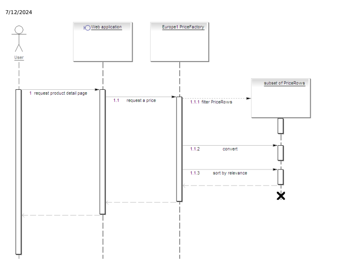

# Ordering, Payment And Pricing Standards

Ordering, payment, and pricing are processes that depend on many factors. The default implementations of strategies supporting those processes shipped with Platform provide for general business cases. However, they are extensible and granular in architecture, which allows you to replace them with your own implementations that fully support your specic business cases. The topics covered include:
Order Framework Extensibility The Order Framework is delivered with SAP Commerce Cloud. The framework focuses on handling subtypes of AbstractOrder, for example Orders and Carts.

Price, Tax, and Discount Calculation The europe1 extension handles all price, tax, and discount calculations in SAP Commerce Cloud.

Extensible Cart Calculation The extensible cart calculation is a solution based on service layer that can replace the default implementation of PriceFactory (Europe1PriceFactory). It provides an API and default implementations of the services and strategies for resolving prices, discounts, taxes, and delivery and payment costs used in cart (re)calculation. Channel Specic Pricing With Channel-Specic Pricing, you can set up different pricing models depending on how a user is accessing your store. Here you can nd how to congure, use, and extend the SAP Commerce Cloud functionality to provide channel-specic prices for products. Ordering Process SAP Commerce Cloud has a built-in ordering process that automatically handles calculation of prices, taxes, and discounts for orders. The focus lies on the creation, calculation, recalculation, and lifetime of the carts and orders. Here you will nd an overview of the phases of the ordering process and the technical processes in the background. Payment Transaction and Delivery Mode Handling SAP Commerce Cloud offers built-in support for management of fees for delivery of orders and payment methods. When a set-up of payment and delivery costs is done, the costs are automatically calculated and added to an order. SAP Commerce Cloud uses the best-matching elements of the set-up in terms of currency, user location and so on. Commerce Quotes Items Commerce Quotes enables buyers to create quotes and negotiate the nal price of an order using the storefront. Learn about the items included in platform core and platform services that enable Commerce Quotes.

## Related Information

deliveryzone Extension Order Framework Extensibility Price, Tax, and Discount Calculation Channel Specic Pricing Ordering Process Payment Transaction and Delivery Mode Handling Commerce Quotes Items

## Order Framework Extensibility

The Order Framework is delivered with SAP Commerce Cloud. The framework focuses on handling subtypes of AbstractOrder, for example Orders and Carts.

The Order Framework provides several different ways for extending your system by relying on lower-level components that implement particular features responsible for the whole functionality. Additionally, you can also add new interceptors to introduce custom logic for order processing. The order framework provides basic functionality for Carts and Order instances management:
Cloning order instances

Caving order instances Cloning with target type changing Managing order/cart entries
The Order Framework architecture is designed to provide two level separation in the framework - Separation of Concerns and Separation of AbstractOrder type.

1. Separation of Concerns: The main areas of the Order/Cart services are dened and encapsulated in the separate spring beans. Developers can exchange one of those beans with their customized implementations. Within those areas, you can nd: order/cart cloning, order/carts saving, data fetching (DAO), order placement, entries management. Each of them is represented by a strategy, DAO, or a service.

2. Separation of AbstractOrder Type: The main interface AbstractOrderService is a template interface.

interface AbstractOrderService<O extends AbstractOrderModel, E extends AbstractOrderEntryModel By extending it for a specic order type (OrderModel, CartModel) and order entry type (OrderEntryModel, CartEntryModel) you can obtain a set of its contract methods typed for the target order type. This is exactly how the OrderService and CartService are implemented. Apart from their own type dedicated logic, they share common functionality through the common AbstractOrder part. This separation is also reected by the default implementations. There is:
Generic implementation: For AbstractOrder type, there is DefaultAbstractOrderService.

More specic implementation: For Carts, there is DefaultCartService. For Orders, there is DefaultOrderService.

## Caution

SAP Commerce uses a specialised event that is sent by the enhanced DefaultOrderService class to monitor the use of different order metrics. To ensure that the data is sent and interpreted correctly, do not modify DefaultOrderService in your projects.

As you can see on the component diagram, the framework is based on the main service - DefaultAbstractOrderService -

that binds all the related beans into one ecosystem.

## 

OrderService and CartService provide main touch points for several basic business use cases, for example: order placement, obtaining session cart, order, or cart cloning. Those diversied cases involve many separated concerns. With the spring integration, the framework is decomposed into the smaller components, strategies, and data access object. This approach enables you to replace any of the framework components with another one that ts best into your order framework denition.

## Abstractorderservice

The AbstractOrderService is the main component for the Order Framework extensibility. It delegates the particular method calls to the dedicated strategies, DAOs, and subservices.

The AbstractOrderService joins all the common functionalities that are applicable for all of the AbstractOrder subtypes in the system (for example, Order or Cart). Here, you can nd methods to nd order instances, order entries instances, but also to add new entries. Such functionality is common for any type of order or cart. But you can't nd here the methods for order placement or session cart management as AbstractOrder type is not the type those methods belong to.

The following table groups the methods into the corresponding beans that handle them. This would give you the idea which parts of the main and shared functionality belong to which dependent spring bean's responsibilities.

| AbstractOrderService Methods                                                                                                               | Responsible Spring Bean                                                                                                                                                                  | Spring Bean Role                                                                                               |
|--------------------------------------------------------------------------------------------------------------------------------------------|------------------------------------------------------------------------------------------------------------------------------------------------------------------------------------------|----------------------------------------------------------------------------------------------------------------|
| addNewEntry(...)                                                                                                                           | abstractOrderEntryService                                                                                                                                                                | Resolve the proper type of the entry for the                                                                   |
| abstractOrderEntryTypeService                                                                                                              | given order instance. Create the order entry.                                                                                                                                            |                                                                                                                |
| clone(...)                                                                                                                                 | cloneAbstractOrderStrategy for its purpose, you can obtain the set of the functionalities for the order type of your choice. The order framework comes with two type-dedicated services: | Performs deep cloning of the target AbstractOrder instance. Uses cloning context to preset or skip attributes. |
| getEntryForNumber(final O order, final int number) getEntriesForNumber(final O order, final int start, final int end) getEntriesForProduct | orderDao                                                                                                                                                                                 | Constructs exible search queries the persistence layer.                                                        |
| saveOrder(...)                                                                                                                             | saveAbstractOrderStrategy                                                                                                                                                                | Responsible for persisting order or cart models.                                                               |

By extending the AbstractOrderService for a specic type and extending DefaultAbstractOrderServiceOrderService and CartService.

The following code snippet shows the spring conguration of the AbstractOrderService:
for its purpose, you can obtain the set of the functionalities for the orde For Order and Cart there are services available out of the box. --> <bean id="abstractOrderService" class="de.hybris.platform.order.impl.DefaultAbstractOrderService" a parent="abstractBusinessService" >
<property name="orderDao" ref="orderDao"/> <property name="abstractOrderEntryService" ref="abstractOrderEntryService"/> <property name="abstractOrderEntryTypeService" ref="abstractOrderEntryTypeService"/> <property name="saveAbstractOrderStrategy" ref="saveAbstractOrderStrategy"/> <property name="cloneAbstractOrderStrategy" ref="cloneAbstractOrderStrategy"/>
</bean>

## Orderservice

The OrderService extends the AbstractOrderService.

public interface OrderService extends AbstractOrderService<OrderModel, OrderEntryModel>
Its default implementation extends DefaultAbstractOrderService.

public class DefaultOrderService extends DefaultAbstractOrderService<OrderModel, OrderEntryModel> 
implements OrderService It means that the order service can do whatever the AbstractOrderService denes, but it does it for:
OrderModel: As an order type.

OrderEntryModel: As an entry type.
The spring conguration enables you to inject one of the dependent beans for the orderService purpose only. If you want the order saving to work differently for the orderService than it works for the generic service, you need to redeclare the corresponding strategy in the spring conguration for the orderService.

The following spring conguration snippet represents the scenario.

<alias alias="orderService" name="defaultOrderService"/> <bean id="defaultOrderService" class="de.hybris.platform.order.impl.DefaultOrderService" parent="abstractOrderService" >
 <property name="createOrderFromCartStrategy" ref="createOrderFromCartStrategy"/>
<property name="submitOrderStrategies">
<list>
<!-- implementation that sends SubmitOrderEvent --> <!-- <ref bean="eventPublishingSubmitOrderStrategy"/> -->
</list>
</property>
 </list> </property> </bean>
In addition to the contract of the AbstractOrderService, OrderService denes also function strictly reserved for the service: order submission.

/** * Create the order for the given <code>cart</code>. This method focuses on creating an {@link Orde * instance from the given {@link CartModel} instance. The order instance remains unsaved * and not calculated.  This method does nothing with the cart member attributes (addresses, pa * It also leaves the target cart untouched. * * If you want to calculate cart or order, use {@link CalculationService}. * * * @param cart * the target {@link CartModel} * @return a non persisted {@link OrderModel} * @throws InvalidCartException * if the cart is invalid according to the used {@link CartValidator}. */ OrderModel createOrderFromCart(CartModel cart) throws InvalidCartException; The method call is delegated to CreateOrderFromCartStrategy, replacing deprecated PlaceOrderStrategy, which denes the process of creating an actual order instance out of a cart instance. You can dene your own strategy here in order to represent your business process.

This is   For more    the SAP Help  20 Note Some of the deprecated logic from PlaceOrderStrategy is now taken care by the interceptors dedicated for Order. The DefaultOrderPrepareInterceptor takes care of the contract members cloning: address and payment info.

For additional functionality focused on OrderModel type, you can extend the OrderService interface or DefaultOrderService implementation.

## Cartservice

The CartService extends the AbstractOrderService.

public interface CartService extends AbstractOrderService<CartModel, CartEntryModel>
Its default implementation extends DefaultAbstractOrderService.

public class DefaultCartService extends DefaultAbstractOrderService<CartModel, CartEntryModel> 
implements CartService It means that the cart service can do whatever the AbstractOrderService denes, but it does it for CartModel as order type and CartEntryModel as entry type.

The spring conguration enables you to inject one of the dependent beans for the cartService purpose only. So, if you want the order cloning to work differently for the cartService than it works for the generic service, redeclare the corresponding strategy in the spring conguration for the cartService. The following spring conguration code example represents the scenario.

<alias alias="cartService" name="defaultCartService"/> <bean id="defaultCartService" class="de.hybris.platform.order.impl.DefaultCartService" parent="abst
>
<property name="cartFactory" ref="cartFactory"/> <property name="cloneAbstractOrderStrategy" ref="customizedCartCloningStrategy"/>
</bean>
For additional functionality focused on CartModel type, you can extend the CartService interface, or DefaultCartService implementation.

## Common Functional Areas Of Order Framework

See the common functional areas or the order framework. The topics cover:

## Cloning

You can clone AbstractOrderModel into the target instances of any type (for example, Order, Cart, YourCustomOrder)
from any original instance type. The common use case is creating order instance from cart instance. The following code example shows the method signature on the AbstractOrderService.

/** * Creates new order from given original and change its type and type for entry. Delegates to the s * {@link CloneAbstractOrderStrategy} injected strategy. Resulting order remains not persisted. * * @param orderType * type of result order (OrderModel will be chosen if null is passed) * @param entryType * type of entry (if null will use service to get proper type) * @param original * original order * @param code * code for new order * @return not persisted order model instance. */ clone(final ComposedTypeModel orderType, final ComposedTypeModel entryType, final AbstractOrderMode final String code);
Since this belongs to the shared functionality for any order type - you can call it from OrderService or CartService and get the result of the type that the particular service focuses on. For example, when called from OrderService, the clone method always returns OrderModel instance.

...

CartModel cart = cartService.getSessionCart(); OrderModel order = orderService.clone(null, null, cart, "123");
...

If you are interested in the particular composed type (Order's subtype), you can give the desired ComposedType of the order and entry as method's arguments. Keep in mind that as you call the method from OrderService, the returned class is OrderModel and in result you may need to cast it.

The logic of the clone method delegates to the clone method of the internal strategy. You can change the service behavior when clone() method is called by replacing the responsible strategy. Implement your own cloning strategy that realizes the de.hybris.platform.order.strategies.ordercloning.CloneAbstractOrderStrategy contract.

## Cloneabstractorderhook

Instead of overwriting the clone behavior with your own strategy, you can also decorate it by implementing the before or after hooks of CloneAbstractOrderHook. As a result, you can use multiple independent hooks without overwriting the clone behavior. For example, you can use a clone hook when given elds of an order contain references to objects in other systems or external resources. When the order gets cloned, you need to implement a hook that clones the external resource or an object in a different system.

## Methods For Adding Entries To Abstractorder

You can use any of the addNewEntry methods to append or insert new order entries to AbstractOrder on specic entryNumber.

Appending is possible for any case, but the insert option is implementation-dependent. For example, you are always able to shuffle entries in the cart, but not the order. The entry number in the order is an important contract information and normally should never be changed once the order has been placed.

So, while the CartService directly inherits the generic implementation in DefaultAbstractOrder, the OrderService performs additional check if the new entry would cause entry numbers collision.

@Override public OrderEntryModel addNewEntry(final OrderModel order, final ProductModel product, final long q final UnitModel unit, final int number, final boolean addToPresent)
This is   For more    the SAP Help  22
{
ServicesUtil.validateParameterNotNullStandardMessage("order", order); checkOrderEntryNumberCollisions(order, number); return super.addNewEntry(order, product, qty, unit, number, addToPresent);
}
In terms of extensibility, there are two important players in the addNewEntry() method logic:

AbstractOrderEntryTypeService: To resolve the entry type, if none was given. The bean relies on the spring congurable order type to order entry type mapping - orderType2orderEntryTypeMapping. If no such mapping was given, then it checks the atomic type of the ENTRIES attribute of the given order.

AbstractOrderEntryService: To create the entry instance. If for some reason you want the addNewEntry()
method to act differently, you can try to replace the abstractOrderEntryTypeService or abstractOrderEntryService injections. You can inuence the type matching by plugging in your own type-mapping
(orderType2orderEntryTypeMapping to the DefaulAbstractOrderEntryTypeService).

## Methods For Fetching Order Entries

See the methods that allow you to fetch order entries by product, entry number, or entry number range. In the default implementation, the methods calls are handled by the Order DAO.

/** * Returns an order entry with the given {@link AbstractOrderEntryModel\#ENTRYNUMBER}. The method de * access object and checks the actual persisted order in the data base, not the order state repres * model. * * @param order * @param number * @throws UnknownIdentifierException * if no entry with the requested number exists * @throws IllegalArgumentException * if either order is null or number is negative * * @return {@link AbstractOrderEntryModel} */
E getEntryForNumber(final O order, final int number);
/** * Returns order entries with the given {@link AbstractOrderEntryModel\#ENTRYNUMBER}. The method * delegates to data access object and checks the actual persisted order in the data base, * not the order state represented by the model. * * @param order * @param start * start of the range * @param end * end of the range * @throws UnknownIdentifierException * if no entry from the requested range number exists * @throws IllegalArgumentException * if either order is null or start is negative or start is greater than end * * @return {@link AbstractOrderEntryModel} */ List<E> getEntriesForNumber(final O order, final int start, final int end); /** * Returns order entries having the target product. In case is no entry contains the requested prod * empty list is returned. The method delegates to data access object and * checks the actual persisted order in the data base, not the order state represented by the model * * @param order * - target order * @param product This is   For more    the SAP Help  23

 * - searched product * @throws IllegalArgumentException * if either order or product is null * * @return matching order entries */ List<E> getEntriesForProduct(final O order, final ProductModel product);
Those methods can be grouped as repository type methods. They fetch persisted data and delegate the calls to the dedicated order data access object. In case you want to change the functionality here, you can replace or overwrite it on your own.

Customized DAO must realize de.hybris.platform.order.daos.OrderDao contract.

## Methods For Adding Or Removing Taxes And Global Discounts

AbstractOrderService consist a set of convenience methods to manage order's taxes and global discounts.

These methods add TaxValues or DiscountValues to an order model without persisting the change. They do not have their separate components to handle the logic. They simply attach the taxValue or DiscountValue to the order or remove them.

After such operation, the order (or the cart) must be recalculated.

## Myownorder Type

Following the pattern of OrderService and CartService, you can introduce a dedicated service for your own AbstractOrder type.

By extending the generic classes, you can end up having the basic functionality contract for your AbstractOrder subtype:
public interface MyOrderService extends AbstractOrderService<MyOrderModel, MyOrderEntryModel> public class DefaultMyOrderService extends DefaultAbstractOrderService<MyOrderModel, MyOrderEntryMo implements MyOrderService Remember to register the service with proper dependency on abstractOrderService.

<alias alias="myOrderService" name="defaultMyOrderService"/> <bean id="defaultMyOrderService" class="de.hybris.platform.order.impl.DefaultMyOrderService" parent="abstractOrderService" >
<!-- you can use dedicated strategies beans, or using the default ones by leaving the spot empty--> </bean>

## Order-Related Functionality

You can create an order for a given cart or specify what you want order numbers to consist of.

## Create Order From Cart

By calling this method, you create an OrderModel instance out of the source CartModel. Then, after persisting the model you can have an actual order in the system, which represents a real selling contract.

/** * Create the order for the given <code>cart</code>. This method focuses on creating an {@link Orde * instance from the given {@link CartModel} instance. The order instance remains unsaved * and not calculated.  This method does nothing with the cart member attributes (addresses, pa This is   For more    the SAP Help  24
 * It also leaves the target cart untouched. * * If you want to calculate cart or order, use {@link CalculationService}. * * * @param cart * the target {@link CartModel} * @return a non persisted {@link OrderModel} * @throws InvalidCartException * if the cart is invalid according to the used {@link CartValidator}. */ OrderModel createOrderFromCart(CartModel cart) throws InvalidCartException; The default implementation delegates to the dedicated strategy. The spring bean denes the process of the order placement. Use the default one, or dene your own order placement process by exchanging the current strategy with your own. To do so, implement the de.hybris.platform.order.strategies.CreateOrderFromCartStrategy.

## Customizing Order Number Generation

Use the new KeyGenerator interface and its PersistentKeyGenerator implementation instead of NumberSeriesManager.

This allows users to customize the order generation process using values specied in the local.properties le. There is a number of available customization options. To use them, dene the following set of properties in local.properties.

You can specify:
local.properties How many digits are in the order code

Start order code Whether the code is numeric only Template to be used in order code generation
keygen.order.code.digits=8 keygen.order.code.start=00000000 keygen.order.code.type=numeric keygen.order.code.template=$
The bean with properties is now in core-spring.xml.

<bean id="orderCodeGenerator" class="de.hybris.platform.servicelayer.keygenerator.impl.PersistentKe <property name="key" value="${keygen.order.code.name}"/> <property name="digits" value="${keygen.order.code.digits}"/> <property name="start" value="${keygen.order.code.start}"/> <property name="numeric" value="${keygen.order.code.numeric}"/> <property name="template" value="${keygen.order.code.template}"/>
You can also use the symbol @, which stands for the system PK:
local.properties keygen.order.code.template=ACC-@-$-DE
This generates order codes that contain a unique Platform number (return value of MasterTenant.getClusterIslandPK()), for example 123456. The whole order code in this case looks like this:

ACC-123456-00000001-DE

## Note

When you customize the order number using the method above while you already have orders in the system, you must restart Platform to apply your changes. To customize order generation without restarting Platform, use Administration Console groovy web console:
import de.hybris.platform.jalo.numberseries.* NumberSeriesManager nm = NumberSeriesManager.getInstance() def s = nm.getNumberSeries("order_code") println "Before: current: ${s.currentNumber} type: ${s.type} template: ${s.template}" nm.resetNumberSeries(s.key, "777", s.type, s.template ) def s2 = nm.getNumberSeries("order_code") println "After: current: ${s2.currentNumber} type: ${s2.type} template: ${s2.template}"

## Framework Components

The AbstractOrderService relies on several lower-level components that together support the order framework.

The following sections provide an overview of these components:

## Services

See the services that AbstractOrderService relies on.

## Abstractorderentrytypeservice

The key functionality allows you to determine suitable order entry type, that means ComposedType for the target order.

public interface AbstractOrderEntryTypeService
{ /** * Returns {@link ComposedTypeModel} of order entry that best match the target order. * * @param order * target {@link AbstractOrderModel} * @return {@link ComposedTypeModel} of given order's entries. */ public ComposedTypeModel getAbstractOrderEntryType(final AbstractOrderModel order); /** * Convenience method for resolving {@link Class} of the given order entry {@link ComposedTypeModel * * @param entryType * - {@link ComposedTypeModel} you want to check class for. * @return {@link Class} that corresponds to the type. */ public Class getAbstractOrderEntryClassForType(ComposedTypeModel entryType); }
If you want to inuence the automatic type matching of the AbstractOrderEntryTypeService, extend it and congure orderType2orderEntryTypeMapping mapping property in the extension's spring xml conguration. This is shown on the following example, where orders are expected to get some custom order entries and custom cart are based on standard cart entries.

This is   For more    the SAP Help  26

... <alias alias="abstractOrderEntryTypeService" name="customAbstractOrderEntryTypeService"/> <bean id="customAbstractOrderEntryTypeService" parent="defaultAbstractOrderEntryTypeService" > <!-- You can configure order to order entry type mapping of your choice. If this map is not configu the service will resolve the type from atomic type of the order's 'entries' collection. --> <property name="orderType2orderEntryTypeMapping">
<map>
<entry key="Order" value="CustomOrderEntry"/> <entry key="CustomCart" value="CartEntry"/>
</map>
</property> </bean>

## Abstractorderentryservice

Similarly to AbstractOrderService, this service is also template service, only dening a set of common functionality on the AbstractOrderEntryModel type level.

public interface AbstractOrderEntryService<E extends AbstractOrderEntryModel>
And similarly to AbstractOrderService, it is also extended by typed interfaces focused on the concrete order entry types.

Example for the cart entries is shown on the code sample below.

public interface CartEntryService extends AbstractOrderEntryService<CartEntryModel>
Sample for order entries-related service.

public interface OrderEntryService extends AbstractOrderEntryService<OrderEntryModel>
At this point, the logic is implemented only on the generic AbstractOrderEntry level. The OrderEntryService and CartEntryService are only marker interfaces to provide consistency.

The AbstractOrderEntryService service is a framework's helper service oriented on order entries. It enables you to create such order entry for a given order using the following:
Automatic type matching: Using AbstractOrderEntryTypeService.

## Custom Entry Type On Demand

/** * Creates a new instance of order entry for a given abstract order instance. The entry type is cho * to best suit the order instance. New entry remains not persisted. * * @see AbstractOrderEntryTypeService\#getAbstractOrderEntryType(AbstractOrderModel) * * @param abstractOrder * target order * @return new order entry of the suitable runtime type. */ public E createEntry(final AbstractOrderModel abstractOrder); /** * Creates a new instance of abstract order entry of the specific composed type for a given order i * New entry remains not persisted. * * @param abstractOrder * target order * @param entryType * create entry of this specific type * @return new abstract order entry of the specific runtime type.

This is   For more    the SAP Help  27

 */ public AbstractOrderEntryModel createEntry(final ComposedTypeModel entryType,final AbstractOrderMod As it relies on the AbstractOrderEntryTypeService, you could inject different implementation of it in your extension's spring conguration.

If you want to provide only the order entry-related logic for a particular entry type (for example, MyOrderEntry), you can provide a new implementation of AbstractOrderEntryService for that type (AbstractOrderEntryService
<MyOrderEntry>) and register it in the spring conguration. You can further use it in your corresponding AbstractOrderService<MyOrder, MyOrderEntry> service.

If MyOrderEntry extends AbstractOrderEntry and MyOrder extends AbstractOrder, then you can congure new services as shown in examples below.

For MyOrder:
public interface MyOrderService extends AbstractOrderService<MyOrderModel> public class DefaultMyOrderService extends DefaultAbstractOrderService<MyOrderModel> implement For MyOrderEntry:
public interface MyOrderEntryService extends AbstractOrderEntryService<MyOrderEntryModel> public class DefaultMyOrderEntryService extends DefaultAbstractOrderEntryService<MyOrderEntryM
implements MyOrderEntryService
... <bean id="myOrderEntryService" class="de.hybris.platform.order.impl.DefaultMyOrderEntryService" parent="defaultAbstractOrderEntryService">
<!-- inject whatever you need to use in your implementation -->
</bean> <bean id="myOrderService" class="de.hybris.platform.order.impl.DefaultMyOrderService" parent="defaultAbstractOrderService">
<property name="abstractOrderEntryService" ref="myOrderEntryService"/>
<!-- inject whatever you need to use in your implementation -->
</bean> ...

## Strategies

The DefaultAbstractOrderService has dedicated and exchangeable strategies for the following functionality provided by the order framework: cloning and saving.

## Submitorderstrategy

This strategy submits the order after it is created.

Default implementation EventPublishingSubmitOrderStrategy sends SubmitOrderEvent. If you wish to do something else, then you can implement the interface and inject it into the Order Service that provides the list of strategies red one after another.

public interface CreateOrderFromCartStrategy {
This is   For more    the SAP Help  28

 /** * Submits the order. One of strategies that is invoked by {@link OrderService\#submitOrder(OrderMod * your own implementation(s) there. * * @param order * order to submit. */ void submitOrder(OrderModel order); }

## Cloneabstractorderstrategy

Cloning is responsible for creating one AbstractOrderModel instance (clone) from any other AbstractOrderModel instance. For example, you can clone a real future order out of the customer cart after he or she has nally agreed to nalize the order.

public interface CloneAbstractOrderStrategy { /** * Make a clone of an abstract order (eventually change the type). * * @param orderType * type of newly created order * @param entryType * type of order entry of newly created order * @param original * original order * @param code * code of created order */ <T extends AbstractOrderModel> T clone(ComposedTypeModel orderType, ComposedTypeModel entryType, AbstractOrderModel original, String code, final Class abstractOrderClassRes final Class abstractOrderEntryClassResult);
/** * Make a clone of entries (eventually change their type). If entriesType is null, the type will be * according to {@link AbstractOrderEntryTypeService\#getAbstractOrderEntryType(AbstractOrderModel)} * * @param entriesType * type of cloned entries * @param original * original abstractOrder * @return cloned order entries * @throws IllegalArgumentException * if original is null */ <T extends AbstractOrderEntryModel> Collection<T> cloneEntries(ComposedTypeModel entriesType, AbstractOrderModel original);
}
If you want to replace the cloning strategy in the framework with your own implementation (or the default extension of DefaultCloneAbstractOrderStrategy), you can provide an implementation of the de.hybris.platform.order.strategies.ordercloning.CloneAbstractOrderStrategy and congure it in your extension's spring conguration.

public class MyCloneOrderStrategy extends DefaultCloneAbstractOrderStrategy implements CloneAbstrac { ... } <alias alias="cloneAbstractOrderStrategy" name="myCloneAbstractOrderStrategy"/> <bean id="myCloneAbstractOrderStrategy" class="de.hybris.platform.order.strategies.ordercloning.impl.MyCloneAbstrac parent="defaultCloneAbstractOrderStrategy">
This is   For more    the SAP Help  29

## Createorderfromcartstrategy

This strategy is responsible for taking a cart and making a real order from it.

public interface CreateOrderFromCartStrategy { /** * Validates the cart using {@link CartValidator} and performs cart to order cloning. * * @param cart * - the target {@link CartModel} * @throws InvalidCartException * according to {@link CartValidator} implementation. * @return an unsaved and not calculated {@link OrderModel} instance. */ OrderModel createOrderFromCart(CartModel cart) throws InvalidCartException; }
This process usually differs in every project. It means that you can dene your own logic. The default implementation additionally validates the cart by using injected CartValidator. One can dene his or her own validator in order to prevent from creating orders from carts not fullling your business requirements. Here is the spring conguration of the default strategy:
<alias alias="createOrderFromCartStrategy" name="defaultCreateOrderFromCartStrategy"/> <bean id="defaultCreateOrderFromCartStrategy" class="de.hybris.platform.order.strategies.impl.DefaultCreateOrderFromCartS >
<property name="cartValidator" ref="cartValidator"/> <property name="cloneAbstractOrderStrategy" ref ="cloneAbstractOrderStrategy"/>
</bean>
As you can see, it uses the validator mentioned earlier and the cloning strategy to clone the cart into a new order. If you wish to exchange the order placement strategy in the framework with your own implementation (or extension of DefaultCreateOrderFromCartStrategy), you can provide an implementation of the de.hybris.platform.order.strategies.CreateOrderFromCartStrategy and congure it in your spring conguration. The following example presents the case where a customized strategy extends the default one.

public class MyPlaceOrderStrategy extends DefaultCreateOrderFromCartStrategy implements CreateOrder { ... } <alias alias="createOrderFromCartStrategy" name="myCreateOrderFromCartStrategy"/> <bean id="myCreateOrderFromCartStrategy" class="de.hybris.platform.order.strategies.impl.MyPlaceOrd parent="defaultCreateOrderFromCartStrategy"> <!-- inject whatever you need to use in your implementation --> </bean>

## Saveabstractorderstrategy

SaveAbstractOrderStrategy is responsible for persisting the given AbstractOrderModel instances.

public interface SaveAbstractOrderStrategy<O> { /** * Saves the given order model and the order entries. * * @param order * order model * @return saved and refreshed order model */ O saveOrder(final O order); }
Usually, you could persist the order models using standard method like calling save() method from the ModelService. But for such important data like orders it might happen that there is a need of some special saving logic. The default implementation tries to save the order and the entries within one transaction and refresh the models. If you want to replace the saving strategy in the framework with your own implementation (or the default extension of DefaultSaveAbstractOrderStrategy), you can provide an implementation of the de.hybris.platform.order.strategies.saving.SaveAbstractOrderStrategy and congure it in the spring conguration of your extension.

public class MySaveAbstractOrderStrategy extends DefaultSaveAbstractOrderStrategy implements SaveAbstractOrderStrategy
{ ... } <alias alias="saveAbstractOrderStrategy" name="mySaveAbstractOrderStrategy"/> <bean id="mySaveAbstractOrderStrategy" class="de.hybris.platform.order.strategies.saving.impl.MySaveAbstractOrderS parent="defaultSaveAbstractOrderStrategy">
<!-- inject whatever you need to use in your implementation -->
</bean>

## Dataaccessobjects

In addition to the services and strategies determining the basic ow in the framework, there is also a component used to fetch the order-related data from the persistence layer.

## Orderdao - Order Data Access Object

public interface OrderDao { /** * Returns order entries with the matching order entry number * * @param entryTypeCode * - entries of this specific type will be searched. I.e 'OrderEntry', 'CartEntry' * @param number * - requested entry number * @param order * - target order * * @return List of matching order entries, or {@link Collections\#EMPTY_LIST} in case if no entries */ List<AbstractOrderEntryModel> findEntriesByNumber(String entryTypeCode, AbstractOrderModel order, i /** * Returns order entries with the order entry number from the requested range * * @param entryTypeCode * - entries of this specific type will be searched. I.e 'OrderEntry', 'CartEntry' This is   For more    the SAP Help  31

 * * @param order * - target order * @param start * lower range limit * @param end * upper range limit * * @return List of matching order entries, or {@link Collections\#EMPTY_LIST} in case if no entries */ List<AbstractOrderEntryModel> findEntriesByNumber(String entryTypeCode, AbstractOrderModel order, i /** * Returns order entries with the matching product * * @param entryTypeCode * - entries of this specific type will be searched. I.e 'OrderEntry', 'CartEntry' * @param product * - requested {@link ProductModel} * @param order * - target order * * @return List of matching order entries, or {@link Collections\#EMPTY_LIST} in case if no entries */ List<AbstractOrderEntryModel> findEntriesByProduct(String entryTypeCode, final AbstractOrderModel o final ProductModel product);
/** * Returns orders of the type specified with the given currency. * * @param currency * the target currency * * @return {@link List} of {@link AbstractOrderModel} - matched orders * @throws IllegalArgumentException * if currency is null * @throws IllegalStateException * if currency is not persisted. */ List<AbstractOrderModel> findOrdersByCurrency(CurrencyModel currency); /** * Returns orders with the given delivery mode. * * @param deliveryMode * target {@link DeliveryModeModel} * * @return {@link List} of {@link AbstractOrderModel} - matched orders * @throws IllegalArgumentException * if deliveryMode is null * @throws IllegalStateException * if deliveryMode is not persisted. */ List<AbstractOrderModel> findOrdersByDelivereMode(DeliveryModeModel deliveryMode); /** * Returns orders with the given payment mode. * * @param paymentMode * target {@link PaymentModeModel} * * @return {@link List} of {@link AbstractOrderModel} - matched orders * @throws IllegalArgumentException * if paymentMode is null * @throws IllegalStateException * if paymentMode is not persisted. */ List<AbstractOrderModel> findOrdersByPaymentMode(PaymentModeModel paymentMode); }
If you wish to change something in a way that these order and order entry models are fetched from the database, then you can extend the default implementation. Implement the OrderDao interface and register it in your extension's spring conguration.

The example presents the case where customized DAO extends the default one.

This is   For more    the SAP Help  32 public class MyOrderDao extends DefaultOrderDao implements OrderDao { ... } <alias alias="orderDao" name="myOrderDao"/> <bean id="myOrderDao" class="de.hybris.platform.order.daos.impl.MyOrderDao" parent="defaultOrderDao">
<!-- inject whatever you need to use in your implementation -->
</bean>

## Order-Related Interceptors

Modifying services and strategies is not the only way you can inuence how the order framework behaves. Have a look at the interceptors dened for orders and order entries.

 Fig. Interfaces for Order-Related Interceptors By adding new interceptors or modifying the existing ones, you can hook up custom logic whenever orders, in other words order entries, are prepared, validated, loaded, or removed. For more details on interceptors, see Interceptors documentation.

## Defaultabstractorderentrypreparer

This interceptor resets the calculated ag on the entry and on the owning order, in case one of the predened attributes has been modied. This provides some automation in determining if the order and the order entry are to be calculated. This interceptor is activated by default. It prepares:
order entry info eld: According to the contained product. orderentry.infoeld.orderEntry: Property that denes the syntax of the information.

<alias name="defaultAbstractOrderEntryPreparer" alias="abstractOrderEntryPreparer"/> <bean id="defaultAbstractOrderEntryPreparer" class="de.hybris.platform.order.interceptors.DefaultAbstractOrderEntryPreparer" >
<property name="typeService" ref="typeService"/> <property name="modelService" ref="modelService"/> <property name="configurationService" ref="configurationService"/> <!-- optionally, define attributes that, when modified, will reset CALCULATED flag <property name="attributesForOrderRecalculation">
<list>
<value>product</value> <value>quantity</value>
This is   For more    the SAP Help  33
<value>basePrice</value> ... </list>
</property> -->
</bean>
In terms of extensibility you can:
1. Deactivate the interceptor.

2. Replace it with your own implementation of PrepareInterceptor.

3. Change the syntax of the order entry info eld and modify orderentry.infofield.orderEntry property.

4. Decide which attributes, when modied, should reset CALCULATED ags. By default the following set is used: PRODUCT,
QUANTITY, UNIT, BASEPRICE, TAXVALUES, DISCOUNTVALUES, GIVEAWAY, REJECTED.

## Defaultabstractorderentryremoveinterceptor

Before an order entry is removed, the interceptor marks the owning order as not calculated.

<alias name="defaultAbstractOrderEntryRemoveInterceptor" alias="abstractOrderEntryRemoveInterceptor <bean id="defaultAbstractOrderEntryRemoveInterceptor" class="de.hybris.platform.order.interceptors.DefaultAbstractOrderEntryRemoveInterce >
<property name="modelService" ref="modelService"/>
</bean>
In terms of extensibility, you can:
1. Deactivate the interceptor.

2. Replace it with your own implementation of RemoveInterceptor.

## Defaultabstractorderprepareinterceptor - Abstractordermodel Type

The interceptor provides order code value in case it has not been already set in the model directly, and controls the CALCULATED ag on the order and its entries.

<alias name="defaultAbstractOrderPrepareInterceptor" alias="abstractOrderPrepareInterceptor"/> <bean id="defaultAbstractOrderPrepareInterceptor" class="de.hybris.platform.order.interceptors.DefaultAbstractOrderPrepareInt >
<property name="keyGenerator" ref="orderCodeGenerator"/> <!-- define qualifiers of order attributes, which, when modified, the order and orderEntrie need to be recalculated. <property name="attributesForOrderEntriesRecalculation">
<list>
<value>date</value> <value>user</value> <value>currency</value> <value>net</value>
</list>
</property> --> <!-- define qualifiers of order attributes, which, when modified, the order needs to be rec <property name="attributesForOrderRecalculation">
<list>
<value>deliveryModel</value> <value>deliveryCost</value> <value>paymentModel</value>
This is   For more    the SAP Help  34 In terms of extensibility you can:
1. Deactivate the interceptor.

2. Replace it with your own implementation of PrepareInterceptor.

3. Provide your own order key generator: keyGenerator.

4. Decide which attributes, when modied, should reset CALCULATED ag on order. By default the following set is used:
DELIVERYMODE, DELIVERYCOST, PAYMENTMODE, PAYMENTCOST, TOTALTAXVALUES, DISCOUNTS, DISCOUNTSINCLUDEDELIVERYCOST, DISCOUNTSINCLUDEPAYMENTCOST, DELIVERYADDRESS, PAYMENTADDRESS.

5. Decide which attributes, when modied, should reset CALCULATED ag of an order and order entries. By default, the following set is used: NET, USER, CURRENCY, DATE.

## Defaultabstractorderremoveinterceptor - Abstractordermodel Type

This type removes the payment and delivery address and payment info, which have been cloned for the order.

<bean id="defaultAbstractOrderRemoveInterceptor" class="de.hybris.platform.order.interceptors.DefaultAbstractOrderRemoveInterceptor"
<property name="modelService" ref="modelService"/>
</bean>
It removes the following data that have been cloned for the order:
1. PAYMENTADDRESS
2. DELIVERYADDRESS 3. PAYMENTINFO
In terms of extensibility you can:
1. Deactivate the interceptor.

2. Replace it with your own implementation of RemoveInterceptor.

## Defaultorderprepareinterceptor - Particular Type Of Abstractordermodel: Ordermodel Type

This type clones the order contract data such as: addresses and payment info.

<alias name="defaultOrderPrepareInterceptor" alias="orderPrepareInterceptor"/>
<bean id="defaultOrderPrepareInterceptor" class="de.hybris.platform.order.interceptors.DefaultOrderPrepareInterceptor" >
<property name="orderPartOfMembersCloningStrategy" ref="orderPartOfMembersCloningStrategy"/
</bean>
The cloning bases on a strategy that can be replaced with a customized implementation. In terms of extensibility you can:
1. Deactivate the interceptor.

2. Replace it with your own implementation of PrepareInterceptor.

3. Replace the strategy, which decides when cloning is necessary and how the cloning operation proceeds.

## Orderpartofmemberscloningstrategy

public interface OrderPartOfMembersCloningStrategy { /** * Clones an address and sets the order as the clone's owner. * * @param address * address to clone * @param order * owning order * @return cloned but <b>not persisted</b> {@link AddressModel} instance. */ AddressModel cloneAddressForOrder(AddressModel address, OrderModel order); /** * Checks according to business strategies whether given address needs to be cloned * as a part of order's contract. * * @param address * * @param order * * @return true if this address needs to be cloned. * @throws IllegalArgumentException * if order is null */ boolean addressNeedsCloning(AddressModel address, OrderModel order); /** * Clones a payment info and sets the order as the clone's owner. * * @param paymentInfo * payment info to clone * @param order * owning order * @return cloned but <b>not persisted</b> {@link PaymentInfoModel} instance. */ PaymentInfoModel clonePaymentInfoForOrder(PaymentInfoModel paymentInfo, OrderModel order); /** * Checks according to business strategies whether given payment info needs to be cloned as a part * order's contract. * * @param paymentInfo * * @param order * * @return true if this address needs to be cloned. * @throws IllegalArgumentException * if order is null */ boolean paymentInfoNeedsCloning(PaymentInfoModel paymentInfo, OrderModel order); }
You can extend default implementation of the DefaultOrderPartOfMembersCloningStrategy interface if you wish to inuence how and when the address and payment info are cloned for the purpose of the order placement.

public class MyOrderPartOfMembersCloningStrategy extends DefaultOrderPartOfMembersCloningStrategy i OrderPartOfMembersCloningStrategy
{ ... }

Congure the strategy in the spring conguration le. Be advised not to use the order-spring.xml le for that purpose, but to use your own le, as any update of SAP software could overwrite your changes.

<alias name="myOrderPartOfMembersCloningStrategy" alias="orderPartOfMembersCloningStrategy"/> <bean id="myOrderPartOfMembersCloningStrategy" class="de.hybris.platform.order.strategies.ordercloning.impl.MyOrderPartOfMembersCloningStr parent="defaultOrderPartOfMembersCloningStrategy"/>

## Price, Tax, And Discount Calculation

The europe1 extension handles all price, tax, and discount calculations in SAP Commerce Cloud.

Price Calculation SAP Commerce Cloud stores all possible prices for products and customers as price row objects. Every price row represents a certain price constellation, which is optionally related to a certain date range, customer, product, group of customers, or group of products. Tax Calculation SAP Commerce Cloud stores all possible taxes for products and customers as TaxRow objects. Every TaxRow object represents a certain tax constellation, which is optionally related to a certain date range, customer, product, group of customers, or a group of products. Discount Calculation SAP Commerce Cloud stores all possible discounts for products and customers as DiscountRow objects. EveryDiscountRow represents a certain discount constellation, which is optionally related to a certain date range, customer, product, group of customers, or group of products. Time-Dependent Prices and Discounts The types that dene prices, taxes, and discounts have a common supertype, the abstract PriceDiscountTaxRow, or PDTRow type.

Overriding and Testing Settings You can override customer-related and product-related group settings. Decoupling PDTRows from Product Find out how decoupling PDTRows from the Product affects synchronization.

Editing Tax and Discount Values of an Order in Backoffice You can edit tax and discount values of an order in Backoffice. We assume that you apply taxes per line item - at order entry level. It means a tax is calculated on the total selling price of an individual item. Our examples show discounts applied both at order entry, and order levels.

## Price Calculation

SAP Commerce Cloud stores all possible prices for products and customers as price row objects. Every price row represents a certain price constellation, which is optionally related to a certain date range, customer, product, group of customers, or group of products. Every PriceRow object is a potential price. When a price is required for display, the Europe1 PriceFactory retrieves all PriceRow objects related to the combination of customer and products. This is because unless an order is placed, the number of products is not determined and therefore scale prices might apply. When a price is required for an order, the Europe1 PriceFactory retrieves all PriceRow objects related to the combination of customer and products and then chooses the best matching PriceRow. The following diagram shows the basic course of action for the ordering case.

To handle a request for a price for a product, the Europe1 PriceFactory retrieves all PriceRow objects that match the combination of user and product. The remaining subset of PriceRows is converted so that the PriceRows are comparable. The converted PriceRows are sorted by the relevance to the combination of customer and product. Finally, the best matching combination is returned as the nal price.

## Attributes Of A Pricerow

The following table provides an overview of the attributes of a PriceRow object.

| Attribute Name   | Attribute Type    | Mandatory   | Description                                                                    |
|------------------|-------------------|-------------|--------------------------------------------------------------------------------|
| channel          | PriceRowChannel   | no          | Channel for which the price is effective (for example, mobile or desktop).     |
| currency         | Currency          | yes         | Currency of the price. No default value.                                       |
| dateRange        | StandardDateRange | no          | Date range for the PriceRow object's validity.                                 |
| giveAwayPrice    | java.lang.Boolean | yes         | Species whether a price row has a give-away price. The default value is false. |
| endTime          | java.util.Date    | no          | Species the end date of a price's validity.                                    |

| 7/12/2024 Attribute Name   | Attribute Type    | Mandatory   | Description                                                                                                                                                                         |
|----------------------------|-------------------|-------------|-------------------------------------------------------------------------------------------------------------------------------------------------------------------------------------|
| matchValue                 | java.lang.Integer | no          | Internally calculated value that is based on user and product information. The value is used for sorting PriceRow records by their relevance.                                       |
| minqtd                     | java.lang.Long    | yes         | Scale price denition. A customer needs to order at least this number of units for this price to be effective. Default value is 1.                                                   |
| net                        | java.lang.Boolean | no          | Species whether the price specied is net or gross. Default value is gross.                                                                                                          |
| pg                         | ProductPriceGroup | no          | Product Pricelist for which the price is effective. The price is applied to all members of this Product Pricelist.                                                                  |
| price                      | java.lang.Double  | yes         | Price to be set.                                                                                                                                                                    |
| product                    | Product           | no          | Product for which the price is set.                                                                                                                                                 |
| productMatchQualier        | java.lang.Long    | no          | Internally calculated value based on product information. The value is used to lter out the PriceRow records that are considered when a price is being retrieved.                   |
| startTime                  | java.util.Date    | no          | Species the start date of a price's validity.                                                                                                                                       |
| ug                         | UserPriceGroup    | no          | Customer Pricelist for which the price is effective. The price is applied to all members of this Customer Pricelist.                                                                |
| unit                       | Unit              | yes         | The unit this price is measured in. No default value.                                                                                                                               |
| unitFactor                 | java.lang.Integer | yes         | The number of individual units the price refers to. If you set the price to 50 EUR and the unitFactor to 5, the individual unit's price is 10 EUR (50 EUR / 5). Default value is 1. |
| user                       | User              | no          | Customer for which the price is set.                                                                                                                                                |
| userMatchQualier           | java.lang.Long    | no          | Internally calculated value that is based on user information. The value is used to lter out the PriceRow records that are considered when a price is being retrieved.              |

If neither the customer nor a UserPriceGroup is given for a certain PriceRow, the specied price applies to all customers in SAP
Commerce Cloud. If neither the product nor ProductPriceGroup is given for a certain PriceRow, the specied price applies to all products in SAP Commerce Cloud.

## Filtering Pricerows

During the ltering phase, the Europe1 PriceFactory selects all PriceRows matching the combination of customer and product. A PriceRow must match all of the following criteria to apply:
customer or customer group or no customer-related value (blank eld)

product or product group or no product-related value (blank eld) date range
scale price If a PriceRow fails to match all the criteria, it is not applied and therefore not considered by the Europe1 PriceFactory.

## Customer Matching

To match a customer, a PriceRow must be one of the following:
empty set to match the customer, or the customer's user group.

To match the customer, the PriceRow's user attribute must be set to contain the customer. To match the customer's user group, the PriceRow's ug (user price group) must be set to contain a user group (an instance of UserPriceGroup) which contains the customer. If there is a PriceRow that has no Customer or UserPriceGroup assigned to it, that PriceRow is applied to all customers and therefore be effective by default. The following table lists some possible combinations and whether the respective PriceRow is applied to the customer.

| PriceRow Assigned To                                                                 | Current Customer                     | PriceRow Applies to the Current Customer?   |
|--------------------------------------------------------------------------------------|--------------------------------------|---------------------------------------------|
| kotal                                                                                | kotal                                |                                             |
| kotal                                                                                | abel                                 |                                             |
| customergroup                                                                        | kotal (member of customergroup)      |                                             |
| customergroup                                                                        | abel (not a member of customergroup) |                                             |
| (no assignment)                                                                      | kotal                                |                                             |
| (no assignment)                                                                      | abel                                 |                                             |
| (no assignment)                                                                      | kotal (member of customergroup)      |                                             |
| (no assignment)                                                                      | abel (not a member of customergroup) |                                             |
| This is custom documentation. For more information, please visit the SAP Help Portal | 40                                   |                                             |

In other words:

If the current Customer is different from the Customer the PriceRow is assigned to, the PriceRow is not applied. If the PriceRow is assigned to a UserPriceGroup and the current Customer is not a member of this UserPriceGroup, the PriceRow is not applied either.

## Product Matching

To match a product, a PriceRow must be one of the following:
empty set to match the product or the product's price group.

To match the product, the PriceRow's product attribute must be set to contain the product. To match the product's price group, the PriceRow's pg (product price group) must be set to contain a price group (an instance of ProductPriceGroup) which contains the product. If there is a PriceRow that has no Product or ProductPriceGroup assigned to it, that PriceRow is applied to all products and therefore be effective by default.

| PriceRow Assigned To   | Current Product                         | PriceRow Applies to the Current Product?   |
|------------------------|-----------------------------------------|--------------------------------------------|
| B00005LJ7N-1           | B00005LJ7N-1                            |                                            |
| B00005LJ7N-1           | C232134_0                               |                                            |
| cameragroup            | B00005LJ7N-1 (member of cameragroup)    |                                            |
| cameragroup            | C232134_0 (not a member of cameragroup) |                                            |
| (no assignment)        | B00005LJ7N-1                            |                                            |
| (no assignment)        | C232134_0                               |                                            |
| (no assignment)        | B00005LJ7N-1 (member of cameragroup)    |                                            |
| (no assignment)        | C232134_0 (not a member of cameragroup) |                                            |

The following table shows you some possible combinations and whether the respective PriceRow is applied to the product. In other words:
If the current Product is different from the Product the PriceRow is assigned to, the PriceRow is not applied.

If the PriceRow is assigned to a ProductPriceGroup and the current Product is not a member of this ProductPriceGroup, the PriceRow is not applied either.

## Scale Prices

A PriceRow object can dene a scale price via its minqtd attribute. If the value is greater than 1 (one), the PriceRow denes a scale Price. Usually, higher order volumes result in a lower price per individual unit.

A PriceRow with a scale price is only applied if the customer buys the minimum units required for the scale price to be triggered.

When you dene scale prices, you need to pay attention to the effects of multiple PriceRow objects or you may run into a situation where it benets the customer to order smaller amounts of the product (e.g., 1 for 7 EUR instead of 4 for 8 EUR each). Below is an example of prices set for numerous scale price quantities. The right table displays the price per unit that is applied based on the number of units the customer purchases.

| Scale Price Quantity   | Price per Unit           |
|------------------------|--------------------------|
| 1                      | 100                     |
| 5                      | 95                      |
| 20                     | 90                      |
| 50                     | 75                      |
| 100                    | 50                      |
| 1000                   | 30                      |
| Ordered Quantity       | Effective Price per Unit |
| 5                      | 95                      |
| 7                      | 95                      |
| 20                     | 90                      |
| 49                     | 90                      |
| 50                     | 75                      |
| 99                     | 75                      |
| 100                    | 50                      |
| 999                    | 50                      |
| 1000                   | 30                      |

## Converting Pricerows Net/Gross Prices

For each PriceRow, you can dene whether it should be net or gross. The net price is the "pure" price of the product and does not include taxes, whereas the gross price is the effective cost for the customer and includes all relevant taxes. PriceRows in SAP Commerce Cloud have an attribute called net that denes whether its value is given in net or in gross format. Use the isNet() and setNet( Boolean net) methods to retrieve and specify a price's net or gross status (true = net, false = gross).

## Currency Conversion

A PriceRow is always specied in a certain currency. If a PriceRow is specied in a currency different from the current customer's session, the PriceRow's value is converted automatically based on the conversion rates in SAP Commerce Cloud. The following table provides an example of how this works.

| Price Value in PriceRow   | Session Currency   | Conversion Rate   | Effective Price   |
|---------------------------|--------------------|-------------------|-------------------|
| 10 USD                    | USD                | 1:1               | 10 USD            |

This is   For more    the SAP Help  42

| 7/12/2024 Price Value in PriceRow   | Session Currency   | Conversion Rate   | Effective Price   |
|-------------------------------------|--------------------|-------------------|-------------------|
| 10 USD                              | EUR                | 1:1               | 10 EUR            |
| 10 USD                              | GBP                | 1.3:1             | 7.70 GBP          |

## Using Unitfactor

The unitFactor attribute specied with a PriceRow object allows you to scale prices with units. Effectively, when calculating a price on a PriceRow, the Europe1 PriceFactory divides the value of the price attribute by the value of the unitFactor. In other words, if you dene a PriceRow object with a price of 1000 EUR and a unitFactor of 500, each single unit costs 2 EUR. Two possible applications for this:

You can scale small prices up by a manageable factor You can base prices on the lot size you receive the goods in
The following are a couple of examples:

In your cheese shop 100 g of cheddar has a price of 2.50 EUR. A single gram of cheddar would then cost 0.025 EUR. In your PriceRow object, you could specify the price for cheddar in EUR per grams (0.025 EUR). Alternatively, you could specify the price in EUR per kilogram and add a unitFactor of 1000, resulting in (25,00 EUR / kg) / 1000 effectively. Your shop sells pre-assembled computers, 16 of which arrive on an europalette each. Every computer has a price of 250 EUR. Instead of setting up a price of 250 EUR per computer in your PriceRow object, you could alternatively set up the price for an entire palette and specify a unitFactor of 16.
In order to congure the number of digits at the base price, use the following property:

## Advanced.Properties

\#scale of the BigDecimal value to be returned. Used during a conversion of Number value to the SQL jdbcmappings.big_decimal_scale=5

## Sorting Pricerows And Selecting A Final Price

After the Europe1 PriceFactory has gathered all PriceRows that might apply, those PriceRows are sorted by product and customer matches. As a rule of thumb, the customer ranks higher than the product and matching individual settings rank higher than group settings. The priorities are in the following order:
1. P + C
2. PG + C 3. P + CG 4. PG + CG 5. P + C* 6. PG + C* 7. P* + C 8. P* + CG 9. P* + C*

| P                                                                                    | Product matches exactly      |
|--------------------------------------------------------------------------------------|------------------------------|
| C                                                                                    | Customer matches exactly     |
| PG                                                                                   | Productgroup matches exactly |
| This is custom documentation. For more information, please visit the SAP Help Portal | 43                           |

| 7/12/2024 CG   | Customergroup matches exactly   |
|----------------|---------------------------------|
| P*             | Price matches for all products  |
| C*             | Price matches for all customers |

In other words:
Customer-specic PriceRows override product-specic PriceRows of equivalent priority.

Customer-specic PriceRows override UserPriceGroup-specic PriceRows, which override global PriceRows. Product-specic PriceRows override ProductPriceGroup-specic PriceRows, which override global PriceRows.

## Enabling Legacy Query Strategy

Use the following property with the true value to enable the legacy query strategy for fetching user group and product ID
prices parameters in DefaultPDTRowsQueryBuilder:
europe1.use.legacy.productid.query.strategy=
The property is set to false by default.

## Tax Calculation

SAP Commerce Cloud stores all possible taxes for products and customers as TaxRow objects. Every TaxRow object represents a certain tax constellation, which is optionally related to a certain date range, customer, product, group of customers, or a group of products. Every TaxRow object is a potential tax. Unlike prices, which can only be applied one at a time, taxes and discounts accumulate. If more than one tax or discount is eligible for a certain order entry or an entire order, every single of those taxes and discounts will take effect. For the case of taxes, let's assume the customer cust is assigned an individual tax rate of 20% and the product prod is also assigned an individual tax rate of 20%. If cust orders prod, the order entry for prod contains two tax entries of 20% - one from cust and one from prod. If cust were to order the product otherprod (which has no individual tax rate), the order entry for otherprod would contain one tax entry of 20% - the one from cust. When a tax is required, the Europe1 PriceFactory retrieves all TaxRow objects related to the combination of customer and products. The following diagram shows the basic course of action.

To handle a request for a tax for a product, the Europe1 PriceFactory retrieves all TaxRow objects that match the combination of user and product.

## Attributes Of A Taxrow

The following table provides an overview of the attributes of a TaxRow object.

| Attribute Name                                                                       | Attribute Type    | Mandatory   | Description                                                                                                        |
|--------------------------------------------------------------------------------------|-------------------|-------------|--------------------------------------------------------------------------------------------------------------------|
| absolute                                                                             | java.lang.Boolean | no          |                                                                                                                    |
| currency                                                                             | Currency          | no          |                                                                                                                    |
| dateRange                                                                            | StandardDateRange | no          | Specify a date range for the TaxRow object's validity.                                                             |
| endTime                                                                              | java.util.Date    | no          |                                                                                                                    |
| pg                                                                                   | ProductTaxGroup   | no          | Select a ProductTaxGroup the tax is effective for. The discount is applied to all members of this ProductTaxGroup. |
| product                                                                              | Product           | no          | Specify the product the tax is set for.                                                                            |
| productMatchQualier                                                                  | java.lang.Long    | no          |                                                                                                                    |
| startTime                                                                            | java.util.Date    | no          |                                                                                                                    |
| tax                                                                                  | Tax               | yes         |                                                                                                                    |
| ug                                                                                   | UserTaxGroup      | no          | Select a UserTaxGroup the tax is effective for. The discount is applied to all members of this UserTaxGroup.       |
| user                                                                                 | User              | no          | Specify the customer the tax is set for.                                                                           |
| This is custom documentation. For more information, please visit the SAP Help Portal | 45                |             |                                                                                                                    |

| Attribute Name   | Attribute Type   | Mandatory   | Description   |
|------------------|------------------|-------------|---------------|
| userMatchQualier | java.lang.Long   | no          |               |
| value            | java.lang.Double | no          |               |

## Filtering Taxrows

During the ltering phase, the Europe1 PriceFactory selects all TaxRows matching the combination of customer and product. A TaxRow must match all of the following criteria to apply:
customer, or customer group, or no customer-related value (blank eld) product, or product group, or no product-related value (blank eld) date range If a TaxRow fails to match all criteria, it is not applied and therefore not considered by the Europe1 PriceFactory. The following sections provide details on these criteria.

## Customer Matching

If there is a TaxRow that has no Customer or UserTaxGroup assigned to it, that TaxRow is applied to all customers and is therefore effective by default. To match a customer, a TaxRow must be one of the following:
Empty Set to match the customer Set to match the customer's user group.

To match the customer, the TaxRow's user attribute must be set to contain the customer. To match the customer's user group, the TaxRow's ug (user tax group) must be set to contain a user group (an instance of UserTaxGroup) which contains the customer. The following table lists some possible combinations and whether the respective TaxRow is applied to the customer.

| TaxRow Assigned To                                                                   | Current Customer                     | TaxRow Applies to the Current Customer?   |
|--------------------------------------------------------------------------------------|--------------------------------------|-------------------------------------------|
| kotal                                                                                | kotal                                |                                           |
| kotal                                                                                | abel                                 |                                           |
| customergroup                                                                        | kotal (member of customergroup)      |                                           |
| customergroup                                                                        | abel (not a member of customergroup) |                                           |
| (no assignment)                                                                      | kotal                                |                                           |
| (no assignment)                                                                      | abel                                 |                                           |
| (no assignment)                                                                      | kotal (member of customergroup)      |                                           |
| This is custom documentation. For more information, please visit the SAP Help Portal | 46                                   |                                           |

| 7/12/2024 TaxRow Assigned To   | Current Customer                     | TaxRow Applies to the Current Customer?   |
|--------------------------------|--------------------------------------|-------------------------------------------|
| (no assignment)                | abel (not a member of customergroup) |                                           |

In other words:
If the current Customer is different from the Customer the TaxRow is assigned to, the TaxRow is not applied.

If the TaxRow is assigned to a UserTaxGroup and the current Customer is not a member of this UserTaxGroup, the TaxRow is not applied.

## Product Matching

If there is a TaxRow that has no Product or ProductTaxGroup assigned to it, that TaxRow is applied to all products and is therefore effective by default. To match a product, a TaxRow must be one of the following:
Empty

Set to match the product Set to match the product's tax group
To match the product, the TaxRow's product attribute must be set to contain the product. To match the product's tax group, the TaxRow's pg (product tax group) must be set to contain a tax group (an instance of ProductTaxGroup) which contains the product. The following table presents some possible combinations and whether the respective TaxRow is applied to the product.

| TaxRow Assigned to   | Current Product                         | TaxRow Applies to the Current Product?   |
|----------------------|-----------------------------------------|------------------------------------------|
| B00005LJ7N-1         | B00005LJ7N-1                            |                                          |
| B00005LJ7N-1         | C232134_0                               |                                          |
| cameragroup          | B00005LJ7N-1 (member of cameragroup)    |                                          |
| cameragroup          | C232134_0 (not a member of cameragroup) |                                          |
| (no assignment)      | B00005LJ7N-1                            |                                          |
| (no assignment)      | C232134_0                               |                                          |
| (no assignment)      | B00005LJ7N-1 (member of cameragroup)    |                                          |
| (no assignment)      | C232134_0 (not a member of cameragroup) |                                          |

In other words:
If the current Product is different from the Product the TaxRow is assigned to, the TaxRow is not applied.

This is   For more    the SAP Help  47 If the TaxRow is assigned to a ProductTaxGroup and the current Product is not a member of this ProductTaxGroup, the TaxRow is not applied.

## Discount Calculation

SAP Commerce Cloud stores all possible discounts for products and customers as DiscountRow objects. EveryDiscountRow represents a certain discount constellation, which is optionally related to a certain date range, customer, product, group of customers, or group of products. Every DiscountRow object is a potential discount. Unlike prices, which can only be applied one at a time, taxes and discounts accumulate. If more than one tax or discount is eligible for a certain order entry or an entire order, every single one of those taxes and discounts are taken into effect. In the case of discounts, let's assume the customer cust is assigned an individual discount rate of 20% and the product prod is also assigned an individual discount rate of 20%. If cust orders prod, the order entry for prod contains two discount entries for 20% - one from cust and one from prod. If cust orders the product otherprod (which has no individual discount rate), the order entry for otherprod contains one discount entry for 20% - the one from cust. If you want to reduce or remove a discount assigned to a product or a customer, you have to assign another discount with a negative value to that product or customer. For example, a discount of -15% increases the price by 15%. When a discount is required, the Europe1 PriceFactory retrieves all DiscountRow objects related to the combination of customer and products. The following diagram shows the basic course of action.

 To handle a request for a discount for a product ( 1 and 1.1 ), the Europe1 PriceFactory retrieves all DiscountRow objects that match the combination of user and product ( 1.1.1 ).

## Attributes Of A Discountrow

The following is an overview of the DiscountRow object attributes.

| Attribute Name                                                                       | Attribute Type    | Mandatory   | Description         |
|--------------------------------------------------------------------------------------|-------------------|-------------|---------------------|
| absolute                                                                             | java.lang.Boolean | no          | Jalo-only attribute |
| This is custom documentation. For more information, please visit the SAP Help Portal | 48                |             |                     |

| 7/12/2024 Attribute Name   | Attribute Type                            | Mandatory   | Description         |
|----------------------------|-------------------------------------------|-------------|---------------------|
| currency                   | Currency                                  | no          |                     |
| dateRange                  | de.hybris.platform.util.StandardDateRange | no          | Jalo-only attribute |
| discount                   | Discount                                  | yes         |                     |
| discountString             | java.lang.String                          | no          | Jalo-only attribute |
| endTime                    | java.util.Date                            | no          |                     |
| pg                         | ProductDiscountGroup                      | no          |                     |
| product                    | Product                                   | no          |                     |
| productMatchQualier        | java.lang.Long                            | no          |                     |
| startTime                  | java.util.Date                            | no          |                     |
| user                       | User                                      | no          |                     |
| userMatchQualier           | java.lang.Long                            | no          |                     |
| ug                         | UserDiscountGroup                         | no          |                     |
| value                      | java.lang.Double                          | no          |                     |

If neither a customer nor a UserDiscountGroup is given for a certain DiscountRow, the specied discount applies to all customers in SAP Commerce Cloud. If neither a product nor a ProductDiscountGroup is given for a certain DiscountRow, the specied discount applies to all products in SAP Commerce Cloud. The following is an overview of the GlobalDiscountRow object attributes.

| Attribute Name      | Attribute Type                            | Mandatory   | Description         |
|---------------------|-------------------------------------------|-------------|---------------------|
| absolute            | java.lang.Boolean                         | no          | Jalo-only attribute |
| currency            | Currency                                  | no          |                     |
| discount            | Discount                                  | yes         |                     |
| discountString      | java.lang.String                          | no          | Jalo-only attribute |
| dateRange           | de.hybris.platform.util.StandardDateRange | no          | Jalo-only attribute |
| endTime             | java.util.Date                            | no          |                     |
| pg                  | ProductDiscountGroup                      | no          |                     |
| product             | Product                                   | no          |                     |
| productMatchQualier | java.lang.Long                            | no          |                     |
| startTime           | java.util.Date                            | no          |                     |
| ug                  | UserDiscountGroup                         | no          |                     |
| user                | User                                      | no          |                     |
| userMatchQualier    | java.lang.Long                            | no          |                     |
| value               | java.lang.Double                          | no          |                     |

## 

If neither a customer nor a UserDiscountGroup is given for a certain GlobalDiscountRow, the specied discount applies to all customers in SAP Commerce Cloud. If neither a product nor a ProductDiscountGroup is given for a certain GlobalDiscountRow, the specied discount applies to all products in SAP Commerce Cloud.

## Filtering Discountrows

During the ltering phase, the Europe1 PriceFactory selects all DiscountRows matching the combination of customer and product. A DiscountRow must match all of the following criteria to apply:
customer or customer group or no customer-related value (blank eld)

product or product group or no product-related value (blank eld) date range
If a DiscountRow fails to match all the criteria, it is not applied and therefore not considered by the Europe1 PriceFactory. The following sections provide details on these criteria.

## Customer Matching

If there is a DiscountRow that has no Customer or UserDiscountGroup assigned to it, that DiscountRow is applied to all the customers and is therefore effective by default. To match a customer, a DiscountRow must be one of the following:
Empty Set to match the customer

Set to match the customer's user group
To match the customer, the DiscountRow's user attribute must be set to contain the customer. To match the customer's user group, the DiscountRow's ug (user discount group) must be set to contain a user group (an instance of UserDiscountGroup) which contains the customer. The following table lists some possible combinations and whether the respective DiscountRow is applied to the customer or not.

| DiscountRow assigned to   | Current Customer                     | DiscountRow applies to the current Customer?   |
|---------------------------|--------------------------------------|------------------------------------------------|
| kotal                     | kotal                                |                                                |
| kotal                     | abel                                 |                                                |
| customergroup             | kotal (member of customergroup)      |                                                |
| customergroup             | abel (not a member of customergroup) |                                                |
| (no assignment)           | kotal                                |                                                |
| (no assignment)           | abel                                 |                                                |
| (no assignment)           | kotal (member of customergroup)      |                                                |

| DiscountRow assigned to   | Current Customer                     | DiscountRow applies to the current Customer?   |
|---------------------------|--------------------------------------|------------------------------------------------|
| (no assignment)           | abel (not a member of customergroup) |                                                |

In other words:
If the current Customer is different from the Customer the DiscountRow is assigned to, the DiscountRow is not applied.

If the DiscountRow is assigned to a UserDiscountGroup and the current Customer is not a member of this UserDiscountGroup, the DiscountRow is not applied.

## Product Matching

If there is a DiscountRow that has no Product or ProductDiscountGroup assigned to it, that DiscountRow is applied to all products and is therefore effective by default. To match a product, a DiscountRow must be one of the following:
Empty Set to match the product Set to match the product's Discount group To match the product, the DiscountRow's product attribute must be set to contain the product. To match the product's discount group, the DiscountRow's pg (product discount group) must be set to contain a discount group (an instance of ProductDiscountGroup) which contains the product. The following table displays some possible combinations and whether the respective DiscountRow is applied to the product.

| DiscountRow Assigned To   | Current Product                         | DiscountRow Applies to the Current Product?   |
|---------------------------|-----------------------------------------|-----------------------------------------------|
| B00005LJ7N-1              | B00005LJ7N-1                            |                                               |
| B00005LJ7N-1              | C232134_0                               |                                               |
| cameragroup               | B00005LJ7N-1 (member of cameragroup)    |                                               |
| cameragroup               | C232134_0 (not a member of cameragroup) |                                               |
| (no assignment)           | B00005LJ7N-1                            |                                               |
| (no assignment)           | C232134_0                               |                                               |
| (no assignment)           | B00005LJ7N-1 (member of cameragroup)    |                                               |
| (no assignment)           | C232134_0 (not a member of cameragroup) |                                               |

In other words:
If the current Product is different from the Product the DiscountRow is assigned to, the DiscountRow is not applied.

This is   For more    the SAP Help  51 If the DiscountRow is assigned to a ProductDiscountGroup and the current Product is not a member of this ProductDiscountGroup, the DiscountRow is not applied.

## Time-Dependent Prices And Discounts

The types that dene prices, taxes, and discounts have a common supertype, the abstract PriceDiscountTaxRow, or PDTRow type.

The PDTRow type optionally accepts an attribute named daterange of type de.hybris.platform.util.DateRange
(time span), whose range denes when the respective PriceRow, TaxRow, or DiscountRow instance applies. If the current date is earlier than the start date or later than the end date, respectively, the price, tax, or discount isn't applied. A given date starts by 00:00:00 that day and ends by 23:59:59 that same day. You can't dene a DateRange to end by 15:23:34, for example. Europe1 doesn't allow one of the elds of the date range to be empty. You need to specify a value for both the start and end date, or leave both elds blank.

| Start Date   | End Date   | Daterange Valid                                           |
|--------------|------------|-----------------------------------------------------------|
| 2005-03-16   | 2005-04-19 | March 16, 2005, 00:00:00 through April 19, 2005, 23:59:59 |
| (blank)      | 2005-04-19 | (not possible)                                            |
| 2005-03-16   | (blank)    | (not possible)                                            |
| (blank)      | (blank)    | Always valid                                              |

The following table provides an example.

## Dening Date Ranges

To assign a DateRange to a price or tax denition, create an instance of a DateRange, get the instance of the current PriceFactory, and refer the instantiated DateRange as a parameter in the call for the createPriceRow( ...) or createDiscountRow( ...) method, respectively, as in the following code snippet:
Date startDate = new Date( 2005, 06, 12 );
Date endDate = new Date( 2006, 02, 01 ); DateRange dateRange = new StandardDateRange( startDate, end Europe1PriceFactory pf = (Europe1PriceFactory) OrderManager pf.createPriceRow( product, productPriceGroup, user, userPr currency, unit, unitFactor, net, dateRange, price ); pf.createDiscountRow( product, productPriceGroup, user, use When you create price rows with start and end dates, make sure that they don't overlap. Otherwise, it's not guaranteed which price is chosen when Europe1 is asked for prices within the overlapping period. As Dates in Java are precise to the millisecond, you should declare the end time and the start time of a successive price row to be at least one millisecond apart, as shown in this example:
PriceRowModel beforePrice = modelService.create(PriceRowModel.class);
beforePrice.setStartTime( new Date(1L) ); beforePrice.setEndTime( new Date(9999L) ); PriceRowModel afterPrice = modelService.cre afterPrice.setStartTime( new Date(10000L) ) afterPrice.setEndTime( new Date(20000L) ); modelService.saveAll(beforePrice, afterPric // or using DateRange PriceRowModel beforePrice = modelService.cr beforePrice.setDateRange( new StandardDateR ... PriceRowModel afterPrice = modelService.cre afterPrice..setDateRange( new StandardDateR ... modelService.saveAll(beforePrice, afterPric

## Dening Open-Ended Date Ranges

To allow for a daterange to be open-ended, for example "since February 1, 2016 until forever", or have no dened start date, for example "since forever in the past until February 1, 2017 ", set a xed date and then set the other date to a point in time far in the future or far in the past. As in the following example, you could set it ten years or more from now.

// setting a fixed date as a start date for an "ope Date startDate = new Date( 2016, 02, 01 ); // setting an "open end" date as a time point 10 ye Date endDate = new Date( System.currentTimeMillis() DateRange dateRange = new StandardDateRange( startD
In this case, you need to make sure that there are no two dateranges of this kind for a given product as the Europe1 PriceFactory wouldn't be able to determine which is the better match.

## Overriding And Testing Settings

You can override customer-related and product-related group settings.

## Overriding Group Settings

It is possible to override customer-related and product-related group settings on both the session and cart level.

## Session-Level Customer Group Settings

For customer-related group settings, that is customer tax, discount, and price groups, there's another way to inuence Europe1. To override the grouping attributes stored with the customer itself, use SessionService to set them for the enclosing session:
// setting customer price group sessionService.setAttribute(de.hybris.platf // setting customer tax group sessionService.setAttribute(de.hybris.platf // setting customer discount group sessionService.setAttribute(de.hybris.platf Once there are values set at session level, Europe1 will ignore the values at the customer items. This is particularly helpful for technical users (Anonymous) when inuencing prices, taxes or discounts because they can represent various real customer groups.

## Cart-Level Product Group Settings

You can also override product-related group settings. However, this is done at order and cart entry levels instead of a session level as is the case with customer groups. This way each cart or order entry can be given individual product price, tax and discount groups.

// setting product price group cartEntry.setEurope1PriceFactory_PPG(..); // setting product tax group cartEntry.setEurope1PriceFactory_PTG(..); // setting product tax group cartEntry.setEurope1PriceFactory_PDG(..); 

## Related Information

Ordering Process payment Extension

## Decoupling Pdtrows From Product

Find out how decoupling PDTRows from the Product affects synchronization.

It is possible to create PDTRow as separate entities and connect them with a given Product not by a hard reference using PK

but rather through a kind of soft reference using the Product identier, which in the default implementation means Product code. This diagram shows PDTRow referencing Product by productId:
This is   For more    the SAP Help  54

## Note

Bear in mind that none of the PDTRows has been synchronized, and products, even in different catalog versions share the same instance of PDTRow.

Impact on the Synchronization Process Let's rst look at the old way of importing products using your product.impex le:
product.impex
$catalog-id=Default
$catalog-version=Staged $catalogversion=catalogversion(catalog(id),version)[unique=true,default=$catalog-id:$catalog-versio $prices=europe1prices[translator=de.hybris.platform.europe1.jalo.impex.Europe1PricesTranslator] INSERT_UPDATE Product;code[unique=true];$catalogversion;name[lang=en];unit(code);$prices;approvalSt ;product1;;product1;pieces;1 EUR;approved;admin;0 ;product2;;product2;pieces;2 EUR;approved;admin;1 etc...

This import le follows the old convention. If you have a le with 10000 rows, after syncing catalogs (staged to online) make a query for the number of products and prices; you can nd that there is 20000 products and 20000 prices. Synchronization takes about 5 minutes. Let's try with an import le that follows the new convention.

product.impex
$catalog-id=Default $catalog-version=Staged $catalogversion=catalogversion(catalog(id),version)[unique=true,default=$catalog-id:$catalog-versio INSERT_UPDATE Product;code[unique=true];$catalogversion;name[lang=en];unit(code);approvalStatus(cod This is   For more    the SAP Help  55

;product1;;product1;pieces;approved;admin;0 ;product2;;product2;pieces;approved;admin;1 etc... INSERT_UPDATE PriceRow;productId[unique=true];price;unit(code);currency(isocode) ;product1;1;pieces;EUR ;product2;2;pieces;EUR etc...

If you import this le and synchronize the catalogs, the synchronization is much faster. The query for the number of products yields 20000 but the number of prices is only 10000. This is because only products are synchronized, not prices.

## Editing Tax And Discount Values Of An Order In Backoffice

You can edit tax and discount values of an order in Backoffice. We assume that you apply taxes per line item - at order entry level. It means a tax is calculated on the total selling price of an individual item. Our examples show discounts applied both at order entry, and order levels.

## Requirements

To follow the tutorial, create the following items:
Product Order Order entry Below you can nd instructions how to do it.

## Creating A Product Procedure

1. Log into Backoffice.

2. In the Explorer tree, click Catalog Products to open the product collection browser. 3. In the product collection browser, click to open the Create New Product window. 4. Complete all required elds for your product. 5. Click Finish to complete creating a new product.

## Creating An Order Procedure

1. Log into Backoffice.

2. In the Explorer tree, click Order Orders to open the order collection browser. 3. In the order collection browser, click to open the Create New Order window. 4. Complete all required elds for your order.

This is   For more    the SAP Help  56

## Creating An Entry For Your Order Context

When creating an order entry, you assign it an order and a product. Create an order and a product in advance. You can start creating an entry from within an order editor.

## Procedure

1. Log into Backoffice.

2. In the Explorer tree, click Order Orders to open the order collection browser. 3. In the order collection browser, click the name of the order for which you want to create an entry to open the order editor.

4. Navigate to the Positions and Prices tab. 5. In the Entries eld, click Create Order Entry to open the Create New Order Entry window. 6. Complete all required elds for your order entry. Point to the product and the order you created earlier to assign them to the entry.

7. Click Finish to complete creating your order entry.

## Assigning A Tax Rate And Discount Value For Your Entry Context

Apart from assigning a tax rate or a discount value, set a base price for the product assigned to your entry. You can access your entry through the order editor.

## Procedure

1. Log into Backoffice.

2. In the Explorer tree, click Order Orders to open the order collection browser. 3. Click the order that has the entry you want to edit to open the order editor. 4. Make sure that the order editor view is switched to Positions and Prices. 5. In the Entries eld, click your entry to open the entry editor. 6. Set the base price value for your product in the Base Price eld. 7. Click the icon.

A window opens where you can provide your values to dene discounts or taxes - see the next step.

8. Dene your discounts or taxes.

When providing a value for discounts or taxes, follow the <code> : <value>(%| <CUR>)[ = <appliedValue>]
pattern, for example, taxName : 10.00% = 0.10, or taxName : 10 EUR. Provide and edit the parameters before the = sign only - the appliedValue is calculated automatically.

This example shows how to set a 10% discount, or 10% tax:

9. Click Add to complete adding discounts or taxes.
10. Click Save in the entry editor. Close it to switch back to the order collection browser.

11. In the order collection browser, check the False option in the Calculation is up to date eld.

12. Click Save. 13. Click to recalculate your order. 14. Refresh the view. 15. Open your order entry through the order editor to make sure that the values have been saved and recalculated.

Below you can see an example entry with a discount and tax set at 10% and 23% respectively. You can also see that the total price has been recalculated too:

16. Switch the view to the order editor to see the final calculations at an order level.
Below you can see an example order that consists of 2 entries. Discounts applied at entry level are not listed in the order editor. They are, however, applied and reflected in an entry Total Price.

Orders
+ 
  
 R
  
d7373 - [CustomerSupportAgent-apparel-uk-standalone] - Oct 19, 2022 3:20:13 PM - EUR10.00
  

in E

## Assigning A Discount At Order Level

Unlike tax rates, you can apply discounts at order level - such a discount affects the entire order. To apply a discount, use the order editor.

## Related Information

Price. Tax. and Discount Calculation

## Target Price Discount

When you apply a target price discount, you set its value as a requested target price for a unit of a given product.

This is custom documentation. For more information, please visit the SAP Help Portal

## 

A target price discount value species a target selling price as opposed to a typical price reduction as is the case with relative or absolute discounts. A target price discount allows you to easily implement use cases such as "Sell for 9.99 regardless of the current base price". It thus relieves project developers from calculating discounts manually. Note that not only the calculation was extended to support a target price discount. Also Europe1 allows you to set up DiscountRow items containing target price discounts. First see our guidelines for setting up a test order. We need it only to show you how a target price discount works. In our examples we create a target price discount using Europe1, and then manually.

## Setting Up A Test Order

To create a test order, you need the following items:
Product: When creating a product, provide product identication information such as for example an article number, a catalog version, or a product description.

PriceRow: Through a price row you provide a price value (Price) for a product. When creating a price row, point to your product. In this way you bind it to the price row and thus to the dened price value. Choose Anonymous for Customer, and complete the Unit, and Currency elds.

Order, and OrderEntry: When creating an order, use Anonymous for User. When creating an order entry, point to your order and product. In this way you bind your product to the order. Complete the Unit and Quantity elds.

## Creating A Target Price Discount Using Europe1

To create a discount, you need Discount and DiscountRow items.

Create a discount item rst. When creating a discount row, point to your discount and product items. In this way you bind all those items together. Additionally, complete the Value, and Currency elds. Set the As target price attribute to True so that the discount value you just provided is treated as a target price discount:

If you have configured your order properly, your product is bound to it through the order entry. You have already bound the price to the product, and your order entry defines a number of pieces of the product. You are ready to recalculate your order. To recalculate your order, use the following script in Administration Console:

import de.hybris.platform.core.model.order.OrderModel OrderModel order=[code:"001"] order=flexibleSearchService.getModelByExample(order) calculationService.recalculate(order) println "Recalculated order $order.code - new total is $order.totalPrice" Remember to provide a proper value for your order code. In our example it is 001.

## Creating A Target Price Discount Manually

You can create a target price discount manually in your order entry using the Discount Values feature. Use a special expression for adding discounts. When inserting a value for a discount, follow this expression pattern: <code> : T <value>(<CUR>)[ =
<appliedValue>], for example DiscountName : T 10 EUR. Leave the appliedValue parameter as is, or delete it. It is calculated automatically when you recalculate your order. Letter T in the expression marks your discount value as a target price discount. For more information, see Editing Tax and Discount Values of an Order in Backoffice. This example shows how to set a 66 EUR target price discount:

 Recalculate your order using the Recalculate Order Totals action button available in the order editor for your discount to take effect.

## Extensible Cart Calculation

The extensible cart calculation is a solution based on service layer that can replace the default implementation of PriceFactory (Europe1PriceFactory). It provides an API and default implementations of the services and strategies for resolving prices, discounts, taxes, and delivery and payment costs used in cart (re)calculation. Extensible cart calculation introduces common, exible, and easily customizable methods for retrieving information required for cart calculation. On the business logic level, the default extensible cart calculation implementation is equivalent to the default implementation of the PriceFactory interface.

For more information about the PriceFactory, see Price, Tax, and Discount Calculation.

With the extensible cart calculation, you can implement your own custom pricing strategies. The solution allows every custom extension to contribute to resolving prices, discounts, and taxes.

Service Layer API
The extensible cart calculation is exible and customizable thanks to its modular architecture. As opposed to the default implementation of PriceFactory (Europe1PriceFactory), it implements the price, discount, and tax resolving strategies as separate strategies. Design Concepts The extensible cart calculation uses the generic API and the processor chain design concepts. Price, Discount, and Tax Services See the list of Platform Services extended with additional methods to show all prices, taxes, and discounts for given product set in criteria. Operation Modes The extensible cart calculation API is enabled by default, in the SMART mode. This mode uses the service layer but under certain circumstances it falls back to jalo. Migration Guide See the information related to migrating your cart calculation logic from Jalo to the extensible cart calculation.

## Service Layer Api

The extensible cart calculation is exible and customizable thanks to its modular architecture. As opposed to the default implementation of PriceFactory (Europe1PriceFactory), it implements the price, discount, and tax resolving strategies as separate strategies.

DefaultCalculationService (the default Platform implementation for CalculationService) resolves the information required for cart calculation (prices, taxes, discounts, payment and delivery costs) through respective Find[Price,Discount,Tax,Delivery,Payment]..Strategies.

The diagram shows the jalo and the service layer strategies. Here is how they differ:

## Jalo

In the jalo find strategies, Platform provides a default implementation of the price, discount, and tax strategies in the single FindPricingWithCurrentPriceFactoryStrategy class. This class implements the FindPriceStrategy, FindDiscountValuesStrategy, FindTaxValuesStrategy resolver strategy interfaces, and uses a congured PriceFactory implementation.

The default implementations for FindDeliveryCostStrategy(DefaultFindDeliveryCostStrategy) and FindPaymentCostStrategy(DefaultFindPaymentCostStrategy) use jalo items to retrieve delivery and payment cost information.

## Service Layer

In the service layer solution, the implementations of all the strategies used by DefaultCalculationService use only the service layer logic and service layer models. Those strategies have the DefaultSL prex in the names of the classes. The service layer approach provides the same logic as the default implementations of the methods from the PriceFactory interface (Europe1PriceFactory).

The diagram shows the interfaces/classes and the interdependencies for both approaches:

As opposed to the jalo approach, the service layer solution provides implementations for the interfaces separately:

| Interface                  | Service layer implementation        |
|----------------------------|-------------------------------------|
| FindPriceStrategy          | DefaultSLFindPriceStrategy          |
| FindTaxValuesStrategy      | DefaultSLFindTaxValuesStrategy      |
| FindDiscountValuesStrategy | DefaultSLFindDiscountValuesStrategy |
| FindDeliveryCostStrategy   | DefaultSLFindDeliveryCostStrategy   |
| FindPaymentCostStrategy    | DefaultSLFindPaymentCostStrategy    |

Those strategies are located in the de.hybris.platform.order.strategies.calculation.impl.servicelayer package.

## Note

If you would like to provide your own implementation of any of the above strategies and you use only service layer logic and models, then override the boolean isSLOnly() method and return true. The boolean isSLOnly() method is inherited from the ServiceLayerOnlyCalculationVerifier interface. As a result of all the strategies returning true in boolean isSLOnly(), DefaultCalculationService optimizes the number of save operations.

DefaultCalculationService has a congured switcher that allows you to still use the jalo approach. This switcher decides whether to use either jalo strategies or service layer strategies based on the pdt.calculation.mode property. For more information, see Operation Modes.

## Extending Defaultslfindpricestrategy Through The Findpricehook Interface

You can extend DefaultSLFindPriceStrategy through an implementation of the FindPriceHook interface. It allows you to modify the default price based on the default price value and its entry. You can use these modications only when the isApplicable method returns true. Any customs implementations of the FindPriceHook interface need to be dened as Spring beans and registered to the findPriceHooks list.

As only the rst implementation of an applicable registered price hook is evaluated at run time, it is impossible to implement chains of multiple modications. As a consequence, price hook implementations can't overlap with regards to their domain of applicability.

## Design Concepts

The extensible cart calculation uses the generic API and the processor chain design concepts.

## Generic Api

The logics responsible for resolving price, tax, and discount values have a shared part (retrieving and matching takes place for prices, taxes, and discounts). It allows the extensible cart calculation to use a generic interface -
FindPDTValueInfoStrategy. The interface provides two unied methods:
List<Value> getPDTValues(Criteria criteria) resolves price/discount/tax values

List<INFO> getPDTInformation(Criteria criteria) resolves price/discount/tax information
The interface allows the generic implementation to serve the shared process ow for resolving prices, discounts, and taxes. It splits the task responsible for resolving the values and information into multiple parts, and executes the methods from the dedicated single-method interfaces. For more information, see Generic API.

## Processor Chains

You can create a custom price or/and tax or/and discount processor in which you can decide when your logic should be applied depending on a passed context. For more information, see Processor Chains. The diagram shows the connection between the two concepts:

 You can see that the default service layer implementations of price, discount, and tax strategies are where the execution of resolving prices, discounts, and taxes begins. The strategies are:
This is   For more    the SAP Help  66

DefaultSLFindPriceStrategy DefaultSLFindDiscountValuesStrategy DefaultSLFindTaxValuesStrategy
Those strategies call the DefaultPDTProcessorChainExecutor class that implements the FindPDTValueInfoStrategy interface (Processor Chains in the diagram). DefaultPDTProcessorChainExecutor executes a congured list of processors - classes that implement the PDTProcessor interface. It also creates a context from a passed criteria, and calls doProcess() on the rst processor from the processor chain list.

Every list of processors is already congured by default with one default processor. You can extend it with custom processors. In appropriate conditions, the default DefaultPDTProcessor executes the default implementation of FindPDTValueInfoStrategy (Generic API in the diagram). Below are snippets of a Spring conguration (order-spring.xml dened in Platform) for the default implementation of the service layer discount strategy (DefaultSLFindDiscountValuesStrategy). The congurations for price and tax strategies look similar.

Code sample corresponding to DefaultSLFindDiscountValuesStrategy from the diagram:
<alias alias="slFindDiscountValuesStrategy" name="defaultSLFindDiscountValuesStrategy" /> <bean id="defaultSLFindDiscountValuesStrategy" class="de.hybris.platform.order.strategies.calculation.impl.servicelayer.DefaultSLFindD <property name="findDiscountValueInfoStrategy" ref="findDiscountValueInfoStrategyExecutable <property name="pdtCriteriaFactory" ref="PDTCriteriaFactory"/> </bean>
Code sample corresponding to Processor Chains from the diagram:
<alias alias="findDiscountValueInfoStrategyExecutable" name="defaultDiscountProcessorChainExecuctor <bean id="defaultDiscountProcessorChainExecuctor" class="de.hybris.platform.order.strategies.ca <property name="pdtProcessors" ref="discountProcessors" /> </bean> <alias alias="discountProcessors" name="defaultDiscountProcessors" /> <util:list id="defaultDiscountProcessors" value-type="de.hybris.platform.order.strategies.calcu 
 <bean id="discountProcessorsMergeDirective" depends-on="defaultDiscountProcessors" parent="list
 <property name="add" ref="findDiscountValuesStrategyProcessor" /> </bean> <alias alias="findDiscountValuesStrategyProcessor" name="defaultFindDiscountValuesStrategyProces <bean id="defaultFindDiscountValuesStrategyProcessor" class="de.hybris.platform.order.strategies.calculation.pdt.processor.impl.DefaultPDTPro <property name="findPDTValueInfoStrategy" ref="findDiscountValueInfoStrategy"/> </bean>
Code sample corresponding to Generic API from the diagram:
<alias alias="findDiscountValueInfoStrategy" name="defaultFindDiscountValueInfoStrategy"/> <bean id="defaultFindDiscountValueInfoStrategy" class="de.hybris.platform.order.strategies.calc ... </bean>

## Generic Api

See the details of the extensible cart calculation generic API. The generic API of the extensible cart calculation is based on an interface, and a class that implements it. They are:

the FindPDTValueInfoStrategy<VALUE extends PDTValue, INFO extends PDTInformation, CRITERIA extends PDTCriteria> interface

the GenericPDTFindValueInfoStrategy<VALUE extends PDTValue, INFO extends PDTInformation, CRITERIA extends PDTCriteria, MODEL extends PDTRowModel> class
The FindPDTValueInfoStrategy interface provides two generic methods that are used to resolve prices, taxes and discounts:

List<VALUE> getPDTValues(CRITERIA) resolves price, discount, and tax values for given criteria. The method is used during cart (re)calculation.

List<INFO> getPDTInformation(CRITERIA) resolves price, discount, and tax information for given criteria.
The generic GenericPDTFindValueInfoStrategy implementation is based on the FindPDTValueInfoStrategy interface. The implementation executes the shared ow of retrieving and matching prices, discounts, and taxes to resolve values and information. It splits the task responsible for resolving values and information into multiple parts, and executes methods from the dedicated single-method interfaces in the following order:

| Order                       | Method                                                                                                               | Interface                                                                              | Method Description   |
|-----------------------------|----------------------------------------------------------------------------------------------------------------------|----------------------------------------------------------------------------------------|----------------------|
| 1                           | List<MODEL> matchRows(final                                                                                          | PDTModelMatcher<CRITERIA extends                                                       |                      |
| CRITERIA criteria)          | PDTCriteria, MODEL extends PDTRowModel> (*)                                                                          | Matches rows (including querying repository, ltering rows, and sorting rows)           |                      |
| 1.1                         | Collection<MODEL>                                                                                                    | PDTRowRepository<CRITERIA extends                                                      |                      |
| findRows(CRITERIA criteria) | PDTCriteria, MODEL extends PDTRowModel>                                                                              | Queries repository                                                                     |                      |
| 1.2                         | Collection<MODEL> filter(Collection<MODEL> collection, CRITERIA criteria)                                            | PDTRowFilter<CRITERIA extends PDTCriteria, MODEL extends PDTRowModel>                  | Filters rows         |
| 1.3                         | Comparator<MODEL> comparator(CRITERIA criteria)PDTRowFilter<CRITERIA extends PDTCriteria, MODEL extends PDTRowModel> | PDTRowMatchComparatorProvider<CRITERIA extends PDTCriteria, MODEL extends PDTRowModel> | Compares rows        |
| 2                           | Collection<MODEL> process(Collection<MODEL> models, CRITERIA criteria)                                               | PDTPostMatcher<CRITERIA extends PDTCriteria, MODEL extends PDTRowModel>                | Posts matching rows  |
| 3                           | TARGET convert(SOURCE source,                                                                                        | PDTConverter<SOURCE, TARGET, CONTEXT>                                                  | Converts rows into   |
| CONTEXT context)            | value/information                                                                                                    |                                                                                        |                      |

(*) For the PDTModelMatcher interface, the generic GenericPDTModelMatcher implementation is also provided. The implemented matchRows() method nds rows using PDTRowRepository, lters them using PDTRowFilter, and sorts them using PDTRowMatchComparatorProvider.

GenericPDTFindValueInfoStrategy:
private PDTModelMatcher<CRITERIA, MODEL> valueModelMatcher; private PDTPostMatcher<CRITERIA, MODEL> valuePostMatcher; private PDTConverter<MODEL, VALUE, CRITERIA> valueConverter; public List<VALUE> getPDTValues(final CRITERIA criteria) throws CalculationException{ Collection<MODEL> rowModels = valueModelMatcher.matchRows(criteria); rowModels = valuePostMatcher.process(rowModels, criteria); return valueConverter.convertAll(rowModels, criteria); }
The following code snippet shows the implementation of the getPDTInformation() method:
private PDTModelMatcher<CRITERIA, MODEL> informationModelMatcher; private PDTPostMatcher<CRITERIA, MODEL> informationPostMatcher; private PDTConverter<MODEL, INFO, CRITERIA> informationConverter; public List<INFO> getPDTInformation(final CRITERIA criteria) throws CalculationException{ Collection<MODEL> rowModels = informationModelMatcher.matchRows(criteria); rowModels = informationPostMatcher.process(rowModels, criteria); return informationConverter.convertAll(rowModels, criteria); }
The GenericPDTFindValueInfoStrategy class is a base class for default implementations responsible for resolving price/tax/discounts values and information in the de.hybris.platform.order.strategies.calculation.pdt.impl package as follows:
DefaultFindPriceValueInfoStrategy extends GenericPDTFindValueInfoStrategy<PriceValue, PriceInformation, PriceValueInfoCriteria, PriceRowModel> DefaultFindDiscountValueInfoStrategy extends GenericPDTFindValueInfoStrategy<DiscountValue, DiscountInformation, DiscountValueInfoCriteria, DiscountRowModel> DefaultFindTaxValueInfoStrategy extends GenericPDTFindValueInfoStrategy<TaxValue, TaxInformation, TaxValueInfoCriteria, TaxRowModel>

The following XML conguration snippet shows part of a Spring conguration for the default DefaultFindDiscountValueInfoStrategy discount strategy (for DefaultFindPriceValueInfoStrategy, the DefaultFindTaxValueInfoStrategy XML conguration looks similar):
<alias alias="discountValueModelMatcher" name="defaultDiscountValueModelMatcher"/> <bean id="defaultDiscountValueModelMatcher" class="de.hybris.platform.order.strategies.calculation. <property name="rowRepository" ref="discountRowValueRepository"/> <property name="rowFilter" ref="discountRowValueFilter"/> <property name="rowMatchComparatorProvider" ref="discountRowValueMatchComparatorProvider"/> </bean> <alias alias="discountInfoModelMatcher" name="defaultDiscountInfoModelMatcher"/> <bean id="defaultDiscountInfoModelMatcher" class="de.hybris.platform.order.strategies.calculation.p <property name="rowRepository" ref="discountRowInfoRepository"/> <property name="rowFilter" ref="discountRowInfoFilter"/> <property name="rowMatchComparatorProvider" ref="discountRowInfoMatchComparatorProvider"/> </bean> <alias alias="findDiscountValueInfoStrategy" name="defaultFindDiscountValueInfoStrategy"/> <bean id="defaultFindDiscountValueInfoStrategy" class="de.hybris.platform.order.strategies.calculat <property name="valueModelMatcher" ref="discountValueModelMatcher"/> <property name="informationModelMatcher" ref="discountInfoModelMatcher"/> <property name="valuePostMatcher" ref="discountValuePostMatcher"/> <property name="informationPostMatcher" ref="discountInfoPostMatcher"/> <property name="valueConverter" ref="discountValueConverter"/> <property name="informationConverter" ref="discountInfoConverter"/> </bean> 
The conguration is used for resolving discount values and information. DefaultFindDiscountValueInfoStrategy has these two sets of bean properties:
The following set is used when the getPDTInformation() method is called:
<property name="valueModelMatcher" ref="discountValueModelMatcher"/> <property name="valuePostMatcher" ref="discountValuePostMatcher"/> <property name="valueConverter" ref="discountValueConverter"/>
The following set it used when the getPDTValues() method is called:
<property name="informationModelMatcher" ref="discountInfoModelMatcher"/>
<property name="informationPostMatcher" ref="discountInfoPostMatcher"/>
<property name="informationConverter" ref="discountInfoConverter"/>

## Processor Chains

Processor chains allow you to use the default implementation for resolving price, discount, and tax values/information without using inheritance. Processors are executed whenever the values or information are needed in a cart calculation based on service layer. A single processor based on a passed context can decide whether to take part in the process of resolving price, discount, and tax values/information.

DefaultSLFindPriceStrategy, DefaultSLFindDiscountValuesStrategy, and DefaultSLFindTaxValuesStrategy are the service layer implementations of the FindPriceStrategy, FindDiscountValuesStrategy, FindTaxValuesStrategy strategies, respectively. The implementations are the starting point of cart calculation process. Those strategies call DefaultPDTProcessorChainExecutor - a special implementation of FindPDTValueInfoStrategy. The DefaultPDTProcessorChainExecutor class manages the execution of a processor list. A processor is an object of a class that implements the PDTProcessor interface and performs processing for a passed PDTContext. PDTContext contains criteria (as a request) created based on AbstractOrderModel This is   For more    the SAP Help  70 or AbstractOrderEntryModel, and values/information that may be completed by a processor (as a response). Each of the mentioned strategies calls its own executor with a dedicated processor list.

The code snippet is a Spring conguration in order-spring.xml for DefaultSLFindPriceStrategy, which uses a processor list called priceProcessors:
<alias alias="slFindPriceStrategy" name="defaultSLFindPriceStrategy" /> <bean id="defaultSLFindPriceStrategy" class="de.hybris.platform.order.strategies.calculation.impl.s <property name="findPriceValueInfoStrategy" ref="findPriceValueInfoStrategyExecutable"/> <property name="pdtCriteriaFactory" ref="PDTCriteriaFactory"/> </bean> <alias alias="findPriceValueInfoStrategyExecutable" name="defaultPriceProcessorChainExecuctor" /> <bean id="defaultPriceProcessorChainExecuctor" class="de.hybris.platform.order.strategies.calculati <property name="pdtProcessors" ref="priceProcessors" /> </bean>
The following is a conguration for DefaultSLFindDiscountValuesStrategy, which uses a processor list named discountProcessors:
<alias alias="slFindDiscountValuesStrategy" name="defaultSLFindDiscountValuesStrategy" /> <bean id="defaultSLFindDiscountValuesStrategy" class="de.hybris.platform.order.strategies.calculati <property name="findDiscountValueInfoStrategy" ref="findDiscountValueInfoStrategyExecutable"/> <property name="pdtCriteriaFactory" ref="PDTCriteriaFactory"/> </bean> <alias alias="findDiscountValueInfoStrategyExecutable" name="defaultDiscountProcessorChainExecuctor <bean id="defaultDiscountProcessorChainExecuctor" class="de.hybris.platform.order.strategies.calcul <property name="pdtProcessors" ref="discountProcessors" /> </bean>
The following is a conguration for DefaultSLFindTaxValuesStrategy, which uses a processor list named taxProcessors:
<alias alias="slFindTaxValuesStrategy" name="defaultSLFindTaxValuesStrategy" /> <bean id="defaultSLFindTaxValuesStrategy" class="de.hybris.platform.order.strategies.calculation.im <property name="findTaxValueInfoStrategy" ref="findTaxValueInfoStrategyExecutable"/> <property name="pdtCriteriaFactory" ref="PDTCriteriaFactory"/> </bean> <alias alias="findTaxValueInfoStrategyExecutable" name="defaultTaxProcessorChainExecuctor" /> <bean id="defaultTaxProcessorChainExecuctor" class="de.hybris.platform.order.strategies.calculation <property name="pdtProcessors" ref="taxProcessors" /> </bean>
DefaultPDTProcessorChainExecutor executes congured processors in a provided order. An executed processor may set values/information in the context and decide whether to invoke the next processor in the chain by calling the doProcess() method from PDTProcessorChain, or complete processing by not calling this method. For every list of processors, one DefaultPDTProcessor processor is provided by default. For more information about DefaultPDTProcessor, see section below. The diagram depicts the chain conguration mechanism:

The XML snippet shows the order-spring.xml conguration for a list of processors responsible for handling discountProcessors discounts:
<alias alias="slFindDiscountValuesStrategy" name="defaultSLFindDiscountValuesStrategy" /> <bean id="defaultSLFindDiscountValuesStrategy" class="de.hybris.platform.order.strategies.calculation.impl.servicelayer.DefaultSLFindDisco <property name="findDiscountValueInfoStrategy" ref="findDiscountValueInfoStrategyExecutable"/> <property name="pdtCriteriaFactory" ref="PDTCriteriaFactory"/> </bean> <alias alias="findDiscountValueInfoStrategyExecutable" name="defaultDiscountProcessorChainExecuctor <bean id="defaultDiscountProcessorChainExecuctor" class="de.hybris.platform.order.strategies.calcul <property name="pdtProcessors" ref="discountProcessors" /> </bean> <alias alias="discountProcessors" name="defaultDiscountProcessors" /> <util:list id="defaultDiscountProcessors" value-type="de.hybris.platform.order.strategies.calculati <bean id="discountProcessorsMergeDirective" depends-on="defaultDiscountProcessors" parent="listMerg <property name="add" ref="findDiscountValuesStrategyProcessor" /> </bean> <alias alias="findDiscountValuesStrategyProcessor" name="defaultFindDiscountValuesStrategyProcessor <bean id="defaultFindDiscountValuesStrategyProcessor" class="de.hybris.platform.order.strategies.calculation.pdt.processor.impl.DefaultPDTProcess <property name="findPDTValueInfoStrategy" ref="findDiscountValueInfoStrategy"/> </bean>
For priceProcessors and taxProcessors, the congurations look similar.

## Extending The Processor Chains

PDTProcessor is an interface implemented by processor components executed by DefaultPDTProcessorChainExecutor. To affect the price/discount/tax values/information resolving mechanism, create a custom implementation of the PDTProcessor interface.

Your implementation of the doProcess(PDTContext context,PDTProcessorChain chain) method from PDTProcessor could follow this pattern:
1. Examine PDTCriteriaTarget from the context (context.getPDTCriteriaTarget())
if PDTCriteriaTarget.VALUE is set, then process for resolving values takes place if PDTCriteriaTarget.INFO is set, then process for resolving information takes place 2. Examine the CRITERIA (criteria is based on AbstractOrderModel or AbstractOrderEntryModel) from the context (context.getCriteria())
3. Based on PDTCriteriaTarget and CRITERIA, decide whether to resolve the specied values or information, or not 4. If you resolved values or information in the previous step, set up those values or information in the context
(context.setInformations() / context.setValues())
5. Based on the previous step, decide whether you want to invoke the next processor in the chain. To do it, use the PDTProcessorChain object (by calling chain.doProcess(PDTContext context)). If you don't invoke the next processor, you will complete the process.

When the process is complete, the DefaultPDTProcessorChainExecutor returns the values or the information set in the context (context.getValues() / context.getInformations()).

You have to add custom processor to a proper processor list: price processors / discount processors / tax processors, depending on whether the processor is dedicated to handling price / discount / tax values and information.

The bean with the defaultPriceProcessors id and the priceProcessors alias is dened in order-spring.xml as follows:
<alias alias="priceProcessors" name="defaultPriceProcessors" /> <util:list id="defaultPriceProcessors" value-type="de.hybris.platform.order.strategies.calculation.

The bean with the defaultDiscountProcessors id and the discountProcessors alias is dened in orderspring.xml as follows:
<alias alias="discountProcessors" name="defaultDiscountProcessors" /> <util:list id="defaultDiscountProcessors" value-type="de.hybris.platform.order.strategies.calculati The bean with the defaultTaxProcessors id and the taxProcessors alias is dened in order-spring.xml as follows:
<alias alias="taxProcessors" name="defaultTaxProcessors" /> <util:list id="defaultTaxProcessors" value-type="de.hybris.platform.order.strategies.calculation.pd You can use ListMergeDirective to add processors to defaultPriceProcessors / defaultDiscountProcessors / defaultTaxProcessors, and control their order if necessary.

For example, the following scenario assumes that you want to use the provided default implementation after executing your custom processor (your processor doesn't handle all cases and they need to be handled by the basic processor). The conguration adds the customPriceProcessor bean to the defaultPriceProcessors list before the default findPriceValuesStrategyProcessor processor bean:
<bean id="customPriceProcessorMergeDirective" depends-on="defaultPriceProcessors" parent="listMerge <property name="add" ref="customPriceProcessor" /> <property name="beforeBeanNames"> <list> <value>findPriceValuesStrategyProcessor</value> </list> </property> </bean> <bean id="customPriceProcessor" class="your.package.name.YourCustomPriceProcessor"/>

If you don't want to have the default implementation in the list of processors, you can override the Spring conguration as follows:
<alias alias="priceProcessors" name="customPriceProcessors" /> <util:list id="customPriceProcessors" value-type="de.hybris.platform.order.strategies.calculation.p <bean id="customPriceProcessorMergeDirective" depends-on="customPriceProcessors" parent="listMergeD <property name="add" ref="customPriceProcessor"/> </bean> <bean id="customPriceProcessor" class="your.package.name.YourCustomPriceProcessor"/>
Those examples also apply to the tax and discount processors.

## Defaultpdtprocessor

Platform provides the default DefaultPDTProcessor processor implementation. This implementation is added to each of the default processor chains (defaultPriceProcessors , defaultDiscountProcessors, defaultTaxProcessors).

The processor calls the default implementations of FindPDTValueInfoStrategy for prices, discounts, and taxes. The default processor sets values/information when the current values/information forwarded in PDTContext are/is null or set to a DefaultPDTProcessor.NO_RESULT value. The processor always calls the doProcess() method from PDTProcessorChain (the next processor congured in the chain is always executed if it exists).

Below is a code snippet from the DefaultPDTProcessor class:
public void doProcess(final PDTContext context, final PDTProcessorChain chain) throws CalculationEx Objects.requireNonNull(context, "context is required"); Objects.requireNonNull(context.getCriteria(), "context.getCriteria() is required"); Objects.requireNonNull(context.getPDTCriteriaTarget(), "context.getPDTCriteriaTarget() is r final CRITERIA criteria = (CRITERIA) context.getCriteria(); //it get values only if response object is empty if (PDTCriteriaTarget.VALUE.equals(context.getPDTCriteriaTarget()) && valuesNotSet(context) { final List<VALUE> actualResponse = findPDTValueInfoStrategy.getPDTValues(criteria); context.setValues(actualResponse); } else if (PDTCriteriaTarget.INFORMATION.equals(context.getPDTCriteriaTarget()) && informatio
 {
 final List<INFO> actualResponse = findPDTValueInfoStrategy.getPDTInformation(criteria); context.setInformations(actualResponse); } //always call doProcess from PDTProcessorChain chain.doProcess(context); }
The conguration for DefaultPDTProcessor responsible for handling prices is added to defaultPriceProcessors that uses the findPriceValueInfoStrategy bean. The conguration is dened in order-spring.xml as follows:
<bean id="priceProcessorsMergeDirective" depends-on="defaultPriceProcessors" parent="listMergeDirec <property name="add" ref="findPriceValuesStrategyProcessor" /> </bean> <alias alias="findPriceValuesStrategyProcessor" name="defaultFindPriceValuesStrategyProcessor" /> <bean id="defaultFindPriceValuesStrategyProcessor" class="de.hybris.platform.order.strategies.calcu <property name="findPDTValueInfoStrategy" ref="findPriceValueInfoStrategy"/> </bean>
The conguration for DefaultPDTProcessor responsible for handling discounts is added to defaultDiscountProcessors that uses the findDiscountValueInfoStrategy bean. The conguration is dened in order-spring.xml as follows:
This is   For more    the SAP Help  74

<bean id="discountProcessorsMergeDirective" depends-on="defaultDiscountProcessors" parent="listMerg <property name="add" ref="findDiscountValuesStrategyProcessor" /> </bean> <alias alias="findDiscountValuesStrategyProcessor" name="defaultFindDiscountValuesStrategyProcessor <bean id="defaultFindDiscountValuesStrategyProcessor" class="de.hybris.platform.order.strategies.ca <property name="findPDTValueInfoStrategy" ref="findDiscountValueInfoStrategy"/> </bean>
The conguration for DefaultPDTProcessor responsible for handling taxes is added to defaultTaxProcessors that uses the findTaxValueInfoStrategy bean. The conguration is dened in order-spring.xml as follows:
<bean id="taxProcessorsMergeDirective" depends-on="defaultTaxProcessors" parent="listMergeDirectiv <property name="add" ref="findTaxValueInfoStrategyProcessor" /> </bean> <alias alias="findTaxValueInfoStrategyProcessor" name="defaultFindTaxValueInfoStrategyProcessor" /> <bean id="defaultFindTaxValueInfoStrategyProcessor" class="de.hybris.platform.order.strategies.calc <property name="findPDTValueInfoStrategy" ref="findTaxValueInfoStrategy"/> </bean>

## Price, Discount, And Tax Services

See the list of Platform Services extended with additional methods to show all prices, taxes, and discounts for given product set in criteria.

## Note

The default implementations of PriceService(DefaultPriceService), TaxService(DefaultTaxService),
DiscountService(DefaultDiscountService) rely on FindPriceStrategy, FindTaxValuesStrategy, and FindDiscountValuesStrategy, respectively.

The same strategies are used by DefaultCalculationService.

PriceService includes:
List<PriceInformation> getPriceInformations(final PriceCriteria priceCriteria) ProductPriceInformations getAllPriceInformation(final PriceCriteria priceCriteria)
TaxService includes:
List<TaxInformation> getTaxInformation(final BaseCriteria baseCriteria)
DiscountService includes:
List<DiscountInformation> getDiscountInformation(final BaseCriteria baseCriteria)
The diagram shows how [Price/Tax/Discount]Services rely on Find[Price,Discount,Tax]...Strategies when the service evaluates the method for retrieving information:

## Operation Modes

The extensible cart calculation API is enabled by default, in the SMART mode. This mode uses the service layer but under certain circumstances it falls back to jalo.

The default operation mode setting is pdt.calculation.mode=SMART.

You can activate a chosen mode using the following options:

| Setting                    | Explanation                                                                                                                                                                                   |
|----------------------------|-----------------------------------------------------------------------------------------------------------------------------------------------------------------------------------------------|
| pdt.calculation.mode=SL    | Enforces the use of the service layer cart calculation.                                                                                                                                       |
| pdt.calculation.mode=JALO  | Enforces the use of Europe1PriceFactory and jalo for processing cart calculation logic (deprecated).                                                                                          |
| pdt.calculation.mode=SMART | Enforces the use of the service layer cart calculation but falls back to jalo if a custom currentFactoryFindPricingStrategy bean is dened or a custom priceFactory is set in the JaloSession. |

## Migration Guide

See the information related to migrating your cart calculation logic from Jalo to the extensible cart calculation.

## Note

You can only either enable the service layer solution to operate in full, or not at all.

The service layer cart calculation is enabled by default in the SMART mode but this mode shouldn't be used for production environment. You should decide between the JALO and SL modes based on the information in this topic.

## Smart Mode

During startup, you are informed in a log that this mode is enabled. This mode uses service layer but under certain circumstances it falls back to jalo. The information about falling back to jalo is logged at the INFO level to the console. Fallbacks to jalo take place in the following situations (be aware that not all customizations are recognized by the smart mode):

| 7/12/2024 CCuussttoommiizzaattiioonn TTyyppee                                                                      | CCuussttoommiizzaattiioonn DDeetteeccttiioonn   | FFaallllbbaacckk ttoo JJaalloo   |
|--------------------------------------------------------------------------------------------------------------------|-------------------------------------------------|----------------------------------|
| Bean denition for currentFactoryFindPricingStrategy (dened in order-spring.xml in the Platform core) is overridden | After application startup                       | Permanent                        |
| Custom price factory is congured in the                                                                            | After application startup                       | Permanent                        |
| application Custom price factory is set in the JaloSession                                                         | In runtime                                      | Temporary                        |

The SMART mode is more intended to detect scenarios where the code related to price API is customized using jalo.

## Jalo Mode

This mode doesn't require any adjustment. It doesn't bring any changes in the price/calculation API. Platform and extensions work with the calculation based on the implementation of the PriceFactory interface.

## Sl Mode

This mode enforces the use of the service layer calculation. If you use a customization code, you should adjust your code to this approach. Below you can nd scenarios of how you can migrate the JALO customization into the service layer solution. Be aware that in some cases it is not always possible to transition into the service layer solution.

The scenarios are applicable if you use DefaultCalculationService (the default Platform implementation for cart calculation):
Jalo Customization Scenario Jalo PaymentMode/StandardPaymentMode item is extended and the PriceValue getCost(AbstractOrder) method is overridden.

| Jalo DeliveryMode/ZoneDeliveryMode item is extended and the PriceValue getCost(AbstractOrder) method is overridden.   |
|-----------------------------------------------------------------------------------------------------------------------|

Jalo Discount item is extended and the DiscountValue getDiscountValue(AbstractOrder) method is overridden.

Jalo Customization Scenario The bean denition for currentFactoryFindPricingStrategy (dened in order-spring.xml in the Platform core) is overridden in SAP Commerce Cloud or third-party extensions that you can't change.

## Tip

If this scenario happens, you will see this message in a log during the application startup:
Detected custom bean 'currentFactoryFindPricingStrategy' implementation: className (not:
de.hybris.platform.order.strategies.calculation.impl.FindPricingWithCurrentPriceFactoryStrategy)
- falling back to jalo strategy).

The bean denition for currentFactoryFindPricingStrategy (dened in order-spring.xml in the Platform core) is overridden in your custom extension.

## Tip

If this scenario happens, you will see this message in a log during the application startup:
Detected custom bean 'currentFactoryFindPricingStrategy' implementation: className (not:
de.hybris.platform.order.strategies.calculation.impl.FindPricingWithCurrentPriceFactoryStrategy)
- falling back to jalo strategy).

You use or extend a price factory other than the default implementation from extensions of SAP Commerce Cloud or third-party extensions that you can't change.

 Tip If this scenario happens, you will see this message in a log during the application startup:
Customized PriceFactory detected: className (not: ...) - falling back to jalo strategy You are implementing the PriceFactory interface or extending the default implementation Europe1PriceFactory class - the methods related to resolving values/informations for price/discount/tax.

 Tip If this scenario happens, you will see this message in a log during the application startup:
Customized PriceFactory detected: className (not: ...) - falling back to jalo strategy.

You are implementing the PriceFactory interface or extending the default implementation Europe1PriceFactory class and the boolean isNetUser(User user) method is implemented/overridden.

 Tip If this scenario happens, you will see this message in a log during the application startup:
Customized PriceFactory detected: className (not: ...) - falling back to jalo strategy.

## Channel Specic Pricing

With Channel-Specic Pricing, you can set up different pricing models depending on how a user is accessing your store. Here you can nd how to congure, use, and extend the SAP Commerce Cloud functionality to provide channel-specic prices for products.

## About Channels

The concept of a channel is able to identify the different ways an end user can interact with the system. For example, if an end user navigates in a browser using his laptop, the system identies that it is a laptop and lters the prices for that specic channel. If an end user navigates in a browser using his mobile phone, a different channel is associated with his session, and different prices may apply. This ltering mechanism also uses the concept of default prices. If the request is coming from a mobile browser but the system does not have any prices associated to that particular channel, the default price is returned.

## Example Of Possible Channel Scenarios

To understand how the price ltering is implemented, consider the following database example:

| SKU   | Channel   | Price   |
|-------|-----------|---------|
| 001   | $10.00    |         |
| 001   | desktop   | $15.00  |
| 001   | mobile    | $20.00  |
| 002   | $5.00     |         |
| 002   | mobile    | $10.00  |
| 003   | $35.00    |         |
| 004   | desktop   | $50.00  |

The following price is returned for each scenario:
1. The user requests the price for SKU 001 using the desktop channel. The price returned is $15.00.

2. The user requests the price for SKU 001 using the mobile channel. The price returned is $20.00. 3. The user requests the price for SKU 001 using the storefront channel. The price returned is $10.00 since a specic price has not been established for the storefront channel and $10.00 has been set as the default price.

4. The user requests the price for SKU 002 using the desktop channel. The price returned is $5.00 since a specic price has not been established for the desktop channel and $5.00 has been set as the default price.

5. The user requests the price for SKU 002 using the mobile channel. The price returned is $10.00. 6. The user requests the price for SKU 002 using an unspecied channel. The price returned is $5.00. 7. The user requests the price for SKU 003 using an unspecied channel. The price returned is $35.00. 8. The user requests the price for SKU 003 using the mobile channel. The price returned is $35.00 since a specic price has not been established for the mobile channel and $35.00 has been set as the default price.

9. The user requests the price for SKU 004 using the desktop channel. The price returned is $50.00.

10. The user requests the price for SKU 004 using the mobile channel. A price is not returned because a price has not been set for the mobile channel. Also, a default price for an unspecied channel has not been established.

11. The user requests the price for SKU 004 using an unspecied channel. A price is not returned because a default price for an unspecied channel has not been established.

## Related Information

europe1 Pricing System Guide

## Technical Overview

See the technical overview about channel-specic pricing.

Once the system is initialized, a new dynamic enumeration is created (PriceRowChannel). This enumeration is dened in europe1-items.xml:
europe1-items.xml
<enumtypes>
<enumtype code="PriceRowChannel" autocreate="true" generate="true" dynamic="true">
<!-- Default Values to support Mobile channel and desktop channel --> <value code="desktop"/> <value code="mobile"/>
</enumtype>
</enumtypes>
The europe1 extension uses the values dened in this enumeration to match with the new PriceRow channel attribute. If you are using an impex to load data into the system, the channel attribute needs to be consistent with the PriceRowChannel enumeration.

## Tip

If you do not want to use the channel functionality, leave the PriceRow channel eld blank (null) in the database.

The following impex examples create PriceRows with the channel information directly in the database. Impex Example Using PriceRow Attribute
\# \# Macro definitions \# $catalogVersion=catalogVersion(catalog(id[default='electronicsProductCatalog']),version[default='On \# \# Some pricerows created using the PriceRow entity \# INSERT_UPDATE PriceRow;$catalogVersion;unit(code);price;currency(isocode)[unique=true];channel(code ;;pieces;20.00;USD;;107701 ;;pieces;12.34;USD;"mobile";107701 ;;pieces;15.00;USD;"desktop";107701

## Impex Example Using The Product Managed Object

\# \# Macro definitions \# $catalogVersion=catalogVersion(catalog(id[default='electronicsProductCatalog']),version[default='St $prices=europe1Prices[translator=de.hybris.platform.europe1.jalo.impex.Europe1PricesTranslator] \# \# Some pricerows created using the Product entity \# INSERT_UPDATE Product;code[unique=true];$catalogVersion;$prices; ;1934793;electronicsProductCatalog:Online;"1 pieces = 10.00 USD mobile, 1 pieces = 20.00 USD deskto

## How To Extend The Channel Functionality

See how to extend the channel functionality.

When an application calls the Europe1PriceFactory class to retrieve the prices, the channel attribute can be added to the SessionContext. The Europe1PriceFactory analyzes the SessionContext to retrieve the correct channel. This contract is dened by the RetrieveChannelStrategy interface. Refer to the following This is   For more    the SAP Help  80 DefaultRetrieveChannelStrategy implementation to see how the channel is retrieved based on the Accelerator's UIExperience session attribute.

DefaultRetrieveChannelStrategy.java (europe1 extension)
public PriceRowChannel getChannel(final SessionContext ctx) {
PriceRowChannel priceRowChannel = null; if (ctx == null || ctx.getAttribute(DETECTED_UI_EXPERIENCE_LEVEL) == null) {
//If the channel is null, the client caller will treat this as default price row. return priceRowChannel;
} else {
priceRowChannel = ctx.getAttribute(CHANNEL); if (priceRowChannel == null) {
final EnumerationValue enumUIExpLevel = ctx.getAttribute(DETECTED_UI_EXPERI priceRowChannel = getEnumValueForCode(enumUIExpLevel.getCode().toLowerCase( if (priceRowChannel != null) {
ctx.setAttribute(CHANNEL, priceRowChannel);
}
}
} return priceRowChannel;
}
To customize this behavior, you have to create your own implementation of the interface RetrieveChannelStrategy and declare it as a spring bean with the name retrieveChannelStrategy. See the bean denition in the following spring conguration le.

europe1-spring.xml
<beans xmlns="http://www.springframework.org/schema/beans" xmlns:xsi="http://www.w3.org/2001/XMLSchema-instance" xsi:schemaLocation="http://www.springframework.org/schema/beans http://www.springframework.org/schema/beans/spring-beans-3.1.xsd">
<alias alias="retrieveChannelStrategy" name ="defaultRetrieveChannelStrategy"/>
<bean id="defaultRetrieveChannelStrategy" class="de.hybris.platform.europe1.channel.strategies.impl.DefaultRetrieveChannelStr <property name="enumerationService" ref="enumerationService"/>
</bean>
</beans>
The Europe1PriceFactory.retrieveChannelStrategy attribute is going to be injected with the custom implementation putting the new strategy logic in place.

## Ordering Process

SAP Commerce Cloud has a built-in ordering process that automatically handles calculation of prices, taxes, and discounts for orders. The focus lies on the creation, calculation, recalculation, and lifetime of the carts and orders. Here you will nd an overview of the phases of the ordering process and the technical processes in the background.

## Type Overview

The SAP Commerce Cloud order process by factory default uses the following types:

## Basic Concepts Of Ordering Process

SAP Commerce Cloud comes with an implementation of the ordering process which you can use for application development.

The basic process looks like this:
1. Customer visits the webshop application by using any web browser Initialization and preparation steps. Transparent to the customer, fully automatic and no customer interaction required.

2. Shopping phase o Customer adds products to the virtual shopping cart. Each adding of a product creates a cart entry that holds the product, the quantity, and the unit o Cart is calculated to remain up-to-date 3. Customer logs in Prior to the login, the customer cannot be identified and an actual order cannot be triggered.

4. Customer provides ordering data (check-out process), such as:
o delivery address o delivery mode o payment mode 5. Customer triggers order The factory default ordering process uses Carts and Orders:
- Cart: Temporary and possibly volatile object, represents a potential order. A Cart is volatile in the sense that it is discarded when the user session times out.

- Order: Persistent, represents an actual order placed by a customer.

This is custom documentation. For more information, please visit the SAP Help Portal

## 

Both Carts and Orders can have entries, that represent a number of products being selected. A Cart with no entries indicates that the customer did not put anything into the cart. A CartEntry represents a number of products a customer has put into the cart and is interested in buying. In theory and technically, an Order can have no entries at all - but logically this would make no sense as the customer would not have ordered anything. In addition, both Orders and Carts have: payment mode and delivery mode. There are two basic approaches to create an order:

## By Using A Cart Or An Order As A Template

When an order is placed, then the Cart or Order object is copied into an Order object; the Order is not the same object as the Cart or original Order, but a copy. In other words: Cart and Order are different objects in SAP Commerce Cloud, even if the Order is based on the Cart. The Cart's entries are copied as well.

## By Creating An Order Outright

This simply creates a new Order object with the given identier and which is assigned to the customer. CartEntries are not copied.

## Technical Discussion Of The Ordering Process

The following diagram gives an overview on the customer actions during the ordering process and the technical reactions caused:

## Phase 1: Customer Enters The Webshop Front-End

When a customer enters the webshop, the customer's browser opens an HTTP session. SAP Commerce Cloud automatically assigns a Session to the HTTP session (1.1), and reserves a Cart for the Session (1.1.1). The Cart will only be actually created when it is used. The Session is set to the anonymous user by default.

This is   For more    the SAP Help  83

## 2.1: Modifying The Cart'S Content

The customer will modify the contents of the cart by adding products and removing products. SAP Commerce Cloud provides two methods to facilitate adding and removing entries from a Cart, respectively:

## Create New Entry And Add It To Entry List

Allows adding a given number of products to the cart. Adding entries causes the cart to be marked as not calculated. See Adding Entries to a Cart/Order section for details.

## Remove Entry From Entry List

Allows removing an entry from the cart. Removing entries causes the cart to be marked as not calculated. See Removing Entries from a Cart/Order section for details.

## 2.2: Calculation Of The Cart By Using Calculation Service

This must be triggered by the webshop application. Calculation is not run automatically. For more details, see Calculated Attribute and Calculation of Carts/Orders section.

## Phase 3: Log In

The default user account for a Session is anonymous. Therefore, on a large system, several thousands of sessions might be open for the anonymous user. In order to individually identify a single customer, that customer will have to log in using their individual credentials (user id plus password, for example). During log in, the user account used by the session and the cart is set to the specied user account. The login is not only a security issue, but also an identication issue. Without an individual user account, the cart and later on, the order cannot be bound to the individual user, but remains related to anonymous.

Phase 4: Check-out Even if a customer has successfully logged in using an individual account, some bits of information required for ordering are still missing, such as: delivery address, delivery mode, payment address, payment mode.
Additionally, a customer may want to redeem a number of vouchers. Specifying the values for these parameters is referred to as check-out. You may need to implement a front-end page to request these bits of information from the customer.

## Phase 5: Placing The Order

Causes SAP Commerce Cloud to create an order from the Session's Cart. For details, see Creating Order section.

## Technical Discussion On Carts And Orders

Cart and Order have a common super type, AbstractOrder. Therefore, they are similar in many respects. Both Carts and Orders have a code attribute that serves as unique identier. Unless you explicitly set a value for this identier, SAP Commerce Cloud will use a randomly generated number, such as 1219393457297. It is not technically necessary to set a delivery mode or a payment mode when creating an Order. However, as the Order would not include fees for delivery and payment, the total of the Order would probably not be correct. In addition, it would be uncertain how to get the money for the Order if no payment mode is selected or how to send the ordered products if no delivery mode is selected. Therefore, make sure that at least one of the following options is implemented:
Delivery mode and a payment mode are preset for the anonymous user Customer is required to select a payment mode and a delivery mode prior to actually completing the order process Calculated Attribute and Calculation of Carts or Orders

## Note Promotions Require Additional Handling

If you use promotions, you need to not only update the Cart, but also explicitly update promotions. For details, see Promotion Module Both Carts and Orders have an attribute called calculated of type boolean that states whether they are calculated, or not. Being calculated for a Cart or an Order means that the total of the current set of data (entries, total sum, currency, etc.) is correct and matches customer expectations. Whenever a price total related action is performed on a Cart or an Order, the Cart or Order is marked to be not calculated, such as:
Product is be added to the cart

Product is be removed from the cart User is changed Currency is changed
Being marked as not calculated for Cart or Order means that the as-is total price for the Cart/Order does not match the nominal total price. To make sure that Cart/Order becomes calculated, call the CalculationService.calculate or CalculationService.recalculate() method:
CalculationService.calculate(): Calculates only those Cart/Order elements that are marked to be not calculated CalculationService.recalculate(): Recalculates the entire Cart/Order regardless of the value of the calculated attribute A calculated attribute also exists for the individual entries of Cart and Order and also indicates whether the cart entry or order entry is calculated, or not. This allows the CalculateService.calculate() method to calculate only those entries which are marked as not calculated and does not require calculating all entries. When one of the entries of Cart or Order has its calculated attribute set to (for example, because the number of products referenced by the entry has changed), then Cart/Order is also set to be not calculated. Running a calculation of the Cart or Order on every occasion can create heavy load on the SAP Commerce Cloud Server or the database, particularly with a larger number of concurrent customers. Therefore, SAP Commerce Cloud has been implemented to leave the Cart in an non-calculated state and to require your business logic to trigger the calculation according to your business processes. The actual calculation of Cart/Order is mainly done by the Cart/Order itself, and not by the PriceFactory (by default, Europe1). The PriceFactory is only used to retrieve three bits of information for CartEntry and OrderEntry.

| Relevant Bit of Information                      | PriceFactory Methods Used                                                                                                        | Description   |
|--------------------------------------------------|----------------------------------------------------------------------------------------------------------------------------------|---------------|
| The base price for a single unit of the          | getBasePrice() method                                                                                                            |               |
| product                                          | The base price retrieved from the PriceFactory is stored in the basePrice attribute of the CartEntryModel/OrderEntryModel).      |               |
| PriceFactory API Doc Europe1PriceFactory API Doc | By using a custom implementation of the getBasePrice() method, you can affect the ordering process' price calculation mechanism. |               |

| 7/12/2024 Relevant Bit of Information            | PriceFactory Methods Used                                                                                                                                                                                                                                            | Description                                                                                                               |
|--------------------------------------------------|----------------------------------------------------------------------------------------------------------------------------------------------------------------------------------------------------------------------------------------------------------------------|---------------------------------------------------------------------------------------------------------------------------|
| The tax values for CartEntry/OrderEntry          | getTaxValues() method                                                                                                                                                                                                                                                | The tax values retrieved from the PriceFactory are stored in the taxValues attribute of the CartEntryModel/OrderEntryMode |
| PriceFactory API Doc Europe1PriceFactory API Doc | By using a custom implementation of the getTaxValues() method, you can affect the ordering process' tax calculation mechanism.                                                                                                                                       |                                                                                                                           |
| The discount values for the                      | getDiscountValues() method                                                                                                                                                                                                                                           |                                                                                                                           |
| CartEntry/OrderEntry                             | The discount values retrieved from the PriceFactory are stored in the discountValues attribute of the CartEntry/OrderEntry. By using a custom implementation of the getDiscountValues() method, you can affect the ordering process' discount calculation mechanism. |                                                                                                                           |
| PriceFactory API Doc Europe1PriceFactory API Doc |                                                                                                                                                                                                                                                                      |                                                                                                                           |

## Adding Entries To Cart Or Order

By using an implementation of the CartService.addNewEntry() method you can create new entries for Cart or Order. Adding entries causes the Cart/Order to be marked as not calculated. Sample code:
// retrieve one product ProductModel p = ... CartModel cart = CartService.getSessionCart(); // 5 is the number of items to add // the Boolean false makes sure that a new CartEntry is created, even if there already was // a CartEntry for the combination of product and unit cartService.addToCart(cart, p, 5, p.getUnit(), false); // cart is uncalculated now cart.calculate();
Calling the CalculateService.calculate() method on the Cart will calculate only those CartEntries which have their calculated status set to false. By passing the boolean value false to the CartService.addNewEntry() method, the Cart creates individual entries for each call. Thus, after calling the code three times, there will be three individual CartEntries, each containing ve products.

## Removing Entries From Cart Or Order

By using an implementation of the CartService.addNewEntry() method, you can remove entries from Cart or Order. Removing entries causes Cart/Order to be marked as not calculated. Removing entries causes the cart to be marked as not calculated.

CartModel.setEntries(Collections.EMPTY_LIST);: Removes all entries from the Cart/Order CartModel.setEntries();: Sets new list of entries on cart.

## Creating Cart

When a Session is created, a Cart is reserved for the Session. The Cart is not actually created until it is used, for example, by adding entries or by calling the CartService.getSessionCart() method. Until the rst use, the Cart is reserved but not instantiated. The actual creation of a Cart is a rather complex process. Therefore, it is recommended to delay cart creation until the Cart is really needed.

## Using A Different Cart Implementation

Carts are created by the Session on demand. The factory default class used for carts is Cart. You can set the implementation of the Cart class that is used by overriding the value of the default.session.cart.type property and speciying the type code of the ComposedType you want to use, such as default.session.cart.type=InMemoryCart to use the InMemoryCart. The InMemory cart is a non-persistent implementation of a session cart. Its main purpose is to speed up session cart handling by avoiding frequent database lookups and updates.

## Cart Lifetime

Every active session has a distinct Cart, valid only for that individual session. Being assigned to the session, the Cart's lifetime is limited by the session's lifetime. If the Session times out or is explicitly invalidated, the Cart and its contents are invalidated as well. Until then, the Cart and its content remain available. Invalidated Carts are automatically removed by the session, there is no need to remove Carts manually. A Cart is not reset after an order has been placed. In other words, the Cart's entries are not removed during or after order creation.

Removing Cart To reset the Cart, for example after ordering, you have to:
Remove the entire Cart, such as:
// remove entire cart CartService.removeSessionCart();
Manually erase the Cart's entries, such as:
// remove all the Cart's entries CartService.getSessionCart().setEntries(Collections.EMPTY_LIST);
To create a new Cart after a Cart has been removed, simply request the Cart again, such as:
// get a new Cart CartService.getSessionCart();

## Creating Order

By factory default, orders in SAP Commerce Cloud are created by the OrderService. The OrderService offers implementation of a createOrder() method with an AbstractOrderModel object as a parameter.

public Order createOrder(final ComposedTypeModel orderType, final ComposedTypeModel entryType, final AbstractOrderModel original, final String code);
This implementation creates an exact copy of the AbstractOrder object passed as a parameter, usually the CartModel of the Session. That means the AbstractOrderModel object is used as a template for the order to be created.Since the Order created by this method call will be a exact copy of the Cart, there are some implications:
This is   For more    the SAP Help  87 Order's creation date is the same as the Cart's creation date. In other words: Order will have the same creation date as the Cart from which it was copied. To set the Order's creation date to another date, you need to set the creation date attribute of the Order manually:
Date myDate = ... OrderModel o =... o.setCreationTime(MyDate);
The code of the Order - in other words, the order number will be the same as the Cart's code. If a customer creates several orders from one single Session, all the orders will have the same order number by factory default. To ensure unique order numbers for a Session, you either have to set an order number explicitly or to remove the cart after using it

to create the order.
When creating an Order this way, the Order has all the entries of the AbstractOrder. You do not need to create the entries yourself.

createOrder(ComposedType type, ComposedType entryType, AbstractOrder)
For more details on the implementation, see API documentation.

## Gross Versus Net

Net prices are given without taxes. Gross prices are given including taxes. By factory default, Cart/Order in SAP Commerce Cloud is always either net or gross. Mixing net prices and gross prices across Cart or Order is not supported in order to avoid rounding issues. You can dene prices to be either net or gross at the cart (or order) level only, not at the individual entry level.

## Note Automatic Conversion

If the Cart is specied to be net, gross prices are converted to net. If the Cart is specied to be gross, net prices are converted to gross. The conversion must be done by the PriceFactory. The Europe1 PriceFactory does conversion automatically if needed. If you use a custom PriceFactory, you may have to implement conversion manually. For details, see europe1 Pricing System Guide.

## Related Information

Users in Platform Payment Transaction and Delivery Mode Handling Using Templates to Dene Info Texts for OrderEntries

## Using Templates To Dene Info Texts For Orderentries

SAP Commerce Cloud stores an OrderEntry for every single order position. An OrderEntry has an attribute named info that you can use to store bits of information about the OrderEntry, for example the product's name.

## Conventional Usage

SAP Commerce Cloud stores an OrderEntry for every single order position. An OrderEntry has an attribute named info that you can use to store bits of information about the OrderEntry (the product's name, for example). Via the OrderEntry type's public This is   For more    the SAP Help  88 String getInfo() and public void setInfo( String info) methods, you can retrieve and specify the info attribute's value.

## Infoeld Templates

In addition, SAP Commerce Cloud allows you to dene Velocity-based templates for the info attribute for an OrderEntry instance. These templates follow a key=value pattern and will be interpreted when an OrderEntry instance is created. This article is going to refer to them as infoeld templates.

You dene those infoeld templates in the project.properties or **local.properties** le.

You can dene infoeld templates for the Product type and any subtype of the Product type by referencing the type identier:
orderentry.infofield.${typecode} = My info text. orderentry.infofield.product=Infofield template for the Product type.

## Note Lower Case For Infoeld Template Denitions Key Required

Due to the way of how the infoeld template denitions are processed, you need to spell the the key for the infoeld template denition is spelt in lowercase.

This is because the parser which processes properties from the **project.properties** and **local.properties** les is case-sensitive and the pattern to match is in lowercase. Therefore, you need to make sure that your infoeld template denition key is spelt in lowercase too, otherwise the parser will skip your denitions. The value for the property is not handled in a case-sensitive way.

The **project.properties** contains a sample setting to illustrate how to use these templates:
\#\#\#\#\#\#\#\#\#\#\#\#\#\#\#\#\#\#\#\#\#\#\#\#\# ORDER SETTINGS \#\#\#\#\#\#\#\#\#\#\#\#\#\#\#\#\#\#\#\#\#\#\#\#\#\#\# \# \# settings for order handling \# \#\#\#\#\#\#\#\#\#\#\#\#\#\#\#\#\#\#\#\#\#\#\#\#\#\#\#\#\#\#\#\#\#\#\#\#\#\#\#\#\#\#\#\#\#\#\#\#\#\#\#\#\#\#\#\#\#\#\#\#\#\#\#\#\#\#\#\# \# pattern of what should be placed into the info attribute of each \# order entry (get/setInfo()) \# If no pattern is defined, the product code is used in info field. \# \# see API documentation of AbstractOrder.createEntryInformation(aoe) \# for more useful informations. orderentry.infofield.product=product "${code}" with name "${name}"

## Infoeld Template References To Other Attributes

The infoeld template denition allows plain text, but also references to attribute values. When the OrderEntry is created, the value of the referenced attributes are parsed and written to the OrderEntry 's info attribute. For example:

| Infoeld template denition            | OrderEntry info attribute value The code of the Product.   |
|--------------------------------------|------------------------------------------------------------|
| orderentry.infofield.product=${code} |                                                            |

| 7/12/2024 Infoeld template denition                                                                              | OrderEntry info attribute value The name attribute of the Product. S actual value set depends on the lang OrderEntry's creation.   |
|------------------------------------------------------------------------------------------------------------------|------------------------------------------------------------------------------------------------------------------------------------|
| orderentry.infofield.product=${name} orderentry.infofield.product = This product was created at ${creationtime}. | This product was created a                                                                                                         |

However, the values of referenced attributes are in fact written directly to the info attribute of the OrderEntry. No parsing or interpretation of values takes place. This may not be relevant in the case of atomic types, for example, as AtomicTypes are usually correctly represented; but for collection types, for example, you might not receive meaningful results.

| Infoeld template denition                                                    | OrderEntry info attribute value   |
|------------------------------------------------------------------------------|-----------------------------------|
| orderentry.infofield.jeans=Jeans "${code}" with baseproduct "${baseproduct}" | Jeans "CL1100-aaa015x04-0         |
| orderentry.infofield.product=product "${code}" with price "${europe1Prices}" | product "HW2200-0521" wit         |

| The europe1Prices attribute holds result ends up being the represent   |
|------------------------------------------------------------------------|

## Inheritance And Subtypes

An infoeld template denition will only apply to the type itself, not to any subtypes. To apply an infoeld template to a subtype, you will have to explicitly dene the infoeld template for the subtype again. For example, in the following code sample, both Product and the Product subtype MyProduct have an individual infoeld template denition. If no infoeld template was dened for MyProduct, then MyProduct would not have an infoeld template denition (not even if Product had an infoeld template denition).

orderentry.infofield.product = Product "${code}" with catalog version "${catalogversion}" orderentry.infofield.myproduct = MyProduct "${code}" with catalog version "${catalogversion}

| Infoeld template denition      | Pro ha inf tem de yes   |                                                              |     |
|--------------------------------|-------------------------|--------------------------------------------------------------|-----|
| orderentry.infofield.product   | =                       | Product "${code}" with catalog version "${catalogversion}"   | no  |
| orderentry.infofield.myproduct | =                       | MyProduct "${code}" with catalog version "${catalogversion}" | yes |
| orderentry.infofield.product   | =                       | Product "${code}" with catalog version "${catalogversion}"   |     |
| orderentry.infofield.myproduct | =                       | MyProduct "${code}" with catalog version "${catalogversion}" |     |

## Grouping Cart Entries

The cart entry grouping functionality enables you to group cart or order entries. You can use this functionality, for example, for bundles, where entries belonging to one bundle will be grouped in one cart entry group .

## Overview

In the model, a cart entry group is represented by a POJO named EntryGroup, dened in the core-beans.xml le.

Additionally, there is a dynamic enumeration named GroupType. For every different usage of cart grouping, dene a new type.

Entry groups in one order are represented with the entryGroups attribute on AbstractOrder. Its type is a List of EntryGroup.

AbstractOrderEntry has the entryGroupNumbers attribute, which is a groupNumber of the EntryGroup this entry belongs to. Here is the data model diagram for entry grouping:

EntryGroupStructureValidateInterceptor takes care that all EntryGroups have a unique groupNumber within one order, and that there is no cyclic dependency between them.

EntryGroupService provides basic methods for working with EntryGroups, such as getting an EntryGroup from an order for a specic groupNumber, or getting parent, or leaf groups. The getGroupOfType method gets a List of entry group numbers and nds entryGroup of the given type from the List.

Information about entry groups is added to Backoffice for Cart and Order (attribute AbstractOrder.entryGroups). It is visible on the Positions and prices tab. For more information, see Cart Entry Grouping.

## Entrygroup Properties

The EntryGroup properties include:

| Property Name                                                                        | Description                                                                                                      |
|--------------------------------------------------------------------------------------|------------------------------------------------------------------------------------------------------------------|
| groupNumber                                                                          | Uniquely identies an entry group within the cart.                                                                |
| label                                                                                | Describes the entry group. Could be used in the frontend, on the cart page, to show information about the group. |
| This is custom documentation. For more information, please visit the SAP Help Portal | 91                                                                                                               |

| 7/12/2024 Property Name   | Description                                                                                                                    |
|---------------------------|--------------------------------------------------------------------------------------------------------------------------------|
| groupType                 | Type of grouping                                                                                                               |
| priority                  | Priority of the group within the order                                                                                         |
| externalReferenceId       | ID of the external item for which this group is created. For example, in case of bundles it would be an id of a specic bundle. |
| erroneous                 | A boolean value saying whether this group is in an erroneous state.                                                            |
| children                  | Each group can have 0 or more child EntryGroups.                                                                               |

## Example

You can use cart grouping to group products in the cart or order, based on different types of business criteria. Grouping of products sold as bundles or packages is only one example.

For such an example case, you can introduce a new GroupType, called BUNDLES. Imagine an electronics store offers a Photography starter package containing two components - Camera and Lens with specic products. When the user adds the products belonging to this bundle to the cart, the cart will have 2 entries for the products belonging to the Lens and Camera component. Besides them, in the cart there could be other standalone products, or other bundles. Cart grouping enables you to group products of one bundle in the cart, and to show them on the cart page together as a group.

For the Photography starter package bundle, which is identied for example with id=photoStarter, one EntryGroup is created, with groupNumber=0 and groupType=BUNDLES. This EntryGroup would have externalRefernceId=
photoStarter, and this is a root entry group. The label eld would have the Photography starter package value, which could be shown on the cart page for this bundle.

For each component, additional EntryGroup is created, one with externalReferneceId = camera and entryGroup=1, and another with externalReferneceId = lens and entryGroup=2. These two would be added to the EntryGroup with id 0 as children. Only the root entry group is assigned to the cart.

You could use the erroneous ag in the EntryGroups to indicate that something is wrong in the bundle. For example, for a complex bundle there could be a rule that the user has to select a specic number of one product. You can show it on the cart page as a piece of information for the user that this entry group (and its related bundle) needs to be xed.

## Payment Transaction And Delivery Mode Handling

SAP Commerce Cloud offers built-in support for management of fees for delivery of orders and payment methods. When a setup of payment and delivery costs is done, the costs are automatically calculated and added to an order. SAP Commerce Cloud uses the best-matching elements of the set-up in terms of currency, user location and so on. For the end-user, costs for transactions and delivery are calculated automatically. The end-user does not have to do more than specifying the mode of delivery and the way of payment. SAP Commerce Cloud automatically selects the delivery mode cost and transaction cost and adds the cost to the order. The SAP Commerce Cloud StoreFoundation comes with four individual payment modes as part of the sample data:
Invoice

Credit card Debit Advance

## Designing A Payment And Delivery Cost Model

A payment and delivery cost configuration consists of
- payment modes A payment mode: invoice, credit card, etc.

- transaction cost A single potential transaction cost for using a payment mode. Can be specific per currency or converted from the base currency.

- delivery modes
In essence, summary data about a logistics company.

- delivery mode costs A potential price for a delivery mode: how much is the fee for the logistics company to deliver to this zone?

- zones This is custom documentation. For more information, please visit the SAP Help Portal

For each payment mode you allow, you set up all possible congurations of transaction fees per currency, such as:

Payment Mode Potential Transaction Costs 

Be aware that by factory default these payment mode costs apply to any payment transaction and do not differ by country. In other words: if a credit card payment transaction is set at a cost of 1.5 USD, these 1.5 USD will apply worldwide and to any customer using credit card payment. If you need to set up country-specic transaction costs, you will need to use a custom payment mode implementation.

## Setting Up A Delivery Cost Model

Designing a delivery cost model is more complex than designing a transaction cost model as delivery modes are related to payment modes on the one hand and countries on the other. A delivery mode is ordinarily connected to at least one payment mode. In addition, it can have any number of potential delivery costs. These potential delivery costs depend on the zone of delivery, which consists of any number of countries. In other words: a This is   For more    the SAP Help  94

## 

delivery mode applies to a combination of payment mode and countries. Technically it would be possible to set up a delivery mode without a payment mode, but normally you want the customer to only be able to select payment modes matching a chosen delivery mode and vice versa. To set up a delivery cost model, you therefore need to identify which logistics companies (delivery mode),

the individual prices the logistics companies have (potential delivery cost), andIn addition to that, you need to set up order total thresholds. These thresholds dene a minimum which an order must reach or exceed for the potential delivery cost to match. For example, at an order total of 20 EUR, the delivery cost could be 10 EUR; while starting with an order total of 50 EUR, the delivery cost could be 5 EUR - or vice versa. A delivery cost can only apply for an order if the order total is at least as high as the threshold (that is, equal or higher). A delivery cost is not applicable for an order if the order total is lower than the threshold. The lowest delivery cost threshold should start at 0 EUR.
the countries they deliver to at one single individual price (zone and countries).

A zone must be distinct in its set-up for a delivery mode, it is not allowed for a zone to contain countries that are part of another zone of the same delivery mode. If a country was present in two zones for one single delivery mode, SAP Commerce Cloud could not determine the actual price of delivery because the zones would not be distinct for the country. In other words, you need to nd all possible unique constellations of prices for different countries for the logistics companies you want to employ. The following list shows three ctitious logistics companies, the prices they charge for delivery into different countries on the left hand side and the resulting price constellation in the table on the right hand side.

Logistics company X
Germany, Austria, Switzerland: 3.50 EUR

Spain, Portugal, France: 4.5 EUR USA, Canada: 5 EUR
Australia: 12 EUR
Logistics company Y
Germany5: 5 EUR Austria, Switzerland: 6.5 EUR Spain, Portugal, France: 7 EUR

USA: 10 EUR
Australia: 15 EUR Canada: (not delivered to)
Logistics company Z
Germany, Austria: 4.5 EUR Switzerland: 6 EUR

Spain, Portugal, France: 5 EUR USA, Australia: 8 EUR Canada: 10 EUR

Delivery Mode (Logistics Company) Potential Delivery Cost Zone and Countries

| 7/12/2024 Delivery Mode (Logistics Company)                                           | Potential Delivery Cost                                            | Zone and Countries                               |
|---------------------------------------------------------------------------------------|--------------------------------------------------------------------|--------------------------------------------------|
| X                                                                                     | 3.5 EUR                                                            | X-Central Europe - Germany, Austria, Switzerland |
| 4.5 EUR                                                                               | Western Europe - Spain, Portugal, France                           |                                                  |
| 5 EUR                                                                                 | X-Northern America - USA, Canada                                   |                                                  |
| 12 EUR                                                                                | Australia - Australia                                              |                                                  |
| Y                                                                                     | 5.0 EUR                                                            | DE - Germany                                     |
| 6.5 EUR                                                                               | Y-ATCH - Austria, Switzerland                                      |                                                  |
| 7 EUR                                                                                 | Western Europe - Spain, Portugal, France                           |                                                  |
| 10 EUR                                                                                | Y-USA - USA                                                        |                                                  |
| 15 EUR                                                                                | Australia - Australia                                              |                                                  |
| Z                                                                                     | 4.5 EUR                                                            | DEAT - Germany, Austria                          |
| 6 EUR                                                                                 | Z-CH - Switzerland                                                 |                                                  |
| In addition to that, you need to set up order total thresholds. These thresholds5 EUR | Western Europe - Spain, Portugal, France Z-AUSUSA - USA, Australia |                                                  |
| 8 EUR                                                                                 | Z-CND - Canada                                                     |                                                  |
| 10 EUR                                                                                |                                                                    |                                                  |

The Western Europe and Australia delivery zones contain the same countries for all delivery modes they are used in. Therefore, it is possible to use one single delivery zone each and assign different fees depending on the logistics company. Using single delivery zones is not possible for the other country combination because these are not distinct and parts of the zones overlap: E.g. it would not be possible to use the Z-AUSUSA delivery zone for the other uses of Australia as well because Z-AUSUSA contains the USA as well, which would then be included in all other references of Australia.

## Determination Of Transaction Costs

The SAP Commerce Cloud calculates the actual cost for a certain payment mode (for an order calculation, for example) like this: Of all available potential transaction costs, SAP Commerce Cloud selects the one that matches the payment mode and the given currency. What happens if no match is available in a given currency depends on whether a base currency is available or not. Non-base currencies have a conversion factor related to a base currency - convertible currencies, so to speak. For example, USD could be set as a non-base currency with a conversion factor of 1.5:1 with respect to the base currency.

For non-base currencies, SAP Commerce Cloud does an internal conversion and uses the converted transaction cost. Base currencies are not converted.
In other words: if EUR is the base currency for USD and no transaction cost is available for USD, then SAP Commerce Cloud will convert and use the transaction cost for EUR. If no transaction cost is available for the base currency EUR

either, then no transaction cost will be available.

## Determination Of Delivery Mode Costs

Determining a delivery mode cost is more complex than determining a payment mode cost. This is due to the fact that delivery costs depend on various factors:
This is   For more    the SAP Help  96 the country the customer is in (precisely: the delivery zone the customer is in, determined via the customer's country)

the total of the order the currency
In addition, the list of available delivery modes is intended to be limited to the ones that support the currently active payment mode. If delivery mode QuickExpress supports invoice and debit payment and the user sets the payment mode to be credit card, then QuickExpress is not supposed to be available as a delivery mode option.

## Note Link Between Payment Mode And Delivery Mode Not Pre-Implemented Outside Of Sap Commerce Cloud Storefoundation

The payment mode-related and delivery mode-related basic functionality are technically independent of one another. SAP Commerce Cloud does not ensure automatically that only delivery modes related to the currently set payment mode are available. You can, for example, you can set any combination of payment mode and delivery mode to an order. You will have to manually ensure that only supported combinations of payment mode an delivery mode are selected. The SAP StoreFoundation, for example, does not allow selecting a delivery mode that is not supported by the currently active payment mode by deactivating unsupported combinations.

SAP Commerce Cloud calculates delivery costs in two steps:
1. Pre-selecting eligible delivery costs from all potential delivery costs A delivery cost is relevant for pre-selection if all of the three conditions are met:

the delivery cost applies to the zone the customer is in, and the total of the cart reaches or exceeds the minimum value (the threshold) of the delivery cost, and the currency of the delivery cost matches the currency of the cart.
2. Selecting the delivery cost whose minimum is closest to the order total What happens if no match is available in a given currency depends on whether a base currency is available or not. Non-base currencies have a conversion factor related to a base currency - convertible currencies, so to speak. For example, USD could be set as a non-base currency with a conversion factor of 1.5:1 with respect to the base currency.

For a non-base currency, SAP Commerce Cloud does an internal conversion and uses the converted delivery cost.

Base currencies are not converted.
In other words: if EUR is the base currency for USD and no delivery cost is available for USD, then SAP Commerce Cloud will convert and use the delivery cost for EUR. If no delivery cost is available for the base currency EUR either, then no delivery cost will be available.

## Delivery Mode And Payment Mode When Ordering Note Only Part Of Order Process Discussed

This section only discusses the payment- and delivery-related aspects of ordering.

When a cart is converted into an order, SAP Commerce Cloud

determines the cost for the payment method specied by the customer determines the cost for the delivery method specied by the customer
This is   For more    the SAP Help  97 creates a persistent copy of the payment mode data to document the payment mode selected

creates a persistent copy of the delivery address creates a persistent copy of the payment address
This makes sure that the order always holds a valid combination of payment mode data and delivery mode data and that the addresses kept with the order remain stable. That way, even when the current data in SAP Commerce Cloud is changed (for example, because a user changes home), the existing orders will remain the same.

The delivery mode and the payment mode are stored with the order for documentation purposes even if no costs for payment transaction and / or delivery actually arise. In an actual business case the customer will either have to select or be assigned a payment mode and a delivery mode in any case - no matter whether it is going to cost them money or not.

## Technical Discussion

The SAP Commerce Cloud delivery cost and payment management functionality is implemented in two core extensions: DeliveryZone and PaymentStandard. The PaymentStandard extension and the DeliveryZone extension are designed to enable interdependencies between delivery modes and payment modes. Please also refer to the DeliveryZone Extension JavaDoc and the StandardPayment Extension JavaDoc. The types listed here are part of the sample data created by the SAP Commerce Cloud StoreFoundation; Platform itself does not come with any pre-implemented payment or delivery modes by factory default.

## Type System Model Type System Model

For more information, see paymentstandard Extension and deliveryzone Extension.

## Commerce Quotes Items

Commerce Quotes enables buyers to create quotes and negotiate the nal price of an order using the storefront. Learn about the items included in platform core and platform services that enable Commerce Quotes.

## Platform Core

Three items in platform core enable Commerce Quotes: Quote, QuoteEntry, and QuoteState.

Quote: A quote is a container (like a cart) that holds quote entries instead of cart entries and some additional information such as the quote version and status. A quote can be created from a cart using CreateQuoteFromCartStrategy (default implementation is DefaultCreateQuoteFromCartStrategy). A cart can be created from a Quote object using the CreateCartFromQuoteStrategy (default implementation is DefaultCreateCartFromQuoteStrategy).

QuoteEntry: Same as CartEntry that has its own deployment table just like any subtype of AbstractOrderEntry.

QuoteState: An enum for holding Quote-related statuses.

These platform services are used for Commerce Quotes:
QuoteService: An interface that provides basic Quote retrieval services, services for creating a quote from cart, and a quote snapshot. For example:
Quote retrieval: getCurrentQuoteForCode(final String code); ,
getQuoteForCodeAndVersion(final String code, final Integer version);
Creating a quote from a cart: createQuoteFromCart(final CartModel cart);
Creating a quote snapshot: createQuoteSnapshot(QuoteModel quote, QuoteState quoteState);
DefaultQuoteService: This class provides the default implementation for the services mentioned above. The service methods that deal with creating a quote from cart and creating a quote snapshot have individual strategies plugged in which can be overridden. For extension points, override the existing service methods by extending the super class.

GenericAbstractOrderCloningStrategy<T extends AbstractOrderModel, E extends AbstractOrderEntryModel, O extends AbstractOrderModel>: A generic strategy for abstract order cloning, taking the target order and order entry classes as generic parameters. It acts as a wrapper around CloneAbstractOrderStrategy, which provides common functionality for the AbstractOrder cloning related strategies.

CreateQuoteSnapshotStrategy: An interface that offers a method to create a new quote snapshot based of the supplied Quote and the Quote status.

DefaultCreateQuoteSnapshotStrategy extends GenericAbstractOrderCloningStrategy<QuoteModel, QuoteEntryModel, QuoteModel>: This class provides the default implementation of the CreateQuoteSnapshotStrategy interface. A newly created snapshot has an incremented version number. For extension points, the createQuoteSnapshot(final QuoteModel quote, final QuoteState quoteState)
strategy method provides a postProcess hook. To make use of this hook, you need to subclass this strategy.

CreateCartFromQuoteStrategy: An interface that offers a method to create a new Cart based on the supplied Quote.

DefaultCreateCartFromQuoteStrategy extends GenericAbstractOrderCloningStrategy<CartModel, CartEntryModel, QuoteModel>: This class provides the default implementation of the CreateCartFromQuoteStrategy interface. The newly created Cart is a clone of the supplied Quote. For extension points, the createCartFromQuote(final QuoteModel quote) strategy method provides a postProcess hook.

To make use of this hook, you need to subclass this strategy.

CreateQuoteFromCartStrategy: An interface that offers a method to create a new Quote based on the supplied Cart.

DefaultCreateQuoteFromCartStrategy extends GenericAbstractOrderCloningStrategy<QuoteModel, QuoteEntryModel, CartModel>: This class provides the default implementation of the CreateQuoteFromCartStrategy interface. The newly created Quote is a clone of the supplied Cart. For extension points, the createQuoteFromCart(final CartModel cart) strategy method provides a postProcess hook. In order to make use of this hook, you need to subclass this strategy.

DefaultQuotePrepareInterceptor: This default prepare interceptor sets the code, version, statues, and name if they are not set by the delegating service of the new QuoteModel.

This diagram shows the relationship of the different items:

## Related Information

Commerce Quotes Technical Overview Enabling Commerce Quotes in Other Storefronts Quote Statuses User Types User Type Identication and State Selection Strategies