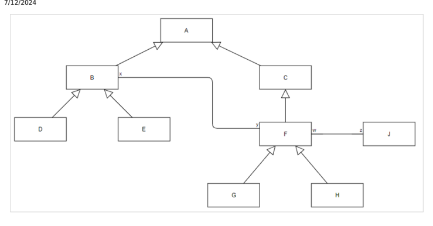
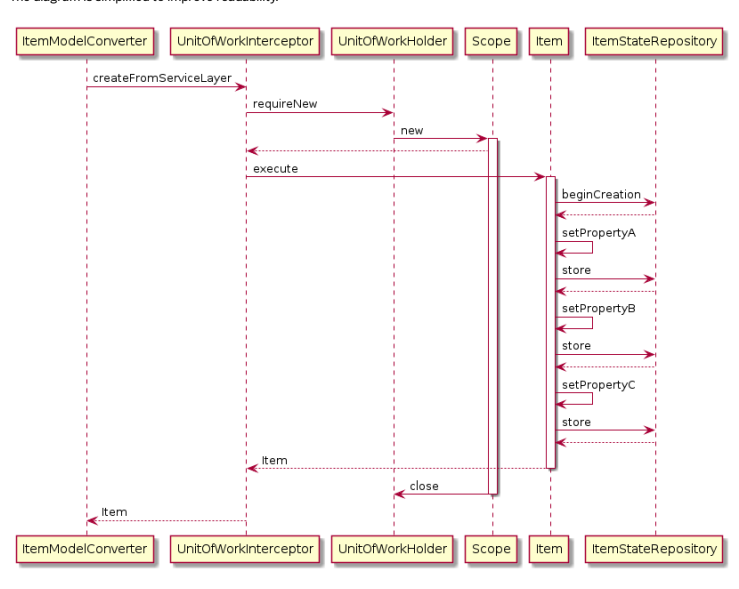
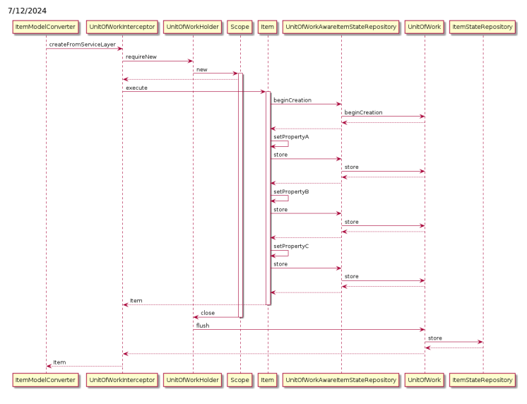
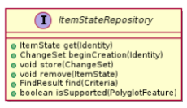
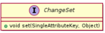
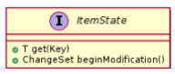

# Polyglot Persistence

The polyglot persistence provides a way to store specied data types in an alternative storage. It supports all CRUD operations as well as searching for objects. Learn how to congure this feature and how to implement your own alternative storage. Polyglot persistence supports the create, read, update, and delete operations as well as searching for objects. The create, update, and delete operations are transparent and available through service layer. The read operation offers two options. The rst option, which is transparent to the user, is reading an object through service layer. The second option is realized by the polyglot persistence querying language. The polyglot language is added to Flexible Search because searching for data in the main relational database is done by queries similar to SQL queries. The polyglot language is designed for document-based storage that cannot support the SQL query language. For more information about the language, see Polyglot Persistence Query Language. You can use polyglot persistence for both, existing, and new item types. The Platform module provides a generic way to handle the nal storage. It means that you must deliver your alternative storage externally and it can't be a part of the Platform module.

## Benets

Polyglot persistence may be helpful in these situations:

you want to relieve the load of your database before it hits performance limit; you may improve performance of the whole system by storing some data types in an alternative storage you want to provide a non-SQL storage for some data you want to optimize the data structure around one root element; the documentcart extension is an example implementation of storing cart elements with its all related types (such as cartEntry or productInfo) as one composed structure (a document).

## Limitations

Polyglot persistence has limitations that you must consider before using it. Polyglot persistence doesn't support these functionalities:

data migration between the existing database and the nal storage impex import (it requires unsupported FlexibleSearch features such as unions and joins).

y2ysync framework data report and audit SAP Commerce Cloud Administration Console doesn't accept inline parameters for polyglot queries (but Admin APIs fully support querying) search restrictions
The polyglot querying language capabilities are limited to minimum. The supported operations include:

querying for model or item instances ltering (the WHERE clause) based on attributes (localized and unlocalized); supported operators include: =, <>, <, <=, >,
>=, IS NULL, IS NOT NULL, parenthesis, Boolean operators: AND, OR
sorting instances (the ORDER BY clause) based on attribute values
The operations that aren't supported are:

JOINS
SUBQUERIES
GROUP BY
CASE
Functions Operators: LIKE, IN
When you switch an existing data type into a polyglot type, you must change all existing exible search queries related to that type into polyglot. SAP Commerce Cloud comes with many built-in types and the logic around it. This logic uses FlexibleSearch queries heavily. If you want to switch a particular type into polyglot, you must rewrite all FlexibleSearch queries related to that type into polyglot versions. This point is also valid if you already use Platform and have added your own types and FlexibleSearch queries.

## Related Information

Polyglot Persistence Query Language ydocumentcart Extension Template This is   For more    the SAP Help  18

## Type Conguration

To use a specic type in polyglot persistence, you must congure this type so that polyglot persistence supports it.

A polyglot persistence item type conguration is based on properties les, project.properties or local.properties.

Here is an example:
polyglot.repository.config.mypolyglot.beanName=myPolyglotRepository polyglot.repository.config.mypolyglot.typeCodes=E,G[x=E]
Where:

polyglot.repository.config is a prex for a polyglot conguration; you can't change this prex mypolyglot is a name of the instance; polyglot supports many repositories at once myPolyglotRepository is a name of the bean implementing the de.hybris.platform.persistence.polyglot.ItemStateRepository interface E, and G are type names from the type system; these names must match the code attributes from your *-items.xml le.

[...] is where conditions are dened in [x=E], x is a qualier attribute from the relation dened in *-items.xml that points to a related item; the name must match the qualifier attribute from your *-items.xml le in [x=E], E is a target type name (a typeCode of a target item); it allows the system to narrow down possible target item types; the name must match the code attribute from your *-items.xml le.
The prerequisites for item types are:
a type must have its own representation in an *-items.xml le

fully supported types must have their own deployment You can congure item types as:
FULL: All items of this type are stored in a particular polyglot storage. To congure a type as fully supported, add it to the conguration without any conditions. PARTIAL: Only items that meet given criteria are stored in a particular polyglot storage. This kind of conguration provides a way to store 1 item type in different polyglot storages and in the main database. To congure a type as partially supported, add it to a conguration with conditions in brackets []:
G[x] means that G item is stored in polyglot only when its x related item is stored in polyglot.

G[x=E] means that G item is stored in polyglot only when its x related item is stored in polyglot and x related item is of E type.
Congure at least 1 type as fully supported. All partial types must somehow relate to the item type that is supported fully. All polyglot child items are congured as polyglot too, with the same conditions as their parents. All parent items are treated by polyglot as partially supported.

## Examples

All the examples below use the type hierarchy from the diagram.

A, B, C, D, E, F, G, H, J are item type codes, and x, y, w, z are relation qualiers.

Example 1 polyglot.repository.config.mypolyglot.beanName=myPolyglotRepository polyglot.repository.config.mypolyglot.typeCodes=D,E
Types D and E are congured as fully supported with myPolyglotRepository.

Types B and A are congured as partially supported with myPolyglotRepository. It is because an instance of the A type may be of the D type as well.

## Example 2

polyglot.repository.config.mypolyglot.beanName=myPolyglotRepository polyglot.repository.config.mypolyglot.typeCodes=B
Type B is fully supported with myPolyglotRepository - types D and E are congured as polyglot automatically.

Type A is congured automatically as partially supported with myPolyglotRepository.

Example 3 polyglot.repository.config.mypolyglot1.beanName=myPolyglotRepository1 polyglot.repository.config.mypolyglot1.typeCodes=D polyglot.repository.config.mypolyglot2.beanName=myPolyglotRepository2 polyglot.repository.config.mypolyglot2.typeCodes=E
Type D is fully supported with myPolyglotRepository1.

Type E is fully supported with myPolyglotRepository2.

Type A and B are partially supported with myPolyglotRepository1 and myPolyglotRepository2.

Example 4 polyglot.repository.config.mypolyglot.beanName=myPolyglotRepository polyglot.repository.config.mypolyglot.typeCodes=E,F[x]
This is   For more    the SAP Help  20 Type E is fully supported with myPolyglotRepository.

Types F, G, and H are partially supported by myPolyglotRepository. The condition is the x relation. It means that item types F, G, and H are stored in myPolyglotRepository only when its related E item is stored in myPolyglotRepository.

The A, B, and C types are partially supported by myPolyglotRepository.

To see it more clearly, follow the usage example:
D d = new D(); G g = new G(); g.x = d; saveAll(); //g is stored in the main database (not polyglot) because its related item doesn't suppo E e = new E(); G g = new G(); g.x = e; saveAll(); //g is stored in polyglot because its related item is stored in polyglot too Example 5 polyglot.repository.config.mypolyglot.beanName=myPolyglotRepository polyglot.repository.config.mypolyglot.typeCodes=E,G[x=E]
Type E is fully supported with myPolyglotRepository.

Type G is supported partially with myPolyglotRepository. The condition is the x relation. The G item is stored in myPolyglotRepository only when its x related item is stored in myPolyglotRepository and the x related item is of the E type.

Example 6 polyglot.repository.config.mypolyglot.beanName=myPolyglotRepository polyglot.repository.config.mypolyglot.typeCodes=E,F[x],J[w]
Type E is fully supported with myPolyglotRepository.

Type F is supported partially with myPolyglotRepository. The condition is the x relation. The F item is stored in myPolyglotRepository only when its x related item is stored in myPolyglotRepository and the x related item is of the E type.

Type J is supported partially with myPolyglotRepository. In the diagram, you can see that there is a chain relation to the fully supported E type. The J item is stored in myPolyglotRepository when its w related item is stored in myPolyglotRepository (and the x related item is of the E type).

## One-To-Many Part-Of Relations

It's important to implement one-to-many part-of relations carefully so that they can be handled properly by business logic. For example, in the AbstractOrder2TestItemA relation:
<relation code="AbstractOrder2TestItemA" localized="false"> <sourceElement qualifier="abstractOrder" type="AbstractOrder" cardinality="one"> </sourceElement> <targetElement qualifier="testItemA" type="TestItemA" cardinality="many"> <modifiers partof="true"/> </targetElement> </relation>
This is   For more    the SAP Help  21 With the following storage conguration:
polyglot.repository.config.ydocumentcart.typeCodes=Cart, TestItemA[abstractOrder]
Set your relations using many-side setters. For AbstractOrder2TestItemA, use the following setter:
testItemA.setAbstractOrder(cart);
In one-to-many relations, the system stores references on the "many" side. As a result for AbstractOrder2TestItemA,
TestItemA has reference to Cart. In JALO or ServiceLayer, however, one-to-many relations can be set through either oneside or many-side setters.

The system saves items in a number of phases. As a result, when Cart is saved and gets its own PK, TestItemA is also saved, but its reference to Cart is null. The 2nd phase updates TestItemA with reference to Cart through an update statement in a relational database. In Jalo or ServiceLayer, the process is transparent.

However, when using polyglot persistence, it's important to ensure that a reference to Cart is available at the rst step of the saving process when it's being decided if a given item can be stored in polyglot persistence. An instance of TestItemA can only be saved and stored when it has a reference to Cart. Using one-side setters ensures that an item of this type references Cart from the beginning of the saving process and is saved in the polyglot storage.

When using the AbstractOrder2TestItemA part-of relation, dene it as required by using the optional="false" attribute to ensure that it works correctly in polyglot persistence:
<relation code="AbstractOrder2TestItemA" localized="false"> <sourceElement qualifier="abstractOrder" type="AbstractOrder" cardinality="one"> <modifiers optional="false" /> </sourceElement> <targetElement qualifier="testItemA" type="TestItemA" cardinality="many"> <modifiers partof="true"/> </targetElement> </relation>
As a result, you need to call testItemA.setAbstractOrder(cart) explicitly to ensure correct behavior.

## Caution

As items cannot be moved between persistencies, set all our references properly so that it is clear when a given item can be stored.

## Creating Items Without Parent Attribute

The following property prevents the system from creating items without a parent attribute that are congured to be stored in the polyglot persistence:
polyglot.allow.creation.without.parent=false The default value of the property is false.

## Moving Entities Between Documents Securely

Moving polyglot entities from one document to another in repositories that don't support such operations by changing their parent attribute could result in data corruption. The following property allows you to dene what happens when changing the This is   For more    the SAP Help  22 parent of polyglot entities isn't supported:
polyglot.allow.changing.entity.parent=false The property can have the following values:
true - the system shows an error in the logs, but the operation is carried out false - the system throws an exception The default value of the property is true.

## Unit Of Work

With the unit of work of the polyglot persistence feature, you can cache all modications performed on a single item and ush them when a main operation ends. The unit of work also manages the item version that is used for optimistic locking.

## Enabling Unit Of Work

The feature is optional and disabled. To enable it, decorate your ItemStateRepository spring bean with UnitOfWirkAwareItemStateRepository, and replace the beanName in your project/local.properties le. Here is an example conguration:

## *-Spring.Xml

<bean id="unitOfWorkAwareItemStateRepository" class="de.hybris.platform.persistence.polyglot.uow.Un <constructor-arg ref="myItemStateRepository"/> <!-- Your ItemStateRepository --> <constructor-arg ref="unitOfWorkProvider" /> <!-- Unit of work provider, delivered with the Pla </bean>

## Project/Local.Properties

polyglot.repository.config.yourPolyglotName.beanName=unitOfWorkAwareItemStateRepository polyglot.repository.config.yourPolyglotName.typecodes=TypeA,TypeB,TypeC //types configured as polyg

## Details

Unit of work caching is based on a single thread. Model service triggers an operation when saving an item. Each operation creates its own Scope and that scope lives until all modications on a given item end. As an example, consider having an X type with three attributes (A, B, and C), and executing this code:
X x = modelService.create(X.class); x.setA("aa"); x.setB("bb"); x.setC("cc"); modelService.save(x); //modelService.save triggers a main operation As a result:
with unit of work disabled, your repository gets hit four times (by methods beginCreation once, and store three times), and the nal item version is set to 4

with unit of work enabled, your repository gets hit only once, and the nal item version is set to 1

## Unit Of Work Disabled

This is   For more    the SAP Help  23 The diagram is simplified to improve readability.

Unit of Work Enabled The diagram is simplified to improve readability.

## Itemstaterepository Api

Polyglot persistence exposes an API to allow implementation of repositories. The repositories you implement provide storage for types that you want to be supported by polyglot persistence. To allow a given repository to support a given type, provide a type configuration that binds the type with the repository. For more information about a type configuration, see Type Configuration .

To provide a repository, implement the ItemStateRepository interface. Since ItemStateRepository is an interface, you choose the type of physical storage your data is stored in. It can be, for example, a relational database, a NoSQL database, or an in-memory data grid.

An example implementation is available in the documentcart extension (see ydocumentcart Extension Template ). To learn how to implement an in-memory repository, see Implementing ItemStateRepository . The ItemStateRepository interface looks as follows:

The beginCreation() method creates the initial state (as an implementation of ChangeSate) based on the item being created.

The store() method saves or updates an item in a repository. It does so by using ChangeSate, which describes either the initial state of an item or the change that should be applied to an item state.

The get() method retrieves the item state instance matching a provided Identity from the repository.

The find() method performs search based on provided Criteria.

The isSupported() method is a generic mechanism that allows you to check whether a given implementation of the ItemStateRepository repository supports a given feature.

The remove() method removes the item state from the repository.
The ChangeSet interface looks as follows:

ChangeSet is a contract for an implementation to be able to set a given value for a given key.

The ItemState interface looks as follows:

ItemState is a contract for an implementation to be able to get() a value representing a given key.

The instance of an implementation of an item state is later stored, updated, or retrieved by the implementation of the ItemStateRepository interface.

## Implementing Itemstaterepository

Implement ItemStateRepository to provide a repository for desired item types.

## Context

Use ItemStateRepository to provide a repository, for example, for the Title item type.

## Note

For simplicity, this example implementation doesn't cover, among other things, optimistic locking checks, exceptions handling, or transactions.

To provide a conguration for the repository to support the Title type, see Type Conguration.

## Procedure

1. Provide a name and an underlaying storage for your ItemStateRepository implementation.

This implementation uses an in-memory map store data in:
public class InMemoryTitleRepository implements ItemStateRepository {
This is   For more    the SAP Help  26 2. Provide an implementation for ItemState and its methods.

ItemState is a wrapper aroud the map that stores key-attribute pairs. With the beginModification() method, it provides a modication change set used by the polyglot fremework to provide a change to be stored. With the applyChanges() method, you can apply the change set when storing changes (see the implementation of the update part of the store() method).

package de.hybris.platform.persistence.polyglot; import java.util.HashMap; import java.util.Map; public class SimpleState implements ItemState{ private final Map<SingleAttributeKey, Object> values; public SimpleState(final Map<SingleAttributeKey, Object> values) { this.values = values; } @Override public <T> T get(Key key) { return (T) values.get(key); } @Override public ChangeSet beginModification() { return new InMemoryTitleRepository.ModificationChangeSet(this); } SimpleState applyChanges(final InMemoryTitleRepository.ModificationChangeSet modification { final HashMap newValues = new HashMap<>(values); newValues.putAll(modification.valuesToModify); newValues.put(WellKnownKey.VERSION.key, modification.baselineVersion + 1); return new SimpleState(newValues); } }
3. Implement the beginCreation() method.

The beginCreation() method provides a new instance of the implementation of ChangeSet that can hold attribute values required for creation of an item.

public class InMemoryTitleRepository implements ItemStateRepository { private final ConcurrentHashMap<Identity, SimpleState> inMemory = new ConcurrentHashMap<> @Override public ChangeSet beginCreation(final Identity id) { return new CreationChangeSet(id); } static class CreationChangeSet implements ChangeSet { final Identity id; final Map<SingleAttributeKey, Object> initialValues = new HashMap<>(); public CreationChangeSet(final Identity id) {
This is   For more    the SAP Help  27 this.id = id; initialValues.put(WellKnownKey.ITEM_PK.key, id); initialValues.put(WellKnownKey.VERSION.key, Long.valueOf(0)); } @Override public void set(final SingleAttributeKey key, final Object value) { initialValues.put(key, value); } } ... }
4. Implement the store() method so you can persist something in your storage.

You either put your CreationChangeSet change set in memory (creation of an item) or you nd a corresponding item for a given ModificationChangeSet change set and apply changes on it so that you can store the updated item.

public class InMemoryTitleRepository implements ItemStateRepository { ... @Override public void store(final ChangeSet changeSet) { if (changeSet instanceof CreationChangeSet) { final CreationChangeSet creation = (CreationChangeSet) changeSet; inMemory.putIfAbsent(creation.id, new InMemoryImmutableState(creation.initialValue return; } if (changeSet instanceof ModificationChangeSet) { final ModificationChangeSet modification = (ModificationChangeSet) changeSet; final SimpleState currentState = inMemory.get(modification.id); final SimpleState newState = currentState.applyChanges(modification); inMemory.replace(modification.id, newState); return; }
 }
 static class ModificationChangeSet implements ChangeSet { final Identity id; final long baselineVersion; final Map<SingleAttributeKey, Object> valuesToModify = new HashMap<>(); public ModificationChangeSet(final ItemState itemState) { id = itemState.get(WellKnownKey.ITEM_PK.key); baselineVersion = itemState.get(WellKnownKey.VERSION.key); } @Override public void set(final SingleAttributeKey key, final Object value) { valuesToModify.put(key, value); } }
5. Implement the get() and remove() methods.

These methods get/remove proper item state instance from the internal storage.

public class InMemoryTitleRepository implements ItemStateRepository { ... @Override public ItemState get(final Identity id) { return inMemory.get(id); } @Override public void remove(final ItemState state) { final Identity id = state.get(WellKnownKey.ITEM_PK.key); inMemory.remove(id); } ... }
6. Implement the find() method.

Using available helper classes, the method builds a predicate based on provided criteria and uses the predicate to lter the map. Having a map ltered as a stream, it uses another helper class to build a nd result required by the polyglot framework.

public class InMemoryTitleRepository implements ItemStateRepository { ... private final Function<Criteria, MatchingPredicateBuilder> predicateBuilderProvider = Matc @Override public FindResult find(final Criteria criteria) { final Predicate<ItemState> matchingPredicate = buildMatchingPredicate(criteria); final Comparator<ItemState> cmp = ItemStateComparatorCreator.getItemStateComparator(c final Stream<ItemState> stream = inMemory.values().stream().map(ItemState.class::cast .sorted(cmp); return StandardFindResult.buildFromStream(stream).withCriteria(criteria).build(); } private Predicate<ItemState> buildMatchingPredicate(final Criteria criteria)
 { 
 final MatchingPredicateBuilder builder = predicateBuilderProvider.apply(criteria); return builder.getPredicate(); } }

## Results

You have implemented ItemStateRepository and provided a custom storage for your data.

## Example

package de.hybris.platform.persistence.polyglot; import java.util.Comparator; import java.util.HashMap; import java.util.Map; import java.util.Objects; import java.util.concurrent.ConcurrentHashMap; import java.util.function.Function; import java.util.function.Predicate; import java.util.stream.Stream; public class InMemoryTitleRepository implements ItemStateRepository This is   For more    the SAP Help  29
{ private final ConcurrentHashMap<Identity, SimpleState> inMemory = new ConcurrentHashMap<>(); private final Function<Criteria, MatchingPredicateBuilder> predicateBuilderProvider = MatchingP @Override public ChangeSet beginCreation(final Identity id) { return new CreationChangeSet(id); } @Override public void store(final ChangeSet changeSet) { Objects.requireNonNull(changeSet); if (changeSet instanceof CreationChangeSet) { final CreationChangeSet creation = (CreationChangeSet) changeSet; inMemory.putIfAbsent(creation.id, new SimpleState(creation.initialValues)); return; } if (changeSet instanceof ModificationChangeSet) { final ModificationChangeSet modification = (ModificationChangeSet) changeSet; final SimpleState currentState = inMemory.get(modification.id); final SimpleState newState = currentState.applyChanges(modification); inMemory.replace(modification.id, newState); return; } } @Override public ItemState get(final Identity id) { return inMemory.get(id); } @Override public void remove(final ItemState state) { final Identity id = state.get(WellKnownKey.ITEM_PK.key); inMemory.remove(id); } @Override public FindResult find(final Criteria criteria) { final Predicate<ItemState> matchingPredicate = buildMatchingPredicate(criteria); final Comparator<ItemState> cmp = ItemStateComparatorCreator.getItemStateComparator(criteri final Stream<ItemState> stream = inMemory.values().stream().map(ItemState.class::cast).filt .sorted(cmp); return StandardFindResult.buildFromStream(stream).withCriteria(criteria).build(); } private Predicate<ItemState> buildMatchingPredicate(final Criteria criteria) { final MatchingPredicateBuilder builder = predicateBuilderProvider.apply(criteria); return builder.getPredicate(); } static class CreationChangeSet implements ChangeSet { final Identity id; final Map<SingleAttributeKey, Object> initialValues = new HashMap<>(); public CreationChangeSet(final Identity id) { this.id = id; initialValues.put(WellKnownKey.ITEM_PK.key, id); initialValues.put(WellKnownKey.VERSION.key, Long.valueOf(0)); } @Override This is   For more    the SAP Help  30 public void set(final SingleAttributeKey key, final Object value) { initialValues.put(key, value); } } static class ModificationChangeSet implements ChangeSet { final Identity id; final long baselineVersion; final Map<SingleAttributeKey, Object> valuesToModify = new HashMap<>(); public ModificationChangeSet(final ItemState itemState) { id = itemState.get(WellKnownKey.ITEM_PK.key); baselineVersion = itemState.get(WellKnownKey.VERSION.key); } @Override public void set(final SingleAttributeKey key, final Object value) { valuesToModify.put(key, value); } } }