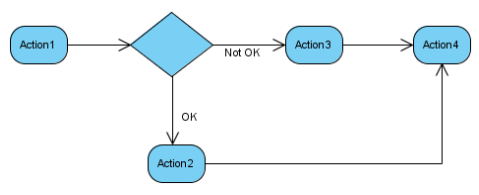
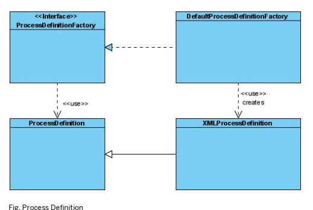
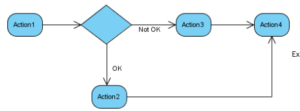
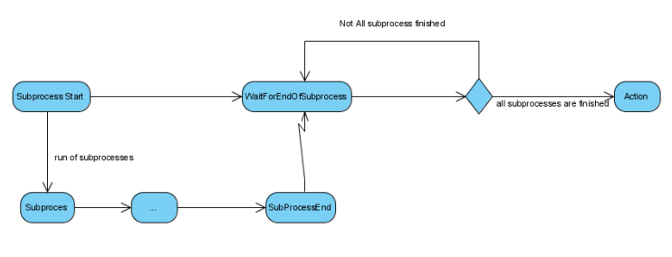
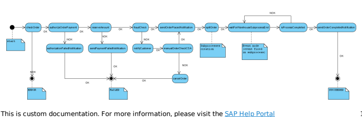
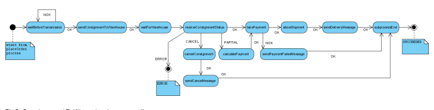
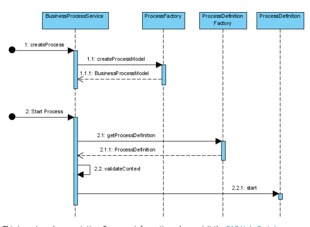
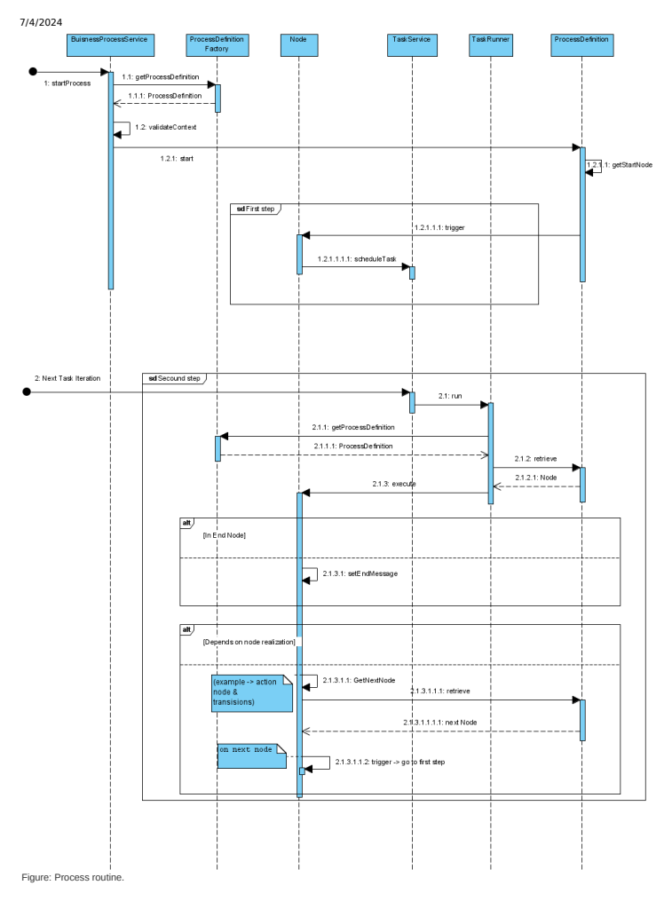

# The Sap Commerce Processengine

The processengine enables you to dene business processes through XML process denitions, and runs these processes in an asynchronous way. It guarantees that actions are performed in the right order and on the right condition. A new process can be created for each process denition. It is then possible to manage these processes by using their own context.

The processengine delivers a solution for waiting for events, notifying users or user groups, ring actions (dened in spring beans), and ow decisions based on action results.

It is a good idea to study Java and XML les in the yacceleratorfulfilmentprocess extension. This is an illustration of the fulllment process and neatly demonstrates how to create a process.

## Introduction

The processengine represents an engine to build and interpret a memory structure of a process. This memory representation is based on nodes. To build a correct object tree, a processdefinition.xsd le is used by JAXB. The result of this processing is a map that relates nodes and their IDs. Information about the node ID that is the next one in the process is stored in different ways for different nodes. Wait, notify, and split nodes have their next nodes explicitly listed. In case of alternatives, use the action node.

Its execution path logic is described further below.

## Simplied Work Sequence Example

When starting to work with the processengine, it is advisable to do a business analysis rst.

1. The workow gained from this analysis then needs to be translated to the process XML le.

<?xml version="1.0" encoding="utf-8"?> 
<process xmlns="http://www.hybris.de/xsd/processdefinition" name="Example" start="Action1">
 <action id="Action1" bean="Action1">
 <transition name="OK" to="Action2"/> <transition name="NOK" to="Action3"/> 
 </action> <action id="Action2" bean="Action2"> <transition name="OK" to="Action4"/> 
 </action> <action id="Action3" bean="Action3"> 
 <transition name="OK" to="Action4"/> </action> <action id="Action4" bean="Action4"> <transition name="OK" to="success"/> 
 </action> <end id="success" state="SUCCEEDED">Everything was fine</end> 
</process>
2. Next, dene the beans in **|your_extension_name|-spring.xml** le.

<bean id="Action1" class="org.training.actions.Action1" parent="abstractAction"/>
<bean id="Action2" class="org.training.actions.Action2" parent="abstractAction"/> <bean id="Action3" class="org.training.actions.Action3" parent="abstractAction"/> <bean id="Action4" class="org.training.actions.Action4" parent="abstractAction"/>
3. Finally implement the actions classes. Below nd the example of implementation of the Action1.

package org.training.actions;public class Action1 extends AbstractSimpleDecisionAction { 
 @Override public Transition executeAction(final BusinessProcessModel process) 
 { 
 if(.......) 
 { return Transition.NOK; 
 } 
 else 
 { 
 return Transition.OK; } 
 }
}

## Support For Scripts In Business Process

With support for scripting and the dynamic process denition, it is possible to declare not only the structure of the business process but also to dene the the behavior directly in the XML le that denes the process.

## Calling A Script

Here is an example of a process denition with a script that returns the next transition:

<?xml version='1.0' encoding='utf-8'?>
<process xmlns='http://www.hybris.de/xsd/processdefinition' start='action0' name='testProcessDefiniti
<scriptAction id='action0'>
 <transition name='itworks' to='success'/>
</scriptAction>
<end id='success' state='SUCCEEDED'>Everything was fine</end>
</process>
This simple process denition shows the usage of a scriptAction element. It is almost exactly the same as an action element, but instead of executing some logic from a spring bean, it executes the script dened in a script element. Here it only invokes an anonymous function that returns the next transition (**'itworks'**).

## Accessing A Business Process Context From A Script

Scripts from process denitions are invoked with a special process parameter passed to the script. The process parameter is an instance of the BusinessProcessModel describing the running business process. Here is an example of script that modies a context parameter of a business process:
<?xml version='1.0' encoding='utf-8'?>
<process xmlns='http://www.hybris.de/xsd/processdefinition' start='action0' name='testProcessDefiniti <contextParameter name='testParameter' use='required' type='java.lang.String'/>
<scriptAction id='action0'>

<transition name='itworks' to='success'/>
</scriptAction> <end id='success' state='SUCCEEDED'>Everything was fine</end>
</process>

## Handling Business Process Restart Requests

By default, the system doesn't restart business processes with nodes that are being run as. It creates a request before each restart to check whether there are any business processes with running nodes. If such processes exist, the system doesn't restart them to ensure that that there are no processes with doubled instances of the same nodes running at the same time. As a result, the existing data model isn't broken by concurrent business processes.

Use the following properties to set the number of retires and milliseconds between attempts to request a business process restart:
processengine.process.restart.retries=3 processengine.process.restart.millis=500 The default values are 3 retries and 500 milliseconds. The following property ensures that the system throws an exception when requests for restarting business processes fail:
processengine.process.restart.exception.if.failed=true The property is set to true by default.

If you want the system to allow restarting business processes without any validation of currently running processes, use the following property with the value true:
processengine.process.restart.legacy=true

Enabling the processengine.process.restart.legacy=true property can lead to corrupt behavior caused by processes being run at the same time after being restarted.

## Disconnecting Task Instances From Business Process

To make business processes more resilient in case of database outages or node failures, use the following property:
mark.process.as.done.enabled=true The property is enabled by default.

The property ensures that task instances are no longer connected to any business processes when business logic is successfully carried out. It also removes all conditions related to tasks and sets the value of the TaskModel.RUNNERBEAN property to passthroughRunner. If the process of removing a given task isn't successful, the passthroughRunner bean does nothing with it during any attempts to carry it out again, allowing the task to be removed smoothly by the task service.

## Process Denition Creation

The process denition denes a set of nodes that are connected with each other through their IDs.

To create a new process instance, call the createProcess method from the BusinessProcessService service. You can then run this service using the startProcess method. If a process denition has not been created before, the ProcessDenitionFactory will create one in this step.

businessProcessService.startProcess(id, processName);
The process denition denes a set of nodes that are connected with each other through their IDs. The process denition starts with the process header. To make the process denition visible to the ProcessDenitionFactory, it is necessary to declare it as a resource in Spring.

## Dening In Spring The Process

The Spring denition of a process is straightforward:
<bean id="placeorderProcessDefinitionResource"class="de.hybris.platform.processengine.definition.Proc > 
 <property name="resource"value="classpath:/processdemo/placeorder.xml"/> 
</bean>
The table below explains the meaning of the current <bean> element attributes.

| Attribute   | Description                                                                                                                                                              |
|-------------|--------------------------------------------------------------------------------------------------------------------------------------------------------------------------|
| id          | This attribute needs to be unique in Spring                                                                                                                              |
| class       | This attribute should always be as presented. It is the indicator for the ProcessDenitionFactory; where to search for beans in the Spring context for process denitions. |

The <bean> element contains the <property>element. The table below explains the meaning of the <property> element attributes.

| Attribute   | Description                                                                                                                                                |
|-------------|------------------------------------------------------------------------------------------------------------------------------------------------------------|
| name        | The name of the property is: resources. The name indicates the value of this property shows where in the le system the process denition XML le is located. |
| value       | The value attribute contains the actual path to the process denition XML le.                                                                               |

## The Actions

The Action beans also need to be declared in Spring:
<bean id="checkOrder"class="de.hybris.platform.fulfilment.actions.CheckOrder" parent="abstractAction"> 
 <property name="checkOrderService"ref="checkOrderService"/> 
</bean>
The table below explains the meaning of the current <bean> element attributes.

| Attribute   | Description                                                                     |
|-------------|---------------------------------------------------------------------------------|
| id          | This attribute is important as it relates the Spring bean with the action node. |
| class       | This attribute points to the class name that realizes the action interface.     |
| parent      | This attribute is only used for information.                                    |

Additionally, the properties can be set in Spring. In the example above, the property checkOrderService is set.

The Root Tag and the Process Class The denition of the process needs to be written in an XML le. This le must be adequate to the denition in the processdefinition.xsd. Each process denition starts with a header.

<?xml version="1.0"encoding="utf-8"?> 
<process xmlns="http://www.hybris.de/xsd/processdefinition" name="consignmentFulfilmentSubprocess" start="waitBeforeTransmission" onError="onError" processClass="de.hybris.platform.fulfilment.model.Co ... ... </process>

| Attribute    | Description                                                                                                                                                                     |
|--------------|---------------------------------------------------------------------------------------------------------------------------------------------------------------------------------|
| name         | This attribute tells the process' name.                                                                                                                                         |
| start        | This attribute tells the ID of the start node.                                                                                                                                  |
| onError      | This attribute gives the node that is called when an error occurs.                                                                                                              |
| processClass | This attribute refers to the class that implements the process context. The normal routine is to extend this class for extra elds where you can store extra process parameters. |

## Node Types

After the process is dened, content must be added to the process. A process is described by a set of nodes, which represent the steps in a given process. Each node, excluding the end node, needs to dene which node has to be invoked next in the workow.

The most important eld in each node is its ID. This is the key that joins two nodes in a workow.

Remember The start attribute in the process root tag should point to one of the declared nodes Action Node Action nodes are the nodes that realize the process logic.

Example:
<action id="isProcessCompleted"bean="subprocessesCompleted"> <transition name="OK"to="sendOrderCompletedNotification"/> 
 <transition name="NOK"to="waitForWarehouseSubprocessEnd"/> 
</action>
The bean attribute points to the bean id declared in the **spring.xml** le. It denes which action will be red. For details, see the the Actions section below. The table below shows the attributes of the <transition> element.

| Attribute   | Description                                                                                             |
|-------------|---------------------------------------------------------------------------------------------------------|
| name        | Tells the result of an action.                                                                          |
| to          | Tells the Process Engine to which node the process should go after the result of an action is returned. |

Wait Node Wait nodes are used to communicate with the external environment. Use this node if somewhere in the process you need to wait for an external process result. It is also used if waiting for subprocesses to nish their routine. Example:
<wait id="waitForWarehouseSubprocessEnd" then="isProcessCompleted"> <event>ConsignmentSubprocessEnd</ </wait>
The attribute then is the ID of the node that has to be invoked after the wait condition is fullled.

The element <event> denes the name of the event that activates this node. Internally, the processengine prepends the process's code to the event name to make it unique. Set prependProcessCode="false" to not prepend the process's code. There is an expression language that you can use in your event names. The process denition will look something like this:
<wait id="waitForWarehouseSubprocessEnd" then="isProcessCompleted" prependProcessCode="false">
 <event>${process.code}_ConsignmentSubprocessEnd</event>
</wait>

ConsignmentSubprocessEnd is an event that you need to trigger by using de.hybris.platform.processengine.BusinessProcessService.triggerEvent(String).

Process is a process which waits for the event specied in the event parameter.

N.B.: In the expression language you have two variables:
process: the current instance of BusinessProcessModel

params: a Map with the current process parameters

## Support For User Input

There is also an option to provide additional information called choice when triggering an event. Based on the choice, a process may transit to different nodes. Here is an example of using a wait node with multiple choices:
<wait id='waitNode' then='nothingChoosen' prependProcessCode='false'>
 <case event='eventWithChoice'>
 <choice id='first_choice' then='firstChoiceChoosen'/>
 <choice id='second_choice' then='secondChoiceChoosen'/> </case>
</wait>
If you trigger an event without choice, the business process will transit to a node dened by the then argument
('nothingChoosen' in a given example). To trigger an event with choice, you can use the de.hybris.platform.processengine.BusinessProcessService.triggerEvent(BusinessProcessEvent)
method.

Here is an example showing how to trigger event with given choice:
final BusinessProcessEvent event = BusinessProcessEvent.builder("eventWithChoice").withChoice("
businessProcessService.triggerEvent(event);

## Timeout

You can dene a timeout on the wait node. When the node with dened timeout doesn't receive an event within a dened time, the transition congured on timeout element will be performed. Here is an example denition of a wait node with a dened timeout:
This is   For more    the SAP Help  8

The delay format is dened by duration component of ISO 8601 standard.

Split Node

Use of split nodes is discouraged.

The Split node is used when a process needs to run actions or strings of actions in parallel.

Example:
<split id="split"> 
 <targetNode name="rnd"/> <targetNode name="sayC"/> 
</split>
The <targetNode> element denes the next nodes after the process is split.

## Notify Node

Use this node if there is need to inform a user group or a particular user of a state of a process.

Example:
<notify id="notifyadmingroup"then="split"> <userGroup name="admingroup"message="Perform action"/> 
 <userGroup name="othergroup"message="other message"/> </notify>
The attribute then of the <notify> element denes the next node in the process that is invoked after one member from the userGroup from each group accepts a message. The table below shows the attributes of the <userGroup> element.

Example:

<wait id="waitForWarehouseSubprocessEnd" then="isProcessCompleted">

 <event>ConsignmentSubprocessEnd</event>

 <timeout delay='PT30S' then='timeout' /> </wait>

| Attribute   | Description                                                                                                                                                                                                                                                |
|-------------|------------------------------------------------------------------------------------------------------------------------------------------------------------------------------------------------------------------------------------------------------------|
| name        | The group of users to which a message (one after other) has to be sent. There can be several <userGroup> elements. The order of the informed groups is the same as in the denition.                                                                        |
| message     | Based on the presented example, after a member of the admingroup has committed a message, a message for othergroup is generated. After this message has also been committed the process is informed and the next node (in this example split) is executed. |

## End Node

This node ends the process and stores state and message in a process item.

<end id="error" state="ERROR">All went wrong.</end> 
<end id="success" state="SUCCEEDED">Everything was fine</end>
The state attribute tells a process state set after the node is executed. The content of this element, for example All went wrong.,
is a sample message stored in a process item.

## Actions

Actions are the most important part of the processengine functionality. Normally, they have to implement a logic or call specialized services to execute tasks that are necessary in a process. An Action performs a single piece of work within a process.

Usually an action acts upon input data which has been fed into the engine or has been produced by previous actions. Each action produces an action result, which enables the engine to direct the process to the next action. Each action is part of the process

The Action Interface has two methods:
Set<String> getTransitions();
This method is used for validation if all possible results from an action are mapped in the process denition. In this method a Set of all possible return codes should be returned.

Stringexecute(BusinessProcessModel process)throwsRetryLaterException, Exception; This method is used to implement the main logic of an action. The reason for having separated RetryLaterException is that this exception is meant to inform the engine to re an action once again.

This is   For more    the SAP Help  10 In addition, there are two codes that an action could return outside of the normal action procedure:
RETRY_RETURN_CODE - same as throwing RetryLaterException ERROR_RETURN_CODE - same as throwing another Exception

## Transitions

The transitions dene the target for the next step of a process. The action result determines the route.

Example:

Example workow should be dened like this
<?xml version="1.0"encoding="utf-8"?> <process xmlns="http://www.hybris.de/xsd/processdefinition"name="Example"start="Action1">
 <action id="Action1"bean="Action1"> 
 <transition name="OK"to="Action2"/> <transition name="NOK"to="Action3"/> </action> <action id="Action2"bean="Action2"> 
 <transition name="OK"to="Action4"/> 
 </action> <action id="Action3"bean="Action3"> <transition name="OK"to="Action4"/> </action> 
 <action id="Action4"bean="Action4"> 
 <transition name="OK"to="success"/> </action> <end id="success"state="SUCCEEDED">Everything was fine</end> 
</process>
As we can see, result of Action1 determines if Action2 or Action3 occur, and then workow in both cases goes back to Action4.

Of course bean and action ID do not need to be the same.

## Action Superclasses

To make an action implementation easy, dene an abstractAction that implements useful routines in action implementation, such as de.hybris.platform.processengine.action.AbstractAction.

There is a set of methods for logging both messages and errors, as well as getters and setters for ModelService, ProcessParameterHelper, and at the end:
getProcessParameterValue: Gets a parameter stored in the process context

setOrderStatus: Sets a status of the order
createTransitions: Creates a set of transitions for lists of strings

## Available Actions

There are also two additional templates to use for a procedural or simple decision action:

AbstractProceduralAction: It simply returns OK whatever happens. It is useful to split a Process into smaller pieces.

Only an implementation of the execute method is necessary.

AbstractSimpleDecisionAction: It returns one of OK or NOK values. It is useful to make a simple decision. Transitions are dened and only the execute method must be implemented.

## Retries

If an action should be executed once again, the RetryLaterException exception or RETRY_RETURN_CODE could be returned.

## Subprocesses

To run a sub-process, simply call the BusinessProcessService.startProcess. Use events to inform the parent process

that a subprocess has ended. To re an event, use de.hybris.platform.processengine.BusinessProcessService.triggerEvent(String) Example:

## Support For Scripts In Business Process

With support for scripting and the dynamic process denition, it is possible to declare not only the structure of the business process but also to dene the behavior directly in the xml which denes the process.

## Calling A Script

Here is an example of a process denition with a script that returns the next transition:
<?xml version='1.0' encoding='utf-8'?>
<process xmlns='http://www.hybris.de/xsd/processdefinition' start='action0' name='testProcessDefiniti
<scriptAction id='action0'>

<transition name='itworks' to='success'/>
</scriptAction>
<end id='success' state='SUCCEEDED'>Everything was fine</end>
</process>
This simple process denition shows the usage of a scriptAction element. It is almost exactly the same as an action element, but instead of executing some logic from a spring bean, it executes the script dened in a script element. Here it only invokes an anonymous function that returns the next transition (**'itworks'**).

## Accessing A Business Process Context From A Script

This is   For more    the SAP Help  12 Scripts from process denitions are invoked with a special process parameter passed to the script.The process parameter is an instance of the BusinessProcessModel describing the running business process. Here is an example of script that modies a context parameter of a business process:
<?xml version='1.0' encoding='utf-8'?>
<process xmlns='http://www.hybris.de/xsd/processdefinition' start='action0' name='testProcessDefiniti
<contextParameter name='testParameter' use='required' type='java.lang.String'/>
<scriptAction id='action0'>

<transition name='itworks' to='success'/>
</scriptAction>
<end id='success' state='SUCCEEDED'>Everything was fine</end>
</process>

## Related Information

Business Process Management

## Starting A Processengine Process With A Service Activator

From within a Spring Integration Message Channel you often need to call SAP Commerce services. Likewise, you need to be able to publish messages to the Spring Integration channel from a service. This tutorial shows you how to use the Messaging Gateway to start a pipeline, and how to use a Message Transformer and a Service Activator to start a process from within Spring Integration.

You should already be acquainted with:
Spring Integration Enterprise Integration Patterns Objectives Let us consider a simple interface with sayHello method:
HelloWorldService.java public interface HelloWorldService
{
 void sayHello(final String toWhom);
}
If you call the method with the following parameter:
helloWorldService.sayHello("you");
the following message should be displayed:
Hello, you Of course you can easily do this by just implementing the interface, but for the sake of this tutorial let us take a slight detour.

This is   For more    the SAP Help  13

## Messaging Gateway

With Spring Integration you do not need to implement your own code to interface the messaging system. You may use the Messaging Gateway, which encapsulates messaging-specic code and separates it from the rest of the application code. You just need to dene a dynamic proxy for the interface:
tutorial-spring.xml
<int:gateway id="helloWorldService" service-interface="de.hybris.tutorial.HelloWorldService" default-request-channel="sayHelloChannel"/>
It creates a dynamic proxy with the bean id helloWorldService, which implements the above interface. When calling the sayHello method, the proxy takes the parameter, creates a message with the method parameter as payload, and publishes the message to the sayHelloChannel.

The channel is dened like any Spring Integration channel: tutorial-spring.xml
<int:channel id="sayHelloChannel"/>
You may use any type of channel supported by Spring Integration.

## Creating A Business Process With A Transformer

To get the result in form of the printed message, you should create a process using the processengine extension. To do it, follow the steps provided in Creating a Business Process with a Transformer.

## Starting The Process With A Service Activator

Now that the process is created, you can start the process with the BusinessProcessService. To do this use a Service Activator that is an endpoint connecting the messages on the channel to the service being accessed.

In Spring Integration you may dene the Service Activator by means of Spring Expression Language (SpEL). The Service Activator takes the message from the sayHelloProcessChannel and passes it over to the SpEL expression:

## Tutorial-Spring.Xml

<int:service-activator input-channel="sayHelloProcessChannel" expression="@businessProcessService.startProcess(payload)"/>

## Summary Tutorial-Spring.Xml

<beans xmlns="http://www.springframework.org/schema/beans" xmlns:xsi="http://www.w3.org/2001/XMLSchema-instance" xmlns:aop="http://www.springframework.org/schema/aop" xmlns:int="http://www.springframework.org/schema/integration" xsi:schemaLocation="http://www.springframework.org/schema/beans http://www.springframework.org/schema/beans/spring-beans-3.0.xsd http://www.springframework.org/schema/integration http://www.springframework.org/schema/integration/spring-integration.xsd http://www.springframework.org/schema/aop This is   For more    the SAP Help  14 http://www.springframework.org/schema/aop/spring-aop-3.0.xsd"> <bean id="sayHelloProcess" class="de.hybris.platform.processengine.definition.ProcessDefinitionResource">
 <property name="resource" value="classpath:/sayHelloProcess.xml"/> </bean>
 <bean id="sayHelloAction" class="de.hybris.tutorial.action.SayHelloAction"/> <bean id="sayHelloProcessFactory" class="de.hybris.tutorial.SayHelloProcessFactory">
 <property name="businessProcessService" ref="businessProcessService"/> </bean> <int:gateway id="helloWorldService" service-interface="de.hybris.tutorial.HelloWorldService" default-request-channel="sayHelloChannel"/> <int:channel id="sayHelloChannel"/> <int:transformer input-channel="sayHelloChannel" output-channel="sayHelloProcessChannel" expression="@sayHelloProcessFactory.createProcess(payload)"/> <int:service-activator input-channel="sayHelloProcessChannel" expression="@businessProcessService.startProcess(payload)"/> 
</beans>
As you can see, SAP Commerce services may be used out of the box through SpEL expressions or reection. It is quite a common pattern to use a Transformer to convert the payload to some SAP Commerce-specic object and then pass it to the service. For simple cases you can use SpEL expression for the transformations, too.

## Related Information

http://static.springsource.org/spring-integration/reference/htmlsingle/
http://www.eaipatterns.com/MessagingAdapter.html http://www.eaipatterns.com/MessagingGateway.html

## Creating A Business Process With A Transformer

Follow the steps to create a business process with a transformer.

## Procedure

1. Create a new process type in the items.xml le in your extension. In our case its only attribute is called toWhom:
tutorial-items.xml
<itemtype generate="true" code="SayHelloProcess" jaloclass="de.hybris.tutorial.jalo.SayHelloProcess" extends="BusinessProcess" autocreate="true"
>
<attributes>
<attribute qualifier="toWhom" type="java.lang.String">
<persistence type="property"/>
</attribute>
</attributes>
</itemtype>
2. Dene the action bean in the **spring.xml** le in your extension:
tutorial-spring.xml
<bean id="sayHelloAction" class="de.hybris.tutorial.action.SayHelloAction"/>
3. Implement the action class:
SayHelloAction.java public class SayHelloAction extends AbstractProceduralAction {
 @Override public void executeAction(final BusinessProcessModel process) throws RetryLaterException, Exce { final SayHelloProcessModel sayHelloProcess = (SayHelloProcessModel) process; System.out.println(">>>>>>>>> Hello " + sayHelloProcess.getToWhom()); }
4. Create an XML le for the process denition and specify the process as follows:
sayHelloProcess.xml
<process xmlns="http://www.hybris.de/xsd/processdefinition" start="sayHello" name="sayHelloProcess" processClass="de.hybris.tutorial.model.SayHelloProcessModel"> <action id="sayHello" bean="sayHelloAction">
 <transition name="OK" to="end"/>
 </action> <end id="end" state="SUCCEEDED">Success</end> 
</process>
5. To create the process a Transformer is used to convert the payload of a message into the format that the next endpoint expects. In this case it is a String used as a value for the toWhom attribute of the business process:
SayHelloProcessFactory.java public class SayHelloProcessFactory
{ private BusinessProcessService businessProcessService; public SayHelloProcessModel createProcess(final String toWhom)
 {
 final SayHelloProcessModel process = (SayHelloProcessModel) businessProcessService.createPro
 "process_" + System.currentTimeMillis(), "sayHelloProcess");
 process.setToWhom(toWhom); return process;
 } @Required public void setBusinessProcessService(final BusinessProcessService businessProcessService) {
 this.businessProcessService = businessProcessService;
 }
6. Dene the Spring bean for the SayHelloProcessFactory in the **spring.xml** le in your extension.

tutorial-spring.xml This is   For more    the SAP Help  16 7. Add the Transformer to Spring Integration denition. It takes the message from the sayHelloChannel, evaluates the expression that invokes the createProcess method on the sayHelloProcessFactory, and creates a new message with the result of the evaluation as payload.

tutorial-spring.xml
<int:transformer input-channel="sayHelloChannel" output-channel="sayHelloProcessChannel" expression="@sayHelloProcessFactory.createProcess(payload)" />
Note that you could also dene the transformer using ref and method attributes. The former denotes the bean id of the service and the latter the method to invoke in order to transform the payload.

## Example Order Management Business Process

Based on the example provided in the fulfilmentprocess extension, here you will nd a description of the creation of an order business process routine.

A business process describes a sequence of steps or activities that is followed repeatedly. To manage a process automatically or manually it needs to be identied and dened. This tutorial provides an example for how to create such a process in the scope of order management. As usual the business process is modelled as a owchart with loops and parallel paths joining a number of actions.

## Dening The Process

In order to dene an order process we need to know what the process looks like and what steps are necessary to complete it. This of course also includes the actions to take in case an error occurs during the process. For the example two processes are dened, a PlaceOrder process and a ConsignmentFullment subprocess. The PlaceOrder process represents the overall process, for every consignment created out of an order a ConsignmentFullment subprocess is activated. The example is based on the template realized in the yacceleratorfullmentprocess Extension.

## Place Order

be sent.

<bean id="sayHelloProcessFactory" class="de.hybris.tutorial.SayHelloProcessFactory" >
 <property name="businessProcessService" ref="businessProcessService"/>
</bean>
The PlaceOrder process starts with checking an incoming order for payment authorization and fraud. When these are passed, a notication is sent that the order has been placed. Next the order is split (see Order Splitting for details) into one or more consigments, starting a ConsignmentFullment subprocess for every consigment created. The PlaceOrder process then waits for all the subprocesses to report back in order to decide if and when the order process is completed and an according notication can

## Consignment Fullment

The ConsignmentFullment subprocess starts when the consignment is sent to the warehouse through an interface. This can happen immediately an order reaches this state or after certain conditions (amount of consignments, certain time, etc.) have been met, as dened through the waitBeforeTransmission step. The subprocess now waits for the warehouse to report back on the consignment's status (cancel/partial/ok) before it takes according action. If the payment succeeds, shipping is allowed and a delivery message is sent. This ends a single subprocess and returns it to the PlaceOrder process.

Fig2. ConsignmentFullment subprocess diagram

## Process Denition In Xml

The rst step in the process creation is to dene it in an xml le. In our case we need to dene two processes, the PlaceOrder and the ConsignmentFullment process. Note how all the nodes in the process diagrams above are represented in the process denition and indicate the next process steps subject to their results. Detailed information about how a process should be dened is available in the ProcessEngine documentation .

## Placeorder Process

<?xml version="1.0" encoding="utf-8"?>
<process xmlns="http://www.hybris.de/xsd/processdefinition" s <action id="checkOrder" bean="checkOrder"> <transition name="OK" to="authorizeOrderPayment"/>
<transition name="NOK" to="error"/>
</action> <action id="authorizeOrderPayment" bean="authorizeOrderPaymen
<transition name="OK" to="reserveAmount"/> <transition name="NOK" to="authorizationFailedNotification"/>
</action> <action id="reserveAmount" bean="reserveOrderAmount">
<transition name="OK" to="fraudCheck"/> <transition name="NOK" to="sendPaymentFailedNotification"/>
</action> <action id="fraudCheck" bean="fraudCheckOrderInternal">
<transition name="OK" to="sendOrderPlacedNotification"/> <transition name="NOK" to="notifyCustomer"/>
</action> <action id="notifyCustomer" bean="sendFraudErrorNotification"
<transition name="OK" to="manualOrderCheckCSA"/> </action> <action id="manualOrderCheckCSA" bean="fraudCheckOrder">
<transition name="OK" to="sendOrderPlacedNotification"/>
<transition name="NOK" to="cancelOrder"/> </action> <action id="sendOrderPlacedNotification" bean="sendOrderPlace
<transition name="OK" to="splitOrder"/>
</action> <action id="cancelOrder" bean="cancelWholeOrderAuthorization"
<transition name="OK" to="failed"/> </action>
<action id="authorizationFailedNotification" bean="sendAuthor
<transition name="OK" to="failed"/> </action> <action id="sendPaymentFailedNotification" bean="sendPaymentF <transition name="OK" to="failed"/> </action> <action id="splitOrder" bean="splitOrder"> <transition name="OK" to="waitForWarehouseSubprocessEnd"/> </action>
<wait id="waitForWarehouseSubprocessEnd" then="isProcessCompl
<event>ConsignmentSubprocessEnd</event> </wait>
<action id="isProcessCompleted" bean="subprocessesCompleted"> <transition name="OK" to="sendOrderCompletedNotification"/> <transition name="NOK" to="waitForWarehouseSubprocessEnd"/>
</action>
<action id="sendOrderCompletedNotification" bean="sendOrderCo <transition name="OK" to="success"/> </action>
<end id="error" state="ERROR">All went wrong.</end>
<end id="failed" state="FAILED">Order not placed.</end> <end id="success" state="SUCCEEDED">Order placed.</end>
</process>
ConsignmentFullment Subprocess
<?xml version="1.0" encoding="utf-8"?>
<process xmlns="http://www.hybris.de/xsd/processdefinition" s processClass="de.hybris.platform.fulfilment.model.Consignment
<action id="waitBeforeTransmission" bean="waitBeforeTransmiss <transition name="NOK" to="waitBeforeTransmission"/>
<transition name="OK" to="sendConsignmentToWarehouse"/>
</action>
<action id="sendConsignmentToWarehouse" bean="sendConsignment <transition name="OK" to="waitForWarehouse"/> </action> <wait id="waitForWarehouse" then="receiveConsignmentStatus"> <event>WaitForWarehouse</event> </wait>
<action id="receiveConsignmentStatus" bean="receiveConsignmen
<transition name="OK" to="takePayment"/> <transition name="PARTIAL" to="calculatePayment"/> <transition name="CANCEL" to="cancelConsignment"/> <transition name="ERROR" to="error"/>
</action>
<action id="calculatePayment" bean="calculatePayment"> <transition name="OK" to="takePayment"/> </action> <action id="takePayment" bean="takePayment"> <transition name="OK" to="allowShipment"/> <transition name="NOK" to="sendPaymentFailedMessage"/> </action> <action id="allowShipment" bean="allowShipment"> <transition name="OK" to="sendDeliveryMessage"/>
</action> <action id="sendDeliveryMessage" bean="sendDeliveryMessage">
<transition name="OK" to="subprocessEnd"/> </action>
<action id="sendPaymentFailedMessage" bean="sendPaymentFailed
<transition name="OK" to="subprocessEnd"/> </action> <action id="cancelConsignment" bean="cancelConsignment"> <transition name="OK" to="sendCancelMessage"/> </action> <action id="sendCancelMessage" bean="sendCancelMessage"> <transition name="OK" to="subprocessEnd"/> </action>
<action id="subprocessEnd" bean="subprocessEnd">
<transition name="OK" to="success"/> </action>
<end id="error" state="ERROR">All went wrong.</end> <end id="failed" state="FAILED">Order not placed.</end> <end id="success" state="SUCCEEDED">Order placed.</end>
</process>

## Dening Actions

The next step denes the actions that are specied in the bean attribute of the action nodes. How to design an action foremost depends on what result(s) an action has to be able to provide.

The ProcessEngine extension offers three standard abstract actions as outlined below. When you have to implement action behavior you can simply create a class that implements the Action Interface, but if you inherit from one of the actions specied below, you will have a set of useful functionality at hand. In our example, all three types of actions are included.

## Abstractproceduralaction (Example: Sendorderplacednotication)

For some actions there exists only one possible result, on the advent of which the next event in the process chain is triggered. For such an action, the best solution is to dene it to inherit from AbstractProceduralAction . All you need to do is to implement:
@Override public void executeAction(final BusinessProcessModel process)
{
//some logic
}

## Abstractsimpledecisionaction (Example: Fraudcheckorder)

Perhaps the most common type is the action that has two possible results. Such an action should inherit from the AbstractSimpleDecisionAction public Transition executeAction(final BusinessProcessModel process)
{
//some logic return Transition.NOK; // or return Transition.OK; }

## Abstractaction (Example Receiveconsignmentstatus)

This is   For more    the SAP Help  20 In this action we have four possible results. Since there is no dened action template for such a case, best practice is to dene an enumeration inside the class that denes all possible codes.

public enum Transition
{
OK, PARTIAL, CANCEL, ERROR; public static Set<String> getStringValues() {
final Set<String> res = new HashSet<String>(); for (final Transition t : Transition.values()) {
res.add(t.toString());
}
return res;
} }
The method getStringValues() is a useful method dened in the Action interface and its implementation looks like this
@Override public Set<String> getTransitions()
{ return Transition.getStringValues(); }
Its implementation is generic, so if you need to dene your own transition you can simply copy these lines, redening only the possible result codes for the action.

All you need to do in action class implementation is to ll in the execute method. Simply put your logic in this method and return one of the results specied in Transition enum.

## Spring Integration

Finally you make the process work by dening the spring beans with the names specied in the process denition, and join them with the classes dened in the step before.

?xml version="1.0" encoding="UTF-8"?>
<!--
[y] hybris Platform Copyright (c) 2000-2009 hybris AG All rights reserved. This software is the confidential and proprietary information of hybris
("Confidential Information"). You shall not disclose such Confidential Information and shall use it only in accordance with the terms of the license agreement you entered into with hybris.

--> <beans xmlns="http://www.springframework.org/schema/beans" xmlns:xsi="http://www.w3.org/2001/XMLSchema-instance" xmlns:aop="http://www.springframework.org/schema/aop" xsi:schemaLocation="http://www.springframework.org/schema/beans http://www.springframework.org/schema/beans/spring-beans-2.5.xsd http://www.springframework.org/schema/aop http://www.springframework.org/schema/aop/spring-aop-2.5.xsd">
<!-- Process resourcess definition --> <bean id="placeorderProcessDefinitionResource" class="de.hybris.platform.proc
<property name="resource" value="classpath:/processdemo/placeorder.xml"/> </bean>
<bean id="consignmentFulfilmentsubprocess" class="de.hybris.platform.processe <property name="resource" value="classpath:/processdemo/consignmentFulfilment </bean>
<!-- Actions -->
<bean id="checkOrderService" class="de.hybris.platform.fulfilment.impl.Defaul
<bean id="abstractAction" class="de.hybris.platform.processengine.action.Abst <property name="modelService" ref="modelService"/> <property name="processParameterHelper" ref="processParameterHelper"/> </bean>
<bean id="checkOrder" class="de.hybris.platform.fulfilment.actions.CheckOrder
<property name="checkOrderService" ref="checkOrderService"/> </bean> <bean id="cancelWholeOrderAuthorization" class="de.hybris.platform.fulfilment parent="abstractAction"/>
<bean id="sendOrderPlacedNotification" class="de.hybris.platform.fulfilment.a parent="abstractAction"/>
<bean id="sendPaymentFailedNotification" class="de.hybris.platform.fulfilment parent="abstractAction"/>
<bean id="fraudCheckOrder" class="de.hybris.platform.fulfilment.actions.Fraud parent="abstractAction"> <property name="fraudService" ref="fraudService"/> <property name="providerName" value="Mockup_3rdPartyProvider"/>
</bean>
<bean id="sendFraudErrorNotification" class="de.hybris.platform.fulfilment.ac parent="abstractAction"/>
<bean id="authorizeOrderPayment" class="de.hybris.platform.fulfilment.actions parent="abstractAction"/>
<bean id="sendAuthorizationFailedNotification" class="de.hybris.platform.fulf parent="abstractAction"/>
<bean id="reserveOrderAmount" class="de.hybris.platform.fulfilment.actions.Re parent="abstractAction"/> <bean id="fraudCheckOrderInternal" class="de.hybris.platform.fulfilment.actio parent="abstractAction"> <property name="fraudService" ref="fraudService"/>
<property name="providerName" value="Hybris"/>
</bean>
<bean id="splitOrder" class="de.hybris.platform.fulfilment.actions.SplitOrder <property name="orderSplittingService" ref="orderSplittingService"/> </bean> <bean id="subprocessesCompleted" class="de.hybris.platform.fulfilment.actions parent="abstractAction"/> <bean id="sendOrderCompletedNotification" class="de.hybris.platform.fulfilmen parent="abstractAction"/>
<!-- consignmentfulfilment process --> <bean id="waitBeforeTransmission" class="de.hybris.platform.fulfilment.action parent="abstractAction"/>
<bean id="sendConsignmentToWarehouse" class="de.hybris.platform.fulfilment.ac parent="abstractAction"> <property name="process2WarehouseAdapter" ref="process2WarehouseAdapter"/>
</bean>
<bean id="receiveConsignmentStatus" class="de.hybris.platform.fulfilment.acti parent="abstractAction"/>
<bean id="calculatePayment" class="de.hybris.platform.fulfilment.actions.cons parent="abstractAction"/>
This is   For more    the SAP Help  22
<bean id="takePayment" class="de.hybris.platform.fulfilment.actions.consignme parent="abstractAction"/>
<bean id="sendDeliveryMessage" class="de.hybris.platform.fulfilment.actions.c parent="abstractAction"/>
<bean id="sendPaymentFailedMessage" class="de.hybris.platform.fulfilment.acti parent="abstractAction"/> <bean id="cancelConsignment" class="de.hybris.platform.fulfilment.actions.con parent="abstractAction"/> <bean id="sendCancelMessage" class="de.hybris.platform.fulfilment.actions.con parent="abstractAction"/>
<bean id="subprocessEnd" class="de.hybris.platform.fulfilment.actions.consign parent="abstractAction"/>
<bean id="allowShipment" class="de.hybris.platform.fulfilment.actions.consign parent="abstractAction"> <property name="process2WarehouseAdapter" ref="process2WarehouseAdapter"/> </bean>
</beans>

## Related Information

Order Splitting yacceleratorfullmentprocess Extension The SAP Commerce processengine

## Process Routine Of Processengine

A new process instance is created by calling the createProcess method from the BusinessProcessService service. You can then run this service using the startProcess method. ProcessDenitionFactory will create a process denition in this step if not created before.

This is   For more    the SAP Help  23
Process creation.

After a process is created and the startProcess routine invoked (1), we invoke the process denition (1.2.1). Then (1.2.1.1) getStartNode gives the possibility to get the start node from the process denition by its id. At this the processing of a given process is red.

First the trigger (1.2.1.1.1) method of the new node is executed. This method invokes scheduleTask from TaskService with proper constraints (date or event name, see The Task Service ). This stores a new Task in a queue and causes the Task Module (depending on specied scheduleTask conditions) to invoke the method run (2.1) on TaskRunner.

The next step begins with run (2.1) on TaskRunner. TaskRunner reads ProcessDenition (2.1.1), gets from its nodes the one that has to be executed (2.1.2) and then perform the execute routine (2.1.3) on it.

Realization of the execute method depends on the node. For example with an action node rst the action is performed and then the action result is evaluated to choose one of the transition routes specied in the workow. wait does not simply invoke the trigger method on the node whose id is stated in the then attribute but rather waits for a specied event to take place. end simply ends the process and does not trigger another node as it is the last in a process.

## Related Information

The Task Service This is custom documentation. For more information, please visit the SAP Help Portal

## Executing Business Process Action In A Synchronous Way

Platform runs action nodes in a synchronous manner.

Action nodes in a business process denition can be run asynchronously or synchronously. In the asynchronous mode, an action node is treated as a single and separate task when run by the task engine. In the synchronous mode, an action node is run in the same task as the preceding node.

By default, action nodes are run synchronously. If you wish to disable the synchronous mode, add the following property to your local.properties le:
processengine.process.canjoinpreviousnode.default=false Running action nodes synchronously meets the following requirements:

Steps are processed within separate transactions so that any failed steps don't affect previous successful steps.

After each step, the process and task items are updated in the same way as if they were processed asynchronously. As a result, when the engine crashes, you know what the last successful step was.
For both the synchronous and asynchronous mode, you can decide for any step whether it should be processed synchronously or asynchronously. To run a given step asynchronously, add the canJoinPreviousNode element attribute in the process denition in XML, for example:
<action id="actionId" canJoinPreviousNode="false">
To run a given step synchronously, add the canJoinPreviousNode element attribute with the value true:
<action id="actionId" canJoinPreviousNode="true">
Advantages:
The time delay between performing two actions is small.

The total time for processing business model is reduced. There is no additional effort required to run the task in the task engine for a synchronous job. This has mainly positive effect when you have a business process model with many actions and the time of a single execution of an action is small. On each node, you have the possibility to decide whether you want to perform a node synchronously or asynchronously.

## Note Asynchronous Node Performing Restrictions

Only action nodes and their script action node extension have the possibility to synchronously join to other node.

Synchronous execution doesn't apply to the starting action.

Synchronous execution doesn't apply to performing the same action a few times in a row If an error occurs, the process is performed as usual - in an asynchronous way.

A node with the canJoinPreviousNode ag set to true is run synchronously only if the previous node is of the action node type.

## Simple Scenario Example

Here is a simple scenario example:

<process xmlns="http://www.hybris.de/xsd/processdefinition" start="start" name="example">
 <action id="start" bean="SomeActionBean" canJoinPreviousNode="true">
 <transition name="OK" to="secondStep"/> </action> <action id="secondStep" canJoinPreviousNode="true">
 <transition name="OK" to="thirdStep"/>
 </action> <action id="thirdStep" > <transition name="OK" to="fourthStep"/> </action>
 <action id="fourthStep" canJoinPreviousNode="true">
 <transition name="OK" to="fifthStep"/>
 </action> <action id="fifthStep" canJoinPreviousNode="true">
 <transition name="OK" to="sixthStep"/>
 </action>
 <end id="success" state="SUCCEEDED">Everything was fine</end>
</process>
After the process is started, the ow is as follows:
1. The start node has the canJoinPreviousNode ag set but according to restriction it is processed asynchronously.

2. secondStep is processed synchronously. 3. thirdStep is processed synchronously or asynchronously depending on the default conguration set: synchronously for processengine.process.canjoinpreviousnode.default=true, asynchronously for processengine.process.canjoinpreviousnode.default=false.

4. fourthStep is processed synchronously. 5. fithStep is processed synchronously.

6. The next node is the end node.

The process is nished inside the caller thread and returned.

## Execution Logs

Below you can see some execution logs (jdbc statements are enabled) for a business process dened for two actions with synchronous and asynchronous execution between them.

This is the version with a synchronous execution:

## Process Definition

<process xmlns="http://www.hybris.de/xsd/processdefinition" start="start" name="simpleProcess">
 <action id="start" bean="TestActionBean"> <transition name="OK" to="secondStep"/>
 </action>
 <action id="secondStep" bean="TestActionBean" canJoinPreviousNode="true">
 <transition name="OK" to="success"/>
 </action> <end id="success" state="SUCCEEDED">Everything was fine</end>
</process>

## Log

1|master|171218-09:25:07:908|1 ms|statement|SELECT * FROM junit_composedtypes WHERE InheritancePathS
1|master|171218-09:25:07:910|1 ms|statement|SELECT item_t0.p_code , item_t0.RestrictedType , item_t0 1|master|171218-09:25:07:911|0 ms|statement|SELECT item_t0.PK FROM junit_processes item_t0 WHERE ( 1|master|171218-09:25:07:915|1 ms|statement|SELECT * FROM junit_composedtypes WHERE InheritancePathS
1|master|171218-09:25:07:916|0 ms|statement|SELECT item_t0.p_code , item_t0.RestrictedType , item_t0 1|master|171218-09:25:07:918|1 ms|statement|SELECT item_t0.PK FROM junit_dynamiccontent item_t0 WHE
1|master|171218-09:25:07:923|1 ms|statement|SELECT * FROM junit_composedtypes WHERE InheritancePathS
1|master|171218-09:25:07:924|1 ms|statement|SELECT item_t0.p_code , item_t0.RestrictedType , item_t0 1|master|171218-09:25:07:925|1 ms|statement|SELECT item_t0.p_action FROM junit_tasks item_t0 WHERE 
This is   For more    the SAP Help  27 1|master|171218-09:25:07:929|0 ms|statement|SELECT REALNAME,LANGPK,TYPE1,VALUESTRING1,VALUE1 FROM jun ... 1|master|171218-09:25:07:953|1 ms|statement|SELECT REALNAME,LANGPK,TYPE1,VALUESTRING1,VALUE1 FROM jun 1|master|171218-09:25:07:954|1 ms|statement|SELECT * FROM junit_attributedescriptors WHERE PK=? |SELE 1|master|171218-09:25:07:955|1 ms|statement|SELECT REALNAME,LANGPK,TYPE1,VALUESTRING1,VALUE1 FROM jun 1|master|171218-09:25:07:955|0 ms|statement|SELECT * FROM junit_attributedescriptors WHERE PK=? |SELE 1|master|171218-09:25:07:964|1 ms|statement|SELECT * FROM junit_atomictypes WHERE PK=? |SELECT * FROM
1|master|171218-09:25:07:965|1 ms|statement|SELECT * FROM junit_atomictypes WHERE PK=? |SELECT * FROM 1|master|171218-09:25:07:966|1 ms|statement|SELECT * FROM junit_atomictypes WHERE PK=? |SELECT * FROM 1|master|171218-09:25:07:967|1 ms|statement|SELECT * FROM junit_atomictypes WHERE PK=? |SELECT * FROM 1|master|171218-09:25:07:976|1 ms|statement|SELECT currentValue,seriestype,template FROM junit_number 1|master|171218-09:25:07:978|2 ms|statement|UPDATE junit_numberseries SET currentValue = ? WHERE seri 1|master|171218-09:25:07:983|1 ms|statement|INSERT INTO junit_tasks ( hjmpTS,PK,createdTS,modifiedTS,
1|master|171218-09:25:07:986|1 ms|statement|SELECT * FROM junit_enumerationvalues WHERE TypePkString 1|master|171218-09:25:07:990|1 ms|statement|UPDATE junit_processes SET hjmpTS = ? ,modifiedTS=?,p_pro 1|master|171218-09:25:07:992|2 ms|commit|| 1|master|171218-09:25:07:997|1 ms|statement|SELECT * FROM junit_processes WHERE PK=?|SELECT * FROM ju 24|master|171218-09:25:07:998|1 ms|statement|SELECT isInitialized FROM junit_metainformations WHERE P
24|master|171218-09:25:08:00|1 ms|statement|SELECT item_t0.PK , hjmpTS FROM junit_tasks item_t0 WHER
24|master|171218-09:25:08:02|1 ms|statement|SELECT item_t0.PK , hjmpTS FROM junit_tasks item_t0 WHER 24|master|171218-09:25:08:03|1 ms|statement|SELECT item_t0.PK , hjmpTS FROM junit_taskconditions ite 28|master|171218-09:25:08:06|0 ms|statement|SELECT * FROM junit_tasks WHERE PK=?|SELECT * FROM junit_
28|master|171218-09:25:08:11|2 ms|statement|UPDATE junit_tasks SET p_runningonclusternode = ? WHERE p 28|master|171218-09:25:08:13|2 ms|statement|SELECT * FROM junit_composedtypes WHERE jaloClassName = 28|master|171218-09:25:08:14|1 ms|statement|UPDATE junit_taskconditions SET p_consumed = ? WHERE p_ta
[36mDEBUG [TaskExecutor-junit-28-ProcessTask [8798878335926]] (junit) [ProcessengineTaskRunner] Runni [m[36mDEBUG [TaskExecutor-junit-28-ProcessTask [8798878335926]] (junit) [ProcessengineTaskRunner] Run
[m28|master|171218-09:25:08:38|1 ms|statement|SELECT REALNAME,LANGPK,TYPE1,VALUESTRING1,VALUE1 FROM j ... 28|master|171218-09:25:08:147|1 ms|statement|SELECT REALNAME,LANGPK,TYPE1,VALUESTRING1,VALUE1 FROM ju 28|master|171218-09:25:08:148|1 ms|statement|SELECT * FROM junit_attributedescriptors WHERE PK=? |SEL 28|master|171218-09:25:08:149|1 ms|statement|SELECT REALNAME,LANGPK,TYPE1,VALUESTRING1,VALUE1 FROM ju 28|master|171218-09:25:08:149|0 ms|statement|SELECT * FROM junit_attributedescriptors WHERE PK=? |SEL 28|master|171218-09:25:08:150|0 ms|statement|SELECT REALNAME,LANGPK,TYPE1,VALUESTRING1,VALUE1 FROM ju 28|master|171218-09:25:08:151|0 ms|statement|SELECT REALNAME,LANGPK,TYPE1,VALUESTRING1,VALUE1 FROM ju 28|master|171218-09:25:08:152|1 ms|statement|SELECT REALNAME,LANGPK,TYPE1,VALUESTRING1,VALUE1 FROM ju 28|master|171218-09:25:08:153|1 ms|statement|SELECT REALNAME,LANGPK,TYPE1,VALUESTRING1,VALUE1 FROM ju 28|master|171218-09:25:08:155|1 ms|statement|SELECT REALNAME,LANGPK,TYPE1,VALUESTRING1,VALUE1 FROM ju 28|master|171218-09:25:08:156|1 ms|statement|SELECT REALNAME,LANGPK,TYPE1,VALUESTRING1,VALUE1 FROM ju 28|master|171218-09:25:08:157|1 ms|statement|SELECT REALNAME,LANGPK,TYPE1,VALUESTRING1,VALUE1 FROM ju 28|master|171218-09:25:08:158|1 ms|statement|SELECT REALNAME,LANGPK,TYPE1,VALUESTRING1,VALUE1 FROM ju Executing node with ID start for process with code test-proc
[36mDEBUG [TaskExecutor-junit-28-ProcessTask [8798878335926]] (junit) [ProcessengineTaskRunner] Execu [m[36mDEBUG [TaskExecutor-junit-28-ProcessTask [8798878335926]] (junit) [ProcessengineTaskRunner] Exe [m28|master|171218-09:25:08:166|1 ms|statement|SELECT * FROM junit_composedtypes WHERE InheritancePa 28|master|171218-09:25:08:168|0 ms|statement|SELECT item_t0.p_code , item_t0.RestrictedType , item_t 28|master|171218-09:25:08:170|1 ms|statement|SELECT item_t0.PK FROM junit_taskconditions item_t0 WH
28|master|171218-09:25:08:181|1 ms|statement|UPDATE junit_tasks SET hjmpTS = ? ,modifiedTS=?,p_action 28|master|171218-09:25:08:194|12 ms|commit|| 28|master|171218-09:25:08:197|1 ms|statement|SELECT * FROM junit_tasks WHERE PK=?|SELECT * FROM junit Executing node with ID secondStep for process with code test-proc [36mDEBUG [TaskExecutor-junit-28-ProcessTask [8798878335926]] (junit) [ProcessengineTaskRunner] Execu [m[36mDEBUG [TaskExecutor-junit-28-ProcessTask [8798878335926]] (junit) [ProcessengineTaskRunner] Exe
[m28|master|171218-09:25:08:204|1 ms|statement|SELECT * FROM junit_enumerationvalues WHERE TypePkStr 28|master|171218-09:25:08:207|1 ms|statement|UPDATE junit_processes SET hjmpTS = ? ,modifiedTS=?,p_en 28|master|171218-09:25:08:210|2 ms|commit|| 28|master|171218-09:25:08:213|1 ms|statement|SELECT * FROM junit_processes WHERE PK=?|SELECT * FROM j 28|master|171218-09:25:08:220|1 ms|statement|SELECT REALNAME,LANGPK,TYPE1,VALUESTRING1,VALUE1 FROM ju 28|master|171218-09:25:08:221|0 ms|statement|SELECT REALNAME,LANGPK,TYPE1,VALUESTRING1,VALUE1 FROM ju 28|master|171218-09:25:08:222|0 ms|statement|SELECT REALNAME,LANGPK,TYPE1,VALUESTRING1,VALUE1 FROM ju 28|master|171218-09:25:08:223|0 ms|statement|SELECT REALNAME,LANGPK,TYPE1,VALUESTRING1,VALUE1 FROM ju 28|master|171218-09:25:08:224|0 ms|statement|SELECT REALNAME,LANGPK,TYPE1,VALUESTRING1,VALUE1 FROM ju 28|master|171218-09:25:08:226|2 ms|statement|SELECT REALNAME,LANGPK,TYPE1,VALUESTRING1,VALUE1 FROM ju 28|master|171218-09:25:08:227|1 ms|statement|SELECT REALNAME,LANGPK,TYPE1,VALUESTRING1,VALUE1 FROM ju 28|master|171218-09:25:08:228|1 ms|statement|SELECT REALNAME,LANGPK,TYPE1,VALUESTRING1,VALUE1 FROM ju 28|master|171218-09:25:08:229|1 ms|statement|SELECT REALNAME,LANGPK,TYPE1,VALUESTRING1,VALUE1 FROM ju 28|master|171218-09:25:08:230|1 ms|statement|SELECT REALNAME,LANGPK,TYPE1,VALUESTRING1,VALUE1 FROM ju 28|master|171218-09:25:08:231|1 ms|statement|SELECT REALNAME,LANGPK,TYPE1,VALUESTRING1,VALUE1 FROM ju 28|master|171218-09:25:08:232|1 ms|statement|SELECT REALNAME,LANGPK,TYPE1,VALUESTRING1,VALUE1 FROM ju 28|master|171218-09:25:08:232|0 ms|statement|SELECT REALNAME,LANGPK,TYPE1,VALUESTRING1,VALUE1 FROM ju 28|master|171218-09:25:08:233|0 ms|statement|SELECT REALNAME,LANGPK,TYPE1,VALUESTRING1,VALUE1 FROM ju 28|master|171218-09:25:08:234|0 ms|statement|SELECT REALNAME,LANGPK,TYPE1,VALUESTRING1,VALUE1 FROM ju 28|master|171218-09:25:08:235|0 ms|statement|SELECT REALNAME,LANGPK,TYPE1,VALUESTRING1,VALUE1 FROM ju 28|master|171218-09:25:08:236|1 ms|statement|SELECT REALNAME,LANGPK,TYPE1,VALUESTRING1,VALUE1 FROM ju 28|master|171218-09:25:08:237|1 ms|statement|SELECT * FROM junit_attributedescriptors WHERE PK=? |SEL 28|master|171218-09:25:08:238|0 ms|statement|SELECT REALNAME,LANGPK,TYPE1,VALUESTRING1,VALUE1 FROM ju This is   For more    the SAP Help  28

## 

28|master|171218-09:25:08:239|0 ms|statement|SELECT * FROM junit_attributedescriptors WHERE PK=? |SEL 28|master|171218-09:25:08:250|1 ms|statement|SELECT currentValue,seriestype,template FROM junit_numbe 28|master|171218-09:25:08:251|1 ms|statement|UPDATE junit_numberseries SET currentValue = ? WHERE ser 28|master|171218-09:25:08:253|1 ms|statement|INSERT INTO junit_tasklogs ( hjmpTS,PK,createdTS,modifie 28|master|171218-09:25:08:255|2 ms|commit|| 28|master|171218-09:25:08:257|0 ms|statement|SELECT * FROM junit_tasklogs WHERE PK=?|SELECT * FROM ju 28|master|171218-09:25:08:267|1 ms|statement|SELECT item_t0.PK FROM junit_taskconditions item_t0 WH
28|master|171218-09:25:08:269|1 ms|statement|SELECT tbl.pk FROM (SELECT item_t0.PK as pk FROM junit 28|master|171218-09:25:08:293|1 ms|statement|SELECT tbl.pk FROM (SELECT item_t0.PK as pk FROM junit 28|master|171218-09:25:08:298|1 ms|statement|SELECT * FROM junit_composedtypes WHERE InheritancePath 28|master|171218-09:25:08:300|1 ms|statement|SELECT item_t0.p_code , item_t0.RestrictedType , item_t 28|master|171218-09:25:08:301|1 ms|statement|SELECT item_t0.PK FROM junit_medias item_t0 WHERE ( it 28|master|171218-09:25:08:302|1 ms|statement|SELECT item_t0.p_code , item_t0.RestrictedType , item_t 28|master|171218-09:25:08:303|1 ms|statement|SELECT item_t0.PK FROM junit_taskconditions item_t0 WH
28|master|171218-09:25:08:304|1 ms|commit|| 28|master|171218-09:25:08:307|2 ms|statement|SELECT * FROM junit_composedtypes WHERE jaloClassName = 28|master|171218-09:25:08:311|1 ms|statement|SELECT * FROM junit_composedtypes WHERE jaloClassName = 28|master|171218-09:25:08:317|4 ms|statement|SELECT * FROM junit_composedtypes WHERE SuperTypePK=?|S
28|master|171218-09:25:08:319|2 ms|statement|SELECT item_t0.PK FROM junit_composedtypes item_t0 WHE
28|master|171218-09:25:08:320|0 ms|statement|SELECT * FROM junit_composedtypes WHERE PK=? |SELECT * F 28|master|171218-09:25:08:322|1 ms|statement|SELECT * FROM junit_composedtypes WHERE PK=? |SELECT * F 28|master|171218-09:25:08:323|1 ms|statement|SELECT * FROM junit_composedtypes WHERE PK=? |SELECT * F
28|master|171218-09:25:08:324|1 ms|statement|SELECT * FROM junit_composedtypes WHERE PK=? |SELECT * F 28|master|171218-09:25:08:325|1 ms|statement|SELECT * FROM junit_composedtypes WHERE PK=? |SELECT * F 28|master|171218-09:25:08:326|1 ms|statement|SELECT * FROM junit_composedtypes WHERE PK=? |SELECT * F
28|master|171218-09:25:08:327|1 ms|statement|SELECT * FROM junit_composedtypes WHERE PK=? |SELECT * F 28|master|171218-09:25:08:328|1 ms|statement|SELECT * FROM junit_composedtypes WHERE PK=? |SELECT * F
28|master|171218-09:25:08:331|1 ms|statement|SELECT res.linkPK , res.src, res.tgt FROM ( SELECT ite 28|master|171218-09:25:08:334|1 ms|statement|DELETE FROM junit_props WHERE ITEMPK=?|DELETE FROM junit 28|master|171218-09:25:08:335|1 ms|statement|DELETE FROM junit_props WHERE ITEMPK=?|DELETE FROM junit 28|master|171218-09:25:08:340|1 ms|statement|DELETE FROM junit_aclentries WHERE ItemPK=?|DELETE FROM 28|master|171218-09:25:08:341|1 ms|statement|DELETE FROM junit_tasks WHERE PK = ? AND (sealed IS NULL
This is the version with an asynchronous execution:

## Process Definition

<process xmlns="http://www.hybris.de/xsd/processdefinition" start="start" name="simpleProcess"> <action id="start" bean="TestActionBean">
 <transition name="OK" to="secondStep"/>
 </action> <action id="secondStep" bean="TestActionBean" canJoinPreviousNode="false"> <transition name="OK" to="success"/> </action>
 <end id="success" state="SUCCEEDED">Everything was fine</end>
</process>
Log 1|master|171218-09:27:14:532|0 ms|statement|SELECT * FROM junit_composedtypes WHERE InheritancePathS 1|master|171218-09:27:14:534|1 ms|statement|SELECT item_t0.p_code , item_t0.RestrictedType , item_t0 1|master|171218-09:27:14:535|1 ms|statement|SELECT item_t0.PK FROM junit_processes item_t0 WHERE ( 
1|master|171218-09:27:14:538|1 ms|statement|SELECT * FROM junit_composedtypes WHERE InheritancePathS
1|master|171218-09:27:14:539|0 ms|statement|SELECT item_t0.p_code , item_t0.RestrictedType , item_t0 1|master|171218-09:27:14:541|1 ms|statement|SELECT item_t0.PK FROM junit_dynamiccontent item_t0 WHE 1|master|171218-09:27:14:545|1 ms|statement|SELECT * FROM junit_composedtypes WHERE InheritancePathS
1|master|171218-09:27:14:546|1 ms|statement|SELECT item_t0.p_code , item_t0.RestrictedType , item_t0 1|master|171218-09:27:14:547|1 ms|statement|SELECT item_t0.p_action FROM junit_tasks item_t0 WHERE 
1|master|171218-09:27:14:551|1 ms|statement|SELECT REALNAME,LANGPK,TYPE1,VALUESTRING1,VALUE1 FROM jun
... 1|master|171218-09:27:14:570|0 ms|statement|SELECT REALNAME,LANGPK,TYPE1,VALUESTRING1,VALUE1 FROM jun 1|master|171218-09:27:14:571|0 ms|statement|SELECT * FROM junit_attributedescriptors WHERE PK=? |SELE
1|master|171218-09:27:14:572|0 ms|statement|SELECT REALNAME,LANGPK,TYPE1,VALUESTRING1,VALUE1 FROM jun 1|master|171218-09:27:14:573|1 ms|statement|SELECT * FROM junit_attributedescriptors WHERE PK=? |SELE
1|master|171218-09:27:14:580|1 ms|statement|SELECT * FROM junit_atomictypes WHERE PK=? |SELECT * FROM 1|master|171218-09:27:14:580|0 ms|statement|SELECT * FROM junit_atomictypes WHERE PK=? |SELECT * FROM
1|master|171218-09:27:14:581|0 ms|statement|SELECT * FROM junit_atomictypes WHERE PK=? |SELECT * FROM
1|master|171218-09:27:14:582|1 ms|statement|SELECT * FROM junit_atomictypes WHERE PK=? |SELECT * FROM
1|master|171218-09:27:14:588|0 ms|statement|SELECT currentValue,seriestype,template FROM junit_number 1|master|171218-09:27:14:590|2 ms|statement|UPDATE junit_numberseries SET currentValue = ? WHERE seri 1|master|171218-09:27:14:594|1 ms|statement|INSERT INTO junit_tasks ( hjmpTS,PK,createdTS,modifiedTS,
This is   For more    the SAP Help  29 1|master|171218-09:27:14:597|0 ms|statement|SELECT * FROM junit_enumerationvalues WHERE TypePkString 1|master|171218-09:27:14:602|1 ms|statement|UPDATE junit_processes SET hjmpTS = ? ,modifiedTS=?,p_pro 1|master|171218-09:27:14:604|1 ms|commit|| 1|master|171218-09:27:14:609|2 ms|statement|SELECT * FROM junit_processes WHERE PK=?|SELECT * FROM ju 24|master|171218-09:27:14:611|2 ms|statement|SELECT isInitialized FROM junit_metainformations WHERE P
24|master|171218-09:27:14:612|1 ms|statement|SELECT item_t0.PK , hjmpTS FROM junit_tasks item_t0 WHE 24|master|171218-09:27:14:614|1 ms|statement|SELECT item_t0.PK , hjmpTS FROM junit_tasks item_t0 WHE
24|master|171218-09:27:14:615|0 ms|statement|SELECT item_t0.PK , hjmpTS FROM junit_taskconditions it 28|master|171218-09:27:14:619|1 ms|statement|SELECT * FROM junit_tasks WHERE PK=?|SELECT * FROM junit 28|master|171218-09:27:14:623|2 ms|statement|UPDATE junit_tasks SET p_runningonclusternode = ? WHERE 28|master|171218-09:27:14:626|2 ms|statement|SELECT * FROM junit_composedtypes WHERE jaloClassName = 28|master|171218-09:27:14:627|1 ms|statement|UPDATE junit_taskconditions SET p_consumed = ? WHERE p_t [36mDEBUG [TaskExecutor-junit-28-ProcessTask [8798911103926]] (junit) [ProcessengineTaskRunner] Runni
[m[36mDEBUG [TaskExecutor-junit-28-ProcessTask [8798911103926]] (junit) [ProcessengineTaskRunner] Run
[m28|master|171218-09:27:14:648|1 ms|statement|SELECT REALNAME,LANGPK,TYPE1,VALUESTRING1,VALUE1 FROM ... 28|master|171218-09:27:14:707|1 ms|statement|SELECT REALNAME,LANGPK,TYPE1,VALUESTRING1,VALUE1 FROM ju 28|master|171218-09:27:14:707|0 ms|statement|SELECT * FROM junit_attributedescriptors WHERE PK=? |SEL
28|master|171218-09:27:14:708|0 ms|statement|SELECT REALNAME,LANGPK,TYPE1,VALUESTRING1,VALUE1 FROM ju 28|master|171218-09:27:14:709|1 ms|statement|SELECT * FROM junit_attributedescriptors WHERE PK=? |SEL 28|master|171218-09:27:14:710|1 ms|statement|SELECT REALNAME,LANGPK,TYPE1,VALUESTRING1,VALUE1 FROM ju 28|master|171218-09:27:14:711|0 ms|statement|SELECT REALNAME,LANGPK,TYPE1,VALUESTRING1,VALUE1 FROM ju 28|master|171218-09:27:14:712|0 ms|statement|SELECT REALNAME,LANGPK,TYPE1,VALUESTRING1,VALUE1 FROM ju 28|master|171218-09:27:14:713|0 ms|statement|SELECT REALNAME,LANGPK,TYPE1,VALUESTRING1,VALUE1 FROM ju 28|master|171218-09:27:14:714|0 ms|statement|SELECT REALNAME,LANGPK,TYPE1,VALUESTRING1,VALUE1 FROM ju 28|master|171218-09:27:14:715|0 ms|statement|SELECT REALNAME,LANGPK,TYPE1,VALUESTRING1,VALUE1 FROM ju 28|master|171218-09:27:14:717|1 ms|statement|SELECT REALNAME,LANGPK,TYPE1,VALUESTRING1,VALUE1 FROM ju 28|master|171218-09:27:14:717|0 ms|statement|SELECT REALNAME,LANGPK,TYPE1,VALUESTRING1,VALUE1 FROM ju Executing node with ID start for process with code test-proc [36mDEBUG [TaskExecutor-junit-28-ProcessTask [8798911103926]] (junit) [ProcessengineTaskRunner] Execu
[m[36mDEBUG [TaskExecutor-junit-28-ProcessTask [8798911103926]] (junit) [ProcessengineTaskRunner] Exe [m28|master|171218-09:27:14:729|1 ms|statement|SELECT * FROM junit_composedtypes WHERE InheritancePa 28|master|171218-09:27:14:731|2 ms|statement|SELECT item_t0.p_code , item_t0.RestrictedType , item_t 28|master|171218-09:27:14:732|1 ms|statement|SELECT item_t0.PK FROM junit_taskconditions item_t0 WH 28|master|171218-09:27:14:739|1 ms|statement|INSERT INTO junit_tasks ( hjmpTS,PK,createdTS,modifiedTS
28|master|171218-09:27:14:742|1 ms|commit|| 24|master|171218-09:27:14:746|1 ms|statement|SELECT isInitialized FROM junit_metainformations WHERE P
24|master|171218-09:27:14:748|1 ms|statement|SELECT item_t0.PK , hjmpTS FROM junit_tasks item_t0 WHE 24|master|171218-09:27:14:750|1 ms|statement|SELECT item_t0.PK , hjmpTS FROM junit_tasks item_t0 WHE 28|master|171218-09:27:14:751|1 ms|statement|SELECT REALNAME,LANGPK,TYPE1,VALUESTRING1,VALUE1 FROM ju 24|master|171218-09:27:14:751|1 ms|statement|SELECT item_t0.PK , hjmpTS FROM junit_taskconditions it 28|master|171218-09:27:14:752|1 ms|statement|SELECT REALNAME,LANGPK,TYPE1,VALUESTRING1,VALUE1 FROM ju 31|master|171218-09:27:14:752|0 ms|statement|SELECT * FROM junit_tasks WHERE PK=?|SELECT * FROM junit 28|master|171218-09:27:14:753|0 ms|statement|SELECT REALNAME,LANGPK,TYPE1,VALUESTRING1,VALUE1 FROM ju 28|master|171218-09:27:14:754|1 ms|statement|SELECT REALNAME,LANGPK,TYPE1,VALUESTRING1,VALUE1 FROM ju 31|master|171218-09:27:14:754|1 ms|statement|UPDATE junit_tasks SET p_runningonclusternode = ? WHERE 28|master|171218-09:27:14:755|1 ms|statement|SELECT REALNAME,LANGPK,TYPE1,VALUESTRING1,VALUE1 FROM ju 28|master|171218-09:27:14:755|0 ms|statement|SELECT REALNAME,LANGPK,TYPE1,VALUESTRING1,VALUE1 FROM ju 31|master|171218-09:27:14:755|0 ms|statement|UPDATE junit_taskconditions SET p_consumed = ? WHERE p_t
[36mDEBUG [TaskExecutor-junit-31-ProcessTask [8798911136694]] (junit) [ProcessengineTaskRunner] Runni [m[36mDEBUG [TaskExecutor-junit-31-ProcessTask [8798911136694]] (junit) [ProcessengineTaskRunner] Run [m28|master|171218-09:27:14:756|0 ms|statement|SELECT REALNAME,LANGPK,TYPE1,VALUESTRING1,VALUE1 FROM 28|master|171218-09:27:14:757|0 ms|statement|SELECT REALNAME,LANGPK,TYPE1,VALUESTRING1,VALUE1 FROM ju 28|master|171218-09:27:14:758|0 ms|statement|SELECT REALNAME,LANGPK,TYPE1,VALUESTRING1,VALUE1 FROM ju 28|master|171218-09:27:14:759|0 ms|statement|SELECT REALNAME,LANGPK,TYPE1,VALUESTRING1,VALUE1 FROM ju Executing node with ID secondStep for process with code test-proc [36mDEBUG [TaskExecutor-junit-31-ProcessTask [8798911136694]] (junit) [ProcessengineTaskRunner] Execu [m[36mDEBUG [TaskExecutor-junit-31-ProcessTask [8798911136694]] (junit) [ProcessengineTaskRunner] Exe
[m28|master|171218-09:27:14:760|1 ms|statement|SELECT REALNAME,LANGPK,TYPE1,VALUESTRING1,VALUE1 FROM 
31|master|171218-09:27:14:761|1 ms|statement|SELECT item_t0.PK FROM junit_taskconditions item_t0 WH 28|master|171218-09:27:14:762|2 ms|statement|SELECT REALNAME,LANGPK,TYPE1,VALUESTRING1,VALUE1 FROM ju 28|master|171218-09:27:14:763|1 ms|statement|SELECT REALNAME,LANGPK,TYPE1,VALUESTRING1,VALUE1 FROM ju 31|master|171218-09:27:14:764|1 ms|statement|SELECT * FROM junit_enumerationvalues WHERE TypePkStrin 28|master|171218-09:27:14:764|1 ms|statement|SELECT REALNAME,LANGPK,TYPE1,VALUESTRING1,VALUE1 FROM ju 28|master|171218-09:27:14:765|0 ms|statement|SELECT REALNAME,LANGPK,TYPE1,VALUESTRING1,VALUE1 FROM ju 28|master|171218-09:27:14:766|0 ms|statement|SELECT REALNAME,LANGPK,TYPE1,VALUESTRING1,VALUE1 FROM ju 31|master|171218-09:27:14:766|0 ms|statement|UPDATE junit_processes SET hjmpTS = ? ,modifiedTS=?,p_en 28|master|171218-09:27:14:768|1 ms|statement|SELECT REALNAME,LANGPK,TYPE1,VALUESTRING1,VALUE1 FROM ju 31|master|171218-09:27:14:768|1 ms|commit|| 28|master|171218-09:27:14:769|1 ms|statement|SELECT * FROM junit_attributedescriptors WHERE PK=? |SEL 28|master|171218-09:27:14:770|1 ms|statement|SELECT REALNAME,LANGPK,TYPE1,VALUESTRING1,VALUE1 FROM ju 28|master|171218-09:27:14:771|1 ms|statement|SELECT * FROM junit_attributedescriptors WHERE PK=? |SEL 31|master|171218-09:27:14:771|1 ms|statement|SELECT * FROM junit_processes WHERE PK=?|SELECT * FROM j 28|master|171218-09:27:14:781|0 ms|statement|SELECT currentValue,seriestype,template FROM junit_numbe 28|master|171218-09:27:14:783|1 ms|statement|UPDATE junit_numberseries SET currentValue = ? WHERE ser 31|master|171218-09:27:14:786|2 ms|statement|INSERT INTO junit_tasklogs ( hjmpTS,PK,createdTS,modifie This is   For more    the SAP Help  30 28|master|171218-09:27:14:786|2 ms|statement|INSERT INTO junit_tasklogs ( hjmpTS,PK,createdTS,modifie 31|master|171218-09:27:14:788|2 ms|commit|| 28|master|171218-09:27:14:788|2 ms|commit|| 31|master|171218-09:27:14:791|1 ms|statement|SELECT * FROM junit_tasklogs WHERE PK=?|SELECT * FROM ju 28|master|171218-09:27:14:791|1 ms|statement|SELECT * FROM junit_tasklogs WHERE PK=?|SELECT * FROM ju 31|master|171218-09:27:14:799|1 ms|statement|SELECT item_t0.PK FROM junit_taskconditions item_t0 WH 28|master|171218-09:27:14:799|1 ms|statement|SELECT item_t0.PK FROM junit_taskconditions item_t0 WH
28|master|171218-09:27:14:802|2 ms|statement|SELECT tbl.pk FROM (SELECT item_t0.PK as pk FROM junit 31|master|171218-09:27:14:802|2 ms|statement|SELECT tbl.pk FROM (SELECT item_t0.PK as pk FROM junit 28|master|171218-09:27:14:817|2 ms|statement|SELECT tbl.pk FROM (SELECT item_t0.PK as pk FROM junit 31|master|171218-09:27:14:817|2 ms|statement|SELECT tbl.pk FROM (SELECT item_t0.PK as pk FROM junit 31|master|171218-09:27:14:823|2 ms|statement|SELECT * FROM junit_composedtypes WHERE InheritancePath 28|master|171218-09:27:14:823|2 ms|statement|SELECT * FROM junit_composedtypes WHERE InheritancePath 28|master|171218-09:27:14:825|1 ms|statement|SELECT item_t0.p_code , item_t0.RestrictedType , item_t 31|master|171218-09:27:14:826|2 ms|statement|SELECT item_t0.p_code , item_t0.RestrictedType , item_t 28|master|171218-09:27:14:827|1 ms|statement|SELECT item_t0.PK FROM junit_medias item_t0 WHERE ( it 31|master|171218-09:27:14:828|1 ms|statement|SELECT item_t0.PK FROM junit_medias item_t0 WHERE ( it 28|master|171218-09:27:14:829|1 ms|statement|SELECT item_t0.p_code , item_t0.RestrictedType , item_t 31|master|171218-09:27:14:829|1 ms|statement|SELECT item_t0.p_code , item_t0.RestrictedType , item_t 28|master|171218-09:27:14:830|1 ms|statement|SELECT item_t0.PK FROM junit_taskconditions item_t0 WH 28|master|171218-09:27:14:831|1 ms|commit|| 31|master|171218-09:27:14:831|1 ms|statement|SELECT item_t0.PK FROM junit_taskconditions item_t0 WH
31|master|171218-09:27:14:832|1 ms|commit|| 28|master|171218-09:27:14:834|2 ms|statement|SELECT * FROM junit_composedtypes WHERE jaloClassName = 31|master|171218-09:27:14:840|5 ms|statement|SELECT * FROM junit_composedtypes WHERE jaloClassName =
28|master|171218-09:27:14:840|2 ms|statement|SELECT * FROM junit_composedtypes WHERE jaloClassName = 28|master|171218-09:27:14:842|1 ms|statement|SELECT * FROM junit_composedtypes WHERE SuperTypePK=?|S
28|master|171218-09:27:14:844|1 ms|statement|SELECT item_t0.PK FROM junit_composedtypes item_t0 WHE 31|master|171218-09:27:14:844|2 ms|statement|SELECT * FROM junit_composedtypes WHERE SuperTypePK=?|S 31|master|171218-09:27:14:845|1 ms|statement|SELECT * FROM junit_composedtypes WHERE PK=? |SELECT * F
28|master|171218-09:27:14:845|1 ms|statement|SELECT * FROM junit_composedtypes WHERE PK=? |SELECT * F 31|master|171218-09:27:14:846|0 ms|statement|SELECT * FROM junit_composedtypes WHERE PK=? |SELECT * F
28|master|171218-09:27:14:847|1 ms|statement|SELECT * FROM junit_composedtypes WHERE PK=? |SELECT * F 31|master|171218-09:27:14:848|1 ms|statement|SELECT * FROM junit_composedtypes WHERE PK=? |SELECT * F 28|master|171218-09:27:14:848|1 ms|statement|SELECT * FROM junit_composedtypes WHERE PK=? |SELECT * F
28|master|171218-09:27:14:849|1 ms|statement|SELECT * FROM junit_composedtypes WHERE PK=? |SELECT * F 31|master|171218-09:27:14:849|1 ms|statement|SELECT * FROM junit_composedtypes WHERE PK=? |SELECT * F
31|master|171218-09:27:14:849|0 ms|statement|SELECT * FROM junit_composedtypes WHERE PK=? |SELECT * F 28|master|171218-09:27:14:849|0 ms|statement|SELECT * FROM junit_composedtypes WHERE PK=? |SELECT * F 31|master|171218-09:27:14:850|0 ms|statement|SELECT * FROM junit_composedtypes WHERE PK=? |SELECT * F
28|master|171218-09:27:14:850|0 ms|statement|SELECT * FROM junit_composedtypes WHERE PK=? |SELECT * F 31|master|171218-09:27:14:851|1 ms|statement|SELECT * FROM junit_composedtypes WHERE PK=? |SELECT * F
28|master|171218-09:27:14:851|0 ms|statement|SELECT * FROM junit_composedtypes WHERE PK=? |SELECT * F 28|master|171218-09:27:14:852|1 ms|statement|SELECT * FROM junit_composedtypes WHERE PK=? |SELECT * F 31|master|171218-09:27:14:852|1 ms|statement|SELECT * FROM junit_composedtypes WHERE PK=? |SELECT * F
31|master|171218-09:27:14:855|1 ms|statement|SELECT res.linkPK , res.src, res.tgt FROM ( SELECT ite 28|master|171218-09:27:14:855|1 ms|statement|SELECT res.linkPK , res.src, res.tgt FROM ( SELECT ite 28|master|171218-09:27:14:858|1 ms|statement|DELETE FROM junit_props WHERE ITEMPK=?|DELETE FROM junit 31|master|171218-09:27:14:858|1 ms|statement|DELETE FROM junit_props WHERE ITEMPK=?|DELETE FROM junit 31|master|171218-09:27:14:859|1 ms|statement|DELETE FROM junit_props WHERE ITEMPK=?|DELETE FROM junit 28|master|171218-09:27:14:859|1 ms|statement|DELETE FROM junit_props WHERE ITEMPK=?|DELETE FROM junit 28|master|171218-09:27:14:862|0 ms|statement|DELETE FROM junit_aclentries WHERE ItemPK=?|DELETE FROM 31|master|171218-09:27:14:863|0 ms|statement|DELETE FROM junit_aclentries WHERE ItemPK=?|DELETE FROM 
31|master|171218-09:27:14:864|1 ms|statement|DELETE FROM junit_tasks WHERE PK = ? AND (sealed IS NULL
28|master|171218-09:27:14:864|1 ms|statement|DELETE FROM junit_tasks WHERE PK = ? AND (sealed IS NULL
