# Product And Data Modeling

SAP Commerce Cloud allows you to match your specic business needs through product and data modeling. Good understanding of the type system allows you to reect in your application your business model. The bean and enum generation feature also serves that purpose. The topics include:
Generating Beans and Enums In SAP Commerce Cloud, you can generate custom Java Beans and Enums. In your extension, you can provide a conguration le where you specify the class name, attributes, and a possible superclass of your Java Bean or Enum. Product Modeling There are two ways of modeling your product strategy in SAP Commerce Cloud: use the type system or the classication functionality. The Type System A type is a template for objects. Types dene product data that objects may carry and specify relations between objects, and also make product data persistent by categorizing the data and relating it to database elds. Every object stored in Platform is a type instance.

## Generating Beans And Enums

In SAP Commerce Cloud, you can generate custom Java Beans and Enums. In your extension, you can provide a conguration le where you specify the class name, attributes, and a possible superclass of your Java Bean or Enum. Denitions of these Java Beans or Enums are merged across extensions. For example, if two extensions specify a bean and enum with the same, fully classied class, the generated class includes the attributes from these two extensions. This allows you to extend existing beans and enums, but you don't to subclass them or replace references to the former bean and enum.

## Overview

To generate a Java bean or Enum, you must create a le named <extensionname> **-beans.xml** for your extension. Your beans.xml le must contract the bean.xsd schema compatibility, and it must be located in the **resources** folder of the related extension. The build process picks up this le and generates Java Beans from its content.

Every beans.xml le must fulll the contract of the correct XML le. The le can contain the following:
Bean class denition:

Every bean class denition can provide the name of the other class that it extends. Every bean class denition can provide a custom template used to render this Java Bean. Every bean class denition can contain any number of property denitions. A property denition is a base to generate getters and setters for properties. Every bean class denition can contain a description. Every property denition must contain a property name and a property type.

Enum class denition:
Every property denition can contain a description. Every enum class denition must contain at least one enum value. Every enum class denition can contain a description.
Such a single bean and enum denition provides the information to create a Java Bean or Enum class that is serializable. It also has a no-argument constructor, and enables access to properties using the getter and setter methods. For enum only, the possible enum values must be provided, and enum is implicitly serializable. All of the types declared above don't require a dependency to any item from the type system.

The same bean and enum denition can be kept in different extensions, meaning different beans.xml les. The expected result is to have one bean and enum denition with a merged list of all attributes. During the merging phase, there is a logical validation performed that checks if the bean and enum denitions fulll some constraints.

Find Out More beans.xsd File The build process puts a beans.xsd schema le into the resources folder of the related extension if it nds that there is already a beans.xml le, but no XSD schema le yet.

## Examples Of Beans.Xml Files Empty Beans.Xml Le:

The following is an example of an empty beans.xml le:
<!-- [y] hybris Platform Copyright (c) 2000-2012 hybris AG All rights reserved.

This software is the confidential and proprietary information of hybris ("Confidential Information"). You shall not disclose such Confidential Information and shall use it only in accordance with the terms of the license agreement you entered into with hybris. -->
 <beans xmlns:xsi="http://www.w3.org/2001/XMLSchema-instance" xsi:noNamespaceSchemaLocation="beans.xsd">
 </beans>

## Example Of A Beans.Xml Le.

The following is an example of beans.xml le. Assume that you have two extensions; custom and test, where custom depends on the test. This is how the test-beans.xml le looks for the test extension:
<!-- [y] hybris Platform Copyright (c) 2000-2012 hybris AG All rights reserved.

This software is the confidential and proprietary information of hybris ("Confidential Information"). You shall not disclose such Confidential Information and shall use it only in accordance with the terms of the license agreement you entered into with hybris. -->
<beans xmlns:xsi="http://www.w3.org/2001/XMLSchema-instance" xsi:noNamespaceSchemaLocation="beans.xsd">
<enum class="de.hybris.test.data.enums.EngineType">
<description>Engine types.</description> <value>diesel</value> <value>gasoline</value> <value>electric</value>
</enum> <bean class="de.hybris.test.data.beans.Engine" >
<description>Class describing engine.</description> <property name="cylinders" type="java.lang.Integer" >
<description>Number of cylinders.</description>
</property> <property name="ccms" type="java.lang.Float" />
</bean> 
This is   For more    the SAP Help  20
<bean class="de.hybris.test.data.beans.CarData" >
<description>Class describing car.</description> <property name="id" type="java.lang.Integer" /> <property name="type" type="de.hybris.test.data.enums.EngineType" >
<description>Type of engine used in this car.</description>
</property>
</bean> 
</beans>
This is how the custom-beans.xml le looks for the custom extension:
<!-- [y] hybris Platform Copyright (c) 2000-2012 hybris AG All rights reserved.

This software is the confidential and proprietary information of hybris ("Confidential Information"). You shall not disclose such Confidential Information and shall use it only in accordance with the terms of the license agreement you entered into with hybris. -->
<beans xmlns:xsi="http://www.w3.org/2001/XMLSchema-instance" xsi:noNamespaceSchemaLocation="beans.x
<enum class="de.hybris.test.data.enums.EngineType">
<value>hydrogen</value>
</enum>
 
<bean class="de.hybris.test.data.beans.Engine" >
<property name="turbine" type="boolean" />
</bean> <bean class="de.hybris.test.data.beans.SportCarData" extends="de.hybris.test.data.beans.CarData" template="resource/sport-template.vm" >
<property name="customExhaust" type="boolean" />
</bean>
</beans>
The above denition produces:
EngineType: Enum class with four values; DIESEL, GASOLINE, ELECTRIC, and HYDROGEN. Three of them are dened in the test extension and one is dened in the custom extension.

CarData: Java Bean with two ID properties; type of int type and EngineType(enum), respectively.

Engine: Java Bean that contains two properties dened in the test extension, and a property dened in custom extension.

SportCarData: Java Bean that extends, or is inherited from, the CarData type and provides an additional property called customExhaust, of boolean type.
Additionally, a custom velocity template called sport-template.vm is dened. The template is located in the resource folder of the extension.

## Starting Generation

The Java Bean generation feature is attached into the build process and is invoked right after the model generation. It is optimized to be called only if any of the available beans.xml les have changed since the last build or if a new beans.xml has been created. In other words, you can invoke Java Beans generation manually by calling ant all in the command window.

Generated java les are located in <{HYBRIS_BIN_DIR}>/platform/bootstrap/gensrc directory.

Generated classes are located in <{HYBRIS_BIN_DIR}>/platform/bootstrap/modelclasses directory.

## Generation Template

The template is a velocity script. This mechanism enables you to control what is added to the source code of the generated Java Bean sources.

## Global Templates

There are two default global templates to render beans and enums. These templates are used if no custom template exists for a specic bean or enum in the beans.xml le, or if a given template does not exist. The default templates are:
For beans: global-beantemplate.vm For enums: global-enumtemplate.vm You can nd them in the platform/bootstrap/resources/pojo folder.

## Creating A Custom Template

If you had a scenario where you wanted a getter of every bean's property to log the result before return, you would do the following:
1. Create a template by copying global-beantemplate.vm (see above) and save it in the resources folder of the extension where the beans.xml le is stored.

Make your changes to the le, such as add log statements:
\#foreach($i in $imports) import $i; \#end // NEW: adding import for log4j import org.apache.log4j.Logger; ... { //NEW: adding LOG member static protected Logger LOG = Logger.getLogger(${shortClassName}.class); ...

public $v.type get${StringUtils.capitalize($v.name)}() //create a getter
{
LOG.info($v.name);//logger call return $v.name;
}
...

2. To refer a given template to be used for generation for a certain bean or enum, add a template attribute in the bean or enum denition in the beans.xml le.

In the example below, the car-logged-template.vm le is used to render a CarData Java Bean:
<bean class="de.hybris.test.data.beans.CarData" template="resources/car-logged-template.vm" >
<property type="boolean" name="customExhaust" /> <property name="segment" type="de.hybris.test.data.enums.Segment" />
</bean>

If the specied bean or enum is redened in other extensions, the last provided custom template is used to render it. If no customized templates exists, the global template is used. The rule for overwriting the custom template does not apply in case of inheritance. Every specic subtype can have its own template for render. package de.hybris.test.data.beans; import de.hybris.test.data.enums.EngineType; import de.hybris.test.data.enums.Segment; import org.apache.log4j.Logger;//here static import reference public class CarData implements java.io.Serializable { static protected Logger LOG = Logger.getLogger(CarData.class);//here logger with appropriate c
 //for each property
/** <i>Generated property</i> for <code>CarData.customExhaust</code> property defined at exten private boolean customExhaust; //create a instance attribute //for each property
/** <i>Generated property</i> for <code>CarData.id</code> property defined at extension <code>
private Integer id; //create a instance attribute //for each property
/** <i>Generated property</i> for <code>CarData.segment</code> property defined at extension <
private Segment segment; //create a instance attribute //for each property
/** <i>Generated property</i> for <code>CarData.type</code> property defined at extension <cod private EngineType type; //create a instance attribute public CarData() {
// default constructor
} //for each property public boolean getCustomExhaust() //create a getter {
LOG.info(customExhaust);//logger call return customExhaust;
} //for each property public Integer getId() //create a getter {
LOG.info(id);//logger call return id;
} //for each property public Segment getSegment() //create a getter {
LOG.info(segment);//logger call return segment;
} //for each property public EngineType getType() //create a getter {
LOG.info(type);//logger call return type;
} }

## Custom Attributes That You Can Use In Template

To make it usable, the velocity context holds a valuable object that is used during rendering nal java source class. Depending on the object type being rendered, a different set of objects is available in the context.

Type of Object Being Rendered

Identier in Velocity

Context

Object Type Object Description

This is   For more    the SAP Help  23

| 7/12/2024 Type of Object Being Rendered   | Identier in Velocity   | Object Type                         | Object Description                                                                                                                                                                                                                                                                                                                                                                                                                                                                                                                                 |
|-------------------------------------------|------------------------|-------------------------------------|----------------------------------------------------------------------------------------------------------------------------------------------------------------------------------------------------------------------------------------------------------------------------------------------------------------------------------------------------------------------------------------------------------------------------------------------------------------------------------------------------------------------------------------------------|
| Context                                   |                        |                                     |                                                                                                                                                                                                                                                                                                                                                                                                                                                                                                                                                    |
| bean/enum                                 | packageName            | String                              | The package name extracted from the bean/enum full class qualier.                                                                                                                                                                                                                                                                                                                                                                                                                                                                                  |
| bean/enum                                 | shortClassName         | String                              | The class name extracted from the bean/enum full class qualier. It can contain generic information, if dened.                                                                                                                                                                                                                                                                                                                                                                                                                                      |
| bean/enum                                 | StringUtils            | org.apache.commons.lang.StringUtils | The Utils class can be used for various string operations like empty checking, stripping, trimming, and joining. For more details, read http://commons.apache.org/lang/api2.5/...                                                                                                                                                                                                                                                                                                                                                                                                                                                                                                                                                    |
| bean/enum                                 | constructorName        | String                              | The class name extracted from the bean or enum full class qualier, and is stripped of any generic information.                                                                                                                                                                                                                                                                                                                                                                                                                                     |
| bean                                      | superclassShortName    | String                              | The short identier of the class name at the extends identier in the beans denition le. It can be empty if the bean has no extends attribute dened.                                                                                                                                                                                                                                                                                                                                                                                                 |
| bean                                      | memberVariables        | List of MemberVariables instances   | Represents an abstraction for properties of the bean. Every MemberVariable instance contains information about: type: Property type name. Short type name of the property. name: Property name. Literal identier passed from bean denition. comment: A comment string containing information about which extension the property was dened in. overridden: A dynamic ag calculated while merging different beans.xml les for different extensions. It is set to true if the property is overriding some previous declaration in the type hierarchy. |
| bean                                      | imports                | List of Strings                     | Contains a list of strings containing all the full class identiers found for all properties. Extends attributes for the given bean denition.                                                                                                                                                                                                                                                                                                                                                                                                       |

| 7/12/2024 Type of Object Being Rendered   | Identier in Velocity   | Object Type     | Object Description                                                                                              |
|-------------------------------------------|------------------------|-----------------|-----------------------------------------------------------------------------------------------------------------|
| Context                                   |                        |                 |                                                                                                                 |
| enum                                      | values                 | List of Strings | List of strings representing enumeration literals as enumeration values from the enum denition in beans.xml le. |

## Generation Validation

There are two types of validation that is performed while Java Beans are generated:
Validations that break the generation of Java beans Validations that warn about potential problems

## Validations That Break The Generation Of Java Beans

The validations in this section break the generation of Java beans.

Empty property name denition Bean denition in extensionname-beans.xml:
<bean class="de.hybris.test.data.class.CarData" ><!-- here is class not allowed keyword -->
<property name="" type="java.lang.Integer" />
</bean>
Console output:
[generatebeans] 16:51:08,746 [main] ERROR BeanGenerator - Found empty property name for type d Problem found during processing the file F:\4_6_trunk_test\hybris\bin\custom\training\resource Any class identier of a property that inherits the super class or enum class cannot contain a java keyword:
Bean denition in extensionname-beans.xml:
<bean class="de.hybris.test.data.class.CarData" ><!-- here is class not allowed keyword -->
<property name="id" type="java.lang.Integer" />
 <property name="type" type="de.hybris.test.data.enums.EngineType" /> </bean>
Console output:
[generatebeans] 16:18:16,886 [main] ERROR BeanGenerator - Class name de.hybris.test.data.class A property name must be unique in the whole type hierarchy for a Java Bean: Bean denition:
<!-- bean definition in training extension --> <bean class="de.hybris.test.data.beans.CarData" >
<property name="id" type="java.lang.Integer" />
 <property name="type" type="de.hybris.test.data.enums.EngineType" />
</bean>
<!-- bean definition in custom extension --> <bean class="de.hybris.test.data.beans.CarData" >
<property name="id" type="java.lang.Integer" />
 <property name="type" type="de.hybris.test.data.enums.EngineType" />
This is   For more    the SAP Help  25 Console output:
[generatebeans] 16:26:04,725 [main] ERROR BeanGenerator - Duplicate definition of attribute (d Problem found during processing the file F:\4_6_trunk_test\hybris\bin\custom\custom\resources\
The class name with package must not clash for the bean or enum denition: Bean denition:
<!-- bean definition in training extension --> <bean class="de.hybris.test.data.beans.CarData" >
<property name="id" type="java.lang.Integer" />
 <property name="type" type="de.hybris.test.data.enums.EngineType" />
</bean>
<!-- bean definition in custom extension --> <enum class="de.hybris.test.data.beans.CarData" >
<value>radio</value>
 <value>gps</value>
</enum>
Console output:
[generatebeans] [generatebeans] 16:30:57,069 [main] ERROR BeanGenerator - Given 'enum' definit definition with the same class name, declared at <training>. Problem found during processing F:\4_6_trunk_test\hybris\bin\custom\custom\resources\custom-beans.xml for extension <custom>

## Validations That Warn About Potential Problems

The validations in this section warn about potential problems.

Reference order warnings:

When referencing the custom bean or enum declared in different beans.xml les, you have to be fully aware of the extension build order. In other words, in the extension training, you should not reference the bean or enum declared in the extension custom if the extension training does not require the extension custom, directly or indirectly.

Assume that the extension custom requires the extension template. You can have a system with the extension template without the extension custom, but you cannot have a system with the extension custom without the extension template.

Bean denition:
<!-- bean definition in training extension --> <bean class="de.hybris.test.data.beans.CarData" extends="de.hybris.test.data.beans.Vehicle" ><
<property name="id" type="java.lang.Integer" />
 <property name="type" type="de.hybris.test.data.enums.EngineType" />
</bean>
<!-- bean definition in custom extension --> <bean class="de.hybris.test.data.beans.Vehicle" >
<property name="power" type="java.lang.Integer" />
</bean>
Console output:
[generatebeans] 16:42:02,644 [main] WARN ExtensionOrderValidateListener - Databean definition extends the type (de.hybris.test.data.beans.Vehicle) which is not declared yet, probably exten This is   For more    the SAP Help  26

## Common Mistakes That Stop Generation

The following list provides common mistakes the results in stopping the generation:

XML syntax errors. However, the generator provides as much information as possible about syntax issues:
Console output:
Invalid content was found starting with element 'property'. One of '{bean, enum}' is expected

The template path should refer to the main directory of the extension. You should avoid using absolute paths.

The bean le name should be in the following format: <extensionname>-beans.xml.

## Template-Related Validations

You can dene a template for a specic bean or enum denition. For more details, see the Generation Template section.

Create a custom template for a specic bean or enum denition, if redeclaring the same bean or enum you would override the customized one.
Bean denition:
<!-- bean definition in training extension --> <bean class="de.hybris.test.data.beans.CarData" template="resources/regular-template.vm" >
<property name="id" type="java.lang.Integer" />
 <property name="type" type="de.hybris.test.data.enums.EngineType" />
</bean>
<!-- bean definition in custom extension --> <bean class="de.hybris.test.data.beans.CarData" template="resources/regular-template.vm" >
<property name="id" type="java.lang.Integer" />
 <property name="type" type="de.hybris.test.data.enums.EngineType" />
</bean>
Console output:
[generatebeans] 17:07:26,365 [main] INFO BeanTemplateListener - Overwriting custom template F
late.vm for bean (de.hybris.test.data.beans.CarData) defined at <training> with a new template

Create a custom template, if a custom template for the target bean or enum does not already exist: Console output:
[generatebeans] 17:18:32,975 [main] WARN BeanGenerator - Given template 'not-exists-template <training> is not accessible - falling back to default one 'global-beantemplate.vm'

## Improvements In Beans Generating Mechanism

Beans generating mechanism allows you to dene annotations for generated classes. Annotations can be generated on the following levels:
Class

Member variables Getters and setters
To use this functionality, add the annotations as follows:
In regular Java source les: Include the annotations between the <annotations> **</annotations>** tags.

This is   For more    the SAP Help  27

For class level annotations: Place the <annotations> tag as a child of the <bean> tag.

For member variables, getters, and setters: Place the <annotations> tag as a child of the <property> tag that describes the member variable you want to annotate. The <scope> attribute of the <annotations> tag can take one of the following values: <member>, <getter>, <setter>, <all>.
You can also mark some member variables as essential for generated hashCode() and equals() methods. To use them, add the <equals> attribute with a value set to <true> to the <property> tag that the hashCode() and equals() methods use. If you want a generated equals() method to use its parent's equals(), add the <superEquals> attribute and set its value to
<true> inside the <beans> tag. The default values of the <equals> and <superEquals> attributes are set to <false>, so this improvement doesn't affect the existing bean denitions.

## Swagger Documentation Annotations

You can add documentation to a DTO by using the standard <description> element in beans.xml, and additional <hints>
element. On a class level:
<description>DTO description</description> <hints> <hint name="wsRelated"/> <hint name="alias">sample</hint> </hints>
The wsRelated hint is required if you want Swagger documentation annotation to be generated.

The alias hint allows you to override a DTO name (default value is taken from a class name). In most cases, it is needed because the marshaller from webservicescommons removes the WsDTO suffix from a class name (for example, AddressWsDTO -> address, AddressListWsDTO - > addressList)
Property level:
<description>Property description</description> <hints> <hint name="alias">newName</hint> <hint name="required">true</hint> <hint name="allowedValues">true,false</hint> <hint name="example">true</hint> </hints>
The required hint allows you to mark a parameter as required.

The allowedValues hint allows you to dene a list or range of values that can be used for this property.

In case of Swagger, there are three ways to describe the allowed values:
1. To set a list of values, provide a comma-separated list. For example: rst, second, third.

2. To set a range of values, start the value with "range", and surrounding by square brackets, include the minimum and maximum values, or round brackets for exclusive minimum and maximum values. For example: range[1, 5], range(1, 5), range[1, 5).

3. To set a minimum/maximum value, use the same format for range but use "innity" or "-innity" as the second value.

For example, range[1, innity] means that the minimum allowed value of this parameter is 1.
The example hint allows you to dene an example value of a parameter, for example a date in specic format for a date object
<hint name="example">yyyy-MM-ddTHH:mm:ssZ</hint>.

## Support For The @Deprecated Annotation Attributes

The beans.xml and items.xml les can have the optional since and forRemoval attributes of the @Deprecated annotation. You can use these attributes for classes, methods, or enums. The generated java classes have the
@Deprecated(since="xxxx", forRemoval="true") annotation.

The value of the java.lang.Deprecated\#forRemoval attribute must always be set to true by the code generator.

For more information, see https://docs.oracle.com/javase/9/docs/api/java/lang/Deprecated.html .

## Generating And Customizing Events

Platform extensions can signal business state changes by publishing events. To create new event classes, use bean generation, which provides higher transparency and allows for customization.

## Declaring A New Event

Platform events must inherit from AbstractEvent to be able to publish events via EventService.publishEvent(event). To enable bean generation to do that, add the additional type="event" property to the standard <bean> tag.

<?xml version="1.0" encoding="ISO-8859-1"?> <beans xmlns:xsi="http://www.w3.org/2001/XMLSchema-instance" xsi:noNamespaceSchemaLocation="beans.x
<bean class="de.hybris.platform.servicelayer.event.events.AfterSessionCreationEvent" type="
</beans>
With that, the generated class should be ready to be used as an event. Here is what the code should look like:
/* * ---------------------------------------------------------------- * --- WARNING: THIS FILE IS GENERATED AND WILL BE OVERWRITTEN! ... */ package de.hybris.platform.servicelayer.event.events; import java.io.Serializable; import de.hybris.platform.servicelayer.event.events.AbstractEvent; public class AfterSessionCreationEvent extends AbstractEvent {
public AfterSessionCreationEvent() {
super();
} public AfterSessionCreationEvent(final Serializable source) {
super(source);
}
}

As you can see, there are always two constructors: one without an argument and one with a Serializable object. We need to provide one with a Serializable object, because AbstractEvent allows passing a source object at creation time.

## Declaring Attributes For Events

Many events need to store some payload information to be consumed by listeners. While you could use the Serializable source member inherited by AbstractEvent, it's recommended to declare event attributes explicitly as bean properties. The generated class provides getters and setters for them.

This is an example from core-beans.xml:
<bean class="de.hybris.platform.servicelayer.event.events.AfterSessionAttributeChangeEvent" type="e
<property name="attributeName" type="String"/> <property name="value" type="Object"/>
</bean>

## Customization

During a project implementation, it might be necessary to add to an event's payload without actually subclassing it and replacing all places where the event is published. There are two features that hybris provides for that: extensibility of the event POJO without subclassing (this is a standard bean generation feature) and a hook-in mechanism for decorating events before they're passed on to all listeners.

## Extending Events Without Subclassing

As a generated bean, also event classes can be given new properties without subclassing them by any extension inside their xxx-beans.xml le.

In the example below, a new property remoteAddress is added to the core AfterSessionCreationEvent:
<bean class="de.hybris.platform.servicelayer.event.events.AfterSessionCreationEvent" type="event"> <property name="remoteAddress" type="String"/> </bean>
After a rebuild of the hybris platform, the class now provides getters and setters for the new property.

## Injecting Extra Payload Via Eventdecorator

Events extended as described above still need business logic that actually adds data for the new properties. If the creation of these events can't be replaced, it's possible to implement the EventDecorator Spring bean, which is processed as part of EventService.publishEvent(event) before invoking listeners.

Next, let's populate the new remoteAddress property:
package de.hybris.platform.eventgentest; import de.hybris.platform.servicelayer.event.events.AfterSessionCreationEvent; import de.hybris.platform.servicelayer.event.impl.AbstractEventDecorator; import org.apache.commons.lang.StringUtils; import org.apache.log4j.MDC; public class AfterSessionCreationEventRemoteAddressDecorator extends AbstractEventDecorator<AfterSe This is   For more    the SAP Help  30
{
@Override public AfterSessionCreationEvent decorate(final AfterSessionCreationEvent event) {
 // mind, this is just a sample using logic from Log4JFilter - doesn't need to make much sen final String address = (String) MDC.get("RemoteAddr"); if (StringUtils.isNotBlank(address)) {
 // adding extra data here event.setRemoteAddress(address);
} return event;
}
}

We evaluate the generic type of decorators for passing only those events that match the type (see
<AfterSessionCreationEvent> in the previous example).

Add the new decorator to the spring cong le.

<bean id="AfterSessionCreationEventRemoteAddressDecorator" class="de.hybris.platform.eventgentest.AfterSessionCreationEventRemoteAddressDecorator"> <property name="priority" value="10"/> </bean>
The priority property of the event decorator is used to order decorators if there's more than one priority for a particular event.

The priority property is provided by AbstractEventDecorator - otherwise it would be necessary to implement the method getPriority() yourself.

Blocking Events In rare cases, it may be necessary to prevent (some) events from being delivered to any listener. Again, if you are not able to replace all places where the event is being published, EventDecorator can help.

To block an event, the decorator simply needs to return null. This not only skips notication of listeners but also prevents calling other decorators.

public AfterSessionCreationEvent decorate(final AfterSessionCreationEvent event) { if (mustNotPublish(event)) { // stop it right here return null;
 } else { // decorate ... whatever return event; } }

## Related Information

Event System Generating Beans and Enums

## Product Modeling

There are two ways of modeling your product strategy in SAP Commerce Cloud: use the type system or the classication functionality. Each of these two ways is a technically different approach with individual advantages and disadvantages. In many cases, a mixture of both typing and classication is a good idea.

## Typing

You can do typing using the item.xml le.

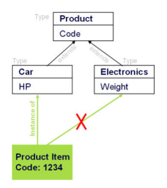

Figure: Types have TypeAttributes Possible to generate JavaClasses out of types (runtime → congured types)
Less load on database No Multi-Inheritance No Re-Typing Classication Places to do Classication:
In the Backoffice application: Classication Systems CSV-based: Create your own CSV Import.

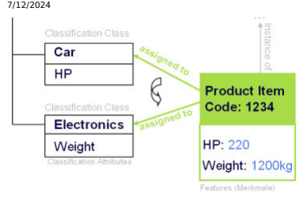

Figure: Classication classes have classication attributes. The associated values of classication attributes are called Features.

Multi-Assignments to Classication Classes Re-Classication or Un-Classication at any time More load on database No delegation to own java classes, therefore no logical implementation of attributes possible (JaloAttributes)

## Tip Best Practice

In many cases, a mixture of both typing and classication is useful, and a best practice approach is to use a subtype of Product. This subtype holds all the product properties, reected using the type system attributes or classication features. Whether a certain product property should be modeled using the type system or the classication system depends on whether the product property is used in business logic, or whether the property is an item to display. A product property frequently used in business logic, such as an article number, should be modeled using a type system attribute. A display property such as a screen resolution of a monitor, which is seldom used in business logic, can be modeled using a classication feature. However, this is a general guideline and may not match the product model for your case exactly.

## Product Classication

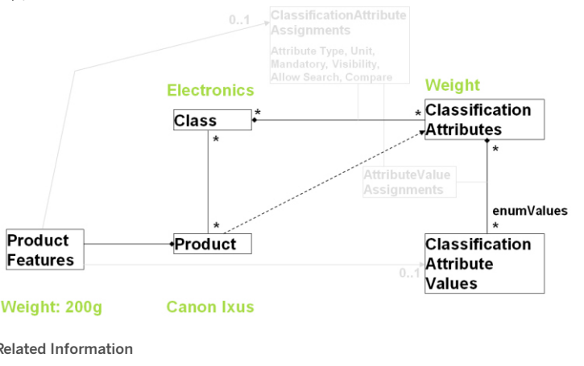

Dening Product Attributes The Type System Classication

## The Type System

A type is a template for objects. Types dene product data that objects may carry and specify relations between objects, and also make product data persistent by categorizing the data and relating it to database elds. Every object stored in Platform is a type instance.

## Main Functions Of The Type System

SAP Commerce Cloud uses a system of types to organize data, for example product information, customer data, addresses, or orders. Types dene persistent objects in several aspects:
attributes manage and store data for the object, the deployment denes the database table the object is stored in (see Specifying a Deployment for Platform Types for more details) the Java class of the object.

A Type is the type denition in items.xml and its Java implementation.

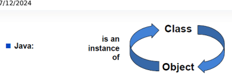

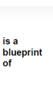

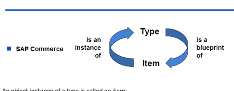

An object instance of a type is called an item:

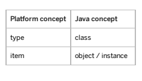

Items and Types There are two major kinds of types: System-related types and business-related types.

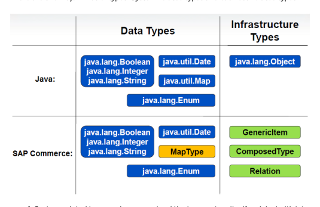

1. System-related types make up or extend the type system itself and deal with internal data management:
a. Infrastructure types: ComposedTypes (also referred to as ItemTypes) set up type definitions and may carry attributes to hold information. In the end, every persistent object in the SAP Commerce Cloud is an instance of ComposedType or of one of its subtypes.

b. Data types: CollectionTypes, MapTypes, EnumerationTypes, and AtomicTypes. These are used to describe attributes: carrying attribute values or representations for these values or creating links between objects 2. Business-related types (like Order, Discount, Shoe) allow you to manage product and / or customer information so that you can run your business.

For the out-of-the-box structure and hierarchy of the type system, consult the core-items.xml file.

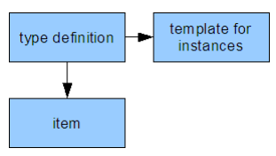

As mentioned before, every object stored in SAP Commerce Cloud is an instance of a type. Even type definitions are instances of the type Type. This means that there are two aspects of a type definition: it is an item and, at the same time, it defines other items.

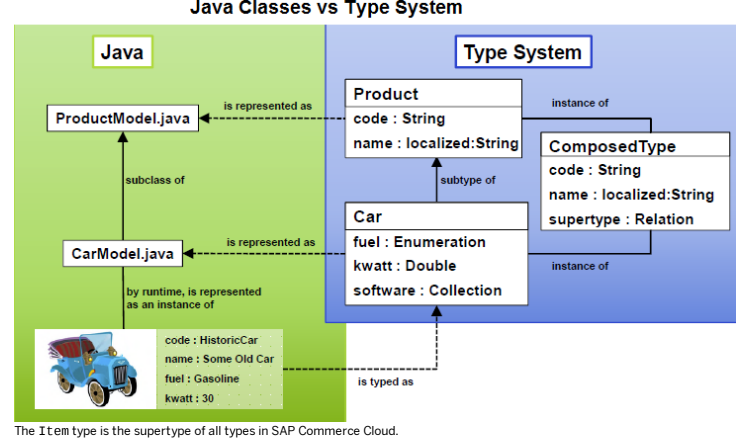

## I Note Items And Items

To differentiate between normal object instances and type definitions, non-type objects in Platform are referred to as items.

The lower case spelling item refers to an object in Platform; the upper case spelling Item refers to the type definition.

Type definitions are stored as instances of ComposedType (or a subtype of ComposedType), so the definitions of Item and Product as items are instances of ComposedTypes. You may want to define subtypes of ComposedTypes with additional attributes. The following code snippet defines an item called SpecialProduct that is a subtype of Product but its type is not defined as a ComposedType, but as a SpecialComposedType (via the metatype attribute). Instances of SpecialProduct are thus subtypes of Product, but the type definition is stored as a SpecialComposedType .

## Types And Attributes

Types may dene attributes, which is the equivalent to Java classes having elds. You may easily edit item values in Backoffice as they are displayed in graphical editor elements. On the API level, get hold of those attributes via getter and setter methods. An attribute in SAP Commerce Cloud:
can be a reference to a composed type, for example the Folder in the Media type

a basic Java type, called the atomic type, for example the Description attribute is of type java.lang.String can have a localized name and description,
can have a default value.

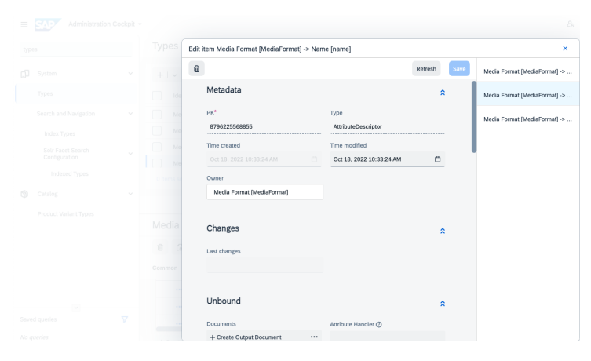

## Congured Types Vs Runtime Types

In terms of persistence, there are two kinds of types: congured and runtime.

Congured types are types that are dened in an items.xml le.

The following UML diagram gives you an overview of selected types and their attributes.

i Be aware of the following limitations of runtime types:
- Persistence aspects Runtime types are as persistent as all other items, since type definitions are stored in the database as well. However, when SAP Commerce Cloud is initialized, the entire type system is discarded and re-created from the contents of the items.xml files of all extensions. As runtime types are not backed by a file, they are removed and not re-created during a system initialization. In other words: whenever you initialize SAP Commerce Cloud, all runtime types are gone.

- Lack of Java sources As the build process for extensions relies on the items.xml to generate Java source files, there will be no Java source files for runtime types. By consequence, this means that you cannot adapt runtime types programmatically.

In some use cases, using runtime properties might be more flexible. It is, however, strongly suggested to test and confirm if runtime properties meet all the requirements of your system.

## Adding New Attributes To A Type

To add attributes to an SAP Commerce Cloud type, you can:
This is custom documentation. For more information, please visit the SAP Help Portal 1. Extend the type and adding the attribute to a subtype 2. Add attributes to a type directly.

For a discussion of these two approaches, see items.xml.

## Checking Runtime Attributes Type By The Type System

When reading runtime attributes, the type system checks the types of primitive attributes. If the type declared in the attribute descriptor does not match the database value, a null value is returned. If you want to disable this behavior, navigate to the local.properties le and add the following property with the value false:
should.check.runtime.attributes.type.match=false

## Available Types

There are a few available types and they serve specic purposes. For example, a MapType is a typed collection of key/value pairs that you can use for localized values.

## Atomictypes

AtomicTypes are the most basic types available in SAP Commerce Cloud. They are the representation of Java Number and String object types, such as java.lang.Integer or java.lang.String. SAP Commerce Cloud has mappings for the common Java number and String object types. As the factory default AtomicTypes represent the most common Java number and String types, most probably you might not have to dene AtomicTypes anyway. When you dene an AtomicType yourself, you need to assign a Java class object to it.

## Tip

For details on a list of the AtomicTypes that are generated upon Platform initialization, please refer to the atomictypes section of the core-items.xml le in the <HYBRIS_HOME> /bin/platform/ext/core/resources directory.

Unlike the other types, an AtomicType denition does not have a code attribute to set the unique identier. Instead, the AtomicType class attribute is used as its reference.

If you need to localize this referrer into various languages, you may do so in the type localization les (
locales_xx.properties, located in an extension resources/localization directory) - the following code snippet assigns a localization to the java.util.Date AtomicType:
\#\#\# Localization for type localized:java.util.Date type.localized:java.util.date.name=Date type.localized:java.util.date.description=This is a localized info SAP Commerce Cloud stores AtomicType instances in the database as strings (VARCHAR) or numbers (NUMBER), if possible. If you dene AtomicTypes yourself, you need to make sure that those types are serializable (that is, you need to nd a storage format for them that your database system can manage).

## Collectiontypes Note

Use RelationTypes whenever possible.

## 

As the maximum length of the database eld of a CollectionType is limited, a CollectionType with many values may end up getting its values truncated. In addition, the values of CollectionTypes are written in a CSV format and not in a normalized way. By consequence, SAP recommends using RelationTypes whenever possible.

As you need to dene the type of items that are stored in a CollectionType from the very start, it is impossible to store any other type of items in the same CollectionType. In the example code snippet, the StringCollection type is restricted to String type items only. SAP Commerce Cloud blocks any attempt of storing, for example, Integer values into a StringCollection instance. A comparable concept is the idea of Java 5 Generic Types .

A CollectionType contains a typed number of instances of types (a dozen Strings, for example). A CollectionType has a unique identier (referred to as code) and a denition of the type of elements it contains (elementtype). This type denition may include any type of item within SAP Commerce Cloud, even other CollectionTypes.

CollectionTypes are based on the Java Collection class. Via the type attribute in a CollectionType denition, you can make use of the Collection class and some of its subclasses (List, Set, and SortedSet). A Collection is a list of elements. A List is a number of ordered items. Although there may be equal items in a List, the items order is relevant. Items in a List may be accessed by an index counter. A Set is an unordered number of items that must all be unique, no two items may be equal. A SortedSet is the combination to a List and a Set. It contains a number of ordered items that must all be unique. There are two types of relations that you can build with CollectionTypes: one to many relations and many to one relations. Both kinds of relation are unidirectional by design.

One-to-many relations (1:n) Many-to-one relations (n:1)

| 7/12/2024 One-to-many relations (1:n)                                                                         | Many-to-one relations (n:1)                                                                                                   |
|---------------------------------------------------------------------------------------------------------------|-------------------------------------------------------------------------------------------------------------------------------|
| Keep links to the respective values via an attribute on the source item, for example, a list of Primary Keys. | Store the attribute values at the respective target items and have a getter method at the source type to retrieve the values. |

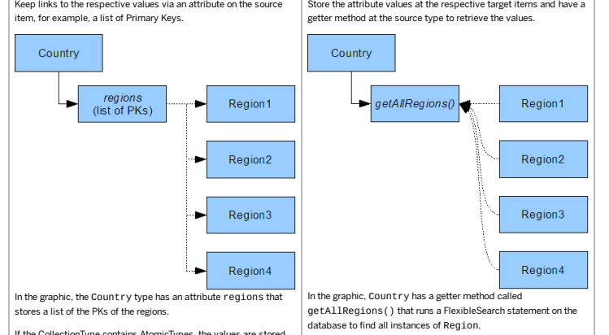

If the CollectionType contains AtomicTypes, the values are stored as binary elds in the database. If it stores a collection of items, then those items' Primary Keys (PKs) are stored in the database in string form - a list of PKs, basically. As all the values of one CollectionType instance are stored as one single eld, reading in and writing the values is quite fast as it is done in a single database access (especially with caching). Processing them, however, is more delicate for three reasons:

If a collection contains a lot of PKs, the eld value may reach the maximum length of eld for the database implementation and entries may get truncated. That means that you can only store values of a certain length in that database eld and every bit of information beyond that length gets lost.

As the database entry only contains the PKs (in other words: links to items) and not the items themselves, you cannot run database searches on the entries directly.

Instead, you need to run searches in memory via Java, which is often slower than searching on the database directly. If a single CollectionType instance has several AtomicType entries that match a search query, you are not able to detect the exact number of matches from the database directly.
As CollectionTypes have technical limitations that make modeling n:m relations delicate, SAP recommends using RelationTypes to model complex correlations.

## Enumerationtypes

| Unlike the one-to-many kind of relation represented by a CollectionType, this kind of relation:   |
|---------------------------------------------------------------------------------------------------|

has better performance as the results of FlexibleSearch statements are cached by SAP Commerce Cloud

does not suffer from a eld length limitation as the relation is not established via an attribute and, therefore, no PKs are stored directly. requires implementing the getter method (via the FlexibleSearch statement).

## 

Very much like the Enum concept in Java or C, EnumerationTypes (EnumTypes for short) map a predened verbatim value to another, internal kind of value. EnumTypes are ComposedTypes and handle values in a special way: the values are also their instances. Therefore, an EnumType called color with the values red, green, and blue has three instances: red, green, and blue. This kind of type is useful for attributes whose values only have a limited number of choices (yes or no, for example).

If you dene EnumTypes yourself with default Platform items as values, those values are always instances of this new EnumType. As a result, all the values for self-dened EnumTypes are stored in the same database table as the EnumType itself. Since all EnumTypes end up in one single database table, however, this table might become quite large when you dene a lot of EnumTypes. If you know that an EnumType might have a large number of values, SAP recommends using a different database table to deploy this EnumType.

## Maptype

A MapType is a typed collection of key/value pairs. For each key (referred to as argument), there is a corresponding value (referred to as return type). The direction of mapping is always argument - return value. A very common use of MapTypes is localized values - values that may differ in every language available in the system, like product descriptions in German and English, for example.

## Note Storage Of Localized Values

Localized values are stored in a separate database table, whose name is composed of the name of the table the type is stored in, plus the suffix lp (short for localized property). For example: if the type is stored in the table sampletype, then its localized values are stored in the table sampletypelp. You do not have to worry about the handling, though - Platform manages localized types transparently.

## Relationtypes

RelationTypes model dependencies between numbers of items on both dependency sides. They represent n:m relations in

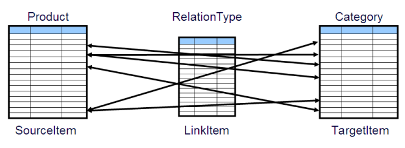

SAP Commerce Cloud. RelationTypes allow you to reect instances with many products belonging to several categories. The following diagram illustrates these relationships: Internally, the elements on both sides of the relation are linked together via instances of a helper type called LinkItem.

LinkItems hold two attributes, SourceItem and TargetItem, that hold references to the respective item (as in the graphic).

For each entry within a relation (in other words, for each link from one item to another), there is a LinkItem instance that stores the PKs of the related items. LinkItem instances are handled transparently and automatically by the Platform: On the API level, you only need to use the respective getter and setter methods.

If you delete an item from a relation, neither the item you seem to delete nor its related item is deleted, only the LinkItem is removed. In other words, both the source item and the target item remain, only the link between them is removed. When the Platform runs a search for either side of a RelationType, it runs through all the relation's LinkItem instances and returns a Java Collection that contains the values. SAP Commerce Cloud sorts RelationType instances in source-to-target direction by the order the individual relation entries were created. The target-to-source direction is not sorted by the Platform, therefore the order of its results may vary depending on the database you use (that is, without any sorting by your web application or the SQL statements).

## Itemtypes

ItemTypes (more commonly referred to as ComposedTypes) are the foundation of the SAP Commerce Cloud type system. All types (and therefore items) are ultimately derived of a ComposedType. ComposedTypes hold meta information on types and the types' attributes and relations, including the item type's code (in other words: unique identier), its JNDI deployment location, the database table the item is stored in and the type's Java class. Every type (and therefore item) may have any number of attributes. These attributes may either be dened by the type's AttributeDescriptors or inherited from its supertypes. Every attribute that is inherited downwards has its settings stored separately for each children type. That way, it is possible to override attribute access rights inherited from the supertype for a child type, so that you may set an attribute to be writable for your self-dened types that wasn't set writable on the type the attribute was originally dened with.

## Moving A Type

It is possible to move types between extensions. This is useful, for example, when you want to refactor your extension.

## Context

These are the only limitations for moving types:
You are not allowed to change the deployment typecode of the type that you want to move or is already moved.

You cannot move a type if it affects a classpath. Below you have an example scenario when it does not work:
You have three extensions: MyExtensionA, MyExtensionB, MyExtensionC
The MyExtensionA contains a TypeA
The MyExtensionB and the MyExtensionC are related to the MyExtensionA
The MyExtensionC contains a TypeC, which extends the TypeA
You want to move the TypeA from the MyExtensionA to the MyExtensionB.
In this case, compilation fails, because the MyExtensionC still needs the TypeA that is used to extend the TypeC. Possible workaround would be to relate the MyExtensionC with the MyExtensionB, but it may not t your business objectives.

Below you can nd all steps based on example of compiled and initialized SAP Commerce Cloud with two extensions:
MyExtensionA and MyExtensionB. You want to move TypeA from MyExtensionA to MyExtensionB:
This is the denition of a type that you want to move:
myextensiona-items.xml
<itemtype generate="true" code="myTypeA" jaloclass="de.hybris.myextensiona.jalo.MyTypeA" extends="GenericItem" autocreate="true" > <deployment table="mytype_deployment" typecode="12345"/> ... </itemtype>

## Procedure

1. Move MyTypeA.java from the MyExtensionA extension to the MyExtensionB extension.

2. Modify package in the MyTypeA.java so it reects the new location.

package de.hybris.myextensionb.jalo; 3. Remove GeneratedMyTypeA.java that was generated for the type in the MyExtensionA extension.

4. Cut the TypeA denition from the myextensiona-items.xml and paste it in the myextensionb-items.xml.

5. Change package name in the jaloclass attribute to the new one.

<itemtype generate="true" code="myTypeA" jaloclass="de.hybris.myextensionb.jalo extends="GenericItem" autocreate="true" > <deployment table="mytype_deployment" ... </itemtype>
6. Build SAP Commerce Cloud a. Open a command shell.

b. Navigate to the <HYBRIS_BIN_DIR> /platform directory.

c. Make sure that a compliant Apache Ant version is used.

On Windows systems, call the <HYBRIS_BIN_DIR> /platform/setantenv.bat le. Do not close the command shell after this call as the settings are transient and would get lost if the command shell is closed. On Unix systems, call the <HYBRIS_BIN_DIR> /platform/setantenv.sh le, such as: . ./setantenv.sh.

d. Call ant clean all to build SAP Commerce Cloud.

7. Enter hybrisserver.bat to start the SAP Commerce Cloud Server.

8. Open SAP Commerce Cloud Administration Console.

a. Go to the Platform tab and select Update option. b. Click the Update button.

For details, see Administration Console and Initializing and Updating SAP Commerce Cloud.

## Creating Items

There are two ways to create instances of types, in the extension's manager and generically.

This is   For more    the SAP Help  44 Even though you can set up many Platform items via Backoffice or during the System Initialization process (in the form of sample data), there are situations when you need to create instances of types at runtime (when a new customer registers with the web shop, for example).

Make sure to add the "unique" index on key attributes to any new instances of types to prevent creating duplicate items.

## Creating Items In The Extension'S Manager

Every extension has a Manager that is responsible for item handling. The Manager denes creation methods for all types in the extension. The CronJobManager type, for example, has methods like public Trigger createTrigger(Map params),
public CronJob createCronJob(Map params), public BatchJob createBatchJob(Map params), and so on. In the end, these methods are delegates to the createItem(...) method.

By calling the Manager's creation methods and passing the necessary parameters for the new item as a Map (attribute - value), you can create items. The following code snippet gives you an example of this:
... Map params = new HashMap(); params.put( HelloWorldWizardCronJob.SCREENTEXT, getScreenText() ); params.put( HelloWorldWizardCronJob.ACTIVATE, isActivate() ); params.put( HelloWorldWizardCronJob.INTERVAL, getInterval() ); params.put( HelloWorldWizardCronJob.CODE, "HelloWorldWizardCronJob" + String.valueOf( jobNum ) ); params.put( HelloWorldWizardCronJob.JOB, hwwj ); HelloWorldWizardCronJob hwwcj = HelloWorldWizardManager.getInstance().createHelloWorldWizardCronJob ...

## Creating Items Generically

The ComposedType type denes and implements the public Item newInstance( SessionContext ctx, Map attributeAssignment ) throws JaloGenericCreationException, JaloAbstractTypeException method. To create a new instance of a certain type, select the respective ComposedType and call its newInstance(...) method, as in the following sample code snippet:
public MySampleItem createMySampleItem( SessionContext ctx, Map params ) { try { ComposedType item = getSession().getTypeManager().getComposedType( "mySampleItem" ); return (MySampleItem) item.newInstance( ctx, params ); } catch( JaloBusinessException e ) { throw new JaloSystemException(e,"error creating mySampleItem.",0); } }
If you create items that way, pass any critical parameters (such as code or qualifier, catalog versions, etc.) directly in the Map. Otherwise, the creation fails with an exception because these necessary bits of information are not available for the item at creation time.

## Overriding The Default Creation Mechanism

In most cases, the out-of-the-box creation mechanism for instances of any type suffices and you do not have to implement a specic implementation of an item's creation. However, when you have very specic item denitions, it might be useful or even necessary to override the default creation logic.

This is   For more    the SAP Help  45 There are two kinds of attributes an item can have: initial attributes and non-initial attributes. Initial attributes need to be set when the item is created. Initial attributes with no value set cause the item creation to fail (PK, qualier, date, time, and catalog version, for example). Non-initial attributes can be set when the item exists. In other words: initial attributes must be set during item creation, non-initial values can be set later on.

You can set an attribute to be initial by setting its initial modier in the items.xml le to true, as in the following code snippet (taken from the CronJob extension's items.xml le):
<attributes> <attribute qualifier="code" type="java.lang.String"> <modifiers initial="true"/> <persistence type="property"/> </attribute> </attributes>
An easy way of providing values for initial attributes is by passing those values to the createItem(...) method directly. The following code snippet shows you what a createItem(...) implementation might look like:
protected Item createItem( SessionContext ctx, ComposedType type, ItemAttributeMap allAttributes ) { // make sure that all attributes we need have values set Set missing = new HashSet(); if( !checkMandatoryAttribute( CODE, allAttributes, missing ) || !checkMandatoryAttribute( UNITTYPE, allAttributes, missing ) ) // throw exception if anything is missing throw new JaloInvalidParameterException( "missing parameter " + missing + " got " + allAttribute // create new Unit based on the values return JaloSession.getCurrentSession().getProductManager().createUnit( (String) allAttributes.get( PK ), (String) allAttributes.get( UNITTYPE ), (String) allAttributes.get( CODE ) ); }
Although there are several methods you can override, overriding the createItem(...) method will do for most cases.

| Method Name                                                                                                                          | Description / Comment                                                                                                                                                                                                                                                                                                                                                |
|--------------------------------------------------------------------------------------------------------------------------------------|----------------------------------------------------------------------------------------------------------------------------------------------------------------------------------------------------------------------------------------------------------------------------------------------------------------------------------------------------------------------|
| protected Item createItem(SessionContext ctx, ComposedType type, ItemAttributeMap allAttributes)                                     | The actual creation method. Implement it so that its return value is the new item. Marked abstract in the Item type.                                                                                                                                                                                                                                                 |
| throws JaloBusinessException protected ItemAttributeMap getNonInitialAttributes( SessionContext ctx, ItemAttributeMap allAttributes) | Implement this so that it lters allAttributes and removes values that were added during createItem(...) . If you override this method, be sure to call the super class' implementation of this via super.getNonInitialAttributes( ctx,allAttributes )otherwise you would have to implement the removal values the default implementation would have removed already. |

| 7/12/2024 Method Name                                                                                     | Description / Comment                                                                                                                                                                                          |
|-----------------------------------------------------------------------------------------------------------|----------------------------------------------------------------------------------------------------------------------------------------------------------------------------------------------------------------|
| public void setNonInitialAttributes(SessionContext ctx, Item item, ItemAttributeMap nonInitialAttributes) | This method has to set all (non-initial) values returned by the getNonInitialAttributes(...) in other words, all values that have not yet been set yet.                                                        |
| throws JaloBusinessException getInitialProperties()                                                       | Provides all properties that are written directly when the item is created in the database. All attributes that are not created during this method's run are only created when setNonInitialAttributes() runs. |

The getInitialProperties() method is a bit special, so it is discussed here a bit more extensively. When a new instance of a ComposedType is created, its attributes' values are not set when setNonInitialProperties() is run. If you try to set an attribute that depends on another attribute to be set (like TaxValue that depends on Currency), you are likely to run into exceptions. To avoid this, you may use the getInitialProperties() method to nd out what attributes are set and design your error handling accordingly. An example listing for both getInitialProperties() and getNonInitialProperties():
// build a property container and append value protected JaloPropertyContainer getInitialProperties( JaloSession jaloSession, ItemAttributeMap a { final JaloPropertyContainer cont = jaloSession.createPropertyContainer(); cont.setProperty(MY_ATTR,(Serializable)allAttributes.get( MY_ATTR )); return cont; } // make sure the attribute is not written twice protected ItemAttributeMap getNonInitialAttributes( SessionContext ctx, ItemAttributeMap allAttri { final ItemAttributeMap copyMap = super.getNonInitialAttributes(ctx, allAttributes); copyMap.remove( MY_ATTR ); return copyMap; }
The following example is taken from the SAP Commerce Cloud core, and shows generic creation of the unit item type:
protected Item createItem( SessionContext ctx, ComposedType type, Map allAttributes ) throws JaloBusinessException { Set missing = new HashSet(); if ( !checkMandatoryAttribute( CODE, allAttributes, missing ) || !checkMandatoryAttribute( UNITTYPE, allAttributes, missing ) ) throw new JaloInvalidParameterException( "missing parameter "+missing+ " got "+allAttributes, 0 ); return JaloSession.getCurrentSession().getProductManager().createUnit( (String)allAttributes.get( UNITTYPE ), (String)allAttributes.get( CODE ) ); } protected Map getNonInitialAttributes( SessionContext ctx, Map allAttributes ) { // super.getNonInitialAttributes provides a copied map so we dont need to copy it again final Map copyMap = super.getNonInitialAttributes( ctx, allAttributes ); copyMap.remove( CODE ); copyMap.remove( UNITTYPE ); 

## Checking The Mandatory Item Attributes

| Parameter                     | Mandatory   | Description                                                                                                                                                                            |
|-------------------------------|-------------|----------------------------------------------------------------------------------------------------------------------------------------------------------------------------------------|
| String qualifier              | yes         | Reference to the attribute to check                                                                                                                                                    |
| ItemAttributeMapallAttributes | yes         | Map with the initial attribute values                                                                                                                                                  |
| Set missingSet                | yes         | Set which accepts references to all attributes for which no value has been set                                                                                                         |
| Boolean nullAllowed           | no          | Species whether a null value in the ItemAttributeMap is written to the item as a null value (true) or whether the null value is treated as a missing value (false). Defaults to false. |

When the createItem(...) method is called, one of the call parameters is a Map containing the initial values for the item's attributes. To nd out during the createItem(...) method whether or not the ItemAttributeMap contains a value for each mandatory attribute, you can use the checkMandatoryAttribute(...) method. Be sure to test every mandatory attribute via an individual checkMandatoryAttribute(...) method call, such as:
... checkMandatoryAttribute(MyType.MYATTRIBUTE1, allAttributes, missing, true); checkMandatoryAttribute(MyType.MYATTRIBUTE2, allAttributes, missing, false);
This method has four parameters:
The following code snippet gives an example on a createItem(...) method implementation with the CustomerReview type's three mandatory attributes product, user, and rating:
@Override public CustomerReview createItem(SessionContext ctx, ComposedType type, ItemAttributeMap allAttribu {
final Set missing = new HashSet(); checkMandatoryAttribute(CustomerReview.PRODUCT, allAttributes, missing); checkMandatoryAttribute(CustomerReview.USER, allAttributes, missing); checkMandatoryAttribute(CustomerReview.RATING, allAttributes, missing); if (missing.size() != 0) {
throw new JaloInvalidParameterException("missing " + missing + " for creating a new
} return (CustomerReview) super.createItem(ctx, type, allAttributes);
}
Alternatively, you could use the return parameter of the checkMandatoryAttribute(...) method of Boolean type. This Boolean return value is true if there is a value for the attribute and false if the value is missing.

The missing HashSet contains every attribute for which no value has been provided. Therefore, if the missing HashSet is empty, every attribute has a value and the item can be safely created.

public CustomerReview createItem(SessionContext ctx, ComposedType type, ItemAttributeMap allAttribu {
final Set missing = new HashSet(); if (
!checkMandatoryAttribute(CustomerReview.PRODUCT, allAttributes, missing) || !checkMandatoryAttribute(CustomerReview.USER, allAttributes, missing) || This is   For more    the SAP Help  48
!checkMandatoryAttribute(CustomerReview.RATING, allAttributes, missing)
) {
throw new JaloInvalidParameterException("missing " + missing + " for creating a new
} return (CustomerReview) super.createItem(ctx, type, allAttributes);
}

## Relations

There are four basic kinds of relations: one-to-one, one-to-many, many-to-one, and many-to-many.

This section abides by the EJB 3.0 Specication terms for relations. Refer to the JSR-000220 Enterprise JavaBeans 3.0 Final Release (ejbcore) specication pages 153 through 171 if some of the terms are unfamiliar to you.

One-to-one (1:1) relations represent a direct relationship between two items, for example a user name and the user account's ID. This relation is unambiguous; if you know the user name, you can (basically) retrieve its user account ID and vice versa. One-to-many (1:n) relations reect an item that has to do with several other items. For example, a hotel that has several employees, or a tree that has several apples growing on it. Many-to-one (n:1) relations are very much like one-to-many relations, only the other way around. Even if implemented differently, from a logical point of view, a many-to-one relation is just another representation of a one-to-many relation. Many-to-many (n:m) relations are for those cases where several items of one kind are linked to several items of another kind. For example, if a company has several employees who work spread across several project teams. That way, an employee may be member of several teams and a team may consist of several members. Many database systems (including SAP Commerce Cloud) internally resolve an n:m relation into two separate 1:n relations, linked by a common entity. In the employee-project team example, the common entity is the project.
In addition, a relation can be unidirectional (one-sided) or bidirectional (dual-sided). Unidirectional relations point from A to B, whereas bidirectional relations point from A to B and from B to A. SAP Commerce Cloud knows these kinds of relations:

| Kind of Relation            | SAP Commerce Cloud Type                                        |
|-----------------------------|----------------------------------------------------------------|
| one-to-one, unidirectional  | (attribute denition, such as Product instance - Unit instance) |
| one-to many, unidirectional | CollectionType                                                 |
| many-to-one, unidirectional | CollectionType                                                 |
| many-to-many, bidirectional | RelationType                                                   |

We have already seen 1:1 relations in our sample with the attributes that contain a product and a customer, respectively. Localized values are some sort of an 1:n relation - there is a single object (the value to be localized) with several other objects (localized text strings) assigned to it. An example for an n:m relation would be if several reviews were linked to more than one product (for example, because a book was published by several publishers its license and the reviews are valid for every one of these editions).

## 1:1 Relations

One-to-one relation is a direct relationship between one object and another. It is represented by attributes that are ComposedTypes. The example shows a relation between User and UserProfile:
This is   For more    the SAP Help  49

<itemtype code="User" extends="Principal" jaloclass="de.hybris.platform.jalo.user.User" autocreate= <attributes> ... <attribute autocreate="true" qualifier="userprofile" type="UserProfile"> <modifiers read="true" write="true" partof="true"/> <persistence type="property"/> </attribute> ... <attributes> </itemtype> <itemtype code="UserProfile" extends="GenericItem" jaloclass="de.hybris.platform.hmc.jalo.UserProfi <attributes> <attribute autocreate="true" qualifier="owner" type="Principal" redeclare="true"> <persistence type="cmp" qualifier="ownerPkString"/> <modifiers read="true" write="false" search="true" optional="true" private="false" init </attribute> </attributes> </itemtype>

## 1:N Relations - One-To-Many Vs Many-To-One

Depending on the way the relation is stored, the discussion will be about one-to-many or many-to-one relations. A many-to-one relation has its entries stored with the items themselves, while the one-to-many relation stores the entries by itself. An example for one-to-many relations would be the Country type and the Regions it stores. Such relations are commonly modeled via a CollectionType. The advantage of a CollectionType-based one-to-many relation is that it is quite easy to implement, and that reading and writing CollectionTypes is a fast operation. However, there are two reasons why we do not recommend using CollectionTypes: rst, they do not scale very well - the more values such a relation has, the more database search performance decreases. Second, as a database eld only has a limited length, values longer than that length get cut off and are lost. For more technical details on CollectionTypes, have a look at the reference section.

## Redeclaring 1-N Relations

Sometimes it is useful to dene a relation between two abstract types, and make the relation concrete in subclasses.

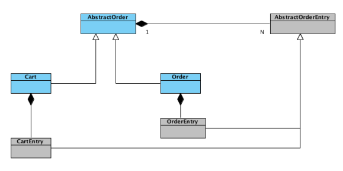

As you can see, there is a relation dened between AbstractOrder and AbstractOrderEntry. You can conveniently base your business code on these abstract classes, and reuse the code for concrete subclasses. However, at runtime we deal with concrete relations:
Order to OrderEntries Cart to CartEntries The problem is, when querying for entries of Order, CartEntries table are queried, too, even though we know that only OrderEntries should be taken into account. The same issue exists for Cart, namely that the getEntries() method would also look into the OrderEntries table, although we know that only CartEntries should be queried.

In SAP Commerce Cloud, this performance problem is gone, because you can dene a relation on an abstract level (between two abstract classes), and then redeclare this relation in concrete classes to point to concrete subclasses.

1. Dene a relation between two abstract classes:
<relation code="AbstractOrder2AbstractOrderEntry" localized="false" generate="true" autocreate
<sourceElement type="AbstractO <modifiers read="true" write= <custom-properties> <property name="ordering.attri <value>"entryNumber"</value> </property> </custom-properties> </sourceElement> <targetElement type="AbstractO <modifiers read="true" write= </targetElement> </relation>
2. Then, at the relation-end we can redeclare the denition of Order item such that it contains only OrderEntries:
<itemtype code="Order" extends="AbstractOrder" jaloclass="de.hybris.platform autocreate="true" generate="true"> <deployment table="Orders" typ <attributes> <attribute autocreate="true" </attributes> </itemtype>
3. Additionally, the following collection type is needed:
<collectiontype code="OrderEntryCollection" elementtype="OrderEntry" autocreate="true" generat 4. The corresponding change should also be done on the other side of relation, in OrderEntry:
<itemtype code="OrderEntry" extends="AbstractOrderEntry" jaloclass="de.hybris.platform autocreate="true" generate="true"> <deployment table="OrderEntrie <attributes> <attribute autocreate="true" <modifiers read="true" write= </attribute> </attributes> </itemtype>
This solution strikes a very good balance between exibility and reuse on the code level, without sacricing performance at the ORM layer. It ensures:
Flexibility on code-level: In java, you can use abstract base classes in your business logic, not relying on concrete implementations, so you can reuse the same logic for, say. Order and Cart.

Performance on persistence-level: When retrieving Order from the database, and then OrderEntries, SAP
Commerce Cloud will query only the table containing OrderEntries. Other tables containing, for example, CartEntries are not included in the query.

This is   For more    the SAP Help  51

## Custom Ordering

SAP Commerce Cloud also provides a custom property ordering.attribute dened for AbstractOrder2AbstractOrderEntry relation.

By dening this property, it is possible to specify which attribute will be used to order the many-side items when retrieving from the database. In the example above, we dened the many-side as ordered=false, and specied a custom ordering attribute.

The SAP Commerce Cloud Service Layer takes care of putting OrderEntries in the correct order by setting the entryNumber, so there is no need for the ORM to add an additional ordering column, therefore the many side is ordered=false.

However, entries retrieved from the database should be ordered according to the entryNumber computed upon save, and this can now be achieved using the ordering.attribute property.

## Tuning Ordered One-To-Many Relations

One of the relations you can dene in Platform is the one-to-many relation. You can congure it as ordered. With an ordered one-to-many relation, an ordering attribute is used to order the items of the -many side when they're retrieved from the database. When you create a new instance of the item of the -many side, a new value is assigned to this attribute only when it isn't already provided. The new value is a result of the current highest value of this attribute retrieved through an SQL
statement, plus 1 (one). The operation is handled by OneToManyHandler.

You can adjust this behavior using the following property:
relation.*<relationName>*.reordered=
Here is a use example:
relation.Product2FeatureRelation.reordered=sync The property can have the following values:

false is the setting where the SQL statement that retrieves the current highest value of an ordering attribute is always run sync means that only when a sync job is active, the SQL statement isn't run and no value for the ordering attribute (in case of ProductFeature it's the featurePosition attribute) is provided whenever a new instance of an item of the
-many side is created (for example ProductFeature)
always means that the SQL statement is never executed and no value for the ordering attribute (in case of ProductFeature it is the featurePosition attribute) is provided whenever a new instance of an item of the -many side is created (ProductFeature)
If this property isn't set for a given relation, the query isn't run when the value of the ordering attribute is provided. If the value isn't known, the query is run.

By default, the value of this property is set to sync for the Product2FeatureRelation relation.

## Condition Query

The condition.query custom property is dened for the User2Addresses relation. The property holds a string that is later added to the where part of the select query generated for a one-to-many or many-to-one relation. The condition query is written in FlexibleSearch and must be valid in the context of a given relation query. The condition query shouldn't contain any order by part as it is added at the end of a generated query. The condition query custom property can only be dened in one end of the relation and only for relations of a one-to-many or many-to-one type. It must be dened in either sourceElement or targetElement that have the many cardinality.

<relation code="User2Addresses" generate="true" localized="false" autocreate="true">
<sourceElement type="User" cardinality="one" qualifier="owner"> <modifiers read="true" write="true" search="true" optional="true" i </sourceElement> <targetElement type="Address" cardinality="many" qualifier="address <modifiers read="true" write="true" search="true" optional="true" p <custom-properties> <property name="condition.query"> <value>"{original} is null"</value> </property> </custom-properties> </targetElement> </relation>
In the example above, the User has many addresses, but only those that have the original property set to null.

Possible Orphans by Incorrect Use There is a possibility to save an item that has a foreign key set to its owner. It will be a part of the relation despite the fact that the condition query hasn't been met. If the many element of the relation has the partOf property set to true and a given item doesn't meet the condition query, then this item won't be removed after the removal of the item model. In this way, there is a possibility to leave an orphan element in the persisted model.

## N:M Relations

If you expect your type to contain many values, we recommend using a RelationType instead. This one stores the values not with the type itself, but with the items the type refers to and runs a search over those item values. Such a many to one relation scales better than a CollectionType.

## Relation Caching

Relation caching allows the system to store results of FlexibleSearch queries containing collections of related user and user group items in a dedicated cache region called a relation cache. Results stored in this cache aren't subject to various processes that can slow down the retrieval of other FlexibleSearch results. The relation cache improves the performance of storing and retrieving query results with relations of the PrincipalGroupRelation type containing related items as it doesn't validate queries using a modication counter. The counter represents the number of times any items of a given type are modied, for example when they're created or removed. Every query result stored in the FlexibleSearch cache always contains counter values that are present at the moment of running this query. When the system tries to fetch results stored in the FlexibleSearch cache, it compares the most recent counter values with the ones that are cached. If they don't match, the cached result is treated as invalid and the query is run in the database. Query results are invalidated whenever any items of a given type are modied, so modifying an arbitrary item leads to the system invalidating queries related to all the other items of the same type, which isn't always necessary. The relation cache doesn't use the modication counter and, as a result, prevents the system from running unnecessary processes that could decrease the performance of SAP Commerce Cloud. Relation caching ensures that creating new user accounts through the SAP Commerce Cloud storefront doesn't invalidate cached query results containing relations between other user and user group items that aren't related to the new users.

## Invalidation In Relation Cache

To track changes that are made in related items in the context of other items, additional information is added to invalidation events produced by the persistence layer, for example primary keys of related items before and after a change. The information allows relation caching to invalidate entries on both sides of the relation in case of any modications. In some cases in a clustered environment, invalidation events might not include any additional data, for example when relation caching is introduced during a rolling update or when a customized logic is responsible for producing such events. In these situations, all cached data is invalidated for a given relation to prevent the relation cache from being polluted with old entries. Results stored in the FlexibleSearch cache are invalidated in the same way.

## Relation Cache Metrics

To see relation cache statistics, you need to enable the following property:
regioncache.stats.enabled=true

Make sure that using this property doesn't decrease the performance of your system.

After enabling this property, log in to the SAP Commerce Cloud Administration Console, go to the Monitoring Cache tab, and select the relationCacheRegion region.

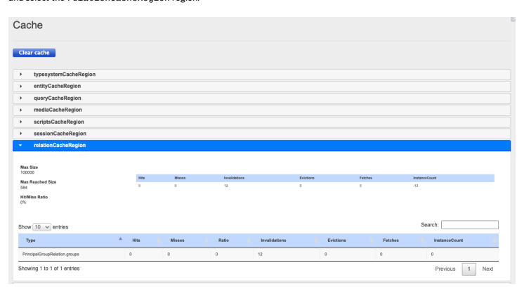

Conguring Relation Caching Congure relation caching using properties. Custom Implementation of Relation Caching You can customize the relation cache so that it stores items of types different than PrincipalGroupRelation.

## Conguring Relation Caching

Congure relation caching using properties.

This is   For more    the SAP Help  54 The relation cache is a separate CacheRegion that is dened in the core extension. It is enabled globally by default. You can congure relation caching using the following properties:

| Property                                                                                                                   | Default Value                                                                                                                                                                                                                                                                             | Description                                                                                                                                                                                            |
|----------------------------------------------------------------------------------------------------------------------------|-------------------------------------------------------------------------------------------------------------------------------------------------------------------------------------------------------------------------------------------------------------------------------------------|--------------------------------------------------------------------------------------------------------------------------------------------------------------------------------------------------------|
| relation.cache.enabled=                                                                                                    | true                                                                                                                                                                                                                                                                                      | Enables or disables relation caching for all relations.                                                                                                                                                |
| relation.cache.default.capacity=                                                                                           | 10000                                                                                                                                                                                                                                                                                     | Denes the number of items stored by the relation cache. The property is applied to both sides of cached relations. As a result, the maximum cache size is equal to the doubled value of this property. |
| relation.cache.                                                                                                            | false                                                                                                                                                                                                                                                                                     | Enables or disables relation caching for                                                                                                                                                               |
| <RelationTypeCode>.enabled=                                                                                                | selected relations. Before conguring this property, ensure that you have implemented relation caching for the selected relations as described in Custom Implementation of Relation Caching. Replace <RelationTypeCode> with the name of a relation as dened in the relevant items.xml le. |                                                                                                                                                                                                        |
| relation.cache.                                                                                                            | Not applicable                                                                                                                                                                                                                                                                            | Denes the number of items stored by the                                                                                                                                                                |
| <RelationTypeCode>.capacity=                                                                                               | relation cache. Replace <RelationTypeCode> with the name of a relation as dened in the relevant items.xml le. The property is applied to both sides of cached relations. As a result, the maximum cache size is equal to the doubled value of this property.                              |                                                                                                                                                                                                        |
| In addition to storing results of FlexibleSearch queries containing relations of the PrincipalGroupRelation type, relation |                                                                                                                                                                                                                                                                                           |                                                                                                                                                                                                        |

In addition to storing results of FlexibleSearch queries containing relations of the PrincipalGroupRelation type, relation caching also stores results obtained by calling the Principal.getGroups() and the PrincipalGroup.getMembers()
methods. Use the following properties to congure relation caching for these methods:

| Property                                        | Default Value   | Description                                                                                  |
|-------------------------------------------------|-----------------|----------------------------------------------------------------------------------------------|
| relation.cache.PrincipalGroupRelation.enabled=  | true            | Enables or disables relation caching for PrincipalGroupRelation methods.                     |
| relation.cache.PrincipalGroupRelation.capacity= | 50000           | Denes the number of results stored by the relation cache for PrincipalGroupRelation methods. |

## Custom Implementation Of Relation Caching

You can customize the relation cache so that it stores items of types different than PrincipalGroupRelation.

If you want to extend the scope of relation caching, modify the way relation accessors work.

This is   For more    the SAP Help  55 For example, in Principal and PrincipalGroup, check whether the relation cache is enabled for a given type of relations.

See de.hybris.platform.jalo.security.Principal.getGroups as an example:
public Set<PrincipalGroup> getGroups(final SessionContext ctx) { if(isPrincipalGroupRelationCachingEnabled()) { return getFromRelationCache(ctx,CoreConstants.Relations.PRINCIPALGROUPRELATION,Principal.GR } else {
// basic logic to retrieve linked items
 } }
In the example, the isPrincipalGroupRelationCachingEnabled() method checks whether relation caching is enabled for the PrincipalGroup relation. See the full method:
boolean isPrincipalGroupRelationCachingEnabled() { return RelationsCache.getDefaultInstance().getSingleCacheableAttributes(TypeId.fromTypeName(Cor }
If relation caching is enabled, the system calls getFromRelationCache():
<T extends Principal> Set<T> getFromRelationCache(final SessionContext ctx, final String relation, { final List<PK> pks = RelationCacheUnit.createRelationCacheUnit(relation, manySide, ownerPk).get return new HashSet(JaloSession.lookupItems(ctx, pks, true, false)); }
It's possible to use the API provided by de.hybris.platform.cache.relation.RelationCacheUnit only when caching is enabled for a given relation.

To extend relation caching, create a CacheUnit object with the relevant arguments and call the getCachedPKs() method to retrieve lists of primary keys related to parent items. As a last step, translate these keys to JaloSession.lookupItems items.

## Relation Caching And Search Restrictions In Flexiblesearch

You can't use relation caching for relations with items that can't be accessed due to FlexibleSearch restrictions as the relation cache is unable to efficiently invalidate queries containing items with such restrictions. For more information on restrictions, see Restrictions.

It isn't possible to use any search restrictions for items of the PrincipalGroupRelation type.

## Managers

Managers handle any sort of action on items that items cannot perform themselves. Also, if you need to have a method for several types that are not related to one another, the Manager is a good place to put that method. Managers handle creation, deletion, and searching for items. They also deal with searching for and deleting items. If you need to implement a method that handles items from the outside, putting that method into the Manager is a good idea.

This is   For more    the SAP Help  56 A Manager is a Singleton - that is, there is always just one single instance of a certain Manager type, and you won't be able to create more than this single instance. In consequence, if you want the Manager to do something for you (creating an item, for example), you cannot create a Manager instance in your code, but you need to get hold of the single existing Manager instance as in the following code snippets, for example:
// find the Job instance with the qualifier myJobCode final Job exportJob = CronJobManager.getInstance().getJob( "myJobCode" );
// create various access rights final UserRight read = AccessManager.getInstance().getOrCreateUserRightBy final UserRight create = AccessManager.getInstance().getOrCreateUserRightBy final UserRight remove = AccessManager.getInstance().getOrCreateUserRightBy final UserRight change = AccessManager.getInstance().getOrCreateUserRightBy Also note that the Manager class of your extension is where you need to implement / override getter and setter methods for attributes added to SAP Commerce Cloud types. Across a multi-tenant SAP Commerce Cloud installation, every tenant has individual managers. In other words, the tenants master and junit have different instances of ProductManager, but within each individual tenant, the ProductManager is always the same instance. It is not possible to get hold of a manager instance of another tenant. Within the junit tenant, for example, you cannot access any Manager of the master tenant, and vice versa.

## References

See the reference information for ItemType and AttributeDescriptor modiers, as well as type creation examples.

## References Itemtype Modiers

| Modier     | Description / Comment                                                                                                                                                                           |
|------------|-------------------------------------------------------------------------------------------------------------------------------------------------------------------------------------------------|
| code       | The identier of this ItemType                                                                                                                                                                   |
| extends    | The superclass of this ItemType                                                                                                                                                                 |
| jaloclass  | The fully qualied classpath of this ItemType                                                                                                                                                    |
| autocreate | If set to true, a new ItemType gets created when the Platform creates the type system during initialization. Set this to false if you are adding to an existing type that is deifned elsewhere. |
| generate   | If set to true, the Platform creates jalo classes.                                                                                                                                              |

AttributeDescriptor Modiers

| Modier     | Description / Comment                                                                                                                                                                                 |
|------------|-------------------------------------------------------------------------------------------------------------------------------------------------------------------------------------------------------|
| qualier    | The identier of this Attribute                                                                                                                                                                        |
| autocreate | If set to true, a new Attribute gets created when the Platform creates the type system during initialization. Set this to false if you are adding to an existing attribute that is deifned elsewhere. |

| Modier   | Description / Comment                                 |
|----------|-------------------------------------------------------|
| type     | The identier of the type this attribute is related to |

Creating a Relation via the TypeManager A simple relation type example:
TypeManager tm = jaloSession.getTypeManager()
ComposedType productType = tm.getComposedType( Product.class ); // first create the relation end point attributes CollectionType productColl = tm.createCollectionType( "followUpProd AttributeDescriptor followUpsAttr = productType.createAttributeDesc AttributeDescriptor.READ_FLAG + AttributeDescriptor.WRITE_FLAG + At AttributeDescriptor.SEARCH_FLAG ); AttributeDescriptor usedAsFollowUpForAttr = productType.createAttri productColl, AttributeDescriptor.READ_FLAG + AttributeDescriptor.WRITE_FLAG + AttributeDescriptor.OPTIONAL_FLAG RelationType followUpRelation = tm.createRelationType( "FollowUpRelation", // the relation code false, // not localized followUpsAttr, // the relation end point attr belonging // to the source type ( this collection is sorted ! ) usedAsFollowUpForAttr // the relation end point attr belonging to t );
Values can be read and written by different ways. Either the jalo API methods Item.getLinkedItems(...) and Item.setLinkedItems(...) or the generic Item.getAttribute(...).

Product myProduct = ...

Collection followUps = myProduct.getLinkedItems( true, // here the item is considered to be the sourc "FollowUpRelation" // the relation code null // no language needed since this relation is un ); Collection usedAsFollowUpFor = myProduct.getLinkedItems( false, // now the item is considered to be the target
"FollowUpRelation" // the relation code null // no language needed since this relation is un ); // slightly easier the generic access Collection followUps = (Collection)myProduct.getAttribute( "followU Collection usedAsFollowUpFor = (Collection)myProduct.getAttribute( Please note that it is not required to implement a AttributeAccess for relation attributes.

Creating an EnumType ComposedType myEnumValueType = tm.getComposedType( "MySpecialEnumValueType" );
EnumerationType enum = jaloSession.getEnumerationManager().createEn

## Creating A Maptype

TypeManager tm = jaloSession.getTypeManager();// create a map type for localized attribute MapType localizedDateType = tm.createMapType( "locDateType", tm.getComposedType( Language.class ), tm.getAtomicType( Date.class ) ); // append a attribute descriptor to a item type This is   For more    the SAP Help  58

## Additional Information

Find out more about type systems across multi-tenant installations and orphaned types.

## Type Systems Across Multi-Tenant Installations

A SAP Commerce Cloud installation running a multi-tenant system can have an individual type system for each individual tenant, depending on the tenant's congured extensions.

## Orphaned Types

Running an SAP Commerce Cloud update might result in having type denitions in the database that are not backed by an items.xml le denition. Such types are referred to as orphaned types.

For details, refer to Initializing and Updating SAP Commerce Cloud, section Orphaned Types.

## Creating Sample Data Using Impex Extension

The ImpEx extension allows you to import and export Platform items into a CSV le. Refer to Using ImpEx with Backoffice or SAP Commerce Cloud Administration Console for details.

## Related Information

ServiceLayer Models Working with Enumerations Product Content and Catalogs Product Modeling ImpEx Initializing and Updating SAP Commerce Cloud

## Using Encryption For Attribute Values

The point of encryption is to store sensitive data (such as passwords) in a way that it is not easily readable. SAP Commerce Cloud contains an encryption mechanism for the data stored in the SAP Commerce Cloud database. Instead of writing values to the database in plain text, the SAP Commerce Cloud encryption mechanism saves an encrypted representation of the value. This encryption mechanism is not intended for user authentication or other functionality with SAP Commerce Cloud directly. The mechanism encrypts attribute values on-the-y when writing to the database and decrypts on-the-y when reading from the database. The intention of encrypted values in the database is to block sensitive data when accessing the database. By writing encrypted attribute values only, the encryption mechanism makes it much harder for a database attacker to read out data - no matter whether the attack is run against a running database or whether the attacker has a database dump.

## Specifying Encryption Mechanism

SAP Commerce Cloud uses one encryption mechanism at a time for all attributes to be encrypted. You need to specify the encryption mechanism in the project.properties or local.properties le.

To specify encryption parameters, use these properties:
encryption.provider.signature=BC encryption.provider.class=org.bouncycastle.jce.provider.BouncyCastleProvider symmetric.algorithm=PBEWITHSHA-256AND256BITAES-CBC-BC symmetric.key.file=256bit-symmetric.key

| Property name             | Description                                                                                                                           |
|---------------------------|---------------------------------------------------------------------------------------------------------------------------------------|
| encryption.algorithm      | Species the algorithm used to encrypt attribute values. The possible values are determined by the value of encryption.provider.class. |
| encryption.provider.class | The fully qualied classpath of the Java class to handle the encryption. Determines the possible values for encryption.algorithm.      |

## Setting Encryption For Attributes

To activate encryption for data storage of an attribute, you need to specify the encrypted modier in the attribute denition in your extension's items.xml le, such as:
<attribute qualifier="number" autocreate="true" type="java.lang.String"> <persistence type="property"/> <modifiers optional="false" encrypted="true"/> </attribute>

## Jalo-Only Attributes

SAP Commerce Cloud allows for a non-persistent kind of attribute referred to as a jalo attribute or jalo-only attribute.

Jalo attributes are deprecated and replaced by Dynamic Attributes.

## Overview Of Jalo Attributes

Jalo attributes have non-persistent values, and are dened in a <persistence type="jalo"> tag in the items.xml le.

Persistent attributes, by contrast, are dened in a <persistence type="property"> tag.

Unlike persistent attributes, the values of jalo-only attributes are held in memory and not written to the SAP Commerce Cloud database. The values of jalo-only attributes exist only during runtime. If SAP Commerce Cloud is shut down or terminated, the values of jalo-only attributes will be lost irretrievably. In other words, use jalo-only attributes only for values that do not matter if lost, or for values which you can restore from another source. You cannot use Flexible Search on Jalo attributes.

## Dening A Jalo-Only Attribute

Dene a jalo-only attribute by specifying that the attribute is jalo-only, as previously described, and by implementing getter and setter methods for the attribute values. If you add jalo-only attribute to an existing type denition, getters and setters are This is   For more    the SAP Help  60 generated in the Manager class of your extension. This way of adding attributes to types is not recommended. For details see items.xml.

## Persistence Denition

To specify a jalo-only attribute, assign the value jalo to the attribute's <persistence> tag in the items.xml le, as follows:
<attribute qualifier="myJaloAttribute" type="java.lang.Object"> <persistence type="jalo"/> </attribute>

## Implementing Getter And Setter Methods

Unlike persistent attributes, jalo-only attributes do not use the SAP Commerce Cloud persistence layer. By consequence, SAP Commerce Cloud must rely on a customized attribute saving mechanism. This means that you will need to implement the getter and setter methods for the attribute yourself.

If you try to build an extension whose items.xml le species jalo-only attributes, the extension will fail to build if you have not implemented getter and setter methods for the jalo-only attribute.

[yjavac] Compiling 5 source files to /opt/hybris/bin/extensions/training/classes [yjavac] ---------- [yjavac] 1. ERROR in /opt/hybris/bin/extensions/training/src/org/training/jalo/MyPro [yjavac] public class MyProduct extends GeneratedMyProduct [yjavac] ^^^^^^^^^ [yjavac] The type MyProduct must implement the inherited abstract method GeneratedMy [yjavac] ---------- [yjavac] 2. ERROR in /opt/hybris/bin/extensions/training/src/org/training/jalo/MyPro [yjavac] public class MyProduct extends GeneratedMyProduct [yjavac] ^^^^^^^^^ [yjavac] The type MyProduct must implement the inherited abstract method GeneratedMy [yjavac] ---------- [yjavac] 3. ERROR in /opt/hybris/bin/extensions/training/src/org/training/jalo/MyPro [yjavac] public class MyProduct extends GeneratedMyProduct [yjavac] ^^^^^^^^^ [yjavac] The type MyProduct must implement the inherited abstract method GeneratedMy [yjavac] ---------- [yjavac] 4. ERROR in /opt/hybris/bin/extensions/training/src/org/training/jalo/MyPro [yjavac] public class MyProduct extends GeneratedMyProduct [yjavac] ^^^^^^^^^ [yjavac] The type MyProduct must implement the inherited abstract method GeneratedMy [yjavac] ---------- [yjavac] 5. ERROR in /opt/hybris/bin/extensions/training/src/org/training/jalo/MyPro [yjavac] public class MyProduct extends GeneratedMyProduct [yjavac] ^^^^^^^^^ [yjavac] The type MyProduct must implement the inherited abstract method GeneratedMy [yjavac] ---------- [yjavac] 6. ERROR in /opt/hybris/bin/extensions/training/src/org/training/jalo/MyPro [yjavac] public class MyProduct extends GeneratedMyProduct [yjavac] ^^^^^^^^^ [yjavac] The type MyProduct must implement the inherited abstract method GeneratedMy [yjavac] ---------- [yjavac] 6 problems (6 errors) BUILD FAILED /opt/hybris/bin/platform/build.xml:23: The following error occurred while executing /opt/hybris/bin/platform/resources/ant/antmacros.xml:366: The following error occurr /opt/hybris/bin/platform/resources/ant/antmacros.xml:385: The following error occurr /opt/hybris/bin/platform/resources/ant/util.xml:21: The following error occurred whi /opt/hybris/bin/platform/resources/ant/antmacros.xml:387: The following error occurr /opt/hybris/bin/platform/resources/ant/antmacros.xml:472: The following error occurr /opt/hybris/bin/platform/resources/ant/antmacros.xml:570: The following error occurr /opt/hybris/bin/platform/resources/ant/antmacros.xml:591: The following error occurr /opt/hybris/bin/platform/resources/ant/util.xml:123: Compile failed; see the compile When the extension generates the class les for the type system during the build phase, it creates an abstract and a nonabstract class for the type, for example MyProduct.java.

Specifying the jalo value for an attribute causes SAP Commerce Cloud to skip generating the getter and setter methods for this attribute. In other words: if you create a jalo attribute and do not implement getter and setter methods for that attribute, there will be no getter and setter methods at all. However, neither the abstract nor the non-abstract class denition les contain an implementation of those methods at rst. The abstract class le contains abstract getter and setter methods only, and the non-abstract class le will be empty. Therefore, there are no getter and setter methods and the build will fail. You need to implement the getter and setter methods in the non-abstract class le for the build to work.

## Sample Use Case

The jalo-only attribute mirroredAddress maps to the value of the user's defaultPaymentAddress attribute. On the getter method side, the mirroredAddress attribute reads out and displays the value of the defaultDeliveryAddress attribute. On the setter method side, the mirroredAddress attribute sets the value for the defaultDeliveryAddress attribute.

For details on how to integrate an extensions, see Creating a New Extension. The following code sample shows an items.xml le that denes the mirroredAddress attribute by extending the User type and adding the mirroredAddress attribute denition with the type set to jalo.

<items xmlns:xsi="http://www.w3.org/2001/XMLSchema-instance" xsi:noNamespaceSchemaLocation="items.xsd"> <itemtypes> <itemtype generate="false" code="User" autocreate="false" > <attributes> <attribute qualifier="mirroredAddress" type="Address" > <persistence type="jalo" /> </attribute> </attributes> </itemtype> </itemtypes> </items>
To avoid a build failure for the extension, implement a getter and a setter method for the mirroredAddress attribute in the extension's Manager class, such as the following:
@Override public Address getMirroredAddress(SessionContext ctx, User item) { return item.getDefaultDeliveryAddress(); } @Override public void setMirroredAddress(SessionContext ctx, User item, Address value) { item.setDefaultDeliveryAddress( value ); }
Because the User type is not created in the JaloTest extension, the getter and setter methods for the mirroredAddress attribute need to be implemented in the JaloTestManager class. If the User type was created in the JaloTest extension, then the getter and setter methods would need to be implemented in the Java le for the User type. For more details, see The Type System.

Sample Screenshots

## 

The following screenshots show examples of the mirroredAddress attribute. By setting the value for the mirroredAddress, the value for the defaultDeliveryAddress is also set. However, be aware that only the value stored in the defaultDeliveryAddress attribute is stored in the database. The values for the mirroredAddress attribute are not persistent and will be lost if SAP Commerce Cloud shuts down.

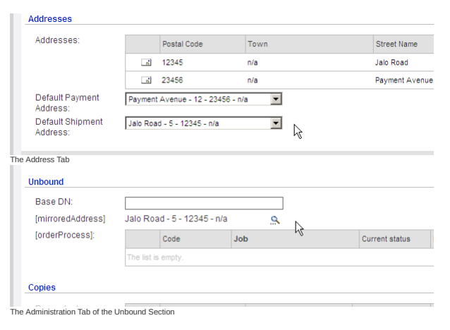

## Related Information

The Type System items.xml

## Items.Xml

The items.xml le species types of an extension. By editing the items.xml le, you can dene new types or extend existing types. In addition, you can dene, override, and extend attributes in the same way. Elements allowed within the le are available in the items.xml Element Reference.

## Tip Xml Editor Recommended

If you create XML les based on the items.xsd le, you can create valid items.xml les easily. The IDE Eclipse, for example, contains such XML editors. They not only make the content of items.xml les valid, but also show description of the XML elements from the XSD le.

Both ServiceLayer And Jalo Layer Covered in This Document This document discusses both principal API layers of SAP Commerce Cloud: ServiceLayer and Jalo Layer. Because the Jalo Layer is closely related to the type system (much more closely than the ServiceLayer), there are many connections between the items.xml le and the Jalo Layer.

Although the API layer of choice for SAP Commerce Cloud is the ServiceLayer, this document needs to discuss the items.xml le with references to the Jalo Layer. Parts of the document that are primarily or exclusively related to the ServiceLayer are marked with a ServiceLayerlabel, whereas parts that are primarily or exclusively related to the Jalo Layer are marked with a Jalo Layer label. Parts not marked explicitly refer to both the ServiceLayer and the Jalo Layer.

## Location

The items.xml is located in the resources directory of an extension. The items.xml les are prexed with the name of their respective extension in the form of extension name-items.xml. For example:
For the core extension, the le is called core-items.xml.

For the catalog extension, the le is called catalog-items.xml.

## Structure

The items.xml denes the types for an extension in XML format. Basic Structure The basic structure of an items.xml le is as follows:
<items xmlns:xsi="http://www.w3.org/2001/XMLSchema-instance" xsi:noNamespaceSchemaLocation="items.xsd"> <atomictypes> ... </atomictypes> <collectiontypes> ...

</collectiontypes>
<enumtypes> ... </enumtypes> <maptypes> ... </maptypes> <relations> ... </relations> <itemtypes> ... </itemtypes>
</items>
As the items.xml le is validated against an XSD le (items.xsd), the order of type denitions must conform to this order.

For a discussion of the kinds of type, refer to the Type System Documentation.

A type denition order that doesn't conform to the items.xsd causes SAP Commerce Cloud to fail the extension build.

Build failure message:
This is   For more    the SAP Help  64

[echo] building extension 'myextension'... [yxmlschemavalidator] [yxmlschemavalidator] ERROR(S): [file:///C:/hybris/trunk/bin/myextension/resources/myextension-item [yxmlschemavalidator] [yxmlschemavalidator] line:24,column:15 : cvc-complex-type.2.4.d: Invalid content was found startin [yxmlschemavalidator] [yxmlschemavalidator] ERROR(S): [file:///C:/hybris/trunk/bin/myextension/resources/myextension-item

## Dening Types Through Items.Xml

To specify a SAP Commerce Cloud type, dene the type's attributes and details, such as code or description, in the XML format. See the following example:
<itemtype code="Publication" jaloclass="de.hybris.platform.print.jalo.Publication" extends="GenericItem" generate="true" autocreate="true"> <deployment table="Publications" typecode="23402"/> <attributes> <attribute qualifier="code" type="java.lang.String"> <modifiers optional="false" /> <persistence type="property"/> </attribute> <attribute qualifier="sourceCatalogVersion" type="CatalogVersion"> <persistence type="property"/> </attribute> <attribute qualifier="rootChapters" type="ChapterCollection"> <modifiers write="false" search="false"/> <persistence type="jalo"/> </attribute> </attributes> </itemtype>

## Note Out-Of-Order Type Denition Not Supported

The items.xml le is parsed and evaluated in running order in one single pass. SAP Commerce Cloud doesn't allow multipass processing of the items.xml le (like the ImpEx framework does, for example), which would allow dening types in any order. This means that you need to dene types in order of inheritance. More abstract types need to be dened more to the beginning of the items.xml le and more concrete types need to be dened more to the end. For example, the following itemtype denition would fail due to being out of order:
<itemtype code="SpecialMyType" extends="MyType" autocreate="true" generate="true" >
</itemtype> <itemtype code="MyType" extends="Product" autocreate="true" generate="true" >
</itemtype>

## Validation

During an SAP Commerce Cloud build, the build process makes sure that every extension's /resources directory contains a copy of a main XSD le (items.xsd). This main le allows SAP Commerce Cloud to validate the extension's items.xml le against the main items.xsd le. The build process also makes sure that the items.xml le is well-formed XML and doesn't This is   For more    the SAP Help  65

## 

contain errors or invalid parts, for example incorrectly dened attributes. If this check fails, SAP Commerce Cloud causes the extension build to fail. In other words, if your extension's items.xml doesn't conform to the items.xsd, you aren't able to get the extension to compile. This prevents you from integrating a broken type system denition.

## Tip Xml Editor Recommended

If you create XML les based on the items.xsd le, you can create valid items.xml les easily. The IDE Eclipse, for example, contains such XML editors. Not only are your items.xml les content valid, but Eclipse also shows description of XML elements from the XSD le.

## Tip Changes In The Items.Xml Le Take Effect Automatically Using Eclipse.

SAP Commerce Cloud comes with precongured builders for the Eclipse IDE that support working with the items.xml le. Using Eclipse, whenever you edit an items.xml le, SAP Commerce Cloud automatically:
Jalo Layer: Generates Generated*.java source les (item classes) for all item types of your extension to the gensrc directory of your extension.

Jalo Layer: Refreshes the gensrc directory of your extension.

ServiceLayer: Generates *Model.java source les (model classes) for all item types of congured extensions to the bootstrap/gensrc directory ServiceLayer: Refreshes the bootstrap/gensrc directory
This means that when using Eclipse, changes that you make in the items.xml le take effect immediately for your application code. You can immediately use getter and setter methods for newly added types and attributes. Also, model classes are always up-to-date. However, this mechanism doesn't affect SAP Commerce Cloud's data model by runtime. You still have to initialize or update SAP Commerce Cloud explicitly. Furthermore, builders don't start the compilation as they only generate source les, so you can immediately use the item/model classes for programming. A build has to be started explicitly.

## Adding Types And Attributes

There are two methods to add an attribute to existing types.

Creating a subtype and adding the attributes to the subtype Adding the attribute to the type directly The following section discusses these two methods and their consequences.

## Creating A Subtype And Adding The Attributes To The Subtype

This is the method recommended by SAP as it keeps SAP Commerce Cloud's core types untouched. On the Jalo Layer, you also have an individual Java class available where you can implement your business logic. You reference the type from which to extend, specify a name for the subtype, and add the attribute. For example, the following items.xml snippet creates a subtype MyProduct extending from Product and adds an attribute oldPrice of type java.lang.Double:
<itemtype code="MyProduct" autocreate="true" generate="true" extends="Product" jaloclass="org.train
<attributes>
This is   For more    the SAP Help  66
<attribute qualifier="oldPrice" type="java.lang.Double" generate="true">
<persistence type="property"/> <modifiers read="true" write="true" optional="true"/>
</attribute>
</attributes>
</itemtype>
In this case, you need to set the value of the autocreate element to true, which lets SAP Commerce Cloud create a new database entry for this type at initialization/update process. Setting the autocreate modier to false causes a build failure; the rst denition of a type has to enable this ag.

Jalo Layer: Setting the generate modier to true results in Java class les being generated for this type (additional details).

Setting the generate modier to false results in no Java class le being generated for this type. Having no Java class le available means that you aren't able to implement a custom business logic (such as getter and/or setter methods) for the type. You have to use the supertype's business logic implementation.

## Adding Attributes To A Type Directly Note

This method is discouraged by SAP unless you know the implications and side effects well and you know that you have no alternative to taking this manner.

Where extending a type and using the subtype is complex or not feasible, it's possible to extend the SAP Commerce Cloud type directly, such as Product or Customer:
<itemtype code="Product" autocreate="false" generate="false">
<attributes>
<attribute qualifier="oldPrice" type="java.lang.Double" generate="true">
<persistence type="property"/> <modifiers read="true" write="true" optional="true"/>
</attribute>
</attributes>
</itemtype>
This manner isn't recommended by SAP for these reasons:
You create a direct dependency to an SAP Commerce Cloud type.

Jalo Layer: The generated methods for the attributes are written into your extension's manager, but not into the corresponding type class. In essence, this means that you have to address your extension's manager class to set values for these attributes.

As the type basically exists already, you need to set the autocreate modier for the type denition to false:
<itemtype code="Product" autocreate="false" generate="true">
Setting the autocreate modier to true results in a build failure. The value of the generate modier is ignored.

## Redeclaring Attributes

You can redeclare an attribute to:
Change its behaviour. For example, you can add a "unique" ag, or disallow writing. Make the type of the attribute more specic for subtypes.

 Note You can set uniqueness only for supertype attributes. When you add a "unique" ag to an attribute at the subtype level, SAP Commerce Cloud ignores it.

Let's take the abstract order item:
<itemtype code="AbstractOrder" extends="GenericItem" jaloclass="de.hybris.platform.jalo.order.AbstractOrder" autocreate="true" generate="true" abstract="true">
<custom-properties>
<property name="legacyPersistence">
<value>java.lang.Boolean.TRUE</value>
</property>
</custom-properties>
 <attributes> (....) <attribute autocreate="true" qualifier="entries" type="AbstractOrderEntryList"> <persistence type="jalo"/> <modifiers read="true" write="true" search="true" partof="true" optional="true"/> </attribute> (....)
In the following example, the item cart extends the abstract order item:
<itemtype code="Cart" extends="AbstractOrder" jaloclass="de.hybris.platform.jalo.order.Cart" autocreate="true" generate="true"> <deployment table="Carts" typecode="43"/> <attributes> <attribute autocreate="true" redeclare="true" qualifier="entries" type="CartEntryCollec <modifiers read="true" write="true" search="true" removable="true" optional="true" p </attribute> <attribute type="java.lang.String" qualifier="sessionId">
<persistence type="property"/> <modifiers read="true" write="true"/>
</attribute>
 </attributes> </itemtype>
In this example, you can redeclare the type of an item so that it's more specic.

You can't use types unrelated to their hierarchy.

## Servicelayer

 Note ServiceLayer-only section This section only discusses ServiceLayer -related aspects of the items.xml le. The discussion of Jalo-related aspects is located below. For new projects, consider using a ServiceLayer-based approach instead of using the Jalo Layer.

The ServiceLayer facilitates item handling through the use of Models. A model is a POJO -like representation of an SAP Commerce Cloud item. Models have automatically generated getter and setter methods for attribute values.

This is   For more    the SAP Help  68 Using the items.xml le in combination with the ServiceLayer is simple:

You dene the data model in the form of types and attributes. You call the SAP Commerce Cloud's all ant target.
The models are then generated automatically and are ready for use.

## Null Value Decorators In Models

Null decorator expression is a ServiceLayer feature that allows you to customize the behavior of a getter method. You can specify a code fragment in an item denition (items.xml) that computes a result instead of returning null. This assures that the method never returns a null value. We introduced this feature in order to bring ServiceLayer to feature parity with deprecated Jalo-only features that allowed customization of a method body. In the following example Abstract Order has an attribute named calculated, and we want to make sure that calling getCalculated() never returns null:
<attribute autocreate="true" qualifier="calculated" type="java.lang.Boolean" generate="true"> <custom-properties> <property name="modelPrefetchMode"> <value>java.lang.Boolean.TRUE</value> </property> </custom-properties> <defaultvalue>java.lang.Boolean.FALSE</defaultvalue> <persistence type="property"/> <modifiers read="true" write="true" search="true" optional="true"/> <model> <getter default="true" name="calculated"> <nullDecorator>Boolean.valueOf(false)</nullDecorator> </getter> </model> </attribute>
You can use the nullDecorator tag to specify an expression that is put inside the generated method of the AbstractOrderModel class. In this case, we prefer to get false instead of null. If you generate model classes, you can verify the code of the getCalculated method of the AbstractOrderModel class:
public Boolean getCalculated() { final Boolean value = getPersistenceContext().getPropertyValue(CALCULATED); return value != null ? value : Boolean.valueOf(false); }
Because the expression is embedded inside a code, you can be sure that invoking getCalculated() on an AbstractOrderModel instance never returns null.

## Jalo Layer Note Jalo-Only Section

This section only discusses Jalo-related aspects of the items.xml. This section addresses developers and technical consultants who are familiar with the Jalo structure. The API layer of choice to get started and for new projects is the ServiceLayer.

This is   For more    the SAP Help  69 For attributes SAP Commerce Cloud optionally generates getter and setter methods automatically.

Sample attribute denition:
<attribute qualifier="oldPrice" type="java.lang.Double" generate="true">
<persistence type="property"/>
<modifiers read="true" write="true" optional="true"/>
</attribute>
Getter and setter methods being generated to the corresponding type class:
public Double getOldPrice(final SessionContext ctx) ... public Double getOldPrice() ... public double getOldPriceAsPrimitive(final SessionContext ctx) ... public double getOldPriceAsPrimitive() ... public void setOldPrice(final SessionContext ctx, final Double value) ... public void setOldPrice(final Double value) ... public void setOldPrice(final SessionContext ctx, final double value) ... public void setOldPrice(final double value) ...

You can override these method implementations in the nonabstract Java class. When using the manner of Adding Attributes to a Type Directly, the getter and setter methods for the newly dened attributes are generated into your extension's manager. By consequence, you have to implement custom getter and setter method logic in your extension's manager. For a new implementation, try to avoid this approach and use a ServiceLayer -based approach instead. As the SAP Commerce Cloud is delivered as a precompiled binary release without source code, adding getter and setter methods to a SAP Commerce Cloud class directly isn't possible. (For details see Type System Documentation.) By consequence, you have to implement the getter and setter methods in your extension's Manager class. However, regardless of the actual location into which getter and setter methods for attribute values are generated, the mechanism follows the same basic rules.

Setting the generate modier on an attribute denition to false results in no getter and setter method being generated whatsoever. In other words: Setting generate to false results in no automatically generated getter and setter methods:
<attribute type="java.lang.String" qualifier="myAttribute" generate="false">
Setting the generate modier on an attribute denition to true results in getter and setter method being generated, depending on the values of the modiers tag on the attribute denition.

Setting the read modier to true results in a getter method being generated for this attribute:
<attribute type="java.lang.String" qualifier="myAttribute" generate="true">
<modifiers read="true" />
</attribute>
Setting the read modier to false results in no getter method being generated for this attribute:
This is   For more    the SAP Help  70
<attribute type="java.lang.String" qualifier="myAttribute" generate="true">
<modifiers read="false" />
</attribute>

## Note Attribute Value Unreadable

If the getter method isn't generated, there's no way of reading the attribute value. The getAttribute(...)
method internally also relies on the generated getter and isn't operable either.

Setting the write modier to true results in a setter method being generated for this attribute:
<attribute type="java.lang.String" qualifier="myAttribute" generate="true">
<modifiers write="true" />
</attribute>
Setting the write modier to false results in no setter method being generated for this attribute:
<attribute type="java.lang.String" qualifier="myAttribute" generate="true">
<modifiers write="false" />
</attribute>

## Note Attribute Value Unwritable

If the setter method isn't generated, there's no way of writing the attribute value. The setAttribute(...) and setAllAttributes(...) methods internally also rely on the generated setter method and aren't operable either.

## Element Discussion

For a discussion of the allowed elements within the items.xml, refer to the items.xml Element Reference.

## Setting Custom Types For New Columns

SAP Commerce Cloud can change the type of database table columns during an update process. Technically, this runs ALTER statements on the respective database table column and therefore changes the persistence setting of attributes directly on the database. For example, you can modify a database table column from CHAR(255) to VARCHAR(255) or the other way round. It isn't possible to change the types of already existing database table columns by updating SAP Commerce Cloud. You can, however, set a required type and see it in place for a new table or a new column that you add to items.xml before you perform system update. Technically, by adding a new column, this runs ALTER statements on the respective database table column and therefore changes the persistence setting of attributes directly on the database. For example, you can modify a database table column from CHAR(255) to VARCHAR(255) or vice versa. Initialization always results in setting a required type for a table or column.

## Caution Loss Of Data And Database Corruption Possible

We don't allow changing column types on existing tables. To prevent breaking the existing data, the database admin should decide on the correct way of introducing required changes.

Despite the fact that java.lang.String sets a default type for columns, you can have SAP Commerce Cloud modify a column type of a database table by modifying or explicitly specifying the value for the <columntype> element in the attribute This is   For more    the SAP Help  71 denition in your $extensionname-items.xml le:
<attribute qualifier="MyAttribute" type="java.lang.String">
<description>Identifier of the store.</description> <modifiers read="true" write="true" search="true" optional="false" /> <persistence type="property">
<columntype>
<value>VARCHAR</value>
</columntype>
</persistence>
</attribute>
Basically, there are two ways the database column type can be set:
Explicitly, by specifying the database column type in the items.xml le, such as:
<persistence type="property">
<columntype>
<value>VARCHAR</value>
</columntype>
</persistence>
You can also dene this in more detail by specifying database systems such as:
<persistence type="property"> <columntype database="oracle"> <value>CLOB</value> </columntype> <columntype database="sap"> <value>NCLOB</value> </columntype> <columntype database="sqlserver"> <value>nvarchar(max)</value> </columntype> <columntype database="mysql"> <value>text</value> </columntype> <columntype> <value>varchar(4000)</value> </columntype> </persistence>
Implicitly, by omitting the database column type in the items.xml le, such as:
<persistence type="property"/>
This causes the database to fall back to default values. For example, for an attribute of type java.lang.String, MySQL chooses VARCHAR(255) as default database column type.

## Overriding Column Types

You can override a database column type, whether it's dened explicitly or implicitly. The property that allows you to override an XML conguration, uses the persistence.override.<typeCode>.<qualifier>.columntype= <columnTypeValue> naming convention. Platform checks whether a column type denition is given for typeCode and qualifier in the conguration les rst. If not, it's read from items.xml. The property overrides column type values for all database systems if they're dened as persistence property in items.xml. For example, for the id attribute for the Catalog type code, the following conguration makes all databases choose VARCHAR(400) as the database column type:
persistence.override.Catalog.id.columntype=varchar(400)

## System Update Possibilities

This is   For more    the SAP Help  72 Enumeration, Map, Collection Although it's advisable to consult the support team if there are specic update procedures, the following rules apply. Scenarios that aren't described in the following table may fail or exceptions may occur.

Creating removing, changing Adding values Removing values,

changing values

Changing modiers

Works Works but cleanup

necessary

Works Doesn't work Works

Relation Type Attribute

| Creating   | removing                                                                      | changing         | change partOF attribute   | source/target attribute name change   |
|------------|-------------------------------------------------------------------------------|------------------|---------------------------|---------------------------------------|
| Works      | works but cleanup                                                             | manual remapping |                           |                                       |
| necessary  | needed, for (1-n) cleanup doesn't remove created instances, for (n-m) it does | works            | works, cleanup necessary  |                                       |

| Creating         | Removing                                                                                                                 | Changing Code, Deployment, Typecode attr in itemtype          | Added Element to   | Removed Element                                                                                 |                          |
|------------------|--------------------------------------------------------------------------------------------------------------------------|---------------------------------------------------------------|--------------------|-------------------------------------------------------------------------------------------------|--------------------------|
| Inheritance Path | from Inheritance Path                                                                                                    | Inheritance path change to GenericItem                        |                    |                                                                                                 |                          |
| Works            | Works if type is removed from composedtypes and attributedescriptors tables. Instances of types need to be removed, too. | Works if all three are changed, cleanup removes orphaned type | Works              | Works, after update it's possible to add orphaned attribute but after cleanup it isn't possible | Works, cleanup necessary |

| Creating   | Removing   | Changing   | Changing attribute's persistence qualier   | Uniqueness   | Mandatory   | Persistence   | from Jalo to   | Deployment   |
|------------|------------|------------|--------------------------------------------|--------------|-------------|---------------|----------------|--------------|
| change     | change     | change     | Dynamic                                    | change       |             |               |                |              |

| 7/12/2024 Creating   | Removing                                              | Changing                                                                                                                                                                 | Changing attribute's persistence qualier   | Uniqueness                                | Mandatory                           | Persistence   | from Jalo to                             | Deployment                                                                        |
|----------------------|-------------------------------------------------------|--------------------------------------------------------------------------------------------------------------------------------------------------------------------------|--------------------------------------------|-------------------------------------------|-------------------------------------|---------------|------------------------------------------|-----------------------------------------------------------------------------------|
| change               | change                                                | change                                                                                                                                                                   | Dynamic                                    | change                                    |                                     |               |                                          |                                                                                   |
| Works                | Not working. Cleanup doesn't recognize orphaned types | Old attribute can still be added. Can't use cleanup as it doesn't recognize any orphaned type in this scenario. If new attribute is mandatory, expected validator is set | Remapping needs to be done manually        | Doesn't work - no unique validator is set | Works, eld is mandatory from now on | Works         | some extra implementation has to be done | If data has to be truncated - not working. If changing to wider data type - works |

## Dening Index With Included Columns In Items.Xml For Microsoft Sql Server

In indices dened in the item type for Microsoft SQL Server, you can dene which attribute qualiers are added as included columns during the creation of indices, for example:
<itemtype code="ItemCode" ...> … <indexes> <index name="indexName"> <key attribute="keyAttribute"/>
 <include attribute="inclAttribute1"/>
 <include attribute="inclAttribute2"/> </index>
 </indexes>
</itemtype>
Such conguration translates into creating the following index:
CREATE INDEX indexName ON ItemCodeTable (keyAttributeCol) INCLUDE (inclAttribute1Col, inclAttribute

## Dening Index With Included Columns In Conguration Files

You can include or override columns using the following property:
extend.index.for.<typeCode>.<indexName>.with.include=<attributeName1>,<attributeName2> 
Separate multiple attributes using a comma (",").

Platform checks rst whether there's a denition for included columns for typeCode and indexName in the conguration les.

If such a denition doesn't exist, the system reads it from the items.xml le.

For example, the following property adds "email" and "postal code" as included columns for the existing index of Address_Owner for the Address type code:
This is   For more    the SAP Help  74

## Primitive Types

It's possible to use primitive Java types instead of the related wrapper classes. As an effect the jalo layer still uses the related wrapper classes, but the attribute denition gets a default value automatically (same default as Java uses). This ensures that you can change the type to a primitive class without any migration on jalo layer. At the servicelayer, the primitive type is used and the need for handling null values disappears. Assumed that you have a denition like this:
<attribute qualifier="myAttribute" type="java.lang.Boolean">
<modifiers read="true" write="true" initial="true" optional="false"/> <persistence type="property"/>
</attribute>
You should think of the null value situation. If you want to exclude the possibility of null values (by specifying a default value) then you can convert it to:
<attribute qualifier="myAttribute" type="boolean">
<modifiers read="true" write="true" initial="true" optional="false"/> <persistence type="property"/>
</attribute>
An update system is sufficient to make the change effective.

## Support For The @Deprecated Annotation Attributes

The beans.xml and items.xml les can have the optional since and forRemoval attributes of the @Deprecated annotation. You can use these attributes for classes, methods, or enums. The generated java classes have the
@Deprecated(since="xxxx", forRemoval="true") annotation.

The value of the java.lang.Deprecated\#forRemoval attribute must always be set to true by the code generator.

For more information, see https://docs.oracle.com/javase/9/docs/api/java/lang/Deprecated.html .

## Related Information

Type System Documentation Initializing and Updating the SAP Commerce Cloud Using Encryption for Attribute Values Specifying a Deployment for hybris Platform Types Jalo-only Attributes Working with Enumerations http://java.sun.com/products/jdo/JDOCMPFAQ.html

## Items.Xml Element Reference

The items.xml le of each extension contains denitions of types for the corresponding extension. Below you may nd a list and explanation of all elements that may be congured in items.xml le.

This is   For more    the SAP Help  75 Tip XML Editor Recommended If you create XML les based on the items.xsd le, you can create valid items.xml les easily. The IDE Eclipse, for example, contains such XML editors. Not only will your items.xml les content be valid, but Eclipse also shows description of XML elements from the XSD le.

## Schema Document Properties

| Target Namespace                 | None                                                                                                                                                                                                                             |
|----------------------------------|----------------------------------------------------------------------------------------------------------------------------------------------------------------------------------------------------------------------------------|
| Element and Attribute Namespaces | Global element and attribute declarations belong to this schema's target namespace. By default, local element declarations belong to this schema's target namespace. By default, local attribute declarations have no namespace. |

## Declared Namespaces

| Prex   | Namespace                            |
|--------|--------------------------------------|
| xml    | http://www.w3.org/XML/1998/namespace |
| xs     | http://www.w3.org/2001/XMLSchema     |

## Global Declarations

Element: items

| Type          | Locally-dened complex type         |
|---------------|------------------------------------|
| Nillable      | no                                 |
| Abstract      | no                                 |
| Documentation | Denes the types of your extension. |

XML Instance Representation

| <items> <atomictypes>atomictypesType</atomictypes> [0..1]   | Denes the list of atomictypesTypes for your extension.   |
|-------------------------------------------------------------|----------------------------------------------------------|
| <collectiontypes>collectiontypesType</collectiontypes>      | Denes the list of collectiontypesTypes for your          |
| [0..1]                                                      | extension.                                               |
| <enumtypes>enumtypesType</enumtypes> [0..1]                 | Denes the list of enumtypesTypes for your extension.     |
| <maptypes>maptypesType</maptypes> [0..1]                    | Denes the list of maptypesTypes for your extension.      |
| <relations>relationsType</relations> [0..1]                 | Denes the list of relationsTypes for your extension.     |
| <itemtypes>itemtypesType</itemtypes> [0..1]                 | Denes the list of itemtypesTypes for your extension.     |
| </items>                                                    |                                                          |

This is   For more    the SAP Help  76

## Global Denitions Complex Type: Atomictypestype

| Parent type:   | None                          |
|----------------|-------------------------------|
| Sub-types:     | None                          |
| Abstract       | no                            |
| Documentation  | Denes a list of atomic types. |

XML Instance Representation

| <...> <atomictype>atomictypeType</atomictype> [0..*]   | An atomictype represents a simple Java object. (The name 'atomic' just means 'non-composed' objects.)   |
|--------------------------------------------------------|---------------------------------------------------------------------------------------------------------|
| </...>                                                 |                                                                                                         |

Complex Type: atomictypeType

| Parent type:   | None                                                                                                  |
|----------------|-------------------------------------------------------------------------------------------------------|
| Sub-types:     | None                                                                                                  |
| Abstract       | no                                                                                                    |
| Documentation  | An AtomicType represents a simple java object. (The name 'atomic' just means 'non-composed' objects.) |

XML Instance Representation

| <... class="classType" [1]    | Corresponding Java class in the hybris Suite; will also be used as the code of the atomic type.   |
|-------------------------------|---------------------------------------------------------------------------------------------------|
| autocreate=" boolean " [0..1] | If 'true', the AtomicType will be created during initialization.                                  |
| generate="boolean" [0..1]     | Deprecated. Has no effect for atomic types. Default is 'true'.                                    |
| extends="classType" [0..1]    | Denes the class that will be extended. Default is 'java.lang.Object'.                             |
| />                            |                                                                                                   |

Complex Type: attributeModelType

| Parent type:                                                                         | None                                                                        |
|--------------------------------------------------------------------------------------|-----------------------------------------------------------------------------|
| Sub-types:                                                                           | None                                                                        |
| Abstract                                                                             | no                                                                          |
| Documentation                                                                        | Allows to congure model generation for this attribute used at servicelayer. |
| This is custom documentation. For more information, please visit the SAP Help Portal | 77                                                                          |

XML Instance Representation

| <... generate="boolean" [0..1]            | Whether getter and setter methods for the model representation of the attribute will be generated. Default is 'true'.   |
|-------------------------------------------|-------------------------------------------------------------------------------------------------------------------------|
| > <getter>modelMethodType</getter> [0..*] | Allows to congure alternative getter methods at generated model.                                                        |
| <setter>modelMethodType</setter> [0..*]   | Allows to congure alternative setter methods at generated model.                                                        |
| </...>                                    |                                                                                                                         |

## Complex Type: Attributestype

| Parent type:   | None                           |
|----------------|--------------------------------|
| Sub-types:     | None                           |
| Abstract       | no                             |
| Documentation  | Congures a list of attributes. |

XML Instance Representation

| <...> <attribute>attributeType</attribute> [0..*]   | Denes a single attribute.   |
|-----------------------------------------------------|-----------------------------|
| </...>                                              |                             |

## Complex Type: Attributetype

| Parent type:   | None   |
|----------------|--------|
| Sub-types:     | None   |
| Abstract       | no     |

Documentation Denes an attribute of a type.

XML Instance Representation

| <... redeclare="boolean" [0..1]                                                      | Lets you re-dene the attribute denition from an inherited type. In essence, you can use a different type of attribute as well as different modier combinations than on the supertype. Default is 'false'.                                              |
|--------------------------------------------------------------------------------------|--------------------------------------------------------------------------------------------------------------------------------------------------------------------------------------------------------------------------------------------------------|
| qualifier="string" [1]                                                               | Qualier of this attribute. Attribute qualiers must be unique across a single type.                                                                                                                                                                     |
| type="string" [1]                                                                    | The type of the attribute, such as 'Product', 'int' or 'java.lang.String'. Primitive java types will be mapped to the corresponding atomic type. For example: 'int' will be mapped to the atomic type 'java.lang.Integer' with implicit default value. |
| This is custom documentation. For more information, please visit the SAP Help Portal | 78                                                                                                                                                                                                                                                     |

| 7/12/2024 metatype="string" [0..1]              | Advanced setting. Species the metatype for the attributes denition. Must be a type extending AttributeDescriptor. Default is 'AttributeDescriptor'.                                                                                                                |
|-------------------------------------------------|--------------------------------------------------------------------------------------------------------------------------------------------------------------------------------------------------------------------------------------------------------------------|
| autocreate="boolean" [0..1]                     | If 'true', the attribute descriptor will be created during initialization. Default is 'true'.                                                                                                                                                                      |
| generate="boolean" [0..1]                       | If 'true', getter and setter methods for this attribute will be generated during a hybris Suite build. Default is 'true'.                                                                                                                                          |
| isSelectionOf="string" [0..1]                   | References an attribute of the same type. Only values of the referenced attribute can be selected as values for this attribute. Typical example: the default delivery address of a customer must be one of the addresses set for the customer. Default is 'false'. |
| > <defaultvalue>defaultValueType</defaultvalue> | Congures a default value for this attribute used if no value is                                                                                                                                                                                                    |
| [0..1]                                          | provided. The default value is calculated by initialization and will not be re-calculated by runtime.                                                                                                                                                              |
| <description>string</description> [0..1]        | Gives a description for this attribute only used for the javadoc of generated attribute methods.                                                                                                                                                                   |
| <persistence>persistenceType</persistence>      | Denes how the values of the attribute will be stored. Possible                                                                                                                                                                                                     |
| [0..1]                                          | values: 'cmp' (deprecated), 'jalo' (not persistent, deprecated), 'property' (persistent), 'dynamic' (not persisted).                                                                                                                                               |
| <modifiers>modifiersType</modifiers> [0..1]     | Congures advanced settings for this attribute denition.                                                                                                                                                                                                            |
| <custom-properties>customPropertiesType</customproperties> [0..1]                                                 | Allows to congure custom properties for this attribute.                                                                                                                                                                                                            |
| <model>attributeModelType</model> [0..1]        | Allows to congure model generation settings for this attribute. Models are used by the hybris ServiceLayer.                                                                                                                                                        |
| </...>                                          |                                                                                                                                                                                                                                                                    |

## Complex Type: Collectiontypestype

| Parent type:   | None                              |
|----------------|-----------------------------------|
| Sub-types:     | None                              |
| Abstract       | no                                |
| Documentation  | Denes a list of collection types. |

XML Instance Representation

| <...> <collectiontype>collectiontypeType</collectiontype>   | A collectionType denes a collection of typed elements.   |
|-------------------------------------------------------------|----------------------------------------------------------|
| [0..*] </...>                                               |                                                          |

Complex Type: collectiontypeType Parent type: None

| 7/12/2024 Sub-types:   | None   |
|------------------------|--------|
| Abstract               | no     |

Documentation A CollectionType denes a collection of typed elements. Attention:

If using a collection type for persistent attributes (not jalo) you

cannot search on that attribute and you are limited in size of

collection. Consider to use a relation instead.

XML Instance Representation Complex Type: columntypeType

| <... code="codeType" [1]               | The code (that is, qualier) of the CollectionType.                                                  |
|----------------------------------------|-----------------------------------------------------------------------------------------------------|
| elementtype="codeType" [1]             | The type of elements of this CollectionType.                                                        |
| autocreate="boolean" [0..1]            | If 'true', the CollectionType will be created during initialization.                                |
| generate="boolean" [0..1]              | Deprecated. Has no effect for collection types. Default is 'true'.                                  |
| type=" NMTOKEN (value comes from list: | Congures the type of this collection: 'set', 'list', 'collection'. The                              |
| {'set'|'list'|'collection'})" [0..1]   | getter / setter methods will use corresponding Java collection interfaces. Default is 'collection'. |
| />                                     |                                                                                                     |

Documentation Congures a persistence denition for a specic database.

| Parent type:   | None   |
|----------------|--------|
| Sub-types:     | None   |
| Abstract       | no     |

XML Instance Representation Complex Type: customPropertiesType

| <... database="string" [0..1]   | The database the given denition will be used for. One of 'oracle', 'mysql', 'sqlserver' or 'hsql'. Default is empty which congures fallback for non-specied databases.   |
|---------------------------------|--------------------------------------------------------------------------------------------------------------------------------------------------------------------------|
| > <value> string </value> [1]   | The attribute type used in the create statement of the database table, such as varchar2(4000).                                                                           |
| </...>                          |                                                                                                                                                                          |

| Parent type:                                                                         | None                     |
|--------------------------------------------------------------------------------------|--------------------------|
| Sub-types:                                                                           | None                     |
| Abstract                                                                             | no                       |
| Documentation                                                                        | Denes custom properties. |
| This is custom documentation. For more information, please visit the SAP Help Portal | 80                       |

XML Instance Representation

| <...> <property>customPropertyType</property> [0..*]   | Denes a custom property.   |
|--------------------------------------------------------|----------------------------|
| </...>                                                 |                            |

Complex Type: customPropertyType

| Parent type:   | None                     |
|----------------|--------------------------|
| Sub-types:     | None                     |
| Abstract       | no                       |
| Documentation  | Denes a custom property. |

XML Instance Representation

| <... name="string" [1]                | The name of the custom property.   |
|---------------------------------------|------------------------------------|
| > <value>defaultValueType</value> [1] | The value of the custom property.  |
| </...>                                |                                    |

Complex Type: deploymentType

Documentation A deployment denes how a (generic) item or relation is mapped

onto the database.

| Parent type:   | None   |
|----------------|--------|
| Sub-types:     | None   |
| Abstract       | no     |

## Xml Instance Representation

Complex Type: enumModelType

| <... table="string" [1]       | The mapped database table. Must be globally unique.                                   |
|-------------------------------|---------------------------------------------------------------------------------------|
| typecode="positiveshort" [1]  | The mapped item type code. Must be globally unique.                                   |
| propertytable="string" [0..1] | The mapped dump property database table to be used for this item. Default is 'props'. |
| />                            |                                                                                       |

| Parent type:                                                                         | None   |
|--------------------------------------------------------------------------------------|--------|
| Sub-types:                                                                           | None   |
| This is custom documentation. For more information, please visit the SAP Help Portal | 81     |

| Abstract      | no                                 |
|---------------|------------------------------------|
| Documentation | Congures a single enum model pojo. |

XML Instance Representation

| <... package="string" [0..1]   | Denes the package for the actual enum model pojo.   |
|--------------------------------|-----------------------------------------------------|
| />                             |                                                     |

Complex Type: enumtypesType

| Parent type:   | None                               |
|----------------|------------------------------------|
| Sub-types:     | None                               |
| Abstract       | no                                 |
| Documentation  | Denes a list of enumeration types. |

XML Instance Representation

| <...> </...>   |
|----------------|

<enumtype>enumtypeType</enumtype> [0..*] An EnumerationType denes xed value types. (The typesystem

provides item enumeration only.)

Complex Type: enumtypeType

Documentation An EnumerationType denes xed value types. (The typesystem

provides item enumeration only)

| Parent type:   | None   |
|----------------|--------|
| Sub-types:     | None   |
| Abstract       | no     |

XML Instance Representation

| <... code="codeType " [1]                                                            | The unique code of this Enumeration.                                                                                                                                                                       |
|--------------------------------------------------------------------------------------|------------------------------------------------------------------------------------------------------------------------------------------------------------------------------------------------------------|
| autocreate="boolean" [0..1]                                                          | If 'true', the item will be created during initialization.                                                                                                                                                 |
| generate="boolean" [0..1]                                                            | If 'false' no constants will be generated at constant class of extension as well as at corresponding servicelayer enum class. Default is 'true'.                                                           |
| jaloclass="classType" [0..1]                                                         | Species the name of the associated jalo class. The specied class must extend de.hybris.platform.jalo.enumeration.EnumerationValue and will not be generated. By specifying a jalo class you can change the |
| This is custom documentation. For more information, please visit the SAP Help Portal | 82                                                                                                                                                                                                         |

| 7/12/2024                                  | implementation to use for the values of this enumeration. By default EnumerationValue class is used.                                                                                                                                                                                                       |
|--------------------------------------------|------------------------------------------------------------------------------------------------------------------------------------------------------------------------------------------------------------------------------------------------------------------------------------------------------------|
| dynamic="boolean" [0..1]                   | Whether it is possible to add new values by runtime. Also results in different types of enums: 'true' results in 'classic' hybris enums, 'false' results in Java enums. Default is false. Both kinds of enums are API compatible, and switching between enum types is possible by running a system update. |
| > <description>string</description> [0..1] | Provides possibility to add meaningful description phrase for a generated model class.                                                                                                                                                                                                                     |
| <model> enumModelType </model> [0..1]      | Allows changing enum model settings.                                                                                                                                                                                                                                                                       |
| <value> enumValueType </value> [0..*]      | Congures one value of this Enumeration.                                                                                                                                                                                                                                                                    |
| </...>                                     |                                                                                                                                                                                                                                                                                                            |

Complex Type: enumValueType

| Parent type:   | None   |
|----------------|--------|
| Sub-types:     | None   |
| Abstract       | no     |

Documentation Congures a single enum value.

XML Instance Representation

## Complex Type: Indexestype

| <... code="enumCodeType " [1]                | The unique code of this element.                                                       |
|----------------------------------------------|----------------------------------------------------------------------------------------|
| > <description> string </description> [0..1] | Provides possibility to add meaningful description phrase for a generated model class. |
| </...>                                       |                                                                                        |

XML Instance Representation

| Parent type:   | None                        |
|----------------|-----------------------------|
| Sub-types:     | None                        |
| Abstract       | no                          |
| Documentation  | Congures a list of indexes. |

This is   For more    the SAP Help  83

| <...> <index>indexType </index> [1..*]   | Congures a single index.   |
|------------------------------------------|----------------------------|
| </...>                                   |                            |

Complex Type: indexKeyType

| Parent type:   | None   |
|----------------|--------|
| Sub-types:     | None   |
| Abstract       | no     |

Documentation Congures a single index key.

XML Instance Representation Complex Type: indexType

| <... attribute="string" [1]   | Type attribute to be indexed.                                  |
|-------------------------------|----------------------------------------------------------------|
| lower="boolean" [0..1]        | Elements will be indexed case-insensitive. Default is 'false'. |
| />                            |                                                                |

XML Instance Representation

| Parent type:   | None                                          |
|----------------|-----------------------------------------------|
| Sub-types:     | None                                          |
| Abstract       | no                                            |
| Documentation  | Congures a database index for enclosing type. |

Complex Type: itemModelType

| <... name="string" [1]           | The name prex of the index.                                                                                                                                                      |
|----------------------------------|----------------------------------------------------------------------------------------------------------------------------------------------------------------------------------|
| remove="boolean" [0..1]          | If 'true' this index will be omitted while in initialization process even if there were precedent declarations.This attribute has effect only if replace = true.                 |
| replace="boolean" [0..1]         | If 'true' this index is a replacement/redeclaration for already existing index.                                                                                                  |
| unique="boolean" [0..1]          | If 'true', the value of this attribute has to be unique within all instances of this index. Attributes with persistence type set to 'jalo' cannot be unique. Default is 'false'. |
| > <key>indexKeyType</key> [0..*] | Congures a single index key.                                                                                                                                                     |
| </...>                           |                                                                                                                                                                                  |

| Parent type:                                                                         | None   |
|--------------------------------------------------------------------------------------|--------|
| Sub-types:                                                                           | None   |
| Abstract                                                                             | no     |
| This is custom documentation. For more information, please visit the SAP Help Portal | 84     |

Documentation Allows to congure model generation for this item used at servicelayer.

XML Instance Representation

| <... generate="boolean" [0..1]       | Whether a model for the type and models for subtypes will be generated. Default is 'true'.   |
|--------------------------------------|----------------------------------------------------------------------------------------------|
| > <constructor> modelConstructorType | Allows to congure model constructor signatures.                                              |
| </constructor> [0..*] </...>         |                                                                                              |

Complex Type: itemtypesType

| Parent type:   | None                            |
|----------------|---------------------------------|
| Sub-types:     | None                            |
| Abstract       | no                              |
| Documentation  | Denes a grouping of item types. |

XML Instance Representation

| <...> <itemtype>itemtypeType</itemtype> [0..*]   | Species a specic ComposedType.                                                        |
|--------------------------------------------------|---------------------------------------------------------------------------------------|
| <typegroup>typeGroupType</typegroup> [0..*]      | Species a group of ComposedTypes to allow better structuring within the items.xml le. |
| </...>                                           |                                                                                       |

Complex Type: itemtypeType

| Parent type:   | None                           |
|----------------|--------------------------------|
| Sub-types:     | None                           |
| Abstract       | no                             |
| Documentation  | Species a specic ComposedType. |

XML Instance Representation

| <... code=" codeType " [1]                                                           | The unique code of this type.                                                                                                                |
|--------------------------------------------------------------------------------------|----------------------------------------------------------------------------------------------------------------------------------------------|
| extends="classType" [0..1]                                                           | Denes the class, which will be extended. Default is 'GenericItem'.                                                                           |
| jaloclass="classType" [0..1]                                                         | Species the name of the associated jalo class. Default is [extension-root-package].jalo.[type-code] which will be generated if not existent. |
| This is custom documentation. For more information, please visit the SAP Help Portal | 85                                                                                                                                           |

| 7/12/2024 deployment="deploymentRefType" [0..1]   | Deprecated, please use separate deployment sub tag. All instances of this type will be stored in a separated database table. The value of this attribute represents a reference to the specied deployment in the corresponding 'advanced-deployment.xml'. Default is empty.   |
|---------------------------------------------------|-------------------------------------------------------------------------------------------------------------------------------------------------------------------------------------------------------------------------------------------------------------------------------|
| singleton="boolean" [0..1]                        | If 'true', type gets marked as singleton which will be evaluated by some modules, or impex, with that allowing only one instance per system. Default is 'false'.                                                                                                              |
| jaloonly="boolean" [0..1]                         | DEPRECATED. Use 'implements JaloOnlyItem' in your bean. If 'true', the item will only exists in the jalo layer and isn't backed by an entity bean. Default is 'false'.                                                                                                        |
| autocreate="boolean" [0..1]                       | If 'true', the item will be created during initialization. Default is 'true'.                                                                                                                                                                                                 |
| generate="boolean" [0..1]                         | If 'true', the sourcecode for this item will be created. Default is 'true'.                                                                                                                                                                                                   |
| abstract="boolean" [0..1]                         | Marks type and jalo class as abstract. If 'true', the type cannot be instantiated. Default is 'false'.                                                                                                                                                                        |
| metatype="string" [0..1]                          | The (meta)type which describes the assigned type. Must be a type extensing ComposedType. Default is 'ComposedType'.                                                                                                                                                           |
| > <description>string</description> [0..1]        | Provides possibility to add meaningful description phrase for a generated model class.                                                                                                                                                                                        |
| <deployment>deploymentType</deployment> [0..1]    | A deployment denes how a (generic) item or relation is mapped onto the database.                                                                                                                                                                                              |
| <custom-properties>customPropertiesType</customproperties> [0..1]                                                   | Denes a list of custom properties for this type.                                                                                                                                                                                                                              |
| <attributes>attributesType</attributes> [0..1]    | Denes the list of item attributes.                                                                                                                                                                                                                                            |
| <indexes>indexesType</indexes> [0..1]             | Denes the database indexes for this type.                                                                                                                                                                                                                                     |
| <model>itemModelType</model> [0..1]               | Allows to congure model generation for this item used at service layer.                                                                                                                                                                                                       |
| </...> Complex Type: maptypesType                 |                                                                                                                                                                                                                                                                               |

| Parent type:   | None                         |
|----------------|------------------------------|
| Sub-types:     | None                         |
| Abstract       | no                           |
| Documentation  | Species a list of map types. |

XML Instance Representation
<...>

| <maptype>maptypeType</maptype> [0..*]   | Like the java collection framework, a type, which denes map objects. Attention: When used as type for an attribute, the attribute   |
|-----------------------------------------|-------------------------------------------------------------------------------------------------------------------------------------|

will not be searchable and the access performance is not effective.

Consider to use a relation.

</...>

## Complex Type: Maptypetype

| Parent type:   | None                                                                                                                                                                                                                              |
|----------------|-----------------------------------------------------------------------------------------------------------------------------------------------------------------------------------------------------------------------------------|
| Sub-types:     | None                                                                                                                                                                                                                              |
| Abstract       | no                                                                                                                                                                                                                                |
| Documentation  | Like the java collection framework, a type, which denes map objects. Attention: When used as type for an attribute, the attribute will not be searchable and the access performance is not effective. Consider to use a relation. |

XML Instance Representation

| <... code=" codeType " [1]   | The unique code of the map.                                                   |
|------------------------------|-------------------------------------------------------------------------------|
| argumenttype="classType" [1] | The type of the key attributes.                                               |
| returntype="classType" [1]   | The type of the value attributes.                                             |
| autocreate="boolean" [0..1]  | If 'true', the item will be created during initialization. Default is 'true'. |
| generate="boolean" [0..1]    | Deprecated. Has no effect for map types. Default is 'true'.                   |
| redeclare="boolean" [0..1]   | Deprecated. Has no effect for map types. Default is 'false'.                  |
| />                           |                                                                               |

Complex Type: modelConstructorType

| Parent type:   | None                                            |
|----------------|-------------------------------------------------|
| Sub-types:     | None                                            |
| Abstract       | no                                              |
| Documentation  | Allows to congure model constructor signatures. |

XML Instance Representation

| <... signature="string" [1]   | Add here, as comma-separated list, the attribute qualiers for the constructor signature in the model.   |
|-------------------------------|---------------------------------------------------------------------------------------------------------|
| />                            |                                                                                                         |

Complex Type: modelMethodType Parent type: None

| Sub-types:    | None                                                      |
|---------------|-----------------------------------------------------------|
| Abstract      | no                                                        |
| Documentation | Allows to congure alternative methods at generated model. |

XML Instance Representation

| <... name="string" [1]      | Name of the alternative getter method.                                                                                 |
|-----------------------------|------------------------------------------------------------------------------------------------------------------------|
| deprecated="boolean" [0..1] | Will the method be marked deprecated? Default is false.                                                                |
| default="boolean" [0..1]    | Will this method be the default method and replace the original one instead of adding it additional? Default is false. |
| />                          |                                                                                                                        |

Complex Type: modiersType

| Parent type:   | None                                                                                    |
|----------------|-----------------------------------------------------------------------------------------|
| Sub-types:     | None                                                                                    |
| Abstract       | no                                                                                      |
| Documentation  | Species further properties of an attribute which can be redeclared at other extensions. |

XML Instance Representation

| <... read="boolean" [0..1]                                                           | Denes if this attribute is readable (that is, if a getter method will be generated). Default is 'true'. The visibility of the getter depends on the value of the private attribute.                                                                                                                                                             |
|--------------------------------------------------------------------------------------|-------------------------------------------------------------------------------------------------------------------------------------------------------------------------------------------------------------------------------------------------------------------------------------------------------------------------------------------------|
| write="boolean" [0..1]                                                               | Denes if this attribute is writable (that is, if a setter method will be generated). Default is 'true'. The visibility of the setter depends on the value of the private attribute.                                                                                                                                                             |
| search="boolean" [0..1]                                                              | Denes if this attribute is searchable by a FlexibleSearch. Default is 'true'. Attributes with persistence type set to 'jalo' cannot be searchable.                                                                                                                                                                                              |
| optional="boolean" [0..1]                                                            | Denes if this attribute is mandatory or optional. Default is 'true' for optional. Set to 'false' for mandatory.                                                                                                                                                                                                                                 |
| private="boolean" [0..1]                                                             | Denes the Java visibility of the generated getter and setter methods for this attribute. If 'true', the visibility modier of generated methods is set to 'protected'; if 'false', the visibility modier is 'public'. Default is 'false' for 'public' generated methods. Also, you will have no generated methods in the ServiceLayer if 'true'. |
| initial="boolean" [0..1]                                                             | If 'true', the attribute will only be writable during the item creation. Setting this to 'true' is only useful in combination with write='false'. Default is 'false'.                                                                                                                                                                           |
| removable="boolean" [0..1]                                                           | Denes if this attribute is removable. Default is 'true'.                                                                                                                                                                                                                                                                                        |
| This is custom documentation. For more information, please visit the SAP Help Portal | 88                                                                                                                                                                                                                                                                                                                                              |

| 7/12/2024 partof="boolean" [0..1]   | Denes if the assigned attribute value only belongs to the current instance of this type. Default is 'false'.                                                                                                                                                                                                                                                                                                                                                                                                                                                                                                                                                                                                                                                                                                                                                                                                                                                                                                                         |
|-------------------------------------|--------------------------------------------------------------------------------------------------------------------------------------------------------------------------------------------------------------------------------------------------------------------------------------------------------------------------------------------------------------------------------------------------------------------------------------------------------------------------------------------------------------------------------------------------------------------------------------------------------------------------------------------------------------------------------------------------------------------------------------------------------------------------------------------------------------------------------------------------------------------------------------------------------------------------------------------------------------------------------------------------------------------------------------|
| unique="boolean" [0..1]             | If 'true', the value of this attribute has to be unique within all instances of this type. If there are multiple attributes marked as unique, then their combined values must be unique. Will not be evaluated at jalo layer, if you want to manage the attribute directly using jalo layer you have to ensure uniqueness manually. Default is 'false'.  Caution With some databases, a UNIQUE index permits multiple NULL values for columns that can contain NULL. As a result, you may nd that unique indexes are non-functional when one of the unique index attributes is a null. For example, assume that you have a unique index enabled on attribute X, and a saved item with attribute X value set to null. When you create a new item with attribute X set to null, and save it: with databases that permit multiple null values in the unique column, the new item is saved without any error with databases that prohibit multiple null values in the unique column, you get an exception and the new item isn't saved. |
| dontOptimize="boolean" [0..1]       | If 'true' the attribute value will be stored in the 'global' property table, otherwise a separate column (inside the table of the associated type)will be created for storing its values. Default is 'false'.                                                                                                                                                                                                                                                                                                                                                                                                                                                                                                                                                                                                                                                                                                                                                                                                                        |
| encrypted="boolean" [0..1]          | If 'true', the attribute value will be stored in an encrypted way. Default is 'false'.                                                                                                                                                                                                                                                                                                                                                                                                                                                                                                                                                                                                                                                                                                                                                                                                                                                                                                                                               |
| />                                  |                                                                                                                                                                                                                                                                                                                                                                                                                                                                                                                                                                                                                                                                                                                                                                                                                                                                                                                                                                                                                                      |

## Complex Type: Persistencetype

| Parent type:   | None                                                                                                                                             |
|----------------|--------------------------------------------------------------------------------------------------------------------------------------------------|
| Sub-types:     | None                                                                                                                                             |
| Abstract       | no                                                                                                                                               |
| Documentation  | Denes how the values of the attribute will be stored. Possible values: 'cmp' (deprecated), 'jalo' (not persistent), and 'property' (persistent). |

## Xml Instance Representation

| <... type=" MTOKEN (value comes from list:                                           | Denes how the values of the attribute will be stored. Possible                                                           |
|--------------------------------------------------------------------------------------|--------------------------------------------------------------------------------------------------------------------------|
| {'property'|'jalo'|'cmp'|'dynamic'})" [1]                                            | values: 'cmp' (deprecated), 'jalo' (not persistent, deprecated), 'property' (persistent), 'dynamic' (not persisted).     |
| qualifier="string" [0..1]                                                            | Deprecated. Only usable in relation with 'cmp' and 'property'(compatibility reasons) persistence type. Default is empty. |
| This is custom documentation. For more information, please visit the SAP Help Portal | 89                                                                                                                       |

| 7/12/2024 attributeHandler="string" [0..1]       | Spring bean id that handles dynamic attributes implementation.                  |
|--------------------------------------------------|---------------------------------------------------------------------------------|
| > <columntype>columntypeType</columntype> [0..*] | Congures a persistence denition for a specic database used at create statement. |
| </...>                                           |                                                                                 |

## Complex Type: Relationelementtype

| Parent type:   | None   |
|----------------|--------|
| Sub-types:     | None   |
| Abstract       | no     |

Documentation Congures the generated attribute at one relation end.

XML Instance Representation This is   For more    the SAP Help  90

| <... type="codeType" [1]                         | Type of attribute which will be generated at type congured for opposite relation end.                                                                                             |
|--------------------------------------------------|-----------------------------------------------------------------------------------------------------------------------------------------------------------------------------------|
| qualifier="string" [0..1]                        | Qualier of attribute which will be generated at type congured for opposite relation end. If navigable is not set to false the qualier is mandatory. Default is empty.             |
| metatype="string" [0..1]                         | The (meta)type which describes the attributes type. Must be type extending RelationDescriptor. Default is 'RelationDescriptor'.                                                   |
| cardinality=" NMTOKEN (value comes from list:    | The cardinality of this relation end. Choose 'one' for 'one' part of a                                                                                                            |
| {'one'|'many'})" [0..1]                          | 1:n relation or 'many' when part of a n:m relation. A 1:1 relation is not supported. Default is 'many'.                                                                           |
| navigable="boolean" [0..1]                       | Is the relation navigable from this side. Can only be disabled for one side of many to many relation. If disabled, no qualier as well as modiers can be dened. Default is 'true'. |
| collectiontype=" NMTOKEN (value comes from list: | Congures the type of this collection if element has cardinality                                                                                                                   |
| {'set'|'list'|'collection'})" [0..1]             | 'many'. Related attribute getter / setter will use corresponding java collection interfaces. Default is 'Collection'.                                                             |
| ordered="boolean" [0..1]                         | If 'true' an additional ordering attribute will be generated for maintaining ordering. Default is 'false'.                                                                        |
| > <description>string</description> [0..1]       | Documents this relation attribute. Will be cited at javadoc of generated getters/setters.                                                                                         |
| <modifiers>modifiersType</modifiers> [0..1]      | Denes properties for the attribute.                                                                                                                                               |
| <model>attributeModelType</model> [0..1]         | Allows to congure model generation for this relation attribute used at service layer.                                                                                             |
| <custom-properties>customPropertiesType</customproperties> [0..1]                                                  | Allows to congure custom properties for the relation attribute.                                                                                                                   |
| </...>                                           |                                                                                                                                                                                   |

## Complex Type: Relationstype

| Parent type:   | None   |
|----------------|--------|
| Sub-types:     | None   |
| Abstract       | no     |

Documentation Denes a list of relation types.

XML Instance Representation Complex Type: relationType

| <...> <relation>relationType</relation> [0..*]   | A RelationType denes a n-m or 1-n relation between types.   |
|--------------------------------------------------|-------------------------------------------------------------|
| </...>                                           |                                                             |

XML Instance Representation

| Parent type:   | None                                                      |
|----------------|-----------------------------------------------------------|
| Sub-types:     | None                                                      |
| Abstract       | no                                                        |
| Documentation  | A RelationType denes a n-m or 1-n relation between types. |

| <... code="codeType" [1]                                                             | The type code.                                                                         |
|--------------------------------------------------------------------------------------|----------------------------------------------------------------------------------------|
| localized="boolean" [1]                                                              | A localized n-m relation can have a link between two items for each language.          |
| deployment="deploymentRefType" [0..1]                                                | Deprecated, please use separate deployment sub tag. All instances of this type will be stored in a separated database table. The value of this attribute represents a reference to the specied deployment in the corresponding 'advanceddeployment.xml'. Default is empty.                                                                                        |
| autocreate="boolean" [0..1]                                                          | If 'true', the item will be created during initialization.                             |
| generate="boolean" [0..1]                                                            | Deprecated. Will have no effect for relations.                                         |
| > <description>string</description> [0..1]                                           | Provides possibility to add meaningful description phrase for a generated model class. |
| <deployment>deploymentType/deployment> [0..1]                                        | Congures deployment information for this relation (table name and type code).          |
| <sourceElement>relationElementType/sourceElement>                                    | Congures the generated attribute at source relation end.                               |
| [1] <targetElement>relationElementType/targetElement>                                | Congures the generated attribute at target relation end.                               |
| [1] </...>                                                                           |                                                                                        |
| This is custom documentation. For more information, please visit the SAP Help Portal | 91                                                                                     |

Complex Type: typeGroupType

| Parent type:   | None   |
|----------------|--------|
| Sub-types:     | None   |
| Abstract       | no     |

XML Instance Representation

| <... name="string" [0..1]                  | Denes the name of this group. Only for structural purpose, will have no effect on runtime. Default is empty.   |
|--------------------------------------------|----------------------------------------------------------------------------------------------------------------|
| > <itemtype>itemtypeType</itemtype> [0..*] | Species a specic ComposedType.                                                                                 |
| </...>                                     |                                                                                                                |

## Complex Type: Valuetype

| Parent type:   | None                       |
|----------------|----------------------------|
| Sub-types:     | None                       |
| Abstract       | no                         |
| Documentation  | Congures a single element. |

XML Instance Representation

| <... code=" codeType " [1]   | The unique code of this element.   |
|------------------------------|------------------------------------|
| />                           |                                    |

Simple Type: classType

Parent type: normalizedString (derivation method: restriction) Content Base XSD Type: normalizedString

| Sub-types:   | None   |
|--------------|--------|

Documentation Congures the class to use for enclosing element.

Simple Type: codeType

| Parent type:                                                                         | normalizedString (derivation method: restriction)   |
|--------------------------------------------------------------------------------------|-----------------------------------------------------|
| Sub-types:                                                                           | None                                                |
| Content                                                                              | Base XSD Type: normalizedString                     |
| Documentation                                                                        | Congures the code of an element.                    |
| This is custom documentation. For more information, please visit the SAP Help Portal | 92                                                  |

Simple Type: defaultValueType

Parent type: string (derivation method: restriction)

| Sub-types:   | None   |
|--------------|--------|

Content Base XSD Type: string

Documentation Denes a default value text.

Simple Type: deploymentRefType Simple Type: enumCodeType

| Parent type:   | normalizedString (derivation method: restriction)       |
|----------------|---------------------------------------------------------|
| Sub-types:     | None                                                    |
| Content        | Base XSD Type: normalizedString                         |
| Documentation  | Deprecated. Denes a reference to a deployment denition. |

Simple Type: positiveshort

| Parent type:   | normalizedString (derivation method: restriction)                                          |
|----------------|--------------------------------------------------------------------------------------------|
| Sub-types:     | None                                                                                       |
| Content        | Base XSD Type: normalizedString <pattern> = ([a-zA-Z_])+([a-z_A-Z$0-9])*                   |
| Documentation  | Congures the code of an enumeration value element. Must start with a letter or underscore. |

## Impex With Ordered Relations In A Multithreaded Mode

| Parent type:   | short (derivation method: restriction)     |
|----------------|--------------------------------------------|
| Sub-types:     | None                                       |
| Content        | Base XSD Type: short 0 <= <value> <= 32767 |

Keeping the order for an ordered relation is crucial while impexing changes, or exporting and importing items between environments. The ordering.attribute property allows you to keep a correct order of items of an ordered relation while using impex in a multithreaded mode.

## One-To-Many Relation

With one-to-many relations, where the many part should have a particular order, impex executed in a multithreaded mode doesn't provide a correct result. The lines are executed in a random order and the order is lost.

To keep the correct order when using impex, add ordering.attribute in items.xml for a given relation, and expose that attribute in the many item. Here is how ordering.attribute is dened out-of-the-box for the AbstractOrder2AbstractOrderEntry relation:
<relation code="AbstractOrder2AbstractOrderEntry" localized="false" generate="true" autocreate="tru <sourceElement type="AbstractOrder" qualifier="order" cardinality="one"> <modifiers read="true" write="true" search="true" optional="true"/> <custom-properties> <property name="ordering.attribute"> <value>"entryNumber"</value> </property> </custom-properties> </sourceElement> <targetElement type="AbstractOrderEntry" qualifier="entries" cardinality="many" collect ordered="false"> <modifiers read="true" write="true" search="true" optional="true" partof="true"/> <custom-properties> <property name="query.filter"> <value>"{original} is null"</value> </property> </custom-properties> </targetElement> </relation> ... ... ... <attribute autocreate="true" qualifier="entryNumber" type="java.lang.Integer" generate="true"> <defaultvalue>Integer.valueOf(de.hybris.platform.jalo.order.AbstractOrder.APPEND_AS_LAST) </defaultvalue> <persistence type="property"/> <modifiers read="true" write="true" search="true" optional="true" unique="true"/> </attribute>
Adding these settings afterwards works ne on condition you use the same column name as in the original deployment. If you start from scratch, and the item was never released to production and no data exists, then you can choose your own name for the ordering.attribute value.

With those settings in place, you can add your new ordering column to your impex, as well as numbers for order, and it doesn't matter anymore in which order the impex lines are executed by a multi-threaded executor.

## Specifying A Deployment For Platform Types

Items within SAP Commerce Cloud are made persistent by writing values into a database. Within the database, the values are stored in tables. SAP Commerce Cloud allows you to explicitly dene the database tables where the values of instances of a given type will be written. This process is referred to as deployment.

## Technical Background

SAP Commerce Cloud stores instances of types in tables within a database. Every instance is stored as one row in a database table. The table within a database where instances of a type are stored is called the type deployment and is specied with the type itself. Every type needs to have a deployment to store its instances. Deployment is inherited from a type to its subtypes. The deployment that is active for a given type is the deployment specied closest to the type in the type's hierarchy. The topmost deployment is GenericItem, which is therefore the default deployment. This means if a type has no explicit specication of deployment, that type's instances are deployed in the same table as GenericItem. This means that the default deployment of any subtype, which you extend from GenericItem, is the deployment of GenericItem. In other words: if you do not specify a deployment for a subtype of GenericItem, the instances of that subtype are stored in the This is   For more    the SAP Help  94 same table as instances of GenericItem.

For example, the Catalog and CronJob types in SAP Commerce Cloud are subtypes of GenericItem. If there were no deployment specied for Catalog and CronJob, all Catalog and CronJob instances are written into one single database table. Firstly, this is not intuitive. Secondly, storing instances of many different types in one single database table causes that database table to have quite a lot of columns to store all attributes from all these types (a CronJob has different attributes than a Catalog, and both types need to store attribute values).

## Note Specify Deployment For All Types

Deployment of a large number of types in a single table can markedly decrease the performance. Therefore, by default, builds fail if you do not specify the deployment table and you may encounter errors such as:
[ycheckdeployments] No deployment defined for relation <RELATIONNAME> in file: <FILENAME>
Otherwise it would be easy to forget to specify the deployment, and, as a result, some types would go to the GenericItem table. The build failure reminds you that deployment is not specied for some types. To change this default behaviour, set the property build.development.mode to false in the **local.properties** le:
build.development.mode=false Setting this value to false is useful for some legacy projects that keep all items in default tables (genericitems, links).

Keeping individual types' instances deployed in different tables keeps the number of columns down to a minimum. By consequence, SAP recommends specifying a deployment for direct subtypes of GenericItem only. Subtypes of subtypes of GenericItem usually do not need a specic deployment as the number of database table columns in the deployment is not likely to get out of hand. In constrast, specifying a deployment for a subtype whose supertype has a deployment already is likely to reduce database performance (especially during long and complex database transactions, such as synchronization between catalog versions).

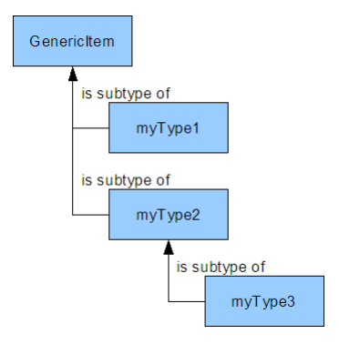

For example, let's assume you extend myType1 and myType2 from GenericItem. Then it is recommended for myType1 and for myType2 to have a specic deployment (to avoid having their instances stored in the GenericItem database table).

This is   For more    the SAP Help  95

## 

A subtype of myType1 or myType2 (for example, myType3 in the diagram) is not likely to also need a specic deployment. The instances of myType3 t into the myType2 type's tables without any negative side effects. In fact, running FlexibleSearch statements on myType2 requires JOINs to include the myType3 type as well. The more deployments there are within a type hierarchy, the more JOINs in a database statement are necessary, and the longer complex database actions take to complete. In other words:
If you create a subtype of GenericItem, use a deployment.

If you create a subtype of Product, which is a subtype of GenericItem already, using a specic deployment is discouraged by SAP. It is technically possible to use a deployment for subtypes whose supertypes already have an individual deployment, but it is not recommended. The JOINs required to construct database statements reduce performance.

## Solution: Dening A Deployment In Sap Commerce Cloud Note Database Limitations Apply

This form of specifying a deployment is affected by database limitations, which you have to comply with. Therefore, Platform only allows a deployment string of 24 characters maximum.

For example, Oracle databases only allow a maximum of 30 characters overall for the table attribute value.

This 30-character limit includes table prexes. So if you use a table prex of myDataBase (for a total of 10 characters), you have only 20 characters left for the table attribute value.

To specify a deployment, add a <deployment table="tablename" typecode="typecode_number"/> tag to the type denition in the **items.xml** le:
1. Open the **items.xml** in your extension.

2. Locate the type denition where you want to specify a deployment, such as
<itemtype code="MyItem" extends="GenericItem"> <attribute qualifier="myAttribute" ... > ... </itemtype>
3. Add the <deployment> tag nested into the item denition. You need to specify a value for the deployment and the typecode attributes :
<deployment table="mytype_deployment" />
The deployment attribute species the table name into which the instances of the type are written, such as table="mytype_deployment"

The typecode attribute must specify a unique number to reference the type. The value of the typecode attribute must be a positive integer between 0 and 32767 (2^15-1) and must be unique throughout SAP Commerce Cloud as it is part of the PK generation mechanism. Typecode values between 0 and 10000 are reserved for SAP Commerce Cloud-internal use. Typecode values larger than 10000 are generally free for you to use but there are lots of exceptions to that rule.
Not all typecode values larger than 10000 are free for you to use. There are many exceptions. Here are some examples:
commons extension (132xx) Legacy xprint extension (244xx,245xx) b2bcommerce extension (100xx)
For a full list of exceptions, see the
<HYBRIS_BIN_DIR>/platform/ext/core/resources/core/unittest/reservedTypecodes.txt le.

The entire type denition might look like this:
<item code="MyItem" extends="GenericItem"> <deployment table="mytype_deployment" typecode="12345"/> <attribute name="myAttribute" ... > ... </item>
Using a typecode that is already is use causes SAP Commerce Cloud to fail the build with the error message due to duplicate deployment code, as in:
[java] java.lang.IllegalArgumentException: cannot merge namespace ((customerreview)) into ((<merged de.hybris.platform.persistence.customerreview_CustomerReview::((customerreview))::YDeployme de.hybris.platform.persistence.europe1_DiscountRow::((europe1))::YDeployment[europe1.items.

## Specifying Or Changing Deployment For Relations

There are two important facts related to deployment for relations. Firstly, you must specify a deployment for m:n relation, otherwise Platform will not build. Previously it was allowed to dene an m:n relation which had no deployment. The relation was then maintained by the Links table. If there were multiple relations without a specied deployment, they all resided in the Links table. This caused bad performance and is not a good practice. Therefore, whenever you try to dene an m:n relation without a deployment, initialisation fails with the following error:
[ycheckdeployments] No deployment defined for relation <RELATIONNAME> in file: <FILENAME> 
Secondly, bear in mind that Platform does not allow changing an existing deployment. This is done in order to protect data. If there were already some records in current deployment of a type or relation, and the deployment would get changed afterwards, then access would be lost to all those records. This has a special consequence in conjunction with the previous paragraph (specifying a deployment), because if an m:n relation did not have a deployment before, and now (according to best practices) someone wants to assign it a deployment, this change will not be performed. Every time Platform refuses to make a deployment change, one of the following messages is printed:
If there was no deployment before:
Addition of the deployment for type <TYPECODE> from <OLDDEPLOYMENT> to <NEWDEPLOYMENT> will no If there was another deployment dened before:
Modification of the deployment for type <TYPECODE> from <OLDDEPLOYMENT> to <NEWDEPLOYMENT> wil Using a Custom Property Table If you want to use an own propertytable, you have to specify an own extensionname-advanced-deployment.xml in the resource folder of your extension. To use the table testtable, you would need the content of this le like this:
<model name="hybris" description="..."> <package name="de.hybris.jakarta.session" description="all session beans"> <package name="de.hybris.jakarta.session.property"> <object name="Property"> <object-mapping> <table name="testtable"/>
<index name="ITEMPK">
<index-key attribute="itemPK"/>
</index> <index name="NAMEIDX">
<index-key attribute="name"/>
</index>
 </object-mapping> <attribute name="itemPK" type="HYBRIS.PK" primkey-field="true"> <attribute-mapping persistence-name="ITEMPK" null-allowed="false"/>
</attribute>
 <attribute name="itemTypePK" type="HYBRIS.PK" > <attribute-mapping persistence-name="ITEMTYPEPK" null-allowed="false"/> </attribute> <attribute name="name" type="java.lang.String" primkey-field="true"> <attribute-mapping persistence-name="NAME" null-allowed="false"/> </attribute> <attribute name="langPK" type="HYBRIS.PK" primkey-field="true"> <attribute-mapping persistence-name="LANGPK" null-allowed="false"/> </attribute> <attribute name="realName" type="java.lang.String"> <attribute-mapping persistence-name="REALNAME"/> </attribute> <attribute name="type1" type="int"> <attribute-mapping persistence-name="TYPE1"/> </attribute> <attribute name="valueString1" type="HYBRIS.LONG_STRING"> <attribute-mapping database="sqlserver" persistence-name="VALUESTRING1" persisten <attribute-mapping database="oracle" persistence-name="VALUESTRING1" persistence- <attribute-mapping persistence-name="VALUESTRING1"/> </attribute> <attribute name="value1" type="java.io.Serializable"> <attribute-mapping persistence-name="VALUE1"/> <attribute-mapping database="oracle" persistence-name="VALUE1" persistence-type=" </attribute>
 </object> </package> </package> </model>
SAP Commerce Cloud contains the Maintenance Deployment page in Administration Console that gives an overview of the typecodes and the deployments in use.

## Advanced Deployment

To see how SAP Commerce Cloud types are mapped to different databases, see the le bin/platform/ext/core/resources/core-advanced-deployment.xml.

 <database-schema database="hsqldb" primary-key="primary key" null="" not-null="not null" > <type-mapping type="java.lang.String" persistence-type="VARCHAR(255)" /> <type-mapping type="String" persistence-type="VARCHAR(255)" /> <type-mapping type="java.lang.Float" persistence-type="float" /> <type-mapping type="java.lang.Double" persistence-type="double" /> <type-mapping type="java.lang.Byte" persistence-type="smallint" /> <type-mapping type="java.lang.Character" persistence-type="smallint" /> <type-mapping type="java.lang.Short" persistence-type="smallint" />
This is   For more    the SAP Help  98
 <type-mapping type="java.lang.Boolean" persistence-type="tinyint" /> <type-mapping type="java.lang.Long" persistence-type="bigint" /> <type-mapping type="java.lang.Integer" persistence-type="int" /> <type-mapping type="float" persistence-type="float default 0" /> <type-mapping type="double" persistence-type="double default 0" /> <type-mapping type="byte" persistence-type="smallint default 0" /> <type-mapping type="char" persistence-type="smallint default 0" /> <type-mapping type="short" persistence-type="smallint default 0" /> <type-mapping type="boolean" persistence-type="tinyint default 0" /> <type-mapping type="long" persistence-type="bigint default 0" /> <type-mapping type="int" persistence-type="int default 0" /> <type-mapping type="java.util.Date" persistence-type="timestamp" /> <type-mapping type="java.math.BigDecimal" persistence-type="DECIMAL(30,8)" /> <type-mapping type="java.io.Serializable" persistence-type="longvarbinary" /> <type-mapping type="HYBRIS.LONG_STRING" persistence-type="LONGVARCHAR" /> <type-mapping type="HYBRIS.JSON" persistence-type="LONGVARCHAR" /> <type-mapping type="HYBRIS.COMMA_SEPARATED_PKS" persistence-type="LONGVARCHAR" /> <type-mapping type="HYBRIS.PK" persistence-type="BIGINT" /> </database-schema>

## Cleaning Up The Type System

The update process of SAP Commerce Cloud doesn't remove data from the database. Especially the type system representation held in the database is not affected in case of a type removal. This leads to the situation that types removed from the items.xml le still have their representation in the database.

To clean up the type system, it is necessary to delete from the database all instances of items dened within the type that should not exist and the related type representation. It is possible to do this using SAP Commerce Cloud Administration Console. Type Cleaner deletes all types, their attributes, relations, enums, and collection types. Note that it does not delete attributes unless the types they belong to have been deleted.

## Orphaned Types

An orphaned type is a type that is not dened in the items.xml le but still exists in the type system representation held in the database. To make sure that essential data are not deleted from the database accidentally, the update process doesn't remove data from database, even if a type is removed from items.xml le. By keeping the type system representation in database the generic access to this data is still assured. It is possible by using the SAP Commerce Cloud API, for example ModelService.getAttributeValue method. The disadvantage is that you may encounter warnings on the console saying that the related model class cannot be found anymore when accessing the data and that the database itself will keep a lot of possibly unneeded data.

## Cleaning All Orphaned Types

1. Open Administration Console.

2. Go to the Maintenance tab and select Cleanup option. 3. The Cleanup page in the Type system tab displays. 4. Ensure both check boxes are selected and click the Clear all orphaned types button. 5. Orphaned types are removed

## Related Information

The Type System Administration Console

## Dynamic Attributes

All SAP Commerce Cloud Models are automatically generated during the Platform build, thus they cannot hold any custom changes. Dynamic Attributes enable you to add attributes to the Models, and to create custom logic behind them, without touching the SAP Commerce Cloud Model class itself.

In contrast to attributes with the persistence type set to property that are persisted in a database, Dynamic Attributes have non-persistent values. The fact that there is some custom logic written in a separate class is absolutely transparent to the user. The implementation of Dynamic Attributes is supported by Spring, therefore, you can benet from it by using a dependency injection, for example.

## Overview Of Dynamic Attributes

A Dynamic Attribute is dened for a type in the items.xml le. You need to set the persistence type of the attribute to dynamic. For each Dynamic Attribute, a Spring bean ID known as attributeHandler is automatically generated. However, you may provide the custom bean ID.

## Tip

The naming convention of the automatically generated attributeHandler object is:
<ItemtypeCode>_<attributeQualier>AttributeHandler. For example, the bean ID for the Dynamic Attribute with the qualier daysHumanReadable for the Accommodation type is Accommodation_daysHumanReadableAttributeHandler.

The following example shows the conguration of the Dynamic Attribute in the items.xml le:
<itemtype code="Accommodation" autocreate="true" generate="true" jaloclass="de.hybris.platform.test
<attributes>
 <attribute type="int" qualifier="daysHumanReadable">
 <persistence type="dynamic" attributeHandler="myOwnSpringBeanId" /> <modifiers read="true" write="false" />
 </attribute>
</attributes>
</itemtype>
Because the write modier is set to false, only getter for the attribute is generated in the AccommodationModel class.

See also the How To Create Dynamic Attributes - Tutorial, section Dene a Dynamic Attribute in the items.xml File.

## How Dynamic Attributes Are Related To The Sap Commerce Cloud Model

The following UML diagram illustrates how the SAP Commerce Cloud Model is internally related to the Dynamic Attribute interfaces:

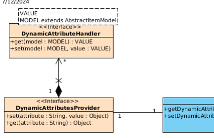

The AbstractItemModel type holds a reference to the DynamicAttributesProvider object, which in turn, holds a collection of DynamicAttributeHandler objects. The crucial feature here is that by using the methods get and set on the DynamicAttributesProvider object, the call is delegated to the valid DynamicAttributeHandler instance. From the user perspective, this process is transparent, so the only interaction with the DynamicAttributeHandler instance is done by calling getter on the SAP Commerce Cloud Model. From the perspective of the life cycle of the SAP Commerce Cloud Model, the DynamicAttributeHandler instance is called exactly at calling setter or getter on the SAP Commerce Cloud Model:
// AccommodationModel instance String days = accommodation.getDaysHumanReadable();

## Using Dynamic Attributes

Before creating a Dynamic Attribute for any type, you need to be sure that the logic behind the Dynamic Attribute concerns directly the type, for which you want to dene it. Otherwise, it is better to keep the logic in a proper service.

For the above example, the generated AccommodationModel type has an attribute of int type that is persisted in the database. This attribute represents the number of days, that a specic apartment is booked for. Imagine you intend to create a method that returns a String representation of the number of days, concatenated with the word day or days, depending on the number. It can be achieved using the Dynamic Attribute and named, for example, daysHumanReadablein items.xml:
<itemtype code="Accommodation" autocreate="true" generate="true" jaloclass="de.hybris.platform.test
<attributes>
 <!-- ... --> <attribute type="java.lang.String" qualifier="daysHumanReadable">
 <persistence type="dynamic" attributeHandler="accommodationDays" /> <modifiers read="true" write="false" />
 </attribute> <!-- ... -->
</attributes>
</itemtype>
The implementation of the DynamicAttributeHandler in class looks like this:

## Accommodationdays.Java

public class AccommodationDays implements DynamicAttributeHandler<String, AccommodationModel> {
@Override public String get(final AccommodationModel model) {
 String daysWord; final int days = model.getDays();
This is   For more    the SAP Help  101 if (days == 1) { daysWord = "day"; } else { daysWord = "days"; } return days + " " + daysWord;
} @Override public void set(final AccommodationModel model, final String value) {
throw new UnsupportedOperationException();
}
}
To get the information for how many days a user has booked an apartment, you only need to call getter on an instance of AccommodationModel:
// AccommodationModel instance String days = accommodation.getDaysHumanReadable();
It is recommended to implement the above method to throw an exception, because the write modier of the daysHumanReadable attribute is set to false. Thus there is no setter generated in the AccommodationModel.

See also How To Create Dynamic Attributes - Tutorial, section Implement the DynamicAttributeHandler.

## Using Localized Dynamic Attributes

You can localize dynamic attributes. If you want to use dynamic localized attributes, you need to implement the DynamicLocalizedAttributeHandler object. In addition, it gives you the possibility to use locales in your setters and getters. Below is an example DynamicLocalizedAttributesStringSampleBean implementation:
public class DynamicLocalizedAttributesStringSampleBean implements DynamicLocalizedAttributeHandler {
private I18NService i18NService; @Override public String get(final TestItemType2Model item) {
if (item == null) {
throw new IllegalArgumentException("Item model is required");
} return item.getTestProperty2(i18NService.getCurrentLocale());
} @Override public void set(final TestItemType2Model item, final String value) {
if (item != null && value != null) {
item.setTestProperty2(value, i18NService.getCurrentLocale());
}
} @Override public String get(final TestItemType2Model item, final Locale loc) {
if (item == null) {
throw new IllegalArgumentException("Item model is required");
This is   For more    the SAP Help  102 return item.getTestProperty2(loc);
} @Override public void set(final TestItemType2Model item, final String value, final Locale loc) {
if (item != null && value != null) {
item.setTestProperty2(value, loc);
}
}
//.... }
Below is an example of how the localized attribute can be declared in items.xml:
<itemtype code="TestItemType2" extends="TestItem" jaloclass="de.hybris.platform.jalo.test.TestItem" autocreate="true" generate="false"> <attributes> <attribute autocreate="true" qualifier="testProperty2" type="localized:java.lang.String <modifiers read="true" write="true" search="false" optional="true" /> <persistence type="property" /> </attribute> // <attribute type="localized:java.lang.String" qualifier="localizedFooBar"> <persistence type="dynamic" attributeHandler="dynamicLocalizedAttributesStringSample <modifiers read="true" write="true" optional="true" unique="false"/> </attribute> </attributes> </itemtype>
The next step is to register the dynamicLocalizedAttributesStringSampleBean class in Spring context. For details on how to do this, read the How To Create Dynamic Attributes - Tutorial, section Register the Spring Bean.

Every call on a model for the get or set methods using the localizedFoobar attribute leads to an update, or gets the localized testProperty2 eld using given locales. It is also up to you how you implement the methods without the locale parameter. In the example above, the current locale is fetched using the i18nService object.

## Related Information

Models items.xml ServiceLayer

## Creating Dynamic Attributes

Use Dynamic Attributes to dene attributes whose values are not persisted in a database.

## Dene The Dynamic Attribute In The Items.Xml File

1. In the items.xml le, create new ClientName type with two attributes, which persistence type is set to property. Their values are persisted in the database.

<itemtype code="ClientName" extends="GenericItem" This is   For more    the SAP Help  103 jaloclass="de.hybris.tutorial.jalo.ClientName" autocreate="true" generate="false"> <attributes> <attribute autocreate="true" qualifier="firstName" type="java.lang.String"> <modifiers read="true" write="true" search="false" optional="true" /> <persistence type="property" /> </attribute> <attribute autocreate="true" qualifier="lastName" type="java.lang.String"> <modifiers read="true" write="true" search="false" optional="true" /> <persistence type="property" /> </attribute> </attributes> </itemtype>
2. Create an attribute that can compute its value in the memory by using values from persisted attributes and return the result. For this you may use the Dynamic Attribute:
a. Add the new Dynamic Attribute named longName, which uses existing attributes firstName and lastName to compute their values.

b. Set the persistence type of new attribute to dynamic
<!-- ... --> <attribute type="java.lang.String" qualifier="longName"> <persistence type="dynamic"/> <modifiers read="true" write="true" optional="true" unique="false"/> </attribute> <!-- ... -->
3. If you do not provide the custom bean ID for attributeHandler, it is automatically generated in the following way:
ClientName_longNameAttributeHandler.

4. Provide a custom attributeHandler by assigning a bean ID of the class that implements the DynamicAttributeHandler interface and holds the logic:
<!-- ... --> <attribute type="java.lang.String" qualifier="longName"> <persistence type="dynamic" attributeHandler="dynamicAttributesStringSample"/> <modifiers read="true" write="true" optional="true" unique="false"/> </attribute> <!-- ... -->

## Implement The Dynamicattributehandler

1. Create a new class named DynamicAttributesStringSample that implements DynamicAttributeHandler interface.

2. Override the getter and setter methods:
a. get method returns a String that concatenates values of attributes firstName and lastName with a dened delimiter.

b. set method splits the String passed as a parameter into two parts and assigns them to attributes firstName and lastName.

DynamicAttributesStringSample.java public class DynamicAttributesStringSample implements DynamicAttributeHandler<String, ClientNameMod {
public static final String VALUE_DELIMITER = " "; @Override public String get(final ClientNameModel item) {
if (item == null) {
throw new IllegalArgumentException("Item model is required");
}
This is   For more    the SAP Help  104
@Override public void set(final ClientNameModel item, final String value) {
if (item != null && value != null) {
final String[] split = value.split(VALUE_DELIMITER); item.setFirstName(split[0]); item.setLastName(split[1]);
}
}
}
You can write custom logic using ClientNameModel item and String value, that are passed as parameters. It is possible to use any Spring service and just inject it into DynamicAttributeHandler implementation.

## Register The Spring Bean

Register the newly created attributeHandler in Spring context:
core-spring.xml
<bean id="dynamicAttributesStringSample" class="de.hybris.platform.servicelayer.test.DynamicAttribu

## Update Running System

Update running system using the hybris Administration Console or the command line using the following command:
ant all updatesystem -Dtenant=master Sources are compiled and in the ClientNameModel proper getter and setter are generated.

## Migrating Jalo Attributes To Dynamic Attributes

This document outlines how to migrate Jalo attributes to dynamic attributes.

Jalo is deprecated since SAP Commerce Cloud 4.3.0 version. Since SAP Commerce Cloud 4.4.0 version, Dynamic Attributes replace Jalo attributes.

Migrate Jalo attributes to Dynamic Attributes using the following procedure. It is separated into two examples based on real migrations:
Basic Example Follow the steps to migrate the allSubcategories Jalo attribute to a dynamic attribute.

Complex Example Follow these steps to migrate the description Jalo attribute to a dynamic attribute.

## Basic Example

Follow the steps to migrate the allSubcategories Jalo attribute to a dynamic attribute.

## Modify The Category-Items.Xml File

This example is taken from the category extension, where prior to SAP Commerce Cloud 4.4.0 version Category type contained allSubcategories Jalo attribute. The goal is to migrate this attribute to the Dynamic Attribute. The following code sample presents a denition of Category type and its allSubcategories Jalo attribute for the SAP Commerce Cloud version prior to 4.4.0. It has persistence type set to jalo:
<itemtype code="Category" generate="true" jaloclass="de.hybris.platform.category.jalo.Category" extends="GenericItem" autocreate="true"> <deployment table="Categories" typecode="142"/> <attributes>
<!-- ... --> <attribute qualifier="allSubcategories" type="CategoryCollection">
<modifiers read="true" write="false" search="false" optional="true"/> <persistence type="jalo"/>
</attribute> <!-- ... -->
</attributes>
</itemtype>
To migrate allSubcategories attribute to the Dynamic Attribute, you need to change its denition in the items.xml le:
1. Modify the persistence type to dynamic.

2. Provide the custom bean id for the attributeHandler.

...

<attribute qualifier="allSubcategories" type="CategoryCollection">
<modifiers read="true" write="false" search="false" optional="true"/> <persistence type="dynamic" attributeHandler="categoryAllSubcategories"/>
</attribute>
 ...

## Implement The Dynamicattributehandler In Categoryallsubcategories Class

Having dened the bean for the attributeHandler, you need to implement the corresponding class:
1. Write custom logic for categoryAllSubcategories in a bean class that implements DynamicAttributeHandler interface:
public class CategoryAllSubcategories implements DynamicAttributeHandler<Collection<CategoryMo {
private CategoryService categoryService; @Override public Collection<CategoryModel> get(final CategoryModel category) {
return categoryService.getAllSubcategoriesForCategory(category);
} @Override public void set(final CategoryModel model, final Collection<CategoryModel> value) {
throw new UnsupportedOperationException();
} @Required This is   For more    the SAP Help  106 2. Register the newly created attributeHandler in Spring context:
category-spring.xml
<bean id="categoryAllSubcategories" class="de.hybris.platform.category.attribute.CategoryAllSu
<property name="categoryService" ref="categoryService" />
</bean>
The categoryAllSubcategories bean contains one property categoryService, which injects CategoryService class.

## Ensure The Backward Compatibility Of Category Note

This step is optional. Perform this when backward compatibility with Jalo layer is required.

To ensure the backward compatibility, you need to make some changes before the compilation. For every type, an abstract class Generated ItemtypeCode is generated. Prior to 4.4.0, each generated class contained getters and setters for every attribute dened for a type. Since SAP Commerce Cloud 4.4.0 Jalo attributes are replaced by Dynamic Attributes. Getters and setters are not generated for Dynamic Attributes in Generated ItemtypeCode class. It means that every call for getAllSubcategories() method on Category class fails. You may use Dynamic Attributes only using the ServiceLayer API
on CategoryModel class.

In below example from the category extension, the following getters are automatically generated in GeneratedCategory class prior to 4.4.0:
public abstract class GeneratedCategory extends GenericItem {
// ... public Collection<Category> getAllSubcategories() {
return getAllSubcategories(getSession().getSessionContext());
} public abstract Collection<Category> getAllSubcategories(final SessionContext ctx); // ...

}
The getAllSubcategories(final SessionContext ctx) method is marked as abstract, so you need to implement it in each class extending GeneratedCategory class.

Move these two methods to Category class to ensure that it is not overwritten during next compilation. They should look similar but with additional annotation @Deprecated and without @Override annotation.

public class Category extends GeneratedCategory {
// ... @Deprecated public Collection<Category> getAllSubcategories() {
return getAllSubcategories(getSession().getSessionContext());
} @Deprecated public Collection<Category> getAllSubcategories(final SessionContext ctx) {
This is   For more    the SAP Help  107

## Complex Example

Follow these steps to migrate the description Jalo attribute to a dynamic attribute.

## Modify The Cms2-Items.Xml File

This example is taken from the cms2 extension, where prior to SAP Commerce Cloud 4.4.0 version AbstractRestriction type contained description Jalo attribute. There are also few classes extending AbstractRestriction and each of them has different custom logic for description attribute. The goal is to migrate this attribute to the Dynamic Attribute. The following code sample presents a denition of AbstractRestriction type and its description Jalo attribute. It has persistence type set to jalo:
<itemtype code="AbstractRestriction" jaloclass="de.hybris.platform.cms2.jalo.restrictions.AbstractRestriction" extends="CMSItem" autocreate="true" generate="true" abstract="true"> <attributes>
<!-- ... -->
 <attribute qualifier="description" generate="true" autocreate="true" type="localized:java.l <persistence type="jalo" />
 <modifiers write="false" />
 </attribute>
<!-- ... -->
 </attributes> </itemtype>
There are several types in the cms2 extension that extend AbstractRestriction type. In this case, the implementation of description Jalo attribute goes into concrete types that extend AbstractRestriction type. Introduce the following changes in the items.xml le:
1. Change persistence type of description attribute to dynamic:
...

<attribute qualifier="description" generate="true" autocreate="true" type="java.lang.S
<persistence type="dynamic" /> <modifiers write="false" />
</attribute>
 ...

2. Dene separate Dynamic Attributes for each type that extends AbstractRestriction type:
Add redeclare attribute in <attribute /> tag and set its value to true.

Redeclaration in subtypes is required, because you want to provide different logic for each subtype. It means that each subtype will have its own attribute handler. Without these changes, it is not possible to build Platform.

Change persistence type of attribute to dynamic.

Provide a custom bean if for attributeHandler.

<itemtype code="CMSCatalogRestriction" jaloclass="de.hybris.platform.cms2.jalo.restrictions.CatalogRestriction" extends="AbstractRestriction" autocreate="true" generate="true">
<attributes>
<attribute qualifier="description" type="java.lang.String" redeclare="tr This is   For more    the SAP Help  108
<persistence type="dynamic" attributeHandler="catalogRestriction <modifiers write="false" />
</attribute>
</attributes>
</itemtype> <itemtype code="CMSInverseRestriction" jaloclass="de.hybris.platform.cms2.jalo.restrictions.CMSInverseRestriction" extends="AbstractRestriction" autocreate="true" generate="true">
<attributes>
<attribute qualifier="description" redeclare="true" type="java.lang.Stri
<persistence type="dynamic" attributeHandler="inverseRestriction <modifiers write="false" />
</attribute>
</attributes>
</itemtype>

## Implement The Dynamicattributehandler In Inverserestrictiondescription And Catalogrestrictiondescription Classes

1. Write custom logic for description in a bean class that implements DynamicAttributeHandler interface. Do it for both bean classes:
public class InverseRestrictionDescription implements DynamicAttributeHandler<String, CMSInve {
@Override public String get(final CMSInverseRestrictionModel model) {
return Localization.getLocalizedString("type.cmsinverserestriction.description
+ model.getOriginalRestriction().getDescription();
} @Override public void set(final CMSInverseRestrictionModel model, final String value) {
throw new UnsupportedOperationException();
}
} public class CatalogRestrictionDescription implements DynamicAttributeHandler<String, CMSCatal {
@Override public String get(final CMSCatalogRestrictionModel model) {
final Collection<CatalogModel> catalogs = model.getCatalogs(); final StringBuilder result = new StringBuilder(); if (!catalogs.isEmpty()) {
final String localizedString = Localization.getLocalizedString("type.C result.append(localizedString == null ? "Page only applies on catalogs for (final CatalogModel cat : catalogs) {
result.append(" ").append(cat.getName()).append(" (").append(c
}
} return result.toString();
} @Override public void set(final CMSCatalogRestrictionModel model, final String value) {
throw new UnsupportedOperationException();
}
cms2-spring.xml
<bean id="inverseRestrictionDynamicDescription" class="de.hybris.platform.cms2.model.InverseRe <bean id="catalogRestrictionDynamicDescription" class="de.hybris.platform.cms2.model.CatalogRe

## Ensure Backward Compatibility Of Abstractrestriction Note

This step is optional. You need to perform this when backward compatibility with Jalo layer is required.

To ensure a backward compatibility, you need to make some changes before the compilation. For more detail, see Ensure the Backward Compatibility of Category section above. You may use Dynamic Attributes only using the ServiceLayer API on CatalogRestrictionModel class.

In below example from the cms2 extension, the following getters are automatically generated in GeneratedAbstractRestriction class prior to 4.4.0:
public abstract class GeneratedAbstractRestriction extends CMSItem {
// ...

 public abstract String getDescription(final SessionContext ctx); public String getDescription() {
return getDescription(getSession().getSessionContext());
 } // ... }
Similar as in the Basic Example above, getDescription(final SessionContext ctx) method is marked as abstract, so you need to implement it in each class extending GeneratedAbstractRestriction class.

1. Move these two methods to AbstractRestriction class to ensure that it is not overwritten during next compilation.

They should look similar but with additional annotation @Deprecated and without @Override annotation.

public abstract class AbstractRestriction extends GeneratedAbstractRestriction { // ... @Deprecated public abstract String getDescription(final SessionContext ctx); @Deprecated public String getDescription() {
return getDescription(getSession().getSessionContext());
 } // ... }
2. Now, you can add @Deprecated annotation in any subclass implementation like this:
public class CatalogRestriction extends GeneratedCatalogRestriction {
/** * @deprecated use {@link de.hybris.platform.cms2.model.restrictions.CMSCatalogRestric * instead. */ @Deprecated @Override public String getDescription(final SessionContext ctx)
This is   For more    the SAP Help  110

## Working With Enumerations

SAP Commerce Cloud enables you to use attributes with pre-dened values, called enumeration. That way, a user will have limited number of possible choices at their disposal in a drop-down menu.

## Creating An Enumeration

<enumtypes>
<enumtype code="enumSampleType" autocreate="true" generate="true"> <value code="sample1"/> <value code="sample2"/> <value code="sample3"/> </enumtype> </enumtypes>

## Using An Enumeration

HybrisEnumValue result = enumerationService.getEnumerationValue("enumSampleType", "sample1"); HybrisEnumValue result = enumerationService.getEnumerationValue(JobLogLevel._TYPECODE, JobLogLevel.

## Localizing An Enumeration Value

1. Go to your extension /resources/localization/ **directory**.

2. Open the rst locale le you wish to edit. 3. Add: type. YourComposedTypeCode.YourComposedTypeValueCode.name = locale string 4. Repeat this for each localization.

type.enumSampleType.sample1.name = Beispiel1 type.enumSampleType.sample2.name = Beispiel2 type.enumSampleType.sample3.name = Beispiel3

## Setting A Default Value

1. Go to your item denition.

2. Go to the property that holds the enumeration:
<defaultvalue>em().getEnumerationValue("enumSampleType","sample2")</defaultvalue>
<itemtype code="SampleProduct" extends="Product" jaloclass="de.hybris.projects.sample.jalo.product.SampleProduct" generate="true" autocreate="true" > <attributes> ... <attribute qualifier="sampleEnumeration" type="enumSampleType"> <modifiers optional="false"/> <!- That's the tricky part. Everything between defaultvalue is inte This is   For more    the SAP Help  111 Use always em() as it stands for enumerationManager. getEnumerationValue(typeCode, enumValueCode) method expects two parameters. The rst one is the enumeration type code. The second one is the value you like to set as default.

## Dynamic Against Fixed Enumerations

 Tip Add dynamic="true" to the denition of your enum if you want it to be modiable.

In the **items.xml** denition there is the dynamic attribute for enumtypes available. An example:
<enumtype code="MyEnum" dynamic="false" generate="true" autocreate="false" >
<value code="new1"/> <value code="new2"/> </enumtype>
The value of the dynamic attribute is set to false by default. Then no enumeration values can be created at runtime, only at initialization or update via **items.xml**. In this case values are xed and it is ensured that nobody except the developer can add values. You can set the dynamic="true" to allow adding at runtime. This can be also done in a different extension, when extending an enum of extension A at extension B. The generated class in the ServiceLayer is a SAP Commerce Cloud enum, not a Java enum anymore, so that the valueOf method can be used for dynamic values. An attempt to create a new value if dynamic=''false'' yields an ConsistencyCheckException.

## Related Information

Type System Documentation items.xml ServiceLayer