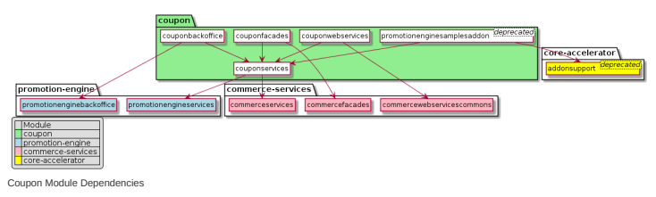
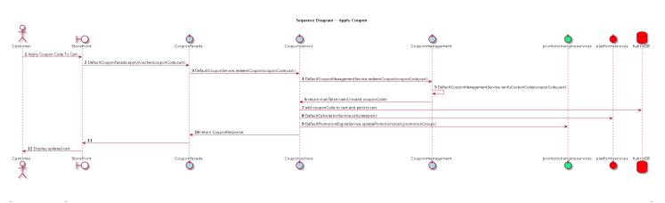

# Coupon Module

The Coupon module allows you to create digital coupons that your customers can redeem for discounts on the storefront. With the Coupons module, you can create both single-code and multi-code coupons. The Coupon module is delivered as part of the Promotion Engine and does not need to be installed separately.

## Coupon Features

The Coupon module generates and manages digital coupon codes for use within promotion rules.

This is   For more    the SAP Help  7 The Coupon module provides a range of features related to creating and managing coupon codes. For example, create singlecode and multi-code coupons to use in promotion rules. To dene the discount associated with a coupon, create a promotion rule. You can also create a promotion rule that, after checkout, gives the customer a free coupon for a later purchase.

Single-code Coupons A single-code coupon has only one code (for example, SUMMER_10 or BLACKFRIDAY). All customers who participate in the promotion use the same code. Multi-code Coupons Multi-code coupons consist of unique coupon codes, each of which can only be used one time, by one customer. Multicode coupons help ensure that only targeted customers can participate in a promotion.

Coupon Promotions When you create a coupon code, you must also create a promotion rule that denes the discount that customers receive when they redeem the coupon. You can also create a promotion rule that, after checkout, gives customers a free coupon for a discounted future purchase. Coupon Reporting Tools The Coupon module offers a downloadable report of redeemed coupons. You can also check whether a specic cart had a coupon applied to it.

## Single-Code Coupons

A single-code coupon has only one code (for example, SUMMER_10 or BLACKFRIDAY). All customers who participate in the promotion use the same code.

## Use Case

A customer can use a single-code coupon to participate in a promotional sale or to take advantage of a discount offer. The code is not unique to any specic customer, and can hence be shared. When you create the coupon, you decide whether each customer can redeem the coupon more than once. You can also set a limit on the number of total redemptions possible. Use a single-code coupon for promotions where you want as many customers as possible to participate.

## Features

Coupon Creation Create a single-code coupon that you can use in a promotion rule. Coupon Management Edit or delete existing coupons.

Related Information Creating a Single-Code Coupon

## Creating A Single-Code Coupon

A single-code coupon consists of one code that is used by all customers who participate in the promotion (for example, SUMMER20). Create a single-code coupon that customers can redeem on the storefront for a special discount.

Open this video in a new window 1. Log on to the Backoffice Administration Cockpit.

2. Navigate to Marketing Coupon Management Coupons . 
3. Click + Single-Code Coupon . A new coupon is created and the Coupon Conguration tab opens.
4. On the Coupon Conguration tab, ll in the following elds:

| Option                    | Description                                                                                                                                                                                                                                                                                                                                                                                                                                                                                                            |
|---------------------------|------------------------------------------------------------------------------------------------------------------------------------------------------------------------------------------------------------------------------------------------------------------------------------------------------------------------------------------------------------------------------------------------------------------------------------------------------------------------------------------------------------------------|
| Coupon Code               | Enter the code that you will distribute to customers or make available on your storefront. With a single-code coupon, all participating customers use the same code (for example, SUMMER20 or BLACKFRIDAY).                                                                                                                                                                                                                                                                                                            |
| Name                      | Enter a name for the coupon. This name is only used for managing the coupon in the Backoffice Administration Cockpit.                                                                                                                                                                                                                                                                                                                                                                                                  |
| Maximum Redemptions per   | Enter the maximum number of times that each customer is allowed to redeem this coupon.                                                                                                                                                                                                                                                                                                                                                                                                                                 |
| Customer                  | To allow each customer to redeem this coupon an unlimited number of times, leave this eld empty. If a customer tries to redeem the coupon after the maximum has been reached, an error message displays on the cart checkout page.                                                                                                                                                                                                                                                                                     |
| Maximum Total Redemptions | Enter the maximum number of times that this coupon can be redeemed by all customers. To allow as many customers as possible to redeem this coupon, leave this eld empty. If a customer tries to redeem the coupon after the maximum has been reached, an error message displays on the cart checkout page.  Note In most cases, you want to leave this eld empty. Only enter a limit here if you want to offer a limited promotion - for example, a super sale price that is only available to the rst 100 customers. |

| Option     | Description                                                                                                                                                                                                                                                                                                        |
|------------|--------------------------------------------------------------------------------------------------------------------------------------------------------------------------------------------------------------------------------------------------------------------------------------------------------------------|
| Start Date | Enter the date and time when the coupon becomes valid. To create a coupon with no start date, leave this eld empty. If the coupon has no dened start date, the coupons become valid when the associated promotion begins. See Creating a Coupon Promotion.                                                         |
| End Date   | Enter the date and time when the coupon is no longer valid. To create a coupon with no end date, leave this eld empty. In that case, the coupon is valid as long as the associated promotion rule is running. After the associated promotion ends, the coupon is no longer valid. See Creating a Coupon Promotion. |
| Active     | This eld controls whether the coupon is active or inactive. Set the Active eld to True. When the coupon is Active, you cannot edit the Coupon Prex or the Coupon Code Generation Conguration elds.                                                                                                                 |

5. Click Save to save the coupon.

Your coupon is saved and active. The coupon now appears in the list of available coupons. You can now use the coupon in a promotion.

6. Create a promotion rule that denes the discount associated with the coupon. For instructions, see Creating a Coupon Promotion.

7. Publish the promotion rule. For instructions, see Publishing a Promotion Rule.

Your promotion rule is published and contains an active coupon.

## Results

You can now distribute the generated coupon codes to customers. Customers can redeem the multi-code coupons on the storefront to receive special discounts.

## Next Steps

Before you distribute the coupon to customers, ensure the following:
The coupon is active (on the Coupon Conguration tab, the Active eld is set to True). You have created and published a promotion rule that denes the discount that the coupon provides. For instructions, see Creating a Coupon Promotion.

Coupon Promotions Creating a Coupon Promotion

## Single-Code Coupon Restrictions

Coupon Management is delivered with a number of pre-implemented restriction types. All restrictions of the specic Single- Code Coupon must be fullled to ensure seamless redemption of coupons on the storefront.

| Attribute                                                                            | Restrictions                                                       |
|--------------------------------------------------------------------------------------|--------------------------------------------------------------------|
| Coupon Code                                                                          | Value cannot be changed if value is set to True in the Active eld. |
| This is custom documentation. For more information, please visit the SAP Help Portal | 10                                                                 |

| 7/12/2024 Attribute          | Restrictions                                                                                                                     |
|------------------------------|----------------------------------------------------------------------------------------------------------------------------------|
| Max Redemptions Per Customer | Value should be greater than or equal to one. Value cannot be greater than the specied value in the Maximum Total Redemptions.   |
| Maximum Total Redemptions    | Value should be greater than or equal to one. Value cannot be lesser than the specied value in the Max Redemptions Per Customer. |

## Sample Single-Code Coupons

The Coupons module comes with a number of sample single-code coupons that you can use to create promotions.

| Name                                     | Coupon Code              | Code Generation           | Maximum   |     |
|------------------------------------------|--------------------------|---------------------------|-----------|-----|
| Conguration                              | Redemptions per Customer | Maximum Total Redemptions |           |     |
| Coupon Code for Summer                   | SUMMER69                 | default-conguration       | 1         | 10  |
| Campaign Coupon Code for Winter Campaign | WINTER16                 | default-conguration       | 2         | 15  |
| Coupon Code for Christmas                | CHRISTMAS16              | default-conguration       | 3         | 100 |
| Campaign Coupon Code for Fall Campaign   | FALL16                   | default-conguration       | 1         | 100 |
| Giveaway Coupon Campaign                 | BUYMORE16                | default-conguration       | 1         |     |

## Editing Or Deleting A Coupon

You can edit or delete an existing coupon in the Coupons module.

1. Log on to the Backoffice Administration Cockpit and navigate to Marketing Coupon Management Coupons .

A list of all available coupons appears.

2. From the list of coupons, select the coupon that you want to edit or delete.

The Coupon Conguration tab opens.

3. To edit the coupon, change any of the elds on the Coupon Conguration tab.

You can only edit the Code of a coupon if the coupon is inactive. To deactivate a coupon, in the Active eld, change the status to False. Then, click Save. You can now edit the coupon code. To nd information on the displayed elds and their corresponding descriptions, refer to Creating a Multi-code Coupon and Creating a Single-Code Coupon.

4. Click Save to save your changes. Otherwise, click Refresh to undo your changes. 5. To delete a coupon, click the Delete button.

This is   For more    the SAP Help  11

## Multi-Code Coupons

Multi-code coupons consist of unique coupon codes, each of which can only be used one time, by one customer. Multi-code coupons help ensure that only targeted customers can participate in a promotion.

## Use Case

A customer uses a multi-code coupon to participate in a promotional sale or to take advantage of a discount offer. The code is unique and can only be used one time. The customer cannot share the code or use it again on later carts. Here are some examples of multi-code coupons and their uses:

Customers receive a one-time coupon in an email when they abandon a shopping cart. The coupon prompts customers to complete the order. Customers get an email with a unique coupon code when they sign up for your newsletter. Using a unique code ensures that the customer can't use the code for later purchases. Customers occasionally contact your support team with a complaint about a product. To retain these customers, the support agent can provide them with a coupon code for 10% off a future order.

## Features

Coupon Creation Create a multi-code coupon, To dene the discount associated with the coupon, you must create a promotion rule. Coupon Management Edit or delete existing coupons.

## Coupon Generation

Generate and download a list of unique coupon codes. You can dene how many codes you would like to download. Coupons that you have generated previously are stored in the system so that you can download them at a later date.

## Coupon Conguration

A multi-code coupon consists of a prex followed by several alphanumeric strings (for example, SALE-1PN3-PS6H-QML7). While the multi-code coupons are randomly generated, you can dene the prex as well as the number and length of coupon parts by creating a coupon generation conguration.

Creating a Multi-code Coupon Editing or Deleting a Coupon Generating Coupon Codes Creating a Generation Conguration for a Multi-code Coupon

## Conguration For Multi-Code Coupons

To dene the code separator, number of coupon parts, and number of characters in each coupon, create a code generation conguration. The prex is not a part of this conguration.

## Use Case

This is   For more    the SAP Help  12 A multi-code coupon consists of a prex followed by several alphanumeric strings (for example, SALE-1PN3-PS6H-QML7).

Marketers can create and save a conguration that denes the length and format of their multi-code coupons. When creating a multi-code coupon, the marketer selects the conguration that offers the length and type of coupon she needs.

Creating a Generation Conguration for a Multi-code Coupon

## Creating A Generation Conguration For A Multi-Code Coupon

A multi-code coupon consists of a prex followed by several alphanumeric strings (for example, SALE-1PN3-PS6H-QML7). To dene the code separator, number of coupon parts, and number of characters in each coupon, create a coupon generation conguration. The prex is not a part of the generation conguration.

1. Log on to the Backoffice Administration Cockpit.

2. Navigate to Marketing Coupon Management Coupon Code Generation Conguration . 3. Click the plus sign to create a new conguration. 4. In the Code Generation Conguration tab, specify the following details:
Name - Enter a name for the conguration.

Code Separator - Dene the special character used to separate parts of the coupon code. Only enter one character. You cannot use letters or numbers. You cannot use \# (number sign). Coupon Part Count - Dene the number of parts of the coupon code. The parts are separated by the code separator. The prex does not count as one of the parts.
Coupon Part Length - Dene the number of characters in each part.

The total number of characters in the coupon (Coupon Part Count multiplied by Coupon Part Length) must be a multiple of 4.

5. Click Save to create the new conguration. Otherwise, click Refresh to undo your changes.

The conguration is saved. You can now use this conguration to create multi-code coupons.

## Coupon Code Generation Restrictions

When creating a code generation conguration to dene the format of multi-code coupons, make sure to adhere to these restrictions.

| Attribute                                                                            | Restrictions                                                                                                               |
|--------------------------------------------------------------------------------------|----------------------------------------------------------------------------------------------------------------------------|
| Name                                                                                 | Value must be unique.                                                                                                      |
| Code Separator                                                                       | Enter only one character Enter a special character (numbers or letters are not allowed). The # (number sign) is not valid. |
| This is custom documentation. For more information, please visit the SAP Help Portal | 13                                                                                                                         |

| 7/12/2024 Attribute   | Restrictions                                 |
|-----------------------|----------------------------------------------|
| Coupon Part Count     | Enter a number greater than or equal to one. |
| Coupon Part Length    | Enter a number greater than or equal to one. |

The total number of characters in the coupon (Coupon Part Count multiplied by Coupon Part Length) must be a multiple of 4.

Creating a Multi-code Coupon

## Creating A Multi-Code Coupon

Create a multi-code coupon that customers can redeem on the storefront to access special discounts. Each customer gets a unique code.

## Context

Multi-code coupons consist of unique coupon codes. Each unique code can only be used one time, by one customer. A multi-code coupon consists of a prex followed by several short, alphanumeric strings separated by characters (for example, SALE-1PN3-PS6H-QML7). The codes are randomly generated.

Before you distribute the coupon codes to customers, ensure the following:
The coupon is active (on the Coupon Conguration tab, the Active eld is set to True). You've created and published a promotion rule that denes the discount that the coupon provides. For instructions, see Creating a Coupon Promotion.

1. Log in to the Backoffice Administration Cockpit.

2. Navigate to Marketing Coupon Management Coupons . 3. Click + Multi-Code Coupon .

You have created a new coupon.

4. On the pop-up Create New Multi-Code Coupon page, ll in the following elds:

| 7/12/2024               | Coupon Alphabet                                                                                                                                                                                                                                                                                                            | This eld is a set of characters that generates the coupon codes. The size of coupon alphabet has a signicant impact on the number of possible generated coupon codes, which will inuence the protection against brute-force attacks. The formula is: The number of possible coupon codes = The size of alphabet ^ (the number of coupon parts * the length of coupon part) For more details, see the section Examples of Settings as described on this page.   |
|-------------------------|----------------------------------------------------------------------------------------------------------------------------------------------------------------------------------------------------------------------------------------------------------------------------------------------------------------------------|----------------------------------------------------------------------------------------------------------------------------------------------------------------------------------------------------------------------------------------------------------------------------------------------------------------------------------------------------------------------------------------------------------------------------------------------------------------|
| Coupon Code Generation  | Select the conguration that is used (along with the prex) to generate coupon codes. The                                                                                                                                                                                                                                    |                                                                                                                                                                                                                                                                                                                                                                                                                                                                |
| Conguration             | conguration species the number of coupon parts, the length of coupon part, and the separator character. You can use the default conguration or you can create your own custom conguration (see Creating a Generation Conguration for a Multi-code Coupon).                                                                 |                                                                                                                                                                                                                                                                                                                                                                                                                                                                |
| Coupon Code Seed Number | This number is used to generate the clear text part of the random coupon code.                                                                                                                                                                                                                                             |                                                                                                                                                                                                                                                                                                                                                                                                                                                                |
| Coupon Code Signature   | The (base64 encoded) signature is used to generate the cipher text part of the coupon code.  Note This eld is auto-lled, and you don't need to change it.                                                                                                                                                                 |                                                                                                                                                                                                                                                                                                                                                                                                                                                                |
| Active                  | This eld controls whether the coupon is active or inactive. Before you distribute coupons to customers, ensure that the Active eld is set to True. When the coupon is active, you cannot edit the Coupon Prex or the Coupon Code Generation Conguration elds.                                                              |                                                                                                                                                                                                                                                                                                                                                                                                                                                                |
| Coupon Prex             | Enter a prex that serves as the initial part of all generated coupon codes. For example, the prex SALE generates coupons with the format SALE-1PN3-PS6H-QML7. Use only numbers and letters. Note: after you have generated coupons, you can no longer change the prex. You cannot change the prex if the coupon is active. |                                                                                                                                                                                                                                                                                                                                                                                                                                                                |
| Time Created            | This eld indicates the time when the multi-code coupon setting is created, which you don't have to ll it manually.                                                                                                                                                                                                         |                                                                                                                                                                                                                                                                                                                                                                                                                                                                |

5. Click Save to save the coupon.

Your coupon is saved and active. The coupon now appears in the list of available coupons. You can now use the coupon in a promotion.

6. Create and publish a promotion rule that denes the discount associated with the coupon. For instructions, see Creating a Coupon Promotion and Publishing a Promotion Rule. Your promotion rule is published and contains an active coupon. You can now distribute the generated coupon codes to customers. Customers can redeem the multi-code coupons on the storefront to receive special discounts.

## Examples Of Settings

| Coupon Alphabet size   | Code part count   | Code part length   | Possible coupon codes   | Notes                                       |
|------------------------|-------------------|--------------------|-------------------------|---------------------------------------------|
| 2                      | 4                 | 4                  | 2^16 = 65536            | Weak protection against brute-force attacks |

| 7/12/2024 Coupon Alphabet size   | Code part count   | Code part length   | Possible coupon codes   | Notes                                                |
|----------------------------------|-------------------|--------------------|-------------------------|------------------------------------------------------|
| 16                               | 4                 | 4                  | 2^64 ≈ 1.84e+19         | Fairly strong protection against brute-force attacks |
| 16                               | 4                 | 10                 | 2^160 ≈ 1.46e+48        | Very Strong protection against brute-force attacks   |

There is always a trade-off between security and performance. A strong setting can make it harder for the brute-force attacks but will increase resource consumption. So, it's up to your business scenario. In general, the bigger size of alphabet and the bigger product of the code part count and the code part length, therefore the stronger protection against brute force attacks. The more active the coupon codes you have, the less time it takes for a hacker to get the coupon codes.

## Editing A Multi-Code Coupon

After creating a multi-code coupon, you can edit it. The Coupon Conguration tab allows you to dene the coupon. On the Coupon Conguration tab, ll in the following elds:

| Coupon Prex                                                                          | Enter a prex that serves as the initial part of all generated coupon codes. For example, the prex SALE generates coupons with the format SALE-1PN3-PS6H-QML7. Use only numbers and letters. Note: after you have generated coupons, you can no longer change the prex. You cannot change the prex if the coupon is active.                         |
|--------------------------------------------------------------------------------------|----------------------------------------------------------------------------------------------------------------------------------------------------------------------------------------------------------------------------------------------------------------------------------------------------------------------------------------------------|
| Name                                                                                 | Enter a name for the coupon. This name is only used for managing the coupon in the Backoffice Administration Cockpit.                                                                                                                                                                                                                              |
| Coupon Code Generation Conguration                                                   | Select the conguration that is used (along with the prex) to generate coupon codes. The conguration species the number of coupon parts, the length of coupon part, and the separator character. You can use the default conguration or you can create your own custom conguration (see Creating a Generation Conguration for a Multi-code Coupon). |
| Start Date                                                                           | Enter the date and time when the coupons become valid. To create a coupon with no start date, leave this eld empty. If the coupon has no dened start date, the coupons become valid when the associated promotion begins. See Creating a Coupon Promotion.                                                                                         |
| End Date                                                                             | Enter the date and time when the coupon is no longer valid. To create a coupon with no ending date, leave this eld empty. In that case, the coupon is valid as long as the associated promotion rule is running. After the associated promotion ends, the coupon is no longer valid. See Creating a Coupon Promotion.                              |
| Active                                                                               | This eld controls whether the coupon is active or inactive. Before you distribute coupons to customers, ensure that the Active eld is set to True. When the coupon is active, you cannot edit the Coupon Prex or the Coupon Code Generation Conguration elds.                                                                                      |
| This is custom documentation. For more information, please visit the SAP Help Portal | 16                                                                                                                                                                                                                                                                                                                                                 |

Generated Coupon Codes Enter the number of coupons that you want to generate. Click the

Generate button. Click the icon to download the coupon codes as a CSV le.

For more information, you can refer to the video below:

 Open this video in a new window

Generating Coupon Codes Creating a Coupon Promotion Creating a Generation Conguration for a Multi-code Coupon

## Multi-Code Coupon Restrictions

Coupon Management is delivered with a number of pre-implemented restriction types. All restrictions of the specic Multi-Code Coupon must be fullled to ensure seamless redemption of coupons on the storefront.

Attribute Restrictions

| 7/12/2024 Attribute         | Restrictions                                                                                                                                                                                                                                       |
|-----------------------------|----------------------------------------------------------------------------------------------------------------------------------------------------------------------------------------------------------------------------------------------------|
| Code Prex                   | No character limit. Only letters and numbers are allowed; no special characters. Attribute value cannot be changed if value is set to True in the Active eld. Attribute value cannot be changed if at least one batch of codes has been generated. |
| Code Generation Conguration | Value cannot be changed if value is set to True in the Active eld. For Multi-Code Coupons, value cannot be changed if at least one batch of codes has been generated.                                                                              |
| Generated Codes             | This eld cannot be changed if value is set to True in the Active eld. Only new codes can be added and existing codes can be downloaded.                                                                                                            |

## Sample Multi-Code Coupon

Coupon Management is delivered with a sample Multi-Code Coupon that allows you to offer a one-time promotion to your customers.

| Coupon ID           | Name                 | Code Generation     | Number of Coupons to   | Generated Codes   |
|---------------------|----------------------|---------------------|------------------------|-------------------|
| Conguration         | Generate             |                     |                        |                   |
| CouponEmailCampaign | Coupon codes for the | default-conguration | 100                    | To be generated   |
| email campaign      |                      |                     |                        |                   |

Creating a Coupon Promotion Creating a Promotion Rule

## Generating Coupon Codes

Generate and download coupon codes for a multi-code coupon. The codes are generated randomly but use the generation conguration that you selected. After you generate the codes, you can distribute them to your customers on the desired channels.

1. Log in to the Backoffice Administration Cockpit.

2. Navigate to Marketing Coupon Management Coupons . 3. Locate the multi-code coupon that you want to generate. Click to open it.

The Coupon Conguration tab opens.

4. In the Generated Coupon Codes area, in the eld Number of coupon codes to generate, enter the number of codes that you want to generate. Click the Generate button. The generated coupons appear in the Generated Coupon Codes area. Click the icon to download the CSV le.
This is   For more    the SAP Help  18

Generated coupons are stored in the system so that you can download them at a later date.

Before you distrubute the coupon codes to customers, ensure the following:
The coupon has the Active eld set to True.

You have created and published a promotion rule that denes the discount that the coupon provides. For instructions, see Creating a Coupon Promotion.
Creating a Coupon Promotion

## Deactivating A Coupon Code

You can deactivate a specic code from your multi-code coupon by redeeming the coupon to render it inactive. The end user is then unable to apply the code in the storefront.

1. Log on to the Backoffice Administration Cockpit and navigate to Marketing Coupon Management Coupon Redemption .

2. Click + to create a new coupon redemption record. 3. On the Coupon eld, select the target multi-code coupon. 4. Paste the generated code that you want to deactivate into the Coupon Code eld. 5. Click Done.

## Results

You will see the new redemption record added in the list. The code that you entered is now redeemed, therefore it becomes inactive for the customer.

## Coupon Promotions

When you create a coupon code, you must also create a promotion rule that denes the discount that customers receive when they redeem the coupon. You can also create a promotion rule that, after checkout, gives customers a free coupon for a discounted future purchase.

## Use Case

Customers redeem coupons to get a special discount on the storefront. Examples of coupon-based promotion rules include:
Customers can enter the single-code coupon WINTER20 at checkout to get 20% off their orders.

A customer can enter the multi-code coupon SALE-M80P-F6H3-R9N7 at checkout to get a free bonus product with the order.

## Features Coupon Promotion

You create coupons in the Coupons area. The coupon, however, is just a code. To assign a discount action to the coupon, you have to create a promotion rule. The promotion rule denes what happens when the customer enters the coupon during checkout. See Creating a Coupon Promotion. Free Coupon Giveaway Promotion The Free Coupon promotion action gives customers a free coupon during checkout. Customers can use the coupon for a future purchase. For example, if a customer spends €500, after checkout the customer gets a coupon for €50 off a future order.

Creating a Coupon Promotion Single-code Coupons Creating a Single-Code Coupon Multi-code Coupons Creating a Multi-code Coupon

## Creating A Coupon Promotion

Create a promotion rule that grants customers a discount when they redeem a coupon during checkout. The condition is the qualifying coupon, and the action is the applicable discount.

## Prerequisites

Create and activate a coupon in the Coupons area. Make sure that you understand the general directions for creating promotions. For more information, see Creating a Promotion Rule.

## Context

Use these instructions to create a promotion where one of the conditions of the promotion rule is a valid coupon. You can also set up a coupon promotion using the following templates:
Coupon code percentage discount Coupon code free gift with order threshold Coupon code percentage discount on products Coupon code xed discount

1. Create a promotion rule. On the Rule Properties tab, dene the details of the promotion (such as the website, priority, and start and end date). For information, see Creating a Promotion Rule.

2. Switch to the Condition & Actions tab. 3. In the Message eld, enter the promotion message that you want to display to customers when the coupon is redeemed on the storefront (for example, "Coupon applied").

4. In the Conditions area, from the Available Conditions menu, drag and drop a Coupon code condition into the promotion rule.

5. Expand the Coupon code condition. In the Qualifying coupons eld, select your coupon. 6. (Optional) Add additional conditions to the promotion rule. (For example, if the coupon grants customers a discount on specic products, add the Qualifying products or Qualifying categories condition to the promotion rule.)
7. In the Actions area, from the Available Actions menu, drag and drop the actions you want into the promotion rule. The action denes the discount that your customers receive when they redeem the coupon. Here are a few actions that would be appropriate for a coupon-based promotion rule:

Percentage discount on cart: When customers redeem the coupon, they get a percentage off the cart total. Example: 10% off the whole cart. Fixed discount on cart: When customers redeem the coupon, they get a xed discount off the cart total. Example: 20€ off the cart total. Percentage discount on products: When customers redeem the coupon, they get a percentage off of certain products (e.g., 20% off digital cameras). If you use this action, you also need to add a Qualifying products or Qualifying categories condition to the promotion rule. Fixed discount on products: When customers redeem the coupon, they get a xed discount off of certain products (e.g., 50€ off a camera lens). If you use this action, you also need to add a Qualifying products or Qualifying categories condition to the promotion rule.
8. Click Save.

9. Publish the promotion rule. For instructions, see Publishing a Promotion Rule.

The promotion rule is published and available on your storefront.

10. If both the coupon and the promotion rule are active, you can now distribute your coupon to customers.

A coupon can be applied even if it is not used in any active promotion. To prevent the unused coupons from being redeemed, set the property as below so that validation will be triggerred:
couponservices.coupon.redemption.validation=true

## Creating A Coupon Giveaway Promotion

Create a promotion that gives customers a free coupon after checkout. Customers can use the coupon for a future purchase.

## Prerequisites

Before you create the free coupon promotion, do the following:

Create and activate the coupon that you want to give away. For instructions, see Creating a Single-Code Coupon or Creating a Multi-code Coupon. Create and publish a promotion rule that denes the discount that the free coupon provides. For instructions, see Creating a Coupon Promotion.

## Context

You can also set up this promotion using the following template:

## Order Threshold Free Coupon Procedure

1. Create a new promotion rule. On the Rule Properties tab, dene the details of the promotion (such as the website, priority, and start and end date). For information, see Creating a Promotion Rule.

2. Switch to the Condition & Actions tab. 3. In the Message eld, enter the promotion message that you want to display to customers when they qualify for the free coupon. For more information, see Applied Promotion Messages.

4. In the Conditions area, from the Available Conditions menu, select the criteria that the customer must fulll in order to receive the free coupon after checkout. You can add multiple conditions to the same promotion rule.

5. In the Actions area, from the Available Actions menu, drag and drop the Free coupon action into the promotion rule. In the Coupon code eld, select the coupon that you want to give away.

6. Click Save. 7. Publish the promotion rule. For instructions, see Publishing a Promotion Rule.

The promotion rule is published and available on your storefront.

Creating a Single-Code Coupon Creating a Multi-code Coupon

## Coupon Reporting Tools

The Coupon module offers a downloadable report of redeemed coupons. You can also check whether a specic cart had a coupon applied to it.

## Use Case

You have published one or more promotion rules that allow customers to redeem coupons. Now, you want to view coupon reporting details to learn how many times each coupon has been redeemed. You can analyze these report details to determine the effectiveness of your coupon campaign. You may also want to check whether a specic cart has applied a coupon. You can access this information in the Backoffice Administration Cockpit.

## Features

Coupon Details of a Cart The cart details include information on whether a coupon was applied to the cart. Coupon Redemption Report This report provides information about coupon redemption, including customer and cart details.

Viewing Coupon Details of a Cart Generating Coupon Redemption Report

## Viewing Coupon Details Of A Cart

You can view any coupons that were applied to a specic cart in the Backoffice Administration Cockpit.

## Context

You have published one or more promotion rules that allow customers to redeem coupons. Now, you want to view coupon reporting details to learn how many times each coupon has been redeemed. You can access this information in the Backoffice Administration Cockpit.

1. Log in to the Backoffice Administration Cockpit.

2. Navigate to. Marketing Order Statistics Carts .

A list of customer carts appears.

3. To view the coupon details, select the cart you want. 4. Click the Coupons tab.

You can view the following information about the cart:

User - Displays the customer who redeemed the coupon. Order Nr - Displays the order number where the coupon was applied. Code— Displays the coupon code applied to the order or cart. Name— Displays the name of the coupon applied to the order or cart.

## Generating Coupon Redemption Report

The Coupon module offers a report that lists all of the coupons that have been redeemed on the storefront. You can view the report in the Backoffice Administration Cockpit, or you can download the report.

## Context

You have published one or more promotion rules that allow customers to redeem coupons. Now, you want to view coupon reporting details to learn how many times each coupon has been redeemed. You can access this information in the Coupon module in the Backoffice Administration Cockpit.

1. Log in to the Backoffice Administration Cockpit.

2. Navigate to Marketing Coupon Management . 3. Click Coupon Redemption to display all the used coupon codes. 4. When a customer successfully places an order through the storefront, an entry is added into the Coupon Redemption table with the following information:
User - Displays the customer who redeemed the coupon. Order Nr - Displays the order number where the coupon was applied.

Code— Displays the coupon code applied to the order or cart.
Name— Displays the name of the coupon applied to the order or cart.

To download the report, click the Export List View to CSV Action button.

## Coupon Architecture

Coupons is a set of extensions providing coupon codes and coupon generation within the context of Promotion Engine.

Dependencies

## Recipes

For a complete list of SAP Commerce Cloud recipes that may include this module, see Installer Recipes. For a complete list of the SAP Commerce Cloud, integration extension pack recipes that may include this module, see Installer Recipe Reference.

This is   For more    the SAP Help  24

## Extensions

Coupons consists of the following extensions:
couponbackoffice Extension The couponbackoffice extension utilizes Promotion Engine Backoffice implementations and includes Coupon-specic Backoffice components. This extension requires the promotionenginebackoffice extension and the couponservices extension.

couponfacades Extension The couponfacades extension provides a suite of facades used to display coupons on the storefront. This extension requires the commercefacades and the couponservices extensions.

couponservices Extension The couponservices extension includes services needed to run the coupon management feature on the Promotion Engine. This extension requires the commerceservices, droolsruleengineservices, and promotionengineservices extensions.

couponwebservices Extension The couponwebservices extension provides the REST Web Services that exposes several functions, such as getting a list of available single and multi-code coupons in the system, getting details of a specied coupon, creating a single or multi-code coupon, and generating coupon codes. promotionenginesamplesaddon Extension The promotionenginesamplesaddon AddOn imports sample and testing data for types dened in the Promotion Engine extensions. This AddOn requires the addonsupport.

## Couponbackoffice Extension

The couponbackoffice extension utilizes Promotion Engine Backoffice implementations and includes Coupon-specic Backoffice components. This extension requires the promotionenginebackoffice extension and the couponservices extension.

## About The Extension

| Name                       | Directory          | Related Module   |
|----------------------------|--------------------|------------------|
| couponbackoffice Extension | bin/modules/coupon |                  |

## Dependencies

This extension is dependent on the following extensions:
promotionenginebackoffice Extension

couponservices Extension

## Couponfacades Extension

The couponfacades extension provides a suite of facades used to display coupons on the storefront. This extension requires the commercefacades and the couponservices extensions.

## About The Extension

| Name   | Directory   |
|--------|-------------|

| Name                   | Directory          |
|------------------------|--------------------|
| couponfacadesExtension | bin/modules/coupon |

## Dependencies

This extension is dependent on the following extensions:
commercefacades extension

couponservices extension

## Couponservices Extension

The couponservices extension includes services needed to run the coupon management feature on the Promotion Engine.

This extension requires the commerceservices, droolsruleengineservices, and promotionengineservices extensions.

## About The Extension

| Name                     | Directory          | Related Module   |
|--------------------------|--------------------|------------------|
| couponservices Extension | bin/modules/coupon |                  |

## Dependencies

This extension is dependent on the following extensions:
commerceservices extension

droolsruleengineservices extension promotionengineservices extension

## Couponwebservices Extension

The couponwebservices extension provides the REST Web Services that exposes several functions, such as getting a list of available single and multi-code coupons in the system, getting details of a specied coupon, creating a single or multi-code coupon, and generating coupon codes.

## About The Extension

| Name                       | Directory          |
|----------------------------|--------------------|
| couponwebservicesExtension | bin/modules/coupon |

## Dependencies

This extension is dependent on the following extensions:
This is   For more    the SAP Help  26

commercewebservicescommons extension couponservices extension

## Promotionenginesamplesaddon Extension

The promotionenginesamplesaddon AddOn imports sample and testing data for types dened in the Promotion Engine extensions. This AddOn requires the addonsupport.

## Caution

This page refers to software that has been deprecated as part of the Accelerator UI and older OCC template extensions deprecation. For more information, see Deprecated Accelerator UIs and OCC Template Extensions - Deletion in SAP Commerce Cloud 2211.

## About The Extension

The Promotion Engine sample data is intended to make it easier for you to set up promotions. The sample data shows you what kind of promotions you can create and how those promotions are structured. If you have the sample data in your system, you can clone a sample promotion and use the clone as a basis for your own promotion. For instructions, see Cloning a Promotion Rule.

The sample data is included in the promotionenginesamplesaddon extension. The sample data includes both B2C and B2B
sample promotions as well as corresponding templates.

| Name                        | Directory                    | Related Module   |
|-----------------------------|------------------------------|------------------|
| promotionenginesamplesaddon | bin/modules/promotion-engine | Promotion Engine |

## Dependencies

addonsupport extension

couponservices extension

## Coupon Implementation

Learn how to further implement and congure the Coupons module, as well as use the API for coupons. The Coupon module is delivered as part of the Promotion Engine and does not need to be installed separately. Use the data model and sequence diagrams available in this section to better understand how the coupons are implemented. In this section you can also learn how to migrate from vouchers (legacy functionality) to coupons. The Coupon module offers a web service to allow external systems to generate and administer coupons.

Coupons in Accelerator Coupons can help increase the conversion rate of your e-commerce site as well as reward your loyal customers. Coupon Web Services This is   For more    the SAP Help  27 The Coupon module offers a REST API web service to allow external systems to generate and administer coupons.

Data Model The Coupon Management Data Model provides you an overview of the interfaces included in the feature. Sequence Diagrams The Coupon Management Sequence Diagrams provide a representation of the Facades and Service Layer showing the actions from coupon redemption to validation, and to triggering promotions.

Migrate from Vouchers to Coupons To migrate from Vouchers to Coupons, you must manually create your vouchers as coupons. There is no automatic migration from Vouchers (Legacy) to Coupons.

## Coupons In Accelerator

Coupons can help increase the conversion rate of your e-commerce site as well as reward your loyal customers. Coupon management runs on top of the Promotion Engine, which offers exibility in creating various discounts or promotions. Unlike vouchers, which can only apply a discount amount on the cart subtotals, coupons use promotion rules created by the Promotion Engine. Promotion rules are applied to the cart itself, allowing for promotions that add a free gift or change the line items of a cart, as well as discounts on the cart subtotal.

## Prerequisites

Coupon implementation requires the Promotion Engine, which includes the required coupon management extensions. See Coupon Architecture to understand the dependencies between the various Promotion Engine extensions. Coupons must be activated and their corresponding promotion rules must be published in the Backoffice Administration Cockpit before they can be applied in the storefront. You can either use existing default coupons, or create new ones using templates. See Coupon Module for more details.

## Technical Overview

For the back end, the commercefacades extension was modied to use OrderAppliedVouchersPopulator to populate the list of applied coupons into the DTOs when reading cart or order data from the database. For the front end, two new JSP tag les were added and are referenced by three existing JSP tag les:

| New TAG Files   | Existing TAG Files   |
|-----------------|----------------------|
| yacceleratorstorefront/web/webroot/WEBINF/tags/responsive/cart/cartVoucher.tag                 | yacceleratorstorefront/web/webroot/WEBINF/views/responsive/pages/cart/cartTotalsDisplay.jsp                      |
| yacceleratorstorefront/web/webroot/WEBINF/tags/responsive/order/appliedVouchers.tag                 | yacceleratorstorefront/web/webroot/WEBINF/tags/responsive/checkout/multi/checkoutOrde yacceleratorstorefront/web/webroot/WEBINF/tags/responsive/checkout/multi/checkoutOrde                      |

The new JSP tag les were added to yacceleratorstorefront only; consequently, coupons are only supported for B2B
Accelerator and B2C Accelerator out-of-the-box. To implement coupons in other storefronts, you must add the two new JSP tag les and reference them in the existing tag les in a similar way. For an overview of the various interfaces used for coupons, see Data Model To gain understanding on the sequence of actions in the facades and service layer, see Sequence Diagrams

## User Experience

Users apply coupons to their orders in the checkout page. Coupons are applied by entering the case-sensitive coupon code in the Coupon Code field and then clicking the Apply button. The coupon is represented by a box with the coupon name below the Coupon Code field, and the discount amount is displayed in the order total section of the page. Users can remove the coupon by clicking the X in the coupon box.

This screenshot shows the WINTER16 coupon applied to a cart, giving a 10% discount on the order:

Once the order is placed with the applied coupon, the coupon code and discount amount is displayed in the order confirmation page, as well as the order details page, which is accessed through the user's order history. Note the following when using coupons:

- If a multi-code coupon is applied more than once, users are notified that the coupon code is invalid the second time users try to apply it to an order.

 If there are other promotions or coupons applied on the cart, the discount amount shows the combined discount of all
.

coupons and promotions.

 If a cart is saved with the coupon, the coupon is still applied to the cart when it is restored, provided that the promotion
.

for the coupon has not expired at the time when the cart is restored.
Coupon Module Promotion Engine

## Coupon Web Services

The Coupon module offers a REST API web service to allow external systems to generate and administer coupons.

API Documentation and YAML Files

## Data Model

The Coupon Management Data Model provides you an overview of the interfaces included in the feature.

## Recommendation

For a better viewing experience, right-click the diagram and select one of the available browser options, such as Open Image in New Tab.

## Sequence Diagrams

The Coupon Management Sequence Diagrams provide a representation of the Facades and Service Layer showing the actions from coupon redemption to validation, and to triggering promotions.

## Sequence Diagram For Applying A Coupon Recommendation

For a better viewing experience, right-click the diagram and select one of the available browser options, such as Open Image in New Tab.

This is   For more    the SAP Help  30

| 7/12/2024 SStteeppss   | AAccttiioonnss                                                                                                                                                                                                                                                                                                                                                                                                                                                   |
|------------------------|------------------------------------------------------------------------------------------------------------------------------------------------------------------------------------------------------------------------------------------------------------------------------------------------------------------------------------------------------------------------------------------------------------------------------------------------------------------|
| 1                      | Customer applies coupon code to the cart.                                                                                                                                                                                                                                                                                                                                                                                                                        |
| 2                      | Storefront or Controller calls the VoucherFacade.applyVoucher interface method. This interface is dened in commercefacades extension, where a default implementation of DefaultVoucherFacade also exists. When the couponfacades extension is active, it adds another implementation for the VoucherFacade interface, the DefaultCouponFacade, which overrides the DefaultVoucherFacade.                                                                         |
| 3                      | The DefaultCouponFacade propagates the call to the DefaultCouponService.redeemCoupon method.                                                                                                                                                                                                                                                                                                                                                                     |
| 4                      | The DefaultCouponService.redeemCoupon method calls the DefaultCouponManagementService to validate the provided coupon code.                                                                                                                                                                                                                                                                                                                                      |
| 5                      | The DefaultCouponManagementService.verifyCouponCode method uses several strategies for coupon validation. The method's validations are as follows: Tries to nd the given coupon code in the system Checks if the coupon is active Checks if the start and end date requirements are fullled Checks if the upper limit of overall and per customer redemptions is reached for Single-Code Coupons If any validation fails, the coupon code is considered invalid. |
| 6                      | Depending on the result of the coupon code validation, DefaultCouponManagementService.verifyCouponCode returns true for a valid coupon code or false for an invalid coupon code.                                                                                                                                                                                                                                                                                 |
| 7-9                    | When the coupon code is valid, the given coupon code is persisted at the cart (AbstractOrderModel.appliedCouponCodes) and the recalculation of the cart is triggered, which includes the evaluation of promotions. Coupons are only additional conditions in Promotion rules. Thus, there are no signicant changes in the Rule Engine level except for the CouponRAO, that is created and populated, and eventually added to the working memory.                 |
| 10-12                  | The coupon results are returned to the storefront. When the coupon code is valid, it is displayed in the list of applied coupons on the Cart page. Otherwise, an error message is displayed. When a valid coupon code successfully triggered a coupon promotion, the promotion results are also displayed on the storefront.                                                                                                                                     |

## Sequence Diagram For Starting Checkout Recommendation

For better viewing experience, right-click the diagram and select one of the available browser options, such as Open Image in New Tab.

| Steps   | Actions                                                                                                                                                                                                                                                                                                                                                                                                                                                |
|---------|--------------------------------------------------------------------------------------------------------------------------------------------------------------------------------------------------------------------------------------------------------------------------------------------------------------------------------------------------------------------------------------------------------------------------------------------------------|
| 1       | Customer clicks CHECKOUT.                                                                                                                                                                                                                                                                                                                                                                                                                              |
| 2       | Storefront/Controller calls the DefaultCartFacade to validate the cart.                                                                                                                                                                                                                                                                                                                                                                                |
| 3-4     | The call is forwarded to the DefaultCommerceCartService and the DefaultCartValidationStrategy.                                                                                                                                                                                                                                                                                                                                                         |
| 5       | From within the DefaultCartValidationStrategy, the CouponRedeemableValidationHook.afterValidateCart hook is called.                                                                                                                                                                                                                                                                                                                                    |
| 6-8     | The hook loops over all applied coupon codes. The hook also calls the DefaultCouponService and the DefaultCouponManagementService to verify if the coupon codes are still valid and redeemable.                                                                                                                                                                                                                                                        |
| 9-14    | When the current coupon code is valid and redeemable, the logic continues with checking the next coupon code. Otherwise, the invalid coupon code is removed from the cart and a cart recalculation is triggered (which includes re-evaluating the promotions, so that the invalid coupon's benets are also undone). In addition, a CommerceCartModification is created for the invalid coupon code and added to the list of CommerceCartModifications. |
| 15-18   | The list of CommerceCartModifications is returned. The standard functionality for handling or displaying validation errors ensures that the customer is notied and the checkout needs to be restarted.                                                                                                                                                                                                                                                 |

## Sequence Diagram For Placing Order Recommendation

For better viewing experience, right-click the diagram and select one of the available browser options, such as Open Image in New Tab.

| 7/12/2024 Steps   | Actions                                                                                                                                                                                                                                                                                                                                                                                   |
|-------------------|-------------------------------------------------------------------------------------------------------------------------------------------------------------------------------------------------------------------------------------------------------------------------------------------------------------------------------------------------------------------------------------------|
| 1                 | Customer clicks Place Order.                                                                                                                                                                                                                                                                                                                                                              |
| 2-3               | Before the order is placed, the cart is validated, which includes checking the applied coupon codes. See the Sequence Diagram for Starting Checkout for details about the cart/coupon validation.                                                                                                                                                                                         |
| 4-5               | Depending on the result of the cart validation, either validation errors are displayed to the customer and the sequence ends or the placeOrder starts by calling the DefaultCheckoutFacade.placeOrder method.                                                                                                                                                                             |
| 6-7               | The call is forwarded to the DefaultCommerceCheckoutService and the DefaultCommercePlaceOrderStrategy where the order is placed.                                                                                                                                                                                                                                                          |
| 8                 | From within the DefaultCommercePlaceOrderStrategy, the CouponRedemptionMethodHook.afterPlaceOrder hook is called.                                                                                                                                                                                                                                                                         |
| 9-11              | The hook loops over all coupons and calls DefaultCouponService and DefaultCouponManagementService to redeem the coupons. As part of the redemption process, the given coupon code is veried again.                                                                                                                                                                                        |
| 12-13             | Depending on the result of the coupon code verication, either a CouponRedemption item is created for valid coupon codes. Or, in case of an invalid coupon code, no redemption is created. As the order is already placed at this stage, no exception or error handling takes place, and invalid coupon codes are ignored. Basically, invalid coupon codes are not expected here any more. |
| 14-18             | Returns to the storefront and displays the order conrmation.                                                                                                                                                                                                                                                                                                                              |

## Migrate From Vouchers To Coupons

To migrate from Vouchers to Coupons, you must manually create your vouchers as coupons. There is no automatic migration from Vouchers (Legacy) to Coupons.

Migrating Serial Vouchers to Multi-Code Coupons You can manually transform the Serial Vouchers from the Vouchers Module to the Multi-Code Coupons of the Coupon Management. Migrating Promotional Voucher to Single-Code Coupon You can manually transform Promotional Vouchers from the Vouchers Module to Single-Code Coupons of the Coupon Management.

## Migrating Serial Vouchers To Multi-Code Coupons

You can manually transform the Serial Vouchers from the Vouchers Module to the Multi-Code Coupons of the Coupon Management. In the following section, a table displays a one-to-one mapping on how you can easily migrate your Serial Vouchers to Multi-Code Coupons. You can migrate the Serial Voucher by creating a new Multi-Code Coupon and moving the Serial Voucher's information details into the new Multi-Code Coupon through the Backoffice Administration Cockpit.

To learn more about Serial Vouchers, refer to the Voucher Types section. If you wish to read more about Multi-Code Coupons, read the Creating a Multi-code Coupon section.

Serial Voucher Window on the Backoffice Administration Cockpit

Multi-Code Coupon Window on the Backoffice Administration Cockpit

n COUPON CONFIGURATION
ADMINISTRATION
COUPON CODE
»
A Multi Code Coupon can contain multiple coupon codes that are generated using a prefix and a selected code generation configuration. Each coupon code can only be redeemed once. The coupon can later be
used in a promotion rule as a condition to trigger promotional actions, suc

| 7/12/2024 SSeerriiaall VVoouucchheerrss   | MMuullttii--CCooddee CCoouuppoonnss        |
|-------------------------------------------|--------------------------------------------|
| Promotion Code                            | Coupon Prex                                |
| Description                               | Name                                       |
| Voucher codes                             | Generated coupon codes                     |
| Number of voucher codes to generate       | Number of coupon codes to generate         |
| Value                                     | Set using the Coupon-based promotion rule. |
| Property                                  | Set using the Coupon-based promotion rule. |
| Currency                                  | Set using the Coupon-based promotion rule. |
| Including free shipping                   | Set using the Coupon-based promotion rule. |

Ensure that you generate new Multi-code coupons. Old generated serial vouchers are incompatible with Coupons and are not redeemable through the storefront.

## Migrating Promotional Voucher To Single-Code Coupon

You can manually transform Promotional Vouchers from the Vouchers Module to Single-Code Coupons of the Coupon Management. In the following section, a table displays a one-to-one mapping on how you can easily migrate your Promotional Vouchers to Single-Code Coupons. You can migrate the Promotional Voucher by creating a new Single-Code Coupon and moving the Promotional Voucher's information details into the new Single-Code Coupon through the Backoffice Administration Cockpit.

To learn more about Promotional Vouchers, refer to the Voucher Types section. If you wish to read more about Single-Code Coupons, read the Creating a Single-Code Coupon section.

Promotional Voucher in the Backoffice Administration Cockpit

Single-Code Coupon in the Backoffice Administration Cockpit Marketing

Order Statistics ça  Product References g"  Product reviews g* Promotion Rules
g Promotion Templates fy   Promotion Website Groups Coupon Management 

  
Configuration Cockpit Ticket System No queries

»
A Single Code Coupon contains one coupon code that can be redeemed multiple times based on the configuration. The coupon code needs to be entered manually. The coupon can later be used in a

| Coupon Code 😊                      | o           | Name 0   | o   |
|-------------------------------------|-------------|----------|-----|
| COUPON VALIDITY                     | &           |          |     |
| Maximum Total Redemptions �         |             |          |     |
| Maximum Redemptions per Customer 😊 | 100         |          |     |
| Start Date  Ø                       | End Date 😊 |          |     |
| D                                   | D           |          |     |
| Active ©                            |             |          |     |

promotion rule as a condition to trigger promotional actions, such as discounts or free gifts.

☼ Coupon Code Generation e Coupon Redemption
True t False

| Promotional Voucher     | Single-Code Coupon                         |
|-------------------------|--------------------------------------------|
| Promotion Code          | Coupon Code                                |
| Description             | Name                                       |
| Voucher Code            | Coupon Code                                |
| Value                   | Set using the Coupon-based promotion rule. |
| Priority                | Set using the Coupon-based promotion rule. |
| Currency                | Set using the Coupon-based promotion rule. |
| Including Free Shipping | Set using the Coupon-based promotion rule. |

## Mapping Of Fields
