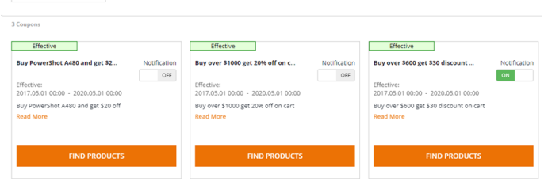
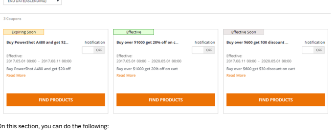
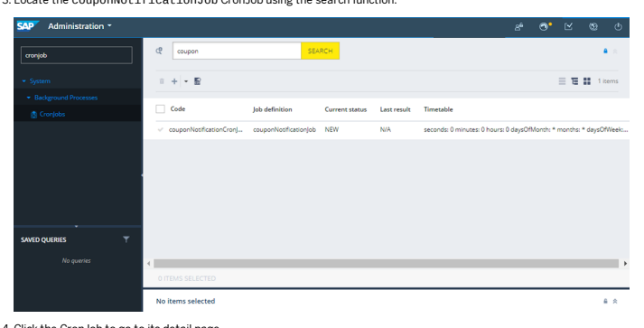
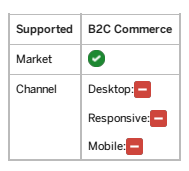

# Customer Coupon Module

This is   For more    the SAP Help  7 The Customer Coupon module allows exible coupon usage by allowing a customer to possess certain coupons. Customer coupons can be used for marketing campaigns or ad-hoc assignments base on business needs.

## Customer Coupon Features

The Customer Coupon module provides a range of features related to creating customer coupons, coupon claiming and assigning, coupon notications and others. Customer coupons can be used for marketing campaigns or ad-hoc assignments base on business needs.

Customer Coupon Management This feature allows a Customer Support Administrator to create and manage customer coupons in the Backoffice. Customer Coupon Assigning This feature allows a Customer Support Agent to assign coupons to a customer in ASM. Customer Coupon Claiming This feature allows customers to claim a coupon using the coupon's campaign URL. Customer Coupon Notications Customers can turn on status notications for a coupon. Using Customer Coupons The My Coupons section is added under My Account to display coupons that customers possess in a holistic view. Customers can apply usable coupons by picking them from the coupon list during checkout.

## Customer Coupon Management

This feature allows a Customer Support Administrator to create and manage customer coupons in the Backoffice.

## Use Case

A Customer Support Administrator logs on and decides to create some customer coupons for a promotion campaign.

## Features

The Customer Support Administrator creates and manages coupons in the Backoffice, such as managing coupon validity date, and deactivating or activating a coupon. In the coupon creation window, a visible URL is automatically created upon the creation of a new coupon. The coupon detail page is enhanced to allow the Customer Support Administrator to set and view a coupon's assignability in ASM, and view a coupon's campaign URL and the customers that possess this coupon.

## Dependencies

There are no specic dependencies for using this feature.

## Creating Customer Coupons

The following instructions give an example of creating customer coupons in Backoffice.

## Procedure

1. Log in to the Backoffice Administration Cockpit as Customer Support Administrator.

Default username/password: Log in with the admin user and the password you dened for that user.

2. Select the Customer Support Administrator role and click Proceed.

 
3. Navigate to Marketing Coupon Management Coupons . 
4. Choose + Customer Coupon to display the New Customer Coupon window.

5. In the Coupon Conguration tab, enter the appropriate values in the elds provided:
Coupon Code - refers to the identier of the coupon.

Name - refers to the localized name that describes the coupon-based campaign. Description - refers to the description of the new customer coupon. Start Date - refers to the effective date and time of the coupon. End Date - refers to the expiry date and time of the coupon. Active - setting the status to <true> activates the coupon and makes it usable in the promotion. The value is set to <false> by default.

Assignable in ASM - setting the value to <true> indicates that the coupon is available and shown in ASM.

Customer Support Agent can send the new coupon to a customer in ASM under the promotion tab in 360 Customer View. The value is set to <false> by default.
a. The Campaign URL eld is a read-only eld that displays the URL for claiming a coupon. The URL is automatically generated after clicking Save.

b. For an existing coupon, click Find in the Sent Customers eld to view the customers that possess this coupon.

By default, the Find button is disabled in a New Customer Coupon window.

6. Click Save to save the details. 7. Create a Promotion Rule. Refer to the Creating a Coupon Promotion section for the steps and ensure that the Promotion Rule is published.

a. When creating the promotion rule, make sure to associate products with the coupon in the promotion rule by specifying the coupon code and the qualifying products under the Condition & Actions tab.

b. Make sure to update the Solr Index after publishing the promotion rule. For related documentation, refer to Indexer Operation Wizard.

## Related Information Customer Coupon Assigning

This feature allows a Customer Support Agent to assign coupons to a customer in ASM.

## Use Case

A Customer Support Agent logs in to ASM and decides to assign a customer coupon to a selected customer.

## Features

Assignable coupons are available and shown in ASM. Customer Support Agent can send an assignable coupon to a customer in ASM under the promotion tab in 360 Customer View. The coupons sent from ASM are viewable in real time in the My Coupons section of the receiving customers' accounts.

## Dependencies

There are no specic dependencies for using this feature.

## Sending Customer Coupons To Customers In Asm

The following example illustrates how Customer Support Agent sends coupons to a customer in ASM from the storefront.

## Procedure

1. Log in to ASM.

 Note For related documentation, refer to Logging in to ASM.

2. Enter the user name in the Agent ID eld, enter the password you dened for the user, and click Sign In. 3. Enter the customer name or customer Email address, and click Start Session. Alternatively, click Customers at the top of the page and select the customer from My Recent Customer Sessions, if available. The ASM session for the selected customer starts.

4. Click 360 Customer View to view the customer details. 5. Click the Promotions tab, and then navigate to the Customer Coupons section. 6. Click Send to Customer of the desired coupon. You may also search for a coupon in the search column.

a. You can view the coupon just sent to the selected customer under the Sent tab. You can also remove a coupon already sent to customer by clicking Remove.

b. Upon success, customers can view the newly assigned coupon in the My Coupons section under My Account.

 Note a. Removing a sent coupon in ASM leads to simultaneous removal of this coupon from the customer's My Coupons section and shopping cart.

b. Coupons are re-sendable after redemption.

# Customer Coupon Claiming

This feature allows customers to claim a coupon using the coupon's campaign URL.

## Use Case

A customer logs on and decides to claim a coupon using the coupon's campaign URL.

## Features

Coupons can be distributed to customers through promotion campaigns using the coupon's campaign URL. Customers use the received URL to claim a coupon. The claimed coupon is automatically associated with the claiming customer's account, and will display in the customer's My Coupons section.

## Dependencies

There are no specic dependencies for using this feature.

## Claiming A Coupon

The following example illustrates how a customer claims a coupon through the coupon's campaign URL.

## Context

The marketing personnel send URL to customers through promotion campaigns. Customers use the received URL to claim a coupon. Refer to the following URL as an example:
/my-account/coupon/claim/springfestival

## Procedure

Open the received URL.

a. The storefront redirects you to the My Coupons section, and a message displays to indicate claiming success or failure.

 Note If not logged-in, the storefront redirects you to the login page.

You have successfully claimed this coupor

## My Coupons

SORT BY:
END DATE(ASCENDING)

b. Upon successful claiming, the storefront updates the list of coupons you possess.

## Viewing Received Coupons

A new section is added to My Account for customers to view coupons they possess.

## Procedure

1. Log in to the storefront.

2. Go to || My Account ⟩ My Coupons The My Coupons section displays.

My Coupons SORT BY:

END DATE/ASCENDING)

a. View a list of coupons you possess.

x This is custom documentation. For more information, please visit the SAP Help Portal b. Sort the coupons by different criteria.

c. View the coupon names.

d. View coupon statuses, which include <Expiring Soon>, <Effective> and <Effective Soon>. e. View if notication for a specic coupon is subscribed or unsubscribed, and subscribe to or unsubscribe from notication for the coupon as needed.

f. View the validity date for each coupon.
g. View the detailed conditions, rules, and restrictions for applying the coupons. h. Find products associated with a coupon.

 Tip Click Read More to learn detailed information of a selected coupon.

## Related Information

Finding Applicable Products for a Customer Coupon Turning on Coupon Status Notications

## Customer Coupon Notications

Customers can turn on status notications for a coupon.

## Use Case

A customer logs on and decides to turn on status notications for a coupon so that he or she can be informed before the coupon expires.

## Features

This feature allows customers to turn on status notications for a coupon. They will be notied when the coupon is coming in effect or going to expire, reminding them to use the coupon in time, thus improving business.

## Dependencies

There are no specic dependencies for using this feature.

## Turning On Coupon Status Notications

Customers can turn on coupon status notication so that they can be reminded to use coupons in time.

## Prerequisites

Customers have congured a notication channel for receiving status notications.

Procedure This is   For more    the SAP Help  14 1. Log in to the storefront.

2. Go to My Account My Coupons .

The My Coupons section displays.

3. Locate the coupon that you would like to turn on notication. By default, the status notication service is off. 4. Click the switch under the Notication icon.

The coupon notication displays as <OFF> for a new coupon by default. Click the switch to turn on notication, click it again to turn off.

5. The notication switch is on.

a. A notication contains the following information concerning a specic coupon:
Current status of the coupon. Coupon title, coupon validity date, and detailed condition for using this coupon. A link that directs to the applicable products associated with the coupon.

This is   For more    the SAP Help  15 Tip Click Read More to learn detailed information of a selected coupon.

As a result, you are able to receive notications for the selected coupon through registered notication channels.

Context b. Notications are for coupons that will be in effect soon, and coupons that will expire soon. The time for sending out the notications is dened by vendors.

Figure: Coupon Status Notication Example

## Related Information

Finding Applicable Products for a Customer Coupon

## Sending Out Customer Coupon Notication Using A Cronjob

The following example illustrates how to send out coupon notication through a CronJob.

## Prerequisites

1. Customers have subscribed to notications for the coupons they possess.

2. Customers have congured a notication channel for receiving status notications.

This is   For more    the SAP Help  16 The CronJob couponNotificationJob is created to send out coupon notifications regularly at a certain point of time. The time for sending out notifications is defined in the project.properties file of customercouponservices Extension .

For related documentation, refer to The Cronjob Service . In the following documentation, the CronJob is triggered manually for function demonstration.

## Procedure

1. Log in to the Backoffice Administration Cockpit as Administrator.

o Username/password: use the admin user and associated password 2. Locate the CronJob node by entering information in the Filter Tree entries field:

3. Locate the couponNotificationJob CronJob using the search function.

4. Click the CronJob to go to its detail page.
5. Click the  CS
button on the CronJob detail page to run the CronJob.

Upon success, the customer receives the notification in the predefined receiving media. Take receiving notification in
Email as an example:
 Note Clicking Use it in the Email text redirects you to a list of products that the coupon is applicable to.

## Using Customer Coupons

The My Coupons section is added under My Account to display coupons that customers possess in a holistic view. Customers can apply usable coupons by picking them from the coupon list during checkout.

## Use Case

A customer logs on and decides to buy a product using the available customer coupons.

## Features

The cart page is enhanced to allow customers to pick applicable coupons from the coupon list during the checkout process without the need to memorize a coupon code. Upon successful use, the cart page displays the received promotion from the applied coupon, and the total price for the shopping cart is recalculated.

## Dependencies

There are no specic dependencies for using this feature.

Screenshots My Coupons SORT BY:
END DATE(ASCENDING)
,

## Finding Applicable Products For A Customer Coupon

Customers can find a list of products that a coupon is applicable to, and place an order.

## Procedure

1. Log in to the storefront.

2. Go to || My Account > My Coupons →
The My Coupons section displays.

My Coupons

3. Click Find Products on the desired coupon.

A list of products to which the selected coupon is applicable display.

i Note a. The Applied Facets section displays the coupon that applicable to the retrieved products.

b. Only an effective coupon can be applied to the products that it is associated with.

## Related Information

Applying Customer Coupons

## Applying Customer Coupons

The following instruction gives an example of applying coupons during checkout.

## Procedure

1. Add items to the shopping cart and navigate to the cart page.

2. Click the blank space in the Coupon Code field to display all available coupons in a dropdown list. Note that login is required for this operation.

CONTINUE SHOPPING
CHECK OUT

| 2 items | $186.71                  |             |         |      |        |
|------------------------------------|-------------|---------|------|--------|
| Adapter AC Infolithium f Cybershot | $$          | -       | SHIP | $86.86 |
| $9.85                              | $9.85       |         |      |        |
| Comic Sant                         | $186.71     |         |      |        |
| Subtotal                           |             |         |      |        |
| APLY                               | ORDER TOTAL | $186.71 |      |        |
| Your order includes $16.97 tax.    |             |         |      |        |

## → Tip

Alternatively, you can search for a coupon in the Coupon Code field using the auto-complete functionality. You can also type in the coupon code for a single code / multi-code coupon.

## I Note

If you are not logged-in, or have no usable coupons, clicking the blank space in the Coupon Code field will display No Customer Coupon Available.

3. Click the coupon applicable to the current cart.

a. Upon success, the selected coupon is automatically applied, with a message indicating you have applied the selected coupon successfully.

b. The cart page displays the received promotion from the applied coupon.

c. The total price for the shopping cart is recalculated.

CONTINUE SHOPPING
CHECK OUT

| EXPORT CSV                                    |                                 |           |       |        |
|-----------------------------------------------|---------------------------------|-----------|-------|--------|
| 8 SELECT ALL                                  | 2 ltems | $166.71               |           |       |        |
| EM (STYLE N)                                  |                                 |           |       |        |
| Adapter AC Infolithium f Cybershot            |                                 |           |       |        |
| a                                             | 266899                          | $$        | SHIP  | $86.86 |
| In Stock                                      |                                 |           |       |        |
| PowerShot A480                                |                                 |           |       |        |
| 1934793                                       |                                 |           |       |        |
| In Stock                                      |                                 |           |       |        |
| Buy product PowerShot A480 and get $20.00 off |                                 |           |       |        |
| s                                             | Engraved Text                   | PowerShot | $9.85 | $79.85 |
| Font Types                                    | Comic Sans                      |           |       |        |
| CHANGE CONFIGURATION                          |                                 |           |       |        |
| ❏ SELECT ALL                                  |                                 |           |       |        |
| EXPORT CSV                                    |                                 |           |       |        |
| COUPON CODE                                   | Subtotal:                       | $166.71   |       |        |
| APPLY                                         |                                 |           |       |        |
| enter coupon code                             | Order Discounts:                | - $20.00  |       |        |
| The midautumn has been applied successfull    | ORDER TOTAL                     | $166.71   |       |        |
| MIDAUTUMN X                                   | Your order includes $15.16 tax. |           |       |        |

 Tip Click the x icon on the applied coupon to cancel the application.

4. Likewise, apply more coupons as necessary to the current cart.

You can apply multiple coupons for one checkout.

5. Place the order.

## Customer Coupon Architecture

The Customer Coupon module is a set of extensions providing functionality for creating, assigning, claiming, and using customer coupons.

## Dependencies

 Tip Open the gure in a new tab to have better viewing experience.

Dependencies Diagram

## Recipes

For a complete list of SAP Commerce Cloud recipes that may include this module, see Installer Recipes. For a complete list of the SAP Commerce Cloud, integration extension pack recipes that may include this module, see Installer Recipe Reference.

## Extensions

The Customer Coupon module consists of the following extensions:
customercouponaddon AddOn The customercouponaddon extension enables the UI for the My Coupons feature, and provides sample data for email content, Solr conguration and Cronjobs into the Electronics Store. customercouponbackoffice Extension The customercouponbackoffice extension implements Backoffice nodes for a Customer Support Administrator to manage customer coupons. customercouponfacades Extension This is   For more    the SAP Help  23 The customercouponfacades extension exposes methods for AddOn layer, delegated to service layer, and makes conversion between model and data objects. customercouponocc Extension The customercouponocc extension provides REST APIs for claiming customer coupons, listing customer coupons, and subscribing to or unsubscribing from coupon notications. customercouponoccaddon AddOn The customercouponoccaddon extension provides REST APIs for claiming customer coupons, listing customer coupons, and subscribing to or unsubscribing from coupon notications.

customercouponsamplesaddon AddOn The customercouponsamplesaddon provides sample customer coupons and corresponding promotions.

customercouponservices Extension The customercouponservices extension implements core business logic for My Coupons.

## Customercouponaddon Addon

The customercouponaddon extension enables the UI for the My Coupons feature, and provides sample data for email content, Solr conguration and Cronjobs into the Electronics Store.

## Caution

This page refers to software that has been deprecated as part of the Accelerator UI and older OCC template extensions deprecation. For more information, see Deprecated Accelerator UIs and OCC Template Extensions - Deletion in SAP Commerce Cloud 2211.

## Note Before Implementing

A SAP Commerce Cloud extension may provide functionality that is licensed through different SAP Commerce Cloud modules. Make sure to limit your implementation to the features dened in your contract license. In case of doubt, please contact your SAP Commerce Cloud Sales representative.

## Addon Denition

| Name        | customercouponaddon                                                                                                                                                       |
|-------------|---------------------------------------------------------------------------------------------------------------------------------------------------------------------------|
| Description | The customercouponaddon AddOn enables UI in the My Coupons section, and provides sample data for Email content, Solr conguration and Cronjobs into the Electronics Store. |
| Requires    | addonsupport Extension customercouponfacades Extension                                                                                                                    |
| Author      | SAP Commerce Cloud                                                                                                                                                        |

## Supported Markets And Channels

The customercouponaddon AddOn is designed for all B2C markets for the responsive channel.

Supported B2C Commerce Market

| Supported   | B2C Commerce                 |
|-------------|------------------------------|
| Channel     | Desktop: Responsive: Mobile: |

## How To Install

1. Add the customercouponaddon AddOn to your localextensions.xml le ensuring the listed required extensions are also included.

<extension dir="${HYBRIS_BIN_DIR}/modules/customer-coupon/customercouponaddon"/>
2. Call the ant addoninstall<Enter> command. This generates the correct properties in the project.properties le of the customercouponaddon AddOn and adds a dependency from your storefront to the customercouponaddon AddOn.

ant addoninstall -Daddonnames="customercouponaddon" -DaddonStorefront.yacceleratorstorefront=

If you initialized your system before installing the customercouponaddon AddOn, you have to run ant clean all<Enter> and update the system.

## Modied Page Components

| Page            | Description                                                                                        |
|-----------------|----------------------------------------------------------------------------------------------------|
| my coupons page | Added a page for listing available coupons that belong to the current customer.                    |
| cart page       | Provides an auto-complete dropdown list for current customer to apply usable coupons they possess. |

## Sample Data

The following is a list of data loaded by the customercouponaddon AddOn for My Coupons:
Core data:
Coupon notication Cronjobs Enhanced Solr conguration etc Sample data:
Email content

## Modications Checklist

The following tables list the modications that this AddOn makes to the Accelerator:

Model Layer Service Layer Facade DTO
Facade Layer JavaScript

| CSS   |
|-------|

Tags

| TLD Filters MVC Interceptors Spring Security Message Resources   |
|------------------------------------------------------------------|

## Customercouponbackoffice Extension

The customercouponbackoffice extension implements Backoffice nodes for a Customer Support Administrator to manage customer coupons.

## General

The customercouponbackoffice extension provides three editing areas in the Backoffice, which are Assignable in ASM,
Campaign URL, and Sent Customers.

The standard Backoffice conguration is dened in the customercouponbackoffice-backoffice-config.xml le, and localized through property les in the resources/customercouponbackoffice-backoffice-labelsfolder.

Assignable in ASM allows Customer Support Administrator to set the coupon to be assignable or not assignable in ASM. Campaign URL is a read-only area which displays the URL for claiming a coupon. Sent Customers allows Customer Support Administrator to view target customers who can use this coupon.

This is   For more    the SAP Help  26 Class Diagram

## Congurations

| Editing areas                 |                                      |     |
|-------------------------------|--------------------------------------|-----|
| Name                          | Access                               | New |
| Assignable in ASM             | Customer Support Administrator role, | Yes |
| Backoffice Administrator role |                                      |     |
| Campaign URL                  | Customer Support Administrator role, | Yes |
| Backoffice Administrator role |                                      |     |
| Sent Customers                | Customer Support Administrator role, | Yes |
| Backoffice Administrator role |                                      |     |

## Customercouponfacades Extension

The customercouponfacades extension exposes methods for AddOn layer, delegated to service layer, and makes conversion between model and data objects.

## Class Diagram

## Methods

CustomerCouponFacade::getPageCouponsData This method fetches a collection of coupon data from its given code.

CustomerCouponFacade::grantCouponAccessForCurrentUser This method species a coupon available to current customer.

CustomerCouponFacade::getCouponsData This method fetches a collection of coupon data for current customer.

CustomerCouponPopulator::populate The default method of populators for converting an item model to data.

## Customercouponocc Extension

The customercouponocc extension provides REST APIs for claiming customer coupons, listing customer coupons, and subscribing to or unsubscribing from coupon notications.

## Note Before Implementing

A SAP Commerce Cloud extension may provide functionality that is licensed through different SAP Commerce Cloud modules. Make sure to limit your implementation to the features dened in your contract license. In case of doubt, please contact your SAP Commerce Cloud Sales representative.

## Addon Denition

| 7/12/2024 Name   | customercouponocc                                                                                                                        |
|------------------|------------------------------------------------------------------------------------------------------------------------------------------|
| Description      | Provides REST APIs for claiming customer coupons, listing customer coupons, and subscribing to or unsubscribing from coupon notications. |
| Requires         | commercewebservicescommons Extension customercouponfacades Extension                                                                     |
| Author           | SAP Commerce Cloud                                                                                                                       |

## Wsdto Denition

 Supported Markets And Channels

## How To Install

Add the customercouponocc Extension to your localextensions.xml le ensuring the listed required extensions are also included.

<extension dir="${HYBRIS_BIN_DIR}/modules/customer-coupon/customercouponocc"/> <extension dir="${HYBRIS_BIN_DIR}/modules/commerce-services/commercewebservices"/>

## Modications Checklist

The modications that this AddOn makes to the Accelerator are listed below:

| ImpEx Conguration Scripts Core Data Listeners Model Layer Model Interceptors Cockpit Conguration Cockpit Beans Validation Rules Service Layer Facade DTO Facade Layer CMS Components Page Templates JavaScript CSS Page Controllers Tags TLD Filters MVC Interceptors Spring Security Message Resources   |
|-----------------------------------------------------------------------------------------------------------------------------------------------------------------------------------------------------------------------------------------------------------------------------------------------------------|

## Customercouponoccaddon Addon

The customercouponoccaddon extension provides REST APIs for claiming customer coupons, listing customer coupons, and subscribing to or unsubscribing from coupon notications.

## Caution

This page refers to software that has been deprecated as part of the Accelerator UI and older OCC template extensions deprecation. For more information, see Deprecated Accelerator UIs and OCC Template Extensions - Deletion in SAP Commerce Cloud 2211.

## Note Before Implementing

A SAP Commerce Cloud extension may provide functionality that is licensed through different SAP Commerce Cloud modules. Make sure to limit your implementation to the features dened in your contract license. In case of doubt, please contact your SAP Commerce Cloud Sales representative.

This is   For more    the SAP Help  30

## Addon Denition

| Name        | customercouponoccaddon                                                                                                                   |
|-------------|------------------------------------------------------------------------------------------------------------------------------------------|
| Description | Provides REST APIs for claiming customer coupons, listing customer coupons, and subscribing to or unsubscribing from coupon notications. |
| Requires    | addonsupport Extension commercewebservicescommons Extension customercouponfacades Extension                                              |
| Author      | SAP Commerce Cloud                                                                                                                       |

## Wsdto Denition

 Supported Markets And Channels

## How To Install

1. Add the customercouponoccaddon AddOn to your localextensions.xml le ensuring the listed required extensions are also included.

<extension dir="${HYBRIS_BIN_DIR}/modules/customer-coupon/customercouponoccaddon"/> <extension dir="${HYBRIS_BIN_DIR}/modules/commerce-services/ycommercewebservices"/>

2. Call the ant addoninstall<Enter> command. This generates the correct properties in the project.properties le of the customercouponoccaddon AddOn and adds a dependency from your storefront to the customercouponoccaddon AddOn.

ant addoninstall -Daddonnames="customercouponoccaddon" -DaddonStorefront.ycommercewebservices

If you initialized your system before installing the customercouponoccaddon AddOn, you have to run ant clean all<Enter> and update the system.

## Modications Checklist

The modications that this AddOn makes to the Accelerator are listed below:

## Customercouponsamplesaddon Addon

This is   For more    the SAP Help  32 The customercouponsamplesaddon provides sample customer coupons and corresponding promotions.

## Caution

This page refers to software that has been deprecated as part of the Accelerator UI and older OCC template extensions deprecation. For more information, see Deprecated Accelerator UIs and OCC Template Extensions - Deletion in SAP Commerce Cloud 2211.

## Note Before Implementing

A SAP Commerce Cloud extension may provide functionality that is licensed through different SAP Commerce Cloud modules. Make sure to limit your implementation to the features dened in your contract license. In case of doubt, please contact your SAP Commerce Cloud Sales representative.

## Addon Denition

| Name        | customercouponsamplesaddon                                                                |
|-------------|-------------------------------------------------------------------------------------------|
| Description | It loads sample customer coupons and corresponding promotions into the Electronics Store. |
| Requires    | addonsupport Extension promotionenginesamplesaddon AddOn                                  |
| Author      | SAP Commerce Cloud                                                                        |

## Supported Markets And Channels

The customercouponsamplesaddon AddOn is specically designed for B2C market for the responsive channel.

| Market Channel   | Desktop: Mobile:   |
|------------------|--------------------|

## How To Install

1. Add the customercouponsamplesaddon AddOn to your localextensions.xml le ensuring the listed required extensions are also included.

<extension dir="${HYBRIS_BIN_DIR}/modules/customer-coupon/customercouponsamplesaddon"/>
2. Call the ant addoninstall<Enter> command. This generates the correct properties in the project.properties le of the customercouponsamplesaddon AddOn and adds a dependency from your storefront to the customercouponsamplesaddon AddOn.

ant addoninstall -Daddonnames="customercouponsamplesaddon" -DaddonStorefront.yacceleratorsto

If you initialized your system before installing the customercouponsamplesaddon AddOn, you have to run ant clean **all<Enter>** and update the system.

## Sample Data

The following is a list of sample data loaded by the customercouponsamplesaddon AddOn for the Electronics Store:
Sample data Sample coupons Sample promotions Sample promotion template etc

## Customercouponservices Extension

The customercouponservices extension implements core business logic for My Coupons.

## Overview

The customercouponservices extension provides the following functionality:
1. Provides CustomerCoupon model to store coupons and coupon descriptions.

2. Provides a relationship between CustomerCoupon and customer.

3. Provides a relationship between CustomerCoupon and PromotionSourceRule.

## Conguration

coupon.expire.notify.days=1 This parameter denes a threshold (0 <= value) for sending coupon expiry notications to customer. The value indicates the number of days before the coupon expires.

coupon.effective.notify.days=1 This parameter denes a threshold (0 <= value) for sending coupon effective notications to the customers. The value indicates the number of days before the coupon takes effect.

coupon.rootcategory=1 This parameter denes the root category of CustomerCoupon in Solr conguration.

"1" means the "open catalog".

## Data Model

This section describes the data model used in the customercouponservices extension.

The CustomerCoupon model extends the AbstractCoupon model.

| Name        | Type   | Description                 |
|-------------|--------|-----------------------------|
| description | String | the description of a coupon |

The following relationship is created for CustomerCoupon as well:

| Name     | Type     | Cardinality   | Description                                             |
|----------|----------|---------------|---------------------------------------------------------|
| customer | Customer | many to many  | a collection of customers are assigned with this coupon |

The CustomerCouponForPromotionSourceRule model has the following attributes:

| Name               | Type                | Description                            |
|--------------------|---------------------|----------------------------------------|
| customerCouponCode | String              | the code of a coupon                   |
| promotion          | RuleBasedPromotion  | the promotion related to a coupon      |
| rule               | PromotionSourceRule | the promotion rule related to a coupon |

## Class Diagram

The class diagram provides a general overview of the key services provided by the customercouponservices extension.

 Tip Open the gure in a new tab to have better viewing experience.

## Methods

CustomerCouponDao::checkCustomerCouponAvailableForUser The method will be invoked when redeeming a coupon to check if the given customer has access to the coupon.

CustomerCouponDao::findCustomerCouponsByUser When a customer wants to view his available coupons, the corresponding method will be invoked to list the coupons through the relationship between coupon and customer.

CustomerCouponDao::findPromotionSourceRuleByCouponCode This method will be invoked when customers try to nd product applicable to a coupon. It also creates Solr index for product promotion based on the coupon code.

CustomerCouponDao::findAllCustomerCouponsForPromotionSourceRule This method will be invoked when a promotion is published or updated. The original relations on CustomerCoupon need to be removed.

DefaultCustomerCouponRedemptionStrategy::isRedeemable This is   For more    the SAP Help  36 Check if the coupon is redeemable by checking if current customer has access to the coupon.

DefaultCouponConditionResolutionStrategy::getAndStoreParameterValues This method saves the relationship between CustomerCoupon and PromotionSourceRule after the promotion is complied.

## Customer Coupon Implementation

The provided REST APIs offer you great exibility in terms of how to implement the Customer Coupon module.

Customer Coupon APIs The customer coupon APIs allow you to perform the functions of customer coupons, such as claiming coupons, getting coupon list, and turning on and off coupon notications.

## Customer Coupon Apis

The customer coupon APIs allow you to perform the functions of customer coupons, such as claiming coupons, getting coupon list, and turning on and off coupon notications.

Claiming a Coupon Using API This section describes the request and request authentication details for claiming a coupon for a specic customer, and the responses returned. Getting Coupons List Using API This section describes the request and request authentication details for getting the customer coupon list for a specic customer, and the responses returned. Turning On Coupon Notication Using API This section describes the request and request authentication details for turning on coupon notication for a specic coupon, and the responses returned.

Turning Off Coupon Notication Using API
This section describes the request and request authentication details for turning off coupon notication for a specic coupon, and the responses returned.

## Claiming A Coupon Using Api

This section describes the request and request authentication details for claiming a coupon for a specic customer, and the responses returned.

## Request Interface

request URL: https://{server}:
{port}/rest/v2/{baseSiteId}/users/{userId}/customercoupons/{couponCode}/claim

<userId> can also be "current" to identify the current user. <baseSiteId> base site identier <couponCode> a valid coupon code, which can be used to get a discount.

request method: POST
request headers: secured: ROLE_CUSTOMERGROUP, ROLE_CUSTOMERMANAGERGROUP, ROLE_TRUSTED_CLIENT

## Parameters

| Parameter Name   | Required   | Type   | Default Value   |
|------------------|------------|--------|-----------------|
| couponCode       | yes        | String | null            |

## Response Json Example

{ "coupon": { "couponId": "midautumn", "description": "Buy PowerShot A480 and get $20 off", "endDate": "2020-05-01T00:00:00+0000", "name": "Buy PowerShot A480 and get $20 off", "notificationOn": false, "allProductsApplicable": false, "startDate": "2017-05-01T00:00:00+0000", "status": "Effective" }, "customer": { "name": "SAP Customer", "uid": "example@sap.com", "currency": { "active": true, "isocode": "CNY", "name": "CNY",
 "symbol": "¥"
 }, "customerId": "449ba5c9-c2d6-4443-9b7d-463f5e4b26e3", "defaultAddress": { "cellphone": "13800000000", "city": { "isocode": "CN-51-10", "name": "Chengdu" }, "cityDistrict": {
 "isocode": "CN-51-10-8",
 "name": "Wuhou District" }, "country": { "isocode": "CN" }, "defaultAddress": false, "district": "CN-51-10-8", "firstName": "SAP Customer", "id": "8796126019607", "lastName": "",
 "line1": "天府大道1366号",
 "line2": "天府软件园E5",
 "phone": "", "postalCode": "610040", "region": { "isocode": "CN-51" }, "titleCode": "mr", "town": "CN-51-10" }, "displayUid": "example@sap.com", "emailLanguage": "zh", "firstName": "SAP", "language": { "active": true, "isocode": "en", "name": "English", "nativeName": "English" This is   For more    the SAP Help  38

 }, "lastName": "Customer", "mobileNumber": "13800000000", "title": "Mr.", "titleCode": "mr" } }

| Error Message                            | Description                              | Comment   |
|------------------------------------------|------------------------------------------|-----------|
| <This customer coupon does not exist, or | The coupon to be claimed does not exist, | N/A       |
| has expired, or is inactive.>            | has expired, or is inactive.             |           |
| <You have already claimed this coupon.>  | The coupon has already been claimed by   | N/A       |
| the current customer.                    |                                          |           |

## Getting Coupons List Using Api

This section describes the request and request authentication details for getting the customer coupon list for a specic customer, and the responses returned.

## Request Interface

request URL: https://{server}:{port}/rest/v2/{baseSiteId}/users/{userId}/customercoupons
<userId> can also be "current" to identify the current user.

<baseSiteId> base site identier request method: GET request headers:
Authorization: {token type} {token}
secured: ROLE_CUSTOMERGROUP, ROLE_CUSTOMERMANAGERGROUP, ROLE_TRUSTED_CLIENT

## Parameters

| Parameter Name   | Required   | Type    | Default Value   |
|------------------|------------|---------|-----------------|
| currentPage      | false      | int     | 0               |
| pageSize         | false      | int     | 10              |
| needsTotal       | false      | boolean | true            |
| sort             | false      | String  | null            |

1. The parameter names are case sensitive.

2. Your local settings will be applied to the language and currency displaying in the results. 3. If pageSize <= 0, and maxPageSize > default pageSize, then the default pageSize is used. 4. Change maxPageSize in HAC - webservicescommons.pagination.maxPageSize. If pageSize >= maxPageSize, then the maxPageSize is used.

5. Only couponId, name, startDate, endDate can be used for sorting. Add additional elds to the customerCouponSortCodeToQueryAlias map in the
/customercouponservices/resources/customercouponservices-spring.xml.
This is   For more    the SAP Help  39 6. Pagination is done in the DB side 7. When no parameter is specied, the results will display the currentPage as 0, pageSize as 10, and the actual total records as needsTotal is true by default.

## Response Json Example

{ "coupons": [ { "active": true, "couponId": "dragonboat", "description": "Buy over $1000 get 20% off on cart", "endDate": "2020-04-30T16:00:00+0000", "name": "Buy over $1000 get 20% off on cart", "notificationOn": true, "allProductsApplicable": false, "startDate": "2018-01-13T16:00:00+0000", "status": "PreSession" }, { "active": true, "couponId": "springfestival", "endDate": "2018-01-12T16:00:00+0000", "name": "Buy any item in the webcam category get $5 on cart", "notificationOn": true, "allProductsApplicable": false, "startDate": "2018-01-08T16:00:00+0000", "status": "ExpireSoon" } ], "pagination": { "count": 2, "page": 0, "totalCount": 2, "totalPages": 1 }, "sorts": [ { "asc": true, "code": "enddate" } ] }
In this example, the sorting conditions are set as follows:
1. Displays the result of page 0.

2. Sorts by enddate in an ascending order. 3. The maxPageSize = 2. 4. The totalCount = 2, totalPages = 1 due to needsTotal is true.

## Turning On Coupon Notication Using Api

This section describes the request and request authentication details for turning on coupon notication for a specic coupon, and the responses returned.

## Request Interface

request URL: https://{server}:
{port}/rest/v2/{baseSiteId}/users/{userId}/customercoupons/{couponCode}/notification

<baseSiteId> base site identier
<couponCode> a valid coupon code, which can be used to get a discount.

request method: POST
request headers:
Authorization: {token type} {token}
secured: ROLE_CUSTOMERGROUP, ROLE_CUSTOMERMANAGERGROUP, ROLE_TRUSTED_CLIENT

## Parameters

| Parameter Name   | Required   | Type   | Default Value   |
|------------------|------------|--------|-----------------|
| couponCode       | yes        | String | null            |

## Response Json Example

{ "coupon": { "couponId": "midautumn", "description": "Buy PowerShot A480 and get $20 off", "endDate": "2020-05-01T00:00:00+0000", "name": "Buy PowerShot A480 and get $20 off", "notificationOn": true, "allProductsApplicable": false, "startDate": "2017-05-01T00:00:00+0000", "status": "Effective" }, "customer": { "name": "SAP Customer", "uid": "example@sap.com", "currency": { "active": true, "isocode": "CNY", "name": "CNY",
 "symbol": "¥"
 },
 "customerId": "449ba5c9-c2d6-4443-9b7d-463f5e4b26e3", "defaultAddress": { "cellphone": "13800000000", "city": { "isocode": "CN-51-10", "name": "Chengdu" }, "cityDistrict": { "isocode": "CN-51-10-8", "name": "Wuhou District" }, "country": { "isocode": "CN" }, "defaultAddress": false, "district": "CN-51-10-8", "firstName": "SAP Customer", "id": "8796126019607", "lastName": "",
 "line1": "天府大道1366号",
 "line2": "天府软件园E5",
 "phone": "", "postalCode": "610040", "region": { "isocode": "CN-51" }, "titleCode": "mr", "town": "CN-51-10" This is   For more    the SAP Help  41

 },

 "displayUid": "example@sap.com", "emailLanguage": "zh", "firstName": "SAP", "language": { "active": true, "isocode": "en", "name": "English", "nativeName": "English" }, "lastName": "Customer", "mobileNumber": "13800000000", "title": "Mr.", "titleCode": "mr" }, "status": "EFFECTIVESENT" }

| Error Message                            | Description                                                                    | Comment   |
|------------------------------------------|--------------------------------------------------------------------------------|-----------|
| <This customer coupon does not exist, or | The coupon for turning on notication does                                      | N/A       |
| has expired, or is inactive.>            | not exist, has expired, or is inactive. The notication switch has already been | N/A       |
| subscribed for notication.>              | turned on for the selected coupon.                                             |           |
| <This customer coupon has already been   | The coupon for turning on notication does                                      | N/A       |
| you.>                                    | not belong to the current customer.                                            |           |
| <This customer coupon does not belong to |                                                                                |           |

## Turning Off Coupon Notication Using Api

This section describes the request and request authentication details for turning off coupon notication for a specic coupon, and the responses returned.

## Request Interface

request URL: https://{server}:
{port}/rest/v2/{baseSiteId}/users/{userId}/customercoupons/{couponCode}/notification
<userId> can also be "current" to identify the current user. <baseSiteId> base site identier <couponCode> a valid coupon code, which can be used to get a discount.

request method: DELETE request headers:Authorization: {token type} {token} secured: ROLE_CUSTOMERGROUP, ROLE_CUSTOMERMANAGERGROUP, ROLE_TRUSTED_CLIENT

## Parameters

| Parameter Name   | Required   | Type   | Default Value   |
|------------------|------------|--------|-----------------|
| couponCode       | yes        | String | null            |

## Response Json Example

Upon success, status 200 is returned. Otherwise, an error message is returned.

{ "errors": [ { "message": "This coupon does not belong to you.", "reason": "invalid", "subject": "customerCoupon_notown", "subjectType": "parameter", "type": "ValidationError" } ] }

| Error Message                            | Description                                                                            | Comment   |
|------------------------------------------|----------------------------------------------------------------------------------------|-----------|
| <This customer coupon does not exist, or | The coupon for turning off the notication                                              | N/A       |
| has expired, or is inactive.>            | does not exist, has expired, or is inactive. The coupon for turning off the notication | N/A       |
| you.>                                    | does not belong to the current customer.                                               |           |
| <This customer coupon does not belong to |                                                                                        |           |
