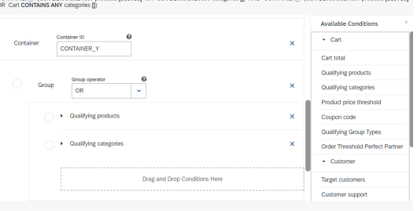
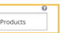
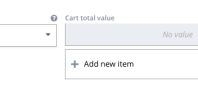
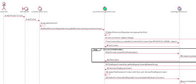
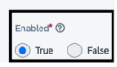

# Promotion Engine

Promotion Engine allows you to create and manage a wide variety of storefront promotions. You create promotions by combining conditions and actions in a drag-and-drop user interface. You can publish promotions individually or combine them into campaigns.

Rule Builder Types of Promotions Conditions and Actions Promotion Templates Promotion Messages Promotion Priority Promotion Rule Groups Storefront Availability

Promotion Modules Promotion Planning View Promotions on a Cart

## Promotion Engine Features

Promotion Engine offers a user interface for creating and managing promotions that run on your storefront. You can create a large number of different promotion types by exibly combining conditions and actions into promotion rules. Promotions can be added to campaigns or published individually.

Rule Builder A promotion rule consists of qualifying cart conditions and the resulting discount or incentive. You create promotion rules by combining conditions and actions in a Backoffice user interface called the Rule Builder.

Types of Promotions Promotion Engine supports a wide variety of promotion types. Learn what kind of promotions you can set up, and which conditions and actions they contain. Conditions and Actions A promotion is a rule that denes one or more qualifying conditions and the resulting discount action or actions. You combine conditions and actions to create promotion rules. Promotion Templates Promotion Engine offers out-of-the-box templates for creating promotions. Each template contains pre-selected conditions and actions. There are 20+ templates available that reect the most common business use cases. Promotion Messages When you create promotions in Promotion Engine, you can create several different types of short messages that appear on the storefront. The messages alert customers to available product promotions or conrm that a promotion is applied to the cart.

Promotion Priority You assign a priority to every promotion rule. The priority is a number that determines the order in which promotions are applied, from highest priority to lowest priority. Promotion Rule Groups Rule groups help you to control which promotion rules apply to a cart. A promotion rule can only belong to one rule group.

Storefront Availability Control the availability of promotions on your storefront by publishing and unpublishing promotions and dening start and end dates for your promotion rules. You can also add promotions to a campaign. Promotion Planning Use Promotion Planning to group promotion rules together into a campaign. You can associate CMS content with the campaign, so that the content appears on the storefront while the campaign is running.

View Promotions on a Cart Promotion Engine allows you to check whether a specic customer cart included any promotions. You can view these details in the Carts area of the Backoffice Administration Cockpit. Marketing Managers The Marketing Manager is a user role in the Backoffice. Marketing managers are able to access the Marketing area of the Backoffice to create and manage promotions. Performance Improvement Set a maximum number of active promotions and their conditions and actions to improve performance.

## Rule Builder

A promotion rule consists of qualifying cart conditions and the resulting discount or incentive. You create promotion rules by combining conditions and actions in a Backoffice user interface called the Rule Builder.

## Use Case

Customers are more likely to complete a purchase if they receive a promotion that incentivizes them to complete their order. Offering promotions can help you to attract and retain customers, boost sales on specic product categories, and increase the average order amount.

Promotion Engine was designed to enable marketers to create and manage a large number of complex promotions. With Promotion Engine, business users create and publish promotions in a Backoffice user interface called the Rule Builder.

## Features

Rule Builder (Drag-and-drop Interface) Promotion Engine enables marketers to create even complex promotion rules easily, by combining conditions and actions with drag-and-drop. For more information, see Creating a Promotion Rule.

Flexible Promotion Creation Promotion Engine supports many different types of promotion rules: percent-off discounts, xed discounts, buy-one-get-one deals, product bundles, and more. For more information, see Types of Promotions. Manage Promotion Rules In the Backoffice, you can create, clone, edit, and delete promotions. In addition, a versioning mechanism enables you to track the changes you make to your promotion rules. Maximum Rule Execution For some types of promotions, you can directly control how many times a customer can take advantage of a promotion in one order. For more information, see Maximum Rule Executions.

This is   For more    the SAP Help  5 Order Entry Consumption Promotion Engine contains a mechanism that ensures that only one product-level promotion can apply to each product in the cart. For more information, see Order Entry Consumption.

## Creating A Promotion Rule

Create a promotion rule in Promotion Engine by dragging and dropping conditions and actions into the rule.

## Context

This topic walks you through creating a promotion rule by manually adding conditions and actions to the rule. When you create a promotion rule manually, you can dene the conditions and actions of the promotion yourself. Alternatively, you can use a promotion template to help you create promotion rules more quickly. A template contains preselected conditions and actions. View a list of available templates here: Promotion Types and Templates. To create a promotion using a template, see: Creating a Promotion Rule from a Template.

## Procedure

1. In the Backoffice, navigate to Marketing Promotion Rules .

A list of available promotion rules appears.

2. Click the + button to create a new promotion rule. 3. In the dialog box, create a code and a name for the new promotion.

| Field   | Description                                                                                                                                                                                                                                                                            |
|---------|----------------------------------------------------------------------------------------------------------------------------------------------------------------------------------------------------------------------------------------------------------------------------------------|
| Code    | Enter any unique code using letters, numbers, spaces, and special characters (for example: Buy €100 get free shipping). Promotion Engine needs a unique code to identify the promotion rule within the engine. Your customers do not see this code. You cannot change this code later. |
| Name    | Enter a name for your promotion that helps you to remember what the promotion rule contains. Your customers do not see this name.                                                                                                                                                      |

4. Click Done.

The new promotion is created and the Rule Properties tab opens.

| 5. Further dene the details of the promotion rule in the Rule Properties tab. Field Description Description This text appears on the storefront on the product detail page when a customer views a product that is eligible for this promotion. Create a text that informs customers that a promotion is available for this product (example: 10% off all running shoes). For more information, see Product Promotion Messages.  Note This eld is only relevant for product promotions. If you are creating a promotion that applies to the entire cart (for example, 10% off your whole order), then this eld does not appear on the storefront. For cart promotions, you can leave this eld blank.Version This read-only eld shows the version number of the promotion. Promotion Engine assigns version numbers to your promotion rules to help you track changes between published versions of a promotion (see Versioning of Promotion Rules). Website Select the website on which the promotion rule is available (mandatory). The promotion is only available on the website in the selected website group. If you leave this eld empty, the promotion rule is not available on any of your websites. For more information, see Promotion Website Groups. Priority Enter a value to dene the priority of the promotion. Promotions are evaluated in order from highest to lowest priority (for example, 500 before 100). For more information, see Promotion Priority. Rule Group Select a rule group (optional). Rule groups allow you to control which promotions apply to the cart. For more information, see Promotion Rule Groups. Maximum Rule Executions Dene the maximum number of times that the promotion can apply to the cart. Cart-level promotions: For promotion actions that apply to the entire cart, enter a value of 1. Product-discount promotions: You do not need to dene a value in the Maximum Rule Executions eld. When Promotion Engine applies a product-discount promotion, it discounts all of the eligible products in the cart on the rst execution of the rule. Partner-product, multi-buy, bundle, and free gift promotions: Use the Maximum Rule Executions eld to limit the number of partnerproducts or bundles that the customer can buy, or the number of free gifts that the customer can get. For more information, see Maximum Rule Executions. Exclude from Storefront Display These buttons control the display of the Description on the product detail page. To display the description on the product details page of relevant products, select False (default value). To hide the description from the product details page of relevant products, select True. You can use this setting if you are creating a personalized promotion that is only visible to certain customers. Campaigns Add the promotion rule to a campaign (optional). For more information, see Promotion Planning.                                                                                      |    |
|--------------------------------------------------------------------------------------|----|
| This is custom documentation. For more information, please visit the SAP Help Portal | 6  |

| Field           | Description                                                                                                                                                                                                                                               |
|-----------------|-----------------------------------------------------------------------------------------------------------------------------------------------------------------------------------------------------------------------------------------------------------|
| Start Date/Time | Select the date and time when the promotion begins and becomes available to customers on the storefront. Hint: For the promotion to be available to customers, it must also have the status Published. For more information, see Storefront Availability. |
| End Date/Time   | Select the date and time when the promotion nishes and is no longer available on the storefront. If you want your promotion to be ongoing (with no end date), leave the End Date/Time eld empty. For more information, see Storefront Availability.       |
| Status          | This read-only eld displays the status of the promotion. When you create a promotion rule, it initially has the status Unpublished. An unpublished rule is not yet available on the storefront. For more information, see Storefront Availability.        |
| Deployments     | Displays the modules where the promotion rule is deployed (for example, on the preview module or the production module).                                                                                                                                  |

6. Click the Conditions & Actions tab to dene the promotion message, conditions, and actions.

| Field      | Description                                                                                                                                                                                                                                                                                                                                                                                                                                                                                                        |
|------------|--------------------------------------------------------------------------------------------------------------------------------------------------------------------------------------------------------------------------------------------------------------------------------------------------------------------------------------------------------------------------------------------------------------------------------------------------------------------------------------------------------------------|
| Message    | Enter the conrmation message that your customers see when the promotion is successfully applied to the cart. This message appears on the cart checkout page. You can also insert details from the promotion rule into the message using a placeholder that references the ID number of an element of your promotion. You can insert any details from the promotion, whether from the condition or in the action. Every element in your promotion rule has a unique ID number. To nd the ID, mouse over the ? symbol of the eld you want to reference. The ID appears in the tool-tip popup. Add the ID to the promotion message in curly brackets (for example, "Coupon {5b438fb1-6548-448f-acba0ccff49021ef} applied"). When the promotion message displays on the storefront, the placeholder is replaced with the information in the promotion rule. For more information, see Applied Promotion Messages.                                                                                                                                                                                                                                                                                                                                                                                                                                                                                                                    |
| Conditions | This area denes the criteria that a cart or customer must fulll to participate in the promotion. Drag and drop the conditions you want from the Available Conditions menu into the eld that says Drag and Drop Conditions Here. Expand each condition to dene its specic parameters. For a description of all available conditions, see Conditions.  Note A rule can contain multiple conditions. By default, the conditions are combined with AND. To combine conditions with OR, add the conditions to a Group. |
| Actions    | This area denes the discount or incentive that you offer to qualifying customers. Drag and drop the actions you want from the Available Actions menu into the eld that says Drag and Drop Actions Here. Expand each action to dene its specic parameters. To create a more complex rule, you can add more than one action. Actions are always combined with AND. For a list of all available actions, see Actions.                                                                                                 |

7. Click Save to save your changes.

Your promotion rule is now saved, but still has the status Unpublished.

 Note For the promotion to be available on the storefront, it must have the status Published. For instructions, see Publishing a Promotion Rule.

Related Information Conditions Actions Publishing a Promotion Rule Storefront Availability Promotion Priority Promotion Rule Groups Applied Promotion Messages

## Group Conditions With And Or Or

When you create a promotion rule in Promotion Engine, you can group conditions together and change the logical operator between them (AND / OR).

Context You can add multiple conditions to a promotion rule. By default, conditions are combined with the operator AND. If you use a group, you can change this logic to OR.

Procedure 1. In the Backoffice Administration Cockpit, navigate to Marketing Promotion Rules .

2. Open and edit an existing promotion rule, or create a new promotion rule. 3. Click the Conditions & Actions tab to dene the conditions and actions of the rule. 4. In the Available Conditions menu, from the General Conditions category, drag and drop a Group element in the Conditions area of the promotion rule. 5. Add conditions to the group. 6. From the Group Operator drop-down list, select the operator (AND or OR).

The following example shows you two conditions combined with OR:

7. Click Save.

## Cloning A Promotion Rule

You can clone a promotion rule in Promotion Engine. The clone is a copy of the original rule and has the same conditions, actions, and other details.

Procedure 1. Log on to the Backoffice Administration Cockpit and navigate to Marketing Promotion Rules .

A list of available promotion rules appears.

2. Click to select the rule you want to clone. Click the Clone Promotion Rule button.

3. In the dialog box, create a unique Code. Enter any unique code using letters, numbers, spaces, and special characters. Promotion Engine needs a unique code to identify the promotion rule within the engine. Your customers do not see this code. You cannot change this code later.

4. Click Save.

The promotion rule is cloned. The cloned promotion rule has the code that you created and the same name, description, message, rule group, website, conditions, actions, and other details as the original rule. The cloned rule has the status unpublished.

 Note For the promotion to be available on the storefront, it must have the status Published. For instructions, see Publishing a Promotion Rule.

## Editing A Published Promotion Rule

In Promotion Engine, you can edit a promotion rule at any time to add new actions and conditions or change its details.

Context Note When you edit a published rule, the Promotion Engine creates a new version of the rule. This new version is not automatically published. To update the promotion on the storefront, you must publish the new version. When you publish the new version, the existing version is replaced with the new version.

Procedure 1. Log on to the Backoffice and navigate to Marketing Promotion Rules .

This is   For more    the SAP Help  8 A list of available promotion rules appears.

2. Click to select a published promotion rule that you want to edit.

The promotion opens to the Rule Properties tab.

3. Make the changes you want. You can edit any part of the promotion rule (including the conditions and actions) except the Code. (After a promotion rule has been created, you can no longer change the code.)
4. Click Save to save your changes.

Promotion Engine creates a new version of your rule.

5. Publish the new version of the promotion rule. For instructions, see Publishing a Promotion Rule.

The new version of the promotion rule is available on the storefront.

Related Information Versioning of Promotion Rules Publishing a Promotion Rule

## Deleting A Promotion Rule

You can delete a promotion rule in Promotion Engine.

Context In Promotion Engine, you can delete promotion rules that you no longer need. Deletion is permanent. You cannot restore a deleted rule.

 Note You can only delete rules that are not published.

Procedure 1. Log on to the Backoffice Administration Cockpit and navigate to Marketing Promotion Rules .

A list of available promotion rules appears.

2. Click to select the rule you want to delete. Click the Delete button.

Delete a single promotion rule You can also select multiple promotion rules and delete all of the selected rules at once.

| Multi-select promotion rules to delete multiple rules at once   |
|-----------------------------------------------------------------|

3. In the conrmation dialog, click Yes to conrm that you want to delete the promotion rule.

The promotion rule is deleted.

 Note You can only delete promotion rules that are in an inactive or unpublished status. If you want to delete published rules, you must rst unpublish them.

This is   For more    the SAP Help  9

## Versioning Of Promotion Rules

Promotion Engine assigns version numbers to your promotion rules to help you keep track of changes between published versions of a promotion.

In Promotion Engine, versioning allows you to track the changes that you make to your promotion rules. Versioning also allows you to edit published versions of a promotion rule without immediately affecting the promotion on the storefront. Once you have nished editing a published promotion rule, you can publish the new version to the storefront.

Implementation Keep the following principles in mind regarding versions in Promotion Engine:
When you create a promotion rule, the promotion has the version number 0. The version number remains 0 even after you publish the promotion rule. When you edit a published promotion rule for the rst time, the new version of the promotion rule has version number 1. You can only edit the latest version of a promotion rule. Any time you edit a published promotion rule, Promotion Engine creates a new version of that rule. The new version is not automatically published to the storefront. Any time you create a new version of a promotion rule, you must publish the new version for the changes to take effect on the storefront. You can publish different versions of a promotion rule to different modules. You cannot revert to an earlier version of a promotion rule. However, you can republish an inactive earlier version of a rule at any time.

Related Information Rule Builder Rule Statuses Publishing a Promotion Rule Editing a Published Promotion Rule

## Maximum Rule Executions

In a promotion rule, the Maximum Rule Executions eld limits the number of times that promotions apply to the cart. However, this eld is not relevant for all types of promotions. When you create a promotion, you can dene the maximum number of times the promotion can apply to the cart. This eld is only relevant for certain types of promotion actions.

The following table tells you how to set the correct value for different types of promotions.

The effect of the Maximum Rule Executions eld on the cart depends on the action in your promotion rule.

Setting Maximum Rule Executions for Different Promotion Types

| Type of Promotion                                                                                                                                                                                                                                                                                          | Recommended Maximum Rule Executions Value                                                                                                                                                                                                                                                                                                                                                                                                                                                                                                                                                                                                                                                                                                                                                                                                                    |
|------------------------------------------------------------------------------------------------------------------------------------------------------------------------------------------------------------------------------------------------------------------------------------------------------------|--------------------------------------------------------------------------------------------------------------------------------------------------------------------------------------------------------------------------------------------------------------------------------------------------------------------------------------------------------------------------------------------------------------------------------------------------------------------------------------------------------------------------------------------------------------------------------------------------------------------------------------------------------------------------------------------------------------------------------------------------------------------------------------------------------------------------------------------------------------|
| Cart-discount promotions                                                                                                                                                                                                                                                                                   | Set the Maximum Rule Executions to 1 to ensure that a cart-level discount only applies one time. If you set a Maximum Rule Executions value greater than one, Promotion Engine applies the promotion repeatedly. Example: You create the following promotion: "Spend $200, get 20% off." If you set a Maximum Rule Executions value of 5, Promotion Engine applies the 20% discount ve times successively or until the cart total goes below the $200 threshold—whichever comes rst.                                                                                                                                                                                                                                                                                                                                                                         |
| Product-discount promotions Specically, this means promotions with the following actions: Fixed discount on products Percentage discount on products Target xed price on products Specically, this means promotions with the following actions: Percentage discount on the cart Fixed discount on the cart | For product-discount promotions, you do not need to dene a value in the Maximum Rule Executions eld. You can leave the eld empty. If you do enter a value, the value has no effect. When Promotion Engine applies a product-discount promotion, it discounts all of the eligible products in the cart on the rst execution of the rule. All products in the cart that qualify for the promotion are discounted in this single execution. As a result, no further executions of the promotion rule are possible or necessary. Example: You create the following promotion: "10% off all digital cameras." When Promotion Engine applies this rule to the cart, it discounts all of the digital cameras that it nds in the cart.  Note With these promotion actions, you cannot limit the number of products that a customer can buy at the discounted price. |

| 7/12/2024 Type of Promotion                                                                                                                                                                                                                       | Recommended Maximum Rule Executions Value                                                                                                                                                                                                                                                                                                                                                                                                                                                                                                                                                                                                                                                                                                                                                                                        |
|---------------------------------------------------------------------------------------------------------------------------------------------------------------------------------------------------------------------------------------------------|----------------------------------------------------------------------------------------------------------------------------------------------------------------------------------------------------------------------------------------------------------------------------------------------------------------------------------------------------------------------------------------------------------------------------------------------------------------------------------------------------------------------------------------------------------------------------------------------------------------------------------------------------------------------------------------------------------------------------------------------------------------------------------------------------------------------------------|
| Partner-product promotions, multi-buy promotions, and bundle promotions                                                                                                                                                                           | In partner-product and bundle promotions, the Maximum Rule Executions eld denes the maximum number of partner-sets or bundles that the customer can buy. You can use this eld to limit the number of bundles or products sets that the customer can buy at the discounted price. Example: You create the following bundle promotion: "Buy one X and one Y for $100." If you enter a Maximum Rule Executions value of 5, the customer can buy up to ve bundles. The sixth and later sets of X and Y are no longer discounted.                                                                                                                                                                                                                                                                                                     |
| Specically, this means promotions with the following actions: Fixed discount on partner products Percentage discount on partner products Target xed price on partner products Target bundle price (used for both multi-buy and bundle promotions) |  Note If you leave the Maximum Rule Executions eld empty or dene a value of 0, then Promotion Engine allows the promotion to execute up to the default maximum number of times, which is 1000.                                                                                                                                                                                                                                                                                                                                                                                                                                                                                                                                                                                                                                  |
| Free gift promotions                                                                                                                                                                                                                              | In a free gift promotion, the Maximum Rule Executions eld denes the maximum number of times that the promotion executes and adds a free gift to the cart. Example 1: You create the following promotion rule: "Buy any digital camera, get a memory card for free." You set the maximum rule executions to 2. If the customer buys two digital cameras, then two free memory cards are automatically added to the cart. If the customer adds a third digital camera to the cart, no further free memory cards are added. Example 2: You create the following promotion rule: "Spend $200 or more, get a memory card for free." In this case, set the maximum rule executions to 1 so that only one memory card is added to the cart. (If you set the MRE to 2, if the cart total is over $200, then two memory cards are added.) |
| Subset of cart promotions Specically, this means promotions with the following actions: Fixed discount on subset products Percentage discount on subset products Specically, this means promotions with the following actions: Free gift          | For the xed discount on subset products, you do not need to dene a value in the Maximum Rule Executions eld. You can leave the eld empty. If you do enter a value, the value has no effect. For the percentage discount on subset products with the condition of full or partial overlap between qualifying product container and target product container, it's recommended to set a smaller value in the Maximum Rule Executions eld to avoid the greater discounts.                                                                                                                                                                                                                                                                                                                                                           |
| Promotions with the following actions: Trigger Rule Message Free coupon Halt rule execution Change delivery mode                                                                                                                                  | Maximum rule executions are not relevant for these types of promotions, as these only execute one time. You do not need to dene a value in the Maximum Rule Executions eld. You can leave the eld empty.                                                                                                                                                                                                                                                                                                                                                                                                                                                                                                                                                                                                                         |

Related Information Types of Promotions

## Order Entry Consumption

Promotion Engine only allows one product-level promotion to apply to any product in the cart. This restriction prevents products from being discounted repeatedly. Keep this rule in mind when you set the priority of product-level promotions.

## Use Case

Customers want to receive the highest-available discount on their products. As a marketer, however, you need to prevent multiple promotions from discounting a product, as this could produce an undesirably low product price.

Promotion Engine contains a mechanism that ensures that only one product-level promotion can apply to each product in the cart. When a promotion applies to a product, the promotion "consumes" that product. Once a product is consumed, no further product promotions can apply to that product.

If a product is eligible for multiple promotions, promotion priority determines which promotion applies. Once the product is consumed by a promotion, no lower-priority promotions apply to the product. Therefore, keep order entry consumption in mind when you set the priority of your product promotions.

Relevance of Order Entry Consumption for Different Types of Promotions

| Type of Promotion                                                                                                                                     | Effect of Order Entry Consumption                                                                                                                                                                                                                                                                                                                                                                                                                                                                                                                                                                                                    |
|-------------------------------------------------------------------------------------------------------------------------------------------------------|--------------------------------------------------------------------------------------------------------------------------------------------------------------------------------------------------------------------------------------------------------------------------------------------------------------------------------------------------------------------------------------------------------------------------------------------------------------------------------------------------------------------------------------------------------------------------------------------------------------------------------------|
| Product-discount promotions                                                                                                                           | In the event that a product in the cart is eligible for multiple product-level promotions, only the promotion with the highest priority applies. After that, the product is consumed and is not eligible for further discounts. Example: You offer two product-level promotions: "All digital cameras 20% off" (priority 300) and "All Sony brand items 15% off" (priority 200). A customer cart contains a Sony digital camera that qualies for both promotions. However, due to order entry consumption, one only promotion applies. The camera is therefore discounted by 20%, because the rst promotion has the higher priority. |
| Specically, this means promotions with the following actions: Fixed discount on products Percentage discount on products Target xed price on products |                                                                                                                                                                                                                                                                                                                                                                                                                                                                                                                                                                                                                                      |

This is   For more    the SAP Help  11

| 7/12/2024 Type of Promotion                                                                                                                                                                                                                                                | Effect of Order Entry Consumption                                                                                                                                                                                                                                                                                                                                                                                                                                                                                                                                                                                                                                                                                                                                                                                     |
|----------------------------------------------------------------------------------------------------------------------------------------------------------------------------------------------------------------------------------------------------------------------------|-----------------------------------------------------------------------------------------------------------------------------------------------------------------------------------------------------------------------------------------------------------------------------------------------------------------------------------------------------------------------------------------------------------------------------------------------------------------------------------------------------------------------------------------------------------------------------------------------------------------------------------------------------------------------------------------------------------------------------------------------------------------------------------------------------------------------|
| Partner-product promotions                                                                                                                                                                                                                                                 | In the case of partner-product promotions, the promotion consumes both the qualifying products and the target products. After the partner-product promotion res on the cart, neither the qualifying products nor the target products can be discounted by any further product-level promotions. This ensures that customers must pay full price for the qualifying products. (For example, a customer cannot get a 50% discount on a product Y, then use product Y to get 25% off product Z). As you see in the examples, priority plays a deciding role in determining whether products are eligible for partnerproduct promotions:                                                                                                                                                                                                                                                                                                                                                                                                                                                                                                                                                                                                                                                                                                                                                                                                                       |
| Specically, this means promotions with the following actions: Fixed discount on partner products Percentage discount on partner products                                                                                                                                   | Example 1: You offer a partner-product promotion "Buy X, get Y free" (priority 300) and a second product promotion, "All X 50% off" (priority 200). A customer cart contains one X and one Y. The partner-product discount res rst (based on priority) and applies to the X and the Y in the cart. The second promotion does not discount X, because X was already consumed by the rst promotion. Example 2: You offer a product promotion "10% off all products A" (priority 500) and a partner-product promotion "Buy A, get B for 10% off" (priority 100). A customer cart contains one A and one B. The 10% discount on product A res rst (based on priority). The cart no longer qualies for the partner-product promotion, because product A has already been consumed. Therefore, product B is not discounted. |
| Bundle and multi-buy promotions Specically, this means promotions with the following actions: Target bundle price (used for both multi-buy and bundle promotions) Target xed price on partner products Target bundle price (used for both multi-buy and bundle promotions) | When a bundle promotion applies to products, the promotion consumes all of the products in the bundle. After the bundle promotion res on the cart, none of the products in the bundle can be discounted any further. Likewise, if products in the cart are already discounted by a higher-priority promotion, then they are no longer eligible to be included in a bundle.                                                                                                                                                                                                                                                                                                                                                                                                                                            |
| Free gift promotions                                                                                                                                                                                                                                                       | The Free gift promotion consumes the free gift, as well as any qualifying products you dened in the action.                                                                                                                                                                                                                                                                                                                                                                                                                                                                                                                                                                                                                                                                                                           |
| Specically, this means promotions with the following actions: Free gift Cart-discount promotions                                                                                                                                                                           | Order Entry Consumption does not affect cart-level promotions (for example, "10% off your order" or "20% off any purchase over $100"). There is no inherent restriction on the number of different cart-level promotions that can apply to the cart. Example: if a customer has a coupon for 10% off the order and your webshop also offers 15% off all orders over the weekend, then the customer cart is discounted twice. To prevent multiple cart-level promotions from applying to the cart, add all of the cart-level promotions to an exclusive rule group.                                                                                                                                                                                                                                                    |
| Specically, this means promotions with the following actions: Percentage discount on the cart Fixed discount on the cart                                                                                                                                                   |                                                                                                                                                                                                                                                                                                                                                                                                                                                                                                                                                                                                                                                                                                                                                                                                                       |

Related Information Disabling Order Entry Consumption

## Types Of Promotions

Promotion Engine supports a wide variety of promotion types. Learn what kind of promotions you can set up, and which conditions and actions they contain.

Use Case Promotion Engine supports many different types of promotion rules: percent-off discounts, xed discounts, buy-one-get-one deals, product bundles, coupon, personalized promotions, and more. You create promotions by exibly combining conditions and actions, which allows you to create promotions for almost any business use case.

Features Cart, Product, and Customer Promotions The supported promotion types fall into three basic categories:
Cart: Cart promotions offer a discount on the entire cart - for example, a percentage or xed discount on the entire order.

Product: Product promotions offer a discount on specic products or a specic category of products. This category also includes partner-product promotions and bundles. Customer: Customer promotions include personalized promotions, target group promotions, and promotions offered during active ASM support sessions.

Setup Guides for Common Promotion Types For the most common promotion types, you can consult detailed setup guides. Screenshots and step-by-step instructions walk you through setting up specic promotion types. Custom Promotion Types You can create custom conditions and actions to create bespoke promotions that are not included out of the box. For more information, see Promotion Engine Trail.

## Promotion Types And Templates

Promotion Engine supports a very wide variety of promotion types. For most promotion types, a template is available that contains pre-selected conditions and actions.

Cart Promotions (Order Threshold)
This is   For more    the SAP Help  12 These promotions offer customers a discount or award when their cart reaches a minimum order threshold. When the cart reaches a minimum spend amount, the customer receives a discount or incentive. The offered discount can be a percentage discount off the cart total, a free coupon, a free gift, or another incentive that you dene.

| receives a discount or incentive. The offered discount can be a percentage discount off the cart total, a free coupon, a free gift, or another incentive that you dene. Promotion Template Description Conditions Actions Order threshold percentage discount on When customers add a minimum amount to cart the cart, they get a percentage discount on their order. Example: Spend €200, get 20% off Cart total Percentage discount on cart Order threshold xed discount on cart When customers add a minimum amount to the cart, they get a xed discount on their order. Example: Spend €200, get €25 off Cart total Fixed discount on cart Order threshold percentage discount on When customers add a minimum amount to products the cart, they get a percentage discount on specic products in the cart. Example: Spend €200, get 20% off all memory cards Percentage discount on products Cart Total Qualifying Products or Qualifying Categories Order threshold free coupon When customers add a minimum amount to the cart, they get a free coupon that they can use on the next order. The customer gets the free coupon after checkout. Example: Spend €200, get a coupon for 20% off your next order Cart total Free coupon Order threshold free gift When customers add a minimum amount to the cart, they get a free gift. The free gift appears in the cart automatically. Example: Spend €200, get a free roll of lm. Cart total Free gift   |
|---------------------------------------------------------------------------------------------------------------------------------------------------------------------------------------------------------------------------------------------------------------------------------------------------------------------------------------------------------------------------------------------------------------------------------------------------------------------------------------------------------------------------------------------------------------------------------------------------------------------------------------------------------------------------------------------------------------------------------------------------------------------------------------------------------------------------------------------------------------------------------------------------------------------------------------------------------------------------------------------------------------------------------------------------------------------------------------------------------------------------------------------------------------------------------------------------------------------------------------------------------------------------------------------------------------------------------------------------------------------------------------------------------------------------------------------------------------|

Product Promotions These promotions offer selected products for a discounted price. You can select the discounted products individually, or you can offer a discount on an entire category of products.

| Template Name               | Description                                                                                     | Conditions          | Actions                         |
|-----------------------------|-------------------------------------------------------------------------------------------------|---------------------|---------------------------------|
| Product percentage discount | Customers get selected products with a percentage discount. Example: 25% off all cameras        | Qualifying Products | Percentage discount on products |
| or Qualifying Categories    |                                                                                                 |                     |                                 |
| Product xed discount        | Customers get selected products with a xed discount. Example: All memory cards are $5 off       | Qualifying Products | Fixed discount on products      |
| or Qualifying Categories    |                                                                                                 |                     |                                 |
| Product xed price           | Customers get selected products for a xed price. Example: All charging cables are only €10 each | Qualifying Products | Target xed price on products    |
| or Qualifying Categories    |                                                                                                 |                     |                                 |

Bundle Promotions Bundle promotions offer a dened set of products for a xed price.

 Note SAP Commerce also offers a Bundling module that allows you to offer products as a package. For more information, see Bundling.

| Template Name                             | Description                                                                                                                                                         | Conditions                           | Actions             |
|-------------------------------------------|---------------------------------------------------------------------------------------------------------------------------------------------------------------------|--------------------------------------|---------------------|
| Product multi-buy xed price               | Customers can buy a dened number of the same or similar products for a special bundle price. Examples: Buy any 3 lm rolls for $10 Buy any 2 charging cables for $50 | One Container element that denes the | Target bundle price |
| qualifying products or product categories |                                                                                                                                                                     |                                      |                     |

Product bundle xed price Customers can buy a specic combination of

different products for a special bundle price.

Example: Buy one X, one Y, and one Z for a bundle price of €1000

| Template Name                                                                                                   | Description                           | Conditions          | Actions   |
|-----------------------------------------------------------------------------------------------------------------|---------------------------------------|---------------------|-----------|
| different products for a special bundle price. Example: Buy one X, one Y, and one Z for a bundle price of €1000 | Multiple Container elements that dene | Target bundle price |           |
| qualifying products or product categories.                                                                      |                                       |                     |           |

## Partner-Product Promotions

In a partner-product promotion, customers buy one product at full price and get a second product (the "partner promotion") for a discounted price. Buy-one-get-one, 3-for-2, and related deals are examples of this type of promotion.

## Note

These promotions require Container elements that dene the products in the Conditions area. Inside each container is one or more of the following: Qualifying Products or Qualifying Categories.

Coupon Promotions

| Template Name                                                                                                                                                                     | Description                                                                                                                                                                                                                                                                                                        | Conditions                              | Actions   |
|-----------------------------------------------------------------------------------------------------------------------------------------------------------------------------------|--------------------------------------------------------------------------------------------------------------------------------------------------------------------------------------------------------------------------------------------------------------------------------------------------------------------|-----------------------------------------|-----------|
| Buy X, Get Y Free                                                                                                                                                                 | Customers buy one or more products at full price, and get one or more products for free. The free product can be the same product (buy one X, get a second X free) or a different product (buy X, get Y free). Examples: Buy one memory card, get a second memory card free. Buy a camera, get a memory card free. | Percentage discount on partner products |           |
| One or more Container elements specifying the full-price products or product categories. One or more Container elements specifying the free products or product categories.       |                                                                                                                                                                                                                                                                                                                    |                                         |           |
| Product perfect partner percentage                                                                                                                                                | Customers buy one or more products at full                                                                                                                                                                                                                                                                         |                                         |           |
| discount                                                                                                                                                                          | price, and get one or more different products at a discounted price (the "partner product"). Example: Buy a camera, get a memory card 50% off. You can adapt this template to create more complex promotions: Examples: Buy X and Y, get Z at 50% off. Buy 2 X and 2 Y and get Z at 50% off.                       | Percentage discount on partner products |           |
| One or more Container elements specifying the full-price products or product categories One or more Container elements specifying the discounted products or product categories   |                                                                                                                                                                                                                                                                                                                    |                                         |           |
| Product perfect partner xed price                                                                                                                                                 | Customers can buy one product and get a second product (the "partner product") for a xed, discounted price. Example: Buy a camera, get a memory card for only €20.                                                                                                                                                 | Target xed price on partner products    |           |
| One or more Container elements specifying the full-price products or product categories. One or more Container elements specifying the discounted products or product categories. |                                                                                                                                                                                                                                                                                                                    |                                         |           |

The promotions in this category offer customers a discount when they enter a valid coupon code during checkout. The discount can be a percentage discount on the cart, a xed discount on the cart, a discount on certain products, or another discount or award.

Before you set up these promotions, rst create and active a coupon in the Coupons module.

| Template Name                   | Description                                                                                                                                                                        | Conditions   | Actions                     |
|---------------------------------|------------------------------------------------------------------------------------------------------------------------------------------------------------------------------------|--------------|-----------------------------|
| Coupon code percentage discount | When customers enter a valid coupon code, they get a percentage discount on their order. Example: Apply coupon SUMMER15 for an extra 15% off your order                            | Coupon code  | Percentage discount on cart |
| Coupon code xed discount        | When customers enter a valid coupon code, they get a xed discount (for example, dollar or euro amount) on their order. Example: Apply coupon BLACKFRIDAY to get €25 off your order | Coupon code  | Fixed discount on cart      |

| 7/12/2024 Template Name                                  | Description                                                                                                                                                                                                                             | Conditions                      | Actions   |
|----------------------------------------------------------|-----------------------------------------------------------------------------------------------------------------------------------------------------------------------------------------------------------------------------------------|---------------------------------|-----------|
| Coupon code free gift with order threshold               | When customers enter a valid coupon code and reach a minimum order amount, they get a free gift. The free gift is added to the cart automatically. Example: Spend €200 and apply coupon HOLIDAY_GIFT to get a free gift with your order | Free gift                       |           |
| Coupon code Cart total                                   |                                                                                                                                                                                                                                         |                                 |           |
| Coupon code percentage discount on                       | When customers enter a valid coupon code,                                                                                                                                                                                               |                                 |           |
| products                                                 | they get a percentage discount on selected products. Example: Apply coupon SHORTS20 for an extra 20% off all pairs of shorts                                                                                                            | Percentage discount on products |           |
| Coupon code Qualifying categories or Qualifying products |                                                                                                                                                                                                                                         |                                 |           |

Customer Support Promotions Use the promotions in this category that enables a special discount when a customer support agent is currently helping a customer.

| Template Name                                                       | Description                                                                                                                                                                                                      | Conditions                      | Actions   |
|---------------------------------------------------------------------|------------------------------------------------------------------------------------------------------------------------------------------------------------------------------------------------------------------|---------------------------------|-----------|
| Customer support agent percentage                                   | When a customer support agent is helping a                                                                                                                                                                       |                                 |           |
| discount on products                                                | customer, the agent can offer the customer a percentage discount on products. This promotion is only valid for the duration of the support session. Example: 10% off the order during a customer support session | Percentage discount on products |           |
| Customer support agent Qualifying categories OR Qualifying products |                                                                                                                                                                                                                  |                                 |           |

Target Customer Group Promotions Use these templates to create promotions that are aimed at customers in a specic target group.

| Template Name                           | Description                                  | Conditions             | Actions                     |
|-----------------------------------------|----------------------------------------------|------------------------|-----------------------------|
| Customer-specic percentage discount     | Customers in a target group get a percentage | Target customers       | Percentage discount on cart |
| discount on their order.                |                                              |                        |                             |
| Customer-specic xed price discount with | When customers in a target group spend a     |                        |                             |
| order threshold                         | minimum amount, they get a xed discount on   | Target customers       |                             |
| their order.                            | Cart total                                   | Fixed discount on cart |                             |

## Order Threshold Promotion

Create a promotion where customers must spend a minimum amount in order to qualify for a promotion. Examples: "Spend €500 or more, get €50 off" or "Spend €50 or more, get a free gift."
Offer customers a discount or incentive when the cart total reaches a minimum threshold. The offered discount can be a percentage discount off the cart total, a free coupon, a free gift, or another incentive that you dene. The following table shows the conditions and actions that you need to create different types of order threshold promotions, and whether there is a template available for you to use:

| Type of Promotion                                                                    | Description                                                                                                                                                                                                                  | Condition              | Action                               | Available Template                          |
|--------------------------------------------------------------------------------------|------------------------------------------------------------------------------------------------------------------------------------------------------------------------------------------------------------------------------|------------------------|--------------------------------------|---------------------------------------------|
| Order threshold - percentage                                                         | When customers add a minimum                                                                                                                                                                                                 |                        |                                      |                                             |
| discount on cart                                                                     | amount to the cart, they get a percentage discount on their order. Example: Spend €200, get 20% off                                                                                                                          | Cart total             | Percentage discount on cart          | Order threshold percentage discount on cart |
| Order threshold - xed discount                                                       | When customers add a minimum                                                                                                                                                                                                 |                        |                                      |                                             |
| on cart                                                                              | amount to the cart, they get a xed discount on their order. Example: Spend €200, get €25 off                                                                                                                                 | Fixed discount on cart | Order threshold xed discount on cart |                                             |
| Order threshold - free coupon                                                        | When customers add a minimum amount to the cart, they get a free coupon that they can use on the next order. The customer gets the free coupon after checkout. Example: Spend €200, get a coupon for 20% off your next order | Free coupon            | Order threshold free coupon          |                                             |
| This is custom documentation. For more information, please visit the SAP Help Portal | 15                                                                                                                                                                                                                           |                        |                                      |                                             |

| Type of Promotion           | Description                                                                                                                                                         | Condition   | Action                                     | Available Template   |
|-----------------------------|---------------------------------------------------------------------------------------------------------------------------------------------------------------------|-------------|--------------------------------------------|----------------------|
| Order threshold - free gift | When customers add a minimum amount to the cart, they get a free gift. The free gift appears in the cart automatically. Example: Spend €200, get a free roll of lm. | Free gift   | Coupon code free gift with order threshold |                      |

Example The following screenshot shows an example of an order threshold promotion: Customers spend €100 or more and get a 10% discount on the cart.

## Creating An Order Threshold Promotion

Create a promotion where customers must spend a minimum amount in order to qualify for a promotion. Once the cart reaches that amount, the customer gets a dened discount or incentive. Examples: Spend €500 to get €50 off; Spend €50 to get a free gift.

Prerequisites If necessary, read the general directions for creating promotions. See Creating a Promotion Rule.

Procedure 1. In the Backoffice, navigate to Marketing Promotion Rules .

2. Click the + button to create a new promotion rule. 3. On the Rule Properties tab, dene the details of the promotion. If you need help with the elds on this tab, see Creating a Promotion Rule.

 Note Set the Maximum Rule Executions to 1 to ensure that a cart-level discount only applies one time. See Maximum Rule Executions.

4. Switch to the Condition & Actions tab.

5. In the Message eld, enter a short text that customers see on the cart checkout page when the promotion applies. For more information, see Applied Promotion Messages.

6. In the Conditions area, open the Available Conditions menu. Drag and drop the following condition into your promotion rule: Cart total.

| Field    | Description                                                                                                                                                                                                                                  |
|----------|----------------------------------------------------------------------------------------------------------------------------------------------------------------------------------------------------------------------------------------------|
| Operator | Use this eld to select how the cart total is evaluated. The default value is >=, which means that the cart total must be greater than or equal to the specied Cart total value. (Example: the total value of the cart must be €200 or more). |

This is   For more    the SAP Help  16

| Field            | Description                                                                                                                                                                                                                                                                                                                                                                                                                              |
|------------------|------------------------------------------------------------------------------------------------------------------------------------------------------------------------------------------------------------------------------------------------------------------------------------------------------------------------------------------------------------------------------------------------------------------------------------------|
| Cart total value | Use this eld to dene the minimum order value required to qualify for the promotion. Click + Add new item. Two input elds appear. First eld: Select the currency. Second eld: Enter the minimum amount that must be in the cart for the promotion to apply. If you want to dene different values for different currencies, click + Add new item again. Select an additional currency and enter the minimum order amount in that currency. |

7. In the Actions area, open the Available Actions menu. Drag and drop the desired action into the promotion rule. The action denes the discount or incentive that the customer receives for spending the minimum amount.

Here are some actions that offer appropriate discounts or incentives for this promotion:
Percentage discount on cart: If the cart reaches the minimum total order amount, the customer gets a percentage discount on the entire order. Example: Spend
$200 or more, get 10% off your order. See Percentage Discount on Cart. Fixed discount on cart: If the cart reaches the minimum total order amount, the customer gets a xed-amount discount on the order. Example: Spend $200 or more, get $30 off your order. See Fixed Discount on Cart. Free coupon: If the cart reaches the minimum total order amount, the customer gets a free coupon to use on a future order. Example: Spend $200 or more, get a coupon for 25% off your next order. See Free Coupon. Free gift: If the cart reaches the minimum total order amount, the customer gets a free gift with the order. The free gift appears in the cart automatically. Example:
Spend $200 or more, get a free memory card. See Free Gift.

8. Click Save. 9. Publish the promotion rule. For instructions, see Publishing a Promotion Rule.

The promotion rule is published and will be available on your storefront between the start and end dates of the promotion.

## Related Information

Creating a Promotion Rule Promotion Types and Templates Creating a Promotion Rule from a Template

## Product Promotion

Create a promotion that offers a discount on selected products or product categories. The discount can be a percentage, a xed discount, or a xed sale price. Examples: "$5 off all memory cards," "25% off all digita cameras," "$15 off product V287."
Create one of these promotions to offer selected products at a discounted price.

| Type of Promotion                                                                                                               | Description                                                                                         | Condition                    | Action                          | Template                    |
|---------------------------------------------------------------------------------------------------------------------------------|-----------------------------------------------------------------------------------------------------|------------------------------|---------------------------------|-----------------------------|
| Percentage discount on products                                                                                                 | Customers can buy selected products with a percentage discount. Example: 25% off all cameras        | One of the following:        | Percentage discount on products | Product percentage discount |
| Qualifying Products to select products individually Qualifying Categories to offer a discount on an entire category of products |                                                                                                     |                              |                                 |                             |
| Fixed discount on products                                                                                                      | Customers can buy selected products with a xed discount. Example: All memory cards are $5 off       | Fixed discount on products   | Product xed discount            |                             |
| Fixed price for products                                                                                                        | Customers can buy selected products for a xed price. Example: All charging cables are only €10 each | Target xed price on products | Product xed price               |                             |

 Note With the promotion rule described here, you cannot limit the number of products that a customer can buy at the discounted price. If, for example, you want to limit a customer to buying only 3 of a discounted product, you must set up a promotion rule with containers. For this scenario, see Creating a Product Promotion with Limited Quantities.

## Example

The following screenshot shows an example product promotion: "Any products in the selected category are 15% off."

## Creating A Product Promotion

Create a promotion that offers a sale on selected products. The discount can be a percentage, a xed discount, or a xed sale price.

Prerequisites If necessary, read the general directions for creating promotions. See Creating a Promotion Rule.

Procedure 1. Create a promotion rule. On the Rule Properties tab, dene the details of the promotion. If you need help with the elds on this tab, see Creating a Promotion Rule.

 Note For product-discount promotions, you do not need to dene a value in the Maximum Rule Executions eld. You can leave the eld empty. When Promotion Engine applies a product-discount promotion, it discounts all of the eligible products in the cart on the rst execution of the rule. As a result, no further executions of the promotion rule are possible or necessary.

2. Switch to the Condition & Actions tab. 3. In the Message eld, enter a short text that customers see on the cart checkout page when the promotion applies to the cart. For more information, see Applied Promotion Messages.

4. In the Conditions area, open the Available Conditions menu. Drag and drop one of the following conditions into your promotion rule: Qualifying Products or Qualifying Categories. This condition denes the products or product categories offered at a discounted price.

If you added a Qualifying Products condition, dene the elds as follows:

| Field                      | Description                                                                                                                                                                                                                                                                                                                                                                                                 |
|----------------------------|-------------------------------------------------------------------------------------------------------------------------------------------------------------------------------------------------------------------------------------------------------------------------------------------------------------------------------------------------------------------------------------------------------------|
| Operator                   | Select how the quantity of line items in the cart is compared to the value dened in the Quantity per order entry eld.  Note In almost all use cases, this operator is >=. This allows the customer to buy more than one of the specic products in the promotion, but does not require a line item quantity of greater than 1.                                                                              |
| Quantity per order entry   | Dene the required quantity for each line item in the cart.  Note In almost all use cases, this eld has a value of 1. If you enter a value greater than 1 in this eld, then customer cart must contain a quantity greater than 1 of the selected products. Example: A promotion offers 20% off all digital cameras. If the Quantity per order entry is 2, the customer must buy 2 of the exact same camera. |
| Product selection operator | Select whether the condition includes any, includes all, or excludes the dened products.                                                                                                                                                                                                                                                                                                                    |
| Catalog version            | Select a catalog to narrow down the products displayed in the Products eld. This is a lter eld only.                                                                                                                                                                                                                                                                                                        |
| Products                   | Select the products that you want to offer at a discount. You can select multiple products.                                                                                                                                                                                                                                                                                                                 |

If you added a Qualifying Categories condition, dene the elds as follows:

| Field                      | Description                                                                                                                                                                                                                                                                                                                                                                                                                                                          |
|----------------------------|----------------------------------------------------------------------------------------------------------------------------------------------------------------------------------------------------------------------------------------------------------------------------------------------------------------------------------------------------------------------------------------------------------------------------------------------------------------------|
| Operator                   | Select how the quantity of line items in the cart is compared to the value dened in the Quantity per order entry eld.  Note In almost all use cases, this operator is >=. See the note in the preceding table.                                                                                                                                                                                                                                                      |
| Quantity per order entry   | Dene the required quantity for each line item in the cart.  Note In almost all use cases, this eld has a value of 1. See the note in the preceding table.                                                                                                                                                                                                                                                                                                           |
| Product selection operator | Select whether the condition includes any, includes all, or excludes the dened products.                                                                                                                                                                                                                                                                                                                                                                             |
| Categories                 | Select categories of products to include in the promotion. Example: Your promotion offers 20% off all digital cameras. In the Categories eld, select the Digital Cameras product category. Customers can buy any of the cameras in this category at the discounted price.                                                                                                                                                                                            |
| Excluded Categories        | Select categories of products to exclude from the promotion.  Note Only use this eld if the category of products that you want to exclude is a subset of the category of products included in the promotion.Example: You have a category A of all Sony products and a category B of all Sony digital cameras (where the products in B are a subset of A). To create a promotion on all Sony products except cameras, you include category A but exclude category B. |
| Excluded Products          | Select any products that are in the selected category, but that you do not want to offer at a discounted price. Example: Your promotion offers 20% off all digital cameras except the Canon EASYSHOT D098 and the Canon EASYSHOT L917. In the Categories eld, select the Digital Cameras product category. In the Excluded Products eld, select the Canon EASYSHOT D098 and the Canon EASYSHOT L917.                                                                 |

5. In the Actions area, open the Available Actions menu.

Drag and drop the desired action into the promotion rule. Choose one of the following actions:
Percentage discount on products: The selected products are offered with a percentage discount. Dene the elds as follows:

Percentage discount value Enter the discount as a number. For example, to offer 50% off, enter 50 in the input

eld.

| Field   | Description   |
|---------|---------------|

Fixed discount on products: The selected products are offered with a xed discount. Dene the elds as follows:
Target xed price on products: The selected products are offered for a xed price.

| Field                   | Description                                                                                                                                                                                                                                                                                                                      |
|-------------------------|----------------------------------------------------------------------------------------------------------------------------------------------------------------------------------------------------------------------------------------------------------------------------------------------------------------------------------|
| Absolute discount value | Enter the discount as a xed amount. Click + Add new item. Two input elds appear. First eld: Select the currency. Second eld: Enter the discount amount as a number. To dene different discounts for different currencies, click + Add new item again. Select a different currency and enter the discount value in that currency. |

Dene the elds as follows:
Field Description Field Target fixed price Description

| Enter the fixed discount price.                |
|------------------------------------------------|
| Click + Add new item. Two input fields appear. |
| ◾                                             |
| - Second field: Enter the price as a number.   |

To define different prices for different currencies, click + Add new item again. Select a different currency and enter the discount value in that currency.

6. Click Save.

7. Publish the promotion. For instructions, see Publishing a Promotion Rule .

The promotion rule is published. The promotion will be available on your storefront between the start and end dates of the promotion.

Related Information Iypes of Promotions Creating a Promotion Rule Promotion Types and Templates Creating a Promotion Rule from a Template

## Product Discount Promotion With Limited Quantities

Create a promotion that offers a discount on defined products or product categories, but limits the number of sale items that a customer can buy. Example: You offer a sale where a popular product is 60% off. However, you want to restrict the customer to buying no more than 3 of that product at the discounted price.

This promotion uses the following conditions: A Container with at least one Qualifying products or Qualifying categories condition inside the container. This promotion uses one of the following actions: Percentage discount on partner products, Fixed discount on partner products, or Target fixed price on partner products.

Example Example of a promotion that offers 50% off specific products, but only allows customers to buy 3 CONDITIONS
sale (Cart CONTAINS ANY products [816323, 816323])
Container ID
e
- Container sale
. Qualifying products ACTIONS
Apply 50% discount on the partner products Percentage discount on partner products

 RULE MANAGEMENT
A

| Website ©             | Maximum Rule Executions ©           |             |    |
|-----------------------|-------------------------------------|-------------|----|
| Priority O            | Rule Group ©                        |             |    |
| electronicsPromoGrp   | 900                                 | ..          | 3  |
| Description           | @ Exclude from storefront display @ | Campaigns © |    |
| 50% off these cameras | ✓ True                              | :           |    |

## Creating A Product Promotion With Limited Quantities

Create a promotion that enables customers to buy a limited number of products at a sale price.

## Prerequisites

If necessary, read the general directions for creating promotions. See Creating a Promotion Rule.

## Procedure

1. In the Backoffice, navigate to Marketing Promotion Rules .

2. Click the + button to create a promotion rule. 3. On the Rule Properties tab, dene the details of the promotion. If you need help with the elds on this tab, see Creating a Promotion Rule.

In the Maximum Rule Executions eld, enter the number of times that this promotion can apply to the cart. For example, if you want the customer to be able to buy only 3 of the sale product, enter 3 in this eld. For more information, see Maximum Rule Executions.

4. Switch to the Condition & Actions tab. 5. In the Conditions area, open the Available Conditions menu. Drag and drop a Container element into the promotion. In the Container ID eld, enter a name for this container.

6. From the Available Conditions menu, drag and drop a Qualifying products or Qualifying categories condition into the container. Expand the condition and specify the categories or products that you want to offer with a discount.

7. In the Actions area, open the Available Actions menu. Drag and drop one of the following actions into the promotion rule: Percentage discount on partner products, Fixed discount on partner products, or Target xed price on partner products.

If you selected a Percentage discount on partner products action, dene the following details:

| Field Name                    | Description                                                                                                                                                                                                                     |
|-------------------------------|---------------------------------------------------------------------------------------------------------------------------------------------------------------------------------------------------------------------------------|
| Percentage discount value     | Enter the value of the discount as a number.                                                                                                                                                                                    |
| Selection strategy            | Select how the products to be discounted are selected. In most cases, select Cheapest in this eld.                                                                                                                              |
| Qualifying product containers | Click + Add new item. Two input elds appear. First eld: Enter the name of the container that you dened in step 5. This eld is case-sensitive. Type in the name of the container exactly as you specied it. Second eld: Enter 0. |
| Target product containers     | Click + Add new item. Two input elds appear. First eld: Enter the name of the container that you dened in step 5. This eld is case-sensitive. Type in the name of the container exactly as you specied it. Second eld: Enter 1. |

If you selected a Fixed discount on partner products action, dene the following details:

| Field Name                                                                           | Description                                                                                                                                                                                                                                                                                                             |
|--------------------------------------------------------------------------------------|-------------------------------------------------------------------------------------------------------------------------------------------------------------------------------------------------------------------------------------------------------------------------------------------------------------------------|
| Absolute discount value                                                              | Enter the discount amount. Click + Add new item. Two input elds appear. First eld: Select the currency. Second eld: Enter the discount amount as a number. To dene different discounts for different currencies, click + Add new item again. Select a different currency and enter the discount value in that currency. |
| Selection strategy                                                                   | In most cases, select Cheapest in this eld.                                                                                                                                                                                                                                                                             |
| Qualifying product containers                                                        | Click + Add new item. Two input elds appear. First eld: Enter the name of the container that you dened in step 5. This eld is case-sensitive. Type in the name of the container exactly as you specied it. Second eld: Enter 0.                                                                                         |
| Target product containers                                                            | Click + Add new item. Two input elds appear. First eld: Enter the name of the container that you dened in step 5. This eld is case-sensitive. Type in the name of the container exactly as you specied it. Second eld: Enter 1.                                                                                         |
| This is custom documentation. For more information, please visit the SAP Help Portal | 21                                                                                                                                                                                                                                                                                                                      |

If you selected a Target xed price on partner products action, dene the following details:

| Field Name                    | Description                                                                                                                                                                                                                                                                                                  |
|-------------------------------|--------------------------------------------------------------------------------------------------------------------------------------------------------------------------------------------------------------------------------------------------------------------------------------------------------------|
| Target xed price              | Enter the discounted price. Click + Add new item. Two input elds appear. First eld: Select the currency. Second eld: Enter the discount amount as a number. To dene different prices for different currencies, click + Add new item again. Select a different currency and enter the price in that currency. |
| Selection strategy            | In most cases, select Cheapest in this eld.                                                                                                                                                                                                                                                                  |
| Qualifying product containers | Click + Add new item. Two input elds appear. First eld: Enter the name of the container that you dened in step 5. This eld is case-sensitive. Type in the name of the container exactly as you specied it. Second eld: Enter 0.                                                                              |
| Target product containers     | Click + Add new item. Two input elds appear. First eld: Enter the name of the container that you dened in step 5. This eld is case-sensitive. Type in the name of the container exactly as you specied it. Second eld: Enter 1.                                                                              |

8. At the top of the Conditions & Actions tab, enter a promotion message in the Message eld. This message is the conrmation text that your customers see when promotions are applied to the cart. You can use the IDs from elements of your promotion to create placeholders that insert promotion details into the message. For information, see Applied Promotion Messages.

9. Click Save.

10. Publish the promotion rule. For instructions, see Publishing a Promotion Rule.

The promotion rule is published and will be available on your storefront between the start and end dates of the promotion.

## Partner-Product Promotion

Create a promotion where customers buy one or more products at full price, and get a discount on one or more other products (the "partner product"). The discount on the partner product can be a percentage off, a xed discount, or a xed discount price.

You can create the following types of partner-product promotions:

| Type of Promotion                                                             | Conditions                                                                                                                                                                                                                                                                                                                                                         | Action                             | Available Template   |
|-------------------------------------------------------------------------------|--------------------------------------------------------------------------------------------------------------------------------------------------------------------------------------------------------------------------------------------------------------------------------------------------------------------------------------------------------------------|------------------------------------|----------------------|
| Partner product - percent discount                                            | Percentage discount on partner                                                                                                                                                                                                                                                                                                                                     | Product perfect partner percentage |                      |
| products                                                                      | discount                                                                                                                                                                                                                                                                                                                                                           |                                    |                      |
| One or more Container elements                                                |                                                                                                                                                                                                                                                                                                                                                                    |                                    |                      |
| Example: Buy a camera, get a memory card 50% off.                             | specifying the full-price products or product categories. Inside each container is one of the following conditions: Qualifying Products or Qualifying Categories. One or more Container elements specifying the discounted products or product categories. Inside each container is one of the following conditions: Qualifying Products or Qualifying Categories. |                                    |                      |
| Partner product - xed discount                                                | Fixed discount on partner products                                                                                                                                                                                                                                                                                                                                 | No template available              |                      |
| Example: Buy a camera, get a memory card $10 off. Partner product - xed price | Target xed price on partner products                                                                                                                                                                                                                                                                                                                               | Product perfect partner xed price  |                      |
| Example: Buy a camera, get a memory card for only €20.                        |                                                                                                                                                                                                                                                                                                                                                                    |                                    |                      |

Structure The following screenshot shows an example of a partner promotion: "Buy one qualifying product, get one partner product 25% off"

## Creating A Partner-Product Promotion

Prerequisites If necessary, read the general directions for creating promotions. See Creating a Promotion Rule.

Procedure 1. Create a promotion rule.

2. On the Rule Properties tab, in the Maximum Rule Executions eld, enter the number of times that this promotion can apply to a customer's cart. For partner-product promotions, it often makes sense to allow customers to take advantage of the promotion multiple times within the same order. For more information, see Maximum Rule Executions.

3. On the Rule Properties tab, ll in the remaining elds to dene the details of the promotion. If you need help with the elds on this tab, see Creating a Promotion Rule. 4. Switch to the Condition & Actions tab. 5. Add a qualifying product container: in the Conditions area, open the Available Conditions menu. Drag and drop a Container element into the Conditions area of the promotion. This container holds the qualifying products. The qualifying products are the products that the customer buys at full price. In the Container ID eld, enter a name for this container (for example, "Qualifying products").

6. Dene the qualifying products: from the Available Conditions menu, drag and drop a Qualifying products or Qualifying categories element into the "Qualifying products" container. Expand the condition and use the Products or Categories elds to specify the categories or products that the customer must buy at full price in order to qualify for the promotion.

 Note To require the customer to buy multiple different products, add additional Container elements to dene another set of qualifying products. Example: for the promotion
"buy 1 X and 1 Y, get 1 Z at 50% off," create two different containers of qualifying products: add products X to one container, and products Y to the other container. To require the customer to buy more than one product from the same container (for example, "buy 2 X and get 1 Y at 50% off), you will enter the required number of products in the action area (see step 9). Do not increase the value in the Quantity per order entry eld in the the Qualifying products or Qualifying categories. In almost all use cases, the Quantity per order entry eld should have a value of 1. If you enter a value in this eld greater than 1, then the customer cart must contain more than one of the exact same product.

7. Add a partner-product container: drag and drop a new Container element into the Conditions area of the promotion. This container holds the products that the customer receives at a discounted price. In the Container ID eld, enter a name for this container (for example, "Partner products").

8. Dene the partner products: from the Available Conditions menu, drag and drop a Qualifying products or Qualifying categories element into the "Partner products" container. Expand the condition and specify the products or categories that the customer receives at a discounted price.

 Note To offer a discount on the second of two identical products or categories in the cart (buy one X, get a second X 50% off), use only one container in your conditions. Example: if the promotion is "buy any tripod, get any tripod for 50% off," then both the "Qualifying products" and the "Partner products" should reference the same single container. For best practice of "Buy X Get X Discount/Free" scenarios, see Containers Best Practice for Buy X Get X Discount/Free.

This is   For more    the SAP Help  23 To offer a discount on multiple different products, create additional Container elements. Use the additional container to dene another set of partner products. Example: for the promotion "buy one X, get one Y for 50% off and one Z for 50% off," create two separate partner product containers: one for partner products Y and one for partner products Z.

To offer a discount on more than one product from the same container, enter the required number of products in the action area (see step 9). Do not increase the value in the Quantity per order entry eld in the the Qualifying products or Qualifying categories. In almost all use cases, the Quantity per order entry eld should have a value of 1. If you enter a value in this eld greater than 1, then the customer cart must contain more than one of the exact same product (rather than multiple different products from among the set of products in the container–which is the more common use case).

9. In the Actions area, open the Available Actions menu. Drag and drop one of the following actions into the promotion rule: Percentage discount on partner products, Fixed discount on partner products, or Target xed price on partner products.

| Percentage discount on partner products - fields   |                                                                                                                                                                                                                                                                                                                                                                                                                                                                                                                                                                                                                                                                                                                                                                                                                                                                                                                          |
|----------------------------------------------------|--------------------------------------------------------------------------------------------------------------------------------------------------------------------------------------------------------------------------------------------------------------------------------------------------------------------------------------------------------------------------------------------------------------------------------------------------------------------------------------------------------------------------------------------------------------------------------------------------------------------------------------------------------------------------------------------------------------------------------------------------------------------------------------------------------------------------------------------------------------------------------------------------------------------------|
| Field Name                                         | Description                                                                                                                                                                                                                                                                                                                                                                                                                                                                                                                                                                                                                                                                                                                                                                                                                                                                                                              |
| Percentage discount value                          | Enter the value of the discount as a number. (For example: for a 50% discount, enter 50 in the eld.)                                                                                                                                                                                                                                                                                                                                                                                                                                                                                                                                                                                                                                                                                                                                                                                                                     |
| Selection strategy                                 | Select how the product to be discounted is selected, if more than one product in the cart qualies for the discount. In most cases, select Cheapest in this eld. Example: you are running a promotion "buy one camera, get one memory card at 50% off." If a customer cart contains one camera and two memory cards, the cheapest memory card is discounted.                                                                                                                                                                                                                                                                                                                                                                                                                                                                                                                                                              |
| Qualifying product containers                      | Click + Add new item. Two input elds appear. First eld: Enter the name of the "Qualifying products" container that you created in steps 4–5. This eld is case-sensitive. Type in the name of the container exactly as you specied it. Second eld: Enter the number of products from this category that the customer must purchase to qualify for the promotion. If you have more than one container with qualifying products, click + Add new item again. Enter the name of the second container and the required number of products.                                                                                                                                                                                                                                                                                                                                                                                    |
| Target product containers                          | Click + Add new item. Two input elds appear. First eld: Enter the name of the "Partner products" container that you created in steps 6–7. This eld is case-sensitive. Type in the name of the container exactly as you specied it. Second eld: Enter the number of products from this category that the customer must purchase to qualify for the promotion. If you have more than one container with target products, click + Add new item again. Enter the name of the second container and the required number of products.  Note The customer must purchase the dened number of qualifying products and the dened number of partner products to get the discount. Example: if a promotion is "buy three X, get two Y for 50% off," then the cart must contain three X and two Y to qualify for the promotion. If a cart has three X and one Y, then the promotion does not apply, and the Y product is not 50% off. |

If you selected a Percentage discount on partner products action, dene the following details:
If you selected a Fixed discount on partner products action, dene the following details:

| Fixed discount on partner products - fields   |                                                                                                                                                                                                                                                                                                                                                                |
|-----------------------------------------------|----------------------------------------------------------------------------------------------------------------------------------------------------------------------------------------------------------------------------------------------------------------------------------------------------------------------------------------------------------------|
| Field Name                                    | Description                                                                                                                                                                                                                                                                                                                                                    |
| Absolute discount value                       | Enter the discount as a xed amount. Click + Add new item. Two input elds appear. First eld: Select the currency. Second eld: Enter the discount amount as a number. To dene different discounts for different currencies, click + Add new item again. Select a different currency and enter the discount value in that currency.                               |
| Selection strategy                            | Select how the product to be discounted is selected, if more than one product in the cart qualies for the discount. In most cases, select Cheapest in this eld. (Example: you are running a promotion "buy one camera, get one memory card for $10 off." If a customer cart contains one camera and two memory cards, the cheapest memory card is discounted.) |

| Field Name                    | Description                                                                                                                                                                                                                                                                                                                                                                                                                                                                                                                                                                                                                                                                                                                                                                                                                                                                                                                 |
|-------------------------------|-----------------------------------------------------------------------------------------------------------------------------------------------------------------------------------------------------------------------------------------------------------------------------------------------------------------------------------------------------------------------------------------------------------------------------------------------------------------------------------------------------------------------------------------------------------------------------------------------------------------------------------------------------------------------------------------------------------------------------------------------------------------------------------------------------------------------------------------------------------------------------------------------------------------------------|
| Qualifying product containers | Click + Add new item. Two input elds appear. First eld: Enter the name of the "Qualifying products" container that you created in steps 4–5. This eld is case-sensitive. Type in the name of the container exactly as you specied it. Second eld: Enter the number of products from this category that the customer must purchase to qualify for the promotion. If you have more than one container with qualifying products, click + Add new item again. Enter the name of the second container and the required number of products.                                                                                                                                                                                                                                                                                                                                                                                       |
| Target product containers     | Click + Add new item. Two input elds appear. First eld: Enter the name of the "Partner products" container that you created in steps 6–7. This eld is case-sensitive. Type in the name of the container exactly as you specied it. Second eld: Enter the number of products from this category that the customer must purchase to qualify for the promotion. If you have more than one container with partner products, click + Add new item again. Enter the name of the second container and the required number of products.  Note The customer must purchase the dened number of qualifying products and the dened number of target products to get the discount. Example: if a promotion is "buy three X, get two Y for $10 off," then the cart must contain three X and two Y to qualify for the promotion. If a cart has three X and one Y, then the promotion does not apply, and the Y product is not discounted. |

If you selected a Target xed price on partner products action, dene the following details:

| Target fixed price on partner products - fields   |                                                                                                                                                                                                                                                                                                                                                                                                                                                                                                                                       |
|---------------------------------------------------|---------------------------------------------------------------------------------------------------------------------------------------------------------------------------------------------------------------------------------------------------------------------------------------------------------------------------------------------------------------------------------------------------------------------------------------------------------------------------------------------------------------------------------------|
| Field Name                                        | Description                                                                                                                                                                                                                                                                                                                                                                                                                                                                                                                           |
| Target xed price                                  | Enter the discounted price. Click + Add new item. Two input elds appear. First eld: Select the currency. Second eld: Enter the discount amount as a number. To dene different prices for different currencies, click + Add new item again. Select a different currency and enter the price in that currency.                                                                                                                                                                                                                          |
| Selection strategy                                | Select how the product to be discounted is selected, if more than one product in the cart qualies for the discount. In most cases, select Cheapest in this eld. (Example: you are running a promotion "buy one camera, get one memory card at 50% off." If a customer cart contains one camera and two memory cards, the cheapest memory card is discounted.)                                                                                                                                                                         |
| Qualifying product containers                     | Click + Add new item. Two input elds appear. First eld: Enter the name of the "Qualifying products" container that you created in steps 4–5. This eld is case-sensitive. Type in the name of the container exactly as you specied it. Second eld: Enter the number of products from this category that the customer must purchase to qualify for the promotion. If you have more than one container with qualifying products, click + Add new item again. Enter the name of the second container and the required number of products. |

| Field Name                | Description                                                                                                                                                                                                                                                                                                                                                                                                                                                                                                                                                                                                                                                                                                                                                                                                                                                                                                            |
|---------------------------|------------------------------------------------------------------------------------------------------------------------------------------------------------------------------------------------------------------------------------------------------------------------------------------------------------------------------------------------------------------------------------------------------------------------------------------------------------------------------------------------------------------------------------------------------------------------------------------------------------------------------------------------------------------------------------------------------------------------------------------------------------------------------------------------------------------------------------------------------------------------------------------------------------------------|
| Target product containers | Click + Add new item. Two input elds appear. First eld: Enter the name of the "Target products" container that you created in steps 6–7. This eld is case-sensitive. Type in the name of the container exactly as you specied it. Second eld: Enter the number of products from this category that the customer must purchase to qualify for the promotion. If you have more than one container with target products, click + Add new item again. Enter the name of the second container and the required number of products.  Note The customer must purchase the dened number of qualifying products and the dened number of target products to get the discount. Example: if a promotion is "buy three X, get two Y for 50% off," then the cart must contain three X and two Y to qualify for the promotion. If a cart has three X and one Y, then the promotion does not apply, and the Y product is not 50% off. |

10. At the top of the Conditions & Actions tab, enter a promotion message in the Message eld. This message is the conrmation text that your customers see when promotions are applied to the cart. You can use the IDs from elements of your promotion to create placeholders that insert promotion details into the message (see Applied Promotion Messages).

11. Click Save.

12. Publish the promotion rule. For instructions, see Publishing a Promotion Rule.

The promotion rule is published and will be available on your storefront after the Start Date/Time of the promotion.

Related Information Types of Promotions Creating a Promotion Rule Creating a Promotion Rule from a Template

## Buy One, Get One Free Promotion

Create a buy-one, get-one-free promotion. The free product can be the same product (buy one t-shirt, get a second t-shirt free) or a different product (buy a t-shirt, get socks free). The free product is not added to the cart automatically.

| Type of Promotion   | Conditions                                                                                                                                                                                                                                                                  | Action                                  | Available Template   |
|---------------------|-----------------------------------------------------------------------------------------------------------------------------------------------------------------------------------------------------------------------------------------------------------------------------|-----------------------------------------|----------------------|
| Buy One, Get One    | Two Container elements if the qualifying and free product are different. One Container element if the same product is used for qualifying and free product. One or more of the following conditions are inside the containers: Qualifying Products or Qualifying Categories | Percentage discount on partner products | Buy X get Y free     |

 Note With this type of promotion, the customer must manually add the free product to the cart. If you want to create a promotion with a free gift that gets added to the cart automatically, see Free Gift Promotion.

Example The following screenshot shows an example of a BOGO promotion. The customer buys any pair of shoes and gets any sunglasses for free.

## Creating A Buy One, Get One Free Promotion

Create a buy-one, get-one-free promotion (also known as a BOGO or 2-for-1 promotion). The free product can be the same product (buy one X, get a second X free) or a different product (buy X, get Y free). You can easily adapt this promotion to create, for example, a 3-for-2 deal.

Prerequisites If necessary, read the general directions for creating promotions. See Creating a Promotion Rule.

Procedure 1. Create a promotion rule.

2. On the Rule Properties tab, in the Maximum Rule Executions eld, enter the number of times this promotion rule can apply to a single cart. For a BOGO promotion, it often makes sense to allow customers to take advantage of the promotion multiple times within the same order. Example: If you enter 5 in the Maximum Rule Executions eld, a customer can buy up ve sets of BOGO products.

3. On the Rule Properties tab, ll out the remaining elds to dene the details of the promotion. If you need help with the elds on this tab, see Creating a Promotion Rule. 4. Switch to the Condition & Actions tab. 5. In the Conditions area, from the Available Conditions menu, drag and drop a Container element into the Conditions area of the promotion. This container holds the products that are full price. In the Container ID eld, enter a name for this container (for example, "BUY").

6. From the Available Conditions menu, drag and drop a Qualifying products or Qualifying categories condition into the "BUY" container. Select the product categories or products in the promotion.

 Note You can add additional containers with qualifying products or categories to the conditions area. For example, for the promotion "Buy A and B, get C free," add another container for the B products.

7. Drag and drop a second Container element into the Conditions area of the promotion. This container holds the products that are free. In the Container ID eld, enter a name for this container (for example, "FREE").

8. From the Available Conditions menu, drag and drop a Qualifying products or Qualifying categories element into the "FREE" container. Expand the condition and select the same products that you selected in the rst container in step 6.

9. In the Actions area, from the Available Actions menu, drag and drop the Percentage discount on partner products action into the promotion rule. Dene the elds as follows:

| 7/12/2024 FFiieelldd          | DDeessccrriippttiioonn                                                                                                                                                                                                                                                                                                                                                                                                                                                                                                                                                                                                                                                                                           |
|-------------------------------|------------------------------------------------------------------------------------------------------------------------------------------------------------------------------------------------------------------------------------------------------------------------------------------------------------------------------------------------------------------------------------------------------------------------------------------------------------------------------------------------------------------------------------------------------------------------------------------------------------------------------------------------------------------------------------------------------------------|
| Percentage discount value     | Enter 100 to offer a 100% discount (this means that the product is free).                                                                                                                                                                                                                                                                                                                                                                                                                                                                                                                                                                                                                                        |
| Selection strategy            | Select how the product to be discounted is selected, if more than one product in the cart qualies for the discount. In most cases, select Cheapest.                                                                                                                                                                                                                                                                                                                                                                                                                                                                                                                                                              |
| Qualifying product containers | Click + Add new item. Two input elds appear. First eld: Enter the name of the "BUY" container that you created in steps 5–6. This eld is case-sensitive. Type in the name of the container exactly as you specied it. Second eld: Enter the number of products from this container that the customer must purchase to qualify for the promotion. If you have more than one container with qualifying products, click + Add new item again. Enter the name of the second container and the required number of products.                                                                                                                                                                                           |
| Target product containers     | Click + Add new item. Two input elds appear. First eld: Enter the name of the "FREE" container that you created in steps 7–8. Second eld: Enter the number of products from this container that the customer gets for free. If you have more than one container with free products, click + Add new item again. Enter the name of the second container and the required number of products.  Note The customer must purchase the dened number of qualifying products and the dened number of target products to get the discount. Example: The promotion is "Buy 1 X, get 2 X free." In this case, the customer must buy a total of 3 X. If the customer only adds two X to the cart, the second X is not free. |

10. Click Save.

11. Publish the promotion rule. For instructions, see Publishing a Promotion Rule.

The promotion rule is published and will be available on your storefront after the Start Date/Time of the promotion.

| Related Information Types of Promotions Creating a Promotion Rule Creating a Promotion Rule from a Template Bundle Promotion   |
|--------------------------------------------------------------------------------------------------------------------------------|

Create a promotion that enables customers to buy a set of dened products for a xed price. Example: "One camera, one tripod, and one memory card for €750."
These are general guidelines for creating any type of promotion where customers buy a bundle of predened products for a xed price. You can exibly decide what types of products are in the bundle. The bundle contains various different products.

| Type of Promotion                          | Conditions                            | Action              | Template                 |
|--------------------------------------------|---------------------------------------|---------------------|--------------------------|
| Fixed-price bundle                         | Multiple Container elements that dene | Target bundle price | Product bundle xed price |
| qualifying products or product categories. |                                       |                     |                          |

Structure Example bundle promotion: Buy any pair of shoes and any sunglasses for $100

## Creating A Fixed-Price Bundle Promotion

Prerequisites If necessary, read the general directions for creating promotions. See Creating a Promotion Rule.

Procedure 1. Create a promotion rule. On the Rule Properties tab, dene the details of the promotion. For instructions, see Creating a Promotion Rule.

2. In the Maximum Rule Executions eld, enter the number of times this promotion rule can apply to a single cart. For a bundle promotion, it may make sense to allow customers to take advantage of the promotion multiple times within the same order. Example: You offer X, Y, and Z for a bundle price of $100. If you enter 5 in the Maximum Rule Executions eld, a customer can buy up to ve bundles. For the sixth and later sets of X, Y, and Z products in the cart, the bundle price no longer applies.

3. Use the Description eld to dene a product promotion message that tells your customers about this promotion. This message appears on the product details pages of the qualifying and partner products while the promotion is running (see Product Promotion Messages).

4. Switch to the Condition & Actions tab. 5. In the Conditions area, open the Available Conditions menu. Drag and drop Container elements into the Conditions area of the promotion. Add one container for each of the other products in the bundle. Each type of product in the bundle has its own container. For example, the promotion "Buy A, B, and C for $100" has three containers: one for products A, one for products B, and one for products C.

6. In the Container ID eld, enter a name for each container of bundle products (for example, "Cameras," "Tripods," and "Memory cards.") 7. For each of the containers, dene the products included in that container. From the Available Conditions menu, drag and drop a Qualifying products or Qualifying categories element into the container. Expand the condition and specify the products or product categories.

 Note To require the customer to buy more than one product from the same container (for example, "buy two X and two Y for $100"), enter the required number of products in the action area (see step 9). Do not use the Quantity per order entry eld for this purpose. The Quantity per order entry eld requires customers to buy multiple quantities of the exact same item in the cart. Only use this eld if customers must buy multiple quantities of one exact product. In all other use cases, the Quantity per order entry eld should have a value of 1.

This is   For more    the SAP Help  29 8. In the Actions area, open the Available Actions menu. Drag and drop the Target bundle price action into the promotion rule. 9. Expand the Target bundle price action and specify the following:

| Field                     | Description                                                                                                                                                                                                                                                                                                                                                                                                                                                                                                                                                                                                                                                                                    |
|---------------------------|------------------------------------------------------------------------------------------------------------------------------------------------------------------------------------------------------------------------------------------------------------------------------------------------------------------------------------------------------------------------------------------------------------------------------------------------------------------------------------------------------------------------------------------------------------------------------------------------------------------------------------------------------------------------------------------------|
| Target bundle price       | Use this eld to specify the price of the bundle. Click + Add new item. Two input elds appear. First eld: Select the currency. Second eld: Enter the bundle price as a number. To dene different discounts for different currencies, click + Add new item again. Select an additional currency and enter the bundle price in that currency.                                                                                                                                                                                                                                                                                                                                                     |
| Selection strategy        | Select how the product to be discounted is selected, if more than one product in the cart qualies to be included in the bundle. In most cases, select Cheapest in this eld. Example: The bundle offers one camera and one tripod for $2000. If the customer has two cameras and one tripod in the cart, the cheapest camera is included in the bundle.                                                                                                                                                                                                                                                                                                                                         |
| Bundle product quantities | Use these elds to specify how many of each product the customer must buy to get the bundle price. Click + Add new item. Two input elds appear. First eld: Enter the name of one of the bundle product containers that you created in steps 5–7. This eld is case-sensitive. Type in the name of the container exactly as you specied it. Second eld: Enter the number of products from this container that the customer must purchase. (For example, if the bundle is "Buy 2 X, 2 Y, and 2 Z for $100," then enter 2 in the quantity eld for each product.) Click + Add new item again. Enter the name of each of the remaining bundle-product containers and the required number of products. |

10. At the top of the Conditions & Actions tab, enter the applied promotion message in the Message eld. This message appears on the cart checkout page. This conrmation text conrms that the promotion is applied to the cart. You can use the IDs from elements of your promotion to insert promotion details into the message. See Applied Promotion Messages.

11. Click Save.

12. Publish the promotion rule. For instructions, see Publishing a Promotion Rule.

The promotion rule is published and will be available on your storefront after the Start Date/Time of the promotion.

Related Information Types of Promotions Creating a Promotion Rule Creating a Promotion Rule from a Template

## Multi-Buy Promotion

Create a promotion where customers buy a dened number of the same or similar products for a xed price. Example: "Buy 3 rolls of lm for $10."

| Type of Promotion                                                                            | Conditions             | Action              | Available Template          |
|----------------------------------------------------------------------------------------------|------------------------|---------------------|-----------------------------|
| Multi-buy                                                                                    | One Container element. | Target bundle price | Product multi-buy xed price |
| Inside the container is one or more Qualifying Products or Qualifying Categories conditions. |                        |                     |                             |

Example Example of a multibuy promotion: Customer can buy 3 t-shirts for $60

## Creating A Multi-Buy Promotion

Create a promotion where customers buy multiples of a product for a set price. For example, buy three rolls of lm for $12.

Prerequisites If necessary, read the general directions for creating promotions. See Creating a Promotion Rule.

Procedure 1. Create a promotion rule. On the Rule Properties tab, dene the details of the promotion. For instructions, see Creating a Promotion Rule.

2. In the Maximum Rule Executions eld, enter the number of times this promotion rule can apply to a single cart. For a multi-buy promotion, it may make sense to allow customers to take advantage of the promotion multiple times within the same order. Example: If you enter 5 in the Maximum Rule Executions eld, a customer can buy up to 5 bundles. After that, the multi-buy price no longer applies.

3. Use the Description eld to dene a product promotion message that tells your customers about this promotion. This message appears on the product details pages of the products in the multi-buy while the promotion is running (see Product Promotion Messages).

4. Switch to the Condition & Actions tab. 5. In the Conditions area, open the Available Conditions menu. Drag and drop one Container element into the Conditions area of the promotion. 6. In the Container ID eld, enter a name for the container (for example, "Film rolls"). 7. From the Available Conditions menu, drag and drop a Qualifying products or Qualifying categories element into the container. Expand the condition and specify the products or categories of products that are included in the multi-buy promotion.

 Note When you select the qualifying products or categories, do not use the Quantity per order entry eld to specify the number of products that the customer has to buy. Specify this quantity in the action area (see step 9). The Quantity per order entry eld requires customers to buy multiple quantities of the exact same item in the cart. Only use this eld if customers must buy multiple quantities of one exact product. In all other use cases, the Quantity per order entry eld should have a value of 1.

8. In the Actions area, open the Available Actions menu. Drag and drop the Target bundle price action into the promotion rule. 9. Expand the Target bundle price action and specify the following:
Field Description

| Field                     | Description                                                                                                                                                                                                                                                                                                                                                                                                                                                                                                                      |
|---------------------------|----------------------------------------------------------------------------------------------------------------------------------------------------------------------------------------------------------------------------------------------------------------------------------------------------------------------------------------------------------------------------------------------------------------------------------------------------------------------------------------------------------------------------------|
| Target bundle price       | Use this eld to specify the price of the multi-buy bundle. Click + Add new item. Two input elds appear. First eld: Select the currency. Second eld: Enter the bundle price as a number. To dene different discounts for different currencies, click + Add new item again. Select an additional currency and enter the bundle price in that currency.                                                                                                                                                                             |
| Selection strategy        | Select how the product to be discounted is selected, if more than one product in the cart qualies to be included in the bundle. In most cases, select Cheapest in this eld. Example: A multi-buy promotion offers three lm rolls for $10. If the customer has four lm rolls in the cart, the cheapest three lm rolls are included in the bundle.                                                                                                                                                                                 |
| Bundle product quantities | Use these elds to specify how many of each product the customer must buy to get the bundle price. Click + Add new item. Two input elds appear. First eld: Enter the name of the container that you created in steps 5–7. This eld is case-sensitive. Type in the name of the container exactly as you specied it. Second eld: Enter the number of products from this container that the customer must purchase. (For example, if the bundle is "buy three lm rolls for $10," then enter 3 in the quantity eld for each product.) |

10. At the top of the Conditions & Actions tab, enter the applied promotion message in the Message eld. This message appears on the cart checkout page. This conrmation text conrms that the promotion is applied to the cart. You can use the IDs from elements of your promotion to insert promotion details into the message. See Applied Promotion Messages.

11. Click Save.

12. Publish the promotion rule. For instructions, see Publishing a Promotion Rule.

The promotion rule is published and will be available on your storefront after the Start Date/Time of the promotion.

Related Information Creating a Promotion Rule Creating a Promotion Rule from a Template Types of Promotions

## Coupon Promotion

Create a promotion that grants customers a discount when they redeem a coupon during checkout. Example: "Apply coupon SUMMER15 for an extra 15% off your order."

| Type of Promotion   | Condition   | Action                                                                                                          |
|---------------------|-------------|-----------------------------------------------------------------------------------------------------------------|
| Coupon code         | Coupon code | Select any suitable promotion action. For example: Percentage discount on cart Fixed discount on cart Free gift |

Structure The following example promotion offers 10% off the order with a coupon:

## Creating A Coupon Promotion

Create a promotion rule that grants customers a discount when they redeem a coupon during checkout. The condition is the qualifying coupon, and the action is the applicable discount.

Prerequisites Create and activate a coupon in the Coupons area.

Make sure that you understand the general directions for creating promotions. For more information, see Creating a Promotion Rule.

Context Use these instructions to create a promotion where one of the conditions of the promotion rule is a valid coupon.

You can also set up a coupon promotion using the following templates:
Coupon code percentage discount Coupon code free gift with order threshold Coupon code percentage discount on products Coupon code xed discount Procedure 1. Create a promotion rule. On the Rule Properties tab, dene the details of the promotion (such as the website, priority, and start and end date). For information, see Creating a Promotion Rule.

2. Switch to the Condition & Actions tab. 3. In the Message eld, enter the promotion message that you want to display to customers when the coupon is redeemed on the storefront (for example, "Coupon applied"). 4. In the Conditions area, from the Available Conditions menu, drag and drop a Coupon code condition into the promotion rule. 5. Expand the Coupon code condition. In the Qualifying coupons eld, select your coupon. 6. (Optional) Add additional conditions to the promotion rule. (For example, if the coupon grants customers a discount on specic products, add the Qualifying products or Qualifying categories condition to the promotion rule.)
7. In the Actions area, from the Available Actions menu, drag and drop the actions you want into the promotion rule. The action denes the discount that your customers receive when they redeem the coupon. Here are a few actions that would be appropriate for a coupon-based promotion rule:
Percentage discount on cart: When customers redeem the coupon, they get a percentage off the cart total. Example: 10% off the whole cart. Fixed discount on cart: When customers redeem the coupon, they get a xed discount off the cart total. Example: 20€ off the cart total. Percentage discount on products: When customers redeem the coupon, they get a percentage off of certain products (e.g., 20% off digital cameras). If you use this action, you also need to add a Qualifying products or Qualifying categories condition to the promotion rule. Fixed discount on products: When customers redeem the coupon, they get a xed discount off of certain products (e.g., 50€ off a camera lens). If you use this action, you also need to add a Qualifying products or Qualifying categories condition to the promotion rule.

8. Click Save. 9. Publish the promotion rule. For instructions, see Publishing a Promotion Rule.

The promotion rule is published and available on your storefront.

10. If both the coupon and the promotion rule are active, you can now distribute your coupon to customers.

 Note A coupon can be applied even if it is not used in any active promotion. To prevent the unused coupons from being redeemed, set the property as below so that validation will be triggerred:
couponservices.coupon.redemption.validation=true

## Free Coupon Promotion

Create a promotion that gives customers a free coupon after checkout. Customers can use the coupon for a future purchase. Example: "Spend €200, get a coupon after checkout for 20% off of a future order."

## Creating A Coupon Giveaway Promotion

Create a promotion that gives customers a free coupon after checkout. Customers can use the coupon for a future purchase.

Prerequisites Before you create the free coupon promotion, do the following:
Create and activate the coupon that you want to give away. For instructions, see Creating a Single-Code Coupon or Creating a Multi-code Coupon. Create and publish a promotion rule that denes the discount that the free coupon provides. For instructions, see Creating a Coupon Promotion.

Context You can also set up this promotion using the following template:
Order threshold free coupon Procedure 1. Create a new promotion rule. On the Rule Properties tab, dene the details of the promotion (such as the website, priority, and start and end date). For information, see Creating a Promotion Rule.

2. Switch to the Condition & Actions tab. 3. In the Message eld, enter the promotion message that you want to display to customers when they qualify for the free coupon. For more information, see Applied Promotion Messages.

4. In the Conditions area, from the Available Conditions menu, select the criteria that the customer must fulll in order to receive the free coupon after checkout. You can add multiple conditions to the same promotion rule.

5. In the Actions area, from the Available Actions menu, drag and drop the Free coupon action into the promotion rule. In the Coupon code eld, select the coupon that you want to give away.

6. Click Save. 7. Publish the promotion rule. For instructions, see Publishing a Promotion Rule.

The promotion rule is published and available on your storefront.

Related Information Creating a Single-Code Coupon Creating a Multi-code Coupon

## Free Gift Promotion

Create a promotion that adds a free gift to the cart. Examples: "Spend $200, get a free holiday gift with your order" or "Buy sunglasses, get a free case with your order."
The free gift promotion allows you to give away one of the items from your catalog as a free gift.

Here's how this promotion works:
When the cart qualies for the promotion, the free gift appears automatically in the cart. If the customer updates the cart and the cart no longer qualies for the promotion, the free gift is automatically removed from the cart.

The customer is not able to remove the free gift from the cart.

You can use the Maximum Rule Executions eld to dene the maximum number of free gifts that the customer can get.
Example: You are running the following promotion: "Buy a digital camera, get a free gift." You dene a value of 3 in theMaximum Rule Executions eld. If the customer buys one, two, or three cameras, then one free gift for each camera appears in the cart automatically (up to the maximum of three free gifts). If the customer adds a fourth camera to the cart, no further free gifts appear in the cart.

This is   For more    the SAP Help  34 You can also set up this promotion using the following templates:
Order threshold free gift Coupon code free gift with order threshold Free Gift Action with Containers One common type of free gift promotion is "Buy a qualifying product, get a free gift." This type of promotion combines a Qualifying Products or Qualifying Categories condition and the Free gift action. When you create this type of promotion, you can decide whether the qualifying products are eligible for further discounts. This depends on whether the qualifying products are in a Container element.

 Note For more information about the principle at work here, see Order Entry Consumption.

If you do not want the customer to be able to get further discounts on the qualifying product, then add the qualifying products to a Container element. In the Free gift action, add the name of the container and a quantity to the Qualifying product containers eld. Result: The promotion consumes both the qualifying product and the free gift. No other product-level discount can apply to the qualifying product. Hence, the customer must pay

 full price for the qualifying product.

## Free Gift Action Without Container

If you want the customer to be able to get further discounts on the qualifying product, then do not add the qualifying products to a Container element.

Result: The promotion only consumes the free gift, but does not consume the qualifying product. A different product-level discount can still apply to the qualifying product. The following screenshot shows a qualifying products - free gift action without containers:

## Creating A Free Gift Promotion

Create a promotion that adds a free gift to the cart.

Prerequisites The item that you want to give away as a free gift must be a product in one of your catalogs.

If necessary, read the general directions for creating promotions. See Creating a Promotion Rule.

## Procedure

1. Create a promotion rule.

2. On the Rule Properties tab, ll in the elds to dene the details of the promotion. If you need help with these elds, see Creating a Promotion Rule. 3. In the Maximum Rule Executions eld, dene the maximum number of free gifts that a customer can get in one order. 4. Switch to the Condition & Actions tab. 5. In the Conditions area, open the Available Conditions menu. Drag and drop conditions into your promotion rule. The conditions dene the criteria that your customers or the order must fulll to participate in the promotion.

Appropriate conditions for this promotion include:
Cart total Coupon code Qualifying Products or Qualifying Categories Optionally: Add the qualifying products to a Container.

6. In the Actions area, open the Available Actions menu. Drag and drop the following action into the promotion rule: Free gift. 7. Expand the action and enter the following information: 8. Click Save.

| Field                         | Description                                                                                                                                                                                                                                                                                                                                                                                                                                                                     |
|-------------------------------|---------------------------------------------------------------------------------------------------------------------------------------------------------------------------------------------------------------------------------------------------------------------------------------------------------------------------------------------------------------------------------------------------------------------------------------------------------------------------------|
| Filter selection by catalog   | Use this eld to narrow down the selection of the free gift product to a specic catalog. This eld is a lter eld only.                                                                                                                                                                                                                                                                                                                                                            |
| Free Product                  | Select the product that the customer receives as a free gift.                                                                                                                                                                                                                                                                                                                                                                                                                   |
| Quantity                      | Enter the quantity of free gifts that are added to the cart automatically.                                                                                                                                                                                                                                                                                                                                                                                                      |
| Qualifying product containers | Only use this eld if the Conditions area includes a Container to specify qualifying products. Click + Add new item. Two input elds appear. First eld: Enter the name of the container. This eld is case-sensitive. Type in the name of the container exactly as you specied it. Second eld: Enter the number of items from this container that the customer must buy to qualify for the promotion. If the Conditions area does not include a container, leave these elds blank. |

9. Publish the promotion rule. For instructions, see Publishing a Promotion Rule.

Related Information Types of Promotions Creating a Promotion Rule Creating a Promotion Rule from a Template

## Potential Promotion

A potential promotion involves a rule so that when customers select a product on the storefront, they receive a message about possible promotions they can get if they perform a certain action, like adding more items to the cart.

Potential promotion rules help a customer to know what promotion they would get beforehand. In this scenario, you can let the customer know of a potential saving if they were to add additional products to their cart, or perform some other action.

## Creating A Promotion Rule With Potential Promotion

Create a promotion rule with a potential promotion message.

Procedure 1. Create a new promotion rule by using promotion template of Buy X get Y free, called product_buy_x_get_y_free(test).

2. Select the new promotion rule and on the Rule Properties tab, dene the following attributes:
a. Set Priority = 200. b. Keep the StartDate and End Date valid.

c. Set the Message to whatever you want. In our example: "Buy 2 Product 669789 get 1 free".

3. On the Conditions & Actions tab, set the following conditions:
CONTAINER_X (Cart CONTAINS ANY products [669789] OR Cart CONTAINS ANY categories []) AND CONTAINER_Y (Cart CONTAINS ANY products [669789] OR Cart CONTAINS ANY categories [])
promotion B
Promotion Website Groups Promotion Rules Promotion Templates Promotion Modules Promotion Rule Groups Promotion Planning its Personalization
>
Actions
>
Conditions Message O
Buy 2 Product 669789 get 1 free o Rule Properties Conclitions & Actions  Administration Info Message
»
«
Buy X get Y free [Test product_buy_x_get_y_free/PUBLISHED/v0]
s of the
↑
Refresh

A
No queries Saved queries

Promotion Website Groups Promotion Rules Promotion Templates Promotion Modules Promotion Rule Groups Promotion Planning ill Personalization Actions Promotion Action Buy X get Y free [Test product_buy_x_get_y_free/PUBLISHED/v0]
E 
Rule Properties Conditions & Actions Administration
↑

| L   |
|-----|

Refresh
>
o Conditions
>
CONTAINER_X (Cart CONTAINS ANY products [669789]  OR  Cart CONTAINS ANY categories [])  AND  CONTAINER_Y (Cart CONTAINS ANY products [669789]
OR  Cart CONTAINS ANY categories

This is custom documentation. For more information, please visit the SAP Help Portal Info Message Message ®
Buy 2 Product 669789 get 1 free A
Promotion Action
(
4. On the Conditions & Actions tab, set the following action:

Apply 100% discount on the partner products.

6. Create another new promotion rule called potential_promotion_product_buy_x_get_y_free(test) .

7. On the Rule Properties tab for this new promotion rule, define the following attributes.

a. Set Priority = 100.

The actual Promotion Rule above must have a higher priority value than this potential Promotion Rule. This ensures that the Potential Promotion is never displayed if the actual promotion has been triggered.

b. Keep the StartDate and End Date valid.

c. Set the Message to whatever you want. In our example: "You will get 1 Product 669789 free if you buy 2 Product 669789 together."
8. On the Conditions & Actions tab, set the following conditions:
ه  Rule with code product_buy_x_get_y_free(test) execution allowed false. This Potential Promotion Rule must be linked to the Promotion Rule as above.

o Qualifying products contain product 669789.

In the storefront, when you add one promotional product to your cart, you now see the following:

## Subset Of Cart Promotion

A subset of cart promotion introduces a threshold for subset of cart. Customers can dene promotion that is just applied to a subset of cart when the total price of the subset threshold is met.

Creating a Subset-Product Promotion 4. Switch to the Conditions & Actions tab.

| Create a promotion rule for subset of cart. Prerequisites You need to know how to create a promotion rule. For detailed information, see Creating a Promotion Rule. Procedure 1. Create a promotion rule. 2. On the Rule Properties tab, in the Maximum Rule Executions eld, enter a value according to Maximum Rule Executions. 3. On the Rule Properties tab, ll in the remaining elds to dene the details of the promotion. If you need help with the elds on this tab, see Creating a Promotion Rule.   |
|-------------------------------------------------------------------------------------------------------------------------------------------------------------------------------------------------------------------------------------------------------------------------------------------------------------------------------------------------------------------------------------------------------------------------------------------------------------------------------------------------------------|

5. Add one or more qualifying product sets: in the Conditions area, open the Available Conditions menu. Drag and drop a Container element into the Conditions area of the promotion. Each container holds a set of products. These containers will be used to check whether the total price in these containers reaches the threshold. In the Container ID eld, enter a name for each container (for example, "Subset X", "Subset Y").

6. Dene the qualifying products: from the Available Conditions menu, drag and drop a Qualifying products or Qualifying categories element into the "Subset X" container and "Subset Y" container. Expand the condition and use the Products or Categories elds to specify the products or categories in a container.

## Note

To require the customer to buy multiple different products, add additional Container elements to dene another set of qualifying products. Example: for the promotion
"buy X reaches 100$ and Y reaches 200$, get all Z at 50% off", create two different containers of qualifying product sets: add products X to one container, products Y to the other container. Do not increase the value in the Quantity per order entry eld under Qualifying products or Qualifying categories. For all use cases, the value of Quantity per order entry is 1. If you enter a value greater than 1, more than one of the exact same product must be included in the cart.

7. Add one or more target product sets: drag and drop a new Container element into the Conditions area of the promotion. This container holds a set of products that the customer receives at a discounted price. In the Container ID eld, enter a name for this container (for example, "Subset Z").

8. Dene the target products: from the Available Conditions menu, drag and drop a Qualifying products or Qualifying categories element into the "Subset Z" container.

Expand the condition and specify the products or categories that the customer receives at a discounted price.

 Note To offer a discount on the second of two identical products or categories in the cart (buy X reaches 100$ , get all X 10% off), use only one container in your conditions.

Then both the Qualifying products and the Target products should reference the same single container. To offer a discount on multiple different products, create This is   For more    the SAP Help  42 additional Container elements. Use the additional container to dene another set of target products. Example: for the promotion "buy X reaches 100$, get all Y for 20% off and all Z for 10% off," create two separate partner product containers: one for products Y and one for products Z.

9. In the Actions area, open the Available Actions menu. Drag and drop one of the following actions into the promotion rule: Percentage discount on subset products or Fixed discount on subset products. You can dene the subset threhold value within the two actions.

If you selected a Percentage discount on subset products action, dene the details as described in Percentage Discount on Subset Products.

If you selected a Fixed discount on subset products action, dene the details as described in Fixed Discount on Subset Products. Taking promotion "buy X reaches 100$, get Y 10% off" as an example.

Drag and drop Percentage discount on subset products element into the Actions area. Dene the elds as follows:
Currency: Choose US Dollar. Percentage discount value: Enter 10 in the eld. Qualifying product containers: Click + Add new item. First eld: Enter "Subset X". Second eld: 100. Target product containers: Enter "Subset Y".

It is NOT recommended to add multiple subset actions into one promotion rule due to potential performance issues.

If adding multiple subset actions into one promotion rule and trying to execute operator OR for subset actions, you can enable the following conguration by setting it to True.

ruleengineservices.subset.actions.support.or.operator=false Since actions are always combined with the operator AND, it is NOT recommended to enable the conguration to avoid confusing usage and potential performance issues. This conguration only works in subset type actions, including xed and percentage discount of subset.

10. At the top of the Conditions & Actions tab, enter a promotion message in the Message eld. This message is the conrmation text that your customers see when promotions are applied to the cart. You can use the IDs from elements of your promotion to create placeholders that insert promotion details into the message (see Applied Promotion Messages).

11. Click Save.

12. Publish the promotion rule. For instructions, see Publishing a Promotion Rule.

The promotion rule is published and will be available on your storefront after the Start Date/Time of the promotion.

Related Information Types of Promotions Creating a Promotion Rule Creating a Promotion Rule from a Template

## Conditions And Actions

A promotion is a rule that denes one or more qualifying conditions and the resulting discount action or actions. You combine conditions and actions to create promotion rules.

Use Case As a marketer, you need to create a wide variety of discounts, sales, and promotions. Promotion Engine provides 10+ conditions and 10+ actions that you can exibly combine to create almost any type of storefront promotion.

Every promotion rule consists of two components: conditions and actions.

The conditions dene the criteria that customers must fulll to participate in the promotion. The actions dene the discount or incentive that is triggered when the conditions are true.

Features Flexibility The ability to combine multiple conditions and actions per promotion rule allows you to create complex, highly bespoke promotion types for your store. Extensibility Out of the box, Promotion Engine includes a variety of conditions and actions. However, you can also create custom condition denitions and custom action denitions to create completely custom promotion types. For example, the Promotion Engine Trail shows you how to create a promotion that is only available to customers who have written a product review on your website. For more information, see Creating Custom Conditions and Actions.

Conditions A promotion rule contains one or more conditions. The conditions dene the criteria that customers or a cart must fulll to participate in the promotion. Find detailed information about all the conditions in Promotion Engine . Actions A promotion rule contains one or more actions that dene the discount or incentive that the promotion offers. Find detailed information about all the actions in Promotion Engine .

This is   For more    the SAP Help  43 Related Information SAP Note 3467087

## Conditions

A promotion rule contains one or more conditions. The conditions dene the criteria that customers or a cart must fulll to participate in the promotion. Find detailed information about all the conditions in Promotion Engine .

 Note You can add multiple conditions to a promotion rule. By default, conditions are combined with the operator AND. To create a promotion rule where two or more conditions are combined with OR, you must add the conditions to a group.

## Cart Total

With this promotion condition, the customer cart must contain a minimum value amount. Example: Spend $200 or more and get 10% off your order.

Instructions: Creating an Order Threshold Promotion. Fields: When you add this condition to a promotion rule, dene the elds as follows:

| Fields           | Description                                                                                                                                                                                                                                                                                                                                                                                                                           |
|------------------|---------------------------------------------------------------------------------------------------------------------------------------------------------------------------------------------------------------------------------------------------------------------------------------------------------------------------------------------------------------------------------------------------------------------------------------|
| Operator         | Use this eld to select how the cart total is evaluated. The default value is >=, which means that the cart total must be greater than or equal to the specied Cart total value. (Example: the total value of the cart must be €200 or more).                                                                                                                                                                                          |
| Cart total value | Use this eld to dene the minimum cart total required to qualify for the promotion. Click + Add new item. Two input elds appear. First eld: Select the currency. Second eld: Enter the minimum amount that must be in the cart for the promotion to apply. If you want to dene different values for different currencies, click + Add new item again. Select an additional currency and enter the minimum cart total in that currency. |

Combines with: This condition is recommended with the following actions:
Percentage Discount on Cart Fixed Discount on Cart Free Coupon Free Gift Change Delivery Mode

## Qualifying Products

Use this promotion condition to select specic products from your catalog to offer at a discounted price.

Examples:
Specic selected tripods are on sale 50% off Specic selected memory cards are all $5 off Specic selected digital cameras are only $200 Instructions: Creating a Product Promotion Combines with: This condition is recommended with the following actions:
Percentage Discount on Products Fixed Discount on Products Target Fixed Price on Products Free Gift (Example: Buy a camera, get a memory card 50% off)
Fields: When you add this condition to a promotion rule, dene the elds as follows:
This is   For more    the SAP Help  44

| 7/12/2024 Field             | Description                                                                                                                                                                                                                                                                                                                                                                                                                                                                                                                                                                                      |
|-----------------------------|--------------------------------------------------------------------------------------------------------------------------------------------------------------------------------------------------------------------------------------------------------------------------------------------------------------------------------------------------------------------------------------------------------------------------------------------------------------------------------------------------------------------------------------------------------------------------------------------------|
| Operator                    | Select how the quantity of line items in the cart is compared to the value dened in the Quantity per order entry eld.  Note In almost all use cases, the appropriate operator is >=.                                                                                                                                                                                                                                                                                                                                                                                                            |
| Quantity per order entry    | Dene the required quantity for each order entry (also known as a line item) in the cart.  Note In almost all use cases, the appropriate value is 1. If you enter a value greater than 1 in this eld, then the customer cart must contain more than one of a single specic product. Example: Your promotion offers 20% off all digital cameras. If you enter 2 in the Quantity per order entry eld, then the customer must buy two of the exact same cameras. In other words, the customer only gets a discount if the line item for one of the digital cameras in the cart has a quantity of 2. |
| Product selection operator  | Select whether the condition includes any, includes all, or excludes the dened products.                                                                                                                                                                                                                                                                                                                                                                                                                                                                                                         |
| Filter selection by catalog | Select a catalog to narrow down the products displayed in the Products eld. This eld is only for ltering.                                                                                                                                                                                                                                                                                                                                                                                                                                                                                        |
| Products                    | Select the products that you want to offer at a discount. You can select multiple products.                                                                                                                                                                                                                                                                                                                                                                                                                                                                                                      |

 Note You also use Qualifying Products and Qualifying Categories conditions to select products in partner-product, multi-buy, and bundle promotions. However, in these promotions, you must rst add a Container element, then add the Qualifying Products or Qualifying Categories conditions to the container.

Creating a Partner-Product Promotion Creating a Buy One, Get One Free Promotion Creating a Fixed-Price Bundle Promotion Creating a Multi-Buy Promotion Creating a Product Promotion with Limited Quantities

## Qualifying Categories

Use this promotion condition to select a category of products from your catalog to offer at a discounted price. Examples:
All digital cameras are 20% off All memory cards are only $25 All rolls of lm are $2 off Instructions: Creating a Product Promotion Combines with: This condition is recommended with the following actions:
Percentage Discount on Products Fixed Discount on Products Target Fixed Price on Products Free Gift Fields: When you add this condition to a promotion rule, dene the elds as follows:

| Field    | Description                                                                                                                                                                                                                                                                                                                               |
|----------|-------------------------------------------------------------------------------------------------------------------------------------------------------------------------------------------------------------------------------------------------------------------------------------------------------------------------------------------|
| Operator | Select how the quantity of line items in the cart is compared to the value dened in the Quantity per order entry eld.  Note In almost all use cases, the appropriate operator is >=. This allows the customer to buy more than one of any specic products in the promotion, but does not require a line item quantity of greater than 1. |

| 7/12/2024 Field              | Description                                                                                                                                                                                                                                                                                                                                                                                                                                                                                                                                                                                                                                                                              |
|------------------------------|------------------------------------------------------------------------------------------------------------------------------------------------------------------------------------------------------------------------------------------------------------------------------------------------------------------------------------------------------------------------------------------------------------------------------------------------------------------------------------------------------------------------------------------------------------------------------------------------------------------------------------------------------------------------------------------|
| Quantity per order entry     | Dene the required quantity for each order entry (also known as a line item) in the cart.  Note In almost all use cases, the appropriate value is 1. If you enter a value greater than 1 in this eld, then the customer cart must contain more than one of a single specic product. This use case is not a common one. Example: Your promotion offers 20% off all digital cameras. If you enter 2 in the Quantity per order entry eld, then the customer must buy two of the exact same cameras. (Specically, the customer only gets a discount if the line item for one of the digital cameras in the cart has a quantity of 2.)                                                        |
| Category selection operator  | Select whether the condition includes any, includes all, or excludes the dened categories.  Note If you choose "CONTAINS ALL" and only select one category in the Categories eld, it is functionally equivalent to choosing "CONTAINS ANY". If you choose "CONTAINS ALL" and select more than one categories in the Categories eld, it means that only when the product belongs to all of the selected categories simultaneously, the condition can be matched. Example: You choose "CONTAINS ALL" and select "categoryA" and "categoryB" in Categories eld. When a product belongs to both categoryA and categoryB simultaneously, then the product in the cart matches the condition. |
| Filter selection by category | Select a catalog to narrow down the categories displayed in the Categories eld. This eld is only for ltering.                                                                                                                                                                                                                                                                                                                                                                                                                                                                                                                                                                            |
| Categories                   | Select categories of products to include in the promotion. Example: Your promotion offers 20% off all digital cameras. In the Categories eld, select the Digital Cameras product category. Customers can buy any of the cameras in this category at the discounted price.                                                                                                                                                                                                                                                                                                                                                                                                                |
| Excluded Categories          | Select any subcategories of products to exclude from the promotion. Only use this eld if you have a category of products that is a subset of the included category. Example: You have a category A of all Sony products and a category B of all Sony digital cameras (where the products in B are a subset of A). To create a promotion on all Sony products except cameras, you include category A but exclude category B.                                                                                                                                                                                                                                                              |
| Excluded Products            | Select any products that are in the included category, but that you do not want to offer at a discounted price. Example: Your promotion offers 20% off all digital cameras except the Canon EASYSHOT D098 and the Canon EASYSHOT L917. In the Categories eld, select the Digital Cameras product category. In the Excluded Products eld, select the Canon EASYSHOT D098 and the Canon EASYSHOT L917.                                                                                                                                                                                                                                                                                     |
|  Note                       |                                                                                                                                                                                                                                                                                                                                                                                                                                                                                                                                                                                                                                                                                          |

 Note You also use Qualifying Products and Qualifying Categories conditions to select products in partner-product, multi-buy, and bundle promotions. However, in these promotions, you must rst add a Container element, then add the Qualifying Products or Qualifying Categories conditions to the container. For more information, see Containers.

## Product Price Threshold

With this promotion condition, products that cost more than a certain price are offered with a xed discount.

Example promotion: All digital cameras priced over $500 are now $50 off. Combines with: In most cases, you use this promotion condition in combination with another condition to select specic products or product categories (Qualifying Products or Qualifying Categories). Only use this condition with the following action: Fixed Discount on Products Fields: Fill in the elds of this condition as follows:

| Product Price Threshold - UI Fields   |                                                                                                                                                                                                                                                                                                                                                                                          |
|---------------------------------------|------------------------------------------------------------------------------------------------------------------------------------------------------------------------------------------------------------------------------------------------------------------------------------------------------------------------------------------------------------------------------------------|
| Fields                                | Description                                                                                                                                                                                                                                                                                                                                                                              |
| Operator                              | Select how the value of the products is compared to the threshold.                                                                                                                                                                                                                                                                                                                       |
| Product price threshold               | Dene the minimum price of products to include in the promotion. Click + Add new item. Two input elds appear. First eld: Select the currency. Second eld: Enter the product price threshold as a number. If you want to dene different values for different currencies, click + Add new item again. Select an additional currency and enter the product price threshold in that currency. |

This is   For more    the SAP Help  46 Coupon Code This promotion condition requires customers to enter a valid coupon code at checkout.

Examples:
Single-code coupon SALE20 that offers 20% off all items Multi-code coupon that offers 20% off to new newsletter subscribers Prerequisites: Before you create a coupon promotion, create and activate a coupon. For instructions, see:
Creating a Single-Code Coupon Creating a Multi-code Coupon Instructions: Creating a Coupon Promotion Combines with: You can add a coupon condition to almost any type of promotion. Fields: When you add this condition to a promotion, ll out the elds as follows:

| Fields             | Description                                |
|--------------------|--------------------------------------------|
| Qualifying coupons | Select a multi-code or single-code coupon. |

## Qualifying Group Types

One use case for this promotion condition is to offer promotions on product bundles. You can use this promotion condition very exibly, so there are a number of possible uses cases.

One use case for this promotion condition is to use it to offer bundle promotions. The Congurable Bundle feature allows you to dene different pricing for a product depending on whether it is sold individually or in a bundle. You can bundle products and then create a promotion on those bundles using the Qualifying Group Types condition. Fields: When you add this condition to a promotion rule, dene the elds as follows:

| Qualifying Group Types - UI Fields   |                                     |
|--------------------------------------|-------------------------------------|
| Fields                               | Description                         |
| Operator                             | Select the operator for comparison. |
| Group types                          | Select the group.                   |

Related Information Congurable Bundle Module Working in the Legacy Cockpit

## Order Threshold Perfect Partner

Use this promotion condition to offer a specic product for a xed discount price when customers also spend a minimum amount.

Example promotion: Spend at least $500 and get the Canon EASYSHARE D0976 for only $250.

 Note Use this condition only with the following action: Target Fixed Price on Products Fields:

| Fields                      | Description                                                                                                                 |
|-----------------------------|-----------------------------------------------------------------------------------------------------------------------------|
| Filter selection by catalog | Select a catalog to narrow down the products displayed in the Perfect partner product eld. This eld is only for ltering.    |
| Perfect partner product     | Select the product that you want to offer at a discounted price.  Note You can only select one product for this promotion. |

| 7/12/2024 Fields                                        | Description                                                                                                                                                                                                                                                                                                                                                                                                                                                                                                                              |
|---------------------------------------------------------|------------------------------------------------------------------------------------------------------------------------------------------------------------------------------------------------------------------------------------------------------------------------------------------------------------------------------------------------------------------------------------------------------------------------------------------------------------------------------------------------------------------------------------------|
| Cart total threshold value                              |  Note To qualify for the promotion, the customer must purchase the amount that you enter in this eld plus the price of the product. (The product price can be the full price or discounted price, depending on what you choose in the next eld.)Click + Add new item. Two input elds appear. First eld: Select the currency. Second eld: Enter the minimum cart value as a number. To dene different amounts for different currencies, click + Add new item again. Select an additional currency and enter the amount in that currency. |
| Include the discounted price when calculating the total | True: To qualify for the promotion, the customer must purchase the amount that you enter in the Cart total threshold value eld plus the discounted price of the product. (The discounted price is the price that you dene in the Target xed price on products action.) False: To qualify for the promotion, the customer must purchase the amount that you enter in the Cart total threshold value eld plus the original price of the product.                                                                                           |

Example You want to run the promotion "Buy $500, get product X for only $250." Product X is regularly $450. In the condition, you dene the Cart total threshold value as $500.

In the Target xed price on products action, you dene the xed discounted price of product X as $250.

Given that the sale price of product X is $250 and the non-sale price of product X is $450:
If you select True, the customer must buy $500 worth of other products plus product X (calculated with the sale price of $250). In other words, the promotion res when the cart includes product X and has a total value over $750. If you select False, the customer must buy $500 worth of other products plus product X (calculated with the original price of $450). In other words, the promotion res when the cart includes product X and has a total value over $950.

Target Customers This promotion condition restricts the promotion to customers in a specic target group.

Example: Customers who are members of your brand's members club get access to exclusive promotions.

Combines with: You can add this condition as an extra requirement to any type of promotion.

Fields:

| Target Customers - UI Fields      |                                                                                                                                                                                                                                                                                                             |
|-----------------------------------|-------------------------------------------------------------------------------------------------------------------------------------------------------------------------------------------------------------------------------------------------------------------------------------------------------------|
| Fields                            | Description                                                                                                                                                                                                                                                                                                 |
| Customer group selection operator | CONTAINS ANY: The customer must be in at least one of the selected customer groups or selected customers CONTAINS ALL: The customer must be in all of the included customer groups or selected customers DOES NOT CONTAIN: The customer is not in any of the selected customer groups or selected customers |
| Customer groups                   | Select customer groups who are allowed to participate in the promotion.                                                                                                                                                                                                                                     |
| Customers                         | Select specic customers who are allowed to participate in the promotion.                                                                                                                                                                                                                                    |
| Excluded customer groups or       | Select customers or customer groups to exclude from the promotion.                                                                                                                                                                                                                                          |
| Excluded customers                | You can only use these elds if both of the following are true: You have already selected Customer groups or Customers to include in the promotion. The customers or customer groups that you want to exclude are a subset of the customer groups or customers that you already selected.                    |

## Customer Support

Restrict a promotion to an active support session in the Assisted Services module. When a customer support agent is helping a customer, the agent can offer the customer a promotion. This promotion is only valid for the duration of the support session. Example: The customer support agent can offer a 10% discount on the cart, or can add a free gift to the cart. Combines with: You can add this condition as an extra requirement on any type of promotion.

Fields: When you add this condition to a promotion, dene the elds as follows:

| Fields                          | Description                                                                                   |
|---------------------------------|-----------------------------------------------------------------------------------------------|
| Assisted service section active | Select True to create a promotion that is only valid while a support session is taking place. |

Related Information Assisted Service Module Features Assisted Services Integration Implementation

## Personalized

Create promotions for customers who belong to a target group.

This promotion condition allows you to create promotions for use with the Personalization module.

When you add the Personalized condition to a promotion, the promotion appears in the Customization Library in the SmartEdit interface. There, you can assign the promotion to a target group. Instructions:
Create Personalized Promotions Activating a Personalized Promotion for a Target Group

## Rule Executed

This promotion condition checks whether another promotion rule (with a higher promotion priority) was already applied to a customer's cart. This condition is mainly used for creating potential promotion messages. The Rule executed condition allows you to create dependencies between promotion rules. For example: If rule A has red, rule B cannot re. Or, if rule A has not red, rule B can re.

Potential Promotions When you create a potential promotion message, you add a Rule executed condition to check whether the main promotion already red on the cart.

 Note The Rule executed condition can only check whether a higher-priority rule has already executed. Ensure that the promotion you are checking has a higher priority than the promotion you are setting up. If you use multiple rule executed conditions, e.g. if you want to trigger a promotion only if multiple other promotions have been triggered already, they need to be put into a container condition rst.

Instructions: Creating a Potential Promotion Message Combines with: To create a potential promotion message, combine the Rule executed condition with a Trigger rule message action. For more information, see Trigger Rule Message.

| Field                         | Description                                                                                                                                                                                                                                                                    |
|-------------------------------|--------------------------------------------------------------------------------------------------------------------------------------------------------------------------------------------------------------------------------------------------------------------------------|
| Action rule execution allowed | False: The current promotion rule only res if the referenced promotion rule has not been applied to the cart. (For a potential promotion rule, select False.) True: The current promotion rule only res if the referenced promotion rule has already been applied to the cart. |
| Action rule                   | Select the promotion rule that this condition is checking.                                                                                                                                                                                                                     |

Related Information Potential Promotion Messages Creating a Potential Promotion Message Containers A container is a package that holds selected products or product categories. Use containers to specify the promoted products for certain types of promotions. In a promotion rule, a container holds a set of products that the customer must buy to participate in the promotion. Certain types of promotions require use of a container to specify the products that are included in the promotion. It's mandatory to use a container when you create one of the following types of promotions:
partner-product buy-one-get-one product bundle product multi-buy product discount with limited quantities A container is optional when you create a free gift promotion.

Using Containers After you add a container to a promotion rule, specify the products in the container. To do so, add one or more Qualifying Products or Qualifying Categories conditions to the container. These are the only two types of conditions that are supported by containers.

The following image shows the Conditions area of a partner-product promotion with two containers:

When you dene multiple containers, avoid an overlap in the products that match the containers. Creating an overlap can cause performance problems and excessive memory

consumption during the rule evaluation. Examples of container overlaps are:
Dening the same qualifying products in different containers. Dening the same categories in different containers.

Dening a category in one container and a sub-category in a different container.

Containers in Partner-Product and Bundle Promotions Depending on the type of promotion you are creating, you may have one container or several containers in your Conditions area. Consult the table for an overview of how to use containers to create specic types of promotions.

| Type of Promotion              | Promotion Condition                                                                                                                                                         | Promotion Action                                                                                                  | Instructions   |
|--------------------------------|-----------------------------------------------------------------------------------------------------------------------------------------------------------------------------|-------------------------------------------------------------------------------------------------------------------|----------------|
| Partner-product promotions     | One of the following:                                                                                                                                                       | Creating a Partner-Product Promotion.                                                                             |                |
| One or more Container elements |                                                                                                                                                                             |                                                                                                                   |                |
| Example: Buy X, get Y 50% off  | specifying the full-price products or product categories. One or more Container elements specifying the discounted products or product categories (the "partner products"). | Percentage Discount on Partner Products Fixed Discount on Partner Products Target Fixed Price on Partner Products |                |

| 7/12/2024 Type of Promotion                         | Promotion Condition                                                                                                                      | Promotion Action                           | Instructions                            |
|-----------------------------------------------------|------------------------------------------------------------------------------------------------------------------------------------------|--------------------------------------------|-----------------------------------------|
| Buy-one-get-one-free                                | Percentage Discount on Partner Products                                                                                                  | Creating a Buy One, Get One Free Promotion |                                         |
| One Container element specifying the                |                                                                                                                                          |                                            |                                         |
| Example: Buy one X, get Y free                      | products or product categories included in the promotion. A second Container element specifying the free products or product categories. |                                            |                                         |
| Product bundle                                      | A separate Container element for each of the                                                                                             | Target Bundle Price                        | Creating a Fixed-Price Bundle Promotion |
| products included in the bundle.                    |                                                                                                                                          |                                            |                                         |
| Example: Buy X, Y, and Z for $100 Product multi-buy | One Container element specifying the                                                                                                     | Target Bundle Price                        | Creating a Multi-Buy Promotion          |
| products or product categories in the multibuy promotion.                                                     |                                                                                                                                          |                                            |                                         |
| Example: Buy 3 X for $25                            |                                                                                                                                          |                                            |                                         |

Containers in Free Gift Promotions You can create a free gift promotion that combines a Qualifying Products or Qualifying Categories condition with the Free gift action.

Example: "Buy a digital camera and get a memory card as a free gift." In this example, the digital camera is the qualifying product and the memory card is the gift. In this type of free gift promotion, you can decide whether the qualifying products are eligible for further discounts:
If you add the qualifying products to a container, then the promotion consumes both the qualifying products and the free gift. No further product-level discounts can apply to the qualifying products. If you do not add the qualifying products to a container, then the promotion only consumes the free gift. The qualifying products are still eligible for further product-level discounts.

For instructions, see Creating a Free Gift Promotion. For more information about how Promotion Engine limits the promotions that can apply to a product, see Order Entry Consumption.

## Containers Best Practice For Buy X Get X Discount/Free

For "Buy X Get X Discount" or "Buy X Get X Free" scenarios, when implementing discount or free offers on the second identical products or categories in the cart, follow the best practices for using containers.

Use only one container instead of two containers in Conditions area and both the "Qualifying products" and the "Partner products" containers in Actions area should reference this same single container.

If you use two containers that contain identical products or categories, the evaluation of Drools rule may enter an innite loop without ever stopping. Specically, the innite loop issues can occur in the methods of RuleNetworkEvaluator.doUpdatesReorderRightMemory, RuleNetworkEvaluator.doRiaNode2 or RuleNetworkEvaluator.doUpdatesReorderLeftMemory. This can lead to high CPU usage and memory consumption, eventually causing the entire SAP Commerce Cloud process to stop responding.

You can refer to the following table for the best practice examples.

| Type of Promotion                              | Promotion Examples                                                                                                 | Promotion Condition                          | Promotion Action                       |
|------------------------------------------------|--------------------------------------------------------------------------------------------------------------------|----------------------------------------------|----------------------------------------|
| Partner-product promotions                     | 1. Buy any product Cyber-shot W55, get any Cyber-shot W55 for 50% off.                                             |                                              |                                        |
| (Buy X, get X discount scenario)               | 2. Buy any Sony cameras, get any Sony cameras for 20% off.                                                         | Only one single Container element specifying | Both the "Qualifying products" and the |
| the qualifying products or product categories. | "Partner products" containers in Actions area should reference the same single container dened in Conditions area. |                                              |                                        |
| Buy-one-get-one-free                           | 1. Buy one Cyber-shot W55, get a second Cyber-shot W55 for free.                                                   |                                              |                                        |
| (Buy one X, get a second X free scenario)      | 2. Buy any one Sony camera, get a second Sony camera for free.                                                     | Only one single Container element specifying | Both the "Qualifying products" and the |
| the qualifying products or product categories. | "Partner products" containers in Actions area should reference the same single container dened in Conditions area. |                                              |                                        |

Related Information SAP Note 3442067

## Actions

A promotion rule contains one or more actions that dene the discount or incentive that the promotion offers. Find detailed information about all the actions in Promotion Engine
.

 Note You can add multiple actions to a promotion rule. Actions are always combined with the operator AND.

Free Coupon Give customers a coupon code after checkout. The coupon code is valid for a future purchase.

Example: Spend $100 to get a coupon for 20% off your next purchase. Instructions: Creating a Coupon Giveaway Promotion Combine with these Conditions: This action can be exibly combined with a number of conditions, such as Cart total.

Fields: When you add this action to a promotion rule, dene the elds as follows:

| Fields      | Description                                   |
|-------------|-----------------------------------------------|
| Coupon code | Select the coupon that you want to give away. |

For instructions on how to create coupons, see the following:
Creating a Single-Code Coupon Creating a Multi-code Coupon

## Percentage Discount On Cart

This promotion action offers a percentage discount on the entire cart value. Example:Get 20% off your entire order Combine with these conditions: This action can be combined with the following conditions, among others:
Cart Total Coupon Code Customer Support Instructions:Order Threshold Promotion Fields: When you add this action to a promotion rule, dene the elds as follows:

Fields Description

| Percentage discount value   | Enter the percentage discount that you want to offer on the cart. Enter the discount as a number. For example, to offer 50% off, enter 50.   |
|-----------------------------|----------------------------------------------------------------------------------------------------------------------------------------------|

## Fixed Discount On Cart

This promotion action offers a xed discount on the entire cart value.

Example: Get $10 off your order Combine with these conditions: This action can be combined with the following conditions, among others:
Cart Total Coupon Code Customer Support Instructions:Order Threshold Promotion Fields: When you add this action to a promotion, dene the elds as follows:
This is   For more    the SAP Help  52

| Fields                  | Description                                                                                                                                                                                                                                                                                                                      |
|-------------------------|----------------------------------------------------------------------------------------------------------------------------------------------------------------------------------------------------------------------------------------------------------------------------------------------------------------------------------|
| Absolute discount value | Enter the discount as a xed amount. Click + Add new item. Two input elds appear. First eld: Select the currency. Second eld: Enter the discount amount as a number. To dene different discounts for different currencies, click + Add new item again. Select a different currency and enter the discount value in that currency. |

Percentage Discount on Products This promotion action offers a percentage discount on selected products.

Examples:
10% off all digital cameras in the Qualifying Categories condition. 5% off specic products selected in the Qualifying Products condition.

Combines with: This action must be combined with one or more of the following conditions:
Qualifying Products Qualifying Categories Instructions: Product Promotion Fields: When you add this action to a promotion, dene the elds as follows:

| Fields                    | Description                                       |
|---------------------------|---------------------------------------------------|
| Percentage discount value | Enter the discount you want to offer as a number. |

## Fixed Discount On Products

This promotion action offers a xed discount on selected products. Examples:
$50 off all digital cameras in the selected Qualifying Categories condition. $5 off the specic products that you selected in the Qualifying Products condition.

Instructions: Product Promotion Combines with: This action must be combined with one or more of the following conditions:
Qualifying Products Qualifying Categories Fields: When you add this action to a promotion, dene the elds as follows:

| Fields   | Description   |
|----------|---------------|

Absolute discount value Click + Add new item. Two input elds appear.

## Target Fixed Price On Products

This promotion action denes a new, lower price for selected products.

Examples:
Digital cameras in the selected Qualifying Categories condition are now just $500. Specic memory cards that you selected in a Qualifying Products condition are now just $25 each.

Combines with: This action must be combined with one or more of the following conditions:
Qualifying Products Qualifying Categories Note Do not add the products or categories to containers. You cannot use containers with this action. See Containers.

Instructions: Product Promotion This is   For more    the SAP Help  53

| First eld: Select the currency. Second eld: Enter the discount amount as a number.                                                                           |
|--------------------------------------------------------------------------------------------------------------------------------------------------------------|
| To dene different discounts for different currencies, click + Add new item again. Select a different currency and enter the discount value in that currency. |

Fields: When you add this action to a promotion, dene the elds as follows:

| Fields   | Description   |
|----------|---------------|

Absolute discount value Click + Add new item. Two input elds appear.

| First eld: Select the currency. Second eld: Enter the new product price.                                                                                          |
|-------------------------------------------------------------------------------------------------------------------------------------------------------------------|
| To dene different discounts for different currencies, click + Add new item again. Select a different currency and enter the lower product price in that currency. |

## Target Bundle Price

This promotion action creates bundle promotions and multi-buy promotions.

Examples:
Bundle promotion: Buy the camera Sony D0178 and the memory card M1982 for a bundle price of €599 Multi-buy promotion: Buy 5 rolls of lm for $25 Instructions:
Multi-Buy Promotion Bundle Promotion Combine with these conditions: This type of promotion requires one or more containers. Inside each container, use a Qualifying Categories or Qualifying Products condition to select the products that you include in the bundle. See Containers.

| Fields: When you add this action to a promotion rule, dene the elds as follows. Fields   | Description                                                                                                                                                                                                                                                                                                                                                                                                                                                                                                                                                                                                                                                                                                                                                                                                                                                               |
|------------------------------------------------------------------------------------------|---------------------------------------------------------------------------------------------------------------------------------------------------------------------------------------------------------------------------------------------------------------------------------------------------------------------------------------------------------------------------------------------------------------------------------------------------------------------------------------------------------------------------------------------------------------------------------------------------------------------------------------------------------------------------------------------------------------------------------------------------------------------------------------------------------------------------------------------------------------------------|
| Target bundle price                                                                      | Use this eld to specify the price of the bundle. Click + Add new item. Two input elds appear. First eld: Select the currency. Second eld: Enter the bundle price as a number. To dene different discounts for different currencies, click + Add new item again. Select an additional currency and enter the bundle price in that currency.                                                                                                                                                                                                                                                                                                                                                                                                                                                                                                                                |
| Selection strategy                                                                       | Select which products are included in the bundle, if more than one product in the cart qualies to be included in the bundle. Cheapest: The cheapest eligible items in the cart are included in the bundle. Most Expensive: The most expensive eligible items in the cart are included in the bundle. Default (deprecated): The items to be included in the bundle are selected in order of cart entry. Example: A multi-buy promotion offers three lm rolls for $10. Let's say the customer has ve lm rolls in the cart that could qualify for the promotion. With the selection strategy Cheapest, the cheapest three lm rolls are included in the bundle. With the selection strategy Most Expensive, the most expensive three lm rolls are included in the bundle. With the selection strategy Default, the rst three lm rolls in the cart are included in the bundle. |
| Bundle product quantities                                                                | Use these elds to specify how many of each product the customer must buy to get the bundle price. If you are creating a bundle, your promotion has multiple containers in the Conditions area. Click + Add new item again. Dene each additional container and the required number of products.                                                                                                                                                                                                                                                                                                                                                                                                                                                                                                                                                                            |

## Free Gift

This promotion action adds a free gift to the cart.

Examples:
Spend $200, get a free holiday gift with your order Enter coupon GIFT to get a free gift with your order Buy a digital camera, get a memory card for free Instructions: Free Gift Promotion This is   For more    the SAP Help  54 Combine with these conditions: You can give away a free gift with almost any other type of promotion. Fields:

| Free gift - UI Fields         |                                                                                                                                                                                                                                                                                                                                                                                                                                                                                                                                                                           |
|-------------------------------|---------------------------------------------------------------------------------------------------------------------------------------------------------------------------------------------------------------------------------------------------------------------------------------------------------------------------------------------------------------------------------------------------------------------------------------------------------------------------------------------------------------------------------------------------------------------------|
| Fields                        | Description                                                                                                                                                                                                                                                                                                                                                                                                                                                                                                                                                               |
| Filter selection by catalog   | Use this eld to select the catalog that the free product is in. This is only a lter eld.                                                                                                                                                                                                                                                                                                                                                                                                                                                                                  |
| Free product                  | Select the product that you want to give away for free. You can only select one product. If you want to give away two or more different products in one promotion, add another Free gift action to the promotion rule.                                                                                                                                                                                                                                                                                                                                                    |
| Qualifying product containers | Optional If you used a Container element in the Conditions area to dene qualifying products or categories, specify that container here. Using a container ensures that the qualifying product cannot be discounted. See below for details. Click + Add new item. Two input elds appear. First eld: Enter the name of the container that holds the qualifying products. This eld is case-sensitive. Type in the name of the container exactly as you specied it. Second eld: Enter the number of qualifying products that the customer must purchase to get the free gift. |
| Quantity                      | Enter the number of free gifts that you want to give away with one promotion execution.                                                                                                                                                                                                                                                                                                                                                                                                                                                                                   |

Containers in Free Gift Promotions You can create a free gift promotion that combines a Qualifying Products or Qualifying Categories condition with the Free gift action. Example: "Buy a digital camera and get a memory card as a free gift." In this example, the digital camera is the qualifying product and the memory card is the gift. In this type of free gift promotion, you can decide whether the qualifying products are eligible for further discounts:
If you add the qualifying products to a container, then the promotion consumes both the qualifying products and the free gift. No further product-level discounts can apply to the qualifying products.

If you do not add the qualifying products to a container, then the promotion only consumes the free gift. The qualifying products are still eligible for further product-level discounts.

For instructions, see Creating a Free Gift Promotion.

For more information about how Promotion Engine limits the promotions that can apply to a product, see Order Entry Consumption.

## Percentage Discount On Partner Products

This promotion action creates partner-product promotions and buy-one-get-one promotions.

Examples:
Partner-product: Buy a camera, get a memory card for 50% off BOGO: Buy one memory card, get a second memory card for free Instructions:
Creating a Partner-Product Promotion Creating a Buy One, Get One Free Promotion Combine with these actions: This type of promotion requires one or more containers. When you create the promotion rule, add Container elements to the Conditions area. Inside each container, use Qualifying Categories or Qualifying Products conditions to select products. Both the qualifying (full-price) products and the partner (discounted) products must be in containers.

Fields: When you add this action to a promotion rule, dene the elds as follows.

| Fields                    | Description                                                                                                |
|---------------------------|------------------------------------------------------------------------------------------------------------|
| Percentage discount value | Enter the percentage discount that you want to offer on the partner products. To create a BOGO, enter 100. |

| 7/12/2024 Fields              | Description                                                                                                                                                                                                                                                                                                                                                                                                                                                                                                                                                                                                                                                                                                                                                                                                                                                                                   |
|-------------------------------|-----------------------------------------------------------------------------------------------------------------------------------------------------------------------------------------------------------------------------------------------------------------------------------------------------------------------------------------------------------------------------------------------------------------------------------------------------------------------------------------------------------------------------------------------------------------------------------------------------------------------------------------------------------------------------------------------------------------------------------------------------------------------------------------------------------------------------------------------------------------------------------------------|
| Selection strategy            | Select how the product to be discounted is selected, if more than one product in the cart qualies for the discount. Cheapest: The cheapest eligible item in the cart is discounted. Most Expensive: The most expensive eligible item in the cart is discounted. Default (deprecated): In the list of items in the cart, the rst eligible item is discounted. Example: You are running a promotion "buy one camera, get one memory card for 20% off." Let's say the customer cart contains one camera and three memory cards. With the Cheapest selection strategy, the promotion discounts the cheapest of the three memory cards. With the Most Expensive selection strategy, the promotion discounts the most expensive of the three memory cards. With the Default selection strategy, the promotion discounts the rst eligible memory card in the cart.                                   |
| Qualifying product containers | Click + Add new item. Two input elds appear. First eld: Enter the name of the container that contains the qualifying (full-price) products. This eld is case-sensitive. Type in the name of the container exactly as you specied it. Second eld: Enter the number of products from this category that the customer must purchase to qualify for the promotion. If you have more than one container with qualifying products, click + Add new item again. Enter the name of the second container and the required number of products.                                                                                                                                                                                                                                                                                                                                                          |
| Target product containers     | Click + Add new item. Two input elds appear. First eld: Enter the name of the container that contains the partner (discounted) products. This eld is case-sensitive. Type in the name of the container exactly as you specied it. Second eld: Enter the number of products from this category that the customer must purchase to qualify for the promotion. If you have more than one container with partner products, click + Add new item again. Enter the name of the second container and the required number of products.  Note The customer must purchase the dened number of qualifying products and the dened number of partner products to get the discount. Example: If a promotion is "buy 3 X, get 2 Y for 50% off," then the cart must contain 3 X and 2 Y to qualify for the promotion. If a cart has 3 X and 1 Y, then the promotion does not apply, and Y is not discounted. |

## Fixed Discount On Partner Products

This promotion action creates partner-product promotions with a xed discount amount. Example: Buy a camera, get a memory card for $10 off.

Instructions: Creating a Partner-Product Promotion Combine with these actions: This type of promotion requires one or more containers. When you create the promotion rule, add Container elements to the Conditions area. Inside each container, use Qualifying Categories or Qualifying Products conditions to select products. Both the qualifying (full-price) products and the partner (discounted) products must be in containers.

Fields: When you add this action to a promotion rule, dene the elds as follows.

| Fields   | Description   |
|----------|---------------|

Absolute discount value Enter the discount as a xed amount.

| Click + Add new item. Two input elds appear. First eld: Select the currency. Second eld: Enter the discount amount as a number. To dene different discounts for different currencies, click + Add new item again. Select a different currency and enter the discount value in that currency.   |
|------------------------------------------------------------------------------------------------------------------------------------------------------------------------------------------------------------------------------------------------------------------------------------------------|

| 7/12/2024 Fields              | Description                                                                                                                                                                                                                                                                                                                                                                                                                                                                                                                                                                                                                                                                                                                                                                                                                                                                                            |
|-------------------------------|--------------------------------------------------------------------------------------------------------------------------------------------------------------------------------------------------------------------------------------------------------------------------------------------------------------------------------------------------------------------------------------------------------------------------------------------------------------------------------------------------------------------------------------------------------------------------------------------------------------------------------------------------------------------------------------------------------------------------------------------------------------------------------------------------------------------------------------------------------------------------------------------------------|
| Selection strategy            | Select how the product to be discounted is selected, if more than one product in the cart qualies for the discount. Cheapest: The cheapest eligible item in the cart is discounted. Most Expensive: The most expensive eligible item in the cart is discounted. Default (deprecated): In the list of items in the cart, the rst eligible item is discounted. Example: You are running a promotion "buy one camera, get one memory card for $10 off." Let's say the customer cart contains one camera and three memory cards. With the Cheapest selection strategy, the promotion discounts the cheapest of the three memory cards. With the Most Expensive selection strategy, the promotion discounts the most expensive of the three memory cards. With the Default selection strategy, the promotion discounts the rst eligible memory card in the cart.                                            |
| Qualifying product containers | Click + Add new item. Two input elds appear. First eld: Enter the name of the "Qualifying products" container that contains the fullprice products. This eld is case-sensitive. Type in the name of the container exactly as you specied it. Second eld: Enter the number of products from this category that the customer must purchase to qualify for the promotion. If you have more than one container with qualifying products, click + Add new item again. Enter the name of the second container and the required number of products.                                                                                                                                                                                                                                                                                                                                                                                                                                                                                                                                                                                                                                                                                                                                                                                                                                                                                                        |
| Target product containers     | Click + Add new item. Two input elds appear. First eld: Enter the name of the "Partner products" container that contains the discounted products. This eld is case-sensitive. Type in the name of the container exactly as you specied it. Second eld: Enter the number of products from this category that the customer must purchase to qualify for the promotion. If you have more than one container with partner products, click + Add new item again. Enter the name of the second container and the required number of products.  Note The customer must purchase the dened number of qualifying products and the dened number of partner products to get the discount. Example: If a promotion is "buy 3 X, get 2 Y for $25 off," then the cart must contain 3 X and 2 Y to qualify for the promotion. If a cart has 3 X and 1 Y, then the promotion does not apply, and Y is not discounted. |

## Target Fixed Price On Partner Products

This promotion action creates a partner-product promotion, where customers buy one product to get a second product (the "partner" product) for a lower xed price. Example: Buy a camera, get a memory card for only $25.

Instructions:Creating a Partner-Product Promotion Combine with these actions: This type of promotion requires one or more containers. When you create the promotion rule, add Container elements to the Conditions area. Inside each container, use Qualifying Categories or Qualifying Products conditions to select products. Both the qualifying (full-price) products and the partner (discounted) products must be in containers.

Fields: When you add this action to a promotion rule, dene the elds as follows.

| Field Name       | Description                 |
|------------------|-----------------------------|
| Target xed price | Enter the discounted price. |

| Click + Add new item. Two input elds appear. First eld: Select the currency. Second eld: Enter the discount amount as a number. To dene different prices for different currencies, click + Add new item again. Select a different currency and enter the price in that currency.   |
|------------------------------------------------------------------------------------------------------------------------------------------------------------------------------------------------------------------------------------------------------------------------------------|

| 7/12/2024 Field Name          | Description                                                                                                                                                                                                                                                                                                                                                                                                                                                                                                                                                                                                                                                                                                                                                                                                                                                                                                      |
|-------------------------------|------------------------------------------------------------------------------------------------------------------------------------------------------------------------------------------------------------------------------------------------------------------------------------------------------------------------------------------------------------------------------------------------------------------------------------------------------------------------------------------------------------------------------------------------------------------------------------------------------------------------------------------------------------------------------------------------------------------------------------------------------------------------------------------------------------------------------------------------------------------------------------------------------------------|
| Selection strategy            | Select how the product to be discounted is selected, if more than one product in the cart qualies for the discount. Cheapest: The cheapest eligible item in the cart is discounted. Most Expensive: The most expensive eligible item in the cart is discounted. Default (deprecated): In the list of items in the cart, the rst eligible item is discounted. Example: You are running a promotion "buy one camera, get one memory card for $20." Let's say the customer cart contains one camera and three memory cards. With the Cheapest selection strategy, the promotion discounts the cheapest of the three memory cards. With the Most Expensive selection strategy, the promotion discounts the most expensive of the three memory cards. With the Default selection strategy, the promotion discounts the rst eligible memory card in the cart.                                                          |
| Qualifying product containers | Click + Add new item. Two input elds appear. First eld: Enter the name of the container with qualifying products. This eld is case-sensitive. Type in the name of the container exactly as you specied it. Second eld: Enter the number of products from this category that the customer must purchase to qualify for the promotion. If you have more than one container with qualifying products, click + Add new item again. Enter the name of the second container and the required number of products.                                                                                                                                                                                                                                                                                                                                                                                                       |
| Target product containers     | Click + Add new item. Two input elds appear. First eld: Enter the name of the container with partner products. This eld is case-sensitive. Type in the name of the container exactly as you specied it. Second eld: Enter the number of products from this category that the customer must purchase to qualify for the promotion. If you have more than one container with partner products, click + Add new item again. Enter the name of the second container and the required number of products.  Note The customer must purchase the dened number of qualifying products and the dened number of target products to get the discount. Example: if a promotion is "buy three X, get two Y for $25 each," then the cart must contain three X and two Y to qualify for the promotion. If a cart has three X and one Y, then the promotion does not apply, and the Y product is not offered at the sale price. |

## Change Delivery Mode

Offer free shipping or a different shipping mode as a part of a promotion.

| Offer free shipping or a different shipping mode as a part of a promotion. Example: All orders over $100 get free shipping. Combine with these Conditions: This action can be exibly combined with a number of conditions, such as Cart total. Fields: When you add this action to a promotion rule, dene the elds as follows: Fields Description Delivery mode Select the delivery that you offer customers who participate in the promotion.   |
|--------------------------------------------------------------------------------------------------------------------------------------------------------------------------------------------------------------------------------------------------------------------------------------------------------------------------------------------------------------------------------------------------------------------------------------------------|

## Halt Rule Execution

This promotion action stops Promotion Engine from applying any lower-priority promotions to the cart.

You can add a Halt rule execution action to a promotion rule to stop any further promotion evaluation. A promotion rule with a Halt rule execution action is therefore the last rule that applies to a cart. If a promotion rule contains a Halt rule execution action, Promotion Engine rst applies all other actions in this promotion rule, then immediately stops evaluating other promotions for the cart. No lower-priority promotion rules apply.

If you want to ensure that this promotion rule is the only promotion that applies to the cart, assign this promotion rule the highest priority of any of your promotions.

 Note This action can improve promotion evaluation time, which in turn improves store performance and decreases memory usage.

Example Scenario: A Black Friday super-sale offers customers 50% off of their entire order. You want to ensure that customers cannot get any other discounts on top of the 50% off.

Promotion rule: You create the promotion rule for the sale and add an extra Halt rule execution action. You assign this promotion the highest priority of any of your promotions.

Result: After this promotion res, Promotion Engine immediately stops evaluating other promotions. If customers get the 50% off, then they cannot get any other discounts or incentives.

## Trigger Rule Message

Use these promotion actions to create potential promotion messages. The Trigger rule message promotion actions display a message on the storefront, on the cart checkout page. For example, the message can urge customers to participate in an available promotion. You dene the conditions under which the message appears on the storefront.

Examples:
Spend $10 more to get 20% off your order.

Spend another $20 to get a free gift at checkout. Use coupon code HOLIDAY to get 20% off your order.

Instructions: Creating a Potential Promotion Message Combines with: When you set up a potential promotion rule, the Conditions area contains a Rule Executed condition to check whether the main promotion already applied to the cart. The promotion can also contain other conditions and actions.

Related Information Potential Promotion Messages Creating a Potential Promotion Message

## Percentage Discount On Subset Products

This promotion action creates subset-product promotions.

Examples:
Subset A reaches threshold 100$, the cheapest eligible item in subset B gets a 50% off Subset A reaches threshold 100$, the cheapest eligible item in subset A gets a 50% off Instructions:
Creating a Subset-Product Promotion Combine with these actions: This type of promotion requires one or more containers. When you create the promotion rule, add Container elements to the Conditions area. Inside each container, use Qualifying Categories or Qualifying Products conditions to select products. Both the qualifying (threshold-check) products and the target (discounted)
products must be in containers. Fields: When you add this action to a promotion rule, dene the elds as follows.

| Fields                        | Description                                                                                                                                                                                                                                                                                                                                                                                                                                                                                                                                                                                  |
|-------------------------------|----------------------------------------------------------------------------------------------------------------------------------------------------------------------------------------------------------------------------------------------------------------------------------------------------------------------------------------------------------------------------------------------------------------------------------------------------------------------------------------------------------------------------------------------------------------------------------------------|
| Currency                      | The currency used to check whether the price of a product set reaches the threshold.                                                                                                                                                                                                                                                                                                                                                                                                                                                                                                         |
| Percentage discount value     | Enter the value of the discount as a number. For example, for a 50% discount, enter 50 in the eld.                                                                                                                                                                                                                                                                                                                                                                                                                                                                                           |
| Qualifying product containers | Click + Add new item. Two input elds appear. First eld: Enter the name of the Qualifying products container that you created. This eld is case-sensitive. Type in the name of the container exactly as you specied it. Second eld: Enter the threshold of this set of product to trigger this promotion. For example, 102.45(Currency=USD$) means when products in this set reach 102.45$, discount will be triggered. If you have more than one container with qualifying products, click + Add new item again. Enter the name of the second container and the threshold of these products. |

| Fields                    | Description                                                                                                                                                                                                                                                                                                                                                        |
|---------------------------|--------------------------------------------------------------------------------------------------------------------------------------------------------------------------------------------------------------------------------------------------------------------------------------------------------------------------------------------------------------------|
| Target product containers | Click +: Enter the name of the Target products container that you created. One single product of the cheapest order entry in the Target product container will get a percentage discount when Qualifying product container reaches the threshold. If you have more than one container with target products, click + again. Enter the name of the second container. |

## Fixed Discount On Subset Products

This promotion action creates subset-product promotions.

Examples:
Discount on another subset: Subset A reaches 100$, subset B gets 10$ off Discount on the same subset: Subset A reaches 100$, subset A gets 10$ off Instructions:
Creating a Subset-Product Promotion Combine with these actions: This type of promotion requires one or more containers. When you create the promotion rule, add Container elements to the Conditions area. Inside each container, use Qualifying Categories or Qualifying Products conditions to select products. Both the qualifying (threshold-check) products and the target (discounted)
products must be in containers. Fields: When you add this action to a promotion rule, dene the elds as follows.

| Fields                        | Description                                                                                                                                                                                                                                                                                                                                                                                                                                                                                                                                                                                     |
|-------------------------------|-------------------------------------------------------------------------------------------------------------------------------------------------------------------------------------------------------------------------------------------------------------------------------------------------------------------------------------------------------------------------------------------------------------------------------------------------------------------------------------------------------------------------------------------------------------------------------------------------|
| Currency                      | The currency used to check whether the price of a product set reaches the threshold.                                                                                                                                                                                                                                                                                                                                                                                                                                                                                                            |
| Absolute discount value       | Enter the discount as a xed amount. The discount currency depends on the discount Currency eld. For example, for a 100$ discount, enter 100 in the eld.                                                                                                                                                                                                                                                                                                                                                                                                                                         |
| Qualifying product containers | Click + Add new item. Two input elds appear. First eld: Enter the name of the Qualifying products container that you created. This eld is case-sensitive. Type in the name of the container exactly as you specied it. Second eld: Enter the threshold of this set of product to trigger this promotion. For example, 102.45(Currency=USD$) means when products in this set reaches 102.45$, discount will be triggerred. If you have more than one container with qualifying products, click + Add new item again. Enter the name of the second container and the threshold of these products. |
| Target product containers     | Click +: Enter the name of the Target products container that you created. It means all products in these container will get a percentage when all Qualifying product containers reaches these threshold. If you have more than one container with target products, click + again. Enter the name of the second container.                                                                                                                                                                                                                                                                      |
| Discount allocation strategy  | Select the strategy of how to allocate the xed discount on products.                                                                                                                                                                                                                                                                                                                                                                                                                                                                                                                            |

## Rounding Percentage Discounts

When calculating percentage discounts, the digits are rounded based on the currency precision. This can lead to slight differences on the total price.

Rounding Percentage Discount on Products The discounts dened on product level are calculated for a single unit. The resulting discount value goes through 2 steps of rounding:
1. Round down the value if its digit number is higher than the value of DECLARATIVE_UNROUNDED_PRECISION.

2. Round the value according to the currency digits, using final AbstractAmount discountAmount = new Money(adjustedDiscountAmount, currency). For USD the default digits precision is 2, so a value of 0.234$ rounds to 0.23$.

If there are multiple product discounts, each time the base price is updated by subtracting the discount value before the next calculation. To avoid the loss of an ignorable number of cents, you can change the price units, such as maintaining the price per 100 units.

After the calculation of the discount per unit, the outcome is multiplied with the quantity of the product.

Rounding Percentage Discount on Cart The discounts dened on cart level promotions are calculated for the total amount of the order units. The resulting value goes through 2 steps of rounding:
This is   For more    the SAP Help  60 1. Round down the value if its digit number is higher than the value of DECLARATIVE_UNROUNDED_PRECISION .

2. Round the value according to the currency digits, using final AbstractAmount discountAmount = new Money(adjustedDiscountAmount, currency).

In there are multiple cart discounts, each time the base price is updated by subtracting the discount value before the next calculation.

Example Assume that you have a product with a unit price of 195$ and a quantity of 1000 on your storefront. You have the following rules defined to be applied:
1. 12% discount on the product price defined on the DiscountRow 2. Promotion rule on the product with 13.5% discount 3. Promotion rule on cart total with 14.6% discount 4. Promotion rule on cart total with 8.38% discount lf there are multiple discounts, first the product level discounts then the cart level discounts are applied. Discounts defined on the DiscountRow have priority on calculatio calculation flow for this example is displayed in the figure:

After the first discount, there's the new discounted price 1.72$ which is used as base price for the next calculation and the appliedDiscountValue of 234$. Similarly the seco product level discount also calculates a new discounted price 149$, which equals to 1490$ for the quantity of 1000 items. With the appliedDiscountValue of this second discoun the total product level discount value equals to 464$. Adding the cart level discount total to the product level discount, 324.17 + 464, the total discount equals to 788.17$

## Promotion Templates

Promotion Engine offers out-of-the-box templates for creating promotions. Each template contains pre-selected conditions and actions. There are 20+ templates available that reflect the most common business use cases.

Use Case As a marketer, you want to set up promotions as quickly and as easily as possible. Promotion templates allow you to jump-start promotion creation for common promotion types. Each template contains pre-selected conditions and actions. With the structure of the promotion rule already in place, all you have to do is dene the specics of the promotion.

For example, you can enter the discount amount or specify which products should be discounted.

## Features

Create a Promotion with a Template Use one of the 20+ available templates as a basis for a new promotion rule. Create Additional Templates If you don't nd a template that matches your use case, you can create and save your own template. You can then use your custom template to create future promotions.

Related Information Promotion Types and Templates Creating a Promotion Rule from a Template Creating a Promotion Template

## Creating A Promotion Rule From A Template

Create a promotion rule using a template. A template contains pre-selected conditions and actions. After you create a promotion rule based on a template, you further customize the promotion rule.

## Context

In Promotion Engine, there are two ways to create a promotion rule: manually or with a template. Here, learn how to create a promotion rule using a template. The template provides you with a starting point for creating your promotion. You can nd a list and description of these templates here: Promotion Types and Templates. If you do not nd a template that matches your business case, you can create a promotion rule manually. For instructions, see Creating a Promotion Rule.

Procedure

Open this video in a new window 1. In the Backoffice Administration Cockpit, navigate to Marketing Promotion Templates .

A list of available templates appears.

2. Click to select the template you want to use. To create a promotion rule using this template, click . 3. In the dialogue that opens, create a code for the new promotion. The code must be unique within Promotion Engine. If you already created a promotion rule from this template, you have to edit the code to create a unique code.

| Field   | Description                                                                                                                                                                                                                                                                            |
|---------|----------------------------------------------------------------------------------------------------------------------------------------------------------------------------------------------------------------------------------------------------------------------------------------|
| Code    | Enter any unique code using letters, numbers, spaces, and special characters (for example: Buy €100 get free shipping). Promotion Engine needs a unique code to identify the promotion rule within the engine. Your customers do not see this code. You cannot change this code later. |

4. Click OK.

The new promotion rule is created and the Rule Properties tab opens.

5. Further dene the details of the promotion in the Rule Properties tab.

Field Description

| Field                                                                                                                                                                  | Description                                                                                                                                                                                                                                                                                                                                                                                                                                                                                                                                                                                                                |
|------------------------------------------------------------------------------------------------------------------------------------------------------------------------|----------------------------------------------------------------------------------------------------------------------------------------------------------------------------------------------------------------------------------------------------------------------------------------------------------------------------------------------------------------------------------------------------------------------------------------------------------------------------------------------------------------------------------------------------------------------------------------------------------------------------|
| Name                                                                                                                                                                   | Enter a name for your promotion that helps you to remember what the promotion rule contains.                                                                                                                                                                                                                                                                                                                                                                                                                                                                                                                               |
| Description                                                                                                                                                            | This text appears on the storefront on the product detail page when a customer views a product that is eligible for this promotion. Create a text that informs customers that a promotion is available for this product (example: 10% off all running shoes). For more information, see Product Promotion Messages.  Note This eld is only relevant for product promotions. If you are creating a promotion that applies to the entire cart (for example, 10% off your whole order), then this eld does not appear on the storefront. For cart promotions, you can leave this eld blank.                                  |
| Version                                                                                                                                                                | This read-only eld shows the version number of the promotion. Promotion Engine assigns version numbers to your promotion rules to help you track changes between published versions of a promotion (see Versioning of Promotion Rules).                                                                                                                                                                                                                                                                                                                                                                                    |
| Website                                                                                                                                                                | Select the website on which the promotion rule is available (mandatory). The promotion is only available on the website in the selected website group. If you leave this eld empty, the promotion rule is not available on any of your websites. For more information, see Promotion Website Groups.                                                                                                                                                                                                                                                                                                                       |
| Priority                                                                                                                                                               | Enter a value to dene the priority of the promotion. Promotions are evaluated in order from highest to lowest priority (for example, 500 before 100). For more information, see Promotion Priority.                                                                                                                                                                                                                                                                                                                                                                                                                        |
| Rule Group                                                                                                                                                             | Select a rule group (optional). Rule groups allow you to control which promotions apply to the cart. For more information, see Promotion Rule Groups.                                                                                                                                                                                                                                                                                                                                                                                                                                                                      |
| Maximum Rule Executions                                                                                                                                                | Dene the number of times that the promotion can apply to the cart. For promotions that apply to the entire cart, enter a value of 1. (Example: Enter a value of 1 to ensure that the promotion "10% off your order" applies to the cart only one time.) For product promotions, enter a value greater than 1 if you want to allow customers to receive a discount on multiple quantities of qualifying products. (Example: If you enter the value 5 for the promotion "25% off all digital cameras," the customer can get up to ve cameras at a discounted price. The sixth and later digital cameras are not discounted.) |
| Exclude from Storefront Display                                                                                                                                        | Select whether you want to display the product promotion message on the product detail page. You dene the product promotion message in the Description eld. To display the description on the product details page of relevant products, select False (default value). To hide the description from the product details page of relevant products, select True.                                                                                                                                                                                                                                                            |
| Campaigns                                                                                                                                                              | Here you can add the promotion rule to a campaign (optional). A campaign lets you group promotions together and assign them a common start and end date. For more information, see Promotion Planning.                                                                                                                                                                                                                                                                                                                                                                                                                     |
| Start Date/Time                                                                                                                                                        | Select the date and time when the promotion begins and becomes available to customers on the storefront. You can leave the Start Date/Time eld empty. If this case, the promotion starts as soon as you publish the promotion. Hint: For the promotion to be available to customers, it must also have the status Published. For more information, see Storefront Availability.                                                                                                                                                                                                                                            |
| End Date/Time                                                                                                                                                          | Select the date and time when the promotion nishes and is no longer available on the storefront. If you want your promotion to be ongoing (with no end date), leave the End Date/Time eld empty. For more information, see Storefront Availability.                                                                                                                                                                                                                                                                                                                                                                        |
| Status                                                                                                                                                                 | This read-only eld displays the status of the promotion. When you create a promotion rule, it initially has the status Unpublished. An unpublished rule is still a draft and is not available on the storefront. For more information, see Storefront Availability.                                                                                                                                                                                                                                                                                                                                                        |
| Deployments                                                                                                                                                            | Displays the modules where the promotion rule is deployed (for example, on the preview module or the production module).                                                                                                                                                                                                                                                                                                                                                                                                                                                                                                   |
| 6. Click the Conditions & Actions tab to dene the promotion message, conditions, and actions. When you create a promotion rule based on a template, the conditions and |                                                                                                                                                                                                                                                                                                                                                                                                                                                                                                                                                                                                                            |

6. Click the Conditions & Actions tab to dene the promotion message, conditions, and actions. When you create a promotion rule based on a template, the conditions and actions are pre-selected. After you create the rule, you specify the details of the promotion, such as the discounted products or the discount amount.

| Field      | Description                                                                                                                                                                                                                                                                                                               |
|------------|---------------------------------------------------------------------------------------------------------------------------------------------------------------------------------------------------------------------------------------------------------------------------------------------------------------------------|
| Message    | The template contains a default promotion message that you can either use as-is or edit. The promotion message is a conrmation text that your customers see when the promotion is successfully applied to the cart. This message appears on the cart checkout page. For more information, see Applied Promotion Messages. |
| Conditions | This area denes the conditions of the promotion. The template offers pre-selected conditions. Expand the conditions in the promotion and dene the details of each condition.                                                                                                                                              |
| Actions    | This area denes the discounts or incentives that you offer to qualifying customers. The template offers pre-selected actions. Expand the actions in the promotion and dene the details of each action.                                                                                                                    |

7. Click Save to save your changes.

Your promotion rule is now saved, but still has the status Unpublished.

 Note For the promotion to be available on the storefront, it must have the status Published. For instructions, see Publishing a Promotion Rule.

Related Information Publishing a Promotion Rule Storefront Availability Promotion Priority Promotion Rule Groups Applied Promotion Messages

## Creating A Promotion Template

Create your own promotion rule templates that you can use to create future promotions quickly and easily. The template contains conditions and actions. It may also contain more specic details, such as product categories or discount amounts.

## Context

A template consists of pre-congured conditions and actions. The template can be quite high-level (with just conditions and actions) or it can be very detailed (with details such as product categories or discount amounts already dened). The template is a springboard for new promotion rules. When you create a promotion rule based on a template, you have to edit the promotion rule before you can publish it.

When you create a promotion rule based on the template, the new promotion rule inherits the following information from the template: code, name, description, rule group, promotion message, conditions and any condition parameters, actions and any action parameters, and the maximum rule executions.

## Procedure

1. Log in to the Backoffice Administration Cockpit and navigate to Marketing > Promotion Templates.

2. Click the + button.

A new template is created. The Rule Template Properties tab opens.

3. On the Rule Template Properties tab, enter the following information for your template:

| Field       | Description                                                                                                                                                                                                                                                                |
|-------------|----------------------------------------------------------------------------------------------------------------------------------------------------------------------------------------------------------------------------------------------------------------------------|
| Code        | Enter a unique code. This code becomes the basis for the code of new promotion rules based on this template. The code can contain letters, numbers, spaces, and special characters.                                                                                        |
| Name        | Enter a name for your promotion. Your customers do not see this name. Choose a name that helps you to remember what the promotion rule contains.                                                                                                                           |
| Description | This text appears on the storefront on the product detail page when a customer views a product that is eligible for this promotion. Create a text that informs customers that a promotion is available for this product. This eld is only relevant for product promotions. |
| Rule Group  | Select a rule group (optional). Rule groups allow you to control how promotions combine in the cart. When you create promotion rules from the template, the new rules are added to this rule group. For more information, see Promotion Rule Groups.                       |

4. Click the Conditions & Actions tab to dene the promotion message, conditions, and actions.

| Field      | Description                                                                                                                                                                                                                                                                                                                                                                                                                                                                                                                                                                                                                                                                                                                                                                                                                                                                                                                                                                                                                                                                                                                                                  |
|------------|--------------------------------------------------------------------------------------------------------------------------------------------------------------------------------------------------------------------------------------------------------------------------------------------------------------------------------------------------------------------------------------------------------------------------------------------------------------------------------------------------------------------------------------------------------------------------------------------------------------------------------------------------------------------------------------------------------------------------------------------------------------------------------------------------------------------------------------------------------------------------------------------------------------------------------------------------------------------------------------------------------------------------------------------------------------------------------------------------------------------------------------------------------------|
| Message    | Enter the conrmation message that your customers see when the promotion is successfully applied to the cart. This message appears on the cart checkout page. You can use variables to reference elements of your promotion in the message. For example, you can insert the discounted product ID or the discount amount into the message. Each element in your promotion has a unique ID. To nd the ID, mouse over the element in the respective condition or action; the ID appears in the tooltip. Add the ID to the promotion message in curly brackets. For more information, see Applied Promotion Messages.                                                                                                                                                                                                                                                                                                                                                                                                                                                                                                                                            |
| Conditions | This area denes the conditions of the rule. The condition denes the criteria that a cart or customer must fulll to participate in the promotion. Drag and drop the conditions you want from the Available Conditions menu into the eld that says Drag and Drop Conditions Here. Then, expand each condition to dene its specic parameters. To create a more complex rule, you can add more than one condition. By default, the conditions are combined with AND. The conditions are grouped by whether they relate to the cart or to the customer. For a list of all available conditions, see Conditions. The General Conditions area contains the following: Group: Use a group to group conditions together and to change the logical operator of connected conditions (AND / OR). For more information, see Group Conditions with AND or OR. Container: Use a container to hold products for bundled promotions (for example, buy three X, get two Y at 50% off). For more information, see Group Conditions with AND or OR. Rule Executed: This condition is for creating potential promotions. For more information, see Potential Promotion Messages. |

| Field   | Description                                                                                                                                                                                                                                                                                                                                                                                                                                                                                                                                                                                                                                        |
|---------|----------------------------------------------------------------------------------------------------------------------------------------------------------------------------------------------------------------------------------------------------------------------------------------------------------------------------------------------------------------------------------------------------------------------------------------------------------------------------------------------------------------------------------------------------------------------------------------------------------------------------------------------------|
| Actions | This area denes the action of the rule. The action denes the discount or incentive that you offer to qualifying customers. Drag and drop the actions you want from the Available Actions menu into the eld that says Drag and Drop Actions Here. Then, expand each action to dene its specic parameters. To create a more complex rule, you can add more than one action. Actions are always combined with AND. For a list of all available actions, see Actions. The General area contains the following: Trigger Rule Message: These actions are only for creating potential promotions. For more information, see Potential Promotion Messages. |

Related Information Creating a Promotion Rule from a Template Conditions and Actions Editing a Promotion Template Edit existing promotion templates. Changes only apply to future promotion rules created with this template.

Context Follow these steps to edit a template:
Procedure 1. Log in to the Backoffice Administration Cockpit and navigate to Marketing > Promotion Templates.

A list of available templates appears.

2. Click to select the template that you want to edit. 3. Edit the desired values in the editor and click Save.

Deleting a Promotion Template In Promotion Engine, you can delete a promotion template that you no longer use.

Context If you no longer need one of your promotion templates, you can delete it.

Procedure 1. Log in to the Backoffice Administration Cockpit and navigate to Marketing > Promotion Templates.

A list of available templates appears.

2. Click to select the template that you want to delete. 3. Click the Delete button. 4. In the conrmation dialog, click Yes.

The promotion template is permanently deleted.

## Promotion Messages

When you create promotions in Promotion Engine, you can create several different types of short messages that appear on the storefront. The messages alert customers to available product promotions or conrm that a promotion is applied to the cart.

Use Case Customers shopping on your storefront expect clear communication about sales and promotions that you are currently running. When customers are looking at a specic product, they want to see an indication of whether the product is on sale. Likewise, customers expect the cart checkout page to conrm that promotions are applied to their order.

In Promotion Engine, you can create several types of messages that help you communicate your promotions to customers. You can also create potential promotion messages that urge customers to take additional action to participate in a promotion.

Features Product Promotion Messages Create a short message that appears on the relevant product detail pages while a product-level promotion is running. Use this short text to advertise your product promotions to customers and alert them that the product they're currently looking at is on sale. The product promotion message appears on the product page of all products included in the promotion.

Product Promotion Messages Creating a Product Promotion Message Applied Promotion Messages Create a conrmation text that your customers see when promotions are applied to the cart. The applied promotion message appears on the cart checkout page. In this type of message, you can use placeholders that reference elds in your promotion rule. This allows you to insert details from the promotion into the message.

Applied Promotion Messages Creating an Applied Promotion Message Potential Promotion Messages The potential promotion message res when the customer cart is potentially eligible for a promotion. To create a potential promotion message, you create a separate promotion rule that contains the potential promotion message. One type of potential promotion message calculates how much more customers have to spend to get a discount, and displays this amount on the cart checkout page.

Potential Promotion Messages Creating a Potential Promotion Message

## Applied Promotion Messages

The applied promotion message is the conrmation text that your customers see when promotions are applied to the cart. The applied promotion message appears on the cart checkout page.

Use Case Customers want to see conrmation that a promotion is applied to the cart. The applied promotion message appears on the checkout page and conrms that the customer receives the right promotions. If multiple promotions apply to a cart, then multiple promotion messages appear on the checkout page and clearly indicate which products are discounted. Applied promotion messages let customers see for themselves that products and orders are discounted correctly.

Features Static Messages You can create an applied promotion message that does not use variables. In this case, the message that appears on the storefront is always the same. For example, "Coupon BLACKFRIDAY applied." Dynamic Messages (Using Placeholders) You can create dynamic messages that use placeholders to add specic details from the promotion into the message. The applied promotion message can therefore be different for each customer and can conrm the promotions on a specic cart. Use placeholders to insert discount amounts or the names of specic discounted products into the applied promotion message. For example, if all of your digital cameras are on sale, the message can display the specic camera and specic percentage discount. Here are some examples that show you how to format a dynamic message.

 Note Note that these IDs are only examples. When you create an applied promotion message, always use the IDs from your specic promotion rule. For instructions, see Creating an Applied Promotion Message.

| Examples of how to format applied promotion messages                                                                                              | Example messages on the cart checkout page                          |
|---------------------------------------------------------------------------------------------------------------------------------------------------|---------------------------------------------------------------------|
| "Cart total {0472c08a-3a9a-4696-aba1-9e044d540a49} - 10% off applied"                                                                             | "Cart total €25 - 10% off applied"                                  |
| Note: Do not add a currency symbol to the message. The correct currency symbol appears automatically when the message resolves on the storefront. | "Cart total $25 - 10% off applied"                                  |
| "10% off {5c9f025c-b351-46ee-bc49-662d87a54e56}"                                                                                                  | "10% off Easyshot Pro Digital Camera" "10% off Super Zoom Pro Lens" |
| "{7850ea3a-cd43-4a94-b12d-c2ef6b82942a}% discount on camera lenses"                                                                               | "15% discount on camera lenses"                                     |
| Note: Add the percentage sign to the message after the ID variable. The % sign is not added automatically.                                        | "20% discount on camera lenses"                                     |
| "Coupon code {923c13b-8c3b-4696-aba1-9e3454g367a343} applied"                                                                                     | "Coupon code BLACKFRIDAY applied." "Coupon code SALE20 applied"     |

Screenshots Create promotion messages with placeholders that refer to specic elements of your promotion. In this example, the placeholder inserts the specic minimum purchase amount required for the promotion.

Message O
 (5b438fb1-6548-448f-acba-0ccff49021ef) get (368d4c9e-74db-4f12-a17c-a96282d5d7ac) discount on cart Every element in your promotion rule has a unique ID that you can use to create a placeholder in the message. To find the ID, click the tip popup. Copy-paste the ID into the message in curly brackets.

- Cart total

.

The following screenshot shows a product-level promotion. The applied promotion message appears next to the discounted product.

The exact location and appearance of promotion messages depend on how your storefronts are customized.

| The exact location and appearance of promotion messages depend on how your storefronts are customized.                           |                  |          |         |
|----------------------------------------------------------------------------------------------------------------------------------|------------------|----------|---------|
| ITEM (STYLE NUMBER)                                                                                                              | PRICE            | DELIVERY | TOTAL   |
| QTY                                                                                                                              |                  |          |         |
| DIGITAL CAMERA EASYSHARE C875                                                                                                    |                  |          |         |
| 489702                                                                                                                           | $227.24          | SHIP     | $204.52 |
| monent                                                                                                                           |                  |          |         |
| 10% off on DIGITAL CAMERA EASYSHARE C875                                                                                         |                  |          |         |
| EXPORT CSV                                                                                                                       |                  |          |         |
| COUPON CODE                                                                                                                      | Subtotal:        | $204.52  |         |
| enter coupon code                                                                                                                | Order Discounts: | - $22.72 |         |
| ORDER TOTAL                                                                                                                      | $204.52          |          |         |
| Your order includes $9.74 tax.                                                                                                   |                  |          |         |
| The following screenshot shows a promotion that applies to the whole cart. The promotion message appears in the cart total area. |                  |          |         |
| ITEM (STYLE NUMBER                                                                                                               | DEUVE            | TOTA     |         |
| Cyber-shot W55                                                                                                                   |                  |          |         |
| 816802                                                                                                                           | $260.87          | SHIP     | $260.87 |
| In Stock                                                                                                                         |                  |          |         |
| EXPORT CSV                                                                                                                       |                  |          |         |
| Received Promotions                                                                                                              |                  |          |         |
| Get $20.00 off your order of $200.00 or more                                                                                     |                  |          |         |
| COUPON CODE                                                                                                                      | Subtotal:        | $240.87  |         |
| enter coupon code                                                                                                                | Order Discounts: | - $20.00 |         |
| ORDER TOTAL                                                                                                                      | $240.87          |          |         |
| Your order includes $11.47 tax.                                                                                                  |                  |          |         |
| Related Information                                                                                                              |                  |          |         |
| Creating an Applied Promotion Message                                                                                            |                  |          |         |
| Creating a Promotion Rule                                                                                                        |                  |          |         |
| Creating a Promotion Rule from a Template                                                                                        |                  |          |         |
| Creating an Applied Promotion Message                                                                                            |                  |          |         |

Related Information Creating an Applied Promotion Message Creating a Promotion Rule Creating a Promotion Rule from a Template

## Creating An Applied Promotion Message

Create an applied promotion message that your customers see when a promotion is applied to the cart. The message appears on the cart checkout page. You can use variables to insert specific details of the promotion into the message.

Context An applied promotion message is a short text that your customers see on the cart checkout page when a promotion is applied to the cart. The applied promotion message confirms that the customer has received the advertised discount or incentive. The promotion message can be static or dynamic:
This is custom documentation. For more information, please visit the SAP Help Portal Static message: The message does not contain variables and is always the same on the storefront. For example: Coupon CLUBMEMBERS applied.

Dynamic message: You can create a message that uses one or more variables to refer to specic details of the promotion. For example, you can insert discount amounts or the names of specic discounted products. For details and more examples, see Applied Promotion Messages.

Procedure 1. Log on to the Backoffice and navigate to Marketing Promotion Rules .

A list of available promotion rules appears.

2. Click the promotion rule that you want to edit. Alternatively, create a promotion rule (see Creating a Promotion Rule).

The Rule Properties tab opens.

3. Switch to the Conditions & Actions tab. 4. In the Message eld, enter the promotion message. Your message can be either static or dynamic (see Applied Promotion Messages).

Every element in your promotion rule has a unique ID that you can add to the promotion message as a placeholder. To nd the ID, click the icon. The ID appears in the

tool-tip popup. Copy-paste the ID into the promotion message in curly brackets.

Add the ID to the promotion message in curly brackets to create a placeholder. For example: Coupon {5b438fb1-6548-448f-acba-0ccff49021ef} applied Note Keep in mind the following information about special characters in promotion messages: Percent sign: If the promotion message contains a percent sign, add the percent sign character outside of the curly brackets.

Example: {7850ea3a-cd43-4a94-b12d-c2ef6b82942a}% discount on tripods Currency symbol: If the promotion message contains a purchase amount including a currency symbol, do not add the currency symbol to the promotion message. The correct currency symbol is added automatically when the message is resolved. Example: Cart total {0472c08a-3a9a-4696-aba1-9e044d540a49}
This message can appear on the storefront as, for example, "Cart total €25" or "Cart total $25," depending on the currency of the customer 5. To create applied promotion messages in other languages, click the localization icon and enter the localized messages in the respective elds. 6. Click Save.

If you edited a published promotion rule, your changes resulted in a new version of the promotion rule. For the message to appear on the storefront, you must publish the new version of the promotion.

7. Publish your promotion (see Publishing a Promotion Rule).

When this promotion applies to the cart, the applied promotion message appears on the storefront on the cart checkout page. If the applied promotion message contains placeholders, the correct details of the promotion are inserted in place of the placeholder.

Related Information Applied Promotion Messages Creating a Promotion Rule Creating a Promotion Rule from a Template

## Product Promotion Messages

When you create a promotion on specic products, you can dene a short message that appears on the relevant product detail pages while the promotion is running. Use this short text to alert customers that the product they are currently looking at is on sale.

## Use Case

When customers are viewing a product on your storefront, they want to know whether that specic product is included in a promotion. Use the product promotion message to let customers know that the product they are looking at is currently discounted or part of a special deal.

This is   For more    the SAP Help  68 Example: You are running a promotion that offers 10% off certain brands of digital cameras. Using a product promotion message makes it clear to customers which digital cameras are included in the promotion. When the customer is looking at a specic camera, they immediately see whether that camera is on sale.

## Features

Product Promotion Messages Out of the box, the product promotion message is designed to appear on the product detail pages, and only while the promotion is running. The product promotion message does not appear on the cart checkout page. The message automatically applies to all products included in a promotion. For example, if you create a promotion on a whole category of products, then this message appears on the details page of all products in that category. Product Promotion Messages in Partner-Product or Bundle Promotions You can create a product promotion message for partner-product and bundle promotions, as well (see Types of Promotions). In this case, the product promotion message appears for all products affected by the promotion rule. Disable Product Promotion Messages Individually or Globally You can hide the product message for one specic promotion rule. To do so, use the Exclude from storefront display eld on the Rule Properties tab. To hide the product message, set the value to True. You can also disable product promotion messages globally. If the product promotion messages are disabled, the text that you enter in the Description eld does not appear on the storefront. For instructions, see Disabling Product Messages.

Dene the product promotion message when you create or edit a promotion rule. Enter this message on the Rule Properties tab, in the Description eld. For instructions, see Creating a Product Promotion Message.

 Note The product promotion message is a static message. You cannot use placeholders in the product promotion message. This is in contrast to the applied promotion message, where you can use placeholders to insert specic information from your promotion into the message - see Applied Promotion Messages.

The product promotion message appears on the storefront on the product details page of every product included in the promotion.

## Creating A Product Promotion Message

Create a short message that appears on the product details page on the storefront when products are included in a promotion.

## Context

The product promotion message appears on the storefront on the product detail pages of all of the products relevant to the promotion. If you create a promotion that applies to a set of products or a whole category of products, the product promotion message applies to all included products. Likewise, the product promotion message applies to all products that you include in a partner-product promotion or in a bundle. For more information, see Product Promotion Messages.

The product promotion message is only relevant for promotions on specic products or product categories. If you are creating a promotion that applies only to the cart (for example, 10% off your whole order), then this message is not applicable. If you dene a product message for a cart promotion, the message is ignored and does not appear anywhere on the storefront.

## Note

Product promotion messages display promotions that a product is potentially eligible for. When displaying the product promotion message, Promotion Engine does not check whether all promotion criteria are fullled. For example, a product promotion can also contain a personalization or target customers condition, a cart total condition, or a coupon code condition. The product promotion message may display on the product details page even if these other conditions are not fullled. For these types of promotions, you can either leave the eld blank, or you can use the Exclude from storefront display option to hide the message.

## Procedure

1. Log on to the Backoffice and navigate to Marketing Promotion Rules .

A list of available promotion rules appears.

2. Click the + button to create a promotion rule. Alternatively, select an existing promotion rule to edit it. 3. On the Rule Properties tab, enter the product promotion message in the Description eld.

 Note The product promotion message is a static message. You cannot use placeholders to insert details from the promotion into this eld.

4. To create product promotion messages in other languages, click the localization icon and enter the localized messages in the respective elds.

5. Click Save. 6. Publish your promotion. For instructions, see Publishing a Promotion Rule.

If you edited a published promotion rule, your changes resulted in a new version of the promotion rule. For the message to appear on the storefront, you must publish the new version of the promotion.

When the promotion is running, the message you dened appears on the product details page.

Related Information Product Promotion Messages Applied Promotion Messages Potential Promotion Messages

## Potential Promotion Messages

A potential promotion rule displays a message on the storefront to urge customers to participate in an available promotion. For example, the potential promotion message can tell customers how much more they have to spend to get a discount. You dene the conditions under which the message appears on the storefront.

## Use Case

Customers want to take advantage of promotions that you are running on your storefront. The potential promotion message alerts customers to your sales and incentives, and in some cases even tells them what they have to do to qualify for the promotion. Potential promotion messages are thus an effective means of advertising your promotions, and can boost sales by urging customers to add more products to the cart.

Here are some examples:
Spend $12 more to get a 15% discount Add $25 to your order to get a free gift Your cart contains a digital camera - add a memory card to your cart for 50% off Your order totals over $100 - use coupon FRIENDS20 for 20% off

## Structure And Priority

To set up a potential promotion, create two separate promotion rules:
Main promotion rule: This promotion rule denes qualifying conditions and a resulting discount or incentive. Potential promotion rule: This promotion rule denes qualifying conditions and a resulting storefront message. The qualifying conditions in this rule reect partial fulllment of the qualifying conditions of the main promotion rule. In some cases, the message contains a calculation of how much more the customer has to spend. The potential promotion rule must contain a Rule executed condition, which checks whether the cart already qualied for the main condition. If the main promotion already applies to the cart, the potential promotion does not re. This check prevents the main promotion rule and the potential promotion rule from ring simultaneously.

 Note For all types of potential promotions, assign a lower priority to the potential promotion rule than to the main promotion rule. This ensures that the Rule executed condition can correctly check whether the main promotion was already applied. Many potential promotions are triggered based on an evaluation of the current cart value (for example, Trigger rule message (cart total threshold)). For correct calculation, these types of potential promotions must have the lowest priority of all of your published promotions. This ensures that any available product or cart discounts are considered in calculating the current value of the cart.

## Features

Potential Promotion - Cart Total Threshold Use this potential promotion message to alert customers when they are near to qualifying for a promotion based on a minimum spend amount. This potential promotion rule calculates how much more the customer has to buy in order to qualify for the promotion, and displays this amount in a message on the cart checkout page. When you create this type of potential promotion rule, use the following promotion action: Trigger rule message (cart total threshold). For instructions, see Creating a Potential Promotion Message. Example: You offer the following main promotion: "Spend $200, get $20 off your order." You create a potential promotion rule that triggers a message on the storefront when the customer has $100 or more in the cart. The potential promotion message calculates how much more the customer has to spend in order to reach the $200 threshold, and displays this amount in a promotion message.

Potential Promotion - Trigger Rule Message Use this potential promotion message to alert customers to available promotions when their cart already fullls certain conditions or contains certain products. You can use this type of potential promotion very exibly, as it can cover a wide variety of use cases. You create this type of potential promotion rule with the Trigger rule message action. There are no specic instructions for creating this type of potential promotion rule, because the conditions you dene will be different depending on the specic use case. You can use this potential promotion message to urge customers to take additional action to qualify for a promotion. However, this message does not include any calculations, such as how many more products a customer needs to buy, or how much more the customer needs to spend. Here are some examples of main promotions and their corresponding potential promotions, using the the Trigger rule message action:
Main promotion rule (order threshold plus coupon): When the cart total is over $100 and customers enter the coupon FRIENDS20 at checkout, they get 20% off their cart. Potential promotion rule: If the cart total is over $100, but the customer has not entered the coupon code, then a potential promotion message appears on the cart checkout page. The message states: "Enter coupon FRIENDS20 to get 20% off your order." Main promotion rule (partner-product): Customers can buy any digital camera and get any memory card for 50% off.

Potential promotion rule: If the customer has a digital camera in the cart, but not a memory card, then a potential promotion message appears on the cart checkout page.

The message states: "Add a memory card to your order for 50% off the original price."
Screenshots Dene the promotion message text in the Message eld on the Conditions & Actions tab.

 The Cart total threshold promotion message appears on the storefront, on the cart checkout page. The message tells the customer how much more to spend to qualify for

 a discount.

Related Information Creating a Potential Promotion Message Promotion Messages

## Creating A Potential Promotion Message

Create a potential promotion message that tells customers how much more to spend in order to qualify for a promotion or other discount. Examples: "Spend $10 more to get 20% off" or "Spend $15 more to qualify for a free gift."
Prerequisites Before you create the potential promotion, create the main promotion. The main promotion gives customers a discount or incentive when their cart reaches a minimum order threshold. For example, "Spend €100, get 10% off your order" or "Spend €200, get a free gift." For more information, see Creating a Promotion Rule.

When you dene the main promotion, use the following conditions and actions:
Condition: Use the condition Cart total to dene the minimum amount the customer must add to the cart. Action: Select an appropriate discount or incentive from the Available Actions menu. The following actions are recommended for the main promotion: Percentage discount on cart, Fixed discount on cart, Free coupon, or Free gift.

Context A potential promotion consists of two separate promotion rules:
Main promotion rule: This is the promotion that denes the minimum cart value and resulting discount or incentive. Create this promotion before you start (see Prerequisites). Potential promotion rule: Follow the steps below to create the potential promotion rule. This rule generates a message on the storefront when the main promotion conditions are partially fullled or nearly fullled. You dene the conditions under which the potential promotion message appears on the storefront.

Procedure 1. In the Backoffice, navigate to Marketing Promotion Rules .

2. Click the + button to create a promotion rule. 3. In the dialog box, create a code and a name for the new promotion. See Creating a Promotion Rule for instructions. 4. Click Done.

The new promotion is created and the Rule Properties tab opens.

5. On the Rule Properties tab, dene the details of the promotion. The potential promotion must have the same Website, Start Date/Time, and End Date/Time as the main promotion. See Creating a Promotion Rule for descriptions of the elds on the Rule Properties tab.

6. In the Priority eld, enter a number that denes the priority of the promotion. Promotion Engine applies promotions in order from highest to lowest priority (for example, 500 before 100). For more information, see Promotion Priority.

 Note For correct calculation, assign the potential promotion rule a lower priority value than all of your other promotions. This ensures that Promotion Engine rst applies any other applicable discounts to the cart, then uses the discounted cart total to calculate how much more the customer needs to spend. In particular, ensure that you assign a lower priority to the potential promotion rule than you assigned to the main promotion rule. The potential promotion rule contains a Rule executed condition that checks whether the main promotion is already applied to the cart. If the conditions of the main promotion are already met, the potential promotion does not re. For this check to work correctly, Promotion Engine must evaluate the main promotion rule before it evaluates the potential promotion rule. Therefore, the potential promotion rule must have a lower priority. As an example, you can create product promotions with priorities 500, 400, and 300; a main (cart-level) promotion with priority 200; and a potential promotion with priority 100.

7. Switch to the Condition & Actions tab. 8. In the Conditions area, open the Available Conditions menu. Drag and drop a Cart total condition into your promotion rule. This condition denes the minimum cart value that triggers the potential promotion message.

| Field            | Description                                                                                                                                                                                                                                                                                                                                                                                                                                                                                                                                                                                                                                                                                                                                                                                                                              |
|------------------|------------------------------------------------------------------------------------------------------------------------------------------------------------------------------------------------------------------------------------------------------------------------------------------------------------------------------------------------------------------------------------------------------------------------------------------------------------------------------------------------------------------------------------------------------------------------------------------------------------------------------------------------------------------------------------------------------------------------------------------------------------------------------------------------------------------------------------------|
| Operator         | Use this eld to select how the cart total is evaluated. The default value is >=, which means that the cart total must be greater than or equal to the specied Cart total value. (Example: the total value of the cart must be €100 or more).                                                                                                                                                                                                                                                                                                                                                                                                                                                                                                                                                                                             |
| Cart total value | Enter the value that the cart must reach in order for the promotion message to display on the storefront. When the customer's order reaches this minimum amount, it triggers the appearance of the potential promotion message. Click + Add new item. Two input elds appear. First eld: Select the currency. Second eld: Enter the minimum amount that must be in the cart for the potential promotion message to appear. If you want to dene different values for different currencies, click + Add new item again. Select a different currency and enter the amount in that currency. Example: The main promotion is "Spend €200, get 10% off your order." You want the potential promotion message to appear on the storefront when the customer already has €100 in the cart. Use the Cart total value elds to dene a value of €100. |

9. From the Available Conditions menu, drag and drop a Rule executed condition into your promotion rule. This condition checks whether the main promotion already applies to the cart. If the conditions of the main promotion are already met, the potential promotion does not re. This ensures that customers do not see a potential promotion message for a promotion that they already qualify for.

| Field                         | Description                                                      |
|-------------------------------|------------------------------------------------------------------|
| Action rule execution allowed | Select False.                                                    |
| Action rule                   | Select the main promotion that you created in the Prerequisites. |

10. In the Actions area, open the Available Actions menu. Drag and drop the Trigger rule message - Cart total threshold action into the promotion rule. This action enables the system to calculate the difference between the customer's current cart value and the minimum cart value required by the main promotion.

| Field                | Description                                                                                                                                                                                                                                                                                                                                                                                                                                                                                                                                                                                                                                                    |
|----------------------|----------------------------------------------------------------------------------------------------------------------------------------------------------------------------------------------------------------------------------------------------------------------------------------------------------------------------------------------------------------------------------------------------------------------------------------------------------------------------------------------------------------------------------------------------------------------------------------------------------------------------------------------------------------|
| Cart total threshold | Enter the minimum cart value that you dened in the main promotion. (In the main promotion, this value is dened in the Cart total condition, in the Cart total value eld.) Click + Add new item. Two input elds appear. First eld: Select the currency. Second eld: Enter the minimum cart value that you dened in the main promotion. If you want to dene different values for different currencies, click + Add new item again. Select a different currency and enter the amount in that currency. Example: The main promotion is "Spend €200, get 10% off your order." In the potential promotion, in the Cart total threshold eld, enter the value of €200. |

11. In the Message eld (located at the top of the Condition & Actions tab), dene the potential promotion message. This is the message that appears on the storefront to tell customers how much more they need to spend.

To create the potential promotion message, you need the ID of the Cart total threshold eld in the Trigger rule message - Cart total threshold action (see step 9).

Mouse over the symbol on the Cart total threshold eld. The ID appears in the tool-tip popup. Copy-paste the ID into the promotion message in curly brackets.

Here are some examples that show the correct format of the potential promotion message:
Spend {0068ce27-61cc-4f0d-bf9e-e63befe6d0d3} more to get 20% off your order Add {7850ea3a-cd43-4a94-b12d-c2ef6b82942a} to your order to get a free gift Do not add any currency symbols inside or outside the curly brackets. The correct currency symbol is added automatically when the message appears on the storefront.

12. To create potential promotion messages in other languages, click the localization icon and enter the localized messages in the respective elds.

13. Click Save. 14. Publish the main promotion rule and the potential promotion rule. For instructions, see Publishing a Promotion Rule.

The promotion rules are published. The main promotion and the potential promotion are available on your storefront starting on the Start Date/Time that you dened for each promotion.

## Promotion Priority

You assign a priority to every promotion rule. The priority is a number that determines the order in which promotions are applied, from highest priority to lowest priority.

Use Case As a marketer, you offer a large number of promotions. You need to be able to control the order in which those promotions apply to the cart. To do so, you assign each promotion a priority number. When a cart qualies for multiple promotions, the promotions are applied in order from highest to lowest priority (for example, priority 100 before priority 10).

 Note Remember to consult our best practice guidelines, which help you to assign priorities to different types of promotion rules effectively. See Promotion Priority Best Practice.

Related Information Promotion Priority Best Practice Set Promotion Priority Creating a Promotion Rule Promotion Rule Groups

## Set Promotion Priority

Dene or change the priority of a promotion rule on the Rule Properties tab.

Context Promotion priority is a number that determines the order in which promotions are applied. Promotions are applied in order from highest to lowest priority (for example, 500 before 100). Do not assign the same priority number to multiple promotions. If two promotions have the same priority, Promotion Engine randomly selects which of those promotion rules to apply rst. For more information, see Promotion Priority.

Procedure 1. Log on to the Backoffice and navigate to Marketing Promotion Rules .

A list of available promotion rules appears.

2. Click the promotion rule that you want to edit. Alternatively, create a promotion rule (see Creating a Promotion Rule).

The Rule Properties tab opens.

3. In the Priority eld, enter any whole number (for example, 2030, 180, or 5). Do not assign the same priority as an existing promotion rule. 4. Click Save.

If you edited a published promotion rule, your changes resulted in a new version of the promotion rule. For the message to appear on the storefront, you must publish the new version of the promotion.

5. Publish your promotion (see Publishing a Promotion Rule).

The promotion on the storefront now has the dened priority.

Related Information Promotion Priority Promotion Priority Best Practice This document presents best practices for assigning priority values to different kinds of promotions.

This is   For more    the SAP Help  73 Avoid Creating Promotions with Same Priority Avoid assigning the same priority number to multiple promotions. If two promotions have the same priority, Promotion Engine randomly selects which of those promotion rules to apply rst. In particular, avoid assigning the same priority to multiple promotions that apply to the same product, as you can't control which of the promotions would apply to the product. (This is due to order entry consumption, which prevents multiple discounts from applying to the same product; see Order Entry Consumption.)
Priority of Cart-Level Promotions In most cases, you assign the lowest priority to any promotion rules that apply a percentage discount to the cart total (for example, 15% off the entire order). This ensures the percent discount on the cart is calculated after any product discounts. (If the percentage discount on the cart is calculated before the products in the cart are discounted, the cart discount is unnecessarily large.) Example: You run three product promotions with priorities 500, 400, and 300. You also offer a discount of 10% off the entire order, with priority 100. The order discount promotion has the lowest priority, which ensures the 10% order discount applies after the product promotions.

This consideration does not apply to xed discounts on the order total (for example, €10 off your order). If there's a xed discount on the cart, the order of promotion calculation does not affect the nal cart discount amount.

Priority of Potential Promotion Rules A potential promotion rule displays a message on the storefront when customers are close to qualifying for a promotion. For example, the potential promotion message can tell customers how much more they have to spend to get a discount.

There are some special considerations regarding priority and potential promotion messages. For correct calculation, assign the potential promotion rule a lower priority value than all of your other promotions. This ensures Promotion Engine rst applies any other applicable discounts to the cart, then uses the discounted cart total to calculate how much more the customer needs to spend.

In particular, ensure you assign a lower priority to the potential promotion rule than you assigned to the main promotion rule. The potential promotion rule contains a Rule executed condition that checks whether the main promotion is already applied to the cart. If the conditions of the main promotion are already met, the potential promotion does not re. For this check to work correctly, Promotion Engine must evaluate the main promotion rule before it evaluates the potential promotion rule. Therefore, the potential promotion rule must have a lower priority.

## Priority And Rule Groups

Rule groups determine which promotions apply to a cart. Priority affects how promotions in a rule group are evaluated, depending on whether the rule group is exclusive or nonexclusive:
In an exclusive rule group, only the promotion rule with the highest priority applies to the cart. All other promotion rules in that rule group are ignored. In a non-exclusive rule group, all of the promotion rules apply to the cart, in order of priority (highest to lowest).

All applicable promotion rules are applied to the cart in order of promotion priority, regardless of the rule group that the promotion rules are in. As a result, promotion rules in a non-exclusive rule group don't necessarily apply one directly after another.

Example: You have two non-exclusive rule groups: group A and group B. Rule group A has promotion rules with priorities 500, 300, and 100. Rule group B has promotion rules with priorities 600, 400, and 200. The promotions apply to the cart in this order: 600, 500, 400, 300, 200, 100.

 Note Before your promotion discounts, the DiscountRow value dened for your product or customer affects the calculation of the discount. DiscountRow has a higher calculation priority compared to promotions. When calculating the nal discount, the discount calculated according to DiscountRow applies rst. If the discounted price still satises the promotion condition, then promotion discount applies. See Discount Calculation for more information.

## Promotion Rule Groups

Rule groups help you to control which promotion rules apply to a cart. A promotion rule can only belong to one rule group.

Use Case Your webshop offers a number of promotions at the same time. For example, you may have a combination of ongoing promotions, short-term campaigns, and new-customer promotions. Promotion Engine offers you complete control over which promotions can apply to a cart, and in which order promotions apply to the order. Specically, rule groups determine which promotions apply to a cart, while priority determines the order in which promotions apply.

Features Exclusivity A Promotion Engine rule group can be exclusive (only one promotion rule in the group can apply to a cart) or non-exclusive (all promotions rules in the group can apply to a cart).

For more information, see Exclusive vs. Non-Exclusive Rule Groups.

 Note Keep in mind the following points about rule groups:
A promotion rule can only belong to one rule group.

You cannot control the storefront availability of an entire rule group. You can only publish or unpublish the individual promotion rules in a rule group.

All applicable promotion rules are applied to the cart in order of promotion priority, regardless of the rule group that the promotion rules are in. As a result, promotion rules in a non-exclusive rule group do not necessarily apply directly after another.

## Related Information

Exclusive vs. Non-Exclusive Rule Groups Creating a Rule Group Promotion Priority

## Exclusive Vs. Non-Exclusive Rule Groups

Exclusivity of a Promotion Engine rule group denes how the promotion rule in the group applies to a cart. It can be exclusive (only one promotion rule in the group can apply to a cart) or non-exclusive (all promotions rules in the group can apply to a cart).

When you create a new Promotion Engine rule group, the exclusivity eld is set to false. This means that all promotion rules in the group applies to a cart. To have only one promotion rule in the group to apply to a cart, set the exclusivity eld to true and republish all promotion rules in the promotion rule group. The table shows the differences between exclusive and non-exclusive rule groups:

| Exclusive Rule Group                                                                                                                                                                                                                                                                                                                                                                                                                                                 | Non-Exclusive Rule Group                                                                                                                                                                                                                                                                                                                                                                                                                                                        |
|----------------------------------------------------------------------------------------------------------------------------------------------------------------------------------------------------------------------------------------------------------------------------------------------------------------------------------------------------------------------------------------------------------------------------------------------------------------------|---------------------------------------------------------------------------------------------------------------------------------------------------------------------------------------------------------------------------------------------------------------------------------------------------------------------------------------------------------------------------------------------------------------------------------------------------------------------------------|
| In an exclusive rule group, only one promotion rule can apply to a cart. The promotion rule with the highest priority applies, and all other rules in this rule group are ignored. Example: You have an exclusive rule group with three promotions: Promotion A with promotion priority = 100 Promotion B with promotion priority = 10 Promotion C with promotion priority = 50 Promotion A applies and Promotion Engine ignores all other promotions in this group. | All promotion rules in the rule group can apply to the cart. The promotion rules are applied in order of priority (highest to lowest). Example: You have three promotions in a non-exclusive rule group: Promotion X with promotion priority = 500 Promotion Y with promotion priority = 200 Promotion Z with promotion priority = 50 Promotion Engine applies the promotions in order from highest priority to lowest priority, and therefore in the following order: X, Y, Z. |

Examples Here are some examples that demonstrate how you can use rule groups:
A non-exclusive rule group called "Product Discounts" contains all promotion rules that apply to specic products. You make this rule group non-exclusive because you want customers to be able to enjoy discounts on multiple products in the same cart. (You don't need to worry about multiple promotion rules discounting the same product: Promotion Engine ensures that the same product is never discounted twice. For more information, see Order Entry Consumption.) An exclusive rule group called "Shipping Promotions" contains three shipping-related promotion rules (reduced-price shipping, free shipping, or expedited shipping). This exclusive rule group ensures that only one of the shipping promotions applies to a cart.

An exclusive rule group called "Tiered Promotion Campaign" creates a campaign with three discount levels. The rule group contains three promotion rules: Spend €50, get 10% off (promotion priority: 300) Spend €100, get 15% off (promotion priority: 400) Spend €150, get 20% off (promotion priority: 500) The exclusive rule group ensures that only one of these promotions can apply to the cart. The promotion rules in this rule group must have descending priority numbers: The highest discount value has the highest priority number, and the lowest discount value has the lowest priority number. This ensures that customers get the largest discount that they qualify for.

## Creating A Rule Group

Create a rule group for use when creating promotion rules in Promotion Engine. Rule groups help you to control which promotions apply to a cart.

Context Rule groups help you to control which promotions apply to a cart. A rule group can be exclusive (only the highest-priority promotion in the group applies to a cart) or non-exclusive
(all applicable promotions rules in the group apply to the cart). For more information, see Promotion Rule Groups.

Procedure 1. Log on to the Backoffice and navigate to Marketing Promotion Rule Groups .

A list of existing rule groups appears.

2. Click the + button to create a new rule group. 3. In the Code eld, enter a unique code that serves as a name for the rule group.

This is   For more    the SAP Help  75 4. Click Done.

The new rule group is created and appears in the list of available rule groups.

5. Click the new rule group to edit it.

6. On the Essential tab, enter the following information.

| Field       | Description                                                                                                                                                                                                                                                                                                                                                                                                                                                                                                                            |
|-------------|----------------------------------------------------------------------------------------------------------------------------------------------------------------------------------------------------------------------------------------------------------------------------------------------------------------------------------------------------------------------------------------------------------------------------------------------------------------------------------------------------------------------------------------|
| Code        | Enter a unique code that serves as a name for the rule group.                                                                                                                                                                                                                                                                                                                                                                                                                                                                          |
| Description | (Optional) Enter a description of the rule group that helps you to remember what kind of promotion rules it contains.                                                                                                                                                                                                                                                                                                                                                                                                                  |
| Exclusive   | Select whether the rule group is exclusive or non-exclusive. Exclusive: Only one promotion rule in the rule group can apply to a cart. The promotion rule with the highest priority applies, and all other rules in this rule group are ignored. Non-exclusive: All promotion rules in the rule group can apply to the cart. The promotion rules are applied in order of priority (highest to lowest). Even in an exclusive rule group, a promotion rule only applies if the customer cart meets the conditions of the promotion rule. |
| Rules       | Use this eld to assign existing promotion rules to the rule group. Alternatively, you can assign a promotion rule to a rule group when you create or edit the promotion rule. Select the rule group on the Rule Properties tab, in the Rule Group eld. See Creating a Promotion Rule. Once promotion rules are assigned to this rule group, they appear in this eld.                                                                                                                                                                   |

Related Information Promotion Rule Groups Creating a Promotion Rule Promotion Priority

## Storefront Availability

Control the availability of promotions on your storefront by publishing and unpublishing promotions and dening start and end dates for your promotion rules. You can also add promotions to a campaign.

## Use Case

As a marketer, you may plan a large number of different promotions that run at different times of the year. You may also manage promotions on numerous websites. It is critical that the right promotions are available on the right website, at the right time. Promotion Engine offers you complete control over which promotions are running on which sites, at what times.

## Features

Website Groups When you create a promotion rule, you assign the promotion to a website group. The website group denes the website where the promotion rule is published. Each promotion website group is linked to only one of your websites. For more information, see Promotion Website Groups. Publish and Unpublish Promotions Only published promotion rules are available on the storefront. When you create a new promotion rule, it initially has the status Unpublished. When you publish the promotion, the status changes to Published. For instructions, see Publishing a Promotion Rule. If you no longer need a promotion, you can unpublish or delete it.

 Note To determine whether a promotion is available, Promotion Engine rst checks which promotions are published. Only promotions with the status Published are considered further. Then, Promotion Engine checks the start date and end date of the promotion to make sure that the promotion is currently running.

## Start Date And End Date

The start and end date of a promotion rule control when the promotion is available on the storefront.

Use the start date and end date of the promotion rule to control storefront availability, rather than publishing and unpublishing the rule on certain dates. This has two advantages:
You can schedule the start date and end date in advance, so that you do not need to manually publish and unpublish the rule in the interface on the desired dates. If a promotion rule is still published even after its end date, carts and orders can be recalculated (e.g., after a partial cancellation) based on the original date when the order was placed.

Campaigns You can also create a promotion campaign with multiple related promotions. Set a start date and end date for the promotion campaign so that the promotions in the campaign run on the storefront simultaneously. For more information, see Promotion Planning.

This is   For more    the SAP Help  76 Related Information Rule Statuses Publishing a Promotion Rule Undeploying a Promotion Rule Deleting a Promotion Rule

## Rule Statuses

A Rule Engine rule or a promotion rule has the status unpublished, published, or inactive. Only rules with the status published are available on the storefront. Storefront availability is also affected by the start date and end date of a rule.

| Available Promotion Rule Statuses Status Description        | Transitions                                                                                                                                                                                                                                                                                                                                                         | Procedure                    |                             |
|-------------------------------------------------------------|---------------------------------------------------------------------------------------------------------------------------------------------------------------------------------------------------------------------------------------------------------------------------------------------------------------------------------------------------------------------|------------------------------|-----------------------------|
| Unpublished                                                 | When you create a promotion rule, it initially has the status unpublished. An unpublished rule is still a draft and is not yet available on the storefront.                                                                                                                                                                                                         | An unpublished rule can be:  | Creating a Promotion Rule   |
| edited published cloned deleted                             |                                                                                                                                                                                                                                                                                                                                                                     |                              |                             |
| Published                                                   | When you publish a rule, the promotion engine compiles the rule and makes it available to your storefronts. (This does not mean that the promotion immediately starts. Use the start date and end date of the promotion rule to restrict when customers can take advantage of the promotion.) Only rules with the status published are available on the storefront. | A published rule can be:     | Publishing a Promotion Rule |
| edited unpublished cloned                                   |                                                                                                                                                                                                                                                                                                                                                                     |                              |                             |
| A published rule cannot be: reverted to unpublished deleted |                                                                                                                                                                                                                                                                                                                                                                     |                              |                             |
| Inactive                                                    | After you undeploy a rule, it has the status inactive. An inactive rule is no longer available on the storefront. To delete a rule, you must rst unpublish the rule. When the rule has the status inactive, you can delete the rule. An inactive rule can be:                                                                                                       | Undeploying a Promotion Rule |                             |
| published deleted                                           |                                                                                                                                                                                                                                                                                                                                                                     |                              |                             |
| An inactive rule cannot be: edited                          |                                                                                                                                                                                                                                                                                                                                                                     |                              |                             |
| Related Information                                         |                                                                                                                                                                                                                                                                                                                                                                     |                              |                             |

Storefront Availability Publishing a Promotion Rule Undeploying a Promotion Rule

## Publishing A Promotion Rule

When you publish a promotion rule to a module, it becomes available on the website that you dened in the assigned website group. A published promotion is available on the storefront between the start and end dates of the promotion.

Context When you create a promotion rule, it initially has the status Unpublished. To enable the promotion to appear on your storefront, publish the promotion.

When you publish a promotion, you select the module that the promotion runs on. (For example, you may have a preview module and a production module.) The module makes compiled promotion rules available to the designated storefront. A published promotion runs on the storefront between the start date and end date of the promotion. For more information about modules, see Promotion Modules.

## Note

In the Backoffice, you can only publish a limited number of promotions rules at a time. To publish a larger number of promotion rules, you can run a script in the Administration Console. To do so, you must have administrator credentials to log on to the Administration Console. For instructions, see Publishing All Promotion Rules in the SAP Commerce Cloud Administration Console.

Procedure A list of available promotion rules appears.

2. Select the promotion rule that you want to publish. To publish the promotion, click the To publish multiple promotion rules, select the promotions and click the

powertoolsPromoGrp powertoolsPromoGrp electronicsPromoGrp 2 electronicsPromoGrp eeectronicsPromoGrp 0

| powertoolsPromoGrp   | 2   |
|----------------------|-----|
| electronicsPromoGrp  |     |
| electronicsPromoGrp  | o   |
| electronicsPromoGrp  |     |

To publish all of the promotion rules displayed on the page at one time, select the Select All checkbox and click the a in e o

| 1 /2 > 06 nems     |
|--------------------|
| powertoolsPromoGrp |

powertpolsPromoGtp powerfoolsPromoGrp powertoolsPromoGrp powertoolsPromoGrp powertoolsPromoGrp electronicsPromoGrp el actronics Promo Gro electronicsPromoGrp o

| powertoolsPromoGrp   |
|----------------------|
| electronicsPromoGrp  |
| electronicsPromoGrp  |
| electronicsPromoGrp  |

3. In the confirmation dialog, confirm that you want to publish the promotions. If you have multiple modules set up, select the promotion module that you want to publish to
(For example, you may have both a preview module and a production module.)
The promotion is now published on the module and on the website. A published promotion runs on the website between the start and end dates of the promotion.

Related Information Promotion Modules Promotion Website Groups Undeploying a Promotion Rule Publishing All Promotion Rules in the SAP Commerce Cloud Administration Console SAP
Administration Cockpit -

No queries

50 items selected Publishing All Promotion Rules in the SAP Commerce Cloud Administration Console You can publish all of your promotion rules at once by running a script in the SAP Commerce Cloud Administration Console.

Prerequisites You must have administrator credentials to log on to the SAP Commerce Cloud Administration Console.

Context In the Backoffice, you can only publish a limited number of promotion rules at a time. To publish all of your promotion rules, you can run a script in the SAP Commerce Cloud Administration Console. This script publishes the latest version of every promotion rule in your system. In the script, you specify the promotion module that you want to publish to.

 Note When you run this script, the latest version of every promotion rule in your system is published to the module that you specify. Therefore, before you batch-publish promotion rules, delete any unwanted rules from your system.

Procedure 1. Log on to the SAP Commerce Cloud Administration Console and navigate to Console Scripting Languages . From the dropdown, select the script type groovy.

2. Paste the following script into the eld:
import de.hybris.platform.core.Registry; import de.hybris.platform.ruleengineservices.rule.services.RuleService; import de.hybris.platform.ruleengineservices.maintenance.RuleMaintenanceService; import de.hybris.platform.ruleengineservices.maintenance.RuleCompilerPublisherResult; println "Publishing Rules" RuleService ruleService = (RuleService) Registry.getApplicationContext().getBean("ruleService");
RuleMaintenanceService ruleMaintenanceService = (RuleMaintenanceService) Registry.getApplicationContext().getBean("ruleMaintenanceSer RuleCompilerPublisherResult myResult = ruleMaintenanceService.compileAndPublishRules(ruleService.getAllRules(),"promotion_module_name println "----------------"
println "Rule status call" println myResult.getResult()
println "----------------"
println "Job Complete" return Note Replace promotion_module_name with the name of the promotion module where you want to publish the rules. The names of the OOTB promotions modules are promotions-module and promotions-preview-module.

3. Change from Rollback mode to Commit mode. Commit mode ensures that your changes are persisted in the database. 4. Click Execute.

The SAP Commerce Cloud Administration Console conrms that the script was executed and the changes persisted.

5. Next, reload the Drools engine. To do so, return to the Scripting Languages tab and paste the following script into the eld:
import de.hybris.platform.core.Registry; import de.hybris.platform.ruleengine.RuleEngineService; import de.hybris.platform.ruleengine.RuleEngineActionResult; println "--reload has started" RuleEngineService ruleEngineService = (RuleEngineService) Registry.getApplicationContext().getBean("platformRuleEngineService");
List<RuleEngineActionResult> ruleEngineActionResults = ruleEngineService.initializeAllRulesModules();
ruleEngineActionResults.each { println "Action Failed? - ${it.isActionFailed()}"
} println "--reload completed successfully" 6. Change from Rollback mode to Commit mode. Commit mode ensures that your changes are persisted in the database. 7. Click Execute. 8. Check the Output tab to see whether the publish was successful.

 Note Any incomplete or incorrect rules that cannot be compiled result in a general compilation error. In the case of any compilation errors, no promotion rules are published.

Correct any incomplete rules and execute the script again.

9. To conrm that the rules were published, log back into the Backoffice and navigate to Marketing Promotion Rules .

## Undeploying A Promotion Rule

To remove a promotion rule from your website, undeploy the promotion rule from the module it is running on.

Context In Promotion Engine, If you have a published promotion rule on your website that you want to unpublish from the website, you can undeploy the promotion rule. When you undeploy a promotion, it is removed from the module and, by extension, from the website.

Procedure 1. Log on to the Backoffice and navigate to Marketing Promotion Rules .

A list of available promotion rules appears.

2. Click to select a published promotion rule that you want to undeploy from the module, and thereby unpublish from the website. 3. Click the Undeploy Rule button to undeploy a promotion.

 4. Select the promotion module that you want to undeploy the promotion rule from.

 5. Click OK to conrm.

The promotion rule is removed from the module and, by extension, from the website. The promotion is no longer available on the storefront.

## Deleting A Promotion Rule

Delete a rule to remove it from the Promotion Rules in the Backoffice.

Prerequisites You can delete a rule only when its status is unpublished or inactive. If the rule is published, unpublish the rule before deleting it. See the instructions under Undeploying a Promotion Rule.

Procedure 1. Log on to the Backoffice and navigate to Marketing Promotion Rules .

2. Select the promotion rule that you want to delete. 3. Click the Delete Rule button to remove the rule from your Promotion Rules. 4. Click Yes to conrm.

Results The promotion rule is deleted and not listed under your Promotion Rules in the Backoffice.

## Promotion Website Groups

In Promotion Engine, you publish each promotion rule to a website. The website group denes the website where the promotion rule is available. A promotion rule is only published to the website in the assigned website group.

 Note A promotion website group only contains one website. It is not possible to create a website group that publishes promotions to multiple websites at once. If you want to use the same promotion rule on multiple websites, you must clone the promotion rule. Assign one of the cloned promotion rules to each of your website groups.

## Use Case

You manage four different websites in SAP Commerce Cloud. Each of the websites has its own promotions. Your SAP Commerce Cloud administrator creates four website groups -
one for each of your websites. When you create a new promotion rule, you assign the promotion rule to one of the four website groups. The promotion rule only runs on the website in the selected website group.

This is   For more    the SAP Help  80 Creating a Promotion Website Group Create a website group to use in Promotion Engine.

Assigning a Promotion Rule to a Website Group When you create a promotion rule, you must select the website group where the promotion rule is published.

Related Information Creating a Promotion Website Group Assigning a Promotion Rule to a Website Group Creating a Promotion Rule

## Creating A Promotion Website Group

Create a website group to use in Promotion Engine.

Context A promotion rule is only published to the website in the assigned website group. When you create a promotion rule, selection of a website group is mandatory. You can only link a promotion website group to one of your websites. It is not possible to create a website group that publishes promotion rules to multiple websites at once.

Procedure 1. Log on to the Backoffice Administration Cockpit using Administrator credentials.

2. Navigate to Marketing Promotion Website Groups .

A list of existing website groups appears.

3. Click + to create a new website group. 4. In the Properties tab, enter a Code in the eld provided. The code must be unique. 5. In the Associated Promotion Rules eld, you can assign existing promotion rules to this website group. The promotion rules you select here are then only published to this website group. This step is optional. Alternatively, you can assign promotion rules to the website group when you create or edit promotion rules.

6. Click Save.

The new website group is created and appears in the list of available website groups.

7. In the Backoffice Administration Cockpit, navigate to WCMS Website .

A list of your websites appears.

8. Click to select the website that you want to link to the new website group. 9. Click the Administration tab. In the eld Default Promotion Group, select the website group that you created in steps 3-6.

10. Click Save to save your changes.

Your new website group now publishes promotion rules to the website that you selected in step 9.

You can now assign promotion rules to this website group. See Assigning a Promotion Rule to a Website Group.

Related Information Promotion Website Groups Assigning a Promotion Rule to a Website Group

## Assigning A Promotion Rule To A Website Group

When you create a promotion rule, you must select the website group where the promotion rule is published.

Prerequisites You or an administrator has created website groups that are linked to the websites you manage with SAP Commerce Cloud. For instructions, see Creating a Promotion Website Group.

Context A promotion rule is only published to the website in the assigned website group. When you create a promotion rule, selection of a website group is mandatory. You can only publish a promotion rule to one website.

 Note Each promotion website group is linked to only one of your websites. As a result, it is not possible to publish promotion rules to multiple websites at once. To use the same promotion rule on multiple websites, you must clone the promotion rule. Then, assign one of the cloned promotion rules to each of the website groups where you want the promotion to appear.

This is   For more    the SAP Help  81 Procedure 1. In the Backoffice Administration Cockpit, navigate to Marketing Promotion Rules .

A list of available promotion rules appears.

2. Click the promotion rule that you want to edit. Alternatively, create a new promotion rule (see Creating a Promotion Rule). 3. Open the Rule Properties tab. In the Website eld, select the website group where the promotion rule will be published. Selection of a website group is mandatory. You can only select one website group.

4. Click Save.

Your promotion rule is now assigned to the selected website group. The promotion rule is only available on the website in this website group.

Related Information Promotion Website Groups Creating a Promotion Website Group

## Promotion Planning

Use Promotion Planning to group promotion rules together into a campaign. You can associate CMS content with the campaign, so that the content appears on the storefront while the campaign is running.

Use Case As a marketer, you want to run several promotion campaigns on one website simultaneously. You may also want to create campaign-related CMS content that appears on your website while the campaign is running, and is automatically removed when the campaign ends.

Features Run Promotion Campaigns Create a promotion campaign with multiple related promotions. Set a start date and end date for the promotion campaign so that the promotions in the campaign run on the storefront simultaneously. Campaign Restrictions Create campaign-related content that automatically appears on your storefront during the campaign. You can create promotion-related website content (for example, a special promotion banner). This content only appears on the storefront while the promotion campaign is running. You dene the content and the pages where the content appears.

Related Information Creating a Promotion Campaign Creating a CMS Campaign Restriction

## Creating A Promotion Campaign

Create a promotion campaign to manage a group of promotions on a storefront. You can optionally assign CMS components to the campaign, which then appear on the storefront while the campaign is running.

Prerequisites Create any CMS components and CMS campaign restrictions that you want to add to the campaign. A CMS campaign restriction allows you to associate certain website components with a promotion campaign. The content only appears on the website while the campaign is running. For instructions, see Creating a CMS Campaign Restriction.

Create and publish the promotion rules that you want to include in the campaign. For instructions, see Creating a Promotion Rule and Publishing a Promotion Rule.

 Note When you create the individual promotions in the campaign, you can leave the Start Date/Time and End Date/Time elds empty. This allows you to use the start date and end date of the campaign to control when the promotions are running on your storefront.

## Procedure

1. Log on to the Backoffice.

2. Navigate to Marketing Promotion Planning . 3. Click the + button to create a campaign. 4. Dene the details of the promotion campaign on the Conguration tab.

| Field                                                                                | Description                                                                                                    |
|--------------------------------------------------------------------------------------|----------------------------------------------------------------------------------------------------------------|
| Code                                                                                 | Enter any unique code to identify the campaign. This code is only for managing the campaign in the Backoffice. |
| This is custom documentation. For more information, please visit the SAP Help Portal | 82                                                                                                             |

| Field                   | Description                                                                                                                                                                                                                                                                                                                                                                                                                                                                                                                                                                                                                                                                                                                                                                                                                                                                                                                                                                                                                                                                                                                                                     |
|-------------------------|-----------------------------------------------------------------------------------------------------------------------------------------------------------------------------------------------------------------------------------------------------------------------------------------------------------------------------------------------------------------------------------------------------------------------------------------------------------------------------------------------------------------------------------------------------------------------------------------------------------------------------------------------------------------------------------------------------------------------------------------------------------------------------------------------------------------------------------------------------------------------------------------------------------------------------------------------------------------------------------------------------------------------------------------------------------------------------------------------------------------------------------------------------------------|
| Name                    | Enter a name for your promotion campaign. This name is only for managing the campaign in the Backoffice.                                                                                                                                                                                                                                                                                                                                                                                                                                                                                                                                                                                                                                                                                                                                                                                                                                                                                                                                                                                                                                                        |
| Source Rules            | Select the promotion rules that are a part of the campaign.  Note Before you activate the campaign, publish all promotions in the campaign. Only promotion rules with the status Published are included in the campaign.                                                                                                                                                                                                                                                                                                                                                                                                                                                                                                                                                                                                                                                                                                                                                                                                                                                                                                                                       |
| Description             | Create a description of your promotion campaign. You can use this eld to store helpful or identifying information about the campaign.                                                                                                                                                                                                                                                                                                                                                                                                                                                                                                                                                                                                                                                                                                                                                                                                                                                                                                                                                                                                                           |
| Start Date and End Date | Select the date and time when the campaign starts and nishes. Between these dates, the promotion is available on the storefront and any associated content is displayed on the storefront. To create a campaign where multiple promotions run simultaneously, dene a Start Date and End Date for the campaign in these elds. When you create the individual promotions in the campaign, leave empty the start date and end date of each individual promotion. You can leave the Start Date, the End Date, or both elds empty. If the Start Date is empty, the campaign begins as soon as the promotion campaign is enabled (see step 5). If the End Date is empty, the campaign runs indenitely. To create a campaign where promotions run at different times (for example, one after another), leave the a Start Date and End Date empty. When you create the individual promotions, use the start and end dates of each promotion to dene when each promotion starts and nishes.  Note If the individual promotions and the promotion campaign have different start and end dates, then the promotions only run on the storefront when both periods overlap. |
| Restrictions            | Select any CMS campaign restrictions that you want to associate with this campaign. A CMS campaign restriction allows you to dene website content that only appears while the campaign is running. For more information, see Creating a CMS Campaign Restriction.                                                                                                                                                                                                                                                                                                                                                                                                                                                                                                                                                                                                                                                                                                                                                                                                                                                                                               |

5. When you are done setting up your campaign, change the value in the Enabled eld to True. 6. Click Save.

The campaign is now active. The campaign begins on the Start Date that you dened in step 4.

## Creating A Cms Campaign Restriction

Create a CMS campaign restriction that displays website content related to your campaign.

## Prerequisites

Create the components that you want to display on your storefront while your promotion campaign is running.

## Context

A CMS campaign restriction species CMS components that only appear on the storefront while a promotion campaign is running. When the promotion campaign starts, these components appear on the storefront. After the campaign ends, the components disappear from the storefront automatically.

## Procedure

1. Log on to the Backoffice and navigate to WCMS Restriction .

2. Click + to create a restriction, then select the restriction type Campaign Restriction.

The Campaign Restriction window opens to the Properties tab.

3. Fill in the required elds:

| Field                          | Description                                                                                                                                                                                                                   |
|--------------------------------|-------------------------------------------------------------------------------------------------------------------------------------------------------------------------------------------------------------------------------|
| Description                    | Enter a description of the campaign restriction that helps you to identify what the restriction contains.                                                                                                                     |
| Restricted Pages               | Select the pages where the content appears.                                                                                                                                                                                   |
| Restricted Components          | Select the CMS component that appears on the storefront while the campaign is running.                                                                                                                                        |
| Restriction Values - Campaigns | Select the promotion campaign that this CMS restriction is associated with. Alternatively, you can assign the campaign restriction to the promotion campaign when you create the campaign. See Creating a Promotion Campaign. |

4. Click Save.

You can now use this campaign restriction in a promotion campaign.

Related Information Promotion Planning

## View Promotions On A Cart

Promotion Engine allows you to check whether a specific customer cart included any promotions. You can view these details in the Carts area of the Backoffice Administration Cockpit.

Use Case As a marketer, you want to be able to check whether a customer's order contained a promotion. You can view these details in the Carts area of the Backoffice Administration Cockpit. The information displayed here includes the promotion code, promotion name, discounted products, and the amount of the discount.

Screenshots

Related Information Viewing Promotions Applied to a Cart

## Viewing Promotions Applied To A Cart

You can check whether any promotions have been applied to a specific cart, including the discount amount and discounted products (if applicable). Context You can check whether a specific customer cart included any promotions. You can view these details in theCarts area of the Backoffice Administration Cockpit. The information displayed here includes the promotion code, promotion name, discounted products, and the amount of the discount.

Procedure 1. Open the Backoffice Administration Cockpit and navigate to 1 ⁄ Marketing ↓ Order Statistics ↓ Carts ↓
A list of customer carts displays.

2. Select the cart that you want to view.

The cart opens to the Properties tab.

3. Select the Promotion Engine Results tab.

This displays the details of the promotion that was used in the cart:

## Marketing Managers

The Marketing Manager is a user role in the Backoffice. Marketing managers are able to access the Marketing area of the Backoffice to create and manage promotions.

Use Case Marketing managers are responsible for coordinating marketing campaigns and promotional activities. They also develop marketing strategies for the company in line with its objectives. With the Marketing Manager role, you are able to create and manage promotions in the Promotion Engine, but are restricted from other, more technical operations in the Backoffice.

Related Information Marketing Manager Permissions Creating Marketing Managers

## Creating Marketing Managers

Learn how to create a new user in the Backoffice Administration Cockpit with the Marketing Manager role. Marketing managers are able to create and manage promotions in the Promotion Engine, but are restricted from other, more technical operations in the Backoffice Administration Cockpit.

Procedure 1. Log on to the Backoffice Administration Cockpit.

2. Navigate to User Employees .

This action displays a list of employees who already exist in the system.

3. Click + to create a new employee. 4. In the General tab, enter an ID, Name, and Description in the appropriate elds. As an ID, you may want to use the user's email address. The Description eld is optional. 5. Click Next to proceed to the Locale Information tab. 6. Specify the preferred language and currency for the new employee in the Standard Language and Standard Currency elds. 7. Click Next to proceed to the Memberships tab. 8. To grant the employee access to the Marketing node, add the employee to the group marketingManagerGroup. (Click in the eld and beging typing
"marketingManagerGroup" until the group appears, then select the group.)
9. Click Done to create the new marketing manager.

Results The newly created user can now access and manage the Backoffice Administration Cockpit Marketing area.

## Marketing Manager Permissions

The marketing manager is allowed to perform limited tasks in Promotion Engine.

| Menu Name                | Available Actions                                                                                                                           |
|--------------------------|---------------------------------------------------------------------------------------------------------------------------------------------|
| Promotion Rules          | Creating a Promotion Rule Cloning a Promotion Rule Editing a Published Promotion Rule Deleting a Promotion Rule Publishing a Promotion Rule |
| Promotion Templates      | Creating a Promotion Template Editing a Promotion Template Deleting a Promotion Template Creating a Promotion Rule from a Template          |
| Promotion Website Groups | Creating a Promotion Website Group                                                                                                          |
| Promotion Modules        | Synchronizing Promotion Modules                                                                                                             |
| Coupons                  | Creating a Single-Code Coupon Creating a Multi-code Coupon Creating a Coupon Promotion Editing or Deleting a Coupon                         |
| Coupon Generation        | Read-only access                                                                                                                            |
| Coupon Redemption        | Read-only access                                                                                                                            |

## Performance Improvement

Set a maximum number of active promotions and their conditions and actions to improve performance.

The number of promotions and their complexity have a high impact on performance when calculating and publishing promotions. You can set a limit to the maximum number of active promotions per module, as well as the maximum number of conditions and actions per promotion to improve performance.

## Limiting The Number Of Published Promotions

Set a maximum number to active promotions to improve performance.

Procedure 1. In the Administration Console go to Platform Conguration .

2. Set the property below to true to congure a maximum limit to the number of published promotions in a module.

3. Congure the value of the property below to set a maximum number of published promotions in a module.

ruleengineservices.maximum.limitation.published.rules.enable = false This is   For more    the SAP Help  86

## Limiting The Number Of Conditions And Actions

Set a maximum number to conditions and actions of promotions to improve performance.

Procedure 1. In the Administration Console go to Platform Conguration .

2. Set the property below to true to congure a maximum limit to the number of conditions and actions in a promotion.

promotionengineservices.maximum.limitation.perrule.enable = false 3. Congure the value of the property below to set a maximum number of conditions per promotion.

promotionengineservices.maximum.conditions.perrule = 10 4. Congure the value of the property below to set a maximum number of actions per promotion.

promotionengineservices.maximum.actions.perrule = 2

## Promotion Engine Architecture

Promotion Engine is a set of extensions providing functionality to create and manage promotions on the storefront. Promotion Engine runs on top of Rule Engine.

Dependencies

Promotion Engine Dependencies Dependencies on Legacy Promotions Extension Note Certain SAP Commerce extensions depend on the legacy promotions extension. These extensions should not be added to the localextensions.xml after the promotionengineservices extension entry. This would override the PromotionService and result in activation of the legacy promotions. Asynchronous Order Management with ERP integration adds extensions after the promotionengineservices extension. Thus, Promotion Engine does not currently support this module.

Recipes For a complete list of SAP Commerce Cloud recipes that may include this module, see Installer Recipes. For a complete list of the SAP Commerce Cloud, integration extension pack recipes that may include this module, see Installer Recipe Reference.

Extensions Promotion Engine consists of the following extensions:
promotionenginebackoffice Extension The promotionenginebackoffice extension utilizes Rule Engine Backoffice and Rule Builder Backoffice implementations and includes Promotion-specic Backoffice components. This extension requires the promotionsbackoffice, promotionengineservices, and the ruleenginebackoffice extensions.

promotionengineservices Extension The promotionengineservices extension includes services that are used to implement promotions functionality running on top of Rule Engine. This extension requires the promotions extension from Base Commerce module and the ruledefinitions from Rule Engine.

This is   For more    the SAP Help  87

## Promotionenginebackoffice Extension

The promotionenginebackoffice extension utilizes Rule Engine Backoffice and Rule Builder Backoffice implementations and includes Promotion-specic Backoffice components. This extension requires the promotionsbackoffice, promotionengineservices, and the ruleenginebackoffice extensions.

About the Extension

| Name                                                                    | Directory   | Related Module   |
|-------------------------------------------------------------------------|-------------|------------------|
| promotionenginebackoffice bin/modules/promotion-engine Promotion Engine |             |                  |

Dependencies promotionsbackoffice extension promotionengineservices extension ruleenginebackoffice extension

## Promotionengineservices Extension

The promotionengineservices extension includes services that are used to implement promotions functionality running on top of Rule Engine. This extension requires the promotions extension from Base Commerce module and the ruledefinitions from Rule Engine.

About the Extension

| Name   | Directory   | Related Module   |
|--------|-------------|------------------|

promotionengineservices bin/modules/promotion-engine Promotion Engine Dependencies promotions extension basecommerce extension droolsruleengineservices extension

## Promotion Engine Implementation

In this section you nd information about implementing and extending Promotion Engine.

Technical Implementation Promotion Engine runs on top of Rule Engine. View the Promotion Engine data model and the sequence diagram for cart calculation. Promotion Engine Trail In the Promotion Engine Trail, create a custom promotion with conditions and actions that are not available out of the box.

Promotion Modules A promotion module contains a set of promotion rules and the information necessary to publish them. You can have multiple modules and synchronize them in one step in the Backoffice. Promotion Engine Conguration Learn how to custom congure several aspects of Promotion Engine.

## Technical Implementation

Promotion Engine runs on top of Rule Engine. View the Promotion Engine data model and the sequence diagram for cart calculation.

## Installing Promotion Engine

Promotion Engine is available in different installer recipes for easier installation. An installer recipe includes SAP Commerce Cloud and a specic application, such as Promotion Engine .

Context Note A SAP Commerce Cloud extension may provide functionality that is licensed through different SAP Commerce Cloud modules. Make sure to limit your implementation to the features dened in your contract license. In case of doubt, please contact your sales representative.

This is   For more    the SAP Help  88 Procedure 1. To install SAP Commerce Cloud in a production environment, refer to Installing SAP Commerce Cloud.

2. To install SAP Commerce Cloud in development environments or for demonstration purposes, see Installing SAP Commerce Cloud Using Installer Recipes.

Certain extensions depend on the legacy promotions extension. It is important to note that such extensions should not be added to the localextensions.xml after the promotionengineservices extension entry as the PromotionService can be overriden. This would result in activation of the legacy promotions.

Asynchronous Order Management with ERP integration adds extensions after the promotionengineservices extension, thus, Promotion Engine does not currently support this module.

Related Information Installing a Local Instance

## Data Model

This diagram displays the data model for the Promotion Engine and Rule Engine.

## Overview

This diagram displays three layers - SAP Commerce Cloud platform, Promotion Engine and Rule Engine. In this diagram, you can see color-coded boxes that correspond to (1) Data

Model, (2) Data (Impex) that represent sample data being used, (3) API, and (4) some Backoffice elements.

The rst layer represents SAP Commerce Cloud platform, which serves as the building block of the modules.

The second layer consists of Rule Engine, which is split into two categories - Commerce Rule Engine and Drools Rule Engine. Each particular category contains its own Data Model, Data (ImpEx), API, and Backoffice modules. Commerce Rule Engine runs on top of Drools Rule Engine. This layer introduces Commerce-related data and functionality to Backoffice to create the Rule Builder, which is the user interface to create custom rules.

The following tables provide a list of the components with corresponding descriptions of Drools Rule Engine and Commerce Rule Engine:

| Drools Rule Engine                                                                   |                                                                                           |
|--------------------------------------------------------------------------------------|-------------------------------------------------------------------------------------------|
| Component                                                                            | Description                                                                               |
| DroolsRule                                                                           | The item type that denes the Drools Rule.                                                 |
| Platform RuleEngine Service                                                          | The API that operates on top of the DroolsRule and overlaps the underlying Drools API.    |
| Rule Engine Backoffice                                                               | The basic functionality to create, compile, and reload the Drools Rule on the Backoffice. |
| Commerce Rule Engine                                                                 |                                                                                           |
| This is custom documentation. For more information, please visit the SAP Help Portal | 89                                                                                        |

| 7/12/2024 Component                 | Description                                                                                                           |
|-------------------------------------|-----------------------------------------------------------------------------------------------------------------------|
| SourceRule and SourceRule Template  | The item types that dene the Rule Builder.                                                                            |
| Rule Builder Conditions and Actions | Business Object Data in the Commerce Rule Engine.                                                                     |
| Rule-Aware Objects with Actions     | The API that represents the Actions and Conditions, and the executable Actions, which are results of different Rules. |
| Rule Compiler                       | The API that extracts data from the SourceRule and compiles Conditions and Actions using the DroolsRule.              |
| Commerce RuleEngine Service         | The API that triggers the Platform RuleEngine Service.                                                                |
| Rule Builder Backoffice             | Contains the custom user interface to create rules.                                                                   |

Promotion Engine, which runs on top of Rule Engine, introduces all the promotion-specic components.

| Promotion Engine                                  |                                                                                                                     |
|---------------------------------------------------|---------------------------------------------------------------------------------------------------------------------|
| Component                                         | Description                                                                                                         |
| PromotionSource Rule and PromotionSource Template | The item types that dene promotion-specic data.                                                                     |
| Promotions and Templates                          | Include out-of-the-box Promotions and Templates data.                                                               |
| Strategy Implementation for Actions               | The API that implements all strategies such as discounts, free gifts, free delivery, and so on.                     |
| Promotion Service                                 | The API that is triggered on the shopping cart when the promotions are activated.                                   |
| Promotion Engine Backoffice                       | Uses the Rule Builder Backoffice and Rule Engine Backoffice and includes Promotion-specic Backoffice functionality. |

Each layer in this diagram is extensible. For example, you can extend the Drools Rule Engine without using the Commerce Rule Engine. To learn more about the extensibility guide, refer to Promotion Engine Trail.

## Data Model

For a deeper understanding of how data connects to others and how data is processed, refer to the diagrams:
 Recommendation

For a better viewing experience, right-click the diagram and select one of the available browser options, such as Open Image in New Tab.

promotionengineservices

| 7/12/2024 PromotionSourceRule extends SourceRule, PromotionSourceRuleTemplate   | The Promotion-specic subtypes used as attributes such as website, which corresponds to the                                                                                                                                                                                                                                                                                                                                                                   |
|---------------------------------------------------------------------------------|--------------------------------------------------------------------------------------------------------------------------------------------------------------------------------------------------------------------------------------------------------------------------------------------------------------------------------------------------------------------------------------------------------------------------------------------------------------|
| extends SourceRuleTemplate                                                      | legacy PromotionGroup, are not useful outside of promotions.                                                                                                                                                                                                                                                                                                                                                                                                 |
| RuleBasedPromotion extends AbstractPromotion                                    | For compatibility reasons with commercefacades and other extensions, it is necessary to create subtype of AbstractPromotion. This RuleBasedPromotion is automatically generated by an interceptor whenever a DroolsRule for promotions is created. The RuleBasedPromotion does not store required data except the firedMessage and is linked to the AbstractRuleEngineRule, which actually keeps all the logic for conditions, actions, priority, and so on. |
| AbstractRuleBasedPromotionAction extends AbstractPromotionActionModel           | This item type and its subtypes are also required for compatibility reasons, but these also store data for the applied actions, which are necessary for undoing promotions during clean-up. For example, the RuleBasedOrderChangeDeliveryModeAction remembers the original shipment mode that is restored in case the promotion is undone.                                                                                                                   |
| ruleengine AbstractRuleEngineRule                                               | Refers to the abstract item type for engine rules.                                                                                                                                                                                                                                                                                                                                                                                                           |
| AbstractRulesModule                                                             | Refers to the abstract item type for rule modules. A rule module is a container for rules.                                                                                                                                                                                                                                                                                                                                                                   |
| AbstractRuleEngineContext                                                       | Refers to the abstract item type for rule engine contexts.                                                                                                                                                                                                                                                                                                                                                                                                   |
| These abstract types are unaware of the underlying rule engine, and dene common attributes. Since Drools is used as rule engine, these abstract item types need a concrete implementation, which is specic to Drools. DroolsRule extends AbstractRuleEngineRule The abstract type denes common attributes such <code> or <active>, whereas DroolsRule adds Drools-specic attributes such as <globals>. A different rule engine creates its own subtype with specic attributes. DroolsKIEModule extends AbstractRulesModule Drools does not use the module as container for rules. A Drools module has knowledge bases, which keep the rules (DroolsKIEBase). A Drools module can have multiple knowledge bases. DroolsKIEBase In Drools, the knowledge base is the container for rules. It has a one-to-many relation to DroolsRule. DroolsKIESession Denes if the rules are executed in a Stateful or Stateless session (DroolsSessionType). Promotion rule evaluations use stateless sessions, as keeping the working memory of a stateful session up-to-date is close to impossible for carts and promotions. A small change in the cart can cause too many changes with respect to promotions. DroolsRuleEngineContext extends AbstractRuleEngineContext It is used to determine in which rule module and knowledge base the rules should be evaluated. For example, the PromotionEngineService is congured (via Spring) to use the rule engine context for promotions for rule evaluation. RuleType This enumeration type is associated with AbstractRuleEngineRule and AbstractRulesModule. Validations make sure the only the <ruleType> of the rule and the module t together. It is also used by the rule deployment process to nd the correct module for a rule. CatalogVersionToRuleEngineContextMapping This maps catalog versions to rule engine contexts. If there are more than one rule modules for the same use case (for example, the rule modules "promotions-module" and "promotionspreview-module" for the use case promotions), it is necessary to determine during runtime which rule module should be used for the rule evaluation. Based on the catalog versions in the cart or in the session, the mapping table is used to nd the correct rule module. ruleengineservices SourceRule extends AbstractRule It stores the rule details such as <startDate> and <endDate> or conditions actions in a generic, rule engine independent way. These rule details are then translated and compiled into a rule engine-specic format, for example into a DroolsRule. SourceRuleTemplate extends AbstractRuleTemplate It can be used as a starting point for a new SourceRule. RuleConditionDefinition, RuleConditionDefinitionParameter, RuleConditionDefinitionCategory, RuleActionDefinition, RuleActionDefinitionParameter, RuleActionDefinitionCategory These item types provide a data model to dene generic rule conditions and actions. For example, there is a condition that compares the cart total against a certain value. You would dene the condition <cart.total> in the item type RuleConditionDefinition and the three required parameters for <operator>, <value>, and <currency> in the related item type RuleConditionDefinitionParameter. If this condition denition is nally used to compose a SourceRule (for example in the RuleBuilder), this condition denition would be populated with concrete values for the parameters and then be part of the concrete conditions of a SourceRule. RuleToEngineRuleTypeMapping This maps the sub-type of a SourceRule to the RuleType (for example, PromotionSourceRule to RuleType "PROMOTION"). The mapping is used to nd out the RuleType of the DroolsRule when a SourceRule is compiled and which DroolsKIEModules are allowed as target environment for a SourceRule.                                                                                 |                                                                                                                                                                                                                                                                                                                                                                                                                                                              |

## Sequence Diagram

The Promotion Engine sequence diagram displays the simplied sequence of a cart modication through the storefront via commerceservices to the Promotion Engine and Rule Engine including persistence.

 Recommendation

For a better viewing experience, right-click the diagram and select one of the available browser options, such as Open Image in New Tab.

| Steps   | Actions                                                                                                                                                                                                                                                                                                                                                                                                                                                                                                                                                                                                                                                                                                                         |
|---------|---------------------------------------------------------------------------------------------------------------------------------------------------------------------------------------------------------------------------------------------------------------------------------------------------------------------------------------------------------------------------------------------------------------------------------------------------------------------------------------------------------------------------------------------------------------------------------------------------------------------------------------------------------------------------------------------------------------------------------|
| 1-3     | A product is added to the cart and the recalculation is triggered. This includes the reevaluation of promotions.                                                                                                                                                                                                                                                                                                                                                                                                                                                                                                                                                                                                                |
| 4       | This step calls the updatePromotions() method. This method is dened in the legacy PromotionService interface. The Promotion Engine also implements this interface, and when active, it overrides the legacy implementation. Therefore, the updatePromotions() call goes to the DefaultPromotionEngineService.                                                                                                                                                                                                                                                                                                                                                                                                                   |
| 5-6     | All promotion results from the last evaluation are undone, which also includes database operations.                                                                                                                                                                                                                                                                                                                                                                                                                                                                                                                                                                                                                             |
| 7-11    | Preparation of the Rule-Aware Objects (RAO), which should be provided as facts to the Rule Engine: Source data, which is the provided CartModel and PromotionGroupModels, needs to be converted into Rule-Aware Objects. The FactContextFactory creates a FactContext for the type <PROMOTION_ORDER>. A Spring conguration for the FactContextType <PROMOTION_ORDER> stores the information, which RAO providers are needed for such a promotion evaluation request. The FactContextFactory has a map that links contexts to a list of RAO providers. In a loop over the RAO providers, all required Rule-Aware Objects are populated based on the data in the source objects. The Converter or Populator pattern is used here. |
| 12-14   | The Rule Engine, which should be used for the evaluation of promotions, is identied in these steps. It makes no sense to evaluate promotion rules in a rule module, which keeps order management rules. This is where the AbstractRuleEngineContext comes in. The Spring conguration for the DefaultPromotionEngineService also stores the information on which Rule Engine context a promotion evaluation request is processed.                                                                                                                                                                                                                                                                                                |
| 15-16   | Now that the facts are populated and the rule module is identied, this data is put into a RuleEvalutionContext object and the RuleEngineService is called for evaluation. The DefaultCommerceRuleEngineService enriches the RuleEvalutionContext with further details.                                                                                                                                                                                                                                                                                                                                                                                                                                                          |
| 17-19   | The DefaultPlatformRuleEngineService is called, which prepares DroolsSession and DroolsCommand and triggers the Drools Rule Engine.                                                                                                                                                                                                                                                                                                                                                                                                                                                                                                                                                                                             |
| 20-26   | Drools evaluates the rules. When a rule is red, it executes an action, which can be applying a discount to the cart or adding a free product. The in-memory ordercalculation is called to recalculate the cart. Based on the result, the CartRAO and other RAOs are updated or created in the working memory. An appropriate ActionRAO is added to the list in the ResultRAO. When all rules are evaluated, the relevant RAOs are retrieved from the working memory and returned in a RuleEvaluationResult.                                                                                                                                                                                                                     |

Steps Actions 27-28 Nothing is persisted yet, there is only a list of ActionRAO. This list can be displayed, if there is some simulation mode.

In promotions, the results are then persisted, which may include creating DiscountValues, creating CartEntryModels, changing the shipment code, creating promotion results, or anything that was decided by the Rule Engine.

A strategy is mapped to each ActionRAO and determines the step to be done for its mapped ActionRAO.

These strategies are Java classes that ensures results from the Rule Engine are persisted and are only displayed in some front-end or any other required processing.

| DisplayMessageRAO is used to create and display potential promotions in the Promotion Engine. But a different rule module may use this message to put it into an e-mail and send it to a customer. When all ActionRAO are processed and applied by the strategies, the cart is calculated.   |                                                                                                                                                                                                                            |
|----------------------------------------------------------------------------------------------------------------------------------------------------------------------------------------------------------------------------------------------------------------------------------------------|----------------------------------------------------------------------------------------------------------------------------------------------------------------------------------------------------------------------------|
| 29-30                                                                                                                                                                                                                                                                                        | All promotion results are persisted in the same way as it was done for the legacy promotions. The results from the Promotion Engine are compatible with commercefacades, commerceservices, and the Accelerator extensions. |

## Rule-Aware Objects

Promotion Engine and Rule Engine use rule-aware objects (RAOs) to provide the facts required to evaluate rules and apply actions. In addition to the standard set of promotions RAOs, you can create custom RAOs.

## Use Case

Both Promotion Engine and Rule Engine allow you to evaluate a set of facts from the application, then dene actions based on whether the evaluation is true or false. Therefore, both engines require a certain set of application data that provide the facts or context for rule evaluation. All of the data necessary for both conditions and actions must be made available to the Rule Engine for processing.

For example, in Promotion Engine, promotion rule conditions may evaluate the cart (for example, checking for products and prices) or the customer (for example, checking the customer group). Promotion actions can include, for example, discounts on products or on the cart. Hence, it is necessary to represent and propagate data from SAP Commerce into the rule context as a set of facts. In addition, it is necessary to dene actions that will be executed as a result of rule evaluation, and make these available to the application for processing.

This is done with Rule-Aware Objects (RAOs), which are plain old java objects (POJOs).

## Related Information

Duplicate Rule-Aware Objects Generating Beans and Enums Dening a New Rule-Aware Object Implementing a New RAO Action and Strategy

## Product Promotion Messages - Technical Implementation

This document provides a description of how product promotion messages are implemented in Promotion Engine . When you create a promotion on specic products, you can dene a product promotion message. This is a short text that appears on the relevant product detail pages while the promotion is running.

To create this message, the PromotionRuleCompilerListener is used to extract the product information and the category information from the promotion source rule. The extraction happens after the rule is compiled in the afterCompile() method of the listener. The product and category information are extracted from the rule using the ConditionResolutionStrategy.

The ConditionResolutionStrategy provides methods for extracting and storing the values from a specic condition of the rule and for cleaning already stored values for one rule. There are two implementations of this strategy, one for the product and one for the category: DefaultProductConditionResolutionStrategy and DefaultCatConditionResolutionStrategy:
The product information and category information are stored in the following tables:

| ProductForPromotionSourceRule   | stores product code used in qualifying product conditions of a PromotionSourceRule                         |
|---------------------------------|------------------------------------------------------------------------------------------------------------|
| CatForPromotionSourceRule       | stores category code used in qualifying category conditions of a PromotionSourceRule                       |
| ExcludedProductForRule          | stores product codes of excluded products used in qualifying category conditions of PromotionSourceRule    |
| ExcludedCatForRule              | stores category codes of excluded categories used in qualifying category conditions of PromotionSourceRule |

 Note Every time the rule is compiled, all data related to that rule are cleaned from those tables. This action is done in the beforeCompile() method of the listener.

Using the ProductFacade, the product information and category information are fetched for the Product Details page. The populator - ProductPromotionsPopulator - uses the PromotionService.getAbstractProductPromotions() method to get promotions for the given product and website. The implementation of getAbstractProductPromotions() in DefaultPromotionEngineService returns all promotions for that website that have the status PUBLISHED. It uses the product code and categories to look in the mentioned tables for related promotions.

## Extracting Details Of Created Promotions

This document provides guidelines for extracting details of created promotions, including promotion conditions and rules data.

Context To effectively extract promotion details for analysis and reporting purposes, you can utilize the Impex Export feature.

Procedure 1. Identify the specic data to export.

Depending on your project and business requirements, you may need to export data related to PromotionSourceRule or DroolsRule.

2. Create the Impex Script.

Use the following examples of impex scripts as a reference for creating the script:
PromotionSourceRule:
\# ---- Extension: promotionengineservices ---- Type: PromotionSourceRule ---- "\#% impex.setTargetFile( ""PromotionSourceRule.csv"" );"
insert_update PromotionSourceRule;&Item;code[forceWrite=true,unique=true,allownull=true];conditions;actions;creationtime[forceW "\#% impex.exportItems( ""PromotionSourceRule"" , false );"
DroolsRule:
\# ---- Extension: ruleengine ---- Type: DroolsRule ----
"\#% impex.setTargetFile( ""DroolsRule.csv"" );"
insert DroolsRule;&Item;code[allownull=true,forceWrite=true];creationtime[forceWrite=true,dateformat=dd.MM.yyyy hh:mm:ss];curre "\#% impex.exportItems( ""DroolsRule"" , false );"
You can also leverage the exible search feature to rene the exported data further. For example, if you only want to nd active DroolsRules, you can use the following script:
"$droolsrule_query=select {r.pk} from {DroolsRule as r} where {r.currentVersion}=1 and {r.active}=1"
\# ---- Extension: ruleengine ---- Type: DroolsRule ----
"\#% impex.setTargetFile( ""DroolsRule.csv"" );"
insert DroolsRule;&Item;code[allownull=true,forceWrite=true];creationtime[forceWrite=true,dateformat=dd.MM.yyyy hh:mm:ss];curre
"\#% impex.exportItemsFlexibleSearch(""$droolsrule_query"");"
3. Execute the impex script using the Impex Export functionality available in Backoffice or HAC. This will generate a le named "PromotionSourceRule.csv" containing the extracted detailed information.

Related Information Export API

## Promotion Engine Trail

In the Promotion Engine Trail, create a custom promotion with conditions and actions that are not available out of the box. The Promotion Engine Trail walks you through dening a custom set of "facts" for the Promotion Engine, as well as creating custom conditions and actions. The trail covers the following:
Introducing new facts to the Promotion Engine in the form of a new Rule-Aware Object (RAO), including implementing a new RAO action. Creating custom conditions and actions that you can use to create promotions in the Rule Builder interface.

Creating promotion rules using the new components and testing them on the storefront.

Trail Scenario When customers write a review for a product, they are added to a special user group. This special user group is then given an exclusive promotion. In the trail, you create two promotions:
Custom Promotion: When customers write a product review, they are added to a special user group, reviewedProductsCustomerGroup.

Out-of-the-box Promotion: If a customer is in the reviewedProductsCustomerGroup, the customer gets 25% off the order.

Prerequisites For this trail, use a standard B2C Accelerator storefront with electronics store sample data. For instructions, see Installing SAP Commerce Cloud Using Installer Recipes.

Before you start the trail, we recommended reading the following topic: Promotion Engine Architecture.

For more information about the Rule Builder interface, see Rule Builder.

Procedure To complete the trail, follow these steps:
1. Creating the promotionenginetrail Extension 2. Dening a New Rule-Aware Object 3. Implementing a New RAO Action and Strategy 4. Creating a Drools Rule using the RAO and Action 5. Creating Custom Conditions and Actions 6. Creating Promotion Rules and Testing the Trail

## Creating The Promotionenginetrail Extension

Create a custom extension using the yempty template to perform the Promotion Engine Trail.

Procedure 1. Create the new promotionenginetrail extension using the yempty template with a base package de.hybris.promotionenginetrail.

2. Create a workspace in your IDE and import the new promotionenginetrail extension with other required extensions for your workspace. 3. Add the newly created extension to /config/localextension.xml as shown:
<extension name="promotionenginetrail" />
4. The promotionenginetrail extension depends on the promotionengineservices extension. Ensure that this extension is added to the extensioninfo.xml in the promotionenginetrail extension, as shown:
<requires-extension name="promotionengineservices" />
5. If you use the Eclipse IDE, ensure that you add the dependent project, promotionengineservices, to the build path of your new extension as we will extend classes from those dependent extensions at a later step.

6. Build the platform by running this command: ant all.

Next Steps Proceed to Dening a New Rule-Aware Object.

Related Information Promotion Engine Trail

## Dening A New Rule-Aware Object

For the trail, we need customer reviews to be available in the Rule Engine as facts. To achieve this, we dene a new Rule-Aware Object (RAO). To learn more about Rule-Aware Objects, refer to Rule-Aware Objects.

This part has the following steps:
We will create a new RAO, CustomerReviewRAO. In this case, CustomerReviewRAO has one attribute - the product code. This RAO is needed to insert the reviews of the specic customer into the working memory. If, for example, a scenario requires the product rating or user comment, additional attributes can be created.

Once the CustomerReviewRAO is created, we will implement a populator that populates a CustomerReviewRAO from CustomerReviewModel.

Then we will extend DefaultCartRAOProvider to make the CustomerReviewRAO available as a fact when evaluating the cart.

## Dening A Rule-Aware Object Bean

For the trail, we need to make customer reviews available to the Rule Engine as facts. To achieve this, we need to dene a new Rule-Aware Object (RAO) called the CustomerReviewRAO.

Procedure 1. Dene the CustomerReviewRAO bean in the new extension's beans.xml. The le is available at hybris/bin/custom/promotionenginetrail/resources/promotionenginetrail-beans.xml. promotionenginetrail-beans.xml
<bean class="de.hybris.platform.promotionenginetrail.rao.CustomerReviewRAO">
 <property name="productCode" type="String" />
</bean> 
2. Extend the existing UserRAO object to include customerReviews as an additional List attribute.

promotionenginetrail-beans.xml
<bean class="de.hybris.platform.ruleengineservices.rao.UserRAO">
 <property name="customerReviews" type="java.util.List&lt;de.hybris.platform.promotionenginetrail.rao.CustomerReviewRAO&gt
</bean>
3. Run ant clean all and conrm that the CustomerReviewRAO class is generated and the UserRAO class has a new eld.

## Dening A Populator For The Customer Reviews

The CustomerReviewRaoPopulator populates the CustomerReviewRAO from the CustomerReviewModel.

Procedure 1. Implement the CustomerReviewRaoPopulator. This populates a CustomerReviewRAO from a CustomerReviewModel, which is the data model for products with customer reviews.

package de.hybris.promotionenginetrail.converters.populator; import de.hybris.platform.converters.Populator; import de.hybris.platform.core.model.product.ProductModel; import de.hybris.platform.customerreview.model.CustomerReviewModel; import de.hybris.platform.promotionenginetrail.rao.CustomerReviewRAO;
import de.hybris.platform.ruleengineservices.rao.ProductRAO; import de.hybris.platform.servicelayer.dto.converter.ConversionException; import de.hybris.platform.servicelayer.dto.converter.Converter; import org.springframework.beans.factory.annotation.Required; public class CustomerReviewRaoPopulator implements Populator<CustomerReviewModel, CustomerReviewRAO>
{
 @Override public void populate(final CustomerReviewModel source, final CustomerReviewRAO target) throws ConversionException
 {
 target.setProductCode(source.getProduct().getCode());
 } }
2. Dene a Spring bean for the new CustomerReviewRaoPopulator and the new customerReviewRaoConverter in the extension's spring.xml le:
promotionenginetrail-spring.xml
<alias name="defaultReviewRaoConverter" alias="customerReviewRaoConverter" />
 <bean id="defaultReviewRaoConverter" parent="abstractPopulatingConverter"> <property name="targetClass" value="de.hybris.platform.promotionenginetrail.rao.CustomerReviewRAO" />
 <property name="populators">
 <list>
 <ref bean="customerReviewRaoPopulator" />
 </list> </property>
 </bean>
<alias name="defaultCustomerReviewRaoPopulator" alias="customerReviewRaoPopulator"/>
<bean id="defaultCustomerReviewRaoPopulator" class="de.hybris.promotionenginetrail.converters.populator.CustomerReviewRaoPopulator">
</bean>

## Dening A Populator For Adding Customer Reviews To Userrao

The PromotionenginetrailUserRaoPopulator populates customer reviews for the user.

Procedure 1. Implement the PromotionenginetrailUserRaoPopulator, which populates customer reviews for the user. This populator uses your new customerReviewConverter to convert a CustomerReviewModel into a CustomerReviewRAO.

PromotionenginetrailUserRaoPopulator.java This is   For more    the SAP Help  96 package de.hybris.promotionenginetrail.converters.populator; import de.hybris.platform.converters.Converters; import de.hybris.platform.converters.Populator; import de.hybris.platform.core.model.user.UserModel; import de.hybris.platform.customerreview.model.CustomerReviewModel; import de.hybris.platform.promotionenginetrail.rao.CustomerReviewRAO; import de.hybris.platform.ruleengineservices.rao.UserRAO;
import de.hybris.platform.servicelayer.dto.converter.ConversionException; import de.hybris.platform.servicelayer.dto.converter.Converter; import java.util.ArrayList; import org.springframework.beans.factory.annotation.Required; public class PromotionenginetrailUserRaoPopulator implements Populator<UserModel, UserRAO>
{
 private Converter<CustomerReviewModel, CustomerReviewRAO> customerReviewConverter; @Override public void populate(final UserModel source, final UserRAO target) throws ConversionException
 {
 target.setCustomerReviews(new ArrayList<CustomerReviewRAO>(Converters.convertAll(source.getCustomerReviews(), getCustomerReviewConverter())));
 } public Converter<CustomerReviewModel, CustomerReviewRAO> getCustomerReviewConverter()
 { return customerReviewConverter;
 }
 @Required public void setCustomerReviewConverter(final Converter<CustomerReviewModel, CustomerReviewRAO> customerReviewConverter)
 {
 this.customerReviewConverter = customerReviewConverter;
 } }
2. Dene a spring bean for PromotionenginetrailUserRaoPopulator:
promotionenginetrail-spring.xml
<alias name="promotionenginetrailUserRaoPopulator" alias="promotionenginetrailUserRaoPopulator" />
<bean id="promotionenginetrailUserRaoPopulator" class="de.hybris.promotionenginetrail.converters.populator.PromotionenginetrailUserRa <property name="customerReviewConverter" ref="customerReviewRaoConverter" />
</bean>
3. Add the new UserRaoPopulator to the userRaoConverter's list of populators.

promotionenginetrail-spring.xml
<bean parent="modifyPopulatorList">
<property name="list" ref="userRaoConverter" />
<property name="add" ref="promotionenginetrailUserRaoPopulator" /> 
</bean>

## Creating A Cartraoprovider

The CustomerReviewRaoExtractor overrides expandFact(), getTriggeringOption(), and isDefault() methods.

Procedure 1. Create the CustomerReviewRaoExtractor. This class overrides the following methods:
expandFact() - adds the generated CustomerReviewRAOs as facts getTriggeringOptions() - sets trigger option to EXPAND_CUSTOMER_REVIEWS that enables CustomerReviewRAOs fact expansion isDefault() - adds EXPAND_CUSTOMER_REVIEWS list of fact expansion options The following displays the CustomerReviewRaoExtractor class:
package de.hybris.promotionenginetrail.rao.providers.impl; import static com.google.common.base.Preconditions.checkArgument; import static java.util.Objects.nonNull; import de.hybris.platform.ruleengineservices.rao.CartRAO;
import de.hybris.platform.ruleengineservices.rao.providers.RAOFactsExtractor; import java.util.HashSet; import java.util.Set; public class CustomerReviewRaoExtractor implements RAOFactsExtractor
{
public static final String EXPAND_CUSTOMER_REVIEWS = "EXPAND_CUSTOMER_REVIEWS"; @Override public Set<?> expandFact(final Object fact)
{
checkArgument(fact instanceof CartRAO, "CartRAO type is expected here)");
final Set<Object> facts = new HashSet<>();
final CartRAO cartRAO = (CartRAO) fact; if (nonNull(cartRAO.getUser()))
This is   For more    the SAP Help  97

{
facts.addAll(cartRAO.getUser().getCustomerReviews());
}
return facts;
}
@Override public String getTriggeringOption()
{
return EXPAND_CUSTOMER_REVIEWS;
}
@Override public boolean isMinOption()
{
return false;
}
@Override public boolean isDefault()
{
return true;
}
}
2. Congure the customerReviewRaoExtractor bean. Add this bean to cartRAOProviderExtractors. The following displays the promotionenginetrailspring.xml:
<alias name="defaultCustomerReviewRaoExtractor" alias="customerReviewRaoExtractor"/>
<bean id="defaultCustomerReviewRaoExtractor" class="de.hybris.promotionenginetrail.rao.providers.impl.CustomerReviewRaoExtractor"/>
<bean id="promotionEngineTrailcartRAOProviderExtractorsListMergeDirective" depends-on="cartRAOProviderExtractors" parent="listMergeDi
<property name="add" ref="customerReviewRaoExtractor"/>
</bean>
Next Steps Proceed to Implementing a New RAO Action and Strategy.

Related Information Creating the promotionenginetrail Extension Promotion Engine Trail

## Implementing A New Rao Action And Strategy

For the trail scenario, we need to dene a new action that adds customers to a special user group.

## Dening A New Action Bean

To implement a new Action, dene a new Rule-Aware Action bean, which should be named as ChangeUserGroupRAO bean.

The new ChangeUserGroupRAO bean extends AbstractRuleActionRAO and has one attribute for userGroupId. Add this to the promotionenginetrail-beans.xml le:
<bean class="de.hybris.platform.ruleengineservices.rao.ChangeUserGroupRAO" extends="de.hybris.platform.ruleengineservices.rao.AbstractRuleA
 <property name="userGroupId" type="String" />
</bean>

## Creating A New Rulebasedpromotionaction Type

Add a new Action type to the promotioneginetrail-items.xml le.

Procedure 1. Add a new RuleBasedAddUserToUserGroupAction type to the promotionenginetrail-items.xml:
<itemtype code="RuleBasedAddUserToUserGroupAction" extends="AbstractRuleBasedPromotionAction" jaloclass="de.hybris.promotionenginetrail.jalo.RuleBasedAddUserToUserGroupAction" autocreate="true" generate="true"> <attributes>
 <attribute qualifier="userGroup" autocreate="true" type="UserGroup"> <persistence type="property" />
 </attribute>
 <attribute qualifier="user" autocreate="true" type="User">
This is   For more    the SAP Help  98
 <persistence type="property" />
 </attribute>
 </attributes> </itemtype>
2. Run ant clean all followed by either ant updatesystem or ant initialize to update the SAP Commerce Cloud type system with the newly declared item type.

## Adding A New Raoaction Implementation

Implement the method that is executed as a Drools rule action. This method creates a new instance of ChangeUserGroupRAO and ensures that new and changed facts are added to the Rule Engine working memory.

Procedure 1. Add the AddUserToUserGroupRAOAction class.

package de.hybris.promotionenginetrail.rule.action.impl; import de.hybris.platform.ruleengineservices.rao.CartRAO;
import de.hybris.platform.ruleengineservices.rao.ChangeUserGroupRAO;
import de.hybris.platform.ruleengineservices.rao.RuleEngineResultRAO; import de.hybris.platform.ruleengineservices.rao.UserGroupRAO;
import de.hybris.platform.ruleengineservices.rao.UserRAO;
import de.hybris.platform.ruleengineservices.rule.evaluation.RuleActionContext; import de.hybris.platform.ruleengineservices.rule.evaluation.actions.AbstractRuleExecutableSupport; import de.hybris.platform.ruleengineservices.rule.evaluation.actions.RAOAction; import de.hybris.platform.ruleengineservices.util.RAOConstants; public class AddUserToUserGroupRAOAction extends AbstractRuleExecutableSupport implements RAOAction
{
@Override public boolean performActionInternal(final RuleActionContext context)
{
final String userGroupCode = context.getParameter(RAOConstants.VALUE_PARAM, String.class);
performAction(context, userGroupCode); return true;
}
protected void performAction(final RuleActionContext context, final String userGroupCode)
{
final CartRAO cartRao = context.getCartRao();
final RuleEngineResultRAO result = context.getRuleEngineResultRao();
final ChangeUserGroupRAO changeUserGroupRAO = new ChangeUserGroupRAO();
getRaoUtils().addAction(cartRao, changeUserGroupRAO);
changeUserGroupRAO.setUserGroupId(userGroupCode); result.getActions().add(changeUserGroupRAO); final UserGroupRAO userGroupRAO = new UserGroupRAO();
userGroupRAO.setId(userGroupCode);
final UserRAO user = cartRao.getUser(); user.getGroups().add(userGroupRAO); setRAOMetaData(context, changeUserGroupRAO); context.insertFacts(changeUserGroupRAO, userGroupRAO);
context.scheduleForUpdate(user);
}
}
2. Dene the Spring beans for AddUserToUserGroupRAOAction and the corresponding DefaultRuleExecutableAction.

<alias alias="addUserToUserGroupRAOAction" name="defaultAddUserToUserGroupRAOAction" />
<bean id="defaultAddUserToUserGroupRAOAction" parent="abstractRuleExecutableSupport" class="de.hybris.promotionenginetrail.rule.actio
<alias alias="addUserToUserGroupAction" name="defaultAddUserToUserGroupAction" />
<bean id="defaultAddUserToUserGroupAction" class="de.hybris.platform.ruledefinitions.actions.DefaultRuleExecutableAction">
<property name="raoAction" ref="addUserToUserGroupRAOAction"/>
</bean>

## Implementing A New Ruleactionstrategy

Implement and dene the DefaultAddUserToUserGroupActionStrategy.

Procedure 1. Implement a new AbstractRuleActionStrategy and name it DefaultAddUserToUserGroupActionStrategy. Implement the following methods:
apply() - responsible for executing our ChangeUserGroupRAO action. In this scenario, adding a user automatically adds it to the user group. It takes care of creating both the PromotionResultModel and the related RuleBasedAddUserToUserGroupActionModel. undo() - responsible for undoing what apply() has done. In this scenario, it means removing the user from the user group. The following displays the DefaultAddUserToUserGroupActionStrategy class:
package de.hybris.promotionenginetrail.action; import de.hybris.platform.core.model.ItemModel; import de.hybris.platform.core.model.order.AbstractOrderModel; import de.hybris.platform.core.model.security.PrincipalModel; import de.hybris.platform.core.model.user.UserGroupModel; This is   For more    the SAP Help  99 import de.hybris.platform.core.model.user.UserModel; import de.hybris.platform.promotionengineservices.action.impl.AbstractRuleActionStrategy; import de.hybris.platform.promotions.model.PromotionResultModel; import de.hybris.platform.ruleengineservices.rao.AbstractRuleActionRAO;
import de.hybris.platform.ruleengineservices.rao.CartRAO;
import de.hybris.platform.ruleengineservices.rao.ChangeUserGroupRAO; import de.hybris.platform.servicelayer.user.UserService; import de.hybris.promotionenginetrail.model.RuleBasedAddUserToUserGroupActionModel; import java.util.Collections; import java.util.HashSet; import java.util.List; import java.util.Set; import org.slf4j.Logger; import org.slf4j.LoggerFactory; public class DefaultAddUserToUserGroupActionStrategy extends AbstractRuleActionStrategy<RuleBasedAddUserToUserGroupActionModel>
{
 private static final Logger LOG = LoggerFactory.getLogger(DefaultAddUserToUserGroupActionStrategy.class); private UserService userService;
 @Override public List<? extends ItemModel> apply(final AbstractRuleActionRAO action) {
 if (!(action instanceof ChangeUserGroupRAO))
 {
 LOG.error("cannot apply {}, action is not of type ChangeUserGroupRAO", this.getClass().getSimpleName());
 return Collections.emptyList(); } final ChangeUserGroupRAO changeUserGroupAction = (ChangeUserGroupRAO) action; if (!(changeUserGroupAction.getAppliedToObject() instanceof CartRAO))
 {
 LOG.error("cannot apply {}, appliedToObject is not of type CartRAO, but {}", getClass().getSimpleName(),
 action.getAppliedToObject());
 return Collections.emptyList(); } final PromotionResultModel promoResult = getPromotionActionService().createPromotionResult(action); if (promoResult == null)
 {
 LOG.error("cannot apply {}, promotionResult could not be created.", this.getClass().getSimpleName());
 return Collections.emptyList();
 }
 final AbstractOrderModel order = promoResult.getOrder();
 if (order == null) {
 LOG.error("cannot apply {}, order not found", this.getClass().getSimpleName());
 // detach the promotion result if its not saved yet.

 if (getModelService().isNew(promoResult))
 { getModelService().detach(promoResult);
 }
 return Collections.emptyList(); } final UserGroupModel userGroup = findUserGroup(changeUserGroupAction.getUserGroupId());
 if (userGroup == null)
 { LOG.error("User group for id {} not found!", changeUserGroupAction.getUserGroupId());
 return Collections.emptyList();
 }
 final UserModel user = order.getUser();
 addUserToUserGroup(userGroup, user); final RuleBasedAddUserToUserGroupActionModel actionModel = createPromotionAction(promoResult, action); actionModel.setPromotionResult(promoResult);
 actionModel.setUser(user);
 actionModel.setUserGroup(userGroup);
 getModelService().saveAll(promoResult, actionModel, userGroup);
 getModelService().refresh(user); return Collections.singletonList(promoResult); } protected void addUserToUserGroup(final UserGroupModel userGroup, final UserModel user) {
 final Set<PrincipalModel> members = userGroup.getMembers();
 final HashSet<PrincipalModel> modifiedMembers = new HashSet<PrincipalModel>(members);
 modifiedMembers.add(user);
 userGroup.setMembers(modifiedMembers); } protected UserGroupModel findUserGroup(final String userGroupId) {
 UserGroupModel userGroup = null; try
 { userGroup = getUserService().getUserGroupForUID(userGroupId);
 }
 catch (final Exception e)
 { LOG.error("Problem getting user group with uid=" + userGroupId, e);
 return null;
 }
 return userGroup; } @Override This is   For more    the SAP Help  100 public void undo(final ItemModel item)
 {
 if (item instanceof RuleBasedAddUserToUserGroupActionModel) {
 final RuleBasedAddUserToUserGroupActionModel action = (RuleBasedAddUserToUserGroupActionModel) item; final UserGroupModel userGroup = action.getUserGroup(); final UserModel user = action.getUser();
 final Set<PrincipalModel> members = userGroup.getMembers();
 final HashSet<PrincipalModel> modifiedMembers = new HashSet<PrincipalModel>(members);
 modifiedMembers.remove(user); userGroup.setMembers(modifiedMembers);
 undoInternal(action);
 getModelService().save(userGroup);
 getModelService().refresh(user);
 }
 }
 public UserService getUserService() {
 return userService;
 }
 public void setUserService(final UserService userService)
 {
 this.userService = userService; }
}
2. Dene a Spring bean for DefaultAddUserToUserGroupActionStrategy:
promotionenginetrail-spring.xml
<alias name="defaultAddUserToUserGroupActionStrategy" alias="addUserToUserGroupActionStrategy"/> <bean id="defaultAddUserToUserGroupActionStrategy" parent="abstractRuleActionStrategy" class="de.hybris.promotionenginetrail.action.D
 <property name="promotionAction" value="de.hybris.promotionenginetrail.model.RuleBasedAddUserToUserGroupActionModel"/>
 <property name="userService" ref="userService" />
</bean>
3. Add a new action strategy to the list of existing action strategies. Then, map it to the related RAOAction and add it to the existing mapping. To do this, use the list and map merge directives that are dened in the platform:
promotionenginetrail-spring.xml
<bean id="promotionenginetrailActionStrategies" depends-on="actionStrategies" parent="listMergeDirective">
 <property name="add" ref="defaultAddUserToUserGroupActionStrategy" />
</bean>
<bean id="promotionenginetrailPromotionActionStrategiesMapping" depends-on="promotionActionStrategiesMapping" parent="mapMergeDirecti
 <property name="key" value="defaultAddUserToUserGroupRAOAction" />
 <property name="value" ref="defaultAddUserToUserGroupActionStrategy" />
</bean>
Next Steps Proceed to Creating a Drools Rule using the RAO and Action or Creating Custom Conditions and Actions.

Related Information Dening a New Rule-Aware Object Creating the promotionenginetrail Extension Promotion Engine Trail Creating a Drools Rule using the RAO and Action You can manually write a Drools rule for the trail scenario. The Drools rule is replaced with a PromotionSourceRule that can be used to generate the target Drools rule.

Procedure 1. Start the SAP Commerce Cloud server.

2. Use the following ImpEx le to create the new DroolsRuleModel instance:
projectdata_promotionenginetrail.impex INSERT_UPDATE DroolsRule;uuid;code[unique=true];rulePackage;active;globals;ruleType(code);ruleGroupCode;messageFired[lang=en];kieBase
;a550997f-56de-4f81-96f2-392a7830f78b;testTrail;de.hybris.platform.promotionengineservices.test;false;addUserToUserGroupAction->addUs 3. Log on to the Backoffice and navigate to Rule Engine Drools Rule . Find the rule with the code testTrail.

4. In the Rule Content eld, dene the rule for the scenario using the Drools syntax:
package de.hybris.platform.promotionengineservices.test import java.util.Map; import de.hybris.platform.ruleengineservices.rao.CartRAO;
import de.hybris.platform.ruleengineservices.rao.OrderEntryRAO; import de.hybris.platform.ruleengineservices.rao.UserGroupRAO;
import de.hybris.platform.promotionenginetrail.rao.CustomerReviewRAO;
import de.hybris.platform.ruleengineservices.rao.RuleEngineResultRAO;
import de.hybris.platform.ruleengineservices.rao.WebsiteGroupRAO;
import de.hybris.platform.ruleengineservices.rrd.RuleConfigurationRRD; import de.hybris.platform.droolsruleengineservices.compiler.impl.DefaultDroolsRuleActionContext; This is   For more    the SAP Help  101 global de.hybris.platform.ruleengineservices.rule.evaluation.RuleExecutableAction addUserToUserGroupAction; rule "a550997f-56de-4f81-96f2-392a7830f78b"
@ruleCode("testTrail")
@moduleName("promotions-module")
dialect "mvel" salience 10 when
 $cart : CartRAO(); OrderEntryRAO($codeFromEntry : productCode) //get product codes from order entries CustomerReviewRAO(productCode == $codeFromEntry) //check if there is CustomerReviewRAO for the products in order entries not (exists UserGroupRAO( id == "reviewedProductsCustomerGroup" )) //check if current cart user is not already in the group "
 $executionTracker := RuleAndRuleGroupExecutionTracker()
 $result : RuleEngineResultRAO()
 $websiteGroup : WebsiteGroupRAO( id == "electronicsPromoGrp")
 then Map variables = [
 "de.hybris.platform.ruleengineservices.rao.CartRAO" : $cart,
 "de.hybris.platform.ruleengineservices.rao.RuleEngineResultRAO" : $result,
 "de.hybris.platform.ruleengineservices.rao.WebsiteGroupRAO" : $websiteGroup
 ];
 addUserToUserGroupAction.executeAction(new DefaultDroolsRuleActionContext(variables, kcontext), ["value_uuid":"3ae37229-4a94- $executionTracker.trackRuleExecution(kcontext); end Next Steps Proceed to Creating Custom Conditions and Actions.

## Reminders When Writing The Drools Rule

For writing a product review, you will be added to a special user group.

The KIEBase Attribute must be set.

The package in the Drools rule content must be the same as the value in the DroolsRule.rulePackage.

The rule name in the Drools code must be the same as DroolsRule.uuid.

The @ruleCode metadata must be present in the Drools code with the same value as DroolsRule.code. The @ruleModule metadata must be present in the Drools content with the same value as the associated rule module's name. The DroolsRule.active ag must be set to True.
There must be conditions for the Website group, the RuleEngineResultRAO, and rule conguration for the rule to work properly:
$config : RuleConfigurationRRD(ruleCode == "testTrail")
$result : RuleEngineResultRAO()
$websiteGroup : WebsiteGroupRAO( id == "electronicsPromoGrp")
 Note We will not use this manually created Drools rule any further in this trail. If you want to test it out, you have to reload all Drools rules. In the Backoffice, navigate to Rule Engine Drools Rules . Cick the Reload all drools rules button. The manually-created Drools rule can then be tested using the same procedure described in the rest of the trail.

## Creating Custom Conditions And Actions

As a part of the Promotion Engine trail, create a new condition denition and action denition.

Creating Condition Denition: Dene the rule condition denition and write a condition translator.

Creating Action Denition: Dene a rule action and implement the rule executable action.

## Creating Condition Denition

Dene the rule condition denition and write a condition translator.

Procedure 1. Dene the customer_review condition denition:
promotionenginetrail/resources/impex/projectdata-promotionenginetrail.impex
$lang=en INSERT_UPDATE RuleConditionDefinition;id[unique=true];name[lang=$lang];priority;breadcrumb[lang=$lang];allowsChildren;translatorId;tr
;customer_review;Customer Review;200;Customer wrote a review for a product;false;ruleCustomerReviewTranslator;;customer This is   For more    the SAP Help  102 INSERT_UPDATE RuleConditionDefinitionRuleTypeMapping;definition(id)[unique=true];ruleType(code)[default=PromotionSourceRule][unique=t
;customer_review;
<translatorId> refers to the bean ID of the Java class that converts denition to intermediate representation.

2. Implement RuleCustomerReviewTranslator:
package de.hybris.promotionenginetrail.definitions.conditions; import de.hybris.platform.ruleengineservices.compiler.*;
import de.hybris.platform.ruleengineservices.rao.CartRAO;
import de.hybris.platform.promotionenginetrail.rao.CustomerReviewRAO;
import de.hybris.platform.ruleengineservices.rao.OrderEntryRAO;
import de.hybris.platform.ruleengineservices.rao.UserRAO; import de.hybris.platform.ruleengineservices.rule.data.RuleConditionData; import de.hybris.platform.ruleengineservices.rule.data.RuleConditionDefinitionData; import java.util.ArrayList; import java.util.Collections; import java.util.List; public class RuleCustomerReviewTranslator implements RuleConditionTranslator
{
 public static final String ANONYMOUS_USER = "anonymous"; public static final String CART_RAO_ENTRIES_ATTRIBUTE = "entries";
 public static final String CART_RAO_USER_ATTRIBUTE = "user";
 public static final String ORDER_ENTRY_RAO_PRODUCT_ATTRIBUTE = "productCode"; public static final String CUSTOMER_REVIEW_RAO_PRODUCT_ATTRIBUTE = "productCode";
 public static final String USER_RAO_CUSTOMER_REVIEWS_ATTRIBUTE = "customerReviews";
 public static final String USER_RAO_ID_ATTRIBUTE = "id";
 @Override public RuleIrCondition translate(final RuleCompilerContext context, final RuleConditionData condition, final RuleConditionDefinitionData conditionDefinition) throws RuleCompilerException
 {
 final String orderEntryRaoVariable = context.generateVariable(OrderEntryRAO.class); final String cartRaoVariable = context.generateVariable(CartRAO.class);
 final String customerReviewRaoVariable = context.generateVariable(CustomerReviewRAO.class);
 final String userRaoVariable = context.generateVariable(UserRAO.class);
 final List<RuleIrCondition> irConditions = new ArrayList<>(); final RuleIrAttributeRelCondition irCartOrderEntryRel = new RuleIrAttributeRelCondition();
 irCartOrderEntryRel.setVariable(cartRaoVariable);
 irCartOrderEntryRel.setAttribute(CART_RAO_ENTRIES_ATTRIBUTE);
 irCartOrderEntryRel.setOperator(RuleIrAttributeOperator.CONTAINS); irCartOrderEntryRel.setTargetVariable(orderEntryRaoVariable);
 final RuleIrTypeCondition irCustomerReviewProductRel = new RuleIrTypeCondition();
 irCustomerReviewProductRel.setVariable(customerReviewRaoVariable);
 final RuleIrAttributeRelCondition irOrderEntryProductRel = new RuleIrAttributeRelCondition();
 irOrderEntryProductRel.setVariable(orderEntryRaoVariable); irOrderEntryProductRel.setAttribute(ORDER_ENTRY_RAO_PRODUCT_ATTRIBUTE);
 irOrderEntryProductRel.setOperator(RuleIrAttributeOperator.EQUAL);
 irOrderEntryProductRel.setTargetVariable(customerReviewRaoVariable); irOrderEntryProductRel.setTargetAttribute("productCode");
 final RuleIrAttributeRelCondition irUserCustomerReviewRel = new RuleIrAttributeRelCondition();
 irUserCustomerReviewRel.setVariable(userRaoVariable); irUserCustomerReviewRel.setAttribute(USER_RAO_CUSTOMER_REVIEWS_ATTRIBUTE);
 irUserCustomerReviewRel.setOperator(RuleIrAttributeOperator.CONTAINS);
 irUserCustomerReviewRel.setTargetVariable(customerReviewRaoVariable);
 final RuleIrAttributeRelCondition irCartUserRel = new RuleIrAttributeRelCondition();
 irCartUserRel.setVariable(cartRaoVariable); irCartUserRel.setAttribute(CART_RAO_USER_ATTRIBUTE);
 irCartUserRel.setOperator(RuleIrAttributeOperator.EQUAL);
 irCartUserRel.setTargetVariable(userRaoVariable); final RuleIrAttributeCondition irExcludedCustomersCondition = new RuleIrAttributeCondition();
 irExcludedCustomersCondition.setVariable(userRaoVariable);
 irExcludedCustomersCondition.setAttribute(USER_RAO_ID_ATTRIBUTE);
 irExcludedCustomersCondition.setOperator(RuleIrAttributeOperator.NOT_IN);
 irExcludedCustomersCondition.setValue(Collections.singletonList(ANONYMOUS_USER)); irConditions.add(irCartOrderEntryRel);
 irConditions.add(irOrderEntryProductRel);
 irConditions.add(irCustomerReviewProductRel); irConditions.add(irUserCustomerReviewRel);
 irConditions.add(irCartUserRel);
 irConditions.add(irExcludedCustomersCondition);
 final RuleIrGroupCondition irCustomerReviewCondition = new RuleIrGroupCondition();
 irCustomerReviewCondition.setOperator(RuleIrGroupOperator.AND); irCustomerReviewCondition.setChildren(irConditions);
 return irCustomerReviewCondition;
 } }
3. Register the Condition Translator bean:
promotionenginetrail/resources/promotionenginetrail-spring.xml
<alias alias="ruleCustomerReviewTranslator" name="defaultRuleCustomerReviewTranslator" /> <bean id="defaultRuleCustomerReviewTranslator" class="de.hybris.promotionenginetrail.definitions.conditions.RuleCustomerReviewTransla

## Creating Action Denition

Dene a rule action and implement the rule executable action.

Procedure 1. Add the action denition:
promotionenginetrail/resources/impex/projectdata-promotionenginetrail.impex

$lang=en INSERT_UPDATE UserGroup;uid[unique=true];groups(uid)
;reviewedProductsCustomerGroup; INSERT_UPDATE RuleActionDefinitionCategory;id[unique=true];name[lang=$lang];priority
;customer;Customer;700 INSERT_UPDATE RuleActionDefinition;id[unique=true];name[lang=$lang];priority;breadcrumb[lang=$lang];translatorId;translatorParameters
;add_customer_to_group;Add customer to group;200;Add customer to group {customer_group};ruleExecutableActionTranslator;actionId->addU INSERT_UPDATE RuleActionDefinitionParameter;definition(id)[unique=true];id[unique=true];priority;name[lang=$lang];description[lang=$l ;add_customer_to_group;value;100;Customer group;Customer group;ItemType(UserGroup);; INSERT_UPDATE RuleActionDefinitionRuleTypeMapping;definition(id)[unique=true];ruleType(code)[default=PromotionSourceRule][unique=true ;add_customer_to_group;
<translatorId> refers to the bean ID of the Java class that converts denition to intermediate presentation.

<actionId> refers to the bean ID of the Java class that executes the action.

2. Stop the server, and then compile using ant all.

3. Update the system using the Hybris Administration Console. Make sure to include project data of the promotionenginetrail extension or import the contents of the le directly via the impex console of the HAC. Then, verify that data entered in the impex le are successfully imported.

Next Steps Proceed to Creating Promotion Rules and Testing the Trail topic.

Related Information Creating a Drools Rule using the RAO and Action Implementing a New RAO Action and Strategy Dening a New Rule-Aware Object Creating the promotionenginetrail Extension Promotion Engine Trail Creating Promotion Rules and Testing the Trail Create the new promotion rule in the Rule Builder, then test the scenario in the Accelerator storefront.

## Creating Promotion 1 - Trail

As a part of the Promotion Engine trail, create a new promotion rule in the Rule Builder.

Procedure 1. Log on to the Backoffice. Navigate to Marketing Promotion Rules Show Published and Unpublished .

2. Click Create New Promotion Rule.

3. Enter reviewed_product_add_customer_to_group in the Code eld. Click Done to create the promotion rule.

4. Open the newly created promotion in Editor view. Enter the appropriate information on the following elds.

Name: Get a discount on the next order for writing a product review Description: The customer is added to a special promotion group when a product reviewed is added to the cart.

Priority: 5 Rule Group: customerPromotionRuleGroup Website: electronicsPromoGrp 5. Open the Conditions & Actions tab. From the Available Conditions panel, drag the Customer Review condition and drop it in the Conditions area. 6. From the Available Actions area, drag the Add customer to group and drop it to the Actions area. 7. In the Actions area, expand the Customer group eld and select reviewedProductsCustomerGroup. 8. Click Save. 9. Click Publish Rule, and select the promotions-module from the dropdown list. This creates the Drools rule, translates promotion to Drools syntax, and pushes it to the Rule Engine.

10. Navigate to the Rule Engine Drools Rules and search for the reviewed_product_add_customer_to_group rule.

 Note Review the Drools syntax for compiled promotion. If you have completed the optional step, Creating a Drools Rule using the RAO and Action, you can compare it with the manually written Drools rule.

## Creating Promotion 2 - Trail

For the Promotion Engine Trail, create a promotion rule that provides a discount to customers in the reviewedProductsCustomerGroup. To do so, you can use a template that is available in the Rule Builder.

## Procedure

1. Navigate to Marketing Promotion Templates .

2. Search for the Customer specic percentage discount template. Click Create a rule using this template.

3. In the Code eld, enter 25_percent_off_orders_for_reviewedProductsCustomerGroup.

4. Edit the new promotion rule. On the Rule Properties tab, enter the following information in the elds::

| Field    | Information                                                                |
|----------|----------------------------------------------------------------------------|
| Name     | 25% off orders for customers who have written customer reviews on products |
| Website  | electronicsPromoGrp                                                        |
| Priority | 4                                                                          |

5. Switch to the Conditions & Actions tab.

6. In the Available Conditions, you see the Target customers condition. Expand the Target customers condition. Specify reviewedProductsCustomerGroup in the Customer groups eld.

7. In the Actions area, choose Percentage discount on cart from the Available Actions.

8. Expand Percentage discount on cart and enter 25 in the Percentage discount value eld.

9. Click Save. Then click Publish Rule.

10. Navigate to Rule Engine Drools Rules and search for the 25_percent_off_orders_for_reviewedProductsCustomerGroup rule.

## Testing The Trail On The Storefront

Test the Promotion Engine trail on the Accelerator electronics storefront.

Context Logged in as a user on the Accelerator electronics storefront, create a product review. This adds you to the new "Reviewed Products Customer Group." Then, add products to your cart on the storefront. You should receive the special 25% cart discount that is given exclusively to the customer group.

Procedure 1. Access the Accelerator storefront and log on with user logon credentials. Make sure that this user is not already part of the reviewedProductsCustomerGroup. If needed, register a new user for testing.

2. Write the review for a certain product and ensure that it is approved.

To approve a review, go to the Backoffice and access Marketing Product reviews and search for the newly added review and change its status to Approved.

3. Add this product to the cart.

Since the user is now in the new user group, the exclusive promotion that we created in the trail is applied to the cart.

4. In the Backoffice Administration Cockpit, you can check whether the user was successfully added to the reviewedProductsCustomerGroup group.

Related Information Creating Custom Conditions and Actions Creating a Drools Rule using the RAO and Action Implementing a New RAO Action and Strategy Dening a New Rule-Aware Object Creating the promotionenginetrail Extension Promotion Engine Trail

## Promotion Modules

A promotion module contains a set of promotion rules and the information necessary to publish them. You can have multiple modules and synchronize them in one step in the Backoffice.

When you publish a promotion, the promotion is actually deployed to a promotion module, rather than directly to your website. The module then makes the promotion available on the website that you dened when you created the promotion. One module can make promotions available to multiple different websites. The advantage of modules is that you can create one module for previewing promotions on your preview storefronts, and a separate module for running promotions on your live storefronts.

Features Multiple Modules Promotion Engine and its underlying business rule engine (Rule Engine) support the existence of multiple modules. Out of the box, Promotion Engine includes two modules: a preview module and a production module. This OOTB setup lets you test promotions in a safe environment, then deploy your rules to the production module when you are ready. Your SAP Commerce installation may be set up with only one module, or with different modules than the ones available OOTB. Custom Modules It is possible to create different modules for your installation of SAP Commerce. Publish to Modules When you create a promotion in the Backoffice, you select which of the available modules you want to publish to. This lets you select whether a promotion is still being tested, or whether it is ready for the storefront. The module then makes the promotion available on the website that you dened when you assigned the promotion to a website group.

Synchronize Modules In the Backoffice, you can synchronize two modules. When you synchronize a module, the promotions on the source module are synchronized to the target module. Out of the box, the preview module synchronizes to the promotions module, which is the module used for the storefront. This lets you set up and test your promotions in the preview module, then synchronize them to the publication module in one step. Note that if you to be able to synchronize between custom modules, you must dene the direction of synchronization with an ImpEx script. For instructions, see Enabling Module Synchronization.

Viewing Promotion Modules You can view the promotion modules that exist in your SAP Commerce installation in the Backoffice. Synchronizing Promotion Modules In the Backoffice, you can synchronize two modules. When you synchronize a module, all of the promotions currently published on the source module are published to the target module. This action completely replaces the rules that were published to the target module before synchronization. Initializing Promotion Modules As an administrator, you can initialize a promotion module in the Backoffice when required and depending on its status. Creating a Promotion Module Learn how to create an additional module for promotion rules.

## Viewing Promotion Modules

You can view the promotion modules that exist in your SAP Commerce installation in the Backoffice.

Procedure 1. Log on to the Backoffice and navigate to Marketing Promotion Modules .

You see a list of promotion modules available in the system.

2. Select the promotion module that you want to view. 3. In the Promotion Module window, click the Properties tab to see the following:

| Field     | Description                                                                                                 |
|-----------|-------------------------------------------------------------------------------------------------------------|
| Name      | Displays the name of the promotion module.                                                                  |
| Rule Type | Displays the types of rules that can be stored on this module. All promotions have the rule type promotion. |

4. Click the Administration tab to see the following information:

| Field              | Description                                                                        |
|--------------------|------------------------------------------------------------------------------------|
| Deployed Version   | Displays the Maven version of the currently deployed promotion module.             |
| KIE Module Version | Displays the version number, which allows you to track changes made to the module. |
| Active             | Displays whether the module is active or inactive.                                 |

## Synchronizing Promotion Modules

In the Backoffice, you can synchronize two modules. When you synchronize a module, all of the promotions currently published on the source module are published to the target module. This action completely replaces the rules that were published to the target module before synchronization.

Context Out of the box, the preview module synchronizes to the promotions module. This lets you set up and test your promotions in the preview module, then synchronize them to the publication module in one step. However, you may have different modules set up for your installation of SAP Commerce.

 Note You can only synchronize modules with the same rule type. All Promotion Engine modules have the rule type PROMOTION.

Procedure 1. Log on to the Backoffice and navigate to Marketing Promotion Modules .

You see a list of the promotion modules available in yourSAP Commerce system.

2. Click to select the promotion module that you want to synchronize from. 3. Click the button. 4. In the dialog, select the module that you want to synchronize to. Then click Synchronize.

When synchronization is nished, all of the promotions published to the source module are also published to the target module.

## Initializing Promotion Modules

As an administrator, you can initialize a promotion module in the Backoffice when required and depending on its status.

Procedure 1. Log on to the Backoffice and navigate to Marketing Promotion Modules .

You see a list of promotion modules available in the system.

2. The Promotion Modules list displays the corresponding Deployment status of each module. The following lists the status with their corresponding denition:
Red - There is an issue with the Rule Engine not starting correctly. There is no instance of the Promotion Module in the Knowledge Base running. In this case, you can deploy the Promotion Module manually. Or, if the Rule Engine failed to start due to any compilation problems, correct or delete the rule causing an error and reinitialize the Promotion Module. Yellow - A deployed Promotion Module that is inconsistent. It might be currently running in a lower version or does not match the real deployed module version. This issue happens when the deployment is still in progress. No manual initialization is necessary. Green - The deployed and active Promotion Module that is updated with the latest version. The Knowledge Base is active and the Rule Engine is consistently deployed in the system.

3. If the Deployment status is red, click Initialize Rule Module to initialize of the module.

## Creating A Promotion Module

Learn how to create an additional module for promotion rules.

Context In Promotion Engine, a module holds a set of rules and the information necessary to execute them. Out of the box, Promotion Engine comes with two modules: a preview module and a promotions module. In certain circumstances, you may want to add more modules to Promotion Engine. For example, if you have multiple catalogs, you may want to have a separate module for each catalog version. This allows you to manage separate sets of promotion rules.

 Note All Promotion Engine modules exclusively contain rules with the rule type PROMOTION. This procedure creates a new module with the rule type PROMOTION, which means that the new module appears in the Promotion Engine area of the Backoffice. Rules with any other rule type appear in the Rule Engine area of the Backoffice.

Follow these steps to create a new module, associate that module with one of your catalog versions, and set up synchronization between the new module and existing modules.

Procedure 1. To create a new module, use an ImpEx script similar to the one here:
/promotionenginesamplesaddon/resources/promotionenginesamplesaddon/import/common/common-addon-extra.impex 2. To map the new module context to one of your catalog versions, use another ImpEx script following this example here:
/promotionenginesamplesaddon/resources/promotionenginesamplesaddon/import/productCatalogs/electronicsProductCatalog/productsaddon-extra.impex 3. You can optionally allow your new module to sync with existing modules. This lets you synchronize changes in a source module to a target module in the Backoffice. Note that you can only synchronize modules with the same rule type (for example, all promotions modules have the rule type PROMOTION). Use the sample ImpEx here:
/promotionenginesamplesaddon/resources/promotionenginesamplesaddon/import/common/common-addon-extra.impex 4. Either import these ImpEx scripts in the SAP Commerce Cloud Administration Console, or follow the procedure described here: Hooks for Initialization and Update Process. 5. After creating the module, initialize the new module in the Backoffice. For instructions, see Initializing Promotion Modules.

Related Information Promotion Modules Synchronizing Promotion Modules Initializing Promotion Modules

## Promotion Engine Conguration

Learn how to custom congure several aspects of Promotion Engine.

Changing Minimum Cart or Line Item Value Promotion Engine uses a default strategy to prevent the total value of the cart or the line item from being reduced to zero or having a negative monetary value. You can congure this strategy to set a different lower limit based on your business needs. Using customer.uid or customer.pk in Target Customers Condition By default, the Target Customers promotion condition references the PK (customer.pk) of the customer. You can opt to use the customer UID (customer.uid)
instead, which contains the email address of the customer. Disabling Product Messages Change the conguration of Promotion Engine to disable the display of product promotion messages on the storefront. Disabling Order Entry Consumption You can disable Order Entry Consumption globally. When disabled, multiple product promotions can apply to the same product. Modifying Display of Catalog Version in Promotion Engine Change the conguration of Promotion Engine so that the Backoffice displays a different catalog version name. Conguring Container Overlap Detection Overlap of products or categories within containers can be detected by the container overlap detection within the Promotion Engine. Conguring Containers with Identical Products or Categories Detection Identical products or categories within two containers in Conditions area can be detected within the Promotion Engine.

## Changing Minimum Cart Or Line Item Value

Promotion Engine uses a default strategy to prevent the total value of the cart or the line item from being reduced to zero or having a negative monetary value. You can congure this strategy to set a different lower limit based on your business needs.

The MinimumAmountValidationStrategy interface, which is implemented by DefaultMinimumAmountValidationStrategy, validates whether a discount is applicable or not by checking the Order and LineItem values. The default implementation DefaultMinimumAmountValidationStrategy checks the line item total and the order total against a congurable (Spring) absolute lower limit.

The default lower limit is zero, which prevents a line item or the cart total from ever having a negative value.

The methods in the interface include:

| Method                                                                  | Description                                                                                                          |
|-------------------------------------------------------------------------|----------------------------------------------------------------------------------------------------------------------|
| isLineItemLowerLimitValid (LineItem                                     | Checks whether the LineItem subtotal and the Order subtotal are valid after the discount is applied to the LineItem. |
| lineItem, LineItemDiscount discount) isOrderLowerLimitValid(Order cart, | Checks whether the subtotal is valid after the discount is applied to the cart.                                      |
| OrderDiscount discount)                                                 |                                                                                                                      |

 Note Any module that triggers the Rule Engine in-memory ordercalculation can use the MinimumAmountValidationStrategy interface.

Sample Spring Conguration The following displays a sample Spring conguration, located at /ruleengineservices/resources/ruleengineservices-spring.xml:
<alias name="defaultMinimumAmountValidationStrategy" alias="minimumAmountValidationStrategy"/> <bean id="defaultMinimumAmountValidationStrategy" class="de.hybris.platform.ruleengineservices.calculation.impl.DefaultMinimumAmountValida
 <property name="orderLowerLimitAmount" value="0"/>
 <property name="lineItemLowerLimitAmount" value="0"/> </bean>

## Using Customer.Uid Or Customer.Pk In Target Customers Condition

By default, the Target Customers promotion condition references the PK (customer.pk) of the customer. You can opt to use the customer UID (customer.uid) instead, which contains the email address of the customer.

## Context

By default, the promotion condition Target Customers uses the unique identier customer.pk to identify customers in the SourceRule.json le. When the source rule of the promotion is compiled into a Drools rule, DroolsRule.ruleContent includes the identier as part of the "when" clause. The customer.pk identier is anonymous, which ensures that you comply with data privacy regulations.

If necessary, you can use the identier customer.uid instead. Normally, customer.uid contains the email address of the customer.

To switch to using customer.uid in the Target Customers promotion condition, complete the following steps:

Procedure 1. Copy and paste the following property into the local.properties le, which is located in the <HYBRIS_CONFIG_DIR> directory.

ruleengineservices.target.customer.condition.use.pk=true 2. Set the property as follows:

| Value   | Result                                                   |
|---------|----------------------------------------------------------|
| true    | The source rule uses customer.pk to identify customers.  |
| false   | The source rule uses customer.uid to identify customers. |

3. For the changes to take effect, restart the SAP Commerce Cloud Server. 4. To apply this change to already-published promotion rules that use the Target Customers condition, republish each affected rule in the Backoffice. (You may have to make a small change to the promotion to create a new version that you can republish.) See Publishing a Promotion Rule.

 Note Switching the identier used in the Target Customers condition does not affect existing rules. Even if you do not republish the existing rules, these promotions continue to work correctly. However, they continue to reference the original identier. For existing rules to reference the new identier, you must manually republish them. (The rule evaluation process contains a fallback mechanism that can evaluate both email and PK values. Specically, the RuleParameterValueMapper implementation for CustomerModel performs a customer lookup in a fallback fashion, rst by PK and by then by email address.)
After republishing the promotion rules, you can check that the source rule contains the correct identier. In the Backoffice, navigate to Rule Engine Source Rules and select the promotion rule that you want to check. Switch to the Administration tab to view the source rule.

## Disabling Product Messages

Change the conguration of Promotion Engine to disable the display of product promotion messages on the storefront.

Context In Promotion Engine, the product promotion message is a short text that appears on the relevant product detail pages while the promotion is running.

You can globally disable the display of product messages. This ensures that no product messages appear on the storefront for any of your promotion rules. This property is referenced in DefaultPromotionEngineService.getPromotionsForProduct().

To disable product promotion messages, complete the following steps:
Procedure 1. Copy and paste the following property into the local.properties le, which is located in the <HYBRIS_CONFIG_DIR> directory.

promotionengineservices.getpromotionsforproduct.disable=false 2. Set the property as follows:

| Value   | Result                                  |
|---------|-----------------------------------------|
| true    | Product messages are disabled globally. |
| false   | Product messages are enabled.           |

3. For the changes to take effect, restart the SAP Commerce Cloud Server.

## Disabling Order Entry Consumption

You can disable Order Entry Consumption globally. When disabled, multiple product promotions can apply to the same product.

Context In some industries, it is common to allow customers to get multiple discounts on the same product. For example, you run a promotion offering 25% off all tripods, and offer club members an additional 20% off those same tripods. By default, Promotion Engine contains a mechanism called Order Entry Consumption that ensures that only one promotion applies to each product. You can disable this mechanism globally to allow multiple promotions to apply to the same product.

 Note Disabling Order Entry Consumption has signicant consequences for the behavior and interaction of promotion rules. It requires the republish of all currently published promotions. This is because the generated drl code has to be changed as well. With Order Entry Consumption disabled:
Multiple promotion rules can apply to the same product.

The same product can be included in multiple partner-product promotions or promotion bundles.

A promotion rule that is allowed to execute repeatedly will apply multiple times to the same product. To ensure that each product-level promotion rule executes only once, enter a value of 1 in the Maximum Rule Executions eld. With the Maximum Rule Executions set to 1, the promotion applies to all eligible products in the cart, but only one time. For more information about how Maximum Rule Executions applies to different promotion types, see Maximum Rule Executions. It is not possible to limit the number of times a customer can take advantage of a partner-product promotion or bundle. This is because, with Order Entry Consumption disabled, the rst execution of a rule already discounts all of the eligible products in the cart.

Procedure 1. Copy and paste the following property into the local.properties le, which is located in the <HYBRIS_CONFIG_DIR> directory. Set the value to false:
ruleengineservices.consumption.enabled=false 2. For the changes to take effect, restart the SAP Commerce Cloud Server and republish all currently published promotions.

Related Information Order Entry Consumption Maximum Rule Executions Modifying Display of Catalog Version in Promotion Engine Change the conguration of Promotion Engine so that the Backoffice displays a different catalog version name.

Context By default, Promotion Engine displays the catalog versions Online and Staged in the Backoffice.

You can customize your installation so that the Backoffice displays a catalog version name other than Staged.

Procedure 1. In your SAP Commerce Cloud installation, open the ruleengineservices/project.properties le.

2. Locate the following properties:
ruleengineservices.mapper.value.catalogdelimiter=::
ruleengineservices.mapper.value.catalogversionname=Staged 3. Copy and paste these properties into the local.properties le, which is located in the <HYBRIS_CONFIG_DIR> directory.

4. Replace the catalog name Staged with the name that you want to use. You can also change the catalog delimiter. 5. For the changes to take effect, restart the SAP Commerce Cloud Server.

## Conguring Container Overlap Detection

Overlap of products or categories within containers can be detected by the container overlap detection within the Promotion Engine. A container holds selected products in a promotion rule. An overlap of the products or categories specied in those containers can lead to performance issues. For more information see Containers.

The Promotion Engine analyzes the promotion rule to mitigate the risk of running into performance problems. The analysis is performed when the promotion rule is saved. A
warning message is displayed in the Backoffice when an overlap is detected. The gure below is an example of how the warning appears in the Backoffice.

This is displayed, by default, only as a warning in the Backoffice. You then have the option to ignore the warning and save the promotion rule.

Container Overlap Detection in the Backoffice The container overlap detection for the Backoffice is implemented using validation constraints. The constraint triggering the container overlap detection is called sourceRuleConditionConstraint.

You can change the severity of this constraint from <Warning> to <Error>. An <Error> constraint enforces that users can not save and deploy promotions with a detected container overlap.

You can also disable the constraint so that neither a warning nor error message will display in the Backoffice.

You can modify container overlap detection constraint in ruleenginebackoffice/resources/ruleenginebackoffice/import/projectdata-validation.impex:
Enable or disable the constraint by modifying <active> column. Change the severity of this constraint by modifying <severity> column.

Change the validate logic by modifying <expression> column.

 Sample Code insert_update DynamicConstraint;active[allownull=true];id[unique=true,allownull=true];message[lang=en];language(code);expression;severit ;true;sourceRuleConditionConstraint;"The containers used in the conditions of your promotion have an overlap in the category structure (
For more details on how to change and reload validation constraints please refer to Validation Constraints.

Further Conguration Parameters for Container Overlap Detection The following parameters can be found in the project.properties le of the ruleengineservices Extension. They can be used to ne-tune the overlap detection process.

\# This property represents a threshold value for the number of containers within a source rule that separates a rule that needs to be
\# verified on the subject of container overlap. Default value of 3 means that if there are less than 3 containers within a source rule \# definition then that rule does not have to undergo further validation check, and is considered to be valid ruleengineservices.validation.sourceruleconditionoverlapvalidator.containercountthreshold=3\# This property represents a threshold value fo
\# for a given rule, then this rule is considered to be invalid from SourceRuleConditionOverlapValidator perspective ruleengineservices.validation.sourceruleconditionoverlapvalidator.overlapcountthreshold=1

## Conguring Containers With Identical Products Or Categories Detection

Identical products or categories within two containers in Conditions area can be detected within the Promotion Engine.

In the Conditions area, a container holds selected products in a promotion rule. Another container holds the same set or subset of products or categories. These promotion rule settings may cause innite loop issues. For more information, see Containers Best Practice for Buy X Get X Discount/Free.

The Promotion Engine analyzes the promotion rule to mitigate the risk of running into innite loop issues. The analysis is performed when the promotion rule is saved. A warning message is displayed in the Backoffice when two containers with identical products or categories are detected.

The gure below is an example of how the warning appears in the Backoffice.

This is displayed, by default, only as a warning in the Backoffice. You then have the option to ignore the warning and save the promotion rule

## Create Containers With Identical Products/Categories Detection

The detection of two containers with identical products or categories in Conditions area for the Backoffice is implemented using validation constraints. The constraint trigge such detection is called PromotionSourceRuleConditionConstraint .

i Note If you prefer not to import project data during SAP Commerce Cloud upgrade, you can also create the constraint either through impex import or in the Backoffice.

Optional 1: Create PromotionSourceRuleConditionConstraint through impex import Import the following impex:
insert_update PromotionSourceRuleConditionConstraint;active[allownull=true];id[unique=true,allownull=true];message[lang=en];severity(code, ;false;warnIdenticalProductsOrCategoriesInContainers;"The containers used in the conditions of your promotion contain identical products o For instructions, see Import Through Administration Console Optional 2: Create PromotionSourceRuleConditionConstraint in Backoffice 1. Log on to the Backoffice Administration Cockpit, and navigate to ‖ System ➛ Validation ⟩ Constraints ♫

2. Choose and create a Promotion Source rule condition constraint.

Enebled true true

| true   |
|--------|
| true   |
| true   |

true 3. In the pop-up creation page, fill in the following fields:
Field ID

| Value                                                  |
|--------------------------------------------------------|
| You can enter any value that suits your needs.         |
| Example: wamIdenticalProductsOrCategoriesInContainers. |

This is custom documentation. For more information, please visit the SAP Help Portal

| Field                     | Value                                                                                                                                                                                                                                                                               |
|---------------------------|-------------------------------------------------------------------------------------------------------------------------------------------------------------------------------------------------------------------------------------------------------------------------------------|
| Annotation Class          | de.hybris.platform.promotionengineservices.constraints.annotations.NoIdenticalProductsOrCategories This value is the default value and cannot be changed.                                                                                                                           |
| Composed type to validate | PromotionSourceRule                                                                                                                                                                                                                                                                 |
| Class to validate         | de.hybris.platform.promotionengineservices.model.PromotionSourceRuleModel This eld must be lled with this value. Do Not change.                                                                                                                                                     |
| Enable                    | True If set to true, then after reloading validation engine, the constraint will be activated.                                                                                                                                                                                      |
| Severity                  | Warning                                                                                                                                                                                                                                                                             |
| Error message             | You can enter any value that suits your needs. Example: The containers used in the conditions of your promotion contain identical products or categories. Such a setup may cause innite loop issue during the evaluation of promotions. Please consider redesigning your promotion. |
| Constraint groups         | defaultBackofficeValidationGroup                                                                                                                                                                                                                                                    |

4. Select Finish. 5. Click Reload Validation Engine button.

Activate Containers with Identical Products/Categories Detection in the Backoffice PromotionSourceRuleConditionConstraint is deactivated by default. In deactivated status, neither a warning nor error message will display in the Backoffice.

Context To activate the containers with identical products/categories detection, perform the following steps:
Procedure 1. Log on to the Backoffice Administration Cockpit, and navigate to System Validation Constraints .

2. Search warnIdenticalProductsOrCategoriesInContainers and select it.

3. In Constraint denition tab, you can tick True for Enabled area in Essential section to activate this detection.

 4. (Optional) You can also change the severity of this constraint from <Warning> to <Error> in the Error message settings section.

An <Error> constraint enforces that users can not save and deploy promotions with a detection of two containers with identical products or categories.

## Error Message Settings

o Error message ③
o

The containers used in the conditions c 5. Click Save.

6. Click Reload Validation Engine button and then the constraint can take effect.

Constraints

Related Information Validation Constraints Creating and Modifying Validation Constraints
