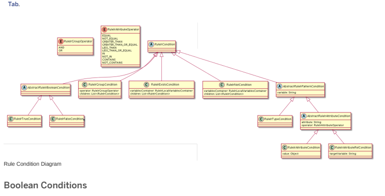
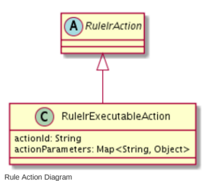
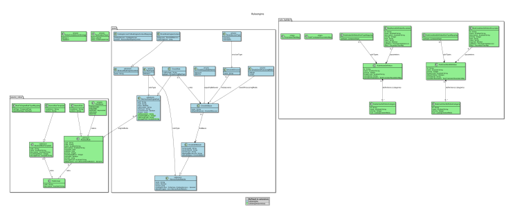

# Rule Engine

The Rule Engine allows you to dene business rules consisting of conditions and actions. Rule Engine is a rules-based business decision engine that enables you to evaluate data and execute decisions across your platform. The Rule Engine is based on a rule engine called Drools. Use Rule Engine to dene and execute a system of rules that can manage even extremely complex decision-making scenarios.

The Rule Engine is the underlying engine for the SAP Commerce Promotion Engine, which allows you to set up a complex system of promotion rules that calculate on the shopping cart. Rule Engine itself is, however, designed to be generic and extensible: you can use it to dene and execute a wide variety of rules across your platform. Most business data in your system can be made available to Rule Engine for rule evaluation and execution.

Rule Groups Rule Engine Rule Builder Rule Engine Modules Caching of Global or Static Facts Versioning of Rule Engine Rules Creating a Source Rule Type rulebuilderbackoffice Extension ruledenitions Extension ruleengine Extension ruleenginebackoffice Extension ruleengineservices Extension Rule Engine Conguration Rule Engine Data Model promotionenginesamplesaddon Extension promotionengineservices Extension Technical Implementation Promotion Engine Trail Promotion Engine Conguration

## Rule Engine Features

Rule Engine allows you to perform business rule analysis on your SAP Commerce platform. Rule Engine requires a complete custom implementation.

Rule Engine Rule Builder Rule Engine provides a user interface called the Rule Builder where business users can create rules by combining conditions and actions via drag-and-drop.

Rule Engine Conditions and Actions In Rule Engine, every rule has two parts: conditions and actions. In addition to a number of default conditions and actions, you can create custom conditions and actions.

Rule Engine Modules A Rule Engine module holds a set of rules that share the same rule type. It is possible to create multiple modules and synchronize them in the Backoffice.

Rule Groups In Rule Engine, you can create exclusive or non-exclusive rule groups to help you to control rule execution.

## Rule Engine Rule Builder

Rule Engine provides a user interface called the Rule Builder where business users can create rules by combining conditions and actions via drag-and-drop.

## Use Case

To enable non-programmers and business users to create and manage rules, the Rule Engine provides a Backoffice user interface called the Rule Builder. The conditions and actions that you dene are made available in the Rule Builder, where they can be exibly combined to create rules.

The Rule Builder offers a range of features that make rule creation and management easier. These tools include rule publishing, rule priority, rule groups, templates, and rule versioning.

## Note

The Backoffice contains two separate Rule Builder interfaces: one for Promotion Engine and one for Rule Engine. These provide identical functionality. However, the Rule Builder for the Promotion Engine displays only promotion rules, while the Rule Builder for the Rule Engine displays all rule types. Because the functionalities are identical, the features of the Rule Builder are not described in detail here. This list of features provides overview of the available Rule Builder features, with links to more detailed information in the Promotion Engine context.

## Features

Drag-and-drop Interface Rule Engine enables marketers to create even complex rules easily, by combining conditions and actions with drag-and-drop. For more information, see Creating a Promotion Rule.

## Rule Management

In the Backoffice, you can create, clone, edit, and delete rules. In addition, a versioning mechanism enables you to track the changes you make to your rules.

Rule Priority You can optionally assign priority numbers to your rules. The priority determines the order in which rules are applied, from highest priority to lowest priority (for example, 500 before 100). For more information, see Promotion Priority.

## Templates

You can create and save templates that make it easier to create rules in the future. A template contains the conditions and actions necessary to create a certain type of rule. For more information, see Promotion Templates. Rule Groups You can create rule groups to control which rules execute in any given Rule Engine execution. Rule groups can be exclusive or nonexclusive. In an exclusive rule group, only the highest-priority rule from among the applicable rules executes. For more information, see Rule Groups.

Rule Publication When you create a new rule in the Rule Builder, the rule remains a draft until you publish it to a rule module. You can unpublish rules that you no longer need. For more information, see Publishing a Promotion Rule.

Start and End Dates You can dene start and end dates for rules that should only apply during a certain time period.

## Versioning Of Rule Engine Rules

Rule Engine assigns version numbers to your rules to help you keep track of changes between published versions of a rule. In Rule Engine, versioning allows you to track the changes that you make to your rules. Versioning also allows you to edit published versions of a rule without immediately affecting the active rule.

## Implementation

Keep the following principles in mind regarding versions in Rule Engine:

When you create a rule, the rule has the version number 0.

The version number remains 0 even after you publish the rule. When you edit a published rule for the rst time, the new version of the rule has version number 1. You can only edit the latest version of a rule.

Anytime you edit a published rule, Rule Engine creates a new version of that rule. The new version is not automatically published. Anytime you create a new version of a rule, you must publish the new version for the changes to take effect on the storefront. You can publish different versions of a rule to different modules.

You cannot revert to an earlier version of a rule. However, you can republish an inactive earlier version of a rule at any time.

## Related Information

Rule Statuses

## Rule Engine Templates

In the Rule Builder, you can create rule templates that contain pre-selected conditions and actions. Business users can use these templates to save time when creating new rules.

## Create And Manage Templates

The instructions for creating and managing source rule templates are described in the following Promotion Engine documents, but the principles apply to the source rule templates in the Rule Engine, as well.

Creating a Promotion Template Editing a Promotion Template Deleting a Promotion Template Creating a Promotion Rule from a Template

## Rule Engine Conditions And Actions

In Rule Engine, every rule has two parts: conditions and actions. In addition to a number of default conditions and actions, you can create custom conditions and actions.

## Use Case

Business rules are created by combining conditions and actions. Every Rule Engine rule consists of two components: conditions and actions.

Conditions: One or more conditions dene the criteria that must be true for the action to apply. Actions: Rule Engine executes the action or actions when the conditions are met.
Rule Engine compares conditions with a body of facts to determine whether the conditions are true or false; if the conditions are true, it executes the actions

## Features Out Of The Box Conditions

Out of the box, Rule Engine includes the following conditions: Rule executed, Group, and Container.

Rule executed: Allows you to create dependencies between promotion rules. For example: If rule A has red, rule B cannot re. Or, only if rule A has not red, can rule B can re.

Group: By default, the conditions in a rule are combined with the operator AND. To change the logical operator between rules to OR, use a group.

Container: You can place other conditions in a container, then create actions that reference the entire container. In Promotion Engine, for example, you can use conditions to create partner-product promotions.

## Custom Conditions

You can create custom conditions that can be used to create new rules in the Rule Builder. For instructions, see the Promotion Engine Trail: Creating Custom Conditions and Actions.

## Out Of The Box Actions

Use the Halt rule execution action to stop any further evaluation of lower-priority rules.

Custom Action Denitions You can create custom actions that can be used to create new rules in the Rule Builder. For instructions, see the Promotion Engine Trail: Creating Custom Conditions and Actions. Data Model for Actions and Conditions This data model presents the relationship between the conditions and actions. Here you will also nd more detailed information about the parameters for rule condition denitions and rule action denitions. For more information, see Data Model Relations for Actions and Conditions.

## Data Model Relations For Actions And Conditions

The conditions denitions and action denitions data model shows the relationship between the templates for the conditions and actions used to create specic objects. The condition and action data model presents the relationship between the building blocks of a rule.

## Condition And Action Denitions Data Model

The denitions for both actions and conditions are like abstract "templates" for the conditions and actions to be used to create RuleConditionData and RuleActionData objects. You can see the relations in the following diagram:
This is   For more    the SAP Help  9

## Recommendation

For better viewing experience, right click on the diagram and view the image on a new tab.

The list of supported parameter types is as follows:

| Supported Parameter Types                                                                                                                             |                                                                                          |
|-------------------------------------------------------------------------------------------------------------------------------------------------------|------------------------------------------------------------------------------------------|
| Type Denition                                                                                                                                         | Example                                                                                  |
| java.lang.String java.lang.Character java.lang.Boolean java.util.Date                                                                                 | Default date format: "MMM d, yyyy h:mm:ss a"                                             |
| java.lang.Double java.lang.Float java.math.BigDecimal java.lang.Integer java.lang.Byte java.lang.Short java.lang.Long java.math.BigInteger Enum((.*)) | Enum(de.hybris.platform.ruledefinitions.AmountOperator), where AmountOperator is an Enum |
| List(ItemType((.*)))                                                                                                                                  | List(ItemType(Product))                                                                  |
| ItemType((.*))                                                                                                                                        | ItemType(Product)                                                                        |
| List((.+))                                                                                                                                            | List(java.lang.String)                                                                   |
| Map((.+),\s*(.+))                                                                                                                                     | Map(java.lang.String,java.lang.Integer) or Map(ItemType(Currency),java.math.BigDecimal)  |
| The following subsections include a description of each condition or action denition along with their parameters.                                     |                                                                                          |

RuleConditionDenition This is   For more    the SAP Help  10 This is a denition for the intended condition to be used as a building block for a rule. It has the following attributes:
id: a unique Id for the condition denition.

name: a name of the condition displayed on the user interface.

priority: an attribute used to prioritize the condition in the conditions list.

breadcrumb: a String that is based on java messageFormat (see: messageFormat ), except that instead of numbers you should use the condition denition <id> parameter, for example cart {<operator>} {<value>}.

AllowsChildren: a Boolean eld, used to specify whether the condition can have children of conditions or not. Currently is it used only with the group condition and the container condition. The default value is false. translatorId: The bean Id of the translator that is used to convert the condition into the intermediate representation.

translatorParameters: Parameters to be used by the translator in the process of converting the condition to the intermediate representation. categories: List of categories that this condition belongs to.
RuleConditionDenitionParameter The condition parameter that is used to build the condition. The examples here can be: operator, product id, category id. It has the following attributes:
id: a unique Id for the condition denition parameter.

name: a name of the parameter displayed in the user interface. description: a short description of the condition denition parameter displayed in the user interface as caption.

priority: an attribute used to prioritize the parameters.
type: The parameter type used to render the appropriate Backoffice editor component to the intended type. For details on available editors, see OMS - Available Editors Gallery.

value: The default value for the parameter.
required: a Boolean to be used by the validation to mark this parameter as required. The default value is false.

RuleConditionDenitionCategory A category is a division of conditions denitions according to shared functionalities. It has the following attributes:
id: a unique Id for the condition denition parameter.

name: a name of the parameter displayed in the user interface.

priority: an attribute used to prioritize the categories. icon: a reference to the icon of the category to be displayed in the user interface.

## Ruleactiondenition

This is a denition for the intended action to be used as a building block for rule.

id: a unique Id for the action denition.

name: a name of the action displayed in the user interface. priority: an attribute used to prioritize the action on the actions list.

breadcrumb: a String that is based on java messageFormat (see:messageFormat ), except that instead of numbers you should use the action denition <id> parameter, for example cart {<operator>} {<value>}.
This is   For more    the SAP Help  11

AllowsChildren: a Boolean eld, used to specify whether the action can have children actions or not. Currently is it used only with the group action and the container action. The default value is false.

translatorId: The bean Id of the translator that is used to convert the action into the intermediate representation.

translatorParameters: Parameters to be used by the translator in the process of converting the action to the intermediate representation.

categories: List of categories that this action belongs to.
RuleActionDenitionParameter The action parameter that is used to build the action. The examples here can be: operator, product id, category id.

id: a unique Id for the action denition parameter.

name: a name of the parameter displayed on the user interface.
description: a short description of the action denition parameter displayed in the user interface as caption.

priority: an attribute used to prioritize the parameters. type: The parameter type, that will be used to render the appropriate Backoffice editor component to the intended type. The available editor are located here: OMS - Available Editors Gallery. value: The default value for the parameter.
required: a Boolean to be used by the validation to mark this parameter as required. The default value is false.

RuleActionDenitionCategory A category is a division of actions denitions according to shared functionalities.

id: a unique Id for the action denition parameter.

name: a name of the parameter displayed on the user interface.

priority: an attribute used to prioritize the categories.

icon: a reference to the icon of the category to be displayed on the user interface.

## Beans Data Model

The data model is mapped to the beans data model that is used by the Rule Engine. The class diagram below presents the relations of the beans data model.

## Condition And Action Data Model

Actions and conditions are the building blocks of the rule, in different combinations and grouping mechanisms. You can see the condition and action relations in the following diagram:

The following subsections include a description of rule conditions and actions along their parameters.

## Rule Condition

The whole rule will not re the actions list, except when all the conditions list are meet. One condition is expressed using the attributes, which can contain combinations of values and operators.

Example: Cart total condition can be expressed as (cartTotal >= $100).

RuleConditionData denitionId: the Id of the RuleConditionDefinition.

parameters: a map of parameter denition id and RuleParameterData objects children: a list of RuleConditionData object as children.

The RuleConditionData is persisted in JSON format as a part of the source rule object. An example of JSON representation:
[ {
 "definitionId": "cart_total", "parameters":{
 "value":{ "uuid":"b07060b4-bcb0-4016-b778-e3c566051df4",
 "type":"Map(ItemType(Currency),java.math.BigDecimal)", "value":{
 "USD":500
 } },
 "operator":{ "uuid":"c3217773-9e3b-4b22-8251-c4626251d854",
 "type":"Enum(de.hybris.platform.ruledefinitions.AmountOperator)", "value":"GREATER_THAN_OR_EQUAL"
 } },
 "children": [ 
 ] }
]
RuleAction The action that should be red when all the conditions in the rule are meet.

Example: Apply 50% discount on the cart

## Ruleactiondata

denitionId: an Id of the RuleActionDefinition.

parameters: A map of parameter denition Id and RuleParameterData objects.

The RuleActionData is persisted in JSON format as a part of the source rule object. An example of JSON representation:
JSON representation
[
 { "definitionId":"change_delivery_mode",
 "parameters":{ "delivery_mode":{
 "uuid":"f24a89ee-b418-4418-b8a9-30738728f9f9", "type":"ItemType(DeliveryMode)",
 "value":"free-standard-shipping" This is   For more    the SAP Help  14
 }
 } }
]
RuleParameterData The object that has the parameter values.

uuid: a unique Id of the rule parameter.

type: a type of the parameter. value: the value of the parameter.

## Limiting Action Executions

Rule Engine provides a mechanism that limits the number of times a rule's action is executed.

In the Rule Builder, the Maximum Rule Executions eld controls the maximum number of times that the rule's action executes, as long as the conditions are still met. This document explains how this limit is implemeted.

## Rule Execution Tracking

The RuleAndRuleGroupExecutionTracker interface (and its default implementation DefaultRuleAndRuleGroupExecutionTracker) is a fact object (similar to an RAO object). It tracks which rules and rule groups have been executed during the rule evaluation. The maxAllowedRuns parameter sets a limit on how many times a rule is allowed to execute during one Rule Engine evaluation.

The RuleAndRuleGroupTrackingAgendaFilter is an agenda lter that is added to each rule evaluation and invoked before a rule action is executed. During its invocation the agenda lter looks for the tracker fact and checks if the current rule is allowed to be executed. It is added into each rule evaluation via the DefaultAgendaFilterFactory.

The tracking of an executed rule happens as part of the generated drools code. Each generated drools code contains an invocation like this: $executionTracker.trackRuleExecution(kcontext);
RuleConfigurationRRD Attributes

## Related Information

API Documentation and YAML Files JavaDocs

## Rule Engine Modules

A Rule Engine module holds a set of rules that share the same rule type. It is possible to create multiple modules and synchronize them in the Backoffice.

In the Drools rule engine, which underlies the SAP Commerce Rule Engine, modules are used to deploy different rule types.

## Use Case

Modules enable you to create multiple different domains of rules that you keep separate from one another. For example, you can have some modules with promotion rules, and other modules with Rule Engine rules. Rule Engine allows you to exibly create the modules you need.

Features

## Creating Modules

Out of the box, you have two modules in your SAP Commerce system: a preview module and a promotions module. Both of these modules contain rules of the type promotion and are only for use in the Promotion Engine. To use the Rule Engine to create rules other than promotions, create additional modules. See Creating Rule Engine Modules.

## Multiple Modules

Rule Engine supports the existence of multiple modules, allowing you to keep different sets of rules separate from one another.

Multiple modules can have the same rule type. For example, you can create a preview module and a live module, both of which use the same rules. Publication to a Module When you create a rule, it is initially stored as a source rule. When you publish a rule to a module, the rule is translated and compiled into an executable Drools rule so that the Rule Engine can execute it.

## Synchronize Modules

In the Backoffice, you can synchronize two modules. When you synchronize a module, all of the rules currently published on the source module are published to the target module. This action completely replaces the rules that were published to the target module before synchronization. See Syncing Rule Modules. Swapping of Modules during Publication To avoid publishing delays and to ensure optimal performance, Rule Engine clones and swaps KIE modules during the publication process. For more information, see Swapping of KIE Modules.

## Enabling Module Synchronization

Enable synchronization from one Rule Engine module to another.

## Context

In the Backoffice, you can synchronize two modules. When you synchronize a module, all of the promotions currently published on the source module are published to the target module. This action completely replaces the rules that were published to the target module before synchronization.

Create an ImpEx script based on the following example. In this example, the promotions module is mapped to the online catalog version, and the preview module is mapped to the staged catalog version.

INSERT_UPDATE DroolsKIEModule;name[unique=true];allowedTargets(name)
;promotions-preview-module;promotions-module A sample ImpEx for creating and synchronizing rule modules is located here:
/promotionenginesamplesaddon/resources/promotionenginesamplesaddon/import/common/common-addonextra.impex.

## Syncing Rule Modules

In the Backoffice, you can synchronize two modules. When you synchronize a module, all of the rules currently published on the source module are published to the target module. This action completely replaces the rules that were published to the target module before synchronization.

Procedure 1. Log on to the Backoffice and navigate to Rule Engine Drools Modules .

You see a list of the modules available in yourSAP Commerce system (including promotion modules).

2. Click to select the module that you want to synchronize from.

3. Click the Module Synchronization button.

4. In the dialog, select the module that you want to synchronize to. Then click Synchronize.

When synchronization is nished, all of the rules published to the source module are also published to the target module.

## Swapping Of Kie Modules

To avoid publishing delays and to ensure optimal performance, Rule Engine clones and swaps KIE modules during the publication process.

When you update a published and running KIE module, the system creates a clone of the KIE module. All modications are reected in

the cloned KIE module, and the currently running KIE module continues to run on the front end. At some point, both the KIE module and the cloned module run in parallel. Once the modication is nished, the system automatically exchanges the original KIE module for the cloned module with the changes you made. This mechanism ensures that you do not experience noticeable delays on the storefront triggering the evaluation and seamless republishing of rules. When you publish rules in the Backoffice, the update operation starts in the background and runs automatically.

## Note

The outdated original KIE module is automatically removed from the system after the swapping takes place.

The following shows the default rule properties for the swapping of KIE modules implementation:
ruleengine.kiemodule.swapping.blocking=false ruleengine.kiemodule.swapping.predestroytimeout=3600000 ruleengine.kiemodule.swapping.workers.initialcapacity=3 ruleengine.kiemodule.swapping.workers.loadfactor=0.75 ruleengine.kiemodule.swapping.workers.concurrencylevel=2 ruleengine.publish.retry.maxattempts=5 ruleengine.publish.retry.backoffperiod=2000 This is   For more    the SAP Help  17

| 7/12/2024 Property                                       | Description                                                                                                                                                                                                                                  |
|----------------------------------------------------------|----------------------------------------------------------------------------------------------------------------------------------------------------------------------------------------------------------------------------------------------|
| ruleengine.kiemodule.swapping.blocking=<false>           | This sets the ag that blocks the execution of the initialize method until the swapping of KIE Modules is complete                                                                                                                            |
| ruleengine.kiemodule.swapping.predestroytimeout=3600000  | Denes the maximum amount of time (in milliseconds) to wait until the working threads have completed and are ready to join the calling thread. This could be adjusted to bigger values if the expected initialization times exceed this value |
| ruleengine.kiemodule.swapping.workers.initialcapacity=3  | Denes the initial capacity of the working threads map                                                                                                                                                                                        |
| ruleengine.kiemodule.swapping.workers.loadfactor=0.75    | Sets the load factor of working threads map (when this load is reached, the map is then extended)                                                                                                                                            |
| ruleengine.kiemodule.swapping.workers.concurrencylevel=2 | Sets the estimated concurrency level of the workers map (used principally for the internal concurrent map optimization)                                                                                                                      |
| ruleengine.publish.retry.maxattempts=5                   | In the event that simultaneous publication of two or more promotions is detected, this denes the maximum number of retry attempts before stopping further publication attempts                                                               |
| ruleengine.publish.retry.backoffperiod=2000              | Sets the wait time before publication retries in the event that simultaneous publication of two or more promotions is detected                                                                                                               |

Note that the ruleengine.kiemodule.swapping.blocking property is set to <false> by default, which allows the Rule Engine to create a clone of the KIE module asynchronously without blocking rule evaluation.

If you change the value to <true>, the Rule Engine does not allow you to evaluate the rules in the same thread until the cloned KIE
module has completed initialization and has replaced the original KIE module. Changing the value to <true> also makes it possible for you to test rules as the Rule Engine blocks the evaluation until the updated KIE module is ready to be used. In scenarios where there are multiple threads calling the KIE module and the ag is set to either <true> or <false>, the Rule Engine always allows you to call the rule evaluation.

## Kie Module Switch Status

When the modules have been swapped, an event is published to an event service. You may add your own listener and register this within the Spring context. The following provides an example listener:
public class ModuleSwappingCompletedEventListener extends AbstractEventListener<RuleEngineModuleSwapComp {
@Override protected void onEvent(final RuleEngineModuleSwapCompletedEvent event){
 //add extra logic here }
}
The following displays a relevant XML Conguration:
<bean id="moduleSwappingCompletedEventListener" class="de.hybris.platform.yacceleratorcore.event.ModuleS
 parent="abstractEventListener">
</bean>

## Rule Module Cronjobs

Rule Engine allows you to schedule multiple rule publications to the same rule module simultaneously. If necessary, you can restart a module publication cronjob in theBackoffice.

## 

When you publish a rule to a rule module, the Rule Engine creates a cronjob and a trigger for it. Before being executed, the cronjob analyzes its required resources (the rule module being published to and, for a module synchronization job, both the source and the target module) to check whether they are currently locked by another cronjob. If the module is currently being used by another cronjob
(indicated by the module's "lock aquired" attribute), the Rule Engine does not start the cronjob and instead creates a new trigger.

Once the cronjob can acquire the required module or modules, it sets the "lock acquired" attribute and proceeds with the job's logic. When the cronjob completes (either successfully or with an error), it releases the modules by removing the "lock acquired" attribute, making those modules available for the next publication.

In the event of a rare system failure, an unusual situation can arise where an acquired lock is not released from a rule module, and the
"lock acquired" attribute remains set to <true>. In that case, a system administrator can go to Drools Modules , choose your module, change the "lock acquired" to <false> in the Administration tab and save. After that, you can restart a cronjob directly from the Backoffice.

## Note

Various system properties allow you to change the default conguration for rule publication through cronjobs:
ruleengineservices.cronjob.nodeid

ruleengineservices.cronjob.nodegroup ruleengineservices.cronjob.concurrent.max ruleengineservices.cronjob.trigger.cronexpression
View the ruleenineservices/project.properties le for a more detailed explanation of these properties.

1. Log on to the Backoffice and navigate to System Background Processes Cronjobs .

2. From the list on cronjobs, click to select the failed cronjob that you want to run.

3. Click Run Cronjob to execute the publication of the rule. 4. Click Processes to view details about the running cronjob.

## Rule Groups

In Rule Engine, you can create exclusive or non-exclusive rule groups to help you to control rule execution.

## Use Case

Depending on the business problem that you are trying to solve with your Rule Engine implementation, you may need to group rules together, or specify that only one rule in a group can apply.

## Features

Exclusive Rule Groups The engine only applies one rule from an exclusive rule group: the rule that has the highest priority and whose conditions are met. All lower-priority rules in the rule group are ignored.

Non-exclusive Rule Groups The engine applies all rules in the rule group whose conditions are met. The rules are applied in order of priority (highest to lowest).

## Creating A Rule Group

Create a Rule Engine rule group. Rule groups help you to control which rules apply to a cart.

## Context

Rule groups help you to control which rules apply to a cart. A rule group can be exclusive (only the highest-priority rules in the group applies to a cart) or non-exclusive (all applicable rules in the group apply to the cart).

1. Log on to the Backoffice and navigate to Rule Engine Rule Groups .

A list of existing rule groups appears. (This list includes promotion rule groups, as well.)
2. Click the + button to create a new rule group.

3. In the Code eld, enter a unique code that serves as a name for the rule group. 4. Click Done.

The new rule group is created and appears in the list of available rule groups.

5. Click the new rule group to edit it.

6. On the Essential tab, enter the following information.

| Field       | Description                                                                                                                                                                                                                                                                                                                                                                                                                                                                          |
|-------------|--------------------------------------------------------------------------------------------------------------------------------------------------------------------------------------------------------------------------------------------------------------------------------------------------------------------------------------------------------------------------------------------------------------------------------------------------------------------------------------|
| Code        | Enter a unique code that serves as a name for the rule group.                                                                                                                                                                                                                                                                                                                                                                                                                        |
| Description | (Optional) Enter a description of the rule group that helps you to remember what kind of rules it contains.                                                                                                                                                                                                                                                                                                                                                                          |
| Exclusive   | Select whether the rule group is exclusive or non-exclusive. Exclusive: Only one rule in the rule group can apply to a cart. The rule with the highest priority (and whose conditions are met) applies, and all other rules in this rule group are ignored. Non-exclusive: All rules in the rule group can apply to the cart. The rules are applied in order of priority (highest to lowest). Of course, in either case, a rule only applies if the conditions of the rule are true. |
| Rules       | Use this eld to assign existing rules to the rule group. Alternatively, you can assign a rule to a rule group when you create or edit the rule. Select the rule group on the Rule Properties tab, in the Rule Group eld. See Creating a Promotion Rule. Once rules are assigned to this rule group, they appear in this eld.                                                                                                                                                         |

## Changing A Rule Group'S Exclusivity

When you create a rule group, its status remains nonexclusive by default. If you want to use the rule group exclusivity feature, change the status of the rule group to exclusive.

1. Go to the Backoffice Administration Cockpit and navigate to the Promotion Rules node of the Explorer Tree Area ( Marketing Promotion Rules Show Published and Unpublished or Marketing Promotion Rules Show All ).

2. Select a rule from the list of default promotion rules. 3. In the Rule Management section, double-click the Rule Group entry to open a window.

4. In the General Properties section, specify the exclusivity of the rule group. Select True for the rule group to be exclusive or False for the rule group to be nonexclusive.

5. Click Save to go back to promotion rule main window. 6. Click Save to continue changes.

## Rule Engine Architecture

Rule Engine is a set of extensions that allow you to create business rules. Rule Engine provides generic functionality and offers exibility, so it can be used by many different modules.

## Dependencies

 Recipes

For a complete list of SAP Commerce Cloud recipes that may include this module, see Installer Recipes.

For a complete list of the SAP Commerce Cloud, integration extension pack recipes that may include this module, see Installer Recipe Reference.

## Extensions

Rule Engine consists of the following extensions:
ordercalculation Extension The ordercalculation extension refers to the in-memory order calculation. During the rule evaluation, the intermediate cart values or changes are not persisted, but only processed in-memory in order to optimize performance and avoid database operations.

droolsruleengineservices Extension The droolsruleengineservices extension includes the Drools-specic implementations for the RuleEngine Service, the Rule Compiler, and the Rule Actions on top of the ruleengineservices; denes Drools-specic item types for KIE
Modules/Bases and adds Drools functionality such as Agenda lters.

rulebuilderbackoffice Extension The rulebuilderbackoffice extension refers to the user interface for creating and managing source rule templates and source rules. This includes deployment of source rule as engine rules into a rule engine. The builder is unaware of the underlying rule engine.

ruledenitions Extension The ruledefinitions extension implements strategies, translators, and wrappers for converting specic conditions and actions from source rules into an intermediate rule representation. This intermediate representation is unaware of the underlying rule engine and will later be compiled into Drools syntax by a Drools-specic rule compiler.

ruleengine Extension This is   For more    the SAP Help  21 The ruleengine extension refers to a very basic implementation of the ruleengine. It includes denitions of the basic item types and interfaces for rules, rule modules, and rule maintenance. No commerce-related functionality is available in this extension.

ruleenginebackoffice Extension The ruleenginebackoffice extension denes several customizations for the item types dened in ruleengine, ruleengineservices, and droolsruleengineservices. In addition, there are actions for compiling and deploying engine rules. ruleengineservices Extension The ruleengineservices extension denes and implements commerce-related functionality for rules on top of ruleengine.

It is unaware of the underlying type of rule engine. Most of the Rule-Aware Objects are implemented here. It also includes the generic functionality for translating or compiling source rules into engine rules.

## Ordercalculation Extension

The ordercalculation extension refers to the in-memory order calculation. During the rule evaluation, the intermediate cart values or changes are not persisted, but only processed in-memory in order to optimize performance and avoid database operations.

## About The Extension

| Name             | Directory               | Related Module   |
|------------------|-------------------------|------------------|
| ordercalculation | bin/modules/rule-engine | Rule Engine      |

## Droolsruleengineservices Extension

The droolsruleengineservices extension includes the Drools-specic implementations for the RuleEngine Service, the Rule Compiler, and the Rule Actions on top of the ruleengineservices; denes Drools-specic item types for KIE Modules/Bases and adds Drools functionality such as Agenda lters.

## About The Extension

| Name                     | Directory               | Related Module   |
|--------------------------|-------------------------|------------------|
| droolsruleengineservices | bin/modules/rule-engine | Rule Engine      |

## Rulebuilderbackoffice Extension

The rulebuilderbackoffice extension refers to the user interface for creating and managing source rule templates and source rules. This includes deployment of source rule as engine rules into a rule engine. The builder is unaware of the underlying rule engine.

## About The Extension

| Name                  | Directory               | Related Module   |
|-----------------------|-------------------------|------------------|
| rulebuilderbackoffice | bin/modules/rule-engine | Rule Engine      |

## Ruledenitions Extension

The ruledefinitions extension implements strategies, translators, and wrappers for converting specic conditions and actions from source rules into an intermediate rule representation. This intermediate representation is unaware of the underlying rule engine and will later be compiled into Drools syntax by a Drools-specic rule compiler.

This is   For more    the SAP Help  22 About the Extension

| Name            | Directory               | Related Module   |
|-----------------|-------------------------|------------------|
| ruledefinitions | bin/modules/rule-engine | Rule Engine      |

## Ruleengine Extension

The ruleengine extension refers to a very basic implementation of the ruleengine. It includes denitions of the basic item types and interfaces for rules, rule modules, and rule maintenance. No commerce-related functionality is available in this extension.

## About The Extension

| Name       | Directory               | Related Module   |
|------------|-------------------------|------------------|
| ruleengine | bin/modules/rule-engine | Rule Engine      |

## Ruleenginebackoffice Extension

The ruleenginebackoffice extension denes several customizations for the item types dened in ruleengine, ruleengineservices, and droolsruleengineservices. In addition, there are actions for compiling and deploying engine rules.

## About The Extension

| Name                 | Directory               | Related Module   |
|----------------------|-------------------------|------------------|
| ruleenginebackoffice | bin/modules/rule-engine | Rule Engine      |

## Ruleengineservices Extension

The ruleengineservices extension denes and implements commerce-related functionality for rules on top of ruleengine. It is unaware of the underlying type of rule engine. Most of the Rule-Aware Objects are implemented here. It also includes the generic functionality for translating or compiling source rules into engine rules.

## About The Extension

| Name               | Directory               | Related Module   |
|--------------------|-------------------------|------------------|
| ruleengineservices | bin/modules/rule-engine | Rule Engine      |

## Rule Engine Implementation

The core of Rule Engine can be congured depending on your requirements. Learn about how to extend Rule Engine to meet your requirements.

## Note

If you want to enable the source rule and source rule template for customization, you can recover the commented-out type nodes
(<n:type-node id="hmc_sourcerules" code="SourceRule"/> and <n:type-node id="SourceRuleTemplate" code="SourceRuleTemplate" />) from the backoffice conguration in bin/modules/ruleengine/ruleenginebackoffice/resources/ruleenginebackoffice-backoffice-config.xml This is   For more    the SAP Help  23

<!-- Explorer Tree configuration -->
<context component="explorer-tree" parent="auto" merge-by="module">
<n:explorer-tree xmlns:n="http://www.hybris.com/cockpitng/config/explorertree">
<n:navigation-node id="ruleengine" merge-mode="append">

<!-- <n:type-node id="hmc_sourcerules" code="SourceRule"/>
<n:type-node id="SourceRuleTemplate" code="SourceRuleTemplate" /> -->
<n:type-node id="hmc_typenode_drools_rules" code="DroolsRule"/>
<n:type-node id="hmc_typenode_drools_kie_module" code="DroolsKIEModule"/>
<n:type-node id="hmc_typenode_rule_groups" code="RuleGroup"/>
</n:navigation-node>
</n:explorer-tree>
</context>

## Related Information

Rule Engine Trail Swapping of KIE Modules Rule Engine Conguration Rule Engine Data Model

## Rule-Aware Objects

Promotion Engine and Rule Engine use rule-aware objects (RAOs) to provide the facts required to evaluate rules and apply actions. In addition to the standard set of promotions RAOs, you can create custom RAOs.

## Use Case

Both Promotion Engine and Rule Engine allow you to evaluate a set of facts from the application, then dene actions based on whether the evaluation is true or false.

Therefore, both engines require a certain set of application data that provide the facts or context for rule evaluation. All of the data necessary for both conditions and actions must be made available to the Rule Engine for processing.

For example, in Promotion Engine, promotion rule conditions may evaluate the cart (for example, checking for products and prices) or the customer (for example, checking the customer group). Promotion actions can include, for example, discounts on products or on the cart.

Hence, it is necessary to represent and propagate data from SAP Commerce into the rule context as a set of facts. In addition, it is necessary to dene actions that will be executed as a result of rule evaluation, and make these available to the application for processing. This is done with Rule-Aware Objects (RAOs), which are plain old java objects (POJOs).

## Related Information

Duplicate Rule-Aware Objects Generating Beans and Enums Dening a New Rule-Aware Object Implementing a New RAO Action and Strategy This is   For more    the SAP Help  24

## Duplicate Rule-Aware Objects

Rule-Aware Objects (RAOs) are currently created by the standard SAP Commerce Cloud platform mechanism of converters and populators. These form a tree structure with duplicated RAOs, and each RAO has one parent.

## Note

For better performance, some RAO objects mentioned here are deprecated and replaced (e.g. ProductRAO is replaced by productCode, and CategoryRAO is replaced by categoryCode). The overall principle of duplication is still valid and applicable.

See the following diagram for the example on how the RAO tree structure displays its duplicates, where:
E refers to Cart Entry.

For Drools to reason over the objects contained in the tree, the tree nodes are expanded into a at set, which does not allow duplicates. This set of RAOs is then inserted into the Drools Rule Engine as facts as shown in the following Expanded Fact Set with Duplicates diagram. Drools can only reason correctly if all the RAOs are inserted. If only the top node (Cart) is inserted, the other objects (entries, products, categories) are not included as facts for Drools, and hence, the rule evaluation will work incorrectly.

During the expansion of the tree, duplicates, which are based on the equals( ) method evaluation, are automatically removed as the underlying data structure is a set as shown in the previous Expanded Fact Set with Duplicates diagram. While only the facts are directly known to Drools, the Java references remain intact, and are used for rule conditions and reasoning.

Each fact still has its subtree through the regular Java references as shown in the following Drools Fact Set diagram:

Therefore, duplicate RAOs do not pose a problem in the current logic. The RAOs define a meaningful equality behavior by overwriting the equals() and hashCode() methods. To illustrate how duplicated RAOs do not pose a problem, consider the following rule in pseudo code:
when there is a Category C2 (refer to it as cat2)
and there is a Product where its categories contains cat2
(refer to it as prod1)
and there is an Entry with its product being prod1 (refer to it as entry1)
and there is a Cart which contains entry1 do some action then In the following diagram, the Removed Duplicates diagram, you can see that the first instance of C2 has been evicted from the Drools fact set by the second C2 instance from the E2/P2 subtree. With this scenario, Drools is still able to match the facts correctly. Drools first finds the second instance of C2 as a fact in the working memory. Then it looks at P1 and checks whether the second instance of C2 matches the category on P1, which is the first instance of C2.

This is custom documentation. For more information, please visit the SAP Help Portal Due to the implementation of equals, returns True, and hence matches, so P1 is matched correctly even though its

 direct category, the rst instance of C2, is not part of the fact set.

## Rule Domains In Rule Engine

In Rule Engine, rule type is used to separate rules for different domains. To dene a new set of rules for a different purpose, create a new rule domain by dening the source rule type and Drools rule type.

## Dening Rule Domains

It is possible to set up multiple, separate sets of Rule Engine rules within one SAP Commerce installation. For example, you could use Promotion Engine to generate promotion rules, then use Rule Engine to create a set of product recommendation rules. Each of these sets of rules constitutes a separate "rule domain." Each different rule domain is separated by rule type.

## Source Rule Type And Drools Rule Type

Each domain has a dened source rule type and Drools rule type. The source rule type and Drools rule type are mapped to each other in a 1:1 relationship.

Source Rule Type: When you create conditions and actions, you map them to a specic source rule type. The source rule type controls which conditions and actions you can use in a certain type of rule. In the Backoffice, when you create a new rule with a certain source rule type, the Rule Builder only displays the corresponding conditions and actions. This ensures that the correct conditions and actions are used to create that type of source rule. Drools Rule Type: The Drools rule type is mapped to one or more modules. The Drools rule type controls which types of compiled rules are published to each module. Each module can publish only one type of rule.

## Extensibility

If you want to extend Rule Engine and create a new rule domain, dene both a new source rule type and a new Drools rule type. Then, map these to each other. To see how this is done, follow the Rule Engine trail. The trail creates a new source rule type
(CustomSourceRule) and a new Drools rule type (CUSTOMDROOLSRULE). For more information, see Rule Engine Trail.

Whenever you create a new rule type, you also need to create a module that you can publish the rules to. This step is also covered in the trail.

## Note

Out of the box, there is a rule type for use in Rule Engine; this rule type is called DEFAULT. However, there is no out of the box module for this rule type. If you want to use this default rule type, create a new module.

Related Information Rule Engine Trail Rule Engine Modules

## Rule Engine Trail

The Rule Engine Trail shows you how to create a custom Rule Engine extension and dene a custom rule domain, including a custom source rule type, Drools rule type, and modules.

## Prerequisites

For this trail, use a standard B2C Accelerator storefront with electronics store sample data. You can easily set up a local installation using the cx recipe. For the detailed steps, refer to the Installing SAP Commerce Cloud Using Installer Recipes.

## Creating The Ruleenginetrail Extension

In the rst step of the Rule Engine Trail, create a new extension.

1. Create a new ruleenginetrail extension using the yempty template with a base package de.hybris.ruleenginetrail. For details on how to create a new extension, refer to the Creating a New Extension.

2. Create a workspace in your IDE and import the ruleenginetrail extension with other required extensions into your workspace.

3. Add the newly created extension to /config/localextension.xml le:
<extension name='ruleenginetrail'/>
4. The ruleenginetrail extension depends on the ruledefinitions extension. In the ruleenginetrail extension, add this extension to the extensioninfo.xml le, as shown:
<requires-extension name="ruledefinitions"/>
5. Build the platform by running the command ant all.

## Next Steps

Proceed to Creating a Source Rule Type.

## Creating A Source Rule Type

In this step of the Rule Engine trail, create a new source rule subtype.

## Context

When you create condition and action denitions, you map them to a specic source rule type. The source rule type controls which conditions and actions you can use in a certain type of rule. In the Backoffice, when you create a new rule, the Rule Builder only displays the conditions and actions associated with that selected source rule type. This ensures that the correct conditions and actions are used to create that type of source rule.

Here, we dene a new source rule type called CustomSourceRule.

Procedure 1. Dene the new source rule type in the ruleenginetrail-items.xml le, as shown:
<itemtype code="CustomSourceRule" extends="SourceRule" jaloclass="de.hybris.platform.ruleenginetrail.jalo.PromotionSourceRule" autocreate="true" generate="true">
</itemtype>
2. Run ant clean all and conrm that the CustomSourceRuleModel class is generated.

## Next Steps

Proceed to Mapping Conditions and Actions to Source Rule Type.

## Mapping Conditions And Actions To Source Rule Type

In this step of the Rule Engine trail, map condition and action denitions to the new source rule type.

## Context

In the Backoffice, when you create a new rule with a certain source rule type, the Rule Builder only displays the conditions and actions that are mapped to that source rule type. This ensures that you use the correct conditions and actions to create that type of source rule.

In the ruledefinitions extension, the le essentialdata-definitions.impex contains a number of out-of-the-box conditions and actions. You can map these to a new source rule type.

In addition to the out-of-the-box conditions and actions shipped in the ruledefinitions extension, you can also implement your own conditions and actions, and map these to existing or new source rule types. For more information, see the Promotion Engine Trail: Creating Custom Conditions and Actions. In this step of the trail, we map a few OOTB condition and action denitions to the new source rule type that we created in the previous step ( CustomSourceRule).

Create the le at hybris/bin/custom/ruleenginetrail/resources/impex/essentialdata_customdroolsrule_definitions.impex.

\#\#\#\#\#\#\#\#\#\#\#\#\#\#\#\#\#\#\#\#\#\#\#\#\#\#\#\#\# CONDITION DEFINITION RULE TYPE MAPPINGS \#\#\#\#\#\#\#\#\#\#\#\#\#\#\#\#\#\#\#\#\#\#\#\#\#\# INSERT_UPDATE RuleConditionDefinitionRuleTypeMapping;definition(id)[unique=true];ruleType(code)[default=
;y_cart_total;
;y_qualifying_products;
\#\#\#\#\#\#\#\#\#\#\#\#\#\#\#\#\#\#\#\#\#\#\#\#\#\#\#\#\# ACTION DEFINITION RULE TYPE MAPPINGS \#\#\#\#\#\#\#\#\#\#\#\#\#\#\#\#\#\#\#\#\#\#\#\#\#\#
INSERT_UPDATE RuleActionDefinitionRuleTypeMapping;definition(id)[unique=true];ruleType(code)[default=Cus
;y_order_fixed_discount;
;y_trigger_message;

## Next Steps

Proceed to Creating a New Rule Type.

## Creating A New Rule Type

In this step of the Rule Engine trail, create a new Drools rule type called CUSTOMDROOLSRULE. Then, map the new source rule type (CustomSourceRule) to the new Drools rule type.

## Context

Rule type is used to distinguish different domains of rules. The Drools rule type is mapped to one or more modules. The Drools rule type controls which types of compiled rules are published to each module. Each module can publish only one type of rule.

In this step of the trail, we dene a new rule type called CUSTOMDROOLSRULE. The new rule type is dened as an enumeration in the ruleenginetrail extension, in the ruleenginetrail-items.xml le.

1. Dene the new enumeration value in the following le: ruleenginetrail-items.xml.

<enumtypes>
 <enumtype code="RuleType" autocreate="false" generate="true" dynamic="true"> <value code="CUSTOMDROOLSRULE" />
 </enumtype> </enumtypes>
2. Run ant clean all.

3. Create a mapping between the new SourceRule type and the new RuleType that we have created. This is dened using the RuleToEngineRuleTypeMapping. Create the ImpEx here: ruleenginetrail/resources/impex/essentialdata_customdroolsrule_definitions.impex:
INSERT_UPDATE RuleToEngineRuleTypeMapping;ruleType(code)[unique=true];engineRuleType(code)[default= ;CustomSourceRule; Here, we are mapping CustomSourceRule to CUSTOMDROOLSRULE.

## Next Steps

Proceed to Creating Rule Engine Modules.

## Creating Rule Engine Modules

In this step of the Rule Engine trail, create two new modules: a preview module and a live module.

## Context

In the Drools rule engine, which underlies the SAP Commerce Rule Engine, modules are used to deploy different rule types. Modules contain knowledge denitions, which are collections of rules and the information and resources necessary to execute them.

Each module can only deploy one type of rule. This is because AbstractRulesModule has RuleType as an attribute, which restricts the rule type of that module.

Multiple rule modules can have the same rule type. For example, you can create a preview rule module and a live rule module, both of which use the same rule type.

In this step of the trail, we dene two rule modules for the newly dened rule type (CUSTOMDROOLSRULE): a live module and a preview module. The names of the two new modules are customdroolsrule-module and customdroolsrule-preview-module.

This is   For more    the SAP Help  30 To create two new modules, use the following ImpEx le. Create the le here:
hybris/bin/custom/ruleenginetrail/resources/impex/projectdata_customdroolsrule_module.impex:
INSERT_UPDATE DroolsKIEModule;name[unique=true];mvnGroupId;mvnArtifactId;mvnVersion;ruleType(code);activ
;customdroolsrule-module;hybris-rules;customdroolsrule;1.0.0;CUSTOMDROOLSRULE;true;-1; ;customdroolsrule-preview-module;hybris-rules;customdroolsrule-preview;1.0.0;CUSTOMDROOLSRULE;true;-1; INSERT_UPDATE DroolsKIEBase;name[unique=true];kieModule(name)[unique=true];equalityBehavior(code);eventP
;customdroolsrule-base;customdroolsrule-module;EQUALITY;STREAM ;customdroolsrule-preview-base;customdroolsrule-preview-module;EQUALITY;STREAM INSERT_UPDATE DroolsKIESession;name[unique=true];kieBase(name)[unique=true];sessionType(code) ;customdroolsrule-session;customdroolsrule-base;STATEFUL
;customdroolsrule-preview-session;customdroolsrule-preview-base;STATEFUL INSERT_UPDATE DroolsRuleEngineContext;name[unique=true];kieSession(name);ruleFiringLimit ;customdroolsrule-context;customdroolsrule-session;200;
;customdroolsrule-preview-context;customdroolsrule-preview-session;200; UPDATE DroolsKIEModule;name[unique=true];defaultKIEBase(name)
;customdroolsrule-module;customdroolsrule-base
;customdroolsrule-preview-module;customdroolsrule-preview-base UPDATE DroolsKIEBase;name[unique=true];defaultKIESession(name)
;customdroolsrule-base;customdroolsrule-session
;customdroolsrule-preview-base;customdroolsrule-preview-session

| Item Type               | Description                                                                                                                                                                                                                                                                                                                                                                                                                 |
|-------------------------|-----------------------------------------------------------------------------------------------------------------------------------------------------------------------------------------------------------------------------------------------------------------------------------------------------------------------------------------------------------------------------------------------------------------------------|
| DroolsKIEModule         | A KieModule is a container of all the resources necessary to dene a set of KieBases. DroolsKIEModule is the SAP Commerce Cloud representation of the KieModule.                                                                                                                                                                                                                                                             |
| DroolsKIEBase           | The KieBase is a repository of all the application's knowledge denitions. It CONTAINS rules, processes, functions, type models. DroolsKIEBase is the SAP Commerce Cloud representation of the KieBase.                                                                                                                                                                                                                      |
| DroolsKIESession        | KieSession is the most common way to interact with the engine. A KieSession allows the application to establish a conversation with the engine and evaluate facts, a cart, with respect to previously dened rules such as promotions. Drools and SAP Commerce Cloud both support STATELESS and STATEFUL session types. DroolsKIESession is the SAP Commerce Cloud representation of the KieSession.                         |
| DroolsRuleEngineContext | The DroolsRuleEngineContext will be provided by the calling application as input to the RuleEngineService. This context stores the information in which DroolsKIESession the rule evaluation should be done. The DroolsKIESession has a reference to a DroolsKIEBase which is linked to a DroolsKIEModule. By providing different contexts, the application can control which rule set in which the KIEBase should be used. |

## Next Steps

Proceed to Setting up Module Synchronization.

In this step of the Rule Engine trail, learn how to enable synchronization between two rule modules of the same rule type.

## Context

In the Backoffice, you can synchronize two modules. When you synchronize a module, all of the promotions currently published on the source module are published to the target module. This action completely replaces the rules that were published to the target module before synchronization.

To enable rule module synchronization, the source rule module has to be congured to allow it to be synchronized to target modules.

This is done by registering the target module name(s) with the source rule module.

1. In this trail, allow synchronization from the customdroolsrule-preview-module to the customdroolsrule-module, but not the other way around. Open the le hybris/bin/custom/ruleenginetrail/resources/impex/projectdata_customdroolsrule_module.impex and add the following ImpEx:
UPDATE DroolsKIEModule;name[unique=true];allowedTargets(name) ;customdroolsrule-preview-module;customdroolsrule-module 2. Initialize the system by running ant initialize.

## Next Steps

Proceed to Creating Rules and Synchronizing Modules.

## Creating Rules And Synchronizing Modules

In this step of the Rule Engine trail, create a new source rule, see how source rules are versioned, and carry out module synchronization in the Backoffice.

## Context

Source Rules are versioned by the Rule Engine. A new source rule version is created whenever the rule diverges from the last published version of that source rule. This step of the trail illustrates how source rule versioning works.

1. Log on to the Backoffice and navigate to Rule Engine Source Rules Show All .

2. To create a new custom source rule, click + CustomSourceRule. 3. Enter a name and a code for your new rule, for example:
Code: custom_source_rule_order_fixed_discount Name:Custom source rule order fixed discount 4. Open the newly created rule. On the Conditions & Actions tab, add the Cart total Condition, which is mapped to the CustomSourceRule in the previous steps. Add value (for example, USD 200) to the cart total value in the Condition. For the Action, use Fixed Discount on Cart, which is also mapped to the CustomSourceRule. Then specify an absolute discount value
(for example, USD 10).

5. Save the rule.

The Source Rule is version 0 and has the status Unpublished.

6. Publish the rule to the customdrools-preview-module. Only the two rule modules created earlier in the trail can be chosen as publication target. This is due to the RuleToEngineRuleTypeMapping we added earlier.

Verify that the rule is successfully published (the status is now Published). In the Availability column, you see the customdroolsrule-preview-module listed.

7. You can also switch to Rule Engine Drools Rules and verify that there is a rule custom_source_rule_order_xed_discount with the rule type CUSTOMDROOLSRULE. Note that the version of the Drools rule might differ from the version of the source rule, as the versioning mechanisms work differently.

8. To synchronize modules, navigate to Rule Engine Drools Modules and perform the following:
a. Click on the customdroolsrule-module. Verify that it is not possible to synchronize the rule module. This is because we have not dened any allowed target rule modules for this rule module.

b. Switch to the customdroolsrule-preview-module. Click the Synchronize button.

c. In the dialog window, customdroolsrule-module is pre-selected as the target module. Click Synchronize to start module synchronization. This synchronizes the customdroolsrule-module with the customdroolsrule-preview-module. Backoffice notications inform you about the start and end of the rule module synchronization.

d. Return to Rule Engine Source Rules Show All and inspect the custom source rule. Note that the version is still 0, the status is still Published and that Availabilitycolumn now also lists the customdroolsrule-module.

e. Switch to Rule Engine Drools Rule . Note that there are now two rules with the code of our source rule. Each time a source rule is published to a rule module, a separate Drools rule is created. Thus, the Drools rule version does not match the source rule version.

9. Go to Rule Engine Source Rules Show All and open the custom_source_rule_order_xed_discount source rule in the Rule Builder. Make any change to the rule, for example:
a. Change the Cart total threshold from 200 to 180.

b. Save the rule. Note in the list view of all source rules that there are now two rules with the code custom_source_rule_order_xed_discount. (You might have to refresh the list view to see the change.) The source rule versioning creates a new version whenever the source rule diverges from the most recently published source rule. The new version has the next higher version number, for example, 1, and has the status Unpublished. Also note that you are only able to save changes to the latest source rule version.

10. Edit the new unpublished new version of the source rule by changing the discount value of the Fixed discount action to 20. Save the rule. Note that this does not create a new source rule version, as the edited rule is still unpublished.

11. Publish the new version of the source rule to the preview module again. In the source rule list view, you can now see that version 0 of the rule is no longer available in the preview module, but only in the customdroolsrule-module. While version 1 is not available in the preview module.

12. You can optionally switch to the Rule Engine Drools Rules to see two rules, one published in each rule module. In reality, a third Drools rule has been created as we have published three times in total, two regular publications and one publication as part of the rule module synchronization. Each rule publication creates a new engine rule. Any previously created rule that belongs to the same source rule will be marked as "Is current version?" with the value False as it is no longer the current version. The default view of Drools Rules only shows the most current version, which is why only two rules are visible in the list view. You can remove the "Is current version?" search restriction in the advanced search to see all rules.

## Results

This concludes the Rule Engine trail.

## Rule Compilation And Processing

Learn about how Rule Engine compiles and processes source rules into executable rules. Some steps are extensible.

## Components

Rule Engine consists of the following components:
Rule Builder: The Backoffice user interface where you can create and maintain rules and rule templates.

Rule Compiler: Turns the source rule into an executable rule.

Rule Processor: Processes and executes rules.

## Rule Processing

The following provides a very high-level overview of how Rule Engine processes rules. Then, read more about the specic compilation steps in the linked documents.

1. A business user creates a rule by combining the actions and conditions in the Rule Builder.

2. Once created, this source rule is stored in the form of a JSON (text) source rule. The source rule is stored in a source rule repository. You can view the source rules in the Backoffice ( Rule Engine Source Rules ).

3. In the Backoffice, a business user publishes the rule to a rule module.

4. During the publishing process, the Rule Compiler turns the source rule into an executable rule, called a Drools rule. 5. The executable rule is stored in an executable rule repository, where the Rule Processor processes and executes rules as necessary.

## Rule Compilation

During rule compilation, rules are transformed from source code (high-level representation of conditions and actions) into Drools syntax, which the Rule Engine can then execute.

## Compilation Process

The compilation process is a sequence of various phases. Each phase takes input from the previous stage and feeds its output to the next phase of the compilation. Compilation of a rule is executed through the following phases:

Source code translation (using the RuleSourceCodeTranslator interface) transforms the conditions and actions (highlevel representation) into the intermediate representation. Most of the validation occurs during this phase. The intermediate representation is generated in a way that makes it easier to be translated into the Rule Engine-specic code.
Intermediate representation processing (using the RuleIrProcessor interface) applies some transformations on the intermediate representation. For example, the intermediate representation can be optimized by removing unnecessary conditions.

Target code generation (using the RuleTargetCodeGenerator interface) transforms the intermediate representation into the Rule Engine-specic syntax (Drools). In this phase, the code generator takes the optimized representation of the intermediate code and maps it to the Rule Engine language.

## Compilation Sequence

The following sequence diagram shows the ow of logic within the compiler:
This is   For more    the SAP Help  34 RuleCompilerService This interface is the main entry point. It is the service that can be used to perform the compilation of rules.

## Rulecompilercontext

This interface represents the context valid for the compilation of a rule. It is passed to, and potentially modied by, each phase of the

compilation process.

## Ruleprocessor

Implementations of this interface are responsible for processing the rule intermediate representation. Many processors can exist.

## Ruletargetcodegenerator

This interface is responsible for converting what is in the intermediate representation into a Rule Engine-specic format.

## Intermediate Representation

The Intermediate Representation (IR) is a data structure constructed from input conditions and actions that is used to generate the Rule Engine-specic code. For details, see Intermediate Representation in Rule Compiler.

## Translation Of Conditions And Actions

Conditions and Actions are the two main components of a rule. The main purpose of the compiler is to convert input conditions and actions into the intermediate representation. For details, see Conditions and Actions in Rule Compiler.

## Validation

The purpose of validation is to provide a high degree of assurance that a specic rule behaves as expected. It should be able to detect cases where, for example, a parameter was introduced incorrectly. For details, see Validation Mechanism in Rule Compiler.

## Extensibility

The rule compiler provides some extension points. For details, see Rule Compiler Extensibility.

## Intermediate Representation In Rule Compiler

The Intermediate Representation (IR) is a data structure constructed from input conditions and actions used to generate the Rule Engine-specic code. It is a combination of variables, conditions and actions and is more suitable for transformations and optimizations.

The intermediate representation is independent of the used Rule Engine. For the purpose of this document, however, we provide some

examples of the generated Drools code.

Intermediate Representation in the Rule Compiler
Variables A variable is a symbolic representation of a value. It can be used to build conditions and, in some cases, to pass data to actions. A variable can be global or local and it is associated with a container.

Conditions Conditions represent the when part of the rule, sometimes it is also known as the Left Hand Side (LHS). In this section, you can nd all the available condition types.

Actions Actions represent the then part of the rule, and sometimes it is also known as the Right Hand Side (RHS). In this section, you can nd all the available action types.

## Variables

A variable is a symbolic representation of a value. It can be used to build conditions and, in some cases, to pass data to actions. A variable can be global or local and it is associated with a container.

## Global Variables

Global variables are used to build conditions and to provide data to actions. It is important to mention the concept of variables container, it is a logical group of variables and has a tree like structure. When generating a new variable, if it already exists for the given type in the current container or any of the parent containers, it will be used. If not, a new one is created in the current container.

In practice, this means that no more than one variable can be created for the same type inside a specic container. The following shows you an example:
String orderEntryRaoVariable = context.generateVariable(OrderEntryRAO.class);
RuleIrTypeCondition irCondition = new RuleIrTypeCondition();
irCondition.setVariable(orderEntryRaoVariable); 

## Local Variables

Local variables can be used the same way as global variables, but they are only valid in the scope of a specic condition. Only some conditions support local variables. Many variables can be created for the same type; this allows more exible conditions. Actions cannot access local variables. The following shows you an example:
final RuleIrLocalVariablesContainer variablesContainer = context.createLocalContainer();
final String containsOrderEntryRaoVariable = context.generateLocalVariable(variablesContainer, OrderEntr final List<RuleIrCondition> irConditions = newArrayList();
irConditions.add(newAttributeConditionFor(containsOrderEntryRaoVariable)
.withAttribute(ORDER_ENTRY_RAO_PRODUCT_CODE_ATTRIBUTE) .withOperator(RuleIrAttributeOperator.EQUAL)
.withValue(product)
.build());
irConditions.add(newAttributeConditionFor( This is   For more    the SAP Help  37 containsOrderEntryRaoVariable)
.withAttribute(QUANTITY_PARAM)
.withOperator(RuleIrAttributeOperator.valueOf(operator.name()))
.withValue(quantity) .build());
irConditions.add(newAttributeRelationConditionFor(cartRaoVariable)
.withAttribute(CART_RAO_ENTRIES_ATTRIBUTE) .withOperator(RuleIrAttributeOperator.CONTAINS)
.withTargetVariable(containsOrderEntryRaoVariable)
.build());
irConditions.addAll(getConsumptionSupport().newProductConsumedCondition(context, containsOrderEntryRaoVa final RuleIrExistsCondition irExistsProductCondition = new RuleIrExistsCondition();
irExistsProductCondition.setVariablesContainer(variablesContainer); irExistsProductCondition.setChildren(irConditions);
irQualifyingProductsCondition.getChildren().add(irExistsProductCondition); 

## Conditions

Conditions represent the when part of the rule, sometimes it is also known as the Left Hand Side (LHS). In this section, you can nd all the available condition types.

## Recommendation

For better viewing experience, right-click the diagram and select one of the available browser options, such as Open Image in New 

True Condition A condition that always evaluates to true.

The following displays an example Java code:
RuleIrTrueCondition irCondition = new RuleIrTrueCondition();
The following displays an example generated Drools code:
This is   For more    the SAP Help  38 eval(true)
False Condition A condition that always evaluates to false.

The following displays an example Java code:
RuleIrFalseCondition irCondition = new RuleIrFalseCondition();
The following displays an example generated Drools code:
eval(false)

## Group Condition

A condition that allows to combine other conditions (children) using the AND or OR operator. The following displays an example Java code:
RuleIrFalseCondition irFalseCondition = new RuleIrFalseCondition();
RuleIrTrueCondition irTrueCondition = new RuleIrTrueCondition();
RuleIrGroupCondition irCondition = new RuleIrGroupCondition(); irCondition.setOperator(RuleIrGroupOperator.OR);
irCondition.setChildren(Arrays.asList(irFalseCondition, irTrueCondition));
The following displays an example generated Drools code:
(
 eval(false) or eval(true) )

## Exists Condition

Checks for the existence of values in the working memory. It evaluates to True if the child conditions return some matches. Otherwise, it results to False. This condition supports local variables.

## Note

Since only the existence matters, actions cannot access matches from the child conditions. This means that this condition can be used for ltering, but not to provide data to actions.

The following displays an example Java code:
String orderEntryRaoVariable = context.generateVariable(OrderEntryRAO.class);
RuleIrTypeCondition irTypeCondition = new RuleIrTypeCondition();
irTypeCondition.setVariable(orderEntryRaoVariable);
RuleIrExistsCondition irCondition = new RuleIrExistsCondition();
irCondition.setChildren(Collections.singletonList(irTypeCondition)); 
The following displays an example generated Drools code:
exists ( $v4 := OrderEntryRAO()
) 
This is   For more    the SAP Help  39

## Not Condition

Checks for the non-existence of values in the working memory. It evaluates to False if the child conditions return some matches. Otherwise, it results to True. This condition supports local variables.

## Note

Since only the non-existence matters, actions cannot access matches from the child conditions. This means that this condition can be used for ltering, but not to provide data for actions.

The following displays an example Java code:
String orderEntryRaoVariable = context.generateVariable(OrderEntryRAO.class);
RuleIrTypeCondition irTypeCondition = new RuleIrTypeCondition(); irTypeCondition.setVariable(orderEntryRaoVariable);
RuleIrNotCondition irCondition = new RuleIrNotCondition();
irCondition.setChildren(Collections.singletonList(irTypeCondition)); 
The following displays an example generated Drools code:
not (
 $v4 := OrderEntryRAO() )

## Pattern Conditions Type Condition

Matches all instances of a given type.

The following displays an example Java code:
String cartRaoVariable = context.generateVariable(CartRAO.class);
RuleIrTypeCondition irCondition = new RuleIrTypeCondition();
irCondition.setVariable(cartRaoVariable);
The following displays an example generated Drools code:
$v1 := CartRAO()
Attribute Condition Matches all instances of a given type with an additional constraint. The constraint is a combination of attribute, operator, and value.

The following displays an example Java code:
String cartRaoVariable = context.generateVariable(CartRAO.class);
RuleIrAttributeCondition irCondition = new RuleIrAttributeCondition(); irCondition.setVariable(cartRaoVariable);
irCondition.setAttribute("total"); irCondition.setOperator(RuleIrAttributeOperator.GREATER_THAN_OR_EQUAL);
irCondition.setValue(BigDecimal.valueOf(100));
The following displays an example generated Drools code:
This is   For more    the SAP Help  40

## Attribute Relation Condition

Matches all instances of a given type with an additional constraint. The constraint is a combination of attribute, operator, and target variable. In practice, this condition allows to create relations between different types.

The following displays an example Java code:
String cartRaoVariable = context.generateVariable(CartRAO.class);
String orderEntryRaoVariable = context.generateVariable(OrderEntryRAO.class);
RuleIrTypeCondition irTypeCondition = new RuleIrTypeCondition(); irTypeCondition.setVariable(orderEntryRaoVariable);
RuleIrAttributeRelCondition irCondition = new RuleIrAttributeRelCondition();
irCondition.setVariable(cartRaoVariable); irCondition.setAttribute("entries");
irCondition.setOperator(RuleIrAttributeOperator.CONTAINS);
irCondition.setTargetVariable(orderEntryRaoVariable);
RuleIrGroupCondition irGroupCondition = new RuleIrGroupCondition(); irGroupCondition.setOperator(RuleIrGroupOperator.AND);
irGroupCondition.setChildren(Arrays.asList(irCondition, irTypeCondition));
The following displays an example generated Drools code:
(
 $v4 := OrderEntryRAO() and
 $v1 := CartRAO(entries contains $v4) )

## Actions

Actions represent the then part of the rule, and sometimes it is also known as the Right Hand Side (RHS). In this section, you can nd all the available action types.

## Executable Action

Action that delegates execution to a Spring bean that implements the RuleExecutableAction interface. The Action id is the id of the Spring bean.

The following displays the RuleExecutableAction interface:
This is   For more    the SAP Help  41 public interface RuleExecutableAction
{ void executeAction(RuleActionContext context, Map<String, Object> parameters) throws RuleEvaluationE
}
The following displays an example Java code:
Map<String, Object> actionParameters = new HashMap<>();
actionParameters.put("value", BigDecimal.valueOf(10));
RuleIrExecutableAction irExecutableAction = new RuleIrExecutableAction(); irExecutableAction.setActionId("ruleOrderPercentageDiscountAction");
irExecutableAction.setActionParameters(actionParameters);
The following displays an example generated Drools code:
ruleOrderPercentageDiscountAction.executeAction(new DefaultDroolsRuleActionContext(variables, kcontext), 

## Conditions And Actions In Rule Compiler

Compilation is one of the most important parts in the process of creating rules. Once the user has created a rule in the Rule Builder, it is then compiled to the intermediate representation (IR). The compilation process relies on specic condition and action interfaces.

## Condition Interfaces

RuleConditionsTranslator The RuleConditionsTranslator is a helper interface that takes the list of RuleConditionData and validates or translates all

of the items on the list.

## Ruleconditiontranslator

The RuleConditionTranslator interface is being called by the RuleConditionsTranslator. Different types of conditions have different implementations of the RuleConditionTranslator interface. The implementation of the interface translates a single condition to its intermediate representation by collecting and processing all the parameters provided by the user in the Rule Builder.

## Action Interfaces

RuleActionsTranslator The RuleActionsTranslator interface is a helper interface that takes the list of RuleActionData and validates or translates all

of the items on the list.

## Ruleactiontranslator

The implementation of the RuleActionsTranslator interface translates a single action to its intermediate representation. The

RuleExecutableActionTranslator, which is being used by all actions, is the only implementation of this interface. It creates a RuleIrExecutableAction and sets the <actionId> attribute and all the necessary parameters. The <actionId> parameter is a
<beanId> of the specic action to be executed, for example, ruleTargetBundlePriceAction and rulePartnerOrderEntryFixedDiscountAction.

## Validation Mechanism In Rule Compiler

Validation is performed on rule compilation. Along with converting rules to intermediate representation, conditions and actions are validated. Information on validation problems is held in the context (RuleCompilerContext).

The validation procedure includes the following steps and is performed for each action and condition:
1. The mechanism checks if a given condition or action has a corresponding denition and the translator.

2. The parameters of each action or condition are also checked against null and empty values.

3. If the action/condition has additional, specic validation procedure implemented, it is also applied.

For more details, look at the RuleConditionsTranslator and RuleActionsTranslator interfaces and their default implementations DefaultRuleConditionsTranslator and DefaultRuleActionsTranslator. These translators are responsible for validating parameters, conditions, and actions by invoking implementations of the respective RuleParameterValidator, RuleConditionValidator and, RuleActionValidator interfaces.

The RuleParameterValidator implementations (such as RuleRequiredParameterValidator and others) have to be registered as spring beans and their spring bean id has to be referenced in the validators attribute of the respective RuleConditionDefinitionParameter or RuleActionDefinitionParameter item type for the validation to work.

The RuleConditionValidator implementations (such as RuleContainerConditionTranslator and others) have to be registered as spring beans and their spring bean id has to be referenced in the translatorId attribute of the respective This is   For more    the SAP Help  43 RuleConditionDefinition item type for the validation to work.

The RuleActionValidator implementations (such as RuleExecutableActionTranslator) have to be registered as spring beans and their spring bean id has to be referenced in the translatorId attribute of the respective RuleActionDefinition item type for the validation to work.

For more details and examples of all the mentioned validators, look at the impex and spring conguration les in the ruledefinitions extension, e.g.

resources/ruledefinitions/resources/ruledefinitions/import/essentialdata-definitions.impex and
/resources/ruledefinitions/resources/ruledefinitions-spring.xml.

Validation problems (instances of RuleCompilerProblem) are created through the RuleCompilerProblemFactory, which allows to create warnings and errors. Add the generated problems to the RuleCompilerContext, and use localized messages and the severity.

Following code snippet illustrates the creation of a compiler problem:
final RuleCompilerProblem problem = ruleCompilerProblemFactory.createProblem(Severity.ERROR, "rule.compi context.addProblem(problem); 
Parameter Validation Mechanism Each action or condition parameter can have any number of validators in a form of a list in the <validators> eld available for both RuleConditionDefinitionParameter and RuleActionDefinitionParameter. Those validators are executed during the compilation phase and all the validation results are collected displayed to the user.

## Parameter Validation Mechanism

Each action or condition parameter can have any number of validators in a form of a list in the <validators> eld available for both RuleConditionDefinitionParameter and RuleActionDefinitionParameter. Those validators are executed during the compilation phase and all the validation results are collected displayed to the user.

All parameter validators need to implement the RuleParameterValidator interface and be declared as spring beans before you can use them as an input for the <validators> eld in RuleConditionDefinitionParameter and RuleActionDefinitionParameter.

The list of available validators is as follows:

| Validators                        |                                                                         |
|-----------------------------------|-------------------------------------------------------------------------|
| Validator Name                    | Description                                                             |
| RuleRequiredParameterValidator    | Checks if parameter is required.                                        |
| RulePercentageParameterValidator  | Validates if the number between 0-100.                                  |
| RulePositiveNumberValidator       | Validates if the number is greater than or equal to 0.                  |
| RuleContainerIdParameterValidator | Checks if the container Id is alphanumeric.                             |
| RuleContainersParameterValidator  | Validates if container ID is alphanumeric and exists in the conditions. |

## Creating A New Validator Procedure

1. Create a new class and implement the RuleParameterValidator interface.

2. Add a new message in your extension's <extension-name>-locales_en.properties le.

3. Use the new message key in the created validator to create a parameter problem using the ruleCompilerProblemFactory and add it to the context in case the validation failed.

public class RuleEmptyParameterValidator implements RuleParameterValidator {
protected static final String MESSAGE_KEY = "rule.validation.error.empty"; private RuleCompilerProblemFactory ruleCompilerProblemFactory;
@Override public void validate(final RuleCompilerContext context, final AbstractRuleDefinitionData ru final RuleParameterDefinitionData parameterDefinition)
throws RuleEngineServiceException
{
if (parameter != null)
{
final String emptyValue = (String) parameter.getValue();
if (emptyValue == null || emptyValue.isEmpty()) {
context.addProblem(ruleCompilerProblemFactory.createParameterProble parameterDefinition.getName(), parameter.getUuid())
}
}
}
public RuleCompilerProblemFactory getRuleCompilerProblemFactory()
{
return ruleCompilerProblemFactory;
} @Required public void setRuleCompilerProblemFactory(final RuleCompilerProblemFactory ruleCompilerProb {
this.ruleCompilerProblemFactory = ruleCompilerProblemFactory;
}
}
4. Register the new class as a spring bean.

<bean id="ruleEmptyParameterValidator" class="de.hybris.platform.ruleengineservices.example.RuleEmp
 <property name="ruleCompilerProblemFactory" ref="ruleCompilerProblemFactory" />
</bean>
5. Update the ImpEx le with the newly created bean id to validate any eld with your validator.

INSERT_UPDATE RuleConditionDefinitionParameter;definition(id)[unique=true];id[unique=true];priority ;product_price;value;1000;Product Price Value;Map of currency and value of the product price to be 

## Rule Compiler Extensibility

Any of the phases of the rule compilation process (source code translation, intermediate representation processing, and target code generation) can be extended.

## Before Compilation

The compilation process begins with creating a compiler context RuleCompilerContext.class. The context is passed to each phase of the compilation process. Using listeners, it is possible to modify the context before the actual compiling takes place.

In order to do so, the newly created listener must implement the RuleCompilerListener interface, its beforeCompile method

and be registered in the Spring context. The following example shows using a before compilation listener to generate general variables, such as cart, Rule Engine result, and website used for promotion. First, create a new PromotionRuleCompilerListener along with the beforeCompile method.

public class PromotionRuleCompilerListener implements RuleCompilerListener
{
 @Override public void beforeCompile(final RuleCompilerContext context) throws RuleCompilerException
 {
 if (context.getRule() instanceof PromotionSourceRuleModel)
 { context.generateVariable(CartRAO.class);
 context.generateVariable(RuleEngineResultRAO.class);
 context.generateVariable(WebsiteGroupRAO.class); }
 }
 ... }
The listener is then registered in the Spring context.

<alias alias="promotionRuleCompilerListener" name="defaultPromotionRuleCompilerListener" /> <bean id="defaultPromotionRuleCompilerListener" class="de.hybris.platform.promotionengineservices.compil <bean id="promotionRuleCompilerListenerDefinition" parent="ruleCompilerListenerDefinition"> <property name="listener" ref="promotionRuleCompilerListener" />
</bean>

## Modifying The Intermediate Representation

Before converting the intermediate representation to the Rule Engine format (Drools), rules have to be translated to intermediate

representation. It is possible to modify the intermediate representation using processors. The following example shows using processor to add website condition to the intermediate representation:
public class PromotionRuleIrProcessor implements RuleIrProcessor
{
 @Override public void process(final RuleCompilerContext context, final RuleIr ruleIr) throws RuleCompilerExcep This is   For more    the SAP Help  46
 {
 final AbstractRuleModel sourceRule = context.getRule();
 if (sourceRule instanceof PromotionSourceRuleModel)
 { // add condition for cart final String cartRaoVariable = context.generateVariable(CartRAO.class);
 final RuleIrTypeCondition irCartCondition = nfew RuleIrTypeCondition(); irCartCondition.setVariable(cartRaoVariable);
 ruleIr.getConditions().add(irCartCondition);
 // add condition for rule engine result final String resultRaoVariable = context.generateVariable(RuleEngineResultRAO.class); final RuleIrTypeCondition irResultCondition = new RuleIrTypeCondition();
 irResultCondition.setVariable(resultRaoVariable);
 ruleIr.getConditions().add(irResultCondition); // add condition for website PromotionGroupModel website = ((PromotionSourceRuleModel) sourceRule).getWebsite();
 if (website == null)
 { website = promotionsService.getPromotionGroup(PromotionEngineServicesConstants.DEFAULT_P
 }
 if (website == null) {
 throw new RuleCompilerException("Website associated with the promotion cannot be null or 
 }
 final String websiteGroupRaoVariable = context.generateVariable(WebsiteGroupRAO.class); final RuleIrAttributeCondition irWebsiteGroupCondition = new RuleIrAttributeCondition();
 irWebsiteGroupCondition.setVariable(websiteGroupRaoVariable);
 irWebsiteGroupCondition.setAttribute(WEBSITE_GROUP_RAO_ID_ATTRIBUTE); irWebsiteGroupCondition.setOperator(RuleIrAttributeOperator.EQUAL);
 irWebsiteGroupCondition.setValue(website.getIdentifier());
 ruleIr.getConditions().add(irWebsiteGroupCondition);
 } }
}
The processor is then registered in the Spring context.

<alias alias="promotionRuleIrProcessor" name="defaultPromotionRuleIrProcessor" />
<bean id="defaultPromotionRuleIrProcessor" class="de.hybris.platform.promotionengineservices.compiler.pr <property name="promotionsService" ref="promotionEngineService" />
</bean> <bean id="promotionRuleIrProcessorDefinition" parent="ruleIrProcessorDefinition">
 <property name="ruleIrProcessor" ref="promotionRuleIrProcessor" /> </bean>

## After Compilation

Through implementing the afterCompile method of the RuleCompilerListener, it is possible to handle a notication that the compilation for a particular compiler context has completed.

Similarly, for handling a notication that the compilation for a particular compiler failed, implement the afterCompileError method of the RuleCompilerListener.

## Rule Engine Conguration

The core of Rule Engine can be congured depending on your requirements.

Managing Logs Log Management allows you to capture data, which help you understand the processes at runtime. In the Rule Engine and Promotion Engine, logging is implemented as an Aspect.

Versioning and Archiving of Rules Rule Engine includes a versioning and archiving of rules mechanism, which ensures all changes made to the DroolsRule Model are being reported. The version numbers are incremental, but not progressive. The basis for calculation of the next version number is a maximum version calculated for all rules associated to the same rule module. Disabling Rule Engine in a Specic Node Rule Engine is one of the solutions under Promotions, that is provided by default when you install SAP Commerce Cloud. Disable the Rule Engine in specic nodes to customize the solution according to your needs.

Conguring the Attribute's Visibility on the Rule Engine Rule Engine includes attributes that are always visible by default in the unbound section of the Administration tab.

Editing Condition and Action Denitions When you create a source rule, the conditions and actions elds are not be editable. Activate the elds to edit source rule conditions and actions after a rule is created.

Maintenance Cron Job for Drools Rules The cron job droolsRulesMaintenanceCleanupJob improves Rule Engine speed and performance by deleting all Drools rules that have the status inactive and previous versions of every Drools rule in your system, leaving only the most recent version of each rule. Conguring and Optimizing Drools This section details various improvements that are implemented for Drools optimization and KIE Session pooling.

Limiting the Number of Triggered Rules A limit can be specied for the number of maximum rules that can be triggered. This is useful for when rules are evaluated such as promotions being calculated for a cart. Setting a limit leads to noticeable memory consumption and CPU usage reduction.

Enabling Read Lock During Rule Evaluation Rule engine implements a read/write lock mechanism that separates access to critical resources for rule evaluation and rule publication. The lock is disabled by default.

## Managing Logs

Log Management allows you to capture data, which help you understand the processes at runtime. In the Rule Engine and Promotion Engine, logging is implemented as an Aspect.

Using Aspect Oriented Programming (AOP) allows you to have a separate class for logging while your functional classes are congured to call methods to achieve logging across the Rule Engine and the Promotion Engine. The following sections provide you detailed information on how logging is implemented.

## Rule Engine Abstract Class De.Hybris.Platform.Ruleengineservices.Aspect.Loggingaspect

Method isEligibleForJoinPoint(...) must be implemented in subclasses

Method(s) with Aspect annotations (for example, @Before) have to be implemented in subclasses to specify joint-points to intercept and call logJoinPoint(...) in it Subclasses need to have @Aspect annotation to be able to act as Spring Aspect The default log level dened in this class is <DEBUG>. To change it in a subclass, override getLogLevel() method Format of the logged info is dened in getLogInfoFromArgs(...) method and can be overriden in subclasses Extends abstract LoggingAspect Intercepts calls of public class methods in de.hybris.platform.droolsruleengineservices.rule.evaluation package and log it Denes specic (different from default) format of the logged info

## Promotion Engine

de.hybris.platform.promotionengineservices.aspect.ActionLogging Extends abstract LoggingAspect

Intercepts calls of public class methods in de.hybris.platform.promotionengineservices.action.impl package and log it

## Implementing Logging As An Aspect - Example

1. Introduce a new class annotated with @Aspect (org.aspectj.lang.annotation.Aspect) that extends de.hybris.platform.ruleengineservices.aspect.AbstractLoggingAspect.

2. Dene Join Point Handlers. These refer to methods annotated with @Before with the org.aspectj.lang.JoinPoint that calls the logJoinPoint(joinPoint) method.

@Before("execution(public * de.hybris.platform.ruleengineservices.rule.evaluation.*.*(..))")
public void decideBefore(final JoinPoint joinPoint) throws Throwable {
 logJoinPoint(joinPoint); }
3. Introduce boolean isEligibleForJoinPoint(final JoinPoint joinPoint) {...} method that denes which intercepted calls are eligible for logging (narrowing of the intercepted calls). The easiest option is to congure it to always return True. You can, however, customize it depending on the called class or method or parameters. All the information is available in the instance of the JoinPoint class.

4. You can optionally introduce String getLogInfoFromArgs(final List<?> args) method to customize the formatting of the log output for the provided argument list of the intercepted method calls.

## Versioning And Archiving Of Rules

Rule Engine includes a versioning and archiving of rules mechanism, which ensures all changes made to the DroolsRule Model are being reported. The version numbers are incremental, but not progressive. The basis for calculation of the next version number is a maximum version calculated for all rules associated to the same rule module.

The Rules archiving mechanism keeping track of all the changes happening in the Rule Engine, and makes it possible to have a consistent representation of the applied rules at the moment the promotion chain is triggered. The rules are grouped by the Knowledge base and the Rule Knowledge Base module in the Drools implementation. This implementation keeps track of the module version without archiving the historical version of the module reference. If needed, the module snapshot can be readily reconstructed knowing the rules scope for a requested version.

## Technical Implementation

The Rule versioning related classes are located in the de.hybris.platform.ruleengine.versioning package. The data type interceptors, archiving the historical versions and validating these are in the de.hybris.platform.ruleengine.dao.interceptors package.

The following displays the RuleEngineRulePrepareInterceptor code:
@Override public void onPrepare(final DroolsRuleModel droolsRule, final InterceptorContext context) throws Interce {
 if (isNull(droolsRule.getVersion()) && nonNull(droolsRule.getKieBase())) {
 droolsRule.setVersion(getCurrentRulesVersion(droolsRule.getKieBase().getKieModule())); }
 else if (isNull(droolsRule.getVersion()))
 {
 droolsRule.setVersion(DEFAULT_VERSION);
 } if (context.isNew(droolsRule))
 { if (isNull(droolsRule.getUuid()))
 { final UUID uuid = UUID.randomUUID();
 droolsRule.setUuid(uuid.toString()); }
 } else
 { getHistoricalContentCreator().createHistoricalVersion(droolsRule, context);
 } droolsRule.setChecksum(calculateChecksum(droolsRule));
}
The following displays the RuleEngineRuleValidateInterceptor code:
@Override public void onValidate(final DroolsRuleModel droolsRule, final InterceptorContext ctx) throws Intercepto {
 if (isEmpty(ctx.getElementsRegisteredFor(PersistenceOperation.DELETE))) {
 final AbstractValidationResult validationResult = getValidationResult(droolsRule, ctx); if (!validationResult.succeeded())
 { throw new InterceptorException(
 "Validation of " + droolsRule + " has failed with message '" + validationResult.getE }
 }
}
The following displays the de.hybris.platform.droolsruleengineservices.interceptors.DroolsKIEBasePrepareInterceptor code:
@Override public void onPrepare(final DroolsKIEBaseModel base, final InterceptorContext context) throws Intercepto {
 final DroolsKIEModuleModel kieModule = base.getKieModule(); final Set<DroolsRuleModel> rules = base.getRules();
 // if the module is associated with the base, make it sure it has a correct version, derived from th if (nonNull(kieModule))
 { final Long moduleVersion = kieModule.getVersion();
 final Long currentRulesVersion = getCurrentRulesVersion(kieModule); if (nonNull(moduleVersion) && nonNull(currentRulesVersion)
 && currentRulesVersion.longValue() > moduleVersion.longValue())
 { kieModule.setVersion(currentRulesVersion);
 } if (isNotEmpty(rules))
 { rules.stream().max(comparing(DroolsRuleModel::getVersion))
 .ifPresent(r -> setNewVersionIfApplicable(kieModule, currentRulesVersion, r.getVersi }
 } }
The Rule Engine implementation of RuleEngineRulePrepareInterceptor is based on checksum calculation (using the md5Hex algorithm on rule payload) and global parameters map, the developers can change this by implementing their own version of this interface and registering it in the spring context as shown below in the ruleModelChecksumCalculator code:

<alias name="defaultRuleModelChecksumCalculator" alias="ruleModelChecksumCalculator" />
<bean id="defaultRuleModelChecksumCalculator" class="de.hybris.platform.ruleengine.versioning.impl.RuleE

## Rulemodelhistoricalcontentcreator

This interface is used in the RuleEngineRulePrepareInterceptor as an encapsulation for all operations related to rule versioning and archiving. It has a simple structure, accepting the AbstractRuleEngineRuleModel and InterceptorContext as input parameters:
@FunctionalInterface public interface RuleModelHistoricalContentCreator {
 /** * creates the historical version of the model
 * * @param rule
 * - the model to be versioned * @param context
 * - the InterceptorContext instance, where the versioned copy is registered */
 void createHistoricalVersion(AbstractRuleEngineRuleModel rule, InterceptorContext context); }
The default implementation of this interface performs the correct creation of historical rule model, but it may still require further extension of functionalities related to, for example, extension of the AbstractRuleEngineRuleModel. The extension in this case is provided by a congurable list of HistoricalRuleContentProvider:
/**
 * Historical rule content provider interface to be used in order to set the historical copy incremental */
public interface HistoricalRuleContentProvider {
 void copyOriginalValuesIntoHistoricalVersion(final AbstractRuleEngineRuleModel droolsRule, final AbstractRuleEngineRuleModel historicalDroolsRule, final InterceptorContext ctx);
}
To copy additional attributes to a historical version, using this mechanism, provide a custom implementation of this interface through spring context conguration, such as in the following example code snippet:
<bean id="myModuleHistoricalRuleContentProvider" class="de.hybris.platform.mymodule.versioning.impl.MyMo
<bean depends-on="historicalRuleContentProviders" parent="listMergeDirective">
 <property name="add" ref="myModuleHistoricalRuleContentProvider"/> </bean>

## Kie Module

When the KIE Module is available (for Drools-based implementation), it is also being versioned and keeps the maximum version of all associated rules. This provides the a unique way to reconstruct the KIE Module composition for each rule version available in the platform.

## Viewing Rule Engine Versions

View the implementation of the Rule Engine Versioning and Archiving mechanism through the Backoffice Administration Cockpit.

## Prerequisites

You have access to the Backoffice Administration Cockpit as an Administrator. You have an account on the storefront.

Procedure 1. Log on as Administrator to the Backoffice Administration Cockpit.

2. Navigate to Rule Engine Source Rules and select the Promotion Rule that you want to publish. For example, select order_threshold_xed_discount that gives the customer a total of $20 off on all orders over $200.

3. Click the Publish Rule button. 4. Now log on to the storefront to see if the Promotion is activated and ready to be used. Shop for an item that allows you to take advantage of the Promotion.

5. Go back to the Backoffice Administration Cockpit. Select the example promotion rule, order_threshold_xed_discount.

6. On the Conditions & Actions tab, edit the value for the Actions Fixed discount on cart . In this example, we change it to
$50.

7. Click Save.

8. On the Rule Properties tab, edit the Name of the Promotion Rule. Enter <Get total $50 off all orders over $200> in the eld provided.

9. Click Save.

10. Click the Publish Rule button to update the Promotion being offered on the storefront and display an increment of the Rule version of the Promotion Rule in the Drools Rules table:

## Disabling Rule Engine In A Specic Node

Rule Engine is one of the solutions under Promotions, that is provided by default when you install SAP Commerce Cloud. Disable the Rule Engine in specic nodes to customize the solution according to your needs.

1. Include the following in your conguration properties for the node where you wish to disable the Rule Engine.

ruleengine.engine.active=false 2. Restart the server.

If you disable the Rule Engine in the node running in your storefront, the promotion will not be applied. If you disable the Rule Engine in the node running in your Backoffice, promotion cronjobs will give the log message below.

INFO [00000A15::de.hybris.platform.ruleengineservices.jalo.RuleEngineJob] (00000A15) [Abstra INFO [00000A15::de.hybris.platform.ruleengineservices.jalo.RuleEngineJob] (00000A15) [Abstra INFO [00000A15::de.hybris.platform.ruleengineservices.jalo.RuleEngineJob] (00000A15) [Abstra ERROR [00000A15::de.hybris.platform.ruleengineservices.jalo.RuleEngineJob] (00000A15) [Abstra INFO [00000A15::de.hybris.platform.ruleengineservices.jalo.RuleEngineJob] (00000A15) [Abstra INFO [00000A15::de.hybris.platform.ruleengineservices.jalo.RuleEngineJob] (00000A15) [Abstra INFO [00000A15::de.hybris.platform.ruleengineservices.jalo.RuleEngineJob] (00000A15) [Abstra If you disable the Rule Engine running in any other node, you will not get the log message that shows successful initializing of Rule Engine modules.

INFO [localhost-startStop-4] [OnTenantStartupProcessor] [localhost-startStop-4]: Initializin INFO [localhost-startStop-4] [BlockingTenantStartupNotifier] de.hybris.platform.ruleengine.e

## Conguring The Attribute'S Visibility On The Rule Engine

This is   For more    the SAP Help  52 Rule Engine includes attributes that are always visible by default in the unbound section of the Administration tab.

For instance, the Promotion eld is always visible in the Administration tab of the Rule Engine Drools Rule , even if the Rule Type being created is not related to promotion.

To change the visibility of the attributes, the EngineRuleUnboundSectionRenderer, a custom render, is implemented to extend the UnboundSectionRenderer class.

The EngineRuleUnboundSectionRenderer class is responsible for rendering the unbound section of the Administration tab of the Rule Engine Drools Rule . A map is added into the EngineRuleUnboundSectionRenderer that contains a mapping between the Rule Type code as key and the attribute qualier name as value that is specic for the Rule Engine Rule Type. For instance, if we take the previous example, the key of the map is "PROMOTION" while the value is "promotion".

An empty map, the ruleTypeAttributeMapping, is also inserted into the EngineRuleUnboundSectionRenderer class. This empty map is dened in the ruleenginebackoffice/resources/ruleenginebackoffice-spring.xml and displays all the attributes in the unbound section of the Administration tab of the Rule Engine Drools Rule .

Looking back to the previous example scenario, the following lists the steps on how we can congure the Promotion eld to be displayed only when we are creating a Promotion-related rule:
1. Ensure that you have dened the Promotion attribute in the promotionengineservices/resources/promotionengineservices-items.xml le.

2. Add an entry, which includes the key and value pair, to the ruleTypeAttributeMapping in the promotionenginebackoffice/resources/promotionenginebackoffice-spring.xml le.

## Editing Condition And Action Denitions

When you create a source rule, the conditions and actions elds are not be editable. Activate the elds to edit source rule conditions and actions after a rule is created.

## Context

By default, source rule condition and action elds are read-only under the Administration tab, when you open a source rule in the Backoffice under Rule Engine Source Rules . Remove the read-only restriction in these elds to edit the conditions and actions by customizing the Backoffice settings.

1. In Backoffice, press F4 to open Application Orchestrator.

2. Open the conguration menu in the upper right corner and select Show cockpit-config.xml.

g/collectionbrowser" xmlns:df="http://www.hybris 4. In the Type input box, enter 'abstractrule' and click Search.

L
o
 Not Secure | localhost:9002/backoffice/

SEARCH
A  When filters applied, you can edit/remove shown config In the search results, you'll see the lines where conditions and actions attributes are set to read-only:
This is custom documentation. For more information, please visit the SAP Help Portal
<editorArea:panel colspan="2" name="conditions">
 <editorArea:attribute qualifier="conditions" readonly="true">
 <editorArea:editor-parameter>
<editorArea:name>rows</editorArea:name>
<editorArea:value>12</editorArea:value>
</editorArea:editor-parameter>
 <editorArea:editor-parameter> <editorArea:name>base64Encoded</editorArea:name>
<editorArea:value>true</editorArea:value>
</editorArea:editor-parameter>
</editorArea:attribute>
</editorArea:panel>
 <editorArea:panel colspan="2" name="actions"> <editorArea:attribute qualifier="actions" readonly="true">
 <editorArea:editor-parameter> <editorArea:name>rows</editorArea:name>
<editorArea:value>12</editorArea:value>
5. Remove readonly="true" for conditions on line 91 and actions on line 103 and click STORE in the bottom right corner to save your changes.

6. Press F4 to exit the Application Orchestrator.

## Results

Rule Conditions and Rule Actions elds are now editable.

## Maintenance Cron Job For Drools Rules

The cron job droolsRulesMaintenanceCleanupJob improves Rule Engine speed and performance by deleting all Drools rules that have the status inactive and previous versions of every Drools rule in your system, leaving only the most recent version of each rule.

Specically, this cron job removes all Drools rules that are not the most current version of the rule. These are rules that have the current version attribute set to false (is current version = false).

This maintenance job can improve speed and performance, particularly in terms of time required to publish and unpublish rules. This job is especially useful if you have a very large number of rules in your system. By default, this cron job is not active. You can enable this cron job in the Backoffice or with ImpEx. Both of these methods are described here.

## Enabling Droolsrulesmaintenancecleanupjob Cron Job In The Backoffice

In the Backoffice, enable a maintenance cron job that removes all old and inactive versions of every Drools rule.

1. Log on to the Backoffice and navigate to System Background Processes Cronjobs .

2. Search for the following cron job: droolsRulesMaintenanceCleanupJob.

3. In the editor area, change the value in the Enabled eld to True. 4. If you want to run the cron job immediately, click the Run CronJob button.

When the job is nished, the value in the Current Status eld changes to Finished.

## Enabling Droolsrulesmaintenancecleanupjob Cron Job With Impex

Out of the box, SAP Commerce includes a script that creates a maintenance cron job for Drools rules, but leaves it disabled. You can use an ImpEx script to enable this cron job.

## Context

The cron job is dened in essentialdata-jobs.impex:
INSERT_UPDATE MaintenanceCleanupJob;code[unique=true];springId[unique=true];active[default=true]
;droolsRulesMaintenanceCleanupPerformable;droolsRulesMaintenanceCleanupJob;false INSERT_UPDATE CronJob;code[unique=true];job(code);sessionLanguage(isoCode)[default=en]
;droolsRulesMaintenanceCleanupJob;droolsRulesMaintenanceCleanupPerformable INSERT_UPDATE Trigger;cronJob(code)[unique=true];second;minute;hour;day;month;year;relative;active;maxAc ;droolsRulesMaintenanceCleanupJob;0;0;3;-1;-1;-1;false;false;-1

1. Create the following ImpEx script:
UPDATE MaintenanceCleanupJob;code[unique=true];active; droolsRulesMaintenanceCleanupPerformable;true UPDATE Trigger;cronJob(code)[unique=true];active
;droolsRulesMaintenanceCleanupJob;true 2. Either import the script in the Administration Console, or follow the procedure described here: Hooks for Initialization and Update Process.

## Related Information

The Cronjob Service Importing CronJob Instances Using ImpEx Hooks for Initialization and Update Process

## Conguring And Optimizing Drools

This section details various improvements that are implemented for Drools optimization and KIE Session pooling.

## Drools Optimizations

Some classes shipped with Drools are modied to allow for performance optimizations as well as bug xes:

ProjectClassLoader: Drools' ProjectClassLoader class leads to thread congestion. A patched version has been provided as a .class le (located in the ruleengine/resources/org/drools/core/common directory). ChainedProperties: Drools ships with a ChainedProperties class that excessively reads from a properties le. A
patched version has been provided as a .class le (located in the ruleengine/resources/org/kie/internal/utils directory).
Placing the .class les in the resources directory ensures that the platform classloader loads these classes instead of the classes provided in the Drools libraries. The Drools libraries are located in the ruleengine/lib directory.

## Kie Session Pooling

Drools ships with a simple Knowledge Is Everything (KIE) session pooling mechanism. KIE session pooling can improve memory consumption because the sessions are reused.

By default, this pooling mechanism is disabled. The following system properties can be used in the local.properties le to enable and congure the pool:
ruleengine.kiesession.pool.enabled=true ruleengine.kiesession.pool.initialcapacity=5 ruleengine.kiesession.pool.keep.only.one.version=true

## Note

Drools' pooling implementation only comes with an initial capacity setting but no upper boundary. This means that under load the pool will grow automatically but it does not shrink afterwards, such as in periods of less load. Under certain circumstances this can lead to high memory consumption that is not freed up automatically. However, a new rule publication will always shut down the pool associated with the published rule module and free up the memory consumed by the pool. Nonetheless, this feature should be used with caution.

## Optimizing Memory Consumption Of Drools Kiemodules

It is more likely to encounter performance issues related to high memory consumption or potential memory leaks of kieModules when publishing promotion rules and executing kieModules swapping with high concurrency in the cluster deployment mode.

It's recommended to Enable the following conguration by setting the value to true to avoid and resolve these performance issues.

ruleengine.remove.all.previous.versions.kiemodules.in.kierepository=false The value of this conguration is false by default.

## Addressing Innite Loop Issues In Drools With Timeout Mechanism

When executing evaluations of promotion rules, there are extreme cases where the evaluation process gets stuck in an innite loop.

This occurs when the method doUpdatesReorderRightMemory is invoked within the class RuleNetworkEvaluator of Drools.

This can result in excessive CPU consumptions and decreased performance.

To x this issue, a timeout mechanism has been introduced in the method, which allows for the specication of a timeout value, measured in seconds. When this timeout is reached, the evaluation of rules is aborted to prevent the occurrence of potential innite loops. Additionally, the timeout property is dened as congurable, enabling adjustment of the timeout value as necessary.

drools.rulenetworkevaluator.timeout=10 The default value for the timeout property is set to 10 seconds. It's possible to modify this value to align with the business requirements. It is important to note that in order for the new timeout value to take effect, a server restart is required.

## Limiting The Number Of Triggered Rules

A limit can be specied for the number of maximum rules that can be triggered. This is useful for when rules are evaluated such as promotions being calculated for a cart. Setting a limit leads to noticeable memory consumption and CPU usage reduction.

There are two strategies provided to achieve this:
CartBasedMaxRuleExecutionsFunction: limits the number of rules allowed. It is based on a customizable minimum value together with the overall quantity of items in the cart. This strategy is used by default.

This is   For more    the SAP Help  57 1. The minimum value can be congured via the system property promotionengineservices.evaluation.rule.executions.min. The defulat minimum value is set to 10.

2. Example: A cart is evaluated for promotions. It contains 5x Product A and 3x Product Y. The maximum number of rules triggered amounts to: 5 + 3 (total quantity in cart) + 10 (minimum value) = 18.

DefaultMaxRuleExecutionsFunction: no limit to the number of rules that can be triggered. The response returned is -1.

No performance improvements are achieved with this strategy.

## Enabling Read Lock During Rule Evaluation

Rule engine implements a read/write lock mechanism that separates access to critical resources for rule evaluation and rule publication. The lock is disabled by default.

While the evaluation is under way, write lock requests are blocked. To prevent a possible starvation of the rule publication in cases where there is a constant load on rule evaluations, the read lock mechanism is disabled by default. You can enable it by adding the following property to your conguration le:
rule.engine.container.registry.read.locking.enabled = true This enables the read lock, which is then only applied when looking up the container (module) that is used, but not during the whole evaluation. Once a container is determined, the evaluation can go ahead without any read lock, as the reference to the container will stay during the evaluation. This minimizes the time required for the read lock, and reduces the possibility of any starvation of rule publication requests.

## Rule Engine Data Model

This document presents the data model for Rule Engine, including a class diagram.

## Data Model

The following class diagram depicts the classes in the ruleengine and ruleengineservices extensions.

## Recommendation

For a better viewing experience, right-click the diagram and select one of the available browser options, such as Open Image in New

Tab.

## Classes In The Ruleengine Extension

| AbstractRuleEngineRule    | Refers to the abstract item type for engine rules.                                         |
|---------------------------|--------------------------------------------------------------------------------------------|
| AbstractRulesModule       | Refers to the abstract item type for rule modules. A rule module is a container for rules. |
| AbstractRuleEngineContext | Refers to the abstract item type for rule engine contexts.                                 |
| These abstract types are unaware of the underlying rule engine, and dene common attributes. Since Drools is used as rule engine, these abstract item types need a concrete implementation that is specic to Drools. DroolsRule extends AbstractRuleEngineRule The abstract type denes common attributes such <code> or <active>, whereas DroolsRule adds Drools-specic attributes such as <globals>. A different rule engine creates its own subtype with specic attributes. DroolsKIEModule extends AbstractRulesModule Drools does not use the module as container for rules. A Drools module has knowledge bases, which keep the rules (DroolsKIEBase). A Drools module can have multiple knowledge bases. DroolsKIEBase In Drools, the knowledge base is the container for rules. It has a one-tomany relation to DroolsRule. DroolsKIESession Denes if the rules are executed in a Stateful or Stateless session (DroolsSessionType). DroolsRuleEngineContext extends It is used to determine in which rule module and knowledge base the AbstractRuleEngineContext rules should be evaluated. RuleType This enumeration type is associated with AbstractRuleEngineRule and AbstractRulesModule. A module can only contain rules with the matching <ruleType>. The rule type is also used by the rule deployment process to nd the correct module for a rule.                           |                                                                                            |

## Classes In The Ruleengineservices Extension

| SourceRule extends AbstractRule                                                                                                                                               | The source rule stores rule details, such as <startDate> and <endDate> and conditions and actions in a generic, rule engineindependent way. These rule details are then translated and compiled into a rule engine-specic format, the DroolsRule.                                                                                                                                                                                                                                                                                                                                                                                                                                                                                                                                                                                                                                                       |
|-------------------------------------------------------------------------------------------------------------------------------------------------------------------------------|-------------------------------------------------------------------------------------------------------------------------------------------------------------------------------------------------------------------------------------------------------------------------------------------------------------------------------------------------------------------------------------------------------------------------------------------------------------------------------------------------------------------------------------------------------------------------------------------------------------------------------------------------------|
| SourceRuleTemplate extends AbstractRuleTemplate                                                                                                                               | It can be used as a starting point for a new SourceRule.                                                                                                                                                                                                                                                                                                                                                                                                                                                                                                                                                                                              |
| RuleConditionDefinition, RuleConditionDefinitionParameter, RuleConditionDefinitionCategory, RuleActionDefinition, RuleActionDefinitionParameter, RuleActionDefinitionCategory | These item types provide a data model to dene generic rule conditions and actions. For example, there is a condition that compares the cart total against a certain value. You would dene the condition <cart.total> in the item type RuleConditionDefinition and the three required parameters for <operator>, <value>, and <currency> in the related item type RuleConditionDefinitionParameter. If this condition denition is nally used to compose a SourceRule (for example in the RuleBuilder), this condition denition would be populated with concrete values for the parameters and then be part of the concrete conditions of a SourceRule. |

## Caching Of Global Or Static Facts

Rule Engine caches certain static data during rule module initialization. Static refers to the fact that this data does not change until a new rule module is initialized.

The cached data include:

## Globals

By default, all globals dened at a DroolsRule instance are looked up as a spring bean and registered as globals with the drools session during rule evaluation. All rule actions
(de.hybris.platform.ruleengineservices.rule.evaluation.actions.RAOAction classes) are used as globals inside the drools rule code.

These globals are cached using a spring bean post processor
(de.hybris.platform.ruleengine.infrastructure.PostRuleEngineInitializeBeanPostProcessor) that processes the de.hybris.platform.ruleengine.infrastructure.GetRuleEngineGlobalByName annotation.

The caching itself is done using the de.hybris.platform.ruleengine.cache.KIEModuleCacheBuilder, which processes all rules of a rule module during its initialization.

After rule module initialization, the cache builder for the newly initialized rule module transfers the created cache to de.hybris.platform.ruleengine.cache.RuleEngineCache using the de.hybris.platform.ruleengine.cache.RuleEngineCacheService. During rule evaluation, the cache service is used to retrieve the cached data.
