# Timed Access Promotion Engine Module

The Timed Access Promotion Engine module provides a new e-commerce model. It does not only provide an ideal approach to enhance brand inuence, but also allows retailers to improve customer satisfaction and quickly sell surplus inventory.

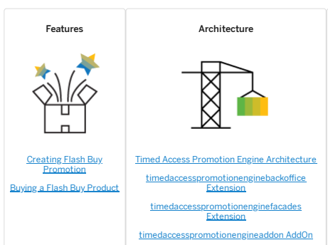

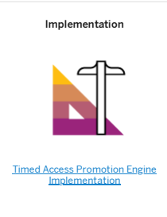

timedaccesspromotionenginesamplesaddon AddOn timedaccesspromotionengineservices Extension

## Timed Access Promotion Engine Features

The Timed Access Promotion Engine module provides a range of features related to Flash Buy promotion management, such as creating Flash Buy promotion, and allowing customers to buy Flash Buy products.

Creating Flash Buy Promotion This feature allows Backoffice Administrators to create a Flash Buy promotion, including creating a promotion rule and a Flash Buy coupon. Buying a Flash Buy Product Once a Flash Buy promotion is created and published, customers can buy the applying products in the storefront. Known Issues in Flash Buy The known issues are intended to help you troubleshoot your Flash Buy implementation.

## Creating Flash Buy Promotion

This feature allows Backoffice Administrators to create a Flash Buy promotion, including creating a promotion rule and a Flash Buy coupon.

## Use Case

An Administrator logs on and decides to create Flash Buy promotion for a promotion campaign.

## Features Creating A Promotion Rule From A Template

A promotion rule must be created as a starting point for a Flash Buy promotion. There are two Flash Buy templates available in the Backoffice, which are ash buy promotion with xed discount, and ash buy promotion with xed price. Apart from creating a promotion rule by using an already existing promotion template, you can also start from scratch. The new promotion rule is used to dene general information of a promotion campaign, as well as specifying the conditions and discount information.

## Creating A Flash Buy Coupon

In a Flash Buy promotion, one promotion rule is exclusively associated with one Flash Buy coupon. Designed on top of the singlecode coupon, a Flash Buy coupon allows you to dene the details for a promotion campaign, such as the total number of coupons that a single customer can use in the campaign, the total number of coupons that all customers can use in the campaign, associated promotion rule, and the maximum quantity that a customer can buy the qualifying product per order.

## Dependencies

There are no specic dependencies for creating a Flash Buy promotion.

## Creating A Promotion Rule From A Template

The following instructions give an example of creating a promotion rule for a Flash Buy promotion based on a template in Backoffice.

Context This is   For more    the SAP Help  9 A promotion rule must be created as a starting point for a Flash Buy promotion. There are two Flash Buy templates available in the Backoffice, which are flash buy promotion with fixed discount, and flash buy promotion with fixed price. Apart from creating a promotion rule by using an already existing promotion template, you can also start from scratch. Refer to Creating a Promotion Rule for the steps and ensure that the promotion rule is published.

## Procedure

1. Log in to the Backoffice Administration Cockpit as Backoffice Administrator.

o Username/password: use the admin user and associated password.

2. Navigate to || Marketing ⟩ Promotion Templates 3. Search for the flash buy promotion with fixed price template and go to its detail page. Click the using the selected template.

flash buy promotion with fixed price [flash_buy_promotion_with_fixed_price]

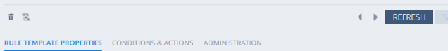

a

DETAILS
Code O
flash_buy_promotion_with_fixed_price

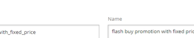

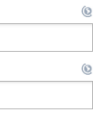

Description Buy products at fixed price on Dec 12th RULE TEMPLATE MANAGEMENT
Rule Group 0 productPromotionRuleGroup A pop-up window displays.

Create a promotion rule using this template

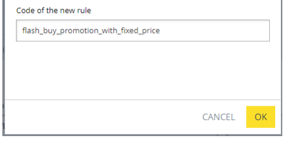

4. Enter a unique code in the Code of the new rule field, and click OK.

>
>

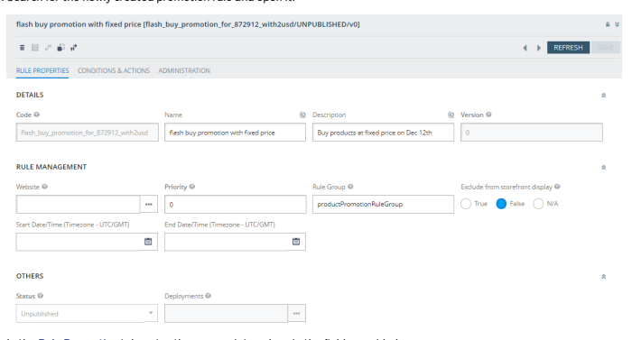

In the Rule Properties tab, enter the appropriate values in the elds provided:
Code - Species the promotion code. This eld is not editable by default.

Name - Species the promotion name.

Description - Provides a description of what the new promotion rule does, such as Flash Buy promotion for buying Secure Digital Card 2GB with 2 USD.

Version - The Version eld is a read-only eld that displays the version number of a promotion rule. A newly created promotion rule has 0 by default.

Website - Species the site where the promotion rule appears. Set the Website to electronicsPromoGrp.

Priority - Species the priority level, which determines the order of execution for rules. When all conditions are met, a rule with priority 500 is always executed earlier than a rule with priority 100. This is also valid for rules that belong to different groups. Rule Group - Species the rule group. A rule can be optionally assigned to a specic rule group. The value is set to productPromotionRuleGroup by default.
Start Date/Time - Species the effective date and time of the promotion rule. End Date/Time - Species the expiry date and time of the promotion rule.

Exclude from storefront display - Determines whether to display the promotion in the storefront, for example, the product details page. Select True if you do not want to display it in the storefront. Otherwise, select False.

Select N/A to ignore the setting. The value is set to False by default.

Status - Indicates the status of the promotion rule. This eld is not editable by default.
Deployments - Indicates the current deployment for the promotion rule. This eld is not editable by default.

6. Open the Conditions & Actions tab and do the following:
a. Set the condition for the qualifying product under the Conditions section. By default, the Qualifying products condition is selected in the template. Note that you must use the Qualifying products condition to create the promotion rule. Besides, one promotion rule can only bind one product.

b. Set the target price for the qualifying product under the Actions section.

7. Click Save. And then publish the promotion rule.

This is   For more    the SAP Help  11 Tip Apply the same procedures in this document to create a promotion rule using the ash buy promotion with xed discount template.

## Creating A Flash Buy Coupon

The following instructions give an example of creating Flash Buy coupons in Backoffice.

## Prerequisites

A promotion rule that the new coupon will bind has been created and published, and is not assigned to another coupon.

## Procedure

1. Log in to the Backoffice Administration Cockpit as Backoffice Administrator.

Username/password: use the admin user and associated password.

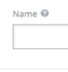

2. Navigate to Marketing Coupon Management Coupons . 3. Choose + Single-Code Coupon Flash Buy Coupon to display the New Flash Buy Coupon window.

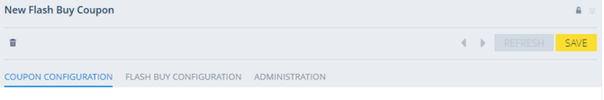 4. Enter the appropriate values in the elds provided in the Coupon Conguration tab.

Flash Buy Coupon Code - Species the identier of the coupon.

Name - Species the localized name that describes the coupon-based campaign. Maximum Redemptions per Customer - Species the maximum number of times that a customer can redeem the new Flash Buy coupon, namely the total number of coupons that a customer can use in a Flash Buy campaign for buying the qualifying product. The value is set to 1 by default.
This is   For more    the SAP Help  12 Maximum Total Redemptions - Species the maximum number of times that the new Flash Buy coupon can be redeemed, namely the total number of Flash Buy coupons that all customers can use in a Flash Buy campaign for buying the qualifying product. The value is set to 100 by default.

Start Date/Time - Species the effective date and time of the coupon. The start date should be the same as that of the promotion rule bound to the coupon. By default, this eld is grayed out and not editable. End Date/Time - Species the expiry date and time of the coupon. The end date should be the same as that of the promotion rule bound to the coupon. By default, this eld is grayed out and not editable.

Active - Setting the status to True activates the coupon and makes it usable in the promotion. The value is set to False by default.

5. Navigate to the Flash Buy Conguration tab, and enter the appropriate values in the elds provided:
Promotion Rule - Species the Flash Buy promotion bound to the new coupon. The promotion rule must be a published one, and is not assigned to another coupon. Maximum Product Quantity Per Order - Species the maximum quantity of qualifying product that a customer can buy for one order.

## Note

When binding a Flash Buy coupon to a promotion, the promotion rule must contain one product, and contain one product only.

When creating a Flash Buy coupon using ImpEx les, the corresponding promotion rule must contain one product, and contain one product only.
6. Click Save to save the details.

The start date and end date of the selected promotion rule are automatically copied to the coupon.

## Buying A Flash Buy Product

Once a Flash Buy promotion is created and published, customers can buy the applying products in the storefront.

## Use Case

A customer logs on and decides to buy some products that are on Flash Buy promotion.

## Features

For a Flash Buy product, the Product Details page displays the promotion information. The Add To Cart button is replaced with Flash Buy. The promotion information is also viewable in the cart page. Besides, the cart total is calculated based on received discounts from the promotion campaign.

## Dependencies

There are no specic dependencies for using this feature.

## Buying A Flash Buy Product

The following instructions give an example of buying a Flash Buy product in the storefront of Accelerator for China.

## Procedure

1. Navigate to the Product Details page of the desired product.

2. Set the quantity to be purchased and click Flash Buy.

OGITAL CAMERAS
RLM CAMERAS
HAND HELD CANCORDER
NEBCAMS
POWER SUPPLIES
FLASH MEMOR
CAMERA ACCESSORIES & SUPPLIES

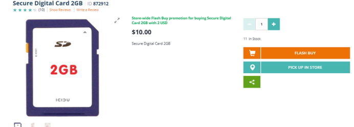

i Note A message will display if the quantity you set exceeds the allowed upper limit. Meanwhile, the quantity will be automatically reduced to the maximum quantity you can purchase for the current transaction.

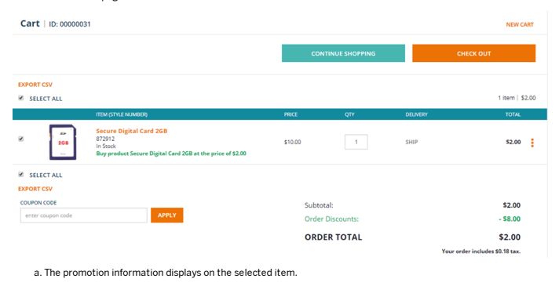

3. Proceed to the cart page.

b. The cart total is calculated based on received discounts from this promotion campaign.

4. Check out the selected product.

A Flash Buy coupon code that corresponds to the promotion will be automatically applied on the cart. The coupon code will then be viewable under the Coupon Code section in the cart page, under the Order Summary section in the checkout page, and on the Order Details page.

## I Note

 If you have added the product to the cart at an earlier time, but it has now run out of stock for the Flash Buy o campaign, or you have participated in the Flash Buy for the maximum allowed number of times, an error message will display after you click Check Out in the cart page. In these two cases, you will not able to check out this product until the campaign expires.

o If there is only one item left for Flash Buy promotion, only the customer who has successfully placed the order can enjoy the Flash Buy price. In this case, the consumers who failed to place an order will be redirected to the cart page, and can only check out the selected item at the regular price.

This is custom documentation. For more information, please visit the SAP Help Portal

## Known Issues In Flash Buy

The known issues are intended to help you troubleshoot your Flash Buy implementation.

## Cannot Apply Coupon When Selecting The Cart Discounts Action

When creating a promotion rule, set promotion condition for the qualifying product, and select Cart discounts as action.

The Flash Buy promotion rule can be bound to Flash Buy coupon, the Flash Buy button displays in PDP, and discount is applied during checkout, but the Flash Buy coupon is not applied.

To avoid this issue, select Product discounts actions for the your Flash Buy promotion rule only.

## Cannot Automatically Stop Flash Buy Promotion When The Product Is Out Of Stock For The Campaign

A Flash Buy promotion will not be automatically stopped when the qualifying product is out of stock for the campaign. In this case, the promotion can neither be manually stopped. The promotion will be automatically stopped either when all Flash Buy coupons are redeemed, or when the campaign expires.

## Timed Access Promotion Engine Architecture

The Timed Access Promotion Engine module is a set of extensions providing functionality related to Flash Buy promotion management, such as creating Flash Buy promotion, and allowing customers to buy Flash Buy products.

## Dependencies

 Tip Open the gure in a new tab to have better viewing experience.

Dependencies Diagram

## Recipes

For a complete list of SAP Commerce Cloud recipes that may include this module, see Installer Recipes. For a complete list of the SAP Commerce Cloud, integration extension pack recipes that may include this module, see Installer Recipe Reference.

This is   For more    the SAP Help  15 Extensions The Timed Access Promotion Engine module consists of the following extensions:
timedaccesspromotionenginebackoffice Extension The timedaccesspromotionenginebackoffice extension provides Backoffice conguration for the FlashBuyCoupon module timedaccesspromotionenginefacades Extension The timedaccesspromotionenginefacades extension exposes methods for AddOn layer, delegated to service layer and makes conversion between model and data objects. timedaccesspromotionengineaddon AddOn The timedaccesspromotionengineaddon AddOn implements storefront controllers, delegated to facade and / or service, and enables the UI for displaying the Flash Buy button. timedaccesspromotionenginesamplesaddon AddOn The timedaccesspromotionenginesamplesaddon AddOn provides sample promotion templates for the Flash Buy promotion feature. timedaccesspromotionengineservices Extension The timedaccesspromotionengineservices extension implements methods to enable the Flash Buy Coupon feature. timedaccesspromotionengineoccaddon AddOn The timedaccesspromotionengineoccaddon AddOn provides timed access promotion of a product in the product REST API. timedaccesspromotionengineocc Extension The timedaccesspromotionengineoccaddon AddOn provides timed access promotion of a product in the product REST API.

## Timedaccesspromotionenginebackoffice Extension

The timedaccesspromotionenginebackoffice extension provides Backoffice conguration for the FlashBuyCoupon module

## Overview

This timedaccesspromotionenginebackoffice extension provides two editing areas in the Backoffice, which are Promotion Rule, Maximum Product Quantity Per Order.

The standard Backoffice conguration is dened in the timedaccesspromotionenginebackoffice-backofficeconfig.xml le, and localized through property les in the resources/timedaccesspromotionenginebackofficebackoffice-labels folder.

The Promotion Rule eld requires Backoffice Administrator to bind a promotion to a Flash Buy coupon. The Maximum Product Quantity Per Order eld requires Backoffice Administrator to set a number to limit the quantity per order for the product which is applied to Flash Buy promotion.

## Class Diagram

The following class diagram provides an overview of the key services provided by the timedaccesspromotionenginebackoffice extension.

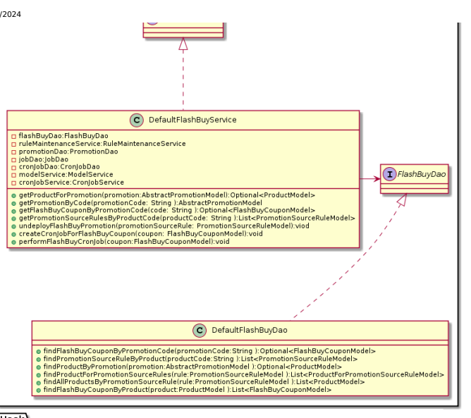

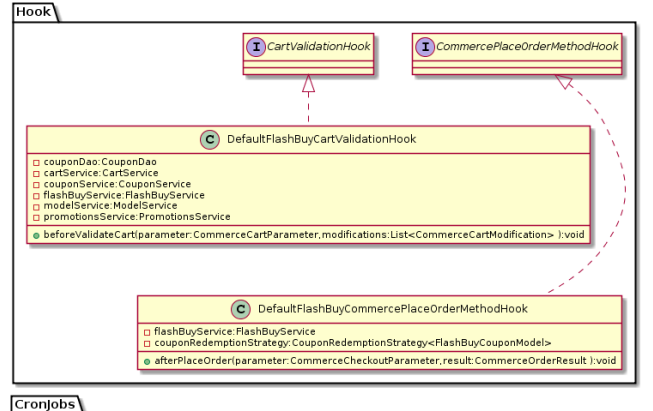

C AbstractJobPerformable

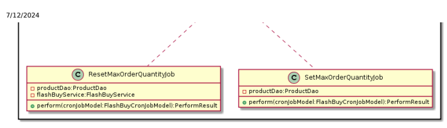

## Congurations

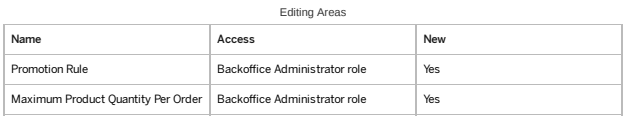

## Timedaccesspromotionenginefacades Extension

The timedaccesspromotionenginefacades extension exposes methods for AddOn layer, delegated to service layer and makes conversion between model and data objects.

## Class Diagram

 Methods

DefaultFlashBuyFacade::prepareFlashBuyInfo Prepare Flash Buy information, set product's max order quantity for product and return coupon code.

DefaultFlashBuyFacade::updateFlashBuyStatusForCart
This is   For more    the SAP Help  18

## Timedaccesspromotionengineaddon Addon

The timedaccesspromotionengineaddon AddOn implements storefront controllers, delegated to facade and / or service, and enables the UI for displaying the Flash Buy button.

## Caution

This page refers to software that has been deprecated as part of the Accelerator UI and older OCC template extensions deprecation. For more information, see Deprecated Accelerator UIs and OCC Template Extensions - Deletion in SAP Commerce Cloud 2211.

## Note Before Implementing

A SAP Commerce Cloud extension may provide functionality that is licensed through different SAP Commerce Cloud modules. Make sure to limit your implementation to the features dened in your contract license. In case of doubt, please contact your SAP Commerce Cloud Sales representative.

## Addon Denition

| Name        | timedaccesspromotionengineaddon                                                                                                  |
|-------------|----------------------------------------------------------------------------------------------------------------------------------|
| Description | Implements storefront controllers, delegated to facade and / or service, and enables the UI for displaying the Flash Buy button. |
| Requires    | addonsupport Extension timedaccesspromotionenginefacades Extension acceleratorstorefrontcommons AddOn                            |
| Author      | SAP Commerce Cloud                                                                                                               |

## Supported Markets And Channels

The timedaccesspromotionengineaddon AddOn is designed for all B2C markets for the responsive channel.

| Supported      | B2C Commerce                 |
|----------------|------------------------------|
| Market Channel | Desktop: Responsive: Mobile: |

## How To Install

1. Add the timedaccesspromotionengineaddon AddOn to your localextensions.xml le ensuring the listed required extensions are also included.

This is   For more    the SAP Help  19
<extension dir="${HYBRIS_BIN_DIR}/modules/timed-access-promotion-engine/timedaccesspromotionen 2. Call the ant addoninstall<Enter> command. This generates the correct properties in the project.properties le of the timedaccesspromotionengineaddon AddOn and adds a dependency from your storefront to the timedaccesspromotionengineaddon AddOn.

ant addoninstall -Daddonnames="timedaccesspromotionsaddon" -DaddonStorefront.yacceleratorsto

## Note

If you initialized your system before installing the timedaccesspromotionengineaddon AddOn, you must run ant clean **all<Enter>** and update the system.

## Modied Page Components

| Page                 | Description                                                                          |
|----------------------|--------------------------------------------------------------------------------------|
| product details page | Change the Add To Cart button to Flash Buy when a Flash Buy is active for a product. |

## Sample Data

The following is a list of data loaded by the timedaccesspromotionengineaddon AddOn for Flash Buy:
Common data:
MinConstraint for MaxProductQuantityPerOrder in FlashBuyCoupon

## Modications Checklist

The following tables list the modications that this AddOn makes to the Accelerator:

| ImpEx Conguration Scripts Core Data Listeners Model Layer Model Interceptors Cockpit Conguration Cockpit Beans Validation Rules Service Layer Facade DTO Facade Layer CMS Components Page Templates JavaScript   |
|------------------------------------------------------------------------------------------------------------------------------------------------------------------------------------------------------------------|

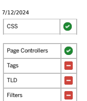

| Tags TLD Filters MVC Interceptors Spring Security Message Resources   |
|-----------------------------------------------------------------------|

## Timedaccesspromotionenginesamplesaddon Addon

The timedaccesspromotionenginesamplesaddon AddOn provides sample promotion templates for the Flash Buy promotion feature.

## Caution

This page refers to software that has been deprecated as part of the Accelerator UI and older OCC template extensions deprecation. For more information, see Deprecated Accelerator UIs and OCC Template Extensions - Deletion in SAP Commerce Cloud 2211.

## Note Before Implementing

A SAP Commerce Cloud extension may provide functionality that is licensed through different SAP Commerce Cloud modules. Make sure to limit your implementation to the features dened in your contract license. In case of doubt, please contact your SAP Commerce Cloud Sales representative.

## Addon Denition

| Name        | timedaccesspromotionenginesamplesaddon                                                    |
|-------------|-------------------------------------------------------------------------------------------|
| Description | It loads sample customer coupons and corresponding promotions into the Electronics Store. |
| Requires    | addonsupport Extension promotionenginesamplesaddon AddOn                                  |
| Author      | SAP Commerce Cloud                                                                        |

## Supported Markets And Channels

The timedaccesspromotionenginesamplesaddon AddOn is specically designed for B2C market for the responsive channel.

Supported B2C Commerce Market

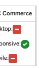

| Supported   | B2C Commerce                 |
|-------------|------------------------------|
| Channel     | Desktop: Responsive: Mobile: |

## How To Install

1. Add the timedaccesspromotionenginesamplesaddon AddOn to your localextensions.xml le ensuring the listed required extensions are also included.

<extension dir="${HYBRIS_BIN_DIR}/modules/timed-access-promotion-engine/timedaccesspromotionen 2. Call the ant addoninstall<Enter> command. This generates the correct properties in the project.properties le of the timedaccesspromotionenginesamplesaddon AddOn and adds a dependency from your storefront to the timedaccesspromotionenginesamplesaddon AddOn.

ant addoninstall -Daddonnames="timedaccesspromotionenginesamplesaddon" -DaddonStorefront.yacc

## Note

If you initialized your system before installing the timedaccesspromotionenginesamplesaddon AddOn, you must run ant clean **all<Enter>** and update the system.

## Sample Data

The following is a list of sample data loaded by the timedaccesspromotionenginesamplesaddon AddOn for the Electronics Store:
Sample data Sample Flash Buy Promotion Templates

## Timedaccesspromotionengineservices Extension

The timedaccesspromotionengineservices extension implements methods to enable the Flash Buy Coupon feature.

## Overview

The timedaccesspromotionengineservices extension provides the following functionality:
1. Provides FlashBuyCoupon model to store coupons and coupon descriptions.

2. Provides FlashBuyCronJob model to store Flash Buy CronJobs and descriptions.

## Data Model

This section describes the data model used in the timedaccesspromotionengineservices extension.

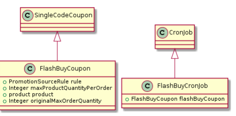

The FlashBuyCoupon model extends the SingleCodeCoupon model.

The FlashBuyCronJob model extends the CronJob model.

| Name                       | Type                  | Description                                     |
|----------------------------|-----------------------|-------------------------------------------------|
| rule                       | promotion source rule | the promotion bound to Flash Buy coupon         |
| maxProductQuantityPerOrder | integer               | the quantity limitation for Flash Buy per order |
| product                    | product               | the product which the Flash Buy applies         |
| originalMaxOrderQuantity   | integer               | the original max order quantity for product     |

## Class Diagram

The following class diagram provides an overview of the key services provided by the timedaccesspromotionengineservices extension.

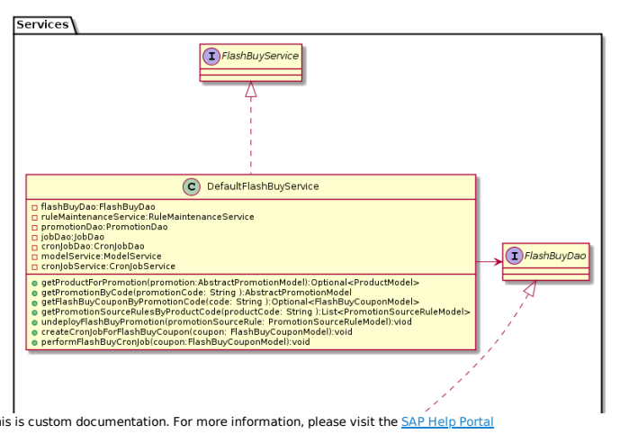

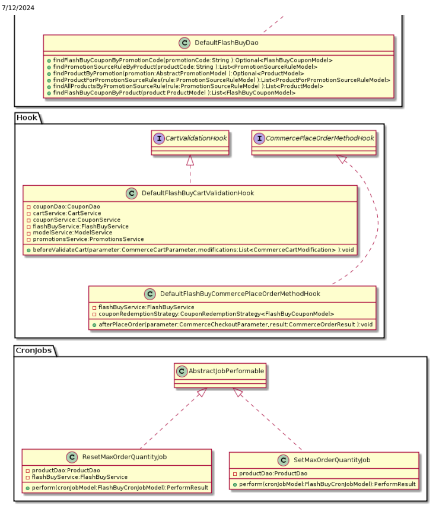

## Methods

DefaultFlashBuyService
- FlashBuyService::getFlashBuyCouponByPromotionCode This method is used to get Flash Buy coupon by given promotion code.

- FlashBuyService::getFlashBuyCouponByProduct

This method is used to get Flash Buy coupon by product.
This is custom documentation. For more information, please visit the SAP Help Portal

FlashBuyService::createCronJobForFlashBuyCoupon This method is used to create or update CronJob for Flash Buy coupon to reset max order quantity.

FlashBuyService::performFlashBuyCronJob This method is used to perform CronJob for Flash Buy directly.
DefaultFlashBuyDao FlashBuyDao::findFlashBuyCouponByPromotionCode This method is used to nd FlashBuyCouponModel by given promotion code.

FlashBuyDao::findPromotionSourceRuleByProduct
This method is used to nd promotion source rule by applied product.

FlashBuyDao::findProductForPromotionSourceRules This method is used to nd the applied product for the selected promotion source rule.

findAllProductsByPromotionSourceRule
This method is used to nd all products by given promotion source rule.

findFlashBuyCouponByProduct This method is used to nd the Flash Buy coupon by product.

SetMaxOrderQuantityJob SetMaxOrderQuantityJob::perform Job to set value of maxOrderQuantity for Flash Buy product.

ResetMaxOrderQuantityJob ResetMaxOrderQuantityJob::perform Job to reset value of maxOrderQuantity for Flash Buy product.

## Timedaccesspromotionengineoccaddon Addon

The timedaccesspromotionengineoccaddon AddOn provides timed access promotion of a product in the product REST
API.

## Caution

This page refers to software that has been deprecated as part of the Accelerator UI and older OCC template extensions deprecation. For more information, see Deprecated Accelerator UIs and OCC Template Extensions - Deletion in SAP Commerce Cloud 2211.

## Note Before Implementing

A SAP Commerce Cloud extension may provide functionality that is licensed through different SAP Commerce Cloud modules. Make sure to limit your implementation to the features dened in your contract license. In case of doubt, please This is   For more    the SAP Help  25

## Addon Denition

| Name        | timedaccesspromotionengineoccaddon                                                                             |
|-------------|----------------------------------------------------------------------------------------------------------------|
| Description | Provides provides timed access promotion of a product in the product REST API.                                 |
| Requires    | addonsupport Extension chinesecommercewebservicescommons Extension timedaccesspromotionenginefacades Extension |
| Author      | SAP Commerce Cloud                                                                                             |

## Wsdto Denition

Dene WsDTO in the chinesecommercewebservicescommons Extension.

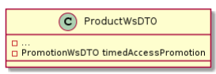

## Supported Markets And Channels

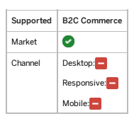

## How To Install

1. Add the timedaccesspromotionengineoccaddonn AddOn to your localextensions.xml le ensuring the listed required extensions are also included.

<extension dir="${HYBRIS_BIN_DIR}/modules/timed-access-promotion-engine/timedaccesspromotionen <extension dir="${HYBRIS_BIN_DIR}/modules/commerce-services/ycommercewebservices"/>
2. Call the ant addoninstall<Enter> command. This generates the correct properties in the project.properties le of the timedaccesspromotionengineoccaddon AddOn and adds a dependency from your storefront to the timedaccesspromotionengineoccaddon AddOn.

ant addoninstall -Daddonnames="timedaccesspromotionengineoccaddon" -DaddonStorefront.ycommerc Note If you initialized your system before installing the timedaccesspromotionengineoccaddon AddOn, you have to run ant clean **all<Enter>** and update the system.

This is   For more    the SAP Help  26 The modications that this AddOn makes to the Accelerator are listed below:

| ImpEx Conguration Scripts Core Data Listeners Model Layer Model Interceptors Cockpit Conguration Cockpit Beans Validation Rules Service Layer Facade DTO Facade Layer CMS Components Page Templates JavaScript CSS Page Controllers Tags TLD Filters MVC Interceptors Spring Security Message Resources   |
|-----------------------------------------------------------------------------------------------------------------------------------------------------------------------------------------------------------------------------------------------------------------------------------------------------------|

## Timedaccesspromotionengineocc Extension

The timedaccesspromotionengineoccaddon AddOn provides timed access promotion of a product in the product REST
API.

## Note Before Implementing

A SAP Commerce Cloud extension may provide functionality that is licensed through different SAP Commerce Cloud modules. Make sure to limit your implementation to the features dened in your contract license. In case of doubt, please contact your SAP Commerce Cloud Sales representative.

## Addon Denition

| Name        | timedaccesspromotionengineocc                                                           |
|-------------|-----------------------------------------------------------------------------------------|
| Description | Provides provides timed access promotion of a product in the product REST API.          |
| Requires    | chinesecommercewebservicescommons Extension timedaccesspromotionenginefacades Extension |
| Author      | SAP Commerce Cloud                                                                      |

## Wsdto Denition

Supported Markets and Channels

| Supported      | B2C Commerce                 |
|----------------|------------------------------|
| Market Channel | Desktop: Responsive: Mobile: |

## How To Install

Add the timedaccesspromotionengineocc Extension to your localextensions.xml le ensuring the listed required extensions are also included.

<extension dir="${HYBRIS_BIN_DIR}/modules/timed-access-promotion-engine/timedaccesspromotionengineo <extension dir="${HYBRIS_BIN_DIR}/modules/commerce-services/commercewebservices"/>

## Modications Checklist

The modications that this AddOn makes to the Accelerator are listed below:

| ImpEx Conguration Scripts Core Data Listeners Model Layer Model Interceptors Cockpit Conguration Cockpit Beans Validation Rules   |
|-----------------------------------------------------------------------------------------------------------------------------------|

| 7/12/2024 Service Layer Facade DTO Facade Layer CMS Components Page Templates JavaScript CSS Page Controllers Tags TLD Filters MVC Interceptors Spring Security Message Resources   |
|-------------------------------------------------------------------------------------------------------------------------------------------------------------------------------------|

## Timed Access Promotion Engine Implementation

The provided REST API offers you great exibility in terms of how to implement the Timed Access Promotion Engine module.

Timed Access Promotion Engine API This feature allows you to get timed access promotion information of a product using provided API.

## Timed Access Promotion Engine Api

This feature allows you to get timed access promotion information of a product using provided API.

Getting Flash Buy Product Using API This section describes the request and request authentication details for getting a Flash Buy product by product code.

## Getting Flash Buy Product Using Api

This section describes the request and request authentication details for getting a Flash Buy product by product code.

## Request Interface

request URL: https://{server}:{port}/rest/v2/electronics/products/{productCode} request method: GET request headers:
This is   For more    the SAP Help  29

## Response Json Example

{ "availableForPickup": true, "averageRating": 3.642857142857143,
 "baseOptions": [],
 "categories": [ { "code": "827" }, { "code": "brand_10" } ], "code": "1422222", "configurable": false, "description": "Canon AC Adapter Kit ACKE5 for 450D.", "manufacturer": "Canon", "name": "ACK-E5 AC Adapter Kit", "numberOfReviews": 0, "price": { "currencyIso": "CNY", "formattedValue": "$152.01", "priceType": "BUY", "value": 152.01 }, "priceRange": {}, "purchasable": true, "stock": { "stockLevel": 29, "stockLevelStatus": "inStock" }, "summary": "ACK-E5 AC Adapter Kit", "timedAccessPromotion": { "code": "flash_buy_promotion_with_fixed_price", "promotionType": "Rule Based Promotion" }, "url": "/electronics/products/1422222" }

## Note

If the specied product has been congured with Flash Buy promotion, and the promotion is still valid, the response will display the product information with the timedAccessPromotion node.

| Error Message                                  | Description   | Comment   |
|------------------------------------------------|---------------|-----------|
| The entered product code does not exist.       | N/A           |           |
| found!> <Product code Product with code ** not |               |           |
