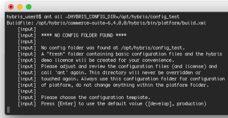

## Reference

Generated on: 2024-07-11 23:35:22 GMT+0000 SAP Commerce Cloud in the Public Cloud | 2211

## Public

Original content: https://help.sap.com/docs/SAP_COMMERCE_CLOUD_PUBLIC_CLOUD/12be4ac419604b01aabb1adeb2c4c8a2?locale=en- US&state=PRODUCTION&version=v2211

## Warning

This document has been generated from the SAP Help Portal and is an incomplete version of the official SAP product documentation. The information included in custom documentation may not reect the arrangement of topics in the SAP Help Portal, and may be missing important aspects and/or correlations to other topics. For this reason, it is not for productive use. For more information, please visit the https://help.sap.com/docs/disclaimer.

## Reference

Find additional resources to assist you as you work with SAP Commerce Cloud.

Get familiar with all the key features and the terminology of SAP Commerce Cloud.

Glossary What's New Find key reference topics to help you install and develop with SAP
Commerce Cloud.

Environment Variables Installer Recipes Extensions and AddOns Factory Default User Accounts

Download additional resources to get you up and running quickly with your SAP Commerce Cloud project.

API Documentation and YAML Files Wireframes

## Api Documentation And Yaml Files

Consult the SAP Commerce Cloud REST API documentation and download the YAML les.

The following table only includes API documentation for productive SAP Commerce Cloud releases that introduce new innovations and features:

| Module Name            | Extension Name                  | REST API Reference                   | YAML File   | SAP Com Clo Upd Rele   |
|------------------------|---------------------------------|--------------------------------------|-------------|------------------------|
| Integration API        | inboundb2bcustomer API Docs     | inboundb2bcustomer.yaml              | 221         |                        |
| Module Integration API | inboundb2bcustomerconrmation    | inboundb2bcustomerconrmation.yaml    | 221         |                        |
| Module                 | API Docs                        |                                      |             |                        |
| Integration API        | inboundb2bunit API Docs         | inboundb2bunit.yaml                  | 221         |                        |
| Module Integration API | inboundb2ccustomerconrmation    | inboundb2ccustomerconrmation.yaml    | 221         |                        |
| Module                 | API Docs                        |                                      |             |                        |
| Integration API        | inboundclassattributeassignment | inboundclassattributeassignment.yaml | 221         |                        |
| Module                 | API Docs                        |                                      |             |                        |

This is   For more    the SAP Help  2

| 7/11/2024 Module Name                                                                | Extension Name                    | REST API Reference                     | YAML File   | SAP Com Clo Upd Rele   |
|--------------------------------------------------------------------------------------|-----------------------------------|----------------------------------------|-------------|------------------------|
| Integration API                                                                      | inboundclassicationattribute API  | inboundclassicationattribute.yaml      | 221         |                        |
| Module                                                                               | Docs                              |                                        |             |                        |
| Integration API                                                                      | inboundclassicationattributevalue | inboundclassicationattributevalue.yaml | 221         |                        |
| Module                                                                               | API Docs                          |                                        |             |                        |
| Integration API                                                                      | inboundclassicationclass API      | inboundclassicationclass.yaml          | 221         |                        |
| Module                                                                               | Docs                              |                                        |             |                        |
| Integration API                                                                      | inbounddiscountrow API Docs       | inbounddiscountrow.yaml                | 221         |                        |
| Module Integration API                                                               | inbounderpvariantproduct API      | inbounderpvariantproduct.yaml          | 221         |                        |
| Module                                                                               | Docs                              |                                        |             |                        |
| Integration API                                                                      | inboundintegrationmonitoring API  | inboundintegrationmonitoring.yaml      | 221         |                        |
| Module                                                                               | Docs                              |                                        |             |                        |
| Integration API                                                                      | inboundommorder API Docs          | inboundommorder.yaml                   | 221         |                        |
| Module Integration API                                                               | inboundommorderentry API Docs     | inboundommorderentry.yaml              | 221         |                        |
| Module Integration API                                                               | inboundommstocklevel API Docs     | inboundommstocklevel.yaml              | 221         |                        |
| Module Integration API                                                               | inboundomsorder API Docs          | inboundomsorder.yaml                   | 221         |                        |
| Module Integration API                                                               | inboundomsstocklevel API Docs     | inboundomsstocklevel.yaml              | 221         |                        |
| Module Integration API                                                               | inboundpricerow API Docs          | inboundpricerow.yaml                   | 221         |                        |
| Module Integration API                                                               | inboundproduct API Docs           | inboundproduct.yaml                    | 221         |                        |
| Module Integration API                                                               | inboundproductfeature API Docs    | inboundproductfeature.yaml             | 221         |                        |
| Module Integration API                                                               | integrationservice API Docs       | integrationservice.yaml                | 221         |                        |
| Module Integration API                                                               | outboundchannelcong API Docs      | outboundchannelcong.yaml               | 221         |                        |
| Module Integration API                                                               | outboundintegrationmonitoring API | outboundintegrationmonitoring.yaml     | 221         |                        |
| Module                                                                               | Docs                              |                                        |             |                        |
| Integration API                                                                      | webhookservice API Docs           | webhookservice.yaml                    | 221         |                        |
| Module Integration API                                                               | scriptservice API Docs            | scriptservice.yaml                     | 221         |                        |
| Module Integration API                                                               | runtimeattributeservice API Docs  | runtimeattributeservice.yaml           | 221         |                        |
| Module                                                                               |                                   |                                        |             |                        |
| This is custom documentation. For more information, please visit the SAP Help Portal | 3                                 |                                        |             |                        |

| 7/11/2024 Module Name                   | Extension Name                 | REST API Reference                | YAML File                           | SAP Com Clo Upd Rele   |
|-----------------------------------------|--------------------------------|-----------------------------------|-------------------------------------|------------------------|
| Adaptive                                | adaptivesearchwebservices      | adaptive-search API Docs          | adaptive-search.yaml                | 221                    |
| Search Module                           | Extension                      |                                   |                                     |                        |
| Platform                                | adminapi Extension             | adminapi API Docs                 | adminapi.yaml                       | 221                    |
| Assisted Service Module                 | assistedservicewebservices     | assistedservicewebservices API    | assistedservicewebservices.yaml     | 221                    |
| Extension                               | docs                           |                                   |                                     |                        |
| B2B Accelerator Module                  | b2boccaddon AddOn              | b2boccaddon API Docs              | b2boccaddon.yaml                    | 221                    |
| B2B PunchOut                            | b2bpunchoutocc Extension       | b2bpunchoutocc API Docs           | b2bpunchoutocc.yaml                 | 221                    |
| Module China Accelerator Address Module | chineseaddressocc Extension    | china-accelerator-address API     | china-accelerator-address.yaml      | 221                    |
| Docs                                    |                                |                                   |                                     |                        |
| China Accelerator Logistics Module      | chineselogisticocc Extension   | china-accelerator-logistics API   | china-accelerator-logistics.yaml    | 221                    |
| Docs                                    |                                |                                   |                                     |                        |
| China Accelerator Payment Module        | chinesepaymentocc Extension    | china-accelerator-payment API     | china-accelerator-payment.yaml      | 221                    |
| Docs                                    |                                |                                   |                                     |                        |
| China Accelerator People Prole Module   | chineseproleocc Extension      | china-accelerator-people-prole    | china-accelerator-people-prole.yaml | 221                    |
| API                                     |                                |                                   |                                     |                        |
| China Accelerator Tax Invoice Module    | chinesetaxinvoiceocc Extension | china-accelerator-tax-invoice API | china-accelerator-tax-invoice.yaml  | 221                    |
| Docs                                    |                                |                                   |                                     |                        |
| WCMS Module                             | cmsocc Extension               | cmsocc API Docs                   | cmsocc.yaml                         | 221                    |
| WCMS Module                             | cmswebservices Extension       | cmswebservices API Docs           | cmswebservices.yaml                 | 221                    |
| WCMS Module                             | previewwebservices Extension   | previewwebservices API Docs       | previewwebservices.yaml             | 221                    |
| Commerce Services Module                | commercewebservices            | commerce-services API Docs        | commerce-services.yaml              | 221                    |
| Extension                               |                                |                                   |                                     |                        |
| Congurable                              | congurablebundleocc Extension  | congurable-bundle API Docs        | congurable-bundle.yaml              | 221                    |
| Bundle Module                           |                                |                                   |                                     |                        |

| 7/11/2024 Module Name                                                       | Extension Name                 | REST API Reference              | YAML File                         | SAP Com Clo Upd Rele   |
|-----------------------------------------------------------------------------|--------------------------------|---------------------------------|-----------------------------------|------------------------|
| Congurator for Complex Products Module with Variant Conguration and Pricing | sapproductcongocc Extension    | congurator-complex-products API | congurator-complex-products.yaml  | 221                    |
| Docs                                                                        |                                |                                 |                                   |                        |
| SAP CPQ Integration for Congurable Products                                 | cpqproductcongocc Extension    | cpq-product-conguration API     | cpq-product-conguration.yaml      | 221                    |
| Docs                                                                        |                                |                                 |                                   |                        |
| Consignment Tracking Module                                                 | consignmenttrackingoccaddon    | consignment-tracking API Docs   | consignment-tracking.yaml         | 221                    |
| AddOn                                                                       |                                |                                 |                                   |                        |
| Coupon                                                                      | couponwebservices Extension    | couponwebservices API Docs      | couponwebservices.yaml            | 221                    |
| Module Customer Coupon Module                                               | customercouponoccaddon         | customer-coupon API Docs        | customer-coupon.yaml              | 221                    |
| AddOn                                                                       |                                |                                 |                                   |                        |
| Customer Interests Module                                                   | customerinterestsoccaddon      | customer-interest API Docs      | customer-interest.yaml            | 221                    |
| AddOn                                                                       |                                |                                 |                                   |                        |
| Customer Service Module                                                     | customerticketingocc Extension | customerticketing API Docs      | customerticketing.yaml            | 221                    |
| Marketplace                                                                 | marketplaceocc Extension       | marketplace API Docs            | marketplace.yaml                  | 221                    |
| Accelerator Merchandising                                                   | merchandisingcmswebservices    | merchandising API Docs          | merchandising.yaml                | 221                    |
| Module                                                                      | Extension                      |                                 |                                   |                        |
| Data Hub                                                                    | datahub API Docs               | datahub.yaml                    | 221                               |                        |
| Message                                                                     | messagecentercsocc Extension   | message-center API Docs         | message-center.yaml               | 221                    |
| Center Module Notication                                                    | noticationocc Extension        | notication API Docs             | notication.yaml                   | 221                    |
| Module Order Management Services Module                                     | ordermanagementwebservices     | ordermanagementwebservices API  | ordermanagementwebservices.yaml   | 221                    |
| Extension                                                                   | Docs                           |                                 |                                   |                        |
| Order Management Services Module                                            | ordermanagementwebservices     | b2bordermanagementwebservices   | b2bordermanagementwebservices API | 221                    |
| Extension                                                                   | API Docs                       | Docs                            |                                   |                        |

| 7/11/2024 Module Name                                                                | Extension Name                    | REST API Reference                     | YAML File                          | SAP Com Clo Upd Rele   |
|--------------------------------------------------------------------------------------|-----------------------------------|----------------------------------------|------------------------------------|------------------------|
| Order Management Services Module                                                     | warehousingwebservices            | warehousingwebservices API Docs        | warehousingwebservices.yaml        | 221                    |
| Extension                                                                            |                                   |                                        |                                    |                        |
| Web Services Commons Module                                                          | permissionswebservices            | permissions API Docs                   | permissions.yaml                   | 221                    |
| Extension                                                                            |                                   |                                        |                                    |                        |
| Personalization                                                                      | personalizationwebservices        | personalizationwebservices API         | personalizationwebservices.yaml    | 221                    |
| Module                                                                               | Extension                         | Docs                                   |                                    |                        |
| B2B Accelerator AddOns Module                                                        | savedorderformsocc Extension      | savedorderformsocc API Docs            | savedorderformsocc.yaml            | 221                    |
| SmartEdit                                                                            | cmssmarteditwebservices           | cmssmarteditwebservices API            | cmssmarteditwebservices.yaml       | 221                    |
| Extension                                                                            | Docs                              |                                        |                                    |                        |
| SmartEdit                                                                            | smartedit Extension               | smartedit API Docs                     | smartedit.yaml                     | 221                    |
| SmartEdit                                                                            | smarteditwebservices Extension    | smarteditwebservices API Docs          | smarteditwebservices.yaml          | 221                    |
| Text Field Congurator Template Module                                                | texteldconguratortemplateocc      | text-eld-congurator-template           | text-eld-congurator-template.yaml  | 221                    |
| Extension                                                                            | API Docs                          |                                        |                                    |                        |
| Timed Access Promotion Engine Module                                                 | timedaccesspromotionengineocc     | timed-access-promotion-engine          | timed-access-promotion-engine.yaml | 221                    |
| Extension                                                                            | API Docs                          |                                        |                                    |                        |
| Integration API                                                                      | inboundb2bcustomer API Docs       | inboundb2bcustomer.yaml                | 221                                |                        |
| Module Integration API                                                               | inboundb2bcustomerconrmation      | inboundb2bcustomerconrmation.yaml      | 221                                |                        |
| Module                                                                               | API Docs                          |                                        |                                    |                        |
| Integration API                                                                      | inboundb2bunit API Docs           | inboundb2bunit.yaml                    | 221                                |                        |
| Module Integration API                                                               | inboundb2ccustomerconrmation      | inboundb2ccustomerconrmation.yaml      | 221                                |                        |
| Module                                                                               | API Docs                          |                                        |                                    |                        |
| Integration API                                                                      | inboundclassattributeassignment   | inboundclassattributeassignment.yaml   | 221                                |                        |
| Module                                                                               | API Docs                          |                                        |                                    |                        |
| Integration API                                                                      | inboundclassicationattribute API  | inboundclassicationattribute.yaml      | 221                                |                        |
| Module                                                                               | Docs                              |                                        |                                    |                        |
| Integration API                                                                      | inboundclassicationattributevalue | inboundclassicationattributevalue.yaml | 221                                |                        |
| Module                                                                               | API Docs                          |                                        |                                    |                        |
| Integration API                                                                      | inboundclassicationclass API      | inboundclassicationclass.yaml          | 221                                |                        |
| Module                                                                               | Docs                              |                                        |                                    |                        |
| Integration API                                                                      | inbounddiscountrow API Docs       | inbounddiscountrow.yaml                | 221                                |                        |
| Module                                                                               |                                   |                                        |                                    |                        |
| This is custom documentation. For more information, please visit the SAP Help Portal | 6                                 |                                        |                                    |                        |

| 7/11/2024 Module Name   | Extension Name                    | REST API Reference                 | YAML File                       | SAP Com Clo Upd Rele   |
|-------------------------|-----------------------------------|------------------------------------|---------------------------------|------------------------|
| Integration API         | inbounderpvariantproduct API      | inbounderpvariantproduct.yaml      | 221                             |                        |
| Module                  | Docs                              |                                    |                                 |                        |
| Integration API         | inboundintegrationmonitoring API  | inboundintegrationmonitoring.yaml  | 221                             |                        |
| Module                  | Docs                              |                                    |                                 |                        |
| Integration API         | inboundommorder API Docs          | inboundommorder.yaml               | 221                             |                        |
| Module Integration API  | inboundommorderentry API Docs     | inboundommorderentry.yaml          | 221                             |                        |
| Module Integration API  | inboundommstocklevel API Docs     | inboundommstocklevel.yaml          | 221                             |                        |
| Module Integration API  | inboundomsorder API Docs          | inboundomsorder.yaml               | 221                             |                        |
| Module Integration API  | inboundomsstocklevel API Docs     | inboundomsstocklevel.yaml          | 221                             |                        |
| Module Integration API  | inboundpricerow API Docs          | inboundpricerow.yaml               | 221                             |                        |
| Module Integration API  | inboundproduct API Docs           | inboundproduct.yaml                | 221                             |                        |
| Module Integration API  | inboundproductfeature API Docs    | inboundproductfeature.yaml         | 221                             |                        |
| Module Integration API  | integrationservice API Docs       | integrationservice.yaml            | 221                             |                        |
| Module Integration API  | outboundchannelcong API Docs      | outboundchannelcong.yaml           | 221                             |                        |
| Module Integration API  | outboundintegrationmonitoring API | outboundintegrationmonitoring.yaml | 221                             |                        |
| Module                  | Docs                              |                                    |                                 |                        |
| Integration API         | webhookservice API Docs           | webhookservice.yaml                | 221                             |                        |
| Module Integration API  | scriptservice API Docs            | scriptservice.yaml                 | 221                             |                        |
| Module Integration API  | runtimeattributeservice API Docs  | runtimeattributeservice.yaml       | 221                             |                        |
| Module Adaptive         | adaptivesearchwebservices         | adaptive-search API Docs           | adaptive-search.yaml            | 221                    |
| Search Module           | Extension                         |                                    |                                 |                        |
| Platform                | adminapi Extension                | adminapi API Docs                  | adminapi.yaml                   | 221                    |
| Assisted Service Module | assistedservicewebservices        | assistedservicewebservices API     | assistedservicewebservices.yaml | 221                    |
| Extension               | docs                              |                                    |                                 |                        |

| 7/11/2024 Module Name                                                                     | Extension Name                 | REST API Reference                | YAML File                           | SAP Com Clo Upd Rele   |
|-------------------------------------------------------------------------------------------|--------------------------------|-----------------------------------|-------------------------------------|------------------------|
| B2B Accelerator Module                                                                    | b2boccaddon AddOn              | b2boccaddon API Docs              | b2boccaddon.yaml                    | 221                    |
| B2B PunchOut                                                                              | b2bpunchoutocc Extension       | b2bpunchoutocc API Docs           | b2bpunchoutocc.yaml                 | 221                    |
| Module China Accelerator Address Module                                                   | chineseaddressocc Extension    | china-accelerator-address API     | china-accelerator-address.yaml      | 221                    |
| Docs                                                                                      |                                |                                   |                                     |                        |
| China Accelerator Logistics Module                                                        | chineselogisticocc Extension   | china-accelerator-logistics API   | china-accelerator-logistics.yaml    | 221                    |
| Docs                                                                                      |                                |                                   |                                     |                        |
| China Accelerator Payment Module                                                          | chinesepaymentocc Extension    | china-accelerator-payment API     | china-accelerator-payment.yaml      | 221                    |
| Docs                                                                                      |                                |                                   |                                     |                        |
| China Accelerator People Prole Module                                                     | chineseproleocc Extension      | china-accelerator-people-prole    | china-accelerator-people-prole.yaml | 221                    |
| API                                                                                       |                                |                                   |                                     |                        |
| China Accelerator Tax Invoice Module                                                      | chinesetaxinvoiceocc Extension | china-accelerator-tax-invoice API | china-accelerator-tax-invoice.yaml  | 221                    |
| Docs                                                                                      |                                |                                   |                                     |                        |
| WCMS Module                                                                               | cmsocc Extension               | cmsocc API Docs                   | cmsocc.yaml                         | 221                    |
| WCMS Module                                                                               | cmswebservices Extension       | cmswebservices API Docs           | cmswebservices.yaml                 | 221                    |
| WCMS Module                                                                               | previewwebservices Extension   | previewwebservices API Docs       | previewwebservices.yaml             | 221                    |
| Commerce Services Module                                                                  | commercewebservices            | commerce-services API Docs        | commerce-services.yaml              | 221                    |
| Extension                                                                                 |                                |                                   |                                     |                        |
| Congurable                                                                                | congurablebundleocc Extension  | congurable-bundle API Docs        | congurable-bundle.yaml              | 221                    |
| Bundle Module Congurator for Complex Products Module with Variant Conguration and Pricing | sapproductcongocc Extension    | congurator-complex-products API   | congurator-complex-products.yaml    | 221                    |
| Docs                                                                                      |                                |                                   |                                     |                        |
| SAP CPQ Integration for Congurable Products                                               | cpqproductcongocc Extension    | cpq-product-conguration API       | cpq-product-conguration.yaml        | 221                    |
| Docs                                                                                      |                                |                                   |                                     |                        |
| This is custom documentation. For more information, please visit the SAP Help Portal      | 8                              |                                   |                                     |                        |

| 7/11/2024 Module Name                   | Extension Name                 | REST API Reference              | YAML File                         | SAP Com Clo Upd Rele   |
|-----------------------------------------|--------------------------------|---------------------------------|-----------------------------------|------------------------|
| Consignment Tracking Module             | consignmenttrackingoccaddon    | consignment-tracking API Docs   | consignment-tracking.yaml         | 221                    |
| AddOn                                   |                                |                                 |                                   |                        |
| Coupon                                  | couponwebservices Extension    | couponwebservices API Docs      | couponwebservices.yaml            | 221                    |
| Module Customer Coupon Module           | customercouponoccaddon         | customer-coupon API Docs        | customer-coupon.yaml              | 221                    |
| AddOn                                   |                                |                                 |                                   |                        |
| Customer Interests Module               | customerinterestsoccaddon      | customer-interest API Docs      | customer-interest.yaml            | 221                    |
| AddOn                                   |                                |                                 |                                   |                        |
| Customer Service Module                 | customerticketingocc Extension | customerticketing API Docs      | customerticketing.yaml            | 221                    |
| Marketplace                             | marketplaceocc Extension       | marketplace API Docs            | marketplace.yaml                  | 221                    |
| Accelerator Merchandising               | merchandisingcmswebservices    | merchandising API Docs          | merchandising.yaml                | 221                    |
| Module                                  | Extension                      |                                 |                                   |                        |
| Data Hub                                | datahub API Docs               | datahub.yaml                    | 221                               |                        |
| Message                                 | messagecentercsocc Extension   | message-center API Docs         | message-center.yaml               | 221                    |
| Center Module Notication                | noticationocc Extension        | notication API Docs             | notication.yaml                   | 221                    |
| Module Order Management Services Module | ordermanagementwebservices     | ordermanagementwebservices API  | ordermanagementwebservices.yaml   | 221                    |
| Extension                               | Docs                           |                                 |                                   |                        |
| Order Management Services Module        | ordermanagementwebservices     | b2bordermanagementwebservices   | b2bordermanagementwebservices API | 221                    |
| Extension                               | API Docs                       | Docs                            |                                   |                        |
| Order Management Services Module        | warehousingwebservices         | warehousingwebservices API Docs | warehousingwebservices.yaml       | 221                    |
| Extension                               |                                |                                 |                                   |                        |
| Web Services Commons Module             | permissionswebservices         | permissions API Docs            | permissions.yaml                  | 221                    |
| Extension                               |                                |                                 |                                   |                        |
| Personalization                         | personalizationwebservices     | personalizationwebservices API  | personalizationwebservices.yaml   | 221                    |
| Module                                  | Extension                      | Docs                            |                                   |                        |

| 7/11/2024 Module Name                                                                | Extension Name                    | REST API Reference                     | YAML File                          | SAP Com Clo Upd Rele   |
|--------------------------------------------------------------------------------------|-----------------------------------|----------------------------------------|------------------------------------|------------------------|
| B2B Accelerator AddOns Module                                                        | savedorderformsocc Extension      | savedorderformsocc API Docs            | savedorderformsocc.yaml            | 221                    |
| SmartEdit                                                                            | cmssmarteditwebservices           | cmssmarteditwebservices API            | cmssmarteditwebservices.yaml       | 221                    |
| Extension                                                                            | Docs                              |                                        |                                    |                        |
| SmartEdit                                                                            | smartedit Extension               | smartedit API Docs                     | smartedit.yaml                     | 221                    |
| SmartEdit                                                                            | smarteditwebservices Extension    | smarteditwebservices API Docs          | smarteditwebservices.yaml          | 221                    |
| Text Field Congurator Template Module                                                | texteldconguratortemplateocc      | text-eld-congurator-template           | text-eld-congurator-template.yaml  | 221                    |
| Extension                                                                            | API Docs                          |                                        |                                    |                        |
| Timed Access Promotion Engine Module                                                 | timedaccesspromotionengineocc     | timed-access-promotion-engine          | timed-access-promotion-engine.yaml | 221                    |
| Extension                                                                            | API Docs                          |                                        |                                    |                        |
| Integration API                                                                      | inboundb2bcustomer API Docs       | inboundb2bcustomer.yaml                | 221                                |                        |
| Module Integration API                                                               | inboundb2bcustomerconrmation      | inboundb2bcustomerconrmation.yaml      | 221                                |                        |
| Module                                                                               | API Docs                          |                                        |                                    |                        |
| Integration API                                                                      | inboundb2bunit API Docs           | inboundb2bunit.yaml                    | 221                                |                        |
| Module Integration API                                                               | inboundb2ccustomerconrmation      | inboundb2ccustomerconrmation.yaml      | 221                                |                        |
| Module                                                                               | API Docs                          |                                        |                                    |                        |
| Integration API                                                                      | inboundclassattributeassignment   | inboundclassattributeassignment.yaml   | 221                                |                        |
| Module                                                                               | API Docs                          |                                        |                                    |                        |
| Integration API                                                                      | inboundclassicationattribute API  | inboundclassicationattribute.yaml      | 221                                |                        |
| Module                                                                               | Docs                              |                                        |                                    |                        |
| Integration API                                                                      | inboundclassicationattributevalue | inboundclassicationattributevalue.yaml | 221                                |                        |
| Module                                                                               | API Docs                          |                                        |                                    |                        |
| Integration API                                                                      | inboundclassicationclass API      | inboundclassicationclass.yaml          | 221                                |                        |
| Module                                                                               | Docs                              |                                        |                                    |                        |
| Integration API                                                                      | inbounddiscountrow API Docs       | inbounddiscountrow.yaml                | 221                                |                        |
| Module Integration API                                                               | inbounderpvariantproduct API      | inbounderpvariantproduct.yaml          | 221                                |                        |
| Module                                                                               | Docs                              |                                        |                                    |                        |
| Integration API                                                                      | inboundintegrationmonitoring API  | inboundintegrationmonitoring.yaml      | 221                                |                        |
| Module                                                                               | Docs                              |                                        |                                    |                        |
| Integration API                                                                      | inboundommorder API Docs          | inboundommorder.yaml                   | 221                                |                        |
| Module Integration API                                                               | inboundommorderentry API Docs     | inboundommorderentry.yaml              | 221                                |                        |
| Module                                                                               |                                   |                                        |                                    |                        |
| This is custom documentation. For more information, please visit the SAP Help Portal | 10                                |                                        |                                    |                        |

| 7/11/2024 Module Name                   | Extension Name                    | REST API Reference                 | YAML File                       | SAP Com Clo Upd Rele   |
|-----------------------------------------|-----------------------------------|------------------------------------|---------------------------------|------------------------|
| Integration API                         | inboundommstocklevel API Docs     | inboundommstocklevel.yaml          | 221                             |                        |
| Module Integration API                  | inboundomsorder API Docs          | inboundomsorder.yaml               | 221                             |                        |
| Module Integration API                  | inboundomsstocklevel API Docs     | inboundomsstocklevel.yaml          | 221                             |                        |
| Module Integration API                  | inboundpricerow API Docs          | inboundpricerow.yaml               | 221                             |                        |
| Module Integration API                  | inboundproduct API Docs           | inboundproduct.yaml                | 221                             |                        |
| Module Integration API                  | inboundproductfeature API Docs    | inboundproductfeature.yaml         | 221                             |                        |
| Module Integration API                  | integrationservice API Docs       | integrationservice.yaml            | 221                             |                        |
| Module Integration API                  | outboundchannelcong API Docs      | outboundchannelcong.yaml           | 221                             |                        |
| Module Integration API                  | outboundintegrationmonitoring API | outboundintegrationmonitoring.yaml | 221                             |                        |
| Module                                  | Docs                              |                                    |                                 |                        |
| Integration API                         | webhookservice API Docs           | webhookservice.yaml                | 221                             |                        |
| Module Integration API                  | scriptservice API Docs            | scriptservice.yaml                 | 221                             |                        |
| Module Integration API                  | runtimeattributeservice API Docs  | runtimeattributeservice.yaml       | 221                             |                        |
| Module Adaptive                         | adaptivesearchwebservices         | adaptive-search API Docs           | adaptive-search.yaml            | 221                    |
| Search Module                           | Extension                         |                                    |                                 |                        |
| Platform                                | adminapi Extension                | adminapi API Docs                  | adminapi.yaml                   | 221                    |
| Assisted Service Module                 | assistedservicewebservices        | assistedservicewebservices API     | assistedservicewebservices.yaml | 221                    |
| Extension                               | docs                              |                                    |                                 |                        |
| B2B Accelerator Module                  | b2boccaddon AddOn                 | b2boccaddon API Docs               | b2boccaddon.yaml                | 221                    |
| B2B PunchOut                            | b2bpunchoutocc Extension          | b2bpunchoutocc API Docs            | b2bpunchoutocc.yaml             | 221                    |
| Module China Accelerator Address Module | chineseaddressocc Extension       | china-accelerator-address API      | china-accelerator-address.yaml  | 221                    |
| Docs                                    |                                   |                                    |                                 |                        |

| 7/11/2024 Module Name                                                                     | Extension Name                 | REST API Reference                | YAML File                           | SAP Com Clo Upd Rele   |
|-------------------------------------------------------------------------------------------|--------------------------------|-----------------------------------|-------------------------------------|------------------------|
| China Accelerator Logistics Module                                                        | chineselogisticocc Extension   | china-accelerator-logistics API   | china-accelerator-logistics.yaml    | 221                    |
| Docs                                                                                      |                                |                                   |                                     |                        |
| China Accelerator Payment Module                                                          | chinesepaymentocc Extension    | china-accelerator-payment API     | china-accelerator-payment.yaml      | 221                    |
| Docs                                                                                      |                                |                                   |                                     |                        |
| China Accelerator People Prole Module                                                     | chineseproleocc Extension      | china-accelerator-people-prole    | china-accelerator-people-prole.yaml | 221                    |
| API                                                                                       |                                |                                   |                                     |                        |
| China Accelerator Tax Invoice Module                                                      | chinesetaxinvoiceocc Extension | china-accelerator-tax-invoice API | china-accelerator-tax-invoice.yaml  | 221                    |
| Docs                                                                                      |                                |                                   |                                     |                        |
| SmartEdit                                                                                 | cmssmarteditwebservices        | cmssmarteditwebservices API       | cmssmarteditwebservices.yaml        | 221                    |
| Extension                                                                                 | Docs                           |                                   |                                     |                        |
| WCMS Module                                                                               | cmsocc Extension               | cmsocc API Docs                   | cmsocc.yaml                         | 221                    |
| WCMS Module                                                                               | cmswebservices Extension       | cmswebservices API Docs           | cmswebservices.yaml                 | 221                    |
| Commerce Services Module                                                                  | commercewebservices            | commerce-services API Docs        | commerce-services.yaml              | 221                    |
| Extension                                                                                 |                                |                                   |                                     |                        |
| Congurable                                                                                | congurablebundleocc Extension  | congurable-bundle API Docs        | congurable-bundle.yaml              | 221                    |
| Bundle Module Congurator for Complex Products Module with Variant Conguration and Pricing | sapproductcongocc Extension    | congurator-complex-products API   | congurator-complex-products.yaml    | 221                    |
| Docs                                                                                      |                                |                                   |                                     |                        |
| SAP CPQ Integration for Congurable Products                                               | cpqproductcongocc Extension    | cpq-product-conguration API       | cpq-product-conguration.yaml        | 221                    |
| Docs                                                                                      |                                |                                   |                                     |                        |
| Consignment Tracking Module                                                               | consignmenttrackingoccaddon    | consignment-tracking API Docs     | consignment-tracking.yaml           | 221                    |
| AddOn                                                                                     |                                |                                   |                                     |                        |
| Coupon                                                                                    | couponwebservices Extension    | couponwebservices API Docs        | couponwebservices.yaml              | 221                    |
| Module Customer Coupon Module                                                             | customercouponoccaddon         | customer-coupon API Docs          | customer-coupon.yaml                | 221                    |
| AddOn                                                                                     |                                |                                   |                                     |                        |
| This is custom documentation. For more information, please visit the SAP Help Portal      | 12                             |                                   |                                     |                        |

| 7/11/2024 Module Name                                                                | Extension Name                 | REST API Reference             | YAML File                          | SAP Com Clo Upd Rele   |
|--------------------------------------------------------------------------------------|--------------------------------|--------------------------------|------------------------------------|------------------------|
| Customer Interests Module                                                            | customerinterestsoccaddon      | customer-interest API Docs     | customer-interest.yaml             | 221                    |
| AddOn                                                                                |                                |                                |                                    |                        |
| Customer Service Module                                                              | customerticketingocc Extension | customerticketing API Docs     | customerticketing.yaml             | 221                    |
| Marketplace                                                                          | marketplaceocc Extension       | marketplace API Docs           | marketplace.yaml                   | 221                    |
| Accelerator Merchandising                                                            | merchandisingcmswebservices    | merchandising API Docs         | merchandising.yaml                 | 221                    |
| Module                                                                               | Extension                      |                                |                                    |                        |
| Data Hub                                                                             | datahub API Docs               | datahub.yaml                   | 221                                |                        |
| Message                                                                              | messagecentercsocc Extension   | message-center API Docs        | message-center.yaml                | 221                    |
| Center Module Notication                                                             | noticationocc Extension        | notication API Docs            | notication.yaml                    | 221                    |
| Module Order Management Services Module                                              | ordermanagementwebservices     | ordermanagementwebservices API | ordermanagementwebservices.yaml    | 221                    |
| Extension                                                                            | Docs                           |                                |                                    |                        |
| Order Management Services Module                                                     | ordermanagementwebservices     | b2bordermanagementwebservices  | b2bordermanagementwebservices API  | 221                    |
| Extension                                                                            | API Docs                       | Docs                           |                                    |                        |
| Web Services Commons Module                                                          | permissionswebservices         | permissions API Docs           | permissions.yaml                   | 221                    |
| Extension                                                                            |                                |                                |                                    |                        |
| Personalization                                                                      | personalizationwebservices     | personalizationwebservices API | personalizationwebservices.yaml    | 221                    |
| Module                                                                               | Extension                      | Docs                           |                                    |                        |
| WCMS Module                                                                          | previewwebservices Extension   | previewwebservices API Docs    | previewwebservices.yaml            | 221                    |
| B2B Accelerator AddOns Module                                                        | savedorderformsocc Extension   | savedorderformsocc API Docs    | savedorderformsocc.yaml            | 221                    |
| SmartEdit                                                                            | smartedit Extension            | smartedit API Docs             | smartedit.yaml                     | 221                    |
| SmartEdit                                                                            | smarteditwebservices Extension | smarteditwebservices API Docs  | smarteditwebservices.yaml          | 221                    |
| Text Field Congurator Template Module                                                | texteldconguratortemplateocc   | text-eld-congurator-template   | text-eld-congurator-template.yaml  | 221                    |
| Extension                                                                            | API Docs                       |                                |                                    |                        |
| Timed Access Promotion Engine Module                                                 | timedaccesspromotionengineocc  | timed-access-promotion-engine  | timed-access-promotion-engine.yaml | 221                    |
| Extension                                                                            | API Docs                       |                                |                                    |                        |
| This is custom documentation. For more information, please visit the SAP Help Portal | 13                             |                                |                                    |                        | | 7/11/2024 Module Name                                                                | Extension Name                    | REST API Reference                     | YAML File                   | SAP Com Clo Upd Rele   |
|--------------------------------------------------------------------------------------|-----------------------------------|----------------------------------------|-----------------------------|------------------------|
| Order Management Services Module                                                     | warehousingwebservices            | warehousingwebservices API Docs        | warehousingwebservices.yaml | 221                    |
| Extension                                                                            |                                   |                                        |                             |                        |
| Integration API                                                                      | inboundb2bcustomer API Docs       | inboundb2bcustomer.yaml                | 221                         |                        |
| Module Integration API                                                               | inboundb2bcustomerconrmation      | inboundb2bcustomerconrmation.yaml      | 221                         |                        |
| Module                                                                               | API Docs                          |                                        |                             |                        |
| Integration API                                                                      | inboundb2bunit API Docs           | inboundb2bunit.yaml                    | 221                         |                        |
| Module Integration API                                                               | inboundb2ccustomerconrmation      | inboundb2ccustomerconrmation.yaml      | 221                         |                        |
| Module                                                                               | API Docs                          |                                        |                             |                        |
| Integration API                                                                      | inboundclassattributeassignment   | inboundclassattributeassignment.yaml   | 221                         |                        |
| Module                                                                               | API Docs                          |                                        |                             |                        |
| Integration API                                                                      | inboundclassicationattribute API  | inboundclassicationattribute.yaml      | 221                         |                        |
| Module                                                                               | Docs                              |                                        |                             |                        |
| Integration API                                                                      | inboundclassicationattributevalue | inboundclassicationattributevalue.yaml | 221                         |                        |
| Module                                                                               | API Docs                          |                                        |                             |                        |
| Integration API                                                                      | inboundclassicationclass API      | inboundclassicationclass.yaml          | 221                         |                        |
| Module                                                                               | Docs                              |                                        |                             |                        |
| Integration API                                                                      | inbounddiscountrow API Docs       | inbounddiscountrow.yaml                | 221                         |                        |
| Module Integration API                                                               | inbounderpvariantproduct API      | inbounderpvariantproduct.yaml          | 221                         |                        |
| Module                                                                               | Docs                              |                                        |                             |                        |
| Integration API                                                                      | inboundintegrationmonitoring API  | inboundintegrationmonitoring.yaml      | 221                         |                        |
| Module                                                                               | Docs                              |                                        |                             |                        |
| Integration API                                                                      | inboundommorder API Docs          | inboundommorder.yaml                   | 221                         |                        |
| Module Integration API                                                               | inboundommorderentry API Docs     | inboundommorderentry.yaml              | 221                         |                        |
| Module Integration API                                                               | inboundommstocklevel API Docs     | inboundommstocklevel.yaml              | 221                         |                        |
| Module Integration API                                                               | inboundomsorder API Docs          | inboundomsorder.yaml                   | 221                         |                        |
| Module Integration API                                                               | inboundomsstocklevel API Docs     | inboundomsstocklevel.yaml              | 221                         |                        |
| Module Integration API                                                               | inboundpricerow API Docs          | inboundpricerow.yaml                   | 221                         |                        |
| Module Integration API                                                               | inboundproduct API Docs           | inboundproduct.yaml                    | 221                         |                        |
| Module                                                                               |                                   |                                        |                             |                        |
| This is custom documentation. For more information, please visit the SAP Help Portal | 14                                |                                        |                             |                        |

| 7/11/2024 Module Name                   | Extension Name                    | REST API Reference                 | YAML File                           | SAP Com Clo Upd Rele   |
|-----------------------------------------|-----------------------------------|------------------------------------|-------------------------------------|------------------------|
| Integration API                         | inboundproductfeature API Docs    | inboundproductfeature.yaml         | 221                                 |                        |
| Module Integration API                  | integrationservice API Docs       | integrationservice.yaml            | 221                                 |                        |
| Module Integration API                  | outboundchannelcong API Docs      | outboundchannelcong.yaml           | 221                                 |                        |
| Module Integration API                  | outboundintegrationmonitoring API | outboundintegrationmonitoring.yaml | 221                                 |                        |
| Module                                  | Docs                              |                                    |                                     |                        |
| Integration API                         | webhookservice API Docs           | webhookservice.yaml                | 221                                 |                        |
| Module Integration API                  | scriptservice API Docs            | scriptservice.yaml                 | 221                                 |                        |
| Module Integration API                  | runtimeattributeservice API Docs  | runtimeattributeservice.yaml       | 221                                 |                        |
| Module Adaptive                         | adaptivesearchwebservices         | adaptive-search API Docs           | adaptive-search.yaml                | 221                    |
| Search Module                           | Extension                         |                                    |                                     |                        |
| Platform                                | adminapi Extension                | adminapi API Docs                  | adminapi.yaml                       | 221                    |
| Assisted Service Module                 | assistedservicewebservices        | assistedservicewebservices API     | assistedservicewebservices.yaml     | 221                    |
| Extension                               | docs                              |                                    |                                     |                        |
| B2B Accelerator Module                  | b2boccaddon AddOn                 | b2boccaddon API Docs               | b2boccaddon.yaml                    | 221                    |
| B2B PunchOut                            | b2bpunchoutocc Extension          | b2bpunchoutocc API Docs            | b2bpunchoutocc.yaml                 | 221                    |
| Module China Accelerator Address Module | chineseaddressocc Extension       | china-accelerator-address API      | china-accelerator-address.yaml      | 221                    |
| Docs                                    |                                   |                                    |                                     |                        |
| China Accelerator Logistics Module      | chineselogisticocc Extension      | china-accelerator-logistics API    | china-accelerator-logistics.yaml    | 221                    |
| Docs                                    |                                   |                                    |                                     |                        |
| China Accelerator Payment Module        | chinesepaymentocc Extension       | china-accelerator-payment API      | china-accelerator-payment.yaml      | 221                    |
| Docs                                    |                                   |                                    |                                     |                        |
| China Accelerator People Prole Module   | chineseproleocc Extension         | china-accelerator-people-prole     | china-accelerator-people-prole.yaml | 221                    |
| API                                     |                                   |                                    |                                     |                        |

| 7/11/2024 Module Name                                                                     | Extension Name                 | REST API Reference                | YAML File                          | SAP Com Clo Upd Rele   |
|-------------------------------------------------------------------------------------------|--------------------------------|-----------------------------------|------------------------------------|------------------------|
| China Accelerator Tax Invoice Module                                                      | chinesetaxinvoiceocc Extension | china-accelerator-tax-invoice API | china-accelerator-tax-invoice.yaml | 221                    |
| Docs                                                                                      |                                |                                   |                                    |                        |
| WCMS Module                                                                               | cmsocc Extension               | cmsocc API Docs                   | cmsocc.yaml                        | 221                    |
| SmartEdit                                                                                 | cmssmarteditwebservices        | cmssmarteditwebservices API       | cmssmarteditwebservices.yaml       | 221                    |
| Extension                                                                                 | Docs                           |                                   |                                    |                        |
| WCMS Module                                                                               | cmswebservices Extension       | cmswebservices API Docs           | cmswebservices.yaml                | 221                    |
| Commerce Services Module                                                                  | commercewebservices            | commerce-services API Docs        | commerce-services.yaml             | 221                    |
| Extension                                                                                 |                                |                                   |                                    |                        |
| Congurable                                                                                | congurablebundleocc Extension  | congurable-bundle API Docs        | congurable-bundle.yaml             | 221                    |
| Bundle Module Congurator for Complex Products Module with Variant Conguration and Pricing | sapproductcongocc Extension    | congurator-complex-products API   | congurator-complex-products.yaml   | 221                    |
| Docs                                                                                      |                                |                                   |                                    |                        |
| SAP CPQ Integration for Congurable Products                                               | cpqproductcongocc Extension    | cpq-product-conguration API       | cpq-product-conguration.yaml       | 221                    |
| Docs                                                                                      |                                |                                   |                                    |                        |
| Consignment Tracking Module                                                               | consignmenttrackingoccaddon    | consignment-tracking API Docs     | consignment-tracking.yaml          | 221                    |
| AddOn                                                                                     |                                |                                   |                                    |                        |
| Coupon                                                                                    | couponwebservices Extension    | couponwebservices API Docs        | couponwebservices.yaml             | 221                    |
| Module Customer Coupon Module                                                             | customercouponoccaddon         | customer-coupon API Docs          | customer-coupon.yaml               | 221                    |
| AddOn                                                                                     |                                |                                   |                                    |                        |
| Customer Interests Module                                                                 | customerinterestsoccaddon      | customer-interest API Docs        | customer-interest.yaml             | 221                    |
| AddOn                                                                                     |                                |                                   |                                    |                        |
| Customer Service Module                                                                   | customerticketingocc Extension | customerticketing API Docs        | customerticketing.yaml             | 221                    |
| Marketplace                                                                               | marketplaceocc Extension       | marketplace API Docs              | marketplace.yaml                   | 221                    |
| Accelerator Merchandising                                                                 | merchandisingcmswebservices    | merchandising API Docs            | merchandising.yaml                 | 221                    |
| Module                                                                                    | Extension                      |                                   |                                    |                        |
| Data Hub                                                                                  | datahub API Docs               | datahub.yaml                      | 221                                |                        |
| This is custom documentation. For more information, please visit the SAP Help Portal      | 16                             |                                   |                                    |                        |

| 7/11/2024 Module Name                   | Extension Name                  | REST API Reference                   | YAML File                          | SAP Com Clo Upd Rele   |
|-----------------------------------------|---------------------------------|--------------------------------------|------------------------------------|------------------------|
| Message                                 | messagecentercsocc Extension    | message-center API Docs              | message-center.yaml                | 221                    |
| Center Module Notication                | noticationocc Extension         | notication API Docs                  | notication.yaml                    | 221                    |
| Module Order Management Services Module | ordermanagementwebservices      | ordermanagementwebservices API       | ordermanagementwebservices.yaml    | 221                    |
| Extension                               | Docs                            |                                      |                                    |                        |
| Web Services Commons Module             | permissionswebservices          | permissions API Docs                 | permissions.yaml                   | 221                    |
| Extension                               |                                 |                                      |                                    |                        |
| Personalization                         | personalizationwebservices      | personalizationwebservices API       | personalizationwebservices.yaml    | 221                    |
| Module                                  | Extension                       | Docs                                 |                                    |                        |
| WCMS Module                             | previewwebservices Extension    | previewwebservices API Docs          | previewwebservices.yaml            | 221                    |
| B2B Accelerator AddOns Module           | savedorderformsocc Extension    | savedorderformsocc API Docs          | savedorderformsocc.yaml            | 221                    |
| SmartEdit                               | smartedit Extension             | smartedit API Docs                   | smartedit.yaml                     | 221                    |
| SmartEdit                               | smarteditwebservices Extension  | smarteditwebservices API Docs        | smarteditwebservices.yaml          | 221                    |
| Text Field Congurator Template Module   | texteldconguratortemplateocc    | text-eld-congurator-template         | text-eld-congurator-template.yaml  | 221                    |
| Extension                               | API Docs                        |                                      |                                    |                        |
| Timed Access Promotion Engine Module    | timedaccesspromotionengineocc   | timed-access-promotion-engine        | timed-access-promotion-engine.yaml | 221                    |
| Extension                               | API Docs                        |                                      |                                    |                        |
| Order Management Services Module        | warehousingwebservices          | warehousingwebservices API Docs      | warehousingwebservices.yaml        | 221                    |
| Extension                               |                                 |                                      |                                    |                        |
| Integration API                         | inboundb2bcustomer API Docs     | inboundb2bcustomer.yaml              | 221                                |                        |
| Module Integration API                  | inboundb2bcustomerconrmation    | inboundb2bcustomerconrmation.yaml    | 221                                |                        |
| Module                                  | API Docs                        |                                      |                                    |                        |
| Integration API                         | inboundb2bunit API Docs         | inboundb2bunit.yaml                  | 221                                |                        |
| Module Integration API                  | inboundb2ccustomerconrmation    | inboundb2ccustomerconrmation.yaml    | 221                                |                        |
| Module                                  | API Docs                        |                                      |                                    |                        |
| Integration API                         | inboundclassattributeassignment | inboundclassattributeassignment.yaml | 221                                |                        |
| Module                                  | API Docs                        |                                      |                                    |                        |

| 7/11/2024 Module Name                                                                | Extension Name                    | REST API Reference                     | YAML File   | SAP Com Clo Upd Rele   |
|--------------------------------------------------------------------------------------|-----------------------------------|----------------------------------------|-------------|------------------------|
| Integration API                                                                      | inboundclassicationattribute API  | inboundclassicationattribute.yaml      | 221         |                        |
| Module                                                                               | Docs                              |                                        |             |                        |
| Integration API                                                                      | inboundclassicationattributevalue | inboundclassicationattributevalue.yaml | 221         |                        |
| Module                                                                               | API Docs                          |                                        |             |                        |
| Integration API                                                                      | inboundclassicationclass API      | inboundclassicationclass.yaml          | 221         |                        |
| Module                                                                               | Docs                              |                                        |             |                        |
| Integration API                                                                      | inbounddiscountrow API Docs       | inbounddiscountrow.yaml                | 221         |                        |
| Module Integration API                                                               | inbounderpvariantproduct API      | inbounderpvariantproduct.yaml          | 221         |                        |
| Module                                                                               | Docs                              |                                        |             |                        |
| Integration API                                                                      | inboundintegrationmonitoring API  | inboundintegrationmonitoring.yaml      | 221         |                        |
| Module                                                                               | Docs                              |                                        |             |                        |
| Integration API                                                                      | inboundommorder API Docs          | inboundommorder.yaml                   | 221         |                        |
| Module Integration API                                                               | inboundommorderentry API Docs     | inboundommorderentry.yaml              | 221         |                        |
| Module Integration API                                                               | inboundommstocklevel API Docs     | inboundommstocklevel.yaml              | 221         |                        |
| Module Integration API                                                               | inboundomsorder API Docs          | inboundomsorder.yaml                   | 221         |                        |
| Module Integration API                                                               | inboundomsstocklevel API Docs     | inboundomsstocklevel.yaml              | 221         |                        |
| Module Integration API                                                               | inboundpricerow API Docs          | inboundpricerow.yaml                   | 221         |                        |
| Module Integration API                                                               | inboundproduct API Docs           | inboundproduct.yaml                    | 221         |                        |
| Module Integration API                                                               | inboundproductfeature API Docs    | inboundproductfeature.yaml             | 221         |                        |
| Module Integration API                                                               | integrationservice API Docs       | integrationservice.yaml                | 221         |                        |
| Module Integration API                                                               | outboundchannelcong API Docs      | outboundchannelcong.yaml               | 221         |                        |
| Module Integration API                                                               | outboundintegrationmonitoring API | outboundintegrationmonitoring.yaml     | 221         |                        |
| Module                                                                               | Docs                              |                                        |             |                        |
| Integration API                                                                      | webhookservice API Docs           | webhookservice.yaml                    | 221         |                        |
| Module Integration API                                                               | scriptservice API Docs            | scriptservice.yaml                     | 221         |                        |
| Module Integration API                                                               | runtimeattributeservice API Docs  | runtimeattributeservice.yaml           | 221         |                        |
| Module                                                                               |                                   |                                        |             |                        |
| This is custom documentation. For more information, please visit the SAP Help Portal | 18                                |                                        |             |                        |

| 7/11/2024 Module Name                   | Extension Name                 | REST API Reference                | YAML File                           | SAP Com Clo Upd Rele   |
|-----------------------------------------|--------------------------------|-----------------------------------|-------------------------------------|------------------------|
| Adaptive                                | adaptivesearchwebservices      | adaptive-search API Docs          | adaptive-search.yaml                | 221                    |
| Search Module                           | Extension                      |                                   |                                     |                        |
| Platform                                | adminapi Extension             | adminapi API Docs                 | adminapi.yaml                       | 221                    |
| Assisted Service Module                 | assistedservicewebservices     | assistedservicewebservices API    | assistedservicewebservices.yaml     | 221                    |
| Extension                               | docs                           |                                   |                                     |                        |
| B2B Accelerator Module                  | b2boccaddon AddOn              | b2boccaddon API Docs              | b2boccaddon.yaml                    | 221                    |
| B2B PunchOut                            | b2bpunchoutocc Extension       | b2bpunchoutocc API Docs           | b2bpunchoutocc.yaml                 | 221                    |
| Module China Accelerator Address Module | chineseaddressocc Extension    | china-accelerator-address API     | china-accelerator-address.yaml      | 221                    |
| Docs                                    |                                |                                   |                                     |                        |
| China Accelerator Logistics Module      | chineselogisticocc Extension   | china-accelerator-logistics API   | china-accelerator-logistics.yaml    | 221                    |
| Docs                                    |                                |                                   |                                     |                        |
| China Accelerator Payment Module        | chinesepaymentocc Extension    | china-accelerator-payment API     | china-accelerator-payment.yaml      | 221                    |
| Docs                                    |                                |                                   |                                     |                        |
| China Accelerator People Prole Module   | chineseproleocc Extension      | china-accelerator-people-prole    | china-accelerator-people-prole.yaml | 221                    |
| API                                     |                                |                                   |                                     |                        |
| China Accelerator Tax Invoice Module    | chinesetaxinvoiceocc Extension | china-accelerator-tax-invoice API | china-accelerator-tax-invoice.yaml  | 221                    |
| Docs                                    |                                |                                   |                                     |                        |
| WCMS Module                             | cmsocc Extension               | cmsocc API Docs                   | cmsocc.yaml                         | 221                    |
| SmartEdit                               | cmssmarteditwebservices        | cmssmarteditwebservices API       | cmssmarteditwebservices.yaml        | 221                    |
| Extension                               | Docs                           |                                   |                                     |                        |
| WCMS Module                             | cmswebservices Extension       | cmswebservices API Docs           | cmswebservices.yaml                 | 221                    |
| Commerce Services Module                | commercewebservices            | commerce-services API Docs        | commerce-services.yaml              | 221                    |
| Extension                               |                                |                                   |                                     |                        |
| Congurable                              | congurablebundleocc Extension  | congurable-bundle API Docs        | congurable-bundle.yaml              | 221                    |
| Bundle Module                           |                                |                                   |                                     |                        |

| 7/11/2024 Module Name                                                                | Extension Name                 | REST API Reference              | YAML File                        | SAP Com Clo Upd Rele   |
|--------------------------------------------------------------------------------------|--------------------------------|---------------------------------|----------------------------------|------------------------|
| Congurator for Complex Products Module with Variant Conguration and Pricing          | sapproductcongocc Extension    | congurator-complex-products API | congurator-complex-products.yaml | 221                    |
| Docs                                                                                 |                                |                                 |                                  |                        |
| SAP CPQ Integration for Congurable Products                                          | cpqproductcongocc Extension    | cpq-product-conguration API     | cpq-product-conguration.yaml     | 221                    |
| Docs                                                                                 |                                |                                 |                                  |                        |
| Consignment Tracking Module                                                          | consignmenttrackingoccaddon    | consignment-tracking API Docs   | consignment-tracking.yaml        | 221                    |
| AddOn                                                                                |                                |                                 |                                  |                        |
| Coupon                                                                               | couponwebservices Extension    | couponwebservices API Docs      | couponwebservices.yaml           | 221                    |
| Module Customer Coupon Module                                                        | customercouponoccaddon         | customer-coupon API Docs        | customer-coupon.yaml             | 221                    |
| AddOn                                                                                |                                |                                 |                                  |                        |
| Customer Interests Module                                                            | customerinterestsoccaddon      | customer-interest API Docs      | customer-interest.yaml           | 221                    |
| AddOn                                                                                |                                |                                 |                                  |                        |
| Customer Service Module                                                              | customerticketingocc Extension | customerticketing API Docs      | customerticketing.yaml           | 221                    |
| Marketplace                                                                          | marketplaceocc Extension       | marketplace API Docs            | marketplace.yaml                 | 221                    |
| Accelerator Merchandising                                                            | merchandisingcmswebservices    | merchandising API Docs          | merchandising.yaml               | 221                    |
| Module                                                                               | Extension                      |                                 |                                  |                        |
| Data Hub                                                                             | datahub API Docs               | datahub.yaml                    | 221                              |                        |
| Message                                                                              | messagecentercsocc Extension   | message-center API Docs         | message-center.yaml              | 221                    |
| Center Module Notication                                                             | noticationocc Extension        | notication API Docs             | notication.yaml                  | 221                    |
| Module Order Management Services Module                                              | ordermanagementwebservices     | ordermanagementwebservices API  | ordermanagementwebservices.yaml  | 221                    |
| Extension                                                                            | Docs                           |                                 |                                  |                        |
| Web Services Commons Module                                                          | permissionswebservices         | permissions API Docs            | permissions.yaml                 | 221                    |
| Extension                                                                            |                                |                                 |                                  |                        |
| Personalization                                                                      | personalizationwebservices     | personalizationwebservices API  | personalizationwebservices.yaml  | 221                    |
| Module                                                                               | Extension                      | Docs                            |                                  |                        |
| This is custom documentation. For more information, please visit the SAP Help Portal | 20                             |                                 |                                  |                        |

| 7/11/2024 Module Name                 | Extension Name                    | REST API Reference                     | YAML File                          | SAP Com Clo Upd Rele   |
|---------------------------------------|-----------------------------------|----------------------------------------|------------------------------------|------------------------|
| WCMS Module                           | previewwebservices Extension      | previewwebservices API Docs            | previewwebservices.yaml            | 221                    |
| B2B Accelerator AddOns Module         | savedorderformsocc Extension      | savedorderformsocc API Docs            | savedorderformsocc.yaml            | 221                    |
| SmartEdit                             | smartedit Extension               | smartedit API Docs                     | smartedit.yaml                     | 221                    |
| SmartEdit                             | smarteditwebservices Extension    | smarteditwebservices API Docs          | smarteditwebservices.yaml          | 221                    |
| Text Field Congurator Template Module | texteldconguratortemplateocc      | text-eld-congurator-template           | text-eld-congurator-template.yaml  | 221                    |
| Extension                             | API Docs                          |                                        |                                    |                        |
| Timed Access Promotion Engine Module  | timedaccesspromotionengineocc     | timed-access-promotion-engine          | timed-access-promotion-engine.yaml | 221                    |
| Extension                             | API Docs                          |                                        |                                    |                        |
| Order Management Services Module      | warehousingwebservices            | warehousingwebservices API Docs        | warehousingwebservices.yaml        | 221                    |
| Extension                             |                                   |                                        |                                    |                        |
| Integration API                       | inboundb2bcustomer API Docs       | inboundb2bcustomer.yaml                | 221                                |                        |
| Module Integration API                | inboundb2bcustomerconrmation      | inboundb2bcustomerconrmation.yaml      | 221                                |                        |
| Module                                | API Docs                          |                                        |                                    |                        |
| Integration API                       | inboundb2bunit API Docs           | inboundb2bunit.yaml                    | 221                                |                        |
| Module Integration API                | inboundb2ccustomerconrmation      | inboundb2ccustomerconrmation.yaml      | 221                                |                        |
| Module                                | API Docs                          |                                        |                                    |                        |
| Integration API                       | inboundclassattributeassignment   | inboundclassattributeassignment.yaml   | 221                                |                        |
| Module                                | API Docs                          |                                        |                                    |                        |
| Integration API                       | inboundclassicationattribute API  | inboundclassicationattribute.yaml      | 221                                |                        |
| Module                                | Docs                              |                                        |                                    |                        |
| Integration API                       | inboundclassicationattributevalue | inboundclassicationattributevalue.yaml | 221                                |                        |
| Module                                | API Docs                          |                                        |                                    |                        |
| Integration API                       | inboundclassicationclass API      | inboundclassicationclass.yaml          | 221                                |                        |
| Module                                | Docs                              |                                        |                                    |                        |
| Integration API                       | inbounddiscountrow API Docs       | inbounddiscountrow.yaml                | 221                                |                        |
| Module Integration API                | inbounderpvariantproduct API      | inbounderpvariantproduct.yaml          | 221                                |                        |
| Module                                | Docs                              |                                        |                                    |                        |
| Integration API                       | inboundintegrationmonitoring API  | inboundintegrationmonitoring.yaml      | 221                                |                        |
| Module                                | Docs                              |                                        |                                    |                        |

| 7/11/2024 Module Name   | Extension Name                    | REST API Reference                 | YAML File                       | SAP Com Clo Upd Rele   |
|-------------------------|-----------------------------------|------------------------------------|---------------------------------|------------------------|
| Integration API         | inboundommorder API Docs          | inboundommorder.yaml               | 221                             |                        |
| Module Integration API  | inboundommorderentry API Docs     | inboundommorderentry.yaml          | 221                             |                        |
| Module Integration API  | inboundommstocklevel API Docs     | inboundommstocklevel.yaml          | 221                             |                        |
| Module Integration API  | inboundomsorder API Docs          | inboundomsorder.yaml               | 221                             |                        |
| Module Integration API  | inboundomsstocklevel API Docs     | inboundomsstocklevel.yaml          | 221                             |                        |
| Module Integration API  | inboundpricerow API Docs          | inboundpricerow.yaml               | 221                             |                        |
| Module Integration API  | inboundproduct API Docs           | inboundproduct.yaml                | 221                             |                        |
| Module Integration API  | inboundproductfeature API Docs    | inboundproductfeature.yaml         | 221                             |                        |
| Module Integration API  | integrationservice API Docs       | integrationservice.yaml            | 221                             |                        |
| Module Integration API  | outboundchannelcong API Docs      | outboundchannelcong.yaml           | 221                             |                        |
| Module Integration API  | outboundintegrationmonitoring API | outboundintegrationmonitoring.yaml | 221                             |                        |
| Module                  | Docs                              |                                    |                                 |                        |
| Integration API         | webhookservice API Docs           | webhookservice.yaml                | 221                             |                        |
| Module Integration API  | scriptservice API Docs            | scriptservice.yaml                 | 221                             |                        |
| Module Integration API  | runtimeattributeservice API Docs  | runtimeattributeservice.yaml       | 221                             |                        |
| Module Adaptive         | adaptivesearchwebservices         | adaptive-search API Docs           | adaptive-search.yaml            | 221                    |
| Search Module           | Extension                         |                                    |                                 |                        |
| Platform                | adminapi Extension                | adminapi API Docs                  | adminapi.yaml                   | 221                    |
| Assisted Service Module | assistedservicewebservices        | assistedservicewebservices API     | assistedservicewebservices.yaml | 221                    |
| Extension               | docs                              |                                    |                                 |                        |
| B2B Accelerator Module  | b2boccaddon AddOn                 | b2boccaddon API Docs               | b2boccaddon.yaml                | 221                    |
| B2B PunchOut            | b2bpunchoutocc Extension          | b2bpunchoutocc API Docs            | b2bpunchoutocc.yaml             | 221                    |
| Module                  |                                   |                                    |                                 |                        |

| 7/11/2024 Module Name                                                                     | Extension Name                 | REST API Reference                | YAML File                           | SAP Com Clo Upd Rele   |
|-------------------------------------------------------------------------------------------|--------------------------------|-----------------------------------|-------------------------------------|------------------------|
| China Accelerator Address Module                                                          | chineseaddressocc Extension    | china-accelerator-address API     | china-accelerator-address.yaml      | 221                    |
| Docs                                                                                      |                                |                                   |                                     |                        |
| China Accelerator Logistics Module                                                        | chineselogisticocc Extension   | china-accelerator-logistics API   | china-accelerator-logistics.yaml    | 221                    |
| Docs                                                                                      |                                |                                   |                                     |                        |
| China Accelerator Payment Module                                                          | chinesepaymentocc Extension    | china-accelerator-payment API     | china-accelerator-payment.yaml      | 221                    |
| Docs                                                                                      |                                |                                   |                                     |                        |
| China Accelerator People Prole Module                                                     | chineseproleocc Extension      | china-accelerator-people-prole    | china-accelerator-people-prole.yaml | 221                    |
| API                                                                                       |                                |                                   |                                     |                        |
| China Accelerator Tax Invoice Module                                                      | chinesetaxinvoiceocc Extension | china-accelerator-tax-invoice API | china-accelerator-tax-invoice.yaml  | 221                    |
| Docs                                                                                      |                                |                                   |                                     |                        |
| WCMS Module                                                                               | cmsocc Extension               | cmsocc API Docs                   | cmsocc.yaml                         | 221                    |
| SmartEdit                                                                                 | cmssmarteditwebservices        | cmssmarteditwebservices API       | cmssmarteditwebservices.yaml        | 221                    |
| Extension                                                                                 | Docs                           |                                   |                                     |                        |
| WCMS Module                                                                               | cmswebservices Extension       | cmswebservices API Docs           | cmswebservices.yaml                 | 221                    |
| Commerce Services Module                                                                  | commercewebservices            | commerce-services API Docs        | commerce-services.yaml              | 221                    |
| Extension                                                                                 |                                |                                   |                                     |                        |
| Congurable                                                                                | congurablebundleocc Extension  | congurable-bundle API Docs        | congurable-bundle.yaml              | 221                    |
| Bundle Module Congurator for Complex Products Module with Variant Conguration and Pricing | sapproductcongocc Extension    | congurator-complex-products API   | congurator-complex-products.yaml    | 221                    |
| Docs                                                                                      |                                |                                   |                                     |                        |
| SAP CPQ Integration for Congurable Products                                               | cpqproductcongocc Extension    | cpq-product-conguration API       | cpq-product-conguration.yaml        | 221                    |
| Docs                                                                                      |                                |                                   |                                     |                        |
| Consignment Tracking Module                                                               | consignmenttrackingoccaddon    | consignment-tracking API Docs     | consignment-tracking.yaml           | 221                    |
| AddOn                                                                                     |                                |                                   |                                     |                        |
| Coupon                                                                                    | couponwebservices Extension    | couponwebservices API Docs        | couponwebservices.yaml              | 221                    |
| Module                                                                                    |                                |                                   |                                     |                        |
| This is custom documentation. For more information, please visit the SAP Help Portal      | 23                             |                                   |                                     |                        |

| 7/11/2024 Module Name                   | Extension Name                 | REST API Reference             | YAML File                          | SAP Com Clo Upd Rele   |
|-----------------------------------------|--------------------------------|--------------------------------|------------------------------------|------------------------|
| Customer Coupon Module                  | customercouponoccaddon         | customer-coupon API Docs       | customer-coupon.yaml               | 221                    |
| AddOn                                   |                                |                                |                                    |                        |
| Customer Interests Module               | customerinterestsoccaddon      | customer-interest API Docs     | customer-interest.yaml             | 221                    |
| AddOn                                   |                                |                                |                                    |                        |
| Customer Service Module                 | customerticketingocc Extension | customerticketing API Docs     | customerticketing.yaml             | 221                    |
| Marketplace                             | marketplaceocc Extension       | marketplace API Docs           | marketplace.yaml                   | 221                    |
| Accelerator Merchandising               | merchandisingcmswebservices    | merchandising API Docs         | merchandising.yaml                 | 221                    |
| Module                                  | Extension                      |                                |                                    |                        |
| Data Hub                                | datahub API Docs               | datahub.yaml                   | 221                                |                        |
| Message                                 | messagecentercsocc Extension   | message-center API Docs        | message-center.yaml                | 221                    |
| Center Module Notication                | noticationocc Extension        | notication API Docs            | notication.yaml                    | 221                    |
| Module Order Management Services Module | ordermanagementwebservices     | ordermanagementwebservices API | ordermanagementwebservices.yaml    | 221                    |
| Extension                               | Docs                           |                                |                                    |                        |
| Web Services Commons Module             | permissionswebservices         | permissions API Docs           | permissions.yaml                   | 221                    |
| Extension                               |                                |                                |                                    |                        |
| Personalization                         | personalizationwebservices     | personalizationwebservices API | personalizationwebservices.yaml    | 221                    |
| Module                                  | Extension                      | Docs                           |                                    |                        |
| WCMS Module                             | previewwebservices Extension   | previewwebservices API Docs    | previewwebservices.yaml            | 221                    |
| B2B Accelerator AddOns Module           | savedorderformsocc Extension   | savedorderformsocc API Docs    | savedorderformsocc.yaml            | 221                    |
| SmartEdit                               | smartedit Extension            | smartedit API Docs             | smartedit.yaml                     | 221                    |
| SmartEdit                               | smarteditwebservices Extension | smarteditwebservices API Docs  | smarteditwebservices.yaml          | 221                    |
| Text Field Congurator Template Module   | texteldconguratortemplateocc   | text-eld-congurator-template   | text-eld-congurator-template.yaml  | 221                    |
| Extension                               | API Docs                       |                                |                                    |                        |
| Timed Access Promotion Engine Module    | timedaccesspromotionengineocc  | timed-access-promotion-engine  | timed-access-promotion-engine.yaml | 221                    |
| Extension                               | API Docs                       |                                |                                    |                        |

This is   For more    the SAP Help  24

| 7/11/2024 Module Name                   | Extension Name                    | REST API Reference                 | YAML File                        | SAP Com Clo Upd Rele   |
|-----------------------------------------|-----------------------------------|------------------------------------|----------------------------------|------------------------|
| Order Management Services Module        | warehousingwebservices            | warehousingwebservices API Docs    | warehousingwebservices.yaml      | 221                    |
| Extension                               |                                   |                                    |                                  |                        |
| Integration API                         | inboundintegrationmonitoring API  | inboundintegrationmonitoring.yaml  | 221                              |                        |
| Module                                  | Docs                              |                                    |                                  |                        |
| Integration API                         | integrationservice API Docs       | integrationservice.yaml            | 221                              |                        |
| Module Integration API                  | outboundchannelcong API Docs      | outboundchannelcong.yaml           | 221                              |                        |
| Module Integration API                  | outboundintegrationmonitoring API | outboundintegrationmonitoring.yaml | 221                              |                        |
| Module                                  | Docs                              |                                    |                                  |                        |
| Integration API                         | runtimeattributeservice API Docs  | runtimeattributeservice.yaml       | 221                              |                        |
| Module Integration API                  | scriptservice API Docs            | scriptservice.yaml                 | 221                              |                        |
| Module Integration API                  | webhookservice API Docs           | webhookservice.yaml                | 221                              |                        |
| Module Adaptive                         | adaptivesearchwebservices         | adaptive-search API Docs           | adaptive-search.yaml             | 221                    |
| Search Module                           | Extension                         |                                    |                                  |                        |
| Platform                                | adminapi Extension                | adminapi API Docs                  | adminapi.yaml                    | 221                    |
| Assisted Service Module                 | assistedservicewebservices        | assistedservicewebservices API     | assistedservicewebservices.yaml  | 221                    |
| Extension                               | docs                              |                                    |                                  |                        |
| B2B Accelerator Module                  | b2boccaddon AddOn                 | b2boccaddon API Docs               | b2boccaddon.yaml                 | 221                    |
| B2B PunchOut                            | b2bpunchoutocc Extension          | b2bpunchoutocc API Docs            | b2bpunchoutocc.yaml              | 221                    |
| Module China Accelerator Address Module | chineseaddressocc Extension       | china-accelerator-address API      | china-accelerator-address.yaml   | 221                    |
| Docs                                    |                                   |                                    |                                  |                        |
| China Accelerator Logistics Module      | chineselogisticocc Extension      | china-accelerator-logistics API    | china-accelerator-logistics.yaml | 221                    |
| Docs                                    |                                   |                                    |                                  |                        |
| China Accelerator Payment Module        | chinesepaymentocc Extension       | china-accelerator-payment API      | china-accelerator-payment.yaml   | 221                    |
| Docs                                    |                                   |                                    |                                  |                        |

| 7/11/2024 Module Name                                                                     | Extension Name                 | REST API Reference                | YAML File                           | SAP Com Clo Upd Rele   |
|-------------------------------------------------------------------------------------------|--------------------------------|-----------------------------------|-------------------------------------|------------------------|
| China Accelerator People Prole Module                                                     | chineseproleocc Extension      | china-accelerator-people-prole    | china-accelerator-people-prole.yaml | 221                    |
| API                                                                                       |                                |                                   |                                     |                        |
| China Accelerator Tax Invoice Module                                                      | chinesetaxinvoiceocc Extension | china-accelerator-tax-invoice API | china-accelerator-tax-invoice.yaml  | 221                    |
| Docs                                                                                      |                                |                                   |                                     |                        |
| WCMS Module                                                                               | cmsocc Extension               | cmsocc API Docs                   | cmsocc.yaml                         | 221                    |
| SmartEdit                                                                                 | cmssmarteditwebservices        | cmssmarteditwebservices API       | cmssmarteditwebservices.yaml        | 221                    |
| Extension                                                                                 | Docs                           |                                   |                                     |                        |
| WCMS Module                                                                               | cmswebservices Extension       | cmswebservices API Docs           | cmswebservices.yaml                 | 221                    |
| Commerce Services Module                                                                  | commercewebservices            | commerce-services API Docs        | commerce-services.yaml              | 221                    |
| Extension                                                                                 |                                |                                   |                                     |                        |
| Congurable                                                                                | congurablebundleocc Extension  | congurable-bundle API Docs        | congurable-bundle.yaml              | 221                    |
| Bundle Module Congurator for Complex Products Module with Variant Conguration and Pricing | sapproductcongocc Extension    | congurator-complex-products API   | congurator-complex-products.yaml    | 221                    |
| Docs                                                                                      |                                |                                   |                                     |                        |
| Consignment Tracking Module                                                               | consignmenttrackingoccaddon    | consignment-tracking API Docs     | consignment-tracking.yaml           | 221                    |
| AddOn                                                                                     |                                |                                   |                                     |                        |
| Coupon                                                                                    | couponwebservices Extension    | coupon API Docs                   | couponwebservices.yaml              | 221                    |
| Module Customer Coupon Module                                                             | customercouponoccaddon         | customer-coupon API Docs          | customer-coupon.yaml                | 221                    |
| AddOn                                                                                     |                                |                                   |                                     |                        |
| Customer Interests Module                                                                 | customerinterestsoccaddon      | customer-interest API Docs        | customer-interest.yaml              | 221                    |
| AddOn                                                                                     |                                |                                   |                                     |                        |
| Customer Service Module                                                                   | customerticketingocc Extension | customerticketing API Docs        | customerticketing.yaml              | 221                    |
| Marketplace                                                                               | marketplaceocc Extension       | marketplace API Docs              | marketplace.yaml                    | 221                    |
| Accelerator Merchandising                                                                 | merchandisingcmswebservices    | merchandising API Docs            | merchandising.yaml                  | 221                    |
| Module                                                                                    | Extension                      |                                   |                                     |                        |

| 7/11/2024 Module Name                   | Extension Name                 | REST API Reference              | YAML File                          | SAP Com Clo Upd Rele   |
|-----------------------------------------|--------------------------------|---------------------------------|------------------------------------|------------------------|
| Message                                 | messagecentercsocc Extension   | message-center API Docs         | message-center.yaml                | 221                    |
| Center Module Notication                | noticationocc Extension        | notication API Docs             | notication.yaml                    | 221                    |
| Module Order Management Services Module | ordermanagementwebservices     | ordermanagementwebservices API  | ordermanagementwebservices.yaml    | 221                    |
| Extension                               | Docs                           |                                 |                                    |                        |
| Web Services Commons Module             | permissionswebservices         | permissions API Docs            | permissions.yaml                   | 221                    |
| Extension                               |                                |                                 |                                    |                        |
| Personalization                         | personalizationwebservices     | personalizationwebservices API  | personalizationwebservices.yaml    | 221                    |
| Module                                  | Extension                      | Docs                            |                                    |                        |
| WCMS Module                             | previewwebservices Extension   | previewwebservices API Docs     | previewwebservices.yaml            | 221                    |
| B2B Accelerator AddOns Module           | savedorderformsocc Extension   | savedorderformsocc API Docs     | savedorderformsocc.yaml            | 221                    |
| SmartEdit                               | smartedit Extension            | smartedit API Docs              | smartedit.yaml                     | 221                    |
| SmartEdit                               | smarteditwebservices Extension | smarteditwebservices API Docs   | smarteditwebservices.yaml          | 221                    |
| Text Field Congurator Template Module   | texteldconguratortemplateocc   | text-eld-congurator-template    | text-eld-congurator-template.yaml  | 221                    |
| Extension                               | API Docs                       |                                 |                                    |                        |
| Timed Access Promotion Engine Module    | timedaccesspromotionengineocc  | timed-access-promotion-engine   | timed-access-promotion-engine.yaml | 221                    |
| Extension                               | API Docs                       |                                 |                                    |                        |
| Order Management Services Module        | warehousingwebservices         | warehousingwebservices API Docs | warehousingwebservices.yaml        | 221                    |
| Extension                               |                                |                                 |                                    |                        |

## Related Information

Generate API Documentation with Swagger

## Javadocs

Consult the SAP Commerce Cloud JavaDocs documentation. JavaDocs are only relevant for releases that include new features and innovations.

| 7/11/2024 Module Name              | JavaDocs                    | Release   |
|------------------------------------|-----------------------------|-----------|
| SAP Commerce Cloud - All Modules   | SAP Commerce Cloud JavaDocs | 2211.12   |
| SAP Commerce Cloud - All Modules   | SAP Commerce Cloud JavaDocs | 2211.8    |
| SAP Commerce Cloud - All Modules   | SAP Commerce Cloud JavaDocs | 2211.4    |
| SAP Commerce Cloud JavaDocs        | 2211.0                      |           |
| SAP Commerce Cloud JavaDocs ZIP le |                             |           |

## Wireframes

SAP provides wireframes to assist you in visualizing, designing, and extending your SAP Commerce Cloud projects.

SAP Commerce Cloud Wireframes

## Installer Recipes

Learn about the modules included in the available installer recipes for SAP Commerce Cloud. Installer recipes are intended for demo and development purposes only, and should not be used for production systems. They provide a quick way to install the various extensions and AddOns for SAP Commerce Cloud. All recipes are located in the installer/recipes folder. Depending on your requirements, you use one of these recipes for your SAP Commerce Cloud installation. For instructions on installing SAP Commerce Cloud using recipes, refer to Installing SAP Commerce Cloud Using Installer Recipes.

## Available Recipes

The following table lists all the available installation recipes found in the recipes folder and the modules included in each one.

For more details about the extensions and AddOns included in each module, click the link in the Modules column.

| Recipe Name   | Storefront   | Modules   |
|---------------|--------------|-----------|

| 7/11/2024 Recipe Name   | Storefront     | Modules                                                                                                                                                                                                                                                                                                                                                                                                                                                                                                                                                                                                                                                                                                                                                                                                                       |
|-------------------------|----------------|-------------------------------------------------------------------------------------------------------------------------------------------------------------------------------------------------------------------------------------------------------------------------------------------------------------------------------------------------------------------------------------------------------------------------------------------------------------------------------------------------------------------------------------------------------------------------------------------------------------------------------------------------------------------------------------------------------------------------------------------------------------------------------------------------------------------------------|
| Included in all recipes | not applicable | These modules are included in all installation recipes: Adaptive Search Module API Registry Module Backoffice Addons Module Backoffice Apps Module Backoffice Framework Module Commerce Services Module Consignment Tracking Module Coupon Module Customer Service Module Integration API Module NPM Ancillary Order Management Services Module Personalization Module Personalization Promotions Module Personalization Search Module Platform Platform Module Promotion Engine Rule Engine SAP BTP Extensions Integration ModuleSAP BTP Extensions Integration Module Search and Navigation Module SmartEdit Text Field Congurator Template Module WCMS Module Web Services Commons Module The following Accelerator modules are also included in all installation recipes: Base Accelerator Module Core Accelerator Module |

| 7/11/2024 Recipe Name   | Storefront                                                                                                                                                                                                                                                                                                                                                                                                                                                                                                                                                                                                                                                                      | Modules                                                                                                          |
|-------------------------|---------------------------------------------------------------------------------------------------------------------------------------------------------------------------------------------------------------------------------------------------------------------------------------------------------------------------------------------------------------------------------------------------------------------------------------------------------------------------------------------------------------------------------------------------------------------------------------------------------------------------------------------------------------------------------|------------------------------------------------------------------------------------------------------------------|
| cx                      | apparel                                                                                                                                                                                                                                                                                                                                                                                                                                                                                                                                                                                                                                                                         | Main installer recipe for SAP Commerce Cloud                                                                     |
| electronics             | B2B Accelerator Module                                                                                                                                                                                                                                                                                                                                                                                                                                                                                                                                                                                                                                                          |                                                                                                                  |
| powertools              | B2B Commerce Module B2B PunchOut Module B2C Accelerator Module B2C Accelerator AddOns Module Assisted Service Module Assisted Services Integration Module B2B Accelerator AddOns Module Intelligent Selling Services Foundation Integration Merchandising Module Congurable Bundle Module Congurator for Complex Products Module Customer Coupon Module Customer Interests Module China Accelerator Address Module China Accelerator AddOns Module The Data Hub Adapter Entitlements Module Event Tracking Module Message Center Module Notication Module Personalization Integration Module Selective Cart Module Stock Notication Module Timed Access Promotion Engine Module |                                                                                                                  |
| cx_old_occ              | apparel                                                                                                                                                                                                                                                                                                                                                                                                                                                                                                                                                                                                                                                                         | Includes all the same modules as the cx recipe, but uses the AddOn version of OCC instead of the OCC Extensions. |
| electronics powertools  |                                                                                                                                                                                                                                                                                                                                                                                                                                                                                                                                                                                                                                                                                 |                                                                                                                  |
| cx_old_occ_v1           | apparel                                                                                                                                                                                                                                                                                                                                                                                                                                                                                                                                                                                                                                                                         | Includes all the same modules as the cx recipe, but uses the older v1 OCC instead of v2.                         |
| electronics             | This recipe was deleted in SAP Commerce Cloud 2211.12.                                                                                                                                                                                                                                                                                                                                                                                                                                                                                                                                                                                                                          |                                                                                                                  |
| powertools              |                                                                                                                                                                                                                                                                                                                                                                                                                                                                                                                                                                                                                                                                                 |                                                                                                                  |

| 7/11/2024 Recipe Name   | Storefront                                                                                                                                                                                                                                                                                                                                                                                                                                                                                                                                                                                                                   | Modules                                                                                                                                                                                                |
|-------------------------|------------------------------------------------------------------------------------------------------------------------------------------------------------------------------------------------------------------------------------------------------------------------------------------------------------------------------------------------------------------------------------------------------------------------------------------------------------------------------------------------------------------------------------------------------------------------------------------------------------------------------|--------------------------------------------------------------------------------------------------------------------------------------------------------------------------------------------------------|
| cx_china                | electronics                                                                                                                                                                                                                                                                                                                                                                                                                                                                                                                                                                                                                  | B2C Accelerator for China, and Chinese-featured Marketplace Accelerator                                                                                                                                |
| chinesestoreaddon       | Assisted Service Module B2C Accelerator Module B2C Accelerator AddOns Module China Accelerator AddOns Module China Accelerator Address Module China Accelerator Alipay PSP Module China Accelerator Logistics Module China Accelerator Payment Module China Accelerator People Prole Module China Accelerator Tax Invoice Module China Accelerator WeChat PSP Module Intelligent Selling Services Foundation Integration Customer Coupon Module Customer Interests Module Message Center Module Notication Module Selective Cart Module Stock Notication Module Timed Access Promotion Engine Module Marketplace Accelerator |                                                                                                                                                                                                        |
| cx_features_enabled     | apparel                                                                                                                                                                                                                                                                                                                                                                                                                                                                                                                                                                                                                      | This recipe was added in SAP Commerce Cloud 2211.4 to enable you to test new features in your development/test environment. It includes enabled feature toggles and the same modules as the cx recipe. |
| electronics powertools  |                                                                                                                                                                                                                                                                                                                                                                                                                                                                                                                                                                                                                              |                                                                                                                                                                                                        |

## Recipe Layers

The diagrams illustrate the layers of the various recipes for the relevant SAP Commerce Cloud releases. Arrows indicate that the recipe inherits modules from the groupings lower in the tree as shown.

Recipes for releases 2211.0 to 2211.3

Recipes for releases 2211.4 to 2211.10 c_old_occ_v1 Replace old v2 with older v1 occ

 Order Management Services
 Assisted Services Integrations
 B2C Accelerator AddOns  CDS Integration  Event Tracking

 China Accelerator AddOns  China Accelerator Address  China Accelerator Alipay PSP  China Accelerator Logistics

 

Included_in_all_Recipes

 Adaptive Search
 API Registry  Assisted Services  B2B Accelerator  B2B Commerce
 B2C Accelerator  Backoffice AddOns  Backoffice Applications
 Backoffice Framework  Base Accelerator
 Base Commerce  Cockpit Applications
 Cockpit Core
 Commerce Services
 Core Accelerator  Coupon  Customer Service
 Integration APIs
 Personalization  Personalization Promotions  Personalization Search  Platform
 Promotion Engine
 Rule Engine

 SAP Cloud Platform Extension Factory Integration
		
 SmartEdit
 Text Field Configurator Template This is custom documentation. For more information, please visit the SAP Help Portal
 Web Content Management System
 Consignment Tracking  Customer Coupon  Customer Interest
 Message Center

Recipes for releases 2211.12, , 2211.15, and 2211.16

 Commerce Services
 Core Accelerator This is custom documentation. For more information, please visit the SAP Help Portal

## Changes From Previous Version

There are no recipe changes in 2211.16.

## Related Information

Installing SAP Commerce Cloud Using Installer Recipes Extensions and AddOns

## Modules

SAP Commerce Cloud features are provided through one or more modules, which are in turn composed of discrete extensions. The structure of the SAP Commerce Cloud package reects its modular architecture. Each module has its own folder within the
/hybris/bin directory, and each module folder contains all the component extensions of that module. For more information, see SAP Commerce Cloud Directory Structure.

Modules

| Module Name   | Description   | Extensions   | Functional Area   | Product Pack   |
|---------------|---------------|--------------|-------------------|----------------|

| 7/11/2024 Module Name                                                                                                                                                                                                                                                                                          | Description                                                                                                                                                                                                                                                                              | Extensions                               | Functional Area   | Product Pack   |
|----------------------------------------------------------------------------------------------------------------------------------------------------------------------------------------------------------------------------------------------------------------------------------------------------------------|------------------------------------------------------------------------------------------------------------------------------------------------------------------------------------------------------------------------------------------------------------------------------------------|------------------------------------------|-------------------|----------------|
| Text Field Congurator Template Module                                                                                                                                                                                                                                                                          | Text Field Congurator Template module allows you to add simple text-eldbased conguration forms to services, facades, and products using the Backoffice Administration Cockpit.                                                                                                                                                                                                                                                                                          | texteldconguratortemplateaddon Extension | Congurable        | COM            |
| Products                                                                                                                                                                                                                                                                                                       |                                                                                                                                                                                                                                                                                          |                                          |                   |                |
| texteldconguratortemplateservices Extension texteldconguratortemplatefacades Extension texteldconguratortemplatebackoffice Extension texteldconguratortemplateoccaddon Extension texteldconguratortemplateocctest Extension texteldconguratortemplateocc Extension texteldconguratortemplateocctests Extension |                                                                                                                                                                                                                                                                                          |                                          |                   |                |
| China Accelerator AddOns Module                                                                                                                                                                                                                                                                                | The China Accelerator AddOns module enables a list of features in the storefront, such as sharing products through Chinese social sites, locating stores using the Baidu Geo service, vertical navigation view on the homepage, and creating and using Chinese address for B2B commerce. | chineseproductsharingaddon AddOn         | Accelerator for   | COM            |
| China                                                                                                                                                                                                                                                                                                          |                                                                                                                                                                                                                                                                                          |                                          |                   |                |
| verticalnavigationaddon AddOn chinesestoreaddon AddOn chinesestoreservices Extension chinesecommercewebservicescommons Extension                                                                                                                                                                               |                                                                                                                                                                                                                                                                                          |                                          |                   |                |
| China Accelerator Address Module                                                                                                                                                                                                                                                                               | The China Accelerator Address module allows B2C customers to manage Chinese shipping addresses.                                                                                                                                                                                          | chineseaddressfacades Extension          | Accelerator for   | COM            |
| China                                                                                                                                                                                                                                                                                                          |                                                                                                                                                                                                                                                                                          |                                          |                   |                |
| chineseaddressbackoffice Extension chineseaddressaddon AddOn chineseaddressservices Extension chinesecommerceorgaddressaddon AddOn chinesecommerceorgaddressfacades Extension chineseaddressocc Extension chineseaddressocctests Extension chineseaddressoccaddon AddOn                                        |                                                                                                                                                                                                                                                                                          |                                          |                   |                |

| 7/11/2024 Module Name                                                                                                                                                                               | Description                                                                                                                                                                                                                                                                   | Extensions                                | Functional Area   | Product Pack   |
|-----------------------------------------------------------------------------------------------------------------------------------------------------------------------------------------------------|-------------------------------------------------------------------------------------------------------------------------------------------------------------------------------------------------------------------------------------------------------------------------------|-------------------------------------------|-------------------|----------------|
| China Accelerator Logistics Module                                                                                                                                                                  | The China Accelerator Logistics module allows business users to manage different shipping fees for different geographical locations in China, and provides customers with Chinese delivery time slots.                                                                        | chineselogisticaddon AddOn                | Accelerator for   | COM            |
| China                                                                                                                                                                                               |                                                                                                                                                                                                                                                                               |                                           |                   |                |
| chineselogisticservices Extension chineselogisticoccaddon AddOn chineselogisticocctests Extension chineselogisticbackoffice Extension chineselogisticfacades Extension chineselogisticocc Extension |                                                                                                                                                                                                                                                                               |                                           |                   |                |
| China Accelerator Payment Module                                                                                                                                                                    | The China Accelerator Payment module provides a localized checkout process for B2C commerce.                                                                                                                                                                                  | chinesepaymentservices Extension          | Accelerator for   | COM            |
| China                                                                                                                                                                                               |                                                                                                                                                                                                                                                                               |                                           |                   |                |
| chinesepaymentaddon AddOn chinesepaymentoccaddon AddOn chinesepaymentocctests Extension chinesepaymentfacades Extension chinesepaymentmock Extension chinesepaymentocc Extension                    |                                                                                                                                                                                                                                                                               |                                           |                   |                |
| China Accelerator People Prole Module                                                                                                                                                               | The China Accelerator People Prole module allows customers to manage personal details, such as email address, and a mobile number that can be bound to and unbound from their accounts. For better accessibility, customers can log in to the storefront using either option. | chineseproleaddon AddOn                   | Accelerator for   | COM            |
| China                                                                                                                                                                                               |                                                                                                                                                                                                                                                                               |                                           |                   |                |
| chineseproleservices Extension chineseprolefacades Extension chineseproleoccaddon AddOn chineseproleocctests Extension chineseproleocc Extension                                                    |                                                                                                                                                                                                                                                                               |                                           |                   |                |
| China Accelerator Alipay PSP Module                                                                                                                                                                 | The China Accelerator Alipay PSP module handles payment and refund requests for orders paid with Alipay.                                                                                                                                                                      | chinesepspalipaysamplesaddon AddOn        | Accelerator for   | COM            |
| China                                                                                                                                                                                               |                                                                                                                                                                                                                                                                               |                                           |                   |                |
| chinesepspalipaysbackoffice Extension chinesepspalipayservices Extension                                                                                                                            |                                                                                                                                                                                                                                                                               |                                           |                   |                |
| China Accelerator WeChat PSP Module                                                                                                                                                                 | The China Accelerator WeChat PSP module handles payment for orders paid with WeChat Pay in the Accelerator for China.                                                                                                                                                         | chinesepspwechatpaymentsamplesaddon AddOn | Accelerator for   | COM            |
| China                                                                                                                                                                                               |                                                                                                                                                                                                                                                                               |                                           |                   |                |
| chinesepspwechatpaysbackoffice Extension chinesepspwechatpayservices Extension chinesepspwechatpaymentaddon AddOn                                                                                   |                                                                                                                                                                                                                                                                               |                                           |                   |                |

| 7/11/2024 Module Name                                                                                                                                                                                                                                         | Description                                                                                                                                                                                    | Extensions                     | Functional Area   | Product Pack   |
|---------------------------------------------------------------------------------------------------------------------------------------------------------------------------------------------------------------------------------------------------------------|------------------------------------------------------------------------------------------------------------------------------------------------------------------------------------------------|--------------------------------|-------------------|----------------|
| China Accelerator Tax Invoice Module                                                                                                                                                                                                                          | The China Accelerator Tax Invoice module provides an option for a customer to request for a tax invoice, thus improving shopping experience.                                                   | chinesetaxinvoiceaddon AddOn   | Accelerator for   | COM            |
| China                                                                                                                                                                                                                                                         |                                                                                                                                                                                                |                                |                   |                |
| chinesetaxinvoicebackoffice Extension chinesetaxinvoicefacades Extension chinesetaxinvoiceservices Extension chinesetaxinvoiceoccaddon AddOn chinesetaxinvoiceocctests Extension chinesetaxinvoiceocc Extension                                               |                                                                                                                                                                                                |                                |                   |                |
| Consignment Tracking Module                                                                                                                                                                                                                                   | The Consignment Tracking module provides real time logistic tracking information to the customers, thus improving shopping experience.                                                         | consignmenttrackingaddon AddOn | Accelerator for   | COM            |
| China                                                                                                                                                                                                                                                         |                                                                                                                                                                                                |                                |                   |                |
| consignmenttrackingmock Extension consignmenttrackingservices Extension consignmenttrackingbackoffice Extension consignmenttrackingfacades Extension consignmenttrackingocc Extension consignmenttrackingoccaddon AddOn consignmenttrackingocctests Extension |                                                                                                                                                                                                |                                |                   |                |
| Customer                                                                                                                                                                                                                                                      | The Customer                                                                                                                                                                                   |                                |                   |                |
| Coupon Module                                                                                                                                                                                                                                                 | Coupon module allows exible coupon usage by allowing a customer to possess certain coupons. Customer coupons can be used for marketing campaigns or ad-hoc assignments base on business needs. | customercouponaddon AddOn      | Promotions        | COM            |
| customercouponbackoffice Extension customercouponfacades Extension customercouponsamplesaddon AddOn customercouponservices Extension customercouponoccaddon AddOn customercouponocc Extension                                                                 |                                                                                                                                                                                                |                                |                   |                |
| Customer Interests Module                                                                                                                                                                                                                                     | The Customer Interests module allows customers to manage product interests either in the storefront, or using provided REST APIs.                                                              | customerinterestsaddon AddOn   | Accelerator for   | COM            |
| China                                                                                                                                                                                                                                                         |                                                                                                                                                                                                |                                |                   |                |
| customerinterestsservices Extension customerinterestsfacades Extension customerinterestsoccaddon AddOn customerinterestsocctests Extension customerinterestsocc Extension                                                                                     |                                                                                                                                                                                                |                                |                   |                |

| 7/11/2024 Module Name                                                                                                                  | Description                                                                                                                                                                                                           | Extensions                        | Functional Area   | Product Pack   |
|----------------------------------------------------------------------------------------------------------------------------------------|-----------------------------------------------------------------------------------------------------------------------------------------------------------------------------------------------------------------------|-----------------------------------|-------------------|----------------|
| Message Center                                                                                                                         | The Message Center                                                                                                                                                                                                    |                                   |                   |                |
| Module                                                                                                                                 | module exposes RESTful endpoints that allow you to jump-start a message center solution on the y. By providing personalized customer experience, you are able to gain the initiative to win customer trust and loyalty in an evercompetitive ecommerce market.                                                                                                                                                                                                                       | messagecentercsfacades Extension  | Accelerator for   | COM            |
| China                                                                                                                                  |                                                                                                                                                                                                                       |                                   |                   |                |
| messagecentercsservices Extension messagecentercsoccaddon AddOn messagecentercsocc Extension                                           |                                                                                                                                                                                                                       |                                   |                   |                |
| Notication                                                                                                                             | The Notication                                                                                                                                                                                                        |                                   |                   |                |
| Module                                                                                                                                 | module serves as the foundation for sending notications in the SAP Commerce Cloud Accelerator.                                                                                                                        | noticationaddon AddOn             | Accelerator for   | COM            |
| China                                                                                                                                  |                                                                                                                                                                                                                       |                                   |                   |                |
| noticationservices Extension noticationfacades Extension noticationoccaddon AddOn noticationocc Extension noticationocctests Extension |                                                                                                                                                                                                                       |                                   |                   |                |
| Selective Cart                                                                                                                         | The Selective Cart                                                                                                                                                                                                    |                                   |                   |                |
| Module                                                                                                                                 | module allows customers to select what items in the cart for checking out, while leaving other items remain in the cart for future considerations, thus improving shopping experience and increasing conversion rate. | selectivecartaddon AddOn          | Accelerator for   | COM            |
| China                                                                                                                                  |                                                                                                                                                                                                                       |                                   |                   |                |
| selectivecartfacades Extension selectivecartservices Extension selectivecartsplitlistaddon AddOn                                       |                                                                                                                                                                                                                       |                                   |                   |                |
| Stock Notication Module                                                                                                                | The Stock Notication module allows customers to register product interests for receiving back-instock notications, and processes the notications using CronJobs.                                                                                                                                                                                                                       | stocknoticationservices Extension | Accelerator for   | COM            |
| China                                                                                                                                  |                                                                                                                                                                                                                       |                                   |                   |                |
| stocknoticationaddon AddOn stocknoticationfacades Extension                                                                            |                                                                                                                                                                                                                       |                                   |                   |                |

| 7/11/2024 Module Name                                                                                                                                                                                                                                                       | Description                                                                                                                                                                   | Extensions                          | Functional Area   | Product Pack   |
|-----------------------------------------------------------------------------------------------------------------------------------------------------------------------------------------------------------------------------------------------------------------------------|-------------------------------------------------------------------------------------------------------------------------------------------------------------------------------|-------------------------------------|-------------------|----------------|
| B2B Accelerator AddOns Module                                                                                                                                                                                                                                               | B2B Accelerator AddOns allow you to manage your accounts, order forms, login security, and punchout procurements.                                                             | accountsummaryaddon AddOn           | B2B Commerce      | COM            |
| Accelerator                                                                                                                                                                                                                                                                 |                                                                                                                                                                               |                                     |                   |                |
| savedorderformsocc Extension savedorderforms Extension savedorderformsoccaddon AddOn                                                                                                                                                                                        |                                                                                                                                                                               |                                     |                   |                |
| B2B PunchOut                                                                                                                                                                                                                                                                | The B2B PunchOut                                                                                                                                                              |                                     |                   |                |
| Module                                                                                                                                                                                                                                                                      | Module for SAP Commerce Cloud allows a buyer to shop a supplier's online catalog and save the items selected for purchase as a requisition in the buyer's procurement system. | b2bpunchout Extension               | B2B Commerce      | COM            |
| Accelerator                                                                                                                                                                                                                                                                 |                                                                                                                                                                               |                                     |                   |                |
| b2bpunchoutaddon AddOn b2bpunchoutbackoffice Extension b2bpunchoutocc Extension b2bpunchoutocctests Extension                                                                                                                                                               |                                                                                                                                                                               |                                     |                   |                |
| B2B Accelerator Module                                                                                                                                                                                                                                                      | B2B Accelerator includes features that manage your inventory, security, AddOns, and user accounts.                                                                            | b2bacceleratoraddon AddOn           | B2B Commerce      | COM            |
| Accelerator                                                                                                                                                                                                                                                                 |                                                                                                                                                                               |                                     |                   |                |
| b2bacceleratorbackoffice Extension powertoolsstore Extension b2bacceleratorservices Extension b2bacceleratorfacades Extension commerceorgaddon AddOn commerceorgsamplesaddon AddOn b2bocc Extension b2bocctests Extension b2bwebservicescommons Extension b2boccaddon AddOn |                                                                                                                                                                               |                                     |                   |                |
| B2B Commerce                                                                                                                                                                                                                                                                | B2B Commerce                                                                                                                                                                  |                                     |                   |                |
| Module                                                                                                                                                                                                                                                                      | Module adds business-to-business functionality to SAP Commerce Cloud. It enables you to integrate multiple channels, business models, and markets on a single platform.       | b2bapprovalprocessfacades Extension | B2B Commerce      | COM            |
| Accelerator                                                                                                                                                                                                                                                                 |                                                                                                                                                                               |                                     |                   |                |
| b2bcommerce Extension b2bcommercefacades Extension b2bcommercebackoffice Extension b2bapprovalprocess Extension                                                                                                                                                             |                                                                                                                                                                               |                                     |                   |                |
| B2C Accelerator Module                                                                                                                                                                                                                                                      | The B2C Accelerator module lets you set up fully-functional apparel and electronics storefronts.                                                                              | apparelstore Extension              | B2C Commerce      | COM            |
| Accelerator                                                                                                                                                                                                                                                                 |                                                                                                                                                                               |                                     |                   |                |
| electronicsstore Extension                                                                                                                                                                                                                                                  |                                                                                                                                                                               |                                     |                   |                |

| 7/11/2024 Module Name                                                                                                                                                                                                                          | Description                                                                                                                                                                                                                                          | Extensions                      | Functional Area   | Product Pack   |
|------------------------------------------------------------------------------------------------------------------------------------------------------------------------------------------------------------------------------------------------|------------------------------------------------------------------------------------------------------------------------------------------------------------------------------------------------------------------------------------------------------|---------------------------------|-------------------|----------------|
| B2C Accelerator AddOns Module                                                                                                                                                                                                                  | The B2C Accelerator AddOns module is a set of special extensions, called AddOns, that allow you to extend the functionality of your storefront without having to edit the core code base.                                                            | hybrisAnalytics AddOn           | B2C Commerce      | COM            |
| Accelerator                                                                                                                                                                                                                                    |                                                                                                                                                                                                                                                      |                                 |                   |                |
| captchaaddon AddOn multicountrysampledataaddon AddOn wishlist Extension                                                                                                                                                                        |                                                                                                                                                                                                                                                      |                                 |                   |                |
| Base Accelerator Module                                                                                                                                                                                                                        | The Base Accelerator module provides the majority of Accelerator functionality, from congurable checkout to Spring security, as well as link and navigation management, SEO, pick up in store, customizations, search and navigation, and much more. | yacceleratorcockpits Extension  | B2C Commerce      | COM            |
| Accelerator                                                                                                                                                                                                                                    |                                                                                                                                                                                                                                                      |                                 |                   |                |
| yacceleratorcore Extension yacceleratorfacades Extension yacceleratorinitialdata Extension yacceleratorstorefront Extension yacceleratortest Extension yacceleratorbackoffice Extension yacceleratorfullmentprocess Extension yaddon Extension |                                                                                                                                                                                                                                                      |                                 |                   |                |
| Core Accelerator Module                                                                                                                                                                                                                        | The Core Accelerator Module provides Responsive Storefront functionality, as well as features such as payment services, extensions to the OCC API, and additional WCMS components beyond the defaults provided by the cms2 and cms2lib extensions.   | acceleratorbackoffice Extension | B2C Commerce      | COM            |
| Accelerator                                                                                                                                                                                                                                    |                                                                                                                                                                                                                                                      |                                 |                   |                |
| acceleratorcms Extension acceleratorfacades Extension acceleratorservices Extension acceleratorstorefrontcommons AddOn addonsupport Extension acceleratorwebservicesaddon AddOn acceleratorocc Extension                                       |                                                                                                                                                                                                                                                      |                                 |                   |                |

| 7/11/2024 Module Name                                                                                                                                                                                                                                                                                                                                                                                                                                                            | Description                                                                                                                                                                                                                                                                                                                                             | Extensions        | Functional Area                                                            | Product Pack   |
|----------------------------------------------------------------------------------------------------------------------------------------------------------------------------------------------------------------------------------------------------------------------------------------------------------------------------------------------------------------------------------------------------------------------------------------------------------------------------------|---------------------------------------------------------------------------------------------------------------------------------------------------------------------------------------------------------------------------------------------------------------------------------------------------------------------------------------------------------|-------------------|----------------------------------------------------------------------------|----------------|
| Service Request Add-on, also known as Citizen Engagement Accelerator (CEA)                                                                                                                                                                                                                                                                                                                                                                                                       | SAP Commerce Cloud, service request add-on, also known as Citizen Engagement Accelerator (CEA) is an omni-channel solution for public sector organizations, such as a government department, looking to develop a more streamlined, seamless experience for their citizens, making it simple for them to interact regardless of the channel or service. | billaddon         | Service Request Add-on, also known as Citizen Engagement Accelerator (CEA) | CIT            |
| billbackoffice billfacades billservices publicsectoracceleratoraddon publicsectorbackoffice publicsectordocmanagement publicsectorfacades publicsectorfulfilment publicsectorocc publicsectorservices publicsectorstore publicsectortrmaddon publicsectortrmbackoffice publicsectortrmfacades publicsectortrmservices relationshipaddon relationshipbackoffice relationshipfacades relationshipservices xyformscommercebackoffice xyformscommercefacades xyformscommerceservices |                                                                                                                                                                                                                                                                                                                                                         |                   |                                                                            |                |
| Telco and Utilities Accelerator                                                                                                                                                                                                                                                                                                                                                                                                                                                  | Telco and Utilities Accelerator is a ready-to-use web framework, designed to maximize average revenue per user through cost effective, streamlined process. The accelerator provides all the functionality and business tools required to build an omnichannel eCommerce solution supporting the unique and individual                                                                                                                                                                                                                                                                                                                                                         | agreementservices | Telco and Utilities Accelerator                                            | TEL            |
| agreementtmfwebservices b2btelcofacades b2btelcofulfilmentprocess b2btelcoservices b2btelcostore b2ctelcoaddon b2ctelcobackoffice b2ctelcocommercewebservicescommons b2ctelcofacades b2ctelcofulfillmentprocess                                                                                                                                                                                                                                                                  |                                                                                                                                                                                                                                                                                                                                                         |                   |                                                                            |                |
| This is custom documentation. For more information, please visit the SAP Help Portal                                                                                                                                                                                                                                                                                                                                                                                             | 42                                                                                                                                                                                                                                                                                                                                                      |                   |                                                                            |                |

| 7/11/2024 Module Name                                                                                                                  | Description                                                                                                                                                                                                                                                                                                                                                                                                                                                                                                                                                                 | Extensions        | Functional Area   | Product Pack   |
|----------------------------------------------------------------------------------------------------------------------------------------|-----------------------------------------------------------------------------------------------------------------------------------------------------------------------------------------------------------------------------------------------------------------------------------------------------------------------------------------------------------------------------------------------------------------------------------------------------------------------------------------------------------------------------------------------------------------------------|-------------------|-------------------|----------------|
| needs of subscription based businesses including telecommunications, utilities, and media.                                             | b2ctelcoocc b2ctelcooccaddon b2ctelcoserviceabilityclient b2ctelcoservices b2ctelcostore b2ctelcotmfevents b2ctelcotmfeventshttpclient b2ctelcotmfresources b2ctelcotmfwebservices b2ctelcowebservices mediastore utilitiesstore billingaccountservices billingaccounttmfwebservices billmanagementservices billmanagementtmfwebservices partyservices partytmfwebservices partyroleservices partyroletmfwebservices subscribedproductservices subscribedproducttmfwebservices tuadatamodel tuawebservicesresources usageconsumptionservices usageconsumptiontmfwebservices |                   |                   |                |
| Travel                                                                                                                                 | The SAP Commerce                                                                                                                                                                                                                                                                                                                                                                                                                                                                                                                                                            |                   |                   |                |
| Accelerator                                                                                                                            | Cloud, travel accelerator enables travel industry customers to deliver their omni-channel strategies through SAP Commerce Cloud, providing market leading retail capabilities to meet modern travel business demands.                                                                                                                                                                                                                                                                                                                                                       | accomodationaddon | Travel            | TRA            |
| Accelerator                                                                                                                            |                                                                                                                                                                                                                                                                                                                                                                                                                                                                                                                                                                             |                   |                   |                |
| accomodationbackoffice accomodationchainaddon airlinebackoffice ndc182facades ndc182fulfilmentprocess ndc182services ndc182webservices |                                                                                                                                                                                                                                                                                                                                                                                                                                                                                                                                                                             |                   |                   |                |
| This is custom documentation. For more information, please visit the SAP Help Portal                                                   | 43                                                                                                                                                                                                                                                                                                                                                                                                                                                                                                                                                                          |                   |                   |                |

| 7/11/2024 Module Name                                                                                                                                                                                                                                                                                                                                                                                                                                                                                                                                                                                                                                                                                                                                                                                            | Description   | Extensions   | Functional Area   | Product Pack   |
|------------------------------------------------------------------------------------------------------------------------------------------------------------------------------------------------------------------------------------------------------------------------------------------------------------------------------------------------------------------------------------------------------------------------------------------------------------------------------------------------------------------------------------------------------------------------------------------------------------------------------------------------------------------------------------------------------------------------------------------------------------------------------------------------------------------|---------------|--------------|-------------------|----------------|
| oneorderbackoffice oneorderfacades oneorderfulfilmentprocess oneorderservices oneorderstore oneorderwebservices airlinestore coreaccomodationocc coreaccomodationwebservicescommons coreairlineaccomodationocc coreairlinecommonsocc coreairlinecommonwebservicescommons coreairlineocc coreairlinepackagesocc coreairlinepackageswebservicescommons coreairlinewebservicescommons coretransportocc coretransportwebservicescommons coretravelbasewebservicescommons coretravelcommonsocc coretravelcommonwebservicescommons coretravelpackagesocc coretravelpackageswebservicescommons hotelbackoffice ndc182prosfacades ndc182prosservices ndc182shoppingfacades ndc182shoppingfulfilmentprocess ndc182shoppingservices ndc182shoppingwebservices oneordershoppingstore prosfacades prosservices shoppingaddon |               |              |                   |                |
| This is custom documentation. For more information, please visit the SAP Help Portal                                                                                                                                                                                                                                                                                                                                                                                                                                                                                                                                                                                                                                                                                                                             | 44            |              |                   |                |

| 7/11/2024 Module Name                                                                                                                                                                                                                                                                                                                                                                                                                                                                                                      | Description   | Extensions   | Functional Area   | Product Pack   |
|----------------------------------------------------------------------------------------------------------------------------------------------------------------------------------------------------------------------------------------------------------------------------------------------------------------------------------------------------------------------------------------------------------------------------------------------------------------------------------------------------------------------------|---------------|--------------|-------------------|----------------|
| shoppingbackoffice shoppingcommons shoppingfacades shoppingrulesengine shoppingservices staticpackagebackoffice staticpackageservices transportbackoffice travelacceleratorstorefront traveladdon travelb2bfacades travelb2bservices travelbackoffice travelbackofficeservices travelcheckout travelcommerceorgaddon travelcommons travelfacades travelfulfillmentprocess travelpromotionengineservices travelrulesengine travelseatmapservices travelservices travelstore unifieduibackoffice unifieduibackofficeservices |               |              |                   |                |

| 7/11/2024 Module Name                                                                                                                                                                                                                                                                                                                                                                                                                                               | Description                                                                                                                                                                                                                                                                                        | Extensions                     | Functional Area                | Product Pack   |
|---------------------------------------------------------------------------------------------------------------------------------------------------------------------------------------------------------------------------------------------------------------------------------------------------------------------------------------------------------------------------------------------------------------------------------------------------------------------|----------------------------------------------------------------------------------------------------------------------------------------------------------------------------------------------------------------------------------------------------------------------------------------------------|--------------------------------|--------------------------------|----------------|
| Financial Services Accelerator                                                                                                                                                                                                                                                                                                                                                                                                                                      | Financial Services Accelerator is a tailor-made, omnichannel solution for direct insurance companies, banks, and other nancial service providers that are looking to develop a more streamlined, seamless, and personalized customer experience, while meeting the unique needs of their industry. | financialacceleratorstorefront | Financial Services Accelerator | FIN            |
| financialb2bbackoffice financialb2bfacades financialb2bocc financialb2bservices financialbackoffice financialfacades financialintegrationservices financialocc financialocctests financialpaymentaddon financialprocess financialservices financialspastore financialstore financialwebservices financialwebservicescommons sapdocumentintegrationservices sapfsbpintegrationservices sapfscmintegrationfacades sapfsdigitalpaymentfacades sappqmintegrationfacades |                                                                                                                                                                                                                                                                                                    |                                |                                |                |
| Marketplace                                                                                                                                                                                                                                                                                                                                                                                                                                                         | The Marketplace                                                                                                                                                                                                                                                                                    |                                |                                |                |
| Accelerator                                                                                                                                                                                                                                                                                                                                                                                                                                                         | Accelerator is a ready-to-use web implementation template that enables you to jumpstart your B2C implementation and easily build and maintain a featurerich omni-channel commerce solution.                                                                                                                                                                                                                                                                                                    | marketplacestore Extension     | Marketplace                    | COM            |
| marketplaceservices Extension marketplacefacades Extension marketplacebackoffice Extension marketplaceaddon AddOn marketplaceoccaddon AddOn marketplacebackofficesamplesaddon AddOn marketplacepromotionenginesamplesaddon AddOn yacceleratormarketplaceintegration Extension marketplaceocc Extension                                                                                                                                                              |                                                                                                                                                                                                                                                                                                    |                                |                                |                |

| 7/11/2024 Module Name                                                                                                                                                                                                                                                 | Description                                                                                                                                                                                                                                                                                         | Extensions                            | Functional Area   | Product Pack   |
|-----------------------------------------------------------------------------------------------------------------------------------------------------------------------------------------------------------------------------------------------------------------------|-----------------------------------------------------------------------------------------------------------------------------------------------------------------------------------------------------------------------------------------------------------------------------------------------------|---------------------------------------|-------------------|----------------|
| Timed Access Promotion Engine Module                                                                                                                                                                                                                                  | The Timed Access Promotion Engine module provides a new e-commerce model. It does not only provide an ideal approach to enhance brand inuence, but also allows retailers to improve customer satisfaction and quickly sell surplus inventory.                                                       | timedaccesspromotionengineaddon AddOn | Promotions        | COM            |
| timedaccesspromotionenginesamplesaddon AddOn timedaccesspromotionenginefacades Extension timedaccesspromotionenginebackoffice Extension timedaccesspromotionengineservices Extension timedaccesspromotionengineoccaddon AddOn timedaccesspromotionengineocc Extension |                                                                                                                                                                                                                                                                                                     |                                       |                   |                |
| Adaptive                                                                                                                                                                                                                                                              | The Adaptive Search                                                                                                                                                                                                                                                                                 |                                       |                   |                |
| Search Module                                                                                                                                                                                                                                                         | module brings you a new innovative approach to creating search congurations. Thanks to Search Proles you can create individual congurations for your search categories and merge them together. Conguring facets and boosting items is easy and intuitive with the new Adaptive Search perspective. | adaptivesearch Extension              | Search and        | COM            |
| Navigation                                                                                                                                                                                                                                                            |                                                                                                                                                                                                                                                                                                     |                                       |                   |                |
| adaptivesearchbackoffice Extension adaptivesearchsolr Extension adaptivesearchsamplesaddon Extension adaptivesearchfacades Extension adaptivesearchwebservices Extension                                                                                              |                                                                                                                                                                                                                                                                                                     |                                       |                   |                |
| Coupon Module                                                                                                                                                                                                                                                         | The Coupon module allows you to create digital coupons that your customers can redeem for discounts on the storefront.                                                                                                                                                                              | couponbackoffice Extension            | Promotions        | COM            |
| couponfacades Extension couponservices Extension couponwebservices Extension promotionenginesamplesaddon Extension                                                                                                                                                    |                                                                                                                                                                                                                                                                                                     |                                       |                   |                |
| Promotion                                                                                                                                                                                                                                                             | Promotion Engine                                                                                                                                                                                                                                                                                    |                                       |                   |                |
| Engine                                                                                                                                                                                                                                                                | allows you to create and manage a wide variety of storefront promotions. You create promotions by combining conditions and actions in a dragand-drop user interface. You can publish promotions individually or combine them into campaigns.                                                                                                                                                                                                                                                                                                     | promotionenginebackoffice Extension   | Promotions        | COM            |
| promotionengineservices Extension                                                                                                                                                                                                                                     |                                                                                                                                                                                                                                                                                                     |                                       |                   |                |

| 7/11/2024 Module Name                                                                                                                                                                                                                                                                                                                                                                                                      | Description                                                                                                                                                                                                                         | Extensions                         | Functional Area   | Product Pack   |
|----------------------------------------------------------------------------------------------------------------------------------------------------------------------------------------------------------------------------------------------------------------------------------------------------------------------------------------------------------------------------------------------------------------------------|-------------------------------------------------------------------------------------------------------------------------------------------------------------------------------------------------------------------------------------|------------------------------------|-------------------|----------------|
| Rule Engine                                                                                                                                                                                                                                                                                                                                                                                                                | The Rule Engine allows you to dene business rules consisting of conditions and actions.                                                                                                                                             | droolsruleengineservices Extension | Promotions        | COM            |
| ordercalculation Extension rulebuilderbackoffice Extension ruledenitions Extension ruleengine Extension ruleenginebackoffice Extension ruleengineservices Extension                                                                                                                                                                                                                                                        |                                                                                                                                                                                                                                     |                                    |                   |                |
| Event Tracking (see Event Tracking Module)                                                                                                                                                                                                                                                                                                                                                                                 | The SAP Commerce Cloud Event Tracking extensions can be used to capture user interactions, also called Business Events, such as Page View, Product View, Add To Cart, and others, then process them and send them to a destination. | eventtrackingmodel Extension       | Personalization   | COM            |
| eventTrackingPublisher Extension eventtrackingservices Extension eventtrackingwsaddon AddOn                                                                                                                                                                                                                                                                                                                                |                                                                                                                                                                                                                                     |                                    |                   |                |
| Personalization                                                                                                                                                                                                                                                                                                                                                                                                            | The Personalization                                                                                                                                                                                                                 |                                    |                   |                |
| Module                                                                                                                                                                                                                                                                                                                                                                                                                     | module provides an integrated, userfriendly way of building experiences that are relevant to your customers, which is key to driving engagement and conversion.                                                                                                                                                                                                                                     | personalizationcms Extension       | Personalization   | COM            |
| personalizationcmsweb Extension personalizationcmsbackoffice Extension personalizationfacades Extension personalizationsampledataaddon AddOn personalizationservices Extension personalizationservicesbackoffice Extension personalizationwebservices Extension previewpersonalizationweb Extension personalizationsmartedit Extension personalizationintegrationbackoffice Extension personalizationintegration Extension |                                                                                                                                                                                                                                     |                                    |                   |                |
| Personalization Integration Module                                                                                                                                                                                                                                                                                                                                                                                         | The Personalization Integration module allows you to extend personalization functionality to integrate it with external systems.                                                                                                    | Personalization                    | COM               |                |
| personalizationyprofile Extension (OnPremise only) personalizationyprofilesampledataaddon Extension (On-Premise only) personalizationyprofile Extension (OnPremise only)                                                                                                                                                                                                                                                                                                                                                                                                                            |                                                                                                                                                                                                                                     |                                    |                   |                |

| 7/11/2024 Module Name                                                                                                                                                                                                                                                                  | Description                                                                                                                                                                                       | Extensions                             | Functional Area   | Product Pack   |
|----------------------------------------------------------------------------------------------------------------------------------------------------------------------------------------------------------------------------------------------------------------------------------------|---------------------------------------------------------------------------------------------------------------------------------------------------------------------------------------------------|----------------------------------------|-------------------|----------------|
| Personalization Promotions Module                                                                                                                                                                                                                                                      | The personalization promotions module allows you to customize promotions for specic user groups.                                                                                                  | personalizationpromotions Extension    | Personalization   | COM            |
| personalizationpromotionsweb Extension personalizationpromotionsbackoffice Extension personalizationpromotionssmartedit Extension personalizationpromotionssampledataaddon AddOn                                                                                                       |                                                                                                                                                                                                   |                                        |                   |                |
| Personalization                                                                                                                                                                                                                                                                        | The functionality                                                                                                                                                                                 |                                        |                   |                |
| Search Module                                                                                                                                                                                                                                                                          | provided by the Personalization Search module along with the use of SmartEdit features gives the users personalized search experience through the search proles used in the personalization mode. | personalizationsearch Extension        | Personalization   | COM            |
| personalizationsearchsmartedit Extension personalizationsearchsamplesaddon Extension personalizationsearchbackoffice Extension personalizationsearchweb Extension                                                                                                                      |                                                                                                                                                                                                   |                                        |                   |                |
| Assisted Services Integration Module                                                                                                                                                                                                                                                   | The Assisted Services Integration module integrates the Assisted Service Module with other services, for example, Intelligent Selling Services.                                                   | assistedserviceyprolefacades Extension | Assisted          | COM            |
| Services                                                                                                                                                                                                                                                                               |                                                                                                                                                                                                   |                                        |                   |                |
| yaasyproleconnect Extension assistedserviceyproleaddon Extension                                                                                                                                                                                                                       |                                                                                                                                                                                                   |                                        |                   |                |
| Assisted                                                                                                                                                                                                                                                                               | Assisted Service                                                                                                                                                                                  |                                        |                   |                |
| Service Module                                                                                                                                                                                                                                                                         | Module (ASM) enables customer service personnel to provide real-time customer sales and service support using the same storefront across the omnichannel framework. Customer agents can provide support using ASM in in-store and virtual scenarios.                                                                                                                                                                                                   | assistedservicefacades Extension       | Assisted          | COM            |
| Services                                                                                                                                                                                                                                                                               |                                                                                                                                                                                                   |                                        |                   |                |
| assistedserviceservices Extension assistedservicecustomerinterestsaddon AddOn assistedservicecustomerinterestsfacades Extension assistedservicepromotionfacades Extension assistedservicepromotionaddon Extension assistedservicestorefront AddOn assistedservicewebservices Extension |                                                                                                                                                                                                   |                                        |                   |                |
| NPM Ancillary                                                                                                                                                                                                                                                                          | npmancillary extension                                                                                                                                                                            | SmartEdit                              | COM               |                |

| 7/11/2024 Module Name                                                                                                                               | Description                                                                                                                                                                           | Extensions                             | Functional Area   | Product Pack   |
|-----------------------------------------------------------------------------------------------------------------------------------------------------|---------------------------------------------------------------------------------------------------------------------------------------------------------------------------------------|----------------------------------------|-------------------|----------------|
| SmartEdit                                                                                                                                           | SAP Commerce Cloud SmartEdit is a next-generation web content management solution that enables organizations to create even more relevant, personalized, and exceptional experiences. | cmssmartedit Extension                 | SmartEdit         | COM            |
| cmssmarteditwebservices Extension smartedit Extension smarteditaddon AddOn smarteditwebservices Extension ysmarteditmodule smartedittools Extension |                                                                                                                                                                                       |                                        |                   |                |
| Subscription                                                                                                                                        | Subscription Bundles                                                                                                                                                                  |                                        |                   |                |
| Bundles Module                                                                                                                                      | provides functionality and tests which rely upon having both Congurable Bundles and Subscriptions modules in order to function.                                                       | subscriptionbundlebackoffice Extension | Subscriptions     | COM            |
| subscriptionbundleservices Extension subscriptionbundlefacades Extension subscriptionbundlecockpits Extension                                       |                                                                                                                                                                                       |                                        |                   |                |
| Subscriptions                                                                                                                                       | The Subscriptions                                                                                                                                                                     |                                        |                   |                |
| Module                                                                                                                                              | module is designed to address the needs of subscriptionbased sales. SAP Commerce Cloud enables you to manage frequency, length, renewals, and other attributes unique to subscription business models. Powerful tools allow business users to easily set up subscription-based pricing models, pricing periods, subscription terms, and conditions, entitlements and metering, and more, supporting innovation and fast time to market.                                                                                                                                                                                       | subscriptioncockpits Extension         | Subscriptions     | COM            |
| subscriptionservices Extension subscriptionfacades Extension cissubscription Extension subscriptionbackoffice Extension                             |                                                                                                                                                                                       |                                        |                   |                |

| 7/11/2024 Module Name                                                                                                                                                        | Description                                                                                                                                                                                                                                                                                    | Extensions                   | Functional Area               | Product Pack   |
|------------------------------------------------------------------------------------------------------------------------------------------------------------------------------|------------------------------------------------------------------------------------------------------------------------------------------------------------------------------------------------------------------------------------------------------------------------------------------------|------------------------------|-------------------------------|----------------|
| Entitlements                                                                                                                                                                 | The SAP Commerce                                                                                                                                                                                                                                                                               |                              |                               |                |
| Module                                                                                                                                                                       | Cloud Entitlement functionality provides system administrators with additional functionality in the SAP Commerce Cloud Administration Cockpit. It enables creating and managing entitlements which are used in Product Cockpit to create offerings for both regular and subscription products. | entitlementfacades Extension | Entitlements                  | COM            |
| entitlementservices Extension entitlementbackoffice Extension                                                                                                                |                                                                                                                                                                                                                                                                                                |                              |                               |                |
| WCMS Module                                                                                                                                                                  | WCMS Module provides a multichannel publishing system that allows you to easily maintain websites, both the transactional and non-transactional parts of sites.                                                                                                                                                                                                                                                                                                | cms2 Extension               | Web Content Management System | COM            |
| cms2lib Extension cmsbackoffice Extension cmsfacades Extension cmsoccaddon AddOn cmswebservices Extension previewwebservices Extension cmsocc Extension cmscockpit Extension |                                                                                                                                                                                                                                                                                                |                              |                               |                |
| yForms Module                                                                                                                                                                | yForms is a exible and powerful web forms solution that is tightly integrated with SAP Commerce Cloud.                                                                                                                                                                                         | xyformsbackoffice Extension  | yforms                        | COM            |
| xyformsfacades Extension xyformsservices Extension xyformssamples AddOn xyformsstorefrontcommons AddOn xyformsweb Extension orbeonweb Extension                              |                                                                                                                                                                                                                                                                                                |                              |                               |                |

| 7/11/2024 Module Name                                                                                                                                                                                                                                                                         | Description                                                                                                                                                                           | Extensions                   | Functional Area   | Product Pack   |
|-----------------------------------------------------------------------------------------------------------------------------------------------------------------------------------------------------------------------------------------------------------------------------------------------|---------------------------------------------------------------------------------------------------------------------------------------------------------------------------------------|------------------------------|-------------------|----------------|
| Base Commerce Module                                                                                                                                                                                                                                                                          | The Base Commerce module provides a wide range of functions within SAP Commerce Cloud, including payment, customer reviews, returns, refunds, store locator, stock service, and more. | basecommerce Extension       | Base              | COM            |
| Commerce                                                                                                                                                                                                                                                                                      |                                                                                                                                                                                       |                              |                   |                |
| basecommercebackoffice Extension customerreview Extension payment Extension promotionsbackoffice Extension promotions Extension voucher Extension voucherbackoffice Extension                                                                                                                 |                                                                                                                                                                                       |                              |                   |                |
| Commerce Services Module                                                                                                                                                                                                                                                                      | The Commerce Services module allows you to congure your products, multiple carts, and manage client consent and future stock.                                                         | commerceservices Extension   | Base              | COM            |
| Commerce                                                                                                                                                                                                                                                                                      |                                                                                                                                                                                       |                              |                   |                |
| commercefacades Extension commerceservicesbackoffice Extension commercewebservicescommons Extension ycommercewebservices Extension ycommercewebservicestest Extension yocc Extension yocctests Extension commercewebservices Extension commercewebservicestests Extension yoccaddon Extension |                                                                                                                                                                                       |                              |                   |                |
| Web Services Commons Module                                                                                                                                                                                                                                                                   | The Web Services Commons module provides essential support for creating web services tailored for an SAP Commerce Cloud project.                                                      | webservicescommons Extension | Base              | COM            |
| Commerce                                                                                                                                                                                                                                                                                      |                                                                                                                                                                                       |                              |                   |                |
| ywebservices Extension permissionsfacades Extension permissionswebservices Extension swaggerintegration Extension                                                                                                                                                                             |                                                                                                                                                                                       |                              |                   |                |
| Intelligent Selling Services Foundation Integration                                                                                                                                                                                                                                           | The Intelligent Selling Services Foundation integration facilitates the connection between an SAP Commerce Cloud instance and Intelligent Selling Services Foundation.                | proleservices Extension      | Personalization   | COM            |
| proletagaddon AddOn                                                                                                                                                                                                                                                                           |                                                                                                                                                                                       |                              |                   |                |

| 7/11/2024 Module Name                                                                                                                                                                                                                                                                                                             | Description                                                                                                                                                                                                              | Extensions                          | Functional Area   | Product Pack   |
|-----------------------------------------------------------------------------------------------------------------------------------------------------------------------------------------------------------------------------------------------------------------------------------------------------------------------------------|--------------------------------------------------------------------------------------------------------------------------------------------------------------------------------------------------------------------------|-------------------------------------|-------------------|----------------|
| Merchandising                                                                                                                                                                                                                                                                                                                     | Merchandising is a                                                                                                                                                                                                       |                                     |                   |                |
| Module                                                                                                                                                                                                                                                                                                                            | part of Intelligent Selling Services for SAP Commerce Cloud. It provides a range of features related to displaying Merchandising data on your web site.                                                                  | merchandisingaddon Extension        | Personalization   | COM            |
| merchandisingservices Extension merchandisingservicesbackoffice Extension merchandisingsmartedit Extension merchandisingcmswebservices Extension merchandisingstorefrontsampledataaddon Extension                                                                                                                                 |                                                                                                                                                                                                                          |                                     |                   |                |
| Congurable                                                                                                                                                                                                                                                                                                                        | The Congurable                                                                                                                                                                                                           |                                     |                   |                |
| Bundle Module                                                                                                                                                                                                                                                                                                                     | Bundle module enables dening template bundles of products offered together as a package. The bundling feature allows you to dene different pricing for a product depending on if it is sold individually or in a bundle. | congurablebundlefacades Extension   | Bundling          | COM            |
| congurablebundleservices Extension congurablebundleaddon AddOn congurablebundlecockpits Extension congurablebundlebackoffice Extension congurablebundleocc Extension congurablebundleocctests Extension                                                                                                                           |                                                                                                                                                                                                                          |                                     |                   |                |
| Order Management Services Module                                                                                                                                                                                                                                                                                                  | Order Management Services (OMS) allows you to view and manage customer orders, review and edit shipping information, manage returns and refunds, and search for and view your inventory information.                     | ordermanagementaddon                | Order             | COM            |
| Management                                                                                                                                                                                                                                                                                                                        |                                                                                                                                                                                                                          |                                     |                   |                |
| ordermanagementfacades Extension ordermanagementwebservices Extension orderselfserviceaddon warehousing Extension warehousingbackoffice Extension warehousingfacades Extension warehousingwebservices Extension yacceleratorordermanagement Extension b2bordermanagementfacades Extension b2bordermanagementwebservices Extension |                                                                                                                                                                                                                          |                                     |                   |                |
| Customer                                                                                                                                                                                                                                                                                                                          | Customer Service                                                                                                                                                                                                         |                                     |                   |                |
| Service Module                                                                                                                                                                                                                                                                                                                    | Module provides your customer service agents (CSAs) with easy and fast access to the information needed to understand and quickly resolve customers problems.                                                            | customersupportbackoffice Extension | Customer          | COM            |
| Service                                                                                                                                                                                                                                                                                                                           |                                                                                                                                                                                                                          |                                     |                   |                |
| ticketsystem Extension ticketsystembackoffice Extension customerticketingaddon AddOn customerticketingocc Extension customerticketingocctests Extension customerticketingfacades Extension                                                                                                                                        |                                                                                                                                                                                                                          |                                     |                   |                |

| 7/11/2024 Module Name                                                                                                                                                                                                                                                                                                                                                        | Description                                                                                                                                                                                                                                             | Extensions                  | Functional Area                           | Product Pack   |
|------------------------------------------------------------------------------------------------------------------------------------------------------------------------------------------------------------------------------------------------------------------------------------------------------------------------------------------------------------------------------|---------------------------------------------------------------------------------------------------------------------------------------------------------------------------------------------------------------------------------------------------------|-----------------------------|-------------------------------------------|----------------|
| Data Hub Adapter (Data Hub)                                                                                                                                                                                                                                                                                                                                                  | SAP Commerce Cloud Data Hub is a powerful data integration and staging platform. It facilitates the loading of large amounts of data from one or more sources. Then it processes the data and prepares it for delivery to any number of target systems. | datahubbackoffice Extension | Data Hub                                  | COM            |
| datahubclient Extension dataimportcommons Extension datahubadapter Extension                                                                                                                                                                                                                                                                                                 |                                                                                                                                                                                                                                                         |                             |                                           |                |
| Integration API                                                                                                                                                                                                                                                                                                                                                              | SAP Commerce                                                                                                                                                                                                                                            |                             |                                           |                |
| Module                                                                                                                                                                                                                                                                                                                                                                       | Cloud's Integration API Module exposes a set of interfaces used for data integration with SAP Commerce Cloud. Use the Integration API module to connect services to send data to, or receive data from, SAP Commerce Cloud.                             | inboundservices Extension   | Integration APIs & SCPI based integration | COM            |
| integrationbackoffice Extension integrationbackofficetest Extension integrationmonitoringbackoffice Extension integrationservices Extension odata2services Extension odata2webservices Extension outboundservices Extension outboundsync Extension outboundsyncbackoffice Extension webhookbackoffice Extension webhookservices Extension                                    |                                                                                                                                                                                                                                                         |                             |                                           |                |
| Congurator for Complex Products Module                                                                                                                                                                                                                                                                                                                                       | The Congurator for Complex Products module (configuratorcomplexproducts) provides the user interface that is required to sell congurable products in the online store. It is a fundamental component of the Product Conguration with SAP Variant Conguration and Pricing and SAP Product Conguration (OnPremise Edition) integrations.                                                                                                                                                                                                                                                         | Congurable                  | COM                                       |                |
| Products                                                                                                                                                                                                                                                                                                                                                                     |                                                                                                                                                                                                                                                         |                             |                                           |                |
| ysapproductcongaddon AddOn sapproductcongocc Extension sapproductcongocctests Extension sapproductcongfacades Extension sapproductcongservices Extension sapproductcongruntimeinterface Extension sapproductcongruntimemock Extension sapproductcongb2baddon AddOn sapproductcongb2bservices Extension sapproductcongrules Extension sapproductcongrulesbackoffice Extension |                                                                                                                                                                                                                                                         |                             |                                           |                |
| This is custom documentation. For more information, please visit the SAP Help Portal                                                                                                                                                                                                                                                                                         | 54                                                                                                                                                                                                                                                      |                             |                                           |                |

| 7/11/2024 Module Name                                                                                                                                                                                                                                                                                                                                           | Description                                                                                                                                                                                                                        | Extensions                          | Functional Area   | Product Pack   |
|-----------------------------------------------------------------------------------------------------------------------------------------------------------------------------------------------------------------------------------------------------------------------------------------------------------------------------------------------------------------|------------------------------------------------------------------------------------------------------------------------------------------------------------------------------------------------------------------------------------|-------------------------------------|-------------------|----------------|
| SAP BTP Extensions Integration Module                                                                                                                                                                                                                                                                                                                           | SAP BTP, Kyma runtime is the customization layer for SAP Commerce Cloud. Kyma runtime allows you to use microservices to customize the standard functions of SAP Commerce Cloud without compromising on upgradability.             | kymaintegrationbackoffice Extension | Integrations      | COM            |
| kymaintegrationservices Extension                                                                                                                                                                                                                                                                                                                               |                                                                                                                                                                                                                                    |                                     |                   |                |
| Platform - Core                                                                                                                                                                                                                                                                                                                                                 | Platform consists of                                                                                                                                                                                                               |                                     |                   |                |
| Extensions                                                                                                                                                                                                                                                                                                                                                      | a standard set of extensions that provide key services and models for commerce applications, and are available to all other functional modules. This module provides the core functionality of an SAP Commerce Cloud installation. | advancedsavedquery Extension        | Platform          | COM            |
| catalog Extension comments Extension commons Extension core Extension deliveryzone Extension europe1 Extension hac Extension impex Extension maintenanceweb Extension mediaweb Extension oauth2 Extension paymentstandard Extension platformservices Extension processing Extension scripting Extension testweb Extension validation Extension workow Extension |                                                                                                                                                                                                                                    |                                     |                   |                |

| 7/11/2024 Module Name                                                                                                                                                                                                                                                                                                                                                                                                                                                                                                                                                                                   | Description                                                                                                                                                                               | Extensions                    | Functional Area   | Product Pack   |
|---------------------------------------------------------------------------------------------------------------------------------------------------------------------------------------------------------------------------------------------------------------------------------------------------------------------------------------------------------------------------------------------------------------------------------------------------------------------------------------------------------------------------------------------------------------------------------------------------------|-------------------------------------------------------------------------------------------------------------------------------------------------------------------------------------------|-------------------------------|-------------------|----------------|
| Platform - Optional Extensions                                                                                                                                                                                                                                                                                                                                                                                                                                                                                                                                                                          | The Platform module in the modules directory consists of optional extensions with additional functionality that is required for certain scenarios.                                        | adminapi Extension            | Platform          | COM            |
| alluicommons Extension amazoncloud Extension (On-Premise only) auditreportservices Extension azurecloud Extension (On-Premise only) azuredtu Extension deltadetection Extension ldap Extension y2ysync Extension embeddedserver Extension gridfsstorage Extension (On-Premise only) groovynature Extension mediaconversion Extension (On-Premise only) patches Extension patchesdemo Extension samlsinglesignon Extension springintegrationlibs Extension tomcatembeddedserver Extension ydocumentcart Extension Template yempty Extension Template yhacext Extension Template yvoid Extension Template |                                                                                                                                                                                           |                               |                   |                |
| API Registry                                                                                                                                                                                                                                                                                                                                                                                                                                                                                                                                                                                            | The API Registry                                                                                                                                                                          |                               |                   |                |
| Module                                                                                                                                                                                                                                                                                                                                                                                                                                                                                                                                                                                                  | module contains generic functions for storing event congurations, endpoint congurations, and credentials. In addition, it denes how to expose events and destinations to a target system. | apiregistryservices Extension | Platform          | COM            |
| apiregistrybackoffice Extension                                                                                                                                                                                                                                                                                                                                                                                                                                                                                                                                                                         |                                                                                                                                                                                           |                               |                   |                |

| 7/11/2024 Module Name                                                                                                                           | Description                                                                                                                                                                                                                                                                                                      | Extensions                           | Functional Area                         | Product Pack   |
|-------------------------------------------------------------------------------------------------------------------------------------------------|------------------------------------------------------------------------------------------------------------------------------------------------------------------------------------------------------------------------------------------------------------------------------------------------------------------|--------------------------------------|-----------------------------------------|----------------|
| Search and Navigation Module                                                                                                                    | The Search and Navigation module functionality helps your customers to browse through the pages of your web stores and view the search results based on the facet settings. This can contribute to higher conversions, larger orders and more page views from people who use the search and navigation features. | solrfacetsearch Extension            | Search and                              | COM            |
| Navigation                                                                                                                                      |                                                                                                                                                                                                                                                                                                                  |                                      |                                         |                |
| solrfacetsearchbackoffice Extension solrserver Extension backofficesolrsearch Extension                                                         |                                                                                                                                                                                                                                                                                                                  |                                      |                                         |                |
| Backoffice                                                                                                                                      | Backoffice Addons                                                                                                                                                                                                                                                                                                |                                      |                                         |                |
| Addons Module                                                                                                                                   | module provides ways to enrich your Backoffice Application. It links Backoffice Apps functionalities with Accelerator data.                                                                                                                                                                                      | pcmbackofficesamplesaddon AddOn      | Backoffice & Product Content Management | COM            |
| Backoffice                                                                                                                                      | Backoffice Apps                                                                                                                                                                                                                                                                                                  |                                      |                                         |                |
| Apps Module                                                                                                                                     | module provides the tools to manage your product content and to, for example, create new or congure the already existing search mechanisms. For example, you can use Backoffice Product Content Management to create, edit or compare your product data.                                                         | classicationgroupsservices Extension | Backoffice & Product Content Management | COM            |
| mediaconversionbackoffice Extension patchesbackoffice Extension pcmbackoffice Extension samlssobackoffice Extension y2ysyncbackoffice Extension |                                                                                                                                                                                                                                                                                                                  |                                      |                                         |                |
| Backoffice Framework Module                                                                                                                     | Backoffice Framework Module delivers Backoffice Framework and a basic Backoffice Administration Cockpit. It provides the tools to administer the backend part of your business and build new applications on top of the Backoffice Framework.                                                                    | platformbackoffice Extension         | Backoffice & Product Content Management | COM            |
| backoffice Extension ybackoffice Extension                                                                                                      |                                                                                                                                                                                                                                                                                                                  |                                      |                                         |                |

| 7/11/2024 Module Name                      | Description                                                                                                                                                                                                                                                                    | Extensions             | Functional Area   | Product Pack   |
|--------------------------------------------|--------------------------------------------------------------------------------------------------------------------------------------------------------------------------------------------------------------------------------------------------------------------------------|------------------------|-------------------|----------------|
| Cockpit Apps (SAP Commerce Cloud Cockpits) | SAP Commerce Cloud is shipped with frameworks used for building various cockpits. When using the Platform you can build all kinds of Backoffice applications. The applications allow you to create components, manage your content and edit it in a user friendly environment. | admincockpit Extension | Cockpits          | COM            |
| productcockpit Extension                   |                                                                                                                                                                                                                                                                                |                        |                   |                |
| Cockpit Core (Cockpit Framework)           | SAP Commerce Cloud is shipped with frameworks used for building various cockpits. When using the Platform you can build all kinds of Backoffice applications. The applications allow you to create components, manage your content and edit it in a user friendly environment. | cockpit Extension      | Cockpits          | COM            |

## Default Properties

Default properties for all SAP Commerce Cloud modules are dened in each extension's project.properties le. Search the table to nd a listing of all default properties dened in release 2211 of SAP Commerce Cloud.

| Default Project Properties Table Module Name Extension Name                          | Property   |                                             |
|--------------------------------------------------------------------------------------|------------|---------------------------------------------|
| platform                                                                             | comments   | comments.application-context                |
| platform                                                                             | commons    | commons.application-context                 |
| platform                                                                             | europe1    | europe1.application-context                 |
| platform                                                                             | europe1    | europe1.use.legacy.productid.query.strategy |
| platform                                                                             | impex      | impex.application-context                   |
| platform                                                                             | impex      | impex.legacy.mode                           |
| platform                                                                             | impex      | impex.legacy.scripting                      |
| platform                                                                             | impex      | impex.distributed.batch.size                |
| This is custom documentation. For more information, please visit the SAP Help Portal | 58         |                                             |

| 7/11/2024 Module Name                                                                | Extension Name   | Property                                                             |
|--------------------------------------------------------------------------------------|------------------|----------------------------------------------------------------------|
| platform                                                                             | impex            | impex.distributed.importbatchcontent.removeonsuccess                 |
| platform                                                                             | impex            | impex.import.service.distributed.enabled                             |
| platform                                                                             | impex            | impex.import.service.distributed.synchronous.removeonsuccess.enabled |
| platform                                                                             | impex            | impex.distributed.query.for.each.line                                |
| platform                                                                             | impex            | impex.distributed.noProgressionLimit                                 |
| platform                                                                             | impex            | media.folder.impex.secured                                           |
| platform                                                                             | impex            | documentidregistry.disallow.ignored.values                           |
| platform                                                                             | impex            | impex.clearing.model.context.after.processing.each.item.enabled      |
| platform                                                                             | platformservices | platformservices.application-context                                 |
| platform                                                                             | platformservices | cardnumber.pattern.visa                                              |
| platform                                                                             | platformservices | cardnumber.pattern.master                                            |
| platform                                                                             | platformservices | cardnumber.pattern.amex                                              |
| platform                                                                             | platformservices | cardnumber.pattern.diners                                            |
| platform                                                                             | platformservices | lter.tenantID.pattern                                                |
| platform                                                                             | platformservices | pdt.calculation.mode                                                 |
| platform                                                                             | processing       | processing.application-context                                       |
| platform                                                                             | processing       | processing.tomcat.tld.scan                                           |
| platform                                                                             | processing       | processing.tomcat.tld.default.scan.enabled                           |
| platform                                                                             | processing       | processing.tomcat.pluggability.scan                                  |
| platform                                                                             | processing       | processing.tomcat.pluggability.default.scan.enabled                  |
| platform                                                                             | processing       | task.workers.max                                                     |
| platform                                                                             | processing       | task.workers.idle                                                    |
| platform                                                                             | processing       | task.polling.interval                                                |
| platform                                                                             | processing       | tasks.shutdown.wait                                                  |
| platform                                                                             | processing       | task.engine.loadonstartup                                            |
| platform                                                                             | processing       | task.engine.query.tasks.count                                        |
| platform                                                                             | processing       | task.engine.query.conditions.count                                   |
| platform                                                                             | processing       | task.engine.query.full.executiontime.threshold                       |
| platform                                                                             | processing       | task.engine.query.full.interval                                      |
| platform                                                                             | processing       | task.polling.interval.min                                            |
| platform                                                                             | processing       | task.queue.size.reporting.interval                                   |
| platform                                                                             | processing       | task.engine.exclusive.mode                                           |
| platform                                                                             | processing       | task.engine.retry.maxattempts                                        |
| This is custom documentation. For more information, please visit the SAP Help Portal | 59               |                                                                      |

| 7/11/2024 Module Name                                                                | Extension Name   | Property                                                                     |
|--------------------------------------------------------------------------------------|------------------|------------------------------------------------------------------------------|
| platform                                                                             | processing       | task.engine.retry.backoffperiod                                              |
| platform                                                                             | processing       | task.auxiliaryTables.worker.registration.interval.seconds                    |
| platform                                                                             | processing       | task.auxiliaryTables.scheduler.interval.seconds                              |
| platform                                                                             | processing       | task.auxiliaryTables.scheduler.cleanQueue.oldTasksThreshold.seconds          |
| platform                                                                             | processing       | task.auxiliaryTables.scheduler.watchdog.enabled                              |
| platform                                                                             | processing       | task.auxiliaryTables.worker.activation.interval.seconds                      |
| platform                                                                             | processing       | task.auxiliaryTables.worker.deactivation.interval.seconds                    |
| platform                                                                             | processing       | task.auxiliaryTables.worker.removal.interval.seconds                         |
| platform                                                                             | processing       | task.auxiliaryTables.worker.lowTasksCountThreshold.multiplier                |
| platform                                                                             | processing       | task.auxiliaryTables.worker.tasks.count.multiplier                           |
| platform                                                                             | processing       | task.auxiliaryTables.worker.deleteTasks.maxBatchSize                         |
| platform                                                                             | processing       | task.auxiliaryTables.tasks.range.start                                       |
| platform                                                                             | processing       | task.auxiliaryTables.tasks.range.end                                         |
| platform                                                                             | processing       | task.auxiliaryTables.tasks.lockDuration.seconds                              |
| platform                                                                             | processing       | task.auxiliaryTables.buffer.multiplier                                       |
| platform                                                                             | processing       | task.auxiliaryTables.delete.schedulerRow.during.update                       |
| platform                                                                             | processing       | task.auxiliaryTables.tasks.get.tableLock.disabled                            |
| platform                                                                             | processing       | task.auxiliaryTables.tasks.get.retriesIfDeadlock                             |
| platform                                                                             | processing       | task.polling.provider                                                        |
| platform                                                                             | processing       | task.polling.startup.delay.enabled                                           |
| platform                                                                             | processing       | processengine.process.log.pattern                                            |
| platform                                                                             | processing       | processengine.process.canjoinpreviousnode.default                            |
| platform                                                                             | processing       | processengine.process.log.dbstore.enabled                                    |
| platform                                                                             | processing       | processengine.process.restart.retries                                        |
| platform                                                                             | processing       | processengine.process.restart.millis                                         |
| platform                                                                             | processing       | processengine.process.restart.exception.if.failed                            |
| platform                                                                             | processing       | processengine.process.restart.legacy                                         |
| platform                                                                             | processing       | processengine.process.retry.for.connection.failure.during.transaction.enable |
| platform                                                                             | processing       | mark.process.as.done.enabled                                                 |
| platform                                                                             | processing       | distributed.processes.transitions.stale.status.max.wait                      |
| platform                                                                             | processing       | distributed.processes.transitions.max.retries                                |
| platform                                                                             | processing       | distributed.process.simple.template.max.batch.retries                        |
| platform                                                                             | processing       | distributed.process.simple.template.batch.size                               |
| This is custom documentation. For more information, please visit the SAP Help Portal | 60               |                                                                              |

| 7/11/2024 Module Name                                                                | Extension Name   | Property                                                                      |
|--------------------------------------------------------------------------------------|------------------|-------------------------------------------------------------------------------|
| platform                                                                             | processing       | keygen.distributed.process.code.name                                          |
| platform                                                                             | processing       | keygen.distributed.process.code.digits                                        |
| platform                                                                             | processing       | keygen.distributed.process.code.start                                         |
| platform                                                                             | processing       | keygen.distributed.process.code.type                                          |
| platform                                                                             | processing       | keygen.distributed.process.code.template                                      |
| platform                                                                             | processing       | media.folder.cronjob.secured                                                  |
| platform                                                                             | processing       | taskRunner.trigger.retry.maxattempts                                          |
| platform                                                                             | processing       | taskRunner.trigger.retry.interval.seconds                                     |
| platform                                                                             | processing       | task.retry.interval.seconds                                                   |
| platform                                                                             | processing       | cronjob.unlocker.active                                                       |
| platform                                                                             | processing       | cronjob.unlocker.interval.ms                                                  |
| platform                                                                             | processing       | cronjob.unlocker.stale.node.interval.ms                                       |
| platform                                                                             | processing       | cronjob.unlocker.stale.node.cutoff.interval.seconds                           |
| platform                                                                             | processing       | cronjob.unlocker.cronJobs.unlockLimit                                         |
| platform                                                                             | processing       | cronjob.history.reset.threshold.hours                                         |
| platform                                                                             | processing       | task.polling.queryTaskProvider.read-replica.enabled                           |
| platform                                                                             | processing       | task.unlocker.tasks.unlockLimit                                               |
| platform                                                                             | processing       | task.unlocker.remove.stranded.task.on.delete.failure                          |
| platform                                                                             | testweb          | testweb.webroot                                                               |
| platform                                                                             | testweb          | testweb.tomcat.tld.scan                                                       |
| platform                                                                             | testweb          | testweb.tomcat.tld.default.scan.enabled                                       |
| platform                                                                             | testweb          | testweb.tomcat.pluggability.scan                                              |
| platform                                                                             | testweb          | testweb.tomcat.pluggability.default.scan.enabled                              |
| platform                                                                             | validation       | validation.application-context                                                |
| platform                                                                             | validation       | validation.multi-lang-validation.enabled                                      |
| platform                                                                             | validation       | validation.constraints.attribute.group.booleans                               |
| platform                                                                             | validation       | validation.constraints.attribute.group.numbers                                |
| platform                                                                             | validation       | validation.constraints.attribute.group.dates                                  |
| platform                                                                             | validation       | validation.constraints.attribute.group.size                                   |
| platform                                                                             | validation       | validation.constraints.attribute.group.strings                                |
| platform                                                                             | validation       | validation.constraints.attribute.mapping.javax.validation.constraints.AssertF |
| platform                                                                             | validation       | validation.constraints.attribute.mapping.javax.validation.constraints.AssertT |
| platform                                                                             | validation       | validation.constraints.attribute.mapping.javax.validation.constraints.Decima  |
| This is custom documentation. For more information, please visit the SAP Help Portal | 61               |                                                                               |

| 7/11/2024 Module Name                                                                | Extension Name   | Property                                                                       |
|--------------------------------------------------------------------------------------|------------------|--------------------------------------------------------------------------------|
| platform                                                                             | validation       | validation.constraints.attribute.mapping.javax.validation.constraints.Decima   |
| platform                                                                             | validation       | validation.constraints.attribute.mapping.javax.validation.constraints.Digits   |
| platform                                                                             | validation       | validation.constraints.attribute.mapping.de.hybris.platform.validation.annot   |
| platform                                                                             | validation       | validation.constraints.attribute.mapping.de.hybris.platform.validation.annot   |
| platform                                                                             | validation       | validation.constraints.attribute.mapping.javax.validation.constraints.Max      |
| platform                                                                             | validation       | validation.constraints.attribute.mapping.javax.validation.constraints.Min      |
| platform                                                                             | validation       | validation.constraints.attribute.mapping.javax.validation.constraints.Future   |
| platform                                                                             | validation       | validation.constraints.attribute.mapping.javax.validation.constraints.Past     |
| platform                                                                             | validation       | validation.constraints.attribute.mapping.javax.validation.constraints.Size     |
| platform                                                                             | validation       | validation.constraints.attribute.mapping.org.hibernate.validator.constraints.N |
| platform                                                                             | validation       | validation.constraints.attribute.mapping.de.hybris.platform.validation.annot   |
| platform                                                                             | validation       | validation.constraints.attribute.mapping.javax.validation.constraints.Pattern  |
| platform                                                                             | validation       | validation.constraints.attribute.mapping.de.hybris.platform.validation.annot   |
| platform                                                                             | workow           | workow.application-context                                                     |
| platform                                                                             | workow           | workow.adhoctemplate.name                                                      |
| adaptivesearch                                                                                      | adaptivesearch   | adaptivesearch.application-context                                             |
| adaptivesearch                                                                                      | adaptivesearch   | adaptivesearch.global-context                                                  |
| adaptivesearch                                                                                      | adaptivesearch   | adaptivesearch.cache.enabled                                                   |
| adaptivesearch                                                                                      | adaptivesearch   | adaptivesearch.cache.load.enabled                                              |
| adaptivesearch                                                                                      | adaptivesearch   | adaptivesearch.cache.calculation.enabled                                       |
| adaptivesearch                                                                                      | adaptivesearch   | regioncache.adaptivesearchregion.size                                          |
| adaptivesearch                                                                                      | adaptivesearch   | regioncache.adaptivesearchregion.evictionpolicy                                |
| adaptivesearch                                                                                      | adaptivesearch   | regioncache.adaptivesearchregion.ttl                                           |
| adaptivesearch                                                                                      | adaptivesearch   | adaptivesearch.merge.facets.default                                            |
| adaptivesearch                                                                                      | adaptivesearch   | adaptivesearch.merge.boostitems.default                                        |
| adaptivesearch                                                                                      | adaptivesearch   | adaptivesearch.merge.boostrules.default                                        |
| adaptivesearch                                                                                      | adaptivesearch   | adaptivesearch.merge.sorts.default                                             |
| This is custom documentation. For more information, please visit the SAP Help Portal | 62               |                                                                                |

| 7/11/2024 Module Name   | Extension Name            | Property                                                           |
|-------------------------|---------------------------|--------------------------------------------------------------------|
| adaptivesearch                         | adaptivesearch            | adaptivesearch.merge.group.default                                 |
| adaptivesearch                         | adaptivesearch            | adaptivesearch.categoryPathResolver.lter.indexProperty             |
| adaptivesearch                         | adaptivesearch            | adaptivesearch.categoryPathResolver.facetFilter.indexProperty      |
| adaptivesearch                         | adaptivesearchbackoffice  | adaptivesearchbackoffice.application-context                       |
| adaptivesearch                         | adaptivesearchfacades     | adaptivesearchfacades.application-context                          |
| adaptivesearch                         | adaptivesearchsolr        | adaptivesearchsolr.application-context                             |
| adaptivesearch                         | adaptivesearchwebservices | adaptivesearchwebservices.application-context                      |
| adaptivesearch                         | adaptivesearchwebservices | adaptivesearchwebservices.tomcat.tld.scan                          |
| adaptivesearch                         | adaptivesearchwebservices | adaptivesearchwebservices.tomcat.tld.default.scan.enabled          |
| adaptivesearch                         | adaptivesearchwebservices | adaptivesearchwebservices.tomcat.pluggability.scan                 |
| adaptivesearch                         | adaptivesearchwebservices | adaptivesearchwebservices.tomcat.pluggability.default.scan.enabled |
| adaptivesearch                         | adaptivesearchwebservices | adaptivesearchwebservices.api.version                              |
| adaptivesearch                         | adaptivesearchwebservices | adaptivesearchwebservices.api.description                          |
| adaptivesearch                         | adaptivesearchwebservices | adaptivesearchwebservices.api.title                                |
| adaptivesearch                         | adaptivesearchwebservices | adaptivesearchwebservices.api.oauth.password.scope                 |
| adaptivesearch                         | adaptivesearchwebservices | adaptivesearchwebservices.api.oauth.clientCredentials.scope        |
| adaptivesearch                         | adaptivesearchwebservices | adaptivesearchwebservices.api.license                              |
| adaptivesearch                         | adaptivesearchwebservices | adaptivesearchwebservices.api.license.url                          |
| adaptivesearch                         | adaptivesearchwebservices | adaptivesearchwebservices.sap.apiType                              |
| adaptivesearch                         | adaptivesearchwebservices | adaptivesearchwebservices.sap.shortText                            |
| adaptivesearch                         | adaptivesearchwebservices | adaptivesearchwebservices.sap.state                                |

This is   For more    the SAP Help  63

| 7/11/2024 Module Name   | Extension Name            | Property                                                               |
|-------------------------|---------------------------|------------------------------------------------------------------------|
| adaptivesearch                         | adaptivesearchwebservices | adaptivesearchwebservices.sap.servers                                  |
| adaptivesearch                         | adaptivesearchwebservices | adaptivesearchwebservices.sap.server.default.url                       |
| adaptivesearch                         | adaptivesearchwebservices | adaptivesearchwebservices.sap.server.default.description               |
| adaptivesearch                         | adaptivesearchwebservices | adaptivesearchwebservices.sap.server.default.templates.url.description |
| adaptivesearch                         | adaptivesearchwebservices | adaptivesearchwebservices.documentation.static.generate                |
| api-registry            | apiregistrybackoffice     | apiregistrybackoffice.key                                              |
| api-registry            | apiregistrybackoffice     | apiregistrybackoffice.application-context                              |
| api-registry            | apiregistrybackoffice     | apiregistrybackoffice.detailed.error.for.models                        |
| api-registry            | apiregistrybackoffice     | apiregistryservices.credentials.gracePeriod                            |
| api-registry            | apiregistrybackoffice     | apiregistryservices.credentials.secretAlgorithm                        |
| api-registry            | apiregistrybackoffice     | apiregistryservices.credentials.secretSize                             |
| api-registry            | apiregistryservices       | apiregistryservices.application-context                                |
| api-registry            | apiregistryservices       | apiregistryservices.global-context                                     |
| api-registry            | apiregistryservices       | apiregistryservices.eventPropertyConguration.delimiter                 |
| api-registry            | apiregistryservices       | apiregistryservices.events.blacklist                                   |
| api-registry            | apiregistryservices       | apiregistryservices.events.exporting                                   |
| api-registry            | apiregistryservices       | apiregistryservices.jmx.blacklisted.tenants                            |
| api-registry            | apiregistryservices       | apiregistryservices.allowedUrlProtocols                                |
| api-registry            | apiregistryservices       | apiregistryservices.certicate.sign.algorithm                           |
| api-registry            | apiregistryservices       | apiregistry.cache.maxentries                                           |
| api-registry            | apiregistryservices       | apiregistry.cache.evictionpolicy                                       |
| api-registry            | apiregistryservices       | apiregistry.cache.ttl                                                  |
| api-registry            | apiregistryservices       | apiregistry.cache.stats.enabled                                        |
| api-registry            | apiregistryservices       | apiregistry.cache.exclusiveComputation                                 |
| api-registry            | apiregistryservices       | apiregistryservices.certicate.retrieval.retry.delay                    |
| api-registry            | apiregistryservices       | apiregistry.testConsumedDestination.url.timeout                        |
| api-registry            | apiregistryservices       | ccv2.services.api.url.0                                                |
| api-registry            | apiregistryservices       | ccv2.services.backoffice.url.0                                         |
| api-registry            | apiregistryservices       | apiregistryservices.resttemplate.cypher.suites                         |
| api-registry            | apiregistryservices       | apiregistryservices.testConsumedDestinationUrl.httpstatus.error.codes  |

This is   For more    the SAP Help  64

| 7/11/2024 Module Name   | Extension Name                          | Property                                                              |
|-------------------------|-----------------------------------------|-----------------------------------------------------------------------|
| assistedservices                         | assistedservicecustomerinterestsfacades | assistedservicecustomerinterestsfacades.application-context           |
| assistedservices                         | assistedservicefacades                  | assistedservicefacades.application-context                            |
| assistedservices                         | assistedservicefacades                  | assistedservicefacades.agentsession.timeout                           |
| assistedservices                         | assistedservicefacades                  | assistedservicefacades.agentsession.timer                             |
| assistedservices                         | assistedservicefacades                  | assistedservicefacades.createDisabled                                 |
| assistedservices                         | assistedservicefacades                  | assistedservicefacades.emulateOrder                                   |
| assistedservices                         | assistedservicefacades                  | assistedservicefacades.logoutCustomerWithAgentLogout                  |
| assistedservices                         | assistedservicepromotionfacades         | assistedservicepromotionfacades.application-context                   |
| assistedservices                         | assistedservicepromotionfacades         | assistedservicepromotionfacades.promotion.prex                        |
| assistedservices                         | assistedservicepromotionfacades         | assistedservicepromotionfacades.coupon.prex                           |
| assistedservices                         | assistedserviceservices                 | assistedserviceservices.application-context                           |
| assistedservices                         | assistedserviceservices                 | assistedserviceservices.customers.list.limit                          |
| assistedservices                         | assistedservicewebservices              | assistedservicewebservices.tomcat.tld.scan                            |
| assistedservices                         | assistedservicewebservices              | assistedservicewebservices.tomcat.tld.default.scan.enabled            |
| assistedservices                         | assistedservicewebservices              | assistedservicewebservices.tomcat.pluggability.scan                   |
| assistedservices                         | assistedservicewebservices              | assistedservicewebservices.tomcat.pluggability.default.scan.enabled   |
| assistedservices                         | assistedservicewebservices              | assistedserviceswebservices.customer.suggestions.minimum.query.length |
| assistedservices                         | assistedservicewebservices              | assistedservicewebservices.application-context                        |
| assistedservices                         | assistedservicewebservices              | assistedservicewebservices.oaut2.scope                                |
| assistedservices                         | assistedservicewebservices              | assistedservicewebservices.swagger.location                           |
| assistedservices                         | assistedservicewebservices              | assistedservicewebservices.documentation.static.generate              |

This is   For more    the SAP Help  65

| 7/11/2024 Module Name   | Extension Name             | Property                                                              |
|-------------------------|----------------------------|-----------------------------------------------------------------------|
| assistedservices                         | assistedservicewebservices | ext.assistedservicewebservices.extension.webmodule.webroot            |
| assistedservices                         | assistedservicewebservices | corslter.assistedservicewebservices.allowedOrigins                    |
| assistedservices                         | assistedservicewebservices | corslter.assistedservicewebservices.allowedMethods                    |
| assistedservices                         | assistedservicewebservices | corslter.assistedservicewebservices.allowedHeaders                    |
| assistedservices                         | assistedservicewebservices | webservicescommons.resthandlerexceptionresolver.assistedservicewebser |
| assistedservices                         | assistedservicewebservices | webservicescommons.resthandlerexceptionresolver.assistedservicewebser |
| assistedservices                         | assistedservicewebservices | webservicescommons.resthandlerexceptionresolver.assistedservicewebser |
| assistedservices                         | assistedservicewebservices | webservicescommons.resthandlerexceptionresolver.assistedservicewebser |
| assistedservices                         | assistedservicewebservices | webservicescommons.resthandlerexceptionresolver.assistedservicewebser |
| assistedservices                         | assistedservicewebservices | webservicescommons.resthandlerexceptionresolver.assistedservicewebser |
| assistedservices                         | assistedservicewebservices | webservicescommons.resthandlerexceptionresolver.assistedservicewebser |
| assistedservices                         | assistedservicewebservices | webservicescommons.resthandlerexceptionresolver.assistedservicewebser |
| assistedservices                         | assistedservicewebservices | webservicescommons.resthandlerexceptionresolver.assistedservicewebser |
| assistedservices                         | assistedservicewebservices | webservicescommons.resthandlerexceptionresolver.assistedservicewebser |
| assistedservices                         | assistedservicewebservices | webservicescommons.resthandlerexceptionresolver.assistedservicewebser |
| assistedservices                         | assistedservicewebservices | webservicescommons.resthandlerexceptionresolver.assistedservicewebser |
| assistedservices                         | assistedservicewebservices | webservicescommons.resthandlerexceptionresolver.assistedservicewebser |
| assistedservices                         | assistedservicewebservices | webservicescommons.resthandlerexceptionresolver.assistedservicewebser |
| assistedservices                         | assistedservicewebservices | webservicescommons.resthandlerexceptionresolver.assistedservicewebser |
| assistedservices                         | assistedservicewebservices | webservicescommons.resthandlerexceptionresolver.assistedservicewebser |
| assistedservices                         | assistedservicewebservices | webservicescommons.resthandlerexceptionresolver.assistedservicewebser |

This is   For more    the SAP Help  66

| 7/11/2024 Module Name   | Extension Name             | Property                                                              |
|-------------------------|----------------------------|-----------------------------------------------------------------------|
| assistedservices                         | assistedservicewebservices | webservicescommons.resthandlerexceptionresolver.assistedservicewebser |
| assistedservices                         | assistedservicewebservices | webservicescommons.resthandlerexceptionresolver.assistedservicewebser |
| assistedservices                         | assistedservicewebservices | webservicescommons.resthandlerexceptionresolver.assistedservicewebser |
| assistedservices                         | assistedservicewebservices | webservicescommons.resthandlerexceptionresolver.assistedservicewebser |
| assistedservices                         | assistedservicewebservices | webservicescommons.resthandlerexceptionresolver.assistedservicewebser |
| assistedservices                         | assistedservicewebservices | webservicescommons.resthandlerexceptionresolver.assistedservicewebser |
| assistedservices                         | assistedservicewebservices | webservicescommons.resthandlerexceptionresolver.assistedservicewebser |
| assistedservices                         | assistedservicewebservices | webservicescommons.resthandlerexceptionresolver.assistedservicewebser |
| assistedservices                         | assistedservicewebservices | webservicescommons.resthandlerexceptionresolver.assistedservicewebser |
| assistedservices                         | assistedservicewebservices | webservicescommons.resthandlerexceptionresolver.assistedservicewebser |
| assistedservices                         | assistedservicewebservices | webservicescommons.resthandlerexceptionresolver.assistedservicewebser |
| assistedservices                         | assistedservicewebservices | webservicescommons.resthandlerexceptionresolver.assistedservicewebser |
| assistedservices                         | assistedservicewebservices | webservicescommons.resthandlerexceptionresolver.assistedservicewebser |
| assistedservices                         | assistedservicewebservices | webservicescommons.resthandlerexceptionresolver.assistedservicewebser |
| assistedservices                         | assistedservicewebservices | webservicescommons.resthandlerexceptionresolver.assistedservicewebser |
| assistedservices                         | assistedservicewebservices | webservicescommons.resthandlerexceptionresolver.assistedservicewebser |
| assistedservices                         | assistedservicewebservices | webservicescommons.resthandlerexceptionresolver.assistedservicewebser |
| assistedservices                         | assistedservicewebservices | webservicescommons.resthandlerexceptionresolver.assistedservicewebser |
| assistedservices                         | assistedservicewebservices | webservicescommons.resthandlerexceptionresolver.assistedservicewebser |
| assistedservices                         | assistedservicewebservices | webservicescommons.resthandlerexceptionresolver.assistedservicewebser |
| assistedservices                         | assistedservicewebservices | webservicescommons.resthandlerexceptionresolver.assistedservicewebser |

This is   For more    the SAP Help  67

| 7/11/2024 Module Name   | Extension Name             | Property                                                              |
|-------------------------|----------------------------|-----------------------------------------------------------------------|
| assistedservices                         | assistedservicewebservices | webservicescommons.resthandlerexceptionresolver.assistedservicewebser |
| assistedservices                         | assistedservicewebservices | webservicescommons.resthandlerexceptionresolver.assistedservicewebser |
| assistedservices                         | assistedservicewebservices | webservicescommons.resthandlerexceptionresolver.assistedservicewebser |
| assistedservices                         | assistedservicewebservices | webservicescommons.resthandlerexceptionresolver.assistedservicewebser |
| assistedservices                         | assistedservicewebservices | webservicescommons.resthandlerexceptionresolver.assistedservicewebser |
| assistedservices                         | assistedservicewebservices | webservicescommons.resthandlerexceptionresolver.assistedservicewebser |
| assistedservices                         | assistedservicewebservices | webservicescommons.resthandlerexceptionresolver.assistedservicewebser |
| assistedservices                         | assistedservicewebservices | webservicescommons.resthandlerexceptionresolver.assistedservicewebser |
| assistedservices                         | assistedservicewebservices | webservicescommons.resthandlerexceptionresolver.assistedservicewebser |
| assistedservices                         | assistedservicewebservices | webservicescommons.resthandlerexceptionresolver.assistedservicewebser |
| assistedservices                         | assistedservicewebservices | webservicescommons.resthandlerexceptionresolver.assistedservicewebser |
| assistedservices                         | assistedservicewebservices | webservicescommons.resthandlerexceptionresolver.assistedservicewebser |
| assistedservices                         | assistedservicewebservices | webservicescommons.resthandlerexceptionresolver.assistedservicewebser |
| assistedservices                         | assistedservicewebservices | webservicescommons.resthandlerexceptionresolver.assistedservicewebser |
| assistedservices                         | assistedservicewebservices | webservicescommons.resthandlerexceptionresolver.assistedservicewebser |
| assistedservices                         | assistedservicewebservices | webservicescommons.resthandlerexceptionresolver.assistedservicewebser |
| assistedservices                         | assistedservicewebservices | webservicescommons.resthandlerexceptionresolver.assistedservicewebser |
| assistedservices                         | assistedservicewebservices | webservicescommons.resthandlerexceptionresolver.assistedservicewebser |
| assistedservices                         | assistedservicewebservices | webservicescommons.resthandlerexceptionresolver.assistedservicewebser |
| assistedservices                         | assistedservicewebservices | webservicescommons.resthandlerexceptionresolver.assistedservicewebser |
| assistedservices                         | assistedservicewebservices | webservicescommons.resthandlerexceptionresolver.assistedservicewebser |

This is   For more    the SAP Help  68

| 7/11/2024 Module Name   | Extension Name             | Property                                                              |
|-------------------------|----------------------------|-----------------------------------------------------------------------|
| assistedservices                         | assistedservicewebservices | webservicescommons.resthandlerexceptionresolver.assistedservicewebser |
| assistedservices                         | assistedservicewebservices | webservicescommons.resthandlerexceptionresolver.assistedservicewebser |
| assistedservices                         | assistedservicewebservices | webservicescommons.resthandlerexceptionresolver.assistedservicewebser |
| assistedservices                         | assistedservicewebservices | webservicescommons.resthandlerexceptionresolver.assistedservicewebser |
| assistedservices                         | assistedservicewebservices | webservicescommons.resthandlerexceptionresolver.assistedservicewebser |
| assistedservices                         | assistedservicewebservices | webservicescommons.resthandlerexceptionresolver.assistedservicewebser |
| assistedservices                         | assistedservicewebservices | webservicescommons.resthandlerexceptionresolver.assistedservicewebser |
| assistedservices                         | assistedservicewebservices | webservicescommons.resthandlerexceptionresolver.assistedservicewebser |
| assistedservices                         | assistedservicewebservices | webservicescommons.resthandlerexceptionresolver.assistedservicewebser |
| assistedservices                         | assistedservicewebservices | webservicescommons.resthandlerexceptionresolver.assistedservicewebser |
| assistedservices                         | assistedservicewebservices | webservicescommons.resthandlerexceptionresolver.assistedservicewebser |
| assistedservices                         | assistedservicewebservices | webservicescommons.resthandlerexceptionresolver.assistedservicewebser |
| assistedservices                         | assistedservicewebservices | webservicescommons.resthandlerexceptionresolver.assistedservicewebser |
| assistedservices                         | assistedservicewebservices | webservicescommons.resthandlerexceptionresolver.assistedservicewebser |
| assistedservices                         | assistedservicewebservices | webservicescommons.resthandlerexceptionresolver.assistedservicewebser |
| assistedservices                         | assistedservicewebservices | webservicescommons.resthandlerexceptionresolver.assistedservicewebser |
| assistedservices                         | assistedservicewebservices | webservicescommons.resthandlerexceptionresolver.assistedservicewebser |
| assistedservices                         | assistedservicewebservices | webservicescommons.resthandlerexceptionresolver.assistedservicewebser |
| assistedservices                         | assistedservicewebservices | webservicescommons.resthandlerexceptionresolver.assistedservicewebser |
| assistedservices                         | assistedservicewebservices | webservicescommons.resthandlerexceptionresolver.assistedservicewebser |
| assistedservices                         | assistedservicewebservices | webservicescommons.resthandlerexceptionresolver.assistedservicewebser |

This is   For more    the SAP Help  69

| 7/11/2024 Module Name   | Extension Name             | Property                                                              |
|-------------------------|----------------------------|-----------------------------------------------------------------------|
| assistedservices                         | assistedservicewebservices | webservicescommons.resthandlerexceptionresolver.assistedservicewebser |
| assistedservices                         | assistedservicewebservices | webservicescommons.resthandlerexceptionresolver.assistedservicewebser |
| assistedservices                         | assistedservicewebservices | webservicescommons.resthandlerexceptionresolver.assistedservicewebser |
| assistedservices                         | assistedservicewebservices | webservicescommons.resthandlerexceptionresolver.assistedservicewebser |
| assistedservices                         | assistedservicewebservices | webservicescommons.resthandlerexceptionresolver.assistedservicewebser |
| assistedservices                         | assistedservicewebservices | webservicescommons.resthandlerexceptionresolver.assistedservicewebser |
| assistedservices                         | assistedservicewebservices | webservicescommons.resthandlerexceptionresolver.assistedservicewebser |
| assistedservices                         | assistedservicewebservices | webservicescommons.resthandlerexceptionresolver.assistedservicewebser |
| assistedservices                         | assistedservicewebservices | webservicescommons.resthandlerexceptionresolver.assistedservicewebser |
| assistedservices                         | assistedservicewebservices | webservicescommons.resthandlerexceptionresolver.assistedservicewebser |
| assistedservices                         | assistedservicewebservices | webservicescommons.resthandlerexceptionresolver.assistedservicewebser |
| assistedservices                         | assistedservicewebservices | webservicescommons.resthandlerexceptionresolver.assistedservicewebser |
| assistedservices                         | assistedservicewebservices | webservicescommons.resthandlerexceptionresolver.assistedservicewebser |
| assistedservices                         | assistedservicewebservices | webservicescommons.resthandlerexceptionresolver.assistedservicewebser |
| assistedservices                         | assistedservicewebservices | webservicescommons.resthandlerexceptionresolver.assistedservicewebser |
| assistedservices                         | assistedservicewebservices | webservicescommons.resthandlerexceptionresolver.assistedservicewebser |
| assistedservices                         | assistedservicewebservices | webservicescommons.resthandlerexceptionresolver.assistedservicewebser |
| assistedservices                         | assistedservicewebservices | webservicescommons.resthandlerexceptionresolver.assistedservicewebser |
| assistedservices                         | assistedservicewebservices | webservicescommons.resthandlerexceptionresolver.assistedservicewebser |
| assistedservices                         | assistedservicewebservices | assistedservicewebservices.api.version                                |
| assistedservices                         | assistedservicewebservices | assistedservicewebservices.api.description                            |

This is   For more    the SAP Help  70

| 7/11/2024 Module Name                                                                | Extension Name               | Property                                                     |
|--------------------------------------------------------------------------------------|------------------------------|--------------------------------------------------------------|
| assistedservices                                                                                      | assistedservicewebservices   | assistedservicewebservices.api.title                         |
| assistedservices                                                                                      | assistedservicewebservices   | assistedservicewebservices.api.oauth.password.scope          |
| assistedservices                                                                                      | assistedservicewebservices   | assistedservicewebservices.api.oauth.clientCredentials.scope |
| assistedservices                                                                                      | assistedservicewebservices   | assistedservicewebservices.api.license                       |
| assistedservices                                                                                      | assistedservicewebservices   | assistedservicewebservices.api.license.url                   |
| assistedservices                                                                                      | assistedservicewebservices   | assistedservicewebservices.customers.rstname.max.length      |
| assistedservices                                                                                      | assistedservicewebservices   | assistedservicewebservices.customers.lastname.max.length     |
| assistedservicesintegrations                                                                                      | assistedserviceyprolefacades | assistedserviceyprolefacades.application-context             |
| assistedservicesintegrations                                                                                      | yaasyproleconnect            | yaasyproleconnect.application-context                        |
| b2b-accelerator                                                                      | b2bacceleratorbackoffice     | b2bacceleratorbackoffice.key                                 |
| b2b-accelerator                                                                      | b2bacceleratorbackoffice     | b2bacceleratorbackoffice.application-context                 |
| b2b-accelerator                                                                      | b2bacceleratorfacades        | b2bacceleratorfacades.key                                    |
| b2b-accelerator                                                                      | b2bacceleratorfacades        | b2bacceleratorfacades.application-context                    |
| b2b-accelerator                                                                      | b2bacceleratorfacades        | b2bacceleratorfacades.resourceBundle.cacheSeconds            |
| b2b-accelerator                                                                      | b2bacceleratorfacades        | b2bacceleratorfacades.passwordPattern                        |
| b2b-accelerator                                                                      | b2bacceleratorservices       | b2bacceleratorservices.key                                   |
| b2b-accelerator                                                                      | b2bacceleratorservices       | b2bacceleratorservices.application-context                   |
| b2b-accelerator                                                                      | b2bacceleratorservices       | registrationEmailContextPackageName                          |
| b2b-accelerator                                                                      | b2bacceleratorservices       | accountsummary.daterange.1.start                             |
| b2b-accelerator                                                                      | b2bacceleratorservices       | accountsummary.daterange.1.end                               |
| b2b-accelerator                                                                      | b2bacceleratorservices       | accountsummary.daterange.2.start                             |
| b2b-accelerator                                                                      | b2bacceleratorservices       | accountsummary.daterange.2.end                               |
| b2b-accelerator                                                                      | b2bacceleratorservices       | accountsummary.daterange.3.start                             |
| b2b-accelerator                                                                      | b2bacceleratorservices       | accountsummary.daterange.3.end                               |
| b2b-accelerator                                                                      | b2bacceleratorservices       | accountsummary.daterange.4.start                             |
| b2b-accelerator                                                                      | b2bacceleratorservices       | accountsummary.daterange.4.end                               |
| b2b-accelerator                                                                      | b2bocc                       | b2bocc.application-context                                   |
| This is custom documentation. For more information, please visit the SAP Help Portal | 71                           |                                                              |

| 7/11/2024 Module Name                                                                | Extension Name        | Property                                                                 |
|--------------------------------------------------------------------------------------|-----------------------|--------------------------------------------------------------------------|
| b2b-accelerator                                                                      | b2bocc                | b2bocc.B2BProductsController.getProductByCode.priority                   |
| b2b-accelerator                                                                      | b2bocc                | b2bocc.B2BUsersController.getUser.priority                               |
| b2b-accelerator                                                                      | b2bocc                | b2bocc.B2BOrdersController.placeOrder.priority                           |
| b2b-accelerator                                                                      | b2bocc                | b2bocc.B2BOrdersController.setCartDeliveryAddress.priority               |
| b2b-accelerator                                                                      | b2bocc                | b2bocc.CartResource.updateCartEntry.priority                             |
| b2b-accelerator                                                                      | b2bocc                | b2bocc.CartResource.addCartEntry.priority                                |
| b2b-accelerator                                                                      | b2bocc                | b2bocc.CartResource.addCartEntries.priority                              |
| b2b-accelerator                                                                      | b2bocc                | b2bocc.CartResource.updateCartEntries.priority                           |
| b2b-accelerator                                                                      | b2bocc                | b2bocc.CartResource.updateCartEntryByProduct.priority                    |
| b2b-accelerator                                                                      | b2bocc                | api.compatibility.b2b.channels                                           |
| b2b-accelerator                                                                      | b2bocc                | b2bocc.v2.quote.attachment.maxDownloadSize                               |
| b2b-accelerator                                                                      | b2bocctests           | b2bocctests.application-context                                          |
| b2b-accelerator                                                                      | b2bocctests           | webroot.commercewebservices.wsTest.http                                  |
| b2b-accelerator                                                                      | b2bocctests           | webroot.commercewebservices.wsTest.https                                 |
| b2b-accelerator                                                                      | b2bocctests           | webroot.commercewebservices.wsIntegrationTest.http                       |
| b2b-accelerator                                                                      | b2bocctests           | webroot.commercewebservices.wsIntegrationTest.https                      |
| b2b-accelerator                                                                      | b2bocctests           | b2bocctests.enableV1                                                     |
| b2b-accelerator                                                                      | b2bocctests           | b2bocctests.enableWsIntegrationTest                                      |
| b2b-accelerator                                                                      | b2bocctests           | b2bocctests.illegalrequirementstest.excluded                             |
| b2b-accelerator                                                                      | b2bwebservicescommons | b2bwebservicescommons.application-context                                |
| b2b-accelerator                                                                      | powertoolsstore       | powertoolsstore.key                                                      |
| b2b-accelerator                                                                      | powertoolsstore       | powertoolsstore.application-context                                      |
| b2b-accelerator                                                                      | powertoolsstore       | powertoolsstore.essentialdata-impex-pattern                              |
| b2b-accelerator                                                                      | powertoolsstore       | acceleratorservices.commercesavecart.sessioncart.hook.enabled.powertool  |
| b2b-accelerator                                                                      | powertoolsstore       | acceleratorservices.commercesavecart.sessioncart.hook.enabled.powertool  |
| b2b-accelerator                                                                      | powertoolsstore       | acceleratorservices.commercesavecart.restoration.savetime.hook.enabled.p |
| b2b-accelerator                                                                      | powertoolsstore       | acceleratorservices.commercesavecart.restoration.savetime.hook.enabled.p |
| b2b-accelerator                                                                      | powertoolsstore       | commerceservices.clone.savecart.name.regex.powertools                    |
| b2b-accelerator                                                                      | powertoolsstore       | site.quotes.enabled.powertools                                           |
| b2b-accelerator                                                                      | powertoolsstore       | site.quotes.enabled.powertools-standalone                                |
| b2b-accelerator                                                                      | powertoolsstore       | site.quotes.enabled.powertools-spa                                       |
| b2b-accelerator                                                                      | powertoolsstore       | quote.request.initiation.threshold.powertools.USD                        |
| b2b-accelerator                                                                      | powertoolsstore       | quote.request.initiation.threshold.powertools-standalone.USD             |
| This is custom documentation. For more information, please visit the SAP Help Portal | 72                    |                                                                          |

| 7/11/2024 Module Name                                                                | Extension Name            | Property                                                                       |
|--------------------------------------------------------------------------------------|---------------------------|--------------------------------------------------------------------------------|
| b2b-accelerator                                                                      | powertoolsstore           | quote.request.initiation.threshold.powertools-spa.USD                          |
| b2b-accelerator                                                                      | powertoolsstore           | commerceservices.quote.seller.auto.approval.threshold.powertools.USD           |
| b2b-accelerator                                                                      | powertoolsstore           | commerceservices.quote.seller.auto.approval.threshold.powertools-standalo      |
| b2b-accelerator                                                                      | powertoolsstore           | commerceservices.quote.seller.auto.approval.threshold.powertools-spa.USD       |
| b2b-accelerator                                                                      | powertoolsstore           | promotions.legacy.mode                                                         |
| b2bacceleratoraddons                                                                                      | savedorderforms           | savedorderforms.key                                                            |
| b2bacceleratoraddons                                                                                      | savedorderforms           | savedorderforms.application-context                                            |
| b2b-commerce                                                                         | b2bapprovalprocess        | b2bapprovalprocess.application-context                                         |
| b2b-commerce                                                                         | b2bapprovalprocessfacades | b2bapprovalprocessfacades.application-context                                  |
| b2b-commerce                                                                         | b2bcommerce               | b2bcommerce.application-context                                                |
| b2b-commerce                                                                         | b2bcommerce               | validation.constraints.attribute.mapping.org.hibernate.validator.constraints.E |
| b2b-commerce                                                                         | b2bcommerce               | b2bcommerce.unitlevelorders.enabled                                            |
| b2b-commerce                                                                         | b2bcommercebackoffice     | b2bcommercebackoffice.key                                                      |
| b2b-commerce                                                                         | b2bcommercebackoffice     | b2bcommercebackoffice.application-context                                      |
| b2b-commerce                                                                         | b2bcommercefacades        | b2bcommercefacades.application-context                                         |
| b2b-punchout                                                                         | b2bpunchout               | b2bpunchout.key                                                                |
| b2b-punchout                                                                         | b2bpunchout               | b2bpunchout.mapping.cxml.pattern                                               |
| b2b-punchout                                                                         | b2bpunchout               | b2bpunchout.mapping.punchout.session.request                                   |
| b2b-punchout                                                                         | b2bpunchout               | b2bpunchout.mapping.punchout.setup.request                                     |
| b2b-punchout                                                                         | b2bpunchout               | b2bpunchout.mapping.punchout.order.request                                     |
| b2b-punchout                                                                         | b2bpunchout               | b2bpunchout.checkout.costcenter.default                                        |
| b2b-punchout                                                                         | b2bpunchout               | b2bpunchout.application-context                                                |
| b2b-punchout                                                                         | b2bpunchout               | b2bpunchout.timeout                                                            |
| b2b-punchout                                                                         | b2bpunchout               | b2bpunchout.level.product.prex                                                 |
| b2b-punchout                                                                         | b2bpunchout               | b2bpunchout.order.verication.enabled                                           |
| b2b-punchout                                                                         | b2bpunchout               | b2bpunchout.oauthclient.clientId                                               |
| b2b-punchout                                                                         | b2bpunchout               | audit.punchoutcredential.enabled                                               |
| b2b-punchout                                                                         | b2bpunchout               | audit.punchoutcredential.blacklistedProperties                                 |
| b2b-punchout                                                                         | b2bpunchout               | b2bpunchout.credential.expiration.days                                         |
| b2b-punchout                                                                         | b2bpunchout               | b2bpunchout.credential.expiration.email.subject                                |
| b2b-punchout                                                                         | b2bpunchout               | b2bpunchout.credential.expiration.email.template.code                          |
| This is custom documentation. For more information, please visit the SAP Help Portal | 73                        |                                                                                |

| 7/11/2024 Module Name   | Extension Name   | Property                                                                 |
|-------------------------|------------------|--------------------------------------------------------------------------|
| b2b-punchout            | b2bpunchoutocc   | b2bpunchoutocc.mapping.punchout.setup.request                            |
| b2b-punchout            | b2bpunchoutocc   | b2bpunchoutocc.mapping.punchout.order.request                            |
| b2b-punchout            | b2bpunchoutocc   | ext.b2bpunchoutocc.extension.webmodule.webroot                           |
| b2b-punchout            | b2bpunchoutocc   | webservicescommons.resthandlerexceptionresolver.commercewebservices      |
| b2b-punchout            | b2bpunchoutocc   | webservicescommons.resthandlerexceptionresolver.commercewebservices      |
| b2b-punchout            | b2bpunchoutocc   | webservicescommons.resthandlerexceptionresolver.commercewebservices      |
| b2b-punchout            | b2bpunchoutocc   | webservicescommons.resthandlerexceptionresolver.commercewebservices      |
| b2b-punchout            | b2bpunchoutocc   | webservicescommons.resthandlerexceptionresolver.commercewebservices      |
| b2b-punchout            | b2bpunchoutocc   | webservicescommons.resthandlerexceptionresolver.commercewebservices      |
| b2c-accelerator         | apparelstore     | apparelstore.key                                                         |
| b2c-accelerator         | apparelstore     | apparelstore.application-context                                         |
| b2c-accelerator         | apparelstore     | acceleratorservices.commercesavecart.sessioncart.hook.enabled.apparel-u  |
| b2c-accelerator         | apparelstore     | acceleratorservices.commercesavecart.sessioncart.hook.enabled.apparel-d  |
| b2c-accelerator         | apparelstore     | acceleratorservices.commercesavecart.sessioncart.hook.enabled.apparel-u  |
| b2c-accelerator         | apparelstore     | acceleratorservices.commercesavecart.sessioncart.hook.enabled.apparel-d  |
| b2c-accelerator         | apparelstore     | acceleratorservices.commercesavecart.restoration.savetime.hook.enabled.a |
| b2c-accelerator         | apparelstore     | acceleratorservices.commercesavecart.restoration.savetime.hook.enabled.a |
| b2c-accelerator         | apparelstore     | acceleratorservices.commercesavecart.restoration.savetime.hook.enabled.a |
| b2c-accelerator         | apparelstore     | acceleratorservices.commercesavecart.restoration.savetime.hook.enabled.a |
| b2c-accelerator         | apparelstore     | commerceservices.clone.savecart.name.regex.apparel-uk                    |
| b2c-accelerator         | apparelstore     | commerceservices.clone.savecart.name.regex.apparel-de                    |
| b2c-accelerator         | apparelstore     | commerceservices.clone.savecart.name.regex.apparel-uk-standalone         |
| b2c-accelerator         | apparelstore     | commerceservices.clone.savecart.name.regex.apparel-de-standalone         |
| b2c-accelerator         | apparelstore     | commerceservices.variant.rollup.property.apparel-uk                      |
| b2c-accelerator         | apparelstore     | commerceservices.variant.rollup.property.apparel-de                      |
| b2c-accelerator         | apparelstore     | site.quotes.enabled.apparel-uk                                           |
| b2c-accelerator         | apparelstore     | site.quotes.enabled.apparel-de                                           |
| b2c-accelerator         | apparelstore     | site.quotes.enabled.apparel-uk-standalone                                |
| b2c-accelerator         | apparelstore     | site.quotes.enabled.apparel-de-standalone                                |
| b2c-accelerator         | apparelstore     | registration.consent.id.apparel-uk                                       |
| b2c-accelerator         | apparelstore     | registration.consent.id.apparel-de                                       |
| b2c-accelerator         | apparelstore     | registration.consent.id.apparel-uk-standalone                            |
| b2c-accelerator         | apparelstore     | registration.consent.id.apparel-de-standalone                            |

This is   For more    the SAP Help  74

| 7/11/2024 Module Name   | Extension Name             | Property                                                                 |
|-------------------------|----------------------------|--------------------------------------------------------------------------|
| b2c-accelerator         | electronicsstore           | electronicsstore.key                                                     |
| b2c-accelerator         | electronicsstore           | electronicsstore.application-context                                     |
| b2c-accelerator         | electronicsstore           | acceleratorservices.commercesavecart.sessioncart.hook.enabled.electronic |
| b2c-accelerator         | electronicsstore           | acceleratorservices.commercesavecart.sessioncart.hook.enabled.electronic |
| b2c-accelerator         | electronicsstore           | acceleratorservices.commercesavecart.restoration.savetime.hook.enabled.e |
| b2c-accelerator         | electronicsstore           | acceleratorservices.commercesavecart.restoration.savetime.hook.enabled.e |
| b2c-accelerator         | electronicsstore           | commerceservices.clone.savecart.name.regex.electronics                   |
| b2c-accelerator         | electronicsstore           | commerceservices.clone.savecart.name.regex.electronics-standalone        |
| b2c-accelerator         | electronicsstore           | site.quotes.enabled.electronics                                          |
| b2c-accelerator         | electronicsstore           | site.quotes.enabled.electronics-standalone                               |
| b2c-accelerator         | electronicsstore           | registration.consent.id.electronics                                      |
| b2c-accelerator         | electronicsstore           | registration.consent.id.electronics-standalone                           |
| b2cacceleratoraddons                         | wishlist                   | wishlist.application-context                                             |
| backofficeapplications                         | classicationgroupsservices | classicationgroupsservices.application-context                           |
| backofficeapplications                         | mediaconversionbackoffice  | mediaconversionbackoffice.key                                            |
| backofficeapplications                         | mediaconversionbackoffice  | mediaconversionbackoffice.application-context                            |
| backofficeapplications                         | patchesbackoffice          | patchesbackoffice.key                                                    |
| backofficeapplications                         | patchesbackoffice          | patchesbackoffice.application-context                                    |
| backofficeapplications                         | pcmbackoffice              | pcmbackoffice.key                                                        |
| backofficeapplications                         | pcmbackoffice              | pcmbackoffice.application-context                                        |
| backofficeapplications                         | pcmbackoffice              | pcmbackoffice.quicklist.maxsize                                          |
| backofficeapplications                         | pcmbackoffice              | pcmbackoffice.blockedlist.maxsize                                        |
| backofficeapplications                         | samlssobackoffice          | samlssobackoffice.application-context                                    |
| backofficeapplications                         | samlssobackoffice          | sso.cookie.name                                                          |
| backofficeapplications                         | samlssobackoffice          | backoffice.cockpitng.login.singlesignon.redirect                         |

This is   For more    the SAP Help  75

| 7/11/2024 Module Name   | Extension Name    | Property                                                       |
|-------------------------|-------------------|----------------------------------------------------------------|
| backofficeapplications                         | samlssobackoffice | backoffice.success.logout.url                                  |
| backofficeapplications                         | samlssobackoffice | samlsinglesignon.logout.redirect.url                           |
| backofficeapplications                         | samlssobackoffice | backoffice.samlSingleSignOn.redirect.path                      |
| backofficeframework                         | backoffice        | backoffice.application-context                                 |
| backofficeframework                         | backoffice        | backoffice.global-context                                      |
| backofficeframework                         | backoffice        | backoffice.regioncache.objectlabel.maxEntries                  |
| backofficeframework                         | backoffice        | backoffice.regioncache.objectlabel.evictionpolicy              |
| backofficeframework                         | backoffice        | backoffice.regioncache.objectlabel.timeToLive                  |
| backofficeframework                         | backoffice        | backoffice.regioncache.objectshortlabel.maxEntries             |
| backofficeframework                         | backoffice        | backoffice.regioncache.objectshortlabel.evictionpolicy         |
| backofficeframework                         | backoffice        | backoffice.regioncache.objectshortlabel.timeToLive             |
| backofficeframework                         | backoffice        | backoffice.regioncache.objectdescription.maxEntries            |
| backofficeframework                         | backoffice        | backoffice.regioncache.objectdescription.evictionpolicy        |
| backofficeframework                         | backoffice        | backoffice.regioncache.objectdescription.timeToLive            |
| backofficeframework                         | backoffice        | backoffice.regioncache.objecticonpath.maxEntries               |
| backofficeframework                         | backoffice        | backoffice.regioncache.objecticonpath.evictionpolicy           |
| backofficeframework                         | backoffice        | backoffice.regioncache.objecticonpath.timeToLive               |
| backofficeframework                         | backoffice        | backoffice.regioncache.typereadpermission.maxEntries           |
| backofficeframework                         | backoffice        | backoffice.regioncache.typereadpermission.evictionpolicy       |
| backofficeframework                         | backoffice        | backoffice.regioncache.typereadpermission.timeToLive           |
| backofficeframework                         | backoffice        | backoffice.regioncache.typeattributesreadpermission.maxEntries |

This is   For more    the SAP Help  76

| 7/11/2024 Module Name   | Extension Name   | Property                                                               |
|-------------------------|------------------|------------------------------------------------------------------------|
| backofficeframework                         | backoffice       | backoffice.regioncache.typeattributesreadpermission.evictionpolicy     |
| backofficeframework                         | backoffice       | backoffice.regioncache.typeattributesreadpermission.timeToLive         |
| backofficeframework                         | backoffice       | backoffice.regioncache.user.maxEntries                                 |
| backofficeframework                         | backoffice       | backoffice.regioncache.user.evictionpolicy                             |
| backofficeframework                         | backoffice       | backoffice.regioncache.user.timeToLive                                 |
| backofficeframework                         | backoffice       | backoffice.regioncache.deletedItem.maxEntries                          |
| backofficeframework                         | backoffice       | backoffice.regioncache.deletedItem.evictionpolicy                      |
| backofficeframework                         | backoffice       | backoffice.regioncache.deletedItem.timeToLive                          |
| backofficeframework                         | backoffice       | backoffice.cockpitng.widgetCong.lename                                 |
| backofficeframework                         | backoffice       | backoffice.cockpitng.appTitle                                          |
| backofficeframework                         | backoffice       | backoffice.cockpitng.loginTitle                                        |
| backofficeframework                         | backoffice       | backoffice.cockpitng.globaleventtimer.enabled                          |
| backofficeframework                         | backoffice       | backoffice.cockpitng.globaleventtimer.interval                         |
| backofficeframework                         | backoffice       | backoffice.cockpitng.uifactory.cache.enabled                           |
| backofficeframework                         | backoffice       | backoffice.cockpitng.widgetclassloader.resourcecache.enabled           |
| backofficeframework                         | backoffice       | backoffice.cockpitng.resourceloader.resourcecache.enabled              |
| backofficeframework                         | backoffice       | backoffice.cockpitng.resourceloader.resourcecache.maxentrysize         |
| backofficeframework                         | backoffice       | backoffice.cockpitng.resourceloader.cache.expiration                   |
| backofficeframework                         | backoffice       | backoffice.cockpitng.resourceloader.cache.control                      |
| backofficeframework                         | backoffice       | backoffice.zk.lib.setting.org.zkoss.lang.Classes.methods.cache.maxSize |
| backofficeframework                         | backoffice       | backoffice.cockpitng.zk.resourcelocator.urllter                        |

This is   For more    the SAP Help  77

| 7/11/2024 Module Name   | Extension Name   | Property                                                                  |
|-------------------------|------------------|---------------------------------------------------------------------------|
| backofficeframework                         | backoffice       | backoffice.cockpitng.resourceComponentLoader.packagelter                  |
| backofficeframework                         | backoffice       | backoffice.cockpitng.widgetengine.monitor.console.enabled                 |
| backofficeframework                         | backoffice       | backoffice.cockpitng.widgetengine.monitor.client.enabled                  |
| backofficeframework                         | backoffice       | backoffice.cockpitng.css.legacy.ie9.import.support.enabled                |
| backofficeframework                         | backoffice       | backoffice.cockpitng.additionalResourceLoader.enabled                     |
| backofficeframework                         | backoffice       | backoffice.leUpload.maxSize                                               |
| backofficeframework                         | backoffice       | backoffice.ll.typefacade.cache.on.startup                                 |
| backofficeframework                         | backoffice       | backoffice.cockpitng.mainpage.css                                         |
| backofficeframework                         | backoffice       | backoffice.cockpitng.loginpage                                            |
| backofficeframework                         | backoffice       | backoffice.cockpitng.displayAttributeDescriptions                         |
| backofficeframework                         | backoffice       | backoffice.cockpitng.reseteverything.enabled                              |
| backofficeframework                         | backoffice       | backoffice.cockpitng.validate.cockpitCong.onstartup                       |
| backofficeframework                         | backoffice       | backoffice.cockpitng.validate.cockpitCong.orchestrator                    |
| backofficeframework                         | backoffice       | backoffice.sass.enabled                                                   |
| backofficeframework                         | backoffice       | backoffice.sass.preffered.extension                                       |
| backofficeframework                         | backoffice       | backoffice.sass.preffered.variables.le                                    |
| backofficeframework                         | backoffice       | backoffice.sass.source.map.enabled                                        |
| backofficeframework                         | backoffice       | backoffice.sass.css.compressed                                            |
| backofficeframework                         | backoffice       | backoffice.cockpitng.export.csv.action.input.sanitization.enabled         |
| backofficeframework                         | backoffice       | backoffice.cockpitng.export.csv.action.input.sanitization.mode            |
| backofficeframework                         | backoffice       | duplicatejarchecker.ignore.cockpit/lib/zul-3.6.4_____backoffice/web/webro |

This is   For more    the SAP Help  78

| 7/11/2024 Module Name   | Extension Name   | Property                                                                 |
|-------------------------|------------------|--------------------------------------------------------------------------|
| backofficeframework                         | backoffice       | duplicatejarchecker.ignore.cockpit/lib/zkplus-3.6.4_____backoffice/web/w |
| backofficeframework                         | backoffice       | duplicatejarchecker.ignore.cockpit/lib/zweb-3.6.4_____backoffice/web/web |
| backofficeframework                         | backoffice       | duplicatejarchecker.ignore.cockpit/lib/zkmax-3.6.4_____backoffice/web/w  |
| backofficeframework                         | backoffice       | duplicatejarchecker.ignore.cockpit/lib/zkex-3.6.4_____backoffice/web/web |
| backofficeframework                         | backoffice       | duplicatejarchecker.ignore.cockpit/lib/zcommon-3.6.4_____backoffice/web  |
| backofficeframework                         | backoffice       | duplicatejarchecker.ignore.cockpit/lib/zk-3.6.4_____backoffice/web/webro |
| backofficeframework                         | backoffice       | backoffice.sync.cong.createSavedValues                                   |
| backofficeframework                         | backoffice       | backoffice.sync.cong.forceUpdate                                         |
| backofficeframework                         | backoffice       | backoffice.sync.cong.synchronous                                         |
| backofficeframework                         | backoffice       | backoffice.cockpitng.development.mode                                    |
| backofficeframework                         | backoffice       | backoffice.excel.export.max.rows                                         |
| backofficeframework                         | backoffice       | backoffice.excel.import.max.rows                                         |
| backofficeframework                         | backoffice       | backoffice.excel.import.synchronous                                      |
| backofficeframework                         | backoffice       | backoffice.excel.export.max.attributes                                   |
| backofficeframework                         | backoffice       | backoffice.excel.utility.sheets.hidden                                   |
| backofficeframework                         | backoffice       | excel.available.media.extensions                                         |
| backofficeframework                         | backoffice       | backoffice.excel.import.validation.result.renderer.max.results.to.render |
| backofficeframework                         | backoffice       | backoffice.gettingcurrentuser.annonymoususer.verication                  |
| backofficeframework                         | backoffice       | backoffice.response.header.X-Frame-Options                               |
| backofficeframework                         | backoffice       | backoffice.response.header.Strict-Transport-Security                     |
| backofficeframework                         | backoffice       | backoffice.response.header.X-XSS-Protection                              |

This is   For more    the SAP Help  79

| 7/11/2024 Module Name   | Extension Name   | Property                                                                    |
|-------------------------|------------------|-----------------------------------------------------------------------------|
| backofficeframework                         | backoffice       | backoffice.response.header.X-Content-Type-Options                           |
| backofficeframework                         | backoffice       | backoffice.response.header.Content-Security-Policy                          |
| backofficeframework                         | backoffice       | backoffice.tomcat.tld.scan                                                  |
| backofficeframework                         | backoffice       | backoffice.tomcat.tld.default.scan.enabled                                  |
| backofficeframework                         | backoffice       | backoffice.tomcat.pluggability.scan                                         |
| backofficeframework                         | backoffice       | backoffice.tomcat.pluggability.default.scan.enabled                         |
| backofficeframework                         | backoffice       | media.folder.backofficeconguration.secured                                  |
| backofficeframework                         | backoffice       | backoffice.cockpitng.legacy.widget.conguration.persistence.enabled          |
| backofficeframework                         | backoffice       | backoffice.success.logout.url                                               |
| backofficeframework                         | backoffice       | backoffice.admincheck.legacy.enabled                                        |
| backofficeframework                         | backoffice       | backoffice.search.reverse.category.index.lookup.enabled                     |
| backofficeframework                         | backoffice       | backoffice.cockpit.collection.browser.entity.specic.preview.resolution.enab |
| backofficeframework                         | backoffice       | backoffice.cockpitng.explorertree.labelcache.enabled                        |
| backofficeframework                         | backoffice       | backoffice.cockpitng.explorertree.labelcache.warmup.enabled                 |
| backofficeframework                         | backoffice       | backoffice.cockpitng.explorertree.simplelabels.enabled                      |
| backofficeframework                         | backoffice       | backoffice.catalog.tree.populator.search.based.active                       |
| backofficeframework                         | backoffice       | backoffice.accountsettings.changepassword.enabled                           |
| backofficeframework                         | backoffice       | backoffice.fulltext.search.strategy                                         |
| backofficeframework                         | backoffice       | backoffice.exible.search.attribute.permission.check.enabled                 |
| backofficeframework                         | backoffice       | backoffice.exible.search.comparison.operator.startswith.types               |
| backofficeframework                         | backoffice       | backoffice.exible.search.comparison.operator.endswith.types                 |

This is   For more    the SAP Help  80

| 7/11/2024 Module Name   | Extension Name     | Property                                                                     |
|-------------------------|--------------------|------------------------------------------------------------------------------|
| backofficeframework                         | backoffice         | backoffice.exible.search.comparison.operator.equals.types                    |
| backofficeframework                         | backoffice         | ext.backoffice.maven.download.sources                                        |
| backofficeframework                         | backoffice         | backoffice.cockpitng.global.click.tracking.enabled                           |
| backofficeframework                         | backoffice         | backoffice.search.read-replica.type.codes.exclude                            |
| backofficeframework                         | backoffice         | backoffice.search.read-replica.enabled                                       |
| backofficeframework                         | backoffice         | backoffice.cache.on.read-replica.enabled                                     |
| backofficeframework                         | backoffice         | spring.session.enabled                                                       |
| backofficeframework                         | backoffice         | spring.session.backoffice.save                                               |
| backofficeframework                         | backoffice         | spring.session.backoffice.cookie.name                                        |
| backofficeframework                         | backoffice         | spring.session.backoffice.cookie.path                                        |
| backofficeframework                         | backoffice         | backoffice.deeplink.prex                                                     |
| backofficeframework                         | backoffice         | backoffice.search.index.label.rule.product                                   |
| backofficeframework                         | backoffice         | backoffice.search.index.label.rule.category                                  |
| backofficeframework                         | backoffice         | backoffice.search.index.label.rule.catalogVersion                            |
| backofficeframework                         | backoffice         | backoffice.search.index.label.rule.catalog                                   |
| backofficeframework                         | backoffice         | backoffice.search.index.label.rule.composedType                              |
| backofficeframework                         | platformbackoffice | platformbackoffice.key                                                       |
| backofficeframework                         | platformbackoffice | platformbackoffice.application-context                                       |
| backofficeframework                         | platformbackoffice | platformbackoffice.available.bean.names.for.spel                             |
| backofficeframework                         | platformbackoffice | validation.constraints.attribute.mapping.de.hybris.platform.platformbackoffi |
| backofficeframework                         | platformbackoffice | validation.constraints.attribute.group.enumCode                              |

This is   For more    the SAP Help  81

| 7/11/2024 Module Name   | Extension Name              | Property                                                              |
|-------------------------|-----------------------------|-----------------------------------------------------------------------|
| backofficeframework                         | platformbackoffice          | backoffice.classication-tab-renderer.deep-sorting.enabled             |
| backofficeframework                         | ybackoffice                 | ybackoffice.key                                                       |
| backofficeframework                         | ybackoffice                 | ybackoffice.application-context                                       |
| baseaccelerator                         | yacceleratorbackoffice      | yacceleratorbackoffice.key                                            |
| baseaccelerator                         | yacceleratorbackoffice      | yacceleratorbackoffice.application-context                            |
| baseaccelerator                         | yacceleratorcore            | yacceleratorcore.application-context                                  |
| baseaccelerator                         | yacceleratorcore            | paymentinfo.creditcard.checknumber                                    |
| baseaccelerator                         | yacceleratorcore            | facet.limit.default                                                   |
| baseaccelerator                         | yacceleratorcore            | jarResourceCmsValue                                                   |
| baseaccelerator                         | yacceleratorcore            | jarResource                                                           |
| baseaccelerator                         | yacceleratorcore            | emailResourceValue                                                    |
| baseaccelerator                         | yacceleratorcore            | emailContextPackageName                                               |
| baseaccelerator                         | yacceleratorcore            | solr.server.mode                                                      |
| baseaccelerator                         | yacceleratorcore            | quotetoexpiresoonjob.daystoexpire                                     |
| baseaccelerator                         | yacceleratorfacades         | yacceleratorfacades.application-context                               |
| baseaccelerator                         | yacceleratorfullmentprocess | yacceleratorfullmentprocess.application-context                       |
| baseaccelerator                         | yacceleratorfullmentprocess | yacceleratorfullmentprocess.fraud.scoreLimit                          |
| baseaccelerator                         | yacceleratorfullmentprocess | yacceleratorfullmentprocess.fraud.scoreTolerance                      |
| baseaccelerator                         | yacceleratorfullmentprocess | yacceleratorfullmentprocess.fraud.scoreLimitExternal                  |
| baseaccelerator                         | yacceleratorfullmentprocess | yacceleratorfullmentprocess.fraud.scoreToleranceExternal              |
| baseaccelerator                         | yacceleratorfullmentprocess | yacceleratorfullmentprocess.fraud.minPeriodWaitingForCleanUpInSeconds |

This is   For more    the SAP Help  82

| 7/11/2024 Module Name   | Extension Name          | Property                                    |
|-------------------------|-------------------------|---------------------------------------------|
| baseaccelerator                         | yacceleratorinitialdata | yacceleratorinitialdata.key                 |
| baseaccelerator                         | yacceleratorinitialdata | yacceleratorinitialdata.application-context |
| baseaccelerator                         | yacceleratortest        | yacceleratortest.key                        |
| baseaccelerator                         | yacceleratortest        | yacceleratortest.application-context        |
| basecommerce                         | basecommerce            | basecommerce.key                            |
| basecommerce                         | basecommerce            | basecommerce.application-context            |
| basecommerce                         | basecommerce            | google.maps.url                             |
| basecommerce                         | basecommerce            | google.geocoding.url                        |
| basecommerce                         | basecommerce            | google.geocoding.apikey                     |
| basecommerce                         | basecommerce            | geocode.cronjob.batchsize                   |
| basecommerce                         | basecommerce            | geocode.cronjob.internaldelay               |
| basecommerce                         | basecommerce            | geocode.cronjob.triggerinterval             |
| basecommerce                         | basecommerce            | deeplink.url.parameter.name                 |
| basecommerce                         | basecommerce            | basecommerce.fulllmentprocess.name          |
| basecommerce                         | basecommerce            | keygen.order_cancel_record.code.name        |
| basecommerce                         | basecommerce            | keygen.order_cancel_record.code.digits      |
| basecommerce                         | basecommerce            | keygen.order_cancel_record.code.start       |
| basecommerce                         | basecommerce            | keygen.order_cancel_record.code.type        |
| basecommerce                         | basecommerce            | keygen.order_cancel_record.code.template    |
| basecommerce                         | basecommerce            | keygen.rma.code.name                        |
| basecommerce                         | basecommerce            | keygen.rma.code.digits                      |

This is   For more    the SAP Help  83

| 7/11/2024 Module Name   | Extension Name   | Property                                     |
|-------------------------|------------------|----------------------------------------------|
| basecommerce                         | basecommerce     | keygen.rma.code.start                        |
| basecommerce                         | basecommerce     | keygen.rma.code.type                         |
| basecommerce                         | basecommerce     | keygen.rma.code.template                     |
| basecommerce                         | basecommerce     | keygen.return_request.code.name              |
| basecommerce                         | basecommerce     | keygen.return_request.code.digits            |
| basecommerce                         | basecommerce     | keygen.return_request.code.start             |
| basecommerce                         | basecommerce     | keygen.return_request.code.type              |
| basecommerce                         | basecommerce     | keygen.return_request.code.template          |
| basecommerce                         | basecommerce     | keygen.replacement_order.code.name           |
| basecommerce                         | basecommerce     | keygen.replacement_order.code.digits         |
| basecommerce                         | basecommerce     | keygen.replacement_order.code.start          |
| basecommerce                         | basecommerce     | keygen.replacement_order.code.type           |
| basecommerce                         | basecommerce     | keygen.replacement_order.code.template       |
| basecommerce                         | basecommerce     | keygen.order_modication_record.code.name     |
| basecommerce                         | basecommerce     | keygen.order_modication_record.code.digits   |
| basecommerce                         | basecommerce     | keygen.order_modication_record.code.start    |
| basecommerce                         | basecommerce     | keygen.order_modication_record.code.type     |
| basecommerce                         | basecommerce     | keygen.order_modication_record.code.template |
| basecommerce                         | basecommerce     | keygen.fulllment_order_process.code.name     |
| basecommerce                         | basecommerce     | keygen.fulllment_order_process.code.digits   |
| basecommerce                         | basecommerce     | keygen.fulllment_order_process.code.start    |

This is   For more    the SAP Help  84

| 7/11/2024 Module Name   | Extension Name         | Property                                            |
|-------------------------|------------------------|-----------------------------------------------------|
| basecommerce                         | basecommerce           | keygen.fulllment_order_process.code.type            |
| basecommerce                         | basecommerce           | keygen.fulllment_order_process.code.template        |
| basecommerce                         | basecommercebackoffice | basecommercebackoffice.key                          |
| basecommerce                         | basecommercebackoffice | basecommercebackoffice.application-context          |
| basecommerce                         | customerreview         | customerreview.application-context                  |
| basecommerce                         | customerreview         | customerreview.maximalrating                        |
| basecommerce                         | customerreview         | customerreview.minimalrating                        |
| basecommerce                         | customerreview         | customerreview.searchrestrictions.create            |
| basecommerce                         | payment                | payment.key                                         |
| basecommerce                         | payment                | payment.application-context                         |
| basecommerce                         | payment                | validation.luhncheck                                |
| basecommerce                         | payment                | keygen.payment.code.name                            |
| basecommerce                         | payment                | keygen.payment.code.digits                          |
| basecommerce                         | payment                | keygen.payment.code.start                           |
| basecommerce                         | payment                | keygen.payment.code.type                            |
| basecommerce                         | payment                | keygen.payment.code.template                        |
| basecommerce                         | promotions             | promotions.application-context                      |
| basecommerce                         | promotions             | promotions.voucher.xupVouchers                      |
| basecommerce                         | promotions             | orderThresholdChangeDeliveryMode.updateDeliveryCost |
| basecommerce                         | promotions             | promotions.legacy.mode                              |
| basecommerce                         | promotionsbackoffice   | promotionsbackoffice.key                            |

This is   For more    the SAP Help  85

| 7/11/2024 Module Name   | Extension Name              | Property                                                      |
|-------------------------|-----------------------------|---------------------------------------------------------------|
| basecommerce                         | promotionsbackoffice        | promotionsbackoffice.application-context                      |
| basecommerce                         | voucher                     | voucher.application-context                                   |
| basecommerce                         | voucherbackoffice           | voucherbackoffice.key                                         |
| basecommerce                         | voucherbackoffice           | voucherbackoffice.application-context                         |
| cds-integration         | proleservices               | proleservices.application-context                             |
| cds-integration         | proleservices               | log4j2.logger.l2.name                                         |
| cds-integration         | proleservices               | log4j2.logger.l2.level                                        |
| cds-integration         | proleservices               | proleservices.automatic.consent-reference.generation.enabled  |
| cds-integration         | proleservices               | proleservices.prole.tracking.pause                            |
| cds-integration         | proleservices               | proleservices.exclude.url.patterns                            |
| cds-integration         | proleservices               | proleservices.account.registration.event.type                 |
| cds-integration         | proleservices               | proleservices.login.event.type                                |
| cds-integration         | proleservices               | proleservices.submit.order.event.type                         |
| cds-integration         | proleservices               | proleservices.shipment.update.event.type                      |
| cds-integration         | proleservices               | proleservices.return.event.type                               |
| cds-integration         | proleservices               | proleservices.occ.consent.header.name                         |
| cds-integration         | proleservices               | proleservices.occ.debug.header.name                           |
| cds-integration         | proleservices               | proleservices.uid.changed.schema                              |
| cds-integration         | proleservices               | proleservices.address.changed.schema                          |
| cds-integration         | proleservices               | proleservices.address.deleted.schema                          |
| cds-integration         | proleservices               | proleservices.persolan.details.changed.schema                 |
| cdsmerchandising                         | merchandisingcmswebservices | merchandisingcmswebservices.application-context               |
| cdsmerchandising                         | merchandisingcmswebservices | merchandisingcmswebservices.api.version                       |
| cdsmerchandising                         | merchandisingcmswebservices | merchandisingcmswebservices.api.description                   |
| cdsmerchandising                         | merchandisingcmswebservices | merchandisingcmswebservices.api.title                         |
| cdsmerchandising                         | merchandisingcmswebservices | merchandisingcmswebservices.api.oauth.password.scope          |
| cdsmerchandising                         | merchandisingcmswebservices | merchandisingcmswebservices.api.oauth.clientCredentials.scope |

| 7/11/2024 Module Name   | Extension Name                    | Property                                                                 |
|-------------------------|-----------------------------------|--------------------------------------------------------------------------|
| cdsmerchandising                         | merchandisingcmswebservices       | merchandisingcmswebservices.api.license                                  |
| cdsmerchandising                         | merchandisingcmswebservices       | merchandisingcmswebservices.api.license.url                              |
| cdsmerchandising                         | merchandisingcmswebservices       | merchandisingcmswebservices.sap.apiType                                  |
| cdsmerchandising                         | merchandisingcmswebservices       | merchandisingcmswebservices.sap.shortText                                |
| cdsmerchandising                         | merchandisingcmswebservices       | merchandisingcmswebservices.sap.state                                    |
| cdsmerchandising                         | merchandisingcmswebservices       | merchandisingcmswebservices.sap.servers                                  |
| cdsmerchandising                         | merchandisingcmswebservices       | merchandisingcmswebservices.sap.server.default.url                       |
| cdsmerchandising                         | merchandisingcmswebservices       | merchandisingcmswebservices.sap.server.default.description               |
| cdsmerchandising                         | merchandisingcmswebservices       | merchandisingcmswebservices.sap.server.default.templates.url.description |
| cdsmerchandising                         | merchandisingcmswebservices       | merchandisingcmswebservices.documentation.static.generate                |
| cdsmerchandising                         | merchandisingcmswebservices       | webservicescommons.resthandlerexceptionresolver.merchandisingcmsweb      |
| cdsmerchandising                         | merchandisingcmswebservices       | webservicescommons.resthandlerexceptionresolver.merchandisingcmsweb      |
| cdsmerchandising                         | merchandisingcmswebservices       | webservicescommons.resthandlerexceptionresolver.merchandisingcmsweb      |
| cdsmerchandising                         | merchandisingservices             | merchandisingservices.application-context                                |
| cdsmerchandising                         | merchandisingservicesbackoffice   | merchandisingservicesbackoffice.application-context                      |
| cdsmerchandising                         | merchandisingsmartedit            | merchandisingsmartedit.application-context                               |
| cdsmerchandising                         | merchandisingsmartedit            | merchandisingsmartedit.smartedittools.cong                               |
| chinaacceleratoraddons                         | chinesecommercewebservicescommons | chinesecommercewebservicescommons.application-context                    |
| chinaacceleratoraddons                         | chinesecommercewebservicescommons | log4j2.logger.helloController.name                                       |
| chinaacceleratoraddons                         | chinesecommercewebservicescommons | log4j2.logger.helloController.level                                      |

This is   For more    the SAP Help  87

| 7/11/2024 Module Name   | Extension Name                    | Property                                             |
|-------------------------|-----------------------------------|------------------------------------------------------|
| chinaacceleratoraddons                         | chinesecommercewebservicescommons | log4j2.logger.helloController.appenderRef.stdout.ref |
| chinaacceleratoraddons                         | chinesestoreservices              | chinesestoreservices.application-context             |
| chinaacceleratoraddons                         | chinesestoreservices              | baidu.geocoding.url                                  |
| chinaacceleratoraddons                         | chinesestoreservices              | baidu.response.output                                |
| chinaacceleratoraddress                         | chineseaddressbackoffice          | chineseaddressbackoffice.key                         |
| chinaacceleratoraddress                         | chineseaddressbackoffice          | chineseaddressbackoffice.application-context         |
| chinaacceleratoraddress                         | chineseaddressfacades             | chineseaddressfacades.key                            |
| chinaacceleratoraddress                         | chineseaddressfacades             | chineseaddressfacades.application-context            |
| chinaacceleratoraddress                         | chineseaddressocc                 | chineseaddressocc.key                                |
| chinaacceleratoraddress                         | chineseaddressocc                 | chineseaddressocc.application-context                |
| chinaacceleratoraddress                         | chineseaddressocc                 | chineseaddressocc.documentation.static.generate      |
| chinaacceleratoraddress                         | chineseaddressocc                 | ext.chineseaddressocc.extension.webmodule.webroot    |
| chinaacceleratoraddress                         | chineseaddressocctests            | chineseaddressocctests.application-context           |
| chinaacceleratoraddress                         | chineseaddressocctests            | chineseaddressocctests.enableWsIntegrationTest       |
| chinaacceleratoraddress                         | chineseaddressservices            | chineseaddressservices.key                           |

| 7/11/2024 Module Name   | Extension Name                   | Property                                             |
|-------------------------|----------------------------------|------------------------------------------------------|
| chinaacceleratoraddress                         | chineseaddressservices           | chineseaddressservices.application-context           |
| chinaacceleratoraddress                         | chineseaddressservices           | post.code.validate.regex                             |
| chinaacceleratoraddress                         | chineseaddressservices           | cellphone.validate.regex                             |
| chinaacceleratoraddress                         | chinesecommerceorgaddressfacades | chinesecommerceorgaddressfacades.application-context |
| chinaacceleratoralipay-psp                         | chinesepspalipaysbackoffice      | chinesepspalipaysbackoffice.key                      |
| chinaacceleratoralipay-psp                         | chinesepspalipaysbackoffice      | chinesepspalipaysbackoffice.application-context      |
| chinaacceleratoralipay-psp                         | chinesepspalipayservices         | chinesepspalipayservices.key                         |
| chinaacceleratoralipay-psp                         | chinesepspalipayservices         | chinesepspalipayservices.application-context         |
| chinaacceleratoralipay-psp                         | chinesepspalipayservices         | direct.pay.service.api.name                          |
| chinaacceleratoralipay-psp                         | chinesepspalipayservices         | close.trade.service.api.name                         |
| chinaacceleratoralipay-psp                         | chinesepspalipayservices         | check.trade.service.api.name                         |
| chinaacceleratoralipay-psp                         | chinesepspalipayservices         | refund.service.api.name                              |
| chinaacceleratoralipay-psp                         | chinesepspalipayservices         | direct.pay.paymethod.name                            |
| chinaacceleratoralipay-psp                         | chinesepspalipayservices         | express.paymethod.name                               |
| chinaacceleratoralipay-psp                         | chinesepspalipayservices         | alipay.gateway.url                                   |

| 7/11/2024 Module Name   | Extension Name            | Property                                      |
|-------------------------|---------------------------|-----------------------------------------------|
| chinaacceleratoralipay-psp                         | chinesepspalipayservices  | alipay.verify.url                             |
| chinaacceleratoralipay-psp                         | chinesepspalipayservices  | web.partner                                   |
| chinaacceleratoralipay-psp                         | chinesepspalipayservices  | web.key                                       |
| chinaacceleratoralipay-psp                         | chinesepspalipayservices  | web.seller.email                              |
| chinaacceleratoralipay-psp                         | chinesepspalipayservices  | web.seller.id                                 |
| chinaacceleratoralipay-psp                         | chinesepspalipayservices  | alipay.signType                               |
| chinaacceleratoralipay-psp                         | chinesepspalipayservices  | request.subject                               |
| chinaacceleratoralipay-psp                         | chinesepspalipayservices  | request.timeout                               |
| chinaacceleratoralipay-psp                         | chinesepspalipayservices  | alipay.timezone                               |
| chinaacceleratoralipay-psp                         | chinesepspalipayservices  | refund.reason                                 |
| chinaacceleratorlogistics                         | chineselogisticbackoffice | chineselogisticbackoffice.key                 |
| chinaacceleratorlogistics                         | chineselogisticbackoffice | chineselogisticbackoffice.application-context |
| chinaacceleratorlogistics                         | chineselogisticfacades    | chineselogisticfacades.key                    |
| chinaacceleratorlogistics                         | chineselogisticfacades    | chineselogisticfacades.application-context    |
| chinaacceleratorlogistics                         | chineselogisticocc        | chineselogisticocc.key                        |

| 7/11/2024 Module Name   | Extension Name          | Property                                           |
|-------------------------|-------------------------|----------------------------------------------------|
| chinaacceleratorlogistics                         | chineselogisticocc      | chineselogisticocc.application-context             |
| chinaacceleratorlogistics                         | chineselogisticocc      | chineselogisticocc.documentation.static.generate   |
| chinaacceleratorlogistics                         | chineselogisticocc      | ext.chineselogisticocc.extension.webmodule.webroot |
| chinaacceleratorlogistics                         | chineselogisticocctests | chineselogisticocctests.application-context        |
| chinaacceleratorlogistics                         | chineselogisticocctests | chineselogisticocctests.enableWsIntegrationTest    |
| chinaacceleratorlogistics                         | chineselogisticservices | chineselogisticservices.key                        |
| chinaacceleratorlogistics                         | chineselogisticservices | chineselogisticservices.application-context        |
| chinaacceleratorpayment                         | chinesepaymentfacades   | chinesepaymentfacades.key                          |
| chinaacceleratorpayment                         | chinesepaymentfacades   | submitOrderEvent.task.retryDelay                   |
| chinaacceleratorpayment                         | chinesepaymentfacades   | submitOrderEvent.task.scheduleDelay                |
| chinaacceleratorpayment                         | chinesepaymentfacades   | submitOrderEvent.task.maxRetries                   |
| chinaacceleratorpayment                         | chinesepaymentfacades   | chinesepaymentfacades.application-context          |
| chinaacceleratorpayment                         | chinesepaymentmock      | chinesepaymentmock.application-context             |
| chinaacceleratorpayment                         | chinesepaymentmock      | chinesepayment.pay.in.new.window                   |
| chinaacceleratorpayment                         | chinesepaymentocc       | chinesepaymentocc.key                              |

| 7/11/2024 Module Name   | Extension Name         | Property                                                              |
|-------------------------|------------------------|-----------------------------------------------------------------------|
| chinaacceleratorpayment                         | chinesepaymentocc      | chinesepaymentocc.application-context                                 |
| chinaacceleratorpayment                         | chinesepaymentocc      | chinesepaymentocc.documentation.static.generate                       |
| chinaacceleratorpayment                         | chinesepaymentocc      | ext.chinesepaymentocc.extension.webmodule.webroot                     |
| chinaacceleratorpayment                         | chinesepaymentocc      | webservicescommons.resthandlerexceptionresolver.CartVoucherExpiredExc |
| chinaacceleratorpayment                         | chinesepaymentocc      | webservicescommons.resthandlerexceptionresolver.CartVoucherExpiredExc |
| chinaacceleratorpayment                         | chinesepaymentocc      | webservicescommons.resthandlerexceptionresolver.CartVoucherExpiredExc |
| chinaacceleratorpayment                         | chinesepaymentocctests | chinesepaymentocctests.application-context                            |
| chinaacceleratorpayment                         | chinesepaymentocctests | chinesepaymentocctests.enableWsIntegrationTest                        |
| chinaacceleratorpayment                         | chinesepaymentservices | chinesepaymentservices.key                                            |
| chinaacceleratorpayment                         | chinesepaymentservices | chinesepaymentservices.application-context                            |
| chinaacceleratorpayment                         | chinesepaymentservices | order.validtimeinhours                                                |
| chinaacceleratorpayment                         | chinesepaymentservices | order.reserve.stock.enabled                                           |
| chinaacceleratorpeople-prole                         | chineseprolefacades    | chineseprolefacades.key                                               |
| chinaacceleratorpeople-prole                         | chineseprolefacades    | chineseprolefacades.application-context                               |
| chinaacceleratorpeople-prole                         | chineseproleocc        | chineseproleocc.key                                                   |

| 7/11/2024 Module Name   | Extension Name              | Property                                        |
|-------------------------|-----------------------------|-------------------------------------------------|
| chinaacceleratorpeople-prole                         | chineseproleocc             | chineseproleocc.application-context             |
| chinaacceleratorpeople-prole                         | chineseproleocc             | chineseproleocc.documentation.static.generate   |
| chinaacceleratorpeople-prole                         | chineseproleocc             | ext.chineseproleocc.extension.webmodule.webroot |
| chinaacceleratorpeople-prole                         | chineseproleocctests        | chineseproleocctests.application-context        |
| chinaacceleratorpeople-prole                         | chineseproleocctests        | chineseproleocctests.enableWsIntegrationTest    |
| chinaacceleratorpeople-prole                         | chineseproleservices        | chineseproleservices.key                        |
| chinaacceleratorpeople-prole                         | chineseproleservices        | chineseproleservices.application-context        |
| chinaacceleratorpeople-prole                         | chineseproleservices        | verication.code.time.out                        |
| chinaacceleratorpeople-prole                         | chineseproleservices        | email.language.default                          |
| chinaaccelerator-taxinvoice                         | chinesetaxinvoicebackoffice | chinesetaxinvoicebackoffice.key                 |
| chinaaccelerator-taxinvoice                         | chinesetaxinvoicebackoffice | chinesetaxinvoicebackoffice.application-context |
| chinaaccelerator-taxinvoice                         | chinesetaxinvoicefacades    | chinesetaxinvoicefacades.key                    |
| chinaaccelerator-taxinvoice                         | chinesetaxinvoicefacades    | chinesetaxinvoicefacades.application-context    |
| chinaaccelerator-taxinvoice                         | chinesetaxinvoiceocc        | chinesetaxinvoiceocc.key                        |
| chinaaccelerator-taxinvoice                         | chinesetaxinvoiceocc        | chinesetaxinvoiceocc.application-context        |

| 7/11/2024 Module Name   | Extension Name                 | Property                                             |
|-------------------------|--------------------------------|------------------------------------------------------|
| chinaaccelerator-taxinvoice                         | chinesetaxinvoiceocc           | chinesetaxinvoiceocc.documentation.static.generate   |
| chinaaccelerator-taxinvoice                         | chinesetaxinvoiceocc           | ext.chinesetaxinvoiceocc.extension.webmodule.webroot |
| chinaaccelerator-taxinvoice                         | chinesetaxinvoiceocctests      | chinesetaxinvoiceocctests.application-context        |
| chinaaccelerator-taxinvoice                         | chinesetaxinvoiceocctests      | chinesetaxinvoiceocctests.enableWsIntegrationTest    |
| chinaaccelerator-taxinvoice                         | chinesetaxinvoiceservices      | chinesetaxinvoiceservices.key                        |
| chinaaccelerator-taxinvoice                         | chinesetaxinvoiceservices      | chinesetaxinvoiceservices.application-context        |
| chinaacceleratorwechat-psp                         | chinesepspwechatpaysbackoffice | chinesepspwechatpaysbackoffice.key                   |
| chinaacceleratorwechat-psp                         | chinesepspwechatpaysbackoffice | chinesepspwechatpaysbackoffice.application-context   |
| chinaacceleratorwechat-psp                         | chinesepspwechatpayservices    | chinesepspwechatpayservices.key                      |
| chinaacceleratorwechat-psp                         | chinesepspwechatpayservices    | chinesepspwechatpayservices.application-context      |
| chinaacceleratorwechat-psp                         | chinesepspwechatpayservices    | wechatpay.app.id                                     |
| chinaacceleratorwechat-psp                         | chinesepspwechatpayservices    | wechatpay.app.secret                                 |
| chinaacceleratorwechat-psp                         | chinesepspwechatpayservices    | wechatpay.merchant.id                                |
| chinaacceleratorwechat-psp                         | chinesepspwechatpayservices    | wechatpay.merchant.key                               |
| chinaacceleratorwechat-psp                         | chinesepspwechatpayservices    | wechatpay.oauth.url                                  |

| 7/11/2024 Module Name   | Extension Name              | Property                                                   |
|-------------------------|-----------------------------|------------------------------------------------------------|
| chinaacceleratorwechat-psp                         | chinesepspwechatpayservices | wechatpay.accesstoken.url                                  |
| chinaacceleratorwechat-psp                         | chinesepspwechatpayservices | wechatpay.uniedorder.url                                   |
| chinaacceleratorwechat-psp                         | chinesepspwechatpayservices | wechatpay.orderquery.url                                   |
| chinaacceleratorwechat-psp                         | chinesepspwechatpayservices | wechatpay.testmode                                         |
| chinaacceleratorwechat-psp                         | chinesepspwechatpayservices | wechatpay.timeout                                          |
| commerceservices                         | commercefacades             | commercefacades.application-context                        |
| commerceservices                         | commercefacades             | toggle.generateEntryGroupsInOrderAndQuotePopulator.enabled |
| commerceservices                         | commercefacades             | toggle.cart.quoteStatusValidation.enabled                  |
| commerceservices                         | commercefacades             | toggle.quoteSubtotalExcludingOrderLevelDiscount.enabled    |
| commerceservices                         | commerceservices            | commerceservices.application-context                       |
| commerceservices                         | commerceservices            | commerceservices.securetoken.signature-key                 |
| commerceservices                         | commerceservices            | commerceservices.securetoken.encryption-key                |
| commerceservices                         | commerceservices            | paymentinfo.creditcard.checknumber                         |
| commerceservices                         | commerceservices            | commerceservices.orderCode.keyGenerator                    |
| commerceservices                         | commerceservices            | guest.orderstatuspage.access.expiry.month                  |
| commerceservices                         | commerceservices            | commerceservices.authorizepaymentmethodhook.enabled        |
| commerceservices                         | commerceservices            | commerceservices.commerceaddtocartmethodhook.enabled       |
| commerceservices                         | commerceservices            | commerceservices.commercecartcalculationmethodhook.enabled |
| commerceservices                         | commerceservices            | commerceservices.commerceplaceordermethodhook.enabled      |

This is   For more    the SAP Help  95

| 7/11/2024 Module Name   | Extension Name   | Property                                                       |
|-------------------------|------------------|----------------------------------------------------------------|
| commerceservices                         | commerceservices | commerceservices.commerceupdatecartentryhook.enabled           |
| commerceservices                         | commerceservices | commerceservices.commercesavecartmethodhook.enabled            |
| commerceservices                         | commerceservices | commerceservices.commerceagfordeletionmethodhook.enabled       |
| commerceservices                         | commerceservices | commerceservices.commercesavecartrestorationmethodhook.enabled |
| commerceservices                         | commerceservices | commerceservices.commerceclonesavedcartmethodhook.enabled      |
| commerceservices                         | commerceservices | commerceservices.commerceremoveentrygroupmethodhook.enabled    |
| commerceservices                         | commerceservices | commerceservices.commercecartmergemethodhook.enabled           |
| commerceservices                         | commerceservices | commerceservices.default.desktop.ui.experience                 |
| commerceservices                         | commerceservices | commerceservices.mobile.data.import                            |
| commerceservices                         | commerceservices | commerceservices.saveCart.expiryTime.days                      |
| commerceservices                         | commerceservices | commerceservices.cartValidityPeriod                            |
| commerceservices                         | commerceservices | commerceservices.quoteValidityPeriod                           |
| commerceservices                         | commerceservices | commerceservices.quote.comment.domain                          |
| commerceservices                         | commerceservices | commerceservices.quote.comment.component                       |
| commerceservices                         | commerceservices | commerceservices.quote.comment.commentType                     |
| commerceservices                         | commerceservices | commerceservices.organization.rights.create.groups             |
| commerceservices                         | commerceservices | commerceservices.organization.rights.edit.groups               |
| commerceservices                         | commerceservices | commerceservices.organization.rights.edit.parent.groups        |
| commerceservices                         | commerceservices | commerceservices.organization.rights.view.groups               |
| commerceservices                         | commerceservices | commerceservices.organization.roles                            |
| commerceservices                         | commerceservices | commerceservices.organization.roles.admin.groups               |

This is   For more    the SAP Help  96

| 7/11/2024 Module Name   | Extension Name   | Property                                                   |
|-------------------------|------------------|------------------------------------------------------------|
| commerceservices                         | commerceservices | commerceservices.quote.buyer.usergroup.uid                 |
| commerceservices                         | commerceservices | commerceservices.quote.seller.usergroup.uid                |
| commerceservices                         | commerceservices | commerceservices.quote.seller.approver.usergroup.uid       |
| commerceservices                         | commerceservices | toggle.quoteWithoutCreatingNewCart.enabled                 |
| commerceservices                         | commerceservices | commerceservices.quote.seller.auto.approval.threshold      |
| commerceservices                         | commerceservices | commerceservices.quote.default.offer.validity.period.days  |
| commerceservices                         | commerceservices | commerceservices.quote.min.offer.validity.period.days      |
| commerceservices                         | commerceservices | quote.request.initiation.threshold                         |
| commerceservices                         | commerceservices | keygen.userConsent.code.name                               |
| commerceservices                         | commerceservices | keygen.userConsent.code.digits                             |
| commerceservices                         | commerceservices | keygen.userConsent.code.start                              |
| commerceservices                         | commerceservices | keygen.userConsent.code.type                               |
| commerceservices                         | commerceservices | keygen.userConsent.code.template                           |
| commerceservices                         | commerceservices | commerceservices.org.unit.path.generation.enabled          |
| commerceservices                         | commerceservices | commerceservices.bruteForceAttackHandler.maxAttempts       |
| commerceservices                         | commerceservices | commerceservices.bruteForceAttackHandler.timeFrame         |
| commerceservices                         | commerceservices | commerceservices.bruteForceAttackHandler.waitTime          |
| commerceservices                         | commerceservices | commerceservices.cartCalculation.resetDeliveryCost.enabled |
| commerceservices                         | commerceservices | commerceservices.siteemployeegroup.groups.default          |
| commerceservices                         | commerceservices | commerceservices.delay_ms.emailchange                      |
| commerceservices                         | commerceservices | recaptcha.publickey                                        |

This is   For more    the SAP Help  97

| 7/11/2024 Module Name   | Extension Name             | Property                                                    |
|-------------------------|----------------------------|-------------------------------------------------------------|
| commerceservices                         | commerceservices           | recaptcha.privatekey                                        |
| commerceservices                         | commerceservicesbackoffice | commerceservicesbackoffice.key                              |
| commerceservices                         | commerceservicesbackoffice | commerceservicesbackoffice.application-context              |
| commerceservices                         | commercewebservices        | commercewebservices.key                                     |
| commerceservices                         | commercewebservices        | commercewebservices.application-context                     |
| commerceservices                         | commercewebservices        | externaltax.fallbacktaxcode                                 |
| commerceservices                         | commercewebservices        | commercewebservices.oauth2.password.scope                   |
| commerceservices                         | commercewebservices        | commercewebservices.oauth2.clientCredentials.scope          |
| commerceservices                         | commercewebservices        | commercewebservices.oauth2.tokenUrl                         |
| commerceservices                         | commercewebservices        | log4j2.logger.commerceHandlerMapping.name                   |
| commerceservices                         | commercewebservices        | log4j2.logger.commerceHandlerMapping.level                  |
| commerceservices                         | commercewebservices        | log4j2.logger.commerceHandlerMapping.appenderRef.stdout.ref |
| commerceservices                         | commercewebservices        | commercewebservices.v2.api.description                      |
| commerceservices                         | commercewebservices        | commercewebservices.v2.api.title                            |
| commerceservices                         | commercewebservices        | commercewebservices.v2.api.version                          |
| commerceservices                         | commercewebservices        | commercewebservices.v2.api.license                          |
| commerceservices                         | commercewebservices        | commercewebservices.v2.api.license.url                      |
| commerceservices                         | commercewebservices        | commercewebservices.v2.api.oauth.password.scope             |
| commerceservices                         | commercewebservices        | commercewebservices.v2.api.oauth.clientCredentials.scope    |
| commerceservices                         | commercewebservices        | commercewebservices.v2.api.oauth.tokenUrl                   |
| commerceservices                         | commercewebservices        | commercewebservices.v2.sap.apiType                          |

This is   For more    the SAP Help  98

| 7/11/2024 Module Name   | Extension Name      | Property                                                            |
|-------------------------|---------------------|---------------------------------------------------------------------|
| commerceservices                         | commercewebservices | commercewebservices.v2.sap.shortText                                |
| commerceservices                         | commercewebservices | commercewebservices.v2.sap.state                                    |
| commerceservices                         | commercewebservices | commercewebservices.v2.sap.servers                                  |
| commerceservices                         | commercewebservices | commercewebservices.v2.sap.server.default.url                       |
| commerceservices                         | commercewebservices | commercewebservices.v2.sap.server.default.description               |
| commerceservices                         | commercewebservices | commercewebservices.v2.sap.server.default.templates.url.description |
| commerceservices                         | commercewebservices | commercewebservices.documentation.static.generate                   |
| commerceservices                         | commercewebservices | ext.commercewebservices.extension.webmodule.webroot                 |
| commerceservices                         | commercewebservices | commercewebservices.tomcat.tld.scan                                 |
| commerceservices                         | commercewebservices | commercewebservices.tomcat.tld.default.scan.enabled                 |
| commerceservices                         | commercewebservices | commercewebservices.tomcat.pluggability.scan                        |
| commerceservices                         | commercewebservices | commercewebservices.tomcat.pluggability.default.scan.enabled        |
| commerceservices                         | commercewebservices | corslter.commercewebservices.allowedOrigins                         |
| commerceservices                         | commercewebservices | corslter.commercewebservices.allowedMethods                         |
| commerceservices                         | commercewebservices | corslter.commercewebservices.allowedHeaders                         |
| commerceservices                         | commercewebservices | commercewebservices.cart.refreshed.by.default                       |
| commerceservices                         | commercewebservices | api.compatibility.b2c.channels                                      |
| commerceservices                         | commercewebservices | webroot.commercewebservices.http                                    |
| commerceservices                         | commercewebservices | webroot.commercewebservices.https                                   |
| commerceservices                         | commercewebservices | webservicescommons.resthandlerexceptionresolver.commercewebservices |
| commerceservices                         | commercewebservices | webservicescommons.resthandlerexceptionresolver.commercewebservices |

This is   For more    the SAP Help  99

| 7/11/2024 Module Name   | Extension Name      | Property                                                            |
|-------------------------|---------------------|---------------------------------------------------------------------|
| commerceservices                         | commercewebservices | webservicescommons.resthandlerexceptionresolver.commercewebservices |
| commerceservices                         | commercewebservices | webservicescommons.resthandlerexceptionresolver.commercewebservices |
| commerceservices                         | commercewebservices | webservicescommons.resthandlerexceptionresolver.commercewebservices |
| commerceservices                         | commercewebservices | webservicescommons.resthandlerexceptionresolver.commercewebservices |
| commerceservices                         | commercewebservices | webservicescommons.resthandlerexceptionresolver.commercewebservices |
| commerceservices                         | commercewebservices | webservicescommons.resthandlerexceptionresolver.commercewebservices |
| commerceservices                         | commercewebservices | webservicescommons.resthandlerexceptionresolver.commercewebservices |
| commerceservices                         | commercewebservices | webservicescommons.resthandlerexceptionresolver.commercewebservices |
| commerceservices                         | commercewebservices | webservicescommons.resthandlerexceptionresolver.commercewebservices |
| commerceservices                         | commercewebservices | webservicescommons.resthandlerexceptionresolver.commercewebservices |
| commerceservices                         | commercewebservices | webservicescommons.resthandlerexceptionresolver.commercewebservices |
| commerceservices                         | commercewebservices | webservicescommons.resthandlerexceptionresolver.commercewebservices |
| commerceservices                         | commercewebservices | webservicescommons.resthandlerexceptionresolver.commercewebservices |
| commerceservices                         | commercewebservices | webservicescommons.resthandlerexceptionresolver.commercewebservices |
| commerceservices                         | commercewebservices | webservicescommons.resthandlerexceptionresolver.commercewebservices |
| commerceservices                         | commercewebservices | webservicescommons.resthandlerexceptionresolver.commercewebservices |
| commerceservices                         | commercewebservices | webservicescommons.resthandlerexceptionresolver.commercewebservices |
| commerceservices                         | commercewebservices | webservicescommons.resthandlerexceptionresolver.commercewebservices |
| commerceservices                         | commercewebservices | webservicescommons.resthandlerexceptionresolver.commercewebservices |
| commerceservices                         | commercewebservices | webservicescommons.resthandlerexceptionresolver.commercewebservices |
| commerceservices                         | commercewebservices | webservicescommons.resthandlerexceptionresolver.commercewebservices |

This is   For more    the SAP Help  100

| 7/11/2024 Module Name   | Extension Name      | Property                                                            |
|-------------------------|---------------------|---------------------------------------------------------------------|
| commerceservices                         | commercewebservices | webservicescommons.resthandlerexceptionresolver.commercewebservices |
| commerceservices                         | commercewebservices | webservicescommons.resthandlerexceptionresolver.commercewebservices |
| commerceservices                         | commercewebservices | webservicescommons.resthandlerexceptionresolver.commercewebservices |
| commerceservices                         | commercewebservices | webservicescommons.resthandlerexceptionresolver.commercewebservices |
| commerceservices                         | commercewebservices | webservicescommons.resthandlerexceptionresolver.commercewebservices |
| commerceservices                         | commercewebservices | webservicescommons.resthandlerexceptionresolver.commercewebservices |
| commerceservices                         | commercewebservices | webservicescommons.resthandlerexceptionresolver.commercewebservices |
| commerceservices                         | commercewebservices | webservicescommons.resthandlerexceptionresolver.commercewebservices |
| commerceservices                         | commercewebservices | webservicescommons.resthandlerexceptionresolver.commercewebservices |
| commerceservices                         | commercewebservices | webservicescommons.resthandlerexceptionresolver.commercewebservices |
| commerceservices                         | commercewebservices | webservicescommons.resthandlerexceptionresolver.commercewebservices |
| commerceservices                         | commercewebservices | webservicescommons.resthandlerexceptionresolver.commercewebservices |
| commerceservices                         | commercewebservices | webservicescommons.resthandlerexceptionresolver.commercewebservices |
| commerceservices                         | commercewebservices | webservicescommons.resthandlerexceptionresolver.commercewebservices |
| commerceservices                         | commercewebservices | webservicescommons.resthandlerexceptionresolver.commercewebservices |
| commerceservices                         | commercewebservices | webservicescommons.resthandlerexceptionresolver.commercewebservices |
| commerceservices                         | commercewebservices | webservicescommons.resthandlerexceptionresolver.commercewebservices |
| commerceservices                         | commercewebservices | webservicescommons.resthandlerexceptionresolver.commercewebservices |
| commerceservices                         | commercewebservices | webservicescommons.resthandlerexceptionresolver.commercewebservices |
| commerceservices                         | commercewebservices | webservicescommons.resthandlerexceptionresolver.commercewebservices |
| commerceservices                         | commercewebservices | webservicescommons.resthandlerexceptionresolver.commercewebservices |

This is   For more    the SAP Help  101

| 7/11/2024 Module Name   | Extension Name      | Property                                                            |
|-------------------------|---------------------|---------------------------------------------------------------------|
| commerceservices                         | commercewebservices | webservicescommons.resthandlerexceptionresolver.commercewebservices |
| commerceservices                         | commercewebservices | webservicescommons.resthandlerexceptionresolver.commercewebservices |
| commerceservices                         | commercewebservices | webservicescommons.resthandlerexceptionresolver.commercewebservices |
| commerceservices                         | commercewebservices | webservicescommons.resthandlerexceptionresolver.commercewebservices |
| commerceservices                         | commercewebservices | webservicescommons.resthandlerexceptionresolver.commercewebservices |
| commerceservices                         | commercewebservices | webservicescommons.resthandlerexceptionresolver.commercewebservices |
| commerceservices                         | commercewebservices | webservicescommons.resthandlerexceptionresolver.commercewebservices |
| commerceservices                         | commercewebservices | webservicescommons.resthandlerexceptionresolver.commercewebservices |
| commerceservices                         | commercewebservices | webservicescommons.resthandlerexceptionresolver.commercewebservices |
| commerceservices                         | commercewebservices | webservicescommons.resthandlerexceptionresolver.commercewebservices |
| commerceservices                         | commercewebservices | webservicescommons.resthandlerexceptionresolver.commercewebservices |
| commerceservices                         | commercewebservices | webservicescommons.resthandlerexceptionresolver.commercewebservices |
| commerceservices                         | commercewebservices | webservicescommons.resthandlerexceptionresolver.commercewebservices |
| commerceservices                         | commercewebservices | webservicescommons.resthandlerexceptionresolver.commercewebservices |
| commerceservices                         | commercewebservices | webservicescommons.resthandlerexceptionresolver.commercewebservices |
| commerceservices                         | commercewebservices | webservicescommons.resthandlerexceptionresolver.commercewebservices |
| commerceservices                         | commercewebservices | webservicescommons.resthandlerexceptionresolver.commercewebservices |
| commerceservices                         | commercewebservices | webservicescommons.resthandlerexceptionresolver.commercewebservices |
| commerceservices                         | commercewebservices | webservicescommons.resthandlerexceptionresolver.commercewebservices |
| commerceservices                         | commercewebservices | webservicescommons.resthandlerexceptionresolver.commercewebservices |
| commerceservices                         | commercewebservices | webservicescommons.resthandlerexceptionresolver.commercewebservices |

This is   For more    the SAP Help  102

| 7/11/2024 Module Name   | Extension Name             | Property                                                            |
|-------------------------|----------------------------|---------------------------------------------------------------------|
| commerceservices                         | commercewebservices        | webservicescommons.resthandlerexceptionresolver.commercewebservices |
| commerceservices                         | commercewebservices        | webservicescommons.resthandlerexceptionresolver.commercewebservices |
| commerceservices                         | commercewebservices        | webservicescommons.resthandlerexceptionresolver.commercewebservices |
| commerceservices                         | commercewebservices        | webservicescommons.resthandlerexceptionresolver.commercewebservices |
| commerceservices                         | commercewebservices        | webservicescommons.resthandlerexceptionresolver.commercewebservices |
| commerceservices                         | commercewebservices        | webservicescommons.resthandlerexceptionresolver.commercewebservices |
| commerceservices                         | commercewebservices        | webservicescommons.resthandlerexceptionresolver.commercewebservices |
| commerceservices                         | commercewebservices        | webservicescommons.resthandlerexceptionresolver.commercewebservices |
| commerceservices                         | commercewebservices        | webservicescommons.resthandlerexceptionresolver.commercewebservices |
| commerceservices                         | commercewebservices        | webservicescommons.resthandlerexceptionresolver.commercewebservices |
| commerceservices                         | commercewebservices        | commercewebservices.content.negotiation.legacy                      |
| commerceservices                         | commercewebservices        | commercewebservices.core.v2.cong.webcong.MultipartResolver.maxUplo  |
| commerceservices                         | commercewebservices        | commercewebservices.api.restrictions.disabled.endpoints             |
| commerceservices                         | commercewebservices        | toggle.occ.retrieving.product.performance.improvement.enabled       |
| commerceservices                         | commercewebservices        | toggle.getOrderByCodeOrGuid.enabled                                 |
| commerceservices                         | commercewebservicescommons | commercewebservicescommons.key                                      |
| commerceservices                         | commercewebservicescommons | commercewebservicescommons.application-context                      |
| commerceservices                         | commercewebservicescommons | commercewebservicescommons.weblogic.prefer-application-packages     |
| commerceservices                         | commercewebservicescommons | occ.rewrite.overlapping.paths.enabled                               |
| commerceservices                         | commercewebservicestests   | commercewebservicestests.application-context                        |
| commerceservices                         | commercewebservicestests   | externaltax.fallbacktaxcode.wsTest                                  |

This is   For more    the SAP Help  103

| 7/11/2024 Module Name   | Extension Name             | Property                                                           |
|-------------------------|----------------------------|--------------------------------------------------------------------|
| commerceservices                         | commercewebservicestests   | externaltax.fallbacktaxcode.wsIntegrationTest                      |
| commerceservices                         | commercewebservicestests   | webroot.commercewebservices.wsTest.http                            |
| commerceservices                         | commercewebservicestests   | webroot.commercewebservices.wsTest.https                           |
| commerceservices                         | commercewebservicestests   | webroot.commercewebservices.wsIntegrationTest.http                 |
| commerceservices                         | commercewebservicestests   | webroot.commercewebservices.wsIntegrationTest.https                |
| commerceservices                         | commercewebservicestests   | commercewebservicestests.enableAccTest                             |
| commerceservices                         | commercewebservicestests   | commercewebservicestests.embedded.server.enabled                   |
| commerceservices                         | commercewebservicestests   | commercewebservicestests.enableWsIntegrationTest                   |
| commerceservices                         | commercewebservicestests   | commercewebservicestests.bundle.extensions                         |
| commerceservices                         | yocc                       | yocc.key                                                           |
| commerceservices                         | yocc                       | yocc.application-context                                           |
| commerceservices                         | yocc                       | yocc.documentation.static.generate                                 |
| commerceservices                         | yocc                       | ext.yocc.extension.webmodule.webroot                               |
| commerceservices                         | yocctests                  | yocctests.application-context                                      |
| commerceservices                         | yocctests                  | yocctests.enableWsIntegrationTest                                  |
| congurablebundle                         | congurablebundlebackoffice | congurablebundlebackoffice.application-context                     |
| congurablebundle                         | congurablebundlefacades    | congurablebundlefacades.key                                        |
| congurablebundle                         | congurablebundlefacades    | congurablebundlefacades.application-context                        |
| congurablebundle                         | congurablebundlefacades    | congurablebundlefacades.bundlecartpopulator.potentialproduct.count |
| congurablebundle                         | congurablebundleocc        | congurablebundleocc.application-context                            |
| congurablebundle                         | congurablebundleocc        | congurablebundleocc.documentation.static.generate                  |

This is   For more    the SAP Help  104

| 7/11/2024 Module Name                                                                | Extension Name            | Property                                            |
|--------------------------------------------------------------------------------------|---------------------------|-----------------------------------------------------|
| congurablebundle                                                                                      | congurablebundleocc       | ext.congurablebundleocc.extension.webmodule.webroot |
| congurablebundle                                                                                      | congurablebundleocctests  | congurablebundleocctests.application-context        |
| congurablebundle                                                                                      | congurablebundleocctests  | congurablebundleocctests.enableWsIntegrationTest    |
| congurablebundle                                                                                      | congurablebundleservices  | congurablebundleservices.key                        |
| congurablebundle                                                                                      | congurablebundleservices  | congurablebundleservices.application-context        |
| congurablebundle                                                                                      | congurablebundleservices  | keygen.bundle_selection_criteria.code.name          |
| congurablebundle                                                                                      | congurablebundleservices  | keygen.bundle_selection_criteria.code.digits        |
| congurablebundle                                                                                      | congurablebundleservices  | keygen.bundle_selection_criteria.code.start         |
| congurablebundle                                                                                      | congurablebundleservices  | keygen.bundle_selection_criteria.code.type          |
| congurablebundle                                                                                      | congurablebundleservices  | keygen.bundle_selection_criteria.code.template      |
| congurablebundle                                                                                      | congurablebundleservices  | keygen.abstract_bundle_rule.code.name               |
| congurablebundle                                                                                      | congurablebundleservices  | keygen.abstract_bundle_rule.code.digits             |
| congurablebundle                                                                                      | congurablebundleservices  | keygen.abstract_bundle_rule.code.start              |
| congurablebundle                                                                                      | congurablebundleservices  | keygen.abstract_bundle_rule.code.type               |
| congurablebundle                                                                                      | congurablebundleservices  | keygen.abstract_bundle_rule.code.template           |
| congurablebundle                                                                                      | congurablebundleservices  | keygen.bundle_template_status.code.name             |
| congurablebundle                                                                                      | congurablebundleservices  | keygen.bundle_template_status.code.digits           |
| congurablebundle                                                                                      | congurablebundleservices  | keygen.bundle_template_status.code.start            |
| congurablebundle                                                                                      | congurablebundleservices  | keygen.bundle_template_status.code.type             |
| congurablebundle                                                                                      | congurablebundleservices  | keygen.bundle_template_status.code.template         |
| conguratorcomplexproducts                                                                                      | sapproductcongb2bservices | sapproductcongb2bservices.key                       |
| This is custom documentation. For more information, please visit the SAP Help Portal | 105                       |                                                     |

| 7/11/2024 Module Name   | Extension Name                 | Property                                               |
|-------------------------|--------------------------------|--------------------------------------------------------|
| conguratorcomplexproducts                         | sapproductcongb2bservices      | sapproductcongb2bservices.application-context          |
| conguratorcomplexproducts                         | sapproductcongfacades          | sapproductcongfacades.key                              |
| conguratorcomplexproducts                         | sapproductcongfacades          | sapproductcongfacades.application-context              |
| conguratorcomplexproducts                         | sapproductcongfacades          | sapproductcongfacades.maxNumberOfDisplayedCsticsInCart |
| conguratorcomplexproducts                         | sapproductcongfacades          | sapproductcongfacades.dropDownListThreshold            |
| conguratorcomplexproducts                         | sapproductcongfacades          | sapproductcongfacades.offerVariantSearch               |
| conguratorcomplexproducts                         | sapproductcongocc              | sapproductcongocc.application-context                  |
| conguratorcomplexproducts                         | sapproductcongocctests         | sapproductcongocctests.application-context             |
| conguratorcomplexproducts                         | sapproductcongocctests         | log4j2.logger.helloController.name                     |
| conguratorcomplexproducts                         | sapproductcongocctests         | log4j2.logger.helloController.level                    |
| conguratorcomplexproducts                         | sapproductcongocctests         | log4j2.logger.helloController.appenderRef.stdout.ref   |
| conguratorcomplexproducts                         | sapproductcongrules            | sapproductcongrules.application-context                |
| conguratorcomplexproducts                         | sapproductcongrulesbackoffice  | sapproductcongrulesbackoffice.key                      |
| conguratorcomplexproducts                         | sapproductcongrulesbackoffice  | sapproductcongrulesbackoffice.application-context      |
| conguratorcomplexproducts                         | sapproductcongruntimeinterface | sapproductcongruntimeinterface.key                     |

| 7/11/2024 Module Name   | Extension Name                 | Property                                           |
|-------------------------|--------------------------------|----------------------------------------------------|
| conguratorcomplexproducts                         | sapproductcongruntimeinterface | sapproductcongruntimeinterface.application-context |
| conguratorcomplexproducts                         | sapproductcongruntimeinterface | sapproductcongruntimeinterface.tracking.enabled    |
| conguratorcomplexproducts                         | sapproductcongruntimemock      | sapproductcongruntimemock.key                      |
| conguratorcomplexproducts                         | sapproductcongruntimemock      | sapproductcongruntimemock.application-context      |
| conguratorcomplexproducts                         | sapproductcongruntimemock      | sapproductcongruntimemock.genericmock.dir          |
| conguratorcomplexproducts                         | sapproductcongruntimemock      | sapproductcong.providerFactoryBeanName             |
| conguratorcomplexproducts                         | sapproductcongservices         | sapproductcongservices.key                         |
| conguratorcomplexproducts                         | sapproductcongservices         | sapproductcongservices.application-context         |
| conguratorcomplexproducts                         | sapproductcongservices         | sapproductcongservices.global-context              |
| conguratorcomplexproducts                         | sapproductcongservices         | sapproductcongservices.maxLocksPerMap              |
| conguratorcomplexproducts                         | sapproductcongservices         | log4j2.appender.cpqMLApp.type                      |
| conguratorcomplexproducts                         | sapproductcongservices         | log4j2.appender.cpqMLApp.name                      |
| conguratorcomplexproducts                         | sapproductcongservices         | log4j2.appender.cpqMLApp.layout.type               |
| conguratorcomplexproducts                         | sapproductcongservices         | log4j2.appender.cpqMLApp.layout.pattern            |
| conguratorcomplexproducts                         | sapproductcongservices         | log4j2.appender.cpqMLApp.leName                    |

| 7/11/2024 Module Name   | Extension Name         | Property                                                          |
|-------------------------|------------------------|-------------------------------------------------------------------|
| conguratorcomplexproducts                         | sapproductcongservices | log4j2.appender.cpqMLApp.lePattern                                |
| conguratorcomplexproducts                         | sapproductcongservices | log4j2.appender.cpqMLApp.policies.type                            |
| conguratorcomplexproducts                         | sapproductcongservices | log4j2.appender.cpqMLApp.policies.size.type                       |
| conguratorcomplexproducts                         | sapproductcongservices | log4j2.appender.cpqMLApp.policies.size.size                       |
| conguratorcomplexproducts                         | sapproductcongservices | log4j2.appender.cpqMLApp.strategy.type                            |
| conguratorcomplexproducts                         | sapproductcongservices | log4j2.appender.cpqMLApp.strategy.max                             |
| conguratorcomplexproducts                         | sapproductcongservices | log4j2.logger.cpqMLLogger.name                                    |
| conguratorcomplexproducts                         | sapproductcongservices | log4j2.logger.cpqMLLogger.level                                   |
| conguratorcomplexproducts                         | sapproductcongservices | log4j2.logger.cpqMLLogger.additivity                              |
| conguratorcomplexproducts                         | sapproductcongservices | log4j2.logger.cpqMLLogger.appenderRefs                            |
| conguratorcomplexproducts                         | sapproductcongservices | log4j2.logger.cpqMLLogger.appenderRef.cpqTracking.ref             |
| conguratorcomplexproducts                         | sapproductcongservices | regioncache.sapproductconganalyticsdatacacheregion.size           |
| conguratorcomplexproducts                         | sapproductcongservices | regioncache.sapproductconganalyticsdatacacheregion.evictionpolicy |
| conguratorcomplexproducts                         | sapproductcongservices | regioncache.sapproductconganalyticsdatacacheregion.timeToLive     |
| conguratorcomplexproducts                         | sapproductcongservices | regioncache.sapproductcongpricesummarycacheregion.size            |

| 7/11/2024 Module Name   | Extension Name                | Property                                                              |
|-------------------------|-------------------------------|-----------------------------------------------------------------------|
| conguratorcomplexproducts                         | sapproductcongservices        | regioncache.sapproductcongpricesummarycacheregion.evictionpolicy      |
| conguratorcomplexproducts                         | sapproductcongservices        | regioncache.sapproductcongpricesummarycacheregion.timeToLive          |
| conguratorcomplexproducts                         | sapproductcongservices        | regioncache.sapproductcongcacheregion.size                            |
| conguratorcomplexproducts                         | sapproductcongservices        | regioncache.sapproductcongcacheregion.evictionpolicy                  |
| conguratorcomplexproducts                         | sapproductcongservices        | regioncache.sapproductcongcacheregion.timeToLive                      |
| conguratorcomplexproducts                         | sapproductcongservices        | regioncache.sapproductcongclassicationsystemattributescacheregion.siz |
| conguratorcomplexproducts                         | sapproductcongservices        | regioncache.sapproductcongclassicationsystemattributescacheregion.ev  |
| conguratorcomplexproducts                         | sapproductcongservices        | regioncache.sapproductcongclassicationsystemattributescacheregion.tim |
| conguratorcomplexproducts                         | sapproductcongservices        | sapproductcongservices.readDomainValuesOnDemand                       |
| conguratorcomplexproducts                         | sapproductcongservices        | sapproductcongservices.addToCartCheckForBaseProductRequired           |
| conguratorcomplexproducts                         | sapproductcongservices        | toggle.sapproductcongservices.kbRedeterminationByDate.enabled         |
| consignmenttracking                         | consignmenttrackingbackoffice | consignmenttrackingbackoffice.key                                     |
| consignmenttracking                         | consignmenttrackingbackoffice | consignmenttrackingbackoffice.application-context                     |
| consignmenttracking                         | consignmenttrackingfacades    | consignmenttrackingfacades.application-context                        |
| consignmenttracking                         | consignmenttrackingmock       | consignmenttrackingmock.application-context                           |
| consignmenttracking                         | consignmenttrackingmock       | mock.carrier.tracking.url                                             |
| consignmenttracking                         | consignmenttrackingocc        | consignmenttrackingocc.key                                            |

This is   For more    the SAP Help  109

| 7/11/2024 Module Name   | Extension Name              | Property                                                              |
|-------------------------|-----------------------------|-----------------------------------------------------------------------|
| consignmenttracking                         | consignmenttrackingocc      | consignmenttrackingocc.application-context                            |
| consignmenttracking                         | consignmenttrackingocc      | webservicescommons.resthandlerexceptionresolver.NotShippedException.l |
| consignmenttracking                         | consignmenttrackingocc      | webservicescommons.resthandlerexceptionresolver.NotShippedException.s |
| consignmenttracking                         | consignmenttrackingocc      | webservicescommons.resthandlerexceptionresolver.NotShippedException.m |
| consignmenttracking                         | consignmenttrackingocctests | consignmenttrackingocctests.application-context                       |
| consignmenttracking                         | consignmenttrackingocctests | consignmenttrackingocctests.enableWsIntegrationTest                   |
| consignmenttracking                         | consignmenttrackingservices | consignmenttrackingservices.application-context                       |
| consignmenttracking                         | consignmenttrackingservices | default.delivery.lead.time                                            |
| coreaccelerator                         | acceleratorbackoffice       | acceleratorbackoffice.key                                             |
| coreaccelerator                         | acceleratorbackoffice       | acceleratorbackoffice.application-context                             |
| coreaccelerator                         | acceleratorcms              | acceleratorcms.application-context                                    |
| coreaccelerator                         | acceleratorcms              | acceleratorcms.global-context                                         |
| coreaccelerator                         | acceleratorcms              | regioncache.cmsregion.size                                            |
| coreaccelerator                         | acceleratorcms              | regioncache.cmsregion.evictionpolicy                                  |
| coreaccelerator                         | acceleratorcms              | regioncache.cmsregion.ttl                                             |
| coreaccelerator                         | acceleratorcms              | cms.cache.enabled                                                     |
| coreaccelerator                         | acceleratorcms              | cms.cache.use.default.fallback                                        |
| coreaccelerator                         | acceleratorcms              | cms.components.allowUnsafeJavaScript                                  |
| coreaccelerator                         | acceleratorcms              | storefront.preview.enabled                                            |
| coreaccelerator                         | acceleratorfacades          | acceleratorfacades.key                                                |
| coreaccelerator                         | acceleratorfacades          | acceleratorfacades.application-context                                |

This is   For more    the SAP Help  110

| 7/11/2024 Module Name   | Extension Name     | Property                                    |
|-------------------------|--------------------|---------------------------------------------|
| coreaccelerator                         | acceleratorfacades | toggle.secure.customer.registration.enabled |
| coreaccelerator                         | acceleratorocc     | acceleratorocc.key                          |
| coreaccelerator                         | acceleratorocc     | hop.cybersource.testCurrency                |
| coreaccelerator                         | acceleratorocc     | hop.cybersource.merchantID                  |
| coreaccelerator                         | acceleratorocc     | hop.cybersource.sharedSecret                |
| coreaccelerator                         | acceleratorocc     | hop.cybersource.serialNumber                |
| coreaccelerator                         | acceleratorocc     | hop.cybersource.setupFee                    |
| coreaccelerator                         | acceleratorocc     | acceleratorocc.application-context          |
| coreaccelerator                         | acceleratorocc     | mockup.payment.label.account.holder.name    |
| coreaccelerator                         | acceleratorocc     | mockup.payment.label.card.type              |
| coreaccelerator                         | acceleratorocc     | mockup.payment.label.card.number            |
| coreaccelerator                         | acceleratorocc     | mockup.payment.label.card.expiration.month  |
| coreaccelerator                         | acceleratorocc     | mockup.payment.label.card.expiration.year   |
| coreaccelerator                         | acceleratorocc     | mockup.payment.label.card.expiry.date       |
| coreaccelerator                         | acceleratorocc     | mockup.payment.label.card.cvn               |
| coreaccelerator                         | acceleratorocc     | mockup.payment.combined.expiry.date         |
| coreaccelerator                         | acceleratorocc     | mockup.payment.separator.expiry.date        |
| coreaccelerator                         | acceleratorocc     | mockup.payment.label.billTo.country         |
| coreaccelerator                         | acceleratorocc     | mockup.payment.label.billTo.region          |
| coreaccelerator                         | acceleratorocc     | mockup.payment.label.billTo.rstname         |
| coreaccelerator                         | acceleratorocc     | mockup.payment.label.billTo.lastname        |

This is   For more    the SAP Help  111

| 7/11/2024 Module Name   | Extension Name      | Property                                                              |
|-------------------------|---------------------|-----------------------------------------------------------------------|
| coreaccelerator                         | acceleratorocc      | mockup.payment.label.billTo.street1                                   |
| coreaccelerator                         | acceleratorocc      | mockup.payment.label.billTo.city                                      |
| coreaccelerator                         | acceleratorocc      | mockup.payment.label.billTo.postalCode                                |
| coreaccelerator                         | acceleratorocc      | mockup.payment.label.billTo.phoneNumber                               |
| coreaccelerator                         | acceleratorocc      | mockup.payment.label.sop.response.decision                            |
| coreaccelerator                         | acceleratorocc      | mockup.payment.label.sop.response.amount                              |
| coreaccelerator                         | acceleratorocc      | mockup.payment.label.sop.response.currency                            |
| coreaccelerator                         | acceleratorocc      | mockup.payment.label.sop.response.reason.code                         |
| coreaccelerator                         | acceleratorocc      | mockup.payment.label.sop.response.card.number                         |
| coreaccelerator                         | acceleratorocc      | mockup.payment.label.sop.response.paySubscriptionCreateReply.subscrip |
| coreaccelerator                         | acceleratorocc      | mockup.payment.uses.public.signature                                  |
| coreaccelerator                         | acceleratorocc      | mockup.payment.label.sop.response.paySubscriptionCreateReply.subscrip |
| coreaccelerator                         | acceleratorservices | acceleratorservices.key                                               |
| coreaccelerator                         | acceleratorservices | acceleratorservices.application-context                               |
| coreaccelerator                         | acceleratorservices | acceleratorservices.batch.impex.max-threads                           |
| coreaccelerator                         | acceleratorservices | acceleratorservices.batch.impex.basefolder                            |
| coreaccelerator                         | acceleratorservices | acceleratorservices.batch.impex.escaping                              |
| coreaccelerator                         | acceleratorservices | acceleratorservices.export.basefolder                                 |
| coreaccelerator                         | acceleratorservices | impex.generation.supported.locales                                    |
| coreaccelerator                         | acceleratorservices | corslter.acceleratorservices.allowedOrigins                           |
| coreaccelerator                         | acceleratorservices | corslter.acceleratorservices.allowedMethods                           |

This is   For more    the SAP Help  112

| 7/11/2024 Module Name                                                                | Extension Name      | Property                                                     |
|--------------------------------------------------------------------------------------|---------------------|--------------------------------------------------------------|
| coreaccelerator                                                                                      | acceleratorservices | corslter.acceleratorservices.allowedHeaders                  |
| coreaccelerator                                                                                      | acceleratorservices | addon.folder                                                 |
| coreaccelerator                                                                                      | acceleratorservices | addonlter.active                                             |
| coreaccelerator                                                                                      | acceleratorservices | acceleratorservices.weblogic.copy-tld-les                    |
| coreaccelerator                                                                                      | acceleratorservices | emailservice.body.max.length                                 |
| coreaccelerator                                                                                      | acceleratorservices | acceleratorservices.savedcartupload.le.delimiter             |
| coreaccelerator                                                                                      | acceleratorservices | acceleratorservices.pathtraversal.forbidden.regex            |
| coreaccelerator                                                                                      | acceleratorservices | acceleratorservices.payment.url.strict.enabled               |
| coreaccelerator                                                                                      | acceleratorservices | acceleratorservices.payment.response.url.allowlist           |
| coreaccelerator                                                                                      | acceleratorservices | acceleratorservices.merchant.callback.url.allowlist          |
| coreaccelerator                                                                                      | acceleratorservices | acceleratorservices.tomcat.tld.scan                          |
| coreaccelerator                                                                                      | acceleratorservices | acceleratorservices.tomcat.tld.default.scan.enabled          |
| coreaccelerator                                                                                      | acceleratorservices | acceleratorservices.tomcat.pluggability.scan                 |
| coreaccelerator                                                                                      | acceleratorservices | acceleratorservices.tomcat.pluggability.default.scan.enabled |
| coreaccelerator                                                                                      | acceleratorservices | acceleratorservices.payment.sopmock.enabled                  |
| coreaccelerator                                                                                      | acceleratorservices | acceleratorservices.payment.hopmock.enabled                  |
| coreaccelerator                                                                                      | acceleratorservices | acceleratorservices.batch.impex.propagateError               |
| coupon                                                                               | couponbackoffice    | couponbackoffice.key                                         |
| coupon                                                                               | couponbackoffice    | couponbackoffice.application-context                         |
| coupon                                                                               | couponfacades       | couponfacades.key                                            |
| coupon                                                                               | couponfacades       | couponfacades.application-context                            |
| coupon                                                                               | couponservices      | couponservices.code.generation.signature.algorithm           |
| coupon                                                                               | couponservices      | couponservices.code.generation.global.characterset           |
| coupon                                                                               | couponservices      | couponservices.code.generation.alphabet.length               |
| This is custom documentation. For more information, please visit the SAP Help Portal | 113                 |                                                              |

| 7/11/2024 Module Name                                                                | Extension Name    | Property                                                              |
|--------------------------------------------------------------------------------------|-------------------|-----------------------------------------------------------------------|
| coupon                                                                               | couponservices    | couponservices.code.generation.prex.regexp                            |
| coupon                                                                               | couponservices    | couponservices.code.generation.media.folder.qualier                   |
| coupon                                                                               | couponservices    | media.folder.couponcodes.secured                                      |
| coupon                                                                               | couponservices    | couponservices.code.generation.batch.size                             |
| coupon                                                                               | couponservices    | couponservices.application-context                                    |
| coupon                                                                               | couponservices    | keygen.coupon_media.code.name                                         |
| coupon                                                                               | couponservices    | keygen.coupon_media.code.digits                                       |
| coupon                                                                               | couponservices    | keygen.coupon_media.code.start                                        |
| coupon                                                                               | couponservices    | keygen.coupon_media.code.type                                         |
| coupon                                                                               | couponservices    | keygen.coupon_media.code.template                                     |
| coupon                                                                               | couponservices    | couponservices.coupon.redemption.validation                           |
| coupon                                                                               | couponwebservices | couponwebservices.key                                                 |
| coupon                                                                               | couponwebservices | couponwebservices.application-context                                 |
| coupon                                                                               | couponwebservices | webservicescommons.resthandlerexceptionresolver.couponwebservices.Co  |
| coupon                                                                               | couponwebservices | webservicescommons.resthandlerexceptionresolver.couponwebservices.Co  |
| coupon                                                                               | couponwebservices | webservicescommons.resthandlerexceptionresolver.couponwebservices.Co  |
| coupon                                                                               | couponwebservices | webservicescommons.resthandlerexceptionresolver.couponwebservices.Mo  |
| coupon                                                                               | couponwebservices | webservicescommons.resthandlerexceptionresolver.couponwebservices.Mo  |
| coupon                                                                               | couponwebservices | webservicescommons.resthandlerexceptionresolver.couponwebservices.Mo  |
| coupon                                                                               | couponwebservices | webservicescommons.resthandlerexceptionresolver.couponwebservices.Co  |
| coupon                                                                               | couponwebservices | webservicescommons.resthandlerexceptionresolver.couponwebservices.Co  |
| coupon                                                                               | couponwebservices | webservicescommons.resthandlerexceptionresolver.couponwebservices.Co  |
| coupon                                                                               | couponwebservices | webservicescommons.resthandlerexceptionresolver.couponwebservices.Inv |
| coupon                                                                               | couponwebservices | webservicescommons.resthandlerexceptionresolver.couponwebservices.Inv |
| coupon                                                                               | couponwebservices | webservicescommons.resthandlerexceptionresolver.couponwebservices.Inv |
| coupon                                                                               | couponwebservices | webservicescommons.resthandlerexceptionresolver.couponwebservices.Co  |
| coupon                                                                               | couponwebservices | webservicescommons.resthandlerexceptionresolver.couponwebservices.Co  |
| coupon                                                                               | couponwebservices | webservicescommons.resthandlerexceptionresolver.couponwebservices.Co  |
| coupon                                                                               | couponwebservices | webservicescommons.resthandlerexceptionresolver.couponwebservices.Co  |
| coupon                                                                               | couponwebservices | webservicescommons.resthandlerexceptionresolver.couponwebservices.Co  |
| coupon                                                                               | couponwebservices | webservicescommons.resthandlerexceptionresolver.couponwebservices.Co  |
| coupon                                                                               | couponwebservices | webservicescommons.resthandlerexceptionresolver.couponwebservices.Co  |
| coupon                                                                               | couponwebservices | webservicescommons.resthandlerexceptionresolver.couponwebservices.Co  |
| This is custom documentation. For more information, please visit the SAP Help Portal | 114               |                                                                       |

| 7/11/2024 Module Name                                                                | Extension Name           | Property                                                             |
|--------------------------------------------------------------------------------------|--------------------------|----------------------------------------------------------------------|
| coupon                                                                               | couponwebservices        | webservicescommons.resthandlerexceptionresolver.couponwebservices.Co |
| coupon                                                                               | couponwebservices        | couponwebservices.oauth.scope                                        |
| coupon                                                                               | couponwebservices        | couponwebservices.license.url                                        |
| coupon                                                                               | couponwebservices        | couponwebservices.terms.of.service.url                               |
| coupon                                                                               | couponwebservices        | couponwebservices.licence                                            |
| coupon                                                                               | couponwebservices        | couponwebservices.documentation.desc                                 |
| coupon                                                                               | couponwebservices        | couponwebservices.documentation.title                                |
| coupon                                                                               | couponwebservices        | couponwebservices.api.version                                        |
| coupon                                                                               | couponwebservices        | couponwebservices.api.description                                    |
| coupon                                                                               | couponwebservices        | couponwebservices.api.title                                          |
| coupon                                                                               | couponwebservices        | couponwebservices.api.oauth.password.scope                           |
| coupon                                                                               | couponwebservices        | couponwebservices.api.oauth.clientCredentials.scope                  |
| coupon                                                                               | couponwebservices        | couponwebservices.api.license                                        |
| coupon                                                                               | couponwebservices        | couponwebservices.api.license.url                                    |
| coupon                                                                               | couponwebservices        | couponwebservices.tomcat.tld.scan                                    |
| coupon                                                                               | couponwebservices        | couponwebservices.tomcat.tld.default.scan.enabled                    |
| coupon                                                                               | couponwebservices        | couponwebservices.tomcat.pluggability.scan                           |
| coupon                                                                               | couponwebservices        | couponwebservices.tomcat.pluggability.default.scan.enabled           |
| coupon                                                                               | couponwebservices        | couponwebservices.documentation.static.generate                      |
| customercoupon                                                                                      | customercouponbackoffice | customercouponbackoffice.key                                         |
| customercoupon                                                                                      | customercouponbackoffice | customercouponbackoffice.application-context                         |
| customercoupon                                                                                      | customercouponfacades    | customercouponfacades.application-context                            |
| customercoupon                                                                                      | customercouponfacades    | customercoupon.notication.sitemessage.link                           |
| customercoupon                                                                                      | customercouponocc        | customercouponocc.key                                                |
| customercoupon                                                                                      | customercouponocc        | customercouponocc.application-context                                |
| customercoupon                                                                                      | customercouponocc        | webservicescommons.resthandlerexceptionresolver.CustomerCouponClaim  |
| customercoupon                                                                                      | customercouponocc        | webservicescommons.resthandlerexceptionresolver.CustomerCouponClaim  |
| customercoupon                                                                                      | customercouponocc        | webservicescommons.resthandlerexceptionresolver.CustomerCouponClaim  |
| This is custom documentation. For more information, please visit the SAP Help Portal | 115                      |                                                                      |

| 7/11/2024 Module Name   | Extension Name            | Property                                             |
|-------------------------|---------------------------|------------------------------------------------------|
| customercoupon                         | customercouponservices    | customercouponservices.application-context           |
| customercoupon                         | customercouponservices    | coupon.expire.notication.days                        |
| customercoupon                         | customercouponservices    | coupon.effective.notication.days                     |
| customercoupon                         | customercouponservices    | coupon.rootcategory                                  |
| customercoupon                         | customercouponservices    | coupon.promotion.group.identier                      |
| customercoupon                         | customercouponservices    | create.coupon.promotion.code.suffix                  |
| customercoupon                         | customercouponservices    | create.coupon.promotion.name.suffix                  |
| customercoupon                         | customercouponservices    | create.coupon.group.code.suffix                      |
| customercoupon                         | customercouponservices    | create.coupon.group.name.suffix                      |
| customercoupon                         | customercouponservices    | customercouponservices.notication.pool.coreSize      |
| customercoupon                         | customercouponservices    | customercouponservices.notication.pool.maxSize       |
| customercoupon                         | customercouponservices    | customercouponservices.notication.pool.queueCapacity |
| customerinterest                         | customerinterestsfacades  | customerinterestsfacades.application-context         |
| customerinterest                         | customerinterestsocc      | customerinterestsocc.key                             |
| customerinterest                         | customerinterestsocc      | customerinterestsocc.application-context             |
| customerinterest                         | customerinterestsocctests | customerinterestsocctests.application-context        |
| customerinterest                         | customerinterestsocctests | customerinterestsocctests.enableWsIntegrationTest    |
| customerinterest                         | customerinterestsservices | customerinterestsservices.application-context        |
| customerinterest                         | customerinterestsservices | customerinterestsservices.expiryDay                  |
| customerservice                         | customersupportbackoffice | customersupportbackoffice.key                        |
| customerservice                         | customersupportbackoffice | customersupportbackoffice.application-context        |

This is   For more    the SAP Help  116

| 7/11/2024 Module Name   | Extension Name            | Property                                                            |
|-------------------------|---------------------------|---------------------------------------------------------------------|
| customerservice                         | customersupportbackoffice | customersupportbackoffice.essentialdata-impex-pattern               |
| customerservice                         | customersupportbackoffice | customersupportbackoffice.projectdata-impex-pattern                 |
| customerservice                         | customerticketingfacades  | customerticketingfacades.application-context                        |
| customerservice                         | customerticketingfacades  | default_cs_agent_manager_group_uid                                  |
| customerservice                         | customerticketingocc      | customerticketingocc.key                                            |
| customerservice                         | customerticketingocc      | customerticketingocc.application-context                            |
| customerservice                         | customerticketingocc      | customerticketingocc.documentation.static.generate                  |
| customerservice                         | customerticketingocc      | ext.customerticketingocc.extension.webmodule.webroot                |
| customerservice                         | customerticketingocc      | customerticketingocc.tickets.events.attachments.maximumNumber       |
| customerservice                         | customerticketingocc      | webservicescommons.resthandlerexceptionresolver.commercewebservices |
| customerservice                         | customerticketingocc      | webservicescommons.resthandlerexceptionresolver.commercewebservices |
| customerservice                         | customerticketingocc      | webservicescommons.resthandlerexceptionresolver.commercewebservices |
| customerservice                         | customerticketingocc      | webservicescommons.resthandlerexceptionresolver.commercewebservices |
| customerservice                         | customerticketingocc      | webservicescommons.resthandlerexceptionresolver.commercewebservices |
| customerservice                         | customerticketingocc      | webservicescommons.resthandlerexceptionresolver.commercewebservices |
| customerservice                         | customerticketingocc      | webservicescommons.resthandlerexceptionresolver.commercewebservices |
| customerservice                         | customerticketingocc      | webservicescommons.resthandlerexceptionresolver.commercewebservices |
| customerservice                         | customerticketingocc      | webservicescommons.resthandlerexceptionresolver.commercewebservices |
| customerservice                         | customerticketingocctests | customerticketingocctests.application-context                       |
| customerservice                         | customerticketingocctests | customerticketingocctests.enableWsIntegrationTest                   |
| customerservice                         | ticketsystem              | ticketsystem.key                                                    |

This is   For more    the SAP Help  117

| 7/11/2024 Module Name   | Extension Name         | Property                                        |
|-------------------------|------------------------|-------------------------------------------------|
| customerservice                         | ticketsystem           | ticketsystem.application-context                |
| customerservice                         | ticketsystem           | media.folder.customersupportattachments.secured |
| customerservice                         | ticketsystem           | customersupportattachments.allowedFormats       |
| customerservice                         | ticketsystem           | keygen.csticket.code.name                       |
| customerservice                         | ticketsystem           | keygen.csticket.event.code.name                 |
| customerservice                         | ticketsystem           | keygen.csticket.code.digits                     |
| customerservice                         | ticketsystem           | keygen.csticket.code.start                      |
| customerservice                         | ticketsystem           | keygen.csticket.code.type                       |
| customerservice                         | ticketsystembackoffice | ticketsystembackoffice.key                      |
| customerservice                         | ticketsystembackoffice | ticketsystembackoffice.application-context      |
| data-hubadapter                         | datahubadapter         | datahubadapter.key                              |
| data-hubadapter                         | datahubadapter         | datahubadapter.application-context              |
| data-hubadapter                         | datahubadapter         | datahubadapter.testdata.load                    |
| data-hubadapter                         | datahubadapter         | datahubadapter.datahuboutbound.url              |
| data-hubadapter                         | datahubadapter         | datahubadapter.datahuboutbound.user             |
| data-hubadapter                         | datahubadapter         | datahubadapter.datahuboutbound.password         |
| data-hubadapter                         | datahubadapter         | datahubadapter.datahuboutbound.date.pattern     |
| data-hubadapter                         | datahubadapter         | datahubadapter.retry.initial.interval.millis    |
| data-hubadapter                         | datahubadapter         | datahubadapter.retry.multiplier                 |
| data-hubadapter                         | datahubadapter         | datahubadapter.retry.max.attempts               |
| data-hubadapter                         | datahubadapter         | datahubadapter.retry.max.interval.millis        |

This is   For more    the SAP Help  118

| 7/11/2024 Module Name                                                                | Extension Name        | Property                                                         |
|--------------------------------------------------------------------------------------|-----------------------|------------------------------------------------------------------|
| data-hubadapter                                                                                      | datahubadapter        | datahubadapter.import.error.result.limit                         |
| data-hubadapter                                                                                      | datahubadapter        | datahubadapter.distributed.impex.enabled                         |
| data-hubadapter                                                                                      | datahubadapter        | datahubadapter.service.layer.direct.enabled                      |
| data-hubadapter                                                                                      | datahubadapter        | datahubadapter.security.https.enabled                            |
| data-hubadapter                                                                                      | datahubadapter        | datahubadapter.tomcat.tld.scan                                   |
| data-hubadapter                                                                                      | datahubadapter        | datahubadapter.tomcat.tld.default.scan.enabled                   |
| data-hubadapter                                                                                      | datahubadapter        | datahubadapter.tomcat.pluggability.scan                          |
| data-hubadapter                                                                                      | datahubadapter        | datahubadapter.tomcat.pluggability.default.scan.enabled          |
| data-hubadapter                                                                                      | datahubbackoffice     | datahubbackoffice.key                                            |
| data-hubadapter                                                                                      | datahubbackoffice     | datahubbackoffice.application-context                            |
| data-hubadapter                                                                                      | datahubbackoffice     | datahub.backoffice.rest.client.username.admin                    |
| data-hubadapter                                                                                      | datahubbackoffice     | datahub.backoffice.rest.client.username.developer                |
| data-hubadapter                                                                                      | datahubclient         | datahubclient.application-context                                |
| data-hubadapter                                                                                      | dataimportcommons     | dataimportcommons.application-context                            |
| entitlements                                                                         | entitlementbackoffice | entitlementbackoffice.key                                        |
| entitlements                                                                         | entitlementbackoffice | entitlementbackoffice.application-context                        |
| entitlements                                                                         | entitlementfacades    | entitlementfacades.application-context                           |
| entitlements                                                                         | entitlementfacades    | ycommercewebservices.additionalWebSpringCongs.entitlementfacades |
| entitlements                                                                         | entitlementservices   | entitlementservices.key                                          |
| entitlements                                                                         | entitlementservices   | entitlementservices.application-context                          |
| entitlements                                                                         | entitlementservices   | keygen.product_entitlement.code.name                             |
| entitlements                                                                         | entitlementservices   | keygen.product_entitlement.code.digits                           |
| entitlements                                                                         | entitlementservices   | keygen.product_entitlement.code.start                            |
| entitlements                                                                         | entitlementservices   | keygen.product_entitlement.code.type                             |
| entitlements                                                                         | entitlementservices   | keygen.product_entitlement.code.template                         |
| integration-apis                                                                     | inboundservices       | inboundservices.application-context                              |
| This is custom documentation. For more information, please visit the SAP Help Portal | 119                   |                                                                  |

| 7/11/2024 Module Name   | Extension Name                  | Property                                                 |
|-------------------------|---------------------------------|----------------------------------------------------------|
| integration-apis        | inboundservices                 | inboundservices.monitoring.success.payload.retention     |
| integration-apis        | inboundservices                 | inboundservices.monitoring.error.payload.retention       |
| integration-apis        | inboundservices                 | inboundservices.monitoring.enabled                       |
| integration-apis        | inboundservices                 | integration-api.log.level                                |
| integration-apis        | inboundservices                 | log4j2.logger.inboundservices.name                       |
| integration-apis        | inboundservices                 | log4j2.logger.inboundservices.level                      |
| integration-apis        | inboundservices                 | log4j2.logger.inboundservices.appenderRefs               |
| integration-apis        | inboundservices                 | log4j2.logger.inboundservices.appenderRef.stdout.ref     |
| integration-apis        | inboundservices                 | log4j2.logger.inboundservices.additivity                 |
| integration-apis        | integrationbackoffice           | integrationbackoffice.key                                |
| integration-apis        | integrationbackoffice           | integrationbackoffice.application-context                |
| integration-apis        | integrationbackoffice           | audit.integrationobject.enabled                          |
| integration-apis        | integrationbackoffice           | audit.integrationobjectitem.enabled                      |
| integration-apis        | integrationbackoffice           | audit.integrationobjectitemattribute.enabled             |
| integration-apis        | integrationbackoffice           | audit.integrationobjectitemclassicationattribute.enabled |
| integration-apis        | integrationbackoffice           | audit.attributedescriptor.enabled                        |
| integration-apis        | integrationbackoffice           | audit.integrationobjectitemvirtualattribute.enabled      |
| integration-apis        | integrationbackoffice           | audit.integrationobjectclass.enabled                     |
| integration-apis        | integrationbackoffice           | audit.integrationobjectclassattribute.enabled            |
| integration-apis        | integrationbackoffice           | integrationbackoffice.client.credentials.resources       |
| integration-apis        | integrationbackoffice           | integrationbackoffice.client.credentials.authorities     |
| integration-apis        | integrationbackoffice           | keygen.integrationbackoffice.code.name                   |
| integration-apis        | integrationbackoffice           | keygen.integrationbackoffice.code.digits                 |
| integration-apis        | integrationbackoffice           | keygen.integrationbackoffice.code.start                  |
| integration-apis        | integrationbackoffice           | keygen.integrationbackoffice.code.type                   |
| integration-apis        | integrationbackoffice           | keygen.integrationbackoffice.code.template               |
| integration-apis        | integrationbackofficetest       | integrationbackofficetest.key                            |
| integration-apis        | integrationbackofficetest       | integrationbackofficetest.application-context            |
| integration-apis        | integrationmonitoringbackoffice | integrationmonitoringbackoffice.application-context      |
| integration-apis        | integrationservices             | integrationservices.application-context                  |
| integration-apis        | integrationservices             | integrationservices.media.persistence.media.name.prex    |
| integration-apis        | integrationservices             | integrationservices.sap.passport.service                 |
| integration-apis        | integrationservices             | integrationservices.sap.passport.user                    |

This is   For more    the SAP Help  120

| 7/11/2024 Module Name   | Extension Name      | Property                                                 |
|-------------------------|---------------------|----------------------------------------------------------|
| integration-apis        | integrationservices | integrationservices.sap.passport.systemid                |
| integration-apis        | integrationservices | integrationservices.global.attributes.read-only          |
| integration-apis        | integrationservices | integrationservices.exsearch.itemtypematch               |
| integration-apis        | integrationservices | integrationservices.legacy.authentication.enabled        |
| integration-apis        | integrationservices | integrationservices.authorization.accessrights.enabled   |
| integration-apis        | integrationservices | integration-api.log.level                                |
| integration-apis        | integrationservices | log4j2.logger.integrationservices.name                   |
| integration-apis        | integrationservices | log4j2.logger.integrationservices.level                  |
| integration-apis        | integrationservices | log4j2.logger.integrationservices.appenderRefs           |
| integration-apis        | integrationservices | log4j2.logger.integrationservices.appenderRef.stdout.ref |
| integration-apis        | integrationservices | log4j2.logger.integrationservices.additivity             |
| integration-apis        | integrationservices | toggle.prevent.io.class.root.update.enabled              |
| integration-apis        | odata2services      | odata2services.application-context                       |
| integration-apis        | odata2services      | odata2services.batch.limit                               |
| integration-apis        | odata2services      | odata2services.page.size.max                             |
| integration-apis        | odata2services      | odata2services.page.size.default                         |
| integration-apis        | odata2services      | odata2services.exportable.integration.objects            |
| integration-apis        | odata2services      | integration-api.log.level                                |
| integration-apis        | odata2services      | log4j2.logger.odata2services.name                        |
| integration-apis        | odata2services      | log4j2.logger.odata2services.level                       |
| integration-apis        | odata2services      | log4j2.logger.odata2services.appenderRefs                |
| integration-apis        | odata2services      | log4j2.logger.odata2services.appenderRef.stdout.ref      |
| integration-apis        | odata2services      | log4j2.logger.odata2services.additivity                  |
| integration-apis        | odata2webservices   | odata2webservices.application-context                    |
| integration-apis        | odata2webservices   | integration-api.log.level                                |
| integration-apis        | odata2webservices   | log4j2.logger.odata2webservices.name                     |
| integration-apis        | odata2webservices   | log4j2.logger.odata2webservices.level                    |
| integration-apis        | odata2webservices   | log4j2.logger.odata2webservices.appenderRefs             |
| integration-apis        | odata2webservices   | log4j2.logger.odata2webservices.appenderRef.stdout.ref   |
| integration-apis        | odata2webservices   | log4j2.logger.odata2webservices.additivity               |
| integration-apis        | outboundservices    | outboundservices.application-context                     |
| integration-apis        | outboundservices    | outboundservices.global-context                          |
| integration-apis        | outboundservices    | outboundservices.monitoring.success.payload.retention    |

This is   For more    the SAP Help  121

| 7/11/2024 Module Name   | Extension Name   | Property                                                  |
|-------------------------|------------------|-----------------------------------------------------------|
| integration-apis        | outboundservices | outboundservices.monitoring.error.payload.retention       |
| integration-apis        | outboundservices | outboundservices.monitoring.enabled                       |
| integration-apis        | outboundservices | outboundservices.request.execution.timeout.millisecs      |
| integration-apis        | outboundservices | outboundservices.httpclient.max.connections               |
| integration-apis        | outboundservices | outboundservices.httpclient.connections.keep-alive        |
| integration-apis        | outboundservices | outboundservices.httpclient.connections.validity          |
| integration-apis        | outboundservices | outboundservices.httpclient.connections.connectionTimeout |
| integration-apis        | outboundservices | outboundservices.cache.resttemplate.maxEntries            |
| integration-apis        | outboundservices | outboundservices.cache.resttemplate.eviction.policy       |
| integration-apis        | outboundservices | outboundservices.cache.resttemplate.exclusiveComputation  |
| integration-apis        | outboundservices | outboundservices.cache.resttemplate.statsEnabled          |
| integration-apis        | outboundservices | outboundservices.cache.resttemplate.ttlSeconds            |
| integration-apis        | outboundservices | outboundservices.cache.csrf.maxEntries                    |
| integration-apis        | outboundservices | outboundservices.cache.csrf.eviction.policy               |
| integration-apis        | outboundservices | outboundservices.cache.csrf.exclusiveComputation          |
| integration-apis        | outboundservices | outboundservices.cache.csrf.statsEnabled                  |
| integration-apis        | outboundservices | outboundservices.cache.csrf.ttlSeconds                    |
| integration-apis        | outboundservices | outboundservices.response.payload.max.size.bytes          |
| integration-apis        | outboundservices | integration-api.log.level                                 |
| integration-apis        | outboundservices | log4j2.logger.outboundservices.name                       |
| integration-apis        | outboundservices | log4j2.logger.outboundservices.level                      |
| integration-apis        | outboundservices | log4j2.logger.outboundservices.appenderRefs               |
| integration-apis        | outboundservices | log4j2.logger.outboundservices.appenderRef.stdout.ref     |
| integration-apis        | outboundservices | log4j2.logger.outboundservices.additivity                 |
| integration-apis        | outboundsync     | outboundsync.application-context                          |
| integration-apis        | outboundsync     | outboundsync.queue.polling.frequency.milliseconds         |
| integration-apis        | outboundsync     | outboundsync.queue.channel.capacity                       |
| integration-apis        | outboundsync     | outboundsync.queue.channel.max.messages.per.poll          |
| integration-apis        | outboundsync     | outboundsync.queue.channel.receive.timeout.milliseconds   |
| integration-apis        | outboundsync     | outboundsync.taskexecutor.core.pool.size                  |
| integration-apis        | outboundsync     | outboundsync.taskexecutor.max.pool.size                   |
| integration-apis        | outboundsync     | outboundsync.taskexecutor.queue.capacity                  |
| integration-apis        | outboundsync     | outboundsync.taskexecutor.thread.keep.alive.seconds       |

This is   For more    the SAP Help  122

| 7/11/2024 Module Name   | Extension Name         | Property                                                         |
|-------------------------|------------------------|------------------------------------------------------------------|
| integration-apis        | outboundsync           | outboundsync.taskscheduler.pool.size                             |
| integration-apis        | outboundsync           | outboundsync.max.retries                                         |
| integration-apis        | outboundsync           | outboundsync.item.group.size.max                                 |
| integration-apis        | outboundsync           | outboundsync.item.grouping.timeout                               |
| integration-apis        | outboundsync           | outboundsync.cronjob.search.sleep.milliseconds                   |
| integration-apis        | outboundsync           | outboundsync.delete.enabled                                      |
| integration-apis        | outboundsync           | outboundsync.disabled.info.expression.auto.generation.stream.ids |
| integration-apis        | outboundsync           | outboundsync.batch.limit                                         |
| integration-apis        | outboundsync           | outboundsync.batch.release.timeout                               |
| integration-apis        | outboundsync           | audit.outboundchannelconguration.enabled                         |
| integration-apis        | outboundsync           | audit.integrationobject.enabled                                  |
| integration-apis        | outboundsync           | audit.consumeddestination.enabled                                |
| integration-apis        | outboundsync           | audit.endpoint.enabled                                           |
| integration-apis        | outboundsync           | audit.abstractcredential.enabled                                 |
| integration-apis        | outboundsync           | audit.destinationtarget.enabled                                  |
| integration-apis        | outboundsync           | audit.outboundsyncstreamconguration.enabled                      |
| integration-apis        | outboundsync           | audit.streamcongurationcontainer.enabled                         |
| integration-apis        | outboundsync           | audit.outboundsyncjob.enabled                                    |
| integration-apis        | outboundsync           | integration-api.log.level                                        |
| integration-apis        | outboundsync           | log4j2.logger.outboundsync.name                                  |
| integration-apis        | outboundsync           | log4j2.logger.outboundsync.level                                 |
| integration-apis        | outboundsync           | log4j2.logger.outboundsync.appenderRefs                          |
| integration-apis        | outboundsync           | log4j2.logger.outboundsync.appenderRef.stdout.ref                |
| integration-apis        | outboundsync           | log4j2.logger.outboundsync.additivity                            |
| integration-apis        | outboundsync           | toggle.outboundsync.destination.active.enabled                   |
| integration-apis        | outboundsyncbackoffice | outboundsyncbackoffice.key                                       |
| integration-apis        | outboundsyncbackoffice | outboundsyncbackoffice.application-context                       |
| integration-apis        | webhookbackoffice      | webhookbackoffice.application-context                            |
| integration-apis        | webhookservices        | webhookservices.application-context                              |
| integration-apis        | webhookservices        | webhookservices.global-context                                   |
| integration-apis        | webhookservices        | webhookservices.aggregating.send.timeout                         |
| integration-apis        | webhookservices        | webhookservices.aggregating.group.timeout                        |
| integration-apis        | webhookservices        | webhookservices.aggregated.queue.channel.capacity                |

This is   For more    the SAP Help  123

| 7/11/2024 Module Name   | Extension Name   | Property                                                   |
|-------------------------|------------------|------------------------------------------------------------|
| integration-apis        | webhookservices  | webhookservices.queue.polling.frequency.milliseconds       |
| integration-apis        | webhookservices  | webhookservices.queue.max.messages.per.poll                |
| integration-apis        | webhookservices  | webhookservices.queue.polling.receive.timeout.milliseconds |
| integration-apis        | webhookservices  | webhookservices.task.scheduler.pool.size                   |
| integration-apis        | webhookservices  | webhookservices.taskexecutor.queue.capacity                |
| integration-apis        | webhookservices  | webhookservices.taskexecutor.max.pool.size                 |
| integration-apis        | webhookservices  | webhookservices.taskexecutor.thread.keep.alive.seconds     |
| integration-apis        | webhookservices  | webhookservices.taskexecutor.pool.size                     |
| integration-apis        | webhookservices  | webhookservices.retry.backOffPeriod                        |
| integration-apis        | webhookservices  | webhookservices.event.consolidation.enabled                |
| integration-apis        | webhookservices  | integration-api.log.level                                  |
| integration-apis        | webhookservices  | log4j2.logger.webhookservices.name                         |
| integration-apis        | webhookservices  | log4j2.logger.webhookservices.level                        |
| integration-apis        | webhookservices  | log4j2.logger.webhookservices.appenderRefs                 |
| integration-apis        | webhookservices  | log4j2.logger.webhookservices.appenderRef.stdout.ref       |
| integration-apis        | webhookservices  | log4j2.logger.webhookservices.additivity                   |
| integration-apis        | webhookservices  | audit.webhookconguration.enabled                           |
| integration-apis        | webhookservices  | audit.integrationobject.enabled                            |
| integration-apis        | webhookservices  | audit.consumeddestination.enabled                          |
| integration-apis        | webhookservices  | audit.endpoint.enabled                                     |
| integration-apis        | webhookservices  | audit.abstractcredential.enabled                           |
| integration-apis        | webhookservices  | audit.destinationtarget.enabled                            |
| integration-apis        | webhookservices  | cloud.event.specVersion                                    |
| integration-apis        | webhookservices  | cloud.event.region                                         |
| integration-apis        | webhookservices  | cloud.event.type.version                                   |
| integration-apis        | webhookservices  | webhookservices.cache.maxEntries                           |
| integration-apis        | webhookservices  | webhookservices.cache.eviction.policy                      |
| integration-apis        | webhookservices  | webhookservices.cache.exclusiveComputation                 |
| integration-apis        | webhookservices  | webhookservices.cache.statsEnabled                         |
| integration-apis        | webhookservices  | webhookservices.cache.ttlSeconds                           |
| integration-apis        | webhookservices  | webhookservices.businessEventTypeCache.maxEntries          |
| integration-apis        | webhookservices  | webhookservices.businessEventTypeCache.eviction.policy     |
| integration-apis        | webhookservices  | toggle.webhookservices.businessevents.enabled              |

This is   For more    the SAP Help  124

| 7/11/2024 Module Name   | Extension Name        | Property                                                               |
|-------------------------|-----------------------|------------------------------------------------------------------------|
| integration-apis        | webhookservices       | toggle.webhookservices.destination.active.enabled                      |
| marketplace             | marketplacebackoffice | marketplacebackoffice.key                                              |
| marketplace             | marketplacebackoffice | marketplacebackoffice.application-context                              |
| marketplace             | marketplacefacades    | marketplacefacades.application-context                                 |
| marketplace             | marketplacefacades    | log4j2.logger.helloController.name                                     |
| marketplace             | marketplacefacades    | log4j2.logger.helloController.level                                    |
| marketplace             | marketplacefacades    | log4j2.logger.helloController.appenderRef.stdout.ref                   |
| marketplace             | marketplaceocc        | marketplaceocc.key                                                     |
| marketplace             | marketplaceocc        | marketplaceocc.application-context                                     |
| marketplace             | marketplaceocc        | webservicescommons.resthandlerexceptionresolver.FileDownloadException  |
| marketplace             | marketplaceocc        | webservicescommons.resthandlerexceptionresolver.FileDownloadException  |
| marketplace             | marketplaceocc        | webservicescommons.resthandlerexceptionresolver.FileDownloadException  |
| marketplace             | marketplaceocc        | webservicescommons.resthandlerexceptionresolver.FileUploadException.lo |
| marketplace             | marketplaceocc        | webservicescommons.resthandlerexceptionresolver.FileUploadException.st |
| marketplace             | marketplaceocc        | webservicescommons.resthandlerexceptionresolver.FileUploadException.m  |
| marketplace             | marketplaceservices   | marketplaceservices.application-context                                |
| marketplace             | marketplaceservices   | marketplace.content.catalog.code                                       |
| marketplace             | marketplaceservices   | marketplace.content.catalog.version                                    |
| marketplace             | marketplaceservices   | vendor.product.catalog.code.suffix                                     |
| marketplace             | marketplaceservices   | vendor.product.catalog.name.suffix                                     |
| marketplace             | marketplaceservices   | vendor.product.catalog.version                                         |
| marketplace             | marketplaceservices   | vendor.product.catalog.version.read.principals                         |
| marketplace             | marketplaceservices   | vendor.warehouse.code.suffix                                           |
| marketplace             | marketplaceservices   | vendor.warehouse.name.suffix                                           |
| marketplace             | marketplaceservices   | vendor.catalog.permission.group.id                                     |
| marketplace             | marketplaceservices   | vendor.catalog.permission.group.name                                   |
| marketplace             | marketplaceservices   | vendor.landing.page.uid.suffix                                         |
| marketplace             | marketplaceservices   | vendor.landing.page.name.suffix                                        |
| marketplace             | marketplaceservices   | vendor.landing.page.logo.uid.prex                                      |
| marketplace             | marketplaceservices   | vendor.landing.page.logo.name.suffix                                   |
| marketplace             | marketplaceservices   | vendor.landing.page.categories.uid.prex                                |
| marketplace             | marketplaceservices   | vendor.landing.page.categories.name.suffix                             |
| marketplace             | marketplaceservices   | vendor.landing.page.restriction.uid.suffix                             |

This is   For more    the SAP Help  125

| 7/11/2024 Module Name   | Extension Name                     | Property                                                                |
|-------------------------|------------------------------------|-------------------------------------------------------------------------|
| marketplace             | marketplaceservices                | vendor.landing.page.restriction.name.prex                               |
| marketplace             | marketplaceservices                | marketplaceservices.exportvendoroder.pool.coreSize                      |
| marketplace             | marketplaceservices                | marketplaceservices.exportvendoroder.pool.maxSize                       |
| marketplace             | marketplaceservices                | marketplaceservices.exportvendoroder.pool.queueCapacity                 |
| marketplace             | marketplaceservices                | marketplaceservices.default.product.coverage.index                      |
| marketplace             | marketplaceservices                | apparel.product.canonical.name                                          |
| marketplace             | marketplaceservices                | should.display.original.entrygroup                                      |
| marketplace             | marketplacestore                   | marketplacestore.application-context                                    |
| marketplace             | marketplacestore                   | marketplaceservices.product.taxgroup                                    |
| marketplace             | marketplacestore                   | registration.consent.id.marketplace                                     |
| marketplace             | marketplacestore                   | acceleratorservices.commercesavecart.sessioncart.hook.enabled.marketpla |
| marketplace             | yacceleratormarketplaceintegration | yacceleratormarketplaceintegration.application-context                  |
| marketplace             | yacceleratormarketplaceintegration | log4j2.logger.helloController.name                                      |
| marketplace             | yacceleratormarketplaceintegration | log4j2.logger.helloController.level                                     |
| marketplace             | yacceleratormarketplaceintegration | log4j2.logger.helloController.appenderRef.stdout.ref                    |
| message-center          | messagecentercsfacades             | messagecentercsfacades.application-context                              |
| message-center          | messagecentercsocc                 | messagecentercsocc.key                                                  |
| message-center          | messagecentercsocc                 | messagecentercsocc.application-context                                  |
| message-center          | messagecentercsocc                 | webservicescommons.resthandlerexceptionresolver.MessageCenterCSExce     |
| message-center          | messagecentercsocc                 | webservicescommons.resthandlerexceptionresolver.MessageCenterCSExce     |
| message-center          | messagecentercsocc                 | webservicescommons.resthandlerexceptionresolver.MessageCenterCSExce     |
| message-center          | messagecentercsservices            | messagecentercsservices.application-context                             |
| notication              | noticationfacades                  | noticationfacades.application-context                                   |
| notication              | noticationfacades                  | noticationfacades.channel.site_message.visible                          |
| notication              | noticationocc                      | noticationocc.key                                                       |
| notication              | noticationocc                      | noticationocc.application-context                                       |
| notication              | noticationocctests                 | noticationocctests.application-context                                  |
| notication              | noticationocctests                 | noticationocctests.enableWsIntegrationTest                              |
| notication              | noticationservices                 | noticationservices.key                                                  |
| notication              | noticationservices                 | noticationservices.application-context                                  |
| notication              | noticationservices                 | sms.channel.mobilePhone                                                 |
| notication              | noticationservices                 | noticationservices.notication.pool.coreSize                             |
| notication              | noticationservices                 | noticationservices.notication.pool.maxSize                              |

This is   For more    the SAP Help  126

| 7/11/2024 Module Name                                                                | Extension Name                | Property                                                            |
|--------------------------------------------------------------------------------------|-------------------------------|---------------------------------------------------------------------|
| notication                                                                           | noticationservices            | noticationservices.notication.pool.queueCapacity                    |
| npm-ancillary                                                                        | npmancillary                  | npmancillary.rush.parallelism                                       |
| npm-ancillary                                                                        | npmancillary                  | npmancillary.rush.build.dev.mode                                    |
| npm-ancillary                                                                        | npmancillary                  | npmancillary.package.manager.loglevel                               |
| ordermanagement                                                                                      | b2bordermanagementfacades     | b2bordermanagementfacades.application-context                       |
| ordermanagement                                                                                      | b2bordermanagementwebservices | b2bordermanagementwebservices.key                                   |
| ordermanagement                                                                                      | b2bordermanagementwebservices | b2bordermanagementwebservices.application-context                   |
| ordermanagement                                                                                      | b2bordermanagementwebservices | webservicescommons.resthandlerexceptionresolver.b2bordermanagementw |
| ordermanagement                                                                                      | b2bordermanagementwebservices | webservicescommons.resthandlerexceptionresolver.b2bordermanagementw |
| ordermanagement                                                                                      | b2bordermanagementwebservices | webservicescommons.resthandlerexceptionresolver.b2bordermanagementw |
| ordermanagement                                                                                      | b2bordermanagementwebservices | webservicescommons.resthandlerexceptionresolver.b2bordermanagementw |
| ordermanagement                                                                                      | b2bordermanagementwebservices | webservicescommons.resthandlerexceptionresolver.b2bordermanagementw |
| ordermanagement                                                                                      | b2bordermanagementwebservices | webservicescommons.resthandlerexceptionresolver.b2bordermanagementw |
| ordermanagement                                                                                      | b2bordermanagementwebservices | webservicescommons.resthandlerexceptionresolver.b2bordermanagementw |
| ordermanagement                                                                                      | b2bordermanagementwebservices | webservicescommons.resthandlerexceptionresolver.b2bordermanagementw |
| ordermanagement                                                                                      | b2bordermanagementwebservices | webservicescommons.resthandlerexceptionresolver.b2bordermanagementw |
| ordermanagement                                                                                      | b2bordermanagementwebservices | webservicescommons.resthandlerexceptionresolver.b2bordermanagementw |
| ordermanagement                                                                                      | b2bordermanagementwebservices | webservicescommons.resthandlerexceptionresolver.b2bordermanagementw |
| ordermanagement                                                                                      | b2bordermanagementwebservices | webservicescommons.resthandlerexceptionresolver.b2bordermanagementw |
| ordermanagement                                                                                      | b2bordermanagementwebservices | webservicescommons.resthandlerexceptionresolver.b2bordermanagementw |
| ordermanagement                                                                                      | b2bordermanagementwebservices | webservicescommons.resthandlerexceptionresolver.b2bordermanagementw |
| ordermanagement                                                                                      | b2bordermanagementwebservices | webservicescommons.resthandlerexceptionresolver.b2bordermanagementw |
| ordermanagement                                                                                      | b2bordermanagementwebservices | webservicescommons.resthandlerexceptionresolver.b2bordermanagementw |
| This is custom documentation. For more information, please visit the SAP Help Portal | 127                           |                                                                     |

| 7/11/2024 Module Name   | Extension Name                | Property                                                            |
|-------------------------|-------------------------------|---------------------------------------------------------------------|
| ordermanagement                         | b2bordermanagementwebservices | webservicescommons.resthandlerexceptionresolver.b2bordermanagementw |
| ordermanagement                         | b2bordermanagementwebservices | webservicescommons.resthandlerexceptionresolver.b2bordermanagementw |
| ordermanagement                         | b2bordermanagementwebservices | webservicescommons.resthandlerexceptionresolver.b2bordermanagementw |
| ordermanagement                         | b2bordermanagementwebservices | webservicescommons.resthandlerexceptionresolver.b2bordermanagementw |
| ordermanagement                         | b2bordermanagementwebservices | webservicescommons.resthandlerexceptionresolver.b2bordermanagementw |
| ordermanagement                         | b2bordermanagementwebservices | webservicescommons.resthandlerexceptionresolver.b2bordermanagementw |
| ordermanagement                         | b2bordermanagementwebservices | webservicescommons.resthandlerexceptionresolver.b2bordermanagementw |
| ordermanagement                         | b2bordermanagementwebservices | webservicescommons.resthandlerexceptionresolver.b2bordermanagementw |
| ordermanagement                         | b2bordermanagementwebservices | webservicescommons.resthandlerexceptionresolver.b2bordermanagementw |
| ordermanagement                         | b2bordermanagementwebservices | webservicescommons.resthandlerexceptionresolver.b2bordermanagementw |
| ordermanagement                         | b2bordermanagementwebservices | webservicescommons.resthandlerexceptionresolver.b2bordermanagementw |
| ordermanagement                         | b2bordermanagementwebservices | webservicescommons.resthandlerexceptionresolver.b2bordermanagementw |
| ordermanagement                         | b2bordermanagementwebservices | webservicescommons.resthandlerexceptionresolver.b2bordermanagementw |
| ordermanagement                         | b2bordermanagementwebservices | webservicescommons.resthandlerexceptionresolver.b2bordermanagementw |
| ordermanagement                         | b2bordermanagementwebservices | webservicescommons.resthandlerexceptionresolver.b2bordermanagementw |
| ordermanagement                         | b2bordermanagementwebservices | webservicescommons.resthandlerexceptionresolver.b2bordermanagementw |
| ordermanagement                         | b2bordermanagementwebservices | webservicescommons.resthandlerexceptionresolver.b2bordermanagementw |
| ordermanagement                         | b2bordermanagementwebservices | webservicescommons.resthandlerexceptionresolver.b2bordermanagementw |
| ordermanagement                         | b2bordermanagementwebservices | webservicescommons.resthandlerexceptionresolver.b2bordermanagementw |
| ordermanagement                         | b2bordermanagementwebservices | webservicescommons.resthandlerexceptionresolver.b2bordermanagementw |
| ordermanagement                         | b2bordermanagementwebservices | webservicescommons.resthandlerexceptionresolver.b2bordermanagementw |

This is   For more    the SAP Help  128

| 7/11/2024 Module Name   | Extension Name                | Property                                                            |
|-------------------------|-------------------------------|---------------------------------------------------------------------|
| ordermanagement                         | b2bordermanagementwebservices | webservicescommons.resthandlerexceptionresolver.b2bordermanagementw |
| ordermanagement                         | b2bordermanagementwebservices | webservicescommons.resthandlerexceptionresolver.b2bordermanagementw |
| ordermanagement                         | b2bordermanagementwebservices | webservicescommons.resthandlerexceptionresolver.b2bordermanagementw |
| ordermanagement                         | b2bordermanagementwebservices | webservicescommons.resthandlerexceptionresolver.b2bordermanagementw |
| ordermanagement                         | b2bordermanagementwebservices | webservicescommons.resthandlerexceptionresolver.b2bordermanagementw |
| ordermanagement                         | b2bordermanagementwebservices | webservicescommons.resthandlerexceptionresolver.b2bordermanagementw |
| ordermanagement                         | b2bordermanagementwebservices | webservicescommons.resthandlerexceptionresolver.b2bordermanagementw |
| ordermanagement                         | b2bordermanagementwebservices | webservicescommons.resthandlerexceptionresolver.b2bordermanagementw |
| ordermanagement                         | b2bordermanagementwebservices | webservicescommons.resthandlerexceptionresolver.b2bordermanagementw |
| ordermanagement                         | b2bordermanagementwebservices | webservicescommons.resthandlerexceptionresolver.b2bordermanagementw |
| ordermanagement                         | b2bordermanagementwebservices | webservicescommons.resthandlerexceptionresolver.b2bordermanagementw |
| ordermanagement                         | b2bordermanagementwebservices | webservicescommons.resthandlerexceptionresolver.b2bordermanagementw |
| ordermanagement                         | b2bordermanagementwebservices | webservicescommons.resthandlerexceptionresolver.b2bordermanagementw |
| ordermanagement                         | b2bordermanagementwebservices | webservicescommons.resthandlerexceptionresolver.b2bordermanagementw |
| ordermanagement                         | b2bordermanagementwebservices | webservicescommons.resthandlerexceptionresolver.b2bordermanagementw |
| ordermanagement                         | b2bordermanagementwebservices | webservicescommons.resthandlerexceptionresolver.b2bordermanagementw |
| ordermanagement                         | b2bordermanagementwebservices | webservicescommons.resthandlerexceptionresolver.b2bordermanagementw |
| ordermanagement                         | b2bordermanagementwebservices | webservicescommons.resthandlerexceptionresolver.b2bordermanagementw |
| ordermanagement                         | b2bordermanagementwebservices | webservicescommons.resthandlerexceptionresolver.b2bordermanagementw |
| ordermanagement                         | b2bordermanagementwebservices | webservicescommons.resthandlerexceptionresolver.b2bordermanagementw |
| ordermanagement                         | b2bordermanagementwebservices | webservicescommons.resthandlerexceptionresolver.b2bordermanagementw |

This is   For more    the SAP Help  129

| 7/11/2024 Module Name   | Extension Name                | Property                                                            |
|-------------------------|-------------------------------|---------------------------------------------------------------------|
| ordermanagement                         | b2bordermanagementwebservices | webservicescommons.resthandlerexceptionresolver.b2bordermanagementw |
| ordermanagement                         | b2bordermanagementwebservices | webservicescommons.resthandlerexceptionresolver.b2bordermanagementw |
| ordermanagement                         | b2bordermanagementwebservices | webservicescommons.resthandlerexceptionresolver.b2bordermanagementw |
| ordermanagement                         | b2bordermanagementwebservices | webservicescommons.resthandlerexceptionresolver.b2bordermanagementw |
| ordermanagement                         | b2bordermanagementwebservices | webservicescommons.resthandlerexceptionresolver.b2bordermanagementw |
| ordermanagement                         | b2bordermanagementwebservices | webservicescommons.resthandlerexceptionresolver.b2bordermanagementw |
| ordermanagement                         | b2bordermanagementwebservices | webservicescommons.resthandlerexceptionresolver.b2bordermanagementw |
| ordermanagement                         | b2bordermanagementwebservices | webservicescommons.resthandlerexceptionresolver.b2bordermanagementw |
| ordermanagement                         | b2bordermanagementwebservices | webservicescommons.resthandlerexceptionresolver.b2bordermanagementw |
| ordermanagement                         | b2bordermanagementwebservices | webservicescommons.resthandlerexceptionresolver.b2bordermanagementw |
| ordermanagement                         | b2bordermanagementwebservices | webservicescommons.resthandlerexceptionresolver.b2bordermanagementw |
| ordermanagement                         | b2bordermanagementwebservices | webservicescommons.resthandlerexceptionresolver.b2bordermanagementw |
| ordermanagement                         | b2bordermanagementwebservices | webservicescommons.resthandlerexceptionresolver.b2bordermanagementw |
| ordermanagement                         | b2bordermanagementwebservices | webservicescommons.resthandlerexceptionresolver.b2bordermanagementw |
| ordermanagement                         | b2bordermanagementwebservices | webservicescommons.resthandlerexceptionresolver.b2bordermanagementw |
| ordermanagement                         | b2bordermanagementwebservices | webservicescommons.resthandlerexceptionresolver.b2bordermanagementw |
| ordermanagement                         | b2bordermanagementwebservices | webservicescommons.resthandlerexceptionresolver.b2bordermanagementw |
| ordermanagement                         | b2bordermanagementwebservices | webservicescommons.resthandlerexceptionresolver.b2bordermanagementw |
| ordermanagement                         | b2bordermanagementwebservices | webservicescommons.resthandlerexceptionresolver.b2bordermanagementw |
| ordermanagement                         | b2bordermanagementwebservices | webservicescommons.resthandlerexceptionresolver.b2bordermanagementw |
| ordermanagement                         | b2bordermanagementwebservices | webservicescommons.resthandlerexceptionresolver.b2bordermanagementw |

This is   For more    the SAP Help  130

| 7/11/2024 Module Name   | Extension Name                | Property                                                            |
|-------------------------|-------------------------------|---------------------------------------------------------------------|
| ordermanagement                         | b2bordermanagementwebservices | webservicescommons.resthandlerexceptionresolver.b2bordermanagementw |
| ordermanagement                         | b2bordermanagementwebservices | webservicescommons.resthandlerexceptionresolver.b2bordermanagementw |
| ordermanagement                         | ordermanagementfacades        | ordermanagementfacades.key                                          |
| ordermanagement                         | ordermanagementfacades        | ordermanagementfacades.application-context                          |
| ordermanagement                         | ordermanagementwebservices    | ordermanagementwebservices.key                                      |
| ordermanagement                         | ordermanagementwebservices    | ordermanagementwebservices.oauth.scope                              |
| ordermanagement                         | ordermanagementwebservices    | ordermanagementwebservices.application-context                      |
| ordermanagement                         | ordermanagementwebservices    | ordermanagementwebservices.api.version                              |
| ordermanagement                         | ordermanagementwebservices    | ordermanagementwebservices.api.description                          |
| ordermanagement                         | ordermanagementwebservices    | ordermanagementwebservices.api.title                                |
| ordermanagement                         | ordermanagementwebservices    | ordermanagementwebservices.api.oauth.password.scope                 |
| ordermanagement                         | ordermanagementwebservices    | ordermanagementwebservices.api.oauth.clientCredentials.scope        |
| ordermanagement                         | ordermanagementwebservices    | ordermanagementwebservices.api.license                              |
| ordermanagement                         | ordermanagementwebservices    | ordermanagementwebservices.api.license.url                          |
| ordermanagement                         | ordermanagementwebservices    | ordermanagementwebservices.terms.of.service.url                     |
| ordermanagement                         | ordermanagementwebservices    | webservicescommons.resthandlerexceptionresolver.ordermanagementwebs |
| ordermanagement                         | ordermanagementwebservices    | webservicescommons.resthandlerexceptionresolver.ordermanagementwebs |
| ordermanagement                         | ordermanagementwebservices    | webservicescommons.resthandlerexceptionresolver.ordermanagementwebs |
| ordermanagement                         | ordermanagementwebservices    | webservicescommons.resthandlerexceptionresolver.ordermanagementwebs |
| ordermanagement                         | ordermanagementwebservices    | webservicescommons.resthandlerexceptionresolver.ordermanagementwebs |
| ordermanagement                         | ordermanagementwebservices    | webservicescommons.resthandlerexceptionresolver.ordermanagementwebs |

This is   For more    the SAP Help  131

| 7/11/2024 Module Name   | Extension Name             | Property                                                            |
|-------------------------|----------------------------|---------------------------------------------------------------------|
| ordermanagement                         | ordermanagementwebservices | webservicescommons.resthandlerexceptionresolver.ordermanagementwebs |
| ordermanagement                         | ordermanagementwebservices | webservicescommons.resthandlerexceptionresolver.ordermanagementwebs |
| ordermanagement                         | ordermanagementwebservices | webservicescommons.resthandlerexceptionresolver.ordermanagementwebs |
| ordermanagement                         | ordermanagementwebservices | webservicescommons.resthandlerexceptionresolver.ordermanagementwebs |
| ordermanagement                         | ordermanagementwebservices | webservicescommons.resthandlerexceptionresolver.ordermanagementwebs |
| ordermanagement                         | ordermanagementwebservices | webservicescommons.resthandlerexceptionresolver.ordermanagementwebs |
| ordermanagement                         | ordermanagementwebservices | webservicescommons.resthandlerexceptionresolver.ordermanagementwebs |
| ordermanagement                         | ordermanagementwebservices | webservicescommons.resthandlerexceptionresolver.ordermanagementwebs |
| ordermanagement                         | ordermanagementwebservices | webservicescommons.resthandlerexceptionresolver.ordermanagementwebs |
| ordermanagement                         | ordermanagementwebservices | webservicescommons.resthandlerexceptionresolver.ordermanagementwebs |
| ordermanagement                         | ordermanagementwebservices | webservicescommons.resthandlerexceptionresolver.ordermanagementwebs |
| ordermanagement                         | ordermanagementwebservices | webservicescommons.resthandlerexceptionresolver.ordermanagementwebs |
| ordermanagement                         | ordermanagementwebservices | webservicescommons.resthandlerexceptionresolver.ordermanagementwebs |
| ordermanagement                         | ordermanagementwebservices | webservicescommons.resthandlerexceptionresolver.ordermanagementwebs |
| ordermanagement                         | ordermanagementwebservices | webservicescommons.resthandlerexceptionresolver.ordermanagementwebs |
| ordermanagement                         | ordermanagementwebservices | webservicescommons.resthandlerexceptionresolver.ordermanagementwebs |
| ordermanagement                         | ordermanagementwebservices | webservicescommons.resthandlerexceptionresolver.ordermanagementwebs |
| ordermanagement                         | ordermanagementwebservices | webservicescommons.resthandlerexceptionresolver.ordermanagementwebs |
| ordermanagement                         | ordermanagementwebservices | webservicescommons.resthandlerexceptionresolver.ordermanagementwebs |
| ordermanagement                         | ordermanagementwebservices | webservicescommons.resthandlerexceptionresolver.ordermanagementwebs |
| ordermanagement                         | ordermanagementwebservices | webservicescommons.resthandlerexceptionresolver.ordermanagementwebs |

This is   For more    the SAP Help  132

| 7/11/2024 Module Name   | Extension Name             | Property                                                            |
|-------------------------|----------------------------|---------------------------------------------------------------------|
| ordermanagement                         | ordermanagementwebservices | webservicescommons.resthandlerexceptionresolver.ordermanagementwebs |
| ordermanagement                         | ordermanagementwebservices | webservicescommons.resthandlerexceptionresolver.ordermanagementwebs |
| ordermanagement                         | ordermanagementwebservices | webservicescommons.resthandlerexceptionresolver.ordermanagementwebs |
| ordermanagement                         | ordermanagementwebservices | webservicescommons.resthandlerexceptionresolver.ordermanagementwebs |
| ordermanagement                         | ordermanagementwebservices | webservicescommons.resthandlerexceptionresolver.ordermanagementwebs |
| ordermanagement                         | ordermanagementwebservices | webservicescommons.resthandlerexceptionresolver.ordermanagementwebs |
| ordermanagement                         | ordermanagementwebservices | webservicescommons.resthandlerexceptionresolver.ordermanagementwebs |
| ordermanagement                         | ordermanagementwebservices | webservicescommons.resthandlerexceptionresolver.ordermanagementwebs |
| ordermanagement                         | ordermanagementwebservices | webservicescommons.resthandlerexceptionresolver.ordermanagementwebs |
| ordermanagement                         | ordermanagementwebservices | webservicescommons.resthandlerexceptionresolver.ordermanagementwebs |
| ordermanagement                         | ordermanagementwebservices | webservicescommons.resthandlerexceptionresolver.ordermanagementwebs |
| ordermanagement                         | ordermanagementwebservices | webservicescommons.resthandlerexceptionresolver.ordermanagementwebs |
| ordermanagement                         | ordermanagementwebservices | webservicescommons.resthandlerexceptionresolver.ordermanagementwebs |
| ordermanagement                         | ordermanagementwebservices | webservicescommons.resthandlerexceptionresolver.ordermanagementwebs |
| ordermanagement                         | ordermanagementwebservices | webservicescommons.resthandlerexceptionresolver.ordermanagementwebs |
| ordermanagement                         | ordermanagementwebservices | webservicescommons.resthandlerexceptionresolver.ordermanagementwebs |
| ordermanagement                         | ordermanagementwebservices | webservicescommons.resthandlerexceptionresolver.ordermanagementwebs |
| ordermanagement                         | ordermanagementwebservices | webservicescommons.resthandlerexceptionresolver.ordermanagementwebs |
| ordermanagement                         | ordermanagementwebservices | webservicescommons.resthandlerexceptionresolver.ordermanagementwebs |
| ordermanagement                         | ordermanagementwebservices | webservicescommons.resthandlerexceptionresolver.ordermanagementwebs |
| ordermanagement                         | ordermanagementwebservices | webservicescommons.resthandlerexceptionresolver.ordermanagementwebs |

This is   For more    the SAP Help  133

| 7/11/2024 Module Name   | Extension Name             | Property                                                            |
|-------------------------|----------------------------|---------------------------------------------------------------------|
| ordermanagement                         | ordermanagementwebservices | webservicescommons.resthandlerexceptionresolver.ordermanagementwebs |
| ordermanagement                         | ordermanagementwebservices | webservicescommons.resthandlerexceptionresolver.ordermanagementwebs |
| ordermanagement                         | ordermanagementwebservices | webservicescommons.resthandlerexceptionresolver.ordermanagementwebs |
| ordermanagement                         | ordermanagementwebservices | webservicescommons.resthandlerexceptionresolver.ordermanagementwebs |
| ordermanagement                         | ordermanagementwebservices | webservicescommons.resthandlerexceptionresolver.ordermanagementwebs |
| ordermanagement                         | ordermanagementwebservices | webservicescommons.resthandlerexceptionresolver.ordermanagementwebs |
| ordermanagement                         | ordermanagementwebservices | webservicescommons.resthandlerexceptionresolver.ordermanagementwebs |
| ordermanagement                         | ordermanagementwebservices | webservicescommons.resthandlerexceptionresolver.ordermanagementwebs |
| ordermanagement                         | ordermanagementwebservices | webservicescommons.resthandlerexceptionresolver.ordermanagementwebs |
| ordermanagement                         | ordermanagementwebservices | webservicescommons.resthandlerexceptionresolver.ordermanagementwebs |
| ordermanagement                         | ordermanagementwebservices | webservicescommons.resthandlerexceptionresolver.ordermanagementwebs |
| ordermanagement                         | ordermanagementwebservices | webservicescommons.resthandlerexceptionresolver.ordermanagementwebs |
| ordermanagement                         | ordermanagementwebservices | webservicescommons.resthandlerexceptionresolver.ordermanagementwebs |
| ordermanagement                         | ordermanagementwebservices | webservicescommons.resthandlerexceptionresolver.ordermanagementwebs |
| ordermanagement                         | ordermanagementwebservices | webservicescommons.resthandlerexceptionresolver.ordermanagementwebs |
| ordermanagement                         | ordermanagementwebservices | webservicescommons.resthandlerexceptionresolver.ordermanagementwebs |
| ordermanagement                         | ordermanagementwebservices | webservicescommons.resthandlerexceptionresolver.ordermanagementwebs |
| ordermanagement                         | ordermanagementwebservices | webservicescommons.resthandlerexceptionresolver.ordermanagementwebs |
| ordermanagement                         | ordermanagementwebservices | webservicescommons.resthandlerexceptionresolver.ordermanagementwebs |
| ordermanagement                         | ordermanagementwebservices | webservicescommons.resthandlerexceptionresolver.ordermanagementwebs |
| ordermanagement                         | ordermanagementwebservices | webservicescommons.resthandlerexceptionresolver.ordermanagementwebs |

This is   For more    the SAP Help  134

| 7/11/2024 Module Name   | Extension Name             | Property                                                            |
|-------------------------|----------------------------|---------------------------------------------------------------------|
| ordermanagement                         | ordermanagementwebservices | webservicescommons.resthandlerexceptionresolver.ordermanagementwebs |
| ordermanagement                         | ordermanagementwebservices | webservicescommons.resthandlerexceptionresolver.ordermanagementwebs |
| ordermanagement                         | ordermanagementwebservices | webservicescommons.resthandlerexceptionresolver.ordermanagementwebs |
| ordermanagement                         | ordermanagementwebservices | webservicescommons.resthandlerexceptionresolver.ordermanagementwebs |
| ordermanagement                         | ordermanagementwebservices | webservicescommons.resthandlerexceptionresolver.ordermanagementwebs |
| ordermanagement                         | ordermanagementwebservices | webservicescommons.resthandlerexceptionresolver.ordermanagementwebs |
| ordermanagement                         | ordermanagementwebservices | webservicescommons.resthandlerexceptionresolver.ordermanagementwebs |
| ordermanagement                         | ordermanagementwebservices | webservicescommons.resthandlerexceptionresolver.ordermanagementwebs |
| ordermanagement                         | ordermanagementwebservices | webservicescommons.resthandlerexceptionresolver.ordermanagementwebs |
| ordermanagement                         | ordermanagementwebservices | webservicescommons.resthandlerexceptionresolver.ordermanagementwebs |
| ordermanagement                         | ordermanagementwebservices | webservicescommons.resthandlerexceptionresolver.ordermanagementwebs |
| ordermanagement                         | ordermanagementwebservices | webservicescommons.resthandlerexceptionresolver.ordermanagementwebs |
| ordermanagement                         | ordermanagementwebservices | ordermanagementwebservices.documentation.static.generate            |
| ordermanagement                         | warehousing                | warehousing.key                                                     |
| ordermanagement                         | warehousing                | warehousing.application-context                                     |
| ordermanagement                         | warehousing                | warehousing.ban.toobusy.days                                        |
| ordermanagement                         | warehousing                | keygen.asn.code.name                                                |
| ordermanagement                         | warehousing                | keygen.asn.code.digits                                              |
| ordermanagement                         | warehousing                | keygen.asn.code.start                                               |
| ordermanagement                         | warehousing                | keygen.asn.code.type                                                |
| ordermanagement                         | warehousing                | keygen.asn.code.template                                            |

This is   For more    the SAP Help  135

| 7/11/2024 Module Name   | Extension Name         | Property                                                              |
|-------------------------|------------------------|-----------------------------------------------------------------------|
| ordermanagement                         | warehousing            | warehousing.asn.delay.days                                            |
| ordermanagement                         | warehousing            | warehousing.consignment.workow.template                               |
| ordermanagement                         | warehousing            | warehousing.asn.workow.template                                       |
| ordermanagement                         | warehousing            | warehousing.printreturnshippinglabel.active                           |
| ordermanagement                         | warehousing            | warehousing.printreturnform.active                                    |
| ordermanagement                         | warehousingbackoffice  | warehousingbackoffice.key                                             |
| ordermanagement                         | warehousingbackoffice  | warehousingbackoffice.application-context                             |
| ordermanagement                         | warehousingfacades     | warehousingfacades.key                                                |
| ordermanagement                         | warehousingfacades     | warehousingfacades.application-context                                |
| ordermanagement                         | warehousingwebservices | warehousingwebservices.key                                            |
| ordermanagement                         | warehousingwebservices | warehousingwebservices.oauth.scope                                    |
| ordermanagement                         | warehousingwebservices | warehousingwebservices.application-context                            |
| ordermanagement                         | warehousingwebservices | warehousingwebservices.api.version                                    |
| ordermanagement                         | warehousingwebservices | warehousingwebservices.api.description                                |
| ordermanagement                         | warehousingwebservices | warehousingwebservices.api.title                                      |
| ordermanagement                         | warehousingwebservices | warehousingwebservices.api.oauth.password.scope                       |
| ordermanagement                         | warehousingwebservices | warehousingwebservices.api.oauth.clientCredentials.scope              |
| ordermanagement                         | warehousingwebservices | warehousingwebservices.api.license                                    |
| ordermanagement                         | warehousingwebservices | warehousingwebservices.api.license.url                                |
| ordermanagement                         | warehousingwebservices | warehousingwebservices.terms.of.service.url                           |
| ordermanagement                         | warehousingwebservices | webservicescommons.resthandlerexceptionresolver.warehousingwebservice |

This is   For more    the SAP Help  136

| 7/11/2024 Module Name   | Extension Name         | Property                                                              |
|-------------------------|------------------------|-----------------------------------------------------------------------|
| ordermanagement                         | warehousingwebservices | webservicescommons.resthandlerexceptionresolver.warehousingwebservice |
| ordermanagement                         | warehousingwebservices | webservicescommons.resthandlerexceptionresolver.warehousingwebservice |
| ordermanagement                         | warehousingwebservices | webservicescommons.resthandlerexceptionresolver.warehousingwebservice |
| ordermanagement                         | warehousingwebservices | webservicescommons.resthandlerexceptionresolver.warehousingwebservice |
| ordermanagement                         | warehousingwebservices | webservicescommons.resthandlerexceptionresolver.warehousingwebservice |
| ordermanagement                         | warehousingwebservices | webservicescommons.resthandlerexceptionresolver.warehousingwebservice |
| ordermanagement                         | warehousingwebservices | webservicescommons.resthandlerexceptionresolver.warehousingwebservice |
| ordermanagement                         | warehousingwebservices | webservicescommons.resthandlerexceptionresolver.warehousingwebservice |
| ordermanagement                         | warehousingwebservices | webservicescommons.resthandlerexceptionresolver.warehousingwebservice |
| ordermanagement                         | warehousingwebservices | webservicescommons.resthandlerexceptionresolver.warehousingwebservice |
| ordermanagement                         | warehousingwebservices | webservicescommons.resthandlerexceptionresolver.warehousingwebservice |
| ordermanagement                         | warehousingwebservices | webservicescommons.resthandlerexceptionresolver.warehousingwebservice |
| ordermanagement                         | warehousingwebservices | webservicescommons.resthandlerexceptionresolver.warehousingwebservice |
| ordermanagement                         | warehousingwebservices | webservicescommons.resthandlerexceptionresolver.warehousingwebservice |
| ordermanagement                         | warehousingwebservices | webservicescommons.resthandlerexceptionresolver.warehousingwebservice |
| ordermanagement                         | warehousingwebservices | webservicescommons.resthandlerexceptionresolver.warehousingwebservice |
| ordermanagement                         | warehousingwebservices | webservicescommons.resthandlerexceptionresolver.warehousingwebservice |
| ordermanagement                         | warehousingwebservices | webservicescommons.resthandlerexceptionresolver.warehousingwebservice |
| ordermanagement                         | warehousingwebservices | webservicescommons.resthandlerexceptionresolver.warehousingwebservice |
| ordermanagement                         | warehousingwebservices | webservicescommons.resthandlerexceptionresolver.warehousingwebservice |
| ordermanagement                         | warehousingwebservices | webservicescommons.resthandlerexceptionresolver.warehousingwebservice |

This is   For more    the SAP Help  137

| 7/11/2024 Module Name   | Extension Name         | Property                                                              |
|-------------------------|------------------------|-----------------------------------------------------------------------|
| ordermanagement                         | warehousingwebservices | webservicescommons.resthandlerexceptionresolver.warehousingwebservice |
| ordermanagement                         | warehousingwebservices | webservicescommons.resthandlerexceptionresolver.warehousingwebservice |
| ordermanagement                         | warehousingwebservices | webservicescommons.resthandlerexceptionresolver.warehousingwebservice |
| ordermanagement                         | warehousingwebservices | webservicescommons.resthandlerexceptionresolver.warehousingwebservice |
| ordermanagement                         | warehousingwebservices | webservicescommons.resthandlerexceptionresolver.warehousingwebservice |
| ordermanagement                         | warehousingwebservices | webservicescommons.resthandlerexceptionresolver.warehousingwebservice |
| ordermanagement                         | warehousingwebservices | webservicescommons.resthandlerexceptionresolver.warehousingwebservice |
| ordermanagement                         | warehousingwebservices | webservicescommons.resthandlerexceptionresolver.warehousingwebservice |
| ordermanagement                         | warehousingwebservices | webservicescommons.resthandlerexceptionresolver.warehousingwebservice |
| ordermanagement                         | warehousingwebservices | webservicescommons.resthandlerexceptionresolver.warehousingwebservice |
| ordermanagement                         | warehousingwebservices | webservicescommons.resthandlerexceptionresolver.warehousingwebservice |
| ordermanagement                         | warehousingwebservices | webservicescommons.resthandlerexceptionresolver.warehousingwebservice |
| ordermanagement                         | warehousingwebservices | webservicescommons.resthandlerexceptionresolver.warehousingwebservice |
| ordermanagement                         | warehousingwebservices | webservicescommons.resthandlerexceptionresolver.warehousingwebservice |
| ordermanagement                         | warehousingwebservices | webservicescommons.resthandlerexceptionresolver.warehousingwebservice |
| ordermanagement                         | warehousingwebservices | webservicescommons.resthandlerexceptionresolver.warehousingwebservice |
| ordermanagement                         | warehousingwebservices | webservicescommons.resthandlerexceptionresolver.warehousingwebservice |
| ordermanagement                         | warehousingwebservices | webservicescommons.resthandlerexceptionresolver.warehousingwebservice |
| ordermanagement                         | warehousingwebservices | webservicescommons.resthandlerexceptionresolver.warehousingwebservice |
| ordermanagement                         | warehousingwebservices | webservicescommons.resthandlerexceptionresolver.warehousingwebservice |
| ordermanagement                         | warehousingwebservices | webservicescommons.resthandlerexceptionresolver.warehousingwebservice |

This is   For more    the SAP Help  138

| 7/11/2024 Module Name   | Extension Name         | Property                                                              |
|-------------------------|------------------------|-----------------------------------------------------------------------|
| ordermanagement                         | warehousingwebservices | webservicescommons.resthandlerexceptionresolver.warehousingwebservice |
| ordermanagement                         | warehousingwebservices | webservicescommons.resthandlerexceptionresolver.warehousingwebservice |
| ordermanagement                         | warehousingwebservices | webservicescommons.resthandlerexceptionresolver.warehousingwebservice |
| ordermanagement                         | warehousingwebservices | webservicescommons.resthandlerexceptionresolver.warehousingwebservice |
| ordermanagement                         | warehousingwebservices | webservicescommons.resthandlerexceptionresolver.warehousingwebservice |
| ordermanagement                         | warehousingwebservices | webservicescommons.resthandlerexceptionresolver.warehousingwebservice |
| ordermanagement                         | warehousingwebservices | webservicescommons.resthandlerexceptionresolver.warehousingwebservice |
| ordermanagement                         | warehousingwebservices | webservicescommons.resthandlerexceptionresolver.warehousingwebservice |
| ordermanagement                         | warehousingwebservices | webservicescommons.resthandlerexceptionresolver.warehousingwebservice |
| ordermanagement                         | warehousingwebservices | webservicescommons.resthandlerexceptionresolver.warehousingwebservice |
| ordermanagement                         | warehousingwebservices | webservicescommons.resthandlerexceptionresolver.warehousingwebservice |
| ordermanagement                         | warehousingwebservices | webservicescommons.resthandlerexceptionresolver.warehousingwebservice |
| ordermanagement                         | warehousingwebservices | webservicescommons.resthandlerexceptionresolver.warehousingwebservice |
| ordermanagement                         | warehousingwebservices | webservicescommons.resthandlerexceptionresolver.warehousingwebservice |
| ordermanagement                         | warehousingwebservices | webservicescommons.resthandlerexceptionresolver.warehousingwebservice |
| ordermanagement                         | warehousingwebservices | webservicescommons.resthandlerexceptionresolver.warehousingwebservice |
| ordermanagement                         | warehousingwebservices | webservicescommons.resthandlerexceptionresolver.warehousingwebservice |
| ordermanagement                         | warehousingwebservices | webservicescommons.resthandlerexceptionresolver.warehousingwebservice |
| ordermanagement                         | warehousingwebservices | webservicescommons.resthandlerexceptionresolver.warehousingwebservice |
| ordermanagement                         | warehousingwebservices | webservicescommons.resthandlerexceptionresolver.warehousingwebservice |
| ordermanagement                         | warehousingwebservices | webservicescommons.resthandlerexceptionresolver.warehousingwebservice |

This is   For more    the SAP Help  139

| 7/11/2024 Module Name   | Extension Name              | Property                                                              |
|-------------------------|-----------------------------|-----------------------------------------------------------------------|
| ordermanagement                         | warehousingwebservices      | webservicescommons.resthandlerexceptionresolver.warehousingwebservice |
| ordermanagement                         | warehousingwebservices      | webservicescommons.resthandlerexceptionresolver.warehousingwebservice |
| ordermanagement                         | warehousingwebservices      | webservicescommons.resthandlerexceptionresolver.warehousingwebservice |
| ordermanagement                         | warehousingwebservices      | webservicescommons.resthandlerexceptionresolver.warehousingwebservice |
| ordermanagement                         | warehousingwebservices      | webservicescommons.resthandlerexceptionresolver.warehousingwebservice |
| ordermanagement                         | warehousingwebservices      | webservicescommons.resthandlerexceptionresolver.warehousingwebservice |
| ordermanagement                         | warehousingwebservices      | webservicescommons.resthandlerexceptionresolver.warehousingwebservice |
| ordermanagement                         | warehousingwebservices      | webservicescommons.resthandlerexceptionresolver.warehousingwebservice |
| ordermanagement                         | warehousingwebservices      | webservicescommons.resthandlerexceptionresolver.warehousingwebservice |
| ordermanagement                         | warehousingwebservices      | webservicescommons.resthandlerexceptionresolver.warehousingwebservice |
| ordermanagement                         | warehousingwebservices      | webservicescommons.resthandlerexceptionresolver.warehousingwebservice |
| ordermanagement                         | warehousingwebservices      | webservicescommons.resthandlerexceptionresolver.warehousingwebservice |
| ordermanagement                         | warehousingwebservices      | webservicescommons.resthandlerexceptionresolver.warehousingwebservice |
| ordermanagement                         | warehousingwebservices      | webservicescommons.resthandlerexceptionresolver.warehousingwebservice |
| ordermanagement                         | warehousingwebservices      | webservicescommons.resthandlerexceptionresolver.warehousingwebservice |
| ordermanagement                         | warehousingwebservices      | webservicescommons.resthandlerexceptionresolver.warehousingwebservice |
| ordermanagement                         | warehousingwebservices      | webservicescommons.resthandlerexceptionresolver.warehousingwebservice |
| ordermanagement                         | warehousingwebservices      | warehousingwebservices.documentation.static.generate                  |
| ordermanagement                         | yacceleratorordermanagement | yacceleratorordermanagement.application-context                       |
| ordermanagement                         | yacceleratorordermanagement | yacceleratorordermanagement.fraud.scoreLimit                          |
| ordermanagement                         | yacceleratorordermanagement | yacceleratorordermanagement.fraud.scoreTolerance                      |

This is   For more    the SAP Help  140

| 7/11/2024 Module Name                                                                | Extension Name               | Property                                                              |
|--------------------------------------------------------------------------------------|------------------------------|-----------------------------------------------------------------------|
| ordermanagement                                                                                      | yacceleratorordermanagement  | yacceleratorordermanagement.fraud.scoreLimitExternal                  |
| ordermanagement                                                                                      | yacceleratorordermanagement  | yacceleratorordermanagement.fraud.scoreToleranceExternal              |
| ordermanagement                                                                                      | yacceleratorordermanagement  | yacceleratorordermanagement.fraud.minPeriodWaitingForCleanUpInSeconds |
| ordermanagement                                                                                      | yacceleratorordermanagement  | yacceleratorordermanagement.reverse.tax.force.failure                 |
| personalization                                                                      | personalizationcms           | personalizationcms.key                                                |
| personalization                                                                      | personalizationcms           | personalizationcms.application-context                                |
| personalization                                                                      | personalizationcms           | personalizationcms.containers.cleanup.enabled                         |
| personalization                                                                      | personalizationcms           | personalizationcms.containers.deepclone.keep                          |
| personalization                                                                      | personalizationcms           | personalizationcms.tomcat.tld.default.scan.enabled                    |
| personalization                                                                      | personalizationcms           | personalizationcms.tomcat.pluggability.default.scan.enabled           |
| personalization                                                                      | personalizationcmsbackoffice | personalizationcmsbackoffice.key                                      |
| personalization                                                                      | personalizationcmsbackoffice | personalizationcmsbackoffice.application-context                      |
| personalization                                                                      | personalizationcmsbackoffice | personalizationcmsbackoffice.tomcat.tld.default.scan.enabled          |
| personalization                                                                      | personalizationcmsbackoffice | personalizationcmsbackoffice.tomcat.pluggability.default.scan.enabled |
| personalization                                                                      | personalizationcmsweb        | personalizationcmsweb.key                                             |
| personalization                                                                      | personalizationcmsweb        | personalizationcmsweb.application-context                             |
| personalization                                                                      | personalizationcmsweb        | personalizationcmsweb.tomcat.tld.default.scan.enabled                 |
| personalization                                                                      | personalizationcmsweb        | personalizationcmsweb.tomcat.pluggability.default.scan.enabled        |
| personalization                                                                      | personalizationfacades       | personalizationfacades.key                                            |
| personalization                                                                      | personalizationfacades       | personalizationfacades.application-context                            |
| personalization                                                                      | personalizationfacades       | personalizationfacades.tomcat.tld.default.scan.enabled                |
| personalization                                                                      | personalizationfacades       | personalizationfacades.tomcat.pluggability.default.scan.enabled       |
| personalization                                                                      | personalizationfacades       | personalizationfacades.segment.coder.key                              |
| personalization                                                                      | personalizationfacades       | keygen.cxaction.code.name                                             |
| personalization                                                                      | personalizationfacades       | keygen.cxaction.code.digits                                           |
| personalization                                                                      | personalizationfacades       | keygen.cxaction.code.start                                            |
| personalization                                                                      | personalizationfacades       | keygen.cxaction.code.type                                             |
| personalization                                                                      | personalizationfacades       | keygen.cxaction.code.template                                         |
| personalization                                                                      | personalizationfacades       | keygen.cxtrigger.code.name                                            |
| personalization                                                                      | personalizationfacades       | keygen.cxtrigger.code.digits                                          |
| personalization                                                                      | personalizationfacades       | keygen.cxtrigger.code.start                                           |
| This is custom documentation. For more information, please visit the SAP Help Portal | 141                          |                                                                       |

| 7/11/2024 Module Name   | Extension Name                       | Property                                                                     |
|-------------------------|--------------------------------------|------------------------------------------------------------------------------|
| personalization         | personalizationfacades               | keygen.cxtrigger.code.type                                                   |
| personalization         | personalizationfacades               | keygen.cxtrigger.code.template                                               |
| personalization         | personalizationfacades               | keygen.cxcustomization.code.name                                             |
| personalization         | personalizationfacades               | keygen.cxcustomization.code.digits                                           |
| personalization         | personalizationfacades               | keygen.cxcustomization.code.start                                            |
| personalization         | personalizationfacades               | keygen.cxcustomization.code.type                                             |
| personalization         | personalizationfacades               | keygen.cxcustomization.code.template                                         |
| personalization         | personalizationfacades               | keygen.cxvariation.code.name                                                 |
| personalization         | personalizationfacades               | keygen.cxvariation.code.digits                                               |
| personalization         | personalizationfacades               | keygen.cxvariation.code.start                                                |
| personalization         | personalizationfacades               | keygen.cxvariation.code.type                                                 |
| personalization         | personalizationfacades               | keygen.cxvariation.code.template                                             |
| personalization         | personalizationintegration           | personalizationintegration.key                                               |
| personalization         | personalizationintegration           | personalizationintegration.application-context                               |
| personalization         | personalizationintegration           | personalizationintegration.updateUserSegment.createSegment                   |
| personalization         | personalizationintegration           | personalizationintegration.tomcat.tld.default.scan.enabled                   |
| personalization         | personalizationintegration           | personalizationintegration.tomcat.pluggability.default.scan.enabled          |
| personalization         | personalizationintegrationbackoffice | personalizationintegrationbackoffice.key                                     |
| personalization         | personalizationintegrationbackoffice | personalizationintegrationbackoffice.application-context                     |
| personalization         | personalizationintegrationbackoffice | personalizationintegrationbackoffice.tomcat.tld.default.scan.enabled         |
| personalization         | personalizationintegrationbackoffice | personalizationintegrationbackoffice.tomcat.pluggability.default.scan.enable |
| personalization         | personalizationservices              | personalizationservices.application-context                                  |
| personalization         | personalizationservices              | personalizationservices.tomcat.tld.default.scan.enabled                      |
| personalization         | personalizationservices              | personalizationservices.tomcat.pluggability.default.scan.enabled             |
| personalization         | personalizationservices              | personalizationservices.calculation.process                                  |
| personalization         | personalizationservices              | personalizationservices.calculation.process.cleanup.pageSize                 |
| personalization         | personalizationservices              | personalizationservices.calculation.results.cleanup.pageSize                 |
| personalization         | personalizationservices              | personalizationservices.segment.trigger.strategy.min.affinity                |
| personalization         | personalizationservices              | personalizationservices.actionResult.load.repeat.max                         |
| personalization         | personalizationservices              | personalizationservices.calculate.ignoreAnonymous                            |
| personalization         | personalizationservices              | personalizationservices.calculate.anonymousUserMinRequestNumber              |
| personalization         | personalizationservices              | personalizationservices.calculate.anonymousUserMinTime                       |
| personalization         | personalizationservices              | personalizationservices.calculate.anonymousUserIgnoreOtherActions            |

This is   For more    the SAP Help  142

| 7/11/2024 Module Name   | Extension Name                    | Property                                                                     |
|-------------------------|-----------------------------------|------------------------------------------------------------------------------|
| personalization         | personalizationservices           | personalizationservices.calculate.catalogLookup                              |
| personalization         | personalizationservices           | personalizationservices.consent.ignoreConsentCheckWhenNoConsentTempl         |
| personalization         | personalizationservices           | personalizationservices.user.segments.store.in.session                       |
| personalization         | personalizationservices           | validation.constraints.attribute.mapping.de.hybris.platform.validation.annot |
| personalization         | personalizationservices           | relation.CxPersProcToCatVer.markmodied                                       |
| personalization         | personalizationservicesbackoffice | personalizationservicesbackoffice.key                                        |
| personalization         | personalizationservicesbackoffice | personalizationservicesbackoffice.application-context                        |
| personalization         | personalizationservicesbackoffice | personalizationservicesbackoffice.tomcat.tld.default.scan.enabled            |
| personalization         | personalizationservicesbackoffice | personalizationservicesbackoffice.tomcat.pluggability.default.scan.enabled   |
| personalization         | personalizationsmartedit          | personalizationsmartedit.key                                                 |
| personalization         | personalizationsmartedit          | personalizationsmartedit.application-context                                 |
| personalization         | personalizationsmartedit          | personalizationsmartedit.tomcat.tld.default.scan.enabled                     |
| personalization         | personalizationsmartedit          | personalizationsmartedit.tomcat.pluggability.default.scan.enabled            |
| personalization         | personalizationsmartedit          | personalizationsmartedit.smartedittools.cong                                 |
| personalization         | personalizationwebservices        | personalizationwebservices.key                                               |
| personalization         | personalizationwebservices        | personalizationwebservices.application-context                               |
| personalization         | personalizationwebservices        | personalizationwebservices.tomcat.tld.scan                                   |
| personalization         | personalizationwebservices        | personalizationwebservices.tomcat.tld.default.scan.enabled                   |
| personalization         | personalizationwebservices        | personalizationwebservices.tomcat.pluggability.scan                          |
| personalization         | personalizationwebservices        | personalizationwebservices.tomcat.pluggability.default.scan.enabled          |
| personalization         | personalizationwebservices        | personalizationwebservices.api.oauth.scopes                                  |
| personalization         | personalizationwebservices        | personalizationwebservices.api.version                                       |
| personalization         | personalizationwebservices        | personalizationwebservices.api.license.url                                   |
| personalization         | personalizationwebservices        | personalizationwebservices.api.terms.of.service.url                          |
| personalization         | personalizationwebservices        | personalizationwebservices.api.licence                                       |
| personalization         | personalizationwebservices        | personalizationwebservices.api.documentation.desc                            |
| personalization         | personalizationwebservices        | personalizationwebservices.api.documentation.title                           |
| personalization         | personalizationwebservices        | personalizationwebservices.api.oauth.scope                                   |
| personalization         | personalizationwebservices        | personalizationwebservices.api.oauth.password.scope                          |
| personalization         | personalizationwebservices        | personalizationwebservices.api.oauth.clientCredentials.scope                 |
| personalization         | personalizationwebservices        | personalizationwebservices.api.title                                         |
| personalization         | personalizationwebservices        | personalizationwebservices.api.description                                   |
| personalization         | personalizationwebservices        | personalizationwebservices.sap.apiType                                       |

This is   For more    the SAP Help  143

| 7/11/2024 Module Name                                                                | Extension Name             | Property                                                                |
|--------------------------------------------------------------------------------------|----------------------------|-------------------------------------------------------------------------|
| personalization                                                                      | personalizationwebservices | personalizationwebservices.sap.shortText                                |
| personalization                                                                      | personalizationwebservices | personalizationwebservices.sap.state                                    |
| personalization                                                                      | personalizationwebservices | personalizationwebservices.sap.servers                                  |
| personalization                                                                      | personalizationwebservices | personalizationwebservices.sap.server.default.url                       |
| personalization                                                                      | personalizationwebservices | personalizationwebservices.sap.server.default.description               |
| personalization                                                                      | personalizationwebservices | personalizationwebservices.sap.server.default.templates.url.description |
| personalization                                                                      | personalizationwebservices | personalizationwebservices.documentation.static.generate                |
| personalization                                                                      | personalizationwebservices | webservicescommons.resthandlerexceptionresolver.personalizationwebserv  |
| personalization                                                                      | personalizationwebservices | corslter.personalizationwebservices.allowedOrigins                      |
| personalization                                                                      | personalizationwebservices | corslter.personalizationwebservices.allowedMethods                      |
| personalization                                                                      | personalizationwebservices | corslter.personalizationwebservices.allowedHeaders                      |
| personalization                                                                      | personalizationwebservices | webservicescommons.resthandlerexceptionresolver.personalizationwebserv  |
| personalization                                                                      | personalizationwebservices | webservicescommons.resthandlerexceptionresolver.personalizationwebserv  |
| personalization                                                                      | personalizationwebservices | webservicescommons.resthandlerexceptionresolver.personalizationwebserv  |
| personalization                                                                      | previewpersonalizationweb  | previewpersonalizationweb.key                                           |
| personalization                                                                      | previewpersonalizationweb  | previewpersonalizationweb.application-context                           |
| personalization                                                                      | previewpersonalizationweb  | previewpersonalizationweb.tomcat.tld.default.scan.enabled               |
| personalization                                                                      | previewpersonalizationweb  | previewpersonalizationweb.tomcat.pluggability.default.scan.enabled      |
| personalizationintegration                                                                                      | personalizationyprole      | personalizationyprole.mappingService.createSegment                      |
| personalizationintegration                                                                                      | personalizationyprole      | personalizationyprole.tomcat.tld.default.scan.enabled                   |
| personalizationintegration                                                                                      | personalizationyprole      | personalizationyprole.tomcat.pluggability.default.scan.enabled          |
| personalizationintegration                                                                                      | personalizationyprole      | yaas.personalizationProle.appId                                         |
| personalizationintegration                                                                                      | personalizationyprole      | personalizationyprole.application-context                               |
| personalizationintegration                                                                                      | personalizationyprole      | personalizationyprole.mapper.catalog.prex                               |
| personalizationintegration                                                                                      | personalizationyprole      | personalizationyprole.mapper.catalog.separator                          |
| personalizationintegration                                                                                      | personalizationyprole      | personalizationyprole.mapper.catalog.enabled                            |
| personalizationintegration                                                                                      | personalizationyprole      | personalizationyprole.mapper.location.prex                              |
| personalizationintegration                                                                                      | personalizationyprole      | personalizationyprole.mapper.location.separator                         |
| This is custom documentation. For more information, please visit the SAP Help Portal | 144                        |                                                                         |

| 7/11/2024 Module Name   | Extension Name                      | Property                                                                   |
|-------------------------|-------------------------------------|----------------------------------------------------------------------------|
| personalizationintegration                         | personalizationyprole               | personalizationyprole.mapper.location.enabled                              |
| personalizationintegration                         | personalizationyprole               | personalizationyprole.mapper.product.prex                                  |
| personalizationintegration                         | personalizationyprole               | personalizationyprole.mapper.product.separator                             |
| personalizationintegration                         | personalizationyprole               | personalizationyprole.mapper.product.enabled                               |
| personalizationintegration                         | personalizationyprole               | personalizationyprole.mapper.order.enabled                                 |
| personalizationintegration                         | personalizationyprole               | personalizationyprole.mapper.segment.prex                                  |
| personalizationintegration                         | personalizationyprole               | personalizationyprole.mapper.segment.separator                             |
| personalizationintegration                         | personalizationyprole               | personalizationyprole.mapper.segment.enabled                               |
| personalizationintegration                         | personalizationyprole               | personalizationyprole.mapper.providersegments.enabled                      |
| personalizationintegration                         | personalizationyprole               | personalizationyprole.weblogic.prefer-application-packages                 |
| personalizationintegration                         | personalizationyprole               | personalizationyprole.occ.cds.interceptor.enabled                          |
| personalizationpromotion                         | personalizationpromotions           | personalizationpromotions.key                                              |
| personalizationpromotion                         | personalizationpromotions           | personalizationpromotions.application-context                              |
| personalizationpromotion                         | personalizationpromotions           | personalizationpromotions.promotions.modifyByAction.enabled                |
| personalizationpromotion                         | personalizationpromotions           | personalizationpromotions.tomcat.tld.default.scan.enabled                  |
| personalizationpromotion                         | personalizationpromotions           | personalizationpromotions.tomcat.pluggability.default.scan.enabled         |
| personalizationpromotion                         | personalizationpromotionsbackoffice | personalizationpromotionsbackoffice.key                                    |
| personalizationpromotion                         | personalizationpromotionsbackoffice | personalizationpromotionsbackoffice.application-context                    |
| personalizationpromotion                         | personalizationpromotionsbackoffice | personalizationpromotionsbackoffice.tomcat.tld.default.scan.enabled        |
| personalizationpromotion                         | personalizationpromotionsbackoffice | personalizationpromotionsbackoffice.tomcat.pluggability.default.scan.enabl |
| personalizationpromotion                         | personalizationpromotionssmartedit  | personalizationpromotionssmartedit.key                                     |

This is   For more    the SAP Help  145

| 7/11/2024 Module Name                                                                | Extension Name                     | Property                                                                   |
|--------------------------------------------------------------------------------------|------------------------------------|----------------------------------------------------------------------------|
| personalizationpromotion                                                                                      | personalizationpromotionssmartedit | personalizationpromotionssmartedit.application-context                     |
| personalizationpromotion                                                                                      | personalizationpromotionssmartedit | personalizationpromotionssmartedit.tomcat.tld.default.scan.enabled         |
| personalizationpromotion                                                                                      | personalizationpromotionssmartedit | personalizationpromotionssmartedit.tomcat.pluggability.default.scan.enable |
| personalizationpromotion                                                                                      | personalizationpromotionssmartedit | personalizationpromotionssmartedit.smartedittools.cong                     |
| personalizationpromotion                                                                                      | personalizationpromotionsweb       | personalizationpromotionsweb.key                                           |
| personalizationpromotion                                                                                      | personalizationpromotionsweb       | personalizationpromotionsweb.application-context                           |
| personalizationpromotion                                                                                      | personalizationpromotionsweb       | personalizationpromotionsweb.tomcat.tld.default.scan.enabled               |
| personalizationpromotion                                                                                      | personalizationpromotionsweb       | personalizationpromotionsweb.tomcat.pluggability.default.scan.enabled      |
| personalizationsearch                                                                                      | personalizationsearch              | personalizationsearch.application-context                                  |
| personalizationsearch                                                                                      | personalizationsearchbackoffice    | personalizationsearchbackoffice.application-context                        |
| personalizationsearch                                                                                      | personalizationsearchsmartedit     | personalizationsearchsmartedit.application-context                         |
| personalizationsearch                                                                                      | personalizationsearchsmartedit     | personalizationsearchsmartedit.tomcat.tld.default.scan.enabled             |
| personalizationsearch                                                                                      | personalizationsearchsmartedit     | personalizationsearchsmartedit.tomcat.pluggability.default.scan.enabled    |
| personalizationsearch                                                                                      | personalizationsearchsmartedit     | personalizationsearchsmartedit.smartedittools.cong                         |
| personalizationsearch                                                                                      | personalizationsearchweb           | personalizationsearchweb.application-context                               |
| platform                                                                             | adminapi                           | adminapi.application-context                                               |
| platform                                                                             | adminapi                           | adminapi.api.description                                                   |
| platform                                                                             | adminapi                           | adminapi.api.title                                                         |
| platform                                                                             | adminapi                           | adminapi.api.version                                                       |
| platform                                                                             | adminapi                           | adminapi.api.license                                                       |
| platform                                                                             | adminapi                           | adminapi.api.license.url                                                   |
| platform                                                                             | adminapi                           | adminapi.api.oauth.password.scope                                          |
| platform                                                                             | adminapi                           | adminapi.api.oauth.clientCredentials.scope                                 |
| platform                                                                             | adminapi                           | adminapi.api.oauth.tokenUrl                                                |
| platform                                                                             | adminapi                           | adminapi.sap.apiType                                                       |
| This is custom documentation. For more information, please visit the SAP Help Portal | 146                                |                                                                            |

| 7/11/2024 Module Name   | Extension Name      | Property                                                                |
|-------------------------|---------------------|-------------------------------------------------------------------------|
| platform                | adminapi            | adminapi.sap.shortText                                                  |
| platform                | adminapi            | adminapi.sap.state                                                      |
| platform                | adminapi            | adminapi.sap.servers                                                    |
| platform                | adminapi            | adminapi.sap.server.default.url                                         |
| platform                | adminapi            | adminapi.sap.server.default.description                                 |
| platform                | adminapi            | adminapi.sap.server.default.templates.url.description                   |
| platform                | adminapi            | adminapi.documentation.static.generate                                  |
| platform                | alluicommons        | alluicommons.application-context                                        |
| platform                | amazoncloud         | amazoncloud.application-context                                         |
| platform                | amazoncloud         | media.globalSettings.s3MediaStorageStrategy.cleanOnInit                 |
| platform                | amazoncloud         | media.globalSettings.s3MediaStorageStrategy.cached.amazon.service       |
| platform                | amazoncloud         | media.default.local.cache                                               |
| platform                | auditreportservices | auditreportservices.application-context                                 |
| platform                | auditreportservices | media.folder.auditreports.secured                                       |
| platform                | azurecloud          | azurecloud.application-context                                          |
| platform                | azurecloud          | media.globalSettings.windowsAzureBlobStorageStrategy.cleanOnInit        |
| platform                | azurecloud          | media.globalSettings.windowsAzureBlobStorageStrategy.createContainer.nu |
| platform                | azurecloud          | media.globalSettings.windowsAzureBlobStorageStrategy.createContainer.de |
| platform                | azurecloud          | media.default.local.cache                                               |
| platform                | azuredtu            | azuredtu.application-context                                            |
| platform                | azuredtu            | database.utilization.query.interval.seconds                             |
| platform                | azuredtu            | database.utilization.buffer.size.seconds                                |
| platform                | deltadetection      | deltadetection.key                                                      |
| platform                | deltadetection      | deltadetection.application-context                                      |
| platform                | deltadetection      | deltadetection.changeconsumption.batch                                  |
| platform                | deltadetection      | deltadetection.changeconsumption.threads                                |
| platform                | embeddedserver      | embeddedserver.key                                                      |
| platform                | embeddedserver      | embeddedserver.application-context                                      |
| platform                | embeddedserver      | embeddedserver.http.port                                                |
| platform                | embeddedserver      | embeddedserver.ssl.port                                                 |
| platform                | embeddedserver      | embeddedserver.tomcat.tld.default.scan.enabled                          |
| platform                | embeddedserver      | embeddedserver.tomcat.pluggability.default.scan.enabled                 |
| platform                | gridfsstorage       | gridfsstorage.application-context                                       |

This is   For more    the SAP Help  147

| 7/11/2024 Module Name   | Extension Name   | Property                                                      |
|-------------------------|------------------|---------------------------------------------------------------|
| platform                | gridfsstorage    | media.globalSettings.gridFsStorageStrategy.mongo.host         |
| platform                | gridfsstorage    | media.globalSettings.gridFsStorageStrategy.mongo.port         |
| platform                | gridfsstorage    | media.globalSettings.gridFsStorageStrategy.mongo.dbname       |
| platform                | gridfsstorage    | media.globalSettings.gridFsStorageStrategy.mongo.username     |
| platform                | gridfsstorage    | media.globalSettings.gridFsStorageStrategy.mongo.password     |
| platform                | gridfsstorage    | media.globalSettings.gridFsStorageStrategy.cleanOnInit        |
| platform                | groovynature     | groovynature.key                                              |
| platform                | groovynature     | groovynature.application-context                              |
| platform                | groovynature     | groovynature.tomcat.tld.default.scan.enabled                  |
| platform                | groovynature     | groovynature.tomcat.pluggability.default.scan.enabled         |
| platform                | mediaconversion  | mediaconversion.application-context                           |
| platform                | mediaconversion  | mediaconversion.removeConversionErrorLogUponSuccess           |
| platform                | mediaconversion  | imagemagick.executable.convert                                |
| platform                | mediaconversion  | imagemagick.executable.convert.commands.blacklist             |
| platform                | mediaconversion  | imagemagick.executable.convert.commands.whitelist             |
| platform                | mediaconversion  | imagemagick.executable.convert.commands.validation.type       |
| platform                | mediaconversion  | imagemagick.bindir                                            |
| platform                | mediaconversion  | imagemagick.conguration.directory                             |
| platform                | mediaconversion  | imagemagick.dyld.library.directory                            |
| platform                | mediaconversion  | os.rmiregistry.port                                           |
| platform                | mediaconversion  | os.processexecutor.limit                                      |
| platform                | mediaconversion  | os.rmi.processexecutor.javaopts                               |
| platform                | mediaconversion  | os.processexecutor.windows.amd64                              |
| platform                | mediaconversion  | os.processexecutor.linux.amd64                                |
| platform                | mediaconversion  | os.processexecutor.mac_os_x.amd64                             |
| platform                | mediaconversion  | os.rmi.loopback.address                                       |
| platform                | mediaconversion  | media.customextension.application.vnd.iccprole                |
| platform                | mediaconversion  | mediatype.by.leextension.icc                                  |
| platform                | mediaconversion  | media.customextension.application.vnd.encapsulated-postscript |
| platform                | mediaconversion  | media.customextension.application.image.x-eps                 |
| platform                | mediaconversion  | mediatype.by.leextension.eps                                  |
| platform                | mediaconversion  | media.customextension.image.vnd.jpf                           |
| platform                | mediaconversion  | mediatype.by.leextension.jpf                                  |

This is   For more    the SAP Help  148

| 7/11/2024 Module Name   | Extension Name   | Property                                                 |
|-------------------------|------------------|----------------------------------------------------------|
| platform                | mediaconversion  | media.customextension.image.x-pcx                        |
| platform                | mediaconversion  | mediatype.by.leextension.pcx                             |
| platform                | mediaconversion  | media.customextension.image.vnd.pxr                      |
| platform                | mediaconversion  | mediatype.by.leextension.pxr                             |
| platform                | mediaconversion  | media.customextension.image.vnd.tga                      |
| platform                | mediaconversion  | mediatype.by.leextension.tga                             |
| platform                | mediaconversion  | media.customextension.image.x-psd                        |
| platform                | mediaconversion  | media.customextension.image.psd                          |
| platform                | mediaconversion  | media.customextension.image.photoshop                    |
| platform                | mediaconversion  | media.customextension.image.x-photoshop                  |
| platform                | mediaconversion  | media.customextension.image.vnd.adobe.photoshop          |
| platform                | mediaconversion  | mediatype.by.leextension.psd                             |
| platform                | mediaconversion  | media.customextension.application.vnd.raw                |
| platform                | mediaconversion  | mediatype.by.leextension.raw                             |
| platform                | mediaconversion  | media.customextension.application.vnd.ms-powerpoint      |
| platform                | mediaconversion  | media.customextension.application.vnd.adobe-indesign     |
| platform                | mediaconversion  | mediatype.by.leextension.indd                            |
| platform                | mediaconversion  | media.customextension.application.vnd.adobe-illustrator  |
| platform                | mediaconversion  | mediatype.by.leextension.ai                              |
| platform                | mediaconversion  | mediaconversion.tomcat.tld.default.scan.enabled          |
| platform                | mediaconversion  | mediaconversion.tomcat.pluggability.default.scan.enabled |
| platform                | patches          | patches.key                                              |
| platform                | patches          | patches.application-context                              |
| platform                | patches          | patches.releases.folder.name                             |
| platform                | patches          | patches.release.folder.name                              |
| platform                | patches          | patches.patch.folder.name                                |
| platform                | patches          | patches.global.folder.name                               |
| platform                | patchesdemo      | patchesdemo.key                                          |
| platform                | patchesdemo      | patchesdemo.application-context                          |
| platform                | patchesdemo      | patches.extension.folder.name                            |
| platform                | patchesdemo      | patches.jenkinsBuild                                     |
| platform                | patchesdemo      | patches.gitHashCode                                      |
| platform                | patchesdemo      | patches.minor_error_patch.notSelected                    |

This is   For more    the SAP Help  149

| 7/11/2024 Module Name   | Extension Name       | Property                                                           |
|-------------------------|----------------------|--------------------------------------------------------------------|
| platform                | patchesdemo          | patches.major_error_patch.notSelected                              |
| platform                | patchesdemo          | update.executeProjectData.extensionName.list                       |
| platform                | samlsinglesignon     | samlsinglesignon.application-context                               |
| platform                | samlsinglesignon     | sso.mapping.asagentgroup.usertype                                  |
| platform                | samlsinglesignon     | sso.mapping.asagentgroup.groups                                    |
| platform                | samlsinglesignon     | samlsinglesignon.tomcat.tld.scan                                   |
| platform                | samlsinglesignon     | samlsinglesignon.tomcat.tld.default.scan.enabled                   |
| platform                | samlsinglesignon     | samlsinglesignon.tomcat.pluggability.scan                          |
| platform                | samlsinglesignon     | samlsinglesignon.tomcat.pluggability.default.scan.enabled          |
| platform                | samlsinglesignon     | samlsinglesignon.logout.redirect.url                               |
| platform                | samlsinglesignon     | cookies.null./samlsinglesignon.JSESSIONID.SameSite                 |
| platform                | samlsinglesignon     | cookies.SameSite.enabled                                           |
| platform                | samlsinglesignon     | sso.relyingPartyRegistration.registrationId                        |
| platform                | samlsinglesignon     | sso.legacy.endpoints.enabled                                       |
| platform                | samlsinglesignon     | sso.metadata.verication.enabled                                    |
| platform                | tomcatembeddedserver | tomcatembeddedserver.key                                           |
| platform                | tomcatembeddedserver | tomcatembeddedserver.application-context                           |
| platform                | tomcatembeddedserver | tomcatembeddedserver.tomcat.tld.default.scan.enabled               |
| platform                | tomcatembeddedserver | tomcatembeddedserver.tomcat.pluggability.default.scan.enabled      |
| platform                | ydocumentcart        | ydocumentcart.application-context                                  |
| platform                | ydocumentcart        | polyglot.repository.cong.ydocumentcart.beanName                    |
| platform                | ydocumentcart        | polyglot.repository.cong.ydocumentcart.typeCodes                   |
| platform                | ydocumentcart        | ydocumentcart.storage.datasource                                   |
| platform                | ydocumentcart        | ydocumentcart.storage.databaseCartStorage.throwExceptionOnFullScan |
| platform                | ydocumentcart        | ydocumentcart.storage.jsonSerializer.supportedSerializableTypes    |
| platform                | yempty               | yempty.application-context                                         |
| platform                | yempty               | log4j2.logger.helloController.name                                 |
| platform                | yempty               | log4j2.logger.helloController.level                                |
| platform                | yempty               | log4j2.logger.helloController.appenderRef.stdout.ref               |
| platform                | yempty               | yempty.xss.lter.header.Content-Security-Policy                     |
| platform                | yhacext              | yhacext.key                                                        |
| platform                | yhacext              | yhacext.application-context                                        |
| platform                | yvoid                | yvoid.application-context                                          |

This is   For more    the SAP Help  150

| 7/11/2024 Module Name                                                                | Extension Name            | Property                                                            |
|--------------------------------------------------------------------------------------|---------------------------|---------------------------------------------------------------------|
| promotionengine                                                                                      | promotionenginebackoffice | promotionenginebackoffice.key                                       |
| promotionengine                                                                                      | promotionenginebackoffice | promotionenginebackoffice.application-context                       |
| promotionengine                                                                                      | promotionengineservices   | promotionengineservices.prohibit.abstractpromotionaction.jalo.calls |
| promotionengine                                                                                      | promotionengineservices   | promotionengineservices.application-context                         |
| promotionengine                                                                                      | promotionengineservices   | promotionengineservices.getpromotionsforproduct.disable             |
| promotionengine                                                                                      | promotionengineservices   | promotionengineservices.listresolutionstrategy.separator            |
| promotionengine                                                                                      | promotionengineservices   | promotionengineservices.evaluation.rule.executions.min              |
| promotionengine                                                                                      | promotionengineservices   | promotionengineservices.generator.websitegroup.enabled              |
| promotionengine                                                                                      | promotionengineservices   | promotionengineservices.maximum.limitation.perrule.enable           |
| rule-engine                                                                          | droolsruleengineservices  | droolsruleengineservices.application-context                        |
| rule-engine                                                                          | droolsruleengineservices  | droolsruleengineservices.validate.droolsrule.rulecode               |
| rule-engine                                                                          | droolsruleengineservices  | droolsruleengineservices.validate.droolsrule.rulename               |
| rule-engine                                                                          | droolsruleengineservices  | droolsruleengineservices.validate.droolsrule.modulename             |
| rule-engine                                                                          | droolsruleengineservices  | droolsruleengineservices.validate.droolsrule.rulepackage            |
| rule-engine                                                                          | droolsruleengineservices  | drools.dateformat                                                   |
| rule-engine                                                                          | droolsruleengineservices  | droolsruleengineservices.generate.unique.fact.matching.condition    |
| rule-engine                                                                          | droolsruleengineservices  | log4j2.logger.drools-compiler.name                                  |
| rule-engine                                                                          | droolsruleengineservices  | log4j2.logger.drools-compiler.level                                 |
| rule-engine                                                                          | droolsruleengineservices  | log4j2.logger.drools-compiler.appenderRef.stdout.ref                |
| rule-engine                                                                          | droolsruleengineservices  | log4j2.logger.rule-maintenance.additivity                           |
| rule-engine                                                                          | ordercalculation          | ordercalculation.application-context                                |
| rule-engine                                                                          | rulebuilderbackoffice     | rulebuilderbackoffice.key                                           |
| rule-engine                                                                          | rulebuilderbackoffice     | rulebuilderbackoffice.application-context                           |
| rule-engine                                                                          | ruledenitions             | ruledenitions.application-context                                   |
| rule-engine                                                                          | ruleengine                | ruleengine.application-context                                      |
| rule-engine                                                                          | ruleengine                | ruleengine.engine.active                                            |
| rule-engine                                                                          | ruleengine                | ruleengine.engine.init.mode                                         |
| rule-engine                                                                          | ruleengine                | ruleengine.kiemodule.swapping.blocking                              |
| This is custom documentation. For more information, please visit the SAP Help Portal | 151                       |                                                                     |

| 7/11/2024 Module Name   | Extension Name   | Property                                                            |
|-------------------------|------------------|---------------------------------------------------------------------|
| rule-engine             | ruleengine       | ruleengine.kiemodule.swapping.predestroytimeout                     |
| rule-engine             | ruleengine       | ruleengine.kiemodule.swapping.workers.initialcapacity               |
| rule-engine             | ruleengine       | ruleengine.kiemodule.swapping.workers.loadfactor                    |
| rule-engine             | ruleengine       | ruleengine.kiemodule.swapping.workers.concurrencylevel              |
| rule-engine             | ruleengine       | ruleengine.spliterator.threads.number                               |
| rule-engine             | ruleengine       | ruleengine.task.predestroytimeout                                   |
| rule-engine             | ruleengine       | defaultRuleEngineCacheService.globals.fail.on.bean.mismatch         |
| rule-engine             | ruleengine       | ruleengine.rule.content.check.enabled                               |
| rule-engine             | ruleengine       | ruleengine.incremental.update.total.threshold                       |
| rule-engine             | ruleengine       | ruleengine.incremental.update.fraction.threshold                    |
| rule-engine             | ruleengine       | ruleengine.init.retry.maxattempts                                   |
| rule-engine             | ruleengine       | ruleengine.init.retry.backoffperiod                                 |
| rule-engine             | ruleengine       | ruleengine.publish.retry.maxattempts                                |
| rule-engine             | ruleengine       | ruleengine.publish.retry.backoffperiod                              |
| rule-engine             | ruleengine       | ruleengine.containerregistry.keep.only.one.module.version           |
| rule-engine             | ruleengine       | log4j2.logger.drools-engine.name                                    |
| rule-engine             | ruleengine       | log4j2.logger.drools-engine.level                                   |
| rule-engine             | ruleengine       | log4j2.logger.drools-engine.appenderRef.stdout.ref                  |
| rule-engine             | ruleengine       | log4j2.logger.rule-init.name                                        |
| rule-engine             | ruleengine       | log4j2.logger.rule-init.level                                       |
| rule-engine             | ruleengine       | log4j2.logger.rule-init.appenderRef.stdout.ref                      |
| rule-engine             | ruleengine       | kieModuleCleanupStrategy.lastVersionsOfKieModulesToKeep             |
| rule-engine             | ruleengine       | ruleengine.kie.module.media.folder.qualier                          |
| rule-engine             | ruleengine       | media.folder.kie-modules.secured                                    |
| rule-engine             | ruleengine       | ruleengine.centralized.module.compilation.enabled                   |
| rule-engine             | ruleengine       | ruleengine.kiesession.pool.enabled                                  |
| rule-engine             | ruleengine       | ruleengine.kiesession.pool.initialcapacity                          |
| rule-engine             | ruleengine       | ruleengine.kiesession.pool.keep.only.one.version                    |
| rule-engine             | ruleengine       | drools.projectclassloader.excludedpatterns                          |
| rule-engine             | ruleengine       | kie.repository.project.cache.size                                   |
| rule-engine             | ruleengine       | kie.repository.project.versions.cache.size                          |
| rule-engine             | ruleengine       | rule.engine.container.registry.read.locking.enabled                 |
| rule-engine             | ruleengine       | ruleengine.remove.all.previous.versions.kiemodules.in.kierepository |

This is   For more    the SAP Help  152

| 7/11/2024 Module Name   | Extension Name       | Property                                                                     |
|-------------------------|----------------------|------------------------------------------------------------------------------|
| rule-engine             | ruleengine           | drools.rulenetworkevaluator.timeout                                          |
| rule-engine             | ruleenginebackoffice | ruleenginebackoffice.key                                                     |
| rule-engine             | ruleenginebackoffice | ruleenginebackoffice.application-context                                     |
| rule-engine             | ruleengineservices   | ruleengineservices.application-context                                       |
| rule-engine             | ruleengineservices   | ruleengineservices.compiler.listeners.priority.default                       |
| rule-engine             | ruleengineservices   | ruleengineservices.compiler.ruleirprocessors.priority.default                |
| rule-engine             | ruleengineservices   | ruleengineservices.compiler.task.predestroytimeout                           |
| rule-engine             | ruleengineservices   | ruleengineservices.compiler.guarded.suspension.timeout                       |
| rule-engine             | ruleengineservices   | ruleengineservice.spliterator.threads.number                                 |
| rule-engine             | ruleengineservices   | defaultCommerceRuleEngineCache.checkRAOProvidersForCache                     |
| rule-engine             | ruleengineservices   | ruleengineservices.system.setup.failOnError                                  |
| rule-engine             | ruleengineservices   | ruleengineservices.target.customer.condition.use.pk                          |
| rule-engine             | ruleengineservices   | ruleengineservices.consumption.enabled                                       |
| rule-engine             | ruleengineservices   | ruleengineservices.cronjob.concurrent.max                                    |
| rule-engine             | ruleengineservices   | ruleengineservices.mapper.value.catalogdelimiter                             |
| rule-engine             | ruleengineservices   | ruleengineservices.mapper.value.catalogversionname                           |
| rule-engine             | ruleengineservices   | ruleengineservices.validation.sourceruleconditionoverlapvalidator.containerc |
| rule-engine             | ruleengineservices   | ruleengineservices.validation.sourceruleconditionoverlapvalidator.overlapco  |
| rule-engine             | ruleengineservices   | keygen.source_rule.code.name                                                 |
| rule-engine             | ruleengineservices   | keygen.source_rule.code.digits                                               |
| rule-engine             | ruleengineservices   | keygen.source_rule.code.start                                                |
| rule-engine             | ruleengineservices   | keygen.source_rule.code.type                                                 |
| rule-engine             | ruleengineservices   | keygen.source_rule.code.template                                             |
| rule-engine             | ruleengineservices   | validation.constraints.attribute.mapping.de.hybris.platform.ruleengineservic |
| rule-engine             | ruleengineservices   | log4j2.logger.rule-maintenance.name                                          |
| rule-engine             | ruleengineservices   | log4j2.logger.rule-maintenance.level                                         |
| rule-engine             | ruleengineservices   | log4j2.logger.rule-maintenance.appenderRef.stdout.ref                        |
| rule-engine             | ruleengineservices   | log4j2.logger.rule-maintenance.additivity                                    |
| rule-engine             | ruleengineservices   | ruleengineservices.generate.droolsrule.contents.validation                   |
| rule-engine             | ruleengineservices   | ruleengineservices.generate.droolsrule.contents.outputencoding               |
| rule-engine             | ruleengineservices   | ruleengineservices.maximum.limitation.published.rules.enable                 |
| rule-engine             | ruleengineservices   | ruleengineservices.subset.actions.support.or.operator                        |

| 7/11/2024 Module Name   | Extension Name            | Property                                                     |
|-------------------------|---------------------------|--------------------------------------------------------------|
| sap-btpextensionsintegration                         | kymaintegrationbackoffice | kymaintegrationbackoffice.key                                |
| sap-btpextensionsintegration                         | kymaintegrationbackoffice | kymaintegrationbackoffice.application-context                |
| sap-btpextensionsintegration                         | kymaintegrationservices   | kymaintegrationservices.application-context                  |
| sap-btpextensionsintegration                         | kymaintegrationservices   | kymaintegrationservices.kyma_events_service_id               |
| sap-btpextensionsintegration                         | kymaintegrationservices   | kymaintegrationservices.kyma_getinfo_time_interval           |
| sap-btpextensionsintegration                         | kymaintegrationservices   | kymaintegrationservices.kyma_getinfo_time_initial_delay      |
| sap-btpextensionsintegration                         | kymaintegrationservices   | kymaintegrationservices.kyma_getinfo_consumed_destination_id |
| sap-btpextensionsintegration                         | kymaintegrationservices   | kymaintegrationservices.kyma_api_reg_service_id              |
| sap-btpextensionsintegration                         | kymaintegrationservices   | kymaintegrationservices.kyma_renewal_consumed_destination_id |
| sap-btpextensionsintegration                         | kymaintegrationservices   | kymaintegrationservices.events.exposedDestinationId          |
| sap-btpextensionsintegration                         | kymaintegrationservices   | kymaintegrationservices.kyma-date-format                     |
| sap-btpextensionsintegration                         | kymaintegrationservices   | kymaintegrationservices.kyma-event-version-format            |
| sap-btpextensionsintegration                         | kymaintegrationservices   | kymaintegrationservices.kyma-specication-provider            |
| sap-btpextensionsintegration                         | kymaintegrationservices   | kymaintegrationservices.event.task.max.retry                 |
| sap-btpextensionsintegration                         | kymaintegrationservices   | kymaintegrationservices.event.task.max.consecutive.retry     |

| 7/11/2024 Module Name   | Extension Name          | Property                                                     |
|-------------------------|-------------------------|--------------------------------------------------------------|
| sap-btpextensionsintegration                         | kymaintegrationservices | kymaintegrationservices.event.task.retry.delay               |
| sap-btpextensionsintegration                         | kymaintegrationservices | kymaintegrationservices.event.error.validation               |
| sap-btpextensionsintegration                         | kymaintegrationservices | kymaintegrationservices.event.queue.capacity                 |
| sap-btpextensionsintegration                         | kymaintegrationservices | kymaintegrationservices.event.pool.size                      |
| sap-btpextensionsintegration                         | kymaintegrationservices | kymaintegrationservices.max_redirects                        |
| sap-btpextensionsintegration                         | kymaintegrationservices | kymaintegrationservices.destination.connectionTimeout        |
| sap-btpextensionsintegration                         | kymaintegrationservices | kymaintegrationservices.event.connectionTimeout              |
| sap-btpextensionsintegration                         | kymaintegrationservices | kymaintegrationservices.connections.keep-alive               |
| sap-btpextensionsintegration                         | kymaintegrationservices | kymaintegrationservices.cypher.suites                        |
| sap-btpextensionsintegration                         | kymaintegrationservices | kymaintegrationservices.destination_not_found.message.format |
| sap-btpextensionsintegration                         | kymaintegrationservices | kymaintegrationservices.authorization.url                    |
| sap-btpextensionsintegration                         | kymaintegrationservices | kymaintegrationservices.certicate.expiry.ratio               |
| sap-btpextensionsintegration                         | kymaintegrationservices | kymaintegrationservices.certicate_renewal_retry_ratio        |
| sap-btpextensionsintegration                         | kymaintegrationservices | kymaintegrationservices.truststore.password                  |
| sap-btpextensionsintegration                         | kymaintegrationservices | kymaintegrationservices.revocation.check.enabled             |

| 7/11/2024 Module Name   | Extension Name          | Property                                                |
|-------------------------|-------------------------|---------------------------------------------------------|
| sap-btpextensionsintegration                         | kymaintegrationservices | kymaintegrationservices.revocation.check.CRL            |
| sap-btpextensionsintegration                         | kymaintegrationservices | kymaintegrationservice.getinfo.cronjob.lifespan         |
| sap-btpextensionsintegration                         | kymaintegrationservices | kymaintegrationservices.target_system.name              |
| search-andnavigation                         | backofficesolrsearch    | backofficesolrsearch.application-context                |
| search-andnavigation                         | backofficesolrsearch    | backoffice.solr.search.localized.roots                  |
| search-andnavigation                         | backofficesolrsearch    | backoffice.solr.search.nonlocalized.les                 |
| search-andnavigation                         | backofficesolrsearch    | backoffice.solr.search.roots.separator                  |
| search-andnavigation                         | backofficesolrsearch    | backoffice.solr.search.roots.le.encoding                |
| search-andnavigation                         | backofficesolrsearch    | backoffice.solr.search.roots.language.separator         |
| search-andnavigation                         | backofficesolrsearch    | backoffice.solr.search.index.autoinit                   |
| search-andnavigation                         | backofficesolrsearch    | backofficesearch.cronjob.nodegroup                      |
| search-andnavigation                         | backofficesolrsearch    | backoffice.search.reverse.category.index.lookup.enabled |
| search-andnavigation                         | backofficesolrsearch    | backoffice.search.background.solr.indexing.enabled      |
| search-andnavigation                         | solrfacetsearch         | solrfacetsearch.application-context                     |
| search-andnavigation                         | solrfacetsearch         | solrfacetsearch.global-context                          |
| search-andnavigation                         | solrfacetsearch         | solr.indexedproperty.forbidden.char                     |
| search-andnavigation                         | solrfacetsearch         | facet.limit.default                                     |
| search-andnavigation                         | solrfacetsearch         | numberseries.cache.size.indexOperationId                |
| search-andnavigation                         | solrfacetsearch         | facetsearchcong.cache.maxEntries                        |
| search-andnavigation                         | solrfacetsearch         | solrfacetsearch.search.highlighting.method              |

This is   For more    the SAP Help  156

| 7/11/2024 Module Name   | Extension Name   | Property                                                   |
|-------------------------|------------------|------------------------------------------------------------|
| search-andnavigation                         | solrfacetsearch  | solrfacetsearch.search.highlighting.tag.pre                |
| search-andnavigation                         | solrfacetsearch  | solrfacetsearch.search.highlighting.tag.post               |
| search-andnavigation                         | solrfacetsearch  | solrfacetsearch.search.highlighting.requireFieldMatch      |
| search-andnavigation                         | solrfacetsearch  | solrfacetsearch.search.highlighting.snippets               |
| search-andnavigation                         | solrfacetsearch  | solrfacetsearch.search.facet.limit                         |
| search-andnavigation                         | solrfacetsearch  | solrfacetsearch.search.facet.minCount                      |
| search-andnavigation                         | solrfacetsearch  | solrfacetsearch.search.grouping.method                     |
| search-andnavigation                         | solrfacetsearch  | solrfacetsearch.congsets.default                           |
| search-andnavigation                         | solrfacetsearch  | solrfacetsearch.listeners.priority.default                 |
| search-andnavigation                         | solrfacetsearch  | solrfacetsearch.queryContextProviders.priority.default     |
| search-andnavigation                         | solrfacetsearch  | solrfacetsearch.solrClient.zookeeper.acls.enabled          |
| search-andnavigation                         | solrfacetsearch  | solrfacetsearch.solrClient.zookeeper.acls.digestUsername   |
| search-andnavigation                         | solrfacetsearch  | solrfacetsearch.solrClient.zookeeper.acls.digestPassword   |
| search-andnavigation                         | solrfacetsearch  | solrfacetsearch.solrClient.zookeeper.acls.readonlyUsername |
| search-andnavigation                         | solrfacetsearch  | solrfacetsearch.solrClient.zookeeper.acls.readonlyPassword |
| search-andnavigation                         | solrfacetsearch  | solrfacetsearch.solrClientPool.checkInterval               |
| search-andnavigation                         | solrfacetsearch  | solrfacetsearch.synonyms.lter.ignoreCase                   |
| search-andnavigation                         | solrfacetsearch  | solrfacetsearch.stopwords.lter.ignoreCase                  |
| search-andnavigation                         | solrfacetsearch  | solrfacetsearch.fullSpELSupport                            |
| search-andnavigation                         | solrfacetsearch  | log4j2.logger.solr.name                                    |
| search-andnavigation                         | solrfacetsearch  | log4j2.logger.solr.level                                   |

This is   For more    the SAP Help  157

| 7/11/2024 Module Name   | Extension Name   | Property                                                              |
|-------------------------|------------------|-----------------------------------------------------------------------|
| search-andnavigation                         | solrfacetsearch  | solrStats.enableCollectingStatistics                                  |
| search-andnavigation                         | solrfacetsearch  | solrStats.dateFormat                                                  |
| search-andnavigation                         | solrfacetsearch  | solrStats.lesLocation                                                 |
| search-andnavigation                         | solrfacetsearch  | solrStats.lePrex                                                      |
| search-andnavigation                         | solrfacetsearch  | log4j2.appender.SOLRSTATS.type                                        |
| search-andnavigation                         | solrfacetsearch  | log4j2.appender.SOLRSTATS.name                                        |
| search-andnavigation                         | solrfacetsearch  | log4j2.appender.SOLRSTATS.leName                                      |
| search-andnavigation                         | solrfacetsearch  | log4j2.appender.SOLRSTATS.lePattern                                   |
| search-andnavigation                         | solrfacetsearch  | log4j2.appender.SOLRSTATS.layout.type                                 |
| search-andnavigation                         | solrfacetsearch  | log4j2.appender.SOLRSTATS.layout.pattern                              |
| search-andnavigation                         | solrfacetsearch  | log4j2.appender.SOLRSTATS.policies.type                               |
| search-andnavigation                         | solrfacetsearch  | log4j2.appender.SOLRSTATS.policies.time.type                          |
| search-andnavigation                         | solrfacetsearch  | log4j2.appender.SOLRSTATS.policies.time.interval                      |
| search-andnavigation                         | solrfacetsearch  | log4j2.appender.SOLRSTATS.policies.time.modulate                      |
| search-andnavigation                         | solrfacetsearch  | log4j2.appender.SOLRSTATS.strategy.type                               |
| search-andnavigation                         | solrfacetsearch  | log4j2.appender.SOLRSTATS.strategy.max                                |
| search-andnavigation                         | solrfacetsearch  | log4j2.logger.solrStatisticLogger.name                                |
| search-andnavigation                         | solrfacetsearch  | log4j2.logger.solrStatisticLogger.level                               |
| search-andnavigation                         | solrfacetsearch  | log4j2.logger.solrStatisticLogger.appenderRefs                        |
| search-andnavigation                         | solrfacetsearch  | log4j2.logger.solrStatisticLogger.appenderRef.solrStatisticLogger.ref |
| search-andnavigation                         | solrfacetsearch  | log4j2.logger.solrStatisticLogger.additivity                          |

This is   For more    the SAP Help  158

| 7/11/2024 Module Name   | Extension Name            | Property                                        |
|-------------------------|---------------------------|-------------------------------------------------|
| search-andnavigation                         | solrfacetsearch           | solrfacetsearch.test.server.mode                |
| search-andnavigation                         | solrfacetsearch           | solrfacetsearch.test.server.standalone.endpoint |
| search-andnavigation                         | solrfacetsearch           | solrfacetsearch.test.server.cloud.endpoint      |
| search-andnavigation                         | solrfacetsearchbackoffice | solrfacetsearchbackoffice.application-context   |
| search-andnavigation                         | solrserver                | solrserver.application-context                  |
| search-andnavigation                         | solrserver                | solrserver.global-context                       |
| search-andnavigation                         | solrserver                | solrserver.failOnError                          |
| search-andnavigation                         | solrserver                | solrserver.forceRestart                         |
| search-andnavigation                         | solrserver                | solrserver.solr.server.groupId                  |
| search-andnavigation                         | solrserver                | solrserver.solr.server.artifactId               |
| search-andnavigation                         | solrserver                | solrserver.solr.server.version                  |
| search-andnavigation                         | solrserver                | solrserver.solr.server.type                     |
| search-andnavigation                         | solrserver                | solrserver.solr.customizations.groupId          |
| search-andnavigation                         | solrserver                | solrserver.solr.customizations.artifactId       |
| search-andnavigation                         | solrserver                | solrserver.solr.customizations.versions         |
| search-andnavigation                         | solrserver                | solrserver.instances.default.autostart          |
| search-andnavigation                         | solrserver                | solrserver.instances.default.mode               |
| search-andnavigation                         | solrserver                | solrserver.instances.default.hostname           |
| search-andnavigation                         | solrserver                | solrserver.instances.default.port               |
| search-andnavigation                         | solrserver                | solrserver.instances.default.memory             |
| search-andnavigation                         | solrserver                | solrserver.instances.default.authtype           |

This is   For more    the SAP Help  159

| 7/11/2024 Module Name   | Extension Name   | Property                                                  |
|-------------------------|------------------|-----------------------------------------------------------|
| search-andnavigation                         | solrserver       | solrserver.instances.default.user                         |
| search-andnavigation                         | solrserver       | solrserver.instances.default.password                     |
| search-andnavigation                         | solrserver       | solrserver.instances.default.ssl.enabled                  |
| search-andnavigation                         | solrserver       | solrserver.instances.default.ssl.keyStorePassword         |
| search-andnavigation                         | solrserver       | solrserver.instances.default.ssl.trustStorePassword       |
| search-andnavigation                         | solrserver       | solrserver.instances.default.ssl.needClientAuth           |
| search-andnavigation                         | solrserver       | solrserver.instances.default.ssl.wantClientAuth           |
| search-andnavigation                         | solrserver       | solrserver.instances.default.ssl.clientHostnameVerication |
| search-andnavigation                         | solrserver       | solrserver.instances.default.ssl.checkPeerName            |
| search-andnavigation                         | solrserver       | solrserver.instances.standalone.autostart                 |
| search-andnavigation                         | solrserver       | solrserver.instances.standalone.mode                      |
| search-andnavigation                         | solrserver       | solrserver.instances.standalone.hostname                  |
| search-andnavigation                         | solrserver       | solrserver.instances.standalone.port                      |
| search-andnavigation                         | solrserver       | solrserver.instances.standalone.memory                    |
| search-andnavigation                         | solrserver       | solrserver.instances.standalone.authtype                  |
| search-andnavigation                         | solrserver       | solrserver.instances.standalone.user                      |
| search-andnavigation                         | solrserver       | solrserver.instances.standalone.password                  |
| search-andnavigation                         | solrserver       | solrserver.instances.standalone.ssl.enabled               |
| search-andnavigation                         | solrserver       | solrserver.instances.standalone.ssl.keyStorePassword      |
| search-andnavigation                         | solrserver       | solrserver.instances.standalone.ssl.trustStorePassword    |
| search-andnavigation                         | solrserver       | solrserver.instances.standalone.ssl.needClientAuth        |

This is   For more    the SAP Help  160

| 7/11/2024 Module Name                                                                | Extension Name           | Property                                                     |
|--------------------------------------------------------------------------------------|--------------------------|--------------------------------------------------------------|
| search-andnavigation                                                                                      | solrserver               | solrserver.instances.standalone.ssl.wantClientAuth           |
| search-andnavigation                                                                                      | solrserver               | solrserver.instances.standalone.ssl.clientHostnameVerication |
| search-andnavigation                                                                                      | solrserver               | solrserver.instances.standalone.ssl.checkPeerName            |
| search-andnavigation                                                                                      | solrserver               | solrserver.instances.cloud.autostart                         |
| search-andnavigation                                                                                      | solrserver               | solrserver.instances.cloud.mode                              |
| search-andnavigation                                                                                      | solrserver               | solrserver.instances.cloud.hostname                          |
| search-andnavigation                                                                                      | solrserver               | solrserver.instances.cloud.port                              |
| search-andnavigation                                                                                      | solrserver               | solrserver.instances.cloud.memory                            |
| search-andnavigation                                                                                      | solrserver               | solrserver.instances.cloud.zk.host                           |
| search-andnavigation                                                                                      | solrserver               | solrserver.instances.cloud.zk.upcong                         |
| search-andnavigation                                                                                      | solrserver               | solrserver.instances.cloud.zk.prop.urlScheme                 |
| search-andnavigation                                                                                      | solrserver               | solrserver.instances.cloud.authtype                          |
| search-andnavigation                                                                                      | solrserver               | solrserver.instances.cloud.user                              |
| search-andnavigation                                                                                      | solrserver               | solrserver.instances.cloud.password                          |
| search-andnavigation                                                                                      | solrserver               | solrserver.instances.cloud.ssl.enabled                       |
| search-andnavigation                                                                                      | solrserver               | solrserver.instances.cloud.ssl.keyStorePassword              |
| search-andnavigation                                                                                      | solrserver               | solrserver.instances.cloud.ssl.trustStorePassword            |
| search-andnavigation                                                                                      | solrserver               | solrserver.instances.cloud.ssl.needClientAuth                |
| search-andnavigation                                                                                      | solrserver               | solrserver.instances.cloud.ssl.wantClientAuth                |
| search-andnavigation                                                                                      | solrserver               | solrserver.instances.cloud.ssl.clientHostnameVerication      |
| search-andnavigation                                                                                      | solrserver               | solrserver.instances.cloud.ssl.checkPeerName                 |
| search-services                                                                      | backofficesearchservices | backofficesearchservices.key                                 |
| This is custom documentation. For more information, please visit the SAP Help Portal | 161                      |                                                              |

| 7/11/2024 Module Name   | Extension Name                   | Property                                                     |
|-------------------------|----------------------------------|--------------------------------------------------------------|
| search-services         | backofficesearchservices         | backofficesearchservices.application-context                 |
| search-services         | backofficesearchservices         | backoffice.search.services.localized.roots                   |
| search-services         | backofficesearchservices         | backoffice.search.services.facet.localized.roots             |
| search-services         | backofficesearchservices         | backoffice.search.services.nonlocalized.les                  |
| search-services         | backofficesearchservices         | backoffice.search.services.facet.nonlocalized.les            |
| search-services         | backofficesearchservices         | backoffice.search.services.roots.separator                   |
| search-services         | backofficesearchservices         | backoffice.search.services.roots.le.encoding                 |
| search-services         | backofficesearchservices         | backoffice.search.services.roots.language.separator          |
| search-services         | backofficesearchservices         | backoffice.search.services.index.autoinit                    |
| search-services         | backofficesearchservices         | backoffice.search.services.cronjob.nodegroup                 |
| search-services         | backofficesearchservices         | backoffice.search.services.suggest.query.limit               |
| search-services         | backofficesearchservices         | backoffice.search.background.searchservices.indexing.enabled |
| search-services         | searchbackoffice                 | searchbackoffice.application-context                         |
| search-services         | searchprovidercssearchbackoffice | searchprovidercssearchbackoffice.application-context         |
| search-services         | searchprovidercssearchservices   | searchprovidercssearchservices.application-context           |
| search-services         | searchprovidercssearchservices   | domainServices.tenantId                                      |
| search-services         | searchprovidercssearchservices   | domainServices.environment                                   |
| search-services         | searchprovidercssearchservices   | domainServices.oauth.clientId                                |
| search-services         | searchprovidercssearchservices   | domainServices.oauth.clientSecret                            |
| search-services         | searchprovidercssearchservices   | domainServices.oauth.token.url                               |
| search-services         | searchprovidercssearchservices   | domainServices.search.api.url                                |
| search-services         | searchservices                   | searchservices.application-context                           |
| search-services         | searchservices                   | searchservices.listeners.priority.default                    |
| search-services         | searchservices                   | searchservices.eldProviders.priority.default                 |
| search-services         | searchservices                   | searchservices.queryContextProviders.priority.default        |
| selective-cart          | selectivecartfacades             | selectivecartfacades.application-context                     |
| selective-cart          | selectivecartfacades             | log4j2.logger.helloController.name                           |
| selective-cart          | selectivecartfacades             | log4j2.logger.helloController.level                          |
| selective-cart          | selectivecartfacades             | log4j2.logger.helloController.appenderRef.stdout.ref         |
| selective-cart          | selectivecartservices            | selectivecartservices.application-context                    |
| selective-cart          | selectivecartservices            | log4j2.logger.helloController.name                           |
| selective-cart          | selectivecartservices            | log4j2.logger.helloController.level                          |
| selective-cart          | selectivecartservices            | log4j2.logger.helloController.appenderRef.stdout.ref         |

This is   For more    the SAP Help  162

| 7/11/2024 Module Name                                                                | Extension Name          | Property                                                             |
|--------------------------------------------------------------------------------------|-------------------------|----------------------------------------------------------------------|
| smartedit                                                                            | cmssmartedit            | cmssmartedit.key                                                     |
| smartedit                                                                            | cmssmartedit            | cmssmartedit.application-context                                     |
| smartedit                                                                            | cmssmartedit            | cmssmartedit.tomcat.tld.default.scan.enabled                         |
| smartedit                                                                            | cmssmartedit            | cmssmartedit.tomcat.pluggability.default.scan.enabled                |
| smartedit                                                                            | cmssmartedit            | cmssmartedit.smartedittools.cong                                     |
| smartedit                                                                            | cmssmarteditwebservices | cmssmarteditwebservices.application-context                          |
| smartedit                                                                            | cmssmarteditwebservices | cmssmarteditwebservices.types.cache.expiration                       |
| smartedit                                                                            | cmssmarteditwebservices | cmssmarteditwebservices.tomcat.tld.default.scan.enabled              |
| smartedit                                                                            | cmssmarteditwebservices | cmssmarteditwebservices.tomcat.pluggability.default.scan.enabled     |
| smartedit                                                                            | cmssmarteditwebservices | webservicescommons.resthandlerexceptionresolver.cmssmarteditwebservi |
| smartedit                                                                            | cmssmarteditwebservices | webservicescommons.resthandlerexceptionresolver.cmssmarteditwebservi |
| smartedit                                                                            | cmssmarteditwebservices | webservicescommons.resthandlerexceptionresolver.cmssmarteditwebservi |
| smartedit                                                                            | cmssmarteditwebservices | webservicescommons.resthandlerexceptionresolver.cmssmarteditwebservi |
| smartedit                                                                            | cmssmarteditwebservices | webservicescommons.resthandlerexceptionresolver.cmssmarteditwebservi |
| smartedit                                                                            | cmssmarteditwebservices | webservicescommons.resthandlerexceptionresolver.cmssmarteditwebservi |
| smartedit                                                                            | cmssmarteditwebservices | webservicescommons.resthandlerexceptionresolver.cmssmarteditwebservi |
| smartedit                                                                            | cmssmarteditwebservices | webservicescommons.resthandlerexceptionresolver.cmssmarteditwebservi |
| smartedit                                                                            | cmssmarteditwebservices | webservicescommons.resthandlerexceptionresolver.cmssmarteditwebservi |
| smartedit                                                                            | cmssmarteditwebservices | webservicescommons.resthandlerexceptionresolver.cmssmarteditwebservi |
| smartedit                                                                            | cmssmarteditwebservices | webservicescommons.resthandlerexceptionresolver.cmssmarteditwebservi |
| smartedit                                                                            | cmssmarteditwebservices | webservicescommons.resthandlerexceptionresolver.cmssmarteditwebservi |
| smartedit                                                                            | cmssmarteditwebservices | webservicescommons.resthandlerexceptionresolver.cmssmarteditwebservi |
| smartedit                                                                            | cmssmarteditwebservices | webservicescommons.resthandlerexceptionresolver.cmssmarteditwebservi |
| smartedit                                                                            | cmssmarteditwebservices | webservicescommons.resthandlerexceptionresolver.cmssmarteditwebservi |
| smartedit                                                                            | cmssmarteditwebservices | webservicescommons.resthandlerexceptionresolver.cmssmarteditwebservi |
| smartedit                                                                            | cmssmarteditwebservices | webservicescommons.resthandlerexceptionresolver.cmssmarteditwebservi |
| smartedit                                                                            | cmssmarteditwebservices | webservicescommons.resthandlerexceptionresolver.cmssmarteditwebservi |
| smartedit                                                                            | cmssmarteditwebservices | webservicescommons.resthandlerexceptionresolver.cmssmarteditwebservi |
| smartedit                                                                            | cmssmarteditwebservices | webservicescommons.resthandlerexceptionresolver.cmssmarteditwebservi |
| smartedit                                                                            | cmssmarteditwebservices | webservicescommons.resthandlerexceptionresolver.cmssmarteditwebservi |
| smartedit                                                                            | cmssmarteditwebservices | webservicescommons.resthandlerexceptionresolver.cmssmarteditwebservi |
| smartedit                                                                            | cmssmarteditwebservices | webservicescommons.resthandlerexceptionresolver.cmssmarteditwebservi |
| smartedit                                                                            | cmssmarteditwebservices | webservicescommons.resthandlerexceptionresolver.cmssmarteditwebservi |
| This is custom documentation. For more information, please visit the SAP Help Portal | 163                     |                                                                      |

| 7/11/2024 Module Name   | Extension Name          | Property                                                               |
|-------------------------|-------------------------|------------------------------------------------------------------------|
| smartedit               | cmssmarteditwebservices | webservicescommons.resthandlerexceptionresolver.cmssmarteditwebservi   |
| smartedit               | cmssmarteditwebservices | webservicescommons.resthandlerexceptionresolver.cmssmarteditwebservi   |
| smartedit               | cmssmarteditwebservices | webservicescommons.resthandlerexceptionresolver.cmssmarteditwebservi   |
| smartedit               | cmssmarteditwebservices | cmssmarteditwebservices.api.documentation.title                        |
| smartedit               | cmssmarteditwebservices | cmssmarteditwebservices.api.documentation.desc                         |
| smartedit               | cmssmarteditwebservices | cmssmarteditwebservices.api.terms.of.service.url                       |
| smartedit               | cmssmarteditwebservices | cmssmarteditwebservices.api.licence                                    |
| smartedit               | cmssmarteditwebservices | cmssmarteditwebservices.api.license.url                                |
| smartedit               | cmssmarteditwebservices | cmssmarteditwebservices.api.version                                    |
| smartedit               | cmssmarteditwebservices | cmssmarteditwebservices.api.title                                      |
| smartedit               | cmssmarteditwebservices | cmssmarteditwebservices.api.description                                |
| smartedit               | cmssmarteditwebservices | cmssmarteditwebservices.api.host                                       |
| smartedit               | cmssmarteditwebservices | cmssmarteditwebservices.api.oauth.scope                                |
| smartedit               | cmssmarteditwebservices | cmssmarteditwebservices.api.oauth.password.scope                       |
| smartedit               | cmssmarteditwebservices | cmssmarteditwebservices.api.oauth.clientCredentials.scope              |
| smartedit               | cmssmarteditwebservices | cmssmarteditwebservices.sap.apiType                                    |
| smartedit               | cmssmarteditwebservices | cmssmarteditwebservices.sap.shortText                                  |
| smartedit               | cmssmarteditwebservices | cmssmarteditwebservices.sap.state                                      |
| smartedit               | cmssmarteditwebservices | cmssmarteditwebservices.sap.servers                                    |
| smartedit               | cmssmarteditwebservices | cmssmarteditwebservices.sap.server.default.url                         |
| smartedit               | cmssmarteditwebservices | cmssmarteditwebservices.sap.server.default.description                 |
| smartedit               | cmssmarteditwebservices | cmssmarteditwebservices.sap.server.default.templates.url.description   |
| smartedit               | cmssmarteditwebservices | cmssmarteditwebservices.sap.securityNames                              |
| smartedit               | cmssmarteditwebservices | cmssmarteditwebservices.sap.security.oauth2_password.scopes            |
| smartedit               | cmssmarteditwebservices | cmssmarteditwebservices.sap.security.oauth2_client_credentials.scopes  |
| smartedit               | cmssmarteditwebservices | cmssmarteditwebservices.documentation.static.generate                  |
| smartedit               | smartedit               | congurationServiceLocation                                             |
| smartedit               | smartedit               | smartedit.ssl.validation.enabled                                       |
| smartedit               | smartedit               | smartedit.application-context                                          |
| smartedit               | smartedit               | smartedit.tomcat.hostname                                              |
| smartedit               | smartedit               | smartedit.tomcat.tld.default.scan.enabled                              |
| smartedit               | smartedit               | smartedit.tomcat.pluggability.default.scan.enabled                     |
| smartedit               | smartedit               | webservicescommons.resthandlerexceptionresolver.smartedit.IOException. |

This is   For more    the SAP Help  164

| 7/11/2024 Module Name   | Extension Name   | Property                                                               |
|-------------------------|------------------|------------------------------------------------------------------------|
| smartedit               | smartedit        | webservicescommons.resthandlerexceptionresolver.smartedit.IOException. |
| smartedit               | smartedit        | webservicescommons.resthandlerexceptionresolver.smartedit.IOException. |
| smartedit               | smartedit        | smartedit.sso.enabled                                                  |
| smartedit               | smartedit        | smartedit.globalBasePath                                               |
| smartedit               | smartedit        | smartedit.api.oauth.scope                                              |
| smartedit               | smartedit        | smartedit.api.oauth.password.scope                                     |
| smartedit               | smartedit        | smartedit.api.oauth.clientCredentials.scope                            |
| smartedit               | smartedit        | smartedit.api.license.url                                              |
| smartedit               | smartedit        | smartedit.api.terms.of.service.url                                     |
| smartedit               | smartedit        | smartedit.api.licence                                                  |
| smartedit               | smartedit        | smartedit.api.documentation.title                                      |
| smartedit               | smartedit        | smartedit.api.documentation.desc                                       |
| smartedit               | smartedit        | smartedit.api.host                                                     |
| smartedit               | smartedit        | smartedit.api.version                                                  |
| smartedit               | smartedit        | smartedit.api.title                                                    |
| smartedit               | smartedit        | smartedit.api.description                                              |
| smartedit               | smartedit        | smartedit.sap.apiType                                                  |
| smartedit               | smartedit        | smartedit.sap.shortText                                                |
| smartedit               | smartedit        | smartedit.sap.state                                                    |
| smartedit               | smartedit        | smartedit.sap.servers                                                  |
| smartedit               | smartedit        | smartedit.sap.server.default.url                                       |
| smartedit               | smartedit        | smartedit.sap.server.default.description                               |
| smartedit               | smartedit        | smartedit.sap.server.default.templates.url.description                 |
| smartedit               | smartedit        | smartedit.sap.securityNames                                            |
| smartedit               | smartedit        | smartedit.sap.security.oauth2_Password.scopes                          |
| smartedit               | smartedit        | smartedit.sap.security.oauth2_client_credentials.scopes                |
| smartedit               | smartedit        | smartedit.mediaUploadDefaultFolder                                     |
| smartedit               | smartedit        | smartedit.validFileMimeTypeCodes                                       |
| smartedit               | smartedit        | smartedit.documentation.static.generate                                |
| smartedit               | smartedit        | ext.smartedit.extension.webmodule.webroot                              |
| smartedit               | smartedit        | cms.components.allowUnsafeJavaScript                                   |
| smartedit               | smartedit        | smartedit.smartedittools.cong                                          |
| smartedit               | smartedit        | smartedit.qualtrics.interceptUrl                                       |

This is   For more    the SAP Help  165

| 7/11/2024 Module Name   | Extension Name       | Property                                                               |
|-------------------------|----------------------|------------------------------------------------------------------------|
| smartedit               | smartedit            | smartedit.pagetree.enabled                                             |
| smartedit               | smartedit            | smartedit.default.click.tracking.enabled                               |
| smartedit               | smartedit            | smartedit.click.tracking.server.url                                    |
| smartedit               | smartedittools       | smartedittools.application-context                                     |
| smartedit               | smartedittools       | smartedittools.only.build.once                                         |
| smartedit               | smartedittools       | smartedittools.smarteditmaster.concurrently.build                      |
| smartedit               | smarteditwebservices | smarteditwebservices.application-context                               |
| smartedit               | smarteditwebservices | smarteditwebservices.tomcat.tld.default.scan.enabled                   |
| smartedit               | smarteditwebservices | smarteditwebservices.tomcat.pluggability.default.scan.enabled          |
| smartedit               | smarteditwebservices | webservicescommons.resthandlerexceptionresolver.smarteditwebservices.W |
| smartedit               | smarteditwebservices | webservicescommons.resthandlerexceptionresolver.smarteditwebservices.W |
| smartedit               | smarteditwebservices | webservicescommons.resthandlerexceptionresolver.smarteditwebservices.W |
| smartedit               | smarteditwebservices | webservicescommons.resthandlerexceptionresolver.smarteditwebservices.  |
| smartedit               | smarteditwebservices | webservicescommons.resthandlerexceptionresolver.smarteditwebservices.  |
| smartedit               | smarteditwebservices | webservicescommons.resthandlerexceptionresolver.smarteditwebservices.  |
| smartedit               | smarteditwebservices | webservicescommons.resthandlerexceptionresolver.smarteditwebservices.  |
| smartedit               | smarteditwebservices | webservicescommons.resthandlerexceptionresolver.smarteditwebservices.  |
| smartedit               | smarteditwebservices | webservicescommons.resthandlerexceptionresolver.smarteditwebservices.  |
| smartedit               | smarteditwebservices | webservicescommons.resthandlerexceptionresolver.smarteditwebservices.  |
| smartedit               | smarteditwebservices | webservicescommons.resthandlerexceptionresolver.smarteditwebservices.  |
| smartedit               | smarteditwebservices | webservicescommons.resthandlerexceptionresolver.smarteditwebservices.  |
| smartedit               | smarteditwebservices | webservicescommons.resthandlerexceptionresolver.smarteditwebservices.  |
| smartedit               | smarteditwebservices | webservicescommons.resthandlerexceptionresolver.smarteditwebservices.  |
| smartedit               | smarteditwebservices | webservicescommons.resthandlerexceptionresolver.smarteditwebservices.  |
| smartedit               | smarteditwebservices | smarteditwebservices.api.oauth.scope                                   |
| smartedit               | smarteditwebservices | smarteditwebservices.api.oauth.password.scope                          |
| smartedit               | smarteditwebservices | smarteditwebservices.api.oauth.clientCredentials.scope                 |
| smartedit               | smarteditwebservices | smarteditwebservices.api.license.url                                   |
| smartedit               | smarteditwebservices | smarteditwebservices.api.terms.of.service.url                          |
| smartedit               | smarteditwebservices | smarteditwebservices.api.licence                                       |
| smartedit               | smarteditwebservices | smarteditwebservices.api.documentation.title                           |
| smartedit               | smarteditwebservices | smarteditwebservices.api.documentation.desc                            |
| smartedit               | smarteditwebservices | smarteditwebservices.api.host                                          |

This is   For more    the SAP Help  166

| 7/11/2024 Module Name   | Extension Name               | Property                                                           |
|-------------------------|------------------------------|--------------------------------------------------------------------|
| smartedit               | smarteditwebservices         | smarteditwebservices.api.version                                   |
| smartedit               | smarteditwebservices         | smarteditwebservices.api.title                                     |
| smartedit               | smarteditwebservices         | smarteditwebservices.api.description                               |
| smartedit               | smarteditwebservices         | smarteditwebservices.sap.apiType                                   |
| smartedit               | smarteditwebservices         | smarteditwebservices.sap.shortText                                 |
| smartedit               | smarteditwebservices         | smarteditwebservices.sap.state                                     |
| smartedit               | smarteditwebservices         | smarteditwebservices.sap.servers                                   |
| smartedit               | smarteditwebservices         | smarteditwebservices.sap.server.default.url                        |
| smartedit               | smarteditwebservices         | smarteditwebservices.sap.server.default.description                |
| smartedit               | smarteditwebservices         | smarteditwebservices.sap.server.default.templates.url.description  |
| smartedit               | smarteditwebservices         | smarteditwebservices.sap.securityNames                             |
| smartedit               | smarteditwebservices         | smarteditwebservices.sap.security.oauth2_password.scopes           |
| smartedit               | smarteditwebservices         | smarteditwebservices.sap.security.oauth2_client_credentials.scopes |
| smartedit               | smarteditwebservices         | smarteditwebservices.documentation.static.generate                 |
| smartedit               | ysmarteditmodule             | ysmarteditmodule.key                                               |
| smartedit               | ysmarteditmodule             | ysmarteditmodule.application-context                               |
| stocknotication                         | stocknoticationfacades       | stocknoticationfacades.application-context                         |
| stocknotication                         | stocknoticationservices      | stocknoticationservices.application-context                        |
| stocknotication                         | stocknoticationservices      | notication.url.back_in_stock                                       |
| subscriptionbundles                         | subscriptionbundlebackoffice | subscriptionbundlebackoffice.key                                   |
| subscriptionbundles                         | subscriptionbundlebackoffice | subscriptionbundlebackoffice.application-context                   |
| subscriptionbundles                         | subscriptionbundlefacades    | subscriptionbundlefacades.application-context                      |
| subscriptionbundles                         | subscriptionbundleservices   | subscriptionbundleservices.application-context                     |
| subscriptions           | cissubscription              | cissubscription.key                                                |
| subscriptions           | cissubscription              | cissubscription.application-context                                |
| subscriptions           | cissubscription              | subscription.subservice.name                                       |
| subscriptions           | cissubscription              | subscription.rootservice.name                                      |
| subscriptions           | cissubscription              | endpoint.subscription.name                                         |
| subscriptions           | cissubscription              | cissubscription.webroot                                            |

This is   For more    the SAP Help  167

| 7/11/2024 Module Name   | Extension Name         | Property                                                          |
|-------------------------|------------------------|-------------------------------------------------------------------|
| subscriptions           | cissubscription        | accelerator.storefront.checkout.multistep.sop                     |
| subscriptions           | cissubscription        | hybris.sbg.web.platform.oauth.enabled                             |
| subscriptions           | cissubscription        | security.oauth2.client.clientId                                   |
| subscriptions           | cissubscription        | security.oauth2.client.clientSecret                               |
| subscriptions           | cissubscription        | security.oauth2.client.username                                   |
| subscriptions           | cissubscription        | security.oauth2.client.password                                   |
| subscriptions           | cissubscription        | security.oauth2.client.accessTokenUri                             |
| subscriptions           | cissubscription        | subscription.client.endpoint.uri                                  |
| subscriptions           | cissubscription        | cissubscription.tomcat.tld.scan                                   |
| subscriptions           | cissubscription        | cissubscription.tomcat.tld.default.scan.enabled                   |
| subscriptions           | cissubscription        | cissubscription.tomcat.pluggability.scan                          |
| subscriptions           | cissubscription        | cissubscription.tomcat.pluggability.default.scan.enabled          |
| subscriptions           | subscriptionbackoffice | subscriptionbackoffice.key                                        |
| subscriptions           | subscriptionbackoffice | subscriptionbackoffice.application-context                        |
| subscriptions           | subscriptionfacades    | subscriptionfacades.application-context                           |
| subscriptions           | subscriptionfacades    | ycommercewebservices.additionalWebSpringCongs.subscriptionfacades |
| subscriptions           | subscriptionservices   | subscriptionservices.key                                          |
| subscriptions           | subscriptionservices   | subscriptionservices.application-context                          |
| subscriptions           | subscriptionservices   | keygen.charge_entry.code.name                                     |
| subscriptions           | subscriptionservices   | keygen.charge_entry.code.digits                                   |
| subscriptions           | subscriptionservices   | keygen.charge_entry.code.start                                    |
| subscriptions           | subscriptionservices   | keygen.charge_entry.code.type                                     |
| subscriptions           | subscriptionservices   | keygen.charge_entry.code.template                                 |
| subscriptions           | subscriptionservices   | keygen.usage_charge.code.name                                     |
| subscriptions           | subscriptionservices   | keygen.usage_charge.code.digits                                   |
| subscriptions           | subscriptionservices   | keygen.usage_charge.code.start                                    |
| subscriptions           | subscriptionservices   | keygen.usage_charge.code.type                                     |
| subscriptions           | subscriptionservices   | keygen.usage_charge.code.template                                 |
| subscriptions           | subscriptionservices   | keygen.subscription.code.name                                     |
| subscriptions           | subscriptionservices   | keygen.subscription.code.digits                                   |
| subscriptions           | subscriptionservices   | keygen.subscription.code.start                                    |
| subscriptions           | subscriptionservices   | keygen.subscription.code.type                                     |
| subscriptions           | subscriptionservices   | keygen.subscription.code.template                                 |

This is   For more    the SAP Help  168

| 7/11/2024 Module Name   | Extension Name                       | Property                                                     |
|-------------------------|--------------------------------------|--------------------------------------------------------------|
| subscriptions           | subscriptionservices                 | commerceservices.nd.orders.additional.lter.enabled           |
| text-eldconguratortemplate                         | texteldconguratortemplatebackoffice  | texteldconguratortemplatebackoffice.key                      |
| text-eldconguratortemplate                         | texteldconguratortemplatebackoffice  | texteldconguratortemplatebackoffice.application-context      |
| text-eldconguratortemplate                         | texteldconguratortemplatefacades     | texteldconguratortemplatefacades.key                         |
| text-eldconguratortemplate                         | texteldconguratortemplatefacades     | texteldconguratortemplatefacades.application-context         |
| text-eldconguratortemplate                         | texteldconguratortemplateocc         | texteldconguratortemplateocc.application-context             |
| text-eldconguratortemplate                         | texteldconguratortemplateocc         | texteldconguratortemplateocc.documentation.static.generate   |
| text-eldconguratortemplate                         | texteldconguratortemplateocc         | ext.texteldconguratortemplateocc.extension.webmodule.webroot |
| text-eldconguratortemplate                         | texteldconguratortemplateocctests    | texteldconguratortemplateocctests.application-context        |
| text-eldconguratortemplate                         | texteldconguratortemplateservices    | texteldconguratortemplateservices.key                        |
| text-eldconguratortemplate                         | texteldconguratortemplateservices    | texteldconguratortemplateservices.application-context        |
| timed-accesspromotionengine                         | timedaccesspromotionenginebackoffice | timedaccesspromotionenginebackoffice.key                     |
| timed-accesspromotionengine                         | timedaccesspromotionenginebackoffice | timedaccesspromotionenginebackoffice.application-context     |
| timed-accesspromotionengine                         | timedaccesspromotionenginefacades    | timedaccesspromotionenginefacades.application-context        |
| timed-accesspromotionengine                         | timedaccesspromotionenginefacades    | log4j2.logger.helloController.name                           |
| timed-accesspromotionengine                         | timedaccesspromotionenginefacades    | log4j2.logger.helloController.level                          |

This is   For more    the SAP Help  169

| 7/11/2024 Module Name   | Extension Name                     | Property                                                      |
|-------------------------|------------------------------------|---------------------------------------------------------------|
| timed-accesspromotionengine                         | timedaccesspromotionenginefacades  | log4j2.logger.helloController.appenderRef.stdout.ref          |
| timed-accesspromotionengine                         | timedaccesspromotionengineocc      | timedaccesspromotionengineocc.key                             |
| timed-accesspromotionengine                         | timedaccesspromotionengineocc      | timedaccesspromotionengineocc.application-context             |
| timed-accesspromotionengine                         | timedaccesspromotionengineocc      | timedaccesspromotionengineocc.documentation.static.generate   |
| timed-accesspromotionengine                         | timedaccesspromotionengineocc      | ext.timedaccesspromotionengineocc.extension.webmodule.webroot |
| timed-accesspromotionengine                         | timedaccesspromotionengineservices | timedaccesspromotionengineservices.application-context        |
| timed-accesspromotionengine                         | timedaccesspromotionengineservices | log4j2.logger.helloController.name                            |
| timed-accesspromotionengine                         | timedaccesspromotionengineservices | log4j2.logger.helloController.level                           |
| timed-accesspromotionengine                         | timedaccesspromotionengineservices | log4j2.logger.helloController.appenderRef.stdout.ref          |
| web-contentmanagementsystem                         | cms2                               | cms2.application-context                                      |
| web-contentmanagementsystem                         | cms2                               | cms2.namedquery.default.pagesize                              |
| web-contentmanagementsystem                         | cms2                               | version.gc.maxAgeDays                                         |
| web-contentmanagementsystem                         | cms2                               | version.gc.maxNumberVersions                                  |
| web-contentmanagementsystem                         | cms2                               | keygen.component.uid.key                                      |
| web-contentmanagementsystem                         | cms2                               | keygen.component.uid.digits                                   | | 7/11/2024 Module Name   | Extension Name   | Property                          |
|-------------------------|------------------|-----------------------------------|
| web-contentmanagementsystem                         | cms2             | keygen.component.uid.start        |
| web-contentmanagementsystem                         | cms2             | keygen.component.uid.type         |
| web-contentmanagementsystem                         | cms2             | keygen.contentslot.uid.key        |
| web-contentmanagementsystem                         | cms2             | keygen.contentslot.uid.digits     |
| web-contentmanagementsystem                         | cms2             | keygen.contentslot.uid.start      |
| web-contentmanagementsystem                         | cms2             | keygen.contentslot.uid.type       |
| web-contentmanagementsystem                         | cms2             | keygen.navigationentry.uid.key    |
| web-contentmanagementsystem                         | cms2             | keygen.navigationentry.uid.digits |
| web-contentmanagementsystem                         | cms2             | keygen.navigationentry.uid.start  |
| web-contentmanagementsystem                         | cms2             | keygen.navigationentry.uid.type   |
| web-contentmanagementsystem                         | cms2             | keygen.clone.uid.key              |
| web-contentmanagementsystem                         | cms2             | keygen.clone.uid.digits           |
| web-contentmanagementsystem                         | cms2             | keygen.clone.uid.start            |
| web-contentmanagementsystem                         | cms2             | keygen.clone.uid.type             |
| web-contentmanagementsystem                         | cms2             | keygen.version.uid.key            |

| 7/11/2024 Module Name   | Extension Name   | Property                                      |
|-------------------------|------------------|-----------------------------------------------|
| web-contentmanagementsystem                         | cms2             | keygen.version.uid.digits                     |
| web-contentmanagementsystem                         | cms2             | keygen.version.uid.start                      |
| web-contentmanagementsystem                         | cms2             | keygen.version.uid.type                       |
| web-contentmanagementsystem                         | cms2             | keygen.version.transaction.id.key             |
| web-contentmanagementsystem                         | cms2             | keygen.version.transaction.id.digits          |
| web-contentmanagementsystem                         | cms2             | keygen.version.transaction.id.start           |
| web-contentmanagementsystem                         | cms2             | keygen.version.transaction.id.type            |
| web-contentmanagementsystem                         | cms2             | permission.checking.all.types.enabled         |
| web-contentmanagementsystem                         | cms2             | permission.checking.all.attributes.enabled    |
| web-contentmanagementsystem                         | cms2             | cms.item.deep.clone.attribute.uid.prex        |
| web-contentmanagementsystem                         | cms2             | cms.item.deep.clone.attribute.uid.separator   |
| web-contentmanagementsystem                         | cms2             | cms.item.deep.clone.attribute.uid.max.length  |
| web-contentmanagementsystem                         | cms2             | cms.item.deep.clone.attribute.name.prex       |
| web-contentmanagementsystem                         | cms2             | cms.item.deep.clone.attribute.name.separator  |
| web-contentmanagementsystem                         | cms2             | cms.item.deep.clone.attribute.name.max.length |

| 7/11/2024 Module Name   | Extension Name   | Property                                     |
|-------------------------|------------------|----------------------------------------------|
| web-contentmanagementsystem                         | cms2             | cms.using.originalSlot.set.local.specic.slot |
| web-contentmanagementsystem                         | cms2             | toggle.cmsQueryConverterV2.enabled           |
| web-contentmanagementsystem                         | cms2lib          | cms2lib.application-context                  |
| web-contentmanagementsystem                         | cmsbackoffice    | cmsbackoffice.key                            |
| web-contentmanagementsystem                         | cmsbackoffice    | cmsbackoffice.application-context            |
| web-contentmanagementsystem                         | cmsfacades       | cmsfacades.application-context               |
| web-contentmanagementsystem                         | cmsfacades       | cmsfacades.global-context                    |
| web-contentmanagementsystem                         | cmsfacades       | cmsfacades.namedquery.max.pagesize           |
| web-contentmanagementsystem                         | cmsfacades       | cmsfacades.namedquery.default.pagesize       |
| web-contentmanagementsystem                         | cmsfacades       | keygen.navigationnode.uid.key                |
| web-contentmanagementsystem                         | cmsfacades       | keygen.navigationnode.uid.digits             |
| web-contentmanagementsystem                         | cmsfacades       | keygen.navigationnode.uid.start              |
| web-contentmanagementsystem                         | cmsfacades       | keygen.navigationnode.uid.type               |
| web-contentmanagementsystem                         | cmsfacades       | keygen.mediacontainer.uid.key                |
| web-contentmanagementsystem                         | cmsfacades       | keygen.mediacontainer.uid.digits             |

| 7/11/2024 Module Name   | Extension Name   | Property                                         |
|-------------------------|------------------|--------------------------------------------------|
| web-contentmanagementsystem                         | cmsfacades       | keygen.mediacontainer.uid.start                  |
| web-contentmanagementsystem                         | cmsfacades       | keygen.mediacontainer.uid.type                   |
| web-contentmanagementsystem                         | cmsfacades       | keygen.version.label.key                         |
| web-contentmanagementsystem                         | cmsfacades       | keygen.version.label.digits                      |
| web-contentmanagementsystem                         | cmsfacades       | keygen.version.label.start                       |
| web-contentmanagementsystem                         | cmsfacades       | keygen.version.label.type                        |
| web-contentmanagementsystem                         | cmsfacades       | cmsfacades.site.permission.canwrite              |
| web-contentmanagementsystem                         | cmsfacades       | cmsfacades.site.permission.canread               |
| web-contentmanagementsystem                         | cmsfacades       | cmsfacades.types.cache.expiration                |
| web-contentmanagementsystem                         | cmsfacades       | cms.rendering.cache.enabled                      |
| web-contentmanagementsystem                         | cmsfacades       | cms.rendering.region.cache.size                  |
| web-contentmanagementsystem                         | cmsfacades       | cms.rendering.region.cache.eviction.policy       |
| web-contentmanagementsystem                         | cmsfacades       | cms.rendering.region.cache.stats.enabled         |
| web-contentmanagementsystem                         | cmsfacades       | cms.rendering.region.cache.exclusive.computation |
| web-contentmanagementsystem                         | cmsfacades       | cms.rendering.region.cache.ttl                   | | 7/11/2024 Module Name   | Extension Name   | Property                                                                    |
|-------------------------|------------------|-----------------------------------------------------------------------------|
| web-contentmanagementsystem                         | cmsfacades       | cms.item.attribute.lter.cong.expiration.time                                |
| web-contentmanagementsystem                         | cmsfacades       | cms.synchronization.max.recursion.depth                                     |
| web-contentmanagementsystem                         | cmsfacades       | cms.synchronization.generic.component.visitor.attributes.cache.expiration.t |
| web-contentmanagementsystem                         | cmsfacades       | cmsfacades.media.allowed.extensions.for.ClassLoader                         |
| web-contentmanagementsystem                         | cmsocc           | cmsocc.application-context                                                  |
| web-contentmanagementsystem                         | cmsocc           | cmsocc.documentation.static.generate                                        |
| web-contentmanagementsystem                         | cmsocc           | ext.cmsocc.extension.webmodule.webroot                                      |
| web-contentmanagementsystem                         | cmsocc           | webservicescommons.resthandlerexceptionresolver.CMSItemNotFoundExce         |
| web-contentmanagementsystem                         | cmsocc           | webservicescommons.resthandlerexceptionresolver.CMSItemNotFoundExce         |
| web-contentmanagementsystem                         | cmsocc           | webservicescommons.resthandlerexceptionresolver.CMSItemNotFoundExce         |
| web-contentmanagementsystem                         | cmsocc           | webservicescommons.resthandlerexceptionresolver.InvalidPageQualierExc       |
| web-contentmanagementsystem                         | cmsocc           | webservicescommons.resthandlerexceptionresolver.InvalidPageQualierExc       |
| web-contentmanagementsystem                         | cmsocc           | webservicescommons.resthandlerexceptionresolver.InvalidPageQualierExc       |
| web-contentmanagementsystem                         | cmswebservices   | cmswebservices.application-context                                          |
| web-contentmanagementsystem                         | cmswebservices   | webservicescommons.required.channel                                         |

| 7/11/2024 Module Name   | Extension Name   | Property                                                             |
|-------------------------|------------------|----------------------------------------------------------------------|
| web-contentmanagementsystem                         | cmswebservices   | cmswebservices.multipartresolver.upload.maxsize                      |
| web-contentmanagementsystem                         | cmswebservices   | cmswebservices.multipartresolver.memory.maxsize                      |
| web-contentmanagementsystem                         | cmswebservices   | webservicescommons.messageconverters.json.marshal-empty-collections  |
| web-contentmanagementsystem                         | cmswebservices   | cmswebservices.tomcat.tld.default.scan.enabled                       |
| web-contentmanagementsystem                         | cmswebservices   | cmswebservices.tomcat.pluggability.default.scan.enabled              |
| web-contentmanagementsystem                         | cmswebservices   | webservicescommons.resthandlerexceptionresolver.cmswebservices.Webse |
| web-contentmanagementsystem                         | cmswebservices   | webservicescommons.resthandlerexceptionresolver.cmswebservices.Webse |
| web-contentmanagementsystem                         | cmswebservices   | webservicescommons.resthandlerexceptionresolver.cmswebservices.Webse |
| web-contentmanagementsystem                         | cmswebservices   | webservicescommons.resthandlerexceptionresolver.cmswebservices.Syste |
| web-contentmanagementsystem                         | cmswebservices   | webservicescommons.resthandlerexceptionresolver.cmswebservices.Syste |
| web-contentmanagementsystem                         | cmswebservices   | webservicescommons.resthandlerexceptionresolver.cmswebservices.Syste |
| web-contentmanagementsystem                         | cmswebservices   | webservicescommons.resthandlerexceptionresolver.cmswebservices.IOExc |
| web-contentmanagementsystem                         | cmswebservices   | webservicescommons.resthandlerexceptionresolver.cmswebservices.IOExc |
| web-contentmanagementsystem                         | cmswebservices   | webservicescommons.resthandlerexceptionresolver.cmswebservices.IOExc |
| web-contentmanagementsystem                         | cmswebservices   | webservicescommons.resthandlerexceptionresolver.cmswebservices.Mode  | | 7/11/2024 Module Name   | Extension Name   | Property                                                             |
|-------------------------|------------------|----------------------------------------------------------------------|
| web-contentmanagementsystem                         | cmswebservices   | webservicescommons.resthandlerexceptionresolver.cmswebservices.Mode  |
| web-contentmanagementsystem                         | cmswebservices   | webservicescommons.resthandlerexceptionresolver.cmswebservices.Mode  |
| web-contentmanagementsystem                         | cmswebservices   | webservicescommons.resthandlerexceptionresolver.cmswebservices.Mode  |
| web-contentmanagementsystem                         | cmswebservices   | webservicescommons.resthandlerexceptionresolver.cmswebservices.Mode  |
| web-contentmanagementsystem                         | cmswebservices   | webservicescommons.resthandlerexceptionresolver.cmswebservices.Mode  |
| web-contentmanagementsystem                         | cmswebservices   | webservicescommons.resthandlerexceptionresolver.cmswebservices.Conve |
| web-contentmanagementsystem                         | cmswebservices   | webservicescommons.resthandlerexceptionresolver.cmswebservices.Conve |
| web-contentmanagementsystem                         | cmswebservices   | webservicescommons.resthandlerexceptionresolver.cmswebservices.Conve |
| web-contentmanagementsystem                         | cmswebservices   | webservicescommons.resthandlerexceptionresolver.cmswebservices.Unkno |
| web-contentmanagementsystem                         | cmswebservices   | webservicescommons.resthandlerexceptionresolver.cmswebservices.Unkno |
| web-contentmanagementsystem                         | cmswebservices   | webservicescommons.resthandlerexceptionresolver.cmswebservices.Unkno |
| web-contentmanagementsystem                         | cmswebservices   | webservicescommons.resthandlerexceptionresolver.cmswebservices.Ambig |
| web-contentmanagementsystem                         | cmswebservices   | webservicescommons.resthandlerexceptionresolver.cmswebservices.Ambig |
| web-contentmanagementsystem                         | cmswebservices   | webservicescommons.resthandlerexceptionresolver.cmswebservices.Ambig |
| web-contentmanagementsystem                         | cmswebservices   | webservicescommons.resthandlerexceptionresolver.cmswebservices.CMSIt | | 7/11/2024 Module Name   | Extension Name   | Property                                                             |
|-------------------------|------------------|----------------------------------------------------------------------|
| web-contentmanagementsystem                         | cmswebservices   | webservicescommons.resthandlerexceptionresolver.cmswebservices.CMSIt |
| web-contentmanagementsystem                         | cmswebservices   | webservicescommons.resthandlerexceptionresolver.cmswebservices.CMSIt |
| web-contentmanagementsystem                         | cmswebservices   | webservicescommons.resthandlerexceptionresolver.cmswebservices.CMSV  |
| web-contentmanagementsystem                         | cmswebservices   | webservicescommons.resthandlerexceptionresolver.cmswebservices.CMSV  |
| web-contentmanagementsystem                         | cmswebservices   | webservicescommons.resthandlerexceptionresolver.cmswebservices.CMSV  |
| web-contentmanagementsystem                         | cmswebservices   | webservicescommons.resthandlerexceptionresolver.cmswebservices.Comp  |
| web-contentmanagementsystem                         | cmswebservices   | webservicescommons.resthandlerexceptionresolver.cmswebservices.Comp  |
| web-contentmanagementsystem                         | cmswebservices   | webservicescommons.resthandlerexceptionresolver.cmswebservices.Comp  |
| web-contentmanagementsystem                         | cmswebservices   | webservicescommons.resthandlerexceptionresolver.cmswebservices.Comp  |
| web-contentmanagementsystem                         | cmswebservices   | webservicescommons.resthandlerexceptionresolver.cmswebservices.Comp  |
| web-contentmanagementsystem                         | cmswebservices   | webservicescommons.resthandlerexceptionresolver.cmswebservices.Comp  |
| web-contentmanagementsystem                         | cmswebservices   | webservicescommons.resthandlerexceptionresolver.cmswebservices.Comp  |
| web-contentmanagementsystem                         | cmswebservices   | webservicescommons.resthandlerexceptionresolver.cmswebservices.Comp  |
| web-contentmanagementsystem                         | cmswebservices   | webservicescommons.resthandlerexceptionresolver.cmswebservices.Comp  |
| web-contentmanagementsystem                         | cmswebservices   | webservicescommons.resthandlerexceptionresolver.cmswebservices.Comp  | | 7/11/2024 Module Name   | Extension Name   | Property                                                               |
|-------------------------|------------------|------------------------------------------------------------------------|
| web-contentmanagementsystem                         | cmswebservices   | webservicescommons.resthandlerexceptionresolver.cmswebservices.Comp    |
| web-contentmanagementsystem                         | cmswebservices   | webservicescommons.resthandlerexceptionresolver.cmswebservices.Comp    |
| web-contentmanagementsystem                         | cmswebservices   | webservicescommons.resthandlerexceptionresolver.cmswebservices.Comp    |
| web-contentmanagementsystem                         | cmswebservices   | webservicescommons.resthandlerexceptionresolver.cmswebservices.Comp    |
| web-contentmanagementsystem                         | cmswebservices   | webservicescommons.resthandlerexceptionresolver.cmswebservices.Comp    |
| web-contentmanagementsystem                         | cmswebservices   | webservicescommons.resthandlerexceptionresolver.cmswebservices.Media   |
| web-contentmanagementsystem                         | cmswebservices   | webservicescommons.resthandlerexceptionresolver.cmswebservices.Media   |
| web-contentmanagementsystem                         | cmswebservices   | webservicescommons.resthandlerexceptionresolver.cmswebservices.Media   |
| web-contentmanagementsystem                         | cmswebservices   | webservicescommons.resthandlerexceptionresolver.cmswebservices.Invalid |
| web-contentmanagementsystem                         | cmswebservices   | webservicescommons.resthandlerexceptionresolver.cmswebservices.Invalid |
| web-contentmanagementsystem                         | cmswebservices   | webservicescommons.resthandlerexceptionresolver.cmswebservices.Invalid |
| web-contentmanagementsystem                         | cmswebservices   | webservicescommons.resthandlerexceptionresolver.cmswebservices.Synch   |
| web-contentmanagementsystem                         | cmswebservices   | webservicescommons.resthandlerexceptionresolver.cmswebservices.Synch   |
| web-contentmanagementsystem                         | cmswebservices   | webservicescommons.resthandlerexceptionresolver.cmswebservices.Synch   |
| web-contentmanagementsystem                         | cmswebservices   | webservicescommons.resthandlerexceptionresolver.cmswebservices.Unkow   |

| 7/11/2024 Module Name   | Extension Name   | Property                                                             |
|-------------------------|------------------|----------------------------------------------------------------------|
| web-contentmanagementsystem                         | cmswebservices   | webservicescommons.resthandlerexceptionresolver.cmswebservices.Unkow |
| web-contentmanagementsystem                         | cmswebservices   | webservicescommons.resthandlerexceptionresolver.cmswebservices.Unkow |
| web-contentmanagementsystem                         | cmswebservices   | webservicescommons.resthandlerexceptionresolver.cmswebservices.TypeP |
| web-contentmanagementsystem                         | cmswebservices   | webservicescommons.resthandlerexceptionresolver.cmswebservices.TypeP |
| web-contentmanagementsystem                         | cmswebservices   | webservicescommons.resthandlerexceptionresolver.cmswebservices.TypeP |
| web-contentmanagementsystem                         | cmswebservices   | cmswebservices.api.version                                           |
| web-contentmanagementsystem                         | cmswebservices   | cmswebservices.api.title                                             |
| web-contentmanagementsystem                         | cmswebservices   | cmswebservices.api.description                                       |
| web-contentmanagementsystem                         | cmswebservices   | cmswebservices.api.license.url                                       |
| web-contentmanagementsystem                         | cmswebservices   | cmswebservices.api.terms.of.service.url                              |
| web-contentmanagementsystem                         | cmswebservices   | cmswebservices.api.licence                                           |
| web-contentmanagementsystem                         | cmswebservices   | cmswebservices.api.documentation.title                               |
| web-contentmanagementsystem                         | cmswebservices   | cmswebservices.api.documentation.desc                                |
| web-contentmanagementsystem                         | cmswebservices   | cmswebservices.api.host                                              |
| web-contentmanagementsystem                         | cmswebservices   | cmswebservices.api.oauth.scope                                       | | 7/11/2024 Module Name   | Extension Name     | Property                                                    |
|-------------------------|--------------------|-------------------------------------------------------------|
| web-contentmanagementsystem                         | cmswebservices     | cmswebservices.api.oauth.password.scope                     |
| web-contentmanagementsystem                         | cmswebservices     | cmswebservices.api.oauth.clientCredentials.scope            |
| web-contentmanagementsystem                         | cmswebservices     | cmswebservices.sap.apiType                                  |
| web-contentmanagementsystem                         | cmswebservices     | cmswebservices.sap.shortText                                |
| web-contentmanagementsystem                         | cmswebservices     | cmswebservices.sap.state                                    |
| web-contentmanagementsystem                         | cmswebservices     | cmswebservices.sap.servers                                  |
| web-contentmanagementsystem                         | cmswebservices     | cmswebservices.sap.server.default.url                       |
| web-contentmanagementsystem                         | cmswebservices     | cmswebservices.sap.server.default.description               |
| web-contentmanagementsystem                         | cmswebservices     | cmswebservices.sap.server.default.templates.url.description |
| web-contentmanagementsystem                         | cmswebservices     | cmswebservices.documentation.static.generate                |
| web-contentmanagementsystem                         | previewwebservices | previewwebservices.application-context                      |
| web-contentmanagementsystem                         | previewwebservices | previewwebservices.api.license.url                          |
| web-contentmanagementsystem                         | previewwebservices | previewwebservices.api.terms.of.service.url                 |
| web-contentmanagementsystem                         | previewwebservices | previewwebservices.api.license                              |
| web-contentmanagementsystem                         | previewwebservices | previewwebservices.api.documentation.desc                   |

| 7/11/2024 Module Name   | Extension Name     | Property                                                        |
|-------------------------|--------------------|-----------------------------------------------------------------|
| web-contentmanagementsystem                         | previewwebservices | previewwebservices.api.documentation.title                      |
| web-contentmanagementsystem                         | previewwebservices | previewwebservices.api.oauth.scopes                             |
| web-contentmanagementsystem                         | previewwebservices | previewwebservices.api.host                                     |
| web-contentmanagementsystem                         | previewwebservices | previewwebservices.api.oauth.password.scope                     |
| web-contentmanagementsystem                         | previewwebservices | previewwebservices.api.oauth.clientCredentials.scope            |
| web-contentmanagementsystem                         | previewwebservices | previewwebservices.api.version                                  |
| web-contentmanagementsystem                         | previewwebservices | previewwebservices.api.title                                    |
| web-contentmanagementsystem                         | previewwebservices | previewwebservices.api.description                              |
| web-contentmanagementsystem                         | previewwebservices | previewwebservices.sap.apiType                                  |
| web-contentmanagementsystem                         | previewwebservices | previewwebservices.sap.shortText                                |
| web-contentmanagementsystem                         | previewwebservices | previewwebservices.sap.state                                    |
| web-contentmanagementsystem                         | previewwebservices | previewwebservices.sap.servers                                  |
| web-contentmanagementsystem                         | previewwebservices | previewwebservices.sap.server.default.url                       |
| web-contentmanagementsystem                         | previewwebservices | previewwebservices.sap.server.default.description               |
| web-contentmanagementsystem                         | previewwebservices | previewwebservices.sap.server.default.templates.url.description |

| 7/11/2024 Module Name   | Extension Name         | Property                                                         |
|-------------------------|------------------------|------------------------------------------------------------------|
| web-contentmanagementsystem                         | previewwebservices     | previewwebservices.sap.securityNames                             |
| web-contentmanagementsystem                         | previewwebservices     | previewwebservices.sap.security.oauth2_Password.scopes           |
| web-contentmanagementsystem                         | previewwebservices     | previewwebservices.sap.security.oauth2_client_credentials.scopes |
| web-contentmanagementsystem                         | previewwebservices     | previewwebservices.documentation.static.generate                 |
| web-contentmanagementsystem                         | previewwebservices     | previewwebservices.tomcat.tld.scan                               |
| web-contentmanagementsystem                         | previewwebservices     | previewwebservices.tomcat.tld.default.scan.enabled               |
| web-contentmanagementsystem                         | previewwebservices     | previewwebservices.tomcat.pluggability.scan                      |
| web-contentmanagementsystem                         | previewwebservices     | previewwebservices.tomcat.pluggability.default.scan.enabled      |
| web-servicescommons                         | permissionsfacades     | permissionsfacades.application-context                           |
| web-servicescommons                         | permissionsfacades     | permissionsfacades.tomcat.tld.default.scan.enabled               |
| web-servicescommons                         | permissionsfacades     | permissionsfacades.tomcat.pluggability.default.scan.enabled      |
| web-servicescommons                         | permissionswebservices | permissionswebservices.application-context                       |
| web-servicescommons                         | permissionswebservices | permissionswebservices.oauth.scopes                              |
| web-servicescommons                         | permissionswebservices | permissionswebservices.license.url                               |
| web-servicescommons                         | permissionswebservices | permissionswebservices.terms.of.service.url                      |
| web-servicescommons                         | permissionswebservices | permissionswebservices.licence                                   |
| web-servicescommons                         | permissionswebservices | permissionswebservices.documentation.desc                        |
| web-servicescommons                         | permissionswebservices | permissionswebservices.documentation.title                       |

This is   For more    the SAP Help  183

| 7/11/2024 Module Name   | Extension Name         | Property                                                             |
|-------------------------|------------------------|----------------------------------------------------------------------|
| web-servicescommons                         | permissionswebservices | permissionswebservices.sap.apiType                                   |
| web-servicescommons                         | permissionswebservices | permissionswebservices.sap.shortText                                 |
| web-servicescommons                         | permissionswebservices | permissionswebservices.sap.state                                     |
| web-servicescommons                         | permissionswebservices | permissionswebservices.sap.servers                                   |
| web-servicescommons                         | permissionswebservices | permissionswebservices.sap.server.default.url                        |
| web-servicescommons                         | permissionswebservices | permissionswebservices.sap.server.default.description                |
| web-servicescommons                         | permissionswebservices | permissionswebservices.sap.server.default.templates.url.description  |
| web-servicescommons                         | permissionswebservices | permissionswebservices.sap.securityNames                             |
| web-servicescommons                         | permissionswebservices | permissionswebservices.sap.security.oauth2_password.scopes           |
| web-servicescommons                         | permissionswebservices | permissionswebservices.sap.security.oauth2_client_credentials.scopes |
| web-servicescommons                         | permissionswebservices | permissionswebservices.api.version                                   |
| web-servicescommons                         | permissionswebservices | permissionswebservices.api.license                                   |
| web-servicescommons                         | permissionswebservices | permissionswebservices.api.description                               |
| web-servicescommons                         | permissionswebservices | permissionswebservices.api.title                                     |
| web-servicescommons                         | permissionswebservices | permissionswebservices.api.oauth.password.scope                      |
| web-servicescommons                         | permissionswebservices | permissionswebservices.api.oauth.clientCredentials.scope             |
| web-servicescommons                         | permissionswebservices | permissionswebservices.documentation.static.generate                 |
| web-servicescommons                         | permissionswebservices | permissionswebservices.tomcat.tld.scan                               |
| web-servicescommons                         | permissionswebservices | permissionswebservices.tomcat.tld.default.scan.enabled               |
| web-servicescommons                         | permissionswebservices | permissionswebservices.tomcat.pluggability.scan                      |
| web-servicescommons                         | permissionswebservices | permissionswebservices.tomcat.pluggability.default.scan.enabled      |

This is   For more    the SAP Help  184

| 7/11/2024 Module Name   | Extension Name         | Property                                                              |
|-------------------------|------------------------|-----------------------------------------------------------------------|
| web-servicescommons                         | permissionswebservices | corslter.permissionswebservices.allowedOrigins                        |
| web-servicescommons                         | permissionswebservices | corslter.permissionswebservices.allowedMethods                        |
| web-servicescommons                         | permissionswebservices | corslter.permissionswebservices.allowedHeaders                        |
| web-servicescommons                         | permissionswebservices | permissionswebservices.api.restrictions.disabled.endpoints            |
| web-servicescommons                         | permissionswebservices | permissionswebservices.enableGetPermissionsTest                       |
| web-servicescommons                         | permissionswebservices | webservicescommons.resthandlerexceptionresolver.permissionswebservice |
| web-servicescommons                         | permissionswebservices | webservicescommons.resthandlerexceptionresolver.permissionswebservice |
| web-servicescommons                         | permissionswebservices | webservicescommons.resthandlerexceptionresolver.permissionswebservice |
| web-servicescommons                         | permissionswebservices | webservicescommons.resthandlerexceptionresolver.permissionswebservice |
| web-servicescommons                         | permissionswebservices | webservicescommons.resthandlerexceptionresolver.permissionswebservice |
| web-servicescommons                         | permissionswebservices | webservicescommons.resthandlerexceptionresolver.permissionswebservice |
| web-servicescommons                         | permissionswebservices | webservicescommons.resthandlerexceptionresolver.permissionswebservice |
| web-servicescommons                         | permissionswebservices | webservicescommons.resthandlerexceptionresolver.permissionswebservice |
| web-servicescommons                         | permissionswebservices | webservicescommons.resthandlerexceptionresolver.permissionswebservice |
| web-servicescommons                         | permissionswebservices | webservicescommons.resthandlerexceptionresolver.permissionswebservice |
| web-servicescommons                         | permissionswebservices | webservicescommons.resthandlerexceptionresolver.permissionswebservice |
| web-servicescommons                         | permissionswebservices | webservicescommons.resthandlerexceptionresolver.permissionswebservice |
| web-servicescommons                         | permissionswebservices | webservicescommons.resthandlerexceptionresolver.permissionswebservice |
| web-servicescommons                         | permissionswebservices | webservicescommons.resthandlerexceptionresolver.permissionswebservice |
| web-servicescommons                         | permissionswebservices | webservicescommons.resthandlerexceptionresolver.permissionswebservice |
| web-servicescommons                         | permissionswebservices | webservicescommons.resthandlerexceptionresolver.permissionswebservice |

This is   For more    the SAP Help  185

| 7/11/2024 Module Name   | Extension Name         | Property                                                              |
|-------------------------|------------------------|-----------------------------------------------------------------------|
| web-servicescommons                         | permissionswebservices | webservicescommons.resthandlerexceptionresolver.permissionswebservice |
| web-servicescommons                         | permissionswebservices | webservicescommons.resthandlerexceptionresolver.permissionswebservice |
| web-servicescommons                         | swaggerintegration     | springdoc.swagger-ui.operationsSorter                                 |
| web-servicescommons                         | swaggerintegration     | springdoc.swagger-ui.tagsSorter                                       |
| web-servicescommons                         | swaggerintegration     | springdoc.api-docs.path                                               |
| web-servicescommons                         | swaggerintegration     | swaggerintegration.application-context                                |
| web-servicescommons                         | webservicescommons     | webservicescommons.application-context                                |
| web-servicescommons                         | webservicescommons     | webservicescommons.required.channel                                   |
| web-servicescommons                         | webservicescommons     | webservicescommons.xml.external.entities.enable                       |
| web-servicescommons                         | webservicescommons     | webservicescommons.xml.dtd.enable                                     |
| web-servicescommons                         | webservicescommons     | webservicescommons.messageconverters.formatted.output                 |
| web-servicescommons                         | webservicescommons     | webservicescommons.messageconverters.json.marshal-empty-collections   |
| web-servicescommons                         | webservicescommons     | webservicescommons.messageconverters.json.wrapper-as-array-name       |
| web-servicescommons                         | webservicescommons     | webservicescommons.messageconverters.json.include-root                |
| web-servicescommons                         | webservicescommons     | webservicescommons.messageconverters.context.wrapCollections          |
| web-servicescommons                         | webservicescommons     | webservicescommons.messageconverters.context.analysisDepth            |
| web-servicescommons                         | webservicescommons     | webservicescommons.pagination.pageSize                                |
| web-servicescommons                         | webservicescommons     | webservicescommons.pagination.maxPageSize                             |
| web-servicescommons                         | webservicescommons     | webservicescommons.resthandlerexceptionresolver.DEFAULT.logstack      |
| web-servicescommons                         | webservicescommons     | webservicescommons.resthandlerexceptionresolver.DEFAULT.message       |
| web-servicescommons                         | webservicescommons     | webservicescommons.resthandlerexceptionresolver.DEFAULT.messageForm   |

This is   For more    the SAP Help  186

| 7/11/2024 Module Name   | Extension Name     | Property                                                               |
|-------------------------|--------------------|------------------------------------------------------------------------|
| web-servicescommons                         | webservicescommons | webservicescommons.resthandlerexceptionresolver.DEFAULT.status         |
| web-servicescommons                         | webservicescommons | webservicescommons.resthandlerexceptionresolver.AccessDeniedExceptio   |
| web-servicescommons                         | webservicescommons | webservicescommons.resthandlerexceptionresolver.AccessDeniedExceptio   |
| web-servicescommons                         | webservicescommons | webservicescommons.resthandlerexceptionresolver.AccessDeniedExceptio   |
| web-servicescommons                         | webservicescommons | webservicescommons.resthandlerexceptionresolver.AlreadyExistsException |
| web-servicescommons                         | webservicescommons | webservicescommons.resthandlerexceptionresolver.AlreadyExistsException |
| web-servicescommons                         | webservicescommons | webservicescommons.resthandlerexceptionresolver.AlreadyExistsException |
| web-servicescommons                         | webservicescommons | webservicescommons.resthandlerexceptionresolver.AuthenticationExceptio |
| web-servicescommons                         | webservicescommons | webservicescommons.resthandlerexceptionresolver.AuthenticationExceptio |
| web-servicescommons                         | webservicescommons | webservicescommons.resthandlerexceptionresolver.BadRequestException.   |
| web-servicescommons                         | webservicescommons | webservicescommons.resthandlerexceptionresolver.BadRequestException.   |
| web-servicescommons                         | webservicescommons | webservicescommons.resthandlerexceptionresolver.BadRequestException.   |
| web-servicescommons                         | webservicescommons | webservicescommons.resthandlerexceptionresolver.BindException.logstack |
| web-servicescommons                         | webservicescommons | webservicescommons.resthandlerexceptionresolver.BindException.status   |
| web-servicescommons                         | webservicescommons | webservicescommons.resthandlerexceptionresolver.BindException.messag   |
| web-servicescommons                         | webservicescommons | webservicescommons.resthandlerexceptionresolver.CodeConictException    |
| web-servicescommons                         | webservicescommons | webservicescommons.resthandlerexceptionresolver.CodeConictException    |
| web-servicescommons                         | webservicescommons | webservicescommons.resthandlerexceptionresolver.CodeConictException    |
| web-servicescommons                         | webservicescommons | webservicescommons.resthandlerexceptionresolver.ConversionException.lo |
| web-servicescommons                         | webservicescommons | webservicescommons.resthandlerexceptionresolver.ConversionException.st |
| web-servicescommons                         | webservicescommons | webservicescommons.resthandlerexceptionresolver.ConversionException.m  |

This is   For more    the SAP Help  187

| 7/11/2024 Module Name   | Extension Name     | Property                                                               |
|-------------------------|--------------------|------------------------------------------------------------------------|
| web-servicescommons                         | webservicescommons | webservicescommons.resthandlerexceptionresolver.ConversionNotSupporte  |
| web-servicescommons                         | webservicescommons | webservicescommons.resthandlerexceptionresolver.ConversionNotSupporte  |
| web-servicescommons                         | webservicescommons | webservicescommons.resthandlerexceptionresolver.ForbiddenException.log |
| web-servicescommons                         | webservicescommons | webservicescommons.resthandlerexceptionresolver.ForbiddenException.sta |
| web-servicescommons                         | webservicescommons | webservicescommons.resthandlerexceptionresolver.ForbiddenException.me  |
| web-servicescommons                         | webservicescommons | webservicescommons.resthandlerexceptionresolver.HttpMediaTypeNotAcc    |
| web-servicescommons                         | webservicescommons | webservicescommons.resthandlerexceptionresolver.HttpMediaTypeNotAcc    |
| web-servicescommons                         | webservicescommons | webservicescommons.resthandlerexceptionresolver.HttpMediaTypeNotAcc    |
| web-servicescommons                         | webservicescommons | webservicescommons.resthandlerexceptionresolver.HttpMediaTypeNotSup    |
| web-servicescommons                         | webservicescommons | webservicescommons.resthandlerexceptionresolver.HttpMediaTypeNotSup    |
| web-servicescommons                         | webservicescommons | webservicescommons.resthandlerexceptionresolver.HttpMediaTypeNotSup    |
| web-servicescommons                         | webservicescommons | webservicescommons.resthandlerexceptionresolver.HttpMessageNotReada    |
| web-servicescommons                         | webservicescommons | webservicescommons.resthandlerexceptionresolver.HttpMessageNotReada    |
| web-servicescommons                         | webservicescommons | webservicescommons.resthandlerexceptionresolver.HttpMessageNotWritab   |
| web-servicescommons                         | webservicescommons | webservicescommons.resthandlerexceptionresolver.HttpMessageNotWritab   |
| web-servicescommons                         | webservicescommons | webservicescommons.resthandlerexceptionresolver.HttpRequestMethodNo    |
| web-servicescommons                         | webservicescommons | webservicescommons.resthandlerexceptionresolver.HttpRequestMethodNo    |
| web-servicescommons                         | webservicescommons | webservicescommons.resthandlerexceptionresolver.HttpRequestMethodNo    |
| web-servicescommons                         | webservicescommons | webservicescommons.resthandlerexceptionresolver.IllegalArgumentExcepti |
| web-servicescommons                         | webservicescommons | webservicescommons.resthandlerexceptionresolver.IllegalArgumentExcepti |
| web-servicescommons                         | webservicescommons | webservicescommons.resthandlerexceptionresolver.IllegalArgumentExcepti |

This is   For more    the SAP Help  188

| 7/11/2024 Module Name   | Extension Name     | Property                                                                 |
|-------------------------|--------------------|--------------------------------------------------------------------------|
| web-servicescommons                         | webservicescommons | webservicescommons.resthandlerexceptionresolver.IllegalStateException.lo |
| web-servicescommons                         | webservicescommons | webservicescommons.resthandlerexceptionresolver.IllegalStateException.st |
| web-servicescommons                         | webservicescommons | webservicescommons.resthandlerexceptionresolver.IllegalStateException.m  |
| web-servicescommons                         | webservicescommons | webservicescommons.resthandlerexceptionresolver.InternalServerErrorExce  |
| web-servicescommons                         | webservicescommons | webservicescommons.resthandlerexceptionresolver.InternalServerErrorExce  |
| web-servicescommons                         | webservicescommons | webservicescommons.resthandlerexceptionresolver.MethodArgumentNotVa      |
| web-servicescommons                         | webservicescommons | webservicescommons.resthandlerexceptionresolver.MethodArgumentNotVa      |
| web-servicescommons                         | webservicescommons | webservicescommons.resthandlerexceptionresolver.MethodArgumentNotVa      |
| web-servicescommons                         | webservicescommons | webservicescommons.resthandlerexceptionresolver.MissingServletRequest    |
| web-servicescommons                         | webservicescommons | webservicescommons.resthandlerexceptionresolver.MissingServletRequest    |
| web-servicescommons                         | webservicescommons | webservicescommons.resthandlerexceptionresolver.MissingServletRequest    |
| web-servicescommons                         | webservicescommons | webservicescommons.resthandlerexceptionresolver.MissingServletRequest    |
| web-servicescommons                         | webservicescommons | webservicescommons.resthandlerexceptionresolver.MissingServletRequest    |
| web-servicescommons                         | webservicescommons | webservicescommons.resthandlerexceptionresolver.MissingServletRequest    |
| web-servicescommons                         | webservicescommons | webservicescommons.resthandlerexceptionresolver.ModelSavingException     |
| web-servicescommons                         | webservicescommons | webservicescommons.resthandlerexceptionresolver.ModelSavingException     |
| web-servicescommons                         | webservicescommons | webservicescommons.resthandlerexceptionresolver.NotFoundException.log    |
| web-servicescommons                         | webservicescommons | webservicescommons.resthandlerexceptionresolver.NotFoundException.sta    |
| web-servicescommons                         | webservicescommons | webservicescommons.resthandlerexceptionresolver.NotFoundException.me     |
| web-servicescommons                         | webservicescommons | webservicescommons.resthandlerexceptionresolver.PasswordMismatchExc      |
| web-servicescommons                         | webservicescommons | webservicescommons.resthandlerexceptionresolver.PasswordMismatchExc      |

This is   For more    the SAP Help  189

| 7/11/2024 Module Name   | Extension Name     | Property                                                                          |
|-------------------------|--------------------|-----------------------------------------------------------------------------------|
| web-servicescommons                         | webservicescommons | webservicescommons.resthandlerexceptionresolver.PasswordMismatchExc               |
| web-servicescommons                         | webservicescommons | webservicescommons.resthandlerexceptionresolver.TypeMismatchExceptio              |
| web-servicescommons                         | webservicescommons | webservicescommons.resthandlerexceptionresolver.TypeMismatchExceptio              |
| web-servicescommons                         | webservicescommons | webservicescommons.resthandlerexceptionresolver.TypeMismatchExceptio              |
| web-servicescommons                         | webservicescommons | webservicescommons.resthandlerexceptionresolver.UnknownIdentierExce               |
| web-servicescommons                         | webservicescommons | webservicescommons.resthandlerexceptionresolver.UnknownIdentierExce               |
| web-servicescommons                         | webservicescommons | webservicescommons.resthandlerexceptionresolver.UnknownIdentierExce               |
| web-servicescommons                         | webservicescommons | webservicescommons.resthandlerexceptionresolver.WebserviceException.lo            |
| web-servicescommons                         | webservicescommons | webservicescommons.resthandlerexceptionresolver.WebserviceException.s             |
| web-servicescommons                         | webservicescommons | webservicescommons.resthandlerexceptionresolver.WebserviceException.m             |
| web-servicescommons                         | webservicescommons | webservicescommons.resthandlerexceptionresolver.WebserviceValidationEx            |
| web-servicescommons                         | webservicescommons | webservicescommons.resthandlerexceptionresolver.WebserviceValidationEx            |
| web-servicescommons                         | webservicescommons | webservicescommons.resthandlerexceptionresolver.WebserviceValidationEx            |
| web-servicescommons                         | webservicescommons | webservicescommons.resthandlerexceptionresolver.ModelNotFoundExcepti              |
| web-servicescommons                         | webservicescommons | webservicescommons.resthandlerexceptionresolver.ModelNotFoundExcepti              |
| web-servicescommons                         | webservicescommons | webservicescommons.resthandlerexceptionresolver.ModelNotFoundExcepti              |
| web-servicescommons                         | webservicescommons | webservicescommons.tomcat.tld.default.scan.enabled                                |
| web-servicescommons                         | webservicescommons | webservicescommons.tomcat.pluggability.default.scan.enabled                       |
| web-servicescommons                         | webservicescommons | duplicatejarchecker.ignore.datahubclient/lib/jackson-module-jaxb-annotatio 2.10.2 |
| web-servicescommons                         | webservicescommons | duplicatejarchecker.ignore.datahubclient/lib/jackson-jaxrs-json-provider-2.       |
| web-servicescommons                         | webservicescommons | duplicatejarchecker.ignore.datahubclient/lib/jackson-jaxrs-base-2.9.8_____        |

This is   For more    the SAP Help  190

| 7/11/2024 Module Name   | Extension Name     | Property                                                                     |
|-------------------------|--------------------|------------------------------------------------------------------------------|
| web-servicescommons                         | webservicescommons | duplicatejarchecker.ignore.datahubclient/lib/javax.annotation-api-1.3.2____  |
| web-servicescommons                         | webservicescommons | duplicatejarchecker.ignore.cisclient/lib/jackson-jaxrs-json-provider-2.9.8__ |
| web-servicescommons                         | webservicescommons | duplicatejarchecker.ignore.cisclient/lib/jackson-jaxrs-base-2.9.8_____webs   |
| web-servicescommons                         | webservicescommons | webservicescommons.apiEnv.oauth2.tokenUrl                                    |
| web-servicescommons                         | webservicescommons | webservicescommons.apiEnv.host                                               |
| web-servicescommons                         | ywebservices       | ywebservices.application-context                                             |
| web-servicescommons                         | ywebservices       | ywebservices.api.title                                                       |
| web-servicescommons                         | ywebservices       | ywebservices.api.description                                                 |
| web-servicescommons                         | ywebservices       | ywebservices.api.version                                                     |
| web-servicescommons                         | ywebservices       | ywebservices.api.license                                                     |
| web-servicescommons                         | ywebservices       | ywebservices.api.license.url                                                 |
| web-servicescommons                         | ywebservices       | ywebservices.api.oauth.tokenUrl                                              |
| web-servicescommons                         | ywebservices       | ywebservices.api.oauth.password.scope                                        |
| web-servicescommons                         | ywebservices       | ywebservices.api.oauth.clientCredentials.scope                               |
| web-servicescommons                         | ywebservices       | ywebservices.sap.apiType                                                     |
| web-servicescommons                         | ywebservices       | ywebservices.sap.shortText                                                   |
| web-servicescommons                         | ywebservices       | ywebservices.sap.state                                                       |
| web-servicescommons                         | ywebservices       | ywebservices.sap.servers                                                     |
| web-servicescommons                         | ywebservices       | ywebservices.sap.server.default.url                                          |
| web-servicescommons                         | ywebservices       | ywebservices.sap.server.default.description                                  |
| web-servicescommons                         | ywebservices       | ywebservices.sap.server.default.templates.url.description                    |

This is   For more    the SAP Help  191

| 7/11/2024 Module Name                                                                | Extension Name   | Property                                                                |
|--------------------------------------------------------------------------------------|------------------|-------------------------------------------------------------------------|
| web-servicescommons                                                                                      | ywebservices     | ywebservices.documentation.static.generate                              |
| yforms                                                                               | orbeonweb        | orbeonweb.application-context                                           |
| yforms                                                                               | orbeonweb        | orbeonweb.orbeon.persistence.uri                                        |
| yforms                                                                               | orbeonweb        | orbeonweb.orbeon.cong                                                   |
| yforms                                                                               | orbeonweb        | orbeonweb.orbeon.persistence-api-status                                 |
| yforms                                                                               | orbeonweb        | orbeonweb.orbeon.persistence-api-to                                     |
| yforms                                                                               | orbeonweb        | orbeonweb.orbeon.cors.allowedOrigin                                     |
| yforms                                                                               | orbeonweb        | log4j2.appender.orbeonConsole.type                                      |
| yforms                                                                               | orbeonweb        | log4j2.appender.orbeonConsole.name                                      |
| yforms                                                                               | orbeonweb        | log4j2.appender.orbeonConsole.layout.type                               |
| yforms                                                                               | orbeonweb        | log4j2.appender.orbeonConsole.layout.pattern                            |
| yforms                                                                               | orbeonweb        | log4j2.appender.orbeonConsole.lter.threshold.type                       |
| yforms                                                                               | orbeonweb        | log4j2.appender.orbeonConsole.lter.threshold.level                      |
| yforms                                                                               | orbeonweb        | log4j2.appender.orbeonSingleFile.type                                   |
| yforms                                                                               | orbeonweb        | log4j2.appender.orbeonSingleFile.leName                                 |
| yforms                                                                               | orbeonweb        | log4j2.appender.orbeonSingleFile.name                                   |
| yforms                                                                               | orbeonweb        | log4j2.appender.orbeonSingleFile.layout.type                            |
| yforms                                                                               | orbeonweb        | log4j2.appender.orbeonSingleFile.layout.pattern                         |
| yforms                                                                               | orbeonweb        | log4j2.logger.org-orbeon-init.name                                      |
| yforms                                                                               | orbeonweb        | log4j2.logger.org-orbeon-init.level                                     |
| yforms                                                                               | orbeonweb        | log4j2.logger.org-orbeon-init.additivity                                |
| yforms                                                                               | orbeonweb        | log4j2.logger.org-orbeon-init.appenderRef.orbeonConsole.ref             |
| yforms                                                                               | orbeonweb        | log4j2.logger.org-orbeon-oxf-common-version.name                        |
| yforms                                                                               | orbeonweb        | log4j2.logger.org-orbeon-oxf-common-version.level                       |
| yforms                                                                               | orbeonweb        | log4j2.logger.org-orbeon-oxf-common-version.additivity                  |
| yforms                                                                               | orbeonweb        | log4j2.logger.org-orbeon-oxf-common-version.appenderRef.orbeonConsole.r |
| yforms                                                                               | orbeonweb        | log4j2.logger.org-orbeon.name                                           |
| yforms                                                                               | orbeonweb        | log4j2.logger.org-orbeon.level                                          |
| yforms                                                                               | orbeonweb        | log4j2.logger.org-orbeon.additivity                                     |
| yforms                                                                               | orbeonweb        | log4j2.logger.org-orbeon.appenderRef.orbeonSingleFile.ref               |
| yforms                                                                               | orbeonweb        | log4j2.logger.org-exist-storage-btree-Paged.name                        |
| yforms                                                                               | orbeonweb        | log4j2.logger.org-exist-storage-btree-Paged.level                       |
| yforms                                                                               | orbeonweb        | log4j2.logger.org-exist-storage-btree-Paged.additivity                  |
| This is custom documentation. For more information, please visit the SAP Help Portal | 192              |                                                                         |

| 7/11/2024 Module Name   | Extension Name    | Property                                                                    |
|-------------------------|-------------------|-----------------------------------------------------------------------------|
| yforms                  | orbeonweb         | log4j2.logger.org-exist-storage-btree-Paged.appenderRef.orbeonSingleFile.r  |
| yforms                  | orbeonweb         | log4j2.logger.org-exist-storage-DBBroker.name                               |
| yforms                  | orbeonweb         | log4j2.logger.org-exist-storage-DBBroker.level                              |
| yforms                  | orbeonweb         | log4j2.logger.org-exist-storage-DBBroker.additivity                         |
| yforms                  | orbeonweb         | log4j2.logger.org-exist-storage-DBBroker.appenderRef.orbeonSingleFile.ref   |
| yforms                  | orbeonweb         | log4j2.logger.org-exist-storage-BrokerPool.name                             |
| yforms                  | orbeonweb         | log4j2.logger.org-exist-storage-BrokerPool.level                            |
| yforms                  | orbeonweb         | log4j2.logger.org-exist-storage-BrokerPool.additivity                       |
| yforms                  | orbeonweb         | log4j2.logger.org-exist-storage-BrokerPool.appenderRef.orbeonSingleFile.ref |
| yforms                  | xyformsbackoffice | xyformsbackoffice.key                                                       |
| yforms                  | xyformsbackoffice | xyformsbackoffice.application-context                                       |
| yforms                  | xyformsbackoffice | xyformsbackoffice.editorArea.administrationTab.rolesNotAllowed              |
| yforms                  | xyformsbackoffice | xyformsbackoffice.editorArea.administrationTab.types                        |
| yforms                  | xyformsbackoffice | xyformsbackoffice.editorArea.advancedSearch.rolesNotAllowed                 |
| yforms                  | xyformsbackoffice | xyformsbackoffice.editorArea.advancedSearch.types                           |
| yforms                  | xyformsfacades    | xyformsfacades.key                                                          |
| yforms                  | xyformsfacades    | xyformsfacades.application-context                                          |
| yforms                  | xyformsservices   | xyformsservices.application-context                                         |
| yforms                  | xyformsservices   | xyformsservices.orbeon.url.address                                          |
| yforms                  | xyformsservices   | xyformsservices.proxy.httpclient.maxConnectionsPerHost                      |
| yforms                  | xyformsservices   | xyformsservices.proxy.httpclient.maxTotalConnections                        |
| yforms                  | xyformsservices   | xyformsservices.webroot.override                                            |
| yforms                  | xyformsservices   | xyformsservices.webroot.path                                                |
| yforms                  | xyformsservices   | log4j2.logger.xyformsservices.name                                          |
| yforms                  | xyformsservices   | log4j2.logger.xyformsservices.level                                         |
| yforms                  | xyformsweb        | xyformsweb.key                                                              |
| yforms                  | xyformsweb        | xyformsweb.application-context                                              |
| yforms                  | xyformsweb        | log4j2.logger.integrationControllers.name                                   |
| yforms                  | xyformsweb        | log4j2.logger.integrationControllers.level                                  |

## Extensions And Addons

The technical product structure of SAP Commerce Cloud is based on extensions and AddOns. Here you can nd a list of extensions and AddOns shipped with SAP Commerce Cloud and links to their documentation.

The Platform functionality can be extended by extensions. Some of these extensions are bundled and distributed as part of a module. An extension can contain business logic, type denitions, a web application, or a Backoffice Administration Cockpit conguration. That way, you link up in one place all of the functionality that covers a certain eld of use, for example a storefront. AddOns extend the functionality of the SAP Commerce Cloud Accelerator. They are a type of extension that allow you to add front-end les such JSP, HTML, CSS, and JavaScript les, and images without modifying the storefront front-end les directly.

| Extensions and AddOns Name                                                                                                           | Description                                                                                                                                                                       |
|--------------------------------------------------------------------------------------------------------------------------------------|-----------------------------------------------------------------------------------------------------------------------------------------------------------------------------------|
| adaptivesearch                                                                                                                       | The adaptivesearchextension provides the implementation for the search pro functionality.                                                                                         |
| adaptivesearchwebservices                                                                                                            | The adaptivesearchwebservices extension contains the /searchprofil returing a list of search proles.                                                                              |
| adaptivesearchfacades                                                                                                                | The adaptivesearchfacades integrates the adaptivesearch services acting a between this extension and the adaptivesearch extension.                                                |
| adaptivesearchbackoffice                                                                                                             | The adaptivesearchbackoffice extension holds the Backoffice conguratio Adaptive Search perspective in which you can create Search Proles and congu dedicated wizards and actions. |
| adaptivesearchsamplesaddon                                                                                                           | The adaptivesearchsamplesaddon AddOn provides sample data for the ele apparel storefronts.                                                                                        |
| adaptivesearchsolr                                                                                                                   | The adaptivesearchsolr extension acts as an integration layer between the Proles functionality delivered within the adaptivesearch extension and the S responsible for indexing.  |
| searchbackoffice searchprovidercssearchbackoffice searchprovidercssearchservices backofficesearchservices searchservices b2bpunchout | The b2bpunchoutextension provides implementation for the core PunchOut fun                                                                                                        |
| b2bpunchoutbackoffice                                                                                                                | The b2bpunchoutbackoffice extension holds the backoffice conguration fo Credentials and B2B Customer Mapping perspectives.                                                        |
| b2bpunchoutocc                                                                                                                       | The b2bpunchoutocc exposes the webservices through APIs to setup a sessio PunchOut prole and get order information.                                                               |
| b2bpunchoutocctests                                                                                                                  | The b2bpunchoutocctests extension provides tests for the b2bpunchouto                                                                                                             |
| b2bpunchoutaddon                                                                                                                     | The b2bpunchoutaddon AddOn handles HTTP POST requests from the procur system and supports PunchOut-specic user-interface changes.                                                 |
| billaddon                                                                                                                            | The billaddon AddOn holds the front-end components required for billing supp views, controllers, scripts, and other miscellaneous front-end resources.                            |
| billatddtests                                                                                                                        | The billatddtests extension contains the customizations required to perform                                                                                                       |
| This is custom documentation. For more information, please visit the SAP Help Portal                                                 | 194                                                                                                                                                                               |

| 7/11/2024 Name                                                                       | Description                                                                                                                                                                                                                                                          |
|--------------------------------------------------------------------------------------|----------------------------------------------------------------------------------------------------------------------------------------------------------------------------------------------------------------------------------------------------------------------|
| billbackoffice                                                                       | The billbackoffice extension contains the customizations required to add b interface support to Backoffice.                                                                                                                                                          |
| billexchange                                                                         | The billexchange extension supports Data Hub integration for bills, including outbound data transformations.                                                                                                                                                         |
| billfacades                                                                          | The billfacades extension provides a layer between the billing front-end and services.                                                                                                                                                                               |
| billocc                                                                              | Exposes OCC endpoints for public sector billing features in the Service Request known as Citizen Engagement Accelerator (CEA).                                                                                                                                       |
| billocctests                                                                         | The billocctests extension provides tests for billocc.                                                                                                                                                                                                               |
| billservices                                                                         | The billservices extension provides the core of billing business services and payment functionality, including the data persistence layer.                                                                                                                           |
| publicsectoracceleratoraddon                                                         | The publicsectoracceleratoraddon AddOn contains Service Request Add known as Citizen Engagement Accelerator (CEA) storefront add-ons, including Pu cart, Checkout, Account pages, yForms, and miscellaneous other views.                                             |
| publicsectoratddtests                                                                | The publicsectoratddtests extension contains Service Request Add-on, al Citizen Engagement Accelerator (CEA) robot test cases for each of these features Management, Product Bundle, Restore Draft, Save Draft, and Report Gratti Requ                               |
| publicsectorbackoffice                                                               | The publicsectorbackoffice extension contains Service Request Add-on, a Citizen Engagement Accelerator (CEA) changes in Backoffice. These include the c changes required to display new types, attributes, and localization.                                         |
| publicsectorbillpayment                                                              | Thepublicsectorbillpaymentextension includes conguration changes required to payment logic, strategies, and data model.                                                                                                                                              |
| publicsectorcockpits                                                                 | The publicsectorcockpits extension contains Service Request Add-on, also Citizen Engagement Accelerator (CEA) changes in the WCMS cockpit view area. A custom components have been added.                                                                            |
| publicsectorconsignmentexchange                                                      | The publicsectorconsignmentexchange extension contains Data Hub hel with builders for consignment exchange between SAP Commerce Cloud and exte                                                                                                                       |
| publicsectordocmanagement                                                            | The publicsectordocmanagement extension contains Data Hub helpers alon builders for document exchange between Service Request Add-on, also known as Engagement Accelerator (CEA) and external systems.                                                               |
| publicsectordocmanagementexchange                                                    | The publicsectordocmanagementexchange extension contains Data Hub h with builders for document exchange between Service Request Add-on, also know Engagement Accelerator (CEA) and external systems.                                                                 |
| publicsectorfacades                                                                  | The publicsectorfacades extension contains the facade layer of Service Re on, also known as Citizen Engagement Accelerator (CEA) including yForms, Produ Document Management, Email Processing, Populators and converters for new typ Customer and Order Management. |
| publicsectorfulfilment                                                               | The publicsectorfulfilment extension primarily contains out-of-the-box S Commerce Cloud fulllment actions, but has been supplemented with new order including the Send consignment to Data Hub step and Enrich order action step.                                    |
| publicsectoroccaddon                                                                 | An AddOn implementation of the OCC endpoints for public sector features in the Request Add-on, also known as Citizen Engagement Accelerator (CEA).                                                                                                                   |
| This is custom documentation. For more information, please visit the SAP Help Portal | 195                                                                                                                                                                                                                                                                  |

| 7/11/2024 Name              | Description                                                                                                                                                                                                                                                                          |
|-----------------------------|--------------------------------------------------------------------------------------------------------------------------------------------------------------------------------------------------------------------------------------------------------------------------------------|
| publicsectorocc             | Exposes OCC endpoints for public sector features in the Service Request Add-on as Citizen Engagement Accelerator (CEA).                                                                                                                                                              |
| publicsectorocctests        | The publicsectorocctests extension provides tests for publicsectoroc                                                                                                                                                                                                                 |
| publicsectorservices        | The publicsectorservices extension contains the service layer of Service R on, also known as Citizen Engagement Accelerator (CEA) including yForms, Produ Document management, Email processing, Populators and converters for new typ and order management, and Apache Solr search. |
| publicsectorsolrlangsupport | The publicsectorsolrlangsupport extension contains Solr language supp Spanish.                                                                                                                                                                                                       |
| publicsectorstore           | The publicsectorstore extension sets up the public sector store and import sector core and sample data.                                                                                                                                                                              |
| xyformscommerceatddtests    | Atdd tests extensions for Service Request Add-on, also known as Citizen Engage Accelerator (CEA)-specic yforms features.                                                                                                                                                             |
| xyformscommercebackoffice   | Exposes Service Request Add-on, also known as Citizen Engagement Accelerator specic yforms feature congurations in Backoffice.                                                                                                                                                       |
| xyformscommercecockpits     | The xyformscommercecockpits extension contains common changes related framework. Service Request Add-on, also known as Citizen Engagement Accelera uses this extension, but it can be reused by other accelerators.                                                                  |
| xyformscommercefacades      | The xyformscommercefacades extension contains common changes related framework. Service Request Add-on, also known as Citizen Engagement Accelera uses this extension, but it can be reused by other accelerators.                                                                   |
| xyformscommerceservices     | The xyformscommerceservices extension contains common changes related framework. Service Request Add-on, also known as Citizen Engagement Accelera uses this extension, but it can be reused by other accelerators.                                                                  |
| relationshipaddon           | The relationshipaddon extension holds the front-end components required f relationship support, including: Views; Controllers; Scripts; and Other miscellaneo resources.                                                                                                             |
| relationshipbackoffice      | The relationshipbackoffice extension contains the customizations require relationship interface support to SAP Backoffice.                                                                                                                                                           |
| relationshipexchange        | The relationshipexchange extension supports Data Hub integration for rela including inbound and outbound data transformations.                                                                                                                                                       |
| relationshipfacades         | The relationshipfacades extension provides a layer between the relationsh and the relationship services.                                                                                                                                                                             |
| relationshipatddtests       | Atdd tests extension for the relationship features of Service Request Add-on, also Citizen Engagement Accelerator (CEA).                                                                                                                                                             |
| relationshipservices        | The relationshipservices extension provides the core of relationship busin and relationship payment functionality, including the data persistence layer.                                                                                                                             |
| apiregistrybackoffice       | The apiregistrybackoffice extension is a Backoffice extension that contai settings for the new item types                                                                                                                                                                            |
| apiregistryservices         | The apiregistryservices extension contains event conguration and endpo conguration core functionality.                                                                                                                                                                               |

| 7/11/2024 Name                                                                       | Description                                                                                                                                                                                                |
|--------------------------------------------------------------------------------------|------------------------------------------------------------------------------------------------------------------------------------------------------------------------------------------------------------|
| assistedservicecustomerinterestsaddon                                                | The assistedservicecustomerinterestsaddon AddOn is responsible fo stock level information from the customerinterestsaddon AddOn and rende Additional Information Framework.                                |
| assistedservicecustomerinterestsfacades                                              | The assistedservicecustomerinterestsfacades extension is responsi returning the product interests of a customer.                                                                                           |
| assistedservicefacades                                                               | The assistedservicefacades extension provides a data model and extensi all ASM-related functionality to higher-level layers.                                                                               |
| assistedservicepromotionaddon                                                        | The assistedservicepromotionaddon AddOn adds coupons and promotio functionality to the Assisted Service Module.                                                                                            |
| assistedservicepromotionfacades                                                      | The assistedservicepromotionfacades provides the facade layer logic fo promotions functionality within the Assisted Service Module.                                                                        |
| assistedserviceservices                                                              | The assistedserviceservices provides the services necessary to support Service Module related operations.                                                                                                  |
| assistedservicewebservices                                                           | The assistedservicewebservices extension has web calls to expose Assis Module functionality to external systems through web services.                                                                      |
| assistedservicestorefront                                                            | The assistedservicestorefront AddOn adds the Assisted Service Modul functionality to the Accelerator storefronts.                                                                                          |
| assistedserviceyprofilefacades                                                       | The assistedserviceyprofilefacades extension provides an API to retrie information from Intelligent Selling Services and converts Intelligent Selling Servic DTOs understood by Assisted Service Module.   |
| yaasyprofileconnect                                                                  | The yaasyprofileconnect handles the communication between Assisted Se and Intelligent Selling Services Foundation.  Note YaaS and its services have been discontinued, so this feature can no longer be u |
| assistedserviceyprofileaddon                                                         | The assistedserviceyprofileaddon AddOn is responsible for introducing fragments necessary to display the affinity information.                                                                             |
| assistedserviceatddtests                                                             | Acceptance-test driven development tests for the Assisted Service module.                                                                                                                                  |
| atddengine                                                                           | The core engine for all acceptance-test driven development extensions in the mo                                                                                                                            |
| atddimpex                                                                            | The impex handler for all acceptance-test driven development extensions.                                                                                                                                   |
| atddrunner                                                                           | Runs atdd tests dened by the module atdd extensions as applications in the Tom container.                                                                                                                  |
| c4customeratddtests                                                                  | Atdd tests for the c4ccustomer integration extension.                                                                                                                                                      |
| commercesearchatddtests                                                              | Atdd tests for Commerce search features.                                                                                                                                                                   |
| commerceservicesatddtests                                                            | Atdd tests for the Commerce Services module.                                                                                                                                                               |
| configurablebundleatddtests                                                          | Atdd tests for the Congurable Bundle module.                                                                                                                                                               |
| customerticketingc4cintegrationatddtests                                             | Atdd test for the customerticketingc4cintegration extension.                                                                                                                                               |
| emsclientatddtests                                                                   | Atdd tests extension for the Entitlement and Metering Services client extension.                                                                                                                           |
| entitlementatddtests                                                                 | Atdd tests extension for the Entitlements module.                                                                                                                                                          |
| This is custom documentation. For more information, please visit the SAP Help Portal | 197                                                                                                                                                                                                        |

| 7/11/2024 Name                                                                       | Description                                                                                                                                                                                                                                                                 |
|--------------------------------------------------------------------------------------|-----------------------------------------------------------------------------------------------------------------------------------------------------------------------------------------------------------------------------------------------------------------------------|
| financialacceleratorstorefrontatddtests                                              | The financialacceleratorstorefrontatddtests extension enables the ATDD (Acceptance Test-Driven Development) tests for Financial Services Acceler local machine.                                                                                                             |
| promotionengineatddtests                                                             | The promotionengineatddtests extension contains the Acceptance Test-Dr Development les for testing sample data provided by the promotionenginesamplesaddon AddOn. This extension requires the promotionengineservices extension and the ruleengineatddtests ex              |
| ruleengineatddtests                                                                  | The ruleengineatddtests extension contains the Acceptance Test-Driven De (ATDD) les for testing sample data. This extension requires the atddimpex ext the droolsruleengineservices extension.                                                                              |
| subscriptionatddtests                                                                | Atdd tests extension for the Subscriptions module.                                                                                                                                                                                                                          |
| subscriptionbundleatddtests                                                          | Atdd tests extension for the Subscription Bundles module.                                                                                                                                                                                                                   |
| textfieldconfiguratortemplateatddtests                                               | Atdd tests extension for the Text Field Congurator module.                                                                                                                                                                                                                  |
| yatddtests                                                                           | A template for creating atdd test extensions for custom modules.                                                                                                                                                                                                            |
| xyformsatddtests                                                                     | Atdd tests extension for the yforms module.                                                                                                                                                                                                                                 |
| apparelstore                                                                         | The apparelstore extension adds the necessary dataset for the Accelerator re Apparel DE and Apparel UK. This dataset was previously present in the acceleratorsampledata extension. This extension was deprecated in favor extensions representing only one store.          |
| electronicsstore                                                                     | The electronicsstore extension adds the necessary dataset for the Accelera Japanese Electronics site. This dataset was previously present in the acceleratosampledata extension. This extension was deprecated in favor of extensions representing only one store.          |
| accountsummaryaddon                                                                  | The Account Summary AddOn for the B2B SAP Commerce Cloud Accelerator allo view their company's nancial history through the B2B site.                                                                                                                                        |
| b2boccaddon                                                                          | The B2B API AddOn for OCC (b2boccaddon) provides API access to B2B-spec functionality, such as multi-dimensional products and organization information. W AddOn is enabled, standard OCC resources are replaced by B2B REST API resou wherever functionality is B2B-specic. |
| b2bbtgaddon                                                                          | Starting with SAP Commerce Cloud Accelerator 6.1, BTG is no longer a default fea b2baddon AddOn introduces B2B operands and providers to SAP Commerce Cl Accelerator. The b2cbtgaddon AddOn must be installed before installing the b2 AddOn.                               |
| b2bpunchoutaddon                                                                     | The PunchOut AddOn b2bpunchoutaddon is responsible for PunchOut-related requests from the procurement system as well as PunchOut-specic changes to t views and functionality.                                                                                               |
| b2bpunchout                                                                          | The b2bpunchout extension implements the cXML protocol to process cXML re produce response objects.                                                                                                                                                                         |
| savedorderforms                                                                      | The savedorderforms extension provides the core functionality for the Saved feature, which allows users to save products to an order form to add to a cart late                                                                                                             |
| savedorderformsocc                                                                   | The savedorderformsocc extension provides the OCC (Omnichannel Comme API for the Saved Order Form feature. The Saved Order Form feature allows users of products that can be added to the cart at a later time.                                                             |
| This is custom documentation. For more information, please visit the SAP Help Portal | 198                                                                                                                                                                                                                                                                         |

| 7/11/2024 Name           | Description                                                                                                                                                                                                                                                                                                                                |
|--------------------------|--------------------------------------------------------------------------------------------------------------------------------------------------------------------------------------------------------------------------------------------------------------------------------------------------------------------------------------------|
| savedorderformsoccaddon  | The Saved Order Forms AddOn for OCC provides the REST API for the Saved Ord feature, which allows users to save a list of products that can be added to the car time.                                                                                                                                                                      |
| secureportaladdon        | The B2B Early Login AddOn (secureportaladdon) AddOn requires users to a before being able to browse the site. Users can also request an account.                                                                                                                                                                                           |
| b2bacceleratoraddon      | The b2bacceleratoraddon AddOn extends a target Core Accelerator storefro specic functionality.                                                                                                                                                                                                                                             |
| b2bacceleratorbackoffice | The b2bacceleratorbackoffice extension enhances the Backoffice with B2 functionality.                                                                                                                                                                                                                                                      |
| b2bacceleratorfacades    | The b2bacceleratorfacades extension provides a number of facades that a the services in the b2bcommerce extension. Also, some current SAP Commerce Accelerator functionality is replaced with B2B-specic functionality via this exten                                                                                                      |
| b2bacceleratorservices   | The b2bacceleratorservices extension organizes functionality from one or commerce services related to the company and user management, orders and ca workow-related actions and events.                                                                                                                                                    |
| powertoolsstore          | The powertoolsstore extension adds the necessary dataset for a reference B Accelerator site and a power tools product catalog.                                                                                                                                                                                                             |
| commerceorgaddon         | The commerceorgaddon extends the target Core Accelerator Storefront to prov organization management functionality through a merchant's B2B Accelerator we                                                                                                                                                                                  |
| commerceorgsamplesaddon  | The purpose of the commerceorgsamplesaddon AddOn is to load commerceo data, including sales organization data. In particular, it makes use of the AddOn's to load data, such as loading impex data only for stores that are currently installe                                                                                             |
| b2badmincockpit          | The b2badmincockpit extension provides the B2BAdmin perspective for the S Commerce Cloud Administration Cockpit, which lets you manage a broad range o features in the SAP Commerce Cloud.                                                                                                                                                 |
| b2bocc                   | The b2bocc extension exposes saved functionality of the B2B Accelerator Modu of the standardized OCC (Omnichannel Commerce) API.                                                                                                                                                                                                           |
| b2bocctests              | The b2bocctests extension provides tests for the b2bocc extension.                                                                                                                                                                                                                                                                         |
| b2bwebservicescommons    | The b2bwebservicescommons extension provides common resources that can multiple OCC (Omnichannel Commerce) API extensions or addons. Common reso mostly Data Transfer Objects.                                                                                                                                                             |
| b2bcommerce              | The b2bcommerce extension enables you to provide B2B functionality to your o                                                                                                                                                                                                                                                               |
| b2bcommercebackoffice    | The b2bcommercebackoffice extension provides an interface to congure th found within the B2B Commerce Module.                                                                                                                                                                                                                              |
| b2bcommercefacades       | The b2bcommercefacades extension provides a number of facades that are ba services in the b2bcommerce extension.                                                                                                                                                                                                                           |
| b2bapprovalprocess       | The b2bapprovalprocess extension provides two example approval processe permissions with sample code in the source code. They can be used and referenc guideline for custom implementations, or as a starting set to be extended, or to d detailed information on implementation details that are beyond the scope of the t documentation. |

| 7/11/2024 Name                                                                       | Description                                                                                                                                                                                                                                                                                                                               |
|--------------------------------------------------------------------------------------|-------------------------------------------------------------------------------------------------------------------------------------------------------------------------------------------------------------------------------------------------------------------------------------------------------------------------------------------|
| b2bapprovalprocessfacades                                                            | The b2bapprovalprocessfacades provides a number of facades that are ba services in the b2bapprovalprocess extension.                                                                                                                                                                                                                      |
| hybrisanalyticsaddon                                                                 | The purpose of the hybrisanalyticsaddon AddOn is to provide an integratio between the SAP Commerce Cloud Accelerator and the eventtrackingws Add                                                                                                                                                                                          |
| b2cangularaddon                                                                      | The Angular application is entirely self-contained in b2cangularaddon, which i the b2c_acc_plus recipe.                                                                                                                                                                                                                                   |
| b2cbtgaddon                                                                          | Starting with SAP Commerce Cloud Accelerator 6.1, BTG is no longer a default fea Instead, the b2cbtgaddon AddOn can be used to enable the storefront with BTG functionality. The b2cbtgaddon AddOn contains BTG lters that trigger the BTG to evaluate the BTG rules. The b2cbtgaddon AddOn also contains the sample d electronics store. |
| angularancillary                                                                     | Support for the implementation of a standalone Angular single-page application u b2cangularaddon AddOn.                                                                                                                                                                                                                                   |
| angulartestancillary                                                                 | Tests for the implementation of a standalone Angular single-page application usin b2cangularaddon AddOn.                                                                                                                                                                                                                                  |
| captchaaddon                                                                         | The captchaaddon AddOn introduces a reCAPTCHA widget to the New Custom Registration form of the Accelerator storefronts. The technology is used to block and bots that try to automatically harvest e-mail addresses, or that try to automa up for (or make use of) websites, blogs, or forums.                                           |
| multicountrysampledataaddon                                                          | The multicountrysampledataaddon is the AddOn that is responsible for creating s for the electronics storefront to demonstrate the multi-country features in the Acc application. The AddOn creates additional electronics sites to simulate parent-ch hierarchies.                                                                        |
| wishlist                                                                             | The wishlist extension provides functionality for listing and maintaining items would like to have, for example products intended for buying or desired as gifts.                                                                                                                                                                         |
| pcmbackofficesamplesaddon                                                            | The pcmbackofficesamplesaddon AddOn was designed to enrich the featur Backoffice Product Content Management.                                                                                                                                                                                                                              |
| pcmbackoffice                                                                        | The pcmbackoffice extension is an extension with product perspective that allow manage your product data.                                                                                                                                                                                                                                 |
| samlssobackoffice                                                                    | The samlssobackoffice extension integrated with the Single Sign On (SSO) capab you to access backoffice with a single user authentication without the need to re-e usernames and passwords.                                                                                                                                               |
| mediaconversionbackoffice                                                            | The mediaconversionbackoffice extension contains a media conversion co for Backoffice.                                                                                                                                                                                                                                                    |
| y2ysyncbackoffice                                                                    | The y2ysyncbackoffice extension provides a y2ysync framework congurati Backoffice.                                                                                                                                                                                                                                                        |
| classificationgroupsservices                                                         | The classicationgroupsservices extension handles classication metadata to en grouping and sorting in classication features.                                                                                                                                                                                                               |
| patchesbackoffice                                                                    | The patchesbackoffice extension contains a Patches conguration for Backo                                                                                                                                                                                                                                                                  |
| backoffice                                                                           | The backoffice extension provides a widget-based framework that enables yo create business tools customized for specic organizational roles. The framewor a single Web application that consists of cockpit widgets, which can be deployed congured at runtime.                                                                           |
| This is custom documentation. For more information, please visit the SAP Help Portal | 200                                                                                                                                                                                                                                                                                                                                       |

| 7/11/2024 Name                                                                       | Description                                                                                                                                                                                                                                                     |
|--------------------------------------------------------------------------------------|-----------------------------------------------------------------------------------------------------------------------------------------------------------------------------------------------------------------------------------------------------------------|
| platformbackoffice                                                                   | The platformbackoffice extension provides some of the editors and actions you to manage SAP Commerce Cloud.                                                                                                                                                     |
| ybackoffice                                                                          | The ybackoffice extension is a template extension that is used to generate ne nature extensions.                                                                                                                                                                |
| basecommerce                                                                         | The basecommerce extension provides a set of multi-purpose services used in Commerce Cloud.                                                                                                                                                                     |
| basecommercebackoffice                                                               | The basecommercebackoffice extension provides settings for basecommerc                                                                                                                                                                                          |
| customerreview                                                                       | The customerreview extension provides functionality enabling front end users shop based on the SAP Commerce Cloud StoreFoundation to give a rating and com offered products.                                                                                    |
| payment                                                                              | The payment extension constitutes the foundation for the payment framework in Commerce Cloud.                                                                                                                                                                   |
| promotions                                                                           | The promotions extension consists of a code component that may be used to i customer sales promotion functionality within web sites and UI components for c managing promotion data. The promotions uses the BaseStore type, which is a basecommerce extension. |
| promotionsbackoffice                                                                 | The promotionsbackoffice extension depends on the promotions extens additional conguration to the backoffice extension.                                                                                                                                         |
| voucher                                                                              | The voucher extension enables you to create and manage vouchers redeemable customers.                                                                                                                                                                           |
| voucherbackoffice                                                                    | The voucherbackoffice extension depends on the voucher extension and a additional conguration (related to vouchers) to the backoffice extension.                                                                                                                |
| bmecat                                                                               | The bmecat extension adds exible import and export capabilities for the BMEc standard to SAP Commerce Cloud.                                                                                                                                                    |
| bpmn                                                                                 | Provides support for business process modelling notation. Supports converting ( directions) an SAP Commerce business process denition to the subset of the BP standard.                                                                                         |
| bpmnbackoffice                                                                       | Provides a visual editor in the Backoffice application for BPMN, allowing you to v SAP Commerce business process and change it to your needs.                                                                                                                   |
| btg                                                                                  | The btg (behavioral targeting group) extension provides Advanced Personalizatio features and functionality that enable you to personalize website applications and your automated reactions on the customers on-line behavior.                                  |
| btgcockpit                                                                           | The btgcockpit extension supports WCMS Cockpit by providing Advanced Pe User Interface that is responsible for managing personalization features from the extension.                                                                                            |
| instore                                                                              | The instore extension enables the user to display information of the items ava stockroom locations. Moreover, it gives the user opportunity to nd items with the specications similar to the given one.                                                         |
| mobileoptionals                                                                      | The mobileoptionals extension contains technology from cms2 and vouche required to enable optional features of text messaging services within the SAP Co Cloud.                                                                                                 |
| mobileservices                                                                       | The mobileservices extension provides general purpose mobile services.                                                                                                                                                                                          |
| This is custom documentation. For more information, please visit the SAP Help Portal | 201                                                                                                                                                                                                                                                             |

| 7/11/2024 Name                                                                       | Description                                                                                                                                                                                                                                                                                                                                               |
|--------------------------------------------------------------------------------------|-----------------------------------------------------------------------------------------------------------------------------------------------------------------------------------------------------------------------------------------------------------------------------------------------------------------------------------------------------------|
| yacceleratorcore                                                                     | The yacceleratorcore extension is the template business layer extension fo You can use this extension to extends or add further services, as well as extend th Commerce Cloud data model to t your project's requirements.                                                                                                                                |
| yacceleratortest                                                                     | The yacceleratortest extension provides testing tools, conguration, and da SAP Commerce Cloud Accelerator.                                                                                                                                                                                                                                                |
| yacceleratorstorefront                                                               | The yacceleratorstorefront extension is a template for a ready-to-be-ada frontend. It uses the Spring MVC.                                                                                                                                                                                                                                                |
| yacceleratorinitialdata                                                              | The yacceleratorinitialdata extension provides a framework for your B2 sites. It also provides an option to import the sample data provided with the app or electronicsstore extension.                                                                                                                                                                   |
| yacceleratorfulfilmentprocess                                                        | The yacceleratorfulfilmentprocess extension is a template extension t a customizable fulllment process and is designed to support order managemen Commerce Cloud. This extension replaces the fulfilmentprocess template also integrates the features provided by the Commerce Services and the Acceler                                                   |
| yacceleratorfacades                                                                  | The yacceleratorfacades extension is a starting point template for a projec the functionality provided by the commercefacades extension. It enables you t additional project-specic facades, as well as extending or adding further data o customizing, or adding new converters and adding additional populators.                                        |
| yacceleratorcockpits                                                                 | The yacceleratorcockpits extension is a template extension that demonstr project can apply software customization to one or more existing cockpits withou create a project specic versions of a cockpit using the ycockpit template.                                                                                                                      |
| yacceleratorbackoffice                                                               | The yacceleratorbackoffice extension provides an interface to congure t found within the Base Accelerator Module.                                                                                                                                                                                                                                         |
| yaddon                                                                               | The yaddon extension template is a predened extension that serves as a starti creating a new AddOn, with the most typical use-case being for customer-speci implementations.                                                                                                                                                                              |
| chineseproductsharingaddon                                                           | The chineseproductsharingaddon AddOn allows customers to share produ Chinese Social Networking Services while browsing products in the accelerator fo Storefront.                                                                                                                                                                                         |
| verticalnavigationaddon                                                              | The verticalnavigationaddon AddOn enables multi-level menus on the Ac China Storefront Homepage to access top brands, hot products and others.                                                                                                                                                                                                            |
| chinesestoreaddon                                                                    | The chinesestoreaddon AddOn imports Chinese store sample data into the a China for B2C and B2B commerce. It also provides the storefront of accelerator f B2C commerce with warehouse entities and store addresses.                                                                                                                                       |
| chinesestoreservices                                                                 | The chinesestoreservices extension provides methods for getting geograp locations from Baidu location service.                                                                                                                                                                                                                                            |
| chinesecommercewebservicescommons                                                    | The chinesecommercewebservicescommons Extension denes WsDTO bea Chinese web services. It denes Chinese specic WsDTO beans, for example, de bean de.hybris.platform.chinesecommercewebservicescommons.dto.C or adds new attributes for the existing beans, for example, add "city" attribute to de.hybris.platform.commercewebservicescommons.dto.user.Add |
| chinesecommerceorgaddressaddon                                                       | The chinesecommerceorgaddressaddon AddOn enables a company's B2B Administrator to create business unit address for checkout.                                                                                                                                                                                                                              |
| This is custom documentation. For more information, please visit the SAP Help Portal | 202                                                                                                                                                                                                                                                                                                                                                       |

| 7/11/2024 Name                   | Description                                                                                                                                                                                                                                                             |
|----------------------------------|-------------------------------------------------------------------------------------------------------------------------------------------------------------------------------------------------------------------------------------------------------------------------|
| chineseaddressfacades            | The chineseaddressfacades extension exposes methods for the AddOn laye to service layer and makes conversion between model and data objects.                                                                                                                            |
| chineseaddressaddon              | The chineseaddressaddon AddOn enables B2C and B2B customers to mana addresses in user prole and during checkout.                                                                                                                                                        |
| chineseaddressbackoffice         | The chineseaddressbackoffice extension provides Backoffice conguratio China Accelerator Address module.                                                                                                                                                                 |
| chinesecommerceorgaddressfacades | The chinesecommerceorgaddressfacades extension exposes methods for delegated to service layer and makes conversion between model and data object                                                                                                                        |
| chineseaddressservices           | The chineseaddressservices extension provides methods to allow B2C cus B2B units to manage Chinese addresses in user prole and during checkout.                                                                                                                         |
| chineseaddressoccaddon           | The chineseaddressoccaddon AddOn provides REST APIs for getting Chines including Chinese cities and districts.                                                                                                                                                          |
| chineseaddressocctests           | The chineseaddressocctests extension provides automated REST tests for chineseaddressocc extension.                                                                                                                                                                     |
| chineseaddressocc                | The chineseaddressocc Extension provides REST APIs for getting Chinese ad including Chinese cities and districts.                                                                                                                                                       |
| chinesepspalipaysamplesaddon     | The chinesepspalipaysamplesaddon provides sample data for Alipay.                                                                                                                                                                                                       |
| chinesepspalipaymock             | The chinesepspalipaymock extension provides a mockup of Alipay to handle and refund requests from SAP Commerce Cloud.                                                                                                                                                   |
| chinesepspalipaysbackoffice      | The chinesepspalipaysbackoffice extension provides Backoffice congu China Accelerator Alipay PSP Module.                                                                                                                                                                |
| alipay                           | The alipay extension provides the main payment facility used in the SAP Comm accelerator for China. The alipay extension is a quicker way to integrate the mo payment method, minimizing security issues as only a transaction ID is stored in Commerce Cloud software. |
| alipaymentbackoffice             | The alipaymentbackoffice extension provides conguration options in Back AliPay features in the older version Accelerator for China.                                                                                                                                     |
| chinesepspalipayservices         | The chinesepspalipayservices extension implements methods to integrat as a Chinese PSP used in the Accelerator for China.                                                                                                                                               |
| chinaacceleratorbackoffice       | Exposes features of the business layer provided by the chinaacceleratorse extension in Backoffice.                                                                                                                                                                      |
| chinacheckoutaddon               | The chinacheckoutaddon AddOn encapsulates the checkout of the Accelerato The idea being that you can easily replace the checkout with your own addon imp                                                                                                                |
| chinastoreelectronics            | The chinastoreelectronics AddOn extension adds the necessary dataset f Accelerator reference Chinese Electronics storefront.                                                                                                                                            |
| chinaacceleratorfacades          | The chinaacceleratorfacades extension is a starting point template for a p in order to extend the functionality provided by the acceleratorfacades exte                                                                                                                 |
| chinaacceleratorservices         | The chinaacceleratorservices extension is the business layer extension b the yacceleratorcore extension.                                                                                                                                                                |

| 7/11/2024 Name                                                                       | Description                                                                                                                                                                                                                           |
|--------------------------------------------------------------------------------------|---------------------------------------------------------------------------------------------------------------------------------------------------------------------------------------------------------------------------------------|
| ychinaacceleratorstorefront                                                          | The ychinaacceleratorstorefront extension is a template for a ready to web front end. It uses Spring MVC.                                                                                                                             |
| chineselogisticbackoffice                                                            | The chineselogisticbackoffice extension provides Backoffice congurat China Accelerator Logistic module.                                                                                                                               |
| chineselogisticaddon                                                                 | The chineselogisticaddon Addon enables a business user to manage differ fees for different locations in China, and provides customers with Chinese deliver                                                                            |
| chineselogisticfacades                                                               | The chineselogisticfacades extension exposes methods for AddOn layer, service layer and makes conversion between model and data objects.                                                                                              |
| chineselogisticservices                                                              | The chineselogisticservices extension provides methods for enabling Ch delivery time slot and calculating shipping fees base on geographical locations.                                                                               |
| chineselogisticoccaddon                                                              | The chineselogisticoccaddon AddOn provides REST APIs for handling del slots for a cart.                                                                                                                                               |
| chineselogisticocctests                                                              | The chineselogisticocctests extension provides automated REST tests f chineselogisticocc extension.                                                                                                                                   |
| chineselogisticocc                                                                   | The chineselogisticocc Extension provides REST APIs for handling delivery for a cart.                                                                                                                                                 |
| chinesepaymentservices                                                               | The chinesepaymentservices extension provides an interface and common any PSP implementation to hook up with the accelerator for China.                                                                                               |
| chinesepaymentoccaddon                                                               | The chinesepaymentoccaddon AddOn provides REST APIs for implementing specic checkout process.                                                                                                                                         |
| chinesepaymentocc                                                                    | The chinesepaymentocc Extension provides REST APIs for implementing a C checkout process.                                                                                                                                             |
| chinesepaymentocctests                                                               | The chinesepaymentocctests extension provides automated tests for the chinesepaymentocc extension.                                                                                                                                    |
| chinesepaymentaddon                                                                  | The chinesepaymentaddon AddOn denes a localized checkout process for t accelerator for China.                                                                                                                                         |
| chinesepaymentmock                                                                   | The chinesepaymentmock extension provides a mockup mechanism for hand payment requests.                                                                                                                                               |
| chinesepaymentfacades                                                                | The chinesepaymentfacades extension exposes methods for AddOn layer, d service layer and makes conversion between model and data objects.                                                                                             |
| chineseprofileaddon                                                                  | The chineseprofileaddon AddOn allows customers to manage email languag a mobile number to their accounts.                                                                                                                             |
| chineseprofilefacades                                                                | The chineseprofilefacades extension exposes methods for AddOn layer, d service layer and makes conversion between model and data objects. It also mod email contexts to get the email language from customer model for the email temp |
| chineseprofileservices                                                               | The chineseprofileservices extension provides common methods for man language, and binding a mobile number to the user accounts.                                                                                                      |
| chineseprofileoccaddon                                                               | The chineseprofileoccaddon AddOn provides REST APIs for setting email binding/unbinding mobile number.                                                                                                                                |
| chineseprofileocctests                                                               | The chineseprofileocctests extension provides automated tests for the chineseprofileocc extension.                                                                                                                                    |
| This is custom documentation. For more information, please visit the SAP Help Portal | 204                                                                                                                                                                                                                                   | | 7/11/2024 Name                                                                       | Description                                                                                                                                                                                                                                                                                                               |
|--------------------------------------------------------------------------------------|---------------------------------------------------------------------------------------------------------------------------------------------------------------------------------------------------------------------------------------------------------------------------------------------------------------------------|
| chineseprofileocc                                                                    | The chineseprofileocc Extension provides REST APIs for setting email lang binding/unbinding mobile number.                                                                                                                                                                                                                |
| chinesetaxinvoiceaddon                                                               | The chinesetaxinvoiceaddon AddOn creates new data model for Tax Invoic also hooks an extra step into the checkout process to provide an option for a cust request for a Tax Invoice.                                                                                                                                      |
| chinesetaxinvoiceoccaddon                                                            | The chinesetaxinvoiceoccaddon AddOn provides REST APIs for handling t cart and order.                                                                                                                                                                                                                                     |
| chinesetaxinvoiceocctests                                                            | The chinesetaxinvoiceocctests extension provides automated tests for t chinesetaxinvoiceocc extension.                                                                                                                                                                                                                    |
| chinesetaxinvoiceocc                                                                 | The chinesetaxinvoiceocc Extension provides REST APIs for handling tax i and order.                                                                                                                                                                                                                                       |
| chinesetaxinvoicebackoffice                                                          | The chinesetaxinvoicebackoffice extension provides Backoffice congu China Accelerator Tax Invoice module.                                                                                                                                                                                                                 |
| chinesetaxinvoicefacades                                                             | The chinesetaxinvoicefacades extension exposes methods for AddOn lay to service layer and makes conversion between model and data objects.                                                                                                                                                                                |
| chinesetaxinvoiceservices                                                            | The chinesetaxinvoiceservices extension implements core business logi invoice.                                                                                                                                                                                                                                            |
| chinesepspwechatpaymentaddon                                                         | The chinesepspwechatpaymentaddon AddOn enables the WeChat Pay Meth accelerator for China storefront.                                                                                                                                                                                                                      |
| chinesepspwechatpaysamplesaddon                                                      | The chinesepspwechatpaymentsamplesaddon provides sample data for W                                                                                                                                                                                                                                                        |
| chinesepspwechatpaysbackoffice                                                       | The chinesepspwechatpaysbackoffice extension provides Backoffice con the China Accelerator WeChat PSP Module.                                                                                                                                                                                                             |
| chinesepspwechatpayservices                                                          | The chinesepspwechatpayservices extension implements methods to inte WeChat Pay as a Chinese PSP.                                                                                                                                                                                                                         |
| classificationsystems                                                                | The classificationsystems extension provides several standardized produ classication systems in different versions.                                                                                                                                                                                                       |
| admincockpit                                                                         | The admincockpit extension provides the SAP Commerce Cloud Administratio that enables you to manage all sorts of information in SAP Commerce Cloud.                                                                                                                                                                       |
| productcockpit                                                                       | The productcockpit extension provides a simple way for cockpit users to cre update all information regarding products and catalogs. Depending on the tasks o Cockpit users, the SAP Commerce Cloud Product Cockpit offers two precongure interfaces, called perspectives, a Catalog Perspective and a Product Perspective |
| reportcockpit                                                                        | The reportcockpit extension enables features that provide reporting widgets present data in form of charts and diagrams.                                                                                                                                                                                                  |
| mcc                                                                                  | The mcc extension provides the SAP Commerce Cloud Cockpit.                                                                                                                                                                                                                                                                |
| ycockpit                                                                             | The ycockpit template is an extension template that enables you to easily crea cockpit extension.                                                                                                                                                                                                                         |
| importcockpit                                                                        | The importcockpit extension provides the SAP Commerce Cloud Import Cock which enables you to import data into SAP Commerce Cloud using a CSV source  specifying an ImpEx import script. You simply dene the type of data to be impo target attributes each source data column corresponds to.                             |
| This is custom documentation. For more information, please visit the SAP Help Portal | 205                                                                                                                                                                                                                                                                                                                       |

| 7/11/2024 Name                                                                       | Description                                                                                                                                                                                                                                                                                          |
|--------------------------------------------------------------------------------------|------------------------------------------------------------------------------------------------------------------------------------------------------------------------------------------------------------------------------------------------------------------------------------------------------|
| cisavs                                                                               | The cisavs AddOn enables the SAP Commerce Cloud Accelerator to veriy add allowing address verication validations calls to the CIS services.  Note This extension cannot be used with SAP Commerce Cloud in the public cloud.                                                                        |
| cisclient                                                                            | The cisclient extension provides the communication between the Platform an Infrastructure Services (CIS).  Note This extension cannot be used with SAP Commerce Cloud in the public cloud.                                                                                                          |
| cisclienttest                                                                        | The cisclienttest extension provides tests for validation of cisclient extensi  Note This extension cannot be used with SAP Commerce Cloud in the public cloud.                                                                                                                                     |
| cispayment                                                                           | The cispayment AddOn supports integration of SAP Commerce Cloud Accelera services by providing communication for payment-related features, such as paym authorization or payment prole creation.  Note This extension cannot be used with SAP Commerce Cloud in the public cloud.                   |
| cistax                                                                               | The cistax AddOn supports the integration of SAP Commerce Cloud Accelerato external tax calculation services.  Note This extension cannot be used with SAP Commerce Cloud in the public cloud.                                                                                                      |
| adminapi                                                                             | The adminapi extension allows you to have a highly extensible extension that yo expose admin-related functionalities through a REST API.                                                                                                                                                             |
| alluicommons                                                                         | The alluicommons provides themes for SmartEdit and Backoffice.                                                                                                                                                                                                                                       |
| azuredtu                                                                             | SAP Commerce Cloud provides an easy way to get the database load of a given A database at a given time by using the azuredtu extension.                                                                                                                                                              |
| ydocumentcart                                                                        | The ydocumentcart extension is a template extension that allows you to store types in an alternative storage. It uses the polyglot persistence query language.                                                                                                                                       |
| scripting                                                                            | SAP Commerce Cloud scripting engine support allows you to execute logic writte languages in run time without restarting the SAP Commerce Cloud Server AddOn integration between. The scripting engine thus saves time and makes it possible existing logic like cron jobs, the task engine, and ols. |
| platformhmc                                                                          | The platformhmc extension provides some of the editors and actions that enab manage SAP Commerce Cloud in the Hybris Management Console.                                                                                                                                                             |
| platformservices                                                                     | The platformservices extension forms a part of the SAP Commerce Cloud S and comprises the functional and business services.                                                                                                                                                                          |
| platformwebservices                                                                  | The platformwebservices extension provides the SAP Commerce Cloud web framework.                                                                                                                                                                                                                     |
| This is custom documentation. For more information, please visit the SAP Help Portal | 206                                                                                                                                                                                                                                                                                                  |

| 7/11/2024 Name                                                                       | Description                                                                                                                                                                                                                                                                                      |
|--------------------------------------------------------------------------------------|--------------------------------------------------------------------------------------------------------------------------------------------------------------------------------------------------------------------------------------------------------------------------------------------------|
| commons                                                                              | The commons extension provides core helper methods for templates. These met used for media neutral handling of content to be exported.                                                                                                                                                           |
| core                                                                                 | The core extension is one of the most basic, technical foundation pieces of SAP Cloud. Without the core extension, SAP Commerce Cloud is inoperable.                                                                                                                                             |
| corepluscommons                                                                      | The corepluscommons extension provides common libraries to be used by OM integrations.                                                                                                                                                                                                           |
| maintenanceweb                                                                       | The maintenanceweb extension provides functionality for a web maintenance p displayed in case of unavailability of a web front end.                                                                                                                                                              |
| tomcatembeddedserver                                                                 | The embeddedserver extension provides an API to run an embedded servlet co tomcatembeddedserver extension provides a Tomcat-based implementation                                                                                                                                                 |
| mediaweb                                                                             | The mediaweb extension has two purposes: to dene where media les are loca redirect HTTP and HTTPS requests to them.                                                                                                                                                                              |
| oauth2                                                                               | The oauth2 core extension has replaced the webservicescommons/oauthauthorizationserver extension. It expose endpoint as an authorization server. It doesn't introduce any new signicant funct                                                                                                    |
| deliveryzone                                                                         | The deliveryzone extension organizes countries and regions for relating shipp them.                                                                                                                                                                                                              |
| europe1                                                                              | The europe1 extension is the pricing system of SAP Commerce Cloud and is SA Cloud's default PriceFactory. As well as storing and retrieving price information, it those prices, taxes and discounts that apply specically to a given product or cu arriving at the correct nal price to display. |
| paymentstandard                                                                      | The paymentstandard extension manages payment methods for transactions.                                                                                                                                                                                                                          |
| processing                                                                           | The processing Extension provides three areas of functionality: The CronJob S Task Service, and the Process Engine.                                                                                                                                                                              |
| samlsinglesignon                                                                     | The samlsinglesignon extension allows you to connect SAP Commerce Cloud external identity provider (IDP) systems allowing for a cross-domain single sign-o functionality.                                                                                                                        |
| springintegrationlibs                                                                | The springintegrationlibs extension provides additional open source libr processing.                                                                                                                                                                                                             |
| patchesdemo                                                                          | The patchesdemo extension demonstrates how to implement and use Patches.                                                                                                                                                                                                                         |
| patches                                                                              | Patches enable you to effectively manage data in a project lifecycle. Patches imp approach to system maintenance and solve the problem of managing project dat different environments.                                                                                                           |
| mediaconversion                                                                      | The mediaconversion extension provides a framework to convert media of on media of another format utilizing the Media Container model.  Note This extension cannot be used with SAP Commerce Cloud in the public cloud.                                                                         |
| ldap                                                                                 | The ldap extension allows authentication of users and user groups via the LDAP and the import and/or synchronization of data which is stored on an LDAP server.                                                                                                                                  |
| groovynature                                                                         | The groovynature extension contains all necessary libraries and tools to use G programming language for your extension.                                                                                                                                                                          |
| This is custom documentation. For more information, please visit the SAP Help Portal | 207                                                                                                                                                                                                                                                                                              |

| 7/11/2024 Name         | Description                                                                                                                                                                    |
|------------------------|--------------------------------------------------------------------------------------------------------------------------------------------------------------------------------|
| gridfsstorage          | The gridfsstorage extension allows you to use the MongoDB GridFS media st strategy.  Note This extension cannot be used with SAP Commerce Cloud in the public cloud.          |
| embeddedserver         | The embeddedserver extension provides an API to run an embedded servlet co                                                                                                     |
| azurecloud             | The azurecloud extension allows you to use the Windows Azure Blob media sto strategy.  Note This extension cannot be used with SAP Commerce Cloud in the public cloud.        |
| amazoncloud            | The amazoncloud extension allows you to use the Amazon S3 media storage st  Note This extension cannot be used with SAP Commerce Cloud in the public cloud.                   |
| yhacext                | The yhacext extension allows you to add your own functionalities to SAP Comm Administration Console.                                                                           |
| yempty                 | The yempty extension template is a predened extension to be duplicated. The as starting point for creating a new extension, typically used for customer speci implementations. |
| y2ysync                | The y2ysync extension contains all the logic on the Platform side. It enables you synchronize data between the source and target platforms using the Data Hub.                 |
| y2ysyncdemoelectronics | The y2ysyncdemoelectronics extension is the Platform extension that provi product data required to perform synchronization. This extension depends on the electronicsstore and the y2ysync extensions. It delivers stream congura part of its project data (<HYBRIS_HOME>/hybris/bin/ext-platformoptional/y2ysyncdemoelectronics/resources/impex/projectdat streams.impex).                                                                                                                                                                                |
| y2ysynchmc             | The y2ysynchmc extension provides a y2ysync framework conguration for the Management Console.                                                                                  |
| ygroovy                | A template for developing SAP Commerce Cloud extensions using the Groovy pro language.                                                                                         |
| deltadetection         | The deltadetection extension enables the y2ysync extension to query for it have changed since the most recent synchronization.                                                 |
| advancedsavedquery     | The advancedsavedquery extension extends the Hybris Management Console SavedQuery functionality.                                                                               |
| catalog                | The catalog extension provides catalog, synchronization, classication, and ca functionalities.                                                                                 |
| comments               | The comments extension provides the comments functionality within the worko collaboration features of Platform.                                                                |

| 7/11/2024 Name                                                                       | Description                                                                                                                                                                                                                                            |
|--------------------------------------------------------------------------------------|--------------------------------------------------------------------------------------------------------------------------------------------------------------------------------------------------------------------------------------------------------|
| hac                                                                                  | The hac extension is the default administration web application of SAP Commerc provides the SAP Commerce Cloud Administration Console, which offers function administration, monitoring, and conguration of SAP Commerce Cloud.                        |
| impex                                                                                | The ImpEx extension allows you to create, update, remove, and export platform customer, product, or order data to and from Comma-Separated Values (CSV) da during run time and during SAP Commerce Cloud initialization or update process              |
| testweb                                                                              | The testweb extension provides the Testweb user interface that allows you to ru test suites.                                                                                                                                                           |
| validation                                                                           | The validation extension enables you to easily and intuitively dene data vali constraints, validate data before it is saved and notify the caller of any validation should they occur.                                                                 |
| workflow                                                                             | The workflow extension provides a concept for modeling and processing of bat processes.                                                                                                                                                                |
| hmc                                                                                  | The hmc extension provides the Hybris Management Console (HMC). It is the gra interface of SAP Commerce Cloud. Using the HMC, you can perform all sorts of m of your SAP Commerce Cloud installation in a web browser. The HMC is based on technology. |
| lucenesearch                                                                         | The lucenesearch extension provides the open source search engine Apache L Commerce Cloud. It is the default search engine by factory settings. Lucene is a f search engine released under the Apache license.                                         |
| lucenesearchbackoffice                                                               | Exposes conguration options for the open source search engine Apache Lucene                                                                                                                                                                            |
| lucenesearchhmc                                                                      | Exposes conguration options for the open source search engine Apache Lucene Management Console.                                                                                                                                                        |
| mediaconversionhmc                                                                   | The mediaconversionhmc extension provides a media conversion conguratio Hybris Management Console.                                                                                                                                                     |
| scalanature                                                                          | The scalanature contains all necessary libraries and tools to use Scala as pro language to create a new extension.                                                                                                                                     |
| yscala                                                                               | A template for developing SAP Commerce Cloud extensions using the Scala prog language.                                                                                                                                                                 |
| yvoid                                                                                | The yvoid extension template is a predened extension to be duplicated. The c as starting point for creating a new extension, typically used for customer speci implementations. It is a simpler alternative for the yempty extension template.         |
| virtualjdbc                                                                          | The virtualjdbc extension provides an implementation of the Virtual JDBC dr this extension, it is possible to run queries against the SAP Commerce Cloud dat Virtual JDBC connection from outside of the network in an efficient manner.               |
| auditreportservices                                                                  | The auditreportservices extension is responsible for providing audit repor Backoffice.                                                                                                                                                                 |
| commercesearch                                                                       | The commercesearch extension provides technical background for several feat available for users in the Commerce Search perspective.                                                                                                                    |
| commercesearchbackoffice                                                             | The commercesearchbackoffice extension provides administrative tooling f Commerce Search and Solr facet search mechanisms. It also reuses the search fu the commerce facades for creating the previews.                                                |
| commercesearchsamplesaddon                                                           | An AddOn providing sample search proles and settings for the B2C Electronics                                                                                                                                                                           |
| This is custom documentation. For more information, please visit the SAP Help Portal | 209                                                                                                                                                                                                                                                    |

| 7/11/2024 Name             | Description                                                                                                                                                                                                                                                                                                                                                                                                                  |
|----------------------------|------------------------------------------------------------------------------------------------------------------------------------------------------------------------------------------------------------------------------------------------------------------------------------------------------------------------------------------------------------------------------------------------------------------------------|
| commerceservices           | The commerceservices extension organizes functionality from one or more Pla services. These services fulll certain tasks on their own, but often need to be co provide a complete B2C commerce use case. This often involves combining func separate extensions that are licensed separately. The commerceservices exte extends more generic functionality from certain SAP Commerce Cloud extensions B2C commerce features. |
| commercefacades            | The commercefacades extension provides a suite of facades that make up a u multichannel storefront API which can be used by multiple front-ends. The facade responsibility is to integrate existing business services from the full range of the Commerce Cloud extensions and expose a Data object (POJO) response adjusted storefront requirements.                                                                        |
| commerceservicesbackoffice | The commerceservicesbackoffice extension contains components of Back Administration Cockpit that provide conguration for models and features used i Commerce Services module.                                                                                                                                                                                                                                                |
| commercewebservices        | The commercewebservices extension exposes part of the Commerce facades commerce-driven RESTful web services (a.k.a. OCC), including calls for product product details.                                                                                                                                                                                                                                                       |
| commercewebservicescommons | The commercewebservicescommons extension enables Commerce web serv extended.                                                                                                                                                                                                                                                                                                                                                 |
| commercewebservicestests   | The commercewebservicestests extension provides a set of tests written in are intended to test commercewebservices REST calls.                                                                                                                                                                                                                                                                                               |
| ycommercewebservices       | The ycommercewebservices extension exposes part of the Commerce Facad based web services, including calls for product search and product details. exten created to enable third parties to extend and customize Web services using the a concept.                                                                                                                                                                            |
| ycommercewebservicestest   | The ycommercewebservicestest extension was created to enable third part and extension provides a set of tests written in Groovy that are intended to test ycommercewebservices REST calls.                                                                                                                                                                                                                                   |
| oci                        | The oci extension enables you to create a connection from an SAP server to a we running SAP Commerce Cloud. In this context OCI stands for Open Catalog Interfa                                                                                                                                                                                                                                                              |
| yoccaddon                  | The yoccaddon extension template is a predened extension that serves as a s for creating a new AddOn for Commerce Web Services. The yoccaddon extensio essentially an empty extension with minimal implementations needed to create a                                                                                                                                                                                        |
| yocc                       | The yocc extension template is a predened extension that serves as a starting creating a new extensions for Commerce Web Services.                                                                                                                                                                                                                                                                                           |
| yocctests                  | The yocctests is a template extension used to generate a new testing extensio                                                                                                                                                                                                                                                                                                                                                |
| configurablebundleaddon    | The configurablebundleaddon is a template addon, which provides necess in pages and other UI elements to showcase product bundling functionality (base grouping functionality) for electronics storefront.                                                                                                                                                                                                                   |
| configurablebundlecockpits | The configurablebundlecockpits extension extends the subscription extension. It contains specic pieces of customization to handle the navigation of products and services, custom renderers and views for the rules which dictate th of bundles.                                                                                                                                                                             |

| 7/11/2024 Name                   | Description                                                                                                                                                                                                                                                                                                                                                                                                                                                       |
|----------------------------------|-------------------------------------------------------------------------------------------------------------------------------------------------------------------------------------------------------------------------------------------------------------------------------------------------------------------------------------------------------------------------------------------------------------------------------------------------------------------|
| configurablebundlefacades        | The configurablebundlefacades extension extends the subcriptionfa extension with implementation of bundling functionality.                                                                                                                                                                                                                                                                                                                                        |
| configurablebundleservices       | The configurablebundleservices extension delivers data model and func required to implement bundling features that are common in the telecommunicat digital industry. Bundling services are relatively generic and therefore you can use constructing storefronts for other industries as well.                                                                                                                                                                   |
| configurablebundleocctests       | The configurablebundleocctests extension provides automated REST tes configurablebundleocc extension.                                                                                                                                                                                                                                                                                                                                                             |
| configurablebundleocc            | The configurablebundleocc extension exposes saved functionality of the C Bundle module in the form of the standardized OCC (Omnichannel Commerce) A extension provides REST API endpoints to create, edit, and delete congurable b                                                                                                                                                                                                                                |
| configurablebundlebackoffice     | The configurablebundlebackoffice extension enhances the backoffice ex support operations on congurable bundles.                                                                                                                                                                                                                                                                                                                                                   |
| ysapproductconfigaddon           | The ysapproductconfigaddon extension is an AddOn to be embedded into yacceleratorstorefront. It provides the UI elements specic to SAP Varian Conguration and Pricing.                                                                                                                                                                                                                                                                                            |
| sapproductconfigb2baddon         | The sapproductconfigb2baddon extension is an AddOn to be embedded int yacceleratorstorefront. It provides actions for SAP Variant Conguration and Prici specic to a B2B scenario.                                                                                                                                                                                                                                                                                 |
| sapproductconfigb2bservices      | The sapproductconfigb2bservices extension provides the entities that ar run SAP Variant Conguration and Pricing together with the B2B avor of the Acce                                                                                                                                                                                                                                                                                                            |
| sapproductconfigfacades          | The sapproductconfigfacades extension contains the facade layer for SAP Conguration and Pricing.                                                                                                                                                                                                                                                                                                                                                                  |
| sapproductconfigrules            | The sapproductconfigrules extension contains all denitions and service la implementations required for the rule-based adjustment of the product congura by the SAP Product Conguration Runtime Engine on the SAP Commerce Cloud s                                                                                                                                                                                                                                 |
| sapproductconfigrulesbackoffice  | The sapproductconfigrulesbackoffice extension contains backoffice en required for the maintenance of rules used in the product conguration process.                                                                                                                                                                                                                                                                                                               |
| sapproductconfigruntimeinterface | The sapproductconfigruntimeinterface extension is the core extension Variant Conguration and Pricing. It denes the conguration model and is the bri SAP Commerce Cloud services and any kind of product conguration engine (for SAP Product Conguration Runtime Engine with the sapproductconfigrunti extension).                                                                                                                                                 |
| sapproductconfigruntimemock      | This extension provides a runtime integration into SAP Variant Conguration and P plain java objects to mock dynamic conguration behavior in a xed way for a giv products. It is only intended to be used for testing and demo purposes. It is not c full dynamic conguration engine, such as SAP Product Conguration Runtime En conguration and pricing services (CPS), which are implemented in the sapproductconfigruntimessc and sapproductconfigruntimecps ex |
| sapproductconfigservices         | The sapproductconfigservices extension provides the service layer for SA Conguration and Pricing. It delivers the SAP Commerce Cloud server access to t back-end component. The extension is small and simple, and mainly handles a lo mechanism for the front-end access to the back end. It also takes care of the pric for congurable products. This extension also provides session handling and SAP Conguration and Pricing cart integration.                |

| 7/11/2024 Name                         | Description                                                                                                                                                                                                                                                                                                      |
|----------------------------------------|------------------------------------------------------------------------------------------------------------------------------------------------------------------------------------------------------------------------------------------------------------------------------------------------------------------|
| sapproductconfigocc                    | The sapproductconfigocc extension provides the OCC endpoints that allow conguration to be accessed via REST services.                                                                                                                                                                                            |
| sapproductconfigocctests               | The sapproductconfigocctests extension contains groovy-based integratio cover the OCC controllers provided in extension sapproductconfigocc.                                                                                                                                                                     |
| consignmenttrackingaddon               | The consignmenttrackingaddon AddOn enables customers to track the con logistic status of their orders in the storefront.                                                                                                                                                                                         |
| consignmenttrackingbackoffice          | The consignmenttrackingbackoffice extension provides Backoffice con the Consignment Tracking module.                                                                                                                                                                                                             |
| consignmenttrackingoccaddon            | The consignmenttrackingoccaddon AddOn provides a REST API for perfor Consignment Tracking function.                                                                                                                                                                                                              |
| consignmenttrackingocctests            | The consignmenttrackingocctests extension provides automated tests fo consignmenttrackingocc extension.                                                                                                                                                                                                          |
| consignmenttrackingocc                 | The consignmenttrackingocc Extension provides a REST API for performing Consignment Tracking function.                                                                                                                                                                                                           |
| consignmenttrackingmock                | The consignmenttrackingmock extension provides a mock carrier to assist testing for consignment tracking.                                                                                                                                                                                                        |
| consignmenttrackingfacades             | The consignmenttrackingfacades extension exposes methods for AddOn delegated to service layer and makes conversion between model and data object                                                                                                                                                                 |
| consignmenttrackingservices            | The consignmenttrackingservices extension provides API for integrating carrier into the SAP Commerce Cloud accelerators for consignment tracking funct                                                                                                                                                           |
| merchandisingaddon                     | The merchandisingaddon is a storefront extension. It contains the code respo carousel component displaying on the storefront and is used to collect the contex carousel is used, for example the current category.                                                                                               |
| merchandisingcmswebservices            | The merchandisingcmswebservices extension cooperates with SmartEdit A support the carousel component.                                                                                                                                                                                                            |
| merchandisingservices                  | The merchandisingservices extension contains the conguration used to sy products from the SAP Commerce Cloud catalog to Merchandising. This congur both for initial synchronization and when the indexes are rebuilt. The merchandisingservices extension also contains denition for Merchandisin CMS component. |
| merchandisingservicesbackoffice        | The merchandisingservicesbackoffice extension contains the Backoffic conguration which allows you to congure the product synchronization between Commerce Cloud and Merchandising.                                                                                                                               |
| merchandisingsmartedit                 | The merchandisingsmartedit extension allows you to use the SmartEdit ap congure carousel components and add them to web pages.                                                                                                                                                                                   |
| merchandisingstorefrontsampledataaddon | The merchandisingstorefrontsampledataaddon extension is a storefron contains sample product and category data (also metadata) in the form of an imp use with sample storefronts such as electronics or apparel.                                                                                                  |
| profiletagaddon                        | The profiletagaddon AddOn provides an easy path for users of the B2C acce the website and send events to Intelligent Selling Services Foundation.                                                                                                                                                                |

| 7/11/2024 Name                                                                       | Description                                                                                                                                                                                                                                                                                                        |      |
|--------------------------------------------------------------------------------------|--------------------------------------------------------------------------------------------------------------------------------------------------------------------------------------------------------------------------------------------------------------------------------------------------------------------|------|
| initiateyaasconfigurationsync                                                        |                                                                                                                                                                                                                                                                                                                   | Note |
| YaaS and its services have been discontinued, so this feature can no longer be u     |                                                                                                                                                                                                                                                                                                                    |      |
| yprofileeventadapter                                                                 | SAP Commerce Cloud uses Piwik event tracking (hybrisanalyticsaddOn) to actions on the website. The Piwik events push into a Spring integration channel. T yprofileeventadapter extension hooks into this channel and receives the tr for sending to Intelligent Selling Services Foundation.                       |      |
| yprofileeventtrackingws                                                              | Provides an endpoint for the hybrisanalyticsaddon AddOn. The AddOn sen javascript the events related to customers' behavior on the storefont such as add actions, page views, and so on. This endpoint enriches the received events with t reference.                                                              |      |
| profileservices                                                                      | The profileservices extension listens to events and submits the included d Intelligent Selling Services Foundation.                                                                                                                                                                                                |      |
| acceleratorbackoffice                                                                | The acceleratorbackoffice extension provides backoffice interfaces for cu support, conguring products, and setting up the online store layout.                                                                                                                                                                     |      |
| acceleratorcms                                                                       | The acceleratorcms extension provides a number of WCMS components that to be used with your generated storefronts.                                                                                                                                                                                                 |      |
| acceleratorfacades                                                                   | The acceleratorfacades, yacceleratorfacades, and yb2baccelerat extensions contain the features that are common for both B2B and B2C facades Commerce Cloud Accelerator.                                                                                                                                            |      |
| acceleratorocc                                                                       | The acceleratorocc extension exposes saved functionality of the Core Accele in the form of the standardized OCC (Omnichannel Commerce) API.                                                                                                                                                                        |      |
| acceleratorservices                                                                  | The acceleratorservices extension provides data import and export capab well as email and location services.                                                                                                                                                                                                       |      |
| acceleratorstorefrontcommons                                                         | The acceleratorstorefrontcommons AddOn is a special type of AddOn th encapsulates the common web resources for a storefront. This allows you, for exa use web code that is common to the different Accelerators, such as B2B and Telc acceptable to have other AddOns depend on the acceleratorstorefrontco AddOn. |      |
| addonsupport                                                                         | The addonsupport extension provides a small collection of convenient classes constructing your own Accelerator AddOns.                                                                                                                                                                                             |      |
| privacyoverlayeraddon                                                                | The purpose of the privacyoverlayeraddon AddOn is to provide the consen SAP Commerce Cloud Accelerator. Consents allow Intelligent Selling Services Fou gather and process information about customer activity.                                                                                                    |      |
| acceleratorwebservicesaddon                                                          | The acceleratorwebservicesaddon is the AddOn that extends the Omni C Connect (OCC) API. Its function is to provide resources which depend on the SAP Cloud Accelerator                                                                                                                                             |      |
| couponbackoffice                                                                     | The couponbackoffice extension utilizes Promotion Engine Backoffice implem and includes Coupon-specic Backoffice components. This extension requires th promotionenginebackoffice extension and the couponservices extens                                                                                          |      |
| couponwebservices                                                                    | The couponwebservices extension provides the REST Web Services that expo functions, such as getting a list of available single and multi-code coupons in the getting details of a specied coupon, creating a single or multi-code coupon, and coupon codes.                                                        |      |
| This is custom documentation. For more information, please visit the SAP Help Portal | 213                                                                                                                                                                                                                                                                                                                |      |

| 7/11/2024 Name              | Description                                                                                                                                                                                                            |
|-----------------------------|------------------------------------------------------------------------------------------------------------------------------------------------------------------------------------------------------------------------|
| couponfacades               | The couponfacades extension provides a suite of facades used to display cou storefront. This extension requires the commercefacades and the couponser extensions.                                                      |
| promotionenginesamplesaddon | The promotionenginesamplesaddon AddOn imports sample and testing da dened in the Promotion Engine extensions. This AddOn requires the addonsupp                                                                        |
| couponservices              | The couponservices extension includes services needed to run the coupon m feature on the Promotion Engine. This extension requires the commerceservice droolsruleengineservices, and promotionengineservices extension |
| customercouponservices      | The customercouponservices extension implements core business logic for Coupons.                                                                                                                                       |
| customercouponfacades       | The customercouponfacades extension exposes methods for AddOn layer, d service layer, and makes conversion between model and data objects.                                                                             |
| customercouponaddon         | The customercouponaddon extension enables the UI for the My Coupons feat provides sample data for email content, Solr conguration and Cronjobs into the Store.                                                         |
| customercouponoccaddon      | The customercouponoccaddon extension provides REST APIs for claiming cu coupons, listing customer coupons, and subscribing to or unsubscribing from cou notications.                                                   |
| customercouponocc           | The customercouponocc extension provides REST APIs for claiming custome listing customer coupons, and subscribing to or unsubscribing from coupon noti                                                                 |
| customercouponbackoffice    | The customercouponbackoffice extension implements Backoffice nodes fo Support Administrator to manage customer coupons.                                                                                                |
| customercouponsamplesaddon  | The customercouponsamplesaddon provides sample customer coupons and corresponding promotions.                                                                                                                          |
| customerinterestsaddon      | The customerinterestsaddon AddOn enables customers to register interest for receiving various notications, such as back-in-stock notications, price-cut n and so on.                                                   |
| customerinterestsfacades    | The customerinterestsfacades extension exposes methods for AddOn lay to service layer and makes conversion between model and data objects.                                                                             |
| customerinterestsservices   | The customerinterestsservices extension implements methods to enable to register interested products for receiving various notications, such as back-in notications, price-cut notications, and so on.                 |
| customerinterestsoccaddon   | The customerinterestsoccaddon AddOn provides REST APIs for managing interests.                                                                                                                                         |
| customerinterestsocctests   | The customerinterestsocctests extension provides automated tests for t customerinterestsocc extension.                                                                                                                 |
| customerinterestsocc        | The customerinterestsocc Extension provides REST APIs for managing pro interests.                                                                                                                                      |
| customersupportbackoffice   | The customersupportbackoffice extension provides all Customer Support components and denes its part of the application mash-up.                                                                                        |
| cscockpit                   | The cscockpit extension provides the Customer Service Cockpit.                                                                                                                                                         |

This is   For more    the SAP Help  214

| 7/11/2024 Name                                                                       | Description                                                                                                                                                                                                                                                           |
|--------------------------------------------------------------------------------------|-----------------------------------------------------------------------------------------------------------------------------------------------------------------------------------------------------------------------------------------------------------------------|
| ticketsystem                                                                         | The ticketsystem extension provides the data model and business logic for w customer service tickets.                                                                                                                                                                 |
| ticketsystembackoffice                                                               | The ticketsystembackoffice extension provides a conguration window fo system in Backoffice Administration Cockpit. The extension allows conguring di artifacts related to ticketsystem extension.                                                                     |
| customerticketingocc                                                                 | The customerticketingocc extension exposes saved functionality of the Cu Service module in the form of the standardized OCC (Omnichannel Commerce) A extension provides REST API endpoints to list, create, reply, and display details o tickets.                     |
| customerticketingocctests                                                            | The customerticketingocctests extension provides automated REST test customerticketingocc extension.                                                                                                                                                                  |
| customerticketingaddon                                                               | The customerticketingaddon AddOn introduces to the storefront the functio listing, creating new, and updating existing support tickets.                                                                                                                               |
| customerticketingfacades                                                             | The customerticketingfacades extension provides the generic ticketing AP responsible for determining which system (third party or the Backoffice Custome Cockpit) handles operations on support tickets.                                                              |
| datahubadapter                                                                       | Data Hub Adapter is an SAP Commerce Cloud extension that links Platform to Da extension is necessary to integrate SAP Commerce Cloud with the high performan data loading capabilities provided by Data Hub.                                                          |
| datahubbackoffice                                                                    | The datahubbackoffice extension exposes the primary processes of the Dat workow in the Backoffice Administration Cockpit. From here, you can initiate and views of the three stages of the Data Hub workow.                                                           |
| dataimportcommons                                                                    | This extension denes standard API for processing publication requests from Da                                                                                                                                                                                         |
| datahubclient                                                                        | This extension declares dependencies on Data Hub libraries for performing REST with a Data Hub server. This extension enables easier reuse, and elimination of du other extensions that need to communicate with Data Hub, for example, datahu and datahubbackoffice. |
| entitlementbackoffice                                                                | The entitlementbackoffice extension enhances the backoffice extensions operations on entitlements.                                                                                                                                                                    |
| entitlementcockpits                                                                  | The entitlementcockpits extension enhances the cockpit extensions in ord support operations on entitlements.                                                                                                                                                          |
| entitlementfacades                                                                   | The entitlementfacades extension extends the commercefacades extens implementation of the Entitlements functionality. It contains a facade to retrieve u                                                                                                              |
| entitlementservices                                                                  | The entitlementservices extension provides a data model and functionality user entitlements to other extensions. Entitlements can be connected to product subscriptions and are useful for managing user access in a wide range of comme                              |
| entitlementstorefront                                                                | The entitlementstorefront AddOn provides the ability to display storefron related to the Entitlements Functionality.                                                                                                                                                  |
| emsclient                                                                            | The emsclient extension enables to store user grants in the Entitlement & Mete and makes the grants available in the platform.  Note This extension cannot be used with SAP Commerce Cloud in the public cloud.                                                      |
| This is custom documentation. For more information, please visit the SAP Help Portal | 215                                                                                                                                                                                                                                                                   |

| 7/11/2024 Name                 | Description                                                                                                                                                                                                                                 |
|--------------------------------|---------------------------------------------------------------------------------------------------------------------------------------------------------------------------------------------------------------------------------------------|
| eventtrackingmodel             | The eventtrackingmodel extension declares business events which shall be the eventtrackingservices extension dynamically.                                                                                                                   |
| eventtrackingpublisher         | The eventtrackingpublisher extension publishes the event using Spring In once an event has been successfully resolved by the eventtrackingservice                                                                                           |
| eventtrackingservices          | The eventtrackingservices extension resolves the events being received b EventTrackingWS AddOn dynamically during runtime.                                                                                                                  |
| eventtrackingwsaddon           | The purpose of the eventtrackingwsaddon AddOn is to provide an endpoint hybrisanalyticsaddon AddOn, which sends through javascript. The events a customers' behavior on the storefont such as add to cart actions, page views, etc          |
| financialacceleratorstorefront | The financialacceleratorstorefront AddOn encapsulates the nancial functionality on top of any Accelerator storefronts.                                                                                                                      |
| financialcockpits              | The financialcockpits extension enables new Item Types and CMS Item Ty customization.                                                                                                                                                       |
| financialfacades               | The financialfacades extension adds business facade layer to Financial Ser Accelerator. It implements nancial-specic facades, populators and converters needs of the nancial industry.                                                      |
| financialservices              | The financialservices extension is the default service layer for Financial Se Accelerator.                                                                                                                                                  |
| financialsmartedit             | The financialsmartedit extension of Financial Services Accelerator contain box, all of the services offered by SmartEdit framework.                                                                                                         |
| financialwebservices           | The financialwebservices extension is a RESTful web service based on the Spring MVC. The extension exposes web services available in Financial Services for system to system communications.                                                |
| financialoccaddon              | The financialoccaddon AddOn provides RESTful APIs for implementing and commerce functionality of Financial Services Accelerator, as well as underlying fu B2C Accelerator, to different channels.                                           |
| financialocc                   | The financialocc extension provides RESTful APIs for implementing and exp commerce functionality of Financial Services Accelerator, as well as underlying fu B2C Accelerator, to different channels.                                        |
| financialb2bocc                | The financialb2bocc extension provides RESTful APIs for implementing and commerce functionality of Financial Services Accelerator, as well as underlying fu B2C Accelerator, to different channels.                                         |
| sapfscmintegrationfacades      | The sapfscmintegrationfacades extension enables the integration with SA Management in SAP S/4HANA (FS-CM).                                                                                                                                  |
| financialbackoffice            | The financialbackoffice extension provides Backoffice conguration for th Services Accelerator module.                                                                                                                                       |
| financialb2bservices           | The financialb2bservices extension provides service-layer functionalities with product assignment in Financial Services Accelerator. The extension is part o that enable Group Insurance feature and is included in the standard, financial |
| financialb2bbackoffice         | The financialb2bbackoffice extension enriches the Backoffice conguratio Financial Services Accelerator module with the nodes for managing group insuran                                                                                     |

| 7/11/2024 Name                 | Description                                                                                                                                                                                                                                                                             |
|--------------------------------|-----------------------------------------------------------------------------------------------------------------------------------------------------------------------------------------------------------------------------------------------------------------------------------------|
| financialb2bfacades            | The financialb2bfacades extension provides B2B facade-layer functionalit Financial Services Accelerator module. The extension is part of extensions that en Insurance feature and is included in the standard, financial recipe.                                                        |
| financialb2baddon              | The financialb2baddon utilizes the Commerce Organization functionality and the purpose of the Group Insurance feature.                                                                                                                                                                  |
| financialintegrationservices   | The financialintegrationservices extension provides the core integrati functionality, such as handling authentication, extending User model with required for integration to work, and preparing payload by performing common tasks for a requests.                                     |
| financialpaymentaddon          | The financialpaymentaddon extension enables the integration of Financial S Accelerator with SAP digital payments add-on.                                                                                                                                                                |
| financialocctests              | The financialocctests extension provides tests for financialocc extens                                                                                                                                                                                                                  |
| financialwebservicescommons    | The financialwebservicescommons extension includes the web services' c functionality, which can be helpful for REST Web Services based on the standard The financialwebservicescommons extension was created to enable third extend and customize Web Services using the addon concept. |
| sapdocumentintegrationservices | The sapdocumentintegrationservices extension enables the integration w Document Integration (SDI). Documents uploaded by the customer are stored in t SDI repository.                                                                                                                   |
| sapfsbpintegrationservices     | The sapfsbpintegrationservices extension enables the integration with S Partner in SAP S/4HANA (BP). When customers register through the online store, replicate their submitted data to the SAP back end.                                                                              |
| sappqmintegrationfacades       | The sappqmintegrationfacades extension enables the integration with SAP Quotation Management for Insurance (FS-PQM). As a result, the real-time informa product prices are retrieved from the back end and displayed to the customers.                                                  |
| sapfsdigitalpaymentfacades     | The sapfsdigitalpaymentfacades extension enables the integration of Fina Services Accelerator with SAP digital payments add-on.                                                                                                                                                         |
| financialprocess               | The financialprocess extension provides a customizable fullment process designed to support order management in theFinancial Services Accelerator.                                                                                                                                      |
| financialspastore              | The financialspastore extension contains the data displayed on the Sparta the insurance and banking storefront of Financial Services Accelerator. It provides and export capabilities.                                                                                                  |
| financialstore                 | The financialstore extension contains the data displayed on the insurance a storefront of Financial Services Accelerator, and provides data import and export                                                                                                                           |
| odata2services                 | The odata2services extension persists inbound posts, facilitates outbound p encapsulates the services used to generate an EDMX schema from an Integration The EDMX schema can be used with SAP Cloud Integration, for example.                                                          |
| odata2webservices              | The odata2webservices extension exposes the business service as a REST-b service.                                                                                                                                                                                                       |
| odata2webservicesfeaturetests  | The odata2webservicesfeaturetests extension provides a service for tes odata2webservices.                                                                                                                                                                                               |

| 7/11/2024 Name                                                                       | Description                                                                                                                                                                                                                                |
|--------------------------------------------------------------------------------------|--------------------------------------------------------------------------------------------------------------------------------------------------------------------------------------------------------------------------------------------|
| integrationservices                                                                  | The integrationservices extension allows you to create Integration Objects building blocks for Integration APIs. The extension contains the business logic for services for inbound and outbound communications and dening their payloads. |
| webhookservices                                                                      | The webhookservices extension allows SAP Commerce Cloud to send notica congured destination URL when an item is saved (created or updated) or delete                                                                                       |
| webhookbackoffice                                                                    | Use the webhookbackoffice extension to create and manage webhooks in Ba                                                                                                                                                                    |
| integrationbackoffice                                                                | The integrationbackoffice extension allows you to perform several Integra tasks via the Backoffice, including creating and editing Integration Objects at runt monitoring inbound and outbound requests, and conguring outbound sync.      |
| integrationbackofficetest                                                            | The integrationbackofficetest extension provides a service for testing integrationbackoffice.                                                                                                                                              |
| integrationmonitoringbackoffice                                                      | Use the integrationmonitoringbackoffice extension to monitor incomin outgoing requests.                                                                                                                                                    |
| outboundsync                                                                         | The outboundsync extension allows the publication of new and modied Integr to external systems.                                                                                                                                            |
| outboundsyncbackoffice                                                               | Use the outboundsyncbackoffice extension to view and create outbound sy congurations.                                                                                                                                                      |
| outboundservices                                                                     | The outboundservices extension allows monitoring for outbound Integration A                                                                                                                                                                |
| inboundservices                                                                      | The inboundservices extension allows monitoring for inbound Integration API                                                                                                                                                                |
| marketplaceaddon                                                                     | The marketplaceaddon AddOn enables the UI for Marketplace Storefront, suc Homepage and Vendor Landing Pages.                                                                                                                               |
| marketplacestore                                                                     | The marketplacestore Extension implements a new site for the Marketplace store sample data into the site.                                                                                                                                  |
| marketplacebackoffice                                                                | The marketplacebackoffice extension provides Backoffice conguration fo marketplace module.                                                                                                                                                 |
| marketplacebackofficesamplesaddon                                                    | The marketplacebackofficesamplesaddon AddOn provides sample data permissions.                                                                                                                                                              |
| marketplacepromotionenginesamplesaddon                                               | The marketplacepromotionenginesamplesaddon AddOn provides samp promotions.                                                                                                                                                                 |
| marketplaceoccaddon                                                                  | The marketplaceoccaddon AddOn provides REST APIs that allow authorized to upload and download data in the Marketplace, such as uploading product data downloading Vendor order data and logs.                                              |
| marketplaceocc                                                                       | The marketplaceocc Extension provides REST APIs that allow authorized Vend upload and download data in the Marketplace, such as uploading product data, a downloading Vendor order data and logs.                                          |
| marketplacefacades                                                                   | The marketplacefacades extension exposes methods for AddOn layer, deleg service layer and makes conversion between model and data objects.                                                                                                 |
| This is custom documentation. For more information, please visit the SAP Help Portal | 218                                                                                                                                                                                                                                        |

| 7/11/2024 Name                     | Description                                                                                                                                                                                                   |
|------------------------------------|---------------------------------------------------------------------------------------------------------------------------------------------------------------------------------------------------------------|
| yacceleratormarketplaceintegration | The yacceleratormarketplaceintegration Extension helps user to scan les. It transforms csv to impex le and runs impex import.                                                                                 |
| marketplaceservices                | The marketplaceservices extension implements methods to enable Market features, such as Vendor management, product information management, order m and Vendor and product review.                             |
| messagecentercsfacades             | The messagecentercsfacades extension exposes methods for AddOn layer, service layer and makes conversion between model and data objects.                                                                      |
| messagecentercsoccaddon            | The messagecentercsoccaddon AddOn provides REST APIs for performing o a message center.                                                                                                                       |
| messagecentercsocc                 | The messagecentercsocc extension provides REST APIs for performing online message center.                                                                                                                     |
| messagecentercsservices            | The messagecentercsservices extension implements methods to enable th Center APIs for OCC feature.                                                                                                            |
| notificationaddon                  | The notificationaddon AddOn enables customers to set preference channe receiving various notications, such as back-in-stock notications, or price cut no                                                      |
| notificationfacades                | The notificationfacades extension exposes methods for the AddOn layer, the service layer, and makes conversion between model and data objects.                                                                |
| notificationservices               | The notificationservices extension implements methods to enable custom preference channels for receiving various notications, such as back-in-stock not price cut notications.                                |
| notificationoccaddon               | The notificationoccaddon AddOn provides REST APIs for getting site mess setting notication preferences.                                                                                                       |
| notificationocctests               | The notificationocctests extension provides automated tests for the notificationocc extension.                                                                                                                |
| notificationocc                    | The notificationocc extension provides REST APIs for getting site message notication preference.                                                                                                              |
| npmancillary                       | Enables support for Node package management functions in SAP Commmerce.                                                                                                                                       |
| npmtestancillary                   | Test classes for the npmancillary extension.                                                                                                                                                                  |
| ondemandcommon                     | The ondemandcommon AddOn provides common functionality and libraries for s communication between the SAP Commerce Cloud and the OMS and CIS service                                                           |
| ondemandsampledata                 | The ondemandsampledata AddOn supports OnDemand integration by modifyi Commerce Cloud Accelerator sample data in such a way that it can be used by th CIS-related AddOns, for example omsorders or cispayment. |
| ordermanagementaddon               | The ordermanagementaddon supports integration of the SAP Commerce Clou with Order Management by providing sample data.                                                                                        |
| ordermanagementfacades             | The ordermanagementfacades extension contains a simplied interface for ordermanagementwebservices. This includes the business logic for order cancell fraud management, and payment transactions.             |
| ordermanagementwebservices         | The ordermanagementwebservices extension contains the REST API for ord cancellation, returns, fraud management, and payment transactions.                                                                     |

| 7/11/2024 Name                                                             | Description                                                                                                                                                                                                                                                                                        |      |
|----------------------------------------------------------------------------|----------------------------------------------------------------------------------------------------------------------------------------------------------------------------------------------------------------------------------------------------------------------------------------------------|------|
| orderselfserviceaddon                                                      | The orderselfserviceaddon supports integration of the SAP Commerce Clo Accelerator by providing visual components like cancellation on the storefronts.                                                                                                                                            |      |
| warehousing                                                                | The warehousing extension is a model extension that contains the warehousing logic such as order allocation, order cancellation, order sourcing, shipping, invent and Availability To Promise (ATP).                                                                                               |      |
| warehousingbackoffice                                                      | The warehousingbackoffice extension integrates the Backoffice Order Full Cockpit UI into the Backoffice. It provides an interface to Order Management and to stock levels, points of service and consignments.                                                                                     |      |
| warehousingfacades                                                         | The warehousingfacades extension contains a simplied interface for warehousingwebservices. It contains the business logic to manage consignments and points of service.                                                                                                                            |      |
| warehousingwebservices                                                     | The warehousingwebservices extension contains the REST API to manage c stock levels, and points of service.                                                                                                                                                                                        |      |
| yacceleratorordermanagement                                                | The yacceleratorordermanagement is a template extension thats main orc for orders, shipments and returns. This includes order workow, order cancellatio update, shipment workow, pick, pack, ship, cancel, decline, split, reallocate, sou workow, cancel, auto/manual refund, and return reviews. |      |
| b2bordermanagementfacades                                                  | The b2bordermanagementfacades extension contains a simplied interface b2bordermanagementwebservices. It contains the business logic to manag B2B orders, order entries, payment transactions, billing, delivery addresses, and modes.                                                              |      |
| b2bordermanagementwebservices                                              | The b2bordermanagementwebservices extension contains the xml les for b2bordermanagementfacades extension.                                                                                                                                                                                          |      |
| personalizationintegration                                                 | The main purpose of the personalizationintegration extension is to prov framework to help integrate the customer data coming from external systems ins Personalization Module.                                                                                                                     |      |
| personalizationintegrationbackoffice                                       | The personalizationintegrationbackoffice extension contains the Ba conguration for CxConfig, which is extended with the autoCreateSegments personalizationintegration extension.                                                                                                                   |      |
| personalizationyprofile                                                    |                                                                                                                                                                                                                                                                                                   | Note |
| This extension cannot be used with SAP Commerce Cloud in the public cloud. |                                                                                                                                                                                                                                                                                                    |      |
| personalizationaddon                                                       | The personalizationaddon enables reporting on personalization usage in Int Selling Services Foundation and exposes the personalization context on the storef  Note This extension cannot be used with SAP Commerce Cloud in the public cloud.                                                     |      |
| personalizationyprofilesampledataaddon                                     |                                                                                                                                                                                                                                                                                                   | Note |
| This extension cannot be used with SAP Commerce Cloud in the public cloud. |                                                                                                                                                                                                                                                                                                    |      |
| personalizationcms                                                         | The personalizationcms extension contains the cms specic functionality o Personalization Module. It provides the tools for manipulating the displayed cms based on the evaluated user experience.                                                                                                  |      |

| 7/11/2024 Name                           | Description                                                                                                                                                                                                                                                                               |
|------------------------------------------|-------------------------------------------------------------------------------------------------------------------------------------------------------------------------------------------------------------------------------------------------------------------------------------------|
| personalizationcmsbackoffice             | The personalizationcmsbackoffice extension contains Backoffice cong CxCmsAction dened in the personalizationcms extension.                                                                                                                                                                |
| personalizationcmsweb                    | The personalizationcmsweb extension contains cms-specic functionality o personalization module. It contains declaration of CxCmsActionData object, its and queries needed for manipulating personalized cms objects through the personalizationwebservices extension.                     |
| previewpersonalizationweb                | The previewpersonalizationwebextension extends the previewwebserv extension in the personalization context. It implements populators that deal with preview ticket data model.                                                                                                            |
| personalizationwebservices               | The personalizationwebservices extension contains the personalization a allows the introduction of changes to the customer experience data model using t It contains the functionality for core personalization, with the possibility to extend functionality with some other extensions. |
| personalizationsmartedit                 | The personalizationsmartedit extension is a smartedit extension (crea ysmarteditmodule template). It provides additional functionality of managing of a storefront when the personalization mode is active.                                                                               |
| personalizationsampledataaddon           | The personalization module comes with a personalizationsampledataadd that adds additional personalization data to the existing electronics and apparel well as the b2b powertools store.                                                                                                  |
| personalizationservices                  | The personalizationservices extension contains the core functionality of t Personalization Module.                                                                                                                                                                                        |
| personalizationservicesbackoffice        | The personalizationservicesbackoffice extension contains the Backoffi conguration for a data model dened in the personalizationservices ext                                                                                                                                               |
| personalizationfacades                   | The personalizationfacades extension provides a suite of facades for the Personalization Module functionality. The facade integrates personalization servic exposes a Data Object (POJO) response adjusted to meet the front-end requirem                                                 |
| personalizationpromotions                | The personalizationpromotions extension contains the promotions-relate functionality of the Personalization Module.                                                                                                                                                                       |
| personalizationpromotionsbackoffice      | The personalizationpromotionsbackoffice extension contains the Bac conguration for CxPromotionAction dened in the personalizationpro extension.                                                                                                                                           |
| personalizationpromotionsweb             | The personalizationpromotionsweb extension contains promotions-speci functionality of the Personalization Module.                                                                                                                                                                         |
| personalizationpromotionssampledataaddon | personalizationpromotionssampledataaddon AddOn provides the per related promotion sample data for the storefronts.                                                                                                                                                                        |
| personalizationpromotionssmartedit       | The personalizationpromotionssmartedit extension extends the functi provided in personalizationsmartedit extension with personalized promotions.                                                                                                                                          |
| personalizationsearch                    | The personalizationsearch extension provides the core implementation fo search proles in personalization mode.                                                                                                                                                                            |
| personalizationsearchsmartedit           | The personalizationsearchsmartedit extension extends the personaliza extension by adding search functionality to commerce customizations.                                                                                                                                                 |

| 7/11/2024 Name                    | Description                                                                                                                                                                                                                                                                                                                 |
|-----------------------------------|-----------------------------------------------------------------------------------------------------------------------------------------------------------------------------------------------------------------------------------------------------------------------------------------------------------------------------|
| personalizationsearchsamplesaddon | The personalizationsearchsamplesaddon extension provides the sampl storefronts. It includes several customizations and search proles already assign groups.                                                                                                                                                                 |
| personalizationsearchweb          | The personalizationsearchweb extends the personalizationwebservices ex information required to use the personalized search functionality through provide services.                                                                                                                                                          |
| personalizationsearchbackoffice   | The personalizationsearchbackoffice extension provides the Backoffic conguration for adding the search proles to target groups in personalization mo as the possibility of adding a search action using the Backoffice Administration C                                                                                     |
| promotionenginebackoffice         | The promotionenginebackoffice extension utilizes Rule Engine Backoffice Builder Backoffice implementations and includes Promotion-specic Backoffice This extension requires the promotionsbackoffice, promotionenginese the ruleenginebackoffice extensions.                                                                |
| promotionengineservices           | The promotionengineservices extension includes services that are used to promotions functionality running on top of Rule Engine. This extension requires th promotions extension from Base Commerce module and the ruledefinitio Rule Engine.                                                                               |
| rulebuilderbackoffice             | The rulebuilderbackoffice extension refers to the user interface for creati managing source rule templates and source rules. This includes deployment of so engine rules into a rule engine. The builder is unaware of the underlying rule engin                                                                            |
| ruledefinitions                   | The ruledefinitions extension implements strategies, translators, and wrap converting specic conditions and actions from source rules into an intermediate representation. This intermediate representation is unaware of the underlying rule will later be compiled into Drools syntax by a Drools-specic rule compiler.   |
| ruleengine                        | The ruleengine extension refers to a very basic implementation of the ruleeng includes denitions of the basic item types and interfaces for rules, rule modules maintenance. No commerce-related functionality is available in this extension.                                                                              |
| ruleenginebackoffice              | The ruleenginebackoffice extension denes several customizations for the dened in ruleengine, ruleengineservices, and droolsruleenginese addition, there are actions for compiling and deploying engine rules.                                                                                                               |
| droolsruleengineservices          | The droolsruleengineservices extension includes the Drools-specic imp for the RuleEngine Service, the Rule Compiler, and the Rule Actions on top of the ruleengineservices; denes Drools-specic item types for KIE Modules/Ba adds Drools functionality such as Agenda lters.                                               |
| ordercalculation                  | The ordercalculation extension refers to the in-memory order calculation. D evaluation, the intermediate cart values or changes are not persisted, but only pro memory in order to optimize performance and avoid database operations.                                                                                      |
| ruleengineservices                | The ruleengineservices extension denes and implements commerce-relat functionality for rules on top of ruleengine. It is unaware of the underlying type of Most of the Rule-Aware Objects are implemented here. It also includes the generi functionality for translating or compiling source rules into engine rules.      |
| kymaintegrationbackoffice         | The kymaintegrationbackoffice extension allows you to integrate with SA runtime by providing a destination target template and the relevant action for clo registering more destination targets based on it. It also provides a certicate retr for consumed certicate credentials in the Backoffice Administration Cockpit. |

| 7/11/2024 Name              | Description                                                                                                                                                                                                                                                                                                                  |
|-----------------------------|------------------------------------------------------------------------------------------------------------------------------------------------------------------------------------------------------------------------------------------------------------------------------------------------------------------------------|
| kymaintegrationsampledata   | The kymaintegrationsampledata extension provides two sample data les conguration and event conguration.                                                                                                                                                                                                                      |
| kymaintegrationservices     | The kymaintegrationservices extension allows you to register web APIs an Commerce Cloud events to the external system.                                                                                                                                                                                                       |
| solrfacetsearch             | The solrfacetsearch extension provides faceted search and navigation funct based on the Apache Solr server. It enables you to do a faceted (also called dime search over SAP Commerce Cloud items such as products and WCMS contents.                                                                                        |
| backofficesolrsearch        | The backofficesolrsearch extension is an extension that adds the Apache Solr Sea backoffice. With Apache Solr Search, backoffice enables faster, more effic optimized search functionality with the faceted navigation and near-real-time ind                                                                                |
| solrfacetsearchbackoffice   | Exposes conguration in the Backoffice Administration Cockpit for the faceted se of the solrfacetsearch extension.                                                                                                                                                                                                            |
| solrserver                  | The solrserver extension includes a standalone Solr server which may be auto congured, started and stopped together with the platform.                                                                                                                                                                                       |
| selectivecartservices       | The selectivecartservices extension implements core business logic for s (both Universal Cart Entry and Save for Later).                                                                                                                                                                                                     |
| selectivecartfacades        | The selectivecartfacades extension exposes methods for AddOn layer, de service layer, and makes conversion between model and data objects.                                                                                                                                                                                   |
| selectivecartaddon          | The selectivecartaddon extension implements storefront controllers, delega facade and / or service. Enables the UI for displaying items in a universal cart en page.                                                                                                                                                         |
| selectivecartsplitlistaddon | The selectivecartsplitlistaddon extension implements storefront contr delegated to facade and / or service. Enables the UI for displaying items in split cart page.                                                                                                                                                          |
| smartedit                   | The smartedit extension contains all of the services offered by the SmartEdit f                                                                                                                                                                                                                                              |
| smarteditcep smarteditaddon | The smarteditaddon is an AddOn that is responsible for making coreaccelerat storefronts ready to be edited using the SmartEdit web application. The AddOn m Accelerator storefronts so that they can be edited using the Accelerator web appl AddOn automatically implements the conditions of the Accelerator Design Contra |
| smartedittools              | The smartedittools extension contains a set of tools that are necessary to bu run Smartedit.                                                                                                                                                                                                                                 |
| smarteditwebservices        | The smarteditwebservices extension is a model extension that contains ser specic to SmartEdit, such as retrieving the SmartEdit conguration and the tool translations.                                                                                                                                                       |
| ycmssmartedit               | The ycmssmartedit template is an extension template that enables you to cre customizedcmssmartedit extension                                                                                                                                                                                                                 |
| ysmarteditmodule            | The ysmarteditmodule extension is a starting point template for a project to e functionality provided by the smartedit extension.                                                                                                                                                                                            |

This is   For more    the SAP Help  223

| 7/11/2024 Name               | Description                                                                                                                                                                                                                                                                                                                                                                                                  |
|------------------------------|--------------------------------------------------------------------------------------------------------------------------------------------------------------------------------------------------------------------------------------------------------------------------------------------------------------------------------------------------------------------------------------------------------------|
| cmssmartedit                 | The cmssmartedit extension provides the cmssmartedit module that makes it enable content management of storefronts.                                                                                                                                                                                                                                                                                          |
| cmssmarteditwebservices      | The cmssmarteditwebservices AddOn is meant purely for extension is a mo extension that contains the business logic to retrieve and manipulate CMS-relate format that can be easily consumed by the SmartEdit web aplication, such as str and page synchronization. It also retrieves content and product catalog informatio their catalog version information and nds products and categories in product ca  |
| stocknotificationaddon       | The stocknotificationaddon AddOn enables customers to receive back-in notications for their interested products via the selected receiving channel, such email.                                                                                                                                                                                                                                              |
| stocknotificationfacades     | The stocknotificationfacades extension exposes methods for AddOn lay to service layer and makes conversion between model and data objects.                                                                                                                                                                                                                                                                   |
| stocknotificationservices    | The stocknotificationservices extension implements methods to enable to set preferred channels for receiving back-in-stock notications.                                                                                                                                                                                                                                                                      |
| subscriptionbundlecockpits   | The subscriptionbundlecockpits is based on both configurablebundlecockpits and subscriptioncockpits extensions Products and SubscriptionProducts editor areas with both bundling (for e bundleTemplates) and subscription-related (for example: subscription p plans) elds.                                                                                                                                  |
| subscriptionbundlefacades    | The subscriptionbundlefacades extension contains Spring denitions use together the subscriptionfacades and configurablebundlefacades e functionality.                                                                                                                                                                                                                                                        |
| subscriptionbundleservices   | The subscriptionbundleservices extension contains relations, items, and denitions used for tying in subscriptionservices and configurablebundleservices extensions functionality together.                                                                                                                                                                                                                   |
| subscriptionbundlebackoffice | The subscriptionbundlebackoffice extension enhances the backoffice ex support operations on subscriptions.                                                                                                                                                                                                                                                                                                   |
| subscriptionbackoffice       | The subscriptionbackoffice extension exposes congurations in Backoffic operations on subscriptions.                                                                                                                                                                                                                                                                                                          |
| subscriptioncockpits         | The subscriptioncockpits extension contains specic pieces of customiza goods sold as subscriptions, such as magazines subscriptions or video on dema membership subscription. The subscriptioncockpits extension allows mod depending on the subscription term.                                                                                                                                              |
| subscriptionfacades          | The subscriptionfacades extension extends the commercefacades exten implementation of the subscription functionality. extension provides a data mode functionality around subscription-based services that are commonly required in t telecommunication and digital distribution industries. The subscriptions services relatively generic and, therefore, can be used for constructing storefronts for othe |
| subscriptionservices         | The subscriptionservices provides a data model and functionality around based services that are commonly required in the telecommunication and digital industries. The subscriptions services are relatively generic and, therefore, can b constructing storefronts for other industries.                                                                                                                    |

| 7/11/2024 Name                     | Description                                                                                                                                                                                                                                           |
|------------------------------------|-------------------------------------------------------------------------------------------------------------------------------------------------------------------------------------------------------------------------------------------------------|
| cissubscription                    | The cissubscription extension enables communication between a SAP Com back-end CIS server and a subscription billing provider.  Note This extension cannot be used with SAP Commerce Cloud in the public cloud.                                      |
| subscriptionstorefront             | The subscriptionstorefront AddOn provides the ability to display storefro related to subscriptions.                                                                                                                                                   |
| agreementservices                  | The agreementservices extension is responsible for the business logic relate agreements (data model and services).                                                                                                                                    |
| agreementtmfwebservices            | The agreementtmfwebservices web extension is responsible for exposing T Agreement Management APIs in TM Forum compliant manner.                                                                                                                       |
| b2btelcofacades                    | The b2btelcofacades extension provides a number of facades that are backe services in the b2btelcoservices extension.                                                                                                                                 |
| b2btelcofulfilmentprocess          | The b2btelcofulfilmentprocess extension is responsible for B2B order fu process.                                                                                                                                                                      |
| b2btelcoservices                   | The b2btelcoservices extension is responsible for the business logic related functionalities.                                                                                                                                                         |
| b2btelcostore                      | The b2btelcostore extension contains B2B related sample and test data.                                                                                                                                                                                |
| b2ctelcoaddon                      | The b2ctelcoaddon AddOn provides the functionality typically found in a telecommunications online shop and interacts with the SAP Commerce Cloud Pro WCMS Cockpits using the b2ctelcoservices extension and sample store con b2ctelcostore extension. |
| b2ctelcobackoffice                 | The b2ctelcobackoffice extension exposes conguration settings for the Te Utilities Accelerator in Commerce Backoffice application.                                                                                                                    |
| b2ctelcocockpits                   | The b2ctelcocockpits extension is a cockpit template enhancement extensio includes features such as bundling, managing telco-specic products in the Adm and the Product Cockpit.                                                                      |
| b2ctelcocommercewebservicescommons | The b2ctelcocommercewebservicescommons extension extends Commer services with additional DTOs and resources to support OCC implementations fo Accelerator features such as complex product offerings and subscriptions.                               |
| b2ctelcofacades                    | The b2ctelcofacades extension is the business facade layer extension for a T                                                                                                                                                                          |
| b2ctelcofulfillmentprocess         | The b2ctelcofulfillmentprocess extension is created using yacceleratorfulfilmentprocess extension template. This extension enab customization in the order fullment process of SAP Commerce Cloud.                                                    |
| b2ctelcoocc                        | The b2ctelcooccTelco and Utilities Accelerator and the underlying functionality Accelerator.                                                                                                                                                          |
| b2ctelcooccaddon                   | The b2ctelcooccaddon Addon provides RESTful APIs for implementing and e commerce functionality of Extension provides RESTful APIs forTelco and Utilities and the underlying functionality of B2C Accelerator.                                         |

| 7/11/2024 Name                 | Description                                                                                                                                                                                                                              |
|--------------------------------|------------------------------------------------------------------------------------------------------------------------------------------------------------------------------------------------------------------------------------------|
| b2ctelcoserviceabilityclient   | The b2ctelcoserviceabilityclient extension connects to the external TM serviceability client to perform a serviceability check on the product offerings bef customer places an order.                                                    |
| b2ctelcoservices               | The b2ctelcoservices extension is the default service layer extension for a T                                                                                                                                                            |
| b2ctelcostore                  | The b2ctelcostore extension contains the data displayed on the Telco storefr provides data import and export capabilities.                                                                                                               |
| b2ctelcotmfevents              | The b2ctelcotmfevents extension contains the common logic for TMF events listeners and interceptors.                                                                                                                                     |
| b2ctelcotmfeventshttpclient    | The b2ctelcotmfeventshttpclient extension HTTP client is responsible f the events through HTTP.                                                                                                                                          |
| b2ctelcotmfresources           | The b2ctelcotmfresources extension stores common resources and cong TMF APIs. The integration client extensions that perform the TMF API calls from T Utilities Accelerator shares a common set of resources, congurations, and DTO      |
| b2ctelcotmfwebservices         | The b2ctelcotmfwebservices extension provides REST endpoints to expos Utilities Accelerator related functionality to external systems in a TM Forum Open compliant standard.                                                             |
| b2ctelcowebservices            | The b2ctelcowebservices extension provides additional REST calls to the O Telco and Utilities Accelerator related functionality to external systems through w It implements admin REST operations dedicated to system-to-system communic |
| billingaccountservices         | The billingaccountservices extension is responsible for the business logi billing accounts (data model and services).                                                                                                                    |
| billingaccounttmfwebservices   | The billingaccounttmfwebservices web services extension is responsibl exposing TMF666 Billing Account Management APIs in TM Forum compliant man                                                                                          |
| billmanagementservices         | The billmanagementservices extension is responsible for the business logi customer bill management (data model and services).                                                                                                            |
| billmanagementtmfwebservices   | The billmanagementtmfwebservices web services extension is responsibl exposing TMF678 Customer Bill Management APIs in TM Forum compliant mann                                                                                           |
| configurableguidedsellingaddon | The configurableguidedsellingaddon is a B2C Telco Accelerator storefro that associates CMS components with complex or nested product bundles as pa guided selling process.                                                               |
| mediastore                     | The mediastore extension contains data that is displayed on the storefront and import and export capabilities.                                                                                                                           |
| partyservices                  | The partyservices extension is responsible for the business logic related to P resources (data model and services).                                                                                                                      |
| partytmfwebservices            | The partytmfwebservices web services extension is responsible for exposin Party Management APIs in TM Forum compliant manner.                                                                                                            |
| partyroleservices              | The partyroleservices extension is responsible for the business logic relate PartyRole resources (data model and services).                                                                                                              |
| partyroletmfwebservices        | The partyroletmfwebservices web services extension is responsible for ex TMF696 Party Role Management API in TM Forum compliant manner.                                                                                                  |

| 7/11/2024 Name                                                                       | Description                                                                                                                                                                                                                                                                 |
|--------------------------------------------------------------------------------------|-----------------------------------------------------------------------------------------------------------------------------------------------------------------------------------------------------------------------------------------------------------------------------|
| productqualificationservices                                                         | The productqualificationservices extension is responsible for the busin related to Product Offering Qualication resources.                                                                                                                                                  |
| productqualificationtmfwebservices                                                   | The productqualificationtmfwebservices extension is responsible for TMF679 Product Offering Qualication API in TM Forum compliant manner.                                                                                                                                   |
| subscribedproductservices                                                            | The subscribedproductservices extension is responsible for the business to subscribed products (data model and services).                                                                                                                                                   |
| subscribedproducttmfwebservices                                                      | The subscribedproducttmfwebservices web services extension is respon exposing TMF637 Product Inventory Management APIs in TM Forum compliant m                                                                                                                              |
| tuadatacommonsservices                                                               | The tuadatacommonsservices extension contains the data model items and services migrated from the b2ctelco module.                                                                                                                                                          |
| tuadatamodel                                                                         | The tuadatamodel extension contains the common data model items for the se modules.                                                                                                                                                                                         |
| tuawebservicesresources                                                              | The tuawebservicesresources extension contains the common JSON DTOs and web resources for the self-care module.                                                                                                                                                             |
| usageconsumptionservices                                                             | The usageconsumptionservices extension is responsible for the business l to usage consumption (data model and services).                                                                                                                                                    |
| usageconsumptiontmfwebservices                                                       | The usageconsumptiontmfwebservices web services extension is respons exposing TMF677 Usage Consumption Management APIs in TM Forum compliant                                                                                                                                |
| upilbackoffice                                                                       | The upilbackoffice extension is a default or a customized Backoffice extens synchronizing new price plans of products offerings in SAP Commerce Cloud prod with the back-end SAP IS-U (Utilities) billing system.                                                           |
| upilintegrationservices                                                              | The upilintegrationservices extension is a customized service layer exte required for synchronizing SAP Commerce Cloud product catalogs with the back- (Utilities) billing system in the Backoffice.                                                                        |
| utilitiesstore                                                                       | The utilitiesstore extension contains data that is displayed on the storefro provides import and export capabilities.                                                                                                                                                       |
| textfieldconfiguratortemplateaddon                                                   | An example implementation of a product congurator adding the ability to add si texteld based conguration forms to products.                                                                                                                                                 |
| textfieldconfiguratortemplatebackoffice                                              | textfieldconfiguratortemplatebackoffice extension is an example implementation of a product conguration adding the ability to add simple text- conguration forms to products. This extension extends the Backoffice to show te conguration type values for cart and orders. |
| textfieldconfiguratortemplatefacades                                                 | The extension adds the TextFieldConfigurationHandler to handlers list TextFieldConfigurationsPopulator to one of the converter's populators                                                                                                                                 |
| textfieldconfiguratortemplateocctests                                                | This extension contains groovy-based integration tests that cover the OCC contro provided in extension textfieldconfiguratorocc.                                                                                                                                            |
| textfieldconfiguratortemplateocctest                                                 | This extension contains groovy-based integration tests that cover the OCC contro provided in extension textfieldconfiguratoroccaddon.                                                                                                                                       |
| textfieldconfiguratortemplateocc                                                     | The textfieldconfiguratortemplateocc extension provides the OCC en allow texteld template congurator to be accessed via REST services.                                                                                                                                      |
| textfieldconfiguratortemplateoccaddon                                                | The textfieldconfiguratortemplateoccaddon extension provides the O endpoints that allow the texteld template congurator to be accessed via REST                                                                                                                             |
| This is custom documentation. For more information, please visit the SAP Help Portal | 227                                                                                                                                                                                                                                                                         |

| 7/11/2024 Name                         | Description                                                                                                                                                                                     |
|----------------------------------------|-------------------------------------------------------------------------------------------------------------------------------------------------------------------------------------------------|
| textfieldconfiguratortemplateservices  | The extension denes texteldcongurator-specic items for database and also TextFieldConfigurationHandler, which is an implementation of ProductConfigurationHandler.                              |
| timedaccesspromotionengineaddon        | The timedaccesspromotionengineaddon AddOn implements storefront co delegated to facade and / or service, and enables the UI for displaying the Flash                                            |
| timedaccesspromotionenginebackoffice   | The timedaccesspromotionenginebackoffice extension provides Backo conguration for the FlashBuyCoupon module                                                                                     |
| timedaccesspromotionenginefacades      | The timedaccesspromotionenginefacades extension exposes methods f layer, delegated to service layer and makes conversion between model and data                                                 |
| timedaccesspromotionenginesamplesaddon | The timedaccesspromotionenginesamplesaddon AddOn provides samp templates for the Flash Buy promotion feature.                                                                                   |
| timedaccesspromotionengineservices     | The timedaccesspromotionengineservices extension implements metho the Flash Buy Coupon feature.                                                                                                 |
| timedaccesspromotionengineoccaddon     | The timedaccesspromotionengineoccaddon AddOn provides timed acce of a product in the product REST API.                                                                                          |
| timedaccesspromotionengineocc          | The timedaccesspromotionengineoccaddon AddOn provides timed acce of a product in the product REST API.                                                                                          |
| timedaccesspromotionengine             | The timedaccesspromotionengine extension implements methods to enab Buy Coupon feature.                                                                                                         |
| timedaccesspromotionsstorefront        | The timedaccesspromotionsstorefront AddOn is responsible for display promotions' pages and managing the promotions' storefront behavior.                                                        |
| hybrisdatasupplier                     | The hybrisdatasupplier extension implements Landscape Management as E2E support.  Note This extension cannot be used with SAP Commerce Cloud in the public cloud.                              |
| hybrisdatasupplierbackoffice           | The hybrisdatasupplierbackoffice extension implements Landscape Ma for Backoffice as part of the E2E support.  Note This extension cannot be used with SAP Commerce Cloud in the public cloud. |
| hybrisrootcauseanalysis                | The hybrisrootcauseanalysis extension implements Root Cause Analysis E2E support.  Note This extension cannot be used with SAP Commerce Cloud in the public cloud.                             |
| hybristransportandchange               | The hybristransportandchange extension implements the Change and Tra feature as part of the E2E support.  Note This extension cannot be used with SAP Commerce Cloud in the public cloud.      |

| 7/11/2024 Name         | Description                                                                                                                                                                                                                                                       |
|------------------------|-------------------------------------------------------------------------------------------------------------------------------------------------------------------------------------------------------------------------------------------------------------------|
| cms2                   | The cms2 extension is the core of the WCMS Module. Using the cms2 extension y create a website that you can then manage using SmartEdit.                                                                                                                          |
| cms2lib                | The cms2lib extension provides the Banner Component, Product Detail Compo List Component, and Rotating Images Component.                                                                                                                                          |
| cmsbackoffice          | The cmsbackoffice extension denes the properties and congurations requir a WCMS space in the Backoffice Administration Cockpit to manage CMS-related                                                                                                              |
| cmscockpit             | The cmscockpit extension provides the backend functionality to support the W Cockpit.                                                                                                                                                                             |
| cmsfacades             | The cmsfacades extension is a module extension that contains the business log manipulate CMS-related items, such as pages, components, menus, and navigati                                                                                                        |
| cmsmulticountrycockpit | Cockpit extension for multi-country support features of SmartEdit.                                                                                                                                                                                                |
| cmsoccaddon            | The cmsoccaddon AddOn provides endpoints for querying CMS page and comp using the OCC CMS REST API. While SmartEdit provides an extensive amount of API functionality with a focus on CMS management, the cmsoccaddon AddOn is purely for storefront consumption. |
| cmsocc                 | The cmsocc extension provides endpoints for querying CMS page and compone the OCC CMS REST API. It is an implementation of the cmsoccaddon as an exte than an addon.                                                                                              |
| cmswebservices         | The cmswebservices extension provides a REST API layer to expose CMS-rela is intended to be client-independant, so that it can eventually be consumed as a                                                                                                        |
| liveeditaddon          | The liveeditaddon AddOn supports integration with Web Content Managemen (WCMS) to provide Responsive Live Edit functionality, such as editing of compon slots, product information and navigation.                                                                |
| previewwebservices     | The preview API exposes the platform's ability of creating the CMSPreviewTic object that contains session settings for the accelerator, such as catalog version, language data.                                                                                   |
| webservicescommons     | The webservicescommons extension includes the web services common funct which can be helpful for REST Web Services based on standard Spring MVC. Add there is also template extension: ywebservices, with base example of usage th functionality.                 |
| ywebservices           | The ywebservices extension is a template for the REST-based web-services.                                                                                                                                                                                         |
| permissionsfacades     | The permissionsfacades extension provides facades for a permission check specic user or user group can access a type, an attribute or have global permiss allows the verication of permissions for a specic catalog version.                                      |
| swaggerintegration     | The swaggerintegration extension provides the support for API documentat Swagger UI page.                                                                                                                                                                         |
| permissionswebservices | The permissionswebservices extension exposes the platform's PermissionCheckingServices. This particular webservice performs a perm to verify if a specic user or user group can access type permissions, attribute p global permissions.                          |

| 7/11/2024 Name            | Description                                                                                                                                                                                                                                                                                             |
|---------------------------|---------------------------------------------------------------------------------------------------------------------------------------------------------------------------------------------------------------------------------------------------------------------------------------------------------|
| xyformsbackoffice         | The xyformsbackoffice extension provides functionality that supports editin manipulating yForms items in Backoffice.                                                                                                                                                                                    |
| xyformscockpits           | The xyformscockpits extension enhances the cockpit extensions in order for support operations on yForms.                                                                                                                                                                                                |
| xyformsfacades            | The xyformsfacades extension contains classes to interact with the xyformss extension.                                                                                                                                                                                                                  |
| xyformssamples            | The xyformssamples AddOn adds sample forms and conguration to an existi                                                                                                                                                                                                                                 |
| xyformsservices           | yForms can be attached to any item inside SAP Commerce Cloud and be used to information from the user. The xyformsservices extension provide data mode functionality that support yForms to other extensions.                                                                                           |
| xyformsstorefrontcommons  | The xyformsstorefrontcommons AddOn enables you to attach yForms to an the SAP Commerce Cloud and uses them to collect information from the user.                                                                                                                                                        |
| orbeonweb                 | The orbeonweb extension was created to provide Orbeon as a part of SAP Comm extension.                                                                                                                                                                                                                  |
| xyformsweb                | The xyformsweb extension contains the OrbeonForm Controller. This controller i the Orbeon Persistence API providing REST methods for Orbeon. With this extens Commerce Cloud can manage the lifecycle of yForms items such as YFormDenit YFormData. This extension runs on top of any storefront AddOn. |
| azurecloudhotfolder       | This extension supports cloud hot folders in SAP Commerce Cloud in the public c                                                                                                                                                                                                                         |
| azurehac                  | This extension supports the DTU tab in the SAP Commerce Cloud Administration where customers can view Azure database performance.                                                                                                                                                                       |
| cloudcommons              | This extension supports all base extensions in SAP Commerce Cloud in the publi                                                                                                                                                                                                                          |
| cloudhotfolder            | This extension supports cloud hot folders in SAP Commerce Cloud in the public c                                                                                                                                                                                                                         |
| cloudmediaconversion      | This extension supports media conversion in SAP Commerce Cloud in the public                                                                                                                                                                                                                            |
| cloudstorage              | This extension supports all media in SAP Commerce Cloud in the public cloud.                                                                                                                                                                                                                            |
| governor                  | This extension supports database throttling SAP Commerce Cloud in the public c                                                                                                                                                                                                                          |
| modelt                    | This extension performs a readiness check on all pods.                                                                                                                                                                                                                                                  |
| modeltacceleratorservices | This extension lets you congure storefront URLs in Backoffice.                                                                                                                                                                                                                                          |
| solrcloudbackup           | This extension provides disaster recovery support for Solr.                                                                                                                                                                                                                                             |
| sapcentralorderb2bfacades | The sapcentralorderb2bfacades extension contains the data transfer obje populators that enable SAP Order Management Foundation integration to support scenarios.                                                                                                                                        |

This is   For more    the SAP Help  230

| 7/11/2024 Name                   | Description                                                                                                                                                                                                                                                                                                      |
|----------------------------------|------------------------------------------------------------------------------------------------------------------------------------------------------------------------------------------------------------------------------------------------------------------------------------------------------------------|
| sapcentralorderbackoffice        | The sapcentralorderbackoffice extension contains the Backoffice congu SAP Order Management Foundation integration.                                                                                                                                                                                               |
| sapcentralorderrcfacades         | The sapcentralorderrcfacades extension contains the data transfer object populators that enable SAP Order Management Foundation integration to support products.                                                                                                                                                 |
| sapcentralorderfacades           | The sapcentralorderfacades extension contains the data transfer objects a populators for SAP Order Management Foundation integration.                                                                                                                                                                            |
| sapcentralorderservices          | The sapcentralorderservices extension is part of the service layer of SAP Management Foundation integration.                                                                                                                                                                                                     |
| saporderexchange                 | The saporderexchange extension provides reusable functionality related to B and outbound sales orders in asynchronous order management.                                                                                                                                                                          |
| saporderexchangeb2b              | The saporderexchangeb2b extension provides reusable functions related to B order outbound processing in asynchronous order management.                                                                                                                                                                           |
| saporderexchangebackoffice       | The saporderexchangebackoffice extension provides settings in Backoffic Administration Cockpit for mapping pricing components in SAP Commerce Cloud types in the SAP back end.                                                                                                                                   |
| ysaporderfulfillment             | The ysaporderfulfillment extension is a template extension providing a cu fulllment process and designed to support asynchronous order management wit S/4HANA or SAP ERP as the order fulllment system. This extension integrates f provided by the system with SAP Commerce Cloud services and the Accelerator. |
| saporderexchangeoms              | The saporderexchangeoms extension provides all wiring required for inbound outbound events between Data Hub and the ysapomsfulfillment extension.                                                                                                                                                                |
| ysapomsfulfillment               | The ysapomsfulfillment extension is a template that provides all action eve process ows, and consignment process ows to integrate features provided by S SAP Commerce Cloud services and SAP Commerce Cloud Accelerator.                                                                                         |
| saporderexchangeomsb2b           | The saporderexchangeomsb2b extension adds functionality for using third-p sourcing in a B2B scenario.                                                                                                                                                                                                            |
| sapproductavailability           | The sapproductavailability extension is used for integration with SAP S/4 ERP. The extension performs different stock-related tasks depending on whether live available-to-sell (ATS) checks in the online store, or choose to replicate stock from the SAP back end.                                            |
| sapproductavailabilitybackoffice | The sapproductavailabilitybackoffice extension makes the setting for Availability to Sell (ATS) Checks available on the Product Availability tab in Bac Administration Cockpit.                                                                                                                                  |
| b2bsapproductavailability        | The b2bsapproductavailability extension retrieves future stock availabil S/4HANA or SAP ERP for display in B2B online stores.                                                                                                                                                                                    |

| 7/11/2024 Name                     | Description                                                                                                                                                                                                                            |
|------------------------------------|----------------------------------------------------------------------------------------------------------------------------------------------------------------------------------------------------------------------------------------|
| sapinvoiceaddon                    | The sapinvoiceaddon AddOn provides user interface components for B2B on allow customers to view SAP ERP invoices in the online store.  Note This extension cannot be used with SAP Commerce Cloud in the public cloud.                |
| sapinvoicebol                      | The sapinvoicebol extension connects SAP Commerce Cloud with an SAP ba retrieve invoice data.  Note This extension cannot be used with SAP Commerce Cloud in the public cloud.                                                        |
| sapinvoicefacades                  | The sapinvoicefacades extension encapsulates the business logic required f SAP invoices in the online store.  Note This extension cannot be used with SAP Commerce Cloud in the public cloud.                                         |
| sapinvoiceservices                 | The sapinvoiceservices extension contains services used for retrieving invo documents from an SAP back end and making them available in SAP Commerce  Note This extension cannot be used with SAP Commerce Cloud in the public cloud. |
| c4ccustomer                        | The c4ccustomer extension handles sending customer data from the Platform                                                                                                                                                              |
| c4cquote                           | The c4cquote extension sends quote data from SAP Commerce Cloud to SAP C Customer and vice versa.                                                                                                                                      |
| c4ccpiquote                        | The c4ccpiquote extension is responsible for the integration of quote managem betweenSAP Commerce Cloud and SAP Cloud for Customer.                                                                                                    |
| sapc4ccustomerb2c                  | The sapc4ccustomerb2c extension automatically replicates B2C customer da Business Technology Platform integration when customers register in the online st                                                                             |
| customerticketingc4cb2bintegration | The customerticketingc4cb2bintegration extension allows to expose t functionality of the Customer Ticketing Module's SAP Cloud for Customer integra B2B Accelerator.                                                                   |
| customerticketingc4cintegration    | The customerticketingc4cintegration extension allows for the integrati Customer Ticketing System with the SAP Cloud for Customer system.                                                                                               |
| sapcpiadapter                      | This extension allows you to call SAP Business Technology Platform from SAP Co Cloud.                                                                                                                                                  |
| sapcpicustomerexchange             | The sapcpicustomerexchange extension replicates customer data from SAP and SAP ERP to SAP Commerce using SAP Cloud Integration.                                                                                                        |
| sapcpiorderexchange                | The sapcpiorderexchange extension replicates order data from SAP S/4HAN ERP to SAP Commerce using SAP Cloud Integration.                                                                                                               |

| 7/11/2024 Name            | Description                                                                                                                                                                                                                            |
|---------------------------|----------------------------------------------------------------------------------------------------------------------------------------------------------------------------------------------------------------------------------------|
| sapcpiproductexchange     | The sapcpiproductexchange extension replicates product and master data S/4HANA and SAP ERP to The sapcpiproductexchange extension replicates prod master data from SAP S/4HANA and SAP ERP to SAP Commerce Cloud using SA Integration. |
| sapcpicustomerexchangeb2b | The sapcpicustomerexchangeb2b extension replicates B2B customer data S/4HANA and SAP ERP to SAP Commerce using SAP Cloud Integration.                                                                                                  |
| sapcpiorderexchangeb2b    | The sapcpiorderexchangeb2b extension replicates B2B sales orders from t Commerce to the SAP backend using SAP Cloud Integration.                                                                                                       |
| scimfacades               | The scimfacades extension contains simplied interface for scimwebservic extension. This includes business logic to create, read, update and disable emplo consists of populators to populate data to and from the employee model.      |
| scimfacadescep            | The scimfacadescep extension prvides a simplied interface for the scimweb extension. This includes the business logic to fetch all employees, to fetch all gro create, read, update, and delete groups.                                |
| scimservices              | The scimservices extension provides data model changes and functionality to employee management.                                                                                                                                       |
| dataservicebackoffice     | The dataservicebackoffice extension makes it possible to create and dow le of a type denition. You can then use it for mapping in SAP CPI.                                                                                             |
| scimwebservices           | The scimwebservices extension provides REST APIs for creating, reading, upd disabling of employee.                                                                                                                                     |
| sapcpiorderexchangeoms    | The sapcpiorderexchangeoms extension replicates sales orders using the O Management System (OMS) from SAP Commerce Cloud to the SAP back end usi Business Technology Platform integration (SCPI).                                      |
| sapcpiorderexchangeomsb2b | The sapcpiorderexchangeoms extension replicates B2B sales orders using t Management System (OMS) from SAP Commerce Cloud to the SAP back end usi Business Technology Platform integration (SCPI).                                      |
| ysapcpiomsfulfillment     | The ysapcpiomsfulfillment provides the functionality to replicate order an cancellation from SAP Commerce Cloud to SAP ERP and SAP S/4HANA backends Business Technology Platform integration (SCPI).                                   |
| sapquoteintegration       | The sapquoteintegration extension is responsible for providing quotation m services to integrate SAP Commerce Cloud with SAP CPQ.                                                                                                      |
| sapquoteintegrationoms    | The sapquoteintegrationoms extension processes quote discounts for orde through Order Management Services (OMS). It also handles the quote acceptance in SAP CPQ, for a quote that is replicated from SAP Commerce Cloud.              |
| sapproductcpqintegration  | The sapproductcpqintegration extension enables product catalog informa including price and images, to be replicated from SAP Commerce Cloud to SAP C                                                                                   |
| sapquoteintegrationaddon  | The sapquoteintegrationaddon supports the download of proposal docum associated with the quote.                                                                                                                                        |
| cpqproductconfigfacades   | This extension contains the facade layer for the SAP CPQ conguration engine.                                                                                                                                                           |
| cpqproductconfigocc       | This extension provides the OCC endpoints that allow products congured with t conguration engine to be accessed via REST services.                                                                                                     |

This is   For more    the SAP Help  233

| 7/11/2024 Name                    | Description                                                                                                                                                                                                                                                                   |
|-----------------------------------|-------------------------------------------------------------------------------------------------------------------------------------------------------------------------------------------------------------------------------------------------------------------------------|
| cpqproductconfigquoteexchange     | This extension provides java hooks that add the product conguration content to outbound processing for the SCPI-based quotation for the quote 2.0 scenario with congurable products. It depends on the sapcpqquoteintegration extensio care of the generic quotation content. |
| cpqproductconfigsampledataaddon   | This extension provides an example of a CPQ bundle product for the electroni powertools product catalogs.                                                                                                                                                                     |
| cpqproductconfigorderexchange     | This extension provides the aspects of the SCPI-based order upload that are spe CPQ conguration engine. The extension depends on the sapcpiorderexchan sapcpiorderexchange extensions that take care of the generic order content.                                            |
| cpqproductconfigservices          | This extension contains the service layer interactions with other commerce aspec handles the interaction with the SAP CPQ conguration engine APIs regarding bun congurations.                                                                                                 |
| cpqproductconfigocctests          | This extension provides groovy-based integration tests for the CPQ OCC REST se are delivered with extension cpqproductconfigocc. The tests are congured mock engine, and so they can be executed without the need to connect a real CPQ                                       |
| sapcpqquotefacades                | The sapcpqquotefacades extension populates the quote item discount, and c supporting elements that enable download of the proposal document.                                                                                                                                  |
| sapcpqquoteintegrationomsservices | The sapcpqquoteintegrationomsservices extension allows the exchange order notication from SAP S/4HANA to SAP Commerce Cloud.                                                                                                                                                  |
| sapcpqquoteintegrationaddon       | The sapcpqquoteintegrationaddon extension supports the download of pr documents associated with a quote.                                                                                                                                                                      |
| sapcpqquoteintegrationocc         | The sapcpqquoteintegrationocc extension exposes the CPQ Quote discou information to the existing standardized Omni Commerce Connect (OCC) API Ge quote'.                                                                                                                     |
| sapcpqquoteintegrationocctests    | The sapcpqquoteintegrationocctests provides tests for the sapcpqquoteintegrationocc extension.                                                                                                                                                                                |
| myaccountsapservices              | The myaccountsapservices extension provides services to fetch order detai orders, and service requests from the SAP Customer Data Platform system.                                                                                                                            |
| myaccountsapfacades               | The myaccountsapfacades extension contains a strategy class to fetch the in trigger a download of invoice from the SAP Customer Data Platform system.                                                                                                                         |
| myaccountsapbackoffice            | The myaccountsapbackoffice extension provides congurations to commun SAP Customer Data Platform system. These congurations are used to enable fet details and service requests from the SAP Customer Data Platform system.                                                    |
| sapcreditcheck                    | The sapcreditcheck extension enables credit checks to be performed in SAP B2B orders are replicated to the back end. Credit checks are performed for the c (B2B unit) to which the logged on contact person belongs.                                                          |
| sapcreditcheckbackoffice          | The sapcreditcheckbackoffice extension provides the setting in Backoffic Administration Cockpit to enable SAP credit checks in the online store.                                                                                                                              |
| sapcarcommercefacades             | The sapcarcommercefacades extension receives transaction data from the sapcarintegration extension, formats the received data, and passes it to th sapcarintegrationaddon AddOn.                                                                                              |

| 7/11/2024 Name                 | Description                                                                                                                                                                                                                                |
|--------------------------------|--------------------------------------------------------------------------------------------------------------------------------------------------------------------------------------------------------------------------------------------|
| sapcarintegration              | The sapcarintegration extension provides the functionality to read data fro Customer Activity Repository into SAP Commerce Cloud, and enables settings in Administration Cockpit that allow integration with SAP Customer Activity Reposit |
| sapcarintegrationaddon         | The sapcarintegrationaddon AddOn allows logged-in customers to see pur made from all channels when they access their order history in the Your Account online store.                                                                       |
| sappostransactionaddon         | The sappostransactionaddon AddOn allows logged-in customers to access about their in-store purchases in the Your Account page of the online store.                                                                                         |
| gigyabackoffice                | The gigyabackoffice extension provides the Backoffice screens for various c for SAP Customer Data Cloud integration.                                                                                                                       |
| gigyab2bloginaddon             | The gigyab2bloginaddon extension modies the SAP Commerce Cloud B2B enable organization management using SAP Customer Data Cloud.                                                                                                           |
| gigyab2bfacades                | gigyab2bfacades contains extended interfaces from the gigyafacades ext creates B2B customers, associates customers to organizations and fetches cust authorizations.                                                                       |
| gigyab2bservices               | gigyab2bservices extension provides data model changes, and services to p integration with SAP Customer Data Cloud for B2B scenarios.                                                                                                      |
| gigyab2bbackoffice             | gigyab2bbackoffice extension provides the Backoffice screens for various c for SAP Customer Data Cloud integration for B2B.                                                                                                                |
| gigyacpicustomerexchangemdm    | The gigyacpicustomerexchangemdm extension replicates B2C customers f Commerce Cloud to SAP Master Data Integration for business partners using SAP Integration.                                                                            |
| gigyacpicustomerexchangemdmb2b | The gigyacpicustomerexchangemdmb2b replicates B2B customers fromSA Cloud to SAP Master Data Integration for business partners using SAP Cloud Integ                                                                                        |
| gigyafacades                   | The gigyafacades extension contains simplied interfaces for processing logi registration, and prole updates from SAP Customer Data Cloud. It also contains to synchronize data from SAP Customer Data Cloud.                               |
| gigyaloginaddon                | The gigyaloginaddon is responsible for modifying the storefront to display th Customer Data Cloud screen sets, which can then be used to register, log in or ed prole, and provide session management capabilities.                        |
| ygigyab2bloginaddon            | An extension created using the ygigyab2bloginaddon extension template mo SAP Commerce Cloud B2B storefront to enable organization management using S Customer Data Cloud.                                                                  |
| gigyaservices                  | The gigyaservices extension provides the data model changes, DAOs, and se provide integration with SAP Customer Data Cloud.                                                                                                                |
| gigyauserdeleteservices        | The gigyauserdeleteservices extension handles the deactivation of the us from SAP Customer Data Cloud, inSAP Commerce Cloud.                                                                                                               |
| gigyab2bwebservices            | The gigyab2bwebservices extension provides an Open API v3 version comp to receive SAP Customer Data Cloud webhook events and create or update B2B u Commerce Cloud.                                                                        |
| secaddon                       | The secaddonSAP Customer Engagement Center and SAP Commerce Cloud                                                                                                                                                                          |

| 7/11/2024 Name                                                                       | Description                                                                                                                                                                                                                                   |
|--------------------------------------------------------------------------------------|-----------------------------------------------------------------------------------------------------------------------------------------------------------------------------------------------------------------------------------------------|
| eventpublisher                                                                       | The EventPublisher extension is used to create events related to customer, a and send the details to SAP Business Technology Platform which integrates with S Customer Engagement Center.                                                     |
| eventpublisherb2b                                                                    | A B2B implementation of the eventpublisher extension supporting additiona the B2B Accelerator.                                                                                                                                                |
| cecsso                                                                               | Single Sign-On authentication for SAP Customer Engagement Center.                                                                                                                                                                             |
| agentdesktopexchange                                                                 | The agentdesktopdataexchange extension creates events related to custom order, return order, and sends the details to SAP Cloud Integration application, to SAP Customer Engagement Center.                                                   |
| agentdesktopexchangeb2b                                                              | The agentdesktopdataexchangeb2b extension creates events related to B2 customer, address, order, return order, and sends the details to SAP Cloud Integra application, to integrate with SAP Customer Engagement Center.                      |
| agentdesktopexchangecore                                                             | Provides basic components shared by agentdesktopexchange and agentdesktopexchangeb2b extensions.                                                                                                                                              |
| samlcommercesecsso                                                                   | The samlcommercesecsso extension is used for the implementation of single s SAP Customer Engagement Center.                                                                                                                                   |
| sapcpconfiguration                                                                   | Service, technical user, and base site mapping conguration for Customer Engage intergrations.                                                                                                                                                 |
| sapcpconfigurationbackoffice                                                         | Provides the Backoffice interface for service, technical user, and base site mappi conguration for Customer Engagement Center intergrations.                                                                                                  |
| sapcustomerlookupservice                                                             | The sapcustomerlookupservice extension is responsible for calling the SAP Technology Platform Master Data for Business Partners service using integration the customer address details.                                                       |
| sapcustomerlookupaddon                                                               | The sapcustomerlookupaddon extension contains simplied interfaces for p customer login, registration and consent management for the lookup process.                                                                                           |
| sapcpicustomerexchangemdm                                                            | The sapcpicustomerexchangemdm extension replicates B2C customers from Commerce Cloud to SCP Master Data for Business Partners using SAP Cloud Inte                                                                                            |
| sapcustomerb2b                                                                       | The sapcustomerb2b extension provides the functionality to work with custom contact persons from SAP S/4HANA or SAP ERP in SAP Commerce Cloud, includ sales areas. This extension is required for B2B scenarios.                              |
| sapcustomerb2bbackoffice                                                             | The sapcustomerb2bbackoffice extension provides the setting in Backoffic Administration Cockpit for enabling the replication of contact person data from S Commerce Cloud to the SAP back end.                                                |
| sapcustomerb2c                                                                       | The sapcustomerb2c extension automatically replicates B2C customer data to when customers register in the online store, and when the Replicate Registered C setting is active in the SAP global conguration in Backoffice Administration Cock |
| cissapdigitalpayment                                                                 | The cissapdigitalpayment extension is responsible for providing the core f for integration between SAP Commerce Cloud and SAP digital payments add-on.                                                                                        |
| sapdigitalpaymentaddon                                                               | The sapdigitalpaymentaddon extension is responsible for modifying the ch for SAP Commerce Cloud integration with SAP digital payments add-on.                                                                                                 |
| sapdigitalpaymentb2bddon                                                             | The sapdigitalpaymentb2baddon extension is responsible for modifying th checkout ow for SAP Commerce Cloud integration with SAP digital payments ad                                                                                           |
| This is custom documentation. For more information, please visit the SAP Help Portal | 236                                                                                                                                                                                                                                           |

| 7/11/2024 Name                 | Description                                                                                                                                                                                 |
|--------------------------------|---------------------------------------------------------------------------------------------------------------------------------------------------------------------------------------------|
| ysapdpordermanagement          | The ysapdpordermanagement extension is responsible for modifying the orde and return order process for SAP Commerce Cloud integration with SAP digital pa on.                               |
| sapdigitalpaymentocc           | The sapdigitalpaymentocc extension exposes saved functionality of the SA payments add-on in the form of the standardized Omni Commerce Connect (OCC                                         |
| sapdigitalpaymentocctests      | The sapdigitalpaymentocctests extension provides tests for the sapdigitalpaymentocc extension.                                                                                              |
| sapdigitalpaymentbackoffice    | The sapdigitalpaymentbackoffice extension is responsible for providing Backoffice congurations for SAP Commerce Cloud integration with SAP digital p add-on.                                |
| sapentitlementsaddon           | The sapentitlementsaddon extension supports and modies UI elements th entitlement information on the SAP Commerce Cloud storefront.                                                         |
| sapentitlementsintegration     | The sapentitlementsintegration extension uses SAP Entitlement Manage make REST calls, and helps fetch entitlement information of the customer.                                              |
| sapentitlementsintegrationb2b  | The sapentitlementsintegrationb2b extension modies REST calls mad sapentitlementsintegration extension to fetch entitlement information s B2B customers.                                    |
| sapentitlementsocc             | The sapentitlementsocc extension exposes the entitlement instance list, an of an entitlement instance of a customer in the form of standardized Omni Comm (OCC) API.                        |
| sapentitlementsocctests        | The sapentitlementsocctests extension provides tests for the sapentitlementsocc extension.                                                                                                  |
| sapentitlementsfacades         | The sapentitlementsfacades extension populates data and sends it to the component.                                                                                                          |
| sapcore                        | The sapcore extension provides support for session management, message and handling, conguration services, HTTP request sequencing lter and HTTP conne                                      |
| sapcoreodata                   | The sapcoreodata extension enables access to the Apache Olingo Java library                                                                                                                 |
| sapcoreaddon                   | The sapcoreaddon AddOn activates framework features for SAP SAP Commerc solution integration.                                                                                               |
| sapcorebol                     | The sapcorebol extension provides the core functionality to implement SAP bu back-end objects for SAP integration extensions.                                                               |
| sapcoreconfiguration           | The sapcoreconfiguration extension provides functionality for denition, a transfer of the SAP conguration data.                                                                             |
| sapcoreconfigurationbackoffice | The sapcoreconfigurationbackoffice extension provides the Backoffice Administration Cockpit UI for the maintenance of SAP conguration data.                                                 |
| sapcorejco                     | The sapcorejco extension provides access to SAP JCo API. You connect to an A by specifying a connection type. The connection types are congurable.                                          |
| sapcorejcorec                  | The sapcorejcorec extension provides tools for developing back-end function availability of the back end. It provides recording and playback of back-end calls of back-end data structures. |

| 7/11/2024 Name                                                                       | Description                                                                                                                                                                                                                                                                                                                                                                                                                                                                  |
|--------------------------------------------------------------------------------------|------------------------------------------------------------------------------------------------------------------------------------------------------------------------------------------------------------------------------------------------------------------------------------------------------------------------------------------------------------------------------------------------------------------------------------------------------------------------------|
| sapcoretest                                                                          | The sapcoretest extension provides base classes for testing and mocking and enhancement for reading property les.                                                                                                                                                                                                                                                                                                                                                            |
| sapymktrecommendation                                                                | The sapymktrecommendation extension provides the components and servic product and offer recommendations from the SAP Marketing system (SAP Market SAP Marketing) available in SAP Commerce Cloud. The extension also shares the collected from customers viewing and selecting recommendations in the storefro                                                                                                                                                              |
| sapymktdatareplication                                                               | The sapymktdatareplication extension enables customer, order and produ from SAP Commerce Cloud to SAP Marketing Cloud. This extension is available a b2c_b2b_acc_oms_cloud recipe of SAP Commerce Cloud.                                                                                                                                                                                                                                                                     |
| sapymktrecommendationaddon                                                           | The sapymktrecommendationaddon AddOn provides the user interface layer required to display product and offer recommendations from the SAP Marketing s Marketing Cloud or SAP Marketing) in B2C Accelerator.                                                                                                                                                                                                                                                                  |
| sapymktrecommendationbuffer                                                          | The sapymktrecommendationbuffer extension stores product recommenda recommendation impressions, click through events, and offer interactions in SAP Cloud. The extension ensures that even when the SAP Marketing system (SAP Ma or SAP Marketing) is unavailable, product recommendations can be provided con the storefront. The extension also ensures that recommendations-related data co customer sessions is stored until it can be sent to the SAP Marketing system. |
| sapymktrecommendationwebservices                                                     | The sapymktrecommendationwebservices extension allows you to congu and offer recommendations in the storefront using SmartEdit.                                                                                                                                                                                                                                                                                                                                              |
| sapymktclickstream                                                                   | The sapymktclickstream extension captures events triggered by customer in the online store, and sends them directly to the SAP Marketing system (SAP Mark or SAP Marketing).                                                                                                                                                                                                                                                                                                 |
| sapymktcommon                                                                        | The sapymktcommon extension provides functionality for integration with the SA system (SAP Marketing Cloud or SAP Marketing). The extension contains propert for all marketing integration scenarios, including product and offer recommendati campaign display based on segmentation, data replication, and clickstream data                                                                                                                                                |
| sapymktconsent                                                                       | The sapymktconsent extension enables consent management features when in with the SAP Marketing system (SAP Marketing Cloud or SAP Marketing). The ext leverages the consent management framework provided by SAP Commerce Clou                                                                                                                                                                                                                                              |
| sapymktsegmentation                                                                  | The sapymktsegmentation extension allows you to control whether a compon to B2C customers based on their membership to a campaign dened in the SAP system (SAP Marketing Cloud or SAP Marketing).                                                                                                                                                                                                                                                                            |
| sapymktsegmentationb2b                                                               | The sapymktsegmentationb2b extension allows you to control whether a com shown to B2B customers based on their membership to a campaign dened in th Marketing system (SAP Marketing Cloud or SAP Marketing).                                                                                                                                                                                                                                                                 |
| sapymktsegmentationwebservices                                                       | The sapymktsegmentationwebservices extension allows you to use Smart restrictions involving campaigns created in the SAP Marketing system (SAP Mark or SAP Marketing), and evaluate them at runtime.                                                                                                                                                                                                                                                                         |
| sapymktsync                                                                          | The sapymktsync extension provides export denitions that capture master an transactional data, and export jobs that transfer the captured data to Data Hub.                                                                                                                                                                                                                                                                                                                  |
| personalizationymkt                                                                  | The personalizationymkt extension makes data from the SAP Marketing sy SAP Marketing Cloud or SAP Marketing) available in SmartEdit when dening cus The extension creates segments based on campaign or target group data.                                                                                                                                                                                                                                                   |
| sapmodel                                                                             | The sapmodel extension provides additional attributes that are required for SAP                                                                                                                                                                                                                                                                                                                                                                                              |
| This is custom documentation. For more information, please visit the SAP Help Portal | 238                                                                                                                                                                                                                                                                                                                                                                                                                                                                          |

| 7/11/2024 Name                      | Description                                                                                                                                                                                                                                                                                                                                                                               |
|-------------------------------------|-------------------------------------------------------------------------------------------------------------------------------------------------------------------------------------------------------------------------------------------------------------------------------------------------------------------------------------------------------------------------------------------|
| sapmodelbackoffice                  | The sapmodelbackoffice extension provides settings in the Backoffice UI for store and SAP global congurations.                                                                                                                                                                                                                                                                            |
| sapodmservices                      | The sapodmservice extension provides services to connect to any other SAP s replicate the customer, order, and cart data in the SAP One Domain Model format                                                                                                                                                                                                                               |
| sapodmfacades                       | The sapodmfacades extensions delegates invocation to services.                                                                                                                                                                                                                                                                                                                            |
| sapodmbackoffice                    | The sapodmbackoffice extension provides congurations to communicate wit SAP system. This extension also provides a ag to enable or disable replication o Commerce Cloud data like customer, order, and cart records.                                                                                                                                                                      |
| sapomsaservices                     | The sapomsaservices extension provides services to connect SAP Order Man Sourcing and Availability to SAP Commerce Cloud and enable availability retreiva and reservation management.                                                                                                                                                                                                     |
| sapomsafacades                      | The sapomsafacades extension provides populators to populate StockData, overrides the StockPopulator and ProductStockPopulator.                                                                                                                                                                                                                                                           |
| sapomsabackoffice                   | The sapomsabackoffice extension provides congurations to communicate w Order Management for Sourcing and Availability backend. This extension also pro to enable the conguration to check stock availability and to enable sourcing.                                                                                                                                                      |
| sapproductconfigsomfacades          | The sapproductconfigsomfacades extension contains the facades to integr synchronous order management with SAP Product Conguration.  Note This extension cannot be used with SAP Commerce Cloud in the public cloud.                                                                                                                                                                      |
| sapproductconfigservicesssc         | The sapproductconfigservicesssc extension contains the service layer be provide the session based conguration persistence. This persistence is needed engine avor. No reference to a conguration is stored here; only the conguration external format is attached to the cart, quote, or order entries.  Note This extension cannot be used with SAP Commerce Cloud in the public cloud. |
| sapproductconfigcpiorderexchangessc | The sapproductconfigcpiorderexchangessc extension provides the con SSC external conguration format into entities of item type SAPCpiOutboundOrderItemConfigHeader. Those entities are assigned to entries, represented by the SAPCpiOutboundOrderItem item type.  Note This extension cannot be used with SAP Commerce Cloud in the public cloud.                                        |
| sapproductconfigmodel               | The sapproductconfigmodel extension contains the model enhancements fo customizing the data load of back-end data used in SAP Product Conguration Ru Engine.  Note This extension cannot be used with SAP Commerce Cloud in the public cloud.                                                                                                                                            |

| 7/11/2024 Name                                                                       | Description                                                                                                                                                                                                                                                                                                                                         |
|--------------------------------------------------------------------------------------|-----------------------------------------------------------------------------------------------------------------------------------------------------------------------------------------------------------------------------------------------------------------------------------------------------------------------------------------------------|
| sapproductconfigruntimessc                                                           | The sapproductconfigruntimessc extension provides access to SAP Prod Conguration Runtime Engine. It encapsulates all calls to the engine, prepares req parameters and transforms the data provided by the engine to the format used in conguration service layer.  Note This extension cannot be used with SAP Commerce Cloud in the public cloud. |
| sapproductconfigsomservices                                                          | The sapproductconfigsomservices extension contains the services to inte synchronous order management with SAP Product Conguration (on-premise edit  Note This extension cannot be used with SAP Commerce Cloud in the public cloud.                                                                                                                |
| sapproductconfigsombol                                                               | The sapproductconfigsombol extension contains the business object layer integrate SAP synchronous order management with SAP Product Conguration (on edition).  Note This extension cannot be used with SAP Commerce Cloud in the public cloud.                                                                                                     |
| sapproductconfigbackofficessc                                                        | This extension provides the product conguration enhancements necessary for th Conguration Runtime Engine (SSC) in Backoffice Administration Cockpit.  Note This extension cannot be used with SAP Commerce Cloud in the public cloud.                                                                                                              |
| sapqualtricsaddon                                                                    | The sapqualtricsaddon extension is responsible for modifying the storefront SAP Qualtrics feedback surveys to capture customer feedback.                                                                                                                                                                                                            |
| sapsegmentationservices                                                              | The sapsegmentationservices extension captures the segment information URL in the campaign email and from the SAP Customer Data Platform system. Th then applies personalization based on segments.                                                                                                                                                 |
| saparticleb2caddon                                                                   | The saparticleb2caddon extends target B2C storefront applications to disp selector for the variants in the merchandise category catalog.                                                                                                                                                                                                            |
| saparticlebackoffice                                                                 | The saparticlebackoffice extension enhances the standard Backoffice Adm Cockpit to enable maintenance of structured articles.                                                                                                                                                                                                                       |
| saparticlemodel                                                                      | The saparticlemodel extension contains data models and components to ena specic master data and processes.                                                                                                                                                                                                                                          |
| saparticlesearch                                                                     | The saparticlesearch extension enhances the standard SAP Commerce Clou functionality.                                                                                                                                                                                                                                                               |
| sapcpiadmintegration                                                                 | The sapcpiadmintegration extension enables replication of retail article dat classication data from SAP S/4HANA or SAP ERP to SAP Commerce Cloud throu Cloud Integration.                                                                                                                                                                           |
| sapcpioaaintegration                                                                 | The sapcpioaaintegration extension enables replication of retail point-of-s from SAP S/4HANA or SAP ERP to SAP Commerce Cloud through SAP Cloud Integ enables replication of retail stock level data fromSAP Customer Activity Reposito Commerce Cloud.                                                                                             |
| This is custom documentation. For more information, please visit the SAP Help Portal | 240                                                                                                                                                                                                                                                                                                                                                 |

| 7/11/2024 Name            | Description                                                                                                                                                                                                                                                                                                                                 |
|---------------------------|---------------------------------------------------------------------------------------------------------------------------------------------------------------------------------------------------------------------------------------------------------------------------------------------------------------------------------------------|
| sapoaabackoffice          | The sapoaabackoffice extension provides the user interface congurations fo Backoffice application of SAP Commerce Cloud.                                                                                                                                                                                                                    |
| sapoaacarintegration      | The sapoaacarintegration extension enables article availability, sourcing a reservation features through SAP Customer Activity Repository.                                                                                                                                                                                                  |
| sapreturnsbackoffice      | The sapreturnsbackoffice extension is used as part of SAP Commerce Clo return order integration functionality.                                                                                                                                                                                                                              |
| sapcpireturnsexchange     | The sapcpireturnsexchange extension replicates return order from SAP Com Cloud to SAP ERP using SAP Cloud Integration.                                                                                                                                                                                                                      |
| ysaperpreturnprocess      | The ysaperpreturnprocess extension is refactored in 6.5 in favor of ysapomsreturnprocess extension and sapreturnsexchange extension.                                                                                                                                                                                                        |
| sapreturnsexchange        | The sapreturnsexchange extension provides reusable functionality related to inbound and outbound return orders in asynchronous order management. The ext extracts return order data and maps it to the corresponding raw eld of the saperpreturnorder Data Hub extension. It also does the processing of the no from the SAP backend.       |
| sapreturnsexchangeb2b     | The sapreturnsexchangeb2b extension is an enhancement to the sapreturnsexchange extension. Within the sapreturnsexchangeb2b exte bean DefaultReturnOrderPartnerContributor is redened to support B well for the outbound mapping.                                                                                                           |
| ysapomsreturnprocess      | The ysapomsreturnprocess extension is a template extension that provides customizable return process, and is designed to support Order Management with asynchronous order management with SAP ERP / S/4 HANA as the backend syst extension integrates the features provided by SAP ERP / S/4HANA with SAP Com services and the Accelerator. |
| sapcpioaaorderintegration | The sapcpioaaorderintegration extension enables replication of SAP Reta from SAP Commerce Cloud to the SAP S/4HANA or SAP ERP back ends through S Integration.                                                                                                                                                                              |
| sapoaaaddon               | The sapoaaaddon extension provides Omni-channel Article Availability and Sou functionality during different checkout steps.                                                                                                                                                                                                                 |
| sapoaacommercefacades     | The sapoaacommercefacades extension provides the data denitions that ma models created in sapoaamodel, as well as populators that convert the model c data classes. It also enhances the SAP Commerce Cloud standard checkout faca a method to execute sourcing with the current session cart.                                              |
| sapoaacommerceservices    | The sapoaacommerceservices extension provides services needed to integr channel Article Availability and Sourcing (OAA) functionality into SAP Commerce                                                                                                                                                                                     |
| sapoaacosintegration      | The sapoaacosintegration extension makes REST calls to SAP Customer O for order availability, sourcing and reservation.                                                                                                                                                                                                                     |
| sapoaamodel               | The sapoaamodel extension provides additional attributes that are required for specic processes.                                                                                                                                                                                                                                            |
| sapppspricing             | The sapppspricing extension brings Omnichannel Promotion Pricing functiona Commerce Cloud. This extension redirects calls to the SAP Omnichannel Promoti services deployed on the SAP Cloud Platform for the calculation of catalog prices shopping cart prices in SAP Commerce Cloud.                                                      |

| 7/11/2024 Name                    | Description                                                                                                                                                                                                                                   |
|-----------------------------------|-----------------------------------------------------------------------------------------------------------------------------------------------------------------------------------------------------------------------------------------------|
| sapsalesordersimulation           | The sapsalesordersimulation extension provides services to connect to th S/4HANA Cloud backend, to fetch the stock and price details, and to verify the c the customer.                                                                       |
| sapsalesordersimulationbackoffice | The sapsalesordersimulationbackoffice extension is used to congure point to connect to SAP S/4HANA Cloud.                                                                                                                                     |
| sapserviceorder                   | The sapserviceorder extension prepares the service order and sends to the c destination.                                                                                                                                                      |
| sapserviceorderfacades            | The sapserviceorderfacades extension provides the facade implementatio checkout process dened in sapserviceorderaddon.                                                                                                                        |
| sapserviceproduct                 | The sapserviceproduct extension contains the product data modeling for the product.                                                                                                                                                           |
| ysapspis4cmomsfulfillment         | The ysapcpis4cmomsfulfillment extension is a template extension that ta splitting the service order, implementing the consignment pre-fulllment strategy the service order to SAP S/4HANA Service.                                            |
| sapserviceorderbackoffice         | The sapserviceorderbackoffice extension is responsible for providing co required for service order integration from SAP Commerce Cloud to SAP S/4HAN                                                                                          |
| sapbillinginvoiceaddon            | The sapbillinginvoiceaddon extension adds a section in the order details all the service and sales invoices generated from the Service in SAP S/4HANA Cl end.                                                                                 |
| sapbillinginvoicefacades          | The sapbillinginvoicefacades extension provides the data denition that order data, as well the as populators that convert the model classes into data cla                                                                                     |
| sapbillinginvoiceservices         | The sapbillinginvoiceservices extension provides the services required billing details from the external system.                                                                                                                              |
| sapserviceorderaddon              | The sapserviceorderaddon extension is responsible for modifying the check include service details step for service order integration with the Service in SAP S Cloud.                                                                         |
| sapserviceorderocc                | The sapserviceorderocc extension exposes service order as a REST-based that enables the addition of service details to the order checkout ow. It also prov interface for cancelling and rescheduling service items in an order on the B2B sto |
| sapserviceorderocctests           | The sapserviceorderocctests extension provides tests for the sapserviceorderocc extension.                                                                                                                                                    |
| sapbillinginvoiceocc              | The sapbillinginvoiceocc extension exposes service order as a REST-base service, and provides invoice details for both service and sales orders.                                                                                              |
| sapbillinginvoiceocctests         | The sapbillinginvoiceocctests extension provides tests for the sapbillinginvoiceocc extension.                                                                                                                                                |
| sapfsmserviceorder                | The sapfsmserviceorder extension handles the replication of service order c update to SAP Field Service Management.                                                                                                                           |
| saprevenuecloudbackoffice         | The saprevenuecloudbackoffice extension is responsible for providing the congurations to integrate SAP Commerce Cloud with SAP Subscription Billing.                                                                                          |
| sapimpeximportadapter             | sapimpeximportadapter extension is responsible for importing the ImpEx p by SAP Cloud Integration or any other client to SAP Commerce Cloud.                                                                                                  |

This is   For more    the SAP Help  242

| 7/11/2024 Name                                                                       | Description                                                                                                                                                                                                                                                                                       |
|--------------------------------------------------------------------------------------|---------------------------------------------------------------------------------------------------------------------------------------------------------------------------------------------------------------------------------------------------------------------------------------------------|
| saprevenuecloudproduct                                                               | saprevenuecloudproduct extension handles the product inbound replication Subscription Billing to SAP Commerce Cloud. This extension contains the service and valueproviders required for product replication and Solr indexing.                                                                   |
| saprevenuecloudcustomer                                                              | The saprevenuecloudcustomer extension automatically replicates B2C cus SAP Subscription Billing using SAP Cloud Integration. The replication happens wh customer registers on the B2C storefront and when the Replicate Customer setti in the SAP Subscription Billing conguration in Backoffice. |
| saprevenuecloudorder                                                                 | The saprevenuecloudorder extension is responsible for providing subscript services to integrate SAP Commerce Cloud with SAP Subscription Billing and SAP (On Prem).                                                                                                                               |
| sapsubscriptionaddon                                                                 | The sapsubscriptionaddon extension adds subscription functionality to the B2B storefronts. It helps show detailed price plans in the cart, and item level dis subscription products in quotes.                                                                                                    |
| scpiconnector                                                                        | The scpiconnector extension posts JSON messages to SAP Cloud Integration                                                                                                                                                                                                                          |
| scpiconnectorbackoffice                                                              | The scpiconnectorbackoffice extension provides the Backoffice UI for con dened by the scpiconnector extension to post messages to iFlows in SAP C Integration.                                                                                                                                    |
| saprevenueclouddpaddon                                                               | The saprevenueclouddpaddon extension helps to plug in SAP digital paymen SAP Commerce Cloud integration with SAP Subscription Billing integration.                                                                                                                                                |
| sapcpqsbquotefacades                                                                 | The sapcpqsbquotefacades extension provides the data denitions that mat models created in sapcpqsbintegration, and helps convert model classes i classes. It also enhances the standard quote facades and subscription price plan                                                                 |
| sapcpqsbintegration                                                                  | The sapcpqsbintegration extension enhances the standard quote related fe offered by the integration between SAP CPQ and SAP Commerce Cloud for subsc products.                                                                                                                                    |
| ysapcpircomsfulfillment                                                              | The ysapcpircomsfulfillment extension is responsible for populating and subscription order to subscription billing system using SAP Cloud Integration.                                                                                                                                            |
| ysaprcomsfulfillment                                                                 | The ysaprcomsfulfillment extension is a template extension which is built ysapomsorderfulfillment extension. This extension has sap-oms-order-pr  Note This extension cannot be used with SAP Commerce Cloud in the public cloud.                                                                |
| sapcommonbol                                                                         | The sapcommonbol extension contains the BOL and back-end integration for cu amount and unit amount conversion. It accesses the SAP back end for the respec customizing.  Note This extension cannot be used with SAP Commerce Cloud in the public cloud.                                         |
| sapordermgmtb2bfacades                                                               | The sapordermgmtb2bfacades extension contains the facades needed to inte synchronous order management into the B2B accelerator.  Note This extension cannot be used with SAP Commerce Cloud in the public cloud.                                                                                 |
| This is custom documentation. For more information, please visit the SAP Help Portal | 243                                                                                                                                                                                                                                                                                               |

| 7/11/2024 Name          | Description                                                                                                                                                                                                                                                                               |
|-------------------------|-------------------------------------------------------------------------------------------------------------------------------------------------------------------------------------------------------------------------------------------------------------------------------------------|
| sapordermgmtb2bservices | The sapordermgmtb2bservices extension contains B2B-specic services fo customer data and contact person data.  Note This extension cannot be used with SAP Commerce Cloud in the public cloud.                                                                                            |
| sapordermgmtbackoffice  | The sapordermgmtbackoffice extension provides settings in Backoffice Adm Cockpit for conguring synchronous order management in SAP Commerce Cloud.  Note This extension cannot be used with SAP Commerce Cloud in the public cloud.                                                      |
| sapordermgmtbol         | The sapordermgmtbol extension contains the BOL and back-end integration ob needed to work synchronously with cart and orders in the SAP back end.  Note This extension cannot be used with SAP Commerce Cloud in the public cloud.                                                       |
| sapordermgmtcfgfacades  | The sapordermgmtcfgfacades extension contains the facades to integrate S synchronous order management with SAP Variant Conguration and Pricing.  Note This extension cannot be used with SAP Commerce Cloud in the public cloud.                                                         |
| sapordermgmtservices    | The sapordermgmtservices extension provides services needed to integrate synchronous order management into SAP Commerce Cloud applications. It focus checkout, and order history.  Note This extension cannot be used with SAP Commerce Cloud in the public cloud.                       |
| ysapordermgmtb2baddon   | The ysapordermgmtb2baddonyb2bacceleratorstorefront AddOn is. It UI elements specic to SAP synchronous order management, such as the display availability schedule lines and a changed checkout process.  Note This extension cannot be used with SAP Commerce Cloud in the public cloud. |
| b2bsappricing           | The b2bsappricing extension overrides the B2B partner determination logic in sappricing extension, and determines the root B2B unit of the current custom This extension is applicable for B2B online stores.                                                                             |
| sappricing              | The sappricing extension overrides the core pricing services in SAP Commerc use the sappricingbol extension.                                                                                                                                                                              |
| sappricingbackoffice    | The sappricingbackoffice extension provides settings in Backoffice Admin Cockpit for conguring synchronous pricing in SAP Commerce Cloud.                                                                                                                                                 |
| sappricingbol           | The sappricingbol extension calls the pricing inquiry remote function in the S to retrieve pricing information for SAP Commerce Cloud, and enables the settings synchronous pricing in Backoffice Administration Cockpit.                                                                 |

This is   For more    the SAP Help  244

| 7/11/2024 Name                                                                       | Description                                                                                                                                                                                                                                                                                                             |
|--------------------------------------------------------------------------------------|-------------------------------------------------------------------------------------------------------------------------------------------------------------------------------------------------------------------------------------------------------------------------------------------------------------------------|
| sappricingproductcarouseladdon                                                       | The sappricingproductcarouseladdon AddOn adds a component to the W Management System that improves on the delivered product carousel by making pricing call to the SAP back end for all products, instead of separate calls for eac                                                                                     |
| sapproductconfigrulescps                                                             | The sapproductconfigrulescps extension extends the functionality of the sapproductconfigrules extension when the product conguration is provide conguration services (CPS).                                                                                                                                             |
| sapproductconfigpricingbol                                                           | The sapproductconfigpricingbol extension contains all the functionality n SAP Variant Conguration and Pricing to be used together with synchronous pricin S/4HANA, SAP S/4HANA Cloud, or SAP ERP.                                                                                                                       |
| sapproductconfigcpqquoteexchange                                                     | The sapproductconfigcpqquoteexchange extension provides java hooks t product conguration content to inbound and outbound processing for the SCPI-b quotation for the quote 2.0 scenario with CPS congurable products. It depends o sapcpqquoteintegration extension that takes care of the generic quotation            |
| sapproductconfigcpiorderexchange                                                     | The sapproductconfigcpiorderexchange extension provides the congur independent aspects of the SCPI-based order upload, including the item denitio integration object attributes that represent the product conguration content of a It depends on the sapcpiorderexchange extension that takes care of the gen content. |
| sapproductconfigcpiorderexchangecps                                                  | The sapproductconfigcpiorderexchangecps extension provides the con external CPS format (taken from attribute externalConfiguration of AbstractOrderEntryModel) into the product-conguration-related part of th outbound message.                                                                                        |
| sapproductconfigcpiquoteexchange                                                     | The sapproductconfigcpiquoteexchange extension provides the item de integration object attributes, and java hooks that add the product conguration co inbound and outbound processing for the SCPI-based quotation for the quote 1.0 depends on the sapquoteintegration extension that takes care of the gener content. |
| sapproductconfigb2b                                                                  | The sapproductconfigb2b extension provides access to the product congu pricing data relevant for the B2B scenario.                                                                                                                                                                                                      |
| sapproductconfigbackoffice                                                           | The sapproductconfigbackoffice extension contains product conguratio enhancements for Backoffice Administration Cockpit.                                                                                                                                                                                                |
| sapproductconfigruntimepci                                                           | The service provides popularity information about characteristic values based on state of the conguration. These can be obtained through the implementations of Provider functional interface. The Analytics Provider is called asynchronously in r conguration process.                                                |
| sapproductconfigbackofficecps                                                        | This extension offers the possibility to maintain settings related to conguration a services in Backoffice. Maintaining the settings in Backoffice is functionally equiv importing them using impex.                                                                                                                    |
| sapproductconfigruntimecps                                                           | This extension is responsible for the interaction with the conguration and pricing                                                                                                                                                                                                                                      |
| sapproductconfigintegration                                                          | The sapproductconfigintegration extension contains bean implementati interfaces that reside in the configurator-complex-products module. It e capabilities of configurator-complex-products with functions that are av Commerce Integrations.                                                                           |
| accommodationaddon                                                                   | The accommodationaddon AddOn provides functionalities such as: accommod accommodation details, add accommodation to cart, extras, and guest details.                                                                                                                                                                    |
| This is custom documentation. For more information, please visit the SAP Help Portal | 245                                                                                                                                                                                                                                                                                                                     |

| 7/11/2024 Name                                                                       | Description                                                                                                                                                   |
|--------------------------------------------------------------------------------------|---------------------------------------------------------------------------------------------------------------------------------------------------------------|
| accommodationbackoffice                                                              | The accommodationbackoffice extension provides editors and actions that congure accommodation journeys.                                                       |
| accommodationchainaddon                                                              | The accommodationchainaddon AddOn allows you to add multiple locations chain.                                                                                 |
| accommodationoccaddon airlinebackoffice                                              | The airlinebackoffice provides editors and actions that enable you to con transportation offerings.                                                           |
| airlinestore                                                                         | The airlinestore extension contains all the data that is displayed on an airlin                                                                               |
| coreaccommodationoccaddon                                                            | The coreaccommodationoccaddon AddOn provides a RESTful API for implem exposing the Travel Accelerator accommodation commerce functionality.                   |
| coreaccommodationocc                                                                 | The coreaccommodationocc extension provides a RESTful API for implement exposing the Travel Accelerator accommodation commerce functionality.                 |
| coreaccommodationwebservicescommons                                                  | The coreaccommodationwebservicescommons extension provides resourc the Travel Accelerator accommodation-related functionalities to external systems services. |
| coreairlineaccommodationoccaddon                                                     | The coreairlineaccommodationoccaddon AddOn provides a RESTful API implementing and exposing the Travel Accelerator airline accommodation comme functionality. |
| coreairlineaccommodationocc                                                          | The coreairlineaccommodationocc extension provides a RESTful API for i and exposing the Travel Accelerator airline accommodation commerce functional          |
| coreairlinecommonsoccaddon                                                           | The coreairlinecommonsoccaddon AddOn provides the functionalities usua an airline online shop through a REST API.                                             |
| coreairlinecommonsocc                                                                | The coreairlinecommonsocc extension provides the functionalities usually f airline online shop through a REST API.                                            |
| coreairlinecommonwebservicescommons                                                  | The coreairlinecommonwebservicescommons extension contains all the D used in both airline and accommodation.                                                  |
| coreairlineoccaddon                                                                  | The coreairlineoccaddon AddOn provides the functionalities usually found online shops through a REST API.                                                     |
| coreairlineocc                                                                       | The coreairlineocc extension provides the functionalities usually found in an shops through a REST API.                                                       |
| coreairlinepackagesoccaddon                                                          | The coreairlinepackagesoccaddon AddOn provides a REST API package f implementing and exposing commerce functionality of Travel Accelerator.                   |
| coreairlinepackagesocc                                                               | The coreairlinepackagesocc extension provides a REST API package for im and exposing commerce functionality of Travel Accelerator.                            |
| coreairlinepackageswebservicescommons                                                | The coreairlinepackageswebservicescommons extension contains the p related DTOs that is used in airline.                                                      |
| coreairlinewebservicescommons                                                        | The coreairlinewebservicescommons extension contains the airline-relate are used in airline.                                                                  |
| coretransportoccaddon                                                                | The coretransportoccaddon AddOn provides a RESTful API for implementin exposing the Travel Accelerator transport commerce functionality.                      |
| This is custom documentation. For more information, please visit the SAP Help Portal | 246                                                                                                                                                           | | 7/11/2024 Name                                                                       | Description                                                                                                                                                                                                  |
|--------------------------------------------------------------------------------------|--------------------------------------------------------------------------------------------------------------------------------------------------------------------------------------------------------------|
| coretransportocc                                                                     | The coretransportocc extension provides a RESTful API for implementing an the Travel Accelerator transport commerce functionality.                                                                           |
| coretransportwebservicescommons                                                      | The coretransportwebservicescommons extension contains the transport DTOs that are used in travel.                                                                                                           |
| coretravelbasewebservicescommons                                                     | The coretravelbasewebservicescommons extension contains the transpor DTOs that are used in travel.                                                                                                           |
| coretravelcommonsoccaddon                                                            | The coretravelcommonsoccaddon AddOn provides REST API calls for imple exposing the Travel Accelerator commerce functionality to external systems.                                                            |
| coretravelcommonsocc                                                                 | The coretravelcommonsocc extension provides REST API calls for implemen exposing the Travel Accelerator commerce functionality.                                                                              |
| coretravelcommonwebservicescommons                                                   | The coretravelcommonwebservicescommons extension contains the trave accommodation related DTOs that are used in travel.                                                                                      |
| coretravelpackagesoccaddon                                                           | The coretravelpackagesoccaddon AddOn provides a REST API package fo implementing and exposing commerce travel functionality of Travel Accelerator t systems for combined journeys such as packages or deals. |
| coretravelpackagesocc                                                                | The coretravelpackagesocc extension provides a REST API package for im and exposing commerce travel functionality of Travel Accelerator to external syst combined journeys such as packages or deals.        |
| coretravelpackageswebservicescommons                                                 | The coretravelpackageswebservicescommons extension contains the pa DTOs that is used in travel.                                                                                                              |
| hotelbackoffice                                                                      | The hotelbackoffice extension provides editors and actions that enable you hotel accommodations.                                                                                                             |
| ndc171facades ndc171webservices ndc182facades                                        | The ndc182facades extension provides an interface to the Web Service layer t backend functionalities.                                                                                                        |
| ndc182fullmentprocess                                                                | The ndc182fulfilmentprocess extension is a template extension that provi customizable fulllment process that supports order management.                                                                      |
| ndc182prosfacades                                                                    | The ndc182prosfacades extension provides an interface with additional set o capabilities for a standard airline business.                                                                                    |
| ndc182prosservices                                                                   | The ndc182prosservices extension facilitates standard data transmission an features provided by the Travel Accelerator.                                                                                      |
| ndc182services                                                                       | The ndc182services extension provides data model entities related to the nd and provides business functions to the facade layer.                                                                             |
| ndc182shoppingfacades                                                                | The ndc182shoppingfacades extension provides an interface with ready-to-u to create shopping experiences.                                                                                                    |
| ndc182shoppingfullmentprocess                                                        | The ndc182shoppingfulfilmentprocess extension is a template extensio provides a customizable fulllment process that supports order management.                                                               |
| ndc182shoppingservices                                                               | The ndc182shoppingservices extension provides data model entities relate ndc182 shopping module and provides business functions to the facade layer.                                                         |
| This is custom documentation. For more information, please visit the SAP Help Portal | 247                                                                                                                                                                                                          |

| 7/11/2024 Name                                                                       | Description                                                                                                                                                                                          |
|--------------------------------------------------------------------------------------|------------------------------------------------------------------------------------------------------------------------------------------------------------------------------------------------------|
| ndc182shoppingwebservices                                                            | The ndc182shoppingwebservices extension contains resources to expose t Accelerator functionality to external systems through Web services.                                                           |
| ndc182webservices                                                                    | The ndc182webservices extension facilitates standard data transmission bet Accelerator and external systems through Web services.                                                                    |
| ndcfacades ndcfullmentprocess ndcservices ndcwebservices oneorderbackoffice          | The oneorderbackoffice extension provides editors and actions that enable customer order experiences that include passenger name records, electronic mis document, and E-ticket into a single entry. |
| oneorderfacades                                                                      | The oneorderfacades extension provides an interface to the Web Service laye the backend functionalities.                                                                                             |
| oneorderfullmentprocess                                                              | The oneorderfulfilmentprocess extension is a template extension that pr customizable fulllment process that supports order management.                                                               |
| oneorderservices                                                                     | The oneorderservices extension provides data model entities related to the module, and provides business functions to the facade layer.                                                              |
| oneordershoppingstore                                                                | The oneordershoppingstore extension provides resources to integrate the o process to external systems.                                                                                               |
| oneorderstore                                                                        | The oneorderstore extension provides resources to integrate the one order pr storefront.                                                                                                             |
| oneorderwebservices                                                                  | The oneorderwebservices extension provides resources to integrate the one process through Web services.                                                                                              |
| prosfacades                                                                          | The prosfacades extension provides an interface with a set of capabilities for merchandising, or ight products.                                                                                      |
| prosservices                                                                         | The prosservices extension provides integration with ATPCO led fares for i ancillary.                                                                                                                |
| shoppingaddon                                                                        | The shoppingaddon AddOn provides a layer of shopping services.                                                                                                                                       |
| shoppingbackoffice                                                                   | The shoppingbackoffice extension provides editors and actions that enable shopping experiences.                                                                                                      |
| shoppingcommons                                                                      | The shoppingcommons extensions provides functionalities such as deals, pack and ancillary.                                                                                                           |
| shoppingfacades                                                                      | The shoppingfacades extension provides an interface to create shopping exp                                                                                                                           |
| shoppingrulesengine                                                                  | The shoppingrulesengine contains abstract implementation of shopping eng                                                                                                                             |
| shoppingservices                                                                     | The shoppingservices extension provides data model entities related to the module, and provides business functions to the facade layer.                                                              |
| staticpackagebackoffice                                                              | The staticpackagebackoffice extension provides editors and actions that create static deals, to maintain price, offer discount, offer add on items and set u a deal.                                 |
| This is custom documentation. For more information, please visit the SAP Help Portal | 248                                                                                                                                                                                                  |

| 7/11/2024 Name                   | Description                                                                                                                                                                                 |
|----------------------------------|---------------------------------------------------------------------------------------------------------------------------------------------------------------------------------------------|
| staticpackageservices            | The staticpackagebackoffice extension provides data model entities relat Static Packages and provides business functions related to Static Packages.                                        |
| transportbackoffice              | The transportbackoffice extension provides editors and actions that enabl congure and manage transport offerings.                                                                           |
| transportoccaddon                | The transportoccaddon AddOn provides a RESTful API for implementing and Travel Accelerator transport functionality.                                                                         |
| travelacceleratorstorefront      | The travelacceleratorstorefront extension provides resources and read functionalities for all four sample sites: Transport, Accommodation, Transport Accommodation, and Accommodationchain. |
| traveladdon                      | The traveladdon AddOn provides functionalities such as transport offering, tri ancillary, and fare selection.                                                                               |
| travelb2bfacades                 | The travelb2bfacades extension provides a pre-congured B2B storefront, c components and functionalities that deliver a complete booking site for ights an products for business partners.   |
| travelb2bservices                | The travelb2bservices extension provides data model entities related to tra provides business functions to the facade layer.                                                                |
| travelbackoffice                 | The travelbackoffice extension provides an interface with editors and actio enable you to congure travel offerings.                                                                         |
| travelbackofficeservices         | The travelbackofficeservices extension provides editors and actions tha to congure travel offerings.                                                                                        |
| travelcheckout                   | The travelcheckout extension provides checkout ow features for a storefron                                                                                                                  |
| travelcommerceorgaddon           | The travelcommerceorgaddon AddOn contains resources for B2B storefront customization.                                                                                                       |
| travelcommercewebservices        | The travelcommercewebservices extensionprovides resources that can be transport and accommodation journeys.                                                                                 |
| travelcommercewebservicescommons | The travelcommercewebservicescommons extensionprovides resources w used in both transport and accommodation journeys and involving common areas user management, payments, order creation.  |
| travelcommonoccaddon             | The travelcommonoccaddon AddOn provides the functionalities for transport accommodation usually found in a travel storefront through a REST API.                                            |
| travelcommons                    | The travelcommons extension contains resources for packages, deals, and acc & ights.                                                                                                        |
| travelfacades                    | The travelfacades extension provides an interface to the Web Service layer t backend functionalities.                                                                                       |
| travelfullmentprocess            | The travelfulfilmentprocess extension is a template extension that provi customizable fulllment process that supports order management.                                                     |
| travelpromotionengineservices    | The travelpromotionengineservices extension provides resources to cre promotions and deals.                                                                                                 |
| travelrulesengine                | The travelrulesengine extension contains a set of customizable actions and to build travel-specic business rules.                                                                           |

| 7/11/2024 Name            | Description                                                                                                                                            |
|---------------------------|--------------------------------------------------------------------------------------------------------------------------------------------------------|
| travelseatmapservices     | The travelseatmapservices contains resources for implementing seat map to external systems.                                                            |
| travelservices            | The travelservices extension provides data model entities related to the tra and provides business functions to the facade layer.                      |
| travelstore               | The travelstore extension contains all the data that is displayed on a travel s                                                                        |
| unieduibackoffice         | The unifieduibackoffice extension provides a single interface where the co work and the creation of rules can be done once but applies to all systems. |
| unieduibackofficeservices | The unifieduibackofficeservices extension contains all the logic require with PROS APIs and logic to create complex elements in the database.          |

## Data Hub Extensions

Get an overview of Data Hub extensions shipped with the SAP Commerce Cloud, integration extension pack. For details of each extension, see the Data Hub Extensibility Guide in the integration extension pack documentation.

| Data Hub Extensions Name           | Description                                                                                                    | Link to Further Information   | Directory   |
|------------------------------------|----------------------------------------------------------------------------------------------------------------|-------------------------------|-------------|
| c4c-integration-canonical          | The c4c-integrationcanonical extension holds customer information.                                                                                                                | hybris/bin/extintegration/datahub/extensions/                               |             |
| c4c-integration-raw                | The c4c-integration-raw extension holds customer information.                                                  | hybris/bin/extintegration/datahub/extensions/                               |             |
| c4c-integration-soapadapter                                    | The c4c-integration-soapadapter extension creates a soap request that can be processed by SAP Cloud for Customer.                                                                                                                | hybris/bin/extintegration/datahub/extensions/                               |             |
| c4c-integration-soapschema                                    | The c4c-integration-soapschema extension compiles the C4C generated WSDL le and produces JAXB classes that can be used by other extensions.                                                                                                                | hybris/bin/extintegration/datahub/extensions/                               |             |
| c4c-integration-target             | The c4c-integration-target extension holds customer information that is transmitted to SAP Cloud for Customer. | hybris/bin/extintegration/datahub/extensions/                               |             |
| c4cquote-canonical                 | The c4cquote-canonical                                                                                         | hybris/bin/extintegration/datahub/extensions/                               |             |
| extension holds quote information. |                                                                                                                |                               |             |
| c4cquote-raw                       | The c4cquote-canonical                                                                                         | hybris/bin/extintegration/datahub/extensions/                               |             |
| extension holds quote information. |                                                                                                                |                               |             |

| 7/11/2024 Name             | Description                                                                                                                                                                                                                                                  | Link to Further Information     | Directory   |
|----------------------------|--------------------------------------------------------------------------------------------------------------------------------------------------------------------------------------------------------------------------------------------------------------|---------------------------------|-------------|
| c4cquote-soap-adapter      | The c4cquote-soap-adapter extension creates quote SOAP request and quote approval notication SOAP request that can be processed by SAP Cloud for Customer.                                                                                                   | hybris/bin/extintegration/datahub/extensions/                                 |             |
| c4cquote-soap-schema       | The c4cquote-soap-schema extension compiles the C4C generated WSDL le and produces JAXB classes that can be used by other extensions.                                                                                                                        | hybris/bin/extintegration/datahub/extensions/                                 |             |
| c4cquote-target            | The c4cquote-target extension holds quote information that is transmitted to SAP Cloud for Customer.                                                                                                                                                         | hybris/bin/extintegration/datahub/extensions/                                 |             |
| sapsoapinboundadapter      | The sapsoapinboundadapter Data Hub extension provides a Spring integration end point to receive SOAP XMLs from any external system. It also provides the Spring integration ow denition to route incoming SOAP XML to raw models in Data Hub.                | hybris/bin/extintegration/datahub/extensions/                                 |             |
| party-canonical            | The party-canonical Data Hub extension denes the Party canonical model. A party is a company, person, or group in which a company has a business interest. The party can be internal, such as an employee, or external to the company.                       | hybris/bin/ext-integration/data |             |
| product-canonical          | The product-canonical Data Hub extension denes canonical items for a product. The items provide basic attributes that can be used by various systems to represent a product. The canonical items can be extended to accommodate specic systems or scenarios. | hybris/bin/ext-integration/data |             |
| sapcoreconfiguration (Data | The sapcoreconfiguration                                                                                                                                                                                                                                     |                                 |             |
| Hub)                       | Data Hub extension provides the Data Hub counterpart of the conguration data denition from the platform sapcoreconfiguration extension, as well as additional functionality for auto composition and auto publication.                                       | hybris/bin/ext-integration/data |             |

| 7/11/2024 Name          | Description                                                                                                                                                                                                                                                   | Link to Further Information     | Directory   |
|-------------------------|---------------------------------------------------------------------------------------------------------------------------------------------------------------------------------------------------------------------------------------------------------------|---------------------------------|-------------|
| sapcustomer-canonical   | The sapcustomer Data Hub extensions (sapcustomer-raw, sapcustomer-canonical, and sapcustomer-target) dene the data model for master data from SAP S/4HANA or SAP ERP.                                                                                         | hybris/bin/ext-integration/data |             |
| sapcustomer-raw         | The sapcustomer Data Hub extensions (sapcustomer-raw, sapcustomer-canonical, and sapcustomer-target) dene the data model for master data from SAP S/4HANA or SAP ERP.                                                                                         | hybris/bin/ext-integration/data |             |
| sapcustomer-target      | The sapcustomer Data Hub extensions (sapcustomer-raw, sapcustomer-canonical, and sapcustomer-target) dene the data model for master data from SAP S/4HANA or SAP ERP.                                                                                         | hybris/bin/ext-integration/data |             |
| saperpproduct-canonical | The saperpproduct Data Hub extensions (saperpproduct-raw, saperpproduct-canonical, and saperpproduct-target) enable processing of IDocs used for replicating product master data, stock level information, and classication data from SAP S/4HANA or SAP ERP. | hybris/bin/ext-integration/data |             |
| saperpproduct-raw       | The saperpproduct Data Hub extensions (saperpproduct-raw, saperpproduct-canonical, and saperpproduct-target) enable processing of IDocs used for replicating product master data, stock level information, and classication data from SAP S/4HANA or SAP ERP. | hybris/bin/ext-integration/data |             |
| saperpproduct-target    | The saperpproduct Data Hub extensions (saperpproduct-raw, saperpproduct-canonical, and saperpproduct-target) enable processing of IDocs used for replicating product master data, stock level information, and classication data from SAP S/4HANA or SAP ERP. | hybris/bin/ext-integration/data |             |

| 7/11/2024 Name           | Description                                                                                                                                                                                                                                                                                                                                     | Link to Further Information     | Directory   |
|--------------------------|-------------------------------------------------------------------------------------------------------------------------------------------------------------------------------------------------------------------------------------------------------------------------------------------------------------------------------------------------|---------------------------------|-------------|
| saperpreturnorder-raw    | The saperpreturnorder Data Hub extensions provide the integration content to connect a SAP Commerce Cloud core installation with an SAP ERP system for return order creation and fulllment. The extensions are mandatory for asynchronous order management return order scenarios.                                                              | hybris/bin/ext-integration/data |             |
| saperpreturnordercanonical                          | The saperpreturnorder Data Hub extensions provide the integration content to connect a SAP Commerce Cloud core installation with an SAP ERP system for return order creation and fulllment. The extensions are mandatory for asynchronous order management return order scenarios.                                                              | hybris/bin/ext-integration/data |             |
| saperpreturnorder-target | The saperpreturnorder Data Hub extensions provide the integration content to connect a SAP Commerce Cloud core installation with an SAP ERP system for return order creation and fulllment. The extensions are mandatory for asynchronous order management return order scenarios.                                                              | hybris/bin/ext-integration/data |             |
| sapidocintegration       | The sapidocintegration Data Hub extension provides a Spring integration end point to receive IDocs from SAP systems. It also provides the Spring integration ow denition to route incoming IDocs to raw models in Data Hub. Furthermore, the extension provides data models for SAP conguration that are used by other SAP Data Hub extensions. | hybris/bin/ext-integration/data |             |
| sapidocoutboundadapter   | The sapidocoutboundadapter Data Hub extension enables data transfers from Data Hub to an SAP system.                                                                                                                                                                                                                                            | hybris/bin/ext-integration/data |             |
| sapinvoice-canonical     | The sapinvoice Data Hub extensions (sapinvoice-raw, sapinvoice-canonical, and sapinvoice-target) enable processing of the SAP ERP IDoc used for replicating invoice information, such as price, quantity, and ship-to data.                                                                                                                     | hybris/bin/ext-integration/data |             |

| 7/11/2024 Name       | Description                                                                                                                                                                                                                              | Link to Further Information     | Directory   |
|----------------------|------------------------------------------------------------------------------------------------------------------------------------------------------------------------------------------------------------------------------------------|---------------------------------|-------------|
| sapinvoice-raw       | The sapinvoice Data Hub extensions (sapinvoice-raw, sapinvoice-canonical, and sapinvoice-target) enable processing of the SAP ERP IDoc used for replicating invoice information, such as price, quantity, and ship-to data.              | hybris/bin/ext-integration/data |             |
| sapinvoice-target    | The sapinvoice Data Hub extensions (sapinvoice-raw, sapinvoice-canonical, and sapinvoice-target) enable processing of the SAP ERP IDoc used for replicating invoice information, such as price, quantity, and ship-to data.              | hybris/bin/ext-integration/data |             |
| saporder-canonical   | The saporder Data Hub extensions provide the integration content to connect a SAP Commerce Cloud core installation with an SAP ERP system for order fulllment. The extensions are mandatory for asynchronous order management scenarios. | hybris/bin/ext-integration/data |             |
| saporder-raw         | The saporder Data Hub extensions provide the integration content to connect a SAP Commerce Cloud core installation with an SAP ERP system for order fulllment. The extensions are mandatory for asynchronous order management scenarios. | hybris/bin/ext-integration/data |             |
| saporder-target      | The saporder Data Hub extensions provide the integration content to connect a SAP Commerce Cloud core installation with an SAP ERP system for order fulllment. The extensions are mandatory for asynchronous order management scenarios. | hybris/bin/ext-integration/data |             |
| sappricing-canonical | The sappricing Data Hub extensions provide functionality for the transfer of pricing data from SAP S/4HANA or SAP ERP to Data Hub, and then to SAP Commerce Cloud.                                                                       | hybris/bin/ext-integration/data |             |

| 7/11/2024 Name             | Description                                                                                                                                                                                                                                                                                                      | Link to Further Information                                               | Directory                       |
|----------------------------|------------------------------------------------------------------------------------------------------------------------------------------------------------------------------------------------------------------------------------------------------------------------------------------------------------------|---------------------------------------------------------------------------|---------------------------------|
| sappricing-raw             | The sappricing Data Hub extensions provide functionality for the transfer of pricing data from SAP S/4HANA or SAP ERP to Data Hub, and then to SAP Commerce Cloud.                                                                                                                                               | hybris/bin/ext-integration/data                                           |                                 |
| sappricing-target          | The sappricing Data Hub extensions provide functionality for the transfer of pricing data from SAP S/4HANA or SAP ERP to Data Hub, and then to SAP Commerce Cloud.                                                                                                                                               | hybris/bin/ext-integration/data                                           |                                 |
| sapproductconfiguration    | The sapproductconfiguration Data Hub extension enables the support of congurable products for asynchronous order management within SAP SAP Commerce Cloud Solution Integration. This extension is only relevant if you use SAP Congure, Price, and Quote for Product Conguration.                                | hybris/bin/ext-integration/data                                           |                                 |
| sapproductconfigurationcps | The sapproductconfigurationcps Data Hub extension enables the support of congurable products for asynchronous order management within SAP Commerce Cloud Solution Integration in a cloud services environment. This extension is only relevant if you use SAP Congure, Price, and Quote for Product Conguration. | See the documentation for SAP Commerce Cloud, integration extension pack. | hybris/bin/ext-integration/data |
| sapproductconfigurationssc | The sapproductconfigurationssc Data Hub extension enables the support of congurable products for asynchronous order management within SAP Commerce Cloud solution integration in an on-premise environment. This extension is only relevant if you use SAP Congure, Price, and Quote for Product Conguration.    | See the documentation for SAP Commerce Cloud, integration extension pack. | hybris/bin/ext-integration/data |
| saporderoms-canonical      | The saporderoms-canonical extension contains the canonical items for asynchronous order management with Order Management Services.                                                                                                                                                                               | hybris/bin/extintegration/datahub/extensions/                                                                           |                                 |

| 7/11/2024 Name             | Description                                                                                                                                                                                                                | Link to Further Information                                               | Directory   |
|----------------------------|----------------------------------------------------------------------------------------------------------------------------------------------------------------------------------------------------------------------------|---------------------------------------------------------------------------|-------------|
| saporderoms-raw            | The saporderoms-raw extension contains the raw items for asynchronous order management with Order Management Services.                                                                                                     | hybris/bin/extintegration/datahub/extensions/                                                                           |             |
| saporderoms-target         | The saporderoms-target extension contains the target items for asynchronous order management with Order Management Services.                                                                                               | hybris/bin/extintegration/datahub/extensions/                                                                           |             |
| sappricing-canonicalbonusbuy                            | The sappricing-canonicalbonusbuy extension contains the canonical items required for replicating bonus buy data from the SAP back end to SAP Commerce Cloud.                                                                                                                                                                                                                            | hybris/bin/extintegration/datahub/extensions/                                                                           |             |
| sappricing-raw-bonusbuy    | The sappricing-raw-bonusbuy extension contains the raw items required for replicating bonus buy data from the SAP back end to SAP Commerce Cloud.                                                                          | hybris/bin/extintegration/datahub/extensions/                                                                           |             |
| sappricing-target-bonusbuy | The sappricing-targetbonusbuy extension contains the target items required for replicating bonus buy data from the SAP back end to SAP Commerce Cloud.                                                                                                                                                                                                                            | hybris/bin/extintegration/datahub/extensions/                                                                           |             |
| y2ysync-datahub-ext        | The y2ysync-datahub-ext extension enables the asynchronous replication of data between two SAP Commerce Cloud platforms using Data Hub.                                                                                    | hybris/bin/ext-integration/data                                           |             |
| ymkt-odata                 | The ymkt-odata extension contains the OData target system adapter required for data replication from SAP Commerce Cloud to the SAP Marketing system (SAP Marketing Cloud or SAP Marketing).                                | See the documentation for SAP Commerce Cloud, integration extension pack. |             |
| ymkt-raw                   | The ymkt-raw extension contains raw items and corresponding mappings to canonical items that are required for data replication from SAP Commerce Cloud to the SAP Marketing system (SAP Marketing Cloud or SAP Marketing). | See the documentation for SAP Commerce Cloud, integration extension pack. |             |

| 7/11/2024 Name   | Description                                                                                                                                                                                           | Link to Further Information                                               | Directory   |
|------------------|-------------------------------------------------------------------------------------------------------------------------------------------------------------------------------------------------------|---------------------------------------------------------------------------|-------------|
| ymkt-canonical   | The ymkt-canonical extension contains canonical items required for data replication from SAP Commerce Cloud to the SAP Marketing system (SAP Marketing Cloud or SAP Marketing).                       | See the documentation for SAP Commerce Cloud, integration extension pack. |             |
| ymkt-target      | The ymkt-target extension maps canonical items to OData target items, which are used for data replication from SAP Commerce Cloud to the SAP Marketing system (SAP Marketing Cloud or SAP Marketing). | See the documentation for SAP Commerce Cloud, integration extension pack. |             |

## Environment Variables

SAP Help uses a number of environment variables to refer to the paths of SAP Commerce Cloud components. These variables provide a common reference by making the paths independent of the installation environment. The following table summarizes the common SAP Commerce Cloud environment variables as they are used in SAP Help. The variables that have a default value are dened in the env.properties le of your SAP Commerce Cloud installation.

| Variable Name     | Description                                                                                                                                    | Default                                                      |
|-------------------|------------------------------------------------------------------------------------------------------------------------------------------------|--------------------------------------------------------------|
| BASE_DIR          | The directory where you install your software. This is the parent directory where you unzip SAP Commerce Cloud. Examples are /opt or /usr/bin. | None                                                         |
| HYBRIS_HOME_DIR   | Points to the current SAP Commerce Cloud instance. This is the directory that is created when you extract the SAP Commerce Cloud zip le. For example, <BASE_DIR>/HYBRISCMR6X00P_XXXXXXXXX.                                                                                                                                                | None                                                         |
| HYBRIS_BIN_DIR    | Points to the /bin directory of your SAP Commerce Cloud instance, which contains the platform and all extensions.                              | <HYBRIS_HOME_DIR>/hybris/bin <HYBRIS_HOME_DIR>/hybris/config |
| HYBRIS_CONFIG_DIR | Points to the /config directory of your SAP Commerce Cloud instance, which contains conguration les.                                           |                                                              |
| HYBRIS_DATA_DIR   | Points to the /data directory of your SAP Commerce Cloud instance, which contains runtime data.                                                | <HYBRIS_HOME_DIR>/hybris/data                                |

| 7/11/2024 Variable Name   | Description                                                                                                                                                                                                                                              | Default                              |
|---------------------------|----------------------------------------------------------------------------------------------------------------------------------------------------------------------------------------------------------------------------------------------------------|--------------------------------------|
| HYBRIS_LOG_DIR            | Points to the /log directory of your SAP Commerce Cloud instance, containing log les from the SAP Commerce Cloud Server, JDBC logging, etc.                                                                                                              | <HYBRIS_HOME_DIR>/hybris/log         |
| HYBRIS_TEMP_DIR           | Points to the /temp directory of your SAP Commerce Cloud instance, which contains any temporary les.                                                                                                                                                     | <HYBRIS_HOME_DIR>/hybris/temp/hybris |
| TOMCAT_HOME_DIR           | Points to the directory where your Apache Tomcat installation runs. This differs depending on whether you use the embedded Tomcat, or a standalone Tomcat installation. If you use the embedded Tomcat instance, it is <HYBRIS_BIN_DIR>/platform/tomcat. | None                                 |

## Modifying A Variable

You can change any of the default variables to point to a different path. The most common use case for changing an environment variable is the creation of a different set of conguration les for testing or development purposes. In this case, you can override the <HYBRIS_CONFIG_DIR> variable to point to another directory. Make this change in one of the following ways:
Set the new environment variable in an ant call, for example: ant all -
DHYBRIS_CONFIG_DIR=/opt/hybris/config_test Set the new environment variable for a particular console session:
In Microsoft Windows systems, use the set command. For example:
C:\hybris\bin\platform>set HYBRIS_CONFIG_DIR=C:\hybris\config_test In Unix systems, use the env, set, or export command. For example:
phoenix@phoenix ~ $ export HYBRIS_CONFIG_DIR=/config_test

The following examples show the output of a build using a modied variable for the current session. If the specied target folder does not exist, SAP Commerce Cloud asks you to choose the conguration template, then creates it during the build process.

SAP Commerce Cloud logs environment variables during the build process.

## Deprecation Status

Deprecated components are announced in advance to allow you time to plan an alternative, and mitigate any potential issues with future upgrades. No new projects should start with the use of deprecated components. Components marked as deprecated continue to be maintained until they are deleted in a future release. You can continue to use an older release where they have not been deleted, however you may be prevented from deploying new builds of older versions once those versions are no longer supported in cloud environments.

## Note

When an extension or any other deprecated component is deleted, it is removed from SAP Commerce Cloud and no longer shipped with the software. Planned deletion indicates the earliest date at which we intend to remove it from the product. In some cases, this deletion may occur later than initially planned.

To stay current with deprecations and deletions, see What's New.

| Deprecated Components Deprecated Component                                           | Module            | Announced deprecation with   | Plann deleti   |
|--------------------------------------------------------------------------------------|-------------------|------------------------------|----------------|
| ycommercewebservices                                                                 | commerce-services | 2205                         | To be deter    |
| This is custom documentation. For more information, please visit the SAP Help Portal | 259               |                              |                |

| 7/11/2024 Deprecated Component   | Module            | Announced deprecation with   | Plann deleti   |
|----------------------------------|-------------------|------------------------------|----------------|
| ycommercewebservicestest         | commerce-services | 2205                         | To be deter    |
| timedaccesspromotionengineaddon  | timed-accesspromotion-engine                   | 2205                         | Q3 20          |
| cmsoccaddon                      | web-contentmanagement-system                   | 2205                         | To be deter    |
| notificationoccaddon             | notication        | 2205                         | Q3 20          | | 7/11/2024 Deprecated Component   | Module            | Announced deprecation with   | Plann deleti   |
|----------------------------------|-------------------|------------------------------|----------------|
| messagecentercsoccaddon          | message-center    | 2205                         | To be deter    |
| marketplaceaddon                 | marketplace       | 2205                         | Q3 20          |
| customerinterestsoccaddon        | customer-interest | 2205                         | To be deter    |
| customercouponoccaddon           | customer-coupon   | 2205                         | To be deter    | | 7/11/2024 Deprecated Component   | Module               | Announced deprecation with   | Plann deleti   |
|----------------------------------|----------------------|------------------------------|----------------|
| acceleratorwebservicesaddon      | core-accelerator     | 2205                         | Q3 20          |
| consignmenttrackingaddon         | consignment-tracking | 2205                         | Q3 20          |
| chineseaddressoccaddon           | china-acceleratoraddress                      | 2205                         | To be deter    |
| chineselogisticoccaddon          | china-acceleratorlogistics                      | 2205                         | To be deter    | | 7/11/2024 Deprecated Component   | Module          | Announced deprecation with   | Plann deleti   |
|----------------------------------|-----------------|------------------------------|----------------|
| chineseprofileoccaddon           | china-acceleratorpeople-prole                 | 2205                         | To be deter    |
| chinesetaxinvoiceoccaddon        | china-accelerator-taxinvoice                 | 2205                         | To be deter    |
| chinesepaymentoccaddon           | china-acceleratorpayment                 | 2205                         | To be deter    |
| b2boccaddon                      | b2b-accelerator | 2205                         | To be deter    |

| 7/11/2024 Deprecated Component   | Module                | Announced deprecation with   | Plann deleti   |
|----------------------------------|-----------------------|------------------------------|----------------|
| savedorderformsoccaddon          | b2b-accelerator-addon | 2205                         | To be deter    |
| b2bpunchoutaddon                 | b2b-accelerator-addon | 2205                         | Q3 20          |
| accountsummaryaddon              | b2b-accelerator-addon | 2205                         | Q3 20          |
| yacceleratorstorefront           | base-accelerator      | 2205                         | Q3 20          |

| 7/11/2024 Deprecated Component   | Module                | Announced deprecation with   | Plann deleti   |
|----------------------------------|-----------------------|------------------------------|----------------|
| acceleratorstorefrontcommons     | core-accelerator      | 2205                         | Q3 20          |
| addonsupport                     | core-accelerator      | 2205                         | Q3 20          |
| b2bacceleratoraddon              | b2b-accelerator-addon | 2205                         | Q3 20          |
| captchaaddon                     | b2c-accelerator-addon | 2205                         | Q3 20          |

| 7/11/2024 Deprecated Component         | Module            | Announced deprecation with   | Plann deleti   |
|----------------------------------------|-------------------|------------------------------|----------------|
| commerceorgaddon                       | b2b-accelerator   | 2205                         | Q3 20          |
| commerceorgsamplesaddon                | b2b-accelerator   | 2205                         | Q3 20          |
| yaddon                                 | base-accelerator  | 2205                         | Q3 20          |
| merchandisingstorefrontsampledataaddon | cds-merchandising | 2205                         | Q3 20          | | 7/11/2024 Deprecated Component   | Module            | Announced deprecation with   | Plann deleti   |
|----------------------------------|-------------------|------------------------------|----------------|
| merchandisingaddon               | cds-merchandising | 2205                         | Q3 20          |
| personalizationaddon             | personalizationintegration                   | 2205                         | Q3 20          |
| profiletagaddon                  | cds-integration   | 2205                         | Q3 20          |
| adaptivesearchsamplesaddon       | adaptive-search   | 2205                         | Q3 20          |

| 7/11/2024 Deprecated Component        | Module            | Announced deprecation with   | Plann deleti   |
|---------------------------------------|-------------------|------------------------------|----------------|
| assistedservicecustomerinterestsaddon | assisted-services | 2205                         | Q3 20          |
| assistedservicepromotionaddon         | assisted-services | 2205                         | Q3 20          |
| assistedservicestorefront             | assisted-services | 2205                         | Q3 20          |
| assistedserviceyprofileaddon          | assisted-servicesintegrations                   | 2205                         | Q3 20          |

| 7/11/2024 Deprecated Component   | Module            | Announced deprecation with   | Plann deleti   |
|----------------------------------|-------------------|------------------------------|----------------|
| multicountrysampledataaddon      | b2c-acceleratoraddons                   | 2205                         | Q3 20          |
| pcmbackofficesamplesaddon        | backoffice-addons | 2205                         | Q3 20          |
| chineseproductsharingaddon       | china-acceleratoraddons                   | 2205                         | Q3 20          |
| chinesestoreaddon                | china-acceleratoraddons                   | 2205                         | Q3 20          |

| 7/11/2024 Deprecated Component   | Module   | Announced deprecation with   | Plann deleti   |
|----------------------------------|----------|------------------------------|----------------|
| verticalnavigationaddon          | china-acceleratoraddons          | 2205                         | Q3 20          |
| chineseaddressaddon              | china-acceleratoraddress          | 2205                         | Q3 20          |
| chinesecommerceorgaddressaddon   | china-acceleratoraddress          | 2205                         | Q3 20          |
| chinesepspalipaysamplesaddon     | china-acceleratoralipay-psp          | 2205                         | Q3 20          | | 7/11/2024 Deprecated Component   | Module   | Announced deprecation with   | Plann deleti   |
|----------------------------------|----------|------------------------------|----------------|
| chineselogisticaddon             | china-acceleratorlogistics          | 2205                         | Q3 20          |
| chinesepaymentaddon              | china-acceleratorpayment          | 2205                         | Q3 20          |
| chineseprofileaddon              | china-acceleratorpeople-prole          | 2205                         | Q3 20          |
| chinesetaxinvoiceaddon           | china-accelerator-taxinvoice          | 2205                         | Q3 20          | | 7/11/2024 Deprecated Component   | Module            | Announced deprecation with   | Plann deleti   |
|----------------------------------|-------------------|------------------------------|----------------|
| chinesepspwechatpaymentaddon     | china-acceleratorwechat-psp                   | 2205                         | Q3 20          |
| chinesepspwechatpaysamplesaddon  | china-acceleratorwechat-psp                   | 2205                         | Q3 20          |
| yoccaddon                        | commerce-services | 2205                         | To be deter    |
| configurablebundleaddon          | congurable-bundle | 2205                         | Q3 20          | | 7/11/2024 Deprecated Component   | Module               | Announced deprecation with   | Plann deleti   |
|----------------------------------|----------------------|------------------------------|----------------|
| sapproductconfigb2baddon         | congurator-complexproducts                      | 2205                         | Q3 20          |
| ysapproductconfigaddon           | congurator-complexproducts                      | 2205                         | Q3 20          |
| consignmenttrackingoccaddon      | consignment-tracking | 2205                         | To be deter    |
| customercouponaddon              | customer-coupon      | 2205                         | Q3 20          |

| 7/11/2024 Deprecated Component    | Module            | Announced deprecation with   | Plann deleti   |
|-----------------------------------|-------------------|------------------------------|----------------|
| customercouponsamplesaddon        | customer-coupon   | 2205                         | Q3 20          |
| customerinterestsaddon            | customer-interest | 2205                         | Q3 20          |
| customerticketingaddon            | customer-service  | 2205                         | Q3 20          |
| marketplacebackofficesamplesaddon | marketplace       | 2205                         | Q3 20          |

| 7/11/2024 Deprecated Component         | Module           | Announced deprecation with   | Plann deleti   |
|----------------------------------------|------------------|------------------------------|----------------|
| marketplaceoccaddon                    | marketplace      | 2205                         | To be deter    |
| marketplacepromotionenginesamplesaddon | marketplace      | 2205                         | Q3 20          |
| notificationaddon                      | notication       | 2205                         | Q3 20          |
| ordermanagementaddon                   | order-management | 2205                         | Q3 20          |

| 7/11/2024 Deprecated Component           | Module           | Announced deprecation with   | Plann deleti   |
|------------------------------------------|------------------|------------------------------|----------------|
| orderselfserviceaddon                    | order-management | 2205                         | Q3 20          |
| personalizationsampledataaddon           | personalization  | 2205                         | Q3 20          |
| personalizationyprofilesampledataaddon   | personalizationintegration                  | 2205                         | Q3 20          |
| personalizationpromotionssampledataaddon | personalizationpromotion                  | 2205                         | Q3 20          |

| 7/11/2024 Deprecated Component    | Module                 | Announced deprecation with   | Plann deleti   |
|-----------------------------------|------------------------|------------------------------|----------------|
| personalizationsearchsamplesaddon | personalization-search | 2205                         | Q3 20          |
| selectivecartaddon                | selective-cart         | 2205                         | Q3 20          |
| selectivecartsplitlistaddon       | selective-cart         | 2205                         | Q3 20          |
| smarteditaddon                    | smartedit              | 2205                         | Q3 20          |

| 7/11/2024 Deprecated Component        | Module           | Announced deprecation with   | Plann deleti   |
|---------------------------------------|------------------|------------------------------|----------------|
| stocknotificationaddon                | stock-notication | 2205                         | Q3 20          |
| textfieldconfiguratortemplateaddon    | text-eld-conguratortemplate                  | 2205                         | Q3 20          |
| textfieldconfiguratortemplateoccaddon | text-eld-conguratortemplate                  | 2205                         | To be deter    |
| textfieldconfiguratortemplateocctest  | text-eld-conguratortemplate                  | 2205                         | To be deter    | | 7/11/2024 Deprecated Component         | Module   | Announced deprecation with   | Plann deleti   |
|----------------------------------------|----------|------------------------------|----------------|
| timedaccesspromotionengineoccaddon     | timed-accesspromotion-engine          | 2205                         | To be deter    |
| timedaccesspromotionenginesamplesaddon | timed-accesspromotion-engine          | 2205                         | Q3 20          |
| xyformssamples                         | yforms   | 2205                         | Q3 20          |
| xyformsstorefrontcommons               | yforms   | 2205                         | Q3 20          |

| 7/11/2024 Deprecated Component   | Module               | Announced deprecation with   | Plann deleti   |
|----------------------------------|----------------------|------------------------------|----------------|
| promotionenginesamplesaddon      | coupon               | 2205                         | Q3 20          |
| ldap                             | platform             | 6.1                          | To be deter    |
| configurablebundlecockpits       | congurable-bundle    | 6.6                          | To be deter    |
| yacceleratorcockpits             | base-accelerator     | 6.6                          | To be deter    |
| subscriptioncockpits             | subscriptions        | 6.6                          | To be deter    |
| productcockpit                   | cockpit-applications | 6.6                          | To be deter    |

This is   For more    the SAP Help  280

| 7/11/2024 Deprecated Component                                                       | Module               | Announced deprecation with   | Plann deleti   |
|--------------------------------------------------------------------------------------|----------------------|------------------------------|----------------|
| subscriptionbundlecockpits                                                           | subscription-bundles | 6.6                          | To be deter    |
| admincockpit                                                                         | cockpit-applications | 6.6                          | To be deter    |
| cockpit                                                                              | cockpit-core         | 6.6                          | To be deter    |
| cmscockpit                                                                           | web-contentmanagement-system                      | 6.7                          | To be deter    |
| y2ysyncbackoffice                                                                    | backofficeapplications                      | 1905                         | To be deter    |
| y2ysync                                                                              | platform             | 1905                         | To be deter    |
| eventtrackingmodel                                                                   | event-tracking       | 2011                         | Q4 20          |
| This is custom documentation. For more information, please visit the SAP Help Portal | 281                  |                              |                |

| 7/11/2024 Deprecated Component   | Module                | Announced deprecation with   | Plann deleti   |
|----------------------------------|-----------------------|------------------------------|----------------|
| eventtrackingpublisher           | event-tracking        | 2011                         | Q4 20          |
| eventtrackingservices            | event-tracking        | 2011                         | Q4 20          |
| eventtrackingwsaddon             | event-tracking        | 2011                         | Q4 20          |
| hybrisanalyticsaddon             | b2c-accelerator-addon | 2205                         | Q3 20          |

| 7/11/2024 Deprecated Component                                  | Module              | Announced deprecation with   | Plann deleti   |
|-----------------------------------------------------------------|---------------------|------------------------------|----------------|
| financialacceleratorstorefront                                  | nancial-servicesaccelerator                     | FIN 2208                     | Q3 20          |
| financialstore                                                  | nancial-servicesaccelerator                     | FIN 2208                     | Q3 20          |
| financialwebservices                                            | nancial-servicesaccelerator                     | FIN 2208                     | Q3 20          |
| PUT /{baseSiteId}/users/{userId}/carts/{cartId}/email           | commercewebservices | 2211.25                      | To be deter    |
| PATCH /{baseSiteId}/users/{userId}/carts/{cartId}/save          | commercewebservices | 2211.25                      | To be deter    |
| POST /{baseSiteId}/users/{userId}/carts/{cartId}/clonesavedcart | commercewebservices | 2211.25                      | To be deter    |
| POST /{baseSiteId}/users/{userId}/carts/{cartId}/vouchers       | commercewebservices | 2211.25                      | To be deter    |

| 7/11/2024 Deprecated Component                                   | Module              | Announced deprecation with   | Plann deleti   |
|------------------------------------------------------------------|---------------------|------------------------------|----------------|
| DELETE                                                           | commercewebservices | 2211.25                      | To be          |
| /{baseSiteId}/users/{userId}/carts/{cartId}/vouchers/{voucherId} | deter               |                              |                |
| POST /{baseSiteId}/forgottenpasswordtokens                       | Commerce Services   | 2211.24                      | To be deter    |
| PUT /{baseSiteId}/users/{userId}/password                        | Commerce Services   | 2211.24                      | To be deter    |
| PUT /{baseSiteId}/users/{userId}/login                           | Commerce Services   | 2211.24                      | To be deter    |
| POST /{baseSiteId}/users/{userId}/mobilenumber                   | China Accelerator   | 2211.24                      | To be          |
| People Prole                                                     | deter               |                              |                |
| DELETE /{baseSiteId}/users/{userId}/mobilenumber                 | China Accelerator   | 2211.24                      | To be          |
| People Prole                                                     | deter               |                              |                |
| POST /{baseSiteId}/users/{userId}/mobilenumber/verificationcode  | China Accelerator   | 2211.24                      | To be          |
| People Prole                                                     | deter               |                              |                |

## Related Information

Extensions and AddOns

## Factory Default User Accounts

There are several factory default user accounts that come with the SAP Commerce Cloud system. The following table list all the default user acounts included in SAP Commerce Cloud.

| Factory Default Employee Accounts User Name aarav.devi@acme.com aaron.customer@hybris.com abra.christensen@sapfsa.com abraham.mclane@acme.com   |
|-------------------------------------------------------------------------------------------------------------------------------------------------|

This is   For more    the SAP Help  284

| 7/11/2024 User Name acctmgra acctmgrb acctmgrc acctmgrd admin adrian.kent@hybris.com aiko.abe@sapfsa.com akiro.nakamura@pronto-hw.com akiro.nakamura@rustic-hw.com aladdin.gentry@sapfsa.com alan.martin@hybris.com albert.decastro@acme.com alda.kamaka@acme.com alejandro.navarro@rustic-hw.com alistair@hybris.com amanda.smith@stateofrosebud.com amelia.hill@acme.com amos.adkins@sapfsa.com analyticsmanager anamaria.coots@acme.com andrea.customer@hybris.com andrew.customer@hybris.com anette.customer@hybris.com angelyn.lobaugh@acme.com anil.gupta@pronto-hw.com anil.gupta@rustic-hw.com annabel.golder@acme.com anne.customer@hybris.com anonymous   |
|---------------------------------------------------------------------------------------------------------------------------------------------------------------------------------------------------------------------------------------------------------------------------------------------------------------------------------------------------------------------------------------------------------------------------------------------------------------------------------------------------------------------------------------------------------------------------------------------------------------------------------------------------------------------|

anthony.customer@hybris.com anthony.lombardi@rustic-hw.com antonio.ferrari@sapfsa.com arjun.sewant@acme.com

| User Name arnold.customer@hybris.com asagent asagentmanager asagentsales aubrey.baxter@sapfsa.com axel.krause@rustic-hw.com   |
|-------------------------------------------------------------------------------------------------------------------------------|

ayumi.nakamura@acme.com BackofficeIntegrationAdministrator BackofficeIntegrationAgent BackofficeProductAdministrator BackofficeProductManager BackofficeWorkowAdministrator BackofficeWorkowUser BedfordWarehouseAgent BerlinDomWarehouseAgent BerlinHospitalWarehouseAgent BerlinMuseumWarehouseAgent BerlinZooWarehouseAgent bernard.customer@hybris.com bernardo.coelho@acme.com blossom.welch@sapfsa.com bobby.customer@hybris.com brandon.leclair@acme.com brian.customer@hybris.com bridget.customer@hybris.com burton.franco@sapfsa.com burtonlover@hybris.com byung-soon.lee@rustic-hw.com CajonWarehouseAgent calvin.citizen@stateofrosebud.com cameralenslover@hybris.com canonlover@hybris.com carla.torres@rustic-hw.com User Name

| CarltonWarehouseAgent   |
|-------------------------|

carol.citizen@stateofrosebud.com

| carson.shepherd@sapfsa.com chandni.devaraju@acme.com chelsie.steck@acme.com chen.gao@acme.com chris.rumple@ehost.com christmascustomer@hybris.com cmseditor cmsmanager cmsmanager-apparel-de cmsmanager-apparel-uk cmsmanager-electronics cmsmanager-electronics-de cmsmanager-electronics-eu cmsmanager-electronics-euzone cmsmanager-electronics-uk cmsmanager-electronics-us cmsmanager-powertools cmspublisher cmsreader-apparel cmsreviewer cmstranslator cmstranslator-Annette cmstranslator-Seb colt.ford@sapfsa.com csagent customer.support.1@sap.com customer.support.2@sap.com customer.support.3@sap.com   |
|------------------------------------------------------------------------------------------------------------------------------------------------------------------------------------------------------------------------------------------------------------------------------------------------------------------------------------------------------------------------------------------------------------------------------------------------------------------------------------------------------------------------------------------------------------------------------------------------------------------------|

customer.support.4@sap.com customer.support.5@sap.com customer.support.6@sap.com User Name customer.support.7@sap.com customer.support.8@sap.com customer.support@chicago.com customer.support@ichikawa.com customer.support@nakano.com

| customer.support@sanfrancisco.com CustomerSupportAdministrator CustomerSupportAgent CustomerSupportManager cxmanager cxmanager-apparel-de cxmanager-apparel-uk cxmanager-electronics cxmanager-electronics-de cxmanager-electronics-eu cxmanager-electronics-euzone cxmanager-electronics-uk cxmanager-electronics-us cxmanager-powertools cxuser cxuser-apparel-de cxuser-apparel-uk cxuser-electronics cxuser-electronics-de cxuser-electronics-eu cxuser-electronics-euzone cxuser-electronics-uk cxuser-electronics-us cxuser-powertools dagmar.scher@acme.com daisy.smith@irc.uk dan.cameron@siteb.com daniel.customer@hybris.com   |
|------------------------------------------------------------------------------------------------------------------------------------------------------------------------------------------------------------------------------------------------------------------------------------------------------------------------------------------------------------------------------------------------------------------------------------------------------------------------------------------------------------------------------------------------------------------------------------------------------------------------------------------|

| 7/11/2024 User Name daniele.sorber@acme.com darrin.hesser@acme.com deacon.fuller@sapfsa.com dean.barton@sapfsa.com debera.spiller@acme.com DefaultWarehouseAgent diana.best@sapfsa.com dietrich.brand@acme.com dionne.siguenza@acme.com   |
|-------------------------------------------------------------------------------------------------------------------------------------------------------------------------------------------------------------------------------------------|

dipti.customer@hybris.com diptiman.customer@hybris.com

| donna@moore.com dorthy.geoghegan@acme.com dot.cohan@acme.com elena.bulav@internet.ru   |
|----------------------------------------------------------------------------------------|

elena.petrova@sapfsa.com elizabeth.juhlin@acme.com elizabeth.miller@stateofrosebud.com emily.bennett@acme.com

| etta.berg@hybris.com eusebio.scharff@acme.com   |
|-------------------------------------------------|

evangeline.jefferson@sapfsa.com

| fern.henline@acme.com francie.wildman@acme.com fsintegrationadmin gi.sun@pronto-hw.com gi.sun@rustic-hw.com   |
|---------------------------------------------------------------------------------------------------------------|

GlasgowWarehouseAgent glen.hofer@acme.com granny.citizen@stateofrosebud.com h.williams@peabody.ca hac_editor hac_viewer User Name

| hanna.andresen@acme.com hanna.schmidt@pronto-hw.com hanna.schmidt@rustic-hw.com harold.wine@asite.org   |
|---------------------------------------------------------------------------------------------------------|

hedley.mayer@sapfsa.com hermelinda.cusick@acme.com homer.citizen@stateofrosebud.com

| importmanager   |
|-----------------|

InboundConsentTemplateUser IndianapolisWarehouseAgent

| idira.duffy@sapfsa.com IntegrationAdministrator   |
|---------------------------------------------------|

| IntegrationAgent   |
|--------------------|

| integrationapi_adminuser integrationapi_createuser   |
|------------------------------------------------------|

| integrationapi_viewuser   |
|---------------------------|

integrationmonitoringtestuser integrationservicetestuser isabella.jackson@acme.com isha.customer@hybris.com jack.smith@stateofrosebud.com james.bell@pronto-hw.com james.bell@rustic-hw.com james.davis@acme.com jamey.sowa@acme.com jane.citizen@stateofrosebud.com janetta.estepp@acme.com jason.citizen@stateofrosebud.com JerseyWarehouseAgent jill.citizen joana.oliveira@sapfsa.com joey.citizen john.citizen@stateofrosebud.com

| 7/11/2024 User Name john.li@sapfsa.com john.miller@sapfsa.com john.russel@hybris.com josephine.citizen@stateofrosebud.com jules.hasson@acme.com juliane.tickle@acme.com kadeem.gamble@sapfsa.com kai.ratliff@sapfsa.com karleen.holub@acme.com kathy.liu@sapfsa.com keenreviewer0@hybris.com keenreviewer1@hybris.com keenreviewer10@hybris.com keenreviewer11@hybris.com keenreviewer12@hybris.com keenreviewer13@hybris.com keenreviewer14@hybris.com keenreviewer15@hybris.com keenreviewer16@hybris.com keenreviewer17@hybris.com keenreviewer18@hybris.com keenreviewer19@hybris.com keenreviewer2@hybris.com keenreviewer20@hybris.com keenreviewer21@hybris.com keenreviewer22@hybris.com keenreviewer23@hybris.com keenreviewer24@hybris.com keenreviewer25@hybris.com   |
|----------------------------------------------------------------------------------------------------------------------------------------------------------------------------------------------------------------------------------------------------------------------------------------------------------------------------------------------------------------------------------------------------------------------------------------------------------------------------------------------------------------------------------------------------------------------------------------------------------------------------------------------------------------------------------------------------------------------------------------------------------------------------------|

keenreviewer26@hybris.com keenreviewer27@hybris.com keenreviewer28@hybris.com keenreviewer29@hybris.com

| 7/11/2024 User Name keenreviewer3@hybris.com keenreviewer30@hybris.com keenreviewer4@hybris.com keenreviewer5@hybris.com keenreviewer6@hybris.com keenreviewer7@hybris.com keenreviewer8@hybris.com keenreviewer9@hybris.com keita.tanaka@acme.com kelsie.spencer@sapfsa.com kirti.customer@hybris.com KotoWarehouseAgent kritika.customer@hybris.com lael.garibay@acme.com lars.bauer@rustic-hw.com latisha.latimer@acme.com lavone.dupler@acme.com LeedsWarehouseAgent linda.wolf@pronto-hw.com linda.wolf@rustic-hw.com liu.yang@acme.com lucas.kowalski@rustic-hw.com mai.matsumoto@acme.com manager mara.martino@acme.com marco.rossi@sapfsa.com maria.stevens@hybris.com marie.dubois@rustic-hw.com marie.kempner@acme.com mark.farrel@hybris.com   |
|-----------------------------------------------------------------------------------------------------------------------------------------------------------------------------------------------------------------------------------------------------------------------------------------------------------------------------------------------------------------------------------------------------------------------------------------------------------------------------------------------------------------------------------------------------------------------------------------------------------------------------------------------------------------------------------------------------------------------------------------------------------|

mark.rivers@pronto-hw.com mark.rivers@rustic-hw.com marketingmanager

| User Name marvel.fargo@acme.com matheu.silva@rustic-hw.com   |
|--------------------------------------------------------------|

MatsudoWarehouseAgent matthew.miller@stateofrosebud.com matthew.zhao@sapfsa.com

| maycustomer@hybris.com men@hybris.com menover30@hybris.com menshortslover@hybris.com menvipbronze@hybris.com menvipgold@hybris.com merchantcontentmanager merchantproductmanager merchantvendormanager michael.adams@sapfsa.com michael.barton@sapfsa.com   |
|-------------------------------------------------------------------------------------------------------------------------------------------------------------------------------------------------------------------------------------------------------------|

michael.clarke@sapfsa.com miguel.rodriguez@sapfsa.com

| mingmei.wang@pronto-hw.com mingmei.wang@rustic-hw.com MisatoWarehouseAgent monique.legrand@sapfsa.com   |
|---------------------------------------------------------------------------------------------------------|

MunichMuseumWarehouseAgent NakanoWarehouseAgent

| natsumi.takahashi@acme.com nishi.customer@hybris.com noah.jenkins@acme.com oliver.baker@acme.com olivia.ann@hybris.com   |
|--------------------------------------------------------------------------------------------------------------------------|

ossie.dilks@acme.com patricia.anderson@sapfsa.com pedro.dasilva@sapfsa.com piedad.holdren@acme.com User Name powerdrillslover@pronto-hw.com pradeepthi.customer@hybris.com pritika.customer@hybris.com productmanager

| punchout.customer@punchoutorg.com punchout.customer2@punchoutorg.com ravi.pandey@sapfsa.com RegApproverA reggy.ray@hybris.com revenueCloudCustomerApiUser reviewer1@hybris.com reviewer10@hybris.com reviewer11@hybris.com reviewer12@hybris.com reviewer13@hybris.com reviewer14@hybris.com reviewer15@hybris.com reviewer16@hybris.com reviewer17@hybris.com reviewer18@hybris.com reviewer19@hybris.com reviewer2@hybris.com reviewer20@hybris.com reviewer21@hybris.com reviewer22@hybris.com reviewer23@hybris.com reviewer24@hybris.com reviewer25@hybris.com reviewer26@hybris.com reviewer27@hybris.com reviewer28@hybris.com reviewer29@hybris.com reviewer3@hybris.com   |
|------------------------------------------------------------------------------------------------------------------------------------------------------------------------------------------------------------------------------------------------------------------------------------------------------------------------------------------------------------------------------------------------------------------------------------------------------------------------------------------------------------------------------------------------------------------------------------------------------------------------------------------------------------------------------------|

| 7/11/2024 User Name reviewer30@hybris.com reviewer4@hybris.com reviewer5@hybris.com reviewer6@hybris.com reviewer7@hybris.com reviewer8@hybris.com reviewer9@hybris.com rewati.customer@hybris.com richard.martin@acme.com richard.wilson@sapfsa.com richard@wilson.com ronnie.ray@hybris.com   |
|-------------------------------------------------------------------------------------------------------------------------------------------------------------------------------------------------------------------------------------------------------------------------------------------------|

sade.mcdougall@acme.com

| salome.levi@rustic-hw.com   |
|-----------------------------|

sandesh.patwary@acme.com sapCpqQuoteApiUser sapInboundB2BCustomerUser sapInboundB2CCustomerUser sapInboundClassicationUser sapInboundMDMB2CCustomerUser sapInboundOMMOrderUser sapInboundOMMReturnRequestUser sapInboundOMSOrderUser sapInboundPriceUser sapInboundProductUser sapInboundRCCongUser

| sapInboundSubscriptionPriceUser   |
|-----------------------------------|

sbgadmin screwdriverslover@pronto-hw.com searchmanager SecondaryNakanoWarehouseAgent selfserviceuser2@hybris.com selfserviceuser3@hybris.com

| User Name selfserviceuser4@hybris.com selfserviceuser5@hybris.com selfserviceuser6@hybris.com sheilah.duffin@acme.com   |
|-------------------------------------------------------------------------------------------------------------------------|

ShinbashiWarehouseAgent shortslover@hybris.com shun.watanabe@acme.com stefan.bosch@sapfsa.com summercustomer@hybris.com surabhi.customer@hybris.com TacomaWarehouseAgent tag.demph@sapfsa.com takahiro.suzuki@sapfsa.com TampaWarehouseAgent temeka.meekins@acme.com teresa.citizen@stateofrosebud.com teresa.ruiz@sapfsa.com test-user-with-coupons@ydev.hybris.com test-user-with-orders@ydev.hybris.com thanksgivingcustomer@hybris.com thomas.schmidt@sapfsa.com tilda.prisbrey@acme.com tim.james@hybris.com tom.ziebarth@acme.com TranslatorGSW

| tuaInboundSimpleProductOfferingUser   |
|---------------------------------------|

| Tulsa1WarehouseAgent   |
|------------------------|

Tulsa2WarehouseAgent Tulsa3WarehouseAgent Tulsa4WarehouseAgent Tulsa5WarehouseAgent

| ula.barragan@acme.com   |
|-------------------------|

| ulf.becker@rustic-hw.com   |
|----------------------------|

| 7/11/2024 User Name ulysses.head@sapfsa.com vada.rahm@acme.com vendor1vendoradministrator vendor1vendorcontentmanager vendor1vendorproductmanager vendor1vendorwarehousestaff vendor2vendoradministrator vendor2vendorcontentmanager vendor2vendorproductmanager vendor2vendorwarehousestaff vendor3vendoradministrator vendor3vendorcontentmanager vendor3vendorproductmanager vendor3vendorwarehousestaff vendor4vendoradministrator vendor4vendorcontentmanager vendor4vendorproductmanager vendor4vendorwarehousestaff vendor5vendoradministrator vendor5vendorcontentmanager vendor5vendorproductmanager vendor5vendorwarehousestaff vendor6vendoradministrator vendor6vendorcontentmanager vendor6vendorproductmanager vendor6vendorwarehousestaff vendor7vendoradministrator vendor7vendorcontentmanager vendor7vendorproductmanager   |
|-----------------------------------------------------------------------------------------------------------------------------------------------------------------------------------------------------------------------------------------------------------------------------------------------------------------------------------------------------------------------------------------------------------------------------------------------------------------------------------------------------------------------------------------------------------------------------------------------------------------------------------------------------------------------------------------------------------------------------------------------------------------------------------------------------------------------------------------------|

vendor7vendorwarehousestaff vendor8vendoradministrator vendor8vendorcontentmanager vendor8vendorproductmanager

| 7/11/2024 User Name vendor8vendorwarehousestaff vipbronze@hybris.com vipgiold@hybris.com vipgold@hybris.com vipsilver@hybris.com vjdbcReportsUser wang.lei@acme.com WarehouseAdministrator WarehouseAgent WarehouseEAgent WarehouseManager WarehouseNAgent WarehouseSAgent WarehouseWAgent wei.liu@homemail.ch w_marketing w_marketing_DE w_marketing_EN w_marketing_ES w_marketing_FR w_marketing_GB w_marketing_GSW w_marketing_IT w_marketing_SWE w_productApproval w_productManagement w_purchase w_translator_DE w_translator_EN w_translator_ES w_translator_FR w_translator_GB w_translator_GSW   |
|----------------------------------------------------------------------------------------------------------------------------------------------------------------------------------------------------------------------------------------------------------------------------------------------------------------------------------------------------------------------------------------------------------------------------------------------------------------------------------------------------------------------------------------------------------------------------------------------------------|

| User Name w_translator_IT w_translator_SWE william.hunter@pronto-hw.com william.hunter@rustic-hw.com women@hybris.com womenvipgold@hybris.com womenvipsilver@hybris.com xaviera.crawford@sapfsa.com yan.shehorn@acme.com yformsmanager yoshie.dority@acme.com yu.yamamoto@acme.com yuka.kobayashi@acme.com yuri.chandler@sapfsa.com zhang.wei@acme.com   |
|----------------------------------------------------------------------------------------------------------------------------------------------------------------------------------------------------------------------------------------------------------------------------------------------------------------------------------------------------------|

## Related Information

Users in Platform

## Glossary

Familiarize yourself with the terminology used in SAP Commerce Cloud documentation. A | B | C | D | E | F |G | H | I | J | K | L | M | N | O | P | Q |R | S | T | U | V | W | X | Y | Z
A
Abstract Type An item type that cannot have instances, but serves primarily to specify common attributes. Nevertheless, it can have a deployment that is shared by all sub types.

## Action

Action is a UI component provided by Backoffice Framework that you can use inside widgets. With actions you can perform a CRUD operation on objects or trigger other widgets. You can create custom actions in Backoffice Framework.

## Adapter, Adapter Widget

Adapters are utility widgets that do not have a view, but are necessary to perform various operations on objects sent through sockets between widgets. You might need an adapter widget to allow communication between two widgets when their sockets do not match. Adapter widgets extract or transform the output from one widget into the required input for the receiving widget.

## Addon

A type of extension that allows you to add front-end les (such as JSP, HTML, CSS, and JavaScript les, as well as images) from within the extension, instead of modifying the storefront front-end les. AddOns extend the functionality of the SAP Commerce Cloud Accelerator.

This is   For more    the SAP Help  299 Application A bundle of product components representing a distinct offering for specic customer needs. An application is a subset of SAP Commerce Cloud consisting of multiple standard modules, as well as any optional modules or extensions.

## Application Orchestrator

A special mode in Backoffice Administration Cockpit that a user with administrator rights can access by pressing F4 . The Application Orchestrator enables the administrator to dene the UI mash-up or change the default conguration. Asset Any item dened or stored that has business value and is used to populate a catalog. For example, a product denition or a media le.

## Attribute

A characteristic or quality of an object. An attribute is a specication that denes a characteristic of an object, typically as a name-value pair. Example: Product attribute.

## B Backoffice

A container for all business related UIs provided with Backoffice Framework. It can contain multiple cockpits with different perspectives that you can access with a single URL. Backoffice Administration Cockpit A user-centric backend web application used as an administrative and management tool. It is based on Backoffice Framework. Backoffice Framework Annotations Java annotations introduced in Backoffice Framework to simplify application development. For example:
@SocketEvent - to mark a method as a receiver of a socket event
@ViewEvent- to wire a view event (for example a button clicked) to a Java method
@GlobalEvent- to wire a specic global event (for example an item deleted) to a Java method (for example showing notication of successful or unsuccessful item deletion)

## Base Store

A dedicated storefront provided by an SAP Commerce Cloud instance. Available data, conguration, and business functionality can change depending on the base store in use. An SAP Commerce Cloud instance can provide multiple base stores, each with unique data and behavior, for example the electronics store, or apparel store.

## Behavioral Targeting

A technique that uses information collected on the web-browsing behavior of an individual user of a web shop or web site. Each action that a user performs provides valuable information, in addition to user properties. Based on the collected information, users can be classied into different groups, also referred to as customer segmentation. Dened marketing actions can then be targeted to that user, for example discounts, special offers, or advertising. Using behavioral targeting, you can increase the relevance of product offers and promotions on a visitor by visitor basis.

## Blocking

A method of restricting access to data for which the primary business purpose has ended.

## Build

A compiled instance of an application in SAP Commerce Cloud, which typically includes customer-specied addOns, and extensions. The customer deploys the build to a provisioned environment in order to establish their storefront in the public cloud.

## Build Manifest

A manifest.json le that enables customers to specify the application they wish to build, and to congure the build process to include specic extensions, AddOns, aspects, properties, and tests. Having a build manifest at the root level of a local code repository is a prerequisite of using SAP Commerce Cloud in the public cloud.

## Build Framework

The part of the Platform that deals with code generation, evaluating XML les (such as the items.xml le), and compiling.

Business Logic A set of business-relevant functionality executed on business objects. Examples are the authentication of an address, the transformation of a cart to an order, and the availability check of a product.

## Business Object

A data structure relevant for the business view of an application. The term is borrowed from object-oriented programming where a business object represents an entity in the business domain that the program is designed to support. Examples are user, order, order entry, product, catalog, and base store.

## Business Purpose

A legal, contractual, or in other form justied reason for the processing of personal data. The assumption is that any purpose has an end that is usually already dened when the purpose starts.

C
Cart A data structure representing a set of products selected by a web shop customer. Products in a cart get copied to an order upon purchase. A cart can be seen as a pre-order object. Unlike an order, a cart is not persistent. It consists of cart entries.

## Cart Entry

An individual position of a cart.

## Catalog

A list of product items. A catalog is a data structure for holding, structuring, and managing products. It consists of catalog versions. Multiple catalogs can be organized in a catalog system.

## Catalog System

A group of catalogs connected by synchronizing operations between the contained catalog versions. You organize the involved catalogs to establish a synchronizing process from input to output, such as between a staging and online catalog. A catalog system represents a framework for managing multiple output catalogs enabling you to maintain the varying content of several product catalogs. In addition, a catalog system can handle multiple input catalogs. Typically, a catalog system is set up around a master catalog holding the leading versions of product data.

## Catalog Version

A container for categories. It holds products through one or multiple categories. A catalog version is similar to the concept of a product catalog. Typically, you use more than one catalog version, and connect each catalog version with a specic process step. For example, while you can have one catalog version for editing the content (labeled Staged) you can use another catalog version for propagation as a web shop (labeled Online). Catalog versions are organized in catalogs.

## Category

A category is a logical group of products or items that are similar, or comply with a dened criteria. Categories are organized in category trees, each held in a catalog version.

## Cep

See Cloud Extension Pack. Channel The term channel can refer to one of the following:

Communication channel: A connection or path between a sender and a receiver provided by a transmission medium. SAP Commerce Cloud can export product data from a Product Information Management (PIM) representing the sender. For transferring the product information to the potential customer representing the receiver it can be propagated into one or more channels. Propagation works via different transmission media, for example a web shop, a print catalog, or an electronic catalog. Each transmission medium represents a separate channel or connection to a specic customer group. Distribution channel: A transactional communication channel used for selling products. A distribution channel represents a path or pipeline through which goods and services ow from vendor to the consumer. The payments generated by them ow in the opposite direction from the consumer back to the vendor.

## Classication

An advanced method for dening product attributes, the category feature, also referred to as classication attribute. Classication is recommended for changeable product attributes that are not to be used in business logic. Examples: The This is   For more    the SAP Help  301 resolution attribute is a data sheet information gathered from a supplier to be transferred for display. The microphone attribute indicates the existence of a microphone being part of a product. Compare with Typing.

## Cloud Extension Pack

A separately-released set of integration enhancements for use with SAP Commerce Cloud in the Public Cloud. Cloud extensions packs were released on a regular basis, and provided new features that further enhanced the capabilities of the standard SAP Commerce Cloud releases. The CEP was available for SAP Commerce Cloud versions 1811 and 1905.

## Cloud Portal

The front-end user interface of SAP Commerce Cloud in the public cloud, and the main entry point for conguring and building public cloud-deployable infrastructure instances. It provides the functionality for dening application builds, deploying builds to environments, securing endpoints, uploading les, accessing logs, and managing users. Cockpit, Perspective A business UI designed to support business users in their domain-specic use cases. In Backoffice Framework, all cockpits available are accessed with a single URL, and a business user can switch between different cockpits/perspectives without the need to log in to another application.

## Codes

Codes of all types (composed, relation, atomic, collection, map, enum) must be unique (case insensitively) throughout the whole type system.

## Commerce Platform

A standard set of extensions providing the core functionality of an SAP Commerce Cloud installation. It contains the platform core modules, the build framework, persistence functionality, the SAP Commerce Cloud Server, and other components. Component A small block of content. It can be simple content, such as an image, text, or a link; or complex content, such as a banner that is composed of an image, a link and a headline. Composed Type The type representing a specic kind of item. There is one xed composed type which is super type of all others, called Item.

Consent The fact that users have agreed to their personal data being used for processing. Content Slot A container for components that has a specic location on a page. Content Block A reusable piece of content that is maintained independently of product data. A content block can be one of the following:
A text block stores a dened formatted text. An image block stores a dened picture with caption.

A table block stores a table with dened content.
A TOC block used for printed publications calls an existing InDesign TOC style used by InDesign for automated creation of table of contents.

## Conversion Format

Dened media format parameters, such as size, color space, and watermarks. Conversion formats are used to convert media items to a type that is suitable for use in a web shop. Conversion Group Contains a range of conversion format denitions, for example for different asset types. Core Extension One of the platform core extensions, containing essential functionality such as the persistence layer, and logging functionality. Core Data Any data that should load to enable your extension. Includes Essential Data, and Project Data.

## Cross Channel

A multichannel communication structure focusing on integration and orchestration of marketing activities. For example, cross channel marketing enables customers to order products in a web shop and then pick them up in a local retail shop. Another cross channel example refers to gift vouchers that are usable in both web shops and retail shops.

## D

Deletion Erasure of personal data so that the data is no longer usable. Deployment Denes a table and a type code (integer) which represents that table. Deployments map their enclosing composed types and relations to that specied table and cause the primary keys of these items to contain the encoded type code integer.

## Dynamic Content

In the context of content management, dynamic content refers to information that is retrieved from a database and is placed on a web page only when requested, for example for a specic user group. Compare with Static Content. See also Structured Content.

E

## Editor

A UI component provided by Backoffice Framework that you can use inside widgets. Editors handle different types of data for editing; for example dates, ranges, or true/false radio buttons. You can create custom editors in Backoffice Framework.

## End Of Purpose (Eop)

A method of identifying the point in time for a data set when the processing of personal data is no longer required for the primary business purpose. After the EoP has been reached, the data is blocked and can only be accessed by users with special authorization.

## Environment

A dened instance of an application template, and a selected infrastructure denition based on that template. In the case of SAP Commerce Cloud in the public cloud, this typically comprises a Kubernetes cluster, a database, and a media store. The number of pods, and the size and performance of resources reects whether the environment is used for development, staging, or production, and the cost of these environment types typically mirrors the pricing structure of Microsoft Azure, on which the clusters run.

## Environment Group

A set of SAP Commerce Cloud environments belonging to one or more customers, compiled in the Administration Area of the Cloud Portal, and used to designate environments for specic upgrades and notications.

## Essential Data

Any data without which your extension will not function. Also see Project Data. Extension An encapsulated piece of software providing a set of SAP Commerce Cloud functionality. One or more extensions are the technical structure of a module or a customer specic implementation that can be integrated into SAP Commerce Cloud. Example: Voucher extension.

## Extension Template

A predened basic extension that can be duplicated to provide the basis for new, customized functionality. The extgen tool is used to copy the extension template into a new extension. The copy serves as starting point for creating a new extension, typically used for customer specic implementations. Examples of extension templates include yempty and yaddon.

F

## Facet Search

An information navigation technique for accessing a collection of available information by narrowing down long lists of objects to a manageable size. The reduction is achieved through attribute lters that can be applied in exible combinations of any order. Facet search and navigation complements the more static tree-like structure of a category-based product navigation. Facet This is   For more    the SAP Help  303 search is also referred to as faceted search or faceted ltering.A product catalog in an electronic format. Electronic catalogs are used in procurement systems and online marketplaces enabling an automated exchange of product information among manufacturers, vendors, and purchasers. A seamless interchange of electronic catalogs between participants is realized through data exchange interface standards such as GDS.

## Front End

A part of a software or hardware system that provides the user interface to interact with directly. The front end collects input from a user and processes it to other parts of the system, called the back end. For example, a SAP Commerce Cloud front end can represent a web shop used for presenting catalog data. In contrast, the catalog data itself is maintained by back end components.

## G Global Event

Backoffice Framework introduces an event mechanism that allows you to send data between widgets or between any other components of the application. A global event facilitates communication between any two places in the application. For example, when creating an item, the DefaultObjectFacade propagates a global event that goes to the registered listeners, including the NotificationController, which shows the notication.

I
Initial Data All data that can be loaded during initialization and startup of SAP Commerce Cloud. Includes Core Data, and optionally Sample Data.

J

## Jalo-Only Type

A composed type can be marked as Jalo-only which means that there won't be any persistent item instances of it. Such a type starts a hierarchy of types which all cannot have persistent instances and therefore do not affect the database layout (table, columns). It also requires manual implementation effort within the specied jalo class.

L

## Localization

A practice of adapting software according to various languages and regions without engineering changes. For example, a localization can be done for British English, American English or Swedish. Localization can include text translations and adapting local specic components such as currencies, naming and address schemes, date and time schemes, clothes sizing schemes, symbols, and color schemes. In SAP Commerce Cloud, localization refers to the locale-specic adaption of business object attributes. Attributes can be provided for multiple locales to support the internationalization of a SAP Commerce Cloud solution.

## M Master Media

Source media assigned to a media item with often multiple converted media outputs. A master media source le is usually a binary le version in the highest available resolution and quality. Media Data structures referencing a le of typically a picture, video, Flash animation, PDF document, or office communication document. Media are referenced by both products and categories.

## Media Container

An item type containing one or multiple media items. Where media conversion is used, a media container always contains a source le and, if already converted, media derivative les. Media Derivative A converted media item from a source media.

This is   For more    the SAP Help  304 Metadata In the context of media, additional information of a digital asset. For example a digital image may include metadata that describes how large the picture is, the color depth, the image resolution, when the image was created, and other data.

## Module

A product component representing the smallest sellable unit of SAP Commerce Cloud. A module provides a distinct set of business functionality and usually consists of one or more extensions. It also can be a license option.

## Multichannel

A communication structure combining multiple channels. A multi channel communication structure can export data such as product information from a single source into multiple channels. Examples of target channels include a web shop, a print catalog, or an e-catalog. See also Cross Channel.

O
Online See Staged. Order A data structure representing a conrmed order. Orders can be seen as carts frozen at the time of ordering. It consists of order entries.

## Order Entry

An individual position of an order.

## Orphaned Attribute

A composed type attribute which exists inside the current database as an attribute descriptor item only and not within the current code base and schema denition (*-items.xml). Usually this happens when extension versions are updated prior to updating an existing system or if new attributes were added dynamically while running a system. Do not assume that their data can always be removed. Instead, removing such attributes and their data must be conscious decisions of the system owner.

## Orphaned Type

A composed, enumeration, atomic, collection, map or relation type which exists inside the current database as type system data (items describing the type system itself) only and not within the current code base and schema denition (*-
items.xml). Usually this happens when extensions are removed or their version was updated prior to updating a existing system or if new types had been created dynamically while running a system. Do not assume that their data can always be removed. Instead, removing such types and their data must be conscious decisions of the system owner.

## P Package

A package is a downloadable unit of software for SAP Commerce Cloud. Typically it bundles product components in a ZIP le. Page Template A template that denes the number and names of content slots where editorial content can be placed. A page template can contain predened pieces of information, which are available on every page instance that relies on that page template.

## Persistence

A characteristic of data concerning the duration of its existence. After execution of the program that created it, persistent data continues to exist. In SAP Commerce Cloud, business objects are handled by a persistence layer through object-relational mappings into an underlying relational database. Without this capability, data only exists in RAM, and is lost when the memory loses power, such as on computer shutdown.

## Personal Data

Information about an identied or identiable natural person. Perspective, Cockpit See Cockpit. Platform See Platform, and SAP Commerce Cloud.

## Platform Core Extensions

Also called core extensions. A number of extensions providing essential functionality for SAP Commerce Cloud. Located in the hybris/bin/platform/ext directory, they include the Catalog extension and others.

## Product

A data structure representing an item of merchandise. It typically includes product attributes like product name, description, sales unit, price, and others. Optionally, it can hold product variants and it can link to pictures or other media. Products are organized in categories.

## Product Attribute

An attribute of an object. Product attributes are used to describe a product and to hold related information. A product attribute has a name and a value. For example, the value of the attribute color is blue. SAP Commerce Cloud provides different modeling methods for dening product attributes: typing and classication.

## Product Information Management (Pim)

A set of operations and technologies organizing information about products as structured data. Typically used in a business context, such product information data is fed into one or more communication channels such as web sites, printed sales catalogs, electronic catalogs, and ERP systems.

## Product Variant

A product that for nearly all product attributes has the same values as another product. To facilitate product data creation and maintenance of product variants, variant attributes can be dened holding the differing values. Examples: A hat product has product variants differing in the variant attribute color. A shoe product has product variants differing in the variant attributes color and size. Project Data Any data required for your custom extension, but which does not prevent startup if missing. Also see Essential Data. Principal An abstract type in the Platform from which user (customer, employee) and user group derive. Also used as a generic term for the user and usergroup types.

## R Residence Period

The period of time after the EoP for a data set during which the data remains in the database and can be used in case of subsequent processes related to the original purpose. At the end of the longest congured residence period, the data is blocked or deleted. The residence period is part of the overall retention period.

## Root Type

In a hierarchy of composed types this is the upper-most type which is mapped to a deployment. All of its sub types inherit that deployment meaning that their instances are stored inside the same table and use the same deployment type code. Note that a root type may be concrete or abstract. Restriction A restriction species the criteria that determines if a component or a page is displayed. Retention Period The period of time between the end of purpose (EoP) for a data set and when this data set is deleted. It is a combination of the residence period and the blocking period.

S

## Sample Data

A package of sample and testing data used solely for demonstration or testing purposes. Some SAP Commerce Cloud modules are shipped with sample data packages. SAP Commerce Cloud The Platform and all available modules that extend the Platform. It includes modules and integrations that may be delivered separately, such as the industry Accelerators.

## Sap Commerce Cloud Administration Console

A web front end used for administration, monitoring, and conguring SAP Commerce Cloud.

## Sap Commerce Cloud Server

A precongured and optimized application server included with SAP Commerce Cloud. The SAP Commerce Cloud Server is a ready to use instance of Apache Tomcat for both development and production. Session In SAP Commerce Cloud, the session concept is used for holding data for complex transactions, for example user information, the used language, the used currency, or the cart.

## Single Source

A central repository for gathering, structuring, and providing data, for example a Product Information Management (PIM) system. Based on such a single source of truth, the contained data can be fed in different channels in a consistent and efficient way. See also Multi Channel and Cross Channel.

## Socket

Widgets in Backoffice Framework are capable of sending and receiving data through inputs and outputs. These are sockets. They allow widget communication, for example passing a selected item from Collection Browser widget to Editor Area. Widget socket has an ID and a type. The type is used to check compatibility when a user tries to wire two widgets together. The socket types must match to establish connection. A socket is a part of a widget denition, which means it is a part of a blueprint for all widget instances. A widget denition species the number of inputs and output sockets that any widget instance of that type can have.

## Socket Event

Socket event occurs when a widget sends data over its output socket (for example when a user selects an item in the Collection Browser), and propagates it to all connected input sockets of other widgets (for example to Editor Area to edit the selected item).

## Sub Type

Types always inherit some specication from their super type(s): attributes, deployment, JALO-only. Note that some aspects are always dened per type: jaloClass, abstract. Also note that attributes may be re-declared, which allows for limited modication of the attribute behavior.

## Staged

A label of a catalog version indicating its editing or approval status. It is commonly used to distinguish it from the Online catalog version indicating its status of propagation. When creating a new catalog version, you dene its version label, which typically reects the status of the catalog version within a synchronizing process from input to output.

## Standard Widget Library

A set of components delivered within Backoffice Framework.

## Static Content

In the context of content management, static content refers to information that after publication is always the same when retrieved by different users at different times. Compare with Dynamic Content.

## Structured Content

In the context of content management, structured content refers to information that has been subdivided and classied using metadata or attribute-based data. Structured content typically is retrieved from a database, for example product data. In contrast, unstructured content refers to edited or free text content. See also Dynamic Content.

## Stub

A visual representation of an action or editor instance that Backoffice Framework creates to connect an action or editor with a widget. As actions and editors are rendered based on the contextual information, they do not have the built-in socket capability as widgets do. However, it is possible to make the actions and editors become "socket-aware" by extending the AbstractComponentWidgetAdapterAware class. The stub represents one socket-aware component, but it may represent multiple concurrent instances of that component. You can connect stubs to widgets only (a stub to stub connection is not supported). Stubs cannot have virtual sockets. Synchronizing, Synchronization A synchronizing operation copies specied content from a source catalog version to a target catalog version, for example from a staged to an online catalog version. That means the items referenced by the target catalog versions are overwritten to match the items referenced by the source catalog version. Synchronizing operations can be used to set up a catalog system that organizes the involved catalogs in a way to reect a catalog maintenance process. Synchronizing operations among catalogs is realized between the contained catalog versions.

A synchronizing operation is held in a Synchronization object referencing the source and the target object. You can launch a synchronization manually or automatically at a given time through a CronJob.

T

## Template Module

A SAP Commerce Cloud product component providing one or more extension templates.

## Template Widget

Template widgets make it possible to dynamically create widget instances in Backoffice. The instances of template widgets are created and closed at application runtime, triggered by certain socket events. An example of the template widget is a pop-up widget. You can use virtual input sockets to interact with template widgets.

## Tenant

A tenant is a logically individual SAP Commerce Cloud installation within another SAP Commerce Cloud installation. There can be multiple tenants within a SAP Commerce Cloud installation. Each tenant can have an individual set of data and an individual extension conguration, for example for an individual customer, for selected countries, or for dened channels.

## Transaction

The process of buying goods or services in a web shop. Transactions have a start point and an end point, for example the good or service are paid and now owned by the customer. Web sites can have a transactional part, for example a web shop, and a nontransactional part, for example a product buying guide or corporate information.

Type The model behind a business object in SAP Commerce Cloud. Types are extended Java classes in that they are subject to the persistence layer, and are therefore stored in a database. There are different kinds of types: AtomicTypes, EnumerationTypes, CollectionTypes, RelationTypes, and ComposedTypes.

## Type With Sub Deployment

A type underneath a root type that has a deployment of its own. This type starts a new hierarchy of types all mapped to that new table and using the new type code. Note that this is commonly discouraged because the actual root type's performance behavior will suffer when being queried due to UNION ALL queries being generated automatically to return rows from both root and sub deployment.

## Typing

A basic method for dening product attributes, the type attributes. Typing is recommended for static product attributes that are used in business logic like calculations. Examples: The Article number is unchangeable. The Sales unit can be used for calculations of shipping costs. Compare with Classication.

## U User

A principal. An abstract supertype of Customer and Employee. Represents an individual user account, no user group. Cannot have a customized conguration.

## Usergroup

A Principal-related type that can hold other Principals (that is, user accounts and user groups). Does not represent a single user, but a group of users. Can have a customized conguration.

V
Variant See Product Variant.

## View Event

An event dened in ZK Framework that serves to link Java methods used in the code with the components that are displayed in the application (for example: wiring a button to a specic Java method).

## Virtual Socket

A virtual socket performs similar functions to a regular widget socket declared in the widget definition.xml le. They allow communication between widgets by sending and receiving data. However, you can create virtual sockets at runtime through the Application Orchestrator for a specic widget instance. While widgets can use virtual output sockets directly for communication with other widgets by sending socket events, virtual input sockets are used to interact with Template Widgets. See Template Widget.

## W Wizard

A special type of widget in Backoffice Framework that guides a user through some process, for example creation of a product. A wizard presents one or more dialog boxes where a user has to ll in some elds and go through several steps to complete an operation.

## Typecodes

Avoid typecode conicts when developing custom extensions by referring to this list of reserved typecodes. SAP Commerce Cloud reserves all typecodes in the range 0-10000 for internal use. In addition, there are many typecodes beyond this range that may be in use by either SAP Commerce Cloud, or the separately-released industry accelerators and integrations. Refer to the table to see the full range of typecodes in use. Avoid these reserved and in-use typecodes to ensure you do not create conicts when developing your custom extensions.

| SAP Commerce Cloud Typecodes Typecode Deployment Table                               | Item Type           |                     |
|--------------------------------------------------------------------------------------|---------------------|---------------------|
| 1                                                                                    | Products            | Product             |
| 4                                                                                    | Users               | User                |
| 5                                                                                    | UserGroups          | UserGroup           |
| 6                                                                                    | UserAudit           | AbstractUserAudit   |
| 7                                                                                    | Link                |                     |
| 10                                                                                   | Units               | Unit                |
| 23                                                                                   | Addresses           | Address             |
| 24                                                                                   | Titles              | Title               |
| 25                                                                                   | TestItem            |                     |
| 26                                                                                   | AbstractContactInfo | AbstractContactInfo |
| 29                                                                                   | UserRights          | UserRight           |
| This is custom documentation. For more information, please visit the SAP Help Portal | 309                 |                     |

The Last Seen in Deliverable column refers to the specic release deliverable within which the typecode is found. For a guide to the abbreviations used for the deliverables, see Release Abbreviations.

| 7/11/2024 Typecode   | Deployment Table    | Item Type          |
|----------------------|---------------------|--------------------|
| 30                   | Medias              | Media              |
| 31                   | DerivedMedias       | DerivedMedia       |
| 32                   | Languages           | Language           |
| 33                   | Currencies          | Currency           |
| 34                   | Countries           | Country            |
| 35                   | Regions             | Region             |
| 40                   | DeliveryModes       | DeliveryMode       |
| 41                   | PaymentModes        | PaymentMode        |
| 42                   | PaymentInfos        | PaymentInfo        |
| 43                   | Carts               | Cart               |
| 44                   | CartEntries         | CartEntry          |
| 45                   | Orders              | Order              |
| 46                   | OrderEntries        | OrderEntry         |
| 47                   | Taxes               | Tax                |
| 48                   | Discounts           | Discount           |
| 49                   | CustomerReviews     | CustomerReview     |
| 50                   | MediaContainer      | MediaContainer     |
| 51                   | MediaFormat         | MediaFormat        |
| 52                   | MediaContext        | MediaContext       |
| 53                   | MediaFormatMapping  | MediaFormatMapping |
| 54                   | MediaFolders        | MediaFolder        |
| 60                   | Quotes              | Quote              |
| 61                   | QuoteEntries        | QuoteEntry         |
| 81                   | AtomicType          |                    |
| 82                   | ComposedType        |                    |
| 83                   | CollectionType      |                    |
| 84                   | MapType             |                    |
| 87                   | AttributeDescriptor |                    |

| 7/11/2024 Typecode   | Deployment Table     | Item Type                     |
|----------------------|----------------------|-------------------------------|
| 90                   | SearchRestriction    |                               |
| 91                   | EnumerationValue     |                               |
| 98                   | GenericTestItem      |                               |
| 99                   | GenericItem          |                               |
| 100                  | scripts              | Script                        |
| 101                  | DynamicContent       | AbstractDynamicContent        |
| 110                  | externalimportkey    | ExternalImportKey             |
| 111                  | distributedprocesses | DistributedProcess            |
| 112                  | distributedbatches   | Batch                         |
| 113                  | impbatchcontent      | ImportBatchContent            |
| 114                  | impexdocumentids     | ImpexDocumentId               |
| 120                  | SystemSetupAudit     | SystemSetupAudit              |
| 121                  | StoredHttpSessions   | StoredHttpSession             |
| 130                  | ConguratorSettings   | AbstractConguratorSetting     |
| 131                  | AbstrCfgProductInfo  | AbstractOrderEntryProductInfo |
| 142                  | Categories           | Category                      |
| 143                  | Cat2ProdRel          | CategoryProductRelation       |
| 144                  | Cat2CatRel           | CategoryCategoryRelation      |
| 145                  | Cat2MedRel           | CategoryMediaRelation         |
| 150                  | SavedQueries         | SavedQuery                    |
| 151                  | Exports              | Export                        |
| 160                  | MatchBet             |                               |
| 161                  | Match                |                               |
| 162                  | Group                |                               |
| 163                  | News                 |                               |
| 164                  | TimePointStatistic   |                               |

This is   For more    the SAP Help  311

| 7/11/2024 Typecode                                                                   | Deployment Table          | Item Type                        |
|--------------------------------------------------------------------------------------|---------------------------|----------------------------------|
| 165                                                                                  | OverallStatistic          |                                  |
| 166                                                                                  | Competition               |                                  |
| 167                                                                                  | PlayerPreferences         |                                  |
| 168                                                                                  | CompetitionPlayerRelation |                                  |
| 201                                                                                  | PrincipalGroupRelation    |                                  |
| 202                                                                                  | OrderDiscountRelation     |                                  |
| 333                                                                                  | HMCHistoryEntries         | HMCHistoryEntry                  |
| 334                                                                                  | SavedValues               | SavedValues                      |
| 335                                                                                  | SavedValueEntry           | SavedValueEntry                  |
| 400                                                                                  | mediametadata             | MediaMetaData                    |
| 401                                                                                  | conversiongroups          | ConversionGroup                  |
| 402                                                                                  | mediaconttypeformats      | ConversionGroupToFormatRel       |
| 403                                                                                  | conversionerrors          | ConversionErrorLog               |
| 500                                                                                  | Jobs                      | Job                              |
| 501                                                                                  | CronJobs                  | CronJob                          |
| 502                                                                                  | TriggersCJ                | Trigger                          |
| 503                                                                                  | Steps                     | Step                             |
| 504                                                                                  | JobLogs                   | GetURLStep                       |
| 505                                                                                  | ChangeDescriptors         | ChangeDescriptor                 |
| 506                                                                                  | ProcessedStepsRelation    | CronJobProcessedStepsRelation    |
| 507                                                                                  | PendingStepsRelation      | CronJobPendingStepsRelation      |
| 508                                                                                  | JobSearchRestriction      | JobSearchRestriction             |
| 509                                                                                  | CompositeCronJob          |                                  |
| 510                                                                                  | CompositeEntry            |                                  |
| 511                                                                                  | CompositeJob              |                                  |
| 522                                                                                  | CronJobHistories          | CronJobHistory                   |
| 523                                                                                  | CVSyncCronJobHistories    | CatalogVersionSyncCronJobHistory |
| This is custom documentation. For more information, please visit the SAP Help Portal | 312                       |                                  |

| 7/11/2024 Typecode   | Deployment Table                               | Item Type   |
|----------------------|------------------------------------------------|-------------|
| 531                  | NavigationElement                              |             |
| 533                  | Content                                        |             |
| 534                  | AbstractLink                                   |             |
| 535                  | PageContent2PrincipalGroupRelation             |             |
| 536                  | NavigationElement2PrincipalGroupRelation       |             |
| 537                  | Input                                          |             |
| 538                  | QuickNavigationElement                         |             |
| 539                  | FormParagraphData                              |             |
| 540                  | Paragraph                                      |             |
| 541                  | Website                                        |             |
| 542                  | ParagraphContent2ParagraphRelation             |             |
| 543                  | DownloadLog                                    |             |
| 544                  | NavigationElement2ContextContentRelation       |             |
| 545                  | PageContent2ContextContentRelation             |             |
| 546                  | QuickNavigationElement2PageContentLinkRelation |             |
| 547                  | SimpleContextContent2AbstractLinkRelation      |             |
| 549                  | HTMLLink                                       |             |
| 590                  | LuceneIndexes                                  | LuceneIndex |
| 591                  | IndexConguration                               |             |
| 592                  | AttributeConguration                           |             |

This is   For more    the SAP Help  313

| 7/11/2024 Typecode   | Deployment Table      | Item Type                                 |
|----------------------|-----------------------|-------------------------------------------|
| 593                  | LanguageConguration   |                                           |
| 594                  | IndexUpdate           |                                           |
| 595                  | IndexTypeRelation     |                                           |
| 599                  | Template              |                                           |
| 600                  | Catalog               |                                           |
| 601                  | CatalogVersions       | CatalogVersion                            |
| 602                  | Keywords              | Keyword                                   |
| 603                  | Agreements            | Agreement                                 |
| 604                  | Prod2KeywordRel       | Product2KeywordRelation                   |
| 605                  | Cat2KeywordRel        | Category2KeywordRelation                  |
| 606                  | ProductReferences     | ProductReference                          |
| 607                  | ClassicationAttrs     | ClassicationAttribute                     |
| 608                  | ClassAttrValues       | ClassicationAttributeValue                |
| 609                  | Attr2ValueRel         | AttributeValueAssignment                  |
| 610                  | Cat2AttrRel           | ClassAttributeAssignment                  |
| 611                  | ProductFeatures       | ProductFeature                            |
| 612                  | ClAttrUnt             | ClassicationAttributeUnit                 |
| 613                  | Cat2PrincRel          | Category2PrincipalRelation                |
| 615                  | CatVerDiffs           | CatalogVersionDifference                  |
| 617                  | Pcp2WrtbleCVRel       | Principal2WriteableCatalogVersionRelation |
| 618                  | Pcpl2RdbleCVRel       | Principal2ReadableCatalogVersionRelation  |
| 619                  | ItemSyncTimestamps    | ItemSyncTimestamp                         |
| 620                  | SynAttCfg             | SyncAttributeDescriptorCong               |
| 621                  | SyncJob2TypeRel       | SyncJob2TypeRel                           |
| 622                  | SyncJob2LangRel       | SyncJob2LangRel                           |
| 623                  | SyncJob2PcplRel       | SyncItemJob2Principal                     |
| 624                  | CatalogVersionSyncJob | DependentCatalogVersionSyncJobRelation    |
| 650                  | ProductUpdateVersion  |                                           |

| 7/11/2024 Typecode                                                                   | Deployment Table         | Item Type                                    |
|--------------------------------------------------------------------------------------|--------------------------|----------------------------------------------|
| 653                                                                                  | PriceCopy                |                                              |
| 661                                                                                  | Store2CatalogRelation    |                                              |
| 663                                                                                  | Store                    |                                              |
| 665                                                                                  | WishList                 |                                              |
| 666                                                                                  | WishListEntry            |                                              |
| 667                                                                                  | PreviewTickets           | PreviewTicket                                |
| 701                                                                                  | Wishlist2                | Wishlist2                                    |
| 702                                                                                  | Wishlist2Entry           | Wishlist2Entry                               |
| 750                                                                                  | DashboardItem            |                                              |
| 800                                                                                  | CorsCongProperty         | CorsCongurationProperty                      |
| 950                                                                                  | Tasks                    | Task                                         |
| 951                                                                                  | TaskConditions           | TaskCondition                                |
| 978                                                                                  | CmpType2CovGrpRels       | ComposedType2CoverageConstraintGroupRelation |
| 979                                                                                  | CstrGr2AbsCstrRel        | ConstraintGroup2AbstractConstraintRelation   |
| 980                                                                                  | ValidationConstraints    | AbstractConstraint                           |
| 981                                                                                  | Validator                |                                              |
| 982                                                                                  | ConstraintGroup          | ConstraintGroup                              |
| 983                                                                                  | RetentionRule            | AbstractRetentionRule                        |
| 1000                                                                                 | SLActions                | AbstractAction                               |
| 1011                                                                                 | FacetServiceItem         |                                              |
| 1012                                                                                 | AbstractDataProviderItem |                                              |
| 1013                                                                                 | DataProviderParameter    |                                              |
| 1014                                                                                 | RuleContainer            |                                              |
| 1015                                                                                 | AbstractRuleItem         |                                              |
| This is custom documentation. For more information, please visit the SAP Help Portal | 315                      |                                              |

| 7/11/2024 Typecode                                                                   | Deployment Table              | Item Type                |
|--------------------------------------------------------------------------------------|-------------------------------|--------------------------|
| 1016                                                                                 | RuleParameter                 |                          |
| 1017                                                                                 | AbstractRuleProcessorItem     |                          |
| 1018                                                                                 | RuleTemplate                  |                          |
| 1022                                                                                 | StdPaymModeVals               | StandardPaymentModeValue |
| 1052                                                                                 | DiscountRows                  | DiscountRow              |
| 1053                                                                                 | GlobalDiscountRows            | GlobalDiscountRow        |
| 1054                                                                                 | TaxRows                       | TaxRow                   |
| 1055                                                                                 | PriceRows                     | PriceRow                 |
| 1057                                                                                 | DynamicWebService             |                          |
| 1063                                                                                 | Catalogs4Site                 | CatalogsForCMSSite       |
| 1064                                                                                 | CMSSite                       | CMSSite                  |
| 1066                                                                                 | ContentSlot                   | ContentSlot              |
| 1067                                                                                 | CMSPreviewTicket              | CMSPreviewTicket         |
| 1068                                                                                 | PreviewData                   | PreviewData              |
| 1069                                                                                 | SlotsForTemplate              | ContentSlotForTemplate   |
| 1071                                                                                 | SlotsForPage                  | ContentSlotForPage       |
| 1072                                                                                 | CMSPage                       | AbstractPage             |
| 1074                                                                                 | Restriction                   | AbstractRestriction      |
| 1076                                                                                 | PageTemplate                  | PageTemplate             |
| 1077                                                                                 | Elements4Container            | ElementsForContainer     |
| 1078                                                                                 | ContentSlotName               | ContentSlotName          |
| 1079                                                                                 | Catalogs4Restriction          | CatalogsForRestriction   |
| 1080                                                                                 | Categories4Restriction        | CategoriesForRestriction |
| 1081                                                                                 | Products4Restriction          | ProductsForRestriction   |
| 1082                                                                                 | Users4Restriction             | UsersForRestriction      |
| 1083                                                                                 | Groups4Restriction            | UserGroupsForRestriction |
| 1084                                                                                 | CMSComponent                  | AbstractCMSComponent     |
| 1085                                                                                 | Elements4Slots                | ElementsForSlot          |
| 1086                                                                                 | AbstractCMSComponentContainer |                          |
| This is custom documentation. For more information, please visit the SAP Help Portal | 316                           |                          |

| 7/11/2024 Typecode                                                                   | Deployment Table       | Item Type                                |
|--------------------------------------------------------------------------------------|------------------------|------------------------------------------|
| 1087                                                                                 | Restriction4Pages      | RestrictionsForPages                     |
| 1088                                                                                 | CMSNavigationNode      | CMSNavigationNode                        |
| 1089                                                                                 | CMSLinksForNavNodes    | CMSLinksForNavNodes                      |
| 1090                                                                                 | CMSPagesForNavNodes    | CMSContentPagesForNavNodes               |
| 1091                                                                                 | Restrictions4Comps     | RestrictionsForComponents                |
| 1092                                                                                 | Stores4Site            | StoresForCMSSite                         |
| 1093                                                                                 | ComponentTypesForSite  | ValidComponentTypesForSite               |
| 1094                                                                                 | ComponentTypesForSlots | ValidComponentTypesForContentSlots       |
| 1095                                                                                 | PageTypesForTemplates  | ValidPageTypesForTemplates               |
| 1096                                                                                 | CMSNavigationEntry     | CMSNavigationEntry                       |
| 1097                                                                                 | CompTypeGrp2CompType   | ComponentTypeGroups2ComponentType        |
| 1098                                                                                 | ComponentTypeGrp       | ComponentTypeGroup                       |
| 1099                                                                                 | ApplRestrTyp4PgTyp     | ApplicableRestrictionTypeForPageTypes    |
| 1100                                                                                 | CMSRelations           | CMSRelation                              |
| 1101                                                                                 | PreviewDataToCatVers   | PreviewDataToCatalogVersion              |
| 1102                                                                                 | StoreTimeRes2BaseStore | StoreTimeRestriction2BaseStore           |
| 1103                                                                                 | Campaigns4Restriction  | CampaignsForRestriction                  |
| 1104                                                                                 | CMSVersion             | CMSVersion                               |
| 1105                                                                                 | CMSItemTypeAttrFltCfg  | CMSItemTypeAttributeFilterCong           |
| 1106                                                                                 | CMSVersion2CMSVersion  | CMSVersion2CMSVersion                    |
| 1107                                                                                 | VersionGCProc2Version  | CMSVersionGCProcess2CMSVersion           |
| 1109                                                                                 | WorkowTemp4CatVers     | WorkowTemplateForCatalogVersion          |
| 1110                                                                                 | CMSWorkowComment       | CMSWorkowComment                         |
| 1113                                                                                 | WorkowActions          | AbstractWorkowAction                     |
| 1114                                                                                 | WorkowItemAtts         | WorkowItemAttachment                     |
| 1115                                                                                 | WorkowActionsRel       | WorkowActionOrderingRelation             |
| 1116                                                                                 | WorkowActionItemsRel   | WorkowActionItemAttachmentRelation       |
| 1117                                                                                 | WorkowTemplPrincRel    | WorkowTemplate2PrincipalRelation         |
| 1118                                                                                 | WorkowActionComments   | WorkowActionComment                      |
| 1119                                                                                 | UserProles             | UserProle                                |
| 1124                                                                                 | WorkowActionLinkRel    | WorkowActionLinkRelation                 |
| 1125                                                                                 | WorkowTemplateLinkRel  | WorkowActionTemplateLinkTemplateRelation |
| This is custom documentation. For more information, please visit the SAP Help Portal | 317                    |                                          |

| 7/11/2024 Typecode                                                                   | Deployment Table        | Item Type                           |
|--------------------------------------------------------------------------------------|-------------------------|-------------------------------------|
| 1126                                                                                 | Components4Components   | CMSComponentChildrenForCMSComponent |
| 1140                                                                                 | Comments                | AbstractComment                     |
| 1141                                                                                 | CommentDomains          | Domain                              |
| 1142                                                                                 | CommentComponents       | Component                           |
| 1144                                                                                 | CommentUserSettings     | CommentUserSetting                  |
| 1145                                                                                 | CommentTypes            | CommentType                         |
| 1146                                                                                 | CommentAttachments      | CommentAttachment                   |
| 1147                                                                                 | CommentItemRelations    | CommentItemRelation                 |
| 1148                                                                                 | CommentAssignRelations  | CommentAssigneeRelation             |
| 1149                                                                                 | CommentWatchRelations   | CommentWatcherRelation              |
| 1150                                                                                 | CommentCompReadRels     | ComponentReadPrincipalRelation      |
| 1151                                                                                 | CommentCompWriteRels    | ComponentWritePrincipalRelation     |
| 1152                                                                                 | CommentCompCreateRels   | ComponentCreatePrincipalRelation    |
| 1153                                                                                 | CommentCompRemoveRels   | ComponentRemovePrincipalRelation    |
| 1202                                                                                 | ZoneDeliveryModeValues  | ZoneDeliveryModeValue               |
| 1203                                                                                 | Zones                   | Zone                                |
| 1204                                                                                 | Zone2Country            | ZoneCountryRelation                 |
| 1300                                                                                 | WhereParts              | WherePart                           |
| 1600                                                                                 | VoucherInvalidations    | VoucherInvalidation                 |
| 1601                                                                                 | Restrictions            | Restriction                         |
| 1665                                                                                 | WFWishList              |                                     |
| 1666                                                                                 | WFWishListEntry         |                                     |
| 1700                                                                                 | CockpitCollections      | CockpitObjectAbstractCollection     |
| 1701                                                                                 | CockpitCollElements     | ObjectCollectionElement             |
| 1702                                                                                 | CockpitCollItemRefs     | ObjectCollectionItemReference       |
| 1703                                                                                 | CockpitSavedQueries     | CockpitSavedQuery                   |
| 1704                                                                                 | CockpitSavedFacValues   | CockpitSavedFacetValue              |
| 1705                                                                                 | CockpitSavedSortCrits   | CockpitSavedSortCriterion           |
| 1706                                                                                 | CockpitSavedParamVals   | CockpitSavedParameterValue          |
| 1707                                                                                 | CockpitCompCongs        | CockpitUIComponentConguration       |
| 1708                                                                                 | CockpitCompAccessRights | CockpitUIComponentAccessRight       |
| This is custom documentation. For more information, please visit the SAP Help Portal | 318                     |                                     |

| 7/11/2024 Typecode                                                                   | Deployment Table        | Item Type                                              |
|--------------------------------------------------------------------------------------|-------------------------|--------------------------------------------------------|
| 1710                                                                                 | ReadCockpitCollRels     | ReadPrincipal2CockpitObjectAbstractCollectionRelation  |
| 1711                                                                                 | WriteCockpitCollRels    | WritePrincipal2CockpitObjectAbstractCollectionRelation |
| 1712                                                                                 | ItemCockpitTemplRels    | Item2CockpitItemTemplateRelation                       |
| 1713                                                                                 | CockpitTemplClassifRels | CockpitItemTemplate2ClassicationClassRelation          |
| 1714                                                                                 | PrincipCockpitReadRels  | Principal2CockpitUIComponentReadAccessRelation         |
| 1715                                                                                 | PrincipCockpitWriteRels | Principal2CockpitUIComponentWriteAccessRelation        |
| 1716                                                                                 | CommentMetadatas        | CommentMetadata                                        |
| 1717                                                                                 | ReadSavedQueryRels      | ReadPrincipal2CockpitSavedQueryRelation                |
| 1718                                                                                 | CockpitFavCategories    | CockpitFavoriteCategory                                |
| 1730                                                                                 | SynchT0                 |                                                        |
| 1731                                                                                 | SynchT1c1               |                                                        |
| 1732                                                                                 | SynchT1c3               |                                                        |
| 1733                                                                                 | SynchT2c1               |                                                        |
| 1734                                                                                 | SynchT2c3               |                                                        |
| 1735                                                                                 | SynchT2c5               |                                                        |
| 1736                                                                                 | SynchT2c7               |                                                        |
| 1737                                                                                 | SynchT2c9               |                                                        |
| 1738                                                                                 | SynchT2c11              |                                                        |
| 1739                                                                                 | SynchT2c13              |                                                        |
| 1740                                                                                 | SynchT2c15              |                                                        |
| 1741                                                                                 | SynchT3c3               |                                                        |
| 1742                                                                                 | SynchT3c7               |                                                        |
| 1743                                                                                 | SynchT3c11              |                                                        |
| 1744                                                                                 | SynchT3c15              |                                                        |
| This is custom documentation. For more information, please visit the SAP Help Portal | 319                     |                                                        |

| 7/11/2024 Typecode                                                                   | Deployment Table    | Item Type         |
|--------------------------------------------------------------------------------------|---------------------|-------------------|
| 1745                                                                                 | SynchT3c19          |                   |
| 1746                                                                                 | SynchT3c23          |                   |
| 1747                                                                                 | SynchT3c27          |                   |
| 1748                                                                                 | SynchT3c31          |                   |
| 1749                                                                                 | SynchT3c35          |                   |
| 1750                                                                                 | SynchT3c39          |                   |
| 1751                                                                                 | SynchT3c43          |                   |
| 1752                                                                                 | SynchT3c47          |                   |
| 1753                                                                                 | SynchT3c51          |                   |
| 1754                                                                                 | SynchT3c55          |                   |
| 1755                                                                                 | SynchT3c59          |                   |
| 1756                                                                                 | SynchT3c63          |                   |
| 1757                                                                                 | SynchT1c5           |                   |
| 1758                                                                                 | SynchT2c17          |                   |
| 1759                                                                                 | SynchT2c19          |                   |
| 1760                                                                                 | SynchT3c65          |                   |
| 1761                                                                                 | SynchT3c67          |                   |
| 1762                                                                                 | SynchT3c69          |                   |
| 1763                                                                                 | SynchT3c71          |                   |
| 2000                                                                                 | ProductOrderLimits  | ProductOrderLimit |
| 2001                                                                                 | FraudReports        | FraudReport       |
| 2002                                                                                 | OrderHistoryEntries | OrderHistoryEntry |
| This is custom documentation. For more information, please visit the SAP Help Portal | 320                 |                   |

| 7/11/2024 Typecode                                                                   | Deployment Table       | Item Type                       |
|--------------------------------------------------------------------------------------|------------------------|---------------------------------|
| 2003                                                                                 | Consignments           | Consignment                     |
| 2004                                                                                 | ConsignmentEntries     | ConsignmentEntry                |
| 2005                                                                                 | Warehouses             | Warehouse                       |
| 2006                                                                                 | Vendors                | Vendor                          |
| 2007                                                                                 | StockLevels            | StockLevel                      |
| 2009                                                                                 | HistoryDocRel          | HistoryDocumentRelation         |
| 2010                                                                                 | ProductVendorRel       | ProductVendorRelation           |
| 2011                                                                                 | ProductDelimodeRel     | ProductDeliveryModeRelation     |
| 2012                                                                                 | Catalogs4BaseStores    | CatalogsForBaseStores           |
| 2013                                                                                 | BaseStore              | BaseStore                       |
| 2014                                                                                 | FraudSymptomScoring    | FraudSymptomScoring             |
| 2015                                                                                 | StockLevProductRel     | StockLevelProductRelation       |
| 2016                                                                                 | OrderModiRecords       | OrderModicationRecord           |
| 2017                                                                                 | OrderModiRecEntrs      | OrderModicationRecordEntry      |
| 2018                                                                                 | OrderEntModRecEntrs    | OrderEntryModicationRecordEntry |
| 2019                                                                                 | OrderCancelCongs       | OrderCancelCong                 |
| 2020                                                                                 | StockLevelHistoryEntry | StockLevelHistoryEntry          |
| 2021                                                                                 | OpeningDays            | OpeningDay                      |
| 2022                                                                                 | OpeningSchedules       | OpeningSchedule                 |
| 2026                                                                                 | ProductTaxCodes        | ProductTaxCode                  |
| 2040                                                                                 | PointOfService         | PointOfService                  |
| 2051                                                                                 | ReturnRequest          | ReturnRequest                   |
| 2052                                                                                 | ReturnEntry            | ReturnEntry                     |
| 2071                                                                                 | WidgetPreferences      | WidgetPreferences               |
| 2072                                                                                 | WidgetParameter        | DynamicWidgetPreferences        |
| 2080                                                                                 | DeeplinkUrls           | DeeplinkUrl                     |
| 2081                                                                                 | DeeplinkUrlRules       | DeeplinkUrlRule                 |
| 2090                                                                                 | Campaign               | Campaign                        |
| 2095                                                                                 | YaasOrderStatusMap     |                                 |
| 2100                                                                                 | PaymentTransactions    | PaymentTransaction              |
| 2101                                                                                 | PaymntTrnsctEntries    | PaymentTransactionEntry         |
| 2200                                                                                 | FacetSearchConf        | SolrFacetSearchCong             |
| This is custom documentation. For more information, please visit the SAP Help Portal | 321                    |                                 |

| 7/11/2024 Typecode                                                                   | Deployment Table         | Item Type                                     |
|--------------------------------------------------------------------------------------|--------------------------|-----------------------------------------------|
| 2201                                                                                 | FacSearchConfCatVerRel   | SolrFacetSearchCong2CatalogVersionRelation    |
| 2202                                                                                 | FacSearchConfCurrRel     | SolrFacetSearchCong2CurrencyRelation          |
| 2203                                                                                 | FacSearchConfLangRel     | SolrFacetSearchCong2LanguageRelation          |
| 2204                                                                                 | SolrValueRangeSet        | SolrValueRangeSet                             |
| 2205                                                                                 | SolrValueRange           | SolrValueRange                                |
| 2206                                                                                 | SolrSearchCong           | SolrSearchCong                                |
| 2207                                                                                 | SolrIndexedType          | SolrIndexedType                               |
| 2208                                                                                 | SolrIndexedProperty      | SolrIndexedProperty                           |
| 2209                                                                                 | SolrIndexerQuery         | SolrIndexerQuery                              |
| 2210                                                                                 | SolrIndexerQueryParam    | SolrIndexerQueryParameter                     |
| 2211                                                                                 | SolrIndexCong            | SolrIndexCong                                 |
| 2212                                                                                 | SolrServerCong           | SolrServerCong                                |
| 2213                                                                                 | SolrEndpointUrl          | SolrEndpointUrl                               |
| 2214                                                                                 | SlrCnf2ValRngSetRel      | SolrFacetSearchCong2SolrValueRangeSetRelation |
| 2215                                                                                 | SlrIdPrp2ValRnStRel      | SolrIndexedProperty2SolrValueRangeSetRelation |
| 2216                                                                                 | ComposedIndexdTypes      | ComposedIndexedType                           |
| 2217                                                                                 | SolrIndexedCoresRecord   | SolrIndexedCoresRecord                        |
| 2218                                                                                 | SolrSynonymCong          | SolrSynonymCong                               |
| 2220                                                                                 | solrQueryAggregatedStats | SolrQueryAggregatedStats                      |
| 2221                                                                                 | SolrAbsKwrdRedir         | SolrAbstractKeywordRedirect                   |
| 2222                                                                                 | SolrStopWord             | SolrStopWord                                  |
| 2223                                                                                 | SolrKeywRedirects        | SolrFacetSearchKeywordRedirect                |
| 2224                                                                                 | SolrIndexOperationRecord | SolrIndexOperationRecord                      |
| 2225                                                                                 | SolrIndex                | SolrIndex                                     |
| 2226                                                                                 | SolrIndexOperation       | SolrIndexOperation                            |
| 2227                                                                                 | SolrSearchQueryTemplate  | SolrSearchQueryTemplate                       |
| 2228                                                                                 | SolrSearchQueryProperty  | SolrSearchQueryProperty                       |
| 2229                                                                                 | SolrSearchQuerySort      | SolrSearchQuerySort                           |
| 2240                                                                                 | AsSearchProf             | AbstractAsSearchProle                         |
| 2241                                                                                 | AsSearchConf             | AbstractAsSearchConguration                   |
| 2242                                                                                 | AsFacetConf              | AbstractAsFacetConguration                    |
| 2243                                                                                 | AsBoostItemConf          | AbstractAsBoostItemConguration                |
| This is custom documentation. For more information, please visit the SAP Help Portal | 322                      |                                               |

| 7/11/2024 Typecode   | Deployment Table          | Item Type                            |
|----------------------|---------------------------|--------------------------------------|
| 2244                 | AsBoostRuleConf           | AbstractAsBoostRuleConguration       |
| 2246                 | AsSearchProfActivSet      | AsSearchProleActivationSet           |
| 2247                 | AsFacetValueConf          | AbstractAsFacetValueConguration      |
| 2248                 | AsSortConf                | AbstractAsSortConguration            |
| 2249                 | AsSortExpr                | AsSortExpression                     |
| 2250                 | AsFacetRange              | AsFacetRange                         |
| 2260                 | SnSearchProvConf          | AbstractSnSearchProviderConguration  |
| 2261                 | SnIndexConf               | SnIndexConguration                   |
| 2262                 | SnIndexType               | SnIndexType                          |
| 2263                 | SnField                   | SnField                              |
| 2264                 | SnSynonymDic              | SnSynonymDictionary                  |
| 2265                 | SnSynonymEntry            | SnSynonymEntry                       |
| 2266                 | SnIndex                   | SnIndex                              |
| 2267                 | SnIndexerOp               | SnIndexerOperation                   |
| 2268                 | SnIndexerItemSrc          | AbstractSnIndexerItemSource          |
| 2269                 | SnIndexerItemSrcOp        | SnIndexerItemSourceOperation         |
| 2270                 | SnIndexConf2Language      | SnIndexConguration2Language          |
| 2271                 | SnIndexConf2Currency      | SnIndexConguration2Currency          |
| 2272                 | SnIndexConf2SynonymDic    | SnIndexConguration2SynonymDictionary |
| 2273                 | SnIndexType2Catalog       | SnIndexType2Catalog                  |
| 2274                 | SnIndexType2CatalogVer    | SnIndexType2CatalogVersion           |
| 2275                 | SnIndItmSrcOp2Field       | SnIndexerItemSourceOperation2Field   |
| 2276                 | SnIndexerConf             | SnIndexerConguration                 |
| 2300                 | DimValInfo                |                                      |
| 2301                 | HyendAttributeConguration |                                      |
| 2302                 | Attribute                 |                                      |
| 2303                 | AbstractIndexElement      |                                      |
| 2304                 | IndexSchema               |                                      |

This is   For more    the SAP Help  323

| 7/11/2024 Typecode                                                                   | Deployment Table                    | Item Type           |
|--------------------------------------------------------------------------------------|-------------------------------------|---------------------|
| 2305                                                                                 | HyendIndexConguration               |                     |
| 2306                                                                                 | ItemToRemove                        |                     |
| 2307                                                                                 | AbstractIndexElement2CatalogVersion |                     |
| 2308                                                                                 | IndexSchema2IndexElement            |                     |
| 2309                                                                                 | IndexSchema2Language                |                     |
| 2310                                                                                 | IndexSchema2Currency                |                     |
| 2311                                                                                 | IndexSchema2ItemToRemove            |                     |
| 2312                                                                                 | Item2DimValInfo                     |                     |
| 2313                                                                                 | IndexSchema2CatalogVersion          |                     |
| 2400                                                                                 | BTGSegments                         | BTGSegment          |
| 2401                                                                                 | BTGRule                             |                     |
| 2402                                                                                 | BTGCondition                        |                     |
| 2403                                                                                 | BTGOperator                         |                     |
| 2404                                                                                 | BTGOperand                          |                     |
| 2405                                                                                 | BTGSegmentHistory                   |                     |
| 2406                                                                                 | BTGResult                           | BTGAbstractResult   |
| 2407                                                                                 | BTGCong                             |                     |
| 2409                                                                                 | UserToBTGRuleRelation               |                     |
| 2410                                                                                 | UserToBTGConditionRelation          |                     |
| 2411                                                                                 | Segment2Site                        | BTGSegmentToCMSSite |
| 2412                                                                                 | BTGAssignToGroupDenitionGroup       |                     |
| 2413                                                                                 | BTGReferenceOperandToContentPages   |                     |
| This is custom documentation. For more information, please visit the SAP Help Portal | 324                                 |                     |

| 7/11/2024 Typecode                                                                   | Deployment Table                     | Item Type                        |
|--------------------------------------------------------------------------------------|--------------------------------------|----------------------------------|
| 2414                                                                                 | BTGReferenceOperandToProducts        |                                  |
| 2415                                                                                 | BTGReferenceOperandToCategories      |                                  |
| 2416                                                                                 | BTGReferenceOperandToCountries       |                                  |
| 2417                                                                                 | BTGReferenceOperandToPrincipalGroups |                                  |
| 2500                                                                                 | MerchIndexingCong                    | MerchIndexingCong                |
| 2503                                                                                 | MerchBaseProperty                    | AbstractMerchProperty            |
| 2504                                                                                 | MerchSynchCong                       | MerchSynchronizationCong         |
| 2505                                                                                 | MerchIdxToCatVers                    | MerchIndexingCong2CatalogVersion |
| 2506                                                                                 | MerchProductDirCong                  | MerchProductDirectoryCong        |
| 2509                                                                                 | MerchProductDirToCatver              | MerchProductDir2CatalogVersion   |
| 2510                                                                                 | merchsynchronization                 | MerchSynchronization             |
| 2511                                                                                 | MerchSnCong                          | MerchSnCong                      |
| 2512                                                                                 | MerchSnField                         | MerchSnField                     |
| 2605                                                                                 | PhoneNumbers                         | PhoneNumber                      |
| 2606                                                                                 | UserPhoneNumber                      |                                  |
| 2607                                                                                 | MobileActionKeyword                  |                                  |
| 2608                                                                                 | MobileMessageContext                 |                                  |
| 2610                                                                                 | MobileAggregator                     |                                  |
| 2611                                                                                 | MobileAggregatorParameter            |                                  |
| 2612                                                                                 | MobileCostPlan                       |                                  |
| 2613                                                                                 | ShortcodeTestListRelation            |                                  |
| 2614                                                                                 | AssignmentTestListRelation           |                                  |
| 2615                                                                                 | CronjobPhoneListRelation             |                                  |
| This is custom documentation. For more information, please visit the SAP Help Portal | 325                                  |                                  |

| 7/11/2024 Typecode                                                                   | Deployment Table                      | Item Type                             |
|--------------------------------------------------------------------------------------|---------------------------------------|---------------------------------------|
| 2616                                                                                 | CronjobUserRelations                  |                                       |
| 2617                                                                                 | ShortcodeListRelation                 |                                       |
| 2618                                                                                 | CronjobPhoneNumberRelations           |                                       |
| 2619                                                                                 | SendActionsPhoneListRelation          |                                       |
| 2620                                                                                 | ListNumberRelation                    |                                       |
| 2621                                                                                 | PhoneNumberList                       |                                       |
| 2622                                                                                 | AssignmentListRelation                |                                       |
| 2623                                                                                 | MobileActionAssignment                |                                       |
| 2624                                                                                 | MobileShortcode                       |                                       |
| 2640                                                                                 | CatalogsForMobileCatalogListComponent |                                       |
| 3000                                                                                 | BannForRotCompRels                    | BannersForRotatingComponent           |
| 3001                                                                                 | ProdsForProdListCompRels              | ProductsForProductListComponent       |
| 3002                                                                                 | ProdsForProdCarCompRels               | ProductsForProductCarouselComponent   |
| 3003                                                                                 | CatsForProdCarCompRels                | CategoriesForProductCarouselComponent |
| 3005                                                                                 | packaginginfo                         | PackagingInfo                         |
| 3006                                                                                 | ConsEntryEvent                        | ConsignmentEntryEvent                 |
| 3007                                                                                 | OrderEntryEvent                       | OrderEntryEvent                       |
| 3008                                                                                 | warehouseDeliverymodeRel              | Warehouse2DeliveryModeRelation        |
| 3500                                                                                 | devicesupport                         | DeviceSupport                         |
| 3501                                                                                 | smarteditConguration                  | SmarteditConguration                  |
| 3601                                                                                 | CxVariation                           | CxVariation                           |
| 3602                                                                                 | CxCustomization                       | CxCustomization                       |
| 3603                                                                                 | CxSegment                             | CxSegment                             |
| 3604                                                                                 | CxAbstractAction                      | CxAbstractAction                      |
| 3607                                                                                 | CxUserToSegment                       | CxUserToSegment                       |
| 3608                                                                                 | CxCustomizationsGroup                 | CxCustomizationsGroup                 |
| 3609                                                                                 | CxAbstractTrigger                     | CxAbstractTrigger                     |
| This is custom documentation. For more information, please visit the SAP Help Portal | 326                                   |                                       |

| 7/11/2024 Typecode                                                                   | Deployment Table                  | Item Type                     |
|--------------------------------------------------------------------------------------|-----------------------------------|-------------------------------|
| 3610                                                                                 | CxSegmentToTrigger                | CxSegmentToTrigger            |
| 3611                                                                                 | CxPersProcToCatVer                | CxPersProcToCatVer            |
| 3612                                                                                 | CxResults                         | CxResults                     |
| 3613                                                                                 | CxUrlVoterCong                    | CxUrlVoterCong                |
| 3614                                                                                 | CxCong                            | CxCong                        |
| 3615                                                                                 | CxSegment2ExpTrigger              | CxSegmentToExpressionTrigger  |
| 3616                                                                                 | CxAbstractCalcCong                | CxAbstractCalcCong            |
| 3617                                                                                 | CxPeriodicVoterCong               | CxPeriodicVoterCong           |
| 3700                                                                                 | PreviewToVariation                | PreviewDataToCxVariation      |
| 3701                                                                                 | PreviewToSegment                  | PreviewDataToCxSegment        |
| 4000                                                                                 | AssetToProductMNRelation          |                               |
| 4001                                                                                 | AssetFromProductMNRelation        |                               |
| 4002                                                                                 | LocalizedAssetToProductMNRelation |                               |
| 5010                                                                                 | Promotion                         | AbstractPromotion             |
| 5011                                                                                 | PromotionRestriction              | AbstractPromotionRestriction  |
| 5012                                                                                 | PromotionPriceRow                 | PromotionPriceRow             |
| 5013                                                                                 | PromotionResult                   | PromotionResult               |
| 5014                                                                                 | OrderEntryConsumed                | PromotionOrderEntryConsumed   |
| 5015                                                                                 | PromotionAction                   | AbstractPromotionAction       |
| 5016                                                                                 | QuantityAndPricesRow              | PromotionQuantityAndPricesRow |
| 5017                                                                                 | PromotionGroup                    | PromotionGroup                |
| 5018                                                                                 | ProdPromRelations                 | ProductPromotionRelation      |
| 5019                                                                                 | CatPromRelations                  | CategoryPromotionRelation     |
| 5020                                                                                 | ExcludedCatForRule                | ExcludedCatForRule            |
| 5021                                                                                 | ExcludedProductForRule            | ExcludedProductForRule        |
| 5022                                                                                 | CombinedCatsForRule               | CombinedCatsForRule           |
| 5100                                                                                 | EngineRules                       | AbstractRuleEngineRule        |
| 5101                                                                                 | RulesModule                       | AbstractRulesModule           |
| 5102                                                                                 | RuleEngineContext                 | AbstractRuleEngineContext     |
| 5103                                                                                 | Rules                             | AbstractRule                  |
| This is custom documentation. For more information, please visit the SAP Help Portal | 327                               |                               |

| 7/11/2024 Typecode   | Deployment Table                            | Item Type                                |
|----------------------|---------------------------------------------|------------------------------------------|
| 5104                 | RuleGroup                                   | RuleGroup                                |
| 5105                 | RuleToEngineRuleTypeMap                     | RuleToEngineRuleTypeMapping              |
| 5106                 | RuleTemplates                               | AbstractRuleTemplate                     |
| 5200                 | DroolsKIEBase                               | DroolsKIEBase                            |
| 5201                 | DroolsKIESession                            | DroolsKIESession                         |
| 5202                 | CatVer2RulesContext                         | CatalogVersionToRuleEngineContextMapping |
| 5251                 | DroolsKIEModuleMedia                        | DroolsKIEModuleMedia                     |
| 5300                 | RuleCondDef                                 | RuleConditionDenition                    |
| 5301                 | RuleCondDefParam                            | RuleConditionDenitionParameter           |
| 5302                 | RuleCondDefCat                              | RuleConditionDenitionCategory            |
| 5303                 | RuleActionDef                               | RuleActionDenition                       |
| 5304                 | RuleActionDefParam                          | RuleActionDenitionParameter              |
| 5305                 | RuleActionDefCat                            | RuleActionDenitionCategory               |
| 5306                 | RuleCondDefCatRel                           | RuleConditionDenition2CategoryRelation   |
| 5307                 | RuleActDefCatRel                            | RuleActionDenition2CategoryRelation      |
| 5308                 | RuleConDefRuleTypeMap                       | RuleConditionDenitionRuleTypeMapping     |
| 5309                 | RuleActDefRuleTypeMap                       | RuleActionDenitionRuleTypeMapping        |
| 5310                 | Campaign2SourceRuleRel                      | Campaign2SourceRuleRelation              |
| 5400                 | Coupon                                      | AbstractCoupon                           |
| 5401                 | CouponRedemption                            | CouponRedemption                         |
| 5402                 | ProdForPromoSourceRule                      | ProductForPromotionSourceRule            |
| 5403                 | CatForPromoSourceRule                       | CatForPromotionSourceRule                |
| 5405                 | CodeGenerationCong                          | CodeGenerationConguration                |
| 5406                 | PromotionActionParameter                    | PromotionActionParameter                 |
| 6001                 | Principal2ReadableAbstractLinkEntryRelation |                                          |
| 6002                 | AbstractLinkEntry                           |                                          |
| 6100                 | PerfTestItem                                |                                          |
| 6101                 | PerfPromotion                               |                                          |
| 6102                 | ItemPromoRelation                           |                                          |

This is   For more    the SAP Help  328

| 7/11/2024 Typecode                                                                   | Deployment Table                  | Item Type                     |
|--------------------------------------------------------------------------------------|-----------------------------------|-------------------------------|
| 6110                                                                                 | PerfProduct                       |                               |
| 6111                                                                                 | PerfCategory                      |                               |
| 6112                                                                                 | PerfProductCategoryRelation       |                               |
| 6120                                                                                 | PerfComponent                     |                               |
| 6121                                                                                 | PerfRestriction                   |                               |
| 6122                                                                                 | PerfCompRestRelation              |                               |
| 6200                                                                                 | Paragraphs2TabContainerRel        |                               |
| 6201                                                                                 | BaseStore2CurrencyRel             | BaseStore2CurrencyRel         |
| 6202                                                                                 | EmailMsg2ToAddrRel                | EmailMessage2ToAddressesRel   |
| 6203                                                                                 | EmailMsg2CcAddrRel                | EmailMessage2CcAddressesRel   |
| 6204                                                                                 | EmailMsg2BccAddrRel               | EmailMessage2BccAddressesRel  |
| 6205                                                                                 | SolrSort                          | SolrSort                      |
| 6206                                                                                 | SolrSortField                     | SolrSortField                 |
| 6207                                                                                 | EmailAddress                      | EmailAddress                  |
| 6208                                                                                 | EmailMessage                      | EmailMessage                  |
| 6209                                                                                 | StoreLocation2Locator             | Customer2SitePreferences      |
| 6210                                                                                 | StoreLocatorFeature               | StoreLocatorFeature           |
| 6211                                                                                 | ExportDataHistoryEntry            | ExportDataHistoryEntry        |
| 6212                                                                                 | BaseStore2LanguageRel             | BaseStore2LanguageRel         |
| 6213                                                                                 | BaseStore2CountryRel              | BaseStore2CountryRel          |
| 6214                                                                                 | OrganizationOrderStats            | OrganizationOrderStatistics   |
| 6215                                                                                 | BaseStore2WarehouseRel            | BaseStore2WarehouseRel        |
| 6216                                                                                 | CCPaySubValidation                | CCPaySubValidation            |
| 6217                                                                                 | PoS2WarehouseRel                  | PoS2WarehouseRel              |
| 6218                                                                                 | OnDemTenPref                      | OndemandTenantPreference      |
| 6219                                                                                 | OndemandTenantBaseStorePreference |                               |
| 6220                                                                                 | BaseStore2DelModeRel              | BaseStore2DeliveryModeRel     |
| 6221                                                                                 | PromRestr2OrderRel                | PromotionRestriction2OrderRel |
| This is custom documentation. For more information, please visit the SAP Help Portal | 329                               |                               |

| 7/11/2024 Typecode                                                                   | Deployment Table         | Item Type                                              |
|--------------------------------------------------------------------------------------|--------------------------|--------------------------------------------------------|
| 6222                                                                                 | OnDemStorePref           | OndemandBaseStorePreference                            |
| 6223                                                                                 | SiteMapLanguageCurrency  | SiteMapLanguageCurrency                                |
| 6224                                                                                 | SiteMapCong              | SiteMapCong                                            |
| 6225                                                                                 | SiteMapPage              | SiteMapPage                                            |
| 6226                                                                                 | Actions4Comps            | CmsActionsForCmsComponents                             |
| 6227                                                                                 | ApplActnTyp4CompTyp      | ApplicableCmsActionsTypeForCmsComponent                |
| 6228                                                                                 | OAuthAccessToken         | OAuthAccessToken                                       |
| 6229                                                                                 | OAuthRefreshToken        | OAuthRefreshToken                                      |
| 6230                                                                                 | PaymentSubscResult       | PaymentSubscriptionResult                              |
| 6231                                                                                 | OAuthAuthorizationCode   | OAuthAuthorizationCode                                 |
| 6232                                                                                 | QuoteToNoticationRel     | QuoteToNoticationRel                                   |
| 6233                                                                                 | ConsentTemplates         | ConsentTemplate                                        |
| 6234                                                                                 | Consents                 | Consent                                                |
| 6235                                                                                 | BaseStore2BillingCounRel | BaseStore2BillingCountryRel                            |
| 6236                                                                                 | SitePreference           | SitePreference                                         |
| 6299                                                                                 | OndemandGlobalPreference | OndemandGlobalPreference                               |
| 6301                                                                                 | BundleRule2CondProdRel   | AbstractBundleRulesConditionalProductsRelation         |
| 6302                                                                                 | BundleRule2TargProdRel   | AbstractBundleRulesTargetProductsRelation              |
| 6303                                                                                 | Prod2BundleTemplRel      | ProductsBundleTemplatesRelation                        |
| 6304                                                                                 | BillingFrequency         | BillingTime                                            |
| 6307                                                                                 | AbstractBundleRules      | AbstractBundleRule                                     |
| 6309                                                                                 | BundleTemplates          | BundleTemplate                                         |
| 6310                                                                                 | BundleSelectionCriteria  | BundleSelectionCriteria                                |
| 6311                                                                                 | BundleTemplateStatus     | BundleTemplateStatus                                   |
| 6312                                                                                 | Req2DependBundleTemplRel | RequiredBundleTemplatesDependentBundleTemplatesRelatio |
| 6320                                                                                 | ChargeEntries            | ChargeEntry                                            |
| 6321                                                                                 | Entitlements             | Entitlement                                            |
| 6322                                                                                 | UsageCharges             | UsageCharge                                            |
| 6323                                                                                 | SubscriptionTerms        | SubscriptionTerm                                       |
| 6324                                                                                 | BillingPlans             | BillingPlan                                            |
| 6325                                                                                 | SubscriptionEntitlements | SubscriptionEntitlement                                |
| 6326                                                                                 | UsageUnits               | UsageUnit                                              |
| This is custom documentation. For more information, please visit the SAP Help Portal | 330                      |                                                        |

| 7/11/2024 Typecode                                                                   | Deployment Table         | Item Type                                       |
|--------------------------------------------------------------------------------------|--------------------------|-------------------------------------------------|
| 6327                                                                                 | Subscriptions            | Subscription                                    |
| 6329                                                                                 | ProductEntitlements      | ProductEntitlement                              |
| 6340                                                                                 | YFormDenition            | YFormDenition                                   |
| 6341                                                                                 | YFormData                | YFormData                                       |
| 6342                                                                                 | YFormDataHistory         | YFormDataHistory                                |
| 6343                                                                                 | Cat2YFormDefRel          | Category2YFormDenitionRelation                  |
| 6350                                                                                 | ComparPanelComps2ProdRel | ComparisonPanelCMSComponents2ProductRel         |
| 6351                                                                                 | InsuranceInfo            |                                                 |
| 6352                                                                                 | CompPanel2MandBdlProdRel | CPanelProduct2ParagraphComponent                |
| 6354                                                                                 | agent                    | Agent                                           |
| 6355                                                                                 | AOSComp2LinkImgRel       | AllOurServiceComponent2LinkImgRel               |
| 6356                                                                                 | BundleRule2CondGeoRel    | AbstractBundleRulesConditionalPostcodesRelation |
| 6357                                                                                 | disableGeoArea           | DisableRuleGeoArea                              |
| 6358                                                                                 | insuranceQuote           | InsuranceQuote                                  |
| 6359                                                                                 | insurancePolicy          | InsurancePolicy                                 |
| 6360                                                                                 | Agent2CategoryRel        | AgentCategoryRelation                           |
| 6361                                                                                 | insuredObject            | InsuredObject                                   |
| 6362                                                                                 | coverage                 | Coverage                                        |
| 6363                                                                                 | insuredObjectItem        | InsuredObjectItem                               |
| 6364                                                                                 | FSClaim                  | FSClaim                                         |
| 6365                                                                                 | FSIncidentType           | FSIncidentType                                  |
| 6366                                                                                 | PointOfService2AgentRel  | PointOfServiceAgentRelation                     |
| 6367                                                                                 | FSStepGroupDenitions     | FSStepGroupDenition                             |
| 6368                                                                                 | FSStepData               | FSStepData                                      |
| 6369                                                                                 | AllowedFSRequestTypes    | AllowedFSRequestType                            |
| 6370                                                                                 | AllowedFSReq2CatRel      | AllowedFSRequestTypeCategoryRelation            |
| 6371                                                                                 | FSStepGroup2FSStepRel    | AbstractFSStepDef2FSStepGroupDefRelation        |
| 6372                                                                                 | FSStepDenitions          | AbstractFSStepDenition                          |
| 6373                                                                                 | InvestmentDistributions  | FSInvestmentDistribution                        |
| 6374                                                                                 | FSInvestmentFunds        | FSInvestmentFund                                |
| 6375                                                                                 | FSInvestmentInfos        | FSInvestmentInfo                                |
| 6376                                                                                 | FSCommissionContracts    | FSCommissionContract                            |
| This is custom documentation. For more information, please visit the SAP Help Portal | 331                      |                                                 |

| 7/11/2024 Typecode   | Deployment Table         | Item Type                                       |
|----------------------|--------------------------|-------------------------------------------------|
| 6377                 | FSProductAssignments     | FSProductAssignment                             |
| 6378                 | FSSiteMessageTemplate    | FSSiteMessageTemplate                           |
| 6379                 | FSSiteMessageGroup       | FSSiteMessageGroup                              |
| 6380                 | SiteMsg2SiteMsgGroupRel  | SiteMessageFSSiteMessageGroupRelation           |
| 6381                 | SiteMsgTemp2SiteMsgGrRel | FSSiteMessageTemplateFSSiteMessageGroupRelation |
| 6382                 | SiteMsg2MediaRel         | SiteMessageMediaRelation                        |
| 6383                 | fsDamagedObject          | FSDamagedObject                                 |
| 6384                 | fsDamagedObjectItem      | FSDamagedObjectItem                             |
| 6385                 | fsLocationOfLoss         | FSLocationOfLoss                                |
| 6386                 | SiteMsgGr2CategoryRel    | FSSiteMessageGroupCategoryRelation              |
| 6387                 | FSChangeRequests         | FSChangeRequest                                 |
| 6388                 | InsuredObjectCongs       | InsuredObjectConguration                        |
| 6389                 | InsuredObjectCongItems   | InsuredObjectCongurationItem                    |
| 6390                 | FSValueList              | FSValueList                                     |
| 6391                 | FSValueListItem          | FSValueListItem                                 |
| 6392                 | ValueListItem2CatRel     | FSValueListItem2CategoryRelation                |
| 6393                 | FSAgent2CategoryRel      | FSAgentCategoryRelation                         |
| 6394                 | PointOfServiceFSAgentRel | PointOfService2FSAgentRelation                  |
| 6395                 | ValueListItem2ItemRel    | FSValueListItem2ValueListItemRelation           |
| 6396                 | FSSubclaimType           | FSSubclaimType                                  |
| 6397                 | FSSubclaim               | FSSubclaim                                      |
| 6398                 | FSClaimParticipant       | FSClaimParticipant                              |
| 6399                 | Claim2ParticipantRel     | FSClaim2FSClaimParticipantRelation              |
| 6400                 | backofficeSavedQuery     | BackofficeSavedQuery                            |
| 6401                 | backofficeSearchCond     | BackofficeSearchCondition                       |
| 6402                 | SavedQuery2UserGroupRel  | BackofficeSavedQuery2UserGroupRelation          |
| 6403                 | BackofficeCongMedias     | ExcelImportJob                                  |
| 6404                 | Themes                   | Theme                                           |
| 6500                 | OAuthClientDetails       | OAuthClientDetails                              |

This is   For more    the SAP Help  332

| 7/11/2024 Typecode                                                                   | Deployment Table           | Item Type                                      |
|--------------------------------------------------------------------------------------|----------------------------|------------------------------------------------|
| 6501                                                                                 | inventoryevents            | InventoryEvent                                 |
| 6507                                                                                 | sourcingban                | SourcingBan                                    |
| 6508                                                                                 | restockCong                | RestockCong                                    |
| 6509                                                                                 | atpformulas                | AtpFormula                                     |
| 6510                                                                                 | SourcingCongs              | SourcingCong                                   |
| 6511                                                                                 | Asn                        | AdvancedShippingNotice                         |
| 6512                                                                                 | WarehouseBin               | WarehouseBin                                   |
| 6513                                                                                 | WarehouseBinEntry          | WarehouseBinEntry                              |
| 6514                                                                                 | WarehouseTransfer          | WarehouseTransfer                              |
| 6515                                                                                 | WarehouseTransferEntry     | WarehouseTransferEntry                         |
| 6516                                                                                 | AsnEntry                   | AdvancedShippingNoticeEntry                    |
| 6520                                                                                 | OpenIDExternalScopes       | OpenIDExternalScopes                           |
| 6600                                                                                 | YaasOrganisation           | YaasOrganisation                               |
| 6601                                                                                 | YaasProject                |                                                |
| 6602                                                                                 | YaasApplication            |                                                |
| 6603                                                                                 | YaasClient                 |                                                |
| 6604                                                                                 | YaasService                |                                                |
| 6605                                                                                 | YaasClientCredential       |                                                |
| 6606                                                                                 | AbstractYaasServiceMapping |                                                |
| 6610                                                                                 | Endpoints                  | Endpoint                                       |
| 6611                                                                                 | Destinations               | AbstractDestination                            |
| 6612                                                                                 | Credentials                | AbstractCredential                             |
| 6613                                                                                 | EventCongurations          | EventConguration                               |
| 6614                                                                                 | EventPropertyCongs         | EventPropertyConguration                       |
| 6615                                                                                 | DestinationTarget          | DestinationTarget                              |
| 6616                                                                                 | EventExportDeadLetter      | EventExportDeadLetter                          |
| 6700                                                                                 | boidxtype2solrfctsrcfg     | BackofficeIndexedTypeToSolrFacetSearchCong     |
| 6701                                                                                 | solrmodiedentry            | SolrModiedItem                                 |
| 6703                                                                                 | boidxtype2srhsvcindexcfg   | BackofficeIndexedTypeToSearchservicesIndexCong |
| This is custom documentation. For more information, please visit the SAP Help Portal | 333                        |                                                |

| 7/11/2024 Typecode                                                                   | Deployment Table                 | Item Type                             |
|--------------------------------------------------------------------------------------|----------------------------------|---------------------------------------|
| 6750                                                                                 | MediaDeletion                    |                                       |
| 6751                                                                                 | MetadataStoreEntry               | MetadataStoreEntry                    |
| 6752                                                                                 | MonitorHist                      | MonitorHistoryData                    |
| 6753                                                                                 | MonitorHistEntry                 | MonitorHistoryEntryData               |
| 6754                                                                                 | MonitorHistEntryAction           | MonitorHistoryEntryActionData         |
| 6755                                                                                 | ApplicationResourceLock          | ApplicationResourceLock               |
| 6756                                                                                 | SiteBaseUrlDataResolutionKeyVals |                                       |
| 6757                                                                                 | SolrCloudBackupToSolrIndexRel    |                                       |
| 6780                                                                                 | ProbeEvent                       |                                       |
| 6781                                                                                 | ProbeItem                        |                                       |
| 6800                                                                                 | psProductInfos                   | PSProductInfo                         |
| 6801                                                                                 | psLinks                          | PSLink                                |
| 6802                                                                                 | psConsentDeclarations            | PSConsentDeclaration                  |
| 6803                                                                                 | psProductCustomerTypes           | PSServiceProduct2CustomerTypeRelation |
| 6804                                                                                 | psDocuments                      | PSDocument                            |
| 6805                                                                                 | psDocumentTags                   | PSDocumentTag                         |
| 6806                                                                                 | psDataClassications              | PSDataClassication                    |
| 6807                                                                                 | psBillPayments                   | PSBillPayment                         |
| 6808                                                                                 | psBillTypes                      | PSBillType                            |
| 6809                                                                                 | psBillMessages                   | PSBillMessage                         |
| 6810                                                                                 | YFormDefFieldMappings            | YFormDenitionFieldMappings            |
| 6811                                                                                 | psrelationships                  | PSRelationship                        |
| 6812                                                                                 | pspermissions                    | PSPermission                          |
| 6813                                                                                 | pspermissibleareas               | AbstractPSPermissibleArea             |
| 6814                                                                                 | psAssetTypes                     | PSAssetType                           |
| 6815                                                                                 | psAssets                         | PSAsset                               |
| 6816                                                                                 | psAssetOwners                    | PSAssetOwner                          |
| 6817                                                                                 | psAssetAttributes                | PSAssetAttribute                      |
| 6818                                                                                 | psAssetAttributeMappings         | PSAssetAttributeMapping               |
| This is custom documentation. For more information, please visit the SAP Help Portal | 334                              |                                       |

| 7/11/2024 Typecode   | Deployment Table         | Item Type                                    |
|----------------------|--------------------------|----------------------------------------------|
| 6819                 | PSCategory2AssetTypes    | Category2AssetTypeRelation                   |
| 6820                 | PSDocumentType           | PSDocumentType                               |
| 6821                 | psFormBundleType         | PSFormBundleType                             |
| 6822                 | psFormTypes              | PSFormType                                   |
| 6823                 | psTableFormField         | PSTableFormField                             |
| 6824                 | psScenarioFormField      | PSScenarioFormField                          |
| 6829                 | PSCategory2AssetTypes    | Category2AssetTypeRelation                   |
| 6900                 | RoomPref2Accommodation   | RoomPreferenceAccommodationRelation          |
| 6901                 | NDCCreditCardTypeMapping | NDCCreditCardTypeMapping                     |
| 6902                 | NDCOfferMapping          |                                              |
| 6903                 | ScheduleConguration      | ScheduleConguration                          |
| 6904                 | ScheduleCongurationDay   | ScheduleCongurationDay                       |
| 6905                 | BundleTemplateShowResult | BundleTemplateShowResult                     |
| 6906                 | TransOfferOrgLocation    | TransportOfferingOriginLocationRelation      |
| 6907                 | TransOfferDesLocation    | TransportOfferingDestinationLocationRelation |
| 6908                 | ManageInventory          | ManageInventory                              |
| 6909                 | ShowProductActionResult  | ShowProductActionResult                      |
| 6910                 | categoryActionResult     | ShowProductCategoryActionResult              |
| 6911                 | AccChars                 | AccommodationCharacteristics                 |
| 6912                 | ConfAccomChars           | ConguredAccommodationCharacteristicsRelation |
| 6916                 | ManageAncillaryInventory | ManageAncillaryInventory                     |
| 6917                 | ManageStockLevelInfo     | ManageStockLevelInfo                         |
| 6918                 | StockLevelAttributes     | StockLevelAttributes                         |
| 6919                 | ShowExProductActResult   | ShowExtraProductActionResult                 |
| 6921                 | RoomTypeConguration      | RoomTypeConguration                          |
| 6922                 | AccommodationInventory   | AccommodationInventory                       |
| 6923                 | ShowAccOfferingActResult | ShowAccommodationOfferingActionResult        |

This is   For more    the SAP Help  335

| 7/11/2024 Typecode                                                                   | Deployment Table         | Item Type                             |
|--------------------------------------------------------------------------------------|--------------------------|---------------------------------------|
| 6924                                                                                 | AccStockLevelInfo        | ManageAccommodationStockLevelInfo     |
| 6925                                                                                 | AccInventoryJob          | AccommodationInventoryCronJob         |
| 6926                                                                                 | ShowAccCategoryActResult | ShowAccommodationCategoryActionResult |
| 6927                                                                                 | ShoppingAddBookingInfo   | ShoppingAdditionalBookingInfo         |
| 6928                                                                                 | ShoppingPriceMod         | ShoppingPriceModication               |
| 6929                                                                                 | RatePlanActionResult     | ShowRatePlanActionResult              |
| 6930                                                                                 | ShowAccActResult         | ShowAccommodationActionResult         |
| 6931                                                                                 | RoomFloorCong            | RoomFloorConguration                  |
| 6932                                                                                 | AccommodationChain       | AccommodationChain                    |
| 6933                                                                                 | NonSleepingConguration   | NonSleepingRoomConguration            |
| 6935                                                                                 | OrderSalesInfoNotif      | OrderSalesInfoNotif                   |
| 6936                                                                                 | IATAService              | IATAService                           |
| 6937                                                                                 | CabinType                | CabinType                             |
| 6938                                                                                 | DeliveryProvider         | DeliveryProvider                      |
| 6939                                                                                 | ServiceDeliveryNotif     | ServiceDeliveryNotif                  |
| 6940                                                                                 | ServiceStatusChangeNotif | ServiceStatusChangeNotif              |
| 6943                                                                                 | DPMessages               | DPContainer                           |
| 6944                                                                                 | AccountingMessages       | AccountingContainer                   |
| 6945                                                                                 | LogMessages              | OneOrderLogContainer                  |
| 6946                                                                                 | APIUser                  | APIUser                               |
| 7000                                                                                 | IBase                    | IBase                                 |
| 7001                                                                                 | IBaseComponent           | IBaseComponent                        |
| 7002                                                                                 | IBaseStructure           | IBaseStructure                        |
| 7003                                                                                 | IBasePartner             | IBasePartner                          |
| 7004                                                                                 | IBaseStatus              | IBaseStatus                           |
| 7005                                                                                 | InternalState            | InternalState                         |
| This is custom documentation. For more information, please visit the SAP Help Portal | 336                      |                                       |

| 7/11/2024 Typecode   | Deployment Table        | Item Type                                |
|----------------------|-------------------------|------------------------------------------|
| 7006                 | ClassType               | ClassType                                |
| 7007                 | ValidationType          | ValidationType                           |
| 7008                 | ObjectType              | ObjectType                               |
| 7009                 | FileId                  | FileId                                   |
| 7010                 | PermissionGroup         | PermissionGroup                          |
| 7011                 | IBaseType               | IBaseType                                |
| 7012                 | ProductObject           | ProductObject                            |
| 7013                 | PartnerFunction         | PartnerFunction                          |
| 7044                 | BundleProduct           | BundleProduct                            |
| 7045                 | BundleProductGroup      | BundleProductGroup                       |
| 7046                 | BundProd2BundProdGrpRel | BundleProduct2BundleProductGroupRelation |
| 7101                 | BaDurations             | BaDuration                               |
| 7103                 | BaPaymentPlans          | BaPaymentPlan                            |
| 7104                 | BaBillingCycleSpecs     | BaBillingCycleSpecication                |
| 7105                 | BaBillFormats           | BaBillFormat                             |
| 7106                 | BaBillPresMedias        | BaBillPresentationMedia                  |
| 7107                 | BaBillStructures        | BaBillStructure                          |
| 7108                 | BaPartyRoles            | BaPartyRole                              |
| 7109                 | BaParties               | BaParty                                  |
| 7110                 | BaAccountBalances       | BaAccountBalance                         |
| 7111                 | BaAccountTaxExemptions  | BaAccountTaxExemption                    |
| 7112                 | BaContacts              | BaContact                                |
| 7113                 | BaAccounts              | BaAccount                                |
| 7114                 | BaAccountRelationships  | BaAccountRelationship                    |
| 7115                 | BaAcc2BaPartyRoleRel    | BaAccount2BaPartyRoleRelation            |
| 7116                 | BaMediumCharacteristics | BaMediumCharacteristic                   |
| 7117                 | BaContactMediums        | BaContactMedium                          |
| 7118                 | BaPaymentInfos          | BaPaymentInfo                            |
| 7131                 | TuaDurations            | TuaDuration                              |
| 7132                 | TuaPaymentPlans         | TuaPaymentPlan                           |

This is   For more    the SAP Help  337

| 7/11/2024 Typecode   | Deployment Table         | Item Type                           |
|----------------------|--------------------------|-------------------------------------|
| 7133                 | TuaBillingCycleSpecs     | TuaBillingCycleSpecication          |
| 7134                 | TuaBillFormats           | TuaBillFormat                       |
| 7135                 | TuaBillPresMedias        | TuaBillPresentationMedia            |
| 7136                 | TuaBillStructures        | TuaBillStructure                    |
| 7137                 | TuaAccountBalances       | TuaAccountBalance                   |
| 7138                 | TuaAccountTaxExemptions  | TuaAccountTaxExemption              |
| 7139                 | TuaContacts              | TuaContact                          |
| 7140                 | TuaAccounts              | TuaAccount                          |
| 7141                 | TuaAccountRelationships  | TuaAccountRelationship              |
| 7142                 | TuaAcc2TuaPartyRoleRel   | TuaAccount2TuaPartyRoleRelation     |
| 7143                 | TuaMediumCharacteristics | TuaMediumCharacteristic             |
| 7144                 | TuaContactMediums        | TuaContactMedium                    |
| 7145                 | TuaPaymentInfos          | TuaPaymentInfo                      |
| 7146                 | TuaCategories            | TuaCategory                         |
| 7147                 | TuaAgreementRels         | TuaAgreementRelationship            |
| 7148                 | TuaAgreementSpecChars    | TuaAgreementSpecCharacteristic      |
| 7149                 | TuaAgreementSCVs         | TuaAgreementSpecCharacteristicValue |
| 7150                 | TuaSpecCvus              | TuaAgreementSpecCharValueUse        |
| 7151                 | TuaAgreementSpecs        | TuaAgreementSpecication             |
| 7152                 | TuaAgreementItems        | TuaAgreementItem                    |

This is   For more    the SAP Help  338

| 7/11/2024 Typecode   | Deployment Table         | Item Type                                              |
|----------------------|--------------------------|--------------------------------------------------------|
| 7153                 | TuaAgreementTnCs         | TuaAgreementTermOrCondition                            |
| 7154                 | TuaAgreementAuths        | TuaAgreementAuthorization                              |
| 7155                 | TuaAgreements            | TuaAgreement                                           |
| 7156                 | TuaAgrSpec2PartyRole     | TuaAgreementSpecication2TuaPartyRole                   |
| 7157                 | TuaAgr2PartyRole         | TuaAgreement2TuaPartyRole                              |
| 7158                 | TuaAgrSpec2AgrmentSC     | TuaAgreementSpecication2TuaAgreementSpecCharacteristic |
| 7159                 | TuaAgr2Agreement         | TuaAgreement2TuaAgreement                              |
| 7160                 | TuaAgrItem2AgrmentTC     | TuaAgreementItem2TuaAgreementTC                        |
| 7161                 | TuaProducts              | TuaProduct                                             |
| 7162                 | TuaProductOfferings      | TuaProductOffering                                     |
| 7163                 | TuaRelatedPlaces         | TuaRelatedPlace                                        |
| 7164                 | TuaRelatedProdOrderItems | TuaRelatedProductOrderItem                             |
| 7165                 | TuaProductSpecications   | TuaProductSpecication                                  |
| 7166                 | TuaServices              | TuaService                                             |
| 7167                 | TuaResources             | TuaResource                                            |
| 7168                 | TuaProductTerms          | TuaProductTerm                                         |
| 7169                 | TuaProductOfferingPrices | TuaProductOfferingPrice                                |
| 7170                 | TuaProductPrices         | TuaProductPrice                                        |
| 7171                 | TuaProductRelationships  | TuaProductRelationship                                 |
| 7172                 | TuaProd2TuaPtyRoleRel    | TuaProduct2TuaPartyRoleRelation                        |

This is   For more    the SAP Help  339

| 7/11/2024 Typecode   | Deployment Table        | Item Type                                           |
|----------------------|-------------------------|-----------------------------------------------------|
| 7173                 | TuaProd2TuaProdTermRel  | TuaProduct2TuaProductTermRelation                   |
| 7174                 | TuaUsageVolumeBalances  | TuaUsageVolumeBalance                               |
| 7175                 | TuaUsgVolProdSpecs      | TuaUsageVolumeProductSpec                           |
| 7176                 | TuaConsumptionSummaries | TuaConsumptionSummary                               |
| 7177                 | tuaExtIdentier          | TuaExternalIdentier                                 |
| 7178                 | ConSum2UsgVolProd       | TuaConsumptionSummary2TuaUsageVolumeProductRelation |
| 7179                 | ConSum2NetProd          | TuaConsumptionSummary2TuaNetworkProductRelation     |
| 7180                 | ConSum2PtyRole          | TuaConsumptionSummary2TuaPartyRoleRelation          |
| 7181                 | NetProd2UsVolProd       | TuaNetworkProduct2TuaUsageVolumeProductRelation     |
| 7182                 | TuaPartyPayments        | TuaPartyPayment                                     |
| 7183                 | TuaApplPtyBillTaxRates  | TuaAppliedPartyBillingTaxRate                       |
| 7184                 | TuaPtyBillCycles        | TuaPartyBillingCycle                                |
| 7185                 | TuaPartyBills           | TuaPartyBill                                        |
| 7186                 | TuaPtyPaymentItems      | TuaPartyPaymentItem                                 |
| 7187                 | TuaPtyBill2TuaPtyRel    | TuaPartyBill2TuaPartyRelation                       |
| 7188                 | TuaInvolvementRoles     | TuaInvolvementRole                                  |
| 7189                 | TuaPartyRoles           | TuaPartyRole                                        |
| 7190                 | TuaAssociations         | TuaPartyRoleAssociation                             |
| 7191                 | TuaBusinessInteractions | TuaBusinessInteraction                              |
| 7192                 | TuaBusinessInterRole    | TuaBusinessInteractionRole                          |

This is   For more    the SAP Help  340

| 7/11/2024 Typecode                                                                   | Deployment Table        | Item Type                                              |
|--------------------------------------------------------------------------------------|-------------------------|--------------------------------------------------------|
| 7193                                                                                 | TuaCreditProles         | TuaCreditProle                                         |
| 7194                                                                                 | TuaProdInvRole2TuaProd  | TuaProductInvolvementRole2TuaProduct                   |
| 7195                                                                                 | TuaPtyBillsOnDemand     | TuaPartyBillOnDemand                                   |
| 7201                                                                                 | AgrCategories           | AgrCategory                                            |
| 7202                                                                                 | AgrAgreementRels        | AgrAgreementRelationship                               |
| 7203                                                                                 | AgrAgreementSpecChars   | AgrAgreementSpecCharacteristic                         |
| 7204                                                                                 | AgrAgreementSCVs        | AgrAgreementSpecCharacteristicValue                    |
| 7205                                                                                 | AgrSpecCvus             | AgrAgreementSpecCharValueUse                           |
| 7206                                                                                 | AgrAgreementSpecs       | AgrAgreementSpecication                                |
| 7207                                                                                 | AgrParties              | AgrParty                                               |
| 7208                                                                                 | AgrPartyRoles           | AgrPartyRole                                           |
| 7209                                                                                 | AgrProducts             | AgrProduct                                             |
| 7210                                                                                 | AgrProductOfferings     | AgrProductOffering                                     |
| 7211                                                                                 | AgrAgreementItems       | AgrAgreementItem                                       |
| 7212                                                                                 | AgrAgreementTnCs        | AgrAgreementTermOrCondition                            |
| 7213                                                                                 | AgrAgreementAuths       | AgrAgreementAuthorization                              |
| 7214                                                                                 | AgrAgreements           | AgrAgreement                                           |
| 7215                                                                                 | AgreementSpec2PartyRole | AgrAgreementSpecication2AgrPartyRole                   |
| 7216                                                                                 | Agreement2PartyRole     | AgrAgreement2AgrPartyRole                              |
| 7217                                                                                 | AgrmentSpec2AgrmentSC   | AgrAgreementSpecication2AgrAgreementSpecCharacteristic |
| 7218                                                                                 | Agreement2Agreement     | AgrAgreement2AgrAgreement                              |
| This is custom documentation. For more information, please visit the SAP Help Portal | 341                     |                                                        |

| 7/11/2024 Typecode                                                                   | Deployment Table         | Item Type                       |
|--------------------------------------------------------------------------------------|--------------------------|---------------------------------|
| 7219                                                                                 | AgrmentItem2AgrmentTC    | AgrAgreementItem2AgrAgreementTC |
| 7231                                                                                 | TuaParty                 | TuaParty                        |
| 7232                                                                                 | TuaIdentication          | TuaIdentication                 |
| 7233                                                                                 | TuaCreditProle           | TuaPartyCreditProle             |
| 7234                                                                                 | TuaExternalRef           | TuaExternalReference            |
| 7235                                                                                 | TuaCharacteristic        | TuaCharacteristic               |
| 7236                                                                                 | TuaTaxExemptCert         | TuaTaxExemptionCerticate        |
| 7237                                                                                 | TuaTaxDenition           | TuaTaxDenition                  |
| 7238                                                                                 | TuaOtherName             | TuaOtherName                    |
| 7239                                                                                 | TuaDisability            | TuaDisability                   |
| 7240                                                                                 | TuaSkill                 | TuaSkill                        |
| 7241                                                                                 | TuaLanguageAbility       | TuaLanguageAbility              |
| 7242                                                                                 | TuaOrgRelationship       | TuaOrganizationRelationship     |
| 7301                                                                                 | SpiProducts              | SpiProduct                      |
| 7302                                                                                 | SpiProductOfferings      | SpiProductOffering              |
| 7303                                                                                 | SpiAgreementItems        | SpiAgreementItem                |
| 7304                                                                                 | SpiBillingAccounts       | SpiBillingAccount               |
| 7305                                                                                 | SpiRelatedPlaces         | SpiRelatedPlace                 |
| 7306                                                                                 | SpiCharacteristics       | SpiCharacteristic               |
| 7307                                                                                 | SpiRelatedProdOrderItems | SpiRelatedProductOrderItem      |
| 7308                                                                                 | SpiProductSpecications   | SpiProductSpecication           |
| 7309                                                                                 | SpiServices              | SpiService                      |
| 7310                                                                                 | SpiResources             | SpiResource                     |
| 7311                                                                                 | SpiPartyRoles            | SpiPartyRole                    |
| 7312                                                                                 | SpiParties               | SpiParty                        |
| This is custom documentation. For more information, please visit the SAP Help Portal | 342                      |                                 |

| 7/11/2024 Typecode                                                                   | Deployment Table         | Item Type                                         |
|--------------------------------------------------------------------------------------|--------------------------|---------------------------------------------------|
| 7313                                                                                 | SpiProductTerms          | SpiProductTerm                                    |
| 7314                                                                                 | SpiProductOfferingPrices | SpiProductOfferingPrice                           |
| 7315                                                                                 | SpiProductPrices         | SpiProductPrice                                   |
| 7316                                                                                 | SpiProductRelationships  | SpiProductRelationship                            |
| 7317                                                                                 | SpiProd2SpiPtyRoleRel    | SpiProduct2SpiPartyRoleRelation                   |
| 7318                                                                                 | SpiProd2SpiProdTermRel   | SpiProduct2SpiProductTermRelation                 |
| 7401                                                                                 | UcProducts               | UcProduct                                         |
| 7402                                                                                 | UcUsageVolumeBalances    | UcUsageVolumeBalance                              |
| 7403                                                                                 | UcUsgVolProdSpecs        | UcUsageVolumeProductSpec                          |
| 7404                                                                                 | UcConsumptionSummaries   | UcConsumptionSummary                              |
| 7405                                                                                 | UcPartyRoles             | UcPartyRole                                       |
| 7406                                                                                 | UcParties                | UcParty                                           |
| 7407                                                                                 | ConsSum2UsgVolProd       | UcConsumptionSummary2UcUsageVolumeProductRelation |
| 7408                                                                                 | ConsSum2NetProd          | UcConsumptionSummary2UcNetworkProductRelation     |
| 7409                                                                                 | ConsSum2PtyRole          | UcConsumptionSummary2UcPartyRoleRelation          |
| 7410                                                                                 | NetProd2UsgVolProd       | UcNetworkProduct2UcUsageVolumeProductRelation     |
| 7411                                                                                 | UcProd2UcPartyRoleRel    | UcProduct2UcPartyRoleRelation                     |
| 7450                                                                                 | BmAccounts               | BmAccount                                         |
| 7451                                                                                 | BmPartyPayments          | BmPartyPayment                                    |
| 7452                                                                                 | BmAccountBalances        | BmAccountBalance                                  |
| 7453                                                                                 | BmApplPtyBillTaxRates    | BmAppliedPartyBillingTaxRate                      |
| 7454                                                                                 | BmPtyBillCycles          | BmPartyBillingCycle                               |
| 7455                                                                                 | BmPartyBills             | BmPartyBill                                       |
| This is custom documentation. For more information, please visit the SAP Help Portal | 343                      |                                                   |

| 7/11/2024 Typecode   | Deployment Table        | Item Type                          |
|----------------------|-------------------------|------------------------------------|
| 7456                 | BmPtyPaymentItems       | BmPartyPaymentItem                 |
| 7457                 | BmParties               | BmParty                            |
| 7458                 | BmPartyRoles            | BmPartyRole                        |
| 7459                 | BmPtyBill2BmPtyRel      | BmPartyBill2BmPartyRelation        |
| 7460                 | BmAcc2BmPtyRoleRel      | BmAccount2BmPartyRoleRelation      |
| 7481                 | PrProducts              | PrProduct                          |
| 7482                 | PrInvolvementRoles      | PrInvolvementRole                  |
| 7483                 | PrParties               | PrParty                            |
| 7484                 | PrPartyRoles            | PrPartyRole                        |
| 7485                 | PrAssociations          | PrPartyRoleAssociation             |
| 7486                 | PrBusinessInteractions  | PrBusinessInteraction              |
| 7487                 | PrBusinessInterRole     | PrBusinessInteractionRole          |
| 7488                 | PrCharacteristics       | PrCharacteristic                   |
| 7489                 | PrContactMediums        | PrContactMedium                    |
| 7490                 | PrMediumChar            | PrMediumCharacteristic             |
| 7491                 | PrCreditProles          | PrCreditProle                      |
| 7492                 | PrAccounts              | PrAccount                          |
| 7493                 | PrProdInvRole2PrProduct | PrProductInvolvementRole2PrProduct |
| 7494                 | PrPartRole2PrAccount    | PrPartyRole2PrAccountRelation      |
| 7501                 | Language2OnPremSyncJob  |                                    |

This is   For more    the SAP Help  344

| 7/11/2024 Typecode   | Deployment Table                               | Item Type                                  |
|----------------------|------------------------------------------------|--------------------------------------------|
| 7502                 | IntegrationObject2OnPremSyncJob                |                                            |
| 7503                 | CatalogVersion2FlexibleComposedTypeRel         |                                            |
| 7504                 | CatalogVersion2LanguageRel                     |                                            |
| 7505                 | IntegrationSearchRestriction2IntegrationObject |                                            |
| 7506                 | AutomatedActionCallback                        |                                            |
| 7510                 | ClassFeatureGroup                              | ClassFeatureGroup                          |
| 7511                 | FeatureGroupAssignment                         | ClassFeatureGroupAssignment                |
| 7521                 | PmProdInvRole2PmProd                           | PmProductInvolvementRole2PmProductRelation |
| 7522                 | PmParty                                        | PmParty                                    |
| 7523                 | PmIdentication                                 | PmIdentication                             |
| 7524                 | PmContactMedium                                | PmContactMedium                            |
| 7525                 | PmMediumChar                                   | PmMediumCharacteristic                     |
| 7526                 | PmCreditProle                                  | PmPartyCreditProle                         |
| 7527                 | PmExternalRef                                  | PmExternalReference                        |
| 7528                 | PmCharacteristic                               | PmCharacteristic                           |
| 7529                 | PmTaxExemptCert                                | PmTaxExemptionCerticate                    |
| 7530                 | PmTaxDenition                                  | PmTaxDenition                              |
| 7531                 | PmOtherName                                    | PmOtherName                                |
| 7532                 | PmPartyRole                                    | PmPartyRole                                |
| 7533                 | PmPartyRoleAssociation                         | PmPartyRoleAssociation                     |
| 7534                 | PmBusinessInteraction                          | PmBusinessInteraction                      |

This is   For more    the SAP Help  345

| 7/11/2024 Typecode                                                                   | Deployment Table         | Item Type                                             |
|--------------------------------------------------------------------------------------|--------------------------|-------------------------------------------------------|
| 7535                                                                                 | PmBusinessIntRole        | PmBusinessInteractionRole                             |
| 7536                                                                                 | PmInvolvementRole        | PmInvolvementRole                                     |
| 7537                                                                                 | PmProduct                | PmProduct                                             |
| 7538                                                                                 | PmDisability             | PmDisability                                          |
| 7539                                                                                 | PmSkill                  | PmSkill                                               |
| 7540                                                                                 | PmLanguageAbility        | PmLanguageAbility                                     |
| 7541                                                                                 | PmOrgRelationship        | PmOrganizationRelationship                            |
| 7550                                                                                 | ResourceToken            |                                                       |
| 7601                                                                                 | FSCartSource             | FSCartSource                                          |
| 7602                                                                                 | PermissionConguration    | OBOPermissionConguration                              |
| 7603                                                                                 | FSCancellationReason     | FSCancellationReason                                  |
| 7604                                                                                 | Participant2RoleRel      | FSClaimParticipant2RoleRelation                       |
| 7605                                                                                 | FSSegmentConguration     | FSSegmentConguration                                  |
| 7606                                                                                 | FSCouponNotication       | FSCouponNotication                                    |
| 7607                                                                                 | TmaOpsPo2SubProdAction   | TmaOperationalPo2TmaSubscribedProductActionRelation   |
| 7608                                                                                 | TmaProdSpecType2ProdSpec | TmaProdSpec2TmaProdSpecTypeRelation                   |
| 7609                                                                                 | TmaPop                   | TmaProductOfferingPrice                               |
| 7610                                                                                 | TmaComposite2TmaPop      | TmaCompositePoPrice2TmaProductOfferingPrice           |
| 7611                                                                                 | TmaUsageSpecications     | TmaUsageSpecication                                   |
| 7612                                                                                 | TmaUsageSpecCharacs      | TmaUsageSpecCharacteristic                            |
| 7613                                                                                 | TmaUsageSpecCharValues   | TmaUsageSpecCharacteristicValue                       |
| 7614                                                                                 | TmaUsageCharCategories   | TmaUsageCharacteristicCategory                        |
| 7615                                                                                 | TmaUS2TmaUSCRel          | TmaUsageSpecication2TmaUsageSpecCharacteristicRelatio |
| 7616                                                                                 | TmaSSpec2TmaSUsgSpec     | TmaServiceSpecication2TmaServiceUsageSpecicationRelat |
| This is custom documentation. For more information, please visit the SAP Help Portal | 346                      |                                                       |

| 7/11/2024 Typecode   | Deployment Table         | Item Type                                               |
|----------------------|--------------------------|---------------------------------------------------------|
| 7617                 | TmaPUS2TmaSUSRel         | TmaProductUsageSpecication2TmaServiceUsageSpecicati     |
| 7618                 | TmaCPUS2TmaPUSRel        | TmaCompositeProductUsageSpec2TmaProductUsageSpecic      |
| 7619                 | TmaBpoOption             | TmaBundledProdOfferOption                               |
| 7620                 | TmaPop2TmaPscvRel        | TmaProductOfferingPrice2TmaProductSpecCharValueRelation |
| 7621                 | TmaPricingLogicAlgorithm | TmaPricingLogicAlgorithm                                |
| 7622                 | TmaPlaSpec               | TmaPricingLogicAlgorithmSpec                            |
| 7623                 | ProdOff2PrincRel         | ProductOffering2PrincipalRelation                       |
| 7625                 | TmaUsage2TmaExtIdRel     | TmaProdUsageSpec2TmaExternalIdentierRelation            |
| 7626                 | TmaServ2TmaExtIdRel      | TmaServiceSpec2TmaExternalIdentierRelation              |
| 7627                 | TmaPscv2TmaPscvuRel      | TmaPscv2TmaPscvuRelation                                |
| 7628                 | TmaPo2TmaPscvuRel        | TmaPo2TmaPscvuRelation                                  |
| 7629                 | TmaProdSpecCharValueUses | TmaProductSpecCharValueUse                              |
| 7630                 | TmaProdSpec2TmaExtIdRel  | TmaProductSpec2TmaExternalIdentierRelation              |
| 7631                 | TmaPop2TmaPscvUseRel     | TmaProductOfferingPrice2TmaProductSpecCharValueUseRela  |
| 7651                 | TuaReserveBalances       | TuaReserveBalance                                       |
| 7652                 | TuaUCServices            | TuaUsageConsumptionService                              |
| 7653                 | TuaUCProducts            | TuaUsageConsumptionProduct                              |
| 7654                 | TuaUCLogicalResources    | TuaUsageConsumptionLogicalResource                      |
| 7657                 | TuaBucketRefOrValues     | TuaBucketRefOrValue                                     |
| 7658                 | TuaBucketRelationships   | TuaBucketRelationship                                   |
| 7659                 | TuaUsageConsumptions     | TuaUsageConsumption                                     |
| 7660                 | QueryUsageConsumptions   | TuaQueryUsageConsumption                                |
| 7661                 | ApplCustomerBillingRate  | TuaAppliedCustomerBillingRate                           |
| 7662                 | PoQualications           | TuaPoQualication                                        |
| 7663                 | PoQualicationItems       | TuaPoQualicationItem                                    |
| 7664                 | PoQualicationItemRels    | TuaPoQualicationItemRelationship                        |

This is   For more    the SAP Help  347

| 7/11/2024 Typecode   | Deployment Table                            | Item Type                               |
|----------------------|---------------------------------------------|-----------------------------------------|
| 7700                 | FSAppointment                               | FSAppointment                           |
| 7701                 | FSCouponCong                                | FSCouponConguration                     |
| 7702                 | FSDynamicNumberInput                        | FSDynamicNumberInput                    |
| 7777                 | IndexTestItem                               | IndexTestItem                           |
| 7800                 | BUAGClass                                   | CRMBusinessAgreementClass               |
| 7801                 | BUAGTaxCategory                             | CRMBusinessAgreementTaxCategory         |
| 7802                 | BUAGCharacteristic                          | CRMBusinessAgreementTaxCode             |
| 7803                 | BUAGShippingControl                         | CRMBusinessAgreementShippingControl     |
| 7804                 | BUAGPaymentMethod                           | CRMBusinessAgreementPaymentMethod       |
| 7805                 | BUAGTermsPayment                            | CRMBusinessAgreementTermsPayment        |
| 7806                 | BUAGCorrepondingVariant                     | CRMBusinessAgreementCorrepondingVariant |
| 8001                 | ServiceContracts                            | ServiceContract                         |
| 8002                 | ContractBillPlans                           | ContractBillPlan                        |
| 8003                 | ServiceProducts                             | ServiceProduct                          |
| 8004                 | SAPContractStatuses                         | SAPStatus                               |
| 8100                 | itemversionmarkers                          | ItemVersionMarker                       |
| 8101                 | streamcfgcontainer                          | StreamCongurationContainer              |
| 8102                 | streamcfg                                   | StreamConguration                       |
| 8103                 | exclTypesRel                                | StreamCongurationExcludedSubtypes       |
| 8200                 | DynamicTypeClassicationClass                |                                         |
| 8201                 | VariantTypeClass                            |                                         |
| 8300                 | SystemUpdateLog                             |                                         |
| 8301                 | CelumMediaContainerGroupToMediaContainerRel |                                         |
| 8302                 | CelumExternalDigitalSystemItem              |                                         |
| 8303                 | CelumCommonDigitalAsset                     |                                         |
| 8304                 | CelumCommonDigitalAssetInformationField     |                                         |

| 7/11/2024 Typecode                                                                   | Deployment Table                                         | Item Type                                   |
|--------------------------------------------------------------------------------------|----------------------------------------------------------|---------------------------------------------|
| 8305                                                                                 | CelumCommonItemLinkEvent                                 |                                             |
| 8306                                                                                 | CelumCommonItemLinkState                                 |                                             |
| 8307                                                                                 | CelumSecurity                                            |                                             |
| 8308                                                                                 | CelumConguration                                         |                                             |
| 8309                                                                                 | CelumAssetIntegrationJobParam                            |                                             |
| 8310                                                                                 | CelumItemToInformationFieldParameter2AttributeDescriptor |                                             |
| 8311                                                                                 | CelumItemToInformationFieldParameter2Language            |                                             |
| 8312                                                                                 | CelumAssetDownloadTracker                                |                                             |
| 8400                                                                                 | IntegrationObjs                                          | IntegrationObject                           |
| 8401                                                                                 | IntegrationObjItems                                      | IntegrationObjectItem                       |
| 8402                                                                                 | IntegrationObjItemAttrs                                  | IntegrationObjectItemAttribute              |
| 8403                                                                                 | InboundRequests                                          | InboundRequest                              |
| 8405                                                                                 | InboundRequestErrors                                     | InboundRequestError                         |
| 8406                                                                                 | OutboundRequests                                         | OutboundRequest                             |
| 8407                                                                                 | OutboundChannelConf                                      | OutboundChannelConguration                  |
| 8408                                                                                 | OutboundSyncRetry                                        | OutboundSyncRetry                           |
| 8409                                                                                 | IntObjItemClassAttrs                                     | IntegrationObjectItemClassicationAttribute  |
| 8410                                                                                 | InboundChannelConf                                       | InboundChannelConguration                   |
| 8411                                                                                 | IntClientCredDetails                                     | IntegrationClientCredentialsDetails         |
| 8412                                                                                 | IntObjItemVirtualAttrs                                   | IntegrationObjectItemVirtualAttribute       |
| 8413                                                                                 | IntObjVirtAttrDescrs                                     | IntegrationObjectVirtualAttributeDescriptor |
| 8414                                                                                 | WebhookCongs                                             | WebhookConguration                          |
| 8415                                                                                 | WebhookPayloads                                          | WebhookPayload                              |
| 8416                                                                                 | IntegrationObjClasses                                    | IntegrationObjectClass                      |
| 8417                                                                                 | IntegrationObjClassAttrs                                 | IntegrationObjectClassAttribute             |
| 8600                                                                                 | GenericDataSupplier                                      | GenericDataSupplierGenerationWizard         |
| 8800                                                                                 | PolyglottestItemByModiersUniqueCustomColumntype          |                                             |
| This is custom documentation. For more information, please visit the SAP Help Portal | 349                                                      |                                             |

| 7/11/2024 Typecode   | Deployment Table                                    | Item Type   |
|----------------------|-----------------------------------------------------|-------------|
| 8801                 | PolyglottestItemByModiersUniqueBySingleIndex        |             |
| 8802                 | PolyglottestItemByModiersUniqueByCombinedIndex      |             |
| 8803                 | PolyglottestItemDontOptimizeBase                    |             |
| 8804                 | PolyglottestItemByModiersDontOptimizeUnique         |             |
| 8805                 | PolyglottestItemByModiersDontOptimizeUniqueCombined |             |
| 8806                 | PolyglottestItemByModiersDontOptimizeLocalized      |             |
| 8807                 | PolyglottestItemByModiersSearch                     |             |
| 8808                 | PolyglottestItemByModiersEncryptedDetailed          |             |
| 8809                 | PolyglottestItemRelationModiersGeneric              |             |
| 8810                 | PolyglottestRelationDontOptimizeOnSource            |             |
| 8811                 | PolyglottestRelationDontOptimizeOnTarget            |             |
| 8812                 | PolyglottestRelationDontOptimizeOnBoth              |             |
| 8813                 | PolyglottestRelationEncryptedOnSource               |             |
| 8814                 | PolyglottestRelationEncryptedOnTarget               |             |
| 8815                 | PolyglottestRelationEncryptedOnBoth                 |             |
| 8816                 | PolyglottestItemMultiRepoBaseItem                   |             |
| 8817                 | PolyglottestItemPolyglotSubItem                     |             |
| 8818                 | PolyglottestItemRelationalSubItem                   |             |
| 8819                 | PolyglottestItemPolyglotSubAItem                    |             |
| 8820                 | PolyglottestItemPolyglotSubBItem                    |             |

This is   For more    the SAP Help  350

| 7/11/2024 Typecode   | Deployment Table                                | Item Type   |
|----------------------|-------------------------------------------------|-------------|
| 8827                 | PolyglottestMultirepoItemB                      |             |
| 8828                 | PolyglottestMultirepoItemC                      |             |
| 8829                 | PolyglottestMultirepoItemD                      |             |
| 8830                 | PolyglottestMultirepoItemE                      |             |
| 8831                 | PolyglottestMultirepoItemF                      |             |
| 8832                 | PolyglottestMultirepoItemG                      |             |
| 8833                 | PolyglottestMultirepoItemI                      |             |
| 8834                 | PolyglottestMultirepoItemJ                      |             |
| 8835                 | PolyglottestMultirepoItemK                      |             |
| 8836                 | PolyglottestMultirepoItemL                      |             |
| 8837                 | PolyglottestMultirepoItemM                      |             |
| 8838                 | PolyglottestMultirepoItemN                      |             |
| 8839                 | PolyglottestMultirepoItemO                      |             |
| 8840                 | PolyglottestMultirepoItemA                      |             |
| 8841                 | PolyglottestRelationMultirepositoryNtoN         |             |
| 8842                 | PolyglottestRelationMultirepositoryNtoNinMemory |             |
| 8843                 | PolyglottestItemCongBaseItem                    |             |
| 8844                 | PolyglottestItemCongAItem                       |             |
| 8845                 | PolyglottestItemCongBItem                       |             |
| 8846                 | PolyglottestItemCongBSubItem                    |             |

This is   For more    the SAP Help  351

| 7/11/2024 Typecode   | Deployment Table                             | Item Type   |
|----------------------|----------------------------------------------|-------------|
| 8847                 | PolyglottestItemCongBSubSubItem              |             |
| 8848                 | PolyglottestCongPartOfItemOne                |             |
| 8849                 | PolyglottestCongPartOfItemTwo                |             |
| 8850                 | PolyglottestCongPartOfItemCollectionElement  |             |
| 8859                 | PolyglottestPartOfItemA                      |             |
| 8860                 | PolyglottestItemBaseItem                     |             |
| 8861                 | PolyglottestRelationSimpleNtoN               |             |
| 8862                 | PolyglottestRelationRecursiveNtoN            |             |
| 8863                 | PolyglottestRelationSimpleNtoNAsSet          |             |
| 8864                 | PolyglottestItemLocalizedBaseItem            |             |
| 8865                 | PolyglottestRelationLocalizedNtoN            |             |
| 8866                 | PolyglottestItemByTypeLocalizedIntegerMap    |             |
| 8867                 | PolyglottestItemByTypeLocalizedBigIntegerMap |             |
| 8868                 | PolyglottestItemByTypeLocalizedStringMap     |             |
| 8869                 | PolyglottestItemByTypeLocalizedDateMap       |             |
| 8870                 | PolyglottestItemByTypeLocalizedObjectMap     |             |
| 8871                 | PolyglottestItemByTypeLocalizedItemMap       |             |
| 8872                 | PolyglottestItemByTypeLocalizedEnumMap       |             |
| 8873                 | PolyglottestItemByTypeLocalizedCollectionMap |             |
| 8874                 | PolyglottestItemByTypeLocalizedMapMap        |             |

| 7/11/2024 Typecode   | Deployment Table                                     | Item Type   |
|----------------------|------------------------------------------------------|-------------|
| 8875                 | PolyglottestItemByTypeLocalizedInteger               |             |
| 8876                 | PolyglottestItemByTypeLocalizedString                |             |
| 8877                 | PolyglottestItemByModiersInitial                     |             |
| 8878                 | PolyglottestItemBaseMultiAttribute                   |             |
| 8879                 | PolyglottestItemByModiersUniqueCombined              |             |
| 8880                 | PolyglottestItemByModiersUniqueOptional              |             |
| 8881                 | PolyglottestItemByModiersUniqueParent                |             |
| 8882                 | PolyglottestItemByModiersUniqueLocalized             |             |
| 8883                 | PolyglottestItemByModiersUniqueMandatoryDontOptimize |             |
| 8884                 | PolyglottestItemByModiersUniqueCombinedSemiMandatory |             |
| 8885                 | PolyglottestItemByModiersUniqueSingle                |             |
| 8886                 | SLLoadInterceptorTestItem                            |             |
| 8887                 | SLDummyItem                                          |             |
| 8888                 | SLAttributeTypesTestItem                             |             |
| 8889                 | SLReferenceTestItem                                  |             |
| 8890                 | SLRelationSourceItem                                 |             |
| 8891                 | SLRelationTargetItem                                 |             |
| 8892                 | OO7Module                                            |             |
| 8893                 | OO7Manual                                            |             |
| 8894                 | OO7Assembly                                          |             |

This is   For more    the SAP Help  353

| 7/11/2024 Typecode   | Deployment Table                     | Item Type   |
|----------------------|--------------------------------------|-------------|
| 8895                 | OO7CompositePart                     |             |
| 8896                 | OO7Document                          |             |
| 8897                 | OO7AtomicPart                        |             |
| 8898                 | OO7ElemConnection                    |             |
| 8899                 | JaloWayItem                          |             |
| 8900                 | DirectWayItemType1                   |             |
| 8901                 | DirectWayItemType2                   |             |
| 8902                 | OO7JsonDocument                      |             |
| 8903                 | CustomForeignKeyTest                 |             |
| 8904                 | RITTBase                             |             |
| 8905                 | RITTChildNoReplace                   |             |
| 8906                 | RITTChildReplace                     |             |
| 8907                 | SubCronJob                           |             |
| 8908                 | CustomTypeWithIndex                  |             |
| 8910                 | TypeAddedWithUpdate                  |             |
| 8911                 | TypeToKeepInitialDeployment          |             |
| 8912                 | TypeToKeepInitialAttributeDeployment |             |
| 8913                 | TypeToReceiveNewAttribute            |             |
| 8914                 | JaloToDynamic                        |             |
| 8915                 | PolyglottestItemPartOfByAttribute    |             |

This is   For more    the SAP Help  354

| 7/11/2024 Typecode   | Deployment Table                            | Item Type   |
|----------------------|---------------------------------------------|-------------|
| 8916                 | PolyglottestItemPartOfByCollectionAttribute |             |
| 8917                 | PolyglottestItemWithManyParents             |             |
| 8920                 | OrphanedWheel                               |             |
| 8921                 | OrphanedCar                                 |             |
| 8922                 | OrphanedCarUser                             |             |
| 8923                 | OrphanedUsagesOfCars                        |             |
| 8924                 | Car                                         |             |
| 8925                 | ItemWithUniqueIndex                         |             |
| 8926                 | ItemWithUniqueIndexOnTwoAttr                |             |
| 8927                 | ItemWithNoUniqueIndex                       |             |
| 8928                 | ItemWithUniqueIndexOnDifferentColumns       |             |
| 8929                 | AnotherItemWithUniqueIndex                  |             |
| 8930                 | NewInitIndicesReferenceItem                 |             |
| 8931                 | NewInitIndicesRelatedItem                   |             |
| 8932                 | PersistenceCheckItem                        |             |
| 8933                 | PersistenceCheckItem2                       |             |
| 8934                 | PersistenceCheckItem3                       |             |
| 8935                 | ItemExtendingAnotherItemWithUniqueIndex     |             |
| 8936                 | NonAbstractItemUniqueIndex                  |             |
| 8937                 | AnotherNonAbstractItemUniqueIndex           |             |

This is   For more    the SAP Help  355

| 7/11/2024 Typecode   | Deployment Table               | Item Type   |
|----------------------|--------------------------------|-------------|
| 8940                 | ItemA                          |             |
| 8941                 | ItemB                          |             |
| 8942                 | ItemC                          |             |
| 8943                 | ItemD                          |             |
| 8944                 | TestBulkFetchItem              |             |
| 8949                 | DisableInterceptorTester       |             |
| 8950                 | SLManyToMany                   |             |
| 8951                 | SLManyToManyLocalized          |             |
| 8952                 | SLManyToManyOrdered            |             |
| 8953                 | SLManyToManyPartOf             |             |
| 8954                 | OO7BaseAssembly2CompositePart  |             |
| 8955                 | SLManyToManyOrderedLocalized   |             |
| 8956                 | GenericAttributeAccessTestItem |             |
| 8960                 | SLModifyPrimaryKey             |             |
| 8961                 | SLPrimitiveAttrTestItem        |             |
| 8962                 | TestBaseClass                  |             |
| 8963                 | TestRelation                   |             |
| 8964                 | TestDerivedClass               |             |
| 8965                 | TestOtherDerivedClass          |             |
| 8966                 | SecondTestBaseClass            |             |

| 7/11/2024 Typecode   | Deployment Table                                     | Item Type   |
|----------------------|------------------------------------------------------|-------------|
| 8967                 | SecondTestRelation                                   |             |
| 8968                 | SecondTestDerivedClass                               |             |
| 8970                 | TestManyToManyRelation                               |             |
| 8971                 | TestInitBaseType                                     |             |
| 8972                 | TestManyToManyRelationOrderedSource                  |             |
| 8973                 | TestManyToManyLocalizedRelation                      |             |
| 8975                 | TestInitConcreteType                                 |             |
| 8976                 | TestInitTypeWithAllPrimitiveAttributes               |             |
| 8977                 | NewInitBaseItem                                      |             |
| 8978                 | NewInitDeployedItem                                  |             |
| 8979                 | NewInitItem                                          |             |
| 8980                 | NewInitDeployedItem2                                 |             |
| 8981                 | NewInitAbstractWithDeploymentItem                    |             |
| 8982                 | NewInitAbstractWithDeploymentItem2                   |             |
| 8983                 | ManyNewInitBaseItemToManyNewInitDeployedItemRelation |             |
| 8984                 | NewInitLongNamesBaseItem                             |             |
| 8985                 | NewInitLongNamesDeployedItem                         |             |
| 8986                 | NewInitColumnNoReuseParent                           |             |
| 8987                 | NewInitColumnReuseParent                             |             |
| 8988                 | LongNamesWithRelation                                |             |

This is   For more    the SAP Help  357

| 7/11/2024 Typecode   | Deployment Table          | Item Type                     |
|----------------------|---------------------------|-------------------------------|
| 8989                 | DMLTestItem               |                               |
| 8990                 | DMLTestItem2              |                               |
| 8991                 | DMLTestManyToManyRelation |                               |
| 8992                 | ChangeJalo2Dynamic        |                               |
| 8993                 | AggregateOfParts          |                               |
| 8994                 | PartA                     |                               |
| 8995                 | PartB                     |                               |
| 8996                 | AggregateOfOneToManyParts |                               |
| 8997                 | PartC                     |                               |
| 8998                 | UserAuditEntry            |                               |
| 8999                 | TestBankAccount           |                               |
| 9001                 | CsTickets                 | CsTicket                      |
| 9002                 | CsTicketEvent             |                               |
| 9003                 | CsTicketEmail             | CsTicketEmail                 |
| 9004                 | CsChangeEventEntry        | CsTicketChangeEventEntry      |
| 9005                 | CsTicketEventEmailCong    | CsTicketEventEmailConguration |
| 9006                 | Agent2BaseStore           | Agent2BaseStore               |
| 9007                 | CsAgentGroup2BaseStore    | CsAgentGroup2BaseStore        |
| 9008                 | SessionEvent              | SessionEvent                  |
| 9050                 | CsTicketRelatedObject     | CsTicketRelatedObject         |
| 9053                 | CategorySchema            | CategorySchema                |
| 9090                 | ExternalDiscountValues    | ExternalDiscountValue         |
| 9122                 | SAPCpiOTBSrvTkt           | SAPCpiOutboundServiceTicket   |

This is   For more    the SAP Help  358

| 7/11/2024 Typecode                                                                   | Deployment Table                | Item Type                       |
|--------------------------------------------------------------------------------------|---------------------------------|---------------------------------|
| 9123                                                                                 | SAPCpiOTBSrvTktCnf              | SAPCpiServiceTicketOutboundCong |
| 9129                                                                                 | SAPCpiOTBRetOrd                 | SAPCpiOutboundReturnOrder       |
| 9130                                                                                 | SAPCpiOTBRetOrdCfg              | SAPCpiOutboundReturnOrderCong   |
| 9180                                                                                 | HygoPropertyResolverCong        |                                 |
| 9181                                                                                 | HygoObjectConverterCong         |                                 |
| 9182                                                                                 | HygoDataFilterCong              |                                 |
| 9183                                                                                 | HygoDataProviderCong            |                                 |
| 9184                                                                                 | HygoCrowdingFields              |                                 |
| 9185                                                                                 | HygoSortFields                  |                                 |
| 9186                                                                                 | HygoFailedItems                 |                                 |
| 9187                                                                                 | hygoenginelog                   | HygoEngineLog                   |
| 9188                                                                                 | HygoSearchConguration           |                                 |
| 9189                                                                                 | HygoSearchEngine                |                                 |
| 9190                                                                                 | HygoGCSAccount                  |                                 |
| 9196                                                                                 | HygoSc2hygoSe                   |                                 |
| 9197                                                                                 | HygoSe2DataFilter               |                                 |
| 9198                                                                                 | HygoConverter2ResolverCong      |                                 |
| 9199                                                                                 | Hygose2cv                       |                                 |
| 9250                                                                                 | AbstractSolrSortCondition       |                                 |
| 9251                                                                                 | AbstractSolrFacetVisibilityRule |                                 |
| 9252                                                                                 | SolrHeroProductDenition         |                                 |
| This is custom documentation. For more information, please visit the SAP Help Portal | 359                             |                                 |

| 7/11/2024 Typecode                                                                   | Deployment Table                       | Item Type                           |
|--------------------------------------------------------------------------------------|----------------------------------------|-------------------------------------|
| 9253                                                                                 | SolrHeroProductDef2ProductRelation     |                                     |
| 9254                                                                                 | SolrFacetReconguration2SolrSearchProle |                                     |
| 9255                                                                                 | AbstractSolrSearchProle                |                                     |
| 9256                                                                                 | SolrFacetReconguration                 |                                     |
| 9257                                                                                 | SolrBoostRule                          |                                     |
| 9258                                                                                 | SolrBoostRule2SolrSearchProle          |                                     |
| 9300                                                                                 | SAPConguration                         | SAPConguration                      |
| 9301                                                                                 | SAPRFCDestination                      | SAPRFCDestination                   |
| 9302                                                                                 | SAPHTTPDestination                     | SAPHTTPDestination                  |
| 9303                                                                                 | SAPGlobalConguration                   | SAPGlobalConguration                |
| 9304                                                                                 | SAPAdministration                      | SAPAdministration                   |
| 9306                                                                                 | RFCDestinationAttribute                | RFCDestinationAttribute             |
| 9310                                                                                 | SAPPricingConditions                   | SAPPricingCondition                 |
| 9311                                                                                 | SAPDeliveryModes                       | SAPDeliveryMode                     |
| 9312                                                                                 | SAPPaymentModes                        | SAPPaymentMode                      |
| 9313                                                                                 | SAPProductSales2Catalog                | SAPProductSalesAreaToCatalogMapping |
| 9314                                                                                 | SAPPricingSalesArea                    | SAPPricingSalesAreaToCatalog        |
| 9315                                                                                 | SAPBonusBuySiteToCatalog               | SAPBonusBuySiteToCatalog            |
| 9317                                                                                 | RefDistChMapping                       | ReferenceDistributionChannelMapping |
| 9318                                                                                 | RefDivMapping                          | ReferenceDivisionMapping            |
| 9319                                                                                 | SAPProdIDDConv                         | SAPProductIDDataConversion          |
| 9320                                                                                 | ArticleComponents                      | ArticleComponent                    |
| 9321                                                                                 | SAPLogicalSystems                      | SAPLogicalSystem                    |
| 9322                                                                                 | Materials                              | Material                            |
| 9323                                                                                 | PartnerAddress                         | PartnerAddress                      |
| 9324                                                                                 | SAPSalesOrganization                   | SAPSalesOrganization                |
| 9325                                                                                 | SAPPlantLogSysOrg                      | SAPPlantLogSysOrg                   |
| 9326                                                                                 | SAPOrders                              | SAPOrder                            |
| 9327                                                                                 | SAPRecommendationBuffer                | SAPRecommendationBuffer             |
| This is custom documentation. For more information, please visit the SAP Help Portal | 360                                    |                                     |

| 7/11/2024 Typecode                                                                   | Deployment Table         | Item Type                    |
|--------------------------------------------------------------------------------------|--------------------------|------------------------------|
| 9328                                                                                 | SAPRecommendationMapping | SAPRecommendationMapping     |
| 9329                                                                                 | SAPRecoTypeMapping       | SAPRecoTypeMapping           |
| 9330                                                                                 | SAPRecoImpression        | SAPRecoImpression            |
| 9331                                                                                 | SAPRecoClickthrough      | SAPRecoClickthrough          |
| 9332                                                                                 | SAPRecoImpressionAggr    | SAPRecoImpressionAggr        |
| 9333                                                                                 | SAPReturnOrderReasons    | SAPReturnOrderReason         |
| 9334                                                                                 | SAPInboundProduct        | SAPInboundProduct            |
| 9335                                                                                 | SAPInboundVariant        | SAPInboundVariant            |
| 9336                                                                                 | SAPOfferInteraction      | SAPOfferInteraction          |
| 9337                                                                                 | SAPDigiPayCong           | SAPDigitalPaymentConguration |
| 9338                                                                                 | SAPDigiPayClient         | SAPDigitalPaymentClient      |
| 9339                                                                                 | SAPMarket2Catalog        | SAPMarketToCatalogMapping    |
| 9340                                                                                 | SAPReveuneCloudCong      | SAPRevenueCloudConguration   |
| 9341                                                                                 | CecService               | CecService                   |
| 9342                                                                                 | CecTechnicalUser         | CecTechnicalUser             |
| 9343                                                                                 | AbstractServicesMapping  | AbstractCecServiceMapping    |
| 9344                                                                                 | SAPCPIConguration        | SAPCPIConguration            |
| 9345                                                                                 | IowConguration           | IowConguration               |
| 9346                                                                                 | SAPCpiOutboundCong       | SAPCpiOutboundCong           |
| 9347                                                                                 | SAPCpiOutboundOrder      | SAPCpiOutboundOrder          |
| 9348                                                                                 | SAPCpiOutboundAddress    | SAPCpiOutboundAddress        |
| 9349                                                                                 | SAPCpiOrderItem          | SAPCpiOutboundOrderItem      |
| 9350                                                                                 | SAPCpiCardPayment        | SAPCpiOutboundCardPayment    |
| 9351                                                                                 | SAPCpiPartnerRole        | SAPCpiOutboundPartnerRole    |
| 9352                                                                                 | SAPCpiPriceComponent     | SAPCpiOutboundPriceComponent |
| 9353                                                                                 | SAPCpiOutboundCustomer   | SAPCpiOutboundCustomer       |
| 9354                                                                                 | SAPRatePlanElement       | SAPRatePlanElement           |
| 9355                                                                                 | ScimUserGroup            | ScimUserGroup                |
| 9356                                                                                 | gigyaconguration         | GigyaCong                    |
| 9357                                                                                 | gigyaeldmapping          | GigyaFieldMapping            |
| 9358                                                                                 | SAPCpiOutboundQuote      | SAPCpiOutboundQuote          |
| 9359                                                                                 | SAPCpiOutboundQuoteItem  | SAPCpiOutboundQuoteItem      |
| This is custom documentation. For more information, please visit the SAP Help Portal | 361                      |                              |

| 7/11/2024 Typecode                                                                   | Deployment Table      | Item Type                        |
|--------------------------------------------------------------------------------------|-----------------------|----------------------------------|
| 9360                                                                                 | SAPCpiQuoteCustomer   | SAPCpiOutboundQuoteCustomer      |
| 9361                                                                                 | SAPCpiQuoteComment    | SAPCpiOutboundQuoteComment       |
| 9362                                                                                 | SAPCpiQuoteStatus     | SAPCpiOutboundQuoteStatus        |
| 9363                                                                                 | Scim2GroupRel         | ScimUserGroupToUserGroupRelation |
| 9364                                                                                 | ExtHTTPDestination    | ExtendedSAPHTTPDestination       |
| 9365                                                                                 | SAPSubscriptionCongs  | SAPSubscriptionConguration       |
| 9366                                                                                 | S4CMCong              | S4CMCong                         |
| 9367                                                                                 | gigyasessioncong      | GigyaSessionCong                 |
| 9368                                                                                 | SAPC4CPriceComponent  | SAPC4CPriceComponent             |
| 9369                                                                                 | CpiScheduleLines      | CpiScheduleLine                  |
| 9370                                                                                 | sapserviceskills      | SapServiceSkill                  |
| 9371                                                                                 | cpqsubscriptiondetail | CpqSubscriptionDetail            |
| 9372                                                                                 | cpqpricingparameter   | CpqPricingParameter              |
| 9373                                                                                 | cpqpricingdetail      | CpqPricingDetail                 |
| 9374                                                                                 | gigyapublickeys       | GigyaPublicKey                   |
| 9375                                                                                 | SAPCentralOrderCongs  | SAPCentralOrderConguration       |
| 9400                                                                                 | MarketplaceOrder      | MarketplaceOrder                 |
| 9401                                                                                 | TmallOrder            | TmallOrder                       |
| 9402                                                                                 | TmallOrderEntry       | TmallOrderEntry                  |
| 9403                                                                                 | Marketplace           | Marketplace                      |
| 9404                                                                                 | MarketplaceSeller     | MarketplaceSeller                |
| 9405                                                                                 | MarketplaceStore      | MarketplaceStore                 |
| 9406                                                                                 | TmallOrderStatus      | TmallOrderStatus                 |
| 9407                                                                                 | TmallCustomer         | TmallCustomer                    |
| 9408                                                                                 | TmallOrderType        | TmallOrderType                   |
| 9409                                                                                 | MarketplaceLog        | MarketplaceLog                   |
| 9410                                                                                 | MarketplaceLogHistory | MarketplaceLogHistory            |
| 9411                                                                                 | MarketplaceStatus     | MarketplaceStatus                |
| 9412                                                                                 | MessageSource         |                                  |
| 9413                                                                                 | StandardCarrier       |                                  |
| 9414                                                                                 | MarketplaceTimeZone   |                                  |
| This is custom documentation. For more information, please visit the SAP Help Portal | 362                   |                                  |

| 7/11/2024 Typecode   | Deployment Table                        | Item Type                     |
|----------------------|-----------------------------------------|-------------------------------|
| 9415                 | MarketplaceAlipay                       | MarketplaceAlipayTransaction  |
| 9416                 | AbstractMarketplaceLog                  | AbstractMarketplaceLog        |
| 9418                 | Marketplace2WarehouseRel                | MarketplaceStore2WarehouseRel |
| 9419                 | MpCustomerReview                        | MarketplaceCustomerReview     |
| 9431                 | MarketplaceCarrier                      | MarketplaceCarrier            |
| 9432                 | MarketplaceRefundRequest                | MarketplaceRefundRequest      |
| 9433                 | TmallRefundRequest                      | TmallRefundRequest            |
| 9450                 | BruteForceLoginAttempts                 | BruteForceLoginAttempts       |
| 9451                 | BruteForceLoginAudit                    |                               |
| 9460                 | patchexecutions                         | PatchExecution                |
| 9461                 | patchexecutionunits                     | PatchExecutionUnit            |
| 9462                 | WechatSortType                          | WechatSortType                |
| 9471                 | WeChatNotitfyTemplate                   | WechatNoticationTemplate      |
| 9481                 | MarketplaceSyncRow                      | MarketplaceSyncRow            |
| 9482                 | MKProductCode                           | MKProductCode                 |
| 9483                 | Aftersales                              | Aftersales                    |
| 9501                 | y2ycolumndenitions                      | Y2YColumnDenition             |
| 9551                 | ManyManyA                               |                               |
| 9552                 | ManyManyB                               |                               |
| 9553                 | ManyManyA2ManyManyB                     |                               |
| 9554                 | SLAttributeTypesTestItem2CollectionEnum |                               |
| 9555                 | TestSelfHealing                         |                               |
| 9556                 | MarkModiedTestRelation1                 |                               |
| 9557                 | MarkModiedTestRelation2a                |                               |
| 9558                 | MarkModiedTestRelation2b                |                               |
| 9559                 | MarkModiedTestRelation3a                |                               |

This is   For more    the SAP Help  363

| 7/11/2024 Typecode                                                                   | Deployment Table                                  | Item Type                         |
|--------------------------------------------------------------------------------------|---------------------------------------------------|-----------------------------------|
| 9560                                                                                 | MarkModiedTestRelation3b                          |                                   |
| 9600                                                                                 | SAPHbciDurUnit2CondType                           | SAPHbciRecDurUnit2CondType        |
| 9722                                                                                 | SAPCpiOTBComplaint                                | SAPCpiOutboundComplaint           |
| 9723                                                                                 | SapCpiOTBComplaintCnf                             | SAPCpiOutboundComplaintCong       |
| 9801                                                                                 | AbstractLocationItem                              | AbstractLocationItem              |
| 9802                                                                                 | Invoice                                           |                                   |
| 9851                                                                                 | LinksForTabContainerComponent                     |                                   |
| 9852                                                                                 | TabsForTabContainerComponent                      |                                   |
| 9853                                                                                 | ProductsForSelectableProductsTabComponent         |                                   |
| 9854                                                                                 | CategoriesForCategorySelectedProductsTabComponent |                                   |
| 9855                                                                                 | CategoriesForCategoryNavComponent                 |                                   |
| 9856                                                                                 | ProductsForFeaturedProductsComponent              |                                   |
| 9857                                                                                 | PromotionEnqueue                                  |                                   |
| 9858                                                                                 | PromotionReservation                              |                                   |
| 9859                                                                                 | PromotionAllocation                               |                                   |
| 9860                                                                                 | Cities                                            | City                              |
| 9861                                                                                 | Districts                                         | District                          |
| 9862                                                                                 | DeliveryTimeSlot                                  | DeliveryTimeSlot                  |
| 9863                                                                                 | StockReserveHistoryEntry                          | StockLevelReservationHistoryEntry |
| 9864                                                                                 | TaxInvoices                                       | TaxInvoice                        |
| 9865                                                                                 | ProductInterests                                  | ProductInterest                   |
| 9866                                                                                 | Carrier                                           | Carrier                           |
| 9867                                                                                 | Cat2VenRel                                        | Category2VendorRelation           |
| 9868                                                                                 | CustomerVendorReviews                             | CustomerVendorReview              |
| 9869                                                                                 | CusCoupon2Cus                                     | CustomerCoupon2Customer           |
| This is custom documentation. For more information, please visit the SAP Help Portal | 364                                               |                                   |

| 7/11/2024 Typecode   | Deployment Table            | Item Type                                |
|----------------------|-----------------------------|------------------------------------------|
| 9870                 | CusCouponForRules           | CustomerCouponForPromotionSourceRule     |
| 9871                 | CustomerCoupons             | CustomerCoupon                           |
| 9872                 | CouponNotication            | CouponNotication                         |
| 9873                 | FlashBuyCronJobs            | FlashBuyCronJob                          |
| 9874                 | Conversations               | Conversation                             |
| 9875                 | SiteMessages                | SiteMessage                              |
| 9876                 | SiteMsgForCustomers         | SiteMessageForCustomer                   |
| 9877                 | MobileNumberVerication      | MobileNumberVerication                   |
| 9900                 | CPQDataloadStatus           | CPQDataloadStatus                        |
| 9901                 | SCPEndpoint                 |                                          |
| 9902                 | ProductCongurationMock      | ProductCongurationMock                   |
| 9910                 | BaseStoreForCPQRule         | BaseStoreForCPQRule                      |
| 9911                 | ProductConguration          | ProductConguration                       |
| 9912                 | Product2ProductCongs        | Product2ProductCongs                     |
| 9913                 | CsticValueRulesResult       | CharacteristicValueRulesResult           |
| 9914                 | MessageRulesResult          | DiscountMessageRulesResult               |
| 9915                 | SAPCpiOOICongHeader         | SAPCpiOutboundOrderItemCongHeader        |
| 9916                 | SAPCpiOOICongInstance       | SAPCpiOutboundOrderItemCongInstance      |
| 9917                 | SAPCpiOOICongHierarchy      | SAPCpiOutboundOrderItemCongHierarchy     |
| 9918                 | SAPCpiOOICongValue          | SAPCpiOutboundOrderItemCongValue         |
| 9919                 | SAPCpiOOICongCond           | SAPCpiOutboundOrderItemCongCondition     |
| 9920                 | SAPCpiS4hcCongHeader        | SAPCpiOutboundOrderS4hcCongHeader        |
| 9921                 | SAPCpiS4hcCongVal           | SAPCpiOutboundOrderS4hcCongValuation     |
| 9922                 | SAPCpiS4hcCongStN           | SAPCpiOutboundOrderS4hcCongStructureNode |
| 9923                 | ExternalIds                 | SAPExternalId                            |
| 9924                 | SAPConsumedDestEntry        | SAPConsumedDestinationEntry              |
| 9925                 | SAPInvoice                  | SAPInvoice                               |
| 9926                 | SAPCPQOutboundQuoteCustomer |                                          |

This is   For more    the SAP Help  365

| 7/11/2024 Typecode                                                                   | Deployment Table           | Item Type                               |
|--------------------------------------------------------------------------------------|----------------------------|-----------------------------------------|
| 9927                                                                                 | SAPCPQOutboundQuoteComment |                                         |
| 9928                                                                                 | SAPCPQOutboundQuoteStatus  |                                         |
| 9929                                                                                 | SAPC4CCpiOutboundItem      |                                         |
| 9930                                                                                 | SAPC4CCpiOutboundQuote     |                                         |
| 9931                                                                                 | C4CSalesOrderNotication    |                                         |
| 9932                                                                                 | SAPC4CComment              |                                         |
| 9935                                                                                 | CpiOTBCmplnt2OrdrItms      | SAPCpiOutboundComplaintOrderItem        |
| 9936                                                                                 | SAPCpiOTBRetOrdEntry       | SAPCpiOutboundReturnOrderEntry          |
| 9937                                                                                 | SAPCpiOBRetOrdEntryCond    | SAPCpiOutboundReturnOrderEntryCondition |
| 9938                                                                                 | SAPCpiContactAddress       | SAPCpiOutboundContactAddress            |
| 9939                                                                                 | SAPCpiCreditCard           | SAPCpiOutboundCreditCard                |
| 9940                                                                                 | SAPCpiBAOutbound           | SAPCpiBusinessAgreementOutbound         |
| 9981                                                                                 | SapCrmReturnOrderReasons   | SapCrmReturnOrderReason                 |
| 10001                                                                                | b2bbudgets                 | B2BBudget                               |
| 10002                                                                                | b2bcostcenters             | B2BCostCenter                           |
| 10004                                                                                | b2bpermissionresults       | B2BPermissionResult                     |
| 10005                                                                                | b2bbookinglineentry        | B2BBookingLineEntry                     |
| 10007                                                                                | b2bpermissions             | B2BPermission                           |
| 10008                                                                                | b2bgroups2permissionsrel   | B2BUserGroups2B2BPermissions            |
| 10009                                                                                | empl2apprgrpsrel           | B2BCustomers2ApproverGroups             |
| 10010                                                                                | budgets2CostCenter         | B2BBudgets2CostCenters                  |
| 10012                                                                                | empl2permgrpsrel           | B2BCustomers2PermissionGroups           |
| 10013                                                                                | customers2Permissions      | B2BCustomer2B2BPermissions              |
| 10017                                                                                | b2breportingset            | B2BReportingSet                         |
| 10018                                                                                | b2breportingentries        | B2BReportingEntry                       |
| This is custom documentation. For more information, please visit the SAP Help Portal | 366                        |                                         |

| 7/11/2024 Typecode                                                                   | Deployment Table        | Item Type                            |
|--------------------------------------------------------------------------------------|-------------------------|--------------------------------------|
| 10021                                                                                | unit2approverGrpRel     | B2BUnit2ApproverGroup                |
| 10022                                                                                | unit2approversRel       | B2BUnit2Approvers                    |
| 10023                                                                                | empl2apprsrel           | B2BCustomers2Approvers               |
| 10025                                                                                | order2exhtdApprsRel     | Order2ExhaustedApprovers             |
| 10027                                                                                | B2BCreditLimitResult    |                                      |
| 10028                                                                                | b2bcreditlimit          | B2BCreditLimit                       |
| 10030                                                                                | b2bcreditcheckresult    | B2BCreditCheckResult                 |
| 10031                                                                                | b2bmerchantcheckresult  | B2BMerchantCheckResult               |
| 10032                                                                                | b2bmerchantcheck        | B2BMerchantCheck                     |
| 10033                                                                                | B2BCreditLimitAlert     |                                      |
| 10034                                                                                | B2BCreditCheckGroup     |                                      |
| 10035                                                                                | b2bcomment              | B2BComment                           |
| 10036                                                                                | unit2acctMgrGrpRel      | B2BUnit2AccountManagerGroup          |
| 10037                                                                                | b2bquotelimit           | B2BQuoteLimit                        |
| 10038                                                                                | b2bcustomercredential   | B2BCustomerPunchOutCredentialMapping |
| 10039                                                                                | punchoutcredential      | PunchOutCredential                   |
| 10040                                                                                | b2bregistration         | B2BRegistration                      |
| 10041                                                                                | FutureStockProductRel   | FutureStockProductRelation           |
| 10042                                                                                | futurestock             | FutureStock                          |
| 10046                                                                                | sapcrmb2brelationstable | SAPCRMB2BRelations                   |
| 10047                                                                                | SapReturnOrderReasons   | SapReturnOrderReason                 |
| 10055                                                                                | storedpunchoutsession   | StoredPunchOutSession                |
| 10100                                                                                | SamlUserGroup           | SamlUserGroup                        |
| 10101                                                                                | Saml2GroupRel           | SamlUserGroupToUserGroupRelation     |
| 10125                                                                                | SAPReturnRequests       | SAPReturnRequests                    |
| 10205                                                                                | DataHubInstances        | DataHubInstanceModel                 |
| 10608                                                                                | sappaymentinfotable     | SAPPaymentInfo                       |
| 10710                                                                                | BusinessAgreement       | BusinessAgreement                    |
| 10711                                                                                | BusinessAgreementHeader | BusinessAgreementHeader              |
| 10712                                                                                | BusinessAGPartners      | BusinessAgreementPartners            |
| 10713                                                                                | BusinessRuleHeader      | BusinessAgreementRuleHeader          |
| This is custom documentation. For more information, please visit the SAP Help Portal | 367                     |                                      |

| 7/11/2024 Typecode                                                                   | Deployment Table                             | Item Type                                                |
|--------------------------------------------------------------------------------------|----------------------------------------------|----------------------------------------------------------|
| 11100                                                                                | B2BDocument                                  | B2BDocument                                              |
| 11101                                                                                | B2BDocumentType                              | B2BDocumentType                                          |
| 11102                                                                                | DocumentMedia                                | DocumentMedia                                            |
| 11103                                                                                | B2BDocumentPaymentInfo                       | B2BDocumentPaymentInfo                                   |
| 12131                                                                                | TmaSubscriptionAccess                        | TmaSubscriptionAccess                                    |
| 12132                                                                                | TmaSubscriptionBase                          | TmaSubscriptionBase                                      |
| 12133                                                                                | TmaBillingAccount                            | TmaBillingAccount                                        |
| 12134                                                                                | TmaProductSpecications                       | TmaProductSpecication                                    |
| 12135                                                                                | TmaProdSpecCharacs                           | TmaProductSpecCharacteristic                             |
| 12137                                                                                | TmaProductOfferingGroup                      | TmaProductOfferingGroup                                  |
| 12138                                                                                | TmaServiceSpecications                       | TmaServiceSpecication                                    |
| 12139                                                                                | TmaServiceSpecChars                          | TmaServiceSpecCharacteristic                             |
| 12141                                                                                | TmaServiceSpecCharValue                      | TmaServiceSpecCharacteristicValue                        |
| 12142                                                                                | TmaProdSpecCharValues                        | TmaProductSpecCharacteristicValue                        |
| 12143                                                                                | TmaAverageServiceUsage                       | TmaAverageServiceUsage                                   |
| 12144                                                                                | TmaProdPriceClasses                          | TmaProductPriceClass                                     |
| 12145                                                                                | TmaCompatPolicies                            | TmaCompatibilityPolicy                                   |
| 12146                                                                                | TmaPolicyStatements                          | TmaPolicyStatement                                       |
| 12147                                                                                | TmaPolicyConditions                          | TmaPolicyCondition                                       |
| 12148                                                                                | TmaPolicyAction                              | TmaPolicyAction                                          |
| 12149                                                                                | TmaBpoPreCong                                | TmaBpoPreCong                                            |
| 12150                                                                                | TmaAgreements                                | TmaAgreement                                             |
| 12151                                                                                | GuidedSellingSteps                           | GuidedSellingStep                                        |
| 12152                                                                                | GuidedSellingJourney                         |                                                          |
| 12153                                                                                | GuidedSellingStep2LeafBundleTemplateRelation |                                                          |
| 12154                                                                                | Bpo2PoRel                                    | TmaBundledProductOffering2TmaProductOfferingRelation     |
| 12155                                                                                | TmaCps2TmaPsRel                              | TmaCompositeProductSpecication2TmaProductSpecicatio      |
| 12156                                                                                | TmaPs2TmaPscRel                              | TmaProductSpecication2TmaProductSpecCharacteristicRela   |
| 12157                                                                                | TmaPscvu                                     | TmaProductOffering2TmaProductSpecCharacteristicValueRela |
| 12159                                                                                | Po2PogRel                                    | TmaProductOffering2TmaProductOfferingGroupRelation       |
| 12160                                                                                | TmaSs2SScRel                                 | TmaServiceSpecication2TmaServiceSpecCharacteristicRelat  |
| This is custom documentation. For more information, please visit the SAP Help Portal | 368                                          |                                                          |

| 7/11/2024 Typecode   | Deployment Table         | Item Type                                               |
|----------------------|--------------------------|---------------------------------------------------------|
| 12161                | TmaCartSubscriptionInfos | TmaCartSubscriptionInfo                                 |
| 12162                | TmaPs2TmaCfsSpecRel      | TmaProductSpecication2TmaCustomerFacingServiceSpecRe    |
| 12163                | TmaPsc2TmaSscRel         | TmaProductSpecCharacteristic2TmaServiceSpecCharacterist |
| 12164                | TmaPscv2TmaSscvRel       | TmaProductSpecCharacteristicValue2TmaServiceSpecCharact |
| 12165                | TmaPo2SspRel             | TmaProductOffering2SubscriptionPricePlanRelation        |
| 12166                | St2SppRel                | SubscriptionTerm2SubscriptionPricePlanRelation          |
| 12167                | TmaPpc2SspRel            | TmaProductPriceClass2SubscriptionPricePlanRelation      |
| 12168                | St2DiscRowRel            | SubscriptionTerm2DiscountRowRelation                    |
| 12169                | TmaPo2PrcRel             | TmaProductOffering2PriceRowChannel                      |
| 12170                | Spp2TmaPtRel             | SubscriptionPricePlan2TmaProcessTypeRelation            |
| 12171                | Spp2PrcRel               | SubscriptionPricePlan2PriceRowChannelRelation           |
| 12172                | TmaPolicy2TmaCondRel     | TmaCompatibilityPolicy2TmaPolicyConditionRelation       |
| 12173                | TmaPol2TmaActionRel      | TmaCompatibilityPolicy2TmaPolicyActionRelation          |
| 12174                | TmaAbstractOrderPrice    | TmaAbstractOrderPrice                                   |
| 12176                | PreConf2SpoRel           | TmaBpoPreCong2TmaSimpleProductOfferingRelation          |
| 12177                | TmaComCond2TmaCondRel    | TmaCompositePolicyCondition2TmaPolicyCondition          |
| 12178                | TmaPoListSt2TmaPos       | TmaPoListStatements2TmaPos                              |
| 12179                | PDTRow2Region            | PDTRow2Region                                           |
| 12180                | TmaPo2DiscRowRel         | TmaRequiredProductOffering2DiscountRowRelation          |
| 12181                | TmaPpc2DiscRowRel        | TmaProductPriceClass2DiscountRowRelation                |
| 12182                | Pop2DiscRowRel           | TmaProductOfferingPrice2DiscountRowRelation             |
| 12183                | TmaNormalFreq            | TmaNormalizedTermOfServiceFrequency                     |
| 12184                | TmaAgreementItems        | TmaAgreementItem                                        |
| 12185                | TmaCpiPrice              | TmaCpiPrice                                             |
| 12186                | tmaAgreementTerms        | TmaAgreementTerm                                        |
| 12187                | tmaBillCycles            | TmaBillingCycle                                         |
| 12188                | TmaProdSpecType          | TmaProductSpecType                                      |
| 12189                | TmaEligibilityContext    | TmaEligibilityContext                                   |
| 12190                | TmaChecklistActionConf   | TmaChecklistActionConguration                           |

This is   For more    the SAP Help  369

| 7/11/2024 Typecode   | Deployment Table                    | Item Type                                                |
|----------------------|-------------------------------------|----------------------------------------------------------|
| 12191                | TmaChkStat2ChkConfRel               | TmaChecklistPolicyStatement2TmaChecklistActionCongurat   |
| 12192                | TmaAbsOrderEntryPscv                | TmaAbstractOrderEntryPscv                                |
| 12193                | TmaPsChkStat2PsRel                  | TmaPsChecklistPolicyStatement2TmaProductSpecicationRe    |
| 12194                | TmaPoChkStat2PoRel                  | TmaPoChecklistPolicyStatement2TmaProductOfferingRelation |
| 12195                | TmaCartValidation                   | TmaCartValidation                                        |
| 12196                | UpilSemantics                       | UpilSemantics                                            |
| 12197                | UpilAdditionalAttr                  | UpilAdditionalAttributes                                 |
| 12198                | tmaIdentication                     | TmaIdentication                                          |
| 12199                | tmaBusinessPartner                  | TmaBusinessPartner                                       |
| 12200                | tmaExtIdentier                      | TmaExternalIdentier                                      |
| 12201                | Principal2IdRel                     | Principal2TmaIdenticationRelation                        |
| 12202                | TmaProdSpec2TmaProdSpecTypeRelation |                                                          |
| 13101                | Format2MedForRel                    | Format2MedForRel                                         |
| 13102                | Format2ComTypRel                    | Format2ComTypRel                                         |
| 13113                | Format                              | Format                                                   |
| 13211                | JaloVelocityRenderer                | JaloVelocityRenderer                                     |
| 13212                | RenderersProperty                   | RenderersProperty                                        |
| 13213                | ParserProperty                      | ParserProperty                                           |
| 13214                | JaloTranslatorCong                  | JaloTranslatorConguration                                |
| 13215                | RendererTemplate                    | RendererTemplate                                         |
| 13218                | BackofficeCollItemRefs              | BackofficeObjectCollectionItemReference                  |
| 13219                | BackofficeCollections               | BackofficeObjectSpecialCollection                        |
| 17001                | OrderForm                           | OrderForm                                                |
| 17002                | OrderFormEntry                      | OrderFormEntry                                           |
| 17101                | TuaDurations                        |                                                          |
| 17103                | TuaPaymentPlans                     |                                                          |
| 17104                | TuaBillingCycleSpecs                |                                                          |
| 17105                | TuaBillFormats                      |                                                          |

This is   For more    the SAP Help  370

| 7/11/2024 Typecode   | Deployment Table         | Item Type   |
|----------------------|--------------------------|-------------|
| 17106                | TuaBillPresMedias        |             |
| 17107                | TuaBillStructures        |             |
| 17110                | TuaAccountBalances       |             |
| 17111                | TuaAccountTaxExemptions  |             |
| 17112                | TuaContacts              |             |
| 17113                | TuaAccounts              |             |
| 17114                | TuaAccountRelationships  |             |
| 17115                | TuaAcc2TuaPartyRoleRel   |             |
| 17116                | TuaMediumCharacteristics |             |
| 17117                | TuaContactMediums        |             |
| 17118                | TuaPaymentInfos          |             |
| 17201                | TuaCategories            |             |
| 17202                | TuaAgreementRels         |             |
| 17203                | TuaAgreementSpecChars    |             |
| 17204                | TuaAgreementSCVs         |             |
| 17205                | TuaSpecCvus              |             |
| 17206                | TuaAgreementSpecs        |             |
| 17211                | TuaAgreementItems        |             |
| 17212                | TuaAgreementTnCs         |             |
| 17213                | TuaAgreementAuths        |             |

This is   For more    the SAP Help  371

| 7/11/2024 Typecode   | Deployment Table         | Item Type   |
|----------------------|--------------------------|-------------|
| 17214                | TuaAgreements            |             |
| 17215                | TuaAgrSpec2PartyRole     |             |
| 17216                | TuaAgr2PartyRole         |             |
| 17217                | TuaAgrSpec2AgrmentSC     |             |
| 17218                | TuaAgr2Agreement         |             |
| 17219                | TuaAgrItem2AgrmentTC     |             |
| 17301                | TuaProducts              |             |
| 17302                | TuaProductOfferings      |             |
| 17305                | TuaRelatedPlaces         |             |
| 17307                | TuaRelatedProdOrderItems |             |
| 17308                | TuaProductSpecications   |             |
| 17309                | TuaServices              |             |
| 17310                | TuaResources             |             |
| 17313                | TuaProductTerms          |             |
| 17314                | TuaProductOfferingPrices |             |
| 17315                | TuaProductPrices         |             |
| 17316                | TuaProductRelationships  |             |
| 17317                | TuaProd2TuaPtyRoleRel    |             |
| 17318                | TuaProd2TuaProdTermRel   |             |
| 17402                | TuaUsageVolumeBalances   |             |

This is   For more    the SAP Help  372

| 7/11/2024 Typecode   | Deployment Table        | Item Type   |
|----------------------|-------------------------|-------------|
| 17403                | TuaUsgVolProdSpecs      |             |
| 17404                | TuaConsumptionSummaries |             |
| 17405                | tuaExtIdentier          |             |
| 17407                | ConSum2UsgVolProd       |             |
| 17408                | ConSum2NetProd          |             |
| 17409                | ConSum2PtyRole          |             |
| 17410                | NetProd2UsVolProd       |             |
| 17451                | TuaPartyPayments        |             |
| 17453                | TuaApplPtyBillTaxRates  |             |
| 17454                | TuaPtyBillCycles        |             |
| 17455                | TuaPartyBills           |             |
| 17456                | TuaPtyPaymentItems      |             |
| 17459                | TuaPtyBill2TuaPtyRel    |             |
| 17482                | TuaInvolvementRoles     |             |
| 17484                | TuaPartyRoles           |             |
| 17485                | TuaAssociations         |             |
| 17486                | TuaBusinessInteractions |             |
| 17487                | TuaBusinessInterRole    |             |
| 17491                | TuaCreditProles         |             |
| 17493                | TuaProdInvRole2TuaProd  |             |

This is   For more    the SAP Help  373

| 7/11/2024 Typecode                                                                   | Deployment Table       | Item Type              |
|--------------------------------------------------------------------------------------|------------------------|------------------------|
| 17522                                                                                | TuaParty               |                        |
| 17523                                                                                | TuaIdentication        |                        |
| 17526                                                                                | TuaCreditProle         |                        |
| 17527                                                                                | TuaExternalRef         |                        |
| 17528                                                                                | TuaCharacteristic      |                        |
| 17529                                                                                | TuaTaxExemptCert       |                        |
| 17530                                                                                | TuaTaxDenition         |                        |
| 17531                                                                                | TuaOtherName           |                        |
| 17538                                                                                | TuaDisability          |                        |
| 17539                                                                                | TuaSkill               |                        |
| 17540                                                                                | TuaLanguageAbility     |                        |
| 17541                                                                                | TuaOrgRelationship     |                        |
| 19123                                                                                | sapBackendSystems      | SapSystem              |
| 19399                                                                                | CategorizationCategory | CategorizationCategory |
| 20340                                                                                | DeviceSupport          |                        |
| 20732                                                                                | TestItemA              |                        |
| 20911                                                                                | scheduleEntry          | ScheduleEntry          |
| 23401                                                                                | Placement              |                        |
| 23402                                                                                | Publication            |                        |
| 23403                                                                                | AbstractLayoutTemplate |                        |
| 23404                                                                                | Chapter                |                        |
| 23405                                                                                | PlaceholderTemplate    |                        |
| This is custom documentation. For more information, please visit the SAP Help Portal | 374                    |                        |

| 7/11/2024 Typecode   | Deployment Table         | Item Type   |
|----------------------|--------------------------|-------------|
| 23406                | Placeholder              |             |
| 23407                | Page                     |             |
| 23409                | ContentBlock             |             |
| 23410                | AxisEntry                |             |
| 23411                | CellEntry                |             |
| 23412                | Grid                     |             |
| 23413                | GridElement              |             |
| 23414                | Action                   |             |
| 23420                | Style                    |             |
| 23421                | StyleContainer           |             |
| 23423                | AbstractTableDataHolder  |             |
| 23425                | SingleParameterValue     |             |
| 23426                | CollectionParameterValue |             |
| 23427                | MapParameterValue        |             |
| 23428                | SortCong                 |             |
| 23429                | Crossreference           |             |
| 23430                | ChaptersConguration      |             |
| 23431                | ChapterConguration       |             |
| 23432                | CommentGroup             |             |
| 23451                | Hotfolder                |             |

This is   For more    the SAP Help  375

| 7/11/2024 Typecode                                                                   | Deployment Table                                | Item Type           |
|--------------------------------------------------------------------------------------|-------------------------------------------------|---------------------|
| 23452                                                                                | CometConguration                                |                     |
| 23460                                                                                | PathPrex                                        |                     |
| 23461                                                                                | PageFormat                                      |                     |
| 23462                                                                                | Publication2Media                               |                     |
| 23463                                                                                | Category2ContentBlockRelation                   |                     |
| 23464                                                                                | Principal2WriteablePublicationRelation          |                     |
| 23465                                                                                | Principal2ReadablePublicationRelation           |                     |
| 23466                                                                                | Principal2WriteablePublicationComponentRelation |                     |
| 23467                                                                                | Principal2ReadablePublicationComponentRelation  |                     |
| 23904                                                                                | AutoCometJob                                    |                     |
| 24242                                                                                | CockpitItemTemplates                            | CockpitItemTemplate |
| 24401                                                                                | XPlacement                                      |                     |
| 24402                                                                                | XPublication                                    |                     |
| 24403                                                                                | XLayoutTemplate                                 |                     |
| 24404                                                                                | XChapter                                        |                     |
| 24441                                                                                | XactuellQuery                                   |                     |
| 24500                                                                                | XPublication2MediaRelation                      |                     |
| 24600                                                                                | SolrFacetSearchCong                             |                     |
| 24601                                                                                | SolrFacetSearchCong2CatalogVersionRelation      |                     |
| 24602                                                                                | SolrFacetSearchCong2CurrencyRelation            |                     |
| 24603                                                                                | SolrFacetSearchCong2LanguageRelation            |                     |
| This is custom documentation. For more information, please visit the SAP Help Portal | 376                                             |                     |

| 7/11/2024 Typecode                                                                   | Deployment Table          | Item Type                                  |
|--------------------------------------------------------------------------------------|---------------------------|--------------------------------------------|
| 24604                                                                                | SolrValueRangeSet         |                                            |
| 24605                                                                                | SolrValueRange            |                                            |
| 24606                                                                                | SolrSearchCong            |                                            |
| 24607                                                                                | SolrIndexedType           |                                            |
| 24608                                                                                | SolrIndexedProperty       |                                            |
| 24609                                                                                | SolrIndexerQuery          |                                            |
| 24610                                                                                | SolrIndexerQueryParameter |                                            |
| 24611                                                                                | SolrIndexCong             |                                            |
| 24612                                                                                | SolrServerCong            |                                            |
| 24613                                                                                | SolrEndpointUrl           |                                            |
| 26000                                                                                | DimValInfo                |                                            |
| 26001                                                                                | HyendAttributeConguration |                                            |
| 26002                                                                                | Attribute                 |                                            |
| 26003                                                                                | AbstractIndexElement      |                                            |
| 26004                                                                                | IndexSchema               |                                            |
| 26005                                                                                | HyendIndexConguration     |                                            |
| 26006                                                                                | ItemToRemove              |                                            |
| 27000                                                                                | PointOfService            |                                            |
| 28001                                                                                | ScheduleLines             | ScheduleLine                               |
| 30001                                                                                | ConfAccomProximimity      | ConguredAccommodationProximityItemRelation |
| 30002                                                                                | orderEntryTraveller       | TravelOrderEntryInfoTravellerRelation      |
| 30003                                                                                | TransRouteSector          | TravelRouteTravelSectorRelation            |
| This is custom documentation. For more information, please visit the SAP Help Portal | 377                       |                                            |

| 7/11/2024 Typecode                                                                   | Deployment Table         | Item Type                                     |
|--------------------------------------------------------------------------------------|--------------------------|-----------------------------------------------|
| 30004                                                                                | TransOfferFacility       | TransportOfferingTransportFacilityRelation    |
| 30005                                                                                | locActivity              | LocationActivityRelation                      |
| 30006                                                                                | transFacilityActivity    | TransportFacilityActivityRelation             |
| 30007                                                                                | Loc2LocRel               | LocationLocationRelation                      |
| 30008                                                                                | Loc2MedRel               | LocationMediaRelation                         |
| 30009                                                                                | entryToTransportOffering | TravelOrderEntryInfoTransportOfferingRelation |
| 30010                                                                                | Terminal                 | Terminal                                      |
| 30011                                                                                | TravelSector             | TravelSector                                  |
| 30012                                                                                | TransportFacility        | TransportFacility                             |
| 30013                                                                                | TravelRoute              | TravelRoute                                   |
| 30014                                                                                | TravelProvider           | TravelProvider                                |
| 30015                                                                                | TransportVehicleInfo     | TransportVehicleInfo                          |
| 30016                                                                                | ShipInfo                 | ShipInfo                                      |
| 30017                                                                                | AircraftInfo             | AircraftInfo                                  |
| 30018                                                                                | BusInfo                  | BusInfo                                       |
| 30019                                                                                | TrainInfo                | TrainInfo                                     |
| 30020                                                                                | TransportVehicle         | TransportVehicle                              |
| 30021                                                                                | AccommodationMap         | AccommodationMap                              |
| 30022                                                                                | Identier                 | Identier                                      |
| 30023                                                                                | Activity                 | Activity                                      |
| 30024                                                                                | Location                 | Location                                      |
| 30025                                                                                | ProximityItem            | ProximityItem                                 |
| 30026                                                                                | CabinClass               | CabinClass                                    |
| 30027                                                                                | TransVehicleCongMap      | TransportVehicleCongurationMapping            |
| 30028                                                                                | BundleTransOfferingMap   | BundleTemplateTransportOfferingMapping        |
| 30029                                                                                | TravelRestriction        | TravelRestriction                             |
| 30030                                                                                | SelectedAccommodation    | SelectedAccommodation                         |
| 30031                                                                                | Nationality              |                                               |
| 30032                                                                                | ConguredAccommodation    | ConguredAccommodation                         |
| 30033                                                                                | ProductSpaceMapping      | ProductSpaceMapping                           |
| 30034                                                                                | Traveller                | Traveller                                     |
| 30035                                                                                | PassengerInformation     | PassengerInformation                          |
| This is custom documentation. For more information, please visit the SAP Help Portal | 378                      |                                               | | 7/11/2024 Typecode                                                                   | Deployment Table        | Item Type                             |
|--------------------------------------------------------------------------------------|-------------------------|---------------------------------------|
| 30036                                                                                | PassengerType           | PassengerType                         |
| 30037                                                                                | VehicleInformation      | VehicleInformation                    |
| 30038                                                                                | PetInfo                 | PetInfo                               |
| 30039                                                                                | AdvancePassengerInfo    |                                       |
| 30040                                                                                | SpecialRequestDetail    | SpecialRequestDetail                  |
| 30041                                                                                | SpecialServiceRequest   | SpecialServiceRequest                 |
| 30042                                                                                | Remark                  | Remark                                |
| 30043                                                                                | TravellerPreference     | TravellerPreference                   |
| 30044                                                                                | TravelOrderEntryInfo    | TravelOrderEntryInfo                  |
| 30045                                                                                | FareFilterResult        | FareFilterResult                      |
| 30046                                                                                | Disruption              | Disruption                            |
| 30047                                                                                | BundleFilterResult      | BundleFilterResult                    |
| 30048                                                                                | SavedSearch             | SavedSearch                           |
| 30049                                                                                | OrderUserAccountMapping | OrderUserAccountMapping               |
| 30050                                                                                | TOFilterResult          | TransportOfferingFilterResult         |
| 30051                                                                                | AccProvider             | AccommodationProvider                 |
| 30053                                                                                | PropertyFacility        | PropertyFacility                      |
| 30054                                                                                | AccFacility             | AccommodationFacility                 |
| 30055                                                                                | AccEntryInfo            | AccommodationOrderEntryInfo           |
| 30056                                                                                | AccBundleMapping        | AccommodationBundleMapping            |
| 30057                                                                                | GuestOccupancy          | GuestOccupancy                        |
| 30058                                                                                | RatePlanInclusion       | RatePlanInclusion                     |
| 30059                                                                                | CancelPenalty           | CancelPenalty                         |
| 30060                                                                                | Guarantee               | Guarantee                             |
| 30061                                                                                | Acc2offRel              | AccommodationOfferingFacilityRelation |
| 30062                                                                                | Acc2facRel              | AccommodationFacilityRelation         |
| 30063                                                                                | RatePlan2PenRel         | RatePlanCancelPenaltyRelation         |
| 30064                                                                                | RatePlan2GuarRel        | RatePlanGuaranteeRelation             |
| 30065                                                                                | RatePlan2InclRel        | RatePlanInclusionRelation             |
| 30066                                                                                | RatePlan2MealRel        | RatePlanMealTypeRelation              |
| 30067                                                                                | AccOffering             | AccommodationOffering                 |
| 30068                                                                                | GuestCount              | GuestCount                            |
| This is custom documentation. For more information, please visit the SAP Help Portal | 379                     |                                       |

| 7/11/2024 Typecode   | Deployment Table        | Item Type                                             |
|----------------------|-------------------------|-------------------------------------------------------|
| 30069                | AccommOrderEntryGrp     | AccommodationOrderEntryGroup                          |
| 30070                | AccommOfferingGallery   | AccommodationOfferingGallery                          |
| 30071                | DateRange               | DateRange                                             |
| 30072                | RatePlanCong            | RatePlanCong                                          |
| 30073                | MarketingRatePlanInfo   | MarketingRatePlanInfo                                 |
| 30074                | RoomPreference          | RoomPreference                                        |
| 30075                | Marketing2RatePlan      | MarketingRatePlanInfoRatePlanCongRelation             |
| 30076                | RatePlan2Accommodation  | RatePlanAccommodationRelation                         |
| 30077                | IdxTypeSortOrderMapping | SolrIndexedTypeDefaultSortOrderMapping                |
| 30078                | Transactions2Entries    | PaymentTransactionAbstractOrderEntryRelation          |
| 30079                | DealCategory            | DealCategory                                          |
| 30081                | AccOffs2AccServiceWh    | AccommodationOfferingAccommodationServiceWarehouseRel |
| 30082                | DealCat2DealBundle      | DealCategoryBundleTemplateRelation                    |
| 30104                | StaticPackage           | StaticPackage                                         |
| 30105                | FlightPackage           | FlightPackage                                         |
| 30107                | RoomPackage             | RoomPackage                                           |
| 30109                | StaticPackageProduct    | StaticPackageProductRelation                          |
| 32000                | hyend2indexschema       | Hyend2AbstractItem                                    |
| 32001                | Hyend2IndexElement      |                                                       |
| 32003                | Hyend2Property          |                                                       |
| 32004                | Hyend2Dimension         |                                                       |
| 32005                | Hyend2CasEacConguration |                                                       |
| 32006                | Hyend2                  |                                                       |
| 32007                | hyend2is2dim            | Hyend2is2dim                                          |
| 32008                | Hyend2is2properties     |                                                       |
| 32009                | Hyend2is2ie             |                                                       |
| 32010                | Hyend2is2cv             |                                                       |

This is   For more    the SAP Help  380

| 7/11/2024 Typecode                                                                   | Deployment Table                 | Item Type                |
|--------------------------------------------------------------------------------------|----------------------------------|--------------------------|
| 32011                                                                                | Hyend2is2currency                |                          |
| 32012                                                                                | Hyend2is2language                |                          |
| 32013                                                                                | Hyend2casConf2lang               |                          |
| 32015                                                                                | Hyend2CategoryDimension          |                          |
| 32016                                                                                | Hyend2AbstractAttribute          |                          |
| 32017                                                                                | Hyend2is2cdim                    |                          |
| 32018                                                                                | Hyend2ExportWizard               |                          |
| 32019                                                                                | Hyend2EndecaAttributeConguration | hyend2                   |
| 32020                                                                                | Hyend2EndecaDimensionConguration |                          |
| 32021                                                                                | Hyend2ecj2lang                   |                          |
| 32022                                                                                | Hyend2PrecedenceRule             |                          |
| 32023                                                                                | Hyend2Range                      |                          |
| 32024                                                                                | Hyend2RangeEntry                 |                          |
| 32025                                                                                | Hyend2prop2range                 |                          |
| 32026                                                                                | Hyend2SearchInterface            |                          |
| 32027                                                                                | Hyend2aa2si                      |                          |
| 32028                                                                                | Hyend2range2si                   |                          |
| 32236                                                                                | Material                         |                          |
| 32237                                                                                | PartnerAddress                   |                          |
| 32764                                                                                | ProcessParameters                | BusinessProcessParameter |
| 32766                                                                                | Processes                        | BusinessProcess          |
| This is custom documentation. For more information, please visit the SAP Help Portal | 381                              |                          |

| 7/11/2024 Typecode   | Deployment Table   | Item Type      |
|----------------------|--------------------|----------------|
| 32767                | TaskLogs           | ProcessTaskLog |

## Release Abbreviations

The SAP Commerce Cloud solution includes several integration and industry packages that are released separately. Version numbers for each of these separately-released packages are identied in the documentation with a specic three-letter prex. Use the following as a guide to the abbreviations used for the deliverables:

| Abbreviation   | Product                                                                                        |
|----------------|------------------------------------------------------------------------------------------------|
| COM            | SAP Commerce Cloud                                                                             |
| CIT            | Citizen Engagement Accelerator                                                                 |
| FIN            | Financial Services Accelerator                                                                 |
| TEL            | Telco and Utilities Accelerator                                                                |
| TRA            | Travel Accelerator                                                                             |
| BIL            | SAP Commerce Billing integration                                                               |
| CHN            | SAP Commerce Cloud, localization for China                                                     |
| CRM            | SAP Commerce Cloud integration with SAP CRM                                                    |
| RET            | SAP Commerce Cloud, integration package for SAP for retail                                     |
| CEP            | Commerce Cloud Extension Pack. Only valid for use with SAP Commerce Cloud in the Public Cloud. |
| INT            | SAP Commerce Cloud, integration extension pack                                                 |

## Complementary Products, Product Packs, And Services

You can combine SAP Commerce Cloud with a number of SAP's product packs, SaaS offerings, and open-source projects. The integration and extensibility features and modules enabling these combinations are released with or independently of SAP Commerce Cloud.

## Note

Some of these offerings are free and others are paid. In case of doubt, please contact your SAP Commerce Cloud sales representative.

| Complementary   | Complementary   | Compatible        |    |                 |                  |
|-----------------|-----------------|-------------------|----|-----------------|------------------|
| Product         | Product Version | Commerce Versions | Compatible With SAP Commerce Cloud in the Public Cloud or SAP Commerce (onpremise)    | Link to Further | Additional Notes |
| Information     |                 |                   |    |                 |                  |

This is   For more    the SAP Help  382

| 7/11/2024 Complementary                                                              | Complementary                          | Compatible                             |                                        |                                                     |                                                           |
|--------------------------------------------------------------------------------------|----------------------------------------|----------------------------------------|----------------------------------------|-----------------------------------------------------|-----------------------------------------------------------|
| Product                                                                              | Product Version                        | Commerce Versions                      | Compatible With SAP Commerce Cloud in the Public Cloud or SAP Commerce (onpremise)                                        | Link to Further                                     | Additional Notes                                          |
| Information                                                                          |                                        |                                        |                                        |                                                     |                                                           |
| SAP Commerce Cloud, contextdriven services                                                                                      | Cloud                                  | 2205                                   | SAP Commerce (onpremise)                                        | SAP Commerce Cloud, contextdriven services                                                     | 1808 limitations: Some features are delivered separately. |
| 2105 2011 2005 1905 1811 1808                                                        |                                        |                                        |                                        |                                                     |                                                           |
| Intelligent Selling Services for SAP Commerce Cloud                                  | Cloud                                  | 2211                                   | SAP Commerce Cloud in the public cloud | Intelligent Selling Services for SAP Commerce Cloud | 1808 limitations: Some features are delivered separately. |
| 2205 2105 2011 2005 1905 1811 1808                                                   |                                        |                                        |                                        |                                                     |                                                           |
| Commerce Cloud                                                                       | Cloud                                  | 1905                                   |                                        |                                                     |                                                           |
| Extension Pack                                                                       | SAP Commerce Cloud in the public cloud | Commerce Cloud Extension Pack          |                                        |                                                     |                                                           |
| 1811                                                                                 |                                        |                                        |                                        |                                                     |                                                           |
| SAP Commerce Cloud, Integration Extension Pack                                       | 2211.0                                 | 2211.0                                 | SAP Commerce Cloud in the public cloud | SAP Commerce Cloud, Integration Extension Pack      |                                                           |
| 2205                                                                                 | 2205                                   | SAP Commerce Cloud in the public cloud |                                        |                                                     |                                                           |
| 2108                                                                                 | 2105                                   |                                        |                                        |                                                     |                                                           |
| 2102                                                                                 | 2011                                   | SAP Commerce (onpremise)                                        |                                        |                                                     |                                                           |
| 2005                                                                                 | 2005                                   |                                        |                                        |                                                     |                                                           |
| SAP CRM                                                                              | 2211                                   | 2211.0                                 | SAP Commerce                           |                                                     |                                                           |
| Integration                                                                          | Cloud in the public cloud              | SAP CRM Integration                    |                                        |                                                     |                                                           |
| 2205                                                                                 | 2205                                   | SAP Commerce Cloud in the public cloud |                                        |                                                     |                                                           |
| 2108                                                                                 | 2105                                   |                                        |                                        |                                                     |                                                           |
| 2102                                                                                 | 2011                                   | SAP Commerce (onpremise)                                        |                                        |                                                     |                                                           |
| 2005                                                                                 | 2005 1905 1811                         |                                        |                                        |                                                     |                                                           |
| This is custom documentation. For more information, please visit the SAP Help Portal | 383                                    |                                        |                                        |                                                     |                                                           |

| 7/11/2024 Complementary                                                              | Complementary             | Compatible                             |                                                      |                                                                            |                  |
|--------------------------------------------------------------------------------------|---------------------------|----------------------------------------|------------------------------------------------------|----------------------------------------------------------------------------|------------------|
| Product                                                                              | Product Version           | Commerce Versions                      | Compatible With SAP Commerce Cloud in the Public Cloud or SAP Commerce (onpremise)                                                      | Link to Further                                                            | Additional Notes |
| Information                                                                          |                           |                                        |                                                      |                                                                            |                  |
| 1808                                                                                 |                           |                                        |                                                      |                                                                            |                  |
| SAP Commerce                                                                         | 2005                      |                                        |                                                      |                                                                            |                  |
| Billing Integration                                                                  | SAP Commerce (onpremise)                           | SAP Commerce Billing Integration       |                                                      |                                                                            |                  |
| 1905 1811 1808                                                                       |                           |                                        |                                                      |                                                                            |                  |
| SAP Commerce, integration package for SAP for Retail                                 | 2005                      | SAP Commerce (onpremise)                                        | SAP Commerce, integration package for SAP for Retail |                                                                            |                  |
| 1905 1811 1808                                                                       |                           |                                        |                                                      |                                                                            |                  |
| SAP Commerce Cloud, localization for China                                           | 2208                      | 2205                                   | SAP Commerce Cloud in the public cloud               | SAP Commerce Cloud, localization for China                                 |                  |
| 2001                                                                                 | 1905                      | SAP Commerce (onpremise)                                        |                                                      |                                                                            |                  |
| Financial Services                                                                   | 2302.x                    | 2211.x                                 | SAP Commerce                                         |                                                                            |                  |
| Accelerator                                                                          | Cloud in the public cloud | Financial Services Accelerator         |                                                      |                                                                            |                  |
| 2208                                                                                 | 2205                      | SAP Commerce Cloud in the public cloud |                                                      |                                                                            |                  |
| 2202                                                                                 | 2105                      |                                        |                                                      |                                                                            |                  |
| 2108                                                                                 | SAP Commerce (onpremise)                           |                                        |                                                      |                                                                            |                  |
| 2102                                                                                 | 2011                      |                                        |                                                      |                                                                            |                  |
| 2008                                                                                 | 2005                      |                                        |                                                      |                                                                            |                  |
| 2002                                                                                 | 1905                      |                                        |                                                      |                                                                            |                  |
| 1907 1902                                                                            | 1811                      |                                        |                                                      |                                                                            |                  |
| 1810                                                                                 | 1808                      |                                        |                                                      |                                                                            |                  |
| Service Request Add-on, also known as Citizen Engagement Accelerator (CEA)           | 2303.x                    | 2211.x                                 | SAP Commerce Cloud in the public cloud               | Service Request Add-on, also known as Citizen Engagement Accelerator (CEA) |                  |
| 2211                                                                                 | 2205                      | SAP Commerce Cloud in the public cloud |                                                      |                                                                            |                  |
| 2110                                                                                 | 2105                      |                                        |                                                      |                                                                            |                  |
| 2103                                                                                 | 2011                      | SAP Commerce (onpremise)                                        |                                                      |                                                                            |                  |
| 2010                                                                                 | 2005                      |                                        |                                                      |                                                                            |                  |
| 1906                                                                                 | 1811                      | SAP Commerce (onpremise)                                        |                                                      |                                                                            |                  |
| This is custom documentation. For more information, please visit the SAP Help Portal | 384                       |                                        |                                                      |                                                                            |                  |

| 7/11/2024 Complementary   | Complementary             | Compatible                             |                                        |                    |                  |
|---------------------------|---------------------------|----------------------------------------|----------------------------------------|--------------------|------------------|
| Product                   | Product Version           | Commerce Versions                      | Compatible With SAP Commerce Cloud in the Public Cloud or SAP Commerce (onpremise)                                        | Link to Further    | Additional Notes |
| Information               |                           |                                        |                                        |                    |                  |
| Travel Accelerator        | 2302.x                    | 2211.x                                 | SAP Commerce Cloud in the public cloud | Travel Accelerator |                  |
| 2208                      | 2205                      | SAP Commerce Cloud in the public cloud |                                        |                    |                  |
| 2202                      | 2105                      |                                        |                                        |                    |                  |
| 2108                      | 2011                      | SAP Commerce (onpremise)                                        |                                        |                    |                  |
| 2003                      | 1905                      |                                        |                                        |                    |                  |
| 1904                      | 1811                      |                                        |                                        |                    |                  |
| 1904                      | 1808                      |                                        |                                        |                    |                  |
| Telco and Utilities       | 2302.x                    | 2211.x                                 | SAP Commerce                           |                    |                  |
| Accelerator               | Cloud in the public cloud | Telco and Utilities Accelerator        |                                        |                    |                  |
| 2211                      | 2205                      | SAP Commerce Cloud in the public cloud |                                        |                    |                  |
| 2208 2205                 | SAP Commerce (onpremise)                           |                                        |                                        |                    |                  |
| 2105                      |                           |                                        |                                        |                    |                  |
| 2208 2202 2111 2108       | 2011                      |                                        |                                        |                    |                  |
| 2105 2102 2011            | 2005                      |                                        |                                        |                    |                  |
| 2007 2003                 | 1905                      |                                        |                                        |                    |                  |
| 1911 1907 1903            | 1811                      |                                        |                                        |                    |                  |
| 1810                      | 1808                      |                                        |                                        |                    |                  |

| 7/11/2024 Complementary                   | Complementary                                                                                                                               | Compatible                             |                                           |                                                                                                                                                                                        |                  |
|-------------------------------------------|---------------------------------------------------------------------------------------------------------------------------------------------|----------------------------------------|-------------------------------------------|----------------------------------------------------------------------------------------------------------------------------------------------------------------------------------------|------------------|
| Product                                   | Product Version                                                                                                                             | Commerce Versions                      | Compatible With SAP Commerce Cloud in the Public Cloud or SAP Commerce (onpremise)                                           | Link to Further                                                                                                                                                                        | Additional Notes |
| Information                               |                                                                                                                                             |                                        |                                           |                                                                                                                                                                                        |                  |
| SAP Commerce Cloud, composable storefront | To determine which composable storefront release is compatible with SAP Commerce Cloud, see the Composable Storefront Compatibility Matrix. | SAP Commerce Cloud in the public cloud | SAP Commerce Cloud, composable storefront | Some composable storefront features require API endpoints that are only available in newer versions of SAP Commerce Cloud. For more information, see the Feature Compatibility Matrix. |                  |
| SAP Commerce (onpremise)                                           |                                                                                                                                             |                                        |                                           |                                                                                                                                                                                        |                  |

## Related Information

Integration Packs Industry Accelerators SAP Store

## Restricted Availability Features

Restricted availability features for SAP Commerce Cloud in the public cloud are released to selected customers or regions. Restricted availability features may become generally or regionally available depending on criteria including, but not limited to, performance, relevance, user experience, and apparent benet. Restricted availability features are in no way guaranteed to be released to all customers. There is no option for SAP Commerce Cloud customers to opt in to using restricted availability features before unrestricted release. Customers are invited to adopt restricted availability features by the SAP Commerce Cloud team. Documentation for all restricted availability features is available to support participating customers. Content related to restricted availability features is identied with a note. A release announcement and release note notify all users when a feature moves out of restricted availability to unrestricted availability.

## Disclaimer

Statements made regarding restricted availability features and planned releases are subject to change and may be changed by SAP at any time for any reason without notice. SAP assumes no responsibility for errors or omissions and readers are cautioned not to place undue reliance on forward-looking statements regarding the potential for unrestricted rollout of restricted availability features.

## Supported Releases

SAP continuously releases new versions of SAP Commerce Cloud software to improve innovation, increase security, and provide a reliable, constantly evolving platform with enhanced features and functions. For all current, compatible versions of the This is   For more    the SAP Help  386 software, SAP provides support in the form of maintenance updates and technical support to customers who have an SAP
Commerce Cloud subscription.

## Maintenance And Support Of Previous Releases

Maintenance consists of the release of updates for identied bugs and security vulnerabilities. When a version enters End of Mainstream Maintenance (EOMM) status, SAP stops releasing updates (delivering corrections) for that version. Creating a new build of your application using a version of SAP Commerce Cloud that is in End of Mainstream Maintenance (EOMM) status will result in build errors and therefore you will be unable to deploy new code. To be compliant with your agreement, you must be running a current, supported version of SAP Commerce Cloud. Not upgrading to a current version of SAP Commerce Cloud exposes you to the risk of software defects, as well as performance, availability, functionality, or security issues that otherwise would be mitigated by upgrading to a current version. For more answers to common questions about EOMM versions, see the End of Mainstream Maintenance FAQ.

## Note

Customer-created enhancements are not covered by our product warranty, but covered through service contracts with the implementation partners.

| SAP Support Coverage                                      |                        |                   |
|-----------------------------------------------------------|------------------------|-------------------|
| Bug Fixes (maintenance                                    | Security Vulnerability | Technical Support |
| release)                                                  | (maintenance release)  |                   |
| Supported version with a valid subscription EOMM versions |                        |                   |

The SAP support team will still process the tickets as opened in the Support system and will provide assistance on a "best effort" basis by providing guidance, assistance, and workarounds (if feasible). However, since by denition EOMM versions are no longer maintained, this support does not include mitigation of any potential security vulnerabilities or delivering updates or bug xes or workarounds or cong changes that need redeployment.

## Sap Commerce Cloud Releases

This page relates to SAP Commerce Cloud releases only. For releases of SAP Commerce on-premise, see Supported Releases. If you have questions about upgrading by the EOMM dates, contact your SAP customer representative.

## Note *Continuous Innovation Of Sap Commerce Cloud Began With The 2211.0 Release On November 18, 2022.

A release in continuous innovation is in Mainstream Maintenance until further notice. SAP will provide monthly update releases of SAP Commerce Cloud 2211 (instead of monthly patches as was done previously). Update releases contain bug xes and security updates and may also contain new features. Some new features will be in a deactivated state, so that the update releases are as easy to adopt as patches were in previous versions of SAP Commerce Cloud. To activate a new feature, follow the feature activation steps in the Update Release Notes section. Per the Agreement, customers on the SAP Commerce Cloud 2211 release must remain current by adopting a current update release listed on the Update Releases page. Adopting a current update release ensures that you are running the latest technology with the most recent security xes and library updates. The SAP Commerce Cloud Portal will not allow This is   For more    the SAP Help  387

## 

builds against an update release no longer listed as a current update release on the Update Releases page. As soon as you adopt a current update release, the builds will start working again. SAP reserves the right to create a release for SAP Commerce Cloud 2211 customers that includes a major change and is not backwards compatible. In such a case, SAP will provide six months' notice prior to that release, where possible.

| Release Version   | General Availability   | End of Mainstream Maintenance   |
|-------------------|------------------------|---------------------------------|
| 2211              | November 18, 2022      | *Continuous Innovation          |
| 2205              | May 25, 2022           | May 31, 2024                    |
| 2105              | July 28, 2021          | August 19, 2023                 |
| 2011              | November 11, 2020      | March 31, 2023                  |
| 2005              | May 13, 2020           | March 31, 2023                  |
| 1905              | May 29, 2019           | March 31, 2023                  |
| 1811              | December 12, 2018      | August 29, 2021                 |
| 1808              | August 8, 2018         | August 29, 2021                 |
| 6.7               | April 11, 2018         | August 8, 2020                  |

## Current Update Releases

For a list of SAP Commerce Cloud 2211 current update releases, see Update Releases.

## Note

Always update your SAP Commerce Cloud implementation to use a current update release. This policy allows SAP to ensure you are running the latest technology with the most recent security xes and library upgrades. Running on a current update release limits your exposure to security and system issues caused by running out of date releases. You can congure your manifest to automatically use the latest current update release. Alternatively, ensure the manifest includes one of the current update releases. For more information, see Using the Latest SAP Commerce Cloud Update Version.

## Sap Commerce Cloud Addons Releases

Available SAP Commerce Cloud Addons:
SAP Commerce Cloud, nancial services accelerator

SAP Commerce Cloud, telco and utilities accelerator SAP Commerce Cloud, travel accelerator SAP Commerce Cloud, service request add-on, also known as Citizen Engagement Accelerator (CEA) SAP Commerce Cloud integration with SAP CRM

## Note

SAP will provide update releases for SAP Commerce Cloud Addons. Update releases contain bug xes and security updates and may also contain new features and innovations. Any new features and innovations will be in a disabled state so that the update releases are as easy to adopt as patches were in previous versions of SAP Commerce Cloud Addons. To enable a new feature or innovation, simply follow its instructions in the Update Release Notes.

This is   For more    the SAP Help  388

## Security-Related Notes

This section contains important information on security vulnerabilities that may affect one or more SAP Commerce Cloud releases. Each note describes the security vulnerability, what is at risk, and how to protect against it. In addition to the SAP notes below, you can consult the list of SAP security notes in SAP for Me by clicking https://launchpad.support.sap.com/\#/securitynotes and ltering the results using the SAP Component HCS.

## List Of Current Security-Related Sap Notes

2941675 : Spring HttpInvokerServiceExporter Vulnerability in SAP Commerce Cloud 3115153 : Vulnerability in Apache DB DdlUtils 1.0 2941695 : Secure Flag Not Set on ROUTE Cookie in SAP Commerce Cloud 2941706 : HTTP TRACE Method Enabled on Ingress Server in SAP Commerce Cloud 2941678 : Apache Default Index Page on Ingress Server in SAP Commerce Cloud

## Fixed Issues

Find a list of xed issues in each update release. Filter the table by update release number to locate all xes included in a specic release, or search for a specic x to see in which release it was delivered. Some xes require you to take some action to implement them in your code. Refer to the links in the table for more information. If you report an incident, provide the key from the table as additional information for the support team.

| Fixed Issues Update Priority                                                         | Key   | Component         | Summary                                                               |
|--------------------------------------------------------------------------------------|-------|-------------------|-----------------------------------------------------------------------|
| Release 2211.25                                                                      | CXEC41281       | backofficeframework                   | Clicking "Select from List" eld of ReferenceEditor no response        |
| Medium                                                                               |       |                   |                                                                       |
| 2211.25                                                                              | CXEC41278       | commerceservices, customerservice                   | Bypass of restricted self-service registration via spartacus defaults |
| Medium                                                                               |       |                   |                                                                       |
| 2211.25                                                                              | CXEC41158       | yforms            | Update orbeon version to sap.202406190923-PE                          |
| Medium                                                                               |       |                   |                                                                       |
| 2211.25                                                                              | CXEC41285       | backofficeframework                   | Facet-Filters popup can not display correctly                         |
| Medium                                                                               |       |                   |                                                                       |
| 2211.25                                                                              | CXEC41112       | commerce-services | Remove customer Id from URL from spock test                           |
| Medium                                                                               |       |                   |                                                                       |
| 2211.25                                                                              | CXEC40954       | yforms            | Upgrade Orbeon to latest version 2022.1.7                             |
| Medium                                                                               |       |                   |                                                                       |
| 2211.25                                                                              | CXEC40815       | web-contentmanagementsystem                   | Spartacus ProductCarousel order in preview doesn't change             |
| Medium                                                                               |       |                   |                                                                       |
| 2211.25                                                                              | CXEC41318       | platform          | Upgrade Outdated library org.apache.poi.poi to 5.2.5                  |
| Medium                                                                               |       |                   |                                                                       |
| This is custom documentation. For more information, please visit the SAP Help Portal | 389   |                   |                                                                       |

| 7/11/2024 Update   | Priority   | Key                 | Component                                                                       | Summary                                                            |
|--------------------|------------|---------------------|---------------------------------------------------------------------------------|--------------------------------------------------------------------|
| Release 2211.25    | CXEC40721            | backofficeframework                     | Could not close QTX push survey popup                                           |                                                                    |
| Medium             |            |                     |                                                                                 |                                                                    |
| 2211.25            | CXEC40967            | customer-service    | Prohibit the use of email and phone number in URLs in Spock tests               |                                                                    |
| Medium             |            |                     |                                                                                 |                                                                    |
| 2211.25            | High       | CXEC40942                     | platform                                                                        | Running scheduled syncs with read-only replica does not work       |
| 2211.25            | CXEC41007            | platform            | Improvement to OAuth Token Service                                              |                                                                    |
| Medium             |            |                     |                                                                                 |                                                                    |
| 2211.25            | High       | CXEC40883                     | platform                                                                        | Update the HANA library to 2.20.17                                 |
| 2211.25            | CXEC41294            | customer-service    | Marketplace & China electronics did not use chinese email template for OTP      |                                                                    |
| Medium             |            |                     |                                                                                 |                                                                    |
| 2211.25            | CXEC41189            | rule-engine         | Incremental compilation of rules may prevent promotions from being published    |                                                                    |
| Medium             |            |                     |                                                                                 |                                                                    |
| 2211.25            | CXEC40920            | b2c-accelerator     | Wrap After attribute behaviour in Category Navigation Component in Smartedit    |                                                                    |
| Medium             |            |                     |                                                                                 |                                                                    |
| 2211.25            | CXEC41104            | customer-service    | Send button can not enabled when login with phone                               |                                                                    |
| Medium             |            |                     |                                                                                 |                                                                    |
| 2211.25            | High       | CXEC40739                     | order-management                                                                | Add new APIs to move personal information from URL to request body |
| 2211.25            | CXEC40956            | smartedit           | Optional date/time eld be lled by default with current date                     |                                                                    |
| Medium             |            |                     |                                                                                 |                                                                    |
| 2211.25            | CXEC40730            | backofficeframework                     | Backoffice blank screen due to Exception: Unable to load widget denition for co |                                                                    |
| Medium             |            |                     |                                                                                 |                                                                    |
| 2211.25            | CXEC41017            | personalization     | Optional date/time eld be lled by default with current date for personalization |                                                                    |
| Medium             |            |                     |                                                                                 |                                                                    |
| 2211.25            | CXEC40788            | backofficeframework                     | Persistent Cross-Site Scripting (XSS) in Backoffice                             |                                                                    |
| Medium             |            |                     |                                                                                 |                                                                    |
| 2211.25            | CXEC40821            | b2c-accelerator     | Customer doesn't see expired quote in expired state until he requests to checko |                                                                    |
| Medium             |            |                     |                                                                                 |                                                                    |
| 2211.25            | CXEC40624            | backofficeframework                     | NullPointerException in DefaultTypeSystemLocalizationHelper#loadTypeLocaliz     |                                                                    |
| Medium             |            |                     |                                                                                 |                                                                    |
| 2211.25            | CXEC41031            | platform            | Update Java Service Wrapper (Tanuki) version and license                        |                                                                    |
| Medium             |            |                     |                                                                                 |                                                                    |
| 2211.23            | CXEC39582            | azurecloudhotfolder | Potential Spring expression language injection                                  |                                                                    |
| Medium             |            |                     |                                                                                 |                                                                    |
| 2211.23            | CXEC38567            | npm-ancillary       | Vulnerability in Node.js 18.19.1                                                |                                                                    |
| Medium             |            |                     |                                                                                 |                                                                    |
| 2211.23            | CXEC38527            | search-andnavigation                     | Vulnerability in Apache ZooKeeper 3.8.3                                         |                                                                    |
| Medium             |            |                     |                                                                                 |                                                                    |

| 7/11/2024 Update   | Priority   | Key                                               | Component                                                                       | Summary                                  |
|--------------------|------------|---------------------------------------------------|---------------------------------------------------------------------------------|------------------------------------------|
| Release 2211.23    | CXEC39548            | web-contentmanagementsystem                                                   | Nested Structure in page structure for smartedit BannerComponent and Rotating   |                                          |
| Medium             |            |                                                   |                                                                                 |                                          |
| 2211.23            | CXEC39604            | smartedit                                         | Bump Rush version 5.120.6                                                       |                                          |
| Medium             |            |                                                   |                                                                                 |                                          |
| 2211.23            | CXEC38712            | adaptive-search                                   | AdaptiveSearch shows Indonesian translation instead of English (sorts and categ |                                          |
| Medium             |            |                                                   |                                                                                 |                                          |
| 2211.23            | CXEC39784            | platform                                          | Adjust Cache Statistics gathering logic                                         |                                          |
| Medium             |            |                                                   |                                                                                 |                                          |
| 2211.23            | CXEC39762            | platform                                          | Prevent reprocessing expired task in task engine after DB failure               |                                          |
| Medium             |            |                                                   |                                                                                 |                                          |
| 2211.23            | CXEC38896            | assisted-services,                                |                                                                                 |                                          |
| Medium             | subscriptionbundles            | Remove postman script which expose sensitive data |                                                                                 |                                          |
| 2211.23            | CXEC38827            | datahub                                           | Vulnerability in Spring Framework 5.3.33                                        |                                          |
| Medium             |            |                                                   |                                                                                 |                                          |
| 2211.23            | CXEC38739            | order-management                                  | Missing 'abstractSkipFieldValueSetter' bean denition in b2boccaddon             |                                          |
| Medium             |            |                                                   |                                                                                 |                                          |
| 2211.23            | CXEC38781            | backofficeframework                                                   | Upgrade Piwik version                                                           |                                          |
| Medium             |            |                                                   |                                                                                 |                                          |
| 2211.23            | CXEC38775            | npm-ancillary                                     | Vulnerability in Node.js 18.20.1                                                |                                          |
| Medium             |            |                                                   |                                                                                 |                                          |
| 2211.23            | CXEC38892            | subscriptions                                     | Upgrade Spring framework to 5.3.34 & Spring Security to 5.8.11                  |                                          |
| Medium             |            |                                                   |                                                                                 |                                          |
| 2211.23            | CXEC38789            | sbg                                               | Header missing while get token(SBG)                                             |                                          |
| Medium             |            |                                                   |                                                                                 |                                          |
| 2211.23            | High       | CXEC39782                                                   | platform                                                                        | Vulnerability in Spring Framework 5.3.33 |
| 2211.23            | CXEC39824            | platform                                          | DataHub upload fails during y2ysync                                             |                                          |
| Medium             |            |                                                   |                                                                                 |                                          |
| 2211.23            | CXEC39626            | search-andnavigation                                                   | Solr-server 9.5.0 support                                                       |                                          |
| Medium             |            |                                                   |                                                                                 |                                          |
| 2211.23            | CXEC39624            | search-andnavigation                                                   | Vulnerability in Netty Project 4.1.104                                          |                                          |
| Medium             |            |                                                   |                                                                                 |                                          |
| 2211.23            | CXEC39526            | assisted-services                                 | As a customer, I want to avoid exposing sensitive data when updating my passw   |                                          |
| Medium             |            |                                                   |                                                                                 |                                          |
| 2211.23            | CXEC39692            | conguratorcomplex-products                                                   | CCPControllers: invalid constructors breaking spring context                    |                                          |
| Medium             |            |                                                   |                                                                                 |                                          |
| 2211.23            | CXEC39867            | platform                                          | Test failures in core platform when rebasing IEP                                |                                          |
| Medium             |            |                                                   |                                                                                 |                                          |
| 2211.23            | CXEC39622            | search-andnavigation                                                   | Vulnerability in Jetty: Java based HTTP/1.x, HTTP/2, Servlet, WebSocket Server  |                                          |
| Medium             |            |                                                   |                                                                                 |                                          |

This is   For more    the SAP Help  391

| 7/11/2024 Update   | Priority   | Key              | Component                                                                    | Summary                                                                     |
|--------------------|------------|------------------|------------------------------------------------------------------------------|-----------------------------------------------------------------------------|
| Release 2211.23    | CXEC38651            | smartedit        | Name of invisible component is too long                                      |                                                                             |
| Medium             |            |                  |                                                                              |                                                                             |
| 2211.23            | CXEC38689            | sbg              | Sensitive info should not be exposed on url query parameters                 |                                                                             |
| Medium             |            |                  |                                                                              |                                                                             |
| 2211.23            | CXEC38629            | smartedit        | Smartedit not loading additional content                                     |                                                                             |
| Medium             |            |                  |                                                                              |                                                                             |
| 2211.23            | CXEC38506            | backofficeframework                  | Format missing for the "Time modied" column in exported excel.               |                                                                             |
| Medium             |            |                  |                                                                              |                                                                             |
| 2211.23            | CXEC38633            | yforms           | Vulnerability in TinyMCE 5.10.9                                              |                                                                             |
| Medium             |            |                  |                                                                              |                                                                             |
| 2211.23            | High       | CXEC38464                  | platform                                                                     | Vulnerability in jquery-validation 1.19.5 (hac)                             |
| 2211.23            | High       | CXEC38699                  | datahub                                                                      | Spring-security-core:5.8.10                                                 |
| 2211.23            | CXEC38694            | order-management | Banning on order data modication                                             |                                                                             |
| Medium             |            |                  |                                                                              |                                                                             |
| 2211.23            | CXEC38839            | smartedit        | Issue of page info editor can not open and saved component is empty          |                                                                             |
| Medium             |            |                  |                                                                              |                                                                             |
| 2211.23            | Very       | CXEC38730                  | web-servicescommons                                                                              | Insecure request conguration /Misleading API examples for web-services-comm |
| High               |            |                  |                                                                              |                                                                             |
| 2211.23            | CXEC39798            | backofficeframework                  | Known Vulnerabilities in moment.js which is used in Backoffice               |                                                                             |
| Medium             |            |                  |                                                                              |                                                                             |
| 2211.23            | CXEC39764            | backofficeframework                  | Performance issue for DefaultCockpitEventQueue.fetchEvents method            |                                                                             |
| Medium             |            |                  |                                                                              |                                                                             |
| 2211.24            | Very       | CXEC38186                  | order-management                                                             | sessionService is null in cart & mini cart related page                     |
| High               |            |                  |                                                                              |                                                                             |
| 2211.24            | High       | CXEC38131                  | integration-apis                                                             | ItemEvent Webhooks not being triggered                                      |
| 2211.24            | CXEC40031            | smartedit        | Irrational error message pop up when switching between users                 |                                                                             |
| 2211.24            | CXEC38740            | web-contentmanagementsystem                  | Nested Structure in page structure for smartedit(BannerComponent and Rotati |                                                                             |
| 2211.24            | CXEC38111            | b2b-acceleratoraddons                  | Missing 'abstractSkipFieldValueSetter' bean denition in b2boccaddon          |                                                                             |
| Medium             |            |                  |                                                                              |                                                                             |
| 2211.24            | High       | CXEC38058                  | customer-service                                                             | Address is not getting assigned while creation FOC order                    |
| 2211.24            | CXEC37904            | promotion-engine | Promotion rule can not be accessed in backoffice                             |                                                                             |
| Medium             |            |                  |                                                                              |                                                                             |
| 2211.24            | High       | CXEC37550                  | platform                                                                     | DTU consuming insert query triggered by ProductFeatureValueAttributeHandler |

| 7/11/2024 Update   | Priority     | Key                        | Component                                                                      | Summary                                                                           |
|--------------------|--------------|----------------------------|--------------------------------------------------------------------------------|-----------------------------------------------------------------------------------|
| Release 2211.24    | CXEC37549              | order-management           | Low contract text in order return wizard when using dark theme in Customer Sup |                                                                                   |
| Medium             |              |                            |                                                                                |                                                                                   |
| 2211.24            | High         | CXEC37124                            | datahub                                                                        | DataHub crashes on composition recovery after restart                             |
| 2211.24            | High         | CXEC37015                            | integration-apis                                                               | Error while replicating new Products at Commerce - language provided is not ava   |
| 2211.24            | CXEC36810              | promotion-engine           | Partner-Product Promotion creates innite loop during evaluation                |                                                                                   |
| Medium             |              |                            |                                                                                |                                                                                   |
| 2211.24            | CXEC36737              | b2c-accelerator            | Spacing issue in category navigation component                                 |                                                                                   |
| Medium             |              |                            |                                                                                |                                                                                   |
| 2211.24            | High         | CXEC36042                            | search-andnavigation                                                                                | Update Solr Index is failing for different brands multiple times through the day. |
| 2211.24            | CXEC35351              | platform                   | Not able to create the same keyword for different languages                    |                                                                                   |
| Medium             |              |                            |                                                                                |                                                                                   |
| 2211.24            | CXEC34141              | platform                   | MS Azure SQL cannot handle conversion from varbinary to other data type with r |                                                                                   |
| Medium             |              |                            |                                                                                |                                                                                   |
| 2211.21            | CXEC38054              | web-contentmanagementsystem                            | Component Controller can not re-run custom components when have cache          |                                                                                   |
| Medium             |              |                            |                                                                                |                                                                                   |
| 2211.21            | CXEC37963              | order-management           | Contract text in order return wizard when using dark theme in Customer Support |                                                                                   |
| Medium             |              |                            |                                                                                |                                                                                   |
| 2211.21            | CXEC37194              | promotion-engine,          | Partner-Product Promotion creates innite loop during evaluation                |                                                                                   |
| Medium             | rule-engine  |                            |                                                                                |                                                                                   |
| 2211.21            | CXEC37635              | platform                   | <5.5> Vulnerability in Spring Security 5.8.5 (core)                            |                                                                                   |
| Medium             |              |                            |                                                                                |                                                                                   |
| 2211.21            | CXEC38259              | backofficeframework                            | Memory problem when Session Failover is enabled                                |                                                                                   |
| Medium             |              |                            |                                                                                |                                                                                   |
| 2211.21            | CXEC38221              | commerce-services          | sessionService is null in cart and mini cart related page                      |                                                                                   |
| Medium             |              |                            |                                                                                |                                                                                   |
| 2211.21            | CXEC38157              | cockpitapplications,                            |                                                                                |                                                                                   |
| Medium             | cockpit-core | Cockpit has security issue |                                                                                |                                                                                   |
| 2211.21            | CXEC38178              | integration-apis           | ItemEvent Webhooks are not being triggered                                     |                                                                                   |
| Medium             |              |                            |                                                                                |                                                                                   |
| 2211.21            | CXEC38103              | backofficeframework                            | Vulnerability in spring framework                                              |                                                                                   |
| Medium             |              |                            |                                                                                |                                                                                   |
| 2211.21            | CXEC38220              | customer-service           | Address is not getting assigned while creating FOC order                       |                                                                                   |
| Medium             |              |                            |                                                                                |                                                                                   |
| 2211.21            | CXEC38161              | platform                   | Prevent NullPointerException when closing JDBC connection during DataSource    |                                                                                   |
| Medium             |              |                            |                                                                                |                                                                                   |
| 2211.21            | CXEC37852              | smartedit, yforms          | Orbeon issues in Spartacus and yaccelerator                                    |                                                                                   |
| Medium             |              |                            |                                                                                |                                                                                   |

This is   For more    the SAP Help  393

| 7/11/2024 Update                                                                     | Priority   | Key             | Component                                                                        | Summary                                                                         |
|--------------------------------------------------------------------------------------|------------|-----------------|----------------------------------------------------------------------------------|---------------------------------------------------------------------------------|
| Release 2211.21                                                                      | CXEC38065            | platform        | ModelService clone method does not clone empty collections                       |                                                                                 |
| Medium                                                                               |            |                 |                                                                                  |                                                                                 |
| 2211.21                                                                              | CXEC38085            | platform        | Tomcat 9 upgrade                                                                 |                                                                                 |
| Medium                                                                               |            |                 |                                                                                  |                                                                                 |
| 2211.21                                                                              | High       | CXEC38304                 | search-andnavigation                                                                                  | <7.1> Vulnerability in Apache Commons Conguration 2.8.0                         |
| 2211.21                                                                              | High       | CXEC38333                 | platform                                                                         | <7.1> Vulnerability in Spring Security 5.8.10                                   |
| 2211.21                                                                              | CXEC38328            | npm-ancillary   | <5.9> Vulnerability in tar 6.2.0                                                 |                                                                                 |
| Medium                                                                               |            |                 |                                                                                  |                                                                                 |
| 2211.21                                                                              | High       | CXEC38301                 | search-andnavigation                                                                                  | <7.5> Vulnerability in ion-java 1.0.2                                           |
| 2211.21                                                                              | CXEC38029            | smartedit       | Vulnerability in CKeditor WYSIWYG editor4.21.0                                   |                                                                                 |
| Medium                                                                               |            |                 |                                                                                  |                                                                                 |
| 2211.21                                                                              | CXEC36863            | backofficeframework                 | Unable to add special characters in backoffice properties les                    |                                                                                 |
| Medium                                                                               |            |                 |                                                                                  |                                                                                 |
| 2211.21                                                                              | CXEC38322            | backofficeframework                 | Cannot see the Order Entry clearly even there is only one entry in Customer Supp |                                                                                 |
| Medium                                                                               |            |                 |                                                                                  |                                                                                 |
| 2211.21                                                                              | CXEC37238            | yforms          | Publish button is not visible in yform builder                                   |                                                                                 |
| Medium                                                                               |            |                 |                                                                                  |                                                                                 |
| 2211.21                                                                              | High       | CXEC36909                 | search-andnavigation                                                                                  | StockLevelStatus is getting indexed with full package name in solr              |
| 2211.21                                                                              | CXEC37492            | backofficeframework                 | Error occurs when opening Application Orchestration via F4                       |                                                                                 |
| Medium                                                                               |            |                 |                                                                                  |                                                                                 |
| 2211.21                                                                              | CXEC38430            | smartedit       | Width of Page Name column should be extend                                       |                                                                                 |
| Medium                                                                               |            |                 |                                                                                  |                                                                                 |
| 2211.21                                                                              | High       | CXEC38444                 | platform                                                                         | <7> Vulnerability in Netty Project 4.1.100.Final (core)                         |
| 2211.20                                                                              | CXEC35870            | backofficeframework                 | Backoffice CN UI changes occur after time selection                              |                                                                                 |
| Medium                                                                               |            |                 |                                                                                  |                                                                                 |
| 2211.20                                                                              | CXEC36737            | b2c-accelerator | Spacing issue in the category navigation component                               |                                                                                 |
| Medium                                                                               |            |                 |                                                                                  |                                                                                 |
| 2211.20                                                                              | Low        | CXEC35541                 | marketplace                                                                      | The inline help text of Tax in the Backoffice is wrong                          |
| 2211.20                                                                              | High       | CXEC31843                 | platform                                                                         | Validation constraints cannot be dened separately for different languages/local |
| 2211.20                                                                              | High       | CXEC33628                 | platform                                                                         | SSO login doesn't take country specic language                                  |
| 2211.20                                                                              | High       | CXEC34139                 | platform                                                                         | Loss of classication attribute data after upgrade deployment                    |
| 2211.20                                                                              | High       | CXEC34142                 | platform                                                                         | AsyncSessionPersisterRunnable throwing IllegalStateException: no tenant active  |
| This is custom documentation. For more information, please visit the SAP Help Portal | 394        |                 |                                                                                  |                                                                                 | | 7/11/2024 Update                                                                     | Priority                                                         | Key               | Component                                                                      | Summary                                                          |
|--------------------------------------------------------------------------------------|------------------------------------------------------------------|-------------------|--------------------------------------------------------------------------------|------------------------------------------------------------------|
| Release 2211.20                                                                      | High                                                             | CXEC34261                   | backofficeframework                                                                                | CKEditor can not be rendered after customized editor conguration |
| 2211.20                                                                              | High                                                             | CXEC35150                   | data-hub-adapter                                                               | Pools and Feeds cannot be created from the backoffice            |
| 2211.20                                                                              | CXEC31346                                                                  | backofficeframework                   | Collection browser sometimes is not full-ll the height of container            |                                                                  |
| Medium                                                                               |                                                                  |                   |                                                                                |                                                                  |
| 2211.20                                                                              | CXEC31844                                                                  | platform          | Cannot insert duplicate key row in object dbo.oauthaccesstoken                 |                                                                  |
| Medium                                                                               |                                                                  |                   |                                                                                |                                                                  |
| 2211.20                                                                              | CXEC31960                                                                  | platform          | Orphan cleanup issue                                                           |                                                                  |
| Medium                                                                               |                                                                  |                   |                                                                                |                                                                  |
| 2211.20                                                                              | CXEC32242                                                                  | commerce-services | Research UserMatchingFilter leads to info leak issue                           |                                                                  |
| Medium                                                                               |                                                                  |                   |                                                                                |                                                                  |
| 2211.20                                                                              | CXEC32382                                                                  | backofficeframework                   | backoffice columns personalization bug                                         |                                                                  |
| Medium                                                                               |                                                                  |                   |                                                                                |                                                                  |
| 2211.20                                                                              | CXEC32757                                                                  | smartedit, webcontentmanagementsystem                   |                                                                                |                                                                  |
| Medium                                                                               | SmartEdit: messages for validation constraints always in English |                   |                                                                                |                                                                  |
| 2211.20                                                                              | CXEC33330                                                                  | customer-coupon   | Review and x JavaScript errors in customercouponaddon                          |                                                                  |
| Medium                                                                               |                                                                  |                   |                                                                                |                                                                  |
| 2211.20                                                                              | CXEC33775                                                                  | platform          | Read only datasource is set to false when the job is executed manually         |                                                                  |
| Medium                                                                               |                                                                  |                   |                                                                                |                                                                  |
| 2211.20                                                                              | CXEC33965                                                                  | web-contentmanagementsystem                   | Translation issue about cmsitems                                               |                                                                  |
| Medium                                                                               |                                                                  |                   |                                                                                |                                                                  |
| 2211.20                                                                              | CXEC34768                                                                  | smartedit         | Cannot remove image on CMSImageComponent                                       |                                                                  |
| Medium                                                                               |                                                                  |                   |                                                                                |                                                                  |
| 2211.20                                                                              | CXEC34825                                                                  | backofficeframework                   | DateBox format error with the Portuguese                                       |                                                                  |
| Medium                                                                               |                                                                  |                   |                                                                                |                                                                  |
| 2211.20                                                                              | CXEC34861                                                                  | backofficeframework                   | Excel import does not work when exported in de_CH locale                       |                                                                  |
| Medium                                                                               |                                                                  |                   |                                                                                |                                                                  |
| 2211.20                                                                              | CXEC35255                                                                  | backofficeframework                   | Error message can not display complete                                         |                                                                  |
| Medium                                                                               |                                                                  |                   |                                                                                |                                                                  |
| 2211.20                                                                              | Low                                                              | CXEC32274                   | platform                                                                       | Scripting Console in HAC stopped working correctly               |
| 2211.19                                                                              | CXEC36845                                                                  | platform          | MS Azure SQL cannot handle conversion from varbinary to other data type with r |                                                                  |
| Medium                                                                               |                                                                  |                   |                                                                                |                                                                  |
| 2211.19                                                                              | CXEC36835                                                                  | platform          | Not able to create the same keyword for different languages                    |                                                                  |
| Medium                                                                               |                                                                  |                   |                                                                                |                                                                  |
| 2211.19                                                                              | CXEC36832                                                                  | platform          | Handling stranded tasks with conditions can get process stuck                  |                                                                  |
| Medium                                                                               |                                                                  |                   |                                                                                |                                                                  |
| 2211.19                                                                              | CXEC36820                                                                  | commerce-services | Page cache of Product OCC API does not work when get product by code with e    |                                                                  |
| Medium                                                                               |                                                                  |                   |                                                                                |                                                                  |
| This is custom documentation. For more information, please visit the SAP Help Portal | 395                                                              |                   |                                                                                |                                                                  |

| 7/11/2024 Update                                                                     | Priority   | Key               | Component                                                                    | Summary                                                           |
|--------------------------------------------------------------------------------------|------------|-------------------|------------------------------------------------------------------------------|-------------------------------------------------------------------|
| Release 2211.19                                                                      | CXEC36794            | b2c-accelerator   | Spacing issue in category navigation component                               |                                                                   |
| Medium                                                                               |            |                   |                                                                              |                                                                   |
| 2211.19                                                                              | CXEC36779            | platform          | Prevent login to commerce core with empty password (irreversibly)            |                                                                   |
| Medium                                                                               |            |                   |                                                                              |                                                                   |
| 2211.19                                                                              | CXEC36777            | platform          | Property user.password.acceptEmpty should not inuence on DisableLoginForIm   |                                                                   |
| Medium                                                                               |            |                   |                                                                              |                                                                   |
| 2211.19                                                                              | High       | CXEC36308                   | smartedit                                                                    | Regression issue after change smartedittools.only.build.once=true |
| 2211.19                                                                              | CXEC36240            | marketplace       | Compiling ProductVendorSnIndexerValueProviderTest get incompatible types err |                                                                   |
| Medium                                                                               |            |                   |                                                                              |                                                                   |
| 2211.19                                                                              | CXEC36239            | commerce-services | Compatibility in ProductsController when retrieve product by code            |                                                                   |
| Medium                                                                               |            |                   |                                                                              |                                                                   |
| 2211.19                                                                              | CXEC36223            | platform          | Scripting Console in HAC stopped working correctly                           |                                                                   |
| Medium                                                                               |            |                   |                                                                              |                                                                   |
| 2211.19                                                                              | High       | CXEC36045                   | search-andnavigation                                                                              | Solr cron jobs failing when using Read-Only Datasource            |
| 2211.19                                                                              | High       | CXEC36004                   | search-andnavigation                                                                              | Error when calling /getSuggestions API                            |
| 2211.19                                                                              | CXEC35519            | platform          | Orphan cleanup issue                                                         |                                                                   |
| Medium                                                                               |            |                   |                                                                              |                                                                   |
| 2211.19                                                                              | High       | CXEC34572                   | platform                                                                     | SSO login doesn't take country specic language                    |
| 2211.17                                                                              | CXEC35686            | yforms            | Vulnerability in JSch - 0.1.55                                               |                                                                   |
| Medium                                                                               |            |                   |                                                                              |                                                                   |
| 2211.17                                                                              | CXEC35654            | backofficeframework                   | Catalogversion/catalog is not shown on UI after create for no admin user.    |                                                                   |
| Medium                                                                               |            |                   |                                                                              |                                                                   |
| 2211.17                                                                              | High       | CXEC35602                   | smartedit                                                                    | Add retry logic for Rush installation                             |
| 2211.17                                                                              | CXEC35590            | backofficeframework                   | Collection browser sometimes is not full-ll the height of container          |                                                                   |
| Medium                                                                               |            |                   |                                                                              |                                                                   |
| 2211.17                                                                              | CXEC35584            | smartedit         | SmartEdit - Nested components sharing component are synchronised             |                                                                   |
| Medium                                                                               |            |                   |                                                                              |                                                                   |
| 2211.17                                                                              | CXEC35548            | commerce-services | User is not authenticated in OCC WebAppMediaFilter                           |                                                                   |
| Medium                                                                               |            |                   |                                                                              |                                                                   |
| 2211.17                                                                              | CXEC35521            | platform          | Cannot insert duplicate key row in object dbo.oauthaccesstoken               |                                                                   |
| Medium                                                                               |            |                   |                                                                              |                                                                   |
| 2211.17                                                                              | CXEC35508            | data-hub-adapter  | Pools and Feeds cannot be created from the backoffice.                       |                                                                   |
| Medium                                                                               |            |                   |                                                                              |                                                                   |
| 2211.17                                                                              | CXEC35489            | smartedit         | Combine view selection won't be clean                                        |                                                                   |
| Medium                                                                               |            |                   |                                                                              |                                                                   |
| 2211.17                                                                              | CXEC35431            | datahub           | Logback 1.4.12                                                               |                                                                   |
| Medium                                                                               |            |                   |                                                                              |                                                                   |
| This is custom documentation. For more information, please visit the SAP Help Portal | 396        |                   |                                                                              |                                                                   |

| 7/11/2024 Update                                                                     | Priority    | Key               | Component                                                                       | Summary                                                              |
|--------------------------------------------------------------------------------------|-------------|-------------------|---------------------------------------------------------------------------------|----------------------------------------------------------------------|
| Release 2211.17                                                                      | CXEC35329             | yforms            | Update yform urlrewite.xml le                                                   |                                                                      |
| Medium                                                                               |             |                   |                                                                                 |                                                                      |
| 2211.17                                                                              | CXEC35318             | backofficeframework                   | Error message can not display complete                                          |                                                                      |
| Medium                                                                               |             |                   |                                                                                 |                                                                      |
| 2211.17                                                                              | CXEC35110             | personalization   | New created customer has no customerId                                          |                                                                      |
| Medium                                                                               |             |                   |                                                                                 |                                                                      |
| 2211.17                                                                              | Low         | CXEC35036                   | smartedit                                                                       | SmartEdit Slot Droppable Overlay Region display wrongly              |
| 2211.17                                                                              | CXEC34991             | promotion-engine, | Rollback drools.rulenetworkevaluator.timeout property deleted in 2205 release   |                                                                      |
| Medium                                                                               | rule-engine |                   |                                                                                 |                                                                      |
| 2211.17                                                                              | CXEC34923             | smartedit         | Cannot remove image on CMSImageComponent                                        |                                                                      |
| Medium                                                                               |             |                   |                                                                                 |                                                                      |
| 2211.17                                                                              | CXEC34913             | backofficeframework                   | Excel import does not work when exported in de_CH locale                        |                                                                      |
| Medium                                                                               |             |                   |                                                                                 |                                                                      |
| 2211.17                                                                              | CXEC34856             | backofficeframework                   | DateBox format error with the Portuguese                                        |                                                                      |
| Medium                                                                               |             |                   |                                                                                 |                                                                      |
| 2211.17                                                                              | CXEC34777             | backofficeframework                   | Default Text Editor rows setting does not increase height as expected           |                                                                      |
| Medium                                                                               |             |                   |                                                                                 |                                                                      |
| 2211.17                                                                              | CXEC34552             | smartedit, yforms | Vulnerability in tinymce - 5.10.8                                               |                                                                      |
| Medium                                                                               |             |                   |                                                                                 |                                                                      |
| 2211.17                                                                              | CXEC34517             | smartedit         | Change smartedittools.only.build.once default value to true                     |                                                                      |
| Medium                                                                               |             |                   |                                                                                 |                                                                      |
| 2211.15                                                                              | CXEC33927             | smartedit         | Vulnerability in nodejs/undici - 5.25.3                                         |                                                                      |
| Medium                                                                               |             |                   |                                                                                 |                                                                      |
| 2211.15                                                                              | CXEC33924             | smartedit         | Vulnerability in crypto-js - 4.1.1                                              |                                                                      |
| Medium                                                                               |             |                   |                                                                                 |                                                                      |
| 2211.15                                                                              | CXEC33918             | smartedit         | Smartedit messages for validation constraints always in English                 |                                                                      |
| Medium                                                                               |             |                   |                                                                                 |                                                                      |
| 2211.15                                                                              | CXEC33896             | backofficeframework                   | Backoffice columns personalization bug                                          |                                                                      |
| Medium                                                                               |             |                   |                                                                                 |                                                                      |
| 2211.15                                                                              | High        | CXEC33891                   | platform                                                                        | de.hybris.platform.util.Utilities#getExtensionForWebroot improvement |
| 2211.15                                                                              | CXEC33807             | commerce-services | In B2B solution customer can unblock account blocked by company admin           |                                                                      |
| Medium                                                                               |             |                   |                                                                                 |                                                                      |
| 2211.15                                                                              | CXEC33771             | platform          | HybrisAdminPreemptiveTest fails - license expired                               |                                                                      |
| Medium                                                                               |             |                   |                                                                                 |                                                                      |
| 2211.15                                                                              | High        | CXEC33758                   | platform                                                                        | Internal error when try to show ow detail info                       |
| 2211.15                                                                              | CXEC33752             | search-andnavigation                   | Solr Indexing fails with multiple indexed types and replicas on SolrCloud setup |                                                                      |
| Medium                                                                               |             |                   |                                                                                 |                                                                      |
| 2211.15                                                                              | CXEC33724             | personalization,  | Vulnerability in PostCSS - 8.4.19/8.4.21/8.4.30                                 |                                                                      |
| Medium                                                                               | smartedit   |                   |                                                                                 |                                                                      |
| This is custom documentation. For more information, please visit the SAP Help Portal | 397         |                   |                                                                                 |                                                                      |

| 7/11/2024 Update   | Priority        | Key           | Component                                                                          | Summary                                                   |
|--------------------|-----------------|---------------|------------------------------------------------------------------------------------|-----------------------------------------------------------|
| Release 2211.15    | CXEC33719                 | platform      | Wrong translation for attributes with lazy-loaded FlexibleSearch results           |                                                           |
| Medium             |                 |               |                                                                                    |                                                           |
| 2211.15            | CXEC33717                 | platform      | Unexpected error invalidating InvalidationTopic[hjmp, entity] via listener de.hybr |                                                           |
| Medium             | doing full sync |               |                                                                                    |                                                           |
| 2211.15            | CXEC33712                 | search-andnavigation               | Vulnerability in Jetty: Java based HTTP/1.x, HTTP/2, Servlet, WebSocket Server     |                                                           |
| Medium             |                 |               |                                                                                    |                                                           |
| 2211.15            | High            | CXEC33697               | search-andnavigation                                                                                    | Vulnerability in Netty 4.1.94.Final (Solr)                |
| 2211.15            | High            | CXEC33686               | platform                                                                           | Vulnerability in Netty Project 4.1.94.Final (core)        |
| 2211.15            | CXEC33684                 | search-andnavigation               | [Zookeeper] CVE-2023-44981                                                         |                                                           |
| Medium             |                 |               |                                                                                    |                                                           |
| 2211.15            | High            | CXEC33682               | platform                                                                           | Vulnerability in Apache Tomcat 8.5.93 (platform)          |
| 2211.15            | CXEC33678                 | npm-ancillary | Vulnerability in Node.js - 18.17.1                                                 |                                                           |
| Medium             |                 |               |                                                                                    |                                                           |
| 2211.15            | CXEC33667                 | web-contentmanagementsystem               | Slowness on Component Type of CMSNavigationEntry Type search                       |                                                           |
| Medium             |                 |               |                                                                                    |                                                           |
| 2211.15            | CXEC33661                 | platform      | Insufficient Session Expiration after changing the password                        |                                                           |
| Medium             |                 |               |                                                                                    |                                                           |
| 2211.15            | CXEC33627                 | platform      | Vulnerability in google-guava v30.1.1 (installer)                                  |                                                           |
| Medium             |                 |               |                                                                                    |                                                           |
| 2211.15            | CXEC33620                 | smartedit     | Multiple click wrong behavior                                                      |                                                           |
| Medium             |                 |               |                                                                                    |                                                           |
| 2211.15            | High            | CXEC33393               | platform                                                                           | Vulnerability in Apache Commons Compress 1.22 (installer) |
| 2211.15            | CXEC33353                 | search-andnavigation               | Get Solr in 2211 backports back to the current state                               |                                                           |
| Medium             |                 |               |                                                                                    |                                                           |
| 2211.15            | CXEC33328                 | cockpitapplications               | Admincockpit : impossible to upload media because of ZKXSSURLEncoder               |                                                           |
| Medium             |                 |               |                                                                                    |                                                           |
| 2211.15            | CXEC33299                 | platform      | Incorrect behavior of de.hybris.bootstrap.ddl.DataBaseProvider#isMySqlUsed         |                                                           |
| Medium             |                 |               |                                                                                    |                                                           |
| 2211.15            | CXEC33194                 | yforms        | Upgrade Orbeon to 2022.1.5                                                         |                                                           |
| Medium             |                 |               |                                                                                    |                                                           |
| 2211.15            | CXEC32790                 | backofficeframework               | Apache Commons Compress security vulnerability                                     |                                                           |
| Medium             |                 |               |                                                                                    |                                                           |
| 2211.15            | CXEC32733                 | backofficeframework               | Map Issue | Value is updated for all the entries instead of one                    |                                                           |
| Medium             |                 |               |                                                                                    |                                                           |
| 2211.15            | CXEC32026                 | search-andnavigation               | Netty Project4.1.86.Final                                                          |                                                           |
| Medium             |                 |               |                                                                                    |                                                           | | 7/11/2024 Update   | Priority        | Key               | Component                                                                          | Summary                                                                      |
|--------------------|-----------------|-------------------|------------------------------------------------------------------------------------|------------------------------------------------------------------------------|
| Release 2211.15    | CXEC31695                 | search-andnavigation                   | Upgrade zookeeper to 3.8.2                                                         |                                                                              |
| Medium Very        | CXEC32148                 | backofficeframework                   | Incorrect timezone server                                                          |                                                                              |
| High               |                 |                   |                                                                                    |                                                                              |
| 2211.16            | High            | CXEC33361                   | customer-service                                                                   | In B2B solution customer can unblock account blocked by company admin        |
| 2211.16            | High            | CXEC33139                   | platform                                                                           | Loss of classication attribute data after upgrade deployment                 |
| 2211.16            | CXEC33775                 | platform          | Read only datasource is set to false when the job is executed manually             |                                                                              |
| Medium             |                 |                   |                                                                                    |                                                                              |
| 2211.16            | High            | CXEC31637                   | backofficeframework                                                                                    | Class attributes values are not getting removed automatically                |
| 2211.16            | High            | CXEC31639                   | backofficeframework                                                                                    | UI Cong issue in All clusters/environments with Chinese(Taiwan) UI Locale    |
| 2211.16            | High            | CXEC31708                   | datahub                                                                            | DataHub InvalidAttributeException                                            |
| 2211.16            | High            | CXEC32182                   | platform                                                                           | Circle dependency of DefaultContextInformationLoader caused by Spring 5.3.29 |
| 2211.16            | CXEC22047                 | platform          | Wrong translation for attributes with lazy-loaded FlexibleSearch results           |                                                                              |
| Medium             |                 |                   |                                                                                    |                                                                              |
| 2211.16            | CXEC-7950       | search-andnavigation                   | Solr Indexing fails with multiple indexed types and replicas on SolrCloud setup    |                                                                              |
| Medium             |                 |                   |                                                                                    |                                                                              |
| 2211.16            | CXEC28650                 | platform          | Unexpected error invalidating InvalidationTopic[hjmp, entity] via listener de.hybr |                                                                              |
| Medium             | doing full sync |                   |                                                                                    |                                                                              |
| 2211.16            | CXEC28872                 | platform          | Provide informative error message when DynamicProcessDenition is created w         |                                                                              |
| Medium             |                 |                   |                                                                                    |                                                                              |
| 2211.16            | CXEC30218                 | smartedit         | Can't open correct page which has variation page from page list                    |                                                                              |
| Medium             |                 |                   |                                                                                    |                                                                              |
| 2211.16            | CXEC30774                 | platform          | NoClassDefFoundError for mockito 3.10.0                                            |                                                                              |
| Medium             |                 |                   |                                                                                    |                                                                              |
| 2211.16            | CXEC31217                 | platform          | Indexes cannot be created if they have the same key attributes but with different  |                                                                              |
| Medium             |                 |                   |                                                                                    |                                                                              |
| 2211.16            | CXEC31251                 | promotion-engine, | Percentage discount does not work when the product price is less than $0.1         |                                                                              |
| Medium             | rule-engine     |                   |                                                                                    |                                                                              |
| 2211.16            | CXEC31366                 | customer-service  | [CustomerSupportBackoffice] Some list components do not display as expect          |                                                                              |
| Medium             |                 |                   |                                                                                    |                                                                              |
| 2211.16            | CXEC31783                 | smartedit         | Language drop down selector in SmartEdit not showing entire language label text    |                                                                              |
| Medium             |                 |                   |                                                                                    |                                                                              |
| 2211.16            | CXEC31824                 | customer-service  | Backport for CXIEP-4113: Replicate B2B Customer From ERP To SAP Commerce           |                                                                              |
| Medium             |                 |                   |                                                                                    |                                                                              |

| 7/11/2024 Update                                                                     | Priority    | Key                                                | Component                                                                       | Summary                                                                       |
|--------------------------------------------------------------------------------------|-------------|----------------------------------------------------|---------------------------------------------------------------------------------|-------------------------------------------------------------------------------|
| Release 2211.16                                                                      | CXEC31952             | backofficeframework                                                    | Bring back the custom icon for Perspective Chooser                              |                                                                               |
| Medium                                                                               |             |                                                    |                                                                                 |                                                                               |
| 2211.16                                                                              | CXEC32029             | promotion-engine,                                  | OR RuleGroupOperator is being ignored and treated as an AND RuleGroupOperat     |                                                                               |
| Medium                                                                               | rule-engine |                                                    |                                                                                 |                                                                               |
| 2211.16                                                                              | CXEC32108             | customer-service                                   | Improve the code to reduce any possible customized cong issue                   |                                                                               |
| Medium                                                                               |             |                                                    |                                                                                 |                                                                               |
| 2211.16                                                                              | CXEC32160             | b2c-accelerator                                    | Spacing issue in category navigation component                                  |                                                                               |
| Medium                                                                               |             |                                                    |                                                                                 |                                                                               |
| 2211.16                                                                              | CXEC32247             | platform                                           | Incorrect time calculated for Execution statistics in hac                       |                                                                               |
| Medium                                                                               |             |                                                    |                                                                                 |                                                                               |
| 2211.16                                                                              | CXEC32261             | backofficeframework                                                    | Map Issue | Value is updated for all the entries instead of one                 |                                                                               |
| Medium                                                                               |             |                                                    |                                                                                 |                                                                               |
| 2211.16                                                                              | CXEC32977             | customer-service                                   | Error while creating address for Free Order as CS agent in backoffice           |                                                                               |
| Medium                                                                               |             |                                                    |                                                                                 |                                                                               |
| 2211.16                                                                              | CXEC33468             | assisted-services                                  | Promotion rule "condition Customer support" is not working in Spartaus mode     |                                                                               |
| Medium                                                                               |             |                                                    |                                                                                 |                                                                               |
| 2211.16                                                                              | CXEC33482             | smartedit                                          | Slowness on Component Type of CMSNavigationEntry Type search                    |                                                                               |
| Medium                                                                               |             |                                                    |                                                                                 |                                                                               |
| 2211.16                                                                              | Low         | CXEC30462                                                    | smartedit                                                                       | Additional text appears on the "Back to Top" button                           |
| 2211.13                                                                              | High        | CXEC32236                                                    | platform                                                                        | Vulnerability in google-guava v30.1.1 (core)                                  |
| 2211.13                                                                              | High        | CXEC32387                                                    | platform                                                                        | Vulnerability in Batik XML utility library 1.16 (commons)                     |
| 2211.13                                                                              | High        | CXEC33024                                                    | platform                                                                        | Circle dependency of "DefaultContextInformationLoader" caused by Spring 5.3.2 |
| 2211.13                                                                              | High        | CXEC33072                                                    | smartedit                                                                       | Sync button not available in SmartEdit                                        |
| 2211.13                                                                              | CXEC32003             | backofficeapplications,                                                    |                                                                                 |                                                                               |
| Medium                                                                               | backofficeframework             | Bring back the custom icon for Perspective Chooser |                                                                                 |                                                                               |
| 2211.13                                                                              | CXEC32071             | order-management                                   | Error occurs when creating a return in Customer Support Backoffice              |                                                                               |
| Medium                                                                               |             |                                                    |                                                                                 |                                                                               |
| 2211.13                                                                              | CXEC32155             | backofficeframework                                                    | Incorrect daylight Timezone Server                                              |                                                                               |
| Medium                                                                               |             |                                                    |                                                                                 |                                                                               |
| 2211.13                                                                              | CXEC32164             | b2c-accelerator,                                   | Spacing issue in category navigation component                                  |                                                                               |
| Medium                                                                               | smartedit   |                                                    |                                                                                 |                                                                               |
| 2211.13                                                                              | CXEC32212             | customer-service                                   | Addon authentication manager is not working after upgrading to 2211.9 or 2205.1 |                                                                               |
| Medium                                                                               |             |                                                    |                                                                                 |                                                                               |
| 2211.13                                                                              | CXEC32381             | promotion-engine,                                  | Fix memory leak about kieModules in 2211.13                                     |                                                                               |
| Medium                                                                               | rule-engine |                                                    |                                                                                 |                                                                               |
| This is custom documentation. For more information, please visit the SAP Help Portal | 400         |                                                    |                                                                                 |                                                                               |

| 7/11/2024 Update                                                                     | Priority    | Key               | Component                                                                         | Summary                                                                     |
|--------------------------------------------------------------------------------------|-------------|-------------------|-----------------------------------------------------------------------------------|-----------------------------------------------------------------------------|
| Release 2211.13                                                                      | CXEC32389             | datahub           | DataHub InvalidAttributeException                                                 |                                                                             |
| Medium                                                                               |             |                   |                                                                                   |                                                                             |
| 2211.13                                                                              | CXEC32763             | integration-apis  | Custom Order Integration Object with allPromotion eld causes server error usin    |                                                                             |
| Medium                                                                               |             |                   |                                                                                   |                                                                             |
| 2211.13                                                                              | CXEC32766             | platform          | Vulnerability in Apache Tomcat 8.5.89 (platform)                                  |                                                                             |
| Medium                                                                               |             |                   |                                                                                   |                                                                             |
| 2211.13                                                                              | CXEC33020             | customer-service  | Error while creating address for Free Order as CS agent in backoffice             |                                                                             |
| Medium                                                                               |             |                   |                                                                                   |                                                                             |
| 2211.13                                                                              | CXEC33096             | datahub           | Spring Security 5.8.6                                                             |                                                                             |
| Medium                                                                               |             |                   |                                                                                   |                                                                             |
| 2211.13                                                                              | CXEC33106             | platform          | Indexes cannot be created if they have the same key attributes but with different |                                                                             |
| Medium                                                                               |             |                   |                                                                                   |                                                                             |
| 2211.13                                                                              | CXEC33177             | platform          | Incorrect time calculated for Execution statistics in hac                         |                                                                             |
| Medium                                                                               |             |                   |                                                                                   |                                                                             |
| 2211.13                                                                              | CXEC33251             | api-registry      | Issue in the Consumed Destination search (api-registry)                           |                                                                             |
| Medium                                                                               |             |                   |                                                                                   |                                                                             |
| 2211.13                                                                              | Low         | CXEC32773                   | data-hub-adapter                                                                  | datahubbackoffice extension - Upload button not shown in quickUpload widget |
| 2211.12                                                                              | CXEC31330             | backofficeframework                   | Expose technique name in tooltip in editor area for proper user                   |                                                                             |
| Medium                                                                               |             |                   |                                                                                   |                                                                             |
| 2211.12                                                                              | CXEC31172             | customer-service  | UI display issue in ticket backoffice                                             |                                                                             |
| Medium                                                                               |             |                   |                                                                                   |                                                                             |
| 2211.12                                                                              | CXEC31169             | coupon, promotionengine, rule-engine                   | Promotion priority does not work as expected                                      |                                                                             |
| Medium                                                                               |             |                   |                                                                                   |                                                                             |
| 2211.12                                                                              | CXEC31150             | backofficeframework                   | Backoffice column header get truncated when many columns                          |                                                                             |
| Medium                                                                               |             |                   |                                                                                   |                                                                             |
| 2211.12                                                                              | Very        | CXEC31093                   | datahub                                                                           | CRM extension loading exception                                             |
| High                                                                                 |             |                   |                                                                                   |                                                                             |
| 2211.12                                                                              | CXEC302211.125             | smartedit         | SmartEdit P1 white font                                                           |                                                                             |
| Medium                                                                               |             |                   |                                                                                   |                                                                             |
| 2211.12                                                                              | CXEC29636             | promotion-engine, | The potential promotion message still could be displayed in PDP for excluded v    |                                                                             |
| Medium                                                                               | rule-engine |                   |                                                                                   |                                                                             |
| 2211.12                                                                              | CXEC29104             | smartedit         | Make Angular build Logs visible in a congurable way                               |                                                                             |
| Medium                                                                               |             |                   |                                                                                   |                                                                             |
| 2211.12                                                                              | CXEC28957             | platform          | Synchronization causes Base Product in Online version modied many times           |                                                                             |
| Medium                                                                               |             |                   |                                                                                   |                                                                             |
| 2211.12                                                                              | CXEC28403             | integration-apis  | de.hybris.platform.core.model.type.CollectionTypeModel cannot be cast to clas     |                                                                             |
| Medium                                                                               |             |                   |                                                                                   |                                                                             |
| 2211.12                                                                              | Low         | CXEC28295                   | platform                                                                          | Invalid JSON response in Error404.jsp                                       |
| 2211.12                                                                              | CXEC28291             | search-andnavigation                   | Exception thrown by solr for facet (SolrIndexedProperty name which contains do    |                                                                             |
| Medium                                                                               |             |                   |                                                                                   |                                                                             |
| This is custom documentation. For more information, please visit the SAP Help Portal | 401         |                   |                                                                                   |                                                                             | | 7/11/2024 Update                                                                     | Priority   | Key              | Component                                                                   | Summary                                               |
|--------------------------------------------------------------------------------------|------------|------------------|-----------------------------------------------------------------------------|-------------------------------------------------------|
| Release 2211.12                                                                      | Low        | CXEC28095                  | backofficeframework                                                                             | No error message when make decision on workow actions |
| 2211.12                                                                              | CXEC30989            | backofficeframework                  | Privilege Escalation to Admin Vulnerability in SAP Commerce Backoffice      |                                                       |
| Medium                                                                               |            |                  |                                                                             |                                                       |
| 2211.12                                                                              | CXEC2211.12882            | platform         | Catalog Sync job not respecting NodeGroup Conguration dened in Job Denit    |                                                       |
| Medium                                                                               |            |                  |                                                                             |                                                       |
| 2211.12                                                                              | Low        | CXEC4980                  | platform                                                                    | Validation Framework not working for POJOs anymore    |
| 2211.10                                                                              | High       | CXEC31716                  | platform                                                                    | Vulnerability in Gradle 7.6.1 (installer)             |
| 2211.10                                                                              | CXEC31706            | datahub          | Datahub credentials not masked                                              |                                                       |
| Medium                                                                               |            |                  |                                                                             |                                                       |
| 2211.10                                                                              | CXEC31703            | integration-apis | Fixing impex/Importing issue for WebhookCacheService                        |                                                       |
| Medium                                                                               |            |                  |                                                                             |                                                       |
| 2211.10                                                                              | CXEC31688            | backofficeframework                  | UI Cong issue in All clusters/environments with Chinese(Taiwan) UI Locale   |                                                       |
| Medium                                                                               |            |                  |                                                                             |                                                       |
| 2211.10                                                                              | High       | CXEC31621                  | platform                                                                    | Update Spring Core to 5.3.29                          |
| 2211.10                                                                              | CXEC31502            | backofficeframework                  | Backoffice column header get truncated when many columns                    |                                                       |
| Medium                                                                               |            |                  |                                                                             |                                                       |
| 2211.10                                                                              | CXEC31501            | platform         | Old media context URL hash is not compatible with new version of SAP Commer |                                                       |
| Medium                                                                               |            |                  |                                                                             |                                                       |
| 2211.10                                                                              | Very       | CXEC31499                  | platform                                                                    | Vulnerability in Spring Security 5.8.3 (core)         |
| High                                                                                 |            |                  |                                                                             |                                                       |
| 2211.10                                                                              | CXEC31414            | sbg              | Upgrade spring security for SBG                                             |                                                       |
| Medium                                                                               |            |                  |                                                                             |                                                       |
| 2211.10                                                                              | CXEC31402            | platform         | Vulnerability in Netty Project 4.1.89.Final (core)                          |                                                       |
| Medium                                                                               |            |                  |                                                                             |                                                       |
| 2211.10                                                                              | CXEC31391            | search-andnavigation                  | Vulnerability in Hadoop - CVSS 6.7                                          |                                                       |
| Medium                                                                               |            |                  |                                                                             |                                                       |
| 2211.10                                                                              | CXEC31333            | backofficeframework                  | Support Backoffice Deep Linking with SSO                                    |                                                       |
| Medium                                                                               |            |                  |                                                                             |                                                       |
| 2211.10                                                                              | CXEC31325            | backofficeframework                  | Security vulnerabilities in zk spring core                                  |                                                       |
| Medium                                                                               |            |                  |                                                                             |                                                       |
| 2211.10                                                                              | CXEC31292            | b2b-commerce     | Quote and its linked cart should not be modied by customer when submitted   |                                                       |
| Medium                                                                               |            |                  |                                                                             |                                                       |
| 2211.10                                                                              | CXEC31290            | smartedit        | Upgrade Node.js to v18                                                      |                                                       |
| Medium                                                                               |            |                  |                                                                             |                                                       |
| 2211.10                                                                              | CXEC31258            | personalization  | Customization start time is after end time                                  |                                                       |
| Medium                                                                               |            |                  |                                                                             |                                                       |
| 2211.10                                                                              | CXEC31249            | backofficeframework                  | Password error message overlapping when employee change from prole          |                                                       |
| Medium                                                                               |            |                  |                                                                             |                                                       |
| This is custom documentation. For more information, please visit the SAP Help Portal | 402        |                  |                                                                             |                                                       |

| 7/11/2024 Update   | Priority   | Key               | Component                                                                        | Summary                                          |
|--------------------|------------|-------------------|----------------------------------------------------------------------------------|--------------------------------------------------|
| Release 2211.10    | CXEC31179            | search-andnavigation                   | [SolR (solr)] [jetty] CVE-2023-26048                                             |                                                  |
| Medium             |            |                   |                                                                                  |                                                  |
| 2211.10            | CXEC31160            | search-andnavigation                   | Exception thrown by solr for facet (SolrIndexedProperty name which contains do   |                                                  |
| Medium             |            |                   |                                                                                  |                                                  |
| 2211.10            | CXEC31137            | datahub           | CRM extension loading exception                                                  |                                                  |
| Medium             |            |                   |                                                                                  |                                                  |
| 2211.10            | CXEC31091            | platform          | MySQL TIMESTAMP changes automatically what causes issue in task processing       |                                                  |
| Medium             |            |                   |                                                                                  |                                                  |
| 2211.10            | High       | CXEC31087                   | platform                                                                         | Vulnerability in Apache Tomcat 8.5.88 (platform) |
| 2211.10            | CXEC31083            | search-andnavigation                   | snappy-java1.1.7.6                                                               |                                                  |
| Medium             |            |                   |                                                                                  |                                                  |
| 2211.10            | CXEC31040            | search-andnavigation                   | google-guavav30.0                                                                |                                                  |
| Medium             |            |                   |                                                                                  |                                                  |
| 2211.10            | CXEC30985            | backofficeframework                   | Backoffice nder editor does not display subtypes results                         |                                                  |
| Medium             |            |                   |                                                                                  |                                                  |
| 2211.10            | CXEC30964            | smartedit         | Vulnerability in http-cache-semantics 4.1.0                                      |                                                  |
| Medium             |            |                   |                                                                                  |                                                  |
| 2211.10            | CXEC30881            | platform          | Initialization in HAC - the option should not be active                          |                                                  |
| Medium             |            |                   |                                                                                  |                                                  |
| 2211.10            | CXEC30818            | platform          | Synchronization causes Base Product in Online version modied many times          |                                                  |
| Medium             |            |                   |                                                                                  |                                                  |
| 2211.10            | CXEC30663            | web-servicescommons                   | Update spring-boot to version 2.7.12                                             |                                                  |
| Medium             |            |                   |                                                                                  |                                                  |
| 2211.10            | CXEC30170            | platform          | Invalid JSON response in Error404.jsp                                            |                                                  |
| Medium             |            |                   |                                                                                  |                                                  |
| 2211.10            | CXEC29362            | search-andnavigation, searchservices                   | PriceRange Provider gets All pricerows from Variant without validating available |                                                  |
| Medium             |            |                   |                                                                                  |                                                  |
| 2211.10            | CXEC28029            | search-andnavigation                   | Adaptive Search perspective for "Solr Cong for Backoffice" throwing "Internal s  |                                                  |
| Medium             |            |                   |                                                                                  |                                                  |
| 2211.9             | CXEC28864            | order-management  | Get order entry bug for order return                                             |                                                  |
| Medium             |            |                   |                                                                                  |                                                  |
| 2211.9             | CXEC30167            | platform          | Upgrade Spring Security to version 5.8.3                                         |                                                  |
| Medium             |            |                   |                                                                                  |                                                  |
| 2211.9             | CXEC30224            | assisted-services | For CXSPA-3598: add a wildcard character at the start of query parameter for cu  |                                                  |
| Medium             |            |                   |                                                                                  |                                                  |
| 2211.9             | CXEC30235            | backofficeframework                   | Issue with Dates in Brazilian/Portuguese Locale                                  |                                                  |
| Medium             |            |                   |                                                                                  |                                                  |
| 2211.9             | CXEC30294            | smartedit         | SmartEdit P1 white font                                                          |                                                  |
| Medium             |            |                   |                                                                                  |                                                  |

This is   For more    the SAP Help  403

| 7/11/2024 Update                                                                     | Priority        | Key               | Component                                                                        | Summary                                                                        |
|--------------------------------------------------------------------------------------|-----------------|-------------------|----------------------------------------------------------------------------------|--------------------------------------------------------------------------------|
| Release 2211.9                                                                       | CXEC30329                 | personalization   | Move up/move down button disappeared in Personalization Library                  |                                                                                |
| Medium                                                                               |                 |                   |                                                                                  |                                                                                |
| 2211.9                                                                               | CXEC30399                 | platform          | Address type denes testindex that harms inserts                                  |                                                                                |
| Medium                                                                               |                 |                   |                                                                                  |                                                                                |
| 2211.9                                                                               | CXEC30424                 | platform          | Wrong log message for overlapping synchronizations                               |                                                                                |
| Medium                                                                               |                 |                   |                                                                                  |                                                                                |
| 2211.9                                                                               | CXEC30427                 | platform          | Catalog Sync job not respecting NodeGroup Conguration dened in Job Denit         |                                                                                |
| Medium                                                                               |                 |                   |                                                                                  |                                                                                |
| 2211.9                                                                               | CXEC30647                 | platform          | Prevent login to commerce core with empty password (congurable)                  |                                                                                |
| Medium                                                                               |                 |                   |                                                                                  |                                                                                |
| 2211.9                                                                               | CXEC30666                 | commerce-services | Potential OCC cache-control headers vulnerability                                |                                                                                |
| Medium                                                                               |                 |                   |                                                                                  |                                                                                |
| 2211.9                                                                               | CXEC30672                 | assisted-services | ASM C360 API does not accept customerId as parameter                             |                                                                                |
| Medium                                                                               |                 |                   |                                                                                  |                                                                                |
| 2211.9                                                                               | CXEC30696                 | datahub           | Netty Project 4.1.93.Final                                                       |                                                                                |
| Medium                                                                               |                 |                   |                                                                                  |                                                                                |
| 2211.9                                                                               | CXEC30740                 | backofficeframework                   | When click "remove" button, remove more than 1 item randomly                     |                                                                                |
| Medium                                                                               |                 |                   |                                                                                  |                                                                                |
| 2211.9                                                                               | CXEC30767                 | smartedit         | SmartEdit: Page Cloning Blocks Source Component Modication                       |                                                                                |
| Medium                                                                               |                 |                   |                                                                                  |                                                                                |
| 2211.9                                                                               | CXEC30778                 | datahub           | hazelcast 5.2.3                                                                  |                                                                                |
| Medium                                                                               |                 |                   |                                                                                  |                                                                                |
| 2211.9                                                                               | CXEC30827                 | platform          | Validation Framework not working for POJOs anymore                               |                                                                                |
| Medium                                                                               |                 |                   |                                                                                  |                                                                                |
| 2211.9                                                                               | CXEC30958                 | sbg               | Upgrade tomcat for SBG                                                           |                                                                                |
| Medium                                                                               |                 |                   |                                                                                  |                                                                                |
| 2211.9                                                                               | CXEC30988                 | backofficeframework                   | Backoffice-Search Comparator 'Is not Empty' is not yielding results when using O |                                                                                |
| Medium                                                                               |                 |                   |                                                                                  |                                                                                |
| 2211.9                                                                               | CXEC30994                 | smartedit         | Flag for customization missed                                                    |                                                                                |
| Medium                                                                               |                 |                   |                                                                                  |                                                                                |
| 2211.8                                                                               | High            | CXEC27756                   | b2c-accelerator                                                                  | ModelNotFoundException after cloudmediaconversion was introduced               |
| 2211.8                                                                               | High            | CXEC29405                   | personalization                                                                  | Memory leak issue introduced by bytebuddy                                      |
| 2211.8                                                                               | High            | CXEC28320                   | customer-service                                                                 | The UI alignment of Ticket item in Customer Support perspective for German lan |
| 2211.8                                                                               | High            | CXEC29422                   | assisted-services                                                                | XSS in ASM Customer360 Maps                                                    |
| 2211.8                                                                               | CXEC15647                 | integration-apis  | Enums are not sent by the webhooks                                               |                                                                                |
| Medium                                                                               |                 |                   |                                                                                  |                                                                                |
| 2211.8                                                                               | CXEC24689                 | adaptive-search,  | Adaptive Search perspective for "Solr Cong for Backoffice" throwing "Internal s  |                                                                                |
| Medium                                                                               | search-services |                   |                                                                                  |                                                                                |
| This is custom documentation. For more information, please visit the SAP Help Portal | 404             |                   |                                                                                  |                                                                                |

| 7/11/2024 Update                                                                     | Priority    | Key               | Component                                                                      | Summary                                                           |
|--------------------------------------------------------------------------------------|-------------|-------------------|--------------------------------------------------------------------------------|-------------------------------------------------------------------|
| Release 2211.8                                                                       | CXEC28191             | order-management  | Checkboxes for order cancellation are outside of frame                         |                                                                   |
| Medium                                                                               |             |                   |                                                                                |                                                                   |
| 2211.6                                                                               | CXEC27990             | npm-ancillary     | Vulnerability in http-cache-semantics 4.1.0                                    |                                                                   |
| Medium                                                                               |             |                   |                                                                                |                                                                   |
| 2211.6                                                                               | High        | CXEC27996                   | platform                                                                       | Vulnerability in json-smart 2.4.8 (core)                          |
| 2211.6                                                                               | CXEC28098             | promotion-engine, | The quantity of consumed target subset-of-cart must be limited                 |                                                                   |
| Medium                                                                               | rule-engine |                   |                                                                                |                                                                   |
| 2211.6                                                                               | CXEC28166             | sbg               | Upgrade Tomcat, spring framework, spring boot starter version, exclude SnakeYA |                                                                   |
| Medium                                                                               |             |                   |                                                                                |                                                                   |
| 2211.6                                                                               | CXEC28175             | b2c-accelerator   | ModelNotFoundException after cloudmediaconversion was introduced               |                                                                   |
| Medium                                                                               |             |                   |                                                                                |                                                                   |
| 2211.6                                                                               | CXEC28224             | platform          | plexus-utils 2.0.2 (resources/ant/lib/maven-ant-tasks-2.1.3.jar)               |                                                                   |
| Medium                                                                               |             |                   |                                                                                |                                                                   |
| 2211.6                                                                               | CXEC28269             | backofficeframework                   | Issue with scrolling in Customer Support Cockpit                               |                                                                   |
| Medium                                                                               |             |                   |                                                                                |                                                                   |
| 2211.6                                                                               | High        | CXEC28282                   | platform                                                                       | Vulnerability in Apache Tomcat 8.5.85 (platform)                  |
| 2211.6                                                                               | CXEC28303             | smartedit         | UI issues on SmartEdit relavant pages                                          |                                                                   |
| Medium                                                                               |             |                   |                                                                                |                                                                   |
| 2211.6                                                                               | CXEC28313             | customer-service  | Scroll not working in Ticket.MessageTo eld                                     |                                                                   |
| Medium                                                                               |             |                   |                                                                                |                                                                   |
| 2211.6                                                                               | CXEC28438             | smartedit         | Vulnerability in webpack/5.74.0                                                |                                                                   |
| Medium                                                                               |             |                   |                                                                                |                                                                   |
| 2211.6                                                                               | CXEC28467             | integration-apis  | Backoffice is getting errors while reset performed                             |                                                                   |
| Medium                                                                               |             |                   |                                                                                |                                                                   |
| 2211.6                                                                               | CXEC28485             | smartedit         | Bump magic-string, webpack, css-minimizer-webpack-plugin, remove protracto     |                                                                   |
| Medium                                                                               |             |                   |                                                                                |                                                                   |
| 2211.6                                                                               | CXEC28496             | smartedit         | Navigation sync issues                                                         |                                                                   |
| Medium                                                                               |             |                   |                                                                                |                                                                   |
| 2211.6                                                                               | High        | CXEC28545                   | platform                                                                       | <7.5> Vulnerability in Spring Framework 5.3.26 (core)             |
| 2211.6                                                                               | CXEC28562             | backofficeframework                   | Could not see all texts in multiReferenceEditor popup                          |                                                                   |
| Medium                                                                               |             |                   |                                                                                |                                                                   |
| 2211.6                                                                               | CXEC28568             | sbg               | Upgrade spring security, springframework version and springboot version        |                                                                   |
| Medium                                                                               |             |                   |                                                                                |                                                                   |
| 2211.6                                                                               | CXEC28579             | customer-service  | The UI alignment of Ticket item in Customer Support perspective                |                                                                   |
| Medium                                                                               |             |                   |                                                                                |                                                                   |
| 2211.6                                                                               | CXEC28623             | assisted-services | Incompatible types: String cannot be converted to ItemModelContext during 221  |                                                                   |
| Medium                                                                               |             |                   |                                                                                |                                                                   |
| 2211.6                                                                               | High        | CXEC28645                   | backofficeframework                                                                                | Widgets can't be created after spring-expression upgrade (5.3.27) |
| This is custom documentation. For more information, please visit the SAP Help Portal | 405         |                   |                                                                                |                                                                   |

| 7/11/2024 Update                                                                     | Priority   | Key               | Component                                                                        | Summary                                                                          |
|--------------------------------------------------------------------------------------|------------|-------------------|----------------------------------------------------------------------------------|----------------------------------------------------------------------------------|
| Release 2211.6                                                                       | CXEC28660            | platform          | Fix resourcePath calculation in WebAppMediaFilter                                |                                                                                  |
| Medium                                                                               |            |                   |                                                                                  |                                                                                  |
| 2211.6                                                                               | CXEC28721            | datahub           | <6.5> Vulnerability in Spring Framework 5.3.26 (core)                            |                                                                                  |
| Medium                                                                               |            |                   |                                                                                  |                                                                                  |
| 2211.6                                                                               | CXEC28740            | yforms            | Vulnerability in apache-mime4j:0.6                                               |                                                                                  |
| Medium                                                                               |            |                   |                                                                                  |                                                                                  |
| 2211.6                                                                               | CXEC28832            | platform          | JAVA_OPTS displayed in hac shows password                                        |                                                                                  |
| Medium                                                                               |            |                   |                                                                                  |                                                                                  |
| 2211.5                                                                               | Very       | CXEC27616                   | platform                                                                         | Vulnerability in HyperSQL Database Engine 2.4.1 (installer)                      |
| High                                                                                 |            |                   |                                                                                  |                                                                                  |
| 2211.5                                                                               | Very       | CXEC27800                   | platform                                                                         | Vulnerability in Spring Framework 5.3.23 (core)                                  |
| High                                                                                 |            |                   |                                                                                  |                                                                                  |
| 2211.5                                                                               | CXEC26671            | backofficeframework                   | Backoffice - Cronjob log icons are missing                                       |                                                                                  |
| Medium                                                                               |            |                   |                                                                                  |                                                                                  |
| 2211.5                                                                               | CXEC26744            | backofficeframework                   | Price Row and Bundle Price Row should be displayed similar to earlier releases   |                                                                                  |
| Medium                                                                               |            |                   |                                                                                  |                                                                                  |
| 2211.5                                                                               | CXEC26746            | backofficeframework                   | Workow Preview is not rendered/shown                                             |                                                                                  |
| Medium                                                                               |            |                   |                                                                                  |                                                                                  |
| 2211.5                                                                               | CXEC27187            | assisted-services | Storefront 404 issue with root context path                                      |                                                                                  |
| Medium                                                                               |            |                   |                                                                                  |                                                                                  |
| 2211.5                                                                               | CXEC27195            | b2b-accelerator   | Search Restriction (costcenter_restriction) and Code conicts in difference versi |                                                                                  |
| Medium                                                                               |            |                   |                                                                                  |                                                                                  |
| 2211.5                                                                               | CXEC27210            | conguratorcomplex-products                   | newConguration ag is set always to 'false', when feature toggle is disabled      |                                                                                  |
| Medium                                                                               |            |                   |                                                                                  |                                                                                  |
| 2211.5                                                                               | CXEC27230            | customer-service  | Username not sanitized                                                           |                                                                                  |
| Medium                                                                               |            |                   |                                                                                  |                                                                                  |
| 2211.5                                                                               | CXEC27333            | backofficeframework                   | Error occured when clicking &ldquo;Create Restriction&rdquo; option              |                                                                                  |
| Medium                                                                               |            |                   |                                                                                  |                                                                                  |
| 2211.5                                                                               | CXEC27602            | smartedit         | "Page is in workow" won't disappear                                              |                                                                                  |
| Medium                                                                               |            |                   |                                                                                  |                                                                                  |
| 2211.5                                                                               | CXEC27757            | backofficeframework                   | Wrong date format in language Portuguese                                         |                                                                                  |
| Medium                                                                               |            |                   |                                                                                  |                                                                                  |
| 2211.5                                                                               | CXEC27795            | smartedit         | UI issues on SmartEdit relavant pages                                            |                                                                                  |
| Medium                                                                               |            |                   |                                                                                  |                                                                                  |
| 2211.5                                                                               | CXEC27834            | smartedit         | Upgrade ckeditor4, jquery, ua-parser-js, json5 and negotiator                    |                                                                                  |
| Medium                                                                               |            |                   |                                                                                  |                                                                                  |
| 2211.5                                                                               | CXEC27895            | smartedit         | UI issue on page restrictions list of page info                                  |                                                                                  |
| Medium                                                                               |            |                   |                                                                                  |                                                                                  |
| 2211.5                                                                               | Low        | CXEC27491                   | integration-apis                                                                 | Enums are not sent by the webhooks                                               |
| 2211.4                                                                               | High       | CXEC20158                   | customer-service                                                                 | Error when bulk editing tickets and customers in backoffice administration cockp |
| This is custom documentation. For more information, please visit the SAP Help Portal | 406        |                   |                                                                                  |                                                                                  | | 7/11/2024 Update                                                                     | Priority                                                         | Key                                                | Component                                                                         | Summary                                                                     |
|--------------------------------------------------------------------------------------|------------------------------------------------------------------|----------------------------------------------------|-----------------------------------------------------------------------------------|-----------------------------------------------------------------------------|
| Release 2211.4                                                                       | High                                                             | CXEC21422                                                    | datahub                                                                           | Backoffice datahub dashboard shows negative number on pendingCount          |
| 2211.4                                                                               | High                                                             | CXEC22672                                                    | platform                                                                          | Backoffice login is reloading in innite loops if default.session.timeout=-1 |
| 2211.4                                                                               | High                                                             | CXEC25935                                                    | backofficeapplications, backofficeframework                                                                                   | Errors displayed once logged in to Backoffice                               |
| 2211.4                                                                               | High                                                             | CXEC25980                                                    | b2b-accelerator,                                                                  | Storefront product search input and button issue.                           |
| b2c-accelerator                                                                      |                                                                  |                                                    |                                                                                   |                                                                             |
| 2211.4                                                                               | High                                                             | CXEC26103                                                    | core-accelerator                                                                  | HTTP 500 error caused by NPE exception thrown by HtmlMetaTag line 65        |
| 2211.4                                                                               | CXEC15597                                                                  | assisted-services                                  | Assistedservicestorefront dynamically loads Google fonts                          |                                                                             |
| Medium                                                                               |                                                                  |                                                    |                                                                                   |                                                                             |
| 2211.4                                                                               | CXEC21463                                                                  | platform                                           | mssql-jdbc 10.2.0 and below can cause thread blocking - upgrade to recent vers    |                                                                             |
| Medium                                                                               |                                                                  |                                                    |                                                                                   |                                                                             |
| 2211.4                                                                               | CXEC22286                                                                  | platform                                           | Wrong behavior for orphaned media les in HAC                                      |                                                                             |
| Medium                                                                               |                                                                  |                                                    |                                                                                   |                                                                             |
| 2211.4                                                                               | CXEC22640                                                                  | yforms                                             | Upgrade Orbeon component to 2021.1.7 PE                                           |                                                                             |
| Medium                                                                               |                                                                  |                                                    |                                                                                   |                                                                             |
| 2211.4                                                                               | CXEC22272                                                                  | b2b-accelerator                                    | Header links are disappearing while using Sort by or pagination in the Approval p |                                                                             |
| Medium                                                                               |                                                                  |                                                    |                                                                                   |                                                                             |
| 2211.4                                                                               | CXEC22872                                                                  | promotion-engine                                   | Even if the coupon code is invalid, the delete vouchers api still return 200      |                                                                             |
| Medium                                                                               |                                                                  |                                                    |                                                                                   |                                                                             |
| 2211.4                                                                               | CXEC22873                                                                  | promotion-engine                                   | Apply vouchers api not do BruteForceAttack                                        |                                                                             |
| Medium                                                                               |                                                                  |                                                    |                                                                                   |                                                                             |
| 2211.4                                                                               | CXEC23576                                                                  | b2c-accelerator,                                   |                                                                                   |                                                                             |
| Medium                                                                               | core-accelerator, whole-product                                  | Possible errors and lost mails for email processes |                                                                                   |                                                                             |
| 2211.4                                                                               | CXEC23603                                                                  | platform                                           | GenericSearchService cannot search without session language                       |                                                                             |
| Medium                                                                               |                                                                  |                                                    |                                                                                   |                                                                             |
| 2211.4                                                                               | CXEC23742                                                                  | platform                                           | The two buttons "Convert Missing Media" and "Delete Converted Media" are ove      |                                                                             |
| Medium                                                                               | 'mediaconversionbackoffice' extension to the localextensions.xml |                                                    |                                                                                   |                                                                             |
| 2211.4                                                                               | CXEC23913                                                                  | smartedit                                          | Click Sync button will refresh catalogs from all websites                         |                                                                             |
| Medium                                                                               |                                                                  |                                                    |                                                                                   |                                                                             |
| 2211.4                                                                               | CXEC24828                                                                  | promotion-engine                                   | Promotion in Backoffice is not loading for the rst time after login               |                                                                             |
| Medium                                                                               |                                                                  |                                                    |                                                                                   |                                                                             |
| 2211.4                                                                               | CXEC25956                                                                  | yforms                                             | YForms is not rendered in Backoffice when editing via Chrome browser              |                                                                             |
| Medium                                                                               |                                                                  |                                                    |                                                                                   |                                                                             |
| 2211.4                                                                               | CXEC26327                                                                  | backofficeframework                                                    | Expend and collapse button difference between 2005 and 2205                       |                                                                             |
| Medium                                                                               |                                                                  |                                                    |                                                                                   |                                                                             |
| 2211.3                                                                               | High                                                             | CXEC24050                                                    | platform                                                                          | <7.5> Vulnerability in Netty Project 4.1.79.Final (core)                    |
| This is custom documentation. For more information, please visit the SAP Help Portal | 407                                                              |                                                    |                                                                                   |                                                                             |

| 7/11/2024 Update   | Priority                                                      | Key              | Component                                                                         | Summary                                                |
|--------------------|---------------------------------------------------------------|------------------|-----------------------------------------------------------------------------------|--------------------------------------------------------|
| Release 2211.3     | High                                                          | CXEC24673                  | platform                                                                          | <7.5> Vulnerability in Apache Tomcat 8.5.83 (platform) |
| 2211.3             | CXEC22842                                                               | platform         | HAC - Disable Autocomplete for username and password by default                   |                                                        |
| Medium             |                                                               |                  |                                                                                   |                                                        |
| 2211.3             | CXEC23465                                                               | smartedit        | UT Migration - SelectTest.ts                                                      |                                                        |
| Medium             |                                                               |                  |                                                                                   |                                                        |
| 2211.3             | CXEC23481                                                               | smartedit, webcontentmanagementsystem                  |                                                                                   |                                                        |
| Medium             | Sonar issue x for CXEC-22676 CXEC-21756 CXEC-21750 CXEC-23915 |                  |                                                                                   |                                                        |
| 2211.3             | CXEC23569                                                               | smartedit        | Enhance generic editor UT                                                         |                                                        |
| Medium             |                                                               |                  |                                                                                   |                                                        |
| 2211.3             | CXEC23575                                                               | platform         | HybrisOAuthTokenStoreIntegrationTest.testExceptionsAreThrownWhenTheFlagIs         |                                                        |
| Medium             |                                                               |                  |                                                                                   |                                                        |
| 2211.3             | CXEC23602                                                               | smartedit        | Personalization: issues from new rules enabled                                    |                                                        |
| Medium             |                                                               |                  |                                                                                   |                                                        |
| 2211.3             | CXEC23765                                                               | web-servicescommons                  | Missing Locale parameter in generated OpenAPI Documentation                       |                                                        |
| Medium             |                                                               |                  |                                                                                   |                                                        |
| 2211.3             | CXEC24096                                                               | integration-apis | IntegrationDataController::post has invalid 'produces' annotations for batch requ |                                                        |
| Medium             |                                                               |                  |                                                                                   |                                                        |
| 2211.3             | CXEC24097                                                               | platform         | Improve adhoc_workow_template impex to avoid translation errors                   |                                                        |
| Medium             |                                                               |                  |                                                                                   |                                                        |
| 2211.3             | CXEC24182                                                               | smartedit        | Enable MediaUploaderService & MediaService for customer extension                 |                                                        |
| Medium             |                                                               |                  |                                                                                   |                                                        |
| 2211.3             | CXEC24188                                                               | backofficeframework                  | Error occurs when using custom languages                                          |                                                        |
| Medium             |                                                               |                  |                                                                                   |                                                        |
| 2211.3             | CXEC24661                                                               | datahub          | Upgrade to Netty 4.1.87.Final (patching vulnerabilities)                          |                                                        |
| Medium             |                                                               |                  |                                                                                   |                                                        |
| 2211.3             | CXEC24768                                                               | platform         | csvImport / HAC impex import fails to correctly clear model context               |                                                        |
| Medium             |                                                               |                  |                                                                                   |                                                        |
| 2211.3             | CXEC24773                                                               | b2c-accelerator  | CMS Cache region seems to not work properly for complex CMS components            |                                                        |
| Medium             |                                                               |                  |                                                                                   |                                                        |
| 2211.3             | CXEC24794                                                               | platform         | Access tokens, refresh tokens and Authorization codes don't have any cleanup p    |                                                        |
| Medium             |                                                               |                  |                                                                                   |                                                        |
| 2211.3             | CXEC24913                                                               | conguratorcomplex-products                  | OCC (feature parity): Expose backoffice setting: 'Show Base Price and Selected    |                                                        |
| Medium             |                                                               |                  |                                                                                   |                                                        |
| 2211.3             | CXEC24914                                                               | conguratorcomplex-products                  | Core: Enable instant expert mode for cart entry conguration                       |                                                        |
| Medium             |                                                               |                  |                                                                                   |                                                        |
| 2211.3             | CXEC25004                                                               | datahub          | Datahub will not start up in CCV2                                                 |                                                        |
| Medium             |                                                               |                  |                                                                                   |                                                        |
| 2211.3             | CXEC25784                                                               | platform         | Wrong behavior for orphaned media les in HAC                                      |                                                        |
| Medium             |                                                               |                  |                                                                                   |                                                        |

This is   For more    the SAP Help  408

| 7/11/2024 Update   | Priority   | Key               | Component                                                                          | Summary                                                       |
|--------------------|------------|-------------------|------------------------------------------------------------------------------------|---------------------------------------------------------------|
| Release 2211.2     | High       | CXEC22107                   | platform                                                                           | Update gradle in installer to the newest version (Gradle 7.6) |
| 2211.2             | CXEC21571            | b2b-accelerator   | Failing tests Unit-level order history with Financial Service Accelerator          |                                                               |
| Medium             |            |                   |                                                                                    |                                                               |
| 2211.2             | CXEC21735            | smartedit         | Error message of missing image in media container is not refresh                   |                                                               |
| Medium             |            |                   |                                                                                    |                                                               |
| 2211.2             | CXEC21740            | sbg               | Update 3rd party libs for SBG                                                      |                                                               |
| Medium             |            |                   |                                                                                    |                                                               |
| 2211.2             | CXEC21786            | platform          | Audit HAC actions: execution of a FlexibleSearch/SQL query                         |                                                               |
| Medium             |            |                   |                                                                                    |                                                               |
| 2211.2             | CXEC21801            | web-contentmanagementsystem                   | init DefaultCMSMediaFolderDao error                                                |                                                               |
| Medium             |            |                   |                                                                                    |                                                               |
| 2211.2             | CXEC21812            | assisted-services | TotalPages counted error when call assistedservicewebservices api to retrieves     |                                                               |
| Medium             |            |                   |                                                                                    |                                                               |
| 2211.2             | CXEC21917            | backofficeframework                   | Rene tooltip for data time box                                                     |                                                               |
| Medium             |            |                   |                                                                                    |                                                               |
| 2211.2             | CXEC21973            | assisted-services | ASM binding non-existent cart gives wrong error message                            |                                                               |
| Medium             |            |                   |                                                                                    |                                                               |
| 2211.2             | CXEC21988            | backofficeframework                   | Tab's layout and style is incorrect                                                |                                                               |
| Medium             |            |                   |                                                                                    |                                                               |
| 2211.2             | CXEC21990            | platform          | <6.7> Vulnerability in Woodstox 4.4.1 (core)                                       |                                                               |
| Medium             |            |                   |                                                                                    |                                                               |
| 2211.2             | CXEC22038            | backofficeframework                   | Autolling of credentials by the browser would result in wrong inputs to some e     |                                                               |
| Medium             |            |                   |                                                                                    |                                                               |
| 2211.2             | CXEC22054            | platform          | Essential Data JSON conguration ignores value                                      |                                                               |
| Medium             |            |                   |                                                                                    |                                                               |
| 2211.2             | CXEC22056            | b2b-accelerator   | Failing unit-level order integration tests in b2baccelerator for CRM Integration+C |                                                               |
| Medium             |            |                   |                                                                                    |                                                               |
| 2211.2             | CXEC22075            | b2b-accelerator   | Multi-Site saved cart not works properly                                           |                                                               |
| Medium             |            |                   |                                                                                    |                                                               |
| 2211.2             | CXEC22094            | personalization   | Sonar issue of personalization                                                     |                                                               |
| Medium             |            |                   |                                                                                    |                                                               |
| 2211.2             | CXEC22095            | smartedit         | Sonar issue of smartedit                                                           |                                                               |
| Medium             |            |                   |                                                                                    |                                                               |
| 2211.2             | CXEC22096            | web-contentmanagementsystem                   | Sonar issue in WCMS                                                                |                                                               |
| Medium             |            |                   |                                                                                    |                                                               |
| 2211.2             | CXEC22097            | smartedit         | UT Migration                                                                       |                                                               |
| Medium             |            |                   |                                                                                    |                                                               |
| 2211.2             | CXEC22098            | personalization,  | EOL clean up                                                                       |                                                               |
| Medium             | smartedit  |                   |                                                                                    |                                                               |

This is   For more    the SAP Help  409

| 7/11/2024 Update   | Priority   | Key              | Component                                                                      | Summary   |
|--------------------|------------|------------------|--------------------------------------------------------------------------------|-----------|
| Release 2211.2     | CXEC22099            | personalization, | Angular JS clean up                                                            |           |
| Medium             | smartedit  |                  |                                                                                |           |
| 2211.2             | CXEC22106            | platform         | HAC tries to load js le that does not exist                                    |           |
| Medium             |            |                  |                                                                                |           |
| 2211.2             | CXEC22167            | platform         | Check samlsinglesignon extension and move the jsp les to the WEB-INF directo   |           |
| Medium             |            |                  |                                                                                |           |
| 2211.2             | CXEC22169            | platform         | Improve HacFlexibleSearchFacadeAuditableActionTest to be less database spec    |           |
| Medium             |            |                  |                                                                                |           |
| 2211.2             | CXEC22172            | platform         | OOTB query optimization for productMatchQualier                                |           |
| Medium             |            |                  |                                                                                |           |
| 2211.2             | CXEC22183            | order-management | Delivery Send Email is not received after order is shipped                     |           |
| Medium             |            |                  |                                                                                |           |
| 2211.2             | CXEC22215            | smartedit, wcms  | Disable password autocomplete for SmartEdit and cmscockpit                     |           |
| Medium             |            |                  |                                                                                |           |
| 2211.2             | CXEC22231            | web-contentmanagementsystem                  | (Java) Magic numbers should not be used - 13                                   |           |
| Medium             |            |                  |                                                                                |           |
| 2211.2             | CXEC22285            | platform         | MultiThreadedStaleDataTest killed the VM                                       |           |
| Medium             |            |                  |                                                                                |           |
| 2211.2             | CXEC22322            | backofficeframework                  | "Failed to render widget" issue in 2011.27 Backoffice                          |           |
| Medium             |            |                  |                                                                                |           |
| 2211.2             | CXEC22350            | promotion-engine | Cannot determine unique rule engine context for rule evaluation                |           |
| Medium             |            |                  |                                                                                |           |
| 2211.2             | CXEC22359            | b2b-accelerator  | Enhance Email Content on Powertools-standalone Site                            |           |
| Medium             |            |                  |                                                                                |           |
| 2211.2             | CXEC22425            | platform         | Audit HAC actions: importing data via impex                                    |           |
| Medium             |            |                  |                                                                                |           |
| 2211.2             | CXEC22458            | web-servicescommons                  | The example values with the type Date in swagger-ui need to be xed after the s |           |
| Medium             |            |                  |                                                                                |           |
| 2211.2             | CXEC22463            | backofficeframework                  | ACC 253.3_SAP Commerce_ Level AA _ Backoffice _Table1_ No header provided      |           |
| Medium             |            |                  |                                                                                |           |
| 2211.2             | CXEC22468            | smartedit        | Override OOTB SmartEdit File Browse component                                  |           |
| Medium             |            |                  |                                                                                |           |
| 2211.2             | CXEC22491            | web-servicescommons                  | Make the conguration property "springdoc.swagger-ui.enabled"usable             |           |
| Medium             |            |                  |                                                                                |           |
| 2211.2             | CXEC22595            | platform         | Log exception during failed Loader task                                        |           |
| Medium             |            |                  |                                                                                |           |
| 2211.2             | CXEC22628            | web-contentmanagementsystem                  | Sonar empty collection should return                                           |           |
| Medium             |            |                  |                                                                                |           |
| 2211.2             | CXEC22632            | base-accelerator | CSRF in Accelerator Storefront Logout - Session Busting                        |           |
| Medium             |            |                  |                                                                                |           |

This is   For more    the SAP Help  410

| 7/11/2024 Update                                                                     | Priority   | Key               | Component                                                                          | Summary   |
|--------------------------------------------------------------------------------------|------------|-------------------|------------------------------------------------------------------------------------|-----------|
| Release 2211.2                                                                       | CXEC22633            | b2c-accelerator   | Make 'propagateError' property of headerTaskCong Bean congurable                   |           |
| Medium                                                                               |            |                   |                                                                                    |           |
| 2211.2                                                                               | CXEC22635            | core-accelerator  | DefaultSavedCartDescriptionPopulator error                                         |           |
| Medium                                                                               |            |                   |                                                                                    |           |
| 2211.2                                                                               | CXEC22663            | smartedit         | Smartedit congurations can't insert long value(> Char255)                          |           |
| Medium                                                                               |            |                   |                                                                                    |           |
| 2211.2                                                                               | CXEC22703            | smartedit         | [SmartEdit] GatewayTest.ts - 6                                                     |           |
| Medium                                                                               |            |                   |                                                                                    |           |
| 2211.2                                                                               | CXEC22714            | core-accelerator  | Fortify scan issue                                                                 |           |
| Medium                                                                               |            |                   |                                                                                    |           |
| 2211.2                                                                               | CXEC22726            | platform          | We should not use JS setTimeout or setInterval with code passed as String          |           |
| Medium                                                                               |            |                   |                                                                                    |           |
| 2211.2                                                                               | CXEC22747            | smartedit         | Eslint: Parsing error: "parserOptions.project" has been set for @typescript-eslint |           |
| Medium                                                                               |            |                   |                                                                                    |           |
| 2211.2                                                                               | CXEC22774            | backofficeframework                   | Changing the location of the backofficeAuthenticationProvider may affect the cus   |           |
| Medium                                                                               |            |                   |                                                                                    |           |
| 2211.2                                                                               | CXEC22798            | web-servicescommons                   | Schema, tags and path is not sorted on swagger-ui page after upgrade to OpenA      |           |
| Medium                                                                               |            |                   |                                                                                    |           |
| 2211.2                                                                               | CXEC22804            | customer-service  | B2BCustomer's Carts data not shown in Backoffice - Customer Support Cockpit        |           |
| Medium                                                                               |            |                   |                                                                                    |           |
| 2211.2                                                                               | CXEC22811            | smartedit         | Sonar issues in Smartedit                                                          |           |
| Medium                                                                               |            |                   |                                                                                    |           |
| 2211.2                                                                               | CXEC22815            | backofficeframework                   | Show password button is not work on Edge                                           |           |
| Medium                                                                               |            |                   |                                                                                    |           |
| 2211.2                                                                               | CXEC23170            | smartedit         | Characters being considered unsafe                                                 |           |
| Medium                                                                               |            |                   |                                                                                    |           |
| 2211.2                                                                               | CXEC23220            | platform          | Fail to create product with specic category on assortment view of PCM              |           |
| Medium                                                                               |            |                   |                                                                                    |           |
| 2211.2                                                                               | CXEC23221            | platform          | Audit cronjobs start/stop                                                          |           |
| Medium                                                                               |            |                   |                                                                                    |           |
| 2211.2                                                                               | CXEC23240            | backofficeframework                   | UI is broken when the media of theme style is not exist                            |           |
| Medium                                                                               |            |                   |                                                                                    |           |
| 2211.2                                                                               | CXEC23254            | search-andnavigation                   | <9.8> Vulnerability in Apache Calcite 1.27.0 (search-and-nav)                      |           |
| Medium                                                                               |            |                   |                                                                                    |           |
| 2211.2                                                                               | CXEC23282            | smartedit         | [SmartEdit] moreTextTest.ts - 4                                                    |           |
| Medium                                                                               |            |                   |                                                                                    |           |
| 2211.2                                                                               | CXEC23283            | assisted-services | CustomerSiteValidator@CustomerSiteValidator doesn't check access right for st      |           |
| Medium                                                                               |            |                   |                                                                                    |           |
| 2211.2                                                                               | CXEC23318            | smartedit         | Remove loghelper from smartedit-build                                              |           |
| Medium                                                                               |            |                   |                                                                                    |           |
| 2211.2                                                                               | CXEC23449            | backofficeframework                   | Backoffice is not supporting SVG le for logo changes                               |           |
| Medium                                                                               |            |                   |                                                                                    |           |
| This is custom documentation. For more information, please visit the SAP Help Portal | 411        |                   |                                                                                    |           |

| 7/11/2024 Update                                                                     | Priority        | Key                                                                         | Component                                                                        | Summary                                                                          |
|--------------------------------------------------------------------------------------|-----------------|-----------------------------------------------------------------------------|----------------------------------------------------------------------------------|----------------------------------------------------------------------------------|
| Release 2211.2                                                                       | CXEC23471                 | smartedit                                                                   | Smartedit inniteScrollingTest.ts and PopupOverlayTest                            |                                                                                  |
| Medium                                                                               |                 |                                                                             |                                                                                  |                                                                                  |
| 2211.2                                                                               | CXEC23472                 | b2b-accelerator,                                                            |                                                                                  |                                                                                  |
| Medium                                                                               | b2b-acceleratoraddons                 | Business logic in b2bacceleratoraddon like OrderReplenishmentEmailContext m |                                                                                  |                                                                                  |
| 2211.2                                                                               | CXEC23609                 | platform                                                                    | Unexpected failure in cronjob test raised when there are mass occ tests runs tog |                                                                                  |
| Medium                                                                               |                 |                                                                             |                                                                                  |                                                                                  |
| 2211.2                                                                               | CXEC23637                 | commerce-services                                                           | Even if the coupon code is invalid, the delete vouchers api still return 200     |                                                                                  |
| Medium                                                                               |                 |                                                                             |                                                                                  |                                                                                  |
| 2211.2                                                                               | CXEC23650                 | commerceservices, ruleengine                                                                             | CongPropertyImportProcessor can expose sensitive properties via Impex            |                                                                                  |
| Medium                                                                               |                 |                                                                             |                                                                                  |                                                                                  |
| 2211.2                                                                               | CXEC23655                 | backofficeframework                                                                             | Promotion action & condition content cannot expand to display the details        |                                                                                  |
| Medium                                                                               |                 |                                                                             |                                                                                  |                                                                                  |
| 2211.2                                                                               | CXEC23661                 | platform                                                                    | Process Engine executes process task twice on POD Restart                        |                                                                                  |
| Medium                                                                               |                 |                                                                             |                                                                                  |                                                                                  |
| 2211.2                                                                               | CXEC23662                 | backofficeframework                                                                             | UI issues                                                                        |                                                                                  |
| Medium                                                                               |                 |                                                                             |                                                                                  |                                                                                  |
| 2211.2                                                                               | CXEC23664                 | smartedit                                                                   | Smartedit calls /smatedit/settings in preview with wrong server                  |                                                                                  |
| Medium                                                                               |                 |                                                                             |                                                                                  |                                                                                  |
| 2211.2                                                                               | CXEC23680                 | commerce-services                                                           | Storefront user can't add cellphone number while checking out                    |                                                                                  |
| Medium                                                                               |                 |                                                                             |                                                                                  |                                                                                  |
| 2211.2                                                                               | CXEC23687                 | commerce-services                                                           | Review of API descriptions (stores and store counts)                             |                                                                                  |
| Medium                                                                               |                 |                                                                             |                                                                                  |                                                                                  |
| 2211.2                                                                               | CXEC23689                 | promotion-engine                                                            | Apply vouchers api not do BruteForceAttack                                       |                                                                                  |
| Medium                                                                               |                 |                                                                             |                                                                                  |                                                                                  |
| 2211.2                                                                               | CXEC23702                 | b2b-accelerator,                                                            | powertools search-service coredata                                               |                                                                                  |
| Medium                                                                               | search-services |                                                                             |                                                                                  |                                                                                  |
| 2211.2                                                                               | CXEC23850                 | web-servicescommons                                                                             | Address clickjacking for permissionwebservices                                   |                                                                                  |
| Medium                                                                               |                 |                                                                             |                                                                                  |                                                                                  |
| 2211.2                                                                               | CXEC23858                 | coupon                                                                      | Address clickjacking for couponwebservices                                       |                                                                                  |
| Medium                                                                               |                 |                                                                             |                                                                                  |                                                                                  |
| 2211.2                                                                               | Low             | CXEC22060                                                                             | integration-apis                                                                 | IOEditorTree are not fully displayed                                             |
| 2211.2                                                                               | Low             | CXEC22082                                                                             | smartedit                                                                        | Cypress iframe issue for v10                                                     |
| 2211.2                                                                               | Low             | CXEC22084                                                                             | personalization, personalizationsearch, smartedit                                                                                  | Fiori Next - modify third party date time picker to standard (provided by fundam |
| 2211.2                                                                               | Low             | CXEC22085                                                                             | smartedit                                                                        | Icon Fonts update to the new version                                             |
| 2211.2                                                                               | Low             | CXEC22086                                                                             | smartedit                                                                        | Unit test correction in smartedit                                                |
| This is custom documentation. For more information, please visit the SAP Help Portal | 412             |                                                                             |                                                                                  |                                                                                  |

| 7/11/2024 Update   | Priority   | Key               | Component                                                                      | Summary                                                                  |
|--------------------|------------|-------------------|--------------------------------------------------------------------------------|--------------------------------------------------------------------------|
| Release 2211.2     | Low        | CXEC22087                   | smartedit                                                                      | Remove bootstrap                                                         |
| 2211.2             | Low        | CXEC22090                   | smartedit                                                                      | No notication panel pops up on landing page while new mesage is arriving |
| 2211.2             | Low        | CXEC22093                   | web-contentmanagementsystem                                                                                | Correction for fortify scan result                                       |
| 2211.2             | Low        | CXEC22788                   | smartedit                                                                      | SmartEdit UT Migration tabsTest.ts                                       |
| 2211.2             | Low        | CXEC22820                   | smartedit                                                                      | Changes in order of child components during editing in SE                |
| 2211.2             | Low        | CXEC23277                   | smartedit                                                                      | Selected items on synchronization panel doesn't clean                    |
| 2211.2             | Low        | CXEC23280                   | smartedit                                                                      | Navigation node alignment UI issue                                       |
| 2211.1             | CXEC21712            | conguratorcomplex-products                   | Missing rules translation for language key 'id' (Indonesia)                    |                                                                          |
| Medium             |            |                   |                                                                                |                                                                          |
| 2211.1             | CXEC21669            | base-accelerator  | jquery-3.6.0.min.js in yacceleratorstorefront                                  |                                                                          |
| Medium             |            |                   |                                                                                |                                                                          |
| 2211.1             | CXEC21668            | b2c-accelerator   | Checkout page has incorrect key shows instead of right text                    |                                                                          |
| Medium             |            |                   |                                                                                |                                                                          |
| 2211.1             | CXEC21667            | b2c-acceleratoraddons                   | Multi-site saved cart not works properly                                       |                                                                          |
| Medium             |            |                   |                                                                                |                                                                          |
| 2211.1             | CXEC21649            | core-accelerator  | Payment Mocks cannot be deactivated (SopMock and HopMock)                      |                                                                          |
| Medium             |            |                   |                                                                                |                                                                          |
| 2211.1             | CXEC21606            | smartedit         | Upgrade Node.js from 16.17.1 to 16.18.1                                        |                                                                          |
| Medium             |            |                   |                                                                                |                                                                          |
| 2211.1             | CXEC21598            | smartedit         | <6.8>- Vulnerability in uglify-js -indirect introduced Medium - <BDSA-2021-365 |                                                                          |
| Medium             |            |                   |                                                                                |                                                                          |
| 2211.1             | CXEC21593            | backofficeframework                   | Cannot close DataHub Conguration Generator window                              |                                                                          |
| Medium             |            |                   |                                                                                |                                                                          |
| 2211.1             | Low        | CXEC21569                   | smartedit                                                                      | SmartEdit toolbar won't refresh for next operation in workow             |
| 2211.1             | CXEC21552            | b2b-punchout      | PunchOutCartMissingException missing in properties le                          |                                                                          |
| Medium             |            |                   |                                                                                |                                                                          |
| 2211.1             | CXEC21502            | assisted-services | Check for and update libraries for Assisted Services module in EC R2222        |                                                                          |
| Medium             |            |                   |                                                                                |                                                                          |
| 2211.1             | CXEC21484            | backofficeframework                   | No tooltip for icon in Order Fullllment                                        |                                                                          |
| Medium             |            |                   |                                                                                |                                                                          |
| 2211.1             | CXEC21425            | customer-service  | Order procesState shows No read access in Backoffice                           |                                                                          |
| Medium             |            |                   |                                                                                |                                                                          |

| 7/11/2024 Update                                                                     | Priority   | Key               | Component                                                                        | Summary                                                            |
|--------------------------------------------------------------------------------------|------------|-------------------|----------------------------------------------------------------------------------|--------------------------------------------------------------------|
| Release 2211.1                                                                       | CXEC21417            | customer-service  | Recurrence call in DefaultTicketResolutionStrategy.unResolveTicket               |                                                                    |
| Medium                                                                               |            |                   |                                                                                  |                                                                    |
| 2211.1                                                                               | CXEC21416            | assisted-services | Include xes from 2211.4 in 2211.1: CXEC-20976 CXEC-21182 CXEC-20617 CXE          |                                                                    |
| Medium                                                                               |            |                   |                                                                                  |                                                                    |
| 2211.1                                                                               | CXEC21414            | sbg               | For CXEC-21333 CXEC-20881 CXEC-20532 Update outdated libs                        |                                                                    |
| Medium                                                                               |            |                   |                                                                                  |                                                                    |
| 2211.1                                                                               | CXEC21410            | yforms            | Orbeon session should be destroyed as soon as user logged out from Commerce      |                                                                    |
| Medium                                                                               |            |                   |                                                                                  |                                                                    |
| 2211.1                                                                               | CXEC21409            | assisted-services | ASM does not sign in customer on B2B storefront                                  |                                                                    |
| Medium                                                                               |            |                   |                                                                                  |                                                                    |
| 2211.1                                                                               | CXEC21363            | backofficeframework                   | ZK error before mounting                                                         |                                                                    |
| Medium                                                                               |            |                   |                                                                                  |                                                                    |
| 2211.1                                                                               | CXEC21317            | platform          | ClassNotFoundException: de.hybris.installer.CmdHandler - After building installe |                                                                    |
| Medium                                                                               |            |                   |                                                                                  |                                                                    |
| 2211.1                                                                               | CXEC21287            | platform          | <5.2> Vulnerability in Apache Tomcat 8.5.82 (platform)                           |                                                                    |
| Medium                                                                               |            |                   |                                                                                  |                                                                    |
| 2211.1                                                                               | High       | CXEC21263                   | platform                                                                         | Vulnerability in Batik XML utility library 1.15 (commons)          |
| 2211.1                                                                               | CXEC21180            | backofficeframework                   | The network chart style is not correct if cong in other render                   |                                                                    |
| Medium                                                                               |            |                   |                                                                                  |                                                                    |
| 2211.1                                                                               | CXEC21163            | search-services   | Incomplete indexing cron job logs                                                |                                                                    |
| Medium                                                                               |            |                   |                                                                                  |                                                                    |
| 2211.1                                                                               | CXEC21134            | backofficeframework                   | Upgrade zkcharts to 10.2.1.0 to x security vulnerability                         |                                                                    |
| Medium                                                                               |            |                   |                                                                                  |                                                                    |
| 2211.1                                                                               | CXEC21073            | backofficeframework                   | Message not correct if upload le exceed the max size                             |                                                                    |
| Medium                                                                               |            |                   |                                                                                  |                                                                    |
| 2211.1                                                                               | Low        | CXEC21018                   | smartedit                                                                        | Error message is not highlighted on conguration center of SE       |
| 2211.1                                                                               | CXEC20971            | backofficeframework                   | [Editor Area] CKEditor throw error in console when the tabbox is Accordion Mode  |                                                                    |
| Medium                                                                               |            |                   |                                                                                  |                                                                    |
| 2211.1                                                                               | CXEC20958            | backofficeframework                   | [Advanced Search] Mandatory attribute input validation                           |                                                                    |
| Medium                                                                               |            |                   |                                                                                  |                                                                    |
| 2211.1                                                                               | CXEC20953            | assisted-services | Fail to load prole in ASM 360 for some accounts                                  |                                                                    |
| Medium                                                                               |            |                   |                                                                                  |                                                                    |
| 2211.1                                                                               | CXEC20639            | search-andnavigation                   | Vulnerability in Woodstox & jetty http2                                          |                                                                    |
| Medium                                                                               |            |                   |                                                                                  |                                                                    |
| 2211.0                                                                               | Very       | CXEC20073                   | platform                                                                         | <9.8> Vulnerability in Apache Commons Text 1.6 (core)              |
| High                                                                                 |            |                   |                                                                                  |                                                                    |
| 2211.0                                                                               | Very       | CXEC20095                   | search-andnavigation                                                                                  | <9.8> Vulnerability in Apache Commons Text 1.6 (search-and-nav)    |
| High                                                                                 |            |                   |                                                                                  |                                                                    |
| 2211.0                                                                               | High       | CXEC2679                   | smartedit                                                                        | Manage contents of Page with tree like structure in SmartEdit 2211 |
| This is custom documentation. For more information, please visit the SAP Help Portal | 414        |                   |                                                                                  |                                                                    |

| 7/11/2024 Update   | Priority   | Key       | Component                                                                           | Summary                                                                             |
|--------------------|------------|-----------|-------------------------------------------------------------------------------------|-------------------------------------------------------------------------------------|
| Release 2211.0     | High       | CXEC-8127 | platform                                                                            | Duplication of values in ProductFeatures Table                                      |
| 2211.0             | High       | CXEC8992           | platform                                                                            | Task Engine - database locks on table tasks_aux_queue, AuxiliaryTablesTasksPr       |
| 2211.0             | High       | CXEC11266           | b2b-accelerator                                                                     | B2B storefront with rememberMe is logged out after session timeout and keep u       |
| 2211.0             | High       | CXEC11282           | b2b-accelerator,                                                                    | Bug with B2BOrderController in the b2bocc extension                                 |
| b2b-commerce       |            |           |                                                                                     |                                                                                     |
| 2211.0             | High       | CXEC11664           | search-andnavigation                                                                                     | Solr - synonyms export problem for language variants                                |
| 2211.0             | High       | CXEC11827           | search-andnavigation                                                                                     | tlog le grows to unusually high size leading to indexation failure due to solr stor |
| 2211.0             | High       | CXEC13482           | integration-apis                                                                    | Error when autocreate Enum attribute is referenced with non-existent value          |
| 2211.0             | High       | CXEC13710           | commerce-services                                                                   | Cart calculation broken by x for CXEC-982211.0                                      |
| 2211.0             | High       | CXEC14204           | b2c-accelerator                                                                     | Not able to override Product Gallery Image Populator in Hybris 2105                 |
| 2211.0             | High       | CXEC14255           | platform                                                                            | During the deployment, the part of platform-update is failed , but the build in pla |
| 2211.0             | High       | CXEC14674           | platform                                                                            | hac System Update View - extension selection has no effect                          |
| 2211.0             | High       | CXEC16635           | platform                                                                            | Platform Update not working after enabling Polyglot (ydocumentcart)                 |
| 2211.0             | High       | CXEC16891           | promotion-engine                                                                    | Cannot change from pm to am when logged in with spanish language, promotions        |
| 2211.0             | High       | CXEC17747           | integration-apis                                                                    | Error importing enum collections                                                    |
| 2211.0             | High       | CXEC17822           | platform                                                                            | Relation Cache Multi Tenant issue                                                   |
| 2211.0             | High       | CXEC18836           | backofficeframework                                                                                     | Backoffice Reference editor broken with Safari 16.0                                 |
| 2211.0             | CXEC-4957  | search-andnavigation           | Backoffice - Search eld for PK is missing due to invalid editor for Indexed Type    |                                                                                     |
| Medium             |            |           |                                                                                     |                                                                                     |
| 2211.0             | CXEC10940            | smartedit | SmartEdit - Product Catalog is not pre-selected/displayed when editing Link Co      |                                                                                     |
| Medium             |            |           |                                                                                     |                                                                                     |
| 2211.0             | CXEC11230            | platform  | Vulnerable jQuery-UI libs in hac and testweb [CVE-2021-41182][CVE-2021-41183        |                                                                                     |
| Medium             |            |           |                                                                                     |                                                                                     |
| 2211.0             | CXEC13903            | backofficeframework           | After logging into backoffice, get temporary out of service, server unavailable err |                                                                                     |
| Medium             |            |           |                                                                                     |                                                                                     |
| 2211.0             | CXEC13947            | platform  | Page focus goes back to Flexible Query tab when query is successful                 |                                                                                     |
| Medium             |            |           |                                                                                     |                                                                                     |

This is   For more    the SAP Help  415

| 7/11/2024 Update   | Priority   | Key                                                                              | Component                                                                         | Summary                                                         |
|--------------------|------------|----------------------------------------------------------------------------------|-----------------------------------------------------------------------------------|-----------------------------------------------------------------|
| Release 2211.0     | CXEC14008            | conguratorcomplex-products                                                                                  | Congurator page does not save drop down selection of products features            |                                                                 |
| Medium             |            |                                                                                  |                                                                                   |                                                                 |
| 2211.0             | CXEC15077            | backofficeapplications                                                                                  | HTTP 502 error(time out) when click on "catalog version diff" button on backoffic |                                                                 |
| Medium             |            |                                                                                  |                                                                                   |                                                                 |
| 2211.0             | CXEC15552            | backofficeframework                                                                                  | Cannot read eld "domattrs" because "x0" is null after press F4.                   |                                                                 |
| Medium             |            |                                                                                  |                                                                                   |                                                                 |
| 2211.0             | CXEC15796            | rule-engine                                                                      | Multiple vulnerabilities reported in 2105.10                                      |                                                                 |
| Medium             |            |                                                                                  |                                                                                   |                                                                 |
| 2211.0             | CXEC16223            | b2b-accelerator,                                                                 |                                                                                   |                                                                 |
| Medium             | b2b-commerce, b2b-punchout, core-accelerator, customer-service, entitlements, search-andnavigation            | Backoffice - Search eld for PK is missing due to invalid editor for Indexed Type |                                                                                   |                                                                 |
| 2211.0             | CXEC16224            | b2b-accelerator                                                                  | Backoffice - Search eld for PK is missing due to invalid editor for Indexed Type  |                                                                 |
| Medium             |            |                                                                                  |                                                                                   |                                                                 |
| 2211.0             | CXEC16225            | base-commerce                                                                    | Backoffice - Search eld for PK is missing due to invalid editor for Indexed Type  |                                                                 |
| Medium             |            |                                                                                  |                                                                                   |                                                                 |
| 2211.0             | CXEC16226            | core-accelerator                                                                 | Backoffice - Search eld for PK is missing due to invalid editor for Indexed Type  |                                                                 |
| Medium             |            |                                                                                  |                                                                                   |                                                                 |
| 2211.0             | CXEC16227            | commerce-services                                                                | Backoffice - Search eld for PK is missing due to invalid editor for Indexed Type  |                                                                 |
| Medium             |            |                                                                                  |                                                                                   |                                                                 |
| 2211.0             | CXEC16228            | b2b-punchout,                                                                    |                                                                                   |                                                                 |
| Medium             | entitlements, subscriptionbundles            | Backoffice - Search eld for PK is missing due to invalid editor for Indexed Type |                                                                                   |                                                                 |
| 2211.0             | CXEC16274            | b2b-punchout                                                                     | Backoffice - Search eld for PK is missing due to invalid editor for Indexed Type  |                                                                 |
| Medium             |            |                                                                                  |                                                                                   |                                                                 |
| 2211.0             | CXEC16276            | smartedit                                                                        | Smartedit: The add component dropdown is expanding on top of the page             |                                                                 |
| Medium             |            |                                                                                  |                                                                                   |                                                                 |
| 2211.0             | CXEC16452            | backofficeframework                                                                                  | Backoffice: Export to CSV only exports 50 records                                 |                                                                 |
| Medium             |            |                                                                                  |                                                                                   |                                                                 |
| 2211.0             | CXEC16911            | backofficeframework                                                                                  | ConcurrentModicationException in HAC when executing project data                  |                                                                 |
| Medium             |            |                                                                                  |                                                                                   |                                                                 |
| 2211.0             | CXEC20199            | platform                                                                         | Can not add Copyright symbol as watermark to image in backoffice                  |                                                                 |
| Medium             |            |                                                                                  |                                                                                   |                                                                 |
| 2211.0             | Low        | CXEC-1835                                                                        | backofficeframework                                                                                   | MultiReferenceEditor loads all data into memory                 |
| 2211.0             | Low        | CXEC14681                                                                                  | congurable-bundle                                                                 | Bundle Template in editor area could not set attribute readonly |
