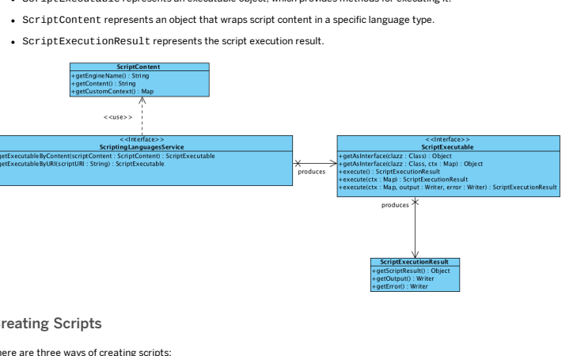
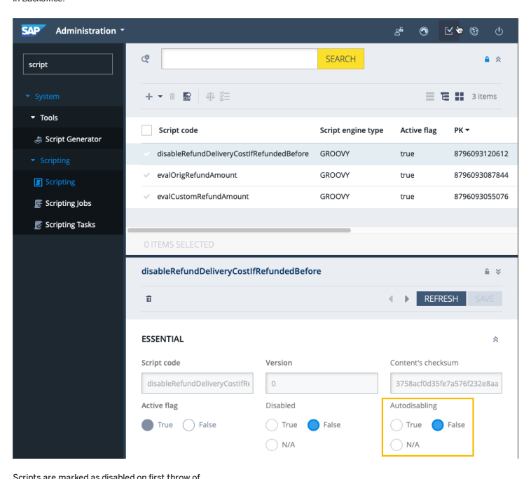
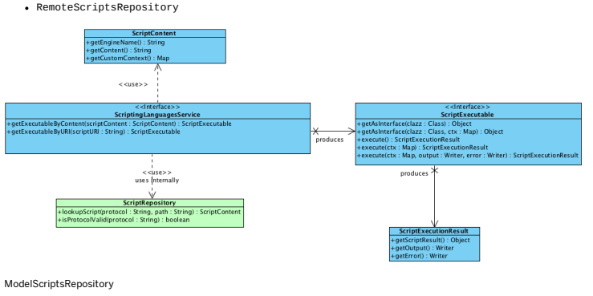

# Scripting Engine

Scripting Engine support allows you to execute logic written in scripting languages in run time without restarting the SAP Commerce Server. The scripting engine thus saves time and makes it possible to improve existing logic like cron job, task engine, and other similar tools.

Scripts may be stored in various repositories like a database (based on the Script model), classpath, le system, or even in a remote repository (for example Gists at GitHub) or can be executed on the y as a snippet without being stored.

## What Can I Use Scripts For?

These are just some example applications of scripts:
Scripts as Event Listeners

Cronjob Scripting Task Scripting The SAP Commerce processengine ImpEx API

## Supported Languages

This is   For more    the SAP Help  2 Scripting Engine implementation in Platform is based on the JSR-223 standard. At the moment, three languages are supported out-of-the-box:
Groovy

BeanShell JavaScript
It is possible to add more languages from the JSR-223 support list, see Adding New Languages.

## Api Overview

From the user perspective, the API is very simple. It is based on four main interfaces:
ScriptingLanguagesService provides methods for obtaining a ScriptExecutable object.

ScriptExecutable represents an executable object, which provides methods for executing it.

programmatically using SAP Commerce Administration Console. For details, see Administration Console

using Backoffice. For details, see section Managing Script Versions in Backoffice.
Let's create a Groovy script, which searches for all Media types that have the mime attribute empty, and sets the value of this attribute based on their realFilename attribute.

import de.hybris.platform.servicelayer.search.FlexibleSearchQuery flexibleSearchService = spring.getBean "flexibleSearchService" mimeService = spring.getBean "mimeService" modelService = spring.getBean "modelService" def findMediasWithoutMime() {
query = new FlexibleSearchQuery("SELECT {PK} FROM {Media} WHERE {mime} IS NULL") flexibleSearchService.search(query).result This is   For more    the SAP Help  3
} findMediasWithoutMime().each {
it.mime = mimeService.getMimeFromFileExtension(it.realfilename) modelService.save it
}

Note how the interaction with the spring context is done. You can access any Spring bean from the SAP Commerce application context by referring to a special Spring global variable. This topic is covered later on in this document.

## Executing Scripts Tip

Scripts are run with the same rights that the current user has.

## Caution

Scripts are not secured in any way, so you can use any language-specic structures; hence, calling System.exit(-1) is possible.

Now that you have this code sample, let's execute it directly by using the ScriptingLanguagesService. To do that, prepare a special wrapper for the real script content.

## Executing Scripts From String - Simplescriptcontent

This implementation allows you to execute the script content directly as a String. Let's imagine that you have the previously mentioned script content in the String variable content:
final String content = ".... content of the script ..."; final String engineName = "groovy";
// Let's assume we have scriptingLanguagesService injected by Spring final ScriptContent scriptContent = new SimpleScriptContent(engineName, content); final ScriptExecutable executable = scriptingLanguagesService.getExecutableByContent(scriptContent) // now we can execute script final ScriptExecutionResult result = executable.execute(); // to obtain result of execution System.out.println(result.getScriptResult());

## Executing Scripts From Resources - Resourcescriptcontent

Writing scripts directly in the Java code and keeping them in variables is not the most convenient way to do it. It is much better to write them in your favorite editor with syntax highlighting. Script Engine allows you to execute scripts that are resource based, stored for instance on the classpath or directly in the le system.

## Executing Scripts From The File System

Assuming that our sample script is located on the disk, with the path
/Users/zeus/scripts/setMimesForMedias.groovy, you can execute it as follows:
import org.springframework.core.io.Resource; import org.springframework.core.io.FileSystemResource; This is   For more    the SAP Help  4 final Resource resource = new FileSystemResource("/Users/zeus/scripts/setMimesForMedias.groovy"); // Let's assume we have scriptingLanguagesService injected by the Spring final ScriptContent scriptContent = new ResourceScriptContent(resource); final ScriptExecutable executable = scriptingLanguagesService.getExecutableByContent(scriptContent) // now we can execute script final ScriptExecutionResult result = executable.execute(); // to obtain result of execution System.out.println(result.getScriptResult());

## Executing Scripts By Using Classpath

Or, if you have the same script but in the classpath in the folder scripts:
import org.springframework.core.io.Resource; import org.springframework.core.io.ClassPathResource; final Resource resource = new ClassPathResource("scripts/setMimesForMedias.groovy"); // Let's assume we have scriptingLanguagesService injected by the Spring final ScriptContent scriptContent = new ResourceScriptContent(resource); final ScriptExecutable executable = scriptingLanguagesService.getExecutableByContent(scriptContent) // now we can execute script final ScriptExecutionResult result = executable.execute(); // to obtain result of execution System.out.println(result.getScriptResult());

## Executing Scripts Stored Remotely

You can also store the script content remotely, for instance as a gist at github.com under the URL
https://gist.githubusercontent.com/zeus/testMimesForMedias.groovy. In this way, it is easy to get hold of and execute:
import org.springframework.core.io.Resource; import org.springframework.core.io.UrlResource; final Resource resource = new UrlResource("https://gist.githubusercontent.com/zeus/setMimesForMedia // Let's assume we have scriptingLanguagesService injected by the Spring final ScriptContent scriptContent = new ResourceScriptContent(resource); final ScriptExecutable executable = scriptingLanguagesService.getExecutableByContent(scriptContent) // now we can execute script final ScriptExecutionResult result = executable.execute(); // to obtain result of execution System.out.println(result.getScriptResult());

Keep in mind that ResourceScriptContent determines the script engine name by the proper le extension, thus all scripts stored in les must have valid extensions for the language in which they are written.

## Handling Exceptions

The scripting engine implementation uses only unchecked exceptions. This is a list of all exceptions that you can encounter:

Exception Description

| 7/4/2024 Exception                                                       | Description                                                                                                                   |
|--------------------------------------------------------------------------|-------------------------------------------------------------------------------------------------------------------------------|
| de.hybris.platform.scripting.engine.exception.ScriptingException         | Main exception class for all scripting engine related exceptions                                                              |
| de.hybris.platform.scripting.engine.exception.ScriptExecutionException   | Exception thrown when the execution of a script has failed (for instance, a script contains errors in the body of the script) |
| de.hybris.platform.scripting.engine.exception.ScriptCompilationException | Exception thrown when the compilation of a script has failed.                                                                 |
| de.hybris.platform.scripting.engine.exception.ScriptNotFoundException    | Exception thrown when a persisted script cannot be found in the repository.                                                   |
| de.hybris.platform.scripting.engine.exception.ScriptURIException         | Exception thrown when the Script URI contains an error.                                                                       |
| de.hybris.platform.scripting.engine.exception.DisabledScriptException    | Exception thrown when a given ScriptExecutable is disabled due to previous errors.                                            |

## Logging

To turn on logging for the scripting engine, set the logging level to debug by using the property log4j.logger.de.hybris.platform.scripting.engine=DEBUG.

## Scripts Backed By Models - Modelscriptcontent

SAP Commerce also comes with the model-based ScriptContent that is backed by the Script type. This special type is a container for storing scripts in the database. Let's now create a Script instance that keeps the media maintenance script:
import de.hybris.platform.scripting.enums.ScriptType; // Let's assume we have modelService injected by the Spring final ScriptModel script = modelService.create(ScriptModel.class); script.setScriptType(ScriptType.GROOVY); script.setContent(".... content of the script ..."); // code must be unique script.setCode("setMimesForMedias"); modelService.save(script); // now having our model we can wrap it using ModelScriptContent final ScriptContent scriptContent = new ModelScriptContent(script); final ScriptExecutable executable = scriptingLanguagesService.getExecutableByContent(scriptContent) // now we can execute script final ScriptExecutionResult result = executable.execute(); // to obtain result of execution System.out.println(result.getScriptResult());

## Autodisabling Of Model-Based Scripts

Model-based scripts can be autodisabled. This comes in handy if a script throws an execution exception. In that case, the status of an autodisabling script changes to disabled. Otherwise, a faulty script would endlessly throw execution exceptions.

ScriptModel has two boolean properties: autodisabling and disabled. Both are by default set to false. To enable the auto-disabling feature, set ScriptModel\#autodisabling item property to true. You can to set Autodisabling to true This is   For more    the SAP Help  6 in Backoffice.

de.hybris.platform.scripting.engine.exception.ScriptExecutionException . Each next call to ScriptExecutable\#execute on a script which was already marked as disabled throws a de.hybris.platform.scripting.engine.exception.DisabledScriptException If you want to re-enable the script for execution, go to Backoffice, find the script and change the disabled flag to false.

Getting Script Executables by scriptURI Playing with the ScriptContent interface for something persisted and whose exact address you know is not very handy. You always need to create a proper ScriptContent object. It is better to use the address of the script and get hold of the executable directly. Hence the concept of Script Repositories. A script repository allows you to look for a script in a particular storage - it may be a database, a local disk, or some remote storage. SAP Commerce comes with four implementations that are used internally by the ScriptingLanguagesService to resolve script addresses transparently. These are called scriptURIs and prepare appropriate ScriptContent objects behind the scenes to return a ScriptExecutable to the user.

- ModelScriptsRepository
- ClasspathScriptsRepository FileSystemScriptsRepository

This repository looks for scripts in the database. It supports the following type of scriptURI:
model://uniqueCodeOfScript To get hold of a script using this repository, the user needs to use the ScriptingLanguagesService as follows:
final ScriptExecutable executable = scriptingLanguagesService.getExecutableByURI("model://setMimesF // now we can execute script final ScriptExecutionResult result = executable.execute(); // to obtain result of execution System.out.println(result.getScriptResult());

## Classpathscriptsrepository

This repository looks for scripts in the database. It supports the following type of scriptURI
classpath://path/to/uniqueCodeOfScript.groovy To get hold of a script using this repository, the user needs to use ScriptingLanguagesService as follows:
final ScriptExecutable executable = scriptingLanguagesService.getExecutableByURI("classpath://scrip // now we can execute script final ScriptExecutionResult result = executable.execute(); // to obtain result of execution System.out.println(result.getScriptResult());

Keep in mind that scripts in this repository must contain a valid le extension according to the language they are written in.

## Filesystemscriptsrepository

This repository looks for scripts in the database. It supports the following type of scriptURI
file:///absolute/path/to/uniqueCodeOfScript.groovy file://c:/absolute/path/to/uniqueCodeOfScript.groovy To get hold of a script using this repository, use the ScriptingLanguagesService as follows:
final ScriptExecutable executable = scriptingLanguagesService.getExecutableByURI("file:///Users/zeu // now we can execute script final ScriptExecutionResult result = executable.execute(); // to obtain result of execution System.out.println(result.getScriptResult());

Scripts in this repository must contain a valid le extension according to the language in which they are written.

## Remotescriptsrepository

This repository looks for scripts in the database. It supports the following type of scriptURI
http:///server.com/path/to/uniqueCodeOfScript.groovy https:///server.com/path/to/uniqueCodeOfScript.groovy ftp:///server.com/path/to/uniqueCodeOfScript.groovy To get hold of a script using this repository, use the ScriptingLanguagesService as follows:
final ScriptExecutable executable = scriptingLanguagesService.getExecutableByURI("http:///server.co // now we can execute script final ScriptExecutionResult result = executable.execute(); // to obtain result of execution System.out.println(result.getScriptResult());

Scripts in this repository must contain a valid le extension according to the language in which they are written.

## Executing A Script Using Arguments - Scriptexecutable And Scriptexecutionresult

So far you have seen a simple usage of ScriptExecutable that shows how to execute a script without any arguments. Let's now look at a more advanced scenario, where you want to x all mime types in medias whose realFilename has a specic extension:
import de.hybris.platform.servicelayer.search.FlexibleSearchQuery flexibleSearchService = spring.getBean "flexibleSearchService" mimeService = spring.getBean "mimeService" modelService = spring.getBean "modelService" // the query finds all medias for which mime type is null and whose realfile nasme has a specific p def findMediasWithoutMime() {
query = new FlexibleSearchQuery("SELECT {PK} FROM {Media} WHERE {mime} IS NULL AND {realfil This is   For more    the SAP Help  9 query.addQueryParameter("realfilename", realfilename); flexibleSearchService.search(query).result
} findMediasWithoutMime().each {
it.mime = mimeService.getMimeFromFileExtension(it.realfilename) modelService.save it
}
Now you can execute the script as follows (let's suppose the script is on the classpath) for all medias with a lename with the extension xml:
final ScriptExecutable executable = scriptingLanguagesService.getExecutableByURI("classpath://scrip final Map<String, Object> params = new HashMap<>(); // here we pass arguments into the hashmap. params.put("realfilename", "%.xml"); // now we can execute script final ScriptExecutionResult result = executable.execute(params); // to obtain result of execution System.out.println(result.getScriptResult());
The example above is written in Groovy. This means that the last line of the script always affects the result. If it returns something, you get a script result Object. If it does not, the call to the ScriptExecutionResult\#getScriptResult()
returns null. A script may also yield some output. Let's modify the script a little bit to print at the end the number of xed mime types in Medias:
import de.hybris.platform.servicelayer.search.FlexibleSearchQuery flexibleSearchService = spring.getBean "flexibleSearchService" mimeService = spring.getBean "mimeService" modelService = spring.getBean "modelService" def findMediasWithoutMime() {
query = new FlexibleSearchQuery("SELECT {PK} FROM {Media} WHERE {mime} IS NULL AND {realfil query.addQueryParameter("realfilename", realfilename); flexibleSearchService.search(query).result
} def mediaHit = 0 findMediasWithoutMime().each {
it.mime = mimeService.getMimeFromFileExtension(it.realfilename) modelService.save it mediaHit++
} println "Num of fixed mimetypes for Medias - ${mediaHit}"
Now the last line executes the println function, which means that it does not return anything but prints something to the standard output. Now you can read the message.

final ScriptExecutable executable = scriptingLanguagesService.getExecutableByURI("classpath://scrip final Map<String, Object> params = new HashMap<>(); params.put("realfilename", "%.xml"); // now we can execute script final ScriptExecutionResult result = executable.execute(params); // to obtain result of execution System.out.println(result.getOutputWriter());// The message is: Num of fixed mimetypes for Medias -

Note that ScriptExecutionResult contains two methods for getting output and error writers - getOutputWriter()
and getErrorWriter(). When calling methods on ScriptExecutable both, by default, return standard This is   For more    the SAP Help  10 StringWriter objects. If you want to pass your own Writer implementation, you may call the method ScriptExecutable\#execute(Map<String, Object> context, Writer outputWriter, Writer errorWriter)

## Using Returned Objects As Interfaces

It is also possible to get an object of a class from a script and call methods on it directly in the Java code. Let's rewrite our Medias-related script to something more object oriented:
class GroovyMimeFixer implements MimeFixer {
final static FIND_ALL_QUERY = "SELECT {PK} FROM {Media} WHERE {mime} IS NOT NULL" final static FIND_FOR_EXT_QUERY = FIND_ALL_QUERY + " AND {realfilename} LIKE ?realfilename" def flexibleSearchService def mimeService def modelService def int fixAllMimes() {
def query = new FlexibleSearchQuery(FIND_ALL_QUERY) def counter = 0 flexibleSearchService.search(query).result.each {
it.mime = mimeService.getMimeFromFileExtension(it.realfilename) modelService.save it counter++
} counter
} def int fixMimesForExtension(String extension) {
def query = new FlexibleSearchQuery(FIND_FOR_EXT_QUERY) query.addQueryParameter("realfilename", "%.${extension}"); def counter = 0 flexibleSearchService.search(FIND_FOR_EXT_QUERY).result.each {
it.mime = mimeService.getMimeFromFileExtension(it.realfilename) modelService.save it counter++
} counter
}
} flexibleSearchService = spring.getBean "flexibleSearchService" mimeService = spring.getBean "mimeService" modelService = spring.getBean "modelService" new GroovyMimeFixer(flexibleSearchService: flexibleSearchService, mimeService: mimeService, modelSe

Note that an instance of the class is returned in the last line of the script.

The script above denes a new Groovy class GroovyMimeFixer that implements the Java interface MimeFixer, which you have in the code base and which looks as follows:
public interface MimeFixer {
/** * Fix all empty mimes. * * @return num of fixed mimes */ int fixAllMimes(); /** * Fix mimes for particular file extension. * * @param extension This is   For more    the SAP Help  11

 * @return num of fixed mimes */ int fixMimesForExtension(String extension);
}
Now you can execute this script a bit differently to obtain the object returned by the script:
final ScriptExecutable executable = scriptingLanguagesService.getExecutableByURI("classpath://scrip final MimeFixer mimeFixer = executable.getAsInterface(MimeFixer.class); mimeFixer.fixMimesForExtension("xml"); mimeFixer.fixAllMimes();

## Accessing Spring Beans In Groovy

In all of the examples, the Spring application context was referred to using the global variable spring. This variable is available only at the top level of the script, thus you need to pass it into the classes and other structures that have a limited scope. You can also access spring beans directly by their bean names but remember that top level script scope also applies here. So the following example works:
import de.hybris.platform.scripting.model.ScriptModel modelService.create(ScriptModel.class)
But this one does not:
import de.hybris.platform.scripting.model.ScriptModel class ScriptModelCreator {
def create() {
modelService.create(ScriptModel.class)
}
} new ScriptModelCreator().create()
You must pass ModelService into the ScriptModelCreator class:
import de.hybris.platform.scripting.model.ScriptModel class ScriptModelCreator {
def modelService def create() {
modelService.create(ScriptModel.class)
}
} new ScriptModelCreator(modelService: modelService).create()

## Accessing Beans In Javascript

Javascript is much less strict, so you can access Spring beans directly:
FlexibleSearchQuery = Packages.de.hybris.platform.servicelayer.search.FlexibleSearchQuery; var query = FlexibleSearchQuery("SELECT {PK} FROM {Media} WHERE {mime} IS NULL") var found = flexibleSearchService.search(query).getResult() for each (var media in found.toArray()) {
This is   For more    the SAP Help  12 Note how the import of Java FlexibleSearchQuery class is done - via a special Packages object.

## Adding New Languages

Adding a new language is simple, but you need to know which libraries are required in the classpath. Here you'll see how to add Ruby. JRuby implementation has built-in JSR-223 support.

First, you need to dene library dependencies in appropriate external-dependencies.xml le:
<project xmlns="http://maven.apache.org/POM/4.0.0" xmlns:xsi="http://www.w3.org/2001/XMLSchema-inst xsi:schemaLocation="http://maven.apache.org/POM/4.0.0 http://maven.apache.org/xsd/maven-4. <modelVersion>4.0.0</modelVersion> <groupId>de.hybris.platform</groupId> <artifactId>scripting</artifactId> <version>5.0.0.0-SNAPSHOT</version> <packaging>jar</packaging> <dependencies> <dependency> <groupId>org.jruby</groupId> <artifactId>jruby-complete</artifactId> <version>1.7.11</version> </dependency>
</dependencies>
</project>
Next, declare bean of type de.hybris.platform.scripting.engine.internal.ScriptEngineType in the Spring context as follows:
<beans xmlns="http://www.springframework.org/schema/beans" xmlns:xsi="http://www.w3.org/2001/XMLSchema-instance" xmlns:context="http://www.springframework.org/schema/context" xmlns:c="http://www.springframework.org/schema/c" xsi:schemaLocation="http://www.springframework.org/schema/beans http://www.springframework.org/schema/beans/spring-beans.xsd http://www.springframework.org/schema/context http://www.springframework.org/schema/cont
<bean id="jrubyEngine" class="de.hybris.platform.scripting.engine.internal.impl.DefaultScri c:name="ruby" c:fileExtension="rb" c:mime="text/x-ruby" /> </beans>

Note the c namespace in Spring le denition ( http://www.springframework.org/schema/c) - this is a handy shortcut for passing constructor arguments to the bean.

This bean generally represents a new type of the scripting engine and keeps its name, le extension, and mime.

Finally, add a new value to the existing ScriptType enumtype in the SAP Commerce type system. This one is required by the Script type mentioned above - if you need to store your scripts into a database. The value is the name of the scripting engine.

<items xmlns:xsi="http://www.w3.org/2001/XMLSchema-instance" xsi:noNamespaceSchemaLocation="items.xsd"> <enumtypes> <enumtype code="ScriptType"> <value code="GROOVY"/> <value code="BEANSHELL"/> <value code="JAVASCRIPT"/>
This is   For more    the SAP Help  13 That's it - your new language is ready to use.

## Caution

Methods of interface ScriptExecutable are not synchronised, so the underlying ScriptEngine must provide thread-safety. Before adding a new script language, test that the new language behaves as expected in a multithread environment.

## Script Versioning Related Information

<!-- new value comes here -->
 <value code="RUBY"/> </enumtype> </enumtypes> </items>
1) Let's create a simple print script with the code testScript in the Scripting Language Console in SAP Commerce Administration Console.

println "Groovy Rocks" Save the script. 2) Now modify this script such that it prints:
println "Groovy Wows" Save the modied script. 3) Modify the script again:
println "Groovy Amazes" 4) Now go to the Browse tab. You can see only one instance of the testScript in the directory tree.

However, if you query the database using the following query, you will see three versions of the testScript.

select * from scripts where p_code = 'testScript' order by p_version; You can call revision 1 of this script in the following manner:
final ScriptExecutable executable = scriptingLanguagesService.getExecutablebyURI("model://testScrip final ScriptExecutionResult result = executable.execute();
If you do not specify any revision number, the latest version will be used.

Managing Script Versions in Backoffice You can create, edit, and search for your scripts in Backoffice.

Searching for existing scripts only shows the latest script version. To see all versions, change the Active flag attribute to False.

This is   For more    the SAP Help  14 Scripts as Event Listeners Cronjob Scripting The SAP Commerce processengine Task Scripting scripting Extension

## Cronjob Scripting

SAP Commerce includes a built-in scripting API for using dynamic typed languages in the Platform at runtime. An example of its usage is for cronjob scripting.

## Benets Of Using Dynamic Scripting To Create Cronjobs

Traditionally, creating a new cronjob was time-consuming and entailed many manual steps, for example, you had to create a new java class, take care of spring bean denition, rebuild the Platform, restart the server, and so on, and so forth. Using dynamic scripting, creating cronjobs becomes much easier and, most importantly, it can be done dynamically at runtime.

## How It Works

Let's look at some basic concepts:
Script - the item type where the script content is stored (a separate deployment table)

ScriptingJob - a new ServicelayerJob item, which contains additionally the scriptURI (consequently, the stored script can be found at runtime from different locations (classpath, db, etc..)
ScriptingJobPerformable - the spring bean assigned to every ScriptingJob instance; it implements the usual perform() method (like for any other cronjob). This is where the "scripted" cronjob logic is executed
You can execute the cronjob by java API (CronjobService.perfom(Cronjob)) or by dening a trigger. The execution is delegated to the ScriptingJobPerfomable.

## Related Information

Scripting Engine The Cronjob Service

## Using Scripts Stored In Database

See the example to learn how to use a script stored in the database.

## Dene A Script

The scripting language used in this example is Groovy. Use the impex import console to import a script that will print out the 'hello world' text with the current date.

INSERT_UPDATE Script; code[unique=true];content ;myGroovyScript;println 'hello groovy! '+ new Date()
This stores your script in the database.

## Dene A Scriptingjob

Use the impex import console to import the following:
INSERT_UPDATE ScriptingJob; code[unique=true];scriptURI ;mydynamicJob;model://myGroovyScript This stores your ScriptingJob (aptly named mydynamicJob) in the database. Regarding the scriptURI, if you want to point to a script stored in database, you can use the convention: model://myscriptreference

## Dene A Cronjob

Use the impex import console to import the following:
INSERT_UPDATE CronJob; code[unique=true];job(code);singleExecutable;sessionLanguage(isocode) ;mydynamicCronJob;mydynamicJob;true;en This stores the new cronjob holding the reference to our previously dened job.

## Execute The Cronjob

Go to the scripting languages console in SAP Commerce Administration Console, make sure that you have the groovy language selected, enable the mode, andcommit try the following:
def dynamicCJ = cronJobService.getCronJob("mydynamicCronJob") cronJobService.performCronJob(dynamicCJ,true)
This executes your cronjob - just look at the console logs, where you should see the result - "hello groovy!", followed by the current date.

## Optional Step - Use A Trigger

Use the impex import console to import the following:
INSERT_UPDATE Trigger;cronjob(code)[unique=true];cronExpression ;mydynamicCronJob; 0 * 16 * * ?

This executes the cronjob every minute between 16:00 and 17:00. Examine the logs to verify.

## Cronjob Scripts Advanced Features

See some advanced features of cronjob scripts. The previous example showed a simple one-line script that only printed out a message. However, it is possible to do much more, for example, you can inuence the result, pass information to logs, and access the cronjob that is being executed.

## Returning Cronjob Results Note

Returning a script result is optional.

This is   For more    the SAP Help  16 ScriptingJobPerformable handles returning the PerformResult(), holding the status of the cronjob, which is the nal result of the cronjob perform logic.

For example, returning a String 'My script is almost nished', will only print the message out, but the nal PerformResult is set "outside".

The following example shows how to inuence the PerformResult.

import de.hybris.platform.servicelayer.cronjob.PerformResult import de.hybris.platform.cronjob.enums.CronJobStatus import de.hybris.platform.cronjob.enums.CronJobResult println 'hello groovy! '+ new Date() new PerformResult(CronJobResult.UNKNOWN, CronJobStatus.PAUSED)
This sets the Cronjob status to Paused. Of course, it is possible to set any kind of PerformResult, for example depending on some conditions set earlier.

## Cronjob Item As Context Parameter

It is possible to access the currently executed cronjob (as a CronJobModel instance). It is passed as a context parameter (
key="cronjob").

println 'hello groovy! '+ new Date() println cronjob.code println cronjob.status //etc...

## Logging Inside Cronjob Scripts

The cronjob API offers many logging possibilities, including storing logs in the database.

Proper logger is available inside scripts as context parameter (key="log"). You can add your own logs:
println 'hello groovy! '+ new Date()
log.info('my custom info log') log.warn('my custom warn log') log.error('my custom error log') //etc...

Use the logtodatabase property to create a cronjob that will use a specic log level.

Logs outside the script (ScriptingJobPerformable), will also be considered in such case. Might be useful, if, for example, the script lookup fails. In this case, the script internal logs will not be visible, but the error log with ScriptNotFoundException will be stored.

## Scripts As Event Listeners

SAP Commerce provides a scripting API for dynamic typed languages such as groovy or any JSR-223 compliant script engine. One of the advantages offered by this API is the ability to create script-based event listeners.

## Benets Of Using Scripts To Create Event Listeners

Using the traditional SAP Commerce event system, the user is forced to rebuild the system and restart the server, because it is necessary to extend the the AbstractEventListener class or, in some cases, to set up a Spring bean. For more information, see Event System. Using dynamic scripting it is all done at runtime.

## How It Works

The Script item contains the script content. ScriptingEventService is a dedicated event service that allows registering and unregistering the dynamic event listeners by scriptURI at runtime. The scriptURI points to the stored script in a given location such as the classpath or database. Finally, the ScriptListenerWrapper wraps the dynamic listener, which is necessary to always get the same listener instance for a given ScriptURI.

## Registering And Unregistering Listeners

To store the script with the custom event listener as content, use the existing scripting languages console or Backoffice. Bear in mind, though, that they are not registered dynamically - you need to do it yourself. To register the event listener, use the scriptingEventService . Based on a given ScriptURI, this service can nd the script and return a proper listener instance to be registered.

Registering is not persistent. If you decide to restart the server at some point, dynamic scripts are not registered. However, the script items with the content are kept in the database. The user is responsible for registering scripting listeners again, if necessary.

## Example

The following example uses a Groovy script that is stored in the database. Neither a server restart nor a Platform rebuild is necessary in any of the steps.

## Prepare Your Script Content (Eventlistener)

Use the scripting languages console in SAP Commerce Administration Console to execute the following:
import de.hybris.platform.servicelayer.event.impl.AbstractEventListener import de.hybris.platform.servicelayer.event.events.AbstractEvent import de.hybris.platform.scripting.events.TestScriptingEvent class MyScriptingEventListener extends AbstractEventListener<AbstractEvent>{ @Override void onEvent(AbstractEvent event) { if(event instanceof TestScriptingEvent){ println 'hello groovy! '+ new Date(); } else{ println 'another event published ' println event } } } new MyScriptingEventListener();
Run the script to make sure that there are no syntax errors. If the script is ne, Groovy shows the ScriptingEventListener instance in the Result tab. This test script reacts to every event published in the system and prints out relevant logs. The ScriptingEvent is just a test event.

This is   For more    the SAP Help  18

## Store Your Script

Stay in the the scripting languages console and do not remove the previous content. Enter myEventListenerScript in the code input eld and click Save. The script item gets persisted with the given code and content.

## Register Your Listener

To register your listener, use the ScriptingEventService in the scripting languages console, as follows:
scriptingEventService.registerScriptingEventListener('model://myEventListenerScript')
The system returns true in the Result tab, which means that your listener is registered successfully. You can do an additional check by retrieving the list of the currently registered listeners:
eventService.eventListeners //or getting more readable output: //eventService.eventListeners.each{ println it}
Your listener is triggered by already-existing events. Examine the logs to verify that this is happening.

## Create And Publish Your Custom Event

Assuming that there is a custom ScriptingEvent class, create an instance of that class and publish it.

import de.hybris.platform.scripting.events.TestScriptingEvent event = new TestScriptingEvent('myEvent') eventService.publishEvent(event);
This publishes your event and this way the scripted event listener also reacts to your custom event. As a result, you should see hello groovy!, followed by the current date printed in the logs.

## Unregister Your Listener

scriptingEventService.unregisterScriptingEventListener('model://myEventListenerScript')
The listener is unregistered and stops reacting to the published events. You can verify it by publishing the previous event again.

## Optionally Use Typed Events

Thanks to java generics, it is also possible to allow the listener to listen to only one type of events. The script can look like the following:
import de.hybris.platform.servicelayer.event.impl.AbstractEventListener import de.hybris.platform.servicelayer.event.events.AbstractEvent import de.hybris.platform.scripting.events.TestScriptingEvent class MyScriptingEventListener extends AbstractEventListener<TestScriptingEvent>{ @Override void onEvent(TestScriptingEvent event) { println 'hello groovy! '+ new Date(); } } new MyScriptingEventListener();

This way you can easily simplify the code by avoiding the instanceof checks, because the listener will only react to a specic type of event. Registering and publishing events works the same as in the previous steps.

## Related Information

Scripting Engine Event System

## Task Scripting

You can use the SAP Commerce scripting API to easily and quickly create dynamic tasks based on scripts.

## Benets Of Using Dynamic Scripting To Create Tasks

Using the conventional approach, implementing the taskRunner interface and setting up the runner bean forces you to rebuild the Platform and restart the server, see The Task Service. With dynamic scripting, there is no need to rebuild the Platform or restart the server, because we do not need to add and compile an implementation of the taskRunner. Using the new, all-in-runtime approach, you can go to the scripting console, create and store a script that is an implementation of the taskRunner, and execute the script; all this is done without ever having to rebuild the Platform.

## How It Works

Script is the item type where the script content is stored. On the database level, it is a separate deployment table.

ScriptingTask is the new Task item, which additionally contains the scriptURI. Consequently, the stored script can be found at runtime from various locations (for example from classpath, database). ScriptingTaskRunner is the spring bean assigned to every ScriptingTask instance. It implements the run() and handleError() method, like for any other task.

That is the place where the "scripted" task logic is executed.

All you need to do is create your own taskRunner in any supported dynamic typed language. The ScriptingTaskRunner then takes care of nding the script and delegating the execution to the taskRunner specic methods that the user needs to implement, that is run() and handleError() methods.

## Tip

You can execute a task via java API using taskService.

Creating and Storing Scripts as Tasks in the Database In this example, we use the Scripting console (see Administration Console) to create a Groovy script that is an implementation of taskRunner. Then we execute it. Finally, we show how to handle errors in scripts.

## Prepare Script Content (Taskrunner)

Use the scripting languages console to execute the following:
import de.hybris.platform.task.TaskRunner; import de.hybris.platform.task.TaskService; import de.hybris.platform.task.TaskModel; class MyScriptRunner implements TaskRunner<TaskModel>{ @Override This is   For more    the SAP Help  20 void run(TaskService taskService, TaskModel task) { 
println 'hello groovy! '+ new Date();
} @Override void handleError(TaskService taskService, TaskModel task, Throwable error) {
println 'my groovy has errros! '+ new Date();
} } new MyScriptRunner();
This is the script content that is stored in the next step. Now execute the script to validate that there are no syntax errors. If the script is ne, groovy shows the Runner instance in the Result tab.

## Store Your Script

Stay in the scripting languages console (don't remove the previous content), enter 'myGroovyScript' in code input eld and click save. The script item should be persisted with given code and content.

## Create And Execute Your Task

Stay in the the scripting languages console and remove the previous content (your script is already stored). Make sure you are executing the following in the commit mode:
import de.hybris.platform.task.model.ScriptingTaskModel; import de.hybris.platform.task.TaskService; task = modelService.create(ScriptingTaskModel.class); task.scriptURI='model://myGroovyScript' taskService.scheduleTask(task)
This runs your task; as a result you should see the 'hello groovy!' text followed by the current date printed out in the logs.

The task is not persisted before scheduling by the taskService. It is enough to prepare it (via modelService.create()) and then the task engine handles the whole process - persisting the task, executing it, and removing from database. There were no errors during the execution of this task, so only the run() method was processed.

Otherwise - it would be redirected to the handleError() method.

## Try With Error Handling (Optional)

Prepare your script such that it throws an Exception in the run() method import de.hybris.platform.task.TaskRunner; import de.hybris.platform.task.TaskService; import de.hybris.platform.task.TaskModel; class MyScriptRunner implements TaskRunner<TaskModel>{ @Override void run(TaskService taskService, TaskModel task) { 
println 'hello groovy! '+ new Date(); throw new NullPointerException("Error")
} @Override void handleError(TaskService taskService, TaskModel task, Throwable error)
This is   For more    the SAP Help  21
{
println 'my groovy has errors! '+ new Date();
} } new MyScriptRunner();
Save the script with a new name, for example as MyErrorGroovyScript. Finally, execute it, pointing to the error script
'model://myGroovyScript' Examine the logs. A NullPointerException should be thrown and nally 'my groovy has errors!' followed by the current date should be printed out. This is because the logic has been redirected to the handleError() method

## Related Information

Scripting Engine Administration Console
